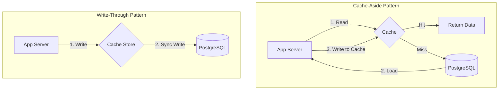
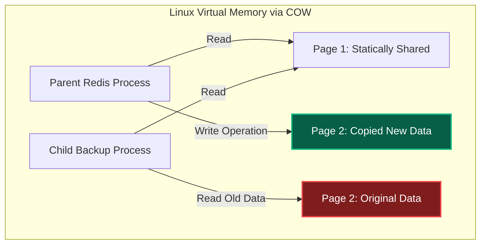
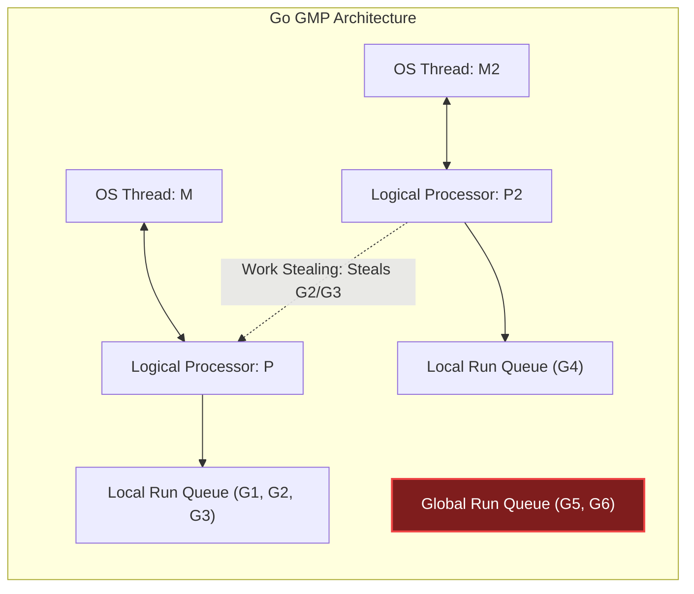
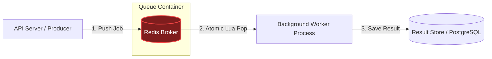
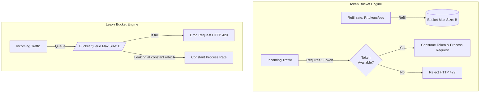

# 🚀 Backend Concurrency, Caching & Performance Masterclass

আধুনিক হাই-স্কেল ব্যাকএন্ড আর্কিটেকচার ডিজাইন করার সময় সিস্টেমের কনকারেন্সি মডেল, ডাটা ক্যাশিং এবং I/O হ্যান্ডলিং অপ্টিমাইজেশন সবচেয়ে বড় চ্যালেঞ্জ হয়ে দাঁড়ায়। সিঙ্গেল-সার্ভারে লাখ লাখ রিকোয়েস্ট হ্যান্ডেল করা থেকে শুরু করে ডিস্ট্রিবিউটেড টাস্ক শিডিউলিং, ক্যাশ ইনভ্যালিডেশন ও সিস্টেম থ্রোটলিং (Traffic Protection)-এর পেছনে অপারেটিং সিস্টেম, মেমরি এবং ডিস্ট্রিবিউটেড ডাটাবেজের সমন্বিত ইন্টারনালস কাজ করে।

এই গাইডে আমরা ব্যাকএন্ড সিস্টেমের ৫টি প্রধান স্তম্ভ—**Distributed Caching & Redis**, **High-Concurrency Models**, **Resilient Background Workers**, **Traffic Shaping/Rate Limiting**, এবং **Staff Architect Design Patterns**—নিয়ে অত্যন্ত গভীর টেকনিক্যাল আলোচনা করব।

---

## 📌 চ্যাপ্টার ইনডেক্স ও নেভিগেশন (Table of Contents)

নিচে চ্যাপ্টারের মূল ৫টি স্তম্ভ এবং তাদের অধীনস্থ লার্নিং মডিউলগুলোর একটি নেভিগেশন ম্যাপ দেওয়া হলো। যেকোনো মূল স্তম্ভে সরাসরি চলে যেতে লিঙ্কে ক্লিক করুন:

| মূল চ্যাপ্টার ও প্রযুক্তিগত স্তম্ভ | কভার্ড অ্যাডভান্সড কনসেপ্টস | অ্যাকশন লিংক |
| :--- | :--- | :--- |
| **১. Distributed Caching & Redis Internals** | Cache invalidation, Cache-Aside/Write-Through, Cache Stampede, Redis event loop, Linux Fork & COW persistence, Sentinel, and Consistent Hashing Cluster. | [**চ্যাপ্টার ১-এ যান**](#distributed-caching-redis-internals) |
| **২. High-Concurrency & Asynchronous I/O** | OS threads, context switching overhead, Libuv Event Loop, epoll/kqueue, Go GMP scheduler internals, and Java Virtual Threads. | [**চ্যাপ্টার ২-এ যান**](#highconcurrency-asynchronous-io-models) |
| **৩. Background Workers & Task Queues** | Queue architectures, Redis structures (ZSET, Hash, List), atomic Lua scripting, exponential backoff, DLQ, and TS custom worker code. | [**চ্যাপ্টার ৩-এ যান**](#background-workers-task-queue-internals) |
| **४. Rate Limiting & Traffic Shaping** | Token Bucket vs Leaky Bucket, Sliding Window Counter, Distributed rate limits with Redis Lua, and standard HTTP API Gateway headers. | [**চ্যাপ্টার ৪-এ যান**](#rate-limiting-traffic-shaping) |
| **৫. স্টাফ আর্কিটেক্ট সামারি গাইডলাইন** | Production design decisions, CPU-bound vs I/O-bound optimizations, queue fault tolerance, and custom outgoing traffic shaping advice. | [**সামারিতে যান**](#-) |

---

## ⚡ ১. Distributed Caching & Redis Internals

ডিস্ট্রিবিউটেড ক্যাশিং ব্যাকএন্ড ডাটাবেজের রিড-লেটেন্সি মিলিটিক্যাল রেঞ্জ থেকে মাইক্রো-সেকেন্ড রেঞ্জে নিয়ে আসে। তবে ভুল আর্কিটেকচারাল প্যাটার্ন পুরো সিস্টেমকে ডাউন করতে পারে।

### ১.১ Cache Topologies & Strategy Selection

ডাটা ক্যাশিং ও আপডেট করার ৪টি মূল প্রোডাকশন ডিজাইন প্যাটার্ন:



#### ১. Cache-Aside (Lazy Loading)
অ্যাপ্লিকেশন প্রথমে ক্যাশ চেক করে। ক্যাশে ডেটা থাকলে (Cache Hit) তা রিটার্ন করে। ক্যাশে না থাকলে (Cache Miss) ডাটাবেজ থেকে রিড করে ক্যাশ আপডেট করে দেয়।
*   **Race Condition Risk:** থ্রেড A ডাটাবেজে আপডেট করল কিন্তু ক্যাশ ডিলেট করার ঠিক আগে থ্রেড B স্টেল (Stale) ডেটা রিড করে ক্যাশে আবার লিখে দিতে পারে। এটি এড়াতে সাধারণত ক্যাশের শর্ট TTL রাখা হয়।

#### ২. Read-Through / Write-Through
অ্যাপ্লিকেশন সরাসরি ক্যাশের সাথে কথা বলে। ক্যাশ ইন্টারনালি ডাটাবেজের সাথে সিঙ্ক করে রিড বা রাইট অপারেশন সম্পন্ন করে। এটি অ্যাপ্লিকেশনের কোড আর্কিটেকচার অত্যন্ত ক্লিন রাখে কিন্তু লেটেন্সি কিছুটা বাড়ায়।

#### ৩. Write-Behind (Write-Back)
অ্যাপ্লিকেশন অত্যন্ত দ্রুত ক্যাশে রাইট করে রেসপন্স রিটার্ন করে দেয়। ক্যাশ ব্যাকগ্রাউন্ডে অ্যাসিনক্রোনাস উপায়ে ব্যাচাকারে ডাটাবেজে রাইট রিকোয়েস্ট পুশ করে।
*   **Caution:** রাইট স্পিড আকাশচুম্বী হলেও ক্যাশ নোড ক্র্যাশ করলে ডাটা চিরতরে হারিয়ে যাওয়ার ঝুঁকি থাকে।

#### 🌋 Cache Stampede (Thundering Herd) & Mutex-locking
যখন কোনো অত্যন্ত পপুলার কি (যেমন: ট্রেন্ডিং নিউজ) ক্যাশ থেকে এক্সপায়ার হয়ে যায়, তখন একসাথে হাজার হাজার সমবর্তী রিকোয়েস্ট ডাটাবেজে রিড প্রসেস করতে আঘাত হানে। এর ফলে ডাটাবেজ ক্র্যাশ করে। একে **Cache Stampede** বলে।

এর সমাধান হলো **Mutex Locking** বা **Probabilistic Early Expiration (XFetch Algorithm)**। নিচে Mutex লকিং মেকানিজম দেখানো হলো:

```typescript
async function getWithMutex(key: string): Promise<string> {
  let value = await cache.get(key);
  if (!value) {
    // Acquire distributed lock to prevent thundering herd
    const lock = await acquireLock(key + ':lock', 5000); // 5 sec TTL
    if (lock) {
      try {
        // Query database
        value = await db.query("SELECT data FROM table WHERE id = ?", [key]);
        await cache.set(key, value, 3600); // Cache for 1 hour
      } finally {
        await releaseLock(key + ':lock');
      }
    } else {
      // Wait and retry querying cache
      await new Promise(resolve => setTimeout(resolve, 100));
      return getWithMutex(key);
    }
  }
  return value;
}
```

---

### ১.২ Redis Single-Threaded Core & High-Performance Event Loop

রেডিস একটি সিঙ্গেল-থ্রেডেড প্রসেস হয়েও প্রতি সেকেন্ডে লাখ লাখ কমান্ড প্রসেস করতে পারে। এর কারণ ৩টি:
1.  **Memory-Centric Access:** মেমরি এক্সেস টাইম ওএস থ্রেড কনটেক্সট সুইচিং থেকে অনেক দ্রুত।
2.  **Epoll non-blocking socket loops:** এটি নেটওয়ার্ক ব্লকিং ছাড়া একটি লুপে হাজার হাজার ক্লায়েন্ট কানেকশন রিড-রাইট করে।
3.  **No Mutex Overhead:** কোড সিঙ্গেল থ্রেডেড হওয়ায় ডাটা স্ট্রাকচারের ওপর কোনো লক বা মিউটেক্স ম্যানেজমেন্টের সিপিইউ ওভারহেড থাকে না।

#### 📦 Simple Dynamic Strings (SDS) Internals
রেডিস সি-ল্যাঙ্গুয়েজের ট্র্যাডিশনাল `char*` স্ট্রিং ব্যবহার করে না। এর বদলে ব্যবহার করে কাস্টম **SDS Struct**:

```c
struct sdshdr {
    int len;     // O(1) strlen retrieval-এর জন্য স্ট্রিংয়ের দৈর্ঘ্য
    int free;    // বাফার ওভারফ্লো ঠেকাতে ফাঁকা মেমরির সাইজ
    char buf[];  // বাইনারি-সেফ ক্যারেক্টার এরে
};
```
এটি রানটাইমে ওয়ান-ক্লিক মেমরি রি-অ্যালোকেশন অপ্টিমাইজ করতে এবং বাইনারি সেফটি (স্ট্রিংয়ের মাঝে `\0` নাল ক্যারেক্টার থাকলেও রিড করা) নিশ্চিত করতে সাহায্য করে।

#### 🔄 Redis Incremental Rehashing
রেডিসের হ্যাশ টেবিল যখন বড় হয়, তখন সিঙ্গেল-থ্রেডকে ব্লক হওয়া থেকে বাঁচাতে রেডিস **Incremental Rehashing** বা ধাপে ধাপে রিকম্পিউট ব্যবহার করে:
*   রেডিস দুটি ডিকশনারি টেবিল রাখে: `ht[0]` (পুরানো) এবং `ht[1]` (নতুন)।
*   প্রতিটি কমান্ড রিড/রাইট চলার সাথে সাথে রেডিস `ht[0]` থেকে কয়েকটি করে কি (Keys) `ht[1]`-এ মুভ করে। সম্পূর্ণ ডাটাবেজ একবারে রিহ্যাস না করায় সিস্টেম কোনো সময় হ্যাং হয় না।

---

### ১.৩ Linux Fork, Copy-On-Write, and Persistence (RDB/AOF)

রেডিস রানিং ডাটা মেমরিতে রাখলেও স্টোরেজ ব্যাকআপ নিশ্চিত করতে ২টি মেকানিজম ব্যবহার করে।

#### 💾 RDB (Redis Database Backup) via Linux Fork
RDB তৈরির সময় রেডিস লিনাক্স কার্নেলের **`fork()`** সিস্টেম কলটি করে। কার্নেল তখন রেডিসের প্যারেন্ট প্রসেস ক্লোন করে একটি **Child Process** তৈরি করে।
*   **Copy-On-Write (COW):** ক্লোন করার সময় কার্নেল মেমরির কোনো ফিজিক্যাল কপি করে না। প্যারেন্ট ও চাইল্ড প্রসেস একই মেমরি পেজগুলো রিড করে।
*   যখন প্যারেন্ট প্রসেস কোনো নতুন রাইট রিকোয়েস্ট পায়, কার্নেল কেবল পরিবর্তিত মেমরি পেজটির (সাধারণত 4KB) একটি ফিজিক্যাল কপি তৈরি করে। চাইল্ড প্রসেসটি কোনো ডিস্টার্বেন্স ছাড়াই সম্পূর্ণ আইসোলেটেড পুরানো ডাটার স্ন্যাপশট ডিস্কে সেভ করতে পারে।



#### 📝 AOF (Append-Only File)
প্রতিটি রাইট কমান্ড ফাইল এন্ডে অ্যাপেন্ড করা হয়। 
*   **fsync() Strategies:** `fsync` সিস্টেম কল দিয়ে ওএস ডিস্ক বাফারের ডাটা ফিজিক্যালি রাইট করা হয়। অপশনগুলো হলো:
    1.  `always`: প্রতি কমান্ডে fsync (অত্যন্ত স্লো)।
    2.  `everysec`: প্রতি সেকেন্ডে fsync (প্রোডাকশন স্ট্যান্ডার্ড, সর্বোচ্চ ১ সেকেন্ডের ডাটা লস রিস্ক)।
    3.  `no`: ওএস বাফারের ওপর ছেড়ে দেওয়া (লেটেন্সি নেই কিন্তু ডাটা লস রিস্ক বেশি)।

---

### ১.৪ High Availability & Distributed Redis (Sentinel & Cluster)

#### 💂‍♂️ Redis Sentinel (Master-Slave Failover)
Sentinel নোডগুলো রেডিসের মাস্টার ও স্লেভগুলোর ওপর ওয়ান-টু-মেনি পিং (Ping) মনিটর করে। যদি মাস্টার নোড ক্র্যাশ করে, তবে সেন্টিনেল নোডগুলো নিজেদের মধ্যে **Raft-like Consensus Voting** সম্পন্ন করে যোগ্য স্লেভকে মাস্টার নোড হিসেবে প্রোমোট করে এবং নতুন আইপি ক্লায়েন্ট গেটওয়েতে আপডেট করে।

#### 🔀 Redis Cluster (Consistent Hashing)
রেডিস ক্লাস্টার আর্কিটেকচারে কোনো একক সেন্টিনেল নোড থাকে না। এটি **Consistent Hashing** ব্যবহার করে ডাটা শার্ডিং (Sharding) করে।
*   সম্পূর্ণ ক্লাস্টারে **১৬,৩৮৪টি হ্যাশ স্লট (Hash Slots)** রয়েছে।
*   প্রতিটি কি-র হ্যাশ স্লট নির্ধারণ করার সূত্র:
    $$\text{Slot} = \text{CRC16}(key) \pmod{16384}$$
*   নোডগুলো নিজেদের মধ্যে গসিপ প্রোটোকল (Gossip Protocol) দিয়ে মেম্বারশিপ এবং স্লট ডিস্ট্রিবিউশন ম্যাপ শেয়ার করে। যদি কোনো ক্লায়েন্ট ভুল নোডে রিকোয়েস্ট পাঠায়, নোডটি ক্লায়েন্টকে **`-MOVED <slot> <ip>:<port>`** দিয়ে রিডাইরেক্ট করে দেয়।

---

## 🧩 ২. High-Concurrency & Asynchronous I/O Models

কনকারেন্সি মডেলের গভীরে যাওয়ার আগে আমাদের বুঝতে হবে অপারেটিং সিস্টেম কীভাবে সিপিইউ এবং মেমরি লেভেলে কাজের সমন্বয় করে।

### ২.১ OS-Level Concurrency Foundations: Process, Thread, and Coroutine

কনকারেন্সির তিনটি মূল চালিকাশক্তির ফিজিক্যাল মেমরি এবং প্রসেসিং ওভারহেড কস্টের তুলনামূলক চিত্র নিচে দেওয়া হলো:

| প্রোপার্টি | Process (প্রসেস) | Thread (OS থ্রেড) | Coroutine / Green Thread |
| :--- | :--- | :--- | :--- |
| **মেমরি স্পেস** | সম্পূর্ণ আইসোলেটেড (Isolated Virtual Memory) | শেয়ার্ড ভার্চুয়াল মেমরি (Shared Address Space) | শেয়ার্ড মেমরি (Managed by Runtime) |
| **কোর স্ট্যাক সাইজ** | সাধারণত ১ বা ২ মেগাবাইট | সাধারণত ১ মেগাবাইট (Fixed) | অত্যন্ত ছোট (Go-তে ২ কিলোবাইট থেকে শুরু, dynamic) |
| **শিডিউলার** | OS Kernel Scheduler | OS Kernel Scheduler | Runtime/VM Scheduler (User-space) |
| **Context Switch Cost** | অত্যন্ত হাই (Page table swap, TLB flush) | মিডিয়াম-হাই (Register swap, Cache pollution) | অত্যন্ত কম (User-space state swap, <১০ns) |

#### ⚠️ OS Context Switching Overhead
যখন একটি OS Thread ব্লক হয় (যেমন ডটনেট বা জাভার ট্র্যাডিশনাল Thread-per-request মডেলে), তখন কার্নেলকে অন্য একটি থ্রেড রান করার জন্য বর্তমান থ্রেডের রেজিস্টার স্টেট, CPU Program Counter এবং স্ট্যাক পয়েন্টার সেভ করতে হয়। এই প্রক্রিয়াকে Context Switch বলে। 

এর ফলে **CPU L1/L2 Cache Pollution** ঘটে এবং **Translation Lookaside Buffer (TLB) Invalidated** হয়ে যায়, যা আধুনিক হাই-থ্রুপুট সিস্টেমের পারফরম্যান্স মারাত্মকভাবে কমিয়ে দেয়।

---

### ২.২ The Event Loop & Non-Blocking I/O (Node.js/Libuv)

কার্নেল থ্রেডের কনটেক্সট সুইচিং এড়াতে ইভেন্ট-ড্রিভেন এবং নন-ব্লকিং I/O আর্কিটেকচার তৈরি করা হয়েছে। এর মূলে রয়েছে **OS-Level I/O Multiplexing**।

#### 🔄 Select vs Poll vs Epoll
পুরাতন সিস্টেমে হাজার হাজার ফাইল ডেসক্রিপ্টরের (File Descriptors - FD) স্ট্যাটাস চেক করতে `select` বা `poll` সিস্টেম কল ব্যবহার করা হতো, যা প্রতিবার $O(N)$ লিনিয়ার টাইম কমপ্লেক্সিটিতে পুরো এরে স্ক্যান করত। 
আধুনিক লিনাক্স কার্নেল **`epoll`** (এবং macOS **`kqueue`**) ব্যবহার করে। এটি একটি ইভেন্ট-রেজিস্ট্রেশন ভিত্তিক মেকানিজম, যা ওয়ান-টাইম রেজিস্ট্রেশনের পর কেবল সক্রিয় FD গুলোর জন্য $O(1)$ কনস্ট্যান্ট টাইমে নোটিফিকেশন পাঠায়।

#### ⚙️ Libuv Event Loop Architecture
Node.js-এর মূলে থাকা **Libuv** লাইব্রেরিটি ইভেন্ট লুপ পরিচালনা করে। নিচে ইভেন্ট লুপের কাজের ধাপগুলো ডায়াগ্রামের মাধ্যমে দেখানো হলো:


> [!IMPORTANT]
> **The Epoll Blocking Rule:** যখন ইভেন্ট লুপে কোনো পেন্ডিং কাজ থাকে না, তখন এটি **Poll Phase**-এ গিয়ে কার্নেল নোটিফিকেশনের জন্য ব্লক হয়ে অপেক্ষা করে। এই ব্লকিং টাইম অপারেটিং সিস্টেমকে আইডল রেখে এনার্জি ও সিপিইউ সাইকেল সেভ করতে সাহায্য করে।

---

### ২.৩ Go Concurrency Internals (The GMP Scheduler)

Go-তে ট্র্যাডিশনাল থ্রেড বাদ দিয়ে **Goroutines** ব্যবহার করা হয়, যা লিনাক্স কার্নেল নয়, বরং Go Runtime দ্বারা পরিচালিত হয়। একে শিডিউল করার জন্য **GMP Model** কাজ করে।

*   **G (Goroutine):** লাইটওয়েট গ্রিন থ্রেড। এটি কোড ব্লকের এক্সিকিউশন স্টেট ধারণ করে।
*   **M (Machine):** ফিজিক্যাল অপারেটিং সিস্টেম থ্রেড, যা কার্নেল দ্বারা চালিত হয়।
*   **P (Processor):** লজিক্যাল প্রসেসর/কনটেক্সট। এটিতে Goroutine রান করার জন্য প্রয়োজনীয় মেমরি রিসোর্স থাকে। সাধারণত `GOMAXPROCS` অনুযায়ী P-এর সংখ্যা নির্ধারিত হয়।



#### 🛡️ Work-Stealing Algorithm
when কোনো প্রসেসর `P` তার নিজের **Local Run Queue**-এর সমস্ত Goroutine এক্সিকিউট করে শেষ করে ফেলে, তখন সে অন্য কোনো `P`-এর লোকাল কিউ থেকে অর্ধেক Goroutine চুরি করে নিজের কাছে নিয়ে আসে। যদি অন্য কোথাও কাজ না থাকে, তবে সে **Global Run Queue** চেক করে।

#### 🛑 Blocking Syscall Handling
যখন কোনো Goroutine `G1` একটি ব্লকিং সিস্টেম কল (যেমন ফাইল রিড) করে, তখন Go runtime প্রসেসর `P` থেকে কার্নেল থ্রেড `M` কে ডিটাচ (Detach) করে দেয়। `M` কার্নেল স্পেসের ব্লকিং কল নিয়ে কাজ করতে থাকে এবং `P` অন্য একটি সচল বা নতুন `M2` থ্রেডের সাথে যুক্ত হয়ে বাকি Goroutine-গুলোর এক্সিকিউশন সচল রাখে।

---

### ২.৪ Java Virtual Threads (Project Loom)

জাভা ২১ থেকে যুক্ত হওয়া **Virtual Threads (Project Loom)** ব্যাকএন্ড কনকারেন্সিতে নতুন বিপ্লব এনেছে।

*   **Carrier Threads:** এগুলো আসলে স্ট্যান্ডার্ড ওএস কার্নেল থ্রেড।
*   **Continuation State:** যখন একটি ভার্চুয়াল থ্রেড কোনো ব্লকিং কল করে (যেমন `JDBC Query` বা `HttpClient.send`), তখন JVM তার সম্পূর্ণ কল-স্ট্যাক স্টেটটি (Continuation) ওএস থ্রেড থেকে মুক্ত করে **Heap Memory**-তে লিখে ফেলে। একে **Freezing** বলা হয়।
*   এরপর ক্যারিয়ার থ্রেডটি অন্য আরেকটি ভার্চুয়াল থ্রেড নিয়ে কাজ শুরু করতে পারে। I/O কাজ শেষ হলে হিফ মেমরি থেকে স্টেটটি পুনরায় রিলোড করে ওএস থ্রেডে বসানো হয় (Thawing)।

---

## ⚙️ ৩. Background Workers & Task Queue Internals

অন-ডিমান্ড রিকোয়েস্ট-রেসপন্স সাইকেলকে ফাস্ট রাখতে ভারী এবং সময়সাপেক্ষ কাজগুলোকে (যেমন ইমেইল পাঠানো, পিডিএফ জেনারেট করা) ব্যাকগ্রাউন্ড কিউ-তে পাঠিয়ে দেওয়া হয়।

### ৩.১ Distributed Queue Architecture

একটি নির্ভরযোগ্য ডিস্ট্রিবিউটেড কিউ আর্কিটেকচার সাধারণত নিচের ৩টি লেয়ারে বিভক্ত থাকে:



### ৩.২ Redis-based Queues: Data Structure Design (BullMQ Internals)

উচ্চ পারফরম্যান্সের ব্যাকগ্রাউন্ড কিউ ডিজাইনে Redis-এর ডাটা স্ট্রাকচারগুলো নিচের নিয়মে সাজানো হয়:

1.  **Pending Queue (Active List):** Redis `LIST` বা `STREAM` ব্যবহার করা হয়। নতুন জব আসলে `LPUSH` এবং প্রসেসিংয়ের জন্য `RPOPLPUSH` বা `BRPOPLPUSH` করা হয়।
2.  **Delayed Queue (ZSET):** যে জবগুলো নির্দিষ্ট সময় পর রান করবে, সেগুলো Redis **Sorted Set (ZSET)**-এ রাখা হয়। জবের এক্সিকিউশন টাইমস্ট্যাম্পকে `Score` হিসেবে ব্যবহার করা হয়।
3.  **Job Metadata (HASH):** জবের সম্পূর্ণ পে-লোড, কনফিগারেশন এবং প্রোগ্রেস ডেটা Redis `HASH`-এ স্টোর করা হয়।

#### 🔐 Redis Lua Scripting (Atomic Job Transitions)
মাল্টি-সার্ভার ডিস্ট্রিবিউটেড সেটআপে একাধিক কর্মী যাতে একই সময়ে একই কাজ তুলে না নেয়, তার জন্য **Atomic Lua Scripts** ব্যবহার করা হয়। কারণ, লুয়া স্ক্রিপ্ট এক্সিকিউট হওয়ার সময় Redis সম্পূর্ণ সিঙ্গেল-থ্রেডেড ব্লকিং মোডে চলে যায়, যা নিখুঁত আইসোলেশন নিশ্চিত করে।

নিচে একটি ডিস্ট্রিবিউটেড জবের ডিলে কিউ থেকে অ্যাক্টিভ কিউতে পারমাণবিক স্থানান্তর মেকানিজম দেখানো হলো:

```lua
-- KEYS[1]: Delayed Queue ZSET (e.g. 'jobs:delayed')
-- KEYS[2]: Active Queue LIST (e.g. 'jobs:active')
-- ARGV[1]: Current Timestamp
-- ARGV[2]: Max Jobs to move

local jobs = redis.call('zrangebyscore', KEYS[1], '-inf', ARGV[1], 'LIMIT', 0, ARGV[2])
if #jobs > 0 then
    for i, job in ipairs(jobs) do
        redis.call('zrem', KEYS[1], job)
        redis.call('rpush', KEYS[2], job)
    end
end
return jobs
```

---

### ৩.৩ Fault-Tolerance & Resilience Patterns

#### 🔁 Exponential Backoff with Jitter
যখন কোনো ব্যাকগ্রাউন্ড জব ফেইল করে (যেমন পেমেন্ট গেটওয়ে ডাউন থাকা), তখন সাথে সাথে পুনরায় রিট্রাই না করে একটি এক্সপোনেনশিয়াল সমীকরণ এবং র‍্যান্ডম ভ্যারিয়েশন (Jitter) যোগ করে রিট্রাই করতে হয়।

$$\text{Delay} = \text{Base} \times 2^{\text{attempt}} + \text{Random Jitter}$$

এটি নেটওয়ার্কের ওপর **Thundering Herd Problem** (একসাথে হাজার হাজার রিকোয়েস্ট আছড়ে পড়া) প্রতিরোধ করে।

#### 🛡️ Idempotency (একই কাজ বারবার না করা)
প্রতিটি জবের সাথে একটি ইউনিক `Idempotency-Key` (যেমন UUID) পাঠাতে হবে। ওয়ার্কার প্রসেসটি শুরু করার আগে ডাটাবেজে চেক করবে এই কি-টি অলরেডি সম্পন্ন হয়েছে কিনা। যদি হয়ে থাকে, তবে কাজ শুরু না করে সরাসরি পূর্বের সেভ করা রেজাল্ট রিটার্ন করে দেবে।

---

### 💻 হ্যান্ডস-অন ইমপ্লিমেন্টেশন: TypeScript + Redis Background Worker

নিচে প্রোডাকশন-রেডি একটি সম্পূর্ণ টাইপ-সেফ ব্যাকগ্রাউন্ড কিউ ওয়ার্কারের কোড দেওয়া হলো:

```typescript
import { createClient } from 'redis';

interface Job {
  id: string;
  name: string;
  data: Record<string, unknown>;
  retries: number;
}

export class TaskQueueWorker {
  private client;
  private queueName = 'tasks:active';
  private processingName = 'tasks:processing';
  private isRunning = false;

  constructor(redisUrl: string) {
    this.client = createClient({ url: redisUrl });
  }

  async connect() {
    await this.client.connect();
    console.log('🚀 Connected to Redis Queue Broker.');
  }

  // 1. Enqueue Job
  async addJob(job: Omit<Job, 'retries'>) {
    const fullJob: Job = { ...job, retries: 3 };
    await this.client.hSet(`job:${job.id}`, 'payload', JSON.stringify(fullJob));
    await this.client.lPush(this.queueName, job.id);
  }

  // 2. Reliable Worker Loop (using RPOPLPUSH for At-Least-Once Delivery)
  async startProcessing(processor: (job: Job) => Promise<void>) {
    this.isRunning = true;
    
    while (this.isRunning) {
      try {
        // Atomic transition from active queue to processing queue
        const jobId = await this.client.brPopLPush(this.queueName, this.processingName, 0);
        
        if (jobId) {
          const rawJob = await this.client.hGet(`job:${jobId}`, 'payload');
          if (rawJob) {
            const job: Job = JSON.parse(rawJob);
            
            try {
              console.log(`⏳ Processing Job ${job.id}: ${job.name}`);
              await processor(job);
              
              // Success: Remove job completely
              await this.client.lRem(this.processingName, 1, jobId);
              await this.client.del(`job:${jobId}`);
              console.log(`✅ Job ${job.id} completed successfully.`);
            } catch (err) {
              console.error(`❌ Job ${job.id} failed. Attempting recovery...`);
              await this.handleFailure(job, jobId);
            }
          }
        }
      } catch (error) {
        console.error('Error in worker queue loop:', error);
        await new Promise((res) => setTimeout(res, 2000)); // Cool-off period
      }
    }
  }

  // 3. Failover handling and retry logic
  private async handleFailure(job: Job, jobId: string) {
    if (job.retries > 0) {
      job.retries -= 1;
      await this.client.hSet(`job:${jobId}`, 'payload', JSON.stringify(job));
      // Re-enqueue job back to the main queue
      await this.client.lRem(this.processingName, 1, jobId);
      await this.client.lPush(this.queueName, jobId);
      console.warn(`🔄 Re-enqueued Job ${job.id}. Remaining retries: ${job.retries}`);
    } else {
      // Move to Dead Letter Queue (DLQ)
      await this.client.lRem(this.processingName, 1, jobId);
      await this.client.lPush('tasks:dlq', jobId);
      console.error(`💀 Job ${job.id} permanently failed. Moved to Dead Letter Queue.`);
    }
  }

  async stop() {
    this.isRunning = false;
    await this.client.quit();
  }
}
```

---

## 🚦 ৪. Rate Limiting & Traffic Shaping

রেট লিমিটিং কেবল রিকোয়েস্ট আটকানোর জন্য নয়, বরং ডিস্ট্রিবিউটেড সিস্টেমের ক্যাস্কেডিং ফেইলিউর (একটির পতনে পুরো সিস্টেম ডাউন হওয়া) ঠেকানোর সবচেয়ে শক্তিশালী আর্কিটেকচার।

### ৪.১ Rate Limiting Algorithms Deep-Dive

#### ১. Token Bucket Algorithm
*   **মেকানিজম:** একটি বালতি বা বাকেট কল্পনা করুন যার সর্বোচ্চ ধারণক্ষমতা $B$ এবং প্রতি সেকেন্ডে $R$ হারে নতুন টোকেন রিফিল হয়। প্রতি রিকোয়েস্ট আসার পর বাকেট থেকে একটি টোকেন বিয়োগ করা হয়। যদি বাকেটে টোকেন না থাকে, রিকোজেস্ট রিজেক্ট করা হয়।
*   **সুবিধা:** এটি খুব দক্ষতার সাথে ক্ষণস্থায়ী ব্রুস্ট ট্রাফিক (Bursty Traffic) হ্যান্ডেল করতে পারে এবং ওয়ান-টাইম প্রসেসিং অত্যন্ত ফাস্ট।

#### ২. Leaky Bucket Algorithm
*   **মেকানিজম:** বাকেটের নিচে একটি ছোট ছিদ্র থাকে, যা দিয়ে একটি নির্দিষ্ট এবং ধ্রুবক গতিতে (Smooth rate) রিকোয়েস্ট প্রসেস করার জন্য লিক হতে থাকে। যদি বাকেটের ক্যাপাসিটি ফুল হয়ে যায়, উপচে পড়া রিকোয়েস্ট ড্রপ করা হয়।
*   **সুবিধা:** এটি ট্রাফিককে একদম সমান ও স্মুথ করে সিস্টেম প্রসেসিং স্পেস স্ট্যাবল রাখে।



---

### ৪.২ Distributed Rate Limiting with Redis

ডিস্ট্রিবিউটেড আর্কিটেকচারে প্রতি সেকেন্ডে প্রতি আইপি থেকে রিকোয়েস্ট রেট নির্ধারণ করতে আমরা **Sliding Window Counter** অ্যালগরিদম ব্যবহার করি। মেমরির সর্বোচ্চ সাশ্রয় এবং রেস কন্ডিশন এড়ানোর জন্য এটি নিচে দেওয়া Lua Script দিয়ে পারমাণবিক ব্লকে এক্সিকিউট করা হয়:

```lua
-- KEYS[1]: Rate limit key (e.g. 'rate:192.168.1.1:endpoint')
-- ARGV[1]: Current timestamp (seconds)
-- ARGV[2]: Window size (seconds, e.g. 60)
-- ARGV[3]: Max requests allowed

local limit = tonumber(ARGV[3])
local clearBefore = ARGV[1] - ARGV[2]

-- Remove older timestamps outside the current window
redis.call('zremrangebyscore', KEYS[1], 0, clearBefore)

-- Count requests in this window
local currentRequests = redis.call('zcard', KEYS[1])

if currentRequests < limit then
    -- Add current request timestamp as score and value
    redis.call('zadd', KEYS[1], ARGV[1], ARGV[1])
    -- Set TTL to make sure key auto-expires
    redis.call('expire', KEYS[1], ARGV[2] * 2)
    return 1 -- Allowed
else
    return 0 -- Rejected (Rate Limit Exceeded)
end
```

> [!TIP]
> **The Multi-Region Clock Drift Solution:** ডিস্ট্রিবিউটেড সিস্টেমে বিভিন্ন অঞ্চলের অ্যাপ্লিকেশন সার্ভারগুলোর ঘড়ি সামান্য ভিন্ন হতে পারে (NTP Synced হলেও)। এই ক্ষেত্রে উইন্ডো হিসাব করার জন্য লোকাল সার্ভার থেকে টাইমস্ট্যাম্প না পাঠিয়ে Redis-এর নিজস্ব সময় ব্যবহারের জন্য স্ক্রিপ্টের শুরুতেই `redis.call('TIME')` ব্যবহার করা সবচেয়ে নিরাপদ।

---

### ৪.৩ HTTP API Gateway Integration Standards

একটি স্ট্যান্ডার্ড প্রোডাকশন গেটওয়েতে রেট লিমিট অতিক্রম করা রিকোয়েস্টগুলোর জন্য নিচের হেডারগুলো সহ **HTTP 429 Too Many Requests** স্ট্যাটাস রিটার্ন করা উচিত:

```http
HTTP/1.1 429 Too Many Requests
Content-Type: application/json
X-RateLimit-Limit: 100
X-RateLimit-Remaining: 0
Retry-After: 35

{
  "status": 429,
  "error": "Too Many Requests",
  "message": "API limits exceeded. Please wait 35 seconds."
}
```

*   `X-RateLimit-Limit`: নির্দিষ্ট সময়ে সর্বোচ্চ রিকোয়েস্ট লিমিট।
*   `X-RateLimit-Remaining`: বর্তমান উইন্ডোতে অবশিষ্ট রিকোয়েস্ট সংখ্যা।
*   `Retry-After`: কত সেকেন্ড পর ব্যবহারকারী পুনরায় রিকোয়েস্ট করতে পারবে।

---

## 💡 ৫. স্টাফ আর্কিটেক্ট সামারি গাইডলাইন

১.  **Caching Overheads:** সিস্টেমে ক্যাশিং বসানোর পূর্বে তার ফাটলগুলো চিন্তা করবেন। ক্যাশ মেমরির এক্সপায়ারড সময়ে যাতে ডাটাবেজ কলাপ্স না করে, তার জন্য অবশ্যই এপিআই স্তরে **XFetch** বা **Distributed Locks (Redlock)** ব্যবহার করবেন।
২.  **I/O Models:** যদি আপনার টাস্ক বেশি ডেটাবেজ ও I/O বাউন্ডেড হয়, তবে Node.js-এর মতো সিঙ্গেল-থ্রেডেড নন-ব্লকিং সিস্টেম বা Java Virtual Threads অত্যন্ত কার্যকরী। কিন্তু হাই-সিপিইউ ম্যাথমেটিক্যাল ক্যালকুলেশনের ক্ষেত্রে Go-এর GMP মডেল চালিত Goroutines সবচেয়ে বেশি নির্ভরযোগ্য।
৩.  **Background Queues:** প্রোডাকশনে ব্যাকগ্রাউন্ড কিউ ব্যবহারের সময় অবশ্যই `brPopLPush` (বা `RPOPLPUSH`) ব্যবহার করবেন। এটি একটি প্রসেসিং কিউ সংরক্ষণ করে, যার ফলে প্রসেস ক্র্যাশ করলেও কাজ হারিয়ে না গিয়ে পুনরুদ্ধার করা যায় (At-Least-Once Delivery)।
৪.  **Traffic Shaping:** আপনার সিস্টেমে যদি থার্ড-পার্টি এপিআই কল করার নির্দিষ্ট লিমিট থাকে, তবে সর্বদা **Leaky Bucket** ব্যবহার করুন যাতে আউটগোয়িং ট্রাফিক একদম সমান গতিতে ফ্লো হতে পারে। আর সিস্টেমের সুরক্ষায় ব্রুস্ট ট্রাফিক ঠেকাতে **Token Bucket** বা **Sliding Window Counter** ব্যবহার করুন।
