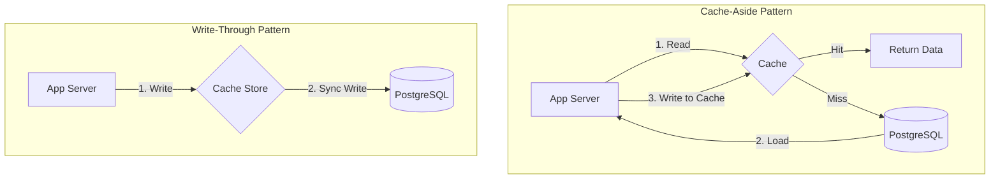
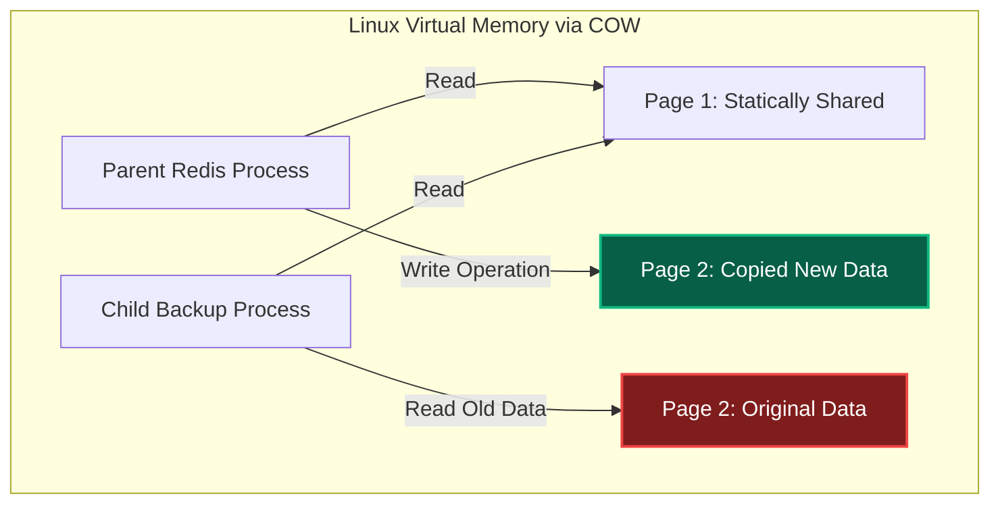
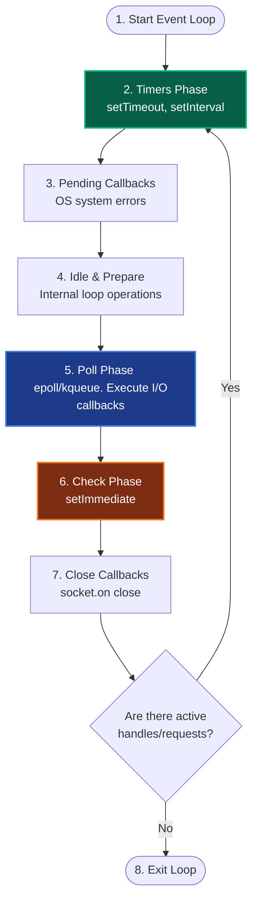
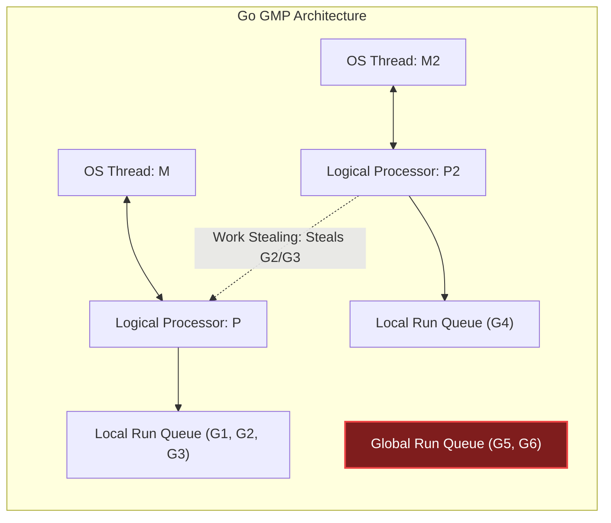
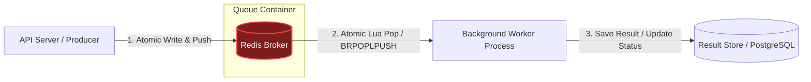
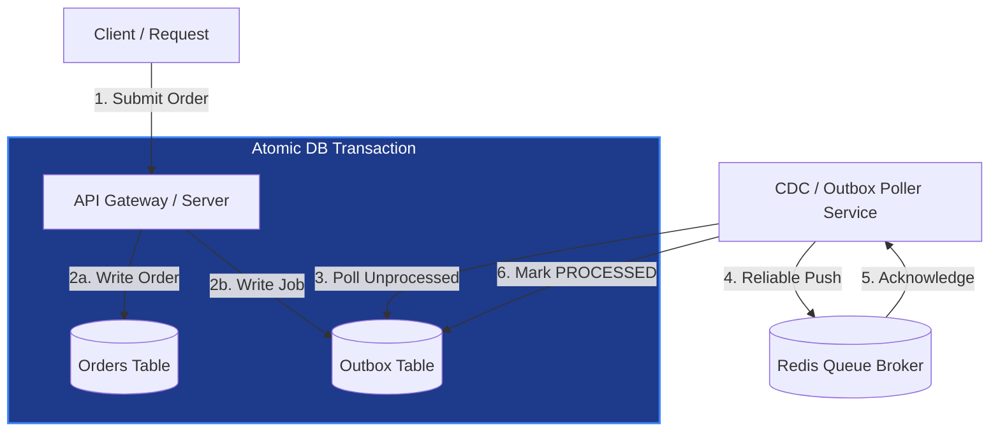
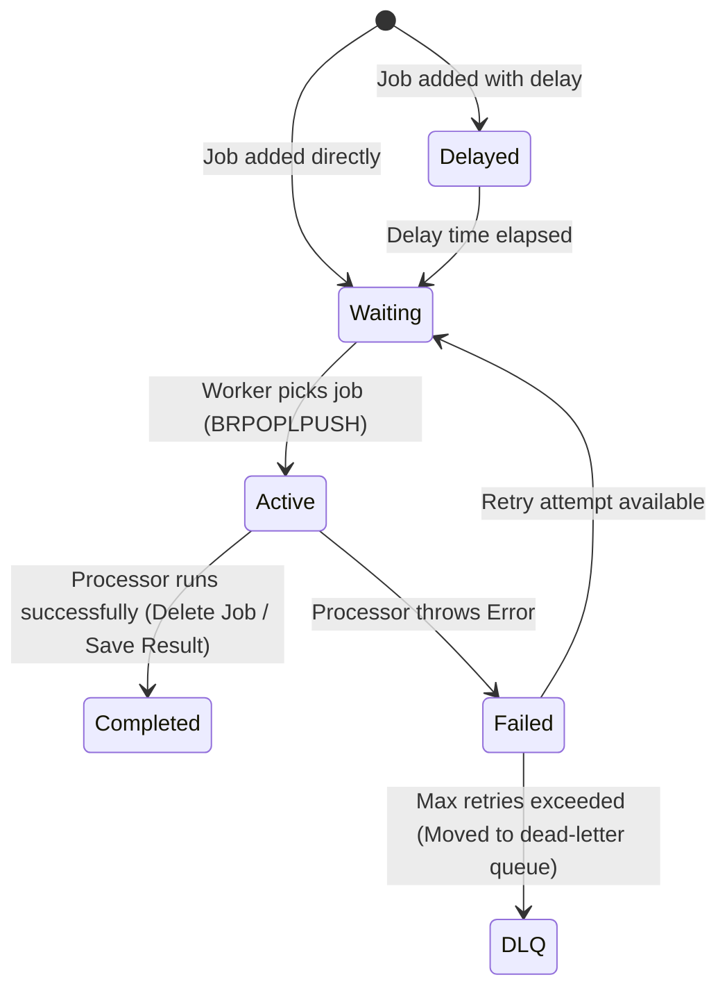
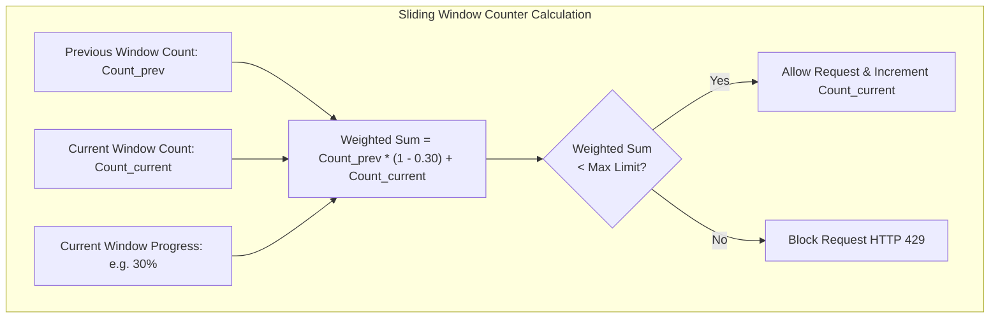
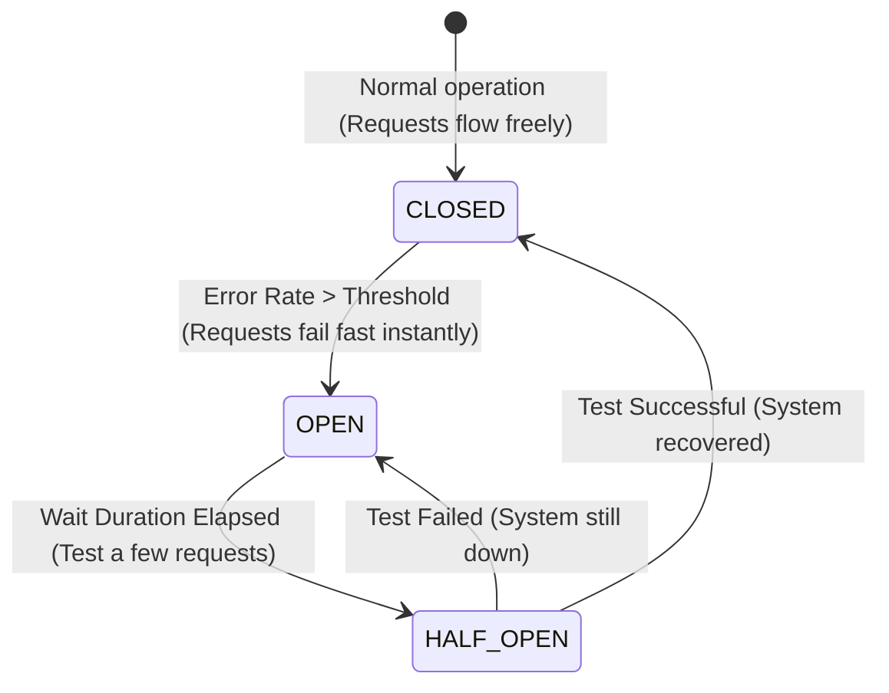
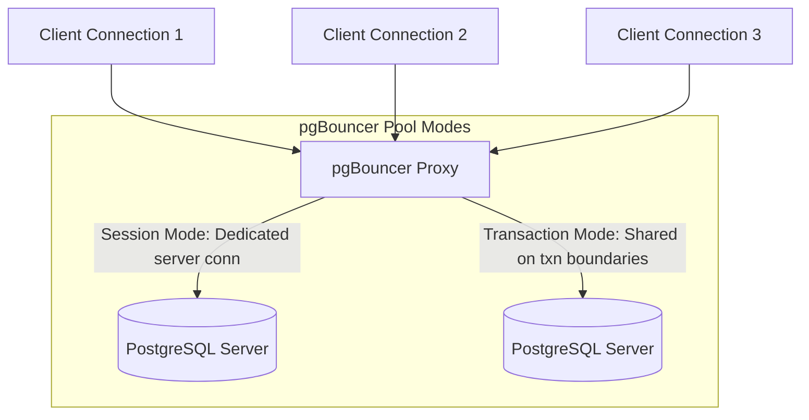

# 🚀 Backend Concurrency, Caching & Performance Masterclass

আধুনিক হাই-স্কেল ব্যাকএন্ড আর্কিটেকচার ডিজাইন করার সময় সিস্টেমের কনকারেন্সি মডেল, ডাটা ক্যাশিং এবং I/O হ্যান্ডলিং অপ্টিমাইজেশন সবচেয়ে বড় চ্যালেঞ্জ হয়ে দাঁড়ায়। সিঙ্গেল-সার্ভারে লাখ লাখ রিকোয়েস্ট হ্যান্ডেল করা থেকে শুরু করে ডিস্ট্রিবিউটেড টাস্ক শিডিউলিং, ক্যাশ ইনভ্যালিডেশন ও সিস্টেম থ্রোটলিং (Traffic Protection)-এর পেছনে অপারেটিং সিস্টেম, মেমরি এবং ডিস্ট্রিবিউটেড ডাটাবেজের সমন্বিত ইন্টারনালস কাজ করে।

এই গাইডে আমরা ব্যাকএন্ড সিস্টেমের ৫টি প্রধান স্তম্ভ—**Distributed Caching & Redis**, **High-Concurrency Models**, **Resilient Background Workers**, **Traffic Shaping/Rate Limiting**, এবং **Staff Architect Design Patterns**—নিয়ে অত্যন্ত গভীর টেকনিক্যাল আলোচনা করব।

---

## 📌 চ্যাপ্টার ইনডেক্স ও নেভিগেশন (Table of Contents)

নিচে চ্যাপ্টারের মূল ৫টি স্তম্ভ এবং তাদের অধীনস্থ লার্নিং মডিউলগুলোর একটি নেভিগেশন ম্যাপ দেওয়া হলো। যেকোনো মূল স্তম্ভে সরাসরি চলে যেতে লিঙ্কে ক্লিক করুন:

| মূল চ্যাপ্টার ও প্রযুক্তিগত স্তম্ভ | কভার্ড অ্যাডভান্সড কনসেপ্টস | অ্যাকশন লিংক |
| :--- | :--- | :--- |
| **১. Distributed Caching & Redis Internals** | Cache invalidation, Cache-Aside/Write-Through, Cache Stampede, Redis event loop, Linux Fork & COW persistence, Sentinel, and Consistent Hashing Cluster. | [**চ্যাপ্টার ১-এ যান**](#distributed-caching-redis-internals) |
| **২. High-Concurrency & Asynchronous I/O** | OS threads, context switching overhead, Libuv Event Loop, epoll/kqueue, Go GMP scheduler internals, and Java Virtual Threads. | [**চ্যাপ্টার ২-এ যান**](#highconcurrency-asynchronous-io-models) |
| **৩. Background Workers & Task Queues** | Queue architectures, Redis structures (ZSET, Hash, List), atomic Lua scripting, exponential backoff, DLQ, and TS custom worker code. | [**চ্যাপ্টার ৩-এ যান**](#background-workers-task-queue-internals) |
| **৪. Rate Limiting & Traffic Shaping** | Token Bucket vs Leaky Bucket, Sliding Window Counter, Redis Lua scripting, Gateway Standards, and Adaptive Concurrency Limiting (Netflix/Little's Law). | [**চ্যাপ্টার ৪-এ যান**](#rate-limiting-traffic-shaping) |
| **৫. স্টাফ আর্কিটেক্ট সামারি গাইডলাইন** | Decision Matrix, Circuit Breaker resilience, pgBouncer sizing & pool modes, PACELC, and Probabilistic Cache Early Expiration (XFetch). | [**সামারিতে যান**](#-) |

---

## ⚡ ১. Distributed Caching & Redis Internals

ডিস্ট্রিবিউটেড ক্যাশিং ব্যাকএন্ড ডাটাবেজের রিড-লেটেন্সি মিলিটিক্যাল রেঞ্জ থেকে মাইক্রো-সেকেন্ড রেঞ্জে নিয়ে আসে। তবে ভুল আর্কিটেকচারাল প্যাটার্ন পুরো সিস্টেমকে ডাউন করতে পারে।

### ১.১ Cache Topologies & Strategy Selection

ডাটা ক্যাশিং ও আপডেট করার ৪টি মূল প্রোডাকশন ডিজাইন প্যাটার্ন:



#### ১. Cache-Aside (Lazy Loading)
অ্যাপ্লিকেশন প্রথমে ক্যাশ চেক করে। ক্যাশে ডেটা থাকলে (Cache Hit) তা রিটার্ন করে। ক্যাশে না থাকলে (Cache Miss) ডাটাবেজ থেকে রিড করে ক্যাশ আপডেট করে দেয়।
*   **Race Condition Risk:** থ্রেড A ডাটাবেজে আপডেট করল কিন্তু ক্যাশ ডিলেট করার ঠিক আগে থ্রেড B স্টেল (Stale) ডেটা রিড করে ক্যাশে আবার লিখে দিতে পারে। এটি এড়াতে সাধারণত ক্যাশের শর্ট TTL রাখা হয়।

#### ২. Read-Through / Write-Through
অ্যাপ্লিকেশন সরাসরি ক্যাশের সাথে কথা বলে। ক্যাশ ইন্টারনালি ডাটাবেজের সাথে সিঙ্ক করে রিড বা রাইট অপারেশন সম্পন্ন করে। এটি অ্যাপ্লিকেশনের কোড আর্কিটেকচার অত্যন্ত ক্লিন রাখে কিন্তু লেটেন্সি কিছুটা বাড়ায়।

#### ৩. Write-Behind (Write-Back)
অ্যাপ্লিকেশন অত্যন্ত দ্রুত ক্যাশে রাইট করে রেসপন্স রিটার্ন করে দেয়। ক্যাশ ব্যাকগ্রাউন্ডে অ্যাসিনক্রোনাস উপায়ে ব্যাচাকারে ডাটাবেজে রাইট রিকোয়েস্ট পুশ করে।
*   **Caution:** রাইট স্পিড আকাশচুম্বী হলেও ক্যাশ নোড ক্র্যাশ করলে ডাটা চিরতরে হারিয়ে যাওয়ার ঝুঁকি থাকে।

#### 🌋 Cache Stampede (Thundering Herd) & Mutex-locking
যখন কোনো অত্যন্ত পপুলার কি (যেমন: ট্রেন্ডিং নিউজ) ক্যাশ থেকে এক্সপায়ার হয়ে যায়, তখন একসাথে হাজার হাজার সমবর্তী রিকোয়েস্ট ডাটাবেজে রিড প্রসেস করতে আঘাত হানে। এর ফলে ডাটাবেজ ক্র্যাশ করে। একে **Cache Stampede** বলে।

এর সমাধান হলো **Mutex Locking** বা **Probabilistic Early Expiration (XFetch Algorithm)**। নিচে Mutex লকিং মেকানিজম দেখানো হলো:

```typescript
async function getWithMutex(key: string): Promise<string> {
  let value = await cache.get(key);
  if (!value) {
    // Acquire distributed lock to prevent thundering herd
    const lock = await acquireLock(key + ':lock', 5000); // 5 sec TTL
    if (lock) {
      try {
        // Query database
        value = await db.query("SELECT data FROM table WHERE id = ?", [key]);
        await cache.set(key, value, 3600); // Cache for 1 hour
      } finally {
        await releaseLock(key + ':lock');
      }
    } else {
      // Wait and retry querying cache
      await new Promise(resolve => setTimeout(resolve, 100));
      return getWithMutex(key);
    }
  }
  return value;
}
```

---

### ১.২ Redis Single-Threaded Core & High-Performance Event Loop

রেডিস একটি সিঙ্গেল-থ্রেডেড প্রসেস হয়েও প্রতি সেকেন্ডে লাখ লাখ কমান্ড প্রসেস করতে পারে। এর কারণ ৩টি:
1.  **Memory-Centric Access:** মেমরি এক্সেস টাইম ওএস থ্রেড কনটেক্সট সুইচিং থেকে অনেক দ্রুত।
2.  **Epoll non-blocking socket loops:** এটি নেটওয়ার্ক ব্লকিং ছাড়া একটি লুপে হাজার হাজার ক্লায়েন্ট কানেকশন রিড-রাইট করে।
3.  **No Mutex Overhead:** কোড সিঙ্গেল থ্রেডেড হওয়ায় ডাটা স্ট্রাকচারের ওপর কোনো লক বা মিউটেক্স ম্যানেজমেন্টের সিপিইউ ওভারহেড থাকে না।

#### 📦 Simple Dynamic Strings (SDS) Internals
রেডিস সি-ল্যাঙ্গুয়েজের ট্র্যাডিশনাল `char*` স্ট্রিং ব্যবহার করে না। এর বদলে ব্যবহার করে কাস্টম **SDS Struct**:

```c
struct sdshdr {
    int len;     // O(1) strlen retrieval-এর জন্য স্ট্রিংয়ের দৈর্ঘ্য
    int free;    // বাফার ওভারফ্লো ঠেকাতে ফাঁকা মেমরির সাইজ
    char buf[];  // বাইনারি-সেফ ক্যারেক্টার এরে
};
```
এটি রানটাইমে ওয়ান-ক্লিক মেমরি রি-অ্যালোকেশন অপ্টিমাইজ করতে এবং বাইনারি সেফটি (স্ট্রিংয়ের মাঝে `\0` নাল ক্যারেক্টার থাকলেও রিড করা) নিশ্চিত করতে সাহায্য করে।

#### 🔄 Redis Incremental Rehashing
রেডিসের হ্যাশ টেবিল যখন বড় হয়, তখন সিঙ্গেল-থ্রেডকে ব্লক হওয়া থেকে বাঁচাতে রেডিস **Incremental Rehashing** বা ধাপে ধাপে রিকম্পিউট ব্যবহার করে:
*   রেডিস দুটি ডিকশনারি টেবিল রাখে: `ht[0]` (পুরানো) এবং `ht[1]` (নতুন)।
*   প্রতিটি কমান্ড রিড/রাইট চলার সাথে সাথে রেডিস `ht[0]` থেকে কয়েকটি করে কি (Keys) `ht[1]`-এ মুভ করে। সম্পূর্ণ ডাটাবেজ একবারে রিহ্যাস না করায় সিস্টেম কোনো সময় হ্যাং হয় না।

---

### ১.৩ Linux Fork, Copy-On-Write, and Persistence (RDB/AOF)

রেডিস রানিং ডাটা মেমরিতে রাখলেও স্টোরেজ ব্যাকআপ নিশ্চিত করতে ২টি মেকানিজম ব্যবহার করে।

#### 💾 RDB (Redis Database Backup) via Linux Fork
RDB তৈরির সময় রেডিস লিনাক্স কার্নেলের **`fork()`** সিস্টেম কলটি করে। কার্নেল তখন রেডিসের প্যারেন্ট প্রসেস ক্লোন করে একটি **Child Process** তৈরি করে।
*   **Copy-On-Write (COW):** ক্লোন করার সময় কার্নেল মেমরির কোনো ফিজিক্যাল কপি করে না। প্যারেন্ট ও চাইল্ড প্রসেস একই মেমরি পেজগুলো রিড করে।
*   যখন প্যারেন্ট প্রসেস কোনো নতুন রাইট রিকোয়েস্ট পায়, কার্নেল কেবল পরিবর্তিত মেমরি পেজটির (সাধারণত 4KB) একটি ফিজিক্যাল কপি তৈরি করে। চাইল্ড প্রসেসটি কোনো ডিস্টার্বেন্স ছাড়াই সম্পূর্ণ আইসোলেটেড পুরানো ডাটার স্ন্যাপশট ডিস্কে সেভ করতে পারে।



#### 📝 AOF (Append-Only File)
প্রতিটি রাইট কমান্ড ফাইল এন্ডে অ্যাপেন্ড করা হয়। 
*   **fsync() Strategies:** `fsync` সিস্টেম কল দিয়ে ওএস ডিস্ক বাফারের ডাটা ফিজিক্যালি রাইট করা হয়। অপশনগুলো হলো:
    1.  `always`: প্রতি কমান্ডে fsync (অত্যন্ত স্লো)।
    2.  `everysec`: প্রতি সেকেন্ডে fsync (প্রোডাকশন স্ট্যান্ডার্ড, সর্বোচ্চ ১ সেকেন্ডের ডাটা লস রিস্ক)।
    3.  `no`: ওএস বাফারের ওপর ছেড়ে দেওয়া (লেটেন্সি নেই কিন্তু ডাটা লস রিস্ক বেশি)।

---

### ১.৪ High Availability & Distributed Redis (Sentinel & Cluster)

#### 💂‍♂️ Redis Sentinel (Master-Slave Failover)
Sentinel নোডগুলো রেডিসের মাস্টার ও স্লেভগুলোর ওপর ওয়ান-টু-মেনি পিং (Ping) মনিটর করে। যদি মাস্টার নোড ক্র্যাশ করে, তবে সেন্টিনেল নোডগুলো নিজেদের মধ্যে **Raft-like Consensus Voting** সম্পন্ন করে যোগ্য স্লেভকে মাস্টার নোড হিসেবে প্রোমোট করে এবং নতুন আইপি ক্লায়েন্ট গেটওয়েতে আপডেট করে।

#### 🔀 Redis Cluster (Consistent Hashing)
রেডিস ক্লাস্টার আর্কিটেকচারে কোনো একক সেন্টিনেল নোড থাকে না। এটি **Consistent Hashing** ব্যবহার করে ডাটা শার্ডিং (Sharding) করে।
*   সম্পূর্ণ ক্লাস্টারে **১৬,৩৮৪টি হ্যাশ স্লট (Hash Slots)** রয়েছে।
*   প্রতিটি কি-র হ্যাশ স্লট নির্ধারণ করার সূত্র:
    ```text
    Slot = CRC16(key) % 16384
    ```
*   নোডগুলো নিজেদের মধ্যে গসিপ প্রোটোকল (Gossip Protocol) দিয়ে মেম্বারশিপ এবং স্লট ডিস্ট্রিবিউশন ম্যাপ শেয়ার করে। যদি কোনো ক্লায়েন্ট ভুল নোডে রিকোয়েস্ট পাঠায়, নোডটি ক্লায়েন্টকে **`-MOVED <slot> <ip>:<port>`** দিয়ে রিডাইরেক্ট করে দেয়।

---

## 🧩 ২. High-Concurrency & Asynchronous I/O Models

কনকারেন্সি মডেলের গভীরে যাওয়ার আগে আমাদের বুঝতে হবে অপারেটিং সিস্টেম কীভাবে সিপিইউ এবং মেমরি লেভেলে কাজের সমন্বয় করে এবং কার্নেল মেকানিজম কীভাবে কাজ করে।

### ২.১ OS-Level Concurrency Foundations: Process, Thread, and Coroutine

কনকারেন্সির তিনটি মূল চালিকাশক্তির ফিজিক্যাল মেমরি এবং প্রসেসিং ওভারহেড কস্টের তুলনামূলক চিত্র নিচে দেওয়া হলো:

| প্রোপার্টি | Process (প্রসেস) | Thread (OS থ্রেড) | Coroutine / Green Thread |
| :--- | :--- | :--- | :--- |
| **মেমরি স্পেস** | সম্পূর্ণ আইসোলেটেড (Isolated Virtual Memory) | শেয়ার্ড ভার্চুয়াল মেমরি (Shared Address Space) | শেয়ার্ড মেমরি (Managed by Runtime) |
| **কোর স্ট্যাক সাইজ** | সাধারণত ১ বা ২ মেগাবাইট | সাধারণত ১ মেগাবাইট (Fixed) | অত্যন্ত ছোট (Go-তে ২ কিলোবাইট থেকে শুরু, dynamic) |
| **শিডিউলার** | OS Kernel Scheduler | OS Kernel Scheduler | Runtime/VM Scheduler (User-space) |
| **Context Switch Cost** | অত্যন্ত হাই (Page table swap, TLB flush) | মিডিয়াম-হাই (Register swap, Cache pollution) | অত্যন্ত কম (User-space state swap, <১০ns) |

#### ⚙️ Linux Completely Fair Scheduler (CFS) & Thread Scheduling
লিনাক্স কার্নেল থ্রেড এবং প্রসেস শিডিউল করার জন্য **CFS (Completely Fair Scheduler)** ব্যবহার করে। CFS কোনো প্রথাগত ফিক্সড টাইম স্লাইস ব্যবহার করে না; এটি প্রতিটি থ্রেডের জন্য একটি ভার্চুয়াল রানটাইম (**vruntime**) ট্র্যাকিং করে।
*   সিপিইউ সবসময় সেই থ্রেডটিকে সিলেক্ট করে যার `vruntime` সবচেয়ে কম (এটি একটি **Red-Black Tree** ডাটা স্ট্রাকচারে সংরক্ষিত থাকে, যাতে মিন-নোড এক্সেস টাইম `O(log N)` হয়)।
*   **Processor Affinity (CPU Pinning):** কোনো মাল্টি-কোর প্রসেসরে একটি থ্রেড যখন এক কোর থেকে অন্য কোরে স্থানান্তরিত হয়, তখন তার CPU L1/L2 ক্যাশ সম্পূর্ণ নষ্ট হয়ে যায় (Cache Coldness)। এটি এড়াতে ও থ্রুপুট বাড়াতে থ্রেডকে নির্দিষ্ট কোরে লক করার প্রক্রিয়াকে **CPU Affinity/Pinning** বলা হয়।

#### ⚠️ OS Context Switching Register State (x86_64 CPU Internals)
একটি ওএস থ্রেডের কনটেক্সট সুইচের সময় কার্নেলকে প্রসেসরের হার্ডওয়্যার রেজিস্টার স্টেটগুলো সম্পূর্ণ রিলোড করতে হয়। x86_64 আর্কিটেকচারে কনটেক্সট সুইচের সময় নিচের রেজিস্টারগুলো কার্নেল স্ট্যাকে বা **Task State Segment (TSS)**-এ সেভ করা হয়:

```assembly
; context_switch assembly pseudo representation
push %rbp
push %rbx
push %r12
push %r13
push %r14
push %r15
movq %rsp, (prev_thread_rsp)  ; Save current Stack Pointer
movq (next_thread_rsp), %rsp  ; Load next Thread Stack Pointer
pop %r15
pop %r14
pop %r13
pop %r12
pop %rbx
pop %rbp
ret                           ; Jump to next thread's Program Counter (RIP)
```
এই রেজিস্টার ট্রান্সফারের পর কার্নেল পেজ ডিরেক্টরি রেজিস্টার (`CR3`) ফ্ল্যাশ করে ভার্চুয়াল মেমরি ম্যাপিং আপডেট করে, যা **TLB Invalidation** ঘটিয়ে মেমরি রিড লেটেন্সি বহুগুণে বাড়িয়ে দেয়।

---

### ২.২ The Event Loop & Non-Blocking I/O (Node.js/Libuv)

কার্নেল থ্রেডের কনটেক্সট সুইচিং এড়াতে ইভেন্ট-ড্রিভেন এবং নন-ব্লকিং I/O আর্কিটেকচার তৈরি করা হয়েছে। এর মূলে রয়েছে **OS-Level I/O Multiplexing**।

#### 🔄 Select vs Poll vs Epoll & epoll_event struct
পুরাতন সিস্টেমে `select` বা `poll` সিস্টেম কল ব্যবহার করে সমস্ত কানেক্টেড সকেটের স্ট্যাটাস লিনিয়ারলি চেক করা হতো। এতে সকেট কানেকশন সংখ্যা বাড়লে সিপিইউ ইউটিলাইজেশন লিনিয়ারলি (`O(N)`) স্পাইক করত।
আধুনিক লিনাক্সে **`epoll`** মেকানিজম ৩টি সিস্টেম কলের মাধ্যমে `O(1)` পারফরম্যান্স দেয়:
1.  `epoll_create1(int flags)`: কার্নেলে একটি নতুন epoll ইনস্ট্যান্স বা ফাইল ডেসক্রিপ্টর তৈরি করে।
2.  `epoll_ctl(int epfd, int op, int fd, struct epoll_event *event)`: মনিটর করার জন্য নির্দিষ্ট সকেট বা ফাইল ডেসক্রিপ্টর কার্নেল রেড-ব্ল্যাক ট্রিতে যোগ, ডিলিট বা মডিফাই করে।
3.  `epoll_wait(int epfd, struct epoll_event *events, int maxevents, int timeout)`: কোনো সক্রিয় ইভেন্ট প্রস্তুত না হওয়া পর্যন্ত থ্রেডকে ব্লক করে কার্নেল লেভেল থেকে নোটিফিকেশন তুলে আনে।

নিচে কার্নেলে ব্যবহৃত `epoll_event` এর C ডেফিনিশন দেওয়া হলো:
```c
struct epoll_event {
    uint32_t events;   /* Epoll events: EPOLLIN, EPOLLOUT, EPOLLET */
    epoll_data_t data; /* User data variable (pointer or fd) */
};
```

#### 💻 low-level C pseudo code: high-performance epoll server
নিচে একটি প্রোডাকশন-লেভেলের সি/সি++ কনসেপ্টের নন-ব্লকিং ইভেন্ট ড্রাইভেন সকেট সার্ভারের `epoll` ইভেন্ট লুপের কোড দেখানো হলো:

```c
#define MAX_EVENTS 1024

int epoll_fd = epoll_create1(0);
struct epoll_event event, events[MAX_EVENTS];

event.events = EPOLLIN | EPOLLET; // Edge-Triggered mode
event.data.fd = server_socket;
epoll_ctl(epoll_fd, EPOLL_CTL_ADD, server_socket, &event);

// High-performance active Event Loop
while (1) {
    int num_events = epoll_wait(epoll_fd, events, MAX_EVENTS, -1);
    for (int i = 0; i < num_events; i++) {
        if (events[i].data.fd == server_socket) {
            // New connection incoming
            int client_fd = accept(server_socket, ...);
            make_socket_non_blocking(client_fd);
            
            event.events = EPOLLIN | EPOLLET;
            event.data.fd = client_fd;
            epoll_ctl(epoll_fd, EPOLL_CTL_ADD, client_fd, &event);
        } else {
            // Read data from client socket non-blockingly
            handle_client_data(events[i].data.fd);
        }
    }
}
```

> [!TIP]
> **Level-Triggered (LT) vs Edge-Triggered (ET):**
> *   **Level-Triggered (Default):** যতক্ষণ বাফারে রিড করার মতো ডাটা থাকবে, `epoll_wait` নোটিফিকেশন দিতেই থাকবে।
> *   **Edge-Triggered (Advanced):** বাফারে নতুন ডাটা আছড়ে পড়ার মুহূর্তেই কেবল একবার নোটিফিকেশন দেওয়া হবে। ডেভেলপারকে লুপ চালিয়ে সম্পূর্ণ বাফার খালি না হওয়া পর্যন্ত রিড শেষ করতে হবে। এটি সিস্টেমের পারফরম্যান্সকে একদম চরমে নিয়ে যায় কিন্তু একটু কোডিং ভুলেই ডাটা স্টার্ভেশন (Stuck Data) ঘটাতে পারে।

#### ⚙️ Libuv Event Loop Architecture
Node.js-এর মূলে থাকা **Libuv** লাইব্রেরিটি এই epoll সিস্টেমকে রেগুলার লুপে কনভার্ট করে ইভেন্ট লুপ পরিচালনা করে। নিচে ইভেন্ট লুপের কাজের ধাপগুলো ডায়াগ্রামের মাধ্যমে দেখানো হলো:



> [!IMPORTANT]
> **The Epoll Blocking Rule:** যখন ইভেন্ট লুপে কোনো পেন্ডিং কাজ থাকে না, তখন এটি **Poll Phase**-এ গিয়ে কার্নেল নোটিফিকেশনের জন্য ব্লক হয়ে অপেক্ষা করে। এই ব্লকিং টাইম অপারেটিং সিস্টেমকে আইডল রেখে এনার্জি ও সিপিইউ সাইকেল সেভ করতে সাহায্য করে।

---

### ২.৩ Go Concurrency Internals (The GMP Scheduler)

Go-তে ট্র্যাডিশনাল থ্রেড বাদ দিয়ে **Goroutines** ব্যবহার করা হয়, যা লিনাক্স কার্নেল নয়, বরং Go Runtime দ্বারা পরিচালিত হয়। একে শিডিউল করার জন্য **GMP Model** কাজ করে।

*   **G (Goroutine):** লাইটওয়েট গ্রিন থ্রেড। এটি কোড ব্লকের এক্সিকিউশন স্টেট ধারণ করে।
*   **M (Machine):** ফিজিক্যাল অপারেটিং সিস্টেম থ্রেড, যা কার্নেল দ্বারা চালিত হয়।
*   **P (Processor):** লজিক্যাল প্রসেসর/কনটেক্সট। এটিতে Goroutine রান করার জন্য প্রয়োজনীয় মেমরি রিসোর্স থাকে। সাধারণত `GOMAXPROCS` অনুযায়ী P-এর সংখ্যা নির্ধারিত হয়।



#### 🛡️ Work-Stealing Algorithm
যখন কোনো প্রসেসর `P` তার নিজের **Local Run Queue**-এর সমস্ত Goroutine এক্সিকিউট করে শেষ করে ফেলে, তখন সে অন্য কোনো `P`-এর লোকাল কিউ থেকে অর্ধেক Goroutine চুরি করে নিজের কাছে নিয়ে আসে। যদি অন্য কোথাও কাজ না থাকে, তবে সে **Global Run Queue** চেক করে।

#### 🕵️‍♂️ Go Sysmon (System Monitor) Thread Internals
Go রানটাইমে একটি স্পেশাল ব্যাকগ্রাউন্ড কার্নেল থ্রেড চলে যা কোনো `P` (Logical Context) ছাড়াই সরাসরি চালিত হয়। একে **`sysmon`** বলা হয়।
*   **sysmon**-এর প্রধান কাজ হলো প্রতি ১০ms পর পর একটি মনিটরিং লুপ চালানো এবং কোনো Goroutine যদি ১০ms-এর বেশি সময় ধরে কোনো `P` ধরে রেখে ব্লক করে রাখে (যেমন লম্বা লুপ), তবে `sysmon` ঐ Goroutine-এর স্ট্যাকে একটি **Preemption Flag** (`stackguard0` সেট করে `stackPreempt` এ রূপান্তর) দিয়ে দেয়।
*   পরবর্তী ফাংশন কল করার সাথে সাথে Goroutine-টি রানটাইম প্রিএম্পশন ফ্লাগ ডিটেক্ট করে নিজেকে পজ করে লোকাল রান কিউতে চলে যায়। এতে করে Go সিস্টেমে কোনো থ্রেড এককভাবে সিস্টেম স্টারভেশন ঘটাতে পারে না।

#### 📡 Go Network Poller
যখন কোনো Goroutine আই/ও রিকোয়েস্ট (যেমন HTTP Request) করে, তখন Go রানটাইম ওএস থ্রেড `M` কে ব্লক করে না। পরিবর্তে, Goroutine-টিকে ওএস থ্রেড থেকে ডিটাচ করে রানটাইমের **Network Poller (যা epoll ব্যবহার করে)**-এর কাছে পাঠিয়ে দেয়।
*   যখন ডাটা ফিরে আসে, নেটওয়ার্ক পলার Goroutine টিকে পুনরায় যেকোনো সক্রিয় `P`-এর রান কিউতে ঢুকিয়ে দেয়। এর ফলে মাত্র কয়েকটি OS থ্রেড দিয়ে লাখ লাখ আই/ও রিকোয়েস্ট ম্যানেজ করা সম্ভব হয়।

---

### ২.৪ Java Virtual Threads (Project Loom)

জাভা ২১ থেকে যুক্ত হওয়া **Virtual Threads (Project Loom)** ব্যাকএন্ড কনকারেন্সিতে নতুন বিপ্লব এনেছে।

*   **Carrier Threads:** এগুলো আসলে স্ট্যান্ডার্ড ওএস কার্নেল থ্রেড।
*   **Continuation State:** যখন একটি ভার্চুয়াল থ্রেড কোনো ব্লকিং কল করে (যেমন `JDBC Query` বা `HttpClient.send`), তখন JVM তার সম্পূর্ণ কল-স্ট্যাক স্টেটটি (Continuation) ওএস থ্রেড থেকে মুক্ত করে **Heap Memory**-তে লিখে ফেলে। একে **Freezing** বলা হয়।
*   এরপর ক্যারিয়ার থ্রেডটি অন্য আরেকটি ভার্চুয়াল থ্রেড নিয়ে কাজ শুরু করতে পারে। I/O কাজ শেষ হলে হিফ মেমরি থেকে স্টেটটি পুনরায় রিলোড করে ওএস থ্রেডে বসানো হয় (Thawing)।

#### 📌 Thread Pinning & Diagnostics
ভার্চুয়াল থ্রেড ব্যবহারের সময় সবচেয়ে বড় সমস্যা হলো **Thread Pinning**।
*   **pinning কখন ঘটে:** যখন কোনো ভার্চুয়াল থ্রেড একটি `synchronized` ব্লকের ভেতরে থাকে অথবা কোনো নেটিভ মেথড (JNI - C/C++ Call) রান করে, তখন JVM তার Continuation মেমরি স্টেজে পুশ করতে পারে না। ফলে ভার্চুয়াল থ্রেডটি ক্যারিয়ার থ্রেডের সাথে "পিন" (আটকে) হয়ে যায়।
*   এই পিন হওয়া অবস্থায় ক্যারিয়ার থ্রেডটিও ব্লক হয়ে যায়, যা কনকারেন্সির সুবিধা নষ্ট করে।
*   **ডায়াগনস্টিকস:** প্রোডাকশনে থ্রেড পিন হচ্ছে কিনা তা চেক করার জন্য রানটাইমে নিচের জেভিএম ফ্ল্যাগটি ডিক্লেয়ার করে ডিবাগ লগ প্রিন্ট করা অত্যন্ত রিকমেন্ডেড:
    ```bash
    java -Djdk.tracePinnedThreads=full -jar app.jar
    ```
    এটি ডেভেলপারকে সোর্স কোডের কোন মেথডে পিন হচ্ছে তার সম্পূর্ণ স্ট্যাক ট্রেস এবং লোকেশন দিয়ে দেয়।

---

## ⚙️ ৩. Background Workers & Task Queue Internals

অন-ডিমান্ড রিকোয়েস্ট-রেসপন্স সাইকেলকে ফাস্ট, লাইটওয়েট এবং রেসপনসিভ রাখতে ভারী এবং সময়সাপেক্ষ কাজগুলোকে (যেমন ইমেইল পাঠানো, ইমেজ প্রসেসিং, পিডিএফ জেনারেট করা বা থার্ড-পার্টি এপিআই ইন্টিগ্রেশন) প্রধান রিকোয়েস্ট থ্রেড থেকে সরিয়ে ব্যাকগ্রাউন্ড কিউ-তে পাঠিয়ে দেওয়া হয়। নিচে একটি নির্ভরযোগ্য ডিস্ট্রিবিউটেড কিউ সিস্টেমের আর্কিটেকচার, মেমরি ও ফেইলিউর হ্যান্ডলিং মেকানিজম বিস্তারিত আলোচনা করা হলো।

### ৩.১ Distributed Queue Architecture & Delivery Guarantees

একটি নির্ভরযোগ্য ডিস্ট্রিবিউটেড কিউ আর্কিটেকচার মূলত ৩টি কোর কম্পোনেন্টে বিভক্ত থাকে:
1. **Producer (প্রডিউসার):** এটি এপিআই সার্ভার বা ইউজার-ফেসিং প্রসেস যা নতুন জব ক্রিয়েট করে মেসেজ ব্রোকারে পুশ করে।
2. **Broker (মেসেজ ব্রোকার/রেডিস):** জবের মেটাডেটা, প্রায়োরিটি এবং স্ট্যাটাস সংরক্ষণকারী একটি হাই-পারফরম্যান্স ডেটা স্টোর।
3. **Worker (ব্যাকগ্রাউন্ড ওয়ার্কার):** কনজিউমার প্রসেস যা ব্রোকার থেকে নিয়মিত বিরতিতে জব তুলে নেয় (pop) এবং সেগুলোকে প্রসেস করে।



#### ⚖️ Delivery Guarantees & The Two Generals' Problem
ডিস্ট্রিবিউটেড সিস্টেমে নেটওয়ার্ক ফেইলিউর, প্যাকেট লস এবং নোড ক্র্যাশ অত্যন্ত কমন। মেসেজ ডেলিভারি নিশ্চিত করতে ৩ ধরনের গ্যারান্টি প্রচলিত রয়েছে:
*   **At-Most-Once (সর্বোচ্চ একবার):** মেসেজ ব্রোকার থেকে ওয়ার্কারকে পাঠানোর পর মেসেজটি সাথে সাথে ডিলিট করে দেওয়া হয়। যদি ওয়ার্কার প্রসেস করার আগেই ক্র্যাশ করে, তবে মেসেজটি চিরতরে হারিয়ে যাবে। এখানে পারফরম্যান্স হাই কিন্তু কোনো রিলাইয়েবিলিটি থাকে না।
*   **At-Least-Once (অন্তত একবার):** মেসেজটি ওয়ার্কার সফলভাবে প্রসেস করে অ্যাকনলেজমেন্ট (Ack) না দেওয়া পর্যন্ত ব্রোকার ব্যাকআপে রেখে দেয়। যদি ওয়ার্কার ক্র্যাশ করে, তবে মেসেজটি পুনরায় অন্য ওয়ার্কারকে দেওয়া হয়। এর ফলে একই মেসেজ একাধিকবার প্রসেস হতে পারে।
*   **Exactly-Once (ঠিক একবার):** নেটওয়ার্ক লেভেলে এটি নিশ্চিত করা তাত্ত্বিকভাবে অসম্ভব (The Two Generals' Problem)। যখন কোনো মেসেজ সাকসেসফুলি প্রসেস করার পর Ack পাঠানোর সময় নেটওয়ার্ক ড্রপ করে, তখন ব্রোকার ধরে নেয় জবটি ফেইল করেছে এবং পুনরায় সেন্ড করে। তাই প্র্যাকটিক্যাল ডিস্ট্রিবিউটেড সিস্টেমে **At-Least-Once Delivery + Idempotency Filter** ব্যবহার করে "Exactly-Once" এফেক্ট অর্জন করা হয়।

#### 📬 The Dual-Write Problem & Reliable Outbox Pattern
ইউজার যখন একটি পোস্ট বা রিকোয়েস্ট সাবমিট করে, তখন আমাদের লোকাল ডাটাবেজে বিজনেস স্টেট আপডেট করতে হয় (যেমন `orders` টেবিলে রো ইনসার্ট করা) এবং একই সাথে মেসেজ ব্রোকারে (যেমন Redis বা Kafka) একটি জব পুশ করতে হয়। 
*   **সমস্যা:** যদি লোকাল ডিবি সাকসেসফুল হয় কিন্তু রেডিস কানেকশন ফেইল করে, অথবা রেডিসে পুশ সফল হওয়ার পর লোকাল ডিবি ট্রানজেকশন ফেইল করে—তবে সিস্টেমে ডেটা ইনকনসিস্টেন্সি তৈরি হবে। একেই **Dual-Write Problem** বলে।
*   **সমাধান (Reliable Outbox Pattern):**
    1.  বিজনেস স্টেট আপডেট এবং একই সাথে একটি `outbox` টেবিলে জবের তথ্য সংরক্ষণ করার কাজটি একটি একক **Atomic Database Transaction**-এর মধ্যে করা হয়।
    2.  একটি ব্যাকগ্রাউন্ড পোলার সার্ভিস বা **Change Data Capture (CDC / Debezium)** টুল নিয়মিত ওই ডিবি-র `outbox` টেবিল রিড করে পেন্ডিং মেসেজগুলোকে ব্রোকারে (Redis) পাঠায়।
    3.  ব্রোকার সফলভাবে মেসেজটি রিসিভ করার পর `outbox` টেবিলের রো-টিকে `PROCESSED` হিসেবে মার্ক করা হয়। এর ফলে লোকাল ডিবি এবং কিউ ব্রোকার সবসময় সিনক্রোনাইজড থাকে।



---

### ৩.২ Redis-based Queues: Data Structure Design (Lists vs Streams & BullMQ)

উচ্চ পারফরম্যান্সের ব্যাকগ্রাউন্ড কিউ ডিজাইনে Redis-এর ডাটা স্ট্রাকচারগুলো নিখুঁতভাবে সিলেক্ট করতে হয়। নিচে ৩টি মূল ডিজাইনের তুলনা দেওয়া হলো:

#### ১. Redis Lists (`LPUSH`, `RPOPLPUSH`, `BRPOPLPUSH`)
*   **মেকানিজম:** প্রডিউসার `LPUSH` দিয়ে কিউ-র মাথায় জব পুশ করে এবং ওয়ার্কার `BRPOPLPUSH` (Blocking Pop Left Push Right) ব্যবহার করে কিউ থেকে জব তুলে নেয়।
*   **সুবিধা:** `RPOPLPUSH` একটি অ্যাটমিক মেথড যা মেসেজটি মেইন কিউ থেকে পপ করার পাশাপাশি সাথে সাথেই একটি 'Processing List'-এ পুশ করে রাখে। যদি ওয়ার্কার কাজ শেষ করার আগেই ক্র্যাশ করে, তবে মেসেজটি হারায় না। রিপ্রসেসের জন্য এটি পরে উদ্ধার করা যায়।

#### ২. Redis Sorted Sets (`ZSET`)
*   **মেকানিজম:** ডিলেড টাস্ক (Delayed Jobs, যেমন "৩ ঘণ্টা পর রিমাইন্ডার পাঠানো") হ্যান্ডেল করার জন্য এটি পারফেক্ট।
*   **ডিজাইন:** জবের মেটাডেটা কিউ-তে রেখে তার এক্সিকিউশন টাইমস্ট্যাম্পকে (Epoch Unix Milliseconds) `Score` হিসেবে ব্যবহার করা হয়। একটি ব্যাকগ্রাউন্ড থ্রেড প্রতি সেকেন্ডে `ZRANGEBYSCORE -inf <current_time>` চালিয়ে সময় উত্তীর্ণ হওয়া জবগুলোকে অ্যাক্টিভ কিউ-তে পুশ করে।

#### ৩. Redis Streams (`XADD`, `XREADGROUP`)
*   **মেকানিজম:** এটি কাফকা (Kafka) বা র্যাবিটএমকিউ (RabbitMQ)-এর মতো ফুল-ফিচারড মেসেজিং প্রোভাইড করে।
*   **Pending Entries List (PEL):** কোনো কনজিউমার গ্রুপ যখন `XREADGROUP` দিয়ে মেসেজ পড়ে, তখন মেসেজটি সেই কনজিউমারের **PEL**-এ যোগ হয়।
*   **Failover & XCLAIM:** কনজিউমার প্রসেসটি ক্র্যাশ করলে অন্য একটি ওয়ার্কার **`XPENDING`** কমান্ড দিয়ে চেক করতে পারে কোন মেসেজগুলো এখনও ঝুলে আছে এবং **`XCLAIM`** কমান্ড দিয়ে সেই মেসেজগুলো নিজের আন্ডারে নিয়ে রি-প্রসেস শুরু করতে পারে।

#### 📊 BullMQ Job State Machine
BullMQ-এর মতো প্রোডাকশন-রেডি লাইব্রেরিগুলো উপরে উল্লিখিত ৩টি প্যাটার্ন সমন্বয় করে একটি অত্যন্ত শক্তিশালী ও জটিল স্টেট মেশিন মেনটেইন করে।



#### 🔐 Redis Lua Scripting (Atomic Job Transitions)
ডিস্ট্রিবিউটেড ওয়ার্কার আর্কিটেকচারে একাধিক ওয়ার্কার থ্রেড যখন একই কিউ রিড করে, তখন "রেস কন্ডিশন" (Race Condition - একাধিক ওয়ার্কার একই সময়ে একই জব তুলে নেওয়া) সৃষ্টি হওয়ার ঝুঁকি থাকে। Redis-এ **Lua Scripts** রান করালে সেটি সম্পূর্ণ সিঙ্গেল-থ্রেডেড আইসোলেশনে কোনো ব্লকিং ছাড়াই একদম অ্যাটমিকালি (Atomic) রান করে।

নিচে একটি ডিস্ট্রিবিউটেড জবের ডিলে কিউ (Sorted Set) থেকে অ্যাক্টিভ কিউতে (List) পারমাণবিক স্থানান্তরের প্রফেশনাল Lua স্ক্রিপ্ট দেওয়া হলো:

```lua
-- KEYS[1]: Delayed Queue Sorted Set (e.g., 'jobs:delayed')
-- KEYS[2]: Active Queue List (e.g., 'jobs:active')
-- ARGV[1]: Current Timestamp (Milliseconds)
-- ARGV[2]: Max Jobs to move in one batch (Throttling prevention)

-- ১. বর্তমান সময়ের চেয়ে কম বা সমান স্কোরের নির্দিষ্ট সংখ্যক জব গেট করা
local jobs = redis.call('zrangebyscore', KEYS[1], '-inf', ARGV[1], 'LIMIT', 0, ARGV[2])

if #jobs > 0 then
    for i, job in ipairs(jobs) do
        -- ২. ডিলে কিউ (ZSET) থেকে জবটি ডিলিট করা
        redis.call('zrem', KEYS[1], job)
        -- ৩. অ্যাক্টিভ কিউ (LIST) এর শেষে জবটি পুশ করা যাতে ওয়ার্কার রিড করতে পারে
        redis.call('rpush', KEYS[2], job)
    end
end

-- ৪. কোন কোন জব স্থানান্তরিত হলো তার লিস্ট রিটার্ন করা
return jobs
```

---

### ৩.৩ Fault-Tolerance & Resilience Patterns

#### 🔁 Exponential Backoff with Jitter (AWS Full Jitter Model)
যখন কোনো জব রান করার সময় ফেইল করে (যেমন পেমেন্ট এপিআই ডাউন), তখন সাথে সাথে আবার রিট্রাই করলে ডাউন থাকা সিস্টেমটি আরও বেশি রিকোয়েস্টের চাপে আছড়ে পড়বে (Thundering Herd)। এর সমাধান হলো **Exponential Backoff with Jitter**।

```text
Delay = Min(MaxDelay, Base * 2^attempt)
Full Jitter Delay = Random(0, Delay)
```

এটি রিকভারি ট্রাইগুলোকে সময়ের ফ্রেমে একদম র‍্যান্ডমাইজড বা ছড়িয়ে দেয়, যা সিস্টেমে স্মুথ ট্রাফিক ডিস্ট্রিবিউশন নিশ্চিত করে।

#### 💀 Dead Letter Queue (DLQ) & Self-Healing Re-driver
কোনো একটি জব বারবার রিট্রাই করার পরও যদি সফল না হয় (যেমন ইনভ্যালিড ইউজার ডেটার কারণে ইমেইল ফেইলিউর), তবে তাকে মেইন কিউ-তে ঝুলিয়ে রেখে রিসোর্স নষ্ট করার কোনো মানে হয় না।
*   **DLQ:** ফিক্সড সংখ্যক রিট্রাই (যেমন ৩ বার) শেষ হয়ে যাওয়ার পর জবটিকে একটি সম্পূর্ণ আলাদা কিউতে (`tasks:dlq`) পাঠিয়ে দেওয়া হয়।
*   **Self-Healing Re-driver:** প্রোডাকশনে যখন মূল অ্যাপ্লিকেশন বাগটি ফিক্স করে নতুন রিলিজ দেওয়া হয়, তখন অ্যাডমিন ড্যাশবোর্ড থেকে একটি স্ক্রিপ্ট বা **Re-driver utility** ট্রিগার করে DLQ-র সমস্ত ব্যাকলগ জবকে অ্যাটমিকালি আবার অ্যাক্টিভ কিউ-তে রি-ইনজেক্ট (Redrive) করা হয়।

#### 🛑 SIGTERM & Graceful Shutdown Internals
কুবারনেটিস কন্টেইনার বা ক্লাউড প্ল্যাটফর্ম যখন কোনো ওয়ার্কার নোড ডাউন বা স্কেল-ডাউন করে, তখন অপারেটিং সিস্টেম প্রসেসকে একটি **`SIGTERM`** (Signal 15) পাঠায়। ওয়ার্কার যদি সাথে সাথে বন্ধ হয়ে যায়, তবে রানিং জবগুলো মেমরি লস বা স্টেট ইনকনসিস্টেন্সে পড়বে।
*   **Graceful Shutdown flow:**
    1.  `SIGTERM` রিসিভ করার সাথে সাথে ব্রোকার থেকে নতুন জব পোল বা রিড করা বন্ধ করতে হবে (Consumer Paused)।
    2.  একটি ইন্টারনাল অ্যাক্টিভ জব কাউন্টার ট্র্যাকিং করতে হবে।
    3.  রানিং জবগুলো কমপ্লিট হওয়ার জন্য একটি নির্দিষ্ট কুল-অফ উইন্ডো (যেমন ১০ থেকে ৩০ সেকেন্ড) অফার করতে হবে।
    4.  যদি এই সময়ের মধ্যে সব জব শেষ হয়ে যায়, তবে Redis সকেটের সাথে ফিজিক্যাল কানেকশন ক্লোজ করে প্রসেস এক্সিট হবে স্ট্যাটাস `0` সহ।

---

### 💻 হ্যান্ডস-অন ইমপ্লিমেন্টেশন: TypeScript + Redis Background Worker (With Graceful Shutdown)

নিচে প্রোডাকশন-রেডি, টাইপ-সেফ এবং ওএস সিগন্যাল সহ সম্পূর্ণ একটি রিলাইয়েবল ব্যাকগ্রাউন্ড কিউ ওয়ার্কারের কোড দেওয়া হলো:

```typescript
import { createClient } from 'redis';

// ১. টাইপ ডেফিনিশন এবং জব ইন্টারফেস
interface Job {
  id: string;
  name: string;
  data: Record<string, unknown>;
  retries: number;
}

export class TaskQueueWorker {
  private client;
  private queueName = 'tasks:active';
  private processingName = 'tasks:processing';
  private isRunning = false;
  private activeJobsCount = 0; // রানিং জব ট্র্যাকিং কাউন্টার

  constructor(redisUrl: string) {
    this.client = createClient({ url: redisUrl });
  }

  // ২. রেডিস ব্রোকার কানেকশন মেথড
  async connect() {
    await this.client.connect();
    console.log('🚀 Connected to Redis Queue Broker.');
  }

  // ৩. প্রডিউসার এন্ড: কিউতে জব পুশ করা
  async addJob(job: Omit<Job, 'retries'>) {
    const fullJob: Job = { ...job, retries: 3 }; // ডিফল্ট ৩ বার রিট্রাই লিমিট
    
    // জবের সম্পূর্ণ পে-লোড Redis HASH-এ সেভ করা
    await this.client.hSet(`job:${job.id}`, 'payload', JSON.stringify(fullJob));
    // জবের আইডি মেইন লিস্টের মাথায় পুশ করা
    await this.client.lPush(this.queueName, job.id);
    console.log(`📥 Job ${job.id} added to ${this.queueName}`);
  }

  // ৪. রিলাইয়েবল কনজিউমার লুপ (At-Least-Once Delivery Pattern)
  async startProcessing(processor: (job: Job) => Promise<void>) {
    this.isRunning = true;
    console.log('👷 Worker daemon started. Listening for background jobs...');
    
    while (this.isRunning) {
      try {
        // brPopLPush দিয়ে অ্যাক্টিভ কিউ থেকে প্রসেসিং কিউতে অ্যাটমিকালি জব শিফট করা
        // ২ সেকেন্ড ব্লকিং টাইমআউট দেওয়া হয়েছে যাতে প্রসেস কোনো ইনফিনিট লুপে সিপিইউ স্পিন না করে
        const jobId = await this.client.brPopLPush(this.queueName, this.processingName, 2);
        
        if (jobId && this.isRunning) {
          this.activeJobsCount++; // জব প্রসেসিং শুরু
          
          const rawJob = await this.client.hGet(`job:${jobId}`, 'payload');
          if (rawJob) {
            const job: Job = JSON.parse(rawJob);
            
            try {
              console.log(`⏳ Processing Job ${job.id}: ${job.name}`);
              await processor(job); // মূল টাস্ক এক্সিকিউশন
              
              // কাজ সফল হলে: প্রসেসিং কিউ ও জবের হ্যাশ মেটাডেটা পুরোপুরি ডিলিট করা
              await this.client.lRem(this.processingName, 1, jobId);
              await this.client.del(`job:${jobId}`);
              console.log(`✅ Job ${job.id} completed successfully.`);
            } catch (err) {
              console.error(`❌ Job ${job.id} failed. Attempting recovery...`);
              await this.handleFailure(job, jobId);
            } finally {
              this.activeJobsCount--; // জব প্রসেসিং শেষ
            }
          }
        }
      } catch (error) {
        if (this.isRunning) {
          console.error('Error in worker queue loop:', error);
          await new Promise((res) => setTimeout(res, 2000)); // ২ সেকেন্ড কুল-অফ
        }
      }
    }
  }

  // ৫. ফেইলিউর এবং এক্সপোনেনশিয়াল ব্যাকঅফ হ্যান্ডলিং
  private async handleFailure(job: Job, jobId: string) {
    if (job.retries > 0) {
      job.retries -= 1;
      
      // আপডেট করা স্টেট পুনরায় হ্যাশ ফাইলে সেভ করা
      await this.client.hSet(`job:${jobId}`, 'payload', JSON.stringify(job));
      
      // প্রসেসিং কিউ থেকে রিমুভ করে মেইন অ্যাক্টিভ কিউতে রি-লুপ করা
      await this.client.lRem(this.processingName, 1, jobId);
      await this.client.lPush(this.queueName, jobId);
      
      console.warn(`🔄 Re-enqueued Job ${job.id}. Remaining retries: ${job.retries}`);
    } else {
      // ৩ বার ট্রাই শেষ হয়ে গেলে মেসেজটি ডেড লেটার কিউতে (DLQ) পাঠিয়ে দেওয়া
      await this.client.lRem(this.processingName, 1, jobId);
      await this.client.lPush('tasks:dlq', jobId);
      console.error(`💀 Job ${job.id} permanently failed. Moved to Dead Letter Queue (DLQ).`);
    }
  }

  // ৬. ওএস সিগন্যাল হ্যান্ডলিং ও গ্রেসফুল শাটডাউন
  async shutdown() {
    console.log('🛑 SIGTERM/SIGINT received. Initiating Graceful Shutdown...');
    this.isRunning = false; // লুপের ফ্ল্যাগ ফলস করা যাতে নতুন কাজ না নেয়
    
    let attempts = 0;
    const maxAttempts = 15; // সর্বোচ্চ ১৫ সেকেন্ড অপেক্ষা করা হবে
    
    // রানিং জবগুলো শেষ হওয়া পর্যন্ত অপেক্ষা করার লুপ
    while (this.activeJobsCount > 0 && attempts < maxAttempts) {
      console.log(`⏳ Waiting for ${this.activeJobsCount} active jobs to finish... (${attempts + 1}/${maxAttempts})`);
      await new Promise((resolve) => setTimeout(resolve, 1000));
      attempts++;
    }
    
    if (this.activeJobsCount > 0) {
      console.error(`🚨 Grace window expired. Force-stopping ${this.activeJobsCount} unfinished jobs.`);
    }
    
    await this.client.quit();
    console.log('🔌 Redis client disconnected. Worker process exited cleanly.');
    process.exit(0);
  }
}

// ==========================================
// ব্যবহার বিধি ও ওএস সিগন্যাল লিসেনার রেজিস্ট্রি
// ==========================================

const worker = new TaskQueueWorker('redis://localhost:6379');

(async () => {
  await worker.connect();
  
  // প্রসেসর ফাংশন ডিফাইন করা
  const processEmailJob = async (job: Job) => {
    // ২ সেকেন্ড প্রসেসিং টাইমের একটি ফেক প্রমিজ
    await new Promise((resolve) => setTimeout(resolve, 2000));
    console.log(`Processing email payload for order ID: ${job.data.orderId}`);
  };

  // ওয়ার্কার চালু করা (এটি অ্যাসিনক্রোনাসলি রান হবে)
  worker.startProcessing(processEmailJob).catch(console.error);
})();

// প্রসেসের ওএস লেভেল লাইফসাইকেল লিসেনার
process.on('SIGTERM', () => worker.shutdown());
process.on('SIGINT', () => worker.shutdown());
```

---

## 🚦 ৪. Rate Limiting & Traffic Shaping

রেট লিমিটিং কেবল ক্ষতিকর রিকোয়েস্ট আটকানোর কোনো সাধারণ সিকিউরিটি টুল নয়; এটি হলো ডিস্ট্রিবিউটেড সিস্টেমের ক্যাস্কেডিং ফেইলিউর (একটির পতনে সম্পূর্ণ ক্লাস্টারের ডাউন হওয়া) ঠেকানোর এবং থার্ড-পার্টি সার্ভিস ওভারলোড রোধ করার সবচেয়ে শক্তিশালী আর্কিটেকচারাল প্যাটার্ন।

### ৪.১ Rate Limiting Algorithms Deep-Dive

প্রোডাকশন গ্রেড আর্কিটেকচারে রেট লিমিটিং ডিজাইন করার জন্য আমাদের ৫টি কোর অ্যালগরিদমের মেকানিজম, সুবিধা এবং গাণিতিক সীমাবদ্ধতা বুঝতে হবে:

| অ্যালগরিদম | মেমরি ওভারহেড | টাইম কমপ্লেক্সিটি | বাউন্ডারি বাস্ট রিস্ক (Accuracy) | মূল ব্যবহারের ক্ষেত্র |
| :--- | :--- | :--- | :--- | :--- |
| **Token Bucket** | অত্যন্ত কম (O(1)) | O(1) | নেই (No Spike Risk) | ক্ষণস্থায়ী ব্রুস্ট ট্রাফিক (Bursty Traffic) হ্যান্ডেল করা |
| **Leaky Bucket** | কম (O(1)) | O(1) | নেই (Constant Outflow) | থার্ড-পার্টি আউটগোয়িং এপিআই ট্রাফিক স্মুথ করা |
| **Fixed Window** | অত্যন্ত কম (O(1)) | O(1) | অত্যন্ত হাই (Double-Limit Spike) | সাধারণ এবং নন-ক্রিটিক্যাল এপিআই থ্রটলিং |
| **Sliding Window Log** | অত্যন্ত বেশি (O(N)) | O(N) (Zrem) | নেই (Perfect Accuracy) | প্রিমিয়াম সার্ভিস বা নিখুঁত এপিআই গেটওয়ে |
| **Sliding Window Counter** | অত্যন্ত কম (O(1)) | O(1) | অত্যন্ত সামান্য (Approximation Error) | স্কেলেবল ও মেমরি-সাশ্রয়ী ডিস্ট্রিবিউটেড লিমিটিং |

#### ১. Token Bucket Algorithm
*   **মেকানিজম:** একটি বালতি বা বাকেট কল্পনা করুন যার সর্বোচ্চ ধারণক্ষমতা B এবং প্রতি সেকেন্ডে R হারে নতুন টোকেন রিফিল হয়। প্রতি রিকোয়েস্ট আসার পর বাকেট থেকে একটি টোকেন বিয়োগ করা হয়। যদি বাকেটে কোনো টোকেন অবশিষ্ট না থাকে, তবে রিকোয়েস্টটি সাথে সাথে বাতিল (Drop / Reject) করে দেওয়া হয়।
*   **সুবিধা:** এটি সিস্টেমে হুট করে আসা হাই-ভলিউম ব্রুস্ট ট্রাফিক খুব দক্ষতার সাথে হ্যান্ডেল করতে পারে এবং বাকেট ফুল থাকলে ওয়ান-টাইম প্রসেসিং স্পিড একদম ম্যাক্সিমাম দেয়।

#### ২. Leaky Bucket Algorithm
*   **মেকানিজম:** এই বাকেটের নিচে একটি ছোট সূক্ষ্ম ছিদ্র থাকে, যা দিয়ে একটি নির্দিষ্ট এবং ধ্রুবক গতিতে (Smooth and constant rate) রিকোয়েস্ট লিক ( leak/process) হতে থাকে। ইনকামিং ট্রাফিক বাকেটে এসে জমা হয় এবং ছিদ্র দিয়ে বের হয়ে প্রসেস হয়। বাকেট ফুল হয়ে গেলে অতিরিক্ত রিকোয়েস্ট সাথে সাথে ড্রপ করা হয়।
*   **সুবিধা:** এটি ট্রাফিকের সমস্ত স্পাইক ও বাস্ট দূর করে আউটপুট ফ্লো একদম সমান ও স্মুথ করে দেয়। এটি থার্ড-পার্টি মেমরি লিমিটেড এপিআই কলের জন্য আদর্শ।

#### ৩. Fixed Window Counter
*   **মেকানিজম:** সময়কে ফিক্সড উইন্ডোতে (যেমন ১ মিনিট) ভাগ করা হয়। প্রতি উইন্ডোর শুরুতে কাউন্টার শূন্য থাকে এবং প্রতিটি রিকোয়েস্টে কাউন্টার ১ করে বাড়ে। লিমিট (যেমন প্রতি মিনিটে ১০০ রিকোয়েস্ট) শেষ হলে রিকোয়েস্ট রিজেক্ট হয়।
*   **সীমাবদ্ধতা (The Boundary Issue):** উইন্ডোর শেষ সেকেন্ডে ১০০টি এবং পরবর্তী উইন্ডোর প্রথম সেকেন্ডে ১০০টি রিকোয়েস্ট আসলে মাত্র ২ সেকেন্ডের মধ্যে সিস্টেমে ২০০টি রিকোয়েস্ট চলে আসে, যা সিস্টেমকে ক্র্যাশ করাতে পারে।

#### ৪. Sliding Window Log
*   **মেকানিজম:** প্রতি ইউজারের জন্য আসা সমস্ত রিকোয়েস্টের টাইমস্ট্যাম্প একটি সর্টেড লিস্টে (Log) সেভ করা হয়। নতুন রিকোয়েস্ট আসলে স্লাইডিং উইন্ডোর পূর্ববর্তী সমস্ত ওল্ড টাইমস্ট্যাম্প মুছে দিয়ে অবশিষ্ট টাইমস্ট্যাম্পগুলো কাউন্ট করা হয়।
*   **সীমাবদ্ধতা:** এটি অত্যন্ত নিখুঁত হলেও প্রতিটি এপিআই কলের টাইমস্ট্যাম্প মেমরিতে সেভ করতে হয়। ফলে হাই-ট্রাফিকে মেমরি কনজাম্পশন চরমে পৌঁছায়।

#### ৫. Sliding Window Counter
*   **মেকানিজম:** এটি ফিক্সড উইন্ডোর মেমরি সাশ্রয়ী ডিজাইন এবং স্লাইডিং উইন্ডো লগের নিখুঁত অ্যাকুরেসির একটি হাইব্রিড রূপ। এটি বর্তমান উইন্ডো এবং পূর্ববর্তী উইন্ডোর ডেটা ব্যবহার করে একটি ওয়েটেড কাউন্টার হিসাব করে:

```text
Estimated Count = Count_prev * (1 - Current_Window_Progress) + Count_current
```



---

### ৪.২ Distributed Rate Limiting with Redis & Concurrency Challenges

ডিস্ট্রিবিউটেড আর্কিটেকচারে প্রতি আইপি বা ইউজারের ট্রাফিক ট্র্যাকিং করতে Redis সবচেয়ে সেরা মেমরি সলিউশন। এখানে আমরা দুটি অত্যন্ত জনপ্রিয় Lua স্ক্রিপ্ট ইমপ্লিমেন্টেশন দেখবো।

#### ১. Sliding Window Log using Redis ZSET (Highly Accurate)
নিচের স্ক্রিপ্টটি Redis `ZSET` (Sorted Set) ব্যবহার করে ওল্ড টাইমস্ট্যাম্প ক্লিয়ার করে এবং রিকোয়েস্ট রেট নির্ধারণ করে।

```lua
-- KEYS[1]: Rate limit identifier (e.g., 'rate:uid_10928')
-- ARGV[1]: Current UNIX Timestamp in Milliseconds
-- ARGV[2]: Window Size in Milliseconds (e.g., 60000 for 1 minute)
-- ARGV[3]: Max Allowed Requests in this window

local key = KEYS[1]
local now = tonumber(ARGV[1])
local window = tonumber(ARGV[2])
local limit = tonumber(ARGV[3])
local clearBefore = now - window

-- ১. উইন্ডোর বাইরের সমস্ত ওল্ড রিকোয়েস্ট টাইমস্ট্যাম্প ডিলিট করা
redis.call('zremrangebyscore', key, 0, clearBefore)

-- ২. বর্তমানে উইন্ডোর ভেতরে কতগুলো ইউনিক টাইমস্ট্যাম্প আছে তা গেট করা
local currentRequests = redis.call('zcard', key)

if currentRequests < limit then
    -- ৩. রিকোয়েস্ট অ্যালাউড: বর্তমান টাইমস্ট্যাম্পকে স্কোর এবং ভ্যালু হিসেবে অ্যাড করা
    redis.call('zadd', key, now, now)
    -- ৪. কি-র এক্সপায়ার টাইম উইন্ডো সাইজের দ্বিগুণ রাখা যাতে মেমরি লিক না হয়
    redis.call('expire', key, math.ceil(window / 1000) * 2)
    return 1 -- Allowed
else
    return 0 -- Rejected
end
```

#### ২. Optimized Token Bucket in Redis using HASH (Highly Memory-Efficient)
স্লাইডিং উইন্ডো লগের মেমরি ওভারহেড এড়াতে প্রোডাকশন এপিআই গেটওয়েগুলোতে নিচের **Optimized Token Bucket** Lua স্ক্রিপ্ট ব্যবহার করা হয়। এটি কোনো টাইমস্ট্যাম্প লগ করে না, কেবল বাকেটের বর্তমান টোকেন সংখ্যা এবং লাস্ট রিফিল টাইম একটি Redis HASH-এ ট্র্যাকিং করে।

```lua
-- KEYS[1]: Token Bucket Hash Key (e.g., 'limit:bucket:uid_10928')
-- ARGV[1]: Max Bucket Capacity (B)
-- ARGV[2]: Refill Rate (Tokens per Millisecond, R)
-- ARGV[3]: Current UNIX Timestamp in Milliseconds
-- ARGV[4]: Tokens to consume per request (Usually 1)

local key = KEYS[1]
local capacity = tonumber(ARGV[1])
local refillRate = tonumber(ARGV[2])
local now = tonumber(ARGV[3])
local requested = tonumber(ARGV[4])

-- ১. বাকেটের লাস্ট আপডেট ইনফরমেশন গেট করা
local bucket = redis.call('hmget', key, 'tokens', 'last_updated')
local tokens = tonumber(bucket[1])
local lastUpdated = tonumber(bucket[2])

if not tokens then
    -- প্রথম রিকোয়েস্টের ক্ষেত্রে বাকেট ফুল ফিল করা
    tokens = capacity
    lastUpdated = now
else
    -- ২. Elapsed Time অনুযায়ী রিফিল হওয়া টোকেন ক্যালকুলেট করা
    local elapsed = now - lastUpdated
    if elapsed > 0 then
        local refill = elapsed * refillRate
        tokens = math.min(capacity, tokens + refill)
        lastUpdated = now
    end
end

-- ৩. রিকোয়েস্টের জন্য পর্যাপ্ত টোকেন আছে কিনা চেক করা
if tokens >= requested then
    tokens = tokens - requested
    -- ৪. আপডেট হওয়া স্টেট সেভ করা
    redis.call('hset', key, 'tokens', tokens, 'last_updated', lastUpdated)
    redis.call('expire', key, 60) -- অটো ক্লীনআপের জন্য TTL
    return 1 -- Allowed
else
    return 0 -- Rejected
end
```

> [!IMPORTANT]
> **The Race Condition & Lua Atomicity:** ডিস্ট্রিবিউটেড ট্রাফিকে যদি আমরা অ্যাপ সার্ভার লেভেলে `Read -> Check -> Write` করি, তবে একই সাথে আসা দুটি রিকোয়েস্ট ওল্ড কাউন্টার রিড করে রেস কন্ডিশনে পড়বে। Redis-এর ভেতরে Lua Script এক্সিকিউট করার সময় Redis তার সিঙ্গেল-থ্রেডেড ইঞ্জিনে সম্পূর্ণ স্ক্রিপ্টটি ব্লকিং ও পারমাণবিক (Atomic) মোডে রান করায়। ফলে কোনো লক বা ডিসট্রিবউটেড মিউটেক্স ছাড়াই নিখুঁত ট্রাফিক আইসোলেশন অর্জিত হয়।

#### 🛡️ Local Cache Pre-filtering (L1/L2 Hybrid Model)
প্রতিটি সিঙ্গেল এপিআই রিকোয়েস্টে Redis ব্রোকার হিট করা হলে হাই-কনকারেন্সিতে Redis নেটওয়ার্ক ব্যান্ডউইথ বোটলনেক ও লেটেন্সি স্পাইক তৈরি হতে পারে।
*   **L1 Cache (In-Memory LRU Cache):** প্রতি অ্যাপ্লিকেশন নোডের লোকাল মেমরিতে একটি ছোট্ট ইন-মেমরি ক্যাশ (যেমন Node `lru-cache`) থাকে যার TTL খুবই কম (যেমন ১ সেকেন্ড)।
*   **L2 Cache (Distributed Redis):** সেন্ট্রালাইজড ডিস্ট্রিবিউটেড Redis লিমিটিং।
*   **মেকানিজম:** লোকাল নোড তার মেমরিতে চেক করে যদি আইপি থেকে প্রতি সেকেন্ডের সীমা অলরেডি ক্রসড হয়ে যায়, তবে সে Redis হিট না করে লোকাল মেমরি থেকেই **HTTP 429** রিটার্ন করে দেয়। এতে Redis-এর ওপর লোড ৯৫% পর্যন্ত কমে যায়।

---

### ৪.৩ HTTP API Gateway Integration Standards & Client Identification

একটি স্ট্যান্ডার্ড প্রোডাকশন আর্কিটেকচারে রেট লিমিট এপিআই গেটওয়ে স্তরে (যেমন Kong, Envoy, Traefik) প্রসেস করা অত্যন্ত নির্ভরযোগ্য।

#### ১. Standard API Gateway Headers
রিকোয়েস্ট লিমিট বা রিজেক্ট করার সময় রেসপন্সে স্ট্যান্ডার্ড হেডারগুলো প্রদান করা উচিত:

```http
HTTP/1.1 429 Too Many Requests
Content-Type: application/json
X-RateLimit-Limit: 10000
X-RateLimit-Remaining: 0
X-RateLimit-Reset: 1716928000
Retry-After: 45

{
  "error": "Rate Limit Exceeded",
  "message": "Too many requests. Please slow down and try again after 45 seconds.",
  "retry_after_seconds": 45
}
```

*   `X-RateLimit-Reset`: UNIX Epoch সেকেন্ড টাইমস্ট্যাম্প যখন কাউন্টার পুনরায় রিসেট বা ফুল ফিল হবে।
*   `Retry-After`: কত সেকেন্ড পর ক্লায়েন্ট পুনরায় ট্রাই করতে পারবে।

#### ২. API Client Identification & Security Risks
ইউজার বা ক্লায়েন্ট আইডেন্টিফাই করার জন্য ৩টি মূল পলিসি ব্যবহৃত হয়:
*   **IP Address-based:** ক্লায়েন্টের আইপি ট্র্যাকিং।
    > [!WARNING]
    > **IP Spoofing (X-Forwarded-For Vulnerability):** ক্লায়েন্ট যদি হেডার ডিক্লেয়ার করে `X-Forwarded-For: 12.34.56.78` পাঠায় এবং গেটওয়ে যদি এটি সরাসরি ট্রাস্ট করে, তবে ক্লায়েন্ট আইপি স্পুফ করে আনলিমিটেড ট্রাফিক পাঠাতে পারবে। সমাধান হলো—অ্যাপ্লিকেশন গেটওয়ের ফ্রন্টে থাকা ক্লাউড লোড ব্যালেন্সার (जैसे AWS ALB, Cloudflare) দ্বারা রিসিভ করা ওরিজিনাল কার্নেল সকেট আইপি ট্রাস্ট করা অথবা ইন্টারনাল গেটওয়ে কনফিগারেশনে `trusted_proxies` ডিক্লেয়ার করা।
*   **API Key / JWT Token-based:** অথেনটিকেটেড অ্যাপ্লিকেশনের জন্য বেস্ট। অথেনটিকেশন সাকসেস হওয়ার পর ইউজারের ইউনিক `Sub` বা `TenantID` এর ওপর লিমিট অ্যাসাইন করা হয়।
*   **Tenant/Tier-based:** ইউজারের সাবস্ক্রিপশন প্ল্যান (Free, Pro, Enterprise) অনুযায়ী ডাইনামিকালি লিমিট কুয়েরি করে সেট করা হয়।

### ৪.৪ Adaptive Concurrency Limiting (Netflix Concurrency Limits & Little's Law)

ঐতিহ্যগত রেট লিমিটিং মেকানিজমগুলো (যেমন Token Bucket বা Sliding Window) সাধারণত স্ট্যাটিক বা ফিক্সড থ্রেশহোল্ডের ওপর ভিত্তি করে কাজ করে (যেমন: প্রতি আইপি-তে সর্বোচ্চ ১০০টি রিকোয়েস্ট/সেকেন্ড)। কিন্তু একটি বাস্তবসম্মত প্রোডাকশন সিস্টেমে ব্যাকএন্ডের ক্ষমতা সর্বদা সমান থাকে না। কোনো সময় ডাটাবেজে লক কনটেনশন তৈরি হলে, অথবা ডাউনস্ট্রিম পেমেন্ট গেটওয়ে স্লো হয়ে গেলে ব্যাকএন্ড থ্রেডগুলো কুয়েরি প্রসেস করার অপেক্ষায় জটলা পাকাতে থাকে। এই সময় যদি আমরা স্ট্যাটিক লিমিট অনুযায়ী ফুল স্পিডে নতুন রিকোয়েস্ট অ্যালাউ করতে থাকি, তবে সিস্টেমের মেমরি শেষ হয়ে যাবে এবং সম্পূর্ণ কলাপ্স করবে (Cascading Failure)।

এই সমস্যার স্টাফ-আর্কিটেক্ট লেভেলের সলিউশন হলো **Adaptive Concurrency Limiting** (অনুকূল কনকারেন্সি লিমিটিং)। এটি সিস্টেমের লাইভ পারফরম্যান্স ফিডব্যাকের ওপর ভিত্তি করে রানিং রিকোয়েস্টের সংখ্যা ডাইনামিকালি হ্রাস বা বৃদ্ধি করে।

#### ১. Little's Law (লিটল-এর সূত্র)

কনকারেন্সি লিমিটিংয়ের গাণিতিক ভিত্তি মূলত **Little's Law**-এর ওপর প্রতিষ্ঠিত:

```text
Concurrency (L) = Throughput (λ) * Latency (W)
```

*   `Concurrency (L)`: সিস্টেমে একই সময়ে রানিং বা একটিভ থাকা মোট রিকোয়েস্টের সংখ্যা।
*   `Throughput (λ)`: প্রতি সেকেন্ডে প্রসেস হওয়া রিকোয়েস্টের গড় হার (Arrival Rate)।
*   `Latency (W)`: একটি রিকোয়েস্ট প্রসেস করতে লাগা গড় সময় (Round Trip Time - RTT)।

যখন সিস্টেমের ওপর লোড বাড়ে এবং ডেটাবেজ বোটলনেক তৈরি হয়, তখন ল্যাটেন্সি (`W`) লাফিয়ে বাড়ে। যদি আমরা কনকারেন্সি লিমিটকে স্থির রাখি, তবে থ্রুপুট ড্রপ করতে বাধ্য এবং রানিং রিকোয়েস্টের কিউ (Queue) বড় হতে হতে ওওএম (Out-Of-Memory) এরর ঘটাবে। অ্যাডাপ্টিভ লিমিটিং এই ল্যাটেন্সির পরিবর্তন ডিটেক্ট করে স্বয়ংক্রিয় উপায়ে তাৎক্ষণিকভাবে কনকারেন্সি লিমিট (`L`) কমিয়ে ফেলে.

#### ২. AIMD (Additive-Increase/Multiplicative-Decrease) Algorithm

নেটফ্লিক্সের ওপেন সোর্স `concurrency-limits` লাইব্রেরি এবং টিসিপি কনজেশন কন্ট্রোল (TCP Congestion Control - BBR/Vegas) অ্যালগরিদমের আদলে অ্যাডাপ্টিভ রেট লিমিটিং হিসাব করা হয়। এর মূল লজিকটি নিচে দেওয়া হলো:

1.  **RTT_no_load (বেস ল্যাটেন্সি):** সিস্টেম একদম সুস্থ ও লোড-ফ্রি থাকা অবস্থায় ন্যূনতম লেটেন্সি (ধরা যাক, ১০ms)।
2.  **RTT_actual (লাইভ লেটেন্সি):** চলমান রিকোয়েস্টগুলোর রিয়েল-টাইম গড় লেটেন্সি।
3.  **AIMD রিঅ্যাকশন:**
    *   যদি `RTT_actual` বেস ল্যাটেন্সির কাছাকাছি থাকে, তবে সিস্টেম সুস্থ। আমরা লিমিট ১টি করে বাড়াবো (Additive Increase):
        ```text
        Limit = Limit + 1
        ```
    *   যদি `RTT_actual` একটি নির্দিষ্ট গুণক অতিক্রম করে (যেমন `RTT_no_load * 1.5`), এর মানে সিস্টেম ওভারলোডেড। আমরা লিমিট এক ধাক্কায় ১০% কমিয়ে দেব (Multiplicative Decrease):
        ```text
        Limit = Limit * 0.9
        ```

#### 💻 TypeScript pseudo code: Adaptive Concurrency Limiter

নিচে একটি ডাইনামিক এবং অ্যাডাপ্টিভ কনকারেন্সি লিমিটের প্রোডাকশন সিউডো-কোড দেওয়া হলো যা রিয়েল-টাইম ল্যাটেন্সি মেপে রিকোয়েস্ট লিমিট কন্ট্রোল করে:

```typescript
export class AdaptiveConcurrencyLimiter {
  private limit = 100; // প্রাথমিক কনকারেন্সি লিমিট
  private minLimit = 10;
  private maxLimit = 1000;
  private activeRequests = 0;
  
  private rttNoLoad = 15; // লোড ছাড়া বেস ল্যাটেন্সি (milliseconds)
  private alpha = 1.2;    // ল্যাটেন্সি টলারেন্স গুণক
  private backoffFactor = 0.9; // শ্রিঙ্ক ফ্যাক্টর (১০% ড্রপ)

  // রিকোয়েস্ট ঢুকতে পারবে কিনা চেক করার মেথড
  async acquire(): Promise<boolean> {
    if (this.activeRequests >= this.limit) {
      return false; // কনকারেন্সি লিমিট এক্সিড করেছে, সাথে সাথে Reject (HTTP 429)
    }
    this.activeRequests++;
    return true;
  }

  // রিকোয়েস্ট শেষ হওয়ার পর ল্যাটেন্সি পরিমাপ ও লিমিট আপডেট মেথড
  release(durationMs: number) {
    this.activeRequests = Math.max(0, this.activeRequests - 1);
    
    // লাইভ ল্যাটেন্সি পরিমাপ
    const rttActual = durationMs;

    if (rttActual > this.rttNoLoad * this.alpha) {
      // সিস্টেমে স্লোনেস ধরা পড়েছে! মাল্টিপ্লিকেティブ ডিক্রিস
      const newLimit = Math.floor(this.limit * this.backoffFactor);
      this.limit = Math.max(this.minLimit, newLimit);
      console.warn(`🚨 System Latency Spike (${rttActual}ms). Dynamic limit decreased to: ${this.limit}`);
    } else {
      // সিস্টেম সুস্থ ও ভালো পারফর্ম করছে! এডিটিভ ইনক্রিস
      const newLimit = this.limit + 1;
      this.limit = Math.min(this.maxLimit, newLimit);
    }
  }
}
```

এটি এপিআই গেটওয়ে বা অ্যাপ্লিকেশন লেয়ারে বসালে অত্যন্ত নিখুঁতভাবে সিস্টেমের সর্বোচ্চ থ্রুপুট বের করে আনা সম্ভব হয় এবং ক্লাস্টারের নোডগুলো থ্রেড স্টারভেশন থেকে রক্ষা পায়।

---

## 💡 ৫. স্টাফ আর্কিটেক্ট সামারি গাইডলাইন

ডিস্ট্রিবিউটেড ও হাই-কনকারেন্সি সিস্টেমের স্থায়িত্ব এবং পারফরম্যান্স বজায় রাখতে একজন স্টাফ সফটওয়্যার আর্কিটেক্টকে যে গোল্ডেন রুলস এবং আর্কিটেকচারাল ট্রেড-অফগুলো ফলো করতে হয়, তার একটি চেকলিস্ট নিচে দেওয়া হলো:

### ৫.১ Caching & Concurrency Decision Matrix

| আর্কিটেকচারাল প্যাটার্ন | Read Latency | Write Latency | Data Consistency | জটিলতা (Complexity) | ব্যবহারের সঠিক ক্ষেত্র |
| :--- | :--- | :--- | :--- | :--- | :--- |
| **Cache-Aside** | অত্যন্ত লো (< 2ms) | মিডিয়াম | Eventual Consistency | অত্যন্ত কম | রিড-হেভি সাধারণ ডেটা (যেমন ইউজার প্রোফাইল) |
| **Write-Through** | অত্যন্ত লো (< 2ms) | হাই (DB + Cache Write) | Strong Consistency | মিডিয়াম | ফ্রিকোয়েন্টলি রিড হওয়া এবং কনসিস্টেন্ট ডেটা |
| **Write-Behind** | অত্যন্ত লো (< 2ms) | অত্যন্ত লো (Async write) | Weak/Eventual | অত্যন্ত হাই (Risk of data loss) | অত্যন্ত হাই-রাইট স্পাইক ট্রাফিক (যেমন লাইক কাউন্টার) |
| **Distributed Lock** | মিডিয়াম | হাই | Strong Isolation | হাই | ক্রিটিক্যাল মানি ট্রানজেকশন বা ডাবল বুকিং প্রিভেনশন |
| **Virtual Threads (Java)**| লো | লো | Thread Context Based | কম | হাই-আইও ব্লকিং অপারেশন (SQL Database Querying) |
| **GMP Goroutines (Go)** | লো | লো | Channels / User-space | মিডিয়াম | হাই-সিপিইউ এবং হাই-কনকারেন্ট নেটওয়ার্ক সার্ভিস |

---

### ৫.২ Cascading Failure & Unified Resilience Strategy (Circuit Breaking)

ডিস্ট্রিবিউটেড সিস্টেমে রেট লিমিটিং, ব্যাকগ্রাউন্ড কিউ এবং ক্যাশিং বসানোর পরও নেটওয়ার্ক ড্রপ বা ডেটাবেজ স্লোনেসের কারণে সিস্টেমের একটি নোড ভেঙে পড়লে তা সম্পূর্ণ সিস্টেমে ক্যাস্কেডিং ফেইলিউর (Cascading Failure - ডমিনো এফেক্ট) ঘটাতে পারে। এই বিপর্যয় ঠেকাতে **Circuit Breaker** আর্কিটেকচার বাধ্যতামূলক।



*   **CLOSED State (স্বাভাবিক মোড):** রিকোয়েস্টগুলো সরাসরি থার্ড-পার্টি সার্ভিস বা ডাটাবেজে হিট করে। ইন্টারনাল স্লাইডিং উইন্ডো ফেইলিউর রেট মনিটর করে।
*   **OPEN State (লকডাউন মোড):** যদি ফেইলিউর রেট (যেমন শেষ ১০০টি কলের ৫০%-এর বেশি এরর) নির্দিষ্ট থ্রেশহোল্ড অতিক্রম করে, সার্কিট ব্রেকারটি সাথে সাথে **OPEN** হয়ে যায়। এই অবস্থায় ইনকামিং রিকোয়েস্টগুলো ডাউনস্ট্রীম সার্ভিসে না পাঠিয়ে সাথে সাথে লোকাল ক্যাশ থেকে ফলব্যাক (Fallback) ডেটা দেয় অথবা এরর রিটার্ন করে। এটি ডাউন থাকা ব্যাকএন্ড সার্ভিসকে রিকভার করার সময় দেয়।
*   **HALF-OPEN State (টেস্টিং মোড):** একটি কুল-অফ টাইম শেষ হওয়ার পর সার্কিট ব্রেকারটি হাফ-ওপেন মোডে যায় এবং সীমিত কিছু রিকোয়েস্ট ডাউনস্ট্রীমে পাঠায়। যদি সেগুলো সফল হয়, সার্কিটটি পুনরায় **CLOSED** মোডে চলে যায়; অন্যথায় পুনরায় **OPEN** মোডে লকডাউন হয়ে যায়।

---

### ৫.৩ Database Capacity & Connection Pool Optimization

হাই-কনকারেন্সিতে ডেভলপারদের সবচেয়ে বড় ভুল হলো প্রতিটি এপিআই রিকোয়েস্টের জন্য ডেটাবেজের সাথে নতুন TCP সকেট কানেকশন এস্টাবলিশ করা। কানেকশন হ্যান্ডশেক এবং প্রসেস স্পনিং অত্যন্ত রিসোর্স ও টাইম হাংরি অপারেশন।

#### Connection Pooling Internals (PgBouncer / HikariCP)
*   **মেকানিজম:** অ্যাপ্লিকেশন ও ডিবি-র মাঝে আগে থেকেই কিছু কানেকশন ওপেন করে একটি পুল (Pool) আকারে রাখা হয়। রিকোয়েস্ট আসলে পুল থেকে সকেট নিয়ে কুয়েরি রান করে দ্রুত পুনরায় পুলে ফেরত দেওয়া হয়।
*   **The Optimum Connection Pool Size Formula:**
    জনপ্রিয় ডেটাবেজ অপ্টিমাইজেশন থিওরি ও PostgreSQL উইকি অনুযায়ী, একটি ওএলটিপি (OLTP) সিস্টেমে অপ্টিমাল কানেকশন পুলে সক্রিয় থ্রেডের সংখ্যা নিচের সূত্রের মাধ্যমে নির্ধারিত হয়:

```text
Ideal Connections = (CPU Cores * 2) + Effective Spindle Count
```

> *   `CPU Cores`: সার্ভারের মোট ফিজিক্যাল সিপিইউ কোর সংখ্যা।
> *   `Effective Spindle Count`: স্টোরেজ স্পিন্ডল সংখ্যা (SSD ড্রাইভের ক্ষেত্রে এটি ১ হিসেবে ধরা হয়, কারণ কোনো ডিস্ক রিড হেড মুভমেন্টের ব্লকিং লেটেন্সি বা Seek Time থাকে না)।

**কেন কম কানেকশনে পারফরম্যান্স হাই থাকে?**
অনেকেই মনে করেন ১০০০টি কনকারেন্ট রিকোয়েস্টের জন্য ১০০০টি ডিবি কানেকশন ওপেন করা উচিত। এটি একটি চরম ভুল ধারণা। যদি আপনার সিপিইউ কোর সংখ্যা হয় ৮টি, তবে হার্ডওয়্যার লেভেলে একই সাথে ৮টির বেশি থ্রেড প্যারালালি রান করতে পারে না। আপনি যদি ১০০০টি কানেকশন দেন, তবে অপারেটিং সিস্টেম নোডগুলোর মধ্যে অনবরত **Context Switching** করতে করতে তার মূল্যবান সিপিইউ সাইকেল ও থ্রেশহোল্ড নষ্ট করে ফেলবে এবং ডিস্কের I/O কিউ ফুল হয়ে কুয়েরি স্পিড কলাপ্স করবে। তাই কানেকশন পুল সাইজ ছোট রেখে লাইটওয়েট কনকারেন্ট ফ্রন্ট ব্যবহার করা অত্যন্ত পারফরম্যান্স ওরিয়েন্টেড।

---

### ৫.৪ Architectural Paradigm Trade-offs: CAP vs PACELC Theorem

সিস্টেম ডিজাইনে সিঙ্গল-রুল ফিট অল বলে কিছু নেই। আর্কিটেক্টকে CAP থিওরেমের বাইরে গিয়ে **PACELC Theorem** দিয়ে কনকারেন্সি ও ডাটা রাইটের সিদ্ধান্ত নিতে হয়।

```text
PACELC: If Partition (P) -> Choose Availability (A) vs Consistency (C)
        Else (E)      -> Choose Latency (L) vs Consistency (C)
```

*   **Partition (P) এর সময়:** নেটওয়ার্ক আইসোলেশন ঘটলে আপনি কি সিস্টেম সচল রাখবেন (**Availability - A**) নাকি এরর রিটার্ন করবেন কিন্তু ডেটা ডুপ্লিকেশন বা মিসম্যাচ হতে দেবেন না (**Consistency - C**)?
*   **Else (E) বা স্বাভাবিক সময়ের সিদ্ধান্ত:** নেটওয়ার্ক যখন একদম ঠিক আছে, তখন আপনি কি ক্লায়েন্টকে দ্রুত রেসপন্স দেওয়ার জন্য রেপ্লিকাতে ডেটা প্রপাগেট করার আগেই অ্যাকনলেজ করবেন (**Latency - L**)? নাকি ডাটাবেজের সমস্ত নোডে রিড-রাইট সিঙ্ক হওয়ার জন্য ক্লায়েন্টকে অপেক্ষা করিয়ে শক্তিশালি সামঞ্জস্য নিশ্চিত করবেন (**Consistency - C**)?

#### 🎯 বাস্তব সিদ্ধান্ত নেওয়ার গাইডলাইন
১.  **Redis Cache (PACELC - PA/EL):** পার্টিশন ঘটলে এটি অ্যাভেইল্যাবল থাকে (PA), এবং সাধারণ সময়ে এটি রাইট সিঙ্ক হওয়ার অপেক্ষা না করে সাথে সাথে মেমরি থেকে ডেটা রিটার্ন করে ল্যাটেন্সিকে সর্বোচ্চ অগ্রাধিকার দেয় (EL)।
২.  **PostgreSQL Core (PACELC - PC/EC):** পার্টিশন ঘটলে এটি রাইট বন্ধ করে কনসিস্টেন্সি বজায় রাখে (PC) এবং সাধারণ সময়ে এটি অত্যন্ত রিলাইয়েবলি সমস্ত ডেটা ডিস্কে সিঙ্ক করে মেমরি রাইট রিটার্ন করে কনসিস্টেন্সিকে সবচেয়ে বেশি প্রাধান্য দেয় (EC)।

এই গভীর ও ফিজিক্যাল রিসোর্সের ভারসাম্য বজায় রেখে হাই-কনকারেন্সি ডিস্ট্রিবিউটেড সিস্টেম ডিজাইন করাই একজন স্টাফ আর্কিটেক্টের মূল সার্থকতা।

---

### ৫.৫ Probabilistic Early Expiration (XFetch Algorithm Internals)

আমরা চ্যাপ্টার ১-এ দেখেছি যে যখন কোনো অত্যন্ত ট্রেন্ডিং কি (Key) ক্যাশ থেকে এক্সপায়ার হয়ে যায়, তখন সব সমবর্তী রিকোয়েস্ট একবারে ডাটাবেজে হিট করে **Cache Stampede** তৈরি করে। এর জন্য আমরা Mutex লকিং মেকানিজম ব্যবহার করেছিলাম। কিন্তু Mutex লকিংয়ের একটি বড় সমস্যা হলো—লকড অবস্থায় অন্য সমস্ত সমবর্তী রিকোয়েস্টকে স্লিপ করতে হয় অথবা তারা ব্লকড হয়ে যায়, যা সিস্টেমের টেইল-ল্যাটেন্সি (Tail Latency - p99) বাড়িয়ে দেয়।

এই সমস্যাটির একটি চমৎকার এবং অত্যন্ত উচ্চ মানের স্টাফ-আর্কিটেক্ট লেভেল সমাধান হলো **Probabilistic Early Expiration** বা **XFetch Algorithm**।

#### ১. মেকানিজম ও গাণিতিক ভিত্তি

XFetch অ্যালগরিদমের মূল আইডিয়াটি খুবই সহজ কিন্তু অসাধারণ: আমরা ক্যাশ কি-টি ফিজিক্যালি এক্সপায়ার হওয়ার কিছু সময় আগে, ক্যাশ রিড করার সময়েই **সম্ভাব্যতা (Probability)** হিসাব করে ব্যাকগ্রাউন্ডে বা অ্যাসিনক্রোনাসলি ক্যাশটি রিলোড করে নেব। কি-টি যত বেশি পপুলার হবে, তার রিড রিকোয়েস্টের ফ্রিকোয়েন্সি তত বেশি হবে, এবং তার এক্সপায়ার হওয়ার ঠিক আগে ব্যাকগ্রাউন্ডে রিফ্রেশ হওয়ার সম্ভাবনা ১০০% এর কাছাকাছি পৌঁছাবে!

XFetch এর গাণিতিক সূত্র:

```text
Remaining_TTL - (Delta * Beta * ln(Random())) < 0
```

*   `Remaining_TTL`: কি-টি সম্পূর্ণ এক্সপায়ার হওয়ার জন্য কত সময় (milliseconds) বাকি আছে।
*   `Delta (Δ)`: শেষবার যখন ডাটাবেজ থেকে ডেটা লোড করা হয়েছিল, তখন কত সময় লেগেছিল (Compute time in ms)।
*   `Beta (β)`: একটি কনফিগ্যারেবল পজিটিভ সংখ্যা (যেমন ১.০, ২.০)। বিটার ভ্যালু যত বেশি হবে, ক্যাশ তত বেশি আগে ভাগে রিফ্রেশ হতে চাইবে।
*   `Random()`: রানটাইমে উৎপন্ন হওয়া `0` থেকে `1` এর মধ্যে যেকোনো একটি র্যান্ডম ফ্লোটিং নাম্বার।
*   `ln()`: ন্যাচারাল লগারিদম (Natural Logarithm)।

**কীভাবে কাজ করে?**
যেহেতু `Random()` এর মান সর্বদা `0` থেকে `1` এর মধ্যে থাকে, তাই `ln(Random())` এর মান সর্বদা একটি **নেগেティブ** সংখ্যা হবে। এই নেগেটিভ সংখ্যাটিকে যখন আমরা `- (Delta * Beta * ...)` দিয়ে গুণ করব, তখন তা একটি **পজিটিভ** সংখ্যায় পরিণত হবে। 
যদি ক্যাশ কি-টি এক্সপায়ার হতে আর মাত্র সামান্য সময় বাকি থাকে (`Remaining_TTL` খুব ছোট), এবং আমাদের র্যান্ডম ভ্যালুটি এমন আসে যা সূত্রটিকে সত্য প্রমাণ করে, তবে সিস্টেম ক্যাশ কি-টি এক্সপায়ার হওয়ার আগেই ব্যাকগ্রাউন্ডে ডাটাবেজ থেকে লেটেস্ট ডাটা রিড করে ক্যাশ রিফিল করে দেবে। ফলে রিয়েল ইউজাররা কখনোই Cache Miss বা Cache Stampede এর সম্মুখীন হবে না!

#### 💻 TypeScript Implementation: XFetch Pattern

নিচে XFetch অ্যালগরিদমের একটি পূর্ণাঙ্গ প্রোডাকশন-গ্রেড টাইপস্ক্রিপ্ট ইমপ্লিমেন্টেশন দেওয়া হলো:

```typescript
import { createClient } from 'redis';

const redis = createClient();

interface CacheEntry<T> {
  value: T;
  delta: number;   // ডাটাবেজ থেকে লোড করতে লাগা সময় (ms)
  ttl: number;     // সম্পূর্ণ লাইফটাইম (seconds)
  expiresAt: number; // এক্সপায়ার হওয়ার ফিক্সড টাইমস্ট্যাম্প (epoch ms)
}

async function getXFetch<T>(
  key: string,
  beta = 1.0,
  fetchFromDb: () => Promise<T>
): Promise<T> {
  const raw = await redis.get(key);
  
  if (!raw) {
    // ক্যাশ মিস: সরাসরি ডাটাবেজ থেকে রিড করে ক্যাশ সেট করা
    return await refreshAndSet(key, fetchFromDb);
  }

  const entry: CacheEntry<T> = JSON.parse(raw);
  const now = Date.now();
  const remainingTtl = entry.expiresAt - now;

  // XFetch মূল গাণিতিক হিসাব:
  // Random() মান ০ থেকে ১ এর মধ্যে। ln(Random()) সবসময় নেগেティブ।
  const xFetchTrigger = remainingTtl - (entry.delta * beta * Math.log(Math.random()));

  if (xFetchTrigger < 0) {
    // সম্ভাব্যতা অনুযায়ী ক্যাশ আগেভাগে রিফ্রেশ করতে হবে!
    console.log(`🎯 Probabilistic Early Expiration triggered for key: ${key}`);
    
    // অ্যাসিনক্রোনাস ব্যাকগ্রাউন্ড রিফ্রেশ (যাতে কারেন্ট রিকোয়েস্ট কোনো ল্যাটেন্সি ফেস না করে)
    refreshAndSet(key, fetchFromDb).catch(err => 
      console.error(`Failed background refresh for key ${key}:`, err)
    );
  }

  return entry.value; // ক্যাশে থাকা ওল্ড ডাটা সাথে সাথে মিলি-সেকেন্ডের মধ্যে রিটার্ন
}

async function refreshAndSet<T>(key: string, fetchFromDb: () => Promise<T>): Promise<T> {
  const startTime = Date.now();
  const dbData = await fetchFromDb();
  const delta = Date.now() - startTime; // Compute duration

  const ttlSeconds = 3600; // ১ ঘণ্টার ক্যাশ ফিক্সড লাইফ
  const entry: CacheEntry<T> = {
    value: dbData,
    delta,
    ttl: ttlSeconds,
    expiresAt: Date.now() + (ttlSeconds * 1000)
  };

  await redis.set(key, JSON.stringify(entry), { EX: ttlSeconds });
  return dbData;
}
```

---

### ۵.৬ pgBouncer Pool Modes Deep Dive (Session vs Transaction vs Statement)

হাই-কনকারেন্ট কুয়েরি ম্যানেজমেন্ট এবং কানেকশন স্পাইক অপ্টিমাইজ করার জন্য PostgreSQL এর সাথে **pgBouncer** ব্যবহার করা ব্যাকএন্ড ডিজাইনের একটি অত্যন্ত গুরুত্বপূর্ণ অংশ। স্টাফ আর্কিটেক্টদের pgBouncer-এর ৩টি পুল মোডের ট্রেড-অফগুলো নিখুঁতভাবে বুঝতে হবে:



#### ১. Session Pooling (সেশন পুলিং)
*   **মেকানিজম:** ক্লায়েন্ট যখন কানেক্ট হয়, pgBouncer তাকে ডেটাবেজের একটি ফিজিক্যাল কানেকশন বরাদ্দ করে। ক্লায়েন্ট সম্পূর্ণ ডিসকানেক্ট হওয়া পর্যন্ত ঐ কানেকশনটি অন্য কোনো ক্লায়েন্ট ব্যবহার করতে পারে না।
*   **সুবিধা:** ১০০% ফিচার সামঞ্জস্য। PostgreSQL এর সমস্ত ফিচার যেমন: Prepared Statements, Temporary Tables, `LISTEN/NOTIFY`, `SET` ভেরিয়েবলস—সবকিছু নিখুঁতভাবে কাজ করে।
*   **অসুবিধা:** কানেকশন সাশ্রয় অত্যন্ত কম। ক্লায়েন্ট অলস বসে থাকলেও কানেকশন ব্লক হয়ে থাকে, যার ফলে কানেকশন স্কেলিং লিমিটেশন দূর হয় না।

#### ২. Transaction Pooling (ট্রানজেকশন পুলিং)
*   **মেকানিজম:** ক্লায়েন্ট যখন কোনো ট্রানজেকশন (`BEGIN` থেকে `COMMIT` বা `ROLLBACK`) শুরু করে, কেবল তখনই pgBouncer তাকে একটি সার্ভার কানেকশন অ্যাসাইন করে। ট্রানজেকশন শেষ হওয়া মাত্রই কানেকশনটি পুলে ফেরত চলে যায়।
*   **সুবিধা:** চরম স্কেলিং ক্ষমতা! কয়েক হাজার ক্লায়েন্ট কানেকশনকে মাত্র ৫০ বা ১০০টি ফিজিক্যাল ডাটাবেজ কানেকশন দিয়ে স্মুথলি হ্যান্ডেল করা যায়, কারণ সাধারণত অ্যাপ্লিকেশনগুলো কুয়েরি রান করার চেয়ে অন্যান্য কাজ (যেমন ডাটা পার্সিং, ভ্যালিডেশন বা এপিআই কল) করতে বেশি সময় ব্যয় করে।
*   **অসুবিধা:** এটি কিছু গুরুত্বপূর্ণ ফিচার ভেঙে ফেলে:
    *   **Prepared Statements:** কুয়েরি প্ল্যান ক্যাশ প্রথম কানেকশনে থাকে, কিন্তু পরবর্তী কুয়েরি অন্য কানেকশনে চলে যাওয়ায় `Prepared Statement `NotFound` এরর দেয় (যদিও আধুনিক pgBouncer-এ `max_prepared_statements` এবং `prepare_threshold` কনফিগার করে এটি কিছুটা সমাধান করা যায়)।
    *   **Temporary Tables:** সেশন শেষ না হলেও কানেকশন শিফট হওয়ায় টেম্পোরারি টেবিল খুঁজে পাওয়া যায় না।
    *   **LISTEN/NOTIFY ও SET:** কানেকশন বাউন্ডারি ভেঙে যাওয়ায় এগুলো কাজ করে না।

#### ৩. Statement Pooling (স্টেটমেন্ট পুলিং)
*   **মেকানিজম:** প্রতিটি একক কুয়েরি/স্টেটমেন্ট শেষ হওয়া মাত্র কানেকশন পুলে চলে যায়।
*   **মারাত্মক সতর্কতা:** এই মোডে **মাল্টি-স্টেটমেন্ট ট্রানজেকশন** (যেমন: `BEGIN -> INSERT -> COMMIT`) সম্পূর্ণ নিষিদ্ধ! কারণ আপনার `INSERT` স্টেটমেন্টটি অন্য একটি সকেটে চলে যাবে এবং `COMMIT` মেথডটি অন্য কানেকশনে গিয়ে ডাটাবেজ ট্রানজেকশনকে সম্পূর্ণ কারাপ্ট বা রোলব্যাক করে দেবে। এটি কেবল রিড-অনলি এনালিটিক্যাল সিঙ্গেল কুয়েরি লোডের জন্য ব্যবহৃত হয়।

#### 📊 স্টাফ আর্কিটেক্ট সিলেকশন ম্যাট্রিক্স

| ব্যবহারের ক্ষেত্র / রিকোয়ারমেন্ট | বেস্ট অপশন (Bouncer Mode) | কারণ ও টেকনিক্যাল জাস্টিফিকেশন |
| :--- | :--- | :--- |
| **হাই-কনকারেন্ট ওয়েব বা মোবাইল API** | **Transaction Pooling** | ডাটাবেজের ওপর কানেকশন থ্রেড প্রেশার সর্বনিম্ন রাখতে এবং সিপিইউ কনটেক্সট সুইচিং এড়াতে। |
| **মাইগ্রেশন স্ক্রিপ্ট (Migrations)** | **Session Pooling** | মাইগ্রেশন স্ক্রিপ্ট সাধারণত অনেক লম্বা চলে এবং ডেটাবেজ স্কিমা লক করার জন্য ডেডিকেটেড সেশন প্রয়োজন হয়। |
| **LISTEN/NOTIFY বা রিয়েল-টাইম পাব-সাব**| **Session Pooling / Direct Connection** | ব্রোকার নোটিফিকেশন শোনার জন্য অবিরাম সকেট কানেকশন কানেক্টেড থাকা আবশ্যক। |

এই সূক্ষ্ম পারফরম্যান্স ওভারহেড এবং আর্কিটেকচারাল ব্যালেন্সের মাধ্যমেই একটি হাই-স্কেল ব্যাকএন্ড সিস্টেমকে চরম বিপর্যয় থেকে সফলভাবে টিকিয়ে রাখা সম্ভব হয়।


