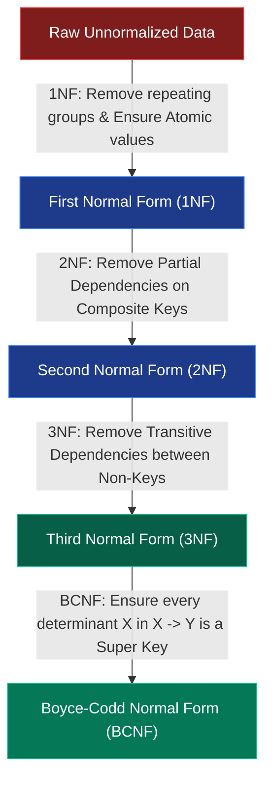
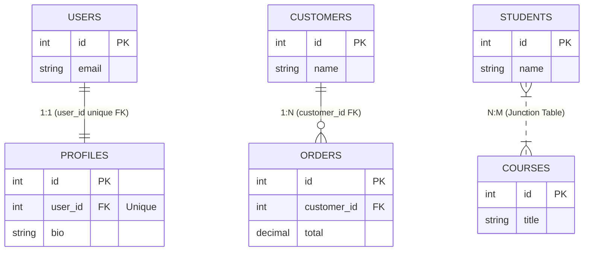
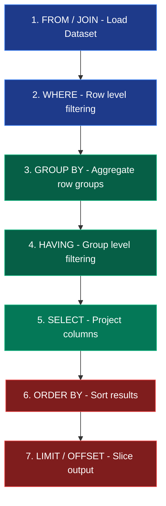

# High-Performance Database Design & SQL Concepts

সিস্টেম আর্কিটেকচার ডিজাইনে ডাটাবেজ মডেলিং কেবল টেবিল তৈরি করা নয়; এটি ডেটার নির্ভরযোগ্যতা (Referential Integrity), কুয়েরির পারফরম্যান্স এবং ডেটা ডুপ্লিকেশন কমানোর মূল চালিকাশক্তি। এই ম্যানুয়ালে ডাটাবেজ নরমালাইজেশন, BCNF, কুয়েরি অপ্টিমাইজেশন এবং হাই-স্কেল আরডিবিএমএস (RDBMS) বেস্ট প্র্যাকটিসগুলো বিস্তারিতভাবে ব্যাখ্যা করা হলো।

---

## ১. Database Normalization (1NF, 2NF, 3NF, BCNF)

### Core Idea
Normalization হলো একটি ধাপে ধাপে টেবিল ডিজাইন প্রক্রিয়া যার মূল উদ্দেশ্য হলো ডেটা ডুপ্লিকেশন (Redundancy) কমানো এবং Insert, Update ও Delete Anomaly (অসঙ্গতি) দূর করা। 



### The Normalization Steps & Mathematical Rules

#### First Normal Form (1NF)
* **Rule:** প্রতিটি সেল বা কলামে অবশ্যই **Atomic Value** (একক বা অবিভাজ্য মান) থাকতে হবে। কোনো কলামে কমা দিয়ে একাধিক মান রাখা যাবে না।
* **Example:** `Skills` কলামে `"SQL, Java, Go"` একসাথে রাখলে তা 1NF ভঙ্গ করে। এটিকে আলাদা রো বা চাইল্ড টেবিলে বিভক্ত করতে হবে।

#### Second Normal Form (2NF)
* **Rule:** টেবিলটিকে অবশ্যই 1NF হতে হবে এবং কোনো **Partial Dependency** থাকা যাবে না। অর্থাৎ, টেবিলে যদি Composite Primary Key (যৌথ চাবি) থাকে, তবে কোনো নন-কী (Non-Key) কলাম সেই চাবির আংশিক বা একটিমাত্র অংশের ওপর নির্ভরশীল হতে পারবে না।
* **Example:** `Enrollment(StudentID, CourseID, CourseName)`. এখানে Composite Key হলো `(StudentID, CourseID)`। কিন্তু `CourseName` শুধুমাত্র `CourseID` এর ওপর নির্ভর করে। এটি একটি Partial Dependency। সমাধান হলো `Course` টেবিলকে আলাদা করা।

#### Third Normal Form (3NF)
* **Rule:** টেবিলটিকে 2NF হতে হবে এবং কোনো **Transitive Dependency** থাকা যাবে না। অর্থাৎ, কোনো নন-কী কলাম অন্য কোনো নন-কী কলামের ওপর নির্ভর করতে পারবে না।
* **Example:** `Employee(EmpID, DeptID, DeptName)`. এখানে `EmpID` (Primary Key) নির্ধারণ করে `DeptID`-কে, এবং `DeptID` নির্ধারণ করে `DeptName`-কে। যেহেতু `DeptID` এবং `DeptName` উভয়ই নন-কী কলাম, এটি Transitive Dependency। সমাধান হলো `Departments` টেবিল আলাদা করা।

#### Boyce-Codd Normal Form (BCNF)
* **Rule:** 3NF-এর চেয়েও কঠোর ফর্ম। কোনো Functional Dependency $X \rightarrow Y$ থাকলে, **$X$-কে অবশ্যই একটি Super Key (বা Candidate Key) হতে হবে**।
* **Simplified:** টেবিলে যে কলাম বা কলাম-সেট অন্য কলামের মান নির্ধারণ করে (Determinant), সেটিকে অবশ্যই পুরো রো-কে অনন্যভাবে চেনার ক্ষমতা থাকতে হবে।

---

### Normalization Summary Reference Table

| Normal Form | Target Dependency | Solution Method |
| :--- | :--- | :--- |
| **1NF** | Repeating Groups / Multi-values | সেলের মানগুলোকে আলাদা রো বা রিলেটেড টেবিলে বিভক্ত করা। |
| **2NF** | Partial Dependencies | Composite primary key-এর আংশিক নির্ভরশীল কলামগুলো আলাদা টেবিলে সরানো। |
| **3NF** | Transitive Dependencies | নন-কী থেকে নন-কী কলামের নির্ভরশীলতা ভেঙে নতুন রিলেশনশিপ তৈরি করা। |
| **BCNF** | Non-Super Key Determinants | প্রতিটি ডিটারমিন্যান্টকে সুপার কী হিসেবে গ্যারান্টি দিয়ে টেবিল ডিকম্পোজ করা। |

### Senior Insight: OLTP vs OLAP Design (Normalization vs Denormalization)
* **OLTP (Online Transaction Processing):** হাই-রাইট (High-Write) ও রিয়েল-টাইম ট্রানজেকশনাল সিস্টেমে আমরা **3NF/BCNF** নরমালাইজেশন ব্যবহার করি। এটি ডেটা ডুপ্লিকেশন কমায়, ফলে ইনসার্ট/আপডেট কুয়েরি অত্যন্ত ফাস্ট হয় এবং ডেটা করাপশন এড়ানো যায়।
* **OLAP (Online Analytical Processing):** বিগ ডেটা, অ্যানালিটিক্স এবং রিড-হেভি (Read-Heavy) ডেটা ওয়্যারহাউসে আমরা ইচ্ছাকৃতভাবে **Denormalization** (যেমন Star Schema, Snowflake Schema) করি। এখানে একাধিক জয়েন এড়াতে টেবিলে ডেটা ডুপ্লিকেট করে রাখা হয়, যাতে অ্যানালিটিক্যাল কুয়েরি দ্রুত সম্পন্ন হয়।

---

## ২. The N+1 Query Problem

### Core Idea
N+1 Query Problem ঘটে যখন আমরা একটি প্যারেন্ট লিস্ট (যেমন ১০টি পোস্ট) তুলে আনতে ১টি কুয়েরি চালাই, কিন্তু প্রতিটি প্যারেন্ট রো-এর চাইল্ড ডেটা (যেমন প্রতিটি পোস্টের কমেন্ট) লুপের ভেতর কোয়েরি করতে গিয়ে আরও N সংখ্যক অতিরিক্ত ডাটাবেজ রাউন্ড-ট্রিপ কুয়েরি জেনারেট করি।

```mermaid
sequenceDiagram
    autonumber
    actor App as Backend Application
    participant DB as Database Engine

    App->>DB: 1. SELECT * FROM posts LIMIT 10; (Parent Query)
    DB-->>App: Returns 10 Post Rows
    
    rect rgb(30, 20, 20)
        Note over App, DB: N+1 Loop Starts (Repeated N Times)
        App->>DB: 2. SELECT * FROM comments WHERE post_id = 1;
        DB-->>App: Returns comments for post 1
        App->>DB: 3. SELECT * FROM comments WHERE post_id = 2;
        DB-->>App: Returns comments for post 2
        App->>DB: ... Repeat up to Post 10 ...
    end
    
    Note over App, DB: Total DB Round-trips = 1 + 10 = 11 Queries!
```

### The Cost: DB Connection Pool Exhaustion
প্রোডাকশন সিস্টেমে যদি হোমপেজে ১০০টি পোস্ট দেখাতে গিয়ে এই N+1 লুপ চলে, তবে প্রতিবার পেজ লোডে ১০১টি কুয়েরি ডাটাবেজে হিট করবে। মাত্র ১০০ জন কনকারেন্ট ইউজার রিকোয়েস্ট পাঠালেই তা **১০,০০০+ কোয়েরি** জেনারেট করবে, যা মুহূর্তের মধ্যে ডাটাবেজের **Connection Pool Exhaust** করে সম্পূর্ণ ব্যাকএন্ড আর্কিটেকচার ক্র্যাশ করাবে।

### Technical Solutions

#### ১. Eager Loading (SQL JOIN)
লুপের বাইরে আগে থেকেই জয়েন দিয়ে এক কুয়েরিতে সব ডেটা রিড করা:
```sql
SELECT posts.*, comments.*
FROM posts
LEFT JOIN comments ON posts.id = comments.post_id;
```

#### ২. Batch Preloading (IN Operator)
জয়েন না করে ব্যাকএন্ড ওআরএম (ORM) মাত্র ২টি কুয়েরিতে ডেটা তুলে আনে:
```sql
-- Query 1: Fetch Parents
SELECT id FROM posts LIMIT 10; -- returns IDs: 1, 2, 3...10

-- Query 2: Fetch all related children in one batch
SELECT * FROM comments WHERE post_id IN (1, 2, 3, 4, 5, 6, 7, 8, 9, 10);
```

#### ৩. DataLoader Pattern (GraphQL-এর সমাধান)
গ্রাফকিউএল (GraphQL) বা মাইক্রোসার্ভিস এনভায়রনমেন্টে বিভিন্ন ফিল্ড রিজলভারের কুয়েরি রিকোয়েস্টগুলোকে মেমরিতে **Batch & Coalesce** করে প্রসেস করা, যাতে রানটাইমে N+1 সমস্যা চিরতরে নির্মূল হয়।

---

## ৩. Enterprise Relationships & Indexing Strategies

### Core Idea
ডাটাবেজ রিলেশনশিপ নির্ধারণের সঠিক নিয়ম হলো—উভয় দিক থেকে ডেটার কার্ডিনালিটি (Cardinality) প্রশ্ন করা এবং ডেটার ওনারশিপ অনুযায়ী Foreign Key (এফকে) প্লেসমেন্ট করা।



### Foreign Key Placement & Indexing Rules

#### One-to-One (1:1)
* **Rule:** ডিপেন্ডেন্ট বা চাইল্ড টেবিলে Foreign Key থাকবে এবং সেটিতে অবশ্যই **`UNIQUE` Constraint** যুক্ত করতে হবে, যাতে একটি প্যারেন্টের সাথে সর্বোচ্চ একটি চাইল্ড যুক্ত হতে পারে।

#### One-to-Many (1:N)
* **Rule:** Foreign Key সর্বদা **Many Side (চাইল্ড টেবিলে)** থাকবে।
* **Senior Best Practice (Foreign Key Indexing):** আরডিবিএমএস (যেমন MySQL, PostgreSQL) প্যারেন্ট টেবিলে প্রাইমারি কী ইনডেক্স করলেও **Foreign Key কলামগুলোতে অটোমেটিক ইনডেক্স তৈরি করে না**। জয়েন কুয়েরির পারফরম্যান্স অপ্টিমাইজ রাখতে প্রতিটি Foreign Key কলামে ম্যানুয়ালি ইনডেক্স তৈরি করা বাধ্যতামূলক।

#### Many-to-Many (N:M)
* **Rule:** সরাসরি রিলেশন সম্ভব নয়; এর জন্য মাঝখানে একটি **Junction Table** (বা Pivot/Bridge Table) তৈরি করতে হবে, যেখানে উভয় টেবিলের Foreign Key থাকবে।
* **Composite Index Strategy:** জাংশন টেবিলে সাধারণত দুটি এফকে নিয়ে একটি **Composite Primary Key** `(student_id, course_id)` তৈরি করা হয়, যা ডুপ্লিকেট রিলেশনশিপ এড়ায়।

---

## ৪. SQL Delete Rules & Referential Integrity

### Core Idea
Referential Action নির্ধারণ করে—প্যারেন্ট টেবিলের কোনো রো ডিলিট বা আপডেট হলে চাইল্ড টেবিলের রিলেটেড ডেটার ওপর কী প্রভাব পড়বে।

### Cascading vs Restricting Performance Trade-offs

#### ON DELETE CASCADE
* **Behavior:** প্যারেন্ট রো ডিলিট হওয়ার সাথে সাথে চাইল্ড টেবিলের সব রিলেটেড রো ডেটাবেজ ইঞ্জিন স্বয়ংক্রিয়ভাবে ডিলিট করে দেয়।
* **Production Caution:** হাই-ট্রাফিক প্রোডাকশন ডাটাবেজে (যেখানে চাইল্ড টেবিলে লাখ লাখ ডেটা রয়েছে) `CASCADE` ডিলিট চালানো অত্যন্ত ঝুঁকিপূর্ণ। এটি বড় ধরনের মেমরি লক তৈরি করে এবং **Replication Lag** বাড়িয়ে দেয়, যার ফলে সম্পূর্ণ ডাটাবেজ কয়েক সেকেন্ড বা মিনিটের জন্য আন-রেসপন্সিভ হয়ে যেতে পারে।
* **Mitigation:** এ ক্ষেত্রে ডিলিট অপারেশন ছোট ছোট ব্যাচে ভাগ করে রান করা অথবা ব্যাকগ্রাউন্ড অ্যাসিনক্রোনাস ওয়ার্কার দিয়ে চাইল্ড ডেটা ক্লিনআপ করা স্ট্যান্ডার্ড প্র্যাকটিস।

#### ON DELETE SET NULL
* **Behavior:** প্যারেন্ট রো ডিলিট হলে চাইল্ডের Foreign Key কলামের মান `NULL` হয়ে যায়। এ ক্ষেত্রে কলামটিকে অবশ্যই `Nullable` হতে হবে।

#### ON DELETE RESTRICT / NO ACTION
* **Behavior:** চাইল্ড ডেটা থাকা অবস্থায় প্যারেন্টকে কোনোভাবেই ডিলিট করতে দেয় না (অ্যারর থ্রো করে)। এটি অসাবধানতাবশত ডেটা মুছে যাওয়া প্রতিরোধ করার সবচেয়ে নিরাপদ ডিফেন্সিভ গ্যারান্টি।

---

### Referential Action Reference Table

| Rule | Parent Delete Action | Best Use Case |
| :--- | :--- | :--- |
| **CASCADE** | চাইল্ডের রিলেটেড সব ডেটা মুছে যায়। | মেটা বা ক্ষণস্থায়ী ডিপেন্ডেন্ট ডেটা (যেমন `InvoiceDetails` যখন `Invoice` ডিলিট হয়)। |
| **SET NULL** | চাইল্ডের এফকে কলাম `NULL` হয়। | যখন চাইল্ড হিস্টোরি রাখা জরুরি, কিন্তু প্যারেন্ট কানেকশন নেই (যেমন প্রোডাক্ট ডিলিট হলেও সেলস ডাটা থাকবে)। |
| **RESTRICT** | ডিলিট অপারেশন ব্লক করে অ্যারর দেয়। | মূল মাস্টার ডেটা প্রটেকশনের জন্য (যেমন কাস্টমার ডিলিট করা যাবে না যদি তার কোনো অর্ডার পেন্ডিং থাকে)। |

---

## ৫. SQL Aggregation & Execution Order

### Core Idea
SQL কুয়েরি যেভাবে লেখা হয় (Syntax Order) এবং ডাটাবেজ ইঞ্জিনের কুয়েরি অপ্টিমাইজার যেভাবে সেটি প্রসেস করে (Logical Execution Order) তা সম্পূর্ণ ভিন্ন। 



### The Query Engine Pipeline (Execution Order)

1. **`FROM` & `JOIN`:** ডাটাবেজ ইঞ্জিন সর্বপ্রথমে কোন টেবিল এবং তাদের ইন্টারনাল রিলেশন ডেটাসেট লোড হবে তা নির্ধারণ করে।
2. **`WHERE` (রো-লেভেল ফিল্টারিং):** গ্রুপ তৈরি করার আগেই প্রতিটি রোকে ফিল্টার করে কন্ডিশন অনুযায়ী অপ্রয়োজনীয় রো বাদ দেওয়া হয়।
   * *Senior Practice:* জয়েনিং বা গ্রুপিংয়ের আগে ফিল্টারিং সম্পন্ন হলে ডাটাবেজের মেমরিতে খুব ছোট ডেটাসেট প্রসেস করতে হয়, যা কুয়েরিকে সুপারফাস্ট করে।
3. **`GROUP BY`:** ফিল্টার করা রোগুলোকে কলামের মান অনুযায়ী গ্রুপ করা হয় এবং মেমরিতে অ্যারে অব গ্রুপ তৈরি করা হয়।
4. **`HAVING` (গ্রুপ-লেভেল ফিল্টারিং):** শুধুমাত্র গ্রুপ তৈরি হওয়ার পর এবং এগ্রিগেট কুয়েরি রেজাল্ট (যেমন `COUNT(*)`, `SUM()`) ফিল্টার করতে এটি ব্যবহৃত হয়।
5. **`SELECT`:** কোন কোন কলাম দেখানো হবে তা ফিল্টারিং শেষে ডাটাবেজ ইঞ্জিন সিলেক্ট করে।
6. **`ORDER BY`:** চূড়ান্ত সিলেক্টেড ডেটাকে ক্রমানুসারে সাজানো হয় (ইনডেক্সিং ছাড়া এটি প্রচুর মেমরি খায়)।
7. **`LIMIT` & `OFFSET`:** কুয়েরির শেষ ধাপে এসে ফাইনাল ডেটা থেকে কাঙ্ক্ষিত সংখ্যক স্লাইস তুলে আনা হয়।

### WHERE vs HAVING: The Critical Distinction
* **`WHERE`:** ইন্ডিভিজুয়াল রো ফিল্টার করে এবং এটি গ্রুপ তৈরির **আগে** কাজ করে। এর ভেতরে কখনো এগ্রিগেট ফাংশন (যেমন `SUM(total) > 500`) ব্যবহার করা যায় না।
* **`HAVING`:** মেমরিতে এগ্রিগেট গ্রুপ তৈরি হওয়ার **পরে** কাজ করে এবং এটি শুধুমাত্র গ্রুপ ডেটা ফিল্টার করতে ব্যবহৃত হয়।

```sql
SELECT customer_id, SUM(amount) AS total_spent
FROM payments
WHERE status = 'success'    -- 1. filtering payments before group
GROUP BY customer_id         -- 2. group by customers
HAVING SUM(amount) >= 1000;  -- 3. filtering grouped aggregate data
```

### Interview Elevator Pitch (Senior Level)
> "এসকিউএল কুয়েরি ইঞ্জিনের এক্সিকিউশন অর্ডার বোঝা কুয়েরি অপ্টিমাইজেশনের মূল ভিত্তি। যেহেতু `WHERE` লজিক জয়েন বা গ্রুপিংয়ের আগে ডেটার আকার কমিয়ে ফেলে, তাই বড় ডেটাসেটে `HAVING` এর ওপর নির্ভরশীলতা কমিয়ে `WHERE` দিয়ে আর্লি রো-ফিল্টারিং সম্পন্ন করা এবং এগ্রিগেট কলামগুলোতে কম্পোজিট ইনডেক্সিং সেট করা ব্যাকএন্ড পারফরম্যান্সকে বহুগুণ বাড়িয়ে দেয়।"
