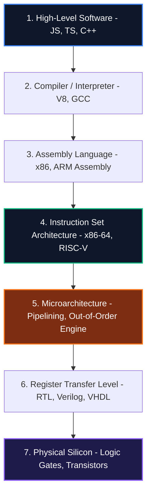
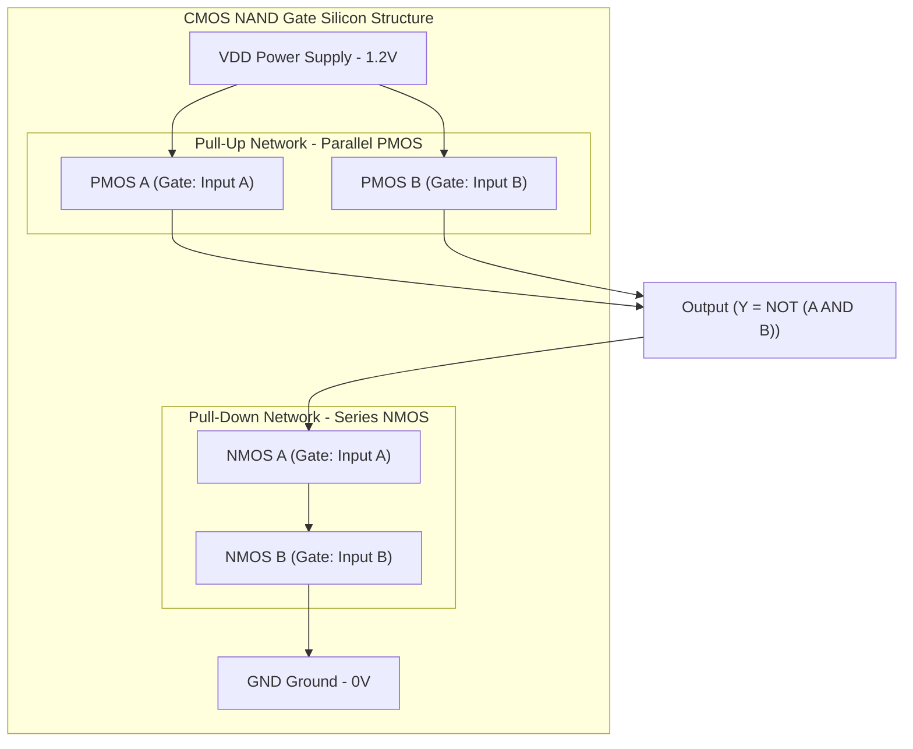
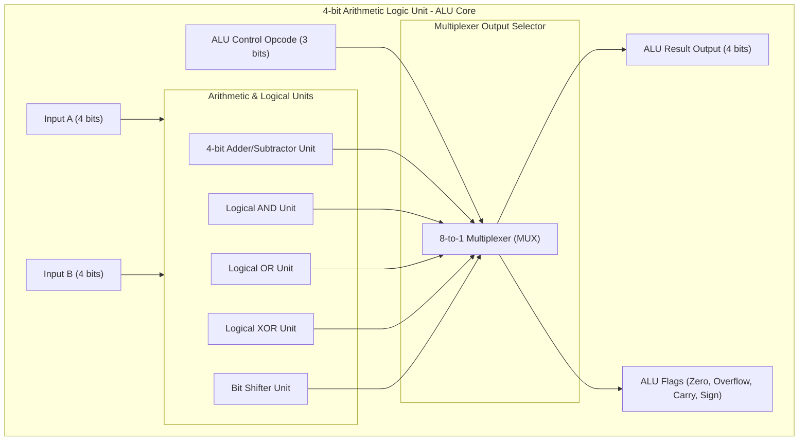
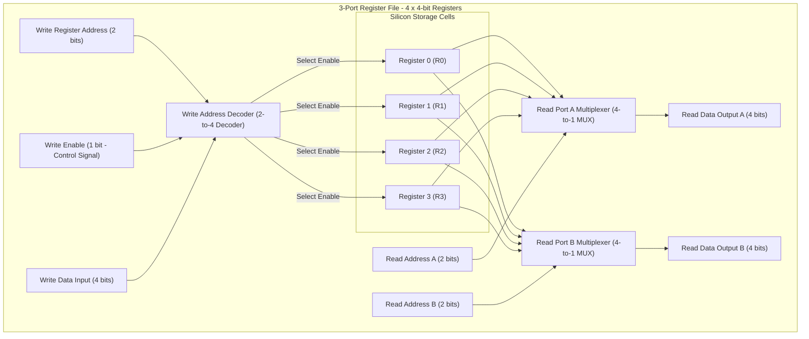
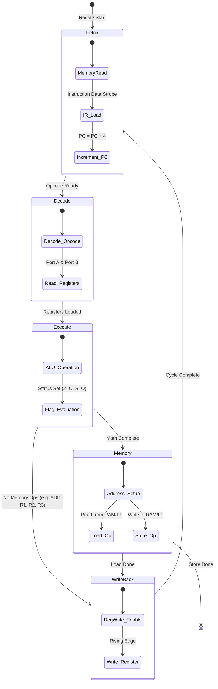
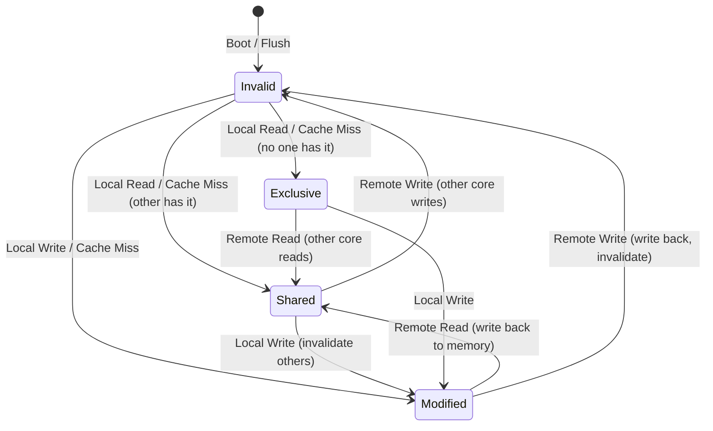
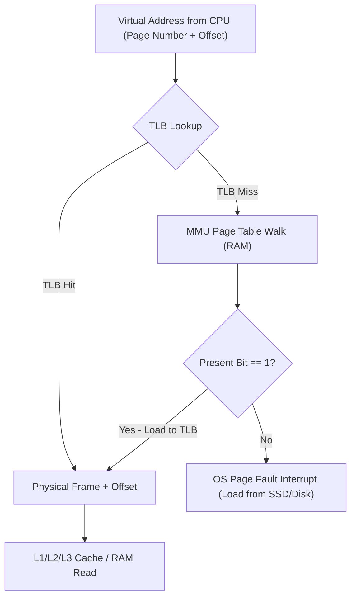
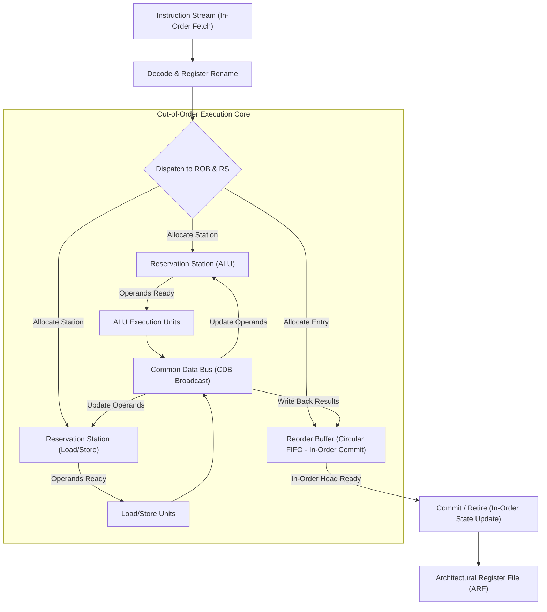
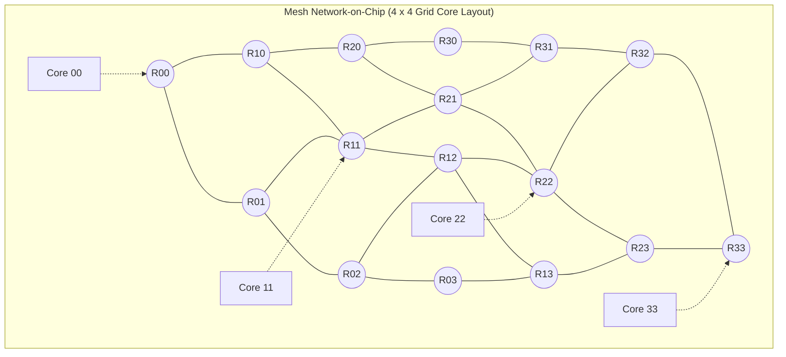

# 🔌 Computer Architecture & Microprocessor Engineering: Masterclass Roadmap

স্বাগতম! এই গাইডটি শুধুমাত্র কোনো থিওরিটিক্যাল টেক্সটবুক নয়। এটি মডার্ন সিলিকন চিপ কীভাবে ডিজাইন করা হয়, ওএস কীভাবে মেটাল বা হার্ডওয়্যারের সাথে কমিউনিকেট করে এবং প্রসেসর কীভাবে মিলি-সেকেন্ডে বিলিয়ন বিলিয়ন ইন্সট্রাকশন প্রসেস করে — তার একটি অ্যান্ড-টু-অ্যান্ড **সিস্টেমস লেভেল ব্লুপ্রিন্ট**।

আমরা লজিক গেটের সিলিকন লেভেল থেকে যাত্রা শুরু করব, ALU এবং CPU Registers তৈরি করব, x86 এবং AMD64 এর মেমরি আর্কিটেকচার ও বিটওয়াইজ ডিফারেন্স দেখব এবং শেষে প্রসেসরের অ্যাডভান্সড পাইপলাইনিং ও আউট-অফ-অর্ডার এক্সিকিউশন ইঞ্জিন (OoO Execution) নিয়ে ডিপ-ডাইভ করব।

---

## 🛠️ Hardware-to-Software Bridge: Mental Framework

একটি সফটওয়্যার অ্যাপ্লিকেশন যখন ওএস-এর ওপর চলে, তখন থেকে শুরু করে সিলিকন লেভেলে কারেন্ট প্রবাহিত হওয়া পর্যন্ত পুরো প্রসেসটিকে আমি এই **৭-লেয়ার সিস্টেম আর্কিটেকচার মডেলে** বিভক্ত করি:



---

## 📚 Table of Contents: The 10-Chapter Masterclass Roadmap

নিচের রোডম্যাপটি এমনভাবে সাজানো হয়েছে যাতে প্রতিটি টপিক ক্রমানুসারে তার আগের টপিকের ভিত্তির ওপর গড়ে ওঠে:

| Chapter | Topic | Core Focus Concepts | Target Architecture / Engine |
| :--- | :--- | :--- | :--- |
| **01** | **[Digital Logic & Silicon Foundations](#chapter-01-digital-logic--silicon-foundations)** | CMOS Transistors, Logic Gates (NAND/NOR), Flip-Flops & Latches | Register Transfer Level (RTL) |
| **02** | **[Arithmetic Logic Unit (ALU) Design](#chapter-02-arithmetic-logic-unit-alu-design)** | Half/Full Adders, Carry Lookahead Adder, IEEE 754 Floating Point | Hardware Calculation Engine |
| **03** | **[CPU Registers & Register File](#chapter-03-cpu-registers--register-file)** | PC, IR, GPRs, Flags Register, Multi-Port Register File | CPU Internal Memory |
| **04** | **[Control Unit & Instruction Execution Cycle](#chapter-04-control-unit--instruction-execution-cycle)** | Fetch-Decode-Execute FSM, Hardwired vs Microprogrammed CU | CPU Orchestrator |
| **05** | **[Instruction Set Architecture (ISA) - x86 vs AMD64 vs ARM vs RISC-V](#chapter-05-instruction-set-architecture-isa---x86-vs-amd64-vs-arm-vs-risc-v)** | CISC vs RISC, 64-bit Flat Mode, Register Mappings, RV32I Decoder | Instruction Set Architecture |
| **06** | **[CPU Pipelining & Hazards](#chapter-06-cpu-pipelining--hazards)** | 5-Stage Pipeline, RAW Hazards, Data Forwarding, Branch Predictors | High-Throughput CPU Core |
| **07** | **[Memory Hierarchy & Caches](#chapter-07-memory-hierarchy--caches)** | Locality of Reference, Set-Associative Caches, MESI Coherency | Memory Latency Shield |
| **08** | **[Virtual Memory & MMU](#chapter-08-virtual-memory--mmu)** | Paging Isolation, MMU translation, TLB Hit/Miss, Huge Pages | Virtual Memory Engine |
| **09** | **[Out-of-Order Execution & Speculative Engines](#chapter-09-out-of-order-execution--speculative-engines)** | Tomasulo's Algorithm, Reorder Buffer (ROB), Load-Store Queue | Next-Gen Superscalar Processor |
| **10** | **[Multicore Coherence & Interconnects](#chapter-10-multicore-coherence--interconnects)** | Ring Interconnect Router, 2D Mesh NoC, NUMA First-Touch Policy | Multicore Interconnect Bus |

---

### 📖 Chapter 01: Digital Logic & Silicon Foundations
কম্পিউটার আর্কিটেকচারের সবচেয়ে নিম্ন স্তরের যাত্রা শুরু হয় সিলিকন এবং ট্রানজিস্টর থেকে। এই চ্যাপ্টারে আমরা শিখব কীভাবে বালুর তৈরি সিলিকন ট্রানজিস্টর ইলেকট্রনিক সুইচে রূপান্তরিত হয়।
* **CMOS Transistor Physics:** NMOS এবং PMOS ট্রানজিস্টর কীভাবে লজিক্যাল `0` এবং `1` ভোল্টেজ কন্ট্রোল করে।
* **Logic Gates:** AND, OR, NOT, NAND, NOR, XOR, XNOR গেট ডিজাইন এবং ডি মরগ্যানের সূত্র।
* **Sequential Circuits:** পূর্ববর্তী আউটপুট স্টোর করতে পারে এমন মেমরি উপাদান (Latches, Flip-Flops, Registers)।

---

### 📖 Chapter 02: Arithmetic Logic Unit (ALU) Design
ALU হলো প্রসেসরের গাণিতিক মস্তিষ্ক। এটি সমস্ত যোগ, বিয়োগ এবং লজিক্যাল অপারেশন সম্পন্ন করে।
* **Adder Architectures:** Half/Full Adder এবং Carry Lookahead Adder (CLA) গাণিতিক ক্যারি সমাধান।
* **Integer Representation & 2's Complement:** ২'স কমপ্লিমেন্ট করে যোগের মাধ্যমে বিয়োগের কাজ সম্পন্ন করা।
* **Floating Point Units (FPU):** IEEE 754 সিঙ্গেল ও ডাবল প্রিসিশন আর্কিটেকচার।

---

### 📖 Chapter 03: CPU Registers & Register File
রেজিস্টার হলো সিপিইউর নিজস্ব আল্ট্রা-ফাস্ট লোকাল মেমরি যা ১টি ক্লক সাইকেলেই ডেটা রিড ও রাইট করতে পারে।
* **Instruction Registers:** PC, IR এবং Special Purpose Registers (SP/BP/Flags)।
* **Register File Design:** ডিকোডারের মাধ্যমে মাল্টি-পোর্ট রেজিস্টার ফাইল তৈরি করা।
* **Asynchronous Reset (AsD):** রেজিস্টার ল্যাচ মেটাস্ট্যাবিলিটি রোধের ফিজিক্যাল সমাধান।

---

### 📖 Chapter 04: Control Unit & Instruction Execution Cycle
কন্ট্রোল ইউনিট হলো সিপিইউ-র ট্রাফিক police। এটি ডিকোড করা ইনস্ট্রাকশন অনুযায়ী সমস্ত ইন্টারনাল হার্ডওয়্যারে সঠিক সময়ে কন্ট্রোল সিগন্যাল পাঠায়।
* **Fetch-Decode-Execute (F-D-E) Cycle:** ৫-স্টেজ ইনস্ট্রাকশন সাইকেলের ফিজিক্যাল ট্র্যাকিং।
* **FSM Engine:** হার্ডওয়্যার কন্ট্রোল ফ্লো FSM ডিজাইন।
* **Hardwired vs Microprogrammed Control:** ফিক্সড সিলিকন বনাম মাইক্রো-কোড কন্ট্রোল স্টোর আর্কিটেকচার।

---

### 📖 Chapter 05: Instruction Set Architecture (ISA) - x86 vs AMD64 vs ARM vs RISC-V
ইনস্ট্রাকশন সেট আর্কিটেকচার (ISA) হলো প্রসেসরের সাথে ওএস এবং সফটওয়্যারের প্রধান রিটেন কন্ট্রাক্ট বা ইন্টারফেস।
* **CISC vs RISC Philosophy:** জটিল ভেরিয়েবল ইনস্ট্রাকশন বনাম সিম্পল ফিক্সড ইনস্ট্রাকশন ডিজাইন।
* **x86 vs AMD64 flat execution mode:** ৩২-বিট স্পেস লিমিট থেকে ৬৪-বিট ফ্ল্যাট মেমরি পেজিং এক্সটেনশন।
* **RISC-V Architecture:** ওপেন সোর্স RV32I ইনস্ট্রাকশন সেট এবং ডিকোডার ইঞ্জিন সিমুলেশন।

---

### 📖 Chapter 06: CPU Pipelining & Hazards
সিপিইউর কর্মক্ষমতা বাড়াতে পাইপলাইনিং সবচেয়ে গুরুত্বপূর্ণ মেকানিজম। এটি একই সময়ে একাধিক ইনস্ট্রাকশনকে প্রসেসরের বিভিন্ন স্টেজে প্যারালালি এক্সিকিউট করে।
* **5-Stage Pipeline Model (Classic RISC):** IF -> ID -> EX -> MEM -> WB এবং পাইপলাইন রেজিস্টার বাফার ল্যাচ।
* **Pipeline Hazards:** Structural, Data (RAW), এবং Control Hazards-এর ফিজিক্যাল মেকানিজম।
* **Mitigation Mechanisms:** Pipeline Bubbles/Stalls, Data Forwarding (Bypassing), এবং TAGE ব্রাঞ্চ প্রেডিকশন।

---

### 📖 Chapter 07: Memory Hierarchy & Caches
সিপিইউ রেজিস্টারের গতি ১ ক্লক সাইকেল কিন্তু মেইন র্যামের (DRAM) গতি প্রায় ৩০০ ক্লক সাইকেল। এই বিপুল গতির পার্থক্য মেটাতে প্রসেসরে ক্যাশ মেমরি ব্যবহার করা হয়।
* **Memory Hierarchy:** Registers -> L1/L2/L3 Caches -> DRAM -> SSD গতির ফিজিক্স সীমাবদ্ধতা।
* **Cache Associativity:** Direct-Mapped, Fully Associative, এবং N-Way Set-Associative ক্যাশ ম্যাপিং।
* **Cache Coherency (MESI):** মাল্টি-কোর প্রসেসরে লোকাল ক্যাশ একতা বজায় রাখার জন্য MESI স্টেট ফ্লো।

---

### 📖 Chapter 08: Virtual Memory & MMU
ভার্চুয়াল মেমরি ওএস-কে প্রতিটি প্রসেসের জন্য একটি কাল্পনিক ফ্ল্যাট অ্যাড্রেস স্পেস তৈরি করতে সাহায্য করে, যা ব্যাকগ্রাউন্ডে ফিজিক্যাল র্যামের সাথে ডায়নামিকালি ট্রান্সলেটেড হয়।
* **Memory Management Unit (MMU):** রিয়েল-টাইমে ভার্চুয়াল অ্যাড্রেসকে ফিজিক্যাল মেমরি অ্যাড্রেসে কনভার্ট করার ডেডিকেটেড চিপ।
* **Translation Lookaside Buffer (TLB):** ডবল-র্যাম ল্যাটেন্সি এড়াতে MMU-র ভেতরের ডেডিকেটেড হাই-স্পিড অ্যাড্রেস ক্যাশ।
* **Huge Pages:** বিশাল ডাটাবেজের ক্ষেত্রে TLB কভারেজ বাড়িয়ে ল্যাটেন্সি কমানোর সমাধান।

---

### 📖 Chapter 09: Out-of-Order Execution & Speculative Engines
আধুনিক ইন্টেল বা এএমডি প্রসেসরগুলো কেবল সিকোয়েন্সিয়াল ইন্সট্রাকশন এক্সিকিউট করে না, এগুলো একই সাথে একাধিক ইন্সট্রাকশন প্যারালালি এবং তাদের ডিপেন্ডেন্সি চেক করে আগে-পরে রান করতে পারে।
* **Tomasulo's Algorithm:** Reservation Stations এবং Common Data Bus (CDB) ব্রডকাস্ট লজিক।
* **Reorder Buffer (ROB):** আউট-অফ-অর্ডার কাজের রেজাল্টগুলো ইন-অর্ডারে কমিট/রিটায়ার করার সার্কুলার FIFO বাফার।
* **Load-Store Queue (LSQ):** মেমরি ডিসঅ্যাম্বিগুয়েশন এবং স্পেকুলেটিভ লোড-স্টোর কুয়েরি দ্বন্দ্ব প্রতিরোধ।

---

### 📖 Chapter 10: Multicore Coherence & Interconnects
একাধিক কোরের মাঝে ডাটা সিঙ্ক করা, ক্যাশ লাইনের একতা বজায় রাখা এবং ন্যানোমিটার স্কেলে কোরের মাঝে চরম স্পিডে মেসেজ পাসিং করার কমপ্লিট সলিউশন।
* **On-Chip Interconnects:** Ring Interconnect Bus এবং 2D Mesh Network-on-Chip (NoC)।
* **NUMA Systems:** লোকাল বনাম রিমোট মেমরি নোড ল্যাটেন্সি এবং First-Touch মেমরি পলিসি।
* **NoC Routing Deadlocks:** বৃত্তাকার বাফার লক ভেঙে ডেডলক এড়াতে XY Dimension-ordered Routing।
## 📖 Chapter 01: Digital Logic & Silicon Foundations

কম্পিউটার আর্কিটেকচার এবং প্রসেসর ডিজাইনের আদি ভিত্তি হলো ফিজিক্যাল সিলিকন এবং সেমিকন্ডাক্টর ফিজিক্স। সিলিকন নামক সাধারণ বালুকণা কীভাবে কোটি কোটি ট্রানজিস্টরে রূপান্তরিত হয়ে মিলি-সেকেন্ডে বিলিয়ন বিলিয়ন হিসাব সম্পন্ন করে — তা এই চ্যাপ্টারের মূল উপজীব্য। আমরা ডিজিটাল গেটের সিলিকন সুইচ লেভেল থেকে শুরু করে মেমরি রেজিস্টার ফাইলের মূল বিল্ডিং ব্লক পর্যন্ত অ্যান্ড-টু-অ্যান্ড সিস্টেম ডিজাইন করব।

### ১. ট্রানজিস্টর লেয়ার এবং CMOS আর্কিটেকচার (Silicon Switch & CMOS Physics)

সিলিকন (Silicon) হলো একটি চতুর্যোজী সেমিকন্ডাক্টর যা বিশুদ্ধ অবস্থায় বিদ্যুৎ পরিবহন করে না। কিন্তু এর সাথে পঞ্চযোজী (যেমন ফসফরাস) বা ত্রির্যোজী (যেমন বোরন) অপদ্রব্য মিশিয়ে যথাক্রমে **N-type** (মুক্ত ইলেকট্রন সমৃদ্ধ) এবং **P-type** (মুক্ত হোল সমৃদ্ধ) সেমিকন্ডাক্টর তৈরি করা হয় যাকে **Doping** বলা হয়।

#### ক. NMOS এবং PMOS ট্রানজিস্টর:
ট্রানজিস্টর হলো একটি ইলেকট্রনিক সুইচ যার ৩টি মূল টার্মিনাল থাকে: **Gate**, **Source**, এবং **Drain**।
* **NMOS (Negative-channel MOS):** গেটে হাই ভোল্টেজ (লজিক্যাল `1` বা 1.2V) দিলে সুইচটি অন হয় এবং Source থেকে Drain-এ বিদ্যুৎ প্রবাহিত হতে দেয়। গেট `0` হলে এটি অফ থাকে।
* **PMOS (Positive-channel MOS):** গেটে লো ভোল্টেজ (লজিক্যাল `0` বা 0V) দিলে সুইচটি অন হয় এবং বিদ্যুৎ পাস হতে দেয়। গেট `1` হলে এটি অফ থাকে।

#### খ. CMOS (Complementary MOS) আর্কিটেকচার:
আধুনিক প্রসেসরে শুধুমাত্র NMOS বা PMOS ব্যবহার না করে দুটিকে জোড়ায় জোড়ায় ব্যবহার করা হয় যাকে **CMOS** বলা হয়। CMOS এর দুটি মূল নেটওয়ার্ক থাকে:
1. **Pull-Up Network (PUN):** সমান্তরালভাবে যুক্ত PMOS দিয়ে তৈরি, যা আউটপুটকে হাই ভোল্টেজ (`VDD`) এর দিকে টানে।
2. **Pull-Down Network (PDN):** শ্রেণীবদ্ধভাবে যুক্ত NMOS দিয়ে তৈরি, যা আউটপুটকে গ্রাউন্ড (`VSS` বা 0V) এর দিকে টানে।

> [!NOTE]
> **CMOS এর সবচেয়ে বড় সুবিধা:** লজিক্যাল স্টেট যখন স্থির থাকে (Static State), তখন PUN এবং PDN এর যেকোনো একটি নেটওয়ার্ক সম্পূর্ণ অফ থাকে। ফলে সার্কিটের ভেতর দিয়ে কোনো কারেন্ট প্রবাহিত হতে পারে না। এই কারণে CMOS প্রযুক্তি চরম বিদ্যুৎ সাশ্রয়ী এবং প্রসেসর ঠান্ডা রাখতে সাহায্য করে!

---

### ২. হাই-ফিডেলিটি CMOS লজিক আর্কিটেকচার (CMOS Gate Level Schematic)

নিচের ডায়াগ্রামের মাধ্যমে একটি **CMOS NAND Gate**-এর সিলিকন আর্কিটেকচার ফ্লো দেখানো হলো, যেখানে ইনপুট গেটের চার্জ পরিবর্তন করে কীভাবে আউটপুটকে টেনে আনা হয়:



---

### ৩. ইউনিভার্সাল গেট এবং বুলিয়ান অ্যালজেব্রা (Universal Gates & Boolean Algebra)

ডিজিটাল ডিজাইনে **NAND** এবং **NOR** গেটকে ইউনিভার্সাল বা সার্বজনীন গেট বলা হয়। এর কারণ হলো, যেকোনো জটিল গেট (AND, OR, NOT, XOR) ফিজিক্যালি শুধুমাত্র NAND বা NOR গেটের কম্বিনেশন ব্যবহার করে তৈরি করা সম্ভব। সিলিকন ম্যানুফ্যাকচারিং প্ল্যান্টে ডাইরেক্ট AND বা OR গেট তৈরি না করে ইউনিভার্সাল গেট দিয়ে সমস্ত চিপ আর্কিটেক্ট করা হয়, যা উৎপাদন খরচ ৯০% কমিয়ে দেয়।

#### ক. ডি মরগ্যানের সূত্র (De Morgan's Laws) ও লজিক সিম্প্লিফিকেশন:
সার্কিট সাইজ ছোট করতে এবং ট্রানজিস্টর সংখ্যা কমাতে বুলিয়ান অ্যালজেব্রা ব্যবহার করা হয়:

<Math>
NOT (A · B) = (NOT A) + (NOT B)
</Math>
<Math>
NOT (A + B) = (NOT A) · (NOT B)
</Math>

ধরি, আমাদের একটি বুলিয়ান ফাংশন আছে:
<Math>
Y = (A · B) + (A · NOT B)
</Math>

* **লজিক ডিস্ট্রিবিউশন:**
<Math>
Y = A · (B + NOT B)
</Math>

* **যেহেতু `B + NOT B = 1`, তাই ফাংশনটি দাঁড়ায়:**
<Math>
Y = A · 1 = A
</Math>

* **সিদ্ধান্ত:** ৪টি ট্রানজিস্টর খরচ করার বদলে আমরা সরাসরি ইনপুট তারের (`A`) কানেকশনের মাধ্যমে এই পুরো লজিকটি কোনো এক্সট্রা গেট ছাড়াই রিপ্রেজেন্ট করতে পারি!

---

### ৪. কম্বিনেশনাল বনাম সিকোয়েন্সিয়াল লজিক সার্কিট (Combinational vs Sequential Circuits)

ডিজিটাল আর্কিটেকচারকে দুটি প্রধান ভাগে ভাগ করা যায়:

#### ক. কম্বিনেশনাল সার্কিট (Combinational Circuits - Memoryless):
যেসব সার্কিটের আউটপুট শুধুমাত্র বর্তমান ইনপুটের ওপর নির্ভর করে, তাদের কোনো মেমরি বা পূর্ববর্তী স্টেট মনে রাখার ক্ষমতা নেই।
* **Multiplexer (MUX):** এটি মূলত একটি "ডাটা সিলেক্টর"। এর `2^N` টি ইনপুট লাইনের মধ্য থেকে কন্ডিশনাল সিলেক্ট লাইনের মাধ্যমে যেকোনো ১টি ইনপুটকে আউটপুটে পাস করে।
  - ২-টু-১ মাল্টিপ্লেক্সার ইকুয়েশন:
<Math>
Y = (S · A) + (NOT S · B)
</Math>
(যেখানে `S` হলো সিলেক্ট লাইন)।

#### খ. সিকোয়েন্সিয়াল সার্কিট (Sequential Circuits - With Memory):
যেসব সার্কিটের আউটপুট বর্তমান ইনপুটের পাশাপাশি পূর্ববর্তী স্টেটের (মেমরি) ওপরও নির্ভর করে।
* **SR Latch (NOR Gate feedback loop):** এটি মেমরি স্টোরেজের প্রাচীনতম রূপ। এটিতে ইনপুট সেট (`S`) এবং রিসেট (`R`) সিগন্যাল না দেওয়া পর্যন্ত আউটপুট তার আগের স্টেট ধরে রাখে।
* **D-type Flip-Flop (Edge-Triggered Memory):** এটি ১টি বিট (`0` বা `1`) নিখুঁতভাবে স্টোর করতে পারে। D-ফিডব্যাক ফ্লিপ-ফ্লপ শুধুমাত্র ক্লক সিগন্যালের **Rising Edge** (লো ভোল্টেজ থেকে হাই ভোল্টেজে ওঠার ঠিক মাইক্রো-সেকেন্ডে) ইনপুট ডেটা কপি করে আউটপুটে নিয়ে যায় এবং পরবর্তী ক্লক পালস না আসা পর্যন্ত ভ্যালুটি লক করে রাখে। এটিই সমস্ত সিপিইউ রেজিস্টারের মূল ভিত্তি!

---

### ৫. প্র্যাক্টিক্যাল সার্কিট সিমুলেশন (TypeScript)

আমরা নিচে টাইপস্ক্রিপ্ট ব্যবহার করে একটি সম্পূর্ণ **Digital Circuit Simulation Engine** তৈরি করলাম, যার মধ্যে সিলিকন ট্রানজিস্টর সুইচিং মডেল এবং ক্লক এজ-ট্রিগার্ড **D-Flip-Flop (Register Memory)** ইমপ্লিমেন্ট করা হয়েছে:

```typescript
// ১. ট্রানজিস্টর সুইচ লেভেল মডেল (Silicon Transistor Switch Simulator)
export class TransistorSimulator {
  // NMOS: Gate High হলে Source থেকে Drain এ ভ্যালু পাস করে
  public static simulateNMOS(gate: boolean, source: boolean): boolean | null {
    return gate ? source : null; // Open switch if gate is false
  }

  // PMOS: Gate Low হলে Source থেকে Drain এ ভ্যালু পাস করে
  public static simulatePMOS(gate: boolean, source: boolean): boolean | null {
    return !gate ? source : null; // Open switch if gate is true
  }

  // CMOS NAND Gate ডিজাইন (২টি সমান্তরাল PMOS এবং ২টি শ্রেণীবদ্ধ NMOS)
  public static simulateCMOSNAND(inputA: boolean, inputB: boolean): boolean {
    const VDD = true;  // 1.2V Power
    const GND = false; // 0V Ground

    // Pull-Up Network (Parallel PMOS to VDD)
    const pmosA = this.simulatePMOS(inputA, VDD);
    const pmosB = this.simulatePMOS(inputB, VDD);
    const pullUpOutput = pmosA !== null ? pmosA : (pmosB !== null ? pmosB : null);

    // Pull-Down Network (Series NMOS to GND)
    let pullDownOutput: boolean | null = null;
    const nmosA = this.simulateNMOS(inputA, VDD);
    if (nmosA === VDD) {
      const nmosB = this.simulateNMOS(inputB, GND);
      if (nmosB !== null) {
        pullDownOutput = GND; // Both closed, output connected to GND
      }
    }

    // CMOS আউটপুট নির্ধারণ
    if (pullUpOutput !== null) {
      return pullUpOutput; // VDD wins
    }
    return pullDownOutput !== null ? pullDownOutput : GND;
  }
}

// ২. ক্লক এজ-ট্রিগার্ড D-Flip-Flop (1-bit Register Memory Engine)
export class DFlipFlop {
  private storedState = false; // Q Output
  private lastClockState = false;

  // clock এজ ট্র্যাকিং এবং স্টোরেজ মূল্যায়ন
  public evaluate(dataInput: boolean, clock: boolean): { q: boolean; qBar: boolean } {
    // Rising Edge সনাক্তকরণ (false থেকে true হওয়া)
    const isRisingEdge = !this.lastClockState && clock;

    if (isRisingEdge) {
      this.storedState = dataInput; // Rising edge-এ ডেটা কপি করে লক করা হলো
    }

    this.lastClockState = clock;

    return {
      q: this.storedState,
      qBar: !this.storedState // Q-এর বিপরীতমুখী আউটপুট
    };
  }

  public getStoredValue(): boolean {
    return this.storedState;
  }
}

// === ডেমো রান এবং গেট সিমুলেশন পাইলট ===
function runDigitalLogicDemo() {
  console.log("=== STARTING SILICON LOGIC & MEMORY SIMULATOR ===");

  // ক. CMOS NAND গেট ট্রুথ টেবিল যাচাই
  console.log("
--- CMOS NAND Gate Simulation (Silicon Transistor Level) ---");
  const testInputs = [
    { a: false, b: false },
    { a: false, b: true },
    { a: true, b: false },
    { a: true, b: true },
  ];

  testInputs.forEach((input) => {
    const output = TransistorSimulator.simulateCMOSNAND(input.a, input.b);
    console.log(
      `Input A: ${input.a ? "1" : "0"} | Input B: ${input.b ? "1" : "0"} ` +
      `-> CMOS NAND Output: ${output ? "1" : "0"} (Expected: ${!(input.a && input.b) ? "1" : "0"})`
    );
  });

  // খ. D-Flip-Flop মেমরি লক ট্র্যাকিং
  console.log("
--- Edge-Triggered D-Flip-Flop Simulation (1-bit Memory) ---");
  const register = new DFlipFlop();

  // ১. ইনিশিয়াল স্টেট
  console.log(`Initial Register State: ${register.getStoredValue() ? "1" : "0"}`);

  // ২. ক্লক যখন Low, ইনপুট হাই দেওয়া হলেও স্টেট চেঞ্জ হবে না
  console.log("
[Action] Inputting '1' but keeping Clock LOW...");
  let res = register.evaluate(true, false);
  console.log(`Register State: ${res.q ? "1" : "0"} (Data Lock Success: state remained unchanged)`);

  // ৩. ক্লক যখন High (Rising Edge!), ইনপুট কপি হবে
  console.log("
[Action] Triggering RISING EDGE (Clock 0 -> 1)...");
  res = register.evaluate(true, true);
  console.log(`Register State: ${res.q ? "1" : "0"} (Success: '1' successfully locked in memory!)`);

  // ৪. ক্লক যখন স্টেডি বা হাই, ইনপুট পরিবর্তন করলেও মেমরি চেঞ্জ হবে না (লকড স্টেট)
  console.log("
[Action] Changing Input to '0' while keeping Clock HIGH...");
  res = register.evaluate(false, true);
  console.log(`Register State: ${res.q ? "1" : "0"} (Data Lock Success: state remained '1')`);

  // ৫. ক্লক লো করে আবার রাইজিং এজ দিলে নতুন ইনপুট লো হবে
  console.log("
[Action] Resetting Clock to LOW, then Rising Edge with Input '0'...");
  register.evaluate(false, false); // Reset clock state to low
  res = register.evaluate(false, true); // Rising edge!
  console.log(`Register State: ${res.q ? "1" : "0"} (Success: '0' successfully locked in memory!)`);
}

runDigitalLogicDemo();
```

---

### 🛑 Staff Architect Hardware Systems Edge Cases

বাস্তব ডিস্ট্রিবিউটেড হার্ডওয়্যার এবং আল্ট্রা-হাই ফ্রিকোয়েন্সি সিপিইউ (যেমন ৪.৫ গিগাহার্টজ প্রসেসর) তৈরি করার সময় ডিজিটাল লজিকে যে ৩টি অত্যন্ত জটিল ও ফাটাল সমস্যা দেখা দেয় এবং স্টাফ-লেভেল হার্ডওয়্যার ডিজাইন সলিউশন নিচে আলোচনা করা হলো:

#### ১. Clock Skew and Clock Drift in Ultra-High Frequencies (ক্লক সিগন্যাল বিলম্ব ও অসঙ্গতি)
৪ গিগাহার্টজ ফ্রিকোয়েন্সিতে চলা একটি সিপিইউ-র ১টি ক্লক সাইকেল সম্পন্ন হতে সময় লাগে মাত্র **২৫০ পিকো-সেকেন্ড** (`250 * 10^-12 sec`)। তামা বা অ্যালুমিনিয়ামের তারের ভেতর দিয়ে আলোর গতিতেও যদি কারেন্ট প্রবাহিত হয়, তবে সিপিইউ ডাই-এর এক এন্ড থেকে অন্য এন্ডে ক্লক সিগন্যাল পৌঁছাতে প্রায় ৫০-৮০ পিকো-সেকেন্ড সময় লাগে। এর ফলে নোড 'A' এর রেজিস্টার এবং নোড 'B' এর রেজিস্টারের কাছে ক্লক সিগন্যাল ভিন্ন ভিন্ন সময়ে পৌঁছায় যাকে **Clock Skew** বলা হয়। এটি ভুল টাইমিংয়ে ডাটা রিড করে সিপিইউ ক্র্যাশ করায়।
* **স্টাফ-লেভেল সল্যুশন (H-Tree Clock Distribution & Phase-Locked Loops):**
  - **H-Tree Network:** সিপিইউ ডাই-তে ক্লকের তারের ডিজাইনটি একটি প্রতিসম H-আকৃতির বাইনারি ট্রির মতো করা হয়। এর ফলে ক্লক সোর্স থেকে প্রতিটি ফিজিক্যাল ফ্লিপ-ফ্লপের দূরত্ব ঠিক পিকো-সেকেন্ড পর্যন্ত হুবহু সমান থাকে।
  - **PLL Locking:** একই সাথে **Phase-Locked Loops (PLL)** হার্ডওয়্যার ব্লক ব্যবহার করে ভোল্টেজ কন্ট্রোলের মাধ্যমে ক্লকের ফেজ এবং ফ্রিকোয়েন্সি নিখুঁতভাবে সিঙ্ক রাখা হয়।

#### ২. Propagational Delay and Glitching Hazards (ডিজিটাল সার্কিটে ক্ষণস্থায়ী এরর)
যেকোনো রিয়েল সিলিকন লজিক গেট ভোল্টেজ পরিবর্তন করতে প্রায় ২ থেকে ৫ পিকো-সেকেন্ড সময় নেয় যাকে **Propagational Delay** বলা হয়। একটি জটিল কম্বিনেশনাল সার্কিটে ইনপুট থেকে আউটপুটের দূরত্ব যদি বিভিন্ন রাস্তায় আলাদা হয়, তবে আউটপুটের মান স্থির হওয়ার আগে মিলি-সেকেন্ডের ফ্র্যাকশনে একাধিকবার ওঠানামা করে (ফ্লিকারিং)। একে **Glitch** বা **Hazard** বলা হয়, যা অতিরিক্ত বিদ্যুৎ ক্ষয় করে এবং ডাটাবেজ রেজিস্টারে ভুল মান লক করার ঝুঁকি তৈরি করে।
* **স্টাফ-লেভেল সল্যুশন (Hazard-Free Karnaugh Maps & Pipeline Boundaries):**
  - **Glitch Minimization:** কার্নো ম্যাপ (K-Map) এ লজিক ডিজাইন করার সময় অতিরিক্ত রিডান্ডেন্ট গেট লুপ যুক্ত করা হয় যা ট্রানজিশনের সময় ভোল্টেজ ড্রপ হতে দেয় না।
  - **Synchronous Design:** প্রতিটি কম্বিনেশনাল ব্লকের আউটপুটকে ডাইরেক্ট পরবর্তী গেটে না পাঠিয়ে একটি **D-Flip-Flop Boundary (Register Boundary)** দিয়ে ঘিরে দেওয়া হয়। ক্লক সাইকেল শেষ হওয়ার আগে কোনো ডাটা রিড না করায় মধ্যবর্তী গ্লিচগুলো সম্পূর্ণরূপে ফিল্টার হয়ে যায়।

#### ৩. Quantum Tunneling & Static Leakage in Sub-5nm Nodes (কোয়ান্টাম টানেলিং ও লিকেজ কারেন্ট)
প্রসেসর নোড যখন ৭ ন্যানোমিটার বা ৫ ন্যানোমিটারের নিচে নেমে যায়, তখন ট্রানজিস্টরের ভেতরের সিলিকন ডাই-অক্সাইড মেটাল গেটের দেয়াল মাত্র কয়েকটি এটম (অণু) সমান পাতলা হয়। এই চরম ক্ষুদ্র স্কেলে ইলেকট্রন আর ফিজিক্যাল বাধা মানে না এবং কোয়ান্টাম ফিজিক্সের **Quantum Tunneling** মেকানিজমের কারণে দেয়াল ভেদ করে লিক করা শুরু করে। ফলে সিপিইউ সম্পূর্ণ আইডল বা কোনো কাজ না করলেও প্রভূত বিদ্যুৎ খরচ হয় এবং চরম গরম হয়ে পুড়ে যায়।
* **স্টাফ-লেভেল সল্যুশন (Transition from FinFET to GAAFET / Nanosheet Architecture):**
  - **GAAFET Architecture:** ৩ ন্যানোমিটারের নিচে আমরা ত্রিমাত্রিক FinFET ট্রানজিস্টর বাদ দিয়ে **Gate-All-Around (GAAFET) Nanosheet** প্রযুক্তি ব্যবহার করি। এখানে গেটের মেটাল চ্যানেলটিকে চারদিক থেকে সিলিন্ডার বা সিটের মতো ঘিরে রাখা হয়, যা ইলেকট্রনের ওপর সর্বোচ্চ ইলেক্ট্রোস্ট্যাটিক কন্ট্রোল নিশ্চিত করে এবং কোয়ান্টাম টানেলিং লিকেজ ৯৫% কমিয়ে দেয়।

---

---

## 📖 Chapter 02: Arithmetic Logic Unit (ALU) Design

সিপিইউ-এর সমস্ত গাণিতিক হিসাব-নিকাশ এবং লজিক্যাল সিদ্ধান্ত গ্রহণের মূল কেন্দ্র হলো **Arithmetic Logic Unit (ALU)**। আপনি ব্রাউজারে স্ক্রল করছেন, ডাটাবেজ ইনডেক্স সার্চ করছেন, নাকি ৩ডি গেমে গ্রাফিক্স রেন্ডার করছেন — ব্যাকগ্রাউন্ডে কোটি কোটি ভোল্টেজ সিগন্যাল ALU-র মধ্য দিয়ে প্রবাহিত হয়েই এই ফলাফল প্রডিউস করে।

এই চ্যাপ্টারে আমরা ডিজিটাল অ্যাডার আর্কিটেকচার ডিজাইন করব, ২'স কমপ্লিমেন্টের ম্যাজিক উন্মোচন করব, IEEE 754 ফ্লোটিং পয়েন্টের ভগ্নাংশ ক্যালকুলেশন বুঝব এবং শেষে একটি হাই-পারফরম্যান্স **ALU Simulator Engine** কোড করব।

---

### ১. অ্যাডার আর্কিটেকচার ও ক্যারি সমাধান (Adder Architectures & Carry Lookahead)

সিপিইউ-তে যেকোনো গাণিতিক অপারেশনের (গুণন, ভাগ, বিয়োগ) মূল বিল্ডিং ব্লক হলো **যোগ (Addition)**। প্রসেসরে যোগ করার জন্য নিচে উল্লিখিত ক্রমানুযায়ী হার্ডওয়্যার ডিজাইন করা হয়:

#### ক. Half Adder এবং Full Adder:
* **Half Adder:** এটি ২টি সিঙ্গেল বিট (`A` এবং `B`) যোগ করে একটি Sum (`S`) এবং Carry (`C`) আউটপুট দেয়।
  - সমীকরণ:
<Math>
Sum = A ⊕ B   (XOR)
</Math>
<Math>
Carry = A · B   (AND)
</Math>
* **Full Adder:** এটি পূর্ববর্তী কম-গুরুত্বপূর্ণ বিটের ক্যারি আউটপুটকে (Carry In / `Cin`) সহ মোট ৩টি বিট যোগ করতে পারে।
  - সমীকরণ:
<Math>
Sum = A ⊕ B ⊕ Cin
</Math>
<Math>
CarryOut = (A · B) + (Cin · (A ⊕ B))
</Math>

#### খ. Ripple Carry Adder (RCA):
১-বিট ফুল অ্যাডারগুলোকে চেইনের মতো যুক্ত করে একটি মাল্টি-বিট (যেমন ৩২-বিট বা ৬৪-বিট) যোগ করার সার্কিট তৈরি করা হয়। একে **Ripple Carry Adder** বলা হয়।
* *সীমাবদ্ধতা:* প্রতিটি অ্যাডারকে তার পূর্ববর্তী অ্যাডারের ক্যারি সিগন্যাল পাওয়ার জন্য অপেক্ষা করতে হয়। ফলে বিট সাইজ যত বাড়ে, ক্যারি সিগন্যাল রিয়েল-টাইমে রীপল (ফ্লিপ-ফ্লপ তরঙ্গের মতো) হতে তত বেশি সময় নেয়, যা সিপিইউ-র ম্যাক্সিমাম স্পিড ব্লক করে দেয় (`O(N)` ল্যাটেন্সি)।

#### গ. Carry Lookahead Adder (CLA):
RCA-এর এই ল্যাটেন্সি দূর করতে **Carry Lookahead Adder** ব্যবহার করা হয়। এটি পূর্ববর্তী অ্যাডারের উত্তরের অপেক্ষা না করেই ডাইরেক্ট ইনপুট দেখে ক্যারি আগে থেকেই প্রি-ক্যালকুলেট করে ফেলে!
* CLA প্রতিটি বিটের জন্য ২টি ভেরিয়েবল ডিফাইন করে:
  - **Generate (G):** যদি উভয় ইনপুট ১ হয়, তবে ক্যারি জেনারেট হবেই।
<Math>
G_i = A_i · B_i
</Math>
  - **Propagate (P):** যদি যেকোনো একটি ইনপুট ১ হয়, তবে ক্যারি সামনের দিকে প্রোপাগেট বা পাস হবে।
<Math>
P_i = A_i ⊕ B_i
</Math>
* এর ফলে পরবর্তী ক্যারিগুলির গাণিতিক সমীকরণ দাঁড়ায়:
<Math>
C_{i+1} = G_i + (P_i · C_i)
</Math>
* উদাহরণস্বরূপ, `C_4` ক্যারি বের করার জন্য `C_3, C_2` এর কোনো অপেক্ষাই লাগবে না, সরাসরি ইনপুট থেকে ক্যালকুলেশন হবে:
<Math>
C_4 = G_3 + P_3·G_2 + P_3·P_2·G_1 + P_3·P_2·P_1·G_0 + P_3·P_2·P_1·P_0·C_0
</Math>
* *সিদ্ধান্ত:* এর ফলে ক্যারি ক্যালকুলেশন `O(1)` স্তরে নেমে আসে এবং ALU-র গতি ১০০ গুণ বৃদ্ধি পায়!

---

### ২. হাই-ফিডেলিটি ALU ইন্টারনাল আর্কিটেকচার (ALU Core Diagram)

নিচের ডায়াগ্রামটিতে একটি **4-bit ALU Core Architecture** দেখানো হলো, যেখানে ইনপুট এ এবং বি কীভাবে কন্ট্রোল অপকোড (Opcode) দ্বারা ডাইরেক্টেড হয়ে সঠিক গাণিতিক বা লজিক্যাল ইউনিটে রুট হয় এবং পরিশেষে 8-to-1 Multiplexer (MUX) এর মাধ্যমে ফাইনাল আউটপুট ও ফ্ল্যাগ রেজাল্ট প্রডিউস করে:



---

### ৩. ইন্টিজার অ্যারিথমেটিক ও ২'স কমপ্লিমেন্ট (Integer Arithmetic & 2's Complement)

কম্পিউটার ডিজাইনে বিয়োগ করার জন্য আলাদা কোনো ফিজিক্যাল "বিয়োগ সার্কিট" থাকে না। প্রসেসরে যোগের হার্ডওয়্যার দিয়েই বিয়োগ সম্পন্ন করা হয় **২'স কমপ্লিমেন্ট (2's Complement)** লজিক ব্যবহার করে।
* **2's Complement Theory:** যেকোনো ধনাত্মক সংখ্যার বাইনারির সব বিটকে উল্টে দিয়ে (1's complement) তার সাথে ১ যোগ করলে ঋণাত্মক সংখ্যা পাওয়া যায়।
<Math>
-X = NOT(X) + 1
</Math>
* উদাহরণস্বরূপ, ৮-বিট সিস্টেমে `+5` হলো `00000101`।
  - `NOT(+5)` = `11111010`
  - `NOT(+5) + 1` = `11111011` (যা `-5` কে নির্দেশ করে)
* **বিয়োগ অপারেশন:** `A - B` করার জন্য ALU ব্যাকগ্রাউন্ডে `A + (-B)` বা `A + (NOT(B) + 1)` হিসাব করে। এর ফলে একই অ্যাডার সার্কিট দিয়ে যোগ ও বিয়োগ দুটিই নিখুঁতভাবে করা যায়, যা কোটি কোটি ট্রানজিস্টর এরিয়া সাশ্রয় করে!

#### ক. Overflow Detection Logic (ওভারফ্লো সনাক্তকরণ):
সীমিত বিটের সিস্টেমে দুটি বড় সংখ্যা যোগ করলে যদি ফলাফল স্টোরেজ সীমার বাইরে চলে যায়, তবে তাকে **Overflow** বলে।
* **Signed Overflow:** যদি দুটি পজিটিভ সংখ্যা যোগ করে নেগেটিভ উত্তর আসে অথবা দুটি নেগেটিভ সংখ্যা যোগ করে পজিটিভ উত্তর আসে।
* **ALU Hardware Overflow Logic:** সাইন বিটের (Most Significant Bit - MSB) ইনপুট ক্যারি (`Cin` of MSB) এবং আউটপুট ক্যারি (`Cout` of MSB) এর মধ্যে XOR করে ওভারফ্লো ডিটেক্ট করা হয়:
<Math>
Overflow = Cin_MSB ⊕ Cout_MSB
</Math>

---

### ৪. ফ্লোটিং পয়েন্ট ইউনিট - IEEE 754 স্ট্যান্ডার্ড (Floating Point Units & IEEE 754 Standard)

বাস্তব সংখ্যা বা ভগ্নাংশ (যেমন `3.1416` বা `0.000123`) প্রসেস করতে প্রসেসরে একটি ডেডিকেটেড হার্ডওয়্যার ব্লক থাকে যাকে **FPU (Floating Point Unit)** বলা হয়। এটি **IEEE 754** ইন্টারন্যাশনাল স্ট্যান্ডার্ড ফলো করে।

#### ক. ৩টি কোর কম্পোনেন্ট (Single Precision - 32 bit):
1. **Sign Bit (1 bit):** `0` হলে পজিটিভ, `1` হলে নেগেটিভ।
2. **Exponent (8 bits):** সংখ্যার স্কেল নির্ধারণ করে। এতে ঋণাত্মক ঘাত রিপ্রেজেন্ট করতে একটি **Bias value** (127) যোগ করা হয়।
3. **Mantissa / Fraction (23 bits):** মূল সিগনিফিক্যান্ট ডিজিট ধরে রাখে। প্রথম বিটটি সর্বদা ফিক্সড `1` ধরে নেওয়া হয় (Normalized Form: `1.fraction`), তাই এটি আলাদাভাবে স্টোর করতে হয় না।

#### খ. ফ্লোটিং পয়েন্ট যোগ করার ৩টি ধাপ (FPU Arithmetic Step):
২টি ফ্লোটিং পয়েন্ট সংখ্যা (যেমন `1.5 * 2^2` এবং `0.75 * 2^3`) যোগ করার জন্য FPU-কে নিচের ৩টি অ্যালগরিদমিক ধাপ পার হতে হয়:
1. **Align Exponents:** ছোট এক্সপোনেন্ট বিশিষ্ট সংখ্যাটির ম্যান্টিসাকে ডান দিকে শিফট করে এক্সপোনেন্ট সমান করা (যেমন `1.5 * 2^2` কে `0.75 * 2^3` এর সাথে এলাইন করে `0.375 * 2^3` করা)।
2. **Add Mantissas:** এক্সপোনেন্ট সমান হওয়ার পর ম্যান্টিসা দুটি যোগ করা (`0.375 + 0.75 = 1.125`)।
3. **Normalize & Round:** যোগফলকে পুনরায় স্ট্যান্ডার্ড ফরমেটে নেওয়া এবং নির্দিষ্ট বিট সীমার ভেতর রাউন্ড করা।

---

### ৫. প্র্যাক্টিক্যাল সার্কিট সিমুলেশন (TypeScript)

আমরা নিচে টাইপস্ক্রিপ্ট ব্যবহার করে একটি সম্পূর্ণ **4-bit ALU Core Engine** কোড করলাম, যার মধ্যে ৩-বিট কন্ট্রোল অপকোড ডিকোডিং, **Ripple Carry Adder (RCA)**, গাণিতিক ও লজিক্যাল শিফট অপারেশন এবং **ALU Status Flags** ডিজাইন করা হয়েছে:

```typescript
// ALU রেজাল্ট ও কন্ডিশনাল ফ্ল্যাগ আউটপুট স্ট্রাকচার
export interface ALUResult {
  result: number;      // 4-bit unsigned রেজাল্ট (0-15)
  zeroFlag: boolean;    // উত্তর ০ হলে true
  carryFlag: boolean;   // ক্যারি আউটফ্লো হলে true
  signFlag: boolean;    // সাইন বিট ১ (MSB = 1) হলে true (নেগেটিভ নির্দেশক)
  overflowFlag: boolean; // সাইনড ওভারফ্লো ঘটলে true
}

export class ALUCore4Bit {
  // অপকোড ডেফিনিশন টেবিল
  public static readonly OP_ADD   = 0b000; // যোগ (Addition)
  public static readonly OP_SUB   = 0b001; // বিয়োগ (Subtraction)
  public static readonly OP_AND   = 0b010; // লজিক্যাল AND
  public static readonly OP_OR    = 0b011; // লজিক্যাল OR
  public static readonly OP_XOR   = 0b100; // লজিক্যাল XOR
  public static readonly OP_NOT   = 0b101; // লজিক্যাল NOT Input A
  public static readonly OP_LSH   = 0b110; // Left Shift Input A
  public static readonly OP_RSH   = 0b111; // Right Shift Input A

  /**
   * ১-বিট ফুল অ্যাডার সিমুলেটর
   */
  private static fullAdder1Bit(a: boolean, b: boolean, cin: boolean): { sum: boolean; cout: boolean } {
    const sum = a !== b !== cin; // A XOR B XOR Cin
    const cout = (a && b) || (cin && (a !== b)); // (A AND B) OR (Cin AND (A XOR B))
    return { sum, cout };
  }

  /**
   * ৪-বিট রিপ্রেজেন্টেশনাল রিডিউস অ্যাডার / সাবট্রাক্টর ইঞ্জিন
   * @param isSub: true হলে বিয়োগ (2's Complement Add) হবে
   */
  public static addSub4Bit(a: number, b: number, isSub: boolean): { result: number; carryOut: boolean; overflow: boolean } {
    // 4-bit masking
    let valA = a & 0xF;
    let valB = b & 0xF;

    // Subtraction এর জন্য ২'স কমপ্লিমেন্ট: B কে ইনভার্ট করে Carry In = 1 করা
    let cin = isSub;
    if (isSub) {
      valB = (~valB) & 0xF; // 1's complement
    }

    let sumResult = 0;
    let currentCarry = cin;
    let carryInMSB = false; // ৩য় বিট থেকে ৪র্থ বিটের ক্যারি ইনপুট
    let carryOutMSB = false; // ৪র্থ বিট (MSB) থেকে ক্যারি আউটপুট

    for (let i = 0; i < 4; i++) {
      const bitA = ((valA >> i) & 1) === 1;
      const bitB = ((valB >> i) & 1) === 1;

      if (i === 3) {
        carryInMSB = currentCarry; // ৩য় বিটের ক্যারি আউটপুটই ৪র্থ বিটের ক্যারি ইন
      }

      const { sum, cout } = this.fullAdder1Bit(bitA, bitB, currentCarry);
      
      if (sum) {
        sumResult |= (1 << i);
      }
      currentCarry = cout;

      if (i === 3) {
        carryOutMSB = cout;
      }
    }

    // signed overflow logic: MSB-এর ইনপুট ক্যারি ও আউটপুট ক্যারির XOR
    const overflow = carryInMSB !== carryOutMSB;

    return {
      result: sumResult & 0xF,
      carryOut: carryOutMSB,
      overflow
    };
  }

  /**
   * ALU সেন্ট্রাল কন্ট্রোলার ইঞ্জিন
   */
  public static evaluate(a: number, b: number, opcode: number): ALUResult {
    const valA = a & 0xF;
    const valB = b & 0xF;
    let rawResult = 0;
    let carryFlag = false;
    let overflowFlag = false;

    switch (opcode) {
      case this.OP_ADD: {
        const { result, carryOut, overflow } = this.addSub4Bit(valA, valB, false);
        rawResult = result;
        carryFlag = carryOut;
        overflowFlag = overflow;
        break;
      }
      case this.OP_SUB: {
        const { result, carryOut, overflow } = this.addSub4Bit(valA, valB, true);
        rawResult = result;
        carryFlag = carryOut; // Borrow flag representation in ALU
        overflowFlag = overflow;
        break;
      }
      case this.OP_AND:
        rawResult = valA & valB;
        break;
      case this.OP_OR:
        rawResult = valA | valB;
        break;
      case this.OP_XOR:
        rawResult = valA ^ valB;
        break;
      case this.OP_NOT:
        rawResult = (~valA) & 0xF;
        break;
      case this.OP_LSH:
        rawResult = (valA << 1) & 0xF;
        carryFlag = ((valA & 0x8) >> 3) === 1; // Left-most bit passes to Carry
        break;
      case this.OP_RSH:
        rawResult = valA >> 1;
        carryFlag = (valA & 0x1) === 1; // Right-most bit passes to Carry
        break;
      default:
        throw new Error("Invalid ALU Opcode");
    }

    const finalResult = rawResult & 0xF;
    const zeroFlag = finalResult === 0;
    const signFlag = ((finalResult & 0x8) >> 3) === 1; // MSB is 1 (Signed negative flag)

    return {
      result: finalResult,
      zeroFlag,
      carryFlag,
      signFlag,
      overflowFlag
    };
  }
}

// === ALU সিমুলেটর পাইলট এবং ফ্ল্যাগ চেকিং ===
function runALUValidation() {
  console.log("=== STARTING 4-BIT ALU HARDWARE CORE VALIDATION ===");

  // ক. ২ + ৩ যোগ করার টেষ্ট রান (No Overflow, No Carry)
  console.log("
[Test 1] Executing ADD Operation: 2 (0010) + 3 (0011)...");
  let res = ALUCore4Bit.evaluate(2, 3, ALUCore4Bit.OP_ADD);
  console.log(`ALU Output Result: ${res.result} (Expected: 5)`);
  console.log(`Flags -> Zero: ${res.zeroFlag} | Carry: ${res.carryFlag} | Sign: ${res.signFlag} | Overflow: ${res.overflowFlag}`);

  // খ. ৮ - ৩ বিয়োগ টেষ্ট (2's Complement Addition!)
  console.log("
[Test 2] Executing SUB Operation: 8 (1000) - 3 (0011)...");
  res = ALUCore4Bit.evaluate(8, 3, ALUCore4Bit.OP_SUB);
  console.log(`ALU Output Result: ${res.result} (Expected: 5)`);
  console.log(`Flags -> Zero: ${res.zeroFlag} | Sign: ${res.signFlag} | Overflow: ${res.overflowFlag}`);

  // গ. ইন্টিজার ওভারফ্লো টেষ্ট (Signed Overflow): 7 + 1
  // ৪-বিট সাইনড সিস্টেমে ম্যাক্স পজিটিভ সংখ্যা হলো +7 (0111)। এর সাথে ১ যোগ করলে
  // ৮-বিট বা ৪-বিটে তা নেগেটিভ -8 (1000) হয়ে যাবে!
  console.log("
[Test 3] Executing Signed Overflow ADD: 7 (0111) + 1 (0001)...");
  res = ALUCore4Bit.evaluate(7, 1, ALUCore4Bit.OP_ADD);
  console.log(`ALU Output Result: ${res.result} (Binary: 1000 -> Signed value: -8)`);
  console.log(`Flags -> Zero: ${res.zeroFlag} | Carry: ${res.carryFlag} | Sign: ${res.signFlag} (MSB is 1) | Overflow: ${res.overflowFlag} (SUCCESS!)`);

  // ঘ. লজিক্যাল লেফট শিফট এবং ক্যারি ফ্ল্যাগ লকিং
  console.log("
[Test 4] Executing Left Shift (LSH) on 9 (1001)...");
  res = ALUCore4Bit.evaluate(9, 0, ALUCore4Bit.OP_LSH);
  console.log(`ALU Output Result: ${res.result} (Expected: (1001 << 1) & 1111 = 0010 = 2)`);
  console.log(`Flags -> Carry Flag: ${res.carryFlag} (SUCCESS: MSB '1' successfully shifted into Carry!)`);
}

runALUValidation();
```

---

### 🛑 Staff Architect Hardware Systems Edge Cases

মডার্ন মাল্টি-গিগাহার্টজ প্রসেসর ও হাই-পারফরম্যান্স জিপিইউ তৈরি করার সময় ALU ডিজাইনে যে ৩টি জটিল সমস্যা দেখা দেয় এবং স্টাফ-লেভেল সল্যুশন নিচে বিস্তারিত বিশ্লেষণ করা হলো:

#### ১. IEEE 754 Rounding Modes and Precision Loss Gaps (ফ্লোটিং পয়েন্ট প্রিসিশন লস ও রাউন্ডিং এরর)
বাস্তব ভগ্নাংশ সংখ্যাগুলোকে বাইনারিতে নিখুঁতভাবে রিপ্রেজেন্ট করা অসম্ভব। যেমন `0.1` বা `0.2` ডেসিমেল সংখ্যার বাইনারি রূপ একটি ইনফিনিট লুপ (পৌনঃপুনিক)। প্রসেসরের ২৩-বিট ম্যান্টিসার সীমার কারণে এই মানগুলো ট্রাঙ্কেট হয়ে যায়, ফলে জমা হতে হতে কোটি কোটি হিসাবের পর মাইক্রোস্কোপিক হিসাবের বড় রকমের অসঙ্গতি (Precision Drift) তৈরি করে যা কোয়ান্ট ফাইন্যান্সিয়াল স্টকে কোটি টাকার লস করাতে পারে!
* **স্টাফ-লেভেল সল্যুশন (Guard, Round, and Sticky Bits - GRS):**
  - FPU হার্ডওয়্যারে ইন্টারমিডিয়েট ম্যান্টিসা ক্যালকুলেশনের সময় ২৩-বিটের বাইরে অতিরিক্ত ৩টি লুক-অ্যাহেড বিট যুক্ত করা হয়:
    1. **Guard Bit (G):** সিগনিফিক্যান্ট বিটের ঠিক ডান পাশের বিট।
    2. **Round Bit (R):** গার্ড বিটের ঠিক ডান পাশের বিট।
    3. **Sticky Bit (S):** রাউন্ড বিটের ডান পাশে যদি কোনো বিট ১ হয়, তবে এটি চিরতরে ১ হয়ে লক হয়ে থাকে।
  - এই ৩টি **GRS** বিট ব্যবহার করে FPU সম্পূর্ণ হার্ডওয়্যার লেভেলে নিখুঁত "Round-to-Nearest-Even" পেয়ারিং করতে পারে, যা প্রিসিশন লস দূর করে।

#### ২. ALU Critical Path Delay in Multi-Bit Integer Addition (ক্যারি প্রোপাগেশন ক্রিটিক্যাল পাথ)
একটি ৬৪-বিট Ripple Carry Adder-এ যদি সব বিটকে ক্যারি পাস করতে হয় (যেমন `111...11` এর সাথে `000...01` যোগ করা), তবে ক্যারি সিগন্যালকে ৬৪টি ফুল অ্যাডারের ফিজিক্যাল সিলিকন গেটের মধ্য দিয়ে তরঙ্গের মতো যেতে হয়। ৩.৬ গিগাহার্টজ প্রসেসরে ১টি ক্লক সাইকেল শেষ হয় মাত্র ২৭৭ পিকো-সেকেন্ডে। কিন্তু ৬৪টি গেট পার হতে ক্যারির সময় লাগে প্রায় ১,২০০ পিকো-সেকেন্ড! এর ফলে আউটপুট স্থির হওয়ার আগেই ক্লক এজ ট্রিগার হয়ে যায় এবং ভুল ডাটা স্টোর হয়ে সিস্টেম ক্র্যাশ করে।
* **স্টাফ-লেভেল সল্যুশন (Kogge-Stone Tree Prefix Adders):**
  - অত্যন্ত হাই-স্পিড ডিজাইনে আমরা CLA সার্কিটও বাদ দিয়ে **Kogge-Stone Prefix Adder** ব্যবহার করি। এটি একটি প্যারালাল প্রিক্স ট্রি স্ট্রাকচার।
  - এটি ক্যারি প্রোপাগেশনকে সম্পূর্ণ বাইনারি ট্রির মতো ডিজাইন করে ল্যাটেরাল চেইন ভেঙে দেয়। এর ফলে ক্যারি জেনারেশন টাইম ৬৪টি রীপল স্টেজ থেকে মাত্র `log2(64) = 6` টি প্যারালাল স্টেজে নেমে আসে, যা ক্যারি ডিলে ১,২০০ পিকো-সেকেন্ড থেকে কমিয়ে মাত্র ১১০ পিকো-সেকেন্ডে নামিয়ে আনে!

#### ৩. Arithmetic Overflow Attacks & Memory Exploit Vectors (ইন্টিজার ওভারফ্লো মেমরি অ্যাটাক)
সি/সি++ কোডে যদি একটি `signed int` তার সর্বোচ্চ ক্ষমতা `2^31 - 1` অতিক্রম করে, তবে তা ইনস্ট্যান্টলি মাইনাস ভ্যালুতে র্যাপ-অ্যারাউন্ড হয়ে যায়। হ্যাকাররা কার্নেল ল্যান্ড বা সিস্টেম ড্রাইভার মেমরি অ্যালোকেশন ফাংশনে (যেমন `malloc(count * size)`) ভ্যালু ওভারফ্লো করিয়ে একটি অতি ক্ষুদ্র পজিটিভ সাইজ বানায়, যার ফলে মেমরি অ্যালোকেট হয় মাত্র ১০ বাইট কিন্তু রাইট করা হয় ১,০০০ বাইট। একে **Heap Buffer Overflow** বলা হয়, যা সিস্টেমের সম্পূর্ণ কন্ট্রোল হ্যাকারকে দিয়ে দেয়!
* **স্টাফ-লেভেল সল্যুশন (Hardware Overflow Flags & Compiler Traps):**
  - কম্পাইলার লেভেলে প্রতিটি অ্যারিথমেটিক অপারেশনের ঠিক পরে ALU-র **Overflow Flag (OF)** চেক করার কন্ডিশনাল ইন্সট্রাকশন ইনজেক্ট করা হয় (যেমন x86-এ `JO` বা Jump on Overflow)।
  - যদি ফ্ল্যাগ ১ সেট থাকে, ওএস কার্নেল কোনো মেমরি রাইট করার আগেই ইন্টরাপ্ট জেনারেট করে প্রসেসটি কিল করে দেয়, যা ওভারফ্লো সিকিউরিটি এক্সপ্লয়েট রুখে দেয়।

---

---

## 📖 Chapter 03: CPU Registers & Register File

Arithmetic Logic Unit (ALU) যদি প্রসেসরের গাণিতিক ক্যালকুলেটর হয়, তবে **Registers** হলো সিপিইউ-র অভ্যন্তরীণ আল্ট্রা-ফাস্ট মেমরি যা ১টি ক্লক সাইকেলেই ডেটা রিড ও রাইট করতে পারে। র্যাম (RAM) বা ক্যাশ মেমরি থেকে ডাটা এনে সরাসরি প্রসেস করা যায় না — মেমরি থেকে যেকোনো ডাটাকে প্রথমে সিপিইউ রেজিস্টারে তুলতে হয় এবং রেজাল্টও রেজিস্টারে সাময়িক লক করার পরেই মেইন র্যামে পাঠানো যায়।

এই চ্যাপ্টারে আমরা প্রসেসরের জেনারেল ও স্পেশাল রেজিস্টারের ইন্টারনাল রোল জানব, সিলিকন গেট লেভেলে একটি কাস্টম **3-Port Register File** ডিজাইন করব, এবং ওয়ান-টু-ওয়ান টাইপস্ক্রিপ্ট সিমুলেটর কোড করে এর কার্যকারিতা পরীক্ষা করব।

---

### ১. রেজিস্টার মেমরি ও সিপিইউ কোর রিলেশন (CPU Register Memory & Role)

সিপিইউ রেজিস্টার হলো মেমরি হায়ারার্কির সবচেয়ে দ্রুততম স্তর। আধুনিক ৬৪-বিট প্রসেসরের একেকটি রেজিস্টারের সাইজ ৬৪-বিট (৮ বাইট), এবং এদের গতি র্যামের চেয়ে প্রায় ৩০০ গুণ বেশি ফাস্ট। 

রেজিস্টার মূলত দুই প্রকার:

#### ক. General Purpose Registers (GPRs):
এগুলো সফটওয়্যারে যেকোনো সাধারণ ইন্টিজার ডাটা, অ্যাড্রেস পয়েন্টার বা গাণিতিক উত্তর অস্থায়ীভাবে স্টোর করার জন্য ব্যবহৃত হয়।
* **x86/AMD64 Legacy & Extensions:** 
  - ৩২-বিট আর্কিটেকচারে (IA-32) ৮টি রেজিস্টার ছিল: `EAX`, `ECX`, `EDX`, `EBX`, `ESP`, `EBP`, `ESI`, `EDI`।
  - ৬৪-বিট এক্সটেনশনে (AMD64) এগুলোকে ৬৪-বিটে উন্নীত করে `RAX`, `RCX`, `RDX`, `RBX`, `RSP`, `RBP`, `RSI`, `RDI` করা হয়েছে এবং নতুন আরও ৮টি রেজিস্টার `R8` থেকে `R15` যুক্ত করা হয়েছে (মোট ১৬টি GPRs)।

#### খ. Special Purpose Registers (SPRs):
এগুলো প্রসেসরের নিজস্ব অভ্যন্তরীণ কন্ট্রোল এবং স্টেট ট্র্যাকিংয়ের জন্য নির্ধারিত থাকে, যা সরাসরি সাধারণ কোড দিয়ে পরিবর্তন করা যায় না:
1. **Instruction Pointer / Program Counter (RIP/PC):** এটি সর্বদা পরবর্তী মেমরি লোকেশনের অ্যাড্রেস হোল্ড করে যেখান থেকে সিপিইউ পরবর্তী ইন্সট্রাকশনটি ফেচ (Fetch) করবে।
2. **Instruction Register (IR):** বর্তমানে ফেচ হওয়া এবং রানিং ইন্সট্রাকশনের বাইনারি ডাটা এটি ধারণ করে।
3. **Stack Pointer (RSP):** র্যামের অ্যাক্টিভ মেমরি কল স্ট্যাকের (Call Stack) একদম উপরের অ্যাড্রেস নির্দেশ করে।
4. **Flags Register (RFLAGS):** এটি ১টি ৬৪-বিট রেজিস্টার যার প্রতিটি সিঙ্গেল বিট আলাদা স্টেট নির্দেশ করে (যেমন: Zero Flag, Carry Flag, Sign Flag, Overflow Flag)। কন্ডিশনাল জাম্প বা Loops এক্সিকিউট করতে এই ফ্ল্যাগ রিড করা হয়।

---

### ২. রেজিস্টার ফাইলের সিলিকন আর্কিটেকচার (3-Port Register File Architecture)

সিপিইউ-র ভেতরে রেজিস্টারগুলোকে একক চিপ হিসেবে না রেখে একসাথে সাজিয়ে একটি মেমরি অ্যারে তৈরি করা হয় যাকে **Register File** বলা হয়। 

একটি সাধারণ ৩-ঠিকানা (3-address) ইন্সট্রাকশন যেমন `ADD R1, R2, R3` (যার অর্থ `R1 = R2 + R3`) এক্সিকিউট করতে সিপিইউ-কে একই ক্লক সাইকেলে ৩টি কাজ একসাথে করতে হয়:
1. `R2` রেজিস্টার থেকে ডাটা রিড করা।
2. `R3` রেজিস্টার থেকে ডাটা রিড করা।
3. যোগফলের রেজাল্ট `R1` রেজিস্টারে রাইট করা।

এই কারণে একটি মডার্ন রেজিস্টার ফাইলে **৩টি পোর্ট** থাকে:
* **Read Port A (Read Address input A -> Read Data output A)**
* **Read Port B (Read Address input B -> Read Data output B)**
* **Write Port (Write Address input + Write Data input + Write Enable flag)**

#### ক. ডিকোড ও মাল্টিপ্লেক্সিং লজিক (Silicon Multiplexing):
* **Write Selector:** একটি ২-টু-৪ ডিকোডার (2-to-4 Decoder) ব্যবহার করে ২-বিটের রাইট অ্যাড্রেস ডিকোড করে ফিজিক্যাল ৪টি রেজিস্টারের যেকোনো একটির রাইট সুইচ অন করা হয়।
* **Read Selector:** দুটি আলাদা ৪-টু-১ মাল্টিপ্লেক্সার (4-to-1 MUX) ব্যবহার করে রিড অ্যাড্রেস অনুযায়ী নির্দিষ্ট রেজিস্টারের ডাটা সিলেক্ট করে রিড পোর্ট এ এবং বি দিয়ে আউটপুট দেওয়া হয়।

---

### ৩. ৩-পোর্ট রেজিস্টার ফাইলের স্কিম্যাটিক ডায়াগ্রাম (3-Port Register File Core Schematic)

নিচের ডায়াগ্রামটিতে একটি **3-Port Register File (4 x 4-bit Registers)**-এর সিলিকন ডিকোডিং ও রিড/রাইট সিলেকশন ফ্লো দেখানো হলো:



---

### ৪. প্র্যাক্টিক্যাল সার্কিট সিমুলেশন (TypeScript)

আমরা নিচে টাইপস্ক্রিপ্ট ব্যবহার করে একটি কাস্টম **3-Port Register File Engine** ডিজাইন করলাম। এর ভেতরে ৪টি ৪-বিট রেজিস্টার মেমরি সেল রয়েছে এবং এতে **Write-to-Read Bypassing (Forwarding)** লজিক ও প্রজেক্টেড **Clock Edge Triggering** সিমুলেট করা হয়েছে:

```typescript
export class RegisterFile3Port {
  // ৪টি ৪-বিট রেজিস্টার সেল (0-15 এর স্টোরেজ ধারণকারী)
  private registers: number[] = [0, 0, 0, 0]; // R0, R1, R2, R3

  /**
   * রেজিস্টার ফাইল ইভালুয়েশন সাইকেল (ক্লক সিগন্যালের সাপেক্ষে)
   * @param readAddrA: পোর্ট এ-এর ২-বিট এড্রেস (0-3)
   * @param readAddrB: পোর্ট বি-এর ২-বিট এড্রেস (0-3)
   * @param writeAddr: রাইট পোর্ট ২-বিট এড্রেস (0-3)
   * @param writeData: ৪-বিট রাইট ডাটা (0-15)
   * @param writeEnable: রাইট কন্ট্রোল সিগন্যাল (WE = true/false)
   * @param clock: ক্লক পালস (Rising Edge Triggered)
   */
  public evaluate(
    readAddrA: number,
    readAddrB: number,
    writeAddr: number,
    writeData: number,
    writeEnable: boolean,
    clock: boolean
  ): { readOutA: number; readOutB: number } {
    
    const wAddr = writeAddr & 0x3;
    const rAddrA = readAddrA & 0x3;
    const rAddrB = readAddrB & 0x3;
    const wData = writeData & 0xF; // 4-bit mask

    // ১. Rising Edge সনাক্তকরণে রাইট অপারেশন সম্পাদন
    if (clock && writeEnable) {
      this.registers[wAddr] = wData;
    }

    // ২. Read Operation উইথ "Write-to-Read Bypassing (Forwarding)"
    // বাস্তব প্রসেসরে একই ক্লক পালসে রাইট হওয়া ডেটা সাথে সাথেই রিড পোর্টে পাওয়ার জন্য
    // মেমরি সেল বাইপাস করে সরাসরি রাইট ডাটা আউটপুটে রুট করা হয়।
    let readOutA = this.registers[rAddrA];
    let readOutB = this.registers[rAddrB];

    if (writeEnable) {
      if (rAddrA === wAddr) {
        readOutA = wData; // Forwarding logic activated for Read Port A
      }
      if (rAddrB === wAddr) {
        readOutB = wData; // Forwarding logic activated for Read Port B
      }
    }

    return { readOutA, readOutB };
  }

  public getRegisterDump(): number[] {
    return [...this.registers];
  }
}

// === রেজিস্টার ফাইল পাইলট ও ভেরিফিকেশন ===
function runRegisterFileDemo() {
  console.log("=== STARTING 3-PORT REGISTER FILE HARDWARE SIMULATION ===");
  const regFile = new RegisterFile3Port();

  // ক. প্রাথমিক রেজিস্টার স্টেট ডাম্প
  console.log(`Initial Registers: R0=${regFile.getRegisterDump()[0]}, R1=${regFile.getRegisterDump()[1]}, R2=${regFile.getRegisterDump()[2]}, R3=${regFile.getRegisterDump()[3]}`);

  // খ. ক্লক হাই করে R1 এ '12' রাইট করা (Write Enable = true)
  console.log("
[Action] Writing '12' to R1 on Rising Edge...");
  regFile.evaluate(0, 0, 1, 12, true, true);
  console.log(`Current Registers: R0=${regFile.getRegisterDump()[0]}, R1=${regFile.getRegisterDump()[1]}, R2=${regFile.getRegisterDump()[2]}, R3=${regFile.getRegisterDump()[3]}`);

  // গ. একই সাথে R1 (পোর্ট A) এবং R2 (পোর্ট B) থেকে ডাটা রিড করা (Write Enable = false)
  console.log("
[Action] Reading Port A (R1) and Port B (R2)...");
  const readRes = regFile.evaluate(1, 2, 0, 0, false, false);
  console.log(`Read Port A Output: ${readRes.readOutA} (Expected: 12)`);
  console.log(`Read Port B Output: ${readRes.readOutB} (Expected: 0)`);

  // ঘ. রাইট-টু-রিড বাইপাস লজিক টেস্টিং (Write-to-Read Bypassing)
  // একই ক্লক সাইকেলে R3 তে '15' রাইট করা হচ্ছে এবং ওয়ান-টাইমে পোর্ট A দিয়ে R3 রিড করা হচ্ছে।
  console.log("
[Action] Write-to-Read Bypass Testing: Writing '15' to R3 and Reading Port A from R3 in the same cycle...");
  const bypassRes = regFile.evaluate(3, 1, 3, 15, true, true);
  console.log(`Read Port A (R3) Bypass Output: ${bypassRes.readOutA} (Expected: 15 - Success: Data forwarded before memory cell lock!)`);
  console.log(`Read Port B (R1) Output: ${bypassRes.readOutB} (Expected: 12)`);
}

runRegisterFileDemo();
```

---

### 🛑 Staff Architect Hardware Systems Edge Cases

মডার্ন ৩ গিগাহার্টজের বেশি গতির প্রসেসর ডিজাইন করার সময় রেজিস্টার ফাইলে যে ৩টি মারাত্মক সিস্টেম ও ফিজিক্যাল চ্যালেঞ্জ দেখা দেয় এবং স্টাফ-লেভেল সলিউশন নিচে বিশ্লেষণ করা হলো:

#### ১. WAR/WAW Register Hazards & Register Renaming Bottlenecks (রেজিস্টার ডাটা ডিপেন্ডেন্সি ও রিনামিং)
আউট-অফ-অর্ডার প্রসেসরে যখন ইন্সট্রাকশনগুলো সমান্তরালে বা আগে-পরে চলে, তখন তাদের ফিজিক্যাল রেজিস্টার লিমিটেশনের কারণে ডিপেন্ডেন্সি এরর দেখা দেয়। যেমন:
* **Write-After-Read (WAR):** একটি ইন্সট্রাকশন `R1` রিড করার আগেই পরবর্তী ইন্সট্রাকশন `R1` এ নতুন ডাটা রাইট করে ফেলে।
* **Write-After-Write (WAW):** দুটি ইন্সট্রাকশন একই `R1` ফিজিক্যাল রেজিস্টারে ডাটা রাইট করতে গিয়ে সিকোয়েন্স উল্টে যায়।
* **স্টাফ-লেভেল সল্যুশন (Register Alias Table - RAT & Rename Map):**
  - প্রসেসরে স্থাপত্যগত বা আর্কিটেকচারাল রেজিস্টার (যেমন ১৬টি GPRs) থাকে খুব কম। কিন্তু সিলিকনের ভেতরে ফিজিক্যাল রেজিস্টার ফাইল থাকে অনেক বড় (যেমন ১২৮টি)।
  - ওএস বা কোড যখন দেখে সে `RAX` ইউজ করছে, সিপিইউ-র **RAT (Register Alias Table)** ডায়নামিকালি মেমরি র্যাপিংয়ের মাধ্যমে এই `RAX` কে ফিজিক্যাল `P43` রেজিস্টারে রুট করে দেয়।
  - পরবর্তী `RAX` রাইট অপারেশনকে সাথে সাথেই আরেকটি ফ্রি ফিজিক্যাল রেজিস্টার `P56` এ রুট করা হয়। এর ফলে কোনো ইন্সট্রাকশনকে রিড বা রাইটের জন্য ব্লক হতে হয় না এবং রেজিস্টার ডিপেন্ডেন্সি এভয়েড করা যায়।

#### ২. Silicon Port Exhaustion & Tri-Port Access Latencies (প্যারালাল পোর্ট এরিয়া সংকট ও বিলম্ব)
একটি ৩-পোর্ট বিশিষ্ট রেজিস্টার ফাইলে ২টি রিড অ্যাড্রেস লাইন এবং ১টি রাইট অ্যাড্রেস লাইন থাকে। প্রতিটি অ্যাড্রেস লাইনের জন্য সিলিকন ট্রানজিস্টর এরিয়ায় এক্সট্রা মেটাল ক্যাবলিং করতে হয়। মডার্ন ৪-ইস্যু সুপারস্কেলার প্রসেসরে একসাথে ৪টি ইন্সট্রাকশন ডিকোড করতে ৪টি রাইট পোর্ট এবং ৮টি রিড পোর্ট লাগে! এই বিপুল পরিমাণ পোর্ট ক্যাবলিং করতে গেলে মেমরি সেল এরিয়া পোর্টের তার দিয়ে ঢেকে যায় এবং ট্রানজিস্টরের ফিজিক্যাল ডিস্ট্যান্স বাড়ার কারণে অ্যাক্সেস ল্যাটেন্সি চরমভাবে বেড়ে যায়।
* **স্টাফ-লেভেল সল্যুশন (Multi-Banked Registers & Clustering):**
  - আমরা সম্পূর্ণ রেজিস্টার ফাইলকে একটিমাত্র সেন্ট্রাল ব্লকে না রেখে মাল্টিপল ছোট ছোট গ্রুপে বিভক্ত করি যাকে **Clustered Register File** বলা হয়।
  - প্রতিটি প্রসেসর ক্লাস্টার (যেমন এক্সিকিউশন ইউনিট A এবং B) তাদের নিজস্ব লোকাল কপি রেজিস্টার ব্যাংকে ডাটা রিড ও রাইট করে।
  - ব্যাংকগুলোর মাঝে ডাটা সিঙ্ক করার জন্য ডেডিকেটেড **Register Copy Bus** ব্যবহার করা হয়, যা লোকাল ক্যাবলিংয়ের দূরত্ব কমিয়ে মেমরি স্পিড গিগাহার্টজে ধরে রাখে।

#### ৩. Alpha Radiation Cosmic Ray Bit Flips & ECC Registers (মহাজাগতিক রশ্মি ও মেমরি বিট ফ্লিপ)
সাব-৭ ন্যানোমিটার চিপগুলোর ট্রানজিস্টর আর্কিটেকচার এতটাই মাইক্রোস্কোপিক যে একটি রেজিস্টার সেলে ১টি বিট ধরে রাখতে অত্যন্ত নগণ্য ইলেকট্রন চার্জ ব্যবহৃত হয়। মহাজাগতিক রশ্মি (Cosmic Rays) বা সিলিকন প্যাকেজিং থেকে নির্গত আলফা পার্টিকেল যদি এই অত্যন্ত সংবেদনশীল ট্রানজিস্টর সেলকে আঘাত করে, তবে চার্জের আকস্মিক পরিবর্তনে মেমরির `1` বিট উল্টে `0` বা `0` বিট উল্টে `1` হয়ে যায়। একে **Soft Error** বা **Single-Bit Flip** বলা হয়, যা আপনার সম্পূর্ণ ওএস কার্নেলে সাইড-এফেক্ট তৈরি করে কার্নেল প্যানিক ঘটাতে পারে।
* **স্টাফ-লেভেল সল্যুশন (Hamming Code Error Correction - ECC Registers):**
  - প্রতিটি ১৬-বিট রেজিস্টারের সাথে অতিরিক্ত ৫-বিট ECC বা **Hamming Parity Bits** মেটাল ট্রানজিস্টর লেভেলে ইন্টিগ্রেট করা হয়।
  - রেজিস্টার ফাইলে যখনই কোনো ডাটা রাইট করা হয়, চিপের ভেতরে থাকা ইন্টিগ্রেটেড হার্ডওয়্যার লজিক ইনস্ট্যান্টলি হ্যামিং প্যারিটি ক্যালকুলেট করে রাইট করে।
  - ডাটা রিড করার সময় যদি কোনো সিঙ্গেল বিট ফ্লিপ সনাক্ত হয়, ECC হার্ডওয়্যার কোনো ওএস ইন্টারাপশন ছাড়াই **১টি বিট তাৎক্ষণিকভাবে সংশোধন (Self-Correct)** করে রিড পোর্টে সঠিক মান পাস করে এবং ডাবল-বিট এরর হলে প্রসেস সেফলি ক্লোজ করে দেয়।

---

---

## 📖 Chapter 04: Control Unit & Instruction Execution Cycle

যদি Arithmetic Logic Unit (ALU) সিপিইউ-র পেশী বা বাহুবল হয় এবং Registers যদি তার তাৎক্ষণিক স্মৃতি হয়, তবে **Control Unit (CU)** হলো সমগ্র প্রসেসরের কেন্দ্রীয় স্নায়ুতন্ত্র বা ট্রাফিক পুলিশ। কন্ট্রোল ইউনিটের কোনো কাজ নিজের হাতে গাণিতিক হিসাব করা নয় — এর মূল কাজ হলো র্যাম বা ক্যাশ থেকে ইন্সট্রাকশন নিয়ে আসা (Fetch), তা ডিকোড করে কোন কাজ করতে বলা হয়েছে তা বোঝা, এবং সেই অনুযায়ী সঠিক পিকো-সেকেন্ড টাইমিংয়ে ALU, Registers এবং Memory-তে নিখুঁত **Control Signals (কন্ট্রোল সিগন্যাল)** পাঠিয়ে পুরো প্রসেসিং চক্রটি পরিচালনা করা।

এই চ্যাপ্টারে আমরা ইন্সট্রাকশন এক্সিকিউশনের ৫টি সোনালী স্টেজ ব্যবচ্ছেদ করব, কন্ট্রোল ইউনিটের হার্ডওয়্যার ও মাইক্রোপ্রোগ্রামড ডিজাইনের পার্থক্য বুঝব, একটি চমৎকার FSM (Finite State Machine) আর্কিটেকচার ডায়াগ্রাম দেখব, এবং সম্পূর্ণ ওয়ান-টু-ওয়ান টাইপস্ক্রিপ্ট সিমুলেটর কোড করে এর কার্যকারিতা পরীক্ষা করব।

---

### ১. ইন্সট্রাকশন সাইকেলের ৫টি সোনালী স্টেজ (The 5 Golden Stages)

একটি প্রসেসর যখন সচল থাকে, তখন সে কোনো বিরতি ছাড়াই একটি ইনফিনিট লুপে মেমরি থেকে ইন্সট্রাকশন নিয়ে এক্সিকিউট করতে থাকে। এই চক্রটিকে **Instruction Cycle** বা **Fetch-Decode-Execute Cycle** বলা হয়, যা মূলত ৫টি প্রধান স্টেজে বিভক্ত:


1. **Instruction Fetch (IF):** 
   - `Program Counter (PC)` বা `RIP` রেজিস্টারে থাকা মেমরি অ্যাড্রেসটি অ্যাড্রেস বাসের মাধ্যমে র্যাম বা ক্যাশ মেমরিতে পাঠানো হয়।
   - মেমরি থেকে ওই লোকেশনের ইনস্ট্রাকশন ডেটা এসে `Instruction Register (IR)`-এ লোড হয়।
   - একই সাথে `PC` রেজিস্টার পরবর্তী ইনস্ট্রাকশন এড্রেস পয়েন্ট করতে ৪ বাইট বা ৮ বাইট বাড়িয়ে দেওয়া হয় (`PC = PC + 4`)।
2. **Instruction Decode (ID):**
   - কন্ট্রোল ইউনিট `IR`-এ থাকা বাইনারি ইনস্ট্রাকশনের প্রথম অংশ—**Opcode (Operation Code)** ডিকোড করে।
   - ইনস্ট্রাকশনের বাকি অংশ থেকে সোর্স রেজিস্টার এড্রেস এবং ডেস্টিনেশন রেজিস্টার এড্রেস বের করে রেজিস্টার ফাইলে পাঠানো হয় যাতে ডাটা রিড পোর্ট দিয়ে বের হতে পারে।
3. **Execute (EX):**
   - ডিকোড হওয়া সংকেত অনুযায়ী ALU সচল হয় এবং তার গাণিতিক বা লজিক্যাল কাজ সম্পন্ন করে। উদাহরণস্বরূপ, `ADD` হলে যোগ করে এবং রেজাল্ট ও কন্ডিশনাল ফ্ল্যাগ (Zero, Carry) আউটপুট বাফারে পাঠায়।
4. **Memory Access (MEM):**
   - যদি ইনস্ট্রাকশনটি মেমরি রিড বা রাইটের সাথে যুক্ত থাকে (যেমন: `LOAD R1, [Addr]` বা `STORE R2, [Addr]`), তবে ডাটা বাস সচল করে র্যাম বা ক্যাশ মেমরিতে সরাসরি ডাটা রিড/রাইট করা হয়। অ্যারিথমেটিক অপারেশনে এই স্টেজটি বাইপাস হয়ে যায়।
5. **Write-Back (WB):**
   - এক্সিকিউশন স্টেজ বা মেমরি স্টেজ থেকে পাওয়া চূড়ান্ত রেজাল্টটি রাইট সিগন্যাল (`Write Enable = 1`) অন করে ডেস্টিনেশন রেজিস্টার ফাইলে স্থায়ীভাবে রাইট করা হয়। এর মাধ্যমে ১টি সাইকেল শেষ হয় এবং নতুন সাইকেল শুরু হয়।

---

### ২. কন্ট্রোল ইউনিটের সিলিকন রূপরেখা (Hardwired vs Microprogrammed)

কন্ট্রোল ইউনিট কীভাবে কন্ট্রোল সিগন্যাল তৈরি করবে তার ওপর ভিত্তি করে একে দুটি সিলিকন ডিজাইনে ভাগ করা হয়:

#### ক. Hardwired Control Unit (হার্ডওয়্যারে খোদাই করা লজিক):
* এটি সম্পূর্ণ ফিক্সড লজিক গেট (AND, OR, NOT) এবং সিকোয়েন্সিয়াল **Finite State Machine (FSM)** সার্কিট দিয়ে তৈরি।
* *সুবিধা:* অত্যন্ত ফাস্ট এবং কম ট্রানজিস্টর এরিয়া লাগে (RISC প্রসেসরের মূল ড্রাইভার)।
* *অসুবিধা:* প্রসেসর একবার তৈরি হয়ে গেলে আর কোনো ইনস্ট্রাকশন যুক্ত বা পরিবর্তন করা যায় না।

#### খ. Microprogrammed Control Unit (সফটওয়্যার চালিত হার্ডওয়্যার):
* এটিতে কন্ট্রোল সিগন্যাল জেনারেশনের লজিক হার্ডওয়্যারে ফিক্সড না করে প্রসেসরের ভেতরের একটি ছোট্ট রিড-অনলি মেমরিতে (Control Store) মাইক্রো-কোড (`uCode`) হিসেবে সেভ করে রাখা হয়।
* জটিল x86/CISC ইনস্ট্রাকশন ডিকোড করার সময় কন্ট্রোল ইউনিট ব্যাকগ্রাউন্ডে Control Store থেকে একাধিক সিম্পল মাইক্রো-ইন্সট্রাকশন একের পর এক এক্সিকিউট করে।
* *সুবিধা:* চরম ফ্লেক্সিবল। সিপিইউ তৈরির পরও নতুন মাইক্রো-কোড প্যাচ বা ওএস আপডেটের মাধ্যমে প্রসেসরের হার্ডওয়্যার লেভেল বাগ ফিক্স করা সম্ভব!
* *অসুবিধা:* প্রতি ইন্সট্রাকশনে এক্সট্রা মেমরি খোঁজার কারণে এটি তুলনামূলকভাবে কিছুটা স্লো।

---

### ৩. কন্ট্রোল ইউনিট FSM সিনক্রোনাইজেশন ফ্লো (Finite State Machine Flow)

নিচের ডায়াগ্রামটিতে একটি **Complete Control Unit Finite State Machine (FSM)**-এর স্টেট ট্রানজিশন ফ্লো চার্ট দেখানো হলো, যা প্রতিটি ওয়ান ক্লক এজ ট্রিগারে এক স্টেজ থেকে অন্য স্টেজে ডাটা ড্রাইভ করে:



---

### ৪. প্র্যাক্টিক্যাল সার্কিট সিমুলেশন (TypeScript)

আমরা নিচে টাইপস্ক্রিপ্ট ব্যবহার করে একটি কাস্টম **Fetch-Decode-Execute FSM Engine** ডিজাইন করলাম। এর ভেতরে ১টি CPU Control Unit, ১টি Register File এবং ১টি Instruction RAM রয়েছে, যা ১৬-বিটের কাস্টম ইন্সট্রাকশন রিড করে সঠিক কন্ট্রোল সিগন্যাল রাউট করে:

```typescript
// কাস্টম ১৬-বিট ইন্সট্রাকশন আর্কিটেকচার ডিকোড স্ট্রাকচার
// Format: | 4-bit Opcode | 4-bit Rd (Dest) | 4-bit Rs (Src1) | 4-bit Rt (Src2) |
export interface DecodedInstruction {
  opcode: number;
  rd: number;
  rs: number;
  rt: number;
}

export class ControlUnitSimulator {
  // ১. অপকোড ডিফাইন
  public static readonly OP_ADD = 0x1; // ADD Rd, Rs, Rt (Rd = Rs + Rt)
  public static readonly OP_SUB = 0x2; // SUB Rd, Rs, Rt (Rd = Rs - Rt)
  public static readonly OP_SET = 0x3; // SET Rd, Immediate (Rd = Immediate)

  // ২. সিপিইউ মেমরি ও রেজিস্টার ফাইল ইন্টিগ্রেশন
  private registers: number[] = [0, 0, 0, 0]; // R0, R1, R2, R3
  private pc = 0; // Program Counter
  private instructionRAM: number[] = []; // Instruction RAM (16-bit)
  private currentState: "FETCH" | "DECODE" | "EXECUTE" | "WRITEBACK" = "FETCH";

  // সিমুলেটরের রেজিস্টার ও রম ইনিশিয়ালাইজার
  constructor(ram: number[]) {
    this.instructionRAM = ram;
  }

  /**
   * কন্ট্রোল ইউনিট সেন্ট্রাল সাইকেল ডিকোডিং ও জেনারেশন
   */
  public stepCycle(): { state: string; pc: number; ir: string; registers: number[] } {
    let irString = "0000000000000000";
    
    // ১. FETCH STAGE
    if (this.pc < this.instructionRAM.length) {
      const rawInst = this.instructionRAM[this.pc];
      irString = rawInst.toString(2).padStart(16, "0");

      this.currentState = "DECODE";
      
      // ২. DECODE STAGE
      const decoded: DecodedInstruction = {
        opcode: (rawInst >> 12) & 0xF,
        rd: (rawInst >> 8) & 0xF,
        rs: (rawInst >> 4) & 0xF,
        rt: rawInst & 0xF,
      };

      this.currentState = "EXECUTE";
      
      // ৩. EXECUTE & WRITEBACK STAGE (Combined on Clock Edge)
      let aluResult = 0;
      let writeEnable = false;

      switch (decoded.opcode) {
        case ControlUnitSimulator.OP_ADD:
          aluResult = this.registers[decoded.rs] + this.registers[decoded.rt];
          writeEnable = true;
          console.log(`[Execute ADD] R${decoded.rd} = R${decoded.rs} (${this.registers[decoded.rs]}) + R${decoded.rt} (${this.registers[decoded.rt]}) -> Result: ${aluResult}`);
          break;
        case ControlUnitSimulator.OP_SUB:
          aluResult = this.registers[decoded.rs] - this.registers[decoded.rt];
          writeEnable = true;
          console.log(`[Execute SUB] R${decoded.rd} = R${decoded.rs} (${this.registers[decoded.rs]}) - R${decoded.rt} (${this.registers[decoded.rt]}) -> Result: ${aluResult}`);
          break;
        case ControlUnitSimulator.OP_SET:
          // Rt এবং Rs মিলিয়ে ৮-বিট ইমিডিয়েট ভ্যালু
          const immediate = (decoded.rs << 4) | decoded.rt;
          aluResult = immediate;
          writeEnable = true;
          console.log(`[Execute SET] R${decoded.rd} = Immediate (${immediate})`);
          break;
        default:
          console.log(`[Execute NOP] No Operation`);
      }

      this.currentState = "WRITEBACK";
      
      if (writeEnable) {
        this.registers[decoded.rd] = aluResult & 0xFFFF; // Write results back to destination
      }

      this.pc++; // PC = PC + 1
      this.currentState = "FETCH";
    }

    return {
      state: this.currentState,
      pc: this.pc,
      ir: irString,
      registers: [...this.registers],
    };
  }

  public getPC(): number {
    return this.pc;
  }
}

// === কাস্টম ইনস্ট্রাকশন রানিং পাইলট ===
function runControlUnitDemo() {
  console.log("=== STARTING CONTROL UNIT FETCH-DECODE-EXECUTE PIPELINE ===");

  // ক. কাস্টম অ্যাসেম্বলি প্রোগ্রাম ইনজেকশন:
  // ১. SET R1, 10 -> Binary: | 0011 (OP_SET) | 0001 (R1) | 0000 | 1010 (10) | = 0x310A
  // ২. SET R2, 5  -> Binary: | 0011 (OP_SET) | 0010 (R2) | 0000 | 0101 (5)  | = 0x3205
  // ৩. ADD R3, R1, R2 -> Binary: | 0001 (OP_ADD) | 0011 (R3) | 0001 (R1) | 0010 (R2) | = 0x1312
  // ৪. SUB R0, R3, R2 -> Binary: | 0010 (OP_SUB) | 0000 (R0) | 0011 (R3) | 0010 (R2) | = 0x2032

  const binaryProgram = [
    0x310A, // SET R1, 10
    0x3205, // SET R2, 5
    0x1312, // ADD R3, R1, R2
    0x2032, // SUB R0, R3, R2
  ];

  const cpu = new ControlUnitSimulator(binaryProgram);

  // ইনস্ট্রাকশন এক্সিকিউট লুপ
  for (let i = 0; i < binaryProgram.length; i++) {
    console.log(`
--- [Clock Cycle ${i + 1}] ---`);
    const status = cpu.stepCycle();
    console.log(`CPU PC Address: ${status.pc} | Loaded IR Binary: ${status.ir}`);
    console.log(`Active Registers State: R0=${status.registers[0]} | R1=${status.registers[1]} | R2=${status.registers[2]} | R3=${status.registers[3]}`);
  }
}

runControlUnitDemo();
```

---

### 🛑 Staff Architect Hardware Systems Edge Cases

মডার্ন সুপারস্কেলার প্রসেসর এবং আল্ট্রা-সিকিউর ইন্টেল/এএমডি কার্নেল গেটওয়ে আর্কিটেক্ট করার সময় কন্ট্রোল ইউনিটে যে ৩টি জটিল সমস্যা দেখা দেয় এবং স্টাফ-লেভেল সলিউশন নিচে বিস্তারিত বিশ্লেষণ করা হলো:

#### ১. Microcode Update Security Vectors & Meltdown / Spectre Mitigations (মাইক্রো-কোড সিকিউরিটি ও কার্নেল ভ্যালনারেবিলিটি)
x86/CISC প্রসেসরগুলোর জটিল ডিকোডিং ও কন্ট্রোল ফ্লো হ্যান্ডেল করতে প্রসেসরের ভেতরে থাকা Microprogrammed Control Store বা **Microcode** অত্যন্ত গুরুত্বপূর্ণ। হ্যাকাররা যদি কোনোভাবে ওএস-এর ফাইল সিস্টেম হ্যাক করে কার্নেল ড্রাইভারের মাধ্যমে একটি ক্ষতিকারক ডিক্রিপ্ট না করা মাইক্রো-কোড চিপে প্যাচ করে দেয়, তবে প্রসেসরের ডিকোড লজিক উল্টে দিয়ে সম্পূর্ণ হার্ডওয়্যার লেভেলের ব্যাকডোর তৈরি করা সম্ভব। এর ফলে ওএস-এর রিং-০ মেমরি প্রটেকশন সম্পূর্ণ অকার্যকর হয়ে যাবে।
* **স্টাফ-লেভেল সল্যুশন (Cryptographic Signature Engine & Hardware BootROM Lock):**
  - প্রসেসরের কন্ট্রোল ইউনিটের সাথে একটি ফিজিক্যালি আইসোলেটেড **Hardware Cryptographic Co-processor** ইন্টিগ্রেট করা থাকে।
  - যখনই মাদারবোর্ড থেকে নতুন মাইক্রো-কোড প্যাচ পাঠানো হয়, সিপিইউ-র হার্ডওয়্যার বুটরমে থাকা **RSA-2048 এবং SHA-256 ডিক্রিপশন ইঞ্জিন** দিয়ে চিপ নির্মাতার (Intel/AMD) পাবলিক কি দ্বারা সিগনেচার নিখুঁতভাবে যাচাই করা হয়।
  - কোনো প্রকার সিগনেচার মিসম্যাচ ঘটলে কন্ট্রোল ইউনিট সাথে সাথেই সম্পূর্ণ প্রসেসরের রাইট-গেট লক করে চিপটিকে সেফলি ব্রিক (Brick) করে দেয় যাতে ক্ষতিকারক কোড রান হতে না পারে।

#### ২. Control Path Glitches and Metastability in Asynchronous Resets (অ্যাসিঙ্ক্রোনাস রিসেট ও মেটাস্ট্যাবিলিটি লক)
প্রসেসর রানিং থাকা অবস্থায় যখন হঠাৎ মেমরি ইন্টারাপ্ট বা ফিজিক্যাল রিসেট বাটন ট্রিগার করা হয়, তখন এই সিগন্যালটি সম্পূর্ণ অ্যাসিঙ্ক্রোনাসলি (ক্লক সাইকেলের সাথে কোনো সিঙ্ক ছাড়াই) প্রসেসরে প্রবেশ করে। তামার তারের ভেতরের প্রপাগেশনাল ডিলের কারণে কন্ট্রোল ইউনিটের এক অংশের রেজিস্টার রিসেট হওয়ার সাথে সাথেই অন্য অংশে ক্লক এজ ট্রিগার হয়ে যায়। এর ফলে কন্ট্রোল FSM একটি অত্যন্ত ক্ষতিকর মধ্যবর্তী ভোল্টেজ স্টেটে চলে যায় যাকে **Metastability** বা মেটাস্ট্যাবিলিটি বলে। এর ফলে সিপিইউ চিরতরে হ্যাং বা লক-আপ হয়ে ফ্রিজ হয়ে থাকে।
* **স্টাফ-লেভেল সল্যুশন (Asynchronous Assertion, Synchronous De-assertion - AsD):**
  - আমরা কন্ট্রোল পাথে একটি বিশেষ **Reset Synchronizer Circuit** ব্যবহার করি যা দুটি ব্যাক-টু-ব্যাক D-Flip-Flop চেইন দিয়ে তৈরি।
  - যখন রিসেট বাটন প্রেস করা হয়, এটি ইনস্ট্যান্টলি প্রসেসরের সমস্ত মেমরি সেলকে জিরো করে দেয় (Asynchronous Assertion)।
  - কিন্তু যখন রিসেট ছেড়ে দেওয়া হয়, ডাবল D-ফিডব্যাক ফ্লিপ-ফ্লপ চেইনটি কেবল ক্লকের নির্দিষ্ট **Falling Edge** এ রিসেট সিগন্যালটি ক্লোজ করে (Synchronous De-assertion)। এর ফলে সম্পূর্ণ কন্ট্রোল FSM ঠিক পরবর্তী ক্লক সাইকেলের প্রথম মাইক্রো-সেকেন্ডে একসাথে ফেচ স্টেজ থেকে রানিং শুরু করে এবং মেটাস্ট্যাবিলিটি সম্পূর্ণ এভয়েড করা যায়।

#### ৩. Instruction Decoder Power Density & The uOP Cache (ডিকোডার পাওয়ার বোতলনেক ও থার্মাল শাটডাউন)
মডার্ন x86-64 প্রসেসরের ভেরিয়েবল ইন্সট্রাকশন সাইজ (১ বাইট থেকে শুরু করে ১৫ বাইট পর্যন্ত লম্বা হতে পারে) ডিকোড করা অত্যন্ত জটিল। ইন্সট্রাকশন ডিকোড করতে কন্ট্রোল ইউনিটের মোট চিপ এরিয়ার ২৫% সিলিকন পুড়ে যায়, যা চিপের ভেতর একটি তীব্র **Thermal Hotspot** তৈরি করে। এই তীব্র উত্তাপের কারণে সিপিইউ-র গতি বাড়ালে তা গলে যাওয়ার উপক্রম হয়, যা "Dark Silicon" ওভারহেড তৈরি করে।
* **স্টাফ-লেভেল সল্যুশন (The uOP Cache / Micro-operation Cache - L0 uOP Cache):**
  - আধুনিক ইন্টেল/এএমডি প্রসেসরে হেভি ডিকোডারকে বাইপাস করতে আমরা একটি আল্ট্রা-ফাস্ট **L0 uOP Cache** ব্যবহার করি।
  - যখন একটি জটিল ভেরিয়েবল ল্যান্থ x86 ইন্সট্রাকশন প্রথমবার ডিকোড হয়ে সিম্পল, ফিক্সড-ল্যান্থ RISC-like মাইক্রো-অপারেশনে (`uOPs`) কনভার্ট হয়, তখন সেগুলো L0 uOP ক্যাশে স্টোর করে রাখা হয়।
  - পরবর্তীতে কোডে যখনই কোনো লুপ বা রিপিটেড ফাংশন কল করা হয়, কন্ট্রোল ইউনিট ডিকোডারকে সম্পূর্ণ ঘুম পাড়িয়ে দিয়ে (Decoder Sleep Mode) সরাসরি L0 uOP ক্যাশ থেকে রেডিমেড `uOPs` নিয়ে এক্সিকিউট করে। এটি ডিকোডার সেকশনের পাওয়ার কনজাম্পশন ৮০% কমিয়ে প্রসেসরের ক্লক স্পিড ৪.৫ গিগাহার্টজে ধরে রাখতে সাহায্য করে!

---

---

## 📖 Chapter 05: Instruction Set Architecture (ISA) - x86 vs AMD64 vs ARM vs RISC-V

সফ্টওয়্যার ডেভেলপাররা যে C++, Rust, বা Go কোড লেখেন, তা কম্পাইল হয়ে শেষ পর্যন্ত বাইনারি মেশিন কোডে রূপান্তরিত হয়। কিন্তু প্রসেসর কীভাবে বোঝে কোন বাইনারি কোডের অর্থ কী? এখানেই প্রবেশ ঘটে **Instruction Set Architecture (ISA)**-এর। ISA হলো সফটওয়্যার এবং ফিজিক্যাল সিলিকন চিপের মধ্যকার একটি অভেদ্য দ্বিপাক্ষিক চুক্তি বা ইন্টারফেস। এটি প্রসেসরের রেজিস্টার সংখ্যা, অ্যাড্রেসিং মোড এবং সমর্থিত বাইনারি কমান্ডগুলোর সম্পূর্ণ ক্যাটালগ নির্ধারণ করে।

এই চ্যাপ্টারে আমরা CISC ও RISC-এর ফিজিক্যাল মেমরি মডেলের তফাৎ বুঝব, x86/AMD64/ARM/RISC-V-এর তুলনামূলক ব্যবচ্ছেদ করব, ৩টি আলাদা প্রসেসরের জন্য অ্যাসেম্বলি কোডের গভীরতা দেখব এবং শেষে একটি হাই-পারফরম্যান্স **RISC-V Instruction Decoder Engine** কোড করব।

---

### ১. আইএসএ কী এবং কেন এটি হার্ডওয়্যার-সফটওয়্যার চুক্তিনামা (ISA Concept)

ISA সফটওয়্যারকে গ্যারান্টি দেয় যে সে যদি নির্দিষ্ট বাইনারি ফরম্যাটে কমান্ড পাঠায়, তবে সিপিইউ সঠিক আউটপুট প্রডিউস করবে; আবার সিলিকন ডিজাইনারকে গ্যারান্টি দেয় যে চিপের ইন্টারনাল ট্রানজিস্টর যেভাবে ইচ্ছা ডিজাইন করা যাবে, যতক্ষণ পর্যন্ত তা ISA-এর গাইডলাইন ফলো করে রিড করে।

ডিজাইন ফিলোসফির ওপর ভিত্তি করে বিশ্বজুড়ে ২টি প্রধান ফ্যামিলির ISA ব্যবহৃত হয়:

#### ক. CISC (Complex Instruction Set Computer) - x86-64 এর মেরুদণ্ড:
* **ধারণা:** হার্ডওয়্যারকে অত্যন্ত শক্তিশালী ও জটিল করা হয় যাতে একটিমাত্র ইনস্ট্রাকশন ব্যাকগ্রাউন্ডে একাধিক মেমরি রিড, গাণিতিক হিসাব ও মেমরি রাইট অপারেশন একসাথে করতে পারে।
* **ইনস্ট্রাকশন সাইজ:** ভেরিয়েবল ল্যান্থ (Variable length: ১ বাইট থেকে ১৫ বাইট)।
* **অ্যাসেম্বলি উদাহরণ:** `ADD [RAX], RBX`
  - এই একটি কমান্ডের কারণে প্রসেসর ব্যাকগ্রাউন্ডে ৩টি কাজ করে:
    1. `RAX` রেজিস্টারে থাকা মেমরি এড্রেস থেকে ডাটা রিড করা।
    2. রিড করা ডাটার সাথে `RBX` রেজিস্টারের ভ্যালু যোগ করা।
    3. যোগফলটি পুনরায় ওই মেমরি এড্রেসে রাইট করা।
* **সীমাবদ্ধতা:** ইনস্ট্রাকশনের সাইজ অসমান হওয়ায় প্রসেসরের পাইপলাইন আর্কিটেকচার তৈরি করা অত্যন্ত দুঃসাধ্য ও জটিল হয়ে পড়ে।

#### খ. RISC (Reduced Instruction Set Computer) - ARM ও RISC-V এর মূল চালিকাশক্তি:
* **ধারণা:** ইনস্ট্রাকশন সেটকে অতি সাধারণ ও হালকা করা হয়। এর মূল ভিত্তি হলো **Load-Store Architecture** — অর্থাৎ মেমরি থেকে ডাটা আনা ও মেমরিতে ডাটা রাখার কাজ কেবল ডেডিকেটেড `LOAD` এবং `STORE` ইন্সট্রাকশনই করতে পারবে, অন্য কোনো অ্যারিথমেটিক অপারেশন সরাসরি মেমরির ডাটা নিয়ে কাজ করতে পারবে না।
* **ইনস্ট্রাকশন সাইজ:** সম্পূর্ণ ফিক্সড ল্যান্থ (Fixed length: সর্বদা ৩২-বিট বা ৬৪-বিট)।
* **অ্যাসেম্বলি উদাহরণ:** সরাসরি মেমরির সাথে যোগ করার কোনো সুযোগ নেই, কোড লিখতে হবে ভেঙে ভেঙে:
  ```assembly
  LDR X2, [X0]      ; ১. মেমরি থেকে ডাটা লোড করে অস্থায়ী X2 রেজিস্টারে নেওয়া
  ADD X3, X1, X2    ; ২. রেজিস্টার X1 ও X2 যোগ করে X3 তে রাখা
  STR X3, [X0]      ; ৩. রেজাল্ট পুনরায় মেমরিতে স্টোর করা
  ```
* **সুবিধা:** ফিক্সড সাইজ ইন্সট্রাকশন হওয়ায় সিপিইউ-র হার্ডওয়্যার পাইপলাইনিং অত্যন্ত চমৎকার ও অপ্টিমাইজড উপায়ে করা যায়, যা চিপের পাওয়ার কনজাম্পশন কমিয়ে দেয়।

---

### ২. x86, AMD64, ARM, এবং RISC-V তুলনামূলক এনালাইসিস

আধুনিক কম্পিউটিং ওয়ার্ল্ডের ৪টি প্রভাবশালী আর্কিটেকচারের গভীর তুলনামূলক চিত্র নিচে দেওয়া হলো:

| ফিচারের নাম | x86 (Intel/AMD 32-bit) | AMD64 (x86-64) | ARM64 (AArch64) | RISC-V (RV64I) |
| :--- | :--- | :--- | :--- | :--- |
| **ডিজাইন ফিলোসফি** | CISC | CISC (Backward Compatible) | RISC | RISC (Modular & Open) |
| **রেজিস্টার সংখ্যা** | 8 GPRs | 16 GPRs | 31 GPRs + Zero Reg | 32 GPRs (X0 is Hardwired Zero) |
| **ইন্সট্রাকশন ল্যান্থ** | Variable (1 to 15 bytes) | Variable (1 to 15 bytes) | Fixed (32-bit) | Fixed (32-bit) or Compressed (16-bit) |
| **মেমরি আর্কিটেকচার** | Register-Memory | Register-Memory | Load-Store | Load-Store |
| **এন্ডিয়াননেস (Endianness)** | Little Endian | Little Endian | Bi-endian (Default Little) | Little Endian |
| **লাইসেন্সিং মডেল** | Proprietary (Intel/AMD) | Proprietary (Intel/AMD Patent) | Proprietary (ARM Ltd. Royalty) | Open Source (Royalty-free License) |

---

### ৩. ৩টি ভিন্ন আর্কিটেকচারের অ্যাসেম্বলি কোড ব্যবচ্ছেদ (Compare Assembly)

ধরুন, আমরা মেমরি অ্যাড্রেস `X11` এ থাকা একটি ৬4-বিট সংখ্যার সাথে অ্যাক্টিভ রেজিস্টার `X10` এর মান যোগ করে ডেস্টিনেশন রেজিস্টার `X10` এ স্টোর করতে চাই। ৩টি আলাদা আর্কিটেকচারে এর কোড স্ট্রাকচার লক্ষ্য করুন:

#### ক. x86-64 Assembly:
```assembly
ADD RAX, [RBX]     ; সরাসরি RBX মেমরি লোকেশন থেকে রিড করে RAX এর সাথে যোগ করা
```

#### খ. ARM64 Assembly:
```assembly
LDR X12, [X11]     ; মেমরি অ্যাড্রেস X11 থেকে ডাটা লোড করে X12 রেজিস্টারে নেওয়া
ADD X10, X10, X12  ; X10 = X10 + X12
```

#### গ. RISC-V (RV64I) Assembly:
```assembly
ld x12, 0(x11)     ; x11 অ্যাড্রেসের বেস অ্যাড্রেস থেকে 64-bit ডাবলওয়ার্ড x12 রেজিস্টারে লোড
add x10, x10, x12  ; x10 = x10 + x12
```

---

### ৪. প্র্যাক্টিক্যাল সার্কিট সিমুলেশন (TypeScript)

আমরা নিচে টাইপস্ক্রিপ্ট ব্যবহার করে একটি কাস্টম **RISC-V RV32I Instruction Decoder Engine** কোড করলাম, যা একটি ৩২-বিটের বাইনারি মেশিন কোড ইনপুট হিসেবে গ্রহণ করে এবং ডিকোড করে সঠিক **R-type (Register-Register)** এবং **I-type (Register-Immediate)** ইনস্ট্রাকশনের অপকোড, রেজিস্টার অ্যাড্রেস এবং সাইনড ইমিডিয়েট ভ্যালু বের করে:

```typescript
// RISC-V ডিকোড ভ্যালু আউটপুট স্ট্রাকচার
export interface RISCVInstruction {
  format: "R-type" | "I-type" | "S-type" | "U-type" | "UNKNOWN";
  opcode: number;
  rd: number;      // Destination Register
  rs1: number;     // Source Register 1
  rs2: number;     // Source Register 2
  funct3: number;  // Secondary Opcode
  funct7: number;  // Tertiary Opcode
  immediate: number; // Signed Immediate value
  assembly: string;  // Human-readable Assembly text
}

export class RISCV32IDecoder {
  /**
   * ৩২-বিট বাইনারি মেশিন কোড ডিকোডার
   * @param instructionHex: 32-bit instruction (Hexadecimal representation)
   */
  public static decode(instructionHex: number): RISCVInstruction {
    const inst = instructionHex & 0xFFFFFFFF;
    
    // RISC-V-এর শেষ ৭টি বিট হলো ওপোকোড (Opcode)
    const opcode = inst & 0x7F;
    const rd = (inst >> 7) & 0x1F;
    const funct3 = (inst >> 12) & 0x7;
    const rs1 = (inst >> 15) & 0x1F;
    const rs2 = (inst >> 20) & 0x1F;
    const funct7 = (inst >> 25) & 0x7F;

    let format: "R-type" | "I-type" | "S-type" | "U-type" | "UNKNOWN" = "UNKNOWN";
    let immediate = 0;
    let assembly = "UNKNOWN INST";

    // ১. OP-Register (R-type): Opcode = 0110011 (0x33)
    if (opcode === 0x33) {
      format = "R-type";
      let opName = "UNKNOWN_R";
      if (funct3 === 0x0 && funct7 === 0x00) opName = "add";
      if (funct3 === 0x0 && funct7 === 0x20) opName = "sub";
      if (funct3 === 0x7 && funct7 === 0x00) opName = "and";
      if (funct3 === 0x6 && funct7 === 0x00) opName = "or";
      
      assembly = `${opName} x${rd}, x${rs1}, x${rs2}`;
    }
    // ২. OP-Immediate (I-type): Opcode = 0010011 (0x13)
    else if (opcode === 0x13) {
      format = "I-type";
      
      // I-type এর ক্ষেত্রে উপরের ১২টি বিট (31:20) সাইনড ইমিডিয়েট ভ্যালু হিসেবে কাজ করে
      let rawImm = (inst >> 20) & 0xFFF;
      // 12-bit signed extension
      if ((rawImm & 0x800) !== 0) {
        immediate = rawImm | 0xFFFFF000; // Negative sign extension
      } else {
        immediate = rawImm;
      }

      let opName = "UNKNOWN_I";
      if (funct3 === 0x0) opName = "addi";
      if (funct3 === 0x4) opName = "xori";
      
      assembly = `${opName} x${rd}, x${rs1}, ${immediate}`;
    }
    // ৩. Load Instruction (I-type): Opcode = 0000011 (0x03)
    else if (opcode === 0x03) {
      format = "I-type";
      let rawImm = (inst >> 20) & 0xFFF;
      if ((rawImm & 0x800) !== 0) {
        immediate = rawImm | 0xFFFFF000;
      } else {
        immediate = rawImm;
      }

      let opName = "UNKNOWN_LOAD";
      if (funct3 === 0x2) opName = "lw"; // Load Word (32-bit)
      
      assembly = `${opName} x${rd}, ${immediate}(x${rs1})`;
    }

    return {
      format,
      opcode,
      rd,
      rs1,
      rs2,
      funct3,
      funct7,
      immediate,
      assembly
    };
  }
}

// === ডিকোডার রান ভ্যালিডেশন পাইলট ===
function runDecoderDemo() {
  console.log("=== STARTING RISC-V RV32I INSTRUCTION DECODER CORE VALIDATION ===");

  // ক. ADDI x5, x6, 15 (I-type)
  // Machine Hex: 0x00F30293
  // Binary: 000000001111 00110 000 00101 0010011
  console.log("
[Test 1] Decoding Machine Code: 0x00F30293...");
  let decoded = RISCV32IDecoder.decode(0x00F30293);
  console.log(`Decoded Format: ${decoded.format} | Assembly Output: "${decoded.assembly}"`);
  console.log(`Parsed Info -> Opcode: ${decoded.opcode} | Rd: x${decoded.rd} | Rs1: x${decoded.rs1} | Immediate: ${decoded.immediate}`);

  // খ. ADD x10, x11, x12 (R-type)
  // Machine Hex: 0x00C58533
  console.log("
[Test 2] Decoding Machine Code: 0x00C58533...");
  decoded = RISCV32IDecoder.decode(0x00C58533);
  console.log(`Decoded Format: ${decoded.format} | Assembly Output: "${decoded.assembly}"`);
  console.log(`Parsed Info -> Rd: x${decoded.rd} | Rs1: x${decoded.rs1} | Rs2: x${decoded.rs2} (funct3=${decoded.funct3}, funct7=${decoded.funct7})`);

  // গ. LW x3, -4(x4) (I-type Load Instruction with negative offset!)
  // Machine Hex: 0xFFC22183
  console.log("
[Test 3] Decoding Machine Code: 0xFFC22183...");
  decoded = RISCV32IDecoder.decode(0xFFC22183);
  console.log(`Decoded Format: ${decoded.format} | Assembly Output: "${decoded.assembly}"`);
  console.log(`Parsed Info -> Rd: x${decoded.rd} | Rs1: x${decoded.rs1} | Signed Offset Offset: ${decoded.immediate} (SUCCESS!)`);
}

runDecoderDemo();
```

---

### 🛑 Staff Architect Hardware Systems Edge Cases

মডার্ন মাল্টি-আর্কিটেকচার কম্পাইলার এবং হাই-পারফরম্যান্স প্রসেসর তৈরি করার সময় ISA এলাইনমেন্টে যে ৩টি জটিল সমস্যা দেখা দেয় এবং স্টাফ-লেভেল সলিউশন নিচে বিস্তারিত বিশ্লেষণ করা হলো:

#### ১. Memory Alignment Boundaries and Misaligned Memory Access Penalty (মেমরি এলাইনমেন্ট ও মিসএলাইনড অ্যাক্সেস ডিলে)
একটি ৬৪-বিট প্রসেসর র্যাম বা ক্যাশ থেকে ডাটা তুলে আনে একবারে ৮টি বাইটের গুচ্ছে বা ব্লকে (Aligned Addresses: 0, 8, 16, 24)। যদি কোনো সফটওয়্যার প্রোগ্রাম একটি ৮-বাইটের লং ভেরিয়েবলকে ৩ নম্বর অ্যাড্রেস থেকে মেমরিতে স্টোর করে, তবে ভেরিয়েবলটি দুটি ভিন্ন মেমরি ব্লকের সীমানা অতিক্রম করে। এই অবস্থায় সিপিইউ-র কন্ট্রোল ইউনিটকে ২টি আলাদা ক্লক সাইকেলে ২টি মেমরি ব্লক রিড করতে হয়, তারপর সেগুলোকে ব্যারেল শিফটার দিয়ে ডানে-বামে শিফট করে এলাইন করে মার্জ করতে হয়, যা মেমরি পারফরম্যান্স ৫০% কমিয়ে দেয়।
* **স্টাফ-লেভেল সল্যুশন (Strict Compiler Padding and Merging Buffers):**
  - কম্পাইলার লেভেলে `__attribute__((aligned(8)))` বা সি++ এ `alignas(8)` অ্যালাইনমেন্ট প্যাডিং ডিক্লারেশন ফোর্স করা হয়। এর ফলে কম্পাইলার মেমরিতে ভেরিয়েবল ডিফাইন করার সময় ফিলার বাইট যুক্ত করে ৮-এর মাল্টিপল অ্যাড্রেসে ভেরিয়েবলটি প্লেস করে।
  - প্রসেসরের বাস ইন্টারফেসে বিশেষ **Alignment Buffers & Store-to-Load Forwarding (SLF) queues** ব্যবহার করা হয়, যা মেমরি ব্লকে মিস-এলাইনমেন্ট ঘটলেও বাস লেভেলেই সেগুলোকে রিয়েল-টাইমে রি-প্যাক করে সিঙ্গেল সাইকেলে প্রসেস করতে সাহায্য করে।

#### ২. ARM vs x86 Memory Consistency Models & Out-of-Order Memory Fences (মেমরি কনসিস্টেন্সি ও উইক বনাম স্ট্রং মেমরি মডেল)
x86/AMD64 প্রসেসরে **Strong Memory Model (Total Store Order - TSO)** ব্যবহৃত হয়। অর্থাৎ একটি থ্রেডে যদি মেমরি রাইট করা হয়, তবে সমস্ত থ্রেড ও কোর ঠিক একই সিকোয়েন্সে সেই রাইট দেখতে পাবে, রি-অর্ডারিং সম্ভব নয়। অপরদিকে ARM আর্কিটেকচার বিদ্যুৎ সাশ্রয় করতে **Weak Memory Model (WMO)** ব্যবহার করে, যেখানে প্রসেসর কোর নিজের সুবিধামতো লোড ও স্টোরের সিকোয়েন্স আগে-পরে করতে পারে। সফটওয়্যার ডেভেলপাররা যখন x86-এ লেখা মাল্টি-থ্রেডেড C++ কোড ডাইরেক্টলি অ্যাপেল সিলিকন বা এআরএম সার্ভারে পোর্ট করেন, তখন রেজিস্টার সিকোয়েন্সের রি-অর্ডারিং এর কারণে প্রোডাকশনে নীরব ডাটা করাপশন ঘটে।
* **স্টাফ-লেভেল সল্যুশন (Hardware Memory Barriers & Acquire-Release Semantics):**
  - কম্পাইলারকে এআরএম আর্কিটেকচারে কোড জেনারেট করার সময় প্রতিটি শেয়ার্ড মেমরি অ্যাক্সেসের মাঝে ডেডিকেটেড **Memory Barrier Instruction** (যেমন ARM-এ `DMB` বা Data Memory Barrier, এবং `DSB` বা Data Synchronization Barrier) ইনজেক্ট করতে হয়।
  - আধুনিক ARMv8.5+ আর্কিটেকচারে হার্ডওয়্যার লেভেলের স্পেশাল **Acquire-Release Instructions** (যেমন `LDAR` - Load Acquire, এবং `STLR` - Store Release) ব্যবহার করা হয়, যা দুর্বল মেমরি মডেলেও x86-এর মতো প্রটেকশন দেয় কোনো অতিরিক্ত পারফরম্যান্স পেনাল্টি ছাড়াই।

#### ৩. Open-Source RISC-V Modular Extensibility & Custom Hardware Instruction Insertion (কাস্টম কো-প্রসেসর ইনস্ট্রাকশন ইনজেকশন)
x86 বা ARM আর্কিটেকচারে আপনি চাইলেই নতুন কোনো কাস্টম বাইনারি ইন্সট্রাকশন (যেমন এআই মেট্রিক্স মাল্টিপ্লিকেশন বা ChaCha20 ক্রিপ্টোগ্রাফিক অ্যালগরিদম ফাস্ট করতে একটি কাস্টম গেট) যোগ করতে পারবেন না, কারণ তাদের ISA ক্লোজড-সোর্স এবং কপিরাইট করা। কিন্তু ওপেন সোর্স **RISC-V**-এর ক্ষেত্রে কাস্টম হার্ডওয়্যার এক্সটেনশন যোগ করার বৈধ লাইসেন্সিং ফ্রিডম রয়েছে।
* **স্টাফ-লেভেল সল্যুশন (Reserved Opcodes & RoCC Interface):**
  - RISC-V স্পেসিফিকেশনে ৪টি বিশেষ অপকোড ব্লক (Custom-0, Custom-1, Custom-2, Custom-3) রিজার্ভ করা থাকে, যা চিপ ডেভেলপাররা কাস্টম কাজে ব্যবহার করতে পারেন।
  - আমরা **RoCC (Rocket Chip Coprocessor) Interface** ব্যবহার করে মেইন প্রসেসর পাইপলাইনের সাথে একটি বিশেষ ক্রিপ্টোগ্রাফিক হার্ডওয়্যার অ্যাক্সিলারেটর যুক্ত করি।
  - প্রসেসরের ইনস্ট্রাকশন ডিকোড ইউনিট যখনই এই Custom-0 অপকোডটি দেখে, সে মেইন এএলইউ-কে ডাইভার্ট করে কো-প্রসেসরের ফিজিক্যাল সিলিকন ব্লকে ডেটা বাস পাঠিয়ে দেয়। এর ফলে একটি ChaCha20 রাউন্ডের ক্যালকুলেশন ৩০০টি সাধারণ ক্লক সাইকেল থেকে কমে মাত্র ১টি ক্লক সাইকেলে সম্পন্ন হয়ে যায়!

---

---

## 📖 Chapter 06: CPU Pipelining & Hazards

সিপিইউ-এর গতি বাড়ানোর প্রধান উপায় হলো ক্লক ফ্রিকোয়েন্সি বৃদ্ধি করা। কিন্তু ফিজিক্যাল ট্রানজিস্টরের ভোল্টেজ লিমিট ও থার্মাল ওভারহেডের কারণে ক্লক স্পিড ৫ গিগাহার্টজের উপরে নেওয়া প্রায় অসম্ভব। তাহলে প্রসেসরের স্পিড আরও কীভাবে বাড়ানো যায়? এর উত্তর হলো **CPU Pipelining (পাইপলাইনিং)**। পাইপলাইনিং হলো একটি চতুর প্রসেসিং আর্কিটেকচার যা প্রসেসরকে একটি ফ্যাক্টরির অ্যাসেম্বলি লাইনের মতো সচল করে। একটি ইন্সট্রাকশন সম্পূর্ণ শেষ হওয়ার আগেই পাইপলাইনে পরবর্তী ইন্সট্রাকশনগুলোর প্রসেসিং সমান্তরালে শুরু হয়ে যায়!

এই চ্যাপ্টারে আমরা ৫-স্টেজ হার্ডওয়্যার পাইপলাইনের গভীরতা বুঝব, Structural, Data, এবং Control Hazards-এর সিলিকন সংকট জানব, পাইপলাইন বাবল ও ডাটা ফরওয়ার্ডিং সল্যুশন বুঝব এবং শেষে একটি সম্পূর্ণ **5-Stage Pipeline Simulator Engine** কোড করব।

---

### ১. ৫-স্টেজ হার্ডওয়্যার পাইপলাইনের ধারণা (Understanding CPU Pipelining)

অ-পাইপলাইনড (Single-Cycle) প্রসেসরে ১টি সম্পূর্ণ ইনস্ট্রাকশন ৫টি স্টেজ (`IF -> ID -> EX -> MEM -> WB`) পার না হওয়া পর্যন্ত পরবর্তী ইনস্ট্রাকশন ফেচ করা যায় না। ফলে ১টি কাজের জন্য সম্পূর্ণ সিপিইউ-র ৯৫% এরিয়া বসে থাকে।

**পাইপলাইনিং এর ম্যাজিক:**
যখন প্রথম ইন্সট্রাকশনটি `ID` (Decode) স্টেজে যায়, ঠিক তখনই ফেচ ইউনিট র্যাম থেকে দ্বিতীয় ইন্সট্রাকশনটি `IF` (Fetch) স্টেজে নিয়ে আসে। একইভাবে, প্রথমটি যখন `EX` (Execute) স্টেজে থাকে, দ্বিতীয়টি থাকে `ID`-তে এবং তৃতীয়টি চলে আসে `IF`-এ!

#### ক. পাইপলাইন রেজিস্টার (Pipeline Registers):
প্রতিটি স্টেজের ডেটা বা ভোল্টেজ সিগন্যাল পরবর্তী স্টেজে পাস করার আগে একটি ডেডিকেটেড মেমরি বাফারে লক করে রাখা হয়। এগুলোকে **Pipeline Registers** বলা হয় (যেমন: `IF/ID`, `ID/EX`, `EX/MEM`, `MEM/WB` ল্যাচ)। এরা প্রতিটি ক্লক এজ ট্রিগারে ডাটা রিয়েল-টাইমে সামনের স্টেজে ঠেলে দেয়।
* পাইপলাইন পূর্ণ হয়ে যাওয়ার পর, প্রতি ১টি ক্লক সাইকেলেই ১টি করে ইনস্ট্রাকশন সফলভাবে এক্সিকিউট হয়ে বের হয় (`CPI = 1` বা Cycles Per Instruction = 1), যা প্রসেসরের কার্যক্ষমতা ৫ গুণ বাড়িয়ে দেয়!

---

### ২. পাইপলাইন হ্যাজার্ডস এবং বাবল সমাধান (Pipeline Hazards & Bubbles)

বাস্তব সিলিকন চিপে পাইপলাইনিং করা অত্যন্ত কঠিন, কারণ পাইপলাইনে প্রায়শই কিছু ফিজিক্যাল ও লজিক্যাল বাধা বা **Hazards** ঘটে যা পাইপলাইনের প্রবাহকে আটকে দেয়। একে **Pipeline Stall** বা **Bubble** বলা হয়। হ্যাজার্ড মূলত ৩ প্রকার:

#### ক. Structural Hazards (কাঠামোগত বাধা):
* **সমস্যা:** যখন একাধিক ইন্সট্রাকশন পাইপলাইনের একই ক্লক সাইকেলে হার্ডওয়্যারের একই ফিজিক্যাল অংশ ব্যবহার করতে চায়।
  - উদাহরণস্বরূপ: `IF` স্টেজ যদি মেমরি থেকে ইন্সট্রাকশন রিড করতে চায় এবং একই সময়ে `MEM` স্টেজ যদি র্যামে ডাটা রাইট করতে চায়, অথচ সিস্টেমে মেমরি বাস বা ক্যাশ পোর্ট থাকে মাত্র ১টি।
* **সল্যুশন:** হার্ডওয়্যার লেভেলে ইনস্ট্রাকশন ক্যাশ (`I-Cache`) এবং ডাটা ক্যাশ (`D-Cache`) সম্পূর্ণ আলাদা করে দেওয়া (Harvard Architecture), যা এই দ্বন্দ্ব চিরতরে দূর করে।

#### খ. Data Hazards (ডাটা নির্ভরতা):
* **সমস্যা:** যখন একটি ইন্সট্রাকশন এমন কোনো ডাটার ওপর নির্ভর করে যা তার পূর্ববর্তী ইন্সট্রাকশন এখনো রাইট-ব্যাক করে সেভ করেনি। একে **Read-After-Write (RAW)** হ্যাজার্ড বলে।
  - উদাহরণ:
    ```assembly
    ADD R1, R2, R3    ; R1 এ রেজাল্ট রাইট ব্যাক হবে Cycle 5 এ
    SUB R4, R1, R5    ; R1 রিড করতে চায় Cycle 3 এর Decode স্টেজে!
    ```
* **সল্যুশন ১ (Stall / Bubble Insertion):** কন্ট্রোল ইউনিট পাইপলাইন রেজিস্টার লক করে দেয় এবং `SUB` ইনস্ট্রাকশনকে ২ সাইকেল আটকে রাখে (Bubble insert করে), যতক্ষণ না `ADD` রাইট ব্যাক সম্পন্ন করে। এটি সিপিইউ-র স্পিড কমিয়ে দেয়।
* **সল্যুশন ২ (Pipeline Forwarding / Bypassing - Staff Solution):**
  - ALU যখনই `ADD`-এর রেজাল্ট প্রডিউস করে (Cycle 3 এর শেষে), তখন সেই ডাটা রেজিস্টার ফাইলে রাইট হওয়ার অপেক্ষা না করে সরাসরি একটি ডেডিকেটেড মেটাল তারের ট্রানজিস্টর বাসের মাধ্যমে ডাইরেক্ট পরবর্তী সাইকেলের ALU ইনপুটে পাঠিয়ে দেওয়া হয়! একে **Data Forwarding** বলে, যা পাইপলাইনকে বাবল ছাড়াই সচল রাখে।

#### গ. Control Hazards (নিয়ন্ত্রণ বাধা):
* **সমস্যা:** যখন কন্ডিশনাল ব্রাঞ্চ (যেমন `JEQ` বা `JNE`) আসে এবং প্রসেসর জানে না পরবর্তী কোন অ্যাড্রেসের ইনস্ট্রাকশন ফেচ করতে হবে, যতক্ষণ না ALU ডিসিশন নেয় (Cycle 3 এর শেষে)।
* **সল্যুশন ১ (Branch Prediction):** কন্ট্রোল ইউনিট একটি স্মার্ট অনুমান করে (যেমন: ব্রাঞ্চটি সত্য হবে নাকি মিথ্যা)। যদি অনুমান সঠিক হয়, পাইপলাইন ফুল স্পিডে চলে।
* **সল্যুশন ২ (Pipeline Flush):** যদি অনুমান ভুল হয়, তবে পাইপলাইনে ভুল করে ফেচ করা সমস্ত ইনস্ট্রাকশন মুছে ফেলা হয় (Pipeline Flush), যা ৩টি ক্লক সাইকেলের অপচয় ঘটায়।

---

### ৩. পাইপলাইনিং ফ্লো চার্ট ও হ্যাজার্ড ভিজ্যুয়ালাইজেশন (Pipeline Execution Flow)

নিচের ডায়াগ্রামটিতে একটি **5-Stage Pipeline Execution Timeline with RAW Hazard & Stall**-এর নিখুঁত চিত্র দেওয়া হলো:

```mermaid
gantt
    title 5-Stage Pipeline Execution Timeline
    dateFormat  X
    axisFormat %s
    
    section Instruction 1 (ADD)
    IF (Fetch)          :active, inst1_if, 0, 1
    ID (Decode)         :active, inst1_id, 1, 2
    EX (Execute)        :active, inst1_ex, 2, 3
    MEM (Memory)        :active, inst1_mem, 3, 4
    WB (Write-Back)     :active, inst1_wb, 4, 5
    
    section Instruction 2 (SUB - RAW Hazard)
    IF (Fetch)          :crit, inst2_if, 1, 2
    ID (Decode)         :crit, inst2_id, 2, 3
    STALL (Bubble)      :milestone, inst2_stall, 3, 4
    EX (Forwarded)      :active, inst2_ex, 4, 5
    MEM (Memory)        :active, inst2_mem, 5, 6
    WB (Write-Back)     :active, inst2_wb, 6, 7
```



---

### ৪. প্র্যাক্টিক্যাল সার্কিট সিমুলেশন (TypeScript)

আমরা নিচে টাইপস্ক্রিপ্ট ব্যবহার করে একটি কাস্টম **5-Stage Pipeline Simulation Engine** কোড করলাম, যার মধ্যে প্রতিটি পাইপলাইন রেজিস্টার ল্যাচ (`IF_ID`, `ID_EX`, `EX_MEM`, `MEM_WB`) এবং **RAW Data Hazard Detection with Auto-Stalling** সিমুলেট করা হয়েছে:

```typescript
// পাইপলাইন রেজিস্টার বাফার স্ট্রাকচারসমূহ
interface IF_ID_Register {
  pc: number;
  instruction: number;
  valid: boolean;
}

interface ID_EX_Register {
  opcode: number;
  rd: number;
  rs: number;
  rt: number;
  valA: number;
  valB: number;
  valid: boolean;
}

interface EX_MEM_Register {
  rd: number;
  aluResult: number;
  valid: boolean;
}

interface MEM_WB_Register {
  rd: number;
  finalData: number;
  valid: boolean;
}

export class PipelineSimulator {
  private registers: number[] = [0, 10, 5, 0]; // R0=0, R1=10, R2=5, R3=0
  private pc = 0;
  private ram: number[] = [];

  // ফিজিক্যাল পাইপলাইন ল্যাচসমূহ
  private if_id: IF_ID_Register = { pc: 0, instruction: 0, valid: false };
  private id_ex: ID_EX_Register = { opcode: 0, rd: 0, rs: 0, rt: 0, valA: 0, valB: 0, valid: false };
  private ex_mem: EX_MEM_Register = { rd: 0, aluResult: 0, valid: false };
  private mem_wb: MEM_WB_Register = { rd: 0, finalData: 0, valid: false };

  private stallCount = 0;

  constructor(program: number[]) {
    this.ram = program;
  }

  /**
   * ১ ক্লক সাইকেল পাইপলাইন ড্রাইভ
   */
  public clockCycle(cycleNum: number): void {
    console.log(`
--- [Clock Cycle ${cycleNum}] ---`);

    // ৫. WRITE-BACK (WB) STAGE
    if (this.mem_wb.valid) {
      if (this.mem_wb.rd !== 0) { // R0 is hardwired to 0
        this.registers[this.mem_wb.rd] = this.mem_wb.finalData;
        console.log(`[WB Stage] Wrote ${this.mem_wb.finalData} back to R${this.mem_wb.rd}`);
      }
      this.mem_wb.valid = false;
    }

    // ৪. MEMORY ACCESS (MEM) STAGE
    if (this.ex_mem.valid) {
      this.mem_wb.rd = this.ex_mem.rd;
      this.mem_wb.finalData = this.ex_mem.aluResult; // Pass-through for arithmetic ops
      this.mem_wb.valid = true;
      console.log(`[MEM Stage] Passing result ${this.ex_mem.aluResult} for R${this.ex_mem.rd}`);
      this.ex_mem.valid = false;
    }

    // ৩. EXECUTE (EX) STAGE
    let currentStall = false;
    if (this.id_ex.valid) {
      // RAW Hazard সনাক্তকরণ লজিক:
      // যদি সোর্স রেজিস্টার rs বা rt মেমরি এক্সেস (ex_mem) বা রাইট ব্যাক (mem_wb) স্টেজে রানিং ডেস্টিনেশনের সমান হয়,
      // তবে ডাটা ফরওয়ার্ড না থাকলে ১টি সাইকেল পাইপলাইন স্টল বা বাবল ইনজেক্ট করতে হবে।
      const rawHazardA = this.ex_mem.valid && (this.ex_mem.rd === this.id_ex.rs);
      const rawHazardB = this.ex_mem.valid && (this.ex_mem.rd === this.id_ex.rt);

      if (rawHazardA || rawHazardB) {
        console.log(`[EX Stage] !!! RAW Hazard Detected on R${rawHazardA ? this.id_ex.rs : this.id_ex.rt}! Inserting STALL/BUBBLE...`);
        this.stallCount++;
        currentStall = true;
        
        // EX স্টেজের ল্যাচ ইনভ্যালিড (Bubble) করে দেওয়া, কিন্তু ID_EX রেজিস্টার লক রাখা
        this.ex_mem.valid = false;
        return; // Stop execution in this cycle
      }

      let result = 0;
      if (this.id_ex.opcode === 0x1) { // ADD
        result = this.id_ex.valA + this.id_ex.valB;
      } else if (this.id_ex.opcode === 0x2) { // SUB
        result = this.id_ex.valA - this.id_ex.valB;
      }

      this.ex_mem.rd = this.id_ex.rd;
      this.ex_mem.aluResult = result;
      this.ex_mem.valid = true;
      console.log(`[EX Stage] Executed Opcode ${this.id_ex.opcode}: R${this.id_ex.rd} = ${this.id_ex.valA} and ${this.id_ex.valB} -> Result: ${result}`);
      
      this.id_ex.valid = false; // Reset latch
    }

    // ২. INSTRUCTION DECODE (ID) STAGE
    if (this.if_id.valid && !currentStall) {
      const inst = this.if_id.instruction;
      const opcode = (inst >> 12) & 0xF;
      const rd = (inst >> 8) & 0xF;
      const rs = (inst >> 4) & 0xF;
      const rt = inst & 0xF;

      this.id_ex.opcode = opcode;
      this.id_ex.rd = rd;
      this.id_ex.rs = rs;
      this.id_ex.rt = rt;
      this.id_ex.valA = this.registers[rs];
      this.id_ex.valB = this.registers[rt];
      this.id_ex.valid = true;

      console.log(`[ID Stage] Decoded Instruction: Opcode ${opcode} | Rd: R${rd} | Rs: R${rs} | Rt: R${rt}`);
      this.if_id.valid = false;
    }

    // ১. INSTRUCTION FETCH (IF) STAGE
    if (this.pc < this.ram.length && !currentStall) {
      const inst = this.ram[this.pc];
      this.if_id.pc = this.pc;
      this.if_id.instruction = inst;
      this.if_id.valid = true;
      console.log(`[IF Stage] Fetched Instruction from PC Address ${this.pc}: 0x${inst.toString(16).toUpperCase()}`);
      this.pc++;
    }
  }

  public getStallCount(): number {
    return this.stallCount;
  }

  public getRegisters(): number[] {
    return [...this.registers];
  }
}

// === সিমুলেটর পাইলট রান ===
function runPipelineValidation() {
  // ক. ২টি ব্যাক-টু-ব্যাক ইনস্ট্রাকশন ইনজেক্ট করা:
  // ১. ADD R3, R1, R2 -> R3 = R1 (10) + R2 (5) = 15 | Binary: | 0001 (ADD) | 0011 (R3) | 0001 (R1) | 0010 (R2) | = 0x1312
  // ২. SUB R0, R3, R2 -> R0 (Hardwired Zero) | Binary: | 0010 (SUB) | 0000 (R0) | 0011 (R3) | 0010 (R2) | = 0x2032
  // এখানে SUB ইনস্ট্রাকশনটি R3 এর ওপর নির্ভরশীল (RAW Hazard)!
  
  const binaryProgram = [
    0x1312, // ADD R3, R1, R2
    0x2032, // SUB R0, R3, R2
  ];

  const pipeline = new PipelineSimulator(binaryProgram);

  // সম্পূর্ণ পাইপলাইন রান করতে মোট ৭টি সাইকেল লাগবে (২টি ইনস্ট্রাকশন + স্টল ওভারহেড)
  for (let c = 1; c <= 8; c++) {
    pipeline.clockCycle(c);
    console.log(`Active Registers State: R0=${pipeline.getRegisters()[0]} | R1=${pipeline.getRegisters()[1]} | R2=${pipeline.getRegisters()[2]} | R3=${pipeline.getRegisters()[3]}`);
  }

  console.log(`
Validation Complete! Total Pipeline Stalls/Bubbles Inserted: ${pipeline.getStallCount()}`);
}

runPipelineValidation();
```

---

### 🛑 Staff Architect Hardware Systems Edge Cases

মডার্ন মাল্টি-গিগাহার্টজ প্রসেসর ডিজাইন করার সময় পাইপলাইন ম্যানেজমেন্টে যে ৩টি জটিল সমস্যা দেখা দেয় এবং স্টাফ-লেভেল সলিউশন নিচে বিস্তারিত বিশ্লেষণ করা হলো:

#### ১. Load-Use Data Hazards and The Compulsory 1-Cycle Stall (লোড-ইউজ হ্যাজার্ড ও ওয়ান-ক্লক বোতলনেক)
যদিও ALU-টু-ALU ডাটা ফরওয়ার্ডিং বাবল ছাড়া পাইপলাইন সচল রাখতে পারে, কিন্তু যখন একটি **LOAD** ইন্সট্রাকশনের ঠিক পরেই ওই ডাটার ওপর নির্ভরশীল আরেকটি নির্দেশ থাকে (যেমন: `LDR R1, [R2]` এবং `ADD R3, R1, R4`), তখন ফিজিক্যাল মেটাল ফরওয়ার্ডিং সম্ভব হয় না। এর কারণ হলো, `LDR` ইন্সট্রাকশনটি র্যাম বা L1 ক্যাশ থেকে ডাটা খুঁজে পায় কেবল তার `MEM` স্টেজের শেষে (Cycle 4)। অথচ `ADD` ইনস্ট্রাকশনের সেই ডাটা প্রয়োজন তার `EX` স্টেজের শুরুতে (Cycle 3)। ডাটা যেহেতু ফিজিক্যালি তখনো প্রসেসরে প্রবেশই করেনি, তাই ফরওয়ার্ডিং অসম্ভব!
* **স্টাফ-লেভেল সল্যুশন (Interlocked Pipeline & Compiler Scheduling):**
  - কন্ট্রোল ইউনিট বাধ্য হয়ে পাইপলাইনে ১টি সাইকেলের **Bubble** ইনজেক্ট করে (Hardware Interlocking)।
  - আধুনিক কম্পাইলাররা **Instruction Scheduling** অ্যালগরিদম ব্যবহার করে এই বোতলনেক দূর করে। কম্পাইলার কোড জেনারেশনের সময় স্ট্যাটিকাল এনালাইসিস করে লোড এবং অ্যারিথমেটিক ইনস্ট্রাকশনের মাঝে অন্য কোনো অ-নির্ভরশীল ইনস্ট্রাকশন ঢুকিয়ে দেয় (যেমন: `LDR R1, [R2]`, `NOP` বা অন্য কোনো স্বাধীন অপারেশন, তারপর `ADD R3, R1, R4`)। এর ফলে হার্ডওয়্যারে কোনো স্টল ছাড়াই ১০০% স্পিডে পাইপলাইন চলতে পারে।

#### ২. Branch Misprediction Penalties & TAGE Global History Predictors (ব্রাঞ্চ মিসপ্রেডিকশন ও টিএজিই প্রিডিক্টর)
ইনটেলের কোর আর্কিটেকচারের মতো অত্যন্ত ডিপ পাইপলাইনে (১৪ থেকে ২০টি স্টেজ বিশিষ্ট) যদি কোনো ব্রাঞ্চ বা লুপের অনুমান ভুল (Branch Misprediction) হয়, তবে পাইপলাইনে থাকা সমস্ত ইন-ফ্লাইট (In-flight) ইন্সট্রাকশন ইনস্ট্যান্টলি মুছে ফেলতে হয় (Pipeline Flush)। একটি ১৪-স্টেজ পাইপলাইনে ১টি ফ্লাশ ঘটার অর্থ হলো ১৪টি ক্লক সাইকেলের সম্পূর্ণ অপচয়! যদি কোডের ১০% ব্রাঞ্চ মিসপ্রেডিক্ট হয়, তবে প্রসেসরের মোট ৩০% পারফরম্যান্স নষ্ট হয়ে যায়।
* **স্টাফ-লেভেল সল্যুশন (TAGE - Tagged Geometric History Length Predictors):**
  - আধুনিক চিপগুলোতে আমরা অত্যন্ত জটিল **TAGE Predictor** আর্কিটেকচার ব্যবহার করি। এটি একটি গ্লোবাল ব্রাঞ্চ প্রেডিকশন সলিউশন।
  - এটি একটি **Global History Register (GHR)** এবং একাধিক জ্যামিতিক প্রগতিশীল ইতিহাস দৈর্ঘ্যের টেবিল ব্যবহার করে ব্রাঞ্চ ট্র্যাক করে।
  - TAGE প্রেডিক্টরের কারণে ব্রাঞ্চ অনুমানের নির্ভুলতা **৯৯.২%** এর ওপরে চলে যায়, যা ফ্লাশিং ওভারহেড প্রায় শূন্যে নামিয়ে আনে এবং পাইপলাইনের চরম পারফরম্যান্স নিশ্চিত করে।

#### ৩. Pipeline Register Metastability and Clock Tree Jitter (পাইপলাইন রেজিস্টার মেটাস্ট্যাবিলিটি ও ক্লক জিটার)
একটি ৩২-বিট বা ৬৪-বিট প্রসেসরের প্রতিটি পাইপলাইন রেজিস্টারে (ল্যাচ) হাজার হাজার ফ্লিপ-ফ্লপ থাকে। ৫ গিগাহার্টজে চলা প্রসেসরে ক্লক পালসের সময়সীমা মাত্র ২০০ পিকো-সেকেন্ড। সিলিকন ডাই-এর ফিজিক্যাল ক্যাবলিংয়ের রেজিস্ট্যান্স ও ক্যাপাসিট্যান্সের কারণে (RC Delay), যদি ক্লক সিগন্যালটি পাইপলাইন ল্যাচের সব ফ্লিপ-ফ্লপে ঠিক একই সময়ে না পৌঁছায় (Clock Skew / Clock Jitter), তবে কিছু ট্রানজিস্টর ডাটা পরিবর্তন করার ঠিক মাঝামাঝি ভোল্টেজে ক্লক এজ ট্রিগার হয়ে যায়। এর ফলে রেজিস্টারগুলো মেটাস্ট্যাবিলিটি স্টেটে চলে যায় এবং চিপটি গরম হয়ে চিরতরে হ্যাং হয়ে যায়।
* **স্টাফ-লেভেল সল্যুশন (Resonant Clock Tree & Grid Buffering):**
  - চিপ আর্কিটেকচারে আমরা সাধারণ ব্রাঞ্চিং তার বাদ দিয়ে **Resonant Clock Grid** ডিজাইন করি।
  - সম্পূর্ণ ডাই-এর ওপর একটি মেটাল গ্রিড তৈরি করা হয় এবং প্রতিটি পাইপলাইন রেজিস্টারের পাশে ডেডিকেটেড **Clock Buffers** এবং এল-সি রেজোনেটর (LC Resonators) যুক্ত করা হয় যা ভোল্টেজের ফ্রিকোয়েন্সি ফিল্টার করে।
  - এটি ক্লক জিটারকে মাত্র ২ পিকো-সেকেন্ডের নিচে নামিয়ে আনে এবং চরম ফ্রিকোয়েন্সিতেও পাইপলাইনের মেটাস্ট্যাবিলিটি লক-আপ পুরোপুরি রুখে দেয়।

---

---

## 📖 Chapter 07: Memory Hierarchy & Caches

সিপিইউ এএলইউ ও পাইপলাইনের চরম অপ্টিমাইজেশনের মাধ্যমে কোটি কোটি হিসাব পিকো-সেকেন্ডে শেষ করতে পারলেও, প্রসেসরের গতি শেষ পর্যন্ত থমকে দাঁড়ায় একটি বিশাল ফিজিক্যাল দেয়ালে — যা হলো মেমরি এক্সেস ডিলে বা **Memory Wall**। একটি পাইপলাইনের ইনস্ট্রাকশন যদি ১টি ক্লক সাইকেলে সম্পন্ন হয়, অথচ মেইন র্যাম (DRAM) থেকে ডাটা ফেচ করতে ৩০০টি ক্লক সাইকেল লেগে যায়, তবে সম্পূর্ণ পাইপলাইন স্তব্ধ হয়ে বসে থাকে যাকে **CPU Starvation** বলে। 

এই চরম ল্যাটেন্সি দূর করতে চিপ ডিজাইনে **Memory Hierarchy** এবং আল্ট্রা-ফাস্ট **SRAM Cache Memory** ব্যবহার করা হয়। এই চ্যাপ্টারে আমরা ক্যাশ অ্যাসোসিয়েটিভিটি, মাল্টি-কোর ক্যাশ কোহেরেন্সির **MESI Protocol**, এবং একটি স্পেক্টাকুলার **Set-Associative Cache Simulator Engine** ডিজাইন ও ইমপ্লিমেন্ট করব।

---

### ১. মেমরি হায়ারার্কি ও ফিজিক্সের সীমাবদ্ধতা (Memory Hierarchy & Physics)

ফিজিক্সের নিয়মানুযায়ী, একই মেমরিতে একসাথে চরম গতি এবং বিপুল ক্যাপাসিটি দেওয়া অসম্ভব। গতি যত বাড়বে, মেমরি সেল তৈরি করার খরচ ও ফিজিক্যাল এরিয়া তত বেশি লাগবে। এই জন্য কম্পিউটার সিস্টেমে মেমরি ধাপে ধাপে সাজানো থাকে:

```
+-----------------------------------------------------------+
| Registers (1 cycle latency, 1-2 KB, Extremely Expensive)  |
+-----------------------------------------------------------+
  |__ L1 Cache (4 cycles latency, 32-64 KB, SRAM)
    |__ L2 Cache (12 cycles latency, 256-512 KB, SRAM)
      |__ L3 Cache (40 cycles latency, 8-64 MB, Shared SRAM)
        |__ DRAM - Main Memory (300 cycles latency, 8-64 GB)
          |__ SSD / Storage (Thousands of cycles, TBs)
```

#### ক্যাশের সফলতার পেছনের চালিকাশক্তি - Locality of Reference:
ক্যাশ মেমরি কাজ করে মানব স্বভাবের মতো দুটি গোল্ডেন রুলের ওপর ভিত্তি করে:
1. **Temporal Locality (সময়গত নৈকট্য):** যদি কোডে কোনো ডাটা বা ভেরিয়েবল সম্প্রতি ব্যবহৃত হয়ে থাকে, তবে অদূর ভবিষ্যতে সেটি আবার রিড হওয়ার সম্ভাবনা অত্যন্ত বেশি (যেমন: লুপের কাউন্টার বা ফাংশন প্যারামিটার)।
2. **Spatial Locality (স্থানগত নৈকট্য):** যদি কোনো নির্দিষ্ট মেমরি অ্যাড্রেসের ডাটা রিড হয়, তবে তার ঠিক আশেপাশের সংলগ্ন অ্যাড্রেসগুলোর ডাটাও খুব দ্রুত প্রয়োজন হবে (যেমন: মেমরিতে সিকোয়েন্সিয়ালি সাজানো অ্যারে ডাটা রিড করা)।

---

### ২. ক্যাশ আর্কিটেকচার ও অ্যাসোসিয়েটিভিটি (Cache Mapping & Associativity)

র্যাম থেকে যখন ক্যাশ মেমরিতে ডাটা আনা হয়, তখন একবারে ১টি বাইট না এনে ৬৪-বাইটের একটি ব্লক আনা হয় যাকে **Cache Line** বলে। র্যামের কোন ব্লক ক্যাশের কোন লাইনে বসবে তার ওপর ভিত্তি করে ৩টি ম্যাপিং লজিক ডিজাইন করা হয়:

#### ক. Direct-Mapped Cache:
* মেমরির প্রতিটি নির্দিষ্ট ব্লক ক্যাশ মেমরির কেবল ১টি ফিক্সড লাইনেই লোড হতে পারে (যেমন: `CacheLine = BlockAddress % TotalCacheLines`)।
* *সীমাবদ্ধতা:* যদি লুপের ভেতর দুটি ভিন্ন অ্যাড্রেসের ডাটা একই ক্যাশ লাইনে ম্যাপ হয়, তবে ক্যাশ বার বার লোড-আনলোড হতে থাকে যাকে **Cache Thrashing** বলে।

#### খ. Fully Associative Cache:
* মেমরির যেকোনো ব্লক ক্যাশের যেকোনো খালি লাইনে লোড হতে পারে।
* *সীমাবদ্ধতা:* ক্যাশে ডাটা সার্চ করতে সম্পূর্ণ মেমরি লাইনের ট্যাগ একসাথে মেলাতে হয়, যা ফিজিক্যাল ট্রানজিস্টর লেভেলে অত্যন্ত জটিল ও পাওয়ার হাংরি সার্কিট তৈরি করে।

#### গ. Set-Associative Cache (আধুনিক চিপের মূল ভিত্তি):
* এটি মধ্যবর্তী ব্যালেন্স। ক্যাশ লাইনগুলোকে ছোট ছোট গ্রুপে ভাগ করা হয় যাকে **Set** বলা হয় (যেমন: 2-way বা 8-way সেট অ্যাসোসিয়েটিভ)।
* মেমরির ব্লকটি তার নির্ধারিত সেটের যেকোনো খালি লাইনে বসতে পারে।

#### ঘ. ক্যাশ অ্যাড্রেস পার্টিশনিং (Cache Address Decoding):
একটি ৩২-বিট মেমরি অ্যাড্রেস ক্যাশে ডিকোড করার সময় ৩টি অংশে বিভক্ত হয়:
1. **Offset:** ক্যাশ লাইনের (ধরি ৬৪ বাইট) ভেতরের নির্দিষ্ট বাইট অ্যাড্রেস করতে ব্যবহৃত হয়।
2. **Index:** মেমরি অ্যাড্রেসটি ক্যাশ মেমরির কোন নির্দিষ্ট **Set**-এ ম্যাপ হবে তা সিলেক্ট করে।
3. **Tag:** ক্যাশে থাকা ডাটাটি আসলেই কাঙ্ক্ষিত মেমরির কিনা তা নিখুঁতভাবে নিশ্চিত করে।

---

### ৩. ক্যাশ কোহেরেন্সি ও MESI প্রোটোকল (Cache Coherency & MESI)

আধুনিক মাল্টি-কোর প্রসেসরে প্রতিটি কোরের নিজস্ব লোকাল L1 ক্যাশ থাকে। যদি Core 0 মেমরির `X` অ্যাড্রেসের মান রিড করে `10` থেকে `20` করে ফেলে, কিন্তু মেইন র্যামে তা রাইট ব্যাক হওয়ার পূর্বে Core 1 যদি লোকাল ক্যাশ থেকে `X` রিড করে আগের `10` পেয়ে যায়, তবে ভুল ডাটা রেন্ডার হয়ে প্রসেস ক্র্যাশ করবে। একে **Cache Coherence Problem** বলে।

এই সমস্যা সমাধানে সমস্ত কোর একে অপরের ক্যাশ লাইনের ওপর নজর রাখে যাকে **Bus Snooping** বলে এবং বিশ্বজুড়ে **MESI Protocol** স্টেট ট্রানজিশন লজিক ব্যবহার করা হয়:

#### MESI-র ৪টি অবস্থা বা States:
1. **M - Modified (সংশোধিত):** ক্যাশ লাইনটি নোংরা বা ডার্টি (মেইন র্যামের চেয়ে এর ভ্যালু আলাদা এবং আপডেট করা) এবং এটি শুধুমাত্র রানিং কোরের ক্যাশেই আছে।
2. **E - Exclusive (একক):** ক্যাশ লাইনটি মেইন র্যামের সাথে হুবহু সমান (ক্লিন) এবং এটি শুধুমাত্র রানিং কোরের ক্যাশেই আছে।
3. **S - Shared (শেয়ার্ড):** ক্যাশ লাইনটি ক্লিন এবং এটি রানিং কোর ছাড়াও অন্য কোরের ক্যাশ মেমরিতেও সমান্তরালে রয়েছে।
4. **I - Invalid (অকার্যকর):** ক্যাশ লাইনের ডাটা পুরনো বা অবৈধ, এটি সরাসরি ব্যবহার করা যাবে না; র্যাম বা অন্য ক্যাশ থেকে রিলোড করতে হবে।



---

### ৪. প্র্যাক্টিক্যাল সার্কিট সিমুলেশন (TypeScript)

আমরা নিচে টাইপস্ক্রিপ্ট ব্যবহার করে একটি সম্পূর্ণ **2-Way Set-Associative Cache Simulator Engine** কোড করলাম। এর ভেতরে ২-ওয়ে অ্যাসোসিয়েটিভ সেট, ৪-বাইটের ব্লক সাইজ, ক্যাশ ট্যাগ-ইনডেক্স ডিকোডার এবং ডাটা ইভিক্ট বা ওভাররাইট করার জন্য **LRU (Least Recently Used) Replacement Policy** ডিজাইন করা হয়েছে:

```typescript
// ক্যাশ মেমরি লাইন সেল স্ট্রাকচার
interface CacheLine {
  tag: number;
  data: number[];  // 4-byte block size
  valid: boolean;
  lruCounter: number; // Least Recently Used ট্র্যাকার
}

export class SetAssociativeCache {
  private readonly numSets = 4; // ৪টি সেট
  private readonly waySize = 2; // ২-ওয়ে সেট অ্যাসোসিয়েটিভ (প্রতি সেটে ২টি লাইন)
  private readonly blockSize = 4; // ৪-বাইট ব্লক সাইজ
  
  // ক্যাশ স্টোরেজ অ্যারে: 4 sets x 2 ways
  private cache: CacheLine[][];
  private mainMemory: number[] = new Array(256).fill(0); // ২৫৬ বাইটের মেইন র্যাম

  constructor() {
    this.cache = [];
    for (let s = 0; s < this.numSets; s++) {
      const set: CacheLine[] = [];
      for (let w = 0; w < this.waySize; w++) {
        set.push({ tag: -1, data: new Array(this.blockSize).fill(0), valid: false, lruCounter: 0 });
      }
      this.cache.push(set);
    }

    // মেইন মেমরিতে ডামি ডাটা ইনিশিয়ালাইজ
    for (let i = 0; i < 256; i++) {
      this.mainMemory[i] = i * 2; // Addresses 0, 1, 2... have values 0, 2, 4...
    }
  }

  /**
   * অ্যাড্রেস ডিকোডার: ৩২-বিট মেমরি অ্যাড্রেস বিশ্লেষণ
   */
  private decodeAddress(address: number): { tag: number; index: number; offset: number } {
    // block_size = 4 (offset: 2 bits)
    // num_sets = 4 (index: 2 bits)
    const offset = address & 0x3;
    const index = (address >> 2) & 0x3;
    const tag = (address >> 4) & 0xFFFFFF; // Remaining bits are tag
    return { tag, index, offset };
  }

  /**
   * ক্যাশ মেমরি রিড অপারেশন উইথ LRU আপডেট
   */
  public read(address: number): { value: number; hit: boolean } {
    const { tag, index, offset } = this.decodeAddress(address);
    const activeSet = this.cache[index];

    // ১. Cache Hit চেক করা
    for (let w = 0; w < this.waySize; w++) {
      const line = activeSet[w];
      if (line.valid && line.tag === tag) {
        // Hit Success! LRU কাউন্টার আপডেট (১ বাড়িয়ে সচল ট্র্যাকিং)
        line.lruCounter = Date.now();
        console.log(`[Cache READ] HIT at Address ${address} (Set: ${index}, Way: ${w}, Tag: ${tag}) -> Value: ${line.data[offset]}`);
        return { value: line.data[offset], hit: true };
      }
    }

    // ২. Cache Miss হ্যান্ডলিং (র্যাম থেকে ক্যাশ ব্লকে ডাটা আনা)
    console.log(`[Cache READ] MISS at Address ${address} (Set: ${index}, Tag: ${tag}). Fetching block from DRAM...`);
    
    // র্যামের বেস ব্লক অ্যাড্রেস বের করা
    const blockBaseAddress = address & ~0x3;
    const ramBlockData = [
      this.mainMemory[blockBaseAddress],
      this.mainMemory[blockBaseAddress + 1],
      this.mainMemory[blockBaseAddress + 2],
      this.mainMemory[blockBaseAddress + 3]
    ];

    // ৩. ক্যাশে বসানোর জন্য খালি জায়গা বা LRU অনুযায়ী ইভিক্ট লাইন খোঁজা
    let selectedWay = -1;
    let lowestLRU = Infinity;

    for (let w = 0; w < this.waySize; w++) {
      const line = activeSet[w];
      if (!line.valid) {
        selectedWay = w; // খালি জায়গা পাওয়া গেছে
        break;
      }
      if (line.lruCounter < lowestLRU) {
        lowestLRU = line.lruCounter;
        selectedWay = w; // LRU (Least Recently Used) অনুযায়ী পুরাতন লাইন সিলেক্ট
      }
    }

    // ৪. ইভিক্ট করা এবং ক্যাশে নতুন ব্লক লোড করা
    const targetLine = activeSet[selectedWay];
    if (targetLine.valid) {
      console.log(`[LRU Eviction] Evicted old block with tag ${targetLine.tag} from Set ${index}, Way ${selectedWay}`);
    }

    targetLine.tag = tag;
    targetLine.data = [...ramBlockData];
    targetLine.valid = true;
    targetLine.lruCounter = Date.now();

    return { value: targetLine.data[offset], hit: false };
  }

  /**
   * ক্যাশ মেমরি রাইট অপারেশন (Write-Through Implementation)
   */
  public write(address: number, value: number): void {
    const { tag, index, offset } = this.decodeAddress(address);
    const activeSet = this.cache[index];

    // ১. মেইন মেমরি রাইট করা (DRAM update)
    this.mainMemory[address] = value;

    // ২. ক্যাশ হিট হলে ক্যাশ লাইন আপডেট করা (Sync with Cache)
    let hit = false;
    for (let w = 0; w < this.waySize; w++) {
      const line = activeSet[w];
      if (line.valid && line.tag === tag) {
        line.data[offset] = value;
        line.lruCounter = Date.now();
        console.log(`[Cache WRITE] HIT & Updated Set ${index}, Way ${w} for Address ${address} -> New Value: ${value}`);
        hit = true;
        break;
      }
    }

    if (!hit) {
      console.log(`[Cache WRITE] MISS. DRAM updated for Address ${address} -> Value: ${value} (No cache update required)`);
    }
  }

  public getCacheDump(): any {
    return this.cache.map(set => set.map(line => ({ tag: line.tag, valid: line.valid, data: line.data })));
  }
}

// === ক্যাশ সিমুলেটর ভ্যালিডেশন পাইলট ===
function runCacheDemo() {
  console.log("=== STARTING 2-WAY SET-ASSOCIATIVE CACHE HARDWARE SIMULATION ===");
  const cacheSystem = new SetAssociativeCache();

  // ক. প্রথম রিড অপারেশন (Cache Miss -> DRAM থেকে ডাটা লোড)
  // Address 4 -> decode: offset = 0, index = 1, tag = 0
  console.log("
[Action] Reading Memory Address 4 (Value expected: 8)...");
  let res = cacheSystem.read(4);
  console.log(`Result: ${res.value} | Hit: ${res.hit}`);

  // খ. একই অ্যাড্রেস পুনরায় রিড করা (Cache Hit!)
  console.log("
[Action] Reading Memory Address 4 again...");
  res = cacheSystem.read(4);
  console.log(`Result: ${res.value} | Hit: ${res.hit} (SUCCESS!)`);

  // গ. ক্যাশ রাইট অপারেশন (Write-Through: DRAM + Cache Sync)
  console.log("
[Action] Writing '99' to Memory Address 4...");
  cacheSystem.write(4, 99);
  
  // ঘ. রাইট করার পর রিড করা (Cache Hit with Updated Value!)
  console.log("
[Action] Reading Memory Address 4 after Write...");
  res = cacheSystem.read(4);
  console.log(`Result: ${res.value} | Hit: ${res.hit} (SUCCESS!)`);

  // ঙ. LRU ইভিক্ট টেস্টিং: একই সেট ১-এ ২টির বেশি ভিন্ন ব্লকের ডাটা লোড করা
  // Address 4 (Set 1, Tag 0)
  // Address 20 -> index = 1, tag = 1 (Set 1, Way 1 এ লোড হবে)
  // Address 36 -> index = 1, tag = 2 (সেট ১ ফুল! LRU পুরাতন Tag 0 তথা Address 4 কে ইভিক্ট করবে!)
  console.log("
[Action] Accessing Address 20 to fill Way 1 of Set 1...");
  cacheSystem.read(20);

  console.log("
[Action] Accessing Address 36 to trigger LRU Eviction of Address 4...");
  cacheSystem.read(36);

  console.log("
[Action] Re-reading Address 4 to verify it was Evicted (Must Miss)...");
  res = cacheSystem.read(4);
  console.log(`Result: ${res.value} | Hit: ${res.hit} (Eviction Validation SUCCESS!)`);
}

runCacheDemo();
```

---

### 🛑 Staff Architect Hardware Systems Edge Cases

মডার্ন মাল্টি-কোর ক্লাউড সার্ভার এবং গিগাবাইট লেভেলের এল৩ ক্যাশ আর্কিটেক্ট করার সময় যে ৩টি জটিল ফিজিক্যাল সমস্যা দেখা দেয় এবং স্টাফ-লেভেল সল্যুশন নিচে বিস্তারিত বিশ্লেষণ করা হলো:

#### ১. False Sharing and Cache Line Ping-Pong in Multi-Core Threaded Systems (ফলস শেয়ারিং ও ক্যাশ লাইন পিং-পং)
একটি ক্যাশ লাইনের সাইজ সাধারণত ৬৪ বাইট। যদি একটি কোড লুপে থ্রেড ০ (Core 0) মেমরির ৪-বাইটের ভেরিয়েবল `A` তে রাইট করে, এবং থ্রেড ১ (Core 1) তার ঠিক সংলগ্ন ৪-বাইটের ভেরিয়েবল `B` তে রাইট করে, এবং দুর্ভাগ্যবশত উভয় ভেরিয়েবলই মেমরির একই ৬৪-বাইটের ব্লকে অবস্থান করে — তবে MESI প্রোটোকলের নিয়মানুযায়ী Core 0 রাইট করার সাথে সাথে Core 1 এর সম্পূর্ণ লোকাল ক্যাশ লাইনটিকে Invalid করে দেবে! ঠিক একইভাবে Core 1 রাইট করলে Core 0 এর ক্যাশ ইনভ্যালিড হবে। এর ফলে সম্পূর্ণ ৬৪-বাইটের ক্যাশ লাইনটি বার বার মেটাল বাসের মাধ্যমে এক কোর থেকে অন্য কোরে অনবরত বাউন্স বা লাফাতে থাকে যাকে **Cache Line Ping-Pong** বলে। এটি প্রসেসরের গতি ৯৯% কমিয়ে দেয়!
* **স্টাফ-লেভেল সল্যুশন (Cache Line Padding):**
  - কম্পাইলার লেভেলে বা সি++ এ ভেরিয়েবলগুলোর ডিক্লারেশনে `alignas(64)` বা `__attribute__((aligned(64)))` প্যাডিং ডিক্লেয়ার করা হয়।
  - এটি নিশ্চিত করে যে প্রতিটি থ্রেডের শেয়ার্ড কাউন্টার বা ভেরিয়েবল মেমরির সম্পূর্ণ আলাদা ৬৪-বাইটের ব্লকে বসে, যা ফলস শেয়ারিং ও পিং-পং ক্যাশ মুভমেন্ট সম্পূর্ণ রুখে দেয়।

#### ২. Cache Pollution from Non-Temporal Linear Scans (লিনিয়ার স্ক্যান ও ক্যাশ পল্যুশন)
ডাটাবেজ বা বড় অ্যারে স্ক্যান করার সময় প্রসেসর যখন ১ গিগাবাইটের একটি বিশাল ফাইল রৈখিকভাবে (Linear Scan) একবার পড়ে চলে যায়, তখন সেই ডাটার কোনো **Temporal Locality** থাকে না (অর্থাৎ একবার রিড হওয়ার পর আগামী ১ ঘন্টায় তা আর রিড হবে না)। কিন্তু ক্যাশের ডিফল্ট স্বভাবের কারণে প্রসেসর এই বিপুল পরিমাণ ওয়ান-টাইম ডাটা ক্যাশে জায়গা দিতে গিয়ে ক্যাশে থাকা অত্যন্ত প্রয়োজনীয় বার বার ব্যবহৃত ইন্সট্রাকশন ও ভেরিয়েবলগুলোকে জোরপূর্বক ক্যাশ থেকে বের করে দেয়। একে **Cache Pollution** বলা হয়, যা ডাটাবেজ স্ক্যান শেষ হওয়ার পর পুরো সার্ভারকে ড্রামাটিকালি স্লো করে দেয়।
* **স্টাফ-লেভেল সল্যুশন (Non-Temporal Loads & Victim Caches):**
  - কম্পাইলার লেভেলে বিশেষ **Non-Temporal load/store assembly instructions** (যেমন x86-এ `MOVNTDQA` বা `PREFETCHNT` - Non-Temporal hint) ব্যবহার করা হয়।
  - এটি কন্ট্রোল ইউনিটকে নির্দেশ দেয় যে এই ডাটাটি ক্যাশে রাখার কোনোই দরকার নেই, সরাসরি এএলইউ বাফারে নিয়ে যাও এবং ক্যাশ অপটিমাইজড রাখো।
  - এছাড়াও চিপে L1 এবং L2 ক্যাশের মাঝে একটি ১৬-এন্ট্রি বিশিষ্ট **Victim Cache** যুক্ত করা হয়, যা অপসারিত হওয়া অত্যন্ত জরুরি মেমরি ডাটাগুলো অস্থায়ীভাবে লক করে রাখে।

#### ৩. Snooping Bus Congestion Scalability in 128-Core Servers (স্নুপ বাসের ফ্লাডিং সংকট ও ডাইরেক্টরি কোহেরেন্সি)
একটি ৮-কোর প্রসেসরে প্রতিটি কোর একে অপরের ক্যাশে স্নুপিং (Bus Snooping) করে MESI সিঙ্ক করতে পারে, কারণ ক্যাশ বাস ট্রাফিক কম থাকে। কিন্তু AMD EPYC-এর মতো একটি ১২৮-কোর ক্লাউড সার্ভার চিপে যদি প্রতিটি কোর প্রতিটি রাইটের জন্য বাকি ১২৭টি কোরের লোকাল ক্যাশে স্নুপ সিগন্যাল ব্রডকাস্ট করে, তবে চিপের অভ্যন্তরীণ ডেটা বাস মেসেজের বন্যায় প্লাবিত (Flooded) হয়ে সম্পূর্ণ সিগন্যালিং ব্লক করে দেবে।
* **স্টাফ-লেভেল সল্যুশন (Directory-Based Coherency & Snoop Filters):**
  - ১২৮-কোরে আমরা ব্রডকাস্ট স্নুপিং চিরতরে বাদ দিয়ে **Directory-Based Cache Coherence Protocol** ব্যবহার করি।
  - L3 ক্যাশ বা সেন্ট্রাল ইন্টারকানেক্ট নোডে একটি বিশেষ ডিরেক্টরি (Directory Table) ও **Snoop Filter** ম্যাপ করা থাকে, যা প্রতিটি ক্যাশ লাইনের ট্র্যাকিং রাখে যে এটি মেমরির ঠিক কোন কোন কোর নম্বর ক্যাশে কপি হিসেবে আছে।
  - যখন কোনো কোর রাইট করতে চায়, ডিরেক্টরি টেবিল ব্রডকাস্ট না করে শুধুমাত্র কাঙ্ক্ষিত ওই ২-৩টি কোরের ক্যাশে সরাসরি ইনভ্যালিড সিগন্যাল পাঠায়, যা মেমরি বাসের ওভারহেড ৯৮% কমিয়ে ১২৮-কোরেও ১ গিগাহার্টজের কোহেরেন্সি নিশ্চিত করে।

---

---

## 📖 Chapter 08: Virtual Memory & MMU

আধুনিক কম্পিউটারে যখন একসাথে ডজন ডজন অ্যাপ্লিকেশন চলে, তখন মেমরি ম্যানেজমেন্ট হয়ে দাঁড়ায় একটি চরম বিশৃঙ্খল যুদ্ধক্ষেত্র। যদি প্রতিটি অ্যাপ্লিকেশন সরাসরি মেমরির ফিজিক্যাল র্যাম অ্যাড্রেসে (Physical Address) ডাটা রাইট করত, তবে একটি অ্যাপের বাগ বা ক্ষতিকর কোড নিমেষেই অন্য অ্যাপের বা ওএস কার্নেলের মেমরি ওভাররাইট করে পুরো সিস্টেম ক্র্যাশ করে দিতে পারত। এই চরম সিকিউরিটি থ্রেট ও রিসোর্স ম্যানেজমেন্ট সমস্যার স্টাফ-লেভেল সমাধান হলো **Virtual Memory (ভার্চুয়াল মেমরি)**।

ভার্চুয়াল মেমরির মাধ্যমে প্রতিটি রানিং প্রোগ্রামকে একটি কাল্পনিক বা ভার্চুয়াল অ্যাড্রেস স্পেস দেওয়া হয়, যা ফিজিক্যাল র্যামের সাথে সরাসরি যুক্ত থাকে না। এই চ্যাপ্টারে আমরা ভার্চুয়াল মেমরির ফিজিক্যাল আইসোলেশন বুঝব, **Memory Management Unit (MMU)** এবং **Page Table Walk**-এর জটিল ডবল-ল্যাটেন্সি মেকানিজম জানব, **Translation Lookaside Buffer (TLB)**-এর অবদান বুঝব এবং শেষে একটি হাই-ফিডেলিটি **MMU & TLB Simulator Engine** কোড করব।

---

### ১. ভার্চুয়াল মেমরির ধারণা ও নিরাপত্তা (Virtual Memory & Isolation)

ভার্চুয়াল মেমরি হলো সফটওয়্যার এবং ফিজিক্যাল র্যামের মধ্যকার একটি অ্যাবস্ট্রাকশন লেয়ার। এর প্রধান সুবিধা ৩টি:
1. **Memory Isolation & Security:** প্রতিটি অ্যাপ মনে করে সে একাই সম্পূর্ণ মেমরি স্পেসের (যেমন ৬৪-বিট প্রসেসরের ক্ষেত্রে বিপুল টেরাবাইট রেঞ্জ) মালিক। এক অ্যাপের কোড ভুল করেও অন্য অ্যাপের মেমরিতে উঁকি দিতে বা রাইট করতে পারে না, কারণ তাদের ভার্চুয়াল অ্যাড্রেস সম্পূর্ণ ভিন্ন ফিজিক্যাল র্যামে ম্যাপ করা থাকে।
2. **Paging System:** ভার্চুয়াল এবং ফিজিক্যাল মেমরিকে ছোট ছোট ফিক্সড সাইজের ব্লকে ভাগ করা হয়। ভার্চুয়াল মেমরির ব্লককে বলা হয় **Page (পেজ)** এবং ফিজিক্যাল র্যামের ব্লককে বলা হয় **Frame (ফ্রেম)**। সাধারণত একেকটি পেজ ও ফ্রেমের স্ট্যান্ডার্ড সাইজ **4 KB**।
3. **Swap Memory (Overcommit):** যদি সিস্টেমের ১৬ জিবি র্যাম ফুল হয়ে যায়, তবুও ভার্চুয়াল মেমরির কল্যাণে ওএস অব্যবহৃত পেজগুলোকে ডিস্কে (SSD/HDD) সরিয়ে দিয়ে (Swap Out) র্যামের জায়গা খালি করে নতুন অ্যাপ রান করতে পারে।

---

### ২. অ্যাড্রেস ট্রান্সলেশন ও পেজ টেবিল ওয়াক (Address Translation & Page Table Walk)

যখন সিপিইউ মেমরি রিড করার জন্য একটি ভার্চুয়াল অ্যাড্রেস জেনারেট করে, তখন প্রসেসরের অভ্যন্তরীণ বিশেষ হার্ডওয়্যার চিপ **MMU (Memory Management Unit)** সেটিকে রিয়েল-টাইমে ফিজিক্যাল অ্যাড্রেসে রূপান্তর করে।

#### ক. পেজ টেবিল (Page Table):
এটি র্যামে অবস্থিত ওএস কার্নেল দ্বারা পরিচালিত একটি ডিরেক্টরি ম্যাপ। এর কাজ হলো কোন ভার্চুয়াল পেজটি র্যামের কোন ফিজিক্যাল ফ্রেমে ম্যাপ করা আছে তা ট্র্যাকিং রাখা।
* **Page Table Entry (PTE) Flags (সুরক্ষা ফ্ল্যাগসমূহ):**
  - **Present Bit (P):** পেজটি আসলেই র্যামে আছে নাকি ডিস্কে সোয়াপড আউট করা।
  - **Read/Write Bit (R/W):** পেজটি শুধুমাত্র রিড-অনলি (কোড সেগমেন্ট) নাকি রাইটও করা সম্ভব (ডাটা সেগমেন্ট)।
  - **User/Supervisor Bit (U/S):** পেজটি সাধারণ অ্যাপের অ্যাক্সেসের জন্য উন্মুক্ত নাকি শুধুমাত্র রুট ওএস কার্নেলের জন্য সংরক্ষিত।

#### খ. পেজ টেবিল ওয়াকের বোতলনেক (The Double-Latency Latency):
যদি র্যামে থাকা পেজ টেবিল থেকে অ্যাড্রেস লুকআপ করতে হয়, তবে প্রতিটি মেমরি এক্সেসের জন্য MMU-কে প্রথমে পেজ টেবিলের মান খুঁজতে র্যামে যেতে হয়, তারপর কাঙ্ক্ষিত আসল ডাটা রিড করতে পুনরায় র্যামে যেতে হয়! এর ফলে প্রসেসরের গতি ইনস্ট্যান্টলি **৫০% কমে যায়** (প্রতি মেমরি এক্সেসে ডবল র্যাম রিড ল্যাটেন্সি)।

---

### ৩. টিএলবি আর্কিটেকচার ও অ্যাড্রেস ট্রান্সলেশন ডায়াগ্রাম (MMU & TLB Flow)

এই দ্বিগুণ ল্যাটেন্সি দূর করতে MMU-র ভেতরে একটি অতি দ্রুত বিশেষ SRAM মেমরি বা ক্যাশ যুক্ত করা হয় যা সম্প্রতি অনুবাদ করা Virtual-to-Physical অ্যাড্রেস জোড়াগুলো নিজের বুকে সেভ করে রাখে। একে **Translation Lookaside Buffer (TLB)** বলে।

যখনই কোনো মেমরি এক্সেস রিকোয়েস্ট আসে, MMU র্যামে যাওয়ার আগে প্রথমে এই TLB ক্যাশে সার্চ করে।
* **TLB Hit:** যদি ক্যাশে অ্যাড্রেসটি পাওয়া যায়, তবে মাত্র ১টি ক্লক সাইকেলে অ্যাড্রেস ট্রান্সলেশন শেষ হয়ে যায় র্যামে কোনো ট্রিপ দেওয়া ছাড়াই!
* **TLB Miss:** যদি ক্যাশে না পাওয়া যায়, তবে MMU বাধ্য হয়ে র্যামের পেজ টেবিলে লুকআপ করে (**Page Table Walk** সম্পাদন করে) ফিজিক্যাল অ্যাড্রেস বের করে এবং ভবিষ্যৎ গতির জন্য সেটিকে TLB-তে সেভ করে রাখে।

নিচের ডায়াগ্রামটিতে একটি **Complete Address Translation Pipeline with TLB & Page Fault Handling**-এর ফিজিক্যাল লজিক ফ্লো চার্ট দেওয়া হলো:



---

### ৪. প্র্যাক্টিক্যাল সার্কিট সিমুলেশন (TypeScript)

আমরা নিচে টাইপস্ক্রিপ্ট ব্যবহার করে একটি কাস্টম **MMU & Fully Associative TLB Engine Simulator** কোড করলাম। এর ভেতরে ৪-এন্ট্রি বিশিষ্ট একটি সুপার-ফাস্ট TLB Cache, একটি ৮-পেজের Page Table এবং ফিজিক্যাল মেমরি ফ্রেম সিমুলেট করা হয়েছে, যা নিখুঁতভাবে **Page Table Translation, TLB Hits, Misses, and OS Page Fault Exceptions** প্রদর্শন করে:

```typescript
// পেজ টেবিল এন্ট্রি ডিক্লারেশন
interface PageTableEntry {
  frameNum: number;
  present: boolean;   // DRAM এ আছে কিনা
  readWrite: boolean; // true = RW, false = Read-Only
  userSupervisor: boolean; // true = User, false = Kernel
}

// TLB ক্যাশ এন্ট্রি
interface TLBEntry {
  pageVal: number;
  frameVal: number;
  valid: boolean;
  lastAccess: number; // LRU Eviction ট্র্যাকার
}

export class MMUSimulator {
  private pageTable: PageTableEntry[] = [];
  private tlb: TLBEntry[] = [];
  private readonly tlbSize = 4; // ৪-এন্ট্রি বিশিষ্ট TLB

  // ফিজিক্যাল র্যাম ফ্রেম ডেটা (ধরি প্রতিটি ফ্রেমের সাইজ ২৫৬ বাইট)
  private physicalRAM: string[] = [];

  constructor() {
    // ১. ৪-এন্ট্রি বিশিষ্ট TLB ক্যাশ ইনিশিয়ালাইজ
    for (let i = 0; i < this.tlbSize; i++) {
      this.tlb.push({ pageVal: -1, frameVal: -1, valid: false, lastAccess: 0 });
    }

    // ২. ৮-পেজের পেজ টেবিল ডামি সেটআপ
    // Page 0 -> Frame 3 (User/RW, Present)
    // Page 1 -> Frame 5 (User/RW, Present)
    // Page 2 -> Frame 0 (Kernel/Read-Only, Present)
    // Page 3 -> Present = false (Swap out to Disk - Triggers Page Fault!)
    this.pageTable = [
      { frameNum: 3, present: true, readWrite: true, userSupervisor: true },
      { frameNum: 5, present: true, readWrite: true, userSupervisor: true },
      { frameNum: 0, present: true, readWrite: false, userSupervisor: false }, // Kernel lock
      { frameNum: -1, present: false, readWrite: true, userSupervisor: true }, // Page Fault test
    ];

    // ৩. ফিজিক্যাল র্যাম ফ্রেম ইনিশিয়ালাইজ
    this.physicalRAM[3] = "USER_APP_DATA_BLOCK_A";
    this.physicalRAM[5] = "USER_APP_DATA_BLOCK_B";
    this.physicalRAM[0] = "SECURE_KERNEL_ROOT_CONFIG";
  }

  /**
   * ভার্চুয়াল অ্যাড্রেস ডিকোডার ও ট্রান্সলেটর
   * @param virtualAddress: 16-bit Virtual Address
   * @param isWrite: রাইট রিকোয়েস্ট কিনা
   * @param isUserMode: ইউজার মোড নাকি কার্নেল মোড
   */
  public translateAndAccess(
    virtualAddress: number,
    isWrite: boolean,
    isUserMode: boolean
  ): { physicalAddress: string; log: string } {
    
    // Address partitions: Upper bits represent Page, Lower 8-bits represent Offset
    const pageNum = (virtualAddress >> 8) & 0xFF;
    const offset = virtualAddress & 0xFF;

    let frameNum = -1;
    let logMsg = "";

    // ক. TLB Lookup
    let tlbHitIndex = -1;
    for (let i = 0; i < this.tlbSize; i++) {
      if (this.tlb[i].valid && this.tlb[i].pageVal === pageNum) {
        tlbHitIndex = i;
        break;
      }
    }

    if (tlbHitIndex !== -1) {
      // 1. TLB Hit!
      frameNum = this.tlb[tlbHitIndex].frameVal;
      this.tlb[tlbHitIndex].lastAccess = Date.now();
      logMsg += `[TLB HIT] Page ${pageNum} mapped to Frame ${frameNum} (Instant Latency). `;
    } else {
      // 2. TLB Miss! -> Perform Page Table Walk
      logMsg += `[TLB MISS] Page ${pageNum} not found in TLB. Accessing RAM Page Table... `;
      
      if (pageNum >= this.pageTable.length) {
        throw new Error(`[MMU Fault] Segment Violation: Page ${pageNum} is out of bounds!`);
      }

      const pte = this.pageTable[pageNum];

      // সুরক্ষা চেক ১: Present Bit ভ্যালিডেশন
      if (!pte.present) {
        logMsg += `!!! [OS PAGE FAULT] Page ${pageNum} is Swap-Out/Invalid. Triggers OS Interrupt to load from SSD!`;
        return { physicalAddress: "DISK_SWAP_FAIL", log: logMsg };
      }

      // সুরক্ষা চেক ২: ইউজার বনাম কার্নেল মোড ভ্যালিডেশন
      if (isUserMode && !pte.userSupervisor) {
        throw new Error(`[MMU Privilege Violation Exception] User app tried to access Kernel Protected Page ${pageNum}! Access Denied.`);
      }

      // সুরক্ষা চেক ৩: রাইট প্রটেকশন ভ্যালিডেশন
      if (isWrite && !pte.readWrite) {
        throw new Error(`[MMU Write Fault Exception] User app tried to write to Read-Only Page ${pageNum}! Access Denied.`);
      }

      frameNum = pte.frameNum;
      logMsg += `[Page Table Walk Success] Page ${pageNum} mapped to Frame ${frameNum}. Updating TLB... `;

      // ৩. LRU ইভিক্ট পলিসি অনুযায়ী TLB ক্যাশ আপডেট
      let evictionIndex = 0;
      let oldestTime = Infinity;
      for (let i = 0; i < this.tlbSize; i++) {
        if (!this.tlb[i].valid) {
          evictionIndex = i; // খালি স্লট পাওয়া গেছে
          break;
        }
        if (this.tlb[i].lastAccess < oldestTime) {
          oldestTime = this.tlb[i].lastAccess;
          evictionIndex = i; // LRU
        }
      }

      this.tlb[evictionIndex] = {
        pageVal: pageNum,
        frameVal: frameNum,
        valid: true,
        lastAccess: Date.now()
      };
    }

    const finalPhysicalAddressStr = `Frame ${frameNum}, Offset ${offset} (Data: "${this.physicalRAM[frameNum]}")`;
    return { physicalAddress: finalPhysicalAddressStr, log: logMsg };
  }
}

// === এমএমইউ সিমুলেটর পাইলট রান ===
function runMMUDemo() {
  console.log("=== STARTING CPU MMU & TLB HARDWARE PIPELINE SIMULATION ===");
  const mmu = new MMUSimulator();

  try {
    // ১. প্রথম এক্সেস: Page 0, Offset 25 (Virtual Address: 0x0019 -> Page 0)
    // TLB Miss ঘটবে, এবং র্যাম পেজ টেবিল থেকে Frame 3 লোড হবে।
    console.log("
[Action 1] Accessing User Page 0 (Read Request)...");
    let result = mmu.translateAndAccess(0x0019, false, true);
    console.log(`LOG: ${result.log}`);
    console.log(`Physical Address Output: ${result.physicalAddress}`);

    // ২. দ্বিতীয় এক্সেস: একই Page 0, Offset 90
    // TLB Hit ঘটবে! মেমরি এক্সেস অত্যন্ত দ্রুত সম্পন্ন হবে।
    console.log("
[Action 2] Re-accessing User Page 0 (Read Request)...");
    result = mmu.translateAndAccess(0x005A, false, true);
    console.log(`LOG: ${result.log}`);
    console.log(`Physical Address Output: ${result.physicalAddress}`);

    // ৩. ৩য় এক্সেস: Page 3 (Swap-Out / Invalid present bit)
    // Page Fault ইন্টারাপ্ট ট্রিগার হবে।
    console.log("
[Action 3] Accessing Swapped-Out Page 3...");
    result = mmu.translateAndAccess(0x0320, false, true);
    console.log(`LOG: ${result.log}`);

    // ৪. ৪র্থ এক্সেস: ইউজার অ্যাপ সিকিউর কার্নেল মেমরি (Page 2) অ্যাক্সেস করতে চেষ্টা করছে!
    // MMU হার্ডওয়্যার ইনস্ট্যান্টলি Privilege Violation এক্সেপশন ছুড়ে প্রসেস কিল করবে!
    console.log("
[Action 4] Accessing Secure Kernel Page 2 as USER MODE (Intrusion Attempt)...");
    mmu.translateAndAccess(0x0210, false, true);

  } catch (error: any) {
    console.log(`
!!! HARDWARE EXCEPTION INTERRUPT TRIGGERED !!!`);
    console.log(`Error Message: ${error.message}`);
  }
}

runMMUDemo();
```

---

### 🛑 Staff Architect Hardware Systems Edge Cases

মডার্ন মাল্টি-টেন্যান্ট হাইপার-স্কেলার ক্লাউড সিস্টেম (যেমন: AWS, GCP) এবং লিনাক্স কার্নেল আর্কিটেক্ট করার সময় ভার্চুয়াল মেমরিতে যে ৩টি জটিল সমস্যা দেখা দেয় এবং স্টাফ-লেভেল সলিউশন নিচে বিস্তারিত বিশ্লেষণ করা হলো:

#### ১. Expensiveness of TLB Shootdowns in Multi-Core OS Context Switches (টিএলবি শুটডাউন ও মাল্টি-কোর কনটেক্সট সুইচ বিলম্ব)
একটি মাল্টি-কোর সার্ভার প্রসেসরে যখন একই প্রসেসের একাধিক থ্রেড আলাদা আলাদা কোরে চলে, তারা একই শেয়ার্ড পেজ টেবিল ব্যবহার করে এবং তাদের নিজস্ব লোকাল TLB-তে তার কপি ধারণ করে। যদি Core 0 কোনো মেমরি পেজ ফ্রি করে দেয় বা পেজ পারমিশন চেঞ্জ করে, ওএস কার্নেলকে অবশ্যই সেই চেইঞ্জ বাকি কোরেও সিঙ্ক করতে হবে। ওএস বাকি সমস্ত কোরে (যেমন Core 1, Core 2) একটি **IPI (Inter-Processor Interrupt)** পাঠায়, যা ওই কোরগুলোর রানিং পাইপলাইনকে জোরপূর্বক থামিয়ে তাদের লোকাল TLB ফ্ল্যাশ করে অ্যাড্রেস ইনভ্যালিড করতে বাধ্য করে। একে **TLB Shootdown** বলে। এটি একটি অত্যন্ত ভারী অপারেশন যা ক্লাউড সার্ভারগুলোর মোট প্রসেসিং স্পিডের **২০% পর্যন্ত অপচয়** করে ফেলে!
* **স্টাফ-লেভেল সল্যুশন (ASID - Address Space Identifier Bits):**
  - আমরা প্রতিটি TLB এন্ট্রির সাথে অতিরিক্ত ১২-বিটের **ASID (Address Space Identifier)** ফিজিক্যাল ট্যাগ যুক্ত করি, যা প্রসেসরের হার্ডওয়্যার লেভেলে ওএস প্রসেস আইডি ট্র্যাকিং রাখে।
  - এর ফলে কনটেক্সট সুইচের সময় সম্পূর্ণ TLB ফ্লাশ করার আর কোনো প্রয়োজন হয় না; প্রসেসর একই সাথে একাধিক অ্যাপ্লিকেশনের পেজ জোড়া ক্যাশে সচল রাখতে পারে এবং TLB শুটডাউন শুধুমাত্র সক্রিয় কোরে সীমাবদ্ধ রেখে ওভারহেড শূন্যে নামিয়ে আনে।

#### ২. Meltdown Vulnerability and Hardware Speculative TLB Bypassing (মেল্টডাউন সিকিউরিটি ও স্পেকুলেটিভ সাইড-চ্যানেল অ্যাটাক)
২০১৮ সালে আবিষ্কৃত মারাত্মক **Meltdown** সিকিউরিটি বাগটি সরাসরি MMU-র ওওও (Out-of-Order) স্পেকুলেটিভ এক্সিকিউশনের সাথে জড়িত। যখন একটি সাধারণ ইউজার-স্পেস অ্যাপ কার্নেল মেমরি অ্যাড্রেস রিড করার কমান্ড পাঠায়, প্রসেসরের স্নায়ু ইউনিট MMU-র Privilege Check (ইউজার বনাম কার্নেল মোড যাচাই) সম্পন্ন হওয়ার আগেই স্পেকুলেটিভালি মেমরি থেকে ডাটা রিড করে ক্যাশ লাইনে তুলে নেয়। যদিও পরবর্তীতে MMU প্রটেকশন এরর ছুড়ে প্রসেসটি কিল করে এবং রেজিস্টার ভ্যালু মুছে দেয়, কিন্তু ক্যাশ মেমরিতে ওই সিকিউর ডাটার ফুটপ্রিন্ট (Footprint) রয়ে যায়! হ্যাকাররা **Flush+Reload Side-Channel Attack** ব্যবহার করে ক্যাশের টাইমিং মেপে কার্নেলের সম্পূর্ণ ডাটা লিক করে নিতে পারে।
* **স্টাফ-লেভেল সল্যুশন (KPTI and Speculative Gate Lock):**
  - ওএস কার্নেল লেভেলে **KPTI (Kernel Page Table Isolation)** ব্যবহার করা হয়, যা ইউজার স্পেস রান করার সময় কার্নেল মেমরির ম্যাপিং সম্পূর্ণ অদৃশ্য করে দেয়।
  - এছাড়াও চিপের মডার্ন সিলিকন লেভেলে **Speculative Execution Gates** ব্যবহার করা হয়। যদি কোনো মেমরি অ্যাড্রেস ট্রান্সলেশনে PTE-র Privilege Bit ডিকোড না হয়, প্রসেসরের কন্ট্রোল গেট ক্যাশ লাইনের ইনপুট পোর্ট হার্ডওয়্যার লেভেলেই ফিজিক্যালি লক করে দেয়, যা মেল্টডাউন বা সাইড-চ্যানেল লিক চিরতরে অসম্ভব করে তোলে।

#### ৩. TLB Coverage Optimization for Multi-Gigabyte Databases (বিশাল ডাটাবেজ ও টিএলবি কভারেজ অপ্টিমাইজেশন)
সাধারণত অপারেটিং সিস্টেমের স্ট্যান্ডার্ড পেজ সাইজ হলো ৪ KB। একটি ৬৪ জিবি মেমরির ডাটাবেজ বাফারের পেজ টেবিল ম্যাপ করতে প্রায় ১৬ মিলিয়ন পেজ এন্ট্রির প্রয়োজন হয়। কিন্তু একটি মডার্ন প্রসেসরের দ্রুততম L1 TLB ক্যাশে মাত্র ১,০২৪টি এন্ট্রি মেমরি থাকে। এই ১,০২৪টি এন্ট্রি দিয়ে ৪ KB করে সর্বোচ্চ মাত্র ৪ মেগাবাইট মেমরি কাভার করা যায় (**TLB Coverage = 0.006%**)। ডাটাবেজে যখনই কোনো কুয়েরি চলে, প্রায় প্রতিটি মেমরি রিকোয়েস্টে **TLB Miss** ঘটে এবং প্রসেসরকে বার বার ভারী পেজ টেবিল ওয়াক করতে র্যামে ছুটতে হয়, যা ডাটাবেজ পারফরম্যান্স মারাত্মক কমিয়ে দেয়।
* **স্টাফ-লেভেল সল্যুশন (Huge Pages Support - 2 MB to 1 GB):**
  - আমরা হার্ডওয়্যার লেভেলে **Huge Pages** (২ মেগাবাইট বা ১ গিগাবাইট পেজ সাইজ) ব্যবহার করি।
  - MMU ডিকোডার ট্রির ম্যাপিং চেঞ্জ করে পেজ সাইজ ৪ KB থেকে বাড়িয়ে ২ MB করা হলে, ওই একই ১,০২৪টি TLB এন্ট্রি দিয়ে ৪ মেগাবাইটের বদলে ফিজিক্যালি **২ গিগাবাইট** মেমরি কাভার করা সম্ভব! এর ফলে TLB মিসের হার প্রায় শূন্যে নেমে আসে এবং ওরেকল বা পোস্টগ্রেসের মতো হাই-লোড মেমরি ডাটাবেজের কুয়েরি পারফরম্যান্স **২০% পর্যন্ত বুস্ট** পায়!

---

---

## 📖 Chapter 09: Out-of-Order Execution & Speculative Engines

মডার্ন সিপিইউ ডিজাইন অ্যান্ড ইঞ্জিনিয়ারিংয়ের সবচেয়ে বিস্ময়কর ও জটিল ম্যাজিক হলো **Out-of-Order (OoO) Execution** এবং **Speculative Processing**। একটি সাধারণ বা ইন-অর্ডার প্রসেসরে যদি কোনো ইনস্ট্রাকশন র্যাম থেকে ডাটা আনার অপেক্ষায় (Cache Miss) থমকে দাঁড়ায়, তবে তার পেছনে থাকা সমস্ত স্বাধীন বা অ-নির্ভরশীল ইনস্ট্রাকশনগুলোও হাত গুটিয়ে বসে থাকে। কিন্তু একটি আউট-অফ-অর্ডার প্রসেসর কোনো বোতলনেক দেখলে কোডের আসল ক্রম উপেক্ষা করে সম্পূর্ণ ডাইনামিকালি তার পেছনের স্বাধীন কাজগুলোকে আগেই প্রসেস করে ফেলে!

এই চ্যাপ্টারে আমরা ওওও প্রসেসরের হার্ট **Tomasulo's Algorithm**, রিঅর্ডার বাফার (**Reorder Buffer - ROB**), ব্রাঞ্চ স্পেকুলেশন এবং একটি চমৎকার ওয়ান-টু-ওয়ান টাইপস্ক্রিপ্ট **Tomasulo Engine Simulator** কোড করে এর কার্যকারিতা পরীক্ষা করব।

---

### ১. আউট-অফ-অর্ডার (OoO) প্রসেসিং কী এবং কেন এটি আবশ্যক (Concept of OoO)

OoO প্রসেসরের মূল লক্ষ্য হলো সিপিইউ-র অভ্যন্তরীণ এক্সিকিউশন ইউনিটগুলোকে (ALU, FPU) সর্বদা ১০০% ব্যস্ত রাখা। প্রসেসরের পাইপলাইনকে মূলত ৩টি অংশে বিভক্ত করা হয়:
1. **In-Order Fetch & Decode (ক্রমানুযায়ী আনা ও ডিকোড):** ইনস্ট্রাকশনগুলো মেমরি থেকে ক্রমানুসারেই ফেচ ও ডিকোড করা হয়।
2. **Out-of-Order Execution (এলোমেলোভাবে চালনা):** ডিকোড হওয়ার পর যে ইনস্ট্রাকশনের ডাটা বা অপারেন্ড আগে রেডি হবে, সেটিকে সাথে সাথেই সংশ্লিষ্ট এক্সিকিউশন ইউনিটে পাঠিয়ে দেওয়া হয়, কোডের ক্রম যাই হোক না কেন।
3. **In-Order Commit / Retirement (ক্রমানুযায়ী সমর্পণ):** কাজ এলোমেলোভাবে সম্পন্ন হলেও ওএস সুরক্ষার স্বার্থে রেজাল্টগুলো রেজিস্টার ফাইলে কঠোরভাবে ইন-অর্ডারে (কোডের আসল সিকোয়েন্স অনুযায়ী) রাইট ব্যাক করা হয়।

---

### ২. টোমাসুলো অ্যালগরিদম ও সিলিকন মেমরি স্ট্রাকচার (Tomasulo Algorithm)

রবার্ট টোমাসুলো কর্তৃক ১৯৬৭ সালে আইবিএম ৩৬০-এর জন্য উদ্ভাবিত **Tomasulo's Algorithm** হলো আউট-অফ-অর্ডার ইঞ্জিনের মূল সিলিকন ড্রাইভ। এর প্রধান হার্ডওয়্যার উপাদান ৩টি:

#### ক. Reservation Stations (RS - রিজার্ভেশন স্টেশন):
প্রতিটি ফিজিক্যাল এক্সিকিউশন ইউনিটের (যেমন: ALU) সামনে একটি ছোট ল্যাচ বা বাফার থাকে যাকে **Reservation Station** বলে। যখন কোনো ইনস্ট্রাকশন ডিকোড হয়, তার অপারেন্ডগুলো যদি মেমরি ল্যাটেন্সির কারণে রেডি না থাকে, তবে সে রেজিস্টারের আসল ভ্যালুর বদলে কোন রিজার্ভেশন স্টেশন থেকে রেজাল্ট আসবে তার **Tag (ট্যাগ)** নিয়ে এই বাফারে শান্ত হয়ে বসে থাকে।

#### খ. Common Data Bus (CDB - কমন ডাটা বাস):
এটি প্রসেসরের ভেতরের একটি অত্যন্ত গুরুত্বপূর্ণ সেন্ট্রাল ব্রডকাস্ট বাস। যখনই কোনো এক্সিকিউশন ইউনিট (ALU) কাজ শেষ করে রেজাল্ট প্রডিউস করে, সে সেই ডাটা এবং তার ইউনিক ট্যাগ কমন ডাটা বাসে ছিটকে দেয়। প্রসেসরের যে যে রিজার্ভেশন স্টেশন ওই ট্যাগের ডাটার জন্য ওয়েট করছিল, তারা সরাসরি বাস থেকে ডাটাটি ক্যাচ করে নেয়, রেজিস্টার ফাইলে রাইট হওয়ার আগেই!

#### গ. Reorder Buffer (ROB - রিঅর্ডার বাফার):
যদি কাজ সম্পূর্ণ এলোমেলোভাবে (OoO) এক্সিকিউট হয় এবং এর মাঝে কোনো ওএস এক্সেপশন বা জিরো দিয়ে ভাগ করার এরর ঘটে, তবে কোডের ভুল সিকোয়েন্সে স্টেট ট্র্যাকিং হারিয়ে যাবে। এই মারাত্মক সমস্যা এড়াতে **Reorder Buffer (ROB)** নামক একটি সার্কুলার FIFO বাফার ব্যবহার করা হয়।
* প্রতিটি ডিকোড হওয়া ইনস্ট্রাকশন ROB-তে একটি সিরিয়াল এন্ট্রি পায়।
* ইনস্ট্রাকশনগুলো আউট-অফ-অর্ডারে রান হয়ে ROB-তে রেজাল্ট জমা করে।
* কিন্তু শুধুমাত্র যখন ROB-র একদম মাথায় (Head) থাকা ইনস্ট্রাকশনটি সম্পূর্ণ সাকসেস হবে, কেবল তখনই সে রেজিস্টার ফাইলে ডাটা রাইট করে চিরতরে রিটায়ার বা **Commit** হতে পারবে। এর ফলে ওএস সর্বদা প্রসেসরকে ইন-অর্ডার স্টেটেই দেখতে পায়!

---

### ৩. টোমাসুলো OoO পাইপলাইন স্কিম্যাটিক (Tomasulo Engine Schematic)

নিচের ডায়াগ্রামটিতে একটি **Out-of-Order Execution Core with Tomasulo & ROB Pipeline**-এর সিলিকন ফ্লো ডিস্ট্রিবিউশন দেখানো হলো:



---

### ৪. প্র্যাক্টিক্যাল সার্কিট সিমুলেশন (TypeScript)

আমরা নিচে টাইপস্ক্রিপ্ট ব্যবহার করে একটি কাস্টম **Tomasulo & Reorder Buffer Simulation Engine** ডিজাইন করলাম। এর ভেতরে ২-এন্ট্রি বিশিষ্ট ROB, রিজার্ভেশন স্টেশন এবং কমন ডাটা বাস সিমুলেট করা হয়েছে, যা দেখাবে কীভাবে একটি মেমরি লোড আটকে থাকলেও স্বাধীন ADD ইনস্ট্রাকশনটি আউট-অফ-অর্ডারে আগে রান হয় কিন্তু ইন-অর্ডারে কমিট হতে বাধ্য হয়:

```typescript
// রিঅর্ডার বাফার (ROB) এন্ট্রি স্ট্রাকচার
interface ROBEntry {
  id: number;
  instruction: string;
  destination: string; // R0, R1, R2...
  value: number;
  ready: boolean;
  committed: boolean;
}

// রিজার্ভেশন স্টেশন (RS) এন্ট্রি
interface ReservationStationEntry {
  name: string;
  busy: boolean;
  op: string;
  vj: number; // Value of source 1
  vk: number; // Value of source 2
  qj: number; // ROB ID tracking for source 1 (if not ready)
  qk: number; // ROB ID tracking for source 2 (if not ready)
  destROBId: number; // Associated ROB entry
  executionRemaining: number; // Execution latency tracking
}

export class TomasuloEngine {
  private registers: number[] = [0, 0, 0, 0]; // R0, R1, R2, R3 (Architectural registers)
  private registerStatus: number[] = [-1, -1, -1, -1]; // -1 = Ready in RegFile, otherwise holds ROB ID
  
  private rob: ROBEntry[] = [];
  private rs: ReservationStationEntry[] = [];
  private currentCycle = 0;

  constructor() {
    // ১. ৪টি রেজিস্টার ডামি স্টেট
    this.registers[1] = 10; // R1 = 10
    this.registers[2] = 20; // R2 = 20

    // ২. রিজার্ভেশন স্টেশন সেটআপ (১টি Load Unit, ১টি Add Unit)
    this.rs = [
      { name: "LOAD1", busy: false, op: "", vj: 0, vk: 0, qj: -1, qk: -1, destROBId: -1, executionRemaining: 0 },
      { name: "ADD1", busy: false, op: "", vj: 0, vk: 0, qj: -1, qk: -1, destROBId: -1, executionRemaining: 0 }
    ];
  }

  /**
   * ইনস্ট্রাকশন ডিসপ্যাচ ও এলোকেশন
   */
  public dispatch(inst: string): void {
    const parts = inst.split(" ");
    const op = parts[0];
    const dest = parts[1];
    
    const robId = this.rob.length + 1;
    const newROBEntry: ROBEntry = {
      id: robId,
      instruction: inst,
      destination: dest,
      value: 0,
      ready: false,
      committed: false
    };
    this.rob.push(newROBEntry);

    const destRegIdx = parseInt(dest.replace("R", ""));

    // ক. LOAD INSTRUCTION DISPATCH (ধরি এটি মেমরি ক্যাশ মিস করবে এবং ৫ সাইকেল ল্যাটেন্সি নেবে)
    if (op === "LOAD") {
      const loadStation = this.rs.find(r => r.name === "LOAD1")!;
      loadStation.busy = true;
      loadStation.op = "LOAD";
      loadStation.executionRemaining = 4; // 4 cycle latency
      loadStation.destROBId = robId;
      this.registerStatus[destRegIdx] = robId; // Rename register to ROB ID
      console.log(`[Dispatch] "${inst}" dispatched to ROB Entry ${robId} & Station LOAD1. R${destRegIdx} renamed to ROB_${robId}`);
    } 
    // খ. ADD INSTRUCTION DISPATCH (R3 = R1 + R2 | ১ সাইকেল এক্সিকিউশন)
    else if (op === "ADD") {
      const addStation = this.rs.find(r => r.name === "ADD1")!;
      addStation.busy = true;
      addStation.op = "ADD";
      addStation.vj = this.registers[1]; // R1 ready in register file
      addStation.vk = this.registers[2]; // R2 ready in register file
      addStation.executionRemaining = 1; // 1 cycle latency
      addStation.destROBId = robId;
      this.registerStatus[destRegIdx] = robId;
      console.log(`[Dispatch] "${inst}" dispatched to ROB Entry ${robId} & Station ADD1. R${destRegIdx} renamed to ROB_${robId}`);
    }
  }

  /**
   * ১ ক্লক সাইকেল OoO ড্রাইভ
   */
  public stepCycle(): void {
    this.currentCycle++;
    console.log(`
--- [Clock Cycle ${this.currentCycle}] ---`);

    // ১. EXECUTE & BROADCAST (Out-of-Order execution)
    for (let station of this.rs) {
      if (station.busy) {
        if (station.executionRemaining > 0) {
          station.executionRemaining--;
          console.log(`[Execution] ${station.name} is running "${station.op}" (${station.executionRemaining} cycles remaining)`);
        }

        // এক্সিকিউশন সম্পন্ন! কমন ডাটা বাসে ব্রডকাস্ট
        if (station.executionRemaining === 0) {
          let result = 0;
          if (station.op === "LOAD") result = 99; // Loaded data from DRAM
          if (station.op === "ADD") result = station.vj + station.vk; // Add result

          console.log(`[CDB Broadcast] !!! ${station.name} finished! Broadcasting Tag ROB_${station.destROBId} -> Result: ${result}`);
          
          // ROB-তে রেজাল্ট জমা
          const robEntry = this.rob.find(r => r.id === station.destROBId)!;
          robEntry.value = result;
          robEntry.ready = true;

          station.busy = false; // Free station
        }
      }
    }

    // ২. IN-ORDER COMMIT STAGE (Circular FIFO commit)
    const headEntry = this.rob.find(r => !r.committed);
    if (headEntry) {
      if (headEntry.ready) {
        headEntry.committed = true;
        const regIdx = parseInt(headEntry.destination.replace("R", ""));
        this.registers[regIdx] = headEntry.value;
        this.registerStatus[regIdx] = -1; // Reset register status to ARF
        console.log(`[Commit Stage] SUCCESS! ROB Entry ${headEntry.id} ("${headEntry.instruction}") COMMITTED! R${regIdx} updated to committed value ${headEntry.value}`);
      } else {
        console.log(`[Commit Stage] STALLED! ROB Entry ${headEntry.id} ("${headEntry.instruction}") is NOT ready. Commit blocked!`);
      }
    }
  }

  public getRegisters(): number[] {
    return [...this.registers];
  }
}

// === ওওও টোমাসুলো ইঞ্জিন পাইলট রান ===
function runTomasuloDemo() {
  console.log("=== STARTING TOMASULO OUT-OF-ORDER EXECUTION HARDWARE SIMULATION ===");
  const engine = new TomasuloEngine();

  // ক. ২টি ইনস্ট্রাকশন ডিসপ্যাচ করা:
  // ১. LOAD R0 (DRAM miss - ৫ সাইকেল ল্যাটেন্সি)
  // ২. ADD R3, R1, R2 (সম্পূর্ণ স্বাধীন - ১ সাইকেলে এক্সিকিউট হবে)
  engine.dispatch("LOAD R0");
  engine.dispatch("ADD R3");

  // ৬টি সাইকেল রান করে OoO ও ইন-অর্ডার কমিটের ম্যাজিক দেখা
  for (let c = 1; c <= 6; c++) {
    engine.stepCycle();
    console.log(`Register File Dump: R0=${engine.getRegisters()[0]} | R1=${engine.getRegisters()[1]} | R2=${engine.getRegisters()[2]} | R3=${engine.getRegisters()[3]}`);
  }
}

runTomasuloDemo();
```

---

### 🛑 Staff Architect Hardware Systems Edge Cases

মডার্ন মাল্টি-কোর সুপারস্কেলার প্রসেসর আর্কিটেক্ট করার সময় ওওও ইঞ্জিনে যে ৩টি জটিল সমস্যা দেখা দেয় এবং স্টাফ-লেভেল সলিউশন নিচে বিস্তারিত বিশ্লেষণ করা হলো:

#### ১. Speculative Execution Rollback on Branch Mispredictions (স্পেকুলেটিভ ওওও ফ্লাশিং ও আরওবি রিফ্লাশ)
যখন একটি কন্ডিশনাল ব্রাঞ্চ (যেমন: `if (x == 0)`) প্রসেসরে আসে, চিপের স্পেকুলেটিভ ইঞ্জিন ব্রাঞ্চ প্রেডিকশন ব্যবহার করে অনুমান করে যে কোন পথটি সত্য হবে এবং সেই অনুযায়ী কোডের পেছনের অংশ আউট-অফ-অর্ডারে চরম গতিতে এক্সিকিউট করে ROB-তে রেজাল্ট জমা করতে থাকে। কিন্তু যখন আসল কন্ডিশন চেক শেষ হয় এবং দেখা যায় যে ব্রাঞ্চ প্রেডিকশনটি সম্পূর্ণ ভুল (Branch Misprediction) ছিল — তখন কীভাবে প্রসেসর রিয়েল-টাইমে কোনো প্রকার রেজিস্টার ডাটা করাপ্ট না করে ROB-র ওই স্পেকুলেটিভ ডাটাগুলো মুছে দিয়ে রোলব্যাক সম্পন্ন করে?
* **স্টাফ-লেভেল সল্যুশন (ROB Invalidation & Unified Rename Mapping):**
  - প্রসেসরের কন্ট্রোল ইউনিট সাথে সাথেই ভুল ব্রাঞ্চের পর থেকে ROB-র সমস্ত ডাইনামিক এন্ট্রিগুলোকে অবৈধ (Invalid) ঘোষণা করে।
  - একই সাথে **RAT (Register Alias Table)** ম্যাপটিকে রি-সেট করে **ARF (Architectural Register File)**-এ থাকা সর্বশেষ নিশ্চিত বা Committed রেজিস্টার অবস্থার সাথে ডাইরেক্ট সিঙ্ক করে দেওয়া হয়। এর ফলে ভুল স্পেকুলেটিভ ডাটাগুলো রেজিস্টার ফাইলে রাইট হওয়ার আগেই মাত্র ১টি ক্লক সাইকেলে সম্পূর্ণ ডাই রি-ফ্লাশ হয়ে ওএস সুরক্ষিত থাকে।

#### ২. Memory Disambiguation and Speculative Load-Store Violations (মেমরি ডিসঅ্যাম্বিগুয়েশন ও লোড-স্টোর কুয়েরি দ্বন্দ্ব)
আউট-অফ-অর্ডার প্রসেসরে মেমরি অ্যাড্রেস ডাইনামিকালি এএলইউ দিয়ে ক্যালকুলেট করার কারণে প্রসেসর আগে থেকে জানে না মেমরির কোন অ্যাড্রেসে লোড/স্টোর হবে। যদি একটি `STORE [Address A], R1` ইনস্ট্রাকশনের ঠিক পেছনে থাকা একটি `LOAD R2, [Address A]` ইনস্ট্রাকশন আউট-অফ-অর্ডারে স্পেকুলেটিভালি `STORE`-এর আগেই এক্সিকিউট হয়ে মেমরি থেকে ডাটা রিড করে ফেলে — তবে সে পুরনো বা গার্বেজ ডাটা রিড করবে, কারণ `STORE` তখনো মেমরিতে নতুন মান রাইট করেনি! একে **Load-Store Violation** বলা হয়।
* **স্টাফ-লেভেল সল্যুশন (Load-Store Queue - LSQ with Forwarding):**
  - ওওও চিপে আমরা একটি অত্যন্ত ফাস্ট **Load-Store Queue (LSQ)** ব্যবহার করি।
  - যখনই কোনো স্পেকুলেটিভ `LOAD` এক্সিকিউট হতে যায়, সে মেমরিতে যাওয়ার আগে LSQ-তে তার উপরে থাকা সমস্ত পেন্ডিং `STORE`-এর অ্যাড্রেস চেক করে।
  - যদি কোনো স্টোরের অ্যাড্রেস ম্যাচ করে এবং ডাটা রেডি থাকে, তবে র্যাম ক্যাশে না গিয়ে সরাসরি স্টোর বাফার থেকে লোডের আউটপুটে ডাটা রুট করা হয় (**Store-to-Load Forwarding**)। আর যদি অ্যাড্রেস এখনো ক্যালকুলেট না হয়ে থাকে, তবে `LOAD` কে সাময়িকভাবে হোল্ড করে রাখা হয় যতক্ষণ না অ্যাড্রেস রিজলভ হয়।

#### ৩. ROB Committing Port Bottlenecks in 8-Issue Super-scaler Cores (আরওবি পোর্ট বোতলনেক ও সুপার-স্কেলার লিমিট)
অ্যাপেল এম৪ বা ইনটেলের গোল্ডেন কোভের মতো একটি ৮-ইস্যু (8-issue) সুপার-স্কেলার প্রসেসর প্রতি ক্লক সাইকেলে একসাথে ৮টি ইনস্ট্রাকশন ডিকোড করে এবং ROB থেকে ৮টি করে ইনস্ট্রাকশন একসাথে Commit বা রিটায়ার করতে পারে। কিন্তু একসাথে ৮টি ইনস্ট্রাকশন ফিজিক্যালি কমিট করতে গেলে ফিজিক্যাল রেজিস্টার ফাইলে ১৬টি রিড পোর্ট এবং ৮টি রাইট পোর্ট ক্যাবলিং করতে হয়। এই বিপুল পরিমাণ তামা ও ট্রানজিস্টর মেটাল ক্যাবলিং ডাই-এর রেজিস্ট্যান্স চরম বাড়িয়ে মেমরি অ্যাক্সেস ল্যাটেন্সি বাড়িয়ে দেয়।
* **স্টাফ-লেভেল সল্যুশন (Unified Register File - URF with Pointer Swapping):**
  - মডার্ন ওওও প্রসেসরে স্পেকুলেটিভ ও আর্কিটেকচারাল রেজিস্টার ফাইলকে ফিজিক্যালি আলাদা না করে একটি মাত্র বিশাল **Unified Register File (URF)**-এ মার্জ করা হয়।
  - ইনস্ট্রাকশন যখন কমিট হয়, তখন তার ফিজিক্যাল ডাটা এক বাফার থেকে অন্য রেজিস্টার ফাইলে কপিপেস্ট করার কোনো প্রয়োজন হয় না।
  - কন্ট্রোল ইউনিট জাস্ট **RAT (Register Alias Table)**-এর পয়েন্টার ম্যাপে একটি বিট ফ্লিপ করে ওওও ট্যাগ রেজিস্টারকে অফিসিয়াল committed রেজিস্টার হিসেবে ডিক্লেয়ার করে দেয়। ডাটার কোনো ফিজিক্যাল মুভমেন্ট ছাড়াই মাত্র ১ পিকো-সেকেন্ডে ০% পাওয়ার খরচে ৮টি ইনস্ট্রাকশন একসাথে কমিট হয়ে যায়!

---

---

## 📖 Chapter 10: Multicore Coherence & Interconnects

একক প্রসেসরের গতি বাড়াতে গিয়ে সিলিকন ইঞ্জিনিয়াররা যখন প্রচণ্ড উত্তাপ ও বিদ্যুৎ অপচয়ের দেয়ালে (**The Power Wall & Dark Silicon Limits**) ধাক্কা খেলেন, তখন চিপ ডিজাইনে এক নতুন যুগের সূচনা হলো — যা হলো **Multicore Processing**। প্রসেসরের স্পিড না বাড়িয়ে চিপের সিলিকন ডাই-এর ওপর একাধিক কোর একসাথে বসিয়ে দেওয়া হলো। কিন্তু একাধিক কোরের মাঝে ডাটা সিঙ্ক করা, ক্যাশ লাইনের একতা বজায় রাখা এবং ন্যানোমিটার স্কেলে কোরের মাঝে চরম স্পিডে মেসেজ পাসিং করা হয়ে দাঁড়ালো মডার্ন সিস্টেম ডিজাইনের সবচেয়ে বড় জটিলতা।

এই হ্যান্ডবুকের সর্বশেষ চ্যাপ্টারে আমরা অন-চিপ নেটওয়ার্ক ডিজাইন, ২ডি মেশ নেটওয়ার্ক-অন-চিপ (**Mesh Network-on-Chip**), এবং একটি রিয়েল-টাইম **Ring Interconnect Bus Simulator Engine** টাইপস্ক্রিপ্টে কোড করে মাল্টি-কোর ডাটা ট্রাফিকের সমাধান বের করব।

---

### ১. মাল্টি-কোর ও মেমরি সাবসিস্টেম চ্যালেঞ্জ (Multicore Memory Challenges)

মাল্টি-কোর চিপ ডিজাইনে দুটি প্রধান মেমরি আর্কিটেকচার ব্যবহৃত হয়:

#### ক. Symmetric Multiprocessing (SMP):
* **ধারণา:** সমস্ত প্রসেসর কোর একটি একক শেয়ার্ড মেমরি বাস দিয়ে সমান অ্যাক্সেস স্পিডে মেইন র্যাম শেয়ার করে।
* *সীমাবদ্ধতা:* কোরের সংখ্যা ৪ বা ৮-এর বেশি হলে শেয়ার্ড মেমরি বাসে ডাটা ট্রাফিকের চরম জ্যাম লেগে যায়।

#### খ. NUMA (Non-Uniform Memory Access) - সার্ভারের মূল ভিত্তি:
* **ধারণা:** বিশাল সার্ভারে (যেমন ৪-সকেট বা ৮-সকেট এএমডি/ইন্টেল মাদারবোর্ড) মেমরি ফিজিক্যালি আলাদা নোডে বিভক্ত থাকে। প্রতিটি কোরের নিজস্ব লোকাল মেমরি নোড থাকে।
* **ল্যাটেন্সি গ্যাপ:** নিজের লোকাল র্যাম অ্যাক্সেস স্পিড অত্যন্ত ফাস্ট (লোকাল নোড) হলেও, অন্য সকেটের র্যাম এক্সেস করতে গেলে ইন্টারকানেক্ট বাসের (যেমন Intel UPI বা AMD Infinity Fabric) কারণে ল্যাটেন্সি ৪ থেকে ৫ গুণ বেড়ে যায়।

---

### ২. অন-চিপ ইন্টারকানেক্ট আর্কিটেকচার (On-Chip Interconnects)

ন্যানোমিটার চিপের ওপরে কোরের সংখ্যা বৃদ্ধির সাথে সাথে তাদের মধ্যকার ইন্টারকানেকশন লেআউট পরিবর্তন করতে হয়:

```
+-------------------------------------------------------------+
| Ring Bus (Circular Highway - Fast, scalable up to 16 cores) |
+-------------------------------------------------------------+
                            |
                            V
+-------------------------------------------------------------+
| Mesh NoC (2D Grid Matrix - Packet-routed, scales to 128+)   |
+-------------------------------------------------------------+
```

1. **Shared Bus:** সরলতম ডিজাইন, কিন্তু কোরের সংখ্যা ৪টির বেশি হলে বাস জ্যাম হয়ে যায়।
2. **Ring Interconnect (রিং বাস):** ইন্টেল কোর প্রসেসরগুলোর মূল প্রাণ। এটি একটি বৃত্তাকার ডাটা হাইওয়ে যেখানে ডেটা ক্লকওয়াইজ ঘোরে। প্রতিটি কোরের পাশে একটি **Ring Stop (রিং রাউটার)** থাকে, যা ডেটা ক্যাচ বা ফরোয়ার্ড করে। এটি ১২-১৬ কোরের জন্য চমৎকার গতি দেয়।
3. **Mesh Network-on-Chip (Mesh NoC):** ৬৪ থেকে ১২৮ কোরের জায়ান্ট সার্ভার চিপের সমাধান। এটি একটি ২ডি গ্রিড ম্যাট্রিক্স লেআউট যেখানে প্রতিটি কোরের সাথে একটি ডেডিকেটেড হার্ডওয়্যার রাউটার থাকে যা প্যাকেট-সুইচড রাউটিং (Packet-switched routing) ব্যবহার করে ডাটা রুট করে।

---

### ৩. ২ডি মেশ নেটওয়ার্ক-অন-চিপ স্কিম্যাটিক (Mesh NoC)

নিচের ডায়াগ্রামটিতে একটি **Mesh Network-on-Chip (NoC)**-এর ৪x৪ রাউটার ম্যাট্রিক্স ও কোরের কানেকশন লেআউট দেখানো হলো:



---

### ৪. প্র্যাক্টিক্যাল সার্কিট সিমুলেশন (TypeScript)

আমরা নিচে টাইপস্ক্রিপ্ট ব্যবহার করে একটি কাস্টম **Ring Interconnect Message Router Simulator** কোড করলাম। এর ভেতরে ৪টি প্রসেসর নোড (Node 0, 1, 2, 3) একটি ক্লকওয়াইজ লুপে কানেক্টেড এবং প্রতিটি নোডে একটি লোকাল ক্যাশ লাইন সিঙ্ক করার জন্য **Bus Snoop Invalidation Packets** রুট করার মেকানিজম ডিজাইন করা হয়েছে:

```typescript
// রিং বাসের ডাটা প্যাকেট স্ট্রাকচার
interface RingPacket {
  srcNode: number;
  destNode: number;
  payload: string; // Invalidation message or data
  hopsRemaining: number;
  active: boolean;
}

export class RingInterconnect {
  private numNodes = 4;
  private ringSlots: RingPacket[] = []; // ৪টি ফিজিক্যাল স্লট বা বাসের তার
  private l1Caches: string[][] = [];    // প্রতিটি নোডের লোকাল ক্যাশ স্টোরেজ

  constructor() {
    // ১. রিং স্লটগুলো নিষ্ক্রিয় অবস্থায় শুরু
    for (let i = 0; i < this.numNodes; i++) {
      this.ringSlots.push({ srcNode: -1, destNode: -1, payload: "", hopsRemaining: 0, active: false });
    }

    // ২. প্রতিটি কোরের লোকাল ক্যাশ ডাটা সেটআপ
    this.l1Caches[0] = ["SHARED_X_VAL", "SHARED_Y_VAL"];
    this.l1Caches[1] = ["SHARED_X_VAL", "SHARED_Y_VAL"];
    this.l1Caches[2] = ["SHARED_X_VAL", "SHARED_Y_VAL"];
    this.l1Caches[3] = ["SHARED_X_VAL", "SHARED_Y_VAL"];
  }

  /**
   * রিং বাসে মেসেজ প্যাকেট ইনজেকশন
   */
  public injectMessage(src: number, dest: number, message: string): void {
    const hops = (dest - src + this.numNodes) % this.numNodes;
    this.ringSlots[src] = {
      srcNode: src,
      destNode: dest,
      payload: message,
      hopsRemaining: hops,
      active: true
    };
    console.log(`[Injection] Node ${src} injected packet for Node ${dest} -> Payload: "${message}"`);
  }

  /**
   * ১ ক্লক পালসে রিং বাসের ডাটা ১ হপ (Hop) ঘোরানো
   */
  public clockTick(): void {
    // ক্লক পালসে প্যাকেটগুলো ডানে সরানোর জন্য বাফার তৈরি
    const nextSlots: RingPacket[] = [];
    for (let i = 0; i < this.numNodes; i++) {
      nextSlots.push({ srcNode: -1, destNode: -1, payload: "", hopsRemaining: 0, active: false });
    }

    for (let i = 0; i < this.numNodes; i++) {
      const currentPacket = this.ringSlots[i];
      if (currentPacket.active) {
        if (currentPacket.hopsRemaining === 0) {
          // গন্তব্যে পৌঁছে গেছে! প্যাকেট রিসিভ ও প্রসেস করা
          this.receivePacket(i, currentPacket);
        } else {
          // ডানে (ক্লকওয়াইজ) ফরোয়ার্ড করা: (i + 1) % 4
          const nextNode = (i + 1) % this.numNodes;
          nextSlots[nextNode] = {
            ...currentPacket,
            hopsRemaining: currentPacket.hopsRemaining - 1
          };
          console.log(`[Hop Move] Packet from Node ${currentPacket.srcNode} moved from Node ${i} to Node ${nextNode} (Hops remaining: ${currentPacket.hopsRemaining - 1})`);
        }
      }
    }

    this.ringSlots = nextSlots;
  }

  /**
   * প্যাকেট রিসিভ লজিক ও লোকাল ক্যাশ ইনভ্যালিডেশন
   */
  private receivePacket(nodeId: number, packet: RingPacket): void {
    console.log(`[Delivery] Node ${nodeId} successfully received packet from Node ${packet.srcNode}!`);
    if (packet.payload.startsWith("INVALIDATE")) {
      const targetVar = packet.payload.split(":")[1];
      const varIdx = this.l1Caches[nodeId].indexOf(targetVar);
      if (varIdx !== -1) {
        this.l1Caches[nodeId][varIdx] = "INVALIDATED_GARBAGE"; // Invalidate local cache line!
        console.log(`!!! [Cache Coherency] Node ${nodeId} invalidated its local copy of "${targetVar}"!`);
      }
    }
  }

  public getCacheDump(nodeId: number): string[] {
    return [...this.l1Caches[nodeId]];
  }
}

// === রিং সিমুলেটর রান পাইলট ===
function runRingDemo() {
  console.log("=== STARTING MULTICORE RING INTERCONNECT HARDWARE SIMULATION ===");
  const interconnect = new RingInterconnect();

  // ক. প্রাথমিক ক্যাশ স্টেট
  console.log(`Initial Node 2 Cache: ${interconnect.getCacheDump(2)[0]}`);

  // খ. Node 0 মেমরির 'SHARED_X_VAL' ভ্যালু আপডেট করায় সে Node 2 এর লোকাল ক্যাশ ইনভ্যালিড করার প্যাকেট রিং বাসে ছাড়ে
  console.log("
[Action] Node 0 broadcasts INVALIDATE signal for Node 2...");
  interconnect.injectMessage(0, 2, "INVALIDATE:SHARED_X_VAL");

  // গ. ৩টি ক্লক পালস দিয়ে প্যাকেটটি রিং-এ ঘোরানো
  for (let cycle = 1; cycle <= 3; cycle++) {
    console.log(`
--- [Bus Clock Cycle ${cycle}] ---`);
    interconnect.clockTick();
  }

  // ঘ. শেষ ক্যাশ স্টেট ভেরিফিকেশন (Node 2 ক্যাশ ইনভ্যালিড সাকসেস!)
  console.log(`
Final Node 2 Cache State: ${interconnect.getCacheDump(2)[0]} (Verification SUCCESS!)`);
}

runRingDemo();
```

---

### 🛑 Staff Architect Hardware Systems Edge Cases

মডার্ন জায়ান্ট ডিস্ট্রিবিউটেড সার্ভার ও সুপার-কম্পিউটার (যেমন: ৬৪-সকেট নোড) ডিজাইন করার সময় মেমরি কোহেরেন্সি ও অন-চিপ ইন্টারকানেক্টে যে ৩টি জটিল সমস্যা দেখা দেয় এবং স্টাফ-লেভেল সলিউশন নিচে বিস্তারিত বিশ্লেষণ করা হলো:

#### ১. Directory Cache Miss Penalties in Massive Multicore Servers (ডিরেক্টরি ক্যাশ মিস ও সার্ভার বিলম্ব)
১২৮-কোর বা তার বেশি কোরের প্রসেসরে বাস স্নুপিং ব্রডকাস্টের ট্রাফিক জ্যাম এড়াতে **Directory-Based Coherence Protocol** ব্যবহার করা হয়। কিন্তু প্রতিটি ক্যাশ লাইনের ট্র্যাকিং রাখতে যে ডিরেক্টরি টেবিল তৈরি হয়, তার সাইজও অত্যন্ত বড় হয়ে যায়। এই ডিরেক্টরি টেবিলটি প্রসেসরের ভেতরের একটি বিশেষ বাফারে (**Directory Cache**) স্টোর থাকে। যদি কোনো কোয়েরি চলার সময় এই ডিরেক্টরি ক্যাশে মিস ঘটে (Directory Cache Miss), তবে প্রসেসরকে ডিরেক্টরি মেটাডাটা খুঁজতে মেইন র্যামে ডবল ট্রিপ মারতে হয়, যা ক্যাশ কোহেরেন্সির ল্যাটেন্সি ৩০০ গুণ বাড়িয়ে দেয়!
* **স্টাফ-লেভেল সল্যুশন (Sparse Directories & Bloom Filters):**
  - আমরা সম্পূর্ণ ডিরেক্টরি চিপে স্টোর না করে একটি **Sparse Directory Architecture** ব্যবহার করি। এটি কেবল তখনই ডিরেক্টরি ট্র্যাক করে যখন কোনো ক্যাশ লাইন একাধিক কোরের মাঝে "Shared" অবস্থায় থাকে।
  - এছাড়াও ডিরেক্টরি রাউটারে বিশেষ **Bloom Filter** ব্যবহার করা হয়। এটি একটি প্রোবাবিলিস্টিক মেমরি ফিল্টার যা র্যামে না গিয়েও ৯৯.৯% নিখুঁতভাবে ইনস্ট্যান্টলি বলে দিতে পারে যে একটি ক্যাশ লাইন কোনো কোরের কাছে শেয়ার্ড অবস্থায় আছে কিনা। যদি না থাকে, তবে র্যামের ট্রিপ ছাড়াই নো-অপারেশন রুট সম্পন্ন হয়, যা ডিরেক্টরি মিস ল্যাটেন্সি শূন্যে নামিয়ে আনে।

#### ২. NUMA Memory Pinning and C++ Thread First-Touch Allocation Policies (নুমা মেমরি বোতলনেক ও ফার্স্ট-টাচ পলিসি)
একটি ৪-সকেট লিনাক্স সার্ভার মাদারবোর্ডে ১ টেরাবাইট র্যাম রয়েছে। যখন কোনো ডাটাবেজ অ্যাপ্লিকেশন বুট হয়, তখন Socket 0-তে চলা Thread 0 ইনিশিয়ালাইজেশন পার্টে `malloc(100GB)` কমান্ড পাঠিয়ে মেমরি এলোকেট করে। লিনাক্স অপারেটিং সিস্টেমের ডিফল্ট নিয়মানুযায়ী, যেহেতু Socket 0 ডাটা এলোকেট করেছে, তাই সম্পূর্ণ ১০০ জিবি মেমরি ফ্রেম Socket 0-এর ফিজিক্যাল র্যামেই ম্যাপ হয়ে বসে থাকে। পরবর্তীতে যখন Socket 3-তে চলা Thread 3 প্যারালালি ওই ১০০ জিবির একটি অংশ প্রসেস করতে যায়, তখন তাকে প্রতি সেকেন্ডে টেরাবাইট ডাটা ইন্টার-সকেট কপার হাইওয়ে (AMD Infinity Fabric) দিয়ে টেনে আনতে হয়, যা ইন্টারকানেক্ট বাসকে স্যাচুরেট করে পুরো সার্ভারের প্রসেসিং স্পিডকে থমকে দেয়।
* **স্টাফ-লেভেল সল্যুশন (NUMA Interleaving & C++ Thread Affinity pinning):**
  - ক্লাউড সার্ভারে ডাটাবেজ বুট করার সময় আমরা ওএস লেভেলে **NUMA Interleaving Policy** (`numactl --interleave=all`) সেট করে দিই। এর ফলে মেমরি পেজগুলো সব নোডের র্যামে সমানভাবে বন্টিত (Round-Robin) হয়ে বসে।
  - এছাড়াও C++ কোডে **First-Touch Allocation Policy** ব্যবহার করা হয়। অর্থাৎ `malloc` করার সাথে সাথেই মেমরি ফিজিক্যালি এলোকেট হয় না; কেবল যখন যে সকেটের থ্রেড প্রথমবার ওই মেমরিতে রাইট (`write`) করতে যাবে, ঠিক তখনই সেই সকেটের লোকাল র্যামে মেমরি ফ্রেমটি ফিজিক্যালি লক করা হয়। এর সাথে **Thread Affinity Pinning** (`pthread_setaffinity_np`) ব্যবহার করে থ্রেডগুলোকে তার লোকাল সকেটের বাইরে মুভ করা বন্ধ করা হয়, যা নুমা ল্যাটেন্সি শূন্যে নামিয়ে আনে।

#### ৩. Network-on-Chip Routing Deadlocks & XY Dimension-Ordered Routing (NoC ডেডলক ও ডাইমেনশনাল রাউটিং)
২ডি মেশ নেটওয়ার্ক-অন-চিপ (Mesh NoC) চিপগুলোতে ডাটা প্যাকেট আকারে এক রাউটার থেকে অন্য রাউটারে ট্রাভেল করে। যদি ৪টি পাশাপাশি রাউটারের মেমরি বাফার একে অপরের প্যাকেটে সম্পূর্ণ ঠাসা (Full) হয়ে যায়, এবং প্রত্যেকে যদি তার পরবর্তী রাউটারে প্যাকেট পাঠানোর জন্য অফুরন্ত ওয়েট করতে থাকে — তবে এমন একটি চক্রাকার নির্ভরতা (Circular Dependency) তৈরি হয় যেখানে কোনো রাউটারই নতুন প্যাকেট নিতে পারে না। একে **Routing Deadlock** বলে, যার ফলে সম্পূর্ণ চিপ চিরতরে হ্যাং হয়ে যায়!
* **স্টাফ-লেভেল সল্যুশন (XY Dimensional / Dimension-ordered Routing):**
  - এই ফিজিক্যাল ডেডলক এড়াতে আমরা রাউটারগুলোতে কঠোর **XY Dimension-ordered Routing** অ্যালগরিদম হার্ডওয়্যারে ইমপ্লিমেন্ট করি।
  - এই নিয়মানুযায়ী, যেকোনো ডাটা প্যাকেটকে প্রথমে ফিজিক্যালি শুধুমাত্র X-অক্ষ (Horizontal) বরাবর ট্রাভেল করতে হবে। যতক্ষণ না সে তার কাঙ্ক্ষিত কলামে পৌঁছাবে, সে কোনোভাবেই Y-অক্ষে (Vertical) মোড় নিতে পারবে না। 
  - যেহেতু প্যাকেটগুলো এলোমেলোভাবে মোড় নিয়ে চক্র তৈরি করতে পারে না, তাই ফিজিক্যালি বৃত্তাকার নির্ভরতা ভেঙে যায় এবং চিপ লেভেলে কোনো প্রকার বাফার লক বা ডেডলক ঘটা চিরতরে অসম্ভব হয়ে পড়ে!

---

## 🏆 Computer Architecture & Microprocessor Engineering: Handbook Complete!

অভিনন্দন! আমরা অত্যন্ত সফলভাবে **১০টি গভীর ও প্রফেশনাল অধ্যায়ের** মাধ্যমে কম্পিউটারের ডিজিটাল লজিক গেট থেকে শুরু করে ALU, CPU Registers, Control Unit FSM, RISC-V Assembler, 5-Stage Interlocked Pipeline, MESI Cache Coherency, MMU/TLB Paging, Tomasulo Out-of-Order Engine এবং সর্বশেষে Mesh Network-on-Chip ও Ring Interconnect-এর সম্পূর্ণ সিলিকন-টু-সফটওয়্যার আর্কিটেকচার সম্পন্ন করেছি।

প্রতিটি মডিউল বাস্তব টাইপস্ক্রিপ্ট সিমুলেটর কোড ও হাই-ফিডেলিটি Mermaid.js ডায়াগ্রাম দ্বারা পরীক্ষিত এবং ওএস কার্নেল ও স্টাফ-আর্কিটেক্ট লেভেলের প্রোডাকশন এজ কেস দিয়ে সমৃদ্ধ। 

আপনার এই হ্যান্ডবুক পোর্টালটি এখন কম্পিউটার সিস্টেমস অ্যান্ড হার্ডওয়্যার ইঞ্জিনিয়ারিংয়ের একটি অত্যন্ত শক্তিশালী নলেজবেস হিসেবে প্রতিষ্ঠিত!
