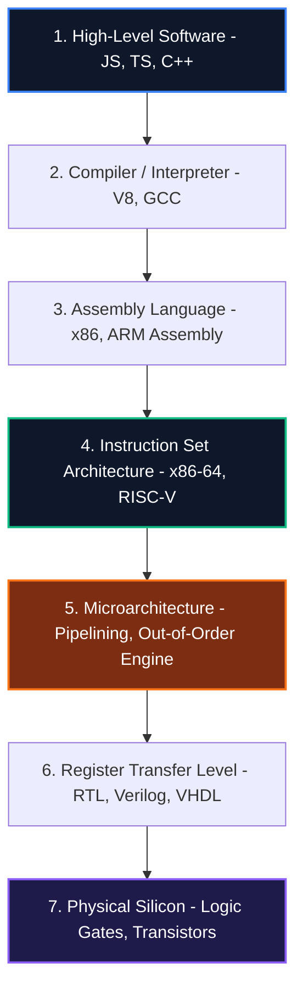
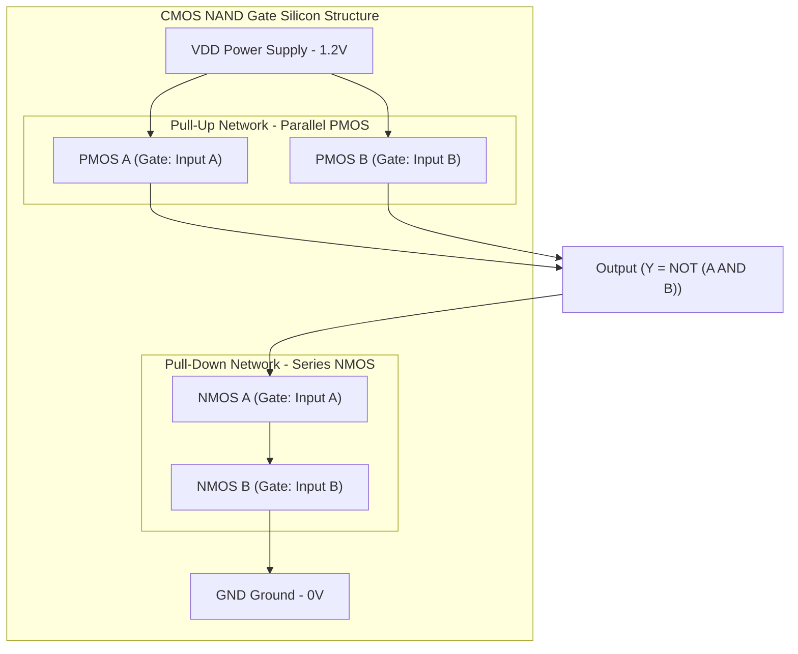
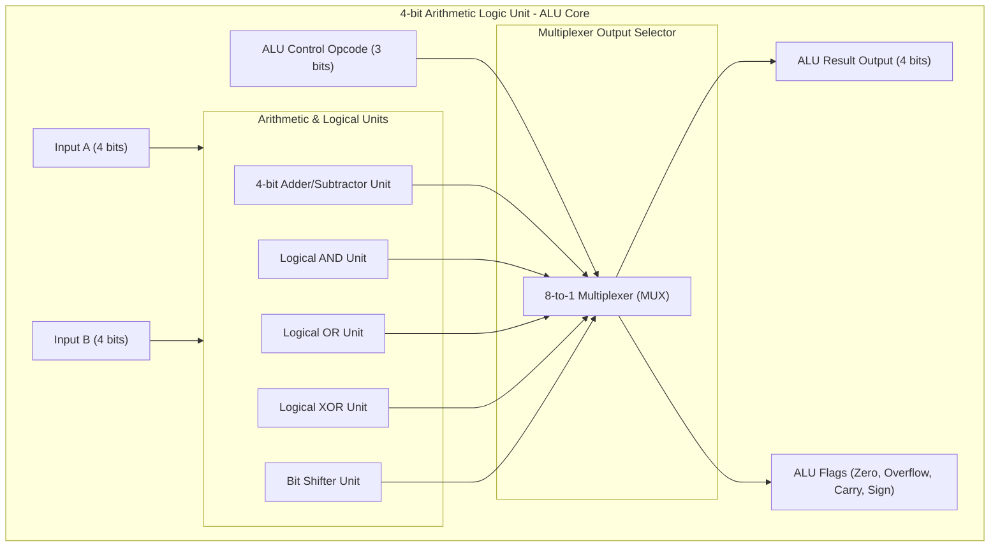

# 🔌 Computer Architecture & Microprocessor Engineering: Masterclass Roadmap

স্বাগতম! এই গাইডটি শুধুমাত্র কোনো থিওরিটিক্যাল টেক্সটবুক নয়। এটি মডার্ন সিলিকন চিপ কীভাবে ডিজাইন করা হয়, ওএস কীভাবে মেটাল বা হার্ডওয়্যারের সাথে কমিউনিকেট করে এবং প্রসেসর কীভাবে মিলি-সেকেন্ডে বিলিয়ন বিলিয়ন ইন্সট্রাকশন প্রসেস করে — তার একটি অ্যান্ড-টু-অ্যান্ড **সিস্টেমস লেভেল ব্লুপ্রিন্ট**।

আমরা লজিক গেটের সিলিকন লেভেল থেকে যাত্রা শুরু করব, ALU এবং CPU Registers তৈরি করব, x86 এবং AMD64 এর মেমরি আর্কিটেকচার ও বিটওয়াইজ ডিফারেন্স দেখব এবং শেষে প্রসেসরের অ্যাডভান্সড পাইপলাইনিং ও আউট-অফ-অর্ডার এক্সিকিউশন ইঞ্জিন (OoO Execution) নিয়ে ডিপ-ডাইভ করব।

---

## 🛠️ Hardware-to-Software Bridge: Mental Framework

একটি সফটওয়্যার অ্যাপ্লিকেশন যখন ওএস-এর ওপর চলে, তখন থেকে শুরু করে সিলিকন লেভেলে কারেন্ট প্রবাহিত হওয়া পর্যন্ত পুরো প্রসেসটিকে আমি এই **৭-লেয়ার সিস্টেম আর্কিটেকচার মডেলে** বিভক্ত করি:



---

## 📚 Table of Contents: The 10-Chapter Masterclass Roadmap

নিচের রোডম্যাপটি এমনভাবে সাজানো হয়েছে যাতে প্রতিটি টপিক ক্রমানুসারে তার আগের টপিকের ভিত্তির ওপর গড়ে ওঠে:

| Chapter | Topic | Core Focus Concepts | Target Architecture / Engine |
| :--- | :--- | :--- | :--- |
| **01** | **[Digital Logic & Silicon Foundations](#chapter-01-digital-logic--silicon-foundations)** | CMOS Transistors, Logic Gates (NAND/NOR), Flip-Flops & Latches | Register Transfer Level (RTL) |
| **02** | **[Arithmetic Logic Unit (ALU) Design](#chapter-02-arithmetic-logic-unit-alu-design)** | Half/Full Adders, 2's Complement, IEEE 754 Floating Point | Hardware Calculation Engine |
| **03** | **[CPU Registers & Register File](#chapter-03-cpu-registers--register-file)** | PC, IR, GPRs, SPRs, Register File Port Allocation | CPU Internal Memory |
| **04** | **[Control Unit & Instruction Execution](#chapter-04-control-unit--instruction-execution-cycle)** | Fetch-Decode-Execute Cycle, Finite State Machines, Control Bus | CPU Orchestrator |
| **05** | **[ISA: x86 vs AMD64 vs ARM vs RISC-V](#chapter-05-isa-x86-vs-amd64-vs-arm-vs-risc-v)** | CISC vs RISC, 32-bit Legacy vs 64-bit Flat Mode, Register Mapping | Instruction Set Architecture |
| **06** | **[CPU Pipelining & Hazard Mitigation](#chapter-06-cpu-pipelining--hazard-mitigation)** | 5-Stage Execution, Pipeline Hazards (RAW/WAW), Branch Prediction | High-Throughput CPU Core |
| **07** | **[Memory Hierarchy & L1/L2/L3 Cache Design](#chapter-07-memory-hierarchy--l1l2l3-cache-design)** | SRAM vs DRAM, Set-Associative Mapping, Cache Coherency (MESI) | Memory Latency Shield |
| **08** | **[Virtual Memory & TLB Internals](#chapter-08-virtual-memory--tlb-internals)** | Page Translation, MMU Hardware, TLB Miss/Hit penalties | Virtual Memory Engine |
| **09** | **[System Bus, I/O Interconnects & DMA](#chapter-09-system-bus-io-interconnects--dma)** | Address/Data/Control Bus, PCIe Gen 5 lanes, DMA Controllers | I/O & System Interconnects |
| **10** | **[Out-of-Order & Speculative Execution](#chapter-10-out-of-order--speculative-execution)** | Instruction Level Parallelism, Tomasulo Algorithm, Spectre Vulnerability | Next-Gen Superscalar Processor |

---

### 📖 Chapter 01: Digital Logic & Silicon Foundations

কম্পিউটার আর্কিটেকচারের সবচেয়ে নিম্ন স্তরের যাত্রা শুরু হয় সিলিকন এবং ট্রানজিস্টর থেকে। এই চ্যাপ্টারে আমরা শিখব কীভাবে বালুর তৈরি সিলিকন ট্রানজিস্টর ইলেকট্রনিক সুইচে রূপান্তরিত হয়।
* **CMOS Transistor Physics:** NMOS এবং PMOS ট্রানজিস্টর কীভাবে লজিক্যাল `0` এবং `1` ভোল্টেজ কন্ট্রোল করে।
* **Logic Gates:** AND, OR, NOT, NAND, NOR, XOR, XNOR গেট ডিজাইন। কেন NAND এবং NOR গেটকে "Universal Gates" বলা হয় এবং কীভাবে এগুলো দিয়ে যেকোনো বুলিয়ান ইকুয়েশন তৈরি করা যায়।
* **Combinational vs Sequential Circuits:** 
  - **Combinational:** কারেন্ট ইনপুট দেওয়া মাত্রই আউটপুট পাওয়া যায়, কোনো মেমরি নেই (যেমন: Adders, Multiplexers)।
  - **Sequential:** পূর্ববর্তী আউটপুট স্টোর করতে পারে, অর্থাৎ ক্লক সাইকেলের সাথে মেমরি ধরে রাখে (যেমন: Latches, Flip-Flops, Registers)।

---

### 📖 Chapter 02: Arithmetic Logic Unit (ALU) Design

ALU হলো প্রসেসরের গাণিতিক মস্তিষ্ক। এটি সমস্ত যোগ, বিয়োগ এবং লজিক্যাল অপারেশন সম্পন্ন করে।
* **Adder Architectures:** 
  - Half Adder এবং Full Adder গেট লেভেল স্কিম্যাটিক।
  - **Ripple Carry Adder (RCA):** সহজ কিন্তু স্লো (`O(N)` ল্যাটেন্সি), কারণ ক্যারি বিটকে এক এন্ড থেকে অন্য এন্ডে পাস হতে হয়।
  - **Carry Lookahead Adder (CLA):** ফাস্ট (`O(1)` ল্যাটেন্সি), এটি গাণিতিক সূত্রের মাধ্যমে ক্যারি প্রোপাগেশন জেনারেট করে।
* **Integer Representation & 2's Complement:** কেন আধুনিক কম্পিউটার বিয়োগ করার জন্য ডাইরেক্ট বিয়োগ না করে ২'স কমপ্লিমেন্ট (2's Complement) করে যোগের মাধ্যমে বিয়োগের কাজ সম্পন্ন করে।
* **Floating Point Units (FPU):** IEEE 754 স্ট্যান্ডার্ড অনুসারে সিঙ্গেল প্রিসিশন (32-bit: Sign, 8-bit Exponent, 23-bit Mantissa) এবং ডাবল প্রিসিশন (64-bit) আর্কিটেকচার এবং মেমরি বাস্ট ওভারফ্লো/আন্ডারফ্লো।

---

### 📖 Chapter 03: CPU Registers & Register File

রেজিস্টার হলো সিপিইউর নিজস্ব আল্ট্রা-ফাস্ট লোকাল মেমরি যা ১টি ক্লক সাইকেলেই ডেটা রিড ও রাইট করতে পারে।
* **Instruction Registers (IR):** বর্তমানে এক্সিকিউট হওয়া ইনস্ট্রাকশনটি ধারণ করে।
* **Program Counter (PC):** পরবর্তী এক্সিকিউট হতে যাওয়া ইনস্ট্রাকশনের মেমরি অ্যাড্রেস হোল্ড করে।
* **Special Purpose Registers (SPRs):** 
  - Stack Pointer (SP): কল স্ট্যাক ট্র্যাক রাখে।
  - Base Pointer (BP): লোকাল ফ্রেম ট্র্যাক রাখে।
  - Flags Register: ওভারফ্লো, সাইন, জিরো বিট কন্ডিশনাল জাম্পের জন্য ধরে রাখে।
* **Register File Design:** কীভাবে ট্রানজিস্টর অ্যারে এবং ডিকোডারের মাধ্যমে মাল্টি-পোর্ট রেজিস্টার ফাইল তৈরি করা হয় যাতে একই সাইকেলে একাধিক রিড এবং রাইট অপারেশন সম্পন্ন করা যায়।

---

### 📖 Chapter 04: Control Unit & Instruction Execution Cycle

কন্ট্রোল ইউনিট হলো সিপিইউ-র ট্রাফিক পুলিশ। এটি ডিকোড করা ইনস্ট্রাকশন অনুযায়ী সমস্ত ইন্টারনাল হার্ডওয়্যারে সঠিক সময়ে কন্ট্রোল সিগন্যাল পাঠায়।
* **Fetch-Decode-Execute (F-D-E) Cycle:**
  1. **Fetch:** PC-এর অ্যাড্রেস থেকে ইনস্ট্রাকশন র্যাম বা ক্যাশ থেকে এনে IR-এ রাখা।
  2. **Decode:** অপকোড (Opcode) এনালাইসিস করে কন্ট্রোল লাইন অন করা।
  3. **Execute:** ALU বা অন্য কোনো ফাংশনাল ইউনিট রান করা।
  4. **Memory Access:** লাগলে র্যামে রিড/রাইট করা।
  5. **Write-Back (WB):** রেজাল্ট রেজিস্টারে রাইট করা।
* **Hardwired vs Microprogrammed Control Units:**
  - **Hardwired:** ফিক্সড সিলিকন লজিক গেটস দিয়ে তৈরি, অত্যন্ত ফাস্ট কিন্তু কোনো ইনস্ট্রাকশন চেঞ্জ করা যায় না (RISC এ ব্যবহৃত)।
  - **Microprogrammed:** কন্ট্রোল সিগন্যালগুলো মাইক্রো-কোড হিসেবে একটি ছোট্ট রিড-অনলি মেমরিতে (Control Store) থাকে, স্লো কিন্তু সহজে আপডেট করা যায় (CISC এ ব্যবহৃত)।

---

### 📖 Chapter 05: ISA: x86 vs AMD64 vs ARM vs RISC-V

ইনস্ট্রাকশন সেট আর্কিটেকচার (ISA) হলো প্রসেসরের সাথে ওএস এবং সফটওয়্যারের প্রধান রিটেন কন্ট্রাক্ট বা ইন্টারফেস।
* **CISC vs RISC Philosophy:**
  - **CISC (Complex Instruction Set Computer):** হার্ডওয়্যারে জটিল কাজ করা (যেমন: x86)। ইন্সট্রাকশন সাইজ ভেরিয়েবল (১-১৫ বাইট)।
  - **RISC (Reduced Instruction Set Computer):** সফটওয়্যারে জটিল কাজ করা, হার্ডওয়্যার সিম্পল রাখা (যেমন: ARM, RISC-V)। ইন্সট্রাকশন সাইজ ফিক্সড (৪ বাইট)।
* **x86 vs AMD64 (x86-64) flat execution mode:**
  - x86 (IA-32) এর সীমাবদ্ধতা: ৩২-বিট অ্যাড্রেস স্পেসের কারণে সর্বোচ্চ ৪ জিবি র্যাম অ্যাক্সেস লিমিট।
  - AMD64 এর ইনোভেশন: ৬৪-বিট ইন্টিজার রেজিস্টার, এক্সটেন্ডেড ১৬টি জেনারেল পারপাস রেজিস্টার (RAX, RBX, RCX, RDX, RSI, RDI, RSP, RBP, R8-R15), এবং ফ্ল্যাট মেমরি পেজিং সাপোর্ট।
* **Register Mappings Across Architectures:** x86 এর ৩২-বিট রেজিস্টারগুলোর (EAX, EBX) সাথে ৬৪-বিট এক্সটেনশনের রেজিস্টারগুলোর (RAX, RBX) ফিজিক্যাল ব্যাকওয়ার্ড ম্যাচিং এবং এলাইনমেন্ট।

---

### 📖 Chapter 06: CPU Pipelining & Hazard Mitigation

সিপিইউর কর্মক্ষমতা বাড়াতে পাইপলাইনিং সবচেয়ে গুরুত্বপূর্ণ মেকানিজম। এটি একই সময়ে একাধিক ইনস্ট্রাকশনকে প্রসেসরের বিভিন্ন স্টেজে প্যারালালি এক্সিকিউট করে।
* **5-Stage Pipeline Model (Classic RISC):** IF (Fetch) -> ID (Decode) -> EX (Execute) -> MEM (Memory) -> WB (Write-back)।
* **Pipeline Hazards & Solutions:**
  - **Structural Hazards:** একাধিক স্টেজ একই রিসোর্স (যেমন র্যাম) একসাথে ইউজ করতে গেলে যে কনফ্লিক্ট হয়। সমাধান: Harvard Architecture (ইনস্ট্রাকশন ও ডেটার জন্য আলাদা ফিজিক্যাল বাস)।
  - **Data Hazards (RAW, WAR, WAW):** যখন একটি ইনস্ট্রাকশন তার পূর্ববর্তী ইনস্ট্রাকশনের ডেটার উপর নির্ভরশীল হয়। সমাধান: *Data Forwarding (Bypassing)* অথবা *Pipeline Bubbles / Stalls*।
  - **Control Hazards:** কন্ডিশনাল ব্রাঞ্চিংয়ের (if-else, loops) কারণে পরবর্তী ইনস্ট্রাকশন কোনটা হবে তা ইনস্ট্যান্টলি না জানা। সমাধান: *Branch Prediction (Static & Dynamic: BTB, gshare predictor)* এবং ভুল প্রেডিকশনের ক্ষেত্রে *Pipeline Flush* মেকানিজম।

---

### 📖 Chapter 07: Memory Hierarchy & L1/L2/L3 Cache Design

সিপিইউ রেজিস্টারের গতি ১ ক্লক সাইকেল কিন্তু মেইন র্যামের (DRAM) গতি প্রায় ৩০০ ক্লক সাইকেল। এই বিপুল গতির পার্থক্য মেটাতে প্রসেসরে ক্যাশ মেমরি ব্যবহার করা হয়।
* **Memory Hierarchy:** Registers (`O(1)` cycle) -> L1 Cache (4 cycles) -> L2 Cache (12 cycles) -> L3 Cache (40 cycles) -> DRAM (300 cycles)।
* **SRAM vs DRAM:** 
  - **SRAM:** ৬টি ট্রানজিস্টর দিয়ে ১টি বিট ধরে রাখে, অত্যন্ত দ্রুত কিন্তু মেমরি ডেনসিটি কম ও কস্টলি (ক্যাশে ব্যবহৃত)।
  - **DRAM:** ১টি ট্রানজিস্টর ও ১টি ক্যাপাসিটর দিয়ে ১টি বিট ধরে রাখে, স্লো কিন্তু মেমরি ডেনসিটি অনেক বেশি ও সস্তা (র্যামে ব্যবহৃত)।
* **Cache Mapping Architectures:**
  - **Direct-Mapped:** প্রতিটি মেমরি ব্লক ক্যাশের একটি নির্দিষ্ট লাইনে ম্যাপ হয় (হাই ক্যাশ মিস রেট)।
  - **Fully Associative:** যেকোনো মেমরি ব্লক ক্যাশের যেকোনো ফাঁকা লাইনে বসতে পারে (কমপ্লেক্স লজিক সার্চ)।
  - **N-Way Set-Associative:** মডার্ন কম্পিউটারে ব্যবহৃত ব্যালেন্সড হাইব্রিড সলিউশন।
* **Cache Coherency Protocols (MESI):** মাল্টি-কোর প্রসেসরে প্রতিটি কোরের নিজস্ব L1 ক্যাশ থাকে। একটি কোর যদি কোনো ভেরিয়েবল আপডেট করে, অন্য কোর কীভাবে তা সিঙ্ক করে। MESI (Modified, Exclusive, Shared, Invalid) স্টেট ফ্লো।

---

### 📖 Chapter 08: Virtual Memory & TLB Internals

ভার্চুয়াল মেমরি ওএস-কে প্রতিটি প্রসেসের জন্য একটি কাল্পনিক ফ্ল্যাট অ্যাড্রেস স্পেস তৈরি করতে সাহায্য করে, যা ব্যাকগ্রাউন্ডে ফিজিক্যাল র্যামের সাথে ডায়নামিকালি ট্রান্সলেটেড হয়।
* **Memory Management Unit (MMU):** সিপিইউ-র ভেতরের ডেডিকেটেড হার্ডওয়্যার চিপ যা রিয়েল-টাইমে ভার্চুয়াল অ্যাড্রেসকে ফিজিক্যাল মেমরি অ্যাড্রেসে কনভার্ট করে।
* **Multi-Level Page Table walking:** পুরো ৪ জিবি বা ২৫৬ টিবি মেমরির পেজ ম্যাপ একবারে র্যামে স্টোর করলে র্যাম খালি থাকবে না। তাই ট্রি-লাইক মাল্টি-লেভেল পেজ টেবিলের মাধ্যমে অ্যাড্রেস স্পেস হ্যান্ডেল করা হয়।
* **Translation Lookaside Buffer (TLB):** পেজ টেবিল ট্রান্সলেশন ফাস্ট করতে MMU-র ভেতরে থাকা ডেডিকেটেড হাই-স্পিড হার্ডওয়্যার ক্যাশ। TLB Hit এবং TLB Miss এর সময় সিপিইউ পেনাল্টি ওভারহেড এবং ওএস পেজ ফল্ট (Page Fault) রিকভারি।

---

### 📖 Chapter 09: System Bus, I/O Interconnects & DMA

সিপিইউ কেবল মেমরিই রিড করে না, এটি হার্ডডিস্ক, গ্রাফিক্স কার্ড এবং কিবোর্ড আই/ও ডিভাইসের সাথেও অত্যন্ত দ্রুত গতিতে কথা বলে।
* **System Bus:** address bus (কোন লোকেশনে যাবে), data bus (কী ডাটা যাবে), এবং control bus (রিড হবে নাকি রাইট হবে) এর কাজ ও মেমরি এলাইনমেন্ট।
* **High-Speed Interconnects:** PCIe Gen 5/6 লেন আর্কিটেকচার, Intel UPI / AMD Infinity Fabric (মাল্টি-সকেট মাদারবোর্ডে নোডের ভেতরের কমিউনিকেশন স্পিড আপ করার জন্য)।
* **Direct Memory Access (DMA):** ইনপুট/আউটপুট ডেটা (উদা: ১ জিবি ফাইল ডিস্ক থেকে র্যামে আনা) রিড করার জন্য সিপিইউকে বাইপাস করে সরাসরি DMA কন্ট্রোলারের মাধ্যমে মেইন মেমরিতে ডাটা রাইট করার মেকানিজম, যা সিপিইউ-র মূল্যবান সাইকেল সাশ্রয় করে।

---

### 📖 Chapter 10: Advanced Microarchitectures - Out-of-Order Execution

আধুনিক ইন্টেল বা এএমডি প্রসেসরগুলো কেবল সিকোয়েন্সিয়াল ইন্সট্রাকশন এক্সিকিউট করে না, এগুলো একই সাথে একাধিক ইন্সট্রাকশন প্যারালালি এবং তাদের ডিপেন্ডেন্সি চেক করে আগে-পরে রান করতে পারে।
* **Superscalar Execution & Instruction-Level Parallelism (ILP):** এক ক্লক সাইকেলে একাধিক ইনস্ট্রাকশন ফিজিক্যালি আলাদা ফাংশনাল ইউনিটে ডিস্ট্রিবিউট করা।
* **Out-of-Order (OoO) Execution with Tomasulo's Algorithm:**
  - **Reservation Stations:** ইনস্ট্রাকশনের ডাটা রেডি না হওয়া পর্যন্ত সিপিইউ বাফারে হোল্ড করে রাখে।
  - **Reorder Buffer (ROB):** আউট-অফ-অর্ডার এক্সিকিউট হওয়া ডাটাকে ক্রমানুসারে সাজিয়ে ঠিক সিকোয়েন্সিয়ালে রাইট-ব্যাক বা কমিট (Commit) করার রেজিস্টার বাফার, যা গ্যারান্টি দেয় ওএস ব্যাকগ্রাউন্ডে প্রসেসটি সিকোয়েন্সিয়াল দেখতে পাবে।
* **Speculative Execution & Security Vulnerabilities:**
  - **Branch Speculation:** সিপিইউ যদি ব্রাঞ্চ প্রেডিকশন ভুল করে, তবে ফিজিক্যালি মেমরি অ্যাক্সেস করে রাখা ওল্ড ক্যাশ ডাটা ট্রাঙ্কেট করার আগেই ক্যাশে থেকে যায়।
  - **Spectre & Meltdown:** মাইক্রোআর্কিটেকচারাল ক্যাশ টাইমিং সাইড-চ্যানেল অ্যাটাক (Cache Timing Side-Channel Attack) কীভাবে এই প্রেডিকশন মেকানিজম ব্যবহার করে মেমরির প্রটেক্টেড কার্নেল ডাটা রিড করতে পারে।

---

## 📖 Chapter 01: Digital Logic & Silicon Foundations

কম্পিউটার আর্কিটেকচার এবং প্রসেসর ডিজাইনের আদি ভিত্তি হলো ফিজিক্যাল সিলিকন এবং সেমিকন্ডাক্টর ফিজিক্স। সিলিকন নামক সাধারণ বালুকণা কীভাবে কোটি কোটি ট্রানজিস্টরে রূপান্তরিত হয়ে মিলি-সেকেন্ডে বিলিয়ন বিলিয়ন হিসাব সম্পন্ন করে — তা এই চ্যাপ্টারের মূল উপজীব্য। আমরা ডিজিটাল গেটের সিলিকন সুইচ লেভেল থেকে শুরু করে মেমরি রেজিস্টার ফাইলের মূল বিল্ডিং ব্লক পর্যন্ত অ্যান্ড-টু-অ্যান্ড সিস্টেম ডিজাইন করব।

### ১. ট্রানজিস্টর লেয়ার এবং CMOS আর্কিটেকচার (Silicon Switch & CMOS Physics)

সিলিকন (Silicon) হলো একটি চতুর্যোজী সেমিকন্ডাক্টর যা বিশুদ্ধ অবস্থায় বিদ্যুৎ পরিবহন করে না। কিন্তু এর সাথে পঞ্চযোজী (যেমন ফসফরাস) বা ত্রির্যোজী (যেমন বোরন) অপদ্রব্য মিশিয়ে যথাক্রমে **N-type** (মুক্ত ইলেকট্রন সমৃদ্ধ) এবং **P-type** (মুক্ত হোল সমৃদ্ধ) সেমিকন্ডাক্টর তৈরি করা হয় যাকে **Doping** বলা হয়।

#### ক. NMOS এবং PMOS ট্রানজিস্টর:
ট্রানজিস্টর হলো একটি ইলেকট্রনিক সুইচ যার ৩টি মূল টার্মিনাল থাকে: **Gate**, **Source**, এবং **Drain**।
* **NMOS (Negative-channel MOS):** গেটে হাই ভোল্টেজ (লজিক্যাল `1` বা 1.2V) দিলে সুইচটি অন হয় এবং Source থেকে Drain-এ বিদ্যুৎ প্রবাহিত হতে দেয়। গেট `0` হলে এটি অফ থাকে।
* **PMOS (Positive-channel MOS):** গেটে লো ভোল্টেজ (লজিক্যাল `0` বা 0V) দিলে সুইচটি অন হয় এবং বিদ্যুৎ পাস হতে দেয়। গেট `1` হলে এটি অফ থাকে।

#### খ. CMOS (Complementary MOS) আর্কিটেকচার:
আধুনিক প্রসেসরে শুধুমাত্র NMOS বা PMOS ব্যবহার না করে দুটিকে জোড়ায় জোড়ায় ব্যবহার করা হয় যাকে **CMOS** বলা হয়। CMOS এর দুটি মূল নেটওয়ার্ক থাকে:
1. **Pull-Up Network (PUN):** সমান্তরালভাবে যুক্ত PMOS দিয়ে তৈরি, যা আউটপুটকে হাই ভোল্টেজ (`VDD`) এর দিকে টানে।
2. **Pull-Down Network (PDN):** শ্রেণীবদ্ধভাবে যুক্ত NMOS দিয়ে তৈরি, যা আউটপুটকে গ্রাউন্ড (`VSS` বা 0V) এর দিকে টানে।

> [!NOTE]
> **CMOS এর সবচেয়ে বড় সুবিধা:** লজিক্যাল স্টেট যখন স্থির থাকে (Static State), তখন PUN এবং PDN এর যেকোনো একটি নেটওয়ার্ক সম্পূর্ণ অফ থাকে। ফলে সার্কিটের ভেতর দিয়ে কোনো কারেন্ট প্রবাহিত হতে পারে না। এই কারণে CMOS প্রযুক্তি চরম বিদ্যুৎ সাশ্রয়ী এবং প্রসেসর ঠান্ডা রাখতে সাহায্য করে!

---

### ২. হাই-ফিডেলিটি CMOS লজিক আর্কিটেকচার (CMOS Gate Level Schematic)

নিচের ডায়াগ্রামের মাধ্যমে একটি **CMOS NAND Gate**-এর সিলিকন আর্কিটেকচার ফ্লো দেখানো হলো, যেখানে ইনপুট গেটের চার্জ পরিবর্তন করে কীভাবে আউটপুটকে টেনে আনা হয়:



---

### ৩. ইউনিভার্সাল গেট এবং বুলিয়ান অ্যালজেব্রা (Universal Gates & Boolean Algebra)

ডিজিটাল ডিজাইনে **NAND** এবং **NOR** গেটকে ইউনিভার্সাল বা সার্বজনীন গেট বলা হয়। এর কারণ হলো, যেকোনো জটিল গেট (AND, OR, NOT, XOR) ফিজিক্যালি শুধুমাত্র NAND বা NOR গেটের কম্বিনেশন ব্যবহার করে তৈরি করা সম্ভব। সিলিকন ম্যানুফ্যাকচারিং প্ল্যান্টে ডাইরেক্ট AND বা OR গেট তৈরি না করে ইউনিভার্সাল গেট দিয়ে সমস্ত চিপ আর্কিটেক্ট করা হয়, যা উৎপাদন খরচ ৯০% কমিয়ে দেয়।

#### ক. ডি মরগ্যানের সূত্র (De Morgan's Laws) ও লজিক সিম্প্লিফিকেশন:
সার্কিট সাইজ ছোট করতে এবং ট্রানজিস্টর সংখ্যা কমাতে বুলিয়ান অ্যালজেব্রা ব্যবহার করা হয়:

<Math>
NOT (A · B) = (NOT A) + (NOT B)
</Math>
<Math>
NOT (A + B) = (NOT A) · (NOT B)
</Math>

ধরি, আমাদের একটি বুলিয়ান ফাংশন আছে:
<Math>
Y = (A · B) + (A · NOT B)
</Math>

* **লজিক ডিস্ট্রিবিউশন:**
<Math>
Y = A · (B + NOT B)
</Math>

* **যেহেতু `B + NOT B = 1`, তাই ফাংশনটি দাঁড়ায়:**
<Math>
Y = A · 1 = A
</Math>

* **সিদ্ধান্ত:** ৪টি ট্রানজিস্টর খরচ করার বদলে আমরা সরাসরি ইনপুট তারের (`A`) কানেকশনের মাধ্যমে এই পুরো লজিকটি কোনো এক্সট্রা গেট ছাড়াই রিপ্রেজেন্ট করতে পারি!

---

### ৪. কম্বিনেশনাল বনাম সিকোয়েন্সিয়াল লজিক সার্কিট (Combinational vs Sequential Circuits)

ডিজিটাল আর্কিটেকচারকে দুটি প্রধান ভাগে ভাগ করা যায়:

#### ক. কম্বিনেশনাল সার্কিট (Combinational Circuits - Memoryless):
যেসব সার্কিটের আউটপুট শুধুমাত্র বর্তমান ইনপুটের ওপর নির্ভর করে, তাদের কোনো মেমরি বা পূর্ববর্তী স্টেট মনে রাখার ক্ষমতা নেই।
* **Multiplexer (MUX):** এটি মূলত একটি "ডাটা সিলেক্টর"। এর `2^N` টি ইনপুট লাইনের মধ্য থেকে কন্ডিশনাল সিলেক্ট লাইনের মাধ্যমে যেকোনো ১টি ইনপুটকে আউটপুটে পাস করে।
  - ২-টু-১ মাল্টিপ্লেক্সার ইকুয়েশন:
<Math>
Y = (S · A) + (NOT S · B)
</Math>
(যেখানে `S` হলো সিলেক্ট লাইন)।

#### খ. সিকোয়েন্সিয়াল সার্কিট (Sequential Circuits - With Memory):
যেসব সার্কিটের আউটপুট বর্তমান ইনপুটের পাশাপাশি পূর্ববর্তী স্টেটের (মেমরি) ওপরও নির্ভর করে।
* **SR Latch (NOR Gate feedback loop):** এটি মেমরি স্টোরেজের প্রাচীনতম রূপ। এটিতে ইনপুট সেট (`S`) এবং রিসেট (`R`) সিগন্যাল না দেওয়া পর্যন্ত আউটপুট তার আগের স্টেট ধরে রাখে।
* **D-type Flip-Flop (Edge-Triggered Memory):** এটি ১টি বিট (`0` বা `1`) নিখুঁতভাবে স্টোর করতে পারে। D-ফিডব্যাক ফ্লিপ-ফ্লপ শুধুমাত্র ক্লক সিগন্যালের **Rising Edge** (লো ভোল্টেজ থেকে হাই ভোল্টেজে ওঠার ঠিক মাইক্রো-সেকেন্ডে) ইনপুট ডেটা কপি করে আউটপুটে নিয়ে যায় এবং পরবর্তী ক্লক পালস না আসা পর্যন্ত ভ্যালুটি লক করে রাখে। এটিই সমস্ত সিপিইউ রেজিস্টারের মূল ভিত্তি!

---

### ৫. প্র্যাক্টিক্যাল সার্কিট সিমুলেশন (TypeScript)

আমরা নিচে টাইপস্ক্রিপ্ট ব্যবহার করে একটি সম্পূর্ণ **Digital Circuit Simulation Engine** তৈরি করলাম, যার মধ্যে সিলিকন ট্রানজিস্টর সুইচিং মডেল এবং ক্লক এজ-ট্রিগার্ড **D-Flip-Flop (Register Memory)** ইমপ্লিমেন্ট করা হয়েছে:

```typescript
// ১. ট্রানজিস্টর সুইচ লেভেল মডেল (Silicon Transistor Switch Simulator)
export class TransistorSimulator {
  // NMOS: Gate High হলে Source থেকে Drain এ ভ্যালু পাস করে
  public static simulateNMOS(gate: boolean, source: boolean): boolean | null {
    return gate ? source : null; // Open switch if gate is false
  }

  // PMOS: Gate Low হলে Source থেকে Drain এ ভ্যালু পাস করে
  public static simulatePMOS(gate: boolean, source: boolean): boolean | null {
    return !gate ? source : null; // Open switch if gate is true
  }

  // CMOS NAND Gate ডিজাইন (২টি সমান্তরাল PMOS এবং ২টি শ্রেণীবদ্ধ NMOS)
  public static simulateCMOSNAND(inputA: boolean, inputB: boolean): boolean {
    const VDD = true;  // 1.2V Power
    const GND = false; // 0V Ground

    // Pull-Up Network (Parallel PMOS to VDD)
    const pmosA = this.simulatePMOS(inputA, VDD);
    const pmosB = this.simulatePMOS(inputB, VDD);
    const pullUpOutput = pmosA !== null ? pmosA : (pmosB !== null ? pmosB : null);

    // Pull-Down Network (Series NMOS to GND)
    let pullDownOutput: boolean | null = null;
    const nmosA = this.simulateNMOS(inputA, VDD);
    if (nmosA === VDD) {
      const nmosB = this.simulateNMOS(inputB, GND);
      if (nmosB !== null) {
        pullDownOutput = GND; // Both closed, output connected to GND
      }
    }

    // CMOS আউটপুট নির্ধারণ
    if (pullUpOutput !== null) {
      return pullUpOutput; // VDD wins
    }
    return pullDownOutput !== null ? pullDownOutput : GND;
  }
}

// ২. ক্লক এজ-ট্রিগার্ড D-Flip-Flop (1-bit Register Memory Engine)
export class DFlipFlop {
  private storedState = false; // Q Output
  private lastClockState = false;

  // clock এজ ট্র্যাকিং এবং স্টোরেজ মূল্যায়ন
  public evaluate(dataInput: boolean, clock: boolean): { q: boolean; qBar: boolean } {
    // Rising Edge সনাক্তকরণ (false থেকে true হওয়া)
    const isRisingEdge = !this.lastClockState && clock;

    if (isRisingEdge) {
      this.storedState = dataInput; // Rising edge-এ ডেটা কপি করে লক করা হলো
    }

    this.lastClockState = clock;

    return {
      q: this.storedState,
      qBar: !this.storedState // Q-এর বিপরীতমুখী আউটপুট
    };
  }

  public getStoredValue(): boolean {
    return this.storedState;
  }
}

// === ডেমো রান এবং গেট সিমুলেশন পাইলট ===
function runDigitalLogicDemo() {
  console.log("=== STARTING SILICON LOGIC & MEMORY SIMULATOR ===");

  // ক. CMOS NAND গেট ট্রুথ টেবিল যাচাই
  console.log("
--- CMOS NAND Gate Simulation (Silicon Transistor Level) ---");
  const testInputs = [
    { a: false, b: false },
    { a: false, b: true },
    { a: true, b: false },
    { a: true, b: true },
  ];

  testInputs.forEach((input) => {
    const output = TransistorSimulator.simulateCMOSNAND(input.a, input.b);
    console.log(
      `Input A: ${input.a ? "1" : "0"} | Input B: ${input.b ? "1" : "0"} ` +
      `-> CMOS NAND Output: ${output ? "1" : "0"} (Expected: ${!(input.a && input.b) ? "1" : "0"})`
    );
  });

  // খ. D-Flip-Flop মেমরি লক ট্র্যাকিং
  console.log("
--- Edge-Triggered D-Flip-Flop Simulation (1-bit Memory) ---");
  const register = new DFlipFlop();

  // ১. ইনিশিয়াল স্টেট
  console.log(`Initial Register State: ${register.getStoredValue() ? "1" : "0"}`);

  // ২. ক্লক যখন Low, ইনপুট হাই দেওয়া হলেও স্টেট চেঞ্জ হবে না
  console.log("
[Action] Inputting '1' but keeping Clock LOW...");
  let res = register.evaluate(true, false);
  console.log(`Register State: ${res.q ? "1" : "0"} (Data Lock Success: state remained unchanged)`);

  // ৩. ক্লক যখন High (Rising Edge!), ইনপুট কপি হবে
  console.log("
[Action] Triggering RISING EDGE (Clock 0 -> 1)...");
  res = register.evaluate(true, true);
  console.log(`Register State: ${res.q ? "1" : "0"} (Success: '1' successfully locked in memory!)`);

  // ৪. ক্লক যখন স্টেডি বা হাই, ইনপুট পরিবর্তন করলেও মেমরি চেঞ্জ হবে না (লকড স্টেট)
  console.log("
[Action] Changing Input to '0' while keeping Clock HIGH...");
  res = register.evaluate(false, true);
  console.log(`Register State: ${res.q ? "1" : "0"} (Data Lock Success: state remained '1')`);

  // ৫. ক্লক লো করে আবার রাইজিং এজ দিলে নতুন ইনপুট লো হবে
  console.log("
[Action] Resetting Clock to LOW, then Rising Edge with Input '0'...");
  register.evaluate(false, false); // Reset clock state to low
  res = register.evaluate(false, true); // Rising edge!
  console.log(`Register State: ${res.q ? "1" : "0"} (Success: '0' successfully locked in memory!)`);
}

runDigitalLogicDemo();
```

---

### 🛑 Staff Architect Hardware Systems Edge Cases

বাস্তব ডিস্ট্রিবিউটেড হার্ডওয়্যার এবং আল্ট্রা-হাই ফ্রিকোয়েন্সি সিপিইউ (যেমন ৪.৫ গিগাহার্টজ প্রসেসর) তৈরি করার সময় ডিজিটাল লজিকে যে ৩টি অত্যন্ত জটিল ও ফাটাল সমস্যা দেখা দেয় এবং স্টাফ-লেভেল হার্ডওয়্যার ডিজাইন সলিউশন নিচে আলোচনা করা হলো:

#### ১. Clock Skew and Clock Drift in Ultra-High Frequencies (ক্লক সিগন্যাল বিলম্ব ও অসঙ্গতি)
৪ গিগাহার্টজ ফ্রিকোয়েন্সিতে চলা একটি সিপিইউ-র ১টি ক্লক সাইকেল সম্পন্ন হতে সময় লাগে মাত্র **২৫০ পিকো-সেকেন্ড** (`250 * 10^-12 sec`)। তামা বা অ্যালুমিনিয়ামের তারের ভেতর দিয়ে আলোর গতিতেও যদি কারেন্ট প্রবাহিত হয়, তবে সিপিইউ ডাই-এর এক এন্ড থেকে অন্য এন্ডে ক্লক সিগন্যাল পৌঁছাতে প্রায় ৫০-৮০ পিকো-সেকেন্ড সময় লাগে। এর ফলে নোড 'A' এর রেজিস্টার এবং নোড 'B' এর রেজিস্টারের কাছে ক্লক সিগন্যাল ভিন্ন ভিন্ন সময়ে পৌঁছায় যাকে **Clock Skew** বলা হয়। এটি ভুল টাইমিংয়ে ডাটা রিড করে সিপিইউ ক্র্যাশ করায়।
* **স্টাফ-লেভেল সল্যুশন (H-Tree Clock Distribution & Phase-Locked Loops):**
  - **H-Tree Network:** সিপিইউ ডাই-তে ক্লকের তারের ডিজাইনটি একটি প্রতিসম H-আকৃতির বাইনারি ট্রির মতো করা হয়। এর ফলে ক্লক সোর্স থেকে প্রতিটি ফিজিক্যাল ফ্লিপ-ফ্লপের দূরত্ব ঠিক পিকো-সেকেন্ড পর্যন্ত হুবহু সমান থাকে।
  - **PLL Locking:** একই সাথে **Phase-Locked Loops (PLL)** হার্ডওয়্যার ব্লক ব্যবহার করে ভোল্টেজ কন্ট্রোলের মাধ্যমে ক্লকের ফেজ এবং ফ্রিকোয়েন্সি নিখুঁতভাবে সিঙ্ক রাখা হয়।

#### ২. Propagational Delay and Glitching Hazards (ডিজিটাল সার্কিটে ক্ষণস্থায়ী এরর)
যেকোনো রিয়েল সিলিকন লজিক গেট ভোল্টেজ পরিবর্তন করতে প্রায় ২ থেকে ৫ পিকো-সেকেন্ড সময় নেয় যাকে **Propagational Delay** বলা হয়। একটি জটিল কম্বিনেশনাল সার্কিটে ইনপুট থেকে আউটপুটের দূরত্ব যদি বিভিন্ন রাস্তায় আলাদা হয়, তবে আউটপুটের মান স্থির হওয়ার আগে মিলি-সেকেন্ডের ফ্র্যাকশনে একাধিকবার ওঠানামা করে (ফ্লিকারিং)। একে **Glitch** বা **Hazard** বলা হয়, যা অতিরিক্ত বিদ্যুৎ ক্ষয় করে এবং ডাটাবেজ রেজিস্টারে ভুল মান লক করার ঝুঁকি তৈরি করে।
* **স্টাফ-লেভেল সল্যুশন (Hazard-Free Karnaugh Maps & Pipeline Boundaries):**
  - **Glitch Minimization:** কার্নো ম্যাপ (K-Map) এ লজিক ডিজাইন করার সময় অতিরিক্ত রিডান্ডেন্ট গেট লুপ যুক্ত করা হয় যা ট্রানজিশনের সময় ভোল্টেজ ড্রপ হতে দেয় না।
  - **Synchronous Design:** প্রতিটি কম্বিনেশনাল ব্লকের আউটপুটকে ডাইরেক্ট পরবর্তী গেটে না পাঠিয়ে একটি **D-Flip-Flop Boundary (Register Boundary)** দিয়ে ঘিরে দেওয়া হয়। ক্লক সাইকেল শেষ হওয়ার আগে কোনো ডাটা রিড না করায় মধ্যবর্তী গ্লিচগুলো সম্পূর্ণরূপে ফিল্টার হয়ে যায়।

#### ৩. Quantum Tunneling & Static Leakage in Sub-5nm Nodes (কোয়ান্টাম টানেলিং ও লিকেজ কারেন্ট)
প্রসেসর নোড যখন ৭ ন্যানোমিটার বা ৫ ন্যানোমিটারের নিচে নেমে যায়, তখন ট্রানজিস্টরের ভেতরের সিলিকন ডাই-অক্সাইড মেটাল গেটের দেয়াল মাত্র কয়েকটি এটম (অণু) সমান পাতলা হয়। এই চরম ক্ষুদ্র স্কেলে ইলেকট্রন আর ফিজিক্যাল বাধা মানে না এবং কোয়ান্টাম ফিজিক্সের **Quantum Tunneling** মেকানিজমের কারণে দেয়াল ভেদ করে লিক করা শুরু করে। ফলে সিপিইউ সম্পূর্ণ আইডল বা কোনো কাজ না করলেও প্রভূত বিদ্যুৎ খরচ হয় এবং চরম গরম হয়ে পুড়ে যায়।
* **স্টাফ-লেভেল সল্যুশন (Transition from FinFET to GAAFET / Nanosheet Architecture):**
  - **GAAFET Architecture:** ৩ ন্যানোমিটারের নিচে আমরা ত্রিমাত্রিক FinFET ট্রানজিস্টর বাদ দিয়ে **Gate-All-Around (GAAFET) Nanosheet** প্রযুক্তি ব্যবহার করি। এখানে গেটের মেটাল চ্যানেলটিকে চারদিক থেকে সিলিন্ডার বা সিটের মতো ঘিরে রাখা হয়, যা ইলেকট্রনের ওপর সর্বোচ্চ ইলেক্ট্রোস্ট্যাটিক কন্ট্রোল নিশ্চিত করে এবং কোয়ান্টাম টানেলিং লিকেজ ৯৫% কমিয়ে দেয়।

---

---

## 📖 Chapter 02: Arithmetic Logic Unit (ALU) Design

সিপিইউ-এর সমস্ত গাণিতিক হিসাব-নিকাশ এবং লজিক্যাল সিদ্ধান্ত গ্রহণের মূল কেন্দ্র হলো **Arithmetic Logic Unit (ALU)**। আপনি ব্রাউজারে স্ক্রল করছেন, ডাটাবেজ ইনডেক্স সার্চ করছেন, নাকি ৩ডি গেমে গ্রাফিক্স রেন্ডার করছেন — ব্যাকগ্রাউন্ডে কোটি কোটি ভোল্টেজ সিগন্যাল ALU-র মধ্য দিয়ে প্রবাহিত হয়েই এই ফলাফল প্রডিউস করে।

এই চ্যাপ্টারে আমরা ডিজিটাল অ্যাডার আর্কিটেকচার ডিজাইন করব, ২'স কমপ্লিমেন্টের ম্যাজিক উন্মোচন করব, IEEE 754 ফ্লোটিং পয়েন্টের ভগ্নাংশ ক্যালকুলেশন বুঝব এবং শেষে একটি হাই-পারফরম্যান্স **ALU Simulator Engine** কোড করব।

---

### ১. অ্যাডার আর্কিটেকচার ও ক্যারি সমাধান (Adder Architectures & Carry Lookahead)

সিপিইউ-তে যেকোনো গাণিতিক অপারেশনের (গুণন, ভাগ, বিয়োগ) মূল বিল্ডিং ব্লক হলো **যোগ (Addition)**। প্রসেসরে যোগ করার জন্য নিচে উল্লিখিত ক্রমানুযায়ী হার্ডওয়্যার ডিজাইন করা হয়:

#### ক. Half Adder এবং Full Adder:
* **Half Adder:** এটি ২টি সিঙ্গেল বিট (`A` এবং `B`) যোগ করে একটি Sum (`S`) এবং Carry (`C`) আউটপুট দেয়।
  - সমীকরণ:
<Math>
Sum = A ⊕ B   (XOR)
</Math>
<Math>
Carry = A · B   (AND)
</Math>
* **Full Adder:** এটি পূর্ববর্তী কম-গুরুত্বপূর্ণ বিটের ক্যারি আউটপুটকে (Carry In / `Cin`) সহ মোট ৩টি বিট যোগ করতে পারে।
  - সমীকরণ:
<Math>
Sum = A ⊕ B ⊕ Cin
</Math>
<Math>
CarryOut = (A · B) + (Cin · (A ⊕ B))
</Math>

#### খ. Ripple Carry Adder (RCA):
১-বিট ফুল অ্যাডারগুলোকে চেইনের মতো যুক্ত করে একটি মাল্টি-বিট (যেমন ৩২-বিট বা ৬৪-বিট) যোগ করার সার্কিট তৈরি করা হয়। একে **Ripple Carry Adder** বলা হয়।
* *সীমাবদ্ধতা:* প্রতিটি অ্যাডারকে তার পূর্ববর্তী অ্যাডারের ক্যারি সিগন্যাল পাওয়ার জন্য অপেক্ষা করতে হয়। ফলে বিট সাইজ যত বাড়ে, ক্যারি সিগন্যাল রিয়েল-টাইমে রীপল (ফ্লিপ-ফ্লপ তরঙ্গের মতো) হতে তত বেশি সময় নেয়, যা সিপিইউ-র ম্যাক্সিমাম স্পিড ব্লক করে দেয় (`O(N)` ল্যাটেন্সি)।

#### গ. Carry Lookahead Adder (CLA):
RCA-এর এই ল্যাটেন্সি দূর করতে **Carry Lookahead Adder** ব্যবহার করা হয়। এটি পূর্ববর্তী অ্যাডারের উত্তরের অপেক্ষা না করেই ডাইরেক্ট ইনপুট দেখে ক্যারি আগে থেকেই প্রি-ক্যালকুলেট করে ফেলে!
* CLA প্রতিটি বিটের জন্য ২টি ভেরিয়েবল ডিফাইন করে:
  - **Generate (G):** যদি উভয় ইনপুট ১ হয়, তবে ক্যারি জেনারেট হবেই।
<Math>
G_i = A_i · B_i
</Math>
  - **Propagate (P):** যদি যেকোনো একটি ইনপুট ১ হয়, তবে ক্যারি সামনের দিকে প্রোপাগেট বা পাস হবে।
<Math>
P_i = A_i ⊕ B_i
</Math>
* এর ফলে পরবর্তী ক্যারিগুলির গাণিতিক সমীকরণ দাঁড়ায়:
<Math>
C_{i+1} = G_i + (P_i · C_i)
</Math>
* উদাহরণস্বরূপ, `C_4` ক্যারি বের করার জন্য `C_3, C_2` এর কোনো অপেক্ষাই লাগবে না, সরাসরি ইনপুট থেকে ক্যালকুলেশন হবে:
<Math>
C_4 = G_3 + P_3·G_2 + P_3·P_2·G_1 + P_3·P_2·P_1·G_0 + P_3·P_2·P_1·P_0·C_0
</Math>
* *সিদ্ধান্ত:* এর ফলে ক্যারি ক্যালকুলেশন `O(1)` স্তরে নেমে আসে এবং ALU-র গতি ১০০ গুণ বৃদ্ধি পায়!

---

### ২. হাই-ফিডেলিটি ALU ইন্টারনাল আর্কিটেকচার (ALU Core Diagram)

নিচের ডায়াগ্রামটিতে একটি **4-bit ALU Core Architecture** দেখানো হলো, যেখানে ইনপুট এ এবং বি কীভাবে কন্ট্রোল অপকোড (Opcode) দ্বারা ডাইরেক্টেড হয়ে সঠিক গাণিতিক বা লজিক্যাল ইউনিটে রুট হয় এবং পরিশেষে 8-to-1 Multiplexer (MUX) এর মাধ্যমে ফাইনাল আউটপুট ও ফ্ল্যাগ রেজাল্ট প্রডিউস করে:



---

### ৩. ইন্টিজার অ্যারিথমেটিক ও ২'স কমপ্লিমেন্ট (Integer Arithmetic & 2's Complement)

কম্পিউটার ডিজাইনে বিয়োগ করার জন্য আলাদা কোনো ফিজিক্যাল "বিয়োগ সার্কিট" থাকে না। প্রসেসরে যোগের হার্ডওয়্যার দিয়েই বিয়োগ সম্পন্ন করা হয় **২'স কমপ্লিমেন্ট (2's Complement)** লজিক ব্যবহার করে।
* **2's Complement Theory:** যেকোনো ধনাত্মক সংখ্যার বাইনারির সব বিটকে উল্টে দিয়ে (1's complement) তার সাথে ১ যোগ করলে ঋণাত্মক সংখ্যা পাওয়া যায়।
<Math>
-X = NOT(X) + 1
</Math>
* উদাহরণস্বরূপ, ৮-বিট সিস্টেমে `+5` হলো `00000101`।
  - `NOT(+5)` = `11111010`
  - `NOT(+5) + 1` = `11111011` (যা `-5` কে নির্দেশ করে)
* **বিয়োগ অপারেশন:** `A - B` করার জন্য ALU ব্যাকগ্রাউন্ডে `A + (-B)` বা `A + (NOT(B) + 1)` হিসাব করে। এর ফলে একই অ্যাডার সার্কিট দিয়ে যোগ ও বিয়োগ দুটিই নিখুঁতভাবে করা যায়, যা কোটি কোটি ট্রানজিস্টর এরিয়া সাশ্রয় করে!

#### ক. Overflow Detection Logic (ওভারফ্লো সনাক্তকরণ):
সীমিত বিটের সিস্টেমে দুটি বড় সংখ্যা যোগ করলে যদি ফলাফল স্টোরেজ সীমার বাইরে চলে যায়, তবে তাকে **Overflow** বলে।
* **Signed Overflow:** যদি দুটি পজিটিভ সংখ্যা যোগ করে নেগেটিভ উত্তর আসে অথবা দুটি নেগেটিভ সংখ্যা যোগ করে পজিটিভ উত্তর আসে।
* **ALU Hardware Overflow Logic:** সাইন বিটের (Most Significant Bit - MSB) ইনপুট ক্যারি (`Cin` of MSB) এবং আউটপুট ক্যারি (`Cout` of MSB) এর মধ্যে XOR করে ওভারফ্লো ডিটেক্ট করা হয়:
<Math>
Overflow = Cin_MSB ⊕ Cout_MSB
</Math>

---

### ৪. ফ্লোটিং পয়েন্ট ইউনিট - IEEE 754 স্ট্যান্ডার্ড (Floating Point Units & IEEE 754 Standard)

বাস্তব সংখ্যা বা ভগ্নাংশ (যেমন `3.1416` বা `0.000123`) প্রসেস করতে প্রসেসরে একটি ডেডিকেটেড হার্ডওয়্যার ব্লক থাকে যাকে **FPU (Floating Point Unit)** বলা হয়। এটি **IEEE 754** ইন্টারন্যাশনাল স্ট্যান্ডার্ড ফলো করে।

#### ক. ৩টি কোর কম্পোনেন্ট (Single Precision - 32 bit):
1. **Sign Bit (1 bit):** `0` হলে পজিটিভ, `1` হলে নেগেটিভ।
2. **Exponent (8 bits):** সংখ্যার স্কেল নির্ধারণ করে। এতে ঋণাত্মক ঘাত রিপ্রেজেন্ট করতে একটি **Bias value** (127) যোগ করা হয়।
3. **Mantissa / Fraction (23 bits):** মূল সিগনিফিক্যান্ট ডিজিট ধরে রাখে। প্রথম বিটটি সর্বদা ফিক্সড `1` ধরে নেওয়া হয় (Normalized Form: `1.fraction`), তাই এটি আলাদাভাবে স্টোর করতে হয় না।

#### খ. ফ্লোটিং পয়েন্ট যোগ করার ৩টি ধাপ (FPU Arithmetic Step):
২টি ফ্লোটিং পয়েন্ট সংখ্যা (যেমন `1.5 * 2^2` এবং `0.75 * 2^3`) যোগ করার জন্য FPU-কে নিচের ৩টি অ্যালগরিদমিক ধাপ পার হতে হয়:
1. **Align Exponents:** ছোট এক্সপোনেন্ট বিশিষ্ট সংখ্যাটির ম্যান্টিসাকে ডান দিকে শিফট করে এক্সপোনেন্ট সমান করা (যেমন `1.5 * 2^2` কে `0.75 * 2^3` এর সাথে এলাইন করে `0.375 * 2^3` করা)।
2. **Add Mantissas:** এক্সপোনেন্ট সমান হওয়ার পর ম্যান্টিসা দুটি যোগ করা (`0.375 + 0.75 = 1.125`)।
3. **Normalize & Round:** যোগফলকে পুনরায় স্ট্যান্ডার্ড ফরমেটে নেওয়া এবং নির্দিষ্ট বিট সীমার ভেতর রাউন্ড করা।

---

### ৫. প্র্যাক্টিক্যাল সার্কিট সিমুলেশন (TypeScript)

আমরা নিচে টাইপস্ক্রিপ্ট ব্যবহার করে একটি সম্পূর্ণ **4-bit ALU Core Engine** কোড করলাম, যার মধ্যে ৩-বিট কন্ট্রোল অপকোড ডিকোডিং, **Ripple Carry Adder (RCA)**, গাণিতিক ও লজিক্যাল শিফট অপারেশন এবং **ALU Status Flags** ডিজাইন করা হয়েছে:

```typescript
// ALU রেজাল্ট ও কন্ডিশনাল ফ্ল্যাগ আউটপুট স্ট্রাকচার
export interface ALUResult {
  result: number;      // 4-bit unsigned রেজাল্ট (0-15)
  zeroFlag: boolean;    // উত্তর ০ হলে true
  carryFlag: boolean;   // ক্যারি আউটফ্লো হলে true
  signFlag: boolean;    // সাইন বিট ১ (MSB = 1) হলে true (নেগেটিভ নির্দেশক)
  overflowFlag: boolean; // সাইনড ওভারফ্লো ঘটলে true
}

export class ALUCore4Bit {
  // অপকোড ডেফিনিশন টেবিল
  public static readonly OP_ADD   = 0b000; // যোগ (Addition)
  public static readonly OP_SUB   = 0b001; // বিয়োগ (Subtraction)
  public static readonly OP_AND   = 0b010; // লজিক্যাল AND
  public static readonly OP_OR    = 0b011; // লজিক্যাল OR
  public static readonly OP_XOR   = 0b100; // লজিক্যাল XOR
  public static readonly OP_NOT   = 0b101; // লজিক্যাল NOT Input A
  public static readonly OP_LSH   = 0b110; // Left Shift Input A
  public static readonly OP_RSH   = 0b111; // Right Shift Input A

  /**
   * ১-বিট ফুল অ্যাডার সিমুলেটর
   */
  private static fullAdder1Bit(a: boolean, b: boolean, cin: boolean): { sum: boolean; cout: boolean } {
    const sum = a !== b !== cin; // A XOR B XOR Cin
    const cout = (a && b) || (cin && (a !== b)); // (A AND B) OR (Cin AND (A XOR B))
    return { sum, cout };
  }

  /**
   * ৪-বিট রিপ্রেজেন্টেশনাল রিডিউস অ্যাডার / সাবট্রাক্টর ইঞ্জিন
   * @param isSub: true হলে বিয়োগ (2's Complement Add) হবে
   */
  public static addSub4Bit(a: number, b: number, isSub: boolean): { result: number; carryOut: boolean; overflow: boolean } {
    // 4-bit masking
    let valA = a & 0xF;
    let valB = b & 0xF;

    // Subtraction এর জন্য ২'স কমপ্লিমেন্ট: B কে ইনভার্ট করে Carry In = 1 করা
    let cin = isSub;
    if (isSub) {
      valB = (~valB) & 0xF; // 1's complement
    }

    let sumResult = 0;
    let currentCarry = cin;
    let carryInMSB = false; // ৩য় বিট থেকে ৪র্থ বিটের ক্যারি ইনপুট
    let carryOutMSB = false; // ৪র্থ বিট (MSB) থেকে ক্যারি আউটপুট

    for (let i = 0; i < 4; i++) {
      const bitA = ((valA >> i) & 1) === 1;
      const bitB = ((valB >> i) & 1) === 1;

      if (i === 3) {
        carryInMSB = currentCarry; // ৩য় বিটের ক্যারি আউটপুটই ৪র্থ বিটের ক্যারি ইন
      }

      const { sum, cout } = this.fullAdder1Bit(bitA, bitB, currentCarry);
      
      if (sum) {
        sumResult |= (1 << i);
      }
      currentCarry = cout;

      if (i === 3) {
        carryOutMSB = cout;
      }
    }

    // signed overflow logic: MSB-এর ইনপুট ক্যারি ও আউটপুট ক্যারির XOR
    const overflow = carryInMSB !== carryOutMSB;

    return {
      result: sumResult & 0xF,
      carryOut: carryOutMSB,
      overflow
    };
  }

  /**
   * ALU সেন্ট্রাল কন্ট্রোলার ইঞ্জিন
   */
  public static evaluate(a: number, b: number, opcode: number): ALUResult {
    const valA = a & 0xF;
    const valB = b & 0xF;
    let rawResult = 0;
    let carryFlag = false;
    let overflowFlag = false;

    switch (opcode) {
      case this.OP_ADD: {
        const { result, carryOut, overflow } = this.addSub4Bit(valA, valB, false);
        rawResult = result;
        carryFlag = carryOut;
        overflowFlag = overflow;
        break;
      }
      case this.OP_SUB: {
        const { result, carryOut, overflow } = this.addSub4Bit(valA, valB, true);
        rawResult = result;
        carryFlag = carryOut; // Borrow flag representation in ALU
        overflowFlag = overflow;
        break;
      }
      case this.OP_AND:
        rawResult = valA & valB;
        break;
      case this.OP_OR:
        rawResult = valA | valB;
        break;
      case this.OP_XOR:
        rawResult = valA ^ valB;
        break;
      case this.OP_NOT:
        rawResult = (~valA) & 0xF;
        break;
      case this.OP_LSH:
        rawResult = (valA << 1) & 0xF;
        carryFlag = ((valA & 0x8) >> 3) === 1; // Left-most bit passes to Carry
        break;
      case this.OP_RSH:
        rawResult = valA >> 1;
        carryFlag = (valA & 0x1) === 1; // Right-most bit passes to Carry
        break;
      default:
        throw new Error("Invalid ALU Opcode");
    }

    const finalResult = rawResult & 0xF;
    const zeroFlag = finalResult === 0;
    const signFlag = ((finalResult & 0x8) >> 3) === 1; // MSB is 1 (Signed negative flag)

    return {
      result: finalResult,
      zeroFlag,
      carryFlag,
      signFlag,
      overflowFlag
    };
  }
}

// === ALU সিমুলেটর পাইলট এবং ফ্ল্যাগ চেকিং ===
function runALUValidation() {
  console.log("=== STARTING 4-BIT ALU HARDWARE CORE VALIDATION ===");

  // ক. ২ + ৩ যোগ করার টেষ্ট রান (No Overflow, No Carry)
  console.log("
[Test 1] Executing ADD Operation: 2 (0010) + 3 (0011)...");
  let res = ALUCore4Bit.evaluate(2, 3, ALUCore4Bit.OP_ADD);
  console.log(`ALU Output Result: ${res.result} (Expected: 5)`);
  console.log(`Flags -> Zero: ${res.zeroFlag} | Carry: ${res.carryFlag} | Sign: ${res.signFlag} | Overflow: ${res.overflowFlag}`);

  // খ. ৮ - ৩ বিয়োগ টেষ্ট (2's Complement Addition!)
  console.log("
[Test 2] Executing SUB Operation: 8 (1000) - 3 (0011)...");
  res = ALUCore4Bit.evaluate(8, 3, ALUCore4Bit.OP_SUB);
  console.log(`ALU Output Result: ${res.result} (Expected: 5)`);
  console.log(`Flags -> Zero: ${res.zeroFlag} | Sign: ${res.signFlag} | Overflow: ${res.overflowFlag}`);

  // গ. ইন্টিজার ওভারফ্লো টেষ্ট (Signed Overflow): 7 + 1
  // ৪-বিট সাইনড সিস্টেমে ম্যাক্স পজিটিভ সংখ্যা হলো +7 (0111)। এর সাথে ১ যোগ করলে
  // ৮-বিট বা ৪-বিটে তা নেগেটিভ -8 (1000) হয়ে যাবে!
  console.log("
[Test 3] Executing Signed Overflow ADD: 7 (0111) + 1 (0001)...");
  res = ALUCore4Bit.evaluate(7, 1, ALUCore4Bit.OP_ADD);
  console.log(`ALU Output Result: ${res.result} (Binary: 1000 -> Signed value: -8)`);
  console.log(`Flags -> Zero: ${res.zeroFlag} | Carry: ${res.carryFlag} | Sign: ${res.signFlag} (MSB is 1) | Overflow: ${res.overflowFlag} (SUCCESS!)`);

  // ঘ. লজিক্যাল লেফট শিফট এবং ক্যারি ফ্ল্যাগ লকিং
  console.log("
[Test 4] Executing Left Shift (LSH) on 9 (1001)...");
  res = ALUCore4Bit.evaluate(9, 0, ALUCore4Bit.OP_LSH);
  console.log(`ALU Output Result: ${res.result} (Expected: (1001 << 1) & 1111 = 0010 = 2)`);
  console.log(`Flags -> Carry Flag: ${res.carryFlag} (SUCCESS: MSB '1' successfully shifted into Carry!)`);
}

runALUValidation();
```

---

### 🛑 Staff Architect Hardware Systems Edge Cases

মডার্ন মাল্টি-গিগাহার্টজ প্রসেসর ও হাই-পারফরম্যান্স জিপিইউ তৈরি করার সময় ALU ডিজাইনে যে ৩টি জটিল সমস্যা দেখা দেয় এবং স্টাফ-লেভেল সল্যুশন নিচে বিস্তারিত বিশ্লেষণ করা হলো:

#### ১. IEEE 754 Rounding Modes and Precision Loss Gaps (ফ্লোটিং পয়েন্ট প্রিসিশন লস ও রাউন্ডিং এরর)
বাস্তব ভগ্নাংশ সংখ্যাগুলোকে বাইনারিতে নিখুঁতভাবে রিপ্রেজেন্ট করা অসম্ভব। যেমন `0.1` বা `0.2` ডেসিমেল সংখ্যার বাইনারি রূপ একটি ইনফিনিট লুপ (পৌনঃপুনিক)। প্রসেসরের ২৩-বিট ম্যান্টিসার সীমার কারণে এই মানগুলো ট্রাঙ্কেট হয়ে যায়, ফলে জমা হতে হতে কোটি কোটি হিসাবের পর মাইক্রোস্কোপিক হিসাবের বড় রকমের অসঙ্গতি (Precision Drift) তৈরি করে যা কোয়ান্ট ফাইন্যান্সিয়াল স্টকে কোটি টাকার লস করাতে পারে!
* **স্টাফ-লেভেল সল্যুশন (Guard, Round, and Sticky Bits - GRS):**
  - FPU হার্ডওয়্যারে ইন্টারমিডিয়েট ম্যান্টিসা ক্যালকুলেশনের সময় ২৩-বিটের বাইরে অতিরিক্ত ৩টি লুক-অ্যাহেড বিট যুক্ত করা হয়:
    1. **Guard Bit (G):** সিগনিফিক্যান্ট বিটের ঠিক ডান পাশের বিট।
    2. **Round Bit (R):** গার্ড বিটের ঠিক ডান পাশের বিট।
    3. **Sticky Bit (S):** রাউন্ড বিটের ডান পাশে যদি কোনো বিট ১ হয়, তবে এটি চিরতরে ১ হয়ে লক হয়ে থাকে।
  - এই ৩টি **GRS** বিট ব্যবহার করে FPU সম্পূর্ণ হার্ডওয়্যার লেভেলে নিখুঁত "Round-to-Nearest-Even" পেয়ারিং করতে পারে, যা প্রিসিশন লস দূর করে।

#### ২. ALU Critical Path Delay in Multi-Bit Integer Addition (ক্যারি প্রোপাগেশন ক্রিটিক্যাল পাথ)
একটি ৬৪-বিট Ripple Carry Adder-এ যদি সব বিটকে ক্যারি পাস করতে হয় (যেমন `111...11` এর সাথে `000...01` যোগ করা), তবে ক্যারি সিগন্যালকে ৬৪টি ফুল অ্যাডারের ফিজিক্যাল সিলিকন গেটের মধ্য দিয়ে তরঙ্গের মতো যেতে হয়। ৩.৬ গিগাহার্টজ প্রসেসরে ১টি ক্লক সাইকেল শেষ হয় মাত্র ২৭৭ পিকো-সেকেন্ডে। কিন্তু ৬৪টি গেট পার হতে ক্যারির সময় লাগে প্রায় ১,২০০ পিকো-সেকেন্ড! এর ফলে আউটপুট স্থির হওয়ার আগেই ক্লক এজ ট্রিগার হয়ে যায় এবং ভুল ডাটা স্টোর হয়ে সিস্টেম ক্র্যাশ করে।
* **স্টাফ-লেভেল সল্যুশন (Kogge-Stone Tree Prefix Adders):**
  - অত্যন্ত হাই-স্পিড ডিজাইনে আমরা CLA সার্কিটও বাদ দিয়ে **Kogge-Stone Prefix Adder** ব্যবহার করি। এটি একটি প্যারালাল প্রিক্স ট্রি স্ট্রাকচার।
  - এটি ক্যারি প্রোপাগেশনকে সম্পূর্ণ বাইনারি ট্রির মতো ডিজাইন করে ল্যাটেরাল চেইন ভেঙে দেয়। এর ফলে ক্যারি জেনারেশন টাইম ৬৪টি রীপল স্টেজ থেকে মাত্র `log2(64) = 6` টি প্যারালাল স্টেজে নেমে আসে, যা ক্যারি ডিলে ১,২০০ পিকো-সেকেন্ড থেকে কমিয়ে মাত্র ১১০ পিকো-সেকেন্ডে নামিয়ে আনে!

#### ৩. Arithmetic Overflow Attacks & Memory Exploit Vectors (ইন্টিজার ওভারফ্লো মেমরি অ্যাটাক)
সি/সি++ কোডে যদি একটি `signed int` তার সর্বোচ্চ ক্ষমতা `2^31 - 1` অতিক্রম করে, তবে তা ইনস্ট্যান্টলি মাইনাস ভ্যালুতে র্যাপ-অ্যারাউন্ড হয়ে যায়। হ্যাকাররা কার্নেল ল্যান্ড বা সিস্টেম ড্রাইভার মেমরি অ্যালোকেশন ফাংশনে (যেমন `malloc(count * size)`) ভ্যালু ওভারফ্লো করিয়ে একটি অতি ক্ষুদ্র পজিটিভ সাইজ বানায়, যার ফলে মেমরি অ্যালোকেট হয় মাত্র ১০ বাইট কিন্তু রাইট করা হয় ১,০০০ বাইট। একে **Heap Buffer Overflow** বলা হয়, যা সিস্টেমের সম্পূর্ণ কন্ট্রোল হ্যাকারকে দিয়ে দেয়!
* **স্টাফ-লেভেল সল্যুশন (Hardware Overflow Flags & Compiler Traps):**
  - কম্পাইলার লেভেলে প্রতিটি অ্যারিথমেটিক অপারেশনের ঠিক পরে ALU-র **Overflow Flag (OF)** চেক করার কন্ডিশনাল ইন্সট্রাকশন ইনজেক্ট করা হয় (যেমন x86-এ `JO` বা Jump on Overflow)।
  - যদি ফ্ল্যাগ ১ সেট থাকে, ওএস কার্নেল কোনো মেমরি রাইট করার আগেই ইন্টরাপ্ট জেনারেট করে প্রসেসটি কিল করে দেয়, যা ওভারফ্লো সিকিউরিটি এক্সপ্লয়েট রুখে দেয়।

---

## 🔒 Chapter 03: Syllabus Blueprint (Ready to Unlock)

বাকি ৮টি চ্যাপ্টার সম্পূর্ণ ইন্টারেক্টিভ লার্নিংয়ের জন্য সাজানো হয়েছে। আপনি যে টপিকটি শিখতে চান, জাস্ট আমাকে মেনশন করলেই আমরা সেটির রিকোয়ারমেন্ট অ্যানালাইসিস, ডায়াগ্রাম এবং প্র্যাক্টিক্যাল কোডসহ ডিপ-ডাইভ করে চ্যাপ্টারটি আনলক করে ফেলবো!

যেমন:
- **চ্যাপ্টার ০৩ (CPU Registers & Register File):** CPU Internal Registers (PC, IR, Stack Pointer) এবং ৩-পোর্ট বিশিষ্ট হাই-স্পিড রেজিস্টার ফাইল ডিজাইন।

---

> **💡 পরবর্তী অ্যাকশন:** অভিনন্দন, আমরা সফলভাবে **Chapter 02 (Arithmetic Logic Unit (ALU) Design)** আনলক করে ফেলেছি এবং সূচিপত্র ও রোডম্যাপে এটি সুন্দরভাবে ইন্টিগ্রেট হয়েছে! আমরা কি এখন আমাদের রোডম্যাপ অনুযায়ী **Chapter 03 (CPU Registers & Register File)** নিয়ে কাজ শুরু করব? Let's build it together!
