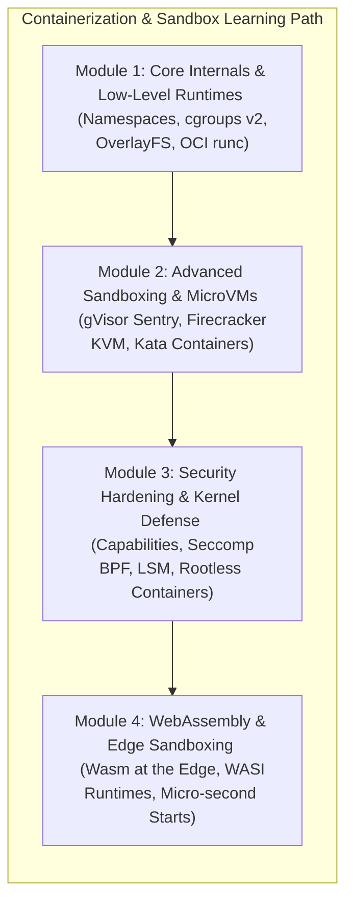

# 🛡️ Containerization & Sandbox Internals Index

স্বাগতম! আধুনিক ক্লাউড-নেটিভ কম্পিউটিং ও সিকিউরিটি আর্কিটেকচারে কন্টেইনারাইজেশন এবং স্যান্ডবক্সিং কেবল অ্যাপ্লিকেশন প্যাকেজিংয়ের মাধ্যম নয়; এটি হলো ওএস কার্নেল, হার্ডওয়্যার ভার্চুয়ালাইজেশন এবং জিরো-ট্রাস্ট সিকিউরিটি বাউন্ডারির এক অনন্য মিলনস্থল।

লিনাক্স নেমস্পেস ও সিগ্রুপের লো-লেভেল কার্নেল মেকানিক্স, gVisor ও Firecracker-এর মতো অত্যাধুনিক স্যান্ডবক্সিং রানটাইম, কার্নেল সিকিউরিটি হার্ডেনিং (Seccomp, AppArmor), এবং এজ কম্পিউটিংয়ের ব্রাউজার-লেস WebAssembly (Wasm)—এই ৪টি মূল মডিউলের গভীর কার্নেল-লেভেল মেকানিজম নিয়ে তৈরি এই হ্যান্ডবুক।

এখানে আমাদের **container-sandbox.md** ফাইলে থাকা **১৫টি চ্যাপ্টারের** একটি সুবিন্যস্ত রোডম্যাপ ও সূচিপত্র দেওয়া হলো। এটিকে ৪টি প্রধান আর্কিটেকচারাল মডিউলে ভাগ করা হয়েছে যাতে আপনি একজন **Staff Systems & Security Architect** হিসেবে নিজেকে গড়ে তুলতে পারেন।

---

---

## 🗺️ ১৫টি চ্যাপ্টারের আর্কিটেকচারাল সূচিপত্র

নিচে প্রতিটি মডিউলের অন্তর্গত চ্যাপ্টারগুলোর একটি বিস্তারিত ওভারভিউ এবং নেভিগেশন লিংক দেওয়া হলো:

### ⚙️ Module 1: Containerization Core Internals & Low-Level Runtimes (কন্টেইনারাইজেশন কোর ও লো-লেভেল রানটাইম)
*লিনাক্স কার্নেলের আইসোলেশন ফিচারসমূহ, রিসোর্স কন্ট্রোল বাউন্ডারি, মেমরি লেয়ার্ড ফাইল সিস্টেম এবং ডকার ছাড়া ওআইসি স্ট্যান্ডার্ড মেনে ম্যানুয়ালি কন্টেইনার স্পন করার গভীর প্রকৌশল।*

*   [**১. Linux Namespaces ও কার্নেল-লেভেল আইসোলেশন মেকানিক্স:**](/docs/container-sandbox#১-linux-namespaces-ও-কার্নেল-লেভেল-আইসোলেশন-মেকানিক্স) PID, Net, Mount, IPC, UTS, User, Cgroup ও Time নেমস্পেসের গভীর আর্কিটেকচার এবং `clone()`, `unshare()`, ও `setns()` সিস্টেম কলের বাস্তব ব্যবহার।
*   [**২. Control Groups (cgroups v1 vs v2) ও রিসোর্স ম্যানেজমেন্ট:**](/docs/container-sandbox#২-control-groups-cgroups-v1-vs-v2-ও-রিসোর্স-ম্যানেজমেন্ট) cgroups v2-এর Single Unified Hierarchy, CPU CFS Scheduler কোটা, Memory limits, OOM (Out Of Memory) Killer Scoring, এবং PSI (Pressure Stall Information)-এর মেমরি ট্র্যাকিং।
*   [**৩. OverlayFS (Overlay2) ও লেয়ার্ড ফাইল সিস্টেম আর্কিটেকচার:**](/docs/container-sandbox#৩-overlayfs-overlay2-ও-লেয়ার্ড-ফাইল-সিস্টেম-আর্কিটেকচার) LowerDir, UpperDir, WorkDir এবং MergedDir-এর মেকানিক্স, Copy-on-Write (CoW) মেথডলজি, এবং Whiteout ফাইলের মাধ্যমে ডিলিট অপারেশন হ্যান্ডলিং।
*   [**৪. OCI (Open Container Initiative) ও Low-Level Runtimes:**](/docs/container-sandbox#৪-oci-open-container-initiative-ও-low-level-runtimes) runc, crun, containerd এবং containerd-shim প্রসেস ট্রি। ডকার বা কোনো অর্কেস্ট্রেটর ছাড়া শুধুমাত্র raw কার্নেল কল এবং `pivot_root` ব্যবহার করে স্ক্র্যাচ থেকে ওআইসি কন্টেইনার তৈরি।

---

### 🛡️ Module 2: Advanced Sandboxing & Kernel Isolation (অ্যাডভান্সড স্যান্ডবক্সিং ও কার্নেল আইসোলেশন)
*কন্টেইনারের কার্নেল শেয়ারিং রিস্ক, সিস্টেম কল ইন্টারসেপশন রানটাইম (gVisor), এবং KVM-ভিত্তিক হাইপারভাইজার লাইটওয়েট ভার্চুয়ালাইজেশন (Firecracker ও Kata Containers)।*

*   [**৫. কন্টেইনার কার্নেল শেয়ারিং রিস্ক ও স্যান্ডবক্সিংয়ের প্রয়োজনীয়তা:**](/docs/container-sandbox#৫-কন্টেইনার-কার্নেল-শেয়ারিং-রিস্ক-ও-স্যান্ডবক্সিংয়ের-প্রয়োজনীয়তা) শেয়ার্ড কার্নেল থ্রেট, কন্টেইনার এসকেপ ভলনারেবিলিটিজ (Container Escape), Dirty Pipe exploit এবং `runc` এর ঐতিহাসিক নিরাপত্তা ক্রুটিসমূহ (CVE-2019-5736)।
*   [**৬. gVisor: গুগল-রচিত সিস্টেম কল ভার্চুয়ালাইজেশন ইঞ্জিন:**](/docs/container-sandbox#৬-gvisor-গুগল-রচিত-সিস্টেম-কল-ভার্চুয়ালাইজেশন-ইঞ্জিন) Sentry (ইউজার-স্পেস সিস্টেম কল ইন্টারসেপ্টর), Gofer (সিকিউর ফাইল প্রক্সি), ptrace বনাম KVM প্ল্যাটফর্ম আর্কিটেকচার এবং মেমরি/সিপিইউ ওভারহেড বিশ্লেষণ।
*   [**৭. AWS Firecracker: সার্ভারলেস ক্লাউডের MicroVM টেকনোলজি:**](/docs/container-sandbox#৭-aws-firecracker-সার্ভারলেস-ক্লাউডের-microvm-টেকনোলজি) KVM (Kernel-based Virtual Machine)-এর ওপর ভিত্তি করে জাস্ট-ইন-টাইম লাইটওয়েট ভার্চুয়ালাইজেশন, minimal device model, jailer প্রসেস সিকিউরিটি, এবং সাব-১০ মিলি-সেকেন্ডে কোল্ড স্টার্ট মেকানিজম।
*   [**৮. Kata Containers: সিকিউর ও হার্ডওয়্যার-অ্যাক্সিলারেটেড ভার্চুয়ালাইজেশন:**](/docs/container-sandbox#৮-kata-containers-সিকিউর-ও-হার্ডওয়্যার-অ্যাক্সিলারেটেড-ভার্চুয়ালাইজেশন) VM-এর স্ট্রং সিকিউরিটি সীমানা এবং কন্টেইনারের পারফরম্যান্সের মেলবন্ধন, QEMU ও Cloud-Hypervisor ইন্টিগ্রেশন এবং Kata-runtime আর্কিটেকচার।

---

### 🔐 Module 3: System Hardening & Kernel-Level Defense (সিস্টেম হার্ডেনিং ও কার্নেল-লেভেল ডিফেন্স)
*কার্নেলের সূক্ষ্ম অধিকার বণ্টন (Capabilities), বিপজ্জনক সিস্টেম কল ছাঁটাই করা (Seccomp), বাধ্যতামূলক ফাইল অ্যাক্সেস পলিসি (AppArmor/SELinux), এবং ইউজার নেমস্পেসের মাধ্যমে রুটহীন নিরাপদ কন্টেইনার রানিং।*

*   [**৯. Linux Capabilities: রুটের সীমাহীন ক্ষমতার সূক্ষ্ম বিভাজন:**](/docs/container-sandbox#৯-linux-capabilities-রুটের-সীমাহীন-ক্ষমতার-সূক্ষ্ম-বিভাজন) `libcap` দিয়ে কার্নেল-লেভেল প্রিভিলেজ স্প্লিটিং, ডকার ও কুভারনেটিসের ডিফল্ট ড্রপড ক্যাপাবিলিটিজ, এবং রিয়েল-টাইমে ক্যাপাবিলিটি অ্যাড/ড্রপ করার কৌশল।
*   [**১০. Seccomp (Secure Computing Mode) ও BPF Syscall Filtering:**](/docs/container-sandbox#১০-seccomp-secure-computing-mode-ও-bpf-syscall-filtering) কার্নেলের ৩০০+ সিস্টেম কলের ফিল্টারিং মেকানিজম, BPF (Berkeley Packet Filter) ইন্টিগ্রেশন, কাস্টম Seccomp JSON প্রোফাইল তৈরি এবং অডিটিং।
*   [**১১. AppArmor ও SELinux: কার্নেল অ্যাক্সেস কন্ট্রোল পলিসি (LSM):**](/docs/container-sandbox#১১-apparmor-ও-selinux-কার্নেল-অ্যাক্সেস-কন্ট্রোল-পলিসি-lsm) Linux Security Modules (LSM), পাথ-বেসড (AppArmor) বনাম ইনোড-বেসড (SELinux) সিকিউরিটি পলিসি, এবং প্রোডাকশনে কন্টেইনার প্রটেক্ট করার জন্য কাস্টম প্রোফাইল তৈরি।
*   [**১২. User Namespaces ও Rootless Containers আর্কিটেকচার:**](/docs/container-sandbox#১২-user-namespaces-ও-rootless-containers-আর্কিটেকচার) UID/GID ম্যাপিং মেকানিজম, Rootless Docker এবং Podman-এর ইন্টারনালস, slirp4netns দিয়ে নেটওয়ার্ক ভার্চুয়ালাইজেশন, এবং রুট প্রিভিলেজ ছাড়া নিরাপদ কন্টেইনার চালানো।

---

### 🌐 Module 4: WebAssembly (Wasm) & Edge Sandboxing (ওয়েবঅ্যাসেম্বলি ও এজ স্যান্ডবক্সিং)
*ব্রাউজারের বাইরে সার্ভার-সাইড ও এজ নেটওয়ার্কে কোডের স্যান্ডবক্সিং মেকানিজম, অতি-ক্ষুদ্র মেমরি ফুটপ্রিন্ট এবং জিরো কোল্ড স্টার্টের আধুনিক সার্ভারলেস আর্কিটেকচার।*

*   [**১৩. WebAssembly (Wasm): ব্রাউজারের বাইরে আধুনিক স্যান্ডবক্সিং:**](/docs/container-sandbox#১৩-webassembly-wasm-ব্রাউজারের-বাইরে-আধুনিক-স্যান্ডবক্সিং) Wasm মেমরি সেফটি এবং সিঙ্গেল-মেমরি লিনিয়ার অ্যাড্রেস স্পেস মেকানিজম, এবং VMs ও কন্টেইনারের সাথে Wasm-এর তুলনামূলক ট্রেড-অফ।
*   [**১৪. WASI (WebAssembly System Interface) ও ওএস লেভেল কমিউনিকেশন:**](/docs/container-sandbox#১৪-wasi-webassembly-system-interface-ও-ওএস-লেভেল-কমিউনিকেশন) WASI-এর Capability-Based Security আর্কিটেকচার, ফাইলসিস্টেম ও নেটওয়ার্ক রিকোয়েস্ট স্যান্ডবক্সিং, এবং Wasmtime ও Wasmer রানটাইমের ভেতরের রূপ।
*   [**১৫. Edge Serverless-এ Wasm-এর উপযোগিতা ও বাস্তব আর্কিটেকচার:**](/docs/container-sandbox#১৫-edge-serverless-এ-wasm-এর-উপযোগিতা-ও-বাস্তব-আর্কিটেকচার) সাব-মাইক্রোসেকেন্ডে কোল্ড স্টার্ট ম্যানেজমেন্ট, মেমরি ও রিসোর্স সাশ্রয়ী মাল্টি-টিন্যান্সি এবং Cloudflare Workers ও Fastly Compute আর্কিটেকচারাল মেকানিক্স।

---

> [!NOTE]
> **আর্কিটেকচারাল পড়ার পরামর্শ:**
> - আপনি যদি ডকার ও লিনাক্স কার্নেলের একদম গোড়ার বিষয়গুলো শিখতে চান, তবে **Module 1** দিয়ে আপনার যাত্রা শুরু করুন।
> - যদি আপনি মাল্টি-টেন্যান্ট সিকিউর হোস্টিং বা সার্ভারলেস কম্পিউটিং সিস্টেম ডিজাইন করতে চান, তবে **Module 2** ও **Module 4** আপনার জন্য সবচেয়ে গুরুত্বপূর্ণ।
