# 🛡️ Containerization & Sandbox Internals: Deep Architectural Manual

আধুনিক ক্লাউড-নেটিভ সফটওয়্যার আর্কিটেকচারে কন্টেইনারাইজেশন একটি অনস্বীকার্য স্ট্যান্ডার্ড। তবে বেশিরভাগ প্রকৌশলী কেবল `docker run` বা `kubectl apply` কমান্ডের মধ্যেই সীমাবদ্ধ থাকেন। আপনি যদি একজন সিস্টেম স্থপতি (Systems Architect), সিকিউরিটি ইঞ্জিনিয়ার বা ডেভঅপ্স স্পেশালিস্ট হতে চান, তবে কার্নেল ও হার্ডওয়্যার লেভেলে আইসোলেশন কীভাবে কাজ করে, তার গভীর মেকানিজম জানা অপরিহার্য।

এই গাইডবুকে আমরা লিনাক্স কার্নেলের একদম কোর আইসোলেশন মেকানিক্স, কন্টেইনার রানটাইমের অভ্যন্তরীণ সিকোয়েন্স, gVisor ও Firecracker-এর মতো অত্যাধুনিক স্যান্ডবক্সিং প্রযুক্তি, কার্নেল সিকিউরিটি হার্ডেনিং এবং এজ কম্পিউটিংয়ের WebAssembly (Wasm/WASI) আর্কিটেকচারের প্রতিটি স্তর গভীর গাণিতিক ও প্রযুক্তিগত ডেপথ ও ভিজ্যুয়াল মারমেইড ডায়াগ্রামের মাধ্যমে উন্মোচন করব।

---

## ১. Linux Namespaces ও কার্নেল-লেভেল আইসোলেশন মেকানিক্স

লিনাক্স অপারেটিং সিস্টেমে "কন্টেইনার" নামের কোনো ভৌত (Physical) সত্তা নেই। এটি মূলত কার্নেল লেভেলের কিছু গভার্নিং ফিচারের সমষ্টি। এর মধ্যে প্রথম এবং সবচেয়ে গুরুত্বপূর্ণ ফিচার হলো **Namespaces**। নেমস্পেসের কাজ হলো একটি প্রসেসকে সম্পূর্ণ আইসোলেটেড ভিউপোর্ট দেওয়া, যাতে সে মনে করে সে হোস্ট ওএসের একমাত্র বাসিন্দা।

### ৮টি প্রধান লিনাক্স নেমস্পেস (The 8 Dimensions of Isolation)

লিনাক্স কার্নেলে বর্তমানে ৮টি প্রধান নেমস্পেস রয়েছে, যা একটি প্রসেসের চারপাশের পরিবেশকে খণ্ডিত করে:

১. **PID Namespace (Process ID):** প্রসেস ট্রির আইসোলেশন। কন্টেইনারের ভেতরের প্রধান প্রসেসটি মনে করে তার আইডি ১ (PID 1), যদিও হোস্ট মেশিনে তার আইডি হয়তো ১৫৭৩০।
২. **NET Namespace (Network):** ভার্চুয়াল নেটওয়ার্ক ডিভাইস, আইপি রুট, পোর্ট রেঞ্জ এবং আইপি টেবিল রুলসের পৃথকীকরণ।
৩. **MNT Namespace (Mount):** ফাইল সিস্টেম মাউন্ট পয়েন্টের আইসোলেশন। কন্টেইনার হোস্টের রুট ফাইল সিস্টেম দেখতে পারে না।
৪. **IPC Namespace (Inter-Process Communication):** System V IPC অবজেক্ট এবং POSIX মেসেজ কিউ আইসোলেট করে, যাতে অন্য প্রসেস ডেটা রিড করতে না পারে।
৫. **UTS Namespace (UNIX Timesharing System):** কন্টেইনারকে নিজস্ব হোস্টনেম (Hostname) এবং ডোমেননেম সেট করার পারমিশন দেয়।
৬. **USER Namespace:** কন্টেইনারের ভেতরের নন-রুট ইউজারকে হোস্ট ওএস-এর রুট প্রিভিলেজ ছাড়া স্যান্ডবক্সের ভেতরে রুট (UID 0) হিসেবে অ্যাক্ট করার সুবিধা দেয়।
৭. **CGROUP Namespace:** প্রসেসের নিজস্ব cgroup ডিরেক্টরি পাথ হাইড করে সিকিউরিটি বাড়ায়।
৮. **TIME Namespace (লিনাক্স কার্নেল ৫.৬+):** কন্টেইনারকে হোস্টের সময় পরিবর্তন না করে নিজস্ব ঘড়ি বা মোনোটোনিক অফসেট সেট করতে দেয় (পড বা কন্টেইনার মাইগ্রেশনের জন্য অত্যন্ত দরকারী)।

### কার্নেল সিস্টেম কল: `clone()`, `unshare()`, এবং `setns()`

লিনাক্স কার্নেল প্রোগ্রামিংয়ে (C/Go) কন্টেইনার আইসোলেশন ট্রিগার করতে ৩টি প্রধান সিস্টেম কল ব্যবহার করা হয়:

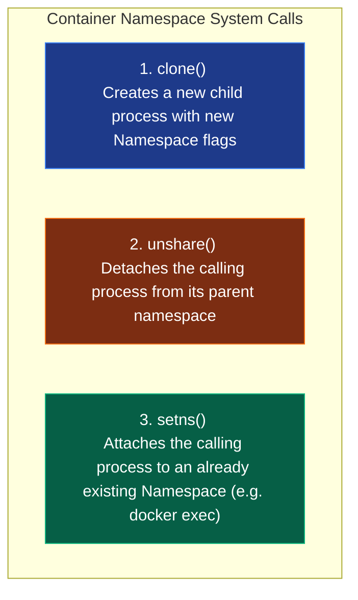

#### ১. `clone()` System Call
ঐতিহ্যগতভাবে লিনাক্সে নতুন প্রসেস তৈরি করতে `fork()` ব্যবহৃত হতো, যা প্যারেন্ট প্রসেসের হুবহু কপি তৈরি করে। কিন্তু কন্টেইনার তৈরি করতে `clone()` ব্যবহৃত হয়, যেখানে আমরা নির্দিষ্ট আইসোলেশন ফ্ল্যাগ পাস করতে পারি:

```c
// C Code: Creating namespaces programmatically using clone()
#define _GNU_SOURCE
#include <sched.h>
#include <stdio.h>
#include <stdlib.h>
#include <sys/wait.h>
#include <unistd.h>

#define STACK_SIZE (1024 * 1024)
static char child_stack[STACK_SIZE];

int child_main(void* arg) {
    printf("Child process inside isolated namespaces!\n");
    printf("Current PID inside Namespace: %d\n", getpid());
    sethostname("sandbox-node", 12);
    system("exec /bin/bash"); // Launch bash shell inside the container
    return 0;
}

int main() {
    printf("Parent process started (PID: %d)\n", getpid());
    
    // Cloning with PID, Network, Mount, IPC, and UTS isolation flags
    int child_pid = clone(child_main, 
                          child_stack + STACK_SIZE, 
                          CLONE_NEWPID | CLONE_NEWNET | CLONE_NEWNS | CLONE_NEWIPC | CLONE_NEWUTS | SIGCHLD, 
                          NULL);
    
    if (child_pid == -1) {
        perror("clone failed");
        exit(1);
    }
    
    waitpid(child_pid, NULL, 0);
    printf("Child exited. Parent back to normal.\n");
    return 0;
}
```

#### ২. `unshare()` System Call
একটি রানিং প্রসেস যদি নতুন কোনো প্যারেন্ট প্রসেস ক্রিয়েট না করে নিজেই নিজের নেমস্পেস হোস্ট থেকে বিচ্ছিন্ন করতে চায়, তবে সে `unshare()` কল করে।

#### ৩. `setns()` System Call
আমরা যখন `docker exec -it <container_id> bash` কমান্ড রান করি, ব্যাকগ্রাউন্ডে ডকার ডেমোন একটি নতুন প্রসেস স্পন করে এবং `setns()` সিস্টেম কলের সাহায্যে রানিং কন্টেইনারের নেটওয়ার্ক বা পিআইডি নেমস্পেসের ফাইল ডেসক্রিপ্টরে (`/proc/[PID]/ns/net`) প্রবেশ করায়।

---

## ২. Control Groups (cgroups v1 vs v2) ও রিসোর্স ম্যানেজমেন্ট

নেমস্পেস দিয়ে প্রসেস আইসোলেট করলেও একটি কন্টেইনার হোস্টের সম্পূর্ণ সিপিইউ, র‍্যাম বা ডিস্ক I/O একাই গ্রাস করে হোস্ট ক্র্যাশ করাতে পারে (Denial of Service)। এই ফিজিক্যাল রিসোর্স ম্যানেজ ও কন্ট্রোল করার জন্য ওএস কার্নেলের **Control Groups (cgroups)** ব্যবহৃত হয়।

### cgroups v1 বনাম cgroups v2: The Architecture Evolution

সিগ্রুপের আর্কিটেকচারে একটি বিশাল বৈপ্লবিক পরিবর্তন এসেছে—**cgroups v1** (আলাদা আলাদা ডিরেক্টরি ট্রি) থেকে **cgroups v2** (একক ইউনিফাইড ট্রি)-তে রূপান্তর।

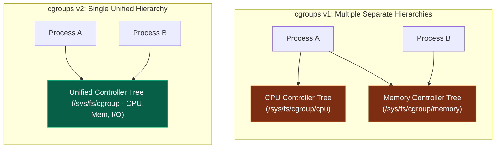

#### cgroups v1-এর সীমাবদ্ধতা:
v1 আর্কিটেকচারে প্রতিটা রিসোর্সের (CPU, Memory, Disk IO) জন্য সম্পূর্ণ পৃথক ডিরেক্টরি ট্রি বা হায়ারার্কি থাকত। এর ফলে কন্ট্রোলারগুলোর মধ্যে সমন্বয় করা অসম্ভব ছিল। উদাহরণস্বরূপ, ডিস্ক রাইট থ্রোটলিং (I/O limits) করার সময় মেমরি পেজ ক্যাশ বাফারের সাথে ট্র্যাকিং মিলত না, যার ফলে কার্নেল লেভেলে অতিরিক্ত বাফারিং ও ডেডলক সৃষ্টি হতো।

#### cgroups v2-এর আধুনিক সুবিধা:
v2-তে সমস্ত রিসোর্সকে একটি **Single Unified Hierarchy** বা একক গাছের অধীনে নিয়ে আসা হয়েছে। 
১. **Unified Resource Control:** এখন সিপিইউ, মেমরি এবং আইও কন্ট্রোলার একসাথে একই প্রসেস বাউন্ডারিতে কাজ করে। ফলে ডকার নিখুঁতভাবে I/O এবং Memory Writeback ট্র্যাকিং করতে পারে।
২. **Pressure Stall Information (PSI):** এটি v2-এর একটি চমৎকার ফিচার। এটি কার্নেল লেভেলে ট্র্যাক করে প্রসেসটি সিপিইউ, মেমরি বা আইও-এর সংকটের কারণে ঠিক কত মিলি-সেকেন্ড অলস বসে (Starve) ছিল।
৩. **Rootless Containers Support:** cgroups v2 লিনাক্সের সাধারণ নন-রুট ইউজারদের সেফলি রিসোর্স লিমিট করার পারমিশন দেয়, যা **Rootless Docker** ও কন্টেইনার সিকিউরিটি উন্নয়নে বড় অবদান রাখছে।

### CPU CFS Scheduler কোটা ও মেমরি লিমিট

কার্নেলের সিগ্রুপ ডিরেক্টরি `/sys/fs/cgroup/` ফাইলে নিচের প্যারামিটারগুলো রাইট করে রিসোর্স লিমিট করা হয়:

- **CPU Limit (CFS Scheduler):** `cpu.max` ফাইলের মাধ্যমে এটি নিয়ন্ত্রিত হয়। এতে দুটি ভ্যালু থাকে: `quota` এবং `period`।
  $$\text{CPU Allocation} = \frac{\text{quota (us)}}{\text{period (us)}}$$
  যদি `cpu.max` ফাইলে `50000 100000` লেখা থাকে, তার অর্থ প্রসেসটি প্রতি ১০০ মিলি-সেকেন্ডে সর্বোচ্চ ৫০ মিলি-সেকেন্ড CPU টাইম পাবে (অর্থাৎ ০.৫ কোর)।
- **Memory Limit:** `memory.max` ফাইলের মাধ্যমে কন্টেইনারের মেমরির সর্বোচ্চ হার্ড-লিমিট ডিফাইন করা হয়। প্রসেসের মেমরি ব্যবহার এর চেয়ে বেশি হলে কার্নেলের **OOM (Out Of Memory) Killer** প্রসেসটিকে টার্মিনেট করে।
- **OOM Score Tuniung:** কার্নেল `/proc/[PID]/oom_score` ফাইলের মাধ্যমে নির্ধারণ করে কার র‍্যাম খাওয়ার অপরাধ বেশি এবং কাকে আগে কিল করতে হবে। ডকার ডেমোন কন্টেইনারের ওওএম স্কোর অ্যাডজাস্ট করতে `/proc/[PID]/oom_score_adj` মডিফাই করে।

---

## ৩. OverlayFS (Overlay2) ও লেয়ার্ড ফাইল সিস্টেম আর্কিটেকচার

ডকার ইমেজগুলো কীভাবে একাধিক লেয়ারে তৈরি হয় এবং কন্টেইনার রান করার পর মেমরি নষ্ট না করে ফাইল সিস্টেম রিড/রাইট করে, তার নেপথ্যে রয়েছে **UnionFS** (আধুনিক লিনাক্সে এর স্ট্যান্ডার্ড রূপ **Overlay2**)।

OverlayFS মূল ফাইল সিস্টেমকে ৪টি প্রধান ডিরেক্টরি লেয়ারে বিন্যস্ত করে:

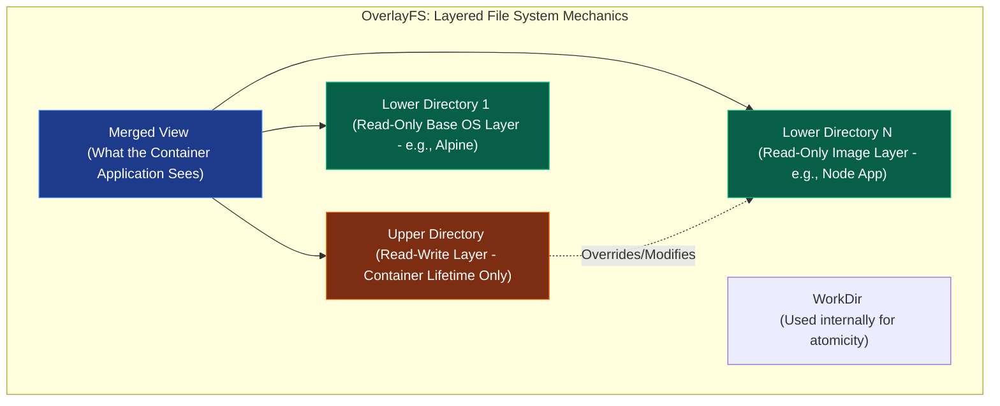

- **LowerDir (Read-Only Layer):** ডকার ইমেজের সমস্ত লেয়ারগুলো এখানে রিড-অনলি হিসেবে লক থাকে। এগুলোকে কখনই পরিবর্তন করা যায় না।
- **UpperDir (Read-Write Container Layer):** কন্টেইনার যখন রান করে, ডকার কার্নেল তার মাথার ওপর একটি অত্যন্ত পাতলা রিড-রাইট লেয়ার বিছিয়ে দেয়। কন্টেইনারে যেকোনো নতুন ফাইল তৈরি বা রাইট করলে তা সরাসরি এই লেয়ারে গিয়ে জমা হয়।
- **WorkDir:** এটি কার্নেলের একটি ইন্টারনাল ও খালি ডিরেক্টরি, যা পরমাণু (Atomic) অপারেশন ও ট্রানজেকশনাল ফাইল মাউন্ট নিশ্চিত করতে ব্যবহৃত হয়।
- **MergedDir (Unified View):** এটি হলো একটি ভার্চুয়াল মাউন্ট ভিউ। কন্টেইনারের ভেতরের অ্যাপ্লিকেশনটি যখন ফাইল ব্রাউজ করে, সে LowerDir এবং UpperDir-এর ফাইলগুলোকে একসাথে মার্জড অবস্থায় দেখতে পায়।

### Copy-on-Write (CoW) ও Whiteout মেকানিজম

কন্টেইনার চলাকালীন যদি কোনো রিড-অনলি ইমেজের ফাইল (LowerDir) পরিবর্তন বা ডিলিট করতে হয়, কার্নেল সরাসরি তা করতে দেয় না। কার্নেল ব্যাকগ্রাউন্ডে নিচের নিয়মগুলো ফলো করে:

- **Modification (পরিবর্তন):** কার্নেল ফাইলটিকে LowerDir থেকে কপি করে UpperDir (Read-Write)-এ নিয়ে আসে এবং সেখানে পরিবর্তন করে। মার্জড ভিউতে এখন কন্টেইনার অ্যাপ্লিকেশনের কাছে নতুন ফাইলটি দৃশ্যমান হয়, কিন্তু মূল ইমেজ ফাইলে কোনো টাচ ঘটে না।
- **Deletion (মুছে ফেলা):** ফাইলটি ডিলিট করতে গেলে UpperDir-এ একটি বিশেষ **Whiteout file (চরিত্রহীন ফাইল বা ডামি ফাইল - Character Device with 0:0 major/minor device numbers)** তৈরি করা হয়, যা মার্জড ভিউতে ফাইলটিকে লুকিয়ে রাখে।

---

## ৪. OCI (Open Container Initiative) ও Low-Level Runtimes

অনেকেই মনে করেন ডকার নিজেই সরাসরি কন্টেইনার চালায়। এটি সম্পূর্ণ ভুল! ডকার আসলে একটি হাই-লেভেল কোঅর্ডিনেটর। কন্টেইনার স্পন করার জন্য ব্যাকএন্ডে একটি লুজলি কাপল্ড মাইক্রোসার্ভিস স্ট্যাক কাজ করে।

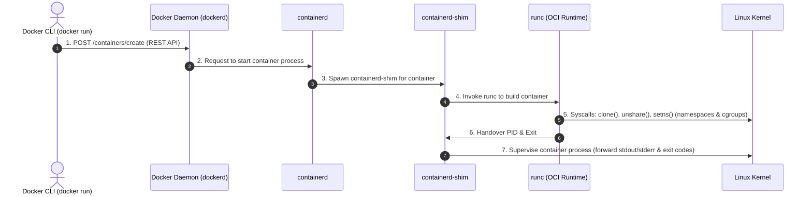

- **`containerd`:** এটি একটি হাই-পারফরম্যান্স কন্টেইনার লাইফসাইকেল ম্যানেজার। এর কাজ হলো ইমেজের লেয়ারগুলো আনপ্যাক করে রানিং এনভায়রনমেন্ট তৈরি করা এবং কন্টেইনারের স্টেট মনিটর করা।
- **`containerd-shim`:** কন্টেইনার চলাকালীন ডকার ডেমোন রিস্টার্ট দিলে বা ক্র্যাশ করলে সব রানিং কন্টেইনারও বন্ধ হয়ে যাওয়ার কথা। এই সমস্যা এড়াতে `containerd` প্রতিটা কন্টেইনারের জন্য একটি অত্যন্ত ছোট ডেমোন রান করায়, একে **containerd-shim** বলে। এটি কন্টেইনারের stdout/stderr পাইপ ধরে রাখে।
- **`runc`:** এটি ওপেন কন্টেইনার ইনিশিয়েটিভ (**OCI**) স্পেসিফিকেশন মেনে চলা একটি লো-লেভেল কন্টেইনার রানটাইম। এর একমাত্র কাজ হলো লিনাক্স কার্নেলের সাথে সরাসরি কথা বলে নেমস্পেস ও সিগ্রুপ তৈরি করা, কন্টেইনার প্রসেস স্টার্ট করা এবং সাথে সাথে নিজে মেমরি থেকে বের হয়ে যাওয়া (Exit)।

### ডকার ছাড়া কন্টেইনার তৈরির বাস্তব পদ্ধতি (OCI Manual Spawning)

আপনি চাইলে ডকার বা কুবারনেটিস ছাড়াই শুধুমাত্র **runc** এবং লিনাক্স কার্নেলের সাহায্যে কন্টেইনার স্পন করতে পারেন:

```bash
# ১. রুট ফাইলসিস্টেম ডিরেক্টরি তৈরি করুন
mkdir -p my-sandbox/rootfs

# ২. ডকার দিয়ে টেম্পোরারি আলপাইন ফাইলসিস্টেম এক্সপোর্ট করুন
docker export $(docker create alpine) | tar -C my-sandbox/rootfs -xvf -

# ৩. OCI স্ট্যান্ডার্ড স্পেসিফিকেশন জেনারেট করুন
cd my-sandbox
runc spec
```
এটি একটি স্ট্যান্ডার্ড `config.json` ফাইল তৈরি করবে। এর ভেতর কন্টেইনারের নেমস্পেস, মাউন্ট এবং পিআইডি ১ এর জন্য `sh` কমান্ড সেট থাকে। এবার রানটাইম দিয়ে ডকার ছাড়াই রান করুন:
```bash
sudo runc run my-secure-container
```
এটি প্রমাণ করে যে ডকার মূলত লিনাক্স কার্নেলের ওপর মোড়ানো একটি চমৎকার এপিআই এবং ম্যানেজমেন্ট র্যাপার মাত্র।

---

## ৫. কন্টেইনার কার্নেল শেয়ারিং রিস্ক ও স্যান্ডবক্সিংয়ের প্রয়োজনীয়তা

ঐতিহ্যবাহী কন্টেইনারগুলো অত্যন্ত লাইটওয়েট এবং ফাস্ট, কারণ তারা সরাসরি হোস্টের লিনাক্স কার্নেল শেয়ার করে চলে। তবে সিকিউরিটির দৃষ্টিকোণ থেকে এটি একটি বিশাল দুর্বলতা।

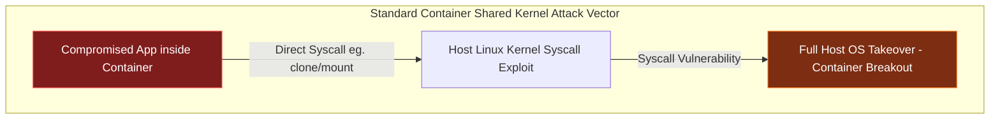

### Shared Kernel Vulnerability
একটি কন্টেইনারে যদি কোনো ম্যালিশিয়াস কোড বা হ্যাকার এক্সেস পায়, সে সরাসরি হোস্ট ওএসের কার্নেলে সিস্টেম কল (Syscalls) পাঠাতে পারে। কার্নেলের কোনো বাগে (যেমন: **Dirty Pipe - CVE-2022-0847** বা **Dirty COW**) হ্যাকার যদি রুট প্রিভিলেজ পেয়ে যায়, তবে সে কন্টেইনারের বাউন্ডারি ভেঙে হোস্টের মূল মেমরিতে ঢুকে পড়তে পারে। একে **Container Escape** বা কন্টেইনার থেকে পালানো বলা হয়।

### runc Exploit (CVE-2019-5736)
এটি কন্টেইনার ইতিহাসের অন্যতম মারাত্মক ত্রুটি। এই ত্রুটির মাধ্যমে হ্যাকার কন্টেইনারের ভেতর থেকে হোস্টের মূল `runc` বাইনারি ফাইলটিকে ওভাররাইট করে দিতে পারত। পরবর্তীতে যখনই হোস্টে আরেকটি নতুন কন্টেইনার চালানো হতো, ম্যালিশিয়াস `runc` কোডটি সরাসরি হোস্টের মূল রুট এক্সেস নিয়ে নিত।

এই সব কার্নেল-লেভেল সিকিউরিটি থ্রেট থেকে বাঁচতে জন্ম হয়েছে **Sandbox Runtimes**-এর, যা কন্টেইনার ও হোস্ট কার্নেলের মধ্যে একটি অভেদ্য প্রাচীর গড়ে তোলে।

---

## ৬. gVisor: গুগল-রচিত সিস্টেম কল ভার্চুয়ালাইজেশন ইঞ্জিন

গুগলের তৈরি **gVisor** হলো একটি অত্যন্ত উন্নত ইউজার-স্পেস কার্নেল (written in Go), যা কন্টেইনারের প্রতিটি লিনাক্স সিস্টেম কলকে হোস্ট কার্নেলে পৌঁছানোর আগেই ইন্টারসেপ্ট বা ফিল্টার করে।

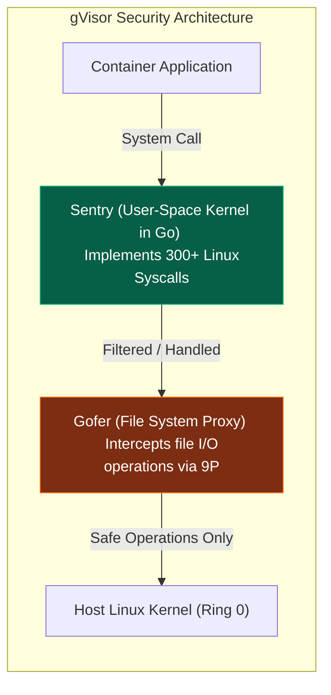

### core Components: Sentry & Gofer

gVisor মূলত দুটি আর্কিটেকচারাল উপাদানের মাধ্যমে কাজ করে:

১. **Sentry (সেন্ট্রি):** এটি ইউজার স্পেসে চলা একটি স্বয়ংসম্পূর্ণ কার্নেল। এটি লিনাক্সের ৩ শতাধিক সিস্টেম কলকে নিজেই ইমপ্লিমেন্ট করে। কন্টেইনার যখন কোনো সিস্টেম কল পাঠায়, gVisor হোস্ট কার্নেলে না পাঠিয়ে সেন্ট্রি দিয়ে তা প্রসেস করে। ফলে হ্যাকার কার্নেলের বাগ ব্যবহার করে হোস্ট ক্র্যাশ করতে পারে না।
২. **Gofer (গোফার):** কন্টেইনার যদি কোনো ফাইল রিড বা রাইট করতে চায়, সেন্ট্রি নিজে ফাইল সিস্টেমে হাত দেয় না। সে সিকিউর **9P Protocol**-এর মাধ্যমে গোফার প্রক্সিকে রিকোয়েস্ট পাঠায়। গোফার সিকিউরিটি চেক করে ফাইল হোস্ট থেকে এনে কন্টেইনারকে দেয়।

### Platforms: `ptrace` vs `KVM`
- **ptrace:** লিনাক্সের স্ট্যান্ডার্ড `ptrace` সিস্টেম কল ব্যবহার করে কন্টেইনারের কলগুলো ইন্টারসেপ্ট করে। এটি কনফিগার করা সহজ কিন্তু অতিরিক্ত কনটেক্সট সুইচের কারণে পারফরম্যান্স স্লো হয়।
- **KVM:** হোস্ট ওএসের হার্ডওয়্যার ভার্চুয়ালাইজেশন এপিআই `/dev/kvm` ব্যবহার করে সেন্ট্রিকে একটি ক্ষুদ্র ভার্চুয়াল প্রসেসর হিসেবে চালায়। এটি অত্যন্ত ফাস্ট এবং নিরাপদ।

---

## ৭. AWS Firecracker: সার্ভারলেস ক্লাউডের MicroVM টেকনোলজি

অ্যামাজন ওয়েব সার্ভিসেস (AWS) তাদের সার্ভারলেস প্ল্যাটফর্ম (AWS Lambda & Fargate) নিরাপদ ও সুপারফাস্ট করতে ডিজাইন করেছে **Firecracker**। এটি মরিচা (Rust) ল্যাঙ্গুয়েজে লেখা একটি অত্যন্ত শক্তিশালী **Virtual Machine Monitor (VMM)**।

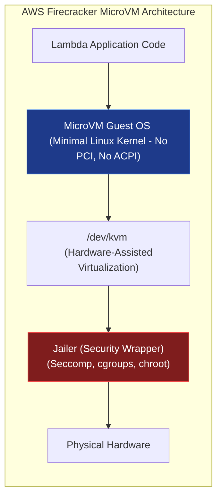

### KVM-based Lightweight Virtualization
প্রথাগত ভার্চুয়াল মেশিন (যেমন: QEMU) অত্যন্ত ভারী, কারণ তারা কম্পিউটারের মাদারবোর্ড, ইউএসবি ড্রাইভার, সাউন্ড কার্ড ইত্যাদির মতো শত শত লিগ্যাসি হার্ডওয়্যার ইমুলেট করে।
Firecracker কোনো লিগ্যাসি ডিভাইস ইমুলেট করে না। এটি শুধুমাত্র ৪টি অত্যন্ত লাইটওয়েট **VirtIO** ডিভাইস (Net, Block, Console, VSOCK) ব্যবহার করে হোস্টের `/dev/kvm` এর সাথে কথা বলে। ফলে এটি সাধারণ কন্টেইনারের মতোই লাইটওয়েট কিন্তু হার্ডওয়্যার-লেভেল আইসোলেটেড।

### Jailer Process & Sub-10ms Cold Starts
- **Jailer (জেলখানা প্রসেস):** ফায়ারক্র্যাকার বুট হওয়ার আগে `jailer` প্রসেসটি চালু হয়। এটি ফায়ারক্র্যাকারের চারপাশে নেমস্পেস, সিগ্রুপ এবং একটি অত্যন্ত কঠোর সেকম্প (Seccomp) ফিল্টার বিছিয়ে দেয়, যাতে ফায়ারক্র্যাকারের সিকিউরিটি ভাঙলেও হোস্ট সম্পূর্ণ সেফ থাকে।
- **Sub-10ms Cold Starts:** ফায়ারক্র্যাকারের কোনো বায়োস (BIOS) বুট করার প্রয়োজন হয় না। এটি কার্নেল ইমেজ সরাসরি মেমরিতে আনপ্যাক করে মাত্র **৫ থেকে ৯ মিলি-সেকেন্ডের** মধ্যে একটি সম্পূর্ণ স্যান্ডবক্সড ভার্চুয়াল মেশিন রেডি করে ফেলে।

---

## ৮. Kata Containers: সিকিউর ও হার্ডওয়্যার-অ্যাক্সিলারেটেড ভার্চুয়ালাইজেশন

**Kata Containers** হলো একটি ওপেন-সোর্স প্রজেক্ট যা কন্টেইনার স্পিড এবং ভিএম সিকিউরিটির মধ্যে সেতু বন্ধন তৈরি করে। এটি সরাসরি OCI স্ট্যান্ডার্ড মেনে চলে, ফলে এটি কুবারনেটিসের (CRI-O/containerd) সাথে সরাসরি যুক্ত হয়ে কাজ করতে পারে।

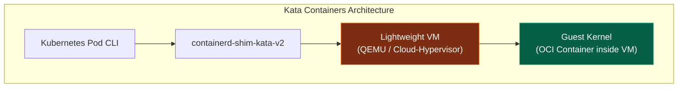

### VM-Container Hybrid Architecture
Kata Containers প্রতিটা পডকে (Pod) একটি অত্যন্ত স্লিম এবং আলাদা ভার্চুয়াল মেশিনের ভেতর রান করায়।
- **QEMU & Cloud-Hypervisor:** এটি হাইপারভাইজার হিসেবে QEMU বা আধুনিক ইন্টেল/এআরএম ক্লাউড-হাইপারভাইজার ব্যবহার করে হার্ডওয়্যার লেভেলে মেমরি আইসোলেট করে।
- **containerd-shim-kata-v2:** এর ফলে কুবারনেটিস মনে করে সে একটি সাধারণ কন্টেইনারের সাথেই কথা বলছে, কিন্তু ব্যাকগ্রাউন্ডে সেটি সম্পূর্ণ আলাদা ভিএম হার্ডওয়্যারের ভেতর সুরক্ষিত থাকে।

---

## ৯. Linux Capabilities: রুটের সীমাহীন ক্ষমতার সূক্ষ্ম বিভাজন

ঐতিহ্যগতভাবে লিনাক্সে সিকিউরিটি বাইনারি ছিল: হয় আপনি সাধারণ ইউজার (সব ব্লকড) অথবা আপনি রুট ইউজার (সব পারমিটেড)। আধুনিক লিনাক্সে রুটের এই সীমাহীন ও বিপজ্জনক ক্ষমতাকে প্রায় ৪০টি ছোট ছোট সূক্ষ্ম ক্ষমতায় ভাগ করা হয়েছে, যাকে **Capabilities** বলা হয়।

### key Capabilities & Risks

| Capability | What it Permits | Threat Level & Risk if Compromised |
| :--- | :--- | :--- |
| `CAP_SYS_ADMIN` | কার্নেলের প্রায় সমস্ত মাউন্ট, কনফিগারেশন ও আইসোলেশন পরিবর্তনের ক্ষমতা। | **অত্যন্ত বিপজ্জনক** (কার্যত রুট প্রিভিলেজ)। |
| `CAP_NET_ADMIN` | নেটওয়ার্ক ইন্টারফেস, আইপি টেবিল রুলস এবং রাউটিং পরিবর্তনের ক্ষমতা। | **উচ্চ ঝুঁকিপূর্ণ** (ম্যান-ইন-দ্য-মিডল অ্যাটাক সম্ভব)। |
| `CAP_SYS_RAWIO` | হোস্টের ফিজিক্যাল মেমরি ও হার্ডড্রাইভ পোর্টে সরাসরি বাইট লেভেল রিড-রাইট। | **অত্যন্ত বিপজ্জনক** (কার্নেল মেমরি হ্যাকিং সম্ভব)। |
| `CAP_CHOWN` | যেকোনো ফাইলের ওনারশিপ (মালিকানা) পরিবর্তন করার ক্ষমতা। | **মাঝারি** (ফাইলের এক্সেস পারমিশন বাইপাস সম্ভব)। |
| `CAP_NET_BIND_SERVICE` | ১০২৪-এর নিচের পোর্টগুলো (যেমন: 80, 443) ওপেন বা বাইন্ড করার ক্ষমতা। | **নিরাপদ** (ডিফল্ট পারমিটেড)। |

### Dropping and Adding Capabilities
ডকার বা কুবারনেটিসে কন্টেইনারের মেইন প্রসেস রুট হলেও, হোস্ট ওএসের নিরাপত্তার স্বার্থে ডকার ডিফল্ট অবস্থায় বেশিরভাগ শক্তিশালী ক্যাপাবিলিটি কেড়ে নেয়।

প্রোডাকশন গ্রেড কন্টেইনারে জিরো-ট্রাস্ট নিশ্চিত করতে আমরা রান টাইমে সব ক্যাপাবিলিটি ফেলে দিয়ে শুধু প্রয়োজনীয়টি যুক্ত করতে পারি:

```yaml
# Kubernetes Pod Security Context Specification
apiVersion: v1
kind: Pod
metadata:
  name: secure-web-pod
spec:
  containers:
  - name: web-nginx
    image: nginx:alpine
    securityContext:
      capabilities:
        drop:
        - ALL # ড্রপ অল ক্যাপাবিলিটিজ (জিরো ট্রাস্ট)
        add:
        - NET_BIND_SERVICE # শুধু ৮০ পোর্টে বাইন্ড করার পারমিশন
```

---

## ১০. Seccomp (Secure Computing Mode) ও BPF Syscall Filtering

**Seccomp** হলো লিনাক্স কার্নেলের একটি সিস্টেম কল ফিল্টারিং মেকানিজম। কার্নেলে ৩০০-এর বেশি সিস্টেম কল রয়েছে, কিন্তু একটি সাধারণ এনজিনেক্স বা নোড অ্যাপ্লিকেশনের সর্বোচ্চ ৪০-৫০টি কলের প্রয়োজন হয়। বাকি কলগুলো ওপেন রাখা সিকিউরিটি রিস্ক বাড়ায়।

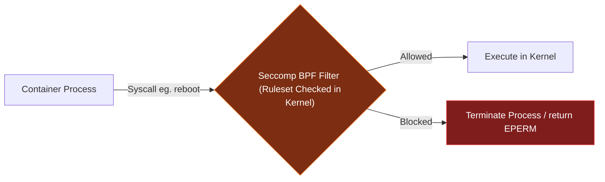

### Seccomp-BPF Mechanics
সেকম্প কার্নেল লেভেলে সিস্টেম কল ফিল্টার করতে **BPF (Berkeley Packet Filter)** কোড ব্যবহার করে। যখন কোনো প্রসেস সিস্টেম কল করে, কার্নেল BPF রুলস রান করে দেখে প্রসেসটির এই নির্দিষ্ট কলটি করার পারমিশন আছে কিনা।

### Custom Seccomp Profile Configuration
ডকার ডিফল্ট একটি প্রোফাইল ব্যবহার করে যা প্রায় ৪৪টি বিপজ্জনক সিস্টেম কল (যেমন: `reboot`, `mount`, `kexec_load`) সম্পূর্ণ ব্লক করে দেয়। আমরা চাইলে কাস্টম প্রোফাইল তৈরি করতে পারি:

```json
{
  "defaultAction": "SCMP_ACT_ERRNO",
  "architectures": [
    "SCMP_ARCH_X86_64",
    "SCMP_ARCH_AARCH64"
  ],
  "syscalls": [
    {
      "names": [
        "read",
        "write",
        "exit",
        "sigreturn"
      ],
      "action": "SCMP_ACT_ALLOW"
    }
  ]
}
```
এই প্রোফাইলটি কন্টেইনারে লোড করলে কন্টেইনারটি `read`, `write`, `exit` ছাড়া আর কোনো সিস্টেম কল কার্নেলে পাঠাতে পারবে না, ফলে তার হ্যাক হওয়ার সম্ভাবনা শূন্যের কোঠায় নেমে আসবে।

---

## ১১. AppArmor ও SELinux: কার্নেল অ্যাক্সেস কন্ট্রোল পলিসি (LSM)

নেমস্পেস এবং ক্যাপাবিলিটি ছাড়াও লিনাক্স কার্নেল লেভেলে আরও শক্তিশালী নিরাপত্তা বাউন্ডারি সেট করতে **LSM (Linux Security Modules)** ব্যবহৃত হয়। এর মধ্যে সবচেয়ে জনপ্রিয় দুটি সিস্টেম হলো **AppArmor** (Ubuntu/Debian) এবং **SELinux** (RHEL/CentOS)।

### Path-Based (AppArmor) vs. Inode-Based (SELinux)
- **AppArmor:** এটি ফাইল পাথের ওপর ভিত্তি করে কাজ করে। উদাহরণস্বরূপ, আমরা অ্যাপ-আর্মর প্রোফাইলে লিখে দিতে পারি যে এই প্রসেসটি `/etc/` ডিরেক্টরির বাইরে কোনো ফাইলে রাইট করতে পারবে না। এটি ব্যবহার করা সহজ।
- **SELinux:** এটি ওএসের প্রতিটি ফাইল ইনোড (Inode), নেটওয়ার্ক পোর্ট ও প্রসেসের ওপর একটি সিকিউরিটি লেবেল লাগায়। এটি অত্যন্ত শক্তিশালী এবং সূক্ষ্ম সিকিউরিটি পলিসি দেয় কিন্তু কনফিগারেশন অত্যন্ত জটিল।

### Custom AppArmor Profile Walkthrough

হোস্ট ওএসে একটি কাস্টম প্রোফাইল `/etc/apparmor.d/deny-write` তৈরি করে আমরা ডকার কন্টেইনারের ফাইল রাইট ব্লক করতে পারি:

```pro
# AppArmor Profile Definition
#include <tunables/global>

profile deny-write flags=(attach_disconnected) {
  # Include default container policies
  #include <abstractions/base>
  
  # Allow reading everything
  /** r,
  
  # Explicitly deny writing to crucial folders
  deny /etc/** w,
  deny /var/log/** w,
}
```
কন্টেইনার রান করার সময় এই প্রোফাইলটি পাস করলে কন্টেইনারের রুট ইউজারও ওই ফোল্ডারে কোনো ফাইল পরিবর্তন করতে পারবে না:
```bash
docker run --security-opt apparmor=deny-write nginx
```

---

## ১২. User Namespaces ও Rootless Containers আর্কিটেকচার

ঐতিহ্যগতভাবে ডকার ডেমোন হোস্ট ওএসে `root` ইউজার হিসেবে চলত। ফলে কন্টেইনারের ভেতরের যেকোনো সিকিউরিটি লিক সরাসরি হোস্টের রুট হ্যাকিংয়ের কারণ হতো। এর সমাধান হলো **User Namespaces** এবং **Rootless Containers**।

### UID/GID Mapping Mechanics
ইউজার নেমস্পেস কন্টেইনারের ভেতরের ইউজার আইডিকে হোস্টের নন-প্রিভিলেজড আইডির সাথে ম্যাপ করে দেয়।

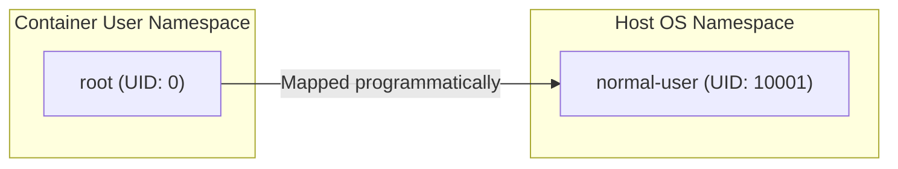

কার্নেলের `/proc/[PID]/uid_map` ফাইলে এই ম্যাপিং কনফিগার করা হয়:
```text
# ContainerUID  HostUID  Range
0               10001    1
```
এর অর্থ হলো কন্টেইনারের ভেতরে যে প্রসেসটি মনে করছে সে সর্বময় ক্ষমতার অধিকারী `root (UID: 0)`, হোস্ট ওএসের কাছে সে আসলে সাধারণ ইউজার `10001`। ফলে কন্টেইনার ভেঙে বের হলেও সে হোস্টের কোনো ফাইলের ক্ষতি করতে পারবে না।

### Rootless Engines: Podman & Rootless Docker
আজকের আধুনিক কন্টেইনার ইঞ্জিন **Podman** এবং **Rootless Docker** হোস্টের কোনো ব্যাকগ্রাউন্ড রুট ডেমোন ছাড়াই চলে।
- **newuidmap / newgidmap:** এগুলো বিশেষ কার্নেল হেল্পার টুল যা নন-রুট ইউজারদের জন্য ইউজার নেমস্পেস কনফিগার করে।
- **slirp4netns:** যেহেতু নন-রুট ইউজার হোস্টের নেটওয়ার্ক কার্ড মডিফাই করতে পারে না, slirp4netns ইউজার স্পেসে একটি সম্পূর্ণ ভার্চুয়াল TCP/IP স্ট্যাক এবং টানেল তৈরি করে নেটওয়ার্কিং সলভ করে।

---

## ১৩. WebAssembly (Wasm): ব্রাউজারের বাইরে আধুনিক স্যান্ডবক্সিং

কন্টেইনারাইজেশনের পরবর্তী প্রজন্ম হিসেবে আত্মপ্রকাশ করেছে **WebAssembly (Wasm)**। এটি মূলত ব্রাউজারে হাই-পারফরম্যান্স গেম বা ভিডিও এডিটিং চালানোর জন্য তৈরি হলেও বর্তমানে এটি ব্যাকএন্ড ও এজ কম্পিউটিংয়ের (Edge Computing) সেরা স্যান্ডবক্সিং মেকানিজম।

### Wasm vs. Containers vs. VMs Detailed Comparison

| Feature | Virtual Machines (VM) | Containers (Docker) | WebAssembly (Wasm) |
| :--- | :--- | :--- | :--- |
| **Virtualization Level** | Hardware (Hypervisor KVM) | OS (Namespaces/cgroups) | Language/Instruction Set (VM Runtime) |
| **Cold Start Time** | কয়েক সেকেন্ড ($>1\text{s}$) | মিলি-সেকেন্ড ($100\text{-}500\text{ms}$) | **সাব-মাইক্রোসেকেন্ড** ($<10\mu\text{s}$) |
| **Memory Footprint** | গিগাবাইট (GB) | মেগাবাইট (MB) | **কিলোবাইট (KB)** |
| **Isolation Barrier** | হার্ডওয়্যার মেমরি বাউন্ডারি | ওএস প্রসেস সীমানা | **সফ্টওয়্যার লিনিয়ার মেমরি** |
| **Platform Portability** | কম্পাইলড আর্কিটেকচার স্পেসিফিক | ওএস ডিপেন্ডেন্ট (Linux/Win) | **সম্পূর্ণ ইউনিভার্সাল (Write Once, Run Anywhere)** |

### Linear Memory Sandboxing
Wasm-এর সিকিউরিটি অত্যন্ত বৈজ্ঞানিক। Wasm রানটাইম (যেমন: Wasmtime) Wasm বাইটকোডকে মেমরির একটি মাত্র সরল রৈখিক বিন্যাসে (**Linear Memory Array of Bytes**) অ্যাক্সেস দেয়। Wasm কোডের কোনো মেমরি পয়েন্টার ওই খণ্ডের বাইরে যাওয়ার ক্ষমতা রাখে না। ফলে বাফার ওভারফ্লো (Buffer Overflow) বা অবৈধ মেমরি অ্যাক্সেস করে স্যান্ডবক্স ব্রেক করা গাণিতিকভাবে অসম্ভব।

---

## ১৪. WASI (WebAssembly System Interface) ও ওএস লেভেল কমিউনিকেশন

WebAssembly মূলত একটি ব্রাউজার ক্লায়েন্ট টেকনোলজি হওয়ায় এর ওএসের ফাইল রিড করা বা নেটওয়ার্ক সকেট ওপেন করার কোনো ক্ষমতা ছিল না। একে সার্ভার-সাইডে উপযোগী করতে তৈরি করা হয়েছে **WASI**।

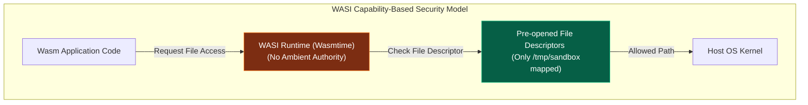

### Capability-Based Security (No Ambient Authority)
ঐতিহ্যবাহী প্রোগ্রামগুলো যখন ওএসে চলে, তারা **Ambient Authority** পায়। অর্থাৎ আপনি যদি রুট হিসেবে রান করেন, প্রসেসটি হোস্টের যেকোনো ফাইল অ্যাক্সেস করতে পারে।
WASI-তে কোনো Ambient Authority নেই। এটি সম্পূর্ণ **Capability-Based**। 
- Wasm মডিউলটি বুট হওয়ার সময় রানটাইম তাকে যে ফোল্ডারের ফাইল ডেসক্রিপ্টর (FD) নির্দিষ্ট করে দেবে (Pre-opened Directory), মডিউলটি শুধু এবং শুধুমাত্র সেই ডিরেক্টরির ভেতরেই ফাইল অ্যাক্সেস করতে পারবে। হোস্টের অন্য কোনো ফাইল বা নেটওয়ার্ক পোর্টের অস্তিত্বই Wasm মডিউলটি জানতে পারে না।

### Runtimes: Wasmtime & Wasmer
- **Wasmtime:** CNCF-এর অধীনে মরিচা (Rust) দিয়ে তৈরি একটি অত্যন্ত ফাস্ট এবং লাইটওয়েট WASI কম্প্লায়েন্ট রানটাইম। এটি Cranelift কম্পাইলার ব্যবহার করে Wasm বাইটকোডকে সরাসরি হোস্টের অ্যাসেম্বলি কোডে জেআইটি (JIT) কম্পাইল করে ফিজিক্যাল স্পিডে রান করায়।
- **Wasmer:** আরেকটি ইউনিভার্সাল রানটাইম যা একাধিক কম্পাইলার ব্যাকএন্ড (Singlepass, Cranelift, LLVM) সাপোর্ট করে।

---

## ১৫. Edge Serverless-এ Wasm-এর উপযোগিতা ও বাস্তব আর্কিটেকচার

আধুনিক এজ কম্পিউটিং ও গ্লোবাল সার্ভারলেস নেটওয়ার্কে (যেমন: Cloudflare Workers, Fastly Compute) ঐতিহ্যবাহী ডকার কন্টেইনার ব্যবহার করা অসম্ভব। কারণ কোটি কোটি রিকোয়েস্টের জন্য কন্টেইনার বুট করা অতিরিক্ত মেমরি ও কোল্ড স্টার্ট ল্যাটেন্সির (Cold Start Latency) কারণ হয়।

### Sub-Microsecond Cold Starts
ডকার কন্টেইনার চালাতে যেখানে কয়েকশো মিলি-সেকেন্ড এবং Firecracker চালাতে ৯ মিলি-সেকেন্ড সময় লাগে, সেখানে একটি WebAssembly Isolate স্পন করতে সময় লাগে **১ মাইক্রো-সেকেন্ডেরও কম** ($<1\mu\text{s}$)। এটি কন্টেইনারের চেয়ে প্রায় ১ লক্ষ গুণ দ্রুত!

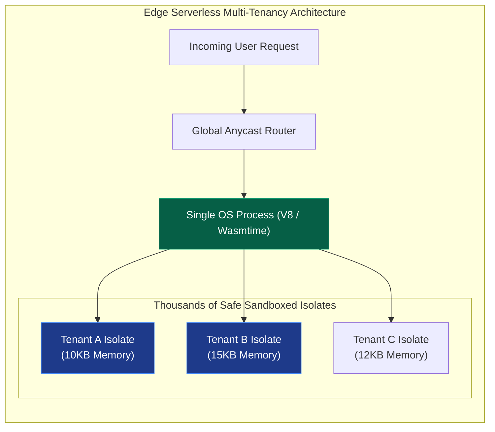

### Lightweight Multi-Tenancy
ঐতিহ্যগতভাবে মাল্টি-টেন্যান্সিতে প্রতিটা গ্রাহকের জন্য আলাদা কন্টেইনার বা ভিএম লাগে।
Wasm-এর অতি ক্ষুদ্র মেমরি ফুটপ্রিন্ট এবং কঠোর লিনিয়ার মেমরি সুরক্ষার কারণে ক্লাউড প্রোভাইডাররা **একটি মাত্র ওএস প্রসেসের (Single Process)** ভেতর হাজার হাজার আলাদা কাস্টমারের Wasm Isolates সম্পূর্ণ সুরক্ষিতভাবে প্যারালালি চালাতে পারে। এর ফলে মেমরি অপচয় ৯৯% হ্রাস পায় এবং এজ নেটওয়ার্কের প্রতিটি কোণায় অতি দ্রুত ও সাশ্রয়ী সার্ভারলেস সার্ভিস দেওয়া সম্ভব হয়।

---

> [!TIP]
> **Staff Architect Summary:**
> আধুনিক সিস্টেমে আইসোলেশনের মাত্রা নির্ধারণ করা একটি ট্রেড-অফ। আপনি যদি স্ট্যান্ডার্ড মাইক্রোসার্ভিস চান যেখানে স্পিড ও ডেভলপমেন্ট ইকোসিস্টেম মূখ্য, তবে **cgroups v2 ও Namespaces (Docker/Kubernetes)** আপনার সেরা পছন্দ। যদি আপনি অত্যন্ত সুরক্ষিত মাল্টি-টেন্যান্ট ক্লাউড সার্ভিস তৈরি করতে চান, তবে **AWS Firecracker বা gVisor** ব্যবহার করা বুদ্ধিমানের কাজ। আর আপনি যদি ভবিষ্যতের সুপারফাস্ট এজ বা সার্ভারলেস প্ল্যাটফর্ম তৈরি করতে চান, তবে **WebAssembly (Wasm/WASI)** হলো একমাত্র চূড়ান্ত প্রযুক্তি।
