# 🛡️ Containerization & Sandbox Internals: Deep Architectural Manual

আধুনিক ক্লাউড-নেটিভ সফটওয়্যার আর্কিটেকচারে কন্টেইনারাইজেশন একটি অনস্বীকার্য স্ট্যান্ডার্ড। তবে বেশিরভাগ প্রকৌশলী কেবল `docker run` বা `kubectl apply` কমান্ডের মধ্যেই সীমাবদ্ধ থাকেন। আপনি যদি একজন সিস্টেম স্থপতি (Systems Architect), সিকিউরিটি ইঞ্জিনিয়ার বা ডেভঅপ্স স্পেশালিস্ট হতে চান, তবে কার্নেল ও হ�## ১. Linux Namespaces ও কার্নেল-লেভেল আইসোলেশন মেকানিক্স

লিনাক্স অপারেটিং সিস্টেমে "কন্টেইনার" নামের কোনো ভৌত (Physical) সত্তা নেই। এটি মূলত লিনাক্স কার্নেলের একাধিক আইসোলেশন ফিচারের সমন্বয়। এর মধ্যে প্রথম এবং সবচেয়ে গুরুত্বপূর্ণ মেকানিজম হলো **Namespaces**। নেমস্পেসের কাজ হলো একটি প্রসেস ও তার চাইল্ড প্রসেসসমূহকে ওএসের গ্লোবাল রিসোর্সগুলোর একটি খণ্ডিত ও নিজস্ব ভিউপোর্ট দেওয়া, যাতে প্রসেসটি মনে করে সে হোস্ট ওএসের একমাত্র ডোমেনে কাজ করছে।

### ৮টি লিনাক্স নেমস্পেসের কার্নেল-স্তরের গভীরে (Kernel-Level Depth of Namespaces)

কার্নেল স্পেসে প্রতিটি নেমস্পেস আলাদা গ্লোবাল ডেটা স্ট্রাকচারকে আইসোলেট করে:

১. **PID Namespace (Process ID - `CLONE_NEWPID`):** 
   - **কার্নেল মেকানিজম:** এটি প্রসেস ট্রির আইসোলেশন ঘটায়। একটি নতুন PID নেমস্পেসের ভেতরে স্পন হওয়া প্রথম প্রসেসটি PID ১ পায়, যা ওএসের প্রথাগত `init` প্রসেস হিসেবে কাজ করে। কার্নেল ইন্টারনালি একটি বাই-ডিরেকশনাল ম্যাপিং টেবিল মেইনটেইন করে: `(Namespace PID) <-> (Host Global PID)`।
   - **গুরুত্ব:** কন্টেইনারের ভেতরের প্রসেসটি হোস্টের অন্যান্য প্রসেস দেখতে পারে না, এমনকি তাদের সিগন্যাল (যেমন: `kill -9`) পাঠাতে পারে না।

২. **NET Namespace (Network - `CLONE_NEWNET`):**
   - **কার্নেল মেকানিজম:** এটি লিনাক্সের নেটওয়ার্ক স্ট্যাক যেমন—ফিজিক্যাল ও ভার্চুয়াল নেটওয়ার্ক ডিভাইস (`veth` পেয়ার), আইপি রাউটিং টেবিল, পোর্ট বাইন্ডিং রুলস (`iptables`/`nftables`), এবং সকেট লিসেনিং পোর্টগুলোকে আইসোলেট করে।
   - **গুরুত্ব:** দুটি কন্টেইনার একই পোর্টে (যেমন: `8080`) হোস্টের সাথে কোনো প্রকার কনফ্লিক্ট ছাড়া স্বাধীনভাবে লিসেন করতে পারে।

৩. **MNT Namespace (Mount - `CLONE_NEWNS`):**
   - **কার্নেল মেকানিজম:** এটি মাউন্ট টেবিলের আইসোলেশন দেয়। এর ফলে একটি প্রসেস হোস্টের অন্যান্য মাউন্ট পয়েন্ট অ্যাক্সেস না করে সম্পূর্ণ নিজস্ব ফাইল সিস্টেম মাউন্ট করতে পারে। (ঐতিহাসিকভাবে এটিই লিনাক্সের প্রথম নেমস্পেস, তাই এর ফ্ল্যাগের নাম `CLONE_NEWNS` বা New Namespace)।

৪. **IPC Namespace (Inter-Process Communication - `CLONE_NEWIPC`):**
   - **কার্নেল মেকানিজম:** এটি System V IPC অবজেক্ট, POSIX মেসেজ কিউ এবং শেয়ার্ড মেমরি সেগমেন্ট (`shmget()`) আইসোলেট করে।
   - **গুরুত্ব:** এক কন্টেইনারের প্রসেস অন্য কন্টেইনারের প্রসেসের সাথে সরাসরি শেয়ার্ড মেমরিতে ডেটা এক্সচেঞ্জ করতে পারে না, যা সাইড-চ্যানেল অ্যাটাক প্রতিরোধ করে।

৫. **UTS Namespace (UNIX Timesharing System - `CLONE_NEWUTS`):**
   - **কার্নেল মেকানিজম:** এটি ওএসের হোস্টনেম (Hostname) এবং ডোমেননেম স্টোরেজকে আইসোলেট করে।
   - **গুরুত্ব:** কন্টেইনার হোস্টের আইডেন্টিটি না বদলে নিজের মত হোস্টনেম সেট করে কাজ করতে পারে।

৬. **USER Namespace (User Accounts - `CLONE_NEWUSER`):**
   - **কার্নেল মেকানিজম:** এটি প্রসেসের ইউজার আইডি (UID) এবং গ্রুপ আইডি (GID) ম্যাপিং আইসোলেট করে।
   - **গুরুত্ব:** কন্টেইনারের ভেতরের সাধারণ ইউজারও ওএসের ইন্টারনাল সিকিউরিটি বাউন্ডারিতে `root (UID 0)` হিসেবে কাজ করতে পারে, কিন্তু হোস্ট ওএসের ফিজিক্যাল ফাইলে সে একজন সাধারণ নন-রুট ইউজার মাত্র।

৭. **CGROUP Namespace (Control Groups - `CLONE_NEWCGROUP`):**
   - **কার্নেল মেকানিজম:** এটি `/proc/[PID]/cgroup` ডিরেক্টরি পাথকে আইসোলেট করে। কন্টেইনারের ভেতরের প্রসেস হোস্টের সিগ্রুপ ট্রির পাথ দেখতে পারে না।

৮. **TIME Namespace (লিনাক্স কার্নেল ৫.৬+ - `CLONE_NEWTIME`):**
   - **কার্নেল মেকানিজম:** এটি বুট ঘড়ি (`CLOCK_BOOTTIME`) এবং রিয়েল-টাইম ঘড়ি (`CLOCK_MONOTONIC`) আইসোলেট করে অফসেট মেইনটেইন করে। পড মাইগ্রেশনের সময় হোস্টের ঘড়ির কনফ্লিক্ট এড়াতে এটি ব্যবহৃত হয়।

---

### ভার্চুয়াল ফাইলসিস্টেম `/proc/[PID]/ns/` ট্র্যাকিং

লিনাক্সে প্রতিটি রানিং প্রসেসের নেমস্পেস ফাইল ডেসক্রিপ্টর হিসেবে `/proc/[PID]/ns/` ডিরেক্টরিতে সংরক্ষিত থাকে। আসুন আমরা হোস্টের যেকোনো প্রসেসের নেমস্পেস লিংকের ভিউপোর্ট দেখি:

```bash
# প্রসেস আইডি ১ এর নেমস্পেস আইডিগুলো দেখুন
ls -l /proc/1/ns/
```
**আউটপুট ইন্টারনালস:**
```text
lrwxrwxrwx 1 root root 0 May 29 23:30 cgroup -> cgroup:[4026531835]
lrwxrwxrwx 1 root root 0 May 29 23:30 ipc -> ipc:[4026531839]
lrwxrwxrwx 1 root root 0 May 29 23:30 mnt -> mnt:[4026531840]
lrwxrwxrwx 1 root root 0 May 29 23:30 net -> net:[4026531969]
lrwxrwxrwx 1 root root 0 May 29 23:30 pid -> pid:[4026531836]
lrwxrwxrwx 1 root root 0 May 29 23:30 time -> time:[4026531834]
lrwxrwxrwx 1 root root 0 May 29 23:30 user -> user:[4026531837]
lrwxrwxrwx 1 root root 0 May 29 23:30 uts -> uts:[4026531838]
```
এখানে প্রতিটা ফাইলের পাশে থাকা থার্ড ব্র্যাকেটের নম্বরটি (`4026531836`) হলো কার্নেলের ইন্টারনাল নেমস্পেস ইনোড (Inode) নাম্বার। দুটি প্রসেসের ইনোড নাম্বার এক হলে তারা একই নেমস্পেসে অবস্থান করছে, আর ভিন্ন হলে তারা আইসোলেটেড।

---

### কার্নেল সিস্টেম কলের গভীরতা (System Call Mechanics)

লিনাক্স কার্নেলে কন্টেইনার নেমস্পেস লাইফসাইকেল কন্ট্রোল করতে মূলত ৩টি প্রিমিয়ার সিস্টেম কল এক্সিকিউট করা হয়:

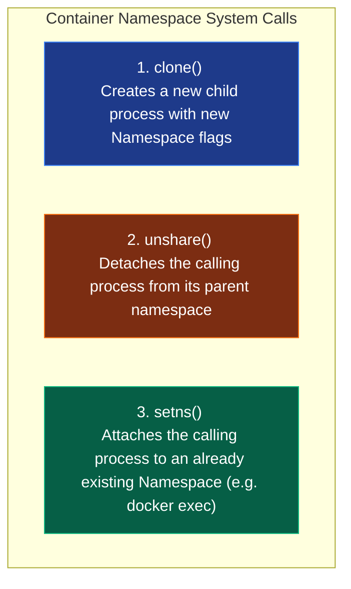

#### ১. `clone()` System Call
ঐতিহ্যগত `fork()` কলের উন্নত রূপ হলো `clone()`, যা চাইল্ড প্রসেস তৈরির সময় কার্নেলে নেমস্পেস বিচ্ছেদ নিশ্চিত করতে বিটওয়াইজ মাস্ক (Flags) রিসিভ করে:

##### C Implementation:
```c
#define _GNU_SOURCE
#include <sched.h>
#include <stdio.h>
#include <stdlib.h>
#include <sys/wait.h>
#include <unistd.h>

#define STACK_SIZE (1024 * 1024)
static char child_stack[STACK_SIZE];

int child_main(void* arg) {
    printf("[Child] Inside isolated namespaces.\n");
    printf("[Child] Inner PID: %d\n", getpid());
    sethostname("sandbox-node", 12);
    system("exec /bin/sh"); 
    return 0;
}

int main() {
    printf("[Parent] Host Process started (PID: %d)\n", getpid());
    
    // cloning with PID, NET, MNT, IPC, and UTS isolation flags
    int child_pid = clone(child_main, 
                          child_stack + STACK_SIZE, 
                          CLONE_NEWPID | CLONE_NEWNET | CLONE_NEWNS | CLONE_NEWIPC | CLONE_NEWUTS | SIGCHLD, 
                          NULL);
    
    if (child_pid == -1) {
        perror("clone failed");
        exit(1);
    }
    
    waitpid(child_pid, NULL, 0);
    printf("[Parent] Child terminated. Restoring normal state.\n");
    return 0;
}
```

##### Go (Golang) Implementation:
গো-তে রানটাইম থ্রেডিং মডেলের কারণে সরাসরি `clone()` কল করা ঝুঁকিপূর্ণ। তাই Go-র `os/exec` লাইব্রেরি কার্নেলের এই বিউটিফুল মেকানিজমটিকে `SysProcAttr` স্ট্রাকচারের মাধ্যমে ইন্টারনালি হ্যান্ডেল করে:

```go
package main

import (
	"fmt"
	"os"
	"os/exec"
	"syscall"
)

func main() {
	fmt.Printf("[Parent] Parent PID: %d\n", os.Getpid())

	// স্পন করা প্রসেস হিসেবে নিজেকেই (sh) রান করব আইসোলেটেড এনভায়রনমেন্টে
	cmd := exec.Command("/bin/sh")
	
	// namespaces কনফিগারেশন
	cmd.SysProcAttr = &syscall.SysProcAttr{
		Cloneflags: syscall.CLONE_NEWUNSHARE | 
			syscall.CLONE_NEWPID | 
			syscall.CLONE_NEWNET | 
			syscall.CLONE_NEWNS | 
			syscall.CLONE_NEWIPC | 
			syscall.CLONE_NEWUTS,
	}

	cmd.Stdin = os.Stdin
	cmd.Stdout = os.Stdout
	cmd.Stderr = os.Stderr

	if err := cmd.Run(); err != nil {
		fmt.Printf("Error spawning isolated process: %v\n", err)
		os.Exit(1)
	}
}
```

#### ২. `unshare()` System Call
রানিং প্রসেস যদি প্যারেন্ট প্রসেসের সাথে নেমস্পেস শেয়ার করা বন্ধ করে সম্পূর্ণ একক নেমস্পেস ডোমেন তৈরি করতে চায়, তবে সে `unshare(int flags)` এক্সিকিউট করে।

#### ৩. `setns()` System Call
আমরা যখন `docker exec` বা `kubectl exec` রান করি, ব্যাকগ্রাউন্ডে ডকার ডেমোন `setns()` কল করে রানিং কন্টেইনারের নেমস্পেসের ফাইল ডেসক্রিপ্টরে নতুন প্রসেস জুড়ে দেয়:
```c
int fd = open("/proc/[CONTAINER_PID]/ns/net", O_RDONLY);
setns(fd, CLONE_NEWNET); // প্রসেসটি এখন সরাসরি রানিং কন্টেইনারের নেটওয়ার্কে যুক্ত!
```

---

## ২. Control Groups (cgroups v1 vs v2) ও রিসোর্স ম্যানেজমেন্ট

নেমস্পেস কন্টেইনারকে শুধু আইসোলেট বা অন্ধ করে দেয়; কিন্তু এটি রিসোর্স শেয়ারিং বা গ্লোবাল কম্পিউটিং ক্যাপাসিটি যেমন CPU, Memory, Disk IO কন্ট্রোল করে না। কোনো কন্টেইনার যদি লুপ চালিয়ে সম্পূর্ণ হোস্ট ওএসের সিপিইউ গ্রাস করে ফেলে, তবে হোস্ট সিস্টেম ডাউন হয়ে যাবে। ওএসের মেমরি ও ফিজিক্যাল ক্ষমতার সুষম বণ্টন ও প্রসেস কন্ট্রোল নিশ্চিত করে **Control Groups (cgroups)**।

### cgroups v1 বনাম cgroups v2: The Architecture Evolution

লিনাক্স কার্নেলের এই সিগ্রুপ মডিউলের বড় বিবর্তন ঘটেছে v1 থেকে v2-তে রূপান্তরের মাধ্যমে।

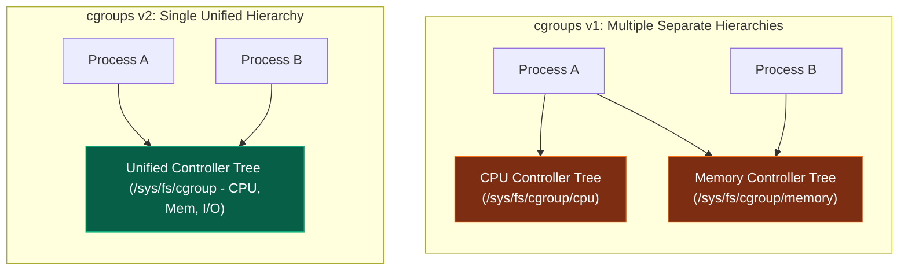

#### cgroups v1-এর বড় ত্রুটি:
সিগ্রুপ v1-এ প্রতিটি সিস্টেম রিসোর্সের জন্য আলাদা গাছের কাঠামো বা হায়ারার্কি তৈরি করতে হতো। এর ফলে কার্নেলের সিপিইউ এবং মেমরি কন্ট্রোলারের মধ্যে কোনো সমন্বয় ছিল না। উদাহরণস্বরূপ, যদি কোনো প্রসেস অতিরিক্ত ডিস্ক রাইট করে, তবে কার্নেল পেজ ক্যাশে জমা হওয়া নোংরা পেজগুলোর (Dirty Pages) মেমরি ট্র্যাকিং এবং I/O throttling মেলাতে পারত না, যা সিস্টেম থ্রোটলিং ও বাফারিংয়ের মারাত্মক সমস্যা তৈরি করত।

#### cgroups v2-এর বৈপ্লবিক মেকানিজম:
cgroups v2 একটি একক **Single Unified Hierarchy** প্রবর্তন করে। সব প্রসেস একটি মূল গাছের ডালে সাজানো থাকে।
১. **Unified Process Tracking:** প্রতিটা প্রসেস একই সাথে সিপিইউ, মেমরি ও আইও-এর জন্য একক বাউন্ডারিতে ম্যাপড থাকে।
২. **PSI (Pressure Stall Information):** এটি কার্নেল স্তরের একটি চমৎকার ডায়াগনস্টিক ফিচার। এটি দিয়ে রিয়েল-টাইমে জানা যায় রিসোর্সের চরম ঘাটতির কারণে প্রসেসটি CPU, Memory বা I/O-এর জন্য ঠিক কতটা সময় লস বা ওয়েস্ট করেছে।
৩. **Rootless Execution:** cgroups v2 সাধারণ নন-রুট ইউজারদের প্রসেসের রিসোর্স সেফলি কন্ট্রোল ও লিমিট করতে পারমিশন দেয়।

---

### হাতে কলমে cgroups v2 কনফিগারেশন (Manual Setup from Scratch)

আসুন আমরা কোনো থার্ডপার্টি টুল ছাড়া সরাসরি কার্নেলের `/sys/fs/cgroup/` ইন্টারফেসের সাহায্যে একটি প্রসেসের জন্য মেমরি এবং সিপিইউ লিমিট সেট করি:

```bash
# ১. রুট ইউজার হিসেবে cgroup v2 ডিরেক্টরিতে প্রবেশ করুন
sudo -i
cd /sys/fs/cgroup

# ২. একটি নতুন সিগ্রুপ তৈরি করুন (ডিরেক্টরি তৈরি করলেই কার্নেল স্বয়ংক্রিয়ভাবে ফাইল স্পন করবে)
mkdir -p sandbox-cgroup
cd sandbox-cgroup

# ৩. দেখুন কোন কোন কন্ট্রোলার সাব-ট্রির জন্য একটিভ করা যায়
cat cgroup.controllers
# আউটপুট: cpu memory io pids rdma

# ৪. সাব-ট্রি কন্ট্রোলের জন্য cpu এবং memory এনাবল করুন
echo "+cpu +memory" > cgroup.subtree_control

# ৫. মেমরির সর্বোচ্চ সীমা ৫০ মেগাবাইটে (52428800 Bytes) হার্ড লিমিট করুন
echo "52428800" > memory.max

# ৬. সিপিইউ কোটা ২০% এ থ্রোটল করুন (period = 100000us, quota = 20000us)
echo "20000 100000" > cpu.max

# ৭. এবার একটি লুপ চালানো ব্যাশ প্রসেস স্পন করুন এবং সিগ্রুপে অ্যাসাইন করুন
bash -c "while true; do true; done" &
BASH_PID=$!

# ৮. প্রসেসটিকে আমাদের কাস্টম সিগ্রুপের অধীনে রেজিস্টার করুন
echo $BASH_PID > cgroup.procs

# ৯. হোস্ট ওএসের top বা htop কমান্ডে দেখুন প্রসেসটি ২০% এর ওপরে CPU গ্রাস করতে পারছে না!
top -p $BASH_PID
```

---

### Pressure Stall Information (PSI) মেমরি ডায়াগনস্টিকস

cgroups v2-এর অত্যন্ত দরকারী সার্ভিস হলো PSI ট্র্যাকিং। এর মাধ্যমে আমরা `/proc/pressure/memory` ফাইল থেকে মেমরি সংকটের সূক্ষ্ম বিবরণ পড়তে পারি:

```bash
cat /proc/pressure/memory
```
**রিপোর্ট ফরম্যাট:**
```text
some avg10=2.30 avg60=1.12 avg300=0.05 total=158302
full avg10=0.45 avg60=0.10 avg300=0.00 total=25032
```
- **some:** এই কন্টেইনারের কিছু প্রসেস মেমরির জন্য অপেক্ষা করার কারণে থ্রোটল বা ওয়েট করেছে।
- **full:** কন্টেইনারের সমস্ত প্রসেস মেমরি পেজ রিক্লেইম বা সোয়াপিংয়ের জন্য অলস বসেছিল (সম্পূর্ণ প্রসেসর স্টলড)। এটি দেখে প্রোডাকশন অর্কেস্ট্রেটর সহজেই বুস্ট বা অটো-স্কেলিং মেকানিজম ফায়ার করতে পারে।

---

## ৩. OverlayFS (Overlay2) ও লেয়ার্ড ফাইল সিস্টেম আর্কিটেকচার

ডকার ইমেজগুলোর আকার জাবদা সাইজের হলেও তারা যখন রান করে, তখন নতুন মেমরি বা স্টোরেজ নষ্ট না করে কীভাবে সেকেন্ডের মধ্যে শত শত ফাইল কনজিউম করে? এর পেছনে রয়েছে **OverlayFS** (আধুনিক ও স্ট্যান্ডার্ড ওএস মডিউল হিসেবে পরিচিত **Overlay2** storage driver)।

OverlayFS ফাইল সিস্টেমের ওপর একাধিক রিড-অনলি এবং রিড-রাইট ফাইল ডিরেক্টরি মার্জ বা মাউন্ট করার সুবিধা দেয়।

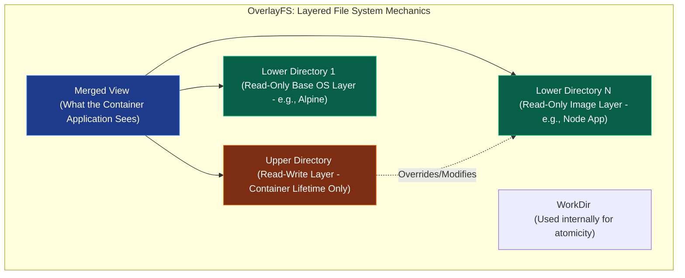

### OverlayFS এর ৪টি ভৌত স্তর (Physical Layers)

১. **LowerDir (Read-Only Layer):** ডকার ইমেজের প্রতিটা মেমরি লেয়ার। এগুলোতে কোনো ফাইল রাইট বা পরিবর্তন করা আইনত নিষিদ্ধ।
২. **UpperDir (Read-Write Layer):** কন্টেইনার চলাকালীন তৈরি হওয়া অত্যন্ত পাতলা এবং কাস্টম লেয়ার। কন্টেইনারের সমস্ত নতুন রাইট অপারেশন এই ফোল্ডারে জমা হয়।
৩. **WorkDir:** কার্নেল লেভেলের একটি ইন্টারনাল ক্যাশিং এবং ট্রানজেকশনাল ডিরেক্টরি।
৪. **MergedDir (Unified View):** এটি কোনো ভৌত স্টোরেজ নয়; এটি কার্নেলের তৈরি একটি মেমরি ভিউপোর্ট বা মাউন্ট পয়েন্ট। কন্টেইনার অ্যাপ্লিকেশনটি ব্রাউজ করার সময় এই মাউন্টে সমস্ত ফাইল একীভূত অবস্থায় দেখতে পায়।

---

### হাতে কলমে OverlayFS মাউন্টিং এবং CoW ভেরিফিকেশন (Hands-on Walkthrough)

আসুন আমরা লিনাক্সে ম্যানুয়ালি একটি লেয়ার্ড ফাইলসিস্টেম মাউন্ট করে এর ইন্টারনাল ট্রানজেকশন স্বচক্ষে পর্যবেক্ষণ করি:

```bash
# ১. ডিরেক্টরিগুলো তৈরি করুন
mkdir lower upper work merged

# ২. রিড-অনলি লোয়ার লেয়ারে কিছু ফাইল ও কনটেন্ট রাইট করুন
echo "Original config" > lower/config.txt
echo "Read only core source" > lower/app.js

# ৩. OverlayFS ব্যবহার করে মার্জড ডিরেক্টরিতে মাউন্ট ফায়ার করুন
sudo mount -t overlay overlay -o lowerdir=lower,upperdir=upper,workdir=work merged

# ৪. মার্জড ভিউপোর্টে মার্জ হওয়া ফাইলের লিস্ট দেখুন
ls -l merged
# আউটপুট: app.js, config.txt

# ৫. এবার মার্জড ফোল্ডার থেকে ফাইল মডিফাই (Write) করুন
echo "Custom upper modification" >> merged/config.txt

# ৬. চলুন দেখে আসি আমাদের ফিজিক্যাল ফাইলগুলোর অবস্থা কী!
cat lower/config.txt
# আউটপুট: "Original config" (লোয়ার ফাইলটি সম্পূর্ণ অপরিবর্তিত ও সুরক্ষিত!)

cat upper/config.txt
# আউটপুট: "Original config" এবং "Custom upper modification" (নতুন পরিবর্তনটি সরাসরি আপার লেয়ারে রি-রাইট হয়েছে!)
```

### Copy-on-Write (CoW) ও Whiteout-এর কার্নেল মেকানিক্স
- **Copy-on-Write (CoW):** কন্টেইনার যখন কোনো রিড-অনলি ফাইল পরিবর্তনের রিকোয়েস্ট পাঠায়, লিনাক্স কার্নেলের VFS (Virtual File System) ড্রাইভ লেভেলে ফাইলটিকে LowerDir থেকে কপি করে UpperDir-এ নিয়ে আসে। এরপর অ্যাপের রাইট কলটি UpperDir ফাইলের ওপর এক্সিকিউট হয়।
- **Whiteout (ফাইল ডিলিট করা):** কন্টেইনার যদি রিড-অনলি ফাইল ডিলিট করে দেয়, তবে ইমেজ লেয়ারের ফিজিক্যাল ফাইল কিন্তু মোছা সম্ভব নয়। এর সমাধান হিসেবে কার্নেল UpperDir-এ একটি বিশেষ **Whiteout file (Character device with 0:0 device number)** জেনারেট করে। VFS মার্জ করার সময় এই ডিভাইস ফাইলের অস্তিত্ব দেখে মার্জড ভিউপোর্টে মূল ফাইলটিকে ইনভিজিবল বা ডিলিট দেখায়।

---

## ৪. OCI (Open Container Initiative) ও Low-Level Runtimes

অনেকেরই ধারণা ডকার একাই সম্পূর্ণ কন্টেইনারাইজেশন ইঞ্জিন পরিচালনা করে। আদতে ডকার একটি হাই-লেভেল এপিআই ম্যানেজার। OCI (Open Container Initiative) স্ট্যান্ডার্ড মেনে একটি সম্পূর্ণ ও সুবিন্যস্ত মাইক্রোসার্ভিস চেইন ব্যাকগ্রাউন্ডে কাজ করে।

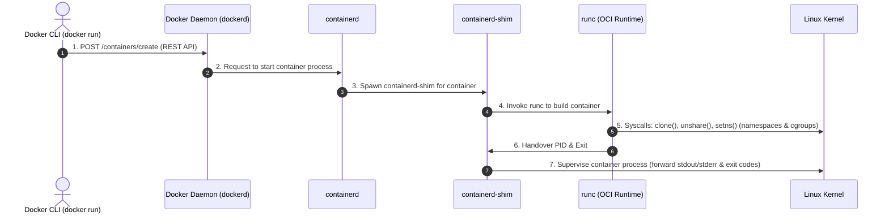

### কন্টেইনার রানটাইম হাইয়ারার্কির মডিউল বিশ্লেষণ (The Hierarchy Chain)

১. **`dockerd` (Docker Daemon):** ব্যবহারকারীর কাছ থেকে কমান্ড রিসিভ করে, নেটওয়ার্ক পোর্ট রুলিং ঠিক করে এবং ইমেজ বিল্ড কোঅর্ডিনেট করে।
২. **`containerd` (High-Level Runtime):** এটি CNCF-এর একটি চমৎকার প্রজেক্ট। এটি ইমেজ ডিস্ট্রিবিউশন, প্রসেস লাইফসাইকেল সুপারভিশন, স্টোরেজ মাউন্টিং এবং মেমরি বাবলিং কোঅর্ডিনেট করে।
৩. **`containerd-shim` (The Guard):** কন্টেইনার স্টার্ট হওয়ার সাথে সাথে `runc` যখন প্রস্থান করে, কন্টেইনারের ফিজিক্যাল stdout/stderr পাইপ সচল রাখতে এবং ওএস জম্বি প্রসেস হওয়া রোধ করতে এটি প্রহরী হিসেবে মেমরিতে ব্যাকগ্রাউন্ড প্রসেস আকারে বেঁচে থাকে। এটি ডকার ডেমোন রিস্টার্ট খেলেও কন্টেইনার ডাউন হওয়া থেকে বাঁচায়।
৪. **`runc` (Low-Level Runtime):** OCI স্পেসিফিকেশন মেনে চলা গো-ল্যাঙ্গুয়েজে তৈরি অফিশিয়াল কন্টেইনার রানটাইম। এর দায়িত্ব লিনাক্স কার্নেলের সাথে কথা বলে স্পেসিফিকেশন মাউন্ট ও প্রসেস স্টার্ট করে মেমরি ছেড়ে দেওয়া।

---

### `pivot_root` বنام `chroot`: The Security Architecture Deep Dive

কন্টেইনারের রুট ফাইল সিস্টেম সেটআপ করার সময় আমরা অনেকেই `chroot` এর কথা ভাবি। তবে প্রোডাকশন বা ক্লাউড গ্রেড কন্টেইনার রানটাইমে `chroot` ব্যবহার করা আইনত নিষিদ্ধ এবং অত্যন্ত বিপজ্জনক।

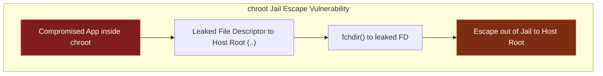

#### ১. `chroot` (Change Root) এর বড় সিকিউরিটি রিস্ক:
`chroot` শুধুমাত্র রানিং প্রসেসের রুট পাথ চেঞ্জ করে দেয়। কিন্তু প্রসেসটির প্রসেস ট্রিতে বা ফাইল ডেসক্রিপ্টরে যদি হোস্ট ফাইল সিস্টেমের কোনো পূর্ববর্তী ফাইল ডেসক্রিপ্টর ও মাউন্ট বাফারিং রিকোয়েস্ট লিক হয়ে থাকে, তবে চাইল্ড প্রসেসটি `fchdir()` সিস্টেম কলের মাধ্যমে হোস্টের মেইন ফোল্ডারে রি-মাউন্ট হয়ে বের হয়ে যেতে পারে। একেই বলে **chroot Escape**।

#### ২. `pivot_root` (The Impregnable Mount Wall) মেকানিজম:
`pivot_root` লিনাক্স কার্নেলের একটি অত্যন্ত শক্তিশালী ফাইল মাউন্ট সিস্টেম কল। এটি কন্টেইনারের জন্য নির্ধারিত নতুন রুট মাউন্টকে হোস্টের মেইন রুট মাউন্টের সাথে সম্পূর্ণ এক্সচেঞ্জ বা অদলবদল (Swap) করে দেয়।
- এর প্রক্রিয়াটি এমন: এটি নতুন ফাইল সিস্টেমকে গ্লোবাল রুট মাউন্টে মাউন্ট করে এবং হোস্টের পুরাতন ফাইলসিস্টেম মাউন্টকে একটি বিশেষ সাব-ডিরেক্টরিতে (যেমন: `old-root`) ঠেলে দেয়।
- এরপর রানটাইম `/old-root` ডিরেক্টরিকে সম্পূর্ণ ডিটাচ ও আনমাউন্ট (`umount -l`) করে দেয়।
- এর ফলে প্রসেসটির পক্ষে ওএস কার্নেল লেভেল থেকে হোস্টের মূল ফাইল সিস্টেমের কোনো হদিস বা নোড খুঁজে পাওয়া গাণিতিকভাবে অসম্ভব হয়ে দাঁড়ায়। কন্টেইনারের কাছে কোনো `old-root` ফাইল ডেসক্রিপ্টর অবশিষ্ট থাকে না, যা একে একটি নিখুঁত স্যান্ডবক্স ফাইল বাউন্ডারি দেয়।

---

### ডকার ছাড়াই স্ক্র্যাচ থেকে কন্টেইনার স্পন করার প্রকৌশল (Hands-on CLI Steps)

আসুন আমরা কার্নেল, `runc` এবং `pivot_root` এর কম্বিনেশনে ডকার ছাড়াই স্ক্র্যাচ থেকে একটি OCI কন্টেইনার স্পন করার পুরো প্রসেস সম্পন্ন করি:

```bash
# ১. কন্টেইনারের জন্য একটি ভৌত ডিরেক্টরি সেট করুন
mkdir -p my-oci-container/rootfs

# ২. আলপাইন বা বুজি লাইটওয়েট ফাইলসিস্টেম রুট ডিরেক্টরিতে আনপ্যাক করুন
docker export $(docker create alpine) | tar -C my-oci-container/rootfs -xvf -

# ৩. OCI কনফিগারেশন স্পেক ফাইল জেনারেট করুন
cd my-oci-container
runc spec

# ৪. এটি একটি 'config.json' ফাইল জেনারেট করেছে। ফাইলটি ওআইসি স্ট্যান্ডার্ডের সমস্ত প্রসেস মেকানিজম ডিফাইন করে।
# ৫. এবার রানটাইম ব্যবহার করে রুট পারমিশনে কন্টেইনারটি স্পন করুন:
sudo runc run isolated-shell
```
অভিনন্দন! আপনি এখন সম্পূর্ণ ডকার ইঞ্জিন ছাড়াই একটি সত্যিকারের আইসোলেটেড কন্টেইনার শেলের ভেতর অবস্থান করছেন। এটি কার্নেলের নেমস্পেস, সিগ্রুপ ভ্যালু এবং `pivot_root` ব্যবহার করে হোস্টের রুট থেকে সম্পূর্ণ সুরক্ষিত। এটি প্রমাণ করে যে ডকার মূলত ওএস কার্নেল মেকানিক্সের ওপর মোড়ানো একটি চমৎকার এপিআই এবং ম্যানেজমেন্ট র্যাপার মাত্র।িটি উন্নয়নে বড় অবদান রাখছে।

### CPU CFS Scheduler কোটা ও মেমরি লিমিট

কার্নেলের সিগ্রুপ ডিরেক্টরি `/sys/fs/cgroup/` ফাইলে নিচের প্যারামিটারগুলো রাইট করে রিসোর্স লিমিট করা হয়:

- **CPU Limit (CFS Scheduler):** `cpu.max` ফাইলের মাধ্যমে এটি নিয়ন্ত্রিত হয়। এতে দুটি ভ্যালু থাকে: `quota` এবং `period`।
  $$\text{CPU Allocation} = \frac{\text{quota (us)}}{\text{period (us)}}$$
  যদি `cpu.max` ফাইলে `50000 100000` লেখা থাকে, তার অর্থ প্রসেসটি প্রতি ১০০ মিলি-সেকেন্ডে সর্বোচ্চ ৫০ মিলি-সেকেন্ড CPU টাইম পাবে (অর্থাৎ ০.৫ কোর)।
- **Memory Limit:** `memory.max` ফাইলের মাধ্যমে কন্টেইনারের মেমরির সর্বোচ্চ হার্ড-লিমিট ডিফাইন করা হয়। প্রসেসের মেমরি ব্যবহার এর চেয়ে বেশি হলে কার্নেলের **OOM (Out Of Memory) Killer** প্রসেসটিকে টার্মিনেট করে।
- **OOM Score Tuniung:** কার্নেল `/proc/[PID]/oom_score` ফাইলের মাধ্যমে নির্ধারণ করে কার র‍্যাম খাওয়ার অপরাধ বেশি এবং কাকে আগে কিল করতে হবে। ডকার ডেমোন কন্টেইনারের ওওএম স্কোর অ্যাডজাস্ট করতে `/proc/[PID]/oom_score_adj` মডিফাই করে।

---

## ৩. OverlayFS (Overlay2) ও লেয়ার্ড ফাইল সিস্টেম আর্কিটেকচার

ডকার ইমেজগুলো কীভাবে একাধিক লেয়ারে তৈরি হয় এবং কন্টেইনার রান করার পর মেমরি নষ্ট না করে ফাইল সিস্টেম রিড/রাইট করে, তার নেপথ্যে রয়েছে **UnionFS** (আধুনিক লিনাক্সে এর স্ট্যান্ডার্ড রূপ **Overlay2**)।

OverlayFS মূল ফাইল সিস্টেমকে ৪টি প্রধান ডিরেক্টরি লেয়ারে বিন্যস্ত করে:


- **LowerDir (Read-Only Layer):** ডকার ইমেজের সমস্ত লেয়ারগুলো এখানে রিড-অনলি হিসেবে লক থাকে। এগুলোকে কখনই পরিবর্তন করা যায় না।
- **UpperDir (Read-Write Container Layer):** কন্টেইনার যখন রান করে, ডকার কার্নেল তার মাথার ওপর একটি অত্যন্ত পাতলা রিড-রাইট লেয়ার বিছিয়ে দেয়। কন্টেইনারে যেকোনো নতুন ফাইল তৈরি বা রাইট করলে তা সরাসরি এই লেয়ারে গিয়ে জমা হয়।
- **WorkDir:** এটি কার্নেলের একটি ইন্টারনাল ও খালি ডিরেক্টরি, যা পরমাণু (Atomic) অপারেশন ও ট্রানজেকশনাল ফাইল মাউন্ট নিশ্চিত করতে ব্যবহৃত হয়।
- **MergedDir (Unified View):** এটি হলো একটি ভার্চুয়াল মাউন্ট ভিউ। কন্টেইনারের ভেতরের অ্যাপ্লিকেশনটি যখন ফাইল ব্রাউজ করে, সে LowerDir এবং UpperDir-এর ফাইলগুলোকে একসাথে মার্জড অবস্থায় দেখতে পায়।

### Copy-on-Write (CoW) ও Whiteout মেকানিজম

কন্টেইনার চলাকালীন যদি কোনো রিড-অনলি ইমেজের ফাইল (LowerDir) পরিবর্তন বা ডিলিট করতে হয়, কার্নেল সরাসরি তা করতে দেয় না। কার্নেল ব্যাকগ্রাউন্ডে নিচের নিয়মগুলো ফলো করে:

- **Modification (পরিবর্তন):** কার্নেল ফাইলটিকে LowerDir থেকে কপি করে UpperDir (Read-Write)-এ নিয়ে আসে এবং সেখানে পরিবর্তন করে। মার্জড ভিউতে এখন কন্টেইনার অ্যাপ্লিকেশনের কাছে নতুন ফাইলটি দৃশ্যমান হয়, কিন্তু মূল ইমেজ ফাইলে কোনো টাচ ঘটে না।
- **Deletion (মুছে ফেলা):** ফাইলটি ডিলিট করতে গেলে UpperDir-এ একটি বিশেষ **Whiteout file (চরিত্রহীন ফাইল বা ডামি ফাইল - Character Device with 0:0 major/minor device numbers)** তৈরি করা হয়, যা মার্জড ভিউতে ফাইলটিকে লুকিয়ে রাখে।

---

## ৪. OCI (Open Container Initiative) ও Low-Level Runtimes

অনেকেই মনে করেন ডকার নিজেই সরাসরি কন্টেইনার চালায়। এটি সম্পূর্ণ ভুল! ডকার আসলে একটি হাই-লেভেল কোঅর্ডিনেটর। কন্টেইনার স্পন করার জন্য ব্যাকএন্ডে একটি লুজলি কাপল্ড মাইক্রোসার্ভিস স্ট্যাক কাজ করে।


- **`containerd`:** এটি একটি হাই-পারফরম্যান্স কন্টেইনার লাইফসাইকেল ম্যানেজার। এর কাজ হলো ইমেজের লেয়ারগুলো আনপ্যাক করে রানিং এনভায়রনমেন্ট তৈরি করা এবং কন্টেইনারের স্টেট মনিটর করা।
- **`containerd-shim`:** কন্টেইনার চলাকালীন ডকার ডেমোন রিস্টার্ট দিলে বা ক্র্যাশ করলে সব রানিং কন্টেইনারও বন্ধ হয়ে যাওয়ার কথা। এই সমস্যা এড়াতে `containerd` প্রতিটা কন্টেইনারের জন্য একটি অত্যন্ত ছোট ডেমোন রান করায়, একে **containerd-shim** বলে। এটি কন্টেইনারের stdout/stderr পাইপ ধরে রাখে।
- **`runc`:** এটি ওপেন কন্টেইনার ইনিশিয়েটিভ (**OCI**) স্পেসিফিকেশন মেনে চলা একটি লো-লেভেল কন্টেইনার রানটাইম। এর একমাত্র কাজ হলো লিনাক্স কার্নেলের সাথে সরাসরি কথা বলে নেমস্পেস ও সিগ্রুপ তৈরি করা, কন্টেইনার প্রসেস স্টার্ট করা এবং সাথে সাথে নিজে মেমরি থেকে বের হয়ে যাওয়া (Exit)।

### ডকার ছাড়া কন্টেইনার তৈরির বাস্তব পদ্ধতি (OCI Manual Spawning)

আপনি চাইলে ডকার বা কুবারনেটিস ছাড়াই শুধুমাত্র **runc** এবং লিনাক্স কার্নেলের সাহায্যে কন্টেইনার স্পন করতে পারেন:

```bash
# ১. রুট ফাইলসিস্টেম ডিরেক্টরি তৈরি করুন
mkdir -p my-sandbox/rootfs

# ২. ডকার দিয়ে টেম্পোরারি আলপাইন ফাইলসিস্টেম এক্সপোর্ট করুন
docker export $(docker create alpine) | tar -C my-sandbox/rootfs -xvf -

# ৩. OCI স্ট্যান্ডার্ড স্পেসিফিকেশন জেনারেট করুন
cd my-sandbox
runc spec
```
এটি একটি স্ট্যান্ডার্ড `config.json` ফাইল তৈরি করবে। এর ভেতর কন্টেইনারের নেমস্পেস, মাউন্ট এবং পিআইডি ১ এর জন্য `sh` কমান্ড সেট থাকে। এবার রানটাইম দিয়ে ডকার ছাড়াই রান করুন:
```bash
sudo runc run my-secure-container
```
এটি প্রমাণ করে যে ডকার মূলত লিনাক্স কার্নেলের ওপর মোড়ানো একটি চমৎকার এপিআই এবং ম্যানেজমেন্ট র্যাপার মাত্র।

---

## ৫. কন্টেইনার কার্নেল শেয়ারিং রিস্ক ও স্যান্ডবক্সিংয়ের প্রয়োজনীয়তা

কন্টেইনার প্রযুক্তির প্রধান শক্তি—গতি ও মেমরি সাশ্রয়—আসলে এর সবচেয়ে বড় নিরাপত্তা দুর্বলতাও বটে। প্রথাগত কন্টেইনারাইজেশনে সমস্ত কন্টেইনার একই হোস্ট ওএসের লিনাক্স কার্নেল শেয়ার করে চলে। কার্নেল যদি সব প্রসেসকে আইসোলেট করতে সামান্যতম ব্যর্থ হয়, তবে সম্পূর্ণ সিস্টেম কলাপ্স করতে পারে।

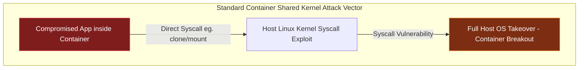

### Shared Kernel-এর প্রধান দুর্বলতা (The Shared Kernel Risk)
হোস্ট ওএসের কার্নেল ডোমেন (Ring 0) এবং ইউজার ডোমেন (Ring 3)-এর মধ্যে একটি সূক্ষ্ম প্রাচীর থাকে। কন্টেইনারে চলমান একটি অ্যাপ্লিকেশন যখন কোনো কার্নেল এপিআই কল করে, সে মূলত সরাসরি হোস্ট ওএসকে সিস্টেম কল (Syscalls) পাঠায়। যদি কার্নেলের কোনো সিস্টেম কলে সিকিউরিটি বাগ থাকে (যেমন: মেমরি লিকেজ বা বাফার ওভারফ্লো), তবে হ্যাকার কন্টেইনারের বাউন্ডারি ডিঙিয়ে সরাসরি হোস্টের মেমরি লেয়াউট মডিফাই করে সম্পূর্ণ হোস্টের রুট এক্সেস নিয়ে নিতে পারে। একে **Container Escape** বা কন্টেইনার ব্রেকআউট বলা হয়।

---

### কন্টেইনার ইতিহাসের দুটি ঐতিহাসিক এক্সপ্লোয়েট বিশ্লেষণ (Case Studies)

#### ১. runc root Privilege Escalation (CVE-2019-5736)
এটি কন্টেইনার ইতিহাসের সবচেয়ে মারাত্মক এবং বৈপ্লবিক ত্রুটি। এই বাগের মাধ্যমে কন্টেইনারের ভেতরের একজন সাধারণ ইউজার হোস্টের মূল কন্টেইনার রানটাইম বাইনারি `/usr/sbin/runc` ফিজিক্যালি ওভাররাইট করে দিতে পারত।

##### এক্সপ্লোয়েট মেকানিজম (The Exploitation Loop):
1. হ্যাকার কন্টেইনারের ভেতর একটি ম্যালিশিয়াস ইন্টারনাল স্ক্রিপ্ট চালায়।
2. কন্টেইনারের ভেতরের বিশেষ ফাইল `/proc/self/exe` মূলত কন্টেইনার রান করানোর কাজে নিয়োজিত `runc` বাইনারিকে পয়েন্ট করে।
3. হ্যাকার `/proc/self/exe` ফাইলটিকে রিড-অনলি মোডে ওপেন করে এর ফাইল ডেসক্রিপ্টর (`fd`) মেমরিতে ধরে রাখে।
4. এরপর হ্যাকার এমন একটি ফাঁদ পাতে যাতে হোস্টের অন্য কোনো সিস্টেম অ্যাডমিন `docker exec` চালিয়ে ওই কন্টেইনারে প্রবেশ করে।
5. হোস্টের অ্যাডমিন যখনই কন্টেইনারে প্রবেশ করতে `runc exec` ফায়ার করে, কার্নেল `runc` এর একটি নতুন থ্রেড কন্টেইনার শেলের ভেতর পাঠায়।
6. হ্যাকার সাথে সাথে তার আগে থেকে ধরে রাখা ফাইল ডেসক্রিপ্টরটি ব্যবহার করে হোস্টের রানিং `runc` প্রসেস মেমরিতে অ্যাক্সেস পায় এবং `/proc/self/exe` রাইট মোডে রিকভার করে হোস্টের ফিজিক্যাল `/usr/sbin/runc` ফাইলটিকে ম্যালিশিয়াস কোড দিয়ে ওভাররাইট করে দেয়।
7. পরবর্তীতে হোস্ট যখনই অন্য কোনো নতুন কন্টেইনার বুট করার চেষ্টা করে, ওভাররাইট হওয়া ম্যালিশিয়াস `runc` কোডটি সরাসরি হোস্টের মূল রুট প্রিভিলেজ নিয়ে রিমোট শেলের মাধ্যমে হ্যাকারের সার্ভারে হোস্টের এক্সেস পাঠিয়ে দেয়।

#### ২. Dirty Pipe Exploit (CVE-2022-0847)
এটি লিনাক্স কার্নেলের পাইপ বাফারিং (`pipe_buffer`) আর্কিটেকচারের একটি ত্রুটি।

##### এক্সপ্লোয়েট মেকানিজম:
1. লিনাক্স কার্নেল এক প্রসেস থেকে অন্য প্রসেসে ডেটা পাঠাতে মেমরিতে পেজ ক্যাশিং (`page_cache`) এবং পাইপ বাফার ব্যবহার করে।
2. পাইপ বাফারে লিনাক্স সরাসরি ডেটা কপি না করে পেজ ক্যাশের রেফারেন্স পয়েন্টার শেয়ার করে।
3. কার্নেলে পাইপ বাফারের ফ্ল্যাগ ইনিশিয়ালাইজেশনে একটি বাগ ছিল, যা পূর্বে রাইট হওয়া ফাইলের পারমিশন ফ্ল্যাগ রি-সেট করত না।
4. হ্যাকার কন্টেইনারের ভেতর থেকে কার্নেলের এই বাগটি ব্যবহার করে হোস্টের রিড-অনলি ও গুরুত্বপূণ ফাইল (যেমন: `/etc/passwd` বা `/etc/shadow`) পেজ ক্যাশের রেফারেন্স面に নিয়ে আসে।
5. পাইপ লাইনে মেমরি ব্লক রাইট করার সময় কার্নেল ভুলেই ওই রিড-অনলি পেজ ক্যাশ মেমরিতে ডেটা রাইট করার পারমিশন দিয়ে দেয়।
6. এর ফলে কন্টেইনারের ভেতর থেকে হোস্টের `/etc/passwd` ফিজিক্যালি মডিফাই করে রুট ইউজারের পাসওয়ার্ড বদলে ফেলা সম্ভব হয় এবং সেকেন্ডের মধ্যে কন্টেইনার ভেঙে বের হয়ে হোস্ট দখল করা যায়।

---

## ৬. gVisor: গুগল-রচিত সিস্টেম কল ভার্চুয়ালাইজেশন ইঞ্জিন

শেয়ার্ড কার্নেলের এই ভয়াবহ নিরাপত্তা ঝুঁকি দূর করতে গুগল সম্পূর্ণ নতুন এক ধারণার জন্ম দিয়েছে, যা হলো **gVisor**। এটি প্রথাগত কন্টেইনারের মতো হোস্টের কার্নেল শেয়ার না করে, কন্টেইনারের ভেতরের প্রতিটি সিস্টেম কলকে সম্পূর্ণ ইউজার স্পেসে স্পন করা একটি ভার্চুয়াল কার্নেল দিয়ে প্রসেস করে।

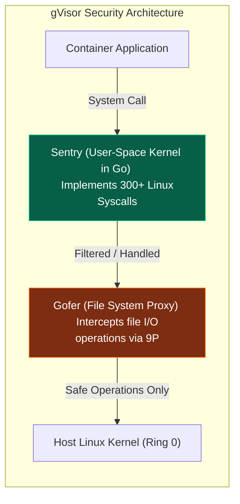

### gVisor কোর আর্কিটেকচার: Sentry & Gofer

gVisor মূলত দুটি অত্যন্ত শক্তিশালী ও স্বতন্ত্র প্রসেস মডিউলের মাধ্যমে কাজ করে:

#### ১. Sentry (সেন্ট্রি - The Guest Kernel):
Sentry হলো গো-ল্যাঙ্গুয়েজে (Go) নতুন করে লেখা একটি স্বয়ংসম্পূর্ণ লিনাক্স কার্নেল যা সম্পূর্ণ ইউজার স্পেসে (Ring 3) রান করে।
- এটি লিনাক্সের ৩ শতাধিক সিস্টেম কলের হুবহু ইন্টারফেস নিজের মেমরিতে ইমপ্লিমেন্ট করে রেখেছে।
- কন্টেইনার যখনই কোনো কার্নেল রিকোয়েস্ট পাঠায় (যেমন: নেটওয়ার্ক সকেট ওপেন করা বা প্রসেস তৈরি করা), সিস্টেম কলটি হোস্টের ফিজিক্যাল কার্নেলে না গিয়ে সরাসরি Sentry রিসিভ করে।
- Sentry নিজেই প্রসেস ট্র্যাকিং, নেটওয়ার্ক বাফার এবং মেমরি অ্যালোকেশন সিমুলেট করে রেসপন্স ব্যাক করে। এর ফলে কন্টেইনারের ভেতরের ম্যালিশিয়াস কোড ফিজিক্যাল হোস্ট কার্নেলের স্পর্শই পায় না।

#### ২. Gofer (গোফার - The File System Proxy):
Sentry লিনাক্স ফাইল সিস্টেমের সিকিউরিটি আরো সুসংহত করতে সরাসরি ডিস্কে ফাইল রাইট বা রিড করে না।
- কন্টেইনারের ফাইল অপারেশনের জন্য gVisor একটি সিকিউর ও আইসোলেটেড ফাইল রিডার প্রক্সি স্পন করে, যাকে **Gofer** বলে।
- Sentry ফাইল রিড বা রাইটের সময় Gofer-এর সাথে অত্যন্ত নিরাপদ **9P বা UDS (Unix Domain Socket)** প্রোটোকলের মাধ্যমে মেসেজ ট্রান্সফার করে। Gofer ফাইল হোস্ট থেকে রিড করে Sentry-কে দেয়।
- এর ফলে Sentry হ্যাক হলেও হ্যাকার হোস্টের ফাইলে সরাসরি হাত দিতে পারে না।

---

### gVisor Platforms: `ptrace` বনাম `KVM`

Sentry প্রসেস কন্টেইনারের সিস্টেম কলগুলো ইন্টারসেপ্ট করার জন্য দুটি ব্যাকএন্ড প্ল্যাটফর্ম মোড ব্যবহার করে:

১. **ptrace Platform:**
   - **মেকানিজম:** লিনাক্সের স্ট্যান্ডার্ড `ptrace` সিস্টেম কল ব্যবহার করে কন্টেইনারের প্রতিটা থ্রেডকে ট্রেস করে সিস্টেম কলগুলো ক্যাচ করা হয়।
   - **ট্রেড-অফ:** এটি কোনো বিশেষ হার্ডওয়্যার সাপোর্ট ছাড়া যেকোনো ভার্চুয়াল মেশিনে সহজেই চলে, কিন্তু ডবল কনটেক্সট সুইচের কারণে (Container -> Host Kernel -> Sentry -> Host Kernel) পারফরম্যান্স বেশ ধীরগতির (Slow) হয়।

২. **KVM Platform:**
   - **মেকানিজম:** হোস্ট ওএসের হার্ডওয়্যার ভার্চুয়ালাইজেশন ড্রাইভ `/dev/kvm` ব্যবহার করে Sentry নিজেকে একটি অত্যন্ত ক্ষুদ্র ও একক অপারেটিং সিস্টেম হাইপারভাইজার হিসেবে রেজিস্টার করে।
   - **ট্রেড-অফ:** CPU-এর সরাসরি হার্ডওয়্যার পেজিং সুবিধা পাওয়ায় এটি অত্যন্ত ফাস্ট এবং উৎপাদনমুখী (Production-grade)।

---

## ৭. AWS Firecracker: সার্ভারলেস ক্লাউডের MicroVM টেকনোলজি

অ্যামাজন ওসয়াব সার্ভিসেস (AWS) তাদের সার্ভারলেস প্ল্যাটফর্ম (AWS Lambda & Fargate) নিরাপদ ও সুপারফাস্ট করতে ডিজাইন করেছে **Firecracker**। এটি মরিচা (Rust) ল্যাঙ্গুয়েজে লেখা একটি অত্যন্ত শক্তিশালী **Virtual Machine Monitor (VMM)**।

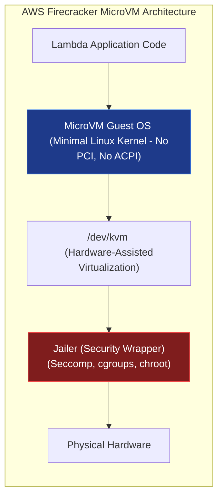

### KVM-based VMM (Virtual Machine Monitor)

ঐতিহ্যবাহী ভার্চুয়াল মেশিন (যেমন: QEMU/KVM, VMware) অত্যন্ত ভারী এবং স্লো। কারণ তারা কম্পিউটারের মাদারবোর্ড, ইউএসবি কন্ট্রোলার, সাউন্ড কার্ড, লিগ্যাসি মাউস ড্রাইভার ইমুলেট করতে শত শত কিলোবাইট মেমরি নষ্ট করে।

Firecracker এই সমস্ত নোংরা লিগ্যাসি আর্কিটেকচার ঝেঁটিয়ে বিদায় করেছে। এটি হোস্টের `/dev/kvm` ড্রাইভের সাথে সরাসরি `ioctl` মেকানিজমে কথা বলে:
- এটি কার্নেলের `KVM_CREATE_VM` কল করে মেমরিতে একটি খাঁটি হার্ডওয়্যার আইসোলেটেড বাউন্ডারি তৈরি করে।
- এটি কোনো মাদারবোর্ড বা PCI বাস ইমুলেট করে না। এটি শুধুমাত্র ৪টি অত্যন্ত পাতলা **VirtIO** ডিভাইস প্রোটোকল ব্যবহার করে:
  - `virtio-net` (নেটওয়ার্ক ইন্টারফেস)
  - `virtio-block` (ডিস্ক ফাইল রিডার)
  - `virtio-vsock` (হোস্ট ও গেস্টের ভেতর অত্যন্ত ফাস্ট সকেট চ্যাট)
  - `virtio-balloon` (রিয়েল-টাইম মেমরি অ্যাডজাস্টমেন্ট)

---

### Jailer Process: দ্য আলটিমেট সিকিউরিটি র্যাপার

Firecracker তার নিজের নিরাপত্তা আরও নিশ্ছিদ্র করতে প্রতিটা MicroVM বুট করার আগে ওপরে একটি খাঁটি কার্নেল বাউন্ডারি র্যাপার ট্রিগার করে, যাকে **Jailer** প্রসেস বলা হয়।

Jailer নিচের ধাপগুলো সম্পন্ন করে ফায়ারক্র্যাকারের চারপাশে নেমস্পেস, সিগ্রুপ এবং একটি অত্যন্ত কঠোর সেকম্প (Seccomp) ফিল্টার বিছিয়ে দেয়, যাতে ফায়ারক্র্যাকারের সিকিউরিটি ভাঙলেও হোস্ট সম্পূর্ণ সেফ থাকে:
১. **`chroot` Environment:** ফায়ারক্র্যাকারের জন্য একটি সম্পূর্ণ খাঁটি ও খালি ফাইলসিস্টেম খাঁচা তৈরি করে সেখানে একে আটকে দেয়।
২. **Namespace Separation:** ফায়ারক্র্যাকার প্রসেসকে হোস্টের Mount, Net, IPC, UTS, and PID নেমস্পেস থেকে চিরতরে বিচ্ছিন্ন করে দেয়।
৩. **cgroups Resource Limits:** সিগ্রুপের মাধ্যমে কন্টেইনারের মতোই সিপিইউ ও মেমরির হার্ড-লিমিট লক করে দেয়।
４. **Strict Seccomp Filtering:** একটি অত্যন্ত কঠোর সেকম্প বিপিএফ প্রোফাইল লোড করে যাতে ফায়ারক্র্যাকার সর্বোচ্চ ২০-৩০টি সিস্টেম কল ছাড়া হোস্ট ওএসের কার্নেলে কোনো টাচ না করতে পারে।

### Sub-10ms Cold Starts (কীভাবে ফাস্ট বুট হয়?)
ফায়ারক্র্যাকার কোনো BIOS বা বুটলোডার রান করে না। এটি মেমরিতে থাকা আনকম্প্রেসড ওএস কার্নেল ইমেজের ELF ফাইলে সরাসরি ফিজিক্যাল জাম্প করে। ফলে এটি মাত্র **৫ মিলি-সেকেন্ডের** মধ্যে একটি সম্পূর্ণ স্যান্ডবক্সড কুবারনেটিস-কম্প্লায়েন্ট MicroVM স্পন করতে পারে!

---

## ৮. Kata Containers: সিকিউর ও হার্ডওয়্যার-অ্যাক্সিলারেটেড ভার্চুয়ালাইজেশন

আপনি যদি সম্পূর্ণ কুবারনেটিস প্ল্যাটফর্মে সাধারণ ডকার বা সিআরআই কন্টেইনারের পারফরম্যান্স বজায় রেখে হার্ডওয়্যার-লেভেল আইসোলেশন ও সিকিউরিটি বাউন্ডারি নিশ্চিত করতে চান, তবে ওপেন স্ট্যান্ডার্ড প্রজেক্ট **Kata Containers** আপনার চূড়ান্ত সমাধান।

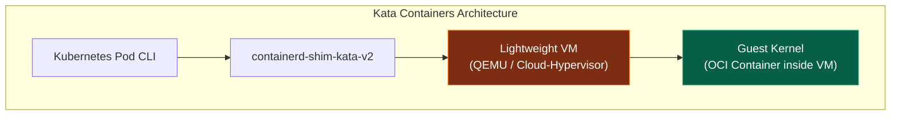

### VM-Container Hybrid Architecture

Kata Containers-এর মূল মেকানিজম হলো প্রতিটি কুবারনেটিস পডকে (Pod) হোস্টের সাধারণ প্রসেস হিসেবে স্পন না করে, একটি সম্পূর্ণ নিবেদিত ও লাইটওয়েট ভার্চুয়াল মেশিনের (MicroVM) ভেতর চালু করা।

#### আর্কিটেকচারাল লাইফসাইকেল কন্ট্রোল পাথ:
1. কুবারনেতিসের Kubelet যখন কোনো পড তৈরির সিগন্যাল দেয়, `containerd` সরাসরি OCI ইন্টারফেসে `containerd-shim-kata-v2` ট্রিগার করে।
2. Kata Runtime হোস্টের ব্যাকগ্রাউন্ডে একটি লাইটওয়েট হাইপারভাইজার স্পন করে। হাইপারভাইজার হিসেবে এটি প্রথাগত **QEMU** অথবা মরিচায় লেখা ক্লাউড ফ্রেন্ডলি **Cloud-Hypervisor** ব্যবহার করতে পারে।
3. হাইপারভাইজারটি বুট হয়ে তার মেমরি বাউন্ডারির ভেতর একটি সম্পূর্ণ স্লিম গেস্ট লিনাক্স কার্নেল লোড করে।
4. গেস্ট কার্নেলের ভেতর ওএস জম্বি ম্যানেজ করতে একটি ব্যাকজ্ঞাউন্ড সার্ভিস চলে, যাকে **kata-agent** বলে।
5. হোস্টের `containerd-shim-kata-v2` প্রসেসটি গেস্টের `kata-agent` এর সাথে ফিজিক্যাল **VSOCK (Virtual Socket)** টানেলের মাধ্যমে কমিউনিকেট করে।
6. কন্টেইনারের ইমেজ ও ভলিউমগুলো `virtio-fs` বা `virtio-block` মেথডে গেস্ট ভিএম শেলের ভেতর মাউন্ট করা হয়।

**ফলাফল:** কুবারনেটিস বা অ্যাপ্লিকেশন ডেভেলপার মনে করে সে একটি সাধারণ ডকার কন্টেইনার চালাচ্ছে, কিন্তু ব্যাকগ্রাউন্ডে সেটি সম্পূর্ণ ডেডিকেটেড হার্ডওয়্যার-অ্যাসিস্টেড মেমরি ও সিপিইউ বাউন্ডারির ভেতর এক সুরক্ষিত দুর্গে চলমান থাকে। এটি মাল্টি-টেন্যান্ট ক্লাউড ও ফাইনান্সিয়াল ওএস বিল্ড করার এক অনবদ্য প্রযুক্তি।

## ৯. Linux Capabilities: রুটের সীমাহীন ক্ষমতার সূক্ষ্ম বিভাজন

ঐতিহ্যগতভাবে লিনাক্সে সিকিউরিটি মডেল ছিল অত্যন্ত বাইনারি: হয় আপনি সাধারণ ইউজার (সব ব্লকড) অথবা আপনি রুট ইউজার (সব পারমিটেড)। রুট ইউজারের এই অসীম ক্ষমতা কন্টেইনার সিকিউরিটির জন্য অত্যন্ত বিপজ্জনক। কার্নেল স্তরে রুটের এই সীমাহীন ক্ষমতাকে প্রায় ৪০টি ছোট ছোট অধিকার বা প্রিভিলেজে ভাগ করা হয়েছে, যাকে **Linux Capabilities** বলা হয়।

### Capabilities এর ৫টি মূল সেট এবং কার্নেল মেকানিজম

লিনাক্স কার্নেলে প্রতিটি প্রসেসের `task_struct` ডিরেক্টরিতে ৫টি ভিন্ন প্রিভিলেজ সেট (Capabilities Bitmask) মেইনটেইন করা হয়:

১. **Permitted Set (`CapPrm`):** প্রসেসটির জন্য সর্বোচ্চ অনুমোদিত ক্ষমতার লিমিট। এটি প্রসেসটি কোনো সিস্টেমে সর্বোচ্চ যে ক্ষমতাগুলো ধারণ করতে পারে তার সীমা নির্ধারণ করে।
২. **Effective Set (`CapEff`):** প্রসেসটির চলমান অবস্থায় ঠিক এই মুহূর্তে কার্নেল লেভেলে যে ক্ষমতাগুলো সচল (Active) রয়েছে। কার্নেল যেকোনো সিস্টেম অ্যাক্সেস চেক করার সময় এই মাস্কটি ভেরিফাই করে।
৩. **Inheritable Set (`CapInh`):** চাইল্ড প্রসেস স্পন হওয়ার সময় যে ক্যাপাবিলিটিগুলো ইনহেরিট বা উত্তরাধিকার সূত্রে ফরোয়ার্ড করা যায়।
৪. **Bounding Set (`CapBnd`):** একটি প্রসেস তার লাইফ সাইকেলে সর্বোচ্চ যে ক্যাপাবিলিটি সেট অর্জন করতে পারবে তার সর্বোচ্চ সীমা লক করা। `execve()` সিস্টেম কলের মাধ্যমে কোনো প্রসেস তার বাউন্ডিং সেটের বাইরের ক্ষমতা কখনই অর্জন করতে পারে না।
৫. **Ambient Set (`CapAmb` - কার্নেল ৪.৩+):** নন-প্রুট প্রসেস বুট করার সময় প্রিভিলেজ লেভেল বজায় রাখতে সাহায্য করে।

---

### `/proc/[PID]/status` থেকে লাইভ Capabilities ডি-কোডিং

আমরা যেকোনো রানিং প্রসেসের মেমরি প্রিভিলেজ তার স্ট্যাটাস ফাইল থেকে ডি-কোড করতে পারি:

```bash
# প্রসেস আইডি ১৫৭৩০ এর ক্যাপাবিলিটি মাস্ক দেখুন
grep -i cap /proc/15730/status
```
**আউটপুট ইন্টারনালস:**
```text
CapInh:	0000000000000000
CapPrm:	00000000a80425fb
CapEff:	00000000a80425fb
CapBnd:	00000000a80425fb
CapAmb:	0000000000000000
```
এখানে থাকা হেক্সাডেসিমেল নম্বরটি (`00000000a80425fb`) মূলত কার্নেলের Capabilities বিটম্যাপ নির্দেশ করে। লিনাক্সের `capsh` টুলের মাধ্যমে এটিকে মানুষের পড়ার উপযোগী ফরমেটে ডি-কোড করা যায়:
```bash
capsh --decode=00000000a80425fb
```
এটি কার্নেলের কোন কোন নির্দিষ্ট বিট সচল তা নিখুঁতভাবে বিশ্লেষণ করে প্রিন্ট করে দেবে (যেমন: `cap_chown, cap_dac_override, cap_net_bind_service` ইত্যাদি)।

---

### Capabilities নিয়ন্ত্রণের বাস্তব উদাহরণ (C Code)

প্রোগ্রামে জিরো-ট্রাস্ট সিকিউরিটি নিশ্চিত করতে আমরা `<sys/capability.h>` লাইব্রেরি ব্যবহার করে প্রোগ্রাম্যাটিকভাবে নিজের ক্ষমতা ছাঁটাই বা ড্রপ করতে পারি:

```c
// C Code: Programmatically checking and dropping capabilities
#include <stdio.h>
#include <stdlib.h>
#include <sys/types.h>
#include <unistd.h>
#include <sys/capability.h>

void print_capabilities() {
    cap_t caps = cap_get_proc();
    printf("Current Process Capabilities: %s
", cap_to_text(caps, NULL));
    cap_free(caps);
}

int main() {
    printf("[Main] Checking initial capabilities:
");
    print_capabilities();

    // CAP_SYS_BOOT (Reboot block) ক্ষমতা ড্রপ করার প্রিপারেশন
    cap_t caps = cap_get_proc();
    cap_value_t cap_list[1] = { CAP_SYS_BOOT };
    
    // Effective এবং Permitted সেট থেকে এটি ডিলেট করা হচ্ছে
    cap_set_flag(caps, CAP_EFFECTIVE, 1, cap_list, CAP_CLEAR);
    cap_set_flag(caps, CAP_PERMITTED, 1, cap_list, CAP_CLEAR);
    
    if (cap_set_proc(caps) == -1) {
        perror("cap_set_proc failed");
        exit(1);
    }
    cap_free(caps);

    printf("[Main] Capabilities after dropping CAP_SYS_BOOT:
");
    print_capabilities();
    return 0;
}
```

---

## ১০. Seccomp (Secure Computing Mode) ও BPF Syscall Filtering

**Seccomp** হলো লিনাক্স কার্নেলের একটি শক্তিশালী সিস্টেম কল ফিল্টারিং গেটওয়ে। লিনাক্স ওএসে ৩০০টিরও বেশি সিস্টেম কল রয়েছে, কিন্তু একটি নোড বা এনজিনেক্স ওয়েব অ্যাপ্লিকেশনের সর্বোচ্চ ৪০-৫০টি কলের প্রয়োজন হয়। বাকি অপ্রয়োজনীয় ও অত্যন্ত শক্তিশালী সিস্টেম কলগুলো (যেমন: `reboot`, `sys_kexec_load`, `mount`) ওপেন রাখা সিকিউরিটি রিস্ক বাড়ায়। সেকম্প কার্নেল স্তরে এই বিপজ্জনক কলগুলোকে ফিল্টার করে দেয়।

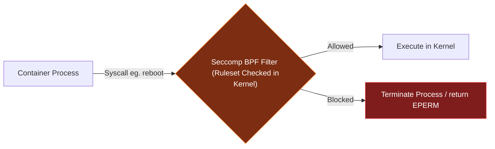

### Seccomp v1 (Strict) বনাম Seccomp-BPF (Filter Mode)

১. **Seccomp v1 (Strict Mode):**
   - লিনাক্স কার্নেল ২.৬.১২ সংস্করণে প্রথম চালু হওয়া মোড। এতে প্রসেসটি কেবল এবং শুধুমাত্র ৪টি সিস্টেম কল এক্সিকিউট করতে পারত: `read()`, `write()`, `_exit()`, এবং `sigreturn()`। এর বাইরে অন্য কোনো সিস্টেম কল ফায়ার করলেই কার্নেল সাথে সাথে প্রসেসটিকে `SIGKILL` সংকেত পাঠিয়ে টার্মিনেট করে দিত। এটি অত্যন্ত কঠোর হওয়ায় বাস্তবসম্মত ছিল না।
২. **Seccomp-BPF (Filter Mode):**
   - এটি অত্যন্ত নমনীয় ও ডায়নামিক সিকিউরিটি সলিউশন। এটি লিনাক্সের **Classic BPF (Berkeley Packet Filter)** রুলস ব্যবহার করে প্রসেসের প্রতিটি সিস্টেম কলের আর্গুমেন্ট লেভেল পর্যন্ত ফিল্টার করতে পারে।

---

### Seccomp-BPF লাইব্রেরি ইমপ্লিমেন্টেশন (C Code)

আমরা সরাসরি `libseccomp` ব্যবহার করে কার্নেলে সিস্টেম কল ফিল্টারিং পলিসি রেজিস্টার করতে পারি:

```c
// C Code: Restricting system calls using libseccomp
#include <stdio.h>
#include <unistd.h>
#include <sys/types.h>
#include <seccomp.h>
#include <errno.h>

int main() {
    // সেকম্প ফিল্টার ইনিশিয়ালাইজ করুন (ডিফল্ট একশন ব্লক করা)
    scmp_filter_ctx ctx = seccomp_init(SCMP_ACT_KILL);
    if (ctx == NULL) {
        printf("seccomp_init failed
");
        return 1;
    }

    // শুধুমাত্র read, write এবং exit করার অনুমতি দেওয়া হচ্ছে
    seccomp_rule_add(ctx, SCMP_ACT_ALLOW, SCMP_SYS(read), 0);
    seccomp_rule_add(ctx, SCMP_ACT_ALLOW, SCMP_SYS(write), 0);
    seccomp_rule_add(ctx, SCMP_ACT_ALLOW, SCMP_SYS(exit), 0);
    seccomp_rule_add(ctx, SCMP_ACT_ALLOW, SCMP_SYS(exit_group), 0);

    // কার্নেলে ফিল্টার লোড করুন
    if (seccomp_load(ctx) < 0) {
        perror("seccomp_load failed");
        seccomp_release(ctx);
        return 1;
    }

    printf("Seccomp policy loaded! Attempting to print (write syscall)...
");
    
    // reboot সিস্টেম কল ফায়ার করার চেষ্টা করুন যা কিল অ্যাকশন ট্রিগার করবে
    printf("Attempting reboot syscall...
");
    syscall(169); // System call 169 is reboot in x86_64. 
    
    // সেকম্প রুলসের কারণে প্রসেসটি এই লাইনে পৌঁছানোর আগেই কিলড হবে!
    printf("This line will never print.
");
    seccomp_release(ctx);
    return 0;
}
```

### Seccomp Filter Actions (কার্নেলের শাস্তিমূলক অ্যাকশনসমূহ)
সেকম্প পলিসি লঙ্ঘন করলে কার্নেল নিচের একশনগুলো নিতে পারে:
- `SECCOMP_RET_ALLOW:` সিস্টেম কলটি এক্সিকিউট করতে কার্নেলে পারমিশন দেওয়া।
- `SECCOMP_RET_KILL_PROCESS:` সম্পূর্ণ প্রসেস ট্রিসহ কন্টেইনারকে সাথে সাথে টার্মিনেট করা।
- `SECCOMP_RET_ERRNO:` সিস্টেম কল ব্লক করে প্রসেসের কাছে একটি স্পেসিফিক এরর সংকেত (যেমন: `EPERM` - Permission Denied) পাঠানো, যাতে প্রসেস ক্র্যাশ না করে এরর হ্যান্ডেল করতে পারে।
- `SECCOMP_RET_LOG:` সিস্টেম কলকে পারমিশন দেওয়া, কিন্তু সিকিউরিটি অডিটের জন্য হোস্টের syslog-এ লগ রাইট করা।

---

## ১১. AppArmor ও SELinux: কার্নেল অ্যাক্সেস কন্ট্রোল পলিসি (LSM)

নেমস্পেস কন্টেইনারকে ফাইল ও নেটওয়ার্কের ভার্চুয়াল রূপ দেয়, কিন্তু কন্টেইনারের রুট ইউজার যদি হোস্টের কোনো গুরুত্বপূর্ণ ফাইল মডিফাই করতে চায়, তবে লিনাক্স কার্নেলের **LSM (Linux Security Modules)** তা প্রতিরোধ করে। LSM হলো কার্নেলের ফাইল সিস্টেম, প্রসেস এবং নেটওয়ার্ক মাউন্ট পয়েন্টের ভেতর বসানো একগুচ্ছ সিকিউরিটি হুক (`security_inode_permission()`), যা প্রতিটা রিড/রাইট এক্সিকিউট হওয়ার আগে পলিসি ফাইল চেক করে পারমিশন দেয়।

### LSM আর্কিটেকচার: AppArmor (Path-based) বনাম SELinux (Inode-based)

১. **AppArmor (Ubuntu/Debian-এর ডিফল্ট):**
   - **মেকানিজম:** এটি সম্পূর্ণ **Path-based**। অর্থাৎ এটি ফাইলের ভৌত পাথের ওপর ভিত্তি করে রিড-রাইট কন্ট্রোল করে। উদাহরণস্বরূপ: `/etc/nginx/nginx.conf` পাথটি রিড-অনলি মোডে লক করে দেওয়া।
   - **সুবিধা:** পলিসি ফাইলগুলো মানুষের পড়ার ও লেখার উপযোগী অত্যন্ত সহজ সিনট্যাক্সে সাজানো থাকে।
২. **SELinux (RHEL/CentOS-এর ডিফল্ট):**
   - **মেকানিজম:** এটি সম্পূর্ণ **Inode Label-based (MAC - Mandatory Access Control)**। ওএসের প্রতিটা ফাইল ইনোড, প্রসেস পোর্ট এবং মেমরি ব্লকের ওপর একটি সিকিউরিটি ট্যাগ বা লেবেল লাগানো থাকে।
   - **সুবিধা:** অত্যন্ত সূক্ষ্ম ও টাইট সিকিউরিটি নিশ্চিত করে। ফাইল রিনেম বা পাথ চেঞ্জ করলেও সিকিউরিটি পলিসি ব্রেক হয় না, তবে কনফিগারেশন অত্যন্ত জটিল।

---

### কন্টেইনার প্রটেক্ট করার জন্য কাস্টম AppArmor প্রোফাইল ডিফিনিশন

আসুন আমরা হোস্ট ওএসে একটি কাস্টম প্রোফাইল তৈরি করি যা কন্টেইনারের ম্যালিশিয়াস রাইট ও শেল এক্সিকিউশন সম্পূর্ণ ব্লক করবে:

```pro
# AppArmor Profile: /etc/apparmor.d/containers/nginx-secure
#include <tunables/global>

profile nginx-secure flags=(attach_disconnected) {
  # কন্টেইনারের ডিফল্ট পারমিশন রুলস ইমপোর্ট করুন
  #include <abstractions/base>
  
  # হোস্টের সমস্ত ফাইলের রিড অ্যাক্সেস দেওয়া হচ্ছে
  /** r,
  
  # কন্টেইনারের গুরুত্বপূর্ণ পাথগুলোতে রাইট অ্যাক্সেস ব্লক করুন
  deny /etc/** w,
  deny /usr/** w,
  deny /var/log/** w,
  
  # রানিং শেলের ভেতর থেকে নতুন কোনো শেল স্পন করা ব্লক করুন (Command Shell Isolation)
  deny /bin/sh mr,
  deny /bin/bash mr,
  deny /bin/dash mr,
  
  # শুধুমাত্র এনজিনেক্স এর ক্যাশ ডিরেক্টরিতে রিড-রাইট পারমিশন দেওয়া হচ্ছে
  /var/cache/nginx/** rw,
  /var/run/nginx.pid rw,
}
```
প্রোফাইলটি লোড করার পর ডকার কন্টেইনারে এটি ইনজেক্ট করলে কন্টেইনারের রুট হ্যাক হলেও হ্যাকার কোনো ফাইলে রাইট বা নতুন প্রসেস রান করতে পারবে না:
```bash
# হোস্ট কার্নেলে প্রোফাইল লোড করুন
sudo apparmor_parser -r -W /etc/apparmor.d/containers/nginx-secure

# প্রোফাইলটি ব্যবহার করে কন্টেইনার স্পন করুন
docker run --security-opt apparmor=nginx-secure -d nginx:alpine
```

---

## ১২. User Namespaces ও Rootless Containers আর্কিটেকচার

ঐতিহ্যবাহী ডকার সিস্টেমে `dockerd` ডেমোন হোস্ট ওএসে `root (UID 0)` প্রিভিলেজে চলত। এর ফলে কন্টেইনারের কোনো প্রসেস যদি বাউন্ডারি ডিঙিয়ে বের হতে পারত, তবে সে হোস্ট ওএসেরও রুট প্রিভিলেজ পেয়ে যেত। এর চূড়ান্ত সিকিউরিটি সলিউশন হলো লিনাক্সের **User Namespaces** এবং এর ওপর ভিত্তি করে চলা **Rootless Containers**।

### UID/GID Mapping এর কার্নেল মেকানিক্স

ইউজার নেমস্পেস কন্টেইনারের ভেতরের প্রসেসের ইউজার আইডিকে (UID) হোস্ট ওএসের সম্পূর্ণ ভিন্ন এক নন-রুট আইডির সাথে ম্যাপ করে দেয়।

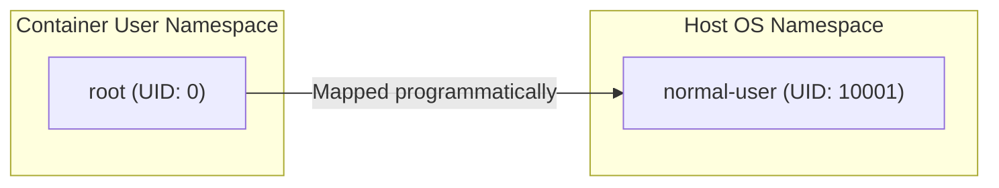

কার্নেল এই ম্যাপিং টেবিলটি `/proc/[PID]/uid_map` এবং `/proc/[PID]/gid_map` ফাইলে রেজিস্টার করে:
```text
# ContainerUID  HostUID  Range
0               100000   65536
```
**আর্কিটেকচারাল ব্যাখ্যা:** কন্টেইনারের ভেতরের প্রসেসটি মনে করবে সে ওএসের পরম প্রিভিলেজড ইউজার `root (UID: 0)`। সে কন্টেইনারের ভেতরের ফাইলে রাইট বা অ্যাপ ইনস্টল করতে পারবে। কিন্তু কার্নেল লেভেলে হোস্ট ওএসের ফিজিক্যাল ফাইল সিস্টেমে সে আসলে একজন সাধারণ নন-রুট ইউজার `100000` মাত্র। ফলে কন্টেইনার ভেঙে বের হলেও সে হোস্ট ওএসের কোনো ক্ষতি করতে পারবে না।

---

### `/etc/subuid` এবং `/etc/subgid` এর ভূমিকা
নন-রুট ইউজাররা যাতে হোস্টের ইউজার আইডি স্পেস এলোমেলো না করে ফেলে, তার জন্য `/etc/subuid` ফাইলে প্রতিটা ইউজারের জন্য নির্দিষ্ট ইউজার আইডি রেঞ্জ বরাদ্দ থাকে:
```text
awolad:100000:65536
```
এর অর্থ হলো `awolad` ইউজারটি তার কন্টেইনারের জন্য হোস্টের `100000` থেকে `165535` পর্যন্ত ইউজার আইডিগুলোকে কন্টেইনার ইউজার নেমস্পেসে ম্যাপ করার জন্য বরাদ্দ পেয়েছে। ব্যাকগ্রাউন্ডে ওএসের সেট-ইউজার-আইডি (`setuid`) হেল্পার টুল **`newuidmap`** এবং **`newgidmap`** এই পলিসি ভেরিফাই করে প্রসেসের নেমস্পেস ম্যাপিং টেবিল সেট আপ করে।

---

### Rootless Network Virtualization: slirp4netns

যেহেতু নন-রুট ইউজাররা হোস্ট ওএসের ফিজিক্যাল নেটওয়ার্ক কার্ড মডিফাই করতে পারে না (কারণ `veth` পেয়ার ও নেটওয়ার্ক রাউটিং সেট করতে `CAP_NET_ADMIN` ক্যাপাবিলিটি প্রয়োজন), তাই Rootless Docker/Podman নেটওয়ার্কিং সলভ করার জন্য **slirp4netns** মডিউলটি ব্যবহার করে।

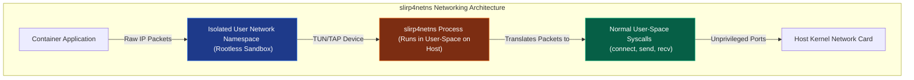

#### slirp4netns আর্কিটেকচারাল ফ্লো:
১. কন্টেইনারের ভেতরে একটি ভার্চুয়াল **TUN/TAP** নেটওয়ার্ক ডিভাইস স্পন করা হয়।
২. কন্টেইনার অ্যাপ যখন কোনো নেটওয়ার্ক রিকোয়েস্ট পাঠায়, Raw IP প্যাকেটগুলো এই TAP ইন্টারফেসে এসে জমা হয়।
৩. হোস্ট ওএসের ইউজার স্পেসে চলা **slirp4netns** প্রসেসটি এই Raw IP প্যাকেটগুলোকে রিড করে।
৪. সে একটি লাইটওয়েট ইউজার-স্পেস **TCP/IP stack (SLIRP)** ব্যবহার করে এই প্যাকেটগুলোকে সাধারণ ও আন-প্রিভিলেজড সিস্টেম কল (যেমন: `connect()`, `send()`, `recv()`) এ রূপান্তরিত করে।
৫. হোস্টের এই সাধারণ সিস্টেম কলগুলো হোস্ট কার্নেলের নেটওয়ার্ক স্ট্যাকে স্বাভাবিক নন-রুট প্রসেসের মতোই প্রসেসড হয়ে ইন্টারনেটে যাতায়াত করে। এর ফলে সম্পূর্ণ রুট প্রিভিলেজ বা ওআইসি রিসোর্স কন্ট্রোল ছাড়াই নিরাপদ কন্টেইনার নেটওয়ার্কিং সম্ভব হয়।

## ১৩. WebAssembly (Wasm): ব্রাউজারের বাইরে আধুনিক স্যান্ডবক্সিং

কন্টেইনারাইজেশনের পরবর্তী প্রজন্ম এবং ক্লাউড-নেটিভ কম্পিউটিংয়ের ভবিষ্যৎ হিসেবে আত্মপ্রকাশ করেছে **WebAssembly (Wasm)**। এটি মূলত ওয়েব ব্রাউজারে হাই-পারফরম্যান্স গেম, ভিডিও এডিটিং বা জটিল কম্পুটেশন চালানোর জন্য ডিজাইন করা হলেও, এর অসাধারণ লাইটওয়েট মেমরি মডেল এবং কঠোর নিরাপত্তা বৈশিষ্ট্যের কারণে বর্তমানে এটি ব্যাকএন্ড ও এজ কম্পিউটিংয়ের (Edge Computing) প্রধানতম স্যান্ডবক্সিং মেকানিজম হিসেবে সমাদৃত হচ্ছে।

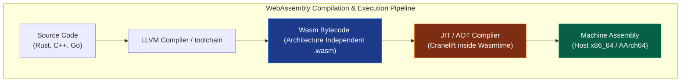

### compilation ও জেআইটি/এওটি এক্সিকিউশন মডেল (Compilation Pipeline)
Wasm মডিউলগুলো একটি ইন্টারমিডিয়েট আর্কিটেকচার-স্বাধীন বাইটকোড ফরমেটে সংরক্ষিত থাকে।
- রানটাইম (যেমন: **Wasmtime**) এই বাইটকোডকে সরাসরি মেমরিতে নিয়ে জাস্ট-ইন-টাইম (**JIT**) অথবা আগে থেকেই কম্পাইল করে (**AOT**) সরাসরি হোস্ট মেশিনের নেটিভ ইন্সট্রাকশনে রূপান্তর করে।
- এই কম্পাইলেশনের সময় রানটাইম সিকিউরিটি বাউন্ডারি রক্ষার জন্য প্রতিটা মেমরি অ্যাক্সেস কলের আগে কঠোর ইন্ট্রিগ্রিটি বাউন্ডস চেক (Bounds Checks) ইনজেক্ট করে দেয়।

---

### Linear Memory Sandboxing এর কার্নেল ও হার্ডওয়্যার মেকানিজম
Wasm-এর সিকিউরিটি ডিজাইনের প্রাণকেন্দ্র হলো এর **Linear Memory** মডেল।
১. **Contiguous Byte Array:** Wasm মডিউলের সমস্ত র‍্যাম মেমরিকে কার্নেল লেভেলে একটি একক, সরল ও রৈখিক বাইট অ্যারে (Linear Array) হিসেবে ডিক্লেয়ার করা হয়।
২. **Offset-based Pointers:** Wasm কোডের ভেতর কোনো ফিজিক্যাল র‍্যামের অ্যাড্রেস বা মেমরি পয়েন্টার থাকে না। এর সমস্ত পয়েন্টার হলো ওই অ্যারের বেস অ্যাড্রেস থেকে শুরু করে একটি সাধারণ ৩২-বিট (বা wasm64 এ ৬৪-বিট) ইন্টিজার অফসেট মাত্র।
৩. **Hardware-Assisted Page Guard Limits (The 4GB Guard Band):**
   - ডায়নামিক সফটওয়্যার চেক এড়াতে আধুনিক ৬৪-বিট ওএসে Wasm রানটাইম একটি অত্যন্ত চৌকস কৌশল অবলম্বন করে। এটি মেমরিতে Wasm গেস্টের ৪ গিগাবাইট বা ৬ গিগাবাইটের একটি বিশাল ভার্চুয়াল মেমরি বাউন্ডারি রিজার্ভ করে, যাকে **Guard Band** বলা হয়।
   - Wasm কোডটি যদি ভুলেও তার বরাদ্দকৃত মেমরির বাইরে রাইট বা রিড করতে যায়, কার্নেলের MMU (Memory Management Unit) সাথে সাথে একটি হার্ডওয়্যার পেজ ফল্ট ট্র্যাপ (Segmentation Fault) ফায়ার করে।
   - রানটাইম এই ট্র্যাপটি মেমরি স্পেস থেকে ক্যাচ করে ডায়নামিক সফটওয়্যার ইডেক্স চেক ছাড়াই অত্যন্ত দ্রুত Wasm আইসোলেটকে তাৎক্ষণিকভাবে কিল বা হল্ট করে দেয়। ফলে বাফার ওভারফ্লোর মাধ্যমে স্যান্ডবক্স ডিঙানো গাণিতিকভাবে অসম্ভব।

---

### Wasm বনাম কন্টেইনার বনাম প্রথাগত ভার্চুয়াল মেশিন

| Feature | Virtual Machines (VM) | Containers (Docker) | WebAssembly (Wasm) |
| :--- | :--- | :--- | :--- |
| **Virtualization Level** | Hardware-Level (Ring -1 Hypervisor KVM) | OS-Level (Ring 0 Kernel Sharing via Namespaces) | Language/Instruction-Level (Safe VM Runtime) |
| **Cold Start Time** | কয়েক সেকেন্ড থেকে মিনিট ($>1\text{s}$) | মিলি-সেকেন্ড ($100\text{-}500\text{ms}$) | **সাব-মাইক্রোসেকেন্ড** ($<1\mu\text{s}$) |
| **Memory Footprint** | গিগাবাইট (GB) | মেগাবایت (MB) | **কিলোবাইট (KB)** |
| **Sandbox Size** | ১০০এমবি - ১০জিবি | ৫০এমবি - ২জিবি | **১০০কেবি - ১০এমবি** |
| **Isolation Barrier** | হার্ডওয়্যার পেজিং ও ভার্চুয়াল সিপিইউ | ওএস প্রসেস সীমানা ও Capabilities | **সফ্টওয়্যার লিনিয়ার মেমরি ও MMU গার্ড** |
| **Ambient OS Access** | সম্পূর্ণ ওএস এক্সেস | কার্নেল এপিআই ও মাউন্ট বাফারিং | **সম্পূর্ণ শুন্য (No Ambient Authority)** |

---

## ১৪. WASI (WebAssembly System Interface) ও ওএস লেভেল কমিউনিকেশন

WebAssembly মডিউলটি কার্নেল লেভেল থেকে সম্পূর্ণ বিচ্ছিন্ন থাকায় এটি একা একা হোস্ট ওএসের কোনো ফাইল রিড করতে, নেটওয়ার্ক সকেট ওপেন করতে বা সিস্টেমের ঘড়ির সময় জানতে পারে না। এই সীমাবদ্ধতা কাটিয়ে Wasm-কে ওএসের সাথে নিরাপদ ও সুশৃঙ্খল যোগাযোগের ব্যবস্থা করে দিতে তৈরি করা হয়েছে **WASI (WebAssembly System Interface)**।

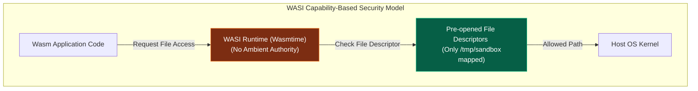

### Capability-Based Security (No Ambient Authority)

প্রথাগত ওএস আর্কিটেকচারে একটি অ্যাপ **Ambient Authority** পায়। অর্থাৎ আপনি যদি কোনো টার্মিনালে `/bin/cat` কমান্ড দিয়ে কোনো ফাইল পড়তে চান, প্রসেসটি হোস্ট ওএসের কার্নেলের কাছে কারেন্ট ইউজারের সমস্ত ফাইল রিড পারমিশন ব্যবহার করে হোস্টের যেকোনো ফাইল ব্রাউজ করতে পারে।

WASI-তে কোনো Ambient Authority নেই। এটি সম্পূর্ণ **Capability-Based**:
- WASI রানটাইম (যেমন: Wasmtime) বুট হওয়ার সময় Wasm মডিউলকে নির্দিষ্ট কিছু ফাইল ডেসক্রিপ্টর (Pre-opened Directories) স্পেসিফিকভাবে পাস করে।
- Wasm মডিউলটি শুধু এবং শুধুমাত্র রানটাইমের দেওয়া ওই নির্ধারিত ডিরেক্টরির ফাইলেই হাত দিতে পারবে। সে হোস্ট ওএসের অন্য কোনো ডিরেক্টরি বা রুট ফাইল সিস্টেমের অস্তিত্বই বুঝতে পারবে না।

---

### WASI Preview 1 বনাম WASI Preview 2 (The Component Model)

১. **WASI Preview 1 (`wasi_snapshot_preview1`):**
   - প্রথম প্রজন্মের WASI স্ট্যান্ডার্ড। এটি মূলত লিনাক্সের প্রথাগত POSIX সিস্টেম কলগুলোকে (যেমন: `fd_read`, `fd_write`, `path_open`) ম্যাপ করে একটি ফ্ল্যাট ইন্টারফেস দিয়েছিল।
২. **WASI Preview 2 (The WebAssembly Component Model):**
   - আধুনিক ও বৈপ্লবিক রূপ। এটি **WIT (WebAssembly Interface Type)** নামক একটি চমৎকার ইন্টারফেস ডেফিনিশন ল্যাঙ্গুয়েজের সাহায্যে স্ট্রাকচার্ড ও মডুলার আর্কিটেকচার দেয়। এর মাধ্যমে একাধিক ভিন্ন ভিন্ন ভাষায় তৈরি Wasm কম্পোনেন্ট ডায়নামিকভাবে একে অপরের সাথে যুক্ত হয়ে নেটওয়ার্ক ও মেমরি সেফটি বজায় রেখে একসাথে কাজ করতে পারে।

---

### বাস্তব উদাহরণ: Rust দিয়ে WASI প্রোগ্রামিং ও মাউন্টিং

আসুন আমরা মরিচায় (Rust) একটি লাইটওয়েট ফাইল রিডার অ্যাপ্লিকেশন তৈরি করি যা WASI স্ট্যান্ডার্ডে কমপাইল্ড হবে:

```rust
// File: src/main.rs
use std::fs::File;
use std::io::{self, Read};

fn main() -> io::Result<()> {
    println!("[WASI-Guest] Attempting to open safe mapped config file...");
    
    // '/sandbox/config.txt' ফাইলটি ওপেন করার চেষ্টা
    let mut file = File::open("/sandbox/config.txt")?;
    let mut contents = String::new();
    file.read_to_string(&mut contents)?;
    
    println!("[WASI-Guest] Successfully read content: {}", contents);
    
    // প্রথাগত হোস্টের ফাইল সিস্টেমে হাত দেওয়ার চেষ্টা (যা ফেইল করবে!)
    println!("[WASI-Guest] Trying to access host system file /etc/passwd...");
    match File::open("/etc/passwd") {
        Ok(_) => println!("[WASI-Guest] Vulnerability! Ambient Authority Leaked!"),
        Err(e) => println!("[WASI-Guest] Blocked by WASI! Error: {}", e),
    }

    Ok(())
}
```

#### WASI বুট ও প্রাক-অনুমোদিত পাথ মাউন্ট করার পদ্ধতি:

```bash
# ১. Rust-কে target wasm32-wasi দিয়ে কম্পাইল করুন
rustup target add wasm32-wasi
cargo build --target wasm32-wasi --release

# ২. ডামি কনফিগ ফাইল ও হোস্ট পাথ রেডি করুন
mkdir -p ./host-safe-dir
echo "Secret Token inside Sandbox" > ./host-safe-dir/config.txt

# ৩. Wasmtime ব্যবহার করে হোস্ট ডিরেক্টরিকে স্যান্ডবক্স পাথে ম্যাপ করে রান করুন
wasmtime run --dir=./host-safe-dir::/sandbox target/wasm32-wasi/release/wasi_app.wasm
```
**আউটপুট ইন্টারনালস:**
```text
[WASI-Guest] Attempting to open safe mapped config file...
[WASI-Guest] Successfully read content: Secret Token inside Sandbox
[WASI-Guest] Trying to access host system file /etc/passwd...
[WASI-Guest] Blocked by WASI! Error: Permission denied (os error 44)
```

---

## ১৫. Edge Serverless-এ Wasm-এর উপযোগিতা ও বাস্তব আর্কিটেকচার

আধুনিক এজ কম্পিউটিং ও গ্লোবাল সার্ভারলেস নেটওয়ার্কে (যেমন: Cloudflare Workers, Fastly Compute, AWS CloudFront Functions) প্রথাগত ডকার কন্টেইনার ব্যবহার করা অসম্ভব। কারণ এজ লোকেশনে প্রতি মিলি-সেকেন্ডে লক্ষ লক্ষ ইউজার রিকোয়েস্ট আসে। প্রতিটা রিকোয়েস্টের জন্য আলাদা কন্টেইনার চালু করা মারাত্মক কোল্ড স্টার্ট ল্যাটেন্সী এবং হোস্ট ওএসের মেমরি অপচয়ের কারণ হয়ে দাঁড়ায়।

### Sub-Microsecond Cold Starts এর নেপথ্যে (Under the Hood of Zero Cold Starts)
একটি স্ট্যান্ডার্ড ডকার কন্টেইনার বুট হতে যেখানে ৫০০ মিলি-সেকেন্ড এবং Firecracker MicroVM-এর ৯ মিলি-সেকেন্ড সময় লাগে, সেখানে একটি WebAssembly Isolate বুট হতে সময় লাগে **১ মাইক্রো-সেকেন্ডেরও কম** ($<1\mu\text{s}$).
- এটি কেন সম্ভব? কন্টেইনার বুট করার সময় কার্নেলকে প্রসেস ফোর্ক (`fork`), এক্সিকিউট (`execve`), নেমস্পেস আইসোলেশন ও নেটওয়ার্ক কার্ড মাউন্টিংয়ের মতো ভারী অপারেশন চালাতে হয়।
- Wasm-এর ক্ষেত্রে ওএস প্রসেসটি আগেই সচল থাকে। রানটাইম শুধু মেমরিতে থাকা প্রাক-কম্পাইলড বাইটকোডের জন্য একটি অত্যন্ত স্লিম লিনিয়ার মেমরি স্পেস বরাদ্দ করে চাইল্ড স্ট্যাক সেট আপ করে দেয়। একেই বলে **Isolate Architecture**।

---

### Lightweight Multi-Tenancy (প্যারালাল স্যান্ডবক্সিং)

গ্লোবাল ক্লাউড প্রোভাইডাররা ওএসের একটি মাত্র প্রসেসের ভেতর হাজার হাজার সম্পূর্ণ স্বতন্ত্র ক্লায়েন্টের সার্ভিস অত্যন্ত নিরাপদে প্যারালালি রান করতে পারে।

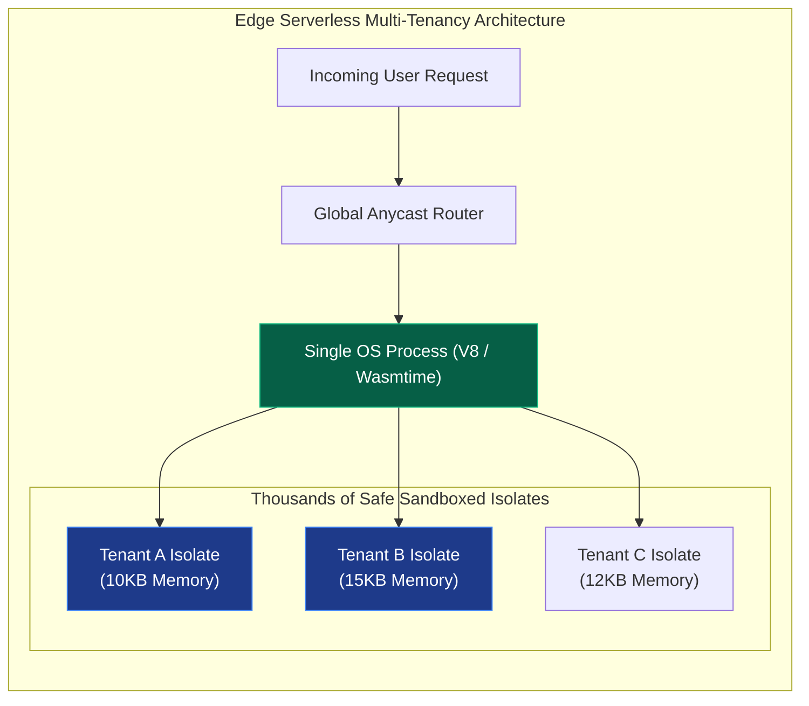

মেমরি ও সিপিইউ বাউন্ডারি MMU পেজ টেবিল দ্বারা কঠোরভাবে প্রোটেক্টেড থাকায় এক গ্রাহকের কোড কোনোভাবেই অন্য গ্রাহকের মেমরিতে উঁকি মারতে পারে না। এর ফলে সার্ভার কস্ট ৯৯% পর্যন্ত হ্রাস পায় এবং এজ কম্পিউটিংয়ের অনবদ্য গতি অর্जित হয়।

---

## ১৬. আইসোলেশন লেয়ার ম্যাট্রিক্স ও স্টাফ আর্কিটেক্টের চূড়ান্ত গাইডলাইন

ডকুমেন্টেশনটির ইতি টানার পূর্বে আমরা কন্টেইনারাইজেশন ও স্যান্ডবক্সিংয়ের প্রতিটি আইসোলেশন লেয়ারের একটি প্র্যাকটিক্যাল স্টাফ আর্কিটেক্ট সামারি ম্যাট্রিক্স দেখব:

| Security Model | Isolation Method | Best Used For | Performance / Memory Overhead | Escape Risk Profile |
| :--- | :--- | :--- | :--- | :--- |
| **Namespaces & cgroups (Docker)** | OS Kernel Sharing | স্ট্যান্ডার্ড মাইক্রোসার্ভিস, ইন্টারনাল ট্রাস্টেড অ্যাপস। | **অত্যন্ত কম** (নেটিভ পারফরম্যান্স)। | **মাঝারি থেকে উচ্চ** (শেয়ার্ড কার্নেল ত্রুটি থাকলে)। |
| **gVisor (Sentry / Gofer)** | System Call Virtualization | মাল্টি-টেন্যান্ট SaaS, থার্ড-পার্টি কোড এক্সিকিউশন। | **মাঝারি** (ptrace/KVM ইন্টারসেপশন ওভারহেড)। | **অত্যন্ত কম** (হোস্ট কার্নেলে অ্যাক্সেস নেই)। |
| **AWS Firecracker (MicroVM)** | Hardware Virtualization | ফাংশন-অ্যাজ-আ-সার্ভিস (FaaS), সিকিউর কন্টেইনারাইজেশন। | **মাঝারি** (৫-১০ মিলি-সেকেন্ড বুট ও ৫এমবি মেমরি)। | **সম্পূর্ণ শুন্য** (হার্ডওয়্যার বাউন্ডারি)। |
| **WebAssembly (Wasm / WASI)** | Language VM / Linear Memory | আল্ট্রা-ফাস্ট এজ কম্পিউটিং, জিরো-ট্রাস্ট প্লাগইন সিস্টেম। | **অত্যন্ত কম** (সাব-মাইক্রোসেকেন্ড বুট ও কেবি সাইজ)। | **গাণিতিকভাবে শূন্য** (স্যান্ডবক্স মেমরি আইসোলেশন)। |

---

> [!TIP]
> **Staff Architect Recommendation:**
> আধুনিক সিস্টেম আর্কিটেকচারে সিকিউরিটি ও স্পিড হলো একটি ধারাবাহিক ভারসাম্য (Trade-off)। আপনি যদি প্রচলিত ডেভেলপমেন্ট ইকোসিস্টেম এবং শত শত প্যাকেজের সহজ ব্যবহার চান, তবে **cgroups v2 ও Namespaces (Docker/Kubernetes)** আপনার সেরা পছন্দ। আপনি যদি কুবারনেটিসের ভেতরেই থার্ডপার্টি অবিশ্বস্ত ইউজার কোড সচল করতে চান, তবে **gVisor বা Kata Containers** ব্যবহার করা অত্যন্ত বুদ্ধিমত্তার পরিচয় দেবে। আর আপনি যদি ভবিষ্যতের সুপারফাস্ট, এজ কম্পিউটিং বা আল্ট্রা-সিকিউর জিরো-কোল্ড-স্টার্ট মাইক্রোসার্ভিস তৈরি করতে চান, তবে **WebAssembly (Wasm/WASI Component Model)** হলো আপনার আলটিমেট এবং চূড়ান্ত প্রযুক্তি।

---
