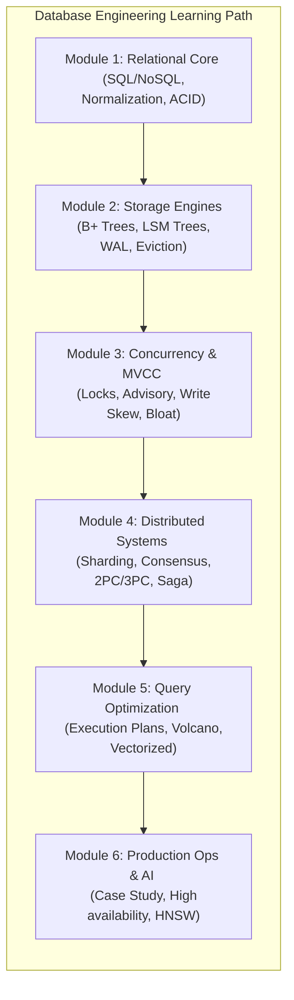

# 🗄️ Database Systems & Storage Engineering Index

স্বাগতম! ডাটাবেস কেবল ডেটা সেভ করার মাধ্যম নয়; এটি কম্পিউটার সায়েন্স ও সিস্টেমস আর্কিটেকচারের সবচেয়ে সূক্ষ্ম ও আকর্ষণীয় সৃষ্টিগুলোর একটি। ডিস্ক রাইট অপারেশন, নেটওয়ার্ক রিড ব্লকিং, কনকারেন্সি লক এবং হার্ডওয়্যার মেমোরির সাথে ডাটাবেস ইঞ্জিন কীভাবে লড়াই করে, তার পূর্ণাঙ্গ এবং গভীর বিবরণ নিয়ে তৈরি এই হ্যান্ডবুক।

এখানে আমাদের **database.md** ফাইলে থাকা **৬১টি চ্যাপ্টারের** একটি সুবিন্যস্ত রোডম্যাপ ও রিডার ইনডেক্স দেওয়া হলো। এটিকে ৬টি মূল আর্কিটেকচারাল মডিউলে ভাগ করা হয়েছে যাতে আপনি ধাপে ধাপে একজন **Staff Database Architect** হিসেবে নিজেকে গড়ে তুলতে পারেন।

---

---

## 🗺️ ৬১টি চ্যাপ্টারের আর্কিটেকচারাল সূচিপত্র

নিচে প্রতিটি মডিউলের অন্তর্গত চ্যাপ্টারগুলোর একটি বিস্তারিত ওভারভিউ এবং নেভিগেশন লিংক দেওয়া হলো:

### 🌟 Module 1: Database Core & Foundations (ডাটাবেস কোর ও ফাউন্ডেশন)
*এই মডিউলে ডাটাবেসের বেসিক ও রিলেশনাল থিওরির ওপর পূর্ণ নিয়ন্ত্রণ অর্জন করবেন। ACID এবং নরমাল জেনারেশন নিয়ে গভীর আলোচনা পাবেন।*

*   [**১. SQL বনাম NoSQL:**](/docs/database#১-sql-বনাম-nosql-আর্কিটেকচারাল-যুদ্ধক্ষেত্রের-ভেতরের-রূপ) আর্কিটেকচারাল যুদ্ধক্ষেত্রের ফিজিক্যাল স্টোরেজ ও স্কিমা লেভেলের ভেতরের রূপ।
*   [**২. ACID Properties Deep Dive:**](/docs/database#২-acid-properties-deep-dive-ডাটাবেসের-অলঙ্ঘনীয়-চার-স্তম্ভ) ডাটাবেস ট্রানজেকশনের অলঙ্ঘনীয় চার স্তম্ভের গাণিতিক ও বাস্তব মেকানিজম।
*   [**৯. Column-Oriented বনাম Row-Oriented স্টোরেজ:**](/docs/database#৯-column-oriented-কলাম-ভিত্তিক-বনাম-row-oriented-রো-ভিত্তিক-স্টোরেজ) ওএলটিপি বনাম ওএলএপি ডেটার ফিজিক্যাল বিন্যাস।
*   [**২৫. Database Normalization (1NF থেকে BCNF) ও Denormalization:**](/docs/database#২৫-database-normalization-১nf-থেকে-bcnf-ও-denormalization) কোটি কোটি ডেটার এনমালি দূর করার বৈজ্ঞানিক ম্যাপিং।
*   [**২৬. Database Relationships ও Referential Integrity:**](/docs/database#২৬-database-relationships-ও-referential-integrity) ডাটাবেস নোডগুলোর মধ্যে রিলেশনশিপ ও ওনারশিপের ফিজিক্যাল রিলেশন।
*   [**২৭. ENUMs বনাম Lookup Tables:**](/docs/database#২৭-enums-বনাম-lookup-tables-প্রোডাকশন-ট্রেড-অফ) এন্টারপ্রাইজ স্কেলে ডাটা ইন্টিগ্রিটি ও প্রোডাকশন পারফরম্যান্স ট্রেড-অফ।
*   [**২৮. Database Views বনাম Materialized Views:**](/docs/database#২৮-database-views-বনাম-materialized-views) মেমরি অপ্টিমাইজেশন ও কুয়েরি ক্যাশিংয়ের বাস্তব ব্যবহার।
*   [**২৯. Trigger Systems ও Stored Procedures:**](/docs/database#২৯-trigger-systems-ও-stored-procedures) ডাটাবেস লেভেলের অটোমেশন ও সিকিউরিটি বাউন্ডারি।
*   [**৩৮. SQL Subqueries বনাম Correlated Subqueries:**](/docs/database#৩৮-sql-subqueries-বনাম-correlated-subqueries) সাব-কুয়েরির পারফরম্যান্স পেনাল্টি ও সিঙ্গল রো এভ্যালুয়েশন।
*   [**৪৫. Relational Database Internals:**](/docs/database#৪৫-relational-database-internals-system-catalogs-ও-information-schema) System Catalogs ও Information Schema-এর অভ্যন্তরীণ মেমরি বিন্যাস।

---

### 💾 Module 2: Storage Engines & File Formats (স্টোরেজ ইঞ্জিন ও ফিজিক্যাল ফাইল ফরম্যাট)
*ডিস্ক ও র‍্যামের মধ্যবর্তী জটিল লেয়ার এবং স্টোরেজ সিলিকন কীভাবে ডাটা রিড ও রাইট কন্ট্রোল করে, তা এখানে কভার করা হয়েছে।*

*   [**৩. Database Indexing Internals:**](/docs/database#৩-database-indexing-internals-b-trees-বনাম-lsm-trees) B+ Trees বনাম LSM Trees এর স্ট্রাকচারাল পার্থক্য ও ব্যবহারের সীমা।
*   [**৮. Write-Ahead Logging (WAL) ও ARIES রিকভারি:**](/docs/database#৮-write-ahead-logging-wal-ও-aries-রিকভারি-অ্যালগরিদম) ডাটাবেস ক্র্যাশ করলেও কীভাবে ১ মিলি-সেকেন্ডের ডেটাও হারায় না।
*   [**১৬. Buffer Pool Management ও LRU-K ইভিকশন পলিসি:**](/docs/database#১৬-buffer-pool-management-ও-lru-k-ইভিকশন-পলিসি) কার্নেল ক্যাশ অপ্টিমাইজেশন এবং মেমরি পেজ ম্যানেজমেন্ট।
*   [**১৮. LSM Engines-এর Write/Read Path এবং Bloom Filters:**](/docs/database#১৮-lsm-engines-এর-writeread-path-এবং-bloom-filters) রাইট অপ্টিমাইজড ডাটাবেসের অভ্যন্তরীণ ডেটা ফ্লো।
*   [**১৯. LSM Engines Compaction Strategies:**](/docs/database#১৯-lsm-engines-এর-compaction-strategies-সাইজ-টায়ার্ড-বনাম-লেভেলড) সাইজ-টায়ার্ড বনাম লেভেলড কম্প্যাকশন মেকানিজম।
*   [**২১. স্টোরেজ হার্ডওয়্যার ও Slotted-Page Layout:**](/docs/database#২১-স্টোরেজ-হার্ডওয়্যার-ও-slotted-page-layout) রিয়েল SSD/HDD ফিজিক্যাল পেজে ডাটা কীভাবে বাইট লেভেলে বিন্যস্ত থাকে।
*   [**২২. Copy-on-Write (CoW) ডাটাবেস ও LMDB:**](/docs/database#২২-copy-on-write-cow-ডাটাবেস-ও-lmdb) লকিং ছাড়া সুপার-ফাস্ট রিড মেকানিজম।
*   [**৩৪. Distributed Storage Engines:**](/docs/database#৩৪-distributed-storage-engines-lsm-tree-বনাম-b-tree-আর্কিটেকচারাল-ট্রেড-অফ) LSM-Tree বনাম B-Tree-এর আর্কিটেকচারাল ও ফিজিক্যাল পার্থক্য।
*   [**৪৯. LSM-Tree Write Path ও Write Stall মেকানিজম:**](/docs/database#৪৯-lsm-tree-write-path-ও-write-stall-মেকানিজম) অতিরিক্ত মেমরি ব্যাকলগের কারণে কেন ডাটাবেস রাইট লক হয়।
*   [**৫৩. Columnar বনাম Row-based ফিজিক্যাল স্টোরেজ:**](/docs/database#৫৩-columnar-parquetorc-বনাম-row-based-csvheap-ফিজিক্যাল-স্টোরেজ-ফরম্যাট) Parquet/ORC ফরম্যাট বনাম CSV/Heap স্টোরেজ ফরম্যাটের বিশ্লেষণ।
*   [**৫৭. Spatial Databases ও Spatial Indexing:**](/docs/database#৫৭-spatial-databases-ও-spatial-indexing-r-trees-বনাম-geohashing) R-Trees বনাম Geohashing-এর মাধ্যমে ভৌগোলিক ডেটা খোঁজার কৌশল।
*   [**৬০. Time-Series Databases (TSDB) ও Downsampling:**](/docs/database#৬০-time-series-databases-tsdb-ও-downsampling-ইন্টারনালস) সময়ের সাথে ডাটা অ্যানালিটিক্স ও মেমরি কম্প্রেশন আর্কিটেকচার।

---

### 🔒 Module 3: Concurrency, Locking & MVCC (কনকারেন্সি, লকিং ও MVCC)
*হাজার হাজার প্যারালাল ট্রানজেকশন যাতে একটি অন্যটির ডাটা নষ্ট না করতে পারে, সেই লক ডিজাইন এবং মাল্টি-ভার্সন আর্কিটেকচার।*

*   [**৪. Concurrency Control:**](/docs/database#৪-concurrency-control-কীভাবে-ডাটাবেস-লক-ও-রিলিজ-করে) শেয়ার্ড ও এক্সক্লুসিভ লক, ২-ফেজ লকিং (2PL) ও কনকারেন্সি।
*   [**৭. Repeatable Read-এর নীরব ঘাতক:**](/docs/database#৭-repeatable-read-এর-নীরব-ঘাতক-write-skew-anomaly) Write Skew Anomaly এবং অন-কল ডাক্তারদের লজিক্যাল ট্র্যাজেডি।
*   [**১০. Deadlock Detection & Resolution:**](/docs/database#১০-deadlock-detection-resolution-ডেডলকের-অবসান) সাইকেল ডিটেকশন গ্রাফ ও ট্রানজেকশন কিলিং মেকানিজম।
*   [**১১. PostgreSQL MVCC Bloat এবং Autovacuum টিউনিং:**](/docs/database#১১-postgresql-mvcc-bloat-এবং-autovacuum-টিউনিং) আপডেট ও ডিলিটের পর মৃত রো (Dead Rows) পরিষ্কার করার প্রকৌশল।
*   [**৩১. MVCC Garbage Collection, Vacuuming ও InnoDB Purging:**](/docs/database#৩১-mvcc-garbage-collection-vacuuming-ও-innodb-purging) মেমরির বর্জ্য অপসারণ ও আনকমিটেড ভার্সন রিলিজ।
*   [**৩২. Two-Phase Locking (2PL) বনাম Two-Phase Commit (2PC):**](/docs/database#৩২-two-phase-locking-2pl-বনাম-two-phase-commit-2pc-এবং-consistency) লোকাল কনকারেন্সি বনাম গ্লোবাল ডিস্ট্রিবিউটেড ট্রানজেকশনের তফাৎ।
*   [**৫২. Database Concurrency: Latches, Mutexes ও Spinlocks:**](/docs/database#৫২-database-concurrency-latches-mutexes-ও-spinlocks-ইন্টারনালস) হার্ডওয়্যার লেভেলে ইন-মেমরি লকিং ডিজাইন।
*   [**৫৯. MVCC Anomaly: Write Skew ও SSI:**](/docs/database#৫৯-mvcc-anomaly-write-skew-ও-serializable-snapshot-isolation-ssi) Serializable Snapshot Isolation-এর মাধ্যমে নির্ভুল ট্রানজেকশন গ্যারান্টি।

---

### 🌐 Module 4: Distributed Databases & Consensus (ডিস্ট্রিবিউটেড ডাটাবেস ও কনসেনসাস)
*যখন একটি সার্ভার যথেষ্ট নয়, তখন শত শত সার্ভারের মধ্যে কীভাবে ডাটা পার্টিশন, সিঙ্ক এবং অ্যাকর্ড মেইনটেইন করা হয়।*

*   [**৫. Distributed Databases:**](/docs/database#৫-distributed-databases-রেপ্লিকেশন-বনাম-শার্ডিং) রেপ্লিকেশন বনাম শার্ডিং-এর বৈপ্লবিক মেকানিজম ও আর্কিটেকচার।
*   [**৬. CAP Theorem বনাম PACELC Theorem:**](/docs/database#৬-cap-theorem-বনাম-pacelc-theorem-ডিস্ট্রিবিউটেড-সিস্টেমের-নির্মম-বাস্তব-সত্য) নেটওয়ার্ক বিপর্যয়ের সময় আর্কিটেক্টদের গাণিতিক সিদ্ধান্ত গ্রহণ।
*   [**১৩. Distributed Transactions:**](/docs/database#১৩-distributed-transactions-২-ফেজ-ও-৩-ফেজ-কমিট-2pc-3pc) ২-ফেজ এবং ৩-ফেজ কমিট (2PC & 3PC) প্রোটোকল ইন্টারনালস।
*   [**১৪. Database Replication Lag ও তার সমাধান:**](/docs/database#১৪-database-replication-lag-ও-তার-সমাধান) ফলোয়ার নোড পিছিয়ে পড়ার সমস্যা ও রিয়েল-টাইম রিড-রাইট স্ট্যাবিলিটি।
*   [**১৭. Distributed Consensus:**](/docs/database#১৭-distributed-consensus-raft-বনাম-paxos) ক্লাস্টারের নোডগুলোর মধ্যে লিডার ইলেকশন ও ডাইনামিক সমঝোতা।
*   [**২০. ডিস্ট্রিবিউটেড টাইম ও কনকারেন্সি:**](/docs/database#২০-ডিস্ট্রিবিউটেড-টাইম-ও-কনকারেন্সি-vector-clocks-ও-google-truetime) ভেক্টর ক্লক এবং জিপিএস ব্যাকড Google TrueTime আর্কিটেকচার।
*   [**২৩. Consistent Hashing ও VNodes:**](/docs/database#২৩-consistent-hashing-ও-vnodes-ডিস্ট্রিবিউটেড-শার্ডিং) ক্লাস্টারের নোড যোগ/বিয়োগ করার সময় রিলোকেশন মিনিমাইজ করার ম্যাজিক।
*   [**৩৫. Single Server Partitioning:**](/docs/database#৩৫-single-server-partitioning-range-list-ও-hash-partitioning) Range, List ও Hash পার্টিশনিংয়ের চমৎকার ম্যাপিং।
*   [**৪০. Distributed Consensus Protocols:**](/docs/database#৪০-distributed-consensus-protocols-raftpaxos-ও-quorum-replicas) Raft, Paxos এবং কোরাম রেপ্লিকা কোহেরেন্সি।
*   [**৪৩. Application-Level Distributed Transactions:**](/docs/database#৪৩-application-level-distributed-transactions-saga-বনাম-outbox-pattern) Saga প্যাটার্ন বনাম Transactional Outbox প্যাটার্ন।
*   [**৫৪. Shared-Nothing বনাম Shared-Disk ডিস্ট্রিবিউটেড আর্কিটেকচার:**](/docs/database#৫৪-shared-nothing-বনাম-shared-disk-ডিস্ট্রিবিউটেড-আর্কিটেকচার) ক্লাউড আর্কিটেকচারের হার্ডওয়্যার শেয়ারিং ট্রেড-অফ।
*   [**৫৫. Distributed Transaction Patterns:**](/docs/database#৫৫-distributed-transaction-patterns-saga-orchestration-বনাম-choreography) Saga Orchestration বনাম Choreography এর বাস্তব ব্যবহার।

---

### 🚀 Module 5: Query Optimization & Execution Internals (কোয়েরি অপ্টিমাইজেশন ও মেকানিজম)
*আপনি যখন একটি SQL কুয়েরি লেখেন, ডাটাবেস সেটি প্রসেস করে কীভাবে চোখের পলকে কোটি ডেটার মধ্য থেকে ফলাফল বের করে।*

*   [**১৫. Query Optimization, Execution Plans এবং Joins Internals:**](/docs/database#১৫-query-optimization-execution-plans-এবং-joins-internals) CBO (Cost-Based Optimizer) এবং EXPLAIN ANALYZE-এর ভেতরের মেকানিজম।
*   [**২৪. Vectorized Execution ও Query Compilation:**](/docs/database#২৪-vectorized-execution-ও-query-compilation-volcano-vs-simd) Volcano Iterator বনাম SIMD কম্পিলেশন প্রসেস।
*   [**৩৭. Logical Database Joins:**](/docs/database#৩৭-logical-database-joins-deep-dive-লজিক্যাল-জয়েন-ও-তাদের-কাজের-পদ্ধতি) Nested Loop, Hash Join ও Sort-Merge Join-এর চমৎকার বিশ্লেষণ।
*   [**৫০. Distributed Tracing ও Database Query Profiling:**](/docs/database#৫০-distributed-tracing-ও-database-query-profiling-buffers-এর-গুরুত্ব) PostgreSQL `BUFFERS` দিয়ে নিখুঁত I/O পরিমাপ।
*   [**৫৮. Query Execution Models:**](/docs/database#৫৮-query-execution-models-volcano-iterator-vectorized-ও-jit-codegen) Volcano Model বনাম Vectorized/JIT compilation-এর কাজের তুলনা।

---

### 🌐 Module 6: Enterprise Operations, Security & Advanced AI Systems (এন্টারপ্রাইজ অপারেশনস, সিকিউরিটি ও এআই)
*বাস্তব জীবনের প্রোডাকশন ডাটাবেস হ্যান্ডলিং, সিকিউরিটি, গ্লোবাল মাইগ্রেশন এবং AI ভেক্টর ইনডেক্সিং।*

*   [**১২. Vector Databases ও AI indexing (HNSW):**](/docs/database#১২-vector-databases-ও-ai-indexing-hnsw) লার্জ ল্যাঙ্গুয়েজ মডেল (LLM) এম্বেডিং সার্চ করার উচ্চ-মাত্রিক ম্যাথমেটিক্যাল মেকানিজম।
*   [**৩০. Schema Migrations ও Zero-Downtime Deployments:**](/docs/database#৩০-schema-migrations-ও-zero-downtime-deployments) কোটি রো-এর সচল টেবিলে কোনো ট্রাফিক ডিসরাপশন ছাড়া অল্টারেশন রান করা।
*   [**৩৩. Database Security:**](/docs/database#৩৩-database-security-prepared-statements-rls-ও-encryption) Prepared Statements, Row-Level Security (RLS) ও Column-Level Encryption।
*   [**৩৬. CDC (Change Data Capture) ও Logical Replication:**](/docs/database#৩৬-cdc-change-data-capture-ও-write-ahead-log-logical-replication) লাইভ ডাটা স্ট্রিম করা ও রিয়েল-টাইম ডাটা সিঙ্কিং।
*   [**৪১. Connection Pooling ইন্টারনালস ও OS Threading Models:**](/docs/database#৪১-connection-pooling-ইন্টারনালস-ও-os-threading-models) সকেটের সাথে কার্নেল থ্রেডের ডিস্ট্রিবিউশন রুলস।
*   [**৪২. Database Backup Types ও PITR:**](/docs/database#৪২-database-backup-types-ও-point-in-time-recovery-pitr) সেকেন্ড লেভেলের রিকভারি গ্যারান্টি।
*   [**৪৪. NoSQL Secondary Indexing:**](/docs/database#৪৪-nosql-secondary-indexing-global-বনাম-local-indexes) ডিস্ট্রিবিউটেড নোডে গ্লোবাল বনাম লোকাল ইনডেক্স ব্যবহারের নিয়ম।
*   [**৪৬. Database Benchmarking Tools ও TPC Standard Metrics:**](/docs/database#৪৬-database-benchmarking-tools-ও-tpc-standard-metrics) প্রোডাকশন এনভায়রনমেন্ট স্ট্রেস টেস্টিং মেকানিজম।
*   [**৪৭. Cloud-Native Databases: Storage-Compute Separation:**](/docs/database#৪৭-cloud-native-databases-storage-compute-separation) ক্লাউড যুগে ডাটা স্টোরেজ ও কম্পিউট থ্রেড পৃথক করার ম্যাজিক।
*   [**৪৮. Vector Databases ও High-Dimensional indexing:**](/docs/database#৪৮-vector-databases-ও-high-dimensional-indexing-hnsw-বনাম-ivf-flat) HNSW বনাম IVF-Flat এর মাধ্যমে AI ভেক্টর সার্চ অপ্টিমাইজেশন।
*   [**৫১. Database Network Level: Socket Buffers ও Client Read Blocking:**](/docs/database#৫১-database-network-level-socket-buffers-ও-client-read-blocking) TCP Socket Buffers ও ক্লায়েন্ট I/O ব্লক এভয়ডেন্স।
*   [**৫৬. Database Connection Pool Scaling ও Little's Law:**](/docs/database#৫৬-database-connection-pool-scaling-ও-queueing-theory-littles-law) Little's Law ($L = \lambda W$) ও CPU থ্রেড অপ্টিমাইজেশন।
*   [**৬১. Real-World Case Study: High-Throughput E-Commerce System:**](/docs/database#৬১-real-world-case-study-high-throughput-e-commerce-system-১২টি-টেবিলের-রিয়েল-লাইফ-আর্কিটেকচার-ও-operation) **১২টি টেবিলবিশিষ্ট** বাস্তবসম্মত ডাটাবেস ডিজাইন, PG Advisory Locks, Full-Text Search GIN Indexing, এবং locks-ছাড়া Zero-Downtime মাইগ্রেশন কুয়েরির পূর্ণাঙ্গ প্রোডাকশন প্রজেক্ট।

---

> [!TIP]
> **পড়ার পরামর্শ:** আপনি যদি রিলেশনাল কোরে একদম নতুন হন, তবে **Module 1** দিয়ে যাত্রা শুরু করুন। আর যদি আপনি সরাসরি স্টোরেজ ইঞ্জিনের ফিজিক্যাল ফাইল বা ইন-ডিস্ক স্ট্রাকচার নিয়ে গবেষণা করতে চান, তবে **Module 2** দিয়ে পড়া শুরু করা সবচেয়ে বেশি ফলপ্রসূ হবে।

> [!IMPORTANT]
> এই রোডম্যাপের প্রতিটি কনসেপ্টের সাথে হ্যান্ডবুকে **উচ্চ মানের Visual Mermaid Diagrams** এবং **TypeScript / Production SQL Implementation** সংযুক্ত রয়েছে, যা প্র্যাকটিক্যাল অ্যাপ্লিকেশন তৈরিতে সহায়ক।
