# 🗄️ Database Systems & Storage Engineering Handbook

ডাটাবেস কেবল ডেটা স্টোর করার জায়গা নয়; এটি একটি অত্যন্ত জটিল সফটওয়্যার ইঞ্জিনিয়ারিং আর্কিটেকচার যা কনকারেন্সি, হার্ডওয়্যার ক্র্যাশ, মেমরি অ্যালোকেশন এবং ডিস্ক রাইট স্পিডের সাথে প্রতি সেকেন্ডে লড়াই করে। 

এই হ্যান্ডবুকটি এমনভাবে তৈরি করা হয়েছে যাতে একদম বিগিনার থেকে শুরু করে অভিজ্ঞ সিস্টেমস ইঞ্জিনিয়ার পর্যন্ত যে কেউ ডাটাবেসের অভ্যন্তরীণ মেকানিজম অত্যন্ত সহজ এবং ভিজ্যুয়াল উপায়ে বুঝতে পারেন।

---

## ১. SQL বনাম NoSQL: আর্কিটেকচারাল যুদ্ধক্ষেত্রের ভেতরের রূপ

ডাটাবেস বাছাই করার সময় আমরা প্রায়ই "SQL বনাম NoSQL" এই বিতর্কের মুখোমুখি হই। কিন্তু এর পেছনে আসল কারিগরি ও স্টোরেজ ইঞ্জিনিয়ারিং পার্থক্য কী?

| বৈশিষ্ট্য | Relational (SQL - e.g., PostgreSQL) | Non-Relational (NoSQL - e.g., MongoDB, Cassandra) |
| :--- | :--- | :--- |
| **স্টোরেজ মডেল** | কঠোরভাবে টেবিল, রো (Rows) এবং কলাম (Columns)। | ডকুমেন্টস (JSON/BSON), কী-ভ্যালু, কলাম-ফ্যামিলি বা গ্রাফ। |
| **স্কিমা (Schema)** | **Rigid/Static:** ডাটা ঢোকানোর আগে স্কিমা ডিক্লেয়ার করা বাধ্যতামূলক। | **Dynamic/Flexible:** যেকোনো রিকোয়েস্টে যেকোনো ফিল্ড যোগ করা যায়। |
| **রিলেশন ও জয়েন** | অত্যন্ত শক্তিশালী `JOIN` সাপোর্ট। একাধিক টেবিলের ডাটা লিঙ্ক করা সহজ। | জয়েন মেকানিজম নেই বললেই চলে (Denormalization বা Embedded Docs)। |
| **স্কেলিং মেথড** | **Vertical (Scale-up):** সিপিইউ ও র‍্যাম বাড়িয়ে এক সার্ভারেই সীমাবদ্ধ। | **Horizontal (Scale-out):** হাজার হাজার সার্ভারে ডাটা ভাগ করে দেওয়া যায়। |
| **লেনদেন (Transactions)** | কঠোরভাবে **ACID** কমপ্লায়েন্ট। | প্রাকৃতিকভাবে **BASE** (Basically Available, Soft State, Eventual Consistency)। |

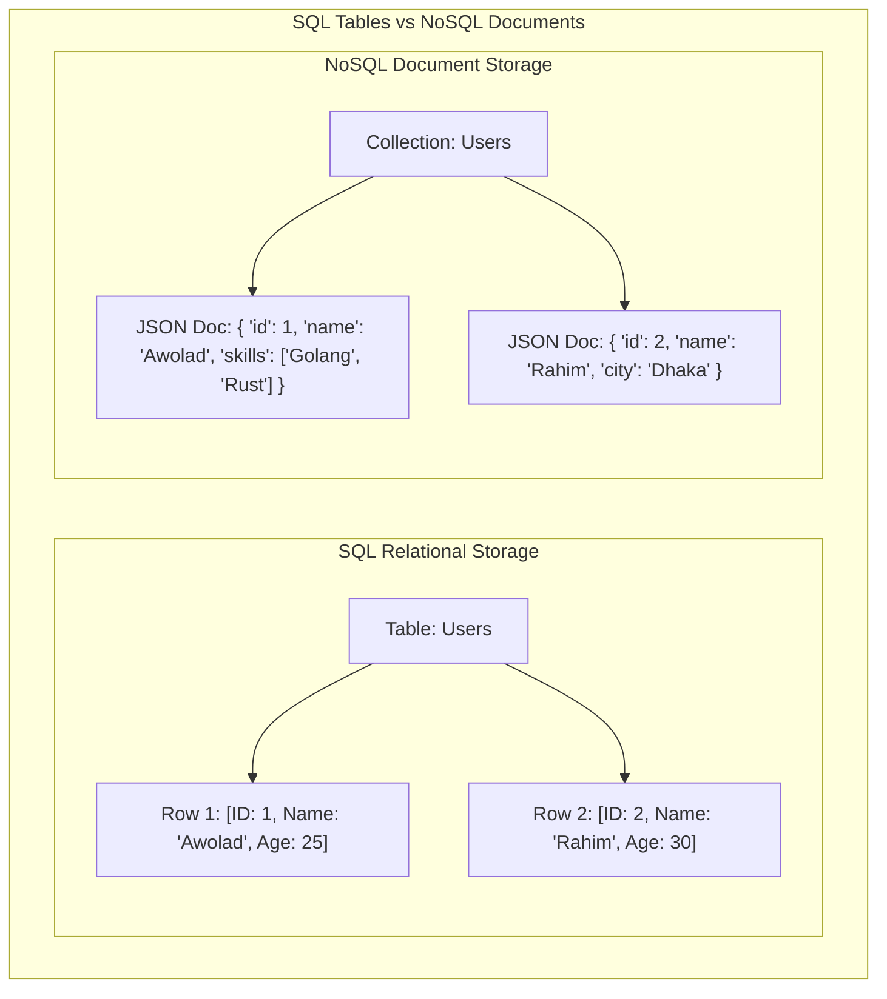

---

## ২. ACID Properties Deep Dive: ডাটাবেসের অলঙ্ঘনীয় চার স্তম্ভ

ডাটাবেস ট্রানজেকশনের মূল শক্তি হলো **ACID**। এটি কোনো সাধারণ শব্দ নয়, এটি ৪টি জটিল অ্যালগরিদমিক প্রতিশ্রুতির সমন্বয়।

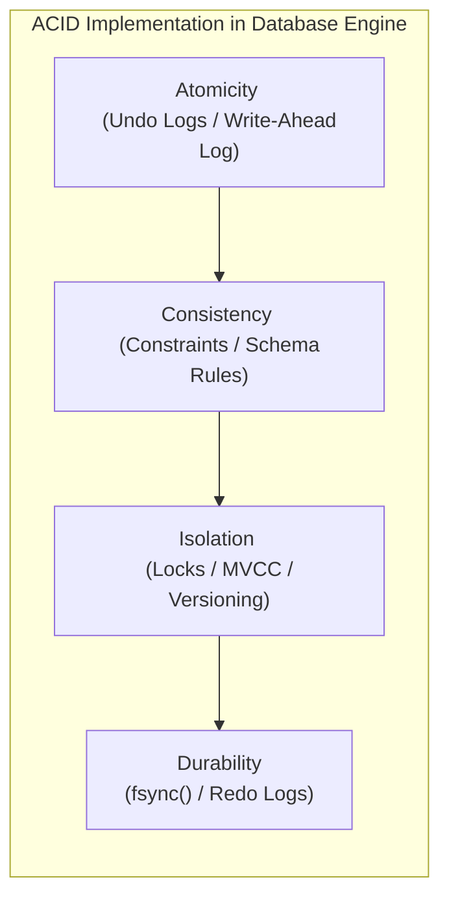

### ক. Atomicity (একক অস্তিত্ব) - "সবটুকু হবে, অথবা কিছুই হবে না"
ধরা যাক, আপনি ব্যাংক অ্যাকাউন্ট A থেকে অ্যাকাউন্ট B-তে ১০০ টাকা পাঠাচ্ছেন। এর পেছনে দুটি কোয়েরি চলে:
১. অ্যাকাউন্ট A থেকে ১০০ টাকা বিয়োগ করো।
২. অ্যাকাউন্ট B-তে ১০০ টাকা যোগ করো।
* **বিপর্যয়:** যদি ১ম কোয়েরির পর বিদ্যুৎ চলে যায় বা ডাটাবেস ক্র্যাশ করে, তবে অ্যাকাউন্ট A-এর টাকা কেটে যাবে কিন্তু B-তে ঢুকবে না!
* **সমাধান (WAL & Undo Logs):** ডাটাবেস মেমরিতে কোনো পরিবর্তনের আগে তা **Write-Ahead Log (WAL)**-এ লেখে। যদি কোনো ট্রানজেকশন মাঝপথে ব্যর্থ হয়, ডাটাবেস **Undo Logs** রিড করে পুরো ডাটাকে আগের অবস্থায় ফিরিয়ে নিয়ে যায় (Rollback)।

### খ. Consistency (সামঞ্জস্যতা)
ট্রানজেকশন শুরুর আগে ডাটাবেস যেভাবে ইনভ্যারিয়েন্ট বা নিয়মের মধ্যে ছিল, ট্রানজেকশন শেষেও সমস্ত নিয়ম (যেমন: Foreign Keys, Unique Constraints, Balance >= 0) মেনে ডাটাবেসকে সঠিক অবস্থায় থাকতে হবে।

### গ. Isolation (বিпередиতা) - কনকারেন্সির মহাযুদ্ধ
যখন হাজার হাজার ইউজার একই ডাটাবেসে একই সময়ে রিড ও রাইট করছেন, তখন একজন ইউজারের অপারেশন যাতে অন্যজনের ট্রানজেকশনে গোলমাল না পাকায়, তাই হলো আইসোলেশন।
ডাটাবেসে মূলত ৪টি আইসোলেশন লেভেল রয়েছে, যা বিভিন্ন প্রবলেম বা অ্যানোমালি সমাধান করে:

| আইসোলেশন লেভেল | Dirty Reads | Non-Repeatable Reads | Phantom Reads |
| :--- | :--- | :--- | :--- |
| **Read Uncommitted** | ❌ (ঘটে) | ❌ (ঘটে) | ❌ (ঘটে) |
| **Read Committed** |  (সুরক্ষিত) | ❌ (ঘটে) | ❌ (ঘটে) |
| **Repeatable Read** |  (সুরক্ষিত) |  (সুরক্ষিত) | ❌ (ঘটে - Postgres বাদে) |
| **Serializable** |  (সুরক্ষিত) |  (সুরক্ষিত) |  (সুরক্ষিত) |

#### ⚠️ ৩টি মারাত্মক রিডিং অ্যানোমালি (Anomalies):
১. **Dirty Read:** ট্রানজেকশন ১ একটি ডাটা মডিফাই করল কিন্তু এখনো Commit করেনি। ট্রানজেকশন ২ সেই আন-কমিটেড ডাটা রিড করে ফেলল। পরে ট্রানজেকশন ১ রোলব্যাক করলে ট্রানজেকশন ২-এর পড়া ডাটাটি সম্পূর্ণ ভুয়া বা ভুল প্রমাণিত হয়।
২. **Non-Repeatable Read:** ট্রানজেকশন ১ একটি রো রিড করল। ট্রানজেকশন ২ সেই রো-টি আপডেট করে Commit করে দিল। ট্রানজেকশন ১ আবার রিড করতে গিয়ে দেখল ডাটা বদলে গেছে! (একই ট্রানজেকশনে ভিন্ন ভিন্ন ভ্যালু পাওয়া)।
৩. **Phantom Read:** ট্রানজেকশন ১ একটি রেঞ্জ কোয়েরি করল (যেমন: `Age > 20` ওয়ালা ৫টি ইউজার পেল)। ট্রানজেকশন ২ নতুন একটি ইউজার ইনসার্ট করে Commit করল যার বয়স ২৫। ট্রানজেকশন ১ আবার রান করে দেখল এখন ৬টি ইউজার চলে এসেছে! (ভূতের মতো নতুন ডাটা হাজির হওয়া)।

### ঘ. Durability (স্থায়িত্ব)
একটি ট্রানজেকশন একবার **Success/Commit** মেসেজ দিলে, তার ঠিক পরের মিলি-সেকেন্ডে পুরো ডাটা সেন্টারের কারেন্ট চলে গেলেও সেই ডাটা ওএস ও মেমরি ক্র্যাশ এনিয়ে সুরক্ষিত থাকবে।
* **মেকানিজম:** ওএস পারফরম্যান্সের জন্য যেকোনো ডিস্ক রাইটকে সরাসরি ডিস্কে না লিখে বাফারিং করে ওএস পেজ ক্যাশে (Page Cache) রেখে দেয়।
* ডাটাবেস ট্রানজেকশন কমিট করার সময় ওএসকে জোরপূর্বক **`fsync()`** সিস্টেম কল ফায়ার করতে বাধ্য করে, যা ওএস ক্যাশ বাইপাস করে সরাসরি ফিজিক্যাল SSD/HDD-র সিলিকনে ডাটা স্থায়ীভাবে রাইট করে।

---

## ৩. Database Indexing Internals: B+ Trees বনাম LSM Trees

ডাটাবেসে ইনডেক্সিং ছাড়া কোটি কোটি ডাটা থেকে নির্দিষ্ট ডাটা খোঁজা যেন খড়ের গাদায় সুই খোঁজার মতো। ডাটাবেস স্টোরেজ ইঞ্জিনগুলো ডাটা অর্গানাইজ করতে মূলত দুটি বৈপ্লবিক ডাটা স্ট্রাকচার ব্যবহার করে।

### ক. B+ Tree Index (রিলেশনাল ডাটাবেসের মুকুট)
PostgreSQL, MySQL বা Oracle-এর মতো রিলেশনাল ডাটাবেসগুলো প্রাকৃতিকভাবে B+ Tree ইনডেক্স ব্যবহার করে।

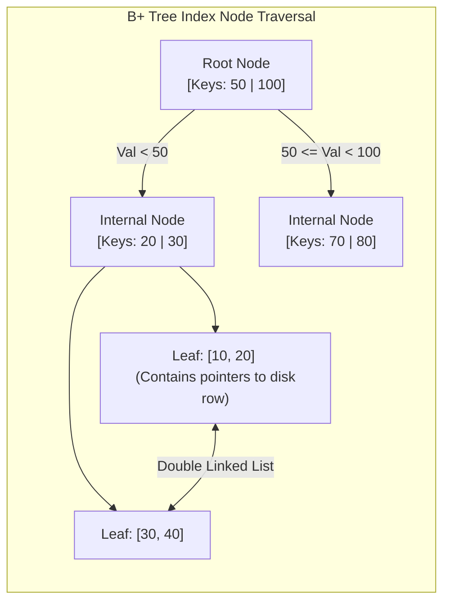

#### B+ Tree কেন ডাটাবেসের জন্য এত জনপ্রিয়?
১. **সুষম গভীরতা (Balanced Tree):** সমস্ত লিফ নোড (Leaf Nodes) একই গভীরতায় বা লেভেলে থাকে। তাই যেকোনো ডাটা খুঁজতে ঠিক একই সংখ্যক হপ বা স্টেপ লাগে ($O(\log N)$)।
২. **রেঞ্জ কোয়েরির জাদু:** B+ Tree-তে সমস্ত ডাটা পয়েন্টার কেবল একদম নিচের লিফ নোডে থাকে এবং এই লিফ নোডগুলো একে অপরের সাথে **ডাবলি লিঙ্কড লিস্ট (Double Linked List)** দিয়ে সংযুক্ত থাকে। ফলে `WHERE id BETWEEN 10 AND 50` এর মতো রেঞ্জ কোয়েরি করা পানির মতো সহজ।
৩. **ডিস্ক ব্লক ফ্রেন্ডলি:** নোডের সাইজ ডিস্কের পেজ সাইজের (যেমন: 4KB বা 8KB) সমান করা হয়, ফলে একটি সিঙ্গেল ডিস্ক I/O অপারেশনেই হাজার হাজার চাইল্ড পয়েন্টার মেমরিতে লোড করা যায়।

### খ. LSM Tree (Log-Structured Merge-Tree - NoSQL-এর পাওয়ারহাউস)
Cassandra, RocksDB বা LevelDB-এর মতো রাইট-হেভি (Write-Heavy) ডাটাবেসগুলো B+ Tree ব্যবহার করে না। কারণ B+ Tree-তে প্রতিবার রাইটের সময় ডিস্কের বিভিন্ন র্যান্ডম জায়গায় গিয়ে রাইট করতে হয় (Random Disk I/O), যা অত্যন্ত ধীরগতির।
LSM Tree এই সমস্যার সমাধান করেছে **Sequential Append-Only Writes** মেকানিজম ব্যবহার করে।

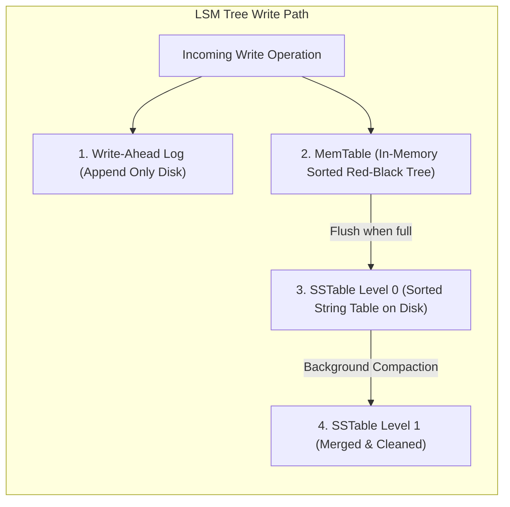

#### LSM Tree-এর মূল মেকানিজম:
১. **MemTable:** যেকোনো নতুন রাইট অপারেশন সরাসরি ডিস্কে না লিখে র‍্যামের ভেতরে থাকা একটি সর্টেড ডাটা স্ট্রাকচার বা **MemTable**-এ ঢোকানো হয়। এটি মিলি-সেকেন্ডের ফ্র্যাকশনে ঘটে।
২. **WAL (Write-Ahead Log):** কারেন্ট চলে গেলে র‍্যামের মেমটেবিল যাতে হারিয়ে না যায়, তাই ব্যাকগ্রাউন্ডে একটি সিম্পল ফাইল-এপেন্ডের মাধ্যমে ডিস্কে লগ লিখে রাখা হয়।
৩. **SSTables (Sorted String Tables):** মেমটেবিল যখন ভরে যায় (যেমন: 64MB), তখন পুরো সর্টেড ডাটা একসাথে ডিস্কে একটি ইমিউটেবল (Immutable - যা আর পরিবর্তন করা যাবে না) ফাইল হিসেবে রাইট করে ফেলা হয়। একে বলা হয় **SSTable**।
৪. **Compaction:** যেহেতু একই কি (Key) বার বার আপডেট হতে পারে, তাই ডিস্কে অনেকগুলো SSTable জমা হয়ে যায়। ব্যাকগ্রাউন্ডে একটি প্রসেস এই সর্টেড ফাইলগুলোকে রিড করে নতুন ভ্যালু রেখে ওল্ড বা ডিলিট হওয়া ভ্যালুগুলো মুছে দিয়ে নতুন একটি মার্জড ফাইল তৈরি করে। একে বলা হয় **Compaction**।

---

## ৪. Concurrency Control: কীভাবে ডাটাবেস লক ও রিলিজ করে?

হাজার হাজার ব্যবহারকারী যখন একই টেবিল বা রো-তে হাত দিচ্ছেন, তখন ডাটাবেস কীভাবে রেস কন্ডিশন (Race Condition) এড়ায়? ডাটাবেস এটি করে মূলত দুটি উপায়ে:

### ক. 2PL (Two-Phase Locking) - পেসিমিস্টিক বা লক-ভিত্তিক
ডাটাবেস ধরে নেয় যে কনকারেন্সি ক্ল্যাশ বা জ্যাম ঘটবেই। তাই সে যেকোনো অপারেশনের আগে ডাটা লক করে নেয়।
* **Shared Lock (S-Lock):** ডাটা রিড করার জন্য ব্যবহৃত হয়। একই সাথে অনেক ইউজার রিড লক পেতে পারেন (Reads are non-blocking to other reads)।
* **Exclusive Lock (X-Lock):** ডাটা রাইট বা আপডেট করার জন্য ব্যবহৃত হয়। এই লক থাকা অবস্থায় অন্য কেউ রিড বা রাইট কোনো লকই পাবে না।
* **2PL-এর দুটি ধাপ:**
  ১. **Growing Phase:** ট্রানজেকশন কেবল লক নিতে পারবে, কোনো লক ছাড়তে পারবে না।
  ২. **Shrinking Phase:** ট্রানজেকশন কেবল লক রিলিজ করতে পারবে, নতুন কোনো লক নিতে পারবে না।

### খ. MVCC (Multi-Version Concurrency Control) - লক-ফ্রি রিডিংয়ের জাদুকর
আজকের আধুনিক ডাটাবেসগুলো (যেমন PostgreSQL বা MySQL InnoDB) রিড অপারেশনকে ব্লক করা ছাড়াই রাইট অপারেশনের পারফরম্যান্স নিশ্চিত করতে **MVCC** ব্যবহার করে।
* **মূল মন্ত্র: "Readers never block Writers, and Writers never block Readers!"**
* **কীভাবে কাজ করে?** MVCC-তে কোনো রো আপডেট করার সময় আগের ডাটাটি মুছে না ফেলে বা ওভাররাইট না করে, কার্নেলে ডাটার একটি সম্পূর্ণ **নতুন সংস্করণ (New Version)** বা কপি তৈরি করা হয়।
* প্রতিটি রো-তে দুটি গোপন মেটাডাটা ফিল্ড থাকে: `xmin` (কোন ট্রানজেকশন আইডি এই রোটি তৈরি করেছে) এবং `xmax` (কোন ট্রানজেকশন আইডি এই রোটি ডিলিট বা সুপারসিড করেছে)।
* আপনি যখন রিড কোয়েরি করবেন, ডাটাবেস আপনার ট্রানজেকশন আইডির সাপেক্ষে যে ভার্সনটি আইনত দৃশ্যমান (Visible), কেবল সেটিই রেন্ডার করবে।
* **Vacuum / Garbage Collection:** ব্যাকগ্রাউন্ডে ডাটাবেসের একটি প্রসেস ওল্ড ও ডেড ভার্সনগুলো (যা এখন আর কোনো রানিং ট্রানজেকশনের প্রয়োজন নেই) স্ক্যান করে মেমরি ফ্রী করে দেয়। Postgres-এ একে বলা হয় **VACUUM**।

---

## ৫. Distributed Databases: রেপ্লিকেশন বনাম শার্ডিং

আপনার এপিআই ট্রাফিক যখন এক সার্ভারের ধারণ ক্ষমতার বাইরে চলে যায়, তখন আমরা ডাটাবেসকে ডিস্ট্রিবিউটেড বা একাধিক সার্ভারে ছড়িয়ে দেই।

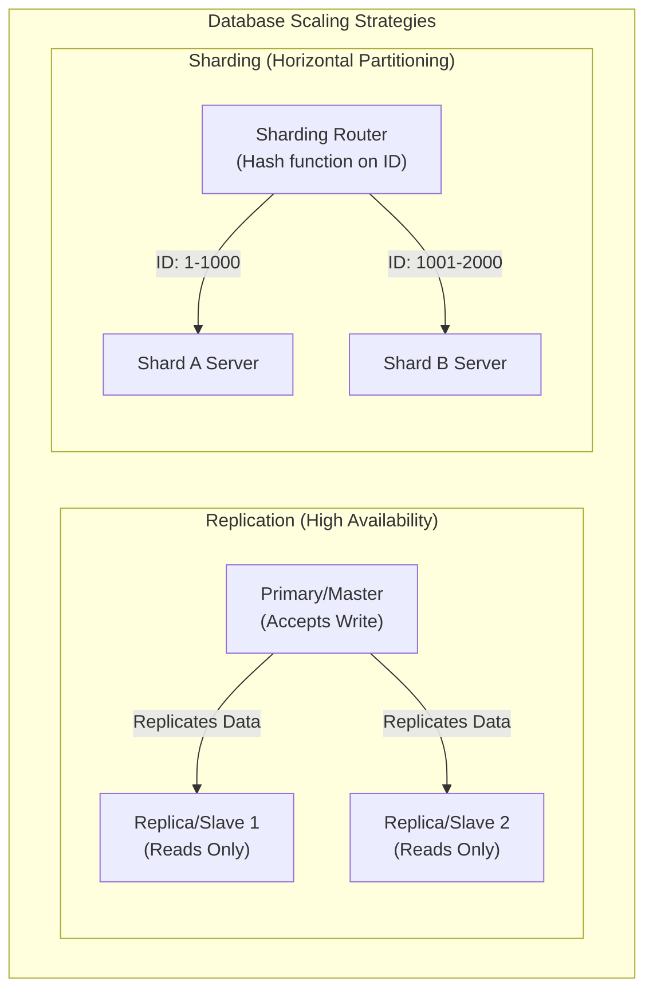

### ক. ডাটাবেস রেপ্লিকেশন (Replication)
রেপ্লিকেশনের মূল উদ্দেশ্য হলো **উচ্চ প্রাপ্যতা (High Availability)** এবং রিড ট্রাফিকের ক্ষমতা বাড়ানো।
১. **Single-Leader (Master-Slave):** সমস্ত রাইট অপারেশন কেবল Master সার্ভারে হবে। মাস্টার ডাটা আপডেট করে তা রিড-অনলি Slave সার্ভারগুলোতে কপি বা রেপ্লিকেট করে দেয়। কোনো কারণে মাস্টার সার্ভার ক্র্যাশ করলে স্লেভদের মধ্যে একজন স্বয়ংক্রিয়ভাবে নতুন মাস্টার নির্বাচিত হয়।
২. **Leaderless (Dynamo-style):** কোনো মাস্টার নেই। ক্লায়েন্ট সরাসরি একাধিক নোডে একসাথে রাইট পাঠায়। ডাটা সঠিক কিনা তা নিশ্চিত করতে **Quorum Read/Write ($R + W > N$)** মেকানিজম ব্যবহার করা হয়।

### খ. ডাটাবেস শার্ডিং (Sharding)
শার্ডিং হলো একটি বিশাল টেবিলকে ভেঙে ছোট ছোট টুকরো করে আলাদা আলাদা ফিজিক্যাল সার্ভারে ডিস্ট্রিবিউট করা। একে বলা হয় **Horizontal Partitioning**।
* **Sharding Key:** শার্ডিং করার জন্য একটি ফিল্ড বা কি বেছে নিতে হয় (যেমন: `user_id`)।
* **Consistent Hashing:** ইউজারের আইডি হ্যাশ করে ডাটাবেস ডিটারমাইন করে এই ডাটাটি কোন ফিজিক্যাল শার্ড সার্ভারে সংরক্ষিত হবে। এর ফলে একটি সার্ভারে অতিরিক্ত লোড পড়া (Hotspotting) রোধ করা যায়।

---

## ৬. CAP Theorem বনাম PACELC Theorem: ডিস্ট্রিবিউটেড সিস্টেমের নির্মম বাস্তব সত্য

ডিস্ট্রিবিউটেড ডাটাবেস ডিজাইন করার সময় আপনি চাইলেই সব সুবিধা একসাথে পাবেন না। প্রকৃতি আমাদের ওপর কিছু কঠোর গাণিতিক সীমাবদ্ধতা চাপিয়া দিয়াছে।

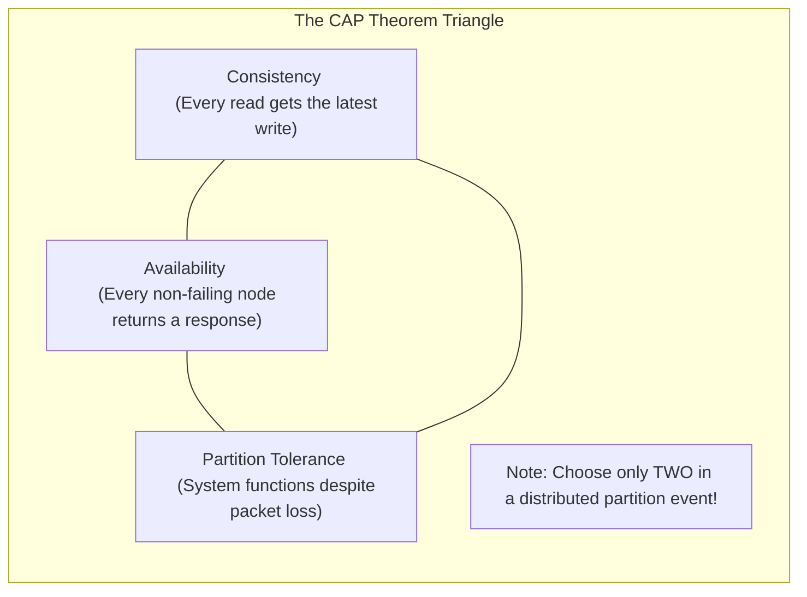

### ক. CAP Theorem
১. **Consistency (সামঞ্জস্যতা):** আপনি যে নোড থেকেই রিড করুন না কেন, সর্বদা সর্বশেষ রাইট করা সঠিক ডাটাটিই পাবেন।
২. **Availability (প্রাপ্যতা):** যেকোনো নোড ক্র্যাশ না করে সচল থাকলে সে সর্বদা ক্লায়েন্টকে সফল রেসপন্স ব্যাক করবে (ভুল বা পুরানো ডাটা হলেও রেসপন্স করতে হবে)।
৩. **Partition Tolerance (বিভাজন সহনশীলতা):** নেটওয়ার্কের তার ছিঁড়ে গেলে বা নোডগুলোর মধ্যে কমিউনিকেশন সম্পূর্ণ বন্ধ হয়ে গেলেও পুরো সিস্টেম সচল থাকবে।
* **নির্মম সত্য:** নেটওয়ার্ক পার্টিশন (Partition) ইন্টারনেটের বাস্তব সত্য, যা এড়ানো অসম্ভব। তাই নেটওয়ার্ক পার্টিশন ঘটলে আপনাকে যেকোনো একটি বেছে নিতে হবে: **CP** (Consistency over Availability) অথবা **AP** (Availability over Consistency)।

### খ. PACELC Theorem (CAP এর অ্যাডভান্সড রূপ)
CAP থিওরেম কেবল তখনই কাজ করে যখন সিস্টেমে নেটওয়ার্ক পার্টিশন বা সমস্যা দেখা দেয়। কিন্তু সাধারণ অবস্থায় যখন কোনো সমস্যা থাকে না, তখন ডাটাবেস কীভাবে কাজ করবে? এর ব্যাখ্যা দেয় **PACELC**:

> **If there is a Partition (P):**
> How does the system trade off **Availability (A)** vs **Consistency (C)**?
> **Else (E) - Normal operation:**
> How does the system trade off **Latency (L)** vs **Consistency (C)**?

* **MongoDB (PC/EC):** পার্টিশন ঘটলে Consistency বেছে নেয়; সাধারণ অবস্থায় Latency-র চেয়ে Consistency-কে অগ্রাধিকার দেয়।
* **Cassandra (PA/EL):** পার্টিশন ঘটলে Availability বেছে নেয়; সাধারণ অবস্থায় দ্রুত রেসপন্স বা Latency-কে অগ্রাধিকার দেয় (Eventual Consistency)।

---

## ৭. Repeatable Read-এর নীরব ঘাতক: Write Skew Anomaly
আমরা দেখেছি কীভাবে মৌলিক রিডিং অ্যানোমালিগুলো (যেমন: Dirty Read, Non-Repeatable Read) ডাটাবেস আইসোলেশন লেভেল দিয়ে আটকানো যায়। কিন্তু **Repeatable Read** লেভেলে একটি অত্যন্ত সূক্ষ্ম এবং মারাত্মক অ্যানোমালি ঘটতে পারে, যার নাম **Write Skew**।

#### 🏥 বাস্তব উদাহরণ (অন-কল ডাক্তার সমস্যা):
একটি হাসপাতালে একটি নিয়ম রয়েছে: **"সর্বদা অন্ততঃ একজন ডাক্তার অন-কল (On-call) থাকতে হবে।"**
বর্তমানে দুই জন ডাক্তার, **ডক্টর অ্যালিস (Alice)** এবং **ডক্টর বব (Bob)** অন-কল হিসেবে ডিউটিতে আছেন।

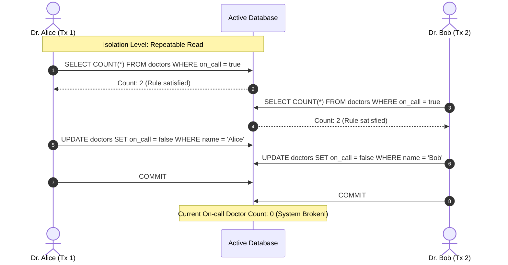

#### 🔍 এখানে কী ঘটলো?
১. অ্যালিস এবং বব দুজনেই একসাথে ডিউটি থেকে ছুটি নিতে চাইলেন।
২. তাদের অ্যাপ্লিকেশন ডাটাবেসে কুয়েরি করল: `SELECT COUNT(*) FROM doctors WHERE on_call = true`.
৩. যেহেতু দুজনেই অন-কল ছিলেন, ডাটাবেস দুজনকে রেসপন্স দিল `Count: 2`।
৪. অ্যালিস দেখল ২ জন অন-কল আছে, তাই সে ছুটি নিলে অন্তত ১ জন থাকবে। সে তার স্ট্যাটাস আপডেট করে `on_call = false` করল।
৫. ববও একই যুক্তিতে তার স্ট্যাটাস আপডেট করে `on_call = false` করল।
৬. **Repeatable Read**-এর অধীনে যেহেতু তারা সম্পূর্ণ ভিন্ন দুটি রো (Row) আপডেট করছেন, তাই ডাটাবেস কোনো কনফ্লিক্ট ছাড়াই দুটি ট্রানজেকশনকেই **Commit** করতে দেয়।
৭. **ফলাফল:** হাসপাতালে অন-কল ডাক্তারের সংখ্যা ০ হয়ে গেল! সিস্টেমের অলঙ্ঘনীয় ব্যবসায়িক নিয়ম (Invariant Rule) ভেঙে চুরমার হয়ে গেল।

#### 🛠️ সমাধান (Solutions):
১. **Pessimistic Locking (SELECT ... FOR UPDATE):** কুয়েরি করার সময় রো-গুলোকে লক করে ফেলা যাতে বব কুয়েরি করতে গেলে লক রিলিজ হওয়া পর্যন্ত ব্লকড থাকে:
   ```sql
   SELECT * FROM doctors WHERE on_call = true FOR UPDATE;
   ```
২. **Serializable Isolation:** ডাটাবেসের আইসোলেশন লেভেল সর্বোচ্চ `Serializable`-এ উন্নীত করা। এটি কার্নেল লেভেলে **SSI (Serializable Snapshot Isolation)** অ্যালগরিদম ব্যবহার করে। যদি ডাটাবেস দেখে যে দুটি কনকারেন্ট ট্রানজেকশনের রিড-রাইট ডিপেন্ডেন্সিতে সাইকেল বা ওভারল্যাপ তৈরি হয়েছে, তবে সে সাথে সাথে একটি ট্রানজেকশনকে বাতিল করে `Serialization Failure` এরর থ্রো করে।

---

## ৮. Write-Ahead Logging (WAL) ও ARIES রিকভারি অ্যালগরিদম
ডাটাবেস যখন ডিস্কের পেজে ডাটা লেখে, তখন হঠাৎ বিদ্যুৎ চলে গেলে বা সিস্টেম ক্র্যাশ করলে আংশিক লেখা ডাটা (Partial Write) ডাটাবেস ফাইলকে করাপ্ট বা নষ্ট করে দিতে পারে। এই বিপর্যয় ঠেকাতে ডাটাবেস **WAL (Write-Ahead Log)** মেকানিজম ব্যবহার করে।

#### 📜 WAL-এর মূল নীতি:
> **"Never write a data page to disk before writing the log representing the change."**
> (ডাটার পরিবর্তনের লগটি ডিস্কে সুরক্ষিত করার আগে মূল ডাটা পেজ কখনোই ডিস্কে রাইট করা যাবে না।)

#### 🔄 ARIES (Algorithms for Recovery and Isolation Exploiting Semantics):
যখন একটি ক্র্যাশ ঘটে এবং ডাটাবেস পুনরায় চালু হয়, তখন কার্নেল **ARIES Recovery Algorithm** চালিয়ে ডাটাবেসকে একদম সঠিক অবস্থায় ফিরিয়ে আনে। এর ৩টি প্রধান ফেস রয়েছে:

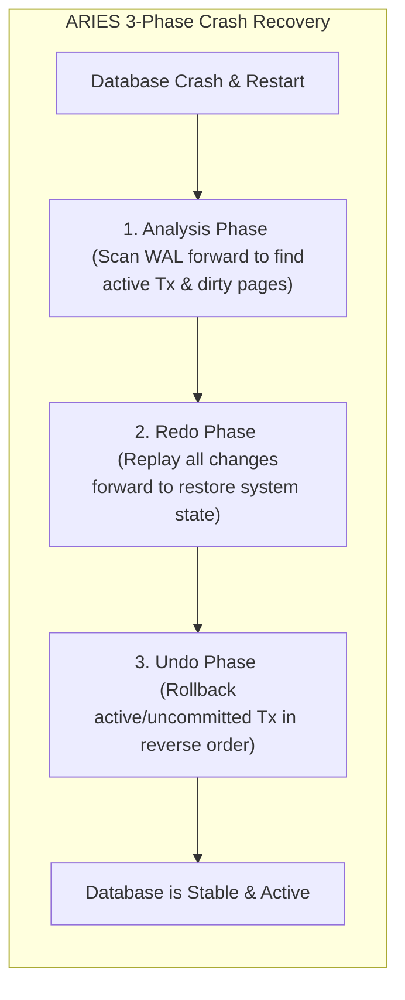

১. **Analysis Phase (বিশ্লেষণ দশা):** ডাটাবেস শেষ সফল চেকপয়েন্ট (Checkpoint) থেকে WAL লগ ফাইলে সামনের দিকে স্ক্যান করে। এটি ক্র্যাশের সময় সচল থাকা ট্রানজেকশন (Active Transactions) এবং মেমরিতে থাকা কিন্তু ডিস্কে রাইট না হওয়া নোংরা পেজগুলো (Dirty Pages) চিহ্নিত করে।
২. **Redo Phase (পুনরাবৃত্তি দশা):** এই ধাপে ডাটাবেস ক্র্যাশের ঠিক আগের অবস্থা ফিরিয়ে আনতে সফল বা ব্যর্থ নির্বিশেষে সমস্ত লগ করা অ্যাকশন পুনরায় প্লে করে (Repeating History)। এটি মেমরিকে ঠিক ক্র্যাশের আগের মিলি-সেকেন্ডের অবস্থায় নিয়ে যায়।
৩. **Undo Phase (পূর্বাবস্থায় প্রত্যাবর্তন দশা):** যে সমস্ত ট্রানজেকশন ক্র্যাশের সময় সচল ছিল কিন্তু **Commit** হতে পারেনি, ডাটাবেস সেগুলোর সমস্ত পরিবর্তন উল্টো দিক থেকে রোলব্যাক (Rollback) করে এবং ডিস্ক থেকে মুছে দেয়।

---

## ৯. Column-Oriented (কলাম-ভিত্তিক) বনাম Row-Oriented (রো-ভিত্তিক) স্টোরেজ
ডাটা কীভাবে ডিস্কের ট্র্যাকে এবং ফিজিক্যাল ব্লকে সাজানো থাকে, তার ওপর ভিত্তি করে ডাটাবেসকে প্রধানত দুটি ভাগে ভাগ করা যায়:

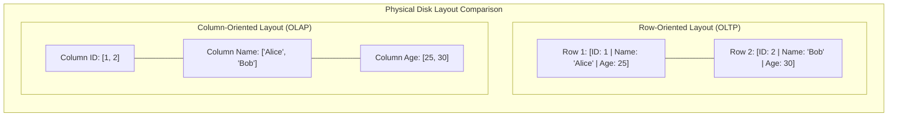

### ক. Row-Oriented Storage (OLTP - e.g., PostgreSQL, MySQL)
* **মেকানিজম:** একটি সিঙ্গেল রো-এর সমস্ত কলাম ডিস্কের একই ব্লকে পর পর (Contiguously) স্টোর করা থাকে।
* **ব্যবহারের ক্ষেত্র:** অনলাইন ট্রানজেকশন প্রসেসিং (OLTP)। যেখানে প্রচুর পরিমাণ ছোট ছোট রাইট এবং সুনির্দিষ্ট একটি রো রিড করতে হয় (যেমন: `SELECT * FROM users WHERE id = 5`)।
* **সীমাবদ্ধতা:** অ্যানালিটিক্স কোয়েরির জন্য অত্যন্ত ধীরগতির। আপনি যদি ১ কোটি ইউজারের বয়সের গড় বের করতে চান (`SELECT AVG(age) FROM users`), তবে রো-ভিত্তিক স্টোরেজে বয়স কলামটি পাওয়ার জন্য ডাটাবেসকে পুরো ১ কোটি ইউজারের নাম, পাসওয়ার্ড, ইমেইলসহ সমস্ত কলাম ডিস্ক থেকে রিড করতে হবে, যা মেমরি এবং ডিস্ক আইও-র অপচয়।

### খ. Column-Oriented Storage (OLAP - e.g., ClickHouse, Snowflake, DuckDB)
* **মেকানিজম:** একটি টেবিলের প্রতিটি কলামের সমস্ত ডাটা ডিস্কে পর পর আলাদা সিকোয়েন্সিয়াল ব্লকে সেভ করা থাকে। অর্থাৎ সব ইউজারের বয়স একসাথে এক জায়গায় থাকবে, সব নাম অন্য জায়গায় থাকবে।
* **ব্যবহারের ক্ষেত্র:** অনলাইন অ্যানালিটিক্যাল প্রসেসিং (OLAP) এবং ডাটা ওয়ারহাউজিং।
* **সুবিধাসমূহ:**
  ১. **ডিস্ক আইও সাশ্রয়:** `SELECT AVG(age)` কোয়েরি করলে ডিস্ক রিডার হেড অন্য কোনো কলাম স্পর্শ না করে সরাসরি শুধুমাত্র `age` কলামের ব্লকটি রিড করে ফেরত চলে আসে।
  ২. **চমৎকার ডাটা কম্প্রেশন:** যেহেতু একটি কলামের প্রতিটি ডাটা একই টাইপের (যেমন: সব ইন্টিজার বা সব স্ট্রিং), তাই খুব শক্তিশালী কম্প্রেশন অ্যালগরিদম (যেমন: Run-Length Encoding বা Dictionary Encoding) ব্যবহার করে ডাটার সাইজ ৯০% পর্যন্ত ছোট করে ডিস্কে রাখা যায়।

---

## ১০. Deadlock Detection & Resolution: ডেডলকের অবসান
যখন দুটি বা তার বেশি কনকারেন্ট ট্রানজেকশন একে অপরের লক করে রাখা ডাটা পাওয়ার জন্য অনন্তকাল অপেক্ষা করতে থাকে, তখন তাকে **Deadlock** বা অচলাবস্থা বলে।

#### 🔄 ডেডলক পরিস্থিতি:
* ট্রানজেকশন A: রো ১ লক করল এবং রো ২ লক করার জন্য রিকোয়েস্ট করল।
* ট্রানজেকশন B: রো ২ লক করল এবং রো ১ লক করার জন্য রিকোয়েস্ট করল।
* **ফলাফল:** ট্রানজেকশন A অপেক্ষা করছে B-এর জন্য, বব অপেক্ষা করছে A-এর জন্য। কেউ কারোর লক ছাড়বে না, সিস্টেম আজীবনের জন্য থমকে যাবে!

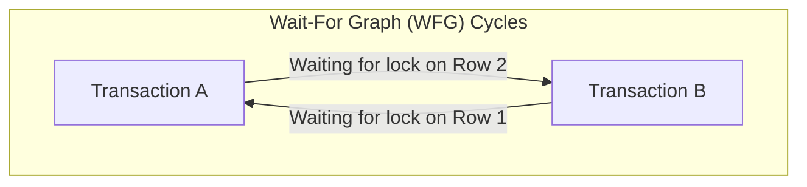

#### 🛡️ সমাধান মেকানিজম (Deadlock Resolution):
ডাটাবেস ইঞ্জিন মূলত দুটি উপায়ে এটি সমাধান করে:
১. **Lock Timeout (লক টাইমআউট):** খুব সাধারণ মেথড। একটি ট্রানজেকশন যদি একটি নির্দিষ্ট সময়ের (যেমন: ৫ সেকেন্ড) মধ্যে লক না পায়, তবে ডাটাবেস তার রিকোয়েস্ট বাতিল করে ট্রানজেকশনটি রোলব্যাক করে দেয়।
২. **Wait-For Graph (WFG - সাইকেল ডিটেকশন):** আধুনিক ডাটাবেস কার্নেলে একটি ব্যাকগ্রাউন্ড থ্রেড সবসময় একটি ডিরেক্টেড গ্রাফ বা **Wait-For Graph** মেইনটেইন করে। এখানে প্রতিটি নোড হলো একটি ট্রানজেকশন এবং এজ (Edge) হলো লকের জন্য অপেক্ষা। 
   * ব্যাকগ্রাউন্ড থ্রেডটি নিয়মিত বিরতিতে **Cycle Detection Algorithm (যেমন: DFS)** রান করে। 
   * গ্রাফে কোনো বৃত্ত বা সাইকেল পাওয়া গেলেই ইঞ্জিন বুঝতে পারে ডেডলক হয়েছে। 
   * সাথে সাথে ডাটাবেস কার্নেল একটি ট্রানজেকশনকে **বলি (Victim Transaction)** হিসেবে বেছে নেয় এবং তাকে রোলব্যাক করে লকটি মুক্ত করে দেয়, ফলে অন্য ট্রানজেকশনটি সফলভাবে শেষ হতে পারে।

---

## ১১. PostgreSQL MVCC Bloat এবং Autovacuum টিউনিং
আমরা দেখেছি PostgreSQL-এ MVCC মেকানিজম ব্যবহার করায় আপডেট অপারেশনের সময় ডাটা ওভাররাইট না করে নতুন ভার্সন তৈরি হয়। কিন্তু আগের ওল্ড বা ডিলিট হওয়া রো-গুলো টেবিলের ভেতরেই মৃত বা ডেড হিসেবে পড়ে থাকে। এদেরকে **Dead Tuples** বলা হয়।

#### 🎈 Database Bloat কী?
যদি টেবিলে প্রচুর পরিমাণ রাইট বা আপডেট অপারেশন হয় এবং ওল্ড ডেড টুপলগুলো সময়মতো মুছে ফেলা না হয়, তবে টেবিল এবং ইনডেক্সের সাইজ কৃত্রিমভাবে বিশাল বড় হয়ে যায়। একে **Bloat (স্ফীতি)** বলে। এর ফলে:
* ডাটাবেস অপ্রয়োজনীয় ডিস্ক স্পেস দখল করে।
* রিড অপারেশনের সময় ডাটাবেসকে হাজার হাজার ডেড টুপল স্ক্যান করতে হয়, ফলে কুয়েরি ল্যাটেন্সি নাটকীয়ভাবে বেড়ে যায়।

#### 🧹 Autovacuum টিউনিংয়ের প্রোডাকশন হ্যাক:
PostgreSQL ব্যাকগ্রাউন্ডে স্বয়ংক্রিয়ভাবে **Autovacuum** থ্রেড চালায় যা এই ডেড টুপলগুলো পরিষ্কার করে ডিস্ক স্পেস রিসাইকেল করে। কিন্তু ডিফল্ট কনফিগারেশনে এটি খুব ধীরগতির হয়, যার ফলে হাই-থ্রুপুট সিস্টেমে ভ্যাকুয়ামের চেয়ে ব্লোট তৈরি হওয়ার হার বেশি হয়।

সিনিয়র সিস্টেমস ইঞ্জিনিয়াররা তাই প্রোডাকশনে নিচের প্যারামিটারগুলো টিউন করেন:

```ini
# /var/lib/postgresql/data/postgresql.conf

# ভ্যাকুয়াম কত ঘন ঘন ট্রিগার হবে (ডিফল্ট ২০% ডেড টুপল হলে চলে)
# এটি কমিয়ে ১০% বা ৫% করা হয় যাতে ছোট ছোট ব্যাচে ভ্যাকুয়াম চলে
autovacuum_vacuum_scale_factor = 0.05

# ভ্যাকুয়ামের কাজের স্পিড লিমিট বাড়ানোর জন্য (ডিফল্ট ২০০)
# এটি বাড়িয়ে ১০০০ বা ২০০০ করা হয় যাতে ভ্যাকুয়াম দ্রুত কাজ শেষ করতে পারে
autovacuum_vacuum_cost_limit = 1000

# ভ্যাকুয়ামের ওয়ান-হপ স্লিপ ডিলে কমানো (ডিফল্ট 2ms)
# ভ্যাকুয়াম যাতে কোনো বিরতি ছাড়া একটানা চলতে পারে
autovacuum_vacuum_cost_delay = 2ms
```

---

## १२. Vector Databases ও AI indexing (HNSW)
আধুনিক কৃত্রিম বুদ্ধিমত্তা (AI) ও লার্জ ল্যাঙ্গুয়েজ মডেলের (LLM) যুগে সাধারণ টেক্সট বা আইডি দিয়ে ডাটা খোঁজা যথেষ্ট নয়। আমাদের উচ্চ-মাত্রিক ভেক্টর এম্বেডিং (High-Dimensional Vector Embeddings) স্টোর ও সার্চ করতে হয়। এর জন্য ব্যবহৃত হয় **Vector Databases** (যেমন: pgvector, Pinecone, Milvus, Qdrant)।

#### 🧭 ভেক্টর সার্চের চ্যালেঞ্জ:
ভেক্টর সার্চ হলো জ্যামিতিক দূরত্ব (যেমন: Cosine Distance বা Euclidean Distance) হিসাব করে কাছাকাছি অর্থবহ ভেক্টরগুলো খুঁজে বের করা (Nearest Neighbor Search)। লক্ষ লক্ষ ১৫৩৬-মাত্রিক ভেক্টর এম্বেডিংয়ের প্রতিটি জোড়ার দূরত্ব গণনা করা কম্পিউটেশনালি অসম্ভব স্লো ($O(N)$)।

#### 🌐 HNSW (Hierarchical Navigable Small World) Index:
ভেক্টর ডাটাবেসে সার্চ স্পিড অপ্টিমাইজ করতে অত্যন্ত জনপ্রিয় একটি গ্রাফ-ভিত্তিক ইনডেক্সিং অ্যালগরিদম হলো **HNSW**।

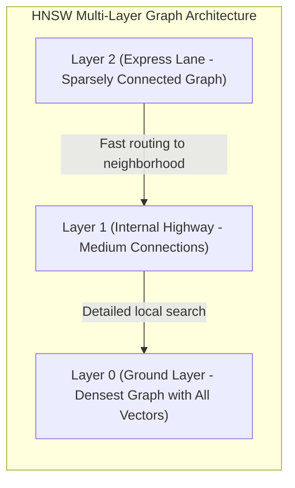

HNSW মূলত একটি বহু-স্তরের গ্রাফ তৈরি করে, যা অনেকটা স্কিপ লিস্ট (Skip List)-এর মতো কাজ করে:
১. **Layer 2 (Express Lane):** সবচেয়ে উপরের স্তর। এখানে খুব কম নোড থাকে এবং তাদের মধ্যে অনেক দীর্ঘ দূরত্বের সংযোগ থাকে। এটি সার্চ কুয়েরিকে খুব দ্রুত সঠিক ভৌголоিক অঞ্চলে (Neighborhood) রাউট করতে সাহায্য করে।
২. **Layer 1 (Highway):** মাঝারি স্তরের সংযোগ ও নোড।
৩. **Layer 0 (Ground Layer):** একদম নিচের স্তর। এখানে বিশ্বের সমস্ত ভেক্টর নোড উপস্থিত থাকে এবং প্রতিটি নোড তার নিকটতম প্রতিবেশীদের সাথে অত্যন্ত নিবিড়ভাবে যুক্ত থাকে।
* **সার্চ ফ্লো:** কোয়েরিটি প্রথমে Layer 2-তে ঢুকে বড় বড় লাফ দিয়ে সঠিক অঞ্চলের কাছে আসে। এরপর নিচের স্তরে নেমে এসে নিখুঁততম নিকটবর্তী প্রতিবেশী ভেক্টরগুলো খুঁজে বের করে। এর ফলে সার্চের জটিলতা $O(N)$ থেকে নাটকীয়ভাবে কমে $O(\log N)$-এ নেমে আসে, যা মিলি-সেকেন্ডে বিলিয়ন ভেক্টর সার্চ সম্পন্ন করে।

---

## ১৩. Distributed Transactions: ২-ফেজ ও ৩-ফেজ কমিট (2PC & 3PC)
যখন আপনার ডাটাবেস একাধিক ফিজিক্যাল নোডে শার্ড বা ডিস্ট্রিবিউট করা থাকে, তখন একটি সিঙ্গেল ট্রানজেকশনে সব নোডের ডাটা পারফেক্টলি আপডেট করা অত্যন্ত কঠিন। যদি ২ টি নোড সফল হয় এবং ৩ নম্বর নোডটি নেটওয়ার্ক ফেইলরের জন্য ব্যর্থ হয়, তবে ডাটাবেসের সামঞ্জস্যতা (Consistency) নষ্ট হয়ে যায়। 

ডিস্ট্রিবিউটেড ট্রানজেকশনে **Atomicity** বজায় রাখতে দুটি অত্যন্ত জনপ্রিয় প্রোটোকল ব্যবহৃত হয়:

### ক. 2-Phase Commit (2PC) - দুই-ধাপের কমিট
2PC-তে একটি কেন্দ্রীয় **Coordinator** নোড থাকে এবং বাকি নোডগুলো **Cohorts** বা পার্টিসিপেন্ট হিসেবে কাজ করে। এটি দুটি ধাপে কাজ সম্পন্ন করে:

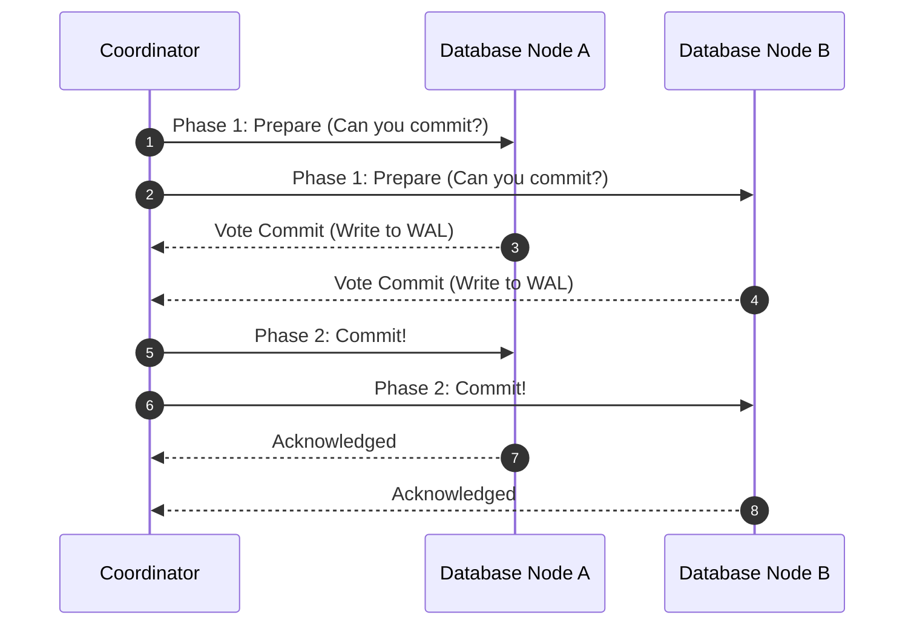

১. **Phase 1 (Prepare Phase):** কোঅর্ডিনেটর সমস্ত পার্টিসিপেন্ট নোডকে জিজ্ঞেস করে, "তোমরা কি এই ট্রানজেকশন কমিট করতে প্রস্তুত?" প্রতিটি নোড ইন্টারনালি ট্রানজেকশনটি সম্পন্ন করে তার ট্রানজেকশন লগে (WAL) লেখে এবং কোঅর্ডিনেটরকে ভোট দেয়: **Vote Commit** অথবা **Vote Abort**।
২. **Phase 2 (Commit Phase):** 
   * যদি **সব নোড** Commit ভোট দেয়, কোঅর্ডিনেটর সবাইকে ফাইনাল **Commit** অর্ডার পাঠায়। সবাই ডিস্কে রাইট পার্মানেন্ট করে এবং সাকসেস কনফার্ম করে।
   * যদি **যেকোনো একটি নোড** Abort ভোট দেয় (বা কোনো নেটওয়ার্ক টাইমআউট ঘটে), কোঅর্ডিনেটর সবাইকে **Rollback** করার নির্দেশ পাঠায়।

#### ⚠️ 2PC-এর বড় সমস্যা (Single Point of Failure & Blocking):
যদি ফেজ ১ এর পর কোঅর্ডিনেটর সার্ভারটি ক্র্যাশ করে, তবে পার্টিসিপেন্ট নোডগুলো লক করা রিসোর্স নিয়ে অনন্তকাল ঝুলে থাকবে (Blocked State)। কারণ তারা জানে না কোঅর্ডিনেটর কমিট করার সিদ্ধান্ত নিয়েছিল নাকি রোলব্যাক।

### খ. 3-Phase Commit (3PC)
2PC-এর এই ব্লকিং সমস্যা দূর করতে ৩-ধাপের কমিট ব্যবহার করা হয়। এটি ২য় ও ৩য় ধাপের মাঝে একটি **PreCommit** ধাপ যোগ করে এবং পার্টিসিপেন্ট নোডগুলোর জন্য **Timeout** মেকানিজম যুক্ত করে। যদি কোনো পার্টিসিপেন্ট নির্দিষ্ট সময়ের মধ্যে কোঅর্ডিনেটর থেকে কোনো মেসেজ না পায়, সে নিজ উদ্যোগে সেফ ডিসিশন নিয়ে লক রিলিজ করে দিতে পারে।

---

## ১৪. Database Replication Lag ও তার সমাধান
Asynchronous Replication-এর ক্ষেত্রে মাস্টার ডাটাবেসে রাইট হওয়ার পর স্লেভ রেপ্লিকাতে ডাটা কপি হতে কয়েক মিলি-সেকেন্ড বা সেকেন্ড সময় লাগতে পারে। একে **Replication Lag** বলা হয়। এর ফলে প্রোডাকশনে কিছু ক্লাসিক কনসিস্টেন্সি বাউন্ডারি প্রবলেম তৈরি হয়:

### ক. Read-After-Write Consistency (উইজার নিজস্ব রাইট দেখতে পাওয়ার গ্যারান্টি)
ধরা যাক, ইউজার তার ফেসবুক প্রোফাইলের নাম পরিবর্তন করে "Awolad" থেকে "Awolad Hossain" করলেন (Write on Master)। সাথে সাথে পেজটি রিলোড হলো এবং রিড কুয়েরিটি গেল একটি ল্যাগি রেপ্লিকা সার্ভারে, যা এখনো কপি সম্পন্ন করেনি। ইউজার স্ক্রিনে আবার তার ওল্ড নেম "Awolad" দেখতে পাবেন! তিনি মনে করবেন তার আপডেট ব্যর্থ হয়েছে, যা অত্যন্ত বাজে ইউজার এক্সপেরিয়েন্স।

#### 🛠️ সিস্টেম ডিজাইন সমাধান:
* ইউজার যখন নিজের প্রোফাইল বা তার মডিফাই করা কোনো সেন্সিটিভ ডাটা রিড করবেন, তখন সেই স্পেসিফিক রিকোয়েস্টটি রেপ্লিকাতে না পাঠিয়ে সরাসরি **Master (Primary) Database** থেকে রিড করানো হবে।
* অন্যান্য ইউজারের প্রোফাইল দেখার সময় ট্রাফিক রেপ্লিকা নোডগুলোতে পাঠানো যেতে পারে।
* ক্লায়েন্টের মেমরিতে সর্বশেষ রাইটের টাইমস্ট্যাম্প সেভ রাখা। রেপ্লিকাতে কুয়েরি করার সময় চেক করা যে রেপ্লিকাটি অন্ততঃ সেই টাইমস্ট্যাম্প পর্যন্ত সিঙ্কড কিনা; না হলে মাস্টার থেকে রিড করানো।

### খ. Monotonic Reads (সময় পেছনে না যাওয়ার গ্যারান্টি)
ইউজার একটি পোস্ট রিড করলেন রেপ্লিকা ১ থেকে যা আপ-টু-ডেট (পোস্টটি দেখতে পেলেন)। ২ সেকেন্ড পর পেজ রিফ্রেশ করায় রিকোয়েস্ট গেল ল্যাগি রেপ্লিকা ২-তে। পোস্টটি উধাও হয়ে গেল! ইউজার মনে করবেন ডাটাবেস ভূতুরে আচরণ করছে।
* **সমাধান (Consistent Routing):** ইউজারের সেশন আইডি হ্যাশ করে সর্বদা তাকে একই রেপ্লিকা নোডে রাউট করা (Sticky Sessions) যাতে সে কমপক্ষে তার আগের দেখা ডাটা স্টেল (Stale) না দেখে।

---

## ১৫. Query Optimization, Execution Plans এবং Joins Internals
আপনি যখন একটি SQL কোয়েরি ফায়ার করেন, ডাটাবেস সেটি সরাসরি ডিস্কে পাঠিয়ে দেয় না। এর পেছনে একটি দীর্ঘ কম্পাইলেশন ও অপ্টিমাইজেশন প্রসেস চলে:

```text
[ SQL Query ] ➔ [ Parser ] ➔ [ AST & Rewriter ] ➔ [ Cost-Based Optimizer (CBO) ] ➔ [ Execution Plan ] ➔ [ Disk Engine ]
```

### ক. Cost-Based Optimizer (CBO): ডাটাবেসের মস্তিষ্কের ম্যাজিক
CBO প্রতিটি কোয়েরির জন্য একাধিক সম্ভাব্য এক্সিকিউশন পাথ (Execution Paths) গণনা করে।
* ডাটাবেস ব্যাকগ্রাউন্ডে প্রতিটি টেবিলের ডাটা ডিস্ট্রিবিউশনের স্ট্যাটিস্টিকস (Histograms, Row counts) মেমরিতে জমা রাখে।
* এই তথ্যের ওপর ভিত্তি করে CBO হিসাব করে কোন পাথে সিপিইউ চক্র ও ডিস্ক I/O সবচেয়ে কম লাগবে (সবচেয়ে কম Cost)। 
* যেমন: টেবিলে যদি ১০০০টি রো থাকে তবে সে ইনডেক্স স্ক্যান বাইপাস করে সরাসরি **Sequential Scan** (পুরো টেবিল একবারে পড়া) বেছে নেয় কারণ ইনডেক্স রিড করার ওভারহেড বেশি। কিন্তু যদি ১ কোটি রো থাকে, সে সাথে সাথে **Index Scan** বা **Index Only Scan** পাথ বেছে নেয়।
* আপনি `EXPLAIN ANALYZE SELECT ...` রান করে ডাটাবেসের এই পুরো প্ল্যানিং ও আসল এক্সিকিউশন টাইম নিখুঁতভাবে দেখতে পারেন।

### খ. Joins Internals (তিনটি প্রধান জয়েন অ্যালগরিদম)
যখন দুটি টেবিল জয়েন করা হয়, ডাটাবেস কার্নেলে ৩টি মেকানিজম ব্যবহার করে ডাটা মেলাতে পারে:

| Join Algorithm | কাজের পদ্ধতি (Mechanism) | সেরা ব্যবহারের ক্ষেত্র (Best Use Cases) |
| :--- | :--- | :--- |
| **Nested Loop Join** | টেবিল A-এর প্রতিটি রো-এর জন্য লুপ চালিয়ে টেবিল B-তে ম্যাচিং রো খোঁজা। | একটি বা দুটি টেবিলই অত্যন্ত ছোট হলে, অথবা জয়েন কি-তে ইনডেক্স থাকলে। |
| **Hash Join** | ছোট টেবিলটির জয়েন কী ব্যবহার করে র‍্যামে একটি **Hash Table** তৈরি করে। এরপর বড় টেবিলটি স্ক্যান করে হ্যাশ টেবিল প্রোপ করে ম্যাচিং বের করা। | বড় আকারের আন-সর্টেড টেবিলের ক্ষেত্রে, যেখানে কোনো ইনডেক্স নেই। |
| **Merge Join** | দুটি টেবিলকেই প্রথমে জয়েন কি-এর ওপর ভিত্তি করে সর্ট (Sort) করা হয়। এরপর দুটি পয়েন্টার দিয়ে একসাথে ট্রাভার্স করে মার্জ করা হয়। | টেবিল দুটি আগে থেকেই সর্ট করা থাকলে বা ইনডেক্সড থাকলে। |

---

## ১৬. Buffer Pool Management ও LRU-K ইভিকশন পলিসি
ডাটাবেস প্রতিবার কোয়েরি করার সময় সরাসরি হার্ডডিস্ক বা SSD থেকে ফাইল রিড করে না। ডিস্ক রিড অত্যন্ত ধীরগতির হওয়ায় ডাটাবেস ইঞ্জিনের র‍্যামের একটি বিশাল অংশকে **Buffer Pool** বা বাফার ক্যাশ হিসেবে বরাদ্দ করা হয়।

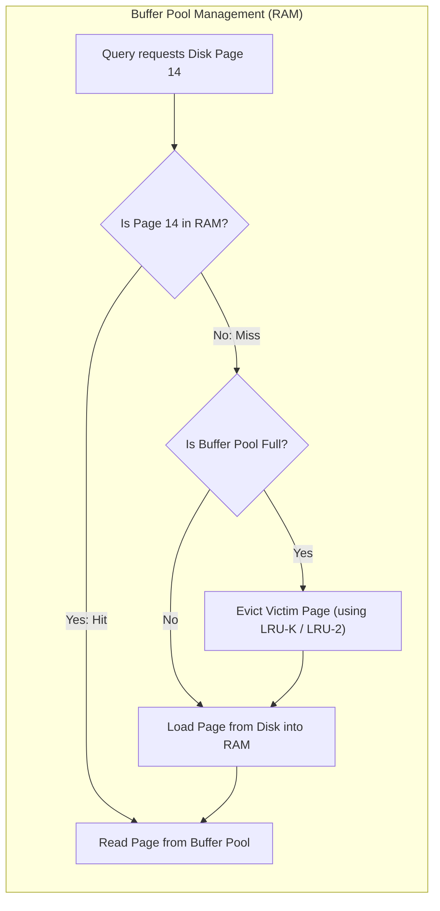

### ক. Dirty Pages কী?
যখন আপনি ডাটা আপডেট করেন, ডাটাবেস সাথে সাথে ডিস্কে না লিখে কেবল বাফার পুলের পেজে আপডেট করে ফেরে। এই পরিবর্তিত কিন্তু ডিস্কে না লেখা পেজগুলোকে **Dirty Pages** বলা হয়। ব্যাকগ্রাউন্ডে একটি এসিনক্রোনাস প্রসেস (যেমন: Postgres Writer Thread) এই ডার্টি পেজগুলোকে ডিস্কে ফ্লাশ (Flush) বা রাইট করে।

### খ. LRU-K Eviction Algorithm: স্ট্যান্ডার্ড LRU-এর সীমাবদ্ধতা এড়ানো
বাফার পুল সম্পূর্ণ ভরে গেলে নতুন পেজ জায়গা দিতে ওল্ড পেজ মেমরি থেকে বের (Evict) করে দিতে হয়।
* **Standard LRU (Least Recently Used) এর বড় প্রবলেম (Sequential Scan Pollution):**
  ধরা যাক, একটি ব্যাকগ্রাউন্ড রিপোর্টিং কোয়েরি পুরো টেবিল স্ক্যান করল। এর ফলে বাফার পুলে থাকা প্রতিনিয়ত ব্যবহৃত অত্যন্ত গুরুত্বপূর্ণ পেজগুলো ক্যাশ থেকে বের হয়ে যাবে এবং রিপোর্টিংয়ের একবার ব্যবহার হওয়া পেজগুলো ক্যাশ দখল করবে।
* **LRU-K / LRU-2 এর বৈপ্লবিক সমাধান:**
  এটি শুধুমাত্র "শেষ অ্যাক্সেস টাইম" ট্র্যাক না করে, একটি পেজ অতীতে কত ঘন ঘন অ্যাক্সেস হয়েছে (K-th backward reference time, সাধারণত $K=2$) তা ট্র্যাক করে।
  * যদি একটি পেজ শেষ ৫ মিনিটে মাত্র একবার অ্যাক্সেস হয় (Sequential Scan-এর ডাটা), এবং আরেকটি পেজ প্রতিনিয়ত প্রতি মিনিটে ১০ বার অ্যাক্সেস হয়, তবে LRU-K ২য় পেজটিকে মেমরিতে ধরে রাখবে এবং রিপোর্টিং পেজটিকে সাথে সাথে ইভিক্ট বা মেমরি থেকে বের করে দিবে।

---

## ১৭. Distributed Consensus: Raft বনাম Paxos
ডিস্ট্রিবিউটেড ডাটাবেস সিস্টেমে (যেমন: Google Spanner, CockroachDB, etcd, Consul) একাধিক নোডের মধ্যে ডাটার নিখুঁত কপি বজায় রাখতে এবং গ্লোবাল স্টেট সিঙ্ক করতে **Distributed Consensus** প্রোটোকল ব্যবহার করা বাধ্যতামূলক।

### ক. Paxos (ইন্টারনেটের আদি পিতা)
Paxos হলো ডিস্ট্রিবিউটেড সিস্টেমের সবচেয়ে প্রাচীন এবং গাণিতিকভাবে প্রমাণিত কনসেনসাস অ্যালগরিদম। এটি প্রোপোজার (Proposer), এক্সেপ্টর (Acceptor), এবং লার্নার (Learner) রোলের মাধ্যমে কাজ করে। তবে Paxos বাস্তব কোডে ইমপ্লিমেন্ট করা অত্যন্ত জটিল এবং দুর্বোধ্য।

### খ. Raft (সহজ ও আধুনিক মানুষের ডিজাইন)
Raft তৈরি করা হয়েছে Paxos-এর বিকল্প হিসেবে, যা সহজে বোঝা এবং কোডে রূপান্তর করা যায়। Raft মূলত ৩টি সাব-প্রবলেমে পুরো কনসেনসাসকে বিভক্ত করে:

```text
[ Candidate ] ➔ Leader Election ➔ [ Elected Leader ] ➔ Log Replication ➔ Safety Invariant Checks
```

১. **Leader Election (লিডার নির্বাচন):** নোডগুলো মূলত ৩টি স্টেটে থাকে: **Follower**, **Candidate**, অথবা **Leader**। লিডার মারা গেলে ফলোয়াররা ক্যান্ডিডেট হয়ে ভোট চেয়ে নতুন স্ট্রং লিডার নির্বাচন করে।
২. **Log Replication (লগ রেপ্লিকেশন):** লিডার সমস্ত ক্লায়েন্টের রাইট রিকোয়েস্ট রিসিভ করে এবং নিজের লগে লেখে। এরপর সে তার লগের কপি ফলোয়ারদের পাঠায়। যখন মেজরিটি (Majority Nodes) নোড রেপ্লিকেশন নিশ্চিত করে, লিডার ট্রানজেকশনটি **Commit** করে ক্লায়েন্টকে সাকসেস মেসেজ পাঠায়।
৩. **Safety:** যদি কোনো নোডের লগ লিডারের চেয়ে পুরানো বা অসম্পূর্ণ হয়, সে কখনোই লিডার নির্বাচিত হতে পারবে না।

---

## ১৮. LSM Engines-এর Write/Read Path এবং Bloom Filters
NoSQL ডাটাবেসগুলোতে (Cassandra, RocksDB) LSM (Log-Structured Merge) স্টোরেজ ইঞ্জিন ব্যবহার করায় রাইট অত্যন্ত ফাস্ট হলেও রিড অপারেশন অত্যন্ত এক্সপেনসিভ হয়। একে **Read Amplification** বলে।

### ক. LSM Engines-এর রিড পেনাল্টি (Read Penalty)
একটি কি (Key, যেমন: `user_45`) রিড করার জন্য ডাটাবেসকে পর পর খুঁজতে হয়:
১. মেমরির **MemTable**-এ আছে কিনা।
২. ডিস্কের **SSTable Level 0** ফাইলগুলোতে আছে কিনা।
৩. ডিস্কের **SSTable Level 1, 2** ইত্যাদিতে আছে কিনা।
যদি ডাটাটি না থাকে (Non-existent Key), তবে ডাটাবেসকে কোটি কোটি ফাইলের ওপর ডিস্ক I/O অপারেশন চালাতে হয়, যা পুরো ডাটাবেস সার্ভারকে অত্যন্ত স্লো করে দেয়।

### খ. Bloom Filters: মেমরি ও ডিস্কের মধ্যবর্তী রক্ষাকর্তা
এই রিড পেনাল্টি রুখতে LSM ইঞ্জিনগুলো র‍্যামের ভেতরে **Bloom Filter** ডাটা স্ট্রাকচার ব্যবহার করে। এটি একটি অত্যন্ত লাইটওয়েট এবং স্পেস-এফিশিয়েন্ট প্রোবাবিলিস্টিক ডাটা স্ট্রাকচার (Bit Array + Multiple Hash Functions)।

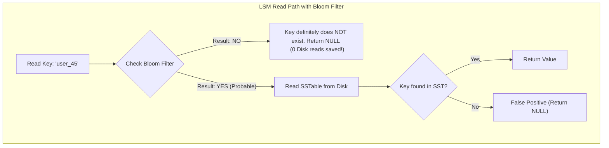

#### 💡 Bloom Filter-এর জাদুকরী আচরণ:
১. **"NO" রেসপন্স (Absolute certainty):** ব্লুম ফিল্টার যদি বলে "NO", তার মানে ডাটাস্ট্রাকচারটি নিশ্চিত গ্যারান্টি দিচ্ছে যে এই কি (Key) ডাটাবেসে **কখনোই ছিল না**। ফলে ডাটাবেস ডিস্কের SSTable ফাইলগুলো স্পর্শও না করে সাথে সাথে `NULL` বা `Not Found` রেসপন্স করে দেয়। কোটি কোটি ডিস্ক I/O বেঁচে যায়!
২. **"YES" রেসপন্স (Probabilistic):** ব্লুম ফিল্টার যদি বলে "YES", তার মানে কি-টি ডাটাবেসে **থাকার সম্ভাবনা আছে**। তখন ডাটাবেস ডিস্কের SSTable রিড করে ডাটা নিশ্চিত করে। মাঝে মাঝে এটি ভুল "YES" (False Positive) দিতে পারে, তবে তা ১-২% এর বেশি হয় না।

---

## ১৯. LSM Engines-এর Compaction Strategies (সাইজ-টায়ার্ড বনাম লেভেলড)
আমরা দেখেছি LSM ইঞ্জিনগুলোতে (যেমন Cassandra, RocksDB) নতুন রাইটগুলো প্রথমে মেমরিতে (MemTable) জমা হয় এবং পরে ডিস্কে **SSTable** ফাইল হিসেবে রাইট হয়। ফাইলগুলো রিড-অনলি হওয়ায় সময়ের সাথে সাথে একই কি-এর একাধিক ওল্ড ভার্সন বিভিন্ন SSTable-এ ছড়িয়ে পড়ে। 

ডিস্ক স্পেস বাঁচাতে এবং রিড স্পিড অপ্টিমাইজ করতে ব্যাকগ্রাউন্ডে **Compaction** নামক প্রসেস চলে, যা ওল্ড SSTable-গুলোকে একত্রিত (Merge and Sort) করে ডুপ্লিকেট ডাটা মুছে ফেলে। কম্প্যাকশনের প্রধান দুটি স্ট্র্যাটেজি নিচে আলোচনা করা হলো:

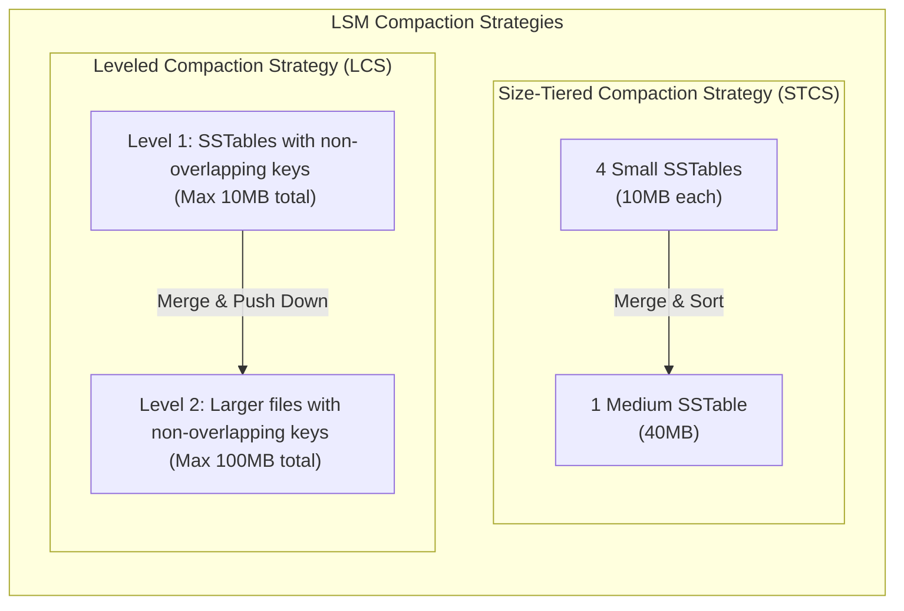

### ক. Size-Tiered Compaction Strategy (STCS)
* **মেকানিজম:** যখনই একই আকারের কয়েকটি SSTable (যেমন ৪টি ১০ মেগাবাইটের ফাইল) তৈরি হয়, ডাটাবেস সেগুলোকে মার্জ করে একটি বড় SSTable (৪০ মেগাবাইট) তৈরি করে।
* **সুবিধা:** অত্যন্ত ফাস্ট রাইট থ্রুপুট। রাইট-হেভি (Write-heavy) ওয়ার্কলোডের জন্য অত্যন্ত উপযোগী।
* **অসুবিধা (Space Amplification):** মার্জ করার সময় একই ডাটার ওল্ড কপিগুলো মেমরিতে দীর্ঘদিন থাকায় ডিস্ক স্পেস অনেক বেশি নষ্ট হয়।

### খ. Leveled Compaction Strategy (LCS)
* **মেকানিজম:** ডিস্ক স্পেসকে কয়েকটি স্তরে (যেমন Level 1, Level 2, Level 3...) ভাগ করা হয়। প্রতিটি লেভেলের একটি সর্বোচ্চ মোট সাইজ থাকে (যেমন Level 1-এর সর্বোচ্চ সাইজ ১০ মেগাবাইট)।
  * একটি লেভেলের ভেতরে থাকা সমস্ত SSTable-এর কি (Key) কখনো ওভারল্যাপ করে না। অর্থাৎ একটি কি কেবল একটি স্পেসিফিক SSTable ফাইলেই থাকবে।
  * যখনই Level 1 এর সাইজ ১০ মেগাবাইটের বেশি হয়, তখন সেখান থেকে একটি ফাইল নিয়ে Level 2 এর ওভারল্যাপিং ফাইলগুলোর সাথে মার্জ করে লেভেল ২-তে পাঠিয়ে দেওয়া হয়।
* **সুবিধা:** রিড ল্যাটেন্সি অনেক কম (কারণ কি খুঁজতে একটি লেভেলের মাত্র একটি ফাইলই রিড করতে হয়)। স্পেসের অপচয় বা স্পেস এমপ্লিফিকেশন অত্যন্ত কম।
* **অসুবিধা:** রাইট এমপ্লিফিকেশন অত্যন্ত বেশি (কারণ একই ফাইল বারবার মার্জ করে নিচের লেভেলে পাঠাতে ডিস্ক বারবার রাইট অপারেশন চালায়)।

---

## ২০. ডিস্ট্রিবিউটেড টাইম ও কনকারেন্সি (Vector Clocks ও Google TrueTime)
ডিস্ট্রিবিউটেড সিস্টেমে নেটওয়ার্ক নোডগুলোর ফিজিক্যাল ঘড়ি (Physical Wall Clocks) কখনো পুরোপুরি ১০০% সিঙ্কড থাকে না। একে **Clock Drift** বলে। NTP (Network Time Protocol) দিয়েও মিলি-সেকেন্ড লেভেলের নিখুঁত সময়ের মিল রাখা সম্ভব নয়। ফলে "কোন রাইটটি আগে ঘটেছে" (Order of Events) তা নির্ণয় করা অত্যন্ত বড় একটি চ্যালেঞ্জ।

### ক. Logical Clocks ও Vector Clocks
ফিজিক্যাল ঘড়ির ওপর নির্ভর না করে ইভেন্টের কার্যকারণ সম্পর্ক (Causality) ট্র্যাক করার জন্য লজিক্যাল ঘড়ি ব্যবহার করা হয়।
* **Vector Clocks:** এটি সিস্টেমে থাকা প্রতিটি নোডের নিজস্ব লজিক্যাল কাউন্টারের একটি অ্যারে মেইনটেইন করে। যখনই কোনো নোড কোনো ডাটা আপডেট করে, সে তার নিজস্ব কাউন্টার এক বাড়ায় এবং অন্য নোডে ডাটা সিঙ্ক করার সময় পুরো অ্যারেটি পাস করে।
  * এর মাধ্যমে ডাটাবেস দুটি কনকারেন্ট রাইটের মধ্যে **Conflict** বা সংঘর্ষ ধরতে পারে এবং ক্যাজুয়াল রিলেশনশিপ বজায় রাখতে পারে (যেমন: DynamoDB)।

### খ. Google Spanner-এর TrueTime API
গুগল তাদের গ্লোবাল ডিস্ট্রিবিউটেড ডাটাবেস **Spanner**-এ ক্লাসিক টাইম প্রবলেম সমাধান করতে জিপিএস রিসিভার (GPS Receivers) এবং পারমাণবিক ঘড়ি (Atomic Clocks) সমৃদ্ধ ডেডিকেটেড হার্ডওয়্যার ব্যবহার করেছে।

```text
TrueTime API Returns: [ t.earliest ----------- [ Actual Time ] ----------- t.latest ]
Time Range Uncertainty: 2 * ε (where ε is around 1ms to 7ms)
```

* **মেকানিজম:** TrueTime এপিআই বর্তমান ফিজিক্যাল সময়কে একটি সুনির্দিষ্ট পয়েন্ট হিসেবে রিটার্ন না করে একটি সময়ের রেঞ্জ রিটার্ন করে: $[t.earliest, t.latest]$। এখানে সর্বোচ্চ অনিশ্চয়তা সীমা হলো $\epsilon$ (সাধারণত ১ থেকে ৭ মিলি-সেকেন্ড)।
* **Commit Wait:** গুগল স্প্যানার যখন কোনো ট্রানজেকশন কমিট করে, তখন সে নিশ্চিত হতে $\epsilon$ সময় অপেক্ষা করে (Commit Wait) যাতে নিশ্চিত হওয়া যায় ট্রানজেকশনের আসল সময়টি পার হয়ে গেছে। এর মাধ্যমে Spanner কোনো ডিস্ট্রিবিউটেড লক ছাড়াই সারা বিশ্বের সমস্ত ডেটাসেন্টারের মধ্যে **External Consistency (Strict Serializability)** গ্যারান্টি দেয়।

---

## ২১. স্টোরেজ হার্ডওয়্যার ও Slotted-Page Layout
ডাটাবেস যখন ডিস্কের ফিজিক্যাল ব্লকে ডাটা পেজ (যেমন PostgreSQL-এ ডিফল্ট 8KB পেজ) আকারে লেখে, তখন সেই পেজের ভেতরের মেমরি কীভাবে ভাগ করা থাকে?

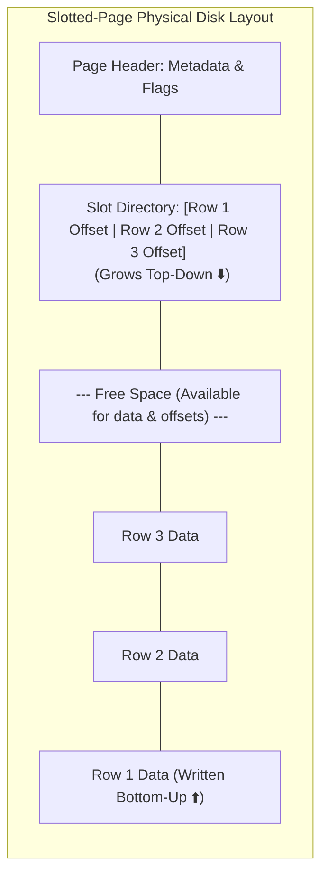

### ক. Slotted-Page Architecture
পেজের ভেতরে রো-এর সাইজ ফিক্সড না হওয়ায় (যেমন কেউ ছোট টেক্সট বা বড় টেক্সট ইনসার্ট করতে পারেন), ডাটাবেস **Slotted-Page Layout** ব্যবহার করে:
১. **Page Header:** পেজের শুরুতে মেটাডাটা থাকে।
২. **Slot Directory:** পেজের উপর থেকে নিচের দিকে বাড়ে। এটি মূলত পয়েন্টার বা অফসেটের অ্যারে, যা পেজের ভেতরের প্রতিটি রো বা টুপলের এক্স্যাক্ট মেমরি লোকেশন নির্দেশ করে।
৩. **Tuple Data:** পেজের নিচ থেকে ওপরের দিকে ডাটা রাইট করা হয়।
৪. **ফলাফল:** আপনি যখন কোনো রো-এর সাইজ আপডেট করেন বা কোনো রো মুছে ফেলেন, তখন শুধু পেজের নিচের ডাটা অংশটি শিফট করলেই চলে। ইনডেক্স থেকে যে পয়েন্টারটি পেজে এসেছিল (`Page ID + Slot Index`), তাকে কখনো পরিবর্তন করতে হয় না। এর ফলে ইনডেক্স ভাঙার কোনো ঝুঁকি থাকে না।

### খ. O_DIRECT (Direct I/O): ওএস কার্নেল বাইপাস
আধুনিক হাই-পারফরম্যান্স ডাটাবেসগুলো (যেমন PostgreSQL বা MySQL-এর InnoDB) ডিস্কে রাইট করার সময় ওএস কার্নেলের বিল্ট-ইন পেজ ক্যাশ (OS Page Cache) বাইপাস করতে **`O_DIRECT`** ফ্ল্যাগ ব্যবহার করে।
* ওএস কার্নেল যদি ডাটা ক্যাশ করে, তবে ডাটাবেসের নিজের ক্যাশ (Buffer Pool) এবং ওএসের ক্যাশে একই ডাটা ডবল স্পেস দখল করে (Double Buffering)।
* `O_DIRECT` ব্যবহারের ফলে ডাটাবেস সরাসরি র‍্যাম থেকে ডিস্ক কন্ট্রোলারে ডাটা রাইট করে, যা মেমরির অপচয় কমায় এবং ডাটা কখন ডিস্কে ফিজিক্যালি রাইট হলো তার ওপর ডাটাবেসের ১০০% কন্ট্রোল থাকে।

---

## ২২. Copy-on-Write (CoW) ডাটাবেস ও LMDB
ক্লাসিক ডাটাবেসগুলো ডিস্কের পেজে সরাসরি ইন-প্লেস আপডেট (Overwriting) করে, যার ফলে মেমরির পেজ লক করতে হয় এবং ক্র্যাশ করলে ডাটা করাপশনের ভয় থাকে। এর বৈপ্লবিক বিকল্প হলো **Copy-on-Write (CoW)** ডাটাবেস ইঞ্জিন (যেমন LMDB - Lightning Memory-Mapped Database)।

### ক. LMDB-এর চমৎকার মেকানিজম
LMDB একটি ফাস্ট, মেমরি-ম্যাপড B+ Tree ডাটাবেস যা Copy-on-Write মেথড ফলো করে:
* যখন কোনো রো বা পেজ আপডেট করা হয়, LMDB মূল পেজটি ওভাররাইট না করে ডিস্কের সম্পূর্ণ নতুন একটি ফাঁকা ব্লকে নতুন পেজটি রাইট করে।
* এরপর B+ ট্রির প্যারেন্ট নোডটি আপডেট করে নতুন পেজের সাথে কানেক্ট করা হয়।
* ট্রির রুট পয়েন্টার (Root Pointer) আপডেট হওয়ার আগ পর্যন্ত ওল্ড পেজটি সম্পূর্ণ অক্ষত থাকে।

### খ. এই ডিজাইনের অসামান্য সুবিধাসমূহ:
১. **১০০% লক-ফ্রি রিডার (Zero Lock Contention):** রিডাররা যতক্ষণ রিড করছে, তারা ওল্ড রুটের মাধ্যমে ওল্ড ডাটা শান্তিতে রিড করতে পারে। নতুন রাইটার নোডে ডাটা লিখলেও রিডারের কোনো লকিং বা ব্লকিংয়ের ঝামেলা পোহাতে হয় না।
২. **কোনো WAL লগ প্রয়োজন নেই (Zero Write-Ahead Log):** যেহেতু ওল্ড পেজটি ডিস্কে ১০০% সুরক্ষিত থাকে এবং রাইট অপারেশনের পর রুট পয়েন্টারটি একটি মাত্র পারমাণবিক রাইটের (Atomic Commit) মাধ্যমে নতুন ট্রিতে সুইচ করে, তাই হঠাৎ বিদ্যুৎ চলে গেলেও ডাটাবেস কখনোই করাপ্ট বা আংশিক রাইট অবস্থায় পড়ে থাকে না। ফলে কোনো WAL এর প্রয়োজনই হয় না, যা ডিস্ক রাইট ওভারহেড অর্ধেকে নামিয়ে আনে!

---

## ২৩. Consistent Hashing ও VNodes (ডিস্ট্রিবিউটেড শার্ডিং)
ডিস্ট্রিবিউটেড বা নোএসকিউএল ডাটাবেসে (যেমন Cassandra বা DynamoDB) হাজার হাজার ফিজিক্যাল সার্ভারের মধ্যে কীভাবে ডাটা বণ্টন করা হয় যাতে কোনো নোড অতিরিক্ত লোডে ক্র্যাশ না করে? এর উত্তর হলো **Consistent Hashing**।

### ক. Consistent Hashing Ring
* ডিস্ট্রিবিউটেড নেটওয়ার্কের নোডগুলো এবং ডাটার আইডিগুলোকে একটি গাণিতিক বৃত্তাকার রিংয়ের (Consistent Hashing Ring: $0$ to $2^{32}-1$) ওপর পয়েন্ট করা হয়।
* কোনো ডাটার আইডি হ্যাশ করে রিংয়ের যে অবস্থানে পাওয়া যায়, ঘড়ির কাঁটার দিকে ঘোরার সময় সবার আগে যে ফিজিক্যাল নোডটি পাওয়া যাবে, ডাটাটি সেই নোডে স্টোর করা হয়।
* **স্কেলিংয়ের সুবিধা:** নতুন একটি নোড রিংয়ে যুক্ত করলে বা কোনো নোড ক্র্যাশ করলে রিংয়ের মাত্র সামান্য কিছু ডাটা রিডিস্ট্রিবিউট করতে হয়, সম্পূর্ণ ডাটাবেস রি-হ্যাশ করার কোনো প্রয়োজন হয় না।

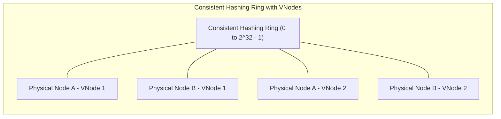

### খ. Virtual Nodes (VNodes): হটস্পট সমস্যার সমাধান
যদি রিংয়ের ওপর ফিজিক্যাল নোডগুলো খুব কাছাকাছি বসে পড়ে, তবে মাঝের বড় অঞ্চলের সমস্ত ডাটা একটি মাত্র নোডে গিয়ে পড়ে। একে **Data Hotspotting** বা ডাটার ভারসাম্যহীনতা বলে।
* **VNodes:** প্রতিটি ফিজিক্যাল নোডকে (যেমন Node A) রিংয়ের মাত্র একটি অবস্থানের পরিবর্তে ১০০টি ভার্চুয়াল অবস্থানের (VNode A1, VNode A2...) মাধ্যমে রিংয়ের চারদিকে ছড়িয়ে দেওয়া হয়। এর ফলে ডাটা রিংয়ের সমস্ত নোডের মধ্যে অত্যন্ত নিখুঁত ও সুষমভাবে বণ্টন হয়।

---

## ২৪. Vectorized Execution ও Query Compilation (Volcano vs SIMD)
ডাটাবেস যখন লাখ লাখ ডাটার ওপর কোনো এগ্রিগেশন কুয়েরি চালায় (যেমন: `SELECT SUM(salary) FROM employees`), তখন সিপিইউ লেভেলে ডাটা প্রসেস করার দুটি প্রধান মেথড রয়েছে:

### ক. Volcano Iterator Model (The Classical Approach)
* এটি প্রতিটি রিলেশনাল অপারেটরকে একটি লুপের ভেতর `Next()` ফাংশন কল করে একটি করে রো রিটার্ন করে (Row-by-Row processing)।
* **সীমাবদ্ধতা:** আধুনিক প্রসেসরে কোটি কোটি রো-এর জন্য কোটি কোটি ভার্চুয়াল ফাংশন কল সিপিইউ-এর **Branch Predictor** এবং **Instruction Cache** কে জ্যাম করে ফেলে, যার ফলে সিপিইউ-এর আসল পাওয়ার অপচয় হয়।

### খ. Vectorized Execution (SIMD & Cache Locality)
* modern OLAP ডাটাবেসগুলো (যেমন ClickHouse, DuckDB) **Vectorized Execution** ব্যবহার করে।
* এখানে `Next()` কল একবারে একটি রো রিটার্ন না করে কলামের একগুচ্ছ ডাটা (যেমন ১০২৪টি ইন্টিজারের মেমরি অ্যারে) বা একটি ভেক্টর রিটার্ন করে।
* এটি সিপিইউ ক্যাশের লোকালিটি চমৎকারভাবে ব্যবহার করে এবং সিপিইউ-এর **SIMD (Single Instruction, Multiple Data)** রেজিস্টারগুলোতে সরাসরি ডাটা পুশ করে এক ক্লিকে একসাথে ১৬টি বা ৩২টি ক্যালকুলেশন মিলি-সেকেন্ডে সম্পন্ন করে।

### গ. JIT Query Compilation (CodeGen - e.g., PostgreSQL JIT, Spark)
* কোয়েরি ইন্টারপ্রেটার ব্যবহার না করে রানটাইমে LLM বা LLVM কম্পাইলার দিয়ে SQL কুয়েরিটিকে সরাসরি মেশিন কোডে (Machine Code) কম্পাইল করা হয়। 
* এর ফলে কোনো লুপ বা অপারেটরের কল ওভারহেড ছাড়াই সিপিইউ সরাসরি হার্ডওয়্যার স্পিডে কোয়েরি এক্সিকিউট করতে পারে।

---

## ২৫. Database Normalization (১NF থেকে BCNF) ও Denormalization
ডাটাবেস ডিজাইন করার সময় অসাবধানতার কারণে একই ডাটা বারবার রিপিট হতে পারে, যাকে **Data Redundancy** বলে। এর ফলে ডাটাবেসে ৩ ধরনের অ্যানোমালি বা অসঙ্গতি ঘটে:
* **Insertion Anomaly:** নতুন ডাটা ঢোকাতে গেলে অন্য অপ্রাসঙ্গিক ডাটার অনুপস্থিতির কারণে ইনসার্ট করতে না পারা।
* **Update Anomaly:** এক জায়গায় ডাটা আপডেট করলে অন্য জায়গার কপিগুলো পুরানো রয়ে যাওয়া।
* **Deletion Anomaly:** একটি রো ডিলিট করতে গিয়ে ভুলবশত অন্য একটি সম্পূর্ণ ভিন্ন সেন্সিটিভ তথ্য হারিয়ে ফেলা।

এই সমস্যাগুলো সমাধান করতে টেবিলগুলোকে সুনির্দিষ্ট গাণিতিক নিয়মে ভাঙার প্রক্রিয়াকেই **Normalization** বলা হয়।

### ক. নরমাল ফর্মের স্তরসমূহ (Normal Forms):

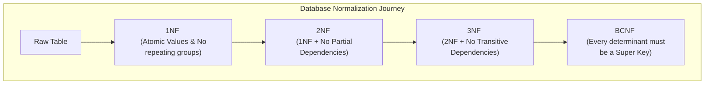

১. **1NF (First Normal Form):** 
   * টেবিলের প্রতিটি সেলের ভ্যালু অবশ্যই অবভাজ্য বা **Atomic** হতে হবে (যেমন একটি সেলে কমা দিয়ে একাধিক ফোন নাম্বার রাখা যাবে না)।
   * কোনো ডুপ্লিকেট রো থাকা যাবে না এবং প্রতিটি কলামের নাম ইউনিক হতে হবে।
২. **2NF (Second Normal Form):** 
   * টেবিলটিকে অবশ্যই ১NF হতে হবে।
   * **No Partial Dependency:** কম্পোজিট কি (Composite Primary Key)-এর ক্ষেত্রে কোনো নন-প্রাইম কলাম প্রাইমারি কি-এর একটি অংশের ওপর নির্ভর করতে পারবে না। তাকে সম্পূর্ণ প্রাইমারি কি-এর ওপরই নির্ভরশীল হতে হবে।
৩. **3NF (Third Normal Form):** 
   * টেবিলটিকে ২NF হতে হবে।
   * **No Transitive Dependency:** কোনো নন-প্রাইম কলাম অন্য কোনো নন-প্রাইম কলামের ওপর নির্ভর করতে পারবে না (যেমন: $A \rightarrow B$ এবং $B \rightarrow C$ হলে $A \rightarrow C$ ট্রান্সমিট হতে পারবে না। এখানে ডিপার্টমেন্ট আইডি জানা থাকলে ডিপার্টমেন্টের নাম অন্য টেবিলে চলে যাবে)।
৪. **BCNF (Boyce-Codd Normal Form):** 
   * এটি ৩NF এর চেয়েও শক্তিশালী রূপ। কোনো ফাংশনাল ডিপেন্ডেন্সি $X \rightarrow Y$ থাকলে, $X$-কে অবশ্যই টেবিলের **Super Key** বা প্রাইমারি কি হতে হবে।

### খ. Denormalization: কেন আমরা প্রোডাকশনে উল্টোটা করি?
বাস্তব প্রোডাকশন সিস্টেমে (বিশেষ করে OLAP বা হাই-রিড সিস্টেমে) অতিরিক্ত নরমাল ফাইলে ভাঙার ফলে প্রচুর পরিমাণ টেবিল **JOIN** করতে হয়, যা কুয়েরি পারফরম্যান্স মারাত্মক ধীরগতির করে দেয়। 
* **Denormalization** হলো ইচ্ছাকৃতভাবে ডাটার রিডান্ডেন্সি বা ডুপ্লিকেট কপি রাখা যাতে কোনোরকম JOIN ছাড়াই এক কুয়েরিতে সরাসরি ফাস্ট ডাটা রিড করা যায়।
* **ট্রেড-অফ:** রিড পারফরম্যান্স ফাস্ট হলেও রাইট অপারেশন স্লো হয়ে যায় এবং ডাটা কনসিস্টেন্সি বজায় রাখার দায়িত্ব অ্যাপ্লিকেশনের ওপর চলে যায়।

---

## ২৬. Database Relationships ও Referential Integrity
রিলেশনাল ডাটাবেসের মূল ভিত্তিই হলো টেবিলগুলোর মধ্যবর্তী সম্পর্ক বা **Relationships**। 

### ক. সম্পর্কের প্রকারভেদ (Relationship Types)

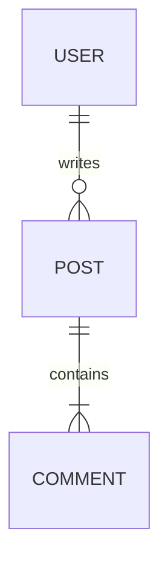

১. **One-to-One (1:1):** একটি রো কেবল অন্য টেবিলের একটি রো-এর সাথেই যুক্ত (যেমন: `users` এবং `user_profiles`)। ডাটাবেস পারফরম্যান্স ও সিকিউরিটির জন্য সেন্সিটিভ কলাম আলাদা টেবিলে রাখতে এটি ব্যবহৃত হয়।
২. **One-to-Many (1:N):** একটি প্যারেন্ট রো-এর বিপরীতে চাইল্ড টেবিলে একাধিক রো থাকতে পারে (যেমন: `customers` এবং `orders`)। চাইল্ড টেবিলে **Foreign Key** রেখে এটি ডিজাইন করা হয়।
৩. **Many-to-Many (N:M):** উভয় টেবিলের একাধিক রো পরস্পরের সাথে যুক্ত হতে পারে (যেমন: `students` এবং `courses`)। এটি ডিজাইন করতে মাঝখানে একটি **Junction Table** (বা Association Table) তৈরি করতে হয় যেখানে দুটি টেবিলের ফরেন কি কম্পোজিট কি হিসেবে কাজ করে।

### খ. Referential Integrity ও Cascade অ্যাকশন
যখন প্যারেন্ট টেবিলের কোনো রো ডিলিট বা আপডেট করা হয়, ফরেন কি দিয়ে যুক্ত চাইল্ড টেবিলের রো-গুলোর ওপর ডাটাবেস কী প্রভাব ফেলবে, তা ডিফাইন করা অত্যন্ত জরুরি:
* **ON DELETE CASCADE:** প্যারেন্ট রো ডিলিট হলে চাইল্ড টেবিলের সমস্ত ডিপেন্ডেন্ট রো অটোমেটিক ডিলিট হয়ে যাবে (ঝুঁকিপূর্ণ কিন্তু ক্লিনআপের জন্য দরকারী)।
* **ON DELETE SET NULL:** প্যারেন্ট রো ডিলিট হলে চাইল্ড টেবিলের ফরেন কি কলামটি `NULL` হয়ে যাবে।
* **ON DELETE RESTRICT / NO ACTION:** চাইল্ড টেবিলে কোনো ডাটা অবশিষ্ট থাকলে ডাটাবেস প্যারেন্ট রো-টি ডিলিট করতে দেবে না এবং এরর থ্রো করবে (ডাটাবেস ইন্টিগ্রিটি রক্ষায় সবচেয়ে নিরাপদ)।

---

## ২৭. ENUMs বনাম Lookup Tables: প্রোডাকশন ট্রেড-অফ
কোনো স্পেসিফিক ফিল্ডের ভ্যালু যখন ফিক্সড থাকে (যেমন অর্ডারের স্ট্যাটাস: `pending`, `shipped`, `delivered`), তখন ডেভেলপাররা দুটি আর্কিটেকচারাল প্যাটার্ন ব্যবহার করেন:

### ক. Postgres ENUM Type
```sql
CREATE TYPE order_status AS ENUM ('pending', 'shipped', 'delivered');
CREATE TABLE orders (
    id SERIAL PRIMARY KEY,
    status order_status NOT NULL
);
```
* **সুবিধা:** 
  ১. ডাটাবেস লেভেলে টাইপ-সেফ ভ্যালিডেশন।
  ২. মেমরি অত্যন্ত সাশ্রয়ী (Postgres অভ্যন্তরীণভাবে এনামকে ৪-বাইটের ইন্টিজার হিসেবে স্টোর করে)।
* **অসুবিধা:** 
  ১. নতুন স্ট্যাটাস যোগ করা বা ওল্ড স্ট্যাটাস রিনেম করা অত্যন্ত জটিল। ডাটাবেস লক (Table Lock) হওয়ার ঝুঁকি থাকে।
  ২. ডাইনামিকালি ফ্রন্টএন্ডে অপশন লিস্ট দেখানোর জন্য আলাদা এপিআই কুয়েরি করা যায় না।

### খ. Lookup Tables (Foreign Key Approach)
```sql
CREATE TABLE order_statuses (
    id SERIAL PRIMARY KEY,
    name VARCHAR(50) UNIQUE NOT NULL
);
CREATE TABLE orders (
    id SERIAL PRIMARY KEY,
    status_id INT REFERENCES order_statuses(id)
);
```
* **সুবিধা:** 
  ১. নতুন স্ট্যাটাস যোগ করতে হলে শুধু একটি `INSERT` কোয়েরি চালালেই চলে, কোনো স্কিমা মাইগ্রেশনের প্রয়োজন নেই।
  ২. স্ট্যাটাসের সাথে অন্যান্য মেটাডাটা (যেমন ডেসক্রিপশন বা কালার কোড) সহজেই একই টেবিলে সেভ রাখা যায়।
* **অসুবিধা:** 
  ১. প্রতিবার অর্ডারের স্ট্যাটাস রিড করতে হলে আরেকটি টেবিলের সাথে **JOIN** করতে হবে, যা রিড ওভারহেড বাড়ায়।

---

## ২৮. Database Views বনাম Materialized Views
জটিল ও বড় বড় SQL কুয়েরি বারবার না লিখে সেগুলোকে ডাটাবেস লেভেলে ক্যাশ বা সেভ করে রাখার দুটি দারুণ উপায় হলো ভিউ।

### ক. Standard Views (ভার্চুয়াল টেবিল)
* এটি মূলত একটি সেভ করা কুয়েরি। ডিস্কে কোনো ফিজিক্যাল ডাটা স্টোর করে না।
* আপনি যখন ভিউটি কুয়েরি করবেন (`SELECT * FROM active_users_view`), ডাটাবেস ব্যাকগ্রাউন্ডে সেই অরিজিনাল কোয়েরিটি চালিয়ে ফিজিক্যাল টেবিল থেকে ডাটা নিয়ে আসে।
* **সুবিধা:** রিডান্ডেন্ট কোড কমে এবং ডাটা সিকিউরিটি বা হাইডিং সহজ হয় (যেমন কাস্টমারকে মূল টেবিল না দিয়ে সুনির্দিষ্ট কলামের ভিউ দেওয়া)।

### খ. Materialized Views (ডিস্ক ক্যাশড টেবিল)
* মেটেরিয়ালাইজড ভিউ কুয়েরির রেজাল্টটি ফিজিক্যালি ডিস্কে একটি ক্যাশড টেবিল হিসেবে রাইট করে রাখে।
* যখন আপনি কুয়েরি করবেন, ডাটাবেস মূল টেবিলে কোনো সার্চ না করে সরাসরি ডিস্ক ক্যাশ থেকে মিলি-সেকেন্ডে রেসপন্স রিটার্ন করে।
* **রিফ্রেশমেন্ট প্রবলেম:** মূল টেবিলের ডাটা চেঞ্জ হলে মেটেরিয়ালাইজড ভিউ অটো-আপডেট হয় না। এর জন্য ম্যানুয়ালি `REFRESH MATERIALIZED VIEW` রান করতে হয়।
* **Postgres Pro-Tip:** ডাউনটাইম এড়াতে প্রোডাকশনে সর্বদা `REFRESH MATERIALIZED VIEW CONCURRENTLY` ব্যবহার করবেন, যাতে রিফ্রেশ হওয়ার সময়ও ক্লায়েন্টরা ওল্ড ক্যাশ ডাটা রিড করতে পারে এবং রিড লক না হয়।

---

## ২৯. Trigger Systems ও Stored Procedures
ডাটাবেসের ভেতরেই জটিল বিজনেস লজিক সরাসরি এক্সিকিউট করতে ওএসের কার্নেলের মতো ডাটাবেস কার্নেলের নিজস্ব প্রোগ্রামিং ল্যাঙ্গুয়েজ থাকে (যেমন Postgres-এর PL/pgSQL)।

### ক. Stored Procedures & Functions
* **Stored Procedures** হলো ডাটাবেসের ভেতরে প্রি-কম্পাইলড অবস্থায় থাকা ফাংশন।
* **সুবিধা:** নেটওয়ার্ক রাউন্ড-ট্রিপ (Network Latency) কমায়। ১০০০টি ক্যালকুলেশন মেমরিতে করার জন্য ক্লায়েন্ট এবং ডাটাবেসের মধ্যে বারবার ডাটা আদান-প্রদান না করে সরাসরি ডাটাবেসের ভেতরে রান করে একবারে রেজাল্ট রিটার্ন করা যায়।

### খ. Database Triggers (ট্রিগার)
* কোনো টেবিলে `INSERT`, `UPDATE` বা `DELETE` অপারেশন ঘটার ঠিক আগে (**BEFORE**) বা পরে (**AFTER**), স্বয়ংক্রিয়ভাবে কোনো টাস্ক রান করার মেকানিজমকে ট্রিগার বলে।
* যেমন: কোনো ইউজারের অ্যাকাউন্ট ডিলিট হলে অটোমেটিক্যালি একটি অডিট লগ টেবিলে এন্ট্রি তৈরি করা।

#### ⚠️ আর্কিটেকচারাল সতর্কতা (Production Warning):
আধুনিক হাই-স্কেল সিস্টেমে ট্রিগার এবং স্টোরড প্রসিডিউরের ভেতর ভারী বিজনেস লজিক লেখা **কঠোরভাবে নিরুৎসাহিত করা হয়**। 
* **কারণ:** ডাটাবেস স্কেলিং করা অ্যাপ্লিকেশন সার্ভার স্কেলিংয়ের চেয়ে অনেক বেশি কঠিন ও ব্যয়বহুল। ডাটাবেসের ভেতর বিজনেস লজিক চালালে ডাটাবেসের মূল্যবান সিপিইউ (CPU) নষ্ট হয়।
* এছাড়া, ট্রিগারের অ্যাকশনগুলো অলক্ষ্যে (Invisible Side Effects) ঘটে বলে বাগ ডিবাগ করা অত্যন্ত কঠিন হয়ে দাঁড়ায়।

---

## ৩০. Schema Migrations ও Zero-Downtime Deployments
বিলিয়ন ডাটা সমৃদ্ধ প্রোডাকশন ডাটাবেসে স্কিমা পরিবর্তন করার সময় (যেমন নতুন কলাম যোগ করা, ইনডেক্স তৈরি বা ডেটাটাইপ পরিবর্তন) সামান্য অসাবধানতায় সম্পূর্ণ ডাটাবেস লক হয়ে সাইট ডাউন হয়ে যেতে পারে। জিরো-ডাউনটাইম নিশ্চিত করার গোল্ডেন রুলসগুলো নিচে দেওয়া হলো:

### ক. Safe বনাম Unsafe স্কিমা অপারেশন

| DB Operation | ঝুঁকি লেভেল | কারণ ও প্রোডাকশন প্র্যাকটিস (Production Practice) |
| :--- | :--- | :--- |
| **Adding Nullable Column** | ✅ Safe | কোনো ডেটা লক বা টেবিল রাইট ওভারহেড নেই। |
| **Adding Column with Default Value** | ⚠️ Unsafe (Older versions) | ওল্ড Postgres সংস্করণে এটি পুরো টেবিল লক করে প্রতিটি রো নতুন ডিফল্ট ভ্যালু দিয়ে নতুন করে লেখে। (Postgres 11+ সংস্করণে এটি মেটাডাটা লেভেলে করে বলে এটি এখন Safe)। |
| **Creating an Index** | ❌ Highly Unsafe | সাধারণ `CREATE INDEX` কোয়েরি পুরো টেবিলের রাইট অপারেশন লক করে দেয়। প্রোডাকশনে সর্বদা **`CREATE INDEX CONCURRENTLY`** ব্যবহার করতে হবে, যা কোনো রাইট লক ছাড়াই ব্যাকগ্রাউন্ডে ইনডেক্স তৈরি করে। |
| **Renaming a Column** | ❌ Extremely Unsafe | আপনি কলাম রিনেম করলে পুরানো সচল অ্যাপ্লিকেশন ইনস্ট্যান্সগুলো সেই কলাম কুয়েরি করতে গিয়ে ক্র্যাশ করবে। এটি করতে ৩-ধাপের ডেপ্লয়মেন্ট প্রসেস ফলো করতে হবে (Add new column ➔ Double Write ➔ Deprecate old column)। |

---

## 💡 Systems Architect Database Insights

১. **Avoid SELECT * in Production:** প্রোডাকশন কোয়েরিতে কখনোই `SELECT *` ব্যবহার করবেন না। এটি আপনার প্রয়োজনীয় কলামের বাইরেও বিশাল ডাটা ডিস্ক ও নেটওয়ার্ক ওভারহেডের মাধ্যমে ট্রাভার্স করায়, যা সকেটের আইও পারফরম্যান্স ধ্বংস করে। সর্বদা কলামের নাম সুনির্দিষ্টভাবে উল্লেখ করুন (`SELECT id, name`).
২. **Index Columns with High Cardinality:** ইনডেক্স কেবল সেই সমস্ত কলামেই তৈরি করুন যেখানে ডাটার বৈচিত্র্য (High Cardinality) অনেক বেশি (যেমন: `email` বা `user_id`)। লিঙ্গ (Gender - Male/Female) বা স্ট্যাটাসের মতো কলামে ইনডেক্স তৈরি করলে B+ Tree অপ্টিমাইজড পাথ খুঁজে পায় না, ফলে ইনডেক্সিং উল্টো পারফরম্যান্স হ্রাস করে।
৩. **Connection Pooling is Mandatory:** অ্যাপ্লিকেশন থেকে প্রতিবার কোয়েরি করার সময় নতুন নতুন ডাটাবেস কানেকশন হ্যান্ডশেক এড়াতে সর্বদা **Connection Pool** (যেমন: PgBouncer বা HikariCP) ব্যবহার করুন। এটি ডাটাবেস সার্ভারের সিপিইউ এবং র‍্যামের ওভারহেড প্রায় ৫ গুণ কমিয়ে দেয়।

---


