# 🗄️ Database Systems & Storage Engineering Handbook

ডাটাবেস কেবল ডেটা স্টোর করার জায়গা নয়; এটি একটি অত্যন্ত জটিল সফটওয়্যার ইঞ্জিনিয়ারিং আর্কিটেকচার যা কনকারেন্সি, হার্ডওয়্যার ক্র্যাশ, মেমরি অ্যালোকেশন এবং ডিস্ক রাইট স্পিডের সাথে প্রতি সেকেন্ডে লড়াই করে। 

এই হ্যান্ডবুকটি এমনভাবে তৈরি করা হয়েছে যাতে একদম বিগিনার থেকে শুরু করে অভিজ্ঞ সিস্টেমস ইঞ্জিনিয়ার পর্যন্ত যে কেউ ডাটাবেসের অভ্যন্তরীণ মেকানিজম অত্যন্ত সহজ এবং ভিজ্যুয়াল উপায়ে বুঝতে পারেন।

---

## ১. SQL বনাম NoSQL: আর্কিটেকচারাল যুদ্ধক্ষেত্রের ভেতরের রূপ

ডাটাবেস বাছাই করার সময় আমরা প্রায়ই "SQL বনাম NoSQL" এই বিতর্কের মুখোমুখি হই। কিন্তু এর পেছনে আসল কারিগরি ও স্টোরেজ ইঞ্জিনিয়ারিং পার্থক্য কী?

| বৈশিষ্ট্য | Relational (SQL - e.g., PostgreSQL) | Non-Relational (NoSQL - e.g., MongoDB, Cassandra) |
| :--- | :--- | :--- |
| **স্টোরেজ মডেল** | কঠোরভাবে টেবিল, রো (Rows) এবং কলাম (Columns)। | ডকুমেন্টস (JSON/BSON), কী-ভ্যালু, কলাম-ফ্যামিলি বা গ্রাফ। |
| **স্কিমা (Schema)** | **Rigid/Static:** ডাটা ঢোকানোর আগে স্কিমা ডিক্লেয়ার করা বাধ্যতামূলক। | **Dynamic/Flexible:** যেকোনো রিকোয়েস্টে যেকোনো ফিল্ড যোগ করা যায়। |
| **রিলেশন ও জয়েন** | অত্যন্ত শক্তিশালী `JOIN` সাপোর্ট। একাধিক টেবিলের ডাটা লিঙ্ক করা সহজ। | জয়েন মেকানিজম নেই বললেই চলে (Denormalization বা Embedded Docs)। |
| **স্কেলিং মেথড** | **Vertical (Scale-up):** সিপিইউ ও র‍্যাম বাড়িয়ে এক সার্ভারেই সীমাবদ্ধ। | **Horizontal (Scale-out):** হাজার হাজার সার্ভারে ডাটা ভাগ করে দেওয়া যায়। |
| **লেনদেন (Transactions)** | কঠোরভাবে **ACID** কমপ্লায়েন্ট। | প্রাকৃতিকভাবে **BASE** (Basically Available, Soft State, Eventual Consistency)। |

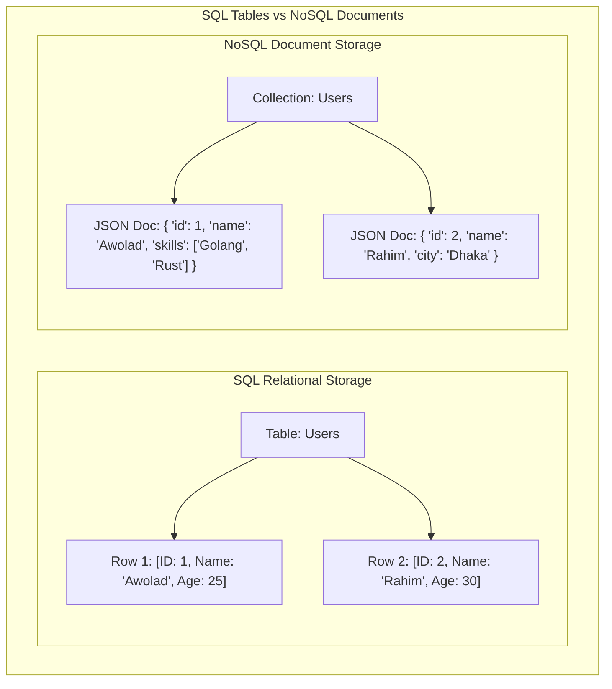

---

## ২. ACID Properties Deep Dive: ডাটাবেসের অলঙ্ঘনীয় চার স্তম্ভ

ডাটাবেস ট্রানজেকশনের মূল শক্তি হলো **ACID**। এটি কোনো সাধারণ শব্দ নয়, এটি ৪টি জটিল অ্যালগরিদমিক প্রতিশ্রুতির সমন্বয়।

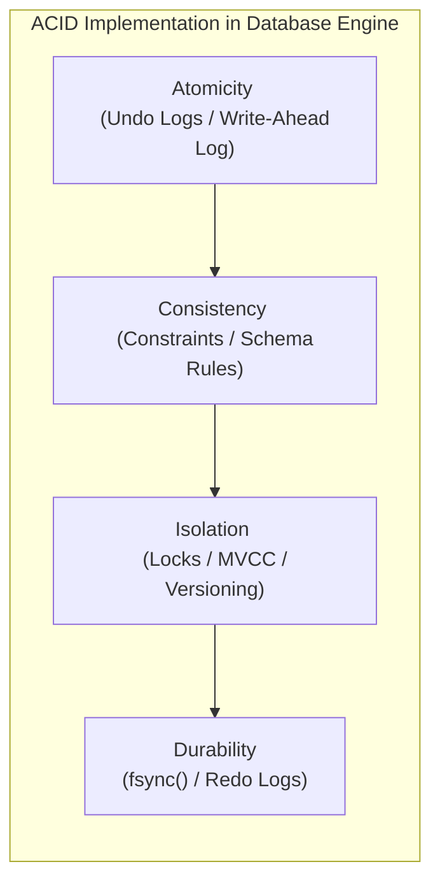

### ক. Atomicity (একক অস্তিত্ব) - "সবটুকু হবে, অথবা কিছুই হবে না"
ধরা যাক, আপনি ব্যাংক অ্যাকাউন্ট A থেকে অ্যাকাউন্ট B-তে ১০০ টাকা পাঠাচ্ছেন। এর পেছনে দুটি কোয়েরি চলে:
১. অ্যাকাউন্ট A থেকে ১০০ টাকা বিয়োগ করো।
২. অ্যাকাউন্ট B-তে ১০০ টাকা যোগ করো।
* **বিপর্যয়:** যদি ১ম কোয়েরির পর বিদ্যুৎ চলে যায় বা ডাটাবেস ক্র্যাশ করে, তবে অ্যাকাউন্ট A-এর টাকা কেটে যাবে কিন্তু B-তে ঢুকবে না!
* **সমাধান (WAL & Undo Logs):** ডাটাবেস মেমরিতে কোনো পরিবর্তনের আগে তা **Write-Ahead Log (WAL)**-এ লেখে। যদি কোনো ট্রানজেকশন মাঝপথে ব্যর্থ হয়, ডাটাবেস **Undo Logs** রিড করে পুরো ডাটাকে আগের অবস্থায় ফিরিয়ে নিয়ে যায় (Rollback)।

### খ. Consistency (সামঞ্জস্যতা)
ট্রানজেকশন শুরুর আগে ডাটাবেস যেভাবে ইনভ্যারিয়েন্ট বা নিয়মের মধ্যে ছিল, ট্রানজেকশন শেষেও সমস্ত নিয়ম (যেমন: Foreign Keys, Unique Constraints, Balance >= 0) মেনে ডাটাবেসকে সঠিক অবস্থায় থাকতে হবে।

### গ. Isolation (বিпередиতা) - কনকারেন্সির মহাযুদ্ধ
যখন হাজার হাজার ইউজার একই ডাটাবেসে একই সময়ে রিড ও রাইট করছেন, তখন একজন ইউজারের অপারেশন যাতে অন্যজনের ট্রানজেকশনে গোলমাল না পাকায়, তাই হলো আইসোলেশন।
ডাটাবেসে মূলত ৪টি আইসোলেশন লেভেল রয়েছে, যা বিভিন্ন প্রবলেম বা অ্যানোমালি সমাধান করে:

| আইসোলেশন লেভেল | Dirty Reads | Non-Repeatable Reads | Phantom Reads |
| :--- | :--- | :--- | :--- |
| **Read Uncommitted** | ❌ (ঘটে) | ❌ (ঘটে) | ❌ (ঘটে) |
| **Read Committed** |  (সুরক্ষিত) | ❌ (ঘটে) | ❌ (ঘটে) |
| **Repeatable Read** |  (সুরক্ষিত) |  (সুরক্ষিত) | ❌ (ঘটে - Postgres বাদে) |
| **Serializable** |  (সুরক্ষিত) |  (সুরক্ষিত) |  (সুরক্ষিত) |

#### ⚠️ ৩টি মারাত্মক রিডিং অ্যানোমালি (Anomalies):
১. **Dirty Read:** ট্রানজেকশন ১ একটি ডাটা মডিফাই করল কিন্তু এখনো Commit করেনি। ট্রানজেকশন ২ সেই আন-কমিটেড ডাটা রিড করে ফেলল। পরে ট্রানজেকশন ১ রোলব্যাক করলে ট্রানজেকশন ২-এর পড়া ডাটাটি সম্পূর্ণ ভুয়া বা ভুল প্রমাণিত হয়।
২. **Non-Repeatable Read:** ট্রানজেকশন ১ একটি রো রিড করল। ট্রানজেকশন ২ সেই রো-টি আপডেট করে Commit করে দিল। ট্রানজেকশন ১ আবার রিড করতে গিয়ে দেখল ডাটা বদলে গেছে! (একই ট্রানজেকশনে ভিন্ন ভিন্ন ভ্যালু পাওয়া)।
৩. **Phantom Read:** ট্রানজেকশন ১ একটি রেঞ্জ কোয়েরি করল (যেমন: `Age > 20` ওয়ালা ৫টি ইউজার পেল)। ট্রানজেকশন ২ নতুন একটি ইউজার ইনসার্ট করে Commit করল যার বয়স ২৫। ট্রানজেকশন ১ আবার রান করে দেখল এখন ৬টি ইউজার চলে এসেছে! (ভূতের মতো নতুন ডাটা হাজির হওয়া)।

### ঘ. Durability (স্থায়িত্ব)
একটি ট্রানজেকশন একবার **Success/Commit** মেসেজ দিলে, তার ঠিক পরের মিলি-সেকেন্ডে পুরো ডাটা সেন্টারের কারেন্ট চলে গেলেও সেই ডাটা ওএস ও মেমরি ক্র্যাশ এনিয়ে সুরক্ষিত থাকবে।
* **মেকানিজম:** ওএস পারফরম্যান্সের জন্য যেকোনো ডিস্ক রাইটকে সরাসরি ডিস্কে না লিখে বাফারিং করে ওএস পেজ ক্যাশে (Page Cache) রেখে দেয়।
* ডাটাবেস ট্রানজেকশন কমিট করার সময় ওএসকে জোরপূর্বক **`fsync()`** সিস্টেম কল ফায়ার করতে বাধ্য করে, যা ওএস ক্যাশ বাইপাস করে সরাসরি ফিজিক্যাল SSD/HDD-র সিলিকনে ডাটা স্থায়ীভাবে রাইট করে।

---

## ৩. Database Indexing Internals: B+ Trees বনাম LSM Trees

ডাটাবেসে ইনডেক্সিং ছাড়া কোটি কোটি ডাটা থেকে নির্দিষ্ট ডাটা খোঁজা যেন খড়ের গাদায় সুই খোঁজার মতো। ডাটাবেস স্টোরেজ ইঞ্জিনগুলো ডাটা অর্গানাইজ করতে মূলত দুটি বৈপ্লবিক ডাটা স্ট্রাকচার ব্যবহার করে।

### ক. B+ Tree Index (রিলেশনাল ডাটাবেসের মুকুট)
PostgreSQL, MySQL বা Oracle-এর মতো রিলেশনাল ডাটাবেসগুলো প্রাকৃতিকভাবে B+ Tree ইনডেক্স ব্যবহার করে।

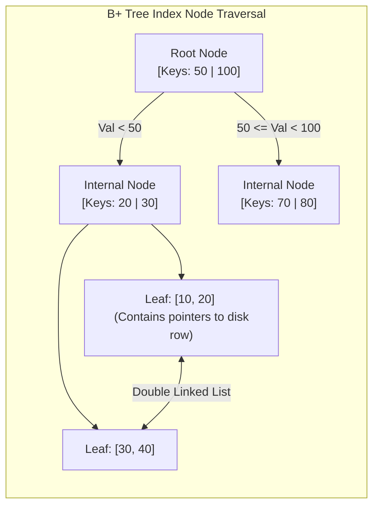

#### B+ Tree কেন ডাটাবেসের জন্য এত জনপ্রিয়?
১. **সুষম গভীরতা (Balanced Tree):** সমস্ত লিফ নোড (Leaf Nodes) একই গভীরতায় বা লেভেলে থাকে। তাই যেকোনো ডাটা খুঁজতে ঠিক একই সংখ্যক হপ বা স্টেপ লাগে ($O(\log N)$)।
২. **রেঞ্জ কোয়েরির জাদু:** B+ Tree-তে সমস্ত ডাটা পয়েন্টার কেবল একদম নিচের লিফ নোডে থাকে এবং এই লিফ নোডগুলো একে অপরের সাথে **ডাবলি লিঙ্কড লিস্ট (Double Linked List)** দিয়ে সংযুক্ত থাকে। ফলে `WHERE id BETWEEN 10 AND 50` এর মতো রেঞ্জ কোয়েরি করা পানির মতো সহজ।
৩. **ডিস্ক ব্লক ফ্রেন্ডলি:** নোডের সাইজ ডিস্কের পেজ সাইজের (যেমন: 4KB বা 8KB) সমান করা হয়, ফলে একটি সিঙ্গেল ডিস্ক I/O অপারেশনেই হাজার হাজার চাইল্ড পয়েন্টার মেমরিতে লোড করা যায়।

### খ. LSM Tree (Log-Structured Merge-Tree - NoSQL-এর পাওয়ারহাউস)
Cassandra, RocksDB বা LevelDB-এর মতো রাইট-হেভি (Write-Heavy) ডাটাবেসগুলো B+ Tree ব্যবহার করে না। কারণ B+ Tree-তে প্রতিবার রাইটের সময় ডিস্কের বিভিন্ন র্যান্ডম জায়গায় গিয়ে রাইট করতে হয় (Random Disk I/O), যা অত্যন্ত ধীরগতির।
LSM Tree এই সমস্যার সমাধান করেছে **Sequential Append-Only Writes** মেকানিজম ব্যবহার করে।

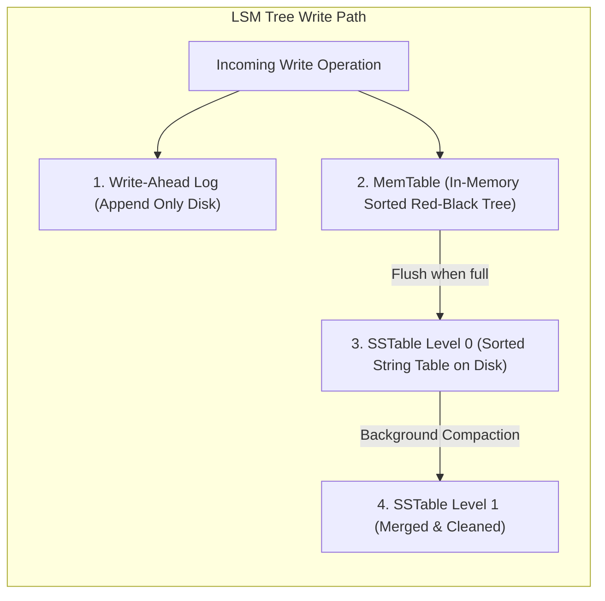

#### LSM Tree-এর মূল মেকানিজম:
১. **MemTable:** যেকোনো নতুন রাইট অপারেশন সরাসরি ডিস্কে না লিখে র‍্যামের ভেতরে থাকা একটি সর্টেড ডাটা স্ট্রাকচার বা **MemTable**-এ ঢোকানো হয়। এটি মিলি-সেকেন্ডের ফ্র্যাকশনে ঘটে।
২. **WAL (Write-Ahead Log):** কারেন্ট চলে গেলে র‍্যামের মেমটেবিল যাতে হারিয়ে না যায়, তাই ব্যাকগ্রাউন্ডে একটি সিম্পল ফাইল-এপেন্ডের মাধ্যমে ডিস্কে লগ লিখে রাখা হয়।
৩. **SSTables (Sorted String Tables):** মেমটেবিল যখন ভরে যায় (যেমন: 64MB), তখন পুরো সর্টেড ডাটা একসাথে ডিস্কে একটি ইমিউটেবল (Immutable - যা আর পরিবর্তন করা যাবে না) ফাইল হিসেবে রাইট করে ফেলা হয়। একে বলা হয় **SSTable**।
৪. **Compaction:** যেহেতু একই কি (Key) বার বার আপডেট হতে পারে, তাই ডিস্কে অনেকগুলো SSTable জমা হয়ে যায়। ব্যাকগ্রাউন্ডে একটি প্রসেস এই সর্টেড ফাইলগুলোকে রিড করে নতুন ভ্যালু রেখে ওল্ড বা ডিলিট হওয়া ভ্যালুগুলো মুছে দিয়ে নতুন একটি মার্জড ফাইল তৈরি করে। একে বলা হয় **Compaction**।

---

## ৪. Concurrency Control: কীভাবে ডাটাবেস লক ও রিলিজ করে?

হাজার হাজার ব্যবহারকারী যখন একই টেবিল বা রো-তে হাত দিচ্ছেন, তখন ডাটাবেস কীভাবে রেস কন্ডিশন (Race Condition) এড়ায়? ডাটাবেস এটি করে মূলত দুটি উপায়ে:

### ক. 2PL (Two-Phase Locking) - পেসিমিস্টিক বা লক-ভিত্তিক
ডাটাবেস ধরে নেয় যে কনকারেন্সি ক্ল্যাশ বা জ্যাম ঘটবেই। তাই সে যেকোনো অপারেশনের আগে ডাটা লক করে নেয়।
* **Shared Lock (S-Lock):** ডাটা রিড করার জন্য ব্যবহৃত হয়। একই সাথে অনেক ইউজার রিড লক পেতে পারেন (Reads are non-blocking to other reads)।
* **Exclusive Lock (X-Lock):** ডাটা রাইট বা আপডেট করার জন্য ব্যবহৃত হয়। এই লক থাকা অবস্থায় অন্য কেউ রিড বা রাইট কোনো লকই পাবে না।
* **2PL-এর দুটি ধাপ:**
  ১. **Growing Phase:** ট্রানজেকশন কেবল লক নিতে পারবে, কোনো লক ছাড়তে পারবে না।
  ২. **Shrinking Phase:** ট্রানজেকশন কেবল লক রিলিজ করতে পারবে, নতুন কোনো লক নিতে পারবে না।

### খ. MVCC (Multi-Version Concurrency Control) - লক-ফ্রি রিডিংয়ের জাদুকর
আজকের আধুনিক ডাটাবেসগুলো (যেমন PostgreSQL বা MySQL InnoDB) রিড অপারেশনকে ব্লক করা ছাড়াই রাইট অপারেশনের পারফরম্যান্স নিশ্চিত করতে **MVCC** ব্যবহার করে।
* **মূল মন্ত্র: "Readers never block Writers, and Writers never block Readers!"**
* **কীভাবে কাজ করে?** MVCC-তে কোনো রো আপডেট করার সময় আগের ডাটাটি মুছে না ফেলে বা ওভাররাইট না করে, কার্নেলে ডাটার একটি সম্পূর্ণ **নতুন সংস্করণ (New Version)** বা কপি তৈরি করা হয়।
* প্রতিটি রো-তে দুটি গোপন মেটাডাটা ফিল্ড থাকে: `xmin` (কোন ট্রানজেকশন আইডি এই রোটি তৈরি করেছে) এবং `xmax` (কোন ট্রানজেকশন আইডি এই রোটি ডিলিট বা সুপারসিড করেছে)।
* আপনি যখন রিড কোয়েরি করবেন, ডাটাবেস আপনার ট্রানজেকশন আইডির সাপেক্ষে যে ভার্সনটি আইনত দৃশ্যমান (Visible), কেবল সেটিই রেন্ডার করবে।
* **Vacuum / Garbage Collection:** ব্যাকগ্রাউন্ডে ডাটাবেসের একটি প্রসেস ওল্ড ও ডেড ভার্সনগুলো (যা এখন আর কোনো রানিং ট্রানজেকশনের প্রয়োজন নেই) স্ক্যান করে মেমরি ফ্রী করে দেয়। Postgres-এ একে বলা হয় **VACUUM**।

---

## ৫. Distributed Databases: রেপ্লিকেশন বনাম শার্ডিং

আপনার এপিআই ট্রাফিক যখন এক সার্ভারের ধারণ ক্ষমতার বাইরে চলে যায়, তখন আমরা ডাটাবেসকে ডিস্ট্রিবিউটেড বা একাধিক সার্ভারে ছড়িয়ে দেই।

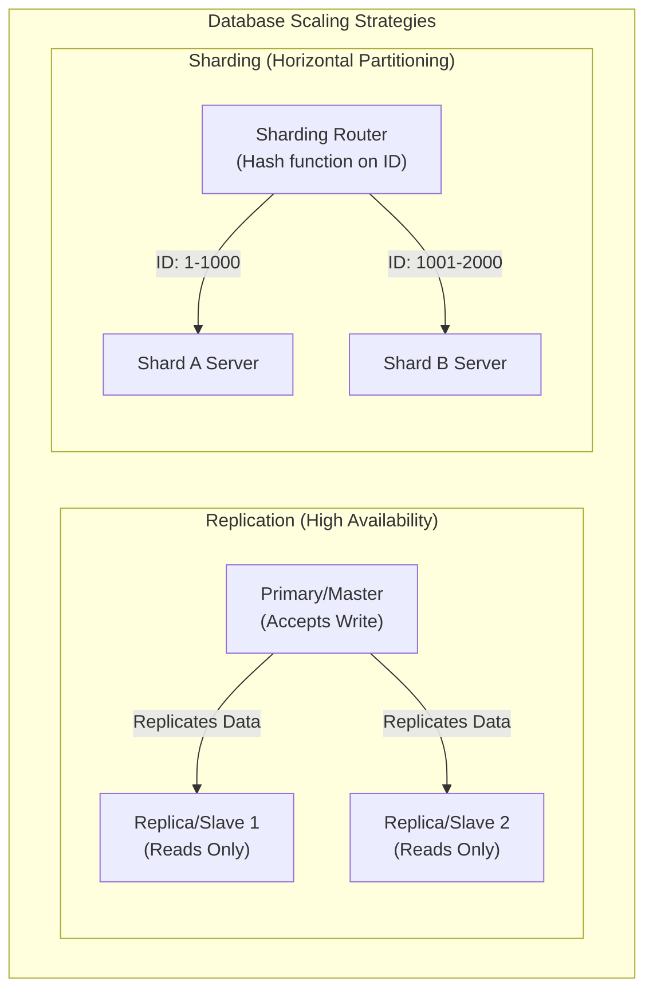

### ক. ডাটাবেস রেপ্লিকেশন (Replication)
রেপ্লিকেশনের মূল উদ্দেশ্য হলো **উচ্চ প্রাপ্যতা (High Availability)** এবং রিড ট্রাফিকের ক্ষমতা বাড়ানো।
১. **Single-Leader (Master-Slave):** সমস্ত রাইট অপারেশন কেবল Master সার্ভারে হবে। মাস্টার ডাটা আপডেট করে তা রিড-অনলি Slave সার্ভারগুলোতে কপি বা রেপ্লিকেট করে দেয়। কোনো কারণে মাস্টার সার্ভার ক্র্যাশ করলে স্লেভদের মধ্যে একজন স্বয়ংক্রিয়ভাবে নতুন মাস্টার নির্বাচিত হয়।
২. **Leaderless (Dynamo-style):** কোনো মাস্টার নেই। ক্লায়েন্ট সরাসরি একাধিক নোডে একসাথে রাইট পাঠায়। ডাটা সঠিক কিনা তা নিশ্চিত করতে **Quorum Read/Write ($R + W > N$)** মেকানিজম ব্যবহার করা হয়।

### খ. ডাটাবেস শার্ডিং (Sharding)
শার্ডিং হলো একটি বিশাল টেবিলকে ভেঙে ছোট ছোট টুকরো করে আলাদা আলাদা ফিজিক্যাল সার্ভারে ডিস্ট্রিবিউট করা। একে বলা হয় **Horizontal Partitioning**।
* **Sharding Key:** শার্ডিং করার জন্য একটি ফিল্ড বা কি বেছে নিতে হয় (যেমন: `user_id`)।
* **Consistent Hashing:** ইউজারের আইডি হ্যাশ করে ডাটাবেস ডিটারমাইন করে এই ডাটাটি কোন ফিজিক্যাল শার্ড সার্ভারে সংরক্ষিত হবে। এর ফলে একটি সার্ভারে অতিরিক্ত লোড পড়া (Hotspotting) রোধ করা যায়।

---

## ৬. CAP Theorem বনাম PACELC Theorem: ডিস্ট্রিবিউটেড সিস্টেমের নির্মম বাস্তব সত্য

ডিস্ট্রিবিউটেড ডাটাবেস ডিজাইন করার সময় আপনি চাইলেই সব সুবিধা একসাথে পাবেন না। প্রকৃতি আমাদের ওপর কিছু কঠোর গাণিতিক সীমাবদ্ধতা চাপিয়া দিয়াছে।

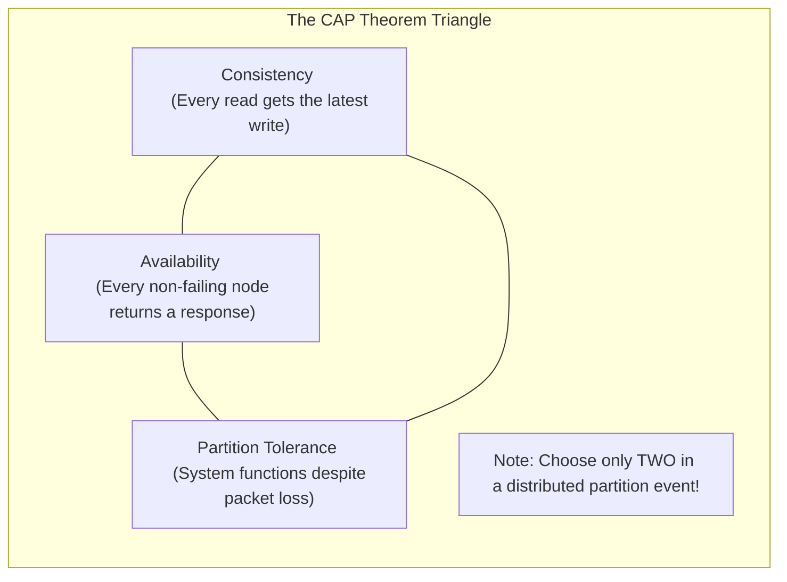

### ক. CAP Theorem
১. **Consistency (সামঞ্জস্যতা):** আপনি যে নোড থেকেই রিড করুন না কেন, সর্বদা সর্বশেষ রাইট করা সঠিক ডাটাটিই পাবেন।
২. **Availability (প্রাপ্যতা):** যেকোনো নোড ক্র্যাশ না করে সচল থাকলে সে সর্বদা ক্লায়েন্টকে সফল রেসপন্স ব্যাক করবে (ভুল বা পুরানো ডাটা হলেও রেসপন্স করতে হবে)।
৩. **Partition Tolerance (বিভাজন সহনশীলতা):** নেটওয়ার্কের তার ছিঁড়ে গেলে বা নোডগুলোর মধ্যে কমিউনিকেশন সম্পূর্ণ বন্ধ হয়ে গেলেও পুরো সিস্টেম সচল থাকবে।
* **নির্মম সত্য:** নেটওয়ার্ক পার্টিশন (Partition) ইন্টারনেটের বাস্তব সত্য, যা এড়ানো অসম্ভব। তাই নেটওয়ার্ক পার্টিশন ঘটলে আপনাকে যেকোনো একটি বেছে নিতে হবে: **CP** (Consistency over Availability) অথবা **AP** (Availability over Consistency)।

### খ. PACELC Theorem (CAP এর অ্যাডভান্সড রূপ)
CAP থিওরেম কেবল তখনই কাজ করে যখন সিস্টেমে নেটওয়ার্ক পার্টিশন বা সমস্যা দেখা দেয়। কিন্তু সাধারণ অবস্থায় যখন কোনো সমস্যা থাকে না, তখন ডাটাবেস কীভাবে কাজ করবে? এর ব্যাখ্যা দেয় **PACELC**:

> **If there is a Partition (P):**
> How does the system trade off **Availability (A)** vs **Consistency (C)**?
> **Else (E) - Normal operation:**
> How does the system trade off **Latency (L)** vs **Consistency (C)**?

* **MongoDB (PC/EC):** পার্টিশন ঘটলে Consistency বেছে নেয়; সাধারণ অবস্থায় Latency-র চেয়ে Consistency-কে অগ্রাধিকার দেয়।
* **Cassandra (PA/EL):** পার্টিশন ঘটলে Availability বেছে নেয়; সাধারণ অবস্থায় দ্রুত রেসপন্স বা Latency-কে অগ্রাধিকার দেয় (Eventual Consistency)।

---

## ৭. Repeatable Read-এর নীরব ঘাতক: Write Skew Anomaly
আমরা দেখেছি কীভাবে মৌলিক রিডিং অ্যানোমালিগুলো (যেমন: Dirty Read, Non-Repeatable Read) ডাটাবেস আইসোলেশন লেভেল দিয়ে আটকানো যায়। কিন্তু **Repeatable Read** লেভেলে একটি অত্যন্ত সূক্ষ্ম এবং মারাত্মক অ্যানোমালি ঘটতে পারে, যার নাম **Write Skew**।

#### 🏥 বাস্তব উদাহরণ (অন-কল ডাক্তার সমস্যা):
একটি হাসপাতালে একটি নিয়ম রয়েছে: **"সর্বদা অন্ততঃ একজন ডাক্তার অন-কল (On-call) থাকতে হবে।"**
বর্তমানে দুই জন ডাক্তার, **ডক্টর অ্যালিস (Alice)** এবং **ডক্টর বব (Bob)** অন-কল হিসেবে ডিউটিতে আছেন।

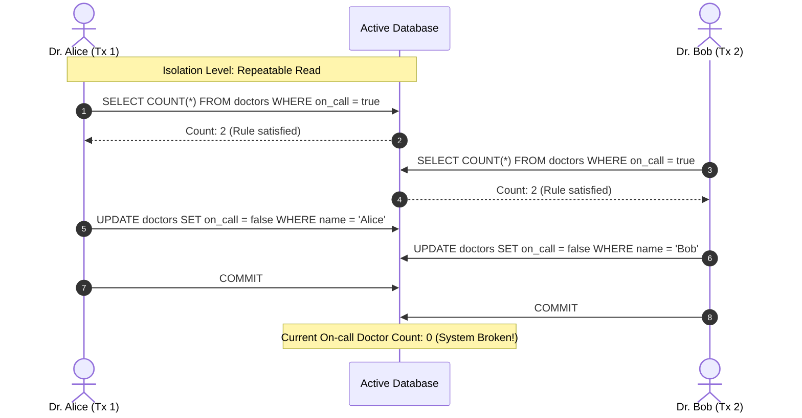

#### 🔍 এখানে কী ঘটলো?
১. অ্যালিস এবং বব দুজনেই একসাথে ডিউটি থেকে ছুটি নিতে চাইলেন।
২. তাদের অ্যাপ্লিকেশন ডাটাবেসে কুয়েরি করল: `SELECT COUNT(*) FROM doctors WHERE on_call = true`.
৩. যেহেতু দুজনেই অন-কল ছিলেন, ডাটাবেস দুজনকে রেসপন্স দিল `Count: 2`।
৪. অ্যালিস দেখল ২ জন অন-কল আছে, তাই সে ছুটি নিলে অন্তত ১ জন থাকবে। সে তার স্ট্যাটাস আপডেট করে `on_call = false` করল।
৫. ববও একই যুক্তিতে তার স্ট্যাটাস আপডেট করে `on_call = false` করল।
৬. **Repeatable Read**-এর অধীনে যেহেতু তারা সম্পূর্ণ ভিন্ন দুটি রো (Row) আপডেট করছেন, তাই ডাটাবেস কোনো কনফ্লিক্ট ছাড়াই দুটি ট্রানজেকশনকেই **Commit** করতে দেয়।
৭. **ফলাফল:** হাসপাতালে অন-কল ডাক্তারের সংখ্যা ০ হয়ে গেল! সিস্টেমের অলঙ্ঘনীয় ব্যবসায়িক নিয়ম (Invariant Rule) ভেঙে চুরমার হয়ে গেল।

#### 🛠️ সমাধান (Solutions):
১. **Pessimistic Locking (SELECT ... FOR UPDATE):** কুয়েরি করার সময় রো-গুলোকে লক করে ফেলা যাতে বব কুয়েরি করতে গেলে লক রিলিজ হওয়া পর্যন্ত ব্লকড থাকে:
   ```sql
   SELECT * FROM doctors WHERE on_call = true FOR UPDATE;
   ```
২. **Serializable Isolation:** ডাটাবেসের আইসোলেশন লেভেল সর্বোচ্চ `Serializable`-এ উন্নীত করা। এটি কার্নেল লেভেলে **SSI (Serializable Snapshot Isolation)** অ্যালগরিদম ব্যবহার করে। যদি ডাটাবেস দেখে যে দুটি কনকারেন্ট ট্রানজেকশনের রিড-রাইট ডিপেন্ডেন্সিতে সাইকেল বা ওভারল্যাপ তৈরি হয়েছে, তবে সে সাথে সাথে একটি ট্রানজেকশনকে বাতিল করে `Serialization Failure` এরর থ্রো করে।

---

## ৮. Write-Ahead Logging (WAL) ও ARIES রিকভারি অ্যালগরিদম
ডাটাবেস যখন ডিস্কের পেজে ডাটা লেখে, তখন হঠাৎ বিদ্যুৎ চলে গেলে বা সিস্টেম ক্র্যাশ করলে আংশিক লেখা ডাটা (Partial Write) ডাটাবেস ফাইলকে করাপ্ট বা নষ্ট করে দিতে পারে। এই বিপর্যয় ঠেকাতে ডাটাবেস **WAL (Write-Ahead Log)** মেকানিজম ব্যবহার করে।

#### 📜 WAL-এর মূল নীতি:
> **"Never write a data page to disk before writing the log representing the change."**
> (ডাটার পরিবর্তনের লগটি ডিস্কে সুরক্ষিত করার আগে মূল ডাটা পেজ কখনোই ডিস্কে রাইট করা যাবে না।)

#### 🔄 ARIES (Algorithms for Recovery and Isolation Exploiting Semantics):
যখন একটি ক্র্যাশ ঘটে এবং ডাটাবেস পুনরায় চালু হয়, তখন কার্নেল **ARIES Recovery Algorithm** চালিয়ে ডাটাবেসকে একদম সঠিক অবস্থায় ফিরিয়ে আনে। এর ৩টি প্রধান ফেস রয়েছে:

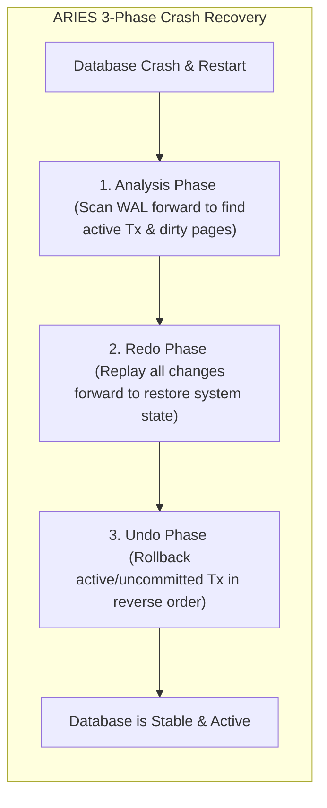

১. **Analysis Phase (বিশ্লেষণ দশা):** ডাটাবেস শেষ সফল চেকপয়েন্ট (Checkpoint) থেকে WAL লগ ফাইলে সামনের দিকে স্ক্যান করে। এটি ক্র্যাশের সময় সচল থাকা ট্রানজেকশন (Active Transactions) এবং মেমরিতে থাকা কিন্তু ডিস্কে রাইট না হওয়া নোংরা পেজগুলো (Dirty Pages) চিহ্নিত করে।
২. **Redo Phase (পুনরাবৃত্তি দশা):** এই ধাপে ডাটাবেস ক্র্যাশের ঠিক আগের অবস্থা ফিরিয়ে আনতে সফল বা ব্যর্থ নির্বিশেষে সমস্ত লগ করা অ্যাকশন পুনরায় প্লে করে (Repeating History)। এটি মেমরিকে ঠিক ক্র্যাশের আগের মিলি-সেকেন্ডের অবস্থায় নিয়ে যায়।
৩. **Undo Phase (পূর্বাবস্থায় প্রত্যাবর্তন দশা):** যে সমস্ত ট্রানজেকশন ক্র্যাশের সময় সচল ছিল কিন্তু **Commit** হতে পারেনি, ডাটাবেস সেগুলোর সমস্ত পরিবর্তন উল্টো দিক থেকে রোলব্যাক (Rollback) করে এবং ডিস্ক থেকে মুছে দেয়।

---

## ৯. Column-Oriented (কলাম-ভিত্তিক) বনাম Row-Oriented (রো-ভিত্তিক) স্টোরেজ
ডাটা কীভাবে ডিস্কের ট্র্যাকে এবং ফিজিক্যাল ব্লকে সাজানো থাকে, তার ওপর ভিত্তি করে ডাটাবেসকে প্রধানত দুটি ভাগে ভাগ করা যায়:

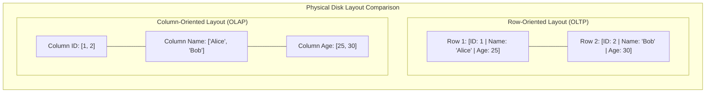

### ক. Row-Oriented Storage (OLTP - e.g., PostgreSQL, MySQL)
* **মেকানিজম:** একটি সিঙ্গেল রো-এর সমস্ত কলাম ডিস্কের একই ব্লকে পর পর (Contiguously) স্টোর করা থাকে।
* **ব্যবহারের ক্ষেত্র:** অনলাইন ট্রানজেকশন প্রসেসিং (OLTP)। যেখানে প্রচুর পরিমাণ ছোট ছোট রাইট এবং সুনির্দিষ্ট একটি রো রিড করতে হয় (যেমন: `SELECT * FROM users WHERE id = 5`)।
* **সীমাবদ্ধতা:** অ্যানালিটিক্স কোয়েরির জন্য অত্যন্ত ধীরগতির। আপনি যদি ১ কোটি ইউজারের বয়সের গড় বের করতে চান (`SELECT AVG(age) FROM users`), তবে রো-ভিত্তিক স্টোরেজে বয়স কলামটি পাওয়ার জন্য ডাটাবেসকে পুরো ১ কোটি ইউজারের নাম, পাসওয়ার্ড, ইমেইলসহ সমস্ত কলাম ডিস্ক থেকে রিড করতে হবে, যা মেমরি এবং ডিস্ক আইও-র অপচয়।

### খ. Column-Oriented Storage (OLAP - e.g., ClickHouse, Snowflake, DuckDB)
* **মেকানিজম:** একটি টেবিলের প্রতিটি কলামের সমস্ত ডাটা ডিস্কে পর পর আলাদা সিকোয়েন্সিয়াল ব্লকে সেভ করা থাকে। অর্থাৎ সব ইউজারের বয়স একসাথে এক জায়গায় থাকবে, সব নাম অন্য জায়গায় থাকবে।
* **ব্যবহারের ক্ষেত্র:** অনলাইন অ্যানালিটিক্যাল প্রসেসিং (OLAP) এবং ডাটা ওয়ারহাউজিং।
* **সুবিধাসমূহ:**
  ১. **ডিস্ক আইও সাশ্রয়:** `SELECT AVG(age)` কোয়েরি করলে ডিস্ক রিডার হেড অন্য কোনো কলাম স্পর্শ না করে সরাসরি শুধুমাত্র `age` কলামের ব্লকটি রিড করে ফেরত চলে আসে।
  ২. **চমৎকার ডাটা কম্প্রেশন:** যেহেতু একটি কলামের প্রতিটি ডাটা একই টাইপের (যেমন: সব ইন্টিজার বা সব স্ট্রিং), তাই খুব শক্তিশালী কম্প্রেশন অ্যালগরিদম (যেমন: Run-Length Encoding বা Dictionary Encoding) ব্যবহার করে ডাটার সাইজ ৯০% পর্যন্ত ছোট করে ডিস্কে রাখা যায়।

---

## ১০. Deadlock Detection & Resolution: ডেডলকের অবসান
যখন দুটি বা তার বেশি কনকারেন্ট ট্রানজেকশন একে অপরের লক করে রাখা ডাটা পাওয়ার জন্য অনন্তকাল অপেক্ষা করতে থাকে, তখন তাকে **Deadlock** বা অচলাবস্থা বলে।

#### 🔄 ডেডলক পরিস্থিতি:
* ট্রানজেকশন A: রো ১ লক করল এবং রো ২ লক করার জন্য রিকোয়েস্ট করল।
* ট্রানজেকশন B: রো ২ লক করল এবং রো ১ লক করার জন্য রিকোয়েস্ট করল।
* **ফলাফল:** ট্রানজেকশন A অপেক্ষা করছে B-এর জন্য, বব অপেক্ষা করছে A-এর জন্য। কেউ কারোর লক ছাড়বে না, সিস্টেম আজীবনের জন্য থমকে যাবে!

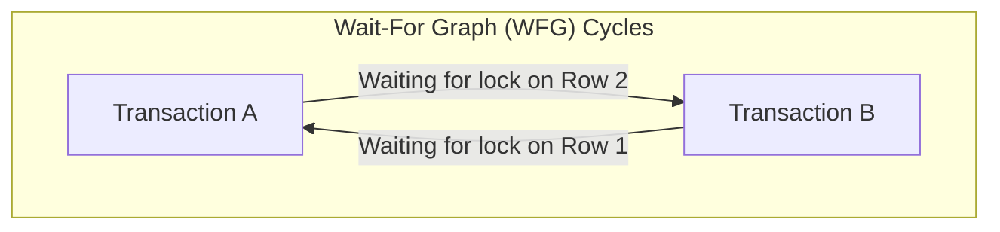

#### 🛡️ সমাধান মেকানিজম (Deadlock Resolution):
ডাটাবেস ইঞ্জিন মূলত দুটি উপায়ে এটি সমাধান করে:
১. **Lock Timeout (লক টাইমআউট):** খুব সাধারণ মেথড। একটি ট্রানজেকশন যদি একটি নির্দিষ্ট সময়ের (যেমন: ৫ সেকেন্ড) মধ্যে লক না পায়, তবে ডাটাবেস তার রিকোয়েস্ট বাতিল করে ট্রানজেকশনটি রোলব্যাক করে দেয়।
২. **Wait-For Graph (WFG - সাইকেল ডিটেকশন):** আধুনিক ডাটাবেস কার্নেলে একটি ব্যাকগ্রাউন্ড থ্রেড সবসময় একটি ডিরেক্টেড গ্রাফ বা **Wait-For Graph** মেইনটেইন করে। এখানে প্রতিটি নোড হলো একটি ট্রানজেকশন এবং এজ (Edge) হলো লকের জন্য অপেক্ষা। 
   * ব্যাকগ্রাউন্ড থ্রেডটি নিয়মিত বিরতিতে **Cycle Detection Algorithm (যেমন: DFS)** রান করে। 
   * গ্রাফে কোনো বৃত্ত বা সাইকেল পাওয়া গেলেই ইঞ্জিন বুঝতে পারে ডেডলক হয়েছে। 
   * সাথে সাথে ডাটাবেস কার্নেল একটি ট্রানজেকশনকে **বলি (Victim Transaction)** হিসেবে বেছে নেয় এবং তাকে রোলব্যাক করে লকটি মুক্ত করে দেয়, ফলে অন্য ট্রানজেকশনটি সফলভাবে শেষ হতে পারে।

---

## ১১. PostgreSQL MVCC Bloat এবং Autovacuum টিউনিং
আমরা দেখেছি PostgreSQL-এ MVCC মেকানিজম ব্যবহার করায় আপডেট অপারেশনের সময় ডাটা ওভাররাইট না করে নতুন ভার্সন তৈরি হয়। কিন্তু আগের ওল্ড বা ডিলিট হওয়া রো-গুলো টেবিলের ভেতরেই মৃত বা ডেড হিসেবে পড়ে থাকে। এদেরকে **Dead Tuples** বলা হয়।

#### 🎈 Database Bloat কী?
যদি টেবিলে প্রচুর পরিমাণ রাইট বা আপডেট অপারেশন হয় এবং ওল্ড ডেড টুপলগুলো সময়মতো মুছে ফেলা না হয়, তবে টেবিল এবং ইনডেক্সের সাইজ কৃত্রিমভাবে বিশাল বড় হয়ে যায়। একে **Bloat (স্ফীতি)** বলে। এর ফলে:
* ডাটাবেস অপ্রয়োজনীয় ডিস্ক স্পেস দখল করে।
* রিড অপারেশনের সময় ডাটাবেসকে হাজার হাজার ডেড টুপল স্ক্যান করতে হয়, ফলে কুয়েরি ল্যাটেন্সি নাটকীয়ভাবে বেড়ে যায়।

#### 🧹 Autovacuum টিউনিংয়ের প্রোডাকশন হ্যাক:
PostgreSQL ব্যাকগ্রাউন্ডে স্বয়ংক্রিয়ভাবে **Autovacuum** থ্রেড চালায় যা এই ডেড টুপলগুলো পরিষ্কার করে ডিস্ক স্পেস রিসাইকেল করে। কিন্তু ডিফল্ট কনফিগারেশনে এটি খুব ধীরগতির হয়, যার ফলে হাই-থ্রুপুট সিস্টেমে ভ্যাকুয়ামের চেয়ে ব্লোট তৈরি হওয়ার হার বেশি হয়।

সিনিয়র সিস্টেমস ইঞ্জিনিয়াররা তাই প্রোডাকশনে নিচের প্যারামিটারগুলো টিউন করেন:

```ini
# /var/lib/postgresql/data/postgresql.conf

# ভ্যাকুয়াম কত ঘন ঘন ট্রিগার হবে (ডিফল্ট ২০% ডেড টুপল হলে চলে)
# এটি কমিয়ে ১০% বা ৫% করা হয় যাতে ছোট ছোট ব্যাচে ভ্যাকুয়াম চলে
autovacuum_vacuum_scale_factor = 0.05

# ভ্যাকুয়ামের কাজের স্পিড লিমিট বাড়ানোর জন্য (ডিফল্ট ২০০)
# এটি বাড়িয়ে ১০০০ বা ২০০০ করা হয় যাতে ভ্যাকুয়াম দ্রুত কাজ শেষ করতে পারে
autovacuum_vacuum_cost_limit = 1000

# ভ্যাকুয়ামের ওয়ান-হপ স্লিপ ডিলে কমানো (ডিফল্ট 2ms)
# ভ্যাকুয়াম যাতে কোনো বিরতি ছাড়া একটানা চলতে পারে
autovacuum_vacuum_cost_delay = 2ms
```

---

## १२. Vector Databases ও AI indexing (HNSW)
আধুনিক কৃত্রিম বুদ্ধিমত্তা (AI) ও লার্জ ল্যাঙ্গুয়েজ মডেলের (LLM) যুগে সাধারণ টেক্সট বা আইডি দিয়ে ডাটা খোঁজা যথেষ্ট নয়। আমাদের উচ্চ-মাত্রিক ভেক্টর এম্বেডিং (High-Dimensional Vector Embeddings) স্টোর ও সার্চ করতে হয়। এর জন্য ব্যবহৃত হয় **Vector Databases** (যেমন: pgvector, Pinecone, Milvus, Qdrant)।

#### 🧭 ভেক্টর সার্চের চ্যালেঞ্জ:
ভেক্টর সার্চ হলো জ্যামিতিক দূরত্ব (যেমন: Cosine Distance বা Euclidean Distance) হিসাব করে কাছাকাছি অর্থবহ ভেক্টরগুলো খুঁজে বের করা (Nearest Neighbor Search)। লক্ষ লক্ষ ১৫৩৬-মাত্রিক ভেক্টর এম্বেডিংয়ের প্রতিটি জোড়ার দূরত্ব গণনা করা কম্পিউটেশনালি অসম্ভব স্লো ($O(N)$)।

#### 🌐 HNSW (Hierarchical Navigable Small World) Index:
ভেক্টর ডাটাবেসে সার্চ স্পিড অপ্টিমাইজ করতে অত্যন্ত জনপ্রিয় একটি গ্রাফ-ভিত্তিক ইনডেক্সিং অ্যালগরিদম হলো **HNSW**।

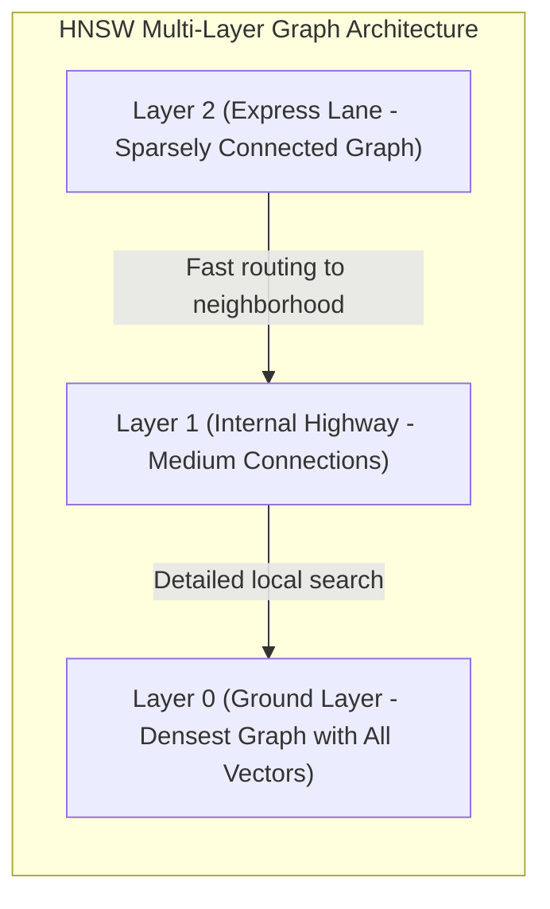

HNSW মূলত একটি বহু-স্তরের গ্রাফ তৈরি করে, যা অনেকটা স্কিপ লিস্ট (Skip List)-এর মতো কাজ করে:
১. **Layer 2 (Express Lane):** সবচেয়ে উপরের স্তর। এখানে খুব কম নোড থাকে এবং তাদের মধ্যে অনেক দীর্ঘ দূরত্বের সংযোগ থাকে। এটি সার্চ কুয়েরিকে খুব দ্রুত সঠিক ভৌголоিক অঞ্চলে (Neighborhood) রাউট করতে সাহায্য করে।
২. **Layer 1 (Highway):** মাঝারি স্তরের সংযোগ ও নোড।
৩. **Layer 0 (Ground Layer):** একদম নিচের স্তর। এখানে বিশ্বের সমস্ত ভেক্টর নোড উপস্থিত থাকে এবং প্রতিটি নোড তার নিকটতম প্রতিবেশীদের সাথে অত্যন্ত নিবিড়ভাবে যুক্ত থাকে।
* **সার্চ ফ্লো:** কোয়েরিটি প্রথমে Layer 2-তে ঢুকে বড় বড় লাফ দিয়ে সঠিক অঞ্চলের কাছে আসে। এরপর নিচের স্তরে নেমে এসে নিখুঁততম নিকটবর্তী প্রতিবেশী ভেক্টরগুলো খুঁজে বের করে। এর ফলে সার্চের জটিলতা $O(N)$ থেকে নাটকীয়ভাবে কমে $O(\log N)$-এ নেমে আসে, যা মিলি-সেকেন্ডে বিলিয়ন ভেক্টর সার্চ সম্পন্ন করে।

---

## 💡 Systems Architect Database Insights

১. **Avoid SELECT * in Production:** প্রোডাকশন কোয়েরিতে কখনোই `SELECT *` ব্যবহার করবেন না। এটি আপনার প্রয়োজনীয় কলামের বাইরেও বিশাল ডাটা ডিস্ক ও নেটওয়ার্ক ওভারহেডের মাধ্যমে ট্রাভার্স করায়, যা সকেটের আইও পারফরম্যান্স ধ্বংস করে। সর্বদা কলামের নাম সুনির্দিষ্টভাবে উল্লেখ করুন (`SELECT id, name`).
২. **Index Columns with High Cardinality:** ইনডেক্স কেবল সেই সমস্ত কলামেই তৈরি করুন যেখানে ডাটার বৈচিত্র্য (High Cardinality) অনেক বেশি (যেমন: `email` বা `user_id`)। লিঙ্গ (Gender - Male/Female) বা স্ট্যাটাসের মতো কলামে ইনডেক্স তৈরি করলে B+ Tree অপ্টিমাইজড পাথ খুঁজে পায় না, ফলে ইনডেক্সিং উল্টো পারফরম্যান্স হ্রাস করে।
৩. **Connection Pooling is Mandatory:** অ্যাপ্লিকেশন থেকে প্রতিবার কোয়েরি করার সময় নতুন নতুন ডাটাবেস কানেকশন হ্যান্ডশেক এড়াতে সর্বদা **Connection Pool** (যেমন: PgBouncer বা HikariCP) ব্যবহার করুন। এটি ডাটাবেস সার্ভারের সিপিইউ এবং র‍্যামের ওভারহেড প্রায় ৫ গুণ কমিয়ে দেয়।

---

