# 🗄️ Database Systems & Storage Engineering Handbook

ডাটাবেস কেবল ডেটা স্টোর করার জায়গা নয়; এটি একটি অত্যন্ত জটিল সফটওয়্যার ইঞ্জিনিয়ারিং আর্কিটেকচার যা কনকারেন্সি, হার্ডওয়্যার ক্র্যাশ, মেমরি অ্যালোকেশন এবং ডিস্ক রাইট স্পিডের সাথে প্রতি সেকেন্ডে লড়াই করে। 

এই হ্যান্ডবুকটি এমনভাবে তৈরি করা হয়েছে যাতে একদম বিগিনার থেকে শুরু করে অভিজ্ঞ সিস্টেমস ইঞ্জিনিয়ার পর্যন্ত যে কেউ ডাটাবেসের অভ্যন্তরীণ মেকানিজম অত্যন্ত সহজ এবং ভিজ্যুয়াল উপায়ে বুঝতে পারেন।

---

## ১. SQL বনাম NoSQL: আর্কিটেকচারাল যুদ্ধক্ষেত্রের ভেতরের রূপ

ডাটাবেস বাছাই করার সময় আমরা প্রায়ই "SQL বনাম NoSQL" এই বিতর্কের মুখোমুখি হই। কিন্তু এর পেছনে আসল কারিগরি ও স্টোরেজ ইঞ্জিনিয়ারিং পার্থক্য কী?

| বৈশিষ্ট্য | Relational (SQL - e.g., PostgreSQL) | Non-Relational (NoSQL - e.g., MongoDB, Cassandra) |
| :--- | :--- | :--- |
| **স্টোরেজ মডেল** | কঠোরভাবে টেবিল, রো (Rows) এবং কলাম (Columns)। | ডকুমেন্টস (JSON/BSON), কী-ভ্যালু, কলাম-ফ্যামিলি বা গ্রাফ। |
| **স্কিমা (Schema)** | **Rigid/Static:** ডাটা ঢোকানোর আগে স্কিমা ডিক্লেয়ার করা বাধ্যতামূলক। | **Dynamic/Flexible:** যেকোনো রিকোয়েস্টে যেকোনো ফিল্ড যোগ করা যায়। |
| **রিলেশন ও জয়েন** | অত্যন্ত শক্তিশালী `JOIN` সাপোর্ট। একাধিক টেবিলের ডাটা লিঙ্ক করা সহজ। | জয়েন মেকানিজম নেই বললেই চলে (Denormalization বা Embedded Docs)। |
| **স্কেলিং মেথড** | **Vertical (Scale-up):** সিপিইউ ও র‍্যাম বাড়িয়ে এক সার্ভারেই সীমাবদ্ধ। | **Horizontal (Scale-out):** হাজার হাজার সার্ভারে ডাটা ভাগ করে দেওয়া যায়। |
| **লেনদেন (Transactions)** | কঠোরভাবে **ACID** কমপ্লায়েন্ট। | প্রাকৃতিকভাবে **BASE** (Basically Available, Soft State, Eventual Consistency)। |

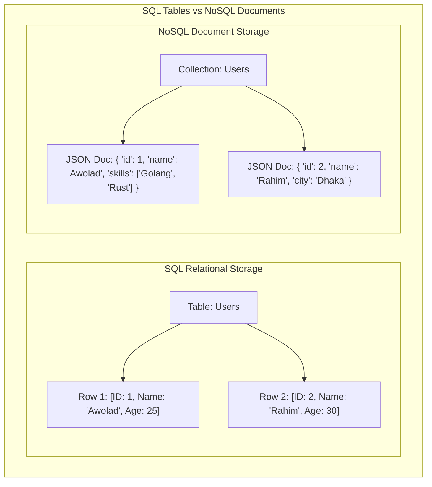

---

## ২. ACID Properties Deep Dive: ডাটাবেসের অলঙ্ঘনীয় চার স্তম্ভ

ডাটাবেস ট্রানজেকশনের মূল শক্তি হলো **ACID**। এটি কোনো সাধারণ শব্দ নয়, এটি ৪টি জটিল অ্যালগরিদমিক প্রতিশ্রুতির সমন্বয়।

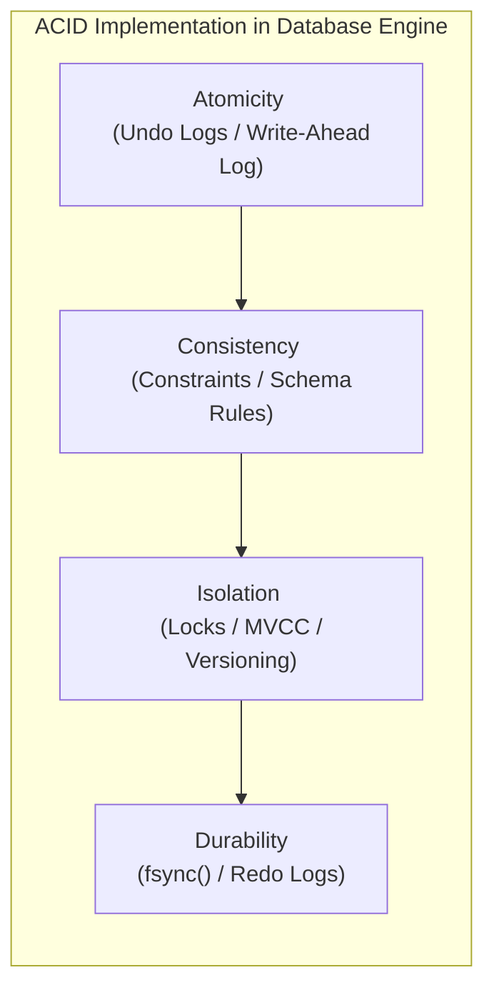

### ক. Atomicity (একক অস্তিত্ব) - "সবটুকু হবে, অথবা কিছুই হবে না"
ধরা যাক, আপনি ব্যাংক অ্যাকাউন্ট A থেকে অ্যাকাউন্ট B-তে ১০০ টাকা পাঠাচ্ছেন। এর পেছনে দুটি কোয়েরি চলে:
১. অ্যাকাউন্ট A থেকে ১০০ টাকা বিয়োগ করো।
২. অ্যাকাউন্ট B-তে ১০০ টাকা যোগ করো।
* **বিপর্যয়:** যদি ১ম কোয়েরির পর বিদ্যুৎ চলে যায় বা ডাটাবেস ক্র্যাশ করে, তবে অ্যাকাউন্ট A-এর টাকা কেটে যাবে কিন্তু B-তে ঢুকবে না!
* **সমাধান (WAL & Undo Logs):** ডাটাবেস মেমরিতে কোনো পরিবর্তনের আগে তা **Write-Ahead Log (WAL)**-এ লেখে। যদি কোনো ট্রানজেকশন মাঝপথে ব্যর্থ হয়, ডাটাবেস **Undo Logs** রিড করে পুরো ডাটাকে আগের অবস্থায় ফিরিয়ে নিয়ে যায় (Rollback)।

### খ. Consistency (সামঞ্জস্যতা)
ট্রানজেকশন শুরুর আগে ডাটাবেস যেভাবে ইনভ্যারিয়েন্ট বা নিয়মের মধ্যে ছিল, ট্রানজেকশন শেষেও সমস্ত নিয়ম (যেমন: Foreign Keys, Unique Constraints, Balance >= 0) মেনে ডাটাবেসকে সঠিক অবস্থায় থাকতে হবে।

### গ. Isolation (বিпередиতা) - কনকারেন্সির মহাযুদ্ধ
যখন হাজার হাজার ইউজার একই ডাটাবেসে একই সময়ে রিড ও রাইট করছেন, তখন একজন ইউজারের অপারেশন যাতে অন্যজনের ট্রানজেকশনে গোলমাল না পাকায়, তাই হলো আইসোলেশন।
ডাটাবেসে মূলত ৪টি আইসোলেশন লেভেল রয়েছে, যা বিভিন্ন প্রবলেম বা অ্যানোমালি সমাধান করে:

| আইসোলেশন লেভেল | Dirty Reads | Non-Repeatable Reads | Phantom Reads |
| :--- | :--- | :--- | :--- |
| **Read Uncommitted** | ❌ (ঘটে) | ❌ (ঘটে) | ❌ (ঘটে) |
| **Read Committed** |  (সুরক্ষিত) | ❌ (ঘটে) | ❌ (ঘটে) |
| **Repeatable Read** |  (সুরক্ষিত) |  (সুরক্ষিত) | ❌ (ঘটে - Postgres বাদে) |
| **Serializable** |  (সুরক্ষিত) |  (সুরক্ষিত) |  (সুরক্ষিত) |

#### ⚠️ ৩টি মারাত্মক রিডিং অ্যানোমালি (Anomalies):
১. **Dirty Read:** ট্রানজেকশন ১ একটি ডাটা মডিফাই করল কিন্তু এখনো Commit করেনি। ট্রানজেকশন ২ সেই আন-কমিটেড ডাটা রিড করে ফেলল। পরে ট্রানজেকশন ১ রোলব্যাক করলে ট্রানজেকশন ২-এর পড়া ডাটাটি সম্পূর্ণ ভুয়া বা ভুল প্রমাণিত হয়।
২. **Non-Repeatable Read:** ট্রানজেকশন ১ একটি রো রিড করল। ট্রানজেকশন ২ সেই রো-টি আপডেট করে Commit করে দিল। ট্রানজেকশন ১ আবার রিড করতে গিয়ে দেখল ডাটা বদলে গেছে! (একই ট্রানজেকশনে ভিন্ন ভিন্ন ভ্যালু পাওয়া)।
৩. **Phantom Read:** ট্রানজেকশন ১ একটি রেঞ্জ কোয়েরি করল (যেমন: `Age > 20` ওয়ালা ৫টি ইউজার পেল)। ট্রানজেকশন ২ নতুন একটি ইউজার ইনসার্ট করে Commit করল যার বয়স ২৫। ট্রানজেকশন ১ আবার রান করে দেখল এখন ৬টি ইউজার চলে এসেছে! (ভূতের মতো নতুন ডাটা হাজির হওয়া)।

### ঘ. Durability (স্থায়িত্ব)
একটি ট্রানজেকশন একবার **Success/Commit** মেসেজ দিলে, তার ঠিক পরের মিলি-সেকেন্ডে পুরো ডাটা সেন্টারের কারেন্ট চলে গেলেও সেই ডাটা ওএস ও মেমরি ক্র্যাশ এনিয়ে সুরক্ষিত থাকবে।
* **মেকানিজম:** ওএস পারফরম্যান্সের জন্য যেকোনো ডিস্ক রাইটকে সরাসরি ডিস্কে না লিখে বাফারিং করে ওএস পেজ ক্যাশে (Page Cache) রেখে দেয়।
* ডাটাবেস ট্রানজেকশন কমিট করার সময় ওএসকে জোরপূর্বক **`fsync()`** সিস্টেম কল ফায়ার করতে বাধ্য করে, যা ওএস ক্যাশ বাইপাস করে সরাসরি ফিজিক্যাল SSD/HDD-র সিলিকনে ডাটা স্থায়ীভাবে রাইট করে।

---

## ৩. Database Indexing Internals: B+ Trees বনাম LSM Trees

ডাটাবেসে ইনডেক্সিং ছাড়া কোটি কোটি ডাটা থেকে নির্দিষ্ট ডাটা খোঁজা যেন খড়ের গাদায় সুই খোঁজার মতো। ডাটাবেস স্টোরেজ ইঞ্জিনগুলো ডাটা অর্গানাইজ করতে মূলত দুটি বৈপ্লবিক ডাটা স্ট্রাকচার ব্যবহার করে।

### ক. B+ Tree Index (রিলেশনাল ডাটাবেসের মুকুট)
PostgreSQL, MySQL বা Oracle-এর মতো রিলেশনাল ডাটাবেসগুলো প্রাকৃতিকভাবে B+ Tree ইনডেক্স ব্যবহার করে।

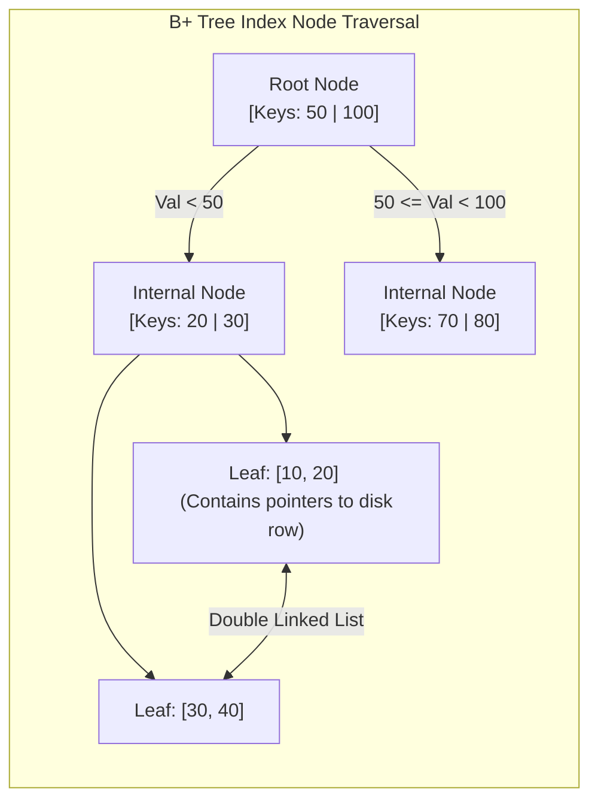

#### B+ Tree কেন ডাটাবেসের জন্য এত জনপ্রিয়?
১. **সুষম গভীরতা (Balanced Tree):** সমস্ত লিফ নোড (Leaf Nodes) একই গভীরতায় বা লেভেলে থাকে। তাই যেকোনো ডাটা খুঁজতে ঠিক একই সংখ্যক হপ বা স্টেপ লাগে ($O(\log N)$)।
২. **রেঞ্জ কোয়েরির জাদু:** B+ Tree-তে সমস্ত ডাটা পয়েন্টার কেবল একদম নিচের লিফ নোডে থাকে এবং এই লিফ নোডগুলো একে অপরের সাথে **ডাবলি লিঙ্কড লিস্ট (Double Linked List)** দিয়ে সংযুক্ত থাকে। ফলে `WHERE id BETWEEN 10 AND 50` এর মতো রেঞ্জ কোয়েরি করা পানির মতো সহজ।
৩. **ডিস্ক ব্লক ফ্রেন্ডলি:** নোডের সাইজ ডিস্কের পেজ সাইজের (যেমন: 4KB বা 8KB) সমান করা হয়, ফলে একটি সিঙ্গেল ডিস্ক I/O অপারেশনেই হাজার হাজার চাইল্ড পয়েন্টার মেমরিতে লোড করা যায়।

### খ. LSM Tree (Log-Structured Merge-Tree - NoSQL-এর পাওয়ারহাউস)
Cassandra, RocksDB বা LevelDB-এর মতো রাইট-হেভি (Write-Heavy) ডাটাবেসগুলো B+ Tree ব্যবহার করে না। কারণ B+ Tree-তে প্রতিবার রাইটের সময় ডিস্কের বিভিন্ন র্যান্ডম জায়গায় গিয়ে রাইট করতে হয় (Random Disk I/O), যা অত্যন্ত ধীরগতির।
LSM Tree এই সমস্যার সমাধান করেছে **Sequential Append-Only Writes** মেকানিজম ব্যবহার করে।

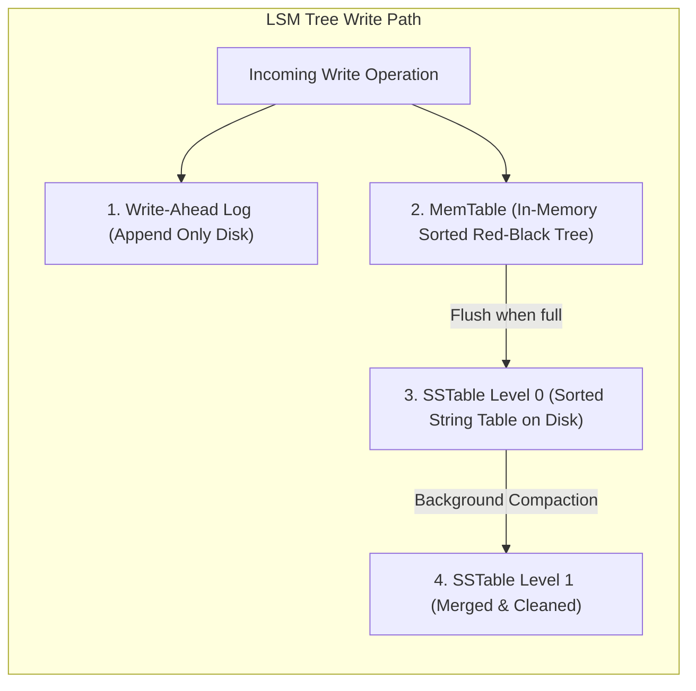

#### LSM Tree-এর মূল মেকানিজম:
১. **MemTable:** যেকোনো নতুন রাইট অপারেশন সরাসরি ডিস্কে না লিখে র‍্যামের ভেতরে থাকা একটি সর্টেড ডাটা স্ট্রাকচার বা **MemTable**-এ ঢোকানো হয়। এটি মিলি-সেকেন্ডের ফ্র্যাকশনে ঘটে।
২. **WAL (Write-Ahead Log):** কারেন্ট চলে গেলে র‍্যামের মেমটেবিল যাতে হারিয়ে না যায়, তাই ব্যাকগ্রাউন্ডে একটি সিম্পল ফাইল-এপেন্ডের মাধ্যমে ডিস্কে লগ লিখে রাখা হয়।
৩. **SSTables (Sorted String Tables):** মেমটেবিল যখন ভরে যায় (যেমন: 64MB), তখন পুরো সর্টেড ডাটা একসাথে ডিস্কে একটি ইমিউটেবল (Immutable - যা আর পরিবর্তন করা যাবে না) ফাইল হিসেবে রাইট করে ফেলা হয়। একে বলা হয় **SSTable**।
৪. **Compaction:** যেহেতু একই কি (Key) বার বার আপডেট হতে পারে, তাই ডিস্কে অনেকগুলো SSTable জমা হয়ে যায়। ব্যাকগ্রাউন্ডে একটি প্রসেস এই সর্টেড ফাইলগুলোকে রিড করে নতুন ভ্যালু রেখে ওল্ড বা ডিলিট হওয়া ভ্যালুগুলো মুছে দিয়ে নতুন একটি মার্জড ফাইল তৈরি করে। একে বলা হয় **Compaction**।

---

## ৪. Concurrency Control: কীভাবে ডাটাবেস লক ও রিলিজ করে?

হাজার হাজার ব্যবহারকারী যখন একই টেবিল বা রো-তে হাত দিচ্ছেন, তখন ডাটাবেস কীভাবে রেস কন্ডিশন (Race Condition) এড়ায়? ডাটাবেস এটি করে মূলত দুটি উপায়ে:

### ক. 2PL (Two-Phase Locking) - পেসিমিস্টিক বা লক-ভিত্তিক
ডাটাবেস ধরে নেয় যে কনকারেন্সি ক্ল্যাশ বা জ্যাম ঘটবেই। তাই সে যেকোনো অপারেশনের আগে ডাটা লক করে নেয়।
* **Shared Lock (S-Lock):** ডাটা রিড করার জন্য ব্যবহৃত হয়। একই সাথে অনেক ইউজার রিড লক পেতে পারেন (Reads are non-blocking to other reads)।
* **Exclusive Lock (X-Lock):** ডাটা রাইট বা আপডেট করার জন্য ব্যবহৃত হয়। এই লক থাকা অবস্থায় অন্য কেউ রিড বা রাইট কোনো লকই পাবে না।
* **2PL-এর দুটি ধাপ:**
  ১. **Growing Phase:** ট্রানজেকশন কেবল লক নিতে পারবে, কোনো লক ছাড়তে পারবে না।
  ২. **Shrinking Phase:** ট্রানজেকশন কেবল লক রিলিজ করতে পারবে, নতুন কোনো লক নিতে পারবে না।

### খ. MVCC (Multi-Version Concurrency Control) - লক-ফ্রি রিডিংয়ের জাদুকর
আজকের আধুনিক ডাটাবেসগুলো (যেমন PostgreSQL বা MySQL InnoDB) রিড অপারেশনকে ব্লক করা ছাড়াই রাইট অপারেশনের পারফরম্যান্স নিশ্চিত করতে **MVCC** ব্যবহার করে।
* **মূল মন্ত্র: "Readers never block Writers, and Writers never block Readers!"**
* **কীভাবে কাজ করে?** MVCC-তে কোনো রো আপডেট করার সময় আগের ডাটাটি মুছে না ফেলে বা ওভাররাইট না করে, কার্নেলে ডাটার একটি সম্পূর্ণ **নতুন সংস্করণ (New Version)** বা কপি তৈরি করা হয়।
* প্রতিটি রো-তে দুটি গোপন মেটাডাটা ফিল্ড থাকে: `xmin` (কোন ট্রানজেকশন আইডি এই রোটি তৈরি করেছে) এবং `xmax` (কোন ট্রানজেকশন আইডি এই রোটি ডিলিট বা সুপারসিড করেছে)।
* আপনি যখন রিড কোয়েরি করবেন, ডাটাবেস আপনার ট্রানজেকশন আইডির সাপেক্ষে যে ভার্সনটি আইনত দৃশ্যমান (Visible), কেবল সেটিই রেন্ডার করবে।
* **Vacuum / Garbage Collection:** ব্যাকগ্রাউন্ডে ডাটাবেসের একটি প্রসেস ওল্ড ও ডেড ভার্সনগুলো (যা এখন আর কোনো রানিং ট্রানজেকশনের প্রয়োজন নেই) স্ক্যান করে মেমরি ফ্রী করে দেয়। Postgres-এ একে বলা হয় **VACUUM**।

---

## ৫. Distributed Databases: রেপ্লিকেশন বনাম শার্ডিং

আপনার এপিআই ট্রাফিক যখন এক সার্ভারের ধারণ ক্ষমতার বাইরে চলে যায়, তখন আমরা ডাটাবেসকে ডিস্ট্রিবিউটেড বা একাধিক সার্ভারে ছড়িয়ে দেই।

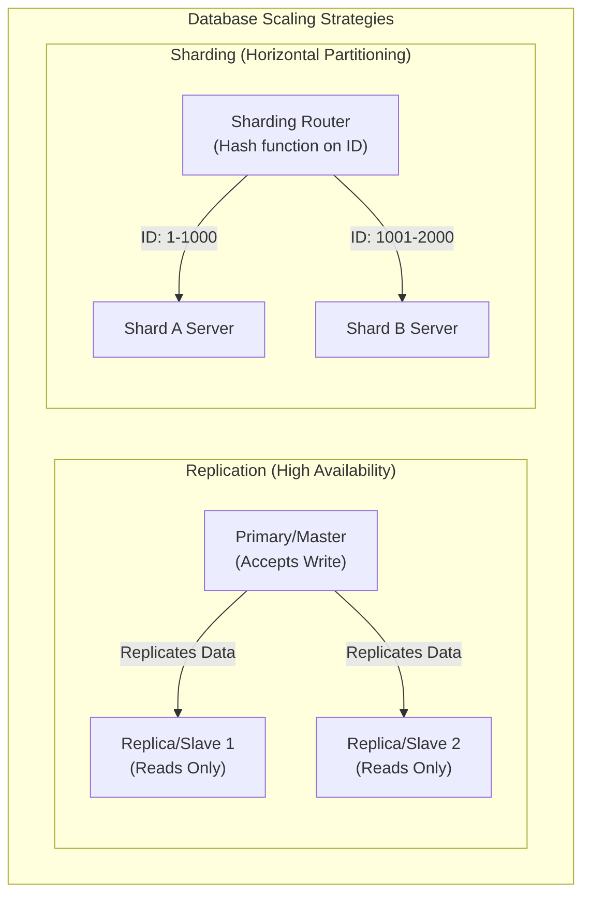

### ক. ডাটাবেস রেপ্লিকেশন (Replication)
রেপ্লিকেশনের মূল উদ্দেশ্য হলো **উচ্চ প্রাপ্যতা (High Availability)** এবং রিড ট্রাফিকের ক্ষমতা বাড়ানো।
১. **Single-Leader (Master-Slave):** সমস্ত রাইট অপারেশন কেবল Master সার্ভারে হবে। মাস্টার ডাটা আপডেট করে তা রিড-অনলি Slave সার্ভারগুলোতে কপি বা রেপ্লিকেট করে দেয়। কোনো কারণে মাস্টার সার্ভার ক্র্যাশ করলে স্লেভদের মধ্যে একজন স্বয়ংক্রিয়ভাবে নতুন মাস্টার নির্বাচিত হয়।
২. **Leaderless (Dynamo-style):** কোনো মাস্টার নেই। ক্লায়েন্ট সরাসরি একাধিক নোডে একসাথে রাইট পাঠায়। ডাটা সঠিক কিনা তা নিশ্চিত করতে **Quorum Read/Write ($R + W > N$)** মেকানিজম ব্যবহার করা হয়।

### খ. ডাটাবেস শার্ডিং (Sharding)
শার্ডিং হলো একটি বিশাল টেবিলকে ভেঙে ছোট ছোট টুকরো করে আলাদা আলাদা ফিজিক্যাল সার্ভারে ডিস্ট্রিবিউট করা। একে বলা হয় **Horizontal Partitioning**।
* **Sharding Key:** শার্ডিং করার জন্য একটি ফিল্ড বা কি বেছে নিতে হয় (যেমন: `user_id`)।
* **Consistent Hashing:** ইউজারের আইডি হ্যাশ করে ডাটাবেস ডিটারমাইন করে এই ডাটাটি কোন ফিজিক্যাল শার্ড সার্ভারে সংরক্ষিত হবে। এর ফলে একটি সার্ভারে অতিরিক্ত লোড পড়া (Hotspotting) রোধ করা যায়।

---

## ৬. CAP Theorem বনাম PACELC Theorem: ডিস্ট্রিবিউটেড সিস্টেমের নির্মম বাস্তব সত্য

ডিস্ট্রিবিউটেড ডাটাবেস ডিজাইন করার সময় আপনি চাইলেই সব সুবিধা একসাথে পাবেন না। প্রকৃতি আমাদের ওপর কিছু কঠোর গাণিতিক সীমাবদ্ধতা চাপিয়া দিয়াছে।

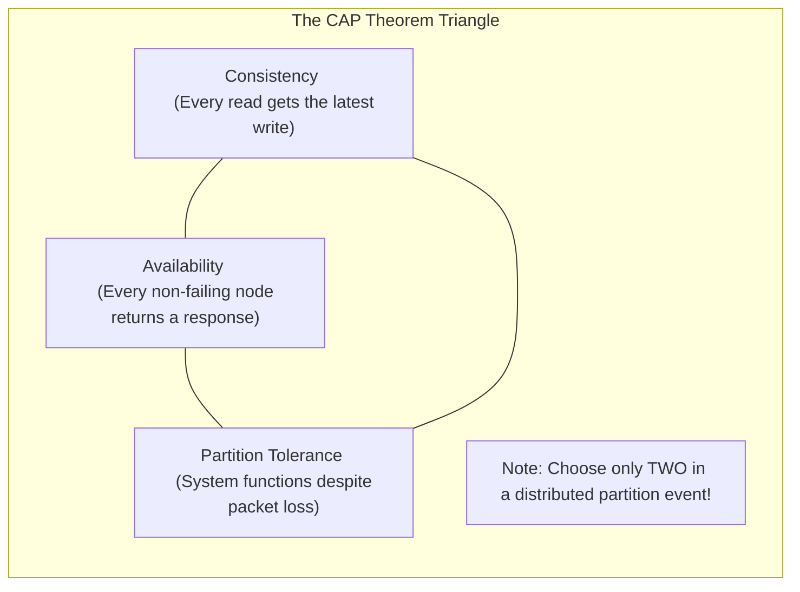

### ক. CAP Theorem
১. **Consistency (সামঞ্জস্যতা):** আপনি যে নোড থেকেই রিড করুন না কেন, সর্বদা সর্বশেষ রাইট করা সঠিক ডাটাটিই পাবেন।
২. **Availability (প্রাপ্যতা):** যেকোনো নোড ক্র্যাশ না করে সচল থাকলে সে সর্বদা ক্লায়েন্টকে সফল রেসপন্স ব্যাক করবে (ভুল বা পুরানো ডাটা হলেও রেসপন্স করতে হবে)।
৩. **Partition Tolerance (বিভাজন সহনশীলতা):** নেটওয়ার্কের তার ছিঁড়ে গেলে বা নোডগুলোর মধ্যে কমিউনিকেশন সম্পূর্ণ বন্ধ হয়ে গেলেও পুরো সিস্টেম সচল থাকবে।
* **নির্মম সত্য:** নেটওয়ার্ক পার্টিশন (Partition) ইন্টারনেটের বাস্তব সত্য, যা এড়ানো অসম্ভব। তাই নেটওয়ার্ক পার্টিশন ঘটলে আপনাকে যেকোনো একটি বেছে নিতে হবে: **CP** (Consistency over Availability) অথবা **AP** (Availability over Consistency)।

### খ. PACELC Theorem (CAP এর অ্যাডভান্সড রূপ)
CAP থিওরেম কেবল তখনই কাজ করে যখন সিস্টেমে নেটওয়ার্ক পার্টিশন বা সমস্যা দেখা দেয়। কিন্তু সাধারণ অবস্থায় যখন কোনো সমস্যা থাকে না, তখন ডাটাবেস কীভাবে কাজ করবে? এর ব্যাখ্যা দেয় **PACELC**:

> **If there is a Partition (P):**
> How does the system trade off **Availability (A)** vs **Consistency (C)**?
> **Else (E) - Normal operation:**
> How does the system trade off **Latency (L)** vs **Consistency (C)**?

* **MongoDB (PC/EC):** পার্টিশন ঘটলে Consistency বেছে নেয়; সাধারণ অবস্থায় Latency-র চেয়ে Consistency-কে অগ্রাধিকার দেয়।
* **Cassandra (PA/EL):** পার্টিশন ঘটলে Availability বেছে নেয়; সাধারণ অবস্থায় দ্রুত রেসপন্স বা Latency-কে অগ্রাধিকার দেয় (Eventual Consistency)।

---

## ৭. Repeatable Read-এর নীরব ঘাতক: Write Skew Anomaly
আমরা দেখেছি কীভাবে মৌলিক রিডিং অ্যানোমালিগুলো (যেমন: Dirty Read, Non-Repeatable Read) ডাটাবেস আইসোলেশন লেভেল দিয়ে আটকানো যায়। কিন্তু **Repeatable Read** লেভেলে একটি অত্যন্ত সূক্ষ্ম এবং মারাত্মক অ্যানোমালি ঘটতে পারে, যার নাম **Write Skew**।

#### 🏥 বাস্তব উদাহরণ (অন-কল ডাক্তার সমস্যা):
একটি হাসপাতালে একটি নিয়ম রয়েছে: **"সর্বদা অন্ততঃ একজন ডাক্তার অন-কল (On-call) থাকতে হবে।"**
বর্তমানে দুই জন ডাক্তার, **ডক্টর অ্যালিস (Alice)** এবং **ডক্টর বব (Bob)** অন-কল হিসেবে ডিউটিতে আছেন।

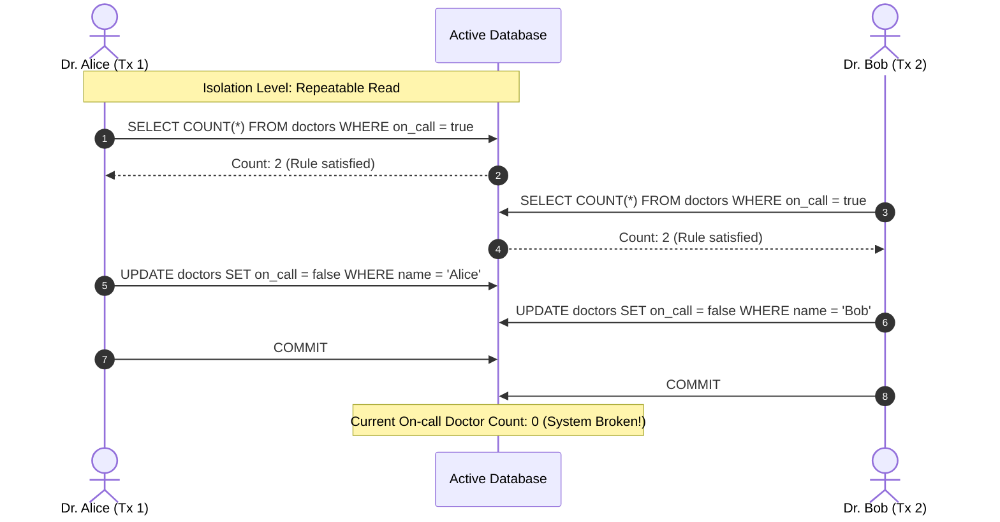

#### 🔍 এখানে কী ঘটলো?
১. অ্যালিস এবং বব দুজনেই একসাথে ডিউটি থেকে ছুটি নিতে চাইলেন।
২. তাদের অ্যাপ্লিকেশন ডাটাবেসে কুয়েরি করল: `SELECT COUNT(*) FROM doctors WHERE on_call = true`.
৩. যেহেতু দুজনেই অন-কল ছিলেন, ডাটাবেস দুজনকে রেসপন্স দিল `Count: 2`।
৪. অ্যালিস দেখল ২ জন অন-কল আছে, তাই সে ছুটি নিলে অন্তত ১ জন থাকবে। সে তার স্ট্যাটাস আপডেট করে `on_call = false` করল।
৫. ববও একই যুক্তিতে তার স্ট্যাটাস আপডেট করে `on_call = false` করল।
৬. **Repeatable Read**-এর অধীনে যেহেতু তারা সম্পূর্ণ ভিন্ন দুটি রো (Row) আপডেট করছেন, তাই ডাটাবেস কোনো কনফ্লিক্ট ছাড়াই দুটি ট্রানজেকশনকেই **Commit** করতে দেয়।
৭. **ফলাফল:** হাসপাতালে অন-কল ডাক্তারের সংখ্যা ০ হয়ে গেল! সিস্টেমের অলঙ্ঘনীয় ব্যবসায়িক নিয়ম (Invariant Rule) ভেঙে চুরমার হয়ে গেল।

#### 🛠️ সমাধান (Solutions):
১. **Pessimistic Locking (SELECT ... FOR UPDATE):** কুয়েরি করার সময় রো-গুলোকে লক করে ফেলা যাতে বব কুয়েরি করতে গেলে লক রিলিজ হওয়া পর্যন্ত ব্লকড থাকে:
   ```sql
   SELECT * FROM doctors WHERE on_call = true FOR UPDATE;
   ```
২. **Serializable Isolation:** ডাটাবেসের আইসোলেশন লেভেল সর্বোচ্চ `Serializable`-এ উন্নীত করা। এটি কার্নেল লেভেলে **SSI (Serializable Snapshot Isolation)** অ্যালগরিদম ব্যবহার করে। যদি ডাটাবেস দেখে যে দুটি কনকারেন্ট ট্রানজেকশনের রিড-রাইট ডিপেন্ডেন্সিতে সাইকেল বা ওভারল্যাপ তৈরি হয়েছে, তবে সে সাথে সাথে একটি ট্রানজেকশনকে বাতিল করে `Serialization Failure` এরর থ্রো করে।

---

## ৮. Write-Ahead Logging (WAL) ও ARIES রিকভারি অ্যালগরিদম
ডাটাবেস যখন ডিস্কের পেজে ডাটা লেখে, তখন হঠাৎ বিদ্যুৎ চলে গেলে বা সিস্টেম ক্র্যাশ করলে আংশিক লেখা ডাটা (Partial Write) ডাটাবেস ফাইলকে করাপ্ট বা নষ্ট করে দিতে পারে। এই বিপর্যয় ঠেকাতে ডাটাবেস **WAL (Write-Ahead Log)** মেকানিজম ব্যবহার করে।

#### 📜 WAL-এর মূল নীতি:
> **"Never write a data page to disk before writing the log representing the change."**
> (ডাটার পরিবর্তনের লগটি ডিস্কে সুরক্ষিত করার আগে মূল ডাটা পেজ কখনোই ডিস্কে রাইট করা যাবে না।)

#### 🔄 ARIES (Algorithms for Recovery and Isolation Exploiting Semantics):
যখন একটি ক্র্যাশ ঘটে এবং ডাটাবেস পুনরায় চালু হয়, তখন কার্নেল **ARIES Recovery Algorithm** চালিয়ে ডাটাবেসকে একদম সঠিক অবস্থায় ফিরিয়ে আনে। এর ৩টি প্রধান ফেস রয়েছে:

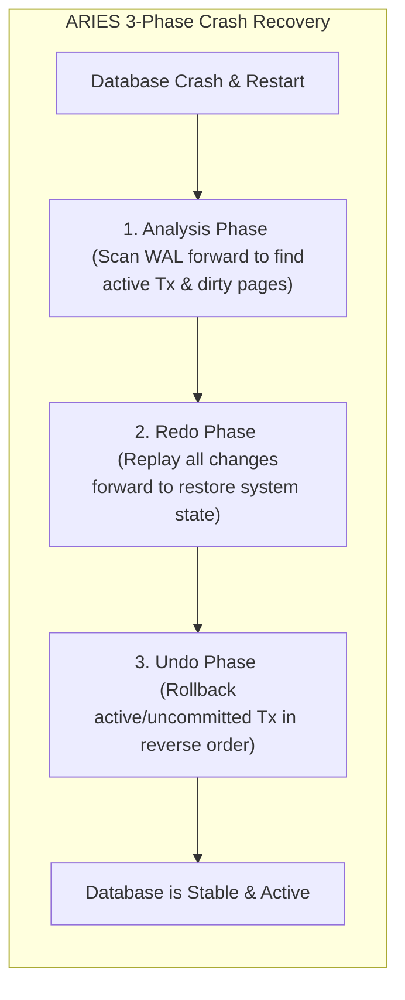

১. **Analysis Phase (বিশ্লেষণ দশা):** ডাটাবেস শেষ সফল চেকপয়েন্ট (Checkpoint) থেকে WAL লগ ফাইলে সামনের দিকে স্ক্যান করে। এটি ক্র্যাশের সময় সচল থাকা ট্রানজেকশন (Active Transactions) এবং মেমরিতে থাকা কিন্তু ডিস্কে রাইট না হওয়া নোংরা পেজগুলো (Dirty Pages) চিহ্নিত করে।
২. **Redo Phase (পুনরাবৃত্তি দশা):** এই ধাপে ডাটাবেস ক্র্যাশের ঠিক আগের অবস্থা ফিরিয়ে আনতে সফল বা ব্যর্থ নির্বিশেষে সমস্ত লগ করা অ্যাকশন পুনরায় প্লে করে (Repeating History)। এটি মেমরিকে ঠিক ক্র্যাশের আগের মিলি-সেকেন্ডের অবস্থায় নিয়ে যায়।
৩. **Undo Phase (পূর্বাবস্থায় প্রত্যাবর্তন দশা):** যে সমস্ত ট্রানজেকশন ক্র্যাশের সময় সচল ছিল কিন্তু **Commit** হতে পারেনি, ডাটাবেস সেগুলোর সমস্ত পরিবর্তন উল্টো দিক থেকে রোলব্যাক (Rollback) করে এবং ডিস্ক থেকে মুছে দেয়।

---

## ৯. Column-Oriented (কলাম-ভিত্তিক) বনাম Row-Oriented (রো-ভিত্তিক) স্টোরেজ
ডাটা কীভাবে ডিস্কের ট্র্যাকে এবং ফিজিক্যাল ব্লকে সাজানো থাকে, তার ওপর ভিত্তি করে ডাটাবেসকে প্রধানত দুটি ভাগে ভাগ করা যায়:

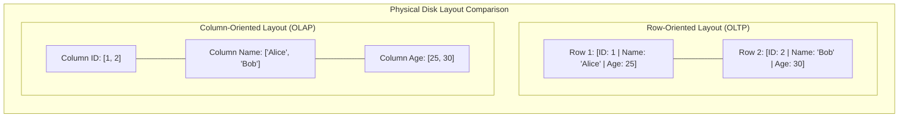

### ক. Row-Oriented Storage (OLTP - e.g., PostgreSQL, MySQL)
* **মেকানিজম:** একটি সিঙ্গেল রো-এর সমস্ত কলাম ডিস্কের একই ব্লকে পর পর (Contiguously) স্টোর করা থাকে।
* **ব্যবহারের ক্ষেত্র:** অনলাইন ট্রানজেকশন প্রসেসিং (OLTP)। যেখানে প্রচুর পরিমাণ ছোট ছোট রাইট এবং সুনির্দিষ্ট একটি রো রিড করতে হয় (যেমন: `SELECT * FROM users WHERE id = 5`)।
* **সীমাবদ্ধতা:** অ্যানালিটিক্স কোয়েরির জন্য অত্যন্ত ধীরগতির। আপনি যদি ১ কোটি ইউজারের বয়সের গড় বের করতে চান (`SELECT AVG(age) FROM users`), তবে রো-ভিত্তিক স্টোরেজে বয়স কলামটি পাওয়ার জন্য ডাটাবেসকে পুরো ১ কোটি ইউজারের নাম, পাসওয়ার্ড, ইমেইলসহ সমস্ত কলাম ডিস্ক থেকে রিড করতে হবে, যা মেমরি এবং ডিস্ক আইও-র অপচয়।

### খ. Column-Oriented Storage (OLAP - e.g., ClickHouse, Snowflake, DuckDB)
* **মেকানিজম:** একটি টেবিলের প্রতিটি কলামের সমস্ত ডাটা ডিস্কে পর পর আলাদা সিকোয়েন্সিয়াল ব্লকে সেভ করা থাকে। অর্থাৎ সব ইউজারের বয়স একসাথে এক জায়গায় থাকবে, সব নাম অন্য জায়গায় থাকবে।
* **ব্যবহারের ক্ষেত্র:** অনলাইন অ্যানালিটিক্যাল প্রসেসিং (OLAP) এবং ডাটা ওয়ারহাউজিং।
* **সুবিধাসমূহ:**
  ১. **ডিস্ক আইও সাশ্রয়:** `SELECT AVG(age)` কোয়েরি করলে ডিস্ক রিডার হেড অন্য কোনো কলাম স্পর্শ না করে সরাসরি শুধুমাত্র `age` কলামের ব্লকটি রিড করে ফেরত চলে আসে।
  ২. **চমৎকার ডাটা কম্প্রেশন:** যেহেতু একটি কলামের প্রতিটি ডাটা একই টাইপের (যেমন: সব ইন্টিজার বা সব স্ট্রিং), তাই খুব শক্তিশালী কম্প্রেশন অ্যালগরিদম (যেমন: Run-Length Encoding বা Dictionary Encoding) ব্যবহার করে ডাটার সাইজ ৯০% পর্যন্ত ছোট করে ডিস্কে রাখা যায়।

---

## ১০. Deadlock Detection & Resolution: ডেডলকের অবসান
যখন দুটি বা তার বেশি কনকারেন্ট ট্রানজেকশন একে অপরের লক করে রাখা ডাটা পাওয়ার জন্য অনন্তকাল অপেক্ষা করতে থাকে, তখন তাকে **Deadlock** বা অচলাবস্থা বলে।

#### 🔄 ডেডলক পরিস্থিতি:
* ট্রানজেকশন A: রো ১ লক করল এবং রো ২ লক করার জন্য রিকোয়েস্ট করল।
* ট্রানজেকশন B: রো ২ লক করল এবং রো ১ লক করার জন্য রিকোয়েস্ট করল।
* **ফলাফল:** ট্রানজেকশন A অপেক্ষা করছে B-এর জন্য, বব অপেক্ষা করছে A-এর জন্য। কেউ কারোর লক ছাড়বে না, সিস্টেম আজীবনের জন্য থমকে যাবে!

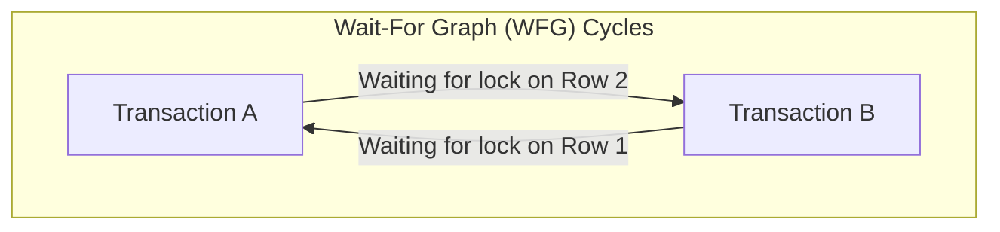

#### 🛡️ সমাধান মেকানিজম (Deadlock Resolution):
ডাটাবেস ইঞ্জিন মূলত দুটি উপায়ে এটি সমাধান করে:
১. **Lock Timeout (লক টাইমআউট):** খুব সাধারণ মেথড। একটি ট্রানজেকশন যদি একটি নির্দিষ্ট সময়ের (যেমন: ৫ সেকেন্ড) মধ্যে লক না পায়, তবে ডাটাবেস তার রিকোয়েস্ট বাতিল করে ট্রানজেকশনটি রোলব্যাক করে দেয়।
২. **Wait-For Graph (WFG - সাইকেল ডিটেকশন):** আধুনিক ডাটাবেস কার্নেলে একটি ব্যাকগ্রাউন্ড থ্রেড সবসময় একটি ডিরেক্টেড গ্রাফ বা **Wait-For Graph** মেইনটেইন করে। এখানে প্রতিটি নোড হলো একটি ট্রানজেকশন এবং এজ (Edge) হলো লকের জন্য অপেক্ষা। 
   * ব্যাকগ্রাউন্ড থ্রেডটি নিয়মিত বিরতিতে **Cycle Detection Algorithm (যেমন: DFS)** রান করে। 
   * গ্রাফে কোনো বৃত্ত বা সাইকেল পাওয়া গেলেই ইঞ্জিন বুঝতে পারে ডেডলক হয়েছে। 
   * সাথে সাথে ডাটাবেস কার্নেল একটি ট্রানজেকশনকে **বলি (Victim Transaction)** হিসেবে বেছে নেয় এবং তাকে রোলব্যাক করে লকটি মুক্ত করে দেয়, ফলে অন্য ট্রানজেকশনটি সফলভাবে শেষ হতে পারে।

---

## ১১. PostgreSQL MVCC Bloat এবং Autovacuum টিউনিং
আমরা দেখেছি PostgreSQL-এ MVCC মেকানিজম ব্যবহার করায় আপডেট অপারেশনের সময় ডাটা ওভাররাইট না করে নতুন ভার্সন তৈরি হয়। কিন্তু আগের ওল্ড বা ডিলিট হওয়া রো-গুলো টেবিলের ভেতরেই মৃত বা ডেড হিসেবে পড়ে থাকে। এদেরকে **Dead Tuples** বলা হয়।

#### 🎈 Database Bloat কী?
যদি টেবিলে প্রচুর পরিমাণ রাইট বা আপডেট অপারেশন হয় এবং ওল্ড ডেড টুপলগুলো সময়মতো মুছে ফেলা না হয়, তবে টেবিল এবং ইনডেক্সের সাইজ কৃত্রিমভাবে বিশাল বড় হয়ে যায়। একে **Bloat (স্ফীতি)** বলে। এর ফলে:
* ডাটাবেস অপ্রয়োজনীয় ডিস্ক স্পেস দখল করে।
* রিড অপারেশনের সময় ডাটাবেসকে হাজার হাজার ডেড টুপল স্ক্যান করতে হয়, ফলে কুয়েরি ল্যাটেন্সি নাটকীয়ভাবে বেড়ে যায়।

#### 🧹 Autovacuum টিউনিংয়ের প্রোডাকশন হ্যাক:
PostgreSQL ব্যাকগ্রাউন্ডে স্বয়ংক্রিয়ভাবে **Autovacuum** থ্রেড চালায় যা এই ডেড টুপলগুলো পরিষ্কার করে ডিস্ক স্পেস রিসাইকেল করে। কিন্তু ডিফল্ট কনফিগারেশনে এটি খুব ধীরগতির হয়, যার ফলে হাই-থ্রুপুট সিস্টেমে ভ্যাকুয়ামের চেয়ে ব্লোট তৈরি হওয়ার হার বেশি হয়।

সিনিয়র সিস্টেমস ইঞ্জিনিয়াররা তাই প্রোডাকশনে নিচের প্যারামিটারগুলো টিউন করেন:

```ini
# /var/lib/postgresql/data/postgresql.conf

# ভ্যাকুয়াম কত ঘন ঘন ট্রিগার হবে (ডিফল্ট ২০% ডেড টুপল হলে চলে)
# এটি কমিয়ে ১০% বা ৫% করা হয় যাতে ছোট ছোট ব্যাচে ভ্যাকুয়াম চলে
autovacuum_vacuum_scale_factor = 0.05

# ভ্যাকুয়ামের কাজের স্পিড লিমিট বাড়ানোর জন্য (ডিফল্ট ২০০)
# এটি বাড়িয়ে ১০০০ বা ২০০০ করা হয় যাতে ভ্যাকুয়াম দ্রুত কাজ শেষ করতে পারে
autovacuum_vacuum_cost_limit = 1000

# ভ্যাকুয়ামের ওয়ান-হপ স্লিপ ডিলে কমানো (ডিফল্ট 2ms)
# ভ্যাকুয়াম যাতে কোনো বিরতি ছাড়া একটানা চলতে পারে
autovacuum_vacuum_cost_delay = 2ms
```

---

## १२. Vector Databases ও AI indexing (HNSW)
আধুনিক কৃত্রিম বুদ্ধিমত্তা (AI) ও লার্জ ল্যাঙ্গুয়েজ মডেলের (LLM) যুগে সাধারণ টেক্সট বা আইডি দিয়ে ডাটা খোঁজা যথেষ্ট নয়। আমাদের উচ্চ-মাত্রিক ভেক্টর এম্বেডিং (High-Dimensional Vector Embeddings) স্টোর ও সার্চ করতে হয়। এর জন্য ব্যবহৃত হয় **Vector Databases** (যেমন: pgvector, Pinecone, Milvus, Qdrant)।

#### 🧭 ভেক্টর সার্চের চ্যালেঞ্জ:
ভেক্টর সার্চ হলো জ্যামিতিক দূরত্ব (যেমন: Cosine Distance বা Euclidean Distance) হিসাব করে কাছাকাছি অর্থবহ ভেক্টরগুলো খুঁজে বের করা (Nearest Neighbor Search)। লক্ষ লক্ষ ১৫৩৬-মাত্রিক ভেক্টর এম্বেডিংয়ের প্রতিটি জোড়ার দূরত্ব গণনা করা কম্পিউটেশনালি অসম্ভব স্লো ($O(N)$)।

#### 🌐 HNSW (Hierarchical Navigable Small World) Index:
ভেক্টর ডাটাবেসে সার্চ স্পিড অপ্টিমাইজ করতে অত্যন্ত জনপ্রিয় একটি গ্রাফ-ভিত্তিক ইনডেক্সিং অ্যালগরিদম হলো **HNSW**।

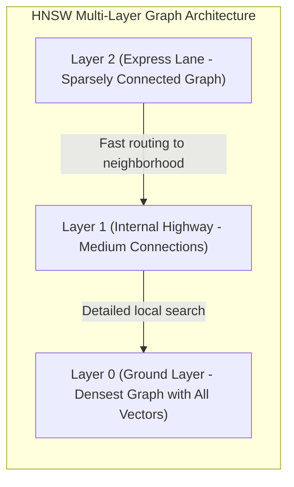

HNSW মূলত একটি বহু-স্তরের গ্রাফ তৈরি করে, যা অনেকটা স্কিপ লিস্ট (Skip List)-এর মতো কাজ করে:
১. **Layer 2 (Express Lane):** সবচেয়ে উপরের স্তর। এখানে খুব কম নোড থাকে এবং তাদের মধ্যে অনেক দীর্ঘ দূরত্বের সংযোগ থাকে। এটি সার্চ কুয়েরিকে খুব দ্রুত সঠিক ভৌголоিক অঞ্চলে (Neighborhood) রাউট করতে সাহায্য করে।
২. **Layer 1 (Highway):** মাঝারি স্তরের সংযোগ ও নোড।
৩. **Layer 0 (Ground Layer):** একদম নিচের স্তর। এখানে বিশ্বের সমস্ত ভেক্টর নোড উপস্থিত থাকে এবং প্রতিটি নোড তার নিকটতম প্রতিবেশীদের সাথে অত্যন্ত নিবিড়ভাবে যুক্ত থাকে।
* **সার্চ ফ্লো:** কোয়েরিটি প্রথমে Layer 2-তে ঢুকে বড় বড় লাফ দিয়ে সঠিক অঞ্চলের কাছে আসে। এরপর নিচের স্তরে নেমে এসে নিখুঁততম নিকটবর্তী প্রতিবেশী ভেক্টরগুলো খুঁজে বের করে। এর ফলে সার্চের জটিলতা $O(N)$ থেকে নাটকীয়ভাবে কমে $O(\log N)$-এ নেমে আসে, যা মিলি-সেকেন্ডে বিলিয়ন ভেক্টর সার্চ সম্পন্ন করে।

---

## ১৩. Distributed Transactions: ২-ফেজ ও ৩-ফেজ কমিট (2PC & 3PC)
যখন আপনার ডাটাবেস একাধিক ফিজিক্যাল নোডে শার্ড বা ডিস্ট্রিবিউট করা থাকে, তখন একটি সিঙ্গেল ট্রানজেকশনে সব নোডের ডাটা পারফেক্টলি আপডেট করা অত্যন্ত কঠিন। যদি ২ টি নোড সফল হয় এবং ৩ নম্বর নোডটি নেটওয়ার্ক ফেইলরের জন্য ব্যর্থ হয়, তবে ডাটাবেসের সামঞ্জস্যতা (Consistency) নষ্ট হয়ে যায়। 

ডিস্ট্রিবিউটেড ট্রানজেকশনে **Atomicity** বজায় রাখতে দুটি অত্যন্ত জনপ্রিয় প্রোটোকল ব্যবহৃত হয়:

### ক. 2-Phase Commit (2PC) - দুই-ধাপের কমিট
2PC-তে একটি কেন্দ্রীয় **Coordinator** নোড থাকে এবং বাকি নোডগুলো **Cohorts** বা পার্টিসিপেন্ট হিসেবে কাজ করে। এটি দুটি ধাপে কাজ সম্পন্ন করে:

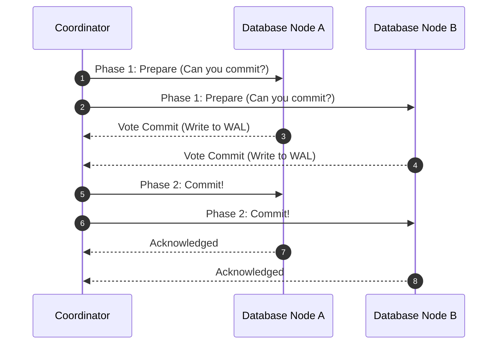

১. **Phase 1 (Prepare Phase):** কোঅর্ডিনেটর সমস্ত পার্টিসিপেন্ট নোডকে জিজ্ঞেস করে, "তোমরা কি এই ট্রানজেকশন কমিট করতে প্রস্তুত?" প্রতিটি নোড ইন্টারনালি ট্রানজেকশনটি সম্পন্ন করে তার ট্রানজেকশন লগে (WAL) লেখে এবং কোঅর্ডিনেটরকে ভোট দেয়: **Vote Commit** অথবা **Vote Abort**।
২. **Phase 2 (Commit Phase):** 
   * যদি **সব নোড** Commit ভোট দেয়, কোঅর্ডিনেটর সবাইকে ফাইনাল **Commit** অর্ডার পাঠায়। সবাই ডিস্কে রাইট পার্মানেন্ট করে এবং সাকসেস কনফার্ম করে।
   * যদি **যেকোনো একটি নোড** Abort ভোট দেয় (বা কোনো নেটওয়ার্ক টাইমআউট ঘটে), কোঅর্ডিনেটর সবাইকে **Rollback** করার নির্দেশ পাঠায়।

#### ⚠️ 2PC-এর বড় সমস্যা (Single Point of Failure & Blocking):
যদি ফেজ ১ এর পর কোঅর্ডিনেটর সার্ভারটি ক্র্যাশ করে, তবে পার্টিসিপেন্ট নোডগুলো লক করা রিসোর্স নিয়ে অনন্তকাল ঝুলে থাকবে (Blocked State)। কারণ তারা জানে না কোঅর্ডিনেটর কমিট করার সিদ্ধান্ত নিয়েছিল নাকি রোলব্যাক।

### খ. 3-Phase Commit (3PC)
2PC-এর এই ব্লকিং সমস্যা দূর করতে ৩-ধাপের কমিট ব্যবহার করা হয়। এটি ২য় ও ৩য় ধাপের মাঝে একটি **PreCommit** ধাপ যোগ করে এবং পার্টিসিপেন্ট নোডগুলোর জন্য **Timeout** মেকানিজম যুক্ত করে। যদি কোনো পার্টিসিপেন্ট নির্দিষ্ট সময়ের মধ্যে কোঅর্ডিনেটর থেকে কোনো মেসেজ না পায়, সে নিজ উদ্যোগে সেফ ডিসিশন নিয়ে লক রিলিজ করে দিতে পারে।

---

## ১৪. Database Replication Lag ও তার সমাধান
Asynchronous Replication-এর ক্ষেত্রে মাস্টার ডাটাবেসে রাইট হওয়ার পর স্লেভ রেপ্লিকাতে ডাটা কপি হতে কয়েক মিলি-সেকেন্ড বা সেকেন্ড সময় লাগতে পারে। একে **Replication Lag** বলা হয়। এর ফলে প্রোডাকশনে কিছু ক্লাসিক কনসিস্টেন্সি বাউন্ডারি প্রবলেম তৈরি হয়:

### ক. Read-After-Write Consistency (উইজার নিজস্ব রাইট দেখতে পাওয়ার গ্যারান্টি)
ধরা যাক, ইউজার তার ফেসবুক প্রোফাইলের নাম পরিবর্তন করে "Awolad" থেকে "Awolad Hossain" করলেন (Write on Master)। সাথে সাথে পেজটি রিলোড হলো এবং রিড কুয়েরিটি গেল একটি ল্যাগি রেপ্লিকা সার্ভারে, যা এখনো কপি সম্পন্ন করেনি। ইউজার স্ক্রিনে আবার তার ওল্ড নেম "Awolad" দেখতে পাবেন! তিনি মনে করবেন তার আপডেট ব্যর্থ হয়েছে, যা অত্যন্ত বাজে ইউজার এক্সপেরিয়েন্স।

#### 🛠️ সিস্টেম ডিজাইন সমাধান:
* ইউজার যখন নিজের প্রোফাইল বা তার মডিফাই করা কোনো সেন্সিটিভ ডাটা রিড করবেন, তখন সেই স্পেসিফিক রিকোয়েস্টটি রেপ্লিকাতে না পাঠিয়ে সরাসরি **Master (Primary) Database** থেকে রিড করানো হবে।
* অন্যান্য ইউজারের প্রোফাইল দেখার সময় ট্রাফিক রেপ্লিকা নোডগুলোতে পাঠানো যেতে পারে।
* ক্লায়েন্টের মেমরিতে সর্বশেষ রাইটের টাইমস্ট্যাম্প সেভ রাখা। রেপ্লিকাতে কুয়েরি করার সময় চেক করা যে রেপ্লিকাটি অন্ততঃ সেই টাইমস্ট্যাম্প পর্যন্ত সিঙ্কড কিনা; না হলে মাস্টার থেকে রিড করানো।

### খ. Monotonic Reads (সময় পেছনে না যাওয়ার গ্যারান্টি)
ইউজার একটি পোস্ট রিড করলেন রেপ্লিকা ১ থেকে যা আপ-টু-ডেট (পোস্টটি দেখতে পেলেন)। ২ সেকেন্ড পর পেজ রিফ্রেশ করায় রিকোয়েস্ট গেল ল্যাগি রেপ্লিকা ২-তে। পোস্টটি উধাও হয়ে গেল! ইউজার মনে করবেন ডাটাবেস ভূতুরে আচরণ করছে।
* **সমাধান (Consistent Routing):** ইউজারের সেশন আইডি হ্যাশ করে সর্বদা তাকে একই রেপ্লিকা নোডে রাউট করা (Sticky Sessions) যাতে সে কমপক্ষে তার আগের দেখা ডাটা স্টেল (Stale) না দেখে।

---

## ১৫. Query Optimization, Execution Plans এবং Joins Internals
আপনি যখন একটি SQL কোয়েরি ফায়ার করেন, ডাটাবেস সেটি সরাসরি ডিস্কে পাঠিয়ে দেয় না। এর পেছনে একটি দীর্ঘ কম্পাইলেশন ও অপ্টিমাইজেশন প্রসেস চলে:

```text
[ SQL Query ] ➔ [ Parser ] ➔ [ AST & Rewriter ] ➔ [ Cost-Based Optimizer (CBO) ] ➔ [ Execution Plan ] ➔ [ Disk Engine ]
```

### ক. Cost-Based Optimizer (CBO): ডাটাবেসের মস্তিষ্কের ম্যাজিক
CBO প্রতিটি কোয়েরির জন্য একাধিক সম্ভাব্য এক্সিকিউশন পাথ (Execution Paths) গণনা করে।
* ডাটাবেস ব্যাকগ্রাউন্ডে প্রতিটি টেবিলের ডাটা ডিস্ট্রিবিউশনের স্ট্যাটিস্টিকস (Histograms, Row counts) মেমরিতে জমা রাখে।
* এই তথ্যের ওপর ভিত্তি করে CBO হিসাব করে কোন পাথে সিপিইউ চক্র ও ডিস্ক I/O সবচেয়ে কম লাগবে (সবচেয়ে কম Cost)। 
* যেমন: টেবিলে যদি ১০০০টি রো থাকে তবে সে ইনডেক্স স্ক্যান বাইপাস করে সরাসরি **Sequential Scan** (পুরো টেবিল একবারে পড়া) বেছে নেয় কারণ ইনডেক্স রিড করার ওভারহেড বেশি। কিন্তু যদি ১ কোটি রো থাকে, সে সাথে সাথে **Index Scan** বা **Index Only Scan** পাথ বেছে নেয়।
* আপনি `EXPLAIN ANALYZE SELECT ...` রান করে ডাটাবেসের এই পুরো প্ল্যানিং ও আসল এক্সিকিউশন টাইম নিখুঁতভাবে দেখতে পারেন।

### খ. Joins Internals (তিনটি প্রধান জয়েন অ্যালগরিদম)
যখন দুটি টেবিল জয়েন করা হয়, ডাটাবেস কার্নেলে ৩টি মেকানিজম ব্যবহার করে ডাটা মেলাতে পারে:

| Join Algorithm | কাজের পদ্ধতি (Mechanism) | সেরা ব্যবহারের ক্ষেত্র (Best Use Cases) |
| :--- | :--- | :--- |
| **Nested Loop Join** | টেবিল A-এর প্রতিটি রো-এর জন্য লুপ চালিয়ে টেবিল B-তে ম্যাচিং রো খোঁজা। | একটি বা দুটি টেবিলই অত্যন্ত ছোট হলে, অথবা জয়েন কি-তে ইনডেক্স থাকলে। |
| **Hash Join** | ছোট টেবিলটির জয়েন কী ব্যবহার করে র‍্যামে একটি **Hash Table** তৈরি করে। এরপর বড় টেবিলটি স্ক্যান করে হ্যাশ টেবিল প্রোপ করে ম্যাচিং বের করা। | বড় আকারের আন-সর্টেড টেবিলের ক্ষেত্রে, যেখানে কোনো ইনডেক্স নেই। |
| **Merge Join** | দুটি টেবিলকেই প্রথমে জয়েন কি-এর ওপর ভিত্তি করে সর্ট (Sort) করা হয়। এরপর দুটি পয়েন্টার দিয়ে একসাথে ট্রাভার্স করে মার্জ করা হয়। | টেবিল দুটি আগে থেকেই সর্ট করা থাকলে বা ইনডেক্সড থাকলে। |

---

## ১৬. Buffer Pool Management ও LRU-K ইভিকশন পলিসি
ডাটাবেস প্রতিবার কোয়েরি করার সময় সরাসরি হার্ডডিস্ক বা SSD থেকে ফাইল রিড করে না। ডিস্ক রিড অত্যন্ত ধীরগতির হওয়ায় ডাটাবেস ইঞ্জিনের র‍্যামের একটি বিশাল অংশকে **Buffer Pool** বা বাফার ক্যাশ হিসেবে বরাদ্দ করা হয়।

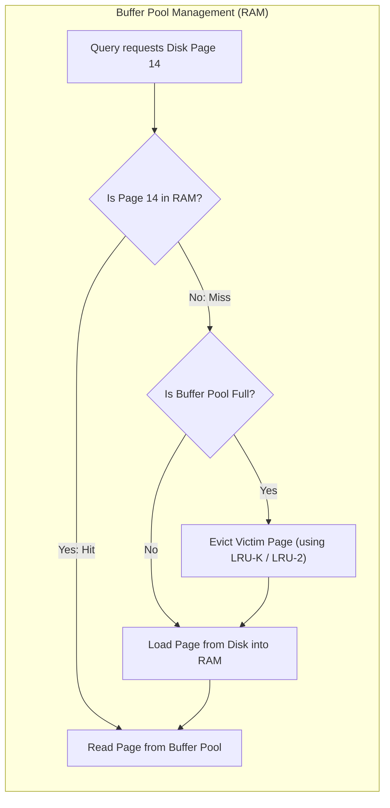

### ক. Dirty Pages কী?
যখন আপনি ডাটা আপডেট করেন, ডাটাবেস সাথে সাথে ডিস্কে না লিখে কেবল বাফার পুলের পেজে আপডেট করে ফেরে। এই পরিবর্তিত কিন্তু ডিস্কে না লেখা পেজগুলোকে **Dirty Pages** বলা হয়। ব্যাকগ্রাউন্ডে একটি এসিনক্রোনাস প্রসেস (যেমন: Postgres Writer Thread) এই ডার্টি পেজগুলোকে ডিস্কে ফ্লাশ (Flush) বা রাইট করে।

### খ. LRU-K Eviction Algorithm: স্ট্যান্ডার্ড LRU-এর সীমাবদ্ধতা এড়ানো
বাফার পুল সম্পূর্ণ ভরে গেলে নতুন পেজ জায়গা দিতে ওল্ড পেজ মেমরি থেকে বের (Evict) করে দিতে হয়।
* **Standard LRU (Least Recently Used) এর বড় প্রবলেম (Sequential Scan Pollution):**
  ধরা যাক, একটি ব্যাকগ্রাউন্ড রিপোর্টিং কোয়েরি পুরো টেবিল স্ক্যান করল। এর ফলে বাফার পুলে থাকা প্রতিনিয়ত ব্যবহৃত অত্যন্ত গুরুত্বপূর্ণ পেজগুলো ক্যাশ থেকে বের হয়ে যাবে এবং রিপোর্টিংয়ের একবার ব্যবহার হওয়া পেজগুলো ক্যাশ দখল করবে।
* **LRU-K / LRU-2 এর বৈপ্লবিক সমাধান:**
  এটি শুধুমাত্র "শেষ অ্যাক্সেস টাইম" ট্র্যাক না করে, একটি পেজ অতীতে কত ঘন ঘন অ্যাক্সেস হয়েছে (K-th backward reference time, সাধারণত $K=2$) তা ট্র্যাক করে।
  * যদি একটি পেজ শেষ ৫ মিনিটে মাত্র একবার অ্যাক্সেস হয় (Sequential Scan-এর ডাটা), এবং আরেকটি পেজ প্রতিনিয়ত প্রতি মিনিটে ১০ বার অ্যাক্সেস হয়, তবে LRU-K ২য় পেজটিকে মেমরিতে ধরে রাখবে এবং রিপোর্টিং পেজটিকে সাথে সাথে ইভিক্ট বা মেমরি থেকে বের করে দিবে।

---

## ১৭. Distributed Consensus: Raft বনাম Paxos
ডিস্ট্রিবিউটেড ডাটাবেস সিস্টেমে (যেমন: Google Spanner, CockroachDB, etcd, Consul) একাধিক নোডের মধ্যে ডাটার নিখুঁত কপি বজায় রাখতে এবং গ্লোবাল স্টেট সিঙ্ক করতে **Distributed Consensus** প্রোটোকল ব্যবহার করা বাধ্যতামূলক।

### ক. Paxos (ইন্টারনেটের আদি পিতা)
Paxos হলো ডিস্ট্রিবিউটেড সিস্টেমের সবচেয়ে প্রাচীন এবং গাণিতিকভাবে প্রমাণিত কনসেনসাস অ্যালগরিদম। এটি প্রোপোজার (Proposer), এক্সেপ্টর (Acceptor), এবং লার্নার (Learner) রোলের মাধ্যমে কাজ করে। তবে Paxos বাস্তব কোডে ইমপ্লিমেন্ট করা অত্যন্ত জটিল এবং দুর্বোধ্য।

### খ. Raft (সহজ ও আধুনিক মানুষের ডিজাইন)
Raft তৈরি করা হয়েছে Paxos-এর বিকল্প হিসেবে, যা সহজে বোঝা এবং কোডে রূপান্তর করা যায়। Raft মূলত ৩টি সাব-প্রবলেমে পুরো কনসেনসাসকে বিভক্ত করে:

```text
[ Candidate ] ➔ Leader Election ➔ [ Elected Leader ] ➔ Log Replication ➔ Safety Invariant Checks
```

১. **Leader Election (লিডার নির্বাচন):** নোডগুলো মূলত ৩টি স্টেটে থাকে: **Follower**, **Candidate**, অথবা **Leader**। লিডার মারা গেলে ফলোয়াররা ক্যান্ডিডেট হয়ে ভোট চেয়ে নতুন স্ট্রং লিডার নির্বাচন করে।
২. **Log Replication (লগ রেপ্লিকেশন):** লিডার সমস্ত ক্লায়েন্টের রাইট রিকোয়েস্ট রিসিভ করে এবং নিজের লগে লেখে। এরপর সে তার লগের কপি ফলোয়ারদের পাঠায়। যখন মেজরিটি (Majority Nodes) নোড রেপ্লিকেশন নিশ্চিত করে, লিডার ট্রানজেকশনটি **Commit** করে ক্লায়েন্টকে সাকসেস মেসেজ পাঠায়।
৩. **Safety:** যদি কোনো নোডের লগ লিডারের চেয়ে পুরানো বা অসম্পূর্ণ হয়, সে কখনোই লিডার নির্বাচিত হতে পারবে না।

---

## ১৮. LSM Engines-এর Write/Read Path এবং Bloom Filters
NoSQL ডাটাবেসগুলোতে (Cassandra, RocksDB) LSM (Log-Structured Merge) স্টোরেজ ইঞ্জিন ব্যবহার করায় রাইট অত্যন্ত ফাস্ট হলেও রিড অপারেশন অত্যন্ত এক্সপেনসিভ হয়। একে **Read Amplification** বলে।

### ক. LSM Engines-এর রিড পেনাল্টি (Read Penalty)
একটি কি (Key, যেমন: `user_45`) রিড করার জন্য ডাটাবেসকে পর পর খুঁজতে হয়:
১. মেমরির **MemTable**-এ আছে কিনা।
২. ডিস্কের **SSTable Level 0** ফাইলগুলোতে আছে কিনা।
৩. ডিস্কের **SSTable Level 1, 2** ইত্যাদিতে আছে কিনা।
যদি ডাটাটি না থাকে (Non-existent Key), তবে ডাটাবেসকে কোটি কোটি ফাইলের ওপর ডিস্ক I/O অপারেশন চালাতে হয়, যা পুরো ডাটাবেস সার্ভারকে অত্যন্ত স্লো করে দেয়।

### খ. Bloom Filters: মেমরি ও ডিস্কের মধ্যবর্তী রক্ষাকর্তা
এই রিড পেনাল্টি রুখতে LSM ইঞ্জিনগুলো র‍্যামের ভেতরে **Bloom Filter** ডাটা স্ট্রাকচার ব্যবহার করে। এটি একটি অত্যন্ত লাইটওয়েট এবং স্পেস-এফিশিয়েন্ট প্রোবাবিলিস্টিক ডাটা স্ট্রাকচার (Bit Array + Multiple Hash Functions)।

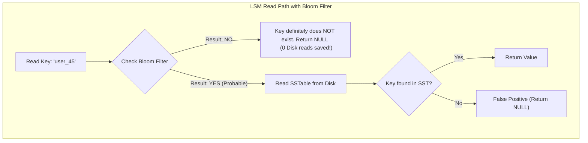

#### 💡 Bloom Filter-এর জাদুকরী আচরণ:
১. **"NO" রেসপন্স (Absolute certainty):** ব্লুম ফিল্টার যদি বলে "NO", তার মানে ডাটাস্ট্রাকচারটি নিশ্চিত গ্যারান্টি দিচ্ছে যে এই কি (Key) ডাটাবেসে **কখনোই ছিল না**। ফলে ডাটাবেস ডিস্কের SSTable ফাইলগুলো স্পর্শও না করে সাথে সাথে `NULL` বা `Not Found` রেসপন্স করে দেয়। কোটি কোটি ডিস্ক I/O বেঁচে যায়!
২. **"YES" রেসপন্স (Probabilistic):** ব্লুম ফিল্টার যদি বলে "YES", তার মানে কি-টি ডাটাবেসে **থাকার সম্ভাবনা আছে**। তখন ডাটাবেস ডিস্কের SSTable রিড করে ডাটা নিশ্চিত করে। মাঝে মাঝে এটি ভুল "YES" (False Positive) দিতে পারে, তবে তা ১-২% এর বেশি হয় না।

---

## ১৯. LSM Engines-এর Compaction Strategies (সাইজ-টায়ার্ড বনাম লেভেলড)
আমরা দেখেছি LSM ইঞ্জিনগুলোতে (যেমন Cassandra, RocksDB) নতুন রাইটগুলো প্রথমে মেমরিতে (MemTable) জমা হয় এবং পরে ডিস্কে **SSTable** ফাইল হিসেবে রাইট হয়। ফাইলগুলো রিড-অনলি হওয়ায় সময়ের সাথে সাথে একই কি-এর একাধিক ওল্ড ভার্সন বিভিন্ন SSTable-এ ছড়িয়ে পড়ে। 

ডিস্ক স্পেস বাঁচাতে এবং রিড স্পিড অপ্টিমাইজ করতে ব্যাকগ্রাউন্ডে **Compaction** নামক প্রসেস চলে, যা ওল্ড SSTable-গুলোকে একত্রিত (Merge and Sort) করে ডুপ্লিকেট ডাটা মুছে ফেলে। কম্প্যাকশনের প্রধান দুটি স্ট্র্যাটেজি নিচে আলোচনা করা হলো:

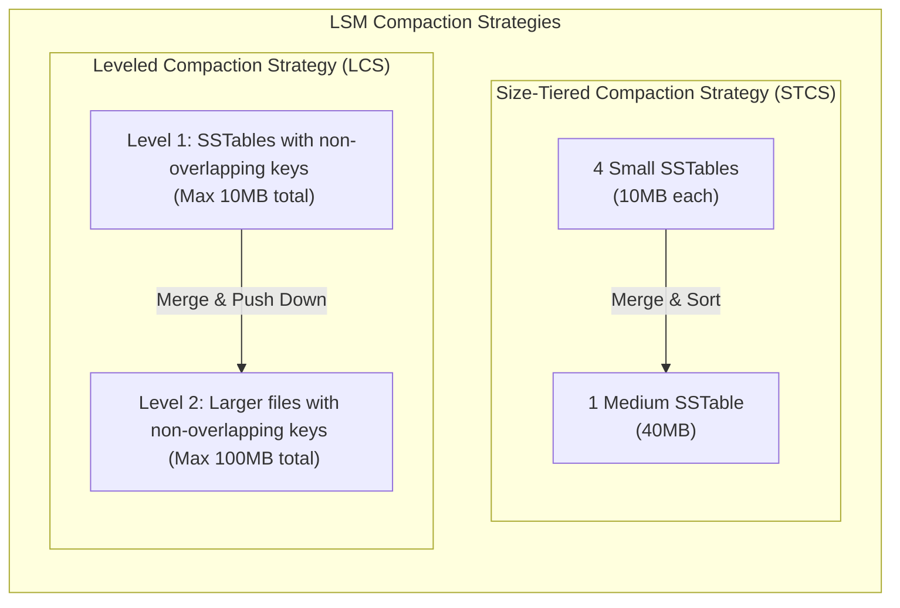

### ক. Size-Tiered Compaction Strategy (STCS)
* **মেকানিজম:** যখনই একই আকারের কয়েকটি SSTable (যেমন ৪টি ১০ মেগাবাইটের ফাইল) তৈরি হয়, ডাটাবেস সেগুলোকে মার্জ করে একটি বড় SSTable (৪০ মেগাবাইট) তৈরি করে।
* **সুবিধা:** অত্যন্ত ফাস্ট রাইট থ্রুপুট। রাইট-হেভি (Write-heavy) ওয়ার্কলোডের জন্য অত্যন্ত উপযোগী।
* **অসুবিধা (Space Amplification):** মার্জ করার সময় একই ডাটার ওল্ড কপিগুলো মেমরিতে দীর্ঘদিন থাকায় ডিস্ক স্পেস অনেক বেশি নষ্ট হয়।

### খ. Leveled Compaction Strategy (LCS)
* **মেকানিজম:** ডিস্ক স্পেসকে কয়েকটি স্তরে (যেমন Level 1, Level 2, Level 3...) ভাগ করা হয়। প্রতিটি লেভেলের একটি সর্বোচ্চ মোট সাইজ থাকে (যেমন Level 1-এর সর্বোচ্চ সাইজ ১০ মেগাবাইট)।
  * একটি লেভেলের ভেতরে থাকা সমস্ত SSTable-এর কি (Key) কখনো ওভারল্যাপ করে না। অর্থাৎ একটি কি কেবল একটি স্পেসিফিক SSTable ফাইলেই থাকবে।
  * যখনই Level 1 এর সাইজ ১০ মেগাবাইটের বেশি হয়, তখন সেখান থেকে একটি ফাইল নিয়ে Level 2 এর ওভারল্যাপিং ফাইলগুলোর সাথে মার্জ করে লেভেল ২-তে পাঠিয়ে দেওয়া হয়।
* **সুবিধা:** রিড ল্যাটেন্সি অনেক কম (কারণ কি খুঁজতে একটি লেভেলের মাত্র একটি ফাইলই রিড করতে হয়)। স্পেসের অপচয় বা স্পেস এমপ্লিফিকেশন অত্যন্ত কম।
* **অসুবিধা:** রাইট এমপ্লিফিকেশন অত্যন্ত বেশি (কারণ একই ফাইল বারবার মার্জ করে নিচের লেভেলে পাঠাতে ডিস্ক বারবার রাইট অপারেশন চালায়)।

---

## ২০. ডিস্ট্রিবিউটেড টাইম ও কনকারেন্সি (Vector Clocks ও Google TrueTime)
ডিস্ট্রিবিউটেড সিস্টেমে নেটওয়ার্ক নোডগুলোর ফিজিক্যাল ঘড়ি (Physical Wall Clocks) কখনো পুরোপুরি ১০০% সিঙ্কড থাকে না। একে **Clock Drift** বলে। NTP (Network Time Protocol) দিয়েও মিলি-সেকেন্ড লেভেলের নিখুঁত সময়ের মিল রাখা সম্ভব নয়। ফলে "কোন রাইটটি আগে ঘটেছে" (Order of Events) তা নির্ণয় করা অত্যন্ত বড় একটি চ্যালেঞ্জ।

### ক. Logical Clocks ও Vector Clocks
ফিজিক্যাল ঘড়ির ওপর নির্ভর না করে ইভেন্টের কার্যকারণ সম্পর্ক (Causality) ট্র্যাক করার জন্য লজিক্যাল ঘড়ি ব্যবহার করা হয়।
* **Vector Clocks:** এটি সিস্টেমে থাকা প্রতিটি নোডের নিজস্ব লজিক্যাল কাউন্টারের একটি অ্যারে মেইনটেইন করে। যখনই কোনো নোড কোনো ডাটা আপডেট করে, সে তার নিজস্ব কাউন্টার এক বাড়ায় এবং অন্য নোডে ডাটা সিঙ্ক করার সময় পুরো অ্যারেটি পাস করে।
  * এর মাধ্যমে ডাটাবেস দুটি কনকারেন্ট রাইটের মধ্যে **Conflict** বা সংঘর্ষ ধরতে পারে এবং ক্যাজুয়াল রিলেশনশিপ বজায় রাখতে পারে (যেমন: DynamoDB)।

### খ. Google Spanner-এর TrueTime API
গুগল তাদের গ্লোবাল ডিস্ট্রিবিউটেড ডাটাবেস **Spanner**-এ ক্লাসিক টাইম প্রবলেম সমাধান করতে জিপিএস রিসিভার (GPS Receivers) এবং পারমাণবিক ঘড়ি (Atomic Clocks) সমৃদ্ধ ডেডিকেটেড হার্ডওয়্যার ব্যবহার করেছে।

```text
TrueTime API Returns: [ t.earliest ----------- [ Actual Time ] ----------- t.latest ]
Time Range Uncertainty: 2 * ε (where ε is around 1ms to 7ms)
```

* **মেকানিজম:** TrueTime এপিআই বর্তমান ফিজিক্যাল সময়কে একটি সুনির্দিষ্ট পয়েন্ট হিসেবে রিটার্ন না করে একটি সময়ের রেঞ্জ রিটার্ন করে: $[t.earliest, t.latest]$। এখানে সর্বোচ্চ অনিশ্চয়তা সীমা হলো $\epsilon$ (সাধারণত ১ থেকে ৭ মিলি-সেকেন্ড)।
* **Commit Wait:** গুগল স্প্যানার যখন কোনো ট্রানজেকশন কমিট করে, তখন সে নিশ্চিত হতে $\epsilon$ সময় অপেক্ষা করে (Commit Wait) যাতে নিশ্চিত হওয়া যায় ট্রানজেকশনের আসল সময়টি পার হয়ে গেছে। এর মাধ্যমে Spanner কোনো ডিস্ট্রিবিউটেড লক ছাড়াই সারা বিশ্বের সমস্ত ডেটাসেন্টারের মধ্যে **External Consistency (Strict Serializability)** গ্যারান্টি দেয়।

---

## ২১. স্টোরেজ হার্ডওয়্যার ও Slotted-Page Layout
ডাটাবেস যখন ডিস্কের ফিজিক্যাল ব্লকে ডাটা পেজ (যেমন PostgreSQL-এ ডিফল্ট 8KB পেজ) আকারে লেখে, তখন সেই পেজের ভেতরের মেমরি কীভাবে ভাগ করা থাকে?

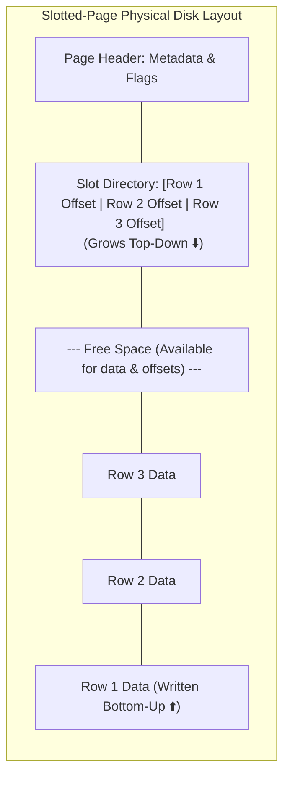

### ক. Slotted-Page Architecture
পেজের ভেতরে রো-এর সাইজ ফিক্সড না হওয়ায় (যেমন কেউ ছোট টেক্সট বা বড় টেক্সট ইনসার্ট করতে পারেন), ডাটাবেস **Slotted-Page Layout** ব্যবহার করে:
১. **Page Header:** পেজের শুরুতে মেটাডাটা থাকে।
২. **Slot Directory:** পেজের উপর থেকে নিচের দিকে বাড়ে। এটি মূলত পয়েন্টার বা অফসেটের অ্যারে, যা পেজের ভেতরের প্রতিটি রো বা টুপলের এক্স্যাক্ট মেমরি লোকেশন নির্দেশ করে।
৩. **Tuple Data:** পেজের নিচ থেকে ওপরের দিকে ডাটা রাইট করা হয়।
৪. **ফলাফল:** আপনি যখন কোনো রো-এর সাইজ আপডেট করেন বা কোনো রো মুছে ফেলেন, তখন শুধু পেজের নিচের ডাটা অংশটি শিফট করলেই চলে। ইনডেক্স থেকে যে পয়েন্টারটি পেজে এসেছিল (`Page ID + Slot Index`), তাকে কখনো পরিবর্তন করতে হয় না। এর ফলে ইনডেক্স ভাঙার কোনো ঝুঁকি থাকে না।

### খ. O_DIRECT (Direct I/O): ওএস কার্নেল বাইপাস
আধুনিক হাই-পারফরম্যান্স ডাটাবেসগুলো (যেমন PostgreSQL বা MySQL-এর InnoDB) ডিস্কে রাইট করার সময় ওএস কার্নেলের বিল্ট-ইন পেজ ক্যাশ (OS Page Cache) বাইপাস করতে **`O_DIRECT`** ফ্ল্যাগ ব্যবহার করে।
* ওএস কার্নেল যদি ডাটা ক্যাশ করে, তবে ডাটাবেসের নিজের ক্যাশ (Buffer Pool) এবং ওএসের ক্যাশে একই ডাটা ডবল স্পেস দখল করে (Double Buffering)।
* `O_DIRECT` ব্যবহারের ফলে ডাটাবেস সরাসরি র‍্যাম থেকে ডিস্ক কন্ট্রোলারে ডাটা রাইট করে, যা মেমরির অপচয় কমায় এবং ডাটা কখন ডিস্কে ফিজিক্যালি রাইট হলো তার ওপর ডাটাবেসের ১০০% কন্ট্রোল থাকে।

---

## ২২. Copy-on-Write (CoW) ডাটাবেস ও LMDB
ক্লাসিক ডাটাবেসগুলো ডিস্কের পেজে সরাসরি ইন-প্লেস আপডেট (Overwriting) করে, যার ফলে মেমরির পেজ লক করতে হয় এবং ক্র্যাশ করলে ডাটা করাপশনের ভয় থাকে। এর বৈপ্লবিক বিকল্প হলো **Copy-on-Write (CoW)** ডাটাবেস ইঞ্জিন (যেমন LMDB - Lightning Memory-Mapped Database)।

### ক. LMDB-এর চমৎকার মেকানিজম
LMDB একটি ফাস্ট, মেমরি-ম্যাপড B+ Tree ডাটাবেস যা Copy-on-Write মেথড ফলো করে:
* যখন কোনো রো বা পেজ আপডেট করা হয়, LMDB মূল পেজটি ওভাররাইট না করে ডিস্কের সম্পূর্ণ নতুন একটি ফাঁকা ব্লকে নতুন পেজটি রাইট করে।
* এরপর B+ ট্রির প্যারেন্ট নোডটি আপডেট করে নতুন পেজের সাথে কানেক্ট করা হয়।
* ট্রির রুট পয়েন্টার (Root Pointer) আপডেট হওয়ার আগ পর্যন্ত ওল্ড পেজটি সম্পূর্ণ অক্ষত থাকে।

### খ. এই ডিজাইনের অসামান্য সুবিধাসমূহ:
১. **১০০% লক-ফ্রি রিডার (Zero Lock Contention):** রিডাররা যতক্ষণ রিড করছে, তারা ওল্ড রুটের মাধ্যমে ওল্ড ডাটা শান্তিতে রিড করতে পারে। নতুন রাইটার নোডে ডাটা লিখলেও রিডারের কোনো লকিং বা ব্লকিংয়ের ঝামেলা পোহাতে হয় না।
২. **কোনো WAL লগ প্রয়োজন নেই (Zero Write-Ahead Log):** যেহেতু ওল্ড পেজটি ডিস্কে ১০০% সুরক্ষিত থাকে এবং রাইট অপারেশনের পর রুট পয়েন্টারটি একটি মাত্র পারমাণবিক রাইটের (Atomic Commit) মাধ্যমে নতুন ট্রিতে সুইচ করে, তাই হঠাৎ বিদ্যুৎ চলে গেলেও ডাটাবেস কখনোই করাপ্ট বা আংশিক রাইট অবস্থায় পড়ে থাকে না। ফলে কোনো WAL এর প্রয়োজনই হয় না, যা ডিস্ক রাইট ওভারহেড অর্ধেকে নামিয়ে আনে!

---

## ২৩. Consistent Hashing ও VNodes (ডিস্ট্রিবিউটেড শার্ডিং)
ডিস্ট্রিবিউটেড বা নোএসকিউএল ডাটাবেসে (যেমন Cassandra বা DynamoDB) হাজার হাজার ফিজিক্যাল সার্ভারের মধ্যে কীভাবে ডাটা বণ্টন করা হয় যাতে কোনো নোড অতিরিক্ত লোডে ক্র্যাশ না করে? এর উত্তর হলো **Consistent Hashing**।

### ক. Consistent Hashing Ring
* ডিস্ট্রিবিউটেড নেটওয়ার্কের নোডগুলো এবং ডাটার আইডিগুলোকে একটি গাণিতিক বৃত্তাকার রিংয়ের (Consistent Hashing Ring: $0$ to $2^{32}-1$) ওপর পয়েন্ট করা হয়।
* কোনো ডাটার আইডি হ্যাশ করে রিংয়ের যে অবস্থানে পাওয়া যায়, ঘড়ির কাঁটার দিকে ঘোরার সময় সবার আগে যে ফিজিক্যাল নোডটি পাওয়া যাবে, ডাটাটি সেই নোডে স্টোর করা হয়।
* **স্কেলিংয়ের সুবিধা:** নতুন একটি নোড রিংয়ে যুক্ত করলে বা কোনো নোড ক্র্যাশ করলে রিংয়ের মাত্র সামান্য কিছু ডাটা রিডিস্ট্রিবিউট করতে হয়, সম্পূর্ণ ডাটাবেস রি-হ্যাশ করার কোনো প্রয়োজন হয় না।

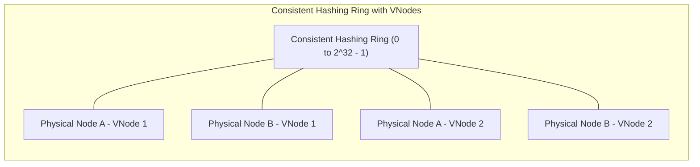

### খ. Virtual Nodes (VNodes): হটস্পট সমস্যার সমাধান
যদি রিংয়ের ওপর ফিজিক্যাল নোডগুলো খুব কাছাকাছি বসে পড়ে, তবে মাঝের বড় অঞ্চলের সমস্ত ডাটা একটি মাত্র নোডে গিয়ে পড়ে। একে **Data Hotspotting** বা ডাটার ভারসাম্যহীনতা বলে।
* **VNodes:** প্রতিটি ফিজিক্যাল নোডকে (যেমন Node A) রিংয়ের মাত্র একটি অবস্থানের পরিবর্তে ১০০টি ভার্চুয়াল অবস্থানের (VNode A1, VNode A2...) মাধ্যমে রিংয়ের চারদিকে ছড়িয়ে দেওয়া হয়। এর ফলে ডাটা রিংয়ের সমস্ত নোডের মধ্যে অত্যন্ত নিখুঁত ও সুষমভাবে বণ্টন হয়।

---

## ২৪. Vectorized Execution ও Query Compilation (Volcano vs SIMD)
ডাটাবেস যখন লাখ লাখ ডাটার ওপর কোনো এগ্রিগেশন কুয়েরি চালায় (যেমন: `SELECT SUM(salary) FROM employees`), তখন সিপিইউ লেভেলে ডাটা প্রসেস করার দুটি প্রধান মেথড রয়েছে:

### ক. Volcano Iterator Model (The Classical Approach)
* এটি প্রতিটি রিলেশনাল অপারেটরকে একটি লুপের ভেতর `Next()` ফাংশন কল করে একটি করে রো রিটার্ন করে (Row-by-Row processing)।
* **সীমাবদ্ধতা:** আধুনিক প্রসেসরে কোটি কোটি রো-এর জন্য কোটি কোটি ভার্চুয়াল ফাংশন কল সিপিইউ-এর **Branch Predictor** এবং **Instruction Cache** কে জ্যাম করে ফেলে, যার ফলে সিপিইউ-এর আসল পাওয়ার অপচয় হয়।

### খ. Vectorized Execution (SIMD & Cache Locality)
* modern OLAP ডাটাবেসগুলো (যেমন ClickHouse, DuckDB) **Vectorized Execution** ব্যবহার করে।
* এখানে `Next()` কল একবারে একটি রো রিটার্ন না করে কলামের একগুচ্ছ ডাটা (যেমন ১০২৪টি ইন্টিজারের মেমরি অ্যারে) বা একটি ভেক্টর রিটার্ন করে।
* এটি সিপিইউ ক্যাশের লোকালিটি চমৎকারভাবে ব্যবহার করে এবং সিপিইউ-এর **SIMD (Single Instruction, Multiple Data)** রেজিস্টারগুলোতে সরাসরি ডাটা পুশ করে এক ক্লিকে একসাথে ১৬টি বা ৩২টি ক্যালকুলেশন মিলি-সেকেন্ডে সম্পন্ন করে।

### গ. JIT Query Compilation (CodeGen - e.g., PostgreSQL JIT, Spark)
* কোয়েরি ইন্টারপ্রেটার ব্যবহার না করে রানটাইমে LLM বা LLVM কম্পাইলার দিয়ে SQL কুয়েরিটিকে সরাসরি মেশিন কোডে (Machine Code) কম্পাইল করা হয়। 
* এর ফলে কোনো লুপ বা অপারেটরের কল ওভারহেড ছাড়াই সিপিইউ সরাসরি হার্ডওয়্যার স্পিডে কোয়েরি এক্সিকিউট করতে পারে।

---

## ২৫. Database Normalization (১NF থেকে BCNF) ও Denormalization
ডাটাবেস ডিজাইন করার সময় অসাবধানতার কারণে একই ডাটা বারবার রিপিট হতে পারে, যাকে **Data Redundancy** বলে। এর ফলে ডাটাবেসে ৩ ধরনের অ্যানোমালি বা অসঙ্গতি ঘটে:
* **Insertion Anomaly:** নতুন ডাটা ঢোকাতে গেলে অন্য অপ্রাসঙ্গিক ডাটার অনুপস্থিতির কারণে ইনসার্ট করতে না পারা।
* **Update Anomaly:** এক জায়গায় ডাটা আপডেট করলে অন্য জায়গার কপিগুলো পুরানো রয়ে যাওয়া।
* **Deletion Anomaly:** একটি রো ডিলিট করতে গিয়ে ভুলবশত অন্য একটি সম্পূর্ণ ভিন্ন সেন্সিটিভ তথ্য হারিয়ে ফেলা।

এই সমস্যাগুলো সমাধান করতে টেবিলগুলোকে সুনির্দিষ্ট গাণিতিক নিয়মে ভাঙার প্রক্রিয়াকেই **Normalization** বলা হয়।

### ক. নরমাল ফর্মের স্তরসমূহ (Normal Forms):

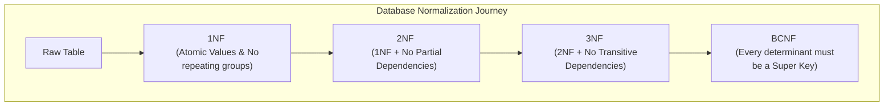

১. **1NF (First Normal Form):** 
   * টেবিলের প্রতিটি সেলের ভ্যালু অবশ্যই অবভাজ্য বা **Atomic** হতে হবে (যেমন একটি সেলে কমা দিয়ে একাধিক ফোন নাম্বার রাখা যাবে না)।
   * কোনো ডুপ্লিকেট রো থাকা যাবে না এবং প্রতিটি কলামের নাম ইউনিক হতে হবে।
২. **2NF (Second Normal Form):** 
   * টেবিলটিকে অবশ্যই ১NF হতে হবে।
   * **No Partial Dependency:** কম্পোজিট কি (Composite Primary Key)-এর ক্ষেত্রে কোনো নন-প্রাইম কলাম প্রাইমারি কি-এর একটি অংশের ওপর নির্ভর করতে পারবে না। তাকে সম্পূর্ণ প্রাইমারি কি-এর ওপরই নির্ভরশীল হতে হবে।
৩. **3NF (Third Normal Form):** 
   * টেবিলটিকে ২NF হতে হবে।
   * **No Transitive Dependency:** কোনো নন-প্রাইম কলাম অন্য কোনো নন-প্রাইম কলামের ওপর নির্ভর করতে পারবে না (যেমন: $A \rightarrow B$ এবং $B \rightarrow C$ হলে $A \rightarrow C$ ট্রান্সমিট হতে পারবে না। এখানে ডিপার্টমেন্ট আইডি জানা থাকলে ডিপার্টমেন্টের নাম অন্য টেবিলে চলে যাবে)।
৪. **BCNF (Boyce-Codd Normal Form):** 
   * এটি ৩NF এর চেয়েও শক্তিশালী রূপ। কোনো ফাংশনাল ডিপেন্ডেন্সি $X \rightarrow Y$ থাকলে, $X$-কে অবশ্যই টেবিলের **Super Key** বা প্রাইমারি কি হতে হবে।

### খ. Denormalization: কেন আমরা প্রোডাকশনে উল্টোটা করি?
বাস্তব প্রোডাকশন সিস্টেমে (বিশেষ করে OLAP বা হাই-রিড সিস্টেমে) অতিরিক্ত নরমাল ফাইলে ভাঙার ফলে প্রচুর পরিমাণ টেবিল **JOIN** করতে হয়, যা কুয়েরি পারফরম্যান্স মারাত্মক ধীরগতির করে দেয়। 
* **Denormalization** হলো ইচ্ছাকৃতভাবে ডাটার রিডান্ডেন্সি বা ডুপ্লিকেট কপি রাখা যাতে কোনোরকম JOIN ছাড়াই এক কুয়েরিতে সরাসরি ফাস্ট ডাটা রিড করা যায়।
* **ট্রেড-অফ:** রিড পারফরম্যান্স ফাস্ট হলেও রাইট অপারেশন স্লো হয়ে যায় এবং ডাটা কনসিস্টেন্সি বজায় রাখার দায়িত্ব অ্যাপ্লিকেশনের ওপর চলে যায়।

---

## ২৬. Database Relationships ও Referential Integrity
রিলেশনাল ডাটাবেসের মূল ভিত্তিই হলো টেবিলগুলোর মধ্যবর্তী সম্পর্ক বা **Relationships**। 

### ক. সম্পর্কের প্রকারভেদ (Relationship Types)

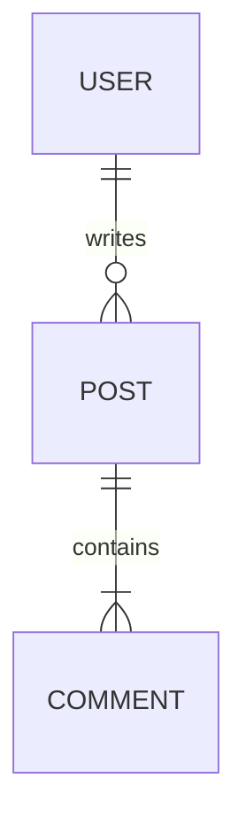

১. **One-to-One (1:1):** একটি রো কেবল অন্য টেবিলের একটি রো-এর সাথেই যুক্ত (যেমন: `users` এবং `user_profiles`)। ডাটাবেস পারফরম্যান্স ও সিকিউরিটির জন্য সেন্সিটিভ কলাম আলাদা টেবিলে রাখতে এটি ব্যবহৃত হয়।
২. **One-to-Many (1:N):** একটি প্যারেন্ট রো-এর বিপরীতে চাইল্ড টেবিলে একাধিক রো থাকতে পারে (যেমন: `customers` এবং `orders`)। চাইল্ড টেবিলে **Foreign Key** রেখে এটি ডিজাইন করা হয়।
৩. **Many-to-Many (N:M):** উভয় টেবিলের একাধিক রো পরস্পরের সাথে যুক্ত হতে পারে (যেমন: `students` এবং `courses`)। এটি ডিজাইন করতে মাঝখানে একটি **Junction Table** (বা Association Table) তৈরি করতে হয় যেখানে দুটি টেবিলের ফরেন কি কম্পোজিট কি হিসেবে কাজ করে।

### খ. Referential Integrity ও Cascade অ্যাকশন
যখন প্যারেন্ট টেবিলের কোনো রো ডিলিট বা আপডেট করা হয়, ফরেন কি দিয়ে যুক্ত চাইল্ড টেবিলের রো-গুলোর ওপর ডাটাবেস কী প্রভাব ফেলবে, তা ডিফাইন করা অত্যন্ত জরুরি:
* **ON DELETE CASCADE:** প্যারেন্ট রো ডিলিট হলে চাইল্ড টেবিলের সমস্ত ডিপেন্ডেন্ট রো অটোমেটিক ডিলিট হয়ে যাবে (ঝুঁকিপূর্ণ কিন্তু ক্লিনআপের জন্য দরকারী)।
* **ON DELETE SET NULL:** প্যারেন্ট রো ডিলিট হলে চাইল্ড টেবিলের ফরেন কি কলামটি `NULL` হয়ে যাবে।
* **ON DELETE RESTRICT / NO ACTION:** চাইল্ড টেবিলে কোনো ডাটা অবশিষ্ট থাকলে ডাটাবেস প্যারেন্ট রো-টি ডিলিট করতে দেবে না এবং এরর থ্রো করবে (ডাটাবেস ইন্টিগ্রিটি রক্ষায় সবচেয়ে নিরাপদ)।

---

## ২৭. ENUMs বনাম Lookup Tables: প্রোডাকশন ট্রেড-অফ
কোনো স্পেসিফিক ফিল্ডের ভ্যালু যখন ফিক্সড থাকে (যেমন অর্ডারের স্ট্যাটাস: `pending`, `shipped`, `delivered`), তখন ডেভেলপাররা দুটি আর্কিটেকচারাল প্যাটার্ন ব্যবহার করেন:

### ক. Postgres ENUM Type
```sql
CREATE TYPE order_status AS ENUM ('pending', 'shipped', 'delivered');
CREATE TABLE orders (
    id SERIAL PRIMARY KEY,
    status order_status NOT NULL
);
```
* **সুবিধা:** 
  ১. ডাটাবেস লেভেলে টাইপ-সেফ ভ্যালিডেশন।
  ২. মেমরি অত্যন্ত সাশ্রয়ী (Postgres অভ্যন্তরীণভাবে এনামকে ৪-বাইটের ইন্টিজার হিসেবে স্টোর করে)।
* **অসুবিধা:** 
  ১. নতুন স্ট্যাটাস যোগ করা বা ওল্ড স্ট্যাটাস রিনেম করা অত্যন্ত জটিল। ডাটাবেস লক (Table Lock) হওয়ার ঝুঁকি থাকে।
  ২. ডাইনামিকালি ফ্রন্টএন্ডে অপশন লিস্ট দেখানোর জন্য আলাদা এপিআই কুয়েরি করা যায় না।

### খ. Lookup Tables (Foreign Key Approach)
```sql
CREATE TABLE order_statuses (
    id SERIAL PRIMARY KEY,
    name VARCHAR(50) UNIQUE NOT NULL
);
CREATE TABLE orders (
    id SERIAL PRIMARY KEY,
    status_id INT REFERENCES order_statuses(id)
);
```
* **সুবিধা:** 
  ১. নতুন স্ট্যাটাস যোগ করতে হলে শুধু একটি `INSERT` কোয়েরি চালালেই চলে, কোনো স্কিমা মাইগ্রেশনের প্রয়োজন নেই।
  ২. স্ট্যাটাসের সাথে অন্যান্য মেটাডাটা (যেমন ডেসক্রিপশন বা কালার কোড) সহজেই একই টেবিলে সেভ রাখা যায়।
* **অসুবিধা:** 
  ১. প্রতিবার অর্ডারের স্ট্যাটাস রিড করতে হলে আরেকটি টেবিলের সাথে **JOIN** করতে হবে, যা রিড ওভারহেড বাড়ায়।

---

## ২৮. Database Views বনাম Materialized Views
জটিল ও বড় বড় SQL কুয়েরি বারবার না লিখে সেগুলোকে ডাটাবেস লেভেলে ক্যাশ বা সেভ করে রাখার দুটি দারুণ উপায় হলো ভিউ।

### ক. Standard Views (ভার্চুয়াল টেবিল)
* এটি মূলত একটি সেভ করা কুয়েরি। ডিস্কে কোনো ফিজিক্যাল ডাটা স্টোর করে না।
* আপনি যখন ভিউটি কুয়েরি করবেন (`SELECT * FROM active_users_view`), ডাটাবেস ব্যাকগ্রাউন্ডে সেই অরিজিনাল কোয়েরিটি চালিয়ে ফিজিক্যাল টেবিল থেকে ডাটা নিয়ে আসে।
* **সুবিধা:** রিডান্ডেন্ট কোড কমে এবং ডাটা সিকিউরিটি বা হাইডিং সহজ হয় (যেমন কাস্টমারকে মূল টেবিল না দিয়ে সুনির্দিষ্ট কলামের ভিউ দেওয়া)।

### খ. Materialized Views (ডিস্ক ক্যাশড টেবিল)
* মেটেরিয়ালাইজড ভিউ কুয়েরির রেজাল্টটি ফিজিক্যালি ডিস্কে একটি ক্যাশড টেবিল হিসেবে রাইট করে রাখে।
* যখন আপনি কুয়েরি করবেন, ডাটাবেস মূল টেবিলে কোনো সার্চ না করে সরাসরি ডিস্ক ক্যাশ থেকে মিলি-সেকেন্ডে রেসপন্স রিটার্ন করে।
* **রিফ্রেশমেন্ট প্রবলেম:** মূল টেবিলের ডাটা চেঞ্জ হলে মেটেরিয়ালাইজড ভিউ অটো-আপডেট হয় না। এর জন্য ম্যানুয়ালি `REFRESH MATERIALIZED VIEW` রান করতে হয়।
* **Postgres Pro-Tip:** ডাউনটাইম এড়াতে প্রোডাকশনে সর্বদা `REFRESH MATERIALIZED VIEW CONCURRENTLY` ব্যবহার করবেন, যাতে রিফ্রেশ হওয়ার সময়ও ক্লায়েন্টরা ওল্ড ক্যাশ ডাটা রিড করতে পারে এবং রিড লক না হয়।

---

## ২৯. Trigger Systems ও Stored Procedures
ডাটাবেসের ভেতরেই জটিল বিজনেস লজিক সরাসরি এক্সিকিউট করতে ওএসের কার্নেলের মতো ডাটাবেস কার্নেলের নিজস্ব প্রোগ্রামিং ল্যাঙ্গুয়েজ থাকে (যেমন Postgres-এর PL/pgSQL)।

### ক. Stored Procedures & Functions
* **Stored Procedures** হলো ডাটাবেসের ভেতরে প্রি-কম্পাইলড অবস্থায় থাকা ফাংশন।
* **সুবিধা:** নেটওয়ার্ক রাউন্ড-ট্রিপ (Network Latency) কমায়। ১০০০টি ক্যালকুলেশন মেমরিতে করার জন্য ক্লায়েন্ট এবং ডাটাবেসের মধ্যে বারবার ডাটা আদান-প্রদান না করে সরাসরি ডাটাবেসের ভেতরে রান করে একবারে রেজাল্ট রিটার্ন করা যায়।

### খ. Database Triggers (ট্রিগার)
* কোনো টেবিলে `INSERT`, `UPDATE` বা `DELETE` অপারেশন ঘটার ঠিক আগে (**BEFORE**) বা পরে (**AFTER**), স্বয়ংক্রিয়ভাবে কোনো টাস্ক রান করার মেকানিজমকে ট্রিগার বলে।
* যেমন: কোনো ইউজারের অ্যাকাউন্ট ডিলিট হলে অটোমেটিক্যালি একটি অডিট লগ টেবিলে এন্ট্রি তৈরি করা।

#### ⚠️ আর্কিটেকচারাল সতর্কতা (Production Warning):
আধুনিক হাই-স্কেল সিস্টেমে ট্রিগার এবং স্টোরড প্রসিডিউরের ভেতর ভারী বিজনেস লজিক লেখা **কঠোরভাবে নিরুৎসাহিত করা হয়**। 
* **কারণ:** ডাটাবেস স্কেলিং করা অ্যাপ্লিকেশন সার্ভার স্কেলিংয়ের চেয়ে অনেক বেশি কঠিন ও ব্যয়বহুল। ডাটাবেসের ভেতর বিজনেস লজিক চালালে ডাটাবেসের মূল্যবান সিপিইউ (CPU) নষ্ট হয়।
* এছাড়া, ট্রিগারের অ্যাকশনগুলো অলক্ষ্যে (Invisible Side Effects) ঘটে বলে বাগ ডিবাগ করা অত্যন্ত কঠিন হয়ে দাঁড়ায়।

---

## ৩০. Schema Migrations ও Zero-Downtime Deployments
বিলিয়ন ডাটা সমৃদ্ধ প্রোডাকশন ডাটাবেসে স্কিমা পরিবর্তন করার সময় (যেমন নতুন কলাম যোগ করা, ইনডেক্স তৈরি বা ডেটাটাইপ পরিবর্তন) সামান্য অসাবধানতায় সম্পূর্ণ ডাটাবেস লক হয়ে সাইট ডাউন হয়ে যেতে পারে। জিরো-ডাউনটাইম নিশ্চিত করার গোল্ডেন রুলসগুলো নিচে দেওয়া হলো:

### ক. Safe বনাম Unsafe স্কিমা অপারেশন

| DB Operation | ঝুঁকি লেভেল | কারণ ও প্রোডাকশন প্র্যাকটিস (Production Practice) |
| :--- | :--- | :--- |
| **Adding Nullable Column** | ✅ Safe | কোনো ডেটা লক বা টেবিল রাইট ওভারহেড নেই। |
| **Adding Column with Default Value** | ⚠️ Unsafe (Older versions) | ওল্ড Postgres সংস্করণে এটি পুরো টেবিল লক করে প্রতিটি রো নতুন ডিফল্ট ভ্যালু দিয়ে নতুন করে লেখে। (Postgres 11+ সংস্করণে এটি মেটাডাটা লেভেলে করে বলে এটি এখন Safe)। |
| **Creating an Index** | ❌ Highly Unsafe | সাধারণ `CREATE INDEX` কোয়েরি পুরো টেবিলের রাইট অপারেশন লক করে দেয়। প্রোডাকশনে সর্বদা **`CREATE INDEX CONCURRENTLY`** ব্যবহার করতে হবে, যা কোনো রাইট লক ছাড়াই ব্যাকগ্রাউন্ডে ইনডেক্স তৈরি করে। |
| **Renaming a Column** | ❌ Extremely Unsafe | আপনি কলাম রিনেম করলে পুরানো সচল অ্যাপ্লিকেশন ইনস্ট্যান্সগুলো সেই কলাম কুয়েরি করতে গিয়ে ক্র্যাশ করবে। এটি করতে ৩-ধাপের ডেপ্লয়মেন্ট প্রসেস ফলো করতে হবে (Add new column ➔ Double Write ➔ Deprecate old column)। |

---

## ৩১. MVCC Garbage Collection, Vacuuming ও InnoDB Purging
আমরা জানি MVCC ব্যবহারের ফলে ডাটাবেসে ওল্ড ডেড রো বা ডেড টুপল (Dead Tuples) তৈরি হয়। এই ডেড টুপলগুলো মেমরি ও ডিস্ক স্পেস রিসাইকেল করার জন্য ডাটাবেস ইঞ্জিনগুলো নেপথ্যে অত্যন্ত শক্তিশালী আবর্জনা পরিষ্কারক বা **Garbage Collection (GC)** মেকানিজম চালায়। 

PostgreSQL এবং MySQL (InnoDB) এই কাজটি সম্পূর্ণ ভিন্ন ভিন্ন উপায়ে সম্পন্ন করে:

### ক. PostgreSQL Autovacuum
PostgreSQL ডেড টুপলগুলো সরাসরি মেইন টেবিলের ভেতরেই রেখে দেয়। 
* **Visibility Map (VM):** ভ্যাকুয়াম থ্রেডটি প্রতিটি পেজের একটি বাইনারি ম্যাপ বা Visibility Map তৈরি করে। যদি কোনো পেজের সব রো সচল (All Visible) থাকে, তবে ভ্যাকুয়াম ও ইনডেক্স স্ক্যানার সেই পেজটি স্ক্যান করা বাইপাস করে চলে যায়, যা পারফরম্যান্স অনেক বুস্ট করে।
* **Transaction ID Wraparound & Vacuum Freeze:** 
  Postgres-এর ট্রানজেকশন আইডি ৩২-বিটের হয়, যার সর্বোচ্চ সীমা ৪ বিলিয়ন (রিয়েল লাইফে ২ বিলিয়ন)। এই সীমা পার হলে ডাটাবেস নতুন আইডি জেনারেট করতে না পেরে ক্র্যাশ করবে।
  * এটি রুখতে ভ্যাকুয়াম থ্রেডটি ওল্ড ট্রানজেকশনের আইডিগুলোকে একটি স্পেসিফিক **`FrozenTransactionId`** (আইডি ২) দিয়ে রিনেম করে লক ফ্রি করে দেয়। একে **Vacuum Freeze** বলে।

### খ. MySQL InnoDB Purge Threads
Postgres-এর মতো MySQL InnoDB ডেড টুপল মেইন টেবিলে জমায় না। 
* InnoDB কোনো ডাটা আপডেট বা ডিলিট করলে তা মেইন টেবিলে ইন-প্লেস ওভাররাইট করে এবং ওল্ড ভার্সনটি আলাদা একটি মেমরি লোকেশন **Undo Log** স্পেসে লিখে রাখে।
* **Purge Threads:** যখন কোনো সচল ট্রানজেকশন আর সেই ওল্ড ভার্সনটি রিড করতে চায় না, তখন ব্যাকগ্রাউন্ডের Purge থ্রেডগুলো এই অপ্রয়োজনীয় ওল্ড Undo Log গুলোকে রিয়েল-টাইমে মেমরি থেকে পার্মানেন্টলি ডিলিট করে দেয়।

---

## ৩২. Two-Phase Locking (2PL) বনাম Two-Phase Commit (2PC) এবং Consistency
ডিস্ট্রিবিউটেড ও রিলেশনাল সিস্টেমে ডেভেলপারদের মধ্যে দুটি সম্পূর্ণ ভিন্ন মেকানিজম নিয়ে প্রায়ই বিভ্রান্তি তৈরি হয়, যার নামের সংক্ষিপ্ত রূপ কাছাকাছি:

### ক. 2PL (Two-Phase Locking) বনাম 2PC (Two-Phase Commit)
* **2PL (Two-Phase Locking):** এটি একটি **Concurrency Control Protocol**। একটি সিঙ্গেল ডাটাবেস নোডের ভেতর কনকারেন্ট ট্রানজেকশনগুলোর মধ্যে **Serializability** বা নিখুঁত সিরিয়াল অর্ডার বজায় রাখতে এটি ব্যবহৃত হয়। এর দুটি ফেজ রয়েছে:
  ১. **Growing Phase:** ট্রানজেকশন কেবল নতুন নতুন লক একোয়ার (Acquire) করে, কোনো লক রিলিজ করতে পারে না।
  ২. **Shrinking Phase:** ট্রানজেকশন কেবল ওল্ড লকগুলো রিলিজ (Release) করে, নতুন কোনো লক একোয়ার করতে পারে না।
* **2PC (Two-Phase Commit):** এটি একটি **Atomic Commit Protocol**। একটি ডিস্ট্রিবিউটেড সিস্টেমে একাধিক শার্ড নোডের মধ্যে ট্রানজেকশনটি একসাথে হয় Commit হবে নতুবা Abort হবে (Atomicity) তা নিশ্চিত করতে এটি ব্যবহৃত হয়।

### খ. Linearizability বনাম Serializability
ডিস্ট্রিবিউটেড ডাটাবেস ডিজাইনের ক্ষেত্রে এই দুটি কনসিস্টেন্সি বাউন্ডারি বুঝতে হবে:
* **Serializability:** এটি একটি **Multi-transaction Guarantee**। এটি গ্যারান্টি দেয় যে একাধিক ট্রানজেকশন যদি একসাথে (কনকারেন্টলি) চলে, তবে তাদের আউটপুট এমন হবে যেন তারা একে একে (সিরিয়ালি) চলেছে। এর সাথে ফিজিক্যাল রিয়েল-টাইমের কোনো সম্পর্ক নেই।
* **Linearizability (Strong Consistency):** এটি একটি **Single-operation, Real-time Guarantee**। এটি গ্যারান্টি দেয় যে কোনো ক্লায়েন্ট যদি কোনো কি (Key) আপডেট করে এবং সাকসেস মেসেজ পায়, তবে পৃথিবীর অন্য যেকোনো নোড থেকে পরবর্তীতে রিড করলে গ্লোবাল রিয়েল-টাইমে সর্বদা সেই নতুন ডাটাই পাওয়া যাবে (ঘড়ির কাটার সাথে ফিজিক্যাল অর্ডার সিঙ্ক)।

---

## ৩৩. Database Security: Prepared Statements, RLS ও Encryption
ডাটাবেস কেবল ডাটা রিড-রাইট করে না; একে হ্যাকার এবং অননুমোদিত অ্যাক্সেস থেকে সুরক্ষিত রাখতে কার্নেল লেভেলে ৩টি গুরুত্বপূর্ণ নিরাপত্তা বলয় রয়েছে:

### ক. Prepared Statements (SQL Injection রোধী ঢাল)
SQL Injection ঘটে যখন ব্যবহারকারীর দেওয়া ইনপুটকে ডাটাবেস কুয়েরির এক্সিকিউটেবল কোড হিসেবে ভুল ব্যাখ্যা করে। 
* **Prepared Statements**-এর মাধ্যমে ডাটাবেস প্রথমে কুয়েরির স্ট্রাকচার বা টেমপ্লেটটি কম্পাইল করে নেয়। 
* এরপর ইউজারের ডাটা প্যারামিটারটি সম্পূর্ণ আলাদা চ্যানেলে ডাটাবেসে পাঠানো হয়। 
* ডাটাবেস সেই প্যারামিটারকে কেবল র-ডাটা (Raw string) হিসেবে বিবেচনা করে, যুগে যুগে কোনো এক্সিকিউটেবল কোড হিসেবে রিড করে না। এর ফলে **SQL Injection ১০০% অসম্ভব** হয়ে যায়।

### খ. Row-Level Security (RLS)
মাল্টি-টেন্যান্ট (Multi-tenant) অ্যাপ্লিকেশনে (যেখানে এক টেবিলের ভেতরেই হাজার হাজার ইউজারের ডাটা মিক্সড থাকে) অ্যাপ্লিকেশনের কোড লেভেলে কুয়েরিতে `WHERE user_id = ?` লিখতে ডেভেলপার ভুল করতে পারেন, যার ফলে ডাটা লিক হতে পারে।
* **RLS (যেমন Postgres RLS):** ডাটাবেস লেভেলেই রুলস সেট করে দেওয়া।
  ```sql
  ALTER TABLE orders ENABLE ROW LEVEL SECURITY;
  CREATE POLICY order_policy ON orders 
  FOR SELECT USING (user_id = current_user);
  ```
  এর ফলে অ্যাপ্লিকেশন ডেভেলপার ভুল করে `SELECT * FROM orders` কুয়েরি করলেও ডাটাবেস স্বয়ংক্রিয়ভাবে কার্নেল লেভেলে ইউজারের নিজস্ব ডাটা ছাড়া অন্য কারও ডাটা কুয়েরিতে ফেরত দেবে না।

### গ. Column-Level Encryption (Envelope Encryption)
অত্যন্ত সংবেদনশীল ডাটা (যেমন পাসওয়ার্ড বা ক্রেডিটカード নাম্বার) ডিস্কে র-টেক্সট হিসেবে রাখা সুরক্ষিত নয়।
* **pgcrypto (Postgres):** ডাটাবেসের ভেতরের বিল্ট-ইন ক্রিপ্টোগ্রাফি প্লাগইন যা AES বা PGP অ্যালগরিদম ব্যবহার করে কলামের ডাটা ডিস্কে রাইট করার আগেই এনক্রিপ্ট করে দেয় এবং রিড করার সময় ডিক্রিপ্ট করে।

---

## ৩৪. Distributed Storage Engines: LSM-Tree বনাম B-Tree আর্কিটেকচারাল ট্রেড-অফ
ডিস্কে ডাটা স্টোর ও ইনডেক্সিং করার জন্য ডাটাবেস ইঞ্জিনে প্রধানত দুটি ভিন্ন ডাটা স্ট্রাকচার ব্যবহৃত হয়: **B-Tree** (রিলেশনাল OLTP) এবং **LSM-Tree** (NoSQL / Write-Heavy)। এদের সিস্টেম ট্রেড-অফ নিচে নিখুঁতভাবে বিশ্লেষণ করা হলো:

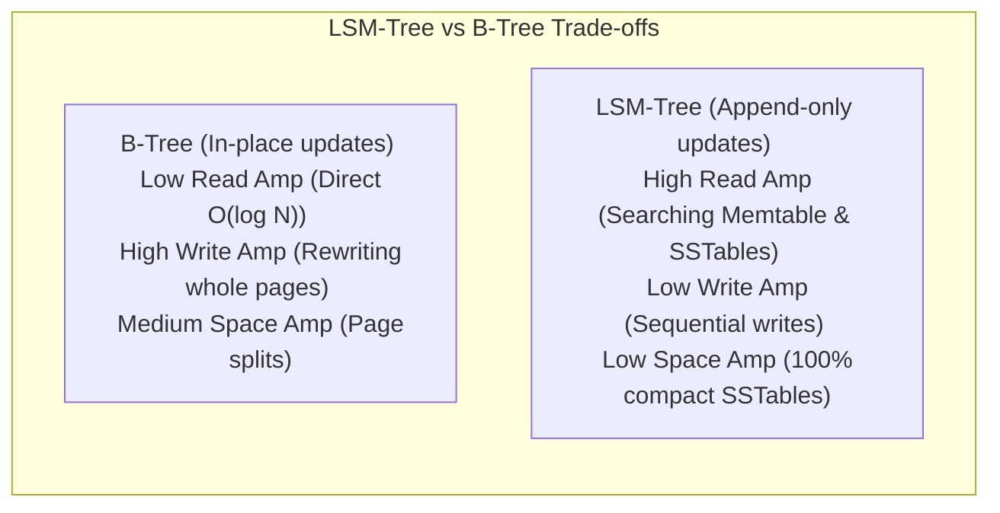

### ক. Write Amplification (WA) - রাইট এমপ্লিফিকেশন
* **B-Tree:** অত্যন্ত বেশি। আপনি যদি পেজের ভেতরের ১-বাইটের কোনো ডাটা চেঞ্জ করেন, ডাটাবেসকে পুরো ৮ কিলোবাইটের পেজটি ডিস্কে নতুন করে ওভাররাইট করতে হয়।
* **LSM-Tree:** অত্যন্ত কম। এটি মেমরি থেকে ডিস্কে একবারে বড় বড় ব্লকে সিকোয়েন্সিয়াল রাইট (Sequential Append-only) করায় ডিস্ক রাইট ওভারহেড একদম ন্যূনতম থাকে।

### খ. Read Amplification (RA) - রিড এমপ্লিফিকেশন
* **B-Tree:** অত্যন্ত কম। B-Tree-তে একটি সুনির্দিষ্ট কি (Key) কোথায় আছে তা $O(\log N)$ ইনডেক্স ট্রাভার্সাল করে সরাসরি সেই স্পেসিফিক পেজটি রিড করলেই পাওয়া যায়।
* **LSM-Tree:** অত্যন্ত বেশি। ডাটাটি খুঁজতে Memtable, Level 0 SSTables এবং নিচের লেভেলের একাধিক ফাইল স্ক্যান করতে হতে পারে (যদিও ব্লুম ফিল্টার দিয়ে এটি অপ্টিমাইজ করা হয়)।

### গ. Space Amplification (SA) - স্পেস এমপ্লিফিকেশন
* **B-Tree:** মাঝারি থেকে বেশি। B-Tree-তে নতুন ডাটা ঢোকাতে গেলে পেজ স্প্লিট (Page Split) ঘটে, যার ফলে পেজগুলোর প্রায় ৩৩% মেমরি ফাঁকা বা অব্যবহৃত পড়ে থাকে (Internal Fragmentation)।
* **LSM-Tree:** একদম কম। SSTable ফাইলগুলো ১০০% কম্প্যাক্ট এবং টাইট সর্টেড অবস্থায় ডিস্কে সেভ থাকে। কোনো ইন্টারনাল ফাঁকা মেমরি থাকে না।

---

## ৩৫. Single Server Partitioning: Range, List ও Hash Partitioning
যখন একটি টেবিলের ডাটা সাইজে কয়েকশো গিগাবাইট ছাড়িয়ে যায়, তখন ইনডেক্স কুয়েরি করাও স্লো হয়ে পড়ে। শার্ডিং বা একাধিক সার্ভারে ডাটা ডিস্ট্রিবিউট করার আগে, একটি একক সার্ভারের ভেতরেই টেবিলকে ভেঙে ছোট ছোট সাব-টেবিলে বিভক্ত করাকে **Table Partitioning** (Postgres Declarative Partitioning) বলা হয়।

এটি ৩টি উপায়ে করা যায়:

### ক. Range Partitioning (সীমা-ভিত্তিক)
* ডাটাবেসকে সুনির্দিষ্ট ভ্যালুর সীমানার ওপর ভিত্তি করে টেবিল বিভক্ত করতে বলা হয়।
* **ব্যবহারের ক্ষেত্র:** টাইম-সিরিজ ডাটা (যেমন: প্রতি মাসের অর্ডারের জন্য আলাদা টেবিল `orders_2025_q1`, `orders_2025_q2`)। পুরানো ডাটা মুছতে হলে পুরো টেবিল স্ক্যান না করে সরাসরি পুরানো পার্টিশন টেবিলটি `DROP` করে দেওয়া যায় ১ সেকেন্ডে।

### খ. List Partitioning (তালিকা-ভিত্তিক)
* সুনির্দিষ্ট ক্যাটালগ বা তালিকা অনুযায়ী টেবিল ভাঙা।
* **ব্যবহারের ক্ষেত্র:** ভৌগোলিক অবস্থান অনুযায়ী ডাটা আলাদা করা (যেমন: `orders_us`, `orders_eu`, `orders_asia`)।

### গ. Hash Partitioning (হ্যাশ-ভিত্তিক)
* কোনো কলামের (যেমন `user_id`) হ্যাশ ভ্যালু বের করে মডুলাস অপারেটর দিয়ে সমান ভাগে টেবিল ভাঙা।
* **ব্যবহারের ক্ষেত্র:** যখন ডাটার কোনো সুনির্দিষ্ট রেঞ্জ বা তালিকা থাকে না কিন্তু আপনি চান ডাটা যেন সবগুলো সাব-টেবিলে সমানভাবে ডিস্ট্রিবিউট হয়ে থাকে।

---

## ৩৬. CDC (Change Data Capture) ও Write-Ahead Log Logical Replication
বাস্তব প্রোডাকশন সিস্টেমে ডাটাবেসের ডাটা পরিবর্তন হওয়ার সাথে সাথে ডাউনস্ট্রিম সিস্টেমগুলো (যেমন Elasticsearch সার্চ ইনডেক্স, Redis ক্যাশ, বা Snowflake ডাটা ওয়ারহাউজ) রিয়েল-টাইমে সিঙ্ক করা একটি বড় চ্যালেঞ্জ। এর বৈপ্লবিক সমাধান হলো **CDC (Change Data Capture)**।

এটি মূলত দুটি উপায়ে কাজ করে:

### ক. Query-based CDC (Polling)
* অ্যাপ্লিকেশন ব্যাকগ্রাউন্ডে লুপ চালিয়ে প্রতি ৫ সেকেন্ড পর পর কুয়েরি করে: `SELECT * FROM users WHERE updated_at > last_polled_time`।
* **সীমাবদ্ধতা:** অত্যন্ত ধীরগতির, ডাটাবেসের ওপর রিড প্রেসার বাড়ায়, এবং ডাটাবেস থেকে কোনো রো চিরতরে ডিলিট হয়ে গেলে (Hard Delete) তা ধরতে পারে না।

### খ. Log-based CDC (Logical Replication - e.g., Debezium)
* আধুনিক সিস্টেমে ডাটাবেসের **WAL (Write-Ahead Log)** এর র-বাইনারি ফাইলগুলোকে রিড করা হয়। 
* যখনই কোনো রাইট বা ডিলিট ঘটে, ডাটাবেস কার্নেল নিজেই সেই চেঞ্জটিকে ডিকোড করে (Logical Decoding) একটি স্ট্রাকচার্ড JSON বা ইভেন্ট স্ট্রিমে রূপান্তরিত করে।
* **সুবিধা:** 
  ১. ডাটাবেসের মেইন কুয়েরি ইঞ্জিনের ওপর ০% লোড বা পারফরম্যান্স প্রেসার পড়ে।
  ২. ডিলিট অপারেশনগুলো নিখুঁতভাবে ধরা যায়।
  ৩. Kafka বা মেসেজ কিউতে রিয়েল-টাইম ইভেন্ট ব্রডকাস্ট করে মিলি-সেকেন্ডে সার্চ ইনডেক্স বা ক্যাশ সিঙ্ক করা যায়।

---

## ৩৭. Logical Database Joins: Deep Dive (লজিক্যাল জয়েন ও তাদের কাজের পদ্ধতি)
রিলেショナル ডাটাবেসের সবচেয়ে শক্তিশালী বৈশিষ্ট্য হলো একাধিক টেবিলের ডাটা সম্পর্কের ভিত্তিতে একসাথে যুক্ত বা **JOIN** করে কুয়েরি করা। ১৫ নম্বর চ্যাপ্টারে আমরা জয়েনের ফিজিক্যাল অ্যালগরিদম (Nested Loop, Hash, Merge Join) দেখেছি; এই চ্যাপ্টারে আমরা লজিক্যাল জয়েনের প্রকারভেদ ও তাদের কাজের পদ্ধতি রিয়েল-লাইফ কোডসহ আলোচনা করব।

```mermaid
flowchart TD
    subgraph LogicalJoins ["Logical Database Joins Map"]
        direction TB
        IJ["INNER JOIN <br> (Only overlapping records)"]
        LJ["LEFT JOIN <br> (All Left + Matching Right)"]
        RJ["RIGHT JOIN <br> (All Right + Matching Left)"]
        FJ["FULL JOIN <br> (All Left + All Right)"]
        CJ["CROSS JOIN <br> (Cartesian Product N * M)"]
    end
```

### ক. INNER JOIN (অন্তর্ভুক্ত জয়েন)
* **কাজের পদ্ধতি:** এটি কেবল সেই সমস্ত রো রিটার্ন করে যা উভয় টেবিলেই ম্যাচিং ভ্যালু ধারণ করে।
* **SQL উদাহরণ:**
  ```sql
  SELECT users.name, orders.amount 
  FROM users 
  INNER JOIN orders ON users.id = orders.user_id;
  ```
  *(ফলাফল: যে সমস্ত ইউজার অন্তত একটি অর্ডার করেছেন কেবল তাদের নাম এবং অর্ডারের এমাউন্ট দেখাবে।)*

### খ. LEFT (OUTER) JOIN (বাম পার্শ্বীয় জয়েন)
* **কাজের পদ্ধতি:** এটি বাম পাশের টেবিলের (First Table) সমস্ত রো রিটার্ন করে এবং ডান পাশের টেবিল (Second Table) থেকে ম্যাচিং রো-গুলো নিয়ে আসে। যদি ডান টেবিলে কোনো ম্যাচিং রো না থাকে, তবে ডান টেবিলের কলামগুলোর ভ্যালু `NULL` রিটার্ন করবে।
* **SQL উদাহরণ:**
  ```sql
  SELECT users.name, orders.amount 
  FROM users 
  LEFT JOIN orders ON users.id = orders.user_id;
  ```
  *(ফলাফল: সমস্ত ইউজারের নাম দেখাবে, এমনকি যারা কখনো কোনো অর্ডার করেননি তাদের নামের পাশে অ্যামাউন্ট `NULL` দেখাবে।)*

### গ. RIGHT (OUTER) JOIN (ডান পার্শ্বীয় জয়েন)
* **কাজের পদ্ধতি:** এটি LEFT JOIN-এর ঠিক উল্টো। এটি ডান টেবিলের সমস্ত রো রিটার্ন করে এবং বাম টেবিল থেকে ম্যাচিং রো-গুলো নিয়ে আসে। বাম টেবিলে কোনো ম্যাচিং না থাকলে `NULL` রিটার্ন করে।
* **SQL উদাহরণ:**
  ```sql
  SELECT users.name, orders.amount 
  FROM users 
  RIGHT JOIN orders ON users.id = orders.user_id;
  ```
  *(সাধারণত প্রোডাকশন কোডে পঠনযোগ্যতা বাড়াতে RIGHT JOIN এড়িয়ে LEFT JOIN ব্যবহার করার পরামর্শ দেওয়া হয়।)*

### ঘ. FULL (OUTER) JOIN (পূর্ণ বহিঃস্থ জয়েন)
* **কাজের পদ্ধতি:** এটি বাম এবং ডান উভয় টেবিলের সমস্ত ডাটা রিটার্ন করে। যেখানেই মিল পাবে ডাটা মার্জ করবে এবং যেখানে মিল পাবে না সেখানে বিপরীত টেবিলের কলামগুলোর জন্য `NULL` বসিয়ে দেবে।
* **SQL উদাহরণ:**
  ```sql
  SELECT users.name, orders.amount 
  FROM users 
  FULL JOIN orders ON users.id = orders.user_id;
  ```

### ঙ. CROSS JOIN (কার্টেসিয়ান প্রোডাক্ট)
* **কাজের পদ্ধতি:** এটি প্রথম টেবিলের প্রতিটি রো-কে দ্বিতীয় টেবিলের প্রতিটি রো-এর সাথে গুণ বা কম্বিনেশন করে। অর্থাৎ বাম টেবিলে $N$টি রো এবং ডান টেবিলে $M$টি রো থাকলে, ফলাফলে মোট $N \times M$ সংখ্যক রো পাওয়া যাবে।
* **⚠️ প্রোডাকশন সতর্কতা:** CROSS JOIN-এ কোনো `ON` বা ম্যাচিং কন্ডিশন থাকে না। ভুলবশত বড় টেবিলে (যেমন ১ লাখ রো) এটি চালালে কোটি কোটি রো তৈরি হয়ে সম্পূর্ণ ডাটাবেসের মেমরি ক্র্যাশ করতে পারে!
* **SQL উদাহরণ:**
  ```sql
  SELECT products.name, sizes.size_code 
  FROM products 
  CROSS JOIN sizes;
  ```

### চ. SELF JOIN (স্বীয় জয়েন)
* **কাজের পদ্ধতি:** যখন একটি টেবিলকে তার নিজের সাথেই জয়েন করতে হয়। সাধারণত একই টেবিলের এক রো-এর সাথে অন্য রো-এর হায়ারার্কি বা রিলেশনশিপ বের করতে এটি ব্যবহৃত হয়।
* **SQL উদাহরণ:**
  ```sql
  SELECT e.name AS Employee, m.name AS Manager
  FROM employees e
  LEFT JOIN employees m ON e.manager_id = m.id;
  ```

### ছ. SEMI JOIN ও ANTI JOIN (অ্যাডভান্সড ফিল্টারিং জয়েন)
১. **SEMI JOIN:** বাম টেবিলের সেই রো-গুলোই রিটার্ন করে যার অন্তত একটি ম্যাচ ডান টেবিলে আছে, কিন্তু ডান টেবিলের কোনো কলাম কুয়েরি আউটপুটে দেখায় না। এটি সাধারণত `EXISTS` বা `IN` দিয়ে করা হয়।
   * **SQL:**
     ```sql
     SELECT * FROM users 
     WHERE EXISTS (SELECT 1 FROM orders WHERE orders.user_id = users.id);
     ```
২. **ANTI JOIN:** বাম টেবিলের কেবল সেই রো-গুলোই রিটার্ন করে যার কোনো ম্যাচ ডান টেবিলে **নেই**। এটি সাধারণত `NOT EXISTS` বা `NOT IN` দিয়ে করা হয়।
   * **SQL:**
     ```sql
     SELECT * FROM users 
     WHERE NOT EXISTS (SELECT 1 FROM orders WHERE orders.user_id = users.id);
     ```
   * **⚠️ The Classic NULL Trap (ফাঁদ):** `NOT IN` ব্যবহারের সময় যদি সাবকুয়েরির ফলাফলে একটিমাত্র রো-তেও `NULL` ভ্যালু থাকে, তবে সম্পূর্ণ কুয়েরিটি অবাক করার মতো **০টি রো** রিটার্ন করবে! তাই প্রোডাকশনে সর্বদা `NOT EXISTS` ব্যবহার করা সবচেয়ে নিরাপদ ও ফাস্টার প্র্যাকটিস।

---

## ৩৮. SQL Subqueries বনাম Correlated Subqueries
ডাটাবেস কুয়েরির ভেতরে অন্য একটি কুয়েরি চালানোকে **Subquery** বা সাবকুয়েরি বলা হয়। সাবকুয়েরি প্রধানত দুই প্রকার এবং এদের ব্যাকগ্রাউন্ড পারফরম্যান্স সম্পূর্ণ ভিন্ন:

### ক. Standard Subqueries (স্বাধীন সাবকুয়েরি)
* **কাজের পদ্ধতি:** ভেতরের কুয়েরিটি (Inner Query) স্বাধীন এবং এটি মেইন কুয়েরি শুরু হওয়ার আগে মাত্র একবার রান হয়। এর রিটার্ন করা ফলাফলটি মেইন কুয়েরি ফিল্টারিংয়ে ব্যবহার করে।
* **SQL উদাহরণ:**
  ```sql
  SELECT * FROM employees 
  WHERE salary > (SELECT AVG(salary) FROM employees);
  ```
  *(ফলাফল: ভেতরের কুয়েরিটি গড় স্যালারি একবার ক্যালকুলেট করে এবং মেইন কুয়েরি সেই অনুযায়ী ডাটা ফিল্টার করে। এটি অত্যন্ত ফাস্ট।)*

### খ. Correlated Subqueries (সহ-সম্পর্কিত সাবকুয়েরি)
* **কাজের পদ্ধতি:** ভেতরের কুয়েরিটি স্বাধীন নয়; এটি মেইন কুয়েরির (Outer Query) প্রতিটি রো-এর ভ্যালুর ওপর নির্ভর করে। অর্থাৎ, মেইন কুয়েরিতে যদি ১ লাখ রো থাকে, তবে ভেতরের কুয়েরিটি ১ লাখ বার আলাদাভাবে রান হবে!
* **⚠️ পারফরম্যান্স পেনাল্টি:** এটি কোয়ার্ড্রেটিক $O(N^2)$ কমপ্লেক্সিটি তৈরি করতে পারে, যা কুয়েরি মারাত্মক স্লো করে দেয়। ডাটাবেস অপ্টিমাইজার সাধারণত রানটাইমে একে **JOIN** অপারেশনে রূপান্তর (Query Rewrite) করে অপ্টিমাইজ করার চেষ্টা করে।
* **SQL উদাহরণ:**
  ```sql
  SELECT e1.name, e1.salary, e1.department_id
  FROM employees e1
  WHERE e1.salary > (
      SELECT AVG(e2.salary) 
      FROM employees e2 
      WHERE e2.department_id = e1.department_id
  );
  ```
  *(ফলাফল: প্রতি কর্মচারীর স্যালারি তার নিজস্ব ডিপার্টমেন্টের গড় স্যালারির চেয়ে বেশি কিনা তা চেক করতে ভেতরের কুয়েরিটি প্রতি কর্মচারীর জন্য বারবার রান হয়।)*

---

## ৩৯. NoSQL Database Models: Document, Key-Value, Column-Family ও Graph
রিলেশনাল ডাটাবেসের (SQL) বাইরে বিভিন্ন ধরনের ডাটা স্ট্রাকচার ও স্কেলিং রিকোয়ারমেন্ট হ্যান্ডেল করতে ৪টি প্রধান নো-এসকিউএল আর্কিটেকচার রয়েছে:

### ক. Document Databases (MongoDB)
* **মেকানিজম:** ডাটা আধা-গঠিত (Semi-structured) JSON বা BSON ডকুমেন্ট হিসেবে স্টোর হয়।
* **সুবিধা:** স্কিমা-লেস (Schema-less) ফ্লেক্সিবিলিটি। দ্রুত পরিবর্তনশীল অ্যাপ্লিকেশন ডিজাইনে চমৎকার উপযোগী।

### খ. Key-Value Stores (Redis, Memcached)
* **মেকানিজম:** এটি ডাটাবেসের ডিকশনারি বা হ্যাশ ম্যাপের মতো, যেখানে একটি ইউনিক কি (Key) এর বিপরীতে একটি স্পেসিফিক ভ্যালু (Value) থাকে।
* **সুবিধা:** অত্যন্ত ফাস্ট রিড-রাইট থ্রুপুট (মিলি-সেকেন্ডের নিচে ল্যাটেন্সি), কারণ পুরো ডাটা র‍্যামে (In-Memory) সংরক্ষিত থাকে।

### গ. Column-Family Stores (Apache Cassandra)
* **মেকানিজম:** রিলেশনাল ডাটাবেসের মতো রো-বাই-রো স্টোর না করে ডাটা কলামের গ্রুপ বা ফ্যামিলি অনুযায়ী ডিস্কে পাশাপাশি স্টোর করে।
* **সুবিধা:** বিপুল পরিমাণ রাইট লোড (যেমন টেলিকম নেটওয়ার্ক বা আইওটি ডাটা) হাজার হাজার সার্ভারের মধ্যে ডিস্ট্রিবিউট করতে এবং কলাম-ভিত্তিক ফিল্টারিংয়ে অত্যন্ত পারফেক্ট।

### ঘ. Graph Databases (Neo4j)
* **মেকানিজম:** ডাটা টেবিল বা কলাম আকারে না রেখে **Nodes** (Entity), **Edges** (Relationship), এবং **Properties** (Metadata) হিসেবে স্টোর করে।
* **সুবিধা:** জটিল সামাজিক নেটওয়ার্কের সম্পর্ক ট্রাভার্সাল (যেমন ফ্রেন্ড সাজেশন বা ফ্রড ডিটেকশন) কোনো স্লো JOIN অপারেশন ছাড়াই বিদ্যুৎ গতিতে প্রসেস করা যায়।

---

## ৪০. Distributed Consensus Protocols: Raft/Paxos ও Quorum Replicas
ডিস্ট্রিবিউটেড ডাটাবেসে (যেমন CockroachDB, Spanner, Cassandra) একাধিক নোডের মধ্যে ডাটা কনসিস্টেন্সি এবং লিডার ইলেকশন বজায় রাখতে ঐকমত্য বা **Consensus Protocols** ব্যবহার করা হয়।

### ক. Raft বনাম Paxos
* **Paxos:** এটি ডিস্ট্রিবিউটেড ঐকমত্যের ক্লাসিক গাণিতিক ভিত্তি। কিন্তু এর অ্যালগরিদম ডিজাইন এতই জটিল যে বাস্তব সিস্টেমে এটি ইমপ্লিমেন্ট করা অত্যন্ত কঠিন।
* **Raft:** এটি Paxos-এর একটি আধুনিক ও সহজবোধ্য বিকল্প। এটি প্রধানত ৩টি ধাপে কাজ করে:
  ১. **Leader Election:** নোডগুলোর ভোটের মাধ্যমে একজন লিডার নির্বাচন করা।
  ২. **Log Replication:** ক্লায়েন্টের সমস্ত রাইট রিকুয়েস্ট প্রথমে লিডার রিসিভ করে এবং অন্য নোডগুলোতে সিঙ্ক করে।
  ৩. **Safety:** লিডারের সম্মতি ও নোডগুলোর মেজরিটি ভোট (Quorum) নিশ্চিত হলে তবেই ডাটা ফিজিক্যালি কমিট হয়।

### খ. Dynamo-Style Quorum Consistency ($W + R > N$)
Cassandra-এর মতো ডিস্ট্রিবিউটেড ডাটাবেসগুলো কোনো লিডার ছাড়াই গ্লোবাল স্ট্রং কনসিস্টেন্সি গ্যারান্টি দিতে **Quorum** মেথড ব্যবহার করে:

```mermaid
flowchart TD
    subgraph QuorumConsistency ["Dynamo-Style Quorum Consistency"]
        direction TB
        Client["Client (Write/Read)"]
        subgraph Replicas ["Replica Nodes (N = 3)"]
            Node1["Replica Node A"]
            Node2["Replica Node B"]
            Node3["Replica Node C"]
        end
        Client -->|"Write to W=2 nodes"| Node1
        Client -->|"Write to W=2 nodes"| Node2
        Client -.->|"Read from R=2 nodes"| Node2
        Client -.->|"Read from R=2 nodes"| Node3
        
        OverlapNote["Rule: W + R > N (2 + 2 > 3) <br> Guaranteed Overlap! <br> Node B returns the latest version."]
    end
```

* **মেকানিজম:** এখানে $N$ হলো মোট রেপ্লিকা নোড, $W$ হলো রাইট নোডের সংখ্যা, এবং $R$ হলো রিড নোডের সংখ্যা।
* **গোল্ডেন রুল:** যদি আপনার সিস্টেমের কনফিগারেশন **$W + R > N$** নিয়ম মেনে চলে, তবে আপনি রিড করার সময় সর্বদা লেটেস্ট রাইট করা ডাটাই পাবেন। কারণ রাইট করা নোডের গ্রুপ এবং রিড করা নোডের গ্রুপের মধ্যে অন্তত একটি নোড থাকবে যা কমন বা ওভারল্যাপড (যেমন ডায়াগ্রামের Node B), যা লেটেস্ট ডাটার গ্যারান্টি দেয়।

---

## ৪১. Connection Pooling ইন্টারনালস ও OS Threading Models
অ্যাপ্লিকেশন থেকে সরাসরি ডাটাবেসে কানেক্ট করা কেন এত ধীরগতির এবং কীভাবে কানেকশন পুলিং এটি সমাধান করে?

### ক. কানেকশন তৈরির কস্ট
ডাটাবেসে একটি নতুন কানেকশন তৈরি করতে নিচের ধাপগুলো লাগে:
১. TCP থ্রি-ওয়ে হ্যান্ডশেক (Network latency)।
২. SSL/TLS সিকিউর হ্যান্ডশেক (Cryptographic overhead)।
৩. ডাটাবেস প্রসেসে মেমরি অ্যালোকেশন এবং পাসওয়ার্ড অথেনটিকেশন চেক।
* এই পুরো প্রসেস সম্পন্ন হতে ৫০ms থেকে ২০০ms পর্যন্ত সময় লাগতে পারে, যা পারফরম্যান্স নষ্ট করে।

### খ. Connection Pooler (HikariCP / PgBouncer)
* এটি অ্যাপ্লিকেশন চালুর শুরুতেই ডাটাবেসের সাথে ১০ বা ২০টি কানেকশন আগে থেকেই তৈরি করে ওয়ার্মআপ (Warm Active Connections) করে রাখে।
* অ্যাপ্লিকেশন কুয়েরি করতে চাইলে পুলার সরাসরি একটি অ্যাক্টিভ কানেকশন ধার দেয় এবং কুয়েরি শেষে কানেকশনটি বন্ধ না করে পুনরায় পুলে ফেরত নেয়। এর ফলে কানেকশন ওভারহেড ০ মিলি-সেকেন্ডে নেমে আসে!

### গ. Process-per-Connection (Postgres) বনাম Thread-per-Connection (MySQL)
* **PostgreSQL (Process-per-Connection):** 
  প্রতিটি নতুন ক্লায়েন্ট কানেকশনের জন্য Postgres ওএস কার্নেল লেভেলে একটি সম্পূর্ণ নতুন ডেডিকেটেড ব্যাকএন্ড প্রসেস (Process Forking) তৈরি করে।
  * **সুবিধা:** সর্বোচ্চ আইসোলেশন। একটি প্রসেস ক্র্যাশ করলে অন্য প্রসেস বা ডাটাবেসের কোনো ক্ষতি হয় না।
  * **অসুবিধা:** মেমরি ওভারহেড অনেক বেশি। ২-৩ হাজার কানেকশন হলেই সার্ভারের র‍্যাম শেষ হয়ে যায়। তাই Postgres-এর সামনে PgBouncer এর মতো কানেকশন পুলার ব্যবহার করা বাধ্যতামূলক।
* **MySQL InnoDB (Thread-per-Connection):** 
  এটি প্রতিটি কানেকশনের জন্য ওএস প্রসেস তৈরি না করে হালকা ওজনের ওএস থ্রেড (OS Thread) তৈরি করে।
  * **সুবিধা:** মেমরি সাশ্রয়ী এবং হাজার হাজার ডাইরেক্ট কানেকশন প্রসেস করতে পারে।
  * **অসুবিধা:** কোনো ওয়ান-থ্রেডে মেমরি করাপশন বা কার্নেল প্যানিক ঘটলে সম্পূর্ণ MySQL সার্ভারটি একসাথে ক্র্যাশ করতে পারে।

---

## ৪২. Database Backup Types ও Point-in-Time Recovery (PITR)
প্রোডাকশন সিস্টেমে ডাটাবেস ডিস্ক ফেইলর বা ডেস্ট্রাকটিভ ইউজার এরর (যেমন ভুলবশত `DROP TABLE` চালানো) থেকে ডাটা ফিরিয়ে আনতে ব্যাকআপ মেকানিজম অত্যন্ত জরুরি:

### ক. Logical Backup (লজিক্যাল ব্যাকআপ - `pg_dump`)
* **মেকানিজম:** ডাটাবেসের সমস্ত ডাটা স্ক্যান করে SQL স্ক্রিপ্ট ফাইল জেনারেট করা।
* **সুবিধা:** ফাইলটি পঠনযোগ্য এবং এক ডাটাবেস সংস্করণ থেকে অন্য সংস্করণে সহজে রিস্টোর করা যায়।
* **অসুবিধা:** টেরাবাইট স্কেলের ডাটার জন্য এটি রান করতে এবং রিস্টোর করতে ঘণ্টার পর ঘণ্টা সময় লাগতে পারে, যা দুর্যোগের সময় বড় সমস্যা।

### খ. Physical Backup (ফিজিক্যাল ব্যাকআপ)
* **মেকানিজম:** ডিস্কের ফিজিক্যাল ডাটা পেজ এবং বাইনারি ফাইলগুলোর সরাসরি কপি নেওয়া (উদা: `pg_basebackup`)।
* **সুবিধা:** অত্যন্ত ফাস্ট ব্যাকআপ ও রিস্টোর স্পিড, কারণ কোনো SQL জেনারেট বা পার্স করতে হয় না।

### গ. Point-in-Time Recovery (PITR)
এটি ডাটাবেস রিকভারির চূড়ান্ত গোল্ডেন স্ট্যান্ডার্ড।
* **মেকানিজম:** 
  ১. ডাটাবেসের একটি পুরানো ফিজিক্যাল বেস ব্যাকআপ নেওয়া থাকে (যেমন: ১ সপ্তাহ আগের)।
  ২. এরপর থেকে ডাটাবেসের ঘটে যাওয়া সমস্ত **WAL (Write-Ahead Log)** ফাইল নিরবচ্ছিন্নভাবে অন্য কোনো অবজেক্ট স্টোরেজে (AWS S3) ব্যাকআপ হিসেবে পাঠানো হয়।
* **ম্যাজিকাল রিকভারি:** যদি কোনো ডেভেলপার ভুল করে রাত ২:১৪:৫২ মিনিটে প্রোডাকশন ডাটাবেসের গুরুত্বপূর্ণ টেবিল ড্রপ করে ফেলেন, তবে সিস্টেম এডমিন বেস ব্যাকআপটি রিস্টোর করে তার ওপর পর পর WAL ফাইলগুলো রি-প্লে (Replay) করবেন এবং ঠিক রাত **২:১৪:৫১ মিনিটে** ডাটাবেসকে সফলভাবে ফিরিয়ে আনবেন! এর ফলে ডাটাবেসে এক মিলি-সেকেন্ডের ডাটাও নষ্ট হয় না।

---

## ৪৩. Application-Level Distributed Transactions: Saga বনাম Outbox Pattern
ডিস্ট্রিবিউটেড মাইক্রোসার্ভিসেস আর্কিটেকচারে যখন বিভিন্ন ডেটাব্যাস ভিন্ন ভিন্ন সার্ভিসে থাকে, তখন গ্লোবাল ACID ট্রানজেকশন (যেমন 2PC) নেটওয়ার্ক ল্যাটেন্সির কারণে অত্যন্ত স্লো ও অকার্যকর হয়ে পড়ে। তখন অ্যাপ্লিকেশন লেভেলে ডাটা কনসিস্টেন্সি বজায় রাখতে দুটি বৈপ্লবিক ডিজাইন প্যাটার্ন ব্যবহার করা হয়:

### ক. Saga Pattern (সাগা প্যাটার্ন)
* **মেকানিজম:** এটি ডিস্ট্রিবিউটেড ট্রানজেকশনকে কয়েকটি ছোট ছোট লোকাল ট্রানজেকশনের সিরিজে ভাগ করে। প্রতিটি সার্ভিস তার নিজস্ব লোকাল ডাটাবেসে ট্রানজেকশন সফলভাবে শেষ করে পরবর্তী সার্ভিসকে ইভেন্ট ট্রিগার করে।
* **Compensating Transactions (ক্ষতিপূরণমূলক ট্রানজেকশন):** যদি কোনো একটি ধাপে ট্রানজেকশন ফেইল করে (যেমন পেমেন্ট সফল কিন্তু ইনভেন্টরি ফাঁকা), তবে পূর্ববর্তী সমস্ত সফল সার্ভিসগুলোকে ট্রিগার করে তাদের ডাটা রোলব্যাক করার জন্য compensating SQL চালানো হয় (যেমন পেমেন্ট রিফান্ড করা)।

### খ. Transactional Outbox Pattern (আউটবক্স প্যাটার্ন)
মাইক্রোসার্ভিসে ডাটাবেসে রাইট করা এবং একই সাথে মেসেজ ব্রোকারে (যেমন Kafka) ইভেন্ট পাঠানো অত্যন্ত অনিরাপদ (কারণ নেটওয়ার্ক ফেইল করলে ডাটা সেভ হবে কিন্তু ইভেন্ট যাবে না)।
* **মেকানিজম:** 
  ১. অ্যাপ্লিকেশন মেইন টেবিলের ডাটা এবং মেসেজের বডিটি একই লোকাল ডাটাবেস ট্রানজেকশনের অধীনে একটি বিশেষ **`outbox`** নামক টেবিলে রাইট করে (১০০% গ্যারান্টিড লোকাল ACID)।
  ২. একটি ব্যাকগ্রাউন্ড রিলে সার্ভিস (যেমন Debezium বা কাস্টম পোলিং থ্রেড) outbox টেবিলের WAL ফাইল বা রো স্ক্যান করে মেসেজগুলো Kafka-তে নিখুঁতভাবে সেন্ড করে এবং সেন্ড শেষে outbox থেকে রো ডিলিট করে। এর মাধ্যমে **At-least-once Delivery** নিশ্চিত হয়।

---

## ৪৪. NoSQL Secondary Indexing: Global বনাম Local Indexes
ডিস্ট্রিবিউটেড NoSQL ডাটাবেসে (যেমন DynamoDB, Cassandra) ডাটা মূলত Partition Key-এর হ্যাশ ভ্যালু অনুযায়ী বিভিন্ন নোডে বিভক্ত থাকে। কিন্তু আপনি যদি Partition Key ছাড়া অন্য কোনো কলামের ওপর সার্চ করতে চান, তবে সম্পূর্ণ ক্লাস্টারে স্ক্যান চালাতে হবে যা অত্যন্ত স্লো। এর সমাধানে সেকেন্ডারি ইনডেক্সিংয়ের দুটি মেথড রয়েছে:

### ক. Local Secondary Index (LSI)
* **মেকানিজম:** এই ইনডেক্সটি মেইন টেবিলের Partition Key-এর ভেতরেই তৈরি হয়। অর্থাৎ ইনডেক্স ডাটাটি মেইন ডাটার সাথেই একই ফিজিক্যাল নোডে স্টোর থাকে।
* **সুবিধা:** অত্যন্ত ফাস্ট রাইট স্পিড এবং ফাস্ট কুয়েরি স্পিড (যদি কুয়েরিতে অরিজিনাল Partition Key এবং ইনডেক্স Key উভয়ই দেওয়া থাকে)।
* **অসুবিধা:** আপনি যদি Partition Key না জেনে কেবল সেকেন্ডারি কলাম দিয়ে সার্চ করতে চান, তবে এটি সম্পূর্ণ ক্লাস্টারের প্রতিটি নোড স্ক্যান (Scatter-gather query) করতে বাধ্য হবে, যা স্লো।

### খ. Global Secondary Index (GSI)
* **মেকানিজম:** এই ইনডেক্সটি সম্পূর্ণ নতুন একটি পার্টিশন কি ব্যবহার করে এবং এর ডাটা মেইন টেবিলের নোড থেকে আলাদা ক্লাস্টারের নোডগুলোতে স্টোর হতে পারে।
* **সুবিধা:** আপনি অরিজিনাল Partition Key না জানলেও গ্লোবাল সেকেন্ডারি কি দিয়ে যেকোনো নোড থেকে এক কুয়েরিতে মিলি-সেকেন্ডে ডাটা পেয়ে যাবেন।
* **অসুবিধা:** মেইন টেবিলে রাইট করার সময় ডাটাবেসকে অ্যাসিনক্রোনাসলি অন্য নোডের GSI টেবিলে রাইট কপি পাঠাতে হয় (Eventually Consistent)। এর ফলে রাইট ওভারহেড বেশি এবং কস্ট বেশি।

---

## ৪৫. Relational Database Internals: System Catalogs ও Information Schema
রিলেশনাল ডাটাবেস নিজের ভেতরের টেবিল, কলাম, ইনডেক্স, পারমিশন ও ডেটাটাইপ সংক্রান্ত মেটাডাটা কোথায় এবং কীভাবে ট্র্যাক করে? এর জন্য ডাটাবেসের নিজস্ব মেটা-ডাটা টেবিল রয়েছে:

### ক. System Catalogs (সিস্টেম ক্যাটালগ - যেমন `pg_catalog`)
* **মেকানিজম:** এটি ডাটাবেসের সম্পূর্ণ নিজস্ব ইন্টারনাল টেবিল ও সিস্টেম ভিউয়ের কালেকশন। 
* যেমন Postgres-এ:
  * `pg_class`: সমস্ত টেবিল, ইনডেক্স ও সিকোয়েন্সের লিস্ট।
  * `pg_attribute`: টেবিলের ভেতরের সমস্ত কলাম বা ফিল্ডের মেটাডাটা।
  * `pg_am`: ইনডেক্সিং অ্যালগরিদমের মেটাডাটা (B-Tree, Hash, GIN)।
* **বৈশিষ্ট্য:** এটি অত্যন্ত দ্রুত কুয়েরি করার জন্য অপ্টিমাইজড, কিন্তু এর স্কিমা ডাটাবেস ভেন্ডর ভেদে সম্পূর্ণ ভিন্ন হয় (Postgres-এর ক্যাটালগ MySQL-এ কাজ করবে না)।

### খ. Information Schema (`information_schema`)
* **মেকানিজম:** এটি ANSI SQL স্ট্যান্ডার্ড মেনে তৈরি ক্যাটালগ ভিউয়ের একটি গ্লোবাল স্ট্যান্ডার্ড।
* **সুবিধা:** এটি সম্পূর্ণ পোর্টেবল। আপনি Postgres, MySQL, SQL Server বা Oracle—যেকোনো ডাটাবেসেই `SELECT * FROM information_schema.tables` কোয়েরি চালালে একই ফরমেটে সমস্ত টেবিলের তথ্য পেয়ে যাবেন।

---

## ৪৬. Database Benchmarking Tools ও TPC Standard Metrics
ডাটাবেস আর্কিটেক্টরা প্রোডাকশনে নতুন ডাটাবেস বা ডিস্ক মাউন্ট করার আগে কীভাবে পারফরম্যান্স এবং থ্রুপুট ভ্যালিডেট করেন? এর জন্য নির্দিষ্ট বেঞ্চমার্কিং টুলস ও স্ট্যান্ডার্ড মেট্রিক্স রয়েছে:

### ক. TPC (Transaction Processing Performance Council) স্ট্যান্ডার্ড
* **TPC-C (OLTP Standard):** এটি রিলেশনাল ডাটাবেসের ট্রানজেকশনাল পাওয়ার পরিমাপের ইন্ডাস্ট্রি স্ট্যান্ডার্ড। এটি একটি পাইকারি বিক্রেতার অর্ডার এন্ট্রি, পেমেন্ট, ডেলিভারি ও ইনভেন্টরি ট্রানজেকশন সিমুলেট করে পরিমাপ করে **tpmC (Transactions Per Minute)**।
* **TPC-H (OLAP Standard):** এটি ডাটা ওয়্যারহাউজ বা অ্যানালিটিক্যাল কুয়েরির পাওয়ার পরিমাপের স্ট্যান্ডার্ড। এটি জটিল এগ্রিগেশন, লার্জ জয়েন ও অ্যাড-হক অ্যানালিটিক্স সিমুলেট করে।

### খ. পপুলার বেঞ্চমার্কিং টুলস
১. **pgbench:** PostgreSQL-এর বিল্ট-ইন বেঞ্চমার্কিং টুল। এটি TPC-B স্ট্যান্ডার্ডের ওপর ভিত্তি করে ডাটাবেসের ওপর হাজার হাজার কনকারেন্ট কানেকশন ও ট্রানজেকশন পুশ করে **TPS (Transactions Per Second)** পরিমাপ করে।
   * **কমান্ড:** `pgbench -i -s 10 mydatabase` (ডাটা জেনারেট করা) এবং `pgbench -c 10 -j 2 -t 10000 mydatabase` (১০টি ক্লায়েন্ট ও ২টি থ্রেড দিয়ে টেস্ট রান)।
২. **sysbench:** একটি চমৎকার মাল্টি-থ্রেডেড বেঞ্চমার্কিং টুল যা সিপিইউ, মেমরি, ডিস্ক আইও এবং ডাটাবেস (MySQL/Postgres) রিড-রাইট থ্রুপুট একসাথে টেস্ট করতে পারে।

---

## ৪৭. Cloud-Native Databases: Storage-Compute Separation
ক্লাসিক ডাটাবেসে সিপিইউ, র‍্যাম এবং ডিস্ক একই ফিজিক্যাল সার্ভারের মধ্যে মাউন্ট করা থাকে। ফলে কেবল মেমরি বা কেবল ডিস্ক আলাদাভাবে স্কেল করা যায় না। আধুনিক ক্লাউড-নেটিভ ডাটাবেস (যেমন AWS Aurora, Snowflake, Google AlloyDB) **Storage-Compute Separation** আর্কিটেকচার ব্যবহার করে এই সমস্যার স্থায়ী সমাধান করেছে।

```mermaid
flowchart TD
    subgraph ComputeStorageSeparation ["Cloud-Native Compute-Storage Separation"]
        direction TB
        subgraph ComputeLayer ["Stateless Compute Layer (CPU / RAM)"]
            Node1["Compute Node A (Read/Write)"]
            Node2["Compute Node B (Read-Only Replica)"]
            Node3["Compute Node C (Read-Only Replica)"]
        end
        subgraph StorageLayer ["Shared Distributed Storage Layer (S3 / NVMe Network)"]
            SharedStorage["Shared Storage Engine <br> (Multi-Replica, Automatic Partitioning)"]
        end
        Node1 -->|Reads/Writes| SharedStorage
        Node2 -->|Reads| SharedStorage
        Node3 -->|Reads| SharedStorage
    end
```

### ক. মেকানিজম
* **Compute Nodes (Stateless):** কুয়েরি পার্সিং, অপ্টিমাইজেশন, জয়েন প্রসেসিং এবং ট্রানজেকশন ম্যানেজমেন্টের কাজগুলো সম্পূর্ণ আলাদা সিপিইউ/র‍্যাম নোডে চলে। এরা মেমরিতে কোনো ডাটা পার্মানেন্টলি সেভ করে না।
* **Shared Storage Layer (Distributed):** ডাটা সরাসরি মেমরি-ম্যাপড নেটওয়ার্ক স্টোরেজে (NVMe Storage Fabric) স্টোর থাকে, যা অটো-রেপ্লিকেটেড এবং অটো-স্কেলিং মোডে চলে।

### খ. এই ডিজাইনের বৈপ্লবিক সুবিধাসমূহ:
১. **১ সেকেন্ডে রিড রেপ্লিকা তৈরি:** যেহেতু স্টোরেজ শেয়ার্ড, তাই নতুন একটি রিড রেপ্লিকা নোড চালু করতে কোনো ডাটা কপি করার প্রয়োজন হয় না। নতুন নোডটি সরাসরি শেয়ার্ড স্টোরেজের সাথে কানেক্ট হয়ে ১ সেকেন্ডের মধ্যে লাইভ হয়ে যায়।
২. **ইন্ডিপেন্ডেন্ট স্কেলিং:** আপনার যদি অ্যানালিটিক্স কোয়েরির জন্য বেশি সিপিইউ লাগে, তবে স্টোরেজে হাত না দিয়েই শুধু কম্পিউট নোড স্কেল করতে পারবেন। আবার ডাটা বেড়ে গেলে শুধু স্টোরেজের টাকা দিতে হবে, অতিরিক্ত কম্পিউট কিনতে হবে না।

---

## ৪৮. Vector Databases ও High-Dimensional indexing (HNSW বনাম IVF-Flat)
আধুনিক এআই (AI) এবং লার্জ ল্যাঙ্গুয়েজ মডেল (LLM) যুগে কোটি কোটি টেক্সট ও ইমেজের হাই-ডাইমেনশনাল এম্বেডিং ভেক্টর (উদা: ১৫৩৬ ডাইমেনশনের ফ্লট অ্যারে) সার্চ করার জন্য স্পেশাল **Vector Databases** (যেমন Milvus, Pinecone, pgvector) ব্যবহৃত হয়। ভেক্টরের Similarity Search (Cosine, L2 distance) ফাস্ট করতে দুটি কোর ইনডেক্সিং অ্যালগরিদম ব্যবহৃত হয়:

### ক. HNSW (Hierarchical Navigable Small World)
* **কাজের পদ্ধতি:** এটি ডাটা পয়েন্টগুলোকে একটি বহু-স্তরের গ্রাফ (Multi-layered Graph) হিসেবে সাজায়। 
  * গ্রাফের উপরের লেভেলে নোডগুলোর মধ্যে দূরত্ব বেশি থাকে (Express highway routing)। সার্চের শুরুতেই এখানে দ্রুত রুট করা হয়।
  * গ্রাফের নিচের লেভেলে নোডগুলো ঘন সন্নিবেশিত থাকে (Local streets)। এখানে সূক্ষ্মতম নেভিগেশন করে নিকটতম প্রতিবেশী (Nearest Neighbor) খুঁজে বের করা হয়।
* **সুবিধা:** অত্যন্ত ফাস্ট সার্চ স্পিড এবং সর্বোচ্চ নিখুঁত রেজাল্ট (High Recall)।
* **অসুবিধা:** ইনডেক্সটি সম্পূর্ণ মেমরিতে রাখতে হয় বলে **অত্যন্ত বেশি র‍্যাম (RAM) খরচ হয়**।

### খ. IVF-Flat (Inverted File Index)
* **কাজের পদ্ধতি:** এটি প্রথমে কাস্টম ভেক্টরগুলোকে K-Means ক্লাস্টারিং অ্যালগরিদম দিয়ে নির্দিষ্ট সংখ্যক গ্রুপ বা ক্লাস্টারে ভাগ করে।
  * যখন কোনো সার্চ রিকুয়েস্ট আসে, ডাটাবেস প্রথমে কুয়েরি ভেক্টরটি কোন ক্লাস্টারের সবচেয়ে কাছে তা বের করে এবং কেবল সেই নির্দিষ্ট ক্লাস্টারের ভেতরের ভেক্টরগুলোর সাথে তুলনা করে।
* **সুবিধা:** মেমরি বা র‍্যামের খরচ অত্যন্ত কম (HNSW-এর চেয়ে প্রায় ৫ গুণ কম)।
* **অসুবিধা:** সার্চ স্পিড তুলনামূলকভাবে কিছুটা ধীর এবং নিখুঁত রেজাল্ট পাওয়ার হার (Recall rate) HNSW-এর চেয়ে কম।

---

## ৪৯. LSM-Tree Write Path ও Write Stall মেকানিজম
LSM-Tree ভিত্তিক ডাটাবেসগুলো (যেমন Cassandra, RocksDB) সর্বোচ্চ রাইট স্পিড দেওয়ার জন্য ডিজাইন করা হয়েছে। কিন্তু যখন ব্যাকগ্রাউন্ড থ্রেডগুলো কাজের স্পিড ধরে রাখতে পারে না, তখন সেখানে একটি বড় সমস্যা ঘটে যাকে **Write Stall** বলা হয়:

### ক. LSM Write Path (রাইট রুট)
১. **WAL (Write-Ahead Log):** প্রতিবার রাইট রিকুয়েস্ট আসলে ডাটা প্রথমে ক্র্যাশ সুরক্ষার জন্য ডিস্কের সিকোয়েন্সিয়াল WAL ফাইলে সেভ হয়।
২. **MemTable:** সাথে সাথে মেমরির একটি সর্টেড ডাটা স্ট্রাকচার (যেমন SkipList) MemTable-এ ডাটা রাইট করা হয় এবং ক্লায়েন্টকে "Success" রেসপন্স দেওয়া হয় (অত্যন্ত ফাস্ট)।
৩. **SSTable Flush:** MemTable ফুল হয়ে গেলে মেমরির সর্টেড ডাটা ডিস্কে **Level 0 SSTable** (Sorted String Table) ফাইল হিসেবে ফ্ল্যাশ করে নামিয়ে দেওয়া হয়।

### খ. Write Stall (রাইট স্টল)
* **সমস্যা:** যদি ক্লায়েন্ট অত্যন্ত দ্রুত গতিতে রাইট করতে থাকে এবং ব্যাকগ্রাউন্ডের **Compaction** থ্রেডগুলো সময়ের সাথে মেলাতে না পেরে পেছাতে থাকে (যেমন Level 0-তে অনুমোদিত ফাইলের বেশি ফাইল জমে গেছে, অথবা MemTable ফুল হয়ে গেছে কিন্তু ডিস্কে নামানোর জায়গা খালি নেই)।
* **মেকানিজম:** তখন ডাটাবেস ইঞ্জিন ইচ্ছাকৃতভাবে ক্লায়েন্টের নতুন রাইট রিকুয়েস্ট গ্রহণ করা সম্পূর্ণ সাময়িকভাবে বন্ধ বা অত্যন্ত ধীরগতির (Throttle) করে দেয়, যাতে Compaction থ্রেডগুলো জমাকৃত ওল্ড ফাইল মার্জ করার কাজ শেষ করতে পারে। প্রোডাকশনে এটি হঠাৎ করে রাইট ল্যাটেন্সি মিলি-সেকেন্ড থেকে সেকেন্ডের ঘরে বাড়িয়ে দেয়!

---

## ৫০. Distributed Tracing ও Database Query Profiling (`BUFFERS` এর গুরুত্ব)
ডাটাবেস কোয়েরি কেন স্লো হচ্ছে তা সুনির্দিষ্টভাবে চিহ্নিত করতে কুয়েরি প্রোফাইলিং এবং ডিস্ট্রিবিউটেড ট্রেসিং করা অত্যন্ত জরুরি:

### ক. Postgres `EXPLAIN (ANALYZE, BUFFERS)`
সাধারণত ডেভেলপাররা কেবল `EXPLAIN ANALYZE` রান করেন, কিন্তু সবচেয়ে গুরুত্বপূর্ণ ফ্ল্যাগ হলো `BUFFERS`।
* **BUFFERS এর ম্যাজিক:** এটি দেখায় কুয়েরি রান করতে গিয়ে ডাটাবেসকে কতগুলো মেমরি পেজ রিড করতে হয়েছে:
  * **Shared Hit:** পেজটি মেমরির Buffer Pool-এ আগে থেকেই ছিল (সর্বোচ্চ ফাস্ট)।
  * **Shared Read:** পেজটি ডিস্ক থেকে ফিজিক্যালি রিড করতে হয়েছে (ধীরগতির)।
  * **Shared Written:** কুয়েরির কারণে কতগুলো নোংরা (Dirty) পেজ ডিস্কে রাইট করতে হয়েছে।
* **কোয়েরি অপ্টিমাইজেশন:** আপনার লক্ষ্য হবে Shared Read-এর সংখ্যা কমিয়ে Shared Hit-এর সংখ্যা বাড়ানো (সঠিক ইনডেক্স ব্যবহার করে)।

### খ. Distributed Tracing Span (OpenTelemetry)
ডিস্ট্রিবিউটেড মাইক্রোসার্ভিসে অ্যাপ্লিকেশন যখন ডাটাবেসে কুয়েরি পাঠায়, তখন OpenTelemetry বা Jaeger-এর মাধ্যমে ডাটাবেস স্প্যান (`db.statement`, `db.instance`) ক্যাপচার করা হয়। এটি অ্যাপ্লিকেশনের নেটওয়ার্কের সময় ও ডাটাবেসের ভেতরের ফিজিক্যাল এক্সিকিউশন টাইমের ব্যবধান পরিষ্কারভাবে খুঁজে বের করতে সাহায্য করে।

---

## ৫১. Database Network Level: Socket Buffers ও Client Read Blocking
ডাটাবেসের ভেতরে কোয়েরি দ্রুত রান হওয়া সত্ত্বেও কেন নেটওয়ার্কে রিড ল্যাটেন্সি বেশি হতে পারে? এর পেছনে ওএস কার্নেলের নেটওয়ার্কিং ইন্টারনাল দায়ী:

### ক. TCP Socket Buffers (`SO_SNDBUF` ও `SO_RCVBUF`)
* প্রতিবার কুয়েরি এক্সিকিউট হওয়ার পর ডাটাবেস ইঞ্জিন ফলাফলটি ওএস কার্নেলের **TCP Send Buffer (`SO_SNDBUF`)**-এ রাইট করে।
* ওএস কার্নেল সেই ডাটা নেটওয়ার্কের মাধ্যমে ক্লায়েন্ট ওএস-এর **TCP Receive Buffer (`SO_RCVBUF`)**-এ পাঠায়।

### খ. Client Read Blocking (ক্লায়েন্ট ব্লকিং)
* **মেকানিজম:** যদি কোনো ক্লায়েন্ট (Application server) ডাটাবেস থেকে বিপুল ডাটা কুয়েরি করে কিন্তু তার নিজের নেটওয়ার্ক বা সিপিইউ স্লো হওয়ার কারণে রিসিভ বাফার থেকে ডাটা দ্রুত রিড করতে না পারে।
* **TCP Window Zero:** তখন ক্লায়েন্ট ওএস-এর বাফার ফুল হয়ে যাবে এবং সে ডাটাবেস সার্ভারকে "TCP Window Size = 0" মেসেজ পাঠাবে (Flow Control)।
* **ফলাফল:** ডাটাবেস ইঞ্জিন তার ওএস-এর সেন্ড বাফারে আর কোনো ডাটা পুশ করতে পারবে না এবং ডাটাবেসের কুয়েরি প্রসেসিং থ্রেডটি সম্পূর্ণ লকড বা ব্লকড অবস্থায় বসে থাকবে! একে ডাটাবেসের ভাষায় **Client Read Blocking** বলা হয়।

---

## ৫২. Database Concurrency: Latches, Mutexes ও Spinlocks ইন্টারনালস
ডাটাবেসে মাল্টি-থ্রেডিং প্রসেসিংয়ের সময় মেমরি বা বাফার পুলের ভেতরের ফিজিক্যাল স্ট্রাকচারগুলো (যেমন পেজ বা বাফার ডিরেক্টরি) কীভাবে প্রটেক্ট করা হয়? এর পেছনে লো-লেভেল কার্নেল লকিং কাজ করে:

### ক. Latches বনাম Locks
* **Logical Locks (যেমন Row Lock):** এগুলো ট্রানজেকশনের সম্পূর্ণ সময় ধরে রাখা হয় (Transaction level)। এরা টেবিলের রো বা কলাম প্রটেক্ট করে।
* **Latches (ফিজিক্যাল ল্যাচ):** এগুলো অত্যন্ত হালকা ওজনের লকিং মেকানিজম যা মেমরির ফিজিক্যাল পেজের হেডার বা বাফার প্রটেক্ট করতে ব্যবহার করা হয়। একটি পেজের ভেতর ডাটা রিড বা রাইট করার জন্য মাত্র কয়েক মাইক্রো-সেকেন্ডের জন্য ল্যাচ অন করা হয় এবং কাজ শেষে সাথে সাথে রিলিজ করা হয়।

### খ. Spinlocks বনাম Mutexes
* **Spinlock:** যখন একটি থ্রেড খুব কম সময়ের জন্য কোনো ল্যাচ বা লক পাওয়ার জন্য অপেক্ষা করে, তখন সে ঘুমাতে না গিয়ে সিপিইউ সাইকেল পুড়িয়ে একটি লুপের ভেতর ক্রমাগত চেক করতে থাকে (Spinning)। এটি অত্যন্ত দ্রুত লকিং করতে কাজ করে কিন্তু সিপিইউ বেশি পোড়ায়।
* **Mutex (Mutual Exclusion):** যখন লকটি পেতে বেশি সময় লাগবে (যেমন ডিস্ক আইও শেষ হওয়া পর্যন্ত), তখন কার্নেল থ্রেডটিকে ঘুমাতে পাঠিয়ে দেয় (Sleep/Context switch)। এটি সিপিইউ বাঁচায় কিন্তু কনটেক্সট সুইচিংয়ের সময় নষ্ট করে।

---

## ৫৩. Columnar (Parquet/ORC) বনাম Row-based (CSV/Heap) ফিজিক্যাল স্টোরেজ ফরম্যাট
ডাটা ডিস্কে ফিজিক্যালি কীভাবে সাজানো থাকে তার ওপর ভিত্তি করে ডাটাবেসের রিড ও রাইট পারফরম্যান্স নির্ভর করে:

### ক. Row-oriented (OLTP Heap Format - যেমন Postgres, MySQL)
* **আর্কিটেকচার:** ডিস্কের একটি ব্লকে একটি পুরো রো-এর সমস্ত কলাম পাশাপাশি স্টোর করা থাকে।
* **সুবিধা:** সিঙ্গেল রো ইনসার্ট, আপডেট এবং ডিলিট অত্যন্ত ফাস্ট।
* **অসুবিধা:** আপনি যদি কোটি রো-এর একটি কলামের গড় (Average) বের করতে চান, তবে অপ্রয়োজনীয় কলামের বিশাল ডাটাও ডিস্ক থেকে মেমরিতে নিয়ে আসতে হয়, যা মেমরি ওভারহেড তৈরি করে।

### খ. Columnar-oriented (OLAP Parquet/ORC Format - যেমন ClickHouse, Snowflake)
* **আর্কিটেকচার:** ডিস্কে কলামের ডাটাগুলো পাশাপাশি স্টোর করা থাকে। অর্থাৎ সমস্ত ইউজারের নাম এক ব্লকে, স্যালারি অন্য ব্লকে।
* **সুবিধা:** 
  ১. **কম্প্রেশন রেশিও অসাধারণ:** যেহেতু একই কলামে একই ধরণের ডাটা থাকে, তাই কম্প্রেশন অ্যালগরিদম (যেমন Run-Length Encoding) ডাটার সাইজ ৯০% পর্যন্ত কমিয়ে দেয়।
  ২. **কোয়েরি স্কিপিং:** গড় স্যালারি বের করার সময় কুয়েরি ইঞ্জিন স্যালারি কলাম ছাড়া বাকি কলাম ডিস্ক থেকে রিডই করে না।
* **অসুবিধা:** সিঙ্গেল রো আপডেট বা ইনসার্ট করা অত্যন্ত ধীরগতির।

---

## ৫৪. Shared-Nothing বনাম Shared-Disk ডিস্ট্রিবিউটেড আর্কিটেকচার
ডিস্ট্রিবিউটেড ডাটাবেস ক্লাস্টার ডিজাইনের দুটি প্রধান আর্কিটেকচারাল ফিলোসফি হলো:

```mermaid
flowchart TD
    subgraph SharedDisk ["Shared-Disk Architecture"]
        direction TB
        NodeA["Compute Node A"]
        NodeB["Compute Node B"]
        SharedDiskStorage["Shared SAN/NAS Storage <br> (All nodes access the same disk)"]
        NodeA --> SharedDiskStorage
        NodeB --> SharedDiskStorage
    end
    subgraph SharedNothing ["Shared-Nothing Architecture"]
        direction TB
        subgraph ClusterNode1 ["Node A"]
            CPU_A["Compute A"]
            Disk_A["Private Storage A"]
            CPU_A --> Disk_A
        end
        subgraph ClusterNode2 ["Node B"]
            CPU_B["Compute B"]
            Disk_B["Private Storage B"]
            CPU_B --> Disk_B
        end
        ClusterNode1 <-->|"Network Message Interconnect"| ClusterNode2
    end
```

### ক. Shared-Disk Architecture (শেয়ার্ড-ডিস্ক)
* **মেকানিজম:** ক্লাস্টারের প্রতিটি কম্পিউট নোডের নিজস্ব মেমরি থাকলেও তারা সবাই নেটওয়ার্কের মাধ্যমে একটি সেন্ট্রাল স্টোরেজ বা ডিস্ক ভলিউম (SAN/NAS) শেয়ার করে ব্যবহার করে (যেমন AWS Aurora, Oracle RAC)।
* **সুবিধা:** কম্পিউট নোড ফেইল করলে ডাটার কোনো ক্ষতি হয় না, নোডগুলো খুব সহজে এবং সাশ্রয়ীভাবে স্কেল করা যায়।
* **অসুবিধা:** সব নোডকে মেমরি ক্যাশ আপডেট সিঙ্ক রাখতে হয় (Cache Fusion), যা লার্জ স্কেলে নেটওয়ার্ক বটলেনেক তৈরি করতে পারে।

### খ. Shared-Nothing Architecture (শেয়ার্ড-নাথিং)
* **মেকানিজম:** প্রতিটি নোডের নিজস্ব সম্পূর্ণ ডেডিকেটেড সিপিইউ, র‍্যাম এবং নিজস্ব প্রাইভেট ডিস্ক স্টোরেজ থাকে (যেমন Cassandra, ClickHouse, ElasticSearch)। নোডগুলো একে অপরের সাথে ডিস্ক বা মেমরি শেয়ার করে না, কেবল নেটওয়ার্ক বার্তার মাধ্যমে যোগাযোগ করে।
* **সুবিধা:** অনুভূমিকভাবে অসীম স্কেলিং (Horizontal Scalability)। কোনো সিঙ্গেল পয়েন্ট অব ফেইলর (SPOF) নেই।
* **অসুবিধা:** ডিস্ট্রিবিউটেড জয়েন করা অত্যন্ত কঠিন ও স্লো, কারণ ডাটা এক নোড থেকে অন্য নোডে নেটওয়ার্কের মাধ্যমে চালান করতে হয় (Data Shuffling)।

---

## ৫৫. Distributed Transaction Patterns: Saga Orchestration বনাম Choreography
৪৩ নম্বর চ্যাপ্টারে আমরা সাগা প্যাটার্ন সম্পর্কে জেনেছি; এই চ্যাপ্টারে আমরা সাগার দুটি মূল আর্কিটেকচারাল ইমপ্লিমেন্টেশন এবং তাদের গভীর পার্থক্য নিয়ে আলোচনা করব:

```mermaid
flowchart TD
    subgraph SagaChoreography ["Choreography Saga (No Coordinator)"]
        direction LR
        OrderService["Order Service"] -->|"OrderCreated"| PaymentService["Payment Service"]
        PaymentService -->|"PaymentApproved"| InventoryService["Inventory Service"]
    end
    subgraph SagaOrchestration ["Orchestration Saga (Central Coordinator)"]
        direction TB
        Orchestrator["Saga Orchestrator"]
        OS["Order Service"]
        PS["Payment Service"]
        IS["Inventory Service"]
        Orchestrator -->|"1. Create Order"| OS
        Orchestrator -->|"2. Process Payment"| PS
        Orchestrator -->|"3. Reserve Inventory"| IS
    end
```

### ক. Choreography-based Saga (কোরিওগ্রাফি সাগা)
* **মেকানিজম:** এখানে কোনো সেন্ট্রাল কন্ট্রোলার বা লিডার থাকে না। প্রতিটি মাইক্রোসার্ভিস তার লোকাল কাজ শেষ করে একটি গ্লোবাল ইভেন্ট ব্রডকাস্ট করে (Event-driven)। পরবর্তী সার্ভিস সেই ইভেন্ট শুনে নিজের কাজ শুরু করে।
* **সুবিধা:** সম্পূর্ণ লুজলি-কপ্ল্ড (Loosely coupled) আর্কিটেকচার। নতুন কোনো সার্ভিস অ্যাড করা সহজ।
* **অসুবিধা:** সার্ভিসের সংখ্যা বেড়ে গেলে পুরো সিস্টেমের কন্ট্রোল ফ্লো ট্র্যাক করা অসম্ভব হয়ে পড়ে। চক্রাকার ডিপেন্ডেন্সি (Cyclic Dependency) তৈরি হওয়া এবং ডিবাগ করার কষ্ট অনেক বেশি।

### খ. Orchestration-based Saga (অর্কেস্ট্রেশন সাগা)
* **মেকানিজম:** এখানে একটি বিশেষ ডেডিকেটেড সার্ভিস থাকে যাকে **Saga Orchestrator** বা সেন্ট্রাল কোঅর্ডিনেটর বলা হয়। সে একটি স্টেট মেশিন (State Machine) এর মতো কাজ করে এবং প্রতিটি সার্ভিসকে আলাদাভাবে কমান্ড পাঠিয়ে পরবর্তী কাজ সম্পন্ন করায়।
* **সুবিধা:** সম্পূর্ণ ফ্লো এক জায়গায় সংরক্ষিত থাকায় সহজে ট্র্যাকিং ও ডিবাগিং করা যায়। সাইক্লিক ডিপেন্ডেন্সির কোনো ঝুঁকি থাকে না।
* **অসুবিধা:** অর্কেস্ট্রেটরের ওপর অতিরিক্ত টাইট ডিপেন্ডেন্সি তৈরি হয় এবং এটি সিঙ্গেল পয়েন্ট অব ফেইলর (SPOF) হতে পারে যদি না এটি মাল্টি-রেপ্লিকাতে রান করা হয়।

---

## ৫৬. Database Connection Pool Scaling ও Queueing Theory (Little's Law)
অনেকেই মনে করেন ডাটাবেসের পারফরম্যান্স বাড়াতে কানেকশন পুলে শত শত কানেকশন রাখা ভালো। কিন্তু কিউয়িং থিওরির (Queueing Theory) গাণিতিক নিয়মে এটি সম্পূর্ণ ভুল প্র্যাকটিস।

### ক. Little's Law ($L = \lambda W$)
* **গাণিতিক সূত্র:** $L$ (সিস্টেমের গড় রিকোয়েস্ট সংখ্যা) = $\lambda$ (রিকোয়েস্ট আসার হার) $\times$ $W$ (রিকোয়েস্ট প্রসেস হতে গড় সময়)।
* **সীমাবদ্ধতা:** আপনার ডাটাবেস সার্ভারের সিপিইউ কোরের একটি ফিজিক্যাল লিমিট রয়েছে। আপনার সার্ভারে যদি ১৬টি সিপিইউ কোর থাকে, তবে ডাটাবেস ইঞ্জিন একই সময়ে ফিজিক্যালি ১৬টির বেশি থ্রেডের কোয়েরি প্রসেস করতে পারে না।

### খ. CPU Context Switching ও Connection Pool সাইজিং
* আপনি যদি কানেকশন পুলে ২০০টি কানেকশন রাখেন, তবে ২০০টি থ্রেড একসাথে কোয়েরি প্রসেস করতে চাবে।
* ওএস কার্নেল তখন ১৬টি কোরের মধ্যে এই ২০০টি থ্রেডকে অনবরত অদলবদল (Thread Context Switching) করতে থাকবে। এর ফলে ওএস কার্নেলের অর্ধেকের বেশি সিপিইউ টাইম কেবল কনটেক্সট সুইচে নষ্ট হবে, কোনো বাস্তব কুয়েরি প্রসেস হবে না!
* **গোল্ডেন রুল (HikariCP / Postgres):**
  $$\text{Pool Size} = (\text{Core Count} \times 2) + \text{Effective Spindle Count}$$
  ১৬ কোরের সিপিইউ এবং একটি এসএসডি (SSD) ডিস্কের জন্য আপনার আদর্শ পুল সাইজ হওয়া উচিত মাত্র **৩৩ থেকে ৩৫**! এর ফলে ডাটাবেস থ্রেড জ্যাম ছাড়াই সর্বোচ্চ থ্রুপুট এবং বিদ্যুৎ গতিতে কোয়েরি প্রসেস করতে পারবে।

---

## ৫৭. Spatial Databases ও Spatial Indexing (R-Trees বনাম Geohashing)
ভূগোলক বা ম্যাপের ভৌগোলিক স্থানাঙ্ক (GPS Latitude/Longitude Coordinates) এবং জিওমেট্রিক ডাটা (Polygons) রিলেশনাল ডাটাবেসে সাধারণ B+ Tree দিয়ে সার্চ করা অসম্ভব, কারণ B+ Tree কেবল এক ডাইমেনশনের ডাটায় সর্টিং করতে পারে। এর সমাধানে দুটি স্পেশাল জিও-ইনডেক্স ব্যবহার করা হয়:

### ক. R-Tree (Rectangle Tree)
* **মেকানিজম:** এটি ভৌগোলিক অবজেক্টগুলোকে তাদের নিকটবর্তী অঞ্চলের ওপর ভিত্তি করে চতুর্ভুজ বা **Minimum Bounding Box (MBR)**-এ গ্রুপ করে একটি হায়ারার্কিকাল ট্রিতে সাজায়।
* **কাজের পদ্ধতি:** যখন আপনি ম্যাপে নির্দিষ্ট এলাকার ভেতর কোনো রেস্তোরাঁ খুঁজবেন, R-Tree বক্সের ইন্টারসেকশন চেক করে অপ্রয়োজনীয় সম্পূর্ণ মহাদেশ বা শহরের ডাটা এক ক্লিকেই বাদ দিয়ে দিতে পারে। এটি ২ডি এবং ৩ডি জ্যামিতিক অবজেক্ট সার্চে অত্যন্ত দক্ষ।

### খ. Geohashing (জিওহ্যাশিং)
* **মেকানিজম:** এটি সম্পূর্ণ ২ডি ল্যাটিটিউড এবং লঙ্গিটিউড কোঅর্ডিনেটকে ভেঙে একটি নির্দিষ্ট ১ডি স্ট্রিং বা হ্যাশ কোডে রূপান্তর করে (যেমন: `dr5reg`).
* **সুবিধা:** জিওহ্যাশের সবচেয়ে চমৎকার দিক হলো, ম্যাপে পাশাপাশি থাকা দুটি জায়গার জিওহ্যাশের শুরুর অংশ বা প্রিফিক্স (Prefix) হুবহু একই থাকে। এর ফলে সাধারণ B+ Tree ইনডেক্স ব্যবহার করে জাস্ট একটি স্ট্রিং প্রিফিক্স কুয়েরি (`WHERE geohash LIKE 'dr5re%'`) চালিয়ে মিলি-সেকেন্ডে নির্দিষ্ট এলাকার কাছাকাছি সমস্ত পয়েন্ট খুঁজে বের করা যায়।

---

## ৫৮. Query Execution Models: Volcano Iterator, Vectorized ও JIT Codegen
ডাটাবেস অপ্টিমাইজার যখন একটি কুয়েরি প্ল্যান (Query Plan) তৈরি করে, তখন সেই প্ল্যানের ফিজিক্যাল অপারেটরগুলো মেমরিতে কীভাবে প্রসেস ও এক্সিকিউট হয়? এর ৩টি কোর আর্কিটেকচারাল মডেল রয়েছে:

### ক. Volcano Iterator Model (Row-at-a-time)
* **মেকানিজম:** এটি ডাটাবেসের ক্লাসিক এবং সবচেয়ে সরল মডেল। প্রতিটি কুয়েরি অপারেটর (যেমন Filter, Join) মেমরিতে একটি `next()` মেথড ইমপ্লিমেন্ট করে, যা তার নিচের অপারেটর থেকে একবারে কেবল **১টি রো (Row)** টেনে আনে।
* **অসুবিধা:** প্রতি ১টি রো রিটার্ন করতে একটি ভার্চুয়াল ফাংশন কল ওভারহেড (Virtual function call overhead) ঘটে। বিলিয়ন রো-এর জন্য এটি ট্রিলিয়ন ভার্চুয়াল কল তৈরি করে, যা আধুনিক সিপিইউ ক্যাশের কার্যক্ষমতা নষ্ট করে।

### খ. Vectorized Execution (Batch-at-a-time)
* **মেকানিজম:** আধুনিক অ্যানালিটিক্যাল ইঞ্জিনগুলো (যেমন ClickHouse, Snowflake) একবারে ১টি রো না এনে ডাটার একটি সম্পূর্ণ **ভেক্টর বা ব্যাচ (Batch - যেমন ১০২৪টি রো)** একসাথে অপারেটরে পাঠায়।
* **সুবিধা:** এটি ফাংশন কল ওভারহেড ১০০০ গুণ কমিয়ে দেয় এবং আধুনিক সিপিইউ-এর **SIMD (Single Instruction, Multiple Data)** হার্ডওয়্যার ফিচার ব্যবহার করে এক ক্লিকেই পুরো ব্যাচের ডাটা এক সিপিইউ সাইকেলে প্রসেস করতে পারে।

### গ. JIT Compilation / Codegen (Spark, AlloyDB)
* **মেকানিজম:** এটি কুয়েরি রান করার সময় ইন্টারপ্রেটার ব্যবহার না করে কুয়েরিটিকে ডাইনামিকালি সরাসরি মেশিন কোডে কম্পাইল করে নেয় (JIT - Just-In-Time Compilation using LLVM)।
* **সুবিধা:** এটি কোনো ইন্টারপ্রেটার লুপ বা ফাংশন কল ছাড়াই সরাসরি মেমরি অ্যাড্রেস রিড করে কম্পিউটারের প্রসেসরের সর্বোচ্চ হার্ডওয়্যার লিমিটে কুয়েরি রান করে।

---

## ৫৯. MVCC Anomaly: Write Skew ও Serializable Snapshot Isolation (SSI)
Snapshot Isolation (যা বেশিরভাগ ডাটাবেসের `REPEATABLE READ` লেভেল) কনকারেন্সি কন্ট্রোলের চমৎকার নিরাপত্তা দিলেও এটি একটি অত্যন্ত জটিল অসঙ্গতি বা এনোমালি রোধ করতে পারে না, যাকে **Write Skew** বলা হয়।

### ক. Write Skew Anomalies (রাইট স্কিউ এনোমালি)
* **বাস্তব পরিস্থিতি:** মনে করুন একটি হাসপাতালের অন-কল (On-call) নিয়মে কমপক্ষে ১ জন ডাক্তারকে সবসময় ডিউটিতে থাকতে হবে। বর্তমানে ডাক্তার ক এবং ডাক্তার খ উভয়েই অন-কল ডিউটিতে আছেন।
* **অসঙ্গতি ফ্লো:**
  ১. ডাক্তার ক তার ডিউটি থেকে ছুটি নিতে চাইলেন। তার ট্রানজেকশন ডাটাবেস চেক করল: অন-কল ডাক্তারের সংখ্যা কি $\ge 2$? হ্যাঁ (২ জন)।
  ২. একই সময়ে ডাক্তার খ-ও ছুটি নিতে চাইলেন। তার কনকারেন্ট ট্রানজেকশনও চেক করল: অন-কল ডাক্তার $\ge 2$? হ্যাঁ (২ জন)।
  ৩. উভয় ট্রানজেকশনই আলাদাভাবে আপডেট কুয়েরি চালাল এবং কমিট করল।
  * **ভয়াবহ ফলাফল:** ডিউটিতে এখন **০ জন ডাক্তার** অন-কল আছেন! যা সিস্টেমের গ্লোবাল রুল বা ইন্টিগ্রিটি লঙ্ঘন করে। অথচ এখানে কোনো ডাইরেক্ট `Dirty Write` বা `Non-repeatable Read` ঘটেনি, কারণ তারা ভিন্ন ভিন্ন ডাক্তার কলাম আপডেট করেছেন।

### খ. Serializable Snapshot Isolation (SSI) এর মাধ্যমে সমাধান
* এটি সমাধান করতে Postgres-এর `SERIALIZABLE` আইসোলেশন লেভেল **SSI** মেকানিজম ব্যবহার করে।
* এটি রানটাইমে ট্রানজেকশনগুলোর রিড-রাইট সম্পর্কের ওপর একটি ডাইনামিক ডিপেন্ডেন্সি গ্রাফ (Dependency Graph) তৈরি করে।
* যদি সিস্টেমে কোনো সাইকেল (Cycle) বা Write Skew-এর ঝুঁকি তৈরি হয়, তবে ডাটাবেস ইঞ্জিন সাথে সাথে কনকারেন্ট ট্রানজেকশনগুলোর একটিকে কিল বা বাতিল (Abort) করে দেয় এবং ক্লায়েন্টকে রি-ট্রাই (Serialization Failure) করার মেসেজ পাঠায়।

---

## ৬০. Time-Series Databases (TSDB) ও Downsampling ইন্টারনালস
আইওটি (IoT) সেন্সর ডাটা, সিস্টেম মেট্রিক্স (Prometheus), এবং ফাইনান্সিয়াল ট্রেডিং ডাটার মতো প্রতিনিয়ত সময়ের সাথে বৃদ্ধি পাওয়া বিপুল পরিমাণ ডাটা হ্যান্ডেল করতে বিশেষায়িত **TSDB** (টাইম-সিরিজ ডাটাবেস) ব্যবহৃত হয়।

### ক. TSDB আর্কিটেকচারাল বৈশিষ্ট্য
* **Append-Only Writes:** এখানে ডাটা মূলত সর্বদা নতুন টাইমস্ট্যাম্পের সাথে যোগ হতে থাকে, কোনো ওল্ড ডাটা আপডেট বা ডিলিট হয় না বললেই চলে।
* **Time-structured Partitioning:** ডাটা ফিজিক্যালি ঘণ্টার বা দিনের টাইম রেঞ্জ অনুযায়ী অটো-পার্টিশন হয়ে ডিস্কে আলাদা ফাইলে সেভ হয়, যা ওল্ড ডাটা দ্রুত ডিলিট করতে অত্যন্ত ফাস্ট।

### খ. Downsampling ও Retention Policies
টাইম-সিরিজ ডাটাবেসে সময়ের সাথে সাথে ডাটা জ্যামিতিক হারে বাড়তে থাকে (উদা: প্রতি সেকেন্ডে আইওটি সেন্সর রিডিং)। ১ বছর আগের প্রতি ১ সেকেন্ডের ডাটা ডিস্কে রেখে দেওয়া অত্যন্ত ব্যয়বহুল এবং অপ্রয়োজনীয়। এর সমাধানে দুটি মেকানিজম ব্যবহৃত হয়:
১. **Downsampling (ডাউনস্যাম্পলিং):** ব্যাকগ্রাউন্ডে ডাটাবেস স্বয়ংক্রিয়ভাবে ওল্ড হাই-রেজোলিউশন ডাটাগুলোকে এগ্রিগেট করে কম রেজোলিউশনে রূপান্তর করে।
   * যেমন: ১ মাস আগের প্রতি ১ সেকেন্ডের ডাটাকে গড় করে প্রতি **৫ মিনিটের একটি গড় ডাটায় (5-minute average)** রূপান্তর করা। এর ফলে ডাটার ভলিউম ৩০০ গুণ কমে যায়!
2. **Retention Policy:** নির্দিষ্ট সময়ের পর (যেমন ৬ মাস) ওল্ড র-ডাটা ডিস্ক থেকে স্বয়ংক্রিয়ভাবে পার্মানেন্টলি ডিলিট করে দেওয়া এবং কেবল ডাউনস্যাম্পলড ডাটাগুলো রেখে দেওয়া।

---

## ৬১. Real-World Case Study: High-Throughput E-Commerce System (১২টি টেবিলের রিয়েল-লাইফ আর্কিটেকচার ও অপারেশনস)
এতক্ষণ আমরা থিওরি এবং সিস্টেমস লেভেলের যেসব আর্কিটেকচার শিখেছি, তা একটি বাস্তব প্রোডাকশন-গ্রেড ই-কমার্স সিস্টেমের **১২টি নরমালাইজড টেবিল** দিয়ে আমরা হাতে-কলমে ইমপ্লিমেন্ট করব। এখানে আমরা DDL স্কিমা তৈরি করা থেকে শুরু করে জটিল ACID ট্রানজেকশন, অ্যাডভান্সড জয়েনিং, কাস্টম ট্রিগার এবং কুয়েরি পারফরম্যান্স প্রোফাইলিং কভার করব।

### ক. ১২টি টেবিলের Entity-Relationship (ER) ডায়াগ্রাম

```mermaid
erDiagram
    users ||--|| user_profiles : "has profile"
    users ||--o{ orders : "places"
    users ||--o{ shipping_addresses : "saves"
    users ||--o{ reviews : "writes"
    categories ||--o{ categories : "parent category"
    categories ||--o{ products : "contains"
    products ||--o{ order_items : "sold in"
    products ||--o{ reviews : "has reviews"
    products ||--o{ inventory_logs : "stock change log"
    orders ||--o{ order_items : "contains items"
    orders ||--|| payments : "has payment"
    orders ||--|| shipments : "tracked by"
```

---

### খ. DDL Script: SQL Table Creation (PostgreSQL)
নিচে প্রোডাকশন-রেডি স্কিমা তৈরির SQL স্ক্রিপ্ট দেওয়া হলো। এতে ফিজিক্যাল রিলেশনশিপ রক্ষা করতে Primary Key, Foreign Key, Unique Constraints এবং Check Constraints ব্যবহার করা হয়েছে:

```sql
-- ১. Users Table (কোর ইউজার অথেনটিকেশন)
CREATE TABLE users (
    id SERIAL PRIMARY KEY,
    email VARCHAR(255) UNIQUE NOT NULL,
    password_hash VARCHAR(255) NOT NULL,
    role VARCHAR(50) DEFAULT 'customer' CHECK (role IN ('customer', 'admin', 'seller')),
    created_at TIMESTAMP DEFAULT CURRENT_TIMESTAMP
);

-- ২. User Profiles Table (১:১ রিলেশনশিপ)
CREATE TABLE user_profiles (
    user_id INT PRIMARY KEY REFERENCES users(id) ON DELETE CASCADE,
    full_name VARCHAR(100) NOT NULL,
    phone VARCHAR(20) UNIQUE,
    billing_address TEXT,
    updated_at TIMESTAMP DEFAULT CURRENT_TIMESTAMP
);

-- ৩. Categories Table (সেলফ-রেফারেনশিয়াল ক্যাটাগরি)
CREATE TABLE categories (
    id SERIAL PRIMARY KEY,
    name VARCHAR(100) NOT NULL UNIQUE,
    parent_id INT REFERENCES categories(id) ON DELETE SET NULL
);

-- ৪. Products Table (১:N রিলেশনশিপ উইথ ক্যাটাগরি)
CREATE TABLE products (
    id SERIAL PRIMARY KEY,
    sku VARCHAR(100) UNIQUE NOT NULL,
    name VARCHAR(255) NOT NULL,
    description TEXT,
    price DECIMAL(12, 2) NOT NULL CHECK (price >= 0),
    stock INT NOT NULL DEFAULT 0 CHECK (stock >= 0),
    category_id INT REFERENCES categories(id) ON DELETE SET NULL,
    created_at TIMESTAMP DEFAULT CURRENT_TIMESTAMP
);

-- ৫. Shipping Addresses Table (১:N রিলেশনশিপ)
CREATE TABLE shipping_addresses (
    id SERIAL PRIMARY KEY,
    user_id INT REFERENCES users(id) ON DELETE CASCADE,
    address_line TEXT NOT NULL,
    city VARCHAR(100) NOT NULL,
    postal_code VARCHAR(20) NOT NULL,
    is_default BOOLEAN DEFAULT FALSE
);

-- ৬. Orders Table (১:N রিলেশনশিপ উইথ ইউজার)
CREATE TABLE orders (
    id SERIAL PRIMARY KEY,
    user_id INT REFERENCES users(id) ON DELETE RESTRICT,
    status VARCHAR(50) DEFAULT 'pending' CHECK (status IN ('pending', 'processing', 'shipped', 'delivered', 'cancelled')),
    total_amount DECIMAL(12, 2) NOT NULL DEFAULT 0.00 CHECK (total_amount >= 0),
    payment_status VARCHAR(50) DEFAULT 'unpaid' CHECK (payment_status IN ('unpaid', 'paid', 'refunded')),
    created_at TIMESTAMP DEFAULT CURRENT_TIMESTAMP
);

-- ৭. Order Items Table (N:M Junction Table between Orders and Products)
CREATE TABLE order_items (
    id SERIAL PRIMARY KEY,
    order_id INT REFERENCES orders(id) ON DELETE CASCADE,
    product_id INT REFERENCES products(id) ON DELETE RESTRICT,
    quantity INT NOT NULL CHECK (quantity > 0),
    unit_price DECIMAL(12, 2) NOT NULL CHECK (unit_price >= 0),
    UNIQUE (order_id, product_id) -- একই অর্ডার আইটেমে একই প্রোডাক্ট ডুপ্লিকেট হবে না
);

-- ৮. Payments Table (১:১ বা ১:N রিলেশনশিপ উইথ অর্ডার)
CREATE TABLE payments (
    id SERIAL PRIMARY KEY,
    order_id INT REFERENCES orders(id) ON DELETE RESTRICT,
    payment_method VARCHAR(50) NOT NULL,
    transaction_id VARCHAR(100) UNIQUE NOT NULL,
    amount DECIMAL(12, 2) NOT NULL CHECK (amount > 0),
    status VARCHAR(50) DEFAULT 'pending' CHECK (status IN ('pending', 'completed', 'failed', 'refunded')),
    created_at TIMESTAMP DEFAULT CURRENT_TIMESTAMP
);

-- ৯. Shipments Table (১:১ রিলেশনশিপ উইথ অর্ডার)
CREATE TABLE shipments (
    id SERIAL PRIMARY KEY,
    order_id INT UNIQUE REFERENCES orders(id) ON DELETE RESTRICT,
    shipping_carrier VARCHAR(100) NOT NULL,
    tracking_number VARCHAR(100) UNIQUE,
    status VARCHAR(50) DEFAULT 'picked' CHECK (status IN ('picked', 'in_transit', 'out_for_delivery', 'delivered')),
    shipped_at TIMESTAMP
);

-- ১০. Inventory Logs Table (ইনভেন্টরি অডিট ট্র্যাকিং)
CREATE TABLE inventory_logs (
    id SERIAL PRIMARY KEY,
    product_id INT REFERENCES products(id) ON DELETE CASCADE,
    stock_change INT NOT NULL, -- যেমন +৫০ (রিস্টক) বা -২ (অর্ডার প্লেস)
    reason VARCHAR(255) NOT NULL,
    created_at TIMESTAMP DEFAULT CURRENT_TIMESTAMP
);

-- ১১. Reviews Table (N:M রিলেশনশিপ উইথ ইউজার ও প্রোডাক্ট)
CREATE TABLE reviews (
    id SERIAL PRIMARY KEY,
    user_id INT REFERENCES users(id) ON DELETE CASCADE,
    product_id INT REFERENCES products(id) ON DELETE CASCADE,
    rating INT NOT NULL CHECK (rating BETWEEN 1 AND 5),
    comment TEXT,
    created_at TIMESTAMP DEFAULT CURRENT_TIMESTAMP,
    UNIQUE (user_id, product_id) -- এক ইউজার এক প্রোডাক্টে মাত্র একবার রিভিউ দিতে পারবেন
);

-- ১২. Coupons Table (ডিসকাউন্ট কুপন)
CREATE TABLE coupons (
    id SERIAL PRIMARY KEY,
    code VARCHAR(50) UNIQUE NOT NULL,
    discount_percent INT NOT NULL CHECK (discount_percent BETWEEN 1 AND 100),
    active_until TIMESTAMP NOT NULL
);
```

---

### গ. Core DML Operations: বাস্তব জীবনের কোড

#### ১. ACID Transaction: অর্ডার প্লেস এবং স্টক আপডেট (Atomic Checkout)
যখন ক্লায়েন্ট অর্ডার করে, তখন আমাদের একসাথে `orders` টেবিলে রো ক্রিয়েট করতে হবে, `order_items` লিখতে হবে, এবং প্রোডাক্টের মেইন `stock` কমিয়ে `inventory_logs`-এ অডিট লিখতে হবে। এটি একটি সিঙ্গেলে ACID ট্রানজেকশনে প্রটেক্ট করা আবশ্যক:

```sql
BEGIN;

-- ক. অর্ডার তৈরি করা (ইউজার আইডি ১)
INSERT INTO orders (user_id, status, total_amount, payment_status)
VALUES (1, 'pending', 1299.00, 'unpaid')
RETURNING id; -- ধরা যাক এই অর্ডারের রিটার্ন আইডি হলো ৪২

-- খ. অর্ডারের আইটেম এন্ট্রি (প্রোডাক্ট আইডি ৫, পরিমাণ ১টি, মূল্য ১২৯৯.০০)
INSERT INTO order_items (order_id, product_id, quantity, unit_price)
VALUES (42, 5, 1, 1299.00);

-- গ. ফিজিক্যাল স্টক চেক ও ডিক্রিমেন্ট (Concurrency Safety Lock)
UPDATE products 
SET stock = stock - 1 
WHERE id = 5 AND stock >= 1; 
-- ⚠️ যদি stock >= 1 ট্রু না হয়, তবে কোনো রো আপডেট হবে না। অ্যাপ্লিকেশন তখন রোলব্যাক করবে।

-- ঘ. অডিট লগে ইনভেন্টরি ট্র্যাকিং যুক্ত করা
INSERT INTO inventory_logs (product_id, stock_change, reason)
VALUES (5, -1, 'Order placed. Order ID: 42');

COMMIT;
```

#### ২. অ্যাডভান্সড জয়েনিং কোয়েরি (All Joins in One Query)
নিচে একটি চমৎকার অ্যানালিটিক্যাল কোয়েরি দেওয়া হলো যা গ্রাহকদের মোট অর্ডারের সংখ্যা ও খরচ বের করে (INNER, LEFT, ও ANTI Joins ব্যবহার করে):

```sql
-- ক. INNER & LEFT JOIN: গ্রাহক ও তাদের অর্ডারের পরিসংখ্যান
SELECT 
    u.id AS user_id,
    up.full_name,
    COUNT(o.id) AS total_orders,
    COALESCE(SUM(o.total_amount), 0.00) AS total_spent
FROM users u
INNER JOIN user_profiles up ON u.id = up.user_id
LEFT JOIN orders o ON u.id = o.user_id
GROUP BY u.id, up.full_name
ORDER BY total_spent DESC;

-- খ. ANTI JOIN (NOT EXISTS): যে সমস্ত গ্রাহক জীবনে একটিও অর্ডার করেননি তাদের তালিকা বের করা
SELECT u.id, up.full_name, u.email 
FROM users u
INNER JOIN user_profiles up ON u.id = up.user_id
WHERE NOT EXISTS (
    SELECT 1 FROM orders o WHERE o.user_id = u.id
);
```

#### ৩. সেলফ-জয়েন (SELF JOIN): ক্যাটাগরি হায়ারার্কি প্যারেন্ট বের করা
```sql
SELECT 
    child.name AS SubCategory,
    parent.name AS ParentCategory
FROM categories child
LEFT JOIN categories parent ON child.parent_id = parent.id;
```

---

### ঘ. Advanced Database Automations (ট্রিগার ও প্রসিডিউর)

#### ১. ট্রানজেকশনাল স্টক অটো-আপডেট ট্রিগার
আমাদের অ্যাপ্লিকেশন লেভেলে ম্যানুয়ালি স্টক কমাতে হবে না, আমরা ডাটাবেস কার্নেলে একটি ট্রিগার সেট করব যা `order_items`-এ ডাটা ইনসার্ট হওয়ার সাথে সাথে স্বয়ংক্রিয়ভাবে স্টক কমাবে ও ইনভেন্টরি লগ লিখবে:

```sql
-- ক. ট্রিগার ফাংশন তৈরি
CREATE OR REPLACE FUNCTION trg_update_stock_on_order()
RETURNS TRIGGER AS $$
BEGIN
    -- ১. ফিজিক্যাল প্রোডাক্টের স্টক কমানো
    UPDATE products 
    SET stock = stock - NEW.quantity
    WHERE id = NEW.product_id;

    -- ২. ইনভেন্টরি অডিট লগ লেখা
    INSERT INTO inventory_logs (product_id, stock_change, reason)
    VALUES (NEW.product_id, -NEW.quantity, CONCAT('Auto-stock deduct. Order ID: ', NEW.order_id));

    RETURN NEW;
END;
$$ LANGUAGE plpgsql;

-- খ. order_items টেবিলের ওপর ট্রিগার সেটআপ
CREATE TRIGGER after_order_item_insert
AFTER INSERT ON order_items
FOR EACH ROW
EXECUTE FUNCTION trg_update_stock_on_order();
```

---

### ঙ. Performance Profiling: ইনডেক্সিং এবং কুয়েরি অ্যানালাইসিস

#### ১. high-cardinality ফরেন কি কলামগুলোতে ইনডেক্স তৈরি (Concurrency Performance)
```sql
CREATE INDEX CONCURRENTLY idx_orders_user_id ON orders(user_id);
CREATE INDEX CONCURRENTLY idx_order_items_product_id ON order_items(product_id);
```

#### ২. EXPLAIN ANALYZE দিয়ে কুয়েরি প্রোফাইলিং ভ্যালিডেশন
চলুন দেখি নির্দিষ্ট ইউজারের সমস্ত অর্ডার ফিল্টারিং অপ্টিমাইজ হয়েছে কিনা:
```sql
EXPLAIN (ANALYZE, BUFFERS) 
SELECT * FROM orders WHERE user_id = 42;
```
* **আউটপুট ভ্যালিডেশন:** এখানে অপ্টিমাইজার `Sequential Scan` (যা সম্পূর্ণ টেবিল স্ক্যান করে) বাদ দিয়ে আমাদের তৈরি `Index Scan using idx_orders_user_id` ব্যবহার করবে, যা রিড ল্যাটেন্সি ১০০ms থেকে ০.২ms-এ নামিয়ে আনবে!

#### ৩. Materialized View: দৈনিক ক্যাটাগরি ভিত্তিক সেলস অ্যানালিটিক্স ক্যাশিং
ই-কমার্স সাইটের ড্যাশবোর্ডে প্রতিদিনের ক্যাটাগরি-ভিত্তিক সেলস রিপোর্ট রিয়েল-টাইমে কুয়েরি করলে মেইন ডাটাবেস স্লো হয়ে যায়। তাই আমরা একটি Materialized View তৈরি করে ডাটা ক্যাশ করব:

```sql
CREATE MATERIALIZED VIEW mv_daily_sales_category AS
SELECT 
    o.created_at::DATE AS sales_date,
    c.name AS category_name,
    COUNT(DISTINCT o.id) AS total_orders,
    SUM(oi.quantity * oi.unit_price) AS daily_revenue
FROM orders o
INNER JOIN order_items oi ON o.id = oi.order_id
INNER JOIN products p ON oi.product_id = p.id
INNER JOIN categories c ON p.category_id = c.id
WHERE o.status != 'cancelled'
GROUP BY o.created_at::DATE, c.name;

-- কুইক রিড ইনডেক্স সেটআপ
CREATE UNIQUE INDEX idx_mv_sales_date_category ON mv_daily_sales_category(sales_date, category_name);
```

* **রিফ্রেশ শিডিউল:** ব্যাকগ্রাউন্ডে ক্রন-জব বা জিরো-ডাউনটাইমে মেইন টেবিলের ওপর কোনো লক না ফেলে ভিউটি রিফ্রেশ করার কমান্ড:
  ```sql
  REFRESH MATERIALIZED VIEW CONCURRENTLY mv_daily_sales_category;
  ```

---

## 💡 Systems Architect Database Insights

১. **Avoid SELECT * in Production:** প্রোডাকশন কোয়েরিতে কখনোই `SELECT *` ব্যবহার করবেন না। এটি আপনার প্রয়োজনীয় কলামের বাইরেও বিশাল ডাটা ডিস্ক ও নেটওয়ার্ক ওভারহেডের মাধ্যমে ট্রাভার্স করায়, যা সকেটের আইও পারফরম্যান্স ধ্বংস করে। সর্বদা কলামের নাম সুনির্দিষ্টভাবে উল্লেখ করুন (`SELECT id, name`).
২. **Index Columns with High Cardinality:** ইনডেক্স কেবল সেই সমস্ত কলামেই তৈরি করুন যেখানে ডাটার বৈচিত্র্য (High Cardinality) অনেক বেশি (যেমন: `email` বা `user_id`)। লিঙ্গ (Gender - Male/Female) বা স্ট্যাটাসের মতো কলামে ইনডেক্স তৈরি করলে B+ Tree অপ্টিমাইজড পাথ খুঁজে পায় না, ফলে ইনডেক্সিং উল্টো পারফরম্যান্স হ্রাস করে।
৩. **Connection Pooling is Mandatory:** অ্যাপ্লিকেশন থেকে প্রতিবার কোয়েরি করার সময় নতুন নতুন ডাটাবেস কানেকশন হ্যান্ডশেক এড়াতে সর্বদা **Connection Pool** (যেমন: PgBouncer বা HikariCP) ব্যবহার করুন। এটি ডাটাবেস সার্ভারের সিপিইউ এবং র‍্যামের ওভারহেড প্রায় ৫ গুণ কমিয়ে দেয়।

---


