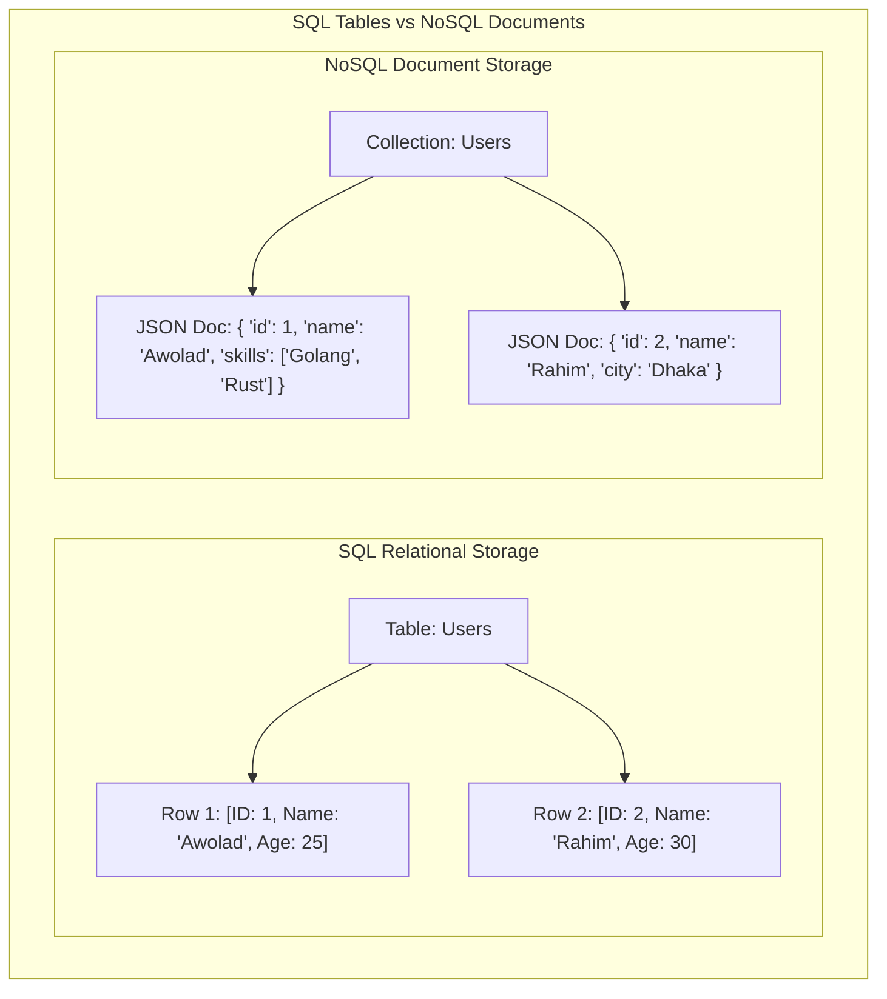
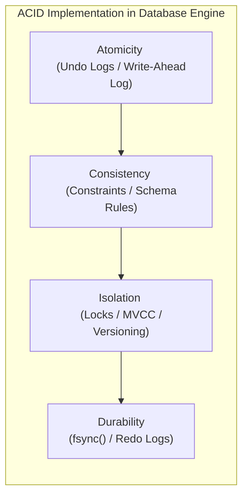
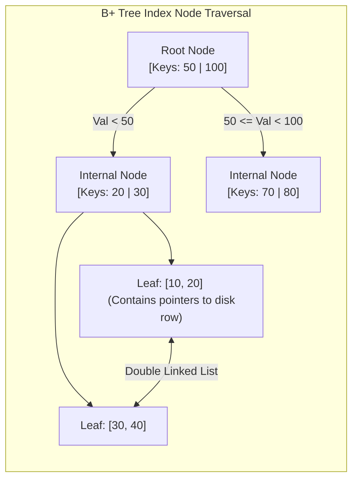
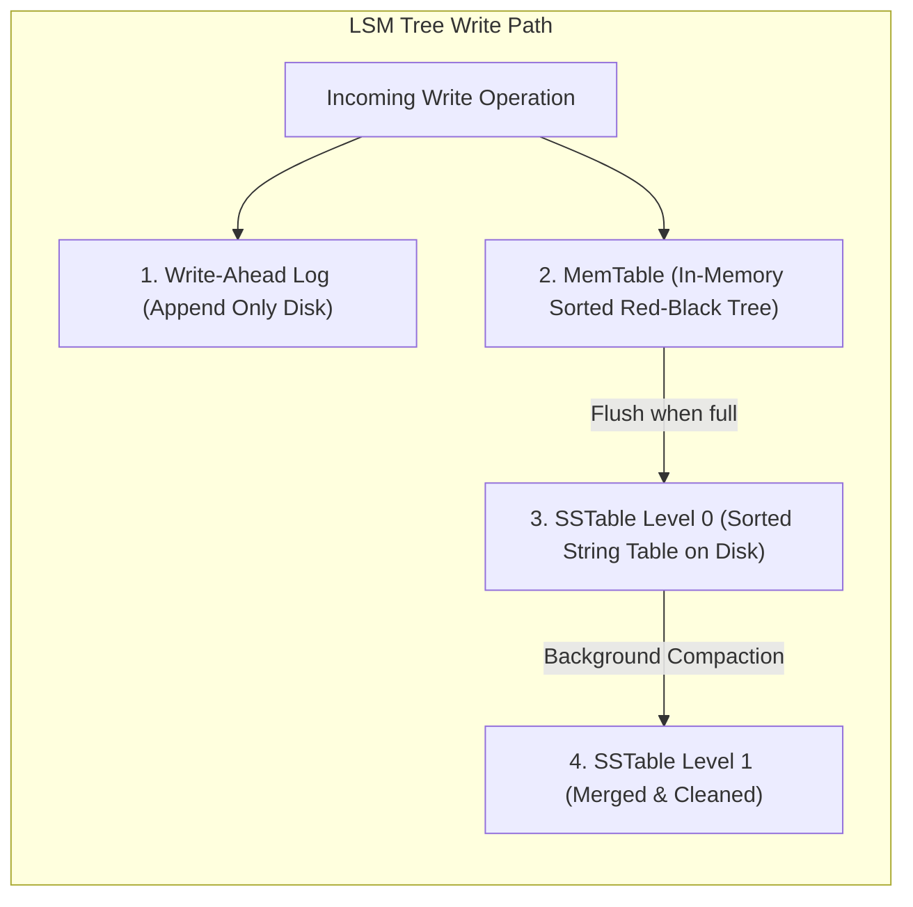
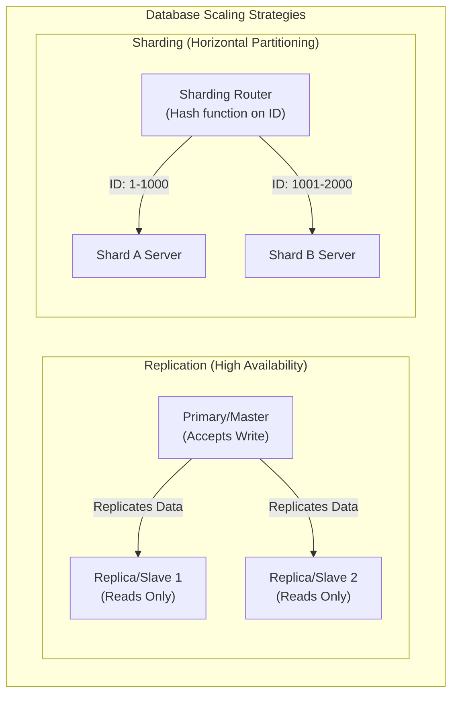

# 🗄️ Database Systems & Storage Engineering Handbook

ডাটাবেস কেবল ডেটা স্টোর করার জায়গা নয়; এটি একটি অত্যন্ত জটিল সফটওয়্যার ইঞ্জিনিয়ারিং আর্কিটেকচার যা কনকারেন্সি, হার্ডওয়্যার ক্র্যাশ, মেমরি অ্যালোকেশন এবং ডিস্ক রাইট স্পিডের সাথে প্রতি সেকেন্ডে লড়াই করে। 

এই হ্যান্ডবুকটি এমনভাবে তৈরি করা হয়েছে যাতে একদম বিগিনার থেকে শুরু করে অভিজ্ঞ সিস্টেমস ইঞ্জিনিয়ার পর্যন্ত যে কেউ ডাটাবেসের অভ্যন্তরীণ মেকানিজম অত্যন্ত সহজ এবং ভিজ্যুয়াল উপায়ে বুঝতে পারেন।

---

## ১. SQL বনাম NoSQL: আর্কিটেকচারাল যুদ্ধক্ষেত্রের ভেতরের রূপ

ডাটাবেস বাছাই করার সময় আমরা প্রায়ই "SQL বনাম NoSQL" এই বিতর্কের মুখোমুখি হই। কিন্তু এর পেছনে আসল কারিগরি ও স্টোরেজ ইঞ্জিনিয়ারিং পার্থক্য কী?

| বৈশিষ্ট্য | Relational (SQL - e.g., PostgreSQL) | Non-Relational (NoSQL - e.g., MongoDB, Cassandra) |
| :--- | :--- | :--- |
| **স্টোরেজ মডেল** | কঠোরভাবে টেবিল, রো (Rows) এবং কলাম (Columns)। | ডকুমেন্টস (JSON/BSON), কী-ভ্যালু, কলাম-ফ্যামিলি বা গ্রাফ। |
| **স্কিমা (Schema)** | **Rigid/Static:** ডাটা ঢোকানোর আগে স্কিমা ডিক্লেয়ার করা বাধ্যতামূলক। | **Dynamic/Flexible:** যেকোনো রিকোয়েস্টে যেকোনো ফিল্ড যোগ করা যায়। |
| **রিলেশন ও জয়েন** | অত্যন্ত শক্তিশালী `JOIN` সাপোর্ট। একাধিক টেবিলের ডাটা লিঙ্ক করা সহজ। | জয়েন মেকানিজম নেই বললেই চলে (Denormalization বা Embedded Docs)। |
| **স্কেলিং মেথড** | **Vertical (Scale-up):** সিপিইউ ও র‍্যাম বাড়িয়ে এক সার্ভারেই সীমাবদ্ধ। | **Horizontal (Scale-out):** হাজার হাজার সার্ভারে ডাটা ভাগ করে দেওয়া যায়। |
| **লেনদেন (Transactions)** | কঠোরভাবে **ACID** কমপ্লায়েন্ট। | প্রাকৃতিকভাবে **BASE** (Basically Available, Soft State, Eventual Consistency)। |



---

## ২. ACID Properties Deep Dive: ডাটাবেসের অলঙ্ঘনীয় চার স্তম্ভ

ডাটাবেস ট্রানজেকশনের মূল শক্তি হলো **ACID**। এটি কোনো সাধারণ শব্দ নয়, এটি ৪টি জটিল অ্যালগরিদমিক প্রতিশ্রুতির সমন্বয়।



### ক. Atomicity (একক অস্তিত্ব) - "সবটুকু হবে, অথবা কিছুই হবে না"
ধরা যাক, আপনি ব্যাংক অ্যাকাউন্ট A থেকে অ্যাকাউন্ট B-তে ১০০ টাকা পাঠাচ্ছেন। এর পেছনে দুটি কোয়েরি চলে:
১. অ্যাকাউন্ট A থেকে ১০০ টাকা বিয়োগ করো।
২. অ্যাকাউন্ট B-তে ১০০ টাকা যোগ করো।
* **বিপর্যয়:** যদি ১ম কোয়েরির পর বিদ্যুৎ চলে যায় বা ডাটাবেস ক্র্যাশ করে, তবে অ্যাকাউন্ট A-এর টাকা কেটে যাবে কিন্তু B-তে ঢুকবে না!
* **সমাধান (WAL & Undo Logs):** ডাটাবেস মেমরিতে কোনো পরিবর্তনের আগে তা **Write-Ahead Log (WAL)**-এ লেখে। যদি কোনো ট্রানজেকশন মাঝপথে ব্যর্থ হয়, ডাটাবেস **Undo Logs** রিড করে পুরো ডাটাকে আগের অবস্থায় ফিরিয়ে নিয়ে যায় (Rollback)।

### খ. Consistency (সামঞ্জস্যতা)
ট্রানজেকশন শুরুর আগে ডাটাবেস যেভাবে ইনভ্যারিয়েন্ট বা নিয়মের মধ্যে ছিল, ট্রানজেকশন শেষেও সমস্ত নিয়ম (যেমন: Foreign Keys, Unique Constraints, Balance >= 0) মেনে ডাটাবেসকে সঠিক অবস্থায় থাকতে হবে।

### গ. Isolation (বিпередиতা) - কনকারেন্সির মহাযুদ্ধ
যখন হাজার হাজার ইউজার একই ডাটাবেসে একই সময়ে রিড ও রাইট করছেন, তখন একজন ইউজারের অপারেশন যাতে অন্যজনের ট্রানজেকশনে গোলমাল না পাকায়, তাই হলো আইসোলেশন।
ডাটাবেসে মূলত ৪টি আইসোলেশন লেভেল রয়েছে, যা বিভিন্ন প্রবলেম বা অ্যানোমালি সমাধান করে:

| আইসোলেশন লেভেল | Dirty Reads | Non-Repeatable Reads | Phantom Reads |
| :--- | :--- | :--- | :--- |
| **Read Uncommitted** | ❌ (ঘটে) | ❌ (ঘটে) | ❌ (ঘটে) |
| **Read Committed** |  (সুরক্ষিত) | ❌ (ঘটে) | ❌ (ঘটে) |
| **Repeatable Read** |  (সুরক্ষিত) |  (সুরক্ষিত) | ❌ (ঘটে - Postgres বাদে) |
| **Serializable** |  (সুরক্ষিত) |  (সুরক্ষিত) |  (সুরক্ষিত) |

#### ⚠️ ৩টি মারাত্মক রিডিং অ্যানোমালি (Anomalies):
১. **Dirty Read:** ট্রানজেকশন ১ একটি ডাটা মডিফাই করল কিন্তু এখনো Commit করেনি। ট্রানজেকশন ২ সেই আন-কমিটেড ডাটা রিড করে ফেলল। পরে ট্রানজেকশন ১ রোলব্যাক করলে ট্রানজেকশন ২-এর পড়া ডাটাটি সম্পূর্ণ ভুয়া বা ভুল প্রমাণিত হয়।
২. **Non-Repeatable Read:** ট্রানজেকশন ১ একটি রো রিড করল। ট্রানজেকশন ২ সেই রো-টি আপডেট করে Commit করে দিল। ট্রানজেকশন ১ আবার রিড করতে গিয়ে দেখল ডাটা বদলে গেছে! (একই ট্রানজেকশনে ভিন্ন ভিন্ন ভ্যালু পাওয়া)।
৩. **Phantom Read:** ট্রানজেকশন ১ একটি রেঞ্জ কোয়েরি করল (যেমন: `Age > 20` ওয়ালা ৫টি ইউজার পেল)। ট্রানজেকশন ২ নতুন একটি ইউজার ইনসার্ট করে Commit করল যার বয়স ২৫। ট্রানজেকশন ১ আবার রান করে দেখল এখন ৬টি ইউজার চলে এসেছে! (ভূতের মতো নতুন ডাটা হাজির হওয়া)।

### ঘ. Durability (স্থায়িত্ব)
একটি ট্রানজেকশন একবার **Success/Commit** মেসেজ দিলে, তার ঠিক পরের মিলি-সেকেন্ডে পুরো ডাটা সেন্টারের কারেন্ট চলে গেলেও সেই ডাটা ওএস ও মেমরি ক্র্যাশ এনিয়ে সুরক্ষিত থাকবে।
* **মেকানিজম:** ওএস পারফরম্যান্সের জন্য যেকোনো ডিস্ক রাইটকে সরাসরি ডিস্কে না লিখে বাফারিং করে ওএস পেজ ক্যাশে (Page Cache) রেখে দেয়।
* ডাটাবেস ট্রানজেকশন কমিট করার সময় ওএসকে জোরপূর্বক **`fsync()`** সিস্টেম কল ফায়ার করতে বাধ্য করে, যা ওএস ক্যাশ বাইপাস করে সরাসরি ফিজিক্যাল SSD/HDD-র সিলিকনে ডাটা স্থায়ীভাবে রাইট করে।

---

## ৩. Database Indexing Internals: B+ Trees বনাম LSM Trees

ডাটাবেসে ইনডেক্সিং ছাড়া কোটি কোটি ডাটা থেকে নির্দিষ্ট ডাটা খোঁজা যেন খড়ের গাদায় সুই খোঁজার মতো। ডাটাবেস স্টোরেজ ইঞ্জিনগুলো ডাটা অর্গানাইজ করতে মূলত দুটি বৈপ্লবিক ডাটা স্ট্রাকচার ব্যবহার করে।

### ক. B+ Tree Index (রিলেশনাল ডাটাবেসের মুকুট)
PostgreSQL, MySQL বা Oracle-এর মতো রিলেশনাল ডাটাবেসগুলো প্রাকৃতিকভাবে B+ Tree ইনডেক্স ব্যবহার করে।



#### B+ Tree কেন ডাটাবেসের জন্য এত জনপ্রিয়?
১. **সুষম গভীরতা (Balanced Tree):** সমস্ত লিফ নোড (Leaf Nodes) একই গভীরতায় বা লেভেলে থাকে। তাই যেকোনো ডাটা খুঁজতে ঠিক একই সংখ্যক হপ বা স্টেপ লাগে ($O(\log N)$)।
২. **রেঞ্জ কোয়েরির জাদু:** B+ Tree-তে সমস্ত ডাটা পয়েন্টার কেবল একদম নিচের লিফ নোডে থাকে এবং এই লিফ নোডগুলো একে অপরের সাথে **ডাবলি লিঙ্কড লিস্ট (Double Linked List)** দিয়ে সংযুক্ত থাকে। ফলে `WHERE id BETWEEN 10 AND 50` এর মতো রেঞ্জ কোয়েরি করা পানির মতো সহজ।
৩. **ডিস্ক ব্লক ফ্রেন্ডলি:** নোডের সাইজ ডিস্কের পেজ সাইজের (যেমন: 4KB বা 8KB) সমান করা হয়, ফলে একটি সিঙ্গেল ডিস্ক I/O অপারেশনেই হাজার হাজার চাইল্ড পয়েন্টার মেমরিতে লোড করা যায়।

### খ. LSM Tree (Log-Structured Merge-Tree - NoSQL-এর পাওয়ারহাউস)
Cassandra, RocksDB বা LevelDB-এর মতো রাইট-হেভি (Write-Heavy) ডাটাবেসগুলো B+ Tree ব্যবহার করে না। কারণ B+ Tree-তে প্রতিবার রাইটের সময় ডিস্কের বিভিন্ন র্যান্ডম জায়গায় গিয়ে রাইট করতে হয় (Random Disk I/O), যা অত্যন্ত ধীরগতির।
LSM Tree এই সমস্যার সমাধান করেছে **Sequential Append-Only Writes** মেকানিজম ব্যবহার করে।



#### LSM Tree-এর মূল মেকানিজম:
১. **MemTable:** যেকোনো নতুন রাইট অপারেশন সরাসরি ডিস্কে না লিখে র‍্যামের ভেতরে থাকা একটি সর্টেড ডাটা স্ট্রাকচার বা **MemTable**-এ ঢোকানো হয়। এটি মিলি-সেকেন্ডের ফ্র্যাকশনে ঘটে।
২. **WAL (Write-Ahead Log):** কারেন্ট চলে গেলে র‍্যামের মেমটেবিল যাতে হারিয়ে না যায়, তাই ব্যাকগ্রাউন্ডে একটি সিম্পল ফাইল-এপেন্ডের মাধ্যমে ডিস্কে লগ লিখে রাখা হয়।
৩. **SSTables (Sorted String Tables):** মেমটেবিল যখন ভরে যায় (যেমন: 64MB), তখন পুরো সর্টেড ডাটা একসাথে ডিস্কে একটি ইমিউটেবল (Immutable - যা আর পরিবর্তন করা যাবে না) ফাইল হিসেবে রাইট করে ফেলা হয়। একে বলা হয় **SSTable**।
৪. **Compaction:** যেহেতু একই কি (Key) বার বার আপডেট হতে পারে, তাই ডিস্কে অনেকগুলো SSTable জমা হয়ে যায়। ব্যাকগ্রাউন্ডে একটি প্রসেস এই সর্টেড ফাইলগুলোকে রিড করে নতুন ভ্যালু রেখে ওল্ড বা ডিলিট হওয়া ভ্যালুগুলো মুছে দিয়ে নতুন একটি মার্জড ফাইল তৈরি করে। একে বলা হয় **Compaction**।

---

## ৪. Concurrency Control: কীভাবে ডাটাবেস লক ও রিলিজ করে?

হাজার হাজার ব্যবহারকারী যখন একই টেবিল বা রো-তে হাত দিচ্ছেন, তখন ডাটাবেস কীভাবে রেস কন্ডিশন (Race Condition) এড়ায়? ডাটাবেস এটি করে মূলত দুটি উপায়ে:

### ক. 2PL (Two-Phase Locking) - পেসিমিস্টিক বা লক-ভিত্তিক
ডাটাবেস ধরে নেয় যে কনকারেন্সি ক্ল্যাশ বা জ্যাম ঘটবেই। তাই সে যেকোনো অপারেশনের আগে ডাটা লক করে নেয়।
* **Shared Lock (S-Lock):** ডাটা রিড করার জন্য ব্যবহৃত হয়। একই সাথে অনেক ইউজার রিড লক পেতে পারেন (Reads are non-blocking to other reads)।
* **Exclusive Lock (X-Lock):** ডাটা রাইট বা আপডেট করার জন্য ব্যবহৃত হয়। এই লক থাকা অবস্থায় অন্য কেউ রিড বা রাইট কোনো লকই পাবে না।
* **2PL-এর দুটি ধাপ:**
  ১. **Growing Phase:** ট্রানজেকশন কেবল লক নিতে পারবে, কোনো লক ছাড়তে পারবে না।
  ২. **Shrinking Phase:** ট্রানজেকশন কেবল লক রিলিজ করতে পারবে, নতুন কোনো লক নিতে পারবে না।

### খ. MVCC (Multi-Version Concurrency Control) - লক-ফ্রি রিডিংয়ের জাদুকর
আজকের আধুনিক ডাটাবেসগুলো (যেমন PostgreSQL বা MySQL InnoDB) রিড অপারেশনকে ব্লক করা ছাড়াই রাইট অপারেশনের পারফরম্যান্স নিশ্চিত করতে **MVCC** ব্যবহার করে।
* **মূল মন্ত্র: "Readers never block Writers, and Writers never block Readers!"**
* **কীভাবে কাজ করে?** MVCC-তে কোনো রো আপডেট করার সময় আগের ডাটাটি মুছে না ফেলে বা ওভাররাইট না করে, কার্নেলে ডাটার একটি সম্পূর্ণ **নতুন সংস্করণ (New Version)** বা কপি তৈরি করা হয়।
* প্রতিটি রো-তে দুটি গোপন মেটাডাটা ফিল্ড থাকে: `xmin` (কোন ট্রানজেকশন আইডি এই রোটি তৈরি করেছে) এবং `xmax` (কোন ট্রানজেকশন আইডি এই রোটি ডিলিট বা সুপারসিড করেছে)।
* আপনি যখন রিড কোয়েরি করবেন, ডাটাবেস আপনার ট্রানজেকশন আইডির সাপেক্ষে যে ভার্সনটি আইনত দৃশ্যমান (Visible), কেবল সেটিই রেন্ডার করবে।
* **Vacuum / Garbage Collection:** ব্যাকগ্রাউন্ডে ডাটাবেসের একটি প্রসেস ওল্ড ও ডেড ভার্সনগুলো (যা এখন আর কোনো রানিং ট্রানজেকশনের প্রয়োজন নেই) স্ক্যান করে মেমরি ফ্রী করে দেয়। Postgres-এ একে বলা হয় **VACUUM**।

---

## ৫. Distributed Databases: রেপ্লিকেশন বনাম শার্ডিং

আপনার এপিআই ট্রাফিক যখন এক সার্ভারের ধারণ ক্ষমতার বাইরে চলে যায়, তখন আমরা ডাটাবেসকে ডিস্ট্রিবিউটেড বা একাধিক সার্ভারে ছড়িয়ে দেই।



### ক. ডাটাবেস রেপ্লিকেশন (Replication)
রেপ্লিকেশনের মূল উদ্দেশ্য হলো **উচ্চ প্রাপ্যতা (High Availability)** এবং রিড ট্রাফিকের ক্ষমতা বাড়ানো।
১. **Single-Leader (Master-Slave):** সমস্ত রাইট অপারেশন কেবল Master সার্ভারে হবে। মাস্টার ডাটা আপডেট করে তা রিড-অনলি Slave সার্ভারগুলোতে কপি বা রেপ্লিকেট করে দেয়। কোনো কারণে মাস্টার সার্ভার ক্র্যাশ করলে স্লেভদের মধ্যে একজন স্বয়ংক্রিয়ভাবে নতুন মাস্টার নির্বাচিত হয়।
২. **Leaderless (Dynamo-style):** কোনো মাস্টার নেই। ক্লায়েন্ট সরাসরি একাধিক নোডে একসাথে রাইট পাঠায়। ডাটা সঠিক কিনা তা নিশ্চিত করতে **Quorum Read/Write ($R + W > N$)** মেকানিজম ব্যবহার করা হয়।

### খ. ডাটাবেস শার্ডিং (Sharding)
শার্ডিং হলো একটি বিশাল টেবিলকে ভেঙে ছোট ছোট টুকরো করে আলাদা আলাদা ফিজিক্যাল সার্ভারে ডিস্ট্রিবিউট করা। একে বলা হয় **Horizontal Partitioning**।
* **Sharding Key:** শার্ডিং করার জন্য একটি ফিল্ড বা কি বেছে নিতে হয় (যেমন: `user_id`)।
* **Consistent Hashing:** ইউজারের আইডি হ্যাশ করে ডাটাবেস ডিটারমাইন করে এই ডাটাটি কোন ফিজিক্যাল শার্ড সার্ভারে সংরক্ষিত হবে। এর ফলে একটি সার্ভারে অতিরিক্ত লোড পড়া (Hotspotting) রোধ করা যায়।

---

## ৬. CAP Theorem বনাম PACELC Theorem: ডিস্ট্রিবিউটেড সিস্টেমের নির্মম বাস্তব সত্য

ডিস্ট্রিবিউটেড ডাটাবেস ডিজাইন করার সময় আপনি চাইলেই সব সুবিধা একসাথে পাবেন না। প্রকৃতি আমাদের ওপর কিছু কঠোর গাণিতিক সীমাবদ্ধতা চাপিয়া দিয়াছে।

```mermaid
flowchart TD
    subgraph CAPTheorem ["The CAP Theorem Triangle"]
        direction TB
        C["Consistency <br> (Every read gets the latest write)"]
        A["Availability <br> (Every non-failing node returns a response)"]
        P["Partition Tolerance <br> (System functions despite packet loss)"]
        
        C --- A
        A --- P
        P --- C
        
        Note over C, P: Choose only TWO in a distributed partition event!
    end
```

### ক. CAP Theorem
১. **Consistency (সামঞ্জস্যতা):** আপনি যে নোড থেকেই রিড করুন না কেন, সর্বদা সর্বশেষ রাইট করা সঠিক ডাটাটিই পাবেন।
২. **Availability (প্রাপ্যতা):** যেকোনো নোড ক্র্যাশ না করে সচল থাকলে সে সর্বদা ক্লায়েন্টকে সফল রেসপন্স ব্যাক করবে (ভুল বা পুরানো ডাটা হলেও রেসপন্স করতে হবে)।
৩. **Partition Tolerance (বিভাজন সহনশীলতা):** নেটওয়ার্কের তার ছিঁড়ে গেলে বা নোডগুলোর মধ্যে কমিউনিকেশন সম্পূর্ণ বন্ধ হয়ে গেলেও পুরো সিস্টেম সচল থাকবে।
* **নির্মম সত্য:** নেটওয়ার্ক পার্টিশন (Partition) ইন্টারনেটের বাস্তব সত্য, যা এড়ানো অসম্ভব। তাই নেটওয়ার্ক পার্টিশন ঘটলে আপনাকে যেকোনো একটি বেছে নিতে হবে: **CP** (Consistency over Availability) অথবা **AP** (Availability over Consistency)।

### খ. PACELC Theorem (CAP এর অ্যাডভান্সড রূপ)
CAP থিওরেম কেবল তখনই কাজ করে যখন সিস্টেমে নেটওয়ার্ক পার্টিশন বা সমস্যা দেখা দেয়। কিন্তু সাধারণ অবস্থায় যখন কোনো সমস্যা থাকে না, তখন ডাটাবেস কীভাবে কাজ করবে? এর ব্যাখ্যা দেয় **PACELC**:

> **If there is a Partition (P):**
> How does the system trade off **Availability (A)** vs **Consistency (C)**?
> **Else (E) - Normal operation:**
> How does the system trade off **Latency (L)** vs **Consistency (C)**?

* **MongoDB (PC/EC):** পার্টিশন ঘটলে Consistency বেছে নেয়; সাধারণ অবস্থায় Latency-র চেয়ে Consistency-কে অগ্রাধিকার দেয়।
* **Cassandra (PA/EL):** পার্টিশন ঘটলে Availability বেছে নেয়; সাধারণ অবস্থায় দ্রুত রেসপন্স বা Latency-কে অগ্রাধিকার দেয় (Eventual Consistency)।

---

## 💡 Systems Architect Database Insights

১. **Avoid SELECT * in Production:** প্রোডাকশন কোয়েরিতে কখনোই `SELECT *` ব্যবহার করবেন না। এটি আপনার প্রয়োজনীয় কলামের বাইরেও বিশাল ডাটা ডিস্ক ও নেটওয়ার্ক ওভারহেডের মাধ্যমে ট্রাভার্স করায়, যা সকেটের আইও পারফরম্যান্স ধ্বংস করে। সর্বদা কলামের নাম সুনির্দিষ্টভাবে উল্লেখ করুন (`SELECT id, name`).
২. **Index Columns with High Cardinality:** ইনডেক্স কেবল সেই সমস্ত কলামেই তৈরি করুন যেখানে ডাটার বৈচিত্র্য (High Cardinality) অনেক বেশি (যেমন: `email` বা `user_id`)। লিঙ্গ (Gender - Male/Female) বা স্ট্যাটাসের মতো কলামে ইনডেক্স তৈরি করলে B+ Tree অপ্টিমাইজড পাথ খুঁজে পায় না, ফলে ইনডেক্সিং উল্টো পারফরম্যান্স হ্রাস করে।
৩. **Connection Pooling is Mandatory:** অ্যাপ্লিকেশন থেকে প্রতিবার কোয়েরি করার সময় নতুন নতুন ডাটাবেস কানেকশন হ্যান্ডশেক এড়াতে সর্বদা **Connection Pool** (যেমন: PgBouncer বা HikariCP) ব্যবহার করুন। এটি ডাটাবেস সার্ভারের সিপিইউ এবং র‍্যামের ওভারহেড প্রায় ৫ গুণ কমিয়ে দেয়।

---
