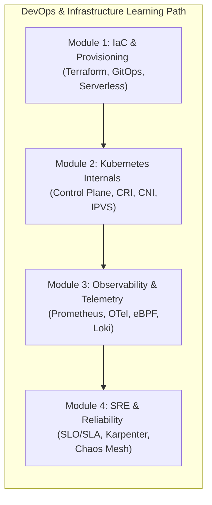

# 🚀 DevOps & Cloud-Native Infrastructure Index

স্বাগতম! আধুনিক সফটওয়্যার ইঞ্জিনিয়ারিংয়ে ডেভঅপ্স এবং ইনফ্রাস্ট্রাকচার কেবল কোড ডিপ্লয়মেন্টের মাধ্যম নয়; এটি হলো একটি সিস্টেমের স্থায়িত্ব (Reliability), কর্মক্ষমতা (Performance) এবং স্কেলিং বাউন্ডারি নিশ্চিত করার হার্টবিট। 

ইনফ্রাস্ট্রাকচার এজ কোড (IaC), কুবারনেটিস ইন্টারনালস, ডিস্ট্রিবিউটেড অবজারভেবিলিটি এবং সাইট রিলায়বিলিটি ইঞ্জিনিয়ারিং (SRE)—এই ৪টি মূল মডিউলের গভীর বিবরণ নিয়ে তৈরি এই মাস্টারক্লাস হ্যান্ডবুক।

এখানে আমাদের **devops.md** ফাইলে থাকা **১২টি চ্যাপ্টারের** একটি সুবিন্যস্ত রোডম্যাপ ও সূচিপত্র দেওয়া হলো। এটিকে ৪টি মূল আর্কিটেকচারাল মডিউলে ভাগ করা হয়েছে যাতে আপনি একজন **Staff DevOps Architect** হিসেবে নিজেকে গড়ে তুলতে পারেন।

---

---

## 🗺️ ১২টি চ্যাপ্টারের আর্কিটেকচারাল সূচিপত্র

নিচে প্রতিটি মডিউলের অন্তর্গত চ্যাপ্টারগুলোর একটি বিস্তারিত ওভারভিউ এবং নেভিগেশন লিংক দেওয়া হলো:

### ⚙️ Module 1: Infrastructure as Code & System Provisioning (ইনফ্রাস্ট্রাকচার এজ কোড ও প্রভিশনিং)
*ইনফ্রাস্ট্রাকচারকে ডিক্লেয়ারেটিভ কোডে রূপান্তর, গিটঅ্যপ্স কন্টিনুয়াস ডেলিভারি এবং সার্ভারলেস ইঞ্জিনের কার্নেল-লেভেল আইসোলেশন ও এজ কম্পিউটিং।*

*   [**১. Declarative vs Imperative IaC ও Terraform Engine Internals:**](/docs/devops#১-declarative-vs-imperative-iac-ও-terraform-engine-internals) ডিক্লেয়ারেটিভ বনাম ইম্পারেティブ আইএসি, টেরাফর্ম DAG (Directed Acyclic Graph) ইঞ্জিন, স্টেট ম্যানেজমেন্ট, লকিং এবং ড্রিফট ডিটেকশন প্রসেস।
*   [**২. GitOps ও Continuous Delivery (ArgoCD & Canary Deployments):**](/docs/devops#২-gitops-ও-continuous-delivery-argocd-canary-deployments) পুশ বনাম пул-বেসড সিডি, কুবেরনেটিস গিটঅপ্স কন্ট্রোলার রিঅ্যাকশন লুপ, ক্যানারি ও ব্লু-গ্রিন ডেভলপমেন্ট স্ট্র্যাটেজি।
*   [**৩. Serverless Internals ও Edge Computing (Lambda & Cloudflare Workers):**](/docs/devops#৩-serverless-internals-ও-edge-computing-lambda-cloudflare-workers) AWS Lambda Firecracker MicroVM, কোল্ড স্টার্ট অপ্টিমাইজেশন এবং V8 Isolates বনাম কন্টেইনার আর্কিটেকচারাল ট্রেড-অফ।

---

### ☸️ Module 2: Container Orchestration & Kubernetes Core Internals (কন্টেইনার অর্কেস্ট্রেশন ও কুবারনেটিস কোর)
*কুবারনেটিস কন্ট্রোল প্লেনের গাণিতিক সমঝোতা, পডের ফিজিক্যাল লাইফসাইকেল, কন্টেইনার রানটাইম প্রসেস এবং কার্নেল-লেভেল নেটওয়ার্কিং (CNI & IPVS)।*

*   [**৪. Kubernetes Control Plane ও API Server Mechanics:**](/docs/devops#৪-kubernetes-control-plane-ও-api-server-mechanics) Kube-apiserver রিকোয়েস্ট লাইফসাইকেল, অ্যাডমিশন কন্ট্রোল ও মিউটেটিং ওয়েবহুক এবং Etcd Raft কনসেনসাস ও ওয়াচ এপিআই।
*   [**৫. Pod Lifecycle, Scheduler & Container Runtime (CRI):**](/docs/devops#৫-pod-lifecycle-scheduler-container-runtime-cri) পড শিডিউলিং লজিক (Filtering, Scoring), container-shim প্রসেস ট্রি এবং Container Runtime Interface (containerd/CRI-O)।
*   [**৬. Kubernetes Networking (CNI), Services ও Ingress Controllers:**](/docs/devops#৬-kubernetes-networking-cni-services-ও-ingress-controllers) Overlay Networks (VxLAN) বনাম eBPF-based Cilium, kube-proxy iptables বনাম IPVS এবং গেটওয়ে এপিআই।

---

### 📊 Module 3: Observability, Metrics & Telemetry (অবজারভেবিলিটি, মেট্রিক্স ও টেলিমেন্ট্রি)
*হাই-কার্ডিনালিটি মেট্রিক্স স্কেলিং, ওপেনটেলিমেন্ট্রি প্রোটোকল কনটেক্সট প্রোপাগেশন, কার্নেল-লেভেল eBPF প্রোফাইলিং এবং ইনডেক্স-ফ্রি কমপ্রেসড লগ ম্যানেজমেন্ট।*

*   [**৭. Prometheus Architecture ও Metric Scraping Internals:**](/docs/devops#৭-prometheus-architecture-ও-metric-scraping-internals) পুল-বেসড স্ক্র্যাপিং মেকানিজম, TSDB Gorilla কম্প্রেশন ও WAL এবং হাই-কার্ডিনালিটি মেট্রিক্স বিপর্যয় ও প্রতিকার।
*   [**৮. Distributed Tracing ও OpenTelemetry (OTel) Standards:**](/docs/devops#৮-distributed-tracing-ও-opentelemetry-otel-standards) OTel স্পেসিফিকেশন, W3C Trace Context প্রোপাগেশন এবং ওটেল কালেক্টর আর্কিটেকচার (Receivers, Processors, Exporters)।
*   [**৯. Continuous Profiling ও Log Aggregation at Scale (Grafana Loki/eBPF):**](/docs/devops#৯-continuous-profiling-ও-log-aggregation-at-scale-grafana-lokiebpf) Grafana Loki ইনডেক্স-ফ্রি কমপ্রেসড চ্যাংক স্টোরেজ এবং eBPF (Pyroscope) দিয়ে জিরো-ওভারহেড সিপিইউ স্ট্যাক ট্রেসিং।

---

### 🛠️ Module 4: Reliability Engineering & SRE (রিলাইবিলিটি ও সাইট রিলায়বিলিটি ইঞ্জিনিয়ারিং)
*এরর বাজেট দিয়ে রিলিজ ভেলোসিটি কন্ট্রোল, ক্লাউড-নেটিভ Karpenter জাস্ট-ইন-টাইম স্কেলিং এবং প্রোডাকশনে ব্যর্থতা ইনজেক্ট করে ক্যাওস ইঞ্জিনিয়ারিং ডিফেন্স।*

*   [**১০. Site Reliability Engineering (SRE): SLA, SLO, SLI ও Error Budgets:**](/docs/devops#১০-site-reliability-engineering-sre-sla-slo-sli-ও-error-budgets) গোল্ডেন সিগন্যালস, SLO/SLI ম্যাপিং এবং Multi-Window Multi-Burn-Rate অ্যালার্ট প্রসেস।
*   [**১১. Auto-scaling Internals: HPA, VPA ও Karpenter:**](/docs/devops#১১-auto-scaling-internals-hpa-vpa-ও-karpenter) কুবেরনেটিস HPA স্কেলিং ম্যাথমেটিক্স, VPA রিকমেন্ডার ইঞ্জিন এবং Karpenter জাস্ট-ইন-টাইম নোড প্রভিশনিং।
*   [**১২. Chaos Engineering ও Failure Injection (Chaos Mesh/Litmus):**](/docs/devops#১২-chaos-engineering-ও-failure-injection-chaos-meshlitmus) প্রোডাকশন ফল্ট ইনজেকশন, সার্কিট ব্রেকার্স, এক্সপোনেনশিয়াল ব্যাকঅফ ও জিটার এবং ফলব্যাক আর্কিটেকচার।

---
