# 🌐 Distributed Systems & Architecture Masterclass

আধুনিক বড় স্কেলের সফটওয়্যার সিস্টেমগুলোর মূল ভিত্তি হলো ডিস্ট্রিবিউটেড সিস্টেমস। একাধিক নোডের মধ্যে ডাটা সিঙ্ক রাখা, নেটওয়ার্কের বিভিন্ন লেটেন্সি সত্ত্বেও কনসিস্টেন্সি বজায় রাখা, নোড ক্র্যাশ ও ফেইলিউর সামলে কো-অর্ডিনেশন ঠিক রাখা এবং থ্রুপুট স্কেল করার জন্য এমন কিছু জটিল আর্কিটেকচারাল প্যাটার্ন প্রয়োজন হয় যা সাধারণ একমুখী অ্যাপ্লিকেশনে কল্পনা করাও কঠিন। 

এই ডিস্ট্রিবিউটেড মাস্টারক্লাস হ্যান্ডবুকে আমরা মোট ৬টি প্রধান ডিস্ট্রিবিউটেড আর্কিটেকচারের স্তম্ভ এবং স্টাফ সফটওয়্যার আর্কিটেক্ট লেভেলের প্রোডাকশন প্যাটার্নগুলো নিয়ে আলোচনা করব।

---

## 📌 চ্যাপ্টার ইনডেক্স ও নেভিগেশন (Table of Contents)

নিচে ডিস্ট্রিবিউটেড সিস্টেমস ও আর্কিটেকচারের মূল ৬টি স্তম্ভ এবং তাদের অধীনস্থ লার্নিং মডিউলগুলোর একটি নেভিগেশন ম্যাপ দেওয়া হলো। যেকোনো মূল স্তম্ভে সরাসরি চলে যেতে লিঙ্কে ক্লিক করুন:

| মূল চ্যাপ্টার ও প্রযুক্তিগত স্তম্ভ | কভার্ড অ্যাডভান্সড কনসেপ্টস | অ্যাকশন লিংক |
| :--- | :--- | :--- |
| **১. Distributed Consensus & Coordination** | Byzantine Generals Problem, FLP Impossibility Theorem, Paxos vs Raft leader election, etcd, and ZooKeeper coordination. | [**চ্যাপ্টার ১-এ যান**](#-১-distributed-consensus--coordination) |
| **২. Distributed Transactions & Consistency** | 2PC/3PC, Saga Pattern (Orchestration vs Choreography), Strong/Eventual/Causal Consistency, and Linearizability. | [**চ্যাপ্টার ২-এ যান**](#-২-distributed-transactions--consistency-models) |
| **৩. Data Replication & Partitioning** | Single-leader vs Leaderless, Vector Clocks & Version Vectors, Consistent Hashing internals, and Partition Rebalancing. | [**চ্যাপ্টার ৩-এ যান**](#-৩-data-replication--partitioningsharding) |
| **৪. Distributed Messaging & Event-Driven** | At-Least-Once / Exactly-Once delivery, Kafka/RabbitMQ internals, CQRS & Event Sourcing, Backpressure, and Partitioning. | [**চ্যাপ্টার ৪-এ যান**](#-৪-distributed-messaging--event-driven-architectures) |
| **৫. Distributed Caching & Coherency** | Cache Stampede prevention, Write-invalidate vs Write-update, L1/L2 Cache Coherency, and Probabilistic Cache Expiration (XFetch). | [**চ্যাপ্টার ৫-এ যান**](#-৫-distributed-caching--coherency) |
| **৬. Fault Tolerance & Chaos Engineering** | Phi Accrual Failure Detector, Gossip Protocol cluster state, Disaster Recovery (RTO/RPO), and Chaos Engineering (Fault Injection). | [**চ্যাপ্টার ৬-এ যান**](#-৬-fault-tolerance-recovery--chaos-engineering) |

---

## 🤝 ১. Distributed Consensus & Coordination

ডিস্ট্রিবিউটেড সিস্টেমে নেটওয়ার্ক ফেইলিউর এবং বিভিন্ন নোডের ল্যাগ সত্ত্বেও কীভাবে একাধিক নোড একক সিদ্ধান্ত বা তথ্যে একমত (Consensus) হতে পারে, তা ডিস্ট্রিবিউটেড কনসেনসাস অ্যালগরিদমের মাধ্যমে নির্ধারিত হয়। এটি ডিস্ট্রিবিউটেড সিস্টেম ডিজাইনের সবচেয়ে জটিল এবং বৈপ্লবিক অংশ।

---

### ১.১ The Distributed Consensus Problem

কনসেনসাস প্রবলেম হলো: একদল নোড নেটওয়ার্কের মাধ্যমে মেসেজ আদান-প্রদান করে একটি সাধারণ সিদ্ধান্তে (যেমন: ডাটা রাইট সাকসেসফুল করা বা নতুন লিডার নির্বাচন করা) একমত হতে চায়। কিন্তু নেটওয়ার্কের মেসেজ লস, ল্যাগ, বা নোড ক্র্যাশ হওয়ার সম্ভাবনা এই কাজটিকে অত্যন্ত দুরূহ করে তোলে।

#### ১. Byzantine Generals Problem (বাইজেন্টাইন জেনারেল সমস্যা)
১৯৮২ সালে লেসলি ল্যামপোর্ট এবং অন্যরা এই ক্লাসিকাল থিওরেমটি প্রস্তাব করেন। 

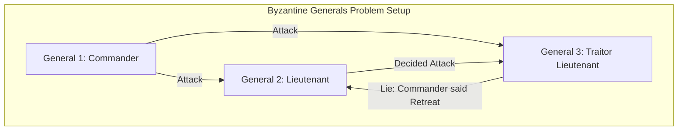

*   **মেকানিজম:** একদল জেনারেল একটি শত্রু শহর ঘেরাও করে রেখেছে। তারা সবাই মিলে হয় আক্রমণ (Attack) করবে নতুবা পিছু হটবে (Retreat)। কিন্তু জেনারেলরা একে অপরের থেকে দূরে অবস্থান করছে এবং কেবল দূত বা মেসেঞ্জারের মাধ্যমে যোগাযোগ করতে পারে। সমস্যা হলো, জেনারেলদের মধ্যে কিছু **বিশ্বাসঘাতক (Traitors)** থাকতে পারে যারা একেক নোডকে একেক মেসেজ পাঠিয়ে সিস্টেমকে মিসলিড করবে।
*   **গাণিতিক সীমা:** যদি একটি ডিস্ট্রিবিউটেড সিস্টেমে `f` সংখ্যক নোড বিশ্বাসঘাতক বা ক্ষতিকর আচরণ (Arbitrary/Byzantine Failures) করে, তবে সিস্টেমে কনসেনসাস অর্জন করতে হলে মোট নোড সংখ্যা ন্যূনতম `3f + 1` হতে হবে। অর্থাৎ, সিস্টেমে বিশ্বাসঘাতকের সংখ্যা ১/৩ এর কম হতে হবে।
*   **CFT vs BFT:**
    *   **Crash-Fault-Tolerant (CFT):** যখন নোডগুলো কেবল ক্র্যাশ করতে পারে কিন্তু মিথ্যা বা ভুল ডাটা বানায় না (যেমন সাধারণ প্রাইভেট ডেটাসেন্টার সিস্টেম)। Paxos এবং Raft প্রোটোকল CFT ক্যাটাগরির। এখানে `f` সংখ্যক ফেইলিউর টলারেট করতে ন্যূনতম `2f + 1` নোড প্রয়োজন (অর্ধেকের বেশি বা কোরাম)।
    *   **Byzantine Fault Tolerant (BFT):** যখন নোডগুলো হ্যাকড হতে পারে এবং ইচ্ছাকৃতভাবে ভুল তথ্য প্রপাগেট করতে পারে (যেমন পাবলিক ব্লকচেন নেটওয়ার্ক)। PBFT বা সমমানের BFT প্রোটোকলগুলো `3f + 1` নোড সিকিউরিটি মডেল ফলো করে।

#### ২. FLP Impossibility Theorem
১৯৮৫ সালে ফিশার, লিঞ্চ এবং প্যাটারসন এই যুগান্তকারী থিওরেমটি প্রমাণ করেন।

> **The FLP Theorem:** "In an asynchronous network, no deterministic consensus protocol can guarantee progress (liveness) if even a single node is allowed to experience unannounced crash failure."

*   **বাস্তব তাৎপর্য:** একটি অ্যাসিনক্রোনাস নেটওয়ার্কে (যেখানে মেসেজ প্রসেস হতে কত সময় লাগবে তার কোনো আপার-বাউন্ড বা সর্বোচ্চ সময়সীমা নেই) কোনো অ্যালগরিদম একই সাথে সম্পূর্ণ নিখুঁত কনসিস্টেন্সি (**Safety**) এবং গ্যারান্টিড প্রোগ্রেস (**Liveness**) নিশ্চিত করতে পারবে না, যদি একটি নোডও ক্র্যাশ করার সম্ভাবনা থাকে।
*   **আর্কিটেকচারাল ডিসিশন:** এই কারণে আধুনিক ডিস্ট্রিবিউটেড প্রোটোকলগুলো (যেমন Raft বা Paxos) সর্বদা **Safety** কে সর্বোচ্চ অগ্রাধিকার দেয়। নেটওয়ার্ক পার্টিশন ঘটলে বা খুব বেশি লেটেন্সি হলে সিস্টেম সাময়িকভাবে কাজ করা বন্ধ করে প্রোগ্রেস স্যাক্রিফাইস করে (Liveness স্থগিত করে), কিন্তু কখনোই ভুল বা ডাইভার্জড তথ্যে কনসেনসাস করে না।

---

### ১.২ Paxos vs Raft Protocol Deep Dive

Paxos ছিল প্রথম একাডেমিকভাবে স্বীকৃত কনসেনসাস অ্যালগরিদম, কিন্তু এটি অত্যন্ত জটিল ও অবোধ্য হওয়ার কারণে ২০১৩ সালে দিয়েগো ওংগারো এবং জন ওস্টারহাউট **Raft** প্রোটোকল ডিজাইন করেন। 

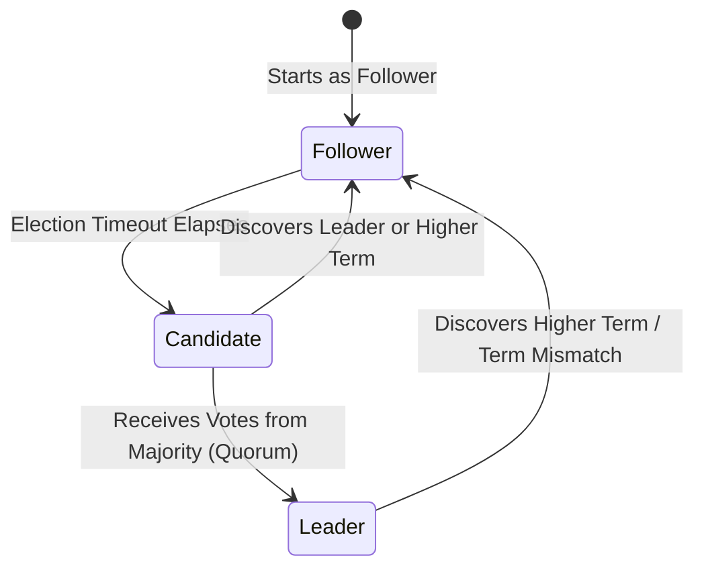

#### ১. Raft State Machine & Terms
Raft একটি রানিং ডিস্ট্রিবিউটেড সিস্টেমকে তিনটি রোল (Roles) এবং ধারাবাহিক মেয়াদে (**Terms**) বিভক্ত করে:
*   **Follower (অনুসারী):** সিস্টেমের প্যাসিভ নোড। এরা কেবল লিডার এবং ক্যান্ডিডেটের রিকোয়েস্টে সাড়া দেয়।
*   **Candidate (প্রার্থী):** লিডার নির্বাচনের সময় ফলোয়াররা ক্যান্ডিডেটে রূপান্তরিত হয়ে ভোট চায়।
*   **Leader (নেতা):** সমস্ত ক্লায়েন্ট রিকোয়েস্ট রিসিভ করে, লগ এন্ট্রি প্রপাগেট করে এবং নিশ্চিত করে যে সব ফলোয়ার একই লগ সিকোয়েন্স মেনে চলছে।
*   **Term:** প্রতিটি মেয়াদের শুরুতে একটি ডাইনামিক এবং ক্রমান্বয়ে বৃদ্ধি পাওয়া ইন্টিজার থাকে। এটি একটি ডিস্ট্রিবিউটেড লজিক্যাল ক্লক হিসেবে কাজ করে যা ওল্ড লিডার ডিটেক্ট করতে সাহায্য করে।

#### ২. Leader Election ( Randomized Timeouts & Quorum)
যদি কোনো ফলোয়ার একটি নির্দিষ্ট সময়সীমার মধ্যে (যাকে **Election Timeout** বলা হয়, সাধারণত ১৫০ms থেকে ৩০০ms-এর মধ্যে একটি র‍্যান্ডম ভ্যালু) লিডারের কাছ থেকে কোনো হার্টবিট (Heartbeat) না পায়, তবে সে ধরে নেয় লিডার ক্র্যাশ করেছে এবং নতুন নির্বাচন শুরু করে:
*   Follower তার মেয়াদ (`Term`) এক বাড়ায় এবং নিজেকে **Candidate** হিসেবে ঘোষণা করে।
*   সে ক্লাস্টারের সমস্ত নোডকে **`RequestVote`** RPC পাঠায়।
*   **ভোট প্রদানের শর্ত:** একটি নোড কোনো ক্যান্ডিডেটকে ভোট দেবে কেবল যদি:
    ১. সে এই মেয়াদে ইতিমধ্যে অন্য কাউকে ভোট না দিয়ে থাকে।
    ২. ক্যান্ডিডেটের লগ সিকোয়েন্স নিজের লগের চেয়ে বেশি বা সমান আপ-টু-ডেট (Longer and newer log) হয়।
*   **Quorum (কোরাম):** যদি ক্যান্ডিডেট ক্লাস্টারের অর্ধেকের বেশি নোডের ভোট পায় (যেমন ৫টি নোডের মধ্যে ৩টি), সে **Leader** হিসেবে নির্বাচিত হয় এবং সাথে সাথে রিফিল হার্টবিট পাঠাতে শুরু করে।
*   **র‍্যান্ডম টাইমআউটের ভূমিকা:** যদি সব নোড একই সময়ে ভোট চাইতে শুরু করে, তবে ভোট স্প্লিট (Split Vote) হয়ে নির্বাচন থমকে যাবে। ফলোয়ারদের ইলেকশন টাইমআউট র‍্যান্ডমাইজড করার ফলে যেকোনো একটি নোড আগে ইলেকশন শুরু করে সহজে কোরাম অর্জন করতে পারে।

#### ৩. Log Replication (লগ রেপ্লিকেশন মেকানিজম)

লিডার নির্বাচিত হওয়ার পর সিস্টেমের সমস্ত রিড-রাইট অপারেশন লিডারের মাধ্যমে পরিচালিত হয়:

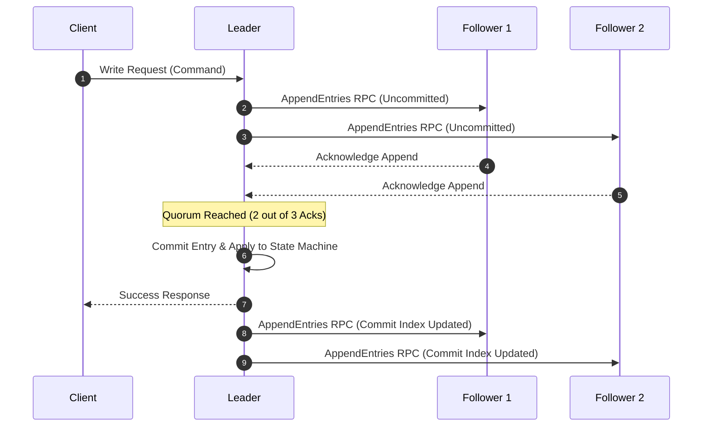

1.  **AppendEntries RPC:** লিডার ক্লায়েন্টের কাছ থেকে ডাটা রাইট কমান্ড পাওয়ার পর তার নিজস্ব লগে এন্ট্রি যোগ করে এবং ক্লাস্টারের ফলোয়ারদের কাছে `AppendEntries` RPC পাঠায়।
2.  **Quorum Write:** ফলোয়ার নোডগুলো ডাটাটি তাদের লগে লিখে লিডারকে সাকসেস মেসেজ পাঠায়। যখন ক্লাস্টারের অর্ধেকের বেশি নোড রাইট অ্যাকনলেজ করে, তখন লিডার ডাটাটিকে **`Committed`** হিসেবে মার্ক করে এবং নিজের লোকাল স্টেট মেশিনে কুয়েরি অ্যাপ্লাই করে ক্লায়েন্টকে সাকসেস রিটার্ন করে।
3.  **Eventually Consistent Commit:** পরবর্তী হার্টবিট বা RPC-র মাধ্যমে লিডার ফলোয়ারদের নতুন `CommitIndex` জানিয়ে দেয় এবং ফলোয়াররাও সেই অনুযায়ী তাদের লোকাল স্টেট মেশিন আপডেট করে নেয়।

#### ৪. Raft Safety Guarantees (Raft সেফটি গ্যারান্টি)
Raft প্রোটোকল ডিস্ট্রিবিউটেড সিস্টেমের নিখুঁত অ্যাকুরেসি বজায় রাখার জন্য ৫টি মূল নীতি কঠোরভাবে মেনে চলে:

| সেফটি প্রোপার্টি | ডেসক্রিপশন ও আর্কিটেকচারাল রুলস |
| :--- | :--- |
| **Election Safety** | প্রতিটি টার্মে (Term) সর্বোচ্চ একজন লিডার নির্বাচিত হতে পারবে। |
| **Leader Append-Only** | লিডার তার লগের কোনো এন্ট্রি কখনো ডিলিট বা ওভাররাইট করবে না; সে কেবল নতুন এন্ট্রি অ্যাপেন্ড করতে পারে। |
| **Log Matching** | যদি দুটি ভিন্ন নোডের লগে একই ইনডেক্স এবং একই টার্মের কোনো এন্ট্রি থাকে, তবে সেই ইনডেক্স পর্যন্ত তাদের সমস্ত লগ এন্ট্রি সম্পূর্ণ অভিন্ন। |
| **Leader Completeness** | যদি কোনো এন্ট্রি কোনো নির্দিষ্ট টার্মে কমিটেড (Committed) হয়ে যায়, তবে পরবর্তী যেকোনো মেয়াদের লিডারের লগে সেই এন্ট্রিটি অবশ্যই থাকতে হবে। |
| **State Machine Safety** | যদি কোনো নোড তার লোকাল স্টেট মেশিনে কোনো নির্দিষ্ট ইনডেক্সের লগ অ্যাপ্লাই করে ফেলে, তবে অন্য কোনো নোড ওই ইনডেক্সে ভিন্ন কোনো এন্ট্রি অ্যাপ্লাই করতে পারবে না। |

---

### ১.৩ ZooKeeper & etcd Internals

ZooKeeper এবং etcd হলো দুটি জনপ্রিয় প্রোডাকশন-রেডি ডিস্ট্রিবিউটেড কো-অর্ডিনেশন ইঞ্জিন। আধুনিক ক্লাউড-নেটিভ সিস্টেম (যেমন Kubernetes) এদের ওপর ভিত্তি করে তাদের স্টেট এবং ডিস্ট্রিবিউটেড কনফিগারেশন ম্যানেজ করে।

#### ১. ZooKeeper & ZAB (ZooKeeper Atomic Broadcast) Protocol
ZooKeeper-এর কোর রেপ্লিকেশন মেকানিজম Raft-এর মতো হলেও এটি **ZAB (Zab)** প্রোটোকলের ওপর ভিত্তি করে কাজ করে।
*   **ZAB Stages:**
    *   **Phase 1: Recovery (Leader Election):** এই ধাপে ক্র্যাশ হওয়া লিডার রিকভার করা হয় এবং সবচেয়ে আপডেট লগ থাকা নোডটিকে নতুন লিডার হিসেবে সিলেক্ট করা হয়।
    *   **Phase 2: Atomic Broadcast:** লিডার যখন কোনো রাইট রিকোয়েস্ট পায়, সে ফলোয়ারদের কাছে টু-ফেজ কমিটের (2PC) মতো একটি প্রপোজাল পাঠায়। কোরাম পাওয়ার পর সে ব্রডকাস্ট মেসেজ পাঠিয়ে রাইট কমপ্লিট করে।
*   **Hierarchical Data Model (zNodes):** ZooKeeper ডাটা একটি ট্রির মতো স্ট্রাকচারে (`/services/payment/node_1`) সেভ করে। এই নোডগুলোকে **zNodes** বলা হয়।
*   **Read Performance Optimization:** ZooKeeper-এর রিড অপারেশনগুলো অত্যন্ত ফাস্ট, কারণ যেকোনো রিড রিকোয়েস্ট যেকোনো লোকাল রেপ্লিকা থেকে সরাসরি সার্ভ করা হয়। তবে এর ফলে রিড অপারেশনে কিছুটা **Eventual Consistency** দেখা দিতে পারে।

#### ২. etcd: The Backbone of Kubernetes
Kubernetes-এর সমস্ত ক্লাস্টার কনফিগারেশন, মেটাডেটা এবং ডিস্ট্রিবিউটেড লক ম্যানেজ করার জন্য **etcd** ব্যবহৃত হয়।
*   **Raft-native Engine:** etcd সম্পূর্ণ গো-ল্যাং-এ লেখা এবং এর কনসেনসাস ইঞ্জিন সরাসরি **Raft** প্রোটোকল ইমপ্লিমেন্ট করে।
*   **MVCC (Multi-Version Concurrency Control):** etcd-তে ডাটা রাইট করার সময় আগের ডাটা ওভাররাইট হয় না। প্রতিটি ডাটা চেঞ্জের সাথে একটি ইউনিক রিভিশন আইডি জেনারেট হয়। এর ফলে রিডাররা কোনো লক ছাড়াই পুরনো রিভিশনের ডাটা নির্ভুলভাবে রিড করতে পারে (Non-blocking Reads)।
*   **Linearizable Reads:** etcd নিশ্চিত করে যে রিড অপারেশনগুলো সর্বদা একদম লেটেস্ট কমিটেড ডাটা রিটার্ন করবে (Strict Consistency)। এটি করার জন্য রিড রিকোয়েস্ট প্রসেস করার আগে লিডার অন্যান্য ফলোয়ারদের পিং করে কোরাম চেক করে নেয় (যাকে ReadIndex বা Lease read বলা হয়)।

---

### ১.৪ Leases & Ephemeral Node Management

ডিস্ট্রিবিউটেড লকিং এবং সার্ভিস মেম্বারশিপ ট্র্যাকিংয়ের জন্য লিজ এবং ক্ষণস্থায়ী নোড মেকানিজম অত্যন্ত গুরুত্বপূর্ণ।

#### ১. Leases (লিজ মেকানিজম)
ডিস্ট্রিবিউটেড লক বা সেশন হোল্ড করার জন্য যদি কোনো নোড লাইভ লক নিয়ে বসে থাকে এবং হঠাৎ ক্র্যাশ করে, তবে লকটি সারাজীবনের জন্য আটকে যাবে (Deadlock)। এর সমাধান হলো **Leases**।
*   **লিজ** হলো একটি নির্দিষ্ট সময়সীমার লক (যেমন ১০ সেকেন্ড)। 
*   লক হোল্ডার নোডটিকে এই ১০ সেকেন্ডের মধ্যে বারবার কনসেনসাস ইঞ্জিনে **Heartbeat** পাঠিয়ে লিজের মেয়াদ রিনিউ (Renew) করতে হয়।
*   যদি নোডটি ক্র্যাশ করে বা নেটওয়ার্ক বিচ্ছিন্ন হয়ে পড়ে, তবে ১০ সেকেন্ড পর লিজ স্বয়ংক্রিয়ভাবে এক্সপায়ার হয়ে যায় এবং লকটি আনলক হয়ে অন্য নোডের জন্য উন্মুক্ত হয়।

#### ২. Ephemeral Nodes (ক্ষণস্থায়ী নোড)
ZooKeeper বা etcd-তে দুই ধরনের নোড ক্রিয়েট করা যায়:
*   **Persistent Node:** নোড তৈরি করার পর ক্লায়েন্ট ডিসকানেক্ট হয়ে গেলেও ডাটা চিরকাল থেকে যায়।
*   **Ephemeral Node:** এই নোডগুলো একটি ক্লায়েন্ট সেশন বা লিজের সাথে যুক্ত থাকে। ক্লায়েন্ট সেশন সচল থাকা পর্যন্ত নোডটি মেমরিতে থাকে। ক্লায়েন্ট ডিসকানেক্ট হলে বা হার্টবিট মিস করলে কনসেনসাস ইঞ্জিন নোডটি ডিটেক্ট করে স্বয়ংক্রিয়ভাবে মুছে ফেলে।

#### ৩. Distributed Locking Recipe (Avoiding Herd Effect)
লিজ এবং এপিমেরাল সিকোয়েন্সিয়াল নোড ব্যবহার করে কীভাবে কোনো **Herd Effect** (একটি লক রিলিজ হলে হাজার হাজার নোড একসাথে হুমড়ি খেয়ে লক ধরতে যাওয়া) ছাড়াই অত্যন্ত দক্ষতার সাথে ডিস্ট্রিবিউটেড লক ডিজাইন করা যায়, তার একটি ভিজ্যুয়াল আর্কিটেকচার নিচে দেওয়া হলো:

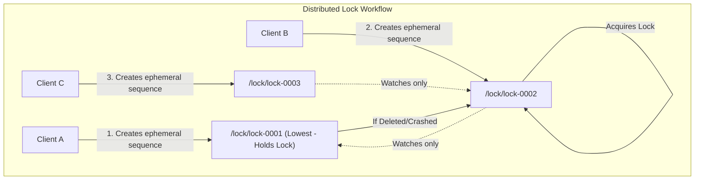

1.  **Create Ephemeral Sequential Node:** লক অ্যাকোয়ার করতে চাওয়া প্রতিটি ক্লায়েন্ট একটি ডিরেক্টরির অধীনে ক্ষণস্থায়ী এবং সিকোয়েন্সিয়াল নোড তৈরি করে (যেমন: `/locks/lock-0001`, `/locks/lock-0002`, `/locks/lock-0003`)।
2.  **Acquire Lock Decision:** ক্লায়েন্ট ডিরেক্টরির সমস্ত চাইল্ড নোডের লিস্ট রিড করে। যদি তার তৈরি করা নোডের সিকোয়েন্স নাম্বার সর্বনিম্ন হয়, তবে সে লকটি পেয়ে যায়।
3.  **Herd Effect Prevention:** যদি তার নোডটি সর্বনিম্ন না হয় (যেমন `lock-0002`), তবে সে সব নোডের ওপর ওয়াচ (Watch) সেট করে না। সে কেবল তার ঠিক আগের সিকোয়েন্স নোডের (`lock-0001`) ওপর একটি **Watch/Trigger** সেট করে শান্তভাবে বসে থাকে। 
4.  যখন পূর্ববর্তী নোডটি ডিলিট বা এক্সপায়ার হয়ে যায়, কনসেনসাস ইঞ্জিন কেবল তার ঠিক পরবর্তী নোডকে নোটিফাই করে এবং পরবর্তী নোডটি নির্বিঘ্নে লকের মালিকানা পেয়ে যায়।

#### 💻 TypeScript Implementation: Ephemeral Lease-based Distributed Lock

নিচে etcd বা ZooKeeper-এর মতো লিজ আইডিয়া ব্যবহার করে একটি প্রোডাকশন-রেডি ডিস্ট্রিবিউটেড লকের ক্লায়েন্ট আর্কিটেকচারের টাইপস্ক্রিপ্ট সিউডো-কোড দেওয়া হলো:

```typescript
import { createClient } from 'redis';

export class DistributedLeaseLock {
  private redisClient = createClient();
  private lockKey: string;
  private clientUuid: string;
  private leaseTtlSec: number;
  private keepAliveInterval!: NodeJS.Timeout;

  constructor(lockKey: string, clientUuid: string, leaseTtlSec = 10) {
    this.lockKey = `lock:${lockKey}`;
    this.clientUuid = clientUuid;
    this.leaseTtlSec = leaseTtlSec;
  }

  // লক অ্যাকোয়ার করার মেথড (Atomic SET with NX and EX)
  async acquire(): Promise<boolean> {
    await this.redisClient.connect();
    
    // Redis-এ NX (Not Exists) এবং EX (Expiration Seconds) ব্যবহার করে এটমিক লক ক্রিয়েট
    const acquired = await this.redisClient.set(this.lockKey, this.clientUuid, {
      NX: true,
      EX: this.leaseTtlSec
    });

    if (acquired === 'OK') {
      console.log(`🔑 Lock acquired successfully by client: ${this.clientUuid}`);
      this.startHeartbeatKeepAlive(); // ব্যাকগ্রাউন্ড লিজ রিনিউয়াল শুরু
      return true;
    }

    await this.redisClient.disconnect();
    return false;
  }

  // লিজ রিনিউ করার হার্টবিট মেথড (Keep Alive)
  private startHeartbeatKeepAlive() {
    const intervalMs = (this.leaseTtlSec * 1000) / 2; // লিজ মেয়াদের অর্ধেক সময়ে রিনিউয়াল ট্রিগার

    this.keepAliveInterval = setInterval(async () => {
      // Lua Script ব্যবহার করে লিজ রিনিউ করা (নিশ্চিত করা যেন কেবল নিজের লক রিনিউ হয়)
      const luaScript = `
        if redis.call("get", KEYS[1]) == ARGV[1] then
          return redis.call("expire", KEYS[1], ARGV[2])
        else
          return 0
        end
      `;
      
      const renewed = await this.redisClient.eval(luaScript, {
        keys: [this.lockKey],
        arguments: [this.clientUuid, this.leaseTtlSec.toString()]
      });

      if (renewed === 1) {
        console.log(`💚 Lease successfully renewed for lock: ${this.lockKey}`);
      } else {
        console.error(`🚨 Lease lost! Lock expired or taken by another node.`);
        this.stopKeepAlive();
      }
    }, intervalMs);
  }

  // লক রিলিজ করার মেথড
  async release(): Promise<boolean> {
    this.stopKeepAlive();

    // Lua Script ব্যবহার করে এটমিক রিলিজ (নিশ্চিত করা যেন অন্য ক্লায়েন্টের লক ডিলিট না হয়)
    const luaScript = `
      if redis.call("get", KEYS[1]) == ARGV[1] then
        return redis.call("del", KEYS[1])
      else
        return 0
      end
    `;

    const released = await this.redisClient.eval(luaScript, {
      keys: [this.lockKey],
      arguments: [this.clientUuid]
    });

    await this.redisClient.disconnect();
    
    if (released === 1) {
      console.log(`🔓 Lock released successfully for: ${this.lockKey}`);
      return true;
    }
    
    console.warn(`⚠️ Failed to release lock. You don't own it or it expired.`);
    return false;
  }

  private stopKeepAlive() {
    if (this.keepAliveInterval) {
      clearInterval(this.keepAliveInterval);
    }
  }
}
```

এই অত্যন্ত শক্তিশালী কো-অর্ডিনেশন প্যাটার্নের মাধ্যমেই মেম্বারশিপ নোড ডিসকভারি থেকে শুরু করে জটিল মেমরি ও ডেটাবেজ লেভেলে সিঙ্ক লক নিশ্চিত করা হয়।

---


## 🔄 ২. Distributed Transactions & Consistency Models

একটি একক ডাটাবেজে এসিড (ACID) ট্রানজেকশন পরিচালনা করা তুলনামূলকভাবে সহজ, কারণ ডাটাবেজের লোকাল ট্রানজেকশন ম্যানেজার লক টেবিল এবং রাইট-এহেড লগ (WAL) ব্যবহার করে আইসোলেশন ও এটমিসিটি নিশ্চিত করে। কিন্তু যখন একটি ট্রানজেকশন একাধিক স্বাধীন ডেটাবেজ, মাইক্রোসার্ভিস বা জিওগ্রাফিক্যালি ভিন্ন নোডে বিস্তৃত হয়, তখন আংশিক ফেইলিউর (Partial Failures) সামাল দিয়ে ডাটা রিলাইয়েবিলিটি বজায় রাখা ডিস্ট্রিবিউটেড আর্কিটেকচারের অন্যতম বড় পরীক্ষা।

---

### ২.১ Atomic Commit Protocols (পারমাণবিক কমিট প্রোটোকল)

ডিস্ট্রিবিউটেড সিস্টেমে কোনো ট্রানজেকশন হয় সব নোডে পুরোপুরি সফল (Commit) হবে, নতুবা সব নোডে সম্পূর্ণ বাতিল (Abort/Rollback) হবে। এই অল-অর-নাথিং গ্যারান্টি দেওয়ার জন্য অ্যাটমিক কমিট প্রোটোকল ব্যবহৃত হয়।

#### ১. Two-Phase Commit (2PC) Protocol
2PC হলো একটি ক্লাসিক্যাল প্রোটোকল যা একটি **Coordinator (সমন্বয়কারী)** নোড এবং একাধিক **Cohorts (অংশগ্রহণকারী/পার্টিসিপেন্ট)** নোডের সমন্বয়ে কাজ করে।

```mermaid
sequenceDiagram
    autonumber
    rect rgb(20, 30, 45)
        Note over Coordinator, Cohorts: Phase 1: Prepare Phase
        Coordinator ->> Cohorts: Prepare (Write Start Log & Query)
        Cohorts ->> Cohorts: Execute Local Tx, Write Undo/Redo Logs & Lock Resources
        Cohorts -->> Coordinator: Vote (Commit / Abort)
    end
    
    rect rgb(30, 45, 60)
        Note over Coordinator, Cohorts: Phase 2: Commit Phase
        Coordinator ->> Cohorts: Final Decision (Commit / Abort)
        Cohorts ->> Cohorts: Apply Tx / Rollback & Release Locks
        Cohorts -->> Coordinator: Acknowledgment (ACK)
    end
```

*   **Phase 1: Prepare Phase (প্রস্তুতি পর্ব)**
    1.  সমন্বয়কারী (Coordinator) নোড তার লোকাল ডক্সে ট্রানজেকশন শুরু করার লগ লেখে এবং সব পার্টিসিপেন্টকে `Prepare` মেসেজ পাঠায়।
    2.  প্রতিটি পার্টিসিপেন্ট তাদের লোকাল ডাটাবেজে ট্রানজেকশনটি এক্সিকিউট করে, Undo/Redo লগ লেখে এবং সংশ্লিষ্ট ডাটা রো-গুলোর ওপর **Exclusive locks** ধরে রাখে (কিন্তু এখনো ট্রানজেকশন Commit করে না)।
    3.  পার্টিসিপেন্ট যদি সফলভাবে লক নিয়ে থাকে, তবে সে কোঅর্ডিনেটরকে `VOTE_COMMIT` পাঠায়; অন্যথায় `VOTE_ABORT` পাঠায়।
*   **Phase 2: Commit Phase (কমিট পর্ব)**
    1.  **সফল কেস:** যদি কোঅর্ডিনেটর সমস্ত পার্টিসিপেন্টের কাছ থেকে `VOTE_COMMIT` রেসপন্স পায়, তবে সে নিজের লগে Commit ডিক্লেয়ার করে এবং সব পার্টিসিপেন্টকে `Commit` নির্দেশ পাঠায়। পার্টিসিপেন্টরা ডাটা লোকালি সেভ করে, লক রিলিজ করে এবং `ACK` পাঠায়।
    2.  **ফেইলিউর কেস:** যদি একটি নোডও `VOTE_ABORT` পাঠায় বা নির্দিষ্ট সময়ে সাড়া না দেয় (Timeout), কোঅর্ডিনেটর লোকালি `Abort` লগ লিখে সবাইকে `Rollback` করার মেসেজ পাঠায়। পার্টিসিপেন্টরা Undo লগ ব্যবহার করে ডাটা আগের অবস্থায় ফিরিয়ে নিয়ে লক রিলিজ করে।

##### 🚨 2PC-র প্রাণঘাতী সীমাবদ্ধতা: The Blocking Problem (ব্লকিং সমস্যা)
2PC একটি অত্যন্ত মারাত্মক ব্লকিং প্রোটোকল। 
*   ধরা যাক, Phase 1-এ সব ফলোয়ার কোঅর্ডিনেটরকে `VOTE_COMMIT` পাঠিয়েছে।
*   এখন Phase 2 শুরু করার ঠিক আগে, কোঅর্ডিনেটর নোডটি ক্র্যাশ করে অফলাইন হয়ে গেল।
*   এই অবস্থায় ফলোয়ার নোডগুলো গভীর সংকটে পড়ে যায়। তারা জানে না কোঅর্ডিনেটর Commit করার সিদ্ধান্ত নিয়েছিল নাকি Abort করার সিদ্ধান্ত নিয়েছিল। ফলে তারা ডাটা রো-গুলোর ওপর Exclusive Locks ধরে রেখে অনির্দিষ্টকালের জন্য ব্লকড হয়ে বসে থাকে (Holding Locks Indefinitely)।
*   এর ফলে ওই ডাটা রো-তে হাত দিতে যাওয়া অন্যান্য সমস্ত ইনকামিং কুয়েরি ব্লকড হয়ে যায় এবং সম্পূর্ণ সিস্টেমের কানেকশন পুল ফুল হয়ে ব্যাকএন্ড কলাপ্স করে।

#### ২. Three-Phase Commit (3PC) Protocol
2PC-র ব্লকিং সমস্যা দূর করার জন্য 3PC প্রোটোকল ডিজাইন করা হয়। এটি মূলত `Prepare` এবং `Commit` এর মাঝখানে আরেকটি নতুন স্টেট—**`PreCommit`** যুক্ত করে এবং নোডগুলোর মধ্যে টাইমআউট (Timeout) মেকানিজম যুক্ত করে।

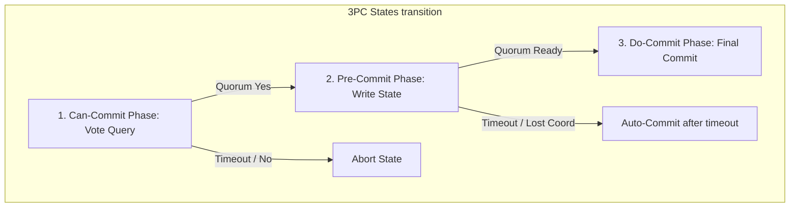

*   **PreCommit স্টেট:** যখন কোঅর্ডিনেটর সবার কাছ থেকে ইতিবাচক ভোট পায়, সে সরাসরি Commit না করে সবাইকে `PreCommit` মেসেজ পাঠায়। পার্টিসিপেন্টরা এটি পাওয়ার পর নিশ্চিত হয় যে সবাই সফলভাবে প্রিপেয়ার হয়েছে এবং কোনো ফেইলিউর ঘটেনি।
*   **টাইমআউট মেকানিজম:** যদি কোঅর্ডিনেটর `PreCommit` পাঠানোর পর ক্র্যাশ করে, তবে পার্টিসিপেন্টরা নির্দিষ্ট সময় পর নিজে থেকেই সিদ্ধান্ত নিয়ে **Auto-Commit** বা **Auto-Abort** করতে পারে, কারণ তারা জানে যে `PreCommit` এ পৌঁছানো মানে কোনো নোডই বাতিল (Abort) করেনি।
*   **কেন বাস্তবে 3PC ব্যবহৃত হয় না?** 
    3PC ধরে নেয় নেটওয়ার্কে কোনো প্যাকেট লস হবে না এবং নোড ক্র্যাশ করলে তা সাথে সাথে ডিটেক্ট করা যাবে (Fail-Stop Model)। কিন্তু বাস্তব প্রডাকশন নেটওয়ার্কে যখন **Network Partition** (বিভাজন) ঘটে, তখন 3PC-র নোডগুলো আংশিকভাবে একে অপরের সাথে বিচ্ছিন্ন হয়ে ভুলবশত একদিকে Commit এবং অন্যদিকে Abort করে ফেলে, যা মারাত্মক ডেটা ইনকনসিস্টেন্সি (Split-Brain) তৈরি করে। এ কারণে আধুনিক আর্কিটেকচারে 3PC বাদ দিয়ে Paxos/Raft-ভিত্তিক ট্রানজেকশন ইঞ্জিন ব্যবহার করা হয়।

---

### ২.২ Saga Pattern (সাগা প্যাটার্ন - ইভেন্ট-ড্রিভেন ট্রানজেকশন)

ডিস্ট্রিবিউটেড এসিড (ACID) ট্রানজেকশনগুলো দীর্ঘ সময় ধরে লক ধরে রাখায় হাই-থ্রুপুট সিস্টেমের জন্য অনুপযোগী। এর পরিবর্তে আধুনিক মাইক্রোসার্ভিস আর্কিটেকচারে **Saga Pattern** ব্যবহার করে **Base (Basically Available, Soft State, Eventual Consistency)** কনসিস্টেন্সি মডেল আর্কিটেক্ট করা হয়।

Saga হলো কতগুলো লোকাল ট্রানজেকশনের (T1, T2, ..., Tn) একটি ক্রমানুসারী ধারা। প্রতিটি লোকাল ট্রানজেকশন তার নিজস্ব লোকাল ডাটাবেজ আপডেট করে এবং পরবর্তী ট্রানজেকশন ট্রিগার করার জন্য ইভেন্ট এমিট করে।

#### ১. Compensating Transactions (ক্ষতিপূরণমূলক ট্রানজেকশন)
যেহেতু Saga-তে ডাটা রাইট করার পর সাথে সাথে লোকাল ট্রানজেকশন Commit হয়ে যায়, তাই ট্রানজেকশনের মাঝপথে (ধরা যাক, T3-তে) কোনো ফেইলিউর ঘটলে পূর্ববর্তী নোডগুলোর ডাটা ডিলিট বা রোলব্যাক করার জন্য ডাটাবেজ লেভেলে কোনো অটোমেটিক মেকানিজম থাকে না। 
এই জন্য আমাদের প্রতিটি লোকাল ট্রানজেকশনের (Ti) জন্য একটি করে বিপরীতমুখী **Compensating Transaction (Ci)** ডেভেলপ করতে হয়, যা ফেইলিউর ঘটলে উল্টো দিক থেকে এক্সিকিউট হয়ে ডাটা রিস্টোর বা নালিফাই করে দেয়।

```text
সফল ট্রানজেকশন ফ্লো:   T1 -> T2 -> T3 -> Success
ব্যর্থ ট্রানজেকশন ফ্লো:   T1 -> T2 -> T3 (Failed) -> C2 -> C1 -> Aborted State
```

> [!IMPORTANT]
> **Saga violates Isolation (ACID-এর I):** যেহেতু প্রতিটি লোকাল ট্রানজেকশন সাথে সাথে Commit হয়, তাই গ্লোবাল Saga সম্পূর্ণ শেষ হওয়ার আগেই অন্যান্য কনকারেন্ট ট্রানজেকশনগুলো T1 বা T2 এর আংশিক পরিবর্তিত ডাটা দেখতে পারে। এটি ডিস্ট্রিবিউটেড অ্যানোমালি ঘটাতে পারে, যা আর্কিটেক্টকে অ্যাপ্লিকেশন লেভেল লকিং দিয়ে হ্যান্ডেল করতে হয়।


সাগা বাস্তবায়নের দুটি প্রধান পদ্ধতি রয়েছে:

##### ক. Choreography-based Saga (কোওরিওগ্রাফি বা ইভেন্ট-ড্রিভেন)
এখানে কোনো সেন্ট্রালাইজড কোঅর্ডিনেটর থাকে না। প্রতিটি সার্ভিস কাজ শেষ করার পর মেসেজ কিউ-তে ইভেন্ট পাবলিশ করে এবং অন্যান্য সার্ভিসগুলো স্বয়ংক্রিয়ভাবে সেই ইভেন্ট শুনে তাদের পরবর্তী কাজ শুরু করে।

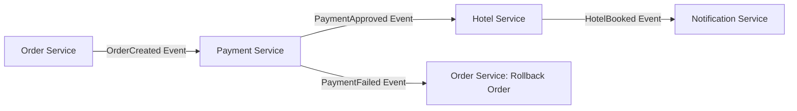

*   **সুবিধা:** সম্পূর্ণ ডিকাপল্ড (Decoupled)। নোডগুলোর ওপর ডিপেনডেন্সি থাকে না এবং নতুন সার্ভিস যুক্ত করা সহজ।
*   **অসুবিধা:** ট্রানজেকশন ফ্লো ট্র্যাক করা অত্যন্ত কঠিন। যদি ১০টি সার্ভিস থাকে, তবে কোন সার্ভিস কোন ইভেন্ট ট্রিগার করছে তা বোঝা দুষ্কর হয়ে পড়ে এবং সাইক্লিক ডিপেনডেন্সি (Cyclic Dependency) তৈরি হওয়ার ঝুঁকি থাকে।

##### খ. Orchestration-based Saga (অরকেস্ট্রেশন বা সেন্ট্রাল ম্যানেজার)
এখানে একটি সেন্ট্রালাইজড সার্ভিস বা ক্লাস থাকে যাকে **Saga Orchestrator** বলা হয়। এটি স্টেট মেশিন ব্যবহার করে কোন সার্ভিসের পর কোন সার্ভিস রান করবে এবং ব্যর্থ হলে কোন সিকোয়েন্সে কম্পেনসেশন ট্রিগার করবে তা একাই নিয়ন্ত্রণ করে।

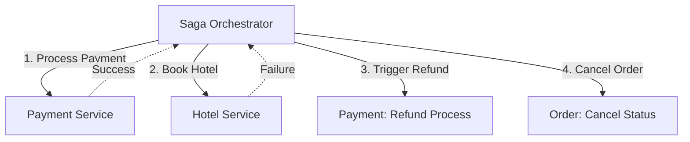

*   **সুবিধা:** জটিল ট্রানজেকশন ফ্লো এক জায়গায় বসে সহজে কন্ট্রোল ও ডিবাগ করা যায়। কোনো সাইক্লিক ডিপেনডেন্সি থাকে না।
*   **অসুবিধা:** অরকেস্ট্রেটর নোডটি একটি সিঙ্গেল পয়েন্ট অফ লজিক হয়ে দাঁড়ায় এবং অতিরিক্ত নেটওয়ার্ক হপ (Network Hops) তৈরি করে।

#### 💻 TypeScript Implementation: Orchestrated Saga Pattern

নিচে একটি অর্ডার প্রসেসিং সিস্টেমের অরকেস্ট্রেটেড সাগা লাইফসাইকেলের সম্পূর্ণ টাইপ-সেফ আর্কিটেকচারাল কোড দেওয়া হলো:

```typescript
type SagaStep<T> = {
  name: string;
  action: (context: T) => Promise<boolean>;
  compensate: (context: T) => Promise<boolean>;
};

interface OrderSagaContext {
  orderId: string;
  userId: string;
  amount: number;
  hotelId?: string;
  hotelBookingId?: string;
  paymentId?: string;
}

export class OrderSagaOrchestrator {
  private steps: SagaStep<OrderSagaContext>[] = [];

  constructor() {
    this.initializeSteps();
  }

  // সাগার প্রতিটি স্টেপ এবং তার কম্পেনসেটিং মেথড ডিফাইন করা
  private initializeSteps() {
    this.steps = [
      {
        name: 'Process Payment',
        action: async (ctx) => {
          console.log(`💸 Processing payment of $${ctx.amount} for user: ${ctx.userId}`);
          // Mock call: Payment Gateway
          ctx.paymentId = `PAY-${Math.random().toString(36).substr(2, 9).toUpperCase()}`;
          return true; // সাকসেসফুল পেমেন্ট
        },
        compensate: async (ctx) => {
          if (!ctx.paymentId) return true;
          console.warn(`🔄 Saga Compensation: Refunding payment ${ctx.paymentId} for amount $${ctx.amount}`);
          return true; // রিফান্ড সাকসেস
        }
      },
      {
        name: 'Book Hotel',
        action: async (ctx) => {
          console.log(`🏨 Booking hotel Room near hotelId: ${ctx.hotelId}`);
          // Mocking failure for demonstration
          if (ctx.amount > 500) {
            console.error(`❌ Hotel Booking failed! No rooms available in budget.`);
            return false; 
          }
          ctx.hotelBookingId = `HOTEL-${Math.random().toString(36).substr(2, 9).toUpperCase()}`;
          return true;
        },
        compensate: async (ctx) => {
          if (!ctx.hotelBookingId) return true;
          console.warn(`🔄 Saga Compensation: Cancelling hotel room reservation ${ctx.hotelBookingId}`);
          return true; // ক্যান্সেলেশন সাকসেস
        }
      }
    ];
  }

  // সাগা এক্সিকিউটর লুপ (Forward Execution & Backward Rollback)
  async execute(context: OrderSagaContext): Promise<boolean> {
    const executedSteps: SagaStep<OrderSagaContext>[] = [];
    
    for (const step of this.steps) {
      console.log(`🚀 Starting Step: ${step.name}`);
      try {
        const success = await step.action(context);
        
        if (success) {
          executedSteps.push(step); // সাকসেসফুল স্টেপ ট্র্যাকার পুশ
        } else {
          console.error(`🚨 Step ${step.name} failed! Initiating compensation rollback...`);
          await this.rollback(executedSteps, context);
          return false;
        }
      } catch (err) {
        console.error(`🚨 Exception in Step ${step.name}:`, err);
        await this.rollback(executedSteps, context);
        return false;
      }
    }
    
    console.log(`🎉 Order Saga completed successfully for OrderID: ${context.orderId}`);
    return true;
  }

  // ক্ষতিপূরণমূলক রোলব্যাক লুপ (বিপরীত সিকোয়েন্সে এক্সিকিউট করা)
  private async rollback(executedSteps: SagaStep<OrderSagaContext>[], context: OrderSagaContext) {
    // রিভার্স অর্ডার লুপ
    for (let i = executedSteps.length - 1; i >= 0; i--) {
      const step = executedSteps[i];
      console.log(`🔄 Compensating Step: ${step.name}`);
      try {
        const compSuccess = await step.compensate(context);
        if (!compSuccess) {
          console.error(`💀 Critical compensation failure in ${step.name}! Manual intervention required.`);
        }
      } catch (err) {
        console.error(`💀 Exception during compensation of ${step.name}:`, err);
      }
    }
    console.log(`🛑 Saga Rollback completed. System returned to a consistent state.`);
  }
}
```

---

### ২.৩ Consistency Models Matrix (কনসিস্টেন্সি মডেল ম্যাট্রিক্স)

ডিস্ট্রিবিউটেড সিস্টেমে ডাটা স্কেল এবং রেপ্লিকেশন করার সময় সিস্টেমের কার্যকারিতা বজায় রাখতে নোডগুলোর মধ্যে ডাটা কনসিস্টেন্সির বিভিন্ন স্তরের বৈজ্ঞানিক ও আর্কিটেকচারাল ট্রেড-অফগুলো বুঝতে হয়।

| কনসিস্টেন্সি মডেল | Read Latency | Write Latency | গ্যারান্টি ও আচরণ (Behavior) | ব্যবহারের বাস্তব ক্ষেত্র |
| :--- | :--- | :--- | :--- | :--- |
| **Strong Consistency (Linearizability)** | হাই (Requires Quorum sync) | হাই | প্রতিটি রিড অপারেশন নেটওয়ার্কের লেটেস্ট আপডেটেড ডাটা রিটার্ন করতে বাধ্য। | ব্যাংকিং লেজার, ক্রেডিট কার্ড অ্যাকাউন্ট ব্যালেন্স। |
| **Eventual Consistency** | অত্যন্ত লো (< ২ms) | অত্যন্ত লো | ডাটা রেপ্লিকাগুলো সাথে সাথে আপডেট হয় না। সময়ের সাথে (Eventually) তারা একমতাবস্থায় পৌঁছাবে। | সোশ্যাল মিডিয়া লাইক কাউন্টার, ডিএনএস (DNS) রেকর্ড। |
| **Causal Consistency** | অত্যন্ত লো | লো-মিডিয়াম | যদি অপারেশন A অপারেশন B ঘটাতে সাহায্য করে, তবে সব নোড আগে A দেখবে তারপর B দেখবে। | চ্যাট মেসেজ হিস্টোরি, থ্রেডেড কমেন্টস সেকশন। |
| **Read-Your-Own-Writes** | লো-মিডিয়াম | মিডিয়াম | একজন ইউজারের নিজস্ব রাইট করা ডাটা সে নিজে রিফ্রেশ করলেও সাথে সাথে দেখতে পাবে। | ইউজার প্রোফাইল পিকচার বা সেটিংস আপডেট। |

#### ১. Client-Centric Consistency Models
ক্লাইয়েন্ট লেভেলে সিস্টেমে ডাটা রিড ও রাইট করার সময় নিচের প্রোটোকলগুলো অত্যন্ত গুরুত্বের সাথে আর্কিটেক্ট করতে হয়:
*   **Monotonic Reads:** যদি কোনো ক্লায়েন্ট একবার একটি ডাটার ভার্সন V2 রিড করে ফেলে, তবে সে ভবিষ্যতে আর কখনো পুরনো ভার্সন V1 দেখতে পাবে না।
*   **Monotonic Writes:** একটি নির্দিষ্ট ক্লায়েন্ট দ্বারা করা সমস্ত রাইট অপারেশন ডাটাবেজের সমস্ত নোডে ঠিক সেই সিকোয়েন্সে এক্সিকিউট হবে যে সিকোয়েন্সে ক্লায়েন্ট মেসেজগুলো পাঠিয়েছিল।

---

### ২.৪ Strict Serializability: Linearizability vs Serializability

কনকারেন্ট এবং ডিস্ট্রিবিউটেড সিস্টেম ডিজাইনে এই দুটি টার্মের মধ্যে সূক্ষ্ম কিন্তু অত্যন্ত গুরুতর পার্থক্য রয়েছে, যা স্টাফ আর্কিটেক্টদের অত্যন্ত পরিষ্কারভাবে বোঝা প্রয়োজন।

```text
Strict Serializability = Serializability (Transaction Isolation) + Linearizability (Real-time Order)
```

#### ১. Serializability (সিরিয়ালাইজেবিলিটি)
*   এটি একটি **Multi-transaction / Multi-object** প্রোপার্টি।
*   এটি ট্রানজেকশনের **Isolation (ACID-এর I)** স্তরের সাথে সম্পর্কিত।
*   **সংজ্ঞা:** কনকারেন্টলি বা একই সাথে রানিং থাকা একাধিক ট্রানজেকশনের নেট ফলাফল যদি এমন হয় যেন তারা একে একে (One after another) সিরিয়ালি এক্সিকিউট হয়েছে, তবে তাকে সিরিয়ালাইজেবল বলা হয়।
*   **সীমাবদ্ধতা:** সিরিয়ালাইজেবিলিটি ট্রানজেকশনগুলোর রিয়েল-টাইম সময়ের কোনো গ্যারান্টি দেয় না। অর্থাৎ, ট্রানজেকশন A যদি দুপুর ১২ টায় শেষ হয় এবং ট্রানজেকশন B যদি ১২:০৫ এ শুরু হয়, ডাটাবেজ চাইলে ট্রানজেকশন B-কে আগে এবং A-কে পরে সিরিয়ালাইজ করতে পারে (লজিকালি)।

#### ২. Linearizability (লিনিয়ারাইজেবিলিটি)
*   এটি একটি **Single-operation / Single-object** প্রোপার্টি।
*   এটি রিয়েল-টাইম কনসিস্টেন্সি বা ওয়াল-ক্লক টাইমের সাথে সম্পর্কিত।
*   **সংজ্ঞা:** যদি কোনো নোডে একটি একক রাইট অপারেশন সফলভাবে সম্পন্ন (Complete) হয়ে যায়, তবে রিয়েল-টাইমের ঠিক তার পরবর্তী মিলিসেকেন্ডে ক্লাস্টারের যেকোনো নোড থেকে করা রিড অপারেশন অবশ্যই ওই নতুন রাইট করা ডাটাটিই রিটার্ন করবে।
*   এটি নিশ্চিত করতে নোডগুলোর মধ্যে অত্যন্ত টাইট কোরাম সিঙ্কিং প্রয়োজন হয়।

#### ৩. Strict Serializability (স্ট্রিক্ট সিরিয়ালাইজেবিলিটি - গোল্ড স্ট্যান্ডার্ড)
যখন ডিস্ট্রিবিউটেড সিস্টেমে একই সাথে **Serializability** এবং **Linearizability** নিশ্চিত করা হয়, তখন তাকে **Strict Serializability** বা **External Consistency** বলা হয়।
*   এটি ডিস্ট্রিবিউটেড ডাটাবেজ সিস্টেমের সর্বোচ্চ ও নিখুঁততম শুদ্ধতা লেভেল।
*   এটি ইমপ্লিমেন্ট করা অত্যন্ত ব্যয়বহুল এবং এতে কুয়েরি ল্যাটেন্সি অনেক বেড়ে যায়।
*   **বাস্তব উদাহরণ:** Google Spanner (যা স্যাটেলাইট জিপিএস এবং অ্যাটমিক ঘড়ি সংবলিত **TrueTime API** ব্যবহার করে নোডগুলোর মধ্যে পরম সময় বা ন্যানো-সেকেন্ড গ্যাপ সিঙ্ক করে Strict Serializability নিশ্চিত করে) এবং CockroachDB।

এই অত্যন্ত শক্তিশালী গাণিতিক ও প্রযুক্তিগত ভারসাম্যের মাধ্যমেই একটি রিলায়েবল ডিস্ট্রিবিউটেড ফাইনান্সিয়াল সিস্টেম ডিজাইন করা হয়।

---

---

## 🗄️ ৩. Data Replication & Partitioning/Sharding

যখন কোনো সিস্টেমের ডাটা ভলিউম একটি সিঙ্গেল ফিজিক্যাল ডিস্ক বা মেমরির ধারণক্ষমতা অতিক্রম করে, অথবা যখন হাই-অ্যাভেইল্যাবিলিটি নিশ্চিত করতে একাধিক নোডে ডাটা কপি রাখার প্রয়োজন হয়, তখন ডাটা রেপ্লিকেশন এবং পার্টিশনিং (শার্ডিং) ডিস্ট্রিবিউটেড আর্কিটেকচারের কোর মেকানিজম হিসেবে কাজ করে।

---

### ৩.১ Replication Topologies & Replication Lag (রেপ্লিকেশন টপোলজি ও ল্যাগ)

ডাটা রেপ্লিকেশন হলো একই ডাটা নেটওয়ার্কের মাধ্যমে একাধিক স্বাধীন নোডে কপি করে রাখা, যাতে একটি নোড ক্র্যাশ করলেও ডাটা লস না হয় এবং রিড লোড ডিস্ট্রিবিউট করা যায়।

#### ১. Replication Topologies

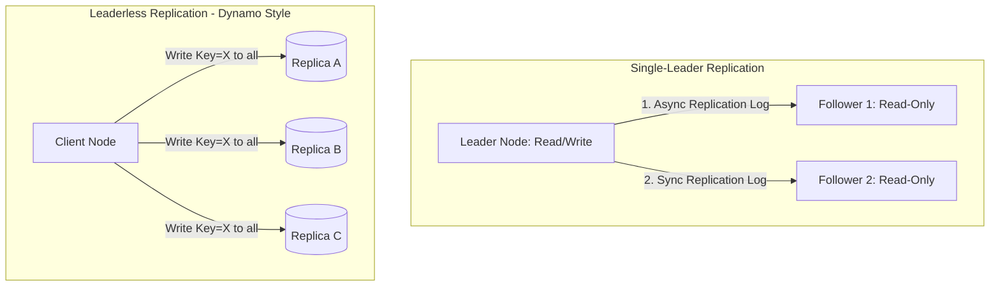

##### ক. Single-Leader Replication (সিঙ্গেল-লিডার রেপ্লিকেশন)
*   **মেকানিজম:** ক্লায়েন্ট সমস্ত রাইট (Write) অপারেশন কেবল একটি নির্দিষ্ট নোডে পাঠায় যাকে **Leader** বলা হয়। লিডার ডাটা লোকালি সেভ করে এবং রেপ্লিকেশন লগের মাধ্যমে অন্য নোডগুলোতে (**Followers**) ডাটা প্রপাগেট করে। ফলোয়াররা কেবল রিড (Read) রিকোয়েস্ট সার্ভ করতে পারে।
*   **Synchronous vs Asynchronous Replication:**
    *   **Synchronous (সমলয়):** লিডার ফলোয়ার নোডে ডাটা রাইট সাকসেসফুল হওয়া পর্যন্ত ক্লায়েন্টকে রেসপন্স দেয় না। এটি ডাটা কনসিস্টেন্সির নিশ্চয়তা দিলেও রাইট ল্যাটেন্সি অনেক বাড়িয়ে দেয় (যেকোনো একটি ফলোয়ার স্লো হলে পুরো রাইট ব্লক হয়ে যায়)।
    *   **Asynchronous (অসমলয়):** লিডার লোকালি ডাটা সেভ করেই সাথে সাথে ক্লায়েন্টকে সাকসেস রেসপন্স দেয় এবং ব্যাকগ্রাউন্ডে ফলোয়ারদের ডাটা পাঠায়। এটি অত্যন্ত ফাস্ট কিন্তু লিডার ক্র্যাশ করলে ডেটা লসের ঝুঁকি থাকে।

##### খ. Multi-Leader Replication (মাল্টি-লিডার রেপ্লিকেশন)
*   **মেকানিজম:** একাধিক লিডার নোড থাকে (সাধারণত ভিন্ন ভিন্ন জিওগ্রাফিকাল ডেটাসেন্টারে)। প্রতিটি ডেটাসেন্টার তার লোকাল লিডারে রাইট অপারেশন রিসিভ করে এবং পরে লিডাররা একে অপরের সাথে ডাটা সিঙ্ক করে।
*   **ঝুঁকি:** চরম কনফ্লিক্ট রেজোলিউশন (Conflict Resolution) ওভারহেড। যদি ডেটাসেন্টার A এবং B একই সময়ে একই কী-তে ভিন্ন ডাটা রাইট করে, তবে তাদের মার্জ করা অত্যন্ত জটিল।

##### গ. Leaderless Replication (লিডারহীন রেপ্লিকেশন - Dynamo Style)
*   **মেকানিজম:** সিস্টেমে কোনো একক লিডার থাকে না। ক্লায়েন্ট সরাসরি ক্লাস্টারের একাধিক রেপ্লিকাতে (যেমন Cassandra বা Riak-এ) একযোগে ডাটা রাইট এবং রিড পাঠায়।

##### 📊 Quorum Math in Leaderless Systems
লিডারহীন সিস্টেমে ডাটা কনসিস্টেন্সি গ্যারান্টি দেওয়ার জন্য গাণিতিক কোরাম প্রোটোকল মেনে চলতে হয়।
যদি আমাদের মোট রেপ্লিকা সংখ্যা `n` হয়, রাইট সাকসেসফুল হতে ন্যূনতম `w` সংখ্যক নোডের কনফার্মেশন লাগে এবং রিড করার সময় আমরা `r` সংখ্যক নোড থেকে ডাটা রিড করি, তবে স্ট্রং কনসিস্টেন্সি নিশ্চিত করতে নিচের অসমতাটি অবশ্যই সত্য হতে হবে:

```text
w + r > n
```

*   **ব্যাখ্যা:** যদি `w + r > n` হয়, তবে গাণিতিকভাবে নিশ্চিত যে রিড করা নোডগুলোর সেট এবং রাইট করা নোডগুলোর সেটের মধ্যে অন্তত একটি নোড কমন বা ওভারল্যাপ (Overlap) থাকবে। ফলে রিড করার সময় আমরা অবশ্যই লেটেস্ট ডাটা রিড করতে পারব।

#### ২. Replication Lag Anomalies (রেপ্লিকেশন ল্যাগের অসঙ্গতি)
অসমলয় (Asynchronous) রেপ্লিকেশনের সময় ফলোয়ার নোডগুলো লিডারের চেয়ে কয়েক মিলিসেকেন্ড থেকে কয়েক সেকেন্ড পিছিয়ে থাকতে পারে (Replication Lag)। এই ল্যাগের কারণে ৩টি ক্লাসিক্যাল অ্যানোমালি বা অসঙ্গতি ঘটে:

##### ক. Reading Your Own Writes (নিজের রাইট রিড করতে না পারা)
*   ইউজার তার প্রোফাইল পিকচার চেঞ্জ করল (যা লিডারে রাইট হলো)। কিন্তু সাথে সাথে পেজটি রিফ্রেশ করায় রিড কুয়েরিটি গেল একটি ল্যাগিং ফলোয়ার নোডে। ফলে ইউজার দেখবে তার প্রোফাইল পিকচার আগেরটাই আছে!
*   **আর্কিটেকচারাল সমাধান:** যখন কোনো ইউজার নিজের প্রোফাইল বা ডাটা আপডেট করবে, তখন নির্দিষ্ট সময় পর্যন্ত (যেমন ১ মিনিট) তার রিড রিকোয়েস্টগুলো সরাসরি লিডার নোড থেকে সার্ভ করা হবে, ফলোয়ার থেকে নয়।

##### খ. Monotonic Reads (টাইম ট্রাভেল অ্যানোমালি)
*   ইউজার পেজ রিফ্রেশ করে একটি পোস্ট দেখল (রিড গেল একদম আপডেট থাকা ফলোয়ার নোড A-তে)। এরপর আবার রিফ্রেশ করায় রিড কুয়েরি গেল ল্যাগিং ফলোয়ার নোড B-তে (যা এখনও সিঙ্কড হয়নি)। ফলে পোস্টটি সাময়িকভাবে উধাও হয়ে গেল! ইউজার মনে করবেন ডাটাবেস ভূতুরে আচরণ করছে।
*   **আর্কিটেকচারাল সমাধান:** ইউজারের সেশন আইডি হ্যাশ করে সর্বদা তাকে একই রেপ্লিকা নোডে রাউট করা (Sticky Sessions / Consistent Routing) যাতে সে কমপক্ষে তার আগের দেখা ডাটার চেয়ে পুরনো বা স্টেল ডাটা না দেখে।

##### গ. Consistent Prefix Reads (কার্যকারণ অসঙ্গতি)
*   যদি ডাটাবেজে কোনো সিকোয়েন্স বা ক্যাজুয়াল অর্ডারে রাইট করা হয়, তবে রিড করার সময়ও সেই একই অর্ডারে ডাটা দেখতে হবে। যেমন: চ্যাটে যদি প্রশ্নটি আগে এবং উত্তরটি পরে আসে, তবে সিকোয়েন্স ঠিক থাকবে। কিন্তু ল্যাগের কারণে উত্তর আগে আর প্রশ্ন পরে দেখা গেলে কার্যকারণ অসঙ্গতি তৈরি হয়।
*   **আর্কিটেকচারাল সমাধান:** ক্যাজুয়ালি ডিপেন্ডেন্ট ডাটাগুলো যাতে সর্বদা একই নোড বা শার্ডে রাইট হয় তা নিশ্চিত করা, অথবা লজিক্যাল ক্লক ব্যবহার করা।

---

### ৩.২ Logical Clocks & Causality (লজিক্যাল ক্লক ও ক্যাজুয়ালিটি)

ডিস্ট্রিবিউটেড সিস্টেমে একাধিক নোডের মধ্যে ফিজিক্যাল ক্লক বা দেওয়াল-ঘড়ি (Wall-clock) নিখুঁতভাবে সিঙ্ক করা অসম্ভব (Clock Drift ও Network Latency-র কারণে)। তাই ইভেন্টের সঠিক ক্রম বা ক্রমধারা নির্ধারণের জন্য ফিজিক্যাল টাইমের পরিবর্তে **লজিক্যাল ক্লক (Logical Clocks)** ব্যবহৃত হয়।

#### ১. Lamport Logical Clocks (ল্যাম্পোর্ট লজিক্যাল ক্লক)
লেসলি ল্যাম্পোর্ট (Leslie Lamport) কর্তৃক আবিষ্কৃত এই মেকানিজমে প্রতিটি নোড একটি সাধারণ লোকাল কাউন্টার মেইনটেইন করে:
*   লোকাল ইভেন্ট ঘটলে নোড নিজের কাউন্টার ১ বাড়ায়: `L = L + 1`
*   কোনো নোড মেসেজ পাঠানোর সময় তার লোকাল ল্যাম্পোর্ট টাইমস্ট্যাম্প মেসেজে যুক্ত করে দেয়।
*   মেসেজ রিসিভ করার সময় নোড নিজের লোকাল ক্লক আপডেট করে: `L_receiver = max(L_receiver, L_msg) + 1`

##### 🚨 সীমাবদ্ধতা:
ল্যাম্পোর্ট ক্লক কার্যকারণ সম্পর্ক বা **Causality** আংশিক প্রকাশ করতে পারে। যদি `a` ইভেন্ট `b` ইভেন্টকে প্রভাবিত করে (`a -> b`), তবে `L(a) < L(b)` হবে। কিন্তু এর বিপরীতটি সত্য নয়—অর্থাৎ, `L(a) < L(b)` হলে আমরা নিশ্চিত করে বলতে পারি না যে `a` ইভেন্টটি `b`-এর পূর্বে ঘটেছে নাকি তারা স্বাধীন বা কনকারেন্ট (Concurrent) ইভেন্ট ছিল।

#### ২. Vector Clocks (ভেক্টর ক্লক)
কনকারেন্ট ইভেন্ট সনাক্ত করতে এবং নির্ভুল কার্যকারণ সম্পর্ক (Causality) ট্র্যাক করতে **ভেক্টর ক্লক (Vector Clocks)** ব্যবহৃত হয়। 
এখানে প্রতিটি নোড `N` আকারের একটি ইনটিজার অ্যারে (ভেক্টর) মেইনটেইন করে, যেখানে `N` হলো ক্লাস্টারের মোট নোড সংখ্যা।

##### 🛠️ ভেক্টর ক্লকের নিয়মাবলী:
১.  যেকোনো নোড `i` নিজে কোনো লোকাল রাইট অপারেশন করার আগে তার নিজের কাউন্টার এক বাড়ায়:
    `V[i] = V[i] + 1`
2.  যখন নোড `i` অন্য নোড `j`-কে মেসেজ পাঠায়, সে তার লেটেস্ট ভেক্টর ক্লকটি মেসেজের সাথে পাঠিয়ে দেয়।
3.  যখন নোড `j` মেসেজটি রিসিভ করে, সে তার লোকাল ভেক্টর ক্লকের প্রতিটি এলিমেন্টকে মেসেজের ক্লকের সাথে তুলনা করে সর্বোচ্চ মানটি নেয় এবং নিজের কাউন্টার এক বাড়ায়:
    `V_j[k] = max(V_j[k], V_msg[k]) for all k`
    `V_j[j] = V_j[j] + 1`

##### 📊 কনকারেন্সি বনাম ক্যাজুয়ালিটি ডিটেকশন

```text
ধরা যাক দুটি ভেক্টর ক্লক: V_A এবং V_B
১. Causal Precedence (A আগে ঘটেছে): যদি V_A-এর প্রতিটি নোডের মান V_B-এর সমান বা কম হয় এবং অন্তত একটি নোডের মান কঠোরভাবে কম হয়।
২. Concurrent Conflict (কনফ্লিক্ট): যদি কোনোটিই কারো চেয়ে ছোট না হয় (যেমন V_A = [1, 2] এবং V_B = [2, 1])। এর মানে দুটি ভিন্ন নোড প্যারালালি স্বাধীনভাবে রাইট করেছে।
```

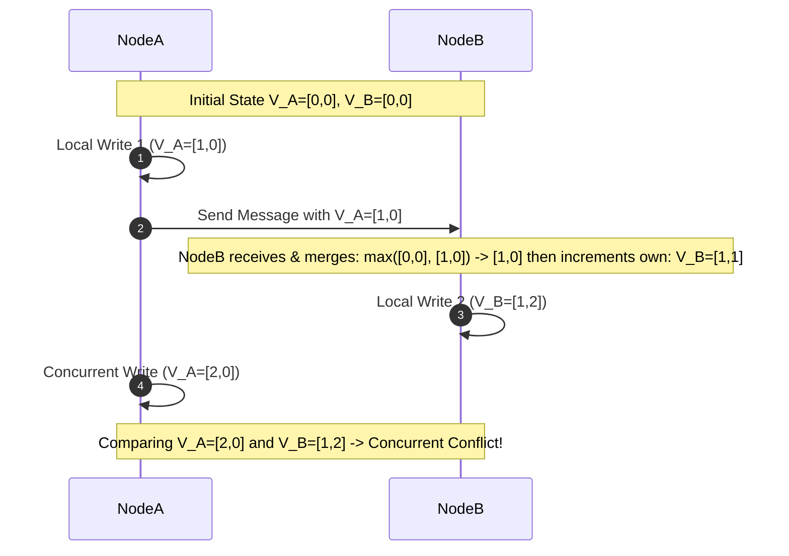

যখন কনফ্লিক্ট বা সাইবলিংস (Siblings) ডিটেক্ট হয়, তখন ডাটাবেজ দুটি ডাটাকপিই রেখে দেয় এবং অ্যাপ্লিকেশন লেভেলে ক্লায়েন্টকে রিড করার সময় বলে দেয় কনফ্লিক্টটি নিজে মার্জ (Merge) করে নতুন ভেক্টর ক্লক দিয়ে রাইট ব্যাক করতে।

---

### ৩.৩ Partitioning & Consistent Hashing (পার্টিশনিং ও কনসিস্টেন্ট হ্যাশিং)

বিশাল পরিমাণ ডাটা সিঙ্গেল হার্ডডিস্কে রাখা অসম্ভব বিধায় ডাটাকে ছোট ছোট খণ্ডে বিভক্ত করে ভিন্ন ভিন্ন নোডে ডিস্ট্রিবিউট করাকে পার্টিশনিং বা শার্ডিং (Sharding) বলে।

#### ১. Standard Hash Modulo এর বিপর্যয়
সাধারণত ডাটা ডিস্ট্রিবিউট করার জন্য প্রাইমারি কী-র হ্যাশ ভ্যালুকে নোড সংখ্যা দিয়ে মডুলাস করা হয়:
`Node = Hash(Key) % N` (যেখানে N হলো মোট সার্ভার সংখ্যা)।

##### 🚨 standard Modulo-র মারাত্মক সমস্যা:
*   যদি ক্লাস্টারের লোড বাড়ার কারণে আমরা নতুন একটি সার্ভার যোগ করি (N এর মান পরিবর্তন হয়ে N+1 হয়), তবে আগের ফর্মুলা অনুযায়ী **প্রায় ৯৯% ডাটার হ্যাশ পজিশন সম্পূর্ণ ওলট-পালট হয়ে যাবে!**
*   এর ফলে ক্লাস্টারের প্রতি নোড থেকে ডাটা অন্য নোডে ট্রাভেল করতে শুরু করবে, যা নেটওয়ার্কের ব্যান্ডউইথ শেষ করে ক্লাস্টারকে সম্পূর্ণ ক্র্যাশ করাবে।

#### ২. Consistent Hashing (কনসিস্টেন্ট হ্যাশিং)
কনসিস্টেন্ট হ্যাশিং এমন একটি চমৎকার অ্যালগরিদম যা নোড সংখ্যা বাড়ানো বা কমানোর সময় **সর্বনিম্ন পরিমাণ ডাটা সোপিং বা মুভমেন্ট** নিশ্চিত করে।

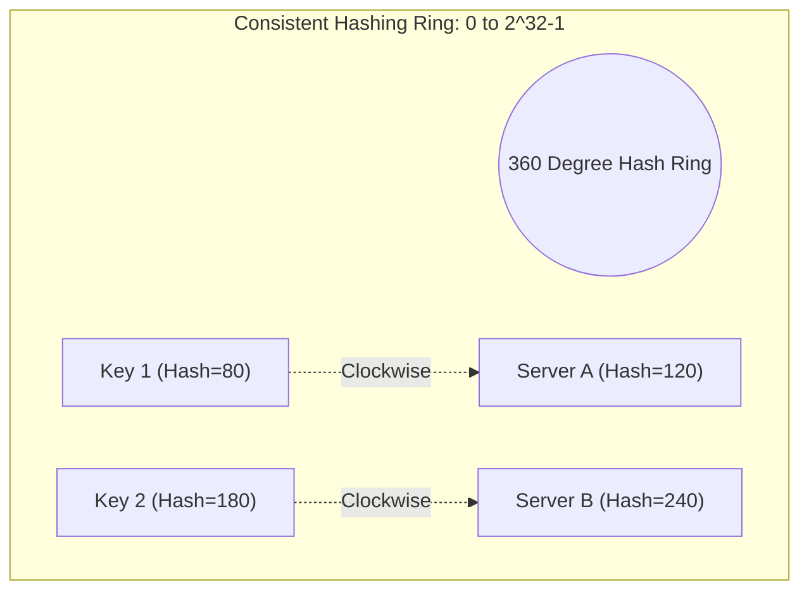

*   **The Hash Ring:** এই অ্যালগরিদমে কী (Keys) এবং সার্ভার নোড (Servers) উভয়কেই একটি কাল্পনিক বৃত্তাকার হ্যাশ রিংয়ে (0 থেকে 2^32 - 1 পর্যন্ত) ম্যাপ করা হয়।
*   **ডাটা রাইট মেকানিজম:** একটি কী-র হ্যাশ ভ্যালু রিংয়ের যে পজিশনে পড়ে, রিংয়ের ঘড়ির কাটার দিকে (Clockwise) ঘুরলে প্রথম যে সার্ভার নোডটি পাওয়া যায়, ডাটাটি ঠিক সেই সার্ভার নোডেই স্টোর করা হয়।
*   **সার্ভার যোগ/বিয়োগের ম্যাজিক:** যদি কোনো সার্ভার নোড ক্র্যাশ করে বা ডিলিট হয়, তবে কেবল সেই সার্ভারের ডাটাগুলো তার পরবর্তী ঘড়ির কাটার দিকের সার্ভারে শিফট হবে। ক্লাস্টারের অন্যান্য সমস্ত নোডের ডাটা সম্পূর্ণ অক্ষত এবং অপরিবর্তিত থাকবে!

#### ৩. Virtual Nodes (ভার্চুয়াল নোডস - vNodes)
যদি রিংয়ে সার্ভার সংখ্যা কম থাকে, তবে হ্যাশ ফাংশনের আউটপুট বিন্যাসের কারণে কোনো একটি নির্দিষ্ট সার্ভার নোডের ওপর অসমভাবে বিশাল পরিমাণ ডাটার লোড পড়তে পারে, আর অন্য সার্ভার অলস বসে থাকতে পারে (Data Hotspotting)।
*   **সমাধান:** প্রতিটি ফিজিক্যাল সার্ভারের বিপরীতে রিংয়ে একাধিক **Virtual Nodes (vNodes)** তৈরি করা হয় (যেমন সার্ভার A-র জন্য `Server_A_1`, `Server_A_2`, `Server_A_3` ইত্যাদি র‍্যান্ডম হ্যাশ পজিশনে রিংয়ে বসানো হয়)।
*   এর ফলে রিংয়ের ডাটা ডিস্ট্রিবিউশন অত্যন্ত সুষম (Perfect Balanced Distribution) হয়।

#### 💻 TypeScript Implementation: Consistent Hash Ring with Virtual Nodes

নিচে প্রোডাকশন-গ্রেড কনসিস্টেন্ট হ্যাশিং ইঞ্জিনের একটি পূর্ণাঙ্গ টাইপস্ক্রিপ্ট ইমপ্লিমেন্টেশন দেওয়া হলো:

```typescript
import * as crypto from 'crypto';

export class ConsistentHashRing {
  private virtualNodeCount: number;
  private ring: Map<number, string>; // Ring: Hash -> Server IP/Name
  private sortedHashes: number[];     // Sorted list of hashes for Binary Search

  constructor(virtualNodeCount = 100) {
    this.virtualNodeCount = virtualNodeCount;
    this.ring = new Map<number, string>();
    this.sortedHashes = [];
  }

  // MD5 হ্যাশ ফাংশন যা একটি স্ট্রিং থেকে UInt32 ইন্টিজার রিটার্ন করে
  private hash(key: string): number {
    const md5Hex = crypto.createHash('md5').update(key).digest('hex');
    // প্রথম ৮টি ক্যারেক্টার নিয়ে UInt32 সংখ্যায় রূপান্তর
    return parseInt(md5Hex.substring(0, 8), 16);
  }

  // রিংয়ে একটি নতুন সার্ভার নোড যুক্ত করা
  addServer(server: string): void {
    for (let i = 0; i < this.virtualNodeCount; i++) {
      const vNodeKey = `${server}#vNode-${i}`;
      const vNodeHash = this.hash(vNodeKey);
      this.ring.set(vNodeHash, server);
      this.sortedHashes.push(vNodeHash);
    }
    // বাইনারি সার্চ অপ্টিমাইজেশনের জন্য হ্যাশ অ্যারে সর্ট করা
    this.sortedHashes.sort((a, b) => a - b);
    console.log(`📡 Added Server: ${server} with ${this.virtualNodeCount} virtual nodes.`);
  }

  // রিং থেকে একটি সার্ভার নোড মুছে ফেলা
  removeServer(server: string): void {
    for (let i = 0; i < this.virtualNodeCount; i++) {
      const vNodeKey = `${server}#vNode-${i}`;
      const vNodeHash = this.hash(vNodeKey);
      this.ring.delete(vNodeHash);
      
      const index = this.sortedHashes.indexOf(vNodeHash);
      if (index > -1) {
        this.sortedHashes.splice(index, 1);
      }
    }
    console.warn(`🛑 Removed Server: ${server} from the hash ring.`);
  }

  // একটি সুনির্দিষ্ট Key-র জন্য রিং থেকে টার্গেট সার্ভার খোঁজা (Clockwise Target Selection)
  getServer(key: string): string | null {
    if (this.sortedHashes.length === 0) return null;

    const keyHash = this.hash(key);
    
    // বাইনারি সার্চ (Binary Search) ব্যবহার করে ঘড়ির কাটার দিকে প্রথম বড় হ্যাশ খুঁজে বের করা
    let low = 0;
    let high = this.sortedHashes.length - 1;
    let targetIndex = 0;

    while (low <= high) {
      const mid = Math.floor((low + high) / 2);
      if (this.sortedHashes[mid] >= keyHash) {
        targetIndex = mid;
        high = mid - 1; // বাম দিকে আরও ছোট কোনো বড় সংখ্যা আছে কিনা চেক করা
      } else {
        low = mid + 1;
      }
    }

    // যদি কী-র হ্যাশ বৃত্তের শেষ নোডের চেয়ে বড় হয়, তবে রিংয়ের প্রথম নোডটি (Index 0) টার্গেট হবে
    if (low > this.sortedHashes.length - 1) {
      targetIndex = 0;
    }

    const targetHash = this.sortedHashes[targetIndex];
    return this.ring.get(targetHash) || null;
  }
}
```

---

### ৩.৪ Partition Rebalancing & Hot Spotting (ডাটা রি-ব্যালেন্সিং ও হট স্পটিং)

সিস্টেমে নোড যোগ-বিয়োগের সময় ডাটা রিস্ট্রাকচার করা এবং অতিরিক্ত পপুলার কি-র লোড ব্যালেন্স করার আর্কিটেকচারাল মেথডলজি।

#### ১. Partition Rebalancing Strategies
যখন কোনো সিস্টেমে নতুন হার্ডওয়্যার নোড যোগ করা হয়, তখন ডাটা পার্টিশন রি-অ্যালোকেট করার ৩টি উপায় রয়েছে:
*   **Fixed Number of Partitions (স্থির পার্টিশন সংখ্যা):** ক্লাস্টারে নোড সংখ্যার চেয়ে অনেক বেশি পার্টিশন আগে থেকেই তৈরি করে রাখা হয় (যেমন ৪টি ফিজিক্যাল নোডের বিপরীতে ১০০০টি পার্টিশন)। নতুন নোড ক্লাস্টারে যুক্ত হলে সে প্রতিটি নোড থেকে কিছু সম্পূর্ণ রেডিমেড পার্টিশন নিজের আন্ডারে নিয়ে নেয়। কোনো একক কী-র পার্টিশন আইডি কখনো পরিবর্তিত হয় না। (MongoDB ও Elasticsearch এটি ব্যবহার করে)।
*   **Dynamic Partitioning (ডাইনামিক পার্টিশনিং):** ডাটা সাইজ বাড়ার সাথে সাথে পার্টিশনগুলো স্বয়ংক্রিয়ভাবে স্প্লিট (Split) হয়ে যায়। যদি কোনো পার্টিশনের সাইজ ১০ জিবি অতিক্রম করে, তবে ডাটাবেজ তাকে সমান দুই ভাগে ভাগ করে ফেলে। (HBase এবং Cassandra এটি সাপোর্ট করে)।

#### ২. Hot Spotting & The Celebrity Problem (হট স্পট ও সেলিব্রিটি সমস্যা)
কনসিস্টেন্ট হ্যাশিং সুষম বন্টন নিশ্চিত করলেও, কোনো একটি নির্দিষ্ট কী (Key) যদি অত্যন্ত জনপ্রিয় হয় (যেমন: ট্রাম্প বা জাঙ্কুকের সোশ্যাল মিডিয়া আইডি), তবে ওই কী-র সমস্ত ট্রাফিক ঘুরিয়ে ফিরিয়ে কেবল একটি নির্দিষ্ট শার্ড বা নোডেই হিট করবে। এর ফলে পুরো নোডটি ওভারলোডেড হয়ে ক্র্যাশ করতে পারে।

##### 🛠️ স্টাফ আর্কিটেক্ট হট-স্পট মিটিগেশন টেকনিক:
১.  **Appended Noise Keys (অ্যাটমিক নয়েজ কি):** অতিরিক্ত ট্রেন্ডিং কী-গুলোর পেছনে রানটাইমে ০ থেকে ৯৯ পর্যন্ত একটি র‍্যান্ডম ২-ডিজিটের সংখ্যা যোগ করে রাইট পাঠানো হয় (যেমন `celebrity_key_45`)।
২.  এর ফলে ডাটা রাইট অপারেশনগুলো ১০০টি ভিন্ন পার্টিশনে ছড়িয়ে পড়ে (লোড ব্যালেন্সিং হয়)।
৩.  পরবর্তীতে ডেটা রিড করার সময় অ্যাপ্লিকেশন সার্ভার ১০০টি কী-কেই প্যারালালি কোয়েরি করে ডাটা মার্জ করে ক্লায়েন্টকে রেসপন্স দেয়।

---


---

## 📨 ৪. Distributed Messaging & Event-Driven Architectures

আধুনিক ডিস্ট্রিবিউটেড সিস্টেমে নোড এবং মাইক্রোসার্ভিসগুলোর মধ্যে লুজলি-কাপল্ড (Loosely Coupled), স্কেলেবল এবং অত্যন্ত দ্রুত কমিউনিকেশন বজায় রাখার মূল চালিকাশক্তি হলো মেসেজ ব্রোকার এবং ইভেন্ট-ড্রিভেন আর্কিটেকচার। 

---

### ৪.১ Delivery Guarantees Internals (ডেলিভারি গ্যারান্টি ইন্টারনালস)

ডিস্ট্রিবিউটেড মেসেজিংয়ে নেটওয়ার্ক ফেইলিউর, ব্রোকার ক্র্যাশ বা কনজিউমার রি-স্টার্টের সময় মেসেজ যেন হারিয়ে না যায় বা ডুপ্লিকেট প্রসেস না হয়, তার জন্য তিন ধরনের ডেলিভারি গ্যারান্টি রয়েছে:

#### ১. At-Most-Once (সর্বোচ্চ একবার)
*   **আচরণ:** মেসেজ কোনোভাবেই ডুপ্লিকেট হবে না, তবে নেটওয়ার্ক ফেইলিউর হলে মেসেজ হারিয়ে যেতে পারে (No Retries)। 
*   **মেকানিজম:** প্রডিউসার মেসেজ এমিট করে বা কনজিউমার মেসেজ রিসিভ করার সাথে সাথে (প্রসেস করার আগেই) অফসেট কমিট (ACK) করে ফেলে। এটি ফাস্ট কিন্তু রিলায়েবল নয়।

#### ২. At-Least-Once (সর্বনিম্ন একবার)
*   **আচরণ:** কোনো মেসেজ হারাবে না, তবে নেটওয়ার্ক ট্রাবলের কারণে একই মেসেজ একাধিকবার ডেলিভারি বা ডুপ্লিকেট প্রসেস হতে পারে।
*   **মেকানিজম:** কনজিউমার মেসেজটি সম্পূর্ণ প্রসেস করার পর ব্রোকারকে `ACK` পাঠায়। যদি প্রসেস করার পর কিন্তু ACK পাঠানোর আগে নোডটি ক্র্যাশ করে, তবে ব্রোকার মেসেজটি আবার অন্য নোডে পাঠাবে।
*   **আর্কিটেকচারাল রিকোয়ারমেন্ট:** ডাউনস্ট্রিম সিস্টেমগুলোকে অবশ্যই **ইডেমপোটেন্ট (Idempotent)** হতে হবে যাতে একই আইডি সম্পন্ন মেসেজ ২ বার প্রসেস করলেও ডেটার চূড়ান্ত অবস্থা অপরিবর্তিত থাকে।

#### ৩. Exactly-Once Processing (নিখুঁতভাবে একবার)
এটি ডিস্ট্রিবিউটেড মেসেজিংয়ের চূড়ান্ত লক্ষ্য। এটি মূলত দুটি জিনিসের সমন্বয়ে অর্জিত হয়:

##### ক. Idempotent Producer (ইডেমপোটেন্ট প্রডিউসার)
*   Kafka প্রতিটি প্রডিউসার ক্লায়েন্টকে একটি ইউনিক **PID (Producer ID)** অ্যাসাইন করে এবং প্রতিটি মেসেজের সাথে একটি ক্রমবর্ধমান **Sequence Number** যুক্ত করে।
*   যদি নেটওয়ার্ক ফেইলিয়রের কারণে প্রডিউসার একই মেসেজ পুনরায় পাঠায়, Kafka Broker মেসেজের PID এবং Sequence Number মিলিয়ে ডুপ্লিকেট মেসেজটি স্বয়ংক্রিয়ভাবে ডিসকার্ড (Discard) করে দেয়।

##### খ. Transactional Messaging (এটমিক রিড-প্রসেস-রাইট)
যখন আমরা একটি মেসেজ কুয়েরি থেকে রিড করি, তা প্রসেস করে নতুন মেসেজ অন্য কিউ-তে রাইট করি, তখন এই পুরো সাইকেলটি একটি **এটমিক ট্রানজেকশন** হিসেবে সম্পন্ন করতে হয়।

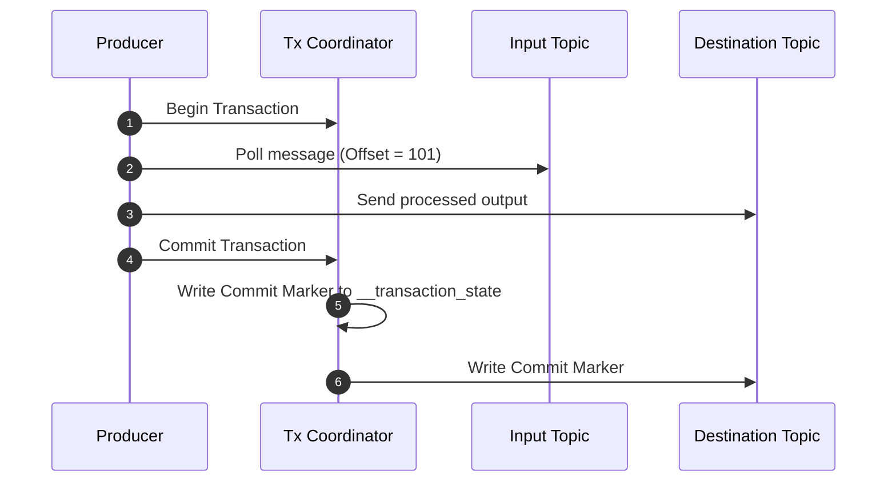

*   **মেকানিজম:** Kafka-র সেন্ট্রাল **Transaction Coordinator** নোড ট্রানজেকশনের স্টেট ম্যানেজ করে। যদি পুরো প্রসেস সফল হয়, তবেই একটি বিশেষ `Commit Marker` মেসেজ লগে রাইট করা হয়। 
*   কনজিউমার যখন `read_committed` মোডে থাকে, তখন সে কেবল ওই Commit Marker যুক্ত মেসেজগুলোই দেখতে পাবে। কোনো স্টেপ ফেইল করলে সম্পূর্ণ ট্রানজেকশন রোলব্যাক করা হয় এবং আংশিক রাইট হওয়া মেসেজগুলো কনজিউমার স্কিপ করে যায়।

---

### ৪.২ Kafka vs RabbitMQ (Message Broker Internals)

মেসেজ আর্কিটেকচার ডিজাইনের সময় সিস্টেমের রিকোয়ারমেন্ট অনুযায়ী সঠিক ব্রোকার নির্বাচন করা অত্যন্ত গুরুত্বপূর্ণ।

| আর্কিটেকচারাল দিক | RabbitMQ | Apache Kafka |
| :--- | :--- | :--- |
| **মূল ডিজাইন ফিলোসফি** | **Smart Broker, Dumb Consumer** (মেসেজ রাউটিং ও ফিল্টারিং ব্রোকার নিজেই করে)। | **Dumb Broker, Smart Consumer** (ব্রোকার কেবল দ্রুত কমিট লগ লেখে, পজিশন ট্র্যাকিং কনজিউমার নিজে করে)। |
| **স্টোরেজ মডেল** | ইন-মেমরি প্রাইওরিটি কিউ। মেসেজ রিসিভ ও ACK হওয়ার সাথে সাথে তা **মেমরি থেকে ডিলিট** হয়ে যায়। | অন-ডিস্ক **Append-Only Commit Log**। মেসেজ ইমিউটেবল এবং রিড হলেও ডিস্ক থেকে ডিলিট হয় না (Retention পিরিয়ড অনুযায়ী থাকে)। |
| **স্কেলিং মেকানিজম** | কিউ রেপ্লিকেশন ও মিররিং (কানেকশন ল্যাটেন্সি ও ওভারহেড বেশি)। | **Topic Partitioning** (প্রতিটি পার্টিশন আলাদা হার্ডডিস্কে প্যারালালি রাইট করা যায় বিধায় চরম স্কেলেবল)। |
| **ব্যবহারের ক্ষেত্র** | জটিল রাউটিং (যেমন AMQP Exchanges), টাস্ক ডিস্ট্রিবিউশন, ব্যাকগ্রাউন্ড জব প্রসেসিং। | রিয়েল-টাইম ডাটা স্ট্রিমিং, লগ এগ্রিগেশন, ইভেন্ট সোর্সিং, মেট্রিক্স ট্র্যাকিং। |

#### ১. Kafka-র উচ্চ পারফরম্যান্সের বৈজ্ঞানিক রহস্য
Kafka ডিস্কে ডাটা লিখেও ইন-মেমরি ব্রোকার RabbitMQ এর চেয়ে অনেক বেশি থ্রুপুট দিতে পারে। এর পেছনে ৩টি মূল কারণ রয়েছে:
*   **Sequential I/O (সিকোয়েনশিয়াল আই/ও):** র‍্যান্ডম ডিস্ক রাইটের চেয়ে সিকোয়েনশিয়াল রাইট প্রায় ১ লক্ষ গুণ ফাস্ট। Kafka লগের শেষে কেবল অ্যাপেন্ড করে, ডিস্কের মাঝখানে খোঁজে না।
*   **OS Page Cache:** Kafka অ্যাপ্লিকেশন মেমরিতে ডাটা বাফারিং না করে সরাসরি ওএস পেজ ক্যাশে ডাটা হ্যান্ডওভার করে।
*   **Zero-Copy Technology:** প্রডিউসারের কাছ থেকে আসা ডাটা সরাসরি কার্নেল বাফার (Kernel Buffer) থেকে নেটওয়ার্ক সকেটে ট্রান্সফার করার জন্য ওএস-এর `sendfile` সিস্টেম কল ব্যবহার করা হয়। ফলে ইউজার স্পেস (User Space) এবং কার্নেল স্পেস (Kernel Space) এর মধ্যে বারবার ডাটা কপি করার কোনো ওভারহেড তৈরি হয় না।

#### ২. Consumer Groups & Rebalancing
Kafka-তে প্যারালাল প্রসেসিং করার জন্য **Consumer Groups** অত্যন্ত গুরুত্বপূর্ণ। একটি টপিকের প্রতিটি পার্টিশন একটি কনজিউমার গ্রুপে কেবল একজন কনজিউমারই রিড করতে পারে। 

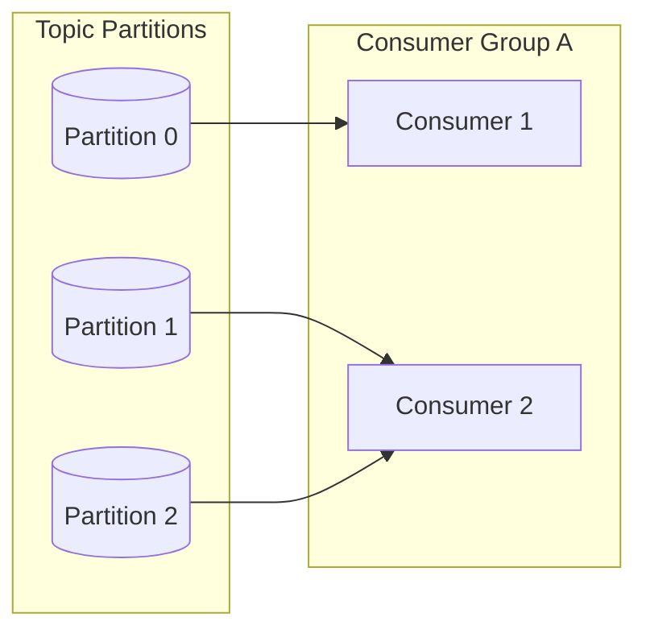

*   **Consumer Rebalance:** যদি গ্রুপে কোনো নতুন কনজিউমার যোগ দেয় বা কোনোটি ক্র্যাশ করে, তবে সেন্ট্রাল **Group Coordinator (Broker)** একটি রি-ব্যালেন্স ট্রিগার করে পার্টিশনগুলোর দায়িত্ব কনজিউমারদের মধ্যে পুনরায় ভাগ করে দেয়। আধুনিক ওএসে রি-ব্যালেন্সিংয়ের সময় স্টপ-দ্য-ওয়ার্ল্ড এড়াতে **Cooperative Sticky Assignor** প্রোটোকল ব্যবহার করা হয়।

---

### ৪.৩ CQRS & Event Sourcing (CQRS ও ইভেন্ট সোর্সিং)

ঐতিহ্যবাহী CRUD ডাটাবেজ আর্কিটেকচারে ডাটার বর্তমান স্টেট (Current State) কেবল একটি রো-তে সেভ করা থাকে। কিন্তু হাইলি অডিটেবল বা চরম স্কেলেবল সিস্টেমে এই প্যাটার্ন পরিবর্তন করা হয়।

#### ১. Event Sourcing (ইভেন্ট সোর্সিং)
*   **মূল ধারণা:** এখানে ডাটার বর্তমান স্টেট সরাসরি সেভ না করে, স্টেটের পরিবর্তন ঘটানো সমস্ত ইভেন্টের একটি ইমিউটেবল অ্যাপেন্ড-অনলি হিস্টোরি (Event Store) সেভ রাখা হয়।
*   **স্টেট রিকনস্ট্রাকশন (Replay):** কোনো অবজেক্টের বর্তমান অবস্থা জানতে হলে, শুরু থেকে আজ পর্যন্ত ঘটা সমস্ত ইভেন্টকে সিকোয়েনশিয়াল প্লেব্যাক (Replay) করা হয়।
*   **Snapshots (স্ন্যাপশট):** লক্ষ লক্ষ ইভেন্ট রিপ্লে করা স্লো বিধায় প্রতি ১০০০টি ইভেন্ট পর পর অবজেক্টের কারেন্ট স্টেটের একটি স্ন্যাপশট নিয়ে রাখা হয়। রিপ্লে করার সময় লেটেস্ট স্ন্যাপশট লোড করে তার পরবর্তী ইভেন্টগুলো রিপ্লে করা হয়।

#### ২. CQRS (Command Query Responsibility Segregation)
ইভেন্ট সোর্সিংয়ের রাইট অপারেশনের পারফরম্যান্স অসাধারন হলেও রিড কোয়েরি করা অত্যন্ত জটিল। তাই CQRS প্যাটার্ন ব্যবহার করে রাইট পাথ (Commands) এবং রিড পাথ (Queries) সম্পূর্ণ আলাদা করা হয়।

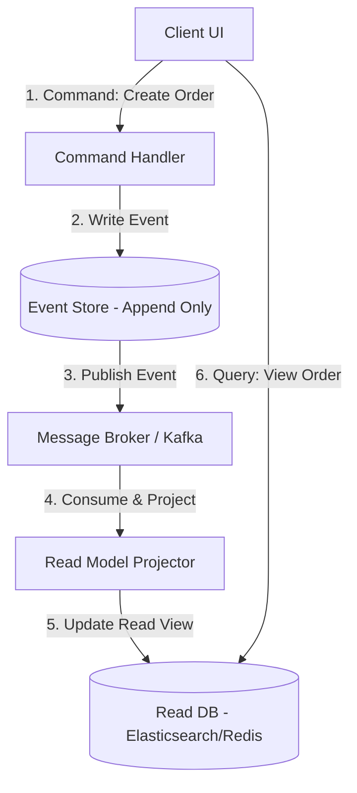

*   **Command Side (রাইট সাইড):** কেবল কমান্ড এক্সেপ্ট করে, বিজনেস লজিক ভ্যালিডেট করে এবং ইভেন্ট স্টোরে অ্যাপেন্ড করে। এটি রিড কোয়েরি নিয়ে মাথা ঘামায় না।
*   **Query Side (রিড সাইড):** ইভেন্ট স্টোর থেকে পাবলিশ হওয়া ইভেন্টগুলো সাবস্ক্রাইব করে অত্যন্ত অপ্টিমাইজড ও ডিনরমালাইজড রিড ডাটাবেজ (যেমন Elasticsearch বা Redis) আপডেট করে। ক্লায়েন্ট সমস্ত ভিউ কুয়েরি কেবল এই রিড ডাটাবেজেই পাঠায়।

---

### ৪.৪ Backpressure & Flow Control (ব্যাকপ্রেশার ও ফ্লো কন্ট্রোল)

ইভেন্ট-ড্রিভেন সিস্টেমে যখন প্রডিউসার অত্যন্ত দ্রুত গতিতে মেসেজ পাঠাতে থাকে কিন্তু কনজিউমার নোডটি ততোটা ফাস্ট ডাটা প্রসেস করতে পারে না, তখন কনজিউমার নোডের বাফার মেমরি ফুল হয়ে সিস্টেম **Out-of-Memory (OOM) Crash** করে। একে সামাল দেওয়ার মেকানিজমই হলো ব্যাকপ্রেশার।

#### ১. Push vs Pull Model
*   **Push Model (যেমন RabbitMQ):** ব্রোকার নোডটি কনজিউমার প্রস্তুত কিনা তা না দেখেই অবিরাম মেসেজ পুশ করতে থাকে। এর ফলে কনজিউমারে মেমরি স্পাইক হয়। (মিটিগেশনের জন্য RabbitMQ-তে `basic.qos(prefetch_count)` ব্যবহার করে পুশ কন্ট্রোল করা হয়)।
*   **Pull Model (যেমন Kafka):** কনজিউমার নোড নিজেই ব্রোকারকে রিকোয়েস্ট করে নির্দিষ্ট পরিমাণ মেসেজ তুলে নেয় (`poll(max_records)`)। কনজিউমার যদি ব্যস্ত থাকে, সে পরবর্তী রিকোয়েস্ট পাঠানো সাময়িক বন্ধ রাখে। এটি প্রাকৃতিকভাবেই নিখুঁত ব্যাকপ্রেশার নিশ্চিত করে।

#### ২. Reactive Streams Protocol (রিয়েক্টিভ স্ট্রিমস প্রোটোকল)
রিয়েক্টিভ সিস্টেমে ডাইনামিক ব্যাকপ্রেশার দেওয়ার জন্য একটি সাবস্ক্রিপশন মেকানিজম ব্যবহার করা হয়, যেখানে কনজিউমার তার মেমরি কুয়েরির ধারণক্ষমতা অনুযায়ী নির্দিষ্ট সংখ্যার মেসেজ ডিমান্ড করে (`request(n)`)।

#### 💻 TypeScript Implementation: Backpressured Reactive Event Queue

নিচে একটি রিয়েক্টিভ প্রোটোকল অনুসরণকারী টাইপ-সেফ ব্যাকপ্রেশার হ্যান্ডেলিং ইভেন্ট কিউ-এর প্রোডাকশন-রেডি টাইপস্ক্রিপ্ট ইমপ্লিমেন্টেশন দেওয়া হলো:

```typescript
type EventPayload = {
  id: string;
  type: string;
  data: any;
};

export class BackpressuredEventQueue {
  private queue: EventPayload[] = [];
  private highWatermark: number; // সর্বোচ্চ ধারণক্ষমতা যার পর প্রডিউসার ব্লক হবে
  private lowWatermark: number;  // এই সীমার নিচে নামলে প্রডিউসার আবার রাইট শুরু করবে
  
  private isPaused = false;
  private onPauseCallback?: () => void;
  private onResumeCallback?: () => void;

  constructor(highWatermark = 100, lowWatermark = 30) {
    this.highWatermark = highWatermark;
    this.lowWatermark = lowWatermark;
  }

  // ইভেন্ট পুশ করার মেথড (ব্যাকপ্রেশার সিগন্যাল সহ)
  push(event: EventPayload): boolean {
    this.queue.push(event);
    
    // হাই ওয়াটারমার্ক স্পর্শ করলে কিউ পজ করতে হবে
    if (this.queue.length >= this.highWatermark && !this.isPaused) {
      this.isPaused = true;
      console.warn(`⚠️ High watermark [${this.highWatermark}] reached! Triggering BACKPRESSURE pause.`);
      if (this.onPauseCallback) {
        this.onPauseCallback();
      }
    }
    
    // returns true if queue can still accept data, false if producer should pause
    return !this.isPaused;
  }

  // কিউ থেকে ডাটা কনজিউম করার মেথড
  async consume(batchSize: number, processor: (event: EventPayload) => Promise<void>): Promise<void> {
    const batch = this.queue.splice(0, batchSize);
    
    for (const event of batch) {
      await processor(event);
    }

    // কিউ যখন লো ওয়াটারমার্কের নিচে নেমে যাবে, প্রডিউসারকে আবার চালু করতে হবে
    if (this.isPaused && this.queue.length <= this.lowWatermark) {
      this.isPaused = false;
      console.log(`✅ Queue drained to low watermark [${this.queue.length}]. Resuming producer execution.`);
      if (this.onResumeCallback) {
        this.onResumeCallback();
      }
    }
  }

  // প্রডিউসার পজ এবং রিজুম কন্ট্রোল লিসেনার যুক্ত করা
  onPause(callback: () => void): void {
    this.onPauseCallback = callback;
  }

  onResume(callback: () => void): void {
    this.onResumeCallback = callback;
  }

  getPendingCount(): number {
    return this.queue.length;
  }
}
```

এই অত্যন্ত মজবুত ও বৈজ্ঞানিক মেসেজিং আর্কিটেকচার মেকানিজম ব্যবহার করে যেকোনো বড় ডিস্ট্রিবিউটেড বিগ-ডাটা পাইপলাইন ফেইল-সেফভাবে ডিজাইন করা সম্ভব।

---

## ⚡ ৫. Distributed Caching & Coherency

ডিস্ট্রিবিউটেড ক্লাস্টারে কোনো ইনকামিং কুয়েরির রেসপন্স টাইম সাব-মিলিসেকেন্ডে কমিয়ে আনতে এবং মেইন ডাটাবেজের ওপর রিড প্রেসার কমাতে মেমরি-ভিত্তিক ডিস্ট্রিবিউটেড ক্যাশিং অন্যতম প্রধান অস্ত্র। তবে একাধিক নোড এবং মেমরি কপি থাকার কারণে ক্যাশের ডাটা এবং ডাটাবেজের ডাটার মধ্যে সমতা বজায় রাখা (Coherency) ডিস্ট্রিবিউটেড সিস্টেমের অন্যতম জটিল চ্যালেঞ্জ।

---

### ৫.১ Distributed Cache Invalidation Patterns (ক্যাশ ইনভ্যালিডেশন প্যাটার্নস)

ক্যাশে ডাটা রিড ও রাইট করার সময় ডাটাবেজ এবং ক্যাশ মেমরির ফ্লো কন্ট্রোল করার জন্য ৩টি স্ট্যান্ডার্ড প্যাটার্ন ব্যবহৃত হয়:

#### ১. Cache-Aside (Lazy Loading)
*   **মেকানিজম (Read):** অ্যাপ্লিকেশন প্রথমে ক্যাশে ডাটা খোঁজে। ক্যাশ হিট (Hit) হলে ডাটা রিটার্ন করে। ক্যাশ মিস (Miss) হলে ডাটাবেজ থেকে রিড করে ক্যাশ আপডেট করে এবং রেসপন্স দেয়।
*   **মেকানিজম (Write):** ডাটাবেজে রাইট করে এবং সাথে সাথে ক্যাশের সংশ্লিষ্ট Key-টি **Invalidate (ডিলিট)** করে দেয়।
*   **🚨 আপডেট কনকারেন্সির রেস কন্ডিশন:**
    1.  ক্লায়েন্ট A ক্যাশ রিড করতে গিয়ে মিস করল এবং ডাটাবেজ থেকে মান `V₁` পেল।
    2.  ঠিক এই মুহূর্তে ক্লায়েন্ট B ডাটাবেজে মান আপডেট করে `V₂` করল এবং ক্যাশের কিউ ডিলিট করল।
    3.  এবার ক্লায়েন্ট A তার কাছে থাকা পুরনো মান `V₁` ক্যাশে রাইট করে দিল।
    4.  ফলাফল: ডাটাবেজে মান `V₂` থাকলেও ক্যাশ মেমরিতে পুরনো `V₁` চিরদিনের জন্য স্টেল (Stale) বা ইনকনসিস্টেন্ট হয়ে রয়ে গেল!
    *   **সমাধান:** ক্যাশে সর্বদা একটি নির্দিষ্ট **TTL (Time-To-Live)** ব্যবহার করা যাতে স্টেল ডাটা নিজে থেকেই ডিলিট হয়ে যায়।

#### ২. Write-Through (সরাসরি রাইট)
*   **মেকানিজম:** অ্যাপ্লিকেশন সরাসরি ক্যাশে ডাটা রাইট করে। ক্যাশ নোডটি স্বয়ংক্রিয়ভাবে নিজের আন্ডারে থাকা ডাটাবেজে **Synchronously (সমলয়)** রাইট সম্পন্ন করে এবং রাইট শেষ হলে ক্লায়েন্টকে কনফার্মেশন দেয়।
*   **সুবিধা:** ক্যাশ ডাটা কখনোই স্টেল বা পুরনো হয় না।
*   **অসুবিধা:** রাইট ল্যাটেন্সি বেশি, কারণ প্রতি রাইটে ডিস্ক ডাটাবেজ অপারেশনের ওয়েট করতে হয়।

#### ৩. Write-Behind / Write-Back (বিলম্বিত রাইট)
*   **মেকানিজম:** অ্যাপ্লিকেশন ক্যাশে রাইট করার সাথে সাথে ক্যাশ নোড ক্লায়েন্টকে সফল রেসপন্স দেয়। পরবর্তীতে ক্যাশ নোডটি ব্যাকগ্রাউন্ডে **Asynchronously (অসমলয়)** ব্যাচ আকারে ডাটাবেজ সিঙ্ক করে।
*   **সুবিধা:** চরম রাইট পারফরম্যান্স ও থ্রুপুট।
*   **অসুবিধা:** ডাটা লসের ঝুঁকি। যদি ক্যাশ নোডটি ডাটাবেজে সিঙ্ক করার আগেই ক্র্যাশ করে, তবে মেমরি বাফারে থাকা সমস্ত রাইট ডাটা চিরতরে হারিয়ে যাবে।

---

### ৫.২ Cache Coherency Policies (ক্যাশ কোহেরেন্সি পলিসি)

যখন একাধিক রিড-রেপ্লিকা নোডের নিজস্ব লোকাল মেমরি ক্যাশ থাকে, তখন একটি নোডে ডাটা আপডেট হলে অন্য নোডের ক্যাশ ডাটা পুরনো (Stale) হয়ে যায়। এটি সমাধানের ২টি পলিসি রয়েছে:

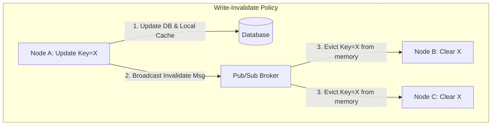

#### ১. Write-Invalidate Policy (ইনভ্যালিডেশন পলিসি)
*   যখন কোনো ফিজিক্যাল নোড কোনো কী (Key) আপডেট করে, সে ক্লাস্টারের সমস্ত নোডে একটি **Invalidation Signal** ব্রডকাস্ট করে। সিগন্যাল পেয়ে অন্য নোডগুলো তাদের লোকাল মেমরি থেকে ওই কী-টি ডিলিট (Evict) করে দেয়। পরবর্তী রিডে তারা ডাটাবেজ থেকে নতুন ডাটা আনবে।
*   **সুবিধা:** কম নেটওয়ার্ক ব্যান্ডউইথ খরচ হয় (যদি একই কী-তে ঘন ঘন রাইট হয়)।

#### ২. Write-Update Policy (আপডেট ব্রডকাস্ট পলিসি)
*   একটি নোডে ডাটা আপডেট হলে সে নতুন ভ্যালুটি ক্লাস্টারের সমস্ত নোডে ব্রডকাস্ট করে সবার লোকাল মেমরি আপডেট করে দেয়।
*   **সুবিধা:** রিড হিট রেট সর্বদা ১০০%, কোনো ক্যাশ মিস ঘটে না।
*   **অসুবিধা:** চরম নেটওয়ার্ক কনজেশন (Network Congestion) তৈরি হয় যদি ঘন ঘন ডাটা রাইট হতে থাকে।

#### ৩. Dual-Write Cache Incoherency (দ্বৈত রাইটের অমিল)
যদি ডিস্ট্রিবিউটেড নোডগুলো কোনো লক ছাড়াই ডাটাবেজ ও ক্যাশে একসাথে প্যারালাল রাইট পাঠায়:
*   রিকোয়েস্ট A এবং রিকোয়েস্ট B একই কী-র ডাটা আপডেট করছে।
*   ডাটাবেজে রাইটের সিকোয়েন্স: A প্রথমে, B পরে (ডাটাবেজে চূড়ান্ত মান B)।
*   ক্যাশে রাইটের সিকোয়েন্স: B প্রথমে, A পরে (ক্যাশে চূড়ান্ত মান A)।
*   **ফলাফল:** ডাটাবেজ ও ক্যাশের মান চিরকালের জন্য ডি-সিঙ্ক হয়ে গেল! 
*   **সমাধান:** ক্যাশ রাইট করার আগে সেন্ট্রাল ডিস্ট্রিবিউটেড লকিং (যেমন Redis locking) বা অপ্টিমিস্টিক ভার্সন চেকিং ব্যবহার করতে হবে।

---

### ৫.৩ Two-Level (L1/L2) Hybrid Caching (দ্বি-স্তরীয় হাইব্রিড ক্যাশিং)

সবচেয়ে কম ল্যাটেন্সি এবং হাই-থ্রুপুট অর্জনের জন্য এন্টারপ্রাইজ সিস্টেমে দুই স্তরের ক্যাশ ব্যবহার করা হয়:
*   **L1 (Local/In-Memory Cache):** এটি অ্যাপ্লিকেশনের নিজস্ব প্রোসেস বা র‌্যামের ভেতর থাকে (যেমন Node-Cache বা Caffeine)। ল্যাটেন্সি: **< ১০ মাইক্রোসেকেন্ড (μs)**। কিন্তু এটি নোডগুলোর মধ্যে শেয়ার্ড নয়।
*   **L2 (Centralized Cache):** এটি একটি রিমোট সেন্ট্রালাইজড রেডিস (Redis) ক্লাস্টার। ল্যাটেন্সি: **১-৫ মিলিসেকেন্ড (ms)**। এটি সমস্ত অ্যাপ নোডের মধ্যে শেয়ার্ড।

#### 🚨 L1/L2 সিঙ্কিং বোটলনেক
যদি নোড A-তে আসা একটি রিকোয়েস্ট কোনো মান আপডেট করে L2 (Redis) আপডেট করে দেয়, তবে নোড B-এর লোকাল L1 ক্যাশে কিন্তু পুরনো মানটিই থেকে যাবে! 

##### 💡 সমাধান: Redis Pub/Sub Invalidation Engine
আমরা একটি ডাইনামিক ইনভ্যালিডেশন ইঞ্জিন ডিজাইন করতে পারি যেখানে কোনো নোড L2 ক্যাশ আপডেট করার পর Redis Pub/Sub-এ একটি মেসেজ এমিট করবে। ক্লাস্টারের অন্যান্য সমস্ত নোড ওই সাবস্ক্রিপশন চ্যানেলটি শুনে সাথে সাথে তাদের নিজস্ব লোকাল L1 ক্যাশ থেকে স্টেল কী-টি মুছে দেবে।

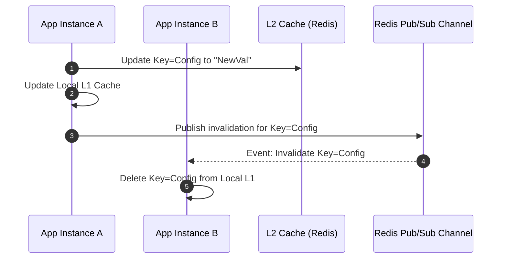

#### 💻 TypeScript Implementation: L1/L2 Hybrid Cache with Pub/Sub Syncing

নিচে একটি ডাইনামিক, প্রোডাকশন-গ্রেড এবং টাইপ-সেফ দ্বি-স্তরীয় হাইব্রিড ক্যাশিং সিস্টেমের টাইপস্ক্রিপ্ট ইমপ্লিমেন্টেশন দেওয়া হলো:

```typescript
import { EventEmitter } from 'events';

// Mock Interfaces for Redis
interface IRedisClient {
  get(key: string): Promise<string | null>;
  set(key: string, value: string, ttlSeconds: number): Promise<void>;
  publish(channel: string, message: string): Promise<void>;
  subscribe(channel: string, callback: (msg: string) => void): Promise<void>;
}

export class HybridCache extends EventEmitter {
  private l1Cache: Map<string, { value: any; expiry: number }>; // Local L1 Memory
  private redisL2: IRedisClient;                               // Remote L2 Redis
  private nodeId: string;
  private channelName = 'cache_invalidation_chan';

  constructor(redisClient: IRedisClient, nodeId: string) {
    super();
    this.l1Cache = new Map<string, { value: any; expiry: number }>();
    this.redisL2 = redisClient;
    this.nodeId = nodeId;
    
    this.setupPubSub();
  }

  // Redis Pub/Sub সেটআপ করা যা অন্যান্য নোডের ইনভ্যালিডেশন লিসেন করবে
  private async setupPubSub() {
    await this.redisL2.subscribe(this.channelName, (message: string) => {
      try {
        const { senderNodeId, evictedKey } = JSON.parse(message);
        // যদি অন্য কোনো নোড থেকে ইনভ্যালিডেশন আসে, নিজের L1 থেকে মুছে ফেলা
        if (senderNodeId !== this.nodeId) {
          this.l1Cache.delete(evictedKey);
          console.log(`🧹 Node [${this.nodeId}] evicted L1 Key: ${evictedKey} due to remote update.`);
        }
      } catch (err) {
        console.error('❌ Error processing invalidation message:', err);
      }
    });
  }

  // ডাটা রিড করা (L1 -> L2 -> Fallback DB)
  async get<T>(key: string, dbFallback: () => Promise<T>, ttlSeconds = 60): Promise<T> {
    const now = Date.now();
    const l1Record = this.l1Cache.get(key);

    // ১. L1 Cache Hit চেক করা
    if (l1Record && l1Record.expiry > now) {
      console.log(`🚀 L1 Cache Hit for Key: ${key}`);
      return l1Record.value as T;
    }

    // ২. L2 Cache Hit (Redis) চেক করা
    try {
      const redisVal = await this.redisL2.get(key);
      if (redisVal !== null) {
        const parsedVal = JSON.parse(redisVal) as T;
        // L1 ক্যাশ সিঙ্ক করা
        this.l1Cache.set(key, { value: parsedVal, expiry: now + (ttlSeconds * 1000) });
        console.log(`💾 L2 Cache Hit (Redis) for Key: ${key}`);
        return parsedVal;
      }
    } catch (err) {
      console.warn('⚠️ L2 Cache Read Error:', err);
    }

    // ৩. Cache Miss: Fallback to Database
    console.log(`🔌 Cache Miss. Fetching from DB for Key: ${key}`);
    const dbVal = await dbFallback();

    // ক্যাশগুলো সিঙ্ক করা
    const dbValStr = JSON.stringify(dbVal);
    await this.redisL2.set(key, dbValStr, ttlSeconds);
    this.l1Cache.set(key, { value: dbVal, expiry: now + (ttlSeconds * 1000) });

    return dbVal;
  }

  // ডাটা রাইট বা আপডেট করা (ক্যাশের মান বদলে ইনভ্যালিডেশন ব্রডকাস্ট)
  async set(key: string, value: any, ttlSeconds = 60): Promise<void> {
    const now = Date.now();
    const valStr = JSON.stringify(value);

    // ১. L2 (Redis) আপডেট করা
    await this.redisL2.set(key, valStr, ttlSeconds);

    // ২. লোকাল L1 আপডেট করা
    this.l1Cache.set(key, { value, expiry: now + (ttlSeconds * 1000) });

    // ৩. অন্যান্য সমস্ত নোডকে L1 মুছতে মেসেজ ব্রডকাস্ট করা
    const invalidationEvent = {
      senderNodeId: this.nodeId,
      evictedKey: key
    };
    await this.redisL2.publish(this.channelName, JSON.stringify(invalidationEvent));
  }
}
```

---

### ৫.৪ Cluster-wide Cache Stampede Prevention (ক্যাশ স্ট্যাম্পিড প্রতিরোধ)

উচ্চ ট্রাফিকের সিস্টেমে যখন একটি অত্যন্ত জনপ্রিয় কী (যেমন: ট্রেন্ডিং নিউজ বা হোম পেজ কনফিগ) ক্যাশ মেমরি থেকে মেয়াদোত্তীর্ণ (Expire) হয়, তখন একটি ভয়ংকর বিপর্যয় ঘটতে পারে যা **Cache Stampede (থান্ডারিং হার্ড)** নামে পরিচিত।

#### ১. The Cache Stampede Problem
যখন হট কী-টি এক্সপায়ার করে, একই মিলি-সেকেন্ডে আসা হাজার হাজার কনকারেন্ট রিড রিকোয়েস্ট ক্যাশ মিস করে। ফলে তারা সবাই একযোগে ডাটাবেজে হিট করে একই ডাটা প্রসেস ও কোয়েরি করার চেষ্টা করে। এর ফলে ডাটাবেজের সিপিইউ স্পাইক করে ১০০% হয়ে যায়, ডাটাবেজ কানেকশন পুল শেষ হয়ে যায় এবং পুরো ব্যাকএন্ড সার্ভিস সম্পূর্ণ ক্র্যাশ করে।

##### 🛠️ সমাধান ১: Mutex / Single Flight locking
*   ক্যাশ মিস হলে, ডাটাবেজ কোয়েরি করার আগে একটি ডিস্ট্রিবিউটেড লক বা লোকাল মিউটেক্স (Mutex) লক নেওয়া হয়। 
*   লক পাওয়া নোডটি ডাটাবেজ থেকে ডাটা এনে ক্যাশ আপডেট করবে, আর বাকি হাজারটি নোড লকের জন্য ওয়েট করবে এবং লক রিলিজ হলে সরাসরি ক্যাশ থেকে রিড করবে।

##### 🛠️ সমাধান ২: Probabilistic Early Expiration (XFetch Algorithm)
লক মেকানিজমে রিড রিকোয়েস্ট ব্লকিংয়ের কারণে ল্যাটেন্সি বৃদ্ধি পায়। এর চেয়েও আধুনিক ও বৈজ্ঞানিক সমাধান হলো **XFetch অ্যালগরিদম** (যা Probabilistic Early Expiration নামে পরিচিত)।

এটি ক্যাশ মেয়াদোত্তীর্ণ হওয়ার আগেই, ক্যাশ রিকোয়েস্টগুলোর কোনো একটিকে গাণিতিক প্রোবাবিলিটির ভিত্তিতে ক্যাশ মেয়াদ ফুরানোর সামান্য আগে **ব্যাকগ্রাউন্ডে অ্যাসিনক্রোনাসলি ক্যাশ রি-রাইট** করতে ট্রিগার করে।

##### 📊 XFetch Mathematical Model (এক্স-ফেচ গাণিতিক সমীকরণ)
একটি ক্যাশ রিড রিকোয়েস্টের সময় ব্যাকগ্রাউন্ড রিফ্রেশ ট্রিগার হবে কিনা তা নিচের গাণিতিক অসমতা দ্বারা নির্ধারিত হয়:

<div className="my-6 p-4 rounded-lg bg-zinc-900/50 border border-zinc-800 text-center font-mono text-lg text-emerald-400">
  Δ - β * ln(rand()) &gt; TTL
</div>

*   **Δ (Computation Delta):** ডাটাবেজ থেকে কুয়েরি করে ডাটা ক্যালকুলেট করতে যে সময় লাগে (মিলিসেকেন্ডে)।
*   **β (Aggressiveness Constant):** এটি একটি কনস্ট্যান্ট সংখ্যা (&gt; 0)। এর মান যত বেশি হবে, ক্যাশ তত বেশি আগে ভাগে রিফ্রেশ ট্রিগার করবে।
*   **rand():** 0 থেকে 1 এর মধ্যে একটি ইউনিফর্ম র‍্যান্ডম ডবল নম্বর।
*   **ln:** ন্যাচারাল লগারিদম (Natural Logarithm)।
*   **TTL:** কী-টির চূড়ান্ত এক্সপায়ার হতে অবশিষ্ট সময় (Remaining Time-to-Live)।

##### 💡 গাণিতিক আচরণ:
যখন TTL অনেক বেশি থাকে, তখন ln(rand()) এর ঋণাত্মক মান সত্ত্বেও অসমতাটি সত্য হওয়া অসম্ভব। কিন্তু TTL যখন কমে শূন্যের কাছাকাছি যেতে থাকে, তখন যেকোনো একটি র‍্যান্ডম রিকোয়েস্টের জন্য এই অসমতাটি সত্য হয়ে যায় এবং সে ক্লায়েন্টকে ব্লক না করেই ব্যাকগ্রাউন্ড প্রসেস চালু করে ডাটা আপডেট করে দেয়। ফলে প্রডাকশনে ক্যাশ কখনো পুরোপুরি এক্সপায়ার হতে পারে না এবং ডাটাবেজে স্ট্যাম্পিড ঘটার সুযোগ পায় না।

এই দূরদর্শী ও বৈজ্ঞানিক অপ্টিমাইজেশন কৌশলের মাধ্যমেই মিলিয়ন ইউজার ট্রাফিকের ডিস্ট্রিবিউটেড সিস্টেমগুলোতে চরম স্ট্যাবিলিটি অর্জন করা হয়।

---

---

## 🛡️ ৬. Fault Tolerance, Recovery & Chaos Engineering

ডিস্ট্রিবিউটেড সিস্টেম ডিজাইনের মূল কথা হলো—যেকোনো সময় যেকোনো ফিজিক্যাল নোড, ডিস্ক বা নেটওয়ার্ক সুইচ ক্র্যাশ করতে পারে। এই অবিরাম ব্যর্থতাকে মেনে নিয়ে সিস্টেমকে সচল এবং স্বয়ংক্রিয়ভাবে পুনরুদ্ধারযোগ্য (Self-healing) করার আর্কিটেকচারাল পলিসি ও রেজিলিয়েন্সি গ্যারান্টি নিয়ে এখানে আলোচনা করা হবে।

---

### ৬.১ Gossip Protocol Internals (গসিপ প্রোটোকল ইন্টারনালস)

হাজার হাজার নোডের একটি বড় ক্লাস্টারে প্রতিটি নোডের অবস্থান এবং সচলতা ট্র্যাক করার জন্য কোনো সেন্ট্রাল রেজিস্ট্রি (যেমন ZooKeeper) ব্যবহার করলে তা নিজেই একটি **Single Point of Failure** ও পারফরম্যান্স বোটলনেক হয়ে দাঁড়ায়। এর পরিবর্তে সম্পূর্ণ বিকেন্দ্রীকৃত (Decentralized) পিয়ার-টু-পিয়ার **Gossip Protocol** ব্যবহৃত হয়।

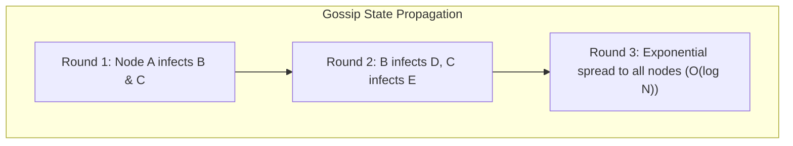

#### ১. Gossip Mechanics (গসিপের কর্মপদ্ধতি)
*   প্রতিটি নোড নিয়মিত নির্দিষ্ট সময় পর পর (যেমন প্রতি ১ সেকেন্ডে) ক্লাস্টার থেকে র‍্যান্ডমলি `k` সংখ্যক নোড নির্বাচন করে।
*   সে নিজের কাছে থাকা অন্যান্য সমস্ত নোডের মেম্বারশিপ তালিকা ও তাদের স্টেট (Alive, Dead, Bootstrapping) এবং হার্টবিট ভার্সন ওই নির্বাচিত নোডগুলোতে পাঠিয়ে দেয়।
*   প্রাপ্ত নোডটি সেই তালিকা নিজের তালিকার সাথে মিলিয়ে আপডেট করে নেয় এবং সে আবার র‍্যান্ডম অন্য নোডগুলোতে তা ব্রডকাস্ট করে।
*   এইভাবে অতি দ্রুত ক্লাস্টারের যেকোনো পরিবর্তনের সংবাদ **এপিডেমিক (মহামারী)** স্টাইলে সম্পূর্ণ ক্লাস্টারে ছড়িয়ে পড়ে। গাণিতিকভাবে মাত্র `O(log N)` রাউন্ডে ক্লাস্টারের সমস্ত নোড একে অপরের তথ্য পেয়ে যায়।

#### ২. Anti-Entropy with Merkle Trees
গসিপ সিস্টেমে দুটি নোডের মধ্যে ডাটার অমিল দূর করার জন্য (Anti-Entropy ফেইজে) সম্পূর্ণ ডাটাবেজ নেটওয়ার্কে ট্রান্সফার করা অত্যন্ত ব্যয়বহুল। 
*   **Merkle Trees (ক্রিপ্টোগ্রাফিক হ্যাশ ট্রি):** ডাটাবেজের সমস্ত ডাটাকে একটি ক্রিপ্টোগ্রাফিক হ্যাশ ট্রিতে রূপান্তর করা হয়।
*   দুটি নোড কেবল তাদের মেম্বার নোডগুলোর রুট হ্যাশ (Root Hash) তুলনা করে। যদি রুট হ্যাশ মিলে যায়, তবে নিশ্চিত যে কোনো ডাটা ডি-সিঙ্ক হয়নি।
*   যদি রুট হ্যাশ না মেলে, তবে তারা ট্রির নিচের ব্রাঞ্চগুলোর হ্যাশ তুলনা করে সুনির্দিষ্টভাবে কোন ডাটা রো-টি অমিল রয়েছে তা বের করে কেবল সেই সিঙ্গেল ডাটাটি নেটওয়ার্কে ট্রান্সফার করে আপডেট করে নেয়। এটি চরম নেটওয়ার্ক অপ্টিমাইজেশন নিশ্চিত করে।

---

### ৬.২ Failure Detectors: Phi Accrual (Φ-Accrual Failure Detector)

ডিস্ট্রিবিউটেড ক্লাস্টারে একটি নোড সচল আছে নাকি ক্র্যাশ করেছে তা ডিটেক্ট করা অত্যন্ত জটিল। ট্র্যাডিশনাল সিস্টেমে যদি `T` সময়ের মধ্যে কোনো নোড থেকে হার্টবিট মেসেজ না আসে, তবে তাকে মৃত বলে ধরে নেওয়া হয় (Binary Heartbeat Check)।

##### 🚨 বাইনারি হার্টবিট চেকের মারাত্মক সমস্যা:
*   ক্লাউড এনভায়রনমেন্টে ক্ষণস্থায়ী নেটওয়ার্ক কনজেশন (Network Jitter) বা জাভা/নোডের দীর্ঘকালীন **Garbage Collection (GC) Pauses** এর কারণে নোড সাময়িকভাবে রেসপন্স দিতে দেরি করতে পারে।
*   এই অবস্থায় নোডটি সচল থাকা সত্ত্বেও তাকে মৃত ঘোষণা করলে ক্লাস্টার জুড়ে কোটি কোটি ডাটা রি-ব্যালেন্সিংয়ের হিড়িক পড়ে যাবে এবং ফলস্বরূপ সম্পূর্ণ নেটওয়ার্ক জ্যাম হয়ে অন্য নোডগুলোও ডাউন হতে শুরু করবে (Cascading Failures)।

#### ১. Φ-Accrual Failure Detector (ফি অ্যাক্রুয়াল ফেইলিউর ডিটেক্টর)
Cassandra এবং Akka ক্লাস্টারে ব্যবহৃত এই অ্যালগরিদমটি কোনো নোড সম্পর্কে সরাসরি **Alive** বা **Dead** বাইনারি সিদ্ধান্ত দেয় না। 

এর পরিবর্তে এটি একটি চলমান গাণিতিক হিস্টোরি (Sliding Window of heartbeat intervals) মেইনটেইন করে হিসাব করে যে—**ঠিক এই মুহূর্তে নোডটি মৃত ঘোষণা করলে ভুল সিদ্ধান্ত বা False Positive নেওয়ার সম্ভাবনা কতটুকু!**

##### 📊 Phi Mathematical Model (ফি গাণিতিক সূত্র)
ফি ভ্যালু (`Φ`) হলো একটি ক্রমাগত **Suspicion Level (সন্দেহের মাত্রা)** যা নেটওয়ার্ক ডিলের সম্ভাবনার ওপর ভিত্তি করে তৈরি হয়:

> **Φ = -log₁₀(P_later(t - t_last))**

*   `t` : বর্তমান ওয়াল-ক্লক সময় (Current Wall-clock Time)।
*   `t_last` : নোডটি থেকে প্রাপ্ত সর্বশেষ হার্টবিটের সময় (Time of the Last Heartbeat)।
*   `P_later(d)` : পূর্ববর্তী হার্টবিট ইন্টারভালের নরমাল ডিস্ট্রিবিউশন (Normal Distribution) থেকে প্রাপ্ত সম্ভাবনা যে পরবর্তী হার্টবিটটি `d` সময়ের চেয়ে দেরিতে আসবে (অর্থাৎ এটি স্রেফ সাধারণ নেটওয়ার্ক ফ্লাকচুয়েশন)।

##### 💡 গাণিতিক ব্যাখ্যা ও থ্রেশহোল্ড:
`Φ` মূলত **False Positive Probability** বা **মিথ্যা সতর্কতার সম্ভাবনা** নির্দেশ করে:
*   যদি `Φ = 1` হয়, তবে `P_later = 10⁻¹ = 0.1`। অর্থাৎ নোডটি সচল থাকা সত্ত্বেও তাকে মৃত ঘোষণা করলে **ভুল সিদ্ধান্ত নেওয়ার সম্ভাবনা 10%** (1টি নোড ভুল করে ডেড মার্ক হতে পারে প্রতি 10 বারে)।
*   যদি `Φ = 8` হয়, তবে `P_later = 10⁻⁸`। অর্থাৎ নোডটিকে মৃত ঘোষণা করলে **ভুল সিদ্ধান্ত নেওয়ার সম্ভাবনা মাত্র 10⁻⁸** (1 কোটির মধ্যে 1 বার)।
*   যদি `Φ = 12` হয়, তবে `P_later = 10⁻¹²`। অর্থাৎ নোডটিকে মৃত ঘোষণা করলে **ভুল সিদ্ধান্ত নেওয়ার সম্ভাবনা মাত্র 10⁻¹²** (1 লাখ কোটির মধ্যে 1 বার)।
*   **আর্কিটেকচারাল সিদ্ধান্ত (Tuning):** আর্কিটেক্ট তার সিস্টেমের গুরুত্ব অনুযায়ী এই থ্রেশহোল্ড ডাইনামিক্যালি টিউন করতে পারেন:
    *   `Φ ≥ 12` (Conservative): ডাটা শার্ড রি-ব্যালেন্সিং বা মেম্বারশিপ থেকে নোড পার্মানেন্টলি রিমুভ করার মতো অত্যন্ত ব্যয়বহুল টাস্ক ট্রিগার করার জন্য এটি ব্যবহার করা হয় (যাতে ভুল সিদ্ধান্তের কারণে ক্লাস্টারে অযথা রি-ব্যালেন্সিং স্টম্পিড না ঘটে)।
    *   `Φ ≥ 8` (Aggressive): সাধারণ কানেকশন রি-রাউটিং বা ক্লায়েন্ট কোয়েরি অন্য নোডে রি-ডাইরেক্ট করার জন্য এটি ব্যবহৃত হয় (যাতে গ্রাহক কোনো বাড়তি ল্যাটেন্সি অনুভব না করেন)।

#### 💻 TypeScript Implementation: Phi Accrual Failure Detector

নিচে স্লাইডিং উইন্ডো এবং নরমাল ডিস্ট্রিবিউশনের ভিত্তিতে ফি ভ্যালু গণনা করার একটি প্রোডাকশন-গ্রেড টাইপস্ক্রিপ্ট ইমপ্লিমেন্টেশন দেওয়া হলো:

```typescript
export class PhiAccrualFailureDetector {
  private heartbeatIntervals: number[] = [];
  private maxWindowSize: number;
  private lastHeartbeatTime?: number;
  private minStdDev: number; // গাণিতিক জিরো-ডিভিশন এড়াতে মিনিমাম স্ট্যান্ডার্ড ডেভিয়েশন

  constructor(maxWindowSize = 1000, minStdDev = 100) {
    this.maxWindowSize = maxWindowSize;
    this.minStdDev = minStdDev;
  }

  // নোড থেকে হার্টবিট রিসিভ করার মেথড (টাইমস্ট্যাম্প সিঙ্ক করা)
  recordHeartbeat(): void {
    const now = Date.now();
    if (this.lastHeartbeatTime !== undefined) {
      const interval = now - this.lastHeartbeatTime;
      this.heartbeatIntervals.push(interval);
      
      // স্লাইডিং উইন্ডো সাইজ মেইনটেইন করা
      if (this.heartbeatIntervals.length > this.maxWindowSize) {
        this.heartbeatIntervals.shift();
      }
    }
    this.lastHeartbeatTime = now;
  }

  // বর্তমান সময়ে নোডের Phi ভ্যালু গণনা করা
  getPhi(): number {
    if (this.lastHeartbeatTime === undefined) {
      return 0; // কোনো হার্টবিটই আসেনি এখনো
    }

    const now = Date.now();
    const elapsedTime = now - this.lastHeartbeatTime;

    if (this.heartbeatIntervals.length < 5) {
      // পর্যাপ্ত ইন্টারভাল ডাটা না থাকলে ট্র্যাডিশনাল টাইমআউট ট্র্যাকিং
      return elapsedTime > 5000 ? 12 : 0;
    }

    // ১. গড় (Mean) বের করা
    const sum = this.heartbeatIntervals.reduce((acc, val) => acc + val, 0);
    const mean = sum / this.heartbeatIntervals.length;

    // ২. স্ট্যান্ডার্ড ডেভিয়েশন (Standard Deviation) বের করা
    const variance = this.heartbeatIntervals.reduce((acc, val) => acc + Math.pow(val - mean, 2), 0) / this.heartbeatIntervals.length;
    const stdDev = Math.max(Math.sqrt(variance), this.minStdDev);

    // ৩. কিউমিউলেটিভ ডিস্ট্রিবিউশন ফাংশন (CDF) গণনা
    // Z-Score গণনা
    const zScore = (elapsedTime - mean) / stdDev;
    
    // Normal Distribution Cumulative Probability Approximation
    const pLater = this.gaussianComplementaryCDF(zScore);

    // ৪. Phi গণনা (-log10(P_later))
    const phi = -Math.log10(Math.max(pLater, 1e-15)); // 1e-15 prevents log of 0

    return Number(phi.toFixed(2));
  }

  // Gaussian Complementary CDF Approximation (Erfc functions)
  private gaussianComplementaryCDF(z: number): number {
    // Standard normal cumulative distribution function (1 - CDF)
    const t = 1.0 / (1.0 + 0.2316419 * Math.abs(z));
    const d = 0.39894228 * Math.exp(-z * z / 2.0);
    const prob = d * t * (0.31938153 + t * (-0.356563782 + t * (1.781477937 + t * (-1.821255978 + t * 1.330274429))));
    
    if (z > 0) {
      return prob;
    }
    return 1.0 - prob;
  }
}
```

---

### ৬.৩ Disaster Recovery & System Metrics (দুর্যোগ পুনরুদ্ধার ও মেট্রিক্স)

কোনো বড় প্রাকৃতিক দুর্যোগে (যেমন সম্পূর্ণ ডাটা সেন্টার পুড়ে যাওয়া বা ক্যাবল কাটা পড়া) ডাটা সেভ রাখা এবং সিস্টেম সচল করার জন্য দুটি মেট্রিক্স ব্যবহার করে আর্কিটেকচার করতে হয়।

#### ১. Mathematical Metrics
*   **RTO (Recovery Time Objective):** একটি বিপর্যয় ঘটার পর কত সময়ের মধ্যে সিস্টেমকে পুনরায় সচল করতে হবে (Maximum tolerable downtime)। যেমন ব্যাংকিং সিস্টেমের জন্য RTO হতে পারে < ৩০ সেকেন্ড।
*   **RPO (Recovery Point Objective):** একটি বিপর্যয়ের পর কতটুকু ডাটা হারানোর সীমা গ্রাহক মেনে নেবে (Maximum tolerable data loss)। RPO = ২ ঘণ্টা মানে দুর্যোগের ঠিক পূর্বের ২ ঘণ্টার ডাটা হারিয়ে গেলেও সিস্টেম রিকভার করতে পারবে। RPO = ০ মানে কোনো ডাটা হারানোর সুযোগ নেই।

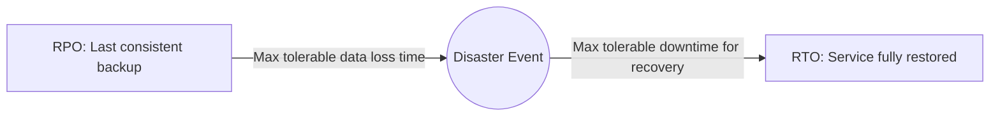

#### ২. Disaster Recovery Topologies

##### ক. Active-Active (মাল্টি-সাইট অ্যাক্টিভ)
*   **মেকানিজম:** একই সাথে দুটি ভিন্ন ভিন্ন জোনে ডাটা সেন্টার সচল থাকে এবং ইনকামিং ট্রাফিক গ্রহণ করে। ডাটা রিয়েল-টাইমে সিঙ্ক করা হয়।
*   **মেট্রিক্স:** RTO $\approx$ ০, RPO $\approx$ ০।
*   **ট্রেড-অফ:** অত্যন্ত ব্যয়বহুল এবং দ্বিমুখী ট্রানজেকশন রাইট কনফ্লিক্ট হ্যান্ডেল করা অত্যন্ত জটিল।

##### খ. Active-Passive (Hot Standby)
*   **মেকানিজম:** প্রাইমারি ডাটা সেন্টার ট্রাফিক রিসিভ করে এবং রিয়েল-টাইমে সেকেন্ডারি ডাটা সেন্টারে ডাটা রেপ্লিকেট করে। সেকেন্ডারি নোডটি লাইভ থাকলেও ট্রাফিক নেয় না। প্রাইমারি ক্র্যাশ করলে DNS সেকেন্ডারিতে ট্রাফিক সুইচ করে।
*   **মেট্রিক্স:** RTO = কয়েক সেকেন্ড বা মিনিট, RPO $\approx$ ০।

##### গ. Warm / Cold Standby
*   **মেকানিজম:** সেকেন্ডারি ডাটা সেন্টারে সার্ভারগুলো অফলাইন বা ডাউন-স্কেল করা থাকে। কোনো বিপর্যয় ঘটলে ম্যানুয়ালি সার্ভার অন করে আগের ব্যাকআপ রিস্টোর করে লাইভ করতে হয়।
*   **মেট্রিক্স:** RTO = কয়েক ঘণ্টা, RPO = কয়েক ঘণ্টা বা দিন।

---

### ৬.৪ Chaos Engineering & Fault Injection (ক্যাওস ইঞ্জিনিয়ারিং ও ফল্ট ইনজেকশন)

ডিস্ট্রিবিউটেড সিস্টেম যখন অত্যন্ত বড় ও জটিল হয়ে পড়ে, তখন তাত্ত্বিকভাবে তা শতভাগ রেজিলিয়েন্ট প্রমাণ করা যায় না। প্রডাকশনে বিপর্যয় ঘটার পূর্বেই সিস্টেমের দুর্বলতা খুঁজে বের করার বৈজ্ঞানিক ডিসিপ্লিনই হলো **Chaos Engineering** (যা Netflix-এর Chaos Monkey দ্বারা জনপ্রিয় হয়)।

#### ১. Principles of Chaos (ক্যাওসের মূলনীতি)
১.  **Define Steady State (স্থির অবস্থা নির্ধারণ):** প্রথমে সিস্টেমের স্বাভাবিক অবস্থার মেট্রিক্স ম্যাপ করতে হয় (যেমন, ১০০০০ রিকোয়েস্টে ল্যাটেন্সি < ৫০ms এবং এরর রেট < ০.০১%)।
২.  **Formulate Hypothesis (অনুমান গঠন):** অনুমান করা হয় যে, ক্লাস্টারের কোনো একটি ফিজিক্যাল নোড বা ডিস্ক ক্র্যাশ করলেও সিস্টেমের স্থির অবস্থার কোনো পরিবর্তন হবে না (ডাউনটাইম হবে না)।
৩.  **Inject Real-world Faults (ফল্ট ইনজেকশন):** প্রোডাকশন বা প্রোডাকশন-সদৃশ স্টেজিং পরিবেশে সরাসরি লাইভ ডাটা সেন্টারে ইচ্ছাকৃত বিপর্যয় ঘটানো (যেমন, ৩টি রানিং কন্টেইনার ডিলিট করা, নেটওয়ার্ক পোর্টে ৫০% প্যাকেট লস ডিক্লেয়ার করা বা ডেটাবেজে ২০০ms ল্যাটেন্সি ইনজেক্ট করা)।
৪.  **Verify Hypothesis (ভ্যালিডেশন):** যদি সিস্টেম নিজে থেকেই কোনো ক্লায়েন্টকে এরর না দেখিয়ে সেকেন্ডারি শার্ড দিয়ে স্বয়ংক্রিয়ভাবে ট্রাফিক রুট করে (Self-heals), তবে হাইপোথিসিস সফল। অন্যথায় সিস্টেমের দুর্বলতা চিহ্নিত করে আর্কিটেকচারাল ফিক্স করা হয়।

#### ২. Fault Injection in Service Mesh
আধুনিক মাইক্রোসার্ভিসে অ্যাপ্লিকেশন কোড পরিবর্তন না করে সার্ভিস মেশ (যেমন Istio) ব্যবহার করে নেটওয়ার্ক লেভেলে ক্যাওস ইঞ্জিনিয়ারিং ফল্ট ইনজেক্ট করা হয়। এর দুটি প্রধান টাইপ:
*   **Delay Injection (ল্যাটেন্সি ইনজেকশন):** নির্দিষ্ট কিছু এপিআই কলে ইচ্ছাকৃত ল্যাটেন্সি (যেমন ৫ সেকেন্ড লেট) তৈরি করা যাতে ডাউনস্ট্রিম সার্ভিসগুলোর সার্কিট ব্রেকার (Circuit Breaker) এবং টাইমআউট কনফিগারেশন পরীক্ষা করা যায়।
*   **Abort Injection (অ্যাবোর্ট ইনজেকশন):** এপিআই কলে স্বয়ংক্রিয়ভাবে HTTP 503 বা HTTP 500 রেসপন্স ব্যাক করা যাতে ক্লায়েন্ট নোডগুলোর রি-ট্রাই (Retry) ও ফলব্যাক লজিক চেক করা যায়।

এই চূড়ান্ত বৈজ্ঞানিক রেজিলিয়েন্সি ও ক্যাওস অনুশীলনের মাধ্যমেই আধুনিক এন্টারপ্রাইজ ডিস্ট্রিবিউটেড সিস্টেমগুলো বছরের পর বছর শতভাগ সচল থাকে।

---
