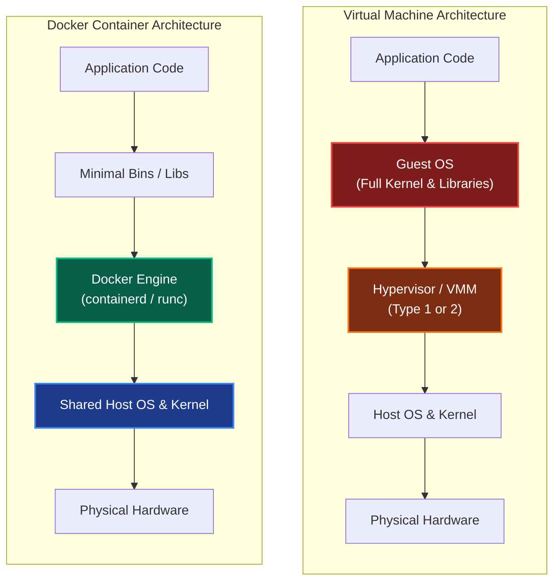
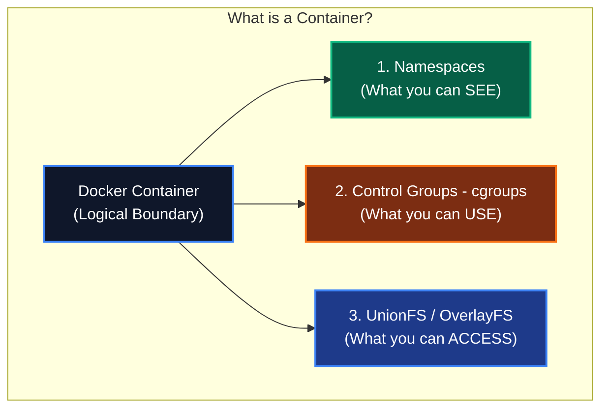
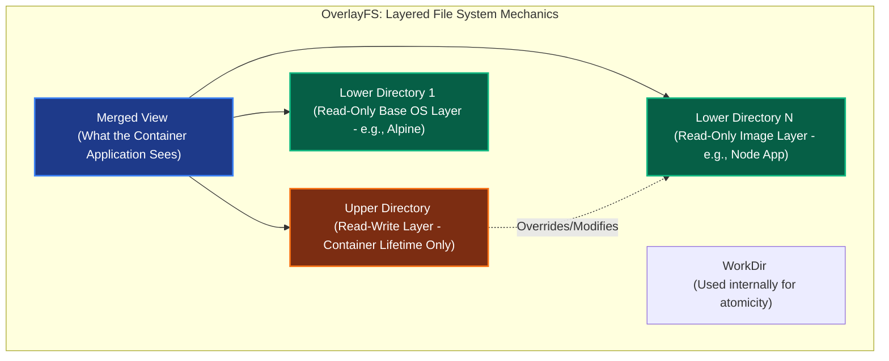
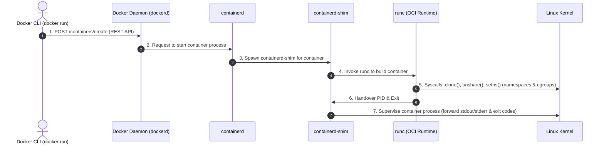
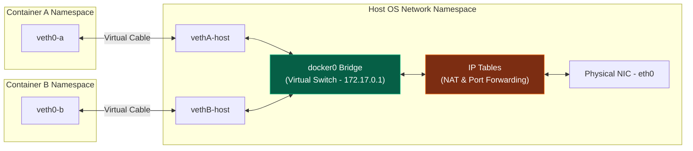
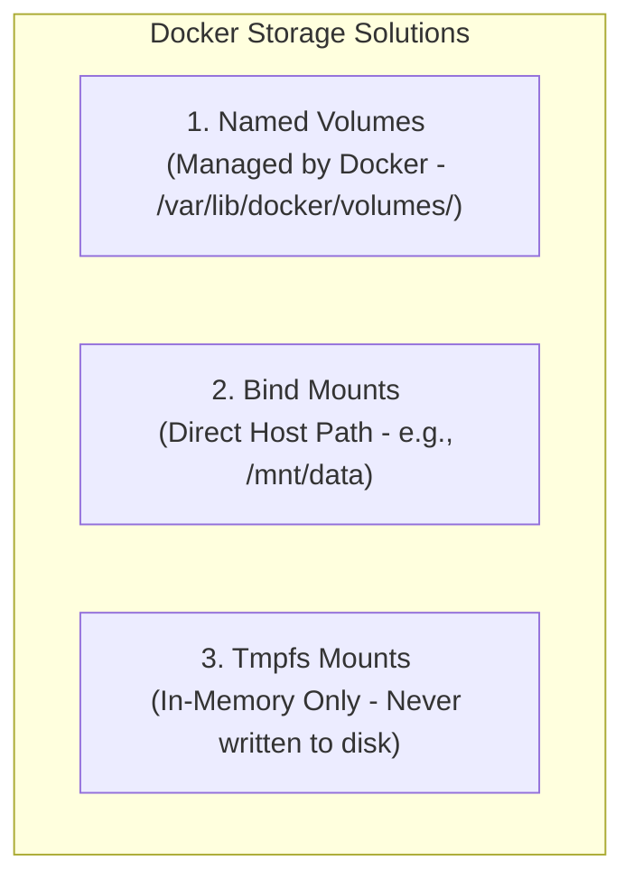

# Docker & Containerization Internals: Deep Architectural Manual

আধুনিক ক্লাউড-নেটিভ সফটওয়্যার আর্কিটেকচারে কন্টেইনারাইজেশন একটি অনস্বীকার্য স্ট্যান্ডার্ড। তবে বেশিরভাগ ডেভেলপার কেবল `docker run` এবং `docker build` কমান্ডের মধ্যেই সীমাবদ্ধ থাকেন। আপনি যদি একজন সিনিয়র সফটওয়্যার ইঞ্জিনিয়ার, সিস্টেম স্থপতি (System Architect) বা ডেভঅপ্স স্পেশালিস্ট হতে চান, তবে কার্নেল লেভেলে ডকার কীভাবে কাজ করে, এর সিকিউরিটি বাউন্ডারি এবং নেটওয়ার্কিং ও স্টোরেজের ভেতরের গভীর মেকানিজম জানা অপরিহার্য।

এই গাইডবুকে আমরা ডকারের একদম কোর আর্কিটেকচার, লিনাক্স কার্নেলের সাথে এর নিবিড় সংযোগ, নেটওয়ার্কিং-স্টোরেজ ড্রাইভের মেকানিক্স এবং প্রোডাকশন-গ্রেড ডকার ফাইল অপ্টিমাইজেশনের প্রতিটি বিষয় প্রফেশনাল ডেপথ ও মারমেইড ডায়াগ্রামের মাধ্যমে উন্মোচন করব।

---

## ১. Virtual Machines vs. Containers: The Core Battle

কন্টেইনারের গভীর মেকানিজম বোঝার আগে এটি ভার্চুয়াল মেশিনের (VM) চেয়ে কেন শতগুণ দ্রুত ও লাইটওয়েট, তা জানা প্রয়োজন।

### Hypervisor-Based Virtualization (VM)
ভার্চুয়াল মেশিনে হার্ডওয়্যারের ওপর একটি **Hypervisor** (যেমন: ESXi, KVM, VirtualBox) রান করে। এটি প্রতিটা ভিএম-এর জন্য ফিজিক্যাল রিসোর্সকে ভার্চুয়ালাইজ করে সম্পূর্ণ আলাদা **Guest OS** ইনস্টল করে। 
- **ওভারহেড:** প্রতিটা ভিএম-এর নিজস্ব কার্নেল, মেমরি ম্যানেজমেন্ট, ডিভাইস ড্রাইভার এবং ইনিট সিস্টেম থাকে। এর ফলে একটি ছোট অ্যাপ্লিকেশন চালাতেও কয়েক গিগাবাইট র‍্যাম এবং বুট হতে কয়েক মিনিট সময় নষ্ট হয়।

### Containerization (OS-Level Virtualization)
ডকার বা কন্টেইনারে কোনো হাইপারভাইজার বা গেস্ট ওএস থাকে না। কন্টেইনারগুলো সরাসরি **Host OS-এর Kernel** শেয়ার করে চলে। ডকার ইঞ্জিন কার্নেলের ফিচার ব্যবহার করে প্রসেসগুলোকে এমনভাবে আইসোলেট করে যাতে তারা মনে করে তারা সম্পূর্ণ পৃথক মেশিনে আছে।
- **ওভারহেড:** যেহেতু কোনো গেস্ট ওএস নেই, তাই অতিরিক্ত কোনো কার্নেল মেমরি ওভারহেড থাকে না। কন্টেইনার বুট হওয়া মানে স্রেফ একটি সাধারণ হোস্ট প্রসেস শুরু হওয়া, যা মাত্র কয়েক মিলি-সেকেন্ডে ঘটে।



### VM vs. Container Detailed Comparison

| Feature | Virtual Machines (VMs) | Containers (Docker) |
| :--- | :--- | :--- |
| **Architectural Core** | Hardware-level Virtualization (Hypervisor) | OS-level Virtualization (Shared Host Kernel) |
| **Guest OS** | প্রতিটা VM-এর নিজস্ব পূর্ণাঙ্গ Guest OS থাকে। | কোনো Guest OS থাকে না, হোস্টের কার্নেল শেয়ার করে। |
| **Startup Time** | কয়েক মিনিট (কার্ডওয়্যার বুট ও কার্নেল ইনিশিয়ালাইজেশন)। | মিলি-সেকেন্ড (স্রেফ একটি লিনাক্স প্রসেস ট্রিগার)। |
| **Memory Footprint** | কয়েক গিগাবাইট (GB)। | কয়েক মেগাবাইট (MB)। |
| **Resource Efficiency** | কম (রিসোর্স আগে থেকেই ফিক্সড ব্লক হিসেবে বুকড থাকে)। | অত্যন্ত বেশি (ডায়নামিক এলোকেশন ও শেয়ারিং)। |
| **Isolation Level** | অত্যন্ত স্ট্রং (হার্ডওয়্যার বাউন্ডারি আইসোলেশন)। | মিডিয়াম/স্ট্রং (প্রসেস বাউন্ডারি আইসোলেশন)। |

---

## ২. Under the Hood: Container Core Mechanisms

লিনাক্স কার্নেল লেভেলে "কন্টেইনার" নামের কোনো ফিজিক্যাল অস্তিত্ব নেই। এটি মূলত ৩টি লিনাক্স কার্নেল টেকনোলজির সমন্বয়ে তৈরি একটি শক্তিশালী স্যান্ডবক্স:



### ১. Namespaces: Virtualizing Viewports (আইসোলেশন)
নেমস্পেস হলো ওএস লেভেলে একটি প্রসেসকে সম্পূর্ণ আইসোলেটেড ভিউ পোর্ট দেওয়া। এর মাধ্যমে প্রসেসটি মনে করে সে হোস্টের একমাত্র বাসিন্দা। ডকার মূলত ৬টি প্রধান লিনাক্স নেমস্পেস ব্যবহার করে:

- **PID Namespace (Process ID):** কন্টেইনারের ভেতরের মেইন প্রসেসটি মনে করে তার আইডি ১ (PID 1), যদিও হোস্ট মেশিনে তার আইডি হয়তো ১৫৭৩০। সে হোস্টের অন্য কোনো প্রসেস দেখতে বা সিগন্যাল পাঠাতে পারে না।
- **NET Namespace (Network):** কন্টেইনারকে তার নিজস্ব ভার্চুয়াল নেটওয়ার্ক ডিভাইস, আইপি রুট, পোর্ট রেঞ্জ এবং আইপি টেবিল দেয়।
- **MNT Namespace (Mount):** কন্টেইনারকে সম্পূর্ণ নিজস্ব ডিরেক্টরি ট্রি এবং মাউন্ট পয়েন্ট ফাইলসিস্টেম দেয়। এর ফলে কন্টেইনার হোস্টের রুট ফাইল দেখতে পারে না।
- **IPC Namespace (Inter-Process Communication):** প্রসেসগুলোর মধ্যে শেয়ার্ড মেমরি বা মেসেজ কিউ আইসোলেট করে, যাতে অন্য কন্টেইনার ডেটা রিড করতে না পারে।
- **UTS Namespace (UNIX Timesharing System):** কন্টেইনারকে নিজস্ব হোস্টনেম এবং ডোমেননেম সেট করার পারমিশন দেয়।
- **USER Namespace:** কন্টেইনারের ভেতরের নন-রুট ইউজারকে হোস্ট ওএস-এর রুট প্রিভিলেজ ছাড়া স্যান্ডবক্সের ভেতরে রুট (UID 0) হিসেবে অ্যাক্ট করার সুবিধা দেয়।

---

### ২. Control Groups (cgroups): Resource Constraint (রিসোর্স লিমিট)
নেমস্পেস দিয়ে আইসোলেট করলেও একটি কন্টেইনার হোস্টের সম্পূর্ণ সিপিইউ, র‍্যাম বা ডিস্ক I/O একাই খেয়ে হোস্ট ক্র্যাশ করাতে পারে। এই রিসোর্স ম্যানেজ ও কন্ট্রোল করার জন্য কার্নেলের **Control Groups (cgroups)** ব্যবহৃত হয়।
cgroups দিয়ে আমরা ডিফাইন করতে পারি:
- **CPU Limits:** কন্টেইনারটি সর্বোচ্চ ১.৫ বা ২ কোর ব্যবহার করতে পারবে।
- **Memory Limits:** কন্টেইনারটি সর্বোচ্চ ৫১২MB র‍্যাম পাবে। লিমিট এক্সিড করলে ওএস কার্নেল প্রসেসটিকে **OOM (Out Of Memory) Killed** সিগন্যাল পাঠিয়ে বন্ধ করে দিবে।
- **I/O Bandwidth:** কন্টেইনারটি ডিস্কে সর্বোচ্চ কত স্পিডে রাইট করতে পারবে (যেমন: 50MB/s limit)।

---

### ৩. Union File System (UnionFS) & OverlayFS
ডকার ইমেজগুলো কীভাবে একাধিক লেয়ারে তৈরি হয় এবং কন্টেইনার রান করার পর মেমরি নষ্ট না করে ফাইল সিস্টেম রিড/রাইট করে, তার নেপথ্যে রয়েছে **UnionFS** (আধুনিক লিনাক্সে এর স্ট্যান্ডার্ড রূপ **Overlay2**)।

OverlayFS মূল ফাইল সিস্টেমকে ৩টি প্রধান লেয়ারে বিন্যস্ত করে:
1. **LowerDir (Read-Only Layer):** ডকার ইমেজের সমস্ত লেয়ারগুলো এখানে রিড-অনলি হিসেবে লক থাকে। এগুলোকে কখনই পরিবর্তন করা যায় না।
2. **UpperDir (Read-Write Container Layer):** কন্টেইনার যখন রান করে, ডকার কার্নেল তার মাথার ওপর একটি অত্যন্ত পাতলা রিড-রাইট লেয়ার বিছিয়ে দেয়। কন্টেইনারে যেকোনো নতুন ফাইল তৈরি বা রাইট করলে তা সরাসরি এই লেয়ারে গিয়ে জমা হয়।
3. **MergedDir (Unified View):** এটি হলো একটি ভার্চুয়াল মাউন্ট ভিউ। কন্টেইনারের ভেতরের অ্যাপ্লিকেশনটি যখন ফাইল ব্রাউজ করে, সে LowerDir এবং UpperDir-এর ফাইলগুলোকে একসাথে মার্জড অবস্থায় দেখতে পায়।



#### Copy-on-Write (CoW) Mechanism
কন্টেইনার চলাকালীন যদি কোনো রিড-অনলি ইমেজের ফাইল (LowerDir) পরিবর্তন বা ডিলিট করতে হয়, কার্নেল সরাসরি তা করতে দেয় না। কার্নেল ব্যাকগ্রাউন্ডে নিচের নিয়মগুলো ফলো করে:
- **Modification (পরিবর্তন):** কার্নেল ফাইলটিকে LowerDir থেকে কপি করে UpperDir (Read-Write)-এ নিয়ে আসে এবং সেখানে পরিবর্তন করে। মার্জড ভিউতে এখন কন্টেইনার অ্যাপ্লিকেশনের কাছে নতুন ফাইলটি দৃশ্যমান হয়, কিন্তু মূল ইমেজ ফাইলে কোনো টাচ ঘটে না।
- **Deletion (মুছে ফেলা):** ফাইলটি ডিলিট করতে গেলে UpperDir-এ একটি বিশেষ **Whiteout file (চরিত্রহীন ফাইল বা ডামি ফাইল)** তৈরি করা হয়, যা মার্জড ভিউতে ফাইলটিকে লুকিয়ে রাখে।

> [!IMPORTANT]
> যেহেতু কন্টেইনারের সমস্ত রাইট অপারেশন `UpperDir` (Read-Write Layer)-এ ঘটে, তাই কন্টেইনার ডিলিট করে দিলে এই লেয়ারের সমস্ত ডেটা চিরতরে হারিয়ে যায়। এই জন্যই প্রডাকশন ডাটাবেসের ডেটা সবসময় ডকার **Volume**-এ রাখা বাধ্যতামূলক।

---

## ৩. Docker Engine Internal Architecture

অনেকেই মনে করেন ডকার নিজেই সরাসরি কন্টেইনার চালায়। এটি সম্পূর্ণ ভুল! ডকার আসলে একটি হাই-লেভেল কোঅর্ডিনেটর। কন্টেইনার স্পন করার জন্য ব্যাকএন্ডে একটি লুজলি কাপল্ড মাইক্রোসার্ভিস স্ট্যাক কাজ করে।



### Components of the Docker Engine:

#### ১. Docker CLI
ব্যবহারকারী যখন টার্মিনালে `docker run -d -p 80:80 nginx` কমান্ড দেন, CLI মূলত কমান্ডটিকে একটি স্ট্যান্ডার্ড JSON পে-লোডে কনভার্ট করে UNIX Socket বা TCP-এর মাধ্যমে ডকার ডেমোনের কাছে একটি **REST API Call** পাঠায়।

#### ২. Docker Daemon (`dockerd`)
এটি একটি ব্যাকগ্রাউন্ড সার্ভিস যা সবসময় চলতে থাকে। এর কাজ হলো ইমেজ ডাউনলোড/ম্যানেজ করা, ভলিউম তৈরি করা, নেটওয়ার্ক রাউটিং কনফিগার করা এবং সিকিউরিটি চেক করা। কিন্তু এটি সরাসরি কন্টেইনার প্রসেস হ্যান্ডেল করে না; কন্টেইনার ম্যানেজমেন্টের কাজ সে হস্তান্তর করে **containerd**-এর কাছে।

#### ৩. `containerd`
এটি একটি হাই-পারফরম্যান্স এবং ইন্ডাস্ট্রি-স্ট্যান্ডার্ড কন্টেইনার লাইফসাইকেল ম্যানেজার (এটি CNCF-এর একটি গ্র্যাজুয়েটেড প্রজেক্ট)। এর কাজ হলো ইমেজের লেয়ারগুলো আনপ্যাক করে রানিং এনভায়রনমেন্ট তৈরি করা এবং কন্টেইনারের স্টেট মনিটর করা।

#### ৪. `containerd-shim`
সাধারণত কন্টেইনার চলাকালীন ডকার ডেমোন রিস্টার্ট দিলে বা ক্র্যাশ করলে সব রানিং কন্টেইনারও বন্ধ হয়ে যাওয়ার কথা। এই সমস্যা এড়াতে `containerd` প্রতিটা কন্টেইনারের জন্য একটি অত্যন্ত ছোট ডেমোন রান করায়, একে **containerd-shim** বলে।
- **সুবিধা:** শিম কন্টেইনারের স্ট্যান্ডার্ড ইনপুট/আউটপুট (stdout/stderr) এবং এক্সিট কোড ধরে রাখে। ডকার ডেমোন রিস্টার্ট নিলেও শিম কন্টেইনারগুলোকে জীবিত রাখে এবং ডেমোন ফিরে এলে ডেটা হ্যান্ডওভার করে।

#### ৫. `runc`
এটি ওপেন কন্টেইনার ইনিশিয়েটিভ (**OCI**) স্পেসিফিকেশন মেনে চলা একটি লো-লেভেল কন্টেইনার রানটাইম। এর একমাত্র কাজ হলো লিনাক্স কার্নেলের সাথে সরাসরি কথা বলে নেমস্পেস ও সিগ্রুপ তৈরি করা, কন্টেইনার প্রসেস স্টার্ট করা এবং সাথে সাথে নিজে মেমরি থেকে বের হয়ে যাওয়া (Exit)।

---

## ৪. Docker Images & Layering Mechanics

একটি ডকার ইমেজ মূলত কতগুলো রিড-অনলি ফাইল সিস্টেম লেয়ারের সমষ্টি। আমরা যখন `Dockerfile`-এ কোনো কমান্ড লিখি, প্রতিটি লাইনের জন্য ইমেজের একটি করে নতুন লেয়ার তৈরি হয়।

```dockerfile
# Dockerfile Example
FROM alpine:3.18      # Layer 1: Base Alpine OS (approx 5MB)
RUN apk add --no-cache nodejs npm # Layer 2: Install Node.js (approx 40MB)
WORKDIR /app          # Layer 3: Metadata change
COPY . .              # Layer 4: Copy source code (approx 10MB)
RUN npm install       # Layer 5: Install dependencies (approx 150MB)
CMD ["node", "server.js"]
```

### Build Cache & Invalidation Rules
ডকার ইমেজের বিল্ড টাইম দ্রুত করার জন্য প্রতিটি লেয়ার ক্যাশ করে রাখে। যখন আমরা পরবর্তীতে ইমেজ বিল্ড করি, ডকার চেক করে `Dockerfile`-এর ইন্সট্রাকশন এবং সোর্স ফাইলে কোনো পরিবর্তন এসেছে কিনা।
- **Cache Hit:** কোনো লাইনে পরিবর্তন না থাকলে ডকার ক্যাশ লেয়ারটি সরাসরি ব্যবহার করে।
- **Cache Invalidation:** যদি কোনো নির্দিষ্ট লাইনে (যেমন `COPY . .`) পরিবর্তন পাওয়া যায়, তবে ডকার সেই লাইনের ক্যাশ ভেঙে দেয় এবং **তার পর থেকে থাকা সমস্ত ক্যাশ বাতিল হয়ে নতুন করে বিল্ড হয়।**

> [!TIP]
> **Optimizing Dependency Installation:** আপনার কোড ফাইলে প্রতিবার একটি ছোট লাইন এডিট করলেই যেন ডকারকে সম্পূর্ণ `npm install` বা `pip install` করতে না হয়, তার জন্য প্যাকেজ ফাইলগুলো আগে কপি করে ডিপেন্ডেন্সি ইনস্টল করে নিন।
> ```dockerfile
> # ✅ Best Practice: Order matters!
> COPY package.json package-lock.json ./
> RUN npm install
> COPY . .
> ```

---

### Multistage Build Optimization (ইমেজ সাইজ অপ্টিমাইজেশন)
রিয়েক্ট, গো বা জাভা অ্যাপ্লিকেশনের ক্ষেত্রে আমাদের বিল্ড জেনারেট করার জন্য হেভি ডিপেন্ডেন্সি (যেমন Webpack, Go Compiler) প্রয়োজন হয়। কিন্তু প্রোডাকশন রানটাইমে শুধু বিল্ড ফাইলটি (`dist/` বা `binary`) হলেই চলে। 

যদি আমরা এক স্টেজে ডকার ইমেজ বানাই, তবে কম্পাইলার ও অতিরিক্ত টুলস সহ ইমেজ সাইজ ১ গিগাবাইট ছাড়িয়ে যেতে পারে, যা ক্লাউডে ডিপ্লয় করতে অনেক সময় নেয় এবং সিকিউরিটি রিস্ক বাড়ায়। এর সমাধান হলো **Multistage Build**।

```dockerfile
# Stage 1: Build Stage
FROM node:18-alpine AS builder
WORKDIR /app
COPY package*.json ./
RUN npm ci
COPY . .
RUN npm run build   # Generates optimized HTML/JS inside /app/dist

# Stage 2: Production Stage (Extremely Minimal)
FROM nginx:alpine
# Copy only the compiled dist files from the builder stage
COPY --from=builder /app/dist /usr/share/nginx/html
EXPOSE 80
CMD ["nginx", "-g", "daemon off;"]
```

> [!NOTE]
> মাল্টি-স্টেজ বিল্ড ব্যবহারের ফলে রিয়েক্ট প্রজেক্টের ইমেজ সাইজ প্রায় **১.২GB থেকে কমে মাত্র ২২MB**-তে নেমে আসে, যা নেটওয়ার্ক ব্যান্ডউইথ এবং ক্লাউড হোস্টিং খরচ নাটকীয়ভাবে হ্রাস করে।

---

## ৫. Docker Networking Internals

কন্টেইনারগুলোর আইসোলেটেড নেটওয়ার্ক নেমস্পেস থাকা সত্ত্বেও তারা কীভাবে ইন্টারনেটের সাথে এবং একে অপরের সাথে পোর্ট বাইন্ডিং ও আইপি রাউটিংয়ের মাধ্যমে কথা বলে?



### How the Bridge Network Works Under the Hood:

1. **The virtual switch (`docker0`):** ডকার যখন বুট আপ হয়, হোস্ট ওএসে একটি ভার্চুয়াল নেটওয়ার্ক ব্রিজ বা লজিক্যাল সুইচ তৈরি করা হয় যার নাম **`docker0`** (আইপি সাধারণত `172.17.0.1/16`)।
2. **Virtual Ethernet Pairs (`veth`):** যখনই একটি কন্টেইনার রান করানো হয়, ডকার কার্নেলে এক জোড়া ভার্চুয়াল নেটওয়ার্ক কেবল তৈরি করে যাকে **`veth` pair** বলা হয়।
   - কেবলের এক মাথা কন্টেইনারের ভেতরে ঢুকে ভার্চুয়াল নিক (`eth0`) হিসেবে কাজ করে।
   - অন্য মাথাটি হোস্ট ওএসের গ্লোবাল নেটওয়ার্ক স্পেসের **`docker0`** ব্রিজের সাথে ফিজিক্যালি প্লাগড বা কানেক্টেড করে দেওয়া হয়।
3. **Internal IP Assignment:** ব্রিজটি কন্টেইনারকে একটি ইউনিক ইন্টারনাল আইপি (যেমন: `172.17.0.2`) অ্যাসাইন করে। এর ফলে একই ব্রিজে থাকা দুটি কন্টেইনার সরাসরি একে অপরের আইপি ব্যবহার করে পিং করতে পারে।
4. **Outbound Internet (NAT):** কন্টেইনার যখন ইন্টারনেটে রিকোয়েস্ট পাঠায়, লিনাক্স কার্নেলের **iptables** এবং **NAT (Network Address Translation)** ব্যবহার করে কন্টেইনারের আইপিটিকে হোস্ট ওএসের রিয়েল পাবলিক আইপিতে রূপান্তর করে প্যাকেটটি বাইরে পাঠিয়ে দেয়।
5. **Inbound Traffic (Port Forwarding):** আমরা যখন `-p 8080:80` ফ্ল্যাগ দিই, ডকার হোস্টের `iptables`-এ একটি রুলস অ্যাড করে দেয়: *"হোস্টের ৮০৮০ পোর্টে কোনো প্যাকেট এলে তা সরাসরি লুপব্যাক করে কন্টেইনারের ৮০ নম্বর পোর্টে রিডাইরেক্ট করে দাও।"*

---

### Docker Network Drivers Comparison

| Driver | Mechanics & Behavior | Best Use Case |
| :--- | :---: | :--- |
| **Bridge** | এটি ডকারের ডিফল্ট ড্রাইভার। হোস্টের ভেতরে একটি প্রাইভেট লজিক্যাল নেটওয়ার্ক তৈরি করে প্রসেসগুলোকে ভার্চুয়াল সুইচে প্লাগ করে। | স্ট্যান্ডঅ্যালোন কন্টেইনার ও সিম্পল লোকাল টেস্টিং। |
| **Host** | কন্টেইনারের নেটওয়ার্ক নেমস্পেস সম্পূর্ণরূপে ওপেন করে হোস্টের সাথে মিশিয়ে দেয়। কন্টেইনারের আলাদা কোনো আইপি থাকে না, সরাসরি হোস্টের পোর্ট দখল করে। | হাই-থ্রুপুট নেটওয়ার্ক পারফরম্যান্স (যেমন: Reverse Proxy, Nginx)। |
| **None** | কন্টেইনারের নেটওয়ার্কিং ডিভাইস সম্পূর্ণ নিষ্ক্রিয় করে দেয়। লুপব্যাক ডিভাইস (`127.0.0.1`) ছাড়া আর কোনো কানেক্টিভিটি থাকে না। | অতি-সংবেদনশীল সিকিউর ডাটা প্রসেসিং, ব্যাচ জব ও ক্যাওস টেস্টিং। |
| **Overlay** | মাল্টিপল ফিজিক্যাল সার্ভারের ডকার ডেমোনগুলোকে কানেক্ট করে একটি ভার্চুয়াল VXLAN টানেল বা ডিস্ট্রিবিউটেড ওভারলে নেটওয়ার্ক তৈরি করে। | **Docker Swarm** বা মাল্টি-হোস্ট মাইক্রোসার্ভিস ক্লাস্টার। |
| **Macvlan** | কন্টেইনারকে সরাসরি হোস্টের ফিজিক্যাল নেটওয়ার্ক কার্ডের মেক অ্যাড্রেস (MAC) এবং আইপি সরাসরি অ্যাসাইন করে দেয়, কোনো ভার্চুয়াল ব্রিজ ছাড়াই। | লিগ্যাসি নেটওয়ার্ক মনিটরিং টুলস এবং এন্টারপ্রাইজ নেটওয়ার্ক ডোমেন। |

---

## ৬. Docker Storage & Volumes Internals

কন্টেইনারের ফাইলসিস্টেমের লাইফসাইকেল অত্যন্ত টেম্পোরারি বা ক্ষণস্থায়ী। কন্টেইনার ডিলিট হলে তার রিড-রাইট লেয়ারে থাকা ডেটাও হারিয়ে যায়। এই সমস্যা দূর করতে ডকার ৩টি আলাদা স্টোরেজ মেকানিজম প্রদান করে:



### ১. Named Volumes (ডিফল্ট প্রডাকশন স্ট্যান্ডার্ড)
ভলিউম হলো ডকার দ্বারা সম্পূর্ণ নিয়ন্ত্রিত হোস্ট ওএসের একটি ডেডিকেটেড ডিরেক্টরি (লিনাক্সে সাধারণত `/var/lib/docker/volumes/` পাথে থাকে)।
- **মেকানিজম:** ভলিউমগুলো কন্টেইনারের রিড-রাইট বা OverlayFS লেয়ারকে বাইপাস করে সরাসরি হোস্টের ড্রাইভের সাথে কনেক্টেড থাকে। এর ফলে কন্টেইনারে ডেটা রিড-রাইট করার সময় কোনো Copy-on-Write ওভারহেড থাকে না, যা ফিজিক্যাল ডিস্ক স্পিড দেয়।
- **সুবিধা:** সম্পূর্ণ ডকার CLI দিয়ে ম্যানেজ করা যায়, ব্যাকআপ নেওয়া সহজ এবং একাধিক কন্টেইনার একই ভলিউম একই সাথে শেয়ার করতে পারে।

### ২. Bind Mounts
এটি হোস্ট মেশিনের যেকোনো কাস্টম ডিরেক্টরি বা ফাইলকে (যেমন `/home/user/project`) কন্টেইনারের ভেতরের নির্দিষ্ট পাথে সরাসরি মাউন্ট করে দেয়।
- **মেকানিজম:** এটি লিনাক্সের স্ট্যান্ডার্ড `mount --bind` সিস্টেম কল ব্যবহার করে হোস্টের রিয়েল ফাইলসিস্টেম নোড কন্টেইনারের নেমস্পেসে পুশ করে দেয়।
- **সুবিধা:** লোকাল ডেভেলপমেন্টের সময় কোড পরিবর্তন করলে সাথে সাথে কন্টেইনারের ভেতরে তা রিফ্লেক্ট হওয়ার জন্য এটি অত্যন্ত সুবিধাজনক। তবে প্রডাকশনে এটি ব্যবহার না করাই শ্রেয়, কারণ এটি হোস্টের ফাইল ডিরেক্টরির ওপর অতিরিক্ত ডিপেন্ডেন্সি তৈরি করে।

### ৩. Tmpfs Mount
এটি ফাইল সিস্টেমে কোনো ফাইল না লিখে সরাসরি হোস্টের **RAM**-এর একটি অংশে মেমরি-ম্যাপ করে ডেটা স্টোর করে।
- **সুবিধা:** এটি অত্যন্ত ফাস্ট কারণ মেমরিতে ডেটা থাকে। কন্টেইনার বন্ধ হয়ে গেলে ডেটা মুছে যায়। সিক্রেট ফাইল বা সংবেদনশীল টেম্পোরারি কি-ভ্যালু ক্যাশিংয়ের জন্য এটি উপযোগী।

---

## ৭. Production & Security Internals

কন্টেইনারাইজড অ্যাপ্লিকেশন ডিপ্লয় করার সময় সিকিউরিটি গাফিলতি ও কার্নেল টিউনিংয়ের অভাব ব্যাকএন্ড সিস্টেমের বড় ধরণের বিপর্যয় ঘটাতে পারে। নিচে সিনিয়র আর্কিটেক্টদের কয়েকটি অতি-গুরুত্বপূর্ণ প্রোডাকশন মেকানিজম তুলে ধরা হলো:

### ১. The Root User Trap (সিকিউরিটি থ্রেট)
ডিফল্ট অবস্থায় ডকার ফাইল কনফিগার না করলে কন্টেইনারের ভেতরের সব অ্যাপ্লিকেশন হোস্ট ওএসের `root` ইউজারের পাওয়ার নিয়ে রান করে। এর ফলে যদি অ্যাপ্লিকেশনে কোনো রিমোট কোড এক্সিকিউশন (RCE) বাগ থাকে, হ্যাকার সহজেই কন্টেইনারের সীমানা ভেঙে হোস্ট ওএসের রুট এক্সেস নিয়ে নিতে পারে (**Container Breakout**)।

> [!CAUTION]
> **Production Rule:** কখনই কন্টেইনারকে root হিসেবে চালাবেন না। ডকার ফাইলে অবশ্যই একটি ডেডিকেটেড নন-প্রিভিলেজড ইউজার তৈরি করে নেবেন।

```dockerfile
# ✅ Best Practice: Config Non-Root User
FROM node:18-alpine
WORKDIR /app
COPY package*.json ./
RUN npm ci
COPY . .

# Create a system group and user
RUN addgroup -S appgroup && adduser -S appuser -G appgroup
# Change ownership of app directory
RUN chown -R appuser:appgroup /app

# Switch to non-root user
USER appuser

EXPOSE 3000
CMD ["node", "server.js"]
```

---

### ২. SIGTERM vs. SIGKILL (Graceful Shutdown)
আমরা যখন `docker stop` কমান্ড দিই, ডকার ডেমোন কন্টেইনারের **PID 1 (প্রধান প্রসেস)**-কে একটি **`SIGTERM`** সিগন্যাল পাঠায়। অ্যাপ্লিকেশনকে ভদ্রভাবে বন্ধ হতে, ওপেন ডাটাবেস কানেকশন রিলিজ করতে এবং কারেন্ট রিকোয়েস্ট শেষ করার জন্য ডকার ডিফল্ট ১০ সেকেন্ড গ্রেস টাইম দেয়। অ্যাপ্লিকেশন ১০ সেকেন্ডের মধ্যে রেসপন্স না করলে ডকার ফোর্স কিল করতে **`SIGKILL`** সিগন্যাল ট্রিগার করে।

#### The Exec vs. Shell Form Pitfall:
অনেক ডেভেলপার Dockerfile-এর শেষে রান কমান্ড এভাবে লেখেন:
```dockerfile
# ❌ Shell Form: runs as /bin/sh -c "node server.js"
CMD node server.js
```
এর ফলে লিনাক্স কার্নেল আমাদের নোড প্রসেসটিকে PID 1 হিসেবে রান না করিয়ে `/bin/sh`-কে PID 1 হিসেবে রান করায়। শেল প্রসেসটি কোনো সিগন্যাল নোড প্রসেসে ফরওয়ার্ড করে না। ফলে ডকার ডেমোন যখন `SIGTERM` পাঠায়, অ্যাপ্লিকেশন তা জানতেই পারে না এবং ১০ সেকেন্ড অলস বসে থাকার পর অবধারিতভাবে `SIGKILL` (Exit Code 137) দিয়ে ক্র্যাশ করে।

```dockerfile
# ✅ Exec Form: Runs directly as PID 1
CMD ["node", "server.js"]
```
Exec Form ব্যবহার করলে অ্যাপ্লিকেশন সরাসরি `SIGTERM` হ্যান্ডেল করতে পারে এবং গ্রেসফুল শাটডাউন সম্ভব হয়।

---

### ৩. CPU & Memory Resource Limits (Denial of Service Prevention)
প্রোডাকশনে কন্টেইনারের রিসোর্স লিমিট না করে রাখলে যদি কোনো মেমরি লিক বা ইনফিনিট লুপ বাগ ঘটে, একটি কন্টেইনার হোস্টের সম্পূর্ণ র‍্যাম গ্রাস করে পুরো ডকার ডেমোনকে স্তব্ধ করে দিতে পারে।

ডকার কম্পোজ ফাইলে সবসময় রিসোর্স কনস্ট্রেইন্ট ডিফাইন করা আবশ্যক:

```yaml
version: '3.8'
services:
  web-app:
    image: my-node-app:v1
    deploy:
      resources:
        limits:
          cpus: '0.50'        # সর্বোচ্চ ৫০% CPU কোর ব্যবহার করতে পারবে
          memory: 512M        # সর্বোচ্চ ৫১২MB র‍্যামের বেশি পাবে না
        reservations:
          cpus: '0.25'        # নূন্যতম ২৫% CPU গ্যারান্টিড পাবে
          memory: 256M        # নূন্যতম ২৫৬MB র‍্যাম রিজার্ভ থাকবে
```

---

## 💡 Senior Architect Insights & Best Practices Summary

> "ডকার মানে কেবল পোর্টেবিলিটি নয়, এটি হলো ডিস্ট্রিবিউটেড সিস্টেমের রিসোর্স অপ্টিমাইজেশন ও সিকিউরিটি বাউন্ডারির ভিত্তি। কার্নেলের আচরণ বুঝে কনফিগার করা কন্টেইনার আমাদের ক্লাউড খরচ অর্ধেকের বেশি কমিয়ে দিতে পারে।"

১. **Use Distroless or Alpine Images:** বেস ইমেজ হিসেবে বড় ওএসের পরিবর্তে (যেমন Ubuntu) স্রেফ রানটাইম সমৃদ্ধ **Distroless** বা **Alpine** ব্যবহার করুন। এতে ইমেজের এটাক সারফেস (Vulnerability) এবং সাইজ প্রায় ৯০% কমে যায়।
২. **Avoid `--privileged` Flag:** `--privileged` ফ্ল্যাগ দিলে কন্টেইনার হোস্টের সমস্ত ডিভাইস ড্রাইভার ও মেমরি সরাসরি টাচ করার পারমিশন পায়। এটি কন্টেইনার আইসোলেশন দেওয়ালকে ভেঙে চুরমার করে দেয়।
৩. **Read-Only Root Filesystem:** সিকিউরিটি আরও জোরদার করতে কন্টেইনারের রুট ফাইলসিস্টেম রিড-অনলি হিসেবে মাউন্ট করতে পারেন (`--read-only`), শুধুমাত্র প্রয়োজনীয় নির্দিষ্ট লগ বা টেম্প ডিরেক্টরিগুলোকে ভলিউম দিয়ে ওপেন রেখে।

---
