# Docker & Containerization Internals: Deep Architectural Manual

আধুনিক ক্লাউড-নেটিভ সফটওয়্যার আর্কিটেকচারে কন্টেইনারাইজেশন একটি অনস্বীকার্য স্ট্যান্ডার্ড। তবে বেশিরভাগ ডেভেলপার কেবল `docker run` এবং `docker build` কমান্ডের মধ্যেই সীমাবদ্ধ থাকেন। আপনি যদি একজন সিনিয়র সফটওয়্যার ইঞ্জিনিয়ার, সিস্টেম স্থপতি (System Architect) বা ডেভঅপ্স স্পেশালিস্ট হতে চান, তবে কার্নেল লেভেলে ডকার কীভাবে কাজ করে, এর সিকিউরিটি বাউন্ডারি এবং নেটওয়ার্কিং ও স্টোরেজের ভেতরের গভীর মেকানিজম জানা অপরিহার্য।

এই গাইডবুকে আমরা ডকারের একদম কোর আর্কিটেকচার, লিনাক্স কার্নেলের সাথে এর নিবিড় সংযোগ, নেটওয়ার্কিং-স্টোরেজ ড্রাইভের মেকানিক্স এবং প্রোডাকশন-গ্রেড ডকার ফাইল অপ্টিমাইজেশনের প্রতিটি বিষয় প্রফেশনাল ডেপথ ও মারমেইড ডায়াগ্রামের মাধ্যমে উন্মোচন করব।

---

## ১. Virtual Machines vs. Containers: The Core Battle

কন্টেইনারের গভীর মেকানিজম বোঝার আগে এটি ভার্চুয়াল মেশিনের (VM) চেয়ে কেন শতগুণ দ্রুত ও লাইটওয়েট, তা জানা প্রয়োজন।

### Hypervisor-Based Virtualization (VM)
ভার্চুয়াল মেশিনে হার্ডওয়্যারের ওপর একটি **Hypervisor** (যেমন: ESXi, KVM, VirtualBox) রান করে। এটি প্রতিটা ভিএম-এর জন্য ফিজিক্যাল রিসোর্সকে ভার্চুয়ালাইজ করে সম্পূর্ণ আলাদা **Guest OS** ইনস্টল করে। 
- **ওভারহেড:** প্রতিটা ভিএম-এর নিজস্ব কার্নেল, মেমরি ম্যানেজমেন্ট, ডিভাইস ড্রাইভার এবং ইনিট সিস্টেম থাকে। এর ফলে একটি ছোট অ্যাপ্লিকেশন চালাতেও কয়েক গিগাবাইট র‍্যাম এবং বুট হতে কয়েক মিনিট সময় নষ্ট হয়।

### Containerization (OS-Level Virtualization)
ডকার বা কন্টেইনারে কোনো হাইপারভাইজার বা গেস্ট ওএস থাকে না। কন্টেইনারগুলো সরাসরি **Host OS-এর Kernel** শেয়ার করে চলে। ডকার ইঞ্জিন কার্নেলের ফিচার ব্যবহার করে প্রসেসগুলোকে এমনভাবে আইসোলেট করে যাতে তারা মনে করে তারা সম্পূর্ণ পৃথক মেশিনে আছে।
- **ওভারহেড:** যেহেতু কোনো গেস্ট ওএস নেই, তাই অতিরিক্ত কোনো কার্নেল মেমরি ওভারহেড থাকে না। কন্টেইনার বুট হওয়া মানে স্রেফ একটি সাধারণ হোস্ট প্রসেস শুরু হওয়া, যা মাত্র কয়েক মিলি-সেকেন্ডে ঘটে।

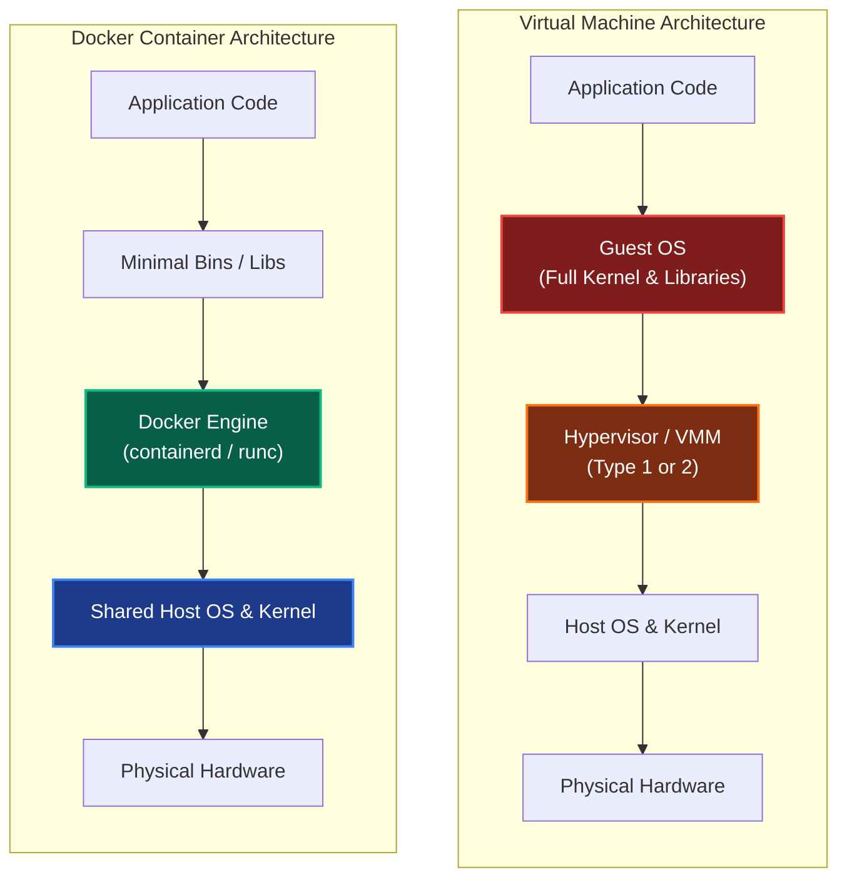

### VM vs. Container Detailed Comparison

| Feature | Virtual Machines (VMs) | Containers (Docker) |
| :--- | :--- | :--- |
| **Architectural Core** | Hardware-level Virtualization (Hypervisor) | OS-level Virtualization (Shared Host Kernel) |
| **Guest OS** | প্রতিটা VM-এর নিজস্ব পূর্ণাঙ্গ Guest OS থাকে। | কোনো Guest OS থাকে না, হোস্টের কার্নেল শেয়ার করে। |
| **Startup Time** | কয়েক মিনিট (কার্ডওয়্যার বুট ও কার্নেল ইনিশিয়ালাইজেশন)। | মিলি-সেকেন্ড (স্রেফ একটি লিনাক্স প্রসেস ট্রিগার)। |
| **Memory Footprint** | কয়েক গিগাবাইট (GB)। | কয়েক মেগাবাইট (MB)। |
| **Resource Efficiency** | কম (রিসোর্স আগে থেকেই ফিক্সড ব্লক হিসেবে বুকড থাকে)। | অত্যন্ত বেশি (ডায়নামিক এলোকেশন ও শেয়ারিং)। |
| **Isolation Level** | অত্যন্ত স্ট্রং (হার্ডওয়্যার বাউন্ডারি আইসোলেশন)। | মিডিয়াম/স্ট্রং (প্রসেস বাউন্ডারি আইসোলেশন)। |

---

## ২. Under the Hood: Container Core Mechanisms

লিনাক্স কার্নেল লেভেলে "কন্টেইনার" নামের কোনো ফিজিক্যাল অস্তিত্ব নেই। এটি মূলত ৩টি লিনাক্স কার্নেল টেকনোলজির সমন্বয়ে তৈরি একটি শক্তিশালী স্যান্ডবক্স:

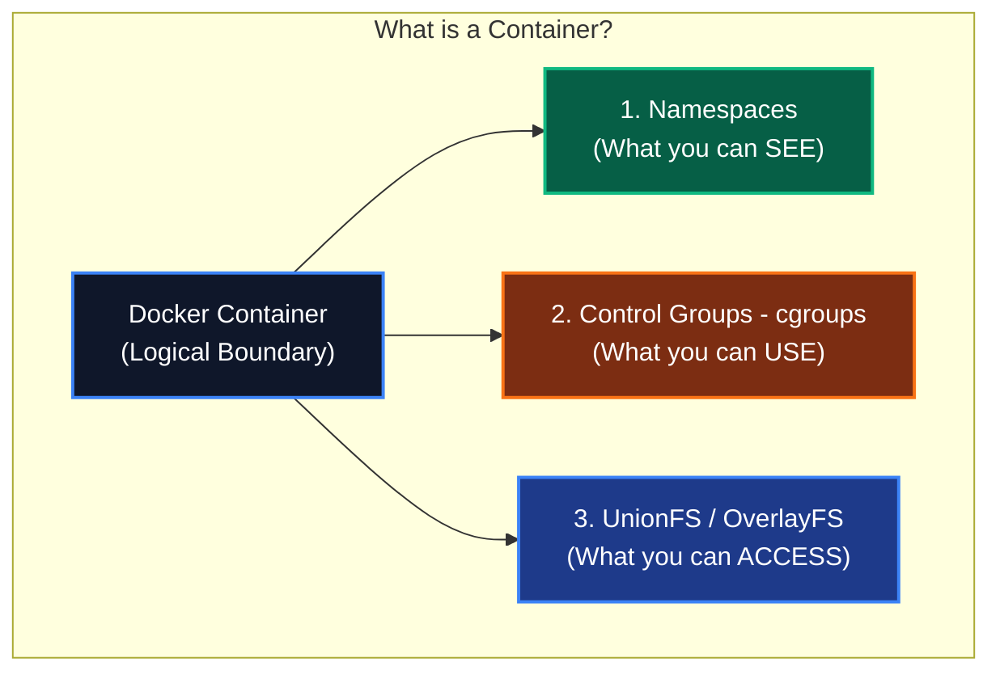

### ১. Namespaces: Virtualizing Viewports (আইসোলেশন)
নেমস্পেস হলো ওএস লেভেলে একটি প্রসেসকে সম্পূর্ণ আইসোলেটেড ভিউ পোর্ট দেওয়া। এর মাধ্যমে প্রসেসটি মনে করে সে হোস্টের একমাত্র বাসিন্দা। ডকার মূলত ৬টি প্রধান লিনাক্স নেমস্পেস ব্যবহার করে:

- **PID Namespace (Process ID):** কন্টেইনারের ভেতরের মেইন প্রসেসটি মনে করে তার আইডি ১ (PID 1), যদিও হোস্ট মেশিনে তার আইডি হয়তো ১৫৭৩০। সে হোস্টের অন্য কোনো প্রসেস দেখতে বা সিগন্যাল পাঠাতে পারে না।
- **NET Namespace (Network):** কন্টেইনারকে তার নিজস্ব ভার্চুয়াল নেটওয়ার্ক ডিভাইস, আইপি রুট, পোর্ট রেঞ্জ এবং আইপি টেবিল দেয়।
- **MNT Namespace (Mount):** কন্টেইনারকে সম্পূর্ণ নিজস্ব ডিরেক্টরি ট্রি এবং মাউন্ট পয়েন্ট ফাইলসিস্টেম দেয়। এর ফলে কন্টেইনার হোস্টের রুট ফাইল দেখতে পারে না।
- **IPC Namespace (Inter-Process Communication):** প্রসেসগুলোর মধ্যে শেয়ার্ড মেমরি বা মেসেজ কিউ আইসোলেট করে, যাতে অন্য কন্টেইনার ডেটা রিড করতে না পারে।
- **UTS Namespace (UNIX Timesharing System):** কন্টেইনারকে নিজস্ব হোস্টনেম এবং ডোমেননেম সেট করার পারমিশন দেয়।
- **USER Namespace:** কন্টেইনারের ভেতরের নন-রুট ইউজারকে হোস্ট ওএস-এর রুট প্রিভিলেজ ছাড়া স্যান্ডবক্সের ভেতরে রুট (UID 0) হিসেবে অ্যাক্ট করার সুবিধা দেয়।

---

### ২. Control Groups (cgroups): Resource Constraint (রিসোর্স লিমিট)
নেমস্পেস দিয়ে আইসোলেট করলেও একটি কন্টেইনার হোস্টের সম্পূর্ণ সিপিইউ, র‍্যাম বা ডিস্ক I/O একাই খেয়ে হোস্ট ক্র্যাশ করাতে পারে। এই রিসোর্স ম্যানেজ ও কন্ট্রোল করার জন্য কার্নেলের **Control Groups (cgroups)** ব্যবহৃত হয়।
cgroups দিয়ে আমরা ডিফাইন করতে পারি:
- **CPU Limits:** কন্টেইনারটি সর্বোচ্চ ১.৫ বা ২ কোর ব্যবহার করতে পারবে।
- **Memory Limits:** কন্টেইনারটি সর্বোচ্চ ৫১২MB র‍্যাম পাবে। লিমিট এক্সিড করলে ওএস কার্নেল প্রসেসটিকে **OOM (Out Of Memory) Killed** সিগন্যাল পাঠিয়ে বন্ধ করে দিবে।
- **I/O Bandwidth:** কন্টেইনারটি ডিস্কে সর্বোচ্চ কত স্পিডে রাইট করতে পারবে (যেমন: 50MB/s limit)।

---

### ৩. Union File System (UnionFS) & OverlayFS
ডকার ইমেজগুলো কীভাবে একাধিক লেয়ারে তৈরি হয় এবং কন্টেইনার রান করার পর মেমরি নষ্ট না করে ফাইল সিস্টেম রিড/রাইট করে, তার নেপথ্যে রয়েছে **UnionFS** (আধুনিক লিনাক্সে এর স্ট্যান্ডার্ড রূপ **Overlay2**)।

OverlayFS মূল ফাইল সিস্টেমকে ৩টি প্রধান লেয়ারে বিন্যস্ত করে:
1. **LowerDir (Read-Only Layer):** ডকার ইমেজের সমস্ত লেয়ারগুলো এখানে রিড-অনলি হিসেবে লক থাকে। এগুলোকে কখনই পরিবর্তন করা যায় না।
2. **UpperDir (Read-Write Container Layer):** কন্টেইনার যখন রান করে, ডকার কার্নেল তার মাথার ওপর একটি অত্যন্ত পাতলা রিড-রাইট লেয়ার বিছিয়ে দেয়। কন্টেইনারে যেকোনো নতুন ফাইল তৈরি বা রাইট করলে তা সরাসরি এই লেয়ারে গিয়ে জমা হয়।
3. **MergedDir (Unified View):** এটি হলো একটি ভার্চুয়াল মাউন্ট ভিউ। কন্টেইনারের ভেতরের অ্যাপ্লিকেশনটি যখন ফাইল ব্রাউজ করে, সে LowerDir এবং UpperDir-এর ফাইলগুলোকে একসাথে মার্জড অবস্থায় দেখতে পায়।

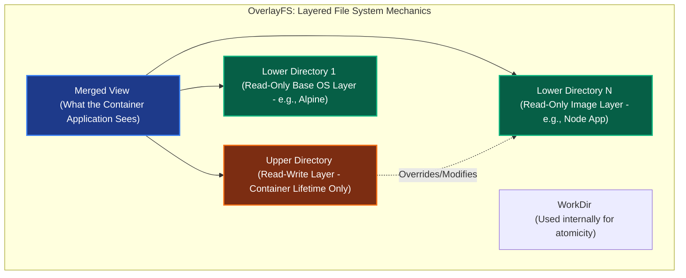

#### Copy-on-Write (CoW) Mechanism
কন্টেইনার চলাকালীন যদি কোনো রিড-অনলি ইমেজের ফাইল (LowerDir) পরিবর্তন বা ডিলিট করতে হয়, কার্নেল সরাসরি তা করতে দেয় না। কার্নেল ব্যাকগ্রাউন্ডে নিচের নিয়মগুলো ফলো করে:
- **Modification (পরিবর্তন):** কার্নেল ফাইলটিকে LowerDir থেকে কপি করে UpperDir (Read-Write)-এ নিয়ে আসে এবং সেখানে পরিবর্তন করে। মার্জড ভিউতে এখন কন্টেইনার অ্যাপ্লিকেশনের কাছে নতুন ফাইলটি দৃশ্যমান হয়, কিন্তু মূল ইমেজ ফাইলে কোনো টাচ ঘটে না।
- **Deletion (মুছে ফেলা):** ফাইলটি ডিলিট করতে গেলে UpperDir-এ একটি বিশেষ **Whiteout file (চরিত্রহীন ফাইল বা ডামি ফাইল)** তৈরি করা হয়, যা মার্জড ভিউতে ফাইলটিকে লুকিয়ে রাখে।

> [!IMPORTANT]
> যেহেতু কন্টেইনারের সমস্ত রাইট অপারেশন `UpperDir` (Read-Write Layer)-এ ঘটে, তাই কন্টেইনার ডিলিট করে দিলে এই লেয়ারের সমস্ত ডেটা চিরতরে হারিয়ে যায়। এই জন্যই প্রডাকশন ডাটাবেসের ডেটা সবসময় ডকার **Volume**-এ রাখা বাধ্যতামূলক।

---

## ৩. Docker Engine Internal Architecture

অনেকেই মনে করেন ডকার নিজেই সরাসরি কন্টেইনার চালায়। এটি সম্পূর্ণ ভুল! ডকার আসলে একটি হাই-লেভেল কোঅর্ডিনেটর। কন্টেইনার স্পন করার জন্য ব্যাকএন্ডে একটি লুজলি কাপল্ড মাইক্রোসার্ভিস স্ট্যাক কাজ করে।

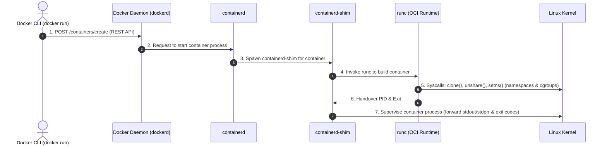

### Components of the Docker Engine:

#### ১. Docker CLI
ব্যবহারকারী যখন টার্মিনালে `docker run -d -p 80:80 nginx` কমান্ড দেন, CLI মূলত কমান্ডটিকে একটি স্ট্যান্ডার্ড JSON পে-লোডে কনভার্ট করে UNIX Socket বা TCP-এর মাধ্যমে ডকার ডেমোনের কাছে একটি **REST API Call** পাঠায়।

#### ২. Docker Daemon (`dockerd`)
এটি একটি ব্যাকগ্রাউন্ড সার্ভিস যা সবসময় চলতে থাকে। এর কাজ হলো ইমেজ ডাউনলোড/ম্যানেজ করা, ভলিউম তৈরি করা, নেটওয়ার্ক রাউটিং কনফিগার করা এবং সিকিউরিটি চেক করা। কিন্তু এটি সরাসরি কন্টেইনার প্রসেস হ্যান্ডেল করে না; কন্টেইনার ম্যানেজমেন্টের কাজ সে হস্তান্তর করে **containerd**-এর কাছে।

#### ৩. `containerd`
এটি একটি হাই-পারফরম্যান্স এবং ইন্ডাস্ট্রি-স্ট্যান্ডার্ড কন্টেইনার লাইফসাইকেল ম্যানেজার (এটি CNCF-এর একটি গ্র্যাজুয়েটেড প্রজেক্ট)। এর কাজ হলো ইমেজের লেয়ারগুলো আনপ্যাক করে রানিং এনভায়রনমেন্ট তৈরি করা এবং কন্টেইনারের স্টেট মনিটর করা।

#### ৪. `containerd-shim`
সাধারণত কন্টেইনার চলাকালীন ডকার ডেমোন রিস্টার্ট দিলে বা ক্র্যাশ করলে সব রানিং কন্টেইনারও বন্ধ হয়ে যাওয়ার কথা। এই সমস্যা এড়াতে `containerd` প্রতিটা কন্টেইনারের জন্য একটি অত্যন্ত ছোট ডেমোন রান করায়, একে **containerd-shim** বলে।
- **সুবিধা:** শিম কন্টেইনারের স্ট্যান্ডার্ড ইনপুট/আউটপুট (stdout/stderr) এবং এক্সিট কোড ধরে রাখে। ডকার ডেমোন রিস্টার্ট নিলেও শিম কন্টেইনারগুলোকে জীবিত রাখে এবং ডেমোন ফিরে এলে ডেটা হ্যান্ডওভার করে।

#### ৫. `runc`
এটি ওপেন কন্টেইনার ইনিশিয়েটিভ (**OCI**) স্পেসিফিকেশন মেনে চলা একটি লো-লেভেল কন্টেইনার রানটাইম। এর একমাত্র কাজ হলো লিনাক্স কার্নেলের সাথে সরাসরি কথা বলে নেমস্পেস ও সিগ্রুপ তৈরি করা, কন্টেইনার প্রসেস স্টার্ট করা এবং সাথে সাথে নিজে মেমরি থেকে বের হয়ে যাওয়া (Exit)।

---

## ৪. Docker Images & Layering Mechanics

একটি ডকার ইমেজ মূলত কতগুলো রিড-অনলি ফাইল সিস্টেম লেয়ারের সমষ্টি। আমরা যখন `Dockerfile`-এ কোনো কমান্ড লিখি, প্রতিটি লাইনের জন্য ইমেজের একটি করে নতুন লেয়ার তৈরি হয়।

```dockerfile
# Dockerfile Example
FROM alpine:3.18      # Layer 1: Base Alpine OS (approx 5MB)
RUN apk add --no-cache nodejs npm # Layer 2: Install Node.js (approx 40MB)
WORKDIR /app          # Layer 3: Metadata change
COPY . .              # Layer 4: Copy source code (approx 10MB)
RUN npm install       # Layer 5: Install dependencies (approx 150MB)
CMD ["node", "server.js"]
```

### Build Cache & Invalidation Rules
ডকার ইমেজের বিল্ড টাইম দ্রুত করার জন্য প্রতিটি লেয়ার ক্যাশ করে রাখে। যখন আমরা পরবর্তীতে ইমেজ বিল্ড করি, ডকার চেক করে `Dockerfile`-এর ইন্সট্রাকশন এবং সোর্স ফাইলে কোনো পরিবর্তন এসেছে কিনা।
- **Cache Hit:** কোনো লাইনে পরিবর্তন না থাকলে ডকার ক্যাশ লেয়ারটি সরাসরি ব্যবহার করে।
- **Cache Invalidation:** যদি কোনো নির্দিষ্ট লাইনে (যেমন `COPY . .`) পরিবর্তন পাওয়া যায়, তবে ডকার সেই লাইনের ক্যাশ ভেঙে দেয় এবং **তার পর থেকে থাকা সমস্ত ক্যাশ বাতিল হয়ে নতুন করে বিল্ড হয়।**

> [!TIP]
> **Optimizing Dependency Installation:** আপনার কোড ফাইলে প্রতিবার একটি ছোট লাইন এডিট করলেই যেন ডকারকে সম্পূর্ণ `npm install` বা `pip install` করতে না হয়, তার জন্য প্যাকেজ ফাইলগুলো আগে কপি করে ডিপেন্ডেন্সি ইনস্টল করে নিন।
> ```dockerfile
> # ✅ Best Practice: Order matters!
> COPY package.json package-lock.json ./
> RUN npm install
> COPY . .
> ```

---

### Multistage Build Optimization (ইমেজ সাইজ অপ্টিমাইজেশন)
রিয়েক্ট, গো বা জাভা অ্যাপ্লিকেশনের ক্ষেত্রে আমাদের বিল্ড জেনারেট করার জন্য হেভি ডিপেন্ডেন্সি (যেমন Webpack, Go Compiler) প্রয়োজন হয়। কিন্তু প্রোডাকশন রানটাইমে শুধু বিল্ড ফাইলটি (`dist/` বা `binary`) হলেই চলে। 

যদি আমরা এক স্টেজে ডকার ইমেজ বানাই, তবে কম্পাইলার ও অতিরিক্ত টুলস সহ ইমেজ সাইজ ১ গিগাবাইট ছাড়িয়ে যেতে পারে, যা ক্লাউডে ডিপ্লয় করতে অনেক সময় নেয় এবং সিকিউরিটি রিস্ক বাড়ায়। এর সমাধান হলো **Multistage Build**।

```dockerfile
# Stage 1: Build Stage
FROM node:18-alpine AS builder
WORKDIR /app
COPY package*.json ./
RUN npm ci
COPY . .
RUN npm run build   # Generates optimized HTML/JS inside /app/dist

# Stage 2: Production Stage (Extremely Minimal)
FROM nginx:alpine
# Copy only the compiled dist files from the builder stage
COPY --from=builder /app/dist /usr/share/nginx/html
EXPOSE 80
CMD ["nginx", "-g", "daemon off;"]
```

> [!NOTE]
> মাল্টি-স্টেজ বিল্ড ব্যবহারের ফলে রিয়েক্ট প্রজেক্টের ইমেজ সাইজ প্রায় **১.২GB থেকে কমে মাত্র ২২MB**-তে নেমে আসে, যা নেটওয়ার্ক ব্যান্ডউইথ এবং ক্লাউড হোস্টিং খরচ নাটকীয়ভাবে হ্রাস করে।

---

## ৫. Docker Networking Internals

কন্টেইনারগুলোর আইসোলেটেড নেটওয়ার্ক নেমস্পেস থাকা সত্ত্বেও তারা কীভাবে ইন্টারনেটের সাথে এবং একে অপরের সাথে পোর্ট বাইন্ডিং ও আইপি রাউটিংয়ের মাধ্যমে কথা বলে?

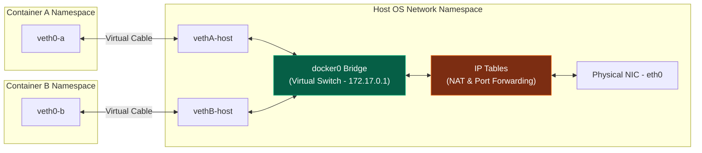

### How the Bridge Network Works Under the Hood:

1. **The virtual switch (`docker0`):** ডকার যখন বুট আপ হয়, হোস্ট ওএসে একটি ভার্চুয়াল নেটওয়ার্ক ব্রিজ বা লজিক্যাল সুইচ তৈরি করা হয় যার নাম **`docker0`** (আইপি সাধারণত `172.17.0.1/16`)।
2. **Virtual Ethernet Pairs (`veth`):** যখনই একটি কন্টেইনার রান করানো হয়, ডকার কার্নেলে এক জোড়া ভার্চুয়াল নেটওয়ার্ক কেবল তৈরি করে যাকে **`veth` pair** বলা হয়।
   - কেবলের এক মাথা কন্টেইনারের ভেতরে ঢুকে ভার্চুয়াল নিক (`eth0`) হিসেবে কাজ করে।
   - অন্য মাথাটি হোস্ট ওএসের গ্লোবাল নেটওয়ার্ক স্পেসের **`docker0`** ব্রিজের সাথে ফিজিক্যালি প্লাগড বা কানেক্টেড করে দেওয়া হয়।
3. **Internal IP Assignment:** ব্রিজটি কন্টেইনারকে একটি ইউনিক ইন্টারনাল আইপি (যেমন: `172.17.0.2`) অ্যাসাইন করে। এর ফলে একই ব্রিজে থাকা দুটি কন্টেইনার সরাসরি একে অপরের আইপি ব্যবহার করে পিং করতে পারে।
4. **Outbound Internet (NAT):** কন্টেইনার যখন ইন্টারনেটে রিকোয়েস্ট পাঠায়, লিনাক্স কার্নেলের **iptables** এবং **NAT (Network Address Translation)** ব্যবহার করে কন্টেইনারের আইপিটিকে হোস্ট ওএসের রিয়েল পাবলিক আইপিতে রূপান্তর করে প্যাকেটটি বাইরে পাঠিয়ে দেয়।
5. **Inbound Traffic (Port Forwarding):** আমরা যখন `-p 8080:80` ফ্ল্যাগ দিই, ডকার হোস্টের `iptables`-এ একটি রুলস অ্যাড করে দেয়: *"হোস্টের ৮০৮০ পোর্টে কোনো প্যাকেট এলে তা সরাসরি লুপব্যাক করে কন্টেইনারের ৮০ নম্বর পোর্টে রিডাইরেক্ট করে দাও।"*

---

### Docker Network Drivers Comparison

| Driver | Mechanics & Behavior | Best Use Case |
| :--- | :---: | :--- |
| **Bridge** | এটি ডকারের ডিফল্ট ড্রাইভার। হোস্টের ভেতরে একটি প্রাইভেট লজিক্যাল নেটওয়ার্ক তৈরি করে প্রসেসগুলোকে ভার্চুয়াল সুইচে প্লাগ করে। | স্ট্যান্ডঅ্যালোন কন্টেইনার ও সিম্পল লোকাল টেস্টিং। |
| **Host** | কন্টেইনারের নেটওয়ার্ক নেমস্পেস সম্পূর্ণরূপে ওপেন করে হোস্টের সাথে মিশিয়ে দেয়। কন্টেইনারের আলাদা কোনো আইপি থাকে না, সরাসরি হোস্টের পোর্ট দখল করে। | হাই-থ্রুপুট নেটওয়ার্ক পারফরম্যান্স (যেমন: Reverse Proxy, Nginx)। |
| **None** | কন্টেইনারের নেটওয়ার্কিং ডিভাইস সম্পূর্ণ নিষ্ক্রিয় করে দেয়। লুপব্যাক ডিভাইস (`127.0.0.1`) ছাড়া আর কোনো কানেক্টিভিটি থাকে না। | অতি-সংবেদনশীল সিকিউর ডাটা প্রসেসিং, ব্যাচ জব ও ক্যাওস টেস্টিং। |
| **Overlay** | মাল্টিপল ফিজিক্যাল সার্ভারের ডকার ডেমোনগুলোকে কানেক্ট করে একটি ভার্চুয়াল VXLAN টানেল বা ডিস্ট্রিবিউটেড ওভারলে নেটওয়ার্ক তৈরি করে। | **Docker Swarm** বা মাল্টি-হোস্ট মাইক্রোসার্ভিস ক্লাস্টার। |
| **Macvlan** | কন্টেইনারকে সরাসরি হোস্টের ফিজিক্যাল নেটওয়ার্ক কার্ডের মেক অ্যাড্রেস (MAC) এবং আইপি সরাসরি অ্যাসাইন করে দেয়, কোনো ভার্চুয়াল ব্রিজ ছাড়াই। | লিগ্যাসি নেটওয়ার্ক মনিটরিং টুলস এবং এন্টারপ্রাইজ নেটওয়ার্ক ডোমেন। |

---

## ৬. Docker Storage & Volumes Internals

কন্টেইনারের ফাইলসিস্টেমের লাইফসাইকেল অত্যন্ত টেম্পোরারি বা ক্ষণস্থায়ী। কন্টেইনার ডিলিট হলে তার রিড-রাইট লেয়ারে থাকা ডেটাও হারিয়ে যায়। এই সমস্যা দূর করতে ডকার ৩টি আলাদা স্টোরেজ মেকানিজম প্রদান করে:

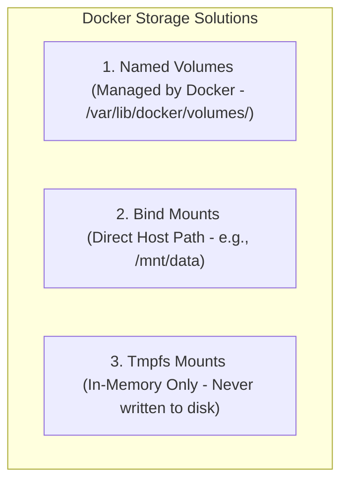

### ১. Named Volumes (ডিফল্ট প্রডাকশন স্ট্যান্ডার্ড)
ভলিউম হলো ডকার দ্বারা সম্পূর্ণ নিয়ন্ত্রিত হোস্ট ওএসের একটি ডেডিকেটেড ডিরেক্টরি (লিনাক্সে সাধারণত `/var/lib/docker/volumes/` পাথে থাকে)।
- **মেকানিজম:** ভলিউমগুলো কন্টেইনারের রিড-রাইট বা OverlayFS লেয়ারকে বাইপাস করে সরাসরি হোস্টের ড্রাইভের সাথে কনেক্টেড থাকে। এর ফলে কন্টেইনারে ডেটা রিড-রাইট করার সময় কোনো Copy-on-Write ওভারহেড থাকে না, যা ফিজিক্যাল ডিস্ক স্পিড দেয়।
- **সুবিধা:** সম্পূর্ণ ডকার CLI দিয়ে ম্যানেজ করা যায়, ব্যাকআপ নেওয়া সহজ এবং একাধিক কন্টেইনার একই ভলিউম একই সাথে শেয়ার করতে পারে।

### ২. Bind Mounts
এটি হোস্ট মেশিনের যেকোনো কাস্টম ডিরেক্টরি বা ফাইলকে (যেমন `/home/user/project`) কন্টেইনারের ভেতরের নির্দিষ্ট পাথে সরাসরি মাউন্ট করে দেয়।
- **মেকানিজম:** এটি লিনাক্সের স্ট্যান্ডার্ড `mount --bind` সিস্টেম কল ব্যবহার করে হোস্টের রিয়েল ফাইলসিস্টেম নোড কন্টেইনারের নেমস্পেসে পুশ করে দেয়।
- **সুবিধা:** লোকাল ডেভেলপমেন্টের সময় কোড পরিবর্তন করলে সাথে সাথে কন্টেইনারের ভেতরে তা রিফ্লেক্ট হওয়ার জন্য এটি অত্যন্ত সুবিধাজনক। তবে প্রডাকশনে এটি ব্যবহার না করাই শ্রেয়, কারণ এটি হোস্টের ফাইল ডিরেক্টরির ওপর অতিরিক্ত ডিপেন্ডেন্সি তৈরি করে।

### ৩. Tmpfs Mount
এটি ফাইল সিস্টেমে কোনো ফাইল না লিখে সরাসরি হোস্টের **RAM**-এর একটি অংশে মেমরি-ম্যাপ করে ডেটা স্টোর করে।
- **সুবিধা:** এটি অত্যন্ত ফাস্ট কারণ মেমরিতে ডেটা থাকে। কন্টেইনার বন্ধ হয়ে গেলে ডেটা মুছে যায়। সিক্রেট ফাইল বা সংবেদনশীল টেম্পোরারি কি-ভ্যালু ক্যাশিংয়ের জন্য এটি উপযোগী।

---

## ৭. Production & Security Internals

কন্টেইনারাইজড অ্যাপ্লিকেশন ডিপ্লয় করার সময় সিকিউরিটি গাফিলতি ও কার্নেল টিউনিংয়ের অভাব ব্যাকএন্ড সিস্টেমের বড় ধরণের বিপর্যয় ঘটাতে পারে। নিচে সিনিয়র আর্কিটেক্টদের কয়েকটি অতি-গুরুত্বপূর্ণ প্রোডাকশন মেকানিজম তুলে ধরা হলো:

### ১. The Root User Trap (সিকিউরিটি থ্রেট)
ডিফল্ট অবস্থায় ডকার ফাইল কনফিগার না করলে কন্টেইনারের ভেতরের সব অ্যাপ্লিকেশন হোস্ট ওএসের `root` ইউজারের পাওয়ার নিয়ে রান করে। এর ফলে যদি অ্যাপ্লিকেশনে কোনো রিমোট কোড এক্সিকিউশন (RCE) বাগ থাকে, হ্যাকার সহজেই কন্টেইনারের সীমানা ভেঙে হোস্ট ওএসের রুট এক্সেস নিয়ে নিতে পারে (**Container Breakout**)।

> [!CAUTION]
> **Production Rule:** কখনই কন্টেইনারকে root হিসেবে চালাবেন না। ডকার ফাইলে অবশ্যই একটি ডেডিকেটেড নন-প্রিভিলেজড ইউজার তৈরি করে নেবেন।

```dockerfile
# ✅ Best Practice: Config Non-Root User
FROM node:18-alpine
WORKDIR /app
COPY package*.json ./
RUN npm ci
COPY . .

# Create a system group and user
RUN addgroup -S appgroup && adduser -S appuser -G appgroup
# Change ownership of app directory
RUN chown -R appuser:appgroup /app

# Switch to non-root user
USER appuser

EXPOSE 3000
CMD ["node", "server.js"]
```

---

### ২. SIGTERM vs. SIGKILL (Graceful Shutdown)
আমরা যখন `docker stop` কমান্ড দিই, ডকার ডেমোন কন্টেইনারের **PID 1 (প্রধান প্রসেস)**-কে একটি **`SIGTERM`** সিগন্যাল পাঠায়। অ্যাপ্লিকেশনকে ভদ্রভাবে বন্ধ হতে, ওপেন ডাটাবেস কানেকশন রিলিজ করতে এবং কারেন্ট রিকোয়েস্ট শেষ করার জন্য ডকার ডিফল্ট ১০ সেকেন্ড গ্রেস টাইম দেয়। অ্যাপ্লিকেশন ১০ সেকেন্ডের মধ্যে রেসপন্স না করলে ডকার ফোর্স কিল করতে **`SIGKILL`** সিগন্যাল ট্রিগার করে।

#### The Exec vs. Shell Form Pitfall:
অনেক ডেভেলপার Dockerfile-এর শেষে রান কমান্ড এভাবে লেখেন:
```dockerfile
# ❌ Shell Form: runs as /bin/sh -c "node server.js"
CMD node server.js
```
এর ফলে লিনাক্স কার্নেল আমাদের নোড প্রসেসটিকে PID 1 হিসেবে রান না করিয়ে `/bin/sh`-কে PID 1 হিসেবে রান করায়। শেল প্রসেসটি কোনো সিগন্যাল নোড প্রসেসে ফরওয়ার্ড করে না। ফলে ডকার ডেমোন যখন `SIGTERM` পাঠায়, অ্যাপ্লিকেশন তা জানতেই পারে না এবং ১০ সেকেন্ড অলস বসে থাকার পর অবধারিতভাবে `SIGKILL` (Exit Code 137) দিয়ে ক্র্যাশ করে।

```dockerfile
# ✅ Exec Form: Runs directly as PID 1
CMD ["node", "server.js"]
```
Exec Form ব্যবহার করলে অ্যাপ্লিকেশন সরাসরি `SIGTERM` হ্যান্ডেল করতে পারে এবং গ্রেসফুল শাটডাউন সম্ভব হয়।

---

### ৩. CPU & Memory Resource Limits (Denial of Service Prevention)
প্রোডাকশনে কন্টেইনারের রিসোর্স লিমিট না করে রাখলে যদি কোনো মেমরি লিক বা ইনফিনিট লুপ বাগ ঘটে, একটি কন্টেইনার হোস্টের সম্পূর্ণ র‍্যাম গ্রাস করে পুরো ডকার ডেমোনকে স্তব্ধ করে দিতে পারে।

ডকার কম্পোজ ফাইলে সবসময় রিসোর্স কনস্ট্রেইন্ট ডিফাইন করা আবশ্যক:

```yaml
version: '3.8'
services:
  web-app:
    image: my-node-app:v1
    deploy:
      resources:
        limits:
          cpus: '0.50'        # সর্বোচ্চ ৫০% CPU কোর ব্যবহার করতে পারবে
          memory: 512M        # সর্বোচ্চ ৫১২MB র‍্যামের বেশি পাবে না
        reservations:
          cpus: '0.25'        # নূন্যতম ২৫% CPU গ্যারান্টিড পাবে
          memory: 256M        # নূন্যতম ২৫৬MB র‍্যাম রিজার্ভ থাকবে
```

---

## ৮. Linux cgroups v1 vs. cgroups v2: The Modern Transition

কন্টেইনারের রিসোর্স লিমিট করার জন্য আমরা `cgroups` ব্যবহার করি। তবে সাম্প্রতিক বছরগুলোতে লিনাক্স কার্নেলে সিগ্রুপের আর্কিটেকচারে একটি বিশাল বৈপ্লবিক পরিবর্তন এসেছে—**cgroups v1** থেকে **cgroups v2**-তে রূপান্তর (লিনাক্স কার্নেল ৪.৫+ এবং ২০২০ সালের পর থেকে আধুনিক ডিস্ট্রিবিউশনগুলোতে এটি ডিফল্ট)।

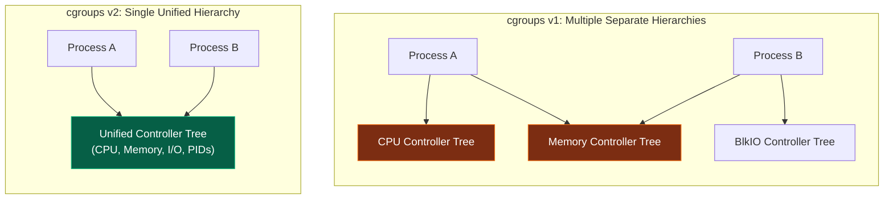

### cgroups v1-এর সীমাবদ্ধতা:
v1 আর্কিটেকচারে প্রতিটা রিসোর্সের (CPU, Memory, Disk IO) জন্য আলাদা আলাদা কন্ট্রোলার এবং সম্পূর্ণ পৃথক ডিরেক্টরি ট্রি বা হায়ারার্কি থাকত। 
- **সমস্যা:** একটি প্রসেস সিপিইউ হায়ারার্কির এক জায়গায় এবং মেমরি হায়ারার্কির সম্পূর্ণ ভিন্ন জায়গায় থাকতে পারত। এর ফলে কন্ট্রোলারগুলোর মধ্যে সিঙ্ক করা অসম্ভব ছিল। উদাহরণস্বরূপ, ডিস্ক রাইট থ্রোটলিং (I/O limits) করার সময় মেমরি পেজ ক্যাশ বাফারের সাথে ট্র্যাকিং মিলত না, যার ফলে কার্নেল লেভেলে ডেডলক ও পারফরম্যান্স ড্রপ হতো।

### cgroups v2-এর আধুনিক সুবিধা:
v2-তে সমস্ত রিসোর্সকে একটি **Single Unified Hierarchy** বা একক গাছের অধীনে নিয়ে আসা হয়েছে। একটি প্রসেস গাছের কেবল একটি নোডেই থাকতে পারে।
1. **Unified Resource Control:** এখন সিপিইউ, মেমরি এবং আইও কন্ট্রোলার একসাথে একই প্রসেস বাউন্ডারিতে কাজ করে। ফলে ডকার নিখুঁতভাবে I/O এবং Memory Writeback ট্র্যাকিং করতে পারে।
2. **Pressure Stall Information (PSI):** এটি v2-এর একটি চমৎকার ফিচার। এটি কার্নেল লেভেলে ট্র্যাক করে প্রসেসটি সিপিইউ, মেমরি বা আইও-এর সংকটের কারণে ঠিক কত মিলি-সেকেন্ড অলস বসে (Starve) ছিল। এর মাধ্যমে সিস্টেম OOM ক্র্যাশে যাওয়ার আগেই সতর্কতা সংকেত দেয়।
3. **Rootless Containers Support:** cgroups v2 লিনাক্সের সাধারণ নন-রুট ইউজারদের সেফলি রিসোর্স লিমিট করার পারমিশন দেয়, যা **Rootless Docker** ও কন্টেইনার সিকিউরিটি উন্নয়নে বড় অবদান রাখছে।

---

## ৯. Container Hardening: Seccomp, AppArmor, & Linux Capabilities

অনেকেই মনে করেন কন্টেইনারে `root` ইউজার হিসেবে কোড রান করলে হোস্টের রুটের মতোই সমান পাওয়ার পাওয়া যায়। কিন্তু লিনাক্স কার্নেল ও ডকার ইঞ্জিনের ডিফেন্স-ইন-ডেপথ সিকিউরিটির জন্য এটি সত্য নয়। কার্নেল মূলত ৩টি লেয়ারে কন্টেইনারকে লক করে রাখে:

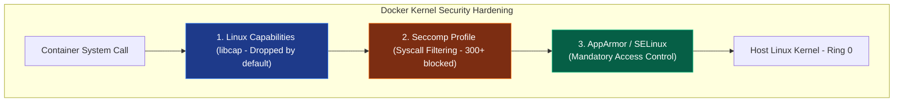

### ১. Linux Capabilities (লিপক্যাপ)
ঐতিহ্যগতভাবে লিনাক্সে সিকিউরিটি বাইনারি ছিল: হয় আপনি সাধারণ ইউজার (সব ব্লকড) অথবা আপনি রুট ইউজার (সব পারমিটেড)। আধুনিক লিনাক্সে রুটের এই বিশাল ক্ষমতাকে প্রায় ৪০টি ছোট ছোট সূক্ষ্ম ক্ষমতায় ভাগ করা হয়েছে, যাকে **Capabilities** বলা হয়।

- **Default Dropping:** ডকার কন্টেইনারের ভেতরের প্রসেসটি রুট হলেও, হোস্ট সুরক্ষার জন্য ডকার ডিফল্ট অবস্থায় বেশিরভাগ শক্তিশালী ক্যাপাবিলিটি কেড়ে নেয়। সে কেবল `CAP_CHOWN`, `CAP_SETUID` এবং `CAP_NET_BIND_SERVICE` (১০২৪-এর নিচের পোর্ট ওপেন করার ক্ষমতা) এর মতো গুটিয়েক বেসিক পাওয়ার রেখে বাকি সব ফেলে দেয়।
- **Custom Config:** আপনি যদি কন্টেইনারকে সিস্টেমের ঘড়ি পরিবর্তন করার ক্ষমতা দিতে চান (`CAP_SYS_TIME`) বা নেটওয়ার্ক কার্ড মডিফাই করতে চান (`CAP_NET_ADMIN`), তবে রান করার সময় স্পেসিফিক ক্যাপাবিলিটি অ্যাড বা ড্রপ করতে পারেন:
  ```bash
  # ক্যাপাবিলিটি ড্রপ ও অ্যাড করার নিয়ম
  docker run --cap-drop=ALL --cap-add=NET_BIND_SERVICE nginx
  ```

---

### ২. Seccomp (Secure Computing Mode)
সেকম্প হলো লিনাক্স কার্নেলের একটি সিস্টেম কল ফিল্টারিং মেকানিজম। লিনাক্স কার্নেলে ৩০০-এর বেশি সিস্টেম কল (Syscalls) রয়েছে। ডকার একটি ডিফল্ট JSON সেকম্প প্রোফাইল ব্যবহার করে যার মাধ্যমে কন্টেইনারের ভেতরের প্রসেসের জন্য প্রায় ৪৪টি বিপজ্জনক সিস্টেম কল সম্পূর্ণ ব্লক করে দেওয়া হয়।
- **Blocked Syscalls:** উদাহরণস্বরূপ, কন্টেইনারের ভেতর থেকে ওএস রিবুট করা (`reboot`), নতুন ফাইলসিস্টেম মাউন্ট করা (`mount`), বা কার্নেল মডিউল লোড করা (`init_module`) সিস্টেম কলগুলো সেকম্প প্রোফাইল সরাসরি আটকে দেয়। এর ফলে হ্যাকার কন্টেইনার হ্যাক করলেও ওএস ডাউন করতে পারে না।

---

### ৩. AppArmor / SELinux
এটি হলো **Mandatory Access Control (MAC)** পলিসি। এটি ওএস লেভেলে একটি প্রসেসের ফাইল পাথ অ্যাক্সেস করার ক্ষমতা সীমিত করে। 
- ডকার রান করার সময় হোস্ট ওএসে অটোমেটিক একটি `docker-default` অ্যাপ-আর্মর প্রোফাইল লোড করে। এর ফলে কন্টেইনারের কোনো প্রসেস হোস্টের স্পর্শকাতর ফাইল (যেমন `/sys`, `/proc` বা `/etc/shadow`) রিড বা রাইট করতে চেষ্টা করলে কার্নেল সাথে সাথে তা রিজেক্ট করে দেয়।

---

## ১০. Zombie Processes & Container Init Systems (Tini / PID 1 Reap)

লিনাক্স অপারেটিং সিস্টেমে প্রতিটা প্রসেস যখন তার কাজ শেষ করে চলে যায়, ওএস কার্নেল সাথে সাথে তার পুরো ডেটা মেমরি থেকে মুছে দেয় না। কার্নেল প্রসেস টেবিলে তার এক্সিট কোড ও এন্ট্রি রেখে দেয় যতক্ষণ না তার অভিভাবক বা প্যারেন্ট প্রসেস এসে `wait()` বা `waitpid()` সিস্টেম কল করে সেই ডেটা রিড করে। এই সংক্ষিপ্ত সময়ের জন্য প্রসেসটি মৃত কিন্তু টেবিলে দৃশ্যমান অবস্থায় থাকে, একে **Zombie (defunct) Process** বলে।

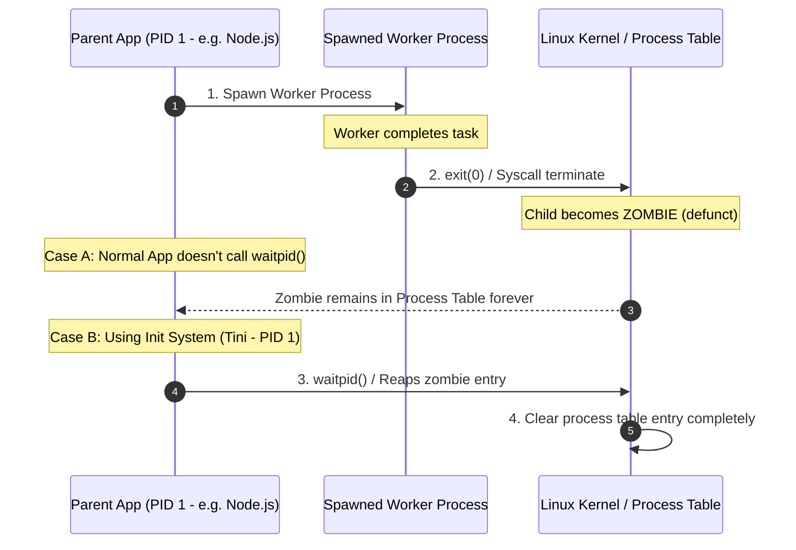

### PID 1-এর দায়িত্ব:
লিনাক্স ওএসের প্রথম প্রসেস বা **PID 1 (Init System - যেমন systemd)** এর প্রধান দায়িত্ব হলো সিস্টেমে কোনো অভিভাবকহীন অনাথ (Orphaned) প্রসেস তৈরি হলে নিজে তার প্যারেন্ট হয়ে যাওয়া এবং তারা মারা গেলে তাদের এক্সিট স্টেট রিড করে প্রসেস টেবিল থেকে মুছে ফেলা (Zombie Reaping)।

### কন্টেইনারের সমস্যা:
আমরা যখন কন্টেইনারে আমাদের নোড বা জাভা অ্যাপ্লিকেশন রান করাই, তখন আমাদের অ্যাপ্লিকেশন প্রসেসটিই কন্টেইনারের **PID 1** হয়ে বসে।
- **সমস্যা:** আমাদের অ্যাপ্লিকেশনগুলো কিন্তু সিস্টেম ইনিট সফটওয়্যার নয়। এরা প্যারেন্ট প্রসেস হিসেবে সাব-প্রসেসগুলোর জম্বি স্টেট ক্লিয়ার করার জন্য ডিজাইন করা হয়নি।
- এর ফলে কন্টেইনারের ভেতর যদি মাল্টিপল চাইল্ড প্রসেস বা শেল স্ক্রিপ্ট রান করানো হয়, তারা কাজ শেষে মারা গেলেও জম্বি প্রসেস হিসেবে প্রসেস টেবিলে জমে থাকে। ধীরে ধীরে প্রসেস টেবিল ফুল হয়ে যায় এবং ওএস নতুন কোনো প্রসেস স্পন করতে পারে না (Process Table Exhaustion)।

### সমাধান: `--init` ফ্ল্যাগ বা Tini
ডকার এই সমস্যা সমাধানের জন্য **Tini** নামের একটি অতি ক্ষুদ্র ইনিট সিস্টেম বিল্ট-ইন দেয়।
- **ব্যবহার:** কন্টেইনার রান করার সময় `--init` ফ্ল্যাগ দিলে ডকার `tini`-কে PID 1 হিসেবে রান করায় এবং আমাদের অ্যাপ্লিকেশনটিকে তার চাইল্ড হিসেবে স্পন করে। 
  ```bash
  docker run -d --init my-node-app
  ```
  `tini` তখন নিখুঁতভাবে সিগন্যাল ফরওয়ার্ডিং (SIGTERM) হ্যান্ডেল করে এবং সমস্ত জম্বি প্রসেস তৈরি হওয়ামাত্র ওএস কার্নেল থেকে রিড করে সাফ করে দেয়।

---

## ১১. Docker Multi-Architecture Builds: Buildx & QEMU Internals

আজকের ক্লাউড ইনফ্রাস্ট্রাকচারে আর্কিটেকচারের বৈচিত্র্য অনেক। আমরা হয়তো লোকাল উইন্ডোজ/ম্যাক কম্পিউটারে রান করি **ARM64** বা **AMD64 (x86_64)** আর্কিটেকচারে, আর ক্লাউড সার্ভারগুলো (যেমন AWS Graviton বা Intel Xeon) রান করে ভিন্ন আর্কিটেকচারে।

ভিন্ন CPU আর্কিটেকচারের জন্য একই অ্যাপ্লিকেশনের ইমেজ জেনারেশন ডকার কীভাবে হ্যান্ডেল করে?

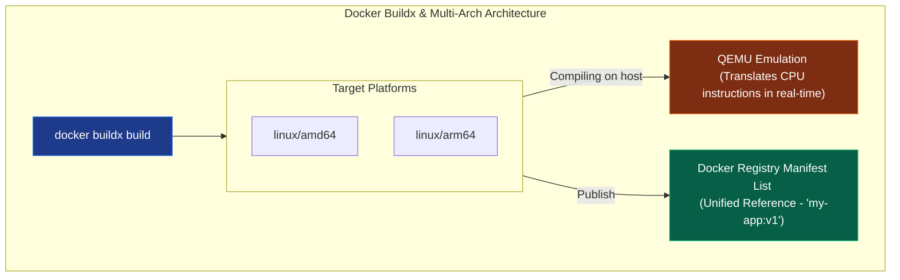

### ১. Docker Buildx & BuildKit:
ডকারের আধুনিক বিল্ড ইঞ্জিন **BuildKit** এবং এর এক্সটেনশন CLI **Buildx** মাল্টি-আর্কিটেকচার ইমেজ তৈরির মূল কারিগর। এটি একই সাথে প্যারালালি একাধিক প্ল্যাটফর্মের জন্য বিল্ড চালাতে পারে।

### ২. QEMU Emulation Internals:
আমরা যখন আমাদের AMD64 ল্যাপটপে বসে ARM64 ইমেজ বিল্ড করার কমান্ড দিই:
```bash
docker buildx build --platform linux/amd64,linux/arm64 -t my-app:v1 --push .
```
হোস্ট ওএসের কার্নেলের **binfmt_misc** ফিচার ব্যবহার করে ডকার ব্যাকগ্রাউন্ডে একটি **QEMU Emulation Layer** চালু করে। 
- **QEMU** মূলত রিয়েল-টাইমে প্রসেসরের ARM ইন্সট্রাকশনগুলোকে AMD64 ইন্সট্রাকশনে কনভার্ট করে রান করায়। এটি কিছুটা ধীরগতির হলেও চমৎকারভাবে ভিন্ন আর্কিটেকচারের ইমেজ কম্পাইল করতে পারে।

### ৩. Manifest Lists (মাল্টি-আর্কিটেকচার মেনিফেস্ট):
বিল্ড শেষে ডকার রেজিস্ট্রি বা হাব-এ একটি চমৎকার ইনডেক্স ফাইল আপলোড করে, একে **Manifest List** বলে। 
- আপনি যখন ডকার হাব থেকে `nginx` ইমেজটি পুল (`docker pull nginx`) করেন, ডকার হাব দেখে আপনার লোকাল সিপিইউ কোন আর্কিটেকচারের। সে অনুযায়ী মেনিফেস্ট লিস্ট থেকে রিডাইরেক্ট করে শুধুমাত্র আপনার সিপিইউ-এর জন্য উপযোগী স্পেসিফিক ইমেজ লেয়ারটি ডাউনলোড করে দেয়।

---

## ১২. Docker Logging Engines & Ring Buffer Internals

কন্টেইনারের ভেতরের প্রসেস যখন স্ট্যান্ডার্ড আউটপুট (`stdout`) বা এরর (`stderr`)-এ ডেটা লেখে, ডকার ইঞ্জিন কীভাবে তা সংগ্রহ করে আমাদের `docker logs` কমান্ডে রিয়েল-টাইমে শো করায়?

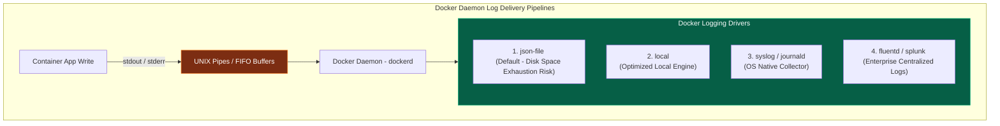

### লগ ডেলিভারি মেকানিজম:
1. **FIFO Buffers:** ডকার কন্টেইনার প্রসেসটিকে সরাসরি হোস্ট ওএসের টার্মিনাল সকেটের সাথে কানেক্ট না করে তার stdout/stderr পাইপগুলোকে কার্নেল লেভেলের **FIFO/Named Pipes** বাফারের সাথে কানেক্ট করে দেয়।
2. **dockerd Interception:** ডকার ডেমোন ব্যাকগ্রাউন্ডে এই পাইপগুলো থেকে অনবরত ডেটা রিড করে এবং কনফিগার করা **Logging Driver**-এর কাছে হস্তান্তর করে।

---

### The json-file Driver & Disk Space Exhaustion (একটি পরিচিত বিপর্যয়)
ডিফল্ট অবস্থায় ডকার **`json-file`** ড্রাইভার ব্যবহার করে। এটি প্রতিটা কন্টেইনারের সমস্ত লগ হোস্টের `/var/lib/docker/containers/<id>/<id>-json.log` পাথে সাধারণ JSON ফাইল হিসেবে সেভ করে।
- **বিপর্যয়:** এই ফাইলটির কোনো ডিফল্ট সাইজ লিমিট নেই! কন্টেইনারে প্রচুর পরিমাণে লগ জেনারেট হলে কয়েক মাসের মধ্যে এই লগ ফাইলটি কয়েকশ গিগাবাইট জায়গা দখল করে হোস্ট ওএসের সম্পূর্ণ ডিস্ক স্পেস ফুল করে ফেলে এবং সার্ভারকে সম্পূর্ণ ডাউন করে দেয়।

---

### Senior Solution: Dual Logging & Non-Blocking Buffering
প্রোডাকশন গ্রেড সিস্টেমে এই লগ বিপর্যয় এড়াতে সিনিয়র ইঞ্জিনিয়াররা ডকার ডেমন কনফিগারেশনে (`/etc/docker/daemon.json`) নিচের বেস্ট প্র্যাকটিস মেকানিজম কনফিগার করেন:

```json
{
  "log-driver": "json-file",
  "log-opts": {
    "max-size": "50m",
    "max-file": "3",
    "mode": "non-blocking",
    "max-buffer-size": "4m"
  }
}
```

#### কনফিগারেশনের ইন্টারনাল মেকানিক্স:
- **`max-size` & `max-file` (Log Rotation):** লগের সাইজ ৫০MB পার হলে ডকার অটোমেটিক পুরনো লগ ডিলিট করে নতুন ফাইলে রাইট করবে এবং সর্বোচ্চ ৩টি ফাইল স্টোর রাখবে। এর ফলে ডিস্ক ফুল হওয়ার রিস্ক ০% হয়ে যায়।
- **`mode: non-blocking` (রিং বাফার পারফরম্যান্স):** ডিফল্ট অবস্থায় ডকার ব্লকিং মোডে কাজ করে। অর্থাৎ যদি ডিস্ক I/O স্লো হয়, ডকার লগ ফাইল রাইট করতে না পারা পর্যন্ত অ্যাপ্লিকেশনের মেইন থ্রেডকে ব্লক করে রাখে। এর ফলে অ্যাপ্লিকেশনের স্পিড নাটকীয়ভাবে কমে যায়।
- `non-blocking` অন করলে ডকার কার্নেলে ৪MB-এর একটি **Ring Buffer** তৈরি করে। অ্যাপ্লিকেশন লগের ডেটা বাফারে ফেলে সাথে সাথে কাজ এগিয়ে নিয়ে যায়, ডকার ব্যাকগ্রাউন্ডে বাফার থেকে ডেটা রিড করে ফাইল রাইট করে। বাফার ফুল হয়ে গেলে ডকার রিং মেথডে পুরনো লগ ওভাররাইট করে অ্যাপ্লিকেশনের পারফরম্যান্স গ্যারান্টিড হাই রাখে।

---

## ১৩. Running OCI Containers Without Docker (ডকার ছাড়া কন্টেইনার রান!)

বেশিরভাগ ডেভেলপার মনে করেন কন্টেইনার রান করতে অবশ্যই ডকার ডেমোন (`dockerd`) বা কুবারনেটিস লাগবে। কিন্তু আপনি চাইলে ডকার সম্পূর্ণ আনইনস্টল করে দিয়েও কেবল একটি লো-লেভেল ওটিআই (**OCI**) রানটাইম **`runc`** এবং লিনাক্স কার্নেলের সাহায্যে কন্টেইনার স্পন ও রান করতে পারেন!

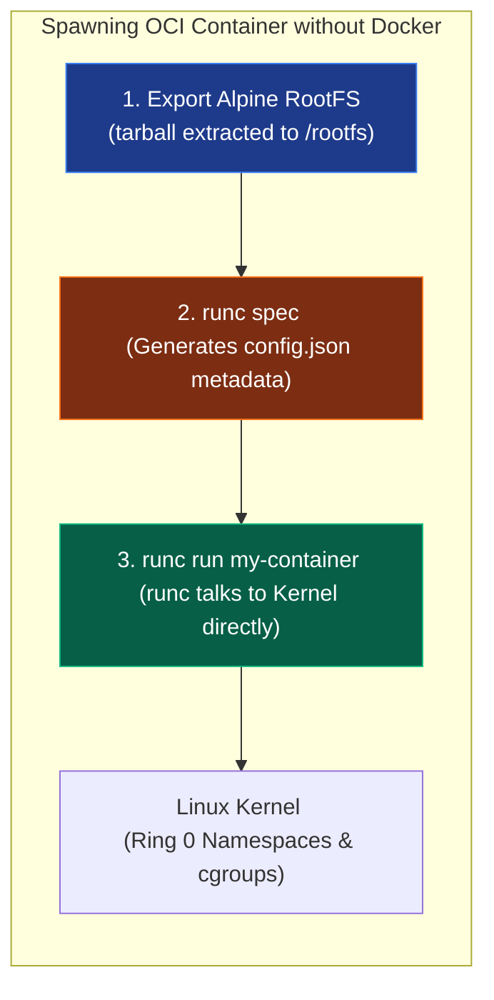

### কীভাবে ডকার ছাড়া কন্টেইনার চালাবেন (The Manual Steps):

1. **Create Root Directory (rootfs):** প্রথমে কন্টেইনারের ওএস বা রুট ফাইল সিস্টেমের জন্য একটি ডিরেক্টরি বানিয়ে তাতে ফাইলগুলো এক্সপোর্ট করে নিন।
   ```bash
   mkdir -p my-container/rootfs
   # ডকার দিয়ে টেম্পোরারি আলপাইন ইমেজ তৈরি করে তা টার ফাইলে এক্সপোর্ট করে নিন
   docker export $(docker create alpine) | tar -C my-container/rootfs -xvf -
   ```
2. **Generate OCI Specification:** এবার `my-container` ডিরেক্টরিতে গিয়ে রানটাইম কনফিগারেশন ফাইল `config.json` তৈরি করুন:
   ```bash
   cd my-container
   runc spec
   ```
   * এটি একটি স্ট্যান্ডার্ড `config.json` ফাইল তৈরি করবে, যেখানে কন্টেইনারের সমস্ত নেমস্পেস, মাউন্ট পয়েন্ট, মেমরি লিমিট এবং রান কমান্ড ডিফাইন করা থাকে।
3. **Run the Container Directly:** এবার ডকার ডেমোন ছাড়াই সরাসরি `runc` দিয়ে কন্টেইনারটি স্পন করুন:
   ```bash
   sudo runc run my-custom-container
   ```
   ব্যাস! আপনি এখন সরাসরি আলপাইন কন্টেইনারের ভেতরের শেলের (`/bin/sh`) মধ্যে ঢুকে গেছেন। এটি প্রমাণ করে ডকার আসলে লিনাক্স কার্নেল ও স্ট্যান্ডার্ড ওআইসি স্পেসিফিকেশনের ওপর মোড়ানো একটি চমৎকার ম্যানেজমেন্ট র্যাপার মাত্র।

---

## ১৪. The Deep Syscalls of Containment: `clone`, `unshare`, and `setns`

ডকার বা `runc` যখন ব্যাকগ্রাউন্ডে কন্টেইনার তৈরি করে, প্রোগ্রামিং ল্যাঙ্গুয়েজ লেভেলে (যেমন C বা Go-তে) লিনাক্স কার্নেলের ৩টি অতি-গুরুত্বপূর্ণ সিস্টেম কল ট্রিগার করা হয়। এই ৩টি সিস্টেম কল ছাড়া কন্টেইনারাইজেশন অসম্ভব:

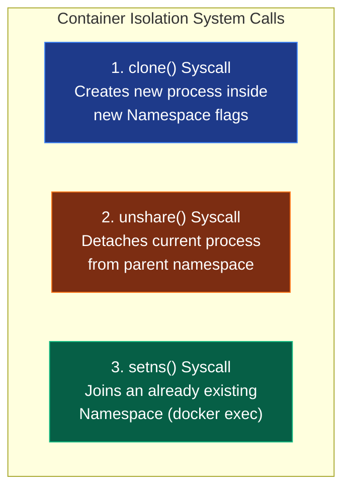

### ১. `clone()` - দ্য কন্টেইনার ক্রিয়েটর
লিনাক্সে নতুন প্রসেস তৈরি করতে প্রথাগতভাবে `fork()` ব্যবহৃত হতো। কিন্তু কন্টেইনার বানাতে ব্যবহৃত হয় **`clone()`** সিস্টেম কল। 
- `clone()` রান করার সময় আমরা কার্নেল লেভেলে স্পেসিফিক আইসোলেশন ফ্ল্যাগ পাস করতে পারি:
  ```c
  // C Code Example: Creating namespaces programmatically
  int child_pid = clone(child_main, stack + STACK_SIZE, 
                        CLONE_NEWPID | CLONE_NEWNET | CLONE_NEWNS | SIGCHLD, NULL);
  ```
  কার্নেল এই ফ্ল্যাগগুলো দেখে প্রসেসটির জন্য সম্পূর্ণ নতুন PID, Network এবং Mount নেমস্পেস তৈরি করে দেয়।

### ২. `unshare()` - বাউন্ডারি সেপারেটর
এই সিস্টেম কলটি একটি রানিং প্রসেসকে তার প্যারেন্টের বা হোস্টের শেয়ার্ড স্পেস থেকে ডিটাচ করে সম্পূর্ণ স্বাধীন নেমস্পেস বাউন্ডারিতে নিয়ে যায়। এটি প্রসেসকে হোস্টের ফাইল মাউন্ট বা নেটওয়ার্ক ভিউ থেকে তাৎক্ষণিক আইসোলেট করার জন্য ব্যবহৃত হয়।

### ৩. `setns()` - দ্য সিক্রেট অব `docker exec`
অনেকেই কনফিউজড থাকেন এই ভেবে যে, `docker exec -it <id> sh` কমান্ড দিলে ডকার কীভাবে একটি চলমান কন্টেইনারের সুরক্ষিত দেয়াল ভেঙে ভেতরে গিয়ে শেল চালু করে দেয়?
- **The Secret:** ডকার কিন্তু কন্টেইনারের ভার্চুয়াল ডিস্ক হ্যাক করে না। সে হোস্ট মেশিনে একটি নতুন সাধারণ প্রসেস স্পন করে। তারপর কার্নেলে টার্গেট কন্টেইনারের নেমস্পেস ফাইল ডেসক্রিপ্টরগুলোর পাথ খুঁজে বের করে (লিনাক্সে এগুলো `/proc/<PID>/ns/` ডিরেক্টরিতে থাকে)।
- ডকার তখন কার্নেলে **`setns(fd, nstype)`** সিস্টেম কল ট্রিগার করে। এটি আমাদের নতুন স্পন হওয়া সাধারণ প্রসেসটিকে জোর করে কন্টেইনারের ভেতরের সুরক্ষিত PID ও NET নেমস্পেস বাউন্ডারিতে ঢুকিয়ে দেয়। ফলে প্রসেসটি হোস্টের ফাইল দেখা বন্ধ করে কন্টেইনারের ভেতরের ফাইল ও নেটওয়ার্ক ইন্টারফেস দেখা শুরু করে!

---

## ১৫. OverlayFS Inode Exhaustion (ইনোড শেষ হয়ে যাওয়ার রহস্যময় বিপর্যয়)

প্রোডাকশন সিস্টেমে একটি অত্যন্ত পরিচিত অথচ রহস্যময় বিপর্যয় হলো—সার্ভারে হঠাৎ করেই `No space left on device` এরর দেখায় এবং নতুন কোনো ফাইল বা ডেটা রাইট করা যায় না। অথচ ইঞ্জিনিয়াররা সার্ভারে ঢুকে `df -h` দিয়ে চেক করে দেখেন ডিস্কে হয়তো আরও **৮০% মেমরি সম্পূর্ণ খালি পড়ে আছে!**

এই রহস্যময় বিপর্যয়ের মূল কারণ হলো **Inode Starvation (ইনোড নিঃশেষ হওয়া)**।

### Inode কী?
লিনাক্স ফাইলসিস্টেমে প্রতিটা ফাইল, ডিরেক্টরি বা সিম্বলিক লিংকের জন্য একটি ইউনিক মেটাডেটা এন্ট্রি ব্লক থাকে যাকে **Inode (Index Node)** বলে। ডিস্ক ফরম্যাট করার সময় ওএস-এ ফিক্সড সংখ্যার ইনোড লিমিট কনফিগার করে দেওয়া হয়। আপনার ডিস্কে ১০০GB ফ্রী স্পেস থাকলেও যদি ইনোড কাউন্টার শেষ হয়ে যায়, তবে কার্নেল নতুন কোনো ফাইল রাইট করতে দেবে না।

### ডকারে কীভাবে ইনোড শেষ হয়?
আমরা যখন কন্টেইনারে প্রচুর ইমেজ বিল্ড করি বা CI/CD রানারে ঘন ঘন শত শত টেম্পোরারি শর্ট-লাইভড (short-lived) কন্টেইনার চালাই:
- ডকারের **Overlay2** স্টোরেজ ড্রাইভার ডকার ইমেজের প্রতিটা লেয়ার এবং কন্টেইনারের রানটাইম ফাইলের জন্য ব্যাকগ্রাউন্ডে হাজার হাজার ডিরেক্টরি, কপি-অন-রাইট (CoW) হার্ডলিংক ও মেটাডেটা নোড তৈরি করে।
- এই প্রচুর পরিমাণ ফাইল জেনারেট হওয়ার ফলে হোস্ট ওএসের ইনোড কোটা দ্রুত ফুরিয়ে যায়।

```bash
# আপনার সিস্টেমে ইনোড ফুরিয়ে গেছে কিনা তা চেক করার কমান্ড
df -i
```
আউটপুটে যদি দেখা যায় `/dev/xvda1` এর `IUse%` ১০০% হয়ে গেছে, তার মানে ইনোড শেষ!

### সিনিয়র ডিবাগিং সমাধান:
এই ইনোড ক্র্যাশ থেকে সার্ভারকে বাঁচাতে নিয়মিত ডকার ক্লিনিং এবং সিস্টেম প্রুনিং ডেমোন কনফিগার করতে হয়:
```bash
# অব্যবহৃত সব ইমেজ, স্টপড কন্টেইনার ও ক্যাশ লেয়ারের ইনোড মেমরি ফ্রি করার কমান্ড
docker system prune -a --volumes -f
```

---

## ১৬. User Namespaces Mapping: Rootless Docker Internals (রুটলেস ডকার)

প্রথাগতভাবে ডকার ডেমোন হোস্ট ওএসের `root` ইউজারের প্রিভিলেজ নিয়ে ব্যাকগ্রাউন্ডে চলে। ফলে কন্টেইনার হ্যাক হলে সম্পূর্ণ হোস্ট সার্ভার হ্যাক হওয়ার চরম সিকিউরিটি ঝুঁকি থাকে। এই ঝুঁকি চিরতরে দূর করতে আধুনিক সিকিউর ডেভঅপ্স আর্কিটেকচারে **Rootless Docker** ব্যবহার করা হয়।

রুটলেস ডকারের মূল চালিকাশক্তি হলো লিনাক্স কার্নেলের **User Namespaces** এবং **UID/GID Mapping**।

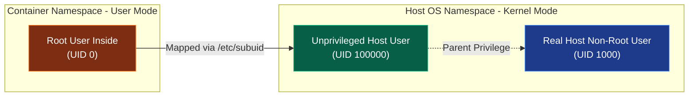

### কীভাবে রুটলেস ইউজার ম্যাপিং কাজ করে?
রুটলেস ডকার হোস্টের লিনাক্স ফাইলের `/etc/subuid` এবং `/etc/subgid` ব্যবহার করে কন্টেইনারের ভেতরের ইউজার আইডি হোস্টের সম্পূর্ণ ভিন্ন ও সেফ ইউজার আইডিতে ট্রান্সলেট করে দেয়।

1. **Inside the Container:** কন্টেইনারের ভেতরে অ্যাপ্লিকেশনটি মনে করে সে সম্পূর্ণ প্রিভিলেজড **`root`** (UID 0) ইউজার হিসেবে কোড রান করছে এবং ডেটা রাইট করছে।
2. **Outside on the Host:** কার্নেল লেভেলে ম্যাপ করার কারণে হোস্ট ওএস দেখতে পায় ফাইলটি আসলে লিখছে **UID 100000** (একটি সাধারণ আন-প্রিভিলেজড সাব-ইউজার)।
3. **The Defense:** যদি কোনো হ্যাকার কন্টেইনার থেকে বের হয়ে ডিরেক্টরি ট্রাভার্স করার চেষ্টা করে, হোস্ট কার্নেল তাকে সাধারণ ইউজার (UID 100000) হিসেবে ট্রিট করে সম্পূর্ণ ব্লক করে দেয়। সে হোস্ট ওএসের কোনো রুট পারমিশন বা সিস্টেম ফাইল টাচ করার সুযোগ পায় না।

---

## ১৭. Network Namespace Plumbing: Virtual Cable Insertion (veth Plumbing)

আমরা আগেই জেনেছি ডকার ব্রিজ নেটওয়ার্কের জন্য এক জোড়া ভার্চুয়াল কেবল বা **`veth` pair** তৈরি করে। তবে ডকার ইঞ্জিন ব্যাকগ্রাউন্ডে লিনাক্স কার্নেল কমান্ড ব্যবহার করে কীভাবে প্রোগ্রেসিভলি এই ক্যাবলটিকে কন্টেইনারের সুরক্ষিত নেমস্পেসের ভেতর প্লাগ-ইন করে, তার ম্যানুয়াল মেকানিজম অত্যন্ত চমকপ্রদ।

নিচে আমরা ডকার ডেমোন ছাড়া সম্পূর্ণ ম্যানুয়ালি নেটওয়ার্ক প্লাগিং ও রাউটিং সেটআপ করার লিনাক্স কার্নেল কমান্ডগুলো দেখব:

### ধাপ ১: veth Pair এবং Bridge তৈরি করা
প্রথমে হোস্ট মেশিনে একটি লজিক্যাল ব্রিজ ও এক জোড়া ভার্চুয়াল কেবল নেট ইন্টারফেস তৈরি করি:
```bash
# veth pair তৈরি (ক্যাবলের দুই মাথা: veth_host এবং veth_container)
sudo ip link add veth_host type veth peer name veth_container
```

### ধাপ ২: ক্যাবলের এক মাথা কন্টেইনারের নেমস্পেসে পুশ করা
লিনাক্সে প্রতিটা রানিং কন্টেইনারের একটি নির্দিষ্ট নেটওয়ার্ক নেমস্পেস থাকে (যেমন তার PID যদি হয় ৯৫২০):
```bash
# veth_container ইন্টারফেসটিকে জোর করে কন্টেইনারের নেমস্পেসের ভেতর পাঠিয়ে দেওয়া
sudo ip link set veth_container netns 9520
```

### ধাপ ৩: কন্টেইনারের ভেতরে ইন্টারফেস রিনেম ও আইপি সেটআপ
কন্টেইনারের ভেতরে ঢুকে ক্যাবল ইন্টারফেসটি চালু করে তাকে স্ট্যান্ডার্ড নাম `eth0` দিতে হবে:
```bash
# কন্টেইনারের ভেতরে ইন্টারফেসটির নাম veth_container থেকে পরিবর্তন করে eth0 করা
sudo nsenter -t 9520 -n ip link set dev veth_container name eth0
# ইন্টারফেসটি চালু করা
sudo nsenter -t 9520 -n ip link set eth0 up
# কন্টেইনারের ভেতরে আইপি অ্যাসাইন করা
sudo nsenter -t 9520 -n ip addr add 172.17.0.2/16 dev eth0
```

### ধাপ ৪: ক্যাবলের অন্য মাথা হোস্টের ব্রিজে প্লাগ করা
হোস্ট ওএসে থাকা ক্যাবলের বাকি অংশটি ব্রিজে প্লাগ করে কানেকশন অন করে দিতে হবে:
```bash
# ক্যাবলের অন্য মাথাটি docker0 ব্রিজে কানেক্ট করা
sudo ip link set veth_host master docker0
# ইন্টারফেস চালু করা
sudo ip link set veth_host up
```
ব্যাস! কন্টেইনার ও হোস্টের ব্রিজের মাঝে ভার্চুয়াল ক্যাবল কানেক্টিভিটি সম্পূর্ণ সচল হয়ে গেল। এই চমৎকার ব্যাকএন্ড কার্নেল প্লাম্বিংটিই ডকার ডেমোন প্রতিবার নতুন কন্টেইনার চালু হওয়ার সময় নিঃশব্দে সম্পাদন করে থাকে।

---

## 💡 Senior Architect Insights & Best Practices Summary

> "ডকার মানে কেবল পোর্টেবিলিটি নয়, এটি হলো ডিস্ট্রিবিউটেড সিস্টেমের রিসোর্স অপ্টিমাইজেশন ও সিকিউরিটি বাউন্ডারির ভিত্তি। কার্নেলের আচরণ বুঝে কনফিগার করা কন্টেইনার আমাদের ক্লাউড খরচ অর্ধেকের বেশি কমিয়ে দিতে পারে।"

১. **Use Distroless or Alpine Images:** বেস ইমেজ হিসেবে বড় ওএসের পরিবর্তে (যেমন Ubuntu) স্রেফ রানটাইম সমৃদ্ধ **Distroless** বা **Alpine** ব্যবহার করুন। এতে ইমেজের এটাক সারফেস (Vulnerability) এবং সাইজ প্রায় ৯০% কমে যায়।
২. **Avoid `--privileged` Flag:** `--privileged` ফ্ল্যাগ দিলে কন্টেইনার হোস্টের সমস্ত ডিভাইস ড্রাইভার ও মেমরি সরাসরি টাচ করার পারমিশন পায়। এটি কন্টেইনার আইসোলেশন দেওয়ালকে ভেঙে চুরমার করে দেয়।
৩. **Read-Only Root Filesystem:** সিকিউরিটি আরও জোরদার করতে কন্টেইনারের রুট ফাইলসিস্টেম রিড-অনলি হিসেবে মাউন্ট করতে পারেন (`--read-only`), শুধুমাত্র প্রয়োজনীয় নির্দিষ্ট লগ বা টেম্প ডিরেক্টরিগুলোকে ভলিউম দিয়ে ওপেন রেখে।

---

