# 📘 ডেটা স্ট্রাকচার ও অ্যালগরিদম: আল্টিমেট সি++ মাস্টারক্লাস (The Systems Architect's Guide to DSA)

প্রিয় রিডার, 

কম্পিউটার সায়েন্সের সবচেয়ে রোমাঞ্চকর এবং পবিত্র গলিপথে আপনাকে স্বাগতম। আপনি যদি কখনো ভেবে থাকেন—*"কেন আমার কোড লাখ লাখ ডেটা প্রসেস করতে গিয়ে ঝুলে যায়?"* কিংবা *"কীভাবে ফেসবুক চোখের পলকে কোটি কোটি ফ্রেন্ডের মধ্যে সবচেয়ে ক্লোজ মিউচুয়াল ফ্রেন্ড খুঁজে বের করে?"*—তবে এই বইটি ঠিক আপনার জন্যই লেখা।

ডেটা স্ট্রাকচার (Data Structure) এবং অ্যালগরিদম (Algorithm) কোনো নিছক ইন্টারভিউ পাস করার হাতিয়ার নয়; এটি হলো আপনার কোডকে ওএস (OS) এবং সিপিইউ কার্নেল লেভেলে অতিমানবীয় গতি দেওয়ার পরম শিল্প। এই পুরো হ্যান্ডবুকে আমরা কোনো ড্রাই রেফারেন্স গাইড অনুসরণ করব না। আমরা প্রতিটি চ্যাপ্টার এমনভাবে শিখব যেন মনে হয় আমরা একটি চমৎকার বৈজ্ঞানিক উপন্যাস পড়ছি, যেখানে প্রতিটা লুপের আড়ালে লুকিয়ে থাকে টাইমিংয়ের রোমাঞ্চ এবং মেমরির ম্যাজিক।

আমরা আমাদের এই জার্নিটি শুরু করব একদম শূন্য থেকে—টাইম কমপ্লেক্সিটি ও গণিতের সাধারণ সমীকরণ দিয়ে, এবং ধাপে ধাপে পৌঁছাব সেগমেন্ট ট্রি (Segment Tree) ও ডায়নামিক প্রোগ্রামিংয়ের (DP) মতো আল্টিমেট অ্যাডভান্সড লেভেলে। সমস্ত কোড এবং রিয়েল-টাইম ইমপ্লিমেন্টেশন হবে পৃথিবীর সবচেয়ে ফাস্ট এবং মেমরি-এফিশিয়েন্ট ল্যাঙ্গুয়েজ **C++** দিয়ে।

---

## 🗺️ দ্য আল্টিমেট ডিএসএ রোডম্যাপ (Visual Learning Path)

আমাদের সম্পূর্ণ লার্নিং জার্নিটি কীভাবে অগ্রসর হবে, তার একটি চমৎকার ওভারভিউ নিচে দেওয়া হলো:

```mermaid
flowchart TD
    subgraph Basic ["১. মৌলিক ভিত্তি (Foundations)"]
        Time["টাইম কমপ্লেক্সিটি <br>(Complexity Analysis)"] --> Math["অ্যালগরিদমীয় গণিত <br>(Algorithmic Math)"]
        Math --> Loops["লুপ ও প্যাটার্ন <br>(Loops & Control Flow)"]
        Loops --> Rec["রিকার্শন ও ব্যাকট্র্যাকিং <br>(Recursion Masterclass)"]
    end

    subgraph Memory ["২. মেমরি ও রৈখিক ডাটাস্ট্রাকচার (Linear DS)"]
        Rec --> Pointers["পয়েন্টার ও হিপ মেমরি <br>(Memory Allocation)"]
        Pointers --> Arrays["অ্যারে ও ভেক্টর <br>(Arrays & Sliding Window)"]
        Arrays --> Strings["স্ট্রিং মেকানিক্স <br>(String Algorithms)"]
        Strings --> Lists["লিঙ্কড লিস্ট <br>(Linked Lists)"]
        Lists --> StackQueue["স্ট্যাক ও কিউ <br>(Monotonic Stack/Deque)"]
    end

    subgraph SearchSort ["৩. সর্টিং, সার্চিং ও অরৈখিক ডাটাস্ট্রাকচার (Non-Linear DS)"]
        StackQueue --> BinSearch["বাইনারি সার্চ <br>(Binary Search Space)"]
        BinSearch --> Sort["অ্যাডভান্সড সর্টিং <br>(Merge/Quick Sort)"]
        Sort --> Trees["বাইনারি ট্রি ও BST <br>(Binary Trees & LCA)"]
        Trees --> Heaps["হিপ ও প্রায়োরিটি কিউ <br>(Heaps & Medians)"]
    end

    subgraph Advanced ["৪. আল্টিমেট অ্যালগরিদম (Advanced CP & DP)"]
        Heaps --> Greedy["লোভী নীতি <br>(Greedy Algorithms)"]
        Greedy --> DP["ডায়নামিক প্রোগ্রামিং <br>(Dynamic Programming)"]
        DP --> Graphs["গ্রাফ থিওরি <br>(BFS, DFS, Dijkstra, MST)"]
        Graphs --> RangeQueries["রেঞ্জ কোয়েরি ও সেগমেন্ট ট্রি <br>(Segment & Fenwick Trees)"]
    end

    style Time fill:#1e3a8a,stroke:#3b82f6,stroke-width:2px,color:#fff
    style Rec fill:#7c2d12,stroke:#f97316,stroke-width:2px,color:#fff
    style Arrays fill:#065f46,stroke:#10b981,stroke-width:2px,color:#fff
    style BinSearch fill:#5b21b6,stroke:#8b5cf6,stroke-width:2px,color:#fff
    style DP fill:#7f1d1d,stroke:#ef4444,stroke-width:2px,color:#fff
    style RangeQueries fill:#881337,stroke:#f43f5e,stroke-width:2px,color:#fff
```



---

## 🗂️ সম্পূর্ণ হ্যান্ডবুক ইনডেক্স (Master Syllabus)

আমরা এই সূচীপত্র বা ইনডেক্সটি ধরে ধরেই আমাদের প্রতিটি পর্ব সাজাব এবং প্রতিটি মডিউলে থাকবে রিয়েল-লাইফ কোড চ্যালেঞ্জ (LeetCode / Codeforces স্ট্যান্ডার্ড):

### 🌟 মডিউল ১: কম্পিউটেশনের মৌলিক ভিত্তি (The Foundations of Computation)
* **চ্যাপ্টার ১: টাইম ও স্পেস কমপ্লেক্সিটি এনালাইসিস (Time & Space Complexity)**
  * `O(1)`, `O(log N)`, `O(N)`, `O(N log N)`, `O(N^2)` এর বাস্তব অনুভূতি ও ওএস প্রোফাইল।
  * কীভাবে কোড না রান করেই কার্নেল ও সিপিইউর স্পিড প্রিডিক্ট করা যায়।
* **চ্যাপ্টার ২: অ্যালগরিদমীয় গণিত ও সংখ্যার খেলা (Algorithmic Number Theory)**
  * Sieve of Eratosthenes (মৌলিক সংখ্যা খোঁজার স্বর্গীয় মেথড)।
  * GCD/LCM (ইউক্লিডীয় সূত্র) এবং Modular Arithmetic (বড় সংখ্যার ওভারফ্লো ঠেকানো)।
  * Fast Exponentiation (দ্বিগুণ গতিতে পাওয়ার `A^B` হিসাব করা)।
* **চ্যাপ্টার ৩: লুপ কন্ট্রোল ও নেস্টেড প্যাটার্ন আর্ট (Loops & Nested Analysis)**
  * লুপের ইনভেরিয়েন্ট মেকানিজম এবং নেস্টেড লুপের রানিং টাইম হিসেব।
* **চ্যাপ্টার ৪: ফাংশন ও মেমরি কল স্ট্যাক (Functions & Call Stack Mechanics)**
  * Pass by Value বনাম Pass by Reference (মেমরির ফিজিক্যাল কপি প্রটেকশন)।
  * সিপিইউ কীভাবে Stack Frame ম্যানেজ করে ফাংশন এক্সিকিউট করে।

### 🧠 মডিউল ২: ডাইনামিক মেমরি ও প্রিমিটিভস (Memory & Primitives)
* **চ্যাপ্টার ৫: পয়েন্টার, রেফারেন্স ও ডাইনামিক হিপ মেমরি (Pointers & Heap Allocation)**
  * স্ট্যাক ও হিপ মেমরির পার্থক্য। C++ এ `new` এবং `delete` ব্যবহারের পরম নিয়ম।
* **চ্যাপ্টার ৬: রিকার্শন ও ব্যাকট্র্যাকিং মাস্টারক্লাস (Recursion & Backtracking)**
  * রিকার্শন ট্রি এবং বেস কেসের গোল্ডেন সূত্র।
  * ব্যাকট্র্যাকিংয়ের মাধ্যমে N-Queens এবং সুডোকু সলভার (Sudoku Solver) তৈরি।
* **চ্যাপ্টার ৭: বিট ম্যানিপুলেশন ম্যাজিক (Bit Manipulation Internals)**
  * Bitwise XOR এর অতিপ্রাকৃতিক ব্যবহার এবং বিট মাস্কিং (Bit Masking)।
  * Subset Generation এবং `O(1)` সময়ে Power of 2 চেক করা।

### ⚡ মডিউল ৩: রৈখিক ডাটাস্ট্রাকচার (Linear Data Structures)
* **চ্যাপ্টার ৮: অ্যারে, ডাইনামিক ভেক্টর ও উইন্ডো মেথড (Arrays & Vectors)**
  * Memory Contiguity (ক্যাশ মেমরি কীভাবে অ্যারে ফাস্ট লোড করে)।
  * Two Pointers এবং Sliding Window টেকনিক (সাব-অ্যারে প্রবলেমের সুপারফাস্ট সলিউশন)।
  * Kadane's Algorithm (সর্বোচ্চ সাব-অ্যারে সাম বের করার যাদু)।
* **চ্যাপ্টার ৯: স্ট্রিং মেকানিক্স ও হ্যাকিং (String Operations & Algorithms)**
  * স্ট্রিং মিউটেবিলিটি, String Hashing এবং KMP Algorithm (প্যাটার্ন ম্যাচিংয়ের সেরা অস্ত্র)।
* **চ্যাপ্টার ১০: লিঙ্কড লিস্টের ব্যবচ্ছেদ (Linked Lists Internal)**
  * Single, Double, এবং Circular Linked List।
  * Cycle Detection (Floyd's Tortoise & Hare) এবং Reverse in K-Groups।
* **চ্যাপ্টার ১১: স্ট্যাক, কিউ ও মনোটোনিক ডাটাস্ট্রাকচার (Stacks & Queues)**
  * Monotonic Stack (পরবর্তী বড় এলিমেন্ট `O(N)` এ খোঁজা)।
  * Deque (Double Ended Queue) এবং Sliding Window Maximum সলিউশন।

### 🌲 মডিউল ৪: অরৈখিক ডাটাস্ট্রাকচার (Non-Linear Data Structures)
* **চ্যাপ্টার ১২: বাইনারি ট্রি ও সেলফ-ব্যালেন্সিং সার্চ ট্রি (Binary Trees & BST)**
  * DFS Traversals (Pre, In, Post order) এবং BFS (Level Order traversal)।
  * Lowest Common Ancestor (LCA) এবং BST-এর ইনসার্ট/ডিলিট মেকানিজম।
* **চ্যাপ্টার xiii: হিপ ও রানিং মিডিয়ান ট্র্যাকিং (Heaps & Priority Queues)**
  * Max-Heap এবং Min-Heap ইমপ্লিমেন্টেশন ও Heapify মেথড।
  * Two Heaps টেকনিক ব্যবহার করে রানিং মেমরি বা ডাইনামিক ডেটার মিডিয়ান বের করা।

### 🔍 মডিউল ৫: খোঁজা এবং সাজানো (Searching & Sorting Algorithms)
* **চ্যাপ্টার ১৪: বাইনারি সার্চ ও সার্চ স্পেস অপ্টিমাইজেশন (Binary Search & Search Space)**
  * শুধু সর্টেড অ্যারে নয়, যেকোনো মনোটোনিক কন্ডিশনে বাইনারি সার্চের ম্যাজিক।
  * Book Allocation, Aggressive Cows এবং Rotated Array-তে সার্চ করা।
* **চ্যাপ্টার ১৫: সর্টিং অ্যালগরিদম ও ডিভাইড অ্যান্ড কনকার (Advanced Sorting)**
  * Merge Sort এবং Quick Sort এর ওএস-লেভেল অ্যানালাইসিস।
  * Counting Sort ও Radix Sort (নন-কম্পারিজন `O(N)` সর্টিং)।

### 🎨 মডিউল ৬: লোভী নীতি ও গতিশীল প্রোগ্রামিং (Greedy & Dynamic Programming)
* **চ্যাপ্টার ১৬: লোভী নীতি বা গ্রীডি মেথড (Greedy Algorithms)**
  * Fractional Knapsack, Activity Selection এবং Huffman Coding।
* **চ্যাপ্টার ১৭: ডায়নামিক প্রোগ্রামিংয়ের মায়াজাল (Dynamic Programming Mastery)**
  * Memoization (টপ-ডাউন ক্যাশিং) বনাম Tabulation (বটম-আপ ইটারেশন)।
  * ক্লাসিক্যাল প্রবলেমস: 0-1 Knapsack, LIS (Longest Increasing Subsequence), LCS (Longest Common Subsequence)।
  * এডভান্সড কনসেপ্ট: Digit DP এবং Matrix Chain Multiplication।

### 🕸️ মডিউল ৭: গ্রাফ থিওরি ও নেটওয়ার্ক অ্যালগরিদম (Graph Theory & Networks)
* **চ্যাপ্টার ১৮: গ্রাফের রূপরেখা ও ট্রাভার্সাল (Graph Basics & DFS/BFS)**
  * Adjacency Matrix বনাম Adjacency List (মেমরি বনাম স্পিড ট্রেডঅফ)।
  * DFS, BFS, Flood Fill এবং Connected Components কাউন্টিং।
* **চ্যাপ্টার ১৯: সংক্ষিপ্ততম পথ খোঁজার এলিয়েন সূত্র (Shortest Path Algorithms)**
  * Dijkstra's Algorithm (একক সোর্স থেকে সংক্ষিপ্ততম দূরত্ব)।
  * Bellman-Ford (নেগেটিভ সাইকেল ডিটেকশন) এবং Floyd-Warshall (অল-পেয়ার্স শর্টেস্ট পাথ)।
* **চ্যাপ্টার ২০: স্প্যানিং ট্রি ও কানেক্টিভিটি (MST & Disjoint Set Union)**
  * Kruskal's & Prim's Algorithm (ন্যূনতম খরচে সম্পূর্ণ নেটওয়ার্ক কানেক্ট করা)।
  * Disjoint Set Union (DSU) এবং Path Compression (গতি যখন প্রায় ধ্রুবক `O(α(N))`)।

### 💎 মডিউল ৮: আল্টিমেট প্রতিযোগিতামূলক প্রোগ্রামিং রত্ন (Ultimate Advanced CP Gems)
* **চ্যাপ্টার ২১: রেঞ্জ কোয়েরি ও সেগমেন্ট ট্রি (Segment Trees & Fenwick Trees)**
  * Point Update, Range Query এবং Lazy Propagation (এক ক্লিকে লাখ লাখ ডেটা আপডেট)।
* **চ্যাপ্টার ২২: গ্রাফের গভীরতম রহস্য (Graph Advanced: Bridges & SCC)**
  * Tarjan's Algorithm (ব্রিজ ও আর্টিকুলেশন পয়েন্ট খোঁজা)।
  * Kosaraju's Algorithm (স্ট্রংলি কানেক্টেড কম্পোনেন্টস বা SCC)।
* **চ্যাপ্টার ২৩: হেভি-লাইট ও সেন্ট্রয়েড ডিকম্পোজিশন (Tree Decomposition)**
  * গাছেদের ফাড়াই মেথড (HLD) ও সেন্ট্রয়েড ডিকম্পোজিশন।

---

---

## চ্যাপ্টার ১: টাইম ও স্পেস কমপ্লেক্সিটি এনালাইসিস (Time & Space Complexity Analysis)

প্রিয় পাঠক,

আমাদের প্রথম চ্যাপ্টারে আপনাকে স্বাগতম! চলুন একটি রিয়েল-লাইফ ড্রামা দিয়ে শুরু করা যাক। 

ধরুন, আপনি একটি স্টার্টআপে সফটওয়্যার ইঞ্জিনিয়ার হিসেবে জয়েন করেছেন। কোম্পানি আপনাকে একটি ইউজার সার্চ মেকানিজম ডিজাইন করতে বলল। আপনি চমৎকারভাবে একটি অ্যালগরিদম লিখলেন যা লিনিয়ারলি ১,০০০ ইউজারের ডেটা সার্চ করে মাত্র ১ মিলি-সেকেন্ডে রেজাল্ট এনে দেয়! প্রোডাকশনে দেওয়ার পর বস আপনার পিঠ চাপড়ে বাহবা দিল। 

কিন্তু বিপর্যয়টি ঘটল ঠিক তার তিন মাস পর, যখন কোম্পানির বিজনেস স্কেল করল এবং ইউজারের সংখ্যা ১,০০০ থেকে বেড়ে ১,০০০,০০০ (১ মিলিয়ন) এ পৌঁছাল। হঠাৎ একদিন নোডের সিপিইউ ১০০% ছুঁয়ে পুরো সার্ভার ক্র্যাশ করল! 

কেন এই বিপর্যয় ঘটল? কারণ ১ মিলি-সেকেন্ডের কোডটি ইউজারের সংখ্যা বাড়ার সাথে সাথে লিনিয়ারলি ল্যাগ করে এখন কয়েক সেকেন্ড সময় নিচ্ছে। এই ট্র্যাজেডি এড়াতে যে বিদ্যা আমাদের সবচেয়ে বেশি সাহায্য করে, তা-ই হলো **Time & Space Complexity Analysis**।

---

### ক. ঘড়ির সময় কেন একটি বড় মিথ্যা? (Why Execution Time is a Lie)

অনেক প্রোগ্রামার মনে করেন, কোডের গতি পরিমাপ করার সবচেয়ে সহজ উপায় হলো কোডের শুরুতে এবং শেষে ঘড়ির টাইম (Epoch milliseconds) মেপে তার পার্থক্য বের করা:

```cpp
auto start = std::chrono::high_resolution_clock::now();
// আপনার অ্যালগরিদম রান হচ্ছে
auto end = std::chrono::high_resolution_clock::now();
```

কিন্তু ওএস (OS) এবং কার্নেল লেভেলে এটি একটি চরম মিথ্যা কথা! কেন?
১. **সিপিইউ ফ্রিকোয়েন্সি (CPU Frequency):** কোডটি কোন কম্পিউটারে রান করছে তার ওপর গতি নির্ভর করে। আপনার কোর-আই৯ প্রসেসরে যা ১ মিলি-সেকেন্ডে রান করে, ইউজারের মোবাইলের দুর্বল প্রসেসরে তা ১০০ মিলি-সেকেন্ড নিতে পারে।
২. **ওএস থ্রেড শিডিউলিং (Thread Scheduling):** লিনাক্স কার্নেল যখন আপনার কোড রান করে, সে প্রতি মিলি-সেকেন্ডে থ্রেড কন্টেক্সট সুইচ (Context Switch) করে। কার্নেলে অন্য ব্যাকগ্রাউন্ড প্রসেসের চাপ বেশি থাকলে আপনার কোডটি কোনো কারণ ছাড়াই স্লো হয়ে যাবে।
৩. **কম্পাইলার অপ্টিমাইজেশন (Compiler Optimization):** `g++ -O3` ফ্ল্যাগ দিয়ে কম্পাইল করলে কোড এক সেকেন্ডে রান করতে পারে, আবার অপ্টিমাইজেশন ছাড়া তা ৫ সেকেন্ড নিতে পারে।

তাই ঘড়ির কাটার ওপর ভিত্তি না করে, আমাদের পরিমাপ করতে হবে—**ইউজার ডেটার সাইজ ($N$) বাড়ার সাথে সাথে কোডের মোট বেসিক অপারেশনের সংখ্যা কীভাবে পরিবর্তিত হচ্ছে!** আর একেই গণিতের ভাষায় বলা হয় **Big-O Notation**।

---

### খ. বিগ-ও নোটেশন কী? (The Holy Definition of Big-O)

সহজ কথায়, **Big-O Notation** হলো একটি আপার বাউন্ড (Upper Bound) বা চরম সীমা। এটি আমাদের বলে—*"যাই ঘটুক না কেন, ডেটার আকার চরম সীমানায় পৌঁছালেও কোডের অপারেশনের সংখ্যা এই সীমানা অতিক্রম করবে না।"*

> [!NOTE]
> **গাণিতিক সংজ্ঞা:**
> যদি আমাদের অ্যালগরিদমের মোট অপারেশনের সংখ্যা `f(N)` হয়, তবে আমরা বলতে পারি `f(N) = O(g(N))` যদি এমন কোনো ধনাত্মক ধ্রুবক `c` এবং `N_0` পাওয়া যায় যার জন্য নিচের শর্তটি সত্য হয়:

<Math>
f(N) <= c * g(N) , \quad \forall N >= N_0
</Math>

আমরা যখন বিগ-ও হিসাব করি, তখন সমস্ত ক্ষুদ্র সহগ (Constants) এবং কম গুরুত্বপূর্ণ টার্মগুলোকে বাদ দিয়ে দিই। যেমন, কোনো কোডের অপারেশন সংখ্যা যদি `3N^2 + 5N + 12` হয়, তবে হাই-স্কেলে `N^2`-এর তুলনায় `5N` এবং `12` এতটাই নগণ্য যে আমরা সরাসরি এর কমপ্লেক্সিটি বলি `O(N^2)`।

---

### গ. প্রতিযোগিতামূলক প্রোগ্রামিংয়ের স্বর্ণসূত্র (The CP Golden Rules of 10^8)

আপনি যখন Competitive Programming (LeetCode/Codeforces) বা এন্টারপ্রাইজ রিয়েল-টাইম আর্কিটেকচার ডিজাইন করবেন, আপনার কাছে একটি সাধারণ গোল্ডেন লিমিট থাকবে:

> [!IMPORTANT]
> **দ্য ১০^৮ রুল (The 10^8 Rule):**
> একটি স্ট্যান্ডার্ড মডার্ন সিপিইউ বা সি++ কম্পাইলার প্রতি ১ সেকেন্ডে আনুমানিক **`10^8` (১০ কোটি) বেসিক অপারেশন** সম্পাদন করতে পারে।

এই গোল্ডেন রুল ব্যবহার করে, আপনি ইনপুট সাইজ `N` দেখেই চোখ বন্ধ করে বলে দিতে পারবেন আপনার কোডের জন্য কোন টাইম কমপ্লেক্সিটি গ্রহণযোগ্য হবে যাতে কোডটি **TLE (Time Limit Exceeded)** না খায়:

| ইনপুট সাইজ ($N$) | অনুমোদিত সর্বোচ্চ টাইম কমপ্লেক্সিটি | বাস্তব উদাহরণ |
| :--- | :--- | :--- |
| $N \le 10$ to $12$ | `O(N!)` or `O(2^N * N)` | Permutations, Bitmasking DP |
| $N \le 20$ | `O(2^N)` | Backtracking, Subset Generation |
| $N \le 500$ | `O(N^3)` | Floyd-Warshall (All-pairs shortest path) |
| $N \le 5000$ | `O(N^2)` | Nested Loops, Bubble Sort, Matrix Ops |
| $N \le 10^5$ to $10^6$ | `O(N log N)` or `O(N)` | Merge Sort, Binary Search, Prefix Sum |
| $N \ge 10^8$ | `O(log N)` or `O(1)` | Binary Search on Answer, Hash Table, Math |

---

### ঘ. ৭টি ভয়ংকর টাইম কমপ্লেক্সিটির ব্যবচ্ছেদ (The Seven Sins of Time Complexity)

চলুন এবার সি++ কোড এবং বাস্তব উদাহরণসহ প্রতিটি প্রধান টাইম কমপ্লেক্সিটি গভীরভাবে পর্যালোচনা করি।

#### ১. `O(1)` - কনস্ট্যান্ট বা ধ্রুবক সময় (The Flash)
ডেটার সাইজ যতই বড় হোক না কেন (১ হাজার বা ১০ কোটি), এই কোডটি সবসময় সমান সংখ্যক অপারেশনে সম্পন্ন হয়। এটি হলো গতির রাজা।

* C++ উদাহরণ:
```cpp
int getFirstElement(const std::vector<int>& arr) {
    if (arr.empty()) return -1;
    return arr[0]; // সরাসরি মেমরি অ্যাড্রেস অফসেট গণনা করে অ্যাক্সেস
}
```
* **বাস্তব অনুভূতি:** নোডে একটি ডাইনামিক অ্যারে মেমরি ব্লকের শুরুতে গিয়ে জাস্ট ১ম ডেটাটি রিড করা। ডেটা ১ ট্রিলিয়ন হলেও এটি ১টি সাইকেলেই কাজ করে।

#### ২. `O(log N)` - লগারিদমিক সময় (The Wise Divider)
প্রতিটি ধাপে আপনার সার্চ বা ডেটার ক্ষেত্র অর্ধেক বা দ্বিগুণ অনুপাতে ভাগ হয়ে যায়। এটি অত্যন্ত শক্তিশালী! ধরুন `N = 1,000,000` (১ মিলিয়ন)। `log_2(1,000,000)` এর মান মাত্র ২০! অর্থাৎ ২০টি অপারেশনেই ১ মিলিয়ন ডেটা ফিল্টার হয়ে যাবে!

* C++ উদাহরণ (বাইনারি সার্চ):
```cpp
int binarySearch(const std::vector<int>& arr, int target) {
    int low = 0, high = arr.size() - 1;
    while (low <= high) {
        int mid = low + (high - low) / 2;
        if (arr[mid] == target) return mid;
        else if (arr[mid] < target) low = mid + 1;
        else high = mid - 1; // প্রতি ধাপে সার্চ স্পেস অর্ধেক হয়ে যাচ্ছে
    }
    return -1;
}
```
* **বাস্তব অনুভূতি:** একটি মোটা ডিকশনারি থেকে 'Kubernetes' শব্দটি খোঁজার সময় প্রতিবার বইয়ের পাতা ঠিক মাঝখানে ভাগ করে ফেলা।

#### ৩. `O(N)` - রৈখিক সময় (The Loyal Soldier)
অপারেশনের সংখ্যা ইনপুট সাইজ `N`-এর সাথে একদম সমানুপাতিক হারে বাড়ে। ডেটা দ্বিগুণ হলে কোডের সময়ও দ্বিগুণ হবে।

* C++ উদাহরণ:
```cpp
int findMax(const std::vector<int>& arr) {
    int maxVal = INT_MIN;
    for (int num : arr) { // লিনিয়ারলি প্রতিটি উপাদান একবার স্ক্যান করছে
        maxVal = std::max(maxVal, num);
    }
    return maxVal;
}
```
* **বাস্তব অনুভূতি:** ঘরের লাইট বন্ধ করে টেবিলে রাখা ১০টি চাবির রিং থেকে একটি স্পেসিফিক চাবি খুঁজে বের করতে প্রতিটা চাবি এক এক করে ট্রাই করা।

#### ৪. `O(N log N)` - রৈখিক-লগারিদমিক সময় (The Master Organizer)
অ্যারে সাজানো বা সর্ট করার জন্য এটি এন্টারপ্রাইজ স্ট্যান্ডার্ড। `O(N)` স্ক্যানিং এবং `O(log N)` ডিভাইডিং মেথডের কম্বিনেশন এটি।

* C++ উদাহরণ (Standard Sorting):
```cpp
void sortArray(std::vector<int>& arr) {
    std::sort(arr.begin(), arr.end()); // C++ IntroSort (Quick + Heap + Insertion Sort)
}
```
* **বাস্তব অনুভূতি:** ১০০০টি ওলটপালট তাস সুন্দর করে ক্রমানুসারে সাজানো (Divide and Conquer পলিসি)।

#### ৫. `O(N^2)` - দ্বিঘাত সময় (The Slow Sloth)
ইনপুট ডেটা দ্বিগুণ হলে অপারেশনের সংখ্যা ৪ গুণ বেড়ে যায়! এটি হাই-স্কেলের জন্য অত্যন্ত বিপজ্জনক এবং প্রোডাকশন ডাউন হওয়ার মূল কারিগর।

* C++ উদাহরণ:
```cpp
void printAllPairs(const std::vector<int>& arr) {
    int n = arr.size();
    for (int i = 0; i < n; i++) {
        for (int j = 0; j < n; j++) { // নেস্টেড লুপ! এন স্কয়ার!
            std::cout << arr[i] << ", " << arr[j] << "\n";
        }
    }
}
```
* **বাস্তব অনুভূতি:** একটি ক্লাসের ১০০ জন স্টুডেন্টের প্রত্যেকের সাথে প্রত্যেকের হ্যান্ডশেক করার মোট সংখ্যা গণনা করা।

#### ৬. `O(2^N)` - এক্সপোনেনশিয়াল বা সূচকীয় সময় (The Exploding Hydra)
ডেটা সামান্য ১ বাড়লে কোডের অপারেশনের সংখ্যা দ্বিগুণ হয়ে যায়! যদি `N = 30` হয়, তবে ২^৩০ অপারেশন মানে প্রায় ১০ কোটি অপারেশন! এটি মূলত ব্যাকট্র্যাকিং বা না-বোঝা রিকার্শনে ঘটে।

* C++ উদাহরণ (Naive Fibonacci):
```cpp
int naiveFibonacci(int n) {
    if (n <= 1) return n;
    return naiveFibonacci(n - 1) + naiveFibonacci(n - 2); // দ্বৈত রিকার্সিভ ব্রাঞ্চ
}
```
* **বাস্তব অনুভূতি:** হাইড্রা দানবের একটি মাথা কাটলে সাথে সাথে দুটি নতুন মাথা গজিয়ে ওঠার মতো রিকার্সিভ ট্রি-র বিস্ফোরণ!

#### ৭. `O(N!)` - ফ্যাক্টোরিয়াল সময় (The Black Hole)
কম্পিউটেশনের সবচেয়ে ধীরগতির মরণফাদ। `N = 13` হলেই অপারেশনের সংখ্যা কোটির ঘর ছাড়িয়ে যায়! 

* C++ উদাহরণ (সর্বোত্তম পারমিউটেশন জেনারেশন):
```cpp
void generatePermutations(std::vector<int>& arr, int l, int r) {
    if (l == r) return;
    for (int i = l; i <= r; i++) {
        std::swap(arr[l], arr[i]);
        generatePermutations(arr, l + 1, r); // চরম ফ্যাক্টোরিয়াল রিকার্শন!
        std::swap(arr[l], arr[i]);
    }
}
```
* **বাস্তব অনুভূতি:** একজন ডেলিভারি বয়কে ১০টি ভিন্ন ভিন্ন সিটিতে সবচেয়ে কম সময়ে ঘুরে আসার সমস্ত সম্ভাব্য রুট ও কম্বিনেশন হিসাব করা (Traveling Salesperson Problem)।

---

### 🧠 ঙ. স্পেস কমপ্লেক্সিটি ও মেমরি কল স্ট্যাক (Space Complexity & Call Stack)

টাইম কমপ্লেক্সিটির মতো আরেকটি গুরুত্বপূর্ণ ডাইমেনশন হলো—**Space Complexity**। আপনার কোড রান করার সময় ওএস কার্নেলের ফিজিক্যাল মেমরি বা র‍্যামে (RAM) অতিরিক্ত কতটুকু মেমরি হোল্ড করছে, এটি তা পরিমাপ করে।

স্পেস কমপ্লেক্সিটি হিসাব করার সময় আমরা দুটি বিষয় খেয়াল করি:
১. **Auxiliary Space (অক্সিলিয়ারি স্পেস):** অ্যালগরিদমটি রান করার জন্য অতিরিক্ত বা কাস্টম কতটুকু অ্যারে/ভেক্টর ডিক্লেয়ার করা হয়েছে।
২. **Input Space (ইনপুট স্পেস):** মূল ইনপুট ডেটা প্রসেস করতে যে মেমরি প্রয়োজন।

> [!WARNING]
> **রিকার্শন কল স্ট্যাকের নীরব ঘাতক:**
> আপনি যদি কোনো এক্সট্রা ভেক্টর ডিক্লেয়ার নাও করেন, কিন্তু রিকার্শন ব্যবহার করেন, ওএস কার্নেল প্রতিটা রিকার্সিভ কলের জন্য সিপিইউ কল স্ট্যাকে একটি করে **Stack Frame** পুশ করে। 
> এই রিকার্শন গভীরতা যদি অতিরিক্ত বেশি হয়, আপনার মেমরি বাফার উপচে পড়ে দেখা দেবে—**Stack Overflow Crash!**

* **ভুল সি++ রিকার্শন স্পেস এক্সাম্পল:**
```cpp
void infiniteRecursion(int n) {
    if (n == 0) return;
    int tempBuffer[1000]; // প্রতি ফ্রেমে মেমরি লক হচ্ছে!
    infiniteRecursion(n - 1);
}
```
এই কোডটির স্পেস কমপ্লেক্সিটি `O(N)` কারণ কার্নেলে একযোগে `N` সংখ্যক রিকার্সিভ ফ্রেম মেমরিতে ব্লক হয়ে ঝুলে থাকে।

---

### 🔍 চ. তিন রানিং কেস: বেস্ট, ওর্স্ট ও অ্যাভারেজ কেস (Best, Average, and Worst Cases)

একটি অ্যালগরিদমের কার্যক্ষমতা কেবল একটি নির্দিষ্ট মানের ওপর নির্ভর করে না; ইনপুট ডেটার বিন্যাসের (Ordering) ওপর ভিত্তি করে এটি তিনটি ভিন্ন রূপ ধারণ করতে পারে:

১. **বেস্ট কেস (Best Case - \Omega Notation):** সবচেয়ে আদর্শ বা সেরা ইনপুট যেখানে কোডটি সর্বনিম্ন সময়ে সম্পন্ন হয়।
   * *যেমন:* একটি `N` আকারের অগোছালো তালিকায় লিনিয়ার সার্চ দিয়ে কোনো সংখ্যা খোঁজার সময় যদি সংখ্যাটি একদম প্রথম পজিশনেই থাকে। এর কমপ্লেক্সিটি `O(1)`।
২. **ওর্স্ট কেস (Worst Case - O Notation):** সবচেয়ে প্রতিকূল বা খলনায়ক ইনপুট যেখানে কোডটি সর্বোচ্চ কাজ করতে বাধ্য হয়। আমরা যখন এন্টারপ্রাইজ সিস্টেম ডিজাইন করি, তখন আমরা সবসময় এই ওর্স্ট কেসকে স্ট্যান্ডার্ড ধরে কাজ করি।
   * *যেমন:* সংখ্যাটি যদি তালিকার একদম শেষে থাকে বা তালিকায় মোটেও না থাকে। এর কমপ্লেক্সিটি `O(N)`।
৩. **অ্যাভারেজ কেস (Average Case - \Theta Notation):** সমস্ত সম্ভাব্য ইনপুটের গড় সময়।
   * *যেমন:* সংখ্যাটি তালিকার মাঝামাঝি কোনো জায়গায় থাকলে অপারেশনের সংখ্যা হয় `N / 2`। আমরা কনস্ট্যান্ট বাদ দিয়ে এটিকে বলি `O(N)`।

---

### ⚡ ছ. অ্যামোর্টাইজড এনালাইসিসের ম্যাজিক (Amortized Time Complexity)

এটি একটি অত্যন্ত চমৎকার সিস্টেম কনসেপ্ট! মাঝে মাঝে কোনো অপারেশনের ওর্স্ট কেস হয় অত্যন্ত ধীরগতির (`O(N)`), কিন্তু তা এতই বিরল যে পরবর্তী লাখ লাখ অপারেশনে সেটি চিরতরে ধ্রুবক (`O(1)`) গতিতে চলে। এই গড় দীর্ঘমেয়াদী হিসাবকে বলা হয় **Amortized Complexity**。

* **বাস্তব সি++ উদাহরণ (Dynamic Vector Reallocation):**
C++ এ যখন আপনি একটি `std::vector`-এ ডেটা পুশ (`push_back`) করেন:
১. ভেক্টরটির ফিজিক্যাল মেমরি যখন ফাঁকা থাকে, সে সরাসরি `O(1)` সময়ে ডেটা মেমরি ব্লকে রাইট করে।
২. কিন্তু ভেক্টরের সাইজ যখন তার মেমরি ক্যাপাসিটি ছুঁয়ে ফেলে, লিনাক্স ওএস কার্নেল হিপে একটি দ্বিগুণ সাইজের মেমরি ব্লক খোঁজে এবং পূর্বের সমস্ত `N` সংখ্যক ডেটা নতুন ব্লকে কপি করে। এই স্পেসিফিক অপারেশনটি নিতে থাকে `O(N)` মেমরি মুভ টাইম!

```
[ Vector Pushes ]
Push 1, 2, 3 (O(1)) ---> Push 4 (Memory Full! Doubles capacity, copies elements -> O(N)) ---> Push 5, 6, 7, 8 (O(1))
```

* **গাণিতিক সত্য:** ক্যাপাসিটি দ্বিগুণ করার এই ব্যয়বহুল ঘটনাটি ঘটে খুবই বিরল বিরতিতে (যেমন: 1, 2, 4, 8, 16... 2^k তম পুশে)। আপনি যদি সর্বমোট `N` টি ডেটা পুশ করেন, ওএস কার্নেলে মোট কপির সংখ্যা হবে 1 + 2 + 4 + ... + N = 2N যা একটি ধ্রুবক সহগের সমান। 
তাই আমরা বলি—`std::vector` এর `push_back`-এর ওর্স্ট কেস টাইম কমপ্লেক্সিটি `O(N)` হলেও, এর **Amortized Time Complexity হলো অত্যন্ত ফাস্ট `O(1)`!**

---

### 🌀 জ. বহুমাত্রিক লুপের ধাঁধা (Multiple Variables Complexity Analysis)

প্রোগ্রামারদের আরেকটি সাধারণ ভুল হলো—যেকোনো নেস্টেড লুপ দেখলেই তারা চোখ বন্ধ করে সেটিকে `O(N^2)` বলে দেয়। কিন্তু চলক যদি আলাদা হয়, তবে লজিক সম্পূর্ণ বদলে যায়!

#### কেস ১: প্যারালাল বা সিকোয়েন্সিয়াল লুপস (`O(A + B)`)
যদি দুটি লুপ একে অপরের ওপর নির্ভরশীল না হয়ে আলাদা আলাদা চলকের ডেটা সাইজ প্রসেস করে:
```cpp
void sequentialLoops(int A, int B) {
    for (int i = 0; i < A; i++) { /* O(A) */ }
    for (int i = 0; i < B; i++) { /* O(B) */ }
}
```
* **কমপ্লেক্সিটি:** `O(A + B)`। যদি `A` এবং `B` এর মান সমান না হয়, তবে এটিকে কখনই `O(N)` বা `O(N^2)` বলা যাবে না।

#### কেস ২: নেস্টেড লুপস (`O(A * B)`)
যদি একটি লুপের ভেতরে অন্য আরেকটি স্বাধীন চলকের লুপ নেস্টেড আকারে চলে:
```cpp
void nestedLoops(int A, int B) {
    for (int i = 0; i < A; i++) {
        for (int j = 0; j < B; j++) {
            // O(A * B) অপারেশন
        }
    }
}
```
* **কমপ্লেক্সিটি:** `O(A * B)`। এটিও `O(N^2)` নয়, যতক্ষণ না A = B হচ্ছে। সিস্টেম আর্কিটেক্ট হিসেবে এই নিখুঁত পার্থক্য বুঝতে পারা অত্যন্ত জরুরি!

---

### 🚀 ঝ. সাব-লিনিয়ার টাইম কমপ্লেক্সিটি: `O(sqrt(N))` (Sub-Linear Time - The Factor Finder)

লগারিদমিক `O(log N)` এর মতোই আরেকটি দারুণ মেমরি-সাশ্রয়ী সাব-লিনিয়ার টাইম কমপ্লেক্সিটি হলো **`O(sqrt(N))` (স্কয়ার রুট বা বর্গমূল সময়)**। এটি সাধারণত সংখ্যাতত্ত্বের প্রবলেমগুলোতে (যেমন: প্রাইম নাম্বার টেস্টিং বা উৎপাদক খোঁজার ক্ষেত্রে) ব্যবহৃত হয়।

* **বাস্তব সি++ উদাহরণ (Optimized Primality Test):**
কোনো সংখ্যা `N` মৌলিক (Prime) কি না তা পরীক্ষা করতে আমরা যদি `2` থেকে `N-1` পর্যন্ত লুপ চালাই, তবে টাইম কমপ্লেক্সিটি হয় `O(N)`। কিন্তু গাণিতিক নিয়ম অনুযায়ী, যদি `N` এর কোনো উৎপাদক থাকে, তবে তা অবশ্যই `sqrt(N)` এর চেয়ে ছোট বা সমান হবে।

```cpp
bool isPrime(int n) {
    if (n <= 1) return false;
    // loop runs until i * i <= n, which is equivalent to i <= sqrt(n)
    for (int i = 2; i * i <= n; i++) { 
        if (n % i == 0) return false; // ওহ! উৎপাদক পাওয়া গেছে
    }
    return true;
}
```
* **গতি বিশ্লেষণ:** যদি `N = 100,000,000` (১০০ মিলিয়ন) হয়, তবে লিনিয়ার লুপটি ১০০ মিলিয়ন অপারেশন চালাবে। কিন্তু `O(sqrt(N))` মেথডে লুপটি চলবে মাত্র `sqrt(100,000,000) = 10,000` বার! এই সামান্য টিউনিং আপনার কোডের স্পিডকে ১০,০০০ গুণ বাড়িয়ে দেয়!

---

### 📐 ঞ. রিকারেন্স রিলেশন ও মাস্টার থিওরেম (Recurrence Relations & Master Theorem)

আপনি যখন রিকার্সিভ ডিভাইড অ্যান্ড কনকার (Divide and Conquer) অ্যালগরিদম ডিজাইন করেন (যেমন: Merge Sort বা Binary Search), তখন সাধারণ লুপ গোনার ফর্মুলা কাজ করে না। এই জটিল রিকার্সিভ ফাংশনের স্পিড মেলাতে আমরা ব্যবহার করি **Recurrence Relation** এবং এটি সমাধানের সবচেয়ে শক্তিশালী সূত্র হলো **Master Theorem**।

মাস্টার থিওরেমের সমীকরণটি হলো:

<Math>
T(N) = a T\left(\frac{N}{b}\right) + \Theta(N^d)
</Math>

> [!NOTE]
> **এখানে টার্মগুলোর অর্থ:**
> * `a` = প্রতি স্টেপে সাব-প্রবলেমের সংখ্যা (কোটি ভাগ হওয়া ব্রাঞ্চ)।
> * `N/b` = প্রতি সাব-প্রবলেম এর সাইজ (আমরা কত ভাগে ডেটা ভাগ করছি)।
> * `N^d` = সাব-প্রবলেমগুলোকে কম্বাইন বা জোড়া লাগানোর জন্য অতিরিক্ত লিনিয়ার/কনস্ট্যান্ট কাজ।

মাস্টার থিওরেম আমাদের ৩টি গোল্ডেন কেস দেয়:
১. **যদি $a > b^d$ হয়:** তবে টাইম কমপ্লেক্সিটি হলো: `O(N^(log_b a))` (রিকার্সিভ ব্রাঞ্চ বেশি শক্তিশালী)।
২. **যদি $a = b^d$ হয়:** তবে টাইম কমপ্লেক্সিটি হলো: `O(N^d * log N)` (ব্যালেন্সড ব্রাঞ্চ ও মার্জিং ওয়ার্ক)।
৩. **যদি $a < b^d$ হয়:** তবে টাইম কমপ্লেক্সিটি হলো: `O(N^d)` (মার্জিং ওয়ার্ক বা কম্বাইনিং স্টেপ বেশি শক্তিশালী)।

* **বাস্তব উদাহরণ ১ (Merge Sort):**
মার্জ সর্টে আমরা ডেতাকে ২ ভাগে ভাগ করি এবং প্রতি ধাপে মার্জ করতে `O(N)` সময় নেই। এর সমীকরণ: `T(N) = 2T(N/2) + O(N)`।
এখানে, `a = 2`, `b = 2`, `d = 1`। যেহেতু `b^d = 2^1 = 2` (অর্থাৎ `a = b^d`), এটি ২য় কেসে পড়ে। 
অতএব, টাইম কমপ্লেক্সিটি: **`O(N^1 * log N) = O(N log N)`**!

* **বাস্তব উদাহরণ ২ (Binary Search):**
বাইনারি সার্চে আমরা ডেটা ১টি ব্রাঞ্চে ভাগ করে অর্ধেক রিডিউস করি এবং কনস্ট্যান্ট `O(1)` কাজ করি। এর সমীকরণ: `T(N) = T(N/2) + O(1)`।
Here, `a = 1`, `b = 2`, `d = 0`। যেহেতু `b^d = 2^0 = 1` (অর্থাৎ `a = b^d`), এটিও ২য় কেসে পড়ে। 
অতএব, টাইম কমপ্লেক্সিটি: **`O(N^0 * log N) = O(log N)`**!

---

### ⚖️ ট. স্পেস-টাইম ট্রেডঅফ (Space-Time Tradeoff: The Architect's Dilemma)

সিস্টেম আর্কিটেকচারের সবচেয়ে প্রাচীন এবং সত্য বাক্য হলো—*"রিসোর্স কখনো সম্পূর্ণ ফ্রিতে পাওয়া যায় না।"* আপনি যদি কোডের টাইম বা স্পিড বহুগুণ বাড়িয়ে নিতে চান, তবে আপনাকে ওএস মেমরির (RAM) মূল্য দিতে হবে। আর আপনি যদি মেমরি বাঁচাতে চান, তবে আপনার কোড তুলনামূলক স্লো চলবে। একেই বলা হয় **Space-Time Tradeoff**।

* **বাস্তব সি++ উদাহরণ (The Two Sum Problem):**
আমাদের একটি অ্যারে থেকে এমন দুটি সংখ্যা বের করতে হবে যাদের যোগফল একটি নির্দিষ্ট `Target`-এর সমান।

**পদ্ধতি ১: কোনো অতিরিক্ত মেমরি ছাড়া (`O(1)` Space, কিন্তু ধীরগতির `O(N^2)` Time)**
```cpp
bool hasTwoSumBruteForce(const std::vector<int>& arr, int target) {
    int n = arr.size();
    for (int i = 0; i < n; i++) {
        for (int j = i + 1; j < n; j++) { // নেস্টেড লুপ!
            if (arr[i] + arr[j] == target) return true;
        }
    }
    return false;
}
```

**পদ্ধতি ২: হ্যাশ ম্যাপ ক্যাশ ব্যবহার করে (`O(N)` Space দিয়ে চোখের পলকে `O(N)` Time)**
আমরা একটি `std::unordered_set` (হ্যাশ টেবিল) ব্যবহার করব যাতে পূর্বে দেখা সংখ্যাগুলো কার্নেল মেমরিতে সেভ থাকে।
```cpp
bool hasTwoSumOptimized(const std::vector<int>& arr, int target) {
    std::unordered_set<int> seen;
    for (int num : arr) {
        int complement = target - num;
        if (seen.count(complement)) return true; // O(1) লুকআপ!
        seen.insert(num); // ওএস মেমরিতে স্টোর করছি -> O(N) Space
    }
    return false;
}
```
* **আর্কিটেকচারাল জাজমেন্ট:** ২য় পদ্ধতিতে আমরা RAM-এ সামান্য অতিরিক্ত মেমরি নেওয়ার লাইসেন্স দিয়ে কোডের এক্সিকিউশন টাইমকে `O(N^2)` এর ভয়ংকর লুপ থেকে বাঁচিয়ে বিদ্যুৎগতির `O(N)`-এ নিয়ে এসেছি! এটিই স্পেস-টাইম ট্রেডঅফের সবচেয়ে বড় এন্টারপ্রাইজ জয়!

---

### 🎯 চ্যাপ্টার ১: লীটকোর প্র্যাকটিস ও সলিউশন ব্যবচ্ছেদ (LeetCode Practice & Deep Solutions)

আমরা থিওরিতে যা শিখেছি, তা ব্রেইনে চিরস্থায়ী করতে চলুন দুটি অত্যন্ত জনপ্রিয় এবং ইন্টারভিউ স্ট্যান্ডার্ড লীটকোর প্রবলেম নিজের হাতে ব্যবচ্ছেদ করি।

---

#### 📌 ১. LeetCode 704: Binary Search (বাইনারি সার্চ)
* **প্রবলেম ক্যাটাগরি:** `Easy` (কিন্তু মেমরি ও স্পিড বিশ্লেষণের জন্য বেস্ট!)
* **সমস্যা:** আপনাকে একটি ক্রমবর্ধমান বা সর্টেড (Sorted in ascending order) অ্যারে `nums` এবং একটি `target` ভ্যালু দেওয়া আছে। অ্যারেতে `target` সংখ্যাটি থাকলে তার ইনডেক্স রিটার্ন করতে হবে, না থাকলে `-1` রিটার্ন করতে হবে। 
* **শর্ত:** আপনাকে অবশ্যই **`O(log N)` টাইম কমপ্লেক্সিটি** সংবলিত অ্যালগরিদম ডিজাইন করতে হবে!

##### ক. পদ্ধতি বিশ্লেষণ ও ট্রেডঅফ:
১. **ব্রুট-ফোর্স বা লিনিয়ার মেথড (`O(N)`):** আমরা যদি শুরু থেকে শেষ পর্যন্ত একটি সাধারণ লুপ চালিয়ে খুঁজি, তবে ওর্স্ট কেসে (Worst Case) আমাদের সম্পূর্ণ অ্যারে স্ক্যান করতে হবে। এটি `O(N)` টাইম এবং `O(1)` স্পেস নেয়। কিন্তু আমাদের শর্ত হলো `O(log N)`!
২. **বাইনারি সার্চ মেথড (`O(log N)`):** যেহেতু অ্যারেটি ইতিমধ্যে সর্টেড, আমরা প্রতি ধাপে অ্যারের ঠিক মাঝামাঝি বা `mid` পজিশনের সংখ্যাটির সাথে টার্গেটের তুলনা করব। যদি টার্গেট ছোট হয়, আমরা ডান পাশের অর্ধেক ডেটা কার্নেল মেমরিতে সার্চ থেকে বাদ দিয়ে দেব; আর বড় হলে বাম পাশের অর্ধেক বাদ দেব। প্রতি ধাপে সার্চ স্পেস অর্ধেক হয়ে যায় বলেই এটি `O(log N)`!

##### খ. C++ প্রোডাকশন-গ্রেড কোড:
```cpp
#include <vector>

class Solution {
public:
    int search(std::vector<int>& nums, int target) {
        int low = 0;
        int high = nums.size() - 1;
        
        while (low <= high) {
            // (low + high) / 2 লিখলে ইন্টিজার ওভারফ্লো হতে পারে (মেমরি ক্র্যাশ এড়ানোর গোল্ডেন টিপস)
            int mid = low + (high - low) / 2;
            
            if (nums[mid] == target) {
                return mid; // টার্গেট খুঁজে পাওয়া গেছে!
            }
            else if (nums[mid] < target) {
                low = mid + 1; // বাম পাশের সম্পূর্ণ অর্ধেক বাদ, সার্চ স্পেস ডানে শিফট
            }
            else {
                high = mid - 1; // ডান পাশের সম্পূর্ণ অর্ধেক বাদ, সার্চ স্পেস বামে শিফট
            }
        }
        return -1; // টার্গেট অ্যারেতে নেই
    }
};
```

##### গ. স্পিড ও স্পেস এনালাইসিস:
* **টাইম কমপ্লেক্সিটি:** `O(log N)`। প্রতিবার লুপ ঘোরার সময় সার্চ রেঞ্জ অর্ধেক হয়ে যাচ্ছে। উদাহরণস্বরূপ, অ্যারেতে ১ কোটি উপাদান থাকলেও সর্বোচ্চ মাত্র ২৫-২৬ বার লুপ চলবে!
* **স্পেস কমপ্লেক্সিটি:** `O(1)` (Auxiliary Space)। আমরা অতিরিক্ত কোনো ভেক্টর বা হিপ মেমরি বরাদ্দ করিনি, কেবল ৩টি ইন্টিজার ভ্যারিয়েবল (`low`, `high`, `mid`) ব্যবহার করেছি যা সিপিইউ রেজিস্টারে সরাসরি স্টোর হয়।

---

#### 📌 ২. LeetCode 53: Maximum Subarray (সর্বোচ্চ সাব-অ্যারে সাম - Kadane's Algorithm)
* **প্রবলেম ক্যাটাগরি:** `Medium` (অত্যন্ত জনপ্রিয় এন্টারপ্রাইজ ইন্টারভিউ প্রবলেম)
* **সমস্যা:** আপনাকে একটি পূর্ণসংখ্যার অ্যারে `nums` দেওয়া আছে। অ্যারের এমন একটি অংশ বা উপ-অ্যারে (Subarray - যা অবশ্যই সংলগ্ন বা contiguous হতে হবে) খুঁজে বের করতে হবে যার যোগফল বা সাম (Sum) সবচেয়ে বেশি, এবং সেই সর্বোচ্চ যোগফলটি রিটার্ন করতে হবে।
* **ইনপুট এক্সাম্পল:** `nums = [-2, 1, -3, 4, -1, 2, 1, -5, 4]`
* **আউটপুট:** `6` (সাব-অ্যারে `[4, -1, 2, 1]` এর যোগফল সর্বোচ্চ ৬)।

##### ক. ব্রুট-ফোর্স লুপের ট্র্যাজেডি (`O(N^2)`):
আমরা যদি দুটি নেস্টেড লুপ চালিয়ে প্রতিটি সম্ভাব্য সাব-অ্যারের যোগফল বের করি:
```cpp
int maxSubArrayBruteForce(std::vector<int>& nums) {
    int maxSum = INT_MIN;
    int n = nums.size();
    for (int i = 0; i < n; i++) {
        int currentSum = 0;
        for (int j = i; j < n; j++) { // ওহ! ওর্স্ট কেস এন স্কয়ার!
            currentSum += nums[j];
            maxSum = std::max(maxSum, currentSum);
        }
    }
    return maxSum;
}
```
* **ঝুঁকি:** যদি অ্যারের সাইজ $N = 10^5$ হয়, তবে $O(N^2)$ কোডটি মোট $10^{10}$ অপারেশন চালাবে। আমাদের সিপিইউর গোল্ডেন লিমিট কত? $10^8$ অপারেশন প্রতি সেকেন্ডে! তাই এই কোডটি রান করলে ১ সেকেন্ডের জায়গায় ১০০ সেকেন্ড সময় নিয়ে সরাসরি **Time Limit Exceeded (TLE)** খাবে!

##### খ. ক্যাডেন্স অ্যালগরিদম দিয়ে অপ্টিমাইজেশন (`O(N)`):
ক্যাডেন্স অ্যালগরিদম (Kadane's Algorithm) আমাদের এক জাদুকরী লজিক দেয়: 
> *"আমরা যখন অ্যারের বাম থেকে ডানে যাব, আমরা প্রতি মুহূর্তে দেখব—পূর্বের সাব-অ্যারের সাথে বর্তমান উপাদানটি যোগ করলে লাভ বেশি নাকি বর্তমান উপাদানটি নিজেই একটি নতুন সাব-অ্যারে শুরু করলে বেশি লাভ?"*

১. `currentSum` এ আমরা বর্তমান উপাদানটি যোগ করি।
২. যদি কোনো মুহূর্তে `currentSum` নেগেটিভ (`< 0`) হয়ে যায়, তবে আমরা সেই নেগেটিভ বোঝা বয়ে বেড়াব না! আমরা তৎক্ষণাৎ `currentSum` রিসেট করে `0` বানিয়ে নতুন করে পথ চলা শুরু করি।

##### গ. C++ প্রোডাকশন-গ্রেড কোড:
```cpp
#include <vector>
#include <algorithm>

class Solution {
public:
    int maxSubArray(std::vector<int>& nums) {
        int maxSum = nums[0]; // গ্লোবাল সর্বোচ্চ যোগফল
        int currentSum = 0;   // বর্তমান রানিং সাব-অ্যারের যোগফল
        
        for (int num : nums) {
            currentSum += num;
            maxSum = std::max(maxSum, currentSum); // সর্বোচ্চ মান ট্র্যাক করছি
            
            // নেগেটিভ সাম পরবর্তী উপাদানের জন্য বোঝা! তাই এটিকে আমরা রিসেট করি
            if (currentSum < 0) {
                currentSum = 0;
            }
        }
        return maxSum;
    }
};
```

##### ঘ. স্পিড ও স্পেস এনালাইসিস:
* **টাইম কমপ্লেক্সিটি:** অত্যন্ত চমৎকার **`O(N)`**! আমরা সম্পূর্ণ অ্যারেটি মাত্র একবার স্ক্রিন করেছি (Single pass loop)। $N = 10^5$ উপাদান থাকলে এটি মাত্র ১ মিলি-সেকেন্ডের মধ্যে নির্ভুল ফলাফল এনে দেয়!
* **স্পেস কমপ্লেক্সিটি:** **`O(1)`** (কনস্ট্যান্ট স্পেস)। ওএস মেমরিতে কোনো অতিরিক্ত ওভারহেড ছাড়াই আমরা এই অসাধারণ পারফরম্যান্স অর্জন করেছি।

---

**আপনার বেল্ট বেঁধে নিন, কীবোর্ড প্রস্তুত করুন। আমরা পরবর্তী চ্যাপ্টার ২: অ্যালগরিদমীয় গণিত ও সংখ্যার খেলার এক রোমাঞ্চকর রহস্যময় জগতে প্রবেশ করতে যাচ্ছি!**

