# 📘 ডেটা স্ট্রাকচার ও অ্যালগরিদম: আল্টিমেট সি++ মাস্টারক্লাস (The Systems Architect's Guide to DSA)

প্রিয় রিডার, 

কম্পিউটার সায়েন্সের সবচেয়ে রোমাঞ্চকর এবং পবিত্র গলিপথে আপনাকে স্বাগতম। আপনি যদি কখনো ভেবে থাকেন—*"কেন আমার কোড লাখ লাখ ডেটা প্রসেস করতে গিয়ে ঝুলে যায়?"* কিংবা *"কীভাবে ফেসবুক চোখের পলকে কোটি কোটি ফ্রেন্ডের মধ্যে সবচেয়ে ক্লোজ মিউচুয়াল ফ্রেন্ড খুঁজে বের করে?"*—তবে এই বইটি ঠিক আপনার জন্যই লেখা।

ডেটা স্ট্রাকচার (Data Structure) এবং অ্যালগরিদম (Algorithm) কোনো নিছক ইন্টারভিউ পাস করার হাতিয়ার নয়; এটি হলো আপনার কোডকে ওএস (OS) এবং সিপিইউ কার্নেল লেভেলে অতিমানবীয় গতি দেওয়ার পরম শিল্প। এই পুরো হ্যান্ডবুকে আমরা কোনো ড্রাই রেফারেন্স গাইড অনুসরণ করব না। আমরা প্রতিটি চ্যাপ্টার এমনভাবে শিখব যেন মনে হয় আমরা একটি চমৎকার বৈজ্ঞানিক উপন্যাস পড়ছি, যেখানে প্রতিটা লুপের আড়ালে লুকিয়ে থাকে টাইমিংয়ের রোমাঞ্চ এবং মেমরির ম্যাজিক।

আমরা আমাদের এই জার্নিটি শুরু করব একদম শূন্য থেকে—টাইম কমপ্লেক্সিটি ও গণিতের সাধারণ সমীকরণ দিয়ে, এবং ধাপে ধাপে পৌঁছাব সেগমেন্ট ট্রি (Segment Tree) ও ডায়নামিক প্রোগ্রামিংয়ের (DP) মতো আল্টিমেট অ্যাডভান্সড লেভেলে। সমস্ত কোড এবং রিয়েল-টাইম ইমপ্লিমেন্টেশন হবে পৃথিবীর সবচেয়ে ফাস্ট এবং মেমরি-এফিশিয়েন্ট ল্যাঙ্গুয়েজ **C++** দিয়ে।

---

## 🗺️ দ্য আল্টিমেট ডিএসএ রোডম্যাপ (Visual Learning Path)

আমাদের সম্পূর্ণ লার্নিং জার্নিটি কীভাবে অগ্রসর হবে, তার একটি চমৎকার ওভারভিউ নিচে দেওয়া হলো:

```mermaid
flowchart TD
    subgraph Basic ["১. মৌলিক ভিত্তি (Foundations)"]
        Time["টাইম কমপ্লেক্সিটি <br>(Complexity Analysis)"] --> Math["অ্যালগরিদমীয় গণিত <br>(Algorithmic Math)"]
        Math --> Loops["লুপ ও প্যাটার্ন <br>(Loops & Control Flow)"]
        Loops --> Rec["রিকার্শন ও ব্যাকট্র্যাকিং <br>(Recursion Masterclass)"]
    end

    subgraph Memory ["২. মেমরি ও রৈখিক ডাটাস্ট্রাকচার (Linear DS)"]
        Rec --> Pointers["পয়েন্টার ও হিপ মেমরি <br>(Memory Allocation)"]
        Pointers --> Arrays["অ্যারে ও ভেক্টর <br>(Arrays & Sliding Window)"]
        Arrays --> Strings["স্ট্রিং মেকানিক্স <br>(String Algorithms)"]
        Strings --> Lists["লিঙ্কড লিস্ট <br>(Linked Lists)"]
        Lists --> StackQueue["স্ট্যাক ও কিউ <br>(Monotonic Stack/Deque)"]
    end

    subgraph SearchSort ["৩. সর্টিং, সার্চিং ও অরৈখিক ডাটাস্ট্রাকচার (Non-Linear DS)"]
        StackQueue --> BinSearch["বাইনারি সার্চ <br>(Binary Search Space)"]
        BinSearch --> Sort["অ্যাডভান্সড সর্টিং <br>(Merge/Quick Sort)"]
        Sort --> Trees["বাইনারি ট্রি ও BST <br>(Binary Trees & LCA)"]
        Trees --> Heaps["হিপ ও প্রায়োরিটি কিউ <br>(Heaps & Medians)"]
    end

    subgraph Advanced ["৪. আল্টিমেট অ্যালগরিদম (Advanced CP & DP)"]
        Heaps --> Greedy["লোভী নীতি <br>(Greedy Algorithms)"]
        Greedy --> DP["ডায়নামিক প্রোগ্রামিং <br>(Dynamic Programming)"]
        DP --> Graphs["গ্রাফ থিওরি <br>(BFS, DFS, Dijkstra, MST)"]
        Graphs --> RangeQueries["রেঞ্জ কোয়েরি ও সেগমেন্ট ট্রি <br>(Segment & Fenwick Trees)"]
    end

    style Time fill:#1e3a8a,stroke:#3b82f6,stroke-width:2px,color:#fff
    style Rec fill:#7c2d12,stroke:#f97316,stroke-width:2px,color:#fff
    style Arrays fill:#065f46,stroke:#10b981,stroke-width:2px,color:#fff
    style BinSearch fill:#5b21b6,stroke:#8b5cf6,stroke-width:2px,color:#fff
    style DP fill:#7f1d1d,stroke:#ef4444,stroke-width:2px,color:#fff
    style RangeQueries fill:#881337,stroke:#f43f5e,stroke-width:2px,color:#fff
```

---

## 🗂️ সম্পূর্ণ হ্যান্ডবুক ইনডেক্স (Master Syllabus)

আমরা এই সূচীপত্র বা ইনডেক্সটি ধরে ধরেই আমাদের প্রতিটি পর্ব সাজাব এবং প্রতিটি মডিউলে থাকবে রিয়েল-লাইফ কোড চ্যালেঞ্জ (LeetCode / Codeforces স্ট্যান্ডার্ড):

### 🌟 মডিউল ১: কম্পিউটেশনের মৌলিক ভিত্তি (The Foundations of Computation)
* **চ্যাপ্টার ১: টাইম ও স্পেস কমপ্লেক্সিটি এনালাইসিস (Time & Space Complexity)**
  * $O(1)$, $O(\log N)$, $O(N)$, $O(N \log N)$, $O(N^2)$ এর বাস্তব অনুভূতি ও ওএস প্রোফাইল।
  * কীভাবে কোড না রান করেই কার্নেল ও সিপিইউর স্পিড প্রিডিক্ট করা যায়।
* **চ্যাপ্টার ২: অ্যালগরিদমীয় গণিত ও সংখ্যার খেলা (Algorithmic Number Theory)**
  * Sieve of Eratosthenes (মৌলিক সংখ্যা খোঁজার স্বর্গীয় মেথড)।
  * GCD/LCM (ইউক্লিডীয় সূত্র) এবং Modular Arithmetic (বড় সংখ্যার ওভারফ্লো ঠেকানো)।
  * Fast Exponentiation (দ্বিগুণ গতিতে পাওয়ার $A^B$ হিসাব করা)।
* **চ্যাপ্টার ৩: লুপ কন্ট্রোল ও নেস্টেড প্যাটার্ন আর্ট (Loops & Nested Analysis)**
  * লুপের ইনভেরিয়েন্ট মেকানিজম এবং নেস্টেড লুপের রানিং টাইম হিসেব।
* **চ্যাপ্টার ৪: ফাংশন ও মেমরি কল স্ট্যাক (Functions & Call Stack Mechanics)**
  * Pass by Value বনাম Pass by Reference (মেমরির ফিজিক্যাল কপি প্রটেকশন)।
  * সিপিইউ কীভাবে Stack Frame ম্যানেজ করে ফাংশন এক্সিকিউট করে।

### 🧠 মডিউল ২: ডাইনামিক মেমরি ও প্রিমিটিভস (Memory & Primitives)
* **চ্যাপ্টার ৫: পয়েন্টার, রেফারেন্স ও ডাইনামিক হিপ মেমরি (Pointers & Heap Allocation)**
  * স্ট্যাক ও হিপ মেমরির পার্থক্য। C++ এ `new` এবং `delete` ব্যবহারের পরম নিয়ম।
* **চ্যাপ্টার ৬: রিকার্শন ও ব্যাকট্র্যাকিং মাস্টারক্লাস (Recursion & Backtracking)**
  * রিকার্শন ট্রি এবং বেস কেসের গোল্ডেন সূত্র।
  * ব্যাকট্র্যাকিংয়ের মাধ্যমে N-Queens এবং সুডোকু সলভার (Sudoku Solver) তৈরি।
* **চ্যাপ্টার ৭: বিট ম্যানিপুলেশন ম্যাজিক (Bit Manipulation Internals)**
  * Bitwise XOR এর অতিপ্রাকৃতিক ব্যবহার এবং বিট মাস্কিং (Bit Masking)।
  * Subset Generation এবং $O(1)$ সময়ে Power of 2 চেক করা।

### ⚡ মডিউল ৩: রৈখিক ডাটাস্ট্রাকচার (Linear Data Structures)
* **চ্যাপ্টার ৮: অ্যারে, ডাইনামিক ভেক্টর ও উইন্ডো মেথড (Arrays & Vectors)**
  * Memory Contiguity (ক্যাশ মেমরি কীভাবে অ্যারে ফাস্ট লোড করে)।
  * Two Pointers এবং Sliding Window টেকনিক (সাব-অ্যারে প্রবলেমের সুপারফাস্ট সলিউশন)।
  * Kadane's Algorithm (সর্বোচ্চ সাব-অ্যারে সাম বের করার যাদু)।
* **চ্যাপ্টার ৯: স্ট্রিং মেকানিক্স ও হ্যাকিং (String Operations & Algorithms)**
  * স্ট্রিং মিউটেবিলিটি, String Hashing এবং KMP Algorithm (প্যাটার্ন ম্যাচিংয়ের সেরা অস্ত্র)।
* **চ্যাপ্টার ১০: লিঙ্কড লিস্টের ব্যবচ্ছেদ (Linked Lists Internal)**
  * Single, Double, এবং Circular Linked List।
  * Cycle Detection (Floyd's Tortoise & Hare) এবং Reverse in K-Groups।
* **চ্যাপ্টার ১১: স্ট্যাক, কিউ ও মনোটোনিক ডাটাস্ট্রাকচার (Stacks & Queues)**
  * Monotonic Stack (পরবর্তী বড় এলিমেন্ট $O(N)$ এ খোঁজা)।
  * Deque (Double Ended Queue) এবং Sliding Window Maximum সলিউশন।

### 🌲 মডিউল ৪: অরৈখিক ডাটাস্ট্রাকচার (Non-Linear Data Structures)
* **চ্যাপ্টার ১২: বাইনারি ট্রি ও সেলফ-ব্যালেন্সিং সার্চ ট্রি (Binary Trees & BST)**
  * DFS Traversals (Pre, In, Post order) এবং BFS (Level Order traversal)।
  * Lowest Common Ancestor (LCA) এবং BST-এর ইনসার্ট/ডিলিট মেকানিজম।
* **চ্যাপ্টার xiii: হিপ ও রানিং মিডিয়ান ট্র্যাকিং (Heaps & Priority Queues)**
  * Max-Heap এবং Min-Heap ইমপ্লিমেন্টেশন ও Heapify মেথড।
  * Two Heaps টেকনিক ব্যবহার করে রানিং মেমরি বা ডাইনামিক ডেটার মিডিয়ান বের করা।

### 🔍 মডিউল ৫: খোঁজা এবং সাজানো (Searching & Sorting Algorithms)
* **চ্যাপ্টার ১৪: বাইনারি সার্চ ও সার্চ স্পেস অপ্টিমাইজেশন (Binary Search & Search Space)**
  * শুধু সর্টেড অ্যারে নয়, যেকোনো মনোটোনিক কন্ডিশনে বাইনারি সার্চের ম্যাজিক।
  * Book Allocation, Aggressive Cows এবং Rotated Array-তে সার্চ করা।
* **চ্যাপ্টার ১৫: সর্টিং অ্যালগরিদম ও ডিভাইড অ্যান্ড কনকার (Advanced Sorting)**
  * Merge Sort এবং Quick Sort এর ওএস-লেভেল অ্যানালাইসিস।
  * Counting Sort ও Radix Sort (নন-কম্পারিজন $O(N)$ সর্টিং)।

### 🎨 মডিউল ৬: লোভী নীতি ও গতিশীল প্রোগ্রামিং (Greedy & Dynamic Programming)
* **চ্যাপ্টার ১৬: লোভী নীতি বা গ্রীডি মেথড (Greedy Algorithms)**
  * Fractional Knapsack, Activity Selection এবং Huffman Coding।
* **চ্যাপ্টার ১৭: ডায়নামিক প্রোগ্রামিংয়ের মায়াজাল (Dynamic Programming Mastery)**
  * Memoization (টপ-ডাউন ক্যাশিং) বনাম Tabulation (বটম-আপ ইটারেশন)।
  * ক্লাসিক্যাল প্রবলেমস: 0-1 Knapsack, LIS (Longest Increasing Subsequence), LCS (Longest Common Subsequence)।
  * এডভান্সড কনসেপ্ট: Digit DP এবং Matrix Chain Multiplication।

### 🕸️ মডিউল ৭: গ্রাফ থিওরি ও নেটওয়ার্ক অ্যালগরিদম (Graph Theory & Networks)
* **চ্যাপ্টার ১৮: গ্রাফের রূপরেখা ও ট্রাভার্সাল (Graph Basics & DFS/BFS)**
  * Adjacency Matrix বনাম Adjacency List (মেমরি বনাম স্পিড ট্রেডঅফ)।
  * DFS, BFS, Flood Fill এবং Connected Components কাউন্টিং।
* **চ্যাপ্টার ১৯: সংক্ষিপ্ততম পথ খোঁজার এলিয়েন সূত্র (Shortest Path Algorithms)**
  * Dijkstra's Algorithm (একক সোর্স থেকে সংক্ষিপ্ততম দূরত্ব)।
  * Bellman-Ford (নেগেটিভ সাইকেল ডিটেকশন) এবং Floyd-Warshall (অল-পেয়ার্স শর্টেস্ট পাথ)।
* **চ্যাপ্টার ২০: স্প্যানিং ট্রি ও কানেক্টিভিটি (MST & Disjoint Set Union)**
  * Kruskal's & Prim's Algorithm (ন্যূনতম খরচে সম্পূর্ণ নেটওয়ার্ক কানেক্ট করা)।
  * Disjoint Set Union (DSU) এবং Path Compression (গতি যখন প্রায় ধ্রুবক $O(\alpha(N))$)।

### 💎 মডিউল ৮: আল্টিমেট প্রতিযোগিতামূলক প্রোগ্রামিং রত্ন (Ultimate Advanced CP Gems)
* **চ্যাপ্টার ২১: রেঞ্জ কোয়েরি ও সেগমেন্ট ট্রি (Segment Trees & Fenwick Trees)**
  * Point Update, Range Query এবং Lazy Propagation (এক ক্লিকে লাখ লাখ ডেটা আপডেট)।
* **চ্যাপ্টার ২২: গ্রাফের গভীরতম রহস্য (Graph Advanced: Bridges & SCC)**
  * Tarjan's Algorithm (ব্রিজ ও আর্টিকুলেশন পয়েন্ট খোঁজা)।
  * Kosaraju's Algorithm (স্ট্রংলি কানেক্টেড কম্পোনেন্টস বা SCC)।
* **চ্যাপ্টার ২৩: হেভি-লাইট ও সেন্ট্রয়েড ডিকম্পোজিশন (Tree Decomposition)**
  * গাছেদের ফাড়াই মেথড (HLD) ও সেন্ট্রয়েড ডিকম্পোজিশন।

---

## 🚀 পরবর্তী পদক্ষেপ ও শুরু করা যাক!

প্রিয় পাঠক, আমাদের এই সূচীপত্রটি কেবল কিছু বিষয়ের তালিকা নয়—এটি হলো আপনার একজন সাধারণ প্রোগ্রামার থেকে **সিস্টেম আর্কিটেক্ট ও প্রবলেম সলভিং মাস্টার** হয়ে ওঠার পবিত্র রুটম্যাপ। 

পরবর্তী পর্বগুলোতে আমরা একে একে এই সূচীপত্রের প্রতিটা বিষয় গভীর থেকে ধরব, C++ কোড নিজে হাতে লাইভ ইমপ্লিমেন্ট করব, তার বিগ-ও ($O$) মেমরি ল্যাগ এনালাইসিস করব এবং অবশেষে সেটির ওপর LeetCode/Codeforces-এর চমৎকার প্রবলেমগুলো সলভ করে দক্ষতা ঝালিয়ে নেব।

**আপনার বেল্ট বেঁধে নিন, কীবোর্ড প্রস্তুত করুন। আমরা পরবর্তী চ্যাপ্টারেই শুরু করছি চ্যাপ্টার ১: টাইম ও স্পেস কমপ্লেক্সিটির রোমাঞ্চকর গভীর বিশ্লেষণ!**
