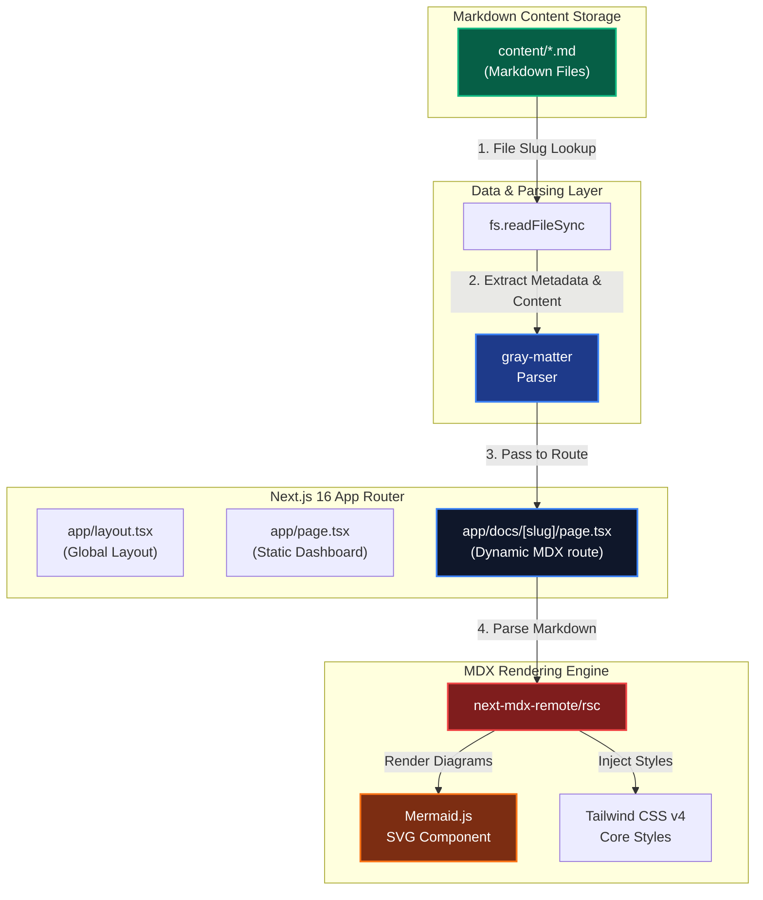
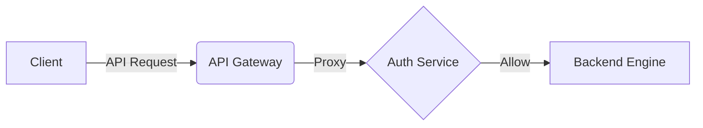

# স্বাগতম আমাদের সেন্ট্রাল নলেজ বেস-এ

এই প্ল্যাটফর্মটি আপনার লোকাল **README.md**, আর্কিটেকচারাল ডিসিশন রেকর্ড (ADR), এবং টেকনিক্যাল স্পেসিফিকেশন ফাইলগুলোকে একটি হাইপার-ফাস্ট, লিকুইড লেআউট সংবলিত প্রো-লেভেল ওয়েব অ্যাপ্লিকেশনে রূপান্তর করে। 

আপনার কোডবেসের সমস্ত গাইডলাইন এখন এক জায়গায়, কোনো ফ্রেম বা খাঁচার সীমানা ছাড়াই।

---

## 🚀 কোর ফিচারসমূহ

- **স্ট্যাটিক সাইট জেনারেশন (SSG):** প্রতিটা `.md` ফাইল বিল্ড টাইমে প্রি-রেন্ডার হয়, যার ফলে পেজ লোড টাইম হয় প্রায় ০ মিলিমেকেন্ড।
- **ফ্লুইড ও ওপেন লেআউট:** কোনো ৩য় শ্রেণীর ফিক্সড কন্টেইনার নেই। আপনার স্ক্রিনের সাইজ অনুযায়ী লেখাগুলো চমৎকার ব্রিদিং স্পেস নিয়ে ছড়িয়ে থাকে।
- **ডাইনামিক ইনডেক্সিং:** `content/` ফোল্ডারে নতুন কোনো ফাইল রাখলেই বাম পাশের সাইডবারে এবং হোম পেজে সেটি অটোমেটিক যুক্ত হয়ে যায়।
- **লাইভ মারমেইড ডায়াগ্রাম রেন্ডারিং:** টেকনিক্যাল আর্কিটেকচার ভিজ্যুয়ালাইজেশনের জন্য রিয়েল-টাইম SVG মারমেইড রেন্ডারার বিল্ট-ইন দেওয়া আছে।

---

## 📐 আর্কিটেকচারাল ফ্লো

এই প্রজেক্টের রেন্ডারিং এবং ডাইনামিক ডেটা লোডিং আর্কিটেকচার নিচে চিত্রায়িত করা হলো:



---

## 🛠️ কুইক স্টার্ট গাইড

প্রজেক্টের লোকাল এনভায়রনমেন্ট চালু করতে এবং নতুন ডকুমেন্ট যোগ করতে নিচের কমান্ড এবং স্ট্রাকচার অনুসরণ করুন।

### ১. লোকাল ডেভেলপমেন্ট রান করা

প্রজেক্টের ডিপেন্ডেন্সি ইনস্টল করার পর লোকাল সার্ভার বুট-আপ করতে টার্মিনালে রান করুন:

```bash
# ডিপেন্ডেন্সি ইনস্টল করতে
npm install

# লোকাল ডেভেলপমেন্ট সার্ভার চালু করতে
npm run dev
```

লোকাল সার্ভার চালু হওয়ার পর ব্রাউজারে `http://localhost:3000` ঠিকানায় যান।

### ২. প্রোজেক্ট ডিরেক্টরি স্ট্রাকচার

আমাদের নলেজ বেসের মেকানিক্স বুঝতে নিচে দেওয়া ডিরেক্টরি ম্যাপটি লক্ষ্য করুন:

| Directory/File | Purpose | Tech Used |
| :--- | :--- | :--- |
| `app/layout.tsx` | গ্লোবাল থিম, মেটাডেটা এবং ফন্ট ইমপোর্ট | Next.js Metadata API |
| `app/page.tsx` | মূল ড্যাশবোর্ড বা হোমপেজ | Tailwind CSS v4, Framer Motion |
| `app/docs/[slug]/page.tsx` | ডাইনামিক ডকুমেন্টেশন রেন্ডারিং পেজ | `next-mdx-remote`, MDX components |
| `content/` | আপনার সব `.md` বা `.mdx` ফাইলের ভাণ্ডার | Raw Markdown Documents |
| `lib/markdown.ts` | মেমরি-অপ্টিমাইজড ফাইল রিডার ও ফ্রন্টম্যাটার পার্সার | Node.js File System (`fs`), `gray-matter` |
| `components/` | রিইউজেবল রিয়্যাক্ট ও অ্যানিমেশন কম্পোনেন্টস | React 19, Lucide React, Mermaid |

---

## ✍️ নতুন ডকুমেন্ট যোগ করার নিয়ম

আমাদের প্ল্যাটফর্মে নতুন কোনো ফাইল যোগ করা অত্যন্ত সহজ। এর জন্য নিচের ধাপগুলো অনুসরণ করুন:

### ধাপ ১: ফাইল তৈরি করা
`content/` ফোল্ডারে একটি নতুন `.md` বা `.mdx` ফাইল তৈরি করুন। ফাইলের নামটি আপনার ডকুমেন্টের URL Slug হিসেবে ব্যবহৃত হবে।
*যেমন:* `content/system-design.md` ফাইলটি `/docs/system-design` পাথে অটোমেটিক এভেলেবল হয়ে যাবে।

### ধাপ ২: ফ্রন্টম্যাটার (Frontmatter) যোগ করা
প্রতিটি ফাইলের শীর্ষে অবশ্যই একটি মেটাডেটা ব্লক থাকতে হবে। এটি ড্যাশবোর্ড কার্ড, ফিল্টারিং ও সাইডবার জেনারেশনে ব্যবহৃত হয়।

```markdown
---
title: "System Design Manual"
description: "High-throughput এবং low-latency সিস্টেম আর্কিটেকচার ডিজাইন করার মূল নীতিমালা।"
category: "Architecture"
---
```

> [!IMPORTANT]
> ফ্রন্টম্যাটারের `category` প্রপার্টিটি খুবই গুরুত্বপূর্ণ। এটি ব্যবহার করে বাম পাশের সাইডবারে আপনার ডকুমেন্টগুলো গ্রুপ আকারে সাজানো হয়।

### ধাপ ৩: কন্টেন্ট লিখন ও ফরম্যাটিং
আপনি স্ট্যান্ডার্ড মার্কডাউনের সমস্ত সিনট্যাক্স ব্যবহার করতে পারেন। কাস্টম রেন্ডারিং ইঞ্জিনের মাধ্যমে আপনার কন্টেন্টগুলো সুপার-প্রিমিয়াম স্টাইল পাবে।

---

## 🎨 ডিজাইন এলিমেন্ট ও কাস্টম কম্পোনেন্ট

আমরা স্ট্যান্ডার্ড রিড-অনলি মোড ভেঙে কোডকে প্রাণবন্ত করতে কাস্টম মার্কডাউন ব্লকস এবং স্টাইলিং সাপোর্ট যুক্ত করেছি:

### ১. ভিজ্যুয়াল অ্যালার্ট বক্স (Alert Box)
গুরুত্বপূর্ণ নোট, সতর্কতা বা টিপস বোঝাতে গিটহাব স্টাইল অ্যালার্ট সিনট্যাক্স ব্যবহার করুন:

```markdown
> [!NOTE]
> এটি সাধারণ ব্যাকগ্রাউন্ড বা অতিরিক্ত ব্যাখ্যার জন্য ব্যবহৃত হয়।

> [!TIP]
> পারফরম্যান্স অপ্টিমাইজেশন বা মেমরি সেভিং সংক্রান্ত সেরা ট্রিকের জন্য এটি ব্যবহার করুন।

> [!IMPORTANT]
> কন্টেন্টের ভেতরে অলঙ্ঘনীয় নিয়ম বা ক্রিটিক্যাল স্টেপের জন্য এটি ব্যবহার করুন।
```

### ২. ম্যাক-স্টাইল কোড স্নাইপার (Mac-Style Code Sniper)
যেকোনো স্ট্যান্ডার্ড কোডব্লক লিখলেই সেটি একটি প্রিমিয়াম ম্যাক ওএস স্টাইল উইন্ডো বারের ভেতরে সুন্দর এডিটর স্টাইলে রেন্ডার হবে:

```javascript
// Example Code
const config = {
  theme: "dark",
  framework: "Next.js 16"
};
```

### ৩. মারমেইড ডায়াগ্রাম (Mermaid.js Diagram)
আপনার সিস্টেমে ডায়াগ্রাম রেন্ডার করা এখন পানির মতো সহজ। কেবল codeblock টাইপ হিসেবে `mermaid` দিন:



---

## 💡 সিনিয়র আর্কিটেক্ট টিপস ও বেস্ট প্র্যাকটিস

> "ডকুমেন্টেশন কেবল কোড লজিকের বিবরণ নয়, এটি আমাদের আর্কিটেকচারাল লিগ্যাসি। একটি প্রিমিয়াম নলেজ বেস তৈরি করতে কন্টেন্টের স্টাইলিং ও রিড্যাবিলিটি ঠিক রাখা অত্যন্ত জরুরি।"

১. **Contiguous Layout Concept:** আমাদের ডিজাইনটি ফিজিক্যাল সীমানা ছাড়াই খুব চমৎকার লিকুইড বাউন্ডিং স্পেস ব্যবহার করে। তাই অতিরিক্ত `<br>` বা খালি লাইন দিয়ে লেআউট নষ্ট করবেন না।
২. **Keep Titles Short:** বাম পাশের সাইডবারের জায়গা সীমিত, তাই ফ্রন্টম্যাটারের `title` যথাসম্ভব সংক্ষিপ্ত ও প্রফেশনাল রাখুন।
৩. **Check Build Pipeline:** যেকোনো ফাইল পুশ করার আগে লোকাল এনভায়রনমেন্টে `npm run build` দিয়ে টেস্ট করে নিন যাতে কোনো মার্কডাউন পার্সিং এরর না থাকে।
