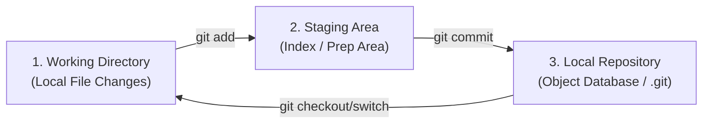
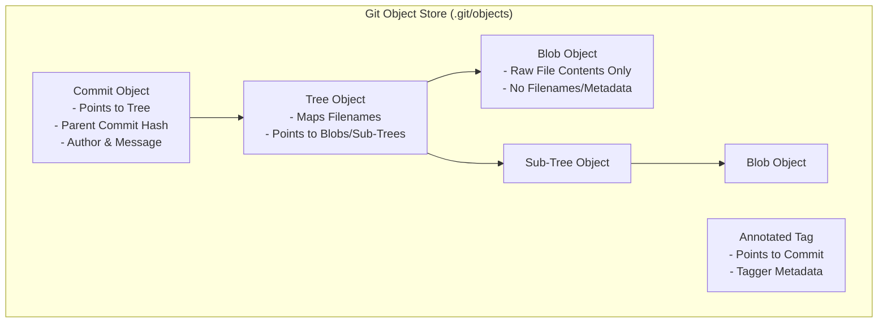
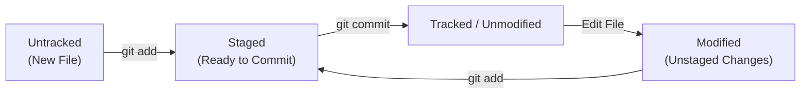
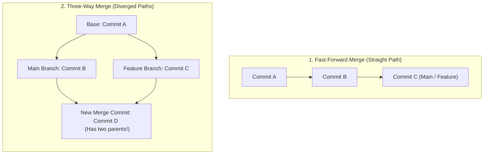

# 🐙 Git & GitHub Systems Engineering Handbook

সফটওয়্যার ইঞ্জিনিয়ারিংয়ে গিট (Git) কেবল কিছু কমান্ড টাইপ করে কোড ক্লাউডে আপলোড করার টুল নয়। এটি একটি অত্যন্ত চমৎকার **Distributed Content-Addressable Storage System** এবং একটি সুনির্দিষ্ট **Directed Acyclic Graph (DAG)** আর্কিটেকচার। গিট-এর অভ্যন্তরীণ মেমরি ডিজাইন, ট্র্যাকিং মেকানিজম এবং হিস্ট্রি রিরাইটিং মেথডোলজি না জানলে বড় এন্টারপ্রাইজ টিমে কাজ করার সময় মার্জ কনফ্লিক্ট বা ভুল পুশের কারণে প্রোডাকশন ক্র্যাশ হওয়ার মতো বড় বিপদ ঘটতে পারে।

এই হ্যান্ডবুকটি গিট-এর গভীরতম মেমরি লেআউট থেকে শুরু করে অ্যাডভান্সড রিবেসিং, হিস্ট্রি ট্রাবলশুটিং (Reflog), গিটহাব কোলাবোরেশন মডেল এবং শীর্ষ ২০টি ইন্টারভিউ প্রশ্নোত্তর অত্যন্ত প্র্যাক্টিক্যাল ও পঠনযোগ্য উপায়ে তুলে ধরেছে।

---

## ১. গিট আর্কিটেকচার ও অভ্যন্তরীণ মেমরি মডেল (Git Internals & DAG)

গিটকে সহজ কথায় বলা যায় একটি **Directed Acyclic Graph (DAG)**, যেখানে প্রতিটি নোড (Node) হলো এক একটি অবজেক্ট এবং এজ (Edge) হলো তাদের মধ্যকার রিলেশনশিপ। 

### ক. গিট-এর ৩টি অভ্যন্তরীণ স্তর (The Three Tree Areas)
গিট মূলত ফাইলগুলোকে তিনটি প্রধান স্তরে ম্যাপ করে ম্যানেজ করে:
১. **Working Directory:** আপনার লোকাল কম্পিউটারের ফাইল সিস্টেম, যেখানে আপনি সরাসরি কোড লিখছেন বা এডিট করছেন (Untracked / Tracked state)।
২. **Staging Area (Index):** এটি একটি অত্যন্ত গুরুত্বপূর্ণ বাফার বা ইনডেক্স ফাইল। আপনি পরবর্তী কমিটে কোন কোন পরিবর্তন যুক্ত করতে চান, তা এখানে সাময়িকভাবে সাজিয়ে রাখা হয়।
৩. **Local Repository (.git folder):** গিট অবজেক্ট ডেটাবেস, যেখানে আপনার সমস্ত কমিট, মেটাডেটা এবং শাখা-প্রশাখার নিখুঁত হিস্ট্রি স্থায়ীভাবে স্টোর থাকে।



---

### খ. গিট-এর ৪টি মৌলিক অবজেক্ট টাইপ (Git Core Objects)
`.git/objects/` ডিরেক্টরির ভেতরে গিট ৪টি প্রধান ফরম্যাটে ডেটা স্টোর করে। গিট প্রতিটি ফাইলের কনটেন্টকে ইউনিকভাবে রিড করে একটি **SHA-1 (৪০ ক্যারেক্টারের হেক্সাডেসিমেল হ্যাশ)** তৈরি করে।



১. **Blob (Binary Large Object):** এটি শুধুমাত্র ফাইলের ভেতরের র ডেটা বা কনটেন্ট স্টোর করে। এখানে ফাইলের নাম, পাথ বা কোনো মেটাডেটা থাকে না। দুটি ভিন্ন নামের ফাইলের কনটেন্ট যদি হুবহু এক হয়, গিট তাদের জন্য মেমরিতে মাত্র একটিই Blob অবজেক্ট তৈরি করে!
২. **Tree:** এটি ফাইল সিস্টেমের ডিরেক্টরি বা ফোল্ডারের মতো কাজ করে। একটি Tree অবজেক্টের ভেতরে অন্যান্য Tree (সাব-ফোল্ডার) এবং Blobs (ফাইলসমূহ)-এর তালিকা থাকে এবং তাদের ফাইলের নাম ও পাথের সাথে ম্যাপ করা থাকে।
৩. **Commit:** এটি একটি নির্দিষ্ট স্ন্যাপশটের নির্দেশক। কমিটের ভেতরে মূল রুট `Tree` অবজেক্টের হ্যাশ লিংক, পূর্ববর্তী প্যারেন্ট কমিটের হ্যাশ লিঙ্ক, অথরের নাম, ইমেইল, টাইমস্ট্যাম্প এবং কমিট মেসেজ থাকে।
৪. **Annotated Tag:** এটি একটি নির্দিষ্ট কমিট পয়েন্টারের মেটাডেটা সহ স্থায়ী বুকমার্ক, যা রিলিজ ভার্সন ট্র্যাক করতে ব্যবহৃত হয়।

---

## ২. গিট প্লাম্বিং কমান্ডস: পর্দার অন্তরালের অবজেক্ট ব্যবচ্ছেদ (Git Plumbing & Cat-File)

গিটে দুই ধরণের কমান্ড রয়েছে:
* **Porcelain Commands (ইউজার ফ্রেন্ডলি):** `git add`, `git commit`, `git status` ইত্যাদি যা আমরা প্রতিদিন টাইপ করি।
* **Plumbing Commands (নিম্ন স্তরের সিস্টেম লজিক):** `git cat-file`, `git hash-object` ইত্যাদি যা গিট নিজে পর্দার অন্তরালে ফাইল সিস্টেম ও অবজেক্ট রিড করতে ব্যবহার করে।

একটি নির্দিষ্ট কমিট হ্যাশকে ব্যবচ্ছেদ করে কীভাবে গিট ইন্টারনালস কাজ করে তা ম্যানুয়ালি দেখা সম্ভব:

```bash
# ১. কমিট অবজেক্টের টাইপ চেক করুন
git cat-file -t d7a0a93
# Output: commit

# ২. কমিটের প্রকৃত ভেতরের ডেটা প্রিন্ট করুন (যা Tree এবং Parent Commit নির্দেশ করে)
git cat-file -p d7a0a93
# Output:
# tree 4b825dc642cb6eb9a0acc41b4e3a031e007f2054
# parent c00e5a40a831e5f10b741525048d0842db1853d9
# author Awolad Hossain <awolad@example.com> 1716801043 +0600
# committer Awolad Hossain <awolad@example.com> 1716801043 +0600
#
# oop ver1

# ৩. কমিটের ভেতরের Tree অবজেক্টটি প্রিন্ট করুন (ডিরেক্টরি স্ট্রাকচার দেখতে)
git cat-file -p 4b825dc642cb6eb9a0acc41b4e3a031e007f2054
# Output:
# 100644 blob e69de29bb2d1d6434b8b29ae775ad8c2e48c5391    oop.md

# ৪. সর্বশেষ Blob ফাইল প্রিন্ট করুন (ফাইলের র কনটেন্ট দেখতে)
git cat-file -p e69de29bb2d1d6434b8b29ae775ad8c2e48c5391
# (oop.md ফাইলের প্রকৃত র টেক্সট এখানে রেন্ডার হবে)
```

---

## ৩. গিট কনফিগারেশন, ক্রস-প্ল্যাটফর্ম লাইন এন্ডিংস ও .gitattributes

নতুন সিস্টেমে গিট সেটআপ করার সময় কনফিগারেশন তিনটি স্তরে করা যায়:
* `--system`: সিস্টেমের সমস্ত ইউজার ও প্রজেক্টের জন্য (প্রশাসনিক লেভেলে)।
* `--global`: আপনার কম্পিউটারের বর্তমান ইউজারের সমস্ত প্রজেক্টের জন্য।
* `--local`: শুধুমাত্র নির্দিষ্ট প্রজেক্ট ফোল্ডারের জন্য (ডিফল্ট)।

### ক. প্রফেশনাল গ্লোবাল সেটিংস:
```bash
# ইউজারের পরিচয় সেট করা (কমিট ট্র্যাকিংয়ের জন্য অত্যন্ত জরুরি)
git config --global user.name "Awolad Hossain"
git config --global user.email "awolad@example.com"

# ডিফল্ট ব্রাঞ্চ নেম 'main' নির্ধারণ করা
git config --global init.defaultBranch main

# গিট টার্মিনালে সুন্দর কালার আউটপুট সক্রিয় করা
git config --global color.ui auto

# সমস্ত অ্যাক্টিভ কনফিগারেশন লগ দেখা
git config --list --show-origin
```

### খ. ক্রস-প্ল্যাটফর্ম লাইন এন্ডিংস (Windows LF/CRLF জটলা):
উইন্ডোজ অপারেটিং সিস্টেম লাইনের শেষে `CRLF` (Carriage Return + Line Feed) ব্যবহার করে, কিন্তু ম্যাক ও লিনাক্স ব্যবহার করে `LF`। এর ফলে উইন্ডোজ ডেভেলপারদের কোড পুশ করলে লিনাক্স সার্ভারে বিল্ড ক্র্যাশ হতে পারে।
* **সমাধান:** প্রজেক্টের রুটে একটি `.gitattributes` ফাইল তৈরি করে ক্রস-প্ল্যাটফর্ম অটো-ফরম্যাটিং অন করা উচিত:

```ini
# .gitattributes
# স্ট্রিং টেক্সট ফাইলগুলোকে অটো-ডিটেক্ট করে গিটহাবে পুশ করার সময় LF-এ রূপান্তর করবে
* text=auto

# নির্দিষ্ট ফাইল এক্সটেনশনের লাইন এন্ডিংস ফিক্সড রাখা
*.js text eol=lf
*.ts text eol=lf
*.json text eol=lf
```

### গ. `.gitignore` এবং আর্কিটেকচারাল সিকিউরিটি:
প্রজেক্টের সংবেদনশীল ফাইল (যেমন: `.env`, API Keys), থার্ড-পার্টি লাইব্রেরি (`node_modules`) বা বিল্ড আর্টফ্যাক্টস (`dist`, `build`) যাতে ভুলে গিটে ট্র্যাক না হয়ে যায়, সে জন্য প্রজেক্টের রুটে `.gitignore` ফাইল তৈরি করা বাধ্যতামূলক।

> [!IMPORTANT]
> **গিট ট্র্যাক থেকে ফাইল রিমুভ করা:**
> কোনো ফাইল ভুলবশত আগে কমিট হয়ে গেলে, শুধু `.gitignore`-এ ফাইলটি লিখলেই ট্র্যাকিং বন্ধ হয় না। ফাইলটিকে ক্যাশ থেকে ডিলিট করতে নিচের কমান্ডটি দিতে হবে (এতে লোকাল ফাইল ডিলিট হবে না, কেবল গিটের ট্র্যাকিং থেকে বাদ যাবে):
> `git rm --cached .env`

---

## ৪. দৈনন্দিন ট্র্যাকিং ও কমিট লাইফসাইকেল (Staging & Commits)



### ক. অ্যাডভান্সড স্টেজিং প্র্যাকটিস:
* **ইন্টারেক্টিভ স্টেজিং (`git add -p`):** এটি একটি অত্যন্ত সিনিয়র প্র্যাকটিস। একটি ফাইলের ভেতরে আপনি যদি ১০টি আলাদা কাজ করে থাকেন, কিন্তু আপনি চান কেবল ৩টি সুনির্দিষ্ট লাইনের পরিবর্তন এই কমিটে যাবে, তবে `git add -p` (patch mode) ব্যবহার করে ফাইলের ভেতরের নির্দিষ্ট ব্লক ইন্টারেক্টিভভাবে স্টেজ করতে পারবেন।
* **স্টেজিং বাফার রিভার্ট করা:** কোনো ফাইল ভুলে স্টেজ করে ফেললে তা আন-স্টেজ করার কমান্ড:
  `git restore --staged filename.js`

### খ. কনভেনশনাল কমিট মেসেজ স্ট্যান্ডার্ড (Conventional Commits):
টিমের সবার সুবিধার্থে ও স্বয়ংক্রিয় চেঞ্জলগ (Changelog) তৈরির জন্য প্রফেশনাল কোডবেসে নিচের ফরম্যাটটি অনুসরণ করা উচিত:
`<type>(<scope>): <description>`

* `feat`: নতুন ফিচার যুক্ত করা। (উদা: `feat(auth): add google oauth login`)
* `fix`: কোনো বাগ বা সমস্যার সমাধান। (উদা: `fix(db): resolve replication deadlock`)
* `docs`: ডকুমেন্টেশনে পরিবর্তন। (উদা: `docs(api): update rate limit specs`)
* `refactor`: কোড অপটিমাইজেশন, যেখানে কার্যকারিতা অপরিবর্তিত থাকে।
* `chore`: বিল্ড প্রসেস বা প্যাকেজ ম্যানেজার আপডেট।

---

## ৫. অ্যাডভান্সড ব্রাঞ্চিং, মার্জিং এবং রিবেস (Branching, Merging & Rebase)

গিট-এ একটি শাখা বা ব্রাঞ্চ তৈরি করা মানে মেমরিতে নতুন কোনো ভারী ফোল্ডার কপি করা নয়। ব্রাঞ্চ হলো স্রেফ একটি অতি ক্ষুদ্র **Pointer**, যা একটি নির্দিষ্ট কমিটের ৪০ ক্যারেক্টার হ্যাশকে পয়েন্ট করে থাকে! এ কারণেই গিট-এ ব্রাঞ্চ তৈরি করা চোখের পলকে সম্পন্ন হয়।

### ক. মার্জ স্ট্র্যাটেজি: Fast-Forward বনাম Three-Way Merge
যখন আপনি এক শাখার সাথে অন্য শাখা মার্জ করতে যান, গিট মূলত দুটি মেকানিজম ব্যবহার করে:



১. **Fast-Forward Merge:** যদি আপনার `main` ব্রাঞ্চ থেকে `feature` ব্রাঞ্চ তৈরির পর `main` ব্রাঞ্চে আর কোনো নতুন কমিট না পড়ে থাকে, তবে গিট কোনো অতিরিক্ত মার্জ কমিট ছাড়াই `main` পয়েন্টারটিকে স্লাইড করে সরাসরি `feature` এর সর্বশেষ কমিটে নিয়ে যায়।
২. **Three-Way Merge (Recursive/Ort):** যদি উভয় ব্রাঞ্চেই নতুন নতুন কমিট যুক্ত হয়ে তারা ডাইভার্জ হয়ে যায়, তখন গিট কমন পূর্বপুরুষ (Common Ancestor) বা বেস কমিট এবং উভয় ব্রাঞ্চের হেড কমিট নিয়ে একটি **Three-way merge** করে একটি নতুন **Merge Commit** তৈরি করে।

---

### খ. রিবেস (Rebase) বনাম মার্জ (Merge)
* **Merge:** দুই শাখার ইতিহাসকে মেলাতে একটি অতিরিক্ত মার্জ কমিট তৈরি করে। এটি অরিজিনাল ট্র্যাকিং হিস্ট্রি অপরিবর্তিত রাখে, কিন্তু কোডবেসের নেটওয়ার্ক গ্রাফকে জটিল করে তোলে।
* **Rebase:** আপনার বর্তমান ফিচারের বেস কমিটটিকে অন্য শাখার সর্বশেষ কমিটের ওপরে নিয়ে নতুন করে হিস্ট্রি তৈরি করে। এর ফলে সম্পূর্ণ প্রজেক্টের লগ লিনিয়ার এবং পরিষ্কার থাকে।

> [!CAUTION]
> **রিবেসের সুবর্ণ নিয়ম (The Golden Rule of Rebasing):**
> কখনোই কোনো **Public/Shared Branch** (যেমন: `main` বা `develop` যা টিমের অন্য সবাই ব্যবহার করছে)-এ `rebase` চালাবেন না! এটি সবার কম্পিউটারের লোকাল হিস্ট্রির সাথে রিমোটের মিল নষ্ট করে ফেলবে এবং মার্জ রিরাইট জটলা সৃষ্টি করবে।

```bash
# ফিচার ব্রাঞ্চে থেকে মেইন ব্রাঞ্চের সাপেক্ষে রিবেস করা
git checkout feature-login
git rebase main

# যদি রিবেস কনফ্লিক্ট দেখা দেয়, তবে কনফ্লিক্ট মিটিয়ে দিন এবং:
git add .
git rebase --continue
```

### গ. পাইপলাইনে অটো-মার্জিং ওভাররাইডস (Merge Strategy Options):
সিআই/সিডি অটোমেটেড পাইপলাইনে কোড মার্জ করার সময় যদি কোনো কনফ্লিক্ট দেখা দেয়, তবে পাইপলাইন ক্র্যাশ ঠেকাতে আপনি `merge` অপশন দিয়ে গিটকে নির্ধারণ করে দিতে পারেন কোন পক্ষের কোড অটোমেটিকাল গ্রহণ করা হবে:
```bash
# কনফ্লিক্ট হলে অটোমেটিক লোকাল ব্রাঞ্চের কোডকে বিজয়ী করা
git merge feature-login -Xours

# কনফ্লিক্ট হলে অটোমেটিক রিমোট/ইনকামিং ব্রাঞ্চের কোড গ্রহণ করা
git merge feature-login -Xtheirs
```

---

### ঘ. মার্জ কনফ্লিক্ট মেটানোর প্রফেশনাল পদ্ধতি:
মার্জ কনফ্লিক্ট কোনো ভ্যের বিষয় নয়, এটি গিটের একটি অসাধারণ ফিচার যা আপনাকে অজান্তে ভুল কোড ওভাররাইট করা থেকে রক্ষা করে।
১. কনফ্লিক্ট ফাইলের ভেতরের `<<<<<<< HEAD` (আপনার লোকাল পরিবর্তন) এবং `>>>>>>> branch_name` (অন্য ব্রাঞ্চের পরিবর্তন) মার্কার দুটি চিহ্নিত করুন।
২. কোড ভালো করে পর্যালোচনা করে যেটি সঠিক তা রেখে বাকি মার্কারগুলো মুছে দিন।
৩. ফাইলটি সেভ করে নিচের কমান্ডগুলো দিন:
   ```bash
   git add filename.js
   git commit -m "merge: resolve login conflict between main and dev"
   ```

---

## ৬. মনোরেপো ম্যানেজমেন্ট: স্পার্স চেকআউট ও গিট এলএফএস (Git LFS)

আধুনিক এন্টারপ্রাইজ সিস্টেমে পুরো কোম্পানির সব মাইক্রোসার্ভিস একটি মাত্র বিশালাকার রিপোজিটরিতে রাখা হয়, যাকে **Monorepo (মনোরেপো)** বলে। এত বড় সাইজের কোডবেস লোকাল কম্পিউটারে হ্যান্ডেল করার জন্য বিশেষ কিছু আর্কিটেকচার রয়েছে:

### ক. Git Sparse Checkout (স্পার্স চেকআউট):
মনোরেপোর সাইজ যদি ১০০ জিবি হয়, এবং আপনার প্রয়োজন কেবল `services/payment-gateway` ফোল্ডারের ফাইলগুলো, তবে সম্পূর্ণ ১০০ জিবি ফাইল ডাউনলোড না করে কেবল নির্দিষ্ট ডিরেক্টরি ডাউনলোড করার জন্য স্পার্স চেকআউট ব্যবহৃত হয়।

```bash
# ১. রিপোজিটরি সম্পূর্ণ ক্লোন না করে মেটাডেটা ক্লোন করা (Sparse Init)
git clone --filter=blob:none --no-checkout https://github.com/company/giant-monorepo.git
cd giant-monorepo

# ২. স্পার্স চেকআউট মোড অন করা
git sparse-checkout init --cone

# ৩. যে ডিরেক্টরিটি লোকাল কম্পিউটারে দেখতে চান তা সেট করা
git sparse-checkout set services/payment-gateway

# ৪. শুধুমাত্র সিলেক্টেড ফোল্ডারটি মেমরি থেকে পুল করা
git checkout main
# (এখন আপনার কম্পিউটারে কেবল payment-gateway ফোল্ডারের ফাইলগুলো শো হবে!)
```

### খ. Git LFS (Large File Storage):
গিটের মেমরিতে ইমেজ, ভিডিও, ডাটাবেস ফাইল বা ৩ডি মডেলের মতো বড় বাইনারি ফাইল স্টোর করলে `.git` ফোল্ডারের সাইজ মারাত্মক স্ফীত হয়ে যায়, যা ক্লোনিং স্পীড কমিয়ে দেয়।
* **সমাধান:** Git LFS বড় ফাইলগুলোকে গিটের মূল ট্র্যাকিং গ্রাফে সরাসরি না রেখে তার বদলে কেবল একটি ৫-লাইনের **Pointer Text File** রাখে এবং বড় মূল ফাইলটি গিটহাবের ডেডিকেটেড এলএফএস স্টোরেজে হোস্ট করে।

```bash
# ১. সিস্টেমে LFS ইনস্টল করা
git lfs install

# ২. গিটের মাধ্যমে সব .mp4 ভিডিও ফাইল ট্র্যাক করা
git lfs track "*.mp4"

# ৩. ট্র্যাকিং সিস্টেম অ্যাট্রিবিউট সেভ করা
git add .gitattributes
```

---

## ৭. ইতিহাস পুনর্লিখন ও ট্রাবলশুটিং (Advanced Reflog & Reset)

ওওপিতে যেমন মেমরি ম্যানেজমেন্ট জরুরি, গিটেও হিস্ট্রি ক্লিন রাখা ও ভুল ফিক্স করা একজন সিনিয়র ডেভেলপারের অন্যতম বড় দায়িত্ব।

### ক. `git reset` এর তিনটি মোড:
কোনো ভুল কমিট বাতিল করার জন্য `git reset` ব্যবহার করা হয়। এর ৩টি ভেরিয়েন্ট রয়েছে:

| Reset Mode | Moves HEAD? | Modifies Staging Area? | Modifies Working Directory? | Safety Level |
| :--- | :---: | :---: | :---: | :---: |
| **`--soft`** |  (হ্যাঁ) | ❌ (না) | ❌ (না) |  উচ্চ (কোড স্টেজেই থাকে) |
| **`--mixed`** |  (হ্যাঁ) |  (হ্যাঁ) | ❌ (না) |  মাঝারি (কোড আনস্টেজ হয়ে যায়) |
| **`--hard`** |  (হ্যাঁ) |  (হ্যাঁ) |  (হ্যাঁ) | ⚠️ ঝুঁকিপূর্ণ (সব লোকাল পরিবর্তন মুছে যায়) |

```bash
# সর্বশেষ কমিটটি বাতিল করা কিন্তু কোড সম্পূর্ণ অক্ষত ও স্টেজড রাখা
git reset --soft HEAD~1
```

### খ. `git reflog` - গিটের জীবন রক্ষাকারী কবচ:
আপনি ভুল করে `git reset --hard` করে কোনো গুরুত্বপূর্ণ কমিট ডিলিট করে ফেলেছেন? লোকাল কম্পিউটারে গিট থেকে কোনো কিছু আসলে কখনোই চিরতরে ডিলিট হয় না!
গিট-এর **Reflog (Reference Log)** আপনার কম্পিউটারের লোকাল HEAD পয়েন্টারের প্রতি সেকেন্ডের নড়াচড়া ট্র্যাক করে রাখে।

```bash
# আপনার হেড পয়েন্টারের সমস্ত মুভমেন্টের হিস্ট্রি দেখুন (কমিট আইডি সহ)
git reflog
```
আপনি যদি দেখতে পান ডিলিট হওয়া কমিটের আইডি ছিল `a1b2c3d`, তবে চোখ বন্ধ করে নিচের কমান্ড দিয়ে তা ফিরিয়ে আনতে পারেন:
```bash
git reset --hard a1b2c3d
```

### গ. ইন্টারেক্টিভ রিবেস (Interactive Rebase - `git rebase -i`):
টিমে কোড পুশ করার আগে আপনার লোকাল হিস্ট্রিকে সাজানোর জন্য এটি জাদুকরি টুল। এর সাহায্যে আপনি একাধিক ছোট ছোট হিজিবিজি কমিটকে মার্জ করে একটি সুন্দর কমিটে রূপান্তর (Squash) করতে পারেন।

```bash
# শেষ ৪টি লোকাল কমিট এডিট বা মার্জ করার জন্য রিবেস উইন্ডো চালু করা
git rebase -i HEAD~4
```
উইন্ডো ওপেন হলে আপনার কমিটের পাশে নিচের অ্যাকশনগুলো সিলেক্ট করতে পারেন:
* `pick`: কমিটটি রাখা।
* `reword`: কমিটের মেসেজ পরিবর্তন করা।
* `squash`: পূর্ববর্তী কমিটের সাথে এই কমিটটি জুড় দেওয়া (মার্জ করা)।
* `drop`: কমিটটি চিরতরে মুছে ফেলা।

---

## ৮. গিট বাইসেক্ট: স্বয়ংক্রিয় বাইনারি বাগ হান্টিং (Git Bisect)

কখনও কখনও প্রোডাকশন কোডে একটি বড় বাগ দেখা দেয় এবং লগ চেক করে বোঝা যায় না যে বিগত ১ মাসে করা ৩০০টি কমিটের মধ্যে ঠিক কোন কমিটটিতে বাগটি প্রথম ঢুকেছিল। ম্যানুয়ালি ৩০০টি কমিট রান করে টেস্ট করা অসম্ভব।
* **সমাধান:** `git bisect` যা কম্পিউটারের **Binary Search** অ্যালগরিদম ব্যবহার করে বাগ খুঁজে বের করে।

```bash
# ১. বাইসেক্ট সার্চ স্টার্ট করুন
git bisect start

# ২. বর্তমান ব্রাঞ্চকে 'bad' চিহ্নিত করুন (যেহেতু কোডে বাগ সচল আছে)
git bisect bad

# ৩. ১ মাস আগের কোনো একটি কমিট হ্যাশ দিন যেখানে বাগটি ছিল না (good commit)
git bisect good c00e5a4

# গিট এখন বাইনারি সার্চ করে মাঝখানের ১৫০তম কমিটে প্রজেক্ট চেকআউট করবে।
# আপনি কোড টেস্ট করে যদি দেখেন বাগ নেই, তবে লিখবেন:
git bisect good
# আর যদি দেখেন বাগ আছে, তবে লিখবেন:
git bisect bad

# ৪. এভাবে ৫-৬টি ক্লিকেই গিট আপনাকে বলবে কোন কমিট হ্যাশটি প্রথম বাগ ঢুকিয়েছিল!
# কাজ শেষে বাইসেক্ট মোড থেকে বের হতে:
git bisect reset
```

> [!TIP]
> **Git Bisect Automation:**
> আপনার যদি কোনো স্বয়ংক্রিয় টেস্ট স্ক্রিপ্ট (যেমন: `npm run test`) রেডি থাকে, তবে গিটকে দিলে সে নিজেই ৩০০ কমিটে রোবোটের মতো লাফিয়ে লাফিয়ে অটোমেটিক বাগ ফিক্সিং কমিট চিহ্নিত করে দেবে মাত্র ১ মিনিটে!
> `git bisect run npm run test`

---

## ৯. গিট স্ট্যাশ: কাজের মাঝে বাফার জোন (Git Stash)

যখন আপনি কোনো একটি নতুন ফিচারের কাজ করছেন কিন্তু হঠাৎ করে প্রোডাকশনের একটি বড় বাগ ফিক্স করার জন্য অন্য ব্রাঞ্চে যেতে হচ্ছে, অথচ আপনার লোকাল কোড এখনো অসম্পূর্ণ ও কমিট করার অনুপযুক্ত—তখন ব্যবহৃত হয় `git stash`।

```bash
# ১. অসম্পূর্ণ কাজগুলো লোকাল বাফারে লুকিয়ে রাখা (ওয়ার্কিং ডিরেক্টরি ক্লিন হয়ে যাবে)
git stash save "WIP: login form verification logic"

# ২. অন্য ব্রাঞ্চে গিয়ে বাগ ফিক্স করে পুনরায় আগের ব্রাঞ্চে ফিরে আসা
git checkout feature-login

# ৩. জমানো কাজের লিস্ট দেখা
git stash list

# ৪. সর্বশেষ জমানো কাজটি ফিরিয়ে এনে স্ট্যাশ থেকে ডিলিট করা
git stash pop

# অথবা ডিলিট না করে কেবল কাজটি ফিরিয়ে আনা
git stash apply stash@{0}
```

---

## ১০. সাবমডিউল বনাম সাবট্রি (Git Submodule vs Subtree)

বড় আর্কিটেকচারে অন্য আরেকটি স্বাধীন কোডবেস বা প্যাকেজ লাইব্রেরিকে মূল অ্যাপ্লিকেশনের ভেতরে এম্বেড করার জন্য দুটি মেথডোলজি রয়েছে:

| বৈশিষ্ট্য | Git Submodule | Git Subtree |
| :--- | :--- | :--- |
| **আর্কিটেকচার** | শুধুমাত্র অন্য প্রজেক্টের নির্দিষ্ট কমিটের একটি **Pointer** লিংক রাখে। | সম্পূর্ণ অন্য প্রজেক্টের কোড ও ইতিহাস লোকাল ডিরেক্টরিতে কপি করে আনে। |
| **মেমরি সাইজ** | অত্যন্ত লাইটওয়েট কারণ এটি র মূল কোড স্টোর করে না। | ফোল্ডারের মেমরি সাইজ বৃদ্ধি করে। |
| **ক্লোনিং জটলা** | ক্লোন করার পর ম্যানুয়ালি `submodule init` ও `update` রান করতে হয়। | ক্লোন করলেই সব কোড চলে আসে, আলাদা কোনো কমান্ডের প্রয়োজন নেই। |
| **ব্যবহারের ক্ষেত্র** | থার্ড পার্টি বড় লাইব্রেরি যা ঘন ঘন বদলানোর প্রয়োজন হয় না। | যখন আপনি প্রজেক্টের ভেতরেই অন্য কোডবেসও এডিট করে ব্যাক-পুশ করতে চান। |

```bash
# Git Submodule যোগ করা
git submodule add https://github.com/libs/math-lib.git extern/math-lib

# Git Subtree যোগ করা
git subtree add --prefix=libs/math-lib https://github.com/libs/math-lib.git main --squash
```

---

## ১১. গিটহাব ও রিমোট কোলাবোরেশন (GitHub & Remote Collaboration)

টিম কোলাবোরেশনের জন্য গিটহাব একটি ডিস্ট্রিবিউটেড ক্লাউড ম্যানেজার হিসেবে কাজ করে।

```mermaid
flowchart TD
    subgraph DeveloperLaptop ["Local Machine"]
        LocalRepo["Local Repository <br> (.git)"]
    end
    
    subgraph GitHubServer ["GitHub (Remote Server)"]
        RemoteRepo["Remote Repository <br> (origin)"]
    end
    
    LocalRepo -->|1. git push| RemoteRepo
    RemoteRepo -->|2. git fetch <br> (Updates origin/main pointer)| LocalRepo
    RemoteRepo -->|3. git pull <br> (Fetch + Automatic Merge)| LocalRepo
```

### ক. Remote Commands:
* **রিমোট কানেক্ট করা:** লোকাল রিপোজিটরির সাথে গিটহাব লিংক অ্যাড করা:
  `git remote add origin https://github.com/username/repo.git`
* **রিমোট ইউআরএল চেক করা:** `git remote -v`

### খ. `git fetch` বনাম `git pull`:
* **`git fetch`:** এটি রিমোট সার্ভার থেকে সমস্ত নতুন ব্রাঞ্চ ও কমিটের মেটাডেটা ডাউনলোড করে লোকাল কম্পিউটারে নিয়ে আসে, কিন্তু আপনার বর্তমান কাজের ফাইলের ওপর কোনো পরিবর্তন বা মার্জ করে না। এটি সম্পূর্ণ নিরাপদ।
* **`git pull`:** এটি পর্দার অন্তরালে আসলে দুটি কমান্ডের সমষ্টি: **`git fetch` + `git merge`**। এটি রিমোটের কোড ডাউনলোড করে সরাসরি আপনার লোকাল ওয়ার্কিং ফাইলে মার্জ করে দেয়। মার্জ জটলা এড়াতে প্রথমে `fetch` করে কোড দেখে নিয়ে তারপর মার্জ করা সিনিয়রদের বেস্ট প্র্যাকটিস।

---

## ১২. গিট টিম কোলাবোরেশন মডেলসমূহ (Git Workflows)

বড় টিমে কাজ করার সময় প্রত্যেকে যাতে স্বাধীনভাবে কাজ করতে পারেন, সে জন্য ৩টি প্রধান কোলাবোরেশন মডেল ব্যবহৃত হয়:

### ক. Git Flow (এন্টারপ্রাইজ স্ট্যান্ডার্ড):
অত্যন্ত সুশৃঙ্খল কিন্তু কিছুটা জটিল মডেল। এতে ৫টি প্রধান ব্রাঞ্চ থাকে:
* `main`: প্রোডাকশন রেডি কোড।
* `develop`: ইন্টিগ্রেশন ব্রাঞ্চ, যেখানে সব ফিচারের কোড জড়ো হয়।
* `feature/*`: নতুন নতুন ফিচার তৈরির শাখা (ডেভেলাপ থেকে তৈরি হয়)।
* `release/*`: নতুন রিলিজের পূর্বে ফাইনাল বাগ ফিক্স ও টেস্টিং শাখা।
* `hotfix/*`: প্রোডাকশনের লাইভ বাগ দ্রুত ফিক্স করার জন্য সরাসরি মেইন থেকে তৈরি শাখা।

### খ. GitHub Flow (লাইটওয়েট ও আধুনিক):
স্টার্টআপ এবং ক্লাউড-নেティブ টিমের জন্য বেস্ট প্র্যাকটিস।
১. `main` ব্রাঞ্চ থেকে সরাসরি একটি নির্দিষ্ট ফিচারের নামের ব্রাঞ্চ (`feature-payment`) তৈরি করা।
২. কোড পুশ করে গিটহাবে **Pull Request (PR)** ওপেন করা।
৩. টিম রিভিউর পর পিআর অ্যাক্সেপ্ট হলে সরাসরি `main` ব্রাঞ্চে মার্জ ও ডিপ্লয় করা।

---

## ১৩. গিট হুকস ও অটোমেশন (Git Hooks & Aliases)

গিট হুকস হলো গিটের নির্দিষ্ট অ্যাকশনের ওপর ভিত্তি করে স্বয়ংক্রিয়ভাবে স্ক্রিপ্ট রান করার চমৎকার আর্কিটেকচার। এগুলো `.git/hooks/` ফোল্ডারে থাকে।

### ক. `pre-commit` হুক (Code Quality Guard):
কমিট বাটনে চাপ দেওয়ার সাথে সাথে কোডে কোনো সিনট্যাক্স এরর, লিন্টিং বাগ বা টেস্ট ফাইল ক্র্যাশ আছে কিনা তা চেক করতে এই হুক ব্যবহার করা হয়। প্রজেক্টে Husky লাইব্রেরি ব্যবহার করে সহজে গিট হুক অটোমেট করা যায়।

### খ. গিট এলিয়াস (Git Aliases - Speed up workflow):
কমান্ড লাইনে দ্রুত কাজ করার জন্য আপনি কাস্টম সংক্ষিপ্ত কমান্ড সেট করতে পারেন:
```bash
git config --global alias.co checkout
git config --global alias.br branch
git config --global alias.st status

# গিট হিস্ট্রি গ্রাফ সুন্দর করে এক লাইনে দেখার আলটিমেট কমান্ড এলিয়াস:
git config --global alias.lg "log --graph --abbrev-commit --decorate --format=format:'%C(bold blue)%h%C(reset) - %C(bold green)(%ar)%C(reset) %C(white)%s%C(reset) %C(dim white)- %an%C(reset)%C(bold yellow)%d%C(reset)' --all"
```
এখন আপনি টার্মিনালে কেবল `git lg` টাইপ করলেই পুরো রিপোজিটরির ডাইনামিক হিস্ট্রি গ্রাফ দেখতে পাবেন!

---

## ১৪. মেমরি অপটিমাইজেশন ও গার্বেজ কালেকশন (Packfiles & Loose Objects)

গিটে ফাইল এডিট করে `git add` করার সাথে সাথেই মেমরিতে একটি স্বাধীন **Loose Object** ফাইল ডিকম্প্রেসড অবস্থায় স্টোর হয়। যখন প্রজেক্ট বড় হয় এবং হাজার হাজার Loose অবজেক্ট তৈরি হয়, তখন তা মেমরির অপচয় করে।
* **Packfiles (.pack) & Index (.idx):** গিট সময় সময় মেমরি অপটিমাইজ করার জন্য লুজ অবজেক্টগুলোকে কম্প্রেস করে একক বাইনারি ডেটাবেস `.pack` ফাইলে ভরে এবং দ্রুত অবজেক্ট সার্চ করার জন্য একটি `.idx` ইনডেক্স ম্যাপ তৈরি করে।
* **Garbage Collection:** ম্যানুয়ালি গিটের আবর্জনা ও অনাথ কমিটগুলোকে মেমরি থেকে নিশ্চিহ্ন করতে এবং লুজ অবজেক্ট প্যাক করতে নিচের কমান্ড রান করা হয়:

```bash
git gc --prune=now --aggressive
```

---

## ১৫. GitHub Actions এবং আধুনিক CI/CD অটোমেশন

গিটহাব শুধুমাত্র কোড হোস্টিং সার্ভিস নয়, এটি রানটাইম অটোমেশন বা পাইপলাইন সার্ভিসও দেয় যাকে **GitHub Actions** বলে।
প্রজেক্টের রুটে `.github/workflows/main.yml` ফাইল তৈরি করে আপনি আপনার টেস্ট ও বিল্ড পাইপলাইন রান করতে পারেন:

```yaml
# main.yml
name: Node.js CI Pipeline

on:
  push:
    branches: [ main, dev ]
  pull_request:
    branches: [ main ]

jobs:
  build_and_test:
    runs-on: ubuntu-latest

    steps:
    - name: Checkout Source Code
      uses: actions/checkout@v4

    - name: Setup Node.js Runtime
      uses: actions/setup-node@v4
      with:
        node-version: '20.x'
        cache: 'npm'

    - name: Install Project Dependencies
      run: npm ci

    - name: Run Code Quality Linters
      run: npm run lint

    - name: Run Automated Test Suites
      run: npm test
```

---

## ১৬. গিট ও গিটহাব ইন্টারভিউ প্র্যাকটিস (Top 20 Senior Q&A)

#### প্রশ্ন ১: `git merge` এবং `git rebase`-এর মধ্যে প্রধান আর্কিটেকচারাল পার্থক্য কী? কখন কোনটি ব্যবহার করা উচিত?
**উত্তর:** 
* **`git merge`** একটি অ-ধ্বংসাত্মক (Non-destructive) অপারেশন। এটি দুই শাখার ইতিহাসকে এক করতে একটি নতুন "Merge Commit" তৈরি করে। এর ফলে সম্পূর্ণ হিস্ট্রি গ্রাফ অপরিবর্তিত থাকে কিন্তু বড় প্রজেক্টে হিস্ট্রি অনেক হিজিবিজি হয়ে যায়।
* **`git rebase`** আপনার বর্তমান শাখার সমস্ত কমিটকে কেটে নিয়ে টার্গেট শাখার সর্বশেষ কমিটের ওপর একের পর এক বসায়। এটি হিস্ট্রি রিরাইট করে এবং একটি সোজা লিনিয়ার (Linear) ইতিহাস উপহার দেয়।
* **ব্যবহারের নিয়ম:** আপনার কাস্টম লোকাল ফিচার ব্রাঞ্চকে আপ-টু-ডেট রাখতে সর্বদা `rebase` ব্যবহার করুন, কিন্তু কোনো পাবলিক বা শেয়ার্ড ব্রাঞ্চে (যেমন: `main`) কখনো রিবেস চালাবেন না।

#### প্রশ্ন ২: "Detached HEAD" স্টেট বলতে কী বোঝায়? এই অবস্থা থেকে কীভাবে কোড রিকভার করা যায়?
**উত্তর:** গিট-এ HEAD সাধারণত কোনো একটি ব্রাঞ্চ পয়েন্টারকে রেফার করে। কিন্তু আপনি যখন কোনো ব্রাঞ্চের বদলে সরাসরি একটি নির্দিষ্ট কমিট হ্যাশকে চেকআউট করেন (`git checkout a1b2c3d`), তখন HEAD কোনো ব্রাঞ্চের সাথে যুক্ত না থেকে সরাসরি কমিটকে পয়েন্ট করে। একেই **Detached HEAD** বলে।
* **রিকভার করার উপায়:** এই অবস্থায় কোনো টেস্ট বা কমিট করলে তা নতুন কোনো ব্রাঞ্চ তৈরি করে সেভ করতে হবে:
  `git switch -c recovery-branch-name`
  এতে আপনার ডেটা সুরক্ষিত থাকবে এবং HEAD পুনরায় নতুন ব্রাঞ্চ পয়েন্টারের সাথে যুক্ত হবে।

#### প্রশ্ন ৩: `git reset` and `git revert`-এর মধ্যে পার্থক্য কী? প্রোডাকশন ব্রাঞ্চের জন্য কোনটি নিরাপদ?
**উত্তর:** 
* **`git reset`** আপনার কমিট হিস্ট্রিকে পূর্ববর্তী অবস্থায় ফিরিয়ে নিয়ে যায় এবং মাঝখানের কমিটগুলোকে লগ থেকে মুছে ফেলে (হিস্ট্রি এডিট করে)। এটি লোকাল কাজের জন্য বেস্ট কিন্তু প্রোডাকশনে মারাত্মক ক্ষতিকর।
* **`git revert`** পূর্ববর্তী ভুলের বিপরীত কাজ করে একটি সম্পূর্ণ নতুন কমিট তৈরি করে। এটি কোনো পুরনো হিস্ট্রি ডিলিট করে না, ফলে রিমোটে অলরেডি পুশ করা কোড রিভার্ট করার জন্য `git revert` শতভাগ নিরাপদ ও স্ট্যান্ডার্ড প্র্যাকটিস।

#### প্রশ্ন ৪: `git pull` রান করার পর যদি মার্জ জটলা বা কনফ্লিক্ট এড়াতে চান, তবে কোন ফ্ল্যাগটি ব্যবহার করা উচিত এবং কেন?
**উত্তর:** মার্জ জটলা এড়াতে `--rebase` ফ্ল্যাগ ব্যবহার করা উচিত:
`git pull --rebase origin main`
এটি রিমোটের কোড এনে আপনার লোকাল কাজগুলোকে মার্জ না করে রিমোটের কোডের ওপরে আপনার লোকাল পরিবর্তনগুলোকে একের পর এক বসাবে (Rebase)। ফলে কোনো অপ্রয়োজনীয় মার্জ কমিট ছাড়াই ইতিহাস সোজা থাকবে।

#### প্রশ্ন ৫: `git reflog` কীভাবে কাজ করে? এটি কি `git log` এর বিকল্প?
**উত্তর:** `git log` শুধুমাত্র প্রজেক্টের পাবলিক কমিট হিস্ট্রি দেখায়। কিন্তু `git reflog` আপনার লোকাল কম্পিউটারে গিটের সমস্ত অভ্যন্তরীণ মুভমেন্ট (যেমন: ব্রাঞ্চ চেঞ্জ, রিবেস, রিসেট, রিভার্ট)-এর সেকেন্ড বাই সেকেন্ড লগ ধারণ করে। এটি সম্পূর্ণ লোকাল এবং এটি `git log`-এর বিকল্প নয়, বরং ডিলিট হওয়া কোড বা কমিট পুনরুদ্ধারের আলটিমেট টুল।

#### প্রশ্ন ৬: `git stash pop` এবং `git stash apply` এর মধ্যে তফাৎ কী?
**উত্তর:** 
* **`git stash apply`** আপনার জমানো কাজটি লোকাল ওয়ার্কিং ডিরেক্টরিতে ফিরিয়ে আনে কিন্তু গিটের স্ট্যাশ লিস্ট থেকে কাজটি মুছে ফেলে না।
* **`git stash pop`** আপনার জমানো কাজটি ফিরিয়ে আনার সাথে সাথে গিটের স্ট্যাশ বাফার লিস্ট থেকে তা চিরতরে মুছে ফেলে।

#### প্রশ্ন ৭: `.git` ফোল্ডারের ভেতরে `index` ফাইলের ভূমিকা কী?
**উত্তর:** `index` ফাইলটি গিটের **Staging Area**-কে রিপ্রেজেন্ট করে। এটি একটি বাইনারি ফাইল যা আপনার ওয়ার্কিং ডিরেক্টরির ফাইলগুলোর পাথ, SHA-1 হ্যাশ এবং মেটাডেটা ধারণ করে। পরবর্তী কমিটে ঠিক কোন কোন ফাইলের স্ন্যাপশট যাবে, তা গিটের এই `index` ফাইল ট্র্যাক করে।

#### প্রশ্ন ৮: Git submodule কী? এটি কীভাবে ম্যানেজ করা যায়?
**উত্তর:** যখন একটি প্রজেক্টের ভেতরে অন্য আরেকটি গিট রিপোজিটরিকে সাব-প্রজেক্ট হিসেবে ট্র্যাক করার প্রয়োজন হয়, তখন **Git Submodule** ব্যবহার করা হয়।
* সাবমডিউল যুক্ত করার কমান্ড: `git submodule add <url> <path>`
* প্রজেক্ট ক্লোন করার সময় সাবমডিউল সহ লোড করতে: `git clone --recursive <url>`

#### প্রশ্ন ৯: `git cherry-pick` কীভাবে কাজ করে এবং এটি কখন ব্যবহার করা উচিত?
**উত্তর:** `git cherry-pick` আপনাকে অন্য কোনো ব্রাঞ্চের সম্পূর্ণ কোড মার্জ না করে কেবল একটি সুনির্দিষ্ট কমিট হ্যাশকে আপনার বর্তমান সচল ব্রাঞ্চে এনে বসানোর সুবিধা দেয়।
* কমান্ড: `git cherry-pick <commit-hash>`
* **ব্যবহারের ক্ষেত্র:** যখন আপনি অন্য ব্রাঞ্চের কোনো একটি সুনির্দিষ্ট ফিচারের সমাধান বা বাগ ফিক্স আপনার ব্রাঞ্চে দ্রুত ইনস্টল করতে চান।

#### প্রশ্ন ১০: Git objects ডিরেক্টরি খুব বড় গেলে তা অপটিমাইজ করার উপায় কী?
**উত্তর:** গিটের আবর্জনা মেমরি পরিষ্কার ও সংকুচিত করতে নিচের কমান্ডটি দিতে হবে। এটি গিটের ড্যাংলিং বা লুজ অবজেক্টগুলোকে কম্প্যাক্ট প্যাক ফাইলে রূপান্তর করে মেমরি অপটিমাইজ করে:
`git gc --prune=now --aggressive`

#### প্রশ্ন ১১: `git diff` এবং `git diff --cached` এর মধ্যে পার্থক্য কী?
**উত্তর:** 
* **`git diff`** আপনার ওয়ার্কিং ডিরেক্টরির ফাইলগুলোর সাথে Staging Area (Index)-এর ফাইলের পার্থক্য দেখায় (অর্থাৎ যে কোডগুলো আপনি লিখেছেন কিন্তু এখনো `git add` করেননি)।
* **`git diff --cached`** (বা `--staged`) আপনার Staging Area-এর সাথে লোকাল ডিরেক্টরির সর্বশেষ কমিটের কোডের তুলনা দেখায় (অর্থাৎ যে কোডগুলো কমিট হওয়ার জন্য রেডি)।

#### প্রশ্ন ১২: `git commit --amend` দিয়ে কী করা হয়? এটি কখন ব্যবহার করা বিপজ্জনক?
**উত্তর:** এটি আপনার সর্বশেষ কমিটটিকে মডিফাই করার জন্য ব্যবহৃত হয়। আপনি যদি কমিট মেসেজ ভুল লেখেন বা কোনো ফাইল স্টেজ করতে ভুলে যান, তবে `git commit --amend` দিয়ে নতুন কোড শেষ কমিটে পুশ করতে পারেন।
* **বিপদ:** অলরেডি রিমোটে পুশ করা কোনো কমিটে `--amend` চালালে তা কমিটের SHA-1 হ্যাশ পরিবর্তন করে ফেলে, যা অন্য ডেভেলপারদের লোকাল সিঙ্কে বিপর্যয় ঘটাতে পারে।

#### প্রশ্ন ১৩: Three-Way Merge সফল করতে গিটের কোন ৩টি পয়েন্টারের প্রয়োজন হয়?
**উত্তর:** ১. **HEAD/Mine:** বর্তমান সচল ব্রাঞ্চের সর্বশেষ কমিট।
২. **Theirs:** যে ব্রাঞ্চটি মার্জ করা হচ্ছে তার সর্বশেষ কমিট।
৩. **Common Ancestor (Base):** যে সাধারণ পূর্বপুরুষ কমিট থেকে উভয় ব্রাঞ্চ বিভক্ত হয়েছিল।

#### প্রশ্ন ১৪: Git Hooks কী এবং এগুলোর কোড কোথায় স্টোর থাকে?
**উত্তর:** গিট হুকস হলো নির্দিষ্ট অ্যাকশনের (যেমন: commit, push) ওপর ভিত্তি করে স্বয়ংক্রিয়ভাবে স্ক্রিপ্ট রান করার সিস্টেম। এগুলো আপনার লোকাল প্রজেক্টের `.git/hooks/` ফোল্ডারে বিভিন্ন ফাইল হিসেবে (যেমন: `pre-commit.sample`) স্টোর থাকে।

#### প্রশ্ন ১৫: `git checkout` এবং `git switch` এর মধ্যে তফাৎ কী?
**উত্তর:** ঐতিহাসিকভাবে `git checkout` একই সাথে ব্রাঞ্চ পরিবর্তন এবং ফাইল রিস্টোর করার মতো বহুমুখী কাজ করত, যা নতুন ডেভেলপারদের বিভ্রান্ত করত। এ কারণে গিট ২.২৩ ভার্সন থেকে কাজ দুটিকে আলাদা করে সম্পূর্ণ নতুন ও পরিষ্কার দুটি কমান্ড প্রবর্তন করে:
* **`git switch`:** শুধুমাত্র ব্রাঞ্চ পরিবর্তনের জন্য।
* **`git restore`:** ফাইলের কনটেন্ট বা স্টেজিং এরিয়া রিস্টোর করার জন্য।

#### প্রশ্ন ১৬: `git clean` কমান্ড দিয়ে কী করা হয়? এটি চালানোর আগে কী করা উচিত?
**উত্তর:** এটি আপনার ওয়ার্কিং ডিরেক্টরি থেকে সমস্ত আন-ট্র্যাকড (Untracked) ফাইলগুলোকে চিরতরে ডিলিট করে ওয়ার্কিং স্পেস ক্লিন করার জন্য ব্যবহৃত হয়।
* **সতর্কতা:** এটি চালানোর আগে সর্বদা `git clean -n` (dry run) চালিয়ে দেখে নেওয়া উচিত কোন কোন ফাইল ডিলিট হতে যাচ্ছে, কারণ এটি রিভার্ট করা অসম্ভব।

#### প্রশ্ন ১৭: `git merge --no-ff` ব্যবহারের উদ্দেশ্য কী?
**উত্তর:** `--no-ff` (No Fast Forward) গিটকে বাধ্য করে সর্বদা একটি নতুন **Merge Commit** তৈরি করতে, এমনকি মার্জটি ফাস্ট-ফরওয়ার্ড হলেও। এটি প্রজেক্টের হিস্ট্রিতে স্পষ্টভাবে চিহ্নিত রাখে যে একটি নির্দিষ্ট ফিচার ব্রাঞ্চ এখানে এসে মেইন ফ্লোতে যুক্ত হয়েছিল, যা সফটওয়্যার অডিটের জন্য অত্যন্ত দরকারী।

#### প্রশ্ন ১৮: Git-এ "Squashing" কী? এর বড় সুবিধা কী?
**উত্তর:** স্কোয়াশিং হলো অনেকগুলো ছোট ছোট কমিটকে জুড় দিয়ে একটি একক সুসংগত বড় কমিটে রূপান্তর করার পদ্ধতি (Interactive rebase-এর মাধ্যমে)। এর ফলে প্রজেক্টের মেইন হিস্ট্রি লগে হিজিবিজি ট্রেইল এড়ানো যায় এবং কোড রিভিউ করা অনেক সহজ হয়।

#### প্রশ্ন ১৯: Git-এ "Dangling Commit" কী? এগুলো মেমরি থেকে কখন ডিলিট হয়?
**উত্তর:** রিবেস বা রিসেটের কারণে যে কমিটগুলোর কোনো ব্রাঞ্চ পয়েন্টার বা রেফারেন্স লিংক থাকে না, তাদের **Dangling Commits** বলে। এগুলো মেমরিতে থেকে যায় এবং সাধারণত ৩০ দিন পর গিটের ইন্টারনাল `git gc` (Garbage Collector) অটোমেটিকভাবে এদের চিরতরে ডিলিট করে দেয়।

#### প্রশ্ন ২০: GitHub Pull Request (PR) এবং Fork এর মধ্যে সম্পর্ক কী?
**উত্তর:** **Fork** হলো অন্য কারও গিটহাব রিপোজিটরির একটি হুবহু ডুপ্লিকেট কপি নিজের গিটহাব অ্যাকাউন্টে ক্লোন করে নিয়ে আসা। ফর্ক করা প্রজেক্টে পরিবর্তন করার পর, সেই পরিবর্তনগুলো আসল প্রজেক্টের মালিককে গ্রহণ করার জন্য যে রিকোয়েস্ট পাঠানো হয়, তাকেই **Pull Request (PR)** বলে।

---
> "গিট কোনো ম্যাজিক নয়; এটি একটি নিখুঁত গাণিতিক Directed Acyclic Graph। এর কমান্ডগুলোর ভেতরের অবজেক্ট ডিজাইন ও মেমরি বিহেভিয়ার একবার আয়ত্ত করতে পারলে আপনি যেকোনো জটিল টিম প্রজেক্টের কোডবেস সম্পূর্ণ নিরাপদে ও দক্ষতার সাথে নিয়ন্ত্রণ করতে পারবেন।"
