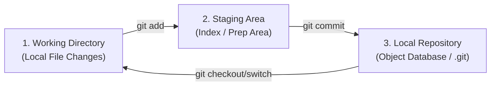
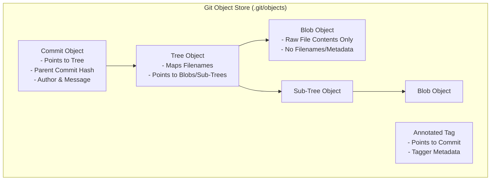
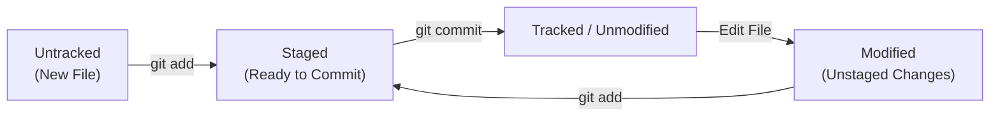
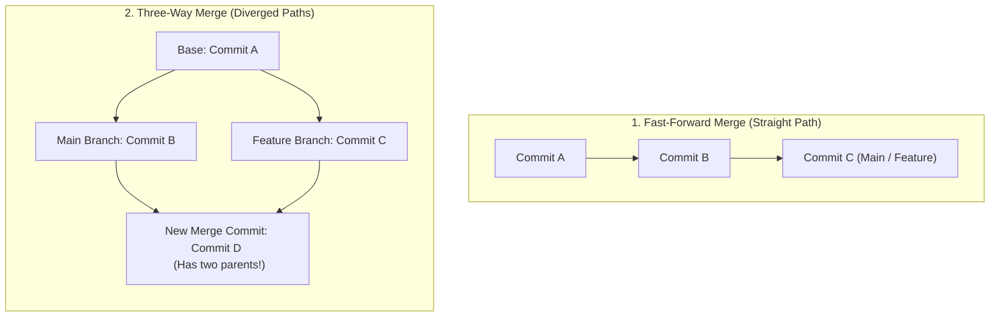
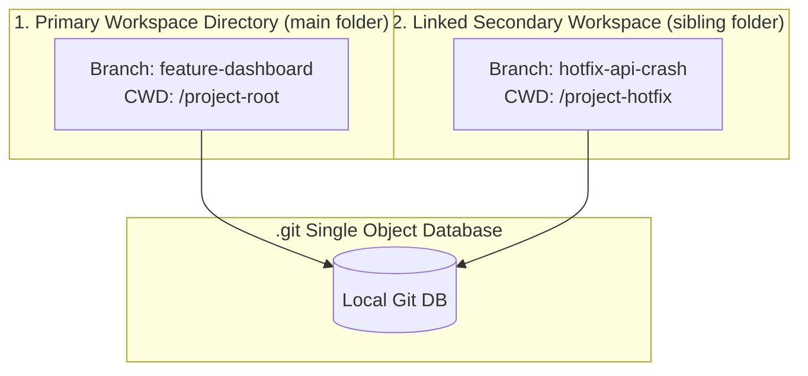
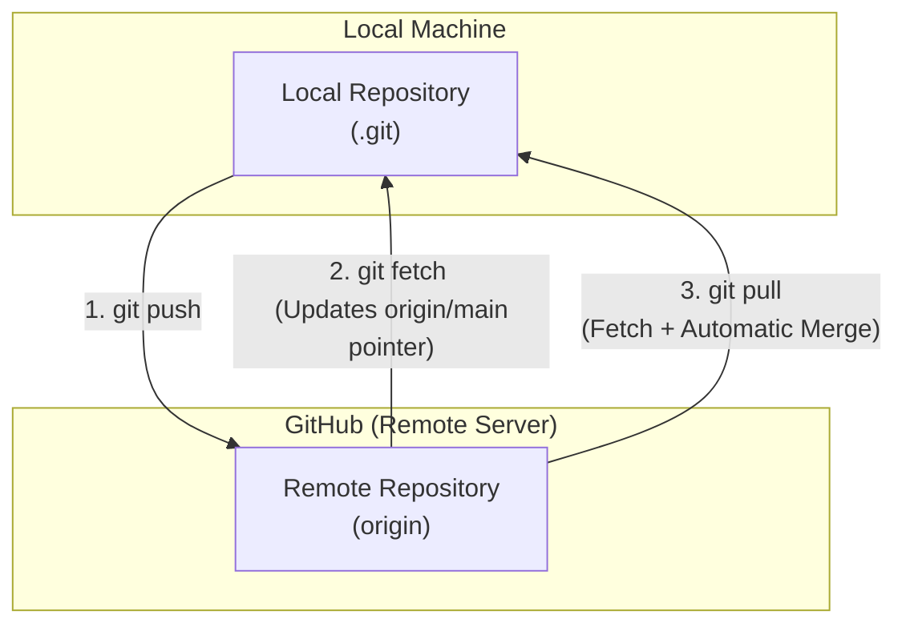
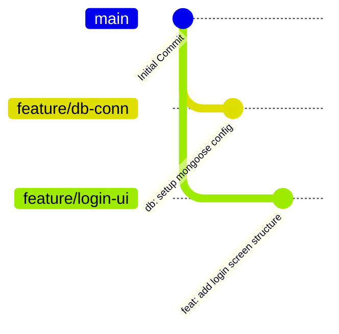
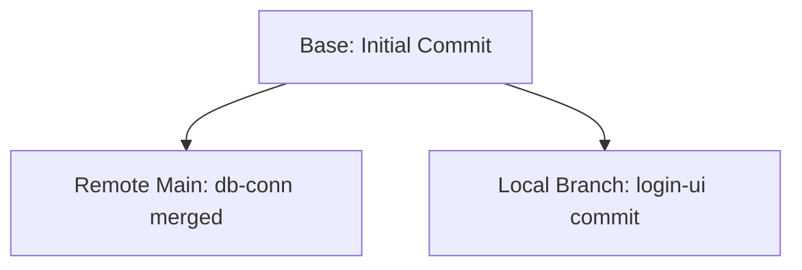

# 🐙 Git & GitHub Systems Engineering Handbook

সফটওয়্যার ইঞ্জিনিয়ারিংয়ে গিট (Git) কেবল কিছু কমান্ড টাইপ করে কোড ক্লাউডে আপলোড করার টুল নয়। এটি একটি অত্যন্ত চমৎকার **Distributed Content-Addressable Storage System** এবং একটি সুনির্দিষ্ট **Directed Acyclic Graph (DAG)** আর্কিটেকচার। গিট-এর অভ্যন্তরীণ মেমরি ডিজাইন, ট্র্যাকিং মেকানিজম এবং হিস্ট্রি রিরাইটিং মেথডোলজি না জানলে বড় এন্টারপ্রাইজ টিমে কাজ করার সময় মার্জ কনф্লিক্ট বা ভুল পুশের কারণে প্রোডাকশন ক্র্যাশ হওয়ার মতো বড় বিপদ ঘটতে পারে।

এই হ্যান্ডবুকটি গিট-এর গভীরতম মেমরি লেআউট থেকে শুরু করে অ্যাডভান্সড রিবেসিং, হিস্ট্রি ট্রাবলশুটিং (Reflog), গিটহাব কোলাবোরেশন মডেল এবং শীর্ষ ২০টি ইন্টারভিউ প্রশ্নোত্তর অত্যন্ত প্র্যাক্টিক্যাল ও পঠনযোগ্য উপায়ে তুলে ধরেছে।

---

## ১. গিট আর্কিটেকচার ও অভ্যন্তরীণ মেমরি মডেল (Git Internals & DAG)

গিটকে সহজ কথায় বলা যায় একটি **Directed Acyclic Graph (DAG)**, যেখানে প্রতিটি নোড (Node) হলো এক একটি অবজেক্ট এবং এজ (Edge) হলো তাদের মধ্যকার রিলেশনশিপ। 

### ক. গিট-এর ৩টি অভ্যন্তরীণ স্তর (The Three Tree Areas)
গিট মূলত ফাইলগুলোকে তিনটি প্রধান স্তরে ম্যাপ করে ম্যানেজ করে:
১. **Working Directory:** আপনার লোকাল কম্পিউটারের ফাইল সিস্টেম, যেখানে আপনি সরাসরি কোড লিখছেন বা এডিট করছেন (Untracked / Tracked state)।
২. **Staging Area (Index):** এটি একটি অত্যন্ত গুরুত্বপূর্ণ বাফার বা ইনডেক্স ফাইল। আপনি পরবর্তী কমিটে কোন কোন পরিবর্তন যুক্ত করতে চান, তা এখানে সাময়িকভাবে সাজিয়ে রাখা হয়।
৩. **Local Repository (.git folder):** গিট অবজেক্ট ডেটাবেস, যেখানে আপনার সমস্ত কমিট, মেটাডেটা এবং শাখা-প্রশাখার নিখুঁত হিস্ট্রি স্থায়ীভাবে স্টোর থাকে।



---

### খ. গিট-এর ৪টি মৌলিক অবজেক্ট টাইপ (Git Core Objects)
`.git/objects/` ডিরেক্টরির ভেতরে গিট ৪টি প্রধান ফরম্যাটে ডেটা স্টোর করে। গিট প্রতিটি ফাইলের কনটেন্টকে ইউনিকভাবে রিড করে একটি **SHA-1 (৪০ ক্যারেক্টারের হেক্সাডেসিমেল হ্যাশ)** তৈরি করে।



১. **Blob (Binary Large Object):** এটি শুধুমাত্র ফাইলের ভেতরের র ডেটা বা কনটেন্ট স্টোর করে। এখানে ফাইলের নাম, পাথ বা কোনো মেটাডেটা থাকে না। দুটি ভিন্ন নামের ফাইলের কনটেন্ট যদি হুবহু এক হয়, গিট তাদের জন্য মেমরিতে মাত্র একটিই Blob অবজেক্ট তৈরি করে!
২. **Tree:** এটি ফাইল সিস্টেমের ডিরেক্টরি বা ফোল্ডারের মতো কাজ করে। একটি Tree অবজেক্টের ভেতরে অন্যান্য Tree (সাব-ফোল্ডার) এবং Blobs (ফাইলসমূহ)-এর তালিকা থাকে এবং তাদের ফাইলের নাম ও পাথের সাথে ম্যাপ করা থাকে।
৩. **Commit:** এটি একটি নির্দিষ্ট স্ন্যাপশটের নির্দেশক। কমিটের ভেতরে মূল রুট `Tree` অবজেক্টের হ্যাশ লিংক, পূর্ববর্তী প্যারেন্ট কমিটের হ্যাশ লিঙ্ক, অথরের নাম, ইমেইল, টাইমস্ট্যাম্প এবং কমিট মেসেজ থাকে।
৪. **Annotated Tag:** এটি একটি নির্দিষ্ট কমিট পয়েন্টারের মেটাডেটা সহ স্থায়ী বুকমার্ক, যা রিলিজ ভার্সন ট্র্যাক করতে ব্যবহৃত হয়।

---

## ২. গিট প্লাম্বিং কমান্ডস: পর্দার অন্তরালের অবজেক্ট ব্যবচ্ছেদ (Git Plumbing & Cat-File)

গিটে দুই ধরণের কমান্ড রয়েছে:
* **Porcelain Commands (ইউজার ফ্রেন্ডলি):** `git add`, `git commit`, `git status` ইত্যাদি যা আমরা প্রতিদিন টাইপ করি।
* **Plumbing Commands (নিম্ন স্তরের সিস্টেম লজিক):** `git cat-file`, `git hash-object` ইত্যাদি যা গিট নিজে পর্দার অন্তরালে ফাইল সিস্টেম ও অবজেক্ট রিড করতে ব্যবহার করে।

একটি নির্দিষ্ট কমিট হ্যাশকে ব্যবচ্ছেদ করে কীভাবে গিট ইন্টারনালস কাজ করে তা ম্যানুয়ালি দেখা সম্ভব:

```bash
# ১. কমিট অবজেক্টের টাইপ চেক করুন
git cat-file -t d7a0a93
# Output: commit

# ২. কমিটের প্রকৃত ভেতরের ডেটা প্রিন্ট করুন (যা Tree এবং Parent Commit নির্দেশ করে)
git cat-file -p d7a0a93
# Output:
# tree 4b825dc642cb6eb9a0acc41b4e3a031e007f2054
# parent c00e5a40a831e5f10b741525048d0842db1853d9
# author Awolad Hossain <awolad@example.com> 1716801043 +0600
# committer Awolad Hossain <awolad@example.com> 1716801043 +0600
#
# oop ver1

# ৩. কমিটের ভেতরের Tree অবজেক্টটি প্রিন্ট করুন (ডিরেক্টরি স্ট্রাকচার দেখতে)
git cat-file -p 4b825dc642cb6eb9a0acc41b4e3a031e007f2054
# Output:
# 100644 blob e69de29bb2d1d6434b8b29ae775ad8c2e48c5391    oop.md

# ৪. সর্বশেষ Blob ফাইল প্রিন্ট করুন (ফাইলের র কনটেন্ট দেখতে)
git cat-file -p e69de29bb2d1d6434b8b29ae775ad8c2e48c5391
# (oop.md ফাইলের প্রকৃত র টেক্সট এখানে রেন্ডার হবে)
```

---

## ৩. গিট কনফিগারেশন, ক্রস-প্ল্যাটফর্ম লাইন এন্ডিংস ও .gitattributes

নতুন সিস্টেমে গিট সেটআপ করার সময় কনফিগারেশন তিনটি স্তরে করা যায়:
* `--system`: সিস্টেমের সমস্ত ইউজার ও প্রজেক্টের জন্য (প্রশাসনিক লেভেলে)।
* `--global`: আপনার কম্পিউটারের বর্তমান ইউজারের সমস্ত প্রজেক্টের জন্য।
* `--local`: শুধুমাত্র নির্দিষ্ট প্রজেক্ট ফোল্ডারের জন্য (ডিফল্ট)।

### ক. প্রফেশনাল গ্লোবাল সেটিংস:
```bash
# ইউজারের পরিচয় সেট করা (কমিট ট্র্যাকিংয়ের জন্য অত্যন্ত জরুরি)
git config --global user.name "Awolad Hossain"
git config --global user.email "awolad@example.com"

# ডিফল্ট ব্রাঞ্চ নেম 'main' নির্ধারণ করা
git config --global init.defaultBranch main

# গিট টার্মিনালে সুন্দর কালার আউটপুট সক্রিয় করা
git config --global color.ui auto

# সমস্ত অ্যাক্টিভ কনফিগারেশন লগ দেখা
git config --list --show-origin
```

### খ. ক্রস-প্ল্যাটফর্ম লাইন এন্ডিংস (Windows LF/CRLF জটলা):
উইন্ডোজ অপারেটিং সিস্টেম লাইনের শেষে `CRLF` (Carriage Return + Line Feed) ব্যবহার করে, কিন্তু ম্যাক ও লিনাক্স ব্যবহার করে `LF`। এর ফলে উইন্ডোজ ডেভেলপারদের কোড পুশ করলে লিনাক্স সার্ভারে বিল্ড ক্র্যাশ হতে পারে।
* **সমাধান:** প্রজেক্টের রুটে একটি `.gitattributes` ফাইল তৈরি করে ক্রস-প্ল্যাটফর্ম অটো-ফরম্যাটিং অন করা উচিত:

```ini
# .gitattributes
# স্ট্রিং টেক্সট ফাইলগুলোকে অটো-ডিটেক্ট করে গিটহাবে পুশ করার সময় LF-এ রূপান্তর করবে
* text=auto

# নির্দিষ্ট ফাইল এক্সটেনশনের লাইন এন্ডিংস ফিক্সড রাখা
*.js text eol=lf
*.ts text eol=lf
*.json text eol=lf
```

### গ. `.gitignore` এবং আর্কিটেকচারাল সিকিউরিটি:
প্রজেক্টের সংবেদনশীল ফাইল (যেমন: `.env`, API Keys), থার্ড-পার্টি লাইব্রেরি (`node_modules`) বা বিল্ড আর্টফ্যাক্টস (`dist`, `build`) যাতে ভুলে গিটে ট্র্যাক না হয়ে যায়, সে জন্য প্রজেক্টের রুটে `.gitignore` ফাইল তৈরি করা বাধ্যতামূলক।

> [!IMPORTANT]
> **গিট ট্র্যাক থেকে ফাইল রিমুভ করা:**
> কোনো ফাইল ভুলবশত আগে কমিট হয়ে গেলে, শুধু `.gitignore`-এ ফাইলটি লিখলেই ট্র্যাকিং বন্ধ হয় না। ফাইলটিকে ক্যাশ থেকে ডিলিট করতে নিচের কমান্ডটি দিতে হবে (এতে লোকাল ফাইল ডিলিট হবে না, কেবল গিটের ট্র্যাকিং থেকে বাদ যাবে):
> `git rm --cached .env`

---

## ৪. দৈনন্দিন ট্র্যাকিং ও কমিট লাইফসাইকেল (Staging & Commits)



### ক. অ্যাডভান্সড স্টেজিং প্র্যাকটিস:
* **ইন্টারেক্টিভ স্টেজিং (`git add -p`):** এটি একটি অত্যন্ত সিনিয়র প্র্যাকটিস। একটি ফাইলের ভেতরে আপনি যদি ১০টি আলাদা কাজ করে থাকেন, কিন্তু আপনি চান কেবল ৩টি সুনির্দিষ্ট লাইনের পরিবর্তন এই কমিটে যাবে, তবে `git add -p` (patch mode) ব্যবহার করে ফাইলের ভেতরের নির্দিষ্ট ব্লক ইন্টারেক্টিভভাবে স্টেজ করতে পারবেন।
* **স্টেজিং বাফার রিভার্ট করা:** কোনো ফাইল ভুলে স্টেজ করে ফেললে তা আন-স্টেজ করার কমান্ড:
  `git restore --staged filename.js`

### খ. কনভেনশনাল কমিট মেসেজ স্ট্যান্ডার্ড (Conventional Commits):
টিমের সবার সুবিধার্থে ও স্বয়ংক্রিয় চেঞ্জলগ (Changelog) তৈরির জন্য প্রফেশনাল কোডবেসে নিচের ফরম্যাটটি অনুসরণ করা উচিত:
`<type>(<scope>): <description>`

* `feat`: নতুন ফিচার যুক্ত করা। (উদা: `feat(auth): add google oauth login`)
* `fix`: কোনো বাগ বা সমস্যার সমাধান। (উদা: `fix(db): resolve replication deadlock`)
* `docs`: ডকুমেন্টেশনে পরিবর্তন। (উদা: `docs(api): update rate limit specs`)
* `refactor`: কোড অপটিমাইজেশন, যেখানে কার্যকারিতা অপরিবর্তিত থাকে।
* `chore`: বিল্ড প্রসেস বা প্যাকেজ ম্যানেজার আপডেট।

---

## ৫. অ্যাডভান্সড ব্রাঞ্চিং, মার্জিং এবং রিবেস (Branching, Merging & Rebase)

গিট-এ একটি শাখা বা ব্রাঞ্চ তৈরি করা মানে মেমরিতে নতুন কোনো ভারী ফোল্ডার কপি করা নয়। ব্রাঞ্চ হলো স্রেফ একটি অতি ক্ষুদ্র **Pointer**, যা একটি নির্দিষ্ট কমিটের ৪০ ক্যারেক্টার হ্যাশকে পয়েন্ট করে থাকে! এ কারণেই গিট-এ ব্রাঞ্চ তৈরি করা চোখের পলকে সম্পন্ন হয়।

### ক. মার্জ স্ট্র্যাটেজি: Fast-Forward বনাম Three-Way Merge
যখন আপনি এক শাখার সাথে অন্য শাখা মার্জ করতে যান, গিট মূলত দুটি মেকানিজম ব্যবহার করে:



১. **Fast-Forward Merge:** যদি আপনার `main` ব্রাঞ্চ থেকে `feature` ব্রাঞ্চ তৈরির পর `main` ব্রাঞ্চে আর কোনো নতুন কমিট না পড়ে থাকে, তবে গিট কোনো অতিরিক্ত মার্জ কমিট ছাড়াই `main` পয়েন্টারটিকে স্লাইড করে সরাসরি `feature` এর সর্বশেষ কমিটে নিয়ে যায়।
২. **Three-Way Merge (Recursive/Ort):** যদি উভয় ব্রাঞ্চেই নতুন নতুন কমিট যুক্ত হয়ে তারা ডাইভার্জ হয়ে যায়, তখন গিট কমন পূর্বপুরুষ (Common Ancestor) বা বেস কমিট এবং উভয় ব্রাঞ্চের হেড কমিট নিয়ে একটি **Three-way merge** করে একটি নতুন **Merge Commit** তৈরি করে।

---

### খ. রিবেস (Rebase) বনাম মার্জ (Merge)
* **Merge:** দুই শাখার ইতিহাসকে মেলাতে একটি অতিরিক্ত মার্জ কমিট তৈরি করে। এটি অরিজিনাল ট্র্যাকিং হিস্ট্রি অপরিবর্তিত রাখে, কিন্তু কোডবেসের নেটওয়ার্ক গ্রাফকে জটিল করে তোলে।
* **Rebase:** আপনার বর্তমান ফিচারের বেস কমিটটিকে অন্য শাখার সর্বশেষ কমিটের ওপরে নিয়ে নতুন করে হিস্ট্রি তৈরি করে। এর ফলে সম্পূর্ণ প্রজেক্টের লগ লিনিয়ার এবং পরিষ্কার থাকে।

> [!CAUTION]
> **রিবেসের সুবর্ণ নিয়ম (The Golden Rule of Rebasing):**
> কখনোই কোনো **Public/Shared Branch** (যেমন: `main` বা `develop` যা টিমের অন্য সবাই ব্যবহার করছে)-এ `rebase` চালাবেন না! এটি সবার কম্পিউটারের লোকাল হিস্ট্রির সাথে রিমোটের মিল নষ্ট করে ফেলবে এবং মার্জ রিরাইট জটলা সৃষ্টি করবে।

```bash
# ফিচার ব্রাঞ্চে থেকে মেইন ব্রাঞ্চের সাপেক্ষে রিবেস করা
git checkout feature-login
git rebase main

# যদি রিবেস কনফ্লিক্ট দেখা দেয়, তবে কনফ্লিক্ট মিটিয়ে দিন এবং:
git add .
git rebase --continue
```

### গ. পাইপলাইনে অটো-মার্জিং ওভাররাইডস (Merge Strategy Options):
সিআই/সিডি অটোমেটেড পাইপলাইনে কোড মার্জ করার সময় যদি কোনো কনফ্লিক্ট দেখা দেয়, তবে পাইপলাইন ক্র্যাশ ঠেকাতে আপনি `merge` অপশন দিয়ে গিটকে নির্ধারণ করে দিতে পারেন কোন পক্ষের কোড অটোমেটিকাল গ্রহণ করা হবে:
```bash
# কনফ্লিক্ট হলে অটোমেটিক লোকাল ব্রাঞ্চের কোডকে বিজয়ী করা
git merge feature-login -Xours

# কনফ্লিক্ট হলে অটোমেটিক রিমোট/ইনকামিং ব্রাঞ্চের কোড গ্রহণ করা
git merge feature-login -Xtheirs
```

---

### ঘ. মার্জ কনফ্লিক্ট মেটানোর প্রফেশনাল পদ্ধতি:
মার্জ কনফ্লিক্ট কোনো ভ্যের বিষয় নয়, এটি গিটের একটি অসাধারণ ফিচার যা আপনাকে অজান্তে ভুল কোড ওভাররাইট করা থেকে রক্ষা করে।
১. কনф্লিক্ট ফাইলের ভেতরের `<<<<<<< HEAD` (আপনার লোকাল পরিবর্তন) এবং `>>>>>>> branch_name` (অন্য ব্রাঞ্চের পরিবর্তন) মার্কার দুটি চিহ্নিত করুন।
২. কোড ভালো করে পর্যালোচনা করে যেটি সঠিক তা রেখে বাকি মার্কারগুলো মুছে দিন।
৩. ফাইলটি সেভ করে নিচের কমান্ডগুলো দিন:
   ```bash
   git add filename.js
   git commit -m "merge: resolve login conflict between main and dev"
   ```

---

## ৬. গিট ওয়ার্কট্রি: ডাবল-ব্রাঞ্চ মাল্টিটাস্কিং আর্কিটেকচার (Git Worktree)

ডেভেলপারদের অন্যতম বড় সমস্যা হলো, যখন তারা একটি দীর্ঘ ও জটিল ফিচার ব্রাঞ্চে কাজ করছেন এবং ডিরেক্টরিতে অনেক লোকাল ফাইল আনকমিটেড অবস্থায় বিল্ড হয়ে আছে, হঠাৎ করে প্রোডাকশন ব্রাঞ্চে গিয়ে একটি ছোট কিন্তু অতি জরুরী হটফিক্স বাগ সলভ করতে হয়। 
প্রথাগতভাবে ডেভেলপাররা কাজ স্ট্যাশ (`git stash`) করে ব্রাঞ্চ চেঞ্জ করেন, যা অনেক সময় লোকাল ডেভ সার্ভার কনফিগারেশন নষ্ট করে ফেলে।
* **আর্কিটেকচারাল সমাধান:** **Git Worktree**। এটি আপনাকে একই লোকাল রিপোজিটরির অধীনে মেমরির কোনো অতিরিক্ত ওভারহেড ছাড়াই একই সাথে একাধিক ভিন্ন ডিরেক্টরিতে দুটি আলাদা ব্রাঞ্চ চেকআউট করে পাশাপাশি কাজ করার ম্যাজিক্যাল সুবিধা দেয়!



### প্র্যাক্টিক্যাল ওয়ার্কট্রি ওয়াকথ্রু:
```bash
# ১. আপনার বর্তমান কাজের ডিরেক্টরি
# CWD: /mnt/storage/my-doc-site (ব্রাঞ্চ: dev)

# ২. প্রজেক্ট ফোল্ডারের বাইরে একটি নতুন ডিরেক্টরিতে 'main' ব্রাঞ্চ চেকআউট করে নতুন ওয়ার্কট্রি যুক্ত করুন
git worktree add ../my-doc-site-hotfix main

# ৩. গিট আপনার জন্য প্রজেক্টের বাইরে 'my-doc-site-hotfix' নামে একটি ফোল্ডার বানাবে এবং সেখানে main ব্রাঞ্চ রেডি করে দেবে।
# এখন আপনি আলাদা টার্মিনালে বা ভিএস কোড উইন্ডোতে সেখানে ঢুকে স্বাধীনভাবে হটফিক্স কাজ করতে পারবেন:
cd ../my-doc-site-hotfix
# (কাজ শেষ করে কমিট ও পুশ করুন নিরাপদে!)

# ৪. আপনার লোকাল কম্পিউটারে অ্যাক্টিভ ওয়ার্কট্রিগুলোর তালিকা দেখুন
git worktree list

# ৫. কাজ শেষে হটফিক্স ফোল্ডারটি ডিলিট করে ওয়ার্কট্রি ক্লিন করুন
cd ../my-doc-site
git worktree prune
```

---

## ৭. রেঞ্জ ও রিভিশন সিলেকশন: ডাবল ডট বনাম ট্রিপল ডট (.. vs ...)

গিটে লগ চেক করার সময় বা মার্জ করার পূর্বে দুটি ব্রাঞ্চের মধ্যকার সুনির্দিষ্ট ব্যবধান বা কমিটের তালিকা নিখুঁতভাবে ফিল্টার করার জন্য দুটি অপারেটর ব্যবহৃত হয়:

### ক. Double Dot Operator (`..`):
`git log main..feature`
* **অর্থ:** `feature` ব্রাঞ্চে আছে কিন্তু `main` ব্রাঞ্চে নেই এমন সমস্ত কমিটের তালিকা দেখাও। এটি মূলত পিআর (Pull Request) মার্জ করার আগে নতুন কোড রিভিউর জন্য ব্যবহৃত হয়।

### খ. Triple Dot Operator (`...`):
`git log main...feature`
* **অর্থ:** `main` অথবা `feature` যেকোনো একটি ব্রাঞ্চে আছে, কিন্তু **উভয় ব্রাঞ্চে কমন নেই** এমন সমস্ত আলাদা কমিটের তালিকা দেখাও (Symmetric Difference)।

```bash
# মেইন ব্রাঞ্চে নাই কিন্তু ফিচারে আছে এমন কমিটগুলোর তালিকা দেখা
git log main..feature-login --oneline
```

---

## ৮. অটো-ফিক্সআপ ও রিবেস অটো-স্কোয়াশ (--fixup & --autosquash)

সিনিয়ররা কোড পুশ করার আগে ইন্টারেক্টিভ রিবেস দিয়ে কমিট ক্লিন করতে পছন্দ করেন। কিন্তু ম্যানুয়ালি চারটা কমিটের নাম পরিবর্তন করে 'squash' লেখা বেশ সময়সাপেক্ষ। গিট-এ এর একটি অটোমেটেড কমান্ড রয়েছে:

```bash
# ১. কাজ করার সময় একটি ছোট ফিক্স কমিট করুন এবং গিটকে বলে দিন এটি কোন কমিটের ফিক্সআপ
git commit -a --fixup c00e5a4
# (গিট অটোমেটিকাল একটি কমিট তৈরি করবে যার টাইটেল হবে "fixup! <original commit message>")

# ২. ফিচার শেষ হলে অটো-স্কোয়াশ রিবেস রান করুন
git rebase -i --autosquash c00e5a4~1

# ৩. গিট ইন্টারেক্টিভ উইন্ডোতে অটোমেটিক ফিক্সআপ কমিটগুলোকে সঠিক জায়গায় নিয়ে 
# 'fixup' বা 'squash' অ্যাকশন লিখে দেবে। আপনাকে ম্যানুয়ালি কিছু করতে হবে না, শুধু সেভ করে বের হলেই হিস্ট্রি ক্লিন!
```

---

## ৯. মনোরেপো ম্যানেজমেন্ট: স্পার্স চেকআউট ও গিট এলএফএস (Git LFS)

আধুনিক এন্টারপ্রাইজ সিস্টেমে পুরো কোম্পানির সব মাইক্রোসার্ভিস একটি মাত্র বিশালাকার রিপোজিটরিতে রাখা হয়, যাকে **Monorepo (মনোরেপো)** বলে। এত বড় সাইজের কোডবেস লোকাল কম্পিউটারে হ্যান্ডেল করার জন্য বিশেষ কিছু আর্কিটেকচার রয়েছে:

### ক. Git Sparse Checkout (স্পার্স চেকআউট):
মনোরেপোর সাইজ যদি ১০০ জিবি হয়, এবং আপনার প্রয়োজন কেবল `services/payment-gateway` ফোল্ডারের ফাইলগুলো, তবে সম্পূর্ণ ১০০ জিবি ফাইল ডাউনলোড না করে কেবল নির্দিষ্ট ডিরেক্টরি ডাউনলোড করার জন্য স্পার্স চেকআউট ব্যবহৃত হয়।

```bash
# ১. রিপোজিটরি সম্পূর্ণ ক্লোন না করে মেটাডেটা ক্লোন করা (Sparse Init)
git clone --filter=blob:none --no-checkout https://github.com/company/giant-monorepo.git
cd giant-monorepo

# ২. স্পার্স চেকআউট মোড অন করা
git sparse-checkout init --cone

# ৩. যে ডিরেক্টরিটি লোকাল কম্পিউটারে দেখতে চান তা সেট করা
git sparse-checkout set services/payment-gateway

# ৪. শুধুমাত্র সিলেক্টেড ফোল্ডারটি মেমরি থেকে পুল করা
git checkout main
# (এখন আপনার কম্পিউটারে কেবল payment-gateway ফোল্ডারের ফাইলগুলো শো হবে!)
```

### খ. Git LFS (Large File Storage):
গিটের মেমরিতে ইমেজ, ভিডিও, ডাটাবেস ফাইল বা ৩ডি মডেলের মতো বড় বাইনারি ফাইল স্টোর করলে `.git` ফোল্ডারের সাইজ মারাত্মক স্ফীত হয়ে যায়, যা ক্লোনিং স্পীড কমিয়ে দেয়।
* **সমাধান:** Git LFS বড় ফাইলগুলোকে গিটের মূল ট্র্যাকিং গ্রাফে সরাসরি না রেখে তার বদলে কেবল একটি ৫-লাইনের **Pointer Text File** রাখে এবং বড় মূল ফাইলটি গিটহাবের ডেডিকেটেড এলএফএস স্টোরেজে হোস্ট করে।

```bash
# ১. সিস্টেমে LFS ইনস্টল করা
git lfs install

# ২. গিটের মাধ্যমে সব .mp4 ভিডিও ফাইল ট্র্যাক করা
git lfs track "*.mp4"

# ৩. ট্র্যাকিং সিস্টেম অ্যাট্রিবিউট সেভ করা
git add .gitattributes
```

---

## ১০. ইতিহাস পুনর্লিখন ও ট্রাবলশুটিং (Advanced Reflog & Reset)

ওওপিতে যেমন মেমরি ম্যানেজমেন্ট জরুরি, গিটেও হিস্ট্রি ক্লিন রাখা ও ভুল ফিক্স করা একজন সিনিয়র ডেভেলপারের অন্যতম বড় দায়িত্ব।

### ক. `git reset` এর তিনটি মোড:
কোনো ভুল কমিট বাতিল করার জন্য `git reset` ব্যবহার করা হয়। এর ৩টি ভেরিয়েন্ট রয়েছে:

| Reset Mode | Moves HEAD? | Modifies Staging Area? | Modifies Working Directory? | Safety Level |
| :--- | :---: | :---: | :---: | :---: |
| **`--soft`** |  (হ্যাঁ) | ❌ (না) | ❌ (না) |  উচ্চ (কোড স্টেজেই থাকে) |
| **`--mixed`** |  (হ্যাঁ) |  (হ্যাঁ) | ❌ (না) |  মাঝারি (কোড আনস্টেজ হয়ে যায়) |
| **`--hard`** |  (হ্যাঁ) |  (হ্যাঁ) |  (হ্যাঁ) | ⚠️ ঝুঁকিপূর্ণ (সব লোকাল পরিবর্তন মুছে যায়) |

```bash
# সর্বশেষ কমিটটি বাতিল করা কিন্তু কোড সম্পূর্ণ অক্ষত ও স্টেজড রাখা
git reset --soft HEAD~1
```

### খ. `git reflog` - গিটের জীবন রক্ষাকারী কবচ:
আপনি ভুল করে `git reset --hard` করে কোনো গুরুত্বপূর্ণ কমিট ডিলিট করে ফেলেছেন? লোকাল কম্পিউটারে গিট থেকে কোনো কিছু আসলে কখনোই চিরতরে ডিলিট হয় না!
গিট-এর **Reflog (Reference Log)** আপনার কম্পিউটারের লোকাল HEAD পয়েন্টারের প্রতি সেকেন্ডের নড়াচড়া ট্র্যাক করে রাখে।

```bash
# আপনার হেড পয়েন্টারের সমস্ত মুভমেন্টের হিস্ট্রি দেখুন (কমিট আইডি সহ)
git reflog
```
আপনি যদি দেখতে পান ডিলিট হওয়া কমিটের আইডি ছিল `a1b2c3d`, তবে চোখ বন্ধ করে নিচের কমান্ড দিয়ে তা ফিরিয়ে আনতে পারেন:
```bash
git reset --hard a1b2c3d
```

### গ. ইন্টারেক্টিভ রিবেস (Interactive Rebase - `git rebase -i`):
টিমে কোড পুশ করার আগে আপনার লোকাল হিস্ট্রিকে সাজানোর জন্য এটি জাদুকরি টুল। এর সাহায্যে আপনি একাধিক ছোট ছোট হিজিবিজি কমিটকে মার্জ করে একটি সুন্দর কমিটে রূপান্তর (Squash) করতে পারেন।

```bash
# শেষ ৪টি লোকাল কমিট এডিট বা মার্জ করার জন্য রিবেস উইন্ডো চালু করা
git rebase -i HEAD~4
```
উইন্ডো ওপেন হলে আপনার কমিটের পাশে নিচের অ্যাকশনগুলো সিলেক্ট করতে পারেন:
* `pick`: কমিটটি রাখা।
* `reword`: কমিটের মেসেজ পরিবর্তন করা।
* `squash`: পূর্ববর্তী কমিটের সাথে এই কমিটটি জুড় দেওয়া (মার্জ করা)।
* `drop`: কমিটটি চিরতরে মুছে ফেলা।

---

## ১১. গিট বাইসেক্ট: স্বয়ংক্রিয় বাইনারি বাগ হান্টিং (Git Bisect)

কখনও কখনও প্রোডাকশন কোডে একটি বড় বাগ দেখা দেয় এবং লগ চেক করে বোঝা যায় না যে বিগত ১ মাসে করা ৩০০টি কমিটের মধ্যে ঠিক কোন কমিটটিতে বাগটি প্রথম ঢুকেছিল। ম্যানুয়ালি ৩০০টি কমিট রান করে টেস্ট করা অসম্ভব।
* **সমাধান:** `git bisect` যা কম্পিউটারের **Binary Search** অ্যালগরিদম ব্যবহার করে বাগ খুঁজে বের করে।

```bash
# ১. বাইসেক্ট সার্চ স্টার্ট করুন
git bisect start

# ২. বর্তমান ব্রাঞ্চকে 'bad' চিহ্নিত করুন (যেহেতু কোডে বাগ সচল আছে)
git bisect bad

# ৩. ১ মাস আগের কোনো একটি কমিট হ্যাশ দিন যেখানে বাগটি ছিল না (good commit)
git bisect good c00e5a4

# গিট এখন বাইনারি সার্চ করে মাঝখানের ১৫০তম কমিটে প্রজেক্ট চেকআউট করবে।
# আপনি কোড টেস্ট করে যদি দেখেন বাগ নেই, তবে লিখবেন:
git bisect good
# আর যদি দেখেন বাগ আছে, তবে লিখবেন:
git bisect bad

# ৪. এভাবে ৫-৬টি ক্লিকেই গিট আপনাকে বলবে কোন কমিট হ্যাশটি প্রথম বাগ ঢুকিয়েছিল!
# কাজ শেষে বাইসেক্ট মোড থেকে বের হতে:
git bisect reset
```

> [!TIP]
> **Git Bisect Automation:**
> আপনার যদি কোনো স্বয়ংক্রিয় টেস্ট স্ক্রিপ্ট (যেমন: `npm run test`) রেডি থাকে, তবে গিটকে দিলে সে নিজেই ৩০০ কমিটে রোবোটের মতো লাফিয়ে লাফিয়ে অটোমেটিক বাগ ফিক্সিং কমিট চিহ্নিত করে দেবে মাত্র ১ মিনিটে!
> `git bisect run npm run test`

---

## ১২. গিট স্ট্যাশ: কাজের মাঝে বাফার জোন (Git Stash)

যখন আপনি কোনো একটি নতুন ফিচারের কাজ করছেন কিন্তু হঠাৎ করে প্রোডাকশনের একটি বড় বাগ ফিক্স করার জন্য অন্য ব্রাঞ্চে যেতে হচ্ছে, অথচ আপনার লোকাল কোড এখনো অসম্পূর্ণ ও কমিট করার অনুপযুক্ত—তখন ব্যবহৃত হয় `git stash`।

```bash
# ১. অসম্পূর্ণ কাজগুলো লোকাল বাফারে লুকিয়ে রাখা (ওয়ার্কিং ডিরেক্টরি ক্লিন হয়ে যাবে)
git stash save "WIP: login form verification logic"

# ২. অন্য ব্রাঞ্চে গিয়ে বাগ ফিক্স করে পুনরায় আগের ব্রাঞ্চে ফিরে আসা
git checkout feature-login

# ৩. জমানো কাজের লিস্ট দেখা
git stash list

# ৪. সর্বশেষ জমানো কাজটি ফিরিয়ে এনে স্ট্যাশ থেকে ডিলিট করা
git stash pop

# অথবা ডিলিট না করে কেবল কাজটি ফিরিয়ে আনা
git stash apply stash@{0}
```

---

## ১৩. সাবমডিউল বনাম সাবট্রি (Git Submodule vs Subtree)

বড় আর্কিটেকচারে অন্য আরেকটি স্বাধীন কোডবেস বা প্যাকেজ লাইব্রেরিকে মূল অ্যাপ্লিকেশনের ভেতরে এম্বেড করার জন্য দুটি মেথডোলজি রয়েছে:

| বৈশিষ্ট্য | Git Submodule | Git Subtree |
| :--- | :--- | :--- |
| **আর্কিটেকচার** | শুধুমাত্র অন্য প্রজেক্টের নির্দিষ্ট কমিটের একটি **Pointer** লিংক রাখে। | সম্পূর্ণ অন্য প্রজেক্টের কোড ও ইতিহাস লোকাল ডিরেক্টরিতে কপি করে আনে। |
| **মেমরি সাইজ** | অত্যন্ত লাইটওয়েট কারণ এটি র মূল কোড স্টোর করে না। | ফোল্ডারের মেমরি সাইজ বৃদ্ধি করে। |
| **ক্লোনিং জটলা** | ক্লোন করার পর ম্যানুয়ালি `submodule init` ও `update` রান করতে হয়। | ক্লোন করলেই সব কোড চলে আসে, আলাদা কোনো কমান্ডের প্রয়োজন নেই। |
| **ব্যবহারের ক্ষেত্র** | থার্ড পার্টি বড় লাইব্রেরি যা ঘন ঘন বদলানোর প্রয়োজন হয় না। | যখন আপনি প্রজেক্টের ভেতরেই অন্য কোডবেসও এডিট করে ব্যাক-পুশ করতে চান। |

```bash
# Git Submodule যোগ করা
git submodule add https://github.com/libs/math-lib.git extern/math-lib

# Git Subtree যোগ করা
git subtree add --prefix=libs/math-lib https://github.com/libs/math-lib.git main --squash
```

---

## ১৪. গিটহাব ও রিমোট কোলাবোরেশন (GitHub & Remote Collaboration)

টিম কোলাবোরেশনের জন্য গিটহাব একটি ডিস্ট্রিবিউটেড ক্লাউড ম্যানেজার হিসেবে কাজ করে।



### ক. Remote Commands:
* **রিমোট কানেক্ট করা:** লোকাল রিপোজিটরির সাথে গিটহাব লিংক অ্যাড করা:
  `git remote add origin https://github.com/username/repo.git`
* **রিমোট ইউআরএল চেক করা:** `git remote -v`

### খ. `git fetch` বনাম `git pull`:
* **`git fetch`:** এটি রিমোট সার্ভার থেকে সমস্ত নতুন ব্রাঞ্চ ও কমিটের মেটাডেটা ডাউনলোড করে লোকাল কম্পিউটারে নিয়ে আসে, কিন্তু আপনার বর্তমান কাজের ফাইলের ওপর কোনো পরিবর্তন বা মার্জ করে না। এটি সম্পূর্ণ নিরাপদ।
* **`git pull`:** এটি পর্দার অন্তরালে আসলে দুটি কমান্ডের সমষ্টি: **`git fetch` + `git merge`**। এটি রিমোটের কোড ডাউনলোড করে সরাসরি আপনার লোকাল ওয়ার্কিং ফাইলে মার্জ করে দেয়। মার্জ জটলা এড়াতে প্রথমে `fetch` করে কোড দেখে নিয়ে তারপর মার্জ করা সিনিয়রদের বেস্ট প্র্যাকটিস।

---

## ১৫. গিটহাব সিকিউরিটি: ব্রাঞ্চ প্রোটেকশন ও সিক্রেট কনফিগারেশন

পাবলিক বা প্রাইভেট এন্টারপ্রাইজ প্রজেক্টের কোড সিকিউর রাখতে গিটহাবের কিছু অত্যন্ত চমৎকার সিকিউরিটি ফিচার রয়েছে:

### ক. Branch Protection Rules (ব্রাঞ্চ প্রোটেকশন নীতি):
গুরুত্বপূর্ণ ব্রাঞ্চগুলোতে (যেমন: `main`, `release`) সরাসরি পুশ করা এড়াতে এবং কোড কোয়ালিটি রক্ষায় এই রুলস ডিফাইন করা যায়:
* **Require a Pull Request before merging:** পিয়ার কোড রিভিউ ছাড়া কোনো কোড সরাসরি মার্জ করা যাবে না।
* **Require status checks to pass before merging:** সিআই/সিডি পাইপলাইনের সমস্ত টেস্ট পাস করা বাধ্যতামূলক।
* **Restrict creations or deletions:** কোনো ডেভেলপার যাতে ভুলবশত প্রোডাকশন ব্রাঞ্চ ডিলিট বা রিবেস ফোর্স-পুশ (`git push --force`) না করতে পারেন।

### খ. Environment & Repository Secrets:
আপনার কোডবেসের পাইপলাইনে যদি কোনো ডাটাবেস কানেকশন স্ট্রিং, এডাব্লিউএস ক্রেডেনশিয়াল বা সিক্রেট টোকেন ব্যবহার করতে হয়, তবে তা কখনোই কোড ফাইলের ভেতরে হার্ডকোড করা উচিত নয়।
* **Repository Secrets:** গিটহাবের `Settings > Secrets and Variables > Actions` ট্যাবে গিয়ে ভেরিয়েবলগুলো স্টোর করুন। গিটহাব অ্যাকশনস পাইপলাইনে এগুলো স্বয়ংক্রিয়ভাবে ইনজেক্ট হবে:
  `SECRET_KEY: ${{ secrets.DATABASE_PROD_URL }}`

---

## ১৬. গিট টিম কোলাবোরেশন মডেলসমূহ (Git Workflows)

বড় টিমে কাজ করার সময় প্রত্যেকে যাতে স্বাধীনভাবে কাজ করতে পারেন, সে জন্য ৩টি প্রধান কোলাবোরেশন মডেল ব্যবহৃত হয়:

### ক. Git Flow (এন্টারপ্রাইজ স্ট্যান্ডার্ড):
অত্যন্ত সুশৃঙ্খল কিন্তু কিছুটা জটিল মডেল। এতে ৫টি প্রধান ব্রাঞ্চ থাকে:
* `main`: প্রোডাকশন রেডি কোড।
* `develop`: ইন্টিগ্রেশন ব্রাঞ্চ, যেখানে সব ফিচারের কোড জড়ো হয়।
* `feature/*`: নতুন নতুন ফিচার তৈরির শাখা (ডেভেলাপ থেকে তৈরি হয়)।
* `release/*`: নতুন রিলিজের পূর্বে ফাইনাল বাগ ফিক্স ও টেস্টিং শাখা।
* `hotfix/*`: প্রোডাকশনের লাইভ বাগ দ্রুত ফিক্স করার জন্য সরাসরি মেইন থেকে তৈরি শাখা।

### খ. GitHub Flow (লাইটওয়েট ও আধুনিক):
স্টার্টআপ এবং ক্লাউড-নেティブ টিমের জন্য বেস্ট প্র্যাকটিস।
১. `main` ব্রাঞ্চ থেকে সরাসরি একটি নির্দিষ্ট ফিচারের নামের ব্রাঞ্চ (`feature-payment`) তৈরি করা।
২. কোড পুশ করে গিটহাবে **Pull Request (PR)** ওপেন করা।
৩. টিম রিভিউর পর পিআর অ্যাক্সেপ্ট হলে সরাসরি `main` ব্রাঞ্চে মার্জ ও ডিপ্লয় করা।

---

## ১৭. গিট হুকস ও অটোমেশন (Git Hooks & Aliases)

গিট হুকস হলো গিটের নির্দিষ্ট অ্যাকশনের ওপর ভিত্তি করে স্বয়ংক্রিয়ভাবে স্ক্রিপ্ট রান করার চমৎকার আর্কিটেকচার। এগুলো `.git/hooks/` ফোল্ডারে থাকে।

### ক. `pre-commit` হুক (Code Quality Guard):
কমিট বাটনে চাপ দেওয়ার সাথে সাথে কোডে কোনো সিনট্যাক্স এরর, লিন্টিং বাগ বা টেস্ট ফাইল ক্র্যাশ আছে কিনা তা চেক করতে এই হুক ব্যবহার করা হয়। প্রজেক্টে Husky লাইব্রেরি ব্যবহার করে সহজে গিট হুক অটোমেট করা যায়।

### খ. গিট এলিয়াস (Git Aliases - Speed up workflow):
কমান্ড লাইনে দ্রুত কাজ করার জন্য আপনি কাস্টম সংক্ষিপ্ত কমান্ড সেট করতে পারেন:
```bash
git config --global alias.co checkout
git config --global alias.br branch
git config --global alias.st status

# গিট হিস্ট্রি গ্রাফ সুন্দর করে এক লাইনে দেখার আলটিমেট কমান্ড এলিয়াস:
git config --global alias.lg "log --graph --abbrev-commit --decorate --format=format:'%C(bold blue)%h%C(reset) - %C(bold green)(%ar)%C(reset) %C(white)%s%C(reset) %C(dim white)- %an%C(reset)%C(bold yellow)%d%C(reset)' --all"
```
এখন আপনি টার্মিনালে কেবল `git lg` টাইপ করলেই পুরো রিপোজিটরির ডাইনামিক হিস্ট্রি গ্রাফ দেখতে পাবেন!

---

## ১৮. মেমরি অপটিমাইজেশন, ডেল্টা কম্প্রেশন ও গার্বেজ কালেকশন

গিটে ফাইল এডিট করে `git add` করার সাথে সাথেই মেমরিতে একটি স্বাধীন **Loose Object** ফাইল ডিকম্প্রেসড অবস্থায় স্টোর হয়। যখন প্রজেক্ট বড় হয় এবং হাজার হাজার Loose অবজেক্ট তৈরি হয়, তখন তা মেমরির অপচয় করে।

### ক. Delta Compression (ডেল্টা কম্প্রেশন):
গিটের মেমরি আর্কিটেকচার অত্যন্ত স্মার্ট। আপনি যদি একটি ১ এমবি সাইজের ফাইলে একটিমাত্র লাইন পরিবর্তন করেন, গিট মেমরিতে আরেকটি ১ এমবি-র পুরো নতুন ফাইল ডুপ্লিকেট করে রাখে না (ডেল্টা কম্প্রেশন মেকানিজম)।
* **মেকানিজম:** গিট ফাইলটির মূল বেস ভার্সনকে সম্পূর্ণ স্টোর করে এবং পরবর্তী মডিফাইড কমিটগুলোর জন্য কেবল **তফাৎ বা ডিফারেন্স (Diffs)** মেমরিতে স্টোর করে। একেই ওওপিতে ডেল্টা রিপ্রেজেন্টেশন বলা হয়, যা মেমরি অপটিমাইজেশনের মূল চাবিকাঠি।

### খ. Garbage Collection:
ম্যানুয়ালি গিটের আবর্জনা ও অনাথ কমিটগুলোকে মেমরি থেকে নিশ্চিহ্ন করতে এবং লুজ অবজেক্ট প্যাক করতে নিচের কমান্ড রান করা হয়:
```bash
git gc --prune=now --aggressive
```

---

## ১৯. GitHub Actions এবং আধুনিক CI/CD অটোমেশন

গিটহাব শুধুমাত্র কোড হোস্টিং সার্ভিস নয়, এটি রানটাইম অটোমেশন বা পাইপলাইন সার্ভিসও দেয় যাকে **GitHub Actions** বলে।
প্রজেক্টের রুটে `.github/workflows/main.yml` ফাইল তৈরি করে আপনি আপনার টেস্ট ও বিল্ড পাইপলাইন রান করতে পারেন:

```yaml
# main.yml
name: Node.js CI Pipeline

on:
  push:
    branches: [ main, dev ]
  pull_request:
    branches: [ main ]

jobs:
  build_and_test:
    runs-on: ubuntu-latest

    steps:
    - name: Checkout Source Code
      uses: actions/checkout@v4

    - name: Setup Node.js Runtime
      uses: actions/setup-node@v4
      with:
        node-version: '20.x'
        cache: 'npm'

    - name: Install Project Dependencies
      run: npm ci

    - name: Run Code Quality Linters
      run: npm run lint

    - name: Run Automated Test Suites
      run: npm test
```

---

## ২০. গিট ও গিটহাব ইন্টারভিউ প্র্যাকটিস (Top 20 Senior Q&A)

#### প্রশ্ন ১: `git merge` এবং `git rebase`-এর মধ্যে প্রধান আর্কিটেকচারাল পার্থক্য কী? কখন কোনটি ব্যবহার করা উচিত?
**উত্তর:** 
* **`git merge`** একটি অ-ধ্বংসাত্মক (Non-destructive) অপারেশন। এটি দুই শাখার ইতিহাসকে এক করতে একটি নতুন "Merge Commit" তৈরি করে। এর ফলে সম্পূর্ণ হিস্ট্রি গ্রাফ অপরিবর্তিত থাকে কিন্তু বড় প্রজেক্টে হিস্ট্রি অনেক হিজিবিজি হয়ে যায়।
* **`git rebase`** আপনার বর্তমান শাখার সমস্ত কমিটকে কেটে নিয়ে টার্গেট শাখার সর্বশেষ কমিটের ওপর একের পর এক বসায়। এটি হিস্ট্রি রিরাইট করে এবং একটি সোজা লিনিয়ার (Linear) ইতিহাস উপহার দেয়।
* **ব্যবহারের নিয়ম:** আপনার কাস্টম লোকাল ফিচার ব্রাঞ্চকে আপ-টু-ডেট রাখতে সর্বদা `rebase` ব্যবহার করুন, কিন্তু কোনো পাবলিক বা শেয়ার্ড ব্রাঞ্চে (যেমন: `main`) কখনো রিবেস চালাবেন না।

#### প্রশ্ন ২: "Detached HEAD" স্টেট বলতে কী বোঝায়? এই অবস্থা থেকে কীভাবে কোড রিকভার করা যায়?
**উত্তর:** গিট-এ HEAD সাধারণত কোনো একটি ব্রাঞ্চ পয়েন্টারকে রেফার করে। কিন্তু আপনি যখন কোনো ব্রাঞ্চের বদলে সরাসরি একটি নির্দিষ্ট কমিট হ্যাশকে চেকআউট করেন (`git checkout a1b2c3d`), তখন HEAD কোনো ব্রাঞ্চের সাথে যুক্ত না থেকে সরাসরি কমিটকে পয়েন্ট করে। একেই **Detached HEAD** বলে।
* **রিকভার করার উপায়:** এই অবস্থায় কোনো টেস্ট বা কমিট করলে তা নতুন কোনো ব্রাঞ্চ তৈরি করে সেভ করতে হবে:
  `git switch -c recovery-branch-name`
  এতে আপনার ডেটা সুরক্ষিত থাকবে এবং HEAD পুনরায় নতুন ব্রাঞ্চ পয়েন্টারের সাথে যুক্ত হবে।

#### প্রশ্ন ৩: `git reset` and `git revert`-এর মধ্যে পার্থক্য কী? প্রোডাকশন ব্রাঞ্চের জন্য কোনটি নিরাপদ?
**উত্তর:** 
* **`git reset`** আপনার কমিট হিস্ট্রিকে পূর্ববর্তী অবস্থায় ফিরিয়ে নিয়ে যায় এবং মাঝখানের কমিটগুলোকে লগ থেকে মুছে ফেলে (হিস্ট্রি এডিট করে)। এটি লোকাল কাজের জন্য বেস্ট কিন্তু প্রোডাকশনে মারাত্মক ক্ষতিকর।
* **`git revert`** পূর্ববর্তী ভুলের বিপরীত কাজ করে একটি সম্পূর্ণ নতুন কমিট তৈরি করে। এটি কোনো পুরনো হিস্ট্রি ডিলিট করে না, ফলে রিমোটে অলরেডি পুশ করা কোড রিভার্ট করার জন্য `git revert` শতভাগ নিরাপদ ও স্ট্যান্ডার্ড প্র্যাকটিস।

#### প্রশ্ন ৪: `git pull` রান করার পর যদি মার্জ জটলা বা কনফ্লিক্ট এড়াতে চান, তবে কোন ফ্ল্যাগটি ব্যবহার করা উচিত এবং কেন?
**উত্তর:** মার্জ জটলা এড়াতে `--rebase` ফ্ল্যাগ ব্যবহার করা উচিত:
`git pull --rebase origin main`
এটি রিমোটের কোড এনে আপনার লোকাল কাজগুলোকে মার্জ না করে রিমোটের কোডের ওপরে আপনার লোকাল পরিবর্তনগুলোকে একের পর এক বসাবে (Rebase)। ফলে কোনো অপ্রয়োজনীয় মার্জ কমিট ছাড়াই ইতিহাস সোজা থাকবে।

#### প্রশ্ন ৫: `git reflog` কীভাবে কাজ করে? এটি কি `git log` এর বিকল্প?
**উত্তর:** `git log` শুধুমাত্র প্রজেক্টের পাবলিক কমিট হিস্ট্রি দেখায়। কিন্তু `git reflog` আপনার লোকাল কম্পিউটারে গিটের সমস্ত অভ্যন্তরীণ মুভমেন্ট (যেমন: ব্রাঞ্চ চেঞ্জ, রিবেস, রিসেট, রিভার্ট)-এর সেকেন্ড বাই সেকেন্ড লগ ধারণ করে। এটি সম্পূর্ণ লোকাল এবং এটি `git log`-এর বিকল্প নয়, বরং ডিলিট হওয়া কোড বা কমিট পুনরুদ্ধারের আলটিমেট টুল।

#### প্রশ্ন ৬: `git stash pop` এবং `git stash apply` এর মধ্যে তফাৎ কী?
**উত্তর:** 
* **`git stash apply`** আপনার জমানো কাজটি লোকাল ওয়ার্কিং ডিরেক্টরিতে ফিরিয়ে আনে কিন্তু গিটের স্ট্যাশ লিস্ট থেকে কাজটি মুছে ফেলে না।
* **`git stash pop`** আপনার জমানো কাজটি ফিরিয়ে আনার সাথে সাথে গিটের স্ট্যাশ বাফার লিস্ট থেকে তা চিরতরে মুছে ফেলে।

#### প্রশ্ন ৭: `.git` ফোল্ডারের ভেতরে `index` ফাইলের ভূমিকা কী?
**উত্তর:** `index` ফাইলটি গিটের **Staging Area**-কে রিপ্রেজেন্ট করে। এটি একটি বাইনারি ফাইল যা আপনার ওয়ার্কিং ডিরেক্টরির ফাইলগুলোর পাথ, SHA-1 হ্যাশ এবং মেটাডেটা ধারণ করে। পরবর্তী কমিটে ঠিক কোন কোন ফাইলের স্ন্যাপশট যাবে, তা গিটের এই `index` ফাইল ট্র্যাক করে।

#### প্রশ্ন ৮: Git submodule কী? এটি কীভাবে ম্যানেজ করা যায়?
**উত্তর:** যখন একটি প্রজেক্টের ভেতরে অন্য আরেকটি গিট রিপোজিটরিকে সাব-প্রজেক্ট হিসেবে ট্র্যাক করার প্রয়োজন হয়, তখন **Git Submodule** ব্যবহার করা হয়।
* সাবমডিউল যুক্ত করার কমান্ড: `git submodule add <url> <path>`
* প্রজেক্ট ক্লোন করার সময় সাবমডিউল সহ লোড করতে: `git clone --recursive <url>`

#### প্রশ্ন ৯: `git cherry-pick` কীভাবে কাজ করে এবং এটি কখন ব্যবহার করা উচিত?
**উত্তর:** `git cherry-pick` আপনাকে অন্য কোনো ব্রাঞ্চের সম্পূর্ণ কোড মার্জ না করে কেবল একটি সুনির্দিষ্ট কমিট হ্যাশকে আপনার বর্তমান সচল ব্রাঞ্চে এনে বসানোর সুবিধা দেয়।
* কমান্ড: `git cherry-pick <commit-hash>`
* **ব্যবহারের ক্ষেত্র:** যখন আপনি অন্য ব্রাঞ্চের কোনো একটি সুনির্দিষ্ট ফিচারের সমাধান বা বাগ ফিক্স আপনার ব্রাঞ্চে দ্রুত ইনস্টল করতে চান।

#### প্রশ্ন ১০: Git objects ডিরেক্টরি খুব বড় গেলে তা অপটিমাইজ করার উপায় কী?
**উত্তর:** গিটের আবর্জনা মেমরি পরিষ্কার ও সংকুচিত করতে নিচের কমান্ডটি দিতে হবে। এটি গিটের ড্যাংলিং বা লুজ অবজেক্টগুলোকে কম্প্যাক্ট প্যাক ফাইলে রূপান্তর করে মেমরি অপটিমাইজ করে:
`git gc --prune=now --aggressive`

#### প্রশ্ন ১১: `git diff` এবং `git diff --cached` এর মধ্যে পার্থক্য কী?
**উত্তর:** 
* **`git diff`** আপনার ওয়ার্কিং ডিরেক্টরির ফাইলগুলোর সাথে Staging Area (Index)-এর ফাইলের পার্থক্য দেখায় (অর্থাৎ যে কোডগুলো আপনি লিখেছেন কিন্তু এখনো `git add` করেননি)।
* **`git diff --cached`** (বা `--staged`) আপনার Staging Area-এর সাথে লোকাল ডিরেক্টরির সর্বশেষ কমিটের কোডের তুলনা দেখায় (অর্থাৎ যে কোডগুলো কমিট হওয়ার জন্য রেডি)।

#### প্রশ্ন ১২: `git commit --amend` দিয়ে কী করা হয়? এটি কখন ব্যবহার করা বিপজ্জনক?
**উত্তর:** এটি আপনার সর্বশেষ কমিটটিকে মডিফাই করার জন্য ব্যবহৃত হয়। আপনি যদি কমিট মেসেজ ভুল লেখেন বা কোনো ফাইল স্টেজ করতে ভুলে যান, তবে `git commit --amend` দিয়ে নতুন কোড শেষ কমিটে পুশ করতে পারেন।
* **বিপদ:** অলরেডি রিমোটে পুশ করা কোনো কমিটে `--amend` চালালে তা কমিটের SHA-1 হ্যাশ পরিবর্তন করে ফেলে, যা অন্য ডেভেলপারদের লোকাল সিঙ্কে বিপর্যয় ঘটাতে পারে।

#### প্রশ্ন ১৩: Three-Way Merge সফল করতে গিটের কোন ৩টি পয়েন্টারের প্রয়োজন হয়?
**উত্তর:** ১. **HEAD/Mine:** বর্তমান সচল ব্রাঞ্চের সর্বশেষ কমিট।
২. **Theirs:** যে ব্রাঞ্চটি মার্জ করা হচ্ছে তার সর্বশেষ কমিট।
৩. **Common Ancestor (Base):** যে সাধারণ পূর্বপুরুষ কমিট থেকে উভয় ব্রাঞ্চ বিভক্ত হয়েছিল।

#### প্রশ্ন ১৪: Git Hooks কী এবং এগুলোর কোড কোথায় স্টোর থাকে?
**উত্তর:** গিট হুকস হলো নির্দিষ্ট অ্যাকশনের (যেমন: commit, push) ওপর ভিত্তি করে স্বয়ংক্রিয়ভাবে স্ক্রিপ্ট রান করার সিস্টেম। এগুলো আপনার লোকাল প্রজেক্টের `.git/hooks/` ফোল্ডারে বিভিন্ন ফাইল হিসেবে (যেমন: `pre-commit.sample`) স্টোর থাকে।

#### প্রশ্ন ১৫: `git checkout` এবং `git switch` এর মধ্যে তফাৎ কী?
**উত্তর:** ঐতিহাসিকভাবে `git checkout` একই সাথে ব্রাঞ্চ পরিবর্তন এবং ফাইল রিস্টোর করার মতো বহুমুখী কাজ করত, যা নতুন ডেভেলপারদের বিভ্রান্ত করত। এ কারণে গিট ২.২৩ ভার্সন থেকে কাজ দুটিকে আলাদা করে সম্পূর্ণ নতুন ও পরিষ্কার দুটি কমান্ড প্রবর্তন করে:
* **`git switch`:** শুধুমাত্র ব্রাঞ্চ পরিবর্তনের জন্য।
* **`git restore`:** ফাইলের কনটেন্ট বা স্টেজিং এরিয়া রিস্টোর করার জন্য।

#### প্রশ্ন ১৬: `git clean` কমান্ড দিয়ে কী করা হয়? এটি চালানোর আগে কী করা উচিত?
**উত্তর:** এটি আপনার ওয়ার্কিং ডিরেক্টরি থেকে সমস্ত আন-ট্র্যাকড (Untracked) ফাইলগুলোকে চিরতরে ডিলিট করে ওয়ার্কিং স্পেস ক্লিন করার জন্য ব্যবহৃত হয়।
* **সতর্কতা:** এটি চালানোর আগে সর্বদা `git clean -n` (dry run) চালিয়ে দেখে নেওয়া উচিত কোন কোন ফাইল ডিলিট হতে যাচ্ছে, কারণ এটি রিভার্ট করা অসম্ভব।

#### প্রশ্ন ১৭: `git merge --no-ff` ব্যবহারের উদ্দেশ্য কী?
**উত্তর:** `--no-ff` (No Fast Forward) গিটকে বাধ্য করে সর্বদা একটি নতুন **Merge Commit** তৈরি করতে, এমনকি মার্জটি ফাস্ট-ফরওয়ার্ড হলেও। এটি প্রজেক্টের হিস্ট্রিতে স্পষ্টভাবে চিহ্নিত রাখে যে একটি নির্দিষ্ট ফিচার ব্রাঞ্চ এখানে এসে মেইন ফ্লোতে যুক্ত হয়েছিল, যা সফটওয়্যার অডিটের জন্য অত্যন্ত দরকারী।

#### প্রশ্ন ১৮: Git-এ "Squashing" কী? এর বড় সুবিধা কী?
**উত্তর:** স্কোয়াশিং হলো অনেকগুলো ছোট ছোট কমিটকে জুড় দিয়ে একটি একক সুসংগত বড় কমিটে রূপান্তর করার পদ্ধতি (Interactive rebase-এর মাধ্যমে)। এর ফলে প্রজেক্টের মেইন হিস্ট্রি লগে হিজিবিজি ট্রেইল এড়ানো যায় এবং কোড রিভিউ করা অনেক সহজ হয়।

#### প্রশ্ন ১৯: Git-এ "Dangling Commit" কী? এগুলো মেমরি থেকে কখন ডিলিট হয়?
**উত্তর:** রিবেস বা রিসেটের কারণে যে কমিটগুলোর কোনো ব্রাঞ্চ পয়েন্টার বা রেফারেন্স লিংক থাকে না, তাদের **Dangling Commits** বলে। এগুলো মেমরিতে থেকে যায় এবং সাধারণত ৩০ দিন পর গিটের ইন্টারনাল `git gc` (Garbage Collector) অটোমেটিকভাবে এদের চিরতরে ডিলিট করে দেয়।

#### প্রশ্ন ২০: GitHub Pull Request (PR) এবং Fork এর মধ্যে সম্পর্ক কী?
**উত্তর:** **Fork** হলো অন্য কারও গিটহাব রিপোজিটরির একটি হুবহু ডুপ্লিকেট কপি নিজের গিটহাব অ্যাকাউন্টে ক্লোন করে নিয়ে আসা। ফর্ক করা প্রজেক্টে পরিবর্তন করার পর, সেই পরিবর্তনগুলো আসল প্রজেক্টের মালিককে গ্রহণ করার জন্য যে রিকোয়েস্ট পাঠানো হয়, তাকেই **Pull Request (PR)** বলে।

---

## ২১. রিয়েল-ওয়ার্ল্ড টিম কোলাবোরেশন সিমুলেশন: ৩ জন ডেভেলপারের প্রজেক্ট জার্নি (Team Git Simulation)

বাস্তব কর্মক্ষেত্রে (Industry) কীভাবে একাধিক ডেভেলপার একটি প্রজেক্টে গিট ও গিটহাব ব্যবহার করে কাজ করেন, তা বুঝতে আমরা একটি সম্পূর্ণ লাইভ ডেমো বা সিনারিও তৈরি করব। 

### সিনারিওর মূল চরিত্রসমূহ:
১. **আবির (Lead Engineer):** প্রজেক্ট মেইনটেইনার ও আর্কিটেক্ট।
২. **বাবলা (Backend Developer):** ডাটাবেস ও এপিআই নিয়ে কাজ করেন।
৩. **চম্পা (Frontend Developer):** ইউজার ইন্টারফেস ও ক্লায়েন্ট সাইড লজিক নিয়ে কাজ করেন।

---

### Phase 1: প্রজেক্ট ইনিশিয়ালাইজেশন ও গিটহাব সেটআপ (Abir's Action)

আবির তাদের নতুন প্রজেক্ট **"QuickCart E-commerce Dashboard"** শুরু করার জন্য লোকাল রিপোজিটরি সেটআপ করে গিটহাবে পুশ করে এবং ব্রাঞ্চ প্রোটেকশন চালু করে।

```bash
# ১. আবির লোকাল ফোল্ডার তৈরি করে গিটে যুক্ত করল
mkdir quickcart-dashboard && cd quickcart-dashboard
git init -b main

# ২. প্রাথমিক ফাইল তৈরি ও প্রথম কমিট
echo "# QuickCart Dashboard" > README.md
echo "const config = { version: '1.0.0' };" > config.js
git add .
git commit -m "chore: initial commit with basic project structure"

# ৩. গিটহাবে রিমোট রিপোজিটরি যুক্ত করে পুশ করল
git remote add origin https://github.com/awolad-hossain/quickcart-dashboard.git
git branch -M main
git push -u origin main
```

> [!IMPORTANT]
> **আবির গিটহাবে ব্রাঞ্চ প্রোটেকশন রুল সেট করল:**
> গিটহাবের রিপোজিটরি `Settings > Branches`-এ গিয়ে `main` ব্রাঞ্চের জন্য প্রোটেকশন রুল অন করল:
> * **Require a Pull Request before merging** (সরাসরি মেইনে কেউ পুশ করতে পারবে না, কোড পিআর ও এপ্রুভাল ছাড়া মার্জ হবে না)।
> * **Require status checks to pass** (CI পাইপলাইন গ্রিন হতে হবে)।

এখন বাবলা এবং চম্পা তাদের রেস্পেক্টিভ কম্পিউটারে প্রজেক্টটি ক্লোন করে নিলেন:
```bash
git clone https://github.com/awolad-hossain/quickcart-dashboard.git
cd quickcart-dashboard
```

---

### Phase 2: সমান্তরাল ফিচার ডেভেলপমেন্ট ও ফাস্ট-ফরওয়ার্ড মার্জ (Babla's Action)

বাবলা এবং চম্পা একই সাথে দুটি ভিন্ন ফিচারে কাজ করা শুরু করলেন।



#### ক. বাবলার কাজ (Backend Branch):
বাবলা ডাটাবেস কানেকশন সেটআপ করার জন্য নতুন ব্রাঞ্চ তৈরি করলেন:
```bash
git checkout -b feature/db-conn
# config.js এ ডাটাবেস ইউআরএল যোগ করলেন
echo "config.dbUrl = 'mongodb://localhost:27017/quickcart';" >> config.js
git commit -am "feat(db): integration of mongodb connection string"
git push -u origin feature/db-conn
```
বাবলা গিটহাবে একটি **Pull Request (PR)** ওপেন করলেন। আবির কোড রিভিউ করে এপ্রুভ করলেন এবং PR-টি `main` ব্রাঞ্চে মার্জ করে দিলেন। যেহেতু মেইনে নতুন কোনো কমিট ছিল না, এটি খুব সহজে **Fast-Forward Merge** হয়ে গেল।

---

### Phase 3: কোডবেস ডাইভার্জ ও লিনিয়ার হিস্ট্রির জন্য রিবেস (Champa's Dilemma)

এদিকে চম্পা তার লোকাল কম্পিউটারে `feature/login-ui` ব্রাঞ্চে লগইন স্ক্রিনের কাজ করছিলেন:
```bash
git checkout -b feature/login-ui
# login.js ফাইল তৈরি করলেন
echo "function Login() { return 'Login Form'; }" > login.js
git add login.js
git commit -m "feat(ui): implement responsive login screen skeleton"
```

এখন চম্পা যখন তার কোড গিটহাবে পুশ করতে যাবেন, তার পূর্বে প্রজেক্টের রিমোট হিস্ট্রি চেক করে দেখলেন বাবলার ডাটাবেস কোড অলরেডি `main` এ মার্জ হয়ে গেছে! অর্থাৎ তার লোকাল ব্রাঞ্চ এবং রিমোট `main` এখন **Diverged** (দুই দিকে চলে গেছে)।



#### চম্পার স্মার্ট রিবেস প্র্যাকটিস:
চম্পা জানেন যে সরাসরি `git pull` করলে একটি বিশ্রী অতিরিক্ত "Merge Commit" তৈরি হবে যা হিস্ট্রি গ্রাফ নষ্ট করবে। তাই তিনি গিট হিস্ট্রি লিনিয়ার রাখতে **Rebase** করার সিদ্ধান্ত নিলেন:

```bash
# ১. রিমোটের লেটেস্ট ট্র্যাকিং মেটাডেটা ডাউনলোড করা
git fetch origin

# ২. মেইন ব্রাঞ্চের লেটেস্ট কমিটের ওপরে নিজের লোকাল কমিটগুলো নতুন করে সাজানো (Rebase)
git rebase origin/main

# ৩. এখন চম্পার ব্রাঞ্চের বেস পয়েন্টারটি বাবলার ডাটাবেস কমিটের ওপরে চলে গেল। কোনো মার্জ কমিট ছাড়াই লিনিয়ার হিস্ট্রি!
git push -u origin feature/login-ui
```

চম্পা গিটহাবে পিআর দিলেন এবং তার পিআর-টিও নিরাপদে এপ্রুভ ও মার্জ হলো।

---

### Phase 4: রিয়েল মার্জ কনফ্লিক্ট ও তার সমাধান (Babla vs Champa)

প্রজেক্টের শেষের দিকে একটি ডাবল এডিট জটলা তৈরি হলো। আবির বাবলা ও চম্পা দুজনকেই বললেন প্রজেক্টের মূল `config.js` ফাইলে তাদের নিজ নিজ কনফিগারেশন কী (Keys) যুক্ত করতে।

#### বাবলার কাজ:
বাবলা `main` ব্রাঞ্চে থেকে `config.js` ফাইলের ৫ নম্বর লাইনে লিখলেন:
`config.apiKey = 'SECRET_BACKEND_KEY_999';`
তিনি এটি সরাসরি কমিট করে মেইনে পুশ করলেন (অথবা পিআর মার্জ করালেন)।

#### চম্পার ভুল ও কনফ্লিক্ট তৈরি:
চম্পা তার লোকাল ফিচারে কাজ করার সময় বাবলার এই পুশের খবর জানতেন না। তিনিও `config.js` ফাইলের একই ৫ নম্বর লাইনে লিখলেন:
`config.apiKey = 'PUBLIC_FRONTEND_KEY_123';`
তিনি কমিট করলেন:
```bash
git commit -am "feat(ui): add frontend specific public key to config"
```
এখন চম্পা যখন রিমোটের সাথে সিঙ্ক করতে `git fetch` এবং `git rebase origin/main` রান করলেন, তখনই টার্মিনালে ভেসে উঠল সেই লাল সতর্কবার্তা:

```text
Auto-merging config.js
CONFLICT (content): Merge conflict in config.js
error: Failed to merge in the changes.
hint: Resolve all conflicts manually, mark them as resolved with
hint: "git add/rm <conflicted_files>", then run "git rebase --continue".
```

#### কনফ্লিক্ট ব্যবচ্ছেদ ও সমাধান পদ্ধতি:
চম্পা ভিএস কোড বা টেক্সট এডিটরে `config.js` ফাইলটি ওপেন করলেন। তিনি দেখলেন গিটের কনফ্লিক্ট মার্কার ফাইলটিকে এভাবে ভাগ করে ফেলেছে:

```javascript
const config = { version: '1.0.0' };
config.dbUrl = 'mongodb://localhost:27017/quickcart';
<<<<<<< HEAD
config.apiKey = 'SECRET_BACKEND_KEY_999'; // বাবলার আনা রিমোট পরিবর্তন
=======
config.apiKey = 'PUBLIC_FRONTEND_KEY_123'; // চম্পার লোকাল পরিবর্তন
>>>>>>> feat(ui): add frontend specific public key to config
```

চম্পা বুঝতে পারলেন দুটি কী-ই দরকার। তিনি বাবলার সাথে স্ল্যাকে (Slack) কথা বলে কনফ্লিক্ট মার্কারগুলো মুছে দিয়ে কোডটি এভাবে ম্যানুয়ালি এডিট করে ঠিক করলেন:

```javascript
const config = { version: '1.0.0' };
config.dbUrl = 'mongodb://localhost:27017/quickcart';
config.backendApiKey = 'SECRET_BACKEND_KEY_999';
config.frontendApiKey = 'PUBLIC_FRONTEND_KEY_123';
```

ফাইলটি সেভ করে চম্পা নিচের কমান্ডগুলো দিয়ে রিবেস প্রসেস সফলভাবে সম্পন্ন করলেন:
```bash
# ১. গিটকে জানানো যে ফাইলটির কনф্লিক্ট সমাধান হয়েছে
git add config.js

# ২. স্থগিত থাকা রিবেস প্রসেসটি পুনরায় চালু করা
git rebase --continue

# ৩. রিবেস শেষ! এখন নিরাপদে ফোর্স-পুশ (যেহেতু রিবেস হিস্ট্রি রিরাইট করেছে)
git push origin feature/login-ui --force-with-lease
```

---

### Phase 5: অ্যাক্সিডেন্টাল হার্ড রিসেট ও রিফ্লগ লাইফলাইন (Babla's Rescue)

কাজ করার সময় বাবলার একটি মারাত্মক ভুল হলো। তিনি তার লোকাল ডাটাবেস স্কিমা ফিচারে কিছু জটিল অবজেক্ট মডেল তৈরি করেছিলেন যা তিনি এখনো গিটহাবে পুশ করেননি।
টার্মিনাল ক্লিন করার সময় ভুলে তিনি নিচের কমান্ডটি রান করে ফেললেন:

```bash
# বাবলার মারাত্মক ভুল! শেষ ৩টি অত্যন্ত গুরুত্বপূর্ণ লোকাল কমিট ডিলিট করে দিলেন
git reset --hard HEAD~3
```
বাবলার স্ক্রিন থেকে সমস্ত নতুন কোড ও ফাইল গায়েব হয়ে গেল! ডাটাবেস ও লোকাল ফাইল সিস্টেমেও ফাইলের কোনো নাম নিশানা নেই। বাবলা কান্নাকাটি শুরু করার উপক্রম করলেন।

#### রিফ্লগ উদ্ধার অভিযান:
লিড ডেভেলপার আবির বাবলার কম্পিউটারে এসে বললেন, "ভয় পেও না, গিট লোকাল হিস্ট্রিতে সব রাখে!" আবির বাবলার টার্মিনালে রান করলেন:

```bash
git reflog
```

লগ ফাইলে আউটপুট এল এইরকম:
```text
d7f1a3b HEAD@{0}: reset: moving to HEAD~3
c2d3e4f HEAD@{1}: commit: feat(db): design complex checkout database schema
a9b8c7d HEAD@{2}: commit: feat(db): create order details index model
...
```

আবির পয়েন্ট আউট করলেন যে রিসেট মারার ঠিক আগের কমিটটি ছিল `c2d3e4f` হ্যাশের। আবির ম্যাজিক্যাল কমান্ডটি দিলেন:
```bash
# ম্যাজিক রিকভারি কমান্ড
git reset --hard c2d3e4f
```
চোখের পলকে বাবলার ডিলিট হয়ে যাওয়া সমস্ত ফাইল, কোড ও কমিট হিস্ট্রি লোকাল কম্পিউটারে নিখুঁতভাবে ফিরে এল! বাবলা স্বস্তির নিঃশ্বাস ফেললেন।

---

### Phase 6: ইমার্জেন্সি হটফিক্স ও ওয়ার্কট্রি ডাবল-টাস্কিং (Abir's Masterclass)

একদিন চম্পা ও বাবলা মিলে একটি বিশাল বড় ফিচার ডেভেলপ করছিলেন `develop` ব্রাঞ্চে। আবির সেই ফিচারের কোড লোকাল কম্পিউটারে এডিট ও রিভিউ করছিলেন, যার ফলে তার ডিরেক্টরিতে অনেক আনকমিটেড টেম্পোরারি ফাইল সচল ছিল।

হঠাৎ পিএম (Project Manager) এসে জানালেন প্রোডাকশন সার্ভারে (`main` ব্রাঞ্চে) একটি ক্রিটিক্যাল বাগ ধরা পড়েছে, যার কারণে পেমেন্ট গেটওয়ে ক্র্যাশ করছে। এটি ৫ মিনিটের মধ্যে ফিক্স করতে হবে।

আবিরের সামনে দুটি পথ ছিল:
১. `git stash` করে সব কাজ লুকিয়ে রেখে মেইনে সুইচ করা। কিন্তু এতে তার ডেভ সার্ভারের লোকাল স্টেট নষ্ট হবে এবং পরবর্তীতে আন-স্ট্যাশ করতে গেলে জটলা পাকতে পারে।
২. **Git Worktree** ব্যবহার করে প্রজেক্ট ফোল্ডার নষ্ট না করে পাশাপাশি আরেকটি উইন্ডোতে হটফিক্স করা। আবির দ্বিতীয়টি বেছে নিলেন।

#### ওয়ার্কট্রি প্রসেস:
```bash
# ১. আবির তার প্রধান ফোল্ডার /quickcart-dashboard এ আছেন (develop ব্রাঞ্চে)

# ২. প্রজেক্টের বাইরে একটি প্যারালাল ফোল্ডারে main ব্রাঞ্চের জন্য নতুন ওয়ার্কট্রি যুক্ত করলেন
git worktree add ../quickcart-hotfix main

# ৩. এখন আবির সম্পূর্ণ আলাদা ফোল্ডারে ঢুকে গেলেন যেখানে main ব্রাঞ্চ রেডি
cd ../quickcart-hotfix

# ۴. বাগ ফিক্স করে কমিট ও সরাসরি প্রোডাকশনে পুশ করলেন
echo "// Payment fix applied" >> config.js
git commit -am "fix(payment): resolve memory deadlock in checkout api"
git push origin main

# ৫. কাজ শেষ! হটফিক্স ডিরেক্টরি থেকে বের হয়ে তা রিমুভ করে দিলেন
cd ../quickcart-dashboard
git worktree remove ../quickcart-hotfix
```
আবির তার প্রধান কাজ এক সেকেন্ডের জন্যও বন্ধ না করে এবং লোকাল কোনো ফাইল না নাড়িয়ে মাত্র ৩ মিনিটে প্রোডাকশন বাগ ফিক্স করে দিলেন! চম্পা ও বাবলা আবিরের এই গিট মাস্টারি দেখে মুগ্ধ হয়ে গেলেন।

---

### Phase 7: চেরি-পিকিং এবং নির্দিষ্ট ফিচার ইন্টিগ্রেশন (Champa & Babla's Cherry-Pick)

কাজ করার সময় চম্পা তার সম্পূর্ণ বড় ফিচার ব্রাঞ্চ `feature/profile-revamp`-এ প্রোফাইল রিডিজাইন করার সাথে সাথে ক্লায়েন্ট সাইডের ইনপুট ভ্যালিডেশনের একটি মারাত্মক সিকিউরিটি বাগ ফিক্স করলেন। বাগ ফিক্স করার পর তিনি একটি আলাদা কমিট করেছিলেন:
`git commit -m "fix(security): resolve client side input validation vulnerability"`
যার ইউনিক কমিট হ্যাশ আইডি ছিল: `f2c3d4e`।

এদিকে বাবলা তার নিজের `feature/checkout-flow` ব্রাঞ্চে পেমেন্ট চেকআউটের সিকিউরিটি নিয়ে কাজ করছিলেন। চম্পার প্রোফাইল রিডিজাইনের অনেক আনকমপ্লিট কোড চম্পার ব্রাঞ্চে রয়ে গেছে, যা বাবলার কোনো প্রয়োজন নেই। কিন্তু চম্পার ওই সুনির্দিষ্ট ইনপুট ভ্যালিডেশনের সিকিউরিটি ফিক্স কমিটটি (`f2c3d4e`) বাবলার এপিআই টেস্টিংয়ের জন্য এখনই জরুরি।

#### বাবলার চেরি-পিক সমাধান:
বাবলা চম্পার পুরো ব্রাঞ্চ মার্জ না করে কেবল সেই সুনির্দিষ্ট কমিটটি নিজের ব্রাঞ্চে টেনে নেওয়ার জন্য **Cherry-Pick** ব্যবহার করলেন:

```bash
# ১. বাবলা তার বর্তমান ব্রাঞ্চে আছেন কিনা চেক করলেন
git checkout feature/checkout-flow

# ২. চম্পার ব্রাঞ্চের আপডেট মেটাডেটা লোকাল ট্র্যাকিংয়ে সিঙ্ক করতে ফেচ করলেন
git fetch origin

# ৩. ম্যাজিক চেরি-পিক কমান্ড দিয়ে চম্পার সুনির্দিষ্ট কমিট হ্যাশটি নিজের ব্রাঞ্চে টেনে আনলেন
git cherry-pick f2c3d4e

# ৪. গিট শুধুমাত্র সেই একটি নির্দিষ্ট কমিটের কোড পরিবর্তন বাবলার ব্রাঞ্চে নিখুঁতভাবে বসিয়ে দিল!
# এখন বাবলা নিরাপদে তার কাজ চালিয়ে যেতে পারবেন:
git push origin feature/checkout-flow
```

---

### Phase 8: প্রোডাকশনের পুশড কমিট নিরাপদে রিভার্ট করা (Abir's Safe Revert)

একদিন বাবলা তাড়াহুড়ো করে একটি ফিচার ড্যাশবোর্ডে যুক্ত করে পিআর মার্জ করিয়ে দিলেন। কোডটি সরাসরি রিমোট `main` ব্রাঞ্চে মার্জ হয়ে প্রোডাকশন সার্ভারে লাইভ হয়ে গেল। কিন্তু ডেপ্লয় হওয়ার সাথে সাথেই দেখা গেল সেটি ব্যাকএন্ডে মেমরি লিক ঘটিয়ে সার্ভার ক্র্যাশ করাচ্ছে।

আবির লিড ডেভেলপার হিসেবে ভাবলেন তিনি সরাসরি `git reset --hard HEAD~1` দিয়ে মেইন ব্রাঞ্চটি এক কমিট পেছনে নিয়ে ফোর্স-পুশ করে দেবেন। কিন্তু তিনি জানেন যে, **"Golden Rule of Git"** অনুযায়ী রিমোট পাবলিক ব্রাঞ্চে রিরাইট হিস্ট্রি বা ফোর্স-পুশ করা সম্পূর্ণ নিষিদ্ধ, কারণ চম্পা ও বাবলা অলরেডি ওই ভুল কমিট সহ মেইনের লেটেস্ট কোড পুল করে কাজ শুরু করে দিয়েছেন। ফোর্স-পুশ করলে তাদের সবার লোকাল হিস্ট্রি নষ্ট হয়ে যাবে।

#### আবিরের নিরাপদ রিভার্ট পদ্ধতি:
আবির লোকাল হিস্ট্রি না মুছে প্রোডাকশনের ভুল কোডটি নিরাপদে বাতিল করতে **`git revert`** ব্যবহার করলেন:

```bash
# ১. আবির লোকাল main ব্রাঞ্চ আপডেট করলেন
git checkout main
git pull origin main

# ২. ভুল কমিটের আইডি (ধরুন b4c3d2e) বাতিল করতে রিভার্ট কমান্ড দিলেন
# এটি কোনো হিস্ট্রি মুছবে না, বরং সেই ভুল পরিবর্তনের বিপরীত পরিবর্তন করে সম্পূর্ণ নতুন একটি "Revert Commit" তৈরি করবে
git revert b4c3d2e --no-edit

# ৩. এখন গিট একটি নতুন কমিট জেনারেট করল যা বাবলার কোডটিকে ডিসেবল করে দেয়।
# আবির এটি সরাসরি রিমোটে পুশ করলেন, যা কোনো ডেভেলপারকে ঝামেলায় না ফেলে নিরাপদে বাগ রিমুভ করল:
git push origin main
```

---

### Phase 9: হিজিবিজি কমিট ক্লিন করা এবং অ্যামেন্ড ট্রিক (Babla's Rebase-i & Amend)

বাবলা তার লোকাল ফিচারে কাজ করার সময় একের পর এক ছোট ছোট অগোছালো কমিট করে বসেছিলেন:
* `feat: add checkout skeleton code`
* `fix: spelling correction of db variables`
* `debug: remove console log check`
* `feat: complete checkout integration tests`

বাবলা বুঝতে পারলেন যে এই হিজিবিজি কমিট হিস্ট্রি সহ যদি তিনি পিআর (Pull Request) ওপেন করেন, তবে লিড ডেভেলপার আবির তার কোড দেখে রেগে যাবেন। প্রফেশনাল কোডবেসে লগের স্বচ্ছতা বজায় রাখতে বাবলা পিআর ওপেন করার পূর্বে তার হিস্ট্রি গুছিয়ে মাত্র ১টি সুন্দর কমিটে রূপান্তর (Squash) করতে চাইলেন।

#### বাবলার ইন্টারেক্টিভ রিবেস ও অ্যামেন্ড ট্রিক:
```bash
# ১. শেষ ৪টি লোকাল কমিট ক্লিন করতে ইন্টারেক্টিভ রিবেস রান করলেন
git rebase -i HEAD~4
```

টার্মিনালে রিবেসের ইন্টারেক্টিভ এডিটর ইন্টারফেস ওপেন হলো:
```text
pick 1a2b3c4 feat: add checkout skeleton code
pick 5d6e7f8 fix: spelling correction of db variables
pick 9a0b1c2 debug: remove console log check
pick 3d4e5f6 feat: complete checkout integration tests

# Commands:
# p, pick <commit> = use commit
# r, reword <commit> = use commit, but edit the commit message
# s, squash <commit> = use commit, but meld into previous commit
```

বাবলা তার ৩টি সাব-কমিটকে প্রধান কমিটের সাথে জুড়তে এডিটরটি এভাবে পরিবর্তন করে সেভ করলেন:
```text
pick 1a2b3c4 feat: add checkout skeleton code
squash 5d6e7f8 fix: spelling correction of db variables
squash 9a0b1c2 debug: remove console log check
reword 3d4e5f6 feat(checkout): complete robust checkout API & integration tests
```
গিট এখন এই ৪টি হিজিবিজি কমিটকে মার্জ করে বাবলার দেওয়া রিওয়ার্ড মেসেজে ১টি মাত্র সুন্দর ও ক্লিন কমিটে রূপান্তর করে দিল!

#### শেষ সেকেন্ডের ভুল অ্যামেন্ড করা:
কমিট ক্লিন করার ঠিক পরেই বাবলা খেয়াল করলেন যে তিনি `config.js` ফাইলে একটি গুরুত্বপূর্ণ সেমিকোলন দিতে ভুলে গেছেন। এর জন্য আরেকটি নতুন "typo fix" কমিট তৈরি না করে তিনি শেষ কমিটেই এটি আপডেট করতে **`--amend`** ব্যবহার করলেন:

```bash
# ভুল সংশোধন করে ফাইল সেভ করার পর:
git add config.js

# শেষ কমিটের ভেতরেই ফাইলটি পুশ করার ম্যাজিক কমান্ড (কমিটের হ্যাশ আপডেট হয়ে যাবে কিন্তু নতুন কমিট জেনারেট হবে না)
git commit --amend --no-edit

# এখন বাবলার ব্রাঞ্চ একদম ক্লিন ও চকচকে! তিনি পিআর ওপেন করার জন্য পুশ করলেন:
git push origin feature/checkout-flow --force-with-lease
```

---

### Phase 10: নোংরা ওয়ার্কিং ডিরেক্টরি ক্লিন করা ও স্ট্যাশিং মেমরি (Champa's Clean & Stash)

চম্পা তার ড্যাশবোর্ড ফিচারে কাজ করার সময় প্রজেক্ট ডিরেক্টরিতে অনেকগুলো খসড়া বা ট্র্যাশ ফাইল, কাস্টম লোগো ইমেজ (`temp_logo.png`), এবং ডাস্ট ফোল্ডার তৈরি করে রেখেছিলেন যেগুলো গিটে ট্র্যাক করা ছিল না (Untracked Files)।

হঠাৎ তাকে অন্য একটি জরুরী ব্রাঞ্চে সুইচ করে বাবলার কোড ভেরিফাই করতে হবে। কিন্তু এই আবর্জনা ফাইলগুলোর কারণে গিট তাকে ব্রাঞ্চ পরিবর্তন করতে দিচ্ছিল না।

#### চম্পার ক্লিন এবং স্ট্যাশ অপারেশন:
চম্পা প্রথমে গিটহাবে ভুলবশত ট্র্যাশ ফাইল চলে যাওয়া ঠেকাতে সম্পূর্ণ লোকাল ডিরেক্টরি ঝেড়ে মুছে ক্লিন করার সিদ্ধান্ত নিলেন:

```bash
# ১. ক্লিন করার আগে কোন কোন আনট্র্যাকড ফাইল চিরতরে মুছে যাবে তার একটি Dry Run লিস্ট দেখা
git clean -n -d
# Output: Would remove temp_logo.png, Would remove src/debug_test/

# ২. নিশ্চিত হয়ে ডিরেক্টরি ও ফাইলগুলো চিরতরে সাফ করা (ফোর্স ক্লিন)
git clean -f -d

# ৩. এখন চম্পা তার অসম্পূর্ণ কিন্তু অতি গুরুত্বপূর্ণ কোড পরিবর্তনগুলো স্ট্যাশ করতে চান, 
# যাতে পরবর্তীতে ফিরে এসে কাজ শুরু করতে পারেন। তিনি স্ট্যাশে একটি বিবরণ যুক্ত করে সেভ করলেন:
git stash save "WIP: dashboard layout flex grid adjustments"

# ৪. এখন তার ওয়ার্কিং স্পেস সম্পূর্ণ ক্লিন! তিনি অন্য ব্রাঞ্চে গিয়ে বাবলার বাগ চেক করলেন:
git checkout feature/checkout-flow
# (বাগ ভেরিফাই করে আবার নিজের ব্রাঞ্চে ফিরে এলেন)
git checkout feature/dashboard-layout

# ৫. জমানো স্ট্যাশ লিস্ট দেখে নিয়ে কাজ ফিরিয়ে আনা:
git stash list
git stash pop
```
চম্পা তার আনট্র্যাকড আবর্জনা ফাইল ডিলিট করে এবং প্রয়োজনীয় কাজগুলোকে স্ট্যাশের সুরক্ষিত বাফারে রেখে অত্যন্ত দক্ষতার সাথে মাল্টিটাস্কিং করতে পারলেন!

---

### Phase 11: শেয়ার্ড লাইব্রেরি ও গিট সাবমডিউল যুক্ত করা (Babla's Submodule Integration)

প্রজেক্টটি বড় হওয়ার সাথে সাথে আবির সিদ্ধান্ত নিলেন তাদের একটি সাধারণ সিকিউরিটি ও ক্রিপ্টোগ্রাফি কোডবেস (যা অন্য একটি স্বাধীন গিট রিপোজিটরিতে হোস্ট করা: `https://github.com/company/shared-crypto.git`) এই প্রোজেক্টের ভেতরে এম্বেড করতে হবে।

বাবলা অন্য কোডবেসের ফাইলগুলো কপি-পেস্ট করতে পারতেন, কিন্তু তাতে কোনো নতুন আপডেট আসলে তা ট্র্যাক করা অসম্ভব হতো। তাই বাবলা কোডবেসটিকে একটি **Git Submodule** হিসেবে যুক্ত করার সিদ্ধান্ত নিলেন।

#### বাবলার সাবমডিউল অপারেশন:
```bash
# ১. বাবলা প্রজেক্টের রুটে থেকে সাবমডিউল কমান্ড রান করলেন
# এটি 'libs/crypto' ফোল্ডারে অন্য রিপোজিটরিকে পয়েন্টার হিসেবে যুক্ত করবে
git submodule add https://github.com/company/shared-crypto.git libs/crypto

# ২. সাবমডিউলটি অ্যাড করার পর .gitmodules ফাইলে এর ট্র্যাকিং কনফিগ তৈরি হয়
git status
# Output: modified: .gitmodules, new file: libs/crypto (pointer link)

# ৩. বাবলা এটি মেইন ব্রাঞ্চে পুশ করার জন্য কমিট করলেন
git commit -am "chore(deps): integrate shared-crypto core library as git submodule"
git push origin main
```

#### চম্পার লোকাল কম্পিউটারে সাবমডিউল লোড করা:
এদিকে চম্পা যখন তার লোকাল কম্পিউটারে `git pull` করলেন, তিনি দেখলেন `libs/crypto` ফোল্ডারটি তৈরি হয়েছে ঠিকই কিন্তু তার ভেতর কোনো ফাইল নেই (খালি ডিরেক্টরি)। সাবমডিউলের আসল কোড পুল করার জন্য চম্পা নিচের কমান্ডগুলো দিলেন:

```bash
# ১. চম্পা তার লোকাল সাবমডিউল ইনিশিয়ালাইজ ও আপডেট করলেন
git submodule init
git submodule update

# (অথবা ভবিষ্যতে কেউ নতুন প্রজেক্ট ক্লোন করার সময় সরাসরি এক কমান্ডেই সাবমডিউল লোড করতে পারেন):
git clone --recursive https://github.com/awolad-hossain/quickcart-dashboard.git
```

---

### Phase 12: মনোরেপো জটলা ও স্পার্স চেকআউট (Champa's Sparse Checkout)

কোম্পানি তাদের ডেভেলপমেন্ট সহজ করতে সব মাইক্রোসার্ভিস, ড্যাশবোর্ড, এবং মোবাইল অ্যাপ একটি মাত্র বিশালাকার মনোরেপোতে (`quickcart-monorepo.git`) নিয়ে গেল। এই মনোরেপোর সাইজ প্রায় ৩০ জিবি!

চম্পা শুধুমাত্র ফ্রন্টএন্ড ড্যাশবোর্ড (`apps/web-dashboard`) নিয়ে কাজ করেন। তার কম্পিউটারে মাত্র ২০০ এমবি স্পেস খালি আছে, যার ফলে ৩০ জিবির পুরো প্রজেক্ট ডাউনলোড করা তার পক্ষে অসম্ভব।

#### চম্পার স্পার্স চেকআউট ম্যাজিক:
চম্পা পুরো ৩০ জিবির মিডিয়া ফাইল, মোবাইল অ্যাপ ও ব্যাকএন্ড কোড ডাউনলোড না করে শুধুমাত্র তার প্রয়োজনীয় ড্যাশবোর্ড ফোল্ডারটি ডাউনলোড করতে **Sparse Checkout** ব্যবহার করলেন:

```bash
# ১. সম্পূর্ণ কোড ডাউনলোড না করে শুধুমাত্র রিপোজিটরির মেটাডেটা ক্লোন করা (No Checkout)
git clone --filter=blob:none --no-checkout https://github.com/company/quickcart-monorepo.git
cd quickcart-monorepo

# ২. স্পার্স চেকআউট মোড সক্রিয় করা
git sparse-checkout init --cone

# ৩. শুধুমাত্র ড্যাশবোর্ড ফোল্ডারটি লোকাল ট্র্যাকিংয়ের জন্য সেট করা
git sparse-checkout set apps/web-dashboard

# ৪. মেইন ব্রাঞ্চটি চেকআউট করা
git checkout main

# এখন চম্পার কম্পিউটারে মাত্র কয়েক সেকেন্ডে শুধুমাত্র apps/web-dashboard ফোল্ডারের ফাইলগুলো ডাউনলোড হয়ে ওপেন হলো! 
# মেমরি বেঁচে গেল এবং ক্লোনিং স্পিড রকেটের মতো ফাস্ট হলো।
```

---

### Phase 13: ফোর্স পুশ বনাম ফোর্স উইথ লিজ সিকিউরিটি (Babla's Safe Push)

বাবলা তার `feature/checkout-flow` ব্রাঞ্চে কাজ শেষ করে লোকাল হিস্ট্রি ক্লিন করার জন্য ইন্টারঅ্যাক্টিভ রিবেস করেছিলেন। রিবেস করার ফলে তার লোকাল কমিটগুলোর হ্যাশ পরিবর্তন হয়ে যায়। এখন তিনি যখন সাধারণ `git push` দিতে গেলেন, গিট তার পুশ রিজেক্ট করে দিল, কারণ লোকাল ও রিমোটের হিস্ট্রি এখন মিলছে না।

বাবলা রেগে গিয়ে সরাসরি ফোর্স পুশ করার জন্য প্রস্তুত হলেন:
`git push origin feature/checkout-flow -f`

কিন্তু আবির তাকে থামিয়ে দিয়ে বললেন, "ভুলে ওটি করো না! চম্পাও কিন্তু একই ব্রাঞ্চে কিছু কাজ করে অলরেডি রিমোটে পুশ করেছে। তুমি যদি `-f` (Force Push) করো, তবে চম্পার করা লেটেস্ট রিমোট কমিটগুলো তোমার না জেনেই ওভাররাইট হয়ে মুছে যাবে!"

#### বাবলার ফোর্স-উইথ-লিজ সমাধান:
আবির বাবলাকে শেখালেন **`--force-with-lease`** এর ব্যবহার, যা রিমোটে নতুন কোনো কমিট এসেছে কিনা তা আগে চেক করে নিয়ে পুশ ওভাররাইট করে।

```bash
# বাবলা অত্যন্ত সুরক্ষিতভাবে ফোর্স পুশ করলেন
git push origin feature/checkout-flow --force-with-lease

# যদি চম্পা এই ব্রাঞ্চে নতুন কিছু পুশ করে থাকত, তবে গিট এই পুশটি ব্লক করে বাবলাকে বড় ভুল করা থেকে রক্ষা করত! 
# যেহেতু চম্পা নতুন কিছু পুশ করেনি, বাবলার রিবেসড কোড নিরাপদে আপলোড হয়ে গেল।
```

---

### Phase 14: গিট বাইসেক্ট দিয়ে স্বয়ংক্রিয় বাগ হান্টিং (Babla's Auto Bisect Search)

প্রজেক্ট প্রোডাকশনে যাওয়ার পর পেমেন্ট সিস্টেমে একটি বড় ধরনের বাগ ধরা পড়ল। গত ২ সপ্তাহে প্রজেক্টে প্রায় ১৫০টি ভিন্ন ভিন্ন কমিট মার্জ হয়েছে, এবং কেউই বুঝতে পারছিলেন না ঠিক কোন কমিটটিতে প্রথম এই বাগটি ঢুকেছিল। ম্যানুয়ালি ১৫০টি কমিটে গিয়ে কোড টেস্ট করা এক সপ্তাহের কাজ!

বাবলা এই বাগ হান্টিংকে স্বয়ংক্রিয় করতে গিটের **`git bisect`** সার্চ অ্যালগরিদম ব্যবহার করার সিদ্ধান্ত নিলেন।

#### বাবলার বাইসেক্ট বাগ হান্টিং প্রসেস:
```bash
# ১. বাবলা বাইসেক্ট ডেমো স্টার্ট করলেন
git bisect start

# ২. বর্তমান মেইন ব্রাঞ্চটি বাগযুক্ত, তাই একে 'bad' চিহ্নিত করলেন
git bisect bad

# ৩. ২ সপ্তাহ আগের একটি ভালো কমিট আইডি (ধরুন a7b8c9d) যেখানে বাগটি ছিল না, তা নির্দেশ করলেন
git bisect good a7b8c9d

# গিট এখন বাইনারি সার্চ করে মাঝখানের ৭৫তম কমিটে অটোমেটিকভাবে প্রজেক্ট চেকআউট করে দিল।
# বাবলা লোকাল ডেভ সার্ভার চালিয়ে চেক করলেন এবং দেখলেন বাগটি এখানেও আছে, তাই টাইপ করলেন:
git bisect bad

# গিট এবার অবশিষ্ট অংশের মাঝখানে অর্থাৎ ৩৭তম কমিটে জাম্প করল। বাবলা চেক করে দেখলেন এখানে বাগটি নেই:
git bisect good

# ৪. এভাবে মাত্র ৪-৫টি ক্লিকেই গিট বাবলার সামনে সেই সুনির্দিষ্ট অপরাধী কমিট হ্যাশটি বের করে দিল!
# Output: c3d4e5f is the first bad commit!
# Author: Babla <babla@example.com>
# Message: feat(db): modify order schema validation rules (এখানেই ভ্যালিডেশনের ভুল বাগটি লুকিয়ে ছিল!)

# ৫. বাগ সনাক্ত হয়ে যাওয়ার পর bisect মোড রিসেট করে মেইন ব্রাঞ্চে ফিরে এলেন:
git bisect reset
```

> [!TIP]
> **Git Bisect Automation:**
> বাবলার কাছে যদি টেস্ট রান করার অটোমেটেড স্ক্রিপ্ট (`npm run test:checkout`) রেডি থাকত, তবে সে মাত্র ৩০ সেকেন্ডেই রোবটের মতো এই বাগটি অটো-ডিটেক্ট করতে পারতেন নিচের কমান্ডটি দিয়ে:
> `git bisect run npm run test:checkout`

---

### Phase 15: জটিল মার্জ জটলা এড়ানো ও মার্জ স্ট্র্যাটেজি ওভাররাইড (Abir's Strategy Override)

একদিন চম্পা ও বাবলা তাদের নিজ নিজ অনেক বড় দুটি ব্রাঞ্চ মার্জ করার সিদ্ধান্ত নিলেন। কিন্তু সমস্যা হলো, একটি পুরনো কনফিগারেশন ফাইলে (`legacy-config.json`) প্রায় ৩০০টি লাইনে কনফ্লিক্ট দেখা দিল! বাবলা তার ব্যাকএন্ড টিমের প্রয়োজনে পুরো ফাইলটি নতুন করে রিরাইট করেছেন, আর চম্পা তার ফ্রন্টএন্ডে সামান্য কিছু টেক্সট চেঞ্জ করেছিলেন।

ম্যানুয়ালি ৩০০টি লাইনের কনফ্লিক্ট বেছে বেছে মার্জ করা একটি বিশাল সময়ের অপচয় এবং ভুলের বড় উৎস। আবির লিড ডেভেলপার হিসেবে জানেন যে, এই পরিস্থিতিতে ম্যানুয়াল মার্জ না করে গিট-এর **Merge Strategy Option** ব্যবহার করে যেকোনো এক পক্ষের কোডকে অটোমেটিক জয়ী ঘোষণা করা সম্ভব।

#### আবিরের মার্জ স্ট্র্যাটেজি সমাধান:
যেহেতু বাবলার ব্যাকএন্ড টিমের রিরাইট করা কোডটিই প্রধান এবং সঠিক, তাই আবির চম্পার ব্রাঞ্চে থেকে বাবলার ব্রাঞ্চ মার্জ করার সময় বাবলার কোডকে অগ্রাধিকার দিয়ে মার্জ স্ট্র্যাটেজি রান করলেন:

```bash
# ১. চম্পা তার ব্রাঞ্চে আছেন
git checkout feature/dashboard-layout

# ২. বাবলার ব্রাঞ্চ মার্জ করার সময় কনফ্লিক্ট দেখা দিলে বাবলার (incoming/theirs) কোড অটোমেটিক গ্রহণ করতে বললেন
# এর ফলে ৩০০ লাইনের একটি কনফ্লিক্টও ম্যানুয়ালি সলভ করতে হবে না, গিট নিজেই বাবলার কোড বিজয়ী করে মার্জ শেষ করবে!
git merge feature/checkout-flow -Xtheirs --no-edit

# (বিপরীতভাবে, যদি চম্পা চাইতেন কনফ্লিক্ট দেখা দিলে তার নিজের লোকাল ব্রাঞ্চের কোডই বহাল থাকবে, তবে লিখতেন):
# git merge feature/checkout-flow -Xours
```
মার্জ স্ট্র্যাটেজির এই চমৎকার ব্যবহারের কারণে ডেভেলপারদের কয়েক ঘণ্টার জটিল ও বিরক্তিকর কাজ মাত্র ৫ সেকেন্ডে নিখুঁতভাবে সম্পন্ন হয়ে গেল!

---

### Phase 16: গিট হুকস ও Husky দিয়ে অটোমেটেড কোড কোয়ালিটি গার্ড (Abir's Automation)

প্রজেক্টটি বড় হওয়ার সাথে সাথে চম্পা ও বাবলা অনেক সময় অসাবধানতাবশত লিন্ট এরর (ESLint Errors) বা ব্রোকেন টেস্ট কেস সহ কোড গিটহাবে পুশ করে দিচ্ছিলেন। এর ফলে গিটহাবের সিআই/সিডি পাইপলাইন ক্র্যাশ করছিল এবং প্রজেক্ট বিল্ড ফেইল হয়ে গিটহাব অ্যাকশনসের মূল্যবান বিল্ড মিনিট নষ্ট হচ্ছিল।

আবির এটি সমাধান করতে লোকাল কমিট করার সময়েই স্বয়ংক্রিয়ভাবে কোড স্ক্যান করার জন্য **`pre-commit` Git Hook** এবং **Husky** সেটআপ করার সিদ্ধান্ত নিলেন।

#### আবিরের Husky সেটআপ প্রসেস:
```bash
# ১. প্রজেক্টের রুটে Husky ইনিশিয়ালাইজ ও ইনস্টল করা
npx husky-init && npm install

# ২. .husky/pre-commit ফাইলে গিটকে বলে দেওয়া হলো কমিট বাটনে চাপ দেওয়ার সাথে সাথে কী রান হবে:
# (কমিট হওয়ার পূর্বে গিট স্বয়ংক্রিয়ভাবে লিন্টার এবং সব টেস্ট কেস চালাবে)
echo "npm run lint && npm test" > .husky/pre-commit

# ৩. Husky কনফিগারেশনটি গিটে কমিট করে পুশ করে দেওয়া হলো যাতে পুরো টিম এটি পায়
git add .
git commit -m "chore(devops): setup husky pre-commit hooks to automate linting & testing"
git push origin main
```

#### ডেভেলপারদের লোকাল কম্পিউটারে এর প্রভাব:
এখন বাবলা যখনই তার কোডে কোনো লিন্ট এরর রেখে টাইপ করবেন `git commit -m "feat: updates"`, Husky সাথে সাথে লোকাল কমিট প্রসেসটি আটকে দেবে (Cancel) এবং বাবলাকে ভুল কোড ঠিক করতে বাধ্য করবে। এর ফলে গিটহাবে ভুল কোড পুশ হওয়া শতভাগ বন্ধ হয়ে গেল!

---

### Phase 17: রিমোট ব্রাঞ্চ ট্র্যাকিং ও আপস্ট্রিম কনফিগারেশন (Champa's Upstream Mastery)

টিমে নতুন একজন জুনিয়র ডেভেলপার যোগ দিলেন এবং তিনি তার ওয়ান-টাইম ফিচার ব্রাঞ্চ `origin/release-candidate-v3` রিমোটে পুশ করে রেখেছেন। চম্পার দায়িত্ব হলো সেই রিমোট ব্রাঞ্চটিকে লোকাল কম্পিউটারে ট্র্যাক করে কাজ শুরু করা এবং তার লোকাল ব্রাঞ্চের সাথে রিমোটের আপস্ট্রিম কানেকশন সুনির্দিষ্ট করা।

চম্পা রিমোট ব্রাঞ্চের নিখুঁত সিঙ্ক বজায় রাখতে **Remote Tracking** ব্যবহার করলেন:

```bash
# ১. রিমোটের সমস্ত লেটেস্ট ব্রাঞ্চের তালিকা ও মেটাডেটা ডাউনলোড করা
git fetch origin

# ২. রিমোটের 'release-candidate-v3' ব্রাঞ্চকে ট্র্যাক করে লোকাল ব্রাঞ্চ তৈরি করা
git checkout --track origin/release-candidate-v3

# ৩. যদি চম্পার কাছে অলরেডি একটি লোকাল ব্রাঞ্চ 'my-rc-branch' তৈরি থাকত, 
# তবে সেটিকে রিমোটের ওই স্পেসিফিক ব্রাঞ্চের সাথে লিঙ্ক করতে লিখতেন:
git branch --set-upstream-to=origin/release-candidate-v3 my-rc-branch

# ৪. এখন চম্পা যখনই 'git pull' বা 'git push' রান করবেন, গিট অটোমেটিকভাবে ওই রিমোট আপস্ট্রিম ব্রাঞ্চের সাথে কোড সিঙ্ক করবে!
```

---

### Phase 18: ডিলিট হয়ে যাওয়া লোকাল ব্রাঞ্চ পুনরুদ্ধার করা (Babla's Branch Recovery)

বাবলা তার চেকআউট ফিচারের কাজ সম্পন্ন করে মেইনে মার্জ করার পর লোকাল কম্পিউটার পরিষ্কার করতে তার ফিচার ব্রাঞ্চটি ডিলিট করে দিলেন:
`git branch -D feature/checkout-flow`

কাজের দুই ঘণ্টা পর পিএম (Project Manager) এসে বললেন, "বাবলা, চেকআউট ফ্লোতে তোমার লেখা একটি পরীক্ষামূলক ডিসকাউন্ট কোড ছিল যা আমরা মেইনে মার্জ করিনি, ওই কোডটি আমাদের এখন দরকার!"

বাবলা তো অবাক! তিনি ব্রাঞ্চটি ডিলিট করে দিয়েছেন এবং লোকাল ডিরেক্টরিতে ওই কোডের আর কোনো ব্যাকআপ নেই।

#### আবিরের রিকভারি মিশন:
আবির আবারো বাবলার কম্পিউটারে এসে বললেন, "ভয় নেই! গিটে ব্রাঞ্চ ডিলিট করলে কেবল পয়েন্টার ডিলিট হয়, মেমরির কমিট অবজেক্টগুলো কিন্তু সহজে ডিলিট হয় না।" আবির বাবলার টার্মিনালে রান করলেন:

```bash
# ১. লোকাল হেড পয়েন্টার মুভমেন্টের রিফ্লগ লগ চেক করা
git reflog
```

লগে ভেসে উঠল এইরকম তথ্য:
```text
a1b2c3d HEAD@{0}: checkout: moving from feature/checkout-flow to main
d4e5f6a HEAD@{1}: commit: feat(checkout): draft experimental discount logic
...
```

আবির দেখতে পেলেন বাবলার ওই পরীক্ষামূলক কোডের শেষ কমিট হ্যাশ ছিল `d4e5f6a`। আবির সাথে সাথে সেই ডিলিট হওয়া ব্রাঞ্চটি পুনরুদ্ধার করতে নিচের কমান্ডটি দিলেন:

```bash
# ২. ডিলিট হওয়া ফিচার ব্রাঞ্চটি সেই সুনির্দিষ্ট কমিট হ্যাশ থেকে পুনরায় তৈরি করা
git checkout -b feature/checkout-flow d4e5f6a

# ম্যাজিক! বাবলার ডিলিট হওয়া ব্রাঞ্চ এবং তার ভেতরের সমস্ত পরীক্ষামূলক কোড একদম সুরক্ষিত অবস্থায় লোকাল কম্পিউটারে ফিরে এল! 
# বাবলা ও চম্পা দুজনই গিটের এই জাদুকরি রিকভারি মেকানিজম দেখে অভিভূত হয়ে গেলেন।
```

---

### Phase 19: কোড ফরেনসিক এবং বাগ অপরাধী সনাক্তকরণ (Abir's Audit via Blame & Log)

প্রোডাকশন সার্ভারে ব্যবহারকারীদের পাসওয়ার্ড রিসেট করার সময় একটি অদ্ভুত সিকিউরিটি বাগ দেখা দিল। `auth.js` ফাইলের ৪২ নম্বর লাইনের একটি ফাংশনে হঠাৎ দেখা গেল সল্ট ভ্যালু (Salt Value) হার্ডকোড করা। 

টিমে কেউই স্বীকার করছিলেন না যে এই ভুল কোডটি কে লিখেছেন বা কোন কমিটে এটি প্রজেক্টে ঢুকেছিল। আবির লিড ইঞ্জিনিয়ার হিসেবে কোড ফরেনসিক করতে এবং সুনির্দিষ্ট কমিটের প্রেক্ষাপট জানতে **`git blame`** এবং **`git log -S` (Pickaxe Search)** ব্যবহার করলেন।

#### আবিরের ফরেনসিক অডিট প্রসেস:
```bash
# ১. 'auth.js' ফাইলের ৪০ থেকে ৪৫ নম্বর লাইনের সুনির্দিষ্ট ইতিহাস ও লেখক সনাক্ত করা
git blame -L 40,45 auth.js

# Output:
# a2c3d4e5 (Babla 2026-04-12 14:32:01 +0600 40) const saltRounds = 10;
# f7b8c9d0 (Champa 2026-05-10 11:20:15 +0600 41) // experimental quick fix
# e5f6a7b8 (Babla  2026-05-15 17:05:43 +0600 42) const hardcodedSalt = "EASY_SALT_123";

# ২. আবির দেখতে পেলেন ৪২ নম্বর লাইনটি বাবলা লিখেছেন। 
# এখন এই পরিবর্তনের পেছনের আসল প্রেক্ষাপট ও কমিট মেসেজটি জানতে পিক্যাক্স সার্চ রান করলেন:
git log -S "EASY_SALT_123" --oneline

# Output:
# e5f6a7b8 feat(auth): temporary patch bypass for oauth validation testing

# ৩. আবির বাবলার সাথে বসে আলোচনা করলেন এবং বুঝতে পারলেন যে বাবলা এটি কেবল টেস্টিংয়ের জন্য সাময়িকভাবে লিখেছিলেন 
# যা ভুলবশত পরে প্রোডাকশনে চলে গেছে। তারা দ্রুত বাগটি ফিক্স করে নতুন নিরাপদ কমিট করলেন।
```

---

### Phase 20: লোকাল মেমরি অপটিমাইজেশন ও গার্বেজ কালেকশন (Babla's aggressive GC)

বাবলা বিগত ৬ মাস ধরে একটানা প্রজেক্টে কাজ করার পর খেয়াল করলেন তার কম্পিউটারে প্রজেক্ট ফোল্ডারের সাইজ মারাত্মক স্ফীত হয়ে ৩ জিবি পার হয়ে গেছে। সে প্রতিদিন শত শত ব্রাঞ্চ তৈরি, ডিলিট, রিবেস এবং রিসেট করার কারণে মেমরিতে প্রচুর অনাথ কমিট (Dangling/Loose Objects) তৈরি হয়ে পড়ে ছিল, যা তার গিটের লোকাল পারফরম্যান্স ধীরগতির করে দিয়েছিল।

বাবলা তার লোকাল রিপোজিটরির মেমরি একদম ঝকঝকে ও ফাস্ট করতে সিস্টেম-লেভেলের **Garbage Collection** রান করার সিদ্ধান্ত নিলেন।

#### বাবলার মেমরি অপটিমাইজেশন কমান্ড:
```bash
# ১. বাবলার লোকাল লুজ অবজেক্টগুলোর সাইজ ও মেমরি স্ট্যাটাস দেখা
git count-objects -v

# ২. গিটকে আগ্রাসী মোডে সমস্ত অকেজো ডাটাবেস অবজেক্ট ডিলিট করতে এবং প্যাক ফাইলগুলোকে কম্প্রেস করতে বললেন:
# এটি ড্যাংলিং কমিটগুলো সাথে সাথে মেমরি থেকে নিশ্চিহ্ন করবে এবং ফাইলের মেমরি কমাবে
git gc --prune=now --aggressive

# ৩. অপটিমাইজেশন শেষে বাবলার .git ফোল্ডারের সাইজ ৩ জিবি থেকে কমে মাত্র ১৫০ এমবি-তে নেমে এল!
# এখন বাবলার লোকাল কম্পিউটারে গিটের যেকোনো অপারেশন চোখের পলকে সম্পন্ন হচ্ছে।
```

---

### Phase 21: রিমোট কানেকশন ছাড়া কোড পোর্ট করা (Champa's Format-Patch)

চম্পা তার নিজের একটি সম্পূর্ণ আলাদা ব্যক্তিগত লোকাল রিপোজিটরিতে (`quickcart-sandbox`) পরীক্ষামূলকভাবে একটি অত্যন্ত সুন্দর লাইভ চ্যাট উইজেট ডিজাইন করেছিলেন। এখন পিএম চম্পাকে বললেন সেই চ্যাট উইজেটটি তাদের মূল প্রজেক্টে যুক্ত করতে।

সমস্যা হলো, চম্পার এই স্যান্ডবক্স রিপোজিটরি মূল প্রজেক্টের সাথে কানেক্টেড নয়, তাদের কোনো কমন বেস বা প্যারেন্ট কমিটও নেই, এবং কোম্পানির পলিসি অনুযায়ী তিনি স্যান্ডবক্স রিপোজিটরি গিটহাবে পুশ করে পিআর ওপেন করতে পারবেন না।

#### চম্পার ফরম্যাট-প্যাচ সমাধান:
চম্পা রিমোট কানেকশন ছাড়াই তার লোকাল স্যান্ডবক্স থেকে দুটি চমৎকার কমিটের কোড পরিবর্তন ইমেইল-ফরম্যাট ফাইলে রূপান্তর করে মূল প্রজেক্টে নিয়ে আসার জন্য **`git format-patch`** ও **`git am`** ব্যবহার করলেন:

```bash
# ১. চম্পা তার স্যান্ডবক্স রিপোজিটরিতে ঢুকে শেষ ২টি কমিটের প্যাচ ফাইল তৈরি করলেন
cd quickcart-sandbox
git format-patch HEAD~2 -o /tmp/patches
# Output: /tmp/patches/0001-feat-chat-widget-structure.patch
#         /tmp/patches/0002-style-chat-widget-colors.patch

# ২. এখন চম্পা তার মূল প্রজেক্ট ডিরেক্টরিতে এসে প্যাচ ফাইলগুলো সফলভাবে ইনজেক্ট (Apply & Commit) করলেন:
cd ../quickcart-dashboard
git am /tmp/patches/*.patch

# ৩. কোনো রিমোট পুল বা মার্জ জটলা ছাড়াই চম্পার করা স্যান্ডবক্সের ২ডি কমিট 
# তাদের মূল প্রজেক্টের হিস্ট্রিতে লেখক ও ইমেইল মেটাডেটা সহ নিখুঁতভাবে যুক্ত হয়ে গেল!
git log --oneline -n 2
```

---

### Phase 22: সুনির্দিষ্ট ফাইল স্ট্যাশিং ও ইন্টারেক্টিভ প্যাচ স্ট্যাশ (Champa's Selective Stash)

চম্পা তার লোকাল কম্পিউটারে একসাথে ৫টি ফাইলে কাজ করছিলেন। এর মধ্যে ২টি ফাইলে কাজ সম্পূর্ণ শেষ হয়েছে যা তিনি মেইনে পুশ করতে চান, কিন্তু বাকি ৩টি ফাইলের কাজ অসম্পূর্ণ ও ড্রাফট অবস্থায় রয়েছে যা তিনি এই কমিটে দিতে চান না।

সাধারণ `git stash` দিলে তার ডিরেক্টরির সমস্ত পরিবর্তন লুকিয়ে যেত, যা চম্পা চান না। তিনি চান শুধুমাত্র অসম্পূর্ণ ৩টি ফাইলকে স্ট্যাশে ব্যাকআপ রাখতে এবং সম্পূর্ণ হওয়া ২টি ফাইলকে স্টেজে রেখে কমিট করতে।

#### চম্পার সিলেক্টিভ ও ইন্টারেক্টিভ স্ট্যাশ অপারেশন:
চম্পা সূক্ষ্মভাবে কাজ ম্যানেজ করতে **Selective File Stashing** এবং **`git stash -p` (Patch mode)** ব্যবহার করলেন:

```bash
# ১. চম্পা শুধুমাত্র অসম্পূর্ণ ৩টি ফাইল নির্দিষ্ট করে স্ট্যাশে ব্যাকআপ রাখলেন:
git stash push -m "WIP: uncompleted dashboard layout grid" src/components/Sidebar.js config.js

# (অথবা চম্পা চাইলে ইন্টারেক্টিভভাবে ফাইলের ভেতরের সুনির্দিষ্ট কিছু লাইন বেছে নিয়ে স্ট্যাশ করতে পারতেন):
# git stash -p

# ২. এখন চম্পার ডিরেক্টরিতে শুধুমাত্র সম্পূর্ণ হওয়া ২টি ফাইল সচল আছে! চম্পা ওগুলো কমিট করলেন:
git add src/utils/helper.js README.md
git commit -m "feat(utils): add helper formatting functions for clean layout"
git push origin main

# ৩. পুশ শেষ করে চম্পা স্ট্যাশ থেকে তার অসম্পূর্ণ ড্রাফট কাজগুলো পুনরায় লোকাল ফাইলে ফিরিয়ে এনে কাজ শুরু করলেন:
git stash pop
```
চম্পা কোনো হিজিবিজি ড্রাফট কোড কমিট না করে অত্যন্ত প্রফেশনাল উপায়ে নিখুঁত ও পরিচ্ছন্নভাবে তার কাজ রিলিজ করতে পারলেন!

---

### Phase 23: একই মার্জ কনফ্লিক্ট বারবার সলভ করার যন্ত্রণা থেকে মুক্তি (Abir's Git rerere)

প্রজেক্টের একটি গুরুত্বপূর্ণ ডেভলপমেন্ট ব্রাঞ্চে চম্পা ও বাবলা কয়েক সপ্তাহ ধরে রিবেস ও মার্জ করে কাজ করছিলেন। কিন্তু সমস্যা হলো, তাদের একটি সেন্ট্রাল রাউটার ফাইলে (`Router.js`) কিছু লোকাল পরিবর্তনের কারণে প্রতিবার তারা যখন মেইন ব্রাঞ্চ থেকে পুল বা রিবেস করতে যেতেন, তাদের একই কনফ্লিক্ট বারবার ম্যানুয়ালি সলভ করতে হতো।

একই কনফ্লিক্ট প্রতিবার এডিটরে হাত দিয়ে মেলানো চরম বিরক্তি ও সময়ের অপচয়। আবির তাদের এই যন্ত্রণা থেকে মুক্তি দিতে গিটের একটি অত্যন্ত চমৎকার মেমরি অটোমেশন ফিচার সক্রিয় করে দিলেন, যার নাম **`rerere` (Reuse Recorded Resolution)**।

#### আবিরের rerere সক্রিয়করণ ও অটো-মার্জ ম্যাজিক:
```bash
# ১. আবির পুরো টিমের কম্পিউটারে গ্লোবালি rerere সক্রিয় করলেন
git config --global rerere.enabled true

# ২. এখন প্রথমবার যখন Router.js ফাইলে কনফ্লিক্ট দেখা দিল, বাবলা তা ম্যানুয়ালি সলভ করে কমিট করলেন।
# গিট সাথে সাথে এই সমাধানের স্ন্যাপশট ব্যাকএন্ডে মেমরিতে রেকর্ড করে রাখল!
# Output: Recorded resolution for 'Router.js'.

# ৩. ২ দিন পর বাবলা যখন আবার রিবেস করতে গেলেন এবং একই Router.js কনফ্লিক্ট সামনে এল:
# গিট আর বাবলাকে কনফ্লিক্ট সলভ করতে বলল না! গিট নিজেই তার মেমরি থেকে রেকর্ড করা সলিউশনটি ১ সেকেন্ডে অটো-এপ্লাই করে দিল!
# Output: Resolved 'Router.js' using previous resolution.
```
**`rerere`** সক্রিয় করার পর থেকে পুরো টিমের রিবেসিং এবং মার্জিং অপারেশন একশো ভাগ মসৃণ ও স্বয়ংক্রিয় হয়ে গেল!

---

### Phase 24: ডিটাচড হেড (Detached HEAD) জটলা থেকে উদ্ধার (Babla's Head Attachment)

বাবলা প্রজেক্টের এক মাস আগের একটি নির্দিষ্ট কমিটের ডাটাবেস স্টেট কেমন ছিল তা ভেরিফাই করার জন্য সরাসরি সেই কমিট চেকআউট করলেন:
`git checkout a1b2c3d`

টার্মিনাল সাথে সাথে সতর্কবার্তা দিল: **`You are in 'detached HEAD' state.`**
বাবলা সেই সতর্কবার্তা খেয়াল না করে ওই স্টেটেই ফাইলের কোড এডিট করা শুরু করলেন এবং পরীক্ষামূলকভাবে কিছু চমৎকার ডাটাবেস অপটিমাইজেশন কোড লিখে ২-৩টি কমিটও করে ফেললেন!

কিছুক্ষণ পর বাবলা যখন তার এই নতুন কাজ মেইনে পুশ করতে গেলেন, তিনি দেখলেন তার কোনো ব্রাঞ্চ নেই এবং HEAD সরাসরি কমিটকে পয়েন্ট করে ভাসমান অবস্থায় আছে। তিনি ভয় পেয়ে গেলেন যে অন্য ব্রাঞ্চে সুইচ করলেই তার এই ৩টি গুরুত্বপূর্ণ কমিট চিরতরে ডিলিট হয়ে যাবে!

#### বাবলার ডিটাচড হেড রিকভারি গাইড:
বাবলা তার করা নতুন কমিটগুলোকে সুরক্ষিত রাখতে HEAD-কে পুনরায় একটি নতুন ব্রাঞ্চের সাথে লিঙ্ক (Attach) করলেন:

```bash
# ১. বাবলা তার বর্তমান ভাসমান ডিটাচড HEAD থেকে সরাসরি একটি নতুন রিকভারি ব্রাঞ্চ তৈরি করে সুইচ করলেন:
# এটি তার করা শেষ ৩টি কমিট সহ HEAD-কে সুরক্ষিতভাবে নতুন ব্রাঞ্চের সাথে যুক্ত করবে
git switch -c recovery-db-patch

# ২. এখন HEAD আর ভাসমান নেই, এটি নিরাপদে 'recovery-db-patch' ব্রাঞ্চকে পয়েন্ট করছে!
# বাবলা এখন নিশ্চিন্তে তার কোড পুশ বা মেইনের সাথে মার্জ করতে পারবেন:
git push origin recovery-db-patch
```

---

### Phase 25: ভুলবশত ডিলিট হওয়া স্ট্যাশ পুনরুদ্ধার করা (Champa's Stash Recovery)

চম্পা তার ড্যাশবোর্ডের গ্রিড লেআউটের ৩ দিনের পরিশ্রমের চমৎকার সিএসএস কোডগুলো স্ট্যাশে সেভ করে রেখেছিলেন।
পরবর্তীতে কাজ ফেরত পাওয়ার জন্য তিনি যখন `git stash pop` রান করতে গেলেন, অসাবধানতাবশত টার্মিনালে টাইপ করে বসলেন:
`git stash clear` (অথবা `git stash drop stash@{0}`)

তার ৩ দিনের পরিশ্রমের জমানো সিএসএস কোড সহ স্ট্যাশ লিস্ট সম্পূর্ণ ডিলিট হয়ে গেল! স্ট্যাশ লিস্টে আর কিছুই শো করছে না। চম্পা মাথায় হাত দিয়ে কাঁদবেন নাকি চিৎকার করবেন বুঝতে পারছিলেন না।

#### চম্পার হারানো স্ট্যাশ উদ্ধার মিশন:
লিড ডেভেলপার আবির এসে চম্পাকে আশ্বস্ত করে বললেন, "গিটের ডিলিট হওয়া স্ট্যাশও কিন্তু ইন্টারনাল মেমরিতে ড্যাংলিং কমিট হিসেবে থেকে যায়!" আবির চম্পার ডিলিট হওয়া স্ট্যাশ অবজেক্টটি খুঁজে বের করতে নিচের কমান্ডগুলো দিলেন:

```bash
# ১. গিটের ডাটাবেস অবজেক্ট স্ক্যান করে সমস্ত অনাথ (Dangling) কমিট খুঁজে বের করা
git fsck --unreachable | grep commit

# Output:
# unreachable commit e4f5a6b8... (এটিই চম্পার হারিয়ে যাওয়া স্ট্যাশ কমিট!)

# ২. চম্পা নিশ্চিত হতে সেই কমিটের কনটেন্ট ও মেসেজ রিড করলেন:
git show e4f5a6b8

# ৩. হারিয়ে যাওয়া স্ট্যাশের কোডটি বর্তমান ব্রাঞ্চে সফলভাবে পুনরুদ্ধার করতে চেরি-পিক করলেন:
# স্ট্যাশের ক্ষেত্রে মার্জ পেরেন্ট ১ নির্দেশ করে -m 1 দিতে হয়
git cherry-pick -m 1 e4f5a6b8

# চোখের পলকে চম্পার ৩ দিনের হারানো সিএসএস গ্রিড কোড লোকাল ফাইলে নিখুঁতভাবে ফিরে এল! 
# চম্পা আনন্দে আবিরকে ধন্যবাদ জানালেন।
```

---

### Phase 26: বিশাল সাইজের ফাইলের বিপর্যয় ও হিস্ট্রি ক্লিনআপ (Abir's Repository Purge)

বাবলা প্রজেক্টের লোকাল টেস্টিং করার সময় ভুলে ৫ জিবি সাইজের একটি প্রোডাকশন ডাটাবেস ডাম্প ফাইল (`production_dump.sql`) প্রজেক্ট ফোল্ডারে রেখে গিটহাবে পুশ করার জন্য কমিট করে বসলেন। গিটহাব সাথে সাথে পুশ ব্লক করে দিল, কারণ গিটহাবে ১০০ এমবি-র বেশি সাইজের ফাইল পুশ করা নিষিদ্ধ।

বাবলা বুঝতে পেরে লোকাল ফাইলটি ডিলিট করে নতুন আরেকটি কমিট করলেন এবং পুনরায় পুশ দিতে গেলেন। কিন্তু গিটহাব এবারও পুশ রিজেক্ট করল! কারণ, ফাইলটি বর্তমান ডিরেক্টরিতে না থাকলেও গিটের পূর্ববর্তী কমিটের হিস্ট্রি স্ন্যাপশটে ফাইলটি রয়ে গেছে, যার ফলে প্রজেক্টের টোটাল মেমরি সাইজ ৫ জিবি-ই রয়ে গেছে।

#### আবিরের আলটিমেট হিস্ট্রি ক্লিনআপ (git-filter-repo):
আবির রিপোজিটরির পুরো ইতিহাস থেকে এই ৫ জিবির ফাইলের সমস্ত নাম নিশানা চিরতরে মুছে ফেলে রিপোজিটরির সাইজ লাইটওয়েট করতে **`git-filter-repo`** (মডার্ন বিএফজি রিপো-ক্লিনার বিকল্প) ব্যবহার করলেন:

```bash
# ১. আবির প্রথমে পাইথন ভিত্তিক অত্যন্ত দ্রুতগতির গিট ফরেনসিক টুল 'git-filter-repo' ইনস্টল করলেন:
# (উইন্ডোজে pip install git-filter-repo বা লিনাক্সে apt install git-filter-repo)

# ২. রিপোজিটরির পুরো লাইফটাইম ইতিহাস থেকে 'production_dump.sql' ফাইলটি চিরতরে নিশ্চিহ্ন করে দিলেন
# এটি প্রতিটি ঐতিহাসিক কমিট রিরাইট করে ফাইলটিকে গিট ডেটাবেস থেকে মুছে দেবে
git filter-repo --path production_dump.sql --invert-paths

# ৩. কাজ শেষ! এখন রিপোজিটরির সাইজ ৫ জিবি থেকে কমে মাত্র ১০ এমবি-তে নেমে এল!
# যেহেতু সমস্ত ঐতিহাসিক কমিটের হ্যাশ রিরাইট হয়েছে, আবির গিটহাবে নিরাপদে ফোর্স-পুশ করলেন:
git push origin main --force --all
```
বাবলার করা বিশাল ভুলের বিপর্যয় কাটিয়ে আবির পুরো রিপোজিটরিকে এক ক্লিকে সম্পূর্ণ ঝকঝকে ও লাইটওয়েট করে কোডবেস পুনরুদ্ধার করলেন!

---

### Phase 27: কাস্টম গিট এলিয়াস এবং প্রোডাক্টিভিটি শর্টকাট (Babla's Workflow Shortcuts)

টিমের প্রজেক্ট বড় হওয়ার সাথে সাথে প্রতিদিন বাবলার টার্মিনালে বড় বড় গিট কমান্ড টাইপ করতে করতে আঙুল ব্যথা হয়ে যাচ্ছিল। যেমন, গ্রাফিকাল ইতিহাস দেখতে তাকে টাইপ করতে হতো: `git log --graph --oneline --decorate --all` অথবা ফাইল আনস্টেজ করতে লিখতে হতো: `git reset HEAD --`।

বাবলা তার দৈনিক প্রোডাক্টিভিটি ১০ গুণ বাড়িয়ে নিতে গিট কনফিগ ফাইলে কাস্টম **Git Aliases (শর্টকাট)** সেটআপ করার সিদ্ধান্ত নিলেন।

#### বাবলার কাস্টম এলিয়াস সেটিংস:
```bash
# ১. গিটহিস্ট্রি গ্রাফের জন্য 'git l' শর্টকাট তৈরি করা
git config --global alias.l "log --graph --oneline --decorate --all"

# ২. নতুন ব্রাঞ্চ তৈরি ও সুইচের জন্য 'git cob' শর্টকাট
git config --global alias.cob "checkout -b"

# ৩. সংক্ষিপ্ত স্ট্যাটাস দেখতে 'git s' শর্টকাট
git config --global alias.s "status -s"

# ৪. যেকোনো ফাইল আনস্টেজ করতে 'git unstage' শর্টকাট
git config --global alias.unstage "reset HEAD --"

# ৫. শেষ কমিট এক নজরে দেখতে 'git last' শর্টকাট
git config --global alias.last "log -1 HEAD"
```
এখন বাবলা টার্মিনালে শুধু **`git l`** টাইপ করলেই পুরো সুন্দর কালারফুল গিট হিস্ট্রি গ্রাফ ভেসে ওঠে এবং **`git s`** টাইপ করতেই ফাইলের সংক্ষিপ্ত স্ট্যাটাস চলে আসে! বাবলার এই প্রোডাক্টিভিটি শর্টকাট দেখে চম্পাও তার লোকাল কম্পিউটারে গিট এলিয়াস চালু করে দিলেন।

---

### Phase 28: জিপিজি কী (GPG Key) কমিট সাইনিং এবং ভেরিফাইড ব্যাজ (Abir's Security Policy)

প্রজেক্ট মেইনটেইনার হিসেবে আবির একদিন আবিষ্কার করলেন যে, গিটে পরিচয় চুরি করা অত্যন্ত সহজ! যেকোনো অসৎ ব্যক্তি তার লোকাল গিটের `.gitconfig`-এ লেখকের নাম ও ইমেইল পরিবর্তন করে চম্পা বা বাবলার নামে ভুয়ো কোড বা ম্যালিশিয়াস কমিট পুশ করে দিতে পারে।

এই সিকিউরিটি থ্রেট রুখে দিতে আবির ম্যান্ডেটরি করলেন যে, টিমের সবাইকে **GPG (GNU Privacy Guard)** ক্রিপ্টোগ্রাফিক কী ব্যবহার করে নিজেদের প্রতিটি কমিট ডিজিটালভাবে সাইন করতে হবে। এটি চম্পা ও বাবলার আসল পরিচয় গিটহাবে নিশ্চিত করবে এবং কমিটের পাশে একটি দারুণ সবুজ **"Verified"** ব্যাজ প্রদর্শন করবে।

#### আবিরের সিকিউরিটি সাইনিং পলিসি সেটআপ:
```bash
# ১. নিজের কম্পিউটারে একটি নতুন GPG Key জোড়া জেনারেট করা
gpg --generate-key

# ২. জেনারেট হওয়া সিক্রেট কীগুলোর আইডি খুঁজে বের করা
gpg --list-secret-keys --keyid-format LONG

# Output: sec   rsa4096/3AA5C3432B56789X 2026-05-28 [SC]
# এখানে '3AA5C3432B56789X' হলো বাবলার ইউনিক GPG Key ID।

# ৩. গিটকে এই সাইনিং কীটি ব্যবহারের নির্দেশ দেওয়া
git config --global user.signingkey 3AA5C3432B56789X

# ৪. লোকাল কম্পিউটারের প্রতিটি কমিট স্বয়ংক্রিয়ভাবে সাইন করার কনফিগ চালু করা
git config --global commit.gpgsign true

# ৫. এখন বাবলা যখনই সাধারণ কমিট করবেন, গিট তার ব্যাকএন্ডে ডিজিটাল সিগনেচার এম্বেড করে দেবে!
git commit -S -m "feat(security): sign commits with personal cryptographic GPG keys"

# ৬. গিটহাবে GPG কীটি লিঙ্ক করার পর বাবলার পুশ করা সমস্ত কমিটের পাশে 
# এখন জলজল করছে একটি অত্যন্ত প্রিমিয়াম এবং সিকিউর "Verified" গ্রিন ব্যাজ!
```

---

### Phase 29: পণ্ড হওয়া জটিল ইন্টারেক্টিভ রিবেস সম্পূর্ণ রিসেট করা (Babla's Rebase Recovery)

বাবলা তার ব্রাঞ্চে একটি অত্যন্ত জটিল ১৫টি কমিটের ইন্টারেক্টিভ রিবেস (`git rebase -i main`) করার সিদ্ধান্ত নিয়েছিলেন। রিবেস করার সময় ৮টি ফাইলে মার্জ কনফ্লিক্ট দেখা দেয়। বাবলা কনফ্লিক্ট সলভ করার সময় ভুলবশত একটি ফাইলের নতুন কোড মুছে ফেলেন এবং ভুল কোড সহ রিবেস শেষ করে দেন।

রিবেস শেষ হওয়ার পর বাবলা দেখলেন তার ফিচার ব্রাঞ্চের অর্ধেক লজিক হাওয়া হয়ে গেছে এবং গিট হিস্ট্রিতে কমিটগুলো ওলটপালট হয়ে গেছে। বাবলার মাথায় হাত! তিনি বুঝতে পারছিলেন না রিবেস শুরু করার পূর্বের নিখুঁত লোকাল স্টেটে কীভাবে ফেরত যাবেন।

#### বাবলার রিবেস রিসেট ম্যাজিক:
আবির এসে বাবলার কম্পিউটারে রিবেস করার ঠিক আগের স্টেটের HEAD পয়েন্টারটি খুঁজে বের করতে **`reflog`** চেক করলেন:

```bash
# ১. হেড লগের ইতিহাস রিড করা
git reflog
```

লগে আবির চমৎকার একটি এন্ট্রি দেখতে পেলেন:
```text
a4f5d6e HEAD@{0}: rebase -i (finish): returning to refs/heads/feature/checkout-flow
d3e4f5a HEAD@{1}: rebase -i (pick): feat(db): optimize payment queries
...
b2c3d4e HEAD@{15}: rebase -i (start): checkout origin/main  <-- (এইটাই রিবেস শুরু করার ঠিক আগের লোকাল স্টেট!)
a1b2c3d HEAD@{16}: commit: feat(checkout): robust order validations
```

আবির পয়েন্ট আউট করলেন যে, রিবেস শুরু হওয়ার ঠিক আগের কমিটটি ছিল `a1b2c3d` যা `HEAD@{16}`-এ ট্র্যাকিংয়ে আছে। আবির সাথে সাথে বাবলার রিবেসটি সম্পূর্ণ রিসেট করে আগের জায়গায় ফিরিয়ে আনলেন:

```bash
# ২. রিবেসের আগের নিখুঁত লোকাল স্টেটে রিসেট করে ফিরে যাওয়া
git reset --hard a1b2c3d

# চোখের পলকে বাবলার ভুল রিবেসটি পুরোপুরি বাতিল হয়ে গেল এবং তার কোড ও হিস্ট্রি 
# রিবেস শুরু করার ঠিক আগের নিখুঁত ও নিরাপদ অবস্থায় ফিরে এল! বাবলা যেন নতুন জীবন পেলেন।
```

---

### Phase 30: ফাঁকা ডিরেক্টরি ট্র্যাকিং এবং .gitkeep কনভেনশন (Champa's Structural Setup)

চম্পা প্রজেক্টের ফ্রন্টএন্ড কোড গুছিয়ে রাখার জন্য প্রজেক্ট ডিরেক্টরিতে ৩টি নতুন ফোল্ডার তৈরি করলেন:
`src/assets/images`, `src/assets/fonts`, এবং `src/locales/`। 

এই ফোল্ডারগুলো বর্তমানে সম্পূর্ণ খালি (কোনো ফাইল নেই)। চম্পা যখন টার্মিনালে টাইপ করলেন `git add .` এবং পুশ করলেন, বাবলা তার লোকাল কম্পিউটারে পুল করে দেখলেন চম্পার তৈরি করা একটি ফোল্ডারও তার কম্পিউটারে আসেনি!

কারণ, গিট ডিরেক্টরি-ভিত্তিক ট্র্যাকিং করে না; গিট শুধুমাত্র **ফাইল** ট্র্যাক করে। কোনো ডিরেক্টরির ভেতর ফাইল না থাকলে গিট সেটিকে পুরোপুরি ইগনোর করে।

#### চম্পার .gitkeep সমাধান:
চম্পা পুরো টিমের সুবিধার্থে খালি ডিরেক্টরিগুলোর স্ট্রাকচার বজায় রাখতে ডেভেলপারদের স্ট্যান্ডার্ড কনভেনশন **`.gitkeep`** ব্যবহার করলেন:

```bash
# ১. চম্পা প্রতিটি খালি ফোল্ডারের ভেতর একটি করে ক্ষুদ্র ফাঁকা ফাইল '.gitkeep' তৈরি করলেন
touch src/assets/images/.gitkeep
touch src/assets/fonts/.gitkeep
touch src/locales/.gitkeep

# ২. এখন গিট ফোল্ডারগুলোকে ট্র্যাক করা শুরু করল কারণ ফোল্ডারের ভেতর ফাইল রয়েছে!
git status
# Output: new file: src/assets/images/.gitkeep ...

# ৩. চম্পা এটি কমিট ও পুশ করে দিলেন
git add .
git commit -m "style(structure): force tracking of empty assets & locales directories using .gitkeep"
git push origin main
```
এখন বাবলা ও আবির যখনই পুল করলেন, তাদের লোকাল কম্পিউটারেও চম্পার তৈরি করা প্রজেক্টের ফাঁকা ফোল্ডার স্ট্রাকচারগুলো নিখুঁতভাবে অটো-তৈরি হয়ে গেল!

---

### Phase 31: গিট বাইসেক্ট অটোমেশন ও স্বয়ংক্রিয় টেস্ট স্ক্রিপ্টিং (Babla's Automated Bisect)

বাবলা ম্যানুয়ালি গিট বাইসেক্ট করে বাগ সনাক্ত করতে পারতেন ঠিকই, কিন্তু প্রতিটি ধাপে প্রজেক্ট বিল্ড করে হাতে টেস্ট করা সময়সাপেক্ষ ছিল। বাবলার ইচ্ছা ছিল একটি অটোমেটেড টেস্ট স্ক্রিপ্ট লিখে গিটকে বলে দেওয়া, যাতে গিট নিজেই সেকেন্ডের মধ্যে অপরাধী কমিটটি খুঁজে বের করে।

#### বাবলার অটো-বাইসেক্ট স্ক্রিপ্ট ট্রিক:
বাবলা প্রথমে একটি সাধারণ স্ক্রিপ্ট `test_db.py` (অথবা JS ফাইল) লিখলেন যা বাগ থাকলে `exit 1` (error) এবং বাগ না থাকলে `exit 0` (success) দেয়।

```python
# test_db.py
import sys
try:
    # ডাটাবেসের একটি ডেমো পেমেন্ট ভ্যালিডেশন কুয়েরি রান করা
    import config
    # যদি সল্ট ভ্যালু দুর্বল বা হার্ডকোড হয়, তবে টেস্ট ফেইল করাবে
    if getattr(config, "hardcodedSalt", None) == "EASY_SALT_123":
        print("FAIL: Hardcoded vulnerability detected!")
        sys.exit(1) # গিট একে 'bad' হিসেবে চিহ্নিত করবে
    sys.exit(0) # গিট একে 'good' হিসেবে চিহ্নিত করবে
except Exception:
    sys.exit(1)
```

এরপর বাবলা স্ক্রিপ্টটি গিটের অটোমেটেড রানারকে দিয়ে দিলেন:

```bash
# ১. বাইসেক্ট মোড চালু করা
git bisect start

# ২. বর্তমান ব্রাঞ্চ খারাপ (Bad) এবং ২ সপ্তাহ আগের কমিট ভালো (Good) বলে দেওয়া
git bisect bad
git bisect good a7b8c9d

# ৩. ম্যাজিক অটো-রান কমান্ড! গিট এখন নিজে নিজে বাইনারি সার্চ করে প্রতিটি কমিটে চেকআউট করবে, 
# স্ক্রিপ্টটি রান করবে, এবং সেকেন্ডের মধ্যে অপরাধী কমিটটি বের করে ফেলবে!
git bisect run python3 test_db.py

# Output: 
# e5f6a7b8 is the first bad commit!
# git bisect run success! (মাত্র ৩ সেকেন্ডে শত শত কমিটের মাঝে অপরাধী কমিট ডিটেক্ট সম্পন্ন!)

# ৪. কাজ শেষে বাইসেক্ট রিসেট করা
git bisect reset
```

---

### Phase 32: মার্জ বনাম রিবেস বনাম স্কোয়াশ অ্যান্ড মার্জ (Abir's Architecture Decision)

টিমে নতুন ফিচার মার্জ করার সময় বাবলা ও চম্পার মধ্যে বিতর্ক লেগে গেল। চম্পা চাইলেন সাধারণ **Merge Commit** করতে, বাবলা চাইলেন **Rebase** করে হিস্ট্রি সোজা রাখতে, আর আবির চাইলেন **Squash & Merge** করতে।

আবির টিমের সবাইকে ডেকে প্রফেশনাল গিট আর্কিটেকচারের ৩টি প্রধান কৌশলের মূল পার্থক্য এবং তাদের গিট কমান্ডগুলো ব্যাখ্যা করলেন:

#### ১. Standard Merge Commit (সংরক্ষণশীল মার্জ):
এটি মার্জ করার সময় একটি নতুন "Merge Commit" তৈরি করে এবং সমস্ত ব্রাঞ্চের শাখা-প্রশাখার আসল চিত্র ধরে রাখে।
```bash
git checkout main
git merge feature/dashboard-layout
# সুবিধা: সম্পূর্ণ অরিজিনাল হিস্ট্রি ও ডেভেলপমেন্টের ট্রেইল সংরক্ষিত থাকে।
```

#### ২. Git Rebase (লিনিয়ার হিস্ট্রি):
এটি ফিচার ব্রাঞ্চের বেস পরিবর্তন করে মেইনের সর্বশেষ কমিটের মাথায় বসিয়ে দেয়, যার ফলে কমিট হিস্ট্রি সম্পূর্ণ সোজা ও সরলরেখার মতো দেখায়।
```bash
git checkout feature/dashboard-layout
git rebase main
# সুবিধা: কোনো অতিরিক্ত মার্জ কমিট তৈরি হয় না, হিস্ট্রি অত্যন্ত পরিষ্কার দেখায়।
```

#### ৩. Squash and Merge (ক্লিন ও কম্প্যাক্ট মার্জ):
এটি ফিচার ব্রাঞ্চের করা ৫০টি হিজিবিজি কমিটকে মার্জ করার সময় মাত্র ১টি অর্থবহ কমিটে রূপান্তর (Squash) করে মেইনের মাথায় বসিয়ে দেয়।
```bash
git checkout main
git merge --squash feature/dashboard-layout
git commit -m "feat(dashboard): integrate comprehensive client analytics layouts"
# সুবিধা: মেইন ব্রাঞ্চটি সবসময় অত্যন্ত পরিচ্ছন্ন থাকে, ট্র্যাশ কমিট মেইনে প্রবেশ করতে পারে না।
```
আবির তাদের প্রজেক্টে **Squash & Merge** পলিসি চালুর সিদ্ধান্ত নিলেন, যা তাদের প্রোডাকশন কোডবেসকে অত্যন্ত ক্লিন ও এন্টারপ্রাইজ-গ্রেড হিস্ট্রি দিয়ে সুসজ্জিত রাখল!

---

### Phase 33: ফোর্স পুশ হওয়া রিমোট মেইন ব্রাঞ্চ উদ্ধার করা (Abir's Disaster Recovery)

একদিন বাবলা মারাত্মক ভুল করে ফেললেন! তিনি তার লোকাল কম্পিউটারে ভুলবশত মেইন ব্রাঞ্চের শেষ ১০টি গুরুত্বপূর্ণ প্রোডাকশন কমিট ডিলিট করে লোকাল মেইন ব্রাঞ্চটিকে পেছনের স্টেটে রিসেট করে ফেলেছিলেন:
`git reset --hard HEAD~10`

এরপর তিনি গিটহাবে পুশ করতে গেলে গিট পুশ রিজেক্ট করায় তিনি অন্ধের মতো ফোর্স-পুশ মেরে দিলেন:
`git push origin main -f`

রিমোট গিটহাবের `main` ব্রাঞ্চ থেকে গত ১ মাসের ১০টি অতি গুরুত্বপূর্ণ রিলিজ কমিট চিরতরে গায়েব হয়ে গেল! চম্পা ও বাবলার লোকাল কম্পিউটারেও ওই ১০টি কমিট ছিল না। পুরো টিমের মাথায় বাজ পড়ল!

#### আবিরের আলটিমেট রিমোট রিকভারি মিশন:
আবির এসে মুচকি হাসলেন এবং বললেন, "গিটহাবে ফোর্স পুশ করার পরেও আমাদের রিমোট-ট্র্যাকিং ব্রাঞ্চের রেফারেন্স লগ লোকাল কম্পিউটারে ব্যাকআপ থাকে!" আবির বাবলার লোকাল কম্পিউটারে মেইনের রিমোট-ট্র্যাকিং হিস্ট্রি চেক করলেন:

```bash
# ১. origin/main রিমোট-ট্র্যাকিং ব্রাঞ্চের হিস্ট্রি লগ দেখা
git reflog show origin/main
```

লগে ভেসে উঠল অমূল্য সেই তথ্য:
```text
c7d8e9f origin/main@{0}: forced-update: refs/heads/main forced-updated from c7d8e9f to a1b2c3d
c7d8e9f origin/main@{1}: update: refs/heads/main updated from b2c3d4e to c7d8e9f (এখানেই ছিল সেই আসল শেষ প্রোডাকশন কমিট!)
```

আবির দেখতে পেলেন বাবলার ফোর্স-পুশ মারার ঠিক আগের রিমোট মেইনের কমিট হ্যাশ ছিল `c7d8e9f`। আবির সাথে সাথে রিমোট মেইন ব্রাঞ্চটিকে আগের অবস্থায় ফিরিয়ে আনতে বাবলার লোকাল মেইন ব্রাঞ্চটিকে সেই কমিটে রিসেট করে পুনরায় সেভ পুশ করলেন:

```bash
# ২. লোকাল মেইন ব্রাঞ্চকে পূর্বের ভালো কমিটে ফিরিয়ে আনা
git checkout main
git reset --hard c7d8e9f

# ৩. মেইন ব্রাঞ্চকে পুনরায় রিমোটে ফোর্স পুশ করে রিমোট হিস্ট্রি পুনরুদ্ধার করা!
git push origin main -f
```
চোখের পলকে গিটহাবের মেইন ব্রাঞ্চের হারিয়ে যাওয়া সমস্ত প্রোডাকশন কমিট নিখুঁতভাবে পুনরুদ্ধার হয়ে গেল! বাবলার চাকরি বেঁচে গেল এবং পুরো টিম আবিরকে ট্রিপ দেওয়ার ঘোষণা দিল।

---

### Phase 34: মাল্টি-রিমোট আর্কিটেকচার ও ফোর্কিং ওয়ার্কফ্লো (Champa's Forking Setup)

প্রজেক্টের সিকিউরিটি আরও বাড়াতে কোম্পানি সরাসরি মেইন রিপোজিটরিতে কোড পুশ করা ব্লক করে দিল। এখন চম্পা ও বাবলার দায়িত্ব হলো প্রথমে মেইন রিপোজিটরিকে নিজেদের ব্যক্তিগত গিটহাব অ্যাকাউন্টে **Fork** করা, নিজের ফোর্ক ক্লোন করে কাজ করা, এবং পরিবর্তনের আপডেট মেইন সেন্ট্রাল রিপোজিটরি (Upstream) থেকে লোকাল কম্পিউটারে সিঙ্ক করা।

চম্পা এই জটিল মাল্টি-রিমোট আর্কিটেকচার সেটআপ করতে **Multiple Remotes** ব্যবহার করলেন:

```bash
# ১. চম্পা প্রথমে নিজের পারসোনাল ফোর্ক রিপোজিটরি ক্লোন করলেন (এটি 'origin' নামে রিমোটে যুক্ত থাকে)
git clone https://github.com/champa/quickcart-dashboard.git
cd quickcart-dashboard

# ২. মেইন সেন্ট্রাল রিপোজিটরির (Upstream) সাথে কানেক্ট করতে নতুন রিমোট অ্যাড করলেন:
# এর ফলে চম্পার কাছে এখন ২টি রিমোট কানেকশন রেডি!
git remote add upstream https://github.com/company/quickcart-dashboard.git

# ৩. রিমোট কানেকশনগুলোর ভেরিফিকেশন করা
git remote -v
# Output:
# origin   https://github.com/champa/quickcart-dashboard.git (fetch & push)
# upstream https://github.com/company/quickcart-dashboard.git (fetch & push)

# ৪. সেন্ট্রাল upstream থেকে প্রতিদিন লেটেস্ট কোড লোকাল কম্পিউটারে এনে সিঙ্ক করা:
git fetch upstream
git checkout main
git merge upstream/main

# ৫. নিজের নতুন কোড পারসোনাল ফোর্ক বা origin-এ পুশ করা এবং সেখান থেকে পিআর ওপেন করা:
git checkout -b feature/analytics-card
# (কোড চেঞ্জ করে)
git commit -am "feat: add real time user analytics cards"
git push origin feature/analytics-card
```
এই মাল্টি-রিমোট ফোর্কিং মডেল সেটআপ করার ফলে কোম্পানির মেইন কোডবেস ১০০% সুরক্ষিত হলো এবং পুরো টিমের কোলাবোরেশন স্ট্যান্ডার্ড বহুগুণ উন্নত হলো!

---
> "গিট কোনো ম্যাজিক নয়; এটি একটি নিখুঁত গাণিতিক Directed Acyclic Graph। এর কমান্ডগুলোর ভেতরের অবজেক্ট ডিজাইন ও মেমরি বিহেভিয়ার একবার আয়ত্ত করতে পারলে আপনি যেকোনো জটিল টিম প্রজেক্টের কোডবেস সম্পূর্ণ নিরাপদে ও দক্ষতার সাথে নিয়ন্ত্রণ করতে পারবেন।"


