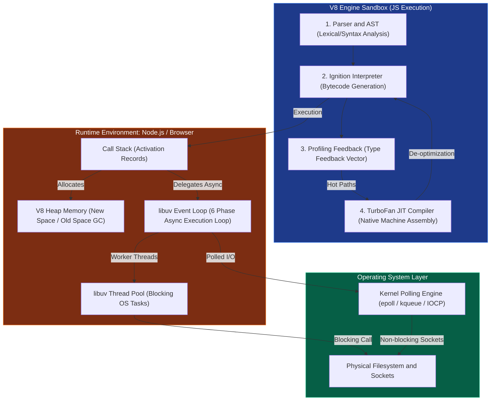

# 🚀 JavaScript: Engine Internals, Systems & Philosophy Index

স্বাগতম! জাভাস্ক্রিপ্ট (JS) আজ কেবল ব্রাউজারের সাধারণ অ্যানিমেশন স্ক্রিপ্ট নয়; এটি বিশ্বের সবচেয়ে বড় ওপেন-সোর্স রানটাইম ইকোসিস্টেমের চালিকাশক্তি। তবে বেশিরভাগ ডেভেলপার জেএস-এর ব্যাকএন্ড বা ফিজিক্যাল মেকানিক্স না জেনেই কোড লিখে থাকেন। 

এই হ্যান্ডবুকটির উদ্দেশ্য হলো জাভাস্ক্রিপ্টকে একদম ফিজিক্যাল মেমরি ও ওএস লেভেল পর্যন্ত ট্র্যাক করা। ভি৮ (V8) ইঞ্জিন কীভাবে বাইটকোড তৈরি করে, গার্বেজ কালেক্টর মেমরিতে কীভাবে সেমি-স্পেস সোয়াইপ করে, libuv কীভাবে লিনাক্স কার্নেলের `epoll` ব্যবহার করে থ্রেড পুল ম্যানেজ করে এবং কীভাবে সিঙ্গেল-থ্রেডেড হয়েও জাভাস্ক্রিপ্ট হাই-কনকারেন্ট সিস্টেমের রাজা হয়ে উঠেছে—তার নিখুঁত ও সিস্টেম-লেভেল গাইড।

এখানে আমাদের **javascript.md** ফাইলে ডেডিকেট হতে যাওয়া **১৫টি চ্যাপ্টারের** একটি উচ্চ-ফিডেলিটি লার্নিং রোডম্যাপ ও সূচিপত্র দেওয়া হলো।

---

### 🗺️ JavaScript Systems Architecture & Learning Path

নিচের ডায়াগ্রামে একটি পূর্ণাঙ্গ জাভাস্ক্রিপ্ট রানটাইমের (ইঞ্জিন, ইভেন্ট লুপ, এবং ওএস ব্রিজ) ফিজিক্যাল আর্কিটেকচারাল ফ্লো দেখানো হয়েছে:

---

## 📚 ১৫টি চ্যাপ্টারের পূর্ণাঙ্গ মডিউল গাইড

### 📂 Module 1: The Philosophy & Engine Internals (দর্শন ও ইঞ্জিন ইন্টারনালস)
*   **Chapter 1: JavaScript-এর মূল দর্শন ও সিস্টেম ডিজাইন**
    *   ডায়নামিক টাইপিং বনাম স্ট্যাটিক এক্সিকিউশনের ট্রেড-অফ।
    *   সিঙ্গেল-থ্রেডেড অ্যাসিনক্রোনাস ডিজাইনের ব্যাকগ্রাউন্ড দর্শন (Concurrency without locks)।
    *   ঐতিহাসিক বিবর্তন: ব্রাউজার স্ক্রিপ্টিং থেকে হাই-পারফরম্যান্স সিস্টেম সফটওয়্যার।
*   **Chapter 2: JavaScript Runtime ও Engine-এর ভৌত গঠন**
    *   ইঞ্জিন (V8, JavaScriptCore, SpiderMonkey) বনাম রানটাইম (Browser, Node.js, Bun) এর পার্থক্য।
    *   Execution Context ও Global Execution Context-এর অভ্যন্তরীণ জীবনচক্র।
    *   Call Stack (অ্যাক্টিভেশন রেকর্ডস) এবং Memory Heap-এর ভৌত অবস্থান।
*   **Chapter 3: V8 Engine Internals: Ignition Parser & TurboFan JIT Compiler**
    *   পার্সিং মেকানিজম এবং AST (Abstract Syntax Tree) জেনারেশন।
    *   **Ignition Interpreter:** কেন সরাসরি মেশিন কোডে কম্পাইল না করে বাইটকোড তৈরি করা হয়?
    *   **TurboFan Optimizer:** প্রফাইল ফিডব্যাক ভেক্টরের উপর ভিত্তি করে হট পাথ কম্পাইলেশন এবং JIT (Just-In-Time) অ্যাসেম্বলি জেনারেশন।
    *   De-optimization (De-opt) লুপের ভৌত মেকানিজম।

---

### 📂 Module 2: Memory Management & Garbage Collection (মেমরি ও গার্বেজ কালেকশন)
*   **Chapter 4: JavaScript Memory Allocation: Stack vs. Heap**
    *   Primitives বনাম Reference types-এর মেমরি লেআউট।
    *   মেমরিতে অবজেক্ট রেফারেন্সিং এবং ভ্যালু বাই-রেফারেন্সের মেমরি ম্যাপ।
    *   কল স্ট্যাকে স্ট্যাক-ফ্রেম তৈরি ও ধসে যাওয়ার ফিজিক্যাল লাইফসাইকেল।
*   **Chapter 5: V8 Garbage Collection: Scavenger vs. Mark-Sweep-Compact**
    *   Generational Hypothesis (মেমরি বয়সের তত্ত্ব) বিশ্লেষণ।
    *   **New Space (Minor GC):** সেমি-স্পেস (From-Space ও To-Space) এবং Cheney's Copying Algorithm।
    *   **Old Space (Major GC):** Mark-Sweep-Compact অ্যালগরিদমের ৩টি ফেজ।
    *   পারফরম্যান্স অপ্টিমাইজেশন: Incremental Marking, Concurrent Sweeping এবং Idle-time GC।
*   **Chapter 6: Memory Leakage, Profiling & Hardening**
    *   কমন মেমরি লিকের উৎস: Accidental Globals, Uncleared Timers, Detached DOM Trees, এবং Closures।
    *   Chrome DevTools / Node.js Memory Heap Snapshots ব্যবহার করে মেমরি ডায়াগনস্টিকস।
    *   মেমরি লিক এড়াতে `WeakMap` এবং `WeakSet` ব্যবহারের এডভান্সড আর্কিটেকচার।

---

### 📂 Module 3: Asynchronous JS, The Event Loop & System I/O (অ্যাসিনক্রোনাস জেএস, ইভেন্ট লুপ ও সিস্টেম আইও)
*   **Chapter 7: The Browser Event Loop vs. Node.js Event Loop**
    *   সিঙ্গেল থ্রেডে কনকারেন্সি মেইনটেইন করার মূল চাবিকাঠি।
    *   Macro-task (Callback Queue) বনাম Micro-task (Promise, MutationObserver) কিউ-এর অগ্রাধিকার রুলস।
    *   Node.js ইভেন্ট লুপের ৬টি পর্যায় (Timers, Pending Callbacks, Idle/Prepare, Poll, Check, Close)।
    *   `process.nextTick()` এবং Micro-task-এর কার্নেল থ্রোটলিং অগ্রাধিকার।
*   **Chapter 8: Libuv Internals: Thread Pool & Asynchronous OS Interfaces**
    *   Libuv-এর C-based আর্কিটেকচার বিশ্লেষণ।
    *   নন-ব্লকিং কার্নেল পোলিং ইঞ্জিন: লিনাক্সে `epoll`, ম্যাকওএসে `kqueue`, এবং উইন্ডোজে `IOCP` এর সাথে লুপ বাইন্ডিং।
    *   Libuv Worker Thread Pool (`UV_THREADPOOL_SIZE`): কখন এবং কেন ফাইলসিস্টেম (`fs`) ও ক্রিপ্টো অপারেশন থ্রেড পুলে যায়?
*   **Chapter 9: Promises, Async/Await under the Hood**
    *   Promise-এর অভ্যন্তরীণ স্টেট মেশিন (Pending, Fulfilled, Rejected)।
    *   `async/await` কীভাবে কার্নেল ব্লক না করে V8 ইঞ্জিন লেভেলে জেনারেটর-লাইক `yield` মেথডে প্রসেস সাসপেন্ড ও রিজুম করে।

---

### 📂 Module 4: Metaprogramming & Advanced Concepts (মেটাপ্রোগ্রামিং ও উন্নত ধারণাসমূহ)
*   **Chapter 10: Closures, Scope Chains ও Lexical Environment**
    *   ক্লোজারের ফিজিক্যাল আর্কিটেকচার: আউটার ফাংশন টার্মিনেট হওয়ার পরও হিপ মেমরিতে ভেরিয়েবল বেঁচে থাকার গোপন মেকানিজম।
    *   Scope Chain এবং Lexical Environment-এর ওএস মেমরি অ্যালোকেশন লাইফ।
*   **Chapter 11: Prototypes, Prototype Chains ও Inline Caching**
    *   `__proto__` বনাম `prototype` এর গোলকধাঁধা ভাঙা।
    *   V8 ইঞ্জিনের পারফরম্যান্স ট্রিক: Dynamic object properties অ্যাক্সেস স্পিডআপ করতে **Hidden Classes (Shapes/Maps)** এবং **Inline Caching (IC)** এর ভূমিকা।
*   **Chapter 12: Meta-Programming: Proxies, Reflect ও Symbol Internals**
    *   Proxy Trap-এর মাধ্যমে মেমরি অবজেক্ট ফিল্টারিং ও ইন্টারসেপশন।
    *   Reflect API এবং কাস্টম সিম্বল ও জেনারেটর মেকানিজম (`Symbol.iterator`, `Symbol.asyncIterator`)।

---

### 📂 Module 5: OS Bridges, Native Addons & Systems Project (ওএস ব্রিজ ও সিস্টেম প্রজেক্ট)
*   **Chapter 13: Node.js C++ Binding & N-API**
    *   জাভাস্ক্রিপ্ট কীভাবে সরাসরি C++ লাইব্রেরির সাথে হ্যান্ডশেক করে?
    *   V8 C++ Wrapper এবং N-API (Node-API) মেকানিজম।
    *   হোস্ট ওএসের কার্নেল সিস্টেম এপিআই এক্সপোজ করার জন্য একটি কাস্টম C++ Node-Addon তৈরি।
*   **Chapter 14: Modern JS Runtimes Evolution: Deno (V8+Rust+Tokio) and Bun (JSC+Zig)**
    *   Deno আর্কিটেকচার: Rust এবং Tokio ইভেন্ট ড্রাইভেন মডেলের সাথে V8 এর রিলেশন।
    *   Bun-এর চরম গতির উৎস: JavaScriptCore (JSC) ইঞ্জিনের সাথে Zig ল্যাঙ্গুয়েজের লো-লেভেল মেমরি অপ্টিমাইজেশন।
*   **Chapter 15: Systems-Level Practical Project: Custom File Watcher & Non-blocking Net Socket Server**
    *   **Concept Integration Project:** রানটাইম কনসেপ্ট ব্যবহার করে সম্পূর্ণ স্ক্র্যাচ থেকে একটি হাই-পারফরম্যান্স ফাইল ওয়াচার এবং নন-ব্লকিং নেট সকেট সার্ভার তৈরি করা (Streams, Buffers, Sockets, and Libuv thread interactions)।

### 📂 Module 6: Advanced System Extensions & Performance Tuning (অ্যাডভান্সড সিস্টেম এক্সটেনশন ও পারফরম্যান্স টিউনিং)
*   **Chapter 16: V8 Memory Profiling & Core Dump Analysis**
    *   আউট-অব-মেমরি (OOM) প্রসেস ক্র্যাশের পর ওএস-লেভেল Core Dump (`SIGABRT`) স্ন্যাপশট নিষ্কাশন।
    *   `llnode` (LLDB Debugger) প্লাগইন ব্যবহার করে পোস্ট-মর্টেম C++ হিপ অবজেক্ট ডিকোড ও ডিবাগিং।
*   **Chapter 17: WebAssembly, SharedArrayBuffer & Atomics**
    *   Web Workers এবং Thread Concurrency-র হাই-স্পিড শেয়ার্ড মেমরি মেকানিজম (`SharedArrayBuffer`)।
    *   মেমরি ওভাররাইটিং রোধে ওএস এবং হার্ডওয়্যার CPU-level Atomic Assembly Instructions (`Atomics` API) ব্যবহার।
*   **Chapter 18: V8 Native Intrinsics & JIT Benchmarking**
    *   `--allow-natives-syntax` মেমরি ফ্ল্যাগ অন করে V8 Engines-এর অভ্যন্তরীণ সি-লেভেল মেথডগুলো অ্যাক্সেস।
    *   `%OptimizeFunctionOnNextCall()`, `%GetOptimizationStatus()` এবং `%HasFastProperties()` দিয়ে JIT অপ্টিমাইজেশন ও হিডেন ক্লাসের গতির প্রত্যক্ষ পরীক্ষা।

### 📂 Module 7: JS Engine Security, Vulnerabilities & Hardening (জাভাস্ক্রিপ্ট ইঞ্জিন সিকিউরিটি ও হার্ডেনিং)
*   **Chapter 19: JIT Compiler Exploits & Type Confusion**
    *   V8 ইঞ্জিনের JIT কম্পাইলার অপ্টিমাইজেশন ব্রেক করার কৌশল এবং **Type Confusion (CVE-2020-6418)**-এর অভ্যন্তরীণ মেকানিজম।
    *   Arbitrary Read/Write প্রিমিয়ার এক্সপ্লয়েটেশন এবং প্রসেস মেমরি ড্যামেজ।
*   **Chapter 20: V8 Pointer Compression & Sandbox Security Boundaries**
    *   ৩২-বিট রিলেটিভ অফসেট ব্যবহার করে মেমরি সাশ্রয়ের সিক্রেট: **Pointer Compression** এবং Heap Base ম্যাপিং।
    *   **V8 Sandbox (V8 Heap Sandbox):** টাইপ বিভ্রান্তি শোষণ থেকে বাইরের ওএস মেমরি সম্পূর্ণ বিচ্ছিন্ন রাখার নিরাপত্তা প্রাচীর।
*   **Chapter 21: Production-Grade Hardening & Safe Execution Environments**
    *   প্রোডাকশনে ভি৮ মেমরিকে সুরক্ষিত করতে `--disallow-code-generation-from-strings` এবং `--write-protect-code-memory` মেমরি সেফটি ফ্ল্যাগের ব্যবহার।
    *   ওএস-লেভেল সিকিউরিটি টিউনিং: Rootless execution, User Namespaces এবং Seccomp কার্নেল সিস্টেম কল ফিল্টারিং।

### 📂 Module 8: Syntax Internals, Optimization & Runtime Mechanics (সিনট্যাক্স ইন্টারনালস ও অপ্টিমাইজেশন)
*   **Chapter 22: Scope Variables & Stack Pointers (var vs let vs const)**
    *   V8 ইঞ্জিনের Variable Environment বনাম Lexical Environment মেমরি ম্যানেজমেন্ট।
    *   **Temporal Dead Zone (TDZ):** আন-ইনিশিয়ালাইজড ভেরিয়েবলের মেমরি ব্লকিং এরর ট্র্যাকিং।
    *   `const` এর স্ট্যাক পয়েন্টার লক বনাম ডায়নামিক হিপ মেমরি প্রোপার্টি পরিবর্তনের সূক্ষ্ম পার্থক্য।
*   **Chapter 23: Loop Executions & JIT Optimizations (for vs forEach vs map/reduce)**
    *   **Loop Unrolling:** JIT কম্পাইলার কীভাবে লুপের কন্ডিশনাল কলাপ্স এড়াতে প্রসেসর লেভেলে লুপ উন্মুক্ত করে।
    *   `forEach` এর মাধ্যমে কল স্ট্যাকের ডায়নামিক **Activation Record (Stack Frame)** স্পন ওভারহেড।
    *   `map`, `filter` ও `reduce` মেথডগুলোর চেইনিংয়ে হিপ মেমরিতে অতিরিক্ত অবজেক্ট অ্যালোকেশন ও Scavenge GC ট্রিগার হওয়া।
*   **Chapter 24: Array Internals & Hashed Data Structures (Array vs Map vs Set)**
    *   ভি৮ অ্যারির ফিজিক্যাল অ্যালোকেশন: **Fast Elements** (contiguous flat C++) বনাম **Dictionary Elements** (sparse hashes) এবং ওএস মেমরি কলাপ্স।
    *   `Map` এবং `Set` এর ভেতরের deterministic hashing buckets ম্যাপিং এবং মেমরি বাকেট ওভারহেড বিশ্লেষণ।

### 📂 Module 9: Memory Buffers, Streams & Kernel Backpressure (মেমরি বাফার, স্ট্রিম ও কার্নেল ব্যাকপ্রেশার)
*   **Chapter 25: Node.js Buffer Internals & V8 ArrayBuffer Primitives**
    *   V8 হিপের বাইরে সরাসরি ওএস-লেভেল র-মেমরি বরাদ্দ: `Buffer` এর C++ মেমরি বাউন্ডারি।
    *   `Buffer.alloc()` বনাম `Buffer.allocUnsafe()` এর পারফরম্যান্স ব্যালেন্স এবং মেমরি তথ্য ফাঁসের ঝুঁকি।
*   **Chapter 26: V8 Memory Pool and Slab Allocation (Buffer.poolSize)**
    *   **Slab Allocation:** ছোট বাফার তৈরিতে ওএস `malloc` এড়াতে ৮কেবি মেমরি স্ল্যাব প্রি-অ্যালোকেশনের সিস্টেম ট্রিক।
    *   র‍্যাম ফ্র্যাগমেন্টেশন প্রতিরোধ ও গতি বৃদ্ধিতে মেমরি স্ল্যাব স্লাইসিং মেকানিজম।
*   **Chapter 27: Stream Pipes, Backpressure & Kernel Socket Buffers**
    *   **Backpressure Mechanics:** রিডার ও রাইটার স্পিডের অসমতায় নোডের মেমরি হিপ স্পিল ও ওএম ক্র্যাশের ভৌত রূপ।
    *   `pipe()` এর স্বয়ংক্রিয় pause/resume ও Writable-এর `drain` ইভেন্ট লিসেনিংয়ের মাধ্যমে কার্নেল সকেট বাফার সুরক্ষিত রাখা।

---

> [!NOTE]
> **Learning Journey Note:**
> এই ২৭টি চ্যাপ্টারের প্রতিটি একটি সিস্টেম-লেভেল হ্যান্ডবুক মডিউলের অংশ। প্রতিটি চ্যাপ্টারে থিওরির পাশাপাশি লিনাক্স কার্নেলের আচরণ ও বাস্তব কোড সিমুলেশন থাকবে যাতে আপনি একদম বিগিনার থেকে শুরু করে প্রোডাকশন-গ্রেড হাই-কনকারেন্ট সিস্টেম ডিজাইনার হতে পারেন।

---
