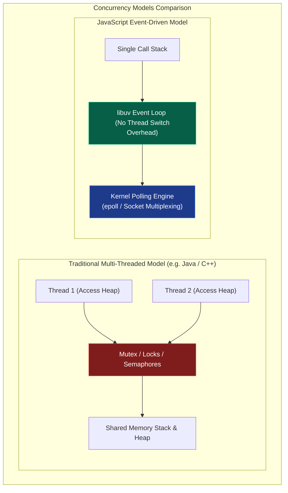
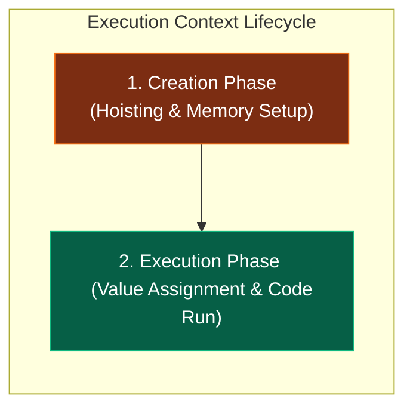
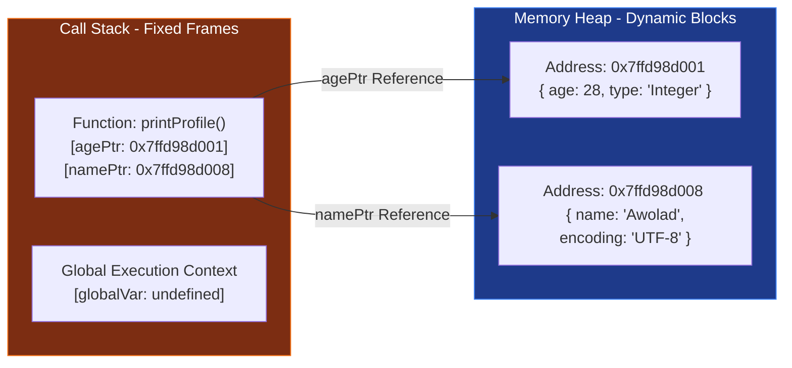
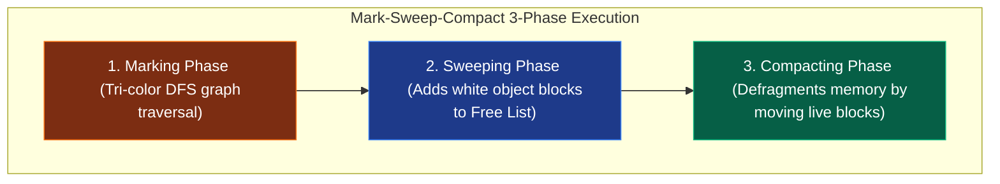
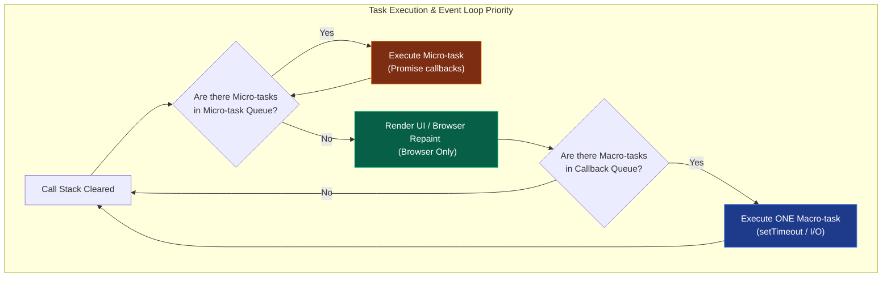
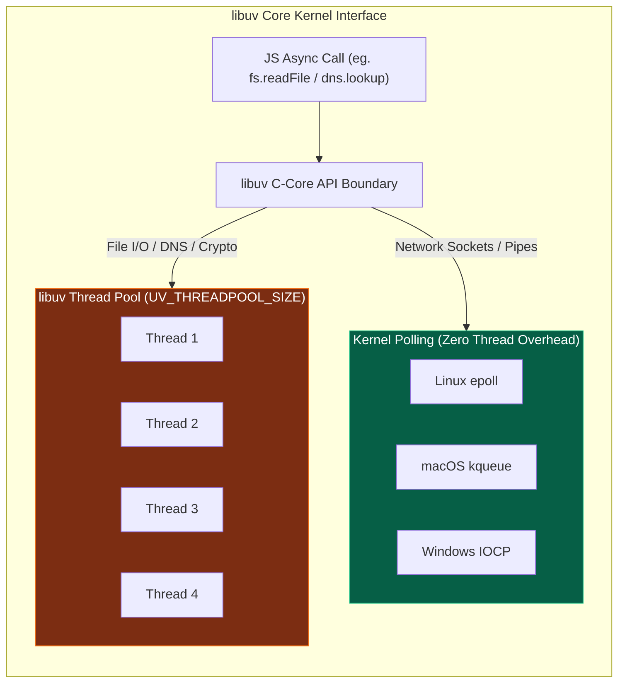

# 🚀 JavaScript Systems & Internals Handbook

জাভাস্ক্রিপ্ট (JS) বর্তমান বিশ্বের অন্যতম বৈপ্লবিক প্রযুক্তিতে পরিণত হয়েছে। এর একক থ্রেডের সরলতা এবং একই সাথে উচ্চ-কনকারেন্ট সিস্টেম পরিচালনার দক্ষতা আধুনিক সিস্টেম ডিজাইন ও আর্কিটেকচারের সবচেয়ে চমৎকার স্টাডি কেস। 

এই হ্যান্ডবুকটির উদ্দেশ্য হলো জাভাস্ক্রিপ্টকে ওএসের প্রসেস সীমানা, মেমরি হিপ, ইন্টিজার অ্যালোকেশন এবং লিনাক্স কার্নেলের পোলিং ইন্টারফেস লেভেল পর্যন্ত উন্মোচন করা। এটি কোনো বেসিক স্ক্রিপ্টিং টিউটোরিয়াল নয়; এটি জাভাস্ক্রিপ্ট ইঞ্জিন ও রানটাইমের ভৌত আচরণ বুঝতে চাওয়া সিস্টেম ও সফটওয়্যার আর্কিটেক্টদের জন্য একটি মাস্টারক্লাস ম্যানুয়াল।

---

## ১. JavaScript-এর মূল দর্শন ও সিস্টেম ডিজাইন

জাভাস্ক্রিপ্ট ডিজাইন করার সময় ব্রেন্ডন আইক (Brendan Eich) ১৯৯৫ সালে নেটস্কেপে মাত্র ১০ দিনে একটি দর্শনের উপর ভিত্তি করে এর জন্ম দেন: **"Lightweight, single-threaded concurrency without thread conflicts."** এই দর্শনটিই আজ একে বিশ্বের অন্যতম ফাস্ট কনকারেন্ট সিস্টেমে রূপান্তর করেছে।



### Dynamic Typing বনাম Static Execution-এর সিস্টেম আর্কিটেকচার দ্বন্দ্ব

জাভাস্ক্রিপ্ট একটি **Dynamically Typed** ল্যাঙ্গুয়েজ। এর অর্থ হলো মেমরিতে কোনো ভেরিয়েবলের ডাটা টাইপ রানটাইমের আগে ফিক্সড থাকে না।

```javascript
let data = 42;       // Allocates as a number
data = "hello JS";   // Re-allocates as a heap-based string
```

#### সিস্টেম-লেভেল দ্বন্দ্ব:
1. **Memory Allocation:** স্ট্যাটিকালি টাইপড ল্যাঙ্গুয়েজে (যেমন: C/C++ বা Rust), কম্পাইলার আগেই জানে যে একটি ভেরিয়েবল `int32` (৪ বাইট) জায়গা নেবে। ফলে স্ট্যাক মেমরিতে সরাসরি ফিক্সড স্পেস অ্যালোকেশন করা সম্ভব। কিন্তু জাভাস্ক্রিপ্টে কার্নেল বা ইঞ্জিন আগে থেকে মেমরি সাইজ অনুমান করতে পারে না। প্রতিবার টাইপ পরিবর্তনের সময় ইঞ্জিনকে মেমরিতে অবজেক্ট স্ট্রাকচার রি-ম্যাপ করতে হয়।
2. **Execution Slowdown:** টাইপ লক না থাকার কারণে, প্রসেসর লেভেলে সরাসরি অপ্টিমাইজড ইন্সট্রাকশন চালানো যায় না। প্রতিটি অপারেশনের আগে ইঞ্জিনকে মেমরি থেকে ডাটার "ট্যাগ" চেক করতে হয় যে এটি নাম্বার, স্ট্রিং নাকি অবজেক্ট। এই চেকিং প্রসেসরের CPU cycles নষ্ট করে।

---

### Concurrency without Locks (সিঙ্গেল-থ্রেডেড ইভেন্ট ড্রাইভেন ডিজাইন)

ঐতিহ্যবাহী মাল্টি-থ্রেডেড আর্কিটেকচারে (যেমন: Java, C#) কনকারেন্সি বা একসাথে একাধিক কাজ করা নিশ্চিত করতে শত শত থ্রেড স্পন করা হয়। 

#### মাল্টি-থ্রেডিংয়ের বড় সিস্টেম ওভারহেড:
- **Context Switching:** ওএস যখন এক থ্রেড থেকে অন্য থ্রেডে সিপিইউ কন্ট্রোল শিফট করে, তখন প্রসেসর রেজিস্টার ও স্ট্যাকের সমস্ত ডাটা মেমরিতে ব্যাকআপ করতে হয়, যা চরম মেমরি ও সিপিইউ ইনটেনসিভ অপারেশন।
- **Concurrency Bugs:** শেয়ার্ড মেমরিতে একাধিক থ্রেড একসাথে এক্সেস করার সময় ডেডলক (Deadlock), রেস কন্ডিশন (Race Condition) এবং থ্রেড স্টারভেশন ঘটে। এগুলো ঠেকাতে জটিল লক মেকানিজম (Mutex/Semaphores) বসাতে হয়, যা সফটওয়্যারকে ধীরগতির করে তোলে।

#### জাভাস্ক্রিপ্টের সমাধান:
জেএস তার মূল এক্সিকিউশন লাইনকে **Single-threaded** রাখে। অর্থাৎ অ্যাপ্লিকেশনের সমস্ত লজিক কেবল একটি প্রসেসর থ্রেডে একের পর এক এক্সিকিউট হবে। কোনো লকিং বা রেস কন্ডিশন থাকবে না।

তাহলে এটি হাজার হাজার ইউজার রিকোয়েস্ট একসাথে কীভাবে প্রসেস করে? জেএস তার দীর্ঘমেয়াদী কাজগুলোকে (যেমন: ফাইল রিড, নেটওয়ার্ক রিকোয়েস্ট, বা ডাটাবেজ কোয়েরি) নিজে না করে ওএসের কার্নেলের কাছে হস্তান্তর করে দেয় এবং ইভেন্ট লুপের মাধ্যমে রেজাল্ট রিসিভ করে। এটি সিঙ্গেল-থ্রেডেড হয়েও কোটি কোটি কানেকশন হ্যান্ডেল করতে পারে কোনো প্রকার থ্রেড সুইচের ঝামেলা ছাড়াই।

---

## ২. JavaScript Runtime ও Engine-এর ভৌত গঠন

অধিকাংশ ডেভেলপার "ইঞ্জিন" এবং "রানটাইম"-কে গুলিয়ে ফেলেন। জাভাস্ক্রিপ্ট সিস্টেম ডিজাইনের ক্ষেত্রে এই দুটির কাজের বাউন্ডারি জানা অত্যন্ত জরুরি।

### Engine বনাম Runtime-এর কাজের বাউন্ডারি

```text
+-----------------------------------------------------------------+
| Runtime Environment (Browser / Node.js)                         |
|                                                                 |
|   +------------------------------------+   +----------------+   |
|   | V8 Engine Sandbox                  |   | Web APIs /     |   |
|   |                                    |   | Node.js APIs   |   |
|   |   [ Call Stack ]    [ Heap ]       |   | (setTimeout,   |   |
|   |                                    |   |  fs, fetch)    |   |
|   +------------------------------------+   +----------------+   |
|                                                     |           |
|   +-------------------------------------------------+           |
|   | libuv Event Loop & Callback Queues                          |
|   +-------------------------------------------------------------+
+-----------------------------------------------------------------+
```

#### ১. JavaScript Engine (যেমন: Google V8, Apple JavaScriptCore, Mozilla SpiderMonkey):
ইঞ্জিন হলো একটি বিশুদ্ধ **Execution Sandbox**। এর কাজ কেবল এবং শুধুমাত্র জাভাস্ক্রিপ্ট টেক্সট কোডকে ইনপুট হিসেবে নেওয়া এবং তা হোস্ট মেশিনের প্রসেসরের বোঝার উপযোগী নেটিভ মেশিন কোডে রূপান্তর করে রান করানো। 
- ইঞ্জিনের নিজস্ব কোনো ফাইল রিড করার ক্ষমতা বা নেটওয়ার্ক সকেট ওপেন করার এপিআই থাকে না।
- ইঞ্জিনের মূল উপাদান কেবল দুটি: **Memory Heap** (অবজেক্ট সংরক্ষণের জায়গা) এবং **Call Stack** (এক্সিকিউশন ট্র্যাকিং)।

#### ২. Runtime Environment (যেমন: Chrome Browser, Node.js, Bun):
রানটাইম হলো ইঞ্জিনের চারপাশের একটি স্বয়ংসম্পূর্ণ এনভায়রনমেন্ট বা ধারক। এটি ইঞ্জিনকে বাহ্যিক পৃথিবীর সাথে যোগাযোগ করার জন্য প্রয়োজনীয় সি-লিঙ্কড এপিআই বা সার্ভিস সরবরাহ করে।
- ব্রাউজার রানটাইম ইঞ্জিনকে যোগান দেয়: DOM API, fetch, geolocation, setTimeout।
- Node.js রানটাইম ইঞ্জিনকে যোগান দেয়: `fs` (ফাইল সিস্টেম), `net` (সকেট), `crypto` (নিরাপত্তা)।
- রানটাইমই ইভেন্ট লুপ ও ক্যাশ মেমরি অর্কেস্ট্রেট করে।

---

### Execution Context ও Global Execution Context

জাভাস্ক্রিপ্টে যেকোনো কোড রান করার সময় কার্নেল লেভেলে একটি ভার্চুয়াল বাউন্ডারি বা সেল তৈরি হয়, একে **Execution Context (EC)** বলে। এটি কোডের এক্সিকিউশন স্টেজ ট্র্যাক করে।

কোড বুট হওয়ার সাথে সাথে ইঞ্জিন সবার আগে **Global Execution Context (GEC)** তৈরি করে। এরপর প্রতিবার কোনো ফাংশন কল হলে স্ট্যাকে নতুন একটি কাস্টম EC পুশ হয়।

#### Execution Context-এর দুটি পর্যায় (Lifecycle Phases):



#### ১. Creation Phase (মেমরি অ্যালোকেশন পর্যায়):
এই পর্যায়ে কোনো কোড ফিজিক্যালি রান করে না। ইঞ্জিন কেবল সম্পূর্ণ কোড ফাইলটি স্ক্যান করে ভেরিয়েবল এবং ফাংশনগুলোর জন্য মেমরি রিজার্ভ করে।
- **Variable Hoisting:** `var` ভেরিয়েবলগুলোকে মেমরিতে রেজিস্টার করে তাদের ডিফল্ট ভ্যালু `undefined` দিয়ে ইনিশিয়েলাইজ করে রাখা হয়। `let` এবং `const` ভেরিয়েবলগুলোও রেজিস্টার হয় কিন্তু তারা মেমরির একটি সুরক্ষিত খাঁচায় বন্দী থাকে যাকে **Temporal Dead Zone (TDZ)** বলে। TDZ পার হওয়ার পূর্বে এদের এক্সেস করলে ইঞ্জিন মেমরি লেভেলে এরর থ্রো করে।
- **Function Hoisting:** ফাংশনের বডি এবং লজিক মেমরির হিপ স্পেসে হুবহু কপি করে পুরো ফাংশনটিকে পয়েন্টার সহ স্ট্যাক মেমরিতে মাউন্ট করে রাখা হয়। ফলে কোডে ডিক্লেয়ার করার আগেই ফাংশন কল করা সম্ভব হয়।
- **Scope Chain & `this` Binding:** রানিং প্রসেসের প্যারেন্ট স্কোপ লিঙ্ক এবং `this` অবজেক্টের মেমরি অ্যাড্রেস বাইন্ড করা হয়।

#### ২. Execution Phase (এক্সিকিউশন পর্যায়):
এই পর্যায়ে ইঞ্জিন বাম থেকে ডানে, উপর থেকে নিচে লাইন বাই লাইন কোড রান করে। ভেরিয়েবলগুলোর মেমরি লোকেশনে বাস্তব ভ্যালু অ্যাসাইন করে এবং লজিক্যাল অপারেশনগুলো CPU রেজিস্টারে প্রসেস করে।

---

### Call Stack ও Memory Heap ইন্টারনালস

- **Memory Heap (আনস্ট্রাকচার্ড মেমরি):** এটি হোস্ট ওএস মেমরি স্পেসের একটি বড় ডায়নামিক মেমরি ব্লক। জাভাস্ক্রিপ্টের সমস্ত অবজেক্ট, অ্যারে এবং ক্লোজার ফাংশনগুলো এলোমেলোভাবে মেমরির এই অংশে স্টোর করা থাকে। হিপের মেমরি এলোকেশন স্ট্যাকের মতো লিনিয়ার বা সাজানো নয়, তাই এখানে মেমরি খুঁজতে ও ট্র্যাক করতে কার্নেলের মেমরি পয়েন্টার অ্যাড্রেস ব্যবহার করতে হয়।
- **Call Stack (লিনিয়ার মেমরি):** এটি একটি অত্যন্ত দ্রুত এবং কঠোরভাবে সাজানো **LIFO (Last In, First Out)** মেমরি স্ট্রাকচার। এখানে কেবল রানিং ফাংশনের ইনফরমেশন এবং প্রিমিটিভ ভ্যালু স্টোর থাকে। কল স্ট্যাকের প্রতিটি স্লটকে এক একটি **Stack Frame** বা অ্যাক্টিভেশন রেকর্ড বলা হয়। কল স্ট্যাকের সর্বোচ্চ ধারণ ক্ষমতা হোস্ট প্রসেসের মেমরি বাউন্ডারি দ্বারা সীমাবদ্ধ। কোনো রিকার্সিভ ফাংশন যদি বেস কন্ডিশন ছাড়া লুপে চলে, তবে স্ট্যাক ফ্রেম উপচে পড়ে মেমরিতে **RangeError: Maximum call stack size exceeded** বা স্ট্যাক ওভারফ্লো এরর তৈরি করে।

---

## ৩. V8 Engine Internals: Ignition Parser & TurboFan JIT Compiler

গুগলের ক্রোম ব্রাউজার এবং Node.js-এর হৃদপিণ্ড হলো **V8 Engine**। এটি জাভাস্ক্রিপ্ট কোডকে চরম গতিতে এক্সিকিউট করতে একটি বৈপ্লবিক পাইপলাইন ব্যবহার করে।

```mermaid
flowchart TD
    subgraph V8Pipeline [V8 Execution Pipeline]
        JSCode["JavaScript Text Code"]
        Parser["AST Parser <br> (Generates Abstract Syntax Tree)"]
        Ignition["Ignition Interpreter <br> (Generates V8 Bytecode)"]
        Feedback["Type Feedback Vector <br> (Profiles variable types dynamically)"]
        TurboFan["TurboFan JIT Compiler <br> (Generates Native Machine Code)"]
        CPU["Physical Host CPU Execution"]

        JSCode --> Parser
        Parser --> Ignition
        Ignition --> CPU
        Ignition --> Feedback
        Feedback -->|Hot Functions (Optimization)| TurboFan
        TurboFan --> CPU
        TurboFan -.->|Type Mismatch (De-optimization)| Ignition
    end

    style JSCode fill:#1e293b,stroke:#475569,color:#fff
    style Ignition fill:#7c2d12,stroke:#f97316,color:#fff
    style TurboFan fill:#065f46,stroke:#10b981,color:#fff
```

### parsing এবং AST (Abstract Syntax Tree) জেনারেশন

যখন আপনি কোনো জেএস ফাইল রান করান, V8 ইঞ্জিনের ভেতরের **Parser** সবার আগে কোড টেক্সটটিকে প্রসেস করে দুটি ধাপে:
1. **Lexical Analysis (Scanner):** কোডের প্রতিটা কিওয়ার্ড, ভেরিয়েবল নেম এবং সিম্বলকে ভেঙে ছোট ছোট টোকেনে (`let`, `data`, `=`, `42`) রূপান্তর করে।
2. **Syntax Analysis (Parser):** এই টোকেনগুলোকে ব্যাকরণগতভাবে বিশ্লেষণ করে মেমরিতে একটি ট্রির মতো স্ট্রাকচার জেনারেট করে, যাকে **AST (Abstract Syntax Tree)** বলা হয়। এটি কোডের লজিক্যাল রিলেশনশিপ ডিফাইন করে।

---

### Ignition Interpreter ও Bytecode-এর মেমরি সাশ্রয় ট্রিক

ঐতিহাসিকভাবে V8 ইঞ্জিন প্রথম সংস্করণে সরাসরি AST থেকে মেশিন কোডে কমপাইল করত (Full-codegen compiler)। কিন্তু এর ফলে মোবাইল ফোনের মতো কম র‍্যামের ডিভাইসে বিশাল সাইজের কম্পাইলড মেশিন অ্যাসেম্বলি মেমরিতে জায়গা পেত না। 

এর সমাধান হিসেবে V8 প্রবর্তন করেছে **Ignition Interpreter**:
- এটি AST-কে রিসিভ করে একটি অত্যন্ত লাইটওয়েট ইন্টারমিডিয়েট ল্যাঙ্গুয়েজ বা **Bytecode** জেনারেট করে।
- বাইটকোডের আকার ফিজিক্যাল মেশিন কোডের চেয়ে প্রায় **৫০% থেকে ৭০% ছোট**। ফলে ডিভাইসের মেমরি বা র‍্যাম বেঁচে যায়।
- ইগনিশন ইন্টারপ্রিটার সরাসরি এই বাইটকোড রিড করে সাথে সাথে প্রোগ্রামটি এক্সিকিউট করা শুরু করে দেয় (Zero startup delay)।

---

### TurboFan Compiler এবং JIT (Just-In-Time) অপ্টিমাইজেশন

ইগনিশন ইন্টারপ্রিটার যখন বাইটকোড রান করায়, সে কোডের গতিবিধি পর্যবেক্ষণ করার জন্য একটি ডায়নামিক বুক-কিপার ব্যবহার করে, যাকে **Type Feedback Vector** বলা হয়।
- এই বুক-কিপার ট্র্যাক করে কোন কোন ফাংশন বারবার একই টাইপের ডাটা নিয়ে কল হচ্ছে। এই বারবার রান হওয়া ফাংশনগুলোকে কার্নেল লেভেলে **Hot Functions** বলা হয়।
- যখনই কোনো ফাংশন হট হিসেবে ডিটেক্ট হয়, V8 ইঞ্জিনের মেগা-অপ্টিমাইজার **TurboFan Compiler** ব্যাকগ্রাউন্ড থ্রেডে ওই ফাংশনের বাইটকোড এবং পূর্বে ট্র্যাক করা টাইপ ফিডব্যাক নিয়ে সরাসরি হোস্ট ওএসের নেটিভ মেশিন অ্যাসেম্বলিতে (Assembly Code) কম্পাইল করে ফেলে।
- পরবর্তী কলগুলোতে ইগনিশন ইন্টারপ্রিটার বাইপাস হয়ে সরাসরি নেটিভ মেশিন স্পিডে সিপিইউ রেজিস্টারে কোডটি চলে। একেই বলে **Just-In-Time (JIT) Compilation**।

---

### De-optimization (De-opt) লুপ মেকানিজম

যেহেতু জাভাস্ক্রিপ্ট ডায়নামিক ল্যাঙ্গুয়েজ, সেহেতু JIT অপ্টিমাইজেশনের একটি বড় ট্রিক বা সিকিউরিটি রুলস আছে।

চলুন নিচের একটি চমৎকার জাভাস্ক্রিপ্ট হট ফাংশন ট্র্যাক করি:
```javascript
function add(a, b) {
    return a + b;
}

// আমরা ফাংশনটি হাজার বার কল করলাম কেবল ইন্টিজার ভ্যালু দিয়ে
for (let i = 0; i < 10000; i++) {
    add(2, 3);
}
```
V8-এর Type Feedback Vector দেখেছে যে `add()` ফাংশনের `a` এবং `b` প্যারামিটার সবসময় `Integer` টাইপ। TurboFan ব্যাকগ্রাউন্ডে একে কম্পাইল করে সরাসরি প্রসেসরের স্পেসিফিক `ADD` অ্যাসেম্বলি ইন্সট্রাকশনে কনভার্ট করে নেটিভ মেশিন কোড রেডি করে ফেলেছে।

কিন্তু হঠাৎ যদি কোডের পরবর্তী লাইনে আমরা নিচের কলটি করি:
```javascript
// A sudden change: Passing strings instead of numbers!
add("hello", "world");
```

#### JIT মেমরি কলাপ্স ও De-optimization ফ্লো:
1. প্রসেসর যখনই নেটিভ মেশিন কোড এক্সিকিউট করতে যাবে, TurboFan-এর বসানো টাইপ-চেক গার্ড ফেইল করবে। কারণ প্রসেসর লেভেলে ইন্টিজারের `ADD` ইন্সট্রাকশন দিয়ে স্ট্রিং কনক্যাটেনেশন সম্ভব নয়।
2. ইঞ্জিন বুঝতে পারে তার করা সমস্ত অপ্টিমাইজেশনের ধারণা ভুল ছিল।
3. একে বলা হয় **De-optimization (De-opt)**।
4. ইঞ্জিন সাথে সাথে নেটিভ মেশিন কোডটি মেমরি থেকে ছুঁড়ে ফেলে দেয়।
5. রানিং সিপিইউ ফ্রেম বা বাফারকে রোলব্যাক করে পুনরায় **Ignition Interpreter**-এর জেনেরিক বাইটকোড এক্সিকিউশন ট্র্যাকে ডাইভার্ট করে দেয়।
6. টাইপ ফিডব্যাক ভেক্টরে লিখে রাখা হয় যে এই ফাংশনটি পলিমরফিক (একাধিক টাইপ নেয়)। এর ফলে পরবর্তীতে এই ফাংশনটিকে অপ্টিমাইজ করতে গেলে TurboFan অনেক বেশি রক্ষণশীল বা সতর্ক কোড জেনারেট করে। এই অনবরত অপ্টিমাইজেশন ও ডি-অপ্টিমাইজেশন লুপ ওএসের প্রসেসরের অতিরিক্ত পাওয়ার ও মেমরি নষ্ট করে, তাই প্রোডাকশন কোডে সবসময় এক টাইপের ভেরিয়েবল ব্যবহারে উৎসাহিত করা হয় (Monomorphism)।

---


## ৪. JavaScript Memory Allocation: Stack vs. Heap

জাভাস্ক্রিপ্ট অ্যাপ্লিকেশন যখন হোস্ট ওএসে চলে, তখন মেমরি অ্যালোকেশন অত্যন্ত সূক্ষ্ম মেকানিজম মেনে চলে। ডাইনামিক রানিং মেমরি প্রধানত দুটি ভাগে বিভক্ত: **Call Stack** এবং **Memory Heap**।

### Primitives বনাম Reference Types-এর সিস্টেম লেভেল লেআউট

১. **Primitive Values (স্ট্যাক মেমরি):**
   - লিনাক্স বা উইন্ডোজ ওএসে `Number`, `String`, `Boolean`, `Null`, `Undefined`, `Symbol`, `BigInt` টাইপের ভেরিয়েবলগুলোকে প্রিমিটিভ ডাটা বলা হয়।
   - **শর্তসাপেক্ষ স্ট্যাক অ্যালোকেশন:** এই ভ্যালুগুলো সরাসরি স্ট্যাক মেমরিতে জমা হয়, **কিন্তু শুধুমাত্র তখনই যখন তারা লোকাল ভেরিয়েবল হিসেবে কোনো অ্যাক্টিভেশন রেকর্ড বা স্ট্যাক ফ্রেমের ভেতরে ডিক্লেয়ার করা হয়।**
   - যদি কোনো প্রিমিটিভ ভ্যালু কোনো অবজেক্টের অংশ হয় বা কোনো ক্লোজারের (Closure) ভেতরে ক্যাপচার করা থাকে, তবে প্রসেসর তাকে স্ট্যাকের বদলে সরাসরি হিপ মেমরিতে পাঠিয়ে দেয়।
২. **Reference Values (হিপ মেমরি):**
   - `Object`, `Array`, `Function` এগুলোকে রেফারেন্স ডাটা বলা হয়। এগুলো আকারে বিশাল ও ডায়নামিক হওয়ায় প্রসেসরের স্ট্যাক ফ্রেমে জায়গা পায় না।
   - ইঞ্জিন হিপ মেমরিতে এই অবজেক্টের জন্য ডায়নামিক স্পেস বরাদ্দ করে এবং সেই হিপ মেমরির স্টার্ট অ্যাড্রেস বা **৬৪-বিট মেমরি পয়েন্টার (Address Pointer)** স্ট্যাক ফ্রেমের ভেতরের লোকাল ভেরিয়েবলে স্টোর করে।

---

### মেমরি পয়েন্টার ও অ্যাক্টিভেশন রেকর্ড ম্যাপিং (Memory Layout)

নিচের ডায়াগ্রামে দেখানো হয়েছে কীভাবে স্ট্যাক ফ্রেমের লোকাল পয়েন্টারগুলো হিপ মেমরির অবজেক্ট অ্যাড্রেসের সাথে যোগাযোগ মেইনটেইন করে:



যখন আমরা কোনো রেফারেন্স টাইপের অবজেক্ট অন্য ভেরিয়েবলে কপি করি, ওএস মেমরি ক্লোন করে না; এটি কেবল পয়েন্টার অ্যাড্রেসটি কপি করে দেয়:
```javascript
let user1 = { name: "Awolad" }; // হিপ মেমরিতে ০x৭এফএফএফ তৈরি এবং user1 এ পয়েন্টার সেভ।
let user2 = user1;              // user2 ও একই পয়েন্টার ০x৭এফএফএফ শেয়ার করে।
user2.name = "John";            // user2 এর পরিবর্তন user1 এর ডাটাও চেঞ্জ করবে কারণ ফিজিক্যাল মেমরি ব্লক একটাই!
```

---

## ৫. V8 Garbage Collection: Scavenger vs. Mark-Sweep-Compact

জাভাস্ক্রিপ্ট ডেভেলপারকে নিজের হাতে মেমরি রিলিজ বা `free()` অপারেশন চালাতে হয় না। V8 ইঞ্জিনের অত্যন্ত শক্তিশালী **Garbage Collector (GC)** ব্যাকগ্রাউন্ডে স্বয়ংক্রিয়ভাবে অব্যবহৃত মেমরি ক্লিন করে।

### Generational Hypothesis (মেমরি বয়সের মূল তত্ত্ব)
V8-এর জিসি মূলত **Generational Hypothesis** নামক একটি গাণিতিক ও বাস্তব অবজারভেশনের ওপর ভিত্তি করে ডিজাইন করা হয়েছে: **"Most objects die extremely young."** 
অর্থাৎ একটি সফটওয়্যারে ৯৫% অবজেক্ট স্পন হওয়ার মিলি-সেকেন্ডের মধ্যে (যেমন ফাংশন এক্সিকিউশন শেষে) অকেজো হয়ে যায়। তাই ভি৮ তার হিপ মেমরিকে মূলত দুটি প্রধান ভাগে ভাগ করে আলাদা অ্যালগরিদমে জিসি রান করায়:

```text
+---------------------------------------------------------------------------------+
| V8 Heap Memory Space                                                            |
|                                                                                 |
|   +---------------------------------------+   +-----------------------------+   |
|   | New Space (1MB - 64MB)                |   | Old Space (Up to 1.4GB+)    |   |
|   | [ From-Space ]   <--->  [ To-Space ]  |   |                             |   |
|   | (Scavenger / Cheney's Copying)        |   | (Mark-Sweep-Compact)        |   |
|   +---------------------------------------+   +-----------------------------+   |
+---------------------------------------------------------------------------------+
```

---

### ১. New Space ও Scavenger (Minor GC) মেকানিজম
অনূর্ধ্ব কয়েক মিলি-সেকেন্ড বয়সী নতুন অবজেক্টগুলো **New Space**-এ অ্যালোকেট করা হয়। এটি আকারে অত্যন্ত ছোট (সাধারণত ১ থেকে ৬৪ মেগাবাইট) এবং এটি দুটি সমান ভাগে বিভক্ত: **From-Space** এবং **To-Space**।

#### Cheney's Copying Algorithm (Scavenger GC Phase):
১. নতুন প্রতিটা অবজেক্ট শুরুতে **From-Space**-এ পর পর অ্যালোকেট হতে থাকে।
২. যখন From-Space সম্পূর্ণ ভর্তি হয়ে যায়, তখন V8 একটি **Minor GC (Scavenge)** ট্রিগার করে।
৩. জিসি রুট অবজেক্টস (Global variables, Active Stack Frames) থেকে স্ক্যান করে রানিং এবং বেঁচে থাকা (Alive/Reachable) অবজেক্টগুলো খুঁজে বের করে।
৪. এই জীবিত অবজেক্টগুলোকে অত্যন্ত দ্রুত **To-Space**-এ গাদাগাদি করে মেমরির এক কোণায় কপি করে নেওয়া হয়। এর ফলে কোনো ফিজিক্যাল মেমরি ফ্র্যাগমেন্টেশন বা ফাঁকা ফাঁকা গ্যাপ থাকে না (Contiguous allocation)।
৫. From-Space-এ পড়ে থাকা বাকি সমস্ত ডেড অবজেক্টকে সাথে সাথে চিরতরে রিসেট করে দেওয়া হয়।
৬. এরপর From-Space এবং To-Space-এর ভূমিকা অদলবদল (**Swap**) করা হয়। এখন To-Space হয়ে যায় নতুন From-Space এবং অপরটি খালি To-Space।
৭. কোনো অবজেক্ট যদি এই স্ক্যাভেঞ্জার সাইকেলে **২ বারের বেশি সারভাইভ বা বেঁচে থাকে**, তবে ইঞ্জিন ধরে নেয় এটি দীর্ঘজীবী অবজেক্ট। তাকে প্রমোট করে সরাসরি **Old Space**-এ ফরোয়ার্ড করা হয় (Tenuring)।

---

### ২. Old Space ও Mark-Sweep-Compact (Major GC)
যেসব দীর্ঘজীবী অবজেক্ট প্রমোটেড হয়ে **Old Space**-এ আসে, তাদের সাইজ বিশাল হতে পারে। এখানে মেমরি রিসাইকেল করতে **Major GC** রান করা হয়, যা **Mark-Sweep-Compact** অ্যালগরিদম ব্যবহার করে ৩টি ধাপে কাজ করে:



#### ক. Marking (চিহ্নিতকরণ):
ইঞ্জিন মেমরির সমস্ত অবজেক্টকে ট্র্যাকিং গ্রাফের মাধ্যমে চিহ্নিত করতে **Tri-color Marking (White, Grey, Black)** মেথড এবং ডেপথ-ফার্স্ট সার্চ (DFS) ব্যবহার করে:
- **White (সাদা):** জিসি সাইকেল শুরুর আগে সমস্ত অবজেক্ট সাদা থাকে। এর অর্থ জিসি এখনও এই অবজেক্ট ভিজিট করেনি।
- **Grey (ধূসর):** জিসি এই অবজেক্টটি ভিজিট করেছে কিন্তু এর চাইল্ড অবজেক্টগুলোকে এখনও ভিজিট করা বাকি।
- **Black (কালো):** এই অবজেক্ট এবং এর সাথে সংযুক্ত সমস্ত চাইল্ড অবজেক্ট সফলভাবে ভিজিট সম্পন্ন হয়েছে।
যখন সমস্ত পসিবল রুট ট্রাভার্সাল শেষ হয়, মেমরির যেগুলো **White** বা সাদা রয়ে যায়, তারা সম্পূর্ণ আন-রিচেবল এবং ডেড অবজেক্ট হিসেবে সাব্যস্ত হয়।

#### খ. Sweeping (ঝাড়ু দেওয়া):
সাদা বা ডেড অবজেক্টগুলোর মেমরি লোকেশন খালি করা হয় এবং ওই ফিজিক্যাল অ্যাড্রেসগুলোকে একটি গ্লোবাল **Free List**-এ অ্যাড করে রাখা হয়, যাতে ভবিষ্যতে নতুন কোনো অবজেক্ট তৈরি হলে ইঞ্জিন ওই ফাঁকা অ্যাড্রেসে রাইট করতে পারে।

#### গ. Compacting (সংকোচন):
যেহেতু সুইপিং মেমরির মাঝখান থেকে ডাটা ডিলিট করে, হিপ মেমরিতে প্রচুর ফাঁকা গ্যাপ বা মেমরি ফ্র্যাগমেন্টেশন তৈরি হয়। এর ফলে পরবর্তী বড় অবজেক্ট এলোকেট করার সময় ওএস র‍্যামে পর্যাপ্ত মেমরি থাকলেও contiguous স্পেস না পাওয়ায় ওএম (Out of Memory) ক্র্যাশ করতে পারে। তাই কমপ্যাক্টিং ধাপে বেঁচে থাকা কালো অবজেক্টগুলোকে মেমরির একদিকে গাদাগাদি করে সরিয়ে নেওয়া হয় এবং ওএস লেভেলে এক বিশালContiguous ফ্রি মেমরি ব্লক তৈরি করা হয়।

---

### ৩. GC-র চরম অপ্টিমাইজেশন ট্রিকস
ঐতিহ্যগতভাবে জিসি রান করার সময় প্রসেসরকে অ্যাপ্লিকেশন কোড রান করা সম্পূর্ণ স্টপ করতে হতো, যাকে **Stop-The-World (STW)** পজ বলা হতো। V8 একে কাটিয়ে উঠতে ৩টি কৌশল ব্যবহার করে:
- **Incremental Marking:** জিসি একবারে পুরো মার্কিং ফেজ না করে ছোট ছোট ১ মিলি-সেকেন্ডের স্লিপে ভাগ করে জাভাস্ক্রিপ্ট অ্যাপ রান করার মাঝখানে মাঝখানে ইন্টারলিভড মেথডে সম্পন্ন করে। ফলে ইউজার কোনো ল্যাগ অনুভব করে না।
- **Concurrent Marking/Sweeping:** ব্যাকগ্রাউন্ড হেল্পার থ্রেড ব্যবহার করে মেইন থ্রেডে জাভাস্ক্রিপ্ট রানিং থাকা অবস্থাতেই প্যারালালি মেমরি মার্কিং ও সুইপিং কার্যক্রম চালায়।
- **Idle-Time GC:** ওএস যখন প্রসেসরের আইডল (Idle) বা অলস সময় ডিটেক্ট করে, তখন ফ্রেমিং স্পিড ঠিক রাখতে অলস সময়ে জিসি ফায়ার করে।

---

## ৬. Memory Leakage, Profiling & Hardening

জাভাস্ক্রিপ্ট মেমরি ম্যানেজড হলেও ডেভেলপারদের ভুল কোডিং প্যাটার্নের কারণে **Memory Leak** তৈরি হতে পারে। মেমরি লিক হলো এমন একটি ক্ষতিকর অবস্থা যেখানে অব্যবহৃত অবজেক্ট মেমরিতে থেকে যায় এবং জিসি তাকে ডিলিট করতে পারে না কারণ কোডের কোথাও না কোথাও তার রেফারেন্স ভুলবশত রয়ে গেছে।

### ৪টি মারাত্মক Memory Leak এর ভৌত উৎস ও কোড বিশ্লেষণ

#### ১. Accidental Globals (অনাকাঙ্ক্ষিত গ্লোবাল ভেরিয়েবল):
যখন আমরা `let`, `const` বা `var` ছাড়া কোনো ভেরিয়েবল অ্যাসাইন করি, ইঞ্জিন তাকে গ্লোবাল `window` বা `global` অবজেক্টের চাইল্ড হিসেবে মেমরি হিপে রেজিস্টার করে ফেলে। গ্লোবাল অবজেক্ট অ্যাপ্লিকেশন লাইফসাইকেল শেষ হওয়ার আগে মেমরি থেকে রিসেট হয় না, ফলে ডাটাটি চিরতরে আটকে যায়।
```javascript
function leakData() {
    // missing var/let/const!
    leakedArray = new Array(1000000).fill("V8 Leak Data");
}
leakData(); // leakedArray window/global context-এ আটকে গেছে!
```
**প্রতিরোধ:** সবসময় ফাইলের ওপরে `"use strict";` ঘোষণা করুন। এটি অ্যাক্সিডেন্টাল গ্লোবাল রুডলি ব্লক করে দেয়।

#### ২. Uncleared Timers & Callbacks (অপরিশোধিত টাইমার):
`setInterval` বা `setTimeout` এর ভেতরে থাকা লজিক যদি কোনো আউটার স্কোপের বড় মেমরি ব্লককে ক্যাপচার করে রাখে, তবে টাইমারটি নিজে ক্লিয়ার না হওয়া পর্যন্ত ওই আউটার অবজেক্টটিকে জিসি ডিলিট করতে পারে না।
```javascript
let giantData = new Array(5000000).fill("Heavy Resource");

setInterval(() => {
    // এই ক্লোজারটি giantData কে হিপ মেমরিতে লক করে রেখেছে!
    console.log("Timer ticking...", giantData.length);
}, 1000);
```
**প্রতিরোধ:** কাজ শেষে সবসময় `clearInterval(timerId)` কল করতে ভুলবেন না।

#### ৩. Detached DOM Trees (বিচ্ছিন্ন ডম নোড রেফারেন্স):
যখন ব্রাউজারের কোনো DOM উপাদানকে আমরা জাভাস্ক্রিপ্ট ভেরিয়েবলে স্টোর করি এবং পরবর্তীতে ওটি মূল HTML পেজ থেকে ডিলিট করে দিই, তখন জাভাস্ক্রিপ্টের রানিং মেমরি রেফারেন্সের কারণে ব্রাউজার ওই ডম নোডটিকে র‍্যাম থেকে ডিলিট করতে পারে না। একে **Detached DOM** বলে।
```javascript
let detachedElement = document.getElementById("giant-table");
document.body.removeChild(detachedElement); // ডম থেকে ডিলিট হয়েছে 

// কিন্তু detachedElement মেমরিতে বেঁচে আছে কারণ জাভাস্ক্রিপ্ট রেফারেন্স এখনও সচল!
```
**প্রতিরোধ:** ডম ডিলিট করার পর ভেরিয়েবলটিকে `detachedElement = null` করে দিন।

#### ৪. Closure Reference Overhead (ক্লোজার মেমরি ট্র্যাপ):
একই প্যারেন্ট স্কোপের মাল্টিপল ইনার ফাংশন শেয়ার্ড স্কোপ অবজেক্ট লক করে রাখতে পারে।
```javascript
let replaceThing = function () {
  let originalThing = theThing;
  let unused = function () {
    if (originalThing) // originalThing এর রেফারেন্স লক করা
      console.log("hi");
  };
  
  theThing = {
    longStr: new Array(1000000).join('*'),
    someMethod: function () {
      console.log("someMethod");
    }
  };
};
setInterval(replaceThing, 1000); // এটি প্রতি সেকেন্ডে মেমরি সাইজ বাড়িয়ে ক্র্যাশ ঘটাবে!
```

---

### WeakMap ও WeakSet-এর সাহায্যে মেমরি প্রোটেকশন

মেমরি লিক থেকে বাঁচতে মডার্ন জাভাস্ক্রিপ্টে **`WeakMap`** এবং **`WeakSet`** প্রবর্তন করা হয়েছে। 

#### Map বনাম WeakMap মেমরি ডিফারেন্স:
- **`Map`:** এটি কি (Key) এবং ভ্যালুর মধ্যে স্ট্রং রেফারেন্স রাখে। কি অবজেক্টটি যদি আপনার কোডে আর কোনো কাজেও না লাগে, ম্যাপের ভেতর ওটির রেফারেন্স থাকার কারণে জিসি মেমরি থেকে ওটি মুছতে পারে না।
- **`WeakMap`:** এটি অবজেক্ট কী-এর সাথে শুধুমাত্র **Weak Reference** রাখে। এর অর্থ হলো, রানিং অ্যাপ্লিকেশনে যদি ওই অবজেক্টটির অন্য কোনো রেফারেন্স না থাকে, জিসি ম্যাপের ভেতরের কি ও ভ্যালু থাকা সত্ত্বেও তাকে সরাসরি র‍্যাম থেকে মুছে ফেলবে।

#### WeakMap মেমরি প্রুফ কোড ডেমো:

```javascript
// WeakMap Memory Leak Prevention Demo
const activeConnections = new WeakMap();

function createUserSession() {
    let sessionObj = { id: 98520, data: "User active session details" };
    
    // WeakMap-এ সেশন ডাটা ম্যাপ করে রাখুন
    activeConnections.set(sessionObj, "Session Metadata");
    
    console.log("Session created in WeakMap");
}

createUserSession();
// createUserSession রান শেষে sessionObj লোকাল স্কোপ থেকে মুছে গেছে।
// যেহেতু sessionObj এর আর কোনো স্ট্রং রেফারেন্স নেই,
// জিসি WeakMap থেকে ওটিকে এবং ওর ভ্যালু 'Session Metadata' স্বয়ংক্রিয়ভাবে মুছে দেবে!
// মেমরি লিক হওয়ার সম্ভাবনা ০%!
```

---


## ৭. The Browser Event Loop vs. Node.js Event Loop

জাভাস্ক্রিপ্ট সিঙ্গেল-থ্রেডেড হওয়া সত্ত্বেও কীভাবে একই সাথে ডাটাবেজ কোয়েরি, নেটওয়ার্ক আইও (I/O) এবং ইউজার ইন্টারফেস রেন্ডারিং প্যারালালি ম্যানেজ করে? এর মূল রহস্য নিহিত রয়েছে **Event Loop** আর্কিটেকচারের মাঝে।

### Macro-task Queue বনাম Micro-task Queue

ব্রাউজার ও নোডজেএস উভয় রানটাইমে দুই ধরনের টাস্ক কিউ (Task Queue) ব্যবহৃত হয়:

১. **Macro-task Queue (বা Task Queue):**
   - এখানে ব্রাউজার বা ওএসের বাহ্যিক অ্যাসিনক্রোনাস কাজগুলোর কলব্যাক জমা হয়। যেমন: `setTimeout()`, `setInterval()`, `setImmediate()` (Node.js), এবং I/O ইভেন্ট বা মাউস ক্লিক।
২. **Micro-task Queue (বা Jobs Queue):**
   - এটি অত্যন্ত প্রিভিলেজড ও হাই-প্রায়োরিটি কিউ। এখানে মূলত `Promise` রেজোলিউশন কলব্যাক (`.then`, `.catch`, `.finally`) এবং `MutationObserver` এর টাস্কগুলো জমা হয়।

#### ওএস-লেভেল অগ্রাধিকার মেকানিজম (Event Loop execution flow):
ইভেন্ট লুপের মূল নিয়ম হলো: **কল স্ট্যাক সম্পূর্ণ খালি হওয়ার পর, প্রতিটা একক ম্যাক্রো-টাস্ক রান হওয়ার সাথে সাথে ইভেন্ট লুপ পরবর্তী ম্যাক্রো-টাস্কে যাওয়ার আগে মাইক্রো-টাস্ক কিউ-তে থাকা সমস্ত মাইক্রো-টাস্ক সম্পূর্ণরূপে এক্সিকিউট বা খালি করে ফেলবে।**



---

### Node.js Event Loop-এর ৬টি ফিজিক্যাল ফেজ (Phases)

ব্রাউজারের ইভেন্ট লুপের চেয়ে Node.js-এর ইভেন্ট লুপ অনেক বেশি ওএস-সিস্টেম ওআইও (I/O) ওরিয়েন্টেড। এটি ব্যাকগ্রাউন্ড ইঞ্জিন **libuv** দ্বারা চালিত হয় এবং প্রতিটা ঘূর্ণনে (Tick) লুপটি ৬টি নির্দিষ্ট ফেজ বা ধাপ অতিক্রম করে:

```text
   +---------------------------------------+
   |             START (Tick)              |
   +---------------------------------------+
                      |
                      v
   +---------------------------------------+
   | 1. Timers Phase                       | <--- setTimeout(), setInterval()
   +---------------------------------------+
                      |
                      v
   +---------------------------------------+
   | 2. Pending Callbacks Phase            | <--- Deferred system I/O (TCP errors)
   +---------------------------------------+
                      |
                      v
   +---------------------------------------+
   | 3. Idle, Prepare Phase                | <--- Node.js internal tick cleanup
   +---------------------------------------+
                      |
                      v
   +---------------------------------------+
   | 4. Poll Phase                         | <--- epoll/kqueue (New I/O execution)
   +---------------------------------------+
                      |
                      v
   +---------------------------------------+
   | 5. Check Phase                        | <--- setImmediate()
   +---------------------------------------+
                      |
                      v
   +---------------------------------------+
   | 6. Close Callbacks Phase              | <--- socket.on('close', ...)
   +---------------------------------------+
                      |
                      v
   +---------------------------------------+
   |       Check process.nextTick()        | <--- Processed instantly after 
   |      & Promise Micro-task queue       |      ANY phase above!
   +---------------------------------------+
```

#### ১. Timers Phase:
এই ধাপে ইভেন্ট লুপ `setTimeout()` এবং `setInterval()` দ্বারা শিডিউল করা কলব্যাকগুলোর টাইমার থ্রেশহোল্ড ওএসের ঘড়ির সাথে তুলনা করে চেক করে। যে টাইমারগুলোর মেয়াদ শেষ (Expired), তাদের কলব্যাকগুলো এখানে এক্সিকিউট করা হয়।

#### ২. Pending Callbacks Phase:
পূর্ববর্তী ইভেন্ট লুপ সাইকেলে পেন্ডিং থাকা ওএস-লেভেল সিস্টেম আইও কলব্যাকগুলো (যেমন: কোনো TCP সকেটের এরর `ECONNREFUSED` বা সিস্টেম রাইট বাফার খালি হওয়া) এই ফেজে প্রসেস করা হয়।

#### ৩. Idle, Prepare Phase:
এটি সম্পূর্ণ নোডজেএসের ইন্টারনাল কার্নেল ম্যানেজমেন্টের জন্য ব্যবহৃত হয়। সাধারণ অ্যাপ্লিকেশন কোড এখানে রান করে না।

#### ৪. Poll Phase (পোল ফেজ):
ইভেন্ট লুপের সবচেয়ে গুরুত্বপূর্ণ পর্যায়। এখানে লুপটি ওএসের কার্নেলের কাছ থেকে নতুন কোনো ফাইলসিস্টেম রিড, নেটওয়ার্ক সকেট প্যাকেট বা ইনকামিং রিকোয়েস্ট এসেছে কিনা তার জবাব খোঁজে (লিনাক্সে `epoll` বা উইন্ডোজে `IOCP` এর মাধ্যমে)।
- যদি পোল কিউতে ইনকামিং কলব্যাক থাকে, লুপটি সেগুলো এক এক করে এক্সিকিউট করে।
- যদি পোল কিউ খালি থাকে এবং কোনো `setImmediate()` কলব্যাক পেন্ডিং না থাকে, তবে লুপটি নতুন কোনো আইও ইভেন্ট আসার অপেক্ষায় কার্নেল ইন্টারফেসকে ব্লক করে ওই পোল ফেজেই থমকে দাড়ায় (সিস্টেম স্লিপ)।

#### ৫. Check Phase:
এখানে শুধুমাত্র `setImmediate()` দ্বারা ডিফাইন করা কলব্যাকগুলো এক্সিকিউট করা হয়। পোল ফেজ যদি আইডল হয়ে যায় এবং `setImmediate` পেন্ডিং থাকে, লুপটি পোল ফেজ ব্রেক করে চেক ফেজে চলে আসে।

#### ৬. Close Callbacks Phase:
হঠাৎ করে বন্ধ হয়ে যাওয়া সকেট বা স্ট্রিমের কলব্যাকগুলো (যেমন: `socket.on('close', ...)`) এই শেষ ধাপে প্রসেস করা হয়।

---

### `process.nextTick()` এর কার্নেল অগ্রাধিকার

Node.js রানটাইমে **`process.nextTick()`** কোনো সাধারণ ইভেন্ট লুপের ফেজ নয়। এটি লুপের সমস্ত ফেজের উর্ধ্বে অবস্থান করে।
- যখনই আপনি `process.nextTick(callback)` কল করবেন, ইভেন্ট লুপ রানিং লুপ ফেজটি (ধরি লুপটি এখন Poll Phase-এ আছে) শেষ করার সাথে সাথে পরবর্তী ফেজে (Check Phase) যাওয়ার ঠিক মাঝখানের ট্রানজিশন পয়েন্টে `process.nextTick` এর সমস্ত কলব্যাক আগে রান করিয়ে নেয়।
- এমনকি সাধারণ Promise মাইক্রো-টাস্কের চেয়েও `process.nextTick` এর অগ্রাধিকার বেশি।
- **সতর্কতা:** `process.nextTick` এর ভেতর যদি কোনো রিকার্সিভ ফাংশন কল করা হয়, তবে ইভেন্ট লুপ পরবর্তী ফেজে যাওয়ার অনুমতিই পাবে না এবং সম্পূর্ণ I/O অপারেশন চিরতরে জ্যাম বা হ্যাং হয়ে যাবে (Starving the Event Loop)।

---

## ৮. Libuv Internals: Thread Pool & Asynchronous OS Interfaces

জাভাস্ক্রিপ্ট সিঙ্গেল থ্রেডেড হলেও Node.js কীভাবে প্যারালালি ওএস লেভেলে ফাইল রাইট বা ডাটাবেজ কোয়েরি চালায়? এর পেছনে আসল হিরো হলো **libuv**। এটি C ল্যাঙ্গুয়েজে লেখা একটি চমৎকার মাল্টি-প্ল্যাটফর্ম সিকিউর আইও (I/O) লাইব্রেরি।



### Epoll, Kqueue, ও IOCP-এর সাথে কার্নেল লেভেল পোলিং ইন্টারফেস

ইন্টারনেটে ডাটা পাঠানো বা সকেট লিসেন করার মতো কাজগুলো ওএসের চোখে মূলত **Non-blocking I/O**। 
- যখন জাভাস্ক্রিপ্ট একটি নেটওয়ার্ক রিকোয়েস্ট পাঠায়, libuv কোনো নতুন থ্রেড তৈরি করে না। সে সরাসরি ওএস কার্নেলকে বলে যে এই নেটওয়ার্ক সকেটের ফাইল ডেসক্রিপ্টরে (FD) যখন ডাটা আসবে, আমাকে একটা সংকেত দিও।
- লিনাক্সে **`epoll`**, ম্যাকওএসে **`kqueue`**, এবং উইন্ডোজে **`IOCP`** হলো কার্নেলের অত্যন্ত শক্তিশালী সকেট মাল্টিপ্লেক্সিং বা পোলিং ইঞ্জিন।
- কার্নেল তার নেটওয়ার্ক কার্ডে সকেট ডাটা রিসিভ করার পর libuv-কে ওএস ইন্টারাপ্ট সিগন্যাল দিয়ে জাগিয়ে তোলে এবং libuv ইভেন্ট লুপের Poll Phase-এ সেই ডাটা জাভাস্ক্রিপ্ট কলব্যাকে ফেরত পাঠায়। পুরো প্রসেসে কোনো অতিরিক্ত থ্রেড স্পন বা সিপিইউ সুইচিং ঘটে না।

---

### Libuv Worker Thread Pool (`UV_THREADPOOL_SIZE`)

কিছু লিনাক্স বা ওএস অপারেশন আছে যা স্বভাবগতভাবেই ব্লকিং (Blocking)। যেমন: ফিজিক্যাল হার্ডড্রাইভ থেকে ফাইল রিড-রাইট করা (`fs`), ডিএনএস আইপি খোঁজা (`dns.lookup`), অথবা অত্যন্ত ভারী হ্যাশিং ক্রিপ্টোগ্রাফি (`crypto.pbkdf2` বা `zlib` কম্প্রেশন)। ওএস কার্নেল লেভেলে ফিজিক্যাল ডিস্ক রিড করার জন্য কোনো ইউনিভার্সাল নন-ব্লকিং epoll এপিআই নেই।

এই ব্লকিং কাজগুলো হ্যান্ডেল করতে libuv তার নিজস্ব **Worker Thread Pool** ব্যবহার করে:
- ডিফল্ট অবস্থায় libuv-এর থ্রেড পুলে **৪টি থ্রেড** ব্যাকগ্রাউন্ডে রেডি থাকে।
- যখনই জাভাস্ক্রিপ্ট থেকে `fs.readFile()` ফায়ার করা হয়, libuv মেইন জাভাস্ক্রিপ্ট থ্রেডকে সচল রেখে ডিস্ক রিড করার ভারী ব্লকিং দায়িত্বটি থ্রেড পুলের একজন ওয়ার্কার থ্রেডের কাঁধে তুলে দেয়।
- ওয়ার্কার থ্রেডটি হোস্ট ওএস কার্নেলের সাথে কথা বলে ফাইল রিড সম্পন্ন করে মেইন থ্রেডের ইভেন্ট লুপের Poll Phase-এ রেজাল্ট ফেরত পাঠায়।
- **স্কেলিং ট্রিক:** যদি আপনার অ্যাপ্লিকেশন ব্যাকএন্ডে প্রচুর ফাইল প্রসেসিং বা ক্রিপ্টো অপারেশন করে, তবে ওএসের পারফরম্যান্স বুস্ট করতে আপনি এনভায়রনমেন্ট ভেরিয়েবল সেট করে থ্রেড সংখ্যা সর্বোচ্চ ১২৮ পর্যন্ত বাড়িয়ে নিতে পারেন:
  ```bash
  export UV_THREADPOOL_SIZE=64
  node server.js
  ```

---

## ৯. Promises, Async/Await under the Hood

আধুনিক জাভাস্ক্রিপ্টে কলব্যাক হেল (Callback Hell) এড়াতে এবং কোডকে সিনক্রোনাসের মতো পঠনযোগ্য করতে **Promises** এবং **`async/await`** সিনট্যাক্স ব্যবহৃত হয়। কার্নেল ও ভি৮ ইঞ্জিন লেভেলে এর অভ্যন্তরীণ স্টেট মেশিন ও এক্সিকিউশন ট্র্যাকিং অত্যন্ত সুনিপুণ।

### Promise-এর ৩টি কার্নেল স্টেট (Internal State Machine)
একটি Promise অবজেক্ট ভি৮ মেমরিতে ৩টি ভৌত স্টেট মেইনটেইন করে:
১. **`[[PromiseState]]: "pending"`:** প্রাথমিক অবস্থা। এখনও কোনো কাজের রেজাল্ট আসেনি।
২. **`[[PromiseState]]: "fulfilled"`:** কাজ সফলভাবে সম্পন্ন হয়েছে এবং এর রেজাল্ট `[[PromiseResult]]` ভেরিয়েবলে লক করা হয়েছে। এটি সাথে সাথে মাইক্রো-টাস্ক কিউতে কলব্যাক রেজিস্টার করে।
৩. **`[[PromiseState]]: "rejected"`:** কাজ ব্যর্থ হয়েছে এবং এর এরর অবজেক্ট `[[PromiseResult]]` এ সংরক্ষিত আছে।

---

### V8 Engine কীভাবে `async/await` এক্সিকিউশন সাসপেন্ড ও রিজুম করে?

অনেকে মনে করেন `async/await` ব্যাকগ্রাউন্ডে থ্রেড ব্লক করে বসে থাকে। কিন্তু জাভাস্ক্রিপ্ট সিঙ্গেল-থ্রেডেড হওয়ায় ফিজিক্যাল থ্রেড ব্লক করা অসম্ভব। তাহলে `await` কী করে কোড এক্সিকিউশন লাইনে পজ বা বিরতি দেয়?

চলুন এই চমৎকার কোডটি ওএসের চোখ দিয়ে দেখি:
```javascript
async function fetchSystemConfig() {
    console.log("1. Fetching config...");
    
    // Await boundary!
    const data = await readConfigFile(); 
    
    console.log("2. Config loaded:", data);
}

fetchSystemConfig();
console.log("3. Main thread continues...");
```

#### V8 Engine ইন্টারনালস (State Suspension Flow):

১. `fetchSystemConfig()` যখন প্রথম কল হয়, স্ট্যাক ফ্রেমে এটি স্বাভাবিক ফাংশনের মতোই এক্সিকিউট হতে শুরু করে এবং `"1. Fetching config..."` প্রিন্ট করে।
২. যখনই ইঞ্জিন **`await readConfigFile()`** লাইনে এসে পৌঁছায়, V8 কার্নেল লেভেলে একটি অনন্য ম্যাজিক ফায়ার করে:
   - এটি `readConfigFile()` থেকে একটি Promise অবজেক্ট রিটার্ন নেয়।
   - V8 ইঞ্জিন `fetchSystemConfig` ফাংশনের রানিং স্ট্যাক ফ্রেম, লোকাল ভেরিয়েবলগুলোর স্টেট এবং ইন্সট্রাকশন পয়েন্টারকে স্ট্যাক থেকে সরিয়ে নিয়ে হিপ মেমরির একটি সুরক্ষিত কোণায় **সাসপেন্ড বা পজ (Suspend)** করে রেখে দেয়।
   - ইভেন্ট লুপ বা মেইন থ্রেডকে ব্লক করার বদলে, ফাংশনের কন্ট্রোল সাথে সাথে ফেরত পাঠানো হয় গ্লোবাল স্কোপে এবং মেইন থ্রেড কোনো বাধা ছাড়াই পরবর্তী লাইন এক্সিকিউট করে `"3. Main thread continues..."` প্রিন্ট করে।
৩. যখন `readConfigFile()` এর প্রমিজটি সফলভাবে রিজলভ হয়, তখন এর রেজাল্ট হ্যান্ডলারটিকে **Promise Micro-task Queue**-তে পুশ করা হয়।
৪. বর্তমান কল স্ট্যাক সম্পূর্ণ খালি হওয়ার সাথে সাথে ইভেন্ট লুপ মাইক্রো-টাস্ক কিউ থেকে রেজাল্ট কলব্যাকটি তুলে নেয়।
৫. V8 ইঞ্জিন সাথে সাথে হিপ মেমরি থেকে `fetchSystemConfig` ফাংশনের পুরনো সাসপেন্ডেড স্ট্যাক ফ্রেম ও মেমরি স্টেটগুলোকে পুনরায় টেনে নিয়ে এসে মেইন **Call Stack**-এ মাউন্ট করে দেয় (Resume)।
৬. ফাংশনটি ঠিক যেখানে পজ হয়েছিল (ইন্সট্রাকশন পয়েন্টার অনুসারে), তার ঠিক পরের লাইন থেকে রান করা শুরু করে এবং কোনো থ্রেড সুইচিং বা ব্লকিং ছাড়াই প্রিন্ট করে `"2. Config loaded: ..."`। এটি ওএস লেভেলের লাইটওয়েট কো-রুটিন (Coroutine) বা ফাইবার (Fiber) আর্কিটেকচারের অনুরূপ।

---
