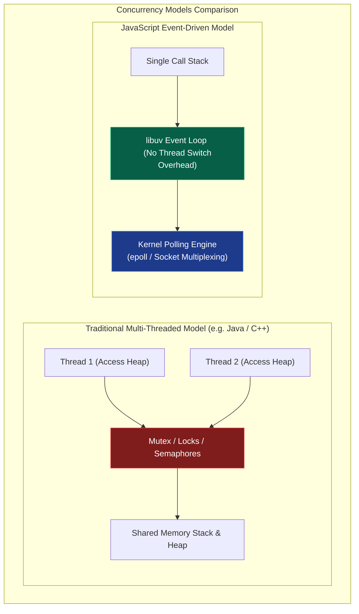
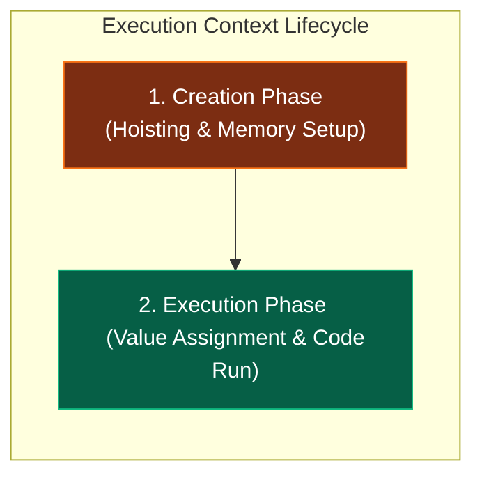

# 🚀 JavaScript Systems & Internals Handbook

জাভাস্ক্রিপ্ট (JS) বর্তমান বিশ্বের অন্যতম বৈপ্লবিক প্রযুক্তিতে পরিণত হয়েছে। এর একক থ্রেডের সরলতা এবং একই সাথে উচ্চ-কনকারেন্ট সিস্টেম পরিচালনার দক্ষতা আধুনিক সিস্টেম ডিজাইন ও আর্কিটেকচারের সবচেয়ে চমৎকার স্টাডি কেস। 

এই হ্যান্ডবুকটির উদ্দেশ্য হলো জাভাস্ক্রিপ্টকে ওএসের প্রসেস সীমানা, মেমরি হিপ, ইন্টিজার অ্যালোকেশন এবং লিনাক্স কার্নেলের পোলিং ইন্টারফেস লেভেল পর্যন্ত উন্মোচন করা। এটি কোনো বেসিক স্ক্রিপ্টিং টিউটোরিয়াল নয়; এটি জাভাস্ক্রিপ্ট ইঞ্জিন ও রানটাইমের ভৌত আচরণ বুঝতে চাওয়া সিস্টেম ও সফটওয়্যার আর্কিটেক্টদের জন্য একটি মাস্টারক্লাস ম্যানুয়াল।

---

## ১. JavaScript-এর মূল দর্শন ও সিস্টেম ডিজাইন

জাভাস্ক্রিপ্ট ডিজাইন করার সময় ব্রেন্ডন আইক (Brendan Eich) ১৯৯৫ সালে নেটস্কেপে মাত্র ১০ দিনে একটি দর্শনের উপর ভিত্তি করে এর জন্ম দেন: **"Lightweight, single-threaded concurrency without thread conflicts."** এই দর্শনটিই আজ একে বিশ্বের অন্যতম ফাস্ট কনকারেন্ট সিস্টেমে রূপান্তর করেছে।



### Dynamic Typing বনাম Static Execution-এর সিস্টেম আর্কিটেকচার দ্বন্দ্ব

জাভাস্ক্রিপ্ট একটি **Dynamically Typed** ল্যাঙ্গুয়েজ। এর অর্থ হলো মেমরিতে কোনো ভেরিয়েবলের ডাটা টাইপ রানটাইমের আগে ফিক্সড থাকে না।

```javascript
let data = 42;       // Allocates as a number
data = "hello JS";   // Re-allocates as a heap-based string
```

#### সিস্টেম-লেভেল দ্বন্দ্ব:
1. **Memory Allocation:** স্ট্যাটিকালি টাইপড ল্যাঙ্গুয়েজে (যেমন: C/C++ বা Rust), কম্পাইলার আগেই জানে যে একটি ভেরিয়েবল `int32` (৪ বাইট) জায়গা নেবে। ফলে স্ট্যাক মেমরিতে সরাসরি ফিক্সড স্পেস অ্যালোকেশন করা সম্ভব। কিন্তু জাভাস্ক্রিপ্টে কার্নেল বা ইঞ্জিন আগে থেকে মেমরি সাইজ অনুমান করতে পারে না। প্রতিবার টাইপ পরিবর্তনের সময় ইঞ্জিনকে মেমরিতে অবজেক্ট স্ট্রাকচার রি-ম্যাপ করতে হয়।
2. **Execution Slowdown:** টাইপ লক না থাকার কারণে, প্রসেসর লেভেলে সরাসরি অপ্টিমাইজড ইন্সট্রাকশন চালানো যায় না। প্রতিটি অপারেশনের আগে ইঞ্জিনকে মেমরি থেকে ডাটার "ট্যাগ" চেক করতে হয় যে এটি নাম্বার, স্ট্রিং নাকি অবজেক্ট। এই চেকিং প্রসেসরের CPU cycles নষ্ট করে।

---

### Concurrency without Locks (সিঙ্গেল-থ্রেডেড ইভেন্ট ড্রাইভেন ডিজাইন)

ঐতিহ্যবাহী মাল্টি-থ্রেডেড আর্কিটেকচারে (যেমন: Java, C#) কনকারেন্সি বা একসাথে একাধিক কাজ করা নিশ্চিত করতে শত শত থ্রেড স্পন করা হয়। 

#### মাল্টি-থ্রেডিংয়ের বড় সিস্টেম ওভারহেড:
- **Context Switching:** ওএস যখন এক থ্রেড থেকে অন্য থ্রেডে সিপিইউ কন্ট্রোল শিফট করে, তখন প্রসেসর রেজিস্টার ও স্ট্যাকের সমস্ত ডাটা মেমরিতে ব্যাকআপ করতে হয়, যা চরম মেমরি ও সিপিইউ ইনটেনসিভ অপারেশন।
- **Concurrency Bugs:** শেয়ার্ড মেমরিতে একাধিক থ্রেড একসাথে এক্সেস করার সময় ডেডলক (Deadlock), রেস কন্ডিশন (Race Condition) এবং থ্রেড স্টারভেশন ঘটে। এগুলো ঠেকাতে জটিল লক মেকানিজম (Mutex/Semaphores) বসাতে হয়, যা সফটওয়্যারকে ধীরগতির করে তোলে।

#### জাভাস্ক্রিপ্টের সমাধান:
জেএস তার মূল এক্সিকিউশন লাইনকে **Single-threaded** রাখে। অর্থাৎ অ্যাপ্লিকেশনের সমস্ত লজিক কেবল একটি প্রসেসর থ্রেডে একের পর এক এক্সিকিউট হবে। কোনো লকিং বা রেস কন্ডিশন থাকবে না।

তাহলে এটি হাজার হাজার ইউজার রিকোয়েস্ট একসাথে কীভাবে প্রসেস করে? জেএস তার দীর্ঘমেয়াদী কাজগুলোকে (যেমন: ফাইল রিড, নেটওয়ার্ক রিকোয়েস্ট, বা ডাটাবেজ কোয়েরি) নিজে না করে ওএসের কার্নেলের কাছে হস্তান্তর করে দেয় এবং ইভেন্ট লুপের মাধ্যমে রেজাল্ট রিসিভ করে। এটি সিঙ্গেল-থ্রেডেড হয়েও কোটি কোটি কানেকশন হ্যান্ডেল করতে পারে কোনো প্রকার থ্রেড সুইচের ঝামেলা ছাড়াই।

---

## ২. JavaScript Runtime ও Engine-এর ভৌত গঠন

অধিকাংশ ডেভেলপার "ইঞ্জিন" এবং "রানটাইম"-কে গুলিয়ে ফেলেন। জাভাস্ক্রিপ্ট সিস্টেম ডিজাইনের ক্ষেত্রে এই দুটির কাজের বাউন্ডারি জানা অত্যন্ত জরুরি।

### Engine বনাম Runtime-এর কাজের বাউন্ডারি

```text
+-----------------------------------------------------------------+
| Runtime Environment (Browser / Node.js)                         |
|                                                                 |
|   +------------------------------------+   +----------------+   |
|   | V8 Engine Sandbox                  |   | Web APIs /     |   |
|   |                                    |   | Node.js APIs   |   |
|   |   [ Call Stack ]    [ Heap ]       |   | (setTimeout,   |   |
|   |                                    |   |  fs, fetch)    |   |
|   +------------------------------------+   +----------------+   |
|                                                     |           |
|   +-------------------------------------------------+           |
|   | libuv Event Loop & Callback Queues                          |
|   +-------------------------------------------------------------+
+-----------------------------------------------------------------+
```

#### ১. JavaScript Engine (যেমন: Google V8, Apple JavaScriptCore, Mozilla SpiderMonkey):
ইঞ্জিন হলো একটি বিশুদ্ধ **Execution Sandbox**। এর কাজ কেবল এবং শুধুমাত্র জাভাস্ক্রিপ্ট টেক্সট কোডকে ইনপুট হিসেবে নেওয়া এবং তা হোস্ট মেশিনের প্রসেসরের বোঝার উপযোগী নেটিভ মেশিন কোডে রূপান্তর করে রান করানো। 
- ইঞ্জিনের নিজস্ব কোনো ফাইল রিড করার ক্ষমতা বা নেটওয়ার্ক সকেট ওপেন করার এপিআই থাকে না।
- ইঞ্জিনের মূল উপাদান কেবল দুটি: **Memory Heap** (অবজেক্ট সংরক্ষণের জায়গা) এবং **Call Stack** (এক্সিকিউশন ট্র্যাকিং)।

#### ২. Runtime Environment (যেমন: Chrome Browser, Node.js, Bun):
রানটাইম হলো ইঞ্জিনের চারপাশের একটি স্বয়ংসম্পূর্ণ এনভায়রনমেন্ট বা ধারক। এটি ইঞ্জিনকে বাহ্যিক পৃথিবীর সাথে যোগাযোগ করার জন্য প্রয়োজনীয় সি-লিঙ্কড এপিআই বা সার্ভিস সরবরাহ করে।
- ব্রাউজার রানটাইম ইঞ্জিনকে যোগান দেয়: DOM API, fetch, geolocation, setTimeout।
- Node.js রানটাইম ইঞ্জিনকে যোগান দেয়: `fs` (ফাইল সিস্টেম), `net` (সকেট), `crypto` (নিরাপত্তা)।
- রানটাইমই ইভেন্ট লুপ ও ক্যাশ মেমরি অর্কেস্ট্রেট করে।

---

### Execution Context ও Global Execution Context

জাভাস্ক্রিপ্টে যেকোনো কোড রান করার সময় কার্নেল লেভেলে একটি ভার্চুয়াল বাউন্ডারি বা সেল তৈরি হয়, একে **Execution Context (EC)** বলে। এটি কোডের এক্সিকিউশন স্টেজ ট্র্যাক করে।

কোড বুট হওয়ার সাথে সাথে ইঞ্জিন সবার আগে **Global Execution Context (GEC)** তৈরি করে। এরপর প্রতিবার কোনো ফাংশন কল হলে স্ট্যাকে নতুন একটি কাস্টম EC পুশ হয়।

#### Execution Context-এর দুটি পর্যায় (Lifecycle Phases):



#### ১. Creation Phase (মেমরি অ্যালোকেশন পর্যায়):
এই পর্যায়ে কোনো কোড ফিজিক্যালি রান করে না। ইঞ্জিন কেবল সম্পূর্ণ কোড ফাইলটি স্ক্যান করে ভেরিয়েবল এবং ফাংশনগুলোর জন্য মেমরি রিজার্ভ করে।
- **Variable Hoisting:** `var` ভেরিয়েবলগুলোকে মেমরিতে রেজিস্টার করে তাদের ডিফল্ট ভ্যালু `undefined` দিয়ে ইনিশিয়েলাইজ করে রাখা হয়। `let` এবং `const` ভেরিয়েবলগুলোও রেজিস্টার হয় কিন্তু তারা মেমরির একটি সুরক্ষিত খাঁচায় বন্দী থাকে যাকে **Temporal Dead Zone (TDZ)** বলে। TDZ পার হওয়ার পূর্বে এদের এক্সেস করলে ইঞ্জিন মেমরি লেভেলে এরর থ্রো করে।
- **Function Hoisting:** ফাংশনের বডি এবং লজিক মেমরির হিপ স্পেসে হুবহু কপি করে পুরো ফাংশনটিকে পয়েন্টার সহ স্ট্যাক মেমরিতে মাউন্ট করে রাখা হয়। ফলে কোডে ডিক্লেয়ার করার আগেই ফাংশন কল করা সম্ভব হয়।
- **Scope Chain & `this` Binding:** রানিং প্রসেসের প্যারেন্ট স্কোপ লিঙ্ক এবং `this` অবজেক্টের মেমরি অ্যাড্রেস বাইন্ড করা হয়।

#### ২. Execution Phase (এক্সিকিউশন পর্যায়):
এই পর্যায়ে ইঞ্জিন বাম থেকে ডানে, উপর থেকে নিচে লাইন বাই লাইন কোড রান করে। ভেরিয়েবলগুলোর মেমরি লোকেশনে বাস্তব ভ্যালু অ্যাসাইন করে এবং লজিক্যাল অপারেশনগুলো CPU রেজিস্টারে প্রসেস করে।

---

### Call Stack ও Memory Heap ইন্টারনালস

- **Memory Heap (আনস্ট্রাকচার্ড মেমরি):** এটি হোস্ট ওএস মেমরি স্পেসের একটি বড় ডায়নামিক মেমরি ব্লক। জাভাস্ক্রিপ্টের সমস্ত অবজেক্ট, অ্যারে এবং ক্লোজার ফাংশনগুলো এলোমেলোভাবে মেমরির এই অংশে স্টোর করা থাকে। হিপের মেমরি এলোকেশন স্ট্যাকের মতো লিনিয়ার বা সাজানো নয়, তাই এখানে মেমরি খুঁজতে ও ট্র্যাক করতে কার্নেলের মেমরি পয়েন্টার অ্যাড্রেস ব্যবহার করতে হয়।
- **Call Stack (লিনিয়ার মেমরি):** এটি একটি অত্যন্ত দ্রুত এবং কঠোরভাবে সাজানো **LIFO (Last In, First Out)** মেমরি স্ট্রাকচার। এখানে কেবল রানিং ফাংশনের ইনফরমেশন এবং প্রিমিটিভ ভ্যালু স্টোর থাকে। কল স্ট্যাকের প্রতিটি স্লটকে এক একটি **Stack Frame** বা অ্যাক্টিভেশন রেকর্ড বলা হয়। কল স্ট্যাকের সর্বোচ্চ ধারণ ক্ষমতা হোস্ট প্রসেসের মেমরি বাউন্ডারি দ্বারা সীমাবদ্ধ। কোনো রিকার্সিভ ফাংশন যদি বেস কন্ডিশন ছাড়া লুপে চলে, তবে স্ট্যাক ফ্রেম উপচে পড়ে মেমরিতে **RangeError: Maximum call stack size exceeded** বা স্ট্যাক ওভারফ্লো এরর তৈরি করে।

---

## ৩. V8 Engine Internals: Ignition Parser & TurboFan JIT Compiler

গুগলের ক্রোম ব্রাউজার এবং Node.js-এর হৃদপিণ্ড হলো **V8 Engine**। এটি জাভাস্ক্রিপ্ট কোডকে চরম গতিতে এক্সিকিউট করতে একটি বৈপ্লবিক পাইপলাইন ব্যবহার করে।

```mermaid
flowchart TD
    subgraph V8Pipeline [V8 Execution Pipeline]
        JSCode["JavaScript Text Code"]
        Parser["AST Parser <br> (Generates Abstract Syntax Tree)"]
        Ignition["Ignition Interpreter <br> (Generates V8 Bytecode)"]
        Feedback["Type Feedback Vector <br> (Profiles variable types dynamically)"]
        TurboFan["TurboFan JIT Compiler <br> (Generates Native Machine Code)"]
        CPU["Physical Host CPU Execution"]

        JSCode --> Parser
        Parser --> Ignition
        Ignition --> CPU
        Ignition --> Feedback
        Feedback -->|Hot Functions (Optimization)| TurboFan
        TurboFan --> CPU
        TurboFan -.->|Type Mismatch (De-optimization)| Ignition
    end

    style JSCode fill:#1e293b,stroke:#475569,color:#fff
    style Ignition fill:#7c2d12,stroke:#f97316,color:#fff
    style TurboFan fill:#065f46,stroke:#10b981,color:#fff
```

### parsing এবং AST (Abstract Syntax Tree) জেনারেশন

যখন আপনি কোনো জেএস ফাইল রান করান, V8 ইঞ্জিনের ভেতরের **Parser** সবার আগে কোড টেক্সটটিকে প্রসেস করে দুটি ধাপে:
1. **Lexical Analysis (Scanner):** কোডের প্রতিটা কিওয়ার্ড, ভেরিয়েবল নেম এবং সিম্বলকে ভেঙে ছোট ছোট টোকেনে (`let`, `data`, `=`, `42`) রূপান্তর করে।
2. **Syntax Analysis (Parser):** এই টোকেনগুলোকে ব্যাকরণগতভাবে বিশ্লেষণ করে মেমরিতে একটি ট্রির মতো স্ট্রাকচার জেনারেট করে, যাকে **AST (Abstract Syntax Tree)** বলা হয়। এটি কোডের লজিক্যাল রিলেশনশিপ ডিফাইন করে।

---

### Ignition Interpreter ও Bytecode-এর মেমরি সাশ্রয় ট্রিক

ঐতিহাসিকভাবে V8 ইঞ্জিন প্রথম সংস্করণে সরাসরি AST থেকে মেশিন কোডে কমপাইল করত (Full-codegen compiler)। কিন্তু এর ফলে মোবাইল ফোনের মতো কম র‍্যামের ডিভাইসে বিশাল সাইজের কম্পাইলড মেশিন অ্যাসেম্বলি মেমরিতে জায়গা পেত না। 

এর সমাধান হিসেবে V8 প্রবর্তন করেছে **Ignition Interpreter**:
- এটি AST-কে রিসিভ করে একটি অত্যন্ত লাইটওয়েট ইন্টারমিডিয়েট ল্যাঙ্গুয়েজ বা **Bytecode** জেনারেট করে।
- বাইটকোডের আকার ফিজিক্যাল মেশিন কোডের চেয়ে প্রায় **৫০% থেকে ৭০% ছোট**। ফলে ডিভাইসের মেমরি বা র‍্যাম বেঁচে যায়।
- ইগনিশন ইন্টারপ্রিটার সরাসরি এই বাইটকোড রিড করে সাথে সাথে প্রোগ্রামটি এক্সিকিউট করা শুরু করে দেয় (Zero startup delay)।

---

### TurboFan Compiler এবং JIT (Just-In-Time) অপ্টিমাইজেশন

ইগনিশন ইন্টারপ্রিটার যখন বাইটকোড রান করায়, সে কোডের গতিবিধি পর্যবেক্ষণ করার জন্য একটি ডায়নামিক বুক-কিপার ব্যবহার করে, যাকে **Type Feedback Vector** বলা হয়।
- এই বুক-কিপার ট্র্যাক করে কোন কোন ফাংশন বারবার একই টাইপের ডাটা নিয়ে কল হচ্ছে। এই বারবার রান হওয়া ফাংশনগুলোকে কার্নেল লেভেলে **Hot Functions** বলা হয়।
- যখনই কোনো ফাংশন হট হিসেবে ডিটেক্ট হয়, V8 ইঞ্জিনের মেগা-অপ্টিমাইজার **TurboFan Compiler** ব্যাকগ্রাউন্ড থ্রেডে ওই ফাংশনের বাইটকোড এবং পূর্বে ট্র্যাক করা টাইপ ফিডব্যাক নিয়ে সরাসরি হোস্ট ওএসের নেটিভ মেশিন অ্যাসেম্বলিতে (Assembly Code) কম্পাইল করে ফেলে।
- পরবর্তী কলগুলোতে ইগনিশন ইন্টারপ্রিটার বাইপাস হয়ে সরাসরি নেটিভ মেশিন স্পিডে সিপিইউ রেজিস্টারে কোডটি চলে। একেই বলে **Just-In-Time (JIT) Compilation**।

---

### De-optimization (De-opt) লুপ মেকানিজম

যেহেতু জাভাস্ক্রিপ্ট ডায়নামিক ল্যাঙ্গুয়েজ, সেহেতু JIT অপ্টিমাইজেশনের একটি বড় ট্রিক বা সিকিউরিটি রুলস আছে।

চলুন নিচের একটি চমৎকার জাভাস্ক্রিপ্ট হট ফাংশন ট্র্যাক করি:
```javascript
function add(a, b) {
    return a + b;
}

// আমরা ফাংশনটি হাজার বার কল করলাম কেবল ইন্টিজার ভ্যালু দিয়ে
for (let i = 0; i < 10000; i++) {
    add(2, 3);
}
```
V8-এর Type Feedback Vector দেখেছে যে `add()` ফাংশনের `a` এবং `b` প্যারামিটার সবসময় `Integer` টাইপ। TurboFan ব্যাকগ্রাউন্ডে একে কম্পাইল করে সরাসরি প্রসেসরের স্পেসিফিক `ADD` অ্যাসেম্বলি ইন্সট্রাকশনে কনভার্ট করে নেটিভ মেশিন কোড রেডি করে ফেলেছে।

কিন্তু হঠাৎ যদি কোডের পরবর্তী লাইনে আমরা নিচের কলটি করি:
```javascript
// A sudden change: Passing strings instead of numbers!
add("hello", "world");
```

#### JIT মেমরি কলাপ্স ও De-optimization ফ্লো:
1. প্রসেসর যখনই নেটিভ মেশিন কোড এক্সিকিউট করতে যাবে, TurboFan-এর বসানো টাইপ-চেক গার্ড ফেইল করবে। কারণ প্রসেসর লেভেলে ইন্টিজারের `ADD` ইন্সট্রাকশন দিয়ে স্ট্রিং কনক্যাটেনেশন সম্ভব নয়।
2. ইঞ্জিন বুঝতে পারে তার করা সমস্ত অপ্টিমাইজেশনের ধারণা ভুল ছিল।
3. একে বলা হয় **De-optimization (De-opt)**।
4. ইঞ্জিন সাথে সাথে নেটিভ মেশিন কোডটি মেমরি থেকে ছুঁড়ে ফেলে দেয়।
5. রানিং সিপিইউ ফ্রেম বা বাফারকে রোলব্যাক করে পুনরায় **Ignition Interpreter**-এর জেনেরিক বাইটকোড এক্সিকিউশন ট্র্যাকে ডাইভার্ট করে দেয়।
6. টাইপ ফিডব্যাক ভেক্টরে লিখে রাখা হয় যে এই ফাংশনটি পলিমরফিক (একাধিক টাইপ নেয়)। এর ফলে পরবর্তীতে এই ফাংশনটিকে অপ্টিমাইজ করতে গেলে TurboFan অনেক বেশি রক্ষণশীল বা সতর্ক কোড জেনারেট করে। এই অনবরত অপ্টিমাইজেশন ও ডি-অপ্টিমাইজেশন লুপ ওএসের প্রসেসরের অতিরিক্ত পাওয়ার ও মেমরি নষ্ট করে, তাই প্রোডাকশন কোডে সবসময় এক টাইপের ভেরিয়েবল ব্যবহারে উৎসাহিত করা হয় (Monomorphism)।

---
