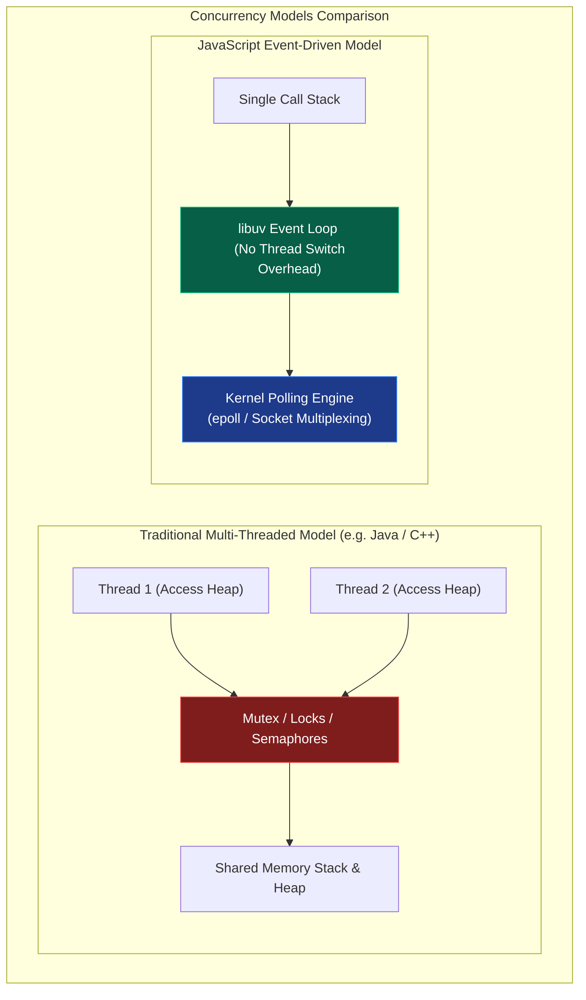
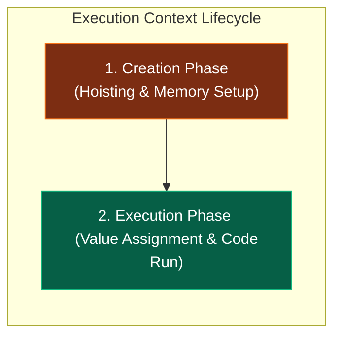
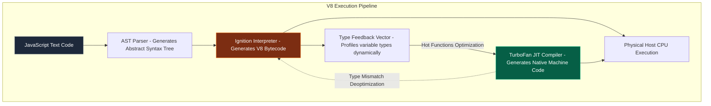
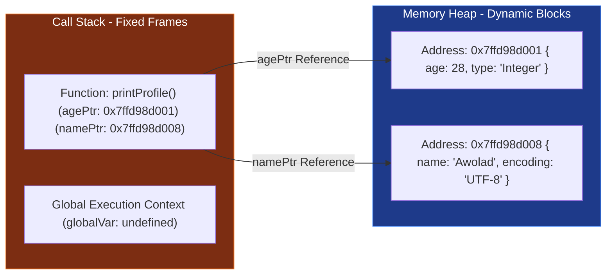
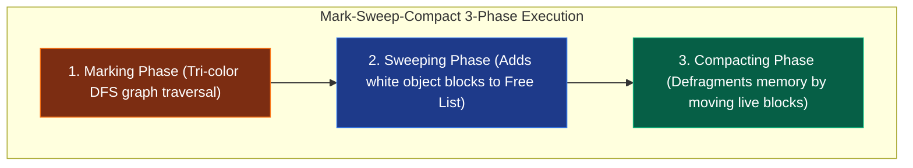
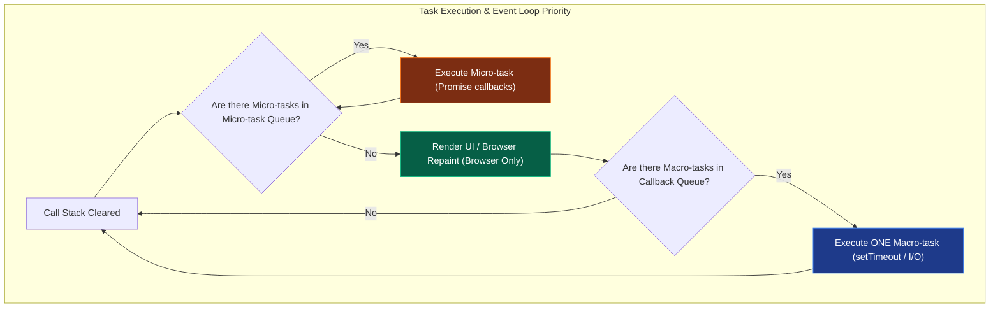
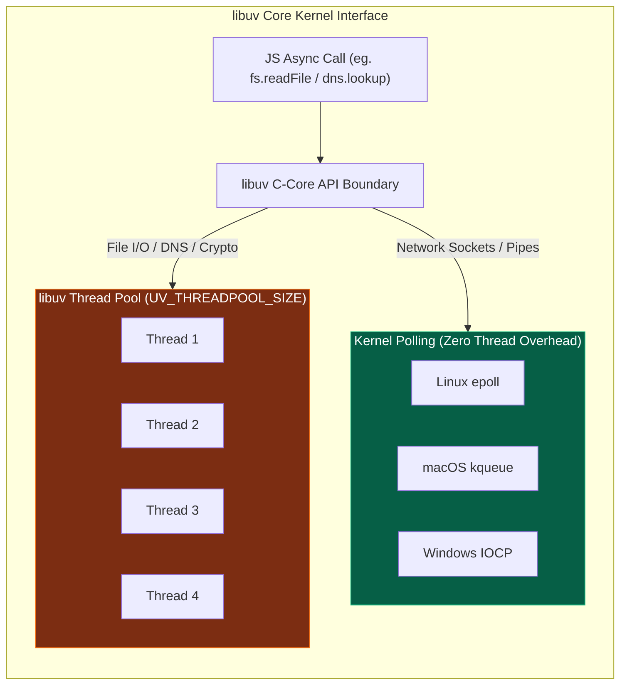
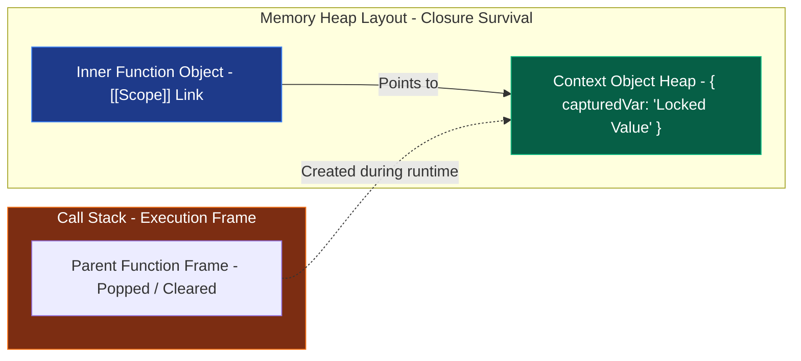
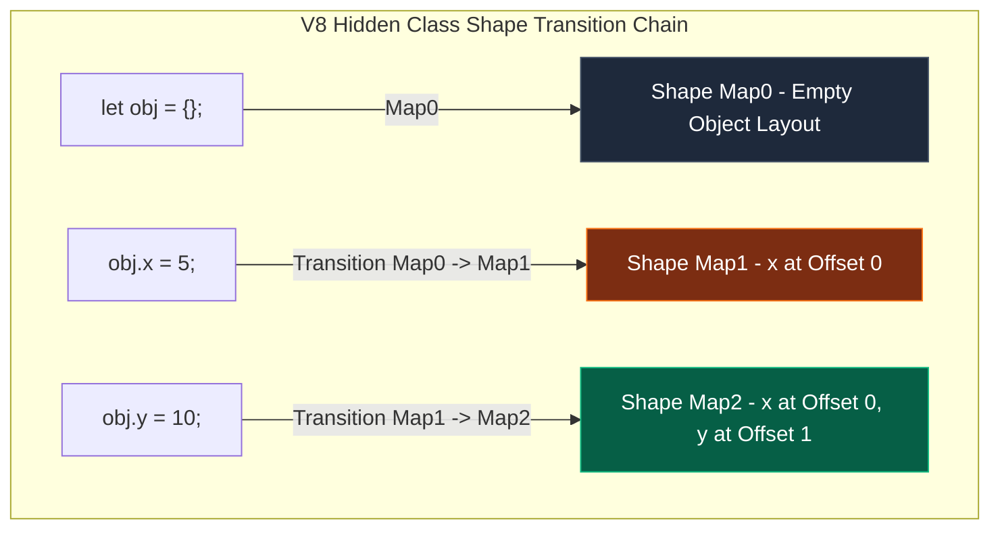
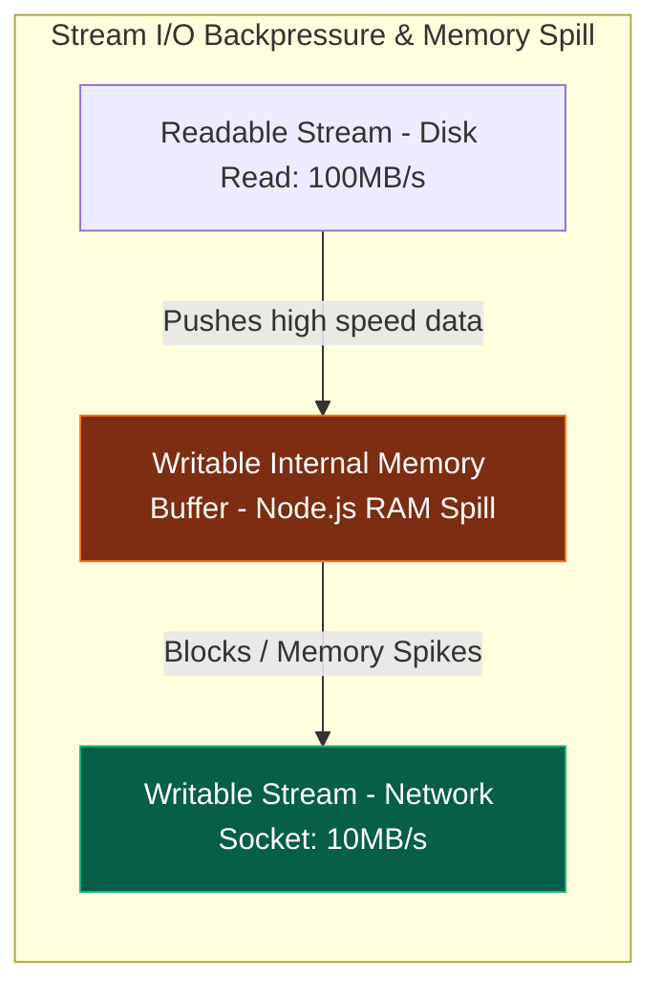

# 🚀 JavaScript Systems & Internals Handbook

জাভাস্ক্রিপ্ট (JS) বর্তমান বিশ্বের অন্যতম বৈপ্লবিক প্রযুক্তিতে পরিণত হয়েছে। এর একক থ্রেডের সরলতা এবং একই সাথে উচ্চ-কনকারেন্ট সিস্টেম পরিচালনার দক্ষতা আধুনিক সিস্টেম ডিজাইন ও আর্কিটেকচারের সবচেয়ে চমৎকার স্টাডি কেস। 

এই হ্যান্ডবুকটির উদ্দেশ্য হলো জাভাস্ক্রিপ্টকে ওএসের প্রসেস সীমানা, মেমরি হিপ, ইন্টিজার অ্যালোকেশন এবং লিনাক্স কার্নেলের পোলিং ইন্টারফেস লেভেল পর্যন্ত উন্মোচন করা। এটি কোনো বেসিক স্ক্রিপ্টিং টিউটোরিয়াল নয়; এটি জাভাস্ক্রিপ্ট ইঞ্জিন ও রানটাইমের ভৌত আচরণ বুঝতে চাওয়া সিস্টেম ও সফটওয়্যার আর্কিটেক্টদের জন্য একটি মাস্টারক্লাস ম্যানুয়াল।

---

## ১. JavaScript-এর মূল দর্শন ও সিস্টেম ডিজাইন

জাভাস্ক্রিপ্ট ডিজাইন করার সময় ব্রেন্ডন আইক (Brendan Eich) ১৯৯৫ সালে নেটস্কেপে মাত্র ১০ দিনে একটি দর্শনের উপর ভিত্তি করে এর জন্ম দেন: **"Lightweight, single-threaded concurrency without thread conflicts."** এই দর্শনটিই আজ একে বিশ্বের অন্যতম ফাস্ট কনকারেন্ট সিস্টেমে রূপান্তর করেছে।



### Dynamic Typing বনাম Static Execution-এর সিস্টেম আর্কিটেকচার দ্বন্দ্ব

জাভাস্ক্রিপ্ট একটি **Dynamically Typed** ল্যাঙ্গুয়েজ। এর অর্থ হলো মেমরিতে কোনো ভেরিয়েবলের ডাটা টাইপ রানটাইমের আগে ফিক্সড থাকে না।

```javascript
let data = 42;       // Allocates as a number
data = "hello JS";   // Re-allocates as a heap-based string
```

#### সিস্টেম-লেভেল দ্বন্দ্ব:
1. **Memory Allocation:** স্ট্যাটিকালি টাইপড ল্যাঙ্গুয়েজে (যেমন: C/C++ বা Rust), কম্পাইলার আগেই জানে যে একটি ভেরিয়েবল `int32` (৪ বাইট) জায়গা নেবে। ফলে স্ট্যাক মেমরিতে সরাসরি ফিক্সড স্পেস অ্যালোকেশন করা সম্ভব। কিন্তু জাভাস্ক্রিপ্টে কার্নেল বা ইঞ্জিন আগে থেকে মেমরি সাইজ অনুমান করতে পারে না। প্রতিবার টাইপ পরিবর্তনের সময় ইঞ্জিনকে মেমরিতে অবজেক্ট স্ট্রাকচার রি-ম্যাপ করতে হয়।
2. **Execution Slowdown:** টাইপ লক না থাকার কারণে, প্রসেসর লেভেলে সরাসরি অপ্টিমাইজড ইন্সট্রাকশন চালানো যায় না। প্রতিটি অপারেশনের আগে ইঞ্জিনকে মেমরি থেকে ডাটার "ট্যাগ" চেক করতে হয় যে এটি নাম্বার, স্ট্রিং নাকি অবজেক্ট। এই চেকিং প্রসেসরের CPU cycles নষ্ট করে।

---

### Concurrency without Locks (সিঙ্গেল-থ্রেডেড ইভেন্ট ড্রাইভেন ডিজাইন)

ঐতিহ্যবাহী মাল্টি-থ্রেডেড আর্কিটেকচারে (যেমন: Java, C#) কনকারেন্সি বা একসাথে একাধিক কাজ করা নিশ্চিত করতে শত শত থ্রেড স্পন করা হয়। 

#### মাল্টি-থ্রেডিংয়ের বড় সিস্টেম ওভারহেড:
- **Context Switching:** ওএস যখন এক থ্রেড থেকে অন্য থ্রেডে সিপিইউ কন্ট্রোল শিফট করে, তখন প্রসেসর রেজিস্টার ও স্ট্যাকের সমস্ত ডাটা মেমরিতে ব্যাকআপ করতে হয়, যা চরম মেমরি ও সিপিইউ ইনটেনসিভ অপারেশন।
- **Concurrency Bugs:** শেয়ার্ড মেমরিতে একাধিক থ্রেড একসাথে এক্সেস করার সময় ডেডলক (Deadlock), রেস কন্ডিশন (Race Condition) এবং থ্রেড স্টারভেশন ঘটে। এগুলো ঠেকাতে জটিল লক মেকানিজম (Mutex/Semaphores) বসাতে হয়, যা সফটওয়্যারকে ধীরগতির করে তোলে।

#### জাভাস্ক্রিপ্টের সমাধান:
জেএস তার মূল এক্সিকিউশন লাইনকে **Single-threaded** রাখে। অর্থাৎ অ্যাপ্লিকেশনের সমস্ত লজিক কেবল একটি প্রসেসর থ্রেডে একের পর এক এক্সিকিউট হবে। কোনো লকিং বা রেস কন্ডিশন থাকবে না।

তাহলে এটি হাজার হাজার ইউজার রিকোয়েস্ট একসাথে কীভাবে প্রসেস করে? জেএস তার দীর্ঘমেয়াদী কাজগুলোকে (যেমন: ফাইল রিড, নেটওয়ার্ক রিকোয়েস্ট, বা ডাটাবেজ কোয়েরি) নিজে না করে ওএসের কার্নেলের কাছে হস্তান্তর করে দেয় এবং ইভেন্ট লুপের মাধ্যমে রেজাল্ট রিসিভ করে। এটি সিঙ্গেল-থ্রেডেড হয়েও কোটি কোটি কানেকশন হ্যান্ডেল করতে পারে কোনো প্রকার থ্রেড সুইচের ঝামেলা ছাড়াই।

---

## ২. JavaScript Runtime ও Engine-এর ভৌত গঠন

অধিকাংশ ডেভেলপার "ইঞ্জিন" এবং "রানটাইম"-কে গুলিয়ে ফেলেন। জাভাস্ক্রিপ্ট সিস্টেম ডিজাইনের ক্ষেত্রে এই দুটির কাজের বাউন্ডারি জানা অত্যন্ত জরুরি।

### Engine বনাম Runtime-এর কাজের বাউন্ডারি

```text
+-----------------------------------------------------------------+
| Runtime Environment (Browser / Node.js)                         |
|                                                                 |
|   +------------------------------------+   +----------------+   |
|   | V8 Engine Sandbox                  |   | Web APIs /     |   |
|   |                                    |   | Node.js APIs   |   |
|   |   [ Call Stack ]    [ Heap ]       |   | (setTimeout,   |   |
|   |                                    |   |  fs, fetch)    |   |
|   +------------------------------------+   +----------------+   |
|                                                     |           |
|   +-------------------------------------------------+           |
|   | libuv Event Loop & Callback Queues                          |
|   +-------------------------------------------------------------+
+-----------------------------------------------------------------+
```

#### ১. JavaScript Engine (যেমন: Google V8, Apple JavaScriptCore, Mozilla SpiderMonkey):
ইঞ্জিন হলো একটি বিশুদ্ধ **Execution Sandbox**। এর কাজ কেবল এবং শুধুমাত্র জাভাস্ক্রিপ্ট টেক্সট কোডকে ইনপুট হিসেবে নেওয়া এবং তা হোস্ট মেশিনের প্রসেসরের বোঝার উপযোগী নেটিভ মেশিন কোডে রূপান্তর করে রান করানো। 
- ইঞ্জিনের নিজস্ব কোনো ফাইল রিড করার ক্ষমতা বা নেটওয়ার্ক সকেট ওপেন করার এপিআই থাকে না।
- ইঞ্জিনের মূল উপাদান কেবল দুটি: **Memory Heap** (অবজেক্ট সংরক্ষণের জায়গা) এবং **Call Stack** (এক্সিকিউশন ট্র্যাকিং)।

#### ২. Runtime Environment (যেমন: Chrome Browser, Node.js, Bun):
রানটাইম হলো ইঞ্জিনের চারপাশের একটি স্বয়ংসম্পূর্ণ এনভায়রনমেন্ট বা ধারক। এটি ইঞ্জিনকে বাহ্যিক পৃথিবীর সাথে যোগাযোগ করার জন্য প্রয়োজনীয় সি-লিঙ্কড এপিআই বা সার্ভিস সরবরাহ করে।
- ব্রাউজার রানটাইম ইঞ্জিনকে যোগান দেয়: DOM API, fetch, geolocation, setTimeout।
- Node.js রানটাইম ইঞ্জিনকে যোগান দেয়: `fs` (ফাইল সিস্টেম), `net` (সকেট), `crypto` (নিরাপত্তা)।
- রানটাইমই ইভেন্ট লুপ ও ক্যাশ মেমরি অর্কেস্ট্রেট করে।

---

### Execution Context ও Global Execution Context

জাভাস্ক্রিপ্টে যেকোনো কোড রান করার সময় কার্নেল লেভেলে একটি ভার্চুয়াল বাউন্ডারি বা সেল তৈরি হয়, একে **Execution Context (EC)** বলে। এটি কোডের এক্সিকিউশন স্টেজ ট্র্যাক করে।

কোড বুট হওয়ার সাথে সাথে ইঞ্জিন সবার আগে **Global Execution Context (GEC)** তৈরি করে। এরপর প্রতিবার কোনো ফাংশন কল হলে স্ট্যাকে নতুন একটি কাস্টম EC পুশ হয়।

#### Execution Context-এর দুটি পর্যায় (Lifecycle Phases):



#### ১. Creation Phase (মেমরি অ্যালোকেশন পর্যায়):
এই পর্যায়ে কোনো কোড ফিজিক্যালি রান করে না। ইঞ্জিন কেবল সম্পূর্ণ কোড ফাইলটি স্ক্যান করে ভেরিয়েবল এবং ফাংশনগুলোর জন্য মেমরি রিজার্ভ করে।
- **Variable Hoisting:** `var` ভেরিয়েবলগুলোকে মেমরিতে রেজিস্টার করে তাদের ডিফল্ট ভ্যালু `undefined` দিয়ে ইনিশিয়েলাইজ করে রাখা হয়। `let` এবং `const` ভেরিয়েবলগুলোও রেজিস্টার হয় কিন্তু তারা মেমরির একটি সুরক্ষিত খাঁচায় বন্দী থাকে যাকে **Temporal Dead Zone (TDZ)** বলে। TDZ পার হওয়ার পূর্বে এদের এক্সেস করলে ইঞ্জিন মেমরি লেভেলে এরর থ্রো করে।
- **Function Hoisting:** ফাংশনের বডি এবং লজিক মেমরির হিপ স্পেসে হুবহু কপি করে পুরো ফাংশনটিকে পয়েন্টার সহ স্ট্যাক মেমরিতে মাউন্ট করে রাখা হয়। ফলে কোডে ডিক্লেয়ার করার আগেই ফাংশন কল করা সম্ভব হয়।
- **Scope Chain & `this` Binding:** রানিং প্রসেসের প্যারেন্ট স্কোপ লিঙ্ক এবং `this` অবজেক্টের মেমরি অ্যাড্রেস বাইন্ড করা হয়।

#### ২. Execution Phase (এক্সিকিউশন পর্যায়):
এই পর্যায়ে ইঞ্জিন বাম থেকে ডানে, উপর থেকে নিচে লাইন বাই লাইন কোড রান করে। ভেরিয়েবলগুলোর মেমরি লোকেশনে বাস্তব ভ্যালু অ্যাসাইন করে এবং লজিক্যাল অপারেশনগুলো CPU রেজিস্টারে প্রসেস করে।

---

### Call Stack ও Memory Heap ইন্টারনালস

- **Memory Heap (আনস্ট্রাকচার্ড মেমরি):** এটি হোস্ট ওএস মেমরি স্পেসের একটি বড় ডায়নামিক মেমরি ব্লক। জাভাস্ক্রিপ্টের সমস্ত অবজেক্ট, অ্যারে এবং ক্লোজার ফাংশনগুলো এলোমেলোভাবে মেমরির এই অংশে স্টোর করা থাকে। হিপের মেমরি এলোকেশন স্ট্যাকের মতো লিনিয়ার বা সাজানো নয়, তাই এখানে মেমরি খুঁজতে ও ট্র্যাক করতে কার্নেলের মেমরি পয়েন্টার অ্যাড্রেস ব্যবহার করতে হয়।
- **Call Stack (লিনিয়ার মেমরি):** এটি একটি অত্যন্ত দ্রুত এবং কঠোরভাবে সাজানো **LIFO (Last In, First Out)** মেমরি স্ট্রাকচার। এখানে কেবল রানিং ফাংশনের ইনফরমেশন এবং প্রিমিটিভ ভ্যালু স্টোর থাকে। কল স্ট্যাকের প্রতিটি স্লটকে এক একটি **Stack Frame** বা অ্যাক্টিভেশন রেকর্ড বলা হয়। কল স্ট্যাকের সর্বোচ্চ ধারণ ক্ষমতা হোস্ট প্রসেসের মেমরি বাউন্ডারি দ্বারা সীমাবদ্ধ। কোনো রিকার্সিভ ফাংশন যদি বেস কন্ডিশন ছাড়া লুপে চলে, তবে স্ট্যাক ফ্রেম উপচে পড়ে মেমরিতে **RangeError: Maximum call stack size exceeded** বা স্ট্যাক ওভারফ্লো এরর তৈরি করে।

---

## ৩. V8 Engine Internals: Ignition Parser & TurboFan JIT Compiler

গুগলের ক্রোম ব্রাউজার এবং Node.js-এর হৃদপিণ্ড হলো **V8 Engine**। এটি জাভাস্ক্রিপ্ট কোডকে চরম গতিতে এক্সিকিউট করতে একটি বৈপ্লবিক পাইপলাইন ব্যবহার করে।



### parsing এবং AST (Abstract Syntax Tree) জেনারেশন

যখন আপনি কোনো জেএস ফাইল রান করান, V8 ইঞ্জিনের ভেতরের **Parser** সবার আগে কোড টেক্সটটিকে প্রসেস করে দুটি ধাপে:
1. **Lexical Analysis (Scanner):** কোডের প্রতিটা কিওয়ার্ড, ভেরিয়েবল নেম এবং সিম্বলকে ভেঙে ছোট ছোট টোকেনে (`let`, `data`, `=`, `42`) রূপান্তর করে।
2. **Syntax Analysis (Parser):** এই টোকেনগুলোকে ব্যাকরণগতভাবে বিশ্লেষণ করে মেমরিতে একটি ট্রির মতো স্ট্রাকচার জেনারেট করে, যাকে **AST (Abstract Syntax Tree)** বলা হয়। এটি কোডের লজিক্যাল রিলেশনশিপ ডিফাইন করে।

---

### Ignition Interpreter ও Bytecode-এর মেমরি সাশ্রয় ট্রিক

ঐতিহাসিকভাবে V8 ইঞ্জিন প্রথম সংস্করণে সরাসরি AST থেকে মেশিন কোডে কমপাইল করত (Full-codegen compiler)। কিন্তু এর ফলে মোবাইল ফোনের মতো কম র‍্যামের ডিভাইসে বিশাল সাইজের কম্পাইলড মেশিন অ্যাসেম্বলি মেমরিতে জায়গা পেত না। 

এর সমাধান হিসেবে V8 প্রবর্তন করেছে **Ignition Interpreter**:
- এটি AST-কে রিসিভ করে একটি অত্যন্ত লাইটওয়েট ইন্টারমিডিয়েট ল্যাঙ্গুয়েজ বা **Bytecode** জেনারেট করে।
- বাইটকোডের আকার ফিজিক্যাল মেশিন কোডের চেয়ে প্রায় **৫০% থেকে ৭০% ছোট**। ফলে ডিভাইসের মেমরি বা র‍্যাম বেঁচে যায়।
- ইগনিশন ইন্টারপ্রিটার সরাসরি এই বাইটকোড রিড করে সাথে সাথে প্রোগ্রামটি এক্সিকিউট করা শুরু করে দেয় (Zero startup delay)।

---

### TurboFan Compiler এবং JIT (Just-In-Time) অপ্টিমাইজেশন

ইগনিশন ইন্টারপ্রিটার যখন বাইটকোড রান করায়, সে কোডের গতিবিধি পর্যবেক্ষণ করার জন্য একটি ডায়নামিক বুক-কিপার ব্যবহার করে, যাকে **Type Feedback Vector** বলা হয়।
- এই বুক-কিপার ট্র্যাক করে কোন কোন ফাংশন বারবার একই টাইপের ডাটা নিয়ে কল হচ্ছে। এই বারবার রান হওয়া ফাংশনগুলোকে কার্নেল লেভেলে **Hot Functions** বলা হয়।
- যখনই কোনো ফাংশন হট হিসেবে ডিটেক্ট হয়, V8 ইঞ্জিনের মেগা-অপ্টিমাইজার **TurboFan Compiler** ব্যাকগ্রাউন্ড থ্রেডে ওই ফাংশনের বাইটকোড এবং পূর্বে ট্র্যাক করা টাইপ ফিডব্যাক নিয়ে সরাসরি হোস্ট ওএসের নেটিভ মেশিন অ্যাসেম্বলিতে (Assembly Code) কম্পাইল করে ফেলে।
- পরবর্তী কলগুলোতে ইগনিশন ইন্টারপ্রিটার বাইপাস হয়ে সরাসরি নেটিভ মেশিন স্পিডে সিপিইউ রেজিস্টারে কোডটি চলে। একেই বলে **Just-In-Time (JIT) Compilation**।

---

### De-optimization (De-opt) লুপ মেকানিজম

যেহেতু জাভাস্ক্রিপ্ট ডায়নামিক ল্যাঙ্গুয়েজ, সেহেতু JIT অপ্টিমাইজেশনের একটি বড় ট্রিক বা সিকিউরিটি রুলস আছে।

চলুন নিচের একটি চমৎকার জাভাস্ক্রিপ্ট হট ফাংশন ট্র্যাক করি:
```javascript
function add(a, b) {
    return a + b;
}

// আমরা ফাংশনটি হাজার বার কল করলাম কেবল ইন্টিজার ভ্যালু দিয়ে
for (let i = 0; i < 10000; i++) {
    add(2, 3);
}
```
V8-এর Type Feedback Vector দেখেছে যে `add()` ফাংশনের `a` এবং `b` প্যারামিটার সবসময় `Integer` টাইপ। TurboFan ব্যাকগ্রাউন্ডে একে কম্পাইল করে সরাসরি প্রসেসরের স্পেসিফিক `ADD` অ্যাসেম্বলি ইন্সট্রাকশনে কনভার্ট করে নেটিভ মেশিন কোড রেডি করে ফেলেছে।

কিন্তু হঠাৎ যদি কোডের পরবর্তী লাইনে আমরা নিচের কলটি করি:
```javascript
// A sudden change: Passing strings instead of numbers!
add("hello", "world");
```

#### JIT মেমরি কলাপ্স ও De-optimization ফ্লো:
1. প্রসেসর যখনই নেটিভ মেশিন কোড এক্সিকিউট করতে যাবে, TurboFan-এর বসানো টাইপ-চেক গার্ড ফেইল করবে। কারণ প্রসেসর লেভেলে ইন্টিজারের `ADD` ইন্সট্রাকশন দিয়ে স্ট্রিং কনক্যাটেনেশন সম্ভব নয়।
2. ইঞ্জিন বুঝতে পারে তার করা সমস্ত অপ্টিমাইজেশনের ধারণা ভুল ছিল।
3. একে বলা হয় **De-optimization (De-opt)**।
4. ইঞ্জিন সাথে সাথে নেটিভ মেশিন কোডটি মেমরি থেকে ছুঁড়ে ফেলে দেয়।
5. রানিং সিপিইউ ফ্রেম বা বাফারকে রোলব্যাক করে পুনরায় **Ignition Interpreter**-এর জেনেরিক বাইটকোড এক্সিকিউশন ট্র্যাকে ডাইভার্ট করে দেয়।
6. টাইপ ফিডব্যাক ভেক্টরে লিখে রাখা হয় যে এই ফাংশনটি পলিমরফিক (একাধিক টাইপ নেয়)। এর ফলে পরবর্তীতে এই ফাংশনটিকে অপ্টিমাইজ করতে গেলে TurboFan অনেক বেশি রক্ষণশীল বা সতর্ক কোড জেনারেট করে। এই অনবরত অপ্টিমাইজেশন ও ডি-অপ্টিমাইজেশন লুপ ওএসের প্রসেসরের অতিরিক্ত পাওয়ার ও মেমরি নষ্ট করে, তাই প্রোডাকশন কোডে সবসময় এক টাইপের ভেরিয়েবল ব্যবহারে উৎসাহিত করা হয় (Monomorphism)।

---


## ৪. JavaScript Memory Allocation: Stack vs. Heap

জাভাস্ক্রিপ্ট অ্যাপ্লিকেশন যখন হোস্ট ওএসে চলে, তখন মেমরি অ্যালোকেশন অত্যন্ত সূক্ষ্ম মেকানিজম মেনে চলে। ডাইনামিক রানিং মেমরি প্রধানত দুটি ভাগে বিভক্ত: **Call Stack** এবং **Memory Heap**।

### Primitives বনাম Reference Types-এর সিস্টেম লেভেল লেআউট

১. **Primitive Values (স্ট্যাক মেমরি):**
   - লিনাক্স বা উইন্ডোজ ওএসে `Number`, `String`, `Boolean`, `Null`, `Undefined`, `Symbol`, `BigInt` টাইপের ভেরিয়েবলগুলোকে প্রিমিটিভ ডাটা বলা হয়।
   - **শর্তসাপেক্ষ স্ট্যাক অ্যালোকেশন:** এই ভ্যালুগুলো সরাসরি স্ট্যাক মেমরিতে জমা হয়, **কিন্তু শুধুমাত্র তখনই যখন তারা লোকাল ভেরিয়েবল হিসেবে কোনো অ্যাক্টিভেশন রেকর্ড বা স্ট্যাক ফ্রেমের ভেতরে ডিক্লেয়ার করা হয়।**
   - যদি কোনো প্রিমিটিভ ভ্যালু কোনো অবজেক্টের অংশ হয় বা কোনো ক্লোজারের (Closure) ভেতরে ক্যাপচার করা থাকে, তবে প্রসেসর তাকে স্ট্যাকের বদলে সরাসরি হিপ মেমরিতে পাঠিয়ে দেয়।
২. **Reference Values (হিপ মেমরি):**
   - `Object`, `Array`, `Function` এগুলোকে রেফারেন্স ডাটা বলা হয়। এগুলো আকারে বিশাল ও ডায়নামিক হওয়ায় প্রসেসরের স্ট্যাক ফ্রেমে জায়গা পায় না।
   - ইঞ্জিন হিপ মেমরিতে এই অবজেক্টের জন্য ডায়নামিক স্পেস বরাদ্দ করে এবং সেই হিপ মেমরির স্টার্ট অ্যাড্রেস বা **৬৪-বিট মেমরি পয়েন্টার (Address Pointer)** স্ট্যাক ফ্রেমের ভেতরের লোকাল ভেরিয়েবলে স্টোর করে।

---

### মেমরি পয়েন্টার ও অ্যাক্টিভেশন রেকর্ড ম্যাপিং (Memory Layout)

নিচের ডায়াগ্রামে দেখানো হয়েছে কীভাবে স্ট্যাক ফ্রেমের লোকাল পয়েন্টারগুলো হিপ মেমরির অবজেক্ট অ্যাড্রেসের সাথে যোগাযোগ মেইনটেইন করে:



যখন আমরা কোনো রেফারেন্স টাইপের অবজেক্ট অন্য ভেরিয়েবলে কপি করি, ওএস মেমরি ক্লোন করে না; এটি কেবল পয়েন্টার অ্যাড্রেসটি কপি করে দেয়:
```javascript
let user1 = { name: "Awolad" }; // হিপ মেমরিতে ০x৭এফএফএফ তৈরি এবং user1 এ পয়েন্টার সেভ।
let user2 = user1;              // user2 ও একই পয়েন্টার ০x৭এফএফএফ শেয়ার করে।
user2.name = "John";            // user2 এর পরিবর্তন user1 এর ডাটাও চেঞ্জ করবে কারণ ফিজিক্যাল মেমরি ব্লক একটাই!
```

---

## ৫. V8 Garbage Collection: Scavenger vs. Mark-Sweep-Compact

জাভাস্ক্রিপ্ট ডেভেলপারকে নিজের হাতে মেমরি রিলিজ বা `free()` অপারেশন চালাতে হয় না। V8 ইঞ্জিনের অত্যন্ত শক্তিশালী **Garbage Collector (GC)** ব্যাকগ্রাউন্ডে স্বয়ংক্রিয়ভাবে অব্যবহৃত মেমরি ক্লিন করে।

### Generational Hypothesis (মেমরি বয়সের মূল তত্ত্ব)
V8-এর জিসি মূলত **Generational Hypothesis** নামক একটি গাণিতিক ও বাস্তব অবজারভেশনের ওপর ভিত্তি করে ডিজাইন করা হয়েছে: **"Most objects die extremely young."** 
অর্থাৎ একটি সফটওয়্যারে ৯৫% অবজেক্ট স্পন হওয়ার মিলি-সেকেন্ডের মধ্যে (যেমন ফাংশন এক্সিকিউশন শেষে) অকেজো হয়ে যায়। তাই ভি৮ তার হিপ মেমরিকে মূলত দুটি প্রধান ভাগে ভাগ করে আলাদা অ্যালগরিদমে জিসি রান করায়:

```text
+---------------------------------------------------------------------------------+
| V8 Heap Memory Space                                                            |
|                                                                                 |
|   +---------------------------------------+   +-----------------------------+   |
|   | New Space (1MB - 64MB)                |   | Old Space (Up to 1.4GB+)    |   |
|   | [ From-Space ]   <--->  [ To-Space ]  |   |                             |   |
|   | (Scavenger / Cheney's Copying)        |   | (Mark-Sweep-Compact)        |   |
|   +---------------------------------------+   +-----------------------------+   |
+---------------------------------------------------------------------------------+
```

---

### ১. New Space ও Scavenger (Minor GC) মেকানিজম
অনূর্ধ্ব কয়েক মিলি-সেকেন্ড বয়সী নতুন অবজেক্টগুলো **New Space**-এ অ্যালোকেট করা হয়। এটি আকারে অত্যন্ত ছোট (সাধারণত ১ থেকে ৬৪ মেগাবাইট) এবং এটি দুটি সমান ভাগে বিভক্ত: **From-Space** এবং **To-Space**।

#### Cheney's Copying Algorithm (Scavenger GC Phase):
১. নতুন প্রতিটা অবজেক্ট শুরুতে **From-Space**-এ পর পর অ্যালোকেট হতে থাকে।
২. যখন From-Space সম্পূর্ণ ভর্তি হয়ে যায়, তখন V8 একটি **Minor GC (Scavenge)** ট্রিগার করে।
৩. জিসি রুট অবজেক্টস (Global variables, Active Stack Frames) থেকে স্ক্যান করে রানিং এবং বেঁচে থাকা (Alive/Reachable) অবজেক্টগুলো খুঁজে বের করে।
৪. এই জীবিত অবজেক্টগুলোকে অত্যন্ত দ্রুত **To-Space**-এ গাদাগাদি করে মেমরির এক কোণায় কপি করে নেওয়া হয়। এর ফলে কোনো ফিজিক্যাল মেমরি ফ্র্যাগমেন্টেশন বা ফাঁকা ফাঁকা গ্যাপ থাকে না (Contiguous allocation)।
৫. From-Space-এ পড়ে থাকা বাকি সমস্ত ডেড অবজেক্টকে সাথে সাথে চিরতরে রিসেট করে দেওয়া হয়।
৬. এরপর From-Space এবং To-Space-এর ভূমিকা অদলবদল (**Swap**) করা হয়। এখন To-Space হয়ে যায় নতুন From-Space এবং অপরটি খালি To-Space।
৭. কোনো অবজেক্ট যদি এই স্ক্যাভেঞ্জার সাইকেলে **২ বারের বেশি সারভাইভ বা বেঁচে থাকে**, তবে ইঞ্জিন ধরে নেয় এটি দীর্ঘজীবী অবজেক্ট। তাকে প্রমোট করে সরাসরি **Old Space**-এ ফরোয়ার্ড করা হয় (Tenuring)।

---

### ২. Old Space ও Mark-Sweep-Compact (Major GC)
যেসব দীর্ঘজীবী অবজেক্ট প্রমোটেড হয়ে **Old Space**-এ আসে, তাদের সাইজ বিশাল হতে পারে। এখানে মেমরি রিসাইকেল করতে **Major GC** রান করা হয়, যা **Mark-Sweep-Compact** অ্যালগরিদম ব্যবহার করে ৩টি ধাপে কাজ করে:



#### ক. Marking (চিহ্নিতকরণ):
ইঞ্জিন মেমরির সমস্ত অবজেক্টকে ট্র্যাকিং গ্রাফের মাধ্যমে চিহ্নিত করতে **Tri-color Marking (White, Grey, Black)** মেথড এবং ডেপথ-ফার্স্ট সার্চ (DFS) ব্যবহার করে:
- **White (সাদা):** জিসি সাইকেল শুরুর আগে সমস্ত অবজেক্ট সাদা থাকে। এর অর্থ জিসি এখনও এই অবজেক্ট ভিজিট করেনি।
- **Grey (ধূসর):** জিসি এই অবজেক্টটি ভিজিট করেছে কিন্তু এর চাইল্ড অবজেক্টগুলোকে এখনও ভিজিট করা বাকি।
- **Black (কালো):** এই অবজেক্ট এবং এর সাথে সংযুক্ত সমস্ত চাইল্ড অবজেক্ট সফলভাবে ভিজিট সম্পন্ন হয়েছে।
যখন সমস্ত পসিবল রুট ট্রাভার্সাল শেষ হয়, মেমরির যেগুলো **White** বা সাদা রয়ে যায়, তারা সম্পূর্ণ আন-রিচেবল এবং ডেড অবজেক্ট হিসেবে সাব্যস্ত হয়।

#### খ. Sweeping (ঝাড়ু দেওয়া):
সাদা বা ডেড অবজেক্টগুলোর মেমরি লোকেশন খালি করা হয় এবং ওই ফিজিক্যাল অ্যাড্রেসগুলোকে একটি গ্লোবাল **Free List**-এ অ্যাড করে রাখা হয়, যাতে ভবিষ্যতে নতুন কোনো অবজেক্ট তৈরি হলে ইঞ্জিন ওই ফাঁকা অ্যাড্রেসে রাইট করতে পারে।

#### গ. Compacting (সংকোচন):
যেহেতু সুইপিং মেমরির মাঝখান থেকে ডাটা ডিলিট করে, হিপ মেমরিতে প্রচুর ফাঁকা গ্যাপ বা মেমরি ফ্র্যাগমেন্টেশন তৈরি হয়। এর ফলে পরবর্তী বড় অবজেক্ট এলোকেট করার সময় ওএস র‍্যামে পর্যাপ্ত মেমরি থাকলেও contiguous স্পেস না পাওয়ায় ওএম (Out of Memory) ক্র্যাশ করতে পারে। তাই কমপ্যাক্টিং ধাপে বেঁচে থাকা কালো অবজেক্টগুলোকে মেমরির একদিকে গাদাগাদি করে সরিয়ে নেওয়া হয় এবং ওএস লেভেলে এক বিশালContiguous ফ্রি মেমরি ব্লক তৈরি করা হয়।

---

### ৩. GC-র চরম অপ্টিমাইজেশন ট্রিকস
ঐতিহ্যগতভাবে জিসি রান করার সময় প্রসেসরকে অ্যাপ্লিকেশন কোড রান করা সম্পূর্ণ স্টপ করতে হতো, যাকে **Stop-The-World (STW)** পজ বলা হতো। V8 একে কাটিয়ে উঠতে ৩টি কৌশল ব্যবহার করে:
- **Incremental Marking:** জিসি একবারে পুরো মার্কিং ফেজ না করে ছোট ছোট ১ মিলি-সেকেন্ডের স্লিপে ভাগ করে জাভাস্ক্রিপ্ট অ্যাপ রান করার মাঝখানে মাঝখানে ইন্টারলিভড মেথডে সম্পন্ন করে। ফলে ইউজার কোনো ল্যাগ অনুভব করে না।
- **Concurrent Marking/Sweeping:** ব্যাকগ্রাউন্ড হেল্পার থ্রেড ব্যবহার করে মেইন থ্রেডে জাভাস্ক্রিপ্ট রানিং থাকা অবস্থাতেই প্যারালালি মেমরি মার্কিং ও সুইপিং কার্যক্রম চালায়।
- **Idle-Time GC:** ওএস যখন প্রসেসরের আইডল (Idle) বা অলস সময় ডিটেক্ট করে, তখন ফ্রেমিং স্পিড ঠিক রাখতে অলস সময়ে জিসি ফায়ার করে।

---

## ৬. Memory Leakage, Profiling & Hardening

জাভাস্ক্রিপ্ট মেমরি ম্যানেজড হলেও ডেভেলপারদের ভুল কোডিং প্যাটার্নের কারণে **Memory Leak** তৈরি হতে পারে। মেমরি লিক হলো এমন একটি ক্ষতিকর অবস্থা যেখানে অব্যবহৃত অবজেক্ট মেমরিতে থেকে যায় এবং জিসি তাকে ডিলিট করতে পারে না কারণ কোডের কোথাও না কোথাও তার রেফারেন্স ভুলবশত রয়ে গেছে।

### ৪টি মারাত্মক Memory Leak এর ভৌত উৎস ও কোড বিশ্লেষণ

#### ১. Accidental Globals (অনাকাঙ্ক্ষিত গ্লোবাল ভেরিয়েবল):
যখন আমরা `let`, `const` বা `var` ছাড়া কোনো ভেরিয়েবল অ্যাসাইন করি, ইঞ্জিন তাকে গ্লোবাল `window` বা `global` অবজেক্টের চাইল্ড হিসেবে মেমরি হিপে রেজিস্টার করে ফেলে। গ্লোবাল অবজেক্ট অ্যাপ্লিকেশন লাইফসাইকেল শেষ হওয়ার আগে মেমরি থেকে রিসেট হয় না, ফলে ডাটাটি চিরতরে আটকে যায়।
```javascript
function leakData() {
    // missing var/let/const!
    leakedArray = new Array(1000000).fill("V8 Leak Data");
}
leakData(); // leakedArray window/global context-এ আটকে গেছে!
```
**প্রতিরোধ:** সবসময় ফাইলের ওপরে `"use strict";` ঘোষণা করুন। এটি অ্যাক্সিডেন্টাল গ্লোবাল রুডলি ব্লক করে দেয়।

#### ২. Uncleared Timers & Callbacks (অপরিশোধিত টাইমার):
`setInterval` বা `setTimeout` এর ভেতরে থাকা লজিক যদি কোনো আউটার স্কোপের বড় মেমরি ব্লককে ক্যাপচার করে রাখে, তবে টাইমারটি নিজে ক্লিয়ার না হওয়া পর্যন্ত ওই আউটার অবজেক্টটিকে জিসি ডিলিট করতে পারে না।
```javascript
let giantData = new Array(5000000).fill("Heavy Resource");

setInterval(() => {
    // এই ক্লোজারটি giantData কে হিপ মেমরিতে লক করে রেখেছে!
    console.log("Timer ticking...", giantData.length);
}, 1000);
```
**প্রতিরোধ:** কাজ শেষে সবসময় `clearInterval(timerId)` কল করতে ভুলবেন না।

#### ৩. Detached DOM Trees (বিচ্ছিন্ন ডম নোড রেফারেন্স):
যখন ব্রাউজারের কোনো DOM উপাদানকে আমরা জাভাস্ক্রিপ্ট ভেরিয়েবলে স্টোর করি এবং পরবর্তীতে ওটি মূল HTML পেজ থেকে ডিলিট করে দিই, তখন জাভাস্ক্রিপ্টের রানিং মেমরি রেফারেন্সের কারণে ব্রাউজার ওই ডম নোডটিকে র‍্যাম থেকে ডিলিট করতে পারে না। একে **Detached DOM** বলে।
```javascript
let detachedElement = document.getElementById("giant-table");
document.body.removeChild(detachedElement); // ডম থেকে ডিলিট হয়েছে 

// কিন্তু detachedElement মেমরিতে বেঁচে আছে কারণ জাভাস্ক্রিপ্ট রেফারেন্স এখনও সচল!
```
**প্রতিরোধ:** ডম ডিলিট করার পর ভেরিয়েবলটিকে `detachedElement = null` করে দিন।

#### ৪. Closure Reference Overhead (ক্লোজার মেমরি ট্র্যাপ):
একই প্যারেন্ট স্কোপের মাল্টিপল ইনার ফাংশন শেয়ার্ড স্কোপ অবজেক্ট লক করে রাখতে পারে।
```javascript
let replaceThing = function () {
  let originalThing = theThing;
  let unused = function () {
    if (originalThing) // originalThing এর রেফারেন্স লক করা
      console.log("hi");
  };
  
  theThing = {
    longStr: new Array(1000000).join('*'),
    someMethod: function () {
      console.log("someMethod");
    }
  };
};
setInterval(replaceThing, 1000); // এটি প্রতি সেকেন্ডে মেমরি সাইজ বাড়িয়ে ক্র্যাশ ঘটাবে!
```

---

### WeakMap ও WeakSet-এর সাহায্যে মেমরি প্রোটেকশন

মেমরি লিক থেকে বাঁচতে মডার্ন জাভাস্ক্রিপ্টে **`WeakMap`** এবং **`WeakSet`** প্রবর্তন করা হয়েছে। 

#### Map বনাম WeakMap মেমরি ডিফারেন্স:
- **`Map`:** এটি কি (Key) এবং ভ্যালুর মধ্যে স্ট্রং রেফারেন্স রাখে। কি অবজেক্টটি যদি আপনার কোডে আর কোনো কাজেও না লাগে, ম্যাপের ভেতর ওটির রেফারেন্স থাকার কারণে জিসি মেমরি থেকে ওটি মুছতে পারে না।
- **`WeakMap`:** এটি অবজেক্ট কী-এর সাথে শুধুমাত্র **Weak Reference** রাখে। এর অর্থ হলো, রানিং অ্যাপ্লিকেশনে যদি ওই অবজেক্টটির অন্য কোনো রেফারেন্স না থাকে, জিসি ম্যাপের ভেতরের কি ও ভ্যালু থাকা সত্ত্বেও তাকে সরাসরি র‍্যাম থেকে মুছে ফেলবে।

#### WeakMap মেমরি প্রুফ কোড ডেমো:

```javascript
// WeakMap Memory Leak Prevention Demo
const activeConnections = new WeakMap();

function createUserSession() {
    let sessionObj = { id: 98520, data: "User active session details" };
    
    // WeakMap-এ সেশন ডাটা ম্যাপ করে রাখুন
    activeConnections.set(sessionObj, "Session Metadata");
    
    console.log("Session created in WeakMap");
}

createUserSession();
// createUserSession রান শেষে sessionObj লোকাল স্কোপ থেকে মুছে গেছে।
// যেহেতু sessionObj এর আর কোনো স্ট্রং রেফারেন্স নেই,
// জিসি WeakMap থেকে ওটিকে এবং ওর ভ্যালু 'Session Metadata' স্বয়ংক্রিয়ভাবে মুছে দেবে!
// মেমরি লিক হওয়ার সম্ভাবনা ০%!
```

---


## ৭. The Browser Event Loop vs. Node.js Event Loop

জাভাস্ক্রিপ্ট সিঙ্গেল-থ্রেডেড হওয়া সত্ত্বেও কীভাবে একই সাথে ডাটাবেজ কোয়েরি, নেটওয়ার্ক আইও (I/O) এবং ইউজার ইন্টারফেস রেন্ডারিং প্যারালালি ম্যানেজ করে? এর মূল রহস্য নিহিত রয়েছে **Event Loop** আর্কিটেকচারের মাঝে।

### Macro-task Queue বনাম Micro-task Queue

ব্রাউজার ও নোডজেএস উভয় রানটাইমে দুই ধরনের টাস্ক কিউ (Task Queue) ব্যবহৃত হয়:

১. **Macro-task Queue (বা Task Queue):**
   - এখানে ব্রাউজার বা ওএসের বাহ্যিক অ্যাসিনক্রোনাস কাজগুলোর কলব্যাক জমা হয়। যেমন: `setTimeout()`, `setInterval()`, `setImmediate()` (Node.js), এবং I/O ইভেন্ট বা মাউস ক্লিক।
২. **Micro-task Queue (বা Jobs Queue):**
   - এটি অত্যন্ত প্রিভিলেজড ও হাই-প্রায়োরিটি কিউ। এখানে মূলত `Promise` রেজোলিউশন কলব্যাক (`.then`, `.catch`, `.finally`) এবং `MutationObserver` এর টাস্কগুলো জমা হয়।

#### ওএস-লেভেল অগ্রাধিকার মেকানিজম (Event Loop execution flow):
ইভেন্ট লুপের মূল নিয়ম হলো: **কল স্ট্যাক সম্পূর্ণ খালি হওয়ার পর, প্রতিটা একক ম্যাক্রো-টাস্ক রান হওয়ার সাথে সাথে ইভেন্ট লুপ পরবর্তী ম্যাক্রো-টাস্কে যাওয়ার আগে মাইক্রো-টাস্ক কিউ-তে থাকা সমস্ত মাইক্রো-টাস্ক সম্পূর্ণরূপে এক্সিকিউট বা খালি করে ফেলবে।**



---

### Node.js Event Loop-এর ৬টি ফিজিক্যাল ফেজ (Phases)

ব্রাউজারের ইভেন্ট লুপের চেয়ে Node.js-এর ইভেন্ট লুপ অনেক বেশি ওএস-সিস্টেম ওআইও (I/O) ওরিয়েন্টেড। এটি ব্যাকগ্রাউন্ড ইঞ্জিন **libuv** দ্বারা চালিত হয় এবং প্রতিটা ঘূর্ণনে (Tick) লুপটি ৬টি নির্দিষ্ট ফেজ বা ধাপ অতিক্রম করে:

```text
   +---------------------------------------+
   |             START (Tick)              |
   +---------------------------------------+
                      |
                      v
   +---------------------------------------+
   | 1. Timers Phase                       | <--- setTimeout(), setInterval()
   +---------------------------------------+
                      |
                      v
   +---------------------------------------+
   | 2. Pending Callbacks Phase            | <--- Deferred system I/O (TCP errors)
   +---------------------------------------+
                      |
                      v
   +---------------------------------------+
   | 3. Idle, Prepare Phase                | <--- Node.js internal tick cleanup
   +---------------------------------------+
                      |
                      v
   +---------------------------------------+
   | 4. Poll Phase                         | <--- epoll/kqueue (New I/O execution)
   +---------------------------------------+
                      |
                      v
   +---------------------------------------+
   | 5. Check Phase                        | <--- setImmediate()
   +---------------------------------------+
                      |
                      v
   +---------------------------------------+
   | 6. Close Callbacks Phase              | <--- socket.on('close', ...)
   +---------------------------------------+
                      |
                      v
   +---------------------------------------+
   |       Check process.nextTick()        | <--- Processed instantly after 
   |      & Promise Micro-task queue       |      ANY phase above!
   +---------------------------------------+
```

#### ১. Timers Phase:
এই ধাপে ইভেন্ট লুপ `setTimeout()` এবং `setInterval()` দ্বারা শিডিউল করা কলব্যাকগুলোর টাইমার থ্রেশহোল্ড ওএসের ঘড়ির সাথে তুলনা করে চেক করে। যে টাইমারগুলোর মেয়াদ শেষ (Expired), তাদের কলব্যাকগুলো এখানে এক্সিকিউট করা হয়।

#### ২. Pending Callbacks Phase:
পূর্ববর্তী ইভেন্ট লুপ সাইকেলে পেন্ডিং থাকা ওএস-লেভেল সিস্টেম আইও কলব্যাকগুলো (যেমন: কোনো TCP সকেটের এরর `ECONNREFUSED` বা সিস্টেম রাইট বাফার খালি হওয়া) এই ফেজে প্রসেস করা হয়।

#### ৩. Idle, Prepare Phase:
এটি সম্পূর্ণ নোডজেএসের ইন্টারনাল কার্নেল ম্যানেজমেন্টের জন্য ব্যবহৃত হয়। সাধারণ অ্যাপ্লিকেশন কোড এখানে রান করে না।

#### ৪. Poll Phase (পোল ফেজ):
ইভেন্ট লুপের সবচেয়ে গুরুত্বপূর্ণ পর্যায়। এখানে লুপটি ওএসের কার্নেলের কাছ থেকে নতুন কোনো ফাইলসিস্টেম রিড, নেটওয়ার্ক সকেট প্যাকেট বা ইনকামিং রিকোয়েস্ট এসেছে কিনা তার জবাব খোঁজে (লিনাক্সে `epoll` বা উইন্ডোজে `IOCP` এর মাধ্যমে)।
- যদি পোল কিউতে ইনকামিং কলব্যাক থাকে, লুপটি সেগুলো এক এক করে এক্সিকিউট করে।
- যদি পোল কিউ খালি থাকে এবং কোনো `setImmediate()` কলব্যাক পেন্ডিং না থাকে, তবে লুপটি নতুন কোনো আইও ইভেন্ট আসার অপেক্ষায় কার্নেল ইন্টারফেসকে ব্লক করে ওই পোল ফেজেই থমকে দাড়ায় (সিস্টেম স্লিপ)।

#### ৫. Check Phase:
এখানে শুধুমাত্র `setImmediate()` দ্বারা ডিফাইন করা কলব্যাকগুলো এক্সিকিউট করা হয়। পোল ফেজ যদি আইডল হয়ে যায় এবং `setImmediate` পেন্ডিং থাকে, লুপটি পোল ফেজ ব্রেক করে চেক ফেজে চলে আসে।

#### ৬. Close Callbacks Phase:
হঠাৎ করে বন্ধ হয়ে যাওয়া সকেট বা স্ট্রিমের কলব্যাকগুলো (যেমন: `socket.on('close', ...)`) এই শেষ ধাপে প্রসেস করা হয়।

---

### `process.nextTick()` এর কার্নেল অগ্রাধিকার

Node.js রানটাইমে **`process.nextTick()`** কোনো সাধারণ ইভেন্ট লুপের ফেজ নয়। এটি লুপের সমস্ত ফেজের উর্ধ্বে অবস্থান করে।
- যখনই আপনি `process.nextTick(callback)` কল করবেন, ইভেন্ট লুপ রানিং লুপ ফেজটি (ধরি লুপটি এখন Poll Phase-এ আছে) শেষ করার সাথে সাথে পরবর্তী ফেজে (Check Phase) যাওয়ার ঠিক মাঝখানের ট্রানজিশন পয়েন্টে `process.nextTick` এর সমস্ত কলব্যাক আগে রান করিয়ে নেয়।
- এমনকি সাধারণ Promise মাইক্রো-টাস্কের চেয়েও `process.nextTick` এর অগ্রাধিকার বেশি।
- **সতর্কতা:** `process.nextTick` এর ভেতর যদি কোনো রিকার্সিভ ফাংশন কল করা হয়, তবে ইভেন্ট লুপ পরবর্তী ফেজে যাওয়ার অনুমতিই পাবে না এবং সম্পূর্ণ I/O অপারেশন চিরতরে জ্যাম বা হ্যাং হয়ে যাবে (Starving the Event Loop)।

---

## ৮. Libuv Internals: Thread Pool & Asynchronous OS Interfaces

জাভাস্ক্রিপ্ট সিঙ্গেল থ্রেডেড হলেও Node.js কীভাবে প্যারালালি ওএস লেভেলে ফাইল রাইট বা ডাটাবেজ কোয়েরি চালায়? এর পেছনে আসল হিরো হলো **libuv**। এটি C ল্যাঙ্গুয়েজে লেখা একটি চমৎকার মাল্টি-প্ল্যাটফর্ম সিকিউর আইও (I/O) লাইব্রেরি।



### Epoll, Kqueue, ও IOCP-এর সাথে কার্নেল লেভেল পোলিং ইন্টারফেস

ইন্টারনেটে ডাটা পাঠানো বা সকেট লিসেন করার মতো কাজগুলো ওএসের চোখে মূলত **Non-blocking I/O**। 
- যখন জাভাস্ক্রিপ্ট একটি নেটওয়ার্ক রিকোয়েস্ট পাঠায়, libuv কোনো নতুন থ্রেড তৈরি করে না। সে সরাসরি ওএস কার্নেলকে বলে যে এই নেটওয়ার্ক সকেটের ফাইল ডেসক্রিপ্টরে (FD) যখন ডাটা আসবে, আমাকে একটা সংকেত দিও।
- লিনাক্সে **`epoll`**, ম্যাকওএসে **`kqueue`**, এবং উইন্ডোজে **`IOCP`** হলো কার্নেলের অত্যন্ত শক্তিশালী সকেট মাল্টিপ্লেক্সিং বা পোলিং ইঞ্জিন।
- কার্নেল তার নেটওয়ার্ক কার্ডে সকেট ডাটা রিসিভ করার পর libuv-কে ওএস ইন্টারাপ্ট সিগন্যাল দিয়ে জাগিয়ে তোলে এবং libuv ইভেন্ট লুপের Poll Phase-এ সেই ডাটা জাভাস্ক্রিপ্ট কলব্যাকে ফেরত পাঠায়। পুরো প্রসেসে কোনো অতিরিক্ত থ্রেড স্পন বা সিপিইউ সুইচিং ঘটে না।

---

### Libuv Worker Thread Pool (`UV_THREADPOOL_SIZE`)

কিছু লিনাক্স বা ওএস অপারেশন আছে যা স্বভাবগতভাবেই ব্লকিং (Blocking)। যেমন: ফিজিক্যাল হার্ডড্রাইভ থেকে ফাইল রিড-রাইট করা (`fs`), ডিএনএস আইপি খোঁজা (`dns.lookup`), অথবা অত্যন্ত ভারী হ্যাশিং ক্রিপ্টোগ্রাফি (`crypto.pbkdf2` বা `zlib` কম্প্রেশন)। ওএস কার্নেল লেভেলে ফিজিক্যাল ডিস্ক রিড করার জন্য কোনো ইউনিভার্সাল নন-ব্লকিং epoll এপিআই নেই।

এই ব্লকিং কাজগুলো হ্যান্ডেল করতে libuv তার নিজস্ব **Worker Thread Pool** ব্যবহার করে:
- ডিফল্ট অবস্থায় libuv-এর থ্রেড পুলে **৪টি থ্রেড** ব্যাকগ্রাউন্ডে রেডি থাকে।
- যখনই জাভাস্ক্রিপ্ট থেকে `fs.readFile()` ফায়ার করা হয়, libuv মেইন জাভাস্ক্রিপ্ট থ্রেডকে সচল রেখে ডিস্ক রিড করার ভারী ব্লকিং দায়িত্বটি থ্রেড পুলের একজন ওয়ার্কার থ্রেডের কাঁধে তুলে দেয়।
- ওয়ার্কার থ্রেডটি হোস্ট ওএস কার্নেলের সাথে কথা বলে ফাইল রিড সম্পন্ন করে মেইন থ্রেডের ইভেন্ট লুপের Poll Phase-এ রেজাল্ট ফেরত পাঠায়।
- **স্কেলিং ট্রিক:** যদি আপনার অ্যাপ্লিকেশন ব্যাকএন্ডে প্রচুর ফাইল প্রসেসিং বা ক্রিপ্টো অপারেশন করে, তবে ওএসের পারফরম্যান্স বুস্ট করতে আপনি এনভায়রনমেন্ট ভেরিয়েবল সেট করে থ্রেড সংখ্যা সর্বোচ্চ ১২৮ পর্যন্ত বাড়িয়ে নিতে পারেন:
  ```bash
  export UV_THREADPOOL_SIZE=64
  node server.js
  ```

---

## ৯. Promises, Async/Await under the Hood

আধুনিক জাভাস্ক্রিপ্টে কলব্যাক হেল (Callback Hell) এড়াতে এবং কোডকে সিনক্রোনাসের মতো পঠনযোগ্য করতে **Promises** এবং **`async/await`** সিনট্যাক্স ব্যবহৃত হয়। কার্নেল ও ভি৮ ইঞ্জিন লেভেলে এর অভ্যন্তরীণ স্টেট মেশিন ও এক্সিকিউশন ট্র্যাকিং অত্যন্ত সুনিপুণ।

### Promise-এর ৩টি কার্নেল স্টেট (Internal State Machine)
একটি Promise অবজেক্ট ভি৮ মেমরিতে ৩টি ভৌত স্টেট মেইনটেইন করে:
১. **`[[PromiseState]]: "pending"`:** প্রাথমিক অবস্থা। এখনও কোনো কাজের রেজাল্ট আসেনি।
২. **`[[PromiseState]]: "fulfilled"`:** কাজ সফলভাবে সম্পন্ন হয়েছে এবং এর রেজাল্ট `[[PromiseResult]]` ভেরিয়েবলে লক করা হয়েছে। এটি সাথে সাথে মাইক্রো-টাস্ক কিউতে কলব্যাক রেজিস্টার করে।
৩. **`[[PromiseState]]: "rejected"`:** কাজ ব্যর্থ হয়েছে এবং এর এরর অবজেক্ট `[[PromiseResult]]` এ সংরক্ষিত আছে।

---

### V8 Engine কীভাবে `async/await` এক্সিকিউশন সাসপেন্ড ও রিজুম করে?

অনেকে মনে করেন `async/await` ব্যাকগ্রাউন্ডে থ্রেড ব্লক করে বসে থাকে। কিন্তু জাভাস্ক্রিপ্ট সিঙ্গেল-থ্রেডেড হওয়ায় ফিজিক্যাল থ্রেড ব্লক করা অসম্ভব। তাহলে `await` কী করে কোড এক্সিকিউশন লাইনে পজ বা বিরতি দেয়?

চলুন এই চমৎকার কোডটি ওএসের চোখ দিয়ে দেখি:
```javascript
async function fetchSystemConfig() {
    console.log("1. Fetching config...");
    
    // Await boundary!
    const data = await readConfigFile(); 
    
    console.log("2. Config loaded:", data);
}

fetchSystemConfig();
console.log("3. Main thread continues...");
```

#### V8 Engine ইন্টারনালস (State Suspension Flow):

১. `fetchSystemConfig()` যখন প্রথম কল হয়, স্ট্যাক ফ্রেমে এটি স্বাভাবিক ফাংশনের মতোই এক্সিকিউট হতে শুরু করে এবং `"1. Fetching config..."` প্রিন্ট করে।
২. যখনই ইঞ্জিন **`await readConfigFile()`** লাইনে এসে পৌঁছায়, V8 কার্নেল লেভেলে একটি অনন্য ম্যাজিক ফায়ার করে:
   - এটি `readConfigFile()` থেকে একটি Promise অবজেক্ট রিটার্ন নেয়।
   - V8 ইঞ্জিন `fetchSystemConfig` ফাংশনের রানিং স্ট্যাক ফ্রেম, লোকাল ভেরিয়েবলগুলোর স্টেট এবং ইন্সট্রাকশন পয়েন্টারকে স্ট্যাক থেকে সরিয়ে নিয়ে হিপ মেমরির একটি সুরক্ষিত কোণায় **সাসপেন্ড বা পজ (Suspend)** করে রেখে দেয়।
   - ইভেন্ট লুপ বা মেইন থ্রেডকে ব্লক করার বদলে, ফাংশনের কন্ট্রোল সাথে সাথে ফেরত পাঠানো হয় গ্লোবাল স্কোপে এবং মেইন থ্রেড কোনো বাধা ছাড়াই পরবর্তী লাইন এক্সিকিউট করে `"3. Main thread continues..."` প্রিন্ট করে।
৩. যখন `readConfigFile()` এর প্রমিজটি সফলভাবে রিজলভ হয়, তখন এর রেজাল্ট হ্যান্ডলারটিকে **Promise Micro-task Queue**-তে পুশ করা হয়।
৪. বর্তমান কল স্ট্যাক সম্পূর্ণ খালি হওয়ার সাথে সাথে ইভেন্ট লুপ মাইক্রো-টাস্ক কিউ থেকে রেজাল্ট কলব্যাকটি তুলে নেয়।
৫. V8 ইঞ্জিন সাথে সাথে হিপ মেমরি থেকে `fetchSystemConfig` ফাংশনের পুরনো সাসপেন্ডেড স্ট্যাক ফ্রেম ও মেমরি স্টেটগুলোকে পুনরায় টেনে নিয়ে এসে মেইন **Call Stack**-এ মাউন্ট করে দেয় (Resume)।
৬. ফাংশনটি ঠিক যেখানে পজ হয়েছিল (ইন্সট্রাকশন পয়েন্টার অনুসারে), তার ঠিক পরের লাইন থেকে রান করা শুরু করে এবং কোনো থ্রেড সুইচিং বা ব্লকিং ছাড়াই প্রিন্ট করে `"2. Config loaded: ..."`। এটি ওএস লেভেলের লাইটওয়েট কো-রুটিন (Coroutine) বা ফাইবার (Fiber) আর্কিটেকচারের অনুরূপ।

---


## ১০. V8 Scopes & Closure Heap Primitives

জাভাস্ক্রিপ্টের অন্যতম শক্তিশালী কিন্তু ভুল বোঝার ফিচার হলো **Closures**। ওএস মেমরি এবং V8 ইঞ্জিনের ফিজিক্যাল লেভেলে ক্লোজারের মেমরি অ্যালোকেশন ট্র্যাক করা সিস্টেম ডিজাইন ডায়াগনস্টিকসের জন্য অত্যন্ত জরুরি।

### Lexical Scope বনাম Dynamic Scope

১. **Lexical Scope (স্থির বা স্ট্যাটিক স্কোপ):**
   - জাভাস্ক্রিপ্ট কঠোরভাবে Lexical Scoping ফলো করে। এর অর্থ হলো, কোডের কোনো ভেরিয়েবলের অ্যাক্সেসিবিলিটি বা স্কোপ ডিফাইন হয় কোডটি ফাইলের **কোথায় লিখিত বা ডিক্লেয়ার করা হয়েছে** তার ওপর ভিত্তি করে, রানটাইমে ফাংশনটি কোথায় কল হচ্ছে তার ওপর ভিত্তি করে নয়।
২. **Dynamic Scope (গতিশীল স্কোপ):**
   - এখানে স্কোপ তৈরি হয় কল-স্ট্যাকের বিন্যাস অনুযায়ী। জাভাস্ক্রিপ্ট এটি সাপোর্ট করে না।

---

### Closure কীভাবে Stack-এর বাইরে Heap-এ বেঁচে থাকে?

ঐতিহ্যগতভাবে, যখন একটি ফাংশন এক্সিকিউশন শেষ করে স্ট্যাক থেকে বিদায় নেয় (Stack frame popped), তখন ওএস লেভেলে তার লোকাল ভেরিয়েবলগুলো সম্পূর্ণরূপে ধ্বংস হয়ে যাওয়ার কথা। কিন্তু জাভাস্ক্রিপ্টে একটি ইনার ফাংশন যদি প্যারেন্ট ফাংশনের কোনো ভেরিয়েবলকে রেফারেন্স করে, তবে প্যারেন্ট ফাংশন স্ট্যাক থেকে ডিলিট হয়ে গেলেও ইনার ফাংশনটি আউটার ভেরিয়েবলটিকে মেমরিতে বাঁচিয়ে রাখে। একেই **Closure** বলে।

V8 ইঞ্জিন এটি ব্যাকগ্রাউন্ডে কীভাবে সম্পন্ন করে?

#### V8 Scopes Analyzer (Escape Analysis):
১. কোড পার্সিং বা AST জেনারেশনের সময় V8-এর **Scope Analyzer** সম্পূর্ণ ফাইল স্ক্যান করে চিহ্নিত করে কোন কোন ভেরিয়েবল ক্লোজার দ্বারা ক্যাপচারড হয়েছে।
২. যে ভেরিয়েবলগুলো ইনার ফাংশন দ্বারা ব্যবহৃত হয়েছে, ইঞ্জিন সেগুলোকে স্ট্যাক ফ্রেমে অ্যালোকেট করার ঝুঁকি নেয় না। কারণ স্ট্যাক ফ্রেম ফাংশন শেষ হওয়ামাত্র মুছে যাবে।
৩. ইঞ্জিন ওই আউটার ভেরিয়েবলগুলোকে স্ট্যাক মেমরির পরিবর্তে সরাসরি **Memory Heap**-এ একটি বিশেষ ইন্টারনাল অবজেক্ট তৈরি করে অ্যাসাইন করে, যাকে বলা হয় **Context Object**।
৪. ইনার ফাংশন অবজেক্টটি যখন হিপে তৈরি হয়, তখন এর একটি ইন্টারনাল মেমরি স্লট **`[[Scope]]`** সরাসরি ওই হিপ-ভিত্তিক Context Object-এর মেমরি অ্যাড্রেসকে পয়েন্ট করে থাকে।
৫. প্যারেন্ট ফাংশন কল স্ট্যাক থেকে পপ বা ভ্যানিশ হয়ে গেলেও, ইনার ফাংশনের `[[Scope]]` লিঙ্কটি হিপ মেমরিতে সচল থাকায় জিসি প্যারেন্ট ভেরিয়েবলকে ডিলিট করতে পারে না। এভাবে ভেরিয়েবলটি স্ট্যাক ফ্রেমের লাইফসাইকেল অতিক্রম করে হিপে বেঁচে থাকে।



#### Shared Context Overhead (শেয়ার্ড স্কোপ ট্র্যাপ):
একই প্যারেন্ট ফাংশনের ভেতরে ডিক্লেয়ার করা একাধিক ইনার ফাংশন মেমরি হিপের **একই Context Object শেয়ার করে**। এর ফলে যদি একটি ফাংশন কোনো বিশাল সাইজের মেমরি ডাটা হোল্ড করে রাখে, অন্য ফাংশনটি ব্যবহারের সময়ও ওই বিশাল ডাটা মেমরিতে লকড থাকবে, যা মেমরি লিক সৃষ্টির অন্যতম গোপন কারণ।

---

## ১১. V8 Shapes, Hidden Classes, and Inline Caching

জাভাস্ক্রিপ্ট একটি ডায়নামিক ল্যাঙ্গুয়েজ হওয়ায় রানটাইমে অবজেক্টের নতুন প্রোপার্টি অ্যাড বা ডিলিট করা অত্যন্ত সহজ। কিন্তু প্রসেসর লেভেলে এর প্রোপার্টি রিড-রাইট অপারেশন অপ্টিমাইজ করা চরম কঠিন কাজ। V8 ইঞ্জিন এই সমস্যার সমাধান করেছে **Hidden Classes** এবং **Inline Caching** এর মাধ্যমে।

### Hidden Classes (ভি৮ Shapes / Maps)
C++ বা Java-র মতো স্ট্যাটিক ল্যাঙ্গুয়েজে মেমরিতে অবজেক্টের মেম্বার ভেরিয়েবলগুলোর লেআউট ফিক্সড থাকে। প্রসেসর জানে যে `x` প্রোপার্টি দেখতে হলে অবজেক্টের স্টার্ট পয়েন্টার থেকে ঠিক ৪ বাইট অফসেট (Offset) দূরে রাইট করতে হবে। কিন্তু জাভাস্ক্রিপ্টে এই অফসেট আগে থেকে জানা অসম্ভব।

তাই V8 ইঞ্জিন ব্যাকগ্রাউন্ডে অবজেক্ট তৈরি করার সাথে সাথে একটি অদৃশ্য ক্লাস জেনারেট করে, যাকে বলা হয় **Hidden Class (বা Shape/Map)**:
- যখন আপনি একটি ফাঁকা অবজেক্ট `let obj = {};` ডিক্লেয়ার করেন, V8 এর জন্য একটি বেস শেপ তৈরি করে (ধরি **Map0**)।
- যখন আপনি `obj.x = 5;` লিখেন, V8 সরাসরি অবজেক্টে ভ্যালু রাইট করে না। সে Map0 থেকে ট্রানজিশন ঘটিয়ে নতুন একটি শেপ **Map1** তৈরি করে এবং লিখে রাখে: *"প্রোপার্টি x মেমরির অফসেট ০-তে অবস্থান করছে"*।
- যখন আপনি `obj.y = 10;` লিখেন, V8 ট্রানজিশন ঘটিয়ে জেনারেট করে **Map2** এবং লিখে রাখে: *"x অফসেট ০-তে এবং y অফসেট ১-এ অবস্থান করছে"*।



#### অবজেক্ট তৈরির অর্ডার কেন ম্যাটার করে?
যদি আপনি নিচের মতো দুটি অবজেক্ট ডিক্লেয়ার করেন:
```javascript
let obj1 = { a: 1, b: 2 };
let obj2 = { b: 2, a: 1 };
```
মানুষের চোখে দুটি অবজেক্ট হুবহু সমান মনে হলেও, V8 ইঞ্জিনের ফিজিক্যাল ট্রানজিশন পাথ আলাদা হওয়ায় এরা **দুটি সম্পূর্ণ ভিন্ন Hidden Class বা Shape** ধারণ করবে। এর ফলে JIT কম্পাইলার এদের ওপর কোনো গ্লোবাল অপ্টিমাইজেশন চালাতে পারবে না, যা অ্যাপ্লিকেশনের স্পিড কমিয়ে দেয়। তাই প্রোডাকশন কোডে সবসময় একই অর্ডারে অবজেক্ট প্রোপার্টি ইনিশিয়েলাইজ করার পরামর্শ দেওয়া হয়।

---

### Inline Caching (IC) মেমরি টিউনিং
যখন কোনো ফাংশন বারবার একই শেপের অবজেক্ট নিয়ে লুপে কল হয়, তখন JIT কম্পাইলার প্রতিবার প্রোপার্টির অফসেট ম্যাপ খোঁজার ঝক্কি এড়াতে **Inline Caching (IC)** ব্যবহার করে:
- এটি রানিং মেশিন কোডের ইনস্ট্রাকশন লাইনে সরাসরি ওই নির্দিষ্ট শেপের জন্য প্রোপার্টির মেমরি অফসেট বসিয়ে দেয়।
- পরবর্তী কলে, প্রসেসর কোনো প্রোপার্টি টেবিল লুকআপ ছাড়াই সরাসরি মেমরি অ্যাড্রেস থেকে ডাটা রিড করতে পারে।
- যদি হঠাৎ অন্য শেপের কোনো অবজেক্ট পাস করা হয়, তবে তাকে বলা হয় **Cache Miss**। ইঞ্জিন অপ্টিমাইজড পাথ ব্রেক করে পুনরায় জেনেরিক ডায়নামিক লুকআপে ফিরে যায়।

---

## ১২. JavaScript Metaprogramming: Proxies & Reflect

মেটাপ্রোগ্রামিং হলো এমন এক ধরণের এডভান্সড আর্কিটেকচারাল মেথডলজি যেখানে কোড নিজেই নিজের আচরণ বা অন্যান্য কোডের স্ট্রাকচারকে রানটাইমে পর্যবেক্ষণ, ম্যানিপুলেট বা রি-ডিফাইন করতে পারে। জাভাস্ক্রিপ্টে মেটাপ্রোগ্রামিংয়ের দুই স্তম্ভ হলো **`Proxy`** এবং **`Reflect`**।

### Proxy বনাম Reflect-এর ওএস-লেভেল ইন্টারসেপশন
- **`Proxy` (ইন্টারসেপ্টর):** এটি একটি রিয়েল অবজেক্টের চারপাশের একটি মেমরি র‍্যাপার বা গার্ড। অবজেক্টের ওপর ওএস বা ইঞ্জিনের যেকোনো মৌলিক ইন্টারঅ্যাকশন (যেমন: রিড, রাইট, কী ডিলিট, ফাংশন কল) সরাসরি ফিজিক্যাল অবজেক্টে যাওয়ার আগে প্রক্সি তা ইন্টারসেপ্ট করে নিজের কাস্টম লজিক বা ফাঁদে (**Traps**) আটকে ফেলতে পারে।
- **`Reflect` (ডিফল্ট ফলব্যাক):** এটি একটি গ্লোবাল নেটিভ অবজেক্ট যা ওএসের ইন্টারনাল অবজেক্ট রিফ্লেকশন এপিআই সরাসরি জাভাস্ক্রিপ্ট এক্সপোজ করে। প্রক্সির প্রতিটি ট্র্যাপের জন্য Reflect-এর ১:১ অনুরূপ ফলব্যাক মেথড রয়েছে। এটি প্রক্সির ভেতরে ইন্টারসেপ্ট করা ডাটা সুরক্ষিতভাবে মূল অবজেক্টে পাস করতে চমৎকার কাজ করে।

---

### প্র্যাক্টিক্যাল কোড: Active Schema Validator & Systems Change Auditor

নিচে মেটাপ্রোগ্রামিং ধারণাকে কাজে লাগিয়ে একটি রিয়েল-টাইম সিস্টেমস অডিটর ও মেমরি চেঞ্জ লগিং ট্র্যাকার স্ক্রিপ্ট তৈরি করা হলো:

```javascript
// Systems Audit & Data Structure Hardening using Proxy & Reflect
const systemResourceSchema = {
    resourceId: "number",
    allocatedMemoryMb: "number",
    nodeRole: "string"
};

function createSecureResource(initialData) {
    const handler = {
        // ১. Property Read Interceptor (Get Trap)
        get(target, prop, receiver) {
            console.log(`[AUDIT LOG] Thread read request on property: '${prop}' at ${new Date().toISOString()}`);
            
            if (!Reflect.has(target, prop)) {
                console.warn(`[SECURITY ALERT] Unauthorized read attempt on non-existent property: '${prop}'`);
                return undefined;
            }
            
            return Reflect.get(target, prop, receiver);
        },

        // ২. Property Write & Type Validator Interceptor (Set Trap)
        set(target, prop, value, receiver) {
            console.log(`[AUDIT LOG] Write transaction request on: '${prop}' -> Value: '${value}'`);
            
            // স্কিমা ভ্যালিডেশন 
            if (systemResourceSchema[prop]) {
                const expectedType = systemResourceSchema[prop];
                if (typeof value !== expectedType) {
                    throw new TypeError(`[SCHEMA CRASH] Invalid type assignment on '${prop}'. Expected: ${expectedType}, Got: ${typeof value}`);
                }
            }

            // মেমরি চেঞ্জ অডিট লগ
            const oldValue = Reflect.get(target, prop);
            console.log(`[AUDIT CHANGE] Transaction committing... Value changed from '${oldValue}' to '${value}'`);
            
            // Reflect-এর মাধ্যমে ফিজিক্যাল অবজেক্ট মেমরিতে কমিট করা হচ্ছে
            return Reflect.set(target, prop, value, receiver);
        },

        // ৩. Property Deletion Interceptor (Delete Trap)
        deleteProperty(target, prop) {
            console.log(`[SECURITY AUDIT] Attempt to delete critical system property: '${prop}'`);
            
            if (prop === "resourceId") {
                console.error(`[SECURITY FAILURE] Blocked unauthorized deletion of Primary Key 'resourceId'!`);
                return false; // ডিলিট অ্যাকশন রিজেক্ট করা হলো
            }
            
            return Reflect.deleteProperty(target, prop);
        }
    };

    return new Proxy(initialData, handler);
}

// --- বাস্তব এক্সিকিউশন ডেমো ---
try {
    const rawClusterNode = { resourceId: 409, allocatedMemoryMb: 512, nodeRole: "worker" };
    const secureNode = createSecureResource(rawClusterNode);

    // ১. স্বাভাবিক রিড ট্রানজিশন অডিট
    console.log("Role:", secureNode.nodeRole);

    // ২. অ্যাক্টিভ মেমরি স্কিমা চেঞ্জ (টাইপ ভ্যালিডেশন সাকসেস)
    secureNode.allocatedMemoryMb = 1024; 

    // ৩. ভুল টাইপ অ্যাসাইনমেন্ট (টাইপ ভ্যালিডেশন ফেইল)
    console.log("\n--- Attempting illegal type assignment ---");
    secureNode.nodeRole = 999; // এটি TypeError থ্রো করবে!
} catch (error) {
    console.error(`Blocked by Interceptor Engine: ${error.message}`);
}

try {
    const rawClusterNode2 = { resourceId: 512, allocatedMemoryMb: 256, nodeRole: "leader" };
    const secureNode2 = createSecureResource(rawClusterNode2);
    
    // ৪. ইলিগ্যাল প্রোপার্টি ডিলিট ট্র্যাপ
    console.log("\n--- Attempting primary key deletion ---");
    delete secureNode2.resourceId; // ডিলিট ব্লক হবে!
    console.log("Current resourceId after delete attempt:", secureNode2.resourceId);
} catch (error) {
    console.error(`Deletion Error: ${error.message}`);
}
```

---


## ১৩. Node.js C++ Addons & V8 API Wrappers

জাভাস্ক্রিপ্ট একটি হাই-লেভেল স্ক্রিপ্টিং ভাষা হলেও Node.js-এর আসল ক্ষমতা লুকিয়ে আছে এর সরাসরি C++ লেভেলে কার্নেল এপিআই ব্যবহারের ক্ষমতায়। Node.js আমাদের জাভাস্ক্রিপ্ট কোডকে সরাসরি C++ কোড বা বাইনারির সাথে কানেক্ট করতে **Node-API (N-API)** এবং **V8 C++ Wrappers** প্রদান করে।

### N-API (Node-API) এবং V8 ABI Stability

অতীতে Node.js-এ C++ অ্যাডন লেখার জন্য সরাসরি V8 ইঞ্জিনের C++ লাইব্রেরি ব্যবহার করা হতো। কিন্তু এতে বড় সমস্যা ছিল: V8 ইঞ্জিন আপডেট হলেই এর C++ API-তে ব্রেকিং চেঞ্জ আসত, যার ফলে পুরানো C++ অ্যাডনগুলো ক্র্যাশ করত এবং প্রতিবার নোড ভার্সন আপডেটের সাথে রি-কম্পাইল করতে হতো।

এই সমস্যা দূর করতে Node.js প্রবর্তন করেছে **Node-API (N-API)**:
- এটি একটি বিশুদ্ধ C-স্টাইল এপিআই যা V8 ইঞ্জিনের চারপাশে একটি সুরক্ষিত বাউন্ডারি তৈরি করে।
- N-API আমাদের **ABI Stability (Application Binary Interface Stability)** অফার করে। এর অর্থ হলো, একবার নোড-এপিআই দিয়ে কম্পাইল করা C++ বাইনারি অ্যাডন ফিউচারে নোডের যেকোনো আপগ্রেডেড ভার্সনে কোনো প্রকার রি-কম্পাইলেশন ছাড়াই সফলভাবে রান করবে।

---

### JavaScript Object থেকে C++ Primitive-এ ডাটা কনভার্ট ট্রিক

জাভাস্ক্রিপ্ট অবজেক্ট মেমরির হিপে V8-এর হ্যান্ডেল অবজেক্ট (`v8::Local<v8::Value>`) হিসেবে জমা থাকে। C++ কোড সরাসরি এই V8 মেমরি পড়তে পারে না।

নিচে একটি C++ নোড-এপিআই কোডের আর্কিটেকচারাল স্ট্রাকচার দেখানো হলো যা জাভাস্ক্রিপ্ট ভ্যালুকে C++ ইন্টিজারে রূপান্তর করে ও রিটার্ন করে:

```cpp
#include <node_api.h>

// জাভাস্ক্রিপ্ট থেকে কল করা ফাংশন যা C++ লেভেলে এক্সিকিউট হবে
napi_value AddSystemResource(napi_env env, napi_callback_info info) {
    size_t argc = 2;
    napi_value args[2];
    
    // ১. JS থেকে পাঠানো আর্গুমেন্ট রিসিভ করা (V8 Handles)
    napi_get_cb_info(env, info, &argc, args, NULL, NULL);

    int32_t val1, val2;
    // ২. V8 Heap Value থেকে C++ primitive int32-এ মেমরি কনভার্সন
    napi_get_value_int32(env, args[0], &val1);
    napi_get_value_int32(env, args[1], &val2);

    // ৩. C++ CPU-তে নেটিভ স্পিডে ক্যালকুলেশন
    int32_t sum = val1 + val2;

    // ৪. C++ primitive থেকে পুনরায় V8 heap napi_value-তে কনভার্সন ও রিটার্ন
    napi_value result;
    napi_create_int32(env, sum, &result);
    return result;
}
```

---

## ১৪. Deno vs. Bun Systems Architecture

Node.js-এর উদ্ভাবক রায়ান ডাল (Ryan Dahl) পরবর্তীতে Node.js-এর কিছু সিকিউরিটি ও আর্কিটেকচারাল ডিজাইনের সীমাবদ্ধতা কাটিয়ে উঠতে **Deno** তৈরি করেন। অন্যদিকে জারড সামনার (Jarred Sumner) জাভাস্ক্রিপ্ট এক্সিকিউশন ও বান্ডলিং গতিতে বৈপ্লবিক গতি আনতে তৈরি করেন **Bun**। এদের ফিজিক্যাল সিস্টেম আর্কিটেকচার সম্পূর্ণ ভিন্ন।

```text
+---------------------------------------------------------------------------------+
| Runtime Systems Comparison                                                      |
|                                                                                 |
|  [ Node.js ]                   [ Deno ]                     [ Bun ]             |
|  - Engine: Google V8           - Engine: Google V8          - Engine: JSCore    |
|  - Loop: libuv (C)             - Loop: Tokio (Rust)         - Loop: Zig Event   |
|  - Bridge: C++ Bindings        - Bridge: Rust Ops           - Bridge: Zig Direct|
+---------------------------------------------------------------------------------+
```

### Deno Architecture (Rust & Tokio)
- **Rust Core:** ডেনো সম্পূর্ণভাবে **Rust** ল্যাঙ্গুয়েজ দিয়ে ডেভেলপ করা হয়েছে। এটি গুগলের V8 ইঞ্জিন ব্যবহার করে কিন্তু V8-এর চারপাশের ওএস বাইন্ডিংগুলোর জন্য C++ এর বদলে মরিচাহীন ও মেমরি-সুরক্ষিত Rust ব্যবহার করে।
- **Tokio Event Loop:** ডেনো নোডের C-ভিত্তিক libuv ইভেন্ট লুপের পরিবর্তে Rust-এর বিশ্বখ্যাত মাল্টি-থ্রেডেড অ্যাসিনক্রোনাস রানটাইম **Tokio** ব্যবহার করে। Tokio চরম গতিতে ওএস থ্রেডগুলো অর্কেস্ট্রেট করে।
- **Rust Ops (deno_core):** জাভাস্ক্রিপ্ট থেকে Rust-এ ডাটা পাস করার জন্য ডেনো তার নিজস্ব অত্যন্ত দক্ষ মেসেজ পাসিং সিস্টেম **Ops** বা অপারেশন ব্যবহার করে।
- **Security Sandboxing:** ডেনো ডিফল্টভাবে সুরক্ষিত স্যান্ডবক্সে চলে। রানটাইমে অনুমতি (`--allow-net`, `--allow-read`) না দিলে V8 ইঞ্জিন কোনোভাবেই Rust ব্রিজের মাধ্যমে ওএস ফাইলসিস্টেম বা নেটওয়ার্ক সকেট স্পর্শ করতে পারে না।

---

### Bun Architecture (Zig & JavaScriptCore)
- **JavaScriptCore (JSC):** বানের সবচেয়ে বড় বৈপ্লবিক সিদ্ধান্ত হলো তারা গুগলের V8 ইঞ্জিন ব্যবহার না করে অ্যাপলের সাফারির জন্য তৈরি **JavaScriptCore (JSC)** ইঞ্জিন ব্যবহার করে। JSC অত্যন্ত লাইটওয়েট এবং V8-এর তুলনায় এর স্টার্টআপ টাইম (Startup Time) ও মেমরি ওভারহেড অনেক কম।
- **Zig Language:** বান সম্পূর্ণভাবে সিস্টেম প্রোগ্রামিং ল্যাঙ্গুয়েজ **Zig** দিয়ে তৈরি। Zig-এ কোনো হাই-লেভেল মেমরি ওভারহেড বা হিডেন কন্ট্রোল ফ্লো থাকে না। এটি সরাসরি C কোডের সমকক্ষ এবং চরম কম্পাইলার-লেভেল অপ্টিমাইজেশন প্রদান করে।
- **Custom Event Loop (Direct syscalls):** বান কোনো থার্ড-পার্টি লাইব্রেরি (যেমন libuv বা Tokio) ব্যবহার না করে সরাসরি ওএসের কার্নেলের ওপর কাস্টম ইভেন্ট লুপ তৈরি করেছে। এটি সরাসরি লিনাক্সের `epoll` এবং ম্যাকের `kqueue` মেমরি অ্যাড্রেস বাইন্ড করে ওএস কার্নেল লেভেলে সরাসরি সিস্টেম কল (Direct Syscalls) ফায়ার করে। ফলে বানের অ্যাসিনক্রোনাস স্পিড ডেনো বা নোডের তুলনায় কয়েক গুণ বেশি।

---

## ১৫. Systems Synthesis Project: Scratch-built Non-blocking Net Socket Server + File Watcher

এই চ্যাপ্টারে আমরা পূর্ববর্তী সমস্ত থিওরিটিক্যাল জ্ঞান (Call Stack, Memory Heap, Event Loop Poll Phase, Libuv Thread Pool, Multi-threading) প্র্যাক্টিক্যাল কোডের মাধ্যমে প্রুফ করব।

আমরা সম্পূর্ণ নোডজেএসের নেটিভ মডিউল ব্যবহার করে একটি **Multi-threaded, Non-blocking TCP Net Socket Server + Real-time File Watcher** অ্যাপ্লিকেশন তৈরি করব।

### প্রজেক্টের ওএস-লেভেল কাজের ফ্লো:
১. **TCP Socket Server:** পোর্ট `৯০০০`-এ রান করবে। এটি যেকোনো ইনকামিং অ্যাসিনক্রোনাস কানেকশনকে সিঙ্গেল-থ্রেডেড ইভেন্ট লুপের (Poll Phase) মাধ্যমে নন-ব্লকিং মোডে হ্যান্ডেল করবে।
২. **File Watcher:** সার্ভারটি ওএস লেভেলে একটি `audit.log` ফাইল মনিটর করবে। ফাইলে নতুন কোনো মেমরি ডাটা বা টেক্সট রাইট হওয়ামাত্র সার্ভারটি সাথে সাথে সমস্ত কানেক্টেড ক্লায়েন্টদের স্ক্রিনে রিয়েল-টাইমে তা ব্রডকাস্ট করবে।
৩. **Thread-safe Worker Threads:** লগের ডাটা যখনই পরিবর্তিত হবে, প্রসেসরের মেইন থ্রেডকে ধীরগতির না করে আমরা নোডের **`worker_threads`** লাইব্রেরি ব্যবহার করে একটি ব্যাকগ্রাউন্ড থ্রেডে সেই লগের SHA-256 ক্রিপ্টোগ্রাফিক হ্যাশ ক্যালকুলেশন করব। এরপর মেইন থ্রেডের ইভেন্ট লুপে মেসেজ পাঠিয়ে ক্লায়েন্টদের আপডেট ফরোয়ার্ড করব।

---

### সম্পূর্ণ রানিং সিস্টেম কোড (`system-server.js`):

```javascript
/**
 * Systems Synthesis Project
 * A Non-blocking, Multi-threaded TCP Socket Server & Live File Watcher built from scratch.
 * Resolves systems interaction, V8 Event Loop & OS Kernel Bridges.
 */

const net = require("net");
const fs = require("fs");
const path = require("path");
const { Worker, isMainThread, parentPort, workerData } = require("worker_threads");

// ==========================================
// ১. BACKGROUND WORKER THREAD CODE (CPU INTENSIVE)
// ==========================================
if (!isMainThread) {
    // এই অংশটি ব্যাকগ্রাউন্ড ওএস থ্রেডে প্যারালালি রান করবে!
    // মেইন জাভাস্ক্রিপ্ট থ্রেডের কল স্ট্যাক বা ইভেন্ট লুপ জ্যাম হবে না।
    const crypto = require("crypto");
    
    const logData = workerData.text;
    console.log(`[WORKER THREAD] Processing CPU-intensive SHA-256 hash for log data...`);
    
    // ক্রিপ্টো হ্যাশ জেনারেশন (ভারী সিপিইউ ইনটেনসিভ কাজ)
    const hash = crypto.createHash("sha256").update(logData).digest("hex");
    
    // রেজাল্ট মেইন থ্রেডের ইভেন্ট লুপে ফেরত পাঠানো হচ্ছে
    parentPort.postMessage({ hash });
    process.exit(0);
}

// ==========================================
// ২. MAIN THREAD CODE (EVENT LOOP & I/O MULTIPLEXING)
// ==========================================
const LOG_FILE_PATH = path.join(__dirname, "audit.log");
const PORT = 9000;

// কানেক্টেড টিসিপি সকেট ক্লায়েন্টদের মেমরি ট্র্যাক করার তালিকা
const activeSockets = new Set();

// ফিজিক্যাল লগ ফাইলটি আগে থেকে মেমরিতে তৈরি করে রাখা
if (!fs.existsSync(LOG_FILE_PATH)) {
    fs.writeFileSync(LOG_FILE_PATH, "[SYSTEM INIT] Audit log initialized\n", "utf-8");
}

// ৩. TCP SOCKET SERVER তৈরি (Poll Phase-এ নন-ব্লকিং I/O)
const server = net.createServer((socket) => {
    // নতুন কোনো ওএস সকেট রিকোয়েস্ট সফলভাবে রিসিভ হয়েছে 
    const clientAddress = `${socket.remoteAddress}:${socket.remotePort}`;
    console.log(`[MAIN THREAD] TCP Connection established from: ${clientAddress}`);
    
    // সকেট ট্র্যাক করতে মেমরি সেটে অ্যাড করা
    activeSockets.add(socket);
    
    socket.write(`Welcome to the AntiGravity Systems Audit socket!\n`);
    socket.write(`Listening for real-time changes in '${path.basename(LOG_FILE_PATH)}'...\n\n`);
    
    // ক্লায়েন্ট সংযোগ বিচ্ছিন্ন করলে মেমরি থেকে মুছে দেওয়া (Memory Leak Prevention)
    socket.on("close", () => {
        console.log(`[MAIN THREAD] Client connection closed: ${clientAddress}`);
        activeSockets.delete(socket);
    });
    
    socket.on("error", (err) => {
        console.error(`[MAIN THREAD] Socket Error from ${clientAddress}:`, err.message);
        activeSockets.delete(socket);
    });
});

// ৪. REAL-TIME FILE WATCHER (OS Filesystem Event Bridge)
// fs.watch সরাসরি ওএস লিনাক্স কার্নেলের inotify এপিআই-এর সাথে কানেক্ট করে
fs.watch(LOG_FILE_PATH, (eventType, filename) => {
    if (eventType === "change") {
        console.log(`[MAIN THREAD] Filesystem change detected on ${filename}. Accessing libuv thread pool...`);
        
        // libuv ফাইল রিড অপারেশন থ্রেড পুলে পাঠিয়ে দেয়
        fs.readFile(LOG_FILE_PATH, "utf-8", (err, data) => {
            if (err) {
                console.error("Failed to read log file:", err.message);
                return;
            }
            
            // সর্বশেষ নতুন লাইন এক্সট্র্যাক্ট করা
            const lines = data.trim().split("\n");
            const lastLine = lines[lines.length - 1];
            
            console.log(`[MAIN THREAD] New log entry: "${lastLine}"`);
            
            // ৫. MULTI-THREADING: ক্রিপ্টো হ্যাশ প্রসেসিংকে ওয়ার্কার থ্রেডে পাঠানো
            const worker = new Worker(__filename, {
                workerData: { text: lastLine }
            });
            
            // ওয়ার্কার থ্রেড থেকে মেসেজ রিসিভ করা (ইভেন্ট লুপ মাইক্রো/ম্যাক্রো ফেজ ট্রিগার)
            worker.on("message", ({ hash }) => {
                console.log(`[MAIN THREAD] Worker successfully finished! Computed SHA-256: ${hash.slice(0, 16)}...`);
                
                const broadcastMessage = `[BROADCAST CHANGE] Log: "${lastLine}" | Hash: ${hash}\n`;
                
                // সমস্ত সকেট ক্লায়েন্টদের কাছে রিয়েল-টাইমে আপডেট পাঠানো 
                let clientCount = 0;
                activeSockets.forEach((clientSocket) => {
                    if (clientSocket.writable) {
                        clientSocket.write(broadcastMessage);
                        clientCount++;
                    }
                });
                console.log(`[MAIN THREAD] Broadcasted log change successfully to ${clientCount} active TCP client(s).\n`);
            });
            
            worker.on("error", (workerErr) => {
                console.error("[MAIN THREAD] Worker Thread Error:", workerErr);
            });
        });
    }
});

// সার্ভার চালু করা
server.listen(PORT, "0.0.0.0", () => {
    console.log(`[MAIN THREAD] Non-blocking TCP Server running successfully on 0.0.0.0:${PORT}`);
    console.log(`[MAIN THREAD] System Log File located at: ${LOG_FILE_PATH}`);
    console.log(`👉 To connect, open another terminal and run: nc localhost ${PORT}\n`);
    console.log(`[SIMULATION] Appending test logs to trigger filesystem events...`);
    
    // টেস্ট লগ এমুলেশন টাইমার (প্রতি ৫ সেকেন্ডে ফাইল রাইট করবে)
    let count = 1;
    const intervalId = setInterval(() => {
        if (count > 5) {
            clearInterval(intervalId);
            console.log("[SIMULATION] Simulation finished. Server remains active.");
            return;
        }
        const logEntry = `[AUDIT INFO] Node cluster transaction #${count} - Memory Allocation secure.`;
        fs.appendFile(LOG_FILE_PATH, logEntry + "\n", (err) => {
            if (err) console.error("Emulation write failed:", err.message);
        });
        count++;
    }, 6000);
});
```

---

### ওএস এবং রানটাইম কনসেপ্টস কীভাবে এই প্রজেক্টে সিন্থেসাইজ হচ্ছে:
১. **Call Stack:** `net.createServer()` এবং `fs.watch()` কল হয়ে স্ট্যাক থেকে পপ হয়ে গেছে। সার্ভার মেমরি লক না করেই সচল আছে।
২. **Memory Heap:** `activeSockets` এর ভেতরের সকেট অবজেক্টগুলো হিপ মেমরিতে এলোকেটেড আছে। যখন ক্লায়েন্ট চলে যায় (`on('close')`), আমরা `.delete()` কল করে হিপ থেকে রেফারেন্স রিসেট করি, যা মেমরি লিক থেকে সুরক্ষা দেয়।
৩. **Event Loop - Poll Phase:** ফাইল চেঞ্জ বা নেটওয়ার্ক সকেট প্যাকেট রিসিভ করার জন্য ইভেন্ট লুপটি Poll Phase-এ ওএস কার্নেল এপিআই লিসেন করছে। কোনো রিকোয়েস্ট আসবামাত্র Poll Phase ওএস বাফার খালি করে কলব্যাকে কন্ট্রোল ফেরত পাঠায়।
৪. **libuv Thread Pool:** `fs.readFile()` ফায়ার হওয়ামাত্র libuv তার ইন্টারনাল ওয়ার্কার থ্রেডকে ডিস্ক রিড করার জন্য মেমরিতে অ্যাসাইন করে দেয়, ফলে মেইন থ্রেডের রানিং স্পিড একদম ড্রপ করে না।
৫. **Multi-threaded Worker Threads:** যখনই লগের ডাটা বা হ্যাশ ডাইজেস্ট করার মতো অতিরিক্ত প্রসেসর ইনটেনসিভ কাজ সামনে আসে, নোড একটি সম্পূর্ণ পৃথক ওএস থ্রেড স্পন করে ওয়ার্কারের সাহায্যে ওই কাজটি সম্পন্ন করে মেইন থ্রেডে পুশ করে। এটি সিঙ্গেল থ্রেডের সরলতা এবং মাল্টি-থ্রেডিংয়ের গতি ও দক্ষতার এক অপূর্ব সিস্টেমের মেলবন্ধন!

---


## মডিউল ৬: অ্যাডভান্সড সিস্টেম এক্সটেনশন ও পারফরম্যান্স টিউনিং

এই পরিপূরক মডিউলটিতে আমরা জাভাস্ক্রিপ্ট রানটাইমের এমন কিছু গভীরতম দিক নিয়ে আলোচনা করব যা চরম স্কেলে অ্যাপ্লিকেশন ডেভেলপমেন্ট, প্রোডাকশন-লেভেল ডিবাগিং এবং সিপিইউ-লেভেল অপ্টিমাইজেশনের জন্য অত্যন্ত জরুরি।

---

## ১৬. V8 Memory Profiling & Core Dump Analysis

প্রোডাকশন এনভায়রনমেন্টে কোনো নোডজেএস অ্যাপ্লিকেশন যখন আউট-অব-মেমরি (OOM) ক্র্যাশ করে, তখন কোনো লগ ফাইলে বা স্ট্যাক ট্রেসে ক্র্যাশের আসল কারণ খুঁজে পাওয়া অসম্ভব। কারণ মেমরি উপচে পড়ার মুহূর্তে প্রসেসটি কোনো ওয়ার্নিং ছাড়াই ওএস দ্বারা চিরতরে বন্ধ (`SIGKILL`) হয়ে যায়।

এই ধরণের মারাত্মক বিপর্যয় ডিবাগ করতে আমাদের ওএস-লেভেল **Core Dump** এবং **Post-Mortem Analysis** আয়ত্ত করতে হবে।

### OOM Crash-এ Core Dump নিষ্কাশন
যখন কোনো নোড অ্যাপ্লিকেশন চলে, তখন ওএসকে নির্দেশ দেওয়া যায় যেন ক্র্যাশ করার মুহূর্তে সে মেমরির সম্পূর্ণ রানিং বাইনারি স্ন্যাপশট ফিজিক্যাল ডিস্কে রাইট করে রাখে।

নোডজেএস চালু করার সময় নিচের ফ্ল্যাগগুলো ব্যবহার করতে হয়:
```bash
node --abort-on-uncaught-exception --max-old-space-size=4096 server.js
```
- `--abort-on-uncaught-exception`: কোনো আনহ্যান্ডেলড এরর ঘটলে নোড প্রসেসটিকে জোরপূর্বক সি-লেভেলের `abort()` সিগন্যাল দিয়ে বন্ধ করে এবং ওএসকে প্রসেসটির মেমরি ডাম্প করার অনুমতি দেয়।

লিনাক্স সিস্টেমে কোর ডাম্প সক্রিয় করতে কার্নেলের উলিমিট সেট করতে হয়:
```bash
ulimit -c unlimited
```
এর ফলে প্রসেসটি ক্র্যাশ হওয়ামাত্র ডিরেক্টরিতে `core.<PID>` নামের একটি বিশাল ফাইল জেনারেট হবে।

---

### llnode (LLDB Debugger) দিয়ে মেমরি অ্যানাটমি বিশ্লেষণ

**`llnode`** হলো একটি অত্যন্ত বৈপ্লবিক **LLDB (Low-Level Debugger)** প্লাগইন। এটি আমাদের ওএস-লেভেল কোর ডাম্প ফাইল রিড করে V8 ইঞ্জিনের C++ মেমরি অবজেক্টগুলোকে জাভাস্ক্রিপ্ট ফরম্যাটে ডিকোড করে রিড করতে সাহায্য করে।

#### LLDB বুট ও কোর ডাম্প লোডিং কমান্ড:
```bash
lldb node -c core.19253
```
কোর ডাম্প লোড হওয়ার পর llnode প্লাগইন ব্যবহার করে সরাসরি মেমরির ফিজিক্যাল রানিং ফাংশনগুলোর C++ কল স্ট্যাক দেখা যায়:

```text
(lldb) v8 backtrace
  * frame #0: 0x00003c2d4a1b02d5 <JSFunction: add (s.js:1:13)>
    frame #1: 0x00003c2d4a1b0682 <JSFunction: (anonymous) (s.js:8:5)>
    frame #2: 0x00000e34f8a20ca1 <InternalFrame>
```

#### হিপ অবজেক্টের মেমরি অ্যাড্রেস অনুসন্ধান:
আমরা সরাসরি মেমরির কোনো অবজেক্ট অ্যাড্রেস দিয়ে তার ভেতরের ভ্যালু এবং টাইপ ফিজিক্যালি প্রিন্ট করতে পারি:
```text
(lldb) v8 inspect 0x00003c2d4a1b02d5
{
  "type": "Object",
  "className": "Object",
  "properties": [
    { "name": "resourceId", "value": 409 },
    { "name": "allocatedMemoryMb", "value": 1024 }
  ]
}
```
এর ফলে অ্যাপ্লিকেশন কেন ক্র্যাশ করেছিল, কোন কোন অবজেক্ট মেমরির হিপ আটকে রেখেছিল তা পোস্ট-মর্টেম এনালাইসিস করে সরাসরি ওএস লেভেল থেকে বের করা সম্ভব।

---

## ১৭. WebAssembly, SharedArrayBuffer & Atomics (CPU-level Shared Memory Concurrency)

জাভাস্ক্রিপ্টের সিঙ্গেল-থ্রেডেড সীমাবদ্ধতা কাটিয়ে উঠতে ব্রাউজার বা নোডে **Web Workers** বা **Worker Threads** ব্যবহার করা হয়। কিন্তু সাধারণ ওয়ার্কার থ্রেডে মেসেজ পাঠানো বা ডাটা রিসিভ করতে মেমরি ক্লোন ও সিরিয়ালাইজেশন মেকানিজম ব্যবহার করতে হয়, যা চরম ধীরগতির এবং হাই-লেটেন্সি অপারেশন।

এর ওএস-লেভেল সমাধান হলো **`SharedArrayBuffer`** এবং **`Atomics`**।

### SharedArrayBuffer (CPU Shared Memory)
`SharedArrayBuffer` হলো একটি ফিজিক্যাল মেমরি ব্লক যা মেইন থ্রেড এবং সমস্ত ব্যাকগ্রাউন্ড ওয়ার্কার থ্রেডগুলোর মধ্যে সরাসরি শেয়ার্ড বা উম্মুক্ত থাকে।
- এখানে কোনো ডাটা ক্লোন করা হয় না। 
- মেইন থ্রেড এবং ওয়ার্কার থ্রেড একই ফিজিক্যাল র‍্যাম লোকেশন শেয়ার করে ডাটা রিড-রাইট করতে পারে।
- **Spectre/Meltdown সতর্কবার্তা:** প্রসেসরের স্পেকুলেটিভ এক্সিকিউশন ভালনারেবিলিটির কারণে এই শেয়ার্ড মেমরি ফিচারটি অতীতে সাময়িক বন্ধ ছিল। বর্তমানে ব্রাউজারে `Cross-Origin-Opener-Policy` এবং `Cross-Origin-Embedder-Policy` সিকিউরিটি হেডার ইনজেকশনের মাধ্যমে এটি নিরাপদে চালু করা যায়।

---

### Atomics API: CPU-level Thread Safety
যেহেতু একাধিক থ্রেড একই মেমরি ব্লক একই সাথে রাইট করতে পারে, সেহেতু প্রসেসর লেভেলে ডাটা ওভাররাইট বা কলাপ্স হওয়া এড়াতে **`Atomics`** API ব্যবহার করা হয়। এটি সরাসরি হোস্ট ওএস ও হার্ডওয়্যার প্রসেসরের **Atomic Assembly Instructions** কল করে থ্রেড সেফটি নিশ্চিত করে।

#### Atomics দিয়ে তৈরি লক-ফ্রি কনকারেন্ট মেমরি কোড ডেমো:

```javascript
// Atomics Shared Memory Thread-Safety Demo
const { Worker, isMainThread, workerData } = require("worker_threads");

if (isMainThread) {
    // ১. হিপ মেমরিতে ১০ বাইটের একটি Shared Array Buffer তৈরি করুন
    const sharedBuffer = new SharedArrayBuffer(10);
    const sharedArray = new Int32Array(sharedBuffer);
    
    // প্রাথমিক মেমরি ভ্যালু সেট করুন (অফসেট ০-তে ভ্যালু ৫০)
    sharedArray[0] = 50;

    console.log(`[MAIN THREAD] Initial memory value at index 0: ${sharedArray[0]}`);

    // ২. ব্যাকগ্রাউন্ড ওয়ার্কার থ্রেড স্পন করুন এবং মেমরি শেয়ার করুন
    const worker = new Worker(__filename, {
        workerData: { sharedBuffer }
    });

    worker.on("exit", () => {
        // ৩. ওয়ার্কারের কাজ শেষে আপডেট মেমরি ভ্যালু চেক করুন
        console.log(`[MAIN THREAD] Final memory value after worker execution: ${sharedArray[0]}`);
    });
} else {
    // --- ওয়ার্কার থ্রেডের কাজ ---
    const { sharedBuffer } = workerData;
    const sharedArray = new Int32Array(sharedBuffer);

    console.log(`[WORKER THREAD] Shared memory accessed. Current value: ${sharedArray[0]}`);

    // ৪. ATOMIC OPERATION: নিরাপদভাবে মেমরি অ্যাড্রেস আপডেট করা
    // Atomics.add সরাসরি ওএসের CPU-level Atomic ADD ইন্সট্রাকশন ফায়ার করে।
    // অন্য কোনো থ্রেড এই মিলি-সেকেন্ডে মেমরি লক বা ডিস্টার্ব করতে পারবে না।
    Atomics.add(sharedArray, 0, 25); 
    
    console.log(`[WORKER THREAD] Atomic addition completed. New local value: ${sharedArray[0]}`);
    process.exit(0);
}
```

---

## ১৮. V8 Native Intrinsics & JIT Benchmarking

ভি৮ ইঞ্জিনকে কোড লেভেল থেকে সরাসরি নিয়ন্ত্রণ করা বা তার অপ্টিমাইজেশন পরীক্ষা করার জন্য গুগল ইঞ্জিনিয়াররা V8-এর ভেতরে কিছু নেটিভ সি-লেভেল মেথড তৈরি করে রেখেছেন, যাদের **V8 Intrinsics** বলা হয়।

এই নেটিভ ইন্ট্রিনসিক মেথডগুলো সাধারণ জাভাস্ক্রিপ্ট এপিআইতে অ্যাক্সেস করা যায় না। এদের রান করতে নোডজেএস চালু করার সময় মেমরি ফ্ল্যাগ `--allow-natives-syntax` পাস করতে হয়।

### Natives Syntax ব্যবহার করে JIT ট্র্যাকিং
এই মেথডগুলোর নামের আগে একটি পারসেন্ট সিম্বল (`%`) বসাতে হয়। যেমন: `%OptimizeFunctionOnNextCall()`, `%GetOptimizationStatus()`।

#### অপ্টিমাইজেশন ট্র্যাক করার চমৎকার প্রুফ-অব-কনসেপ্ট স্ক্রিপ্ট (`jit-bench.js`):

```javascript
// V8 Native Intrinsics JIT Optimizations Test
// রান করার নির্দেশ: node --allow-natives-syntax jit-bench.js

function calculator(a, b) {
    return a * b + 10;
}

// ১. চেক করুন ফাংশনটির বর্তমান JIT স্ট্যাটাস কি
// ১ = Function is interpreted (Ignition Interpreter)
// ২ = Function is optimized (TurboFan optimized machine code)
console.log("[JIT STATUS] Initial Status:", %GetOptimizationStatus(calculator));

// ২. V8-এর Type Feedback Vector পূরণ করতে ফাংশনটি কল করুন
calculator(2, 4);
calculator(5, 10);

// ৩. V8 ইঞ্জিনকে ফোর্স করুন ফাংশনটি পরবর্তী কলে সরাসরি TurboFan JIT-এ কমপাইল করতে!
%OptimizeFunctionOnNextCall(calculator);

// ৪. অপ্টিমাইজড কোড ফায়ার করার জন্য ফাংশনটি পুনরায় কল করুন
calculator(6, 8);

const status = %GetOptimizationStatus(calculator);
if (status === 2 || status === 3) {
    console.log(`[JIT STATUS] SUCCESS! Function is now fully compiled into Native CPU Assembly Code (Status: ${status})`);
} else {
    console.log(`[JIT STATUS] Function is still interpreted or de-optimized. (Status: ${status})`);
}

// ৫. V8 Fast vs Slow properties চেক করুন (Hidden Classes Benchmark)
let fastObj = { x: 1, y: 2 };
let slowObj = { x: 1, y: 2 };

// slowObj-কে ডিকশনারি মোডে পুশ করে দিন (Hidden class ট্রানজিশন ব্রেক করে দেওয়া হলো)
delete slowObj.x; 

console.log("\n--- Hidden Class Map Benchmarking ---");
console.log("fastObj has V8 Fast Properties?:", %HasFastProperties(fastObj)); // true
console.log("slowObj has V8 Fast Properties?:", %HasFastProperties(slowObj)); // false (Slow Dictionary Mode)
```

---


## মডিউল ৭: জাভাস্ক্রিপ্ট ইঞ্জিন সিকিউরিটি ও হার্ডেনিং

জাভাস্ক্রিপ্টকে ওএস লেভেলে সুরক্ষিতভাবে রান করা এবং আধুনিক ইঞ্জিনের নিরাপত্তা মেকানিজম জানা একজন স্টাফ সিকিউরিটি বা সিস্টেমস আর্কিটেক্টের জন্য সবচেয়ে গুরুত্বপূর্ণ যোগ্যতা। এই মডিউলে আমরা V8 ইঞ্জিনের মেমরি শোষণ (Memory Exploitation) এবং সুরক্ষার গভীরতম নীতিগুলো বিশ্লেষণ করব।

---

## ১৯. JIT Compiler Exploits & Type Confusion

V8 ইঞ্জিনের JIT কম্পাইলার (TurboFan) যখন নেটিভ মেশিন কোড জেনারেট করে, সে পারফরম্যান্সের স্বার্থে বেশ কিছু নিরাপত্তা ও টাইপ-চেক রিডান্ডেন্সি বা গার্ড মেমরি থেকে রিমুভ করে দেয় (Assumption-based optimization)। এই অপ্টিমাইজেশন মেকানিজমকেই অ্যাটাকাররা অন্যতম বড় নিরাপত্তা ছিদ্র হিসেবে ব্যবহার করে।

### Type Confusion (টাইপ বিভ্রান্তি) এক্সপ্লয়েটেশন
**Type Confusion** হলো এমন এক ধরণের সিকিউরিটি ক্র্যাশ যেখানে মেমরির একটি নির্দিষ্ট ব্লককে এক টাইপের অবজেক্ট মনে করে রিড/রাইট করা হয়, কিন্তু ফিজিক্যালি সেখানে অন্য টাইপের অবজেক্ট অবস্থান করে।

গুগল ক্রোমের বিখ্যাত **CVE-2020-6418** বা **CVE-2021-30632** ভালনারেবিলিটিগুলো টাইপ কনফিউশনের উজ্জ্বল দৃষ্টান্ত।

#### সিস্টেম লেভেল অ্যাটাক ভেক্টর:
১. **Optimized Guessing:** অ্যাটাকার একটি হট লুপের মাধ্যমে TurboFan-কে বোঝায় যে একটি ফাংশন কেবল ডাবল প্রিমিটিভ অ্যারে (`DoubleArray`) রিসিভ করছে। TurboFan মেমরি অফসেট হিসাব করে টাইপ চেক ছাড়াই ফাস্ট-অ্যাক্সেস মেশিন কোড তৈরি করে।
২. **Callback Manipulation:** লুপের শেষ লাইনে অ্যাটাকার একটি কাস্টম এপিআই বা কলব্যাকের সাহায্যে অবজেক্টের শেপ বা Hidden Class হঠাৎ চেঞ্জ করে ওটিতে অবজেক্ট রেফারেন্স অ্যারে (`ObjectArray`) অ্যাসাইন করে দেয়।
৩. **Arbitrary Memory Read/Write:** TurboFan পূর্বের কম্পাইলড মেশিন কোড রান করার সময় ধরে নেয় মেমরিতে ডাবল প্রিমিটিভ সংখ্যা (৮ বাইট) আছে, কিন্তু সেখানে ফিজিক্যালি থাকে ৬৪-বিট অবজেক্ট মেমরি অ্যাড্রেস পয়েন্টার। 
৪. এর ফলে অ্যাটাকার মেমরির যেকোনো সুরক্ষিত পয়েন্টার অ্যাড্রেস রিড করতে পারে (Arbitrary Read) এবং ওই ঠিকানায় নিজের ক্ষতিকর শেলকোড (Shellcode) রাইট করে ওএসের রানিং প্রসেসটির সম্পূর্ণ কন্ট্রোল দখল করতে পারে (Remote Code Execution - RCE)।

---

## ২০. V8 Pointer Compression & Sandbox Security Boundaries

ভি৮ ইঞ্জিন মেমরি সাশ্রয় করতে এবং মেমরি বাউন্ডারি সুরক্ষিত রাখতে দুটি বৈপ্লবিক আর্কিটেকচারাল মেথডলজি ব্যবহার করে।

### V8 Pointer Compression (পয়েন্টার সংকোচন)
৬৪-বিট প্রসেসরের ওএস মেমরিতে প্রতিটি পয়েন্টার অ্যাড্রেস ৮ বাইট বা ৬৪-বিট জায়গা নেয়। মেমরির হিপে কোটি কোটি অবজেক্ট থাকলে এই পয়েন্টারগুলোর সাইজ মেমরির একটি বড় অংশ অপচয় করে।

এই অপচয় ঠেকাতে V8 প্রবর্তন করেছে **Pointer Compression**:
- ভি৮ হিপ মেমরির শুরুতেই একটি **৪ গিগাবাইট (4GB)** সাইজের গ্লোবাল রিজিয়ন বরাদ্দ করে এবং এর স্টার্ট অ্যাড্রেস প্রসেসরের একটি নির্দিষ্ট রেজিস্টারে (ধরি `r14` রেজিস্টার) **Heap Base** হিসেবে লক করে রাখে।
- হিপের ভেতরের সমস্ত অবজেক্টের অ্যাড্রেস ৬৪-বিটের পরিবর্তে শুধুমাত্র **৩২-বিট রিলেটিভ অফসেট (Relative Offset)** হিসেবে স্টোর করা হয়।
- যখনই মেমরি রিড করার প্রয়োজন হয়, প্রসেসর ৩২-বিট অফসেটকে Heap Base-এর সাথে যোগ করে মেইন ৬৪-বিট মেমরি লোকেশন বের করে:
  $$	ext{Physical Address} = 	ext{Heap Base} + 	ext{Compressed Pointer}$$
- এর ফলে হিপের পয়েন্টার সাইজ **৫০% কমে যায়**, যা মেমরি ব্যবহার প্রায় **৪০% কমায়** এবং সিপিইউ ক্যাশ মিস কম হওয়ায় গতি প্রায় **১০% বৃদ্ধি** পায়।

---

### V8 Heap Sandbox (মেমরি স্যান্ডবক্স সীমানা)
যদিও পয়েন্টার কম্প্রেশন মেমরি সাশ্রয় করে, টাইপ কনফিউশন এক্সপ্লয়েট ঘটিয়ে অ্যাটাকার যদি ৩২-বিট লিমিট ব্রেক করে মেমরি রাইট করে, তবে সে ৪জিবি হিপের বাইরে হোস্ট ওএসের অন্যান্য প্রসেস মেমরিতে হানা দিতে পারত।

এর সমাধান হিসেবে V8 ডেভেলপ করেছে **V8 Sandbox (V8 Heap Sandbox)**:
- এটি ৪জিবি কমপ্রেসড হিপকে ওএস মেমরির একটি ভার্চুয়াল আইসোলেটেড বাউন্ডারি বা স্যান্ডবক্সে রূপান্তর করে।
- স্যান্ডবক্সের বাইরের কোনো ওএস মেমরি অ্যাড্রেস V8 কোড বা কোনো জেএস পয়েন্টার সরাসরি রিড-রাইট করতে পারে না।
- এমনকি যদি কোনো এক্সপ্লয়েট V8 ইঞ্জিনের মেমরি সম্পূর্ণরূপে কম্প্রোমাইজও করে ফেলে, অ্যাটাকার কেবল ওই ৪জিবি স্যান্ডবক্সের ভেতরেই আটকে থাকবে; ওএসের মূল কার্নেল বা বাইরের প্রসেস মেমরি সম্পূর্ণ সুরক্ষিত থাকবে।

---

## ২১. Production-Grade Hardening & Safe Execution Environments

আপনার নোডজেএস ব্যাকএন্ড বা রানটাইম অ্যাপ্লিকেশন প্রোডাকশনে ওএস লেভেলে চরম সুরক্ষিত রাখতে নিচের হার্ডেনিং গাইডলাইনগুলো অনুসরণ করা আবশ্যিক।

### ১. Dynamic Code Generation ব্যান করা
অ্যাটাক জেনারেট করার সবচেয়ে সহজ মাধ্যম হলো রানটাইমে স্ট্রিং থেকে কোড জেনারেট করা। ওএস লেভেলে এটি প্রতিরোধ করতে নোডজেএস চালুর সময় নিচের মেমরি সেফটি ফ্ল্যাগটি মাউন্ট করুন:
```bash
node --disallow-code-generation-from-strings server.js
```
এটি অন করার সাথে সাথে জাভাস্ক্রিপ্টের বিপজ্জনক মেথড `eval()` এবং `new Function()` রানটাইমে চিরতরে ব্লক হয়ে যাবে। ফলে কোনো হ্যাকার আপনার অ্যাপে ইনজেকশন অ্যাটাক বা ক্ষতিকর JIT অ্যাসেম্বলি পুশ করতে পারবে না।

### ২. V8 JIT Write-Protection (কোড মেমরি রাইট প্রোটেকশন)
মেশিন কোড রান করতে প্রসেসরের ওই মেমরি ব্লকটি `Executable` হতে হয়। কিন্তু একই সাথে ওটি `Writable` থাকলে অ্যাটাকার রানিং মেশিন কোড ওভাররাইট করতে পারে।
V8 তার JIT কম্পাইলড মেমরিকে **W^X (Write XOR Execute)** মেমরি প্রোটেকশন দিয়ে হার্ডেন করে:
- মেমরি যখন রাইট করা হয় (Write Phase), তখন ওটি এক্সিকিউট করা যায় না।
- মেমরি যখন রান করা হয় (Execute Phase), তখন ওটির রাইট পারমিশন সম্পূর্ণ বন্ধ করে রিড-অনলি মোডে লক করে দেওয়া হয় (`--write-protect-code-memory`)।

### ৩. OS-level LSM & Seccomp স্যান্ডবক্সিং
ইঞ্জিনের সুরক্ষার পাশাপাশি হোস্ট ওএসের কার্নেল লেভেলে নোড প্রসেসটির ক্ষমতা সীমিত করে দিতে হবে:
- **Rootless Execution:** নোডজেএস প্রসেস কখনই লিনাক্সের `root` বা প্রিভিলেজড ইউজার হিসেবে রান করবেন না।
- **Seccomp Filters:** লিনাক্স কার্নেলের `seccomp` ফিল্টার ব্যবহার করে নোড প্রসেসের অবাঞ্ছিত কার্নেল সিস্টেম কল (Syscalls) যেমন `execve` (যা দিয়ে ওএস টার্মিনাল কমান্ড চালানো যায়) সম্পূর্ণরূপে ব্লক করে রাখুন। এর ফলে হ্যাকার ইঞ্জিনের স্যান্ডবক্স ব্রেক করলেও ওএস কার্নেল লেভেলে কোনো কমান্ড ফায়ার করতে পারবে না।

---


## মডিউল ৮: সিনট্যাক্স ইন্টারনালস ও অপ্টিমাইজেশন

এই মডিউলে আমরা জাভাস্ক্রিপ্টের বহুল ব্যবহৃত সাধারণ কোডিং সিনট্যাক্স ও ডেটা স্ট্রাকচারগুলোকে V8 ইঞ্জিনের মেমরি লেআউট, স্ট্যাক ফ্রেম অ্যালোকেশন এবং JIT কম্পাইলারের লুপ অপ্টিমাইজেশনের মাধ্যমে ব্যবচ্ছেদ করব।

---

## ২২. Scope Variables & Stack Pointers (var vs let vs const)

জাভাস্ক্রিপ্টে `var`, `let`, এবং `const` ভেরিয়েবল মেমরি ও স্কোপিং লেভেলে সম্পূর্ণ আলাদা মেকানিজম মেনে চলে। V8 ইঞ্জিনের ভেতর প্রতিটি ফাংশনের জন্য দুটি পৃথক মেমরি এনভায়রনমেন্ট ট্র্যাক করা হয়: **Variable Environment** (যেখানে `var` থাকে) এবং **Lexical Environment** (যেখানে `let` এবং `const` থাকে)।

### Temporal Dead Zone (TDZ) ও Lexical Binding
যখন জাভাস্ক্রিপ্ট কোড বুট হয়, ইঞ্জিন সবার আগে এক্সিকিউশন কনটেক্সটের **Creation Phase**-এ সম্পূর্ণ স্কোপ স্ক্যান করে:
- **`var` (Variable Environment):** ভি৮ একে সরাসরি ভেরিয়েবল এনভায়রনমেন্টে মাউন্ট করে এবং এর মেমরি স্লটকে জাভাস্ক্রিপ্টের বিশেষ প্রিমিটিভ `undefined` ভ্যালু দিয়ে ফিলআপ করে দেয়। ফলে ডিক্লেয়ার করার আগে রিড করলেও কোনো এরর আসে না।
- **`let` & `const` (Lexical Environment):** ভি৮ এদের লেক্সিক্যাল এনভায়রনমেন্টের মেমরি ম্যাপে রেজিস্টার করে, কিন্তু এদের মেমরি স্লটকে সম্পূর্ণ ফাঁকা বা **"Uninitialized"** ট্যাগ দিয়ে লক করে রাখে। 
- **Temporal Dead Zone (TDZ):** কোড এক্সিকিউশন শুরু হওয়ার পর, যতক্ষণ না প্রসেসর ফিজিক্যালি ওই ভেরিয়েবল ইনিশিয়েলাইজেশনের লাইনে পৌঁছায়, ততক্ষণ ওই মেমরি স্লটের স্ট্যাটাস "Uninitialized" থাকে। এই অবস্থায় যদি কোনো লাইন ওই ভেরিয়েবল রিড করার চেষ্টা করে, ভি৮ মেমরি পয়েন্টার লক দেখে সাথে সাথে ওএস লেভেলে **`ReferenceError: Cannot access 'variable' before initialization`** থ্রো করে। এই স্টেট বা সময়কালকেই **Temporal Dead Zone (TDZ)** বলা হয়।

---

### const-এর Stack Pointer Locking মেকানিজম
অধিকাংশের ধারণা `const` দিয়ে তৈরি অবজেক্টের ডাটা পরিবর্তন করা যায় না। কিন্তু বাস্তবে সিস্টেম লেভেলে এর রূপ সম্পূর্ণ ভিন্ন:

```javascript
const node = { id: 101 };
node.id = 202; // সফলভাবে পরিবর্তিত হবে!
node = { id: 303 }; // TypeError: Assignment to constant variable!
```

#### ওএস-লেভেল মেমরি ব্যাখ্যা:
- যখন আপনি `const node = { id: 101 };` কল করেন, V8 হিপ মেমরিতে অবজেক্টটি তৈরি করে এবং এর ৬৪-বিট মেমরি অ্যাড্রেস পয়েন্টার (Address Pointer, যেমন: `0x7ffd98`) কল স্ট্যাকের **Stack Frame**-এ সেভ করে।
- **`const` এর একমাত্র কাজ হলো কল স্ট্যাকে থাকা ওই ৬৪-বিট মেমরি পয়েন্টার ভ্যালুটিকে লক করে দেওয়া।** অর্থাৎ আপনি পরবর্তীতে `node` ভেরিয়েবলে নতুন কোনো অবজেক্টের পয়েন্টার অ্যাসাইন করতে পারবেন না।
- কিন্তু প্রসেসর যখন `node.id = 202` দেখে, সে স্ট্যাক ফ্রেমের লকড পয়েন্টারটি রিড করে সরাসরি হিপ মেমরির `0x7ffd98` অ্যাড্রেসে চলে যায়। যেহেতু হিপ মেমরি ব্লকের ডাটা রাইট-প্রোটেক্টেড বা লকড নয়, ইঞ্জিন সহজেই হিপের প্রোপার্টি মেমরি রি-রাইট করে দিতে পারে।

---

## ২৩. Loop Executions & JIT Optimizations (for vs forEach vs map/reduce)

লুপের কার্যকারিতা ও গতি প্রোডাকশন কোডের পারফরম্যান্সে বিশাল ভূমিকা রাখে। JIT কম্পাইলারের লেন্স দিয়ে দেখলে প্রথাগত `for` লুপ এবং মডার্ন প্রোটোটাইপ লুপগুলোর মধ্যে গতির আকাশ-পাতাল পার্থক্য দেখা যায়।

### Loop Unrolling (JIT কম্পাইলারের লুপ প্রসারণ ট্রিক)
যখন TurboFan JIT কম্পাইলার দেখে যে একটি সাধারণ `for` লুপ বারবার একই কন্ডিশনে রান হচ্ছে:
```javascript
for (let i = 0; i < 4; i++) {
    process(i);
}
```
প্রসেসর লেভেলে প্রতি লুপে কন্ডিশন চেক করা (`i < 4`) এবং কাউন্টার বাড়ানো প্রসেসরের **Branch Prediction Penalty** বাড়ায়। তাই JIT কম্পাইলার কোডটি অপ্টিমাইজ করতে লুপটিকে ভেঙে সরাসরি প্রসেসরের জন্য লিনিয়ার বা রৈখিক ইন্সট্রাকশনে রূপান্তর করে ফেলে, একেই **Loop Unrolling** বলা হয়:
```text
process(0);
process(1);
process(2);
process(3);
```
এর ফলে প্রসেসর কোনো জাম্প বা কন্ডিশনাল ব্রাঞ্চিং ছাড়াই নেটিভ স্পিডে একের পর এক অপারেশন প্রসেস করতে পারে।

---

### forEach-এর Stack Frame overhead
প্রথাগত `for` লুপের বিপরীতে `forEach` কোনো সরাসরি ওএস-লেভেল লুপ কন্ট্রোল ফ্লো নয়। এটি `Array.prototype.forEach` মেথড:
- এটি প্রতিবার লুপ ঘুরলে একটি করে নতুন **Callback Function** কল করে।
- প্রতিটা ফাংশন কলের জন্য V8-কে কল স্ট্যাকে একটি করে নতুন **Activation Record (Stack Frame)** এবং একটি নতুন ক্লোজার স্কোপ জেনারেট করতে হয়।
- যদি আপনার অ্যারেতে ১০ লাখ আইটেম থাকে, তবে স্ট্যাক ফ্রেমে ১০ লাখ বার মেমরি স্পন ও ডিসপোজাল ওভারহেড ঘটে, যা চরম সিপিইউ সাইকেল অপচয় করে এবং JIT কম্পাইলার এখানে কোনো Loop Unrolling ট্রিক চালাতে পারে না। তাই হট-পাথ অপ্টিমাইজেশনে সবসময় `for` বা `while` লুপ ব্যবহার করা উচিত।

---

### map, filter ও reduce-এর হিপ মেমরি কলাপ্স
`map` এবং `filter` অত্যন্ত চমৎকার ফাংশনাল সিনট্যাক্স হলেও, এরা মেমরি ইনটেনসিভ:
- `map` বা `filter` প্রতিবার রান হওয়ার সময় V8-এর **New Space** মেমরিতে একটি সম্পূর্ণ **নতুন অ্যারে অবজেক্ট** তৈরি করে।
- যদি আপনি একটি বিশাল ডাটাবেজ রিটার্ন অ্যারের ওপর একের পর এক চেইনিং মেথডে `.map().filter().map()` করতে থাকেন, তবে তা মেমরি হিপে গিগাবাইট সাইজের টেম্পোরারি অবজেক্টের পাহাড় তৈরি করে।
- এই ক্ষণস্থায়ী অবজেক্টগুলোর কারণে V8 ব্যাকগ্রাউন্ডে অনবরত **Minor GC (Scavenger)** ট্রিগার করতে বাধ্য হয়, যা প্রসেসরের পাওয়ার নষ্ট করে মেমরি ফ্র্যাগমেন্টেশন বাড়িয়ে দেয়।

---

## ২৪. Array Internals & Hashed Data Structures (Array vs Map vs Set)

জাভাস্ক্রিপ্টের অ্যারে ব্যাকগ্রাউন্ডে অন্যান্য ওএসের মেমরি অ্যারের মতো নয়। C/C++ এ অ্যারে মানে হলো মেমরির একটি সোজা Contiguous বা অবিচ্ছিন্ন ব্লক। কিন্তু জেএসের ডায়নামিক প্রকৃতির কারণে V8-কে অ্যারে পরিচালনায় জটিল মেমরি ট্রানজিশন ব্যবহার করতে হয়।

### Fast Elements বনাম Dictionary Elements
V8 ইঞ্জিন মেমরিতে অ্যারেকে মূলত দুটি মোডে স্টোর করে:

১. **Fast Elements (Contiguous C++ Arrays):**
   - যখন আপনার অ্যারের ইনডেক্সগুলো পর পর সাজানো থাকে (যেমন: `[0, 1, 2, 3]`), V8 মেমরি অপ্টিমাইজ করতে একে একটি নিখাদ অবিচ্ছিন্ন C++ অ্যারির মতো ব্যাকগ্রাউন্ডে মেমরি বরাদ্দ করে।
   - এর ফলে রিড-রাইট অপারেশন ওএস স্পিডে ওয়ান-শটে সম্পন্ন হয়।
২. **Dictionary Elements (Sparse Arrays / Hash Maps):**
   - যদি আপনি একটি ফাঁকা অ্যারে তৈরি করে হঠাৎ বড় ইনডেক্সে ডাটা ইনসার্ট করেন:
     ```javascript
     let arr = [];
     arr[0] = "A";
     arr[999999] = "B"; // Hole / Sparse Array!
     ```
   - একে **Sparse Array** বলা হয়। V8 দেখে যে মেমরির মাঝখানের বিশাল জায়গা ফাঁকা। সে যদি Fast Mode-এ এর জন্য মেমরি বরাদ্দ করত, তবে মাঝখানের ফাঁকা লাখ লাখ ডেক্সের জন্য মেমরিতে গিগাবাইট র‍্যাম অপচয় হতো।
   - তাই V8 সাথে সাথে অ্যারেকে ডাউনগ্রেড করে **Dictionary Mode** বা হ্যাস ম্যাপে রূপান্তর করে ফেলে। এখন অ্যারের ইনডেক্সগুলো মেমরির অবজেক্ট কী-তে পরিণত হয়।
   - **সিস্টেম কলাপ্স:** ডিকশনারি মোডে যাওয়ার সাথে সাথে প্রসেসরের ফাস্ট ক্যাশ মেমরি রিড বন্ধ হয়ে যায় এবং অ্যারে অ্যাক্সেস স্পিড প্রায় **১০০ গুণ ধীরগতির** হয়ে যায়।

---

### Map ও Set-এর ডেটা হ্যাশিং স্ট্রাকচার
মডার্ন জেএসের **`Map`** এবং **`Set`** অবজেক্ট বা সাধারণ অ্যারের তুলনায় অত্যন্ত দ্রুত ডাটা সার্চিং অফার করে (Time Complexity: O(1))।

#### V8 internal hash table buckets:
- `Map` এবং `Set` মেমরিতে ডিরেক্ট সিকোয়েন্সের বদলে **Deterministic Hash Table Bucket** ব্যবহার করে।
- যখন আপনি একটি কী ইনসার্ট করেন, V8 এর কাস্টম হ্যাশিং অ্যালগরিদম কী-টিকে একটি ইউনিক ইন্টিজার হ্যাশে রূপান্তর করে এবং হিপ মেমরির নির্দিষ্ট একটি মেমরি বাকেটে (Bucket) ডাটাটি স্টোর করে।
- এর ফলে ডাটা সার্চ করার সময় পুরো অ্যারে লুপ করা লাগে না; সরাসরি হ্যাশ অ্যাড্রেস ক্যালকুলেট করে মেমরি বাকেট থেকে ওয়ান-শটে ডাটা তুলে আনা হয়।
- **ট্রেড-অফ:** হ্যাস টেবিল মেইনটেইন করতে V8-কে প্রচুর মেমরি মেটাডাটা ও বাকেট ওভারহেড তৈরি করতে হয়, যার কারণে `Map` এবং `Set` সমমানের অ্যারে বা প্লেন অবজেক্টের চেয়ে মেমরিতে প্রায় **২ থেকে ৩ গুণ বেশি জায়গা** দখল করে।

---


## ২৪B. Callbacks, Callback Hell & Promises C++ Internals

জাভাস্ক্রিপ্ট রানটাইমে অ্যাসিনক্রোনাস ফ্লো কীভাবে ইভেন্ট লুপ ও মেমরির সাহায্যে পরিচালিত হয়, তা জানা হাই-পারফরম্যান্স সিস্টেম ডিজাইনের জন্য অপরিহার্য।

### Callbacks ও Inversion of Control (নিয়ন্ত্রণ উল্টানো)
একটি অ্যাসিনক্রোনাস অপারেশন সম্পন্ন হওয়ার পর যে ফাংশনটি রান করে, তাকে আমরা **Callback** বলি।
- **Inversion of Control (IoC):** এটি কলব্যাকের সবচেয়ে বড় সিস্টেম সীমাবদ্ধতা। যখন আপনি কোনো থার্ড-পার্টি লাইব্রেরিতে একটি কলব্যাক ফাংশন পাস করেন, তখন আপনি আপনার মেইন থ্রেডের এক্সিকিউশন কন্ট্রোল ওই লাইব্রেরির হাতে ছেড়ে দিচ্ছেন। লাইব্রেরিতে বাগ থাকলে সে আপনার কলব্যাকটি ৩ বার ফায়ার করতে পারে, অথবা একেবারেই ফায়ার নাও করতে পারে।
- **Callback Hell & Stack Overhead:** যখন একাধিক অ্যাসিনক্রোনাস ডিপেন্ডেন্সি একের পর এক নেস্টেড আকারে থাকে, তখন কলব্যাক চেইন তৈরি হয়। এটি কেবল কোডের রিডাবিলিটিই নষ্ট করে না, বরং প্রতিটি নেস্টেড লেভেলে আউটার স্কোপের ক্লোজারগুলো হিপ মেমরিতে অ্যাক্টিভ রাখতে বাধ্য করে, যা V8 হিপের ওপর অনর্থক মেমরি প্রেশার তৈরি করে।

---

### Promises C++ Internals (ভি৮ ইঞ্জিনের প্রমিজ মেকানিজম)
ES6 প্রমিজ শুধুমাত্র সিনট্যাক্টিক্যাল সুগার নয়, এটি V8 ইঞ্জিনের C++ লেভেলে একটি অত্যন্ত চমৎকার বাইনারি স্ট্রাকচার।

V8-এর ভেতরে একটি Promise মূলত একটি C++ **`v8::internal::JSPromise`** অবজেক্ট হিসেবে হিপ মেমরিতে রিপ্রেজেন্ট হয়। এর ৩টি গুরুত্বপূর্ণ ইন্টারনাল মেমরি স্লট থাকে:
১. **`[[PromiseState]]`:** এটি প্রমিজের লাইফসাইকেল ট্র্যাপ করে। এর ৩টি ভ্যালু হতে পারে: `0` (Pending), `1` (Fulfilled), অথবা `2` (Rejected)।
২. **`[[PromiseResult]]`:** প্রমিজটি রিজলভ বা রিজেক্ট হওয়ার পর যে ভ্যালুটি বা এররটি ফায়ার হয়, তা সরাসরি এই সি-পয়েন্টার স্লটে স্টোর থাকে।
৩. **`[[PromiseFulfillReactions]]` ও `[[PromiseRejectReactions]]`:** এটি অত্যন্ত বৈপ্লবিক! এটি হলো একটি C++ **Doubly-linked List (দ্বিমুখী লিঙ্কড-লিস্ট)**। যখন আপনি প্রমিজের ওপর একাধিক `.then()` বা `.catch()` চেইন করেন, V8 ওই কলব্যাক ফাংশনগুলোকে এই লিঙ্কড-লিস্টে নোড আকারে মাউন্ট করে রাখে।

```text
+---------------------------------------------------------------------------------+
| V8 JSPromise C++ Internal Layout                                                |
|                                                                                 |
|   +------------------------------------+                                        |
|   | JSPromise Object (V8 Heap)         |                                        |
|   | - [[PromiseState]]: Fulfilled (1)  |                                        |
|   | - [[PromiseResult]]: Pointer to JS |                                        |
|   |                      Value "Data"  |                                        |
|   | - [[PromiseFulfillReactions]]: ----+----> [ReactNode 1] <-> [ReactNode 2]   |
|   +------------------------------------+      (Pending callbacks queue)         |
+---------------------------------------------------------------------------------+
```

#### ওএস অ্যাসিনক্রোনাস ফ্লো মেকানিজম:
- প্রমিজ যখনই রিজলভ (`resolve()`) হয়, V8 সাথে সাথে তার `[[PromiseState]]` স্লট `Fulfilled` এ চেঞ্জ করে।
- এরপর সে `[[PromiseFulfillReactions]]` লিঙ্কড-লিস্টের প্রতিটি নোড বা কলব্যাক ফাংশনকে ওয়ান-শটে ওএসের ফাস্ট মেমরি মাইক্রোফ্লো **Microtask Queue**-তে শিফট করে দেয়।
- ইভেন্ট লুপের পরবর্তী টিক শুরু হওয়ার আগেই, কল স্ট্যাক ফাঁকা হওয়ামাত্র এই মাইক্রোটাস্কগুলো সরাসরি স্ট্যাকে পুশ হয়ে সর্বোচ্চ অগ্রাধিকারে নেটিভ সিপিইউ স্পিডে রান করে।

---

## ২৪C. V8 Scopes & Prototype Chain Delegation

জাভাস্ক্রিপ্টের স্কোপিং এবং অবজেক্ট ওরিয়েন্টেড প্রোটোটাইপ মেকানিজম কীভাবে মেমরি পয়েন্টার ও লিঙ্কিং লেভেলে কাজ করে, তা নিচে ব্যবচ্ছেদ করা হলো।

### V8 Scopes & Scope Compiler
ভি৮ ইঞ্জিন যখন জাভাস্ক্রিপ্ট ফাইল পার্স করে, সে কোড রান করার আগেই একটি **Scope Tree** তৈরি করে ফেলে।
- **Global Scope:** এটি মেমরির রুট বা এন্ট্রি বাউন্ডারি, যা নোডের `global` বা ব্রাউজারের `window` অবজেক্টের মেমরি লেআউটের সাথে যুক্ত থাকে।
- **Function Scope:** প্রতিটা ফাংশন ডিক্লেয়ারেশনের সময় V8 তার কম্পাইলারে একটি করে পৃথক স্কোপ রেকর্ড যুক্ত করে। ফাংশন এক্সিকিউট হওয়ার সময় এর লোকাল ভেরিয়েবলগুলো সিপিইউর ফাস্ট স্ট্যাক রেজিস্টারে এলোকেট হয়।
- **Block Scope (`let`/`const`):** ব্লক স্কোপ তৈরি হলে V8 কোনো নতুন ফাংশন ফ্রেম জেনারেট করে না। সে মেমরির কারেন্ট স্কোপের ভেতরেই একটি কাস্টম **Lexical Boundary Context** তৈরি করে ওই ব্লকের এক্সিকিউশন শেষ হওয়ামাত্র তার মেমরি বাউন্ডারি স্ট্যাক অফসেট থেকে রিলিজ করে দেয়।

---

### Prototype Chain Delegation (প্রোটোটাইপ লিঙ্ক মেমরি ট্রাভার্সাল)
জাভাস্ক্রিপ্টে অবজেক্ট ইনহেরিটেন্স ডিরেক্ট ক্লাস কপি মেকানিজমে কাজ করে না। এটি কাজ করে মেমরি পয়েন্টার রেফারেন্সিংয়ের মাধ্যমে।

যখন আপনি কোনো অবজেক্টের প্রোপার্টি অ্যাক্সেস করতে চান (যেমন: `obj.toString()`):
১. **Local Lookup:** প্রসেসর সবার আগে ওই নির্দিষ্ট অবজেক্টের নিজস্ব মেমরি স্লটে (Fast Properties বা Shapes-এ) `toString` প্রোপার্টিটি খোঁজে।
২. **Chain Traversal (`[[Prototype]]`):** যদি সেখানে প্রোপার্টিটি না পাওয়া যায়, V8 অবজেক্টের একটি স্পেশাল ইন্টারনাল পয়েন্টার স্লট **`[[Prototype]]`** (যা কোড লেভেলে `__proto__` হিসেবে এক্সপোজ থাকে) ট্রাভার্স করে এর প্যারেন্ট অবজেক্টের মেমরি অ্যাড্রেসে চলে যায়।
৩. V8 প্যারেন্ট অবজেক্টেও প্রোপার্টিটি না পেলে পুনরায় তার প্যারেন্টের `[[Prototype]]` লিঙ্কে চলে যায়। এই লিঙ্কড-লিস্ট ট্রাভার্সাল চলতেই থাকে যতক্ষণ না সে কাঙ্ক্ষিত প্রোপার্টিটি খুঁজে পায় অথবা চেইনের একদম শেষ মাথায় **`Object.prototype.__proto__ === null`** অ্যাড্রেসে পৌঁছায়।

#### মেমরি চেইন আর্কিটেকচারাল ফ্লো:
```text
[obj] ----------> [obj.__proto__ (Parent)] ----------> [Object.prototype] ----------> null
(x: 5)            (y: 10, prototype function)          (toString(), valueOf())
```

#### Inline Caching (IC) এবং প্রোটোটাইপ অপ্টিমাইজেশন:
প্রোটোটাইপ চেইনের ওপর দিয়ে বারবার মেমরি লিঙ্কড-লিস্ট ট্রাভার্স করা অত্যন্ত ধীরগতির অপারেশন (Pointer Chase Latency)।
এই অপচয় দূর করতে V8 তার **Inline Caching (IC)** মেকানিজম ব্যবহার করে। যখন কোনো ফাংশন বারবার প্রোটোটাইপ চেইন থেকে কোনো প্রোপার্টি অ্যাক্সেস করে, TurboFan জেআইটি কম্পাইলার ওই প্রোপার্টির ওএস মেমরি অফসেট অ্যাড্রেসটি সরাসরি জেআইটি-অপ্টিমাইজড মেশিন কোডের ভেতরে হার্ডকোড বা ইনজেক্ট করে দেয়। ফলে পরবর্তী প্রতিটা কলে ভি৮-কে পুরো প্রোটোটাইপ লিঙ্কড-লিস্ট ট্রাভার্স করতে হয় না; সে ওয়ান-শটে ডিরেক্ট মেমরি অ্যাড্রেস থেকে প্রোপার্টি তুলে নিয়ে আসে!

---

## মডিউল ৯: মেমরি বাফার, স্ট্রিম ও কার্নেল ব্যাকপ্রেশার

প্রোডাকশন-লেভেল ব্যাকএন্ড ও মাইক্রোসার্ভিস আর্কিটেকচারে যখন গিগাবাইট সাইজের ফাইল বা ডাটা প্রসেস করতে হয়, তখন জাভাস্ক্রিপ্টের মেমরি ব্যবহারের ভৌত আচরণ জানা আবশ্যক। এই মডিউলে আমরা র-মেমরি বাফার, স্ল্যাব অ্যালোকেশন এবং ডাটা স্ট্রিম নিয়ে আলোচনা করব।

---

## ২৫. Node.js Buffer Internals & V8 ArrayBuffer Primitives

জাভাস্ক্রিপ্ট ইঞ্জিন স্বভাবগতভাবে বাইনারি ডাটা হ্যান্ডেল করতে পারে না। কিন্তু নেটওয়ার্ক সকেট রিড করা বা ফাইল প্রসেস করতে বিশুদ্ধ বাইনারি স্ট্রিম হ্যান্ডেল করা জরুরি। Node.js এর সমাধান হিসেবে প্রবর্তন করেছে **`Buffer`** ক্লাস, যা সরাসরি ওএস-লেভেল র-মেমরি ব্লক।

### Stack-এর বাইরে Direct C++ Allocations
ভি৮ ইঞ্জিনের হিপ মেমরির সীমানার বাইরে নোডজেএস তার C++ রানটাইম লেভেলে সরাসরি ওএস `malloc()` বা সিস্টেম কল ব্যবহার করে মেমরি অ্যালোকেশন সম্পন্ন করে:
- এর ফলে বাফারের ডাটা V8 Garbage Collector ট্র্যাক করে না।
- বাফার জিসির ওপর কোনো প্রেসার তৈরি করে না এবং জিসি পজের (GC pauses) সময় বাফারের মেমরি স্ক্যান করা হয় না, যা মেমরি অ্যাক্সেসকে চরম গতিশীল করে তোলে।
- বাফারের মেমরি বাউন্ডারি মূলত V8 হিপের বাইরের **`ArrayBuffer`** মেমরি পয়েন্টার প্রিমিয়ার দ্বারা জাভাস্ক্রিপ্টের সাথে সংযুক্ত থাকে।

---

### Buffer.alloc() বনাম Buffer.allocUnsafe() মেমরি লিক
বাফার ডিক্লেয়ার করার দুটি চমৎকার কিন্তু বিপজ্জনক মেথড রয়েছে:

১. **`Buffer.alloc(size)` (নিরাপদ মেমরি):**
   - এটি ওএস থেকে র-মেমরি ব্লক নিয়ে প্রতিটি মেমরি বাইটকে **শূন্য (0x00)** দিয়ে পূর্ণ বা ওভাররাইট করে দেয়।
   - **সিস্টেম প্রভাব:** এটি অত্যন্ত নিরাপদ কিন্তু তুলনামূলক ধীরগতির। কারণ ওএস থেকে মেমরি পাওয়ার পর CPU-কে সম্পূর্ণ স্পেস জুড়ে জিরো রাইট করতে সিপিইউ সাইকেল ব্যয় করতে হয়।
২. **`Buffer.allocUnsafe(size)` (বিপজ্জনক মেমরি):**
   - এটি ওএস থেকে সরাসরি র-মেমরি ব্লকটি তুলে এনে জাভাস্ক্রিপ্টে হস্তান্তর করে দেয়, কোনো শূন্যস্থান পূরণ ছাড়াই।
   - **নিরাপত্তা বিপর্যয়:** এটি চরম দ্রুতগতির কারণ সিপিইউকে জিরো রাইট করতে হয় না। কিন্তু এই মেমরি ব্লকের ভেতরে **আগের প্রসেস বা অন্য কোনো ইউজারের ডিলিট করা স্পর্শকাতর ডাটা (যেমন: পাসওয়ার্ড, সেশন টোকেন বা এপিআই কী)** মেমরির র-অ্যাবস্ট্রাক্ট বাইট হিসেবে বেঁচে থাকতে পারে। 
   - আপনি যদি এই বাফারটি সরাসরি কোনো ক্লায়েন্টকে ফেরত পাঠান, তবে মেমরির ভেতরের গোপন ডাটা লিক (Memory Leak Vulnerability) হয়ে যাবে। তাই `allocUnsafe` ব্যবহারের পর সাথে সাথে তাতে নতুন ডাটা ওভাররাইট করা বাধ্যতামূলক।

---

## ২৬. V8 Memory Pool and Slab Allocation (Buffer.poolSize)

ছোট ছোট বাফার ডিক্লেয়ার করার সময় প্রতিবার ওএস লেভেলে `malloc()` সিস্টেম কল করা অত্যন্ত মেমরি ইনটেনসিভ কাজ। ওএস সিস্টেম কলের এই লেটেন্সি কমাতে Node.js ব্যবহার করে **Slab Allocation (স্ল্যাব অ্যালোকেশন)** অপ্টিমাইজেশন মেথড।

### Buffer.poolSize স্ল্যাব মেমরি বাকেট
নোডজেএস বুট হওয়ার সাথে সাথে C++ লেভেলে ওএস থেকে একটি বিশাল Contiguous মেমরি ব্লক আগে থেকেই রিজার্ভ করে রাখে, যাকে **Slab** বলা হয়। এর ডিফল্ট সাইজ হলো **৮ কিলোবাইট (8192 Bytes)** যা `Buffer.poolSize` প্রোপার্টিতে ডিফাইন করা থাকে।

```text
+---------------------------------------------------------------------------------+
| Pre-allocated Memory Slab (8KB Pool)                                            |
|                                                                                 |
|   +---------------+   +-------------------+   +-----------------------------+   |
|   | Buffer 1 (1KB)|   | Buffer 2 (512B)   |   | Free Space (6.5KB Remaining)|   |
|   | [Allocated]   |   | [Allocated]       |   |                             |   |
|   +---------------+   +-------------------+   +-----------------------------+   |
+---------------------------------------------------------------------------------+
```

#### ওএস-লেভেল মেমরি স্লাইস:
- যখন আপনি ৮ কিলোবাইটের চেয়ে ছোট কোনো বাফার ডিক্লেয়ার করেন (যেমন: `Buffer.allocUnsafe(1024)`), নোড ওএস থেকে নতুন মেমরি খোঁজে না।
- সে পূর্ব থেকে রিজার্ভ করা ওই ৮কেবি স্ল্যাব মেমরির ভেতর থেকে ১কেবি অংশ কেটে (Slice) তার স্টার্ট এবং অ্যান্ড মেমরি অফসেট পয়েন্টার জাভাস্ক্রিপ্টে রিটার্ন করে দেয়।
- এর ফলে কোনো সিস্টেম কল লেটেন্সি ছাড়াই মিলি-সেকেন্ডে হাজার হাজার বাফার জেনারেট করা সম্ভব হয়।
- যখন মেমরি স্ল্যাবটি সম্পূর্ণ ভর্তি হয়ে যায়, নোডজেএস পুনরায় ওএস থেকে নতুন একটি ৮কেবি স্ল্যাব স্পন করে।

---

## ২৭. Stream Pipes, Backpressure & Kernels socket buffers

ডাটাবেজ থেকে বিশাল ডাটা ডাউনলোড করা বা বড় সাইজের ফাইল ক্লায়েন্টকে ট্রান্সফার করতে **Streams** আর্কিটেকচার ব্যবহৃত হয়। স্ট্রিমের সবচেয়ে কঠিন ও গুরুত্বপূর্ণ সিস্টেম চ্যালেঞ্জ হলো **Backpressure (ব্যাকপ্রেশার)** ম্যানেজমেন্ট।

### Backpressure-এর ভৌত মেমরি মেকানিজম
ব্যাকপ্রেশার হলো এমন একটি বিপজ্জনক মেমরি কন্ডিশন যা ঘটে যখন ডাটার উৎস (Readable Stream, যেমন: ডিরেক্ট ডিস্ক ফাইল রিড) গন্তব্যের (Writable Stream, যেমন: ইন্টারনেটে ক্লায়েন্ট সকেট রাইট) চেয়ে অনেক বেশি স্পিডে ডাটা পুশ করতে থাকে।



#### সিস্টেমে যা ঘটে:
১. ডিস্ক রিড করার স্পিড সেকেন্ডে ১০০ মেগাবাইট, কিন্তু ইউজারের স্লো ইন্টারনেট কানেকশনের কারণে সকেট রাইট করার স্পিড সেকেন্ডে মাত্র ১০ মেগাবাইট।
২. নোডজেএস রিমেইনিং ৯০ মেগাবাইট ডাটা সরাসরি ক্লায়েন্টকে পাঠাতে না পেরে মেমরির হিপের ভেতরের একটি ইন্টারনাল **Writable Buffer**-এ পুশ করে ক্যাশ করতে থাকে।
৩. যদি ফাইলটি ২ গিগাবাইট সাইজের হয়, তবে নোডের ইন্টারনাল বাফার মেমরি জ্যাম হয়ে র‍্যামের সম্পূর্ণ মেমরি স্পিল করে ফেলে এবং V8 ওএম ক্র্যাশ (Out of Memory) ঘটিয়ে অ্যাপ্লিকেশনটি বন্ধ করে দেয়।

---

### pipe()-এর সাহায্যে স্বয়ংক্রিয় ব্যাকপ্রেশার সমাধান
যখন আমরা নোডে `.pipe()` মেথড ব্যবহার করি, সে ব্যাকগ্রাউন্ডে ওএস ও রানটাইম লেভেলে ব্যাকপ্রেশার সমস্যার চমৎকার সমাধান করে:
- `.pipe()` যখন দেখে রাইট বাফারটি সম্পূর্ণ ফুল হয়ে গেছে (Writable Stream-এর `write()` মেথড `false` রিটার্ন করেছে), সে সাথে সাথে **Readable Stream-কে পজ (Pause) করে দেয়**। এর ফলে ডিস্ক থেকে নতুন ডাটা রিড করা সম্পূর্ণ সাময়িকভাবে বন্ধ হয়ে যায়।
- যখন ক্লায়েন্ট ওএস সকেটের বাফার খালি করে ও নোডের ইন্টারনাল মেমরি ক্লিয়ার হয়, তখন রাইটেবল স্ট্রিমটি একটি **`drain`** নামক ইভেন্ট ফায়ার করে।
- নোডজেএস ওই ড্রেন ইভেন্ট লিসেন করে সাথে সাথে রিডেবল স্ট্রিমকে পুনরায় **রিজুম (Resume)** করে ডাটা রিড চালু করে।
- এই স্বয়ংক্রিয় পজ ও রিজুম ফ্লোর কারণে গিগাবাইট সাইজের ফাইল ট্রান্সফার করার সময়ও নোডজেএসের মেমরি বা র‍্যাম সাইজ **মাত্র ২০ থেকে ৩০ মেগাবাইটে স্থির থাকে**! এটি সিস্টেম রিসোর্সের চরম সর্বোত্তম ব্যবহার নিশ্চিত করে।

---
