# ☸️ Kubernetes (K8s) Core & Systems Architecture Handbook

আধুনিক ক্লাউড কম্পিউটিং এবং মাইক্রোসার্ভিস ইকোসিস্টেমে **Kubernetes (কুবারনেটিস বা K8s)** হলো একটি ডিস্ট্রিবিউটেড অপারেটিং সিস্টেম। এটি হাজার হাজার ফিজিক্যাল বা ভার্চুয়াল সার্ভারকে একটি একক রিসোর্স পুলে রূপান্তর করে এবং কন্টেইনারাইজড অ্যাপ্লিকেশনের স্কেলিং, নেটওয়ার্কিং ও ডিপ্লয়মেন্ট স্বয়ংক্রিয়ভাবে ম্যানেজ করে।

কুবারনেটিসকে কেবল `kubectl apply -f` চালানোর প্লাটফর্ম হিসেবে না দেখে, একজন সিনিয়র আর্কিটেক্ট বা ডেবঅপ্স ইঞ্জিনিয়ার হিসেবে এর অভ্যন্তরীণ **Control Plane Internals**, **Networking Models (CNI)**, **Pod Lifecycle (Pause Container)** এবং **Custom Controllers** বোঝা অত্যন্ত জরুরি। 

এই হ্যান্ডবুকটি একদম বেসিক থেকে শুরু করে কুবারনেটিসের গভীরতম আর্কিটেকচারাল কোর কনসেপ্টগুলোকে নিখুঁত ও সহজভাবে উপস্থাপন করেছে।

---

## ১. কুবারনেটিস ক্লাস্টার আর্কিটেকচার (Cluster Architecture)

একটি কুবারনেটিস ক্লাস্টার মূলত দুটি প্রধান অংশে বিভক্ত: **Control Plane (মাস্টার নোড)** এবং **Worker Nodes (ওয়ার্কার নোড)**।

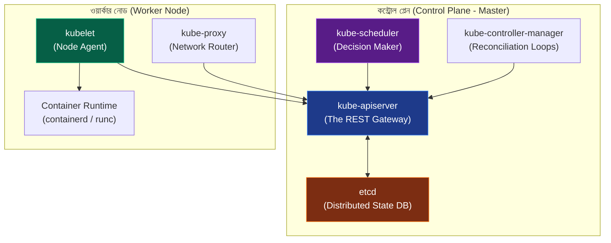

---

## ২. কন্ট্রোল প্লেন ইন্টারনালস (Control Plane Deep Dive)

কন্ট্রোল প্লেন ক্লাস্টারের মস্তিষ্ক হিসেবে কাজ করে। এর প্রতিটি উপাদান অত্যন্ত নির্দিষ্ট ও স্বাধীন কাজ সম্পন্ন করে:

### ক. `kube-apiserver` (Rest Gateway & Pipeline)
এটি ক্লাস্টারের একমাত্র উপাদান যা সরাসরি `etcd` ডেটাবেসের সাথে যোগাযোগ করতে পারে। ক্লাস্টারের ভেতর যেকোনো কুয়েরি বা রিকোয়েস্ট (যেমন: `kubectl create`) এর মধ্য দিয়ে যায়। এটি নিচের ৩টি ফিল্টারিং পাইপলাইন পার হয়ে কাজ করে:
১. **Authentication (অথেন্টিকেশন):** রিকোয়েস্ট পাঠানো ক্লায়েন্ট (ইউজার বা সার্ভিস অ্যাকাউন্ট) বৈধ কিনা তা চেক করে।
২. **Authorization (অথরাইজেশন):** **RBAC** (Role-Based Access Control) পলিসির মাধ্যমে দেখে ওই ইউজারের এই ফাইল ক্রিয়েট বা রিড করার অনুমতি আছে কিনা।
৩. **Admission Control (অ্যাডমিশন কন্ট্রোল):** রিকোয়েস্টটি কার্নেল বা ডেটাবেসে লেখার আগে তাকে কাস্টমাইজ বা মিউটেট করে (যেমন: লিমিট রেঞ্জ চেক করা, ডিফল্ট ভ্যালু বসানো)।

### খ. `etcd` (The Distributed State Database)
কুবারনেটিসের সমস্ত কনফিগারেশন, মেটাডেটা এবং ক্লাস্টারের লাইভ স্টেট অত্যন্ত নিরাপদে স্টোর থাকে `etcd` নামক একটি ডিস্ট্রিবিউটেড এবং কনসিস্টেন্ট **Key-Value Store**-এ।
* **Raft Consensus:** এটি অত্যন্ত জটিল **Raft Consensus Algorithm** ব্যবহার করে ক্লাস্টারের একাধিক etcd নোডের মধ্যে ডাটা কনসিস্টেন্সি বা সিনক্রোনাইজেশন বজায় রাখে।
* **Optimistic Concurrency Control (OCC):** `etcd` লক মেকানিজম ব্যবহার না করে `metadata.resourceVersion` ব্যবহার করে। যদি একই সাথে দুটি প্রসেস একই পড এডিট করতে চায়, তবে যার রিসোর্স ভার্সন মিলবে সে রাইট করতে পারবে, অন্য প্রসেসটি রিজেক্টেড হবে।

### গ. `kube-scheduler` (The Placement Engine)
নতুন কোনো পড তৈরি হলে সেটি কোন ওয়ার্কার নোডে গিয়ে রান করবে, সেই সিদ্ধান্ত নেওয়ার দায়িত্ব শিডিউলারের। এটি দুটি প্রধান ধাপে নোড সিলেক্ট করে:
১. **Filtering (Predicates):** এই ধাপে শিডিউলার চেক করে কোন কোন নোডে পডের চাহিদামতো খালি CPU/RAM রয়েছে, পোর্ট ফাঁকা আছে অথবা নোড টেইন্ট (Taint) মিলছে। অযোগ্য নোডগুলো ছেঁটে ফেলা হয়।
২. **Scoring (Priorities):** উপযুক্ত নোডগুলোর ওপর শিডিউলার স্কোরিং করে। যেমন: কোন নোডে রান করলে ট্রাফিক অপ্টিমাইজড হবে বা ইমেজ অলরেডি ডাউনলোড করা আছে। সবচেয়ে বেশি স্কোর পাওয়া নোডটিতে পডটি অ্যাসাইন বা বাইন্ড করা হয়।

### ঘ. `kube-controller-manager` (The Reconciliation Loop)
এটি একটি একক বাইনারি হলেও এর ভেতরে ব্যাকগ্রাউন্ডে অসংখ্য ছোট ছোট ডেমোন বা কন্ট্রোলার লুপ রান করে (যেমন: Node Controller, Deployment Controller, Job Controller)।
* **Reconciliation Loop (রিকনসিলিয়েশন লুপ):** এটি কুবারনেটিসের সবচেয়ে কোর কনসেপ্ট। এটি অনবরত একটি লুপের মাধ্যমে চেক করে ক্লাস্টারের বর্তমান অবস্থা (Actual State) এবং ইউজারের দেওয়া কাঙ্ক্ষিত অবস্থা (Desired State) এক আছে কিনা। অমিল দেখলেই সে তা সমাধান করে (যেমন: ৩টি রেপ্লিকা থাকার কথা কিন্তু ১টি ক্র্যাশ করেছে, সে সাথে সাথে নতুন ১টি পড বানাবে)।

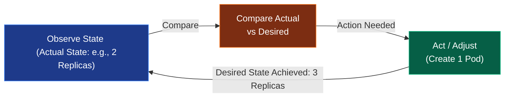

---

## ৩. ওয়ার্কার নোড ইন্টারনালস (Worker Node Deep Dive)

ওয়ার্কার নোডগুলো কন্ট্রোল প্লেনের নির্দেশ অনুযায়ী পড ও কন্টেইনারগুলোকে সশরীরে হোস্ট বা রান করায়।

### ক. `kubelet` (The Node General)
প্রতিটি ওয়ার্কার নোডে সচল থাকা সবচেয়ে গুরুত্বপূর্ণ সার্ভিস হলো `kubelet`। এটি নোডের ক্যাপ্টেন হিসেবে কাজ করে।
* **কাজ করার মেকানিজম:** এটি এপিআই সার্ভার থেকে PodSpec (পডের ডিজাইন ফাইল) রিসিভ করে নোডের **Container Runtime Interface (CRI)**-কে কন্টেইনার বানানোর নির্দেশ দেয়।
* **Sync Loop:** এটি প্রতি সেকেন্ডে কন্টেইনারগুলোর হেলথ ও স্ট্যাটাস মনিটর করে এপিআই সার্ভারকে ক্লাস্টারের রিয়েল-টাইম রিপোর্ট পাঠায়।

### খ. `kube-proxy` (The Network Traffic Director)
এটি প্রতিটি ওয়ার্কার নোডের নেটওয়ার্ক ম্যানেজার। পডগুলোর সার্ভিস আইপি ও ট্রাফিক লোড ব্যালেন্স করার দায়িত্ব এর। এটি ৩টি মোডে কাজ করতে পারে:
১. **User Space Mode (প্রাচীন ও স্লো):** ট্রাফিক প্রথমে কার্নেল থেকে ইউজার স্পেসের kube-proxy তে আসত, তারপর পডে যেত। অতিরিক্ত কনটেক্সট সুইচের কারণে এটি আর ব্যবহৃত হয় না।
২. **iptables Mode (ডিফল্ট ও পপুলার):** এটি নোডের লিনাক্স কার্নেলের `iptables` রুলস ডাইনামিক্যালি মডিফাই করে রুট সেট করে। কার্নেল স্পেসেই সরাসরি ট্রাফিক রাউটিং ঘটে বলে এর গতি অত্যন্ত বেশি। তবে ক্লাস্টারে হাজার হাজার সার্ভিস হয়ে গেলে iptables এ রৈখিক বা লিনিয়ার সার্চের কারণে স্পিড কমে যায়।
৩. **IPVS Mode (হাই-পারফরম্যান্স):** এটি লিনাক্স কার্নেলের **IP Virtual Server (IPVS)** ফিচার ব্যবহার করে যা হ্যাশ টেবিল মেইনটেইন করে। লক্ষাধিক সার্ভিস থাকলেও এটি $O(1)$ টাইমে ট্রাফিক রাউটিং করতে পারে।

---

## ৪. পড লাইফসাইকেল ও পজ কন্টেইনার (Pod Lifecycle & Pause Container)

আমরা জানি কুবারনেটিসের ক্ষুদ্রতম একক হলো **Pod (পড)**। তবে পর্দার অন্তরালে একটি পডের নেটওয়ার্ক ও রিসোর্স কীভাবে শেয়ার হয় তা অত্যন্ত চমৎকার।

### ক. পজ কন্টেইনারের রহস্য (The Pause / Infra Container)
পডের ভেতর একাধিক কন্টেইনার থাকতে পারে (যেমন: Main App এবং Sidecar)। এরা একে অপরের সাথে `localhost` দিয়ে মাইক্রো-সেকেন্ডে কমিউনিকেট করতে পারে এবং একই পোর্ট রেঞ্জ শেয়ার করে। এটি কীভাবে সম্ভব?

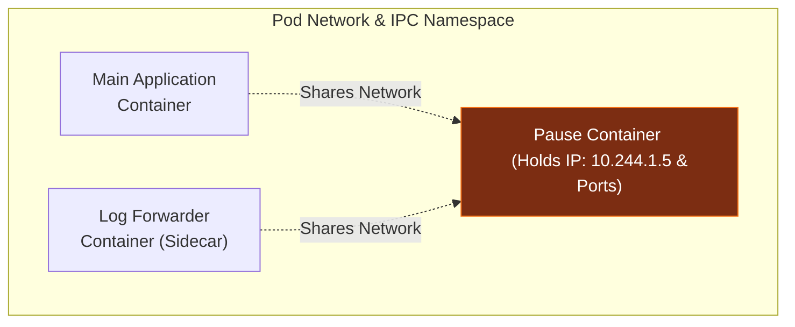

যখন একটি পড তৈরি হয়, কুবারনেটিস প্রথমে একটি হিডেন **Pause Container** (একে `infra` কন্টেইনারও বলে) তৈরি করে। এই কন্টেইনারটির একমাত্র কাজ হলো লিনাক্সের একটি ফাঁকা **Network, IPC, and PID Namespace** তৈরি করে তা ধরে রাখা। পডের অন্যান্য কন্টেইনারগুলো স্টার্ট হওয়ার সময় এই পজ কন্টেইনারের নেটওয়ার্ক নেমস্পেস শেয়ার করে জয়েন করে। ফলে মেইন কন্টেইনার ডাউন বা রিস্টার্ট হলেও পডের আইপি (IP Address) কখনই চেঞ্জ হয় না!

---

### খ. পড লাইফসাইকেল স্টেজ (Pod Lifecycle States)
একটি পড তার সম্পূর্ণ জীবনচক্রে নিচের ৫টি স্টেটের মধ্য দিয়ে যায়:

১. **Pending:** পডটি কুবারনেটিস এপিআই সার্ভারে রেজিস্টার হয়েছে কিন্তু শিডিউলার এখনো তার জন্য উপযুক্ত নোড খুঁজে পায়নি অথবা নোডে ইমেজ ডাউনলোড হচ্ছে।
২. **Running:** পডটি নোডে অ্যাসাইন হয়েছে এবং তার ভেতরের সমস্ত কন্টেইনার তৈরি হয়ে অন্তত একটি সচল রয়েছে।
৩. **Succeeded:** পডের ভেতরের কন্টেইনারগুলোর কাজ সফলভাবে শেষ হয়েছে এবং তারা `exit(0)` কোড দিয়ে বিদায় নিয়েছে (যেমন: ওয়ান-টাইম CronJob)।
৪. **Failed:** পডের অন্তত একটি কন্টেইনার এরর দিয়ে ক্র্যাশ করেছে এবং বন্ধ হয়ে গেছে।
৫. **Unknown:** কোনো কারণে (যেমন: নোড ডাউন বা নেটওয়ার্ক ডিসকানেক্ট) Kubelet কন্ট্রোল প্লেনকে পডের স্ট্যাটাস পাঠাতে পারছে না।

---

### গ. কন্টেইনার প্রোবস (Container Probes)
Kubelet কন্টেইনারের হেলথ মনিটর করার জন্য ৩ ধরণের প্রোব বা টেস্ট করে:
* **Liveness Probe:** কন্টেইনারটি বেঁচে আছে কিনা চেক করে। যদি এটি ফেইল করে, Kubelet কন্টেইনারটিকে কিল করে পুনরায় রিস্টার্ট করে।
* **Readiness Probe:** কন্টেইনারটি ট্রাফিক বা রিকোয়েস্ট রিসিভ করার জন্য প্রস্তুত কিনা চেক করে। ফেইল করলে সার্ভিস লোড ব্যালেন্সার থেকে ওই পডের আইপি সাময়িকভাবে রিমুভ করা হয় যাতে ইউজাররা কোনো এরর পেজ না দেখে।
* **Startup Probe:** অ্যাপ্লিকেশনটি স্টার্ট হতে অতিরিক্ত সময় লাগলে এটি ব্যবহার করা হয়। এটি সচল থাকা পর্যন্ত Liveness ও Readiness প্রোবগুলো নিষ্ক্রিয় থাকে যাতে বুটস্ট্র্যাপের সময় কন্টেইনার বারবার রিস্টার্ট না খায়।

---

## ৫. কুবারনেটিস নেটওয়ার্কিং ও সিএনআই (CNI Model)

কুবারনেটিস নেটওয়ার্কিংয়ের মূল নীতি হলো: **Every Pod gets a unique, routable IP Address within the cluster (অর্থাৎ প্রতিটা পড ক্লাস্টারের ভেতর একটি নিজস্ব আইপি পায়)।** পড টু পড যোগাযোগের জন্য কোনো NAT (Network Address Translation) বা পোর্ট ম্যাপিংয়ের প্রয়োজন হয় না।

এই নেটওয়ার্ক পলিসি ইমপ্লিমেন্ট করার জন্য কুবারনেটিস **CNI (Container Network Interface)** স্পেসিফিকেশন ব্যবহার করে। জনপ্রিয় ৩টি CNI প্লাগইন:

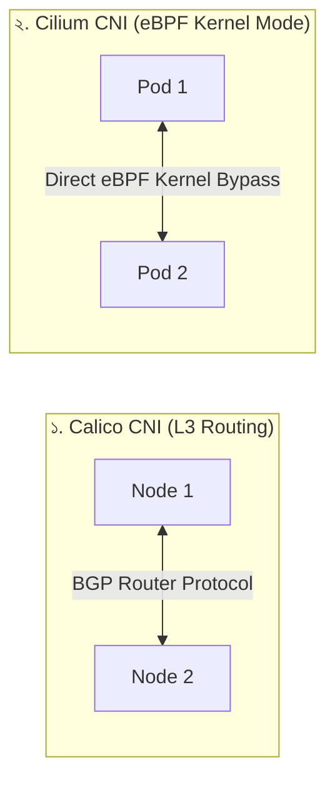

১. **Flannel:** সবচেয়ে সহজ ও প্রাচীন CNI। এটি মূলত **VXLAN Overlay Network** তৈরি করে প্যাকেটের ওপর হেডার পরিয়ে এনক্যাপসুলেশন (Encapsulation) করে এক নোড থেকে অন্য নোডে ডাটা পাঠায়। এর পারফরম্যান্স ওভারহেড কিছুটা বেশি।
২. **Calico:** এটি লেয়ার ৩ রাউটিং প্লাগইন। এটি কোনো ওভারলে নেটওয়ার্ক ছাড়াই ফিজিক্যাল রাউটার প্রোটোকল **BGP (Border Gateway Protocol)** ব্যবহার করে নোডগুলোর মধ্যে সরাসরি আইপি প্যাকেট রাউট করে। এটি অত্যন্ত ফাস্ট এবং এতে বিল্ট-ইন নেটওয়ার্ক সিকিউরিটি পলিসি সাপোর্ট আছে।
৩. **Cilium (আধুনিক ও বৈপ্লবিক):** এটি লিনাক্স কার্নেলের **eBPF (Extended Berkeley Packet Filter)** প্রযুক্তি ব্যবহার করে। এটি আইপি টেবিল বা কনটেক্সট সুইচিং সম্পূর্ণ বাইপাস করে সরাসরি কার্নেল লেভেলে নেটওয়ার্ক প্যাকেট ফিল্টার ও রাউট করে। এর সিকিউরিটি এবং পারফরম্যান্স ক্লাউড-নেটিভ ওয়ার্ল্ডে বর্তমানে সেরা!

---

## ৬. অ্যাডভান্সড ডিপ্লয়মেন্ট ও রোলআউট স্ট্র্যাটেজি

কুবারনেটিসে অ্যাপ্লিকেশন ডাউনটাইম ছাড়াই আপডেট করার জন্য মূলত দুটি অফিসিয়াল স্ট্র্যাটেজি রয়েছে:

### ক. Rolling Update (ডিফল্ট রোলআউট)
এটি ক্রমান্বয়ে পুরনো পডগুলো ডিলিট করে নতুন ভার্সনের পড লঞ্চ করে। এর গতি ও আচরণ নিয়ন্ত্রণ করার জন্য দুটি কী-ভ্যালু কনফিগার করতে হয়:
* **`maxSurge`:** আপডেটের সময় কাঙ্ক্ষিত পডের চেয়ে সর্বোচ্চ কত পার্সেন্ট অতিরিক্ত পড একবারে তৈরি করা যাবে (যেমন: `25%`)।
* **`maxUnavailable`:** রোলআউটের সময় সর্বোচ্চ কত পার্সেন্ট পড সাময়িকভাবে ডাউন বা আন-অ্যাভেইলেবল থাকতে পারবে (যেমন: `25%`)।

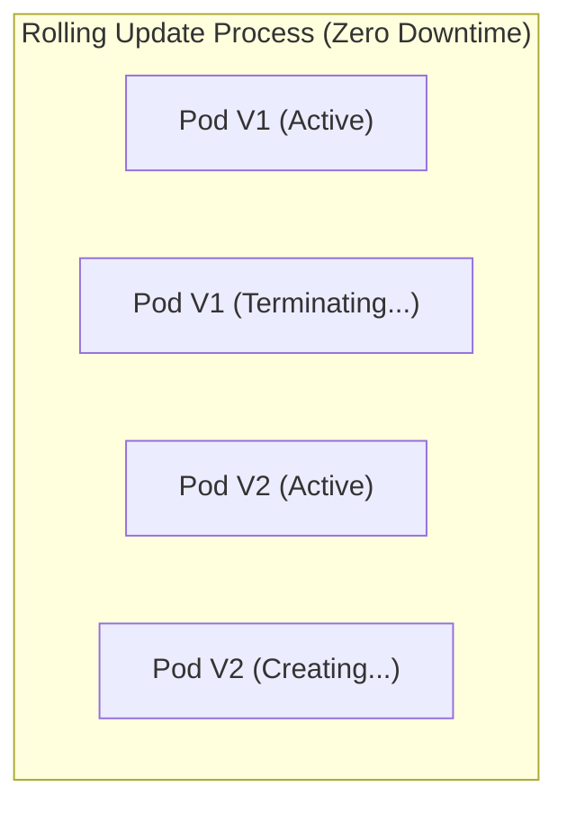

### খ. Canary Deployment (ক্যানারি রিলিজ)
ক্যানারি হলো নতুন একটি আপডেট সম্পূর্ণ রিলিজ করার আগে মাত্র ৫% বা ১০% ইউজারের ওপর টেস্ট করা।
* **কীভাবে কাজ করে:** একই সার্ভিস লেবেলের আন্ডারে দুটি আলাদা Deployment চালানো হয় (যেমন: ৯টি রেপ্লিকা V1 এবং ১টি রেপ্লিকা V2)। কুবারনেটিস সার্ভিস লোড ব্যালেন্সার তখন স্বয়ংক্রিয়ভাবে ৯০% ট্রাফিক V1-এ এবং ১০% ট্রাফিক V2-তে পাঠাবে। V2-তে কোনো এরর না থাকলে পরবর্তীতে V1-কে সম্পূর্ণ স্কেল ডাউন করে V2-কে ১০০% রিলিজ করে দেওয়া হয়।

---

## ৭. কুবারনেটিস স্টোরেজ ইন্টারনালস (CSI & Decoupling)

কুবারনেটিসে পডগুলোর লাইফসাইকেল ক্ষণস্থায়ী (Ephemeral)। পড ডিলিট হলেও যেন ডেটা হারিয়ে না যায়, সে জন্য K8s স্টোরেজ সিস্টেমকে ৩টি অংশে ডিকাপল বা আলাদা করেছে:

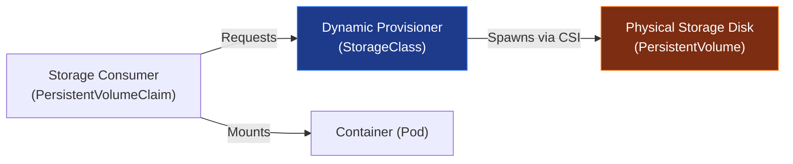

* **PersistentVolume (PV):** এটি ক্লাস্টারের ফিজিক্যাল বা ক্লাউড ড্রাইভের (যেমন: AWS EBS, NFS, Local Disk) একটি ফিজিক্যাল রিপ্রেজেন্টেশন। এটি ক্লাস্টারের এক ধরণের ফিজিক্যাল রিসোর্স (যেমন CPU/RAM এর মতো)।
* **PersistentVolumeClaim (PVC):** এটি ইউজারের তৈরি করা স্টোরেজ রিকোয়েস্ট ফাইল। অ্যাপ্লিকেশন ডেভেলপার কত জিবি স্টোরেজ ও কী ধরণের রিড/রাইট মোড (`ReadWriteOnce`, `ReadOnlyMany`) চায় তা এখানে লিখে দেয়।
* **StorageClass (Dynamic Provisioning):** পূর্বে অ্যাডমিনকে ম্যানুয়ালি ফিজিক্যাল ড্রাইভ তৈরি করে PV বানিয়ে রাখতে হতো। স্টোরেজ ক্লাস থাকলে কুবারনেটিস ইউজারের PVC রিকোয়েস্ট দেখামাত্রই সরাসরি ক্লাউড প্রোভাইডারের (AWS/GCP) কাছে গিয়ে ডাইনামিক্যালি রিয়েল-টাইমে ফিজিক্যাল ড্রাইভ তৈরি করে PV বানিয়ে PVC-এর সাথে বাইন্ড করে দেয়। এর পেছনে কার্নেল কাজ করে **CSI (Container Storage Interface)** প্লাগইনের সাহায্যে।

---

## ৮. কুবারনেটিস গার্বেজ কালেকশন ও ডিলিট পলিসি (Garbage Collection & OwnerReferences)

কুবারনেটিসে কোনো প্যারেন্ট রিসোর্স ডিলিট করলে (যেমন একটি Deployment), তার সাথে থাকা চাইল্ড রিসোর্সগুলো (যেমন ReplicaSet এবং Pods) কীভাবে রিমুভ হয়? এর পেছনে কাজ করে **Garbage Collector** এবং `ownerReferences` মেটাডেটা।

ডিলিট করার সময় কুবারনেটিস ৩ ধরণের **Cascading Deletion Policy** অফার করে:
১. **Foreground Cascading Deletion:** এই পলিসিতে প্যারেন্ট অবজেক্টটি ডিলিট হওয়ার সময় প্রথমে একটি `deletionTimestamp` পায় এবং "finalizers" ব্লকে চলে যায়। কুবারনেটিস প্রথমে তার সমস্ত চাইল্ড অবজেক্ট ডিলিট করে, এবং চাইল্ডগুলো সম্পূর্ণ ডিলিট হওয়া শেষ হলে অবশেষে প্যারেন্ট অবজেক্টটিকে ক্লাস্টার থেকে ডিলিট করে।
২. **Background Cascading Deletion (ডিফল্ট):** কুবারনেটিস এপিআই সার্ভার সাথে সাথে প্যারেন্ট অবজেক্টটিকে ডিলিট করে দেয়। এরপর ব্যাকগ্রাউন্ডে গার্বেজ কালেক্টর সচল হয়ে প্যারেন্টের সাথে লিঙ্ক থাকা সমস্ত চাইল্ড অবজেক্টগুলোকে ক্রমান্বয়ে ডিলিট করতে থাকে। এটি অত্যন্ত ফাস্ট।
৩. **Orphan Deletion Policy:** এই পলিসিতে প্যারেন্ট ডিলিট হয়ে গেলেও তার আন্ডারে থাকা চাইল্ড অবজেক্টগুলো এতিম বা Orphan হিসেবে ক্লাস্টারে সচল থেকে যায় (তাদের `ownerReferences` নাল হয়ে যায়)।

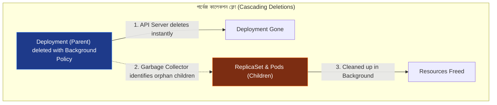

---

## ৯. কিউবলেট সিঙ্ক লুপ ও নোড প্রেশার ইভিকশন (Kubelet Sync Loop & Node Eviction)

ওয়ার্কার নোডে কন্টেইনার এবং মেমরির প্রকৃত দেখভাল করে Kubelet-এর অভ্যন্তরীণ দুটি কোর মেকানিজম:

### ক. Kubelet Sync Loop (`syncLoop`)
Kubelet ক্রমাগত একটি ইভেন্ট ড্রিভেন **Sync Loop** রান করায় যা ৩টি সোর্স থেকে পডের কনফিগারেশন চেঞ্জের খবর পায় (multiplexes channel):
১. **File:** নোডের লোকাল ডিরেক্টরি (Static Pods)।
২. **HTTP:** কোনো ইউআরএল এন্ডপয়েন্ট থেকে আসা PodSpec।
৩. **Apiserver:** এপিআই সার্ভার থেকে আসা গ্লোবাল পড লিস্ট বা ইভেন্ট।

যেকোনো সোর্স থেকে ডেটা আসবামাত্র Kubelet তার ইন্টারনাল পড লাইফসাইকেল ম্যানেজার (PLEG - Pod Lifecycle Event Generator) দিয়ে নোডের বর্তমান অবস্থার সাথে PodSpec মিলিয়ে CRI-এর সাহায্যে কন্টেইনার অ্যাডজাস্ট করে।

### খ. নোড প্রেশার ইভিকশন (Node Pressure Eviction)
যখন কোনো নোডে হার্ডওয়্যার রিসোর্স (যেমন RAM বা Disk) অত্যন্ত ঝুঁকিপূর্ণ মাত্রায় চলে যায়, Kubelet ক্লাস্টার ও নোড বাঁচাতে পডগুলোকে জোরপূর্বক কিল বা উচ্ছেদ (Eviction) করে।
* **Eviction Thresholds:** 
  - `memory.available < 100Mi`
  - `nodefs.available < 10%` (ফাইলসিস্টেম)
  - `imagefs.available < 15%` (কন্টেইনার ইমেজ ক্যাশ)
* **Hard Eviction:** থ্রেশহোল্ড টাচ করার সাথে সাথে কোনো প্রকার গ্রেস পিরিয়ড না দিয়েই Kubelet পডটিকে কিল করে দেয় এবং এপিআই সার্ভারকে জানায় যাতে পডটি অন্য নোডে শিডিউল হয়।
* **Soft Eviction:** অ্যাপ্লিকেশনকে গ্রেস পিরিয়ড দেওয়া হয় (যেমন ৫ মিনিট), এর মধ্যে রিসোর্স স্বাভাবিক না হলে অবশেষে পড ইভিক্ট করা হয়।

---

## ১০. এপিআই কনকারেন্সি ও প্যাচ মেকানিজম (Optimistic OCC vs Patches)

কুবারনেটিস ক্লাস্টারে প্রতি মিনিটে হাজার হাজার রিকোয়েস্ট এপিআই সার্ভারে আসে। এই কনকারেন্ট ট্রাফিক হ্যান্ডেল করার জন্য K8s দুটি আর্কিটেকচারাল মেকানিজম ব্যবহার করে:

### ক. Optimistic Concurrency Control (OCC)
ডাটাবেস লকিং ট্রাফিকের গতি শ্লথ করে দেয়। তাই K8s এপিআই সার্ভার লক মেকানিজম ব্যবহার না করে প্রতিটি অবজেক্টে একটি `metadata.resourceVersion` টোকেন যুক্ত করে।
* **কাজ করার নিয়ম:** যখন কোনো কন্ট্রোলার একটি পড আপডেট করতে চায়, সে প্রথমে অবজেক্টটি রিড করে তার রিসোর্স ভার্সন দেখে (ধরি `1042`)। আপডেটেড ডাটা রাইট করার সময় সে ওই ভার্সনসহ পাঠায়। যদি ইতিমধ্যে অন্য কেউ পডটি আপডেট করে থাকে, তবে ডেটাবেসের ভার্সন ইতিমধ্যে `1043` হয়ে যাবে এবং প্রথম কন্ট্রোলারের রিকোয়েস্টটি `HTTP 409 Conflict` এরর দিয়ে রিজেক্ট হবে। কন্ট্রোলার তখন আবার নতুন ডাটা রিড করে পুনরায় চেষ্টা (Retry) করে।

### খ. Strategic Merge Patch vs JSON Patch
কুবারনেটিসে অবজেক্ট এডিট করার জন্য ৩ ধরণের প্যাচ মেকানিজম রয়েছে:
১. **JSON Merge Patch (RFC 7386):** এটি সিম্পল কী-ভ্যালু রিপ্লেস করে। কিন্তু এর সমস্যা হলো এটি লিস্ট বা অ্যারের ক্ষেত্রে সম্পূর্ণ লিস্টটিকে রিপ্লেস করে ফেলে, যা পডের কনফিগারেশনে ভয়ংকর হতে পারে।
২. **Strategic Merge Patch:** এটি কুবারনেটিসের ডিফল্ট প্যাচিং প্রসেস। এটি মেটাডেটা স্কিমা দেখে বোঝে লিস্টির চাবি বা ইউনিক কী কোনটি (যেমন পডের কন্টেইনার লিস্টের জন্য চাবি হলো `name`)। ফলে এটি পুরো কন্টেইনার লিস্ট ও পোর্ট রিপ্লেস না করে সুনির্দিষ্ট কন্টেইনারের পোর্ট মডিফাই করতে পারে।
৩. **JSON Patch (RFC 6902):** এটি অত্যন্ত সুনির্দিষ্ট ডিক্লারেটিভ অপারেশন ডিক্লেয়ার করে (যেমন: `[{"op": "replace", "path": "/spec/replicas", "value": 5}]`)।

---

## ১১. সার্ভিস মেশ বনাম ইনগ্রেস আর্কিটেকচার (North-South vs East-West Traffic)

মাইক্রোসার্ভিসের যুগে ট্রাফিক ম্যানেজমেন্টকে কুবারনেটিসে দুটি প্রধান ক্যাটাগরিতে ভাগ করা হয়:

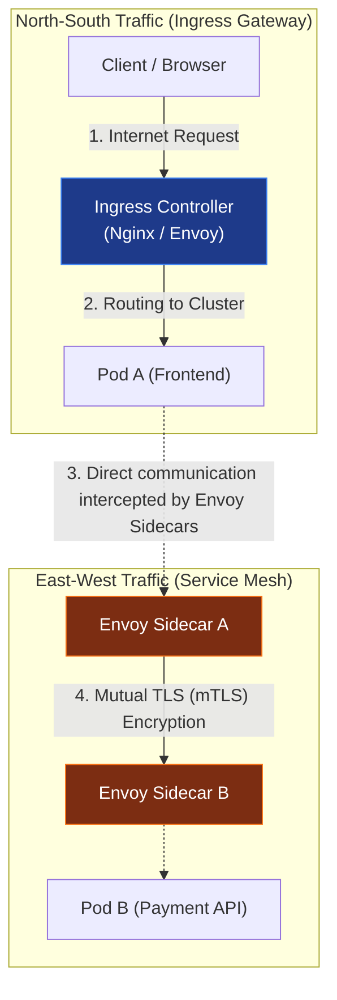

### ক. Ingress Controller (North-South Traffic)
এটি ক্লাস্টারের বাইর থেকে ভেতরে আসা ট্রাফিক রাুট করে (উত্তর-দক্ষিণ ট্রাফিক)। এটি মূলত লেয়ার ৭ রিভার্স প্রক্সি (যেমন Nginx, Traefik, HAProxy) যা হোস্ট ও পাথ মডিফাই করে প্যাকেটের রুট সেট করে।

### খ. Service Mesh (East-West Traffic)
ক্লাস্টারের ভেতরের পডগুলোর পারস্পরিক যোগাযোগকে বলা হয় পূর্ব-পশ্চিম ট্রাফিক। যখন শত শত মাইক্রোসার্ভিস নিজেদের মধ্যে কথা বলে, তখন ট্রাফিকের সিকিউরিটি (mTLS), ট্র্যাকিং এবং রিট্রাই পলিসি ম্যানেজ করার জন্য **Service Mesh** (যেমন: Istio, Linkerd) ব্যবহার করা হয়।
* **Envoy Sidecar Interception:** সার্ভিস মেশ নোডের লিনাক্স কার্নেলের `iptables` রুলস এমনভাবে কনফিগার করে দেয় যে, পডের মেইন কন্টেইনার থেকে বের হওয়া বা ভেতরে ঢোকা সমস্ত ট্রাফিক স্বয়ংক্রিয়ভাবে তার পাশে থাকা **Envoy Proxy Sidecar**-এ রিডাইরেক্ট হয়ে যায়। মেইন অ্যাপ টের পাওয়ার আগেই Envoy ট্রাফিক এনক্রিপ্ট (mTLS) ও মনিটরিং সম্পন্ন করে ফেলে!

---

## ১২. শিডিউলারের মেমরি মডেল ও এডভান্সড কুয়েস (Scheduler Queues & Constraints)

শিডিউলার কীভাবে হাজার হাজার পডের শিডিউলিং ট্রাফিক জ্যাম ছাড়াই নিমিষে হ্যান্ডেল করে? এর পেছনে রয়েছে এর ইন্টারনাল ৩টি কিউ (Queue) মেকানিজম এবং ডিস্ট্রিবিউশন রুলস:

### ক. Scheduler Queue Internals
নতুন বা পেন্ডিং পডগুলোকে শিডিউলার নিচের ৩টি কিউতে ম্যানেজ করে:
১. **ActiveQ (অ্যাক্টিভ কিউ):** শিডিউল হওয়ার জন্য প্রস্তুত পডগুলোর প্রায়োরিটি-ভিত্তিক বাকেট। শিডিউলার এখান থেকে পড নিয়ে নোডে বাইন্ড করার চেষ্টা করে।
২. **UnschedulableQ:** রিসোর্স বা টেইন্টের অভাবে শিডিউল হতে না পারা পডগুলোকে সাময়িকভাবে এখানে হোল্ড করা হয় যাতে তারা ActiveQ-এর মূল্যবান সিপিইউ সাইকেল নষ্ট না করে। ক্লাস্টারে নতুন নোড যুক্ত হলে বা মেমরি খালি হলে এদের আবার ActiveQ-তে ফেরত আনা হয়।
৩. **PodBackoffQ:** যে পডগুলো শিডিউল হতে গিয়েও বারবার ফেইল করছে, তাদের একটি নির্দিষ্ট ব্যাক-অফ টাইম পর্যন্ত এখানে ওয়েট করানো হয় যাতে তারা ক্লাস্টারে অতিরিক্ত থ্রোটলিং না ঘটায়।

### খ. Pod Topology Spread Constraints
প্রোডাকশনে হাই-অ্যাভেইলেবিলিটি নিশ্চিত করতে এটি শিডিউলারের অত্যন্ত শক্তিশালী টুল। এর মাধ্যমে পডগুলোকে ক্লাস্টারের বিভিন্ন ব্যর্থতার ডোমেন বা ফল্ট জোন (যেমন ফিজিক্যাল ড্রাইভ, রেক, ক্লাউড জোন) জুড়ে সমানভাবে ছড়িয়ে দেওয়া যায়।
* **`topologyKey`:** নির্দেশ করে ডোমেন টাইপ (যেমন `topology.kubernetes.io/zone`)।
* **`maxSkew`:** দুটি জোনের মধ্যে পডের সংখ্যার সর্বোচ্চ অনুমোদিত পার্থক্য নির্দেশ করে (যেমন `maxSkew: 1` মানে কোনো একটি জোনে অন্য জোনের চেয়ে ১টির বেশি অতিরিক্ত পড থাকতে পারবে না)।

---

## ১৩. কাস্টম কন্ট্রোলারের অভ্যন্তরীণ মেকানিজম (Informers & WorkQueue Lifecycle)

কুবারনেটিসে অপারেটর বা কাস্টম কন্ট্রোলার কীভাবে ক্লাস্টারের কনফিগারেশন চেঞ্জ হওয়ার সাথে সাথে চোখের পলকে রিয়েল-টাইমে অ্যাকশন নেয়? এটি কোনো পোলিং (`GET` রিকোয়েস্ট লুপ) ব্যবহার করে না। এর পেছনে রয়েছে **Client-Go** লাইব্রেরির **Informer Architecture**:

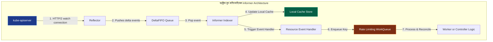

১. **Reflector:** এটি এপিআই সার্ভারের সাথে একটি দীর্ঘমেয়াদী **HTTP/2 Watch Connection** বজায় রাখে। নতুন কোনো পড বা কাস্টম ফাইল তৈরি বা আপডেট হলে এপিআই সার্ভার রিফ্লেক্টরকে ইনস্ট্যান্ট ইভেন্ট পুশ করে।
২. **DeltaFIFO:** রিফ্লেক্টর ইভেন্টগুলো নিয়ে একটি ফাস্ট-ইন-ফার্স্ট-আউট কিউতে জমা করে।
৩. **Informer Indexer:** এটি ডেল্টা-ফিফো থেকে ইভেন্ট পপ করে তার অভ্যন্তরীণ মেমরি ক্যাশ (Local Cache Store) আপডেট করে। এর ফলে কন্ট্রোলারকে প্রতিবার এপিআই সার্ভার কুয়েরি করতে হয় না, সে লোকাল ক্যাশ থেকেই সুপারফাস্ট ডাটা রিড করতে পারে।
৪. **Resource Event Handler:** এটি ডেভেলপারের লেখা ইভেন্ট হ্যান্ডলারকে (Add, Update, Delete) কল করে।
৫. **WorkQueue:** হ্যান্ডলার সরাসরি অ্যাকশন না নিয়ে ইভেন্টের ইউনিক চাবি বা কী (যেমন `namespace/pod-name`) একটি রেট-লিমিটিং **WorkQueue**-তে পুশ করে।
৬. **Worker (Reconcile Loop):** ওয়ার্কার থ্রেড অনবরত WorkQueue থেকে কী রিড করে Desired ও Actual স্টেটের অমিল দূর করে অবশেষে সফলভাবে এপিআই সার্ভারে ফাইনাল স্টেট রাইট করে।

## ১৪. পড ডিসরাপশন বাজেট ও নোড ড্রেন পলিসি (PDB & Voluntary vs Involuntary Disruptions)

উচ্চ প্রাপ্যতা (High Availability) নিশ্চিত করতে কুবারনেটিস ক্লাস্টারে সিস্টেম মেইনটেন্যান্স বা ডাউনটাইম কীভাবে সামলানো হয়? এর পেছনে কাজ করে **PDB (Pod Disruption Budget)**।

### ক. Voluntary vs Involuntary Disruptions
কুবারনেটিস পডের ডাউনটাইম বা বিপর্যয়কে দুটি ক্যাটাগরিতে ভাগ করে:
১. **Involuntary Disruptions (অনিবার্য বিপর্যয়):** যা মানুষের নিয়ন্ত্রণে থাকে না (যেমন: ফিজিক্যাল সার্ভারের মেমরি ক্যাশ ব্লাস্ট করা, কার্নেল প্যানিক, নেটওয়ার্ক ক্যাবল ডিসকানেক্ট হওয়া বা ফিজিক্যাল ডিস্ক ড্যামেজ হওয়া)।
২. **Voluntary Disruptions (স্বেচ্ছাধীন বিপর্যয়):** যা অ্যাপ্লিকেশন অ্যাডমিনের কাস্টম বা রিয়েল-টাইম অ্যাকশন (যেমন: নোড ড্রেন করা `kubectl drain` কার্নেল আপগ্রেডের জন্য, ডেপ্লয়মেন্টের রেপ্লিকা টেমপ্লেট পরিবর্তন করা, বা অ্যাপ্লিকেশন আপডেট করা)।

### খ. Pod Disruption Budget (PDB)
PDB হলো একটি ডিক্লারেটিভ পলিসি যা কুবারনেটিস এপিআই সার্ভারকে বলে দেয়—"আমার নোড মেইনটেন্যান্স বা ড্রেন করার সময়েও যেন এই অ্যাপ্লিকেশনের কমপক্ষে ২টি পড সবসময় একটিভ থাকে।"
* **কনফিগারেশন:**
  - `minAvailable`: নুন্যতম কতটি পড বা পার্সেন্টেজ সবসময় সচল থাকতে হবে (যেমন `minAvailable: 2` বা `minAvailable: 80%`)।
  - `maxUnavailable`: সর্বোচ্চ কতটি পড একসাথে ড্রেন বা ডাউন করা যাবে (যেমন `maxUnavailable: 1`)।
* **কাজ করার নিয়ম:** যখন এডমিন `kubectl drain` চালায়, এপিআই সার্ভার PDB পলিসি চেক করে নোড খালি করে। PDB পলিসি ভায়োলেট বা লংঘিত হলে ড্রেন প্রসেস সাময়িকভাবে রিজেক্টেড হয়, যতক্ষণ না নতুন নোডে অল্টারনেটিভ পড রান হচ্ছে।

---

## ১৫. পড সিকিউরিটি স্ট্যান্ডার্ডস ও লিনাক্স ক্যাপাবিলিটিজ (PSS, PSA & OS Linux Security)

কুবারনেটিসের প্রাচীন ও জটিল **PodSecurityPolicy (PSP)** কে পুরোপুরি ডেপ্রিকেট বা রিমুভ করে নেক্সট-জেনারেশন ক্লাউড সিকিউরিটির জন্য প্রবর্তন করা হয়েছে **Pod Security Admission (PSA)** এবং **Pod Security Standards (PSS)**।

### ক. Pod Security Standards (PSS)
কুবারনেটিস পডের সিকিউরিটি পলিসিকে ৩টি প্রমিত ক্যাটাগরিতে ভাগ করে:
১. **Privileged (অবারিত):** কোনো প্রকার বিধি-নিষেধ ছাড়াই পড হোস্টের ওএসের সমস্ত ডিভাইস ও রুট প্রিভিলেজ সরাসরি অ্যাক্সেস করতে পারে (যেমন CNI ড্রাইভার পড)।
২. **Baseline (ডিফল্ট ও ব্যালেন্সড):** হোস্ট ওএসের রুট ক্যাবল নেটওয়ার্ক বা প্রিভিলেজ এসকেলেশন ব্লক করে দেয়, তবে সাধারণ অ্যাপ্লিকেশন রান করার অনুমতি দেয়।
৩. **Restricted (সর্বোচ্চ সিকিউরড):** পডকে ওএসের সর্বোচ্চ টাইট সিকিউরিটি রুলস মানতে বাধ্য করে (যেমন রুট ইউজার হিসেবে রান করা সম্পূর্ণ ব্লক করা, লোকাল ফাইলসিস্টেম রাইট ব্লক করা)।

### খ. Linux Capabilities inside PodSpec
কুবারনেটিসের পডের ভেতরে লিনাক্স কার্নেলের সিকিউরিটি সক্ষমতা সরাসরি কন্ট্রোল করা সম্ভব:
```yaml
securityContext:
  runAsNonRoot: true                   # পড কখনই হোস্ট ওএসের রুট ইউজার (UID 0) হিসেবে রান করবে না
  readOnlyRootFilesystem: true         # পডের লোকাল কন্টেইনার ফাইলসিস্টেমকে রিড-অনলি করে দেয়, কোনো ভাইরাস বা হ্যাকার লোকাল ডিস্কে স্ক্রিপ্ট রাইট করতে পারবে না
  allowPrivilegeEscalation: false      # চাইল্ড প্রসেস যেন প্যারেন্ট প্রসেসের প্রিভিলেজ অ্যাক্সেস করতে না পারে (setuid বাইপাস)
  seccompProfile:
    type: RuntimeDefault               # লিনাক্সের Secure Computing (seccomp) ফিল্টার ব্যবহার করে কার্নেলের অপ্রয়োজনীয় সিস্টেম কল ব্লক করে দেয়
```

---

## ১৬. অ্যাডভান্সড শিডিউলিং ও 'Execution' এনফোর্সমেন্ট (Advanced Node Affinity & Execution Modes)

সাধারণত আমরা পডের নোড সিলেকশনে Node Selector ব্যবহার করি। তবে এন্টারপ্রাইজ স্কেলে এর চেয়ে শক্তিশালী **Node Affinity** পলিসি ব্যবহার করা হয় যা ২ ধরণের 'Execution' মোড সাপোর্ট করে:

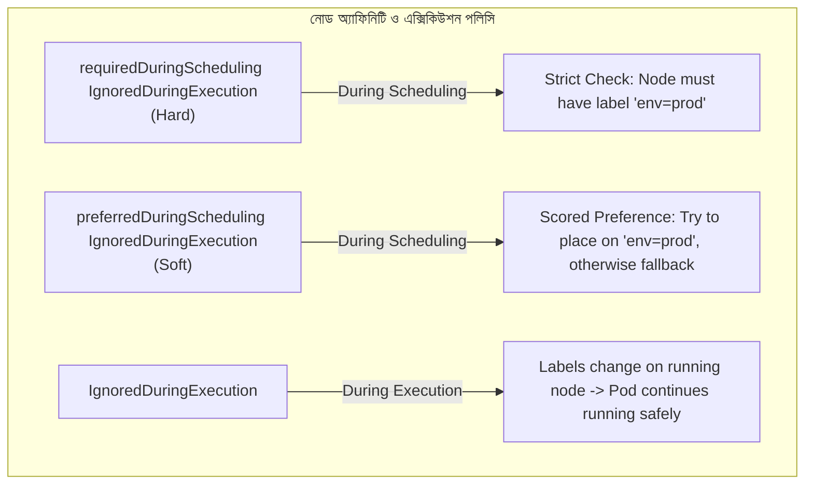

১. **`requiredDuringSchedulingIgnoredDuringExecution` (Hard Constraint):**
   - **Scheduling:** অত্যন্ত কঠোর বা হার্ড রুল। নোডে লেবেল না মিললে পড কখনই শিডিউল হবে না, চিরকাল পেন্ডিং হয়ে বসে থাকবে।
   - **Execution:** পডটি নোডে সফলভাবে রান হওয়ার পর যদি ফিজিক্যাল নোডের লেবেল কেউ এডিট বা ডিলেট করে দেয়, তবুও রানিং পডটিকে কিল করা হবে না। এটি নিরাপদে চলতে থাকবে (`IgnoredDuringExecution`)।
২. **`preferredDuringSchedulingIgnoredDuringExecution` (Soft Constraint):**
   - **Scheduling:** নরম বা সফট রুল। শিডিউলার ওই স্পেসিফিক লেবেলযুক্ত নোড খোঁজার সর্বোচ্চ চেষ্টা করবে, না পেলে ক্লাস্টারের যেকোনো সাধারণ ফাঁকা নোডে পডটি শিডিউল করে দেবে।
৩. **`requiredDuringSchedulingRequiredDuringExecution` (উন্নত ও বিরল):**
   - এটি এমন এক বিশেষ ফিচার যেখানে শিডিউল হওয়ার সময় যেমন লেবেল মিলতে হবে, পডটি রান থাকা অবস্থায় যদি নোডের লেবেল পরিবর্তন হয়ে যায়—কার্নেল সাথে সাথে পডটিকে কিল করে নোড থেকে উচ্ছেদ করে দেবে!

---

## XVII. সিএসআই ইন্টারনালস এবং ডাইনামিক মাউন্ট প্রসেস (CSI Controller vs Node Plugins)

কুবারনেটিসে যখন আপনি একটি PVC তৈরি করেন, তখন মেঘের আড়ালে বা ব্যাকগ্রাউন্ডে কুবারনেটিস ওএস কীভাবে ফিজিক্যাল ডিস্ক কন্টেইনারের ফাইলসিস্টেমের সাথে সংযুক্ত করে? এর পেছনে রয়েছে **CSI (Container Storage Interface)**-এর দুটি স্বাধীন ড্রাইভার প্লাগইন:

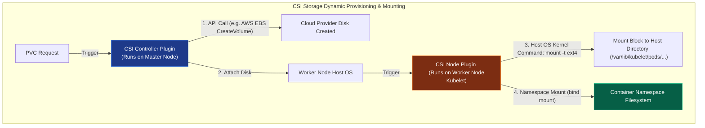

### ক. CSI Controller Plugin (কন্ট্রোল প্লেনে সচল)
এই প্লাগইনটি এপিআই সার্ভারে বা মাস্টার নোডে সচল থাকে। এর কাজ হলো সম্পূর্ণ নন-লোকাল বা ক্লাউড ড্রাইভের ম্যানেজমেন্ট।
* **কাজ:** যখন PVC তৈরি হয়, কন্ট্রোলার প্লাগইন সরাসরি ক্লাউড প্রোভাইডারের এপিআই (যেমন AWS EBS, Azure Disk API) কল করে একটি নতুন ভার্চুয়াল স্টোরেজ ব্লক জেনারেট করে। তারপর সে ড্রাইভটিকে ওয়ার্কার নোডের ফিজিক্যাল হোস্ট মেশিনের সাথে কানেক্ট (Attach) করে দেয়।

### খ. CSI Node Plugin (ওয়ার্কার নোডের কুয়েস্ট)
এই প্লাগইনটি একটি DaemonSet হিসেবে প্রতিটি ওয়ার্কার নোডের Kubelet-এর সাথে কো-লোকেট হয়ে রান করে। এর কাজ হলো ওএস লেভেলের মাউন্টিং।
* **কাজ:** হোস্ট ওএসের সাথে ড্রাইভ যুক্ত হওয়ার পর, এই নোড প্লাগইন হোস্টের ভেতরে সশরীরে ফাইলসিস্টেম ফরম্যাটিং কমান্ড চালায় (যেমন `mkfs.ext4`) এবং হোস্ট ওএসের ডিরেক্টরিতে মাউন্ট করে (`/var/lib/kubelet/pods/<pod-uid>/volumes/...`)। অবশেষে লিনাক্সের **`bind mount`** প্রসেস ব্যবহার করে কন্টেইনারের পার্সোনাল ফাইলসিস্টেম নেমস্পেসে ডিস্কটি রুট করে দেয়।

---

## ১৮. এইচপিএ বনাম ভিপিএ সংঘাত ও দ্বৈরথ (HPA vs VPA Conflict & Resolution)

পডের রিসোর্স অটো-স্কেলিংয়ের জন্য কুবারনেটিসের দুটি অন্যতম প্রধান সリューション হলো **HPA (Horizontal Pod Autoscaler)** এবং **VPA (Vertical Pod Autoscaler)**।

| ফিচার | HPA (Horizontal Pod Autoscaler) | VPA (Vertical Pod Autoscaler) |
| :--- | :--- | :--- |
| **স্কেলিংয়ের ধরণ** | **Scale-Out:** পডের সংখ্যা বাড়িয়ে দেয় (Replicas 2 -> 10) | **Scale-Up:** রানিং পডের মেমরির সাইজ বাড়িয়ে দেয় (RAM 512Mi -> 2Gi) |
| **মনিটরিং মেট্রিক্স** | সাধারণত CPU/RAM ইউটিলাইজেশন বা কাস্টম প্রমিথিউস মেট্রিক্স | অ্যাপ্লিকেশনের দীর্ঘমেয়াদী রিসোর্স ব্যবহারের ট্রেন্ড বা হিস্টোরি |
| **কাজ করার মেথড** | নতুন পড ডাইনামিক্যালি স্পন করে অত্যন্ত দ্রুত ট্রাফিক সামলায় | পড ক্র্যাশ না করিয়ে নোডের রিকোয়েস্ট ইন-প্লেস বা রিস্টার্ট দিয়ে বাড়ায় |

### 💥 HPA বনাম VPA সংঘাত (The Conflict of Auto-scalers)
প্রোডাকশনে একই অ্যাপ্লিকেশনের বা একই মেট্রিক্সের (যেমন CPU/RAM) ওপর HPA এবং VPA একসাথে চালানো সম্পূর্ণ নিষিদ্ধ এবং ভয়ংকর! কেন?
* **ডেস্ট্রাকটিভ ফিডব্যাক লুপ (Feedback Loop of Doom):**
  ১. ধরুন ট্রাফিক বাড়ার কারণে পডের CPU ব্যবহার ১০০% এ চলে গেল।
  ২. VPA সাথে সাথে পডের আকার বড় করার জন্য পডটিকে কিল বা রিসাইজ করার সিদ্ধান্ত নেবে।
  ৩. একই সময়ে HPA দেখবে CPU ১০০% এবং পডের সংখ্যা বাড়াতে (Replicas) ডাইনামিক রিকোয়েস্ট পাঠাবে।
  ৪. দুটি পলিসি একে অপরের ডেটা মডিফাই করে ক্লাস্টারে এক মারাত্মক অস্থিরতা ও ক্র্যাশ লুপ (Tug of War) তৈরি করবে।
* **সমাধান:** যদি একই পডে দুটিই ব্যবহার করতে হয়, তবে HPA-কে রান করাতে হবে কাস্টম বিজনেস বা অ্যাপ্লিকেশন মেট্রিক্সের ওপর ভিত্তি করে (যেমন HTTP Request per second) এবং VPA-কে রান করাতে হবে ওএস লেভেলের রিসোর্স মেট্রিক্সের ওপর ভিত্তি করে (যেমন CPU/RAM Requests Optimization)।

---

## ১৯. কিউবলেট সিস্টেম ট্রিয়াজ ও ওএস শাটডাউন (Graceful Node Shutdown Systemd Integration)

কখনো ফিজিক্যাল সার্ভার বা নোড যদি ক্র্যাশ করে বা শাটডাউন হয়, Kubelet কীভাবে ওএস শাটডাউন হওয়ার পূর্বে পডগুলোকে নিরাপদে সেভ করার সুযোগ পায়? এর জন্য রয়েছে **Graceful Node Shutdown** মেকানিজম।

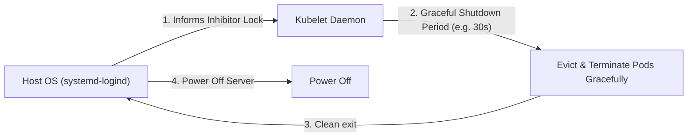

### ক. systemd-logind Integration
লিনাক্স অপারেটিং সিস্টেমের **systemd** সার্ভিস যখন নোড বন্ধ হওয়ার সিগন্যাল রিসিভ করে, Kubelet লিনাক্সের **systemd-logind inhibitor locks** ব্যবহার করে শাটডাউন প্রসেসকে সাময়িকভাবে হোল্ড বা ব্লক করে দেয়।
* **শাটডাউনের সময়সীমা:** Kubelet-কে নোটিফাই করা হয় যে নোডটি শাটডাউন হচ্ছে। 
* **Eviction Period:** Kubelet তখন দুটি প্রি-কনফিগার টাইমস্ট্যাম্প সচল করে:
  - `shutdownGracePeriod`: নোড সম্পূর্ণ বন্ধ হওয়ার জন্য সর্বোচ্চ কত সেকেন্ড সময় দেওয়া হবে (যেমন ৩০ সেকেন্ড)।
  - `shutdownGracePeriodCriticalPods`: ক্লাস্টারের কোর বা ক্র্টিকাল পডগুলোকে (যেমন সিএনআই পড) বন্ধ করার জন্য কত সেকেন্ড ছাড় দেওয়া হবে (যেমন ১০ সেকেন্ড)।
Kubelet এই গ্রেস পিরিয়ডের মধ্যে নোডের পডগুলোকে অত্যন্ত দ্রুত ও সুন্দরভাবে `SIGTERM` দিয়ে বিদায় জানায় এবং এপিআই সার্ভারকে এন্ডপয়েন্ট থেকে পডগুলোর ট্রাফিক রিমুভ করার চূড়ান্ত সুযোগ দেয়, ফলে ইউজারের ব্রাউজারে কোনো রানিং রিকোয়েস্ট হঠাৎ কেটে বা ড্রপ করে যায় না।

---

## ২০. শীর্ষ ২০টি সিনিয়র-লেভেল কুবারনেটিস ইন্টারভিউ প্রশ্নোত্তর (Top 20 Systems Q&A)

#### প্রশ্ন ১: Control Plane-এর কম্পোনেন্টগুলোর মধ্যে "Leader Election" কীভাবে ঘটে? একই সাথে একাধিক API Server এবং Controller Manager কীভাবে ম্যানেজ হয়?
**উত্তর:** কুবারনেটিসের হাই-অ্যাভেইলেবিলিটি (HA) ক্লাস্টারে একাধিক এপিআই সার্ভার একযোগে একটিভ-একটিভ (Active-Active) মোডে রান করতে পারে, কারণ তারা স্টেটলেস। কিন্তু `kube-controller-manager` এবং `kube-scheduler` একই সাথে রান করলে ক্লাস্টারের স্টেট ডুপ্লিকেট বা কনফ্লিক্ট হতে পারে। তাই তারা **Active-Passive** মোডে রান করে।
* **Leader Election মেকানিজম:** এরা কুবারনেটিস এপিআই সার্ভার ব্যবহার করে একটি **Distributed Lock** বা **Lease Object** তৈরি করে। নোডগুলোর মধ্যে যে প্রথমে এই লিজ লকটি রিড/রাইট করতে পারে সে লিডার নির্বাচিত হয় এবং তার রিকনসিলিয়েশন লুপ অন করে। বাকি কন্ট্রোলারগুলো প্যাসিভ অবস্থায় লিজ অবজেক্টের রিনিউ টাইমার মনিটর করতে থাকে। লিডার ডাউন হয়ে লিজ রিনিউ করতে ব্যর্থ হলে অন্য নোডগুলোর একটি তৎক্ষণাৎ নতুন লিডার হিসেবে দায়িত্ব গ্রহণ করে।

#### প্রশ্ন ২: "Admission Controllers" কী? Mutating vs Validating Admission Webhook এর মধ্যে মূল তফাৎ কী?
**উত্তর:** অ্যাডমিশন কন্ট্রোলার হলো `kube-apiserver` এর একটি প্লাগইন পাইপলাইন। এটি রিকোয়েস্ট অথরাইজড হওয়ার পর এবং `etcd`-তে সেভ হওয়ার ঠিক আগের মুহূর্তে রিকোয়েস্টকে মডিফাই বা রিজেক্ট করতে পারে।
* **Mutating Admission Webhook:** এটি রিকোয়েস্টের অবজেক্টটিকে এডিট বা মডিফাই করতে পারে (যেমন: পডের ফাইলে কোনো সাইডকার কন্টেইনার অটোমেটিক্যালি ইনজেক্ট করা বা ডিফল্ট রিসোর্স লিমিট সেট করা)।
* **Validating Admission Webhook:** এটি অবজেক্ট মডিফাই করতে পারে না, কেবল রিকোয়েস্টটি কুবারনেটিসের সিকিউরিটি স্ট্যান্ডার্ড ও পলিসি মানছে কিনা তা চেক করে রিকোয়েস্টটি অ্যালাউ (Allow) বা ডিনাই (Deny) করতে পারে।
* **অর্ডার:** সিকিউরিটির জন্য কার্নেল পাইপলাইনে প্রথমে সমস্ত Mutating ওয়েবহুক এক্সিকিউট হয়, এবং সবার শেষে ভ্যালিডিটিং ওয়েবহুক চলে।

#### প্রশ্ন ৩: etcd-এর "Split-Brain" সিনারিও বলতে কী বোঝায়? কুবারনেটিস কীভাবে এটি প্রতিরোধ করে?
**উত্তর:** যখন একটি etcd ক্লাস্টারের নোডগুলোর মধ্যকার নেটওয়ার্ক কানেকশন মাঝখান থেকে বিচ্ছিন্ন হয়ে নোডগুলো দুটি আলাদা গ্রুপে ভাগ হয়ে যায়, তখন উভয় গ্রুপই নিজেকে মূল ক্লাস্টার ভেবে আলাদা স্টেট রাইট করার চেষ্টা করতে পারে। একে **Split-Brain** সিনারিও বলে।
* **প্রতিরোধ মেকানিজম:** `etcd` ডাটা রাইট করার জন্য সবসময় **Quorum** মেজরিটি সূত্র ব্যবহার করে: $Quorum = \lfloor \frac{N}{2} \rfloor + 1$ (যেখানে $N$ হলো মোট নোডের সংখ্যা)। যদি ৫টি নোডের ক্লাস্টার ৩ এবং ২ ভাগে ভাগ হয়ে যায়, তবে ৩টি নোড থাকা গ্রুপটি কোরাম (মেজরিটি ৩) পূর্ণ করতে পারায় ডাটা রাইট করতে পারবে। অন্য ২টি নোডের গ্রুপটি কোরাম না থাকায় অটোমেটিক্যালি রিড-অনলি মোডে চলে যাবে। তাই কুবারনেটিসে সবসময় বিজোড় সংখ্যক (যেমন ৩ বা ৫) etcd নোড ব্যবহারের নির্দেশ দেওয়া হয়।

#### প্রশ্ন ৪: `Taints` এবং `Tolerations` বলতে কী বোঝায়? কুবারনেটিস শিডিউলিংয়ে এর প্রয়োজনীয়তা কী?
**উত্তর:** 
* **Taints (টেইন্ট):** এটি নোডের ওপর বসানো একটি রেস্ট্রিকশন বা সিলমোহর। এটি নির্দেশ করে—"এই নোডটি বিশেষ অ্যাপ ছাড়া অন্য সাধারণ পড রান করার অনুমতি দেবে না।" (যেমন: `key=value:NoSchedule`)।
* **Tolerations (টলারেশন):** এটি পডের PodSpec ফাইলে লেখা একটি বিশেষ ছাড়পত্র। পড যদি নোডের টেইন্টকে টলারেট বা সহ্য করতে পারে, তবেই শিডিউলার ওই পডটিকে সেই নোডে প্লেস করার কথা বিবেচনা করবে।
* **প্রয়োজনীয়তা:** ক্লাস্টারের স্পেশাল জিপিইউ নোডগুলোকে সাধারণ লাইটওয়েট পড থেকে মুক্ত রাখতে বা মাস্টার নোডে সাধারণ কন্টেইনার শিডিউল হওয়া ব্লক করতে এটি অত্যন্ত দরকার।

#### প্রশ্ন ৫: `Pod Affinity` এবং `Pod Anti-Affinity` এর মধ্যে পার্থক্য কী? প্রোডাকশনে এর একটি বাস্তব উদাহরণ দিন।
**উত্তর:** 
* **Pod Affinity:** এটি শিডিউলারকে নির্দেশ দেয়—"এই নতুন পডটিকে এমন একটি নোডে প্লেস কর যেখানে অলরেডি এক্স-লেবেলের অন্য একটি পড রান করছে" (সহাবস্থান বা কো-লোকেটিং)।
  - *বাস্তব উদাহরণ:* একটি ক্যাশিং পডকে (Redis) মেইন ওয়েব অ্যাপ্লিকেশনের নোডে প্লেস করা যাতে নেটওয়ার্ক লেটেন্সি সর্বনিম্ন হয়।
* **Pod Anti-Affinity:** এটি শিডিউলারকে নির্দেশ দেয়—"এই নতুন পডটিকে ভুলেও এমন নোডে দিও না যেখানে অলরেডি এক্স-লেবেলের পড সচল আছে" (আইসোলেশন)।
  - *বাস্তব উদাহরণ:* হাই-অ্যাভেইলেবিলিটি নিশ্চিত করতে আপনার ডেটাবেসের ৩টি রেপ্লিকাকে ৩টি সম্পূর্ণ আলাদা ফিজিক্যাল নোডে প্লেস করা, যাতে ১টি নোড ব্লাস্ট করলেও ডাটাবেস সম্পূর্ণ ডাউন না হয়।

#### প্রশ্ন ৬: "Headless Service" কী? সাধারণ কুবারনেটিস সার্ভিস এবং হেডলেস সার্ভিসের মধ্যে পার্থক্য কী?
**উত্তর:** 
* **সাধারণ কুবারনেটিস সার্ভিস:** একটি ভার্চুয়াল ক্লাস্টার আইপি (ClusterIP) বরাদ্দ করে এবং ট্রাফিক পডগুলোর মধ্যে র্যান্ডমলি লোড ব্যালেন্স করে।
* **Headless Service:** এই সার্ভিসের কোনো নিজস্ব ClusterIP থাকে না (`spec.clusterIP: None`)।
* **কাজ করার মেকানিজম:** হেডলেস সার্ভিসের আন্ডারে থাকা পডগুলোর ডিএনএস কুয়েরি করা হলে, কুবারনেটিস কোনো লোড ব্যালেন্সার আইপি না দিয়ে সরাসরি ওই সার্ভিসের পেছনে থাকা সমস্ত পডের ফিজিক্যাল আইপির তালিকা (DNS A Records) ক্লায়েন্টকে ফেরত দেয়।
* **ব্যবহারের ক্ষেত্র:** স্টেটফুল অ্যাপ্লিকেশনে (যেমন: Kafka, MongoDB Cluster) যেখানে পডগুলোর নিজেদের মধ্যে সরাসরি মাস্টার-স্লেভ কানেকশন তৈরি করতে হয়।

#### প্রশ্ন ৭: `Kubelet` কীভাবে এপিআই সার্ভার ডাউন থাকলেও নোডে পড রান করতে পারে? "Static Pods" কী?
**উত্তর:** কুবারনেটিসের সমস্ত পড সাধারণত এপিআই সার্ভার শিডিউল করে। তবে `Kubelet` কাস্টম ডিরেক্টরি (যেমন `/etc/kubernetes/manifests`) মনিটর করতে পারে।
* **Static Pods:** এই ডিরেক্টরির ভেতর যদি কোনো পডের YAML ফাইল রাখা হয়, তবে Kubelet সম্পূর্ণ এপিআই সার্ভার বা মাস্টার নোডের সাহায্য ছাড়াই সরাসরি কন্টেইনার রান করিয়ে দেয়। এদেরকে **Static Pods** বলে। এপিআই সার্ভার ডাউন থাকলেও এরা সচল থাকে। কুবারনেটিসের কন্ট্রোল প্লেনের কোর সার্ভিসগুলো (যেমন API Server, Scheduler নিজে) মাস্টার নোডে এভাবেই স্ট্যাটিক পড হিসেবে রান করে!

#### প্রশ্ন ৮: কুবারনেটিসে "Graceful Shutdown" কীভাবে কাজ করে? পড ডিলিট করার সময় কার্নেল লেভেলে কী ঘটে?
**উত্তর:** কুবারনেটিসে যখন কোনো পড ডিলিট করার কমান্ড দেওয়া হয়:
১. পডটির স্ট্যাটাস পরিবর্তন করে `Terminating` করা হয় এবং সার্ভিস এন্ডপয়েন্ট থেকে তার আইপি রিমুভ করা হয়।
২. Kubelet কন্টেইনারের মেইন প্রসেসকে (PID 1) কার্নেল লেভেলের **`SIGTERM` (Signal 15)** পাঠায়।
৩. কুবারনেটিস একটি নির্দিষ্ট গ্রেস পিরিয়ড (ডিফল্ট ৩০ সেকেন্ড) অপেক্ষা করে যাতে অ্যাপ্লিকেশন তার রানিং ডাটাবেস ট্রানজেকশন শেষ করতে পারে।
৪. এই সময়ের মধ্যে প্রসেসটি বন্ধ না হলে Kubelet অবশেষে ফোর্সড **`SIGKILL` (Signal 9)** পাঠিয়ে প্রসেসটি হার্ড কিল করে দেয়।

#### প্রশ্ন ৯: "Operator Pattern" এবং "Custom Resource Definition (CRD)" কী?
**উত্তর:** 
* **CRD (Custom Resource Definition):** এটি কুবারনেটিসের ডিফল্ট এপিআই-কে কাস্টমাইজ করার মেকানিজম। এর মাধ্যমে আপনি কুবারনেটিসের নিজস্ব রিসোর্সের (যেমন Pod, Service) বাইরে সম্পূর্ণ নতুন কাস্টম অবজেক্ট (যেমন `Database`, `Backup`) ডিফাইন করতে পারেন।
* **Operator Pattern:** এটি একটি কাস্টম কন্ট্রোলার যা এই CRD অবজেক্টের লাইভ স্টেট রিড করে এবং মানুষের কোনো হস্তক্ষেপ ছাড়াই ডোমেন-নির্দিষ্ট জটিল লজিক (যেমন ডাটাবেস অটো-ব্যাকআপ নেওয়া, রিস্টোর করা) কুবারনেটিস এপিআই ও রিকনসিলিয়েশন লুপ ব্যবহার করে সম্পাদন করে।

#### প্রশ্ন ১০: কুবারনেটিসে "Ephemeral Storage" কী এবং এটি কেন গুরুত্বপূর্ণ?
**উত্তর:** এটি পডের কন্টেইনারগুলোর ক্যাশ, লক ফাইল বা কাস্টম লগ রাইট করার জন্য নোডের লোকাল ডিস্কের একটি অস্থায়ী মেমরি। পড ডিলিট হওয়ার সাথে সাথে এই ডেটাও সম্পূর্ণ মুছে যায়। এটি গুরুত্বপূর্ণ কারণ পডের জন্য স্পেসিফিক লিমিট (`requests.ephemeral-storage`) সেট না করলে কোনো পড অতিরিক্ত লগ ফাইল লিখে সম্পূর্ণ নোডের ডিস্ক ফুল করে নোড ক্র্যাশ ঘটাতে পারে।

#### প্রশ্ন ১১: `kubectl apply` এবং `kubectl create` এর মধ্যে আর্কিটেকচারাল পার্থক্য কী?
**উত্তর:**
* **`kubectl create` (Imperative):** এটি একটি নতুন রিসোর্স তৈরি করার জন্য এপিআই-কে সরাসরি নির্দেশ দেয়। যদি ওই নামে অলরেডি কোনো রিসোর্স থেকে থাকে, তবে এটি এরর দেবে।
* **`kubectl apply` (Declarative):** এটি তিন-মুখী মার্জ (Three-way Merge) মেকানিজম ব্যবহার করে। এটি ইউজারের লোকাল ফাইল, ক্লাস্টারের লাইভ এন্ট্রি এবং কুবারনেটিসের ইন্টারনাল লাস্ট-এপ্লাইড কনফিগারেশনের মেটাডেটা মিলিয়ে দেখে ডাইনামিক্যালি আপডেট বা নতুন রিসোর্স তৈরি করে।

#### প্রশ্ন ১২: কুবারনেটিসে "Init Containers" এর কাজ কী?
**উত্তর:** এরা হলো বিশেষ ধরণের কন্টেইনার যা পডের মেইন অ্যাপ্লিকেশন কন্টেইনার রান হওয়ার আগে ক্রমান্বয়ে রান করে এবং কাজ সফলভাবে শেষ করে বন্ধ হয়ে যায়। মেইন অ্যাপ্লিকেশনের জন্য প্রয়োজনীয় ডাটাবেস কানেকশন রেডি আছে কিনা চেক করতে বা কোনো ফাইল কনফিগারেশন আগে থেকে ডাউনলোড করে রাখতে এদের ব্যবহার করা হয়।

#### প্রশ্ন ১৩: `Horizontal Pod Autoscaler (HPA)` পডের স্কেলিং ডিসিশন কীভাবে নেয়? এর গাণিতিক সূত্রটি কী?
**উত্তর:** HPA প্রতি ১৫ সেকেন্ড পর পর এপিআই মেট্রিক্স সার্ভার থেকে পডগুলোর রিসোর্স ইউটিলাইজেশন (CPU/RAM) ডেটা নিয়ে নিচের গাণিতিক সূত্রের ওপর ভিত্তি করে প্রয়োজনীয় রেপ্লিকার সংখ্যা হিসাব করে:
$$\text{Desired Replicas} = \lceil \text{Current Replicas} \times \frac{\text{Current Metric Value}}{\text{Target Metric Value}} \rceil$$

#### প্রশ্ন ১৪: কুবারনেটিসে "Service Topology" বা "Topology Aware Routing" এর প্রয়োজনীয়তা কী?
**উত্তর:** যখন একটি ক্লাস্টার মাল্টিপল জোন বা রিজিওন জুড়ে বিস্তৃত থাকে, তখন এক জোনের পড যদি অন্য জোনের সার্ভিসের সাথে কথা বলতে যায়, তবে লেটেন্সি ও ক্লাউড বিল বহুগুণ বেড়ে যায়। টপোলজি অ্যাওয়ার রাউটিং কার্নেল লেভেলেkube-proxy-কে নির্দেশ দেয় ট্রাফিক রাউট করার সময় যেন সবসময় একই ফিজিক্যাল জোন বা জোনের ভেতরের লোকাল নোডকে অগ্রাধিকার দেওয়া হয়।

#### প্রশ্ন ১৫: "Downward API" কী? এটি ডেভেলপমেন্টে কীভাবে সাহায্য করে?
**উত্তর:** এটি কুবারনেটিসের একটি বিশেষ এপিআই যার মাধ্যমে পডের ভেতরের কন্টেইনারগুলো নিজের ফিজিক্যাল মেটাডেটা (যেমন পডের নাম, কোন নোডে রান করছে, পডের আইপি ইত্যাদি) কোনো কুবারনেটিস ক্লায়েন্ট কোড ছাড়াই সরাসরি এনভায়রনমেন্ট ভেরিয়েবল বা ফাইলের মাধ্যমে রিড করতে পারে।

#### প্রশ্ন ১৬: কুবারনেটিসের "Ingress" এবং "LoadBalancer Service" এর মধ্যে পার্থক্য কী?
**উত্তর:** 
* **LoadBalancer Service:** প্রতিটা সার্ভিসের জন্য ক্লাউড প্রোভাইডারের কাছে একটি করে ফিজিক্যাল এবং এক্সপেনসিভ ক্লাউড লোড ব্যালেন্সার আইপি তৈরি করে।
* **Ingress:** এটি ক্লাস্টারের প্রবেশদ্বারে থাকা একটি একক এপিআই গেটওয়ে (যেমন Nginx Ingress Controller)। এটি মাত্র একটি ক্লাউড আইপি ব্যবহার করে হোস্ট বা পাথ-ভিত্তিক রাউটিং পলিসির মাধ্যমে ক্লাস্টারের শত শত ইন্টারনাল সার্ভিসে ট্রাফিক ডিস্ট্রিবিউট করতে পারে। এটি অত্যন্ত কস্ট-ইফেক্টিভ।

#### প্রশ্ন ১৭: কুবারনেটিসে "DaemonSet" এর বাস্তব ব্যবহারের ক্ষেত্র কী কী?
**উত্তর:** DaemonSet নিশ্চিত করে যে ক্লাস্টারের প্রতিটি ওয়ার্কার নোডে ওই নির্দিষ্ট পডের ঠিক একটি করে কপি সবসময় রান করবে। নোড স্কেল আপ হয়ে নতুন নোড যুক্ত হলে সেখানেও অটোমেটিক্যালি পডটি সচল হয়ে যায়।
* **ব্যবহারের ক্ষেত্র:** নোড লেভেলের লগ কালেক্টর (যেমন: Fluentd), মনিটরিং এজেন্ট (যেমন: Prometheus Node Exporter) এবং CNI নেটওয়ার্ক কার্ড ড্রাইভ।

#### প্রশ্ন ১৮: `Kubernetes Service Account` এবং `User Account` এর মধ্যে মূল তফাৎ কী?
**উত্তর:** 
* **User Account:** এটি ক্লাস্টারের বাইরের সাধারণ মানুষের জন্য বরাদ্দ (যেমন ডেভেলপার বা অ্যাডমিন)। কুবারনেটিসের নিজস্ব ডেটাবেসে এদের কোনো ফাইল বা এন্ট্রি থাকে না, এরা ওএসের সার্টিফিকেট বা আইডেন্টিটি প্রোভাইডারের (OIDC) মাধ্যমে ভ্যালিডেট হয়।
* **Service Account:** এটি ক্লাস্টারের ভেতরের পড বা প্রসেসের জন্য বরাদ্দ, যার মাধ্যমে পডের ভেতরের কোড কুবারনেটিস এপিআই সার্ভারের সাথে নিরাপদ কানেকশন তৈরি করে ইন্টারনাল কাজ করতে পারে। কুবারনেটিস এদের সিক্রেট টোকেন নিজে জেনারেট ও স্টোর করে।

#### প্রশ্ন ১৯: কুবারনেটিসের "Preemption" এবং "PriorityClass" বলতে কী বোঝায়?
**উত্তর:** যখন ক্লাস্টারে কোনো নোডে পর্যাপ্ত মেমরি খালি থাকে না, তখন গুরুত্বপূর্ণ পড রান করার জন্য কুবারনেটিস **PriorityClass** ফিচার ব্যবহার করে। যদি কোনো হাই-প্রায়োরিটি পড শিডিউল হতে না পারে, শিডিউলার নোডে অলরেডি রানিং থাকা কম প্রায়োরিটির পডগুলোকে জোরপূর্বক কিল (Eviction) করে নতুন হাই-প্রাইওরিটি পডটির জন্য মেমরি খালি করে দেয়। একে **Preemption** বলে।

#### প্রশ্ন ২০: পডের কনফিগারেশনে `requests` এবং `limits` এর মধ্যে ওএস বা কার্নেল লেভেলের মূল পার্থক্য কী?
**উত্তর:** 
* **`requests` (কার্নেল লেভেলে CPU Shares):** এটি পডের স্টার্ট হতে প্রয়োজনীয় মেমরির নুন্যতম গ্যারান্টি। শিডিউলার এই ভ্যালু দেখে নোড সিলেক্ট করে। কার্নেল লেভেলে এটি লিনাক্সের `cgroups` এর **CPU Shares** প্যারামিটার কনফিগার করে।
* **`limits` (কার্নেল লেভেলে CFS Quota):** এটি পডের সর্বোচ্চ মেমরি ক্যাপাসিটি। কোনো পড তার লিমিটের চেয়ে বেশি CPU খেতে গেলে কার্নেল তার প্রসেসকে থ্রোটল (CFS Quota) করে দেয়, আর মেমরি লিমিটের বেশি খেতে গেলে কার্নেল ওএম কিলার দিয়ে পডটিকে সাথে সাথে কিল (OOMKilled) করে দেয়।

---
> "কুবারনেটিস ক্লাউড কম্পিউটিংয়ের জটিলতাকে সহজ করেনি, বরং এটি জটিলতাকে অত্যন্ত চমৎকারভাবে প্রমিত বা স্ট্যান্ডার্ডাইজড করেছে। এর অভ্যন্তরীণ আর্কিটেকচারাল মেকানিজমগুলোর নিখুঁত জ্ঞানই একজন সফটওয়্যার ইঞ্জিনিয়ারকে এন্টারপ্রাইজ ক্লাউড স্কেলিংয়ে অপ্রতিদ্বন্দ্বী করে তোলে।"
