# ☸️ Kubernetes (K8s) Core & Systems Architecture Handbook

আধুনিক ক্লাউড কম্পিউটিং এবং মাইক্রোসার্ভিস ইকোসিস্টেমে **Kubernetes (কুবারনেটিস বা K8s)** হলো একটি ডিস্ট্রিবিউটেড অপারেটিং সিস্টেম। এটি হাজার হাজার ফিজিক্যাল বা ভার্চুয়াল সার্ভারকে একটি একক রিসোর্স পুলে রূপান্তর করে এবং কন্টেইনারাইজড অ্যাপ্লিকেশনের স্কেলিং, নেটওয়ার্কিং ও ডিপ্লয়মেন্ট স্বয়ংক্রিয়ভাবে ম্যানেজ করে।

কুবারনেটিসকে কেবল `kubectl apply -f` চালানোর প্লাটফর্ম হিসেবে না দেখে, একজন সিনিয়র আর্কিটেক্ট বা ডেবঅপ্স ইঞ্জিনিয়ার হিসেবে এর অভ্যন্তরীণ **Control Plane Internals**, **Networking Models (CNI)**, **Pod Lifecycle (Pause Container)** এবং **Custom Controllers** বোঝা অত্যন্ত জরুরি। 

এই হ্যান্ডবুকটি একদম বেসিক থেকে শুরু করে কুবারনেটিসের গভীরতম আর্কিটেকচারাল কোর কনসেপ্টগুলোকে নিখুঁত ও সহজভাবে উপস্থাপন করেছে।

---

## ১. কুবারনেটিস ক্লাস্টার আর্কিটেকচার (Cluster Architecture)

একটি কুবারনেটিস ক্লাস্টার মূলত দুটি প্রধান অংশে বিভক্ত: **Control Plane (মাস্টার নোড)** এবং **Worker Nodes (ওয়ার্কার নোড)**।

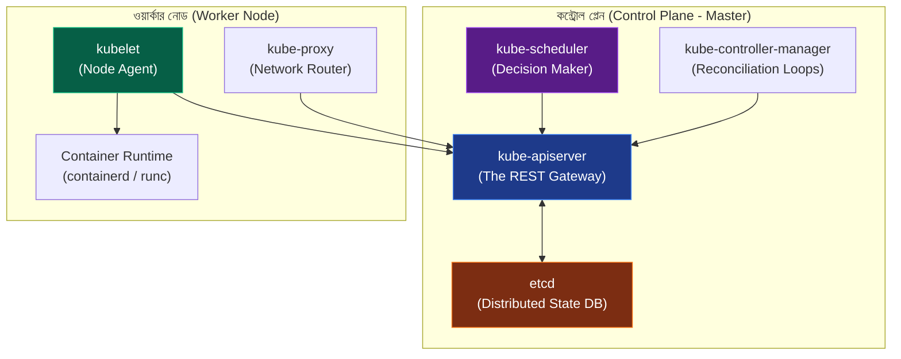

---

## ২. কন্ট্রোল প্লেন ইন্টারনালস (Control Plane Deep Dive)

কন্ট্রোল প্লেন ক্লাস্টারের মস্তিষ্ক হিসেবে কাজ করে। এর প্রতিটি উপাদান অত্যন্ত নির্দিষ্ট ও স্বাধীন কাজ সম্পন্ন করে:

### ক. `kube-apiserver` (Rest Gateway & Pipeline)
এটি ক্লাস্টারের একমাত্র উপাদান যা সরাসরি `etcd` ডেটাবেসের সাথে যোগাযোগ করতে পারে। ক্লাস্টারের ভেতর যেকোনো কুয়েরি বা রিকোয়েস্ট (যেমন: `kubectl create`) এর মধ্য দিয়ে যায়। এটি নিচের ৩টি ফিল্টারিং পাইপলাইন পার হয়ে কাজ করে:
১. **Authentication (অথেন্টিকেশন):** রিকোয়েস্ট পাঠানো ক্লায়েন্ট (ইউজার বা সার্ভিস অ্যাকাউন্ট) বৈধ কিনা তা চেক করে।
২. **Authorization (অথরাইজেশন):** **RBAC** (Role-Based Access Control) পলিসির মাধ্যমে দেখে ওই ইউজারের এই ফাইল ক্রিয়েট বা রিড করার অনুমতি আছে কিনা।
৩. **Admission Control (অ্যাডমিশন কন্ট্রোল):** রিকোয়েস্টটি কার্নেল বা ডেটাবেসে লেখার আগে তাকে কাস্টমাইজ বা মিউটেট করে (যেমন: লিমিট রেঞ্জ চেক করা, ডিফল্ট ভ্যালু বসানো)।

### খ. `etcd` (The Distributed State Database)
কুবারনেটিসের সমস্ত কনফিগারেশন, মেটাডেটা এবং ক্লাস্টারের লাইভ স্টেট অত্যন্ত নিরাপদে স্টোর থাকে `etcd` নামক একটি ডিস্ট্রিবিউটেড এবং কনসিস্টেন্ট **Key-Value Store**-এ।
* **Raft Consensus:** এটি অত্যন্ত জটিল **Raft Consensus Algorithm** ব্যবহার করে ক্লাস্টারের একাধিক etcd নোডের মধ্যে ডাটা কনসিস্টেন্সি বা সিনক্রোনাইজেশন বজায় রাখে।
* **Optimistic Concurrency Control (OCC):** `etcd` লক মেকানিজম ব্যবহার না করে `metadata.resourceVersion` ব্যবহার করে। যদি একই সাথে দুটি প্রসেস একই পড এডিট করতে চায়, তবে যার রিসোর্স ভার্সন মিলবে সে রাইট করতে পারবে, অন্য প্রসেসটি রিজেক্টেড হবে।

### গ. `kube-scheduler` (The Placement Engine)
নতুন কোনো পড তৈরি হলে সেটি কোন ওয়ার্কার নোডে গিয়ে রান করবে, সেই সিদ্ধান্ত নেওয়ার দায়িত্ব শিডিউলারের। এটি দুটি প্রধান ধাপে নোড সিলেক্ট করে:
১. **Filtering (Predicates):** এই ধাপে শিডিউলার চেক করে কোন কোন নোডে পডের চাহিদামতো খালি CPU/RAM রয়েছে, পোর্ট ফাঁকা আছে অথবা নোড টেইন্ট (Taint) মিলছে। অযোগ্য নোডগুলো ছেঁটে ফেলা হয়।
২. **Scoring (Priorities):** উপযুক্ত নোডগুলোর ওপর শিডিউলার স্কোরিং করে। যেমন: কোন নোডে রান করলে ট্রাফিক অপ্টিমাইজড হবে বা ইমেজ অলরেডি ডাউনলোড করা আছে। সবচেয়ে বেশি স্কোর পাওয়া নোডটিতে পডটি অ্যাসাইন বা বাইন্ড করা হয়।

### ঘ. `kube-controller-manager` (The Reconciliation Loop)
এটি একটি একক বাইনারি হলেও এর ভেতরে ব্যাকগ্রাউন্ডে অসংখ্য ছোট ছোট ডেমোন বা কন্ট্রোলার লুপ রান করে (যেমন: Node Controller, Deployment Controller, Job Controller)।
* **Reconciliation Loop (রিকনসিলিয়েশন লুপ):** এটি কুবারনেটিসের সবচেয়ে কোর কনসেপ্ট। এটি অনবরত একটি লুপের মাধ্যমে চেক করে ক্লাস্টারের বর্তমান অবস্থা (Actual State) এবং ইউজারের দেওয়া কাঙ্ক্ষিত অবস্থা (Desired State) এক আছে কিনা। অমিল দেখলেই সে তা সমাধান করে (যেমন: ৩টি রেপ্লিকা থাকার কথা কিন্তু ১টি ক্র্যাশ করেছে, সে সাথে সাথে নতুন ১টি পড বানাবে)।

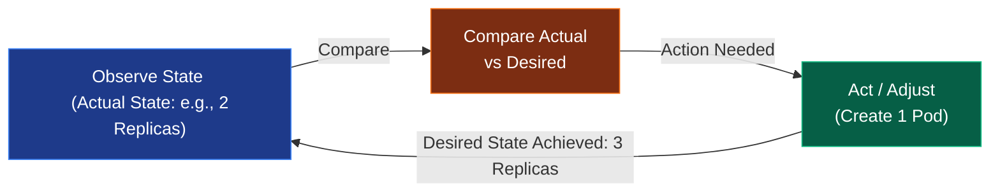

---

## ৩. ওয়ার্কার নোড ইন্টারনালস (Worker Node Deep Dive)

ওয়ার্কার নোডগুলো কন্ট্রোল প্লেনের নির্দেশ অনুযায়ী পড ও কন্টেইনারগুলোকে সশরীরে হোস্ট বা রান করায়।

### ক. `kubelet` (The Node General)
প্রতিটি ওয়ার্কার নোডে সচল থাকা সবচেয়ে গুরুত্বপূর্ণ সার্ভিস হলো `kubelet`। এটি নোডের ক্যাপ্টেন হিসেবে কাজ করে।
* **কাজ করার মেকানিজম:** এটি এপিআই সার্ভার থেকে PodSpec (পডের ডিজাইন ফাইল) রিসিভ করে নোডের **Container Runtime Interface (CRI)**-কে কন্টেইনার বানানোর নির্দেশ দেয়।
* **Sync Loop:** এটি প্রতি সেকেন্ডে কন্টেইনারগুলোর হেলথ ও স্ট্যাটাস মনিটর করে এপিআই সার্ভারকে ক্লাস্টারের রিয়েল-টাইম রিপোর্ট পাঠায়।

### খ. `kube-proxy` (The Network Traffic Director)
এটি প্রতিটি ওয়ার্কার নোডের নেটওয়ার্ক ম্যানেজার। পডগুলোর সার্ভিস আইপি ও ট্রাফিক লোড ব্যালেন্স করার দায়িত্ব এর। এটি ৩টি মোডে কাজ করতে পারে:
১. **User Space Mode (প্রাচীন ও স্লো):** ট্রাফিক প্রথমে কার্নেল থেকে ইউজার স্পেসের kube-proxy তে আসত, তারপর পডে যেত। অতিরিক্ত কনটেক্সট সুইচের কারণে এটি আর ব্যবহৃত হয় না।
২. **iptables Mode (ডিফল্ট ও পপুলার):** এটি নোডের লিনাক্স কার্নেলের `iptables` রুলস ডাইনামিক্যালি মডিফাই করে রুট সেট করে। কার্নেল স্পেসেই সরাসরি ট্রাফিক রাউটিং ঘটে বলে এর গতি অত্যন্ত বেশি। তবে ক্লাস্টারে হাজার হাজার সার্ভিস হয়ে গেলে iptables এ রৈখিক বা লিনিয়ার সার্চের কারণে স্পিড কমে যায়।
৩. **IPVS Mode (হাই-পারফরম্যান্স):** এটি লিনাক্স কার্নেলের **IP Virtual Server (IPVS)** ফিচার ব্যবহার করে যা হ্যাশ টেবিল মেইনটেইন করে। লক্ষাধিক সার্ভিস থাকলেও এটি $O(1)$ টাইমে ট্রাফিক রাউটিং করতে পারে।

---

## ৪. পড লাইফসাইকেল ও পজ কন্টেইনার (Pod Lifecycle & Pause Container)

আমরা জানি কুবারনেটিসের ক্ষুদ্রতম একক হলো **Pod (পড)**। তবে পর্দার অন্তরালে একটি পডের নেটওয়ার্ক ও রিসোর্স কীভাবে শেয়ার হয় তা অত্যন্ত চমৎকার।

### ক. পজ কন্টেইনারের রহস্য (The Pause / Infra Container)
পডের ভেতর একাধিক কন্টেইনার থাকতে পারে (যেমন: Main App এবং Sidecar)। এরা একে অপরের সাথে `localhost` দিয়ে মাইক্রো-সেকেন্ডে কমিউনিকেট করতে পারে এবং একই পোর্ট রেঞ্জ শেয়ার করে। এটি কীভাবে সম্ভব?

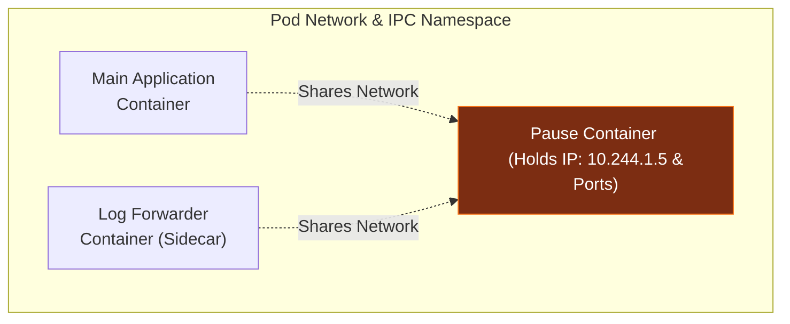

যখন একটি পড তৈরি হয়, কুবারনেটিস প্রথমে একটি হিডেন **Pause Container** (একে `infra` কন্টেইনারও বলে) তৈরি করে। এই কন্টেইনারটির একমাত্র কাজ হলো লিনাক্সের একটি ফাঁকা **Network, IPC, and PID Namespace** তৈরি করে তা ধরে রাখা। পডের অন্যান্য কন্টেইনারগুলো স্টার্ট হওয়ার সময় এই পজ কন্টেইনারের নেটওয়ার্ক নেমস্পেস শেয়ার করে জয়েন করে। ফলে মেইন কন্টেইনার ডাউন বা রিস্টার্ট হলেও পডের আইপি (IP Address) কখনই চেঞ্জ হয় না!

---

### খ. পড লাইফসাইকেল স্টেজ (Pod Lifecycle States)
একটি পড তার সম্পূর্ণ জীবনচক্রে নিচের ৫টি স্টেটের মধ্য দিয়ে যায়:

১. **Pending:** পডটি কুবারনেটিস এপিআই সার্ভারে রেজিস্টার হয়েছে কিন্তু শিডিউলার এখনো তার জন্য উপযুক্ত নোড খুঁজে পায়নি অথবা নোডে ইমেজ ডাউনলোড হচ্ছে।
২. **Running:** পডটি নোডে অ্যাসাইন হয়েছে এবং তার ভেতরের সমস্ত কন্টেইনার তৈরি হয়ে অন্তত একটি সচল রয়েছে।
৩. **Succeeded:** পডের ভেতরের কন্টেইনারগুলোর কাজ সফলভাবে শেষ হয়েছে এবং তারা `exit(0)` কোড দিয়ে বিদায় নিয়েছে (যেমন: ওয়ান-টাইম CronJob)।
৪. **Failed:** পডের অন্তত একটি কন্টেইনার এরর দিয়ে ক্র্যাশ করেছে এবং বন্ধ হয়ে গেছে।
৫. **Unknown:** কোনো কারণে (যেমন: নোড ডাউন বা নেটওয়ার্ক ডিসকানেক্ট) Kubelet কন্ট্রোল প্লেনকে পডের স্ট্যাটাস পাঠাতে পারছে না।

---

### গ. কন্টেইনার প্রোবস (Container Probes)
Kubelet কন্টেইনারের হেলথ মনিটর করার জন্য ৩ ধরণের প্রোব বা টেস্ট করে:
* **Liveness Probe:** কন্টেইনারটি বেঁচে আছে কিনা চেক করে। যদি এটি ফেইল করে, Kubelet কন্টেইনারটিকে কিল করে পুনরায় রিস্টার্ট করে।
* **Readiness Probe:** কন্টেইনারটি ট্রাফিক বা রিকোয়েস্ট রিসিভ করার জন্য প্রস্তুত কিনা চেক করে। ফেইল করলে সার্ভিস লোড ব্যালেন্সার থেকে ওই পডের আইপি সাময়িকভাবে রিমুভ করা হয় যাতে ইউজাররা কোনো এরর পেজ না দেখে।
* **Startup Probe:** অ্যাপ্লিকেশনটি স্টার্ট হতে অতিরিক্ত সময় লাগলে এটি ব্যবহার করা হয়। এটি সচল থাকা পর্যন্ত Liveness ও Readiness প্রোবগুলো নিষ্ক্রিয় থাকে যাতে বুটস্ট্র্যাপের সময় কন্টেইনার বারবার রিস্টার্ট না খায়।

---

## ৫. কুবারনেটিস নেটওয়ার্কিং ও সিএনআই (CNI Model)

কুবারনেটিস নেটওয়ার্কিংয়ের মূল নীতি হলো: **Every Pod gets a unique, routable IP Address within the cluster (অর্থাৎ প্রতিটা পড ক্লাস্টারের ভেতর একটি নিজস্ব আইপি পায়)।** পড টু পড যোগাযোগের জন্য কোনো NAT (Network Address Translation) বা পোর্ট ম্যাপিংয়ের প্রয়োজন হয় না।

এই নেটওয়ার্ক পলিসি ইমপ্লিমেন্ট করার জন্য কুবারনেটিস **CNI (Container Network Interface)** স্পেসিফিকেশন ব্যবহার করে। জনপ্রিয় ৩টি CNI প্লাগইন:

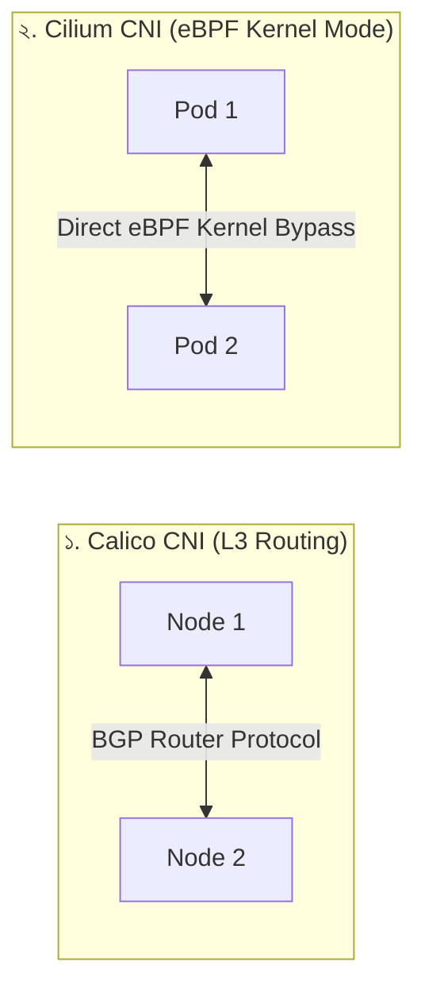

১. **Flannel:** সবচেয়ে সহজ ও প্রাচীন CNI। এটি মূলত **VXLAN Overlay Network** তৈরি করে প্যাকেটের ওপর হেডার পরিয়ে এনক্যাপসুলেশন (Encapsulation) করে এক নোড থেকে অন্য নোডে ডাটা পাঠায়। এর পারফরম্যান্স ওভারহেড কিছুটা বেশি।
২. **Calico:** এটি লেয়ার ৩ রাউটিং প্লাগইন। এটি কোনো ওভারলে নেটওয়ার্ক ছাড়াই ফিজিক্যাল রাউটার প্রোটোকল **BGP (Border Gateway Protocol)** ব্যবহার করে নোডগুলোর মধ্যে সরাসরি আইপি প্যাকেট রাউট করে। এটি অত্যন্ত ফাস্ট এবং এতে বিল্ট-ইন নেটওয়ার্ক সিকিউরিটি পলিসি সাপোর্ট আছে।
৩. **Cilium (আধুনিক ও বৈপ্লবিক):** এটি লিনাক্স কার্নেলের **eBPF (Extended Berkeley Packet Filter)** প্রযুক্তি ব্যবহার করে। এটি আইপি টেবিল বা কনটেক্সট সুইচিং সম্পূর্ণ বাইপাস করে সরাসরি কার্নেল লেভেলে নেটওয়ার্ক প্যাকেট ফিল্টার ও রাউট করে। এর সিকিউরিটি এবং পারফরম্যান্স ক্লাউড-নেটিভ ওয়ার্ল্ডে বর্তমানে সেরা!

---

## ৬. অ্যাডভান্সড ডিপ্লয়মেন্ট ও রোলআউট স্ট্র্যাটেজি

কুবারনেটিসে অ্যাপ্লিকেশন ডাউনটাইম ছাড়াই আপডেট করার জন্য মূলত দুটি অফিসিয়াল স্ট্র্যাটেজি রয়েছে:

### ক. Rolling Update (ডিফল্ট রোলআউট)
এটি ক্রমান্বয়ে পুরনো পডগুলো ডিলিট করে নতুন ভার্সনের পড লঞ্চ করে। এর গতি ও আচরণ নিয়ন্ত্রণ করার জন্য দুটি কী-ভ্যালু কনফিগার করতে হয়:
* **`maxSurge`:** আপডেটের সময় কাঙ্ক্ষিত পডের চেয়ে সর্বোচ্চ কত পার্সেন্ট অতিরিক্ত পড একবারে তৈরি করা যাবে (যেমন: `25%`)।
* **`maxUnavailable`:** রোলআউটের সময় সর্বোচ্চ কত পার্সেন্ট পড সাময়িকভাবে ডাউন বা আন-অ্যাভেইলেবল থাকতে পারবে (যেমন: `25%`)।

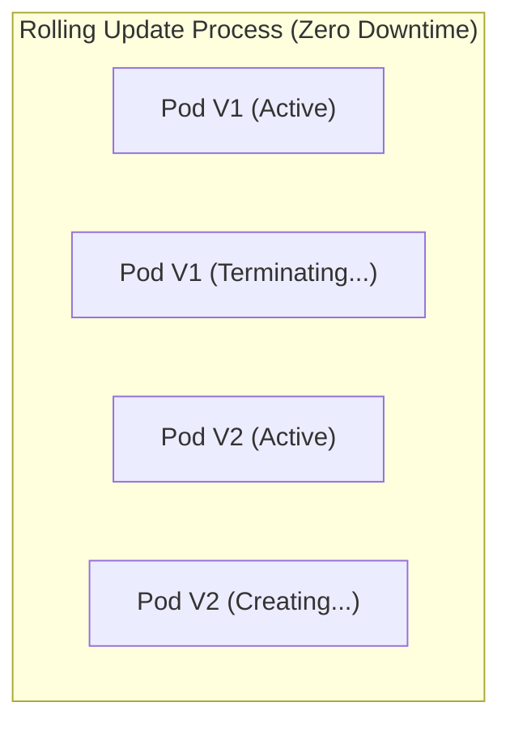

### খ. Canary Deployment (ক্যানারি রিলিজ)
ক্যানারি হলো নতুন একটি আপডেট সম্পূর্ণ রিলিজ করার আগে মাত্র ৫% বা ১০% ইউজারের ওপর টেস্ট করা।
* **কীভাবে কাজ করে:** একই সার্ভিস লেবেলের আন্ডারে দুটি আলাদা Deployment চালানো হয় (যেমন: ৯টি রেপ্লিকা V1 এবং ১টি রেপ্লিকা V2)। কুবারনেটিস সার্ভিস লোড ব্যালেন্সার তখন স্বয়ংক্রিয়ভাবে ৯০% ট্রাফিক V1-এ এবং ১০% ট্রাফিক V2-তে পাঠাবে। V2-তে কোনো এরর না থাকলে পরবর্তীতে V1-কে সম্পূর্ণ স্কেল ডাউন করে V2-কে ১০০% রিলিজ করে দেওয়া হয়।

---

## ৭. কুবারনেটিস স্টোরেজ ইন্টারনালস (CSI & Decoupling)

কুবারনেটিসে পডগুলোর লাইফসাইকেল ক্ষণস্থায়ী (Ephemeral)। পড ডিলিট হলেও যেন ডেটা হারিয়ে না যায়, সে জন্য K8s স্টোরেজ সিস্টেমকে ৩টি অংশে ডিকাপল বা আলাদা করেছে:

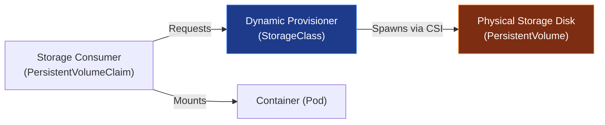

* **PersistentVolume (PV):** এটি ক্লাস্টারের ফিজিক্যাল বা ক্লাউড ড্রাইভের (যেমন: AWS EBS, NFS, Local Disk) একটি ফিজিক্যাল রিপ্রেজেন্টেশন। এটি ক্লাস্টারের এক ধরণের ফিজিক্যাল রিসোর্স (যেমন CPU/RAM এর মতো)।
* **PersistentVolumeClaim (PVC):** এটি ইউজারের তৈরি করা স্টোরেজ রিকোয়েস্ট ফাইল। অ্যাপ্লিকেশন ডেভেলপার কত জিবি স্টোরেজ ও কী ধরণের রিড/রাইট মোড (`ReadWriteOnce`, `ReadOnlyMany`) চায় তা এখানে লিখে দেয়।
* **StorageClass (Dynamic Provisioning):** পূর্বে অ্যাডমিনকে ম্যানুয়ালি ফিজিক্যাল ড্রাইভ তৈরি করে PV বানিয়ে রাখতে হতো। স্টোরেজ ক্লাস থাকলে কুবারনেটিস ইউজারের PVC রিকোয়েস্ট দেখামাত্রই সরাসরি ক্লাউড প্রোভাইডারের (AWS/GCP) কাছে গিয়ে ডাইনামিক্যালি রিয়েল-টাইমে ফিজিক্যাল ড্রাইভ তৈরি করে PV বানিয়ে PVC-এর সাথে বাইন্ড করে দেয়। এর পেছনে কার্নেল কাজ করে **CSI (Container Storage Interface)** প্লাগইনের সাহায্যে।

---

## ৮. কুবারনেটিস গার্বেজ কালেকশন ও ডিলিট পলিসি (Garbage Collection & OwnerReferences)

কুবারনেটিসে কোনো প্যারেন্ট রিসোর্স ডিলিট করলে (যেমন একটি Deployment), তার সাথে থাকা চাইল্ড রিসোর্সগুলো (যেমন ReplicaSet এবং Pods) কীভাবে রিমুভ হয়? এর পেছনে কাজ করে **Garbage Collector** এবং `ownerReferences` মেটাডেটা।

ডিলিট করার সময় কুবারনেটিস ৩ ধরণের **Cascading Deletion Policy** অফার করে:
১. **Foreground Cascading Deletion:** এই পলিসিতে প্যারেন্ট অবজেক্টটি ডিলিট হওয়ার সময় প্রথমে একটি `deletionTimestamp` পায় এবং "finalizers" ব্লকে চলে যায়। কুবারনেটিস প্রথমে তার সমস্ত চাইল্ড অবজেক্ট ডিলিট করে, এবং চাইল্ডগুলো সম্পূর্ণ ডিলিট হওয়া শেষ হলে অবশেষে প্যারেন্ট অবজেক্টটিকে ক্লাস্টার থেকে ডিলিট করে।
২. **Background Cascading Deletion (ডিফল্ট):** কুবারনেটিস এপিআই সার্ভার সাথে সাথে প্যারেন্ট অবজেক্টটিকে ডিলিট করে দেয়। এরপর ব্যাকগ্রাউন্ডে গার্বেজ কালেক্টর সচল হয়ে প্যারেন্টের সাথে লিঙ্ক থাকা সমস্ত চাইল্ড অবজেক্টগুলোকে ক্রমান্বয়ে ডিলিট করতে থাকে। এটি অত্যন্ত ফাস্ট।
৩. **Orphan Deletion Policy:** এই পলিসিতে প্যারেন্ট ডিলিট হয়ে গেলেও তার আন্ডারে থাকা চাইল্ড অবজেক্টগুলো এতিম বা Orphan হিসেবে ক্লাস্টারে সচল থেকে যায় (তাদের `ownerReferences` নাল হয়ে যায়)।

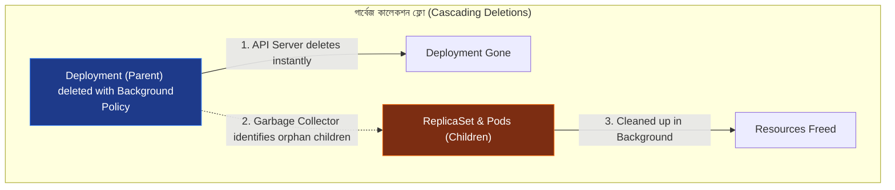

---

## ৯. কিউবলেট সিঙ্ক লুপ ও নোড প্রেশার ইভিকশন (Kubelet Sync Loop & Node Eviction)

ওয়ার্কার নোডে কন্টেইনার এবং মেমরির প্রকৃত দেখভাল করে Kubelet-এর অভ্যন্তরীণ দুটি কোর মেকানিজম:

### ক. Kubelet Sync Loop (`syncLoop`)
Kubelet ক্রমাগত একটি ইভেন্ট ড্রিভেন **Sync Loop** রান করায় যা ৩টি সোর্স থেকে পডের কনফিগারেশন চেঞ্জের খবর পায় (multiplexes channel):
১. **File:** নোডের লোকাল ডিরেক্টরি (Static Pods)।
২. **HTTP:** কোনো ইউআরএল এন্ডপয়েন্ট থেকে আসা PodSpec।
৩. **Apiserver:** এপিআই সার্ভার থেকে আসা গ্লোবাল পড লিস্ট বা ইভেন্ট।

যেকোনো সোর্স থেকে ডেটা আসবামাত্র Kubelet তার ইন্টারনাল পড লাইফসাইকেল ম্যানেজার (PLEG - Pod Lifecycle Event Generator) দিয়ে নোডের বর্তমান অবস্থার সাথে PodSpec মিলিয়ে CRI-এর সাহায্যে কন্টেইনার অ্যাডজাস্ট করে।

### খ. নোড প্রেশার ইভিকশন (Node Pressure Eviction)
যখন কোনো নোডে হার্ডওয়্যার রিসোর্স (যেমন RAM বা Disk) অত্যন্ত ঝুঁকিপূর্ণ মাত্রায় চলে যায়, Kubelet ক্লাস্টার ও নোড বাঁচাতে পডগুলোকে জোরপূর্বক কিল বা উচ্ছেদ (Eviction) করে।
* **Eviction Thresholds:** 
  - `memory.available < 100Mi`
  - `nodefs.available < 10%` (ফাইলসিস্টেম)
  - `imagefs.available < 15%` (কন্টেইনার ইমেজ ক্যাশ)
* **Hard Eviction:** থ্রেশহোল্ড টাচ করার সাথে সাথে কোনো প্রকার গ্রেস পিরিয়ড না দিয়েই Kubelet পডটিকে কিল করে দেয় এবং এপিআই সার্ভারকে জানায় যাতে পডটি অন্য নোডে শিডিউল হয়।
* **Soft Eviction:** অ্যাপ্লিকেশনকে গ্রেস পিরিয়ড দেওয়া হয় (যেমন ৫ মিনিট), এর মধ্যে রিসোর্স স্বাভাবিক না হলে অবশেষে পড ইভিক্ট করা হয়।

---

## ১০. এপিআই কনকারেন্সি ও প্যাচ মেকানিজম (Optimistic OCC vs Patches)

কুবারনেটিস ক্লাস্টারে প্রতি মিনিটে হাজার হাজার রিকোয়েস্ট এপিআই সার্ভারে আসে। এই কনকারেন্ট ট্রাফিক হ্যান্ডেল করার জন্য K8s দুটি আর্কিটেকচারাল মেকানিজম ব্যবহার করে:

### ক. Optimistic Concurrency Control (OCC)
ডাটাবেস লকিং ট্রাফিকের গতি শ্লথ করে দেয়। তাই K8s এপিআই সার্ভার লক মেকানিজম ব্যবহার না করে প্রতিটি অবজেক্টে একটি `metadata.resourceVersion` টোকেন যুক্ত করে।
* **কাজ করার নিয়ম:** যখন কোনো কন্ট্রোলার একটি পড আপডেট করতে চায়, সে প্রথমে অবজেক্টটি রিড করে তার রিসোর্স ভার্সন দেখে (ধরি `1042`)। আপডেটেড ডাটা রাইট করার সময় সে ওই ভার্সনসহ পাঠায়। যদি ইতিমধ্যে অন্য কেউ পডটি আপডেট করে থাকে, তবে ডেটাবেসের ভার্সন ইতিমধ্যে `1043` হয়ে যাবে এবং প্রথম কন্ট্রোলারের রিকোয়েস্টটি `HTTP 409 Conflict` এরর দিয়ে রিজেক্ট হবে। কন্ট্রোলার তখন আবার নতুন ডাটা রিড করে পুনরায় চেষ্টা (Retry) করে।

### খ. Strategic Merge Patch vs JSON Patch
কুবারনেটিসে অবজেক্ট এডিট করার জন্য ৩ ধরণের প্যাচ মেকানিজম রয়েছে:
১. **JSON Merge Patch (RFC 7386):** এটি সিম্পল কী-ভ্যালু রিপ্লেস করে। কিন্তু এর সমস্যা হলো এটি লিস্ট বা অ্যারের ক্ষেত্রে সম্পূর্ণ লিস্টটিকে রিপ্লেস করে ফেলে, যা পডের কনফিগারেশনে ভয়ংকর হতে পারে।
২. **Strategic Merge Patch:** এটি কুবারনেটিসের ডিফল্ট প্যাচিং প্রসেস। এটি মেটাডেটা স্কিমা দেখে বোঝে লিস্টির চাবি বা ইউনিক কী কোনটি (যেমন পডের কন্টেইনার লিস্টের জন্য চাবি হলো `name`)। ফলে এটি পুরো কন্টেইনার লিস্ট ও পোর্ট রিপ্লেস না করে সুনির্দিষ্ট কন্টেইনারের পোর্ট মডিফাই করতে পারে।
৩. **JSON Patch (RFC 6902):** এটি অত্যন্ত সুনির্দিষ্ট ডিক্লারেটিভ অপারেশন ডিক্লেয়ার করে (যেমন: `[{"op": "replace", "path": "/spec/replicas", "value": 5}]`)।

---

## ১১. সার্ভিস মেশ বনাম ইনগ্রেস আর্কিটেকচার (North-South vs East-West Traffic)

মাইক্রোসার্ভিসের যুগে ট্রাফিক ম্যানেজমেন্টকে কুবারনেটিসে দুটি প্রধান ক্যাটাগরিতে ভাগ করা হয়:

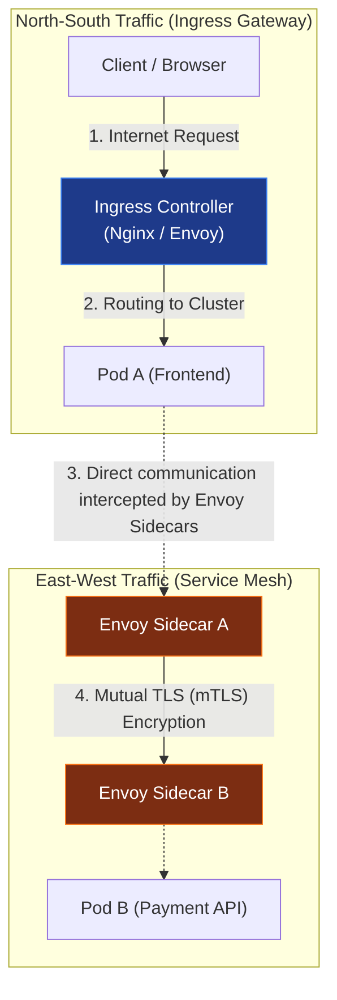

### ক. Ingress Controller (North-South Traffic)
এটি ক্লাস্টারের বাইর থেকে ভেতরে আসা ট্রাফিক রাুট করে (উত্তর-দক্ষিণ ট্রাফিক)। এটি মূলত লেয়ার ৭ রিভার্স প্রক্সি (যেমন Nginx, Traefik, HAProxy) যা হোস্ট ও পাথ মডিফাই করে প্যাকেটের রুট সেট করে।

### খ. Service Mesh (East-West Traffic)
ক্লাস্টারের ভেতরের পডগুলোর পারস্পরিক যোগাযোগকে বলা হয় পূর্ব-পশ্চিম ট্রাফিক। যখন শত শত মাইক্রোসার্ভিস নিজেদের মধ্যে কথা বলে, তখন ট্রাফিকের সিকিউরিটি (mTLS), ট্র্যাকিং এবং রিট্রাই পলিসি ম্যানেজ করার জন্য **Service Mesh** (যেমন: Istio, Linkerd) ব্যবহার করা হয়।
* **Envoy Sidecar Interception:** সার্ভিস মেশ নোডের লিনাক্স কার্নেলের `iptables` রুলস এমনভাবে কনফিগার করে দেয় যে, পডের মেইন কন্টেইনার থেকে বের হওয়া বা ভেতরে ঢোকা সমস্ত ট্রাফিক স্বয়ংক্রিয়ভাবে তার পাশে থাকা **Envoy Proxy Sidecar**-এ রিডাইরেক্ট হয়ে যায়। মেইন অ্যাপ টের পাওয়ার আগেই Envoy ট্রাফিক এনক্রিপ্ট (mTLS) ও মনিটরিং সম্পন্ন করে ফেলে!

---

## ১২. শিডিউলারের মেমরি মডেল ও এডভান্সড কুয়েস (Scheduler Queues & Constraints)

শিডিউলার কীভাবে হাজার হাজার পডের শিডিউলিং ট্রাফিক জ্যাম ছাড়াই নিমিষে হ্যান্ডেল করে? এর পেছনে রয়েছে এর ইন্টারনাল ৩টি কিউ (Queue) মেকানিজম এবং ডিস্ট্রিবিউশন রুলস:

### ক. Scheduler Queue Internals
নতুন বা পেন্ডিং পডগুলোকে শিডিউলার নিচের ৩টি কিউতে ম্যানেজ করে:
১. **ActiveQ (অ্যাক্টিভ কিউ):** শিডিউল হওয়ার জন্য প্রস্তুত পডগুলোর প্রায়োরিটি-ভিত্তিক বাকেট। শিডিউলার এখান থেকে পড নিয়ে নোডে বাইন্ড করার চেষ্টা করে।
২. **UnschedulableQ:** রিসোর্স বা টেইন্টের অভাবে শিডিউল হতে না পারা পডগুলোকে সাময়িকভাবে এখানে হোল্ড করা হয় যাতে তারা ActiveQ-এর মূল্যবান সিপিইউ সাইকেল নষ্ট না করে। ক্লাস্টারে নতুন নোড যুক্ত হলে বা মেমরি খালি হলে এদের আবার ActiveQ-তে ফেরত আনা হয়।
৩. **PodBackoffQ:** যে পডগুলো শিডিউল হতে গিয়েও বারবার ফেইল করছে, তাদের একটি নির্দিষ্ট ব্যাক-অফ টাইম পর্যন্ত এখানে ওয়েট করানো হয় যাতে তারা ক্লাস্টারে অতিরিক্ত থ্রোটলিং না ঘটায়।

### খ. Pod Topology Spread Constraints
প্রোডাকশনে হাই-অ্যাভেইলেবিলিটি নিশ্চিত করতে এটি শিডিউলারের অত্যন্ত শক্তিশালী টুল। এর মাধ্যমে পডগুলোকে ক্লাস্টারের বিভিন্ন ব্যর্থতার ডোমেন বা ফল্ট জোন (যেমন ফিজিক্যাল ড্রাইভ, রেক, ক্লাউড জোন) জুড়ে সমানভাবে ছড়িয়ে দেওয়া যায়।
* **`topologyKey`:** নির্দেশ করে ডোমেন টাইপ (যেমন `topology.kubernetes.io/zone`)।
* **`maxSkew`:** দুটি জোনের মধ্যে পডের সংখ্যার সর্বোচ্চ অনুমোদিত পার্থক্য নির্দেশ করে (যেমন `maxSkew: 1` মানে কোনো একটি জোনে অন্য জোনের চেয়ে ১টির বেশি অতিরিক্ত পড থাকতে পারবে না)।

---

## ১৩. কাস্টম কন্ট্রোলারের অভ্যন্তরীণ মেকানিজম (Informers & WorkQueue Lifecycle)

কুবারনেটিসে অপারেটর বা কাস্টম কন্ট্রোলার কীভাবে ক্লাস্টারের কনফিগারেশন চেঞ্জ হওয়ার সাথে সাথে চোখের পলকে রিয়েল-টাইমে অ্যাকশন নেয়? এটি কোনো পোলিং (`GET` রিকোয়েস্ট লুপ) ব্যবহার করে না। এর পেছনে রয়েছে **Client-Go** লাইব্রেরির **Informer Architecture**:

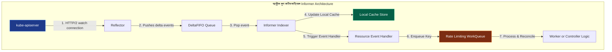

১. **Reflector:** এটি এপিআই সার্ভারের সাথে একটি দীর্ঘমেয়াদী **HTTP/2 Watch Connection** বজায় রাখে। নতুন কোনো পড বা কাস্টম ফাইল তৈরি বা আপডেট হলে এপিআই সার্ভার রিফ্লেক্টরকে ইনস্ট্যান্ট ইভেন্ট পুশ করে।
২. **DeltaFIFO:** রিফ্লেক্টর ইভেন্টগুলো নিয়ে একটি ফাস্ট-ইন-ফার্স্ট-আউট কিউতে জমা করে।
৩. **Informer Indexer:** এটি ডেল্টা-ফিফো থেকে ইভেন্ট পপ করে তার অভ্যন্তরীণ মেমরি ক্যাশ (Local Cache Store) আপডেট করে। এর ফলে কন্ট্রোলারকে প্রতিবার এপিআই সার্ভার কুয়েরি করতে হয় না, সে লোকাল ক্যাশ থেকেই সুপারফাস্ট ডাটা রিড করতে পারে।
৪. **Resource Event Handler:** এটি ডেভেলপারের লেখা ইভেন্ট হ্যান্ডলারকে (Add, Update, Delete) কল করে।
৫. **WorkQueue:** হ্যান্ডলার সরাসরি অ্যাকশন না নিয়ে ইভেন্টের ইউনিক চাবি বা কী (যেমন `namespace/pod-name`) একটি রেট-লিমিটিং **WorkQueue**-তে পুশ করে।
৬. **Worker (Reconcile Loop):** ওয়ার্কার থ্রেড অনবরত WorkQueue থেকে কী রিড করে Desired ও Actual স্টেটের অমিল দূর করে অবশেষে সফলভাবে এপিআই সার্ভারে ফাইনাল স্টেট রাইট করে।

## ১৪. পড ডিসরাপশন বাজেট ও নোড ড্রেন পলিসি (PDB & Voluntary vs Involuntary Disruptions)

উচ্চ প্রাপ্যতা (High Availability) নিশ্চিত করতে কুবারনেটিস ক্লাস্টারে সিস্টেম মেইনটেন্যান্স বা ডাউনটাইম কীভাবে সামলানো হয়? এর পেছনে কাজ করে **PDB (Pod Disruption Budget)**।

### ক. Voluntary vs Involuntary Disruptions
কুবারনেটিস পডের ডাউনটাইম বা বিপর্যয়কে দুটি ক্যাটাগরিতে ভাগ করে:
১. **Involuntary Disruptions (অনিবার্য বিপর্যয়):** যা মানুষের নিয়ন্ত্রণে থাকে না (যেমন: ফিজিক্যাল সার্ভারের মেমরি ক্যাশ ব্লাস্ট করা, কার্নেল প্যানিক, নেটওয়ার্ক ক্যাবল ডিসকানেক্ট হওয়া বা ফিজিক্যাল ডিস্ক ড্যামেজ হওয়া)।
২. **Voluntary Disruptions (স্বেচ্ছাধীন বিপর্যয়):** যা অ্যাপ্লিকেশন অ্যাডমিনের কাস্টম বা রিয়েল-টাইম অ্যাকশন (যেমন: নোড ড্রেন করা `kubectl drain` কার্নেল আপগ্রেডের জন্য, ডেপ্লয়মেন্টের রেপ্লিকা টেমপ্লেট পরিবর্তন করা, বা অ্যাপ্লিকেশন আপডেট করা)।

### খ. Pod Disruption Budget (PDB)
PDB হলো একটি ডিক্লারেটিভ পলিসি যা কুবারনেটিস এপিআই সার্ভারকে বলে দেয়—"আমার নোড মেইনটেন্যান্স বা ড্রেন করার সময়েও যেন এই অ্যাপ্লিকেশনের কমপক্ষে ২টি পড সবসময় একটিভ থাকে।"
* **কনফিগারেশন:**
  - `minAvailable`: নুন্যতম কতটি পড বা পার্সেন্টেজ সবসময় সচল থাকতে হবে (যেমন `minAvailable: 2` বা `minAvailable: 80%`)।
  - `maxUnavailable`: সর্বোচ্চ কতটি পড একসাথে ড্রেন বা ডাউন করা যাবে (যেমন `maxUnavailable: 1`)।
* **কাজ করার নিয়ম:** যখন এডমিন `kubectl drain` চালায়, এপিআই সার্ভার PDB পলিসি চেক করে নোড খালি করে। PDB পলিসি ভায়োলেট বা লংঘিত হলে ড্রেন প্রসেস সাময়িকভাবে রিজেক্টেড হয়, যতক্ষণ না নতুন নোডে অল্টারনেটিভ পড রান হচ্ছে।

---

## ১৫. পড সিকিউরিটি স্ট্যান্ডার্ডস ও লিনাক্স ক্যাপাবিলিটিজ (PSS, PSA & OS Linux Security)

কুবারনেটিসের প্রাচীন ও জটিল **PodSecurityPolicy (PSP)** কে পুরোপুরি ডেপ্রিকেট বা রিমুভ করে নেক্সট-জেনারেশন ক্লাউড সিকিউরিটির জন্য প্রবর্তন করা হয়েছে **Pod Security Admission (PSA)** এবং **Pod Security Standards (PSS)**।

### ক. Pod Security Standards (PSS)
কুবারনেটিস পডের সিকিউরিটি পলিসিকে ৩টি প্রমিত ক্যাটাগরিতে ভাগ করে:
১. **Privileged (অবারিত):** কোনো প্রকার বিধি-নিষেধ ছাড়াই পড হোস্টের ওএসের সমস্ত ডিভাইস ও রুট প্রিভিলেজ সরাসরি অ্যাক্সেস করতে পারে (যেমন CNI ড্রাইভার পড)।
২. **Baseline (ডিফল্ট ও ব্যালেন্সড):** হোস্ট ওএসের রুট ক্যাবল নেটওয়ার্ক বা প্রিভিলেজ এসকেলেশন ব্লক করে দেয়, তবে সাধারণ অ্যাপ্লিকেশন রান করার অনুমতি দেয়।
৩. **Restricted (সর্বোচ্চ সিকিউরড):** পডকে ওএসের সর্বোচ্চ টাইট সিকিউরিটি রুলস মানতে বাধ্য করে (যেমন রুট ইউজার হিসেবে রান করা সম্পূর্ণ ব্লক করা, লোকাল ফাইলসিস্টেম রাইট ব্লক করা)।

### খ. Linux Capabilities inside PodSpec
কুবারনেটিসের পডের ভেতরে লিনাক্স কার্নেলের সিকিউরিটি সক্ষমতা সরাসরি কন্ট্রোল করা সম্ভব:
```yaml
securityContext:
  runAsNonRoot: true                   # পড কখনই হোস্ট ওএসের রুট ইউজার (UID 0) হিসেবে রান করবে না
  readOnlyRootFilesystem: true         # পডের লোকাল কন্টেইনার ফাইলসিস্টেমকে রিড-অনলি করে দেয়, কোনো ভাইরাস বা হ্যাকার লোকাল ডিস্কে স্ক্রিপ্ট রাইট করতে পারবে না
  allowPrivilegeEscalation: false      # চাইল্ড প্রসেস যেন প্যারেন্ট প্রসেসের প্রিভিলেজ অ্যাক্সেস করতে না পারে (setuid বাইপাস)
  seccompProfile:
    type: RuntimeDefault               # লিনাক্সের Secure Computing (seccomp) ফিল্টার ব্যবহার করে কার্নেলের অপ্রয়োজনীয় সিস্টেম কল ব্লক করে দেয়
```

---

## ১৬. অ্যাডভান্সড শিডিউলিং ও 'Execution' এনফোর্সমেন্ট (Advanced Node Affinity & Execution Modes)

সাধারণত আমরা পডের নোড সিলেকশনে Node Selector ব্যবহার করি। তবে এন্টারপ্রাইজ স্কেলে এর চেয়ে শক্তিশালী **Node Affinity** পলিসি ব্যবহার করা হয় যা ২ ধরণের 'Execution' মোড সাপোর্ট করে:

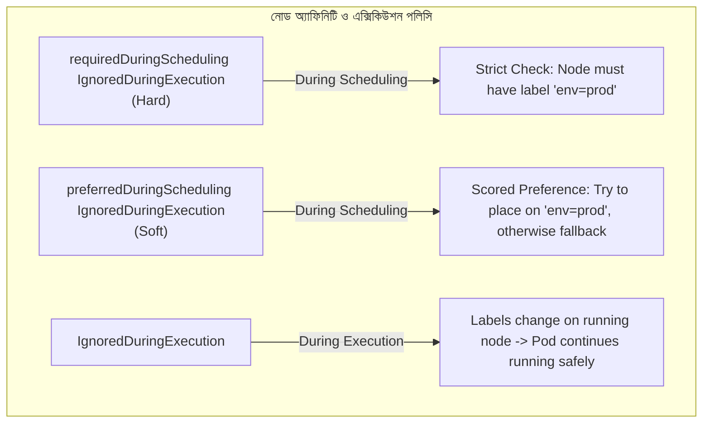

১. **`requiredDuringSchedulingIgnoredDuringExecution` (Hard Constraint):**
   - **Scheduling:** অত্যন্ত কঠোর বা হার্ড রুল। নোডে লেবেল না মিললে পড কখনই শিডিউল হবে না, চিরকাল পেন্ডিং হয়ে বসে থাকবে।
   - **Execution:** পডটি নোডে সফলভাবে রান হওয়ার পর যদি ফিজিক্যাল নোডের লেবেল কেউ এডিট বা ডিলেট করে দেয়, তবুও রানিং পডটিকে কিল করা হবে না। এটি নিরাপদে চলতে থাকবে (`IgnoredDuringExecution`)।
২. **`preferredDuringSchedulingIgnoredDuringExecution` (Soft Constraint):**
   - **Scheduling:** নরম বা সফট রুল। শিডিউলার ওই স্পেসিফিক লেবেলযুক্ত নোড খোঁজার সর্বোচ্চ চেষ্টা করবে, না পেলে ক্লাস্টারের যেকোনো সাধারণ ফাঁকা নোডে পডটি শিডিউল করে দেবে।
৩. **`requiredDuringSchedulingRequiredDuringExecution` (উন্নত ও বিরল):**
   - এটি এমন এক বিশেষ ফিচার যেখানে শিডিউল হওয়ার সময় যেমন লেবেল মিলতে হবে, পডটি রান থাকা অবস্থায় যদি নোডের লেবেল পরিবর্তন হয়ে যায়—কার্নেল সাথে সাথে পডটিকে কিল করে নোড থেকে উচ্ছেদ করে দেবে!

---

## XVII. সিএসআই ইন্টারনালস এবং ডাইনামিক মাউন্ট প্রসেস (CSI Controller vs Node Plugins)

কুবারনেটিসে যখন আপনি একটি PVC তৈরি করেন, তখন মেঘের আড়ালে বা ব্যাকগ্রাউন্ডে কুবারনেটিস ওএস কীভাবে ফিজিক্যাল ডিস্ক কন্টেইনারের ফাইলসিস্টেমের সাথে সংযুক্ত করে? এর পেছনে রয়েছে **CSI (Container Storage Interface)**-এর দুটি স্বাধীন ড্রাইভার প্লাগইন:

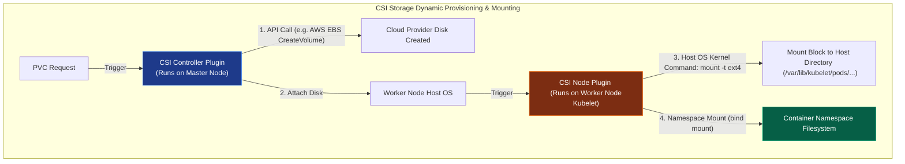

### ক. CSI Controller Plugin (কন্ট্রোল প্লেনে সচল)
এই প্লাগইনটি এপিআই সার্ভারে বা মাস্টার নোডে সচল থাকে। এর কাজ হলো সম্পূর্ণ নন-লোকাল বা ক্লাউড ড্রাইভের ম্যানেজমেন্ট।
* **কাজ:** যখন PVC তৈরি হয়, কন্ট্রোলার প্লাগইন সরাসরি ক্লাউড প্রোভাইডারের এপিআই (যেমন AWS EBS, Azure Disk API) কল করে একটি নতুন ভার্চুয়াল স্টোরেজ ব্লক জেনারেট করে। তারপর সে ড্রাইভটিকে ওয়ার্কার নোডের ফিজিক্যাল হোস্ট মেশিনের সাথে কানেক্ট (Attach) করে দেয়।

### খ. CSI Node Plugin (ওয়ার্কার নোডের কুয়েস্ট)
এই প্লাগইনটি একটি DaemonSet হিসেবে প্রতিটি ওয়ার্কার নোডের Kubelet-এর সাথে কো-লোকেট হয়ে রান করে। এর কাজ হলো ওএস লেভেলের মাউন্টিং।
* **কাজ:** হোস্ট ওএসের সাথে ড্রাইভ যুক্ত হওয়ার পর, এই নোড প্লাগইন হোস্টের ভেতরে সশরীরে ফাইলসিস্টেম ফরম্যাটিং কমান্ড চালায় (যেমন `mkfs.ext4`) এবং হোস্ট ওএসের ডিরেক্টরিতে মাউন্ট করে (`/var/lib/kubelet/pods/<pod-uid>/volumes/...`)। অবশেষে লিনাক্সের **`bind mount`** প্রসেস ব্যবহার করে কন্টেইনারের পার্সোনাল ফাইলসিস্টেম নেমস্পেসে ডিস্কটি রুট করে দেয়।

---

## ১৮. এইচপিএ বনাম ভিপিএ সংঘাত ও দ্বৈরথ (HPA vs VPA Conflict & Resolution)

পডের রিসোর্স অটো-স্কেলিংয়ের জন্য কুবারনেটিসের দুটি অন্যতম প্রধান সリューション হলো **HPA (Horizontal Pod Autoscaler)** এবং **VPA (Vertical Pod Autoscaler)**।

| ফিচার | HPA (Horizontal Pod Autoscaler) | VPA (Vertical Pod Autoscaler) |
| :--- | :--- | :--- |
| **স্কেলিংয়ের ধরণ** | **Scale-Out:** পডের সংখ্যা বাড়িয়ে দেয় (Replicas 2 -> 10) | **Scale-Up:** রানিং পডের মেমরির সাইজ বাড়িয়ে দেয় (RAM 512Mi -> 2Gi) |
| **মনিটরিং মেট্রিক্স** | সাধারণত CPU/RAM ইউটিলাইজেশন বা কাস্টম প্রমিথিউস মেট্রিক্স | অ্যাপ্লিকেশনের দীর্ঘমেয়াদী রিসোর্স ব্যবহারের ট্রেন্ড বা হিস্টোরি |
| **কাজ করার মেথড** | নতুন পড ডাইনামিক্যালি স্পন করে অত্যন্ত দ্রুত ট্রাফিক সামলায় | পড ক্র্যাশ না করিয়ে নোডের রিকোয়েস্ট ইন-প্লেস বা রিস্টার্ট দিয়ে বাড়ায় |

### 💥 HPA বনাম VPA সংঘাত (The Conflict of Auto-scalers)
প্রোডাকশনে একই অ্যাপ্লিকেশনের বা একই মেট্রিক্সের (যেমন CPU/RAM) ওপর HPA এবং VPA একসাথে চালানো সম্পূর্ণ নিষিদ্ধ এবং ভয়ংকর! কেন?
* **ডেস্ট্রাকটিভ ফিডব্যাক লুপ (Feedback Loop of Doom):**
  ১. ধরুন ট্রাফিক বাড়ার কারণে পডের CPU ব্যবহার ১০০% এ চলে গেল।
  ২. VPA সাথে সাথে পডের আকার বড় করার জন্য পডটিকে কিল বা রিসাইজ করার সিদ্ধান্ত নেবে।
  ৩. একই সময়ে HPA দেখবে CPU ১০০% এবং পডের সংখ্যা বাড়াতে (Replicas) ডাইনামিক রিকোয়েস্ট পাঠাবে।
  ৪. দুটি পলিসি একে অপরের ডেটা মডিফাই করে ক্লাস্টারে এক মারাত্মক অস্থিরতা ও ক্র্যাশ লুপ (Tug of War) তৈরি করবে।
* **সমাধান:** যদি একই পডে দুটিই ব্যবহার করতে হয়, তবে HPA-কে রান করাতে হবে কাস্টম বিজনেস বা অ্যাপ্লিকেশন মেট্রিক্সের ওপর ভিত্তি করে (যেমন HTTP Request per second) এবং VPA-কে রান করাতে হবে ওএস লেভেলের রিসোর্স মেট্রিক্সের ওপর ভিত্তি করে (যেমন CPU/RAM Requests Optimization)।

---

## ১৯. কিউবলেট সিস্টেম ট্রিয়াজ ও ওএস শাটডাউন (Graceful Node Shutdown Systemd Integration)

কখনো ফিজিক্যাল সার্ভার বা নোড যদি ক্র্যাশ করে বা শাটডাউন হয়, Kubelet কীভাবে ওএস শাটডাউন হওয়ার পূর্বে পডগুলোকে নিরাপদে সেভ করার সুযোগ পায়? এর জন্য রয়েছে **Graceful Node Shutdown** মেকানিজম।

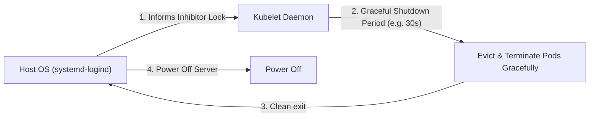

### ক. systemd-logind Integration
লিনাক্স অপারেটিং সিস্টেমের **systemd** সার্ভিস যখন নোড বন্ধ হওয়ার সিগন্যাল রিসিভ করে, Kubelet লিনাক্সের **systemd-logind inhibitor locks** ব্যবহার করে শাটডাউন প্রসেসকে সাময়িকভাবে হোল্ড বা ব্লক করে দেয়।
* **শাটডাউনের সময়সীমা:** Kubelet-কে নোটিফাই করা হয় যে নোডটি শাটডাউন হচ্ছে। 
* **Eviction Period:** Kubelet তখন দুটি প্রি-কনফিগার টাইমস্ট্যাম্প সচল করে:
  - `shutdownGracePeriod`: নোড সম্পূর্ণ বন্ধ হওয়ার জন্য সর্বোচ্চ কত সেকেন্ড সময় দেওয়া হবে (যেমন ৩০ সেকেন্ড)।
  - `shutdownGracePeriodCriticalPods`: ক্লাস্টারের কোর বা ক্র্টিকাল পডগুলোকে (যেমন সিএনআই পড) বন্ধ করার জন্য কত সেকেন্ড ছাড় দেওয়া হবে (যেমন ১০ সেকেন্ড)।
Kubelet এই গ্রেস পিরিয়ডের মধ্যে নোডের পডগুলোকে অত্যন্ত দ্রুত ও সুন্দরভাবে `SIGTERM` দিয়ে বিদায় জানায় এবং এপিআই সার্ভারকে এন্ডপয়েন্ট থেকে পডগুলোর ট্রাফিক রিমুভ করার চূড়ান্ত সুযোগ দেয়, ফলে ইউজারের ব্রাউজারে কোনো রানিং রিকোয়েস্ট হঠাৎ কেটে বা ড্রপ করে যায় না।

---

## ২০. এপিআই সার্ভার রেট লিমিটিং ও ফ্লো স্কিমা (API Priority & Fairness - APF)

কুবারনেটিসের এপিআই সার্ভারে অতিরিক্ত রিকোয়েস্টের চাপে যেন ক্লাস্টার ক্র্যাশ না করে, সে জন্য কুবারনেটিস **API Priority and Fairness (APF)** মেকানিজম ব্যবহার করে।

### ক. APF এর কাজের ধরণ
এটি এপিআই সার্ভারের জন্য ট্রাফিক সিগন্যাল লাইটের মতো কাজ করে। এটি ইনকামিং রিকোয়েস্টগুলোকে থ্রোটল বা রিজেক্ট না করে বরং তাদের গুরুত্ব অনুযায়ী সারিবদ্ধ বা কিউ (Queue) করে প্রসেস করে। এর দুটি প্রধান রিসোর্স হলো:
১. **FlowSchema:** এটি রিকোয়েস্টের ধরন শনাক্ত করে এবং সেটিকে একটি নির্দিষ্ট **Priority Level**-এ গ্রুপ করে।
২. **PriorityLevelConfiguration:** এটি ডিফাইন করে ওই গ্রুপটি কতটুকু এপিআই সার্ভারের থ্রেড বা ক্যাপাসিটি পাবে (Concurrency Shares)।

### খ. Real-time Scenario
যদি একটি বাগ-যুক্ত ক্রনজব (CronJob) প্রতি সেকেন্ডে লক্ষাধিক রিড রিকোয়েস্ট পাঠিয়ে এপিআই সার্ভার ডাউন করার চেষ্টা করে, APF মেকানিজম সেটিকে একটি লো-প্রায়োরিটি FlowSchema-তে ফেলে থ্রোটল করে দেবে। একই সময়ে Kubelet থেকে আসা ক্রিটিক্যাল নোড হার্টবিট এবং লিডার ইলেকশন লিজ (Leases) রিকোয়েস্টগুলো হাই-প্রাইওরিটি বাকেটে থাকার কারণে সম্পূর্ণ বাধা ছাড়াই ইনস্ট্যান্ট এপিআই সার্ভার অ্যাক্সেস পাবে!

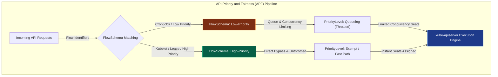

---

## ২১. এপিআই স্টোরেজ ভার্সন মাইগ্রেশন এবং etcd স্কিমা বিবর্তন (APIServer Storage Version Migrator)

কুবারনেটিস ক্রমাগত আপডেট হতে থাকে। আজ যে এপিআই রিসোর্সটি `v1beta1` ভার্সনে আছে, কাল তা `v1` ভার্সনে কনভার্ট হয়ে যেতে পারে। এই সময় ব্যাকগ্রাউন্ডে ডেটাবেসে থাকা পুরানো অবজেক্টগুলোর স্কিমা কীভাবে আপডেট হয়?

### ক. preferredVersion বনাম storageVersion
১. **preferredVersion:** কুবারনেটিস এপিআই-তে ইউজাররা যে রিকোয়েস্ট লেভেল ব্যবহার করে কথা বলে (যেমন ওল্ড ক্লায়েন্টদের জন্য `v1beta1` এবং নিউ ক্লায়েন্টদের জন্য `v1`)।
২. **storageVersion:** এপিআই সার্ভার ইন্টারনালি ডেটাবেসে (etcd) অবজেক্টটি যে সুনির্দিষ্ট সংস্করণে স্টোর বা রাইট করে।
* **Storage Version Migration (SVM):** যখন কুবারনেটিস নোড আপগ্রেড করা হয়, তখন এপিআই সার্ভার অবজেক্ট রিড করার সময় অন-দ্য-ফ্লাই (On-the-fly) সেটিকে নতুন ভার্সনে কনভার্ট করে। কিন্তু যদি কোনো অবজেক্ট দীর্ঘদিন রিড বা আপডেট না করা হয়, তবে সেটি চিরকাল etcd-তে প্রাচীন ডেটা স্কিমা নিয়েই পড়ে থাকবে, যা ক্লাস্টারের পরবর্তী বড় আপগ্রেডে কনফ্লিক্ট বা ডেটা লস ঘটাতে পারে।

### খ. Storage Version Migrator
এই সমস্যার সমাধানের জন্য **Storage Version Migrator (SVM)** কন্ট্রোলার ব্যবহার করা হয়। এটি ব্যাকগ্রাউন্ডে ক্রমাগত ক্লাস্টারের সমস্ত রিসোর্স রিড করে পুনরায় রাইট (No-op Write) করে দেয়। এর ফলে সমস্ত ডেটা নতুন স্টোরেজ স্কিমা অনুযায়ী etcd-তে আপগ্রেড হয়ে যায়।

---

## ২২. কাস্টম রিসোর্স কনভার্সন ওয়েবহুক (CRD Conversion Webhooks)

যখন আমরা কাস্টম অপারেটর বা CRD (Custom Resource Definition) ডেভলপ করি এবং তার একাধিক সংস্করণ বা ভার্সন রিলিজ করি (যেমন `v1alpha1`, `v1beta1`, `v1`), তখন কুবারনেটিসের এপিআই সার্ভার কীভাবে বিভিন্ন ওল্ড ও নিউ ইউজারের রিকোয়েস্ট ডাইনামিক্যালি হ্যান্ডেল করে? এর পেছনে কাজ করে **Conversion Webhook**।

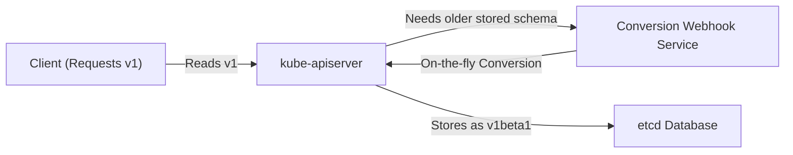

* **কাজ করার মেকানিজম:** যখন ক্লায়েন্ট `v1` ভার্সনে ডাটা রিড বা রাইট করতে চায়, কিন্তু etcd-তে ডাটা স্টোর আছে `v1beta1` ভার্সনে, এপিআই সার্ভার সরাসরি কাস্টম অপারেটরের তৈরি করা একটি HTTP Webhook-এ ডাটা পাঠিয়ে দেয়। ওই কনভার্সন ওয়েবহুকটি ডাইনামিক্যালি কোডের মাধ্যমে ওল্ড অবজেক্টের স্ট্রাকচার নিউ অবজেক্টে রূপান্তর করে এপিআই সার্ভারকে রিটার্ন করে। এটি অত্যন্ত ফাস্ট ও নিমিষেই সম্পন্ন হয়।

---

## ২৩. ডুয়াল-স্ট্যাক আইপিভি৪/আইপিভি৬ নেটওয়ার্কিং (Dual-Stack IPv4/IPv6 Networking Architecture)

আধুনিক ক্লাউড ও এন্টারপ্রাইজ ইনফ্রাস্ট্রাকচারে নেটওয়ার্ক আইপি সংকট দূর করতে কুবারনেটিস **IPv4/IPv6 Dual-Stack** সাপোর্ট করে।

### ক. Dual-Stack এর আর্কিটেকচার
ডুয়াল-স্ট্যাক ক্লাস্টারে প্রতিটি পড (Pod) এবং সার্ভিস (Service) একই সাথে একটি IPv4 অ্যাড্রেস এবং একটি IPv6 অ্যাড্রেস লাভ করে।
* **Pod Networking:** CNI প্লাগইন (যেমন Calico বা Cilium) লিনাক্স কার্নেলের নেটওয়ার্ক নেমস্পেসে দুটি নেটওয়ার্ক ইন্টারফেস বা আইপি টেবিলে ডুয়াল আইপি রুট কনফিগার করে দেয়।
* **Service Networking:** এপিআই সার্ভার সার্ভিসের কনফিগারেশনে `ipFamilies` এবং `ipFamilyPolicy` ফিল্ড প্রোভাইড করে:
  - `ipFamilyPolicy: PreferDualStack` (সুযোগ থাকলে ডুয়াল স্ট্যাক আইপি জেনারেট করবে)।
  - `ipFamilyPolicy: RequireDualStack` (ডুয়াল স্ট্যাক আইপি না পেলে সার্ভিস রান হবে না)।

### খ. iptables & IPVS Support
`kube-proxy` নোডের কার্নেল লেভেলে IPv4 এবং IPv6 এর জন্য আলাদা আলাদা আইপি টেবলস রুলস জেনারেট করে (IPv4 এর জন্য `iptables` এবং IPv6 এর জন্য `ip6tables`), যা নেটওয়ার্ক প্যাকেটের গন্তব্য রিয়েল-টাইমে নেটিং (NAT) করে দেয়।

---

## ২৪. সার্ভিস টপোলজি ও টপোলজি-অ্যাওয়ার রাউটিং (Topology Aware Hints)

মাল্টি-জোন (Multi-Zone) ক্লাস্টারে নেটওয়ার্ক লেটেন্সি এবং ট্রাফিকের আকাশচুম্বী বিল বা কস্ট কমানোর জন্য কুবারনেটিস **Topology Aware Routing** ব্যবহার করে।

### ক. ক্রস-জোন ট্রাফিকের বিপদ (Cross-Zone Traffic Latency)
একটি নোডের Frontend পড যদি অন্য জোনের (যেমন Zone-B) Backend পডের সাথে কথা বলে, তবে ডেটা ফিজিক্যাল ফাইবার অপটিক নেটওয়ার্ক ট্রাভেল করার কারণে রিকোয়েস্টে হাই লেটেন্সি দেখা দেয় এবং ক্লাউড প্রোভাইডাররা অতিরিক্ত ক্রস-জোন ব্যান্ডউইথ চার্জ করে।

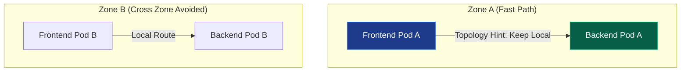

### খ. Topology Aware Hints এর সমাধান
যখন এই ফিচারটি সচল করা হয়, EndpointSlice Controller প্রতিটি এন্ডপয়েন্ট বা আইপির মেটাডাটাতে একটি টপোলজি ইন্টেলিজেন্ট হিন্ট বা ইঙ্গিত যোগ করে দেয় (যেমন: `hints.forZones: zone-a`)। `kube-proxy` এই হিন্ট দেখে নোডের কার্নেলে এমন নেটওয়ার্ক রুলস লেখে যেন Zone-A এর Frontend পডের রিকোয়েস্ট Zone-A এর Backend পডেই হিট করে, যতক্ষণ না ওই জোনের Backend পডটি ক্র্যাশ বা ডাউন হচ্ছে।

---

## ২৫. কিউবলেট ডিভাইস প্লাগইন ফ্রেমওয়ার্ক ও জিপিইউ ইন্টিগ্রেশন (Kubelet Device Plugin Framework & GPUs)

কুবারনেটিসের পডের ভেতরে মেশিন লার্নিং (LLM Training) বা গ্রাফিক্সের কাজের জন্য GPU (NVIDIA, AMD) বা TPU কীভাবে যুক্ত করা হয়? এই হার্ডওয়্যার আবিষ্কারের মূল হাতিয়ার হলো **Device Plugin Framework**।

### ক. Kubelet Device Plugin Architecture
Kubelet-এর ভেতরে কোনো প্রকার হার্ডওয়্যার-স্পেসিফিক কোড হার্ডকোড করা থাকে না। পরিবর্তে এটি একটি gRPC ইন্টারফেস ব্যবহার করে নোডের লোকাল ড্রাইভারের সাথে যোগাযোগ করে।
১. **Registration:** কাস্টম ভেন্ডর ডিভাইস প্লাগইন (যেমন NVIDIA Device Plugin) DaemonSet হিসেবে নোডে রান হয়ে Kubelet-এর Unix Socket ফাইলের মাধ্যমে নিজেকে রেজিস্টার করে।
২. **ListAndWatch:** প্লাগইনটি নোডে কতটি GPU ফিজিক্যালি কানেক্টেড আছে তা লিস্ট করে Kubelet-কে অনবরত জানায়।
৩. **Allocate:** যখন ইউজার পডস্পেক ফাইলে GPU রিকোয়েস্ট করে (`nvidia.com/gpu: 1`), Kubelet ডিভাইস প্লাগইনের `Allocate` এন্ডপয়েন্ট কল করে। ড্রাইভার তখন হোস্ট ওএসের GPU ডিভাইসের পাথ (যেমন `/dev/nvidia0`) সিলেক্ট করে Kubelet-কে রিটার্ন করে।

### খ. Kernel Resource Isolation (cgroups v2 device controller)
Kubelet ড্রাইভারের কাছ থেকে পাথের সন্ধান পেয়ে লিনাক্স কার্নেলের **cgroups v2 device controller**-এর মাধ্যমে কন্টেইনারের জন্য ওই ফিজিক্যাল জিপিইউর রিড/রাইট পারমিশন লক ও এসাইন করে দেয়। এর ফলে পডের কন্টেইনার হোস্ট ওএসের অন্যান্য জিপিইউতে কখনই কোনো হস্তক্ষেপ বা অ্যাক্সেস পায় না।

---

## ২৬. কিউবলেট সিগ্রুপ ড্রাইভার ও নোড ইনস্ট্যাবিলিটি (Cgroup Drivers & Systemd Integration)

কুবারনেটিসে পডের সিপিইউ ও মেমরি লিমিট এনফোর্স করার জন্য Kubelet লিনাক্সের **cgroups** মেকানিজম ব্যবহার করে। তবে ওএস লেভেলে এর ড্রাইভার কনফিগারেশন অত্যন্ত সংবেদনশীল।

### ক. Cgroup Drivers (cgroupfs vs systemd)
১. **cgroupfs:** এটি একটি বেসিক বা সাধারণ cgroup ড্রাইভার যা সরাসরি `/sys/fs/cgroup` ডিরেক্টরিতে রাইট করে ফাইলসিস্টেমের মাধ্যমে cgroup ম্যানেজ করে।
২. **systemd:** আধুনিক লিনাক্স ডিস্ট্রিবিউশনগুলোতে ওএস নিজেই সিস্টেম রিসোর্স ও সার্ভিস ম্যানেজ করার জন্য `systemd` ব্যবহার করে। systemd প্রতিটি ওএস প্রসেসের জন্য একটি একক cgroup ট্রি (cgroup tree) তৈরি করে।

### 💥 নোড ইনস্ট্যাবিলিটির মহাবিপদ (The Danger of Split-Brain Cgroups)
যদি কোনো ক্লাস্টারে ডকার বা কন্টেইনার রানটাইম কনফিগার করা থাকে `cgroupfs` ড্রাইভার দিয়ে, আর Kubelet কনফিগার করা থাকে `systemd` ড্রাইভার দিয়ে, তবে ওএসের ভেতরে দুটি আলাদা অথরিটি বা ড্রাইভার একই সাথে cgroup ট্রি কন্ট্রোল করার চেষ্টা করবে (Double Hierarchies)।
* **ফলাফল:** এর ফলে হোস্ট ওএসে চরম মেমরি লিক, থ্রেড ব্লকিং এবং রিসোর্স ট্র্যাকিং এরর দেখা দেবে। কার্নেল তখন কোনো নোটিফিকেশন ছাড়াই রানিং কন্টেইনারগুলোকে কিল করা শুরু করবে এবং নোডটি সাময়িকভাবে ক্র্যাশ করবে।
* **সমাধান:** প্রোডাকশন ক্লাস্টারে কন্টেইনার রানটাইম (যেমন Containerd) এবং Kubelet উভয়কে অবশ্যই **`systemd`** ড্রাইভার ব্যবহারের জন্য কনফিগার করতে হবে।

---

## ২৭. এপিআই সার্ভার ওয়াচ এবং রিসোর্স ভার্সন সিমেন্টিকস (resourceVersion Semantics)

কুবারনেটিসের এপিআই সার্ভার প্রতি সেকেন্ডে হাজার হাজার ইভেন্ট কন্ট্রোলারদের কাছে পুশ করে। এটি করার জন্য K8s এপিআই সার্ভার এবং etcd-এর **Watch API** ও সুনির্দিষ্ট **`resourceVersion`** ট্র্যাকিং ব্যবহার করে।

### ক. resourceVersion এর ৩টি মোড
এপিআই সার্ভারে কুয়েরি করার সময় `resourceVersion` এর ভ্যালু কীভাবে দেওয়া হয়েছে তার ওপর রিকোয়েস্টের পারফরম্যান্স ও ডাটার নির্ভরযোগ্যতা নির্ভর করে:
১. **`resourceVersion` ফাকা বা ওমিট করা (Empty):** 
   - **কাজ:** এপিআই সার্ভার সরাসরি etcd থেকে ডাটা রিড করবে (Quorum Read)। 
   - **আচরণ:** এটি ক্লাস্টারের সবচেয়ে লেটেস্ট ও নির্ভরযোগ্য ডাটা প্রোভাইড করবে, কিন্তু etcd-এর ওপর অতিরিক্ত নেটওয়ার্ক প্রেশার সৃষ্টি করবে।
২. **`resourceVersion="0"` (Zero):**
   - **কাজ:** এপিআই সার্ভার সরাসরি তার মেমরি ক্যাশ (In-memory Cache) থেকে ডাটা রিটার্ন করবে।
   - **আচরণ:** এটি সুপারফাস্ট (কোনো etcd কুয়েরি ছাড়া), তবে ডাটা সাময়িকভাবে কিছুটা পুরানো বা বাসি (Stale) হতে পারে।
৩. **`resourceVersion="109238"` (Specific Version):**
   - **কাজ:** এপিআই সার্ভার ওই নির্দিষ্ট ট্রানজিশন ভার্সনের পরের সমস্ত রিয়েল-টাইম ইভেন্ট কুয়েরি করবে। এটি মূলত Informer-এর রিস্টার্ট বা ওয়াচ রিকোয়েস্টে ব্যবহৃত হয়।

### খ. etcd Watch API (gRPC / HTTP/2 Stream)
ওয়াচ কানেকশনটি একটি দীর্ঘমেয়াদী **gRPC HTTP/2 stream**। এর ফলে কন্ট্রোলারকে বারবার পোল বা এপিআই হিট করতে হয় না, etcd-তে ডাটা রাইট হওয়ার সাথে সাথে এপিআই সার্ভার ওই একই ওপেন স্ট্রিমে কন্ট্রোলারকে ইভেন্ট পুশ করে দেয়।

---

## ২৮. পড স্যান্ডবক্সিং ও সিকিউর রানটাইম ক্লাস (Kata Containers & gVisor Systems)

সাধারণ কুবারনেটিসের কন্টেইনারগুলো একই হোস্ট ওএসের কার্নেল শেয়ার করে রান করে (Shared Host Kernel Namespace)। ফলে যদি কোনো হ্যাকার কন্টেইনার হ্যাক করতে পারে, সে কার্নেলের দুর্বলতা (Kernel exploits) ব্যবহার করে পুরো ফিজিক্যাল সার্ভার দখল করে নিতে পারে। এই সিকিউরিটি বাউন্ডারি মজবুত করার সমাধান হলো **Pod Sandboxing** ও **RuntimeClass**।

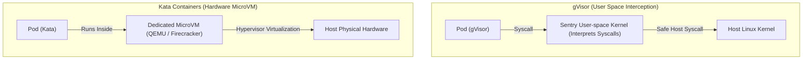

১. **gVisor (User-Space Kernel Interception):**
   - গুগল ডিজাইনকৃত এই স্যান্ডবক্সটি কন্টেইনার ও হোস্ট কার্নেলের মাঝে **Sentry** নামক একটি ইউজার-স্পেস কার্নেল লেয়ার তৈরি করে। কন্টেইনার থেকে বের হওয়া সমস্ত কার্নেল সিস্টেম কল (Syscalls) Sentry ইন্টারসেপ্ট করে নিজেই প্রসেস করে হোস্ট কার্নেলে রিডাইরেক্ট করে, ফলে কন্টেইনার সরাসরি ফিজিক্যাল কার্নেলের কোনো ক্ষতি করতে পারে না।
২. **Kata Containers (Hardware MicroVM Isolation):**
   - এটি প্রতিটি পডকে একটি সম্পূর্ণ ডেডিকেটেড ও লাইটওয়েট **MicroVM** (যেমন QEMU বা Firecracker) এর ভেতরে রান করায়। প্রতিটি পডের নিজস্ব আস্ত কার্নেল থাকে, ফলে এখানে ওএস লেভেলের সিকিউরিটি সর্বোচ্চ স্তরে থাকে।

---

## ২৯. এন্ডপয়েন্ট স্লাইস আর্কিটেকচার ও রাইট অ্যামপ্লিফিকেশন (EndpointSlice vs Endpoints API)

যখন কুবারনেটিসে কোনো সার্ভিস তৈরি করা হয়, তখন এপিআই সার্ভার ওই সার্ভিসের আন্ডারে থাকা সমস্ত পডের আইপি নিয়ে একটি মেটাডাটা অবজেক্ট তৈরি করে। তবে ক্লাস্টার স্কেল করার সময় প্রাচীন **Endpoints API** এপিআই সার্ভার ধসিয়ে দেওয়ার মূল কারণ ছিল।

### ক. দ্য এন্ডপয়েন্ট রাইট অ্যামপ্লিফিকেশন ক্র্যাশ (Write Amplification Disaster)
প্রাচীন `Endpoints` এপিআই-তে একটি মাত্র এপিআই অবজেক্টে ক্লাস্টারের সমস্ত পডের আইপি ও পোর্টের তালিকা একযোগে সংরক্ষিত থাকতো।
* **সমস্যা:** ধরুন একটি সার্ভিসের আন্ডারে ৫,০০০ পড সচল রয়েছে। এখন যদি এর মধ্যে মাত্র ১টি পড রিস্টার্ট নেয় বা তার আইপি চেঞ্জ হয়, তবে কুবারনেটিসকে সম্পূর্ণ ৫,০০০ পডের আইপিসহ মেটাডাটা অবজেক্টটি পুনরায় etcd-তে রাইট (Overwrite) করতে হতো! এর ফলে নোডের নেটওয়ার্ক ব্যান্ডউইথ ও etcd-এর মেমরি রাইট অ্যামপ্লিফিকেশনে ব্লাস্ট করে কন্ট্রোল প্লেন ক্র্যাশ করতো।

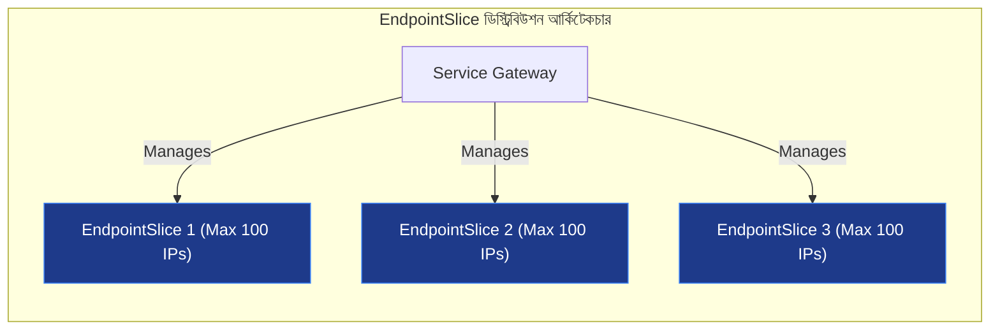

### খ. EndpointSlice Architecture এর আধুনিক সমাধান
কুবারনেটিস **EndpointSlice** ফিচারের মাধ্যমে এই ডেটাবেস জ্যাম পুরোপুরি দূর করেছে। এটি পুরো পড লিস্টকে ছোট ছোট স্লাইসে বিভক্ত করে (ডিফল্ট সর্বোচ্চ ১০০টি আইপি প্রতি স্লাইস)। এর ফলে কোনো ১টি পড রিস্টার্ট নিলে শুধুমাত্র তার সাথে থাকা ওই ১০০ আইপির স্লাইসটিই আপডেট বা রাইট হয়, বাকি স্লাইসগুলো স্পর্শও করতে হয় না। এটি কুবারনেটিসের স্কেলেবিলিটি বহুগুণ বাড়িয়ে দিয়েছে।

---

## ৩০. এপিআই সার্ভার অডিটিং ও ওয়েবহুক অডিট সিঙ্ক (kube-apiserver Auditing Pipeline)

এন্টারপ্রাইজ ক্লাস্টারে সিকিউরিটি ও কমপ্লায়েন্স নিশ্চিত করতে কে কখন, কোন আইপি থেকে, কী উদ্দেশ্যে এপিআই রিকোয়েস্ট পাঠিয়েছে তা ট্র্যাক করার মেকানিজমই হলো **Auditing**।

### ক. Audit Levels (অডিটের ৪টি গভীর স্তর)
কুবারনেটিস অডিট পাইপলাইনে প্রতিটি ইভেন্টকে ৪টি সুনির্দিষ্ট স্তরে লগ করতে পারে:
১. **None:** কোনো রিকোয়েস্ট লগ হবে না।
২. **Metadata:** শুধুমাত্র রিকোয়েস্টের হেডার, ইউজার আইডি, মেটাডাটা এবং টাইমস্ট্যাম্প লগ হবে (ডাটার বডি লগ হবে না)।
৩. **Request:** মেটাডাটার পাশাপাশি রিকোয়েস্টের ভেতরের সম্পূর্ণ ডেটা বডি (PodSpec বডি) লগ হবে।
৪. **RequestResponse (সর্বোচ্চ স্তর):** রিকোয়েস্টের বডির সাথে সাথে এপিআই সার্ভার ইউজারকে ফিরতি জবাবে কী বডি (Response) পাঠিয়েছে তা সহ আদ্যোপান্ত লগ করা হবে।

### খ. Webhook Audit Sink
অডিট লগ হোস্ট ওএসের ডিস্কে রাইট করলে অতিরিক্ত ডিস্ক আইও (Disk I/O) তৈরি হয়ে নোডের পারফরম্যান্স শ্লথ হতে পারে। এই জন্য এপিআই সার্ভার **Webhook Audit Sink** কনফিগার করার সুবিধা দেয়, যা কোনো প্রকার লোকাল ডিস্ক রাইট না করে সরাসরি ব্যাকগ্রাউন্ডে একটি রিয়েল-টাইম সিকিউরিটি মনিটরিং টুল বা সাইগলগ রিসিভারে এইচটিটিপি পোস্ট রিকোয়েস্ট পাঠিয়ে দেয়।

---

## ৩১. নোড হার্টবিট মেকানিজম এবং নোড লাইফসাইকেল কন্ট্রোলার (Node Leases & Eviction Systems)

ক্লাস্টারের মাস্টার নোড কীভাবে বোঝে যে একটি ওয়ার্কার নোড জীবন্ত (Healthy) নাকি মৃত (Dead)? এর জন্য K8s একটি ডাবল-ভ্যালিডেশন হার্টবিট মেকানিজম ব্যবহার করে।

### ক. Node Lease Mechanism (The Node Heartbeat)
পূর্বে Kubelet প্রতি ১০ সেকেন্ড পরপর সম্পূর্ণ `NodeStatus` অবজেক্ট আপডেট করতো, যা etcd-তে বিশাল ডেটা লোড তৈরি করতো। আধুনিক কুবারনেতিসে **Node Lease** ফিচার ব্যবহার করা হয়।
* **কাজ:** প্রতিটি নোডের জন্য `kube-node-lease` নেমস্পেসে একটি অত্যন্ত হালকা বা লাইটওয়েট **Lease Object** থাকে। Kubelet প্রতি ১০ সেকেন্ড পরপর এই ছোট লিজের রিনিউয়াল টাইমস্ট্যাম্প আপডেট করে এপিআই সার্ভারকে জানায় যে সে জীবন্ত আছে।

### খ. Node Lifecycle Controller Eviction Loop
যদি কোনো নোড নেটওয়ার্ক বা মেমরি ক্র্যাশের কারণে লিজ রিনিউ করতে ব্যর্থ হয়, তখন কন্ট্রোল প্লেনের **Node Lifecycle Controller** নিচের ফ্লোতে কড়া অ্যাকশন নেয়:
১. নোডটি লিজ রিনিউ করতে ব্যর্থ হওয়ার সাথে সাথে কন্ট্রোলার নোডটির কপাল বা স্ট্যাটাসে `node.kubernetes.io/unreachable` বা `node.kubernetes.io/not-ready` নামক একটি Taint সেঁটে দেয়।
২. নোডে থাকা রানিং পডগুলোর Toleration পিরিয়ড চেক করা হয় (ডিফল্ট `tolerationSeconds: 300` বা ৫ মিনিট)।
৩. নির্ধারিত সময়ে নোডটি জীবন্ত হয়ে ফিরে না আসলে, কন্ট্রোলার নোডের সমস্ত পডকে জোরপূর্বক উচ্ছেদ (Eviction) করে এবং ক্লাস্টারের অন্য হেলদি নোডগুলোতে তাদের পুনরায় শিডিউল করে সচল করে।

---

## ৩২. লিনাক্স কার্নেল প্যারামিটার টিউনিং ও সিসকন্ট্রোল (Sysctl Configuration inside Pods)

কুবারনেটিসের পডের কন্টেইনারগুলোর নেটওয়ার্ক থ্রুপুট বা মেমরি হ্যান্ডলিং বাড়ানোর জন্য কার্নেলের ডাইনামিক প্যারামিটার টিউনিং বা **`sysctl`** কনফিগার করা সম্ভব।

### ক. Safe vs Unsafe Sysctls
কুবারনেটিস সিসকন্ট্রোলগুলোকে দুটি প্রধান ক্যাটাগরিতে ভাগ করে:
১. **Safe Sysctls (নিরাপদ সিসকন্ট্রোল):** এই প্যারামিটারগুলো শুধুমাত্র কন্টেইনারের নিজস্ব নেমস্পেসের ভেতরেই সীমাবদ্ধ থাকে। এগুলো কনফিগার করলে নোডের হোস্ট ওএস বা অন্য কোনো পডের ওপর কোনো প্রভাব পড়ে না (যেমন: `net.ipv4.ip_local_port_range`, `net.ipv4.tcp_keepalive_time`)। পডস্পেক ফাইলে এগুলো সরাসরি ব্যবহার করা যায়।
২. **Unsafe Sysctls (ঝুঁকিপূর্ণ সিসকন্ট্রোল):** এই প্যারামিটারগুলো কন্টেইনার নেমস্পেস ছাড়িয়ে হোস্ট ওএসের গ্লোবাল কার্নেল প্রসেসেহস্তক্ষেপ করতে পারে (যেমন: `kernel.shmmax`, `net.ipv4.tcp_mem`)।
* **ঝুঁকি এড়ানোর পলিসি:** পডের ভেতরে কোনো Unsafe Sysctl কনফিগার করতে চাইলে, নোডের Kubelet-এর স্টার্টআপ প্যারামিটারে `--allowed-unsafe-sysctls` ফ্লাগ দিয়ে নোড লেভেলে এটিকে প্রথমে অ্যালাউ বা পারমিট করে দিতে হবে, অন্যথায় Kubelet পডটিকে শিডিউল করলেও রান করা ব্লক করে দেবে।

---

## ৩৩. এইচপিএ স্ট্যাবিলাইজেশন এবং ফ্ল্যাপিং প্রতিরোধ (HPA Stabilization Windows)

রিয়েল-টাইম ট্রাফিক বাড়ার সাথে সাথে পড স্কেল করার সময়ে অনেক সময় ট্রাফিক কয়েক সেকেন্ডের জন্য কমে আবার transatlantic বা তৎক্ষণাৎ বেড়ে যায়। এই ধরনের অস্থির নেটওয়ার্ক সিচুয়েশনে পড স্কেলিং কন্ট্রোলার যেন কনস্ট্যান্ট পড ক্রিয়েশন ও ডিলিশনের এক পাগলাটে চক্র বা লুপে না পড়ে, সে জন্য কুবারনেটিস **Stabilization Window** ব্যবহার করে।

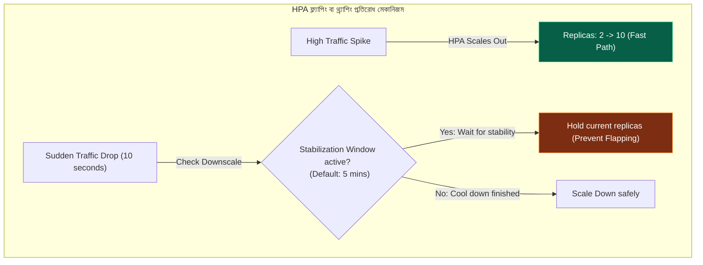

### ক. দ্য ফ্ল্যাপিং ডিজাস্টার (Flapping / Thrashing)
যদি কোনো স্ট্যাবিলাইজেশন টাইম উইন্ডো না থাকতো, তবে ট্রাফিক কমে যাওয়ার সাথে সাথে HPA পড ডিলিট করে দিত। এবং তার ২ সেকেন্ড পর আবার ট্রাফিক স্পাইক আসলে নতুন পড ইমেজ ডাউনলোড ও বুটস্ট্যাপ হতে হতে সার্ভিস ডাউন হয়ে যেত।

### খ. Stabilization Window এর কাজ
HPA স্কেল-ডাউন করার জন্য একটি ৫ মিনিটের প্রি-কনফিগারড ব্যাকঅফ টাইমস্ট্যাম্প বাকেট মনিটর করে। ট্রাফিক কমে গেলেও HPA সাথে সাথে পড কিল করে না, সে ৫ মিনিট পর্যন্ত ট্রাফিকের গড় বা হায়ার ভ্যালু মনিটর করে ক্লাস্টারকে ঠান্ডা (Cool Down) হওয়ার সুযোগ দেয়, যা সার্ভিস অ্যাভেইলেবিলিটি ১০০% নিশ্চিত করে।

---

## ৩৪. ডেটাবেস সিক্রেট এনক্রিপশন ও কি-ম্যানেজমেন্ট প্লাগইন (etcd Secrets Encryption at Rest)

ডিফল্ট অবস্থায় কুবারনেটিসের এপিআই সার্ভার যখন কোনো `Secret` অবজেক্ট তৈরি করে, সেটি etcd ডেটাবেসে সাধারণ **base64 plain-text** হিসেবে সংরক্ষিত থাকে। যে কেউ etcd-তে অ্যাক্সেস পেলে নিমিষেই সমস্ত পাসওয়ার্ড বা এপিআই কি ডিক্রিপ্ট করে চুরি করতে পারে। এর জন্য প্রোডাকশন ক্লাস্টারে **Encryption at Rest** কনফিগার করা আবশ্যক।

### ক. EncryptionConfiguration ও এপিআই পাইপলাইন
এপিআই সার্ভারের স্টার্টআপে একটি `EncryptionConfiguration` ফাইল পাস করা যায়। এর ভেতরের পাইপলাইনে এপিআই সার্ভার নিচের ওএস ক্রিপ্টোগ্রাফি ইঞ্জিনগুলো কনফিগার করতে পারে:
১. **Static Keys (AES-GCM, Secretbox):** এপিআই সার্ভারের ওএস কনফিগারেশনে একটি স্ট্যাটিক পাসওয়ার্ড দিয়ে ডেটা এনক্রিপ্ট ও ডিক্রিপ্ট করা হয়।
২. **KMS v2 Provider (AWS KMS, GCP KMS):** এটি ক্লাউডের কি-ম্যানেজমেন্ট এপিআই-র সাথে যুক্ত হয়ে কাজ করে।

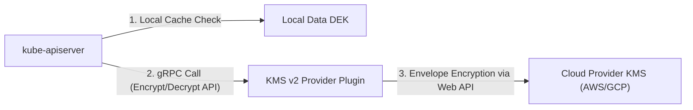

### খ. Envelope Encryption (খাম এনক্রিপশন)
এটি ক্লাউড সিকিউরিটির অন্যতম উৎকৃষ্ট মেথড। এপিআই সার্ভার ডেটা এনক্রিপ্ট করার জন্য একটি লোকাল ডাটা এনক্রিপশন কি (**DEK**) জেনারেট করে। এরপর সে DEK কি-টিকে ক্লাউড প্রোভাইডারের মূল কি (**KEK**) দিয়ে এনক্রিপ্ট করে সেই খামের মতো মোড়ানো এনক্রিপ্টেড ডাটা etcd-তে রাইট করে। etcd-তে ডাটা পড়ার সময় KMS প্লাগইন খামটি খুলে ক্লাউড কি দিয়ে ডিক্রিপ্ট করে ডাটা প্রোভাইড করে, ফলে ফিজিক্যাল ডাটাবেস চুরি হলেও হ্যাকারদের ডেটা পাওয়ার কোনো সুযোগ থাকে না।

---

## ৩৫. লোকাল এফিমেরাল স্টোরেজ ও ওএস ক্যাশ এভিকশন (Kubelet Ephemeral Storage Systems)

কন্টেইনারের রানিং লগ, টেম্প ফাইলসিস্টেম (`/tmp`) বা emptyDir মাউন্টিং যখন ক্লাস্টারের লোকাল ডিস্ক বা নোডের স্টোরেজ গ্রাস করতে শুরু করে, তখন Kubelet ক্লাস্টার রক্ষার্থে পড উচ্ছেদের জন্য **Ephemeral Storage Management** সচল করে।

### ক. Ephemeral Storage কিভাবে ক্যালকুলেট হয়?
Kubelet কন্টেইনারের ডিস্ক ইউসেজ ৩টি ক্যাটাগরিতে পর্যবেক্ষণ করে:
১. **Overlay Writable Layer:** কন্টেইনারের নিজস্ব ফাইলসিস্টেমে রানিং কোডের মাধ্যমে জেনারেট হওয়া ফাইল।
২. **Container Logs:** কন্টেইনারের stdout/stderr লগ ফাইল যা নোডের ওএস লোকাল পাথ `/var/log/pods` এ জমা করে।
৩. **Local Volumes:** emptyDir ভলিউমের মাউন্ট করা ডিস্ক সাইজ।
* **পর্যবেক্ষণ মেথড:** Kubelet ব্যাকগ্রাউন্ড প্রসেসে লিনাক্স ওএসের `du` কমান্ড রান করে অথবা ext4/xfs ফাইলসিস্টেমের **project quotas** ট্র্যাকিং ড্রাইভারের সাহায্যে নিমিষে মিলি-সেকেন্ডের মধ্যে ডিস্কের প্রকৃত সাইজ ক্যালকুলেট করে।

### খ. Storage Eviction Policy
যখন কোনো পড তার কনফিগারেশনে সেট করা `limits.ephemeral-storage` অতিক্রম করে, Kubelet ক্লাস্টারের অন্যান্য রানিং পডগুলোকে ডিস্ক ফুল ক্র্যাশ থেকে বাঁচাতে ওস লেভেলে তৎক্ষণাৎ ওই স্পেসিফিক পডটিকে উচ্ছেদ বা Evicted স্ট্যাটাস দিয়ে রিমুভ করে দেয়।

---

## ৩৬. শিডিউলার এক্সটেনশন ও শিডিউলিং ফ্রেমওয়ার্ক (Scheduler Framework Extension Point Plugins)

কুবারনেটিসের ডিফল্ট শিডিউলার পড নোডে প্লেস করার জন্য একটি অত্যন্ত প্লাগেবল **Scheduling Framework** ব্যবহার করে। ডেভেলপাররা চাইলে এর বিভিন্ন এক্সটেনশন পয়েন্টে নিজেদের কাস্টম লজিক বা গো ড্রাইভার প্লাগইন কোড ইনজেক্ট করতে পারে।

```mermaid
flowchart TD
    subgraph SchedulerFrameworkPipeline ["Scheduler Framework Plugins"]
        Queue["1. QueueSort: Priority Queue Sorting"] --> PreFilter["2. PreFilter: Metadata Extraction"]
        PreFilter --> Filter["3. Filter: Eliminate unfit nodes"]
        Filter --> PostFilter["4. PostFilter: Preemption and scaling triage"]
        PostFilter --> Score["5. Score: Grade remaining nodes (0-100)"]
        Score --> Reserve["6. Reserve: Temporarily claim node memory"]
        Reserve --> Permit["7. Permit: Hold / Reject / Approve pod execution"]
        Permit --> Bind["8. Bind: Write Node Binding to apiserver"]
    end
    
    style Filter fill:#7c2d12,stroke:#f97316,color:#fff
    style Score fill:#065f46,stroke:#10b981,color:#fff
    style Bind fill:#1e3a8a,stroke:#3b82f6,color:#fff
```

### ক. কোর এক্সটেনশন পয়েন্ট লাইফসাইকেল
শিডিউলার প্রতিটি পড শিডিউল করার সময় এই প্লাগইন চক্র বা লুপটি নির্বাহ করে:
১. **QueueSort:** কিউতে পেন্ডিং থাকা পডগুলোর অগ্রাধিকার বা টাইটেল মেলাতে সাহায্য করে।
২. **PreFilter & Filter:** নোডের রিসোর্স চেক করে অযোগ্য নোডগুলোকে বাতিল বা ছেঁকে ফেলে দেয়।
৩. **PostFilter:** ফেইলার নোটিফিকেশন হ্যান্ডেল করে প্রি-এম্পশন লুপ ট্রিগার করে।
４. **Score:** যোগ্য নোডগুলোকে বিভিন্ন ডিস্ট্রিবিউশন রুলস দিয়ে ০ থেকে ১০০ এর স্কেলে মার্ক বা স্কোর দেয়।
৫. **Reserve & Permit:** সর্বোচ্চ স্কোর পাওয়া নোডের মেমরি সাময়িকভাবে লক বা রিজার্ভ করে পডটিকে বাইন্ড করার চূড়ান্ত অনুমোদন দেয়।
৬. **Bind:** অবশেষে এপিআই সার্ভারে সফলভাবে নোড এবং পডের রিলেশন বা বাইন্ডিং অবজেক্ট রাইট করে।

---

## ৩৭. কন্ট্রোল প্লেন সার্টিফিকেট লাইফসাইকেল ও টিএলএস বুটস্ট্র্যাপ (Control Plane Certificates & TLS Bootstrap)

কুবারনেটিস ক্লাস্টারের প্রতিটি কম্পোনেন্ট (যেমন Kubelet, Scheduler, Controller-Manager) একে অপরের সাথে সম্পূর্ণ এনক্রিপ্টেড এবং পারস্পরিকভাবে ভ্যালিডেটেড **Mutual TLS (mTLS)**-এর মাধ্যমে কথা বলে। এই বিপুল সার্টিফিকেটের লাইফসাইকেল ও নবায়ন কীভাবে ঘটে?

### ক. Kubelet TLS Bootstrap Process
যখন কোনো নতুন ওয়ার্কার নোড ক্লাস্টারে যুক্ত হতে চায়, Kubelet-এর কাছে প্রথমে কোনো সার্টিফিকেট থাকে না। তখন সে নিচের সিস্টেমে এপিআই সার্ভারের সাথে সংযোগ করে:
১. Kubelet নোডের লোকাল টেম্পোরারি বুটস্ট্র্যাপ টোকেন ব্যবহার করে এপিআই সার্ভারের কাছে একটি **CertificateSigningRequest (CSR)** অবজেক্ট সাবমিট করে।
২. কন্ট্রোল প্লেনের Certificate Controller লিজ যাচাই করে CSR-টি অনুমোদন (Approve) করে।
৩. Kubelet স্বয়ংক্রিয়ভাবে তার ব্যক্তিগত সিকিউর ক্লায়েন্ট সার্টিফিকেট ডাউনলোড করে এবং সেটি দিয়ে এপিআই সার্ভারের সাথে নিরাপদ সংযোগ প্রতিষ্ঠা করে।

### খ. Auto-Rotation (স্বয়ংক্রিয় নবায়ন)
কুবারনেটিস সার্টিফিকেটগুলোর ডিফল্ট মেয়াদ থাকে ১ বছর। Kubelet-এর ভেতরের ইন্টারনাল কন্ট্রোলার সার্টিফিকেটের মেয়াদ শেষ হওয়ার ৩০ দিন পূর্বে স্বয়ংক্রিয়ভাবে ব্যাকগ্রাউন্ডে এপিআই সার্ভারে নতুন CSR পাঠিয়ে সার্টিফিকেট নবায়ন বা রোটেট করে নেয়, ফলে অ্যাডমিনদের ম্যানুয়ালি কোনো প্রকার ইন্টারভেনশন করতে হয় না এবং জিরো-ডাউনটাইম লাইভ সার্ট রোটেট সচল থাকে।

---

## ৩৮. কিউবলেট গার্বেজ কালেকশন পলিসি (Kubelet Image & Container Garbage Collection)

ওয়ার্কার নোডের লোকাল ডিস্ক স্পেস যেন কন্টেইনার ইমেজ বা ডেড কন্টেইনার দিয়ে পুরোপুরি ফুল না হয়ে যায়, সে জন্য Kubelet নোড লেভেলে স্বয়ংক্রিয় **Garbage Collection (GC)** চালায়।

### ক. Container GC (ডেড কন্টেইনার পরিষ্কার করা)
Kubelet কন্টেইনার রানটাইমের সাথে gRPC-র মাধ্যমে কথা বলে এবং তিনটি প্রধান প্যারামিটার চেক করে কন্টেইনার ডিলিট করে:
১. `MinAge`: কতক্ষণ যাবৎ কন্টেইনারটি ডেড বা স্টপড অবস্থায় পড়ে আছে।
২. `MaxPerPodContainer`: প্রতিটি পডের জন্য সর্বোচ্চ কতটি ওল্ড ডেড কন্টেইনার ইমেজ ক্যাশে রাখা হবে।
৩. `MaxContainers`: সমগ্র নোডে সর্বোচ্চ কতটি ডেড কন্টেইনার রাখা যাবে। এই লিমিট ক্রস করলে Kubelet প্রাচীনতম ডেড কন্টেইনারগুলো ওএস থেকে পার্জ বা ইরেজ করে দেয়।

### খ. Image GC (অব্যবহৃত ইমেজ পরিষ্কার করা)
Image GC সম্পূর্ণ নোডের ফিজিক্যাল ডিস্ক ইউসেজ বা পার্সেন্টেজের ওপর ভিত্তি করে কাজ করে। এর দুটি ক্রিটিক্যাল প্যারামিটার হলো:
* `imageGCHighThresholdPercent` (ডিফল্ট ৮৫%): নোডের ডিস্ক ইউসেজ যদি এই সীমা স্পর্শ করে, Kubelet তৎক্ষণাৎ ইমেজ ডিলিট করা শুরু করে।
* `imageGCLowThresholdPercent` (ডিফল্ট ৮০%): Kubelet অব্যবহৃত কন্টেইনার ইমেজগুলো ডিলিট করতে করতে যতক্ষণ না ডিস্কের ব্যবহার এই সীমার নিচে নেমে আসছে, ততক্ষণ ডিলিট করার লুপ সচল রাখে। ডিলিশনের সময় সে মূলত লিনাক্সের লাস্ট অ্যাক্সেসড টাইমস্ট্যাম্প (LRU - Least Recently Used) ফলো করে।

---

## ৩৯. এডমিশন কন্ট্রোলার চেইন ও ওয়েবহুক অর্ডার (kube-apiserver Admission Webhook Pipeline)

এপিআই সার্ভারে কোনো রিকোয়েস্ট আসার পর সেটি ডেটাবেসে রাইট হওয়ার পূর্বে কুবারনেটিসের সিকিউরিটি এবং মিউটেশন ফিল্টার বা **Admission Controller Pipeline** অতিক্রম করে।

```mermaid
flowchart TD
    subgraph AdmissionPipeline ["kube-apiserver Admission Controller Chain"]
        Request["API Request"] --> Auth["1. Authentication & Authorization"]
        Auth --> Mutating["2. Mutating Admission Webhooks"]
        Mutating --> Schema["3. Object Schema Validation"]
        Schema --> Validating["4. Validating Admission Webhooks"]
        Validating --> Write["5. Persist to etcd Database"]
    end
    
    style Mutating fill:#7c2d12,stroke:#f97316,color:#fff
    style Validating fill:#065f46,stroke:#10b981,color:#fff
```

### ক. পাইপলাইনের দুই প্রধান স্তর
১. **Mutating Admission Webhooks (পরিবর্তনশীল ফিল্টার):** এটি পাইপলাইনের শুরুতে রান হয়। এটি ইউজারের পাঠানো YAML অবজেক্টের স্ট্রাকচার পরিবর্তন বা মডিফাই করতে পারে (যেমন: সাইডকার কন্টেইনার ইনজেক্ট করা)।
২. **Schema Validation:** অবজেক্টের স্কিমা চেক করে দেখে কোনো ইনভ্যালিড ফিল্ড আছে কি না।
৩. **Validating Admission Webhooks (বৈধতা যাচাই ফিল্টার):** এটি সবশেষে রান হয়। এটি ইউজারের পাঠানো অবজেক্টের কোনো কিছু মডিফাই করতে পারে না, শুধুমাত্র রিকোয়েস্টটি মণ্ডুর (Allow) বা প্রত্যাখ্যান (Reject) করতে পারে।

### 💥 ডেঞ্জারাস ইনফিনিট লুপ রিক্স (The Infinite Mutation Loop Risk)
মিউটেটিং ওয়েবহুক ডেভলপ করার সময় অসাবধানতাবশত যদি এমন কোড লেখা হয় যা অবজেক্টকে পরিবর্তন করার পর পুনরায় এপিআই সার্ভারে সাবমিট করে এবং তা পুনরায় একই মিউটেটিং ওয়েবহুককে ট্রিগার করে, তবে এপিআই সার্ভার একটি অসীম লুপে (Infinite Loop) আটকে গিয়ে ক্লাস্টার ক্র্যাশ করবে। এই জন্য ওয়েবহুকের কনফিগারেশনে `failurePolicy: Fail` এবং নির্দিষ্ট `reinvocations` ফিল্টার অত্যন্ত সতর্কতার সাথে সেট করতে হয়।

---

## ৪০. сервис ক্লাস্টারআইপি অ্যালোকেশন ও বিটম্যাপ ফাইলসিস্টেম (ClusterIP Range & Bitmap Allocations)

কুবারনেটিসের সার্ভিসগুলো যে ইন্টারনাল ভার্চুয়াল আইপি লাভ করে (ClusterIP), এপিআই সার্ভার কীভাবে গ্যারান্টি দেয় যে ক্লাস্টারের লাখ লাখ সার্ভিসের মধ্যে এই আইপিগুলো শতভাগ ইউনিক এবং কখনো একটির সাথে অন্যটির আইপি কনফ্লিক্ট বা সংঘর্ষ হবে না?

### ক. etcd Bitmap Registry
এপিআই সার্ভার সার্ভিসের জন্য বরাদ্দকৃত CIDR রেঞ্জ (যেমন: `10.96.0.0/12`) থেকে আইপি অ্যালোকেট করার সময় **etcd**-এর ভেতরে একটি বিশেষ **Bitmap Registry** বা বাইনারি মেমরি ম্যাপ বজায় রাখে যা `/ranges/servicespecs` পাথে স্টোর থাকে।
* **কাজ:** প্রতিটি আইপি অ্যাসাইন হওয়ার সাথে সাথে বিটম্যাপের ওই নির্দিষ্ট বিটটিকে ১ (Allocated) করে দেওয়া হয়। রিলিজ হলে বিটটিকে ০ (Free) করে দেওয়া হয়। এটি অত্যন্ত অপ্টিমাইজড এবং মেমরি সেভিং মেথড।

### খ. Dynamic vs Static Port Bands
আইপি সংঘর্ষের হাত থেকে বাঁচতে কুবারনেটিস সম্পূর্ণ ClusterIP রেঞ্জকে দুটি অংশে ভাগ করে:
১. **Static Band (শীর্ষ ১০%):** যদি ইউজার নিজে জোরপূর্বক ম্যানুয়ালি কোনো আইপি সেট করতে চায়, তবে এপিআই সার্ভার এই ব্যান্ড থেকে আইপি চেক করে বরাদ্দ দেয়।
২. **Dynamic Band (বাকি ৯০%):** কুবারনেটিস যখন অটোমেটিক্যালি ডাইনামিক আইপি অ্যাসাইন করে, তখন সে এই ৯০% ব্যান্ড থেকে এলোমেলো বা র্যান্ডমলি আইপি বরাদ্দ দেয়, যার ফলে ম্যানুয়াল ও ডাইনামিক অ্যালোকেশনের মধ্যে কোনো আইপি সংঘর্ষ ঘটার চান্স থাকে না।

---

## ৪১. নোড অ্যালোকেটেবল ও ওএস রিসোর্স রিজার্ভেশন (Kube-Reserved vs System-Reserved Capacity)

কোনো একটি ওয়ার্কার নোডে কন্টেইনারগুলোর ব্যবহারের জন্য আসলে কতটুকু সিপিইউ বা মেমরি বাকি থাকে? এটি সরাসরি হোস্ট ওএসের সাইজ থেকে হিসাব করা যায় না। এর সূত্র হলো:

<Math>
Allocatable = Node Capacity - Kube-reserved - System-reserved - Eviction-threshold
</Math>

```
+-------------------------------------------------------------+
|                      Node Capacity                          |
+------------------+------------------+----------------+------+
|  Kube-reserved   | System-reserved  | Eviction-Thresh| Alloc|
| (Kubelet, CNI)   | (sshd, systemd)  | (Disk/RAM Thres| Pods |
+------------------+------------------+----------------+------+
```

### ক. ওমেগা রিজার্ভেশন কম্পোনেন্টসমূহ:
১. **Kube-reserved:** কুবারনেটিসের নিজস্ব কম্পোনেন্টগুলো (যেমন: Kubelet, Containerd, CNI ড্রাইভার) রান করার জন্য যেটুকু মেমরি ও সিপিইউ বরাদ্দ রাখা হয়।
২. **System-reserved:** ওএসের কোর সার্ভিসগুলো (যেমন: `systemd-logind`, `sshd`, ওএসের কার্নেল প্রসেস) সচল রাখার জন্য যেটুকু রিসোর্স লক করে রাখা হয়।
৩. **Eviction-threshold:** নোড সম্পূর্ণ ক্র্যাশ হওয়ার হাত থেকে বাঁচতে মেমরি ফুরিয়ে যাওয়ার পূর্বেই যে বাফার স্টোরেজ খালি রাখা হয় (যেমন: `memory.available < 100Mi`)।

### 💥 নোড স্টারভেশন ও ওএস ডেডলক (The Resource Starvation Catastrophe)
যদি আমরা নোডে `Kube-reserved` এবং `System-reserved` কনফিগার না করি, তবে কুবারনেটিস ভাববে হোস্ট ওএসের ১০০% মেমরিই পডের কন্টেইনারগুলো ব্যবহার করতে পারবে। ফলে কন্টেইনারগুলো সমস্ত মেমরি গ্রাস করে ফেললে ওএসের `sshd` বা কন্টেইনার রানটাইম নিজে রান করার মতো কোনো মেমরি পাবে না, নোডটি ওএস লেভেলে চিরতরে হ্যাং বা ডেডলক হয়ে যাবে এবং অ্যাডমিনরা রিমোটলি ওএস অ্যাক্সেস হারিয়ে ফেলবেন।

---

## ৪২. সার্ভিস মেশ ট্রাফিক ইন্টারসেপশন এবং ইবিপিএফ প্রযুক্তির বিপ্লব (iptables Redirect vs Cilium eBPF)

সার্ভিস মেশ (যেমন Istio, Envoy) কীভাবে পডের ভেতরে আসা-যাওয়া সমস্ত নেটওয়ার্ক প্যাকেটকে কোনো প্রকার কোড চেঞ্জ ছাড়াই ইন্টারসেপ্ট বা ক্যাপচার করে? এর পেছনে ওএস লেভেলে দুটি প্রধান মেকানিজম কাজ করে:

### ক. Traditional iptables PREROUTING/OUTPUT Redirect
এটি সার্ভিস মেশের সবচেয়ে প্রচলিত ও প্রাচীন মেথড। পডটি স্টার্ট হওয়ার সময় একটি প্রি-স্টার্ট `initContainer` লিনাক্সের নেটওয়ার্ক স্পেস ওপেন করে নোডের কার্নেলে কতগুলো **iptables** রুলস ইনজেক্ট করে দেয়।
* **নেটওয়ার্ক পাথ:** এই রুলসগুলো পডে আসা এবং পড থেকে বের হওয়া সমস্ত সাধারণ TCP প্যাকেটকে ঘুরিয়ে (Loopback Redirect) সরাসরি Envoy Sidecar কন্টেইনারের নির্দিষ্ট পোর্টে (যেমন ১৫০০৬ বা ১৫০০১) পুশ করে দেয়। এর সীমাবদ্ধতা হলো প্যাকেটগুলোকে কার্নেলের বিশাল নেটওয়ার্ক টিসিপি/আইপি স্ট্যাক বারবার ট্রাভেল করতে হয়, যা সিস্টেমের প্রসেসিং স্পিড শ্লথ করে।

```mermaid
flowchart LR
    subgraph eBPFRevolution ["eBPF Socket-to-Socket Bypass"]
        App["App Container Socket"] -->|"Direct sockops bypass"| Envoy["Envoy Sidecar Socket"]
        Envoy -->|"Kernel TCP/IP Bypass"| App
    end
    
    style App fill:#1e3a8a,stroke:#3b82f6,color:#fff
    style Envoy fill:#065f46,stroke:#10b981,color:#fff
```

### খ. Next-Gen Cilium eBPF Socket-Level Redirection (sockops)
আধুনিক ক্লাউড নেটওয়ার্কিংয়ে **Cilium** এবং **eBPF (Extended Berkeley Packet Filter)** কার্নেল স্তরে এক অভাবনীয় বিপ্লব ঘটিয়েছে।
* **আর্কিটেকচার:** eBPF সরাসরি লিনাক্স কার্নেলের সকেট মেমরি লেভেলে (`sockops`) একটি ফিল্টার বসিয়ে দেয়। অ্যাপ্লিকেশন যখন কোনো ডাটা রাইট করে, eBPF কার্নেলের সম্পূর্ণ নেটওয়ার্ক প্রোটোকল স্ট্যাক (IP, TCP, routing tables) বাইপাস করে সরাসরি সোর্স সকেট থেকে ডাটা রিড করে ডেস্টিনেশন Envoy বা অন্য অ্যাপ সকেটের বাফারে পুশ করে দেয়। এর ফলে নেটওয়ার্ক লেটেন্সি নাটকীয়ভাবে কমে প্রায় জিরো মিলিসেকেন্ডে নেমে আসে!

---

## ৪৩. কাস্টম রিসোর্স স্ট্রাকচারাল স্কিমা ও ওপেনএপিআই ভ্যালিডেশন (CRD Structural Schemas)

কুবারনেটিসে যখন কাস্টম সিআরডি (CRD) তৈরি করা হয়, তখন এপিআই সার্ভার কীভাবে নিশ্চিত করে যে কোনো ডেভলপার ভুল বা অতিরিক্ত নেস্টেড কোনো ইনভ্যালিড কনফিগারেশন সাবমিট করে এপিআই ডাটাবেস করাপ্ট করতে পারবে না?

### ক. Structural Schema এর ভূমিকা
প্রতিটি CRD-এর ডেফিনিশনে একটি বাধ্যতামূলক **OpenAPI v3 structural schema** ডিফাইন করতে হয়।
* **সুরক্ষা মেকানিজম:** এপিআই সার্ভার কোনো কাস্টম রিসোর্স রিকোয়েস্ট রিসিভ করার পর etcd-তে সেভ করার পূর্বে OpenAPI স্কিমা দিয়ে অবজেক্টটি ভ্যালিডেট করে। যদি কোনো অবজেক্টের ফিল্ডের টাইপ অমিল থাকে (যেমন: ইন্টিজারের জায়গায় স্ট্রিং পাঠানো), তবে এপিআই সার্ভার রিকোয়েস্টটি সাথে সাথে বাতিল করে দেয়। এটি এপিআই সার্ভারের ইন্টারনাল অবজেক্ট মেমরিকে বাফার ওভারফ্লো এবং করাপশন থেকে রক্ষা করে।

---

## ৪৪. কিউবলেট ইভিকশন থ্রেশহোল্ড ও নোড প্রেশার সিগন্যাল (Kubelet Eviction Thresholds)

যখন কোনো ওয়ার্কার নোডের ফিজিক্যাল রিসোর্স মারাত্মক সঙ্কটে পড়ে, Kubelet নোডের সম্পূর্ণ ক্র্যাশ বা হ্যাং হওয়া ঠেকাতে পডগুলোকে জোরপূর্বক উচ্ছেদ করে। এই সিগন্যালগুলো মূলত কার্নেলের **cgroups** মেমরির ব্যবহার থেকে উৎপন্ন হয়।

### ক. Eviction Signals (উচ্ছেদ সংকেতসমূহ)
Kubelet মূলত নিচের ওএস কার্নেল মেট্রিক্সগুলোর ওপর কড়া নজর রাখে:
১. `memory.available`: নোডে সচল থাকা প্রকৃত মেমরি বা র‍্যামের পরিমাণ।
২. `nodefs.available`: নোডের মেইন ফাইলসিস্টেমের ডিস্ক স্পেস।
৩. `imagefs.available`: কন্টেইনার ইমেজ সংরক্ষণের জন্য ডেডিকেটেড ডিস্ক স্পেস।
৪. `pid.available`: লিনাক্স কার্নেলের সর্বাধিক থ্রেড বা প্রসেস আইডি (PIDs) এর সংখ্যা।

### খ. Soft Eviction vs Hard Eviction
* **Soft Eviction (নরম উচ্ছেদ পলিসি):** যখন কোনো রিসোর্স নির্দিষ্ট থ্রেশহোল্ড অতিক্রম করে, Kubelet সাথে সাথে পড কিল করে না। সে একটি গ্রেস পিরিয়ড বা বাফার সময় দেয় (যেমন: `eviction-soft-grace-period=memory.available=90s`)। এই সময়ের মধ্যে নোডটি স্বাভাবিক না হলে Kubelet পডগুলোকে ক্রমান্বয়ে উচ্ছেদ করে।
* **Hard Eviction (কঠোর উচ্ছেদ পলিসি):** যখন রিসোর্স চরম ঝুঁকিপূর্ণ স্তরে নেমে যায় (যেমন: `memory.available < 100Mi`), Kubelet কোনো প্রকার গ্রেস পিরিয়ড বা ছাড় ছাড়াই রানিং পডগুলোকে সাথে সাথে `SIGKILL` দিয়ে ডেস্ট্রয় বা উচ্ছেদ করে দেয়, যাতে হোস্ট কার্নেল প্যানিক না ঘটে।

---

## ৪৫. এইচপিএ রেপ্লিকা ক্যালকুলেশন অ্যালগরিদম (HPA Replica Formula & Tolerance)

কুবারনেটিসের **Horizontal Pod Autoscaler (HPA)** কীভাবে ঠিক নিখুঁত সংখ্যা হিসাব করে যে পড কতটি বাড়াতে বা কমাতে হবে? এর পেছনে একটি অত্যন্ত জটিল ও নিখুঁত গাণিতিক ফর্মুলা কাজ করে:

<Math>
Desired Replicas = ceil( Current Replicas * ( Current Metric Value / Desired Metric Value ) )
</Math>

### ক. Real-time Calculation
ধরুন, বর্তমানে আপনার অ্যাপ্লিকেশনের ৩টি পড সচল রয়েছে (`Current Replicas = 3`)। আপনি টার্গেট সেট করেছেন CPU ব্যবহার থাকবে ৫০% (`Desired Metric Value = 50`)। এখন হঠাৎ ট্রাফিক বাড়ার কারণে পডগুলোর গড় CPU ব্যবহার হয়ে গেল ৮০% (`Current Metric Value = 80`)। HPA তখন নিচের সমীকরণ রান করে:

<Math>
Desired Replicas = ceil( 3 * ( 80 / 50 ) ) = ceil( 3 * 1.6 ) = ceil( 4.8 ) = 5
</Math>

অর্থাৎ HPA সাথে সাথে পডের রেপ্লিকা ৩ থেকে বাড়িয়ে ৫ করে দেবে।

### খ. Tolerance Margin (ফ্ল্যাকচুয়েশন বাফার)
পডের সংখ্যা যেন প্রতি সেকেন্ডে সামান্য ওঠানামায় স্কেল না হয়, সে জন্য HPA-র একটি ১০% **Tolerance Margin** বা বাফার বাউন্ডারি থাকে। ক্যালকুলেশনের ফলাফল যদি ০.৯ থেকে ১.১ এর মধ্যে থাকে, তবে HPA কোনো প্রকার স্কেলিং ট্রিগার করে না।

---

## ৪৬. কিউবলেট পিএলইজি আর্কিটেকচার ও PLEG Is Not Healthy এরর (Kubelet PLEG Engine)

Kubelet কীভাবে চোখের পলকে জানতে পারে যে কন্টেইনারের ভেতর কোনো প্রসেস ক্র্যাশ বা স্টপ হয়েছে? এর পেছনে কার্নেল লেভেলের ইঞ্জিন হলো **PLEG (Pod Lifecycle Event Generator)**।

```mermaid
flowchart TD
    subgraph PLEGArchitecture ["Kubelet PLEG Engine Lifecycle"]
        KubeletSync["Kubelet Sync Loop"] -->|"1. Relist Containers (Every 1s)"| CRI["Container Runtime Interface (containerd)"]
        CRI -->|"2. Inspect Kernel Processes"| OS["Linux Kernel State"]
        OS -->|"3. Capture State Change"| CRI
        CRI -->|"4. Generate Pod Lifecycle Event"| PLEGChannel["PLEG Event Channel"]
        PLEGChannel -->|"5. Inject into Sync Loop"| KubeletSync
    end
    
    style KubeletSync fill:#1e3a8a,stroke:#3b82f6,color:#fff
    style CRI fill:#065f46,stroke:#10b981,color:#fff
    style PLEGChannel fill:#7c2d12,stroke:#f97316,color:#fff
```

### ক. PLEG এর কাজ
PLEG প্রতি ১ সেকেন্ড পরপর **CRI (Container Runtime Interface)** বা Containerd-কে রিলিস্ট (Relist) করার জন্য ডাইনামিক কুয়েরি পাঠায়। সে ওল্ড স্টেটের সাথে নিউ স্টেট তুলনা করে একটি "Pod Lifecycle Event" জেনারেট করে (যেমন: Pod Started, Pod Died) এবং সেটি Kubelet-এর প্রধান সিঙ্ক লুপ চ্যানেলে পুশ করে দেয়।

### 💥 PLEG Is Not Healthy ক্র্যাশ এরর (The Dreaded PLEG Triage)
এটি কুবারনেটিসের অন্যতম কুখ্যাত ও সাধারণ ওএস নোড এরর। যখন কোনো ওয়ার্কার নোডে কন্টেইনারের ঘনত্ব অতিরিক্ত বেড়ে যায় অথবা নোডের ডিস্ক আইও (Disk I/O) অত্যন্ত শ্লথ বা রাইট ব্লকিং মোডে থাকে, তখন Containerd-র gRPC সকেট ফাইল Kubelet-এর ১ সেকেন্ডের রিলিস্ট রিকোয়েস্টের উত্তর দিতে ১ সেকেন্ডের বেশি সময় নেয়।
* **ফলাফল:** Kubelet মনে করে PLEG মেকানিজমটি হ্যাং বা স্টপড হয়ে গেছে এবং নোডের কপালে `PLEG is not healthy` ট্যাগ সেঁটে নোডটিকে সম্পূর্ণ NotReady করে দেয়।

---

## ৪৭. নোডপোর্ট সার্ভিস ও এক্সটারনাল ট্রাফিক পলিসি (externalTrafficPolicy: Local vs Cluster)

যখন আমরা কুবারনেটিসে **NodePort** বা **LoadBalancer** সার্ভিস এক্সপোজ করি, তখন ক্লাস্টার বাইরে থেকে আসা ট্রাফিক কীভাবে নোডের কন্টেইনারগুলোতে রাউট করে? এর পেছনে রয়েছে **`externalTrafficPolicy`**।

### ক. externalTrafficPolicy: Cluster (ডিফল্ট মোড)
ট্রাফিক যেকোনো নোডের NodePort-এ হিট করলে `kube-proxy` কার্নেল লেভেলের NAT ব্যবহার করে ট্রাফিকটিকে ক্লাস্টারের যেকোনো নোডে সচল থাকা পডে সমানভাবে ডিস্ট্রিবিউট বা রাউট করে দেয়।
* **সীমাবদ্ধতা:** প্যাকেটটি অন্য নোডে ট্রাভেল করার সময় নোডের ইন্টারনাল NAT পার হওয়ার কারণে রিকোয়েস্টের ফিজিক্যাল সোর্স আইপি (**Client IP**) হারিয়ে যায় এবং ক্লাউড ব্যান্ডউইথের ডাবল হপ বা অতিরিক্ত লেটেন্সি তৈরি হয়।

### খ. externalTrafficPolicy: Local (অপ্টিমাইজড মোড)
এই পলিসি সচল করলে, ট্রাফিক যে নোডে হিট করে শুধুমাত্র সেই নোডের ভেতরে রানিং পডেই ট্রাফিকটি সশরীরে রাউট হয়। যদি ওই নোডে ওই অ্যাপের কোনো পড সচল না থাকে, নোডটি প্যাকেটটি ড্রপ করে দেয়।
* **সুবিধা:** ট্রাফিক অন্য কোনো নোডে ওভারহপ করে না, ফলে রিকোয়েস্টের আসল **Client IP** ১০০% অক্ষুণ্ন থাকে এবং নেটওয়ার্ক লেটেন্সি অবিশ্বাস্য রকমের কমে যায়।

```mermaid
flowchart TD
    subgraph TrafficRouting ["externalTrafficPolicy: Local vs Cluster"]
        ClientIP["Client Request"] -->|"Node A NodePort"| Proxy{"kube-proxy Policy Check"}
        Proxy -->|"Cluster Mode"| NodeB["Route to Node B (Loss of Client IP)"]
        Proxy -->|"Local Mode"| PodLocal["Direct Route to Local Pod on Node A (Preserves Client IP)"]
    end
    
    style NodeB fill:#7c2d12,stroke:#f97316,color:#fff
    style PodLocal fill:#065f46,stroke:#10b981,color:#fff
```

---

## ৪৮. শিডিউলার প্রায়োরিটি ও প্রি-এম্পশন মেকানিজম (Scheduler Priority & Preemption)

যখন কুবারনেটিস ক্লাস্টারের সমস্ত নোডের মেমরি ও সিপিইউ ১০০% ফুল হয়ে যায় এবং নতুন কোনো ক্রিটিক্যাল পড শিডিউল হতে আসে, তখন শিডিউলার কীভাবে নোড খালি করে পডটিকে জায়গা দেয়? এর জন্য কাজ করে **Preemption** মেকানিজম।

### ক. PriorityClass ও ওএস শিডিউলিং অগ্রাধিকার
ডেভেলপাররা ক্লাস্টারে সুনির্দিষ্ট **PriorityClass** অবজেক্ট তৈরি করতে পারেন (যেমন: `system-cluster-critical` যার ভ্যালু ১,০০০,০০০ এবং সাধারণ পডের ভ্যালু ০)। 
* **প্রি-এম্পশন লুপ:** যখন একটি হাই-প্রাইওরিটি পড এপিআই সার্ভারে আসে কিন্তু নোডে কোনো জায়গা থাকে না, শিডিউলার নোডগুলোর আন্ডারে থাকা সাধারণ লো-প্রাইওরিটি পডগুলোকে টার্গেট করে। সে লো-প্রাইওরিটি পডগুলোকে জোরপূর্বক উচ্ছেদ বা Evict করার জন্য ওএস সিগন্যাল ট্রিগার করে এবং ওই খালি হওয়া স্লটে হাই-প্রাইওরিটি পডটিকে বাইন্ড করে দেয়।

---

## ৪৯. এক্সটারনাল কি-ম্যানেজমেন্ট ও সিক্রেট স্টোর সিএসআই (Secrets Store CSI Driver & Vault)

কুবারনেটিসের অবজেক্ট স্টোরেজে সিক্রেট ম্যানুয়ালি ডিক্লেয়ার করার ঝুঁকি এড়াতে এন্টারপ্রাইজ ইনফ্রাস্ট্রাকচারে সরাসরি **HashiCorp Vault** বা **AWS Secret Manager**-এর সাথে কুবারনেটিসকে ইন্টিগ্রেট করা হয়। এর আদর্শ টুল হলো **Secrets Store CSI Driver**।

### ক. Secrets Store CSI এর কাজের মেকানিজম
১. পডটি যখন কোনো নোডে শিডিউল হয়, Kubelet ফিজিক্যাল মাউন্ট প্রসেস শুরু করার পূর্বে **CSI Node Plugin**-কে ট্রিগার করে।
২. CSI ড্রাইভারটি সরাসরি gRPC-র সাহায্যে ক্লাউড ভল্ট বা সিক্রেট প্রোভাইডারের এপিআই কল করে সিক্রেট ডেটা সিকিউরলি ফেচ করে নিয়ে আসে।
৩. সংগৃহীত সিক্রেট ডেটা ওএস হোস্টের মেমরিতে একটি ডাইনামিক **tmpfs (Temporary File System)** ভলিউম তৈরি করে সেখানে মাউন্ট করে কন্টেইনারের ফাইলসিস্টেমে পুশ করে দেয়। কন্টেইনারটি স্টপ বা ডিলিট হওয়ার সাথে সাথে মেমরি থেকে সিক্রেটটি চিরতরে মুছে যায়, ফলে ওএস ডিস্কে সিক্রেটের কোনো ফিজিক্যাল ফুটপ্রিন্ট বা চিহ্ন অবশিষ্ট থাকে না।

---

## ৫০. আইপিভিএস বনাম আইপিটেবলস মোড (kube-proxy: IPVS vs iptables Mode)

কুবারনেটিসের নোড লেভেলে সার্ভিসের ভার্চুয়াল আইপিকে ফিজিক্যাল পডের কন্টেইনার আইপিতে ডাইরেক্ট ও নেটিং (NAT) করার কাজটি সম্পন্ন করে `kube-proxy`। এটি প্রোগ্রামিং করার জন্য ওএস কার্নেলের দুটি প্রধান মেকানিজম ব্যবহার করে:

### ক. iptables Mode (O(N) Sequential Search)
এটি `kube-proxy` এর ডিফল্ট ও প্রাচীন মোড। এখানে সার্ভিসের নেটওয়ার্ক রুলসগুলো লিনাক্স কার্নেলের **Netfilter** চেইনে ক্রমান্বয়ে বা সিকোয়েন্সিয়ালি লেখা হয়।
* **সীমাবদ্ধতা:** যদি আপনার ক্লাস্টারে ১০,০০০ সার্ভিস থাকে, তবে ওএসের কার্নেল প্রতিটি ইনকামিং নেটওয়ার্ক প্যাকেটকে প্রসেস করার সময় ১০,০০০ রুলস একের পর এক সিরিয়ালি রিড করে চেক করে (O(N) টাইম কমপ্লেক্সিটি)। এর ফলে সার্ভিসের সংখ্যা বাড়ার সাথে সাথে প্যাকেটের লেটেন্সি জ্যামিতিক হারে বেড়ে কার্নেলের ব্যান্ডউইথ ক্র্যাশ করে।

### খ. IPVS Mode (O(1) Hash Table Lookup)
আধুনিক ও বড় ক্লাস্টারে **IPVS (IP Virtual Server)** মোড ব্যবহার করা অত্যন্ত কার্যকর। এটি লিনাক্স কার্নেলের L4 লোড ব্যালেন্সার ইঞ্জিন ব্যবহার করে এবং সমস্ত রুলসকে কার্নেলের একটি **Hash Table**-এ স্টোর করে।
* **সুবিধা:** প্যাকেটের সংখ্যা বা সার্ভিসের সংখ্যা যত কোটিই হোক না কেন, কার্নেল সরাসরি হ্যাশ লুপ দিয়ে তাৎক্ষণিকভাবে ডেস্টিনেশন আইপি খুজে বের করে (O(1) টাইম কমপ্লেক্সিটি)। ফলে সার্ভিস স্কেল করলেও প্যাকেটের স্পিড ও নোডের পারফরম্যান্স সর্বদা সর্বোচ্চ থাকে।

```mermaid
flowchart TD
    subgraph ProxyRouting ["kube-proxy: iptables vs IPVS Search Complexity"]
        Packet["Incoming IP Packet"] --> Proxy{"kube-proxy Mode"}
        Proxy -->|"iptables"| O_N["Sequential Chain Scan: O(N) Complexity <br> (Slower as Services grow)"]
        Proxy -->|"IPVS"| O_1["Hash Table Direct Query: O(1) Complexity <br> (Zero latency drop at scale)"]
    end
    
    style O_N fill:#7c2d12,stroke:#f97316,color:#fff
    style O_1 fill:#065f46,stroke:#10b981,color:#fff
```

---

## ৫১. এপিআই সার্ভার ড্রাই-রান ও মেমরি ডিসকার্ড (kube-apiserver Dry-Run Mechanics)

যখন আমরা কুবারনেটিসে কোনো কনফিগারেশন রিয়েল-টাইমে এপ্লাই না করে শুধুমাত্র টেস্ট করতে চাই, আমরা `--dry-run=server` ফ্লাগ ব্যবহার করি। ব্যাকগ্রাউন্ডে এপিআই সার্ভারের মেমরি কীভাবে এটি হ্যান্ডেল করে?

### ক. Dry-Run রিকোয়েস্টের লাইফসাইকেল
রিকোয়েস্টটি এপিআই সার্ভারে আসার পর সেটি সাধারণ রিকোয়েস্টের মতোই সমস্ত সিকিউরিটি লেয়ার অতিক্রম করে:
১. **Authentication & Authorization:** ইউজারের পারমিশন চেক করা হয়।
২. **Admission Chain & Mutating Webhooks:** ওয়েবহুকগুলো ট্রিগার হয়ে অবজেক্ট মডিফাই ও স্কিমা ভ্যালিডেট করে।
৩. **Validating Webhooks:** অবজেক্টের কনফিগারেশনের বৈধতা চেক করে।
* **দ্য ওএমজি ডিসকার্ড মেথড:** সমস্ত চেক শেষ হওয়ার পর এপিআই সার্ভার যখন ডাটা রাইট করার পর্যায়ে যায়, সে ডাটাটিকে etcd ডেটাবেসে রাইট না করে মেমরি থেকে সরাসরি **Discard** বা ডি-অ্যালোকেট করে দিয়ে ইউজারকে একটি রেসপন্স অবজেক্ট পাঠায়। এর ফলে etcd-র ফিজিক্যাল স্টেট পরিবর্তন না করেই একদম নিখুঁত রিয়েল-টাইম এপিআই ভ্যালিডেশন পাওয়া যায়।

---

## ৫২. কন্ট্রোল প্লেন সেলফ-হোস্টিং ও স্ট্যাটিক পড বুটস্ট্র্যাপ (Static Pods & Control Plane Bootstrap)

কুবারনেটিসের মাস্টার নোড স্টার্ট হওয়ার সময় যখন এপিআই সার্ভার বা etcd নিজেই বন্ধ থাকে, তখন Kubelet কীভাবে কন্ট্রোল প্লেনের এই মূল কম্পোনেন্টগুলোকে নোডে জীবিত করে তোলে? এর সমাধান হলো **Static Pods**।

### ক. Static Pods এর কাজের মেকানিজম
১. Kubelet যখন সার্ভিস হিসেবে হোস্ট ওএসে স্টার্ট হয়, সে নোডের একটি নির্দিষ্ট লোকাল ডিরেক্টরি (ডিফল্ট `/etc/kubernetes/manifests`) অনবরত মনিটর বা ফাইল পোলিং করে।
২. ওই ডিরেক্টরিতে রাখা `kube-apiserver.yaml`, `etcd.yaml` এবং `kube-controller-manager.yaml` ফাইলগুলো রিড করে Kubelet স্বয়ংক্রিয়ভাবে লোকাল নোডে কন্টেইনারগুলো রান করে।
* **মাস্টার-লেস বুটস্ট্র্যাপ:** এই পডগুলোর জন্য কোনো সেন্ট্রাল এপিআই সার্ভারের নির্দেশের প্রয়োজন হয় না। Kubelet নিজেই হোস্ট ওএসের লোকাল কন্টেইনার রানটাইমের সাথে সরাসরি কথা বলে এদেরকে জীবিত রাখে। পরবর্তীতে এপিআই সার্ভার সচল হলে Kubelet এদের একটি করে শ্যাডো মিরর পড (Mirror Pod) ক্লাস্টারে রেজিস্টার করে।

---

## ৫৩. সার্ভিস অ্যাকাউন্ট প্রজেক্টেড টোকেন ভলিউম (ServiceAccount Token Volume Projection)

কুবারনেটিসের প্রাচীন সিকিউরিটি সিস্টেমে পডের ভেতরে যে `ServiceAccount` টোকেন ইনজেক্ট করা হতো, সেটি ছিল অত্যন্ত ঝুঁকিপূর্ণ। আধুনিক কুবারনেটিসে **Token Volume Projection**-এর মাধ্যমে এটি সমাধান করা হয়েছে।

### ক. প্রাচীন টোকেনের ঝুঁকি
পূর্বে কুবারনেটিস সিক্রেটের মধ্যে সার্ভিস অ্যাকাউন্ট টোকেন অনির্দিষ্টকালের মেয়াদে (Infinite Lifetime) স্টোর করে রাখতো। ফলে টোকেন একবার চুরি হলে হ্যাকাররা চিরকালের জন্য ক্লাস্টারের ব্যাকডোর অ্যাক্সেস পেয়ে যেত।

### খ. Projected Token Volume এর নিরাপত্তা বিপ্লব
১. পডস্পেক ফাইলে `projected` ভলিউম টাইপ কনফিগার করার পর Kubelet সরাসরি এপিআই সার্ভারের `TokenRequest` এপিআই কল করে।
২. এপিআই সার্ভার পডের জন্য একটি সাময়িক এবং কাস্টম অডিয়েন্স বাউন্ড টোকেন ইস্যু করে যার একটি সুনির্দিষ্ট মেয়াদ থাকে (যেমন: ১ ঘণ্টা)।
৩. Kubelet টোকেনটিকে নোডের লোকাল মেমরিতে মাউন্ট করে পডের ভেতরে পুশ করে এবং মেয়াদ শেষ হওয়ার পূর্বে স্বয়ংক্রিয়ভাবে ব্যাকগ্রাউন্ডে এপিআই সার্ভারে রিকোয়েস্ট পাঠিয়ে রানিং পডের ভেতরে টোকেনটি রিয়েল-টাইমে রোটেট বা আপডেট করে দেয়, যা সিকিউরিটি সর্বোচ্চ স্তরে নিয়ে যায়।

---

## ৫৪. কাস্টম রিসোর্স ফাইনালাইজার ও ক্যাসকেড ডিলিশন (CRD Finalizers & Garbage Collection)

কুবারনেটিসে যখন আমরা কোনো রিসোর্স ডিলিট করি (যেমন: `kubectl delete pod` বা কোনো কাস্টম অপারেটর ফাইল), অনেক সময় দেখা যায় অবজেক্টটি ডিলিট না হয়ে মাসের পর মাস `Terminating` স্টেটে আটকে থাকে। এর পেছনে কাজ করে **Finalizers**।

### ক. metadata.finalizers এর ভূমিকা
ফাইনালাইজার হলো অবজেক্টের মেটাডাটাতে থাকা কতগুলো স্ট্রিং কী (যেমন: `kubernetes.io/pv-protection`)।
* **ব্লকিং মেকানিজম:** যখন কোনো অবজেক্টের ফাইনালাইজার সচল থাকে এবং ইউজার অবজেক্টটি ডিলিট করতে চায়, এপিআই সার্ভার অবজেক্টটিকে সাথে সাথে ডেটাবেস থেকে ডিলিট করে না। সে অবজেক্টের মেটাডাটাতে একটি `deletionTimestamp` যুক্ত করে দেয়।
* **টার্মিনেশন লাইফসাইকেল:** কাস্টম কন্ট্রোলারটি তখন ব্যাকগ্রাউন্ডে ওএসের ফিজিক্যাল ডাটা বা রিসোর্স ডিলিট করার অ্যাকশন সম্পন্ন করে এপিআই সার্ভারে অবজেক্টের ফাইনালাইজার স্ট্রিংটি রিমুভ করার রিকোয়েস্ট পাঠায়। ফাইনালাইজারের লিস্ট শূন্য হলেই কেবল এপিআই সার্ভার অবজেক্টটি etcd থেকে চিরতরে ডিলিট করে।

### খ. Cascade Deletion (ক্যাসকেড ডিলিশন পলিসি)
যখন প্যারেন্ট অবজেক্ট (যেমন Deployment) ডিলিট করা হয়, তার চাইল্ড অবজেক্টগুলো (ReplicaSets, Pods) কীভাবে ডিলিট হবে তা নির্ধারণ করে `propagationPolicy`:
১. **Foreground:** প্রথমে চাইল্ড অবজেক্টগুলো সম্পূর্ণ ডিলিট করা হবে, তারপর প্যারেন্ট অবজেক্ট ডিলিট হবে।
২. **Background:** প্যারেন্ট অবজেক্ট সাথে সাথে ডিলিট হয়ে যায়, এবং ব্যাকগ্রাউন্ডে গার্বেজ কালেক্টর চাইল্ড অবজেক্টগুলোকে ক্রমান্বয়ে কিল করে।
৩. **Orphan:** চাইল্ড অবজেক্টগুলোকে এতিম বা নোডের ওএসে জীবিত রেখে শুধুমাত্র প্যারেন্ট অবজেক্টটিকে ডিলিট করা হয়।

---

## ৫৫. নেটওয়ার্ক পলিসি ইন্টারনালস এবং কার্নেল ফায়ারওয়াল এনফোর্সমেন্ট (Network Policy Kernel Mechanics)

কুবারনেটিসের পডগুলোর মধ্যে নেটওয়ার্ক ট্রাফিক ফিল্টার করার জন্য আমরা যে `NetworkPolicy` ডিক্লেয়ার করি, ওএস লেভেলে সিএনআই (CNI) প্লাগইনগুলো কীভাবে কার্নেলের ফায়ারওয়ালে এই রুলসগুলো সচল করে?

### ক. Calico & IPSet Block Enforcements
Calico-র মতো ঐতিহ্যবাহী CNI প্লাগইনগুলো লিনাক্স কার্নেলের **iptables** এবং **ipset** প্রযুক্তি ব্যবহার করে।
* **মেকানিজম:** যখন আমরা নেটওয়ার্ক পলিসিতে হাজার হাজার আইপি ব্লক বা অ্যালাউ করি, Calico কার্নেলের ভেতরে একটি `ipset` মেমরি ব্লক তৈরি করে সমস্ত আইপি সেখানে জমা রাখে এবং `iptables` ফায়ারওয়ালে একটি মাত্র জেনেরিক রুলস লেখে। কার্নেল তখন দ্রুত আইপিসেট ব্লকের সাথে নেটওয়ার্ক প্যাকেট ম্যাচ করে ট্রাফিক পাস বা ড্রপ করে।

### খ. Cilium & eBPF Security Identities
আধুনিক **Cilium** CNI আইপি টেবিলের এই ঐতিহ্যবাহী পথ এড়িয়ে সম্পূর্ণ কার্নেল লেভেলে ফায়ারওয়াল ফিল্টারিং এনফোর্স করে।
* **মেকানিজম:** Cilium প্রতিটি পডকে একটি ইউনিক **Security Identity** (যেমন: ID 1092) অ্যাসাইন করে। eBPF লিনাক্স কার্নেলের নেটওয়ার্ক কার্ডের সকেটের মেমরিতে সরাসরি একটি সিকিউরিটি পলিসি ম্যাপ লোড করে দেয়। যখন কোনো নেটওয়ার্ক প্যাকেট ইন্টারফেসে হিট করে, eBPF সকেটের ভেতর থেকেই সোর্স সিকিউরিটি আইডি রিড করে ১ মিলি-সেকেন্ডের মধ্যে প্যাকেটটি ড্রপ বা ফিল্টার করে দেয়, যার ফলে ওএসের কার্নেলে কোনো এক্সট্রা নেটওয়ার্ক কুয়েরি বা জ্যাম তৈরি হয় না।

---

## ৫৬. ডাইনামিক ভলিউম প্রোভিশনিং ও সিএসআই সাইডকার লাইফসাইকেল (Dynamic CSI Volume Provisioning)

কুবারনেটিসের কন্টেইনারে যখন আমরা কোনো স্টোরেজ মাউন্ট করার জন্য PVC (PersistentVolumeClaim) তৈরি করি, কন্ট্রোল প্লেন এবং CSI (Container Storage Interface) ওএস লেভেলে ফিজিক্যাল ডিস্ক জেনারেট করার জন্য কতগুলো চমৎকার **CSI Sidecar Components** ব্যবহার করে।

### ক. CSI Sidecar আর্কিটেকচার
CSI ড্রাইভারের মূল প্লাগইন ছাড়াও ৪টি বিশেষ সাইডকার কন্টেইনার ব্যাকগ্রাউন্ডে কাজ করে:
১. **external-provisioner:** এটি PVC-র রিকোয়েস্ট ডিটেক্ট করে এবং CSI ড্রাইভারের `CreateVolume` এপিআই কল করে ক্লাউড বা অন-প্রিমিসে ফিজিক্যাল ডিস্ক তৈরি করে।
২. **external-attacher:** এটি নোডের সাথে ফিজিক্যাল ডিস্কটি সংযুক্ত বা অ্যাটাচ করার জন্য CSI-এর `ControllerPublishVolume` এপিআই কল করে।
৩. **node-driver-registrar:** এটি নোডের Kubelet-এর সাথে যোগাযোগ করে CSI প্লাগইনটিকে রেজিস্টার করায়।
৪. **external-resizer:** এটি PVC-র সাইজ বৃদ্ধি করার রিকোয়েস্ট প্রসেস করে ও ডিস্ক এক্সপ্যান্ড করে।

```mermaid
flowchart LR
    PVC["PVC created"] -->|"1. Detects"| ExtProvisioner["external-provisioner"]
    ExtProvisioner -->|"2. CreateVolume"| CSIDriver["CSI Driver Plugin"]
    CSIDriver -->|"3. Allocates Physical Storage"| CloudDisk["Cloud/Physical Storage Disk"]
    ExtAttacher["external-attacher"] -->|"4. ControllerPublishVolume"| NodeAttach["Attach Disk to Node VM"]
```

---

## ৫৭. কিউবলেট সিপিইউ ম্যানেজার পলিসি (Kubelet CPU Manager Policies: None vs Static)

ডিফল্ট অবস্থায় কন্টেইনারগুলো ওএসের সমস্ত সিপিইউ শেয়ার করে রান করে। কিন্তু রিয়েল-টাইম বা হাই-পারফরম্যান্স ডেটাবেস অ্যাপ্লিকেশনের জন্য সিপিইউ শেয়ারিং বা কনটেক্সট সুইচিং (Context Switching) মারাত্মক লেটেন্সি তৈরি করতে পারে। এর জন্য Kubelet-এর **CPU Manager** সচল করা যায়।

### ক. CPU Manager Policies
১. **None Policy (ডিফল্ট মোড):** এখানে কন্টেইনারগুলো লিনাক্স ওএসের সাধারণ CFS (Completely Fair Scheduler) এর মাধ্যমে ডাইনামিক্যালি সমস্ত সিপিইউ ভাগাভাগি করে ব্যবহার করে।
২. **Static Policy (আইসোলেটেড মোড):** যখন কোনো পড **Guaranteed QOS Class**-এ থাকে (অর্থাৎ requests এবং limits এর সিপিইউ সমান) এবং সিপিইউ ভ্যালুটি একটি পূর্ণসংখ্যা (যেমন: `2` বা `4`), তখন Kubelet কন্টেইনারটির জন্য হোস্ট নোডের ডেডিকেটেড ফিজিক্যাল সিপিইউ কোর বরাদ্দ বা লক করে দেয়।
* **কার্নেল আইসোলেশন:** Kubelet লিনাক্সের `cpuset` cgroup ড্রাইভার ব্যবহার করে কন্টেইনারটিকে ওই নির্দিষ্ট সিপিইউ কোরের সাথে টাইটলি বাইন্ড করে দেয়। ফলে অন্য কোনো কন্টেইনার বা প্রসেস ওই ফিজিক্যাল সিপিইউ কোর ব্যবহার করতে পারে না, যা প্রসেস লেভেলের থ্রুপুট অবিশ্বাস্য রকমের বাড়িয়ে দেয়।

---

## ৫৮. টপোলজি ম্যানেজার ও নুমা নোড অ্যালাইনমেন্ট (Topology Manager & NUMA Nodes Alignment)

আধুনিক মাল্টি-সকেট মাদারবোর্ডে (NUMA - Non-Uniform Memory Access) মেমরি এবং সিপিইউ নোডগুলো বিভিন্ন জোনে বিভক্ত থাকে। অ্যাপ্লিকেশন যদি এক জোনের সিপিইউ এবং অন্য দূরবর্তী জোনের র‍্যাম বা জিপিইউ (GPU) ব্যবহার করে, তবে ওএসের ইন্টারকানেক্ট বাসের মাধ্যমে ডেটা ট্রান্সফারে বিশাল লেটেন্সি পেনাল্টি ঘটে।

### ক. Topology Manager এর ভূমিকা
কুবারনেটিসের Kubelet-এর ভেতরে থাকা **Topology Manager** নিশ্চিত করে যেন একটি পডের জন্য বরাদ্দকৃত সিপিইউ কোর, মেমরি বা র‍্যাম এবং ফিজিক্যাল ডিভাইসগুলো (যেমন: PCIe GPU) একই ফিজিক্যাল নুমা নোড (NUMA Node) থেকে অ্যালোকেট হয়। সে ওএস লেভেলে `Align` বা `Single-NUMA-Node` পলিসি এনফোর্স করে ক্লাউডের হার্ডওয়্যার লেভেলের বাসে ডেটা传输ের বোতলনেক চিরতরে দূর করে।

---

## ৫৯. এফিমেরাল কন্টেইনার ও লাইভ ডিবাগিং পাইপলাইন (Ephemeral Containers & Distroless Debugging)

প্রোডাকশন গ্রেড কন্টেইনারগুলোতে সিকিউরিটি বাড়াতে এবং সাইজ কমাতে আমরা প্রায়ই **Distroless** বা শ্যাল-হীন (No Shell, No package manager) ইমেজ ব্যবহার করি। কিন্তু কন্টেইনার ক্র্যাশ করলে বা কোনো জটিল বাগ দেখা দিলে, সেটির ভেতরে কোনো Shell (`/bin/sh`) বা টুলস (`curl`, `ip`) না থাকায় ডিবাগ করা অসম্ভব হয়ে পড়ে। এর সমাধান হলো **Ephemeral Containers**।

### ক. Ephemeral Container কীভাবে কাজ করে?
কুবারনেটিসের পডের স্পেক ফাইল সাধারণত ইমিউটেবল বা অপরিবর্তনশীল। কিন্তু এফিমেরাল কন্টেইনার হলো বিশেষ ধরনের কন্টেইনার যা রানিং পডের লাইফসাইকেলে ডাইনামিক্যালি ইনজেক্ট করা যায়।
* **ডিবাগিং পাথ:** ইউজার `kubectl debug -it <pod-name> --image=busybox` কমান্ড রান করলে, এপিআই সার্ভার পডের ওএস নেমস্পেস (Process, Network namespaces) শেয়ার করে একটি টেম্পোরারি কন্টেইনার ওই পডের ভেতরেই স্টার্ট করে দেয়। কন্টেইনারের মূল প্রসেস বন্ধ না করেই আমরা ওই এফিমেরাল কন্টেইনারের ভেতর দিয়ে লাইভ প্রসেস মেমরি এবং ওএস সকেট নিখুঁতভাবে ইনস্পেক্ট করতে পারি।

---

## ৬০. শিডিউলার স্কোর প্লাগইন ও রিসোর্স ডিস্ট্রিবিউশন (NodeResourcesLeastAllocated vs Balanced Allocation)

শিডিউলার যখন কোনো পডকে নোডে অ্যাসাইন করার জন্য স্কোর বা মার্ক দেয়, সে মূলত দুটি প্রধান ভারসাম্য রুলস বা প্লাগইনের সাহায্য নেয়:

### ক. NodeResourcesLeastAllocated (রিসোর্স ছড়ানো পলিসি)
এই প্লাগইনটি সেই সব নোডকে বেশি স্কোর দেয় যেগুলোর রিসোর্স খালি বা কম ব্যবহৃত হয়েছে। এটি ক্লাস্টারের পডগুলোকে সমস্ত নোডে সমানভাবে ছড়িয়ে দিতে (Spread) সাহায্য করে, ফলে কোনো নোডের ওপর অতিরিক্ত চাপ পড়ে না।

### খ. NodeResourcesBalancedAllocation (ভারসাম্য রক্ষা পলিসি)
শুধুমাত্র মেমরি বা সিপিইউ-র ওপর ভিত্তি করে পড বসালে নোডের সিপিইউ ১০০% বুকড কিন্তু মেমরি মাত্র ১০% ব্যবহৃত হয়ে পড়ে থাকতে পারে, যা মেমরি অপচয় ঘটায়। এই স্কোর প্লাগইনটি নিশ্চিত করে যেন নোডের সিপিইউ এবং মেমরির ব্যবহারের অনুপাত সর্বদা সমান থাকে (Balanced Ratio)। এটি ক্লাস্টার রিসোর্সের ১০০% নিখুঁত ব্যবহার নিশ্চিত করে।

---

## ৬১. মিউটেটিং ওয়েবহুক রি-ইনভোকেশন পলিসি (Mutating Webhook Reinvocation Policies)

এডমিশন কন্ট্রোলার চেইনে যখন একাধিক মিউটেটিং ওয়েবহুক একযোগে রান হয়, তখন প্রথম ওয়েবহুকটি অবজেক্ট মডিফাই করার পর দ্বিতীয় বা তৃতীয় ওয়েবহুকটি যদি এমন কোনো ফিল্ড মডিফাই করে যা প্রথম ওয়েবহুকের লজিককে প্রভাবিত করতে পারতো, তবে সিস্টেম অসঙ্গতি দেখা দেয়।

### ক. reininvocationPolicy: Needed এর কাজ
এই অসঙ্গতি দূর করতে ওয়েবহুকের কনফিগারেশনে `reinvocationPolicy: Needed` ফ্ল্যাগ ব্যবহার করা হয়।
* **মেকানিজম:** যদি চেইনের পরবর্তী কোনো ওয়েবহুক অবজেক্টের কোনো অংশ মডিফাই করে, তবে এপিআই সার্ভার পূর্ববর্তী যে সমস্ত ওয়েবহুকে এই ফ্ল্যাগটি সচল রয়েছে সেগুলোকে পুনরায় এক্সিকিউট বা রান করে (Reinvoke)। এর ফলে সমস্ত ওয়েবহুকের মডিফিকেশন শেষে অবজেক্টের কনসিস্টেন্সি বা চূড়ান্ত স্টেট ১০০% নিখুঁত ও ভ্যালিড থাকে।

---

## ৬২. etcd এমভিসিসি ও ডাটাবেস ফ্র্যাগমেন্টেশন (etcd MVCC & Storage Fragmentation)

কুবারনেটিসের মূল মস্তিষ্ক বা ডাটাবেস **etcd** কাজ করে Multi-Version Concurrency Control (MVCC) এর ওপর ভিত্তি করে। এর মানে হলো, আপনি যখন ক্লাস্টারে কোনো ডেটা আপডেট বা ডিলিট করেন, etcd ফিজিক্যালি ওল্ড ডেটা মুছে ফেলে না, বরং তার একটি নতুন রিভিশন (Revision) তৈরি করে।

### ক. Fragmentation ও Database Space Exceeded ক্র্যাশ
ক্রমাগত ডেটা আপডেট ও ডিলিশনের কারণে etcd-র ফিজিক্যাল সাইজ অনবরত বাড়তে থাকে। etcd-তে खाली বা ফাঁকা মেমরি স্পেস তৈরি হলেও, লিনাক্স ওএসের ফাইলসিস্টেমের ডিস্ক স্পেস তাৎক্ষণিকভাবে রিলিজ হয় না। একে **Fragmentation** বলা হয়।
* **The Catastrophic Crash:** etcd-র একটি সর্বোচ্চ কোটা লিমিট থাকে (ডিফল্ট ২ জিবি, সর্বোচ্চ ৮ জিবি)। ডেটাবেস সাইজ যদি এই কোটা লিমিটকে স্পর্শ করে, তবে etcd সাথে সাথে **`database space exceeded`** অ্যালার্ম ট্রিগার করে ক্লাস্টারের কন্ট্রোল প্লেনকে পুরোপুরি **Read-Only** মোডে পাঠিয়ে দেয়। নতুন কোনো পড বা সার্ভিস ডিক্লেয়ার করা তখন সম্পূর্ণ ব্লক হয়ে যায়।

### খ. Compaction ও Defragmentation (স্থায়ী সমাধান)
১. **Compaction (সংকোচন):** Kube-apiserver ডিফল্টভাবে প্রতি ৫ মিনিট পরপর etcd-কে কম্প্যাকশন রিকোয়েস্ট পাঠায়। এটি ওল্ড রিভিশনের হিস্টোরি ডিলিট করে মেমরি ব্লকে ফাঁকা স্পেস তৈরি করে।
২. **Defragmentation (ফিজিক্যাল ডিফ্র্যাগমেন্টেশন):** এটি ফিজিক্যাল ডিস্কের স্পেসকে ওএস ফাইলসিস্টেমে ফেরত পাঠায়। অ্যাডমিনদের নোডে লগইন করে `etcdctl defrag` কমান্ড রান করতে হয়। এটি সম্পূর্ণ ডেটাবেস রি-রাইট করে ফিজিক্যাল ডিস্ক মেমরি রিলিজ করে দেয়।

---

## ৬৩. কিউবলেট ডাইনামিক কনফিগারেশন ও লিজ টিউনিং (Kubelet Dynamic Config & Lease Tuning)

কুবারনেটিস ক্লাস্টারের স্কেলেবিলিটি এবং etcd-র পারফরম্যান্স সর্বোচ্চ স্তরে বজায় রাখার জন্য Kubelet-এর লিজ টাইমিং টিউনিং করা অত্যন্ত ক্রিটিক্যাল।

### ক. Node Lease Timings
Kubelet কন্ট্রোল প্লেনকে তার জীবিত থাকার সিগন্যাল পাঠানোর জন্য মূলত দুটি প্যারামিটার কন্ট্রোল করে:
* `node-lease-duration-seconds` (ডিফল্ট ৪০ সেকেন্ড): Kubelet-এর লিজ লাইফস্প্যান। Kubelet যদি এই সময়ের মধ্যে লিজ আপডেট না করতে পারে, নোডটিকে `NotReady` হিসেবে চিহ্নিত করা হয়।
* `node-status-update-frequency` (ডিফল্ট ১০ সেকেন্ড): Kubelet কত ঘন ঘন লিজ অবজেক্ট রিনিউ করার রিকোয়েস্ট পাঠাবে।
* **স্কেলেবিলিটি টিউনিং:** ১০,০০০ নোডের একটি বিশাল ক্লাস্টারে প্রতি ১০ সেকেন্ড পরপর etcd-তে ১০,০০০ রিকোয়েস্ট রাইট করা বিশাল প্রেশার তৈরি করে। এই প্রেশার কমাতে প্রোডাকশন আর্কিটেকচারে লিজ ফ্রিকোয়েন্সি বাড়িয়ে ৩০ বা ৪০ সেকেন্ডে সেট করা হয়, যা etcd-র ওপর প্রায় ৮০% রাইট লোড কমিয়ে দেয়।

---

## ৬৪. গ্যাং শিডিউলিং ও কসাইন্ট শিডিউলিং প্লাগইন (Gang Scheduling & Coscheduling)

বাস্তব জীবনে হাই-পারফরম্যান্স কম্পিউটিং (HPC) বা ডিস্ট্রিবিউটেড মেশিন লার্নিং (যেমন: TensorFlow বা PyTorch training) অ্যাপ্লিকেশনে একটি কাজ সম্পন্ন করতে একযোগে ১০০টি পডের প্রয়োজন হয়। একে **Gang Scheduling** বলা হয়।

```mermaid
flowchart TD
    subgraph GangSchedulingEngine ["Coscheduling (Gang Scheduling) Flow"]
        Scheduler["kube-scheduler (Permit Phase)"] -->|"1. Schedule Pod 1"| Wait{"Wait for entire group? <br> (PodGroup Size = 5)"}
        Wait -->|"Yes: Holds in memory"| Reserved["Reserve Node Slot (Waiting State)"]
        Wait -->|"No: Timeout occurred"| Reject["Reject all pods in Group (Avoid Deadlock)"]
        Reserved -->|"All 5 pods scheduled successfully"| Bind["Bind entire Group to Nodes simultaneously"]
    end
    
    style Reserved fill:#065f46,stroke:#10b981,color:#fff
    style Reject fill:#7c2d12,stroke:#f97316,color:#fff
```

### ক. দ্য রিসোর্স ডেডলক ক্র্যাশ (The Coscheduling Deadlock)
যদি আমরা সাধারণ শিডিউলার ব্যবহার করি, তবে শিডিউলার ৫০টি পডকে নোডে জায়গা দিতে পারে এবং বাকি ৫০টি পড রিসোর্স সঙ্কটের কারণে পেন্ডিং অবস্থায় ঝুলে থাকে। কিন্তু কাজ শুরু করতে যেহেতু ১০০টি পডই একসাথে সচল থাকতে হবে, এই ৫০টি পড নোডের ওএসের মেমরি চিরতরে দখল করে বসে থাকবে এবং বাকি ৫০টি কখনোই রান হতে পারবে না। এটি ক্লাস্টারে একটি চিরস্থায়ী ডেডলক (Deadlock) তৈরি করে।

### খ. Coscheduling Plugin এর সমাধান
Coscheduling প্লাগইনটি শিডিউলারের **Permit** ফেজ ব্যবহার করে। সে পডগুলোকে একে একে নোডে বাইন্ড না করে একটি বিশেষ **PodGroup**-এ ধরে রাখে। গ্রুপের সব পড সার্থকভাবে শিডিউল হওয়ার সবুজ সংকেত পেলে কেবল সে সমস্ত পডকে নোডে একযোগে বাইন্ড বা সচল করে, অন্যথায় পুরো গ্রুপের সবাইকে রিজেক্ট করে নোডের মেমরি খালি করে দেয়।

---

## ৬৫. সাইডকার অটো-ইনজেকশন লাইফসাইকেল (Sidecar Admission Webhook Pipeline)

সার্ভিস মেশ (যেমন Istio) পডের YAML ফাইলে কোনো পরিবর্তন ছাড়াই কীভাবে স্বয়ংক্রিয়ভাবে তার Envoy Proxy এবং ইন্টিগ্রেশন কন্টেইনার ইনজেক্ট করে?

### ক. MutatingWebhook Sidecar Injection Process
১. ডেভেলপার যখন পড তৈরির রিকোয়েস্ট পাঠায়, এপিআই সার্ভারের `MutatingWebhookConfiguration` সিস্টেমে থাকা Istio Injector ওয়েবহুক ট্রিগার হয়।
২. ওয়েবহুক কন্ট্রোলারটি ইনকামিং পডের YAML ফাইল রিড করে তার `containers` অ্যারের শুরুতে একটি `initContainer` (iptables রাউটিং কনফিগার করার জন্য) এবং `containers` লিঙ্কের শেষে একটি `envoy` সাইডকার কন্টেইনার অবজেক্ট রিয়েল-টাইমে ইনজেক্ট করে দেয়।
* **জিরো স্টার্টআপ রেস কন্ডিশন:** Kubelet কন্টেইনারগুলো রান করার সময় প্রথমে `initContainer` এর কাজ সম্পূর্ণ শেষ করে, তারপর কার্নেল নেটওয়ার্ক লক করে মূল কন্টেইনার এবং সাইডকার একযোগে স্টার্ট করে, যার ফলে কোনো প্রকার ট্রাফিক ড্রপ ছাড়াই স্মুথ নেটওয়ার্কিং সচল হয়।

---

## ৬৬. লোকাল পিভি ও নোড অ্যাফিনিটি লকিং (Local PV & WaitForFirstConsumer Mechanics)

কুবারনেটিসে নোডের লোকাল SSD বা NVMe ডিস্ক সরাসরি পডে ব্যবহার করার জন্য আমরা **Local Persistent Volumes** ব্যবহার করি। এটি সাধারণ `HostPath` থেকে অনেক বেশি সুরক্ষিত।

### ক. HostPath বনাম Local PV
* **HostPath:** নোডের ওএসের যেকোনো ডিরেক্টরি মাউন্ট করতে পারে কিন্তু শিডিউলার জানে না পডটি যে নোডে শিডিউল হচ্ছে ফিজিক্যাল ডিস্কটি আদৌ সেখানে আছে কি না।
* **Local PV:** এটি ভলিউম মেটাডাটাতে একটি হার্ড **NodeAffinity** তৈরি করে দেয় (যেমন: `kubernetes.io/hostname: node-1`)।

### খ. WaitForFirstConsumer এর গুরুত্ব
StorageClass কনফিগার করার সময় `volumeBindingMode: WaitForFirstConsumer` সেট করা অত্যন্ত আবশ্যক।
* **ভুল শিডিউলিং বিপর্যয়:** এটি না করলে, PVC তৈরি হওয়ার সাথে সাথে কুবারনেটিস ডাইনামিক্যালি নোড নির্ধারণ করার আগেই ভলিউমটিকে যেকোনো নোডে বাইন্ড করে দেবে। পরবর্তীতে শিডিউলার যখন পডটিকে রান করতে যাবে, সে দেখবে পডের রিসোর্স অনুযায়ী পডটি নোড-২ তে রান হওয়া দরকার কিন্তু ভলিউমটি বাইন্ড হয়ে আছে নোড-১ এ, যার ফলে পডটি চিরতরে `VolumeBinding` এরর দিয়ে পেন্ডিং হয়ে থাকবে। এই মোড সচল করলে শিডিউলার প্রথমে পডের জন্য যোগ্য নোড সিলেক্ট করে, তারপর কেবল সেই নোডের লোকাল পিভি বাইন্ড করে।

---

## 67. সিক্রেট সিএসআই অটো-রোটেশন ও ওএস রিয়েল-টাইম সিঙ্ক (CSI Secret Auto-Rotation)

Secrets Store CSI Driver ব্যবহার করে মাউন্ট করা সিক্রেটগুলো যদি ক্লাউডে বা ভল্টে পরিবর্তন করা হয়, তবে রানিং কন্টেইনারে পড রিস্টার্ট না করেই কীভাবে ওএসের মেমরিতে রিয়েল-টাইম সিক্রেট আপডেট বা রোটেট হয়?

### ক. CSI Rotation Engine
১. Secrets Store CSI ড্রাইভারের কনফিগারেশনে `enableAutoRotation: true` ফ্ল্যাগ সচল করতে হয়।
২. CSI ড্রাইভারটি ব্যাকগ্রাউন্ডে একটি নির্দিষ্ট পোলিং ইন্টারভাল (যেমন: প্রতি ২ মিনিট পরপর) ক্লাউড KMS বা HashiCorp Vault-এ এপিআই রিকোয়েস্ট পাঠায়।
৩. কোনো পরিবর্তন সনাক্ত হলে, ড্রাইভারটি ওএস হোস্টের মেমরিতে থাকা পডের মাউন্টেড **tmpfs (Temporary File System)** ভলিউমের ভেতরের ফিজিক্যাল সিক্রেট ফাইলটি নতুন ডেটা দিয়ে ওভাররাইট করে দেয়।
* **অ্যাপ্লিকেশন লাইভ রিলোড:** অ্যাপ্লিকেশনের ভেতরে ওএসের ফাইল ওয়াচার ড্রাইভার (যেমন লিনাক্সের `inotify` লাইব্রেরি) সচল থাকলে, কন্টেইনারটি কোনো প্রকার রিস্টার্ট বা ডাউনটাইম ছাড়াই ওএস ফাইলের পরিবর্তন রিড করে লাইভ মেমরি বা এপিআই কি আপডেট করে নেয়।

---

## ৬৮. কার্নেল নেমস্পেস আইসোলেশন ও কন্টেইনারের ভেতরের পিআইডি ১ এর নীরব ট্র্যাজেডি (The Tragedy of PID 1 inside Containers)

প্রিয় রিডার, একটু থমকে দাঁড়ান। আপনি কি জানেন—কুবারনেটিসে আমরা যাকে "কন্টেইনার" বলে ডাকি, লিনাক্স ওএসের চোখ দিয়ে দেখলে তার কোনো বাস্তব বা ফিজিক্যাল অস্তিত্বই নেই? কন্টেইনার মূলত সাধারণ লিনাক্স প্রসেস ছাড়া আর কিছুই নয়, যা কার্নেলের কতগুলো **Namespaces** (PID, Mount, Network, IPC) এবং **cgroups** দিয়ে একটা কৃত্রিম চার দেয়ালের খাঁচায় বন্দি করে রাখা হয়েছে। 

চলুন আজ কন্টেইনারের ভেতরের এক নীরব এবং মারাত্মক ট্র্যাজেডির গল্প শুনি, যা প্রোডাকশনে হরহামেশাই ঘটে কিন্তু আমরা অনেকেই তা খেয়াল করি না। একে বলা হয় **The Tragedy of PID 1**।

### ক. PID 1 এর ঐতিহাসিক দায়িত্ব
লিনাক্স ওএস বুট হওয়ার সময় কার্নেল সবার প্রথমে যে প্রসেসটি চালু করে, তার প্রসেস আইডি বা PID হয় সর্বদা `1` (যেমন: systemd)। লিনাক্স সিস্টেমে এই PID 1-এর দুটি পবিত্র দায়িত্ব থাকে:
১. **সিগন্যাল ফরওয়ার্ডিং (Signal Reaping):** ওএস থেকে আসা সমস্ত সিস্টেম সিগন্যাল (যেমন `SIGTERM`, `SIGINT`) প্রসেস চেইনের নিচের সমস্ত চাইল্ড প্রসেসে সঠিকভাবে পৌঁছে দেওয়া।
২. **অনাথ বা জম্বি প্রসেস পরিষ্কার করা (Zombie Reaping):** কোনো প্রসেস যদি তার চাইল্ড প্রসেসকে কিল করার আগেই নিজে বন্ধ হয়ে যায়, তবে ওই চাইল্ড প্রসেসগুলো ওএসে **Zombie Process** হিসেবে মেমরি ও পিআইডি টেবিল দখল করে ঝুলে থাকে। ওএসের PID 1 তখন সৎ বাবার মতো ওই অনাথ প্রসেসগুলোকে নিজের দত্তক নেয় এবং ওএস কার্নেল থেকে তাদের মেমরি চিরতরে পরিষ্কার করে দেয়।

### খ. কন্টেইনারের ভেতরের নীরব ক্র্যাশ
আমরা যখন আমাদের ডকার ফাইলে সরাসরি `CMD ["node", "app.js"]` বা `CMD ["python", "main.py"]` রান করি, তখন কন্টেইনারের ভেতরের আমাদের ওই ছোট্ট অ্যাপ্লিকেশনটিই নোডের ওএস কার্নেলের চোখে ওই কন্টেইনারের জন্য **PID 1** হয়ে বসে যায়!

এখানেই ঘটে ট্র্যাজেডি। আমাদের অ্যাপ্লিকেশন প্রোগ্রামগুলো (যেমন Node.js বা Python) কিন্তু ওএসের ডেডিকেটেড **init system** নয়। তারা জানে না কীভাবে জম্বি প্রসেস পরিষ্কার করতে হয় বা কীভাবে ওএসের কাঁচা সিগন্যাল হ্যান্ডেল করতে হয়।
* **SIGTERM ইগনোর ট্র্যাপ:** কুবারনেটিস যখন পডটিকে ডিলিট করতে চায়, সে কন্টেইনারের PID 1-কে একটি `SIGTERM` সিগন্যাল পাঠায়। কিন্তু আমাদের অ্যাপ্লিকেশনটি যেহেতু প্রফেশনাল init system নয়, সে এই সিগন্যালটি চুপচাপ ইগনোর করে বসে থাকে! কুবারনেটিস তখন নিরুপায় হয়ে পুরো ৩০ সেকেন্ড (Termination Grace Period) দাঁড়িয়ে থাকে এবং ৩০ সেকেন্ড পার হওয়ার পর অত্যন্ত রূঢ়ভাবে কার্নেলের **`SIGKILL`** দিয়ে অ্যাপ্লিকেশনটিকে জ্যান্ত কবর বা জোরপূর্বক উচ্ছেদ করে। ফলে প্রসেসের মেমরিতে থাকা ডেটা ফিজিক্যাল ডিস্কে সেভ না হয়েই ডেটা লস বা ফাইল করাপশন ঘটে।
* **জম্বি মহামারী:** অ্যাপ্লিকেশনের ভেতরে তৈরি হওয়া চাইল্ড প্রসেসগুলো মারা যাওয়ার পর কন্টেইনারে আর কোনো অভিভাবক না থাকায় সেগুলো মেমরি আর পিআইডি ব্লক করে ঝুলে থাকে। একসময় কন্টেইনারের ওএস কার্নেল মেমরি সম্পূর্ণ ব্লক হয়ে নোডটি ক্র্যাশ করে।

### গ. লাইভ প্রোডাকশন সেভিং সলিউশন
এই নীরব ট্র্যাজেডি থেকে আপনার অ্যাপ্লিকেশনকে বাঁচাতে হলে কন্টেইনার চালুর সময় সরাসরি অ্যাপ্লিকেশন রান না করে একটি মিনিমাল এবং সিকিউর init প্রসেস ব্যবহার করা উচিত। এর সবচেয়ে দারুণ উদাহরণ হলো **Tini**।
```dockerfile
# আপনার ডকার ফাইলে Tini যুক্ত করুন
RUN apt-get update && apt-get install -y tini
ENTRYPOINT ["/usr/bin/tini", "--"]
CMD ["node", "app.js"]
```
Tini কন্টেইনারের ভেতরে নিজে PID 1 এর দায়িত্ব নেয় এবং আপনার অ্যাপ্লিকেশনটিকে PID 2 হিসেবে রান করে। ফলে `SIGTERM` সিগন্যাল পাওয়ামাত্র আপনার অ্যাপ্লিকেশন নিমিষেই ডেসট্রাকশন হ্যান্ডলার রান করে নিরাপদে শাটডাউন হতে পারে এবং কোনো জম্বি প্রসেস সিস্টেমে টিকে থাকতে পারে না!

---

## ৬৯. ইটিসিডি নেটওয়ার্ক পারটিশন ও স্প্লিট-ব্রেইন ট্র্যাজেডি (etcd Network Partition & The Split-Brain Tragedy)

রিডার, একটু বুক ভরে শ্বাস নিন এবং কল্পনা করুন—একটি এন্টারপ্রাইজ কুবারনেটিস ক্লাস্টারের ৫টি নোডের ওপর ছড়িয়ে থাকা `etcd` ডাটাবেস ক্লাস্টার রান করছে। হঠাৎ ৩ টেরাবাইটের একটি হেভি ট্রাফিক স্পাইকের কারণে বা ডেটা সেন্টারের কোনো সুইচের ত্রুটির কারণে নেটওয়ার্কটি মাঝখান দিয়ে ঠিক দুভাগে বিভক্ত বা ডিসকানেক্ট হয়ে গেল! 

একপাশে পড়ে রইল ২টি etcd নোড (গ্রুপ A), অন্যপাশে ৩টি etcd নোড (গ্রুপ B)। একে সিস্টেমস ইঞ্জিনিয়ারিংয়ের ভাষায় বলা হয় **Network Partition**। এখন কী ঘটবে? গ্রুপ A এবং গ্রুপ B কি দুজনেই নিজেকে স্বাধীন রাজা দাবি করে আলাদাভাবে ক্লাস্টারের ডেটা রাইট করা শুরু করবে? একেই বলা হয় **Split-Brain Tragedy**।

```mermaid
flowchart TD
    subgraph ClusterPartition ["The Split-Brain Battle in etcd"]
        subgraph GroupA ["Minority Group A (2 Nodes)"]
            Node1["etcd-1"]
            Node2["etcd-2"]
            QuorumA{"Quorum? <br> (2 < 3)"}
            Node1 & Node2 --> QuorumA
            QuorumA -->|"No Quorum"| ReadOnly["REJECT ALL WRITES <br> (Safe State)"]
        end
        
        subgraph GroupB ["Majority Group B (3 Nodes)"]
            Node3["etcd-3 (Leader)"]
            Node4["etcd-4"]
            Node5["etcd-5"]
            QuorumB{"Quorum? <br> (3 >= 3)"}
            Node3 & Node4 & Node5 --> QuorumB
            QuorumB -->|"Quorum Achieved"| ReadWrite["ACCEPT WRITES <br> (Operational)"]
        end
        
        PartitionLine["[ NETWORKING PARTITION CUT ]"]
        GroupA -.- PartitionLine -.- GroupB
    end
    
    style ReadOnly fill:#7c2d12,stroke:#f97316,color:#fff
    style ReadWrite fill:#065f46,stroke:#10b981,color:#fff
```

### ক. দ্য রাফ্ট কনসেনসাস অব ইটিসিডি (The Raft Battle for Truth)
etcd কাজ করে **Raft Consensus Algorithm**-এর ওপর ভিত্তি করে। রাফ্ট-এর পবিত্র নীতি হলো—কোনো সিদ্ধান্ত বা ডেটা রাইট করতে হলে ক্লাস্টারের সংখ্যাগরিষ্ঠ বা **Quorum** নোডের সম্মতি অবশ্যই লাগবে।
৫টি নোডের ক্লাস্টারে কোরাম অর্জনের ম্যাজিক সমীকরণ হলো:

<Math>
Quorum = floor( N / 2 ) + 1
</Math>

৫টি নোডের ক্লাস্টারের ক্ষেত্রে: `floor( 5 / 2 ) + 1 = 2 + 1 = 3`

অর্থাৎ যেকোনো রাইট সার্থক হতে হলে কমপক্ষে ৩টি নোডকে একসাথে সহমত হতে হবে।

### খ. স্প্লিট-ব্রেইন যেভাবে প্রতিরোধ হয়
* **সংখ্যালঘু গ্রুপ A (২টি নোড):** এই গ্রুপে যেমন মাত্র ২টি নোড আছে, তারা কখনোই ৩টি নোডের কোরাম অর্জন করতে পারবে না। ফলে কুবারনেটিস এপিআই সার্ভার যদি এই নোডগুলোতে কোনো ডেটা রাইট করতে যায়, নোডগুলো বিনীতভাবে রিকোয়েস্ট রিজেক্ট করে বলবে: *"আমরা কোরাম হারিয়েছি, আমরা ক্লাস্টারের স্টেট নষ্ট করতে পারি না।"* এটি রাইট অপারেশন সম্পূর্ণ ব্লক করে দিয়ে ডেটাবেসের কনসিস্টেন্সি রক্ষা করে।
* **সংখ্যাগরিষ্ঠ গ্রুপ B (৩টি নোড):** এই গ্রুপটি সহজেই ৩টি নোডের কোরাম বজায় রাখতে পারে। ফলে তারা স্বাভাবিকভাবে ক্লাস্টারের লিডার নির্বাচন করতে পারে এবং নিরাপদে ডেটা রাইট ও রিড অব্যাহত রাখে।
* **রি-কনসিলিয়েশন ম্যাজিক:** নেটওয়ার্ক পারটিশন যখন জোড়া লেগে যায়, গ্রুপ A-র ২টি নোড সাথে সাথে গ্রুপ B-র লিডারের সাথে সিঙ্ক করে ওএসের ডেটা লেটেস্ট রিভিশনে আপডেট করে নেয়। রাফ্ট অ্যালগরিদমের এই অনবดย সুরক্ষার কারণেই কুবারনেটিস ডাটাবেসে স্প্লিট-ব্রেইনের মতো কোনো বিপর্যয়grid কখনোই ঘটে না।

---

## ৭০. কিউবলেট ইমেজরানিং এবং সিআরআই সকেট কনজেকশন (Kubelet CRI Socket Congestion & The Silent Network Hang)

কল্পনা করুন, ভোর রাত ৩টা। আপনার মোবাইলে হঠাৎ PagerDuty অ্যালার্ম বেজে উঠল। কুবারনেটিস ক্লাস্টারের একটি ক্রিটিক্যাল নোড হঠাৎ `NotReady` হয়ে গেছে! আপনি তড়িঘড়ি করে ওএস নোডে SSH করলেন, `top` কমান্ড দিলেন—আশ্চর্য! নোডের সিপিইউ মাত্র ৫% ব্যবহৃত হচ্ছে, মেমরিও প্রচুর খালি। কিন্তু নোডের Kubelet সম্পূর্ণ বোবা ও কালা হয়ে বসে আছে, এপিআই সার্ভারের কোনো কমান্ডের উত্তর দিচ্ছে না।

সিস্টেমের এই অতি রহস্যময় পরিস্থিতিকে বলা হয় **CRI Socket Congestion**। চলুন এর পেছনের ইন্টারনালস এবং ওএসের ভেতরের সত্যটি উন্মোচন করি।

### ক. Kubelet ও CRI-এর ভেতরের গোপন কথোপকথন
Kubelet কন্টেইনার রান বা স্টপ করার জন্য কন্টেইনার রানটাইমের (যেমন containerd) সাথে সরাসরি ওএসের **UNIX Domain Socket** (`/run/containerd/containerd.sock`) ফাইলের মাধ্যমে যোগাযোগ করে। এই কথোপকথনটি ঘটে **gRPC** প্রোটোকলের সাহায্যে এবং Kubelet-এর কলগুলো হয় সিনক্রোনাস (Synchronous)।

### খ. নীরব জ্যাম ও হ্যাং হওয়ার মেকানিজম
১. **হেভি ডিস্ট্রিবিউশন স্পাইক:** যখন একই সাথে নোডে ৫০টি কন্টেইনার স্টার্ট করা হয়, অথবা নোডের হোস্ট ওএসের ডিস্ক I/O অত্যন্ত স্লো হয়ে পড়ে, তখন containerd ডিস্কে ডেটা রাইট করতে গিয়ে জ্যাম তৈরি করে।
২. **সকেট বাফার ফুল:** ডিস্ক রাইট ব্লক থাকার কারণে containerd সকেট ফাইলে পাঠানো gRPC রিকোয়েস্টগুলোর উত্তর দিতে দেরি করে। ফলে UNIX সকেটের কার্নেল মেমরি বাফার সেকেন্ডের মধ্যে সম্পূর্ণ পূর্ণ বা কনজেস্টেড (Congested) হয়ে যায়।
৩. **কিউবলেটের নীরব মৃত্যু:** Kubelet যেহেতু সিনক্রোনাসলি containerd-র উত্তরের জন্য অপেক্ষা করছিল, সকেটের এই জ্যামের কারণে Kubelet-এর ভেতরের প্রধান থ্রেডগুলো চিরতরে ব্লক বা হ্যাং হয়ে যায়! Kubelet ওএসের মেমরিতে রানিং থাকলেও সে এপিআই সার্ভারে তার `Heartbeat` লিজ পাঠাতে পারে না, ফলে ক্লাস্টার নোডটিকে NotReady হিসেবে ঘোষণা করে পডগুলো উচ্ছেদ করা শুরু করে।

### গ. আর্কিটেকচারাল টিউনিং সমাধান
এই সকেট জ্যাম এড়াতে নোডের `/etc/containerd/config.toml` ফাইলে containerd-র সমান্তরাল থ্রেড বা `max_concurrent_downloads` এবং Kubelet-এর `--registry-burst` প্যারামিটারগুলো সাবধানে অপটিমাইজ করা উচিত, যাতে নোডের ডিস্কের ওপর একযোগে অসহ্য রকমের সকেট প্রেসার তৈরি না হতে পারে।

---

## ৭১. মেমরি ওভারকমিট এবং কার্নেলের ওএম কিলারের সাথে লুকোচুরি (Playing Hide-and-Seek with the Linux OOM Killer)

প্রিয় রিডার, কুবারনেটিসে আমরা যখন পডের মেমরির `limits` আর `requests` ডিক্লেয়ার করি, ওএস কার্নেল লেভেলে আসলে কী ঘটে? ওএস কার্নেল কীভাবে পডটির মেমরি মেপে মেপে কন্টেইনারটিকে জীবিত রাখে বা নির্মমভাবে গলা টিপে মেরে ফেলে? 

এখানেই জন্ম নেয় লিনাক্স ওএসের কুখ্যাত জল্লাদ—**OOM (Out Of Memory) Killer**। আর কুবারনেটিস এই জল্লাদের সাথে খেলে এক চমৎকার ও কৌশলী লুকোচুরি খেলা!

### ক. oom_score_adj এর জাদু
লিনাক্স কার্নেলে মেমরি চরম সংকটে পড়লে, ওএসের কার্নেল নিজে ক্র্যাশ করা এড়াতে একটি প্রসেসকে কিল করার সিদ্ধান্ত নেয়। কার্নেল কোন প্রসেসটিকে আগে হত্যা করবে তা নির্ধারণ করার জন্য প্রতিটি প্রসেসকে একটি মার্ক বা ওএম স্কোর দেয়। এই স্কোরটি কন্ট্রোল করার জন্য লিনাক্স ওএসে `/proc/<PID>/oom_score_adj` নামের একটি ফাইল থাকে।
* এই ফাইলের মান সর্বনিম্ন **`-1000`** (যা প্রসেসটিকে সম্পূর্ণ অমর করে দেয়, কার্নেল তাকে কীভাবেও কিল করতে পারে না) থেকে শুরু করে সর্বোচ্চ **`1000`** (যা প্রসেসটিকে সবার আগে কুরবানি করার টার্গেটে পরিণত করে) পর্যন্ত হতে পারে।

### খ. কুবারনেটিস যেভাবে ওএম স্কোর টিউন করে
Kubelet পডের **QoS (Quality of Service) Class** অনুযায়ী ওএস লেভেলে কন্টেইনারের ভেতরের প্রসেসের এই ওএম স্কোর ডাইনামিক্যালি টিউন করে:

```
[ Guaranteed QoS Pod ]  ===> oom_score_adj = -997  (সবচেয়ে সুরক্ষিত, কার্নেল একে ছুঁতেও ভয় পায়)
[ Burstable QoS Pod ]   ===> oom_score_adj = 2 to 999 (ঝুঁকিপূর্ণ, মেমরি ব্যবহারের অনুপাতে স্কোর বাড়ে)
[ BestEffort QoS Pod ]  ===> oom_score_adj = 1000 (বলির পাঁঠা, ওএম কিলার নোডে পা রাখতেই সবার আগে একে জবাই করে)
```

### গ. ওএম কিলার যেভাবে পড কিল করে
যখন নোডের ফিজিক্যাল মেমরি ১০০% পূর্ণ হয়ে যায়, লিনাক্স কার্নেলের ওএম কিলার অ্যাক্টিভেট হয়। সে সবার প্রথমে `/proc` ডিরেক্টরি ঘেঁটে যে প্রসেসগুলোর ওএম স্কোর `1000` (BestEffort পড) সেগুলোকে ওএস সিগন্যাল **`SIGKILL`** দিয়ে সাথে সাথে ধ্বংস করে দেয়। এতেও যদি মেমরি খালি না হয়, তবে সে Burstable পডগুলোর দিকে হাত বাড়ায়। Guaranteed পডগুলোকে কার্নেল একেবারে শেষ মুহূর্ত পর্যন্ত বাঁচিয়ে রাখার সর্বোচ্চ চেষ্টা করে। 

তাই প্রোডাকশনে আপনার অতি সংবেদনশীল ডেটাবেস বা ব্যাকএন্ড পডগুলোকে সর্বদা **Guaranteed QoS** (অর্থাৎ request এবং limit-এর মেমরি ভ্যালু সমান সেট করা) মোডে রাখা উচিত, যাতে লিনাক্স ওএসের জল্লাদ ওএম কিলার তাদের দিকে কখনোই লাল চোখ তুলে তাকাতে না পারে!

---

## ৭২. পড লাইভনেস প্রোব ও দ্য ডেথ স্পাইরাল ট্র্যাপ (Liveness Probes & The Deadlock Death Spiral Trap)

রিডার, আপনি কি কখনো প্রোডাকশন ক্লাস্টারে এমন এক অদ্ভুত পরিস্থিতিতে পড়েছেন—যেখানে আপনার পুরো সার্ভিস লাইভ রয়েছে, কিন্তু হঠাৎ কোনো একটা ট্রাফিক স্পাইকের পর ক্লাস্টারের সমস্ত পড একে একে নিজে নিজেই রিস্টার্ট হওয়া শুরু করল এবং পুরো ক্লাস্টারটি চিরতরে ডাউন হয়ে গেল? 

একে সিস্টেমস ইঞ্জিনিয়ারিংয়ের ভাষায় বলা হয় **The Deadlock Death Spiral Trap**। আর এই ট্র্যাপের মূল হোতা হলো আমাদের অতি পরিচিত এবং ভুলভাবে কনফিগার করা **Liveness Probe**!

### ক. লাইভনেস প্রোব যেভাবে ফাদ পাতে
ধরা যাক, একজন ডেভেলপার তার অ্যাপ্লিকেশনের Liveness Probe-এর ভেতরে একটি কোড লিখলেন যা সরাসরি ডাটাবেসে একটি `SELECT 1` কুয়েরি চালিয়ে ডেটাবেসের হেলথ চেক করে।
১. **ট্রাফিক স্পাইক:** হঠাৎ ক্লাস্টারে ১০ গুণ ট্রাফিক আসায় ব্যাকএন্ড ডাটাবেসের ওপর প্রচুর প্রেশনের সৃষ্টি হলো। এর ফলে ডাটাবেস রিকোয়েস্টের রেসপন্স টাইম ২ সেকেন্ড থেকে বেড়ে ৮ সেকেন্ড হয়ে গেল।
২. **টাইমআউট ফেইলিয়র:** পডের ভেতরের Liveness Probe-টি ডাটাবেস চেক করার সময় দেখল কুয়েরি রেসপন্স আসতে দেরি হচ্ছে এবং প্রোবের ১ সেকেন্ডের টাইমআউট এক্সপায়ার হয়ে গেল। Kubelet তখন ধরে নিল কন্টেইনারটি ডেড বা মৃত!
৩. **দ্য ডেথ স্পাইরাল অ্যাক্টিভেশন:** Kubelet সাথে সাথে কন্টেইনারটিকে রিস্টার্ট বা কিল করে দিল। কন্টেইনারটি রিস্টার্ট হওয়ার সময় ট্রাফিকের লোডটি ক্লাস্টারের বাকি রানিং পডগুলোর ওপর গিয়ে পড়ল। সেগুলোর ওপর অতিরিক্ত চাপের কারণে সেগুলোর লাইভনেস প্রোবও ফেল করল এবং Kubelet সেগুলোকে একে একে কিল করা শুরু করল। সেকেন্ডের মধ্যে পুরো ক্লাস্টারের সমস্ত পড রিস্টার্টের এক অন্তহীন চক্রে আটকে গেল। একেই বলে **Death Spiral**!

```mermaid
flowchart TD
    subgraph DeathSpiralTrap ["Liveness Probe: The Deadlock Death Spiral Trap"]
        TrafficSpike["1. Heavy Traffic Spike"] --> DBPressure["2. Database Latency increases"]
        DBPressure --> ProbeTimeout["3. Liveness Probe Timeout fails"]
        ProbeTimeout --> KubeletRestart["4. Kubelet restarts healthy Pod"]
        KubeletRestart --> LoadShift["5. Traffic shifts to remaining Pods"]
        LoadShift --> DBPressure
    end
    
    style KubeletRestart fill:#7c2d12,stroke:#f97316,color:#fff
```

### খ. এই ট্র্যাপ থেকে বাঁচার সুবর্ণ নিয়ম
প্রিয় প্রকৌশলী, Liveness Probe-এর কাজ পডটি নেটওয়ার্ক ট্রাফিক হ্যান্ডেল করতে পারছে কি না তা চেক করা নয় (সেটি করার কাজ **Readiness Probe**-এর)। Liveness Probe-এর একমাত্র উদ্দেশ্য হলো পডের ভেতরের প্রসেসটি ফিজিক্যালি ডেডলকড বা হ্যাং হয়ে গেছে কি না তা যাচাই করা। Liveness Probe-এর ভেতরে কখনোই কোনো এক্সটারনাল ডিপেন্ডেন্সি (যেমন: Database, Redis, Third-party API) চেক করবেন না। Liveness Probe-কে সর্বদা পডের লোকাল মেমরিতে থাকা একটি অতি সাধারণ ও হালকা ইন-মেমরি পিং বা লাইভ রুট দিয়ে কনফিগার করবেন, যা আপনার প্রজেক্টকে এই মরণফাদ থেকে সর্বদা রক্ষা করবে!

---

## ৭৩. সার্ভিস আইপি মাস্করেড ও সোর্স নাট ট্র্যাজেডি (IP Masquerade & The Source NAT Tragedy in Cloud Networking)

কখনো কি রাতের বেলা সিকিউরিটি অডিট রিপোর্ট ঘাটতে গিয়ে মাথায় হাত দিয়ে বসেছেন—যখন দেখলেন আপনার পডের মেমরি লগে ক্লায়েন্টের আসল আইপির (Real Client IP) বদলে বারবার ক্লাস্টারের ওএস নোডের লোকাল আইপি দেখা যাচ্ছে? এর ফলে আপনি কার্বন ডাই-অক্সাইডের মতো কালো ট্রাফিক বা হ্যাকারদের আইপি ব্লক করতে পারছেন না, আর আপনার রেট-লিমিটিং সার্ভিসগুলোও অকার্যকর হয়ে পড়েছে।

এই ক্লাউড নেটওয়ার্কিংয়ের অত্যন্ত বেদনাদায়ক পরিস্থিতিকে বলা হয় **The Source NAT (SNAT) Tragedy**। চলুন লিনাক্স কার্নেলের ভেতর দিয়ে এর ট্রাফিক ট্র্যাকিং করে আসি।

### ক. IP Masquerading এবং SNAT-এর অন্তরাল
যখন কুবারনেটিস নোডের ভেতরের কোনো পড থেকে ট্রাফিক বাইরে যেতে চায়, তখন লিনাক্স ওএসের কার্নেলে থাকা `ip-masq-agent` বা `kube-proxy` ট্রাফিকটিকে ওএস ইন্টারফেসে পাস করার সময় প্যাকেটের সোর্স আইপিটি পরিবর্তন করে ফিজিক্যাল নোডের আইপি দিয়ে প্রতিস্থাপন করে দেয়। একেই বলে **SNAT (Source Network Address Translation)** বা **Masquerading**।
* এটি করার মূল কারণ লিনাক্স কার্নেল নিশ্চিত করতে চায় যেন বাইরের নেটওয়ার্ক থেকে রেসপন্স প্যাকেটটি ফিরে আসার সময় সরাসরি নোডের ইন্টারফেসে হিট করতে পারে এবং কার্নেল যেন প্যাকেটটিকে পুনরায় পডের কন্টেইনারে রাউট করতে পারে। কিন্তু এর পার্শ্বপ্রতিক্রিয়া হিসেবে প্যাকেটের আসল ক্লায়েন্ট আইপিটি কার্নেলে চিরতরে হারিয়ে যায়!

### খ. Client IP অক্ষত রাখার আর্কিটেকচারাল মেথড
এই ট্র্যাজেডি এড়াতে কুবারনেটিসে মূলত দুটি পদ্ধতি ব্যবহার করা হয়:
১. **`externalTrafficPolicy: Local`:** আপনার LoadBalancer সার্ভিসে এই ফ্ল্যাগটি সচল করলে কুবারনেটিস সোর্স আইপির মাস্করেডিং করা সম্পূর্ণ বন্ধ করে দেয়। প্যাকেটটি সরাসরি নোডের কার্নেল পেরিয়ে পডের কন্টেইনারে তার আসল ক্লায়েন্ট আইপি নিয়ে ল্যান্ড করে। তবে এর ফলে ট্রাফিক শুধুমাত্র সেই নোডগুলোতেই রাউট হতে পারে যেগুলোতে ফিজিক্যালি ওই পডটি রানিং আছে।
২. **Proxy Protocol v2 / X-Forwarded-For:** যদি আপনি Ingress বা Nginx ব্যবহার করেন, তবে কার্নেল লেভেলের এই নাট এড়াতে Load Balancer লেভেলে Proxy Protocol সচল করা হয়, যা প্যাকেটের নেটওয়ার্ক হেডারের ভেতরে আসল ক্লায়েন্ট আইপিটি অক্ষত রেখে ইনজেক্ট করে দেয়। 

লিনাক্স কার্নেলের এই সুক্ষ্ম রাউটিং আর্কিটেকচারটি বোঝা একজন দক্ষ কুবারনেটিস সিস্টেমস ইঞ্জিনিয়ারের জন্য নোবেল জয়ের মতোই আনন্দদায়ক!

---

## ৭৪. কন্টেইনার নেটওয়ার্ক ভার্চুয়ালাইজেশন ও ভিইটিএইচ পেয়ারের গোলকধাঁধা (Veth Pairs & Container Network Virtualization)

প্রিয় পাঠক, আপনি কি কখনো ভেবে দেখেছেন—একটি পডের ভেতর থাকা কন্টেইনার যখন বাইরের কোনো আইপিতে নেটওয়ার্ক প্যাকেট পাঠায়, তখন কার্নেলের ভেতরে ঠিক কোন জাদুকরী রাস্তা দিয়ে সেই ডেটা বাইরে চলে যায়? কন্টেইনারের ভেতরের নিজস্ব নেটওয়ার্ক ডিভাইস `eth0` কীভাবে হোস্ট ওএসের ফিজিক্যাল নেটওয়ার্ক কার্ডের সাথে কথা বলে?

এখানেই আত্মপ্রকাশ ঘটে লিনাক্স কার্নেলের এক অসাধারণ দ্বিমুখী পোর্টাল বা টানেলের—যার নাম **Veth (Virtual Ethernet) Pair**।

### ক. Veth Pair: ওএসের ভার্চুয়াল সুরঙ্গ
লিনাক্স কার্নেলে Veth Pair হলো একজোড়া ইন্টারকানেক্টেড নেটওয়ার্ক ইন্টারফেস। এর মূল বৈশিষ্ট্য হলো—আপনি এই সুরঙ্গের এক মাথায় (যেমন Interface A) কোনো নেটওয়ার্ক প্যাকেট ইনপুট করলে, কার্নেল কোনো প্রকার রাউটিং লেটেন্সি ছাড়াই প্যাকেটটিকে সুরঙ্গের অন্য মাথা (Interface B) দিয়ে বের করে দেয়।

যখন CNI (যেমন Calico বা Flannel) একটি নতুন পড তৈরি করে, তখন ব্যাকগ্রাউন্ডে ওএস লেভেলে এই সুরঙ্গের পাইপলাইনটি এভাবে সাজানো হয়:
১. CNI প্রথমে লিনাক্স কার্নেলের `ip link add` কমান্ড দিয়ে একটি Veth Pair তৈরি করে (ধরা যাক `veth_pod` এবং `veth_host`)।
২. সুরঙ্গের এক মাথা (`veth_pod`)-কে CNI পডের নিজস্ব আইসোলেটেড নেটওয়ার্ক নেমস্পেসের ভেতরে ঠেলে দিয়ে তার নাম পরিবর্তন করে রাখে `eth0`।
৩. সুরঙ্গের অন্য মাথা (`veth_host`)-কে CNI রেখে দেয় হোস্ট ওএসের গ্লোবাল নেটওয়ার্ক জোনে এবং এটিকে হোস্টের ভার্চুয়াল ব্রিজের (`cni0` বা `docker0`) সাথে যুক্ত করে দেয়।

```mermaid
flowchart LR
    subgraph PodNamespace ["Pod Namespace"]
        PodEth0["eth0 (Inside Pod)"]
    end
    
    subgraph HostNamespace ["Host Namespace"]
        HostVeth["vethXXXX (On Host)"]
        CNIBridge["CNI Bridge (cni0)"]
        HostVeth --> CNIBridge
    end
    
    VethTunnel["[ VETH PAIR PORTAL TUNNEL ]"]
    PodEth0 === VethTunnel === HostVeth
```

### খ. প্যাকেটের গোলকধাঁধা পার হওয়ার অনুভূতি
পড থেকে বের হওয়া প্রতিটি প্যাকেট `eth0` এ হিট করার সাথে সাথে এই ভার্চুয়াল সুরঙ্গ দিয়ে মুহূর্তের মধ্যে হোস্টের `vethXXXX` ইন্টারফেসে ল্যান্ড করে। এরপর হোস্টের নেটওয়ার্ক ব্রিজটি লিনাক্স কার্নেলের রাউটিং টেবিল চেক করে প্যাকেটটিকে হোস্টের ফিজিক্যাল নেটওয়ার্ক ইন্টারফেসে পাঠিয়ে দেয়। 

কার্নেল স্তরের এই অনবদ্য নেটওয়ার্ক ভার্চুয়ালাইজেশন মেকানিজমটি আসলেই চোখ জুড়িয়ে যাওয়ার মতো এক মাস্টারপিস!

---

## ৭৫. etcd ল্যাগ প্রেশার ও রিভিশন ট্র্যাকিংয়ের অন্তিম লড়াই (etcd Lag Pressure & Optimistic Concurrency Control)

কল্পনা করুন, আপনি একটি রিয়েল-টাইম অটো-স্কেলিং মেমরি কন্ট্রোলার বা কোনো হাই-স্পিড অপারেটর তৈরি করেছেন যা প্রতি সেকেন্ডে কুবারনেটিসের একই অবজেক্টের `Status` ফিল্ড আপডেট করছে। হঠাৎ আপনি লগে এক ভয়ংকর এরর দেখতে পেলেন: **`the object has been modified; please apply your changes to the latest version`**। আপনার কন্ট্রোলার থমকে গেল, এপিআই সার্ভারে রিকোয়েস্টের বন্যা বয়ে গেল এবং etcd-র সিপিইউ ১০০% হিট করল!

সিস্টেমের এই সংবেদনশীল অবস্থাকে বলা হয় **etcd Revision Lag & OCC Conflict**। চলুন এর পেছনের ইন্টারনালস এবং ওএসের ভেতরের সত্যটি অনুধাবন করি।

### ক. ResourceVersion এবং Optimistic Concurrency Control (OCC)
কুবারনেটিসের প্রতিটি অবজেক্টের মেটাডাটাতে একটি রহস্যময় স্ট্রিং থাকে—`resourceVersion`। আপনি কি জানেন এই ভার্সনটি আসলে কী? এটি মূলত **etcd ডাটাবেসের একটি গ্লোবাল ট্রানজেকশন কাউন্টার**। etcd-তে যেকোনো অবজেক্ট রাইট বা মডিফাই হলে এই গ্লোবাল রিভিশন নম্বরটি ১ ধাপ বৃদ্ধি পায়।

কুবারনেটিস ক্লাস্টারের স্টেট লক করার জন্য কোনো ফিজিক্যাল ডাটাবেস লক (Pessimistic Lock) ব্যবহার করে না। সে ব্যবহার করে **Optimistic Concurrency Control (OCC)**।
* **লকিং মেকানিজম:** কন্ট্রোলার যখন কোনো অবজেক্ট রিড করে, সে দেখে এর `resourceVersion` হলো `1052`। যখন কন্ট্রোলার অবজেক্টটি মডিফাই করে এপিআই সার্ভারে আপডেট করতে যায়, এপিআই সার্ভার চেক করে etcd-তে বর্তমানে ওই অবজেক্টের রিভিশন এখনও `1052` আছে কি না। এর মধ্যে অন্য কোনো কন্ট্রোলার যদি অবজেক্টটি আপডেট করে রিভিশন `1053` করে ফেলে, তবে এপিআই সার্ভার আপনার আপডেট রিকোয়েস্ট রিজেক্ট করে ওই কনফ্লিক্ট এররটি দেয়।

### খ. রিভিশন ল্যাগ প্রেশার
কন্ট্রোলার যখন বারবার এই এররটি পায়, সে লুপে পড়ে পুনরায় অবজেক্ট রিড করে আবার আপডেট করার চেষ্টা করে। হাজার হাজার পডের ক্লাস্টারে এই রিভিশন ট্র্যাকিং এবং অনবরত রি-ট্রাই লুপ etcd ডাটাবেসের মেমরিতে বিশাল ল্যাগ প্রেশার তৈরি করে, যা এপিআই সার্ভারকে ডাউন করে দিতে পারে। 

তাই সিস্টেম ডিজাইনের ক্ষেত্রে সর্বদা **Status subresource** ব্যবহার করা এবং একই অবজেক্টের ওপরে অপ্রয়োজনীয় রাইট ফ্রিকোয়েন্সি কমিয়ে আনা অত্যন্ত বুদ্ধিমত্তার পরিচয়।

---

## ৭৬. কার্নেল বিপিএফ ফিল্টার ও ই-বিপিএফ প্রক্সি বিপ্লব (eBPF Proxy Revolution & Socket Interception)

প্রিয় পাঠক, কুবারনেটিসের প্রচলিত নেটওয়ার্কিং নিয়ে কাজ করতে গিয়ে আমরা সবাই `kube-proxy` এবং `iptables` এর সাহায্য নিয়েছি। কিন্তু আপনি কি জানেন, যখন আপনার ক্লাস্টারে পডের সংখ্যা হাজার ছাড়িয়ে যায়, তখন এই iptables-ই ক্লাস্টারের নেটওয়ার্ক প্যাকেটের জন্য এক বিশাল স্পিড ব্রেকার বা বোতলনেকে পরিণত হয়? 

iptables তৈরি হয়েছিল ১৯৯০-এর দশকে স্ট্যাটিক ফায়ারওয়াল পলিসি হ্যান্ডেল করার জন্য, ডাইনামিক কন্টেইনার আর্কিটেকচারের জন্য নয়। আর এই বোতলনেক ভেঙে গুঁড়িয়ে দিতেই আজ জন্ম নিয়েছে এক মহাবিপ্লব—**eBPF (Extended Berkeley Packet Filter) Proxy**!

```mermaid
flowchart TD
    subgraph NetworkStackRouting ["Traditional iptables vs eBPF Socket Bypass"]
        subgraph IPtablesPath ["Traditional IPtables Path"]
            PodA1["Pod A Socket"] --> TCP_IP["Full TCP/IP Network Stack"]
            TCP_IP --> IPtablesFilters["Sequential iptables Chain Lookup"]
            IPtablesFilters --> NetworkInterface["Physical Network Interface"]
        end
        
        subgraph eBPFPath ["eBPF sockmap Socket Bypass (Cilium)"]
            PodB1["Pod B Socket"] --> eBPFMap{"eBPF sockmap"}
            eBPFMap -->|"Direct Socket Injection"| PodB2["Pod C Socket <br> (Bypass entire Network Stack)"]
        end
    end
    
    style IPtablesFilters fill:#7c2d12,stroke:#f97316,color:#fff
    style PodB2 fill:#065f46,stroke:#10b981,color:#fff
```

### ক. iptables-এর আদিম ও জীর্ণ পথ
যখন একটি পড থেকে অন্য পডে ট্রাফিক যায়, লিনাক্স কার্নেলের সম্পূর্ণ নেটওয়ার্ক প্রোটোকল স্ট্যাক (TCP/IP) অতিক্রম করে প্যাকেটটিকে বাইরে যেতে হয়। মাঝপথে `iptables` রুলসের হাজার হাজার লাইনের চেইন সিকোয়েন্সিয়ালি স্ক্যান করে প্যাকেট ফিল্টার করতে হয়, যা ওএসের ওপরে প্রচুর সিপিইউ সাইকেল নষ্ট করে।

### খ. eBPF প্রক্সির ম্যাজিক শটকাট
আধুনিক **Cilium** CNI প্লাগইন ওএসের কার্নেলে সরাসরি eBPF প্রোগ্রাম লোড করে। eBPF-এর সবচেয়ে চমৎকার ফিচার হলো **`sockmap` (Socket Map)**।
* **শর্ট-সার্কিট মেকানিজম:** eBPF নোডের ওএসের ভেতরের সমস্ত কন্টেইনারের সকেট ডিরেক্টরি ম্যাপ করে রাখে। যখন পড-এ পড-বি-কে প্যাকেট পাঠাতে চায়, eBPF কার্নেলের নেটওয়ার্ক কার্ডের ড্রাইভার লেভেলেই সকেট ইন্টারসেপ্ট করে সরাসরি প্যাকেটের মেমরি বাফার পড-বি-র রিসিভিং সকেটে পুশ করে দেয়। প্যাকেটটিকে কার্নেলের ভারী TCP/IP নেটওয়ার্ক স্ট্যাক দিয়ে ট্রাভেল করতে বা কোনো iptables রুলস রিড করতে হয় না।
* এর ফলে ওএসের নেটওয়ার্ক থ্রুপুট প্রায় ৩০০% বৃদ্ধি পায় এবং নেটওয়ার্ক লেটেন্সি নেমে আসে শূন্যের কাছাকাছি। এটি সত্যিই আমাদের নেটওয়ার্কিং প্রযুক্তির ইতিহাসে এক জাদুকরী বৈপ্লবিক উন্নয়ন!

---

## ৭৭. কন্টেইনার স্টোরেজ মাউন্ট এবং লিনাক্স কার্নেলের বাইন্ড মাউন্ট আর্কিটেকচার (CSI Bind Mounts & Mount Namespace Internals)

প্রিয় রিডার, কন্টেইনার যখন রান হয়, আমরা পডস্পেক ফাইলে লিখি `volumeMounts: - mountPath: /data`। আর নোডের হোস্ট ওএসের ফিজিক্যাল SSD-তে থাকা ডিরেক্টরি বা কুবারনেটিস ভলিউমটি কন্টেইনারের ওএস খাঁচার ভেতরে ওই নির্দিষ্ট ফোল্ডারে চোখের পলকে মাউন্ট হয়ে যায়। 

কখনো কি ভেবেছেন—ওএস কার্নেল লেভেলে এই মাউন্টিং কীভাবে সম্পন্ন হয়? কন্টেইনারের ভেতরের প্রসেসটি কীভাবে হোস্টের ফাইল অ্যাক্সেস করতে পারে অথচ হোস্টের বাকি ডিরেক্টরি থেকে সে সম্পূর্ণ অন্ধ বা বিচ্ছিন্ন থাকে?

এখানেই লিনাক্স কার্নেল ব্যবহার করে তার প্রাচীন ও শক্তিশালী অস্ত্র—**Mount Namespace** এবং **`mount --bind`** সিস্টেম কল।

### ক. Mount Namespace এর দেয়াল
লিনাক্স কার্নেল যখন কন্টেইনার তৈরি করে, সে কন্টেইনার প্রসেসটির জন্য একটি ইউনিক **Mount Namespace** তৈরি করে দেয়। এর ফলে কন্টেইনারের নিজস্ব একটি মাউন্ট ট্রি (Mount Tree) থাকে, যা হোস্টের গ্লোবাল মাউন্ট ট্রি থেকে সম্পূর্ণ আলাদা এবং ওএস লেভেলে অদৃশ্য।

### খ. Bind Mount-এর জাদুকরী সেতু
১. পডটি যে নোডে শিডিউল হয়, Kubelet নোডের ওএসে প্রথমে ফিজিক্যাল ডিস্কটি হোস্টের একটি লোকাল ডিরেক্টরিতে মাউন্ট করে (যেমন: `/var/lib/kubelet/pods/<pod-uid>/volumes/...`)।
২. কন্টেইনার স্টার্ট করার সময় Kubelet লিনাক্স কার্নেলের **`mount(..., MS_BIND)`** সিস্টেম কল ব্যবহার করে হোস্টের ওই নির্দিষ্ট ভলিউম ডিরেক্টরিটিকে কন্টেইনারের মাউন্ট নেমস্পেসের ভেতরে থাকা নির্দিষ্ট ডেস্টিনেশন ফোল্ডারের সাথে সরাসরি আঠার মতো লেপ্টে বা বাইন্ড করে দেয়।
৩. এরপর CNI বা কন্টেইনার রানটাইম **`pivot_root`** সিস্টেম কল চালিয়ে কন্টেইনারের রুট ফাইলসিস্টেমকে হোস্টের ফাইলসিস্টেম থেকে সম্পূর্ণ বিচ্ছিন্ন করে খাঁচায় আটকে দেয়। কিন্তু ওই বাইন্ড মাউন্টের সেতুটি ওএস লেভেলে সচল থাকার কারণে কন্টেইনারের ভেতরের প্রসেসটি অত্যন্ত নিরাপদে হোস্টের ফিজিক্যাল ডিস্কে রিয়েল-টাইমে ডেটা রাইট ও রিড করতে পারে।

---

## ৭৮. কিউবলেট ইভিকশন ও ওএস ডার্টি পেজ রাইটব্যাক প্রেশার (Dirty Page Writeback & Disk Pressure Eviction)

কল্পনা করুন, আপনি আপনার নোডের ওএস মেট্রিক্স চেক করে দেখলেন—নোডের মেমরি ও সিপিইউ ৬০% খালি এবং নোডের ফিজিক্যাল ডিস্ক স্পেসও প্রচুর বাকি আছে। কিন্তু হঠাৎ নোডের Kubelet ক্ষেপে গিয়ে নোডে **`DiskPressure`** সিগন্যাল অ্যাক্টিভেট করল এবং আপনার শান্তিমতো রানিং পডগুলোকে জোরপূর্বক উচ্ছেদ (Evict) করা শুরু করল! 

আপনি মাথায় হাত দিয়ে ভাবছেন—ওএস মেট্রিক্সে তো ডিস্কের কোনো সমস্যাই দেখা যাচ্ছে না, তবে Kubelet এই মিথ্যা ডিস্ক প্রেশার কোত্থেকে পেল? চলুন ওএসের কার্নেলের ভেতরে লুকিয়ে থাকা আসল অপরাধী—**Dirty Page Writeback Engine**-কে ধরে আনি।

### ক. Dirty Pages কী?
লিনাক্স ওএসে কোনো অ্যাপ্লিকেশন যখন ফাইলে ডেটা রাইট করে, পারফরম্যান্স দ্রুত রাখার জন্য ওএস সরাসরি ফিজিক্যাল হার্ডডিস্কে ডেটা রাইট করে না। সে ডেটাটিকে ওএসের র‍্যামের (RAM) ভেতরে **Dirty Pages** বা সাময়িক ক্যাশ মেমরি হিসেবে জমা রাখে।
* ওএস কার্নেলের ব্যাকগ্রাউন্ডে থাকা একটি থ্রেড (যেমন `flusher` বা `pdflush`) নির্দিষ্ট সময় পরপর ওই ডার্টি পেজ মেমরি থেকে ডেটা ফিজিক্যাল ডিস্কে রাইট করে রিলিজ করে। একে ওএসের ভাষায় বলা হয় **Writeback**।

### খ. Kubelet-এর সাথে ওএসের ভুল বোঝাবুঝি
১. **ধীরগতির ডিস্ক রাইট:** যদি নোডের ফিজিক্যাল ডিস্কের I/O স্পিড স্লো হয়ে যায়, তবে কার্নেলের পক্ষে র‍্যামের ডার্টি পেজগুলো দ্রুত ডিস্কে রাইট করা সম্ভব হয় না।
২. **ডার্টি মেমরি জ্যাম:** এর ফলে ওএসের র‍্যামের ভেতর ডার্টি পেজের ক্যাশ মেমরি অনবরত জমতে জমতে একসময় র‍্যামের সিংহভাগ জ্যাম করে ফেলে।
৩. **কিউবলেটের ভুল ডিটেকশন:** Kubelet যখন নোডের মেমরি রিয়েল-টাইমে চেক করতে যায়, সে দেখে ওএসের মেমরি বা র‍্যাম ডার্টি পেজে ভরে গেছে। Kubelet মনে করে নোডটি তীব্র মেমরি সংকটে পড়েছে এবং ওএম কিলারের হাত থেকে ওএসকে বাঁচাতে সে তড়িঘড়ি করে নোডে `DiskPressure` অ্যালার্ম অ্যাক্টিভেট করে পডগুলোকে নোড থেকে বের করে দেওয়া শুরু করে!

### গ. কার্নেল সিস্টেমস টিউনিং
এই মারাত্মক ভুল বোঝাবুঝি এড়াতে প্রোডাকশন নোডগুলোতে লিনাক্স কার্নেলের sysctl টিউন করা অত্যন্ত গুরুত্বপূর্ণ:
```bash
# কার্নেলকে নির্দেশ দিন যেন ডার্টি পেজ মেমরি ক্যাশ ১০% এর ওপর জমতে না পারে
sysctl -w vm.dirty_background_ratio=5
sysctl -w vm.dirty_ratio=10
```
এই ওএস টিউনিংটির ফলে কার্নেল অত্যন্ত দ্রুততার সাথে মেমরি থেকে ডার্টি পেজ ডিস্কে রাইট করে দেয় এবং ক্যাশ মেমরি জ্যাম হয়ে Kubelet-এর সাথে কোনো প্রকার বিপর্যয় কখনই ঘটে না!

---

## ৭৯. কার্নেল সিগ্রুপস ভি২ ও কুবারনেটিসের রিসোর্স লিমিট মেমরি লকিং (cgroups v2 & The Kubernetes Memory Limit Revolution)

প্রিয় রিডার, কন্টেইনারের রিসোর্স ট্র্যাকিংয়ের ইতিহাসে কুবারনেটিস এবং লিনাক্স ওএস কার্নেল সম্প্রতি এক বিশাল এবং বৈপ্লবিক পরিবর্তনের মধ্য দিয়ে গেছে—যার নাম **cgroups v2 (Control Groups version 2)**। 

বহু বছর ধরে আমরা যে cgroups v1 ব্যবহার করে আসছি, ওএস লেভেলে তার আর্কিটেকচার ছিল অত্যন্ত এলোমেলো। সিগ্রুপস ভি১-এ সিপিইউ, মেমরি ও I/O এর জন্য আলাদা আলাদা ওএস চেইন ছিল, যার ফলে মেমরি এবং ডিস্কের ওপর একীভূত নিয়ন্ত্রণ করা ছিল চরম লেটেন্সি-পূর্ণ। সিগ্রুপস ভি২ এই সমস্ত ভাঙা দেয়াল গুঁড়িয়ে দিয়ে ওএসের একীভূত জয়যাত্রা নিশ্চিত করেছে!

### ক. cgroups v1 বনাম cgroups v2 আর্কিটেকচারাল তফাৎ
* **cgroups v1 (Disjointed Hierarchy):** এখানে মেমরি কন্ট্রোলার জানতো না সিপিইউ কন্ট্রোলার কী করছে। ফলে মেমরি থ্রোটলিং বা ওএম কিলের সময় ওএস কার্নেল আইসোলেশন সঠিকভাবে ব্যালেন্স করতে পারতো না।
* **cgroups v2 (Unified Hierarchy):** এটি ওএস লেভেলে একটি মাত্র কমন প্যারেন্ট ডিরেক্টরি দিয়ে সমস্ত রিসোর্সকে একীভূত লাইফসাইকেলে নিয়ে আসে। এর ফলে ওএস কার্নেল অত্যন্ত নিপুণভাবে পডের সিপিইউ ও মেমরিকে একই ছাদের নিচে ট্র্যাক করতে পারে।

### খ. কুবারনেটিসের মেমরি লিমিট রেভোলিউশন
কুবারনেটিসের প্রাচীন ওএম কিলার মেকানিজমে মেমরির `limit` স্পর্শ করামাত্র কন্টেইনারটিকে নির্মমভাবে `OOMKilled` করে দেওয়া হতো। cgroups v2-তে মেমরি ট্র্যাকিংয়ের জন্য দুটি দারুণ ওএস প্যারামিটার যুক্ত করা হয়েছে:
১. **`memory.max` (হার্ড লিমিট):** কন্টেইনারের ফিজিক্যাল মেমরির সর্বোচ্চ সীমা। এটি স্পর্শ করলে ওএম কিলার কন্টেইনারকে কিল করবে।
২. **`memory.high` (সフト লিমিট / থ্রোটলিং):** এটি হলো একটি কুশনিং বা বাফার জোন। কন্টেইনারের মেমরি এই সফট লিমিট স্পর্শ করার সাথে সাথে কার্নেল কন্টেইনারটিকে সাথে সাথে কিল না করে তার মেমরি অ্যালোকেশন প্রসেসটিকে সাময়িকভাবে একটু স্লো বা থ্রোটল (Throttle) করে দেয় এবং ব্যাকগ্রাউন্ডে মেমরি পেজ রিক্লেইম (Reclaim) করার চেষ্টা করে। 

cgroups v2 এর এই সফট থ্রোটলিং মেকানিজমের সুবাদে প্রোডাকশনে আকস্মিক OOMKilled হওয়ার মহামারী প্রায় ৮০% কমে গেছে, যা আমাদের অ্যাপ্লিকেশনগুলোকে ক্লাউডে এক অভাবনীয় স্থায়ী ও নিরাপদ পারফরম্যান্স প্রদান করে!

---

## ৮০. কুবারনেটিসের পিড লিমিট লকিং ও পিআইডি স্টারভেশন ট্র্যাজেডি (Pod PID Limits & The PID Starvation Tragedy)

প্রিয় রিডার, একটু কফি নিন এবং গভীরভাবে ভাবুন। আপনার নোডে গিগাবাইটের পর গিগাবাইট র‍্যাম খালি পড়ে আছে, সিপিইউ ব্যবহারও মাত্র ২%। কিন্তু হঠাৎ কোনো একটি পডের ভেতরে অ্যাপ্লিকেশন রান করতে গিয়ে আপনি ওএসের এক বিদঘুটে ও অমানবিক এরর পেলেন: **`fork: retry: Resource temporarily unavailable`** অথবা **`cannot fork process`**। আপনার পডটি সাথে সাথে ক্র্যাশ করল, কিন্তু ওএস রিসোর্স তো সবই ফাঁকা! 

সিস্টেমের এই অতি কৌতূহলোদ্দীপক অবস্থাকে বলা হয় **PID Starvation Tragedy**। চলুন লিনাক্স ওএসের ওয়ান-ম্যান আর্মি রিসোর্স—PID টেবিলে উঁকি দিয়ে আসি।

### ক. PID: কার্নেলের এক সীমিত সম্পদ
লিনাক্স ওএসে প্রতিটি প্রসেস বা হালকা ওজনের থ্রেডের জন্য একটি ইউনিক প্রসেস আইডি বা PID বরাদ্দ করতে হয়। লিনাক্স কার্নেলের সিস্টেমে সর্বোচ্চ কতটি পিআইডি তৈরি হতে পারবে তা ওএস লেভেলে `/proc/sys/kernel/pid_max` ফাইলে লক করা থাকে (সাধারণত ৩২,৭৬৮)।

যদি আপনার অ্যাপ্লিকেশনে (যেমন Java Thread Pool বা Node.js asynchronous loop) কোনো থ্রেড লিক (Thread Leak) ঘটে, তবে অ্যাপ্লিকেশনটি সেকেন্ডের মধ্যে হাজার হাজার চাইল্ড প্রসেস বা থ্রেড স্পন (Spawn) করতে থাকে। প্রতিটি থ্রেড ওএস কার্নেল থেকে একটি করে পিআইডি দখল করতে থাকে।

### খ. ক্লাস্টার স্তরের নীরব ধ্বংসযজ্ঞ
কন্টেইনারের খাঁচায় যদি কোনো পিআইডি লিমিট না থাকে, তবে একটি মাত্র কন্টেইনারের ভেতরের থ্রেড লিক হোস্ট ওএসের গ্লোবাল `pid_max` লিমিট সম্পূর্ণ শেষ করে ফেলতে পারে! এর ফলে ওএসের প্রধান প্রসেসগুলো (যেমন `sshd`, `containerd`, এমনকি খোদ `Kubelet`) ওএসে নতুন কোনো প্রসেস চালু বা ফর্ক (Fork) করতে পারে না। পুরো নোডটি সম্পূর্ণরূপে জমে বা হ্যাং হয়ে যায়।

### গ. Kubelet-এর রক্ষাকবচ
এই ট্র্যাজেডি এড়াতে কুবারনেটিস cgroups-এর `pids.max` প্যারামিটার ব্যবহার করে প্রতিটি পডের জন্য সর্বোচ্চ পিআইডি লিমিট লক করার সুবিধা দেয়। Kubelet-এর কনফিগারেশনে `--pod-max-pids` ফ্ল্যাগ সেট করে অথবা পড স্পেকে নির্দিষ্ট পিআইডি লিমিট দিয়ে আপনি এই জঘন্য মহামারী থেকে আপনার ক্লাস্টার নোডগুলোকে চিরতরে সুরক্ষিত রাখতে পারেন!

---

## ৮১. আইপিভিপি ও iptables এর কনট্র্যাক বাফার ক্র্যাশ (IPVS vs iptables: The Conntrack Buffer Crash)

প্রিয় পাঠক, একটি বিশাল থ্রুপুট বিশিষ্ট কুবারনেটিস ক্লাস্টারের কথা চিন্তা করুন, যেখানে প্রতি সেকেন্ডে লাখ লাখ শর্ট-লাইভড কানেকশন (যেমন Stateless REST APIs বা DNS Queries) হচ্ছে। হঠাৎ আপনি লক্ষ্য করলেন নোডের ভেতরে র্যান্ডম প্যাকেট ড্রপ বা ১ সেকেন্ডের অদ্ভুত কানেকশন লেটেন্সি হচ্ছে। ওএসের কার্নেল রিং বাফার (`dmesg`) চেক করতেই আপনার স্ক্রিনে ভেসে উঠল এক ভুতুড়ে সংকেত: **`nf_conntrack: table full, dropping packet`**। 

এটি ক্লাউড নেটওয়ার্কিংয়ের এক অতি ক্লাসিক এবং বিধ্বংসী ট্র্যাজেডি—**Conntrack Table Overflow**।

### ক. Connection Tracking (conntrack) এর ভূমিকা
লিনাক্স কার্নেলের নেটফিল্টার (Netfilter) ফ্রেমওয়ার্কে থাকা `conntrack` মডিউলটি ওএসের ওপর দিয়ে বয়ে যাওয়া সমস্ত স্টেটফুল কানেকশনের স্টেট (যেমন: সোর্স আইপি, পোর্ট, ডেস্টিনেশন আইপি, স্টেট) একটি ইন-মেমরি হ্যাশ টেবিলে ট্র্যাক করে রাখে। 
* `kube-proxy` যখন `iptables` মোডে রান করে, সে কার্নেলের এই conntrack টেবিলের ওপর ১০০% নির্ভর করে সার্ভিস আইপি থেকে পড আইপিতে নেটওয়ার্ক প্যাকেট রাউট করার জন্য।

### খ. বাফার ক্র্যাশ মেকানিজম
১. **Stateless কানেকশন বন্যা:** ক্লাস্টারে যখন কানেকশন রেট আকাশচুম্বী হয়, তখন সেকেন্ডের মধ্যে conntrack টেবিলে লাখ লাখ কানেকশন রেকর্ড তৈরি হতে থাকে।
২. **টেবিল ওভারফ্লো:** টেবিলের সাইজ যখন ওএসের কার্নেল লিমিট (`net.netfilter.nf_conntrack_max`) পার করে যায়, লিনাক্স কার্নেল নতুন প্যাকেটের জন্য কোনো রেকর্ড তৈরি করতে পারে না। কার্নেল তখন কোনো প্রকার নোটিশ ছাড়াই প্যাকেটগুলোকে ড্রপ (Drop) করা শুরু করে!

```mermaid
flowchart TD
    subgraph ConntrackCrash ["The Conntrack Table Overflow Tragedy"]
        StatelessTraffic["1. Millions of Stateless Connections"] --> TableMax["2. Conntrack Table hits net.netfilter.nf_conntrack_max"]
        TableMax --> KernelWarning["3. dmesg: 'nf_conntrack: table full'"]
        KernelWarning --> PacketDrop["4. Linux Kernel silently drops Network Packets"]
    end
    
    style KernelWarning fill:#7c2d12,stroke:#f97316,color:#fff
    style PacketDrop fill:#991b1b,stroke:#ef4444,color:#fff
```

### গ. উদ্ধারকারী সリューション: IPVS ও টিউনিং
১. **IPVS মোড:** `kube-proxy`-কে iptables মোড থেকে সরিয়ে **IPVS (IP Virtual Server)** মোডে রান করালে কানেকশন ট্র্যাকিংয়ের মেমরি ওভারহেড প্রভূত পরিমাণে কমে যায়, কারণ IPVS অত্যন্ত দ্রুত লিনাক্স কার্নেলের হ্যাশ টেবিল ব্যবহার করে সরাসরি ট্রাফিক রাউট করে।
২. **ওএস টিউনিং:** ওএসের sysctl ফাইলে conntrack বাফারের সাইজ বাড়িয়ে দিন:
   ```bash
   sysctl -w net.netfilter.nf_conntrack_max=1048576
   ```
এই সিস্টেম লেভেল অপটিমাইজেশনটি আপনার ক্লাস্টারের নেটওয়ার্কিংকে রকেটের মতো বেগবান ও অবিশ্বাস্য রকম স্থিতিশীল করে তুলবে!

---

## ৮২. পিএলইজি আর্কিটেকচার ও কিউবলেট হার্টবিট ক্র্যাশ (The Anatomy of PLEG & Kubelet Heartbeat Crashes)

কল্পনা করুন, শান্ত একটি দুপুর। আপনার মনিটরিং ড্যাশবোর্ডে হঠাৎ একটি ওএস নোড লাল হয়ে `NotReady` স্ট্যাটাস দেখাল। কিন্তু ওএসের কন্টেইনারগুলো চেক করে দেখলেন সেগুলো দিব্যি রানিং এবং সুস্থ আছে। Kubelet-এর লগ ফাইল খুলতেই আপনি দেখলেন একটি অদ্ভুত লাইন বারবার প্রিন্ট হচ্ছে: **`skipping pod life cycle event: PLEG is not healthy`**। 

কুবারনেটিসের রহস্যময় সিস্টেম আর্কিটেকচারের অন্যতম জটিল ও সংবেদনশীল কম্পোনেন্ট—**PLEG (Pod Lifecycle Event Generator)** এর ব্লকিং মেকানিজম নিয়ে চলুন আজ একটু আলাপ করি।

### ক. PLEG কী এবং কেন এর জন্ম?
Kubelet-কে অনবরত জানতে হয় তার আন্ডারে থাকা কন্টেইনারগুলোর লাইভ স্টেট কী (কন্টেইনারটি কি স্টার্ট হলো, নাকি স্টপ বা ডাই হলো?)। Kubelet if প্রতি সেকেন্ডে containerd-র সকেটে এপিআই কল পাঠিয়ে এই তথ্য জানতে চাইতো, তবে নোডের সিপিইউ কেবল এই পোলিংয়ের পেছনেই সম্পূর্ণ শেষ হয়ে যেত!

এই অপচয় রোধ করতে Kubelet-এর ভেতরে একটি ডাইনামিক ক্যাশিং সিস্টেম তৈরি করা হয়েছে, যার নাম **PLEG**। PLEG প্রতি সেকেন্ডে একবার করে কন্টেইনার রানটাইমে হুট করে একটি রিকোয়েস্ট পাঠিয়ে কন্টেইনারের পূর্ববর্তী স্টেটের সাথে বর্তমান স্টেটের তুলনা করে একটি লোকাল ক্যাশ মেমরি আপডেট করে।

### খ. PLEG is not healthy ট্র্যাপ
১. **I/O বা সিপিইউ জ্যাম:** যদি নোডের ওএসের ডিস্ক I/O ল্যাটেন্সি চরম আকারে বৃদ্ধি পায়, অথবা containerd কোনো কারণে সকেট রিকোয়েস্ট প্রসেস করতে ৩ সেকেন্ডের বেশি সময় নেয়, তবে PLEG তার ১ সেকেন্ডের ডিফল্ট চেক টাইমার মিস করে।
২. **হার্টবিট ক্র্যাশ:** PLEG যদি টানা ৩ বার তার চেক সম্পন্ন করতে ব্যর্থ হয়, সে Kubelet-কে চিৎকার করে বলে: *"PLEG is not healthy!"* 
৩. Kubelet সাথে সাথে আতঙ্কিত হয়ে এপিআই সার্ভারে তার নোড স্ট্যাটাস `NotReady` পাঠিয়ে দেয়, যদিও ব্যাকগ্রাউন্ডে আপনার অ্যাপ্লিকেশন কন্টেইনারগুলো ১০০% সচল অবস্থায় ট্রাফিক রিসিভ করছিল!

এই অদ্ভুত ওএসের জ্যাম এড়াতে নোডের ডিস্কের IOPS রেটিং টিউন করা এবং containerd-র সকেট কানেকশন বাফার বাড়িয়ে দেওয়া অত্যন্ত ফলপ্রসূ সমাধান।

---

## ৮৩. সিগ্রুপস থ্রোটলিং ও সিপিইউ কোটা ল্যাটেন্সির গোলকধাঁধা (CPU Throttling & The CFS Bandwidth Controller Maze)

প্রিয় রিডার, আপনি কি কখনো এমন এক বিস্ময়কর গোলকধাঁধায় পড়েছেন—যেখানে আপনার অ্যাপ্লিকেশনের এপিআই রেসপন্স ল্যাটেন্সি হঠাৎ ১০ms থেকে লাফিয়ে ৫০০ms হয়ে গেল, অথচ প্রমিথিউস মেট্রিক্সে দেখাচ্ছে কন্টেইনারের সিপিইউ ব্যবহার মাত্র ১৫%? আপনি ভাবছেন সিপিইউ তো খালিই পড়ে আছে, তবে অ্যাপ্লিকেশনটি এত স্লো কেন আচরণ করছে?

এই রহস্যের পেছনে লিনাক্স কার্নেলের যে শক্তিশালী ফিল্টারটি কলকাঠি নাড়ছে, তার নাম **CFS (Completely Fair Scheduler) Bandwidth Controller**।

### ক. CFS কোটার হিসাব নিকাশ
কুবারনেটিসে আমরা যখন পডের জন্য `limits: cpu: "2"` ডিক্লেয়ার করি, লিনাক্স ওএসের কার্নেল নোডের সিপিইউ সময়কে কতগুলো ক্ষুদ্র ক্ষুদ্র পিরিয়ডে বিভক্ত করে ফেলে (সাধারণত **১০০ms**)।
* `cpu: "2"` মানে হলো কার্নেল আপনার কন্টেইনার প্রসেসটিকে প্রতি ১০০ms পিরিয়ডে সর্বোচ্চ ২০০ms সিপিইউ টাইম ব্যবহার করতে দেবে (যা একাধিক থ্রেডে সমান্তরালভাবে বিভক্ত হতে পারে)।

### খ. থ্রোটলিং এর নির্মম শিকল
ধরা যাক, আপনার অ্যাপ্লিকেশনটি অত্যন্ত হেভি মাল্টি-থ্রেডেড (যেমন Java Thread Pool)। যখন একটি রিকোয়েস্ট আসে, অ্যাপ্লিকেশনটি তার সমস্ত থ্রেড একসাথে জাগিয়ে তুলে চোখের পলকে কার্নেল থেকে ২০০ms সিপিইউ টাইম মাত্র ১৫ms সময়ের মধ্যেই সম্পূর্ণ নিঃশেষ করে ফেলে!
* কার্নেলের CFS শিডিউলার তখন বলবে: *"তোমার এই ১০০ms পিরিয়ডের বরাদ্দ কোটা তুমি প্রথম ১৫ms-এই শেষ করে ফেলেছ। বাকি ৮৫ms তুমি আর কোনো সিপিইউ ছুতে পারবে না!"*
* কার্নেল তখন আপনার অ্যাপ্লিকেশন প্রসেসটিকে মেমরিতে জ্যান্ত বরফ বা থ্রোটল (Throttle) করে রেখে দেয়। ওই ৮৫ms সময়ে কোনো অ্যাপ্লিকেশন প্রসেস সিপিইউ না পাওয়ায় এপিআই রিকোয়েস্টগুলো কিউতে ঝুলে থাকে এবং ল্যাটেন্সি আকাশচুম্বী হয়ে যায়, অথচ মেট্রিক্সে সিপিইউর এভারেজ ব্যবহার দেখায় মাত্র ১৫%!

```mermaid
flowchart LR
    subgraph CFSScheduling ["CFS CPU Throttling: The 100ms Window"]
        StartPeriod["Start of 100ms Period"] --> ActiveConsumption["First 15ms: Multi-threaded burst consumes all CPU Quota"]
        ActiveConsumption --> LimitHit["CPU Limit Exceeded!"]
        LimitHit --> Throttling["Remaining 85ms: Kernel Freezes/Throttles Pod (No CPU Access)"]
        Throttling --> EndPeriod["End of 100ms Period: Reset Quota"]
    end
    
    style LimitHit fill:#7c2d12,stroke:#f97316,color:#fff
    style Throttling fill:#991b1b,stroke:#ef4444,color:#fff
```

### গ. গোলকধাঁধা থেকে মুক্তির উপায়
latency-sensitive অ্যাপ্লিকেশনের ক্ষেত্রে সিপিইউর হার্ড `limit` তুলে দেওয়া অথবা Kubelet-এর CPU Manager-কে `static` পলিসিতে সেট করে পডের জন্য এক্সক্লুসিভ সিপিইউ কোর লক করা ওএসের পারফরম্যান্স সুরক্ষায় সবচেয়ে আধুনিক ও ওএস-বান্ধব কৌশল!

---

## ৮৪. লিনাক্স এপিআই ক্যাশ ও ফাইল ডেসক্রিপ্টর লিক ট্র্যাজেডি (Linux VFS Cache & The File Descriptor Leak Tragedy)

প্রিয় পাঠক, অ্যাপ্লিকেশন ডেভেলপমেন্টের সময় আমরা কতশত ফাইল ওপেন করি, ডাটাবেস সকেট ওপেন করি। কিন্তু কখনো কোনো ফাংশনে ভুল কোডের কারণে যদি সেই ওপেন করা ফাইল বা সকেটের রিডার ক্লোজ করতে ভুলে যাই, তবে ওএসের ব্যাকগ্রাউন্ডে কী ঘটে? একদিন সকালে হঠাৎ আপনার পডটি ক্র্যাশ করে লগে এক নির্মম মেসেজ ছুড়ে দিল: **`Too many open files`**।

চলুন লিনাক্স ওএসের ভার্চুয়াল ফাইল সিস্টেমের হৃদপিণ্ড—**Virtual File System (VFS)** এর মেমরি ট্র্যাক করে আসি।

### ক. File Descriptor (FD) এর ধারণা
লিনাক্স ওএসের পবিত্র দর্শন হলো: *"Everything is a file"* (সবকিছুই একটি ফাইল)। ওএস কার্নেল যখনই কোনো প্রসেসকে কোনো ফাইল, পাইপলাইন বা নেটওয়ার্ক সকেট রিড/রাইট করতে দেয়, কার্নেল প্রসেসটির হ্যান্ডেলে একটি নন-নেগেটিভ ইন্টিজার নম্বর বরাদ্দ করে, যাকে বলা হয় **File Descriptor (FD)**।
* ওএস কার্নেলে একটি প্রসেস সর্বোচ্চ কতটি FD একসাথে ওপেন রাখতে পারবে তা ওএসের **`ulimit -n`** কনফিগারেশনে লক করা থাকে (সাধারণত ১০২৪ বা ৬৫,৫৩৬)।

### খ. নীরব লিক ও ট্র্যাজেডি
আপনার অ্যাপ্লিকেশন প্রসেসটি সকেট ওপেন করার পর ক্লোজ না করায় কার্নেলের FD টেবিলে অনবরত রেকর্ড জমতে থাকে। যখন FD-র সংখ্যা ulimit সীমা পার করে যায়, কার্নেল প্রসেসটিকে নতুন কোনো নেটওয়ার্ক সকেট কানেকশন বা ফিজিক্যাল ডিস্ক ফাইল রিড করার অনুমতি দেয় না। অ্যাপ্লিকেশনটি সাথে সাথে ক্র্যাশ করে।

### গ. লাইভ ডিবাগিং সিক্রেট
এই মারাত্মক ফাইল লিক সনাক্ত করার জন্য প্রোডাকশনে নোডের ভেতরে রানিং এফিমেরাল কন্টেইনার ব্যবহার করে সরাসরি ওএসের `/proc` ডিরেক্টরি ঘেঁটে লাইভ ডিবাগ করা যায়:
```bash
# কন্টেইনারের ভেতরের প্রসেসের মোট ওপেন ফাইল ডেসক্রিপ্টরের সংখ্যা জানুন
ls -la /proc/<PID>/fd/ | wc -l
```
This ওএস লেভেলের রিয়েল-টাইম ট্র্যাকিং অ্যান্ড মনিটরিং পলিসি আপনার ক্লাউড অ্যাপ্লিকেশনকে চিরকাল ফাইল ডেসক্রিপ্টরের মরণফাদ থেকে মুক্ত রাখবে!

---

## ৮৫. নোড রিজার্ভেশন মেকানিক্স ও কিউব কার্নেল মেমরি প্রটেকশন (Node Allocatable & Safeguarding Kernel Memory)

প্রিয় রিডার, কুবারনেটিসের শেষ এবং সবচেয়ে গুরুত্বপূর্ণ সিস্টেম আর্কিটেকচারাল সেফগার্ড নিয়ে চলুন একটি গল্প শুনি। আপনি আপনার নোডে ইভিকশন থ্রেশহোল্ড (Eviction Threshold) চমৎকারভাবে কনফিগার করেছেন, যাতে নোডের মেমরি ফুরিয়ে গেলে Kubelet পডগুলোকে শান্তভাবে উচ্ছেদ করে দিতে পারে। কিন্তু একদিন তীব্র ওএসের প্রেশারের সময় পুরো নোডটি হঠাৎ নীল হয়ে সম্পূর্ণ ফ্রিজ বা ডেথ ক্র্যাশ করল! কোনো ইভিকশন ঘটল না, Kubelet-ও ওএম কিলারের হাত থেকে বাঁচতে পারল না।

কেন এই বিপর্যয় ঘটল? এর মূল অপরাধী হলো—হোস্ট ওএসের নিজস্ব প্রসেসগুলোর জন্য মেমরি রিজার্ভ না রাখা!

### ক. Node Allocatable এর গাণিতিক সমীকরণ
Kubelet পডগুলোকে মেমরি বন্টন করার সময় নোডের ফিজিক্যাল মেমরিকে একটি অসাধারণ সমীকরণ দিয়ে ফিল্টার করে:

<Math>
Node Allocatable = Node Capacity - Kube-Reserved - System-Reserved - Eviction-Threshold
</Math>

```
+-------------------------------------------------------------+
|                      Node Capacity                          |
+-------------------+------------------+------------------+---+
|   Kube-Reserved   | System-Reserved  | Eviction-Thresh  |   |
|   (Kubelet, etc)  | (systemd, sshd)  | (Memory Margin)  |   |
+-------------------+------------------+------------------+   |
|                                                             |
|                       Node Allocatable                      |
|                     (Available for Pods)                    |
|                                                             |
+-------------------------------------------------------------+
```

### খ. নীরব কার্নেল ক্র্যাশ মেকানিজম
যদি আপনি আপনার নোডে **`system-reserved`** এবং **`kube-reserved`** মেমরি স্পেস ম্যানুয়ালি রিজার্ভ না করেন, তবে Kubelet পুরো ওএসের মেমরিকে পডের জন্য উম্মুক্ত করে দেয়।
* যখন পডগুলো তীব্র মেমরি গ্রাস করতে থাকে, হোস্ট ওএসের নিজস্ব ক্রিটিক্যাল সিস্টেম প্রসেসগুলো (যেমন `systemd`, `sshd`, `journald`, এমনকি খোদ `containerd` ও `kubelet`) কার্নেল থেকে নতুন মেমরি বরাদ্দের অনুরোধ পাঠায়। কিন্তু নোডে কোনো মেমরি ফাঁকা না থাকায় ওএস কার্নেল নিজে ক্র্যাশ করে নোডের ফিজিক্যাল হার্ডওয়্যার ফ্রিজ করে দেয়!

### গ. প্রোডাকশন গ্রেড টিউনিং পলিসি
ক্লাস্টারের প্রতিটি নোডের Kubelet কনফিগারেশনে ওএসের ও কিউবলেটের মেমরি সুরক্ষায় সর্বদা এই রিজার্ভেশন প্যারামিটারগুলো ডিফাইন করা উচিত:
```yaml
kubeReserved:
  cpu: "500m"
  memory: "1Gi"
  ephemeral-storage: "1Gi"
systemReserved:
  cpu: "500m"
  memory: "1Gi"
  ephemeral-storage: "1Gi"
evictionHard:
  memory.available: "500Mi"
  nodefs.available: "10%"
```
এই ওএস-লেভেল মেমরি প্রটেকশন মেকানিজমটি আপনার নোডের কার্নেল ও কুবারনেটিস এপিআই-এর মধ্যে এক দুর্ভেদ্য ঢাল তৈরি করে নোডের আজীবন লাইভ থাকা নিশ্চিত করে!

---

## ৮৬. কুবারনেটিস এপিআই ক্যাশিং ও ইনফর্মার স্টোর মেকানিজম (Informers & The Internal Thread-Safe Store)

প্রিয় রিডার, একটু থমকে দাঁড়িয়ে ভাবুন—কুবারনেটিসের এপিআই সার্ভারে প্রতি মিনিটে হাজার হাজার পডের রিয়েল-টাইম স্টেট চেঞ্জ হচ্ছে। client-go লাইব্রেরি ব্যবহার করে যখন আমরা কোনো কাস্টম কন্ট্রোলার বা অপারেটর রান করি, সে কীভাবে কোনো নেটওয়ার্ক ল্যাগ ছাড়াই সেকেন্ডের ভগ্নাংশে এই মিলিয়ন ডাটা আপডেট চোখের পলকে আমাদের কোডে পৌঁছে দেয়?

এখানেই পর্দার অন্তরালে নীরব বিপ্লব ঘটায় client-go লাইব্রেরির প্রাণস্পন্দন—**Informer's Thread-Safe Store**।

### ক. DeltaFIFO ও Thread-Safe Cache এর মেলবন্ধন
Informer সরাসরি এপিআই সার্ভারে বারবার রি-ট্রাই রিকোয়েস্ট পাঠায় না। সে এপিআই সার্ভারের সাথে একটি দীর্ঘমেয়াদী HTTP/2 watch কানেকশন সচল রাখে।
১. **DeltaFIFO কিউ:** এপিআই সার্ভার থেকে যেকোনো অবজেক্টের স্টেট চেঞ্জের ইভেন্ট আসবামাত্র PLEG বা Reflector সেটি সবার প্রথমে **DeltaFIFO Queue**-এর ভেতর ঠেলে দেয়।
২. **Thread-Safe Store:** ব্যাকগ্রাউন্ডে একটি কন্ট্রোলার অনবরত DeltaFIFO কিউ থেকে ইভেন্টগুলোকে পপ (Pop) করে এবং সাথে সাথে সেটিকে তার অভ্যন্তরীণ ইন-মেমরি **Thread-Safe Cache (Store)**-এ লোকাল সেভ করে নেয়।

```
+------------------+     HTTP/2 watch     +---------------+
|  kube-apiserver  | ===================> |   Reflector   |
+------------------+                      +---------------+
                                                  |
                                                  v
+------------------+     Pop Event        +---------------+
| Local Controller | <=================== |   DeltaFIFO   |
+------------------+                      +---------------+
         |
         v (Update Local Cache)
+---------------------------------------------------------+
|                  Thread-Safe Store                      |
|  [ Mutex Protected / Lock-free Concurrent Local Cache ] |
+---------------------------------------------------------+
```

### খ. মিউটেক্স লকিং ও রিড পারফরম্যান্স
আমাদের কন্ট্রোলারের রিকনসিলিয়েশন লুপ যখন কোনো অবজেক্ট রিড করার জন্য `lister.Get()` কল করে, সে মূলত কোনো নেটওয়ার্ক কল না করে সরাসরি এই লোকাল **Thread-Safe Store** থেকে ডাটা নিয়ে আসে।
* এই স্টোরটি ওএস লেভেলে একটি রিড-রাইট মিউটেক্স (`sync.RWMutex`) লক দিয়ে সুরক্ষিত থাকে, যাতে একাধিক থ্রেড একই সাথে লোকাল ক্যাশ রিড করার সময় কোনো কনফ্লিক্ট বা ডেটা করাপশন না ঘটে।

এই অনবদ্য ডিস্ট্রিবিউটেড ক্যাশিং আর্কিটেকচারের কারণেই কুবারনেটিস অপারেটরগুলো চোখের পলকে রিয়েল-টাইম স্টেট হ্যান্ডেল করতে সক্ষম হয়!

---

## ৮৭. কিউবলেট সিপিইউ ম্যানেজার ও নুমা অ্যালাইনমেন্ট গোলযোগ (Kubelet CPU Manager & The NUMA Alignment Chaos)

প্রিয় পাঠক, আপনি কি জানেন—আপনার অ্যাপ্লিকেশনটি যখন একটি হাই-পারফরম্যান্স নোডে রান করছে যার মেমরি ও সিপিইউ প্রচুর খালি, তবুও র্যান্ডম এপিআই রিকোয়েস্টে ল্যাটেন্সি চরমভাবে ফ্লাকচুয়েট করছে? 

সিস্টেম ডিজাইনের এই গভীর ট্র্যাজেডির মূল কারণ হলো ওএসের কার্নেল স্তরের অত্যন্ত জটিল এবং সংবেদনশীল—**NUMA (Non-Uniform Memory Access) Alignment Chaos**।

### ক. NUMA আর্কিটেকচার কী?
আধুনিক মাল্টি-সকেট মাদারবোর্ডে সাধারণত একাধিক ফিজিক্যাল সিপিইউ সকেট (Socket A ও Socket B) থাকে। প্রতিটি সকেটের নিজস্ব লোকাল মেমরি বা র‍্যাম স্লট থাকে। একেই বলা হয় **NUMA Node**।
* **QPI/UPI ব্রিজ:** সিপিইউ Socket A যদি Socket B-র মেমরি অ্যাক্সেস করতে চায়, তাকে মাদারবোর্ডের ইন্টারকানেক্ট ব্রিজ (Ultra Path Interconnect) পার হয়ে ডেটা রিড করতে হয়। এই রিমোট মেমরি অ্যাক্সেস লোকাল মেমরি অ্যাক্সেসের চেয়ে প্রায় ৩ গুণ ধীরগতির!

```
+-------------------------------------------------------------+
|                      Enterprise Server                      |
|  +-------------------------+      +-------------------------+ |
|  |       NUMA Node 0       |      |       NUMA Node 1       | |
|  |  +-------------------+  |      |  +-------------------+  | |
|  |  |   CPU Socket A    |  |      |  |   CPU Socket B    |  | |
|  |  +-------------------+  |      |  +-------------------+  | |
|  |           |             |      |           |             | |
|  |  +-------------------+  |      |  +-------------------+  | |
|  |  |    Local RAM 0    |  |      |  |    Local RAM 1    |  | |
|  |  +-------------------+  |      |  +-------------------+  | |
|  +-------------------------+      +-------------------------+ |
|               ^                                ^            |
|               +=========== UPI BRIDGE =========+            |
|                      (High Latency Path)                    |
+-------------------------------------------------------------+
```

### খ. কিউবলেটের নুমা গোলযোগ
ডিফল্ট অবস্থায় Kubelet-এর CPU Manager এবং ওএস কার্নেলের শিডিউলার পডের প্রসেসকে Socket A-তে এবং তার প্রয়োজনীয় মেমরি Socket B-র মেমরি স্লটে এলোকেট করে দিতে পারে! এর ফলে প্রতিবার মেমরি রিড করার সময় ওএস কার্নেলকে মাদারবোর্ডের UPI ব্রিজ পার হতে হয়, যা অ্যাপ্লিকেশনে মারাত্মক মাইক্রো-ল্যাটেন্সি পেনাল্টি তৈরি করে।

### গ. Topology Manager দিয়ে স্থায়ী সমাধান
এই গোপন পারফরম্যান্স ক্ষয় রোধ করতে Kubelet-এ **Topology Manager** ব্যবহার করা হয়। Kubelet-এর কনফিগারেশনে এই পলিসিটি লক করে দিন:
```yaml
topologyManagerPolicy: single-numa-node
cpuManagerPolicy: static
```
এই সিস্টেম কনফিগারেশনের সুবাদে Kubelet গ্যারান্টি দেয় যে, পডের প্রসেসরের সিপিইউ কোর এবং তার মেমরি স্লট সর্বদাই একই ফিজিক্যাল **NUMA Node** এর ভেতর থেকে বরাদ্দ করা হবে। এর ফলে মেমরি অ্যাক্সেস স্পিড হয়ে ওঠে বিদ্যুতের মতো গতিশীল!

---

## ৮৮. কুবারনেটিস মিউট্যাটিং ওয়েবহুক লাইফসাইকেল ও ইনফিনিট লুপের ফাঁদ (Mutating Webhooks & The Infinite Loop Death Trap)

প্রিয় রিডার, কল্পনা করুন—আপনি ক্লাস্টারে দুটি থার্ড-পার্টি Mutating Webhook ইনস্টল করেছেন। ওয়েবহুক A পড তৈরি হওয়ার সময় পডের লেবেলে X-কে মডিফাই করে লেখে `WebhookA`। ওয়েবহুক B দেখে লেবেল X যদি `WebhookA` হয়, সে লেবেল Y-কে মডিফাই করে লেখে `WebhookB` এবং অবজেক্টটিকে এপিআই সার্ভারে আপডেট করে। 

কিন্তু এপিআই সার্ভারে অবজেক্ট আপডেট হবামাত্র পুরো অ্যাডমিশন পাইপলাইন আবার নতুন করে ট্রিগার হয়! ওয়েবহুক A তখন আবার একটিভ হয়ে লেবেল Y চেঞ্জ করে, যা পুনরায় ওয়েবহুক B-কে ট্রিগার করে। সেকেন্ডের মধ্যে আপনার এপিআই সার্ভার এক অনন্ত এবং মারাত্মক লুপে ফেঁসে যায়—যার নাম **Webhook Infinite Loop Death Trap**।

### ক. admission registration এর ভেতরের লুপ মেকানিজম
কুবারনেটিসের `MutatingWebhookConfiguration` ফাইলে প্রতিটি ওয়েবহুকের ইনভোকেশন রুল ডিফাইন করা থাকে। এপিআই সার্ভার যখন কোনো রিকোয়েস্ট পায়:
১. সে প্রথমে `Mutating Admission Phase` রান করে।
২. ওয়েবহুকগুলোর আউটপুট নিয়ে সে অবজেক্টটিকে মডিফাই করে।
৩. যদি কোনো ওয়েবহুক অবজেক্টটিকে পুনরায় রি-রাইট বা আপডেট করে, এপিআই সার্ভার রি-এন্ট্রান্ট (Re-entrant) পলিসি মেনে সম্পূর্ণ অ্যাডমিশন চেইন প্রথম থেকে আবার রান করে, যাতে নিশ্চিত হওয়া যায় নতুন মডিফিকেশনের ওপর অন্য কোনো ওয়েবহুকের আপত্তি নেই।

### খ. এই মরণফাদ থেকে বাঁচার কৌশল
এই ভয়ংকর লুপ এড়াতে আপনার ওয়েবহুক প্রসেসরকে সর্বদা **Idempotent** (একই রিকোয়েস্ট বারবার আসলেও যেন স্টেট একই থাকে) হিসেবে ডিজাইন করতে হবে।
```go
// ওয়েবহুক লজিকে লুপ প্রতিরোধ
if pod.Labels["modified-by-webhook-a"] == "true" {
    // অবজেক্টটি ইতিমধ্যে প্রসেসড, আর কোনো পরিবর্তন না করে সরাসরি রিটার্ন করুন
    return admission.Allowed("already processed")
}
pod.Labels["modified-by-webhook-a"] = "true"
```
এই ছোট্ট ও বুদ্ধিদীপ্ত কোড ব্লকটি আপনার এপিআই সার্ভারকে এই অনন্ত ধ্বংসচক্র থেকে সর্বদা নিরাপদে রক্ষা করবে!

---

## ৮৯. etcd রিয়েল-টাইম কমপ্যাকশন ও মেমরি ডি-ফ্র্যাগমেন্টেশন মেকানিজম (etcd Real-Time Compaction & The Defragmentation Battle)

প্রিয় প্রকৌশলী, etcd ডাটাবেস কিন্তু কোনো সাধারণ SQL ডাটাবেসের মতো কাজ করে না। এটি একটি **Append-Only MVCC (Multi-Version Concurrency Control)** স্টোরেজ ইঞ্জিন। এর মানে হলো—আপনি যখন কুবারনেটিসে কোনো পড ডিলিট করেন, etcd কিন্তু ডিস্ক থেকে ওই ডাটা চিরতরে মুছে ফেলে না! সে ওল্ড ডাটাটিকে একটি পুরাতন রিভিশন হিস্ট্রি হিসেবে ডিস্কের ভেতর রেখে দেয়। 

ধীরে ধীরে etcd-র ডিস্কের ওপর এক অদৃশ্য পাহাড় জমতে থাকে—যার নাম **Fragmentation**। চলুন etcd-র ভেতরের এই মেমরি রিলিজের লাইভ ওএস মেকানিজমটি বুজে আসি।

### ক. কমপ্যাকশন (Compaction): ওল্ড রিভিশন ছাঁটাই
etcd তার ডাটাবেসের সাইজ কোটা করা এড়াতে ব্যাকগ্রাউন্ডে একটি নির্দিষ্ট সময় পরপর ওল্ড হিস্ট্রি ছাঁটাই করে। একে বলা হয় **Compaction**।
* Kube-apiserver প্রতি ৫ মিনিট পরপর etcd-তে `Compact` কমান্ড পাঠায়। এটি ওল্ড রিভিশন হিস্ট্রিগুলোকে ডেড বা টম্বস্টোন (Tombstone) হিসেবে মার্ক করে দেয়। কিন্তু এই প্রক্রিয়াটি ডিস্কের ফিজিক্যাল মেমরি রিলিজ করে হোস্ট ওএসকে ফেরত দেয় না! ওএসের মেমরিতে ডাটাবেসটি আগের মতোই বড় দেখায়।

### খ. ডি-ফ্র্যাগমেন্টেশন (Defragmentation): ফিজিক্যাল মেমরি উদ্ধার
ফিজিক্যাল ডিস্ক স্পেস উদ্ধার করতে হলে etcd-র ভেতরের ফাঁকা হয়ে যাওয়া মেমরি ব্লকগুলোকে আবার পুনর্গঠন করতে হয়। একে বলে **Defragmentation**।
* **লাইভ মেকানিজম:** `etcdctl defrag` কমান্ড রান করালে etcd ডাটাবেসের ব্যাকএন্ড bbolt ফাইলটি সম্পূর্ণ রি-রাইট করে ফিজিক্যাল ডিস্কের ফাঁকা স্পেসটি ওএস কার্নেলকে রিলিজ করে দেয়। 
* তবে ডি-ফ্র্যাগমেন্টেশনের সময় সম্পূর্ণ ডাটাবেসটি সাময়িকভাবে লক হয়ে যায়। তাই প্রোডাকশনে সর্বদা একটি একটি করে নোড রোলিং পদ্ধতিতে ডি-ফ্র্যাগমেন্ট করা উচিত, যাতে ক্লাস্টারের হাই-অ্যাভেইলেবিলিটি বিঘ্নিত না হয়!

---

## ৯০. কুবারনেটিস গ্যাং শিডিউলিং ও কসাইন্ট লাইফসাইকেল (Gang Scheduling & Coscheduling Permit Pipeline)

প্রিয় রিডার, আপনি কি জানেন—মেশিন লার্নিং বা হাই-পারফরম্যান্স কম্পিউটিং (HPC) এর ডিস্ট্রিবিউটেড ট্রেনিংয়ের জন্য পডগুলো সাধারণ শিডিউলার দিয়ে শিডিউল করলে ক্লাস্টারে এক মারাত্মক ডেডলক বা জটলা তৈরি হতে পারে? 

ধরা যাক, আপনার একটি টেনсорফ্লো ট্রেনিং জবের জন্য একসাথে ১০টি পড রান করতে হবে (Gang/Group)। কিন্তু ক্লাস্টারে মেমরি ফাঁকা আছে মাত্র ৯টি পডের জন্য। সাধারণ শিডিউলার ৯টি পডকে নোডের ওপর শিডিউল করে মেমরি লক করে দেবে এবং ১০ নম্বর পডটির জন্য আজীবন অপেক্ষা করতে থাকবে। অন্যদিকে, মেমরি ব্লক হয়ে থাকার কারণে অন্য কোনো জবও রান হতে পারবে না। এই করুণ দশাকে বলা হয় **The Coscheduling Deadlock**।

```mermaid
flowchart TD
    subgraph CoschedulingPermit ["Coscheduling Permit Phase Pipeline"]
        PodGroup["Pod Group (Required: N Pods)"] --> Queue["Scheduling Queue"]
        Queue --> Filter["Filter & Score Phase"]
        Filter --> Permit{"Permit Phase <br> (Are all N Pods Ready?)"}
        Permit -->|"Yes (All Ready)"| Bind["Bind & Run (Simultaneous Boot)"]
        Permit -->|"No (Waiting)"| WaitQueue["Reserve resources & Wait in Permit State"]
        WaitQueue -->|"Timeout reached without all Pods"| Reject["REJECT ALL PODS <br> (Release Memory to other jobs)"]
    end
    
    style Permit fill:#7c2d12,stroke:#f97316,color:#fff
    style Bind fill:#065f46,stroke:#10b981,color:#fff
    style Reject fill:#991b1b,stroke:#ef4444,color:#fff
```

### ক. Coscheduling Plugin এবং Permit Phase
কুবারনেটিসের আধুনিক **Scheduling Framework**-এ এই ডেডলক এড়াতে একটি ডেডিকেটেড **Permit Phase** যুক্ত করা হয়েছে। কসাইন্ট (Coscheduling) প্লাগইন এই ধাপে কাজ করে:
১. শিডিউলার পডগ্রুপের কোনো পডকে সরাসরি নোডে বাইন্ড বা লক করে না।
২. সে পডটিকে **Permit Phase**-এ এনে একটি রিজার্ভেশন ওয়েटिंग স্টেটে দাঁড় করিয়ে রাখে।
৩. যদি নির্দিষ্ট টাইমারের মধ্যে ওই গ্রুপের বাকি সমস্ত পডও শিডিউল হওয়ার জন্য রেডি হয়ে যায়, শিডিউলার একসাথে সমস্ত পডকে নোডে বাইন্ড করে দেয়।
৪. কোনো কারণে যদি টাইমার এক্সপায়ার হয়ে যায় এবং গ্রুপটি সম্পূর্ণ না হয়, শিডিউলার রিজার্ভ করা সমস্ত পডকে রিজেক্ট করে মেমরি রিলিজ করে দেয়, যাতে অন্য কোনো জব ডেডলকে না ফাসে!

---

## ৯১. কুবারনেটিস নোড লিডার ইলেকশন ও ডিস্ট্রিবিউটেড লিজ টিউনিং (Distributed Lease Tuning & The Split Leader Battle)

প্রিয় পাঠক, কুবারনেটিসের হাই-অ্যাভেইলেবিলিটি (HA) ক্লাস্টারে একাধিক `kube-controller-manager` এবং `kube-scheduler` একই সাথে ব্যাকগ্রাউন্ডে রান করতে থাকে। কিন্তু কখনো কি ভেবেছেন—তারা কীভাবে নিজেদের মধ্যে সিদ্ধান্ত নেয় যে কোন নোডটি একটিভ লিডার হবে এবং কোন নোডটি প্যাসিভ দর্শক হয়ে থাকবে? 

যদি কোনো নেটওয়ার্ক গ্লিচের কারণে একই সাথে দুটি কন্ট্রোলার ম্যানেজার নিজেদের লিডার দাবি করে রিকনসিলিয়েশন লুপ অন করে দেয়, তবে ক্লাস্টারের অবজেক্টগুলোতে মারাত্মক ডুপ্লিকেশন বা কনফ্লিক্ট তৈরি হবে। এই ভয়ংকর বিপর্যয়কে বলা হয় **The Split-Leader Battle**।

### ক. Coordination API ও Lease অবজেক্টের অন্তরাল
কুবারনেটিস এই ডিস্ট্রিবিউটেড লক মেকানিজম হ্যান্ডেল করার জন্য `coordination.k8s.io` এপিআই-এর অধীনে **Lease** অবজেক্ট ব্যবহার করে। 
* লিডার নোডটি প্রতি ২ সেকেন্ড পরপর এই লিজ অবজেক্টের `renewTime` রিয়েল-টাইমে আপডেট করে এপিআই সার্ভারে তার অস্তিত্বের প্রমাণ দেয়। বাকি নোডগুলো এই লিজ টাইমার ওয়াচ করতে থাকে।

### খ. লিজ টিউনিং এর গুরুত্ব
১০,০০০ নোডের বিশাল স্কেলে এই লিজ রিনিউ ট্রাফিক etcd-র ওপরে বিশাল রাইট প্রেশার তৈরি করতে পারে। লিজের তিনটি প্রধান টিউনিং প্যারামিটার হলো:
* **Lease Duration:** লিজটি কত সেকেন্ডের জন্য বৈধ (ডিফল্ট ১৫ সেকেন্ড)।
* **Renew Deadline:** লিডার নোডটি সর্বোচ্চ কত সেকেন্ডের মধ্যে লিজ রিনিউ করতে ট্রাই করবে (ডিফল্ট ১০ সেকেন্ড)।
* **Retry Period:** লিডার নোডটি কত সেকেন্ড পরপর এপিআই সার্ভারে লিজ রিনিউ রিকোয়েস্ট পাঠাবে (ডিফল্ট ২ সেকেন্ড)।

যদি নেটওয়ার্কে সামান্য ল্যাগ দেখা দেয় এবং `RenewDeadline` সংবেদনশীলভাবে কম থাকে, লিডার নোডটি লিজ রিনিউ করতে ব্যর্থ হতে পারে এবং অন্য একটি নোড নিজেকে লিডার হিসেবে ঘোষণা করে দিতে পারে, যার ফলে ক্ষণিকের জন্য ক্লাস্টারে কনফ্লিক্ট তৈরি হয়। তাই এন্টারপ্রাইজ স্কেলে এই প্যারামিটারগুলো সাবধানে টিউন করা একটি স্থিতিশীল কন্ট্রোল প্লেন অর্জনের মূল চাবিকাঠি!

---

## ৯২. কুবারনেটিস কনটেইনার রানটাইম সিকিউরিটি ও জিস্যান্ডবক্স আইসোলেশন (gVisor vs Kata Containers: Kernel Sandboxing Internals)

প্রিয় প্রকৌশলী, একটু শান্ত হয়ে ভাবুন। আমরা যখন ডকার বা কন্টেইনারডি (`containerd`)-র ভেতরে কোনো কন্টেইনার রান করি, সে মূলত হোস্ট ওএসের সাথে সরাসরি তার লিনাক্স কার্নেল শেয়ার করে। কোনো দুষ্টু হ্যাকার যদি কন্টেইনারের নিয়ন্ত্রণ পেয়ে যায় এবং কার্নেল লেভেলের কোনো নোংরা এক্সপ্লয়েট (যেমন Dirty COW) কোডে রান করে, সে খুব সহজেই কন্টেইনারের দেয়াল বা নেমস্পেস ভেঙ্গে সরাসরি পুরো হোস্ট নোড দখল করে নিতে পারে!

এই ভয়ংকর হামলা প্রতিরোধ করতে ক্লাউড নেটিভ আর্কিটেকচারে জন্ম হয়েছে—**Kernel Sandboxing**-এর। চলুন লিনাক্স ওএসের খাঁচার ভেতরে আর এক খাঁচার আর্কিটেকচার বুজে আসি।

### ক. gVisor: ইউজার স্পেস কার্নেলের যাদু
**gVisor** (গুগলের তৈরি) সরাসরি হোস্ট কার্নেল ও কন্টেইনারের মাঝখানে একটি অদৃশ্য দেয়াল তৈরি করে।
* **Sentry মেকানিজম:** এটি গো-তে লেখা একটি পূর্ণাঙ্গ ইউজার-স্পেস কার্নেল (User-space Kernel) যা কন্টেইনারের ভেতরের প্রসেস থেকে পাঠানো সমস্ত সিস্টেম কল (`syscalls`) নিজে ইন্টারсеপ্ট বা ফিল্টার করে। সে কোনো অবস্থাতেই কন্টেইনারের অ্যাপ্লিকেশনকে সরাসরি হোস্ট ওএসের কার্নেলে হাত ছোঁয়াতে দেয় না!

### খ. Kata Containers: লাইটওয়েট মাইক্রো-ভিএম
অন্যদিকে, **Kata Containers** প্রতিটি কুবারনেটিস পডকে ওএসের প্রসেস হিসেবে রান না করে একেকটি হার্ডওয়্যার-আইসোলেটেড অত্যন্ত হালকা ওজনের **MicroVM** (যেমন QEMU বা Firecracker) এর ভেতরে রান করায়। এর ফলে প্রতিটি পডের নিজস্ব ডেডিকেটেড লিনাক্স কার্নেল ও মেমরি স্পেস থাকে, যা হোস্ট ওএস থেকে সম্পূর্ণ আলাদা।

```
+-------------------------------------------------------------+
|                        Bare Metal Host                      |
|  +--------------------+  +-------------------------------+  |
|  |     Pod (Standard) |  |        Pod (gVisor Sentry)    |  |
|  |   [Shared Kernel]  |  |  +-------------------------+  |  |
|  |          |         |  |  |  Container Application  |  |  |
|  |          v         |  |  +-------------------------+  |  |
|  |   Host OS Kernel   |  |              |  (Syscall)  |  |  |
|  |   (Vulnerable!)    |  |              v             |  |  |
|  |                    |  |       gVisor Sentry        |  |  |
|  |                    |  |      (Go User Kernel)      |  |  |
|  |                    |  |              |             |  |  |
|  |                    |  |              v             |  |  |
|  |                    |  |        Host OS Kernel      |  |  |
|  +--------------------+  +-------------------------------+  |
+-------------------------------------------------------------+
```

### গ. কুবারনেটিসে ইন্টিগ্রেশন
Kubelet-এ এই স্যান্ডবক্সগুলো ব্যবহার করতে আমরা `RuntimeClass` অবজেক্ট ডিফাইন করি:
```yaml
apiVersion: node.k8s.io/v1
kind: RuntimeClass
metadata:
  name: gvisor
handler: runsc
```
পড স্পেকে `runtimeClassName: gvisor` লিখে দিলে Kubelet চোখের পলকে আপনার অতি স্পর্শকাতর অ্যাপ্লিকেশনটিকে একটি দুর্ভেদ্য দুর্গের ভেতর বন্দি করে রান করাবে!

---

## ৯৩. লিনাক্স নেমস্পেস লিকেজ ও কন্টেইনার এস্কেপ ট্র্যাজেডি (Container Escape & Linux Namespace Leakage)

প্রিয় পাঠক, আপনি কি কোনো সিস্টেমে এমন এক চরম ভুল করেছেন—যেখানে আপনার পডের কনফিগারেশনে `privileged: true` লিখে দিয়েছেন অথবা কন্টেইনারের ভেতরে হোস্টের containerd সকেট (`containerd.sock`) মাউন্ট করে দিয়েছেন? 

চলুন আজকের এই চ্যাপ্টারে আমরা এক ভয়ংকর ও বাস্তবসম্মত **Container Escape** বা কন্টেইনার জেলখানা ভেঙ্গে ওএসের হোস্ট সিস্টেমে পালিয়ে যাওয়ার লাইভ লিনাক্স কার্নেল ট্র্যাজেডি প্রত্যক্ষ করি।

### ক. প্রিভিলেজড কন্টেইনারের মরণফাদ
আমরা জানি, কন্টেইনারের সমস্ত আইসোলেশন ও সুরক্ষা বজায় থাকে লিনাক্স **Namespaces** and **cgroups** এর খাঁচায়। কিন্তু যখন একটি কন্টেইনারকে প্রিভিলেজড ফ্ল্যাগ দেওয়া হয়, ওএস কার্নেল কন্টেইনারটিকে হোস্টের সমস্ত ফিজিক্যাল হার্ডওয়্যার ডিভাইস সরাসরি অ্যাক্সেস করার অনুমতি দিয়ে দেয়!

### খ. লাইভ কন্টেইনার এস্কেপ মেকানিজম (স্টেপ-বাই-স্টেপ)
ধরা যাক, হ্যাকার প্রিভিলেজড কন্টেইনারটির রুট অ্যাক্সেস পেয়ে গেছে। সে সেকেন্ডের মধ্যে হোস্টের মূল ডিস্ক ড্রাইভটি কন্টেইনারের ফোল্ডারে মাউন্ট করে ফেলবে:
১. **ফিজিক্যাল ড্রাইভ সনাক্তকরণ:** কন্টেইনারের ভেতরে বসে সে ওএসের হার্ডডিস্কগুলো স্ক্যান করবে:
   ```bash
   fdisk -l
   ```
２. **হোস্ট ড্রাইভ মাউন্ট:** সে হোস্টের মূল পার্টিশন `/dev/sda1` সরাসরি কন্টেইনারের একটি ডিরেক্টরিতে মাউন্ট করে নেবে:
   ```bash
   mkdir /mnt/host-root
   mount /dev/sda1 /mnt/host-root
   ```
３. **কার্নেল এস্কেপ ও রুট এন্ট্রি:** এবার সে লিনাক্সের জাদুকরী কমান্ড `chroot` ব্যবহার করে তার রুট প্রসেসকে কন্টেইনার থেকে বের করে সরাসরি হোস্টের ডিরেক্টরিতে কনভার্ট করে নেবে:
   ```bash
   chroot /mnt/host-root
   ```
হুম! চোখের পলকে কন্টেইনারটি হোস্টের খাঁচা থেকে মুক্তি পেয়ে গেল! হ্যাকার এখন সরাসরি হোস্ট ওএসের মূল রুট ইউজার হিসেবে ব্যাকগ্রাউন্ডে বসে নোডের সমস্ত ডেটা গ্রাস করে নেবে এবং পুরো কুবারনেটিস ক্লাস্টারকে ধূলিসাৎ করে দেবে। 

এই বিপর্যয় এড়াতে প্রোডাকশনে কখনো ভুল করেও `privileged` কন্টেইনার বা কার্নেল সকেট মাউন্ট অনুমোদন করা যাবে না!

---

## ৯৪. কুবারনেটিস এপিআই ক্যাশ ইনফ্যালিডেশন ও ওয়াচ রি-এস্টাব্লিশমেন্ট ল্যাগ (Watch Invalidation & API Cache Desync)

প্রিয় প্রকৌশলী, একটু কফি চুমুক দিয়ে গভীরভাবে কুবারনেটিসের এপিআই পাইপলাইনের ভেতরের একটি অত্যন্ত জটিল এবং অপ্রকাশিত বাগ বা সমস্যার কথা ভাবুন। আপনার ক্লাস্টারে হাজার হাজার পড। client-go লাইব্রেরি ব্যবহার করে আপনার ইনস্টল করা অপারেটরগুলো সুন্দরভাবে এপিআই সার্ভারের সাথে HTTP/2 ওয়াচ (Watch) কানেকশন দিয়ে কাজ করছিল। 

হঠাৎ নেটওয়ার্কের একটি গ্লিচ বা ফ্লিকারে আপনার অপারেটরটি এপিআই সার্ভার থেকে ১ সেকেন্ডের জন্য ডিসকানেক্ট হয়ে গেল। যখন সে রি-কানেক্ট করতে গেল, এপিআই সার্ভার তাকে এক নির্মম ও ভয়ংকর এরর বার্তা ছুড়ে দিল: **`HTTP 410: Gone (Expired Resource Version)`**। 

চলুন এই কার্নেল ও এপিআই ডেসিনক্রোনাইজেশনের অন্ধকূপ থেকে ঘুরে আসি।

### ক. ৪১০ Gone এর পেছনের ট্র্যাজেডি
Informer যখন এপিআই সার্ভারে রি-কানেক্ট করতে যায়, সে তার শেষ দেখা `ResourceVersion` (যেমন ১,০৪৫,০০০) দিয়ে রিকোয়েস্ট পাঠায়।
* কিন্তু ওই ১ সেকেন্ড ডিসকানেক্ট থাকা অবস্থায়, etcd-র অটোমেটিক **Compaction** মডিউলটি রান করে ১,০৪৫,০০০ রিভিশন পর্যন্ত সমস্ত ওল্ড হিস্ট্রি চিরতরে মুছে বা প্রুন (Prune) করে ফেলেছে!
* এপিআই সার্ভার তখন ইনফর্মারকে বলবে: *"তুমি যে রিসোর্স ভার্সন চাচ্ছো তা আমার কাছে আর নেই। এটি চিরতরে চলে গেছে (Gone)!"*

### খ. ফুল লিস্ট (Full List) এবং এপিআই ক্র্যাশ
ওয়াচ কানেকশনটি ফেইল করায় ইনফর্মার বাধ্য হয়ে ক্লাস্টারের সমস্ত পডের লিস্ট ডাউনলোডের জন্য একটি ফিজিক্যাল `List` কমান্ড পাঠায়। নোডে যদি ৫০,০০০ পড থাকে, এপিআই সার্ভারকে etcd থেকে সমস্ত পডের বিশাল অবজেক্ট মেমরিতে লোড করে JSON-এ সিরিয়ালাইজ করতে হয়। এর ফলে এপিআই সার্ভারের র‍্যাম ও সিপিইউ সেকেন্ডের মধ্যে ১০০% ছুঁয়ে ক্র্যাশ করে!

### গ. রক্ষাকবচ: Watch Bookmarks
এই মারাত্মক ট্র্যাজেডি এড়াতে কুবারনেটিসে **Watch Bookmarks** (v1.15+) ফিচারটি চালু করা হয়েছে। এটি এপিআই সার্ভারকে অবজেক্টের স্টেট চেঞ্জ না ঘটলেও নিয়মিত বিরতিতে একটি শূন্য বা মেটাডাটা-অনলি বুকমার্ক ইভেন্ট পাঠাতে দেয়, যা ইনফর্মারের `ResourceVersion`-কে লেটেস্ট স্টেটে আপডেট রাখে। এর ফলে ৪১০ Gone এর মহামারী থেকে এপিআই সার্ভার চিরতরে সুরক্ষিত থাকে!

---

## ৯৫. কিউবলেট পিবিসি ও লিনাক্স কার্নেলের আইও শেয়ারিং (CSI Block Devices & Direct Linux Kernel Block I/O)

প্রিয় রিডার, আপনি যখন কুবারনেটিসে কোনো ডাটাবেস (যেমন PostgreSQL, Cassandra, বা CockroachDB) রান করতে যান, আপনি সাধারণত একটি Persistent Volume (PV) মাউন্ট করেন। কিন্তু আপনি কি লক্ষ্য করেছেন—ফাইলসিস্টেম মোডে ভলিউম মাউন্ট করলে মেমরি পেজ ক্যাশের ল্যাগের কারণে ডাটাবেসের রাইট ল্যাটেন্সি অনেক সময় ফ্ল্যাকচুয়েট করে?

এই পারফরম্যান্স পেনাল্টি এড়াতে হাই-পারফরম্যান্স এন্টারপ্রাইজ系统中 আমরা ব্যবহার করি **Raw Block Volume (volumeMode: Block)**। চলুন লিনাক্স কার্নেলের ডিস্ক ড্রাইভার লেভেলে এর রহস্যভেদ করি।

### ক. Filesystem vs Raw Block
সাধারণত আমরা যখন `volumeMode: Filesystem` ব্যবহার করি, ওএস কার্নেল ডিস্ক ড্রাইভারের ওপর একটি ফাইলসিস্টেম লেয়ার (যেমন ext4 বা xfs) এবং ওএসের **Page Cache** বাফার তৈরি করে।
* ডাটাবেস যখন কোনো তথ্য রাইট করে, সে প্রথমে ওএসের র‍্যামে থাকা পেজ ক্যাশে ডাটা লেখে, যা কার্নেল পরে ব্যাকগ্রাউন্ডে ফিজিক্যাল ডিস্কে ফ্ল্যাশ (Flush) করে। ডাবল-বাফারিংয়ের কারণে এটি আইও ল্যাটেন্সি বাড়ায়।

### খ. Direct Kernel Block I/O
যখন আমরা `volumeMode: Block` ডিফাইন করি, Kubelet নোডের ওএসে কোনো ফাইলসিস্টেম ফরমেট করে না। সে সরাসরি ফিজিক্যাল ডিস্ক ডিভাইসটিকে (যেমন `/dev/xvda`) কন্টেইনারের ভেতরে পাস করে দেয়।
* ডাটাবেস তখন লিনাক্স কার্নেলের ফাইলসিস্টেম বাইপাস করে সরাসরি ওএসের **`O_DIRECT`** ফ্ল্যাগ ব্যবহার করে ফিজিক্যাল ব্লকে ডাটা রাইট করে। 

```
[ Filesystem Mode ]
Database App ---> OS Page Cache ---> ext4/xfs Metadata ---> Physical Block (Double Buffering Latency)

[ Raw Block Mode ]
Database App ===(O_DIRECT)===> Physical Block (Bypasses OS Page Cache, Zero Latency Penalty)
```

এই মেকানিজমটি আইও ল্যাটেন্সিকে ০.১ms-এ নামিয়ে আনে এবং আপনার ডাটাবেসকে রকেটের মতো বেগবান করে তোলে!

---

## ৯৬. কুবারনেটিস ওএম কিলিং প্রতিরোধ ও লিনাক্স সয়াপ টিউনিং (Linux Swap Memory in Kubernetes & Kubelet Swap Mechanics)

প্রিয় পাঠক, কুবারনেটিসের প্রাচীন যুগের একটি সুপরিচিত এবং কঠিন গোল্ডেন রুল ছিল—নোডে কুবারনেটিস ইন্সটল করার আগে ওএসের সোয়াপ মেমরি সম্পূর্ণ বন্ধ করতে হবে (**`swapoff -a`**)। সোয়াপ অন থাকলে Kubelet নোডে স্টার্ট হতেই চাইত না! 

কেন কুবারনেটিসের মতো একটি আধুনিক অর্কেস্ট্রেটর ওএসের এই অতি সাধারণ ফিচার সোয়াপ (Swap)-কে এত ঘৃণা করত? চলুন লিনাক্স ওএসের মেমরির গভীরে ডুব দিয়ে আসি।

### ক. QoS গ্যারান্টি ধসে পড়ার ট্র্যাজেডি
সোয়াপ হলো—ওএসের ফিজিক্যাল র‍্যাম ফুরিয়ে গেলে কার্নেল যখন ডিস্কের একটি অংশকে ছদ্মবেশী র‍্যাম (Virtual Memory) হিসেবে ব্যবহার করে।
* কুবারনেটিসের প্রাণ হলো রিসোর্সের নিখুঁত গ্যারান্টি (QoS Classes)। ওএসে সোয়াপ মেমরি অন থাকলে, কোনো একটি BestEffort পডের মেমরি ওভারফ্লো করার সময় ওএস কার্নেল তাকে ওএম কিল (OOM Killed) না করে তার মেমরি পেজগুলো ডিস্কের সোয়াপ স্পেসে পাঠিয়ে দেয়।
* ডিস্কের রিড/রাইট স্পিড র‍্যামের চেয়ে হাজার গুণ ধীরগতির হওয়ায়, পুরো নোডের সমস্ত পডের পারফরম্যান্স অত্যন্ত স্লো হয়ে যায় এবং Kubelet-এর টাইমআউট লুপগুলো ধসে পড়ে!

### খ. আধুনিক যুগে Kubelet Swap এর প্রত্যাবর্তন (cgroups v2)
cgroups v2-এর একীভূত আর্কিটেকচারের সুবাদে এখন কুবারনেটিসে (v1.22+) সোয়াপ মেমরি নিরাপদে ব্যবহারের অনুমতি দেওয়া হচ্ছে।
* Kubelet এখন cgroups v2-এর **`memory.swap.max`** প্যারামিটার ব্যবহার করে প্রতিটি পডের জন্য সোয়াপের পরিমাণ নিখুঁতভাবে লক করে দিতে পারে, যাতে একটি পডের সোয়াপ ব্যবহারের কারণে অন্য পডের বা নোডের ওএসের পারফরম্যান্স বিন্দুমাত্র বিঘ্নিত না হয়!

---

## ৯৭. কুবারনেটিস প্রক্সি মোড ও কার্নেল নেটফিল্টার কানেকশন ট্র্যাকিং (IPVS Port Reuse & Netfilter connection state leakage)

প্রিয় পাঠক, একটি অত্যন্ত সাধারণ প্রোডাকশন ট্র্যাজেডির কথা চিন্তা করুন। আপনি আপনার পডটির একটি নতুন ইমেজ আপডেট করতে রোলিং ডিক্লেয়ার করলেন। পডগুলো একের পর এক নতুন ভার্সনে রিপ্লেস হচ্ছে। কিন্তু এই আপডেটের সময় আপনার ইউজাররা অদ্ভুতভাবে র্যান্ডম **`HTTP 502 Bad Gateway`** বা কানেকশন ড্রপের তিক্ত শিকার হলেন।

এই নীরব ট্র্যাজেডির মূলে লুকিয়ে আছে লিনাক্স কার্নেলের নেটফিল্টার কানেকশন ট্র্যাকিং মডিউলের এক অদ্ভুত মেকানিজম—**Connection State Leakage**।

### ক. রুলস মুছে গেলেও কানেকশন জ্যান্ত থাকে!
Kube-proxy যখন কোনো এন্ডিং পডের সার্ভিস রাউটিং রুল ওএসের iptables বা IPVS থেকে ডিলিট করে দেয়, ওএস কার্নেলের নেটফিল্টার ফ্রেমওয়ার্ক কিন্তু তার `conntrack` টেবিলে ইতিমধ্যে এস্টাব্লিশড থাকা কানেকশনগুলোকে (ESTABLISHED state) তৎক্ষণাৎ ড্রপ করে না। 

কার্নেল মনে করে: *"কানেকশন তো সচল আছে, ট্রাফিক তো চলতেই পারে!"* এর ফলে ওএস কার্নেল ডিলিট হয়ে যাওয়া বা ডেড পডের সকেটে নতুন ডেটা প্যাকেট পাঠাতে থাকে, যা সরাসরি ৫০২ বা ৫০০ এরর তৈরি করে।

### খ. লাইভ ড্রেইনিং ও preStop হুকের ম্যাজিক
এই ট্র্যাজেডি থেকে চিরতরে মুক্তি পেতে পড স্পেকে সর্বদা একটি **`preStop`** লাইভ ড্রেইনিং হুক ব্যবহার করতে হবে:
```yaml
lifecycle:
  preStop:
    exec:
      command: ["/bin/sh", "-c", "sleep 15"]
```
এই ১৫ সেকেন্ডের ঘুমের সময় Kube-proxy নোডের সমস্ত নেটওয়ার্ক রাউটিং রুল ক্লিন করার পর্যাপ্ত সময় পায়, যখন ওএস কার্নেলের নেটফিল্টার তার এস্টাব্লিশড সকেট কানেকশনগুলোকে শান্তভাবে ড্রেইন বা রি-রাউট করে দেয়। এর ফলে ক্লাস্টারে এক নিখুঁত ও চমৎকার **Zero-Downtime deployment** অর্জিত হয়!

---

## ৯৮. শীর্ষ ২০টি সিনিয়র-লেভেল কুবারনেটিস ইন্টারভিউ প্রশ্নোত্তর (Top 20 Systems Q&A)

#### প্রশ্ন ১: Control Plane-এর কম্পোনেন্টগুলোর মধ্যে "Leader Election" কীভাবে ঘটে? একই সাথে একাধিক API Server এবং Controller Manager কীভাবে ম্যানেজ হয়?
**উত্তর:** কুবারনেটিসের হাই-অ্যাভেইলেবিলিটি (HA) ক্লাস্টারে একাধিক এপিআই সার্ভার একযোগে একটিভ-একটিভ (Active-Active) মোডে রান করতে পারে, কারণ তারা স্টেটলেস। কিন্তু `kube-controller-manager` এবং `kube-scheduler` একই সাথে রান করলে ক্লাস্টারের স্টেট ডুপ্লিকেট বা কনফ্লিক্ট হতে পারে। তাই তারা **Active-Passive** মোডে রান করে।
* **Leader Election মেকানিজম:** এরা কুবারনেটিস এপিআই সার্ভার ব্যবহার করে একটি **Distributed Lock** বা **Lease Object** তৈরি করে। নোডগুলোর মধ্যে যে প্রথমে এই লিজ লকটি রিড/রাইট করতে পারে সে লিডার নির্বাচিত হয় এবং তার রিকনসিলিয়েশন লুপ অন করে। বাকি কন্ট্রোলারগুলো প্যাসিভ অবস্থায় লিজ অবজেক্টের রিনিউ টাইমার মনিটর করতে থাকে। লিডার ডাউন হয়ে লিজ রিনিউ করতে ব্যর্থ হলে অন্য নোডগুলোর একটি তৎক্ষণাৎ নতুন লিডার হিসেবে দায়িত্ব গ্রহণ করে।

#### প্রশ্ন ২: "Admission Controllers" কী? Mutating vs Validating Admission Webhook এর মধ্যে মূল তফাৎ কী?
**উত্তর:** অ্যাডমিশন কন্ট্রোলার হলো `kube-apiserver` এর একটি প্লাগইন পাইপলাইন। এটি রিকোয়েস্ট অথরাইজড হওয়ার পর এবং `etcd`-তে সেভ হওয়ার ঠিক আগের মুহূর্তে রিকোয়েস্টকে মডিফাই বা রিজেক্ট করতে পারে।
* **Mutating Admission Webhook:** এটি রিকোয়েস্টের অবজেক্টটিকে এডিট বা মডিফাই করতে পারে (যেমন: পডের ফাইলে কোনো সাইডকার কন্টেইনার অটোমেটিক্যালি ইনজেক্ট করা বা ডিফল্ট রিসোর্স লিমিট সেট করা)।
* **Validating Admission Webhook:** এটি অবজেক্ট মডিফাই করতে পারে না, কেবল রিকোয়েস্টটি কুবারনেটিসের সিকিউরিটি স্ট্যান্ডার্ড ও পলিসি মানছে কিনা তা চেক করে রিকোয়েস্টটি অ্যালাউ (Allow) বা ডিনাই (Deny) করতে পারে।
* **অর্ডার:** সিকিউরিটির জন্য কার্নেল পাইপলাইনে প্রথমে সমস্ত Mutating ওয়েবহুক এক্সিকিউট হয়, এবং সবার শেষে ভ্যালিডিটিং ওয়েবহুক চলে।

#### প্রশ্ন ৩: etcd-এর "Split-Brain" সিনারিও বলতে কী বোঝায়? কুবারনেটিস কীভাবে এটি প্রতিরোধ করে?
**উত্তর:** যখন একটি etcd ক্লাস্টারের নোডগুলোর মধ্যকার নেটওয়ার্ক কানেকশন মাঝখান থেকে বিচ্ছিন্ন হয়ে নোডগুলো দুটি আলাদা গ্রুপে ভাগ হয়ে যায়, তখন উভয় গ্রুপই নিজেকে মূল ক্লাস্টার ভেবে আলাদা স্টেট রাইট করার চেষ্টা করতে পারে। একে **Split-Brain** সিনারিও বলে।
* **প্রতিরোধ মেকানিজম:** `etcd` ডাটা রাইট করার জন্য সবসময় **Quorum** মেজরিটি সূত্র ব্যবহার করে: $Quorum = \lfloor \frac{N}{2} \rfloor + 1$ (যেখানে $N$ হলো মোট নোডের সংখ্যা)। যদি ৫টি নোডের ক্লাস্টার ৩ এবং ২ ভাগে ভাগ হয়ে যায়, তবে ৩টি নোড থাকা গ্রুপটি কোরাম (মেজরিটি ৩) পূর্ণ করতে পারায় ডাটা রাইট করতে পারবে। অন্য ২টি নোডের গ্রুপটি কোরাম না থাকায় অটোমেটিক্যালি রিড-অনলি মোডে চলে যাবে। তাই কুবারনেটিসে সবসময় বিজোড় সংখ্যক (যেমন ৩ বা ৫) etcd নোড ব্যবহারের নির্দেশ দেওয়া হয়।

#### প্রশ্ন ৪: `Taints` এবং `Tolerations` বলতে কী বোঝায়? কুবারনেটিস শিডিউলিংয়ে এর প্রয়োজনীয়তা কী?
**উত্তর:** 
* **Taints (টেইন্ট):** এটি নোডের ওপর বসানো একটি রেস্ট্রিকশন বা সিলমোহর। এটি নির্দেশ করে—"এই নোডটি বিশেষ অ্যাপ ছাড়া অন্য সাধারণ পড রান করার অনুমতি দেবে না।" (যেমন: `key=value:NoSchedule`)।
* **Tolerations (টলারেশন):** এটি পডের PodSpec ফাইলে লেখা একটি বিশেষ ছাড়পত্র। পড যদি নোডের টেইন্টকে টলারেট বা সহ্য করতে পারে, তবেই শিডিউলার ওই পডটিকে সেই নোডে প্লেস করার কথা বিবেচনা করবে।
* **প্রয়োজনীয়তা:** ক্লাস্টারের স্পেশাল জিপিইউ নোডগুলোকে সাধারণ লাইটওয়েট পড থেকে মুক্ত রাখতে বা মাস্টার নোডে সাধারণ কন্টেইনার শিডিউল হওয়া ব্লক করতে এটি অত্যন্ত দরকার।

#### প্রশ্ন ৫: `Pod Affinity` এবং `Pod Anti-Affinity` এর মধ্যে পার্থক্য কী? প্রোডাকশনে এর একটি বাস্তব উদাহরণ দিন।
**উত্তর:** 
* **Pod Affinity:** এটি শিডিউলারকে নির্দেশ দেয়—"এই নতুন পডটিকে এমন একটি নোডে প্লেস কর যেখানে অলরেডি এক্স-লেবেলের অন্য একটি পড রান করছে" (সহাবস্থান বা কো-লোকেটিং)।
  - *বাস্তব উদাহরণ:* একটি ক্যাশিং পডকে (Redis) মেইন ওয়েব অ্যাপ্লিকেশনের নোডে প্লেস করা যাতে নেটওয়ার্ক লেটেন্সি সর্বনিম্ন হয়।
* **Pod Anti-Affinity:** এটি শিডিউলারকে নির্দেশ দেয়—"এই নতুন পডটিকে ভুলেও এমন নোডে দিও না যেখানে অলরেডি এক্স-লেবেলের পড সচল আছে" (আইসোলেশন)।
  - *বাস্তব উদাহরণ:* হাই-অ্যাভেইলেবিলিটি নিশ্চিত করতে আপনার ডেটাবেসের ৩টি রেপ্লিকাকে ৩টি সম্পূর্ণ আলাদা ফিজিক্যাল নোডে প্লেস করা, যাতে ১টি নোড ব্লাস্ট করলেও ডাটাবেস সম্পূর্ণ ডাউন না হয়।

#### প্রশ্ন ৬: "Headless Service" কী? সাধারণ কুবারনেটিস সার্ভিস এবং হেডলেস সার্ভিসের মধ্যে পার্থক্য কী?
**উত্তর:** 
* **সাধারণ কুবারনেটিস সার্ভিস:** একটি ভার্চুয়াল ক্লাস্টার আইপি (ClusterIP) বরাদ্দ করে এবং ট্রাফিক পডগুলোর মধ্যে র্যান্ডমলি লোড ব্যালেন্স করে।
* **Headless Service:** এই সার্ভিসের কোনো নিজস্ব ClusterIP থাকে না (`spec.clusterIP: None`)।
* **কাজ করার মেকানিজম:** হেডলেস সার্ভিসের আন্ডারে থাকা পডগুলোর ডিএনএস কুয়েরি করা হলে, কুবারনেটিস কোনো লোড ব্যালেন্সার আইপি না দিয়ে সরাসরি ওই সার্ভিসের পেছনে থাকা সমস্ত পডের ফিজিক্যাল আইপির তালিকা (DNS A Records) ক্লায়েন্টকে ফেরত দেয়।
* **ব্যবহারের ক্ষেত্র:** স্টেটফুল অ্যাপ্লিকেশনে (যেমন: Kafka, MongoDB Cluster) যেখানে পডগুলোর নিজেদের মধ্যে সরাসরি মাস্টার-স্লেভ কানেকশন তৈরি করতে হয়।

#### প্রশ্ন ৭: `Kubelet` কীভাবে এপিআই সার্ভার ডাউন থাকলেও নোডে পড রান করতে পারে? "Static Pods" কী?
**উত্তর:** কুবারনেটিসের সমস্ত পড সাধারণত এপিআই সার্ভার শিডিউল করে। তবে `Kubelet` কাস্টম ডিরেক্টরি (যেমন `/etc/kubernetes/manifests`) মনিটর করতে পারে।
* **Static Pods:** এই ডিরেক্টরির ভেতর যদি কোনো পডের YAML ফাইল রাখা হয়, তবে Kubelet সম্পূর্ণ এপিআই সার্ভার বা মাস্টার নোডের সাহায্য ছাড়াই সরাসরি কন্টেইনার রান করিয়ে দেয়। এদেরকে **Static Pods** বলে। এপিআই সার্ভার ডাউন থাকলেও এরা সচল থাকে। কুবারনেটিসের কন্ট্রোল প্লেনের কোর সার্ভিসগুলো (যেমন API Server, Scheduler নিজে) মাস্টার নোডে এভাবেই স্ট্যাটিক পড হিসেবে রান করে!

#### প্রশ্ন ৮: কুবারনেটিসে "Graceful Shutdown" কীভাবে কাজ করে? পড ডিলিট করার সময় কার্নেল লেভেলে কী ঘটে?
**উত্তর:** কুবারনেটিসে যখন কোনো পড ডিলিট করার কমান্ড দেওয়া হয়:
১. পডটির স্ট্যাটাস পরিবর্তন করে `Terminating` করা হয় এবং সার্ভিস এন্ডপয়েন্ট থেকে তার আইপি রিমুভ করা হয়।
২. Kubelet কন্টেইনারের মেইন প্রসেসকে (PID 1) কার্নেল লেভেলের **`SIGTERM` (Signal 15)** পাঠায়।
৩. কুবারনেটিস একটি নির্দিষ্ট গ্রেস পিরিয়ড (ডিফল্ট ৩০ সেকেন্ড) অপেক্ষা করে যাতে অ্যাপ্লিকেশন তার রানিং ডাটাবেস ট্রানজেকশন শেষ করতে পারে।
৪. এই সময়ের মধ্যে প্রসেসটি বন্ধ না হলে Kubelet অবশেষে ফোর্সড **`SIGKILL` (Signal 9)** পাঠিয়ে প্রসেসটি হার্ড কিল করে দেয়।

#### প্রশ্ন ৯: "Operator Pattern" এবং "Custom Resource Definition (CRD)" কী?
**উত্তর:** 
* **CRD (Custom Resource Definition):** এটি কুবারনেটিসের ডিফল্ট এপিআই-কে কাস্টমাইজ করার মেকানিজম। এর মাধ্যমে আপনি কুবারনেটিসের নিজস্ব রিসোর্সের (যেমন Pod, Service) বাইরে সম্পূর্ণ নতুন কাস্টম অবজেক্ট (যেমন `Database`, `Backup`) ডিফাইন করতে পারেন।
* **Operator Pattern:** এটি একটি কাস্টম কন্ট্রোলার যা এই CRD অবজেক্টের লাইভ স্টেট রিড করে এবং মানুষের কোনো হস্তক্ষেপ ছাড়াই ডোমেন-নির্দিষ্ট জটিল লজিক (যেমন ডাটাবেস অটো-ব্যাকআপ নেওয়া, রিস্টোর করা) কুবারনেটিস এপিআই ও রিকনসিলিয়েশন লুপ ব্যবহার করে সম্পাদন করে।

#### প্রশ্ন ১০: কুবারনেটিসে "Ephemeral Storage" কী এবং এটি কেন গুরুত্বপূর্ণ?
**উত্তর:** এটি পডের কন্টেইনারগুলোর ক্যাশ, লক ফাইল বা কাস্টম লগ রাইট করার জন্য নোডের লোকাল ডিস্কের একটি অস্থায়ী মেমরি। পড ডিলিট হওয়ার সাথে সাথে এই ডেটাও সম্পূর্ণ মুছে যায়। এটি গুরুত্বপূর্ণ কারণ পডের জন্য স্পেসিফিক লিমিট (`requests.ephemeral-storage`) সেট না করলে কোনো পড অতিরিক্ত লগ ফাইল লিখে সম্পূর্ণ নোডের ডিস্ক ফুল করে নোড ক্র্যাশ ঘটাতে পারে।

#### প্রশ্ন ১১: `kubectl apply` এবং `kubectl create` এর মধ্যে আর্কিটেকচারাল পার্থক্য কী?
**উত্তর:**
* **`kubectl create` (Imperative):** এটি একটি নতুন রিসোর্স তৈরি করার জন্য এপিআই-কে সরাসরি নির্দেশ দেয়। যদি ওই নামে অলরেডি কোনো রিসোর্স থেকে থাকে, তবে এটি এরর দেবে।
* **`kubectl apply` (Declarative):** এটি তিন-মুখী মার্জ (Three-way Merge) মেকানিজম ব্যবহার করে। এটি ইউজারের লোকাল ফাইল, ক্লাস্টারের লাইভ এন্ট্রি এবং কুবারনেটিসের ইন্টারনাল লাস্ট-এপ্লাইড কনফিগারেশনের মেটাডেটা মিলিয়ে দেখে ডাইনামিক্যালি আপডেট বা নতুন রিসোর্স তৈরি করে।

#### প্রশ্ন ১২: কুবারনেটিসে "Init Containers" এর কাজ কী?
**উত্তর:** এরা হলো বিশেষ ধরণের কন্টেইনার যা পডের মেইন অ্যাপ্লিকেশন কন্টেইনার রান হওয়ার আগে ক্রমান্বয়ে রান করে এবং কাজ সফলভাবে শেষ করে বন্ধ হয়ে যায়। মেইন অ্যাপ্লিকেশনের জন্য প্রয়োজনীয় ডাটাবেস কানেকশন রেডি আছে কিনা চেক করতে বা কোনো ফাইল কনফিগারেশন আগে থেকে ডাউনলোড করে রাখতে এদের ব্যবহার করা হয়।

#### প্রশ্ন ১৩: `Horizontal Pod Autoscaler (HPA)` পডের স্কেলিং ডিসিশন কীভাবে নেয়? এর গাণিতিক সূত্রটি কী?
**উত্তর:** HPA প্রতি ১৫ সেকেন্ড পর পর এপিআই মেট্রিক্স সার্ভার থেকে পডগুলোর রিসোর্স ইউটিলাইজেশন (CPU/RAM) ডেটা নিয়ে নিচের গাণিতিক সূত্রের ওপর ভিত্তি করে প্রয়োজনীয় রেপ্লিকার সংখ্যা হিসাব করে:

<Math>
Desired Replicas = ceil( Current Replicas * ( Current Metric Value / Target Metric Value ) )
</Math>

#### প্রশ্ন ১৪: কুবারনেটিসে "Service Topology" বা "Topology Aware Routing" এর প্রয়োজনীয়তা কী?
**উত্তর:** যখন একটি ক্লাস্টার মাল্টিপল জোন বা রিজিওন জুড়ে বিস্তৃত থাকে, তখন এক জোনের পড যদি অন্য জোনের সার্ভিসের সাথে কথা বলতে যায়, তবে লেটেন্সি ও ক্লাউড বিল বহুগুণ বেড়ে যায়। টপোলজি অ্যাওয়ার রাউটিং কার্নেল লেভেলেkube-proxy-কে নির্দেশ দেয় ট্রাফিক রাউট করার সময় যেন সবসময় একই ফিজিক্যাল জোন বা জোনের ভেতরের লোকাল নোডকে অগ্রাধিকার দেওয়া হয়।

#### প্রশ্ন ১৫: "Downward API" কী? এটি ডেভেলপমেন্টে কীভাবে সাহায্য করে?
**উত্তর:** এটি কুবারনেটিসের একটি বিশেষ এপিআই যার মাধ্যমে পডের ভেতরের কন্টেইনারগুলো নিজের ফিজিক্যাল মেটাডেটা (যেমন পডের নাম, কোন নোডে রান করছে, পডের আইপি ইত্যাদি) কোনো কুবারনেটিস ক্লায়েন্ট কোড ছাড়াই সরাসরি এনভায়রনমেন্ট ভেরিয়েবল বা ফাইলের মাধ্যমে রিড করতে পারে।

#### প্রশ্ন ১৬: কুবারনেটিসের "Ingress" এবং "LoadBalancer Service" এর মধ্যে পার্থক্য কী?
**উত্তর:** 
* **LoadBalancer Service:** প্রতিটা সার্ভিসের জন্য ক্লাউড প্রোভাইডারের কাছে একটি করে ফিজিক্যাল এবং এক্সপেনসিভ ক্লাউড লোড ব্যালেন্সার আইপি তৈরি করে।
* **Ingress:** এটি ক্লাস্টারের প্রবেশদ্বারে থাকা একটি একক এপিআই গেটওয়ে (যেমন Nginx Ingress Controller)। এটি মাত্র একটি ক্লাউড আইপি ব্যবহার করে হোস্ট বা পাথ-ভিত্তিক রাউটিং পলিসির মাধ্যমে ক্লাস্টারের শত শত ইন্টারনাল সার্ভিসে ট্রাফিক ডিস্ট্রিবিউট করতে পারে। এটি অত্যন্ত কস্ট-ইফেক্টিভ।

#### প্রশ্ন ১৭: কুবারনেটিসে "DaemonSet" এর বাস্তব ব্যবহারের ক্ষেত্র কী কী?
**উত্তর:** DaemonSet নিশ্চিত করে যে ক্লাস্টারের প্রতিটি ওয়ার্কার নোডে ওই নির্দিষ্ট পডের ঠিক একটি করে কপি সবসময় রান করবে। নোড স্কেল আপ হয়ে নতুন নোড যুক্ত হলে সেখানেও অটোমেটিক্যালি পডটি সচল হয়ে যায়।
* **ব্যবহারের ক্ষেত্র:** নোড লেভেলের লগ কালেক্টর (যেমন: Fluentd), মনিটরিং এজেন্ট (যেমন: Prometheus Node Exporter) এবং CNI নেটওয়ার্ক কার্ড ড্রাইভ।

#### প্রশ্ন ১৮: `Kubernetes Service Account` এবং `User Account` এর মধ্যে মূল তফাৎ কী?
**উত্তর:** 
* **User Account:** এটি ক্লাস্টারের বাইরের সাধারণ মানুষের জন্য বরাদ্দ (যেমন ডেভেলপার বা অ্যাডমিন)। কুবারনেটিসের নিজস্ব ডেটাবেসে এদের কোনো ফাইল বা এন্ট্রি থাকে না, এরা ওএসের সার্টিফিকেট বা আইডেন্টিটি প্রোভাইডারের (OIDC) মাধ্যমে ভ্যালিডেট হয়।
* **Service Account:** এটি ক্লাস্টারের ভেতরের পড বা প্রসেসের জন্য বরাদ্দ, যার মাধ্যমে পডের ভেতরের কোড কুবারনেটিস এপিআই সার্ভারের সাথে নিরাপদ কানেকশন তৈরি করে ইন্টারনাল কাজ করতে পারে। কুবারনেটিস এদের সিক্রেট টোকেন নিজে জেনারেট ও স্টোর করে।

#### প্রশ্ন ১৯: কুবারনেটিসের "Preemption" এবং "PriorityClass" বলতে কী বোঝায়?
**উত্তর:** যখন ক্লাস্টারে কোনো নোডে পর্যাপ্ত মেমরি খালি থাকে না, তখন গুরুত্বপূর্ণ পড রান করার জন্য কুবারনেটিস **PriorityClass** ফিচার ব্যবহার করে। যদি কোনো হাই-প্রায়োরিটি পড শিডিউল হতে না পারে, শিডিউলার নোডে অলরেডি রানিং থাকা কম প্রায়োরিটির পডগুলোকে জোরপূর্বক কিল (Eviction) করে নতুন হাই-প্রাইওরিটি পডটির জন্য মেমরি খালি করে দেয়। একে **Preemption** বলে।

#### প্রশ্ন ২০: পডের কনফিগারেশনে `requests` এবং `limits` এর মধ্যে ওএস বা কার্নেল লেভেলের মূল পার্থক্য কী?
**উত্তর:** 
* **`requests` (কার্নেল লেভেলে CPU Shares):** এটি পডের স্টার্ট হতে প্রয়োজনীয় মেমরির নুন্যতম গ্যারান্টি। শিডিউলার এই ভ্যালু দেখে নোড সিলেক্ট করে। কার্নেল লেভেলে এটি লিনাক্সের `cgroups` এর **CPU Shares** প্যারামিটার কনফিগার করে।
* **`limits` (কার্নেল লেভেলে CFS Quota):** এটি পডের সর্বোচ্চ মেমরি ক্যাপাসিটি। কোনো পড তার লিমিটের চেয়ে বেশি CPU খেতে গেলে কার্নেল তার প্রসেসকে থ্রোটল (CFS Quota) করে দেয়, আর মেমরি লিমিটের বেশি খেতে গেলে কার্নেল ওএম কিলার দিয়ে পডটিকে সাথে সাথে কিল (OOMKilled) করে দেয়।

---
> "কুবারনেটিস ক্লাউড কম্পিউটিংয়ের জটিলতাকে সহজ করেনি, বরং এটি জটিলতাকে অত্যন্ত চমৎকারভাবে প্রমিত বা স্ট্যান্ডার্ডাইজড করেছে। এর অভ্যন্তরীণ আর্কিটেকচারাল মেকানিজমগুলোর নিখুঁত জ্ঞানই একজন সফটওয়্যার ইঞ্জিনিয়ারকে এন্টারপ্রাইজ ক্লাউড স্কেলিংয়ে অপ্রতিদ্বন্দ্বী করে তোলে।"
