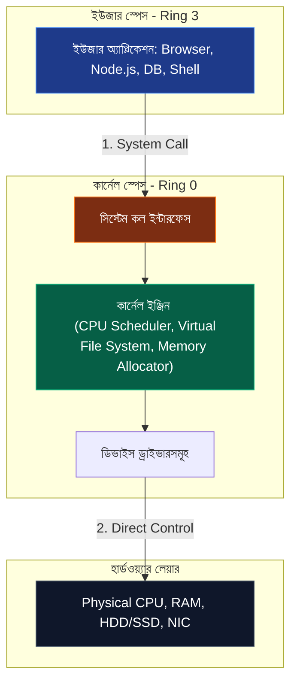
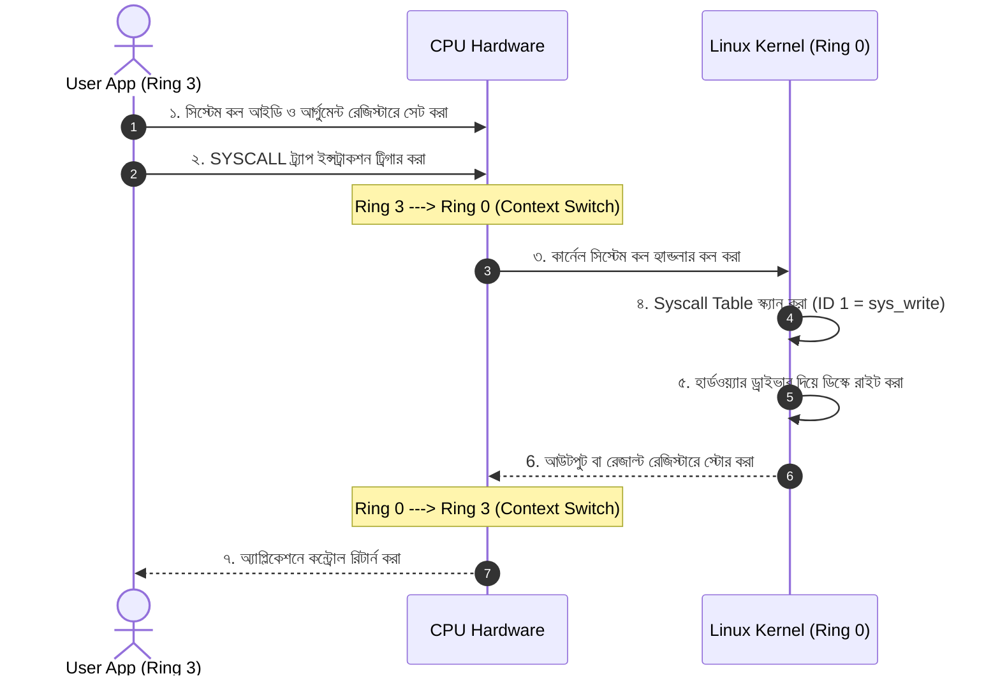
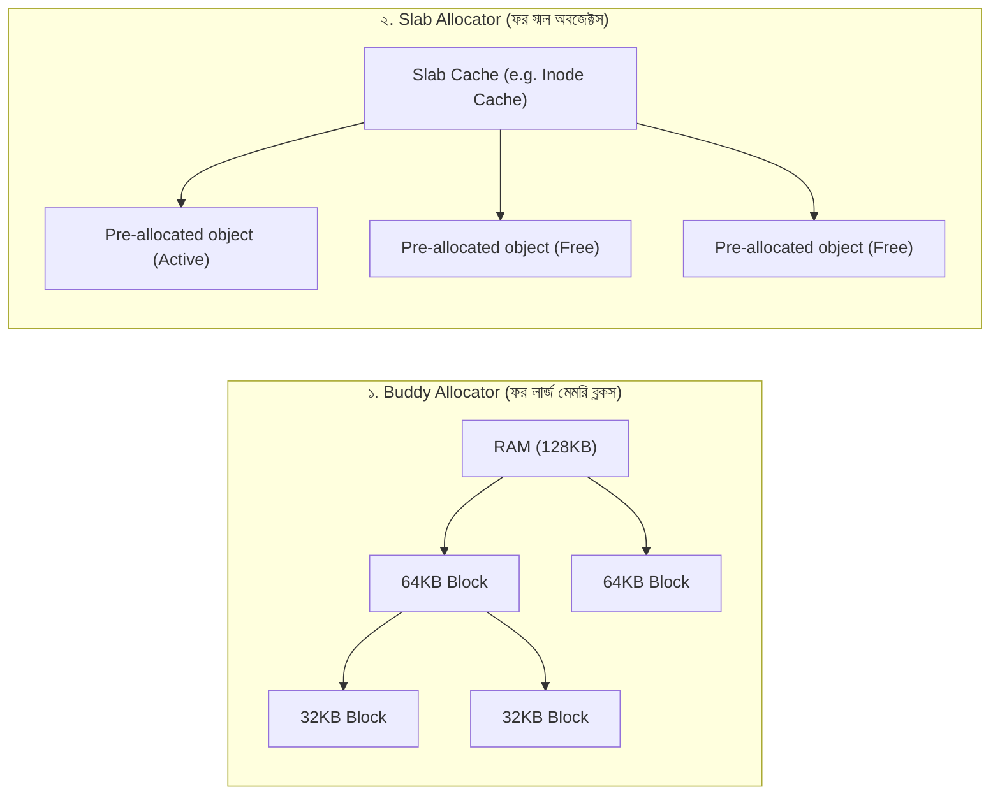
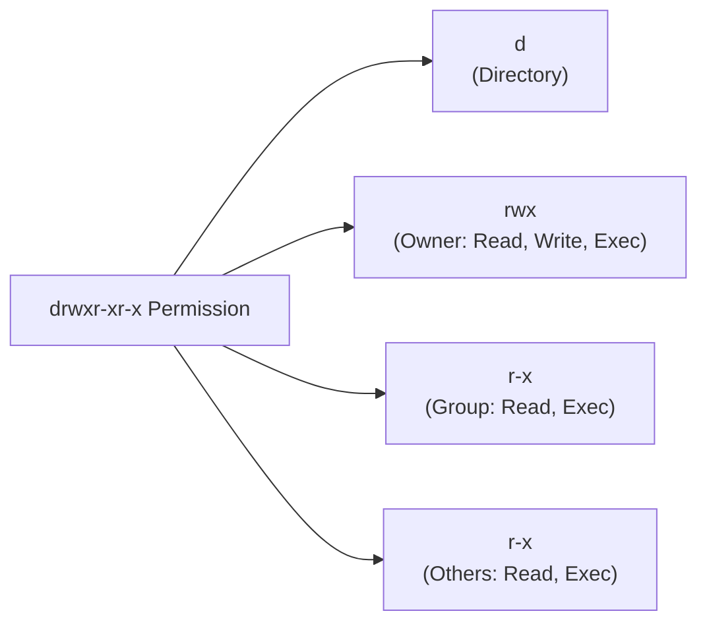
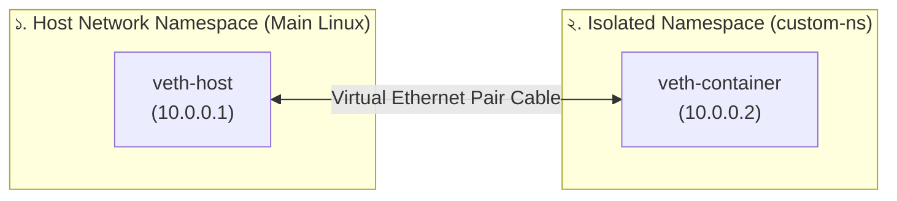
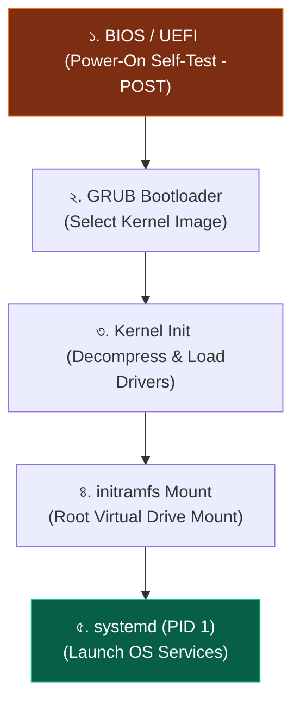

# 🐧 Linux Commands & Kernel Architecture Handbook

একটি সাধারণ ওয়েব অ্যাপ্লিকেশন থেকে শুরু করে ফেসবুক বা গুগলের মতো বিশালাকার ক্লাউড ইনফ্রাস্ট্রাকচার—সবকিছুর ব্যাকবোন বা ভিত্তি হলো **Linux (লিনাক্স)**। তবে অধিকাংশ ডেভেলপার লিনাক্সকে কেবল কিছু কমন কমান্ড টাইপ করার প্লাটফর্ম হিসেবে দেখেন। কিন্তু একজন টপ-টিয়ার সফটওয়্যার ইঞ্জিনিয়ার হতে গেলে লিনাক্সের অভ্যন্তরীণ **Kernel Architecture**, **Memory Allocators**, **System Calls** এবং এন্টারপ্রাইজ মনিটরিং কমান্ডগুলোর মেমরি মডেল বোঝা অত্যন্ত জরুরি।

এই হ্যান্ডবুকটি এমনভাবে ডিজাইন করা হয়েছে যেন একজন সম্পূর্ণ নতুন রিডারও একদম বেসিক থেকে লিনাক্সের গভীরতম কার্নেল লেভেল আর্কিটেকচার এবং প্র্যাক্টিক্যাল কমান্ড অপারেশনগুলো নিখুঁত ও স্পষ্টভাবে বুঝতে পারেন।

---

## ১. লিনাক্স ও কার্নেলের সহজ প্রবেশদ্বার (Introduction & Unix Philosophy)

লিনাক্স বোঝার প্রথম চাবিকাঠি হলো বিখ্যাত **Unix Philosophy (ইউনিক্স দর্শন)**:
> *"Everything is a file." (অর্থাৎ, লিনাক্সে সবকিছুই একটি ফাইল!)*

লিনাক্সে আপনার কিবোর্ড, মাউস, হার্ডডিস্কের ড্রাইভ, মেমরির বাফার, এমনকি প্রসেসের নেটওয়ার্ক সকেট বা কানেকশন—সবকিছুকেই ওএস কার্নেল একটি ভার্চুয়াল ফাইল হিসেবে রিড করে। ফলে একটি ফাইল যেভাবে রিড বা রাইট করা যায়, ঠিক একইভাবে অন্যান্য জটিল ডিভাইসও কন্ট্রোল করা সম্ভব।

### লিনাক্স অপারেটিং সিস্টেমের স্তরায়ন (The OS Stack)
সফটওয়্যার ও হার্ডওয়্যারের মধ্যকার সেতুটি ৪টি প্রধান লেয়ারে বিভক্ত:



* **User Space (ইউজার স্পেস):** যেখানে আমাদের সাধারণ অ্যাপ্লিকেশনগুলো (যেমন: ওয়েব সার্ভার, ডেটাবেস, ব্রাউজার বা কমান্ড লাইন শেল) অত্যন্ত সুরক্ষিত অবস্থায় রান করে। এরা সরাসরি কম্পিউটারের মেমরি বা হার্ডওয়্যার স্পর্শ করতে পারে না।
* **Kernel Space (কার্নেল স্পেস):** ওএস-এর চালিকাশক্তি বা কার্নেল ইঞ্জিন এখানে রান করে। এর কাছে হার্ডওয়্যারের ফুল অ্যাক্সেস থাকে।
* **System Call Interface:** ইউজার স্পেসের কোনো অ্যাপ যখন হার্ডওয়্যার অ্যাক্সেস করতে চায়, তখন সে এই গেটওয়ে বা সিস্টেম কলের মাধ্যমে কার্নেলকে রিকোয়েস্ট পাঠায়।

---

## ২. লিনাক্স কার্নেলের অভ্যন্তরীণ ম্যাজিক (Under the Hood Internals)

লিনাক্স কার্নেল হলো একটি **Monolithic Kernel (মনোলিথিক কার্নেল)**। এর মানে হলো কার্নেলের সমস্ত কোর সার্ভিস (সিপিইউ শিডিউলার, ভার্চুয়াল ফাইল সিস্টেম, মেমরি ম্যানেজার) একই সাথে একটি একক এড্রেস স্পেসে অত্যন্ত উচ্চ গতিতে রান করে।

### ক. প্রিভিলেজ রিং ও মেমরি প্রটেকশন (Ring 0 vs Ring 3)
সিপিইউ হার্ডওয়্যার লেভেলে সিকিউরিটির জন্য প্রসেসগুলোকে দুটি জোনে ভাগ করে এক্সিকিউট করে:
১. **Ring 3 (User Mode):** সীমাবদ্ধ বা আন-প্রিভিলেজড জোন। এখানে আপনার কোড রান করে। যদি কোডে কোনো ক্র্যাশ বা ইনফিনিট লুপ ঘটে, তবে কেবল সেই অ্যাপ্লিকেশনটিই ক্র্যাশ করবে, পুরো কম্পিউটার ডাউন হবে না।
২. **Ring 0 (Kernel Mode):** সুপারইউজার জোন। কার্নেল এখানে রান করে এবং ফিজিক্যাল মেমরি ও সিপিইউ রেজিস্টারে সরাসরি অ্যাক্সেস পায়।

---

### খ. সিস্টেম কল মেকানিজম (System Calls)
যখন আপনার কোড বলে `fs.writeFileSync('log.txt', 'hello')`, পর্দার আড়ালে কীভাবে কার্নেলে সুইচিং ঘটে তার সহজ মেকানিজম:



সিস্টেম কল একটি অত্যন্ত কস্টলি অপারেশন। কারণ প্রতিবার সিস্টেম কল করার সময় সিপিইউ-কে রেজিস্টার ফ্ল্যাশ করতে হয় এবং মোড কনটেক্সট সুইচিং ঘটে। 

---

### গ. ভার্চুয়াল ফাইল সিস্টেম, ইনোড ও ফাইল ডেসক্রিপ্টর (VFS, Inodes, & FD)
উইন্ডোজে যেমন `C:\` বা `D:\` ড্রাইভের মতো ফাইল পাথ আলাদা থাকে, লিনাক্সে তা নয়। লিনাক্সে একটি মাত্র ইউনিফাইড ফাইল রুট (`/`) থাকে।

* **Virtual File System (VFS):** এটি কার্নেলের একটি অ্যাবস্ট্রাকশন লেয়ার। আপনার ফাইল系统中 `ext4`, `NTFS` নাকি `FAT32` ড্রাইভ কানেক্টেড আছে তা নিয়ে অ্যাপ্লিকেশনকে ভাবতে হয় না। VFS সবার জন্য এক ও অভিন্ন API (`open`, `read`, `write`) প্রোভাইড করে।
* **Inode (Index Node):** লিনাক্সে প্রতিটি ফাইলের মেটাডেটা ব্লক থাকে যাকে ইনোড বলে। ইনোডে ফাইলের সাইজ, পারমিশন, মডিফিকেশন টাইম এবং ডিস্কের ফিজিক্যাল ব্লকের পয়েন্টার থাকে। **বিস্ময়কর তথ্য:** ইনোডের ভেতরে ফাইলের নাম থাকে না! ফাইলের নাম মূলত ডিরেক্টরি ফাইলের একটি ম্যাপ এন্ট্রি মাত্র।
* **File Descriptor (FD):** অ্যাপ্লিকেশন যখন কোনো ফাইল বা নেটওয়ার্ক সকেট ওপেন করে, কার্নেল তাকে একটি নন-নেগেটিভ ইন্টিজার আইডি দেয় (যেমন: `3`)। একে ফাইল ডেসক্রিপ্টর বলে। প্রসেসটি এই আইডি ব্যবহার করেই কার্নেলের সাথে ফাইল আদান-প্রদান করে।

---

### ঘ. কার্নেল মেমরি অ্যালোকেশন: Buddy System ও Slab Allocator
কার্নেল মেমরিকে কীভাবে নিখুঁতভাবে ম্যানেজ করে যাতে ১ বাইট মেমরিও নষ্ট না হয়? এর জন্য দুটি মূল ডিস্ট্রিবিউটর সিস্টেম রয়েছে:



১. **Buddy Allocator:** এটি মেমরি পেজগুলোকে ২-এর পাওয়ার আকারে (যেমন: ৪KB, ৮KB, ১৬KB, ৩২KB, ৬৪KB) বিভক্ত করে। যখন কোনো প্রসেস মেমরির জন্য রিকোয়েস্ট করে, এটি সবচেয়ে উপযুক্ত ব্লকটি দেয়। কাজ শেষ হলে পাশাপাশি দুটি ব্লক (Buddies) পুনরায় জোড়া লেগে বড় ব্লক তৈরি করে মেমরি ফ্র্যাগমেন্টেশন রোধ করে।
২. **Slab Allocator:** বাডি সিস্টেম বড় ব্লক বা পেজ ম্যানেজ করতে ওস্তাদ, কিন্তু কার্নেলে প্রতিনিয়ত লাখ লাখ ছোট ছোট অবজেক্ট (যেমন: ইনোড স্ট্রাকচার, ফাইল ডেসক্রিপ্টর) তৈরি ও ডিলিট হয়। এগুলোর জন্য বাডি সিস্টেমের মতো পুরো পেজ অ্যালোকেট করা অপচয়। স্ল্যাব অ্যালোকেটর কি করে—সে মেমরির একটি পেজ আগে থেকেই নিয়ে সেখানে সমপরিমাণ সাইজের অনেকগুলো ছোট ছোট স্লট বা অবজেক্ট প্রি-অ্যালোকেট করে রাখে। অবজেক্ট দরকার হলে সে খুব দ্রুত রেডিমেড স্লট থেকে মেমরি দেয়, যা মেমরি বুটস্ট্র্যাপিং স্পিড বহুগুণ বাড়িয়ে দেয়।

---

## ৩. কমান্ড লাইফসাইকেল: টার্মিনালে এন্টার চাপলে কী ঘটে?

আমরা যখন টার্মিনালে গিয়ে `ls` লিখে এন্টার প্রেস করি, ওএস লেভেলে এক বিশাল নাটকের জন্ম হয়:
১. **Lexical Analysis & Parsing:** আপনার টার্মিনাল শেল (যেমন: Bash বা Zsh) ইনপুট করা স্ট্রিংটিকে এনালাইসিস করে দেখে প্রথম শব্দটি একটি কমান্ড।
২. **PATH Lookup:** শেল তার এনভায়রনমেন্ট ভেরিয়েবল `PATH` (যেমন: `/usr/bin:/bin`)-এ থাকা ফোল্ডারগুলো স্ক্যান করে দেখে `ls` বাইনারি ফাইলটি কোথায় আছে। সে খুঁজে পায় `/bin/ls` ফোল্ডারে।
৩. **Forking System Call (`fork()`):** শেল তার নিজের একটি ডুপ্লিকেট চাইল্ড প্রসেস তৈরি করার জন্য কার্নেলের কাছে `fork()` সিস্টেম কল ট্রিগার করে।
৪. **Execution System Call (`execve()`):** নবজাত চাইল্ড প্রসেসটি সাথে সাথে `execve()` সিস্টেম কল রান করে তার নিজের মেমরি ইমেজটি মুছে ফেলে সেখানে `/bin/ls` ফাইলের বাইনারি কোড লোড করে রান করা শুরু করে।
৫. **Waiting & Return:** মেইন শেল প্রসেসটি কার্নেলে `wait()` সিস্টেম কল ট্রিগার করে চাইল্ড প্রসেসটি শেষ না হওয়া পর্যন্ত অপেক্ষা করতে থাকে। চাইল্ড প্রসেস তার আউটপুট স্ক্রিনে প্রিন্ট করে রিটার্ন কোড জিরো (`exit(0)`) দিয়ে বিদায় নেয় এবং মেইন শেল আবার ইনপুট নেওয়ার জন্য প্রস্তুত হয়।

---

## ৪. প্র্যাক্টিক্যাল লিনাক্স কমান্ড গাইড (The Operations Manual)

নিচে এন্টারপ্রাইজ লেভেলে বহুল ব্যবহৃত এবং প্রোডাকশনে কাজে লাগার মতো কমান্ডগুলোকে ক্যাটাগরি ভিত্তিক গভীর ব্যাখ্যাসহ সাজানো হলো:

### ক. ক্যাটাগরি ১: নেভিগেশন ও ফাইল সিস্টেম ম্যানেজমেন্ট

* **`ls` (List):** কারেন্ট ডিরেক্টরির ফাইলগুলোর তালিকা দেখা।
  - *প্রো-টিপ:* `ls -lah` (লং লিস্ট, হিডেন ফাইল সহ, রিডেবল সাইজে)।
* **`pwd` (Print Working Directory):** আপনি বর্তমানে কোন ফোল্ডারে আছেন তার সম্পূর্ণ পাথ দেখতে।
* **`mkdir` (Make Directory):** নতুন ফোল্ডার তৈরি করা।
  - *প্রো-টিপ:* `mkdir -p services/auth/test` (প্যারেন্ট ফোল্ডার না থাকলেও একবারে নেস্টেড ফোল্ডার চেইন তৈরি করবে)।
* **`cp` (Copy) & `mv` (Move/Rename):** ফাইল কপি ও মুভ করা।
* **`rm` (Remove):** ফাইল বা ফোল্ডার ডিলিট করা।
  - *সতর্কতা:* `rm -rf` (ফোর্সড ডিলিট)।

> [!NOTE]
> **কেন `rm` ডিস্কের ডেটা সাথে সাথে ডিলিট করে না?**
> লিনাক্সে `rm` আসলে ফাইলটিকে ডিস্কের ব্লক থেকে মুছে ফেলে না। এটি মূলত ইনোড রেফারেন্স থেকে ফাইলের লিংকটি ডিসকানেক্ট করে দেয় (Unlink)। কার্নেল তখন এই ইনোড লিংক কাউন্টারকে `0` করে দেয়। কার্নেল তখনই এই ব্লকের স্পেসকে খালি বা ওভাররাইট যোগ্য হিসেবে চিহ্নিত করে যখন দেখে ফাইলটি আর কোনো রানিং প্রসেস দ্বারা রিড হচ্ছে না।

---

### খ. ক্যাটাগরি ২: টেক্সট প্রসেসিং ও সার্চ (The Analytics Suite)

প্রোডাকশন সার্ভারে যখন গিগাবাইট সাইজের লগ ফাইল থেকে নির্দিষ্ট এরর বা ডাটা ফিল্টার করতে হয়, তখন নিচের কমান্ডগুলো জাদুকরী ভূমিকা পালন করে:

```mermaid
flowchart LR
    File["'access.log' File"] -->|1. grep 'ERROR'| Grep["Filtered ERROR lines"]
    Grep -->|2. awk '{print $7}'| Awk["Extract 7th column (URL)"]
    Awk -->|3. uniq -c| Uniq["Count Unique URLs"]
```

#### ১. `grep` (Global Regular Expression Print):
ফাইলের ভেতর কোনো নির্দিষ্ট প্যাটার্ন বা স্ট্রিং সার্চ করার সবচেয়ে পাওয়ারফুল কমান্ড।
```bash
# access.log ফাইলে কতবার "500 Internal Error" আছে তা ফিল্টার করা (কেস ইনসেনসিটিভ)
grep -i "500 Internal Error" access.log

# ডিরেক্টরির ভেতরে থাকা সমস্ত ফাইলে রিকার্সিভলি "DB_CONNECTION" স্ট্রিংটি কোন কোন লাইনে আছে তা লাইন নাম্বার সহ খোঁজা
grep -rnw "./src" -e "DB_CONNECTION"
```

#### ২. `awk` (কলামার ডাটা প্রসেসর):
এটি কেবল কমান্ড নয়, এটি একটি আস্ত কলাম-ভিত্তিক স্ক্রিপ্টিং ল্যাঙ্গুয়েজ! এটি ফাইলের প্রতি লাইনকে স্পেস বা কাস্টম ডেলিমিটারে স্প্লিট করে কলাম ওয়াইজ অপারেশন করতে পারে।
```bash
# access.log এর ৭ম কলামে থাকা সমস্ত রিকোয়েস্ট ইউআরএল প্রিন্ট করা
awk '{print $7}' access.log

# সার্ভারের মেমরি রিপোর্টের দ্বিতীয় লাইন থেকে মেমরির ফ্রি সাইজ বের করা
free -h | awk 'NR==2{print "Total RAM: " $2 ", Free RAM: " $4}'
```

#### ৩. `sed` (Stream Editor):
ফাইলটি ওপেন না করেই কমান্ড লাইন থেকে কোনো টেক্সট রিপ্লেস, লাইন ডিলিট বা মডিফাই করার স্ট্রিম প্রসেসর।
```bash
# config.env ফাইলে পোর্ট 3000 কে রিপ্লেস করে 8080 করা (ইন-প্লেস এডিট)
sed -i 's/PORT=3000/PORT=8080/g' config.env
```

#### ৪. `find` (ফাইল সার্চ ইঞ্জিন):
নাম, সাইজ, পারমিশন বা মডিফিকেশন টাইমের ওপর ভিত্তি করে সম্পূর্ণ ওএস-এ ফাইল খুঁজে বের করার কমান্ড।
```bash
# src ফোল্ডারে থাকা সমস্ত .js ফাইল খুঁজে বের করা
find ./src -name "*.js"

# ১০০ এমবি-র চেয়ে বড় সাইজের সমস্ত ফাইল খুঁজে বের করা
find / -type f -size +100M
```

---

### গ. ক্যাটাগরি ৩: পাইপিং ও রিডাইরেকশন (I/O Redirection)
লিনাক্সে প্রতিটি প্রসেসের ৩টি স্ট্যান্ডার্ড মেমরি স্ট্রিম থাকে:
* `stdin` (স্ট্যান্ডার্ড ইনপুট - ০): কিবোর্ড বা ইনপুট বাফার।
* `stdout` (স্ট্যান্ডার্ড আউটপুট - ১): স্ক্রিন বা কনসোল আউটপুট।
* `stderr` (স্ট্যান্ডার্ড এরর - ২): এরর মেসেজ আউটপুট।

```bash
# ১. stdout রিডাইরেকশন (> দিয়ে ওভাররাইট, >> দিয়ে অ্যাপেন্ড করা)
echo "application started" > server.log

# ২. stdin রিডাইরেকশন (< ফাইল থেকে ইনপুট নেওয়া)
mysql -u root -p my_database < db_backup.sql

# ৩. ২>&১ (stdout এবং stderr উভয়কেই এক স্ট্রিম করে ফাইলে পাঠানো)
npm run start > output.log 2>&1

# ৪. পাইপিং (| এক কমান্ডের আউটপুট অন্য কমান্ডের ইনপুট হিসেবে পাঠানো)
cat access.log | grep "404" | wc -l
# (access.log রিড করে, ৪0৪ এরর লাইন ফিল্টার করে, অবশেষে মোট লাইনের সংখ্যা কাউন্ট করবে)
```

---

### ঘ. ক্যাটাগরি ৪: সিস্টেম মনিটরিং ও পারফরম্যান্স টিউনিং (Resource Analysis)

সার্ভার স্লো হয়ে গেলে বা মেমরি লিক দেখা দিলে একজন আর্কিটেক্টের প্রথম ঢাল তলোয়ার হলো এই কমান্ডসমূহ:

* **`top` / `htop`:** রিয়েল-টাইমে কোন কোন প্রসেস কত পার্সেন্ট CPU ও RAM খাচ্ছে তা দেখার লাইভ ড্যাশবোর্ড। (htop অনেক বেশি কালারফুল ও ইউজার ফ্রেন্ডলি)।
* **`ps` (Process Status):** সচল প্রসেসগুলোর স্ন্যাপশট।
  - *প্রো-টিপ:* `ps aux | grep node` (সিস্টেমের সমস্ত নোড প্রসেসের আইডি ও স্ট্যাটাস ফিল্টার করা)।
* **`lsof` (List Open Files):** লিনাক্সে যেহেতু "সবকিছুই ফাইল", তাই `lsof` দিয়ে দেখা যায় কোন প্রসেস কোন কোন ফাইল বা নেটওয়ার্ক পোর্ট ধরে রেখেছে।
  - *Pro-tip:* `lsof -i :3000` (পোর্ট ৩০০০ কোন প্রসেস ব্লক করে রেখেছে তা বের করা এবং কিল করার জন্য আইডি নেওয়া)।
* **`ss` / `netstat`:** নেটওয়ার্ক সকেটের লাইভ কানেকশন ও ট্রাফিক মনিটর করা।
  - *Pro-tip:* `ss -tulpn` (সিস্টেমের সমস্ত ওপেন বা লিসেনিং পোর্ট ও তাদের প্রসেস আইডি দেখা)।
* **`free`:** সিস্টেমের টোটাল মেমরি, কতটুকু ব্যবহৃত হচ্ছে এবং কতটুকু ক্যাশ বা বাফারে আছে তার কুইক রিপোর্ট।
  - *Pro-tip:* `free -h` (হিউম্যান রিডেবল এমবি/জিবি ফরম্যাটে দেখা)।
* **`df` (Disk Free) & `du` (Disk Usage):** স্টোরেজ ক্যাপাসিটি এনালাইসিস।
  - *Pro-tip:* `df -h` (ডিস্কের খালি জায়গা দেখা) এবং `du -sh *` (কোন কোন ফোল্ডার কত জিবি জায়গা খাচ্ছে তার সামারি রিপোর্ট)।

---

### ঙ. ক্যাটাগরি ৫: ইউজার পারমিশন ও এক্সেস কন্ট্রোল (Security Layer)
লিনাক্সে প্রতিটা ফাইল বা ফোল্ডারের ১০টি পারমিশন মার্কার থাকে। যেমন: `drwxr-xr-x`
* প্রথম ক্যারেক্টার: `d` = ডিরেক্টরি, `-` = সাধারণ ফাইল।
* পরবর্তী ৯টি ক্যারেক্টার ৩টি গ্রুপে বিভক্ত:
  ১. **User (মালিক - u):** প্রথম ৩টি (`rwx` = read, write, execute)।
  ২. **Group (গ্রুপ - g):** মাঝের ৩টি (`r-x` = read, no write, execute)।
  ৩. **Others (অন্যান্য - o):** শেষের ৩টি (`r-x` = read, no write, execute)।



#### পারমিশন টিউনিং কমান্ডস:
* **`chmod` (Change Mode):** ফাইলের পারমিশন পরিবর্তন করা।
  - **অক্টাল মোড (Octal Numbers):** `Read = 4`, `Write = 2`, `Execute = 1`।
  - *উদাহরণ:* `chmod 755 script.sh` 
    - `7` (4+2+1 = User has rwx)
    - `5` (4+0+1 = Group has r-x)
    - `5` (4+0+1 = Others have r-x)
* **`chown` (Change Owner):** ফাইলের মালিক বা গ্রুপ ওনারশিপ পরিবর্তন করা।
  - *উদাহরণ:* `chown -R www-data:www-data /var/www/html` (ওয়েব ডিরেক্টরির মালিকানা ওয়েব সার্ভার ইউজারকে দেওয়া)।
* **`umask` (User Mask):** নতুন ফাইল বা ফোল্ডার ক্রিয়েট করার সময় ডিফল্ট পারমিশন কত বাদ যাবে তা ডিফাইন করা।

> [!IMPORTANT]
> **ফাইল এক্সিকিউট বনাম ডিরেক্টরি এক্সিকিউট পারমিশন:**
> ফাইলের ক্ষেত্রে `x` (execute) পারমিশন মানে ফাইলটিকে একটি প্রোগ্রাম হিসেবে রান করা যাবে। কিন্তু ডিরেক্টরির ক্ষেত্রে `x` পারমিশন মানে ডিরেক্টরির ভেতরে ঢোকা বা ট্রাভার্স করা যাবে (`cd` কমান্ড করা যাবে)। ডিরেক্টরিতে `x` পারমিশন না থাকলে আপনি ফাইল রিড করতে পারলেও ফোল্ডারের ভেতর ঢুকতে পারবেন না!

---

## ৫. ডকার নেটওয়ার্কিংয়ের অন্তরাল: ভার্চুয়াল নেমস্পেস ম্যানুয়াল ইমপ্লিমেন্টেশন

আমরা জানি ডকার কন্টেইনারগুলো সম্পূর্ণ আইসোলেটেড ভার্চুয়াল নেটওয়ার্কের আন্ডারে কাজ করে। লিনাক্স কার্নেল লেভেলের **Network Namespace** ব্যবহার করে কীভাবে ম্যানুয়ালি ডকারের মতো আইসোলেটেড নেটওয়ার্ক এবং তাদের মধ্যে ভার্চুয়াল ক্যাবল বা পিয়ার কানেকশন তৈরি করা যায় তা নিচে দেখানো হলো:



### ম্যানুয়াল নেটওয়ার্ক আইসোলেশন ও পিং টেস্ট গাইড:
```bash
# ১. 'custom-ns' নামে সম্পূর্ণ নতুন ও স্বাধীন একটি নেটওয়ার্ক নেমস্পেস তৈরি করুন
sudo ip netns add custom-ns

# ২. একটি ভার্চুয়াল ইথারনেট পেয়ার বা ভার্চুয়াল নেটওয়ার্ক ক্যাবল তৈরি করুন
# যার এক মাথার নাম 'veth-host' এবং অন্য মাথার নাম 'veth-container'
sudo ip link add veth-host type veth peer name veth-container

# ৩. ক্যাবলের এক মাথা 'veth-container'-কে আমাদের কাস্টম নেমস্পেসের ভেতরে ঠেলে দিন
sudo ip link set veth-container netns custom-ns

# ৪. হোস্ট মেশিনের মাথা 'veth-host'-এ একটি আইপি বসান এবং কার্ডটি সচল (Up) করুন
sudo ip addr add 10.0.0.1/24 dev veth-host
sudo ip link set veth-host up

# ৫. কাস্টম নেমস্পেসের ভেতরে ঢুকে কার্ডটি সচল করুন এবং ১০.০.০.২ আইপি সেট করুন
sudo ip netns exec custom-ns ip addr add 10.0.0.2/24 dev veth-container
sudo ip netns exec custom-ns ip link set veth-container up
sudo ip netns exec custom-ns ip link set lo up # Loopback interface on

# ৬. এবার কাস্টম নেমস্পেসের ভেতর থেকে হোস্টের আইপিতে পিং (Ping) মেরে টেস্ট করুন!
sudo ip netns exec custom-ns ping 10.0.0.1
# (প্যাকেটের সাকসেসফুল রেসপন্স আসবে! ডকার পর্দার অন্তরালে এভাবেই কন্টেইনার নেটওয়ার্কিং সাজায়!)
```

---

## ৬. eBPF: কার্নেল লেভেল সুপারপাওয়ার (eBPF Internals)

আধুনিক সিস্টেম ডেভেলপমেন্টে এবং কুবারনেটিস নেটওয়ার্কিংয়ে (যেমন: Cilium) **eBPF (Extended Berkeley Packet Filter)** একটি বৈপ্লবিক নাম।

* **eBPF কী:** পূর্বে কার্নেলের ভেতরে কোনো কাস্টম কাজ বা ট্র্যাকিং করতে হলে পুরো কার্নেলের সোর্স কোড মডিফাই করতে হতো অথবা রিবুট করতে হতো। eBPF হলো কার্নেলের ভেতরের একটি সুরক্ষিত **Sandbox Virtual Machine**। এর মাধ্যমে আপনি কার্নেলের সোর্স কোড রিবুট বা স্পর্শ না করেই Ring 0-এর নির্দিষ্ট ইভেন্ট বা হুকের ওপর কাস্টম স্যান্ডবক্সড কোড রান করতে পারবেন!
* **ব্যবহারের ক্ষেত্র:** হাই-পারফরম্যান্স রিয়েল-টাইম নেটওয়ার্ক প্যাকেট ফিল্টারিং, কোনো সিস্টেম কলের গতি ট্র্যাক করা এবং ওএস-এর সিকিউরিটি ডিটেকশন।

---

## ৭. লিনাক্স বুটিং লাইফসাইকেল (BIOS to systemd)

আপনার কম্পিউটারের পাওয়ার বাটনে চাপ দেওয়ার পর থেকে স্ক্রিনে লগইন স্ক্রিন আসা পর্যন্ত কার্নেলের বুট লাইফসাইকেলের ৫টি ধাপ:



১. **BIOS/UEFI (Power-On Self-Test):** মাদারবোর্ডের রম থেকে বুট হয়ে হার্ডওয়্যারগুলো ঠিক আছে কিনা চেক করে।
২. **GRUB Bootloader:** হার্ডডিস্কের নির্দিষ্ট সেক্টর (MBR/EFI) থেকে বুটলোডার কোড লোড হয় যা আপনাকে ওএস কার্নেল সিলেক্ট করার অপশন দেয়।
৩. **Kernel Init:** কার্নেল ইমেজ মেমরিতে কম্প্রেসড অবস্থা থেকে আনপ্যাক হয় এবং সিপিইউ শিডিউলার ও ডিভাইস ড্রাইভার ইনিশিয়ালাইজ করে।
৪. **initramfs:** কার্নেল একটি ছোট ভার্চুয়াল ফাইল সিস্টেম মাউন্ট করে যা মেইন হার্ডড্রাইভ মাউন্ট করার জন্য প্রয়োজনীয় ড্রাইভার সাপোর্ট দেয়।
৫. **systemd (PID 1):** কার্নেল অবশেষে প্রথম প্রসেস হিসেবে `systemd` লঞ্চ করে। এটি ক্রমান্বয়ে নেটওয়ার্ক, গ্রাফিক্স বা টার্মিনাল ডেমোন স্টার্ট করে বুটিং শেষ করে।

---

## ৮. কার্নেল কন্ট্রোল গ্রুপস (cgroups v2) ম্যানুয়াল রিসোর্স লিমিটিং

আমরা জানি ডকার কন্টেইনারে মেমরি লিমিট সেট করা যায়। লিনাক্সের কন্ট্রোল গ্রুপ বা `cgroup` ফিচারটি আসলে কার্নেলের একটি **Virtual File System** যা `/sys/fs/cgroup/` পাথে মাউন্ট করা থাকে।
কোনো সিআই/সিডি স্ক্রিপ্ট বা ডকার ছাড়াই কীভাবে ম্যানুয়ালি ফোল্ডার তৈরি করে কার্নেল লেভেলে কোনো কাস্টম স্ক্রিপ্টের মেমরি লিমিট কন্ট্রোল করা যায় তা নিচে দেখানো হলো:

### ম্যানুয়াল cgroups মেমরি লিমিটার ওয়াকথ্রু:
```bash
# ১. cgroup রুট ডিরেক্টরিতে 'custom-app' নামে নতুন একটি মেমরি কন্ট্রোল গ্রুপ তৈরি করুন
# (লিনাক্স কার্নেল অটোমেটিক্যালি এই ফোল্ডারের ভেতর cgroups ভ্যারিয়েবল ফাইলগুলো লিখে দেবে!)
sudo mkdir /sys/fs/cgroup/custom-app

# ২. এই প্রসেস গ্রুপের জন্য সর্বোচ্চ মেমরি লিমিট ৫০ মেগাবাইট (৫২,৪২৮,৮০০ বাইট) সেট করুন
echo "52428800" | sudo tee /sys/fs/cgroup/custom-app/memory.max

# ৩. এবার আপনার কাঙ্ক্ষিত ব্যাকগ্রাউন্ড অ্যাপ্লিকেশন বা ব্যাশ স্ক্রিপ্টটি রান করুন
node heavy-processor.js &
# (ধরি এই প্রসেসটির আইডি বা PID হলো 9876)

# ৪. প্রসেস আইডিটিকে custom-app এর ট্র্যাকার ফাইলে পুশ করে দিন
echo "9876" | sudo tee /sys/fs/cgroup/custom-app/cgroup.procs

# (এখন কার্নেল এই ৯৮৭৬ প্রসেসটিকে কড়া নজরে রাখবে। প্রসেসটি কোনো কারণে ৫০ এমবি-র 
# বেশি মেমরি খেলেই কার্নেল ওএম কিলার দিয়ে তাকে সাথে সাথে কিল করে দেবে!)
```

---

## ৯. প্রসেসের 'D' স্টেট (Uninterruptible Sleep)

লিনাক্স প্রসেস ম্যানেজমেন্টে প্রায়ই ডেভেলপাররা বিপদে পড়েন যখন দেখেন কোনো প্রসেসকে `kill -9` (SIGKILL) দেওয়ার পরেও সেটি বন্ধ হচ্ছে না!
* **D State কী:** লিনাক্সে যখন কোনো প্রসেস **D (Uninterruptible Sleep)** স্টেটে চলে যায়, এর মানে হলো প্রসেসটি এমন একটি হার্ডওয়্যার I/O অপারেশনের (যেমন: ডিস্ক রিড বা এনএফএস ফাইল মাউন্ট) জন্য অপেক্ষা করছে যা অত্যন্ত ক্রিটিক্যাল।
* **কেন কিল করা যায় না:** কার্নেল সিকিউরিটির জন্য এই অবস্থায় থাকা প্রসেসকে কোনো সিগন্যাল (এমনকি `SIGKILL`-ও) রিসিভ করতে দেয় না। কারণ মাঝপথে কিল করলে ড্রাইভার ডাটা করাপশন বা কার্নেল প্যানিক ঘটাতে পারে।
* **সমাধান:** এই প্রসেসটিকে ডিলিট করতে হলে ডিভাইস ড্রাইভার সচল হওয়া পর্যন্ত অপেক্ষা করতে হবে, অথবা অবশেষে সার্ভার রিবুট করতে হবে।

---

## ১০. সিস্টেম ট্রেসিং ও ডিবাগিং: কার্নেল অডিট কমান্ডস

ব্যাকএন্ড অ্যাপ্লিকেশন ডেভেলপ করার সময় সিস্টেমে কোনো রহস্যময় এরর দেখা দিলে নিচের ট্রেসিং কমান্ডগুলোই একমাত্র ভরসা:

### ক. `strace` (System Call Trace):
রানিং প্রসেসটি পর্দার অন্তরালে কার্নেলের কোন কোন সিস্টেম কল ট্রিগার করছে তা রিয়েল-টাইমে দেখার আলটিমেট ডিবাগিং টুল।
```bash
# ls কমান্ড রান করার সময় কি কি সিস্টেম কল ট্রিগার হচ্ছে তার সামারি রিপোর্ট দেখা
strace -c ls

# একটি রানিং Node.js প্রসেস (PID 8452) কোন কোন ফাইল ওপেন করছে তা ট্র্যাক করা
strace -p 8452 -e trace=openat,write
```

### খ. `dmesg` (Kernel Ring Buffer Logs):
কার্নেলের অভ্যন্তরীণ লক ও বাফার মেসেজ দেখার উইন্ডো।
```bash
# ওএস কার্নেল লেভেলে কোনো প্রসেস OOM Killer দ্বারা কিল হয়েছে কিনা তা ফিল্টার করে দেখা
dmesg -T | grep -i "oom"
```

---

## ১১. প্রসেস লাইফসাইকেল ও ব্যাকগ্রাউন্ড কন্ট্রোল (Process Management)

যখন আপনি টার্মিনালে কোনো কমান্ড রান করেন, সেটি ডিফল্টভাবে **Foreground (ফোরগ্রাউন্ড)**-এ চলতে থাকে এবং টার্মিনাল লক করে রাখে। ব্যাকগ্রাউন্ডে প্রসেস নেওয়ার এবং কন্ট্রোল করার কৌশল:

* **`&` Operator:** কমান্ডের শেষে `&` দিলে সেটি ব্যাকগ্রাউন্ডে রান করা শুরু করবে এবং টার্মিনাল খালি করে দেবে।
  - *উদাহরণ:* `node app.js &`
* **`Ctrl+Z`:** ফোরগ্রাউন্ডে সচল কোনো কাজকে সাময়িকভাবে পজ (Pause) করে ব্যাকগ্রাউন্ডে পাঠানো।
* **`jobs`:** ব্যাকগ্রাউন্ডে পজ বা রানিং থাকা প্রসেসগুলোর লিস্ট আইডি সহ দেখা।
* **`bg` & `fg`:** `bg %1` দিলে পজ থাকা ১ নং কাজ ব্যাকগ্রাউন্ডে আবার চালু হবে, এবং `fg %1` দিলে সেটি পুনরায় স্ক্রিনে ফিরে আসবে।
* **`nohup` (No Hang Up):** টার্মিনাল বা SSH কানেকশন কেটে দিলেও যেন ব্যাকগ্রাউন্ড প্রসেসটি বন্ধ না হয়, সে জন্য এটি ব্যবহৃত হয়।
  - *উদাহরণ:* `nohup node app.js > output.log 2>&1 &`

### সিগন্যাল ও প্রসেস টার্মিনেশন:
যখন কোনো প্রসেস ক্র্যাশ বা কিল করতে হয়, আমরা `kill` কমান্ড দিয়ে কার্নেল সিগন্যাল পাঠাই:
* **`kill -15 <PID>` (SIGTERM):** প্রসেসটিকে ভদ্রভাবে কাজ গুছিয়ে বন্ধ হওয়ার নির্দেশ দেওয়া (রিসোর্স রিলিজ ও গ্রেসফুল শাটডাউন)।
* **`kill -9 <PID>` (SIGKILL):** কোনো কথা ছাড়াই কার্নেল লেভেলে ফোর্স কিল করা। প্রসেস কোনো ক্লিনআপের সুযোগ পায় না।
* **`pkill -f node`:** প্রসেস আইডির বদলে নাম দিয়ে একবারে সব নোড প্রসেস কিল করা।

---

## ১২. শীর্ষ ২০টি কার্নেল ও লিনাক্স ইন্টারভিউ প্রশ্নোত্তর (Top 20 Systems Q&A)

#### প্রশ্ন ১: "Zombie Process" কী? এটি মেমরিতে কেন তৈরি হয় এবং কীভাবে এটি ডিলিট করা যায়?
**উত্তর:** লিনাক্সে একটি চাইল্ড প্রসেসের কাজ শেষ হয়ে গেলে সে কার্নেল প্রসেস টেবিলে তার সমাপ্তি স্ট্যাটাস (Exit Status) লিখে রাখে এবং তার প্যারেন্ট প্রসেসকে একটি `SIGCHLD` সিগন্যাল পাঠায়। প্যারেন্ট প্রসেস যদি `wait()` সিস্টেম কল ট্রিগার করে সেই স্ট্যাটাসটি রিড না করে, তবে চাইল্ড প্রসেসটির এক্সিকিউশন বন্ধ হয়ে গেলেও কার্নেল প্রসেস টেবিল থেকে তার এন্ট্রি মুছে যায় না। একেই **Zombie Process** বলে।
* **সমাধান:** জম্বি প্রসেস সরাসরি `kill -9` দিয়ে মারা যায় না, কারণ এটি অলরেডি মৃত! একে মেমরি থেকে সরাতে হলে তার প্যারেন্ট প্রসেসকে রিস্টার্ট বা কিল করতে হয়, তখন কার্নেলের অভিভাবক প্রসেস **PID 1 (systemd/init)** এই চাইল্ডের দায়িত্ব নেয় এবং প্রসেস টেবিল থেকে তার নাম মুছে দেয় (Reaping)।

#### প্রশ্ন ২: "Orphan Process" কী? ওএস একে কীভাবে ট্রিট করে?
**উত্তর:** যদি কোনো চাইল্ড প্রসেস রানিং থাকা অবস্থায় তার মেইন প্যারেন্ট প্রসেসটি কোনো কারণে মারা যায় বা ক্র্যাশ করে, তখন চাইল্ড প্রসেসটি অভিভাবকহীন বা **Orphan Process**-এ পরিণত হয়।
* **ওএস ট্রিটমেন্ট:** লিনাক্স কার্নেল প্রসেসকে অভিভাবকহীন ফেলে রাখে না। সিস্টেমের সেন্ট্রাল রুট প্রসেস **PID 1 (init/systemd)** সাথে সাথে এই প্রসেসটির অভিভাবকত্ব গ্রহণ করে এবং এটি ব্যাকগ্রাউন্ডে চলতে থাকে।

#### প্রশ্ন ৩: "Inode Exhaustion" বা ইনোড সংকট বলতে কী বোঝায়? স্টোরেজ খালি থাকা সত্ত্বেও কি ডিস্ক ফুল দেখাতে পারে?
**উত্তর:** হ্যাঁ, পারে! লিনাক্স ফাইল সিস্টেমে ফাইল স্টোর করার জন্য যেমন স্টোরেজ স্পেসের প্রয়োজন হয়, তেমনি ফাইলের মেটাডেটা ট্র্যাকিংয়ের জন্য একটি নির্দিষ্ট সংখ্যক **Inode Table** আগে থেকেই বরাদ্দ থাকে।
* **পরিস্থিতি:** যদি আপনার সিস্টেমে লাখ লাখ অত্যন্ত ছোট সাইজের ফাইল (যেমন ০ বাইট বা ১ বাইটের সেশন ফাইল বা ক্যাশ) তৈরি হয়, তবে আপনার ফিজিক্যাল ডিস্কের স্টোরেজ স্পেস হয়তো ৮০% খালি থাকবে, কিন্তু কার্নেলের বরাদ্দকৃত সব ইনোড শেষ বা এক্সহস্টেড হয়ে যাবে। এর ফলে নতুন কোনো ফাইল তৈরি বা রাইট করা যাবে না এবং ওএস `No space left on device` এরর দেখাবে।
* **চেক করার কমান্ড:** `df -i` (ইনোডের ব্যবহার এনালাইসিস)।

#### प्रश्न ৪: Linux কার্নেলের "OOM Killer" (Out Of Memory Killer) কীভাবে কাজ করে? এর শিকার হওয়া থেকে আপনার ডেটাবেসকে কীভাবে বাঁচাবেন?
**উত্তর:** যখন সিস্টেমের মেমরি (RAM) সম্পূর্ণ শেষ হয়ে যায় এবং কার্নেল নতুন কোনো প্রসেসের মেমরি রিকোয়েস্ট হ্যান্ডেল করতে পারে না, তখন সিস্টেম ক্র্যাশ বা হ্যাং হওয়া ঠেকাতে কার্নেল একটি লাইফ-সেভিং অ্যালগরিদম রান করে, যাকে **OOM Killer** বলে।
* **মেকানিজম:** এটি প্রতিটি রানিং প্রসেসকে একটি স্কোর দেয় যাকে `oom_score` বলা হয়। যে প্রসেসটি সবচেয়ে বেশি র‍্যাম খাচ্ছে এবং সিস্টেমের জন্য কম গুরুত্বপূর্ণ, OOM Killer তাকে সরাসরি `SIGKILL` সিগন্যাল পাঠিয়ে প্রসেস টেবিল থেকে চিরতরে মুছে দেয় (সাধারণত হেভি ডাটাবেস এর প্রথম শিকার হয়)।
* **বাঁচার উপায়:** ডাটাবেস প্রসেসের প্রায়োরিটি বাড়িয়ে দেওয়া যায় `oom_score_adj` রেজিস্টারে কাস্টম ভ্যালু (যেমন `-1000`) সেট করে, যাতে ওএম কিলার একে কখনো টাচ না করে।

#### প্রশ্ন ৫: `load average` কমান্ডের আউটপুটে তিনটি নাম্বার (যেমন: 0.52, 1.20, 3.15) কী নির্দেশ করে? কত লোড এভারেজ সার্ভারের জন্য বিপজ্জনক?
**উত্তর:** `uptime` বা `top` কমান্ড দিলে তিনটি সংখ্যা দেখা যায়। এগুলো যথাক্রমে বিগত **১ মিনিট**, **৫ মিনিট** এবং **১৫ মিনিটের** গড় প্রসেস লোড নির্দেশ করে।
* **লোড এভারেজের অর্থ:** লোড এভারেজ ১.০০ এর মানে হলো সিস্টেমে গড়ে ১টি প্রসেস সিপিইউ পাওয়ার জন্য লাইনে দাঁড়িয়ে আছে। আপনার সার্ভারে যদি ৪টি সিপিইউ কোর থাকে, তবে লোড এভারেজ ৪.০০ হওয়া মানে সিপিইউ ১০০% ইউটিলাইজড (কোনো ট্রাফিক জট নেই)। কিন্তু যদি ৪ কোরের সার্ভারে লোড এভারেজ ১০.০০ হয়ে যায়, এর মানে হলো ৬টি প্রসেস সিপিইউ ফাঁকা পাওয়ার জন্য লাইনে ছটফট করছে এবং সার্ভার মারাত্মক স্লো হচ্ছে।

#### প্রশ্ন ৬: "Swap Space" কী? অতিরিক্ত সোয়াপ স্পেস ব্যবহারের পারফরম্যান্স কনসিকুয়েন্স কী?
**উত্তর:** যখন সিস্টেমের ফিজিক্যাল র‍্যাম (RAM) সম্পূর্ণ ফুল হয়ে যায়, কার্নেল তার ফিজিক্যাল ডিস্কের (HDD/SSD) একটি নির্দিষ্ট অংশকে ভার্চুয়াল র‍্যাম হিসেবে ব্যবহার করে, একেই **Swap Space** বলে।
* **পারফরম্যান্স কনসিকুয়েন্স:** র‍্যামের তুলনায় ডিস্কের স্পিড অত্যন্ত ধীর হওয়ায় যখন কার্নেলকে ঘন ঘন র‍্যামের ডেটা ডিস্কে সরাতে (Page Out) এবং ডিস্কের ডেটা র‍্যামে আনতে (Page In) হয়, তখন সিপিইউ থ্র্যাশিং ঘটে। একে **Thrashing** বলে এবং এর ফলে সার্ভারের পারফরম্যান্স প্রায় শূন্যের কোঠায় নেমে আসে।

#### প্রশ্ন ৭: `hard link` এবং `soft link` (symlink)-এর মধ্যে মেমরি ও ইনোড লেভেলের মূল তফাৎ কী?
**উত্তর:** 
* **Hard Link:** এটি অরিজিনাল ফাইলের ইনোড নাম্বারের একটি ডুপ্লিকেট রেফারেন্স বা পয়েন্টার। এর ফলে হার্ড লিংকের নিজস্ব কোনো আলাদা ইনোড থাকে না। অরিজিনাল ফাইলটি ডিলিট করে দিলেও হার্ড লিংক দিয়ে ফাইলের ডেটা রিড করা যায়, কারণ ইনোড কাউন্টার এখনো ১ থাকে।
* **Soft Link (Symbolic Link):** এটি একটি সম্পূর্ণ নতুন এবং আলাদা ফাইল যার নিজস্ব একটি নতুন ইনোড থাকে। এই ফাইলের ভেতরে কেবল অরিজিনাল ফাইলের ডিরেক্টরি পাথটি লেখা থাকে। অরিজিনাল ফাইলটি ডিলিট করে দিলে সফট লিংকটি ব্রোকেন বা ডেড লিংকে পরিণত হয় (ফাইল খুঁজে পায় না)।

#### প্রশ্ন ৮: লিনাক্সে একটি প্রসেসের স্ট্যান্ডার্ড ৩টি ফাইল ডেসক্রিপ্টর কী কী?
**উত্তর:** লিনাক্সে যেকোনো প্রসেস চালু হলে কার্নেল তাকে ডিফল্টভাবে নিচের ৩টি ফাইল ডেসক্রিপ্টর অ্যাসাইন করে:
১. `0` - **stdin** (Standard Input): প্রসেসের ইনপুট স্ট্রিম।
২. `1` - **stdout** (Standard Output): প্রসেসের সাধারণ আউটপুট স্ট্রিম।
৩. `2` - **stderr** (Standard Error): প্রসেসের এরর আউটপুট স্ট্রিম।

#### প্রশ্ন ৯: `su` এবং `sudo` কমান্ড দুটির কাজের মধ্যে পার্থক্য কী?
**উত্তর:** 
* **`su` (Switch User):** এটি দিয়ে আপনি সম্পূর্ণ অন্য কোনো ইউজারের (ডিফল্টভাবে root ইউজার) প্রোফাইলে সুইচ করেন। এর জন্য আপনাকে টার্গেট বা রুট ইউজারের পাসওয়ার্ড প্রদান করতে হয়।
* **`sudo` (Superuser Do):** এটি দিয়ে আপনি আপনার নিজের প্রোফাইলে থেকেই সাময়িকভাবে একটি প্রিভিলেজড বা অ্যাডমিন কমান্ড রান করেন। এর জন্য রুট পাসওয়ার্ডের প্রয়োজন হয় না, কেবল আপনার নিজের প্রোফাইলের পাসওয়ার্ড ভ্যালিডেট করলেই হয় (যদি আপনার ইউজার নেমটি `/etc/sudoers` ফাইলে প্রি-কনফিগারড থাকে)।

#### প্রশ্ন ১০: Linux-এ "Page Cache" কী? এটি কীভাবে মেমরি রিড অপ্টিমাইজ করে?
**উত্তর:** ডিস্ক থেকে ডেটা রিড করা অত্যন্ত ধীরগতির হওয়ায় লিনাক্স কার্নেল সিস্টেমের অব্যবহৃত ফ্রী র‍্যামকে ডিস্ক ফাইলের একটি বাফার ক্যাশ হিসেবে ব্যবহার করে। একে **Page Cache** বলে। একবার কোনো ফাইল ডিস্ক থেকে রিড হলে কার্নেল তা পেজ ক্যাশে রেখে দেয়, পরবর্তীতে রিড রিকোয়েস্ট এলে ডিস্ক টাচ না করে সরাসরি মেমরি থেকে মাইক্রো-সেকেন্ডে রেসপন্স দেয়।

#### প্রশ্ন ১১: `chmod +x script.sh` and `chmod 755 script.sh` এর মধ্যে তফাৎ কী?
**উত্তর:** 
* **`chmod +x`** ফাইলটির ওনার, গ্রুপ এবং অন্যান্য সকলের জন্যই শুধু "Execute" (`x`) পারমিশন সক্রিয় করে, ফাইলের পূর্ববর্তী রিড/রাইট পারমিশনগুলো অপরিবর্তিত রেখে।
* **`chmod 755`** ফাইলের ওনারকে ফুল পারমিশন (`rwx` = 7) দেয় এবং গ্রুপ ও অন্যান্যদের কেবল রিড ও এক্সিকিউট পারমিশন (`r-x` = 5) দেয়, পূর্ববর্তী সমস্ত পারমিশনকে ওভাররাইট করে।

#### প্রশ্ন ১২: `chown root:nginx file.txt` কমান্ডটি দিয়ে কী করা হচ্ছে?
**উত্তর:** এটি `file.txt` ফাইলটির মালিকানা বা ওনারশিপ পরিবর্তন করছে। 
* ফাইলের নতুন ওনার ইউজার হচ্ছে `root`।
* ফাইলের নতুন ওনার গ্রুপ হচ্ছে `nginx`।

#### প্রশ্ন ১৩: "Sticky Bit" পারমিশন কী? এটি সাধারণত কোথায় ব্যবহার করা হয়?
**উত্তর:** এটি একটি বিশেষ পারমিশন বিট (রিপ্রেজেন্টেশন `t`), যা কোনো ডিরেক্টরিতে সেট করা থাকলে, সেই ডিরেক্টরির ভেতরে থাকা ফাইলগুলো কেবল ফাইলের ওনার (মালিক) অথবা রুট ইউজার ছাড়া অন্য কেউ ডিলিট বা এডিট করতে পারে না, এমনকি ডিরেক্টরিতে অন্যের রাইট পারমিশন থাকলেও।
* **ব্যবহার:** এটি লিনাক্সের গ্লোবাল টেম্পোরারি ফোল্ডার `/tmp`-এ ব্যবহার করা হয় যাতে এক ইউজার অন্য ইউজারের তৈরি করা টেম্প ফাইল ডিলিট না করতে পারে।

#### প্রশ্ন ১৪: `lsof -i :8080` কমান্ডটির কাজ কী এবং এটি কখন ডেভেলপমেন্টে কাজে লাগে?
**উত্তর:** এই কমান্ডটি সিস্টেমের ওপেন ফাইলগুলোর মধ্য থেকে পোর্ট **8080** ব্যবহারকারী প্রসেস ফিল্টার করে। ডেভেলপমেন্ট করার সময় প্রায়ই দেখা যায় `Port 8080 is already in use` এরর দিচ্ছে। তখন এই কমান্ডটি দিয়ে পোর্ট ব্লক করে রাখা প্রসেস আইডি (PID) খুঁজে বের করে `kill -9` দিয়ে তা রিলিজ করা যায়।

#### প্রশ্ন ১৫: `grep` এ `-r`, `-n`, এবং `-i` ফ্ল্যাগগুলোর কাজ কী?
**উত্তর:** 
* `-r` (Recursive): নির্দিষ্ট ফোল্ডারের ভেতরের সব সাব-ফোল্ডারেও সার্চ করবে।
* `-n` (Line Number): যে যে লাইনে ম্যাচ পাওয়া গেছে তার লাইন নম্বর সহ দেখাবে।
* `-i` (Ignore Case): সার্চ করার সময় বড় হাতের বা ছোট হাতের অক্ষরের পার্থক্য ইগনোর করবে।

#### প্রশ্ন ১৬: `du -sh *` কমান্ডটি দিয়ে কী এনালাইসিস করা হয়?
**উত্তর:** এটি আপনার কারেন্ট ডিরেক্টরির ভেতরে থাকা প্রতিটি ফোল্ডার ও ফাইলের মোট মেমরি সাইজের একটি সংক্ষিপ্ত সামারি রিপোর্ট (`-s` = Summary, `-h` = Human Readable format) দেখায়, যা ডিস্কের জায়গা খালি করার সময় কোন ফোল্ডার সাইজ বেশি তা ট্র্যাক করতে অত্যন্ত সাহায্য করে।

#### প্রশ্ন ১৭: `systemd` কী? লিনাক্স বুট হওয়ার সময় এর ভূমিকা কী?
**উত্তর:** `systemd` হলো আধুনিক লিনাক্স ওএসের সেন্ট্রাল সিস্টেম এবং সার্ভিস ম্যানেজার। লিনাক্স কার্নেল মেমরিতে লোড হওয়ার পর বুটিং এর একদম শেষে সে প্রথম ইউজার স্পেস প্রসেস হিসেবে **PID 1** আইডিতে `systemd` (পূর্বে `init`) রান করায়। এরপর সিস্টেমের অন্যান্য সমস্ত ব্যাকগ্রাউন্ড সার্ভিস, নেটওয়ার্ক ইন্টারফেস ও মাউন্ট পয়েন্ট `systemd`-এর চাইল্ড প্রসেস হিসেবে বুট ও ম্যানেজ হয়।

#### প্রশ্ন ১৮: `2>&1` মেকানিজমটি লিনাক্স কমান্ডের লাইফসাইকেলে কী ভূমিকা রাখে?
**উত্তর:** এটি এরর আউটপুট স্ট্রিমকে (File Descriptor 2) স্ট্যান্ডার্ড আউটপুট স্ট্রিমের (File Descriptor 1) সাথে মার্জ বা রিডাইরেক্ট করে দেয়। এর ফলে প্রসেসের সাধারণ আউটপুট এবং ক্র্যাশ এরর দুটোই একই লগ ফাইলে সেভ করা সম্ভব হয়।

#### প্রশ্ন ১৯: লিনাক্সে "Slab Leak" বা মেমরি লিক বলতে কী বোঝায়?
**উত্তর:** যখন কার্নেলের স্ল্যাব অ্যালোকেটর মেমরিতে প্রতিনিয়ত লাখ লাখ ছোট ছোট অবজেক্ট (যেমন নেটওয়ার্ক সকেট মেটাডেটা বা ফাইল বাফার) তৈরি করে কিন্তু কাজ শেষে প্রসেস বন্ধ হয়ে গেলেও কার্নেল সেই স্ল্যাব ক্যাশ খালি করতে ভুলে যায়, তখন মেমরিতে জটলা তৈরি হয় এবং র‍্যাম ব্লকড হয়ে থাকে। একেই **Slab Leak** বা কার্নেল মেমরি লিক বলে।

#### প্রশ্ন ২০: `nohup` কমান্ডটির গুরুত্ব কী? এটি ক্লাউড ডিপ্লয়মেন্টে কীভাবে সাহায্য করে?
**উত্তর:** আপনি যখন SSH বা রিমোট টার্মিনালের মাধ্যমে কোনো সার্ভারে প্রসেস চালু করেন, টার্মিনাল সেশন ক্লোজ বা ডিসকানেক্ট করার সাথে সাথে ওএস কার্নেল সেই টার্মিনালের আন্ডারে থাকা সব প্রসেসকে বন্ধ করতে `SIGHUP` (Hangup) সিগন্যাল পাঠায়। `nohup` (No Hang Up) কমান্ডটি প্রসেসটিকে এই `SIGHUP` সিগন্যাল ইগনোর করতে বাধ্য করে। ফলে কানেকশন কেটে দিলেও সার্ভারের ব্যাকগ্রাউন্ডে আপনার অ্যাপ্লিকেশনটি নিরবচ্ছিন্নভাবে চলতে থাকে।

---
> "লিনাক্স কেবল একটি অপারেটিং সিস্টেম নয়; এটি কম্পিউটারের ফিজিক্যাল হার্ডওয়্যারর ওপর মানুষের তৈরি করা সবচেয়ে চমৎকার এবং দক্ষ লজিক্যাল কন্ট্রোল ইঞ্জিন। এর কমান্ডগুলোর মেমরি মডেল ও কার্নেলের ভেতরের বিহেভিয়ার যত বেশি আপনার আয়ত্তে থাকবে, তত বেশি হাই-থ্রুপুট ও স্টেবল সিস্টেম আপনি নিজে ডিজাইন করতে পারবেন।"
