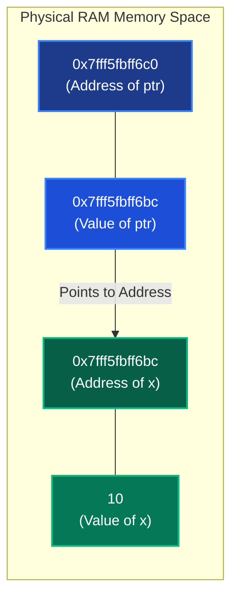
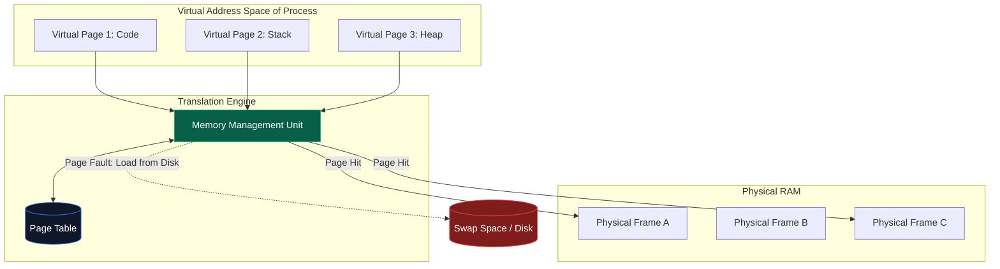
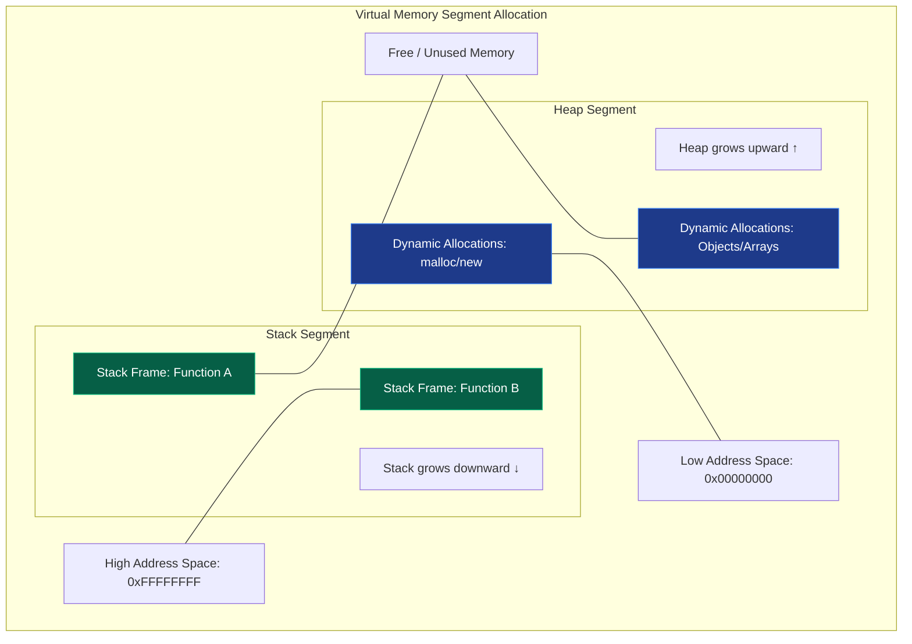
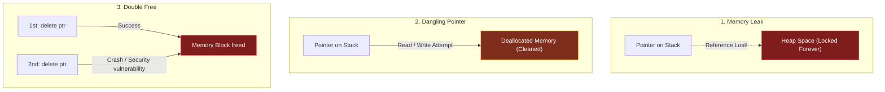
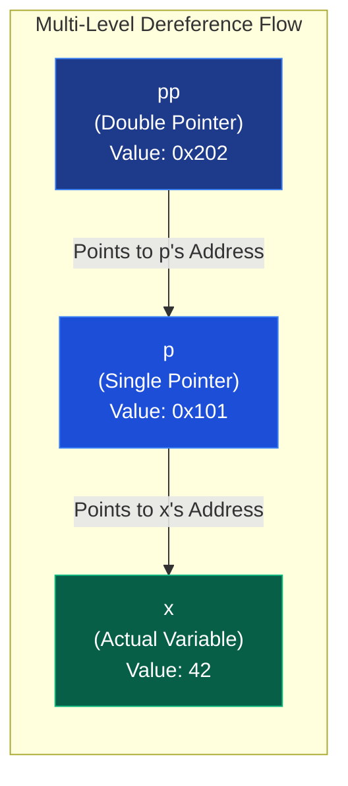
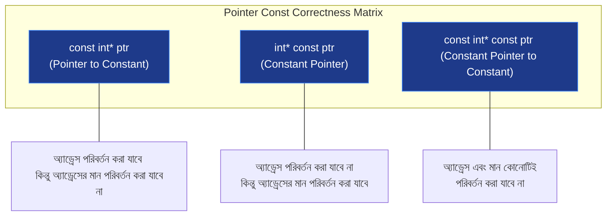
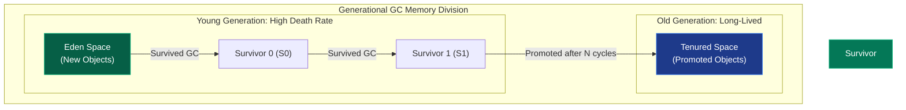

# High-Performance Memory Management Manual

মেমরি ম্যানেজমেন্ট (Memory Management) কেবল কোড লেখার প্রক্রিয়া নয়—এটি উচ্চ-ক্ষমতাসম্পন্ন (High-Performance), স্কেলেবল এবং মেমরি-নিরাপদ (Memory-Safe) ব্যাকএন্ড সিস্টেম ডিজাইন করার মূল ভিত্তি। C/C++-এর মতো সিস্টেমে মেমরি ম্যানুয়ালি কন্ট্রোল করা হয়, যেখানে Java, Go, Python এবং JavaScript-এর মতো আধুনিক ভাষায় রানটাইম (Garbage Collector) স্বয়ংক্রিয়ভাবে মেমরি রিলিজ করে। 

সিনিয়র আর্কিটেক্ট হিসেবে মেমরির প্রতিটি বাইট কীভাবে প্রসেসর, কার্নেল এবং ভার্চুয়াল মেমরি স্পেসে ম্যাপ হচ্ছে, তা জানা অত্যন্ত জরুরি। নিচে এর বিস্তারিত এবং ভিজ্যুয়াল উপস্থাপনা দেওয়া হলো।

---

## ১. Pointer & Memory Addressing Internals

### Core Idea
Pointer হলো এমন একটি বিশেষ ভেরিয়েবল যা কোনো ভ্যালু স্টোর না করে সরাসরি মেমরির ফিজিক্যাল বা ভার্চুয়াল অ্যাড্রেস (Address) স্টোর করে। `&` (Address-of) অপারেটর দিয়ে অ্যাড্রেস রিড করা হয় এবং `*` (Dereference) অপারেটর দিয়ে সেই অ্যাড্রেস ফলো করে তার ভেতরের ভ্যালু পড়া বা রাইট করা হয়।



### Senior Insight: Cache Locality & Pointer Chasing
প্রোডাকশন গ্রেড পারফরম্যান্সে ডেটা মেমরিতে কোথায় আছে তার চেয়েও গুরুত্বপূর্ণ হলো—ডেটা কত দ্রুত প্রসেসরে পৌঁছাচ্ছে। CPU যখন কোনো মেমরি অ্যাড্রেস রিড করে, সে কেবল একটি সিঙ্গেল বাইট আনে না, বরং পুরো **Cache Line (সাধারণত 64 Bytes)** একবারে L1/L2/L3 ক্যাশে নিয়ে আসে।
* **Pointer Chasing (ক্যাশে-অবান্ধব):** লিঙ্কড লিস্ট (`Linked List`) বা বাইনারি সার্চ ট্রি (`BST`) এ পয়েন্টার ব্যবহার করে লাফানোর সময় ডেটা মেমরিতে বিভিন্ন অবিন্যস্ত স্থানে থাকে। এর ফলে ঘন ঘন **CPU Cache Miss** ঘটে এবং প্রসেসরকে RAM থেকে ডেটা তুলতে হয়, যা প্রসেসিং গতিকে প্রায় ১০০০ গুণ ধীর করে দেয়।
* **Contiguous Memory (ক্যাশে-বান্ধব):** মেমরিতে পাশাপাশি থাকা অবজেক্ট (যেমন `Array` বা `Vector`) ক্যাশ লাইন ইউটিলাইজেশনের কারণে অত্যন্ত ফাস্ট এক্সিকিউট হয়।

### Common Mistakes & Production Pitfalls
* **Null Pointer Dereference:** রানটাইমে কোনো পয়েন্টার `nullptr` থাকা অবস্থায় তাকে ডিরেফারেন্স করা। এটি মুহূর্তের মধ্যে প্রসেসকে ক্র্যাশ করায় (`Segmentation Fault`)। সর্বদা এপিআই ইনপুটে বা মেমরি অ্যাক্সেসে ডিফেন্সিভ গার্ড ক্লজ যুক্ত করতে হবে।

### Interview Elevator Pitch (Senior Level)
> "পয়েন্টার কেবল একটি মেমরি অ্যাড্রেস হোল্ডার ভেরিয়েবল নয়; এটি সিস্টেম আর্কিটেকচারে পারফরম্যান্স টিউনিংয়ের অন্যতম বড় অস্ত্র। লিঙ্কড অবজেক্টগুলোতে পয়েন্টার চেজিং এড়িয়ে কন্টিগুয়াস অ্যারে ব্যবহার করলে CPU ক্যাশ হিট রেট নাটকীয়ভাবে বৃদ্ধি পায়, যা মেমরি লেটেন্সি কমিয়ে হাই-থ্রুপুট সিস্টেম তৈরি করতে সাহায্য করে।"

---

## ২. Virtual Memory & Process Memory Layout

### Core Idea
অপারেটিং সিস্টেম সরাসরি প্রসেসকে ফিজিক্যাল RAM অ্যাক্সেস করতে দেয় না। প্রতিটি প্রসেসকে একটি সম্পূর্ণ নিজস্ব **Virtual Address Space** দেওয়া হয়। CPU-এর ভেতরে থাকা হার্ডওয়্যার ডিভাইস **MMU (Memory Management Unit)** এবং অপারেটিং সিস্টেমের **Page Table** এই ভার্চুয়াল অ্যাড্রেসকে ফিজিক্যাল মেমরি অ্যাড্রেসে রিয়েল-টাইমে ট্রান্সলেট করে।



### Senior Insight: TLB & Page Faults
ভার্চুয়াল অ্যাড্রেস থেকে ফিজিক্যাল অ্যাড্রেস লুপআপ করার প্রক্রিয়াকে সুপারফাস্ট করার জন্য CPU-তে একটি বিশেষ ক্যাশে থাকে, যাকে **TLB (Translation Lookaside Buffer)** বলা হয়।
* **TLB Hit:** প্রসেসর সরাসরি TLB থেকে ফিজিক্যাল অ্যাড্রেস পেয়ে যায়।
* **TLB Miss / Page Fault:** যদি কাঙ্ক্ষিত মেমরি পেজটি RAM-এ লোড না থাকে (ডিঙ্ক বা সোয়াপ ফাইলে চলে যায়), তবে কার্নেল একটি **Page Fault** ট্রিগার করে। কার্নেল তখন ডিস্ক থেকে পেজটি এনে RAM-এ লোড করে এবং পেজ টেবিল আপডেট করে। এটি অত্যন্ত কস্টলি একটি অপারেশন (ডিস্ক I/O ইনভলভড)।

### Process Memory Layout Segment Table
একটি প্রসেস সাধারণত নিচে দেওয়া পাঁচটি সেগমেন্টে মেমরি বিন্যাস করে:

| Segment | Content Type | Permission | Description |
| :--- | :--- | :---: | :--- |
| **Kernel Space** | OS Kernel state, Drivers | Restricted | ইউজার অ্যাপ্লিকেশন সরাসরি এটি অ্যাক্সেস করতে পারে না। |
| **Stack** | local variables, Stack frames | Read/Write | Last-In-First-Out (LIFO) মেমরি, যা স্বয়ংক্রিয়ভাবে বৃদ্ধি ও হ্রাস পায়। |
| **Heap** | Dynamic allocations (`new`, `malloc`) | Read/Write | রানটাইমে প্রসেসের প্রয়োজনে গতিশীলভাবে অ্যাড্রেস স্পেস বৃদ্ধি করে। |
| **BSS Segment** | Uninitialized global / static variables | Read/Write | স্বয়ংক্রিয়ভাবে জিরো-ইনিশিয়ালাইজড হয়। |
| **Data Segment** | Initialized global / static variables | Read/Write | প্রোগ্রামের লাইফসাইকেল জুড়ে মেমরিতে স্ট্যাটিক্যাল থাকে। |
| **Code Segment** | Executable CPU instructions | Read-Only | প্রটেক্টেড রিড-অনলি সেগমেন্ট, যা কোড টেম্পারিং প্রতিরোধ করে। |

### Interview Elevator Pitch (Senior Level)
> "ভার্চুয়াল মেমরি প্রসেস লেভেলে আইসোলেশন ও মেমরি প্রটেকশন নিশ্চিত করে। প্রসেসর যখনই কোনো মেমরি রিকোয়েস্ট পাঠায়, MMU সেটি পেজ টেবিলের মাধ্যমে ম্যাপ করে। হাই-স্কেল সিস্টেমে মেমরি ফ্র্যাগমেন্টেশন বা অতিরিক্ত পেজ ফল্ট এড়াতে মেমরি পেজ সাইজ অপ্টিমাইজড রাখা এবং লার্জ-পেজ (HugePages) কনফিগার করা একটি স্ট্যান্ডার্ড আর্কিটেকচারাল প্র্যাকটিস।"

---

## ৩. Stack vs Heap Allocation Dynamics

### Core Idea
Stack এবং Heap হলো মেমরির দুটি অত্যন্ত গুরুত্বপূর্ণ সেগমেন্ট যা ভিন্ন ভিন্ন কাজের জন্য ডেটা হোল্ড করে। Stack ব্যবহৃত হয় থ্রেড-লোকাল এক্সিকিউশন ও লোকাল ভেরিয়েবলের জন্য, আর Heap ব্যবহৃত হয় গতিশীলভাবে তৈরি হওয়া বড় ডেটা বা অবজেক্ট সংরক্ষণের জন্য।



### Senior Insight: Allocation Costs
* **Stack Allocation (ফ্রি বললেই চলে):** স্ট্যাক অ্যালোকেশন করতে প্রসেসরকে কেবল **Stack Pointer Register (ESP/RSP)** এর ভ্যালু ডিক্রিমেন্ট (বা ইন্ট্রাকশন অনুযায়ী স্লাইড) করতে হয়। এটি মাত্র ১টি CPU সাইকেলে সম্পন্ন হয় এবং এর কোনো রানটাইম সার্চ ওভারহেড নেই।
* **Heap Allocation (কস্টলি ও জটিল):** হিপ মেমরি রিকোয়েস্ট করার সময় রানটাইম মেমরি অ্যালোকেটরকে (যেমন `ptmalloc`, `jemalloc`) হিপের ফ্রি মেমরি ব্লকে সার্চ করতে হয় (যেমন First-fit, Best-fit অ্যালগরিদম)। প্রয়োজনে অপারেটিং সিস্টেমের থেকে `brk` বা `mmap` সিস্টেম কল ট্রিগার করে মেমরি নিতে হয়। তাছাড়া, মাল্টি-থ্রেডেড ব্যাকএন্ড সিস্টেমে গ্লোবাল অ্যালোকেটরের লকের জন্য **Thread Contention** তৈরি হয়, যা পারফরম্যান্স কমিয়ে দেয়।

### Comparison Table

| Feature | Stack Segment | Heap Segment |
| :--- | :--- | :--- |
| **Allocation Mechanism** | Automatic by CPU instruction pointer | Manual (programmatic) or GC managed |
| **Speed** | Extremely fast (Single CPU cycle) | Comparatively slow (Search + System Calls) |
| **Thread Safety** | Safe (Each thread has its own stack) | Unsafe (Shared across all threads, requires locks) |
| **Common Error** | Stack Overflow (Deep recursion) | Memory Leaks, Out of Memory (OOM), Fragmentation |

### Interview Elevator Pitch (Senior Level)
> "স্ট্যাক অ্যালোকেশন মূলত থ্রেড-লোকাল এক্সিকিউশন বাউন্ড এবং ওয়ান-সাইকেল কস্ট সম্পন্ন মেমরি অপারেশন। অপরপক্ষে, হিপ অ্যালোকেশন মেমরি ওএস-কার্নেল লেভেলে সিস্টেম কল (`mmap`) এবং মেমরি অ্যালোকেটর সার্চ অ্যালগরিদম ট্রিগার করে। এ কারণেই হাই-পারফরম্যান্স সিস্টেমে অপ্রয়োজনীয় হিপ অ্যালোকেশন কমিয়ে স্ট্যাক মেমরি বা অবজেক্ট পুলে ডেটা রাখার পরামর্শ দেওয়া হয়।"

---

## ৪. Low-Level Memory Bugs (Leaks, Dangling, Double Free)

### Core Idea
ম্যানুয়াল মেমরি ম্যানেজমেন্টে (যেমন C/C++ এ) ডেভেলপারকে নিজে অ্যালোকেট করা মেমরি রিলিজ করতে হয়। মেমরি রিলিজ করার সময় অসতর্কতার কারণে মূলত তিনটি জটিল বাগ তৈরি হয়:
1. **Memory Leak:** হিপ মেমরি অ্যালোকেট করার পর তার পয়েন্টারটি হারিয়ে ফেলা বা মেমরি ফ্রি না করা। এর ফলে RAM ব্লকটি রিজার্ভডই থেকে যায়।
2. **Dangling Pointer:** মেমরি ডিলিট বা ফ্রি করে দেওয়ার পরেও পয়েন্টারটি ওই একই অ্যাড্রেস হোল্ড করে রাখা। পরে ওই পয়েন্টার দিয়ে মেমরি রিড/রাইট করার চেষ্টা করলে **Undefined Behavior** ঘটে।
3. **Double Free:** একই মেমরি অ্যাড্রেসকে ভুলবশত দুবার ডিলিট বা ফ্রি করার চেষ্টা করা। এটি হিপ করাপশন ঘটায় এবং হ্যাকারদের কোড এক্সিকিউশনের সুযোগ দেয়।



### Senior Insight: Ownership & RAII (Modern Mitigation)
আধুনিক ব্যাকএন্ড ইঞ্জিনিয়ারিংয়ে কাঁচা পয়েন্টার (`raw pointer`) এবং ম্যানুয়াল ডিলিট সম্পূর্ণ নিষিদ্ধ। এর পরিবর্তে দুটি স্ট্যান্ডার্ড আর্কিটেকচারাল প্যাটার্ন ব্যবহৃত হয়:
* **RAII (Resource Acquisition Is Initialization):** অবজেক্ট যখন স্কোপের বাইরে যাবে, তার ডেস্ট্রাক্টর (`destructor`) স্বয়ংক্রিয়ভাবে মেমরি রিলিজ করবে।
* **Smart Pointers (C++11+):** 
  * `std::unique_ptr`: মেমরির সিঙ্গেল ওনারশিপ নিশ্চিত করে। অবজেক্ট রিলিজ হলে পয়েন্টার স্বয়ংক্রিয়ভাবে ফ্রি হয়।
  * `std::shared_ptr`: রেফারেন্স কাউন্টিং (`Reference Counting`) ব্যবহার করে মাল্টিপল ওনারশিপ হ্যান্ডেল করে।
* **Rust-এর Borrow Checker:** রাস্ট কোনো রানটাইম ওভারহেড (বা GC) ছাড়াই কম্পাইল-টাইম মেমরি ওনারশিপ রুলস প্রয়োগ করে ড্যাঙ্গলিং পয়েন্টার ও ডাবল ফ্রি চিরতরে নির্মূল করে।

### Interview Elevator Pitch (Senior Level)
> "ম্যানুয়াল মেমরি লিক এবং হিপ করাপশন প্রতিরোধে আমরা প্রোডাকশন কোডে সম্পূর্ণভাবে RAII এবং স্মার্ট পয়েন্টার (যেমন `unique_ptr`) ব্যবহার করি। লার্জ স্কেল অ্যাপ্লিকেশনে কোনো মেমরি লিক বা মেমরি বাগ আছে কিনা তা ট্র্যাক করার জন্য সিআই/সিডি পাইপলাইনে **AddressSanitizer (ASan)** অথবা **Valgrind** ইন্টিগ্রেট করা একটি স্ট্যান্ডার্ড সিকিউরিটি বেস্ট প্র্যাকটিস।"

---

## ৫. Double Pointers & Multi-Level Addressing

### Core Idea
Double Pointer (বা Pointer-to-Pointer) হলো এমন একটি পয়েন্টার যা আরেকটি পয়েন্টার ভেরিয়েবলের মেমরি অ্যাড্রেস স্টোর করে। এটি প্রোগ্রামে `**` সিনট্যাক্স দিয়ে প্রকাশ করা হয়। এটি মূলত ডাইনামিক মাল্টি-ডাইমেনশনাল স্ট্রাকচার তৈরি করতে এবং ফাংশনের ভেতর থেকে মেইন পয়েন্টারকে রি-অ্যালোকেট করতে ব্যবহৃত হয়।



### Senior Insight: Contiguous 1D Array Flattening
ম্যাট্রিক্স বা 2D অ্যারে ডিক্লেয়ার করার জন্য ডেভেলপাররা প্রায়শই ডাবল পয়েন্টার বা পয়েন্টার-অফ-পয়েন্টার্স (`int** arr`) ব্যবহার করে মেমরি অ্যালোকেট করেন। এটি প্রডাকশনে চরম ক্ষতিকর কারণ প্রতিটি র-এর অ্যাড্রেস হিপের ভিন্ন ভিন্ন স্থানে ছিটকে থাকে।
* **Contiguous 1D Array Flattening (Cache friendly):** হাই-পারফরম্যান্স ব্যাকএন্ড কার্নেল বা ডেটা সায়েন্স পাইপলাইনে আমরা ডাবল পয়েন্টার এড়িয়ে মেমরিকে একটি মাত্র সিঙ্গেল কন্টিগুয়াস ব্লক হিসেবে অ্যালোকেট করি। ২D স্থানাঙ্ক অ্যাক্সেস করার জন্য একটি সিম্পল ম্যাথমেটিক্যাল ফর্মুলা ব্যবহার করা হয়:
  $$\text{Index} = \text{Row} \times \text{Cols} + \text{Col}$$
  এটি CPU ক্যাশ লাইনকে ১০০% ইউটিলাইজ করে অ্যাপ্লিকেশনের এক্সিকিউশন স্পিড বহুগুণ বাড়িয়ে দেয়।

### Code Example: Function Pointer Reallocation

```cpp
#include <iostream>
using namespace std;

// Double pointer allows modifying the original pointer inside main
void allocateMemory(int** ptr) {
    *ptr = new int(100); // Modifying the pointer passed by address
}

int main() {
    int* myPtr = nullptr;
    allocateMemory(&myPtr); // Passing the address of pointer
    
    cout << "Value allocated: " << *myPtr << endl; // 100
    
    delete myPtr;
    myPtr = nullptr;
    return 0;
}
```

### Interview Elevator Pitch (Senior Level)
> "ডাবল পয়েন্টার আমাদের রানটাইমে মাল্টি-লেভেল অ্যাড্রেসিং এবং ফাংশন প্যারামিটার দিয়ে মেইন মেমরি ওনারশিপ ট্রান্সফারের সুযোগ দেয়। তবে, পারফরম্যান্সের স্বার্থে হাই-স্কেল সিস্টেমে ২D পয়েন্টার অ্যারে এড়িয়ে সিঙ্গেল কন্টিগুয়াস মেমরি ব্লককে ফ্ল্যাটেন করে ১D ফরমেটে ব্যবহার করা ক্যাশ লোকালিটির জন্য অত্যন্ত গুরুত্বপূর্ণ বেস্ট প্র্যাকটিস।"

---

## ৬. Const Correctness with Pointers

### Core Idea
পয়েন্টারের সাথে `const` কীওয়ার্ডের ব্যবহারের পজিশন পরিবর্তন মেমরি ইমিউটেবিলিটির (Immutability) ভিন্ন ভিন্ন অর্থ বহন করে। এটি কম্পাইল-টাইমে কোনো ভেরিয়েবল বা মেমরি অ্যাড্রেস ভুলবশত পরিবর্তন করা প্রতিরোধ করতে ব্যবহৃত হয়।

### The Three Const Rules



### Summary Reference Table

| Syntax | Pointer address can change? | Value at address can change? | Description |
| :--- | :---: | :---: | :--- |
| `const int* p` | **Yes** | **No** | **Pointer to Constant:** আমরা রিড-অনলি ডেটা রিড করার জন্য এটি স্ট্যান্ডার্ড প্র্যাকটিস হিসেবে ব্যবহার করি। |
| `int* const p` | **No** | **Yes** | **Constant Pointer:** পয়েন্টারটি আজীবন নির্দিষ্ট মেমরি অ্যাড্রেসেই লকড থাকবে। |
| `const int* const p`| **No** | **No** | **Constant Pointer to Constant:** সম্পূর্ণ ইমিউটেবল রিড-অনলি লকড পয়েন্টার। |

### Senior Insight: API Design Contract & Optimization
প্রোডাকশন কোড বেসে **Const Correctness** বজায় রাখলে দুটি বড় সুবিধা পাওয়া যায়:
1. **Defensive API Contract:** কোনো রেফারেন্স বা পয়েন্টার পাস করার সময় যদি আমরা ভ্যালু প্রটেক্ট করতে চাই, তবে এপিআই সিগনেচারে `const int*` বা `const string&` ব্যবহার করা একটি অলঙ্ঘনীয় চুক্তি।
2. **Compiler Optimization:** কম্পাইলার যখন নিশ্চিত হয় যে কোনো পয়েন্টারের ভ্যালু বা অ্যাড্রেস পরিবর্তিত হবে না, তখন সে মেমরি থেকে বারবার রিড না করে সরাসরি CPU রেজিস্টারে ভ্যালুটি ক্যাশ করে এক্সিকিউশন অপ্টিমাইজ করতে পারে।

---

## ৭. Modern Garbage Collection Internals

### Core Idea
Java (JVM), Go Runtime, JavaScript (V8 Engine) এবং Python-এর মতো ভাষাগুলোতে মেমরি ক্লিনআপের প্রক্রিয়াটি স্বয়ংক্রিয়। রানটাইম ব্যাকগ্রাউন্ডে একটি মেমরি ট্র্যাকার চালায়, যা হিপের আন-রিচেবল (Unreachable) বা ডেড অবজেক্টগুলো খুঁজে বের করে মেমরি রিলিজ করে।



### Senior Insight: Zero-Allocation Programming & Escape Analysis
অটোমেটিক গার্বেজ কালেকশন অত্যন্ত সুবিধাজনক হলেও এটি ব্যাকএন্ড লেটেন্সির প্রধান শত্রু। জিসি (GC) যখন কাজ শুরু করে, তখন সে প্রসেসের সব রানিং থ্রেডকে সাময়িক সময়ের জন্য ব্লক করে দেয়, যাকে **Stop-The-World (STW) Pause** বলা হয়।
* **Escape Analysis (এস্কেপ অ্যানালাইসিস):** কম্পাইলার কোড অ্যানালাইসিস করে সিদ্ধান্ত নেয় কোনো অবজেক্ট লোকাল স্ট্যাকে থাকবে নাকি হিপে এস্কেপ করবে। অবজেক্ট যদি ফাংশনের বাইরে না যায়, তবে সেটিকে স্ট্যাকে রাখা অত্যন্ত লাভজনক (ফাংশন শেষে স্বয়ংক্রিয় ফ্রি, জিসির ওপর চাপ পড়ে না)।
* **Object Pooling (`sync.Pool` in Go):** হাই-স্কেল সিস্টেমে বারবার নতুন মেমরি অ্যালোকেট ও ফ্রি করে জিসি ট্রিগার করার পরিবর্তে আমরা **Object Pool** ব্যবহার করে অবজেক্ট বারবার রিইউজ করি। এটি গার্বেজ কালেকশন ওভারহেডকে শূন্যের কোঠায় নামিয়ে আনে।

### Interview Elevator Pitch (Senior Level)
> "গার্বেজ কালেক্টর মেমরি সেফটি দিলেও হাই-কনকারেন্ট রিয়েল-টাইম সিস্টেমে STW পজের কারণে এটি লেটেন্সি স্পাইক তৈরি করতে পারে। এ কারণেই সিনিয়র ব্যাকএন্ড ডিজাইনে আমরা **Escape Analysis** অপ্টিমাইজ করি এবং ঘন ঘন অ্যালোকেশন এড়াতে **Object Pools** ব্যবহার করি। এটি রানটাইমে মেমরি রিক্লেমেশনের চাপ কমিয়ে লেটেন্সি স্ল্যাশ করে।"

---

## ৮. Memory Management Best Practices

1. **Prefer Smart Over Raw Pointers:** আধুনিক C++ কোডে কখনোই ম্যানুয়াল `new`/`delete` ব্যবহার করবেন না। সর্বদা ওনারশিপ টাইপ অনুযায়ী `std::unique_ptr` অথবা `std::shared_ptr` ব্যবহার করুন।
2. **Minimize Heap Allocations:** অবজেক্টের লাইফটাইম লোকাল স্কোপে সীমাবদ্ধ থাকলে সরাসরি স্ট্যাকে মেমরি রাখুন। অতিরিক্ত হিপ মেমরি রিকোয়েস্ট এড়িয়ে চলুন।
3. **Use Object Pools for Hot Paths:** এপিআই-এর যে অংশে প্রতি সেকেন্ডে হাজার হাজার অবজেক্ট তৈরি হচ্ছে (যেমন JSON পার্সিং বা ডিবি রেজাল্ট রিসিভার), সেখানে অবজেক্ট পুনর্ব্যবহার করার জন্য অবজেক্ট পুলিং প্যাটার্ন ব্যবহার করুন।
4. **Enforce Const Correctness:** মেথড বা ফাংশন সিগনেচারে রিড-অনলি প্যারামিটারগুলো ডিফেন্সিভলি `const` হিসেবে ডিক্লেয়ার করুন। এটি কোড সেফটি এবং কম্পাইলার অপ্টিমাইজেশন উভয়কে ত্বরান্বিত করে।
5. **Continuous Profiling:** প্রডাকশনে ও কার্নেল লেভেলে মেমরি প্রোফাইলিং টুলস (যেমন **Go pprof, Valgrind, Memory Profilers**) ইন্টিগ্রেট করুন, যাতে আর্লি মেমরি লিক এবং OOM কিলিং ডায়াগনসিস করা যায়।
