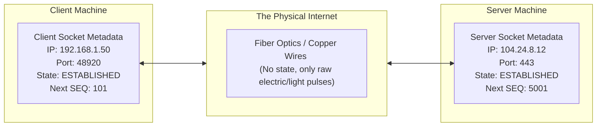
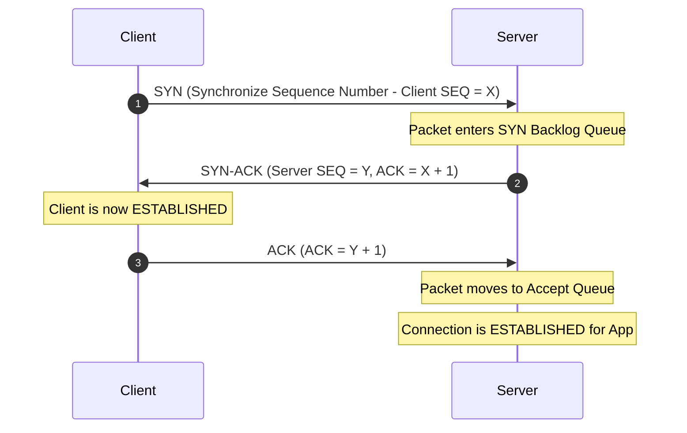
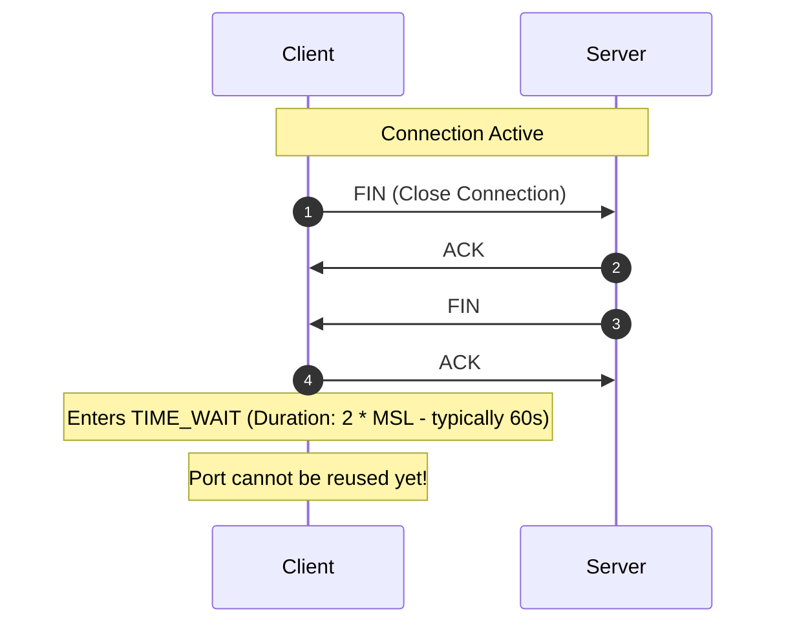
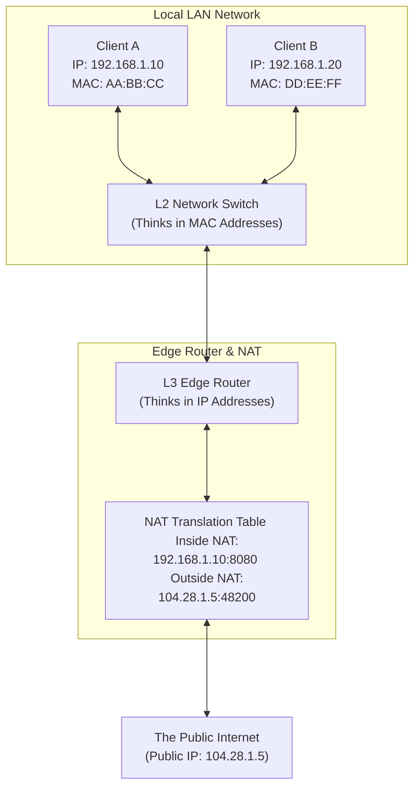
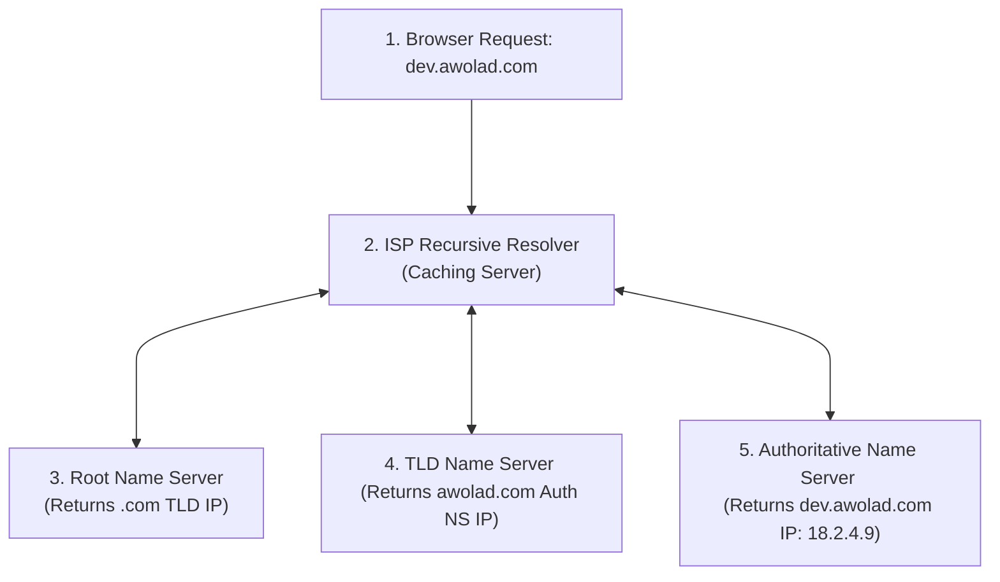
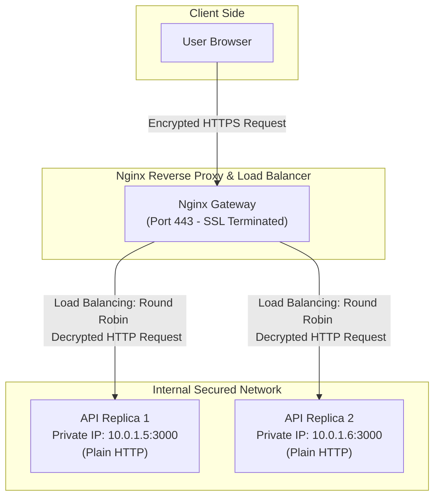
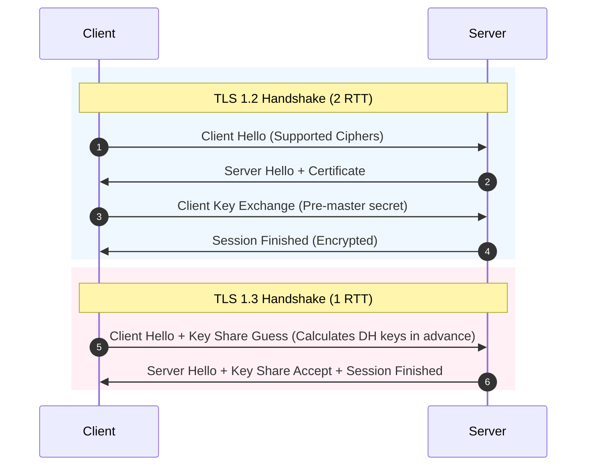
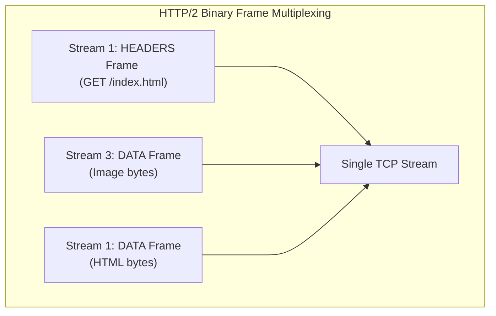

# The Ultimate Web & Systems Networking Handbook: An Engineer's Deep-Dive
*(ওয়েব ও সিস্টেম নেটওয়ার্কিং হ্যান্ডবুক: কার্নেল ও প্রোটোকল স্তরের গভীর বিশ্লেষণ)*

অধিকাংশ ডেভেলপার নেটওয়ার্কিংকে কেবল কিছু ক্যাবল, আইপি অ্যাড্রেস আর ক্লাউডের কানেকশন পাইপ মনে করেন। কিন্তু বাস্তব জীবনের হাই-পারফরম্যান্স এপিআই ডিজাইন, মাইক্রোসার্ভিস আর্কিটেকচার এবং লো-ল্যাটেন্সি ক্লাউড সিস্টেম বুঝতে হলে আমাদের লিনাক্স কার্নেল, সকেট ফাইল ডেসক্রিপ্টর এবং প্রোটোকলের গভীর মেকানিক্স জানা অপরিহার্য। 

এই হ্যান্ডবুকে আমরা কম্পিউটার নেটওয়ার্কিংয়ের এমন সব গভীরে প্রবেশ করব যা আপনার নেটওয়ার্ক সম্পর্কে চিন্তার ধরন চিরতরে বদলে দেবে।

---

## ১. সকেট ও কানেকশনের আসল অর্থ কী? (The Socket & Connection Paradigm Shift)

নেটওয়ার্কিংয়ে ঢোকার আগে সবচেয়ে বড় যে ভুল ধারণাটি ভাঙা দরকার, তা হলো: **"নেটওয়ার্ক কানেকশন কোনো ফিজিক্যাল পাইপ বা তারের টানেল নয়।"**



### তাহলে কানেকশন কী?
একটি নেটওয়ার্ক কানেকশন (যেমন TCP Connection) হলো স্রেফ **দুটি কম্পিউটারের র‍্যামের (RAM) ভেতরে কার্নেল দ্বারা সংরক্ষিত কিছু মেটাডাটা বা স্টেট (State) এর চুক্তি!**
* যখন ক্লায়েন্ট ও সার্ভার কানেক্টেড বলে, তার মানে হলো ক্লায়েন্টের কার্নেল মেমরিতে একটি রেকর্ড আছে এবং সার্ভারের কার্নেল মেমরিতে একটি রেকর্ড আছে।
* এই রেকর্ডের মধ্যে থাকে: **Source IP, Source Port, Destination IP, Destination Port, এবং Sequence Numbers (TCP Window State)**। 
* এর বাইরে ইন্টারনেটের তার বা ফাইবার অপটিক্সের কোনো ধারণা নেই যে আপনার কানেকশনটি কী। তারা কেবল আলোর ফ্ল্যাশ বা ইলেকট্রিকাল পালস ছুড়ে দেয়। কার্নেল যখন সেই প্যাকেটটি রিসিভ করে, সে তার মেমরির টেবিলটি দেখে সিদ্ধান্ত নেয় প্যাকেটটি কোন সকেটে যাবে।

### সকেট (Socket) আসলে কী?
একটি সকেট হলো লিনাক্স ওএসের একটি **ফাইল ডেসক্রিপ্টর (File Descriptor - FD)**। লিনাক্সের দর্শন হলো *Everything is a file*। কার্নেল আপনার অ্যাপ্লিকেশনের কাছে নেটওয়ার্ক সকেটকে একটি ফাইলের মতো প্রেজেন্ট করে। আপনি ফাইলে যেভাবে `write()` করেন, সকেটেও সেভাবে `write()` করেন। কার্নেল ব্যাকগ্রাউন্ডে সেই ডাটাকে ছোট ছোট টুকরো করে টিসিপি হেডারে মুড়ে নেটওয়ার্ক কার্ডের (NIC) মাধ্যমে ইলেকট্রিকাল সিগন্যালে রূপান্তর করে পাঠিয়ে দেয়।

---

## ২. OSI Model বনাম TCP/IP Stack: অ্যাকাডেমিক থিওরি বনাম বাস্তব জগৎ (OSI vs TCP/IP)

ইউনিভার্সিটির টেক্সটবুকে আমরা সবাই ৭ স্তরের **OSI (Open Systems Interconnection) Model** পড়েছি। কিন্তু বাস্তব জীবনের রিয়েল-ওয়ার্ল্ড ইন্টারনেট চলে ৪ স্তরের **TCP/IP Stack**-এর ওপর।

| Layer No. | OSI Model (অ্যাকাডেমিক) | TCP/IP Stack (বাস্তব জগৎ) | প্রধান প্রোটোকল ও ডেটা ফরম্যাট | কাজের ক্ষেত্র |
| :--- | :--- | :--- | :--- | :--- |
| **Layer 7, 6, 5** | Application, Presentation, Session | **Application Layer** | HTTP, gRPC, DNS, SMTP, TLS (JSON, Protobuf) | অ্যাপ্লিকেশন ডেভেলপার (Node, Go, Python) |
| **Layer 4** | Transport | **Transport Layer** | TCP, UDP (Segment / Datagram) | কার্নেল সকেট, ল্যাটেন্সি, ফ্লো কন্ট্রোল |
| **Layer 3** | Network | **Internet Layer** | IP (IPv4, IPv6), ICMP (Packets) | রাউটার, আইপি রাউটিং, NAT |
| **Layer 2, 1** | Data Link, Physical | **Network Access Layer** | Ethernet, Wi-Fi, ARP (Frames / Bits) | সুইচ, ফাইবার ক্যাবল, এনআইসি কার্ড |

### কেন ৭ স্তরের OSI মডেল বাস্তবে ব্যবহৃত হয় না?
বাস্তবে OSI মডেলের লেয়ার ৫ (Session) এবং লেয়ার ৬ (Presentation) এর আলাদা কোনো ফিজিক্যাল অস্তিত্ব নেই। ডেটা এনক্রিপশন (TLS) বা কম্প্রেশন (Presentation) এবং সেশন ট্র্যাকিং (Session)—এই সবকিছু আধুনিক অ্যাপ্লিকেশন লেয়ারের (যেমন HTTP/2 বা TLS লাইব্রেরি) ভেতরেই বিল্ট-ইন সফটওয়্যার হিসেবে হ্যান্ডেল করা হয়। তাই কম্পিউটার সায়েন্টিস্টরা প্রাগম্যাটিক ডিজাইনের জন্য TCP/IP ৩টি লেয়ারকে মার্জ করে সরাসরি **Application Layer** তৈরি করেছেন।

---

## ৩. TCP-এর গভীর কার্নেল মেকানিক্স (Deep Dive TCP Mechanics)

TCP (Transmission Control Protocol) হলো ইন্টারনেটের প্রধান ভিত্তি। এটি একটি **Connection-Oriented, Reliable, Byte-stream** প্রোটোকল। এর পেছনের জটিল মেকানিক্সগুলো নিচে দেওয়া হলো:

### ক. TCP Three-Way Handshake ও কার্নেলের অন্তরাল
যখন কোনো ক্লায়েন্ট সার্ভারের সাথে কানেক্ট হতে চায়, কার্নেল লেভেলে ৩টি স্টেপ ঘটে:



#### ১. SYN Backlog বনাম Accept Queue (ইন্টারভিউয়ের জন্য ভেরি ইম্পর্টেন্ট)
সার্ভারের কার্নেলে দুটি গুরুত্বপূর্ণ কিউ (Queue) বা লাইন থাকে:
* **SYN Backlog (Incomplete Connection Queue):** ক্লায়েন্ট যখন প্রথমবার `SYN` প্যাকেট পাঠায়, কার্নেল সেটি এই কিউতে রাখে এবং `SYN-ACK` পাঠিয়ে দেয়। কানেকশনটি এখনও হাফ-ওপেন (Half-Open)।
* **Accept Queue (Complete Connection Queue):** ক্লায়েন্ট যখন ফাইনাল `ACK` পাঠায়, কার্নেল কানেকশনটিকে SYN Backlog থেকে সরিয়ে **Accept Queue**-তে নিয়ে যায়। এরপর আপনার অ্যাপ্লিকেশন যখন `accept()` সিস্টেম কল রান করে, কার্নেল তাকে এই কিউ থেকে সকেট ফাইল ডেসক্রিপ্টরটি হ্যান্ডওভার করে।

#### ২. SYN Flood Attack ও TCP Syncookies
হ্যাকার যদি কোনো ফেক আইপি থেকে অবিরত হাজার হাজার `SYN` প্যাকেট পাঠাতে থাকে এবং ফাইনাল `ACK` না পাঠায়, তবে সার্ভারের **SYN Backlog Queue** টি নিমেষেই ফুল হয়ে যাবে। এর ফলে রিয়েল ইউজাররা আর কানেক্ট হতে পারবে না। একে **SYN Flood (DDoS)** অ্যাটাক বলে।
* **প্রতিরোধ (TCP Syncookies):** কার্নেলে `net.ipv4.tcp_syncookies = 1` সচল থাকলে, SYN Backlog ফুল হওয়া মাত্র কার্নেল মেমরিতে কোনো স্টেট সেভ না করে সিক্রেট ক্রিপ্টোগ্রাফিক হ্যাশ ব্যবহার করে একটি স্পেশাল `Sequence Number` জেনারেট করে ক্লায়েন্টকে `SYN-ACK` পাঠায়। ক্লায়েন্ট যখন রিয়েল `ACK` রিটার্ন করে, কার্নেল সেই সিক্রেটটি ডিক্রিপ্ট করে কুইকলি কানেকশন তৈরি করে ফেলে। এটি মেমরি এক্সহস্ট হওয়া প্রতিরোধ করে।

---

### খ. TCP Congestion Control: BBR বনাম CUBIC (উইন্ডো অপ্টিমাইজেশন)
ইন্টারনেটে ডাটা পাঠানোর গতি কিভাবে নির্ধারিত হয়? TCP সরাসরি ফুল স্পিডে ডাটা ছুঁড়ে দেয় না। সে প্রথমে অল্প ডাটা পাঠায়, যদি সাকসেসফুলি রিসিভ হয়, তবে সে ডাটার পরিমাণ দ্বিগুণ করতে থাকে। একে **Congestion Window (cwnd)** বলে।

```mermaid
flowchart TD
    subgraph LossBased [Traditional Congestion Control - CUBIC]
        direction TB
        C1["Send Packets Fast"] --->|Wait until packet drops| C2["Packet Dropped!"]
        C2 --->|Cut transmission speed by 50%| C3["Latency Spikes & Slowdown"]
    end
    
    subgraph BandwidthBased [Modern Congestion Control - BBR]
        direction TB
        B1["Measure RTT & Bandwidth continuously"] --->|Find maximum capacity bottleneck| B2["Adjust speed to match capacity exactly"]
        B2 --->|No unnecessary queue queuing| B3["Zero packet drops & Ultra-low Latency"]
    end
end
```

#### ১. Loss-Based Congestion Control (CUBIC/Reno)
ঐতিহ্যগতভাবে লিনাক্সের ডিফল্ট অ্যালগরিদম (CUBIC) কাজ করে প্যাকেট ড্রপের ওপর ভিত্তি করে। সে ততক্ষণ পর্যন্ত স্পিড বাড়ায় যতক্ষণ না রাউটার ওভারফ্লো হয়ে প্যাকেট হারানো শুরু করে। প্যাকেট ড্রপ হওয়া মাত্র সে তার স্পিড হুট করে ৫০% কমিয়ে দেয়। এর ফলে ইন্টারনেটে ল্যাটেন্সি স্পাইক দেখা যায়।

#### ২. Bandwidth-Based Congestion Control (Google BBR)
২০১৬ সালে গুগল তৈরি করে **BBR (Bottleneck Bandwidth and RTT)** অ্যালগরিদম। BBR প্যাকেট ড্রপের জন্য অপেক্ষা করে না। সে অবিরত কানেকশনের **Round Trip Time (RTT)** এবং বোতলনেক ব্যান্ডউইথ পরিমাপ করে। সে হিসাব করে দেখে ইন্টারনেটের পাইপটির সর্বোচ্চ ধারণ ক্ষমতা কত এবং ঠিক সেই স্পিডে ডাটা পাঠায় যাতে কোনো রাউটারে বাফার ওভারফ্লো না হয়।
* **ফলাফল:** BBR সচল করলে হাই-লস নেটওয়ার্কের স্পিড প্রায় ১০ থেকে ১০০ গুণ পর্যন্ত বেড়ে যেতে পারে।

---

### গ. TCP-এর কুখ্যাত TIME_WAIT ও পোর্ট ডেডলক
আপনার হাই-ট্রাফিক সার্ভারে হঠাৎ `Address already in use` অথবা `Cannot assign requested address` এরর দিয়ে নতুন কানেকশন রিজেক্ট হওয়া শুরু করেছে। এর পেছনের খলনায়ক হলো **TIME_WAIT**।



#### কেন TIME_WAIT প্রয়োজন?
যখন কোনো অ্যাপ্লিকেশন কানেকশন ক্লোজ করে, তখন ওএসের কার্নেল সকেটটিকে সাথে সাথে ডিলিট না করে **TIME_WAIT** স্টেট-এ রেখে দেয় (ডিফল্ট ৬০ সেকেন্ড)। 
* **কারণ ১:** ইন্টারনেটের রাউটারে আটকে থাকা কোনো পুরানো ডুপ্লিকেট প্যাকেট যদি দেরিতে সার্ভারে এসে পৌঁছায়, তবে সাথে সাথে পোর্টটি রিইউজ করলে সেই পুরানো প্যাকেট নতুন কানেকশনের ভেতরে ঢুকে ডাটা করাপ্ট করে দিতে পারে।
* **কারণ ২:** ফাইনাল `ACK` যেন সার্ভারে সঠিকভাবে পৌঁছায় তা নিশ্চিত করা।

#### হাই-ট্রাফিক এপিআই সার্ভারে এর সমাধান:
১. **`SO_REUSEADDR` সকেট অপশন:** আপনার ব্যাকএন্ড কোডে সকেট বাইন্ড করার সময় `SO_REUSEADDR` সচল করুন। এটি কার্নেলকে বলে সকেটটি TIME_WAIT স্টেটে থাকলেও তার পোর্টটি নতুন কানেকশনের জন্য রিইউজ করতে দিতে।
   * *Node.js বা Go-এর HTTP লাইব্রেরিতে এটি বিল্ট-ইন সচল থাকে।*
২. **কার্নেল টিউনিং:** লিনাক্সে TIME_WAIT কুইক রিসাইকেল করার জন্য কনফিগারেশন চেঞ্জ করুন:
   ```bash
   sysctl -w net.ipv4.tcp_tw_reuse=1
   ```

---

## ৪. UDP: স্পিড কিং এবং HTTP/3-এর আসল ভিত্তি (UDP & QUIC Revolution)

UDP (User Datagram Protocol) হলো একটি **Connectionless, Unreliable** প্রোটোকল। এতে কোনো হ্যান্ডশেক নেই, কোনো সিকোয়েন্স নম্বর নেই, কোনো ডাটা রি-ট্রান্সমিশন নেই। আপনি ডাটা পাঠাবেন, ওপাশে রিসিভ হলো কি না তা জানার কোনো উপায় UDP-এর নেই।

### কেন UDP আধুনিক ইন্টারনেটের ভবিষ্যৎ (HTTP/3 ও QUIC)?
বহু বছর ধরে আমরা HTTP/1.1 ও HTTP/2 চালিয়েছি TCP-এর ওপর। কিন্তু TCP-এর একটি মারাত্মক সমস্যা আছে, যার নাম **Head-of-Line (HoL) Blocking**।
* **Head-of-Line Blocking কী?** HTTP/2-তে আমরা একটি মাত্র TCP কানেকশনের ভেতর দিয়ে মাল্টিপ্লেক্সিং করে একসাথে অনেকগুলো ফাইল (CSS, JS, Images) পাঠাই। কিন্তু ইন্টারনেটের কোনো রাউটারে যদি ওই TCP কানেকশনের একটি সিঙ্গেল প্যাকেট ড্রপ খায়, তবে কার্নেল পরবর্তী সব প্যাকেট হোল্ড করে রাখে যতক্ষণ না ড্রপ খাওয়া প্যাকেটটি আবার রি-ট্রান্সমিট হয়ে সার্ভারে পৌঁছায়। ফলে একটি ছোট ইমেজের প্যাকেট ড্রপের জন্য পুরো ওয়েবসাইটের রেন্ডারিং আটকে যায়।

```mermaid
flowchart TD
    subgraph TCPBlocking [HTTP/2 over TCP - Head-of-Line Blocking]
        direction LR
        P1["Packet 1 (JS)"] ---> P2["Packet 2 (CSS - DROPPED)"] ---> P3["Packet 3 (HTML)"]
        Note over P3: Blocked! Must wait for Packet 2 to be retransmitted
    end
    
    subgraph UDPStreaming [HTTP/3 over UDP/QUIC - Stream Independence]
        direction LR
        U1["Stream A - Packet 1"] ---> U2["Stream B - Packet 2 (DROPPED)"] ---> U3["Stream C - Packet 3"]
        Note over U3: Not Blocked! Stream A & C render instantly while Stream B retries
    end
end
```

### HTTP/3 ও QUIC প্রোটোকলের সমাধান:
গুগল দেখল TCP প্রোটোকলটি কার্নেলের ভেতরে হার্ডকোডেড থাকে, তাই এটি সহজে চেঞ্জ করা সম্ভব নয়। তারা সম্পূর্ণ নতুন একটি প্রোটোকল ডিজাইন করল যার নাম **QUIC (Quick UDP Internet Connections)** এবং এটি রান করে **UDP**-এর ওপর ভিত্তি করে।
1. **কানেকশন ড্রিফট নিরসন:** QUIC কানেকশন আইডেন্টিফাই করার জন্য আইপি ব্যবহার না করে একটি ইউনিক **Connection ID (CID)** ব্যবহার করে। ফলে আপনি যদি অফিস থেকে বের হয়ে ওয়াইফাই থেকে মোবাইলের ফোরজি (4G) নেটওয়ার্কে সুইচ করেন, আপনার আইপি চেঞ্জ হলেও কানেকশন ড্রপ হবে না এবং জুম কল বা ফাইল ডাউনলোড একটুও না থমকে চালু থাকবে!
2. **জিরো আরটিটি হ্যান্ডশেক (0-RTT):** QUIC প্রথম হ্যান্ডশেক করার সময় ক্রিপ্টোগ্রাফিক কি মেমরিতে সেভ করে রাখে। পরবর্তীতে কানেক্ট করার সময় কোনো হ্যান্ডশেক ছাড়াই প্রথম প্যাকেটেই এপিআই রিকোয়েস্ট পাঠিয়ে দেওয়া যায়।

---

## ৫. রাউটার, সুইচ এবং NAT-এর অন্তরাল (Router, Switch & NAT Mechanics)

আমরা অনেকেই রাউটার আর সুইচের কাজের পার্থক্য গুলিয়ে ফেলি। আসুন খুব সহজ উপায়ে এদের আসল মেকানিক্স বুঝে নিই।



### সুইচ (L2 Switch) বনাম রাউটার (L3 Router)

#### ১. লেয়ার ২ সুইচ (L2 Switch):
সুইচ আইপি অ্যাড্রেস চেনে না। সে কাজ করে **MAC Address** নিয়ে। আপনার অফিসের লোকাল নেটওয়ার্কে ডেটা এক পিসি থেকে অন্য পিসিতে পাঠাতে সুইচ ব্যবহার করা হয়। সুইচ তার র্যামে একটি **MAC Table** মেইনটেইন করে। যখন কম্পিউটার A কম্পিউটার B-কে ডাটা পাঠাতে চায়, সে প্রথমে **ARP (Address Resolution Protocol)** ব্রডকাস্ট করে B-এর ম্যাক অ্যাড্রেসটি জেনে নেয়, তারপর সুইচ সরাসরি পোর্ট টু পোর্ট ডেটা পাঠিয়ে দেয়।

#### ২. লেয়ার ৩ রাউটার (L3 Router):
রাউটার হলো নেটওয়ার্কের গেটওয়ে। সে কাজ করে **IP Address** নিয়ে। আপনার লোকাল ল্যান (LAN) নেটওয়ার্কের বাইরে যখন আপনি ইন্টারনেট বা অন্য কোনো নেটওয়ার্কে রিকোয়েস্ট পাঠান, সুইচ সেটি রাউটারের কাছে হ্যান্ডওভার করে। রাউটার তার **Routing Table** দেখে সিদ্ধান্ত নেয় এই প্যাকেটটি পরবর্তী কোন রাউটারে পাঠালে সবচেয়ে দ্রুত গন্তব্যে পৌঁছাবে।

---

### NAT (Network Address Translation): কিভাবে আইপির অভাব দূর হয়?
সারা বিশ্বে বিলিয়ন বিলিয়ন ডিভাইস কিন্তু IPv4 আইপি অ্যাড্রেসের সংখ্যা মাত্র ৪.২ বিলিয়ন। আপনার বাসার ব্রডব্যান্ড লাইনে বা অফিসের ১০০টি কম্পিউটারের প্রতিটির কি আলাদা পাবলিক আইপি আছে? না!
* **NAT-এর কাজ:** আপনার অফিসের সব ডিভাইসের লোকাল আইপি থাকে (যেমন `192.168.1.X`) যা ইন্টারনেটে ইনভ্যালিড। আপনার মেইন রাউটারটির একটিমাত্র পাবলিক আইপি থাকে (যেমন `104.28.1.5`)।
* जेव्हा `192.168.1.10` ব্রাউজারে `google.com` ওপেন করে, রাউটার NAT মেকানিজম ব্যবহার করে প্যাকেটের ভেতরের প্রাইভেট আইপি মুছে নিজের পাবলিক আইপি বসিয়ে দেয় এবং সোর্সের একটি ইউনিক পোর্ট বরাদ্দ করে (যেমন `104.28.1.5:48200`)।
* রাউটার তার মেমরিতে একটি **NAT Translation Table** সেভ করে রাখে:
  > *"যদি পোর্ট 48200 তে গুগলের রেসপন্স আসে, তবে বুঝতে হবে এটি প্রাইভেট আইপি 192.168.1.10 এর ডাটা।"*
* গুগল যখন ডাটা ব্যাক করে, রাউটার টেবিল দেখে সেকেন্ডের ভগ্নাংশে লোকাল কম্পিউটারে প্যাকেটটি রাউট করে দেয়। এভাবেই একটি মাত্র পাবলিক আইপি দিয়ে হাজার হাজার ডিভাইস ইন্টারনেট অ্যাক্সেস করতে পারে।

---

## ৬. DNS (Domain Name System): ইন্টারনেটের আসল ডিরেক্টরি (The Deep DNS Hierarchy)

আমরা ব্রাউজারে `google.com` টাইপ করি, কিন্তু কম্পিউটার চেনে কেবল আইপি। এই নাম থেকে আইপিতে কনভার্ট করার কাজ করে DNS। এটি কিভাবে অবিরত সেকেন্ডে ট্রিলিয়ন রিকোয়েস্ট কোনো ক্র্যাশ ছাড়া হ্যান্ডেল করে? এর কারণ এর **Hierarchical Distributed Architecture**।



### DNS রেজোলিউশনের ৪টি ধাপ:
১. **DNS Recursive Resolver (ISP DNS):** ব্রাউজার প্রথমে তার ওএসের ক্যাশ চেক করে। না পেলে আপনার ইন্টারনেট প্রোভাইডার (ISP) বা ক্লাউডফ্লেয়ারের (`1.1.1.1`) রিকাসিভ রিজলভারের কাছে রিকোয়েস্ট পাঠায়।
২. **Root Name Servers ( . ):** রিজলভারের কাছে ক্যাশ না থাকলে সে সারা বিশ্বে থাকা ১৩টি রুট সার্ভার ক্লাস্টারের একটিতে নক করে বলে—*“আমি dev.awolad.com এর আইপি চাই।”* রুট সার্ভার পুরো আইপি চেনে না, সে বলে—*“আমি জানি না, তবে `.com` হ্যান্ডেল করার সার্ভারের আইপি এই নাও।”*
৩. **TLD Name Servers (.com):** রিজলভার তখন **Top-Level Domain (TLD)** সার্ভারের কাছে গিয়ে জিজ্ঞেস করে। `.com` TLD সার্ভার বলে—*“আমিও স্পেসিফিক সাবডোমেন চিনি না, তবে `awolad.com` যে ডোমেন প্রোভাইডারের কাছে রেজিস্টার করা আছে (যেমন GoDaddy/Cloudflare), তাদের **Authoritative Name Server** এর আইপি এই নাও।”*
৪. **Authoritative Name Server:** ফাইনালি রিজলভার এই সার্ভারে নক করে। এটি হলো আপনার নিজস্ব ডোমেইন জোন ফাইল যেখানে আপনি `A Record` বা `CNAME` সেট করে রেখেছেন। এই সার্ভারটি সেকেন্ডের মধ্যে আসল আইপি `18.2.4.9` রিজলভারকে দেয়, রিজলভার ওএসকে দেয় এবং ওএস ব্রাউজারকে দেয়।

---

## ৭. HTTP/1.1 বনাম HTTP/2 বনাম HTTP/3: পারফরম্যান্স ইভোলিউশন

ওয়েব পারফরম্যান্সের বিবর্তন বুঝতে হলে এইচটিটিপির এই ৩টি ভার্সনের পার্থক্য খুব ভালোভাবে বুঝতে হবে:

| বৈশিষ্ট্য | HTTP/1.1 | HTTP/2 | HTTP/3 |
| :--- | :--- | :--- | :--- |
| **আন্ডারলায়িং প্রোটোকল** | TCP | TCP | UDP (QUIC) |
| **ডাটা ফরম্যাট** | Text-based (প্লেইন টেক্সট রিডেবল) | Binary Frames (কম্পিউটার রিডেবল) | Binary (QUIC packet streams) |
| **কানেকশন মডেল** | Keep-Alive (প্রতিটি ডোমেইনের জন্য ৬টি পর্যন্ত প্যারালাল কানেকশন) | Multiplexing (সিঙ্গেল কানেকশনে প্যারালাল রিকোয়েস্ট) | Multiplexing with Stream Independence |
| **Header Compression** | নেই (প্লেইন টেক্সট হেডার যায়) | HPACK (কম্প্রেসড ইনডেক্স মেথড) | QPACK (আউট-অফ-অর্ডার স্ট্রিম কম্প্রেসড) |
| **Head-of-Line Blocking** | আছে (অ্যাপ্লিকেশন স্তরে) | আছে (টিসিপি ট্রান্সপোর্ট স্তরে) | **নেই (সম্পূর্ণরূপে নির্মূল)** |
| **Server Push** | নেই | আছে | আছে |

---

## ৮. একটি HTTP রিকোয়েস্টের জীবনচক্র: এ টু জেড কী ঘটে? (Request Lifecycle)

আপনি যখন ব্রাউজারে `https://dev.awolad.com/api/users` লিখে এন্টার প্রেস করেন, ব্যাকগ্রাউন্ডে নিচের নিখুঁত সিকোয়েন্সে সবকিছু ঘটে:


### বিস্তারিত ফ্লোচার্ট বিশ্লেষণ:
১. **ডোমেইন আইপি রূপান্তর:** ওএস তার লোকাল ক্যাশ ও ডিএনএস সার্ভারের মাধ্যমে `dev.awolad.com` ডোমেইনটি কোন আইপিতে রান করছে তা খুঁজে বের করে।
২. **TCP কানেকশন চুক্তি:** ব্রাউজার কার্নেলকে বলে নির্দিষ্ট আইপির পোর্ট ৪৪৩ (HTTPS) এ একটি TCP সকেট কানেকশন তৈরি করতে। ৩-ওয়ে হ্যান্ডশেক সম্পন্ন হয়।
৩. **নিরাপত্তা লেয়ার স্থাপন (TLS Handshake):** ব্রাউজার ও সার্ভার নিজেদের মধ্যে এলগরিদম চয়েস করে, সার্ভার তার এসএসএল সার্টিফিকেট (Certificates) ব্রাউজারকে দেয়। ব্রাউজার সার্টিফিকেট ভ্যালিডেট করে একটি ইউনিক **Symmetric Session Key** তৈরি করে যা দিয়ে পরবর্তী সব ডাটা এনক্রিপ্ট হবে।
৪. **রিকোয়েস্ট পাঠানো:** ব্রাউজার এখন এনক্রিপ্টেড ডাটা প্যাকেট আকারে সকেটে পুশ করে।
৫. **প্রক্সি ও গেটওয়ে প্রসেসিং:** সার্ভারের এজ ড্রাইভারে থাকা Nginx প্রথমে TLS ডিক্রিপ্ট করে (TLS Termination) প্লেইন টেক্সট ডাটায় রূপান্তর করে রিভার্স প্রক্সি হিসেবে ভেতরের প্রাইভেট নেটওয়ার্কে থাকা NestJS অ্যাপের পোর্টে ফরওয়ার্ড করে।
৬. **অ্যাপ্লিকেশন ও ডাটাবেস কোয়েরি:** NestJS এপিআই রিকোয়েস্ট প্রসেস করে Postgres থেকে ডেটা নিয়ে JSON আকারে রেসপন্স জেনারেট করে Nginx-কে দেয়।
৭. **ফিরতি এনক্রিপশন:** Nginx পুনরায় ডাটা এনক্রিপ্ট করে ক্লায়েন্টের উদ্দেশ্যে পাঠিয়ে দেয়।
৮. **ব্রাউজার রেন্ডারিং:** ব্রাউজার সকেট থেকে ডাটা রিসিভ করে সেশন কি দিয়ে ডিক্রিপ্ট করে স্ক্রিনে এপিআই রেসপন্স দেখায়।

---

## ৯. Reverse Proxy, Load Balancing, এবং SSL Termination

আধুনিক সফটওয়্যার আর্কিটেকচারে গেটওয়ে লেয়ারটি বুঝতে হলে এই ৩টি প্যাটার্ন বোঝা খুবই গুরুত্বপূর্ণ:

### ক. Reverse Proxy (রিভার্স প্রক্সি) বনার Forward Proxy
* **Forward Proxy (যেমন VPN):** ক্লায়েন্টকে ইন্টারনেটের কাছে হাইড করার জন্য ক্লায়েন্ট সাইডে এটি ব্যবহৃত হয়। ইন্টারনেট মনে করে ভিপিএন রিকোয়েস্ট পাঠাচ্ছে, কিন্তু আসল ক্লায়েন্ট কে তা জানে না।
* **Reverse Proxy (যেমন Nginx):** সার্ভারকে ক্লায়েন্টের হাত থেকে হাইড করার জন্য সার্ভার সাইডে এটি ব্যবহৃত হয়। ক্লায়েন্ট মনে করে সে Nginx এর সাথে কথা বলছে, কিন্তু ব্যাকগ্রাউন্ডে Nginx ভেতরের কোন প্রাইভেট মাইক্রোসার্ভিস থেকে ডাটা এনে দিচ্ছে তা ক্লায়েন্ট জানে না।



### খ. SSL/TLS Termination (CPU অপ্টিমাইজেশন)
এনক্রিপশন ও ডিক্রিপশন প্রসেসে সিপিইউর প্রচুর পাওয়ার নষ্ট হয়। আপনার প্রতিটি NestJS কন্টেইনারের ভেতরে যদি সার্টিফিকেট লোড করে ডিক্রিপশন করতে যান, তবে এপিআইর পারফরম্যান্স অনেক কমে যাবে।
* **সমাধান (TLS Termination):** আমরা Nginx-কে এন্ট্রি পয়েন্টে রাখি। Nginx ক্লায়েন্টের সার্টিফিকেট ভ্যালিডেট করে ডেটা ডিক্রিপ্ট করে ফেলে। এরপর ভেতরের প্রাইভেট সিকিউর নেটওয়ার্কে থাকা NestJS অ্যাপ্লিকেশনগুলোর কাছে সাধারণ প্লেইন **HTTP** ফরম্যাটে ডাটা পাঠায়। এর ফলে ইন্টারনাল এপিআইগুলো ডিক্রিপশনের চাপ থেকে মুক্ত থাকে এবং লাইটওয়েট হয়ে দ্রুত রেসপন্স করে।

### গ. L4 Load Balancing বনাম L7 Load Balancing

#### L4 Load Balancer (Transport Level Routing):
এটি কাজ করে TCP/UDP লেয়ারে। এটি প্যাকেটের ভেতরের কোনো ডেটা (যেমন HTTP Headers, Cookies, URL Path) রিড করতে পারে না। এটি শুধুমাত্র ক্লায়েন্টের IP এবং Port দেখে রাউন্ড-রবিন বা অন্য এলগরিদমে ট্রাফিক ডিস্ট্রিবিউট করে। অত্যন্ত ফাস্ট ও লাইটওয়েট কারণ ডাটা পার্স করতে হয় না।
* *উদাহরণ: AWS Network Load Balancer (NLB), HAProxy (L4 Mode), IPVS।*

#### L7 Load Balancer (Application Level Routing):
এটি কাজ করে HTTP/Application লেয়ারে। এটি প্যাকেটের ভেতরের সম্পূর্ণ কন্টেন্ট রিড করতে পারে। ফলে আপনি এটি দিয়ে রাউটিং কনফিগার করতে পারেন:
> *“যদি রিকোয়েস্টের পাথ `/api/users` হয় তবে ব্যাকএন্ড-১ এ পাঠাও, আর যদি কুকিতে `session=premium` থাকে তবে প্রিমিয়াম ব্যাকএন্ড সার্ভারে রাউট করো।”*
* *উদাহরণ: Nginx, HAProxy (L7 Mode), Traefik, Envoy, AWS Application Load Balancer (ALB)।*

---

## ১০. Systems Networking Troubleshooting CLI Masterclass (নেটওয়ার্ক ডিবাগিং কমান্ড গাইড)

প্রোডাকশন এনভায়রনমেন্টে নেটওয়ার্ক ইস্যু ট্রাবলশুট করার জন্য প্রয়োজনীয় টপ ৭টি কমান্ড গাইড নিচে দেওয়া হলো:

### ১. `curl` - কুইক এপিআই ও নেটওয়ার্ক টেস্ট
শুধু রিকোয়েস্ট পাঠানো নয়, কার্নেল কত দ্রুত কানেক্ট হতে পারছে তার টাইমিং ব্রেকডাউন দেখতে `curl` ব্যবহার করুন:
```bash
# এপিআই রেসপন্স হেডার ও ডিটেইলস সহ রিকোয়েস্ট পাঠানো
curl -iv https://dev.awolad.com/api/users

# DNS, TCP Handshake, TLS Handshake এর টাইমিং পরিমাপ করা
curl -w "DNS Lookup: %{time_namelookup}s\nTCP Connect: %{time_connect}s\nTLS Handshake: %{time_appconnect}s\nTotal Time: %{time_total}s\n" -o /dev/null -s https://dev.awolad.com
```

### ২. `dig` - ডিএনএস কুইক কোয়েরি ও প্রোপাগেশন ট্র্যাকিং
আপনার ডোমেইনটি কোন আইপিতে পয়েন্ট করে আছে এবং ডিএনএস রেজোলিউশন চেইনে কোনো বাধার সম্মুখীন হচ্ছে কি না তা দেখতে এটি ব্যবহৃত হয়:
```bash
# ডোমেইনের IP রেকর্ড দেখা
dig dev.awolad.com

# ডিএনএস প্রোপাগেশন ট্রেস করা (Root থেকে Authoritative Name Server পর্যন্ত ট্র্যাকিং)
dig dev.awolad.com +trace
```

### ৩. `traceroute` - নেটওয়ার্ক হপ ও বোতলনেক এনালাইসিস
আপনার সার্ভার থেকে ক্লাউডের কোনো আইপিতে প্যাকেট যাওয়ার সময় ইন্টারনেটের কোন রাউটারে আটকে আছে বা ল্যাটেন্সি বেশি খাচ্ছে তা হপ বাই হপ ট্র্যাক করুন:
```bash
# ক্লাউড সার্ভারের রাউটার ট্রেস ট্র্যাকিং
traceroute -I 1.1.1.1
```
*মেকানিক্স: এটি প্যাকেটের **TTL (Time To Live)** ফিল্ড ১ করে সেট করে পাঠায়। প্রথম রাউটার সেটি ০ করে ড্রপ করে এবং ICMP Timeout রিটার্ন করে। এভাবে ক্রমান্বয়ে TTL বাড়িয়ে রাউটার ম্যাপ তৈরি হয়।*

### ৪. `tcpdump` - র Raw প্যাকেট ক্যাপচার ও এনালাইসিস
সার্ভারের নেটওয়ার্ক ইন্টারফেস কার্ডে (NIC) ইনকামিং ও আউটগোয়িং কী প্যাকেট আসছে তা সরাসরি লিসেন করতে এটি ব্যবহার করুন (ডেভওপস ইঞ্জিনিয়ারদের পরম বন্ধু):
```bash
# পোর্ট ৪৪৩ (HTTPS) এর ইন্টারফেস eth0 এর সব লাইভ প্যাকেট ক্যাপচার করা
sudo tcpdump -i eth0 port 443 -vv -nXX

# প্যাকেট ফাইল .pcap আকারে সেভ করে পরবর্তীতে Wireshark দিয়ে এনালাইসিস করা
sudo tcpdump -i any port 80 -w network_traffic.pcap
```

### ৫. `ss` (Socket Statistics) - সকেট কানেকশন ট্র্যাকিং
ঐতিহ্যবাহী ধীরগতির `netstat` এর আধুনিক ও দ্রুততম অল্টারনেটিভ। সার্ভারে কোন কোন পোর্ট লিসেন করছে এবং বর্তমানে কতগুলো কানেকশন কী স্টেটে আছে তা দেখতে এটি ব্যবহার করুন:
```bash
# রানিং সব লিসেনিং টিসিপি পোর্ট ও প্রসেস আইডি দেখা
sudo ss -lntp

# বর্তমানে কানেক্টেড সব সকেটের স্ট্যাটিসটিক্স ও স্টেট দেখা
ss -s
```

### ৬. `nslookup` - কুইক আইপি ও ডিএনএস চেক
```bash
# ডোমেইনের আন্ডারে থাকা নেমসার্ভার ও এ রেকর্ড কুইক চেক
nslookup dev.awolad.com
```

### ৭. `ip a` - নেটওয়ার্ক ইন্টারফেস ও প্রাইভেট আইপি কনফিগারেশন দেখা
```bash
# হোস্ট নোডের সব নেটওয়ার্ক ইন্টারফেস ও আইপি ম্যাপ দেখা
ip a
```

---

## ১১. eBPF & XDP: লিনাক্স কার্নেল বাইপাস নেটওয়ার্কিং (eBPF & XDP Kernel Bypass)

ট্রেডিশনাল লিনাক্স কার্নেল নেটওয়ার্কিং স্ট্যাক অত্যন্ত ভারী। নেটওয়ার্ক কার্ডে (NIC) যখন কোনো প্যাকেট আসে, কার্নেলকে সেটি রিসিভ করতে একটি ভারী **`sk_buff` (Socket Buffer Struct)** ডাটা স্ট্রাকচার তৈরি করতে হয়, ইন্টারাপ্ট হ্যান্ডলার রান করতে হয় এবং প্যাকেটটিকে কার্নেল স্পেসের নানা স্তরে প্রসেস করে ওপরে পাঠাতে হয়। 
* হাই-ভলিউম ডিডস (DDoS) অ্যাটাকের সময় কোটি কোটি ক্ষতিকর প্যাকেট কার্নেলের এই প্রসেস ক্ষমতাকে ব্লক করে সম্পূর্ণ ওএস ক্র্যাশ করে দেয়।

```mermaid
flowchart TD
    subgraph TraditionalStack [Traditional Linux Network Stack]
        NIC1["Physical NIC"] ---> Driver1["NIC Driver"]
        Driver1 ---> KernelStack["Heavy Linux Kernel Network Stack <br>(Allocates sk_buff, processes IP/TCP)"]
        KernelStack --->|Context Switch| UserApp["User Space Application <br>(Nginx / Go / Node)"]
    end
    
    subgraph eBPFStack [Modern eBPF & XDP Kernel Bypass]
        NIC2["Physical NIC"] ---> XDPProg["XDP eBPF Program <br>(Runs directly inside NIC Driver!)"]
        XDPProg --->|Action: XDP_DROP <br> Drops DDoS packets in nanoseconds| DropPacket["Discard Packet <br>(Zero Memory Allocated)"]
        XDPProg --->|Action: XDP_PASS| UserApp2["User Space App"]
    end
end
```

### সমাধান: XDP (eXpress Data Path) ও eBPF
আধুনিক হাই-পারফরম্যান্স সিস্টেম (যেমন Cloudflare বা Kubernetes-এর Cilium CNI) ব্যবহার করে **XDP** ও **eBPF (Extended Berkeley Packet Filter)**। 
* **কিভাবে কাজ করে?** eBPF লিনাক্স কার্নেলের ভেতর একটি সুরক্ষিত স্যান্ডবক্সড ভার্চুয়াল মেশিন সচল করে। XDP-এর সাহায্যে আমরা লিনাক্স কার্নেলের মেইন মেমরি ও এঞ্জিন সচল হওয়ার আগেই সরাসরি নেটওয়ার্ক কার্ডের **ড্রাইভার স্তরে (NIC Driver level)** একটি কাস্টম সি বা রাস্ট কোড রান করতে পারি। 
* **কেন এটি চরম ফাস্ট?** প্যাকেট ড্রাইভার স্তরে আসামাত্র eBPF প্রোগ্রাম সেটি রিড করে সেকেন্ডের শতকোটি ভাগের এক ভাগে (Nanoseconds) সিদ্ধান্ত নিতে পারে যে প্যাকেটটি আসল নাকি ফেইক। ফেইক হলে সেটিকে সাথে সাথে **`XDP_DROP`** সিগন্যাল দিয়ে ড্রপ করে দেয়। এর জন্য কার্নেলকে কোনো সকেট মেমরি বরাদ্দ বা কনটেক্সট সুইচ করতে হয় না। ক্লাউডফ্লেয়ার এই প্রযুক্তি ব্যবহার করে সেকেন্ডে কোটি কোটি অ্যাটাক প্যাকেট কোনো ল্যাটেন্সি ছাড়াই ড্রপ করে দেয়।

---

## ১২. Anycast Routing & BGP (এনিকাস্ট রাউটিং-এর ভেতরের জাদু)

আপনি যদি ক্লাউডফ্লেয়ারের ডিএনএস আইপি **`1.1.1.1`** অথবা গুগলের **`8.8.8.8`** আইপিতে পিন্গ করেন, তবে আপনার পিসিতে ল্যাটেন্সি দেখাবে মাত্র ২-৫ মিলি-সেকেন্ড। এর মানে হলো ১.১.১.১ সার্ভারটি ফিজিক্যালি আপনার শহরের বা দেশের খুব কাছাকাছি কোনো ডেটা সেন্টারে অবস্থিত। 
* **আশ্চর্যজনক বিষয়:** আমেরিকার কোনো ব্যক্তি যখন ১.১.১.১-এ কানেক্ট হয়, সেও মাত্র ২ মিলি-সেকেন্ডে তার কাছে অবস্থিত আমেরিকার ফিজিক্যাল সার্ভারেই কানেক্ট হয়! 
* **কীভাবে একই আইপি অ্যাড্রেস একই সাথে সারা বিশ্বের শত শত ডেটা সেন্টারে রানিং থাকে?** এর পেছনের জাদুকরী প্রোটোকল হলো **Anycast Routing** এবং **BGP (Border Gateway Protocol)**।

```mermaid
flowchart TD
    subgraph AnycastEcosystem [Anycast BGP Global Routing]
        UserBD["User in Bangladesh <br>(Requests 1.1.1.1)"]
        UserUS["User in New York <br>(Requests 1.1.1.1)"]
        
        subgraph ISPBD [ISP in Bangladesh]
            BGPBD["BGP Router BD"]
        end
        subgraph ISPUS [ISP in New York]
            BGPUS["BGP Router US"]
        end
        
        DC_Dhaka["Cloudflare Dhaka DC <br>(Broadcasts 1.1.1.1 via BGP)"]
        DC_NY["Cloudflare New York DC <br>(Broadcasts 1.1.1.1 via BGP)"]
        
        UserBD ---> ISPBD
        ISPBD --->|Shortest Path| DC_Dhaka
        
        UserUS ---> ISPUS
        ISPUS --->|Shortest Path| DC_NY
    end
end
```

### Anycast কীভাবে কাজ করে?
সাধারণত ইন্টারনেটে একটি আইপি কেবল একটি নির্দিষ্ট ডিভাইসের জন্য বরাদ্দ থাকে (Unicast)। কিন্তু Anycast নেটওয়ার্কে গুগলের বা ক্লাউডফ্লেয়ারের সমস্ত গ্লোবাল ডেটা সেন্টার নিজেদের রাউটার থেকে গ্লোবাল ইন্টারনেট প্রোভাইডারদের কাছে অ্যানাউন্স করে যে: **“১.১.১.১ আইপিটি আমার কাছে রয়েছে।”**
* ইন্টারনেট রাউটারগুলো যখন **BGP (Border Gateway Protocol)** দিয়ে গ্লোবাল নেটওয়ার্ক ম্যাপ তৈরি করে, তখন বাংলাদেশের ইন্টারনেট গেটওয়ে দেখে যে তার সবচেয়ে কাছে রয়েছে ঢাকার ডেটা সেন্টারটি। 
* রাউটার অটোমেটিকালি ট্রাফিককে সবচেয়ে কম দূরত্ব বা কম হপের ঢাকার ডেটা সেন্টারে রাউট করে দেয়। 
* একই সাথে নিউ ইয়র্কের গেটওয়ে দেখে যে তার সবচেয়ে কাছাকাছি ১.১.১.১ হলো নিউ ইয়র্কের ডেটা সেন্টারটি।
* এভাবেই একই আইপি এড্রেস ব্যবহার করে কোটি কোটি ইউজারকে সম্পূর্ণ আলাদা ফিজিক্যাল লোকেশনে রাউট করে ইন্টারনেটের গতি অবিশ্বাস্য মাত্রায় বাড়িয়ে দেওয়া হয়।

---

## ১৩. TLS 1.2 বনাম TLS 1.3: ক্রিপ্টোগ্রাফি হ্যান্ডশেক ল্যাটেন্সি অপ্টিমাইজেশন

আমরা যখনই HTTPS সিকিউর কানেকশন তৈরি করি, ব্রাউজার ও সার্ভারকে নিজেদের মধ্যে একটি জটিল গাণিতিক চুক্তি বা এনক্রিপশন কি এক্সচেঞ্জ করতে হয়। একে **TLS Handshake** বলে। 
* **TLS 1.2** প্রোটোকলে এই হ্যান্ডশেক সম্পন্ন করতে নেটওয়ার্কে **২ বার রাউন্ড ট্রিপ (2 RTT - Round Trip Time)** করতে হতো। 
* **TLS 1.3** এসে এই ল্যাটেন্সি অর্ধেক কমিয়ে দিয়ে **১ আরটিটি (1 RTT)** তে নিয়ে এসেছে!



### TLS 1.3 কীভাবে ১ আরটিটি-তে হ্যান্ডশেক সম্পন্ন করে?
* **TLS 1.2-এর মেথড:** প্রথমে ক্লায়েন্ট তার সাপোর্টেড সিকিউরিটি এলগরিদম (Cipher Suites) পাঠাত। সার্ভার সেখান থেকে একটি সিলেক্ট করে ব্যাক করত (১ম রাউন্ড ট্রিপ)। এরপর ক্লায়েন্ট একটি সিক্রেট কি (Key Exchange) বানিয়ে পাঠাত এবং সার্ভার কনফার্ম করত (২য় রাউন্ড ট্রিপ)।
* **TLS 1.3-এর ম্যাজিক:** আধুনিক যুগে সিকিউর এলগরিদমের সংখ্যা অনেক কমে এসেছে এবং সবাই মূলত ডিফ-হেলম্যান (Diffie-Hellman Key Exchange) অ্যালগরিদম ব্যবহার করে। TLS 1.3 এ ক্লায়েন্ট প্রথম প্যাকেটে (`Client Hello`) শুধু এলগরিদমের লিস্টই পাঠায় না, বরং সে নিজে থেকেই একটি কি এক্সচেঞ্জ অনুমান করে নিজের পাবলিক কি পার্টটি সাথে সাথে পাঠিয়ে দেয়। 
* সার্ভার সেই অনুমানকৃত কি (Key Share) এক্সেপ্ট করে নিজের পাবলিক কি ও সার্টিফিকেটসহ প্রথম প্যাকেটেই হ্যান্ডশেক ডান করে দেয়। এর ফলে অতিরিক্ত একটি ট্রাভেল টাইম (RTT) সম্পূর্ণরূপে বেঁচে যায় এবং মোবাইল নেটওয়ার্কে ওয়েবসাইট অনেক ফাস্ট লোড হয়।

---

## ১৪. HTTP/2 Frame-Level Mechanics ও HPACK কম্প্রেশন

আমরা জানি HTTP/2 একটি সিঙ্গেল কানেকশনের আন্ডারে মাল্টিপ্লেক্সিং সাপোর্ট করে। কিন্তু এর পেছনে আসল মেমরি অপ্টিমাইজেশন কীভাবে ঘটে? HTTP/2 প্রতিটি প্লেইন টেক্সট HTTP রিকোয়েস্টকে বাইনারি ফরম্যাটে ছোট ছোট **Frames**-এ ভাগ করে ফেলে।



### HTTP/2 ফ্রেমের প্রকারভেদ:
১. **HEADERS Frame:** এপিআই বা পেজের সব রিকোয়েস্ট হেডার বহন করে।
২. **DATA Frame:** এপিআই রেসপন্সের আসল পে-লোড বা বডি (JSON, HTML বা ইমেজ বাইনারি) বহন করে।
৩. **RST_STREAM Frame:** কোনো কানেকশন ক্লোজ না করেই নির্দিষ্ট একটি স্ট্রিমকে ফোর্সফুলি ক্যানসেল করতে এটি ব্যবহার করা হয় (যেমন ইউজার পেজ চেঞ্জ করলে ইমেজ ডাউনলোড মাঝপথে স্টপ করতে)।

### HPACK (কুখ্যাত হেডার ডুপ্লিকেশন দূর করা):
HTTP/1.1 এ আপনি যখনই এপিআই রিকোয়েস্ট পাঠান, প্রতিবার ব্রাউজার হেডার হিসেবে বিশাল আকারের ইউজার এজেন্ট (`User-Agent: Mozilla/5.0...`), কুকি, এক্সেপ্ট টাইপ প্লেইন টেক্সটে পাঠাত। এটি প্রচুর ব্যান্ডউইথ নষ্ট করত।
* **HPACK সমাধান:** HTTP/2 ব্যবহার করে HPACK অ্যালগরিদম। এটি সার্ভার ও ক্লায়েন্ট দুই প্রান্তেই একটি **Static Table** (সাধারণ হেডারগুলোর একটি প্রি-ডিফাইনড ইনডেক্স লিস্ট) এবং একটি ডাইনামিক **Dynamic Table** মেইনটেইন করে।
* যখন ক্লায়েন্ট ২য় বার রিকোয়েস্ট পাঠায়, সে প্লেইন টেক্সটে হেডার না পাঠিয়ে শুধু টেবিলের ইনডেক্স নম্বর পাঠায় (যেমন: `Header Index 2 = GET`)। HPACK হফম্যান কোডিং ব্যবহার করে হেডার সাইজ প্রায় ৮৫% থেকে ৯৫% পর্যন্ত কমিয়ে দেয়।

---

## ১৫. WebSocket বনাম Server-Sent Events (SSE): রিয়েল-টাইম আর্কিটেকচার মেকানিক্স

রিয়েল-টাইম লাইভ ডাটা পুশ করার জন্য আমরা এই দুটি প্রোটোকল ব্যবহার করি। সিস্টেম লেভেলে এদের মেকানিক্স সম্পূর্ণ ভিন্ন:

```mermaid
flowchart TD
    subgraph WebSocketFlow [WebSocket Architecture - Full Duplex]
        direction TB
        W1["1. HTTP Handshake Request <br>(Upgrade: websocket)"] ---> W2["2. HTTP 101 Switching Protocols"]
        W2 ---> W3["3. Raw Bi-directional TCP Stream <br>(Framed, Masked WebSockets)"]
    end
    
    subgraph SSEFlow [SSE Architecture - Half Duplex]
        direction TB
        S1["1. Standard HTTP Request <br>(Accept: text/event-stream)"] ---> S2["2. HTTP 200 Keep-Alive Stream"]
        S2 ---> S3["3. Read-Only Server Event Push <br>(Plain text UTF-8 events)"]
    end
end
```

### ১. WebSocket:
* **কীভাবে কাজ করে?** এটি প্রথমে একটি স্ট্যান্ডার্ড HTTP হ্যান্ডশেক দিয়ে শুরু করে এবং রিকোয়েস্ট হেডারে থাকে `Upgrade: websocket`। সার্ভার যদি রাজি থাকে, সে রেসপন্স কোড দেয় **`101 Switching Protocols`**। 
* এর সাথে সাথেই ওএসের কার্নেল টিসিপি কানেকশনটির এইচটিটিপি প্রোটোকল র্যাপার খুলে দিয়ে সরাসরি একটি র (Raw) দ্বিমুখী **Full-Duplex TCP Pipe** তৈরি করে ফেলে। এরপর ক্লায়েন্ট ও সার্ভার যেকোনো মুহূর্তে একে অপরকে ফ্রেম ছুঁড়ে মারতে পারে।
* **ব্যবহার:** লাইভ চ্যাট অ্যাপ্লিকেশন, মাল্টিপ্লেয়ার গেমস, ফাইন্যান্সিয়াল ট্রেডিং টার্মিনাল।

### ২. Server-Sent Events (SSE):
* **কীভাবে কাজ করে?** এটি কোনো স্পেশাল প্রোটোকল নয়। এটি সাধারণ HTTP/1.1 বা HTTP/2 কানেকশন ব্যবহার করে। ক্লায়েন্ট সার্ভারকে একটি রিকোয়েস্ট পাঠিয়ে বলে তার রেসপন্সের MIME টাইপ হবে **`text/event-stream`** এবং কানেকশন টাইপ হবে **`Keep-Alive`**।
* সার্ভার কানেকশনটি বন্ধ না করে অবিরত প্লেইন টেক্সট ফরম্যাটে স্ট্রিম আকারে ইভেন্ট বা ডাটা ক্লায়েন্টের দিকে ছুঁড়তে থাকে। এটি সম্পূর্ণ **One-Way (Read-only from server)**। ক্লায়েন্ট সার্ভারকে কোনো ডাটা এই পাইপ দিয়ে ব্যাক করতে পারে না (ডাটা ব্যাক করতে হলে ক্লায়েন্টকে আরেকটি প্যারালাল এপিআই রিকোয়েস্ট করতে হয়)।
* **ব্যবহার:** লাইভ নোটিফিকেশন ফিড, লাইভ স্কোর আপডেট, ChatGPT-এর মতো রিয়েল-টাইম AI টেক্সট স্ট্রিমিং।

---

## 💡 Systems Architect Networking Insights

1. **Keep-Alive Optimization:** এপিআই কল করার সময় প্রতিবার নতুন TCP কানেকশন তৈরি না করে সর্বদা **HTTP Keep-Alive** সচল রাখুন। এটি হ্যান্ডশেকের ওভারহেড কমিয়ে দিয়ে এপিআই রেসপন্স স্পিড প্রায় ৩ গুণ বাড়িয়ে দেবে।
2. **Embrace gRPC for Microservices:** ইন্টারনাল মাইক্রোসার্ভিসের মধ্যে কমিউনিকেশনের জন্য ভারী JSON/HTTP/1.1 এর পরিবর্তে **gRPC (HTTP/2 with Protobuf)** ব্যবহার করুন। এটি বাইনারি ফ্রেমিং ও মাল্টিপ্লেক্সিং মেকানিজম ব্যবহার করায় ব্যান্ডউইথ ও সিপিইউ ব্যবহার নাটকীয়ভাবে কমে যায়।
3. **Tune Kernel Socket Buffers:** হাই-ট্রাফিক এপিআই গেটওয়ের পারফরম্যান্স টিউন করতে লিনাক্স কার্নেলের রিড ও রাইট মেমরি সকেট বাফার সাইজ বাড়িয়ে দিন:
   ```bash
   sysctl -w net.core.rmem_max=16777216
   sysctl -w net.core.wmem_max=16777216
   ```

---
