# The Ultimate Web & Systems Networking Handbook: An Engineer's Deep-Dive
*(ওয়েব ও সিস্টেম নেটওয়ার্কিং হ্যান্ডবুক: কার্নেল ও প্রোটোকল স্তরের গভীর বিশ্লেষণ)*

অধিকাংশ ডেভেলপার নেটওয়ার্কিংকে কেবল কিছু ক্যাবল, আইপি অ্যাড্রেস আর ক্লাউডের কানেকশন পাইপ মনে করেন। কিন্তু বাস্তব জীবনের হাই-পারফরম্যান্স এপিআই ডিজাইন, মাইক্রোসার্ভিস আর্কিটেকচার এবং লো-ল্যাটেন্সি ক্লাউড সিস্টেম বুঝতে হলে আমাদের লিনাক্স কার্নেল, সকেট ফাইল ডেসক্রিপ্টর এবং প্রোটোকলের গভীর মেকানিক্স জানা অপরিহার্য। 

এই হ্যান্ডবুকে আমরা কম্পিউটার নেটওয়ার্কিংয়ের এমন সব গভীরে প্রবেশ করব যা আপনার নেটওয়ার্ক সম্পর্কে চিন্তার ধরন চিরতরে বদলে দেবে।

---

## ১. সকেট ও কানেকশনের আসল অর্থ কী? (The Socket & Connection Paradigm Shift)

নেটওয়ার্কিংয়ে ঢোকার আগে সবচেয়ে বড় যে ভুল ধারণাটি ভাঙা দরকার, তা হলো: **"নেটওয়ার্ক কানেকশন কোনো ফিজিক্যাল পাইপ বা তারের টানেল নয়।"**

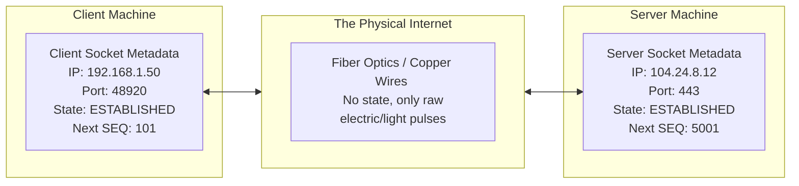
```mermaid
flowchart LR
    subgraph ClientHost ["Client Machine"]
        ClientSocket["Client Socket Metadata <br> IP: 192.168.1.50 <br> Port: 48920 <br> State: ESTABLISHED <br> Next SEQ: 101"]
    end
    
    subgraph NetworkWire ["The Physical Internet"]
        direction LR
        Wire["Fiber Optics / Copper Wires <br> No state, only raw electric/light pulses"]
    end
    
    subgraph ServerHost ["Server Machine"]
        ServerSocket["Server Socket Metadata <br> IP: 104.24.8.12 <br> Port: 443 <br> State: ESTABLISHED <br> Next SEQ: 5001"]
    end
    
    ClientSocket <--> NetworkWire
    NetworkWire <--> ServerSocket
```

### তাহলে কানেকশন কী?
একটি নেটওয়ার্ক কানেকশন (যেমন TCP Connection) হলো স্রেফ **দুটি কম্পিউটারের র‍্যামের (RAM) ভেতরে কার্নেল দ্বারা সংরক্ষিত কিছু মেটাডাটা বা স্টেট (State) এর চুক্তি!**
* যখন ক্লায়েন্ট ও সার্ভার কানেক্টেড বলে, তার মানে হলো ক্লায়েন্টের কার্নেল মেমরিতে একটি রেকর্ড আছে এবং সার্ভারের কার্নেল মেমরিতে একটি রেকর্ড আছে।
* এই রেকর্ডের মধ্যে থাকে: **Source IP, Source Port, Destination IP, Destination Port, এবং Sequence Numbers (TCP Window State)**। 
* এর বাইরে ইন্টারনেটের তার বা ফাইবার অপটিক্সের কোনো ধারণা নেই যে আপনার কানেকশনটি কী। তারা কেবল আলোর ফ্ল্যাশ বা ইলেকট্রিকাল পালস ছুড়ে দেয়। কার্নেল যখন সেই প্যাকেটটি রিসিভ করে, সে তার মেমরির টেবিলটি দেখে সিদ্ধান্ত নেয় প্যাকেটটি কোন সকেটে যাবে।

### সকেট (Socket) আসলে কী?
একটি সকেট হলো লিনাক্স ওএসের একটি **ফাইল ডেসক্রিপ্টর (File Descriptor - FD)**। লিনাক্সের দর্শন হলো *Everything is a file*। কার্নেল আপনার অ্যাপ্লিকেশনের কাছে নেটওয়ার্ক সকেটকে একটি ফাইলের মতো প্রেজেন্ট করে। আপনি ফাইলে যেভাবে `write()` করেন, সকেটেও সেভাবে `write()` করেন। কার্নেল ব্যাকগ্রাউন্ডে সেই ডাটাকে ছোট ছোট টুকরো করে টিসিপি হেডারে মুড়ে নেটওয়ার্ক কার্ডের (NIC) মাধ্যমে ইলেকট্রিকাল সিগন্যালে রূপান্তর করে পাঠিয়ে দেয়।

---

## ২. OSI Model বনাম TCP/IP Stack: অ্যাকাডেমিক থিওরি বনাম বাস্তব জগৎ (OSI vs TCP/IP)

ইউনিভার্সিটির টেক্সটবুকে আমরা সবাই ৭ স্তরের **OSI (Open Systems Interconnection) Model** পড়েছি। কিন্তু বাস্তব জীবনের রিয়েল-ওয়ার্ল্ড ইন্টারনেট চলে ৪ স্তরের **TCP/IP Stack**-এর ওপর।

| Layer No. | OSI Model (অ্যাকাডেমিক) | TCP/IP Stack (বাস্তব জগৎ) | প্রধান প্রোটোকল ও ডেটা ফরম্যাট | কাজের ক্ষেত্র |
| :--- | :--- | :--- | :--- | :--- |
| **Layer 7, 6, 5** | Application, Presentation, Session | **Application Layer** | HTTP, gRPC, DNS, SMTP, TLS (JSON, Protobuf) | অ্যাপ্লিকেশন ডেভেলপার (Node, Go, Python) |
| **Layer 4** | Transport | **Transport Layer** | TCP, UDP (Segment / Datagram) | কার্নেল সকেট, ল্যাটেন্সি, ফ্লো কন্ট্রোল |
| **Layer 3** | Network | **Internet Layer** | IP (IPv4, IPv6), ICMP (Packets) | রাউটার, আইপি রাউটিং, NAT |
| **Layer 2, 1** | Data Link, Physical | **Network Access Layer** | Ethernet, Wi-Fi, ARP (Frames / Bits) | সুইচ, ফাইবার ক্যাবল, এনআইসি কার্ড |

### কেন ৭ স্তরের OSI মডেল বাস্তবে ব্যবহৃত হয় না?
বাস্তবে OSI মডেলের লেয়ার ৫ (Session) এবং লেয়ার ৬ (Presentation) এর আলাদা কোনো ফিজিক্যাল অস্তিত্ব নেই। ডেটা এনক্রিপশন (TLS) বা কম্প্রেশন (Presentation) এবং সেশন ট্র্যাকিং (Session)—এই সবকিছু আধুনিক অ্যাপ্লিকেশন লেয়ারের (যেমন HTTP/2 বা TLS লাইব্রেরি) ভেতরেই বিল্ট-ইন সফটওয়্যার হিসেবে হ্যান্ডেল করা হয়। তাই কম্পিউটার সায়েন্টিস্টরা প্রাগম্যাটিক ডিজাইনের জন্য TCP/IP ৩টি লেয়ারকে মার্জ করে সরাসরি **Application Layer** তৈরি করেছেন।

---

## ৩. TCP-এর গভীর কার্নেল মেকানিক্স (Deep Dive TCP Mechanics)

TCP (Transmission Control Protocol) হলো ইন্টারনেটের প্রধান ভিত্তি। এটি একটি **Connection-Oriented, Reliable, Byte-stream** প্রোটোকল। এর পেছনের জটিল মেকানিক্সগুলো নিচে দেওয়া হলো:

### ক. TCP Three-Way Handshake ও কার্নেলের অন্তরাল
যখন কোনো ক্লায়েন্ট সার্ভারের সাথে কানেক্ট হতে চায়, কার্নেল লেভেলে ৩টি স্টেপ ঘটে:

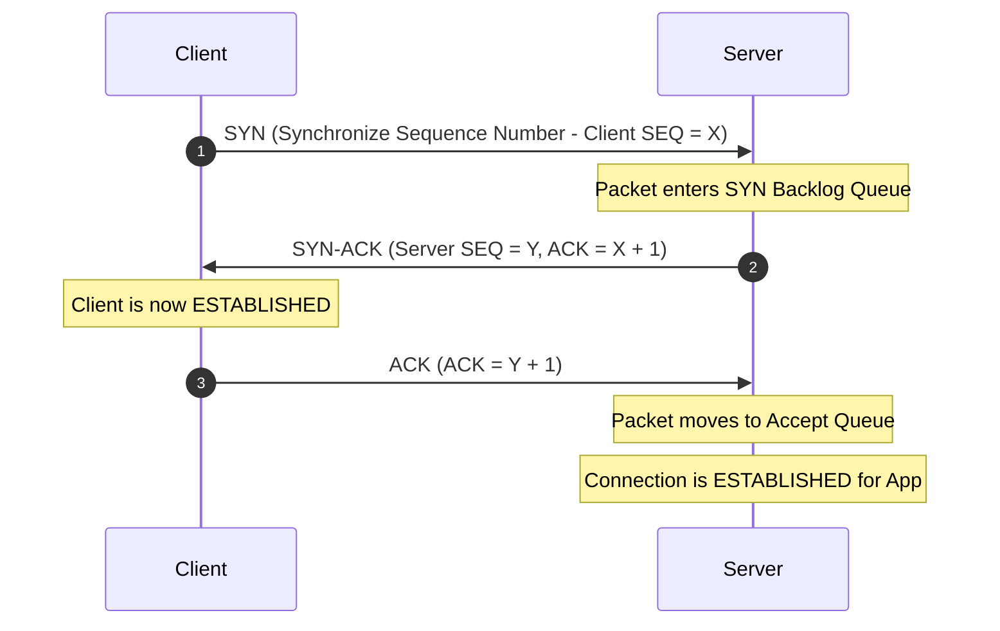
```mermaid
sequenceDiagram
    autonumber
    Client->>Server: SYN (Synchronize Sequence Number - Client SEQ = X)
    Note over Server: Packet enters SYN Backlog Queue
    Server->>Client: SYN-ACK (Server SEQ = Y, ACK = X + 1)
    Note over Client: Client is now ESTABLISHED
    Client->>Server: ACK (ACK = Y + 1)
    Note over Server: Packet moves to Accept Queue
    Note over Server: Connection is ESTABLISHED for App
```

#### ১. SYN Backlog বনাম Accept Queue (ইন্টারভিউয়ের জন্য ভেরি ইম্পর্টেন্ট)
সার্ভারের কার্নেলে দুটি গুরুত্বপূর্ণ কিউ (Queue) বা লাইন থাকে:
* **SYN Backlog (Incomplete Connection Queue):** ক্লায়েন্ট যখন প্রথমবার `SYN` প্যাকেট পাঠায়, কার্নেল সেটি এই কিউতে রাখে এবং `SYN-ACK` পাঠিয়ে দেয়। কানেকশনটি এখনও হাফ-ওপেন (Half-Open)।
* **Accept Queue (Complete Connection Queue):** ক্লায়েন্ট যখন ফাইনাল `ACK` পাঠায়, কার্নেল কানেকশনটিকে SYN Backlog থেকে সরিয়ে **Accept Queue**-তে নিয়ে যায়। এরপর আপনার অ্যাপ্লিকেশন যখন `accept()` সিস্টেম কল রান করে, কার্নেল তাকে এই কিউ থেকে সকেট ফাইল ডেসক্রিপ্টরটি হ্যান্ডওভার করে।

#### ২. SYN Flood Attack ও TCP Syncookies
হ্যাকার যদি কোনো ফেক আইপি থেকে অবিরত হাজার হাজার `SYN` প্যাকেট পাঠাতে থাকে এবং ফাইনাল `ACK` না পাঠায়, তবে সার্ভারের **SYN Backlog Queue** টি নিমেষেই ফুল হয়ে যাবে। এর ফলে রিয়েল ইউজাররা আর কানেক্ট হতে পারবে না। একে **SYN Flood (DDoS)** অ্যাটাক বলে।
* **প্রতিরোধ (TCP Syncookies):** কার্নেলে `net.ipv4.tcp_syncookies = 1` সচল থাকলে, SYN Backlog ফুল হওয়া মাত্র কার্নেল মেমরিতে কোনো স্টেট সেভ না করে সিক্রেট ক্রিপ্টোগ্রাফিক হ্যাশ ব্যবহার করে একটি স্পেশাল `Sequence Number` জেনারেট করে ক্লায়েন্টকে `SYN-ACK` পাঠায়। ক্লায়েন্ট যখন রিয়েল `ACK` রিটার্ন করে, কার্নেল সেই সিক্রেটটি ডিক্রিপ্ট করে কুইকলি কানেকশন তৈরি করে ফেলে। এটি মেমরি এক্সহস্ট হওয়া প্রতিরোধ করে।

---

### খ. TCP Congestion Control: BBR বনাম CUBIC (উইন্ডো অপ্টিমাইজেশন)
ইন্টারনেটে ডাটা পাঠানোর গতি কিভাবে নির্ধারিত হয়? TCP সরাসরি ফুল স্পিডে ডাটা ছুঁড়ে দেয় না। সে প্রথমে অল্প ডাটা পাঠায়, যদি সাকসেসফুলি রিসিভ হয়, তবে সে ডাটার পরিমাণ দ্বিগুণ করতে থাকে। একে **Congestion Window (cwnd)** বলে।

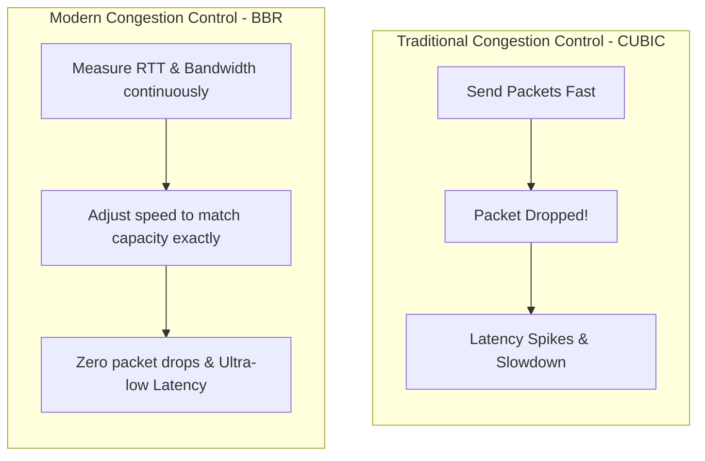
```mermaid
flowchart TD
    subgraph LossBased ["Traditional Congestion Control - CUBIC"]
        direction TB
        C1["Send Packets Fast"] --> C2["Packet Dropped!"]
        C2 --> C3["Latency Spikes & Slowdown"]
    end
    
    subgraph BandwidthBased ["Modern Congestion Control - BBR"]
        direction TB
        B1["Measure RTT & Bandwidth continuously"] --> B2["Adjust speed to match capacity exactly"]
        B2 --> B3["Zero packet drops & Ultra-low Latency"]
    end
```

#### ১. Loss-Based Congestion Control (CUBIC/Reno)
ঐতিহ্যগতভাবে লিনাক্সের ডিফল্ট অ্যালগরিদম (CUBIC) কাজ করে প্যাকেট ড্রপের ওপর ভিত্তি করে। সে ততক্ষণ পর্যন্ত স্পিড বাড়ায় যতক্ষণ না রাউটার ওভারফ্লো হয়ে প্যাকেট হারানো শুরু করে। প্যাকেট ড্রপ হওয়া মাত্র সে তার স্পিড হুট করে ৫০% কমিয়ে দেয়। এর ফলে ইন্টারনেটে ল্যাটেন্সি স্পাইক দেখা যায়।

#### ২. Bandwidth-Based Congestion Control (Google BBR)
২০১৬ সালে গুগল তৈরি করে **BBR (Bottleneck Bandwidth and RTT)** অ্যালগরিদম। BBR প্যাকেট ড্রপের জন্য অপেক্ষা করে না। সে অবিরত কানেকশনের **Round Trip Time (RTT)** এবং বোতলনেক ব্যান্ডউইথ পরিমাপ করে। সে হিসাব করে দেখে ইন্টারনেটের পাইপটির সর্বোচ্চ ধারণ ক্ষমতা কত এবং ঠিক সেই স্পিডে ডাটা পাঠায় যাতে কোনো রাউটারে বাফার ওভারফ্লো না হয়।
* **ফলাফল:** BBR সচল করলে হাই-লস নেটওয়ার্কের স্পিড প্রায় ১০ থেকে ১০০ গুণ পর্যন্ত বেড়ে যেতে পারে।

---

### গ. TCP-এর কুখ্যাত TIME_WAIT ও পোর্ট ডেডলক
আপনার হাই-ট্রাফিক সার্ভারে হঠাৎ `Address already in use` অথবা `Cannot assign requested address` এরর দিয়ে নতুন কানেকশন রিজেক্ট হওয়া শুরু করেছে। এর পেছনের খলনায়ক হলো **TIME_WAIT**।

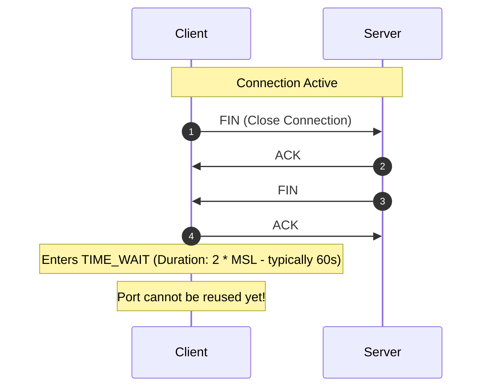
```mermaid
sequenceDiagram
    autonumber
    Note over Client, Server: Connection Active
    Client->>Server: FIN (Close Connection)
    Server->>Client: ACK
    Server->>Client: FIN
    Client->>Server: ACK
    Note over Client: Enters TIME_WAIT (Duration: 2 * MSL - typically 60s)
    Note over Client: Port cannot be reused yet!
```

#### কেন TIME_WAIT প্রয়োজন?
যখন কোনো অ্যাপ্লিকেশন কানেকশন ক্লোজ করে, তখন ওএসের কার্নেল সকেটটিকে সাথে সাথে ডিলিট না করে **TIME_WAIT** স্টেট-এ রেখে দেয় (ডিফল্ট ৬০ সেকেন্ড)। 
* **কারণ ১:** ইন্টারনেটের রাউটারে আটকে থাকা কোনো পুরানো ডুপ্লিকেট প্যাকেট যদি দেরিতে সার্ভারে এসে পৌঁছায়, তবে সাথে সাথে পোর্টটি রিইউজ করলে সেই পুরানো প্যাকেট নতুন কানেকশনের ভেতরে ঢুকে ডাটা করাপ্ট করে দিতে পারে।
* **কারণ ২:** ফাইনাল `ACK` যেন সার্ভারে সঠিকভাবে পৌঁছায় তা নিশ্চিত করা।

#### হাই-ট্রাফিক এপিআই সার্ভারে এর সমাধান:
১. **`SO_REUSEADDR` সকেট অপশন:** আপনার ব্যাকএন্ড কোডে সকেট বাইন্ড করার সময় `SO_REUSEADDR` সচল করুন। এটি কার্নেলকে বলে সকেটটি TIME_WAIT স্টেটে থাকলেও তার পোর্টটি নতুন কানেকশনের জন্য রিইউজ করতে দিতে।
   * *Node.js বা Go-এর HTTP লাইব্রেরিতে এটি বিল্ট-ইন সচল থাকে।*
২. **কার্নেল টিউনিং:** লিনাক্সে TIME_WAIT কুইক রিসাইকেল করার জন্য কনফিগারেশন চেঞ্জ করুন:
   ```bash
   sysctl -w net.ipv4.tcp_tw_reuse=1
   ```

---

## ৪. UDP: স্পিড কিং এবং HTTP/3-এর আসল ভিত্তি (UDP & QUIC Revolution)

UDP (User Datagram Protocol) হলো একটি **Connectionless, Unreliable** প্রোটোকল। এতে কোনো হ্যান্ডশেক নেই, কোনো সিকোয়েন্স নম্বর নেই, কোনো ডাটা রি-ট্রান্সমিশন নেই। আপনি ডাটা পাঠাবেন, ওপাশে রিসিভ হলো কি না তা জানার কোনো উপায় UDP-এর নেই।

### কেন UDP আধুনিক ইন্টারনেটের ভবিষ্যৎ (HTTP/3 ও QUIC)?
বহু বছর ধরে আমরা HTTP/1.1 ও HTTP/2 চালিয়েছি TCP-এর ওপর। কিন্তু TCP-এর একটি মারাত্মক সমস্যা আছে, যার নাম **Head-of-Line (HoL) Blocking**।
* **Head-of-Line Blocking কী?** HTTP/2-তে আমরা একটি মাত্র TCP কানেকশনের ভেতর দিয়ে মাল্টিপ্লেক্সিং করে একসাথে অনেকগুলো ফাইল (CSS, JS, Images) পাঠাই। কিন্তু ইন্টারনেটের কোনো রাউটারে যদি ওই TCP কানেকশনের একটি সিঙ্গেল প্যাকেট ড্রপ খায়, তবে কার্নেল পরবর্তী সব প্যাকেট হোল্ড করে রাখে যতক্ষণ না ড্রপ খাওয়া প্যাকেটটি আবার রি-ট্রান্সমিট হয়ে সার্ভারে পৌঁছায়। ফলে একটি ছোট ইমেজের প্যাকেট ড্রপের জন্য পুরো ওয়েবসাইটের রেন্ডারিং আটকে যায়।

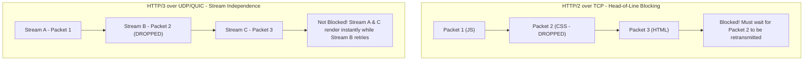
```mermaid
flowchart TD
    subgraph TCPBlocking ["HTTP/2 over TCP - Head-of-Line Blocking"]
        direction LR
        P1["Packet 1 (JS)"] --> P2["Packet 2 (CSS - DROPPED)"] --> P3["Packet 3 (HTML)"]
        P3 --> Blocked["Blocked! Must wait for Packet 2 to be retransmitted"]
    end
    
    subgraph UDPStreaming ["HTTP/3 over UDP/QUIC - Stream Independence"]
        direction LR
        U1["Stream A - Packet 1"] --> U2["Stream B - Packet 2 (DROPPED)"] --> U3["Stream C - Packet 3"]
        U3 --> NotBlocked["Not Blocked! Stream A & C render instantly while Stream B retries"]
    end
```

### HTTP/3 ও QUIC প্রোটোকলের সমাধান:
গুগল দেখল TCP প্রোটোকলটি কার্নেলের ভেতরে হার্ডকোডেড থাকে, তাই এটি সহজে চেঞ্জ করা সম্ভব নয়। তারা সম্পূর্ণ নতুন একটি প্রোটোকল ডিজাইন করল যার নাম **QUIC (Quick UDP Internet Connections)** এবং এটি রান করে **UDP**-এর ওপর ভিত্তি করে।
1. **কানেকশন ড্রিফট নিরসন:** QUIC কানেকশন আইডেন্টিফাই করার জন্য আইপি ব্যবহার না করে একটি ইউনিক **Connection ID (CID)** ব্যবহার করে। ফলে আপনি যদি অফিস থেকে বের হয়ে ওয়াইফাই থেকে মোবাইলের ফোরজি (4G) নেটওয়ার্কে সুইচ করেন, আপনার আইপি চেঞ্জ হলেও কানেকশন ড্রপ হবে না এবং জুম কল বা ফাইল ডাউনলোড একটুও না থমকে চালু থাকবে!
2. **জিরো আরটিটি হ্যান্ডশেক (0-RTT):** QUIC প্রথম হ্যান্ডশেক করার সময় ক্রিপ্টোগ্রাফিক কি মেমরিতে সেভ করে রাখে। পরবর্তীতে কানেক্ট করার সময় কোনো হ্যান্ডশেক ছাড়াই প্রথম প্যাকেটেই এপিআই রিকোয়েস্ট পাঠিয়ে দেওয়া যায়।

---

## ৫. রাউটার, সুইচ এবং NAT-এর অন্তরাল (Router, Switch & NAT Mechanics)

আমরা অনেকেই রাউটার আর সুইচের কাজের পার্থক্য গুলিয়ে ফেলি। আসুন খুব সহজ উপায়ে এদের আসল মেকানিক্স বুঝে নিই।

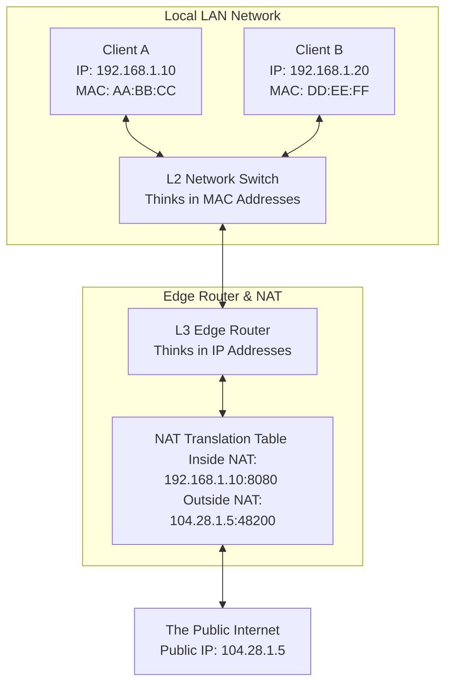
```mermaid
flowchart TD
    subgraph LocalOfficeNetwork ["Local LAN Network"]
        HostA["Client A <br> IP: 192.168.1.10 <br> MAC: AA:BB:CC"]
        HostB["Client B <br> IP: 192.168.1.20 <br> MAC: DD:EE:FF"]
        L2Switch["L2 Network Switch <br> Thinks in MAC Addresses"]
        
        HostA <--> L2Switch
        HostB <--> L2Switch
    end
    
    subgraph GatewayLayer ["Edge Router & NAT"]
        L3Router["L3 Edge Router <br> Thinks in IP Addresses"]
        NATTable["NAT Translation Table <br> Inside NAT: 192.168.1.10:8080 <br> Outside NAT: 104.28.1.5:48200"]
    end
    
    L2Switch <--> L3Router
    L3Router <--> NATTable
    NATTable <--> PublicInternet["The Public Internet <br> Public IP: 104.28.1.5"]
```

### সুইচ (L2 Switch) বনাম রাউটার (L3 Router)

#### ১. লেয়ার ২ সুইচ (L2 Switch):
সুইচ আইপি অ্যাড্রেস চেনে না। সে কাজ করে **MAC Address** নিয়ে। আপনার অফিসের লোকাল নেটওয়ার্কে ডেটা এক পিসি থেকে অন্য পিসিতে পাঠাতে সুইচ ব্যবহার করা হয়। সুইচ তার র্যামে একটি **MAC Table** মেইনটেইন করে। যখন কম্পিউটার A কম্পিউটার B-কে ডাটা পাঠাতে চায়, সে প্রথমে **ARP (Address Resolution Protocol)** ব্রডকাস্ট করে B-এর ম্যাক অ্যাড্রেসটি জেনে নেয়, তারপর সুইচ সরাসরি পোর্ট টু পোর্ট ডেটা পাঠিয়ে দেয়।

#### ২. লেয়ার ৩ রাউটার (L3 Router):
রাউটার হলো নেটওয়ার্কের গেটওয়ে। সে কাজ করে **IP Address** নিয়ে। আপনার লোকাল ল্যান (LAN) নেটওয়ার্কের বাইরে যখন আপনি ইন্টারনেট বা অন্য কোনো নেটওয়ার্কে রিকোয়েস্ট পাঠান, সুইচ সেটি রাউটারের কাছে হ্যান্ডওভার করে। রাউটার তার **Routing Table** দেখে সিদ্ধান্ত নেয় এই প্যাকেটটি পরবর্তী কোন রাউটারে পাঠালে সবচেয়ে দ্রুত গন্তব্যে পৌঁছাবে।

---

### NAT (Network Address Translation): কিভাবে আইপির অভাব দূর হয়?
সারা বিশ্বে বিলিয়ন বিলিয়ন ডিভাইস কিন্তু IPv4 আইপি অ্যাড্রেসের সংখ্যা মাত্র ৪.২ বিলিয়ন। আপনার বাসার ব্রডব্যান্ড লাইনে বা অফিসের ১০০টি কম্পিউটারের প্রতিটির কি আলাদা পাবলিক আইপি আছে? না!
* **NAT-এর কাজ:** আপনার অফিসের সব ডিভাইসের লোকাল আইপি থাকে (যেমন `192.168.1.X`) যা ইন্টারনেটে ইনভ্যালিড। আপনার মেইন রাউটারটির একটিমাত্র পাবলিক আইপি থাকে (যেমন `104.28.1.5`)।
* जेव्हा `192.168.1.10` ব্রাউজারে `google.com` ওপেন করে, রাউটার NAT মেকানিজম ব্যবহার করে প্যাকেটের ভেতরের প্রাইভেট আইপি মুছে নিজের পাবলিক আইপি বসিয়ে দেয় এবং সোর্সের একটি ইউনিক পোর্ট বরাদ্দ করে (যেমন `104.28.1.5:48200`)।
* রাউটার তার মেমরিতে একটি **NAT Translation Table** সেভ করে রাখে:
  > *"যদি পোর্ট 48200 তে গুগলের রেসপন্স আসে, তবে বুঝতে হবে এটি প্রাইভেট আইপি 192.168.1.10 এর ডাটা।"*
* গুগল যখন ডাটা ব্যাক করে, রাউটার টেবিল দেখে সেকেন্ডের ভগ্নাংশে লোকাল কম্পিউটারে প্যাকেটটি রাউট করে দেয়। এভাবেই একটি মাত্র পাবলিক আইপি দিয়ে হাজার হাজার ডিভাইস ইন্টারনেট অ্যাক্সেস করতে পারে।

---

## ৬. DNS (Domain Name System): ইন্টারনেটের আসল ডিরেক্টরি (The Deep DNS Hierarchy)

আমরা ব্রাউজারে `google.com` টাইপ করি, কিন্তু কম্পিউটার চেনে কেবল আইপি। এই নাম থেকে আইপিতে কনভার্ট করার কাজ করে DNS। এটি কিভাবে অবিরত সেকেন্ডে ট্রিলিয়ন রিকোয়েস্ট কোনো ক্র্যাশ ছাড়া হ্যান্ডেল করে? এর কারণ এর **Hierarchical Distributed Architecture**।

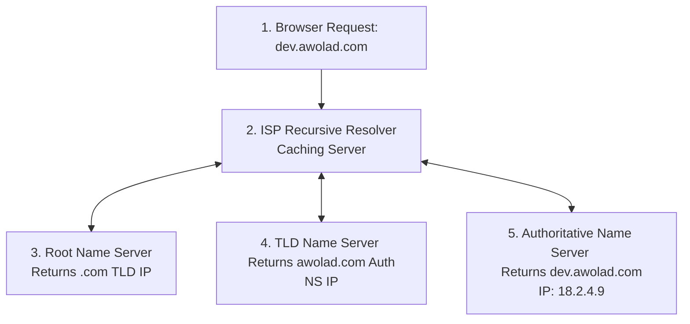
```mermaid
flowchart TD
    Browser["1. Browser Request: dev.awolad.com"]
    RecursiveResolver["2. ISP Recursive Resolver <br> Caching Server"]
    RootServer["3. Root Name Server <br> Returns .com TLD IP"]
    TLDServer["4. TLD Name Server <br> Returns awolad.com Auth NS IP"]
    AuthServer["5. Authoritative Name Server <br> Returns dev.awolad.com IP: 18.2.4.9"]
    
    Browser --> RecursiveResolver
    RecursiveResolver <--> RootServer
    RecursiveResolver <--> TLDServer
    RecursiveResolver <--> AuthServer
```

### DNS রেজোলিউশনের ৪টি ধাপ:
১. **DNS Recursive Resolver (ISP DNS):** ব্রাউজার প্রথমে তার ওএসের ক্যাশ চেক করে। না পেলে আপনার ইন্টারনেট প্রোভাইডার (ISP) বা ক্লাউডফ্লেয়ারের (`1.1.1.1`) রিকাসিভ রিজলভারের কাছে রিকোয়েস্ট পাঠায়।
২. **Root Name Servers ( . ):** রিজলভারের কাছে ক্যাশ না থাকলে সে সারা বিশ্বে থাকা ১৩টি রুট সার্ভার ক্লাস্টারের একটিতে নক করে বলে—*“আমি dev.awolad.com এর আইপি চাই।”* রুট সার্ভার পুরো আইপি চেনে না, সে বলে—*“আমি জানি না, তবে `.com` হ্যান্ডেল করার সার্ভারের আইপি এই নাও।”*
৩. **TLD Name Servers (.com):** রিজলভার তখন **Top-Level Domain (TLD)** সার্ভারের কাছে গিয়ে জিজ্ঞেস করে। `.com` TLD সার্ভার বলে—*“আমিও স্পেসিফিক সাবডোমেন চিনি না, তবে `awolad.com` যে ডোমেন প্রোভাইডারের কাছে রেজিস্টার করা আছে (যেমন GoDaddy/Cloudflare), তাদের **Authoritative Name Server** এর আইপি এই নাও।”*
৪. **Authoritative Name Server:** ফাইনালি রিজলভার এই সার্ভারে নক করে। এটি হলো আপনার নিজস্ব ডোমেইন জোন ফাইল যেখানে আপনি `A Record` বা `CNAME` সেট করে রেখেছেন। এই সার্ভারটি সেকেন্ডের মধ্যে আসল আইপি `18.2.4.9` রিজলভারকে দেয়, রিজলভার ওএসকে দেয় এবং ওএস ব্রাউজারকে দেয়।

---

## ৭. HTTP/1.1 বনাম HTTP/2 বনাম HTTP/3: পারফরম্যান্স ইভোলিউশন

ওয়েব পারফরম্যান্সের বিবর্তন বুঝতে হলে এইচটিটিপির এই ৩টি ভার্সনের পার্থক্য খুব ভালোভাবে বুঝতে হবে:

| বৈশিষ্ট্য | HTTP/1.1 | HTTP/2 | HTTP/3 |
| :--- | :--- | :--- | :--- |
| **আন্ডারলায়িং প্রোটোকল** | TCP | TCP | UDP (QUIC) |
| **ডাটা ফরম্যাট** | Text-based (প্লেইন টেক্সট রিডেবল) | Binary Frames (কম্পিউটার রিডেবল) | Binary (QUIC packet streams) |
| **কানেকশন মডেল** | Keep-Alive (প্রতিটি ডোমেইনের জন্য ৬টি পর্যন্ত প্যারালাল কানেকশন) | Multiplexing (সিঙ্গেল কানেকশনে প্যারালাল রিকোয়েস্ট) | Multiplexing with Stream Independence |
| **Header Compression** | নেই (প্লেইন টেক্সট হেডার যায়) | HPACK (কম্প্রেসড ইনডেক্স মেথড) | QPACK (আউট-অফ-অর্ডার স্ট্রিম কম্প্রেসড) |
| **Head-of-Line Blocking** | আছে (অ্যাপ্লিকেশন স্তরে) | আছে (টিসিপি ট্রান্সপোর্ট স্তরে) | **নেই (সম্পূর্ণরূপে নির্মূল)** |
| **Server Push** | নেই | আছে | আছে |

---

## ৮. একটি HTTP রিকোয়েস্টের জীবনচক্র: এ টু জেড কী ঘটে? (Request Lifecycle)

আপনি যখন ব্রাউজারে `https://dev.awolad.com/api/users` লিখে এন্টার প্রেস করেন, ব্যাকগ্রাউন্ডে নিচের নিখুঁত সিকোয়েন্সে সবকিছু ঘটে:

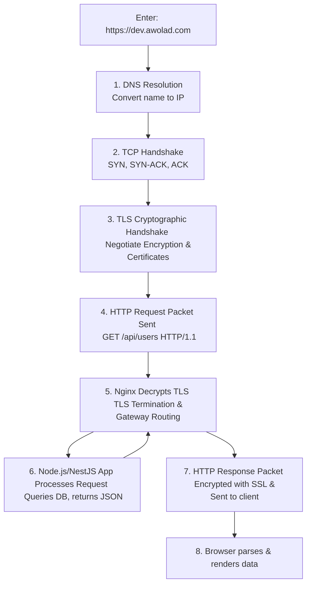
```mermaid
flowchart TD
    Start["Enter: https://dev.awolad.com"] --> DNS["1. DNS Resolution <br> Convert name to IP"]
    DNS --> TCP["2. TCP Handshake <br> SYN, SYN-ACK, ACK"]
    TCP --> TLS["3. TLS Cryptographic Handshake <br> Negotiate Encryption & Certificates"]
    TLS --> HTTPRequest["4. HTTP Request Packet Sent <br> GET /api/users HTTP/1.1"]
    HTTPRequest --> ReverseProxy["5. Nginx Decrypts TLS <br> TLS Termination & Gateway Routing"]
    ReverseProxy --> AppServer["6. Node.js/NestJS App Processes Request <br> Queries DB, returns JSON"]
    AppServer --> ReverseProxy
    ReverseProxy --> HTTPResponse["7. HTTP Response Packet <br> Encrypted with SSL & Sent to client"]
    HTTPResponse --> BrowserRender["8. Browser parses & renders data"]
```

### বিস্তারিত ফ্লোচার্ট বিশ্লেষণ:
১. **ডোমেইন আইপি রূপান্তর:** ওএস তার লোকাল ক্যাশ ও ডিএনএস সার্ভারের মাধ্যমে `dev.awolad.com` ডোমেইনটি কোন আইপিতে রান করছে তা খুঁজে বের করে।
২. **TCP কানেকশন চুক্তি:** ব্রাউজার কার্নেলকে বলে নির্দিষ্ট আইপির পোর্ট ৪৪৩ (HTTPS) এ একটি TCP সকেট কানেকশন তৈরি করতে। ৩-ওয়ে হ্যান্ডশেক সম্পন্ন হয়।
৩. **নিরাপত্তা লেয়ার স্থাপন (TLS Handshake):** ব্রাউজার ও সার্ভার নিজেদের মধ্যে এলগরিদম চয়েস করে, সার্ভার তার এসএসএল সার্টিফিকেট (Certificates) ব্রাউজারকে দেয়। ব্রাউজার সার্টিফিকেট ভ্যালিডেট করে একটি ইউনিক **Symmetric Session Key** তৈরি করে যা দিয়ে পরবর্তী সব ডাটা এনক্রিপ্ট হবে।
৪. **রিকোয়েস্ট পাঠানো:** ব্রাউজার এখন এনক্রিপ্টেড ডাটা প্যাকেট আকারে সকেটে পুশ করে।
৫. **প্রক্সি ও গেটওয়ে প্রসেসিং:** সার্ভারের এজ ড্রাইভারে থাকা Nginx প্রথমে TLS ডিক্রিপ্ট করে (TLS Termination) প্লেইন টেক্সট ডাটায় রূপান্তর করে রিভার্স প্রক্সি হিসেবে ভেতরের প্রাইভেট নেটওয়ার্কে থাকা NestJS অ্যাপের পোর্টে ফরওয়ার্ড করে।
৬. **অ্যাপ্লিকেশন ও ডাটাবেস কোয়েরি:** NestJS এপিআই রিকোয়েস্ট প্রসেস করে Postgres থেকে ডেটা নিয়ে JSON আকারে রেসপন্স জেনারেট করে Nginx-কে দেয়।
৭. **ফিরতি এনক্রিপশন:** Nginx পুনরায় ডাটা এনক্রিপ্ট করে ক্লায়েন্টের উদ্দেশ্যে পাঠিয়ে দেয়।
৮. **ব্রাউজার রেন্ডারিং:** ব্রাউজার সকেট থেকে ডাটা রিসিভ করে সেশন কি দিয়ে ডিক্রিপ্ট করে স্ক্রিনে এপিআই রেসপন্স দেখায়।

---

## ৯. Reverse Proxy, Load Balancing, এবং SSL Termination

আধুনিক সফটওয়্যার আর্কিটেকচারে গেটওয়ে লেয়ারটি বুঝতে হলে এই ৩টি প্যাটার্ন বোঝা খুবই গুরুত্বপূর্ণ:

### ক. Reverse Proxy (রিভার্স প্রক্সি) বনার Forward Proxy
* **Forward Proxy (যেমন VPN):** ক্লায়েন্টকে ইন্টারনেটের কাছে হাইড করার জন্য ক্লায়েন্ট সাইডে এটি ব্যবহৃত হয়। ইন্টারনেট মনে করে ভিপিএন রিকোয়েস্ট পাঠাচ্ছে, কিন্তু আসল ক্লায়েন্ট কে তা জানে না।
* **Reverse Proxy (যেমন Nginx):** সার্ভারকে ক্লায়েন্টের হাত থেকে হাইড করার জন্য সার্ভার সাইডে এটি ব্যবহৃত হয়। ক্লায়েন্ট মনে করে সে Nginx এর সাথে কথা বলছে, কিন্তু ব্যাকগ্রাউন্ডে Nginx ভেতরের কোন প্রাইভেট মাইক্রোসার্ভিস থেকে ডাটা এনে দিচ্ছে তা ক্লায়েন্ট জানে না।

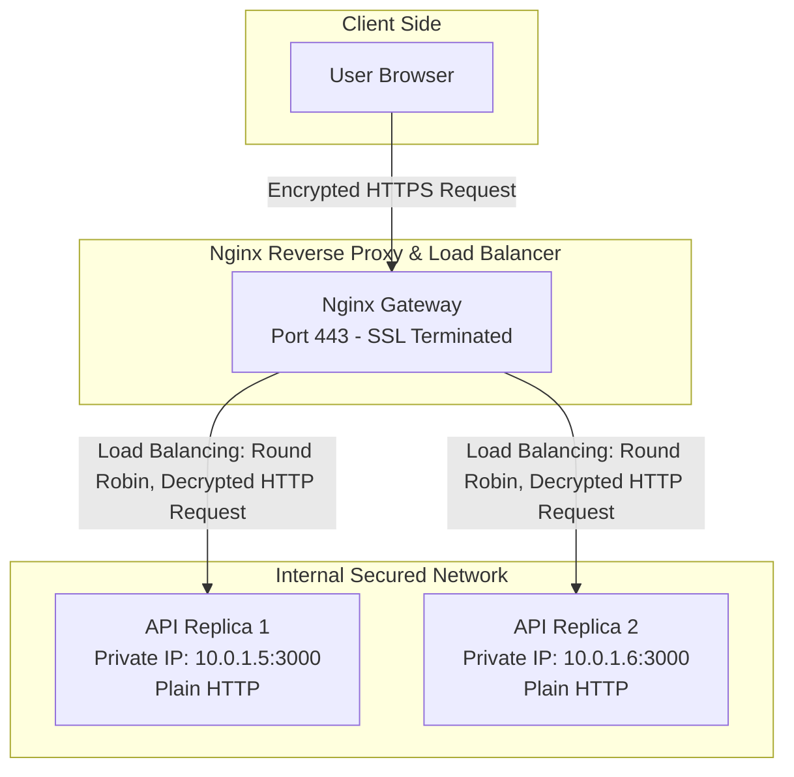
```mermaid
flowchart TD
    subgraph ClientSpace ["Client Side"]
        UserClient["User Browser"]
    end
    
    subgraph ProxyGateway ["Nginx Reverse Proxy & Load Balancer"]
        NginxGateway["Nginx Gateway <br> Port 443 - SSL Terminated"]
    end
    
    subgraph PrivateSubnet ["Internal Secured Network"]
        Server1["API Replica 1 <br> Private IP: 10.0.1.5:3000 <br> Plain HTTP"]
        Server2["API Replica 2 <br> Private IP: 10.0.1.6:3000 <br> Plain HTTP"]
    end
    
    UserClient -->|"Encrypted HTTPS Request"| NginxGateway
    NginxGateway -->|"Load Balancing: Round Robin, Decrypted HTTP Request"| Server1
    NginxGateway -->|"Load Balancing: Round Robin, Decrypted HTTP Request"| Server2
```

### খ. SSL/TLS Termination (CPU অপ্টিমাইজেশন)
এনক্রিপশন ও ডিক্রিপশন প্রসেসে সিপিইউর প্রচুর পাওয়ার নষ্ট হয়। আপনার প্রতিটি NestJS কন্টেইনারের ভেতরে যদি সার্টিফিকেট লোড করে ডিক্রিপশন করতে যান, তবে এপিআইর পারফরম্যান্স অনেক কমে যাবে।
* **সমাধান (TLS Termination):** আমরা Nginx-কে এন্ট্রি পয়েন্টে রাখি। Nginx ক্লায়েন্টের সার্টিফিকেট ভ্যালিডেট করে ডেটা ডিক্রিপ্ট করে ফেলে। এরপর ভেতরের প্রাইভেট সিকিউর নেটওয়ার্কে থাকা NestJS অ্যাপ্লিকেশনগুলোর কাছে সাধারণ প্লেইন **HTTP** ফরম্যাটে ডাটা পাঠায়। এর ফলে ইন্টারনাল এপিআইগুলো ডিক্রিপশনের চাপ থেকে মুক্ত থাকে এবং লাইটওয়েট হয়ে দ্রুত রেসপন্স করে।

### গ. L4 Load Balancing বনাম L7 Load Balancing

#### L4 Load Balancer (Transport Level Routing):
এটি কাজ করে TCP/UDP লেয়ারে। এটি প্যাকেটের ভেতরের কোনো ডেটা (যেমন HTTP Headers, Cookies, URL Path) রিড করতে পারে না। এটি শুধুমাত্র ক্লায়েন্টের IP এবং Port দেখে রাউন্ড-রবিন বা অন্য এলগরিদমে ট্রাফিক ডিস্ট্রিবিউট করে। অত্যন্ত ফাস্ট ও লাইটওয়েট কারণ ডাটা পার্স করতে হয় না।
* *উদাহরণ: AWS Network Load Balancer (NLB), HAProxy (L4 Mode), IPVS।*

#### L7 Load Balancer (Application Level Routing):
এটি কাজ করে HTTP/Application লেয়ারে। এটি প্যাকেটের ভেতরের সম্পূর্ণ কন্টেন্ট রিড করতে পারে। ফলে আপনি এটি দিয়ে রাউটিং কনফিগার করতে পারেন:
> *“যদি রিকোয়েস্টের পাথ `/api/users` হয় তবে ব্যাকএন্ড-১ এ পাঠাও, আর যদি কুকিতে `session=premium` থাকে তবে প্রিমিয়াম ব্যাকএন্ড সার্ভারে রাউট করো।”*
* *উদাহরণ: Nginx, HAProxy (L7 Mode), Traefik, Envoy, AWS Application Load Balancer (ALB)।*

---

## ১০. Systems Networking Troubleshooting CLI Masterclass (নেটওয়ার্ক ডিবাগিং কমান্ড গাইড)

প্রোডাকশন এনভায়রনমেন্টে নেটওয়ার্ক ইস্যু ট্রাবলশুট করার জন্য প্রয়োজনীয় টপ ৭টি কমান্ড গাইড নিচে দেওয়া হলো:

### ১. `curl` - কুইক এপিআই ও নেটওয়ার্ক টেস্ট
শুধু রিকোয়েস্ট পাঠানো নয়, কার্নেল কত দ্রুত কানেক্ট হতে পারছে তার টাইমিং ব্রেকডাউন দেখতে `curl` ব্যবহার করুন:
```bash
# এপিআই রেসপন্স হেডার ও ডিটেইলস সহ রিকোয়েস্ট পাঠানো
curl -iv https://dev.awolad.com/api/users

# DNS, TCP Handshake, TLS Handshake এর টাইমিং পরিমাপ করা
curl -w "DNS Lookup: %{time_namelookup}s\nTCP Connect: %{time_connect}s\nTLS Handshake: %{time_appconnect}s\nTotal Time: %{time_total}s\n" -o /dev/null -s https://dev.awolad.com
```

### ২. `dig` - ডিএনএস কুইক কোয়েরি ও প্রোপাগেশন ট্র্যাকিং
আপনার ডোমেইনটি কোন আইপিতে পয়েন্ট করে আছে এবং ডিএনএস রেজোলিউশন চেইনে কোনো বাধার সম্মুখীন হচ্ছে কি না তা দেখতে এটি ব্যবহৃত হয়:
```bash
# ডোমেইনের IP রেকর্ড দেখা
dig dev.awolad.com

# ডিএনএস প্রোপাগেশন ট্রেস করা (Root থেকে Authoritative Name Server পর্যন্ত ট্র্যাকিং)
dig dev.awolad.com +trace
```

### ৩. `traceroute` - নেটওয়ার্ক হপ ও বোতলনেক এনালাইসিস
আপনার সার্ভার থেকে ক্লাউডের কোনো আইপিতে প্যাকেট যাওয়ার সময় ইন্টারনেটের কোন রাউটারে আটকে আছে বা ল্যাটেন্সি বেশি খাচ্ছে তা হপ বাই হপ ট্র্যাক করুন:
```bash
# ক্লাউড সার্ভারের রাউটার ট্রেস ট্র্যাকিং
traceroute -I 1.1.1.1
```
*মেকানিক্স: এটি প্যাকেটের **TTL (Time To Live)** ফিল্ড ১ করে সেট করে পাঠায়। প্রথম রাউটার সেটি ০ করে ড্রপ করে এবং ICMP Timeout রিটার্ন করে। এভাবে ক্রমান্বয়ে TTL বাড়িয়ে রাউটার ম্যাপ তৈরি হয়।*

### ৪. `tcpdump` - র Raw প্যাকেট ক্যাপচার ও এনালাইসিস
সার্ভারের নেটওয়ার্ক ইন্টারফেস কার্ডে (NIC) ইনকামিং ও আউটগোয়িং কী প্যাকেট আসছে তা সরাসরি লিসেন করতে এটি ব্যবহার করুন (ডেভওপস ইঞ্জিনিয়ারদের পরম বন্ধু):
```bash
# পোর্ট ৪৪৩ (HTTPS) এর ইন্টারফেস eth0 এর সব লাইভ প্যাকেট ক্যাপচার করা
sudo tcpdump -i eth0 port 443 -vv -nXX

# প্যাকেট ফাইল .pcap আকারে সেভ করে পরবর্তীতে Wireshark দিয়ে এনালাইসিস করা
sudo tcpdump -i any port 80 -w network_traffic.pcap
```

### ৫. `ss` (Socket Statistics) - সকেট কানেকশন ট্র্যাকিং
ঐতিহ্যবাহী ধীরগতির `netstat` এর আধুনিক ও দ্রুততম অল্টারনেটিভ। সার্ভারে কোন কোন পোর্ট লিসেন করছে এবং বর্তমানে কতগুলো কানেকশন কী স্টেটে আছে তা দেখতে এটি ব্যবহার করুন:
```bash
# রানিং সব লিসেনিং টিসিপি পোর্ট ও প্রসেস আইডি দেখা
sudo ss -lntp

# বর্তমানে কানেক্টেড সব সকেটের স্ট্যাটিসটিক্স ও স্টেট দেখা
ss -s
```

### ৬. `nslookup` - কুইক আইপি ও ডিএনএস চেক
```bash
# ডোমেইনের আন্ডারে থাকা নেমসার্ভার ও এ রেকর্ড কুইক চেক
nslookup dev.awolad.com
```

### ৭. `ip a` - নেটওয়ার্ক ইন্টারফেস ও প্রাইভেট আইপি কনফিগারেশন দেখা
```bash
# হোস্ট নোডের সব নেটওয়ার্ক ইন্টারফেস ও আইপি ম্যাপ দেখা
ip a
```

---

## ১১. eBPF & XDP: লিনাক্স কার্নেল বাইপাস নেটওয়ার্কিং (eBPF & XDP Kernel Bypass)

ট্রেডিশনাল লিনাক্স কার্নেল নেটওয়ার্কিং স্ট্যাক অত্যন্ত ভারী। নেটওয়ার্ক কার্ডে (NIC) যখন কোনো প্যাকেট আসে, কার্নেলকে সেটি রিসিভ করতে একটি ভারী **`sk_buff` (Socket Buffer Struct)** ডাটা স্ট্রাকচার তৈরি করতে হয়, ইন্টারাপ্ট হ্যান্ডলার রান করতে হয় এবং প্যাকেটটিকে কার্নেল স্পেসের নানা স্তরে প্রসেস করে ওপরে পাঠাতে হয়। 
* হাই-ভলিউম ডিডস (DDoS) অ্যাটাকের সময় কোটি কোটি ক্ষতিকর প্যাকেট কার্নেলের এই প্রসেস ক্ষমতাকে ব্লক করে সম্পূর্ণ ওএস ক্র্যাশ করে দেয়।

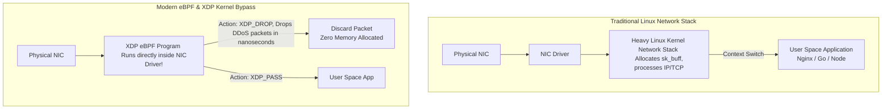
```mermaid
flowchart TD
    subgraph TraditionalStack ["Traditional Linux Network Stack"]
        NIC1["Physical NIC"] --> Driver1["NIC Driver"]
        Driver1 --> KernelStack["Heavy Linux Kernel Network Stack <br> Allocates sk_buff, processes IP/TCP"]
        KernelStack -->|"Context Switch"| UserApp["User Space Application <br> Nginx / Go / Node"]
    end
    
    subgraph eBPFStack ["Modern eBPF & XDP Kernel Bypass"]
        NIC2["Physical NIC"] --> XDPProg["XDP eBPF Program <br> Runs directly inside NIC Driver!"]
        XDPProg -->|"Action: XDP_DROP, Drops DDoS packets in nanoseconds"| DropPacket["Discard Packet <br> Zero Memory Allocated"]
        XDPProg -->|"Action: XDP_PASS"| UserApp2["User Space App"]
    end
```

### সমাধান: XDP (eXpress Data Path) ও eBPF
আধুনিক হাই-পারফরম্যান্স সিস্টেম (যেমন Cloudflare বা Kubernetes-এর Cilium CNI) ব্যবহার করে **XDP** ও **eBPF (Extended Berkeley Packet Filter)**। 
* **কিভাবে কাজ করে?** eBPF লিনাক্স কার্নেলের ভেতর একটি সুরক্ষিত স্যান্ডবক্সড ভার্চুয়াল মেশিন সচল করে। XDP-এর সাহায্যে আমরা লিনাক্স কার্নেলের মেইন মেমরি ও এঞ্জিন সচল হওয়ার আগেই সরাসরি নেটওয়ার্ক কার্ডের **ড্রাইভার স্তরে (NIC Driver level)** একটি কাস্টম সি বা রাস্ট কোড রান করতে পারি। 
* **কেন এটি চরম ফাস্ট?** প্যাকেট ড্রাইভার স্তরে আসামাত্র eBPF প্রোগ্রাম সেটি রিড করে সেকেন্ডের শতকোটি ভাগের এক ভাগে (Nanoseconds) সিদ্ধান্ত নিতে পারে যে প্যাকেটটি আসল নাকি ফেইক। ফেইক হলে সেটিকে সাথে সাথে **`XDP_DROP`** সিগন্যাল দিয়ে ড্রপ করে দেয়। এর জন্য কার্নেলকে কোনো সকেট মেমরি বরাদ্দ বা কনটেক্সট সুইচ করতে হয় না। ক্লাউডফ্লেয়ার এই প্রযুক্তি ব্যবহার করে সেকেন্ডে কোটি কোটি অ্যাটাক প্যাকেট কোনো ল্যাটেন্সি ছাড়াই ড্রপ করে দেয়।

---

## ১২. Anycast Routing & BGP (এনিকাস্ট রাউটিং-এর ভেতরের জাদু)

আপনি যদি ক্লাউডফ্লেয়ারের ডিএনএস আইপি **`1.1.1.1`** অথবা গুগলের **`8.8.8.8`** আইপিতে পিন্গ করেন, তবে আপনার পিসিতে ল্যাটেন্সি দেখাবে মাত্র ২-৫ মিলি-সেকেন্ড। এর মানে হলো ১.১.১.১ সার্ভারটি ফিজিক্যালি আপনার শহরের বা দেশের খুব কাছাকাছি কোনো ডেটা সেন্টারে অবস্থিত। 
* **আশ্চর্যজনক বিষয়:** আমেরিকার কোনো ব্যক্তি যখন ১.১.১.১-এ কানেক্ট হয়, সেও মাত্র ২ মিলি-সেকেন্ডে তার কাছে অবস্থিত আমেরিকার ফিজিক্যাল সার্ভারেই কানেক্ট হয়! 
* **কীভাবে একই আইপি অ্যাড্রেস একই সাথে সারা বিশ্বের শত শত ডেটা সেন্টারে রানিং থাকে?** এর পেছনের জাদুকরী প্রোটোকল হলো **Anycast Routing** এবং **BGP (Border Gateway Protocol)**।

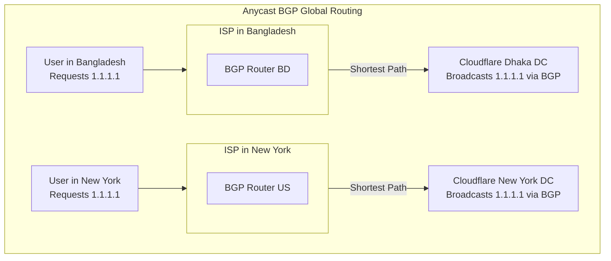
```mermaid
flowchart TD
    subgraph AnycastEcosystem ["Anycast BGP Global Routing"]
        UserBD["User in Bangladesh <br> Requests 1.1.1.1"]
        UserUS["User in New York <br> Requests 1.1.1.1"]
        
        subgraph ISPBD ["ISP in Bangladesh"]
            BGPBD["BGP Router BD"]
        end
        subgraph ISPUS ["ISP in New York"]
            BGPUS["BGP Router US"]
        end
        
        DC_Dhaka["Cloudflare Dhaka DC <br> Broadcasts 1.1.1.1 via BGP"]
        DC_NY["Cloudflare New York DC <br> Broadcasts 1.1.1.1 via BGP"]
        
        UserBD --> ISPBD
        ISPBD -->|"Shortest Path"| DC_Dhaka
        
        UserUS --> ISPUS
        ISPUS -->|"Shortest Path"| DC_NY
    end
```

### Anycast কীভাবে কাজ করে?
সাধারণত ইন্টারনেটে একটি আইপি কেবল একটি নির্দিষ্ট ডিভাইসের জন্য বরাদ্দ থাকে (Unicast)। কিন্তু Anycast নেটওয়ার্কে গুগলের বা ক্লাউডফ্লেয়ারের সমস্ত গ্লোবাল ডেটা সেন্টার নিজেদের রাউটার থেকে গ্লোবাল ইন্টারনেট প্রোভাইডারদের কাছে অ্যানাউন্স করে যে: **“১.১.১.১ আইপিটি আমার কাছে রয়েছে।”**
* ইন্টারনেট রাউটারগুলো যখন **BGP (Border Gateway Protocol)** দিয়ে গ্লোবাল নেটওয়ার্ক ম্যাপ তৈরি করে, তখন বাংলাদেশের ইন্টারনেট গেটওয়ে দেখে যে তার সবচেয়ে কাছে রয়েছে ঢাকার ডেটা সেন্টারটি। 
* রাউটার অটোমেটিকালি ট্রাফিককে সবচেয়ে কম দূরত্ব বা কম হপের ঢাকার ডেটা সেন্টারে রাউট করে দেয়। 
* একই সাথে নিউ ইয়র্কের গেটওয়ে দেখে যে তার সবচেয়ে কাছাকাছি ১.১.১.১ হলো নিউ ইয়র্কের ডেটা সেন্টারটি।
* এভাবেই একই আইপি এড্রেস ব্যবহার করে কোটি কোটি ইউজারকে সম্পূর্ণ আলাদা ফিজিক্যাল লোকেশনে রাউট করে ইন্টারনেটের গতি অবিশ্বাস্য মাত্রায় বাড়িয়ে দেওয়া হয়।

---

## ১৩. TLS 1.2 বনাম TLS 1.3: ক্রিপ্টোগ্রাফি হ্যান্ডশেক ল্যাটেন্সি অপ্টিমাইজেশন

আমরা যখনই HTTPS সিকিউর কানেকশন তৈরি করি, ব্রাউজার ও সার্ভারকে নিজেদের মধ্যে একটি জটিল গাণিতিক চুক্তি বা এনক্রিপশন কি এক্সচেঞ্জ করতে হয়। একে **TLS Handshake** বলে। 
* **TLS 1.2** প্রোটোকলে এই হ্যান্ডশেক সম্পন্ন করতে নেটওয়ার্কে **২ বার রাউন্ড ট্রিপ (2 RTT - Round Trip Time)** করতে হতো। 
* **TLS 1.3** এসে এই ল্যাটেন্সি অর্ধেক কমিয়ে দিয়ে **১ আরটিটি (1 RTT)** তে নিয়ে এসেছে!

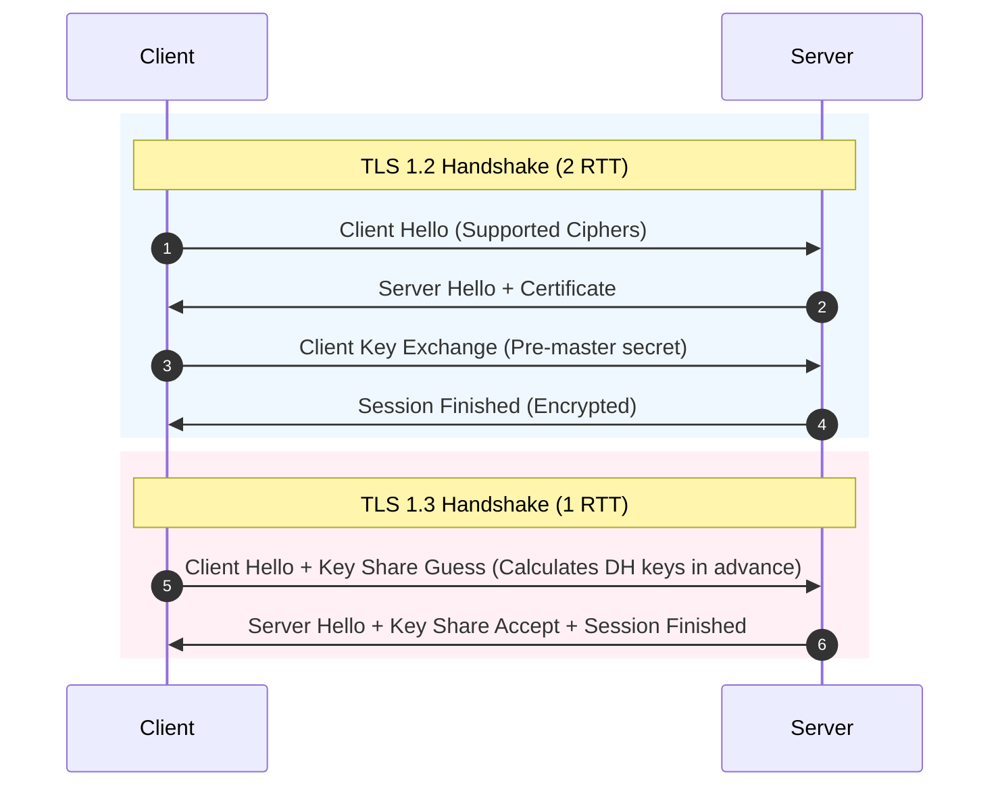
```mermaid
sequenceDiagram
    autonumber
    rect rgb(240, 248, 255)
        Note over Client, Server: TLS 1.2 Handshake (2 RTT)
        Client->>Server: Client Hello (Supported Ciphers)
        Server->>Client: Server Hello + Certificate
        Client->>Server: Client Key Exchange (Pre-master secret)
        Server->>Client: Session Finished (Encrypted)
    end
    rect rgb(255, 240, 245)
        Note over Client, Server: TLS 1.3 Handshake (1 RTT)
        Client->>Server: Client Hello + Key Share Guess (Calculates DH keys in advance)
        Server->>Client: Server Hello + Key Share Accept + Session Finished
    end
```

### TLS 1.3 কীভাবে ১ আরটিটি-তে হ্যান্ডশেক সম্পন্ন করে?
* **TLS 1.2-এর মেথড:** প্রথমে ক্লায়েন্ট তার সাপোর্টেড সিকিউরিটি এলগরিদম (Cipher Suites) পাঠাত। সার্ভার সেখান থেকে একটি সিলেক্ট করে ব্যাক করত (১ম রাউন্ড ট্রিপ)। এরপর ক্লায়েন্ট একটি সিক্রেট কি (Key Exchange) বানিয়ে পাঠাত এবং সার্ভার কনফার্ম করত (২য় রাউন্ড ট্রিপ)।
* **TLS 1.3-এর ম্যাজিক:** আধুনিক যুগে সিকিউর এলগরিদমের সংখ্যা অনেক কমে এসেছে এবং সবাই মূলত ডিফ-হেলম্যান (Diffie-Hellman Key Exchange) অ্যালগরিদম ব্যবহার করে। TLS 1.3 এ ক্লায়েন্ট প্রথম প্যাকেটে (`Client Hello`) শুধু এলগরিদমের লিস্টই পাঠায় না, বরং সে নিজে থেকেই একটি কি এক্সচেঞ্জ অনুমান করে নিজের পাবলিক কি পার্টটি সাথে সাথে পাঠিয়ে দেয়। 
* সার্ভার সেই অনুমানকৃত কি (Key Share) এক্সেপ্ট করে নিজের পাবলিক কি ও সার্টিফিকেটসহ প্রথম প্যাকেটেই হ্যান্ডশেক ডান করে দেয়। এর ফলে অতিরিক্ত একটি ট্রাভেল টাইম (RTT) সম্পূর্ণরূপে বেঁচে যায় এবং মোবাইল নেটওয়ার্কে ওয়েবসাইট অনেক ফাস্ট লোড হয়।

---

## ১৪. HTTP/2 Frame-Level Mechanics ও HPACK কম্প্রেশন

আমরা জানি HTTP/2 একটি সিঙ্গেল কানেকশনের আন্ডারে মাল্টিপ্লেক্সিং সাপোর্ট করে। কিন্তু এর পেছনে আসল মেমরি অপ্টিমাইজেশন কীভাবে ঘটে? HTTP/2 প্রতিটি প্লেইন টেক্সট HTTP রিকোয়েস্টকে বাইনারি ফরম্যাটে ছোট ছোট **Frames**-এ ভাগ করে ফেলে।

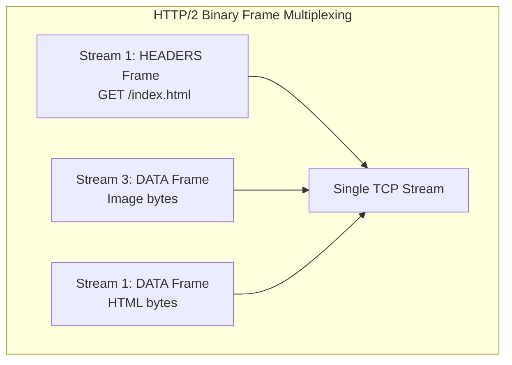
```mermaid
flowchart LR
    subgraph RequestAsFrames ["HTTP/2 Binary Frame Multiplexing"]
        direction LR
        Frame1["Stream 1: HEADERS Frame <br> GET /index.html"] --> TCPStream["Single TCP Stream"]
        Frame2["Stream 3: DATA Frame <br> Image bytes"] --> TCPStream
        Frame3["Stream 1: DATA Frame <br> HTML bytes"] --> TCPStream
    end
```

### HTTP/2 ফ্রেমের প্রকারভেদ:
১. **HEADERS Frame:** এপিআই বা পেজের সব রিকোয়েস্ট হেডার বহন করে।
২. **DATA Frame:** এপিআই রেসপন্সের আসল পে-লোড বা বডি (JSON, HTML বা ইমেজ বাইনারি) বহন করে।
৩. **RST_STREAM Frame:** কোনো কানেকশন ক্লোজ না করেই নির্দিষ্ট একটি স্ট্রিমকে ফোর্সফুলি ক্যানসেল করতে এটি ব্যবহার করা হয় (যেমন ইউজার পেজ চেঞ্জ করলে ইমেজ ডাউনলোড মাঝপথে স্টপ করতে)।

### HPACK (কুখ্যাত হেডার ডুপ্লিকেশন দূর করা):
HTTP/1.1 এ আপনি যখনই এপিআই রিকোয়েস্ট পাঠান, প্রতিবার ব্রাউজার হেডার হিসেবে বিশাল আকারের ইউজার এজেন্ট (`User-Agent: Mozilla/5.0...`), কুকি, এক্সেপ্ট টাইপ প্লেইন টেক্সটে পাঠাত। এটি প্রচুর ব্যান্ডউইথ নষ্ট করত।
* **HPACK সমাধান:** HTTP/2 ব্যবহার করে HPACK অ্যালগরিদম। এটি সার্ভার ও ক্লায়েন্ট দুই প্রান্তেই একটি **Static Table** (সাধারণ হেডারগুলোর একটি প্রি-ডিফাইনড ইনডেক্স লিস্ট) এবং একটি ডাইনামিক **Dynamic Table** মেইনটেইন করে।
* যখন ক্লায়েন্ট ২য় বার রিকোয়েস্ট পাঠায়, সে প্লেইন টেক্সটে হেডার না পাঠিয়ে শুধু টেবিলের ইনডেক্স নম্বর পাঠায় (যেমন: `Header Index 2 = GET`)। HPACK হফম্যান কোডিং ব্যবহার করে হেডার সাইজ প্রায় ৮৫% থেকে ৯৫% পর্যন্ত কমিয়ে দেয়।

---

## ১৫. WebSocket বনাম Server-Sent Events (SSE): রিয়েল-টাইম আর্কিটেকচার মেকানিক্স

রিয়েল-টাইম লাইভ ডাটা পুশ করার জন্য আমরা এই দুটি প্রোটোকল ব্যবহার করি। সিস্টেম লেভেলে এদের মেকানিক্স সম্পূর্ণ ভিন্ন:

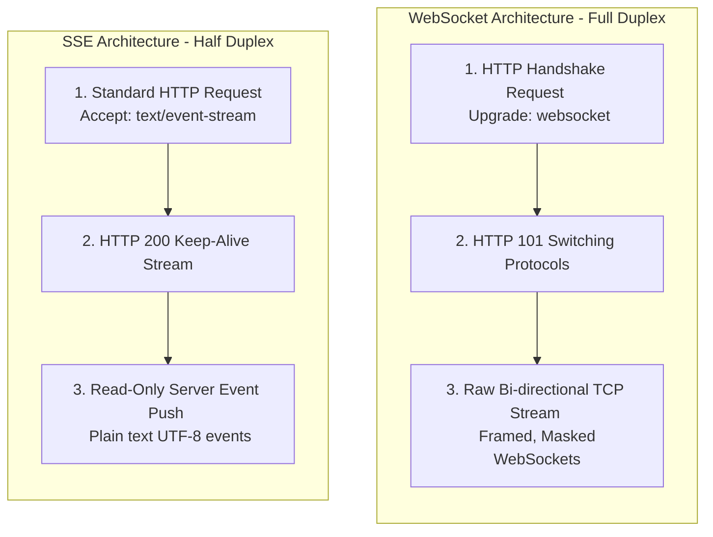
```mermaid
flowchart TD
    subgraph WebSocketFlow ["WebSocket Architecture - Full Duplex"]
        direction TB
        W1["1. HTTP Handshake Request <br> Upgrade: websocket"] --> W2["2. HTTP 101 Switching Protocols"]
        W2 --> W3["3. Raw Bi-directional TCP Stream <br> Framed, Masked WebSockets"]
    end
    
    subgraph SSEFlow ["SSE Architecture - Half Duplex"]
        direction TB
        S1["1. Standard HTTP Request <br> Accept: text/event-stream"] --> S2["2. HTTP 200 Keep-Alive Stream"]
        S2 --> S3["3. Read-Only Server Event Push <br> Plain text UTF-8 events"]
    end
```

### ১. WebSocket:
* **কীভাবে কাজ করে?** এটি প্রথমে একটি স্ট্যান্ডার্ড HTTP হ্যান্ডশেক দিয়ে শুরু করে এবং রিকোয়েস্ট হেডারে থাকে `Upgrade: websocket`। সার্ভার যদি রাজি থাকে, সে রেসপন্স কোড দেয় **`101 Switching Protocols`**। 
* এর সাথে সাথেই ওএসের কার্নেল টিসিপি কানেকশনটির এইচটিটিপি প্রোটোকল র্যাপার খুলে দিয়ে সরাসরি একটি র (Raw) দ্বিমুখী **Full-Duplex TCP Pipe** তৈরি করে ফেলে। এরপর ক্লায়েন্ট ও সার্ভার যেকোনো মুহূর্তে একে অপরকে ফ্রেম ছুঁড়ে মারতে পারে।
* **ব্যবহার:** লাইভ চ্যাট অ্যাপ্লিকেশন, মাল্টিপ্লেয়ার গেমস, ফাইন্যান্সিয়াল ট্রেডিং টার্মিনাল।

### ২. Server-Sent Events (SSE):
* **কীভাবে কাজ করে?** এটি কোনো স্পেশাল প্রোটোকল নয়। এটি সাধারণ HTTP/1.1 বা HTTP/2 কানেকশন ব্যবহার করে। ক্লায়েন্ট সার্ভারকে একটি রিকোয়েস্ট পাঠিয়ে বলে তার রেসপন্সের MIME টাইপ হবে **`text/event-stream`** এবং কানেকশন টাইপ হবে **`Keep-Alive`**।
* সার্ভার কানেকশনটি বন্ধ না করে অবিরত প্লেইন টেক্সট ফরম্যাটে স্ট্রিম আকারে ইভেন্ট বা ডাটা ক্লায়েন্টের দিকে ছুঁড়তে থাকে। এটি সম্পূর্ণ **One-Way (Read-only from server)**। ক্লায়েন্ট সার্ভারকে কোনো ডাটা এই পাইপ দিয়ে ব্যাক করতে পারে না (ডাটা ব্যাক করতে হলে ক্লায়েন্টকে আরেকটি প্যারালাল এপিআই রিকোয়েস্ট করতে হয়)।
* **ব্যবহার:** লাইভ নোটিফিকেশন ফিড, লাইভ স্কোর আপডেট, ChatGPT-এর মতো রিয়েল-টাইম AI টেক্সট স্ট্রিমিং।

---

## ১৬. IP Subnetting ও CIDR: সাবনেট মাস্কের ভেতরের আসল বাইনারি গণিত (Subnetting & CIDR Mechanics)

অধিকাংশ ডেভেলপার আইপি অ্যাড্রেসের পাশে থাকা স্ল্যাশ নম্বরটি (যেমন `192.168.1.0/24` বা `10.0.0.0/16`) মুখস্থ বসিয়ে দেন। কিন্তু রাউটার কীভাবে এই নম্বরের সাহায্যে সেকেন্ডে কোটি কোটি প্যাকেটের গন্তব্য হিসাব করে? এর পেছনে রয়েছে লজিক্যাল **Bitwise AND** অপারেশনের নিখুঁত বাইনারি গণিত।

### CIDR (Classless Inter-Domain Routing) ও সাবনেট মাস্ক কী?
আইপি অ্যাড্রেস হলো ৩২টি বিটের (Bits) একটি বাইনারি সংখ্যা। `/24` এর মানে হলো এই আইপিটির প্রথম **২৪টি বিট** নেটওয়ার্ক আইডি (Network ID) হিসেবে লক করা থাকবে এবং বাকি ৮টি বিট হোস্ট আইডি (Host ID) হিসেবে নতুন ডিভাইসের আইপি দেওয়ার জন্য ফ্রি থাকবে।
* **নেটওয়ার্ক আইডি লক (Mask):** প্রথম ২৪টি বিট ১ করা এবং শেষ ৮টি বিট ০ করা হলে আমরা পাই সাবনেট মাস্ক: `255.255.255.0`।

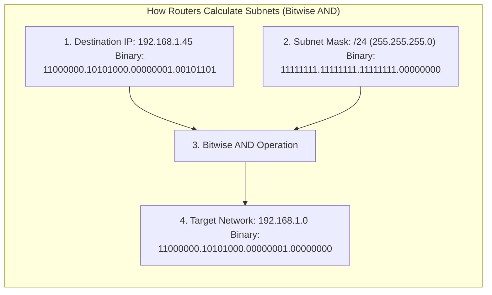
```mermaid
flowchart TD
    subgraph BitwiseOperation ["How Routers Calculate Subnets (Bitwise AND)"]
        direction TB
        IP["1. Destination IP: 192.168.1.45 <br> Binary: 11000000.10101000.00000001.00101101"]
        Mask["2. Subnet Mask: /24 (255.255.255.0) <br> Binary: 11111111.11111111.11111111.00000000"]
        AND["3. Bitwise AND Operation"]
        Result["4. Target Network: 192.168.1.0 <br> Binary: 11000000.10101000.00000001.00000000"]
        
        IP --> AND
        Mask --> AND
        AND --> Result
    end
```

### রাউটার কীভাবে হিসাব করে?
ধরি, আইপি `192.168.1.10` কোনো প্যাকেট পাঠাতে চায় `192.168.1.45` আইপিতে।
১. **লোকাল চেক:** সোর্স ডিভাইস তার নিজের আইপির সাথে সাবনেট মাস্ক `/24` বাইনারি `AND` করে দেখে তার লোকাল নেটওয়ার্ক আইডি হলো `192.168.1.0`।
২. **টার্গেট চেক:** সে টার্গেট আইপি `192.168.1.45` এর সাথেও `/24` মাস্কটি বাইনারি `AND` করে দেখে টার্গেটের নেটওয়ার্ক আইডিও `192.168.1.0`।
৩. **সিদ্ধান্ত:** যেহেতু দুটি নেটওয়ার্ক আইডি মিলে গেছে, রাউটার ছাড়াই প্যাকেটটি লোকাল সুইচ দিয়ে সরাসরি সেকেন্ডের মধ্যে ওই ডিভাইসে চলে যায়।
৪. **গেটওয়ে রাউটিং:** যদি টার্গেট আইপি হতো `8.8.8.8`, বাইনারি `AND` করার পর নেটওয়ার্ক আইডি হতো `8.8.8.0` (যা লোকাল সাবনেটের সাথে মিলে না)। তখন ডিভাইসটি বুঝতে পারে এটি বাইরের নেটওয়ার্ক এবং প্যাকেটটি সরাসরি **Default Gateway (Router)**-এর কাছে ফরওয়ার্ড করে দেয়।

---

## ১৭. TCP Keepalive বনাম HTTP Keep-Alive এবং TCP RST (Reset) এর ট্রিগার

"Keep-Alive" শব্দটি নেটওয়ার্কিংয়ের অত্যন্ত পরিচিত একটি টার্ম। কিন্তু ট্রান্সপোর্ট লেয়ারের **TCP Keepalive** এবং অ্যাপ্লিকেশন লেয়ারের **HTTP Keep-Alive** এর কাজের মধ্যে আকাশ-পাতাল পার্থক্য রয়েছে।

### ক. L4 TCP Keepalive বনাম L7 HTTP Keep-Alive

#### L4 TCP Keepalive (কার্নেল স্তরে):
* **উদ্দেশ্য:** একটি অলস (Idle) TCP কানেকশন এখনও বেঁচে আছে কি না তা ব্যাকগ্রাউন্ডে চেক করা।
* **কীভাবে কাজ করে?** কোনো সকেটে দীর্ঘক্ষণ কোনো ডেটা ট্রান্সফার না হলে ওএসের কার্নেল নিজে থেকেই প্রতিপক্ষকে একটি অত্যন্ত ছোট, খালি **ACK** প্যাকেট পাঠায়। ওপাশ থেকে যদি কোনো রেসপন্স না আসে, কার্নেল ধরে নেয় সকেটটি ডেড এবং মেমরি খালি করতে সকেটটি ক্লোজ করে দেয়। এটি ফায়ারওয়াল বা NAT টেবিলে অলস পোর্টগুলো যেন অকারণে ডিলিট না হয়ে যায় তা নিশ্চিত করে।

#### L7 HTTP Keep-Alive (অ্যাপ্লিকেশন স্তরে):
* **উদ্দেশ্য:** প্রতিটি আলাদা এপিআই রিকোয়েস্টের জন্য নতুন TCP কানেকশনের ৩-ওয়ে হ্যান্ডশেক এড়ানো।
* **কীভাবে কাজ করে?** এটি অ্যাপ্লিকেশনকে বলে—*"একটি ইমেজ লোড শেষ হলে TCP কানেকশনটি বন্ধ করো না, এই সকেট পাইপটি খোলা রাখো যাতে পরবর্তী CSS বা JS ফাইলটি এই একই সকেট দিয়ে পাঠানো যায়।"* এটি সরাসরি ব্যান্ডউইথ ও সিপিইউ বাচায়।

---

### খ. TCP RST (Reset) প্যাকেট কখন এবং কেন ট্রিগার হয়?
TCP কানেকশনে যদি কোনো পক্ষের সাথে চরম মিসম্যাচ ঘটে, তখন কার্নেল ভদ্রভাবে কানেকশন বন্ধ (FIN) না করে অত্যন্ত আগ্রাসীভাবে একটি **RST (Reset)** ফ্ল্যাগযুক্ত প্যাকেট পাঠায়। এটি দেখলেই সকেটে সাথে সাথে `Connection reset by peer` এরর দেখায়।

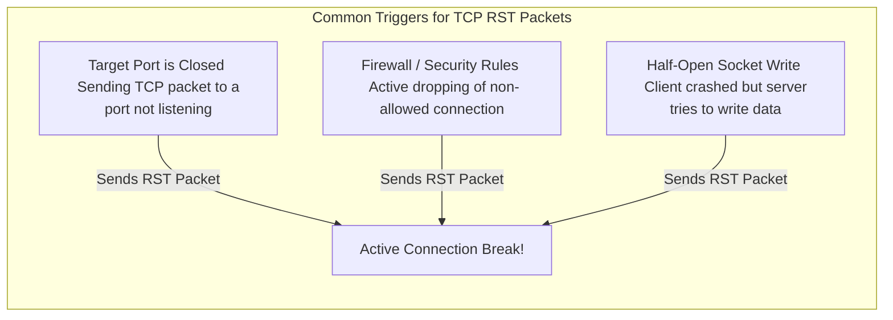
```mermaid
flowchart TD
    subgraph RSTTriggers ["Common Triggers for TCP RST Packets"]
        direction TB
        T1["Target Port is Closed <br> Sending TCP packet to a port not listening"]
        T2["Firewall / Security Rules <br> Active dropping of non-allowed connection"]
        T3["Half-Open Socket Write <br> Client crashed but server tries to write data"]
        
        T1 -->|"Sends RST Packet"| Reset["Active Connection Break!"]
        T2 -->|"Sends RST Packet"| Reset
        T3 -->|"Sends RST Packet"| Reset
    end
```

#### প্রধান ট্রিগারসমূহ:
১. **লিসেনিং না থাকা পোর্ট:** আপনি যদি সার্ভারের ৮০০৮ পোর্টে প্যাকেট পাঠান কিন্তু সার্ভারে ওই পোর্টে কোনো অ্যাপ্লিকেশন সচল না থাকে, কার্নেল সাথে সাথে **RST** প্যাকেট ব্যাক করে বলবে—*“এখানে কেউ নেই, রিকোয়েস্ট বন্ধ করো।”*
২. **হাফ-ওপেন সকেট রাইটিং:** ক্লায়েন্ট যদি ক্র্যাশ করে বন্ধ হয়ে যায় কিন্তু সার্ভার তা না জেনে ওই পুরানো সকেটে ডেটা `write()` করতে যায়, ক্লায়েন্টের কার্নেল ওই প্যাকেটটি রিসিভ করে দেখে তার মেমরিতে এমন কোনো সকেটের অস্তিত্ব নেই। সে সাথে সাথে সার্ভারকে **RST** পাঠায়।
৩. **ফায়ারওয়াল ব্লকিং:** কোনো ইন্ট্রুশন ডিটেকশন সিস্টেম যদি সন্দেহজনক ট্রাফিক দেখে, সে সোর্স ও ডেস্টিনেশন উভয় পক্ষকেই ফেইক **RST** প্যাকেট পাঠিয়ে তাদের কানেকশনটি জোরপূর্বক ডিসকানেক্ট করে দেয়।

---

## ১৮. Unix Domain Sockets (UDS) বনাম TCP Loopback: মাইক্রোসার্ভিস পারফরম্যান্স বুস্ট

সাধারণত আমরা যখন লোকাল হোস্টের ভেতরেই রিভার্স প্রক্সি (যেমন Nginx) থেকে আমাদের অ্যাপ্লিকেশন ব্যাকএন্ডে (যেমন NestJS) ট্রাফিক পাঠাই, তখন আমরা `127.0.0.1:3000` (TCP Loopback) ব্যবহার করি। কিন্তু একই মেশিনে থাকা দুটি প্রসেসের মধ্যে কমিউনিকেশনের জন্য TCP ব্যবহার করা অত্যন্ত অনুচিত ও ধীরগতির।

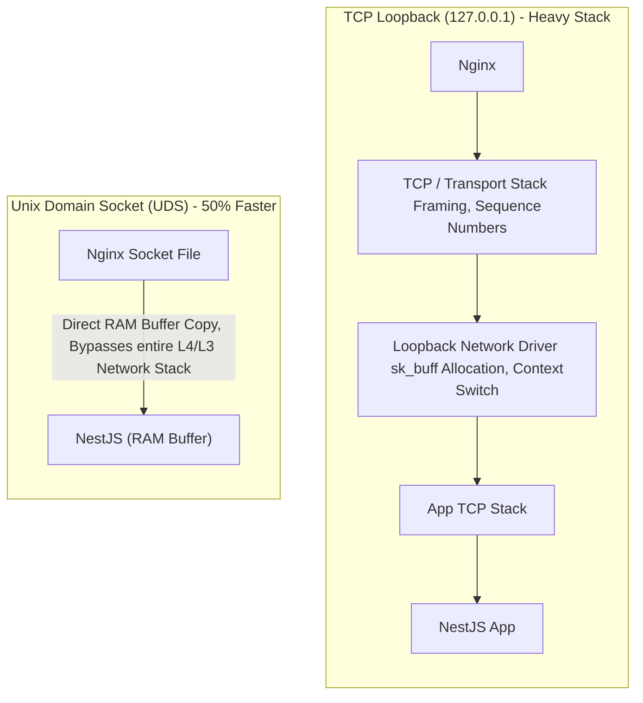
```mermaid
flowchart TD
    subgraph TCP_Loopback ["TCP Loopback (127.0.0.1) - Heavy Stack"]
        direction TB
        N1["Nginx"] --> L4_TCP["TCP / Transport Stack <br> Framing, Sequence Numbers"]
        L4_TCP --> LoopbackDriver["Loopback Network Driver <br> sk_buff Allocation, Context Switch"]
        LoopbackDriver --> App_TCP["App TCP Stack"]
        App_TCP --> NestApp1["NestJS App"]
    end
    
    subgraph Unix_Sockets ["Unix Domain Socket (UDS) - 50% Faster"]
        direction TB
        N2["Nginx Socket File"] -->|"Direct RAM Buffer Copy, Bypasses entire L4/L3 Network Stack"| NestApp2["NestJS (RAM Buffer)"]
    end
```

### কেন TCP Loopback ধীরগতির?
লোকাল আইপি `127.0.0.1` এ প্যাকেট পাঠানোর সময় কার্নেল বুঝতে পারে এটি লোকাল হোস্ট। কিন্তু তবুও এটি সম্পূর্ণ TCP/IP প্রোটোকল স্ট্যাকের ভেতর দিয়ে যায়। কার্নেলকে প্যাকেট ফ্রেমিং করতে হয়, সিকোয়েন্স নম্বর অ্যাসাইন করতে হয়, মেমরি বাফার ক্রিয়েট করতে হয় এবং লুপব্যাক নেটওয়ার্ক ড্রাইভারে কনটেক্সট সুইচ করতে হয়। এটি অনেক সিপিইউ সাইকেল নষ্ট করে।

### Unix Domain Sockets (UDS) কীভাবে কাজ করে?
UDS হলো ওএসের কার্নেল ফাইলসিস্টেমের একটি বিশেষ ফাইল (যেমন `/var/run/app.sock`)।
* UDS কোনো নেটওয়ার্ক কার্ড, লুপব্যাক ড্রাইভার, বা TCP স্ট্যাক চেনে না।
* Nginx যখন এই সকেটে লেখে, কার্নেল সরাসরি মেমরির এক বাফার থেকে ডাটা কপি করে NestJS অ্যাপ্লিকেশনের রিড মেমরি বাফারে পেস্ট করে দেয়।
* **ফলাফল:** একই হোস্টে থাকা মাইক্রোসার্ভিসগুলোর মধ্যে UDS ব্যবহার করলে ট্রাফিক থ্রুপুট প্রায় **৩০% থেকে ৫০%** পর্যন্ত বেড়ে যায় এবং ল্যাটেন্সি উল্লেখযোগ্যভাবে কমে যায়!

---

## ১৯. CORS (Cross-Origin Resource Sharing)-এর আসল সিস্টেম লেভেল মেকানিক্স

ওয়েব ডেভেলপারদের জীবনে সবচেয়ে বড় ভয়ের কারণ হলো `CORS Policy Blocked` এরর। কিন্তু সিস্টেম স্তরে ব্রাউজারের ভেতর এই সিকিউরিটি ফিল্টারিং কীভাবে কাজ করে?

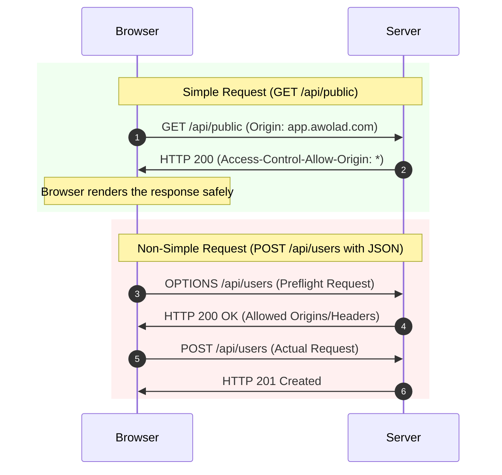
```mermaid
sequenceDiagram
    autonumber
    rect rgb(240, 255, 240)
        Note over Browser, Server: Simple Request (GET /api/public)
        Browser->>Server: GET /api/public (Origin: app.awolad.com)
        Server->>Browser: HTTP 200 (Access-Control-Allow-Origin: *)
        Note over Browser: Browser renders the response safely
    end
    rect rgb(255, 240, 240)
        Note over Browser, Server: Non-Simple Request (POST /api/users with JSON)
        Browser->>Server: OPTIONS /api/users (Preflight Request)
        Server->>Browser: HTTP 200 OK (Allowed Origins/Headers)
        Browser->>Server: POST /api/users (Actual Request)
        Server->>Browser: HTTP 201 Created
    end
```

### CORS কেন প্রয়োজন?
CORS সার্ভারের সুরক্ষার জন্য নয়, এটি মূলত **ব্রাউজার স্যান্ডবক্সের (Browser Sandbox)** একটি ক্লায়েন্ট-সাইড সিকিউরিটি পলিসি। 
* ধরি, আপনি একটি ক্ষতিকারক ওয়েবসাইটে ব্রাউজ করছেন। ওই ওয়েবসাইটের জাভাস্ক্রিপ্ট কোড ব্যাকগ্রাউন্ডে আপনার ব্রাউজারে থাকা সেশন কুকি ব্যবহার করে `facebook.com` বা `yourbank.com`-এ কোনো ক্ষতিকর রিকোয়েস্ট পাঠাতে পারে। 
* ব্রাউজার যেন কোনো ডোমেইনের স্ক্রিপ্টকে অন্য ডোমেইনের প্রাইভেট এপিআই অ্যাক্সেস করতে না দেয়, তার জন্য CORS গার্ডলাইন তৈরি করা হয়েছে।

### Preflight Request (OPTIONS) কীভাবে কাজ করে?
যখনই কোনো রিকোয়েস্ট "Non-Simple" ক্যাটাগরিতে পড়ে (যেমন: `Content-Type: application/json` পাঠানো বা `PUT/DELETE` মেথড ব্যবহার করা), ব্রাউজার মূল রিকোয়েস্ট পাঠানোর আগে ব্যাকগ্রাউন্ডে একটি স্পেশাল **Preflight Request (OPTIONS)** সার্ভারে পাঠায়।
* **OPTIONS রিকোয়েস্টের ম্যাজিক:** ব্রাউজার সার্ভারকে জিজ্ঞেস করে—*“আমি app.awolad.com অরিজিন থেকে এই মেথড ও হেডার দিয়ে ডাটা পাঠাতে চাই, তুমি কি অনুমতি দেবে?”*
* সার্ভার যদি রেসপন্স হেডারে `Access-Control-Allow-Origin: app.awolad.com` বা `*` রিটার্ন করে, তবেই ব্রাউজার পরবর্তী রিয়েল রিকোয়েস্টটি সার্ভারে পাঠায়।
* **সবচেয়ে গুরুত্বপূর্ণ তথ্য:** আপনার সার্ভার কিন্তু CORS এরর দেয় না! সার্ভার ঠিকই রিকোয়েস্ট এক্সেপ্ট করে ২০০ ওকে রিটার্ন করে। কিন্তু ব্রাউজার যখন দেখে রেসপন্সে সঠিক `Access-Control` হেডারগুলো নেই, তখন ব্রাউজার নিজে থেকে জাভাস্ক্রিপ্টের অ্যাক্সেস ব্লক করে কনসোলে CORS এরর দেখায়!

---

## ২০. HTTP/3 QUIC-এর সিকিউর কানেকশন মাইগ্রেশন ও 0-RTT টোকেন ভ্যালিডেশন

HTTP/3 এর পেছনের ইঞ্জিন QUIC প্রোটোকল কীভাবে সিকিউরিটি ও ল্যাটেন্সির এক অপূর্ব সমন্বয় ঘটায় তা আমাদের জানতে হবে।

### ক. Connection Migration (আইপি চেঞ্জ হলেও কানেকশন সচল থাকা)
ঐতিহ্যগতভাবে TCP কানেকশন লক হয়ে থাকে ৪টি বিষয়ের ওপর ভিত্তি করে: `Source IP, Source Port, Destination IP, Destination Port`। এদের যেকোনো একটিও যদি সেকেন্ডের ভগ্নাংশের জন্য চেঞ্জ হয়, TCP কানেকশন সাথে সাথে ডেড হয়ে যায়।
* **QUIC-এর ম্যাজিক:** QUIC প্রথম হ্যান্ডশেকের সময় ওএসের কার্নেলে একটি ইউনিক ক্রিপ্টোগ্রাফিক **Connection ID (CID)** অ্যাসাইন করে।
* আপনি যখন মোবাইল নিয়ে হেঁটে বাসার ওয়াই-ফাই (IP-A) থেকে ফোরজি (IP-B) নেটওয়ার্কে ট্রানজিশন করেন, আপনার আইপি ও পোর্ট সম্পূর্ণ চেঞ্জ হয়ে গেলেও প্যাকেটের ভেতরে থাকা **Connection ID** একই থাকে। 
* সার্ভার নতুন আইপি থেকে প্যাকেট পেলেও সেই আইডি দেখে চিনতে পারে এবং কোনো হ্যান্ডশেক ছাড়াই লাইভ কল বা ভিডিও স্ট্রিম সচল রাখে।

---

### খ. 0-RTT Replay Attack ও কার্নেল প্রোটেকশন
QUIC প্রোটোকলে সেকেন্ড টাইম কানেক্ট করার সময় কোনো হ্যান্ডশেক ছাড়াই **0-RTT (Zero Round-Trip Time)** মোডে ডেটা এপিআই রিকোয়েস্টের সাথে পাঠিয়ে দেওয়া যায়। কিন্তু হ্যাকাররা এই প্যাকেটটি মাঝপথে কপি করে সার্ভারে বারবার রি-সেন্ড করতে পারে। একে **Replay Attack** বলে।

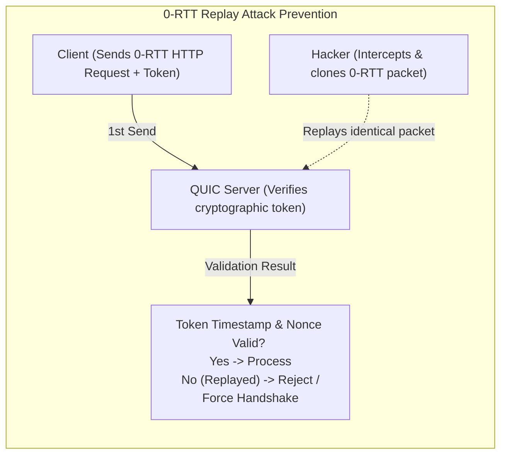
```mermaid
flowchart TD
    subgraph ReplayAttack ["0-RTT Replay Attack Prevention"]
        direction TB
        Client["Client (Sends 0-RTT HTTP Request + Token)"]
        Hacker["Hacker (Intercepts & clones 0-RTT packet)"]
        Server["QUIC Server (Verifies cryptographic token)"]
        
        Client -->|"1st Send"| Server
        Hacker -.->|"Replays identical packet"| Server
        Server -->|"Validation Result"| Decision["Token Timestamp & Nonce Valid? <br> Yes -> Process <br> No (Replayed) -> Reject / Force Handshake"]
    end
```

#### প্রতিরোধ মেকানিজম:
0-RTT রিকোয়েস্টকে সুরক্ষিত করতে QUIC সার্ভার ক্লায়েন্টকে একটি ক্রিপ্টোগ্রাফিক **0-RTT Token (Session Ticket)** দেয়। এই টোকেনের মধ্যে থাকে:
১. একটি ইউনিক সিক্রেট ননস (Nonce)
২. টাইমস্ট্যাম্প (Timestamp)
৩. ক্লায়েন্টের আইপির এনক্রিপ্টেড হ্যাশ।
* সার্ভার যখনই কোনো 0-RTT প্যাকেট পায়, সে টোকেনটি ডিক্রিপ্ট করে দেখে এটি আগে কখনো ব্যবহৃত হয়েছে কি না বা টাইমস্ট্যাম্প এক্সপায়ার হয়েছে কি না। রি-প্লে বা ফেক ট্রাফিক মনে হলে সার্ভার সাথে সাথে 0-RTT মোড রিজেক্ট করে ক্লায়েন্টকে ফুল ১-আরটিটি হ্যান্ডশেক করতে বাধ্য করে।

---

## ২১. লেয়ার ৪ (L4) বনাম লেয়ার ৭ (L7) লোড ব্যালেন্সিং-এর ভেতরের আর্কিটেকচার

আমরা সবাই লোড ব্যালেন্সার চিনি, কিন্তু হাই-পারফরম্যান্স সিস্টেমে কখন ট্রান্সপোর্ট লেয়ার ৪ (L4) আর কখন অ্যাপ্লিকেশন লেয়ার ৭ (L7) লোড ব্যালেন্সার বসাতে হবে? এটি একটি অন্যতম সেরা সিস্টেম ডিজাইন সিদ্বান্ত।

### ক. লেয়ার ৪ (L4) লোড ব্যালেন্সিং (প্যাকেট স্তরে রাউটিং)
L4 লোড ব্যালেন্সার অত্যন্ত ফাস্ট এবং এটি কাজ করে ট্রান্সপোর্ট লেয়ারের আইপি (IP) ও পোর্ট (Port) নিয়ে। 
* **কীভাবে কাজ করে?** এটি প্যাকেটের ভেতরের আসল ডাটা রিড করতে পারে না (এমনকি এটি TLS ডিক্রিপ্টও করে না)। এটি ক্লায়েন্টের কাছ থেকে প্যাকেট পায় এবং শুধু আইপি/পোর্ট হেডার দেখে সেকেন্ডে কোটি কোটি প্যাকেট সরাসরি পেছনের সার্ভারে রি-রাউট করে দেয় (NAT বা IP Tunneling এর মাধ্যমে)।
* **ব্যবহার:** AWS NLB (Network Load Balancer), HAProxy (L4 mode)।
* **সুবিধা:** যেহেতু এটি ডাটা ডিক্রিপশন বা পার্সিং করে না, এর মেমরি ও সিপিইউ খরচ প্রায় শূন্য এবং এটি কয়েক কোটি রিকোয়েস্ট কোনো ল্যাটেন্সি ছাড়াই হ্যান্ডেল করতে পারে।

### খ. লেয়ার ৭ (L7) লোড ব্যালেন্সিং (অ্যাপ্লিকেশন স্তরে রাউটিং)
L7 লোড ব্যালেন্সার কাজ করে অ্যাপ্লিকেশন লেয়ারের ডাটা নিয়ে।
* **কীভাবে কাজ করে?** এটি প্রথমে ক্লায়েন্টের সাথে TLS হ্যান্ডশেক সম্পন্ন করে ডাটা ডিক্রিপ্ট করে (TLS Termination)। এরপর সে রিকোয়েস্টের কুকি, ইউআরএল পাথ (যেমন `/api/v1/users`), এবং এইচটিটিপি হেডার পার্স করে বুদ্ধিদীপ্ত সিদ্ধান্ত নেয় যে ট্রাফিকটি পেছনের কোন মাইক্রোসার্ভিসে যাবে।
* **ব্যবহার:** Nginx (L7 proxy), AWS ALB (Application Load Balancer), Envoy Proxy।
* **সুবিধা:** আপনি পাথ-বেসড রাউটিং, কুকি-বেসড স্টিকি সেশন (Sticky Sessions), রেট লিমিটিং এবং সিকিউরিটি ফিল্টারিং করতে পারবেন।

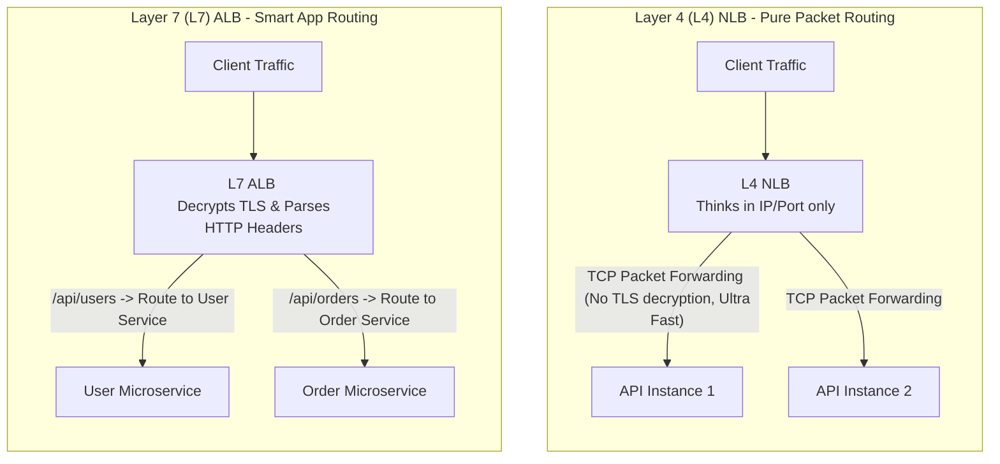
```mermaid
flowchart TD
    subgraph L4_Balancing ["Layer 4 (L4) NLB - Pure Packet Routing"]
        direction TB
        Client1["Client Traffic"] --> NLB["L4 NLB <br> Thinks in IP/Port only"]
        NLB -->|"TCP Packet Forwarding <br> (No TLS decryption, Ultra Fast)"| ServerA1["API Instance 1"]
        NLB -->|"TCP Packet Forwarding"| ServerA2["API Instance 2"]
    end
    
    subgraph L7_Balancing ["Layer 7 (L7) ALB - Smart App Routing"]
        direction TB
        Client2["Client Traffic"] --> ALB["L7 ALB <br> Decrypts TLS & Parses HTTP Headers"]
        ALB -->|"/api/users -> Route to User Service"| ServerB1["User Microservice"]
        ALB -->|"/api/orders -> Route to Order Service"| ServerB2["Order Microservice"]
    end
```

---

## ২২. TCP BDP (Bandwidth-Delay Product) ও Bufferbloat: আসল নেটওয়ার্ক জ্যামের কারণ

ইন্টারনেটে ব্যান্ডউইথ (স্পিড) ভালো থাকা সত্ত্বেও কেন মাঝে মাঝে পিন্গ ল্যাটেন্সি বা গেম খেলার সময় ল্যাগ হঠাৎ বেড়ে যায়? এর পেছনের দুটি কুখ্যাত কারণ হলো **TCP BDP** এবং **Bufferbloat**।

### ক. BDP (Bandwidth-Delay Product): ওএসের পাইপলাইন ক্ষমতা
BDP হলো একটি নেটওয়ার্ক পাইপলাইনের এক মুহূর্তে ধরে রাখা সর্বোচ্চ ডাটার পরিমাণ (ডাটা অন-দ্য-ফ্লাই)।
$$\text{BDP (Bits)} = \text{Bandwidth (bits/sec)} \times \text{RTT (sec)}$$
* **উদাহরণ:** আপনার ইন্টারনেট স্পিড ১০০ Mbps এবং আমেরিকার সার্ভারে আপনার ল্যাটেন্সি (RTT) ১০০ মিলি-সেকেন্ড। তাহলে পাইপের ক্ষমতা:
$$\text{BDP} = 100,000,000 \times 0.1 = 10,000,000 \text{ bits} \approx 1.25 \text{ Megabytes}$$
* **সিস্টেম টিউনিং:** যদি লিনাক্স কার্নেলের TCP উইন্ডো সাইজ (TCP Window Size) এই ১.২৫ MB-এর চেয়ে কম হয় (ধরি ২৫৬ KB), তবে আপনার ১০০ Mbps স্পিড থাকলেও সোর্স কম্পিউটার একবারে ২৫৬ KB-এর বেশি ডাটা পাঠাতে পারবে না, যতক্ষণ না ওপাশ থেকে ACK আসে। অর্থাৎ, আপনি সম্পূর্ণ স্পিড ব্যবহারই করতে পারবেন না! এর জন্য কার্নেলের `net.ipv4.tcp_wmem` সাইজ বাড়িয়ে দিতে হবে।

---

### খ. Bufferbloat (বাফারব্লোট): ফেইক বাফার নেটওয়ার্কের অভিশাপ
যখন আপনার লোকাল রাউটার বা মাঝের কোনো গেটওয়ের বাফার মেমরি অত্যধিক বড় করে ডিজাইন করা হয়, তখন নেটওয়ার্ক জ্যাম লাগলে রাউটার প্যাকেট ড্রাপ না করে সেগুলোকে নিজের বাফারে দীর্ঘক্ষণ ধরে রাখে (Queue)।

```mermaid
flowchart TD
    subgraph NormalFlow ["Normal Network Flow"]
        direction LR
        S1["Sender"] -->|"Fast Packets"| R1["Router (Small Buffer)"]
        R1 -->|"Smooth Delivery"| Rec1["Receiver"]
    end
    
    subgraph BufferbloatFlow ["Bufferbloat Network Congestion"]
        direction LR
        S2["Sender"] -->|"Flood Packets"| R2["Router (Oversized Buffer Queue) <br> Packets sit in RAM queue for seconds!"]
        R2 -->|"Huge RTT Latency / Lag"| Rec2["Receiver"]
    end
```

* **কেন এটি ক্ষতিকর?** TCP বুঝতে পারে প্যাকেট ড্রপ হলে স্পিড কমাতে হবে। কিন্তু বাফার মেমরিতে প্যাকেটগুলো আটকে থাকায় কোনো প্যাকেট ড্রপ হয় না, কিন্তু আপনার প্যাকেটটি সার্ভারে পৌঁছাতে ১-২ সেকেন্ড লেট করে। এর ফলে ল্যাটেন্সি ১০০০ মিলি-সেকেন্ডে উঠে যায় যা রিয়েল-টাইম লাইভ কল, গেমিং বা স্ট্রিম ধ্বংস করে দেয়।
* **সমাধান:** আধুনিক রাউটারগুলোতে **FQ-CoDel (Fair Queueing Controlled Delay)** অ্যালগরিদম ব্যবহার করা হয় যা বাফারে প্যাকেট দীর্ঘক্ষণ আটকে থাকলেই ওএসকে ফোর্সফুলি প্যাকেট ড্রপ করার সিগন্যাল পাঠিয়ে বাফারব্লোট প্রতিরোধ করে।

---

## ২৩. Unicast বনাম Broadcast বনাম Multicast বনাম Anycast

নেটওয়ার্কিং স্তরে ডেটা ডেলিভারির ৪টি প্রধান কাস্টিং টাইপ আমাদের জানা প্রয়োজন:

| কাস্টিং টাইপ | সম্পর্ক | মেকানিজম | বাস্তব উদাহরণ |
| :--- | :--- | :--- | :--- |
| **Unicast** | One-to-One | সরাসরি একটি নির্দিষ্ট সোর্স থেকে একটি নির্দিষ্ট টার্গেটে ডাটা পাঠানো। | আপনি ব্রাউজারে কোনো একটি এপিআই কল করছেন। |
| **Broadcast** | One-to-All | লোকাল সাবনেটের অন্তর্ভুক্ত সমস্ত ডিভাইসে একসাথে প্যাকেট পাঠানো। | ARP ব্রডকাস্ট (MAC জানা) বা DHCP Discovery। |
| **Multicast** | One-to-Many | নির্দিষ্ট একটি রেজিস্টার্ড গ্রুপ বা ক্লাস্টারের সব ডিভাইসে প্যাকেট পাঠানো। | আইপিটিভি (IPTV) লাইভ স্ট্রিমিং ও কার্নেল ক্লাস্টার সিঙ্ক। |
| **Anycast** | One-to-Nearest | একই আইপি অনেক জায়গায় রানিং থাকে, রাউটার ভৌগলিকভাবে সবচেয়ে কাছের ডিভাইসে পাঠায়। | DNS রিজলভার (`1.1.1.1`), CDN ট্রাফিক রাউটিং। |

```mermaid
flowchart TD
    subgraph CastingTypes ["IP Packet Delivery Types"]
        direction TB
        Uni["Unicast <br> (Sender -> Specific Node)"]
        Broad["Broadcast <br> (Sender -> All Nodes in LAN)"]
        Multi["Multicast <br> (Sender -> Subscribed Group Class-D IP)"]
        Any["Anycast <br> (Sender -> Geographical Closest via BGP)"]
    end
```

---

## ২৪. IPsec বনাম TLS (SSL) ভিপিএন টানেলিং মেকানিক্স

ভিপিএন (VPN) আমরা প্রতিদিন ব্যবহার করি কিন্তু এটি সিস্টেম লেভেলে প্যাকেট কীভাবে ইনক্যাপসুলেট (Encapsulate) করে?

```mermaid
flowchart TD
    subgraph IPsecTunnel ["IPsec VPN Tunnel Mode (Layer 3 Encryption)"]
        direction LR
        OriginalPacket["Orig IP Header + Payload"] -->|"Encapsulated"| NewIP["New Outer IP Header + ESP Encrypted Payload"]
    end
    
    subgraph TLSTunnel ["TLS VPN / OpenVPN (Layer 4/7 Encryption)"]
        direction LR
        DataPayload["App Data"] -->|"Encrypted via TLS"| L4_TCP_Outer["Standard IP + TCP/UDP Header"]
    end
```

### ক. IPsec VPN (Layer 3 - Network Layer VPN)
IPsec সাধারণত গেটওয়ে-টু-গেটওয়ে বা সাইট-টু-সাইট সুরক্ষায় ব্যবহৃত হয়।
* **কীভাবে কাজ করে?** এটি ওএসের নেটওয়ার্ক স্তরে কাজ করে। টানেল মোডে (Tunnel Mode) এটি আপনার আসল আইপি প্যাকেটের ভেতরের সোর্স এবং ডেস্টিনেশন আইপি-সহ পুরো প্যাকেটটিকে এনক্রিপ্ট করে এবং তার ওপরে একটি সম্পূর্ণ **নতুন ফেইক আইপি হেডার (Outer IP Header)** ও ESP সিকিউরিটি হেডার বসিয়ে দেয়। ইন্টারনেট প্রোভাইডার প্যাকেটের আসল উৎস বা গন্তব্য কিছুই দেখতে পারে না।

### খ. TLS/SSL VPN (Layer 4/7 - Application/Transport VPN)
OpenVPN বা আধুনিক ক্লায়েন্ট ভিপিএন-এ এটি বেশি ব্যবহৃত হয়।
* **কীভাবে কাজ করে?** এটি অ্যাপ্লিকেশন স্তরের টিএলএস আর্কিটেকচার ব্যবহার করে। এটি স্ট্যান্ডার্ড ওএসের সকেট ইন্টারফেসে ডাটা রিসিভ করে এবং সাধারণ HTTP/HTTPS প্যাকেটের মতো এনক্রিপ্ট করে নেটওয়ার্ক স্ট্যাকের ওপরে ড্রাইভার দিয়ে পুশ করে। এটি অনেক বেশি ফ্লেক্সিবল কারণ নির্দিষ্ট কোনো ওএস কার্নেল লেভেল মডিফাইড গেটওয়ে ছাড়াই ব্রাউজার বা সাধারণ অ্যাপ দিয়ে এটি সরাসরি সচল করা যায়।

---

## ২৫. NIC Ring Buffers ও Interrupt Moderation: হার্ডওয়্যার স্তরের প্যাকেট মেকানিক্স

যখন প্রতি সেকেন্ডে আপনার ১0-Gigabit নেটওয়ার্ক ইন্টারফেস কার্ডে (NIC) লাখ লাখ ডাটা প্যাকেট আছড়ে পড়ে, তখন হার্ডওয়্যার ও ওএস কার্নেল কীভাবে একে অপরকে ক্র্যাশ না করিয়ে শান্ত থাকে?

```mermaid
flowchart TD
    subgraph NIC_Processing ["Hardware Packet Processing with NAPI"]
        direction TB
        NIC["1. Physical NIC Port <br> Receives high-speed raw electrical/fiber pulses"] --> RingBuffer["2. Rx Ring Buffer <br> NIC DMA copies packets directly to host RAM"]
        RingBuffer --> IRQ["3. Hardware Interrupt (IRQ) <br> NIC tells CPU: 'I have packets!'"]
        IRQ --> NAPI_Mode["4. Linux NAPI (New API) Polling <br> CPU stops interrupts & actively polls Rx ring in a loop"]
        NAPI_Mode --> sk_buff["5. Allocate sk_buff & push to TCP Stack"]
    end
```

### ক. NIC Rx Ring Buffer (DMA মেকানিক্স)
প্যাকেট যখন ফিজিক্যাল পোর্টে আসে, নেটওয়ার্ক কার্ড সরাসরি সিপিইউকে বিরক্ত না করে তার নিজের অন-বোর্ড মেমরি বা ওএসের কার্নেল মেমরিতে থাকা একটি বৃত্তাকার বাফার যাকে **Rx Ring Buffer** বলে, সেখানে প্যাকেটগুলো সরাসরি রাইট করে (Direct Memory Access - DMA)।

### খ. Interrupt Storm বনাম Linux NAPI (New API)
ট্রেডিশনাল সিস্টেমে প্রতিবার বাফারে প্যাকেট আসামাত্র NIC সিপিইউর কাছে একটি **Hardware Interrupt (IRQ)** সিগন্যাল পাঠাত। সিপিইউ তার বর্তমান কাজ ফেলে রেখে সকেট রিসিভ করার কাজ করত।
* **সমস্যা:** যদি সেকেন্ডে ১০ লাখ প্যাকেট আসে, সিপিইউ সেকেন্ডে ১০ লাখ বার ইন্টারাপ্ট প্রসেস করতে গিয়ে সম্পূর্ণ ফ্রিজ হয়ে যাবে। একে **Interrupt Storm** বলে।
* **NAPI (Linux Polling System) সমাধান:** আধুনিক লিনাক্স কার্নেল **NAPI** প্রযুক্তি ব্যবহার করে। প্রথম প্যাকেট আসার পর NIC একটি হার্ডওয়্যার ইন্টারাপ্ট দেয়, কার্নেল সেটি ক্যাচ করে কার্নেল থ্রেডের মাধ্যমে NIC-কে বলে—*“আমি পোলিং (Polling) মোড সচল করছি, তুমি আর কোনো ইন্টারাপ্ট পাঠাবে না।”*
* সিপিইউ তখন ইন্টারাপ্ট ড্রাইভেন মোড বন্ধ করে নিজে থেকেই একটি লুপের সাহায্যে **Rx Ring Buffer** থেকে অবিরত প্যাকেট রিড করতে থাকে (Polling)। যখন মেমরি ক্লিয়ার হয়ে যায়, কার্নেল পোলিং বন্ধ করে আবার ইন্টারাপ্ট মোডে ফিরে যায়। এটি ওএস কার্নেলকে চরম ট্রাফিকের মুখেও হাই-পারফরম্যান্স ও ক্র্যাশ-ফ্রি রাখে।

---

## ২৬. NAT (Network Address Translation) ও STUN/TURN/ICE পিয়ার-টু-পিয়ার কানেক্টিভিটি

আমরা যখন ইন্টারনেটে ব্রাউজ করি বা WebRTC দিয়ে অডিও-ভিডিও কল করি, তখন আমাদের লোকাল প্রাইভেট আইপি (যেমন `192.168.1.15`) দিয়ে কীভাবে রিয়েল ওয়ার্ল্ড ইন্টারনেটের সাথে যোগাযোগ হয়? এর পেছনে কাজ করে **NAT** ও **P2P NAT Traversal** মেকানিজম।

### ক. SNAT বনাম DNAT
* **SNAT (Source NAT):** এটি ঘরোয়া রাউটারে ব্যবহৃত হয়। আপনার লোকাল ল্যানের একাধিক কম্পিউটার যখন পাবলিক ইন্টারনেটে যায়, রাউটার তাদের সোর্স প্রাইভেট আইপি বদলে নিজের একক **Public IP** ও একটি ইউনিক পোর্ট নম্বর বসিয়ে দেয়।
* **DNAT (Destination NAT):** বাইরে থেকে আসা ট্রাফিককে ভেতরের কোনো সার্ভারে রি-রাউট করা। যেমন, পোর্ট ফরোয়ার্ডিং। রাউটার ডেস্টিনেশন পাবলিক আইপি বদলে ভেতরের প্রাইভেট সার্ভার আইপিতে রুট করে।

---

### খ. WebRTC P2P NAT Traversal (STUN, TURN, ICE)
দুইজন ক্লায়েন্ট যখন সরাসরি (Peer-to-Peer) ডেটা আদান-প্রদান করতে চায়, তাদের মাঝে রাউটারের NAT দেয়াল বাধা হয়ে দাঁড়ায়। এটি পার করতে ৩টি ম্যাজিক প্রযুক্তি ব্যবহৃত হয়:

```mermaid
flowchart TD
    subgraph NAT_Traversal ["WebRTC NAT Traversal Flow"]
        direction TB
        ClientA["Client A (Behind NAT)"] -->|"1. What is my Public IP?"| STUN["STUN Server"]
        STUN -->|"2. You are 203.0.113.5:5432"| ClientA
        
        ClientA -.->|"3. Direct P2P Attempt"| ClientB["Client B (Behind NAT)"]
        
        subgraph SymmetricNAT ["Fallback if Symmetric NAT Blocks P2P"]
            ClientA -->|"4. Direct P2P Blocked! Send data"| TURN["TURN Relay Server"]
            TURN -->|"5. Relay data"| ClientB
        end
    end
```

১. **STUN (Session Traversal Utilities for NAT):** ক্লায়েন্ট একটি পাবলিক STUN সার্ভারকে নক করে জিজ্ঞেস করে—*“আমার পাবলিক আইপি এবং পোর্ট কত?”* STUN সার্ভার ক্লায়েন্টের পাবলিক রিফ্লেক্টেড আইপি/পোর্ট জানিয়ে দেয়। ক্লায়েন্ট তখন অন্য ক্লায়েন্টকে এই এড্রেস দিয়ে সরাসরি কানেক্ট করার চেষ্টা করে।
২. **TURN (Traversal Using Relays around NAT):** যদি ক্লায়েন্টদের রাউটারগুলো **Symmetric NAT** (অত্যন্ত কড়া সিকিউরিটি) ব্যবহার করে, তবে সরাসরি P2P অসম্ভব হয়ে পড়ে। তখন ক্লায়েন্টরা একটি থার্ড-পার্টি **TURN Server**-এর মাধ্যমে তাদের অডিও/ভিডিও ট্রাফিক রিলে বা পাস করে। এটি সরাসরি P2P নয়, কিন্তু কানেকশন সচল করার একমাত্র ব্যাকআপ উপায়।
৩. **ICE (Interactive Connectivity Establishment):** এটি একটি ফ্রেমওয়ার্ক যা প্রথমে সর্বোচ্চ চেষ্টা করে STUN দিয়ে সরাসরি সস্তায় P2P কানেক্ট করতে। যদি সেটি ব্যর্থ হয়, তবে সে স্বয়ংক্রিয়ভাবে ব্যাকআপ হিসেবে TURN সার্ভার রিলে মোডে শিফট করে।

---

## ২৭. TCP Zero-Window ও ডেটা ফ্লো ফ্রিজিং মেকানিক্স

যখন হাই-স্পিড সেন্ডার খুব দ্রুত ডাটা পাঠাচ্ছে, কিন্তু রিসিভারের অ্যাপ্লিকেশন স্লো হওয়ার কারণে সে ডাটা প্রসেস করতে পারছে না, তখন ওএস কীভাবে কানেকশন ক্র্যাশ হওয়া থেকে বাঁচায়? একে বলে **TCP Flow Control (ফ্লো কন্ট্রোল)**।

```mermaid
sequenceDiagram
    autonumber
    Client->>Server: Send 64KB Data (TCP Window = 64KB)
    Note over Server: Server buffer is FULL! Application is stuck!
    Server->>Client: TCP ACK (Receive Window rwnd = 0)
    Note over Client: Zero Window! Client halts all data transmission!
    Client->>Server: TCP Zero Window Probe (1-byte heartbeat)
    Server->>Client: TCP ACK (rwnd = 0 - Still full)
    Note over Server: Application reads data! Buffer clears!
    Server->>Client: TCP Window Update (rwnd = 32KB)
    Client->>Server: Resume sending data...
```

### ক. Receive Window (rwnd) বিজ্ঞাপন
TCP হ্যান্ডশেকের সময় এবং প্রতিটি প্যাকেটের হেদারে রিসিভার সেন্ডারকে একটি **Receive Window (rwnd)** সাইজ পাঠায়। এটি সেন্ডারকে বলে—*“আমার র‍্যামে আর ঠিক এতটুকু বাফার স্পেস খালি আছে, এর চেয়ে বেশি ডাটা একবারে পাঠাবে না।”*

### খ. Zero Window ট্রিগার
যদি রিসিভার অ্যাপটি (যেমন Node.js) ডেটাবেস জ্যামের কারণে সকেট বাফার রিড করতে না পারে, তবে সকেট বাফারটি সম্পূর্ণ পূর্ণ হয়ে যায়। তখন রিসিভার সেন্ডারকে একটি **TCP Zero Window (rwnd = 0)** প্যাকেট পাঠায়।
* **ফলাফল:** সেন্ডার সাথে সাথে সমস্ত ডাটা ট্রান্সমিশন হোল্ড বা ফ্রিজ করে দেয়।
* **Zero Window Probe:** কানেকশনটি বেঁচে আছে কি না এবং রিসিভারের বাফার খালি হয়েছে কি না তা জানতে সেন্ডার প্রতি ৩০-৬০ সেকেন্ড পর পর ১-বাইটের একটি ছোট **Zero Window Probe** ফায়ার করে। রিসিভার যখনই তার বাফার মেমরি খালি করে, সে একটি **Window Update** প্যাকেট পাঠিয়ে পুনরায় কানেকশনটি সচল করে।

---

## ২৮. DNS Cache Poisoning ও DNSSEC মেকানিক্স

আমরা যখন ব্রাউজারে `awolad.com` লিখি, তখন আমাদের ওএস লোকাল DNS রিজলভারের কাছে আইপি জানতে চায়। হ্যাকাররা কীভাবে এই সিস্টেম হ্যাক করে এবং কীভাবে **DNSSEC** আমাদের রক্ষা করে?

### ক. DNS Cache Poisoning (ডিএনএস ক্যাশ দূষণ)
যেহেতু DNS সাধারণত UDP প্রোটোকল ব্যবহার করে, তাই প্যাকেটের আইডেন্টিটি ভেরিফাই করার কোনো ওএস হ্যান্ডশেক নেই।
* **হ্যাকিং মেকানিজম:** হ্যাকার যখনই দেখে রিজলভার অথরিটেটিভ সার্ভারের কাছে আইপি জানতে চাচ্ছে, সে অথরিটেটিভ সার্ভারের আগেই একটি ফেইক রেসপন্স প্যাকেট তৈরি করে রিজলভারের কাছে পাঠিয়ে দেয়।
* এই ফেইক প্যাকেটের সোর্স আইপি ও ডিএনএসের ১৬-বাইটের **Transaction ID** মিলানোর জন্য হ্যাকার ব্রুট-ফোর্স ট্রাই করে। হ্যাকারের প্যাকেট যদি আগে পৌঁছায়, রিজলভার ওই ফেইক আইপিটি (যেমন হ্যাকারের ফিশিং সাইট) নিজের ক্যাশে জমা করে নেয়। পরবর্তী সময়ে যেকোনো ইউজার ওই সাইটে ঢুকলে হ্যাকারের সাইটে চলে যাবে।

```mermaid
sequenceDiagram
    autonumber
    Resolver->>AuthServer: What is awolad.com? (Tx ID: 0x4F12)
    Hacker->>Resolver: FAKE: awolad.com is 99.99.99.99 (Tx ID: 0x4F12) [Wins the Race]
    AuthServer-->>Resolver: REAL: awolad.com is 104.21.3.4
    Note over Resolver: Resolver cache is POISONED with Hacker's IP!
```

---

### খ. DNSSEC (DNS Security Extensions)
এই ক্যাশ পয়জনিং ঠেকাতে **DNSSEC** নিয়ে আসা হয়েছে। এটি DNS রেকর্ডে ক্রিপ্টোগ্রাফিক ডিজিটাল সিগনেচার (Digital Signature) যুক্ত করে।
* **কীভাবে কাজ করে?** অথরিটেটিভ সার্ভার তার ডিএনএস রেকর্ডকে (যেমন A Record) একটি স্পেশাল প্রাইভেট কী দিয়ে সাইন করে এবং এর সিগনেচারটি **RRSIG** রেকর্ডে জমা রাখে।
* রিজলভার যখন ডাটা পায়, সে ডোমেইনের পাবলিক কী (**DNSKEY**) দিয়ে সিগনেচারটি ডিক্রিপ্ট করে ভেরিফাই করে। হ্যাকার যদি ট্রাফিক এডিট করে বা ফেইক আইপি পাঠায়, ক্রিপ্টোগ্রাফিক হ্যাশ সিগনেচার মিলবে না এবং রিজলভার ওই ক্ষতিকর প্যাকেটটি সাথে সাথে ডিলিট করে দেবে।

---

## ২৯. TLS ALPN (Application-Layer Protocol Negotiation): জিরো ল্যাটেন্সি প্রোটোকল সুইচ

টিএলএস (TLS) হ্যান্ডশেক শেষ হওয়ার সাথে সাথে ব্রাউজার এবং সার্ভার কীভাবে সিদ্ধান্ত নেয় তারা HTTP/1.1 ব্যবহার করবে নাকি আল্ট্রা-ফাস্ট HTTP/2 বা HTTP/3 ব্যবহার করবে? এর পেছনের ম্যাজিক প্রোটোকল হলো **ALPN**।

```mermaid
sequenceDiagram
    autonumber
    Client->>Server: TLS ClientHello (Supported: h2, http/1.1 + ALPN Extension)
    Server->>Client: TLS ServerHello (Selected: h2 + ALPN Negotiation Success)
    Note over Client, Server: Connection established over HTTP/2 in 0 extra RTT!
```

### কেন ALPN প্রয়োজন?
অতীতের প্রোটোকল সিলেকশন করার জন্য TLS হ্যান্ডশেক শেষ হওয়ার পর ব্রাউজারকে সার্ভারের সাথে অতিরিক্ত আরেকটি রাউন্ড-ট্রিপ (RTT) হ্যান্ডশেক করতে হতো শুধু এটি জানার জন্য যে কোন প্রোটোকলে কথা বলা হবে। এটি কানেকশন তৈরিতে অনেক ল্যাটেন্সি বাড়াত।

### ALPN কীভাবে কাজ করে?
ALPN সরাসরি TLS হ্যান্ডশেকের ভেতরেই এই প্রোটোকল নেগোশিয়েশন ঢুকিয়ে দেয়।
১. **ClientHello:** ব্রাউজার প্রথম যখন সিকিউর TLS কানেকশনের জন্য `ClientHello` পাঠায়, সে তার ভেতরের ALPN এক্সটেনশনে ডিক্লেয়ার করে—*“আমি HTTP/2 (h2) এবং HTTP/1.1 সমর্থন করি।”*
২. **ServerHello:** সার্ভার তার নিজের কনফিগারেশন চেক করে দেখে সেও HTTP/2 সাপোর্ট করে। সে তার `ServerHello` প্যাকেটে ব্রাউজারকে জানিয়ে দেয়—*“আমরা TLS হ্যান্ডশেক শেষে সরাসরি HTTP/2 ব্যবহার করব।”*
* **ফলাফল:** হ্যান্ডশেকের অতিরিক্ত কোনো রাউন্ড-ট্রিপ লস ছাড়াই ব্রাউজার এবং সার্ভার ১-আরটিটি হ্যান্ডশেকের ভেতরেই সবচেয়ে আধুনিক প্রোটোকলটি অ্যাক্টিভেট করে ফেলে।

---

## ৩০. TCP Fast Open (TFO): কার্নেল স্তরের 0-RTT সংযোগ

সাধারণত TCP কানেকশন তৈরি করতে হলে একটি পূর্ণ ৩-ওয়ে হ্যান্ডশেক (SYN -> SYN-ACK -> ACK) সম্পন্ন হতে হয়। এরপরই কেবল ব্রাউজার তার প্রথম ডাটা প্যাকেট (যেমন: HTTP GET) পাঠাতে পারে। কিন্তু **TCP Fast Open (TFO)** এই নিয়ম বদলে দিয়ে কানেকশন সেটআপ ল্যাটেন্সি একদম শূন্য মিলি-সেকেন্ডে নামিয়ে আনে।

```mermaid
flowchart TD
    subgraph HandshakeComparison ["TCP Connection Handshake Latency"]
        direction LR
        subgraph StandardHandshake ["Standard TCP Handshake (1-RTT before Data)"]
            direction TB
            C1["1. Client Sends SYN"] --> S1["2. Server Sends SYN-ACK"]
            S1 --> C2["3. Client Sends ACK + HTTP GET Data"]
        end
        
        subgraph TFO_Handshake ["TCP Fast Open (0-RTT Data Transfer)"]
            direction TB
            C3["1. Client Sends SYN + TFO Cookie + HTTP GET Data"] --> S2["2. Server Verifies Cookie & Runs App Query"]
            S2 --> C4["3. Server Sends SYN-ACK + HTTP Response Data"]
        end
    end
```

### TCP Fast Open (TFO) কীভাবে কাজ করে?

১. **প্রথম কানেকশন (Cookie Request):**
   * ব্রাউজার প্রথমবার সার্ভারে নরমাল কানেকশন তৈরি করে।
   * সার্ভার ক্লায়েন্টের রিকোয়েস্টের রেসপন্স দেওয়ার সময় একটি সিক্রেট ক্রিপ্টোগ্রাফিক **TFO Cookie** জেনারেট করে ক্লায়েন্টের ব্রাউজার মেমরিতে পাঠিয়ে দেয়।

২. **পরবর্তী কানেকশন (0-RTT Magic):**
   * পরের বার ক্লায়েন্ট যখন ওই সার্ভারে কানেক্ট হতে যায়, সে আর হ্যান্ডশেক শেষ হওয়ার জন্য অপেক্ষা করে না।
   * সে প্রথম **SYN** প্যাকেটের ভেতরেই ওই **TFO Cookie** এবং মূল **HTTP GET** রিকোয়েস্টের ডাটা একসাথে পুরে সার্ভারে ফায়ার করে দেয়!
   * সার্ভারের লিনাক্স কার্নেল কুকিটি ডিক্রিপ্ট করে ভ্যালিডেট করে। কুকি সঠিক হলে কার্নেল হ্যান্ডশেক কমপ্লিট হওয়ার আগেই ডাটাটি সরাসরি ব্যাকএন্ড অ্যাপ্লিকেশনের কাছে প্রসেস করার জন্য পাঠিয়ে দেয়।
   * **ফলাফল:** প্রথম প্যাকেটের সাথেই হ্যান্ডশেক সম্পন্ন হয় এবং ডেটা ডেলিভারি শুরু হয়। এটি ল্যাটেন্সি প্রায় **১০০ মিলি-সেকেন্ডের বেশি** বাঁচিয়ে দেয়, যা মোবাইল ফোরজি/ফাইভজি নেটওয়ার্কে ট্রাফিকের পারফরম্যান্সের ক্ষেত্রে এক অভূতপূর্ব বিপ্লব তৈরি করে।

---

## ৩১. BGP Hijacking (বিজিপি হাইজ্যাকিং) ও ইন্টারনেট রাউটিং ধ্বংসের মেকানিক্স

পুরো ইন্টারনেট মূলত স্বাধীন কিছু অটোনোমাস সিস্টেম বা **Autonomous Systems (AS)**-এর সমষ্টি। এই AS-গুলোর মধ্যে রাউটিং পাথ এক্সচেঞ্জ করার জন্য ব্যবহৃত প্রোটোকল হলো **BGP (Border Gateway Protocol)**। কিন্তু BGP-র ভেতরে কোনো বিল্ট-ইন ক্রিপ্টোগ্রাফিক সুরক্ষার অভাব থাকায় কীভাবে বড় দুর্ঘটনা ঘটে?

### ক. BGP Hijacking কীভাবে ঘটে?
ধরি, গুগল ওএসের একটি আইপি রেঞ্জ `8.8.8.0/24` (AS 15169)। গুগলের BGP রাউটার তার আশপাশের রাউটারদের বিজ্ঞাপন দিয়ে বলছে—*“আমার কাছে ৮.৮.৮.০/২৪ রেঞ্জের ট্রাফিক পাঠাও।”*
* **আক্রমণ মেকানিজম:** কোনো হ্যাকার বা ক্ষতিকারক আইএসপি (Autonomous System X) যদি ভুল করে বা হ্যাকিংয়ের উদ্দেশ্যে BGP বিজ্ঞাপনে ঘোষণা করে—*“৮.৮.৮.০/২৪ আইপি রেঞ্জটি আসলে আমার মালিকানাধীন!”*
* গ্লোবাল রাউটারগুলো যখন এই ফেইক বিজ্ঞাপন পায়, তারা দেখে হ্যাকারের রাউটারটি ভৌগলিকভাবে বা AS-পাথ (AS Path) হিসেবে গুগলের চেয়ে কাছে। তারা গুগলে ট্রাফিক পাঠানো বন্ধ করে সমস্ত ডাটা হ্যাকারের রাউটারে ফরোয়ার্ড করা শুরু করে।
* এর ফলে মুহূর্তের মধ্যে কোটি কোটি মানুষের ট্রাফিক অন্য দেশে চলে যেতে পারে (যেমন ২০০৮ সালে পাকিস্তানের একটি আইএসপি দ্বারা ইউটিউবের ট্রাফিক হাইজ্যাক হয়েছিল)।

```mermaid
flowchart TD
    subgraph BGPHijacking ["Border Gateway Protocol (BGP) Hijacking"]
        direction TB
        User["User Traffic to Google (8.8.8.8)"] --> Routers["Core Internet Routers"]
        
        subgraph RealPath ["Legitimate Route"]
            Routers -->|"AS-Path: 3 Nodes"| Google["Google Data Center (AS 15169)"]
        end
        
        subgraph HijackedPath ["Malicious Spoofed Route"]
            Routers -->|"AS-Path: 1 Node (Shorter Path wins!)"| Hacker["Hacker Network (AS 99999) <br> Intercepts all traffic!"]
        end
    end
```

### খ. আরপিকিআই (RPKI) সুরক্ষা
BGP হাইজ্যাকিং ঠেকাতে আধুনিক বিশ্বে **RPKI (Resource Public Key Infrastructure)** ব্যবহার করা হয়।
* RPKI-তে আইপি মালিকরা তাদের পাবলিক আইপি রেঞ্জের মালিকানা ক্রিপ্টোগ্রাফিকভাবে সাইন করে **ROA (Route Origin Authorization)** রেকর্ড তৈরি করে।
* অন্যান্য রাউটার যখন কোনো BGP বিজ্ঞাপন পায়, তারা RPKI ডেটাবেস চেক করে দেখে যে ওই Autonomous System-টি সত্যিই ওই আইপি রেঞ্জ বিজ্ঞাপন দেওয়ার অধিকারী কি না। ক্রিপ্টোগ্রাফিক ম্যাচ না হলে বিজ্ঞাপনটি সরাসরি রিজেক্ট করা হয়।

---

## ৩২. SYN Flood DDoS আক্রমণ ও কার্নেল স্তরের SYN Cookies ডিফেন্স

নেটওয়ার্ক সিকিউরিটি এবং কার্নেল অপ্টিমাইজেশনের সবচেয়ে রোমাঞ্চকর যুদ্ধক্ষেত্র হলো **SYN Flood Attack** এবং ওএসের ভেতরের **SYN Cookies** প্রোটেকশন।

### ক. SYN Flood আক্রমণ মেকানিজম
আমরা জানি TCP হ্যান্ডশেক শুরু হয় `SYN` প্যাকেট দিয়ে।
১. হ্যাকার ফেইক স্পুফড আইপি (Spoofed IP) ব্যবহার করে সার্ভারে লাখ লাখ `SYN` প্যাকেট পাঠায়।
২. সার্ভার ভদ্রভাবে সকেট কানেকশন মেমরি বরাদ্দ করে এবং ক্লায়েন্টকে `SYN-ACK` প্যাকেট পাঠিয়ে তার উত্তরের অপেক্ষায় থাকে (Half-Open Connection)।
৩. এই হাফ-ওপেন কানেকশনগুলো সার্ভারের **SYN Backlog Queue**-তে জমা থাকে।
৪. যেহেতু হ্যাকারের সোর্স আইপিগুলো ফেইক, তাই ওপাশ থেকে কোনোদিনও ফাইনাল `ACK` আসে না। কিছুক্ষণ পর সার্ভারের SYN ব্যাকলগ কিউ সম্পূর্ণরূপে মেমরি পূর্ণ হয়ে ক্র্যাশ করে এবং রিয়েল ইউজাররা আর কানেক্ট হতে পারে না।

```mermaid
sequenceDiagram
    autonumber
    Hacker (Spoofed IP)->>Server: TCP SYN (Creates half-open socket)
    Server->>Hacker (Spoofed IP): TCP SYN-ACK (Waiting for ACK...)
    Note over Server: SYN Backlog Queue fills up! <br> No memory for real users! Server Crashes!
```

---

### খ. কার্নেল ডিফেন্স: SYN Cookies (RFC 4987)
সার্ভারের র‍্যাম শেষ হওয়া ঠেকাতে লিনাক্স কার্নেলের একটি অসাধারণ ডিফেন্স ইঞ্জিন রয়েছে, যা হলো **SYN Cookies**।

```mermaid
sequenceDiagram
    autonumber
    Note over Server: SYN Backlog is FULL! Active SYN Cookies mode!
    Hacker (Spoofed IP)->>Server: TCP SYN
    Note over Server: Server DOES NOT allocate memory! <br> Encodes connection parameters inside SYN-ACK ISN!
    Server->>Hacker (Spoofed IP): TCP SYN-ACK (ISN = Crypto Cookie)
    Note over Server: No RAM lost. Connection request forgotten for now.
    Note over RealClient: Real client returns final ACK with Cookie + 1
    RealClient->>Server: TCP ACK (Cookie + 1)
    Note over Server: Decrypts & validates Cookie in ACK. <br> Allocates socket RAM only NOW!
```

১. যখন কার্নেল দেখে তার SYN Backlog Queue পূর্ণ হয়ে গেছে, সে ক্লায়েন্টদের জন্য মেমরি বা সকেট অ্যালোকেশন করা **সম্পূর্ণ বন্ধ করে দেয়**।
২. ক্লায়েন্ট যখন `SYN` পাঠায়, সার্ভার মেমরিতে কিছু না রেখে কানেকশনের কিছু প্যারামিটার (যেমন MSS, টাইমস্ট্যাম্প) এবং একটি সিক্রেট কী দিয়ে একটি ক্রিপ্টোগ্রাফিক হ্যাশ জেনারেট করে। এই হ্যাশটিকে সে TCP-র **Initial Sequence Number (ISN)** বা সিকোয়েন্স নম্বর হিসেবে `SYN-ACK` প্যাকেটের সাথে ক্লায়েন্টকে ফেরত পাঠায়। একেই বলে **SYN Cookie**।
৩. হ্যাকার যেহেতু ফেইক আইপি ব্যবহার করেছে, সে এই কুকি রিসিভও করতে পারে না এবং ফাইনাল `ACK` পাঠায় না। ফলে সার্ভারের এক বাইট মেমরিও নষ্ট হয় না!
৪. রিয়েল ক্লায়েন্ট যখন `SYN-ACK` পায়, সে নিয়মানুযায়ী `ISN + 1` করে ফাইনাল `ACK` প্যাকেট পাঠায়।
৫. সার্ভার ওই `ACK` প্যাকেটের সিকোয়েন্স নম্বর থেকে ১ বিয়োগ করে কুকিটি পুনরুদ্ধার করে এবং ডিক্রিপ্ট করে ভ্যালিডেট করে। কুকি সঠিক হলে সার্ভার নিশ্চিত হয় এটি রিয়েল ইউজার এবং **ঠিক তখনই সকেটের জন্য র‍্যামে মেমরি অ্যালোকেশন সম্পন্ন করে** সংযোগ চালু করে দেয়।

---

## ৩৩. MTU vs MSS এবং IP Packet Fragmentation-এর অন্তরাল

আমরা প্রতি সেকেন্ডে যে ডেটা প্যাকেট পাঠাই, তার ফিজিক্যাল সাইজ কত বড় হতে পারে তা ওএস কার্নেল কীভাবে নির্ধারণ করে? এর পেছনে রয়েছে **MTU** এবং **MSS**-এর মেকানিক্স।

```mermaid
flowchart LR
    subgraph PacketStructure ["Ethernet Frame Anatomy"]
        direction LR
        Eth["Ethernet Header <br> (14 Bytes)"] --- IP["IP Header <br> (20 Bytes)"]
        IP --- TCP["TCP Header <br> (20 Bytes)"]
        TCP --- Payload["TCP Payload (MSS) <br> (1460 Bytes)"]
    end
```

### ক. MTU (Maximum Transmission Unit)
MTU হলো কোনো ফিজিক্যাল নেটওয়ার্ক লিংক বা ইন্টারফেস দিয়ে একবারে পাস হতে পারা সর্বোচ্চ বড় ফ্রেম বা প্যাকেটের সাইজ (হেডারসহ)।
* স্ট্যান্ডার্ড ইথারনেট এবং অন-লাইন ইন্টারনেটের ডিফল্ট MTU হলো **১৫০০ বাইট (1500 Bytes)**।

### খ. MSS (Maximum Segment Size)
MSS হলো কোনো প্যাকেটের ভেতরে থাকা নেটওয়ার্ক বা ট্রান্সপোর্ট হেডার ছাড়া **আসল ডাটার সর্বোচ্চ সাইজ (TCP Payload)**।
$$\text{MSS} = \text{MTU} - \text{IP Header (20 bytes)} - \text{TCP Header (20 bytes)} = 1460 \text{ Bytes}$$
* অর্থাৎ, স্ট্যান্ডার্ড নেটওয়ার্কে একটি প্যাকেটে সর্বোচ্চ ১৪৬০ বাইট মূল ডাটা পাঠানো যায়।

---

### গ. IP Packet Fragmentation ও PMTUD (Path MTU Discovery)
ধরি, আপনার কম্পিউটারের MTU ১৫০০ বাইট, কিন্তু মাঝপথে কোনো একটি ওল্ড রাউটারের সর্বোচ্চ MTU ১৪০০ বাইট।
* **Fragmentation (ফ্র্যাগমেন্টেশন):** আপনার ১৫০০ বাইটের প্যাকেটটি যখন ওই ১৪০০ বাইটের রাউটারে পৌঁছাবে, রাউটার প্যাকেটটিকে কেটে দুটি ভাগে (Fragments) ভাগ করে এবং ডেস্টিনেশনে পাঠায়। এটি অত্যন্ত ক্ষতিকর কারণ:
  ১. রাউটারের সিপিইউর ওপর অতিরিক্ত চাপ পড়ে।
  ২. প্যাকেটের যেকোনো একটি ফ্রাগমেন্ট হারালে পুরো আইপি প্যাকেটটি বাতিল হয়ে যায় এবং নতুন করে আবার পুরো ডাটা পাঠাতে হয়।
* **DF (Don't Fragment) ফ্ল্যাগ ও PMTUD:** আধুনিক ওএস প্যাকেটের গায়ে **DF** ফ্ল্যাগ লাগিয়ে দেয়। রাউটার যদি দেখে প্যাকেটটি তার MTU থেকে বড় এবং DF ফ্ল্যাগ যুক্ত, সে প্যাকেটটি ড্রপ করে সোর্সকে একটি **ICMP Type 3, Code 4 (Fragmentation Needed but DF set)** প্যাকেট পাঠায়। সোর্স ডিভাইস এই মেসেজ পড়ে বুঝতে পারে মাঝের লিংকটি ছোট। সে স্বয়ংক্রিয়ভাবে তার MSS কমিয়ে দেয় যাতে কোনো প্যাকেট না কেটে সরাসরি গন্তব্যে চলে যায়। একে **Path MTU Discovery** বলে।

---

## ৩৪. gRPC Multiplexing বনাম HTTP/1.1 Pipelining-এর গভীর মেকানিক্স

মাইক্রোসার্ভিসের যুগে কেন gRPC (যা HTTP/2 এর ওপর কাজ করে) এত জনপ্রিয় এবং কীভাবে এটি ক্লাসিক HTTP/1.1-এর চেয়ে ব্যান্ডউইথ অপ্টিমাইজেশন করে?

```mermaid
flowchart TD
    subgraph HTTP_Pipelining ["HTTP/1.1 Pipelining - Head-of-Line Blocking (L7)"]
        direction TB
        Req1["Request 1 (Slow DB Query)"] --> Res1["Response 1"]
        Req2["Request 2 (Fast Static CSS)"] -->|"Blocked! Must wait for Response 1"| Res2["Response 2"]
    end
    
    subgraph gRPC_Multiplexing ["gRPC / HTTP/2 Multiplexing - Zero Blocking"]
        direction TB
        SingleTCP["Single TCP Socket Connection"] --> Stream1["Stream ID 1: Frame A | Frame C"]
        SingleTCP --> Stream2["Stream ID 2: Frame B | Frame D"]
        Note over SingleTCP: Binary Frames interleaved and processed concurrently!
    end
```

### ক. HTTP/1.1 Pipelining ও Head-of-Line (HoL) Blocking
HTTP/1.1-এ পাইপলাইনিং মেকানিজম ক্লায়েন্টকে রেসপন্স না পাওয়া সত্ত্বেও একের পর এক রিকোয়েস্ট পাঠাতে দেয়।
* **সমস্যা:** কিন্তু HTTP/1.1 স্ট্যান্ডার্ড অনুযায়ী, সার্ভারকে অবশ্যই রিকোয়েস্ট যেভাবে ক্রমানুসারে এসেছে, সেই সিকোয়েন্সেই রেসপন্স ব্যাক করতে হবে। 
* প্রথম এপিআই কোয়েরিটি যদি ডেটাবেস প্রসেসিংয়ের জন্য ৩ সেকেন্ড সময় নেয়, পেছনের দ্রুতগতির স্ট্যাটিক রেসপন্সগুলো তৈরি থাকা সত্ত্বেও ৩ সেকেন্ড আটকে থাকে। একেই বলে অ্যাপ্লিকেশন স্তরের **Head-of-Line (HoL) Blocking**।

### খ. gRPC / HTTP/2 Multiplexing
gRPC এবং HTTP/2 টেক্সট ডেটার পরিবর্তে পুরো ট্রাফিককে বাইনারি ফ্রেমে (Binary Frames) বিভক্ত করে এবং প্রতিটি ফ্রেমের সাথে একটি ইউনিক **Stream ID** বসিয়ে দেয়।
* **কীভাবে কাজ করে?** একটি একক TCP কানেকশনের ভেতর দিয়ে একই সাথে লাখ লাখ ফ্রেম একসাথে কোনো সিকোয়েন্স ছাড়াই পাঠানো হয়। সার্ভার ফ্রেমগুলো পাওয়ার সাথে সাথে Stream ID দেখে প্রসেস করে।
* কোনো একটি কোয়েরি স্লো হলে পেছনের দ্রুতগতির অন্য এপিআই রেসপন্সগুলোর ফ্রেমগুলো আগে রিড হয়ে সার্ভার থেকে ক্লায়েন্টে চলে যায়। অ্যাপ্লিকেশন লেয়ারে আর কোনো জ্যাম বা ব্লকিং থাকে না!

---

## ৩৫. Linux `epoll` বনাম `select` ও `poll`: লাখ লাখ কানেকশন হ্যান্ডলিংয়ের অন্তরাল

Nginx বা Node.js-এর মতো হাই-পারফরম্যান্স সিঙ্গেল-থ্রেডেড সার্ভারগুলো কীভাবে একটি মেশিনে কোনো সিপিইউ ক্র্যাশ না করিয়ে একসাথে ১০ লাখের বেশি সচল লাইভ কানেকশন সচল রাখে? এর পেছনের আসল রহস্য হলো লিনাক্স কার্নেলের **I/O Multiplexing System Calls**।

| সিস্টেম কল | টাইম কমপ্লেক্সিটি | সার্চিং মেকানিজম | সীমাবদ্ধতা |
| :--- | :--- | :--- | :--- |
| **`select()`** | $O(N)$ | প্যাকেটের সকেট রেডি কি না তা জানতে লুপের সাহায্যে প্রতিবার সমস্ত সকেটে লিনিয়ার সার্চ করে। | সর্বোচ্চ ১০২৪টির বেশি সকেট ফাইল ডেসক্রিপ্টর মনিটর করতে পারে না। |
| **`poll()`** | $O(N)$ | `select` এর মতোই সমস্ত অ্যাক্টিভ সকেট ফাইল ডেসক্রিপ্টরের ওপরে লুপ চালায়। | সকেট ফাইলে কোনো সংখ্যাগত লিমিট নেই, কিন্তু হাই-ট্রাফিকে মারাত্মক স্লো। |
| **`epoll()`** | $O(1)$ | রেড-ব্ল্যাক ট্রি (Red-Black Tree) ও রেডি লিস্ট ব্যবহার করে। ওএস নিজেই রেডি সকেট পুশ করে দেয়। | কোনো স্কেলেবিলিটি লিমিট নেই, কার্নেল লেভেলে অসাধারণ ফাস্ট। |

```mermaid
flowchart TD
    subgraph epoll_Architecture ["Linux epoll (O(1) Scale) - Interrupt Callbacks"]
        direction TB
        NIC_Event["NIC receives network packet for Socket FD 45"] --> KernelCallback["Kernel NIC Driver triggers callback"]
        KernelCallback --> ReadyList["Push FD 45 directly to epoll Ready List"]
        ReadyList --> App["Nginx/Node.js reads Ready List in O(1) time without looping!"]
    end
```

### কেন `select` এবং `poll` হাই-স্কেলে ধীরগতির?
আপনি যদি ১ লাখ লাইভ কানেকশন ওপেন রাখেন এবং তার মধ্যে মাত্র ১টি সকেটে ডাটা প্যাকেট আসে, `select` বা `poll` কল করলে ওএসকে ওই ১টি সকেট খুঁজে বের করতে ১ লাখ সকেটের ওপরে লিনিয়ার লুপ চালাতে হয়। প্রতিবার প্যাকেট আসার সাথে সাথে এই মেমরি লুপ সিপিইউ সম্পূর্ণ শেষ করে ফেলে।

### `epoll` কীভাবে ম্যাজিকের মতো কাজ করে?
লিনাক্স কার্নেলের স্পেশাল সিস্টেম কল **`epoll`** সম্পূর্ণ ভিন্ন আর্কিটেকচার ব্যবহার করে:
১. এটি মনিটর করা সকেটগুলোকে একটি অত্যন্ত দক্ষ ডাটা স্ট্রাকচার **Red-Black Tree**-তে স্টোর করে।
২. যখনই কোনো নেটওয়ার্ক কার্ড (NIC) কোনো সকেটের জন্য ডাটা রিসিভ করে, ওএসের কার্নেল নিজে থেকেই একটি হার্ডওয়্যার ইভেন্ট ইন্টারাপ্ট দিয়ে ওই সকেট ফাইল ডেসক্রিপ্টরটিকে সরাসরি `epoll`-এর **Ready List**-এ পুশ করে দেয়।
৩. Nginx বা Node.js যখন `epoll_wait()` কল করে, তাকে কোনো লুপ চালাতে হয় না। কার্নেল তাকে সরাসরি ওই রেডি লিস্টের ডাটা দিয়ে দেয়, যা সে **$O(1)$ জিরো লুপ কমপ্লেক্সিটি** ল্যাটেন্সিতে সরাসরি মেমরিতে রিড করে ফেলে। এর জন্যই আধুনিক ওয়েব স্কেলিং এত দ্রুত ও পারফেক্ট!

---

## 💡 Systems Architect Networking Insights

1. **Keep-Alive Optimization:** এপিআই কল করার সময় প্রতিবার নতুন TCP কানেকশন তৈরি না করে সর্বদা **HTTP Keep-Alive** সচল রাখুন। এটি হ্যান্ডশেকের ওভারহেড কমিয়ে দিয়ে এপিআই রেসপন্স স্পিড প্রায় ৩ গুণ বাড়িয়ে দেবে।
2. **Embrace gRPC for Microservices:** ইন্টারনাল মাইক্রোসার্ভিসের মধ্যে কমিউনিকেশনের জন্য ভারী JSON/HTTP/1.1 এর পরিবর্তে **gRPC (HTTP/2 with Protobuf)** ব্যবহার করুন। এটি বাইনারি ফ্রেমিং ও মাল্টিপ্লেক্সিং মেকানিজম ব্যবহার করায় ব্যান্ডউইথ ও সিপিইউ ব্যবহার নাটকীয়ভাবে কমে যায়।
3. **Tune Kernel Socket Buffers:** হাই-ট্রাফিক এপিআই গেটওয়ের পারফরম্যান্স টিউন করতে লিনাক্স কার্নেলের রিড ও রাইট মেমরি সকেট বাফার সাইজ বাড়িয়ে দিন:
   ```bash
   sysctl -w net.core.rmem_max=16777216
   sysctl -w net.core.wmem_max=16777216
   ```

---
