# 🧩 Object-Oriented Programming (OOP) & Design Architecture Handbook

অবজেক্ট-ওরিয়েন্টেড প্রোগ্রামিং (OOP) কেবল কিছু সিনট্যাক্স বা ক্লাসের সমষ্টি নয়; এটি জটিল সফটওয়্যার সিস্টেমের বিশৃঙ্খলাকে সুশৃঙ্খলভাবে সাজানোর একটি বৈপ্লবিক আর্কিটেকচারাল চিন্তাধারা। যখন কোডবেস হাজার থেকে লাখো লাইনে পৌঁছায়, তখন প্রসিডিউরাল কোড স্প্যাগেটি কোডে রূপান্তর হওয়া ঠেকাতে OOP-র কোনো বিকল্প নেই।

এই হ্যান্ডবুকটি এমনভাবে ডিজাইন করা হয়েছে যাতে একদম মৌলিক ধারণা থেকে শুরু করে মেমরি ম্যানেজমেন্ট, SOLID প্রিন্সিপাল এবং প্রোডাকশন-গ্রেড আর্কিটেকচারাল সিদ্ধান্তগুলো বাস্তব কোড এবং ভিজ্যুয়াল মারমেইড ডায়াগ্রামের সাহায্যে সহজে আয়ত্ত করা যায়।

---

## ১. প্রসিডিউরাল বনাম অবজেক্ট-ওরিয়েন্টেড: চিন্তার প্যারাডাইম শিফট

সফটওয়্যার ডেভেলপমেন্টের শুরুতে মানুষ প্রসিডিউরাল (Procedural) পদ্ধতিতে কোড লিখত, যেখানে প্রাধান্য পেত **"কী কী কাজ করতে হবে (Actions/Functions)"**। কিন্তু আধুনিক সফটওয়্যারে প্রাধান্য পায় **"কার ওপরে কাজ করা হচ্ছে (Entities/Objects)"**।

| বৈশিষ্ট্য | প্রসিডিউরাল প্রোগ্রামিং (Procedural) | অবজেক্ট-ওরিয়েন্টেড প্রোগ্রামিং (OOP) |
| :--- | :--- | :--- |
| **মূল ফোকাস** | ফাংশন এবং সিকোয়েন্সিয়াল লজিক। | ডেটা (State) এবং আচরণ (Behavior) এর সমন্বয়। |
| **আর্কিটেকচার** | Top-Down Approach (উপর থেকে নিচে এক্সিকিউশন)। | Bottom-Up Approach (ছোট ছোট কম্পোনেন্ট জুড়তে থাকা)। |
| **ডেটা সিকিউরিটি** | গ্লোবাল স্টেট থাকে, ফলে যেকোনো ফাংশন ডেটা পরিবর্তন করতে পারে। | এনক্যাপসুলেশন দিয়ে ডেটা হাইড ও প্রটেক্ট করা হয়। |
| **রিয়েল-ワー্ল্ড ম্যাপিং** | বাস্তব বিশ্বের সাথে সরাসরি ম্যাপিং করা কঠিন। | বাস্তব জীবনের এনটিটি (যেমন: User, Order) সরাসরি কোডে ম্যাপ হয়। |
| **রিইউজেবিলিটি** | কোড রিইউজ করার জন্য রিডান্ডেন্ট ফাংশন বা গ্লোবাল ভেরিয়েবল লাগে। | ইনহেরিটেন্স ও কম্পোজিশনের মাধ্যমে অত্যন্ত শক্তিশালী কোড রিইউজেবিলিটি। |

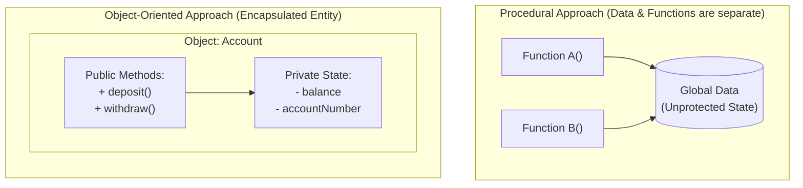

---

## ২. অবজেক্ট ক্লোনিং: শ্যালো বনাম ডিপ কপি (Shallow vs Deep Copy)

ওওপিতে একটি বিদ্যমান অবজেক্টের হুবহু আরেকটি কপি বা ক্লোন তৈরি করার সময় ডেভেলপাররা প্রায়ই বড় বড় মেমরি এবং স্টেট শেয়ারিং বাগে পড়েন। ক্লোন মূলত দুই প্রকার:

### ক. Shallow Copy (শ্যালো কপি)
শ্যালো কপি করার সময় আউটার অবজেক্টের একটি নতুন মেমরি কপি তৈরি হয়, কিন্তু অবজেক্টের ভেতরে যদি কোনো রেফারেন্স টাইপ মেম্বার (যেমন অ্যারে বা অন্য কোনো অবজেক্ট) থাকে, তবে তাদের মেমরি লোকেশন কপি হয় না। এর ফলে অরিজিনাল ও কপিড অবজেক্ট একই রেফারেন্স শেয়ার করে।

> [!WARNING]
> শ্যালো কপির ক্ষেত্রে যদি আপনি কপিড অবজেক্টের ভেতরের কোনো সাব-অবজেক্ট পরিবর্তন করেন, তবে তা অরিজিনাল অবজেক্টেও পরিবর্তিত হয়ে যাবে। এটি একটি মারাত্মক সাইড-ইফেক্ট!

### খ. Deep Copy (ডিপ কপি)
ডিপ কপির ক্ষেত্রে আউটার অবজেক্টসহ তার ভেতরে থাকা সমস্ত চাইল্ড বা রেফারেন্স অবজেক্টগুলোকে রিকার্সিভলি মেমরির নতুন লোকেশনে কপি করা হয়। অরিজিনাল এবং কপিড অবজেক্ট সম্পূর্ণ স্বাধীন থাকে এবং কোনো সাধারণ মেমরি শেয়ার করে না।

```typescript
// shallow_vs_deep.ts

class Address {
    constructor(public city: string) {}
}

class UserProfile {
    constructor(public name: string, public address: Address) {}
}

const originalUser = new UserProfile("Anis", new Address("Dhaka"));

// ১. Shallow Copy
const shallowCopy = { ...originalUser };
shallowCopy.address.city = "Chittagong"; // originalUser এর সিটিও বদলে 'Chittagong' হয়ে গেল!
console.log(originalUser.address.city); // Output: Chittagong

// ২. Deep Copy (Manual or Native structuredClone)
const deepCopy = new UserProfile(
    originalUser.name,
    new Address(originalUser.address.city)
);
deepCopy.address.city = "Sylhet"; // এখন এটি সম্পূর্ণ নিরাপদ
console.log(originalUser.address.city); // Output: Chittagong (অরিজিনাল অক্ষত আছে)
```

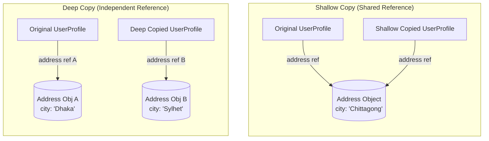

---

## ৩. স্ট্যাটিক বনাম ইনস্ট্যান্স মেম্বার ও ক্লাস ইনিশিয়ালাইজেশন সিকোয়েন্স

ক্লাস ডিজাইনের সময় অন্যতম গুরুত্বপূর্ণ বিষয় হলো ক্লাসের মেম্বারদের (Variables & Methods) আচরণ নির্ধারণ করা।

### ক. Instance Members (ইনস্ট্যান্স মেম্বার)
যখন কোনো ভেরিয়েবল বা মেথড অবজেক্ট সৃষ্টির সাথে সম্পর্কিত হয়, তাকে ইনস্ট্যান্স মেম্বার বলে। প্রতিটি নতুন অবজেক্ট তৈরির সাথে সাথে হিপ মেমরিতে ওই অবজেক্টের জন্য ইনস্ট্যান্স ভেরিয়েবলের জন্য আলাদা মেমরি বরাদ্দ হয়।

### খ. Static Members (স্ট্যাটিক মেম্বার)
যখন কোনো মেম্বার ক্লাসের নিজস্ব প্রপার্টি হয়, কোনো নির্দিষ্ট অবজেক্টের নয়, তখন তাকে `static` ডিক্লেয়ার করা হয়। হিপ মেমরিতে হাজারটা অবজেক্ট তৈরি করলেও পুরো অ্যাপ্লিকেশনে স্ট্যাটিক ভেরিয়েবলের কপি থাকবে মাত্র **একটি**।

> [!IMPORTANT]
> **মেমরি আর্কিটেকচার (Where does Static live?):**
> রানটাইমে যখন ক্লাস লোড হয়, তখন স্ট্যাটিক মেম্বারগুলো অবজেক্ট তৈরির আগেই মেমরির একটি স্থায়ী অংশ **Metaspace / Method Area** (Permanent Generation-এর আধুনিক রূপ)-তে লোড হয়ে যায়। অন্য দিকে, ইনস্ট্যান্স মেম্বারগুলো প্রতিটি অবজেক্টের সাথে **Heap** মেমরিতে অবস্থান করে। এ কারণে স্ট্যাটিক মেথডের ভেতর থেকে সরাসরি কোনো নন-স্ট্যাটিক (ইনস্ট্যান্স) ভেরিয়েবল অ্যাক্সেস করা যায় না, কারণ স্ট্যাটিক মেথড যখন মেমরিতে তৈরি হয়, তখন হিপে কোনো অবজেক্টই তৈরি নাও হতে পারে!

```typescript
class Developer {
    public name: string; // ইনস্ট্যান্স ভেরিয়েবল (Heap-এ থাকবে)
    public static count: number = 0; // স্ট্যাটিক ভেরিয়েবল (Metaspace-এ থাকবে)

    constructor(name: string) {
        this.name = name;
        Developer.count++; // স্ট্যাটিক ভেরিয়েবল সরাসরি ক্লাস নেম দিয়ে অ্যাক্সেস করা হয়
    }

    public static getTotalDevelopers(): number {
        // return this.name; // এরর! স্ট্যাটিক মেথড থেকে ইনস্ট্যান্স ভেরিয়েবল অ্যাক্সেস অসম্ভব।
        return Developer.count;
    }
}
```

### গ. ক্লাস ইনিশিয়ালাইজেশন সিকোয়েন্স (JVM/CLR Class Loading Order)
ওওপিতে চাইল্ড ক্লাসের একটি অবজেক্ট যখন মেমরিতে প্রথমবার লোড হয়, তখন প্রসেসর ধাপে ধাপে ভেরিয়েবল এবং ব্লকগুলোকে ইনিশিয়ালাইজ করে। এই সিকোয়েন্সটি বুঝতে না পারলে জটিল আর্কিটেকচারে অপ্রত্যাশিত এরর দেখা দেয়।

**ইনিশিয়ালাইজেশন অর্ডারটি নিচে দেওয়া হলো:**

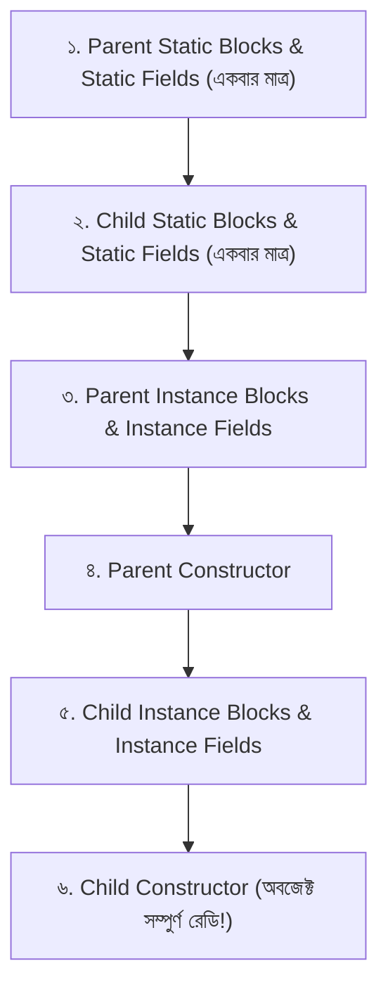

### ঘ. মেথড হাইডিং বনাম মেথড ওভাররাইডিং (Method Hiding vs Overriding)
একটি প্যারেন্ট এবং চাইল্ড উভয় ক্লাসেই যদি অবিকল একই সিগনেচারের একটি `static` মেথড থাকে, তবে তাকে ওভাররাইডিং বলা হয় না; তাকে বলা হয় **Method Hiding (মেথড হাইডিং)**।
* মেথড ওভাররাইডিং হয় ইনস্ট্যান্স মেথডের ক্ষেত্রে এবং তা রানটাইমে ডিটারমাইন হয় (Dynamic Dispatch)।
* মেথড হাইডিং হয় স্ট্যাটিক মেথডের ক্ষেত্রে এবং তা কম্পাইল টাইমে রেফারেন্স ভেরিয়েবলের টাইপের ওপর ভিত্তি করে স্ট্যাটিকভাবে ডিটারমাইন হয়।

```java
// Java Method Hiding Example
class Parent {
    public static void show() { System.out.println("Parent Static"); }
    public void display() { System.out.println("Parent Instance"); }
}

class Child extends Parent {
    public static void show() { System.out.println("Child Static (Hidden)"); }
    @Override
    public void display() { System.out.println("Child Instance (Overridden)"); }
}

public class Main {
    public static void main(String[] args) {
        Parent p = new Child();
        
        p.show();    // Output: Parent Static (কারণ রেফারেন্স টাইপ Parent, স্ট্যাটিক মেথড হাইড হয়েছে)
        p.display(); // Output: Child Instance (কারণ রানটাইম অবজেক্ট Child, পলিমরফিজম কাজ করেছে)
    }
}
```

---

## ৪. ডায়নামিক বাইন্ডিং বনাম স্ট্যাটিক বাইন্ডিং (Dynamic vs Static Binding)

একটি অবজেক্ট যখন কোনো মেথড কল করে, তখন কম্পাইলার বা রানটাইম মেথডের সিগনেচারের সাথে মেথডের ইমপ্লিমেন্টেশন বডির সংযোগ স্থাপন করে। একে **Binding (বাইন্ডিং)** বলে। এটি দুই প্রকার:

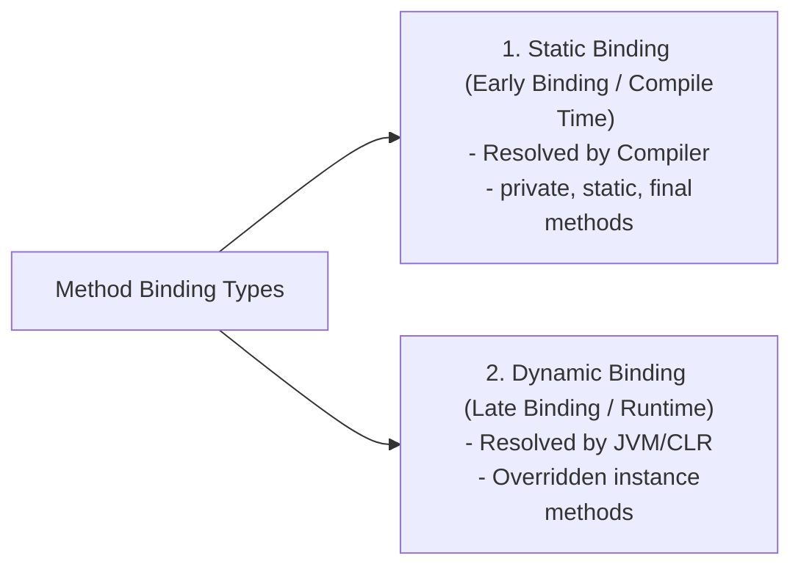

### ক. Static Binding (স্ট্যাটিক বাইন্ডিং - Early Binding)
মেথড কলটি কম্পাইল টাইমে কম্পাইলার নিজেই মেমরি অ্যাড্রেসের সাথে যুক্ত করে দেয়।
* **কারা স্ট্যাটিক বাইন্ডিং ব্যবহার করে:** `private`, `static`, এবং `final` মেথডসমূহ। যেহেতু এই মেথডগুলো চাইল্ড ক্লাসে ওভাররাইড করা সম্ভব নয়, তাই কম্পাইলার নিশ্চিত জানে কোন মেথডটি এক্সিকিউট হবে।
* **পারফরম্যান্স:** এটি অত্যন্ত ফাস্ট কারণ রানটাইমে সঠিক মেথড খুঁজে বের করার জন্য কোনো অতিরিক্ত প্রসেসিং (VTable lookup) লাগে না।

### খ. Dynamic Binding (ডায়নামিক বাইন্ডিং - Late Binding)
মেথড কলটি কম্পাইল টাইমে সমাধান না হয়ে রানটাইমে অবজেক্টের প্রকৃত টাইপের ওপর ভিত্তি করে নির্ধারিত হয়।
* **কারা ডায়নামিক বাইন্ডিং ব্যবহার করে:** ওভাররাইড করা ইনস্ট্যান্স মেথডসমূহ।
* **মেকানিজম:** রানটাইম ইঞ্জিন অবজেক্টের ভেতরের ভার্চুয়াল মেথড টেবিল (VTable) থেকে মেথডের প্রকৃত মেমরি লোকেশন লোড করে বাইন্ড করে।

---

## ৫. ওওপি-র অলঙ্ঘনীয় চার স্তম্ভ (The 4 Pillars of OOP)

OOP-র পুরো সাম্রাজ্য মূলত ৪টি মৌলিক পিলারের ওপর দাঁড়িয়ে আছে। প্রতিটি পিলারের পেছনে রয়েছে চমৎকার আর্কিটেকচারাল মোটিভেশন।

---

### ক. Encapsulation (এনক্যাপসুলেশন) - "ডেটা লুকানো এবং সুরক্ষিত করা"

এনক্যাপসুলেশনের মূল কথা হলো একটি অবজেক্টের ভেতরের ডেটা (State) বাইরের জগৎ থেকে সম্পূর্ণ লুকিয়ে ফেলা (Information Hiding) এবং সেই ডেটা অ্যাক্সেস বা মডিফাই করার জন্য শুধুমাত্র নিয়ন্ত্রিত কিছু পাবলিক ইন্টারফেস বা মেথড (Behavior) উন্মুক্ত রাখা।

#### অ্যাক্সেস মডিফায়ার (Access Modifiers) এর তুলনামূলক ছক:

| Modifiers | Same Class | Same Package/Subclass | Outside Package/Subclass |
| :--- | :---: | :---: | :---: |
| **`private`** |  (হ্যাঁ) | ❌ (না) | ❌ (না) |
| **`protected`** |  (হ্যাঁ) |  (হ্যাঁ) | ❌ (না - যদি ইনহেরিট না থাকে) |
| **`public`** |  (হ্যাঁ) |  (হ্যাঁ) |  (হ্যাঁ) |

#### এনক্যাপসুলেশনের রিয়েল-ওয়ার্ল্ড ইমপ্লিমেন্টেশন (TypeScript):

```typescript
class SecureBankAccount {
    private _balance: number; // ডেটা সুরক্ষিত (Data Hiding)
    private readonly _accountNumber: string;

    constructor(initialBalance: number, accountNumber: string) {
        if (initialBalance < 0) {
            throw new Error("Initial balance cannot be negative.");
        }
        this._balance = initialBalance;
        this._accountNumber = accountNumber;
    }

    public get balance(): number {
        return this._balance;
    }

    public deposit(amount: number): void {
        if (amount <= 0) {
            throw new Error("Deposit amount must be positive.");
        }
        this._balance += amount;
    }

    public withdraw(amount: number): void {
        if (amount <= 0) {
            throw new Error("Withdrawal amount must be positive.");
        }
        if (this._balance - amount < 0) {
            throw new Error("Insufficient funds.");
        }
        this._balance -= amount;
    }
}
```

---

### খ. Inheritance (ইনহেরিটেন্স) - "কোড রিইউজেবিলিটি ও হায়ারার্কি"

ইনহেরিটেন্স হলো এমন একটি মেকানিজম যার মাধ্যমে চাইল্ড ক্লাস প্যারেন্ট ক্লাসের বৈশিষ্ট্য ও আচরণ স্বয়ংক্রিয়ভাবে অর্জন করতে পারে। এটি **IS-A** সম্পর্ক নির্দেশ করে।

> [!WARNING]
> **The Diamond Problem (ডায়মন্ড প্রবলেম):**
> একাধিক প্যারেন্ট থেকে ইনহেরিট করলে চাইল্ড ক্লাসে মারাত্মক অ্যাম্বিগুইটি (অস্পষ্টতা) দেখা দেয়। এ কারণে Java, C#, বা TypeScript সরাসরি ক্লাসের **Multiple Inheritance** অনুমোদন করে না। এর বদলে আমরা Interface ব্যবহার করি।

---

### গ. Polymorphism (পলিমরফিজম) - "বহুরূপতা ও ডাইনামিক কল"

ওওপিতে পলিমরফিজম মানে হলো একই ইন্টারফেস বা মেথড নেম দিয়ে ভিন্ন ভিন্ন পরিস্থিতিতে ভিন্ন ভিন্ন আচরণ প্রদর্শন করা।

#### পলিমরফিজমের ৩টি প্রকারভেদ (The 3 Faces of Polymorphism):
১. **Subtyping Polymorphism (সাবটাইপিং):** এটি আমাদের পরিচিত রানটাইম পলিমরফিজম (Method Overriding)।
২. **Parametric Polymorphism (প্যারামেট্রিক পলিমরফিজম):** এটি হলো **Generics** বা Templates। যেমন: `List<T>`।
৩. **Ad-hoc Polymorphism (অ্যাড-হক পলিমরফিজম):** এটি হলো কম্পাইল-টাইম পলিমরফিজম (Method Overloading) অথবা টাইপ কোয়েরশন (Type Coercion)।

```typescript
// Parametric Polymorphism (TypeScript Generics)
class Box<T> {
    private _content: T;
    constructor(val: T) { this._content = val; }
    public getContent(): T { return this._content; }
}

const numBox = new Box<number>(100);
const strBox = new Box<string>("Generics are powerful");
```

#### কোভারিয়েন্স এবং কন্ট্রাভারিয়েন্স (Covariance & Contravariance in Generics):
মেথড ওভাররাইড বা জেনেরিক্স নিয়ে কাজ করার সময় টাইপ সেফটি বজায় রাখার জন্য কোভারিয়েন্স ও কন্ট্রাভারিয়েন্স ধারণা অত্যন্ত জরুরি।
* **Covariance (কোভারিয়েন্স):** সাবটাইপকে সুপারটাইপের জায়গায় ব্যবহারের অনুমোদন দেওয়া। যেমন: `List<? extends Animal>` জাভাতে একটি কোভারিয়েন্ট টাইপ, যেখানে আপনি উটের তালিকা (`List<Ostrich>`) রিড করতে পারেন।
* **Contravariance (কন্ট্রাভারিয়েন্স):** সুপারটাইপকে সাবটাইপের জায়গায় ডাউনকাস্ট করার অনুমোদন দেওয়া। যেমন: `List<? super Dog>` যেখানে ডগের প্যারেন্ট টাইপের অবজেক্ট পুশ করার অনুমোদন দেয়।

#### টাইপ কাস্টিং ও প্যাটার্ন ম্যাচিং (Upcasting, Downcasting & Pattern Matching)
পলিমরফিজম ব্যবহার করার সময় ক্লাসের টাইপ রূপান্তর বা টাইপ চেকিং করা জরুরি হয়ে পড়ে।

* **Upcasting (আপকাস্টিং):** চাইল্ড ক্লাসের অবজেক্টকে প্যারেন্ট ক্লাসের রেফারেন্সে অ্যাসাইন করা। এটি সম্পূর্ণ নিরাপদ এবং অটোমেটিক (Implicit)।
* **Downcasting (ডাউনকাস্টিং):** প্যারেন্ট ক্লাসের রেফারেন্সকে জোরপূর্বক চাইল্ড ক্লাসের টাইপে রূপান্তর করা। এটি ঝুঁকিপূর্ণ এবং ম্যানুয়ালি করতে হয়। যদি প্যারেন্ট রেফারেন্সটি বাস্তবে ওই চাইল্ড অবজেক্ট না হোল্ড করে, তবে রানটাইমে `ClassCastException` ঘটে সিস্টেম ক্র্যাশ করবে।

```typescript
// Upcasting
const service: NotificationService = new SMSNotification(); 

// Downcasting: বিপদ এড়াতে প্রথমে টাইপ চেক করতে হবে
if (service instanceof SMSNotification) {
    const smsService = service as SMSNotification; // নিরাপদ ডাউনকাস্টিং
    console.log("Successfully downcasted to SMS Service.");
}
```

---

### ঘ. Abstraction (অ্যাবস্ট্রাকশন) - "জटिलতা আড়াল করা এবং চুক্তি তৈরি করা"

অ্যাবস্ট্রাকশন হলো একটি সিস্টেমের জটিল অভ্যন্তরীণ মেকানিজম বা ইমপ্লিমেন্টেশন বাইরে লুকিয়ে শুধুমাত্র অতি প্রয়োজনীয় ফিচারগুলো ইউজারের কাছে উন্মুক্ত করা।

#### সিলড ও ফাইনাল ক্লাস/মেথড (Preventing Inheritance Abuse):
* **`final` / `sealed` class:** ক্লাসকে সিলড বা ফাইনাল ডিক্লেয়ার করলে তা থেকে কোনো চাইল্ড ক্লাস তৈরি করা নিষিদ্ধ হয়ে যায়।
* **`final` method:** কোনো নির্দিষ্ট মেথডকে ফাইনাল করলে চাইল্ড ক্লাসে মেথডটি আর ওভাররাইড করা যায় না।

```java
// Java 17 Sealed Classes (Controlled Inheritance)
public sealed class Shape permits Circle, Rectangle {
    // শুধুমাত্র Circle এবং Rectangle এই ক্লাস এক্সটেন্ড করতে পারবে
}

public final class Circle extends Shape {
    // Circle আর ইনহেরিট করা যাবে না
}
```

#### অবজেক্ট ডেসট্রাক্টর ও রিসোর্স রিলিজ (Explicit Resource Management):
ওওপিতে শুধু অবজেক্ট তৈরি করাই নয়, অবজেক্ট ধ্বংসের সময় বাহ্যিক রিসোর্স (যেমন ফাইল হ্যান্ডেল, ডাটাবেস কানেকশন, নেটওয়ার্ক সকেট) রিলিজ করা অত্যন্ত গুরুত্বপূর্ণ।
* **Finalizers (`finalize()`):** এটি আগে জাভায় ব্যবহৃত হতো, কিন্তু এটি চরম অবহেলিত ও আন-প্রেডিক্টেবল হওয়ায় আধুনিক ওওপি ডিজাইনে সম্পূর্ণ অবচিত (Deprecated)।
* **Modern try-with-resources / using:** আধুনিক আর্কিটেকচার সুনির্দিষ্ট চুক্তি বা ইন্টারফেস ইমপ্লিমেন্ট করে (যেমন জাভায় `AutoCloseable` বা সি#-এ `IDisposable`)। এটি `try-with-resources` ব্লকের মাধ্যমে অবজেক্ট ধ্বংসের সাথে সাথেই রিস্টোর বা ক্লোজ করা নিশ্চিত করে।

```java
// Java Resource Management (Explicit AutoCloseable)
class TempFileWriter implements AutoCloseable {
    public void writeData() { System.out.println("Writing system data..."); }

    @Override
    public void close() {
        System.out.println("System resource released automatically!");
    }
}

public class MainApp {
    public static void main(String[] args) {
        // try-with-resources ব্লক কাজ শেষ হলে অটোমেটিক close() কল করবে
        try (TempFileWriter writer = new TempFileWriter()) {
            writer.writeData();
        } // এখানে অটোমেটিক close() কল হয়ে যাবে, মেমরি লিক এড়াতে এটি বেস্ট প্র্যাকটিস!
    }
}
```

---

## ৬. আধুনিক মাল্টি-প্যারাডাইম ল্যাঙ্গুয়েজে ওওপি (OOP in Non-Class Languages)

অনেক আধুনিক হাই-পারফরম্যান্স ল্যাঙ্গুয়েজ ট্র্যাডিশনাল `class` কী-ওয়ার্ড বা ক্লাসিক্যাল ইনহেরিটেন্স ছাড়াই অত্যন্ত শক্তিশালী ওওপি ডিজাইন সাপোর্ট করে।

### ক. Go (Golang) - Struct Embedding & Implicit Interfaces
গো-তে কোনো `class` বা `extends` কী-ওয়ার্ড নেই। গো ব্যবহার করে **Composition (HAS-A)** and **Implicit Interface** যা ক্লাস ছাড়াই বিশুদ্ধ ওওপি নিশ্চিত করে।

```go
package main
import "fmt"

type Engine struct {
    HP int
}

type Car struct {
    Engine // কারের ভেতরে ইঞ্জিন এম্বেড করা হলো (HAS-A)
    Brand string
}

func main() {
    myCar := Car{Brand: "Toyota", Engine: Engine{HP: 150}}
    fmt.Println(myCar.Brand, "has power of", myCar.HP, "horsepower.")
}
```

### খ. JavaScript - Prototype-Based OOP
জাভাস্ক্রিপ্টের আধুনিক `class` সিনট্যাক্সটি আসলে একটি সিউডো বা **Syntactical Sugar**। পর্দার অন্তরালে জাভাস্ক্রিপ্ট আসলে ক্লাস ছাড়াই **Prototype-Based Inheritance** মেকানিজমে কাজ করে। প্রতিটি অবজেক্টের একটি গোপন লিংক থাকে তার প্রোটোটাইপ অবজেক্টের সাথে। একে **Prototype Chain** বলে।

```javascript
// JS Prototype chain under the hood
function Animal(name) {
    this.name = name;
}
Animal.prototype.speak = function() {
    console.log(this.name + " makes a sound.");
};

const dog = new Animal("Rex");
dog.speak(); // speak মেথডটি প্রোটোটাইপ চেইন থেকে এসেছে
```

---

## ৭. কনস্ট্রাক্টর, মেমরি ইনিশিয়ালাইজেশন এবং চেইনিং (Constructors Deep Dive)

কনস্ট্রাক্টর হলো একটি বিশেষ মেথড যা হিপ মেমরিতে অবজেক্ট তৈরির সাথে সাথে তার প্রাথমিক স্টেট বা ভেরিয়েবলগুলোকে ইনিশিয়ালাইজ করার জন্য ব্যবহৃত হয়।

```typescript
class Book {
    public title: string;
    public author: string;

    // Parameterized Constructor
    constructor(title: string, author: string) {
        this.title = title;
        this.author = author;
    }

    // Copy Constructor / Factory Clone
    public static clone(source: Book): Book {
        return new Book(source.title, source.author);
    }
}
```

---

## ৮. ক্লাস রিলেশনশিপের ৫টি ইউএমএল স্তর (UML Class Relationships)

সফ্টওয়্যার আর্কিটেকচারে ক্লাসগুলোর পারষ্পরিক সম্পর্ক এবং ডিপেন্ডেন্সি ডিজাইন ভিজ্যুয়ালাইজ করার জন্য UML (Unified Modeling Language)-এর ৫টি মৌলিক স্তর জানা অত্যন্ত প্রয়োজন।

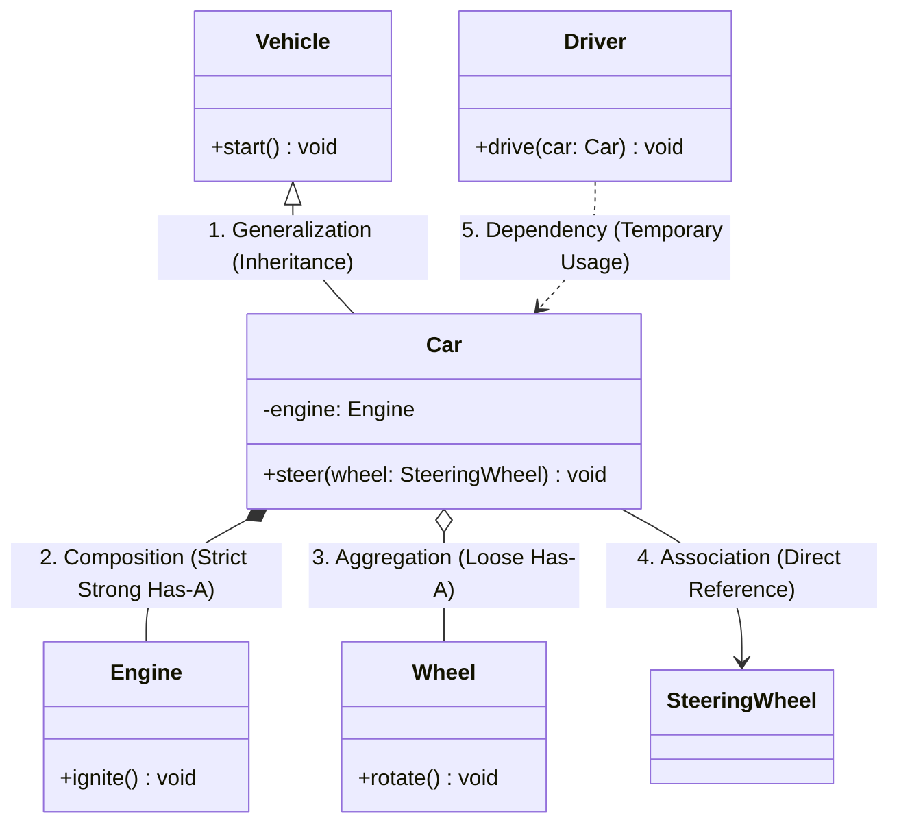

---

### ক. Generalization / Realization (ইনহেরিটেন্স ও ইমপ্লিমেন্টেশন - IS-A)
প্যারেন্ট ক্লাসের সাথে চাইল্ড ক্লাসের রিলেশনকে Generalization (Inheritance) বলে, আর ইন্টারফেসের সাথে ক্লাসের সম্পর্ককে Realization (Implementation) বলে।

### খ. Dependency (ডিপেন্ডেন্সি - Uses-A)
সবچهয়ে দুর্বল সম্পর্ক। একটি ক্লাস যখন অন্য একটি ক্লাসকে তার মেথডের প্যারামিটার হিসেবে বা লোকাল ভেরিয়েবল হিসেবে সাময়িকভাবে ব্যবহার করে, তখন তাকে ডিপেন্ডেন্সি বলে।

### গ. Association (অ্যাসোসিয়েশন - Has-A)
একটি স্থায়ী ব্যবহারিক সম্পর্ক। একটি ক্লাসের অবজেক্ট যখন অন্য ক্লাসের অবজেক্টকে তার ফিল্ড ভেরিয়েবল বা মেম্বার হিসেবে স্থায়ীভাবে হোল্ড করে।

### ঘ. Aggregation (অ্যাগ্রিগেশন - Weak Has-A)
একটি দুর্বল অ্যাসোসিয়েশন রিলেশনশিপ। এখানে প্যারেন্ট অবজেক্ট ধ্বংস হয়ে গেলেও চাইল্ড বা মেম্বার অবজেক্ট ধ্বংস হয় না, তারা স্বাধীনভাবে টিকে থাকতে পারে।

### ঙ. Composition (কম্পোজিশন - Strong Has-A / Part-of)
সবچهয়ে শক্তিশালী মালিকানা সম্পর্ক। এখানে প্যারেন্ট অবজেক্ট ডিলিট হলে তার অধীনে থাকা সমস্ত চাইল্ড অবজেক্টও সাথে সাথে ধ্বংস হয়ে যায়। চাইল্ডের কোনো স্বতন্ত্র অস্তিত্ব থাকে না।

#### হেডার ইন্টারফেস বনাম রোল ইন্টারফেস (Header vs Role Interfaces):
ইন্টারফেস ডিজাইন করার সময় ওওপি আর্কিটেক্টরা দুটি প্রধান প্যাটার্ন ব্যবহার করেন:
১. **Header Interface (হেডার ইন্টারফেস):** একটি ক্লাসের সমস্ত পাবলিক মেথড অবিকল ক্লোন করে যে ইন্টারফেস তৈরি হয়। এটি একটি অ্যান্টি-প্যাটার্ন কারণ এটি সিস্টেমের কোনো অ্যাবস্ট্রাকশন দেয় না এবং ইন্টারফেস ও ক্লাসের মধ্যে টাইটলি কাপলড রিলেশন রাখে।
২. **Role Interface (রোল ইন্টারফেস):** একটি একক ও সুনির্দিষ্ট ব্যবহারের বা আচরণের ওপর ভিত্তি করে তৈরি ছোট ইন্টারফেস (যেমন: `Runnable`, `Comparable`, বা `Serializable`)। এটি ওওপি-র ISP (Interface Segregation) নীতির শ্রেষ্ঠ ইমপ্লিমেন্টেশন এবং লুজলি কাপলড আর্কিটেকচার নিশ্চিত করে।

---

## ৯. লো অব ডেমিটার: ফ্রেন্ডলি অবজেক্ট ডিজাইন (Law of Demeter)

লো অব ডেমিটার (Law of Demeter) বা **"Principle of Least Knowledge"** ওওপিতে কোড কাপলিং এড়ানোর একটি অত্যন্ত গুরুত্বপূর্ণ আর্কিটেকচারাল নিয়ম। 

> **"Only talk to your immediate friends, don't talk to strangers."**  
> (শুধুমাত্র আপনার সরাসরি পরিচিত অবজেক্টের সাথে কথা বলুন, অপরিচিত বা অবজেক্টের ভেতরের গভীর অবজেক্টগুলোর সাথে সরাসরি কথা বলবেন না।)

* **খারাপ কোড স্টাইল (Train Wreck):** ওওপিতে মেথড কল চেইন করা যেমন: `user.getAccount().getAddress().getCity().toUpperCase()` একটি অত্যন্ত বাজে ডিজাইন। একে ট্রেন ক্র্যাশ বলা হয়। এর ফলে `user` ক্লাসটি সরাসরি `Account`, `Address`, এবং `City` ক্লাসগুলোর ইন্টারনাল স্ট্রাকচারের সাথে টাইটলি কাপলড হয়ে যায়। যেকোনো একটি ক্লাসের ডেটা স্ট্রাকচার বদলালে পুরো চেইনটি ভেঙে যাবে!

#### ট্রেন ক্র্যাশ কোড রিফ্যাক্টরিং (Bad vs Good):

```typescript
// BAD: Law of Demeter লঙ্ঘন
const city = customer.getWallet().getBillingAddress().getCity(); 

// GOOD: Law of Demeter অনুযায়ী রিফ্যাক্টরিং (Delegate Behavior)
const citySafe = customer.getBillingCity(); 
```

---

## ১০. ইনহেরিটেন্সের ফাঁদ এবং কম্পোজিশন (Composition over Inheritance)

অনেকেই ওওপি শিখেই সমস্ত ক্লাসের মধ্যে ইনহেরিটেন্সের হায়ারার্কি তৈরি করতে পছন্দ করেন। কিন্তু সিনিয়র ইঞ্জিনিয়ারদের সবচেয়ে বড় রুল হলো: **"Favor Composition over Inheritance"**।

### ইনহেরিটেন্স ট্র্যাপ (ভুল কোড):
ধরা যাক, আমরা এমন একটি কাস্টম `Set` বানাতে চাই যা কতগুলো এলিমেন্ট অ্যাড হয়েছে তা কাউন্ট করবে:

```typescript
class CustomStack<T> extends Array<T> {
    private addCount: number = 0;

    push(item: T): number {
        this.addCount++;
        return super.push(item);
    }

    pushAll(items: T[]): void {
        for (const item of items) {
            this.push(item); 
        }
    }
    
    get count() { return this.addCount; }
}
```

### কম্পোজিশন ইমপ্লিমেন্টেশন (সঠিক কোড):

```typescript
class SecureStack<T> {
    private storage: T[] = []; // Array ক্লাসকে কম্পোজ করা হলো (HAS-A)
    private addCount: number = 0;

    public push(item: T): void {
        this.addCount++;
        this.storage.push(item); 
    }

    public pushAll(items: T[]): void {
        for (const item of items) {
            this.push(item);
        }
    }

    public pop(): T | undefined {
        return this.storage.pop();
    }

    get count(): number {
        return this.addCount;
    }
}
```

---

## ১১. SOLID Principles: সিনিয়র ওওপি ডিজাইনের পঞ্চরত্ন

সফটওয়্যার আর্কিটেকচারের সবচেয়ে প্রভাবশালী ৫টি ওওপি মূলনীতি হলো **SOLID**। এগুলো কোডকে রিলিজিবল, এক্সটেনসিবল এবং মেইনটেনেবল করে তোলে।

---

### ক. S - Single Responsibility Principle (SRP)
> **"A class should have one, and only one, reason to change."**  
> (একটি ক্লাসের পরিবর্তন করার জন্য কেবল একটি এবং শুধুমাত্র একটিই কারণ থাকা উচিত।)

যখন একটি ক্লাসে একাধিক দায়িত্ব (Responsibility) জড়ো করা হয়, তখন একটি কাজের পরিবর্তনের প্রয়োজনে কোড এডিট করতে গেলে অন্য কাজের অংশটি অজান্তেই ভেঙে যাওয়ার মারাত্মক ঝুঁকি তৈরি হয়।

#### ❌ SRP লঙ্ঘন করা খারাপ কোড (Violating Code):
```typescript
// এই ক্লাসটি একই সাথে ইউজার রেজিস্ট্রেশন লজিক, ভ্যালিডেশন এবং ইমেইল পাঠানোর দায়িত্ব পালন করছে।
class UserService {
    public registerUser(email: string, pass: string): void {
        // ১. ভ্যালিডেশন লজিক (ভুল জায়গায়)
        if (!email.includes("@")) {
            throw new Error("Invalid Email");
        }
        
        // ২. ডেটাবেসে সেভ করার লজিক
        console.log(`Saving user to database: ${email}`);

        // ৩. নোটিফিকেশন পাঠানোর লজিক (SRP লঙ্ঘন!)
        console.log(`Sending activation email to: ${email}`);
    }
}
```

####  SRP মেনে রিফ্যাক্টরিং করা কোড (Refactored Code):
আমরা দায়িত্বগুলোকে আলাদা আলাদা ডেডিকেটেড ক্লাসে ভাগ করব, যাতে প্রতিটি ক্লাসের কাজ সুনির্দিষ্ট থাকে।

```typescript
class UserValidator {
    public validateEmail(email: string): boolean {
        return email.includes("@");
    }
}

class UserRepository {
    public save(email: string, pass: string): void {
        console.log(`User saved to database: ${email}`);
    }
}

class EmailService {
    public sendWelcomeEmail(email: string): void {
        console.log(`Welcome email successfully sent to: ${email}`);
    }
}

// এখন UserService শুধুমাত্র অর্কেস্ট্রেটর বা ফ্লো কন্ট্রোলার হিসেবে কাজ করছে
class UserRegistrationFlow {
    constructor(
        private validator: UserValidator,
        private repo: UserRepository,
        private mailer: EmailService
    ) {}

    public register(email: string, pass: string): void {
        if (!this.validator.validateEmail(email)) {
            throw new Error("Invalid Email Address");
        }
        this.repo.save(email, pass);
        this.mailer.sendWelcomeEmail(email);
    }
}
```

#### 📊 SRP আর্কিটেকচার ফ্লো:
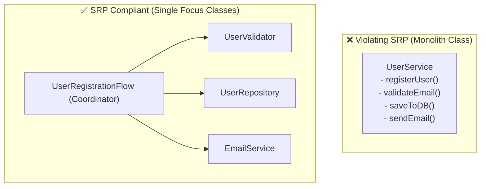

---

### খ. O - Open/Closed Principle (OCP)
> **"Software entities should be open for extension, but closed for modification."**  
> (সফ্টওয়্যার মডিউল বা ক্লাসগুলো নতুন ফিচার যোগ করার জন্য উন্মুক্ত থাকবে, কিন্তু আগের সচল কোড পরিবর্তনের জন্য সম্পূর্ণ বন্ধ থাকবে।)

নতুন কোনো রুলস বা ফিচার যোগ করার সময় যদি আপনার আগের সচল ক্লাসে হাত দিয়ে `if-else` বা `switch-case` পরিবর্তন করতে হয়, তবে বুঝতে হবে আপনার আর্কিটেকচার OCP লঙ্ঘন করছে।

#### ❌ OCP লঙ্ঘন করা খারাপ কোড (Violating Code):
```typescript
class PaymentProcessor {
    // নতুন কোনো পেমেন্ট গেটওয়ে (যেমন: bKash) যোগ করতে গেলে এই পুরো মেথডের কোড এডিট করতে হবে!
    public process(amount: number, type: string): void {
        if (type === "credit_card") {
            console.log(`Processing card payment of $${amount}`);
        } else if (type === "paypal") {
            console.log(`Processing Paypal payment of $${amount}`);
        } else {
            throw new Error("Payment type not supported");
        }
    }
}
```

####  OCP মেনে রিফ্যাক্টরিং করা কোড (Refactored Code):
আমরা একটি সাধারণ **Abstraction (PaymentMethod Interface)** তৈরি করব। নতুন পেমেন্ট গেটওয়ে এলে আমরা কেবল ইন্টারফেসটি ইমপ্লিমেন্ট করে নতুন ক্লাস বানাব, পেমেন্ট প্রসেসর ক্লাসের কোডে হাত দেওয়ার কোনো প্রয়োজন পড়বে না।

```typescript
interface PaymentMethod {
    processPayment(amount: number): void;
}

class CreditCardPayment implements PaymentMethod {
    public processPayment(amount: number): void {
        console.log(`Card Payment processed for $${amount}`);
    }
}

class PaypalPayment implements PaymentMethod {
    public processPayment(amount: number): void {
        console.log(`Paypal Payment processed for $${amount}`);
    }
}

// নতুন পement গেটওয়ে (bKash) ওওপি-র OCP মেনে সহজেই প্লাগইন করা গেল!
class BkashPayment implements PaymentMethod {
    public processPayment(amount: number): void {
        console.log(`bKash payment processed for $${amount}`);
    }
}

class PaymentProcessor {
    // এখন এই প্রসেসর ক্লাসটি নতুন মেথড অ্যাড করলেও সম্পূর্ণ অপরিবর্তিত থাকবে।
    public execute(payment: PaymentMethod, amount: number): void {
        payment.processPayment(amount);
    }
}
```

#### 📊 OCP প্লাগ-ইন আর্কিটেকচার:
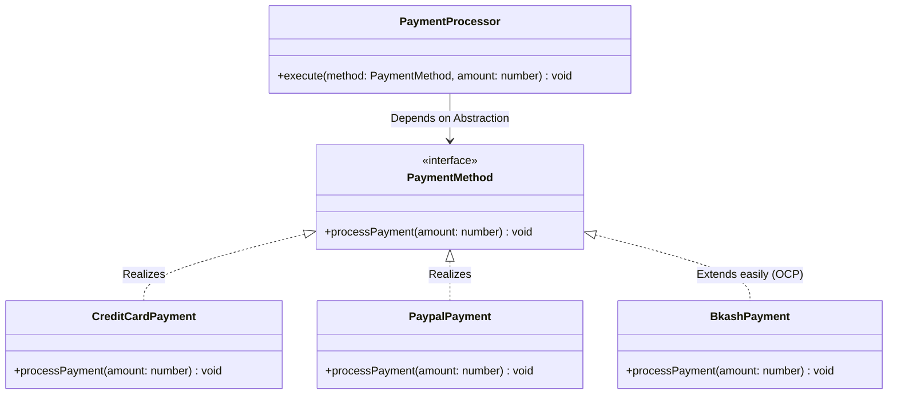

---

### গ. L - Liskov Substitution Principle (LSP)
> **"Subtypes must be substitutable for their base types."**  
> (প্যারেন্ট ক্লাসের জায়গায় যদি চাইল্ড ক্লাসের কোনো অবজেক্ট বসানো হয়, তবে সিস্টেমের মূল কার্যকারিতা কোনো ব্যতিক্রম বা এরর ছাড়াই সচল থাকতে হবে।)

যদি কোনো চাইল্ড ক্লাস প্যারেন্ট ক্লাসের কোনো মেথডকে এমনভাবে ওভাররাইড করে যার ফলে মেথডটির আচরণ বদলে যায় বা `UnsupportedException` থ্রো করে, তবে তা LSP লঙ্ঘন।

#### ❌ LSP লঙ্ঘন করা বিখ্যাত Rectangle-Square সমস্যা (Violating Code):
```typescript
class Rectangle {
    constructor(protected width: number, protected height: number) {}

    public setWidth(w: number) { this.width = w; }
    public setHeight(h: number) { this.height = h; }
    public getArea(): number { return this.width * this.height; }
}

// স্কয়ারের দৈর্ঘ্য-প্রস্থ সমান হওয়ায় এটি সেটার ওভাররাইড করে উভয়কেই আপডেট করছে
class Square extends Rectangle {
    public setWidth(w: number) {
        this.width = w;
        this.height = w; // ওহ নো! উইথ পরিবর্তন করলে হাইটও বদলে যাচ্ছে!
    }
    public setHeight(h: number) {
        this.width = h;
        this.height = h;
    }
}

// ক্লায়েন্ট কোড যা প্যারেন্ট ক্লাসের লজিকের ওপর ভরসা করে ক্র্যাশ করবে:
function resizeRectangle(rect: Rectangle) {
    rect.setWidth(5);
    rect.setHeight(10);
    // যদি rect একটি Square হয়, তবে প্রস্থও ১০ হয়ে যাবে! এরিয়া ৫০-এর বদলে ১০০ হবে, যা ভুল!
    console.log(`Expected Area: 50, Actual Area: ${rect.getArea()}`);
}
```

####  LSP মেনে রিফ্যাক্টরিং করা কোড (Refactored Code):
বাজে বা জোরপূর্বক ইনহেরিটেন্স পরিহার করে উভয় ক্লাসকেই একটি কমন শেপ চুক্তির (Shape Interface) অধীনে নিয়ে আসা।

```typescript
interface Shape {
    getArea(): number;
}

class Rectangle implements Shape {
    constructor(private width: number, private height: number) {}
    public getArea(): number { return this.width * this.height; }
}

class Square implements Shape {
    constructor(private side: number) {}
    public getArea(): number { return this.side * this.side; }
}
```

#### 📊 LSP মেমরি ও সাবটাইপিং রিলেশন:
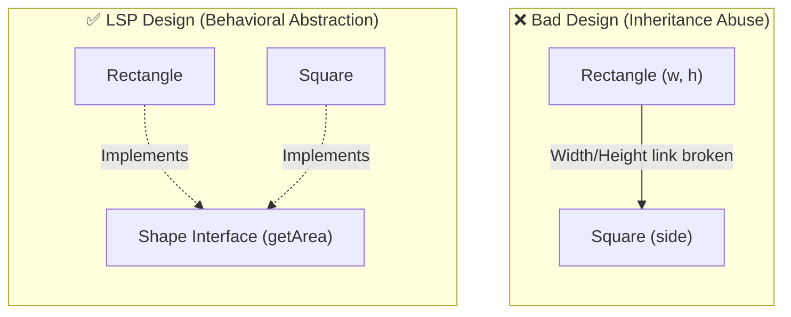

---

### ঘ. I - Interface Segregation Principle (ISP)
> **"Clients should not be forced to depend upon interfaces that they do not use."**  
> (ক্লায়েন্টকে এমন কোনো ইন্টারফেস বা মেথডের চুক্তি ইমপ্লিমেন্ট করতে বাধ্য করা যাবে না যা তার কোনো কাজেই লাগে না।)

অনেক বড় বড় মেথডযুক্ত একটি বিশাল ফ্যাট ইন্টারফেস ডিজাইন করার চেয়ে নির্দিষ্ট ব্যবহারের ওপর ভিত্তি করে কয়েকটি ছোট ও সুনির্দিষ্ট ইন্টারফেস ডিজাইন করা অত্যন্ত শ্রেয়।

#### ❌ ISP লঙ্ঘন করা ফ্যাট ইন্টারফেস কোড (Violating Code):
```typescript
interface MultiFunctionDevice {
    print(doc: string): void;
    scan(doc: string): void;
    fax(doc: string): void;
}

// একটি সাধারণ সস্তা প্রিন্টারের স্ক্যান বা ফ্যাক্স করার ক্ষমতা নেই!
class BasicPrinter implements MultiFunctionDevice {
    public print(doc: string): void {
        console.log("Printing document...");
    }
    
    // ক্লায়েন্টকে জোরপূর্বক এই মেথডগুলো ইমপ্লিমেন্ট করতে বাধ্য করা হচ্ছে!
    public scan(doc: string): void {
        throw new Error("Scan feature not supported by Basic Printer!");
    }
    public fax(doc: string): void {
        throw new Error("Fax feature not supported!");
    }
}
```

####  ISP মেনে রিফ্যাক্টরিং করা কোড (Refactored Code):
আমরা বড় ফ্যাট ইন্টারফেসটি ভেঙ্গে ছোট ছোট সিঙ্গেল-পারপাস রোল ইন্টারফেসে (Role Interfaces) ভাগ করব।

```typescript
interface Printer {
    print(doc: string): void;
}

interface Scanner {
    scan(doc: string): void;
}

interface FaxMachine {
    fax(doc: string): void;
}

// এখন বেসিক প্রিন্টার কেবল প্রিন্ট ইন্টারফেস ইমপ্লিমেন্ট করবে
class SimplePrinter implements Printer {
    public print(doc: string): void {
        console.log("Printing document safely.");
    }
}

// হাই-এন্ড অফিস প্রিন্টার সব ইন্টারফেস ইমপ্লিমেন্ট করতে পারে
class OfficeSuperMachine implements Printer, Scanner, FaxMachine {
    public print(doc: string) { console.log("Printing..."); }
    public scan(doc: string) { console.log("Scanning..."); }
    public fax(doc: string) { console.log("Faxing..."); }
}
```

#### 📊 ISP ইন্টারফেস ব্রেকডাউন:
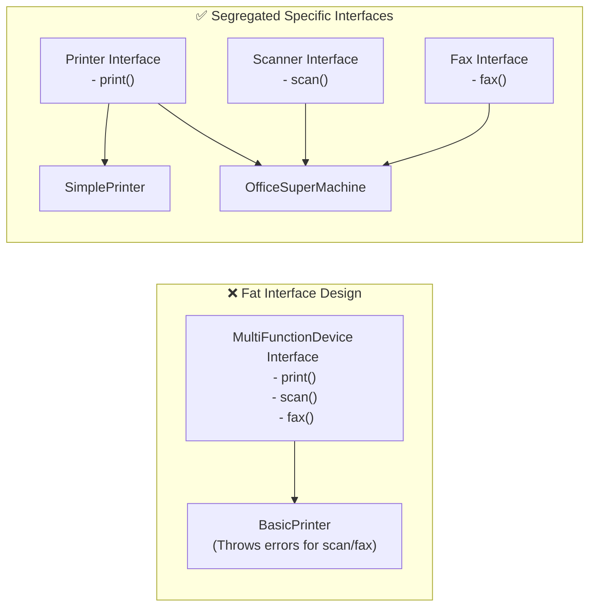

---

### ঙ. D - Dependency Inversion Principle (DIP)
> **"High-level modules should not depend on low-level modules. Both should depend on abstractions. Abstractions should not depend on details; details should depend on abstractions."**  
> (উচ্চ-স্তরের বিজনেস লজিক মডিউলগুলো সরাসরি কোনো নিম্ন-স্তরের মেকানিজমের ওপর নির্ভর করবে না। উভয়েই সাধারণ অ্যাবস্ট্রাকশন বা ইন্টারফেসের ওপর নির্ভর করবে।)

যদি আপনার বিজনেস লজিক ক্লাস সরাসরি ডাটাবেস ক্লাস বা থার্ড-পার্টি সার্ভিস ক্লাসের ইনস্ট্যান্স সরাসরি `new` কী-ওয়ার্ড দিয়ে তৈরি করে ব্যবহার করে, তবে তা DIP-এর চরম লঙ্ঘন। এতে সিস্টেম টাইটলি কাপলড হয়ে যায়।

#### ❌ DIP লঙ্ঘন করা টাইটলি কাপলড কোড (Violating Code):
```typescript
class SmsSender {
    public sendSMS(msg: string): void {
        console.log(`Sending SMS: ${msg}`);
    }
}

class NotificationService {
    private sender: SmsSender;

    constructor() {
        // মারাত্মক টাইট কাপলিং! NotificationService সরাসরি SmsSender ক্লাসের ওপর নির্ভরশীল।
        // ভবিষ্যতে Email বা Push Notification যোগ করতে গেলে এই ক্লাসটি এডিট করতে হবে।
        this.sender = new SmsSender(); 
    }

    public notify(msg: string): void {
        this.sender.sendSMS(msg);
    }
}
```

####  DIP মেনে রিফ্যাক্টরিং করা কোড (Refactored Code):
বিজনেস লজিক সরাসরি কোনো কনক্রিট ক্লাসের ওপর নির্ভর না করে একটি সাধারণ চুক্তি বা অ্যাবস্ট্রাকশন ইন্টারফেসের ওপর নির্ভর করবে, এবং কনস্ট্রাক্টরের সাহায্যে ডিপেন্ডেন্সি বাইরে থেকে ইনজেক্ট করা হবে।

```typescript
// ১. অ্যাবস্ট্রাকশন ইন্টারফেস (চুক্তি)
interface MessageService {
    sendMessage(msg: string): void;
}

// ২. নিম্ন-স্তরের কনক্রিট সার্ভিস
class SMSNotificationService implements MessageService {
    public sendMessage(msg: string): void {
        console.log(`SMS Sent: ${msg}`);
    }
}

class EmailNotificationService implements MessageService {
    public sendMessage(msg: string): void {
        console.log(`Email Sent: ${msg}`);
    }
}

// ৩. উচ্চ-স্তরের বিজনেস মডিউল (ডিপেন্ডেন্সি লুজলি কাপলড)
class NotificationManager {
    // এখন এই ক্লাসটি সম্পূর্ণ স্বাধীন এবং যেকোনো মেসেজ সার্ভিস অবজেক্ট নিয়ে কাজ করতে পারে
    constructor(private service: MessageService) {}

    public pushNotification(msg: string): void {
        this.service.sendMessage(msg);
    }
}
```

#### 📊 DIP ডিপেন্ডেন্সি ফ্লিপ বা ইনভার্সন:
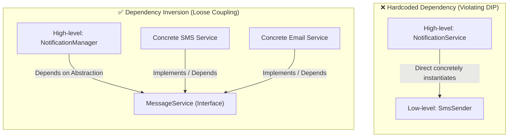

---

## ১২. অবজেক্ট সমতা: আইডেন্টিটি বনাম ইকুয়ালিটি (Identity vs Equality)

ওওপি-তে অবজেক্ট হ্যান্ডেল করার সময় "একই অবজেক্ট" এবং "সমান অবজেক্ট" এর মধ্যে বিশাল তফাৎ রয়েছে।

> [!WARNING]
> **The `equals()` and `hashCode()` Contract:**
> জাভা/সি# আর্কিটেকচারে এটি একটি চরম অলঙ্ঘনীয় চুক্তি। আপনি যদি কোনো ক্লাসে `equals()` ওভাররাইড করেন, তবে অবশ্যই আপনাকে `hashCode()` মেথডও ওভাররাইড করতে হবে।

---

## ১৩. ওওপিতে মেমরি লিকের বাস্তব কারণ ও প্রতিকার (Memory Leaks in OOP)

অনেকে মনে করেন আধুনিক গার্বেজ কালেকশন (GC) থাকলে মেমরি লিক হওয়া অসম্ভব। এটি একটি চরম ভুল ধারণা! ওওপি আর্কিটেকচারাল ভুলের কারণে সিস্টেমে মারাত্মক মেমরি লিক হতে পারে।

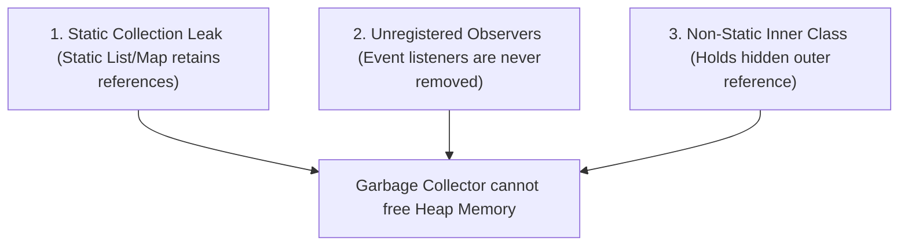

### ক. Static Collection Leak (স্ট্যাটিক কালেকশন লিক)
সবচেয়ে কমন মেমরি লিক। কোনো অবজেক্টকে যদি একটি স্ট্যাটিক `List` বা `Map`-এ অ্যাড করা হয় এবং পরবর্তীতে ডিলিট না করা হয়, তবে মেথডের কাজ শেষ হলেও GC মেমরি ফ্রী করতে পারে না, কারণ স্ট্যাটিক মেম্বারগুলো ক্লাস আনলোড হওয়ার আগ পর্যন্ত অ্যাক্টিভ রুট রেফারেন্স হিসেবে কাজ করে।
* **প্রতিকার:** কাজ শেষে কালেকশন থেকে অবজেক্ট মুছে ফেলা অথবা **WeakReference / WeakMap** ব্যবহার করা।

### খ. Unregistered Observers / Listeners (ইভেন্ট লিসেনার লিক)
অবজেক্টর কোনো ইভেন্ট সোর্সের সাথে লিসেনার বা সাবস্ক্রাইবার হিসেবে রেজিস্ট্রেশন করার পর যদি সোর্স ডিলিট করার আগে লিসেনার আন-রেজিস্টার না করা হয়, তবে সোর্স অবজেক্টটি লিসেনারের রেফারেন্স মেমরিতে আজীবন ধরে রাখবে এবং GC মেমরি ফ্রী করতে ব্যর্থ হবে।

### গ. Non-Static Inner Class Leak (নন-স্ট্যাটিক ইনার ক্লাস লিক)
নন-স্ট্যাটিক ইনার ক্লাস তার আউটার ক্লাসের একটি গোপন ইনস্ট্যান্স ভেরিয়েবল ধরে রাখে। তাই ইনার অবজেক্টটি যদি মেমরিতে দীর্ঘস্থায়ী হয়, তবে আউটার অবজেক্টের কাজ শেষ হলেও মেমরি ফ্রী হতে পারে না।
* **প্রতিকার:** সর্বদা ইনার ক্লাসকে **`static`** ডিক্লেয়ার করা উচিত যদি না সত্যিই আউটার মেম্বার অ্যাক্সেস করার দরকার পড়ে।

---

## ১৪. কাপলিং এবং কোহেশন (Coupling & Cohesion)

আর্কিটেকচারাল ডিজাইনে ভালো কোডবেসের প্রধানতম বৈশিষ্ট্য হলো **"High Cohesion, Loose Coupling"**।

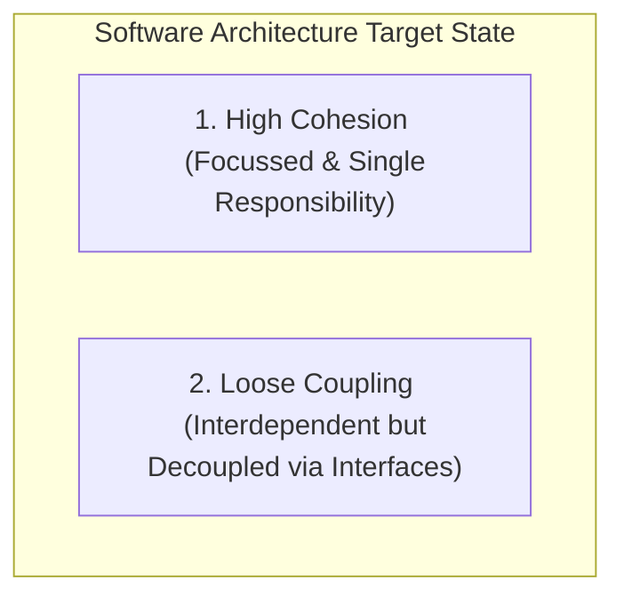

### ক. Cohesion (সংহতি):
একটি ক্লাসের ভেতরের ফিল্ড ও মেথডগুলো একে অপরের সাথে কতটা নিবিড়ভাবে সম্পর্কিত ও ফোকাসড। 

### খ. Coupling (সংযোগ):
একটি ক্লাস বা মডিউল অন্য আরেকটি ক্লাসের ওপর কতটা নির্ভরশীল।

---

## ১৫. ডোমেইন মডেল ডিজাইন: Rich vs Anemic vs Transaction Script

ডোমেইন লেয়ার বা বিজনেস লজিক সাজানোর জন্য তিনটি প্রধান আর্কিটেকচারাল প্যাটার্ন ব্যাপকভাবে ব্যবহৃত হয়:

### ক. Transaction Script Pattern (ট্রানজেকশন স্ক্রিপ্ট - প্রসিডিউরাল):
সব লজিক ডেটাবেস কুয়েরির সাথে একটি ফাংশন বা সার্ভিস মেথডের ভেতরে সিকোয়েন্সিয়ালি লেখা হয়। ডোমেইন অবজেক্ট বা এনটিটিগুলো সাধারণ ডেটা ক্যারিয়ার হিসেবে কাজ করে।

### খ. Anemic Domain Model (রক্তশূন্য ডোমেইন মডেল):
এনটিটিগুলোতে শুধুমাত্র ফিল্ড ও গেটার-সেটার থাকে, কোনো বিজনেস লজিক থাকে না। সব লজিক সার্ভিস লেয়ারে থাকে।

### গ. Rich Domain Model (সমৃদ্ধ ডোমেইন মডেল - বিশুদ্ধ ওওপি):
ডোমেইন এনটিটির ভেতরেই তার নিজস্ব বিজনেস ভ্যালিডেশন এবং লজিক এনক্যাপসুলেট করা থাকে। এটি রিয়েল ওওপি ডিজাইন যা DDD (Domain-Driven Design) এর মূল ভিত্তি।

---

## ১৬. নেস্টেড এবং অ্যানোনিমাস ক্লাস (Nested & Anonymous Classes)

একটি ক্লাসের ভেতরে যখন আরেকটি ক্লাস ঘোষণা করা হয়, তাকে নেস্টেড বা ইনার ক্লাস বলে।

```java
interface Greeting {
    void greet();
}

class Test {
    public void start() {
        Greeting welcome = new Greeting() {
            @Override
            public void greet();
        };
        welcome.greet();
    }
}
```

---

## ১৭. অ্যাডভান্সড ওওপি অ্যান্টি-প্যাটার্ন ও ইয়ো-ইয়ো সমস্যা (Yo-Yo Problem)

ওওপিতে কাজ করার সময় কিছু কমন ভুল ডিজাইন করাকে আর্কিটেকচারাল **Anti-Pattern (অ্যান্টি-প্যাটার্ন)** বলা হয়, যা পরবর্তীতে কোড মেইনটেন্যান্সকে অসম্ভব করে তোলে।

### ক. God Object (গড অবজেক্ট):
একটি সুপার-ক্লাস বা একক ক্লাস যা পুরো সফটওয়্যারের ৮%-৯০% কাজ একাই করে এবং সমস্ত লজিক ও ভেরিয়েবল নিজের মধ্যে হোল্ড করে।

### খ. The Yo-Yo Problem (ইয়ো-ইয়ো সমস্যা):
যখন সফটওয়্যারে অত্যন্ত লম্বা ইনহেরিটেন্স চেইন (যেমন: `Class A -> Class B -> Class C -> Class D -> Class E`) তৈরি করা হয়, তখন কোনো মেথডের বাগ ফিক্স করতে বা কোডের এক্সিকিউশন ফ্লো বুঝতে ডেভেলপারকে অনবরত ইনহেরিটেন্সের উপরে-নিচে ট্রাভার্স করতে হয় (বাউন্স করতে হয়)। এই ঘটনাকে ইয়ো-ইয়ো প্রবলেম বলে।

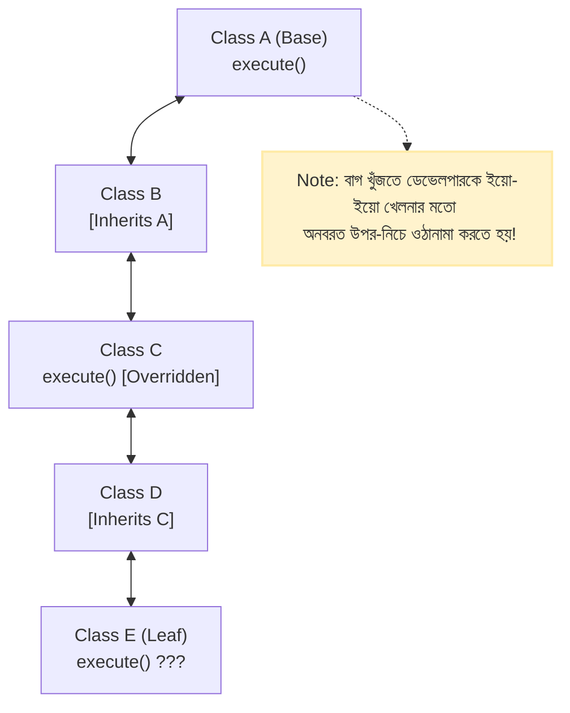

---

## ૧৮. কমন ওওপি ডিজাইন প্যাটার্নস (Design Patterns Quick Guide)

ওওপিতে বড় ডিজাইনের সমস্যা সমাধানের জন্য কিছু প্রমাণিত সমাধান বা প্যাটার্ন ব্যবহার করা হয়।

### ক. Strategy Pattern (কৌশল প্যাটার্ন):
রানটাইমে কোনো অবজেক্টের অ্যালগরিদম বা মেথড ডায়নামিক্যালি পরিবর্তন করতে এটি ব্যবহৃত হয়। এটি ওওপি-র ওসিপি (OCP) নীতির শ্রেষ্ঠ ইমপ্লিমেন্টেশন।

### খ. Observer Pattern (পর্যবেক্ষক প্যাটার্ন):
কোনো একটি অবজেক্টের (Subject) স্টেট পরিবর্তন হলে তার ওপর নির্ভরশীল অন্যান্য অবজেক্টগুলো (Observers) যাতে অটোমেটিক নোটিফিকেশন বা আপডেট পায়, তার পাবলিশ-সাবস্ক্রাইব আর্কিটেকচার।

### গ. Thread-Safe Singleton Pattern (সুপার-ডিজাইন সিঙ্গেলটন):
পুরো অ্যাপ্লিকেশনে একটি ক্লাসের কেবলমাত্র একটি অবজেক্ট নিশ্চিত করতে সিঙ্গেলটন ব্যবহার করা হয়। প্রোডাকশন লেভেলে মাল্টি-থ্রেডেড প্রসেসে যাতে রেস কন্ডিশন না তৈরি হয়, সে জন্য **Double-Checked Locking** মেথড ব্যবহার করা হয়।

```java
// Thread-Safe Double-Checked Locking Singleton
public class DatabaseManager {
    private static volatile DatabaseManager instance; 

    private DatabaseManager() {}

    public static DatabaseManager getInstance() {
        if (instance == null) { 
            synchronized (DatabaseManager.class) {
                if (instance == null) { 
                    instance = new DatabaseManager();
                }
            }
        }
        return instance;
    }
}
```

### ঘ. Builder Pattern (বিল্ডার প্যাটার্ন):
যদি কোনো ক্লাসের অনেক বেশি প্যারামিটার থাকে এবং তাদের অবজেক্ট তৈরিতে নমনীয়তার প্রয়োজন হয়, তবে বিল্ডার প্যাটার্ন ব্যবহার করা হয়। এটি পঠনযোগ্যতা (Readability) বহুগুণ বাড়িয়ে দেয়।

### ঙ. Abstract Factory Pattern (অ্যাবস্ট্রাক্ট ফ্যাক্টরি প্যাটার্ন):
সম্পর্কিত বা নির্ভরশীল অবজেক্টের একটি ফ্যামিলিকে কোনো নির্দিষ্ট ক্লাস সরাসরি উল্লেখ না করে (Loose Coupling বজায় রেখে) ডাইনামিক্যালি তৈরি করতে এই প্যাটার্ন ব্যবহৃত হয়।

```typescript
// Abstract Factory Component Families
interface Button { render(): void; }
interface TextField { render(): void; }

// Factory Interfaces
interface UIComponentFactory {
    createButton(): Button;
    createTextField(): TextField;
}

// OS Family 1: Windows Component Suite
class WindowsButton implements Button { render() { console.log("Windows Dark Button"); } }
class WindowsTextField implements TextField { render() { console.log("Windows Input box"); } }

class WindowsUIFactory implements UIComponentFactory {
    createButton() { return new WindowsButton(); }
    createTextField() { return new WindowsTextField(); }
}

// OS Family 2: MacOS Component Suite
class MacButton implements Button { render() { console.log("Mac Glassmorphic Button"); } }
class MacTextField implements TextField { render() { console.log("Mac Shadow Input"); } }

class MacUIFactory implements UIComponentFactory {
    createButton() { return new MacButton(); }
    createTextField() { return new MacTextField(); }
}

// Client application
class Application {
    private button: Button;
    private textField: TextField;

    constructor(factory: UIComponentFactory) {
        this.button = factory.createButton();
        this.textField = factory.createTextField();
    }

    public draw() {
        this.button.render();
        this.textField.render();
    }
}
```

---

## ১৯. সিনিয়র ইঞ্জিনিয়ার টিপস ও ওওপি ওভার-ইঞ্জিনিয়ারিং এড়ানো

ওওপি খুব শক্তিশালী হলেও অসাবধান ডেভেলপাররা প্রায়ই সিস্টেমকে মাত্রাতিরিক্ত জটিল বা **Over-engineered** করে ফেলেন।

১. **Avoid Deep Inheritance Hierarchies:** ২ থেকে ৩ স্তরের বেশি লম্বা ইনহেরিটেন্স চেইন তৈরি করবেন না। লম্বা চেইনের ফলে কোড ড্রাইভ বা ডিবাগ করা অত্যন্ত কঠিন হয়ে পড়ে।
২. **Avoid Premature Interfaces:** একটি ক্লাসের মাত্র একটিই ইমপ্লিমেন্টেশন আছে, কিন্তু প্রথাগত নিয়ম মেনে তার জন্য শুরুতেই একটি ইন্টারফেস বানিয়ে রাখা এভোয়েড করুন (YAGNI - You Aren't Gonna Need It)। যখন সত্যিই একাধিক ইমপ্লিমেন্টেশন আসবে, কেবল তখনই রিফ্যাক্টর করে ইন্টারফেস তৈরি করুন।
৩. **Avoid Singleton Abuse:** গ্লোবাল স্টেট মেইনটেইন করার জন্য সর্বত্র **Singleton** প্যাটার্ন ব্যবহার করবেন না। এটি ডিস্ট্রিবিউটেড রিকোয়েস্টে এবং ইউনিট টেস্টিংয়ে মারাত্মক জ্যাম বা স্টেট পল্যুশন তৈরি করে। ডিপেন্ডেন্সি ইনজেকশন ফ্রেমওয়ার্ক ব্যবহার করা সিঙ্গেলটনের চেয়ে শতগুণ উন্নত।

---

## ২০. ওওপি ইন্টারভিউ প্র্যাকটিস: টপ ২০টি সিনিয়র-লেভেল প্রশ্নোত্তর (Senior Interview Q&A)

#### প্রশ্ন ১: "Multiple Inheritance"-এর ডায়মন্ড প্রবলেম কীভাবে অবজেক্ট-ওরিয়েন্টেড ডিজাইন লেভেলে সমাধান করা যায়?
**উত্তর:** ক্লাসের লেভেলে মাল্টিপল ইনহেরিটেন্সের ডায়মন্ড প্রবলেম মূলত ক্লাস লেভেল ইনহেরিটেন্স নিষিদ্ধ করে **Interface (চুক্তি)** বা C++ এর মতো **Virtual Inheritance** ব্যবহার করে সলভ করা যায়। জাভা বা সি#-এ ক্লাসের একাধিক ইনহেরিটেন্স বন্ধ রেখে ইন্টারফেস মাল্টিপল ইমপ্লিমেন্টেশনের অনুমতি দেওয়া হয়। ইন্টারফেসে মেথডের চুক্তি থাকে কিন্তু কোনো ইমপ্লিমেন্টেশন স্টেট থাকে না, ফলে কম্পাইলার কনফ্লিক্ট বা দ্ব্যর্থতা এড়াতে পারে। আধুনিক সিস্টেমে লুজলি কাপলড কোড রাখতে ইনহেরিটেন্সের বিকল্প হিসেবে **Composition over Inheritance** ব্যবহার করে এই সমস্যা সম্পূর্ণ এড়ানো সম্ভব।

#### প্রশ্ন ২: "Liskov Substitution Principle (LSP)" বলতে কী বোঝায়? একটি প্র্যাক্টিক্যাল লঙ্ঘনের উদাহরণ দিন।
**উত্তর:** LSP হলো এমন একটি আর্কিটেকচারাল রুল যেখানে চাইল্ড ক্লাস তার প্যারেন্ট ক্লাসের কোনো আচরণ বা মেথডের চুক্তি এমনভাবে লঙ্ঘন করবে না যাতে ক্লায়েন্ট কোড প্যারেন্ট রেফারেন্সের স্থানে চাইল্ড বসালে হঠাৎ এরর বা ব্যতিক্রম আচরণ করে।
* **লঙ্ঘনের উদাহরণ:** একটি প্যারেন্ট ক্লাস `Bird`-এর মেথড আছে `fly()`। এখন আমরা যদি `Ostrich` (উটপাখি যে উড়তে পারে না) চাইল্ড ক্লাস তৈরি করি এবং `fly()` মেথড ওভাররাইড করে `throw new UnsupportedOperationException()` থ্রো করি, তবে এটি LSP লঙ্ঘন। ক্লায়েন্ট কোড সব বার্ডকে ফ্যামিলি ধরে লুপ চালিয়ে উড়াতে গেলে সিস্টেম ক্র্যাশ করবে।
* **সমাধান:** `Bird` ক্লাস থেকে `fly()` বাদ দিয়ে শুধু `makeSound()` রাখা এবং ফ্লাই করার জন্য `Flyable` নামক আলাদা ইন্টারফেস তৈরি করা।

#### প্রশ্ন ৩: "Cohesion" ও "Coupling" এর মধ্যে সম্পর্ক এবং ওওপিতে এদের ভূমিকা কী?
**উত্তর:** ওওপি-র মূল ডিজাইন গোল হলো **"High Cohesion, Loose Coupling"**।
* **Cohesion (সংহতি):** একটি ক্লাসের ভেতরের ফিল্ড ও মেথডগুলো একে অপরের সাথে কতটা নিবিড়ভাবে সম্পর্কিত ও ফোকাসড। হাই কোহেশন মানে একটি ক্লাস শুধুমাত্র একটি সুনির্দিষ্ট দায়িত্ব পালন করে (SRP মেনে চলে)।
* **Coupling (সংযোগ):** একটি ক্লাস বা মডিউল আরেকটি ক্লাসের ওপর কতটা নির্ভরশীল। টাইট কাপলিং থাকলে এক ক্লাসের পরিবর্তনে অন্য ক্লাস ভেঙে যায়। লুজ কাপলিং করতে হলে ক্লাসের মধ্যকার ডিপেন্ডেন্সি ইন্টারফেস বা অ্যাবস্ট্রাকশন দিয়ে ইনজেক্ট করতে হয় (DIP মেনে চলে)।

#### প্রশ্ন ৪: `equals()` এবং `hashCode()` এর পারস্পরিক চুক্তি (Contract) কী? এটি ভঙ্গ করলে কী মারাত্মক সমস্যা হতে পারে?
**উত্তর:** চুক্তি অনুযায়ী, যদি দুটি অবজেক্ট `equals()` মেথড দ্বারা সমান হয় (`obj1.equals(obj2) == true`), তবে তাদের `hashCode()` এর ভ্যালু অবশ্যই সমান হতে হবে। কিন্তু দুটি অবজেক্টের হ্যাশকোড সমান হলেই তারা সমান নাও হতে পারে (হ্যাশ কলিশন)।
* **চুক্তি ভঙ্গের ক্ষতি:** আপনি যদি `equals()` ওভাররাইড করেন কিন্তু `hashCode()` না করেন, তবে আপনার তৈরি কাস্টম অবজেক্টগুলো যখন হ্যাশ-ভিত্তিক কালেকশন (যেমন: `HashMap`, `HashSet`)-এ কী (Key) হিসেবে রাখা হবে, তখন হ্যাশম্যাপ তাদের খুঁজে পাবে না। কারণ হ্যাশম্যাপ ভ্যালু রিট্রিভ করার জন্য প্রথমে হ্যাশকোড দিয়ে মেমরি বাকেট লোড করে, তারপর ইকুয়ালস দিয়ে চেক করে। এর ফলে অবজেক্ট থাকা সত্ত্বেও ডুপ্লিকেট কী এন্ট্রি হবে এবং মেমরি লিকসহ জটিল বাগ তৈরি হবে।

#### প্রশ্ন ৫: "Composition over Inheritance" কেন ওওপির অন্যতম গুরুত্বপূর্ণ নীতি? ইনহেরিটেন্সের প্রধান সমস্যা কী?
**উত্তর:** ইনহেরিটেন্স প্যারেন্ট ও চাইল্ড ক্লাসের মধ্যে **Tight Coupling** তৈরি করে এবং চাইল্ড ক্লাসকে প্যারেন্টের সমস্ত ইন্টারনাল মেকানিজমের কাছে এক্সপোজ করে দেয়, যাকে ওওপিতে **"Fragile Base Class Problem"** বলা হয়। প্যারেন্ট ক্লাসে কোনো ছোট পরিবর্তন আনলে চাইল্ড ক্লাসের আচরণ সম্পূর্ণ ভেঙে যেতে পারে। অন্যদিকে, কম্পোজিশন চাইল্ড ক্লাসের ভেতরে প্যারেন্ট অবজেক্টকে একটি মেম্বার ভেরিয়েবল বা রেফারেন্স হিসেবে রাখে (**HAS-A** সম্পর্ক), যা এনক্যাপসুলেশন অক্ষত রাখে এবং ইন্টারফেস ব্যবহারের মাধ্যমে ডাইনামিক প্লাগ-এন্ড-প্লে আচরণ দেয়।

#### প্রশ্ন ৬: Static Binding এবং Dynamic Binding এর মধ্যে পার্থক্য কী? কোনটি কখন ব্যবহৃত হয়?
**উত্তর:** 
* **Static Binding (Early Binding):** এটি কম্পাইল টাইমে সম্পন্ন হয়। কম্পাইলার সরাসরি জানে কোন মেথডটি কল হতে যাচ্ছে। `private`, `static`, এবং `final` মেথডের ক্ষেত্রে স্ট্যাটিক বাইন্ডিং ঘটে। এর পারফরম্যান্স অনেক বেশি।
* **Dynamic Binding (Late Binding):** এটি রানটাইমে সম্পন্ন হয়। রানটাইম অবজেক্টের প্রকৃত টাইপের ওপর ভিত্তি করে এবং ভার্চুয়াল মেথড টেবিল (VTable) লুকআপ করার মাধ্যমে সঠিক ওভাররাইড করা মেথডটি চিহ্নিত করে। যেকোনো নন-স্ট্যাটিক ওভাররাইড করা মেথডের ক্ষেত্রে ডায়নামিক বাইন্ডিং ঘটে।

#### প্রশ্ন ৭: Dependency Inversion Principle (DIP) এবং Dependency Injection (DI) কি একই জিনিস?
**উত্তর:** না, দুটি ভিন্ন স্তরের ধারণা। 
* **DIP (Dependency Inversion Principle):** এটি একটি আর্কিটেকচারাল ডিজাইন নীতি (SOLID-এর 'D')। এর মূল কথা হলো হাই-লেভেল মডিউল সরাসরি লো-লেভেল মডিউলের ওপর নির্ভর না করে উভয়েই ইন্টারফেস বা অ্যাবস্ট্রাকশনের ওপর নির্ভর করবে।
* **DI (Dependency Injection):** এটি DIP বাস্তবায়নের একটি প্র্যাক্টিক্যাল টেকনিক বা প্যাটার্ন। এর মাধ্যমে কোনো ক্লাসের প্রয়োজনীয় ডিপেন্ডেন্সি বা অবজেক্টকে ক্লাসের ভেতরে `new` কী-ওয়ার্ড দিয়ে হার্ডকোড করে না বানিয়ে কনস্ট্রাক্টর, মেথড বা সেটারের মাধ্যমে বাইরে থেকে ইনজেক্ট করা হয়।

#### প্রশ্ন ৮: Law of Demeter (লো অব ডেমিটার) কী? এটি লঙ্ঘন করলে কী সমস্যা হয়?
**উত্তর:** Law of Demeter বা **"Principle of Least Knowledge"** বলে যে, একটি অবজেক্ট শুধুমাত্র তার সরাসরি পরিচিত অবজেক্টগুলোর সাথে যোগাযোগ করবে, অপরিচিত অবজেক্টের ভেতরের অবজেক্টের মেথড কল করবে না।
* **লঙ্ঘন (Train Wreck):** `order.getCustomer().getAddress().getCity()` এর মতো দীর্ঘ মেথড চেইন ল অব ডেমিটারের চরম লঙ্ঘন। এর ফলে `order` ক্লাসটি কাস্টমার, অ্যাড্রেস ও সিটির ইন্টারনাল গঠনের সাথে টাইটলি কাপলড হয়ে যায়। যেকোনো একটি ক্লাসে সামান্য পরিবর্তন আনলে পুরো কোড ভেঙে যাবে। এটি এড়াতে অবজেক্ট বিহেভিয়ার ডেলিগেট করতে হবে।

#### প্রশ্ন ৯: গার্বেজ কালেকশন (GC) থাকা সত্ত্বেও ওওপিতে কীভাবে মেমরি লিক হতে পারে?
**উত্তর:** গার্বেজ কালেক্টর শুধুমাত্র সেই অবজেক্টগুলোকে মেমরি থেকে ফ্রী করে যাদের কোনো একটি সচল থ্রেড বা স্ট্যাক রুট থেকে পৌঁছানো যায় না (Unreachable)। ওওপিতে নিচের ৩টি ভুলের কারণে মেমরি লিক হতে পারে:
১. **Static Collection Leak:** কোনো অবজেক্টকে স্ট্যাটিক `List` বা `Map`-এ অ্যাড করার পর কাজ শেষে ডিলিট না করলে ক্লাস লোডার সচল থাকা পর্যন্ত তা মেমরিতে আটকে থাকবে।
২. **Unregistered Listeners:** ইভেন্ট সোর্স থেকে অবজেক্টকে আন-সাবস্ক্রাইব না করলে সোর্স অবজেক্টটি লিসেনারের রেফারেন্স মেমরিতে আজীবন ধরে রাখে।
৩. **Non-Static Inner Class:** নন-স্ট্যাটিক ইনার ক্লাস তার আউটার ক্লাসের গোপন রেফারেন্স ধরে রাখে, ফলে ইনার অবজেক্ট বেঁচে থাকলে আউটার অবজেক্ট ডিলিট হলেও মেমরি ফ্রী হয় না।

#### প্রশ্ন ১০: Anemic Domain Model কেন ওওপি বিশেষজ্ঞরা একটি অ্যান্টি-প্যাটার্ন হিসেবে গণ্য করেন?
**উত্তর:** Anemic Domain Model-এ ডোমেইন অবজেক্ট বা এনটিটিগুলোতে শুধুমাত্র ডেটা (ফিল্ড) এবং গেটার-সেটার থাকে, কোনো বিজনেস লজিক থাকে না। সব বিজনেস লজিক থাকে সার্ভিস ক্লাসে। ওওপির মূল দর্শন হলো **"ডেটা এবং আচরণ (Data & Behavior) একসাথে এনক্যাপসুলেট করা"**। অ্যানিমিক মডেল ডেটা এবং আচরণকে আবার প্রসিডিউরাল কোডের মতো আলাদা করে ফেলে ওওপির মূল সৌন্দর্য নষ্ট করে, তাই একে ওওপি ডিজাইন বিশেষজ্ঞরা অ্যান্টি-প্যাটার্ন বলেন।

#### প্রশ্ন ১১: Method Hiding এবং Method Overriding এর মধ্যে প্রধান পার্থক্য কী?
**উত্তর:** 
* **Method Overriding:** এটি চাইল্ড ক্লাসের একটি ইনস্ট্যান্স মেথড দ্বারা প্যারেন্ট ক্লাসের ইনস্ট্যান্স মেথডকে রানটাইমে ডাইনামিকালি রিপ্লেস করার প্রক্রিয়া। রানটাইম অবজেক্টের টাইপের ওপর ভিত্তি করে সঠিক মেথড কল হয়।
* **Method Hiding:** এটি প্যারেন্ট ও চাইল্ড ক্লাসের স্ট্যাটিক মেথডের ক্ষেত্রে ঘটে। যখন চাইল্ড ক্লাসে প্যারেন্টের মতোই একই সিগনেচারের একটি `static` মেথড ডিফাইন করা হয়, তখন প্যারেন্টের মেথডটি হাইড হয়ে যায়। এটি রানটাইমের ওপর নির্ভর না করে কম্পাইল-টাইমে রেফারেন্স ভেরিয়েবলের টাইপের ওপর ভিত্তি করে স্ট্যাটিকভাবে কল সম্পন্ন করে।

#### প্রশ্ন ১২: ওওপিতে "Yo-Yo Problem" বলতে কী বোঝায়? এটি এড়ানোর উপায় কী?
**উত্তর:** যখন একটি কোডবেসে ইনহেরিটেন্সের হায়ারার্কি অত্যন্ত গভীর হয় (যেমন ৫-৬ স্তরের লম্বা চেইন), তখন কোনো মেথডের এক্সিকিউশন ফ্লো বা বাগ ট্রেস করার জন্য ডেভেলপারকে অনবরত সুপার ক্লাস এবং সাব-ক্লাসগুলোর মধ্যে উপর-নিচে লাফাতে বা বাউন্স করতে হয়। এই ডিবাগিং জটিলতাকে ইয়ো-ইয়ো প্রবলেম বলে।
* **সমাধান:** গভীর ইনহেরিটেন্স চেইন ভেঙে ফেলা এবং ইনহেরিটেন্সের পরিবর্তে **Composition over Inheritance** ও ইন্টারফেস ব্যবহার করা।

#### প্রশ্ন ১৩: Covariance (কোভারিয়েন্স) এবং Contravariance (কন্ট্রাভারিয়েন্স) মেথড ওভাররাইড ও জেনেরিক্সে কীভাবে ভূমিকা রাখে?
**উত্তর:**
* **Covariance:** চাইল্ড ক্লাসে মেথড ওভাররাইড করার সময় যদি রিটার্ন টাইপটি প্যারেন্ট মেথডের রিটার্ন টাইপের একটি সাবটাইপ হয়, তবে তাকে কোভারিয়েন্স বলে (জাভা এটি সাপোর্ট করে)। জেনেরিক্সে রিড-অনলি চুক্তির জন্য `? extends T` কোভারিয়েন্স দেয়।
* **Contravariance:** মেথড প্যারামিটার হিসেবে চাইল্ড মেথডে প্যারেন্টের চেয়ে আরও বড় বা সুপারটাইপ প্যারামিটার গ্রহণ করার প্রক্রিয়া। জেনেরিক্সে রাইট-অনলি চুক্তির জন্য `? super T` কন্ট্রাভারিয়েন্স দেয়।

#### প্রশ্ন ১৪: জাভা ৮+ বা সি# ৮+-এ ইন্টারফেসে default এবং static মেথড আসার পর Abstract Class কি এখন অপ্রয়োজনীয়?
**উত্তর:** না, অ্যাবস্ট্রাক্ট ক্লাস এখনও অপরিহার্য। ইন্টারফেসে মেথডের ডিফল্ট ইমপ্লিমেন্টেশন লেখা গেলেও ইন্টারফেস কোনো **Non-Static Instance State (স্টেট বা ইনস্ট্যান্স ভেরিয়েবল)** হোল্ড করতে পারে না। ইন্টারফেসের সমস্ত ভেরিয়েবল বাই-ডিফল্ট `public static final` (কনস্ট্যান্ট)। কিন্তু একটি অ্যাবস্ট্রাক্ট ক্লাসে প্রাইভেট, প্রটেক্টেড ভেরিয়েবল এবং তাদের কনস্ট্রাক্টর থাকতে পারে, যা অবজেক্টের নিজস্ব অভ্যন্তরীণ স্টেট পরিবর্তনের ট্র্যাকিং নিশ্চিত করতে পারে।

#### প্রশ্ন ১৫: জাভায় `String` ক্লাসকে কেন Immutable (অপরিবর্তনশীল) এবং Final করা হয়েছে?
**উত্তর:** এটি ওওপি ও সিস্টেম সিকিউরিটি ডিজাইনের একটি চমৎকার উদাহরণ:
১. **Security:** ডাটাবেস ইউজারনেম, পাসওয়ার্ড বা ফাইল পাথ স্ট্রিং হিসেবে পাস হয়। স্ট্রিং পরিবর্তনশীল হলে মাঝপথে কেউ রেফারেন্সের ভ্যালু বদলে হ্যাকিং করতে পারত।
২. **Thread-Safety:** ইমিউটেবল অবজেক্ট রিড-অনলি হওয়ায় মাল্টি-থ্রেডেড পরিবেশে কোনো রেস কন্ডিশন বা সিঙ্ক্রোনাইজেশন বাগ ছাড়াই সম্পূর্ণ থ্রেড-সেফ থাকে।
৩. **Performance (String Pool):** হিপ মেমরিতে একই স্ট্রিং ডুপ্লিকেট না করে একটি মাত্র মেমরি স্পেস শেয়ার করতে সাহায্য করে, যা মেমরির অপচয় কমায়।
৪. **Final Class:** যাতে কেউ `String` ক্লাস ইনহেরিট করে এর এই অনন্য ও সুরক্ষিত মেমরি আচরণ ওভাররাইড করতে না পারে।

#### প্রশ্ন ১৬: Object Cloning এর ক্ষেত্রে Shallow Copy এবং Deep Copy এর মধ্যে পার্থক্য কী?
**উত্তর:**
* **Shallow Copy:** এটি অবজেক্টের টপ-লেভেল ফিল্ডগুলো কপি করে। ফিল্ডে যদি কোনো রেফারেন্স টাইপ থাকে (যেমন অ্যারে বা অন্য অবজেক্ট), তবে মেমরি লোকেশনের শুধু রেফারেন্স অ্যাড্রেস কপি হয়। এর ফলে অরিজিনাল ও কপিড অবজেক্টের ভেতরের সাব-অবজেক্ট পরিবর্তন করলে উভয় অবজেক্টই প্রভাবিত হয়।
* **Deep Copy:** এটি রিকার্সিভলি অবজেক্টের ভেতরের সমস্ত সাব-অবজেক্টকেও মেমরির নতুন লোকেশনে কপি করে। এর ফলে অরিজিনাল ও কপিড অবজেক্ট সম্পূর্ণ স্বাধীন থাকে এবং কোনো মেমরি শেয়ার করে না।

#### প্রশ্ন ১৭: Open/Closed Principle (OCP) বাস্তবায়নে "Strategy Pattern" কীভাবে সাহায্য করে?
**উত্তর:** OCP-র নিয়ম হলো কোড নতুন ফিচারের জন্য ওপেন থাকবে কিন্তু মডিফিকেশনের জন্য ক্লোজড থাকবে। Strategy Pattern-এ আমরা কোনো ক্লাসের অ্যালগরিদম সরাসরি ক্লাসের ভেতরে না লিখে একটি ইন্টারফেস বা চুক্তির মাধ্যমে বাইরে ডিফাইন করি। রানটাইমে ক্লাসের ভেতরে যেকোনো নতুন স্ট্র্যাটেজি অবজেক্ট ইনজেক্ট করা যায়। এর ফলে পূর্বের সচল কোডে হাত না দিয়েই নতুন নতুন অ্যালগরিদম যুক্ত করে সিস্টেম এক্সটেন্ড করা সম্ভব হয়।

#### প্রশ্ন ১৮: Thread-Safe Singleton প্যাটার্নে "Double-Checked Locking" and `volatile` কেন ব্যবহার করা হয়?
**উত্তর:** মাল্টি-থ্রেডেড প্রসেসে যাতে একই সাথে দুটি থ্রেড সিঙ্গেলটনের কনস্ট্রাক্টর কল করে দুটি অবজেক্ট না বানিয়ে ফেলে, সে জন্য **Double-Checked Locking** ব্যবহার করা হয়। প্রথম চেকটি করা হয় অপ্রয়োজনীয় থ্রেড লক বা ব্লকিং এড়াতে (পারফরম্যান্স বুস্টের জন্য), আর দ্বিতীয় চেকটি করা হয় সিনক্রোনাইজড ব্লকের ভেতরে থ্রেড সেফটি নিশ্চিত করতে। 
* **`volatile` এর ভূমিকা:** এটি নিশ্চিত করে যে প্রসেসর যেন অবজেক্ট তৈরির সঠিক মেমরি সিরিয়ালাইজেশন (Instantiating, writing to memory, then publishing) মেইনটেইন করে এবং অন্যান্য সচল থ্রেডগুলো যাতে মেমরি ক্যাশ থেকে পুরনো অবজেক্ট রেফারেন্স রিড না করে সরাসরি মেইন মেমরি থেকে আপডেটেড অবজেক্ট দেখতে পায়।

#### প্রশ্ন ১৯: Interface Segregation Principle (ISP) অনুযায়ী "Header Interface" কেন একটি অ্যান্টি-প্যাটার্ন এবং "Role Interface" কেন শ্রেয়?
**উত্তর:** 
* **Header Interface:** একটি বড় ফ্যাট ইন্টারফেস যা একটি ক্লাসের সমস্ত পাবলিক মেথডকে হুবহু ম্যাপ করে। এটি একটি অ্যান্টি-প্যাটার্ন কারণ এটি ক্লায়েন্টকে এমন মেথডও ইমপ্লিমেন্ট করতে বাধ্য করে যা তার কোনো কাজেই লাগে না।
* **Role Interface:** একটি নির্দিষ্ট আচরণ বা রোলের ওপর ফোকাস করা খুব ছোট ইন্টারফেস (যেমন: `Printable`, `Closeable`)। এটি অত্যন্ত নমনীয় এবং ক্লায়েন্টকে শুধুমাত্র প্রয়োজনীয় কাজের চুক্তির আওতায় রাখে, যা ওওপি মডিউলগুলোকে সম্পূর্ণ লুজলি কাপলড রাখে।

#### প্রশ্ন ২০: Rich Domain Model এবং Transaction Script প্যাটার্ন কখন কোনটি বেছে নেওয়া উচিত?
**উত্তর:** 
* **Transaction Script:** বেছে নেওয়া উচিত যখন বিজনেস লজিক অত্যন্ত সিম্পল এবং মূল কাজ হলো সাধারণ CRUD অপারেশন (ডেটাবেসে সেভ/রিট্রিভ)। এটি খুবই দ্রুত ডেভেলপ করা যায় এবং প্রজেক্টের জটিলতা কম রাখে।
* **Rich Domain Model:** বেছে নেওয়া উচিত যখন বিজনেস লজিক অত্যন্ত জটিল এবং অনেক বিজনেস রুলস বা ইনভ্যারিয়েন্ট মেইনটেইন করতে হয়। এটি DDD (Domain-Driven Design)-এর জন্য বেস্ট প্র্যাকটিস এবং দীর্ঘমেয়াদে এন্টারপ্রাইজ সিস্টেমের মেইনটেইনেবিলিটি বহুগুণ বাড়িয়ে দেয়।

---
> "ভালো কোড শুধু কম্পিউটার পড়তে পারে না; এটি একজন সিনিয়র ইঞ্জিনিয়ার বা টিমের অন্য ডেভেলপাররা প্রথম নজরেই বুঝতে ও পরিবর্তন করতে পারেন। ওওপি-র মূল শক্তি ক্লাসের সংখ্যা বাড়ানো নয়, বরং অবজেক্টের মধ্যকার বাউন্ডারি বা এনক্যাপসুলেশন নিখুঁত রাখা।"
