# OS & Kernel Internals: System Architecture Manual

এই ডকুমেন্টটি অপারেটিং সিস্টেম (OS) এবং কার্নেল (Kernel)-এর ভেতরের মেকানিজম, মেমরি ম্যানেজমেন্ট, এবং প্রসেস-থ্রেড কনকারেন্সি নিয়ে একটি অত্যন্ত গভীর এবং প্রফেশনাল গাইডবুক। আপনি যদি একজন সিনিয়র ব্যাকএন্ড ইঞ্জিনিয়ার বা সিস্টেম আর্কিটেক্ট হতে চান, তবে হার্ডওয়্যার এবং কার্নেল লেভেলে আপনার কোড কীভাবে এক্সিকিউট হচ্ছে তা বোঝা অপরিহার্য।

নিচে প্রতিটি কনসেপ্টের থিওরিটিক্যাল ডেপথ, প্রডাকশন আর্কিটেকচার, মারমেইড ডায়াগ্রাম এবং ইন্টারভিউ অ্যানগেল দেওয়া হলো।

---

## ১. Introduction to OS & Operating System Types

### Core Idea

**Operating System (OS):** হলো একটি সিস্টেম সফটওয়্যার যা ফিজিক্যাল কম্পিউটার হার্ডওয়্যার এবং ইউজার অ্যাপ্লিকেশনগুলোর মধ্যে একটি ব্রিজ বা ইন্টারফেস হিসেবে কাজ করে। এটি প্রসেস, মেমরি, ফাইল সিস্টেম, এবং আইও (I/O) ডিভাইসগুলোর রিসোর্স এলোকেশন এবং সিকিউরিটি ম্যানেজ করে।

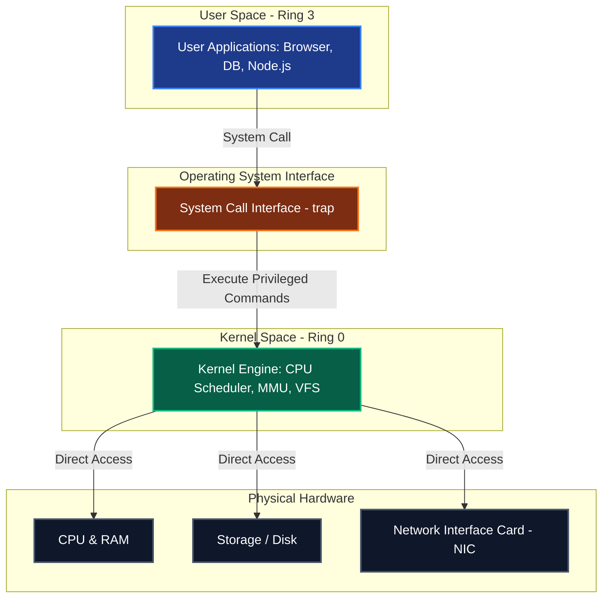
```mermaid
graph TD
    subgraph UserSpace [User Space - Ring 3]
        App[User Applications: Browser, DB, Node.js]
    end

    subgraph OS_Space [Operating System Interface]
        Syscall[System Call Interface - trap]
    end

    subgraph KernelSpace [Kernel Space - Ring 0]
        Kernel[Kernel Engine: CPU Scheduler, MMU, VFS]
    end

    subgraph HW_Space [Physical Hardware]
        CPU[CPU & RAM]
        Disk[Storage / Disk]
        Network[Network Interface Card - NIC]
    end

    App -->|System Call| Syscall
    Syscall -->|Execute Privileged Commands| Kernel
    Kernel -->|Direct Access| CPU
    Kernel -->|Direct Access| Disk
    Kernel -->|Direct Access| Network

    style App fill:#1e3a8a,stroke:#3b82f6,stroke-width:2px,color:#fff
    style Syscall fill:#7c2d12,stroke:#f97316,stroke-width:2px,color:#fff
    style Kernel fill:#065f46,stroke:#10b981,stroke-width:2px,color:#fff
    style CPU fill:#0f172a,stroke:#475569,stroke-width:2px,color:#fff
    style Disk fill:#0f172a,stroke:#475569,stroke-width:2px,color:#fff
    style Network fill:#0f172a,stroke:#475569,stroke-width:2px,color:#fff
```

### Types of Operating Systems

অপারেটিং সিস্টেমগুলোর আর্কিটেকচার এবং ব্যবহারের ওপর ভিত্তি করে সেগুলোকে কয়েকটি ক্যাটাগরিতে ভাগ করা যায়:

1. **Batch OS (ব্যাচ অপারেটিং সিস্টেম):**
   - শুরুর দিকের অপারেটিং সিস্টেম যেখানে ইউজার সরাসরি কম্পিউটারের সাথে যোগাযোগ করতে পারতো না। পাঞ্চ কার্ডের মাধ্যমে একই ধরণের কাজের একটি দল (Batch) বানিয়ে ওপারেটরকে দেওয়া হতো এবং ওপারেটর ব্যাচ অনুযায়ী রান করাতো (যেমন: IBM OS/360)।
2. **Time-Sharing / Multi-tasking OS:**
   - একাধিক ইউজার বা প্রসেসকে একটি সিঙ্গেল CPU খুব দ্রুত সময় ভাগ করে দেয় (CPU Scheduling)। এটি এতো দ্রুত ঘটে যে প্রতিটা ইউজার মনে করে কম্পিউটারটি শুধু তার কাজই করছে। আধুনিক প্রায় সব সাধারণ ওএস (Linux, macOS, Windows) মাল্টি-টাস্কিং সাপোর্ট করে।
3. **Real-Time OS (RTOS):**
   - যেখানে টাইম লিমিট বা ডেডলাইন অত্যন্ত কঠোর। নির্দিষ্ট সময়ের মধ্যে আউটপুট না আসলে পুরো সিস্টেম ফেইল বা ক্র্যাশ করতে পারে।
     - **Hard RTOS:** এক মিলি-সেকেন্ডের বিলম্বও গ্রহণযোগ্য নয়। উদাহরণ: রকেট লঞ্চিং সিস্টেম, এয়ারব্যাগ কন্ট্রোল, পেসমেকার।
     - **Soft RTOS:** সামান্য সময়ের বিলম্ব হতে পারে তবে পারফরম্যান্স ড্রপ করবে। উদাহরণ: ভিডিও স্ট্রিমিং প্লেয়ার, গেমিং কনসোল।
4. **Distributed OS:**
   - একাধিক স্বাধীন ফিজিক্যাল নোড বা মেশিনকে একটি সিঙ্গেল কোহিসিভ নেটওয়ার্কের মাধ্যমে কানেক্ট করে সিঙ্গেল সিস্টেম হিসেবে ম্যানেজ করে। উদাহরণ: LOCUS, গ্লোবাল ক্লাউড সিস্টেমের ব্যাকবোন।
5. **Embedded OS:**
   - নির্দিষ্ট কোনো হার্ডওয়্যার বা ডিভাইসের জন্য অপ্টিমাইজড (যেমন: স্মার্ট টিভি, ফ্রিজ, রাউটার, আইওটি ডিভাইস)। উদাহরণ: Embedded Linux, VxWorks, Android Things.

### Senior Insight: Embedded Linux in Cloud Infrastructure

> ক্লাউড ইনফ্রাস্ট্রাকচারের ক্ষেত্রে আমরা যে হাইপারভাইজার বা ছোট কন্টেইনার সার্ভিস চালাই, সেগুলো মূলত একটি স্ট্রিপড-ডাউন বা কাস্টমাইজড **Embedded/Minimal Linux OS** ব্যবহার করে। এর ফলে মেমরি ওভারহেড অনেক কমে যায় এবং বুট-আপ টাইম প্রায় ০ মিলি-সেকেন্ডে নেমে আসে (যেমন: AWS BottleRocket বা Alpine Linux)।

### Interview Elevator Pitch (Senior Level)

> "অপারেটিং সিস্টেম কেবল সফটওয়্যার রান করার মাধ্যম নয়; এটি হলো রিসোর্সের সেন্ট্রাল ডিস্ট্রিবিউটর। আধুনিক ক্লাউড আর্কিটেকচারে লার্জ স্কেল অ্যাপ্লিকেশনের পারফরম্যান্স অপ্টিমাইজ করতে আমাদের মাল্টি-টাস্কিং টাইম শেয়ারিং ওএস-এর কনটেক্সট সুইচিং ওভারহেড মিনিমাইজ করা এবং নেটওয়ার্ক রাউটিংয়ের ক্ষেত্রে কার্নেলের ড্রাইভার লেভেলের এফিশিয়েন্সি বোঝা অত্যন্ত গুরুত্বপূর্ণ।"

---

## ২. The Kernel: Architectural Heart of the OS

### Core Idea

**Kernel (কার্নেল):** হলো অপারেটিং সিস্টেমের একদম কোর বা কেন্দ্রীয় অংশ। ওএস বুট হওয়ার সময় এটিই সবার আগে মেমরিতে লোড হয় এবং সিস্টেম বন্ধ হওয়া পর্যন্ত মেমরিতেই অবস্থান করে। এটি হার্ডওয়্যার লেভেলের অ্যাক্সেস কন্ট্রোল করে এবং ইউজার অ্যাপের রিকোয়েস্ট প্রসেস করে।

CPU-তে সিকিউরিটি রক্ষার জন্য হার্ডওয়্যার লেভেলে **Privilege Rings** থাকে:

- **Ring 0 (Kernel Mode):** সম্পূর্ণ সুবিধাপ্রাপ্ত বা প্রিভিলেজড জোন। কার্নেল এখানে রান করে এবং ফিজিক্যাল মেমরি, সিপিইউ রেজিস্টার এবং হার্ডওয়্যার ডিভাইসে সরাসরি ফুল এক্সেস পায়।
- **Ring 3 (User Mode):** সিমাবদ্ধ বা আন-প্রিভিলেজড জোন। আমাদের সাধারণ ইউজার অ্যাপ্লিকেশন (যেমন: Node.js, DB, Browser) এখানে রান করে। এরা সরাসরি হার্ডওয়্যার টাচ করতে পারে না; করতে গেলে অবশ্যই কার্নেলের মাধ্যমে যেতে হবে।

### Kernel Architectures (কার্নেল আর্কিটেকচার)

কার্নেল ডিজাইনের মূলত দুটি প্রধান স্কুল অফ থট রয়েছে—**Monolithic Kernel** এবং **Microkernel**। এদের ডিজাইন ও পারফরম্যান্স ট্রেড-অফ নিচে বিস্তারিত আলোচনা করা হলো:

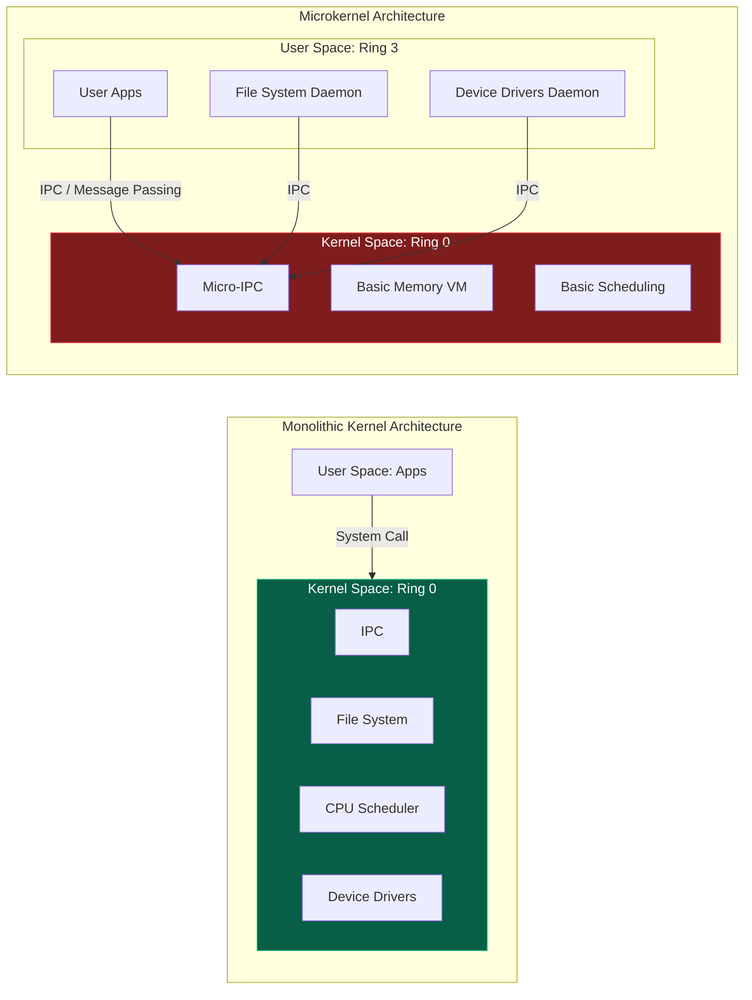
```mermaid
graph LR
    subgraph Monolithic [Monolithic Kernel Architecture]
        M_User[User Space: Apps]
        subgraph M_Kernel [Kernel Space: Ring 0]
            IPC[IPC]
            VFS[File System]
            Sched[CPU Scheduler]
            Drivers[Device Drivers]
        end
        M_User -->|System Call| M_Kernel
    end

    subgraph Micro [Microkernel Architecture]
        subgraph U_Space [User Space: Ring 3]
            App_U[User Apps]
            FS_U[File System Daemon]
            Drv_U[Device Drivers Daemon]
        end
        subgraph K_Space [Kernel Space: Ring 0]
            Core_IPC[Micro-IPC]
            Core_Mem[Basic Memory VM]
            Core_Sched[Basic Scheduling]
        end
        App_U -->|IPC / Message Passing| Core_IPC
        FS_U -->|IPC| Core_IPC
        Drv_U -->|IPC| Core_IPC
    end

    style M_Kernel fill:#065f46,stroke:#10b981,color:#fff
    style K_Space fill:#7f1d1d,stroke:#ef4444,color:#fff
```

#### ১. Monolithic Kernel (মনোলিথিক কার্নেল)

- **মেকানিজম:** কার্নেলের যাবতীয় সার্ভিস যেমন—সিপিইউ শিডিউলার, ভার্চুয়াল মেমরি ম্যানেজমেন্ট, ভার্চুয়াল ফাইল সিস্টেম (VFS), এবং ডিভাইস ড্রাইভার—সবকিছু একসাথে একটি বিশাল বাইনারি ফাইল হিসেবে **Ring 0 (Kernel Space)**-এ রান করে।
- **উদাহরণ:** **Linux**, FreeBSD, OpenBSD.
- **সুবিধা:** **অত্যন্ত দ্রুত পারফরম্যান্স!** যেহেতু সবকিছু একই অ্যাড্রেস স্পেসে থাকে, তাই একটি সার্ভিস আরেকটি সার্ভিসকে কল করার সময় কোনো ইন্টার-প্রসেস কমিউনিকেশন (IPC) বা কনটেক্সট সুইচিংয়ের প্রয়োজন হয় না। সরাসরি ফাংশন কল দিয়ে কাজ হয়ে যায়।
- **অসুবিধা:** একটি সাধারণ ড্রাইভার ক্র্যাশ করলে পুরো কার্নেল ক্র্যাশ করবে এবং স্ক্রিনে **Kernel Panic (Blue Screen of Death)** চলে আসবে। সিকিউরিটি ভলনারেবিলিটির রিস্ক বেশি।

#### ২. Microkernel (মাইক্রোকার্নেল)

- **মেকানিজম:** কার্নেলকে একদম লাইটওয়েট রাখা হয়। শুধুমাত্র অতি-আবশ্যক ৩টি কাজ—বেসিক মেমরি অ্যাড্রেস স্পেস ম্যানেজমেন্ট, থ্রেড শিডিউলিং, এবং ইন্টার-প্রসেস কমিউনিকেশন (IPC)—কার্নেল স্পেসে (Ring 0) রাখা হয়। ফাইল সিস্টেম, ডিভাইস ড্রাইভার এবং নেটওয়ার্ক প্রোটোকল স্ট্যাককে ইউজার স্পেসে (Ring 3) সাধারণ সার্ভিস ডেমোনের মতো চালানো হয়।
- **উদাহরণ:** **seL4** (মিলিটারি গ্রেড সিকিউর কার্নেল), Mach (macOS XNU-এর ভিত্তি), Minix.
- **সুবিধা:** **অত্যন্ত স্টেবল এবং সিকিউর!** কোনো ডিভাইস ড্রাইভার বা ফাইল সিস্টেম ডেমোন ক্র্যাশ করলেও কার্নেল সচল থাকে, শুধু সেই স্পেসিফিক ডেমোনটি ওএস রিস্টার্ট করে নেয়। মিলিটারি এবং মেডিকেল ডিভাইসে এটি অত্যন্ত জনপ্রিয়।
- **অসুবিধা:** **পারফরম্যান্স অত্যন্ত ধীর।** ইউজার স্পেসে থাকা ফাইল সিস্টেমের সাথে এপ্লিকেশন কথা বলতে গেলে বারবার মেসেজ পাসিং করতে হয়, যার জন্য কার্নেলের মধ্য দিয়ে **Context Switching Overhead** ঘটে।

#### ৩. Hybrid Kernel (হাইব্রিড কার্নেল)

- মনোলিথিক কার্নেলের স্পিড এবং মাইক্রোকার্নেলের মডিউলারিটি একসাথে ব্লেন্ড করে তৈরি করা হয়েছে। কার্নেলের ভেতরে কিছু সার্ভিস ইউজার মোডে এবং কিছু সার্ভিস স্পিড বাড়ানোর জন্য কার্নেল মোডে রান করে।
- **উদাহরণ:** **Windows NT** (কার্নেলের ভেতর উইন্ডো গ্রাফিক্স ড্রাইভার ঢুকিয়ে স্পিড বাড়ানো হয়েছে), macOS **XNU**।

### Senior Insight: Monolithic Linux Customization

> প্রোডাকশন সার্ভারে যখন হাই-পারফরম্যান্স নেটওয়ার্কিং বা ফাইল সিস্টেম রিড দরকার হয়, তখন মনোলিথিক Linux কার্নেলের ক্ষমতা ব্যবহার করে আমরা **Kernel Modules (LKM - Loadable Kernel Modules)** রানটাইমে লোড করতে পারি। এর ফলে রিবুট ছাড়াই কার্নেলের কার্যক্ষমতা বাড়ানো যায়। এছাড়াও ইদানীং **eBPF (Extended Berkeley Packet Filter)** ব্যবহার করে কার্নেল সোর্স কোড মডিফাই না করেই Ring 0-এর ভেতর কাস্টম স্যান্ডবক্সড কোড রান করানো যাচ্ছে, যা আধুনিক ক্যাওস ইঞ্জিনিয়ারিং ও সিকিউরিটি মনিটরিংয়ে বৈপ্লবিক পরিবর্তন এনেছে।

### Common Mistakes

- **Thinking Microkernel is always better because of modularity:** রিয়েল-টাইম হাই-থ্রুপুট ডাটাবেস বা হাই-স্পিড নেটওয়ার্কিংয়ে মাইক্রোকার্নেল অতিরিক্ত মেসেজ পাসিং লেটেন্সির কারণে চরমভাবে মার খায়। লিনাক্স মনোলিথিক হওয়া সত্ত্বেও এটিই ক্লাউডে বিজয়ী হওয়ার অন্যতম প্রধান কারণ এর স্পিড।

---

## ৩. System Calls & Interrupts: The Gateways

### Core Idea

ইউজার মোডের (Ring 3) কোনো অ্যাপ্লিকেশন যখন কোনো প্রিভিলেজড রিসোর্স অ্যাক্সেস করতে চায় (যেমন: ডিস্কে ফাইল সেভ করা, নেটওয়ার্ক সকেট ওপেন করা, বা কনসোলে প্রিন্ট করা), তখন সে সরাসরি তা করতে পারে না। তাকে কার্নেলের (Ring 0) কাছে একটি অফিসিয়াল রিকোয়েস্ট করতে হয়। এই রিকোয়েস্ট মেকানিজমকেই **System Call (Syscall)** বলা হয়।

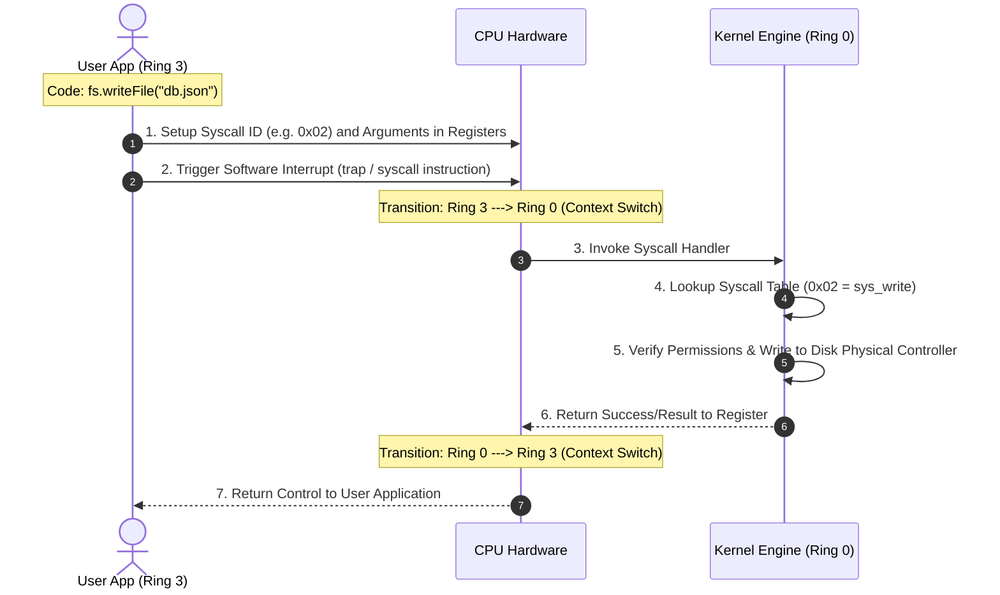
```mermaid
sequenceDiagram
    autonumber
    actor App as User App (Ring 3)
    participant CPU as CPU Hardware
    participant Kernel as Kernel Engine (Ring 0)

    Note over App: Code: fs.writeFile("db.json")
    App->>CPU: 1. Setup Syscall ID (e.g. 0x02) and Arguments in Registers
    App->>CPU: 2. Trigger Software Interrupt (trap / syscall instruction)
    Note over CPU: Transition: Ring 3 ---> Ring 0 (Context Switch)
    CPU->>Kernel: 3. Invoke Syscall Handler
    Kernel->>Kernel: 4. Lookup Syscall Table (0x02 = sys_write)
    Kernel->>Kernel: 5. Verify Permissions & Write to Disk Physical Controller
    Kernel-->>CPU: 6. Return Success/Result to Register
    Note over CPU: Transition: Ring 0 ---> Ring 3 (Context Switch)
    CPU-->>App: 7. Return Control to User Application
```

### System Call Workflow (ধাপসমূহ)

1. **Setup Arguments:** অ্যাপ্লিকেশন প্রথমে কার্নেলকে কী করতে হবে তার ডিটেইলস এবং সিস্টেম কল আইডি (যেমন লিনাক্সে `sys_write` এর আইডি ১) সিপিইউ-এর বিশেষ রেজিস্টারগুলোতে (যেমন RAX, RDI, RSI) লোড করে।
2. **Trap Instruction (সফটওয়্যার ট্র্যাপ):** অ্যাপ্লিকেশন তখন একটি বিশেষ অ্যাসেম্বলি ইন্সট্রাকশন `SYSCALL` বা `INT 0x80` এক্সিকিউট করে। এটি সিপিইউ-কে ফোর্স করে ইউজার মোড থেকে কার্নেল মোডে সুইচ করতে। একে **Trap** বা **Software Interrupt** বলা হয়।
3. **Syscall Table Lookup:** কার্নেলের ভেতরে একটি ইনডেক্সড টেবিল থাকে যাকে **Syscall Table** বলা হয়। কার্নেল রেজিস্টার থেকে আইডি রিড করে এবং টেবিল থেকে সঠিক কার্নেল ফাংশনটির অ্যাড্রেস খুঁজে বের করে (যেমন: `sys_write()` ফাংশন)।
4. **Execution in Ring 0:** কার্নেল সরাসরি হার্ডওয়্যার ড্রাইভারকে ইন্সট্রাকশন দিয়ে ফাইলটি ডিস্কে রাইট করে।
5. **Context Restore & Return:** কাজ শেষ হলে কার্নেল আউটপুট রেজিস্টারে রেসপন্স কোড লিখে দেয় এবং সিপিইউ-কে `SYSRET` কমান্ড দিয়ে মোড আবার Ring 3-তে কনভার্ট করে দেয়।

### Interrupts: The Asynchronous Signals

ইন্টারাপ্ট হলো এমন একটি সিগন্যাল যা সিপিইউ-এর কারেন্ট কাজ থামিয়ে কোনো স্পেশাল সার্ভিস রুটিন (ISR - Interrupt Service Routine) রান করায়।

| Type                               | Nature       | Origin / Source                                  | Example                                                                                                         |
| :--------------------------------- | :----------- | :----------------------------------------------- | :-------------------------------------------------------------------------------------------------------------- |
| **Hardware Interrupt**             | Asynchronous | বাহ্যিক হার্ডওয়্যার ডিভাইস থেকে আসে।            | নেটওয়ার্ক কার্ডে নতুন প্যাকেট এলে, কিবোর্ডের বাটনে প্রেস করলে।                                                 |
| **Software Interrupt / Exception** | Synchronous  | কোড এক্সিকিউট করার সময় সিপিইউ নিজেই জেনারেট করে। | ০ দিয়ে ভাগ করলে (`Division by Zero`), অবৈধ মেমরি অ্যাড্রেস টাচ করলে (`Segmentation Fault`), মেমরি পেজ ফল্ট হলে। |

### Senior Insight: Syscall Overhead & High-Performance I/O

> প্রতিটা সিস্টেম কল অত্যন্ত কস্টলি, কারণ এতে সিপিইউ-কে রেজিস্টার ফ্ল্যাশ করতে হয় এবং মেমরি বাউন্ডারি ট্রানজিশন ঘটে। ব্যাকএন্ডে প্রতি সেকেন্ডে লক্ষাধিক ফাইল বা সকেট অপারেশন করার সময় সিস্টেম কলের ওভারহেড পারফরম্যান্স নষ্ট করতে পারে। এই জন্য আধুনিক লিনাক্সে **`io_uring`** ইন্টারফেস ব্যবহার করা হয়। এটি কার্নেল এবং ইউজার স্পেসের মাঝে দুটি শেয়ার্ড রিং-বাফার (Submission & Completion Queue) তৈরি করে। এর ফলে কোনো সিস্টেম কল ট্র্যাপ ছাড়াই অ্যাসিনক্রোনাসলি হাজার হাজার I/O অপারেশন একবারে ব্যাচ করে কার্নেলকে সাবমিট করা যায়, যা ডাটাবেস ও প্রক্সি সার্ভারের গতি কয়েকগুণ বাড়িয়ে দেয়।

---

## ৪. Memory Management & Paging Internals

### Core Idea

অপারেটিং সিস্টেম সরাসরি অ্যাপ্লিকেশনগুলোকে ফিজিক্যাল RAM অ্যাক্সেস করতে দেয় না। সে প্রতিটা প্রসেসকে একটি সম্পূর্ণ নিজস্ব ভেন্ডর-আইসোলেটেড মেমরি স্পেস দেয় যাকে **Virtual Memory** বলা হয়। এর ফলে প্রসেস A কখনোই ভুলবশত প্রসেস B-এর মেমরিতে রাইট করতে পারে না।

ভার্চুয়াল অ্যাড্রেসকে ফিজিক্যাল মেমরিতে ট্রান্সলেট করার জন্য সিপিইউ-এর ভেতরে একটি ফিজিক্যাল চিপ থাকে যাকে **MMU (Memory Management Unit)** বলে। ওএস-এর **Page Table** ব্যবহার করে MMU ভার্চুয়াল অ্যাড্রেসকে রিয়েল-টাইমে ফিজিক্যাল অ্যাড্রেসে ট্রান্সলেট করে।

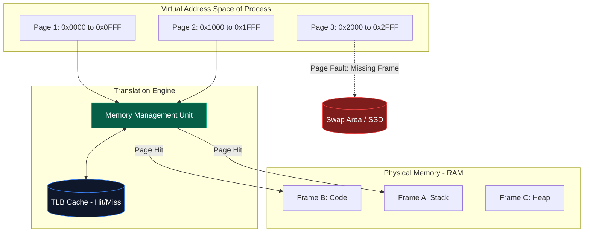
```mermaid
flowchart TD
    subgraph VirtualMemory [Virtual Address Space of Process]
        VA_P1[Page 1: 0x0000 to 0x0FFF]
        VA_P2[Page 2: 0x1000 to 0x1FFF]
        VA_P3[Page 3: 0x2000 to 0x2FFF]
    end

    subgraph HardwareMMU [Translation Engine]
        MMU[Memory Management Unit]
        TLB[(TLB Cache - Hit/Miss)]
    end

    subgraph PhysicalRAM [Physical Memory - RAM]
        FrameB[Frame B: Code]
        FrameA[Frame A: Stack]
        FrameC[Frame C: Heap]
    end

    VA_P1 --> MMU
    VA_P2 --> MMU
    VA_P3 -.->|Page Fault: Missing Frame| Disk[(Swap Area / SSD)]

    MMU <--> TLB
    MMU -->|Page Hit| FrameA
    MMU -->|Page Hit| FrameB

    style MMU fill:#065f46,stroke:#10b981,color:#fff
    style TLB fill:#0f172a,stroke:#3b82f6,color:#fff
    style Disk fill:#7f1d1d,stroke:#ef4444,color:#fff
```

### Key Memory Concepts

1. **Paging (পেজিং):**
   - মেমরিকে সমপরিমাণ ফিক্সড ব্লকে ভাগ করা। ভার্চুয়াল মেমরির প্রতিটা ব্লককে **Page (সাধারণত 4KB)** বলা হয় এবং ফিজিক্যাল র‍্যামের ব্লককে **Frame** বলা হয়।
2. **Translation Lookaside Buffer (TLB):**
   - ভার্চুয়াল টু ফিজিক্যাল পেজ ম্যাপ টেবিল লুপআপ করার সময় ওএস-কে র‍্যামের পেজ টেবিলে কুয়েরি করতে হয়, যা স্লো। এই লুপআপ মেকানিজমকে ফাস্ট করতে CPU-এর ভেতরে একটি ডেডিকেটেড ক্যাশে মেমরি থাকে যাকে **TLB** বলা হয়।
     - **TLB Hit:** পেজ ম্যাপটি সরাসরি টিএলবি-তে পাওয়া গেছে (র‍্যাম কুয়েরি এভয়েডড)।
     - **TLB Miss:** টিএলবি-তে ম্যাপ নেই, র‍্যামের পেজ টেবিল স্ক্যান করে ম্যাপ এনে টিএলবি আপডেট করতে হবে।
3. **Demand Paging & Page Faults:**
   - আধুনিক ওএস পুরো প্রজেক্টের সব মেমরি একসাথে র‍্যামে লোড করে না। যখন মেমরির কোনো অংশ দরকার হয়, কেবল তখনই তা লোড করা হয় (Demand Paging)।
   - **Page Fault Scenario:**
     - প্রসেসর যখন ভার্চুয়াল পেজ ৩ অ্যাক্সেস করতে চাইল, কিন্তু MMU দেখল পেজ টেবিলের ম্যাপের ভ্যালিডিটি বিট `0` (অর্থাৎ এটি র‍্যামের ফিজিক্যাল ফ্রেমে লোড নেই, হার্ডডিস্কে সোয়াপ ফাইলে আছে)।
     - MMU সাথে সাথে সিপিইউ-তে একটি **Page Fault Exception** পাঠায়।
     - কার্নেল তার পেজ ফল্ট হ্যান্ডলার রান করে। সে র‍্যামের একটি খালি ফ্রেম খুঁজে বের করে ডিস্ক বা সোয়াপ এরিয়া থেকে ডেটা এনে লোড করে।
     - পেজ টেবিল আপডেট করে ভ্যালিডিটি বিট `1` করা হয় এবং পুনরায় ইন্সট্রাকশন রান করানো হয়।

### Internal vs External Fragmentation

| Feature       | Internal Fragmentation                                                                                | External Fragmentation                                                                                                                   |
| :------------ | :---------------------------------------------------------------------------------------------------- | :--------------------------------------------------------------------------------------------------------------------------------------- |
| **কারণ**      | ফিক্সড সাইজ পেজ ব্লকের ভেতরে ফাঁকা জায়গা থেকে যাওয়া।                                                  | ডায়নামিক মেমরি এলোকেশনের কারণে মেমরির ছোট ছোট টুকরো ছড়িয়ে থাকা।                                                                          |
| **পরিস্থিতি** | একটি প্রসেসের ১ বাইট মেমরি দরকার হলেও ওএস তাকে ৪KB-এর পুরো পেজ দিয়ে দেয়। ভেতরের ৩.৯৯KB মেমরি নষ্ট হয়। | মেমরিতে টোটাল ১০০MB খালি জায়গা ছড়ানো আছে, কিন্তু কন্টিগুয়াস (একনাগাড়ে) ৫০MB খালি না থাকায় ৫০MB-এর একটি বড় অবজেক্ট এলোকেট করা যাচ্ছে না। |
| **সমাধান**    | পেজ সাইজ অপ্টিমাইজড রাখা।                                                                             | **Paging** মেকানিজম ব্যবহার করা, কারণ পেজিং ফিজিক্যাল মেমরিকে নন-কন্টিগুয়াস ফ্রেমে ডিস্ট্রিবিউট করতে পারে।                              |

### Senior Insight: Page Table Size & Huge Pages (Linux)

> লার্জ মেমরি-হাংরি ব্যাকএন্ড ডাটাবেস (যেমন: PostgreSQL বা Redis যাতে হয়তো 128GB RAM লোড আছে) রান করার সময় পেজ টেবিল ম্যানেজ করতেই কয়েক গিগাবাইট র‍্যাম অপচয় হয়ে যেতে পারে এবং ঘন ঘন TLB Miss হতে পারে। এর জন্য প্রোডাকশন লিনাক্স সার্ভারে **Huge Pages (যেমন 2MB বা 1GB পেজ সাইজ)** কনফিগার করা হয়। এতে পেজ টেবিল এন্ট্রি অনেক কমে যায় এবং TLB Hit Rate নাটকীয়ভাবে বৃদ্ধি পায়, যা ডাটাবেসের কুয়েরি লেটেন্সি ১০% থেকে ২০% কমিয়ে দেয়।

---

## ৫. Processes vs Threads: Execution & Lifecycles

### Core Idea

- **Process (প্রসেস):** হলো একটি রানিং প্রোগ্রামের একটি সক্রিয় ইনস্ট্যান্স। প্রতিটা প্রসেস সম্পূর্ণ ওএস-লেভেলে আইসোলেটেড মেমরি স্পেস পায়। এটি নিজস্ব ফাইল ডেসক্রিপ্টর, মেমরি হিপ, এবং সিকিউরিটি টোকেন ধারণ করে।
- **Thread (থ্রেড):** হলো একটি প্রসেসের ভেতরের একটি লাইটওয়েট এক্সিকিউশন ইউনিট। একটি প্রসেসের একাধিক থ্রেড থাকতে পারে। থ্রেডগুলো প্রসেসের মূল **Heap, Global Variables, Code, এবং File Descriptors** শেয়ার করে, কিন্তু তাদের নিজস্ব ব্যক্তিগত **Stack, Registers, এবং Program Counter (PC)** থাকে।

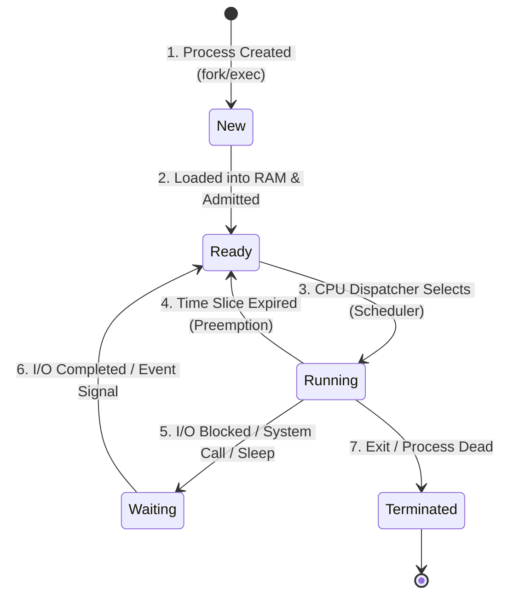
```mermaid
stateDiagram-v2
    [*] --> New: 1. Process Created (fork/exec)
    New --> Ready: 2. Loaded into RAM & Admitted
    Ready --> Running: 3. CPU Dispatcher Selects (Scheduler)
    Running --> Ready: 4. Time Slice Expired (Preemption)
    Running --> Waiting: 5. I/O Blocked / System Call / Sleep
    Waiting --> Ready: 6. I/O Completed / Event Signal
    Running --> Terminated: 7. Exit / Process Dead
    Terminated --> [*]
```

### Process States & Lifecycle (প্রসেস লাইফসাইকেল)

একটি প্রসেস তার জীবনচক্রে মূলত ৫টি অবস্থার মধ্য দিয়ে যায়:

1. **New:** প্রসেসটি সবেমাত্র ডিস্ক থেকে মেমরিতে নিয়ে আসার প্রসেস শুরু হয়েছে।
2. **Ready:** প্রসেসটি র‍্যামে লোড হয়ে রান হওয়ার জন্য সম্পূর্ণ রেডি এবং ওএস-এর শিডিউল কিউতে (Scheduler Queue) অপেক্ষা করছে।
3. **Running:** ওএস শিডিউলার প্রসেসটিকে সিলেক্ট করেছে এবং সিপিইউ বর্তমানে তার ইন্সট্রাকশন এক্সিকিউট করছে।
4. **Waiting / Blocked:** প্রসেসটি কোনো I/O অপারেশনের জন্য (যেমন: ডিস্ক থেকে ডাটা রিড বা নেটওয়ার্ক রেসপন্স) অপেক্ষা করছে। ওএস সিপিইউ খালি করতে একে ওয়েটিং কিউতে পাঠিয়ে দেয়।
5. **Terminated:** প্রসেসের কাজ সম্পূর্ণ শেষ বা ক্র্যাশ করেছে এবং ওএস তার মেমরি ফ্রি করে দিচ্ছে।

### Context Switching: The Real Performance Cost

সিপিইউ যখন একটি রানিং প্রসেস বা থ্রেড সরিয়ে অন্য একটি প্রসেস বা থ্রেডকে রান করায়, তখন ওএস-কে কারেন্ট প্রসেসের স্টেট (রেজিস্টার, স্ট্যাক পয়েন্টার, প্রোগ্রাম কাউন্টার) সেভ করতে হয় এবং নতুন প্রসেসের স্টেট লোড করতে হয়। একে **Context Switch** বলে।

| Feature                | Process Context Switch                                                                                                                | Thread Context Switch                                                            |
| :--------------------- | :------------------------------------------------------------------------------------------------------------------------------------ | :------------------------------------------------------------------------------- |
| **মেমরি শেয়ারিং**      | প্রসেসগুলোর মেমরি আইসোলেটেড থাকায় সম্পূর্ণ মেমরি ম্যাপ পরিবর্তন করতে হয়।                                                              | থ্রেডগুলো একই পেজ টেবিল ও মেমরি স্পেস শেয়ার করায় অ্যাড্রেস ম্যাপ বদলাতে হয় না।   |
| **TLB Cache Flushing** | **Yes (Flushed):** ওএস-কে CPU-এর ভেতরের TLB ক্যাশে মেমরি সম্পূর্ণ ফ্লাশ করতে হয় এবং পেজ টেবিল পয়েন্টার রেজিস্টার (CR3) আপডেট করতে হয়। | **No:** যেহেতু পেজ টেবিল একই থাকে, তাই TLB ক্যাশ মুছতে হয় না।                    |
| **ওভারহেড কস্ট**       | **অত্যন্ত কস্টলি!** এটি এক্সিকিউট করতে শত শত CPU সাইকেল নষ্ট হয় এবং প্রসেসর ক্যাশ লাইনে ক্যাশ মিস ঘটে।                                | **লাইটওয়েট।** শুধুমাত্র রেজিস্টার সেট এবং স্ট্যাক পয়েন্টার সোয়াপ করলেই হয়ে যায়। |

### Detailed Comparison Table

| Feature                | Process                                                | Thread                                                                     |
| :--------------------- | :----------------------------------------------------- | :------------------------------------------------------------------------- |
| **Address Space**      | সম্পূর্ণ পৃথক এবং ওএস দ্বারা সুরক্ষিত অ্যাড্রেস স্পেস। | প্রসেসের অ্যাড্রেস স্পেস (Heap, Code, Static Data) শেয়ার করে।              |
| **Resource Ownership** | নিজস্ব ফাইল ডেসক্রিপ্টর, সকেট, এবং ওএস রিসোর্স থাকে।   | প্রসেসের রিসোর্স ব্যবহার করে, আলাদা ওনারশিপ থাকে না।                       |
| **Creation Cost**      | অনেক কস্টলি ও ভারী (`fork()` মেকানিজম)।                | অত্যন্ত সস্তা ও দ্রুত গতির।                                                |
| **Crash Effect**       | একটি প্রসেস ক্র্যাশ করলে অন্য প্রসেসে প্রভাব পড়ে না।   | একটি থ্রেড মেমরি করাপশন ঘটিয়ে ক্র্যাশ করলে পুরো প্রসেসের সব থ্রেড ডাউন হয়। |
| **Communication**      | IPC (Inter-Process Communication, Shared Memory) লাগে। | একই মেমরির গ্লোবাল ভেরিয়েবল বা পয়েন্টার সরাসরি অ্যাক্সেস করতে পারে।        |

### Senior Insight: Process vs Thread Scaling in High Load Apps

> **Scale-out Models:** Node.js বা Python মূলত **Single-Threaded Event Loop** প্রসেস মডেল ব্যবহার করে। হাই-কনকারেন্সি হ্যান্ডেল করতে এরা ওএস লেভেলে `Cluster Module` বা `Gunicorn` দিয়ে একাধিক প্রসেস ফোর্ক (Fork) করে। অপরদিকে Go বা Java মূলত **Multi-threaded/Concurrent M:N Scheduler** ব্যবহার করে, যেখানে কার্নেলের থ্রেডের ওপর মিলিয়ন লাইটওয়েট গ্রিন থ্রেড বা গোরুটিন (`Goroutine`) ম্যাপ করা হয়। এর ফলে কার্নেলের থ্রেড লেভেলের হেভি কনটেক্সট সুইচিং এড়ানো যায় এবং মেমরি ফুটপ্রিন্ট অনেক কম থাকে।

---

## ৬. Inter-Process Communication (IPC) & Concurrency Control

### Core Idea

প্রসেসগুলো যেহেতু মেমরি আইসোলেটেড, তাই তারা একে অপরের সাথে কথা বলার জন্য বিশেষ কার্নেল মেকানিজম ব্যবহার করে যাকে **IPC (Inter-Process Communication)** বলে।

কনকারেন্ট প্রোগ্রামিংয়ে যখন মাল্টিপল থ্রেড বা প্রসেস একই গ্লোবাল মেমরিতে রাইট করতে যায়, তখন ওএস লেভেলে বড় ধরনের রেস কন্ডিশন ও লক বাধার সম্ভাবনা থাকে। একে হ্যান্ডেল করার জন্য ওএস আমাদের কনকারেন্সি কন্ট্রোল বা লকিং প্রোটোকল দেয়।

### IPC Mechanisms (ইন্টার-প্রসেস কমিউনিকেশন)

1. **Shared Memory (শেয়ার্ড মেমরি):**
   - কার্নেল দুটি সম্পূর্ণ ভিন্ন প্রসেসকে র‍্যামের একটি নির্দিষ্ট কমন মেমরি সেগমেন্টে সরাসরি রিড/রাইট করার পারমিশন দেয়।
   - **সুবিধা:** **সবচেয়ে ফাস্ট!** কোনো কার্নেল বাফার কপি ওভারহেড ছাড়াই ডেটা ট্রান্সফার করা যায়।
2. **Message Passing (মেসেজ পাসিং):**
   - প্রসেসগুলো কার্নেলকে বলে অন্য প্রসেসে মেসেজ পাঠাতে। কার্নেল মেসেজ কিউ (Message Queue) ব্যবহার করে তা ম্যানেজ করে।
   - **উদাহরণ:** UNIX Pipes (`cat file.txt | grep "error"`), Sockets (TCP/UDP, Unix Domain Sockets).
   - **সুবিধা:** আইসোলেশন ভালো থাকে, মাল্টি-মেশিন স্কেলিং করা যায়।

---

### Concurrency Locks: Mutex, Semaphore, and Deadlocks

কনকারেন্ট প্রসেস বা থ্রেডগুলো যখন শেয়ার্ড মেমরির কোনো অংশ এডিট করতে চায়, সেই ক্রিটিক্যাল কোড ব্লককে **Critical Section** বলা হয়। একই সাথে একাধিক থ্রেড ক্রিটিক্যাল সেকশনে ঢুকলে **Race Condition** ঘটে এবং মেমরি ডেটা করাপ্টেড হয়।

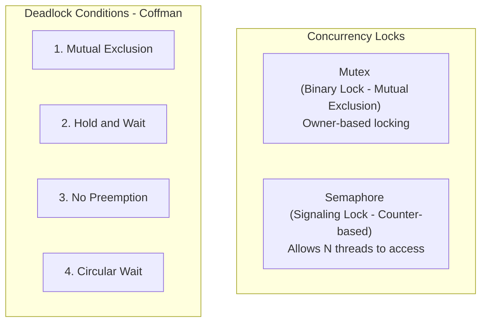
```mermaid
graph TD
    subgraph LockTypes [Concurrency Locks]
        Mutex["Mutex <br>(Binary Lock - Mutual Exclusion) <br>Owner-based locking"]
        Semaphore["Semaphore <br>(Signaling Lock - Counter-based) <br>Allows N threads to access"]
    end

    subgraph DeadlockScenario [Deadlock Conditions - Coffman]
        D1[1. Mutual Exclusion]
        D2[2. Hold and Wait]
        D3[3. No Preemption]
        D4[4. Circular Wait]
    end
```

#### ১. Mutex (মিউটেক্স - Mutual Exclusion)

- এটি একটি **ওনারশিপ-বেইজড লকিং মেকানিজম**। এটি একটি চাবির মতো। যে থ্রেডটি তালা (Lock) মারবে, তাকেই চাবি দিয়ে তালা আনলক করতে হবে। অন্য কোনো থ্রেড এসে সেই তালা খুলতে পারবে না।
- ক্রিটিক্যাল সেকশনে ঢোকার আগে থ্রেডটি লক নেয় এবং বের হয়ে লক রিলিজ করে। বাকিরা লক পাওয়ার জন্য ব্লকড হয়ে লাইনে দাঁড়িয়ে থাকে।

#### ২. Semaphore (সেমাফোর - Signaling Mechanism)

- এটি একটি **সিগন্যালিং বা কাউন্টার-বেইজড মেকানিজম**। এর ভেতরে একটি পূর্ণসংখ্যা বা কাউন্টার ভ্যালু থাকে।
  - **Counting Semaphore:** কাউন্টার ভ্যালু যদি ৩ হয়, তবে একই সাথে ৩টি থ্রেডকে ক্রিটিক্যাল সেকশনে ঢুকতে দেওয়া হবে।
  - **Binary Semaphore:** কাউন্টার ভ্যালু ১। এটি অনেকটা মিউটেক্সের মতো কাজ করে তবে এর কোনো ওনারশিপ কনসেপ্ট নেই। যেকোনো থ্রেড এসে অন্য থ্রেডের দেওয়া লক রিলিজ করে দিতে পারে সিগন্যাল পাঠিয়ে।

---

### Deadlocks (ডেডলক)

ডেডলক হলো এমন একটি ভয়ংকর অবস্থা যেখানে থ্রেড A একটি লকের মালিক হয়ে অন্য লকের জন্য দাঁড়িয়ে আছে, আর থ্রেড B সেই দ্বিতীয় লকের মালিক হয়ে প্রথম লকের জন্য দাঁড়িয়ে আছে। এর ফলে কেউ কাজ শেষ করতে পারে না এবং পুরো সিস্টেম চিরতরে হ্যাং হয়ে যায়।

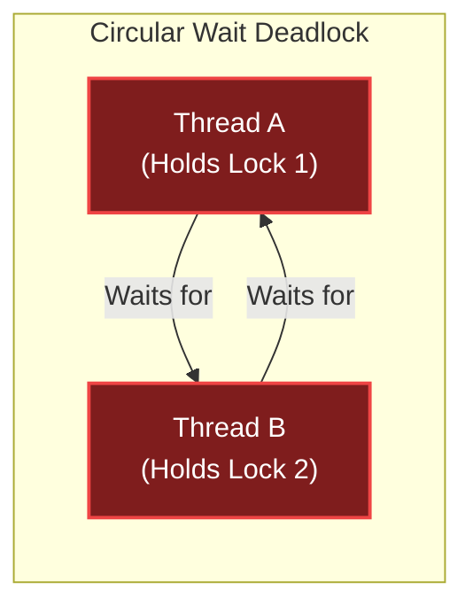
```mermaid
graph LR
    subgraph DeadlockFlow [Circular Wait Deadlock]
        T_A["Thread A <br>(Holds Lock 1)"]
        T_B["Thread B <br>(Holds Lock 2)"]
    end

    T_A -->|Waits for| T_B
    T_B -->|Waits for| T_A

    style T_A fill:#7f1d1d,stroke:#ef4444,stroke-width:2px,color:#fff
    style T_B fill:#7f1d1d,stroke:#ef4444,stroke-width:2px,color:#fff
```

#### Coffman Conditions: ডেডলক ঘটার জন্য অবশ্যই নিচে দেওয়া ৪টি শর্ত একসাথে পূরণ হতে হবে:

1. **Mutual Exclusion:** রিসোর্সটি অবশ্যই শেয়ার করা যাবে না, একটি সময়ে একটি থ্রেডই হোল্ড করতে পারবে।
2. **Hold and Wait:** থ্রেড অলরেডি একটি রিসোর্স নিজের দখলে রেখে অন্য আরেকটি রিসোর্সের জন্য লাইনে দাঁড়িয়ে থাকবে।
3. **No Preemption:** কার্নেল জোর করে কোনো থ্রেডের কাছ থেকে তার দখলে থাকা লক বা রিসোর্স কেড়ে নিতে পারবে না।
4. **Circular Wait:** থ্রেডগুলোর হোল্ডিং চেইন বৃত্তাকার (Circular) হতে হবে (যেমন: A অপেক্ষা করছে B-এর জন্য, B অপেক্ষা করছে A-এর জন্য)।

### Senior Insight: Deadlock Prevention & Lock-Free Programming

> প্রোডাকশন সিস্টেমে ডেডলক এড়ানোর সবচেয়ে সহজ নিয়ম হলো **Lock Ordering Policy** বজায় রাখা। অর্থাৎ সব থ্রেডকে সবসময় একই সিকোয়েন্সে লক নিতে হবে (যেমন: সবসময় আগে Lock 1 নিতে হবে, তারপর Lock 2)। এছাড়াও লার্জ স্কেল হাই-কনকারেন্ট সিস্টেমে আমরা কোনো মিউটেক্স বা সেমাফোর লক ছাড়াই ডেটা প্রটেক্ট করার জন্য **Lock-Free Programming (CAS - Compare-And-Swap)** মেকানিজম ব্যবহার করি। CAS মূলত সিপিইউ-এর বিশেষ অ্যাসেম্বলি ইন্সট্রাকশন ব্যবহার করে কোনো ওএস লক বা কনটেক্সট সুইচ ছাড়াই সরাসরি হার্ডওয়্যার লেভেলে সেফলি মেমরি স্টেট চেঞ্জ করতে পারে, যা পারফরম্যান্স বহুগুণ বাড়িয়ে দেয় (যেমন: Go-এর `atomic` প্যাকেজ বা Java-এর `AtomicInteger`)।

---

## ৭. CPU Scheduling & Linux CFS Internals

### Core Idea

**CPU Scheduling:** হলো অপারেটিং সিস্টেমের একটি মেকানিজম যার মাধ্যমে ওএস ডিসাইড করে কোন রেডি প্রসেস বা থ্রেড কখন এবং কতক্ষণ CPU-তে রান করার সুযোগ পাবে। এর মূল লক্ষ্য হলো CPU ইউটিলাইজেশন সর্বোচ্চ করা এবং রেসপন্স টাইম সর্বনিম্ন করা।

### Scheduling Algorithms

1. **First-Come, First-Served (FCFS):** নন-প্রিইম্পটিভ, যে আগে আসবে সে আগে রান করবে।
   - **সমস্যা (Convoy Effect):** একটি অত্যন্ত বড় প্রসেস যদি আগে চলে আসে, তবে তার পেছনে ছোট প্রসেসগুলো আটকে দীর্ঘক্ষণ অপেক্ষা করতে থাকে।
2. **Shortest Job First (SJF):** যে প্রসেসের এক্সিকিউশন টাইম সবচেয়ে ছোট, সেটিকে আগে রান করানো। এটি থিওরিটিক্যালি মিনিমাম এভারেজ ওয়েটিং টাইম দেয়।
   - **সমস্যা:** ভবিষ্যতে কোনো প্রসেস রান হতে কত সময় নিবে তা আগে থেকে নির্ভুলভাবে জানা অসম্ভব।
3. **Round Robin (RR):** প্রতিটি প্রসেসকে একটি নির্দিষ্ট ছোট সময় (Time Quantum/Slice, যেমন ১০ মিলি-সেকেন্ড) রান করতে দেওয়া হয়। সময় শেষ হলে ওএস প্রসেসটিকে প্রিইম্পট (Preempt) করে লাইনের শেষে পাঠিয়ে দেয় এবং পরবর্তী প্রসেসকে সুযোগ দেয়।
   - **সুবিধা:** ইন্টারঅ্যাক্টিভ ও মাল্টি-ইউজার সিস্টেমের জন্য দারুণ।
4. **Multi-Level Feedback Queue (MLFQ):** আধুনিক উইন্ডোজ ও ম্যাক ওএস এটি ব্যবহার করে। প্রসেসগুলোর বিহেভিয়ার (যেমন I/O বাউন্ড বনাম CPU বাউন্ড) দেখে ডায়নামিক্যালি তাদের আলাদা আলাদা প্রায়োরিটি কিউতে মুভ করা হয়।

### Senior Insight: Linux Completely Fair Scheduler (CFS)

> আধুনিক Linux কার্নেল (2.6.23+) CPU শিডিউলিংয়ের জন্য **CFS (Completely Fair Scheduler)** ব্যবহার করে। এটি কোনো ট্র্যাডিশনাল টাইম স্লাইস বা কিউ ব্যবহার করে না।
>
> - **vruntime (Virtual Runtime):** CFS প্রতিটি প্রসেসের এক্সিকিউশন টাইমকে একটি `vruntime` ভ্যারিয়েবল দিয়ে ট্র্যাক করে। যে প্রসেসটি সবচেয়ে কম সময় CPU পেয়েছে (সর্বনিম্ন `vruntime`), শিডিউলার তাকেই পরবর্তী সুযোগ দেয়।
> - **Red-Black Tree ($O(\log N)$):** CFS সব রেডি প্রসেসকে একটি ব্যালেন্সড **Red-Black Tree** ডাটা স্ট্রাকচারে সাজিয়ে রাখে। সবচেয়ে বামে থাকা নোডটি (যার `vruntime` সর্বনিম্ন) ওএস রান করায়। এটি অত্যন্ত স্কেলেবল এবং ফেয়ারনেস নিশ্চিত করে।

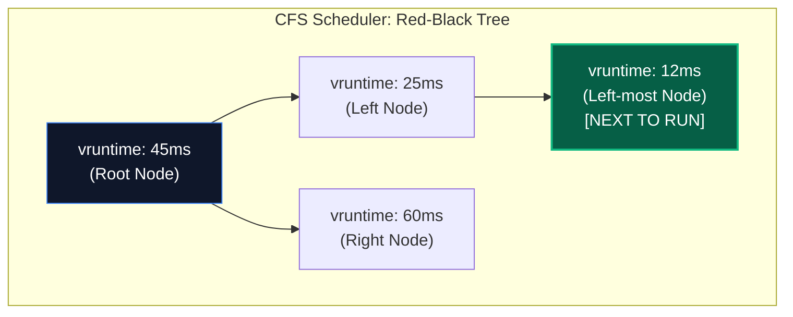
```mermaid
graph TD
    subgraph CFS_Tree [CFS Scheduler: Red-Black Tree]
        Node_Root["vruntime: 45ms <br>(Root Node)"]
        Node_L["vruntime: 25ms <br>(Left Node)"]
        Node_LL["vruntime: 12ms <br>(Left-most Node) <br>[NEXT TO RUN]"]
        Node_R["vruntime: 60ms <br>(Right Node)"]
    end

    Node_Root --> Node_L
    Node_Root --> Node_R
    Node_L --> Node_LL

    style Node_LL fill:#065f46,stroke:#10b981,stroke-width:2px,color:#fff
    style Node_Root fill:#0f172a,stroke:#3b82f6,color:#fff
```

---

## ৮. Virtual File System (VFS) & Inodes

### Core Idea

অপারেটিং সিস্টেমে অনেক ধরণের ফিজিক্যাল ফাইল সিস্টেম থাকতে পারে (যেমন লিনাক্সে `ext4`, ইউএসবি ড্রাইভের জন্য `FAT32`/`exFAT`, বা উইন্ডোজের `NTFS`)। এপ্লিকেশন ডেভেলপাররা যেন ফাইল সিস্টেমের ইন্টারনাল স্ট্রাকচার না জেনেই সরাসরি সাধারণ `open()`, `read()`, `write()` সিস্টেম কল দিয়ে ফাইল হ্যান্ডেল করতে পারে, তার জন্য কার্নেলে একটি অ্যাবস্ট্রাকশন লেয়ার থাকে। একে **Virtual File System (VFS)** বলা হয়।

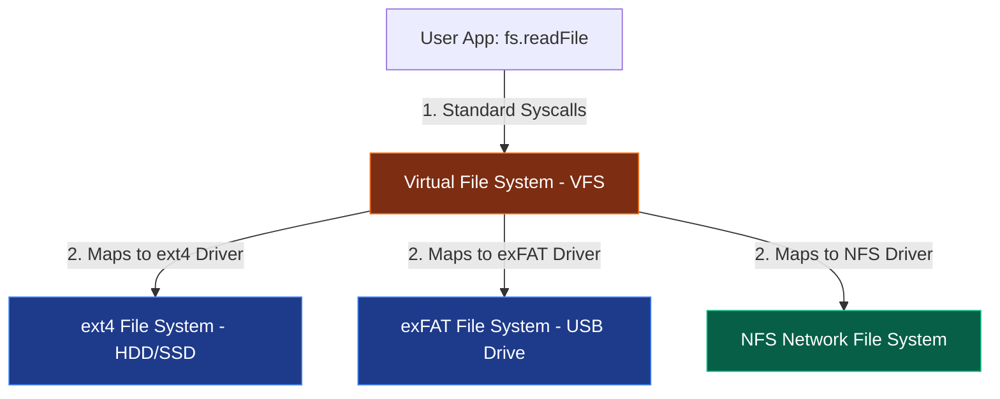
```mermaid
flowchart TD
    App[User App: fs.readFile] -->|1. Standard Syscalls| VFS[Virtual File System - VFS]
    VFS -->|2. Maps to ext4 Driver| ext4[ext4 File System - HDD/SSD]
    VFS -->|2. Maps to exFAT Driver| exFAT[exFAT File System - USB Drive]
    VFS -->|2. Maps to NFS Driver| NFS[NFS Network File System]

    style VFS fill:#7c2d12,stroke:#f97316,color:#fff
    style ext4 fill:#1e3a8a,stroke:#3b82f6,color:#fff
    style exFAT fill:#1e3a8a,stroke:#3b82f6,color:#fff
    style NFS fill:#065f46,stroke:#10b981,color:#fff
```

### Inodes (ইনডেক্স নোড)

ইউনিক্স/লিনাক্স ফাইল সিস্টেমে একটি ফাইলের নাম কিন্তু ফাইলের মূল কন্টেন্টের সাথে সরাসরি কানেক্টেড থাকে না। ফাইল সিস্টেমে প্রতিটি ফাইল বা ডিরেক্টরি একটি ইউনিক মেটাডেটা ব্লকের সাথে রিলেটেড থাকে, যাকে **Inode** বলা হয়।

- **Inode-এ কী থাকে:** ফাইলের সাইজ, পারমিশন (Read/Write/Execute), ওনার আইডি (UID), মডিফিকেশন টাইম এবং ডিস্কের কোন ফিজিক্যাল ব্লকে ফাইলটির রিয়েল ডাটা আছে তার পয়েন্টার্স (Block Pointers).
- **Inode-এ কী থাকে না:** **ফাইলের নাম!** ফাইলের নাম ডিরেক্টরি ফাইলে একটি ম্যাপিং এন্ট্রি (`File Name -> Inode Number`) হিসেবে সংরক্ষিত থাকে।

### Senior Insight: "File Descriptor Leak" & "Too many open files"

> ব্যাকএন্ডে হাই-কনকারেন্ট Node.js বা Go সার্ভার চালানোর সময় প্রায়ই `EMFILE: too many open files` এরর দেখা যায়। অপারেটিং সিস্টেমে প্রতিটা সকেট কানেকশন, ডাটাবেস পুল এবং ফাইল ওপেন করার সময় ওএস কার্নেল ইউজার প্রসেসকে একটি করে ইন্টিজার রেফারেন্স দেয়, যাকে **File Descriptor (FD)** বলা হয়। কার্নেলে প্রতি প্রসেসে এফডির একটি নির্দিষ্ট লিমিট থাকে (যেমন ১০২৪)। কাজ শেষে ফাইল বা সকেট সাকসেসফুলি ক্লোজ না করলে এই লিমিট শেষ হয়ে সার্ভার ডাউন হয়ে যায়। এর জন্য সিস্টেমে `ulimit -n` বাড়িয়ে বড় করা এবং কোডে অলওয়েজ রিসোর্স রিলিজ করা নিশ্চিত করতে হয়।

---

## ৯. I/O Management: Interrupts, Polling, and DMA

### Core Idea

অপারেটিং সিস্টেম যখন ডিস্ক বা নেটওয়ার্ক কার্ডের সাথে হাই-ভলিউম ডাটা ট্রান্সফার করে, তখন ওএস কীভাবে সেই ডাটা মেমরিতে নিয়ে আসে? ডাটা ট্রান্সফারের মূলত ৩টি বড় এপ্রোচ রয়েছে:

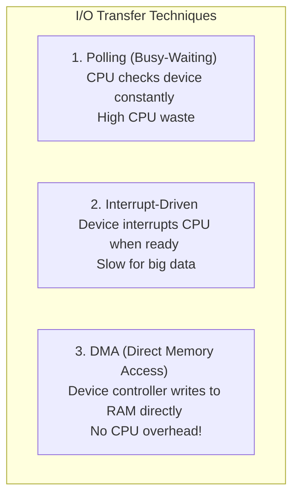
```mermaid
graph TD
    subgraph IOMethods [I/O Transfer Techniques]
        M1["1. Polling (Busy-Waiting) <br>CPU checks device constantly <br>High CPU waste"]
        M2["2. Interrupt-Driven <br>Device interrupts CPU when ready <br>Slow for big data"]
        M3["3. DMA (Direct Memory Access) <br>Device controller writes to RAM directly <br>No CPU overhead!"]
    end
```

1. **Programmed I/O / Polling (পোলিং):**
   - সিপিইউ নিজেই ডিভাইস কন্ট্রোলারকে রিড কমান্ড দেয় এবং ডিভাইস রেডি হয়েছে কিনা তা লুপের ভেতর বারবার চেক করতে থাকে (Busy Waiting). এটি চরম ওস্টেজ অব সিপিইউ সাইকেল!
2. **Interrupt-Driven I/O:**
   - সিপিইউ ডিভাইসকে রিকোয়েস্ট পাঠিয়ে নিজের অন্য কাজে চলে যায়। ডিভাইস যখন ডাটার ১টি বাইট বা ১টি ব্লক রেডি করে, সে সিপিইউ-কে একটি হার্ডওয়্যার ইন্টারাপ্ট পাঠায়। সিপিইউ তখন কাজ থামিয়ে ডাটাটি মেমরিতে কপি করে।
   - **সমস্যা:** বড় সাইজের ডাটা (যেমন গিগাবایت সাইজের ফাইল বা হাই-স্পিড নেটওয়ার্ক ট্রাফিক) ট্রান্সফার করার সময় প্রতি ব্লকে ইন্টারাপ্ট হ্যান্ডেল করতে গিয়ে সিপিইউ থ্র্যাশ বা স্লো হয়ে যায়।
3. **DMA (Direct Memory Access):**
   - বড় ডেটা ট্রান্সফারের জন্য এটিই আধুনিক স্ট্যান্ডার্ড। সিপিইউ সরাসরি মেমরি অ্যাক্সেসের জন্য একটি বিশেষ কন্ট্রোলার চিপ **DMA Controller**-কে দায়িত্ব দেয়।
   - সিপিইউ শুধু বলে—ডিস্কের ব্লক X থেকে RAM-এর অ্যাড্রেস Y-তে ১০MB ডাটা ট্রান্সফার করে দাও। DMA কন্ট্রোলার সিপিইউকে সম্পূর্ণ মুক্ত রেখে নিজে সরাসরি র‍্যামে ডাটা রাইট করে। কাজ শেষে সে সিপিইউ-কে মাত্র **একটি ফাইনাল ইন্টারাপ্ট** পাঠিয়ে জানায়—"ট্রান্সফার কমপ্লিট!"

### Senior Insight: Zero-Copy Optimization (`sendfile` System Call)

> সাধারণ নিয়মে ডিস্ক থেকে ফাইল রিড করে সকেটে (নেটওয়ার্কে) পাঠাতে গেলে কার্নেল প্রথমে ডিস্ক থেকে ডাটা নিয়ে নিজের **Kernel Page Cache**-এ রাখে, সেখান থেকে ইউজার স্পেসের **Application Buffer**-এ কপি করে, আবার সেখান থেকে **Kernel Socket Buffer**-এ কপি করে নেটওয়ার্ক কার্ডে পাঠায়। এই অতিরিক্ত ডাটা কপি এবং কনটেক্সট সুইচিং এড়াতে আধুনিক ব্যাকএন্ড আর্কিটেকচারে (যেমন Nginx বা Kafka) **`sendfile` System Call / Zero-Copy** অপ্টিমাইজেশন ব্যবহার করা হয়। এটি কার্নেলকে বলে ডিস্ক বা পেজ ক্যাশ থেকে সরাসরি নেটওয়ার্ক সকেটের বাফারে ডাটা পাঠিয়ে দিতে, কোনো ইউজার স্পেস মেমরি বা ডাবল কপি ছাড়াই। এটি ডাটা ট্রান্সফারের স্পিড ৪ গুণ পর্যন্ত বাড়িয়ে দেয়।

---

## ১০. Virtualization & Containerization: Namespaces & Cgroups

### Core Idea

ব্যাকএন্ড ইঞ্জিনিয়ারিংয়ে আমরা যে **Docker / Containers** ব্যবহার করি, ওএস কার্নেল লেভেলে কিন্তু "কন্টেইনার" নামে আলাদা কোনো বাস্তব জিনিস নেই! কন্টেইনার হলো মূলত লিনাক্স কার্নেলের দুটি শক্তিশালী মেকানিজম—**Namespaces** এবং **Control Groups (cgroups)** এর একটি প্রি-কনফিগারড কম্বিনেশন।

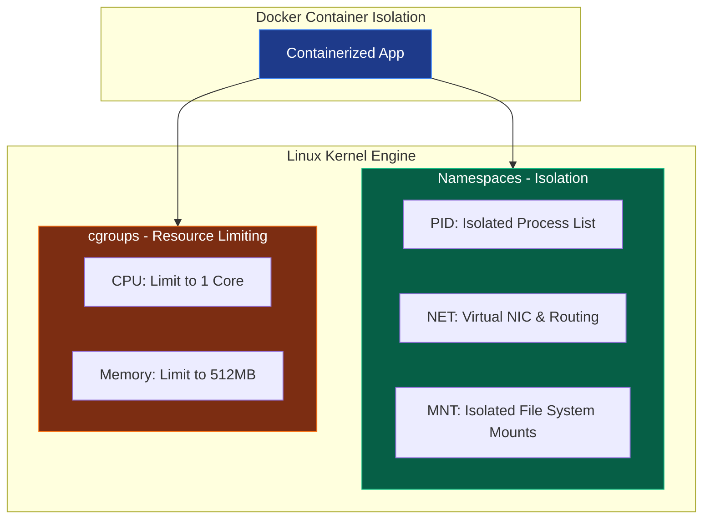
```mermaid
flowchart TD
    subgraph ContainerSpace [Docker Container Isolation]
        App[Containerized App]
        style App fill:#1e3a8a,stroke:#3b82f6,color:#fff
    end

    subgraph LinuxKernel [Linux Kernel Engine]
        subgraph NS [Namespaces - Isolation]
            PID[PID: Isolated Process List]
            NET[NET: Virtual NIC & Routing]
            MNT[MNT: Isolated File System Mounts]
        end
        subgraph CG [cgroups - Resource Limiting]
            CPU_Limit[CPU: Limit to 1 Core]
            MEM_Limit[Memory: Limit to 512MB]
        end
    end

    App --> NS
    App --> CG
    style NS fill:#065f46,stroke:#10b981,color:#fff
    style CG fill:#7c2d12,stroke:#f97316,color:#fff
```

#### ১. Namespaces (আইসোলেশন বা আলাদা করা)

কার্নেল লেভেলে একটি প্রসেসকে সম্পূর্ণ আইসোলেটেড বা স্যান্ডবক্সড ইনভায়রনমেন্ট দেওয়ার জন্য নেমস্পেস ব্যবহৃত হয়, যাতে সে অন্য কোনো প্রসেসের ফাইল বা নেটওয়ার্ক দেখতে না পারে।

- **PID Namespace:** কন্টেইনারের ভেতরের প্রসেসটি মনে করে তার আইডি ১ (PID 1), যদিও মেইন ওএস-এ তার আইডি হয়তো ৮২৪৫। সে হোস্টের অন্য কোনো প্রসেস দেখতে পারে না।
- **NET Namespace:** কন্টেইনারকে সম্পূর্ণ নিজস্ব ভার্চুয়াল নেটওয়ার্ক কার্ড (NIC), আইপি অ্যাড্রেস ও পোর্ট দেয়।
- **MNT Namespace:** কন্টেইনারকে নিজস্ব মাউন্ট পয়েন্ট ও রুট ফাইল সিস্টেম (যেমন Ubuntu বা Alpine-এর রুট) দেয়, সে হোস্টের মূল ড্রাইভ দেখতে পারে না।
- **UTS, IPC, User Namespaces:** হোস্টনেম এবং ইউজার পারমিশন আইসোলেট করে।

#### ২. Control Groups / cgroups (রিসোর্স লিমিট করা)

নেমস্পেস দিয়ে প্রসেসকে আইসোলেট করলেও সে হোস্টের পুরো র‍্যাম বা সিপিইউ খেয়ে হোস্ট মেশিন ডাউন করে দিতে পারে। এই রিসোর্স লিমিট করার কাজ করে **cgroups**।

- এটি কার্নেলকে বলে দেয়—এই প্রসেসটি (বা কন্টেইনারটি) হোস্ট মেশিনের **সর্বোচ্চ ১টি CPU কোর এবং ৫১২MB RAM** এর বেশি ব্যবহার করতে পারবে না। লিমিট পার হলে ওএস তাকে কিল (OOM Kill) করে দিবে।

### Senior Insight: Container Security & Privileged Escalation

> যেহেতু ডকার কন্টেইনার এবং হোস্ট ওএস একই লিনাক্স কার্নেল শেয়ার করে চলে (ভার্চুয়াল মেশিনের মতো হাইপারভাইজার দিয়ে আলাদা কার্নেল থাকে না), তাই কার্নেলের কোনো সিকিউরিটি বাগ থাকলে কন্টেইনার থেকে বের হয়ে সরাসরি হোস্ট ওএস হ্যাক করা সম্ভব (Container Breakout). এই কারণে প্রোডাকশনে কখনই কন্টেইনারকে `root` ইউজার হিসেবে বা `--privileged` ফ্ল্যাগ দিয়ে চালানো উচিত নয়। এটি কন্টেইনারকে হোস্ট ওএস-এর সরাসরি হার্ডওয়্যার ড্রাইভার অ্যাক্সেস করার সুবিধা দিয়ে দেয়, যা চরম সিকিউরিটি থ্রেট!

---

## ১১. Network Stack & Socket Programming Internals

### Core Idea
**Kernel Network Stack:** হলো কার্নেলের ভেতরে থাকা নেটওয়ার্কিং প্রোটোকল সুইট (যেমন TCP/IP stack)। আমাদের ব্যাকএন্ড অ্যাপ্লিকেশন যখন কোনো সকেট থেকে ডেটা রিড বা রাইট করে, সেই ডেটা কীভাবে ফিজিক্যাল নেটওয়ার্ক ক্যাবল বা ওয়াইফাই থেকে ওএস কার্নেল হয়ে আমাদের অ্যাপ্লিকেশনে পৌঁছায়, তার ফ্লো নিচে চিত্রায়িত করা হলো:

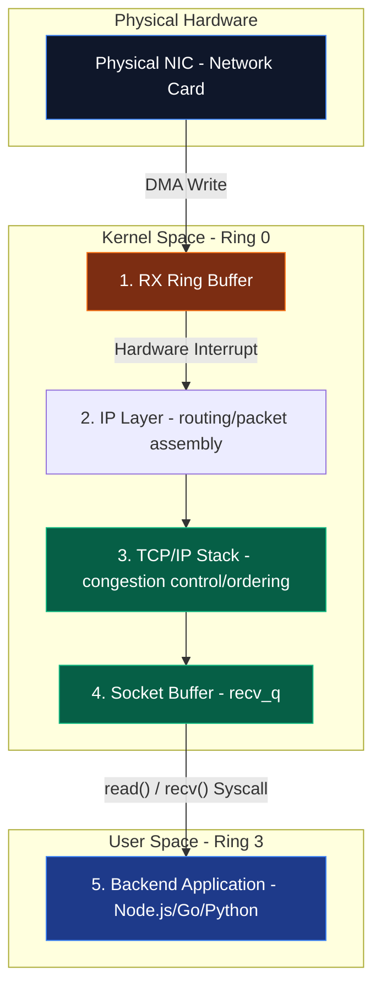
```mermaid
flowchart TD
    subgraph PhysicalHW [Physical Hardware]
        NIC[Physical NIC - Network Card]
    end

    subgraph KernelSpaceNetwork [Kernel Space - Ring 0]
        RingBuf[1. RX Ring Buffer]
        IP_Layer[2. IP Layer - routing/packet assembly]
        TCP_Layer[3. TCP/IP Stack - congestion control/ordering]
        SocketBuf[4. Socket Buffer - recv_q]
    end

    subgraph UserSpaceApp [User Space - Ring 3]
        App[5. Backend Application - Node.js/Go/Python]
    end

    NIC -->|DMA Write| RingBuf
    RingBuf -->|Hardware Interrupt| IP_Layer
    IP_Layer --> TCP_Layer
    TCP_Layer --> SocketBuf
    SocketBuf -->|"read() / recv() Syscall"| App

    style NIC fill:#0f172a,stroke:#3b82f6,color:#fff
    style RingBuf fill:#7c2d12,stroke:#f97316,color:#fff
    style TCP_Layer fill:#065f46,stroke:#10b981,color:#fff
    style SocketBuf fill:#065f46,stroke:#10b981,color:#fff
    style App fill:#1e3a8a,stroke:#3b82f6,color:#fff
```

### Packet Processing Flow (ধাপসমূহ)

1. **NIC to RX Ring Buffer:** ফিজিক্যাল নেটওয়ার্ক কার্ডে (NIC) যখন কোনো প্যাকেট আসে, NIC সেটি সরাসরি **DMA** ব্যবহার করে র‍্যামের কার্নেল স্পেসে থাকা **RX (Receive) Ring Buffer**-এ রাইট করে।
2. **Hardware Interrupt:** ডাটা লোড হওয়ার পর NIC সিপিইউ-কে একটি হার্ডওয়্যার ইন্টারাপ্ট পাঠায়।
3. **SoftIRQ & IP/TCP Processing:** কার্নেল তখন তার নেটওয়ার্ক ড্রাইভারের **SoftIRQ (Software Interrupt)** হ্যান্ডলার রান করে। এটি রিং বাফার থেকে প্যাকেট রিড করে আইপি (IP) লেয়ারে পাঠায়। সেখানে প্যাকেটের ইনটিগ্রিটি চেক হয় এবং টুকরোগুলো একত্রিত করা হয়। এরপর এটি TCP লেয়ারে যায়, যেখানে প্যাকেট সিকোয়েন্স ঠিক করা হয় এবং হ্যান্ডশেক কনফার্ম হয়।
4. **Socket Buffer (`recv_q`):** প্রসেসড ডেটা তখন নির্দিষ্ট সকেটের রিসিভ বাফার (Socket Buffer)-এ গিয়ে জমা হয়।
5. **App Syscall (`read`/`recv`):** অবশেষে ইউজার অ্যাপ্লিকেশন যখন `read(socket_fd)` বা `recv()` সিস্টেম কল ট্রিগার করে, ওএস কার্নেল সকেট বাফার থেকে ডেটা ইউজার মেমরি বা বাফারে কপি করে অ্যাপকে রিটার্ন করে।

### Senior Insight: "Socket Buffer Overflows" & `netstat`
> হাই-কনকারেন্ট ব্যাকএন্ড প্রডাকশনে যখন হঠাৎ করেই প্যাকেট ড্রপ বা রিকোয়েস্ট লেটেন্সি বেড়ে যায়, তখন অন্যতম প্রধান কারণ হতে পারে **Socket Receive Buffer Overflow**। যদি ইনকামিং প্যাকেটের রেট খুব বেশি হয় কিন্তু আমাদের অ্যাপ্লিকেশন যদি থ্রেড ব্লকিংয়ের কারণে সকেট বাফার থেকে দ্রুত ডেটা রিড না করে, তবে সকেট বাফারটি ফুল হয়ে যায়। নতুন কোনো প্যাকেট এলে কার্নেল সেটিকে সরাসরি সাইলেন্টলি ড্রপ করে দেয়।
> এটি ডিবাগ করার জন্য সিনিয়র ইঞ্জিনিয়াররা কার্নেল কাউন্টারগুলো চেক করেন:
> ```bash
> netstat -s | grep "buffer errors"
> ```
> এর সমাধান হলো লিনাক্স কার্নেলের রিসিভ বাফার টিউনিং করা (`sysctl -w net.core.rmem_max=16777216`) অথবা অ্যাপ্লিকেশনে কোনো হেভি কাজ দিয়ে ইভেন্ট লুপ ব্লক না করা।

---

## ১২. Disk Page Cache & Database Durability

### Core Idea
ডিস্ক বা SSD থেকে সরাসরি ডাটা রিড/রাইট করা অত্যন্ত স্লো (র‍্যামের চেয়ে প্রায় ১০০০০ গুণ ধীর)। এই কারণে অপারেটিং সিস্টেম মেমরি অপ্টিমাইজ করার জন্য র‍্যামের অব্যবহৃত বা ফ্রী অংশকে ডিস্ক রিড/রাইটের জন্য একটি ক্যাশ বাফার হিসেবে ব্যবহার করে, একে **Page Cache** বা **Buffer Cache** বলা হয়।

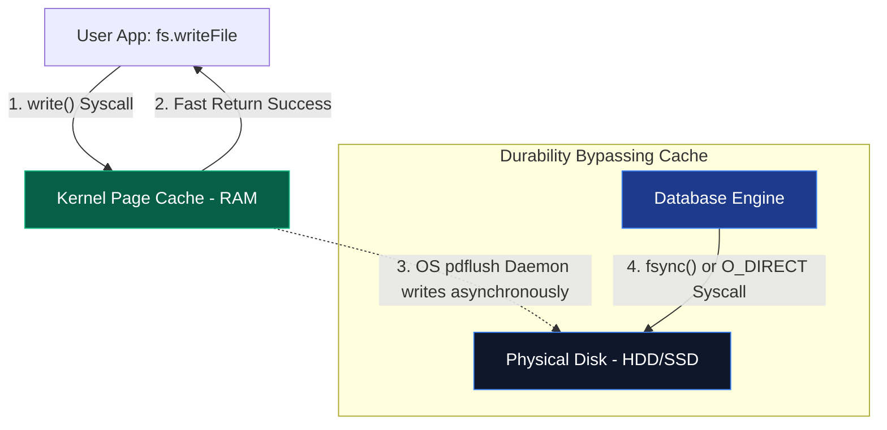
```mermaid
flowchart TD
    App[User App: fs.writeFile] -->|"1. write() Syscall"| PageCache[Kernel Page Cache - RAM]
    PageCache -->|2. Fast Return Success| App
    PageCache -.->|3. OS pdflush Daemon writes asynchronously| Disk[Physical Disk - HDD/SSD]

    subgraph DatabaseDurability ["Durability Bypassing Cache"]
        DBApp[Database Engine] -->|"4. fsync() or O_DIRECT Syscall"| Disk
    end

    style PageCache fill:#065f46,stroke:#10b981,color:#fff
    style Disk fill:#0f172a,stroke:#3b82f6,color:#fff
    style DBApp fill:#1e3a8a,stroke:#3b82f6,color:#fff
```

### Write Buffering & Dirty Pages
যখন কোনো অ্যাপ্লিকেশন `write()` সিস্টেম কল দিয়ে ডিস্কে কোনো ফাইল আপডেট করে:
1. কার্নেল সাথে সাথে ফাইলটি ডিস্কে রাইট করে না। সে ডেটাটি সরাসরি র‍্যামের **Page Cache**-এ লেখে এবং পেজটিকে **Dirty Page** (অর্থাৎ যা ডিস্কের সাথে সিঙ্ক করা হয়নি) হিসেবে মার্ক করে।
2. কার্নেল সাথে সাথে অ্যাপ্লিকেশনকে **"Write Successful"** রেসপন্স ব্যাক করে। এর ফলে রাইট স্পিড অত্যন্ত ফাস্ট হয়।
3. ব্যাকগ্রাউন্ডে ওএস-এর বিশেষ কার্নেল থ্রেড ডেমোন (যেমন লিনাক্সে `pdflush` বা `kswapd`) অ্যাসিনক্রোনাসলি এই ডার্টি পেজগুলো নিয়ে ফিজিক্যাল ডিস্কে রাইট বা সিঙ্ক (Flush) করে।

### Senior Insight: The fsync() Dilemma & ACID Durability
> পেজ ক্যাশের এই অ্যাসিনক্রোনাস ফ্ল্যাশিং মেকানিজমে একটি বড় বিপদ আছে। ওএস ব্যাকগ্রাউন্ডে ডিস্কে ডেটা রাইট করার আগেই যদি হঠাৎ সার্ভার ডাউন বা কারেন্ট চলে যায়, তবে ডেটা চিরতরে হারিয়ে যাবে!
> এই কারণেই ডাটাবেস ম্যানেজমেন্ট সিস্টেমগুলোতে (যেমন MySQL, PostgreSQL, MongoDB) ট্রানজেকশন কমিট করার সময় ডেটাবেস ইঞ্জিন সাধারণ `write()` কল করে বসে থাকে না। সে সরাসরি **`fsync()` System Call** ট্রিগার করে। `fsync` ওএস-কে ফোর্স করে কার্নেল পেজ ক্যাশের সব ডার্টি পেজ সাথে সাথে ফিজিক্যাল ডিস্কে ফোর্সড ফ্ল্যাশ করতে এবং ডেটা ফিজিক্যালি রাইট না হওয়া পর্যন্ত থ্রেডকে ব্লক করে রাখে।
> * **ACID Durability:** ডাটাবেসের D (Durability) বজায় রাখতে `fsync` আবশ্যক। কিন্তু এটি কুয়েরির গতি অনেক কমিয়ে দেয়। এইজন্য হাই-পারফরম্যান্স ডিবি টিউনিংয়ে রাইট বাফার সাইজ অ্যাডজাস্টমেন্ট এবং `fsync` ফ্রিকোয়েন্সি (যেমন PostgreSQL-এর `wal_writer_delay`) টিউন করা হয়।

---

## ১৩. Memory Mapping (`mmap`) Internals

### Core Idea
সাধারণ ফাইল রিড করার সময় ওএস-কে ডাবল কপি করতে হয় (ডিস্ক -> কার্নেল পেজ ক্যাশ -> ইউজার মেমরি বাফার)। এই ডাবল কপির বিশাল ওভারহেড এড়াতে ওএস আমাদের একটি অত্যন্ত শক্তিশালী সিস্টেম কল দেয়, যাকে **`mmap()` (Memory Map)** বলা হয়।

`mmap` সরাসরি ডিস্কের একটি ফাইলের এড্রেস স্পেসকে আমাদের প্রসেসের **Virtual Memory Address Space**-এ সরাসরি ম্যাপ করে দেয়।

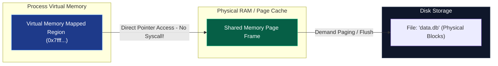
```mermaid
graph LR
    subgraph ProcessVAS [Process Virtual Memory]
        MappedArea["Virtual Memory Mapped Region <br>(0x7fff...)"]
    end

    subgraph RAM_PageCache [Physical RAM / Page Cache]
        RAMBlock["Shared Memory Page Frame"]
    end

    subgraph HW_Storage [Disk Storage]
        FileBlock["File: 'data.db' (Physical Blocks)"]
    end

    MappedArea -->|Direct Pointer Access - No Syscall!| RAMBlock
    RAMBlock -->|Demand Paging / Flush| FileBlock

    style MappedArea fill:#1e3a8a,stroke:#3b82f6,color:#fff
    style RAMBlock fill:#065f46,stroke:#10b981,color:#fff
    style HW_Storage fill:#0f172a,stroke:#475569,color:#fff
```

### How `mmap` Works in High-Performance Systems

1. **Virtual Map Association:** `mmap` কল করার পর কার্নেল পেজ টেবিলে ম্যাপ এন্ট্রি তৈরি করে কিন্তু ফাইলের কোনো অংশ র‍্যামে লোড করে না।
2. **First Byte Read (Page Fault Magic):** অ্যাপ্লিকেশন যখন সেই মেমরি এড্রেসের ডেটা রিড করার জন্য একটি সাধারণ পয়েন্টার অ্যাক্সেস (`char data = ptr[1024]`) করে, তখন ওএস দেখল ডেটা র‍্যামে নেই। সে সাথে সাথে একটি **Page Fault** ট্রিগার করে ডিস্ক থেকে সেই নির্দিষ্ট পেজটি এনে র‍্যামে লোড করে দেয়।
3. **No Syscall Overhead:** এরপর থেকে ফাইল রিড বা রাইট করার জন্য আর কোনো `read()` বা `write()` সিস্টেম কল করতে হয় না। সরাসরি মেমরি পয়েন্টার দিয়ে সুপার ফাস্ট স্পিডে র‍্যামের ডেটা অ্যাক্সেস বা এডিট করা যায়। ওএস ব্যাকগ্রাউন্ডে মেমরি পরিবর্তনের ওপর ভিত্তি করে ফাইল সিঙ্ক বা ফ্লাশ করে নেয়।

### Senior Insight: `mmap` in Modern Database Engines
> আধুনিক সার্চ ইঞ্জিন ও হাই-স্কেল ডাটাবেসগুলোর (যেমন: **Elasticsearch/Lucene, MongoDB (WiredTiger), RocksDB, LMDB**) পারফরম্যান্সের গোপন রহস্য হলো `mmap`। এরা ডাটাবেসের বড় ইনডেক্স ফাইল বা ডেটা ফাইলগুলো সরাসরি মেমরি-ম্যাপ করে নেয়। এর ফলে কার্নেল লেভেলের ক্যাশ অপ্টিমাইজেশন স্বয়ংক্রিয়ভাবে পাওয়া যায় এবং কোটি কোটি ফাইল সার্চ ও রিড অপারেশন করার সময় কোনো সিস্টেম কল এবং ডাবল ডেটা কপির বাউন্ডারি ওভারহেড থাকে না।

---

## ১৪. Signals & Process Control: Graceful Shutdown

### Core Idea
**Unix Signals:** হলো অপারেটিং সিস্টেম দ্বারা প্রসেসকে পাঠানো এক ধরণের সফটওয়্যার ইন্টারাপ্ট বা অ্যাসিনক্রোনাস নোটিফিকেশন। এর মাধ্যমে ওএস প্রসেসকে জানায় যে একটি নির্দিষ্ট ঘটনা ঘটেছে এবং প্রসেসকে সেই অনুযায়ী দ্রুত রিয়্যাক্ট করতে হয়।

### Important OS Signals

| Signal Name | Signal ID | Default Action | Nature & Usage |
| :--- | :---: | :--- | :--- |
| **SIGINT** | **2** | Terminate | **Interrupt:** ইউজার যখন টার্মিনালে `Ctrl+C` প্রেস করে তখন এই সিগন্যাল যায়। প্রসেস এটিকে ক্যাচ (Catch) করতে পারে। |
| **SIGKILL** | **9** | Terminate (Force) | **Kill:** ওএস প্রসেসকে সাথে সাথে ফোর্স কিল করে। এটি কোনোভাবেই ক্যাচ, ব্লক বা ইগনোর করা যায় না। কার্নেল সরাসরি প্রসেস টেবিল থেকে প্রসেস মুছে দেয়। |
| **SIGSEGV** | **11** | Core Dump (Crash) | **Segmentation Violation:** প্রসেস যখন তার সীমানার বাইরে বা অবৈধ মেমরি অ্যাড্রেস অ্যাক্সেস করতে যায় তখন সিপিইউ এটি ট্রিগার করে। |
| **SIGTERM** | **15** | Terminate | **Terminate:** ওএস প্রসেসকে ভদ্রভাবে বন্ধ হতে বলে। এটি আধুনিক ক্লাউড ও কন্টেইনার অর্কেস্ট্রেশনের (যেমন Kubernetes) গ্রেসফুল শাটডাউনের প্রধান অস্ত্র। প্রসেস এটি ক্যাচ করে ক্লিনআপ করতে পারে। |

---

### Graceful Shutdown Mechanism in Production

আমরা যখন ক্লাউডে (যেমন AWS ECS বা Kubernetes) নতুন কন্টেইনার ডিপ্লয় করি, তখন পুরনো কন্টেইনারটি ডিলিট করতে হয়। ওএস কীভাবে পুরনো অ্যাপ্লিকেশনটিকে কোনো ডেটা লস বা রিকোয়েস্ট ড্রপ ছাড়া নিরাপদে বন্ধ করে, তার ফ্লো নিচে চিত্রায়িত হলো:

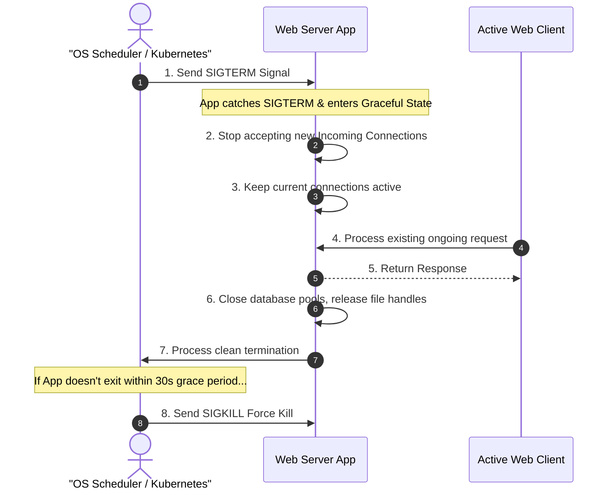
```mermaid
sequenceDiagram
    autonumber
    actor OS as "OS Scheduler / Kubernetes"
    participant App as Web Server App
    participant Client as Active Web Client

    OS->>App: 1. Send SIGTERM Signal
    Note over App: App catches SIGTERM & enters Graceful State
    App->>App: 2. Stop accepting new Incoming Connections
    App->>App: 3. Keep current connections active
    Client->>App: 4. Process existing ongoing request
    App-->>Client: 5. Return Response
    App->>App: 6. Close database pools, release file handles
    App->>OS: 7. Process clean termination
    Note over OS: If App doesn't exit within 30s grace period...
    OS->>App: 8. Send SIGKILL Force Kill
```

### Implementing Graceful Shutdown
প্রোডাকশন কন্টেইনারে আমাদের অ্যাপ্লিকেশন কোডে অবশ্যই `SIGTERM` লিসেনার অ্যাড করতে হয়।
- **ধাপ ১:** কার্নেল থেকে `SIGTERM` সিগন্যাল রিসিভ করা।
- **ধাপ ২:** নতুন কোনো ইনকামিং রিকোয়েস্ট রিসিভ করা বন্ধ করা (যেমন লোড ব্যালেন্সার থেকে নোডটি রিমুভ করা)।
- **ধাপ ৩:** মেমোরিতে অলরেডি প্রসেসিং হওয়া রানিং রিকোয়েস্টগুলোর প্রসেস শেষ করার জন্য অপেক্ষা করা।
- **ধাপ ৪:** ওপেন থাকা ডাটাবেস কানেকশন пул, ফাইল হ্যান্ডেল এবং রেডিস সকেট সাকসেসফুলি ক্লোজ করা।
- **ধাপ ৫:** প্রসেস রিটার্ন জিরো (`exit(0)`) দিয়ে ওএস-কে জানানো যে শাটডাউন সফল।

### Senior Insight: The Docker `CMD` exec Pitfall (Exit Code 137)
> ডকার কন্টেইনারের ওএস লেভেলে প্রায়ই একটি বড় বাগ দেখা যায় যেখানে কন্টেইনার শাটডাউন হতে অবধারিতভাবে ১০ সেকেন্ড সময় নেয় এবং অবশেষে **Exit Code 137 (SIGKILL)** দিয়ে ফোর্সড ডাউন হয়।
> এটি ঘটার মূল কারণ ডকার ফাইলে `CMD node app.js` (Shell form) ব্যবহার করা। এর ফলে লিনাক্স কার্নেলে আমাদের নোড প্রসেসটি **PID 1 (প্রধান প্রসেস)** হিসেবে রান না করে `/bin/sh` এর সাব-প্রসেস হিসেবে রান করে। কার্নেল যখন কন্টেইনারকে বন্ধ করতে `SIGTERM` পাঠায়, শেল প্রসেসটি সেই সিগন্যাল নোড প্রসেসে পাস করে না। এর ফলে নোড প্রসেস সিগন্যাল না পেয়ে চলতে থাকে এবং অবশেষে ডকার ডেমোন ১০ সেকেন্ড ওয়েট করে বিরক্ত হয়ে `SIGKILL` দিয়ে প্রসেসটি ক্র্যাশ করিয়ে দেয়, যা একটি চরম আন-সেফ ডিপ্লয়মেন্ট।
> **সমাধান:** ডকার ফাইলে অবশ্যই **Exec Form** ব্যবহার করতে হবে:
> ```dockerfile
> CMD ["node", "app.js"]  # এটি আমাদের নোড অ্যাপকে সরাসরি PID 1 হিসেবে রান করায়
> ```

---

## ১৫. CPU Cache Hierarchy & False Sharing

### Core Idea
সিপিইউ যাতে দ্রুত মেমরি অ্যাক্সেস করতে পারে, তার জন্য মেইন র‍্যাম (RAM) এবং সিপিইউ কোরের মাঝে ছোট ও আল্ট্রা-ফাস্ট স্ট্যাটিক র‍্যাম (SRAM) ব্যবহার করা হয়, একে **CPU Cache** বলা হয়। এটি মূলত তিনটি লেভেলে বিভক্ত:

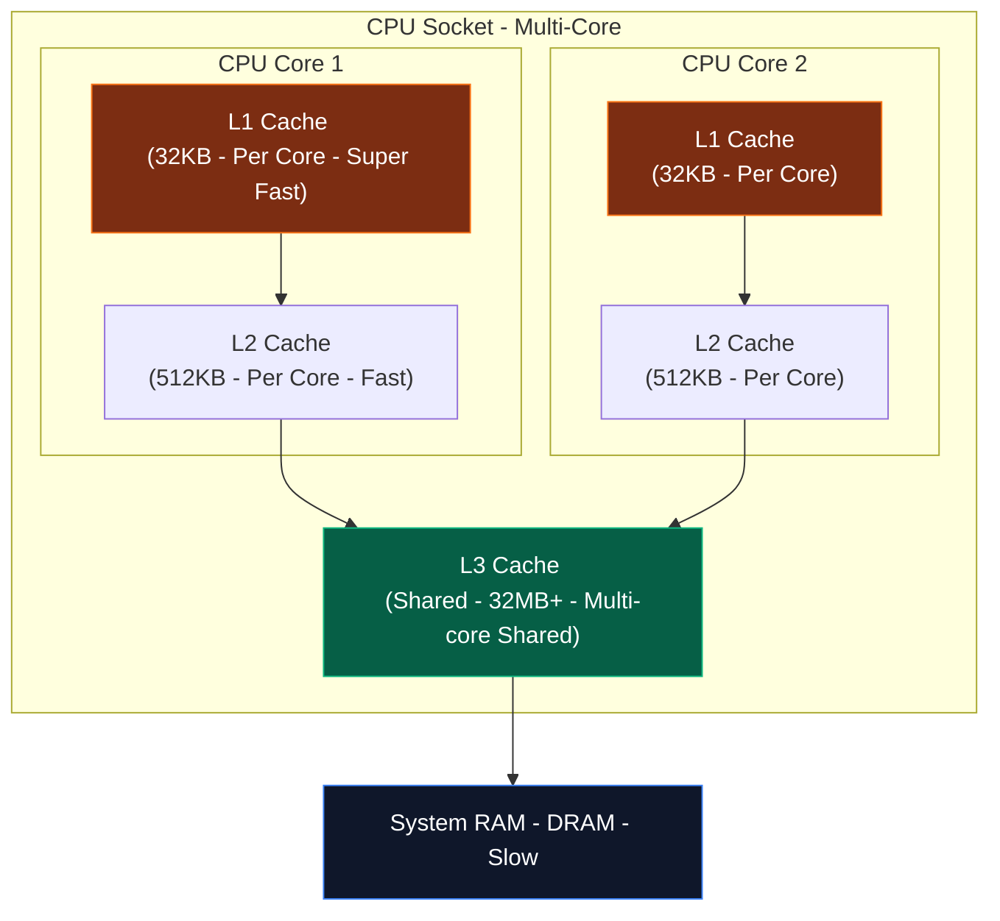
```mermaid
graph TD
    subgraph CPUSocket [CPU Socket - Multi-Core]
        subgraph Core1 [CPU Core 1]
            L1_1["L1 Cache <br>(32KB - Per Core - Super Fast)"]
            L2_1["L2 Cache <br>(512KB - Per Core - Fast)"]
        end
        subgraph Core2 [CPU Core 2]
            L1_2["L1 Cache <br>(32KB - Per Core)"]
            L2_2["L2 Cache <br>(512KB - Per Core)"]
        end
        L3["L3 Cache <br>(Shared - 32MB+ - Multi-core Shared)"]
    end

    RAM[System RAM - DRAM - Slow]

    L1_1 --> L2_1
    L1_2 --> L2_2
    L2_1 --> L3
    L2_2 --> L3
    L3 --> RAM

    style L1_1 fill:#7c2d12,stroke:#f97316,color:#fff
    style L1_2 fill:#7c2d12,stroke:#f97316,color:#fff
    style L3 fill:#065f46,stroke:#10b981,color:#fff
    style RAM fill:#0f172a,stroke:#3b82f6,color:#fff
```

* **L1 Cache:** প্রতিটি সিপিইউ কোরের একদম নিজস্ব আল্ট্রা-ফাস্ট ক্যাশ (সাইজ ৩২KB-৬৪KB)। এটি ১ সিপিইউ সাইকেলেই ডেটা এক্সেস দেয়।
* **L2 Cache:** এটিও প্রতি কোরের নিজস্ব তবে L1-এর চেয়ে সামান্য বড় এবং হালকা স্লো (সাইজ ২৫৬KB-৫১২KB)।
* **L3 Cache:** এটি একটি সিঙ্গেল সিপিইউ সকেটের সব কোর একসাথে শেয়ার করে (সাইজ ১৬MB-৬৪MB বা তার বেশি)।

### Cache Lines & Spatial Locality
সিপিইউ যখন মেমরি থেকে ডেটা রিড করে, সে কেবল একটি নির্দিষ্ট বাইট রিড করে না। সে পুরো একটি কন্টিগুয়াস মেমরি ব্লক ক্যাশে লোড করে, একে **Cache Line (সাধারণত 64 Bytes)** বলা হয়। এর ফলে পাশাপাশি থাকা ডেটা পরবর্তীতে অ্যাক্সেস করার সময় ক্যাশ মিস (Cache Miss) হয় না।

### False Sharing (একটি ভয়ংকর কনকারেন্সি বাগ)
মাল্টি-থ্রেডেড অ্যাপ্লিকেশনে একাধিক থ্রেড যখন আলাদা আলাদা কোরে রান করে একই ক্যাশ লাইনে অবস্থিত ভিন্ন ভিন্ন ভ্যারিয়েবলে রাইট করতে যায়, তখন একটি অদ্ভুত পারফরম্যান্স ক্র্যাশ ঘটে। একে **False Sharing** বলে।

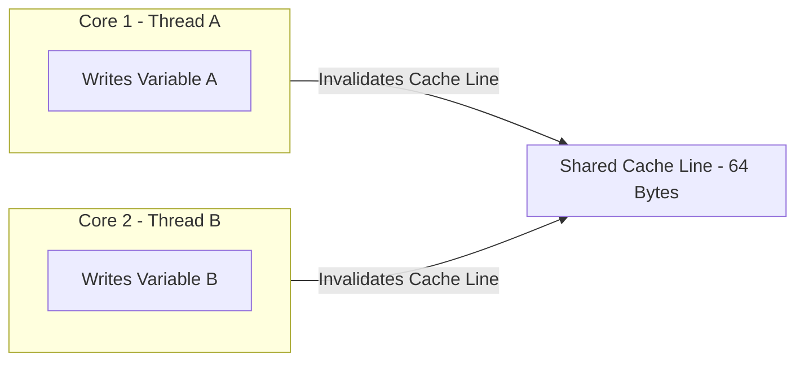
```mermaid
graph LR
    subgraph Core_1 [Core 1 - Thread A]
        VarA[Writes Variable A]
    end
    subgraph Core_2 [Core 2 - Thread B]
        VarB[Writes Variable B]
    end
    subgraph CacheLine [Shared Cache Line - 64 Bytes]
        VarA
        VarB
    end

    Core_1 -->|Invalidates Cache Line| CacheLine
    Core_2 -->|Invalidates Cache Line| CacheLine
```

* **মেকানিজম:** থ্রেড A কোরি ১-এ `Variable A` রাইট করল এবং থ্রেড B কোর ২-এ `Variable B` রাইট করল। এরা দুজনেই কিন্তু একই ৬৪-বাইটের ক্যাশ লাইনের ভেতরে আছে।
* **ফল্ট:** কোরি ১ যখন `Variable A` এডিট করে, সে পুরো ক্যাশ লাইনটিকে **Invalid** হিসেবে মার্ক করে। এর ফলে কোর ২-এ থাকা থ্রেড B-এর ক্যাশ লাইনটিও ইনভ্যালিড হয়ে যায় এবং তাকে বাধ্য হয়ে ধীরগতির মেইন র‍্যাম থেকে আবার রিড করতে হয়। এই পারস্পরিক ক্যাশ ফ্লাশিংয়ের কারণে প্রোগ্রামটি লকের চেয়েও ১০ গুণ স্লো হয়ে যেতে পারে!

### Senior Insight: Preventing False Sharing
> False Sharing এড়ানোর জন্য হাই-পারফরম্যান্স জাভা, গো বা সি++ কোডে ভ্যারিয়েবলগুলোর মাঝে প্যাডিং (Padding) বা অ্যালাইনমেন্ট (Alignment) ব্যবহার করা হয় যাতে তারা একই ক্যাশ লাইনে না পড়ে।
> * যেমন Go-তে:
>   ```go
>   type PadStruct struct {
>       a uint64
>       _ [8]uint64 // ৬৪-বাইট ক্যাশ লাইন সীমানা পূরণের জন্য প্যাডিং
>       b uint64
>   }
>   ```
>   এটি নিশ্চিত করে `a` এবং `b` কখনোই একই ক্যাশ লাইনে থাকবে না এবং False Sharing সম্পূর্ণ দূর হবে।

---

## ১৬. NUMA (Non-Uniform Memory Access) Architecture

### Core Idea
শুরুর দিকে সিঙ্গেল সকেট মাদারবোর্ডে সব সিপিইউ কোর একটি কমন বাসের মাধ্যমে মেইন র‍্যামের সাথে যুক্ত থাকতো, একে **UMA (Uniform Memory Access)** বলা হতো। কিন্তু আধুনিক মাল্টি-সকেট এন্টারপ্রাইজ সার্ভারে (যেমন ২ বা ৪টি ফিজিক্যাল সিপিইউ সকেট যুক্ত সার্ভার) মেমরি এক্সেস বোতলনেক দূর করার জন্য **NUMA (Non-Uniform Memory Access)** আর্কিটেকচার ব্যবহার করা হয়।

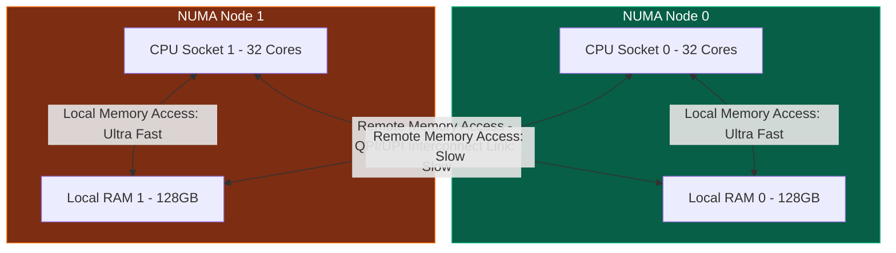
```mermaid
flowchart TD
    subgraph Node0 ["NUMA Node 0"]
        CPU_0[CPU Socket 0 - 32 Cores]
        RAM_0[Local RAM 0 - 128GB]
        CPU_0 <-->|"Local Memory Access: Ultra Fast"| RAM_0
    end

    subgraph Node1 ["NUMA Node 1"]
        CPU_1[CPU Socket 1 - 32 Cores]
        RAM_1[Local RAM 1 - 128GB]
        CPU_1 <-->|"Local Memory Access: Ultra Fast"| RAM_1
    end

    CPU_0 <-->|"Remote Memory Access - QPI/UPI Interconnect Link: Slow"| RAM_1
    CPU_1 <-->|"Remote Memory Access: Slow"| RAM_0

    style Node0 fill:#065f46,stroke:#10b981,color:#fff
    style Node1 fill:#7c2d12,stroke:#f97316,color:#fff
```

### Local vs Remote Memory Access
NUMA-তে মাদারবোর্ডের ফিজিক্যাল মেমরিকে ভাগ করে নির্দিষ্ট CPU সকেটের কাছাকাছি ইন্টারনাল মেমরি কন্ট্রোলারের সাথে ডিরেক্ট কানেক্ট করে দেওয়া হয়।
* **Local Memory Access:** সিপিইউ সকেট ০ যখন তার নিজস্ব নোডের RAM ০ অ্যাক্সেস করে, সেটি অত্যন্ত ফাস্ট।
* **Remote Memory Access:** সিপিইউ সকেট ০ যখন অন্য সকেটের RAM ১ অ্যাক্সেস করতে যায়, তখন তাকে সকেটগুলোর মধ্যবর্তী ইন্টারকানেক্ট বাস (যেমন Intel UPI বা AMD Infinity Fabric) পার হতে হয়, যা অনেক বেশি লেটেন্সি বা স্লো।

### Senior Insight: NUMA Tuning (`numactl` & CPU Pinning)
> প্রডাকশনে মেমরি-হাংরি হাই-পারফরম্যান্স ডাটাবেস (যেমন Redis বা PostgreSQL) চালানোর সময় ওএস যদি রেন্ডমলি প্রসেসের মেমরি এক নোডে এবং থ্রেডকে অন্য সকেটের কোরে শিডিউল করে, তবে রেন্ডমলি হাই-লেটেন্সি ও পারফরম্যান্স ড্রপ দেখা যায়।
> এর জন্য সিনিয়র আর্কিটেক্টরা **NUMA Binding / CPU Pinning** ব্যবহার করেন:
> ```bash
> numactl --cpunodebind=0 --membind=0 redis-server /etc/redis.conf
> ```
> এটি ওএস-কে বাধ্য করে যেন `redis-server` প্রসেসের সমস্ত মেমরি এবং থ্রেড কেবলমাত্র NUMA Node 0-এর ভেতরেই সীমাবদ্ধ থাকে, যার ফলে রিমোট মেমরি এক্সেসের লেটেন্সি ওভারহেড চিরতরে জিরো হয়ে যায়।

---

## ১৭. I/O Multiplexing: select vs poll vs epoll

### Core Idea
ব্যাকএন্ডে একটি হাই-কনকারেন্ট ওয়েব সার্ভার (যেমন Nginx বা Node.js) কীভাবে একই সাথে লক্ষাধিক কানেকশন বা সকেট আই/ও হ্যান্ডেল করে? এর পেছনে রয়েছে কার্নেল লেভেলের **I/O Multiplexing** মেকানিজম। 

আই/ও মাল্টিপ্লেক্সিং ওএস-কে বলে একটি সিঙ্গেল থ্রেড ব্যবহার করে একসাথে হাজার হাজার সকেট মনিটর করতে এবং যে সকেটে ডেটা রেডি হবে কেবল তখনই রিয়্যাক্ট করতে।

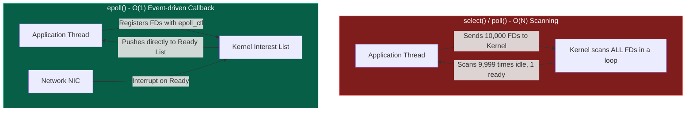
```mermaid
graph TD
    subgraph SelectPoll ["select() / poll() - O(N) Scanning"]
        App1[Application Thread] -->|"Sends 10,000 FDs to Kernel"| Kernel1["Kernel scans ALL FDs in a loop"]
        Kernel1 -->|"Scans 9,999 times idle, 1 ready"| App1
    end

    subgraph Epoll ["epoll() - O(1) Event-driven Callback"]
        App2[Application Thread] -->|"Registers FDs with epoll_ctl"| Kernel2["Kernel Interest List"]
        Device[Network NIC] -->|"Interrupt on Ready"| Kernel2
        Kernel2 -->|"Pushes directly to Ready List"| App2
    end

    style SelectPoll fill:#7f1d1d,stroke:#ef4444,color:#fff
    style Epoll fill:#065f46,stroke:#10b981,color:#fff
```

### select, poll এবং epoll-এর বিস্তারিত তুলনা ও মেকানিজম

#### ১. `select()` System Call ($O(N)$)
- **মেকানিজম:** অ্যাপ্লিকেশন কার্নেলকে একঝাঁক সকেট ফাইল ডেসক্রিপ্টর (FD Array) দেয়। কার্নেল লুপ চালিয়ে প্রতিটা সকেট চেক করে কোনোটায় ডেটা এসেছে কিনা।
- **সীমাবদ্ধতা:** এটি সর্বোচ্চ **১০২৪টি ফাইল ডেসক্রিপ্টর** মনিটর করতে পারে। প্রতিবার কল করার সময় ইউজার স্পেস থেকে কার্নেল স্পেসে পুরো এরে কপি করতে হয় এবং সম্পূর্ণ এরে লুপ করে চেক করতে হয় যা অত্যন্ত ধীরগতির।

#### ২. `poll()` System Call ($O(N)$)
- **মেকানিজম:** এটি `select()` এর মতোই লুপ চালিয়ে কাজ করে তবে এর কোনো ফাইল ডেসক্রিপ্টরের সংখ্যাগত সীমাবদ্ধতা (১০২৪ লিমিট) নেই। কিন্তু এতেও $O(N)$ লুপ স্ক্যানিং এবং ডাবল কপি ওভারহেড বজায় থাকে।

#### ৩. `epoll()` System Call ($O(1)$)
- **মেকানিজম:** এটি লিনাক্সের আধুনিক বৈপ্লবিক সিস্টেম কল। এটি কোনো লুপ চালিয়ে সব সকেট বারবার চেক করে না।
  - **Interest List:** অ্যাপ্লিকেশন প্রথমে `epoll_ctl()` দিয়ে যে যে সকেটে ইন্টারেস্ট আছে তা কার্নেলের একটি ইন্টারনাল রেড-ব্ল্যাক ট্রিতে রেজিস্টার করে রাখবে (বারবার কপি করার প্রয়োজন নেই)।
  - **Event-Driven callback:** যখন কোনো সকেটে ডেটা আসে, নেটওয়ার্ক ড্রাইভার ইন্টারাপ্ট ওএস-কে দিয়ে সকেটটিকে একটি বিশেষ **`Ready List`**-এ পুশ করে দেয়।
  - **O(1) Access:** অ্যাপ্লিকেশন যখন `epoll_wait()` কল করে, ওএস কার্নেল সাথে সাথে কেবল রেডি সকেটগুলোর লিস্ট রেসপন্স করে। এখানে কোনো লুপ স্ক্যানিং নেই, সরাসরি রেডি সকেটগুলো সেকেন্ডের ভগ্নাংশে রিড করা যায়।

### Comparison Table

| Feature | `select` | `poll` | `epoll` (Linux) / `kqueue` (BSD) |
| :--- | :--- | :--- | :--- |
| **Complexity** | $O(N)$ | $O(N)$ | **$O(1)$** |
| **FD Limit** | ফিক্সড (১০২৪) | আনলিমিটেড | **আনলিমিটেড** |
| **Kernel Copy** | প্রতিবার সম্পূর্ণ লিস্ট কপি করতে হয়। | প্রতিবার সম্পূর্ণ লিস্ট কপি করতে হয়। | **একবার রেজিস্টার করলেই হয়।** |
| **Scalability** | কানেকশন বাড়লে পারফরম্যান্স ড্রপ করে। | কানেকশন বাড়লে পারফরম্যান্স ড্রপ করে। | **কানেকশন বাড়লেও পারফরম্যান্স সুপার স্টেবল।** |

### Senior Insight: The Engine of Node.js and Nginx
> আমরা যে **Node.js (Libuv)**, **Nginx**, **Go Netpoller** অথবা **Java Netty** ব্যবহার করে প্রতি সেকেন্ডে হাজার হাজার রিকোয়েস্ট হ্যান্ডেল করি, এর মূল ইঞ্জিন হলো কার্নেলের **`epoll()`** (বা macOS-এ **`kqueue`**)। এই ফ্রেমওয়ার্কগুলো কোনো থ্রেড-পার-কানেকশন তৈরি না করে একটি সিঙ্গেল ইভেন্ট লুপ থ্রেডের ভেতর কার্নেল `epoll` ট্রিগার করে মেমরি ও সিপিইউ কনটেক্সট সুইচিং ওভারহেড সম্পূর্ণ জিরো করে ফেলে।

---

## ১৮. Storage Block Devices & RAID Internals

### Core Idea
অপারেটিং সিস্টেম যখন সেকেন্ডারি স্টোরেজে (HDD/SSD/NVMe) ডাটা লেখে, তখন সে এগুলোকে ক্যারেক্টার ডিভাইস হিসেবে না দেখে **Block Devices** হিসেবে ম্যানেজ করে। স্টোরেজ ড্রাইভগুলোর রিলায়েবিলিটি এবং স্পিড বাড়ানোর জন্য ওএস এবং হার্ডওয়্যার লেভেলে **RAID (Redundant Array of Independent Disks)** টেকনোলজি ব্যবহৃত হয়।

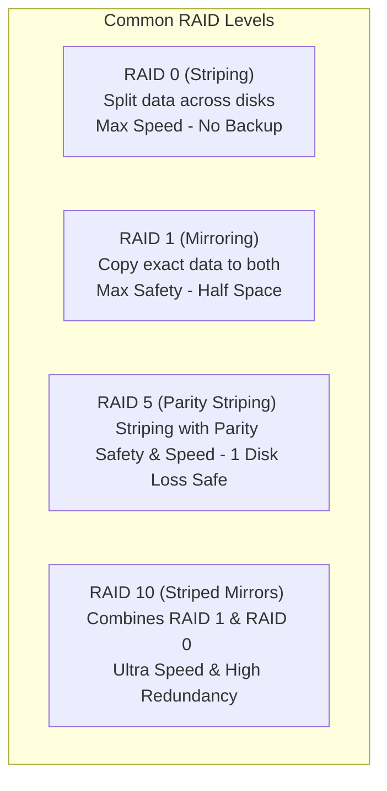
```mermaid
graph TD
    subgraph RAID_Levels [Common RAID Levels]
        R0["RAID 0 (Striping) <br>Split data across disks <br>Max Speed - No Backup"]
        R1["RAID 1 (Mirroring) <br>Copy exact data to both <br>Max Safety - Half Space"]
        R5["RAID 5 (Parity Striping) <br>Striping with Parity <br>Safety & Speed - 1 Disk Loss Safe"]
        R10["RAID 10 (Striped Mirrors) <br>Combines RAID 1 & RAID 0 <br>Ultra Speed & High Redundancy"]
    end
```

### RAID Configurations and Mechanics

1. **RAID 0 (Striping):**
   - ডেতাকে সমান ভাগে ভাগ করে সকেটের দুটি বা তার বেশি ডিস্কে আলাদাভাবে একসাথে লেখা হয় (যেমন অর্ধেক ডাটা Disk 1-এ, বাকি অর্ধেক Disk 2-এ)।
   - **সুবিধা:** রিড/রাইট স্পিড দ্বিগুণ হয়।
   - **ঝুঁকি:** যেকোনো একটি ডিস্ক নষ্ট হলে পুরো ডেটা লস্ট বা করাপ্টেড হয়ে যাবে।
2. **RAID 1 (Mirroring):**
   - যে ডেটাটি Disk 1-এ লেখা হচ্ছে, কার্নেল অবিকল তার একটি কপি বা মিরর Disk 2-এ লেখে।
   - **সুবিধা:** সম্পূর্ণ ডেটা সিকিউর থাকে। একটি ডিস্ক ক্র্যাশ করলেও অন্য ডিস্ক দিয়ে সার্ভার সচল থাকে।
   - **অসুবিধা:** মেমরি স্পেস অর্ধেক হয়ে যায় (১২৮GB-র ২টি ড্রাইভ লাগালেও টোটাল সাইজ ১২৮GB-ই দেখাবে)।
3. **RAID 5 (Block Striping with Distributed Parity):**
   - ডেতাকে স্ট্রাইপ করে ডিস্কগুলোতে লেখা হয় এবং সাথে একটি চেকসাম বা **Parity** ইনফরমেশন ডিস্ট্রিবিউট করে রাখা হয়।
   - **সুবিধা:** স্পিড ভালো থাকে এবং যেকোনো একটি ডিস্ক সম্পূর্ণ ক্র্যাশ করলেও প্যারিটি চেকসাম হিসাব করে ওএস লাইভ সার্ভারেই নষ্ট ডিস্কের ডেটা রিকভার করে নিতে পারে। সর্বনিম্ন ৩টি ডিস্ক লাগে।
4. **RAID 10 (1+0 - Striped Mirrors):**
   - এটি RAID 1 এবং RAID 0-এর একটি চমত্কার কম্বিনেশন। প্রথমে ড্রাইভ জোড়াগুলোকে মিরর (RAID 1) করা হয়, তারপর তাদের ওপর স্ট্রাইপ (RAID 0) করা হয়।
   - **সুবিধা:** এন্টারপ্রাইজ প্রোডাকশন ডেটাবেসের জন্য এটিই গোল্ড স্ট্যান্ডার্ড। এটি একই সাথে সর্বোচ্চ রিড/রাইট স্পিড এবং ফুল ডাটা রিডানডেন্সি নিশ্চিত করে।

### Senior Insight: NVMe Controller Queuing & System Optimizations
> প্রাচীন HDD-এর জন্য তৈরি `SATA (AHCI)` প্রোটোকল কার্নেলে মাত্র ১টি কিউ (Queue) মেইনটেইন করতে পারতো যা সর্বোচ্চ ৩২টি কমান্ড হোল্ড করতে পারতো। কিন্তু আধুনিক **NVMe SSD** ড্রাইভগুলো মাদারবোর্ডের সরাসরি PCIe লেনে চলে। এর জন্য কার্নেল **NVMe Driver** লেভেলে সর্বোচ্চ **৬৪,০০০টি কিউ** মেইনটেইন করতে পারে এবং প্রতিটা কিউতে ৬৪,০০০টি করে কমান্ড প্যারালালে এক্সিকিউট হতে পারে।
> এই কারণে আধুনিক হাই-আইও ক্লাউড ডেটাবেস সার্ভারগুলোতে SATA/SSD-র পরিবর্তে NVMe ব্যবহার করা হয় এবং লিনাক্স কার্নেলের মাল্টি-কিউ ব্লক লেয়ার আইও শিডিউলার (যেমন `none` বা `kyber`) সিলেক্ট করে দেওয়া হয়, যা কমান্ড প্রসেসিং স্পিড কোটি গুণে বাড়িয়ে দেয়।

---

## ১৯. Linux Process Virtual Memory Layout

### Core Idea
ওএস যখন কোনো প্রসেস রান করায়, সে প্রসেসটির ভার্চুয়াল মেমরিকে কতগুলো নির্দিষ্ট ব্লকে বা সেগমেন্টে ভাগ করে সাজায়। একে **Process Memory Layout** বলা হয়।

```mermaid
graph TD
    subgraph VM_Layout ["Process Address Space - High to Low Memory"]
        Stack["Stack Segment <br>(Local vars, function calls) <br> Grows Downward ↓"]
        FreeMem["Unallocated Memory Space (Free Memory)"]
        Heap["Heap Segment <br>(Dynamic memory - malloc/new) <br> Grows Upward ↑"]
        BSS["BBS Segment <br>(Uninitialized global & static vars)"]
        Data["Data Segment <br>(Initialized global & static vars)"]
        Text["Text Segment <br>(Compiled Assembly Binary Code)"]
    end

    style Stack fill:#7f1d1d,stroke:#ef4444,color:#fff
    style Heap fill:#065f46,stroke:#10b981,color:#fff
    style Text fill:#0f172a,stroke:#3b82f6,color:#fff
```

### Memory Segments & Roles

1. **Text Segment (কোড সেগমেন্ট):**
   - এতে প্রসেসের এক্সিকিউটেবল বাইনারি মেশিন কোড থাকে। এটি সাধারণত **Read-Only** এবং শেয়ার্ড হয়, যাতে একই অ্যাপ্লিকেশনের মাল্টিপল ইনস্ট্যান্স চললে মেমরি সাশ্রয় হয়।
2. **Data Segment (ডেটা সেগমেন্ট):**
   - যে সকল গ্লোবাল এবং স্ট্যাটিক ভ্যারিয়েবল অলরেডি ভ্যালু দিয়ে ইনিশিয়েলাইজড করা আছে (যেমন: `int x = 42;`), সেগুলো এখানে থাকে। এটি Read-Write।
3. **BSS Segment (Block Started by Symbol):**
   - যে সকল গ্লোবাল এবং স্ট্যাটিক ভ্যারিয়েবল ইনিশিয়েলাইজড করা হয়নি (যেমন: `int y;`), সেগুলো এখানে থাকে। ওএস রানটাইমে এদের ডিফল্ট `0` দিয়ে শুরু করে।
4. **Heap Segment (হিপ সেগমেন্ট):**
   - ডায়নামিক মেমরি এলোকেশনের জোন (যেমন সিতে `malloc` বা C++/Java-তে `new`). এটি **নিচ থেকে উপরের দিকে (Grows Upward)** বৃদ্ধি পায়।
5. **Stack Segment (স্ট্যাক সেগমেন্ট):**
   - ফাংশন কলের ট্র্যাক, রিটার্ন অ্যাড্রেস এবং ফাংশনের লোকাল ভ্যারিয়েবলগুলো স্ট্যাকে জমা হয়। এটি **উপর থেকে নিচের দিকে (Grows Downward)** বৃদ্ধি পায়।

---

## ২০. Dynamic Memory Allocators: brk, sbrk, and mmap

### Core Idea
আমাদের অ্যাপ্লিকেশন কোডে যখন `malloc()` বা `new` কল করা হয়, রানটাইম লাইব্রেরি কীভাবে ওএস কার্নেল থেকে মেমরি চেয়ে এনে আমাদের দেয়? ওএস কার্নেল লেভেলে কিন্তু `malloc` বলতে কোনো সিস্টেম কল নেই! ওএস লেভেলে মেমরি এলোকেশনের জন্য মূলত ২টি সিস্টেম কল রয়েছে:

```mermaid
flowchart TD
    App[User Code: malloc/new] --> Allocator[Memory Allocator: ptmalloc/jemalloc]
    Allocator -->|"Allocations < 128KB"| Sys_Brk["1. brk() / sbrk() Syscall <br>Moves Heap Break Pointer"]
    Allocator -->|"Allocations >= 128KB"| Sys_Mmap["2. mmap() Syscall <br>Anonymous Virtual Page Mapping"]

    style Allocator fill:#7c2d12,stroke:#f97316,color:#fff
    style Sys_Brk fill:#065f46,stroke:#10b981,color:#fff
    style Sys_Mmap fill:#065f46,stroke:#10b981,color:#fff
```

1. **`brk()` / `sbrk()` System Call (ফর স্মল এলোকেশন):**
   - এটি হিপ সেগমেন্টের সীমানা বা **Program Break Pointer**-কে উপরের দিকে পুশ করে হিপের আকার বাড়িয়ে নেয়। সাধারণত ১২৮KB-র চেয়ে ছোট মেমরি রিকোয়েস্টের জন্য এটি কাজ করে।
2. **`mmap()` System Call (ফর লার্জ এলোকেশন):**
   - যখন ১২৮KB-র চেয়ে বড় মেমরির প্রয়োজন হয়, তখন এলোকেটর সরাসরি হিপ বাদ দিয়ে `mmap()` সিস্টেম কলের মাধ্যমে মেমরি ম্যাপ এরিয়াতে একটি সম্পূর্ণ নতুন মেমরি পেজ স্যান্ডবক্স এলোকেট করে নেয়।

### Thread Contention in Allocators (jemalloc vs tcmalloc)
স্ট্যান্ডার্ড `ptmalloc` (গ্লিবসি-র ডিফল্ট) মেমরি এলোকেশনের সময় ইন্টারনাল গ্লোবাল লক ব্যবহার করে। মাল্টি-থ্রেডেড ব্যাকএন্ড অ্যাপ্লিকেশনে হাজার হাজার থ্রেড যখন একসাথে মেমরি এলোকেট করতে যায়, তখন লক ধরার জন্য থ্রেডগুলোর মাঝে চরম কন্টেনশন (Lock Contention) ঘটে এবং গতি স্লো হয়ে যায়।
* **tcmalloc (Thread-Caching malloc - Google):** প্রতিটি থ্রেডের জন্য মেমরির ছোট ছোট লোকাল থ্রেড-ক্যাশ বাফার রাখে। থ্রেড তার লোকাল ক্যাশ থেকে মেমরি এলোকেট করে ফেলে কোনো গ্লোবাল লক ছাড়াই, যা চরম স্পিড দেয়।
* **jemalloc (FreeBSD/used in Rust/Redis):** এটিও মাল্টিপল এরিনা (Arenas) এবং থ্রেড-ক্যাশ ব্যবহার করে লক কন্টেনশন মিনিমাইজ করে।

### Senior Insight: Database Fragmentation & Allocators
> Redis-এর মতো ইন-মেমরি ডাটাবেসগুলো মেমরি এলোকেশনের জন্য বাই-ডিফল্ট **`jemalloc`** ব্যবহার করে। ডিলিট হওয়া মেমরি ফ্র্যাগমেন্টেশন ও কার্নেলকে ফেরত দেওয়ার ক্ষেত্রে `ptmalloc`-এর চেয়ে `jemalloc` অনেক বেশি দক্ষ, যার ফলে রেডিস সার্ভার মেমরি ফ্র্যাগমেন্টেশন বাগ থেকে রক্ষা পায় এবং মেমরি ফুটপ্রিন্ট অপ্টিমাইজড থাকে।

---

## ২১. Interrupt Handling: Top Half vs Bottom Half in Linux

### Core Idea
নেটওয়ার্ক কার্ড বা ডিস্ক ড্রাইভার যখন সিপিইউ-কে হার্ডওয়্যার ইন্টারাপ্ট পাঠায়, সিপিইউ-কে তার রানিং কাজ সাথে সাথে থামিয়ে ইন্টারাপ্ট সার্ভিস রুটিন (ISR) এক্সিকিউট করতে হয়। 
* **সমস্যা:** ডাটা ট্রান্সমিশন ও প্রসেসিং যদি অনেক সময় নেয়, তবে বেশি সময় ইন্টারাপ্ট মোডে থাকলে ওএস অন্য কোনো প্রয়োজনীয় কাজ বা সিস্টেম প্রসেস শিডিউল করতে পারবে না এবং ওএস হ্যাং বা থ্র্যাশ করতে থাকবে।

এই সমস্যার সমাধানের জন্য লিনাক্স কার্নেল ইন্টারাপ্ট হ্যান্ডলিংকে দুটি ভাগে ভাগ করেছে—**Top Half** এবং **Bottom Half**।

```mermaid
flowchart TD
    HW[Hardware device triggers interrupt] --> TopHalf[1. Top Half - Hardware ISR]
    TopHalf -->|Quick Ack & Register Queue| BottomHalf[2. Bottom Half - SoftIRQ/Workqueue]
    TopHalf -->|Instantly Return Control| CPU[Resume normal CPU Scheduling]
    BottomHalf -->|Executed asynchronously later| Processing[Heavy Data Processing / Packet Reassembly]

    style TopHalf fill:#7f1d1d,stroke:#ef4444,color:#fff
    style BottomHalf fill:#065f46,stroke:#10b981,color:#fff
    style CPU fill:#0f172a,stroke:#3b82f6,color:#fff
```

#### ১. Top Half (হার্ডওয়্যার হ্যান্ডলার - আল্ট্রา-ফাস্ট)
- এটি ইন্টারাপ্ট ঘটার সাথে সাথে রান করে।
- এর একমাত্র দায়িত্ব হলো—হার্ডওয়্যার সিগন্যাল অ্যাকনলেজ (Ack) করা, ডাটা কার্নেল বাফারে কুইক পুশ করা, বটম হাফের জন্য একটি কাজ কিউতে রেজিস্টার করা এবং ইমিডিয়েটলি রিবুট/রিটার্ন করা। এটি অন্য কোনো ইন্টারাপ্ট ব্লক করে না।

#### ২. Bottom Half (সফটওয়্যার ডেমোন - অ্যাসিনক্রোনাস)
- হেভি ডাটা প্রসেসিং (যেমন নেটওয়ার্ক প্যাকেট ডিকোড করা, ফাইল স্ট্রাকচার রিড করা) বটম হাফে শিডিউল করা থাকে।
- এটি অ্যাসিনক্রোনাসলি রান করে। ওএস যখন ফ্রী সিপিইউ সাইকেল পায়, তখন ব্যাকগ্রাউন্ডে এই বটম হাফের কাজগুলো (SoftIRQs, Tasklets, Workqueues) ধীরে সুস্থে এক্সিকিউট করে।

### Senior Insight: Network ISR and Dropped Packets
> হাই-কনকারেন্ট প্রডাকশনে কোনো সার্ভারে যদি `softirq` প্রসেসিং টাইম CPU কোরের ক্ষমতার বাইরে চলে যায়, তবে নেটওয়ার্ক প্যাকেটগুলো কার্নেল বাফারে এসে জমতে থাকে কিন্তু বটম হাফ সময়মতো প্রসেস করতে পারে না। এর ফলে ওএস ইনকামিং প্যাকেট ড্রপ করা শুরু করে।
> এটি চেক করার জন্য সিনিয়র ইঞ্জিনিয়াররা `/proc/softirqs` ফাইলটি মনিটর করেন। এর সমাধান হলো **Receive Packet Steering (RPS)** এনেবল করা, যা সফ্টওয়্যার ইন্টারাপ্টের লোড সব সিপিইউ কোরের মধ্যে সমানভাবে ব্যালেন্স করে দেয়।

---

## ২২. Thrashing & The Working Set Model

### Core Idea
র‍্যামের ফিজিক্যাল সাইজের চেয়ে যখন প্রসেসগুলোর একটিভ মেমরির ডিমান্ড অনেক বেশি হয়ে যায়, তখন ওএস-কে ক্রমাগত র‍্যামের পেজগুলোকে সোয়াপ এরিয়া বা হার্ডডিস্কে রাইট করতে হয় এবং ডিস্ক থেকে রিড করতে হয়।

**Thrashing (থ্র্যাশিং):** হলো অপারেটিং সিস্টেমের এমন একটি ভয়ংকর পক্ষাঘাতগ্রস্ত অবস্থা যেখানে ওএস কোনো প্রসেস রিয়াল এক্সিকিউট করার চেয়ে মেমরি পেজগুলো র‍্যাম এবং ডিস্কের মাঝে সোয়াপ ইন-আউট (Swap In/Out) করতেই ৯৯.৯% সিপিইউ সাইকেল নষ্ট করে ফেলে। এর ফলে অ্যাপ্লিকেশন রেসপন্স টাইম একদম শুন্যে নেমে যায় এবং সার্ভার ফ্রিজ হয়ে যায়।

```mermaid
graph LR
    subgraph ThrashingState ["Thrashing Cycle"]
        RAM[Physical RAM] <-->|"Continuous Page Faults & Disk I/O Swap"| Disk[Swap File / Storage]
    end
    style RAM fill:#7f1d1d,stroke:#ef4444,color:#fff
    style Disk fill:#7f1d1d,stroke:#ef4444,color:#fff
```

### The Working Set Model (থ্র্যাশিং প্রতিরোধের সমাধান)
থ্র্যাশিং প্রতিরোধের জন্য ওএস **Working Set Model** ব্যবহার করে।
* **Working Set ($\Delta$):** হলো একটি প্রসেসের এক্সিকিউশন বজায় রাখার জন্য অতি-আবশ্যক মেমরি পেজগুলোর একটি সেট, যা নির্দিষ্ট সময়ে প্রসেসটি বারবার অ্যাক্সেস করছে।
* **OS Strategy:** ওএস হিসাব করে সব একটিভ প্রসেসের মেমরি ওয়ার্কিং সেটের মোট সাইজ কি ফিজিক্যাল র‍্যামের চেয়ে বড় কিনা। যদি বড় হয়, তবে ওএস রেন্ডমলি কোনো প্রসেসকে সম্পূর্ণ সাসপেন্ড করে তার সব মেমরি ডিস্কে সোয়াপ করে দেয়, বাকি প্রসেসগুলোকে সম্পূর্ণ মেমরি দিয়ে সচল রাখে। সব কাজ শেষ হলে সাসপেন্ডেড প্রসেসটিকে আবার বুট করে। এটি পুরো সার্ভার ডাউন হওয়া রোধ করে।

### Senior Insight: "OutOfMemory" (OOM) Killer in Linux
> লিনাক্স কার্নেল মেমরি ক্লাম্প ও থ্র্যাশিং ঠেকাতে একটি মেকানিজম ব্যবহার করে যাকে **OOM (Out Of Memory) Killer** বলা হয়।
> সার্ভারে যখন র‍্যাম সম্পূর্ণ শেষ হয়ে যায় এবং কার্নেল আর কোনো মেমরি পেজ খালি করতে পারে না, তখন ওএস নিজেই একটি হিউরিস্টিক কাউন্টার ব্যবহার করে ওএস-এর জন্য সবচেয়ে বড় রিসোর্স-হাংরি এবং আন-ইম্পরট্যান্ট প্রসেসটিকে সরাসরি কিল (SIGKILL) করে মেমরি রিলিজ করে দেয়।
> * প্রডাকশনে অনেক সময় প্রসেসের প্রায়োরিটি অনুযায়ী **`oom_score_adj`** টিউন করা হয়, যাতে কার্নেল আমাদের কোর ডেটাবেস প্রসেসকে কিল না করে ছোট কোনো ডেমোন প্রসেস কিল করে সার্ভারকে বাঁচায়।

---

## 💡 ওএস এবং কার্নেল ডিজাইন প্যাটার্ন সামারি

১. **Understand the Ring Boundary:** আপনার কোড যত বেশি ওএস রিসোর্স বা সিস্টেম কল করবে, পারফরম্যান্স তত বেশি মার খাবে। প্রোডাকশনে হাই-স্পিড সার্ভার বানানোর সময় সিস্টেম কল বা বাফারিং অপ্টিমাইজ করুন।
২. **Avoid Thread Contention:** কনকারেন্ট সিস্টেমে অতিরিক্ত লক ব্যবহার এড়িয়ে চলুন। কন্টেনশন এড়াতে **Object Pools** অথবা **Event Loop Architecture** ব্যবহার করা ভালো।
৩. **Monitor Context Switches:** আপনার প্রোডাকশন সার্ভারে প্রতি সেকেন্ডে কত কনটেক্সট সুইচ হচ্ছে তা মনিটর করুন:

```bash
vmstat 1  # 'cs' কলামে প্রতি সেকেন্ডে কনটেক্সট সুইচের সংখ্যা দেখাবে
```

অতিরিক্ত কনটেক্সট সুইচ নির্দেশ করে আপনার সার্ভারে থ্রেডের সংখ্যা মাত্রাতিরিক্ত এবং তারা কাজের চেয়ে মেমরি অদলবদল করতেই সিপিইউ সাইকেল বেশি নষ্ট করছে।

---
