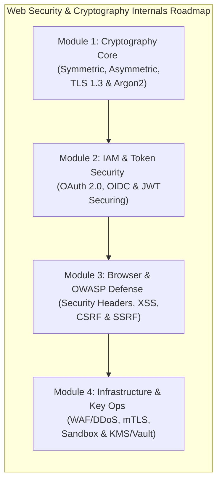
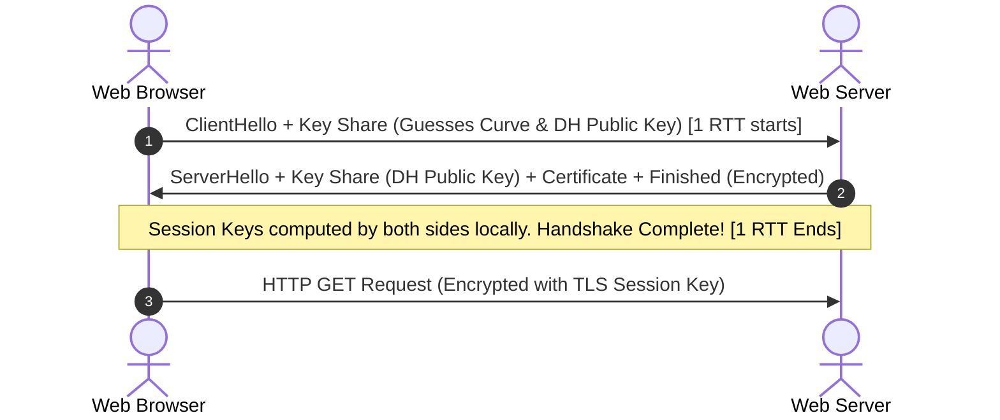
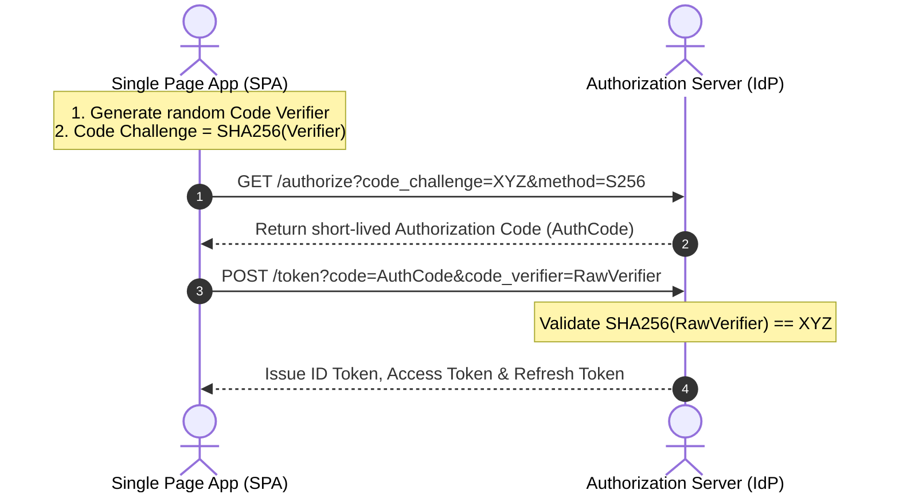

# 🛡️ Security & Cryptography Internals (Web Security) Handbook

স্বাগতম! আধুনিক সফটওয়্যার ইঞ্জিনিয়ারিং এবং সিস্টেম ডিজাইনে **নিরাপত্তা বা সিকিউরিটি** কোনো আফটার-থট (After-thought) নয়; এটি আর্কিটেকচারের অন্যতম প্রধান ভিত্তি। একটি অ্যাপ্লিকেশন কত দ্রুত রেসপন্স করছে তা যেমন গুরুত্বপূর্ণ, তেমনি হ্যাকারের হাত থেকে ইউজারের গোপনীয় ডেটা সুরক্ষিত রাখা এবং ইনফ্রাস্ট্রাকচারের প্রতিটি স্তরে শূন্য-বিশ্বাস (Zero-Trust) মডেল বজায় রাখা সমানভাবে জরুরি।

ক্রিপ্টোগ্রাফিক অ্যালগরিদমের ভেতরের গাণিতিক সমীকরণ, ব্রাউজার সিকিউরিটি ইঞ্জিনের জটিল মেকানিজম, আইডেন্টিটি প্রোটোকলের টোকেন এক্সচেঞ্জ ফ্লো এবং ক্লাউড ও কন্টেইনারাইজেশনের ফিজিক্যাল সিকিউরিটি বাউন্ডারি নিয়ে তৈরি এই বিশেষায়িত এন্টারপ্রাইজ হ্যান্ডবুক।

---

## 🗺️ ১২টি চ্যাপ্টারের সিকিউরিটি রোডম্যাপ (Web Security Learning Path)

নিচে আমাদের সিকিউরিটি হ্যান্ডবুকে থাকা ১২টি অ্যাডভান্সড চ্যাপ্টারের একটি ভিজ্যুয়াল লার্নিং পাথ চিত্রায়িত করা হলো:



---

## 📚 ১২টি চ্যাপ্টারের বিস্তারিত সূচিপত্র ও সিলেবাস (Syllabus)

### 🔑 Module 1: Cryptography & Network Security (ক্রিপ্টোগ্রাফি ও নেটওয়ার্ক সিকিউরিটি)
*ডিজিটাল ডেটার সুরক্ষা নিশ্চিত করতে ক্রিপ্টোগ্রাফিক অ্যালগরিদম এবং ট্রান্সপোর্ট লেয়ার সিকিউরিটির অভ্যন্তরীণ মেমরি মেকানিজম।*

*   **১. Symmetric Cryptography ও Block Ciphers (AES-GCM Internals):**
    *   Symmetric encryption-এর মৌলিক ধারণা।
    *   Stream Ciphers বনাম Block Ciphers।
    *   Cipher Modes: CBC (vulnerable to Padding Oracle) বনাম GCM (Galois/Counter Mode as AEAD - Authenticated Encryption with Associated Data)।
    *   AES-GCM কীভাবে একই সাথে কনফিডেন্সিয়ালিটি এবং integrity (Message Authentication Tag - MAC) গ্যারান্টি দেয়।

*   **২. Asymmetric Cryptography ও ECC (Elliptic Curve Cryptography) গণিত:**
    *   Public-key cryptography-এর গাণিতিক ভিত্তি।
    *   Discrete Logarithm Problem (RSA বনাম Diffie-Hellman)।
    *   Elliptic Curve Cryptography: Curve25519, secp256k1 (Bitcoin/Ethereum Curve) এর গাণিতিক কাজ করার পদ্ধতি।
    *   ECC-এর ফিজিক্যাল অ্যাডভান্টেজ: ২৫৬-বিট ECC কীভাবে ৩০৭২-বিট RSA-এর সমান সিকিউরিটি দিয়ে সিপিইউ এবং র‍্যামের ওভারহেড হ্রাস করে।

*   **৩. HTTPS, SSL/TLS 1.3 Handshake ও Session Resumption:**
    *   TLS 1.3-এর বৈপ্লবিক ১-RTT হ্যান্ডশেক ফ্লো (Client Hello, Key Exchange - ECDHE, Server Certificate validation, Finished)।
    *   Zero-RTT (0-RTT) হ্যান্ডশেক ইউজিং Pre-Shared Keys (PSK) এবং এর রিপ্লে অ্যাটাক (Replay Attack) ঝুঁকি।
    *   Diffie-Hellman Ephemeral (DHE) এবং Perfect Forward Seccy (PFS) গ্যারান্টি।

*   **৪. Modern Hash Functions, Salting ও Memory-Hard KDFs (Argon2):**
    *   One-way hashing criteria (Pre-image & Collision Resistance)।
    *   SHA-256 বনাম SHA-3 (Keccak) এর অভ্যন্তরীণ কার্নেল লেআউট।
    *   পাসওয়ার্ড হ্যাশিংয়ের বিবর্তন: MD5/SHA1 (too fast, vulnerable to GPU cracking), Bcrypt, PBKDF2।
    *   Memory-hard Key Derivation Functions (KDF): **Argon2** (Argon2id, Argon2i, Argon2d) অ্যালগরিদম কীভাবে ASIC ও GPU অ্যাটাক প্রতিরোধ করে।

---

### 🛡️ Module 2: Identity & Token Security (আইডেন্টিটি ও টোকেন সিকিউরিটি)
*আধুনিক ক্লাউড ও ডিস্ট্রিবিউটেড মাইক্রোসার্ভিসে প্রমাণীকরণ (Authentication) এবং টোকেন ব্যবস্থাপনার এন্টারপ্রাইজ স্ট্যান্ডার্ড।*

*   **৫. Web Identity & Access Management (IAM): OAuth 2.0 ও OIDC (OpenID Connect) ফ্লো:**
    *   OAuth 2.0 এর ৪টি কোর রোলস: Client, Resource Owner, Authorization Server, Resource Server।
    *   Authentication বনাম Authorization।
    *   Authorization Code Flow with PKCE (Proof Key for Code Exchange) - সিঙ্গেল-পেজ অ্যাপ (SPA) ও মোবাইলের জন্য এটি কেন বাধ্যতামূলক।
    *   Client Credentials Flow এবং Implicit Flow-এর অবসান।
    *   OpenID Connect (OIDC) লেয়ার: OAuth 2.0-এর ওপর ID Tokens (Identity metadata) ম্যাপিং।

*   **৬. JWT (JSON Web Tokens) Security, Hijacking ও Token Revocation:**
    *   JWT স্ট্রাকচার: Header, Payload, Signature।
    *   ক্রিপ্টোগ্রাফিক সাইনিং: HMAC (HS256) Symmetric বনাম RSA/ECDSA (RS256/ES256) Asymmetric সাইনিং।
    *   Key rotation using JWKS (JSON Web Key Sets)।
    *   JWT নিরাপত্তা দুর্বলতা: `none` algorithm exploit, signature validation failure, token hijacking।
    *   স্টেটলেস আর্কিটেকচারে টোকেন রিভোকেশন (Token Revocation) স্ট্র্যাটেজি: Redis Bloom Filters দিয়ে ব্ল্যাকলিস্টিং ও স্লাইডিং সেশন।

---

### 🌐 Module 3: Browser & OWASP Attack Defense (ব্রাউজার ও ওডব্লিউএএসপি ডিফেন্স)
*ওয়েব ব্রাউজার স্তরের সিকিউরিটি পলিসি এবং আধুনিক এন্টারপ্রাইজ অ্যাপ্লিকেশনের শীর্ষস্থানীয় নিরাপত্তা ঝুঁকি ও তাদের প্রতিরোধ।*

*   **৭. HTTP Security Headers (CSP, HSTS, CORS & Cookie Security):**
    *   Content Security Policy (CSP): স্ক্রিপ্ট সোর্সিং রেস্ট্রিক্ট করা এবং XSS এভয়ডেন্স।
    *   HTTP Strict Transport Security (HSTS): ব্রাউজারকে HTTPS এনফোর্স করতে বাধ্য করা ও HSTS Preloading।
    *   Cross-Origin Resource Sharing (CORS): OPTIONS প্রিপ্লাইট রিকোয়েস্ট এবং অরিজিন ভ্যালিডেশন মেকানিজম।
    *   Cookie Security: `HttpOnly` (XSS-রোধী), `Secure` (HTTPS-only), `SameSite` (`Strict`, `Lax`, `None` - CSRF-রোধী)।

*   **৮. Top OWASP Attacks & Mitigations (SQLi, XSS, CSRF, SSRF & IDOR):**
    *   Cross-Site Scripting (XSS): Stored, Reflected, DOM-based XSS এবং স্যানিটাইজেশন বনাম এসকেপিং।
    *   Cross-Site Request Forgery (CSRF): Synchronizer Token Pattern ও Double Submit Cookie।
    *   Server-Side Request Forgery (SSRF): ক্লাউড মেটাডেটা এন্ডপয়েন্ট (AWS IMDSv2) এক্সপ্লয়েট করার মেকানিজম ও ডোমেইন হোয়াইটলিস্টিং।
    *   Insecure Direct Object Reference (IDOR) ডিফেন্স।

---

### ⚙️ Module 4: Infrastructure & Cloud Security (অবকাঠামো ও ক্লাউড সিকিউরিটি)
*নেটওয়ার্ক লেভেল, ক্লাউড পরিবেশ, কন্টেইনার এবং ক্রিপ্টোগ্রাফিক কি-ম্যানেজমেন্ট সার্ভিসের ভেতরের স্টাফ-আর্কিটেক্ট গাইডলাইন।*

*   **৯. API Gateway Security: Rate Limiting, WAF (Web Application Firewall) ও DDoS Defenses:**
    *   ডিস্ট্রিবিউটেড রেট লিমিটিং অ্যালগরিদম (Token Bucket, Leaky Bucket) স্কেলিং।
    *   WAF ইন্সপেকশন: SQLi/XSS সিগনেচার ম্যাচিং ও আচরণগত বিশ্লেষণ (Anomaly Detection)।
    *   Layer 3/4 DDoS বনাম Layer 7 (Application) DDoS প্রতিরোধ, Anycast Routing ও ক্লাউডফ্লেয়ার সিডিএন এডজেস।

*   **১০. Zero-Trust Architecture ও Microservices Security (mTLS ও Service Mesh):**
    *   পেরিমিটার সিকিউরিটির অবসান (Firewalls are not enough)।
    *   Mutual TLS (mTLS): মাইক্রোসার্ভিসগুলোর মধ্যে দ্বিমুখী ক্রিপ্টোগ্রাফিক অথেন্টিকেশন ও সিমেট্রিক এনক্রিপশন।
    *   Service Mesh (Istio/Envoy): SPIFFE/SPIRE স্ট্যান্ডার্ডের মাধ্যমে ডাইনামিক সার্টিফিকেট রোটেশন ও সিঙ্ক।

*   **১১. Container Security & Sandbox Isolation (Namespaces, cgroups, Seccomp ও AppArmor):**
    *   লিনাক্স কার্নেলের আইসোলেশন বাউন্ডারি: Namespaces (PID, Net, Mount) এবং Control Groups (cgroups)।
    *   Seccomp (Secure Computing Mode): বিপজ্জনক কার্নেল সিস্টেম কল (Syscalls like `ptrace`, `reboot`) কন্টেইনারে ফিল্টার করা।
    *   AppArmor/SELinux: প্রসেস ও ফাইল অ্যাক্সেসের ওপর ম্যান্ডেটরি অ্যাক্সেস কন্ট্রোল (MAC) পলিসি।
    *   Rootless Containers ও User Namespaces।

*   **১২. Cryptographic Key Management & Envelope Encryption (KMS, HSM & Vault):**
    *   সিক্রেট ম্যানেজমেন্টের সেরা অনুশীলন (Avoiding hardcoded API Keys & Env Variables)।
    *   Key Management Services (KMS) এবং Hardware Security Modules (HSM) - FIPS 140-2 ফিজিক্যাল চিপ সিকিউরিটি।
    *   Envelope Encryption: Data Encryption Keys (DEK) বনাম Key Encryption Keys (KEK)।
    *   HashiCorp Vault ইন্টারনালস: **Shamir's Secret Sharing Scheme** দিয়ে ভল্ট আনসিলিং ও মেমরি সিলিং প্রসেস।

---

---

## Module 1: Cryptography & Network Security (ক্রিপ্টোগ্রাফি ও নেটওয়ার্ক সিকিউরিটি)

ডিজিটাল নিরাপত্তার ভিত্তি হলো ক্রিপ্টোগ্রাফি। ডেটা যখন ডিস্কে অলস পড়ে থাকে (Data-at-Rest) অথবা নেটওয়ার্ক দিয়ে এক সার্ভার থেকে অন্য সার্ভারে স্থানান্তরিত হয় (Data-in-Transit), তখন তার গোপনীয়তা (Confidentiality) ও অখণ্ডতা (Integrity) নিশ্চিত করতে ক্রিপ্টোগ্রাফিক অ্যালগরিদম ও ট্রান্সপোর্ট প্রোটোকল কার্নেল লেভেলে কীভাবে কাজ করে তা আমাদের এই মডিউলের মূল আলোচ্য বিষয়।

---

## ১. Symmetric Cryptography ও Block Ciphers (AES-GCM Internals)

সিমেট্রিক এনক্রিপশন (Symmetric Encryption) হলো এমন একটি পদ্ধতি যেখানে ডেটা এনক্রিপ্ট এবং ডিক্রিপ্ট করার জন্য একই সিক্রেট কী (Shared Secret Key) ব্যবহার করা হয়। এটি অত্যন্ত দ্রুতগতির হওয়ায় কোটি কোটি ট্রাফিকের রিয়েল-টাইম পে-লোড এনক্রিপ্ট করতে সিমেট্রিক ক্রিপ্টোগ্রাফি ব্যবহৃত হয়।

### ক. Stream Ciphers বনাম Block Ciphers
১. **Stream Ciphers (উদা: ChaCha20):**
   * এটি ডেটাকে ১-বিট বা ১-বাইট করে একটি ছদ্ম-এলোমেলো কী-স্ট্রিমের (Pseudo-random Keystream) সাথে XOR অপারেটর ব্যবহার করে সরাসরি এনক্রিপ্ট করে।
   * এটি অত্যন্ত ফাস্ট কিন্তু কী-ইউজ করার ক্ষেত্রে কোনো ভুল হলে (Key Reuse/Nonce Reuse) সম্পূর্ণ ডেটা ডিক্রিপ্ট করা সহজ হয়ে যায়।
২. **Block Ciphers (উদা: AES):**
   * এটি র-ডেটাকে নির্দিষ্ট ফিক্সড ব্লকে (যেমন AES-এর ক্ষেত্রে ১২৮-বিট বা ১৬ বাইট) ভাগ করে প্রতিটি ব্লককে একসাথে এনক্রিপ্ট করে।

### খ. Block Cipher Modes: CBC বনাম GCM (AEAD)

#### ১. Cipher Block Chaining (CBC) Mode:
CBC মোডে প্রতিটি ডেটা ব্লককে এনক্রিপ্ট করার আগে তার আগের ব্লকের সাইফার টেক্সটের সাথে **XOR** করা হয়। প্রথম ব্লকের জন্য একটি এলোমেলো **Initialization Vector (IV)** ব্যবহার করা হয়।

$$C_i = E_K(P_i \oplus C_{i-1})$$

```
CBC Encryption Flow:
Plaintext Block ---> XOR ---> Block Cipher Encryption ---> Ciphertext Block
                      ^ (IV or Prev Ciphertext)
```

* **প্যাডিং এবং নিরাপত্তা ঝুঁকি (Padding Oracle Attack):**
  যেহেতু ডেটা ব্লকগুলো ১৬ বাইটের ফিক্সড হতে হয়, তাই ডেটা যদি ১৬ বাইটের চেয়ে ছোট হয় তবে **PKCS#7** প্যাডিং ব্যবহার করে ব্লক পূর্ণ করা হয়।
  * **Padding Oracle Vulnerability:** ডিক্রিপশন করার সময় যদি ডাটাবেস বা সার্ভার ভুল প্যাডিংয়ের কারণে আলাদা এরর দেয় (উদা: `Bad Padding` বনাম `Generic Decryption Fail`), তবে হ্যাকার টাইমিং অ্যানালাইসিস এবং কুয়েরি সাবমিশনের মাধ্যমে প্রতিটি সাইফারটেক্সট বাইট-বাই-বাইট র-টেক্সটে রূপান্তর করে ফেলতে পারে। এই ঝুঁকি এড়াতে প্রোডাকশনে CBC পরিহার করা হয়।

#### ②. Galois/Counter Mode (AES-GCM) - আধুনিক গোল্ড স্ট্যান্ডার্ড:
AES-GCM হলো একটি **AEAD (Authenticated Encryption with Associated Data)** মোড। এটি ব্লকের ওপর সরাসরি চেইনিং না করে একটি ক্রমবর্ধমান কাউন্টার ব্যবহার করে ব্লক সাইফারকে স্ট্রিম সাইফারে রূপান্তরিত করে:

$$C_i = P_i \oplus E_K(Y_i)$$

```
AES-GCM Pipeline:
Counter ---> AES Encryption ---> Keystream ---> XOR ---> Ciphertext
                                                 ^
                                             Plaintext
```

* **AEAD এবং অখণ্ডতা গ্যারান্টি (Integrity Tag):**
  জিসিএম মোড কেবল ডেটা এনক্রিপ্ট করে ক্ষান্ত হয় না, এটি ডিস্কের অন্যান্য আন-এনক্রিপ্টেড মেটাডেটা (যেমন: হেডার, ইউজার আইডি - AAD) এবং সাইফারটেক্সটের ওপর একটি গাণিতিক **Galois Field Multiplication** চালিয়ে ১২৮-বিটের **Authentication Tag (MAC)** তৈরি করে।
* **Bit-Flipping Attack প্রতিরোধ:**
  সিবিসি মোডে হ্যাকার যদি সাইফারটেক্সটের মাঝখান থেকে কোনো বিট পরিবর্তন করে (Bit Flip), তবে ডিক্রিপশনের পর র-টেক্সটে হ্যাকারের কাঙ্ক্ষিত পরিবর্তন ঘটে যেতে পারে (উদা: `role=guest` পরিবর্তন করে `role=admin` করা)। কিন্তু AES-GCM মোডে ডেটার ১টি বিটও পরিবর্তিত হলে ডিক্রিপশনের সময় **Authentication Tag mismatch** ঘটবে এবং ওএস কার্নেল সম্পূর্ণ পে-লোডটি বাতিল করে দেবে!

### গ. Node.js প্রোডাকশন-রেডি AES-GCM ইমপ্লিমেন্টেশন
নিচে একটি অত্যন্ত সুরক্ষিত ও প্রোডাকশন-গ্রেড AES-256-GCM এনক্রিপশন ও ডিক্রিপশনের বাস্তব কোড দেওয়া হলো:

```javascript
const crypto = require('crypto');

const ALGORITHM = 'aes-256-gcm';
const IV_LENGTH = 12; // GCM এর জন্য ১২-বাইট IV স্ট্যান্ডার্ড
const KEY_LENGTH = 32; // AES-256 এর জন্য ৩২-বাইট কী

// ১. পে-লোড এনক্রিপ্ট করার ফাংশন (IV এবং Auth Tag সহ)
function encrypt(plaintext, masterKey, aadText = '') {
    const iv = crypto.randomBytes(IV_LENGTH);
    const cipher = crypto.createCipheriv(ALGORITHM, masterKey, iv);
    
    // AAD (Additional Authenticated Data) সেট করা
    if (aadText) {
        cipher.setAAD(Buffer.from(aadText, 'utf-8'));
    }
    
    let ciphertext = cipher.update(plaintext, 'utf8', 'hex');
    ciphertext += cipher.final('hex');
    
    const tag = cipher.getAuthTag(); // ১২৮-বিট অখণ্ডতা ট্যাগ
    
    // IV, Tag এবং Ciphertext একসাথে কম্বাইন করে পাঠানো
    return {
        iv: iv.toString('hex'),
        tag: tag.toString('hex'),
        ciphertext: ciphertext
    };
}

// ২. পে-লোড ডিক্রিপ্ট করার ফাংশন
function decrypt(ciphertextHex, masterKey, ivHex, tagHex, aadText = '') {
    const iv = Buffer.from(ivHex, 'hex');
    const tag = Buffer.from(tagHex, 'hex');
    const decipher = crypto.createDecipheriv(ALGORITHM, masterKey, iv);
    
    decipher.setAuthTag(tag);
    if (aadText) {
        decipher.setAAD(Buffer.from(aadText, 'utf-8'));
    }
    
    let decrypted = decipher.update(ciphertextHex, 'hex', 'utf8');
    decrypted += decipher.final('utf8');
    return decrypted;
}

// বাস্তব ব্যবহার:
const secretKey = crypto.randomBytes(KEY_LENGTH); // মাস্টার কী
const payload = "Top-Secret-Database-Password-2026";
const aad = "user_id:42"; // এই মেটাডাটার ওপর কেউ টেম্পার করতে পারবে না

const encryptedData = encrypt(payload, secretKey, aad);
console.log("Encrypted Payload:", encryptedData);

const decryptedText = decrypt(encryptedData.ciphertext, secretKey, encryptedData.iv, encryptedData.tag, aad);
console.log("Decrypted Text:", decryptedText); // "Top-Secret-Database-Password-2026"
```

---

## ২. Asymmetric Cryptography ও ECC (Elliptic Curve Cryptography) গণিত

অ্যাসিম্যাট্রিক ক্রিপ্টোগ্রাফি বা পাবলিক-কী ক্রিপ্টোগ্রাফি (Asymmetric Cryptography) এমন একটি বৈপ্লবিক ধারণা যেখানে ডেটা এনক্রিপ্ট করার জন্য একটি পাবলিক কী (Public Key) এবং ডিক্রিপ্ট করার জন্য একটি সম্পূর্ণ ভিন্ন প্রাইভেট কী (Private Key) ব্যবহার করা হয়।

### ক. RSA বনাম Diffie-Hellman (DH)
১. **RSA (Rivest–Shamir–Adleman):**
   * এর গাণিতিক ভিত্তি হলো দুটি বিশাল মৌলিক সংখ্যার (Prime Numbers) গুণফল বের করা সহজ, কিন্তু সেই গুণফল থেকে মূল প্রাইভেট উৎপাদক দুটি খুঁজে বের করা অত্যন্ত কঠিন (Integer Factorization Problem):
     $$N = p \cdot q$$
   * **কেন এটি ওবসোলেট (Obsolete) হচ্ছে?**
     কম্পিউটারের শক্তি বৃদ্ধির কারণে পর্যাপ্ত নিরাপত্তার জন্য RSA কী-সাইজ বাড়িয়ে ৩০৭২-বিট বা ৪০৯৬-বিট করতে হচ্ছে। এই বিশাল সাইজের গাণিতিক মডুলার এক্সপোনেনশিয়েশন চেক করতে সিপিইউ-এর ওপর চরম লোড পড়ে, যা এপিআই ল্যাটেন্সি বহুগুণ বাড়িয়ে দেয়।
২. **Diffie-Hellman Key Exchange:**
   * এর ভিত্তি হলো **Discrete Logarithm Problem**:
     $$g^a \pmod p$$
   * এটি নেটওয়ার্কের প্রকাশ্য চ্যানেল দিয়ে কোনো সিক্রেট পাস না করেই ক্লায়েন্ট ও সার্ভারের মধ্যে নিরাপদShared Secret কী তৈরি করতে সাহায্য করে।

### খ. Elliptic Curve Cryptography (ECC) জ্যামিতিক গণিত
আধুনিক সিস্টেম ডিজাইনের ক্রিপ্টোগ্রাফিক গোল্ড স্ট্যান্ডার্ড হলো **ECC**। এটি ট্র্যাডিশনাল ইন্টিজার ফ্যাক্টরাইজেশনের পরিবর্তে উপবৃত্তাকার বক্ররেখা বা Elliptic Curves-এর বিন্দুগুলোর জ্যামিতিক সম্পর্কের ওপর ভিত্তি করে কাজ করে।

$$y^2 = x^3 + ax + b \pmod p$$

```
Elliptic Curve Point Multiplication Concept:
  y ^
    |       .
    |     .   .  (Point addition P + Q)
    |    .     .
----+----P-----Q--------------> x
    |      .
    |        . (Reflected Point R)
```

* **গ্রুপ ল (Group Law) ও পয়েন্ট মাল্টিপ্লিকেশন:**
  কার্ভের যেকোনো দুটি বিন্দু $P$ এবং $Q$ যোগ করে আরেকটি তৃতীয় বিন্দু $R$ পাওয়া যায়। একইভাবে একটি নির্দিষ্ট বেস বিন্দু $P$-কে নিজের সাথে বারবার যোগ করে (Scalar Multiplication) আমরা একটি পাবলিক কী $Q$ তৈরি করি:
  $$Q = d \cdot P$$
  যেখানে $d$ হলো আমাদের অত্যন্ত বড় প্রাইভেট কী এবং $Q$ হলো পাবলিক কী। পাবলিক কী $Q$ এবং বেস পয়েন্ট $P$ প্রকাশ্য থাকলেও কোটি বছরেও ব্যাকগ্রাউন্ডে ক্যালকুলেশন করে $d$-এর মান বের করা গাণিতিকভাবে অসম্ভব। একে বলা হয় **Elliptic Curve Discrete Logarithm Problem (ECDLP)**।

* **ECC-এর অসাধারণ ফিজিক্যাল এডভান্টেজ:**
  ECC অবিশ্বাস্য ছোট কী-সাইজ ব্যবহার করে RSA-এর সমমানের নিরাপত্তা দিতে পারে:

| Security Strength (Bits) | RSA Key Size (Bits) | ECC Key Size (Bits) | মেমরি ও সিপিইউ সাশ্রয় |
| :--- | :--- | :--- | :--- |
| ৮০ | ১০২৪ | ১৬০ | ৮ গুণ ছোট কী |
| **১২৮ (Standard)** | **৩০৭২** | **২৫৬** | **১২ গুণ ছোট কী!** |
| ২৫৬ | ১৫৩৬০ | ৫১২ | ৩০ গুণ ছোট কী |

ছোট কী হওয়ার কারণে মেমরি ফুটপ্রিন্ট অনেক কম থাকে এবং নেটওয়ার্কে অল্প বাইটের প্যাকেট পাস করতে হয়, যা প্রতি সেকেন্ডে হাজার হাজার হ্যান্ডশেক প্রসেস করতে সিপিইউ লোড প্রায় ১০ গুণ কমিয়ে দেয়।

* **বাস্তব কার্ভ অপশনস:**
  * **secp256k1:** বিটকয়েন (Bitcoin) এবং ইথেরিয়াম (Ethereum) ব্লকচেইনের সিগনেচারের জন্য ব্যবহৃত বিশেষায়িত কার্ভ।
  * **Curve25519:** আধুনিক TLS 1.3, SSH এবং সিগন্যাল (Signal) প্রোটোকলে ব্যবহৃত সুপার-ফাস্ট ও সাইড-চ্যানেল অ্যাটাক প্রতিরোধী কার্ভ।

### গ. Node.js-এ ECDH (Elliptic Curve Diffie-Hellman) বাস্তব কোড
নিচে দুটি নোডের মধ্যে কার্ভ২৫৫১৯ ব্যবহার করে নিরাপদ কী-এক্সচেঞ্জ ও Shared Secret জেনারেট করার বাস্তব প্রোডাকশন ডেমো দেওয়া হলো:

```javascript
const crypto = require('crypto');

// ১. অ্যালিসের জন্য Curve25519 কী-পেয়ার জেনারেট করা
const alice = crypto.generateKeyPairSync('ec', {
    namedCurve: 'X25519' // Curve25519 এর কী-এক্সচেঞ্জ ভেরিয়েন্ট
});

// ২. ববের জন্য Curve25519 কী-পেয়ার জেনারেট করা
const bob = crypto.generateKeyPairSync('ec', {
    namedCurve: 'X25519'
});

// ৩. অ্যালিস তার প্রাইভেট কী এবং ববের পাবলিক কী দিয়ে Shared Secret গণনা করছে
const aliceSharedSecret = crypto.diffieHellman({
    privateKey: alice.privateKey,
    publicKey: bob.publicKey
});

// ৪. বব তার প্রাইভেট কী এবং অ্যালিসের পাবলিক কী দিয়ে Shared Secret গণনা করছে
const bobSharedSecret = crypto.diffieHellman({
    privateKey: bob.privateKey,
    publicKey: alice.publicKey
});

// ৫. ভ্যালিডেশন: উভয় Shared Secret ফিজিক্যালি মেমরিতে ১০০% সমান হবে!
console.log("Alice Secret (Hex):", aliceSharedSecret.toString('hex'));
console.log("Bob Secret   (Hex):", bobSharedSecret.toString('hex'));
console.log("Secrets Match?  :", aliceSharedSecret.equals(bobSharedSecret)); // true
```

---

## ৩. HTTPS, SSL/TLS 1.3 Handshake ও Session Resumption

ট্রান্সপোর্ট লেয়ার সিকিউরিটি (TLS) হলো নেটওয়ার্কের মাধ্যমে ব্রাউজার ও সার্ভারের ডেটা স্ট্রিম সম্পূর্ণ এনক্রিপ্ট করার প্রোটোকল। ২০১৮ সালে রিলিজ হওয়া **TLS 1.3** প্রোটোকল পূর্ববর্তী TLS 1.2-এর তুলনায় নেটওয়ার্ক রাউন্ড ট্রিপ অনেক কমিয়ে স্পিড ও সিকিউরিটিতে বিপ্লব এনেছে।

### ক. TLS 1.3 এর ১-RTT হ্যান্ডশেক ফ্লো (1-RTT Handshake)
TLS 1.2-এ হ্যান্ডশেক সম্পন্ন করতে নেটওয়ার্কে ২টি সম্পূর্ণ রাউন্ড ট্রিপ (2-RTT) লাগত। TLS 1.3-এ অপ্টিমাইজড অ্যালগরিদম সিলেকশনের মাধ্যমে এটি মাত্র **১টি রাউন্ড ট্রিপে (1-RTT)** নামিয়ে আনা হয়েছে:



১. **ClientHello + KeyShare:** ক্লায়েন্ট প্রথম প্যাকেটেই তার সমর্থিত সাইফার সুইটের তালিকা এবং সাথে সম্ভাব্য ক্রিপ্টোগ্রাফিক কার্ভের জন্য তার Diffie-Hellman **পাবলিক কী শেয়ার (Key Share)** পাঠিয়ে দেয়।
২. **ServerHello + KeyShare + Finished:** সার্ভার ক্লায়েন্টের পাঠানো কী-শেয়ার গ্রহণ করে নিজের পাবলিক কী শেয়ার তৈরি করে, সাথে তার ডিজিটাল সার্টিফিকেট এবং সিগনেচার এনক্রিপ্ট করে পাঠিয়ে দেয়।
৩. প্রথম রাউন্ড ট্রিপেই উভয় পক্ষ একে অপরের পাবলিক কী পেয়ে মেমরিতে সেশন কী (`Symmetric Session Key`) গণনা করে ফেলে। সাথে সাথে নিরাপদ হাই-স্পিড ডেটা আদান-প্রদান শুরু হয়ে যায়।

### খ. Zero-RTT (0-RTT) ও Replay Attack এর মারাত্মক ঝুঁকি
পূর্বে ভিজিট করা কোনো ব্রাউজার যখন পুনরায় একই সার্ভারে কানেক্ট হতে চায়, তখন সে পূর্ববর্তী সেশনের সংগৃহীত **PSK (Pre-Shared Key)** ব্যবহার করে প্রথম প্যাকেটের সাথেই (০-RTT) রিকোয়েস্টের বডি ও ডেটা পাঠিয়ে দিতে পারে। একে বলা হয় **TLS 1.3 Early Data** বা **0-RTT Handshake**।

* **রিপ্লে অ্যাটাক (Replay Attack) বিপদ:**
  ০-RTT-তে প্রথম ডেটা প্যাকেটটি যেহেতু কোনো রিয়েল-টাইম হ্যান্ডশেক লাইভ চ্যালেঞ্জ ছাড়াই নেটওয়ার্কে চলে যায়, হ্যাকার চাইলে সকেট কানেকশন থেকে সেই সাইফার প্যাকেটটি ক্যাপচার করে হুবহু সার্ভারে পুনরায় পাঠাতে পারে (Replay)।
  * **দুর্ঘটনা:** ইউজার যদি ১টি পণ্য কেনার জন্য POST রিকোয়েস্ট পাঠান এবং হ্যাকার সেটি ক্যাপচার করে ৫ বার রিপ্লে করে, সার্ভার ট্রানজেকশনটি ভ্যালিড মনে করে ইউজারের ব্যাংক থেকে ৫ বার টাকা কেটে নেবে!
* **প্রতিরোধ স্ট্র্যাটেজি:**
  * প্রোডাকশনে এপিআই গেটওয়ে লেভেলে ০-RTT-তে আসা কোনো অ-ইডেমপোটেন্ট (Non-idempotent) রিকোয়েস্ট (যেমন: POST, PUT, DELETE) প্রসেস করা নিষিদ্ধ করতে হবে। কেবল সেফ GET রিকোয়েস্ট এনাবেল করা উচিত।

### গ. Perfect Forward Secrecy (PFS)
পূর্বে যখন ট্র্যাডিশনাল RSA কী-এক্সচেঞ্জ ব্যবহার করা হতো, তখন হ্যাকার যদি নেটওয়ার্কের সমস্ত এনক্রিপ্টেড ডাটা রেকর্ড করে রাখত এবং পরবর্তীতে কোনোভাবে সার্ভারের প্রাইভেট কী চুরি করতে পারত, তবে সে অতীতের রেকর্ড করা সমস্ত ট্রাফিক ডিক্রিপ্ট করে ফেলতে পারত।

**Perfect Forward Secrecy (PFS)** নিশ্চিত করে যে—ভবিষ্যতে মেইন প্রাইভেট কী চুরি হলেও পেছনের কোনো ডেটা ডিক্রিপ্ট করা যাবে না।
* **মেকানিজম:** TLS 1.3-এ স্ট্যাটিক কী-এক্সচেঞ্জ সম্পূর্ণ ব্যান করা হয়েছে। এখানে প্রতিটি সেশনের জন্য ডাইনামিকালি ক্ষণস্থায়ী **ECDHE (Elliptic Curve Diffie-Hellman Ephemeral)** কী তৈরি করা হয়। সেশন শেষ হওয়া মাত্রই মেমরি থেকে কী মুছে ফেলা হয়। ফলে ভবিষ্যতে প্রাইভেট কী চুরি হলেও হ্যাকারের পক্ষে পুরনো সেশন কী ডিক্রিপ্ট করা অসম্ভব!

---

## ৪. Modern Hash Functions, Salting ও Memory-Hard KDFs (Argon2)

ক্রিপ্টোগ্রাফিক হ্যাশ ফাংশন (Cryptographic Hash Function) হলো এমন একটি গাণিতিক অ্যালগরিদম যা যেকোনো সাইজের ডেটা গ্রহণ করে একটি নির্দিষ্ট ফিক্সড সাইজের হেক্সাডেসিমেল স্ট্রিং (Message Digest) আউটপুট দেয়। এটি সম্পূর্ণ একমুখী (One-Way); অর্থাৎ হ্যাশ ভ্যালু থেকে র-ডেটা ব্যাক করা অসম্ভব।

### ক. SHA-256 (Merkle-Damgård) বনাম SHA-3 (Sponge Construction)
১. **SHA-256:**
   * এটি **Merkle-Damgård** আর্কিটেকচার ব্যবহার করে কাজ করে। এর ব্লক প্রসেসিং মেথডের কারণে এটি এক ধরণের বিশেষ নেটওয়ার্ক আক্রমণ **Length Extension Attack**-এর শিকার হতে পারে (যেখানে হ্যাশের সাথে অতিরিক্ত ডেটা অ্যাপেন্ড করে নতুন ভ্যালিড হ্যাশ জেনারেট করা যায়)।
২. **SHA-3 (Keccak):**
   * এটি সম্পূর্ণ নতুন **Sponge Construction** ব্যবহার করে ডিজাইন করা হয়েছে। এর কাজ দুটি ধাপে বিভক্ত:

```
SHA-3 Sponge Construction:
Input Data ---> [Absorbing Phase (Squeeze and mix into memory state)]
                        |
                        v
Output Hash <--- [Squeezing Phase (Extract bits layer by layer)]
```

SHA-৩ এর স্পঞ্জ আর্কিটেকচারের কারণে এটি কোনো প্রকার লেন্থ এক্সটেনশন অ্যাটাকের শিকার হয় না এবং এটি অত্যন্ত শক্তিশালী ক্রিপ্টোগ্রাফিক কোলিশন রেজিস্ট্যান্স অফার করে।

### খ. পাসওয়ার্ড হ্যাশিং ও Memory-Hard KDFs
অনেক ডেভেলপার ভুলবশত পাসওয়ার্ড ডেটাবেজে সেভ করার সময় SHA-256 বা MD5 ব্যবহার করেন।
* **বিপদ:** SHA-256 ডিজাইন করা হয়েছে দ্রুত রান করার জন্য। একটি আধুনিক জিপিইউ (NVIDIA RTX 4090) প্রতি সেকেন্ডে শত কোটি SHA-256 হ্যাশ গণনা করতে পারে। ফলে ডাটাবেস লিক হলে হ্যাকার ব্রুট-ফোর্স বা রেইনবো টেবিল অ্যাটাক চালিয়ে কয়েক সেকেন্ডেই সব ইউজারের পাসওয়ার্ড ডিক্রিপ্ট করে ফেলবে।
* **Salting:** পাসওয়ার্ডের সাথে একটি র্যান্ডম স্ট্রিং (Salt) যোগ করে হ্যাশ করা, যা ডুপ্লিকেট পাসওয়ার্ডের হ্যাশ আলাদা করে এবং প্রাক-গণনাকৃত রেইনবো টেবিল সম্পূর্ণ অকেজো করে দেয়।

#### 🏆 Argon2 - আধুনিক পাসওয়ার্ড হ্যাশিংয়ের রাজা:
২০১৫ সালের পাসওয়ার্ড হ্যাশিং প্রতিযোগিতার বিজয়ী অ্যালগরিদম হলো **Argon2**। এটি একটি **Memory-Hard KDF**।

* **কেন এটি এএসআইসি/জিপিইউ প্রতিরোধী?**
  Argon2-এর হ্যাশ গণনা করতে ওএসের নির্দিষ্ট মেমরি (উদা: ৬৪ মেগাবাইট বা ১২৮ মেগাবাইট র‍্যাম) এবং একাধিক সিপিইউ থ্রেড ব্যবহার করতে হয়। যেহেতু জিপিইউ বা এএসআইসি চিপগুলোর প্রতিটি কোরের র‍্যাম অত্যন্ত সীমিত থাকে, তাই তারা প্যারালালি কোটি কোটি Argon2 হ্যাশ ট্রাই করতে পারে না। এর ফলে হার্ডওয়্যার এক্সিলারেটেড ব্রুট-ফোর্স অ্যাটাক সম্পূর্ণ থমকে যায়।

#### Argon2-এর তিনটি প্রধান ভেরিয়েন্ট:
১. **Argon2d (Data-dependent):** ডেটার ওপর ভিত্তি করে মেমরি অ্যাক্সেস করে। সাইড-চ্যানেল টাইমিং অ্যাটাক হতে পারে এমন সিস্টেমে এটি অনুপোযুক্ত, তবে ক্রিপ্টোকারেন্সির জন্য এটি সেরা জিপিইউ প্রতিরোধী অ্যালগরিদম।
২. **Argon2i (Data-independent):** পাসওয়ার্ড ডেটা নির্বিশেষে সিকুয়েন্সিয়াল মেমরি অ্যাক্সেস করে। এটি সাইড-চ্যানেল টাইমিং অ্যাটাক সম্পূর্ণ প্রতিরোধ করে বলে ওয়েব এপিআই ও ইউজার লগইনের জন্য আদর্শ।
৩. **Argon2id (Hybrid - Gold Standard):** এটি প্রথম ধাপে Argon2i-এর মতো সিকিউরড মেমরি অ্যাক্সেস করে এবং পরবর্তী ধাপে Argon2d-এর মতো ডেটা-ডিপেন্ডেন্ট স্পিড ব্লক করে। এটি সমস্ত এন্টারপ্রাইজ অ্যাপের জন্য ডিফল্ট রিকমেন্ডেড ভেরিয়েন্ট।

### গ. Node.js-এ Argon2id পাসওয়ার্ড হ্যাশিং বাস্তব কোড
প্রোডাকশন-গ্রেড কনফিগারেশন প্যারামিটারসহ (মেমরি খরচ ৬৪এমবি, টাইম কস্ট ৩ ইটারেশন, ৪টি প্যারালাল থ্রেড) পাসওয়ার্ড হ্যাশিং ও ভেরিফিকেশনের কোড নিচে দেওয়া হলো:

```javascript
// npm install argon2
const argon2 = require('argon2');

// ১. পাসওয়ার্ড নিরাপদে হ্যাশ করার ফাংশন
async function hashPassword(password) {
    try {
        const hashedPassword = await argon2.hash(password, {
            type: argon2.argon2id, // Hybrid Mode
            memoryCost: 65536, // ৬৪ মেগাবাইট র‍্যাম কনজাম্পশন
            timeCost: 3,       // ৩ বার ইটারেশন রান হবে
            parallelism: 4     // ৪টি সিপিইউ থ্রেড একসাথে প্রসেস করবে
        });
        return hashedPassword;
    } catch (err) {
        console.error("Hashing Error:", err);
        throw err;
    }
}

// ২. ইনপুট পাসওয়ার্ডের সাথে হ্যাশ ম্যাচিং চেক করা
async function verifyPassword(hashedPassword, inputPassword) {
    try {
        const isMatch = await argon2.verify(hashedPassword, inputPassword);
        return isMatch;
    } catch (err) {
        console.error("Verification Error:", err);
        throw err;
    }
}

// লাইভ ডেমো:
(async () => {
    const rawPassword = "UserSuperSecurePassword2026";
    
    // হ্যাশ জেনারেট করা
    const myHash = await hashPassword(rawPassword);
    console.log("Argon2id Hash:", myHash); 
    // আউটপুট ফরম্যাট: $argon2id$v=19$m=65536,t=3,p=4$... (এতে সল্ট ও প্যারামিটার অটো-ইনজেক্টেড থাকে)

    // পাসওয়ার্ড ভেরিফাই করা (সঠিক পাসওয়ার্ড)
    const isValid = await verifyPassword(myHash, rawPassword);
    console.log("Is Password Valid? :", isValid); // true

    // ভুল পাসওয়ার্ড চেক করা
    const isInvalid = await verifyPassword(myHash, "WrongPassword123");
    console.log("Is Wrong Password Valid? :", isInvalid); // false
})();
```

---

## Module 2: Identity & Token Security (আইডেন্টিটি ও টোকেন সিকিউরিটি)

আধুনিক এন্টারপ্রাইজ অ্যাপ্লিকেশন এবং মাইক্রোসার্ভিস আর্কিটেকচারে ক্লায়েন্টদের প্রমাণীকরণ (Authentication) এবং সম্পদের অ্যাক্সেস নিয়ন্ত্রণ (Authorization) করার জন্য একটি সেন্ট্রাল আইডেন্টিটি ম্যানেজমেন্ট সিস্টেম অত্যন্ত জরুরি। এই মডিউলে আমরা OAuth 2.0, OpenID Connect এবং JSON Web Tokens (JWT) এর জটিল মেকানিজম এবং এদের ফিজিক্যাল সিকিউরিটি বাউন্ডারি নিয়ে আলোচনা করব।

---

## ৫. Web Identity & Access Management (IAM): OAuth 2.0 ও OIDC (OpenID Connect) ফ্লো

অনেকে গুলিয়ে ফেলেন—OAuth 2.0 কিন্তু প্রমাণীকরণ বা অথেন্টিকেশন প্রোটোকল নয়; এটি একটি **অনুমোদন বা অথরাইজেশন ফ্রেমওয়ার্ক (Authorization Framework)**। অপরদিকে **OpenID Connect (OIDC)** হলো OAuth 2.0-এর ওপর তৈরি করা একটি আইডেন্টিটি লেয়ার যা অথেন্টিকেশন নিশ্চিত করে।

### ক. OAuth 2.0 এর ৪টি কোর রোলস (Roles)
১. **Resource Owner:** মূলত শেষ ব্যবহারকারী (End User), যিনি তার অ্যাকাউন্টের অ্যাক্সেস দিতে সম্মত হন।
২. **Client:** যে থার্ড-পার্টি অ্যাপ্লিকেশনটি ইউজারের পক্ষ থেকে ডেটা অ্যাক্সেস করতে চায় (যেমন: একটি মোবাইল অ্যাপ বা ফ্রন্টএন্ড সিঙ্গেল পেজ অ্যাপ্লিকেশন)।
৩. **Authorization Server:** আইডেন্টিটি প্রোভাইডার (উদা: Okta, Auth0, Keycloak বা Google Identity Service) যা ইউজারকে অথেন্টিকেট করে এবং টোকেন ইস্যু করে।
৪. **Resource Server:** আমাদের সুরক্ষিত এপিআই সার্ভার (Protected API Gateway/Backend), যা ভ্যালিড অ্যাক্সেস টোকেন যাচাই করে ডেটা রিটার্ন করে।

### খ. Authentication বনাম Authorization
* **Authentication (AuthN):** "আপনি কে?" (Verifying identity)। এর আউটপুট হলো ওআইডিসি থেকে প্রাপ্ত **ID Token**।
* **Authorization (AuthZ):** "আপনি কী করতে পারবেন?" (Verifying permissions)। এর আউটপুট হলো ওঅথ ২.০ থেকে প্রাপ্ত **Access Token**।

---

### গ. PKCE (Proof Key for Code Exchange) ফ্লো
ঐতিহ্যবাহী *Authorization Code Flow*-তে ব্রাউজার যখন অথরাইজেশন কোড পায়, তখন ব্যাকএন্ডে গিয়ে টোকেন এক্সচেঞ্জ করতে একটি গোপন `client_secret` পাস করতে হয়। কিন্তু মোবাইল অ্যাপ বা সিঙ্গেল পেজ অ্যাপের (React/Vue/Svelte) কোড যেহেতু ব্রাউজারে রিড করা যায়, সেখানে সিক্রেট কি লুকিয়ে রাখা অসম্ভব (Public Clients)। এই পাবলিক ক্লায়েন্টদের সিকিউরিটি নিশ্চিত করতে **PKCE** উদ্ভাবন করা হয়।

#### PKCE মেকানিজম:
১. **Code Verifier:** ক্লায়েন্ট প্রথমে একটি উচ্চ-এনট্রপির ক্রিপ্টোগ্রাফিকভাবে সুরক্ষিত র্যান্ডম স্ট্রিং তৈরি করে (ন্যূনতম ৪৩ ক্যারেক্টার)।
২. **Code Challenge:** সেই ভেরিফায়ার স্ট্রিংকে SHA-256 দিয়ে হ্যাশ করে Base64URL-এ কনভার্ট করা হয়:
   $$\text{Code Challenge} = \text{Base64URL}(\text{SHA256}(\text{Code Verifier}))$$
৩. ক্লায়েন্ট যখন অথ সার্ভারকে রিকোয়েস্ট পাঠায়, সে `code_challenge` এবং `code_challenge_method=S256` ইনজেক্ট করে দেয়।
৪. অথ সার্ভার কোড চ্যালেঞ্জটি নিজের ডেটাবেজে সেভ করে ক্লায়েন্টকে একটি ক্ষণস্থায়ী `authorization_code` দেয়।
৫. ক্লায়েন্ট যখন ব্যাকএন্ড থেকে টোকেন দাবি করে, তখন সে `authorization_code` এর সাথে র-টেক্সট **`code_verifier`** পাঠিয়ে দেয়।
৬. অথ সার্ভার সেই র-ভেরিফায়ারকে পুনরায় SHA-256 করে দেখে যে তা পূর্বে সেভ করা চ্যালেঞ্জের সাথে মিলছে কি না। মিললে কেবল অ্যাক্সেস টোকেন ইস্যু করা হয়। এর ফলে নেটওয়ার্ক ট্রাফিকের মাঝখান থেকে কেউ যদি কোড চুরিও করে, সে `code_verifier` ছাড়া টোকেন বের করতে পারবে না!



### ঘ. Client Credentials Flow ও Modern Deprecations
* **Client Credentials Flow:** এটি কোনো ইউজার কনটেক্সট ছাড়া মেশিন-টু-মেশিন (M2M) যোগাযোগের জন্য ব্যবহৃত হয় (উদা: একটি ব্যাকএন্ড মাইক্রোসার্ভিস যখন অন্য আরেকটি ইন্টারনাল সার্ভিসের সাথে কথা বলে)। এখানে ডিরেক্ট ক্লায়েন্ট আইডি ও ক্লায়েন্ট সিক্রেট দিয়ে অ্যাক্সেস টোকেন নেওয়া হয়।
* **Modern OAuth 2.1 Deprecations:** আধুনিক OAuth 2.1 স্পেসিফিকেশনে ব্রাউজার লেভেলে ক্ষতিকারক **Implicit Flow** (যেখানে সরাসরি ব্রাউজারের ইউআরএল-এ অ্যাক্সেস টোকেন রিটার্ন করা হতো) সম্পূর্ণ নিষিদ্ধ বা ব্যান করা হয়েছে। কারণ ইউআরএল ট্র্যাকিং বা রেফারার হেডার লিকের মাধ্যমে টোকেন সহজেই হ্যাক হতে পারত। এখন এসপিএ-তেও PKCE ফ্লো বাধ্যতামূলক।

---

## ৬. JWT (JSON Web Tokens) Security, Hijacking ও Token Revocation

JSON Web Token (JWT) হলো দুটি পক্ষের মধ্যে সিকিউরড তথ্য আদান-প্রদানের জন্য একটি কমপ্যাক্ট, ইউআরএল-সেফ এবং সেলফ-কন্টেইন্ড স্ট্যাটলেস কন্টেইনার।

### ক. JWT-এর গঠন
একটি JWT তিনটি অংশে বিভক্ত থাকে যা ডট (`.`) দ্বারা পৃথক করা হয়:
১. **Header:** অ্যালগরিদম টাইপ এবং টোকেন টাইপ মেটাডাটা ধারণ করে (যেমন: `{"alg": "RS256", "typ": "JWT"}`).
২. **Payload:** ইউজারের রিয়েল ক্লেইমস বা দাবি (যেমন: `{"sub": "123456", "name": "Awolad", "role": "admin"}`).
৩. **Signature:** হেডার ও পে-লোডের সাইনড ক্রিপ্টোগ্রাফিক প্রুফ, যা ডেটার অখণ্ডতা রক্ষা করে।

$$\text{JWT} = \text{Base64}(H) . \text{Base64}(P) . \text{Signature}$$

---

### খ. Symmetric বনাম Asymmetric JWT Signing

#### ①. HMAC Symmetric Signing (HS256):
HS256 মোডে টোকেন তৈরি এবং ভেরিফাই করতে একটিমাত্র গোপন পাসওয়ার্ড বা **Shared Secret Key** ব্যবহার করা হয়।
* **আর্কিটেকচারাল বিপর্যয়:** আপনার যদি ৫টি মাইক্রোসার্ভিস থাকে, তবে টোকেন যাচাই করতে ৫টি সার্ভিসকেই সেই একই গোপন মাস্টার কী প্রোভাইড করতে হবে। এর মধ্যে ১টি সার্ভারের ডেটাবেস হ্যাক হলে বা কোনো ডেভেলপার ভুল করে কী লিক করলে, হ্যাকার সম্পূর্ণ ইনফ্রাস্ট্রাকচারের জন্য যেকোনো ভুয়া অ্যাডমিন টোকেন নিজে সাইন করে জেনারেট করে ফেলতে পারবে!

#### ②. RSA/ECDSA Asymmetric Signing (RS256/ES256) - গোল্ড স্ট্যান্ডার্ড:
এখানে আইডেন্টিটি সার্ভার তার নিজস্ব অত্যন্ত সুরক্ষিত **Private Key** দিয়ে টোকেন সাইন করে। আর আমাদের ইন্টারনাল বা এক্সটারনাল মাইক্রোসার্ভিসগুলো সেই টোকেন ডিক্রিপ্ট ও ভেরিফাই করে একটি ওপেনলি শেয়ার্ড **Public Key** দিয়ে।
* **সুবিধা:** মাইক্রোসার্ভিসগুলোর কাছে কোনো রাইট অ্যাক্সেস বা সিক্রেট কি থাকে না। তারা কেবল পাবলিক কী দিয়ে রিড করতে পারে। ফলে কোনো ব্যাকএন্ড মাইক্রোসার্ভিস হ্যাক হলেও সিস্টেম সুরক্ষিত থাকে।

```
Signing Flow (Identity Provider):
Header + Payload ---> Hash (SHA-256) ---> Encrypt with Private Key ---> JWT Signature

Verification Flow (Microservices):
Header + Payload ---> Hash (SHA-256) == Decrypt Signature with Public Key? (True/False)
```

---

### গ. JWKS (JSON Web Key Sets) ও ডাইনামিক কী রোটেশন
রিয়েল-টাইম প্রোডাকশন আর্কিটেকচারে পাবলিক কী ব্যাকএন্ড কোডে বা এনভায়রনমেন্ট ভ্যারিয়েবলে হার্ডকোড করা একটি বড় সিকিউরিটি অ্যান্টি-প্যাটার্ন। কারণ কী পরিবর্তিত হলে সমস্ত সার্ভিস ডাউন হয়ে যাবে।
এর সমাধান হলো **JWKS (JSON Web Key Sets)**:

১. অথরাইজেশন সার্ভার একটি উন্মুক্ত এন্ডপয়েন্টে তার পাবলিক কী-গুলোর মেটাডাটা প্রকাশ করে (সাধারণত `/.well-known/jwks.json`)।
২. মাইক্রোসার্ভিসগুলো যখন প্রথম রান হয় বা যখন কোনো নতুন JWT পায়, সে টোকেনের হেডার থেকে **`kid` (Key ID)** রিড করে।
৩. সার্ভিসটি ডাইনামিক্যালি JWKS এন্ডপয়েন্ট থেকে উক্ত `kid`-এর পাবলিক কী ম্যাচ করে ক্যাশে সংরক্ষণ করে এবং তা দিয়ে সিগনেচার যাচাই করে।
৪. আইডেন্টিটি প্রোভাইডার যদি প্রতি সপ্তাহে কী পরিবর্তনও (Key Rotation) করে, ব্যাকএন্ড সার্ভিসগুলো অটোমেটিক্যালি নতুন কী ফেচ করে রানটাইমে হ্যান্ডশেক সফল রাখে।

---

### ঘ. JWT এর ভয়াবহ সিকিউরিটি লুপহোল ও বাইপাস

#### ১. `"alg": "none"` এক্সপ্লয়েট:
অনেক পুরানো বা দুর্বল কনফিগারেশনের লাইব্রেরি টোকেনের হেডার চেক করে যদি দেখে `"alg": "none"`, তবে তারা কোনো প্রকার সিগনেচার ভেরিফিকেশন ছাড়াই টোকেনকে ভ্যালিড ধরে নেয়।
* **অ্যাটাক:** হ্যাকার একটি অ্যাডমিন ইমেইলের পে-লোড লিখে হেডারে `"alg": "none"` সেট করে সিগনেচার অংশটি সম্পূর্ণ ফাঁকা রেখে পাঠায়। লাইব্রেরি সেটি নির্বিঘ্নে গ্রহণ করে অ্যাডমিন এক্সেস দিয়ে দেয়!
* **প্রতিরোধ:** আপনার ব্যাকএন্ড ভ্যালিডেটর কোডে explicitly ডিফল্ট অ্যালগরিদম হোয়াইটলিস্ট করুন (যেমন: `.alg(["RS256"])`) এবং রানটাইমে `none` টাইপ টোকেন স্ট্রিক্টলি রিজেক্ট করুন।

#### ২. HMAC বনাম RSA কী কনফিউশন অ্যাটাক (Key Confusion Attack):
যখন একটি ব্যাকএন্ড সার্ভিস RS256 (Asymmetric) টোকেন আশা করে, কিন্তু হ্যাকার হেডার পরিবর্তন করে HS256 (Symmetric) করে দেয়। 
* **অ্যাটাক:** হ্যাকার সার্ভিসটির উন্মুক্ত পাবলিক কী-টিকে (যা সে ইন্টারনেট থেকে ডাউনলোড করেছে) সিমেট্রিক কী হিসেবে ব্যবহার করে একটি ভুয়া টোকেন সাইন করে পাঠায়। সার্ভিসটির লাইব্রেরি যখন সিগনেচার চেক করতে যায়, সে পাবলিক কী-টিকে সিমেট্রিক কী হিসেবে ট্রিট করে হ্যাকারের সাইন করা টোকেনটিকে ভ্যালিড মনে করে ডিক্রিপ্ট করে ফেলে!
* **প্রতিরোধ:** ভেরিফিকেশন লাইব্রেরিতে ডাইনামিক অ্যালগরিদম সিলেকশন ব্লক করে সর্বদা হার্ডকোডেড সিগনেচার স্কিম ডিফাইন করুন।

---

### ঙ. স্টেটলেস আর্কিটেকচারে টোকেন রিভোকেশন (Token Revocation)
JWT-এর প্রধান আকর্ষণ হলো এটি স্টেটলেস (ডাটাবেস কুয়েরি ছাড়া যাচাই করা যায়)। কিন্তু এর বড় অসুবিধা হলো—যদি কোনো ইউজারের পাসওয়ার্ড চুরি হয় বা কোনো টোকেন হ্যাক হয়, অথবা ইউজার যদি লগআউট করতে চান, স্টেটলেস হওয়ার কারণে টোকেন তার এক্সপায়ারি টাইম (`exp`) শেষ না হওয়া পর্যন্ত ইন্টারনেটে সচল থেকে যায়। ডাটাবেস চেক না করলে সার্ভারের জানার উপায় থাকে না যে টোকেনটি অবৈধ করা হয়েছে।

#### রিয়েল-টাইম আর্কিটেকচারাল সমাধান:
১. **Sliding Sessions (স্বল্পমেয়াদী Access Token):**
   * **Access Token:** এর মেয়াদ হবে মাত্র ১০ বা ১৫ মিনিট। এটি পুরোপুরি স্টেটলেস থাকবে।
   * **Refresh Token:** এর মেয়াদ হবে ৭ দিন। এটি ডাটাবেজ বা রেডিসে ট্র্যাক করা হবে। প্রতি ১৫ মিনিট পর ক্লায়েন্ট রিফ্রেশ টোকেন পাঠিয়ে নতুন অ্যাক্সেস টোকেন নেবে। ইউজার লগআউট করলে আমরা রিফ্রেশ টোকেনটি ডাটাবেস থেকে ডিলিট করে দেব, ফলে ১৫ মিনিট পর হ্যাকারের সেশন অটোমেটিক শেষ হয়ে যাবে।
২. **Redis Bloom Filters দিয়ে লাইভ ব্ল্যাকলিস্টিং (Staff-Level Design):**
   যদি ১৫ মিনিটের উইন্ডোও অত্যন্ত ঝুঁকিপূর্ণ মনে হয় এবং ইনস্ট্যান্ট ব্লক করতে হয়, তবে ব্ল্যাকলিস্টেড টোকেনের সিগনেচার বা `jti` (JWT Unique ID) রেডিসে স্টোর করতে হবে।
   * **Bloom Filter ম্যাজিক:** প্রতিটি রিকোয়েস্টে প্রথাগত ডাটাবেস হিট এড়াতে আমরা এপিআই গেটওয়ে লেভেলে একটি **Redis Bloom Filter** বসাই। ব্লুম ফিল্টার অত্যন্ত কম মেমরিতে অত্যন্ত দ্রুত ($O(1)$) গ্যারান্টি দেয় যে কোনো টোকেন ব্ল্যাকলিস্টের তালিকায় আছে কি না (০% false negative)। টোকেনটি ব্ল্যাকলিস্টেড না হলে মিলি-সেকেন্ডের মধ্যে কুয়েরি সার্ভিস লেভেলে চলে যায়!

---
