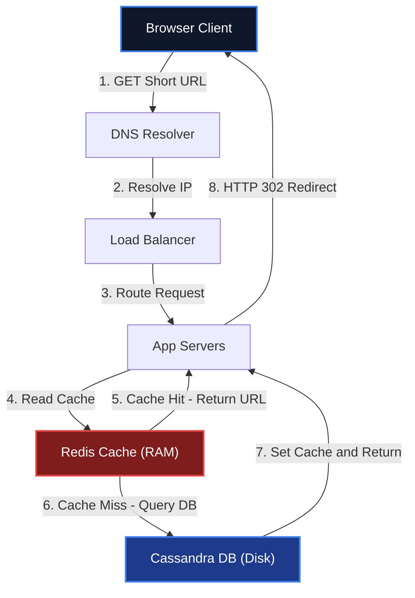
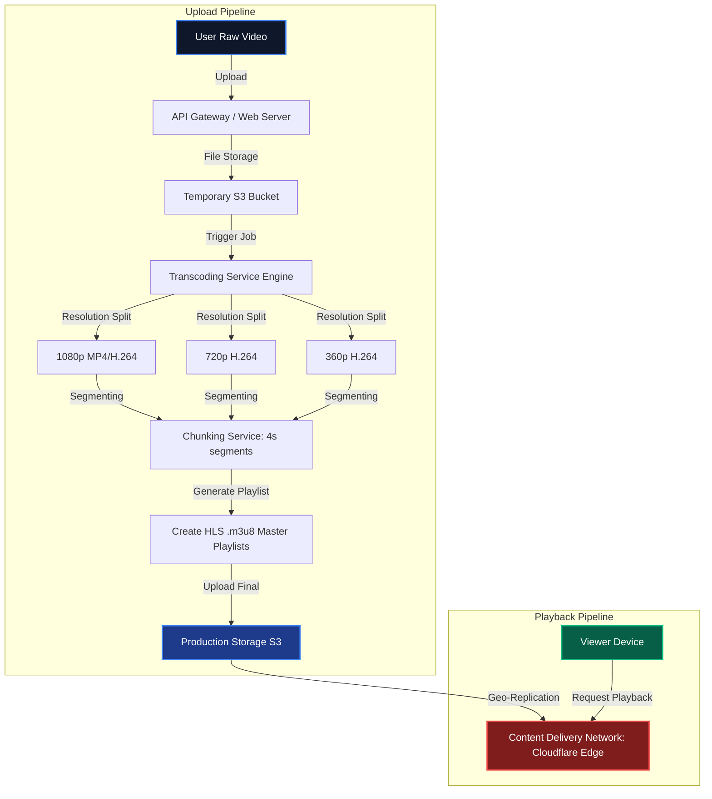
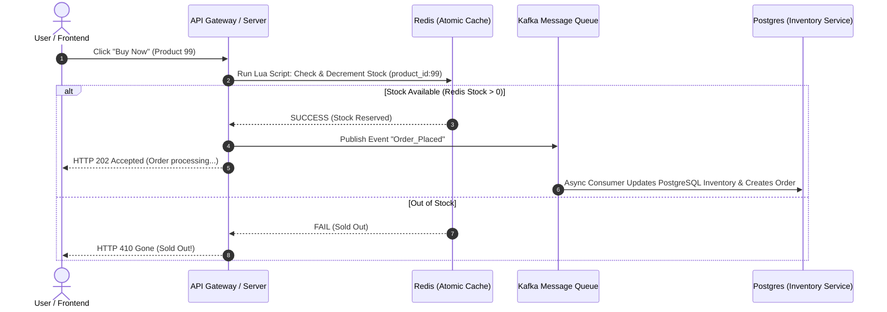
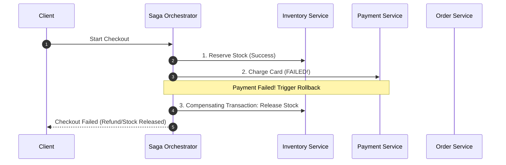
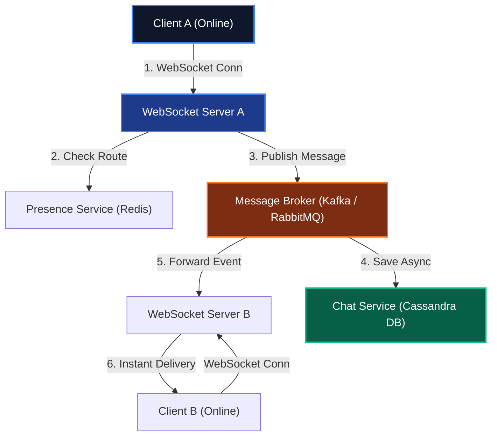

# 🌐 System Design Masterclass: 10-Year Architect Guide

স্বাগতম! এই হ্যান্ডবুকটি কোনো তাত্ত্বিক ডক নয়। এটি ১০+ বছরের রিয়েল-ওয়ার্ল্ড লার্জ স্কেল ডিস্ট্রিবিউটেড সিস্টেম আর্কিটেক্ট করার এক্সপেরিয়েন্স এবং প্রোডাকশন ফেইলিউর থেকে শেখা লেসন বুক। আমরা এখানে ২০টি ক্লাসিক ও মডার্ন সিস্টেম ডিজাইন শিখবো। 

শুধুমাত্র হাই-লেভেল ব্লক ডায়গ্রাম এঁকে আমরা থেমে থাকবো না। প্রতিটা টপিকের পেছনে **কীভাবে চিন্তা করতে হয় (Mental Framework)**, **ক্যালকুলেশন কীভাবে করতে হয় (Back-of-the-envelope Estimation)**, এবং **কোডে কীভাবে রিফ্লেক্ট করতে হয় (Practical Code Snippets)** — সবগুলো আমরা এই ইন্টারেক্টিভ গাইডে কাভার করবো।

---

## 🛠️ The 10-Year Architect's Framework

যেকোনো সিস্টেম ডিজাইন ইন্টারভিউ বা রিয়েল-ওয়ার্ল্ড প্রজেক্ট রিকোয়ারমেন্ট হ্যান্ডেল করার জন্য আমি এই **৫-ধাপের আর্কিটেকচারাল ফ্রেমওয়ার্ক** ব্যবহার করি। এটি আমাদের পুরো হ্যান্ডবুকের কোর স্ট্রাকচার হিসেবে কাজ করবে:


1. **Requirements Gathering (স্কোপ ডিটেকশন):** 
   - **Functional:** সিস্টেমটি কী কী কাজ করবে (যেমন: ইউজার ইউআরএল শর্ট করবে)।
   - **Non-Functional:** সিস্টেমের পারফরম্যান্স টার্গেট কী (High Availability, Low Latency, Read-Heavy vs Write-Heavy)।
2. **Back-of-the-envelope Estimation (ক্যাপাসিটি হিসাব):**
   - কত QPS (Queries Per Second) আসবে?
   - ১০ বছরে কত পিটাবাইট ডেটা স্টোর করতে হবে?
   - ব্যান্ডউইথ রিকোয়ারমেন্ট কেমন হবে?
3. **API & Data Model Design (চুক্তি ও স্কিমা):**
   - এপিআই এন্ডপয়েন্ট ডিজাইন (Input, Output, HTTP Status Codes)।
   - ডাটাবেস স্কিমা (SQL vs NoSQL) এবং কুয়েরি প্যাটার্ন।
4. **High-Level Design (বক্স আর্কিটেকচার):**
   - ক্লায়েন্ট থেকে ডাটাবেস পর্যন্ত এন্ড-টু-এন্ড ট্রাফিক ফ্লো (DNS, Load Balancer, CDN, API Gateway, App Servers, Cache, Database)।
5. **Deep Dive & Scaling Bottlenecks (সিনিয়র লেভেল সল্যুশন):**
   - সিঙ্গেল পয়েন্ট অফ ফেইলিউর (SPOF) রিমুভ করা।
   - ডিস্ট্রিবিউটেড লকিং, ক্যাশ স্ট্যাম্পিড, ডিবি শার্ডিং এবং ডাটা কনসিস্টেন্সি হ্যান্ডলিং।

---

## 📚 Table of Contents: The 20-Chapter Roadmap

আমরা প্রতিটা চ্যাপ্টারকে ইন্টারেক্টিভলি শেষ করবো। নিচের ইনডেক্স থেকে কারেন্ট প্রোগ্রেস ট্র্যাক করতে পারবে:

| Chapter | Topic | Status | Focus Core Concept |
| :--- | :--- | :---: | :--- |
| **01** | [URL Shortener (TinyURL)](#-chapter-01-url-shortener-tinyurl-scale-10b-links) | 🟢 **Active** | Snowflake ID, Base62 Encoding, Redis, DB Indexing |
| **02** | [YouTube & Netflix (Video Streaming)](#-chapter-02-youtube--netflix-video-streaming-platform) | 🟢 **Active** | Transcoding, CDN Edge, HLS/DASH Streaming, Blob Store |
| **03** | [High-Concurrency E-Commerce (Amazon)](#-chapter-03-high-concurrency-e-commerce-system) | 🟢 **Active** | Flash Sales, Redis Distributed Locks, Saga Pattern, Idempotency |
| **04** | [WhatsApp & Messenger](#-chapter-04-whatsapp--messenger-real-time-chat-engine) | 🟢 **Active** | WebSockets, Message Gateway, Cassandra Store, Connection Registry |
| **05** | [Uber & Grab (Ride-Sharing)](#-chapter-05-uber--grab-ride-sharing-geospatial-engine) | 🟢 **Active** | Geospatial Indexing (Geohash/H3), Quadtree, Pub/Sub Engine |
| **06** | Twitter/X (News Feed & Timeline) | 🔒 *Locked* | Fanout-on-write vs Fanout-on-read, Push vs Pull |
| **07** | Ticketmaster (Ticketing Engine) | 🔒 *Locked* | High-Concurrency Booking, Distributed Locking, Queueing System |
| **08** | Google Drive / Dropbox | 🔒 *Locked* | Chunk-based uploads, Metadata Sync, Keep-Alive/Long Polling |
| **09** | Web Crawler (Search Engine Indexer) | 🔒 *Locked* | BFS Graph Traversal, Robots.txt Parser, Deduplication Pipeline |
| **10** | Distributed Notification System | 🔒 *Locked* | Priority Queues (RabbitMQ/Kafka), Rate Limiting, Idempotency |
| **11** | API Gateway & Distributed Rate Limiter | 🔒 *Locked* | Token Bucket Alg, Redis Lua Scripting, Edge Auth Integration |
| **12** | Airbnb (Hotel/Home Booking) | 🔒 *Locked* | Double Booking Prevention, Temporal Querying, Geo-search |
| **13** | Robinhood / Stock Trading Engine | 🔒 *Locked* | Matching Engine, LMAX Disruptor, In-memory State, Low Latency |
| **14** | Distributed Cache (Redis Internals) | 🔒 *Locked* | Replication, Sentinel, Clustering & Partitioning, Eviction (LRU) |
| **15** | Metrics & Monitoring System (Prometheus) | 🔒 *Locked* | Time Series DB (TSDB), Pull vs Push, Metrics Aggregation |
| **16** | Ad Click Aggregator | 🔒 *Locked* | Real-time Streaming, Apache Flink, Kafka, MapReduce |
| **17** | Auto-complete / Typeahead Search | 🔒 *Locked* | Trie Data Structure, Frequency Aggregation, Cache Optimization |
| **18** | Tinder / Geosocial Matchmaker | 🔒 *Locked* | Recommendation Engines, Geopoint Queries, Profile Caching |
| **19** | Distributed Unique ID Generator | 🔒 *Locked* | Snowflake Algorithm, Ticket Server, UUID Collisions |
| **20** | Stripe-like Payment Integration Engine | 🔒 *Locked* | Ledger Reconciliation, Retry Policies, Double Entry Bookkeeping |

> [!TIP]
> আমরা প্রথম ৩টি কোর চ্যাপ্টার সম্পূর্ণ প্রডাকশন-গ্রেড আর্কিটেকচার ও কোডসহ বিস্তারিত নিচে যুক্ত করেছি। পরবর্তী চ্যাপ্টারগুলো আমরা একের পর এক রিয়েল-টাইম আলোচনা করে এবং রিকোয়ারমেন্ট কাস্টমাইজ করে আনলক করবো!

---

## 📖 Chapter 01: URL Shortener (TinyURL) [Scale: 10B Links]

এটি সিস্টেম ডিজাইনের "Hello World"। তবে এর গভীরে গেলে ডিস্ট্রিবিউটেড আইডির চমৎকার ইঞ্জিনিয়ারিং বের হয়ে আসে।

### ১. রিকোয়ারমেন্টস (Scope)
- **Functional:**
  - ইউজার একটি লং ইউআরএল সাবমিট করলে সিস্টেম একটি শর্ট ইউআরএল রিটার্ন করবে (যেমন: `https://tiny.com/aB3x9Z`)।
  - শর্ট ইউআরএলে হিট করলে ইউজার ইনস্ট্যান্টলি আসল লং ইউআরএলে রিডাইরেক্ট হবে।
  - কাস্টম অ্যালিয়াস দিতে পারবে (ঐচ্ছিক)।
  - শর্ট লিংকের এক্সপায়ারি ডেট থাকবে।
- **Non-Functional:**
  - **High Availability:** রিডাইরেকশন কোনোভাবেই ফেইল করা যাবে না (৯৯.৯৯% আপটাইম)।
  - **Low Latency:** রিডাইরেকশন লেটেন্সি < ৫০ মিলি-সেকেন্ড হতে হবে।
  - **Write-Heavy / Read-Heavy:** এটি অত্যন্ত **Read-Heavy** সিস্টেম (Read:Write Ratio = 100:1)।

### ২. Back-of-the-envelope Estimation
ধরুন, আমাদের সিস্টেমে প্রতি মাসে **১০০ মিলিয়ন (100M)** নতুন শর্ট লিংক তৈরি হয়।
- **Write QPS:**
  * `Write QPS = 100,000,000 / (30 days * 24 hours * 3600 seconds) ≈` **40 writes/sec**
- **Read QPS (100:1 Ratio):**
  * `Read QPS = 40 writes/sec * 100 =` **4,000 reads/sec**
- **Storage for 10 Years:**
  প্রতিটি রেকর্ড (Long URL, Short URL, ID, Created_At, Expire_At) এভারেজ ৫০০ বাইট স্টোরেজ নেয়।
  * `Total Records = 100M * 12 months * 10 years =` **12 Billion records**
  * `Total Storage = 12B * 500 bytes ≈` **6 Terabytes**
- **Cache Memory (80-20 Rule):**
  ডেইলি ট্রাফিকের ২০% হট লিংক ক্যাশে রাখবো।
  * `Daily Reads = 4,000 reads/sec * 86,400 seconds ≈` **345 Million reads/day**
  * `Memory Required = 345M * 20% hot links * 500 bytes ≈` **34.5 GB**

### ৩. API & Database Schema Design
আমরা দুটি সিম্পল REST এপিআই ডিজাইন করবো:
- **Create Short Link:**
  `POST /api/v1/shorten`
  ```json
  // Request
  {
    "long_url": "https://medium.com/engineering/how-we-scaled-our-databases-to-10m-users",
    "custom_alias": "dbscale", // Optional
    "expires_at": "2030-01-01T00:00:00Z" // Optional
  }
  // Response (201 Created)
  {
    "short_url": "https://tiny.com/dbscale",
    "short_key": "dbscale"
  }
  ```
- **Redirect Link:**
  `GET /{short_key}` -> HTTP status `302 Found` (Redirect)
  *(নোট: আমরা 301 Permanent Redirect ব্যবহার করবো না, কারণ 302 ব্যবহার করলে প্রতিটা হিট আমাদের ব্যাকএন্ড সার্ভারে আসে, যার ফলে আমরা নিখুঁত ক্লিক অ্যানালিটিক্স ট্র্যাক করতে পারি। 301 দিলে ব্রাউজার নিজের ক্যাশে রেখে দেয় এবং ব্যাকএন্ডে রিকোয়েস্ট আসে না।)*

#### Database Selection & Schema
যেহেতু আমাদের কোনো কমপ্লেক্স রিলেশন বা জয়েন কোয়েরি নেই এবং সিস্টেমে বিলিয়ন বিলিয়ন রো স্টোর হবে, একটি নোএসকিউএল কী-ভ্যালু বা ওয়াইড-কলাম ডাটাবেস (যেমন **Cassandra** বা **DynamoDB**) স্টোরেজ ও হরাইজন্টাল স্কেলিংয়ের জন্য বেস্ট।

```sql
-- Conceptual Schema (Cassandra/Postgres representation)
CREATE TABLE url_mappings (
    short_key VARCHAR(10) PRIMARY KEY,
    long_url VARCHAR(2048) NOT NULL,
    created_at TIMESTAMP,
    expires_at TIMESTAMP,
    user_id VARCHAR(64)
);
```

### ৪. High-Level Architecture
সিস্টেমের হাই-লেভেল ট্রাফিক ফ্লো নিচে চিত্রায়িত করা হলো:



### ৫. Deep Dive: Unique ID / Key Generator Strategy
ইউনিক শর্ট কী (যেমন `aB3x9Z`) কীভাবে জেনারেট করব? এটিই ইন্টারভিউয়ের মূল আকর্ষণ।
আমরা যদি **Base62 Encoding** (`[a-z, A-Z, 0-9]` মোট ৬২টি ক্যারেক্টার) ব্যবহার করি, তবে ৭ ক্যারেক্টারের ইউনিক কী দিয়ে আমরা কতগুলো ইউনিক কম্বিনেশন তৈরি করতে পারবো?
* `62⁷ ≈ 3.5 Trillion unique keys`
যা আমাদের ১০ বছরের টার্গেটের (১২ বিলিয়ন) চেয়ে অনেক বেশি!

#### অপশন A: MD5 / Cryptographic Hash (ফেইলর প্রন)
লং ইউআরএলকে MD5 দিয়ে হ্যাশ করে প্রথম ৭ ক্যারেক্টার নেওয়া।
- **সমস্যা:** হ্যাশ কলিশন (Collision) হবেই। ২ জন ইউজার ভিন্ন ডোমেইন দিলে একই শর্ট কি জেনারেট হতে পারে। এটি হ্যান্ডেল করতে ডাটাবেসে চেক করতে হবে, যা অত্যন্ত স্লো।

#### অপশন B: Base62 Conversion with Auto-Increment (স্কেলিং প্রবলেম)
ডাটাবেসের অটো-ইনক্রিমেন্ট আইডি (যেমন ১, ২, ৩...) নিয়ে তাকে Base62-তে কনভার্ট করা।
- **সমস্যা:** ডিস্ট্রিবিউটেড ডাটাবেসে মাল্টিপল নোড থাকলে অটো-ইনক্রিমেন্ট কনফ্লিক্ট করবে। সিঙ্গেল ডাটাবেস রাখলে রাইট পারফরম্যান্সে Bottleneck তৈরি হবে।

#### অপশন C: Distributed Snowflake ID Generator (Staff Architect Solution)
একটি ডেডিকেটেড আইডি জেনারেট সার্ভিস ব্যবহার করা।
যেমন **Twitter Snowflake** যা ৬৪ বিটের ইউনিক আইডি জেনারেট করে:
- **Timestamp (41 bits):** এপোচ টাইম মিলি-সেকেন্ডে।
- **Machine/Worker ID (10 bits):** ১০২৪টি আলাদা সার্ভার নোড হ্যান্ডেল করতে পারে।
- **Sequence Number (12 bits):** প্রতি সার্ভার প্রতি মিলি-সেকেন্ডে ৪০৯৬টি ইউনিক আইডি তৈরি করতে পারে।

আমরা এই ইউনিক ৬৪-বিট ইন্টিজার আইডিটি জেনারেট করে সরাসরি **Base62**-তে এনকোড করে ফেলবো। যেহেতু আইডি ইউনিক, তাই কোনো ডুপ্লিকেট কি জেনারেট হবে না এবং ডাটাবেস কলিশন চেক করার জিরো ওভারহেড!

### 💻 Practical TypeScript Implementation
নিচে একটি প্রোডাকশন-রেডি Base62 এনকোডার এবং ডিস্ট্রিবিউটেড আইডি কনভার্টার কোড দেওয়া হলো:

```typescript
// utils/base62.ts
export class Base62Encoder {
  private static readonly CHARS = "abcdefghijklmnopqrstuvwxyzABCDEFGHIJKLMNOPQRSTUVWXYZ0123456789";
  private static readonly BASE = 62;

  /**
   * ইন্টিজার আইডিকে Base62 স্ট্রিংয়ে কনভার্ট করে
   */
  public static encode(num: bigint): string {
    if (num === 0n) return this.CHARS[0];
    
    let result = "";
    let temp = num;
    
    while (temp > 0n) {
      const remainder = Number(temp % BigInt(this.BASE));
      result = this.CHARS[remainder] + result;
      temp = temp / BigInt(this.BASE);
    }
    
    return result;
  }

  /**
   * Base62 স্ট্রিংকে ডিকোড করে অরিজিনাল ইন্টিজারে ব্যাক করে
   */
  public static decode(str: string): bigint {
    let result = 0n;
    
    for (let i = 0; i < str.length; i++) {
      const charCodeIndex = this.CHARS.indexOf(str[i]);
      if (charCodeIndex === -1) {
        throw new Error(`Invalid Base62 character: ${str[i]}`);
      }
      result = result * BigInt(this.BASE) + BigInt(charCodeIndex);
    }
    
    return result;
  }
}

// Example usage mimicking Snowflake ID Conversion
const dummySnowflakeId = 17849302919323146n; // 64-bit distributed integer
const shortKey = Base62Encoder.encode(dummySnowflakeId);
console.log(`Generated Short Key: ${shortKey}`); // Output: e.g., 'C4g6yZ'
```

### 🛑 Staff Architect Edge Cases & Scaling Gaps

রিয়েল-ওয়ার্ল্ড লার্জ স্কেল প্রোডাকশনে এই ৩টি ক্রিটিক্যাল এজ কেস ফেস করতে হবে:

#### ১. Clock Skew in Distributed Snowflake Generator
Snowflake ID অ্যালগরিদম প্রতিটি মেশিনের ইন্টারনাল সিস্টেম ক্লকের ওপর নির্ভরশীল। যেহেতু নেটওয়ার্ক সিনক্রোনাইজেশনের জন্য NTP (Network Time Protocol) ব্যাকগ্রাউন্ডে টাইম অ্যাডজাস্ট করে, অনেক সময় সিস্টেমের ঘড়ি পেছনে চলে যেতে পারে (Clock Skew)। ঘড়ি পেছনে গেলে ডুপ্লিকেট আইডি জেনারেট হওয়ার রিস্ক থাকে।
* **মিটিগেশন:** আইডি জেনারেটর কোডে `lastTimestamp` ভ্যারিয়েবল ট্র্যাক রাখতে হবে। যদি বর্তমান টাইমস্ট্যাম্প `lastTimestamp` এর চেয়ে কম হয়, তবে সিস্টেম ক্লক সিঙ্ক হওয়া পর্যন্ত রিকোয়েস্ট ব্লক করে ওয়েট করতে হবে অথবা এরর থ্রো করতে হবে (e.g., `Clock moved backwards. Refusing to generate id`).

#### ২. Custom Alias Collision in High Concurrency
যদি ২ জন ইউজার একই কাস্টম অ্যালিয়াস (যেমন `my-custom-link`) একই মিলি-সেকেন্ডে তৈরি করতে ট্রাই করে, তবে ডাটাবেসে রিকোয়েস্ট যাওয়ার পর কনফ্লিক্ট ধরা পড়বে যা ডাটাবেসকে অতিরিক্ত লক করবে।
* **মিটিগেশন:** **Distributed Lock with Redis SETNX (Set if Not Exists)**। ডাটাবেস রাইট করার আগে আমরা Redis-এ অ্যালিয়াসটির কী দিয়ে একটি শর্ট-লাইভড লক নিবো। 
  `redis.set(alias, "LOCK", "NX", "EX", 5)`
  লক সাকসেসফুল হলে আমরা Cassandra-তে ডেটা রাইট করব। যদি লক ফেইল করে (অর্থাৎ অলরেডি কেউ নিয়ে নিয়েছে), তবে আমরা সাথে সাথেই ডাটাবেসে হিট না করে `409 Conflict` এরর রিটার্ন করব।

#### ৩. Clean-up of Expired Links (Lazy vs Active Expiration)
আমাদের সিস্টেমে ১০ বছরে ১২ বিলিয়ন লিংক জমবে। অনেক লিংকেরই এক্সপায়ারি ডেট ওভার হয়ে যাবে। এগুলো ডাটাবেস থেকে ডিলিট না করলে বিলিয়ন বিলিয়ন ডেড ডেটা স্টোরেজ ও ইনডেক্স মেমোরি নষ্ট করবে।
* **Lazy Expiration (Passive):** যখন কোনো ইউজার কোনো লিংকে ক্লিক করবে, ব্যাকএন্ড লজিক দেখবে সেটির `expires_at < current_time` কিনা। যদি এক্সপায়ার হয়ে থাকে, আমরা সাথে সাথেই ডাটাবেস ও ক্যাশ থেকে এটি ডিলিট করে দিব এবং ইউজারকে `404 Not Found` দেখাবো।
* **Active Expiration (Background Worker):** ডাটাবেসের (যেমন Cassandra) বিল্ট-ইন **TTL (Time To Live)** ফিচার ব্যবহার করা বেস্ট প্র্যাকটিস। এতে ডেটা ইনসার্ট করার সময়ই ডেটা অটোমেটিক এক্সপায়ার হয়ে ডাটাবেস লেয়ারেই ডিলিট হয়ে যায়। কোনো এক্সট্রা ব্যাকগ্রাউন্ড ক্রন জব বা ডিলিট কোয়েরি লেখার প্রয়োজন হয় না।

---

## 📖 Chapter 02: YouTube & Netflix (Video Streaming Platform)

ভিডিও স্ট্রিমিং আর্কিটেকচার সাধারণ ওয়েব অ্যাপের চেয়ে সম্পূর্ণ আলাদা। এখানে রাইট ট্রাফিক (ভিডিও আপলোড) এবং রিড ট্রাফিক (প্লেব্যাক) সম্পূর্ণ ভিন্ন পাইপলাইনে চলে।

### ১. রিকোয়ারমেন্টস (Scope)
- **Functional:**
  - ইউজার ভিডিও আপলোড করতে পারবে।
  - ইউজার যেকোনো ডিভাইসে (মোবাইল, ডেস্কটপ, লো-ব্যান্ডউইথ) স্মুথলি ভিডিও প্লে করতে পারবে।
  - ভিউ কাউন্ট, লাইক, এবং রিয়েল-টাইম কমেন্ট সিস্টেম থাকবে।
- **Non-Functional:**
  - **High Scalability:** লাখ লাখ ইউজার একসাথে ভিডিও দেখবে (High Concurrent Viewers)।
  - **Zero Buffer (Low Latency):** প্লেব্যাক স্টার্ট হতে দেরি হওয়া যাবে না।
  - **Reliable Storage:** হাই-কোয়ালিটি ভিডিও ড্রপ বা লস করা যাবে না।

### ২. Video Transcoding & Playback Pipeline (ভিজুয়ালাইজেশন)

ভিডিও আপলোডের পর র ফাইলটি সরাসরি প্লে করা যায় না। এটিকে শত শত ফরম্যাট ও রেজোলিউশনে কনভার্ট করতে হয়।



### 🎯 Core Architecture Breakdown

#### A. Video Upload & Transcoding (অ্যাসিনক্রোনাস প্রসেস)
1. **Raw Upload:** ইউজার ভিডিও আপলোড করলে তা প্রথমে একটি টেম্পোরারি স্টোরেজে যায়।
2. **Transcoding (ভিডিও রূপান্তর):** র ফাইলটিকে বিভিন্ন বিটরেট (Bitrate) এবং রেজোলিউশনে (360p, 720p, 1080p, 4K) কনভার্ট করা হয়।
3. **Chunking (টুকরো করা):** পুরো ২ ঘন্টার মুভি একসাথে লোড করা বোকামি। আমরা প্রতিটা ভিডিওকে ছোট ছোট ৪-১০ সেকেন্ডের ফিজিক্যাল টুকরো বা **Chunks**-এ বিভক্ত করি।
4. **HLS & DASH (স্ট্রিমিং প্রোটোকল):** 
   - **HLS (HTTP Live Streaming - Apple)** বা **DASH (Dynamic Adaptive Streaming over HTTP)** প্রোটোকল ব্যবহার করা হয়।
   - একটি **Master Manifest file (`.m3u8` বা `.mpd`)** তৈরি করা হয় যা ট্র্যাক রাখে কোন রেজোলিউশনের কোন চঙ্ক ফাইলের পাথ কোথায়।

#### B. Dynamic Playback (Adaptive Bitrate Streaming)
- ক্লায়েন্ট ডিভাইস যখন ভিডিও রিকোয়েস্ট করে, সে প্রথমে `.m3u8` মাস্টার প্লেলিস্ট ফাইলটি লোড করে।
- ব্রাউজার ইউজারের ইন্টারনেটের স্পিড মেপে ডিসিশন নেয় সে কোন চঙ্ক ডাউনলোড করবে।
- স্পিড ভালো থাকলে সে অটোমেটিক `1080p_chunk_001.ts` ফেচ করে। মাঝপথে নেট ড্রপ করলে সে বাফারিং এড়াতে সাথে সাথে পরবর্তী চঙ্ক `360p_chunk_002.ts` রিকোয়েস্ট করে। একেই বলে **Adaptive Bitrate Streaming**।

### 🚀 Senior Scaling Hacks: Netflix Cache System
- **CDN Edge Placement:** নেটফ্লিক্স বা ইউটিউব ক্লাউড থেকে সরাসরি ইউজারকে ভিডিও দেয় না। তারা বিশ্বজুড়ে বিভিন্ন আইএসপি (ISP) অফিসের ভেতরে নিজেদের ক্যাশ স্টোরেজ বা হার্ডওয়্যার বক্স (যেমন **Netflix Open Connect Appliance**) ফ্রিতে বসিয়ে দেয়।
- এর ফলে, আপনার এলাকায় যখন কেউ কোনো পপুলার সিরিজ দেখে, তা সরাসরি আপনার লোকাল আইএসপির ভেতরে থাকা স্টোরেজ থেকে ক্যাশড হয়ে লোড হয়, যার ফলে কোনো ব্যাকবোন ইন্টারনেট ক্যাবল বা স্যাটেলাইট ব্যান্ডউইথ খরচ হয় না এবং বাফারিং লেটেন্সি হয় ০ মিলি-সেকেন্ড!

### 🛑 Staff Architect Edge Cases & Scaling Gaps

ভিডিও স্ট্রিমিং সার্ভিসের প্রোডাকশন এনভায়রনমেন্টে এই ৩টি আর্কিটেকচারাল চ্যালেঞ্জ আসবেই:

#### ১. The Thundering Herd Problem (Origin Shielding)
যখন পপুলার কোনো সিরিজের নতুন এপিসোড রিলিজ হয়, তখন লাখ লাখ ইউজার একসাথে একই ভিডিও প্লে করতে চায়। যেহেতু এটি নতুন ভিডিও, এটি সিডিএন (CDN) এজ পয়েন্টে ক্যাশড থাকবে না। ফলে প্রথম মিলি-সেকেন্ডেই সব রিকোয়েস্ট সিডিএনকে বাইপাস করে সরাসরি মেইন অরিজিন স্টোরেজে (AWS S3) হিট করবে। একে বলে **Thundering Herd** বা **CDN Cache Stampede**। এর ফলে S3-এর ব্যান্ডউইথ এক্সহস্ট হয়ে পুরো সাইট ডাউন হয়ে যাবে।
* **মিটিগেশন A (Origin Shield):** সিডিএন প্রোভাইডারে একটি "Origin Shield" (একটি সেন্ট্রাল প্যারেন্ট সিডিএন লেয়ার) কনফিগার করা। সব এজ পয়েন্ট সরাসরি S3-তে হিট না করে এই অরিজিন শিল্ডে হিট করবে। অরিজিন শিল্ড প্রথম রিকোয়েস্টটি নিয়ে S3 থেকে ফাইল এনে ক্যাশ করবে এবং বাকি লাখ লাখ রিকোয়েস্টকে তার নিজের মেমোরি থেকে রেসপন্স করবে।
* **মিটিগেশন B (Request Collapsing):** অ্যাপ্লিকেশন লেয়ারে মিউচুয়াল এক্সক্লুসিভ লক ব্যবহার করা, যাতে শুধুমাত্র একটি থ্রেড/সার্ভার অরিজিন থেকে ভিডিও চঙ্ক ফেচ করে ক্যাশ আপডেট করে, আর বাকি রিকোয়েস্টগুলো ফাস্ট থ্রেডের ক্যাশ আপডেটের জন্য ওয়েট করে।

#### ২. Playback Heartbeat & Dynamic Resuming State
ইউজার যখন নেটফ্লিক্সে একটি মুভি মাঝপথে বন্ধ করে আবার পরের দিন ওপেন করে, নেটফ্লিক্স ঠিক সেই সেকেন্ড থেকেই মুভিটি প্লে করে। মিলিয়ন মিলিয়ন ইউজারের এই রিয়েল-টাইম পজিশন কীভাবে ট্র্যাক করা হয়?
* **ডিজাইন:** ভিডিও প্লেয়ারে একটি **Heartbeat Event** লুপ থাকে যা প্রতি ১০ সেকেন্ড পর পর প্লেব্যাক অফসেট (যেমন `videoId: 101, offset: 4520 seconds`) ব্যাকএন্ডে পাঠায়। 
* **স্কেলিং:** প্রতি সেকেন্ডে কোটি কোটি হার্টবিট রিকোয়েস্ট সরাসরি মূল ডাটাবেসে (Postgres) রাইট করলে ডাটাবেস ১ সেকেন্ডেই ডাউন হবে। তাই এই হার্টবিট রিকোয়েস্টগুলোকে **Kafka**-তে পুশ করা হয়। কাফকা থেকে অ্যাসিনক্রোনাস কনজিউমার ডেটা নিয়ে অত্যন্ত ফাস্ট ইন-মেমোরি রাইট ডাটাবেসে (যেমন **Redis** বা **Cassandra**) স্টোর করে।

#### ৩. DRM (Digital Rights Management) & Anti-Piracy
নেটফ্লিক্সের কোনো ভিডিও আপনি ব্রাউজারের ডেভেলপার টুল দিয়ে ভিডিও ট্যাগ বা নেটওয়ার্ক ট্যাব থেকে ডাউনলোড করতে পারবেন না, করলেও তা চলবে না। এর কারণ হলো **DRM**।
* **ডিজাইন:** ভিডিওর প্রতিটি ৪ সেকেন্ডের চঙ্ক কনভার্ট করার সময়ই **AES-128** বা তার বেশি কি দিয়ে এনক্রিপ্ট করা হয়। প্লেয়ার যখন চঙ্ক লোড করে, সে দেখে এটি লক করা। তখন প্লেয়ার ব্যাকগ্রাউন্ডে একটি **DRM License Server**-এ সিকিউর টোকেন পাঠিয়ে ডিক্রিপশন কি রিকোয়েস্ট করে। প্লেয়ার ডিরেক্টলি রম বা হার্ডওয়্যার ডিক্রিপশন লেয়ারে (Google Widevine L1, Apple FairPlay, Microsoft PlayReady) কি-টি লোড করে রিয়েল-টাইমে চঙ্ক ডিক্রিপ্ট করে দেখায়। ভিডিও সোর্স ফাইল কখনো ইউজারের ডিভাইসের ডিস্কে আনলকড অবস্থায় সেভ হয় না।

---

## 📖 Chapter 03: High-Concurrency E-Commerce System

ই-কমার্স আর্কিটেকচারের সবচেয়ে কঠিন চ্যালেঞ্জ হলো **Flash Sales (ফ্ল্যাশ সেল)** হ্যান্ডেল করা। যখন ১০টি আইটেমের জন্য ১০ লাখ ইউজার একসাথে বাই বাটনে ক্লিক করে, তখন ডাটাবেসে কনকারেন্ট ট্রানজেকশন সামলানো এবং ডুপ্লিকেট পেমেন্ট ও ওভারসেলিং রোধ করাই আসল কাজ।

### ১. রিকোয়ারমেন্টস (Scope)
- **Functional:**
  - প্রোডাক্ট ক্যাটালগ ও সার্চ।
  - শপিং কার্ট এবং চেকআউট সার্ভিস।
  - ফ্ল্যাশ সেল ও ডিসকাউন্ট হ্যান্ডলিং।
  - পেমেন্ট ও ইনভেন্টরি অটো-আপডেট।
- **Non-Functional:**
  - **Strict Consistency:** ১০টি প্রোডাক্টের জায়গায় কোনোভাবেই ১১টি অর্ডার নেওয়া যাবে না (No Overselling)।
  - **High Concurrency:** ফ্ল্যাশ সেলের সময় লাখ লাখ রিকোয়েস্ট হ্যান্ডেল করা।
  - **Payment Idempotency:** ইউজারের কার্ড থেকে যাতে ২ বার চার্জ না কাটা হয়।

### 🛠️ Flash Sale: Preventing Overselling
যদি আমরা সরাসরি ডাটাবেসে রিড-রাইট করে ইনভেন্টরি চেক করি:
```sql
-- Disaster Prone Transaction
SELECT quantity FROM inventory WHERE product_id = 99; -- Returns 1
-- App server logic: if quantity > 0, then:
UPDATE inventory SET quantity = quantity - 1 WHERE product_id = 99;
```
মাল্টিপল থ্রেড বা সার্ভার নোড একসাথে এটি রান করলে **Race Condition** হবে। একাধিক ইউজার একই ভ্যালু `1` রিড করবে এবং সবাই প্রোডাক্ট কিনে ফেলবে, যার ফলে ইনভেন্টরি মাইনাস হয়ে যাবে (Overselling)।

#### Solution A: Database Optimistic Locking (মাঝারি লোডের জন্য)
```sql
UPDATE inventory 
SET quantity = quantity - 1 
WHERE product_id = 99 AND quantity > 0;
```
এই কুয়েরিতে ডাটাবেস রো-লেভেল লক নিয়ে চেক করবে এবং একের বেশি ওভারসেল হতে দেবে না। তবে ডেটাবেস ডিস্ক কুয়েরি অনেক বেশি স্লো হওয়ায় হাই-কনকারেন্সিতে ডাটাবেস সম্পূর্ণ জ্যাম বা লকআপ হয়ে ক্র্যাশ করবে।

#### Solution B: In-Memory Redis Lua Distributed Lock (Staff Architect Standard)
ডিস্ক ডাটাবেসে হিট করার আগেই আমরা **Redis** ব্যবহার করে মেমোরিতে ইনভেন্টরি চেক ও ডিডাকশন করবো। যেহেতু Redis সিঙ্গেল-থ্রেডেড এবং অত্যন্ত ফাস্ট (>100K ops/sec), আমরা একটি **Atomic Lua Script** দিয়ে চেক ও ডিক্রিমেন্ট একসাথে হ্যান্ডেল করব:



### 💻 Production-Grade Redis Lua Script for Inventory Deduction
এই স্ক্রিপ্টটি Redis মেমোরিতে রান করে এবং রেস কন্ডিশন ছাড়া ১ মিলি-সেকেন্ডে ইনভেন্টরি বুক করে:

```typescript
import Redis from "ioredis";

const redis = new Redis();

/**
 * Atomic Lua script to safety deduct stock in Redis without race conditions
 */
const deductStockLua = `
  local stockKey = KEYS[1]
  local demand = tonumber(ARGV[1])
  
  local currentStock = tonumber(redis.call('get', stockKey))
  
  if not currentStock then
    return -1 -- Code indicating product key not found in Redis
  end
  
  if currentStock >= demand then
    redis.call('decrby', stockKey, demand)
    return currentStock - demand -- Return new remaining stock
  else
    return -2 -- Code indicating insufficient stock
  end
`;

export async function purchaseProduct(productId: string, quantity: number): Promise<boolean> {
  const stockKey = `stock:product:${productId}`;
  
  // Lua script রেজিস্টার ও রান করা (Atomic action)
  const result = await redis.eval(deductStockLua, 1, stockKey, quantity) as number;
  
  if (result >= 0) {
    console.log(`Stock successfully reserved! Remaining: ${result}`);
    // এখানে আমরা Kafka/RabbitMQ কিউতে মেসেজ পুশ করবো ডাটাবেসে অ্যাসিনক্রোনাস রাইটের জন্য
    return true;
  } else if (result === -1) {
    console.error("Error: Product is not loaded in Redis Cache!");
    return false;
  } else {
    console.warn("Out of Stock! Purchase failed.");
    return false;
  }
}
```

### 🛑 Staff Architect Edge Cases & Scaling Gaps

ফ্ল্যাশ সেলের সময় ডুপ্লিকেট পেমেন্ট রোখা এবং মাল্টি-সার্ভিস ডেটা কনসিস্টেন্সি বজায় রাখার জন্য এই ৩টি প্যাটার্ন লাইফ-সেভার:

#### ১. Payment Idempotency (Double Charge Protection)
ফ্ল্যাশ সেলের সময় ইউজারের ইন্টারনেট স্লো থাকলে বা বাই বাটনে ২ বার ক্লিক করলে একই অর্ডারের জন্য ব্যাংক থেকে যাতে ২ বার টাকা কেটে না নেওয়া হয় তা এনশিওর করা অত্যন্ত জরুরি।
* **মিটিগেশন:** **Idempotency Keys**। যখনই ক্লায়েন্ট চেকআউট পেজ লোড করে, ব্যাকএন্ড একটি ইউনিক `idempotency_key` (UUID) জেনারেট করে ক্লায়েন্টকে দেয়। পেমেন্ট গেটওয়ে এপিআই রিকোয়েস্টে এই কি-টি হেডার হিসেবে পাঠানো হয়। পেমেন্ট সার্ভিস চার্জ কাটার আগে Redis-এ এই কি-টি চেক করে।
  * যদি কি-টি প্রথমবার আসে, পেমেন্ট গেটওয়ে চার্জ প্রসেস করে এবং রেজাল্ট Redis-এ সেভ করে (TTL: ২৪ ঘন্টা)।
  * যদি একই মিলি-সেকেন্ডে ২য় রিকোয়েস্ট আসে, Redis দেখে এটি অলরেডি প্রসেসিং-এ আছে, এবং সে ২য় পেমেন্ট এড়াতে সাথে সাথে আগের প্রসেসড রেজাল্ট বা "Processing..." এরর ফেরত দেয়।

#### ২. Distributed Transactions: The Saga Pattern
একটি সফল অর্ডারের পেছনে ৩টি মাইক্রোসার্ভিসের অ্যাকশন জড়িত: Inventory Service (স্টক রিজার্ভেশন), Payment Service (কার্ড চার্জ করা), এবং Order Service (অর্ডার বুক করা)। যেহেতু এরা আলাদা ডাটাবেস ব্যবহার করে, এদের মধ্যে কোনো `SQL BEGIN TRANSACTION` করা সম্ভব নয়।
* **সমাধান (Orchestrator-based Saga):** আমরা একটি **Saga Orchestrator** সার্ভিস ব্যবহার করি। 
  1. Orchestrator প্রথমে Inventory Service-কে বলে স্টক লক করতে। (সাকসেস)
  2. এরপর সে Payment Service-কে বলে কার্ড চার্জ করতে। (ধরা যাক পেমেন্ট ফেইল হলো)
  3. যেহেতু পেমেন্ট ফেইল হয়েছে, Orchestrator একটি **Compensating Transaction** রিলিজ করে। সে Inventory Service-কে ইনস্ট্রাকশন দেয় স্টক রিলিজ করে দিতে এবং Redis ক্যাশ রিব্যাক করতে। এর ফলে পুরো ডিস্ট্রিবিউটেড সিস্টেম কনসিস্টেন্ট থাকে।



#### ৩. Transactional Outbox Pattern & CDC (Redis to DB Sync)
ফ্ল্যাশ সেলের সময় Redis-এ স্টক ডিডাক্ট হওয়ার পর ডাটাবেসে অ্যাসিনক্রোনাসলি ডেটা সিঙ্ক করার জন্য আমরা যদি র্যান্ডম মেসেজ কিউ ব্যবহার করি, তবে অর্ডার সাকসেসফুল কিন্তু ডাটাবেস ডাউন থাকলে মেসেজ হারিয়ে যেতে পারে।
* **সমাধান:** **Transactional Outbox Pattern**। যখন Order Service ডাটাবেসে অর্ডার ক্রিয়েট করে, সে একই ডাটাবেস ট্রানজেকশনে আরেকটি `outbox` টেবিলে একটি ইভেন্ট মেসেজ লিখে (`INSERT INTO outbox`). যেহেতু একই রিলেশনাল ডিবি-র একক ট্রানজেকশনে লেখা হচ্ছে, তাই অর্ডার ক্রিয়েশন এবং আউটবক্সে মেসেজ রাইট ১০০% গ্যারান্টিড। 
* এর পর একটি ব্যাকগ্রাউন্ড **CDC Daemon (Debezium + Kafka)** ডাটাবেসের ট্রানজেকশন লোগ (WAL - Write-Ahead Log) রিড করে ওই আউটবক্স মেসেজটি কাফকাতে পুশ করে, যা ইনভেন্টরি ডাটাবেস ও ক্যাশ সিঙ্ক করতে কনজিউম করা হয়। এতে ডাটাবেস ক্র্যাশ করলেও মেসেজ কখনোই হারায় না।

---

## 📖 Chapter 04: WhatsApp & Messenger (Real-Time Chat Engine)

রিয়েল-টাইম চ্যাট সিস্টেমের আর্কিটেকচার সাধারণ HTTP অ্যাপের চেয়ে একেবারেই আলাদা। এখানে প্রতি সেকেন্ডে লাখ লাখ ইউজারের রিয়েল-টাইম কানেকশন ধরে রাখতে হয় এবং মিলি-সেকেন্ড লেটেন্সিতে মেসেজ ডেলিভারি এনশিওর করতে হয়।

### ১. রিকোয়ারমেন্টস (Scope)
- **Functional:**
  - ওয়ান-টু-ওয়ান মেসেজিং অত্যন্ত কম লেটেন্সিতে (< ১০০ মিলি-সেকেন্ড)।
  - অনলাইন/অফলাইন স্ট্যাটাস ট্র্যাক করা (Presence Service)।
  - মেসেজের ৩টি ক্লাসিক ডেলিভারি স্ট্যাটাস: Sent, Delivered, Read (Ticks)।
  - পারসিস্টেন্ট চ্যাট হিস্ট্রি (অফলাইনেও আগের চ্যাট স্ক্রোল করা যাবে)।
- **Non-Functional:**
  - **Strict Reliability:** কোনো মেসেজ ডিলিট বা লস হওয়া যাবে না।
  - **High Availability:** রিড-রাইট ফ্লো সব সময় আপটাইম থাকতে হবে।
  - **Massive Scale:** ১০০ মিলিয়ন ডেইলি একটিভ ইউজার (DAU) এবং প্রতিদিন ১০ বিলিয়ন মেসেজ হ্যান্ডেল করা।

### ২. Back-of-the-envelope Estimation
* `Message QPS = 10,000,000,000 / 86,400 seconds ≈` **115,000 messages/sec average QPS**
* `Peak QPS = 115,000 * 3 ≈` **345,000 messages/sec**
* `Concurrent Active WebSocket Connections = 100M DAU * 10% peak online ≈` **10 Million concurrent active sockets**
* `Storage for 10 Years (avg message 100 bytes) = 10B * 100 bytes = 1 TB/day`
  * `10-Year Total Storage = 1 TB * 365 days * 10 years ≈` **3.65 Petabytes**
  * যেহেতু ডেটা হেভি রাইট-ইনটেনসিভ এবং ডিরেক্ট `userId` বা `chatId` কুয়েরি করা হবে, নোএসকিউএল ওয়াইড-কলাম ডাটাবেস (যেমন **Cassandra** বা **ScyllaDB**) এখানে পারফেক্ট।

### ৩. API & Database Schema Design
রিয়েল-টাইম মেসেজিংয়ে পোলিং বাদ দিয়ে আমরা **WebSocket** প্রোটোকল ব্যবহার করব, যা ক্লায়েন্ট এবং সার্ভারের মধ্যে একটি দ্বিমুখী (Bidirectional), লং-লিভড টিসিপি কানেকশন বজায় রাখে। 
হিস্ট্রি কোয়েরির জন্য একটি ব্যাকআপ REST API থাকবে:
- `GET /api/v1/messages?chat_id={chat_id}&limit=50` (প্যাজিনেটেড চ্যাট হিস্ট্রি)

#### Database Schema (Cassandra Wide-Column Model)
Cassandra-র স্টোরেজ আর্কিটেকচার ডেটাকে মেমোরিতে (MemTable) রাইট করে সরাসরি ক্রনোলজিক্যালি ডিস্কে (SSTable) সেভ করে, যার ফলে ডিস্কের কোনো র্যান্ডম সিক ছাড়াই এটি বিলিয়ন বিলিয়ন রো লিখতে পারে।

```sql
CREATE TABLE chat_messages (
    chat_id uuid,
    message_id timeuuid, -- Embeds timestamp, Chronological order guarantees
    sender_id uuid,
    content text,
    status varchar, -- 'sent', 'delivered', 'read'
    PRIMARY KEY (chat_id, message_id)
) WITH CLUSTERING ORDER BY (message_id DESC);
```
*(নোট: এখানে `chat_id` হলো **Partition Key**, যা একটি চ্যাটের সব মেসেজকে ফিজিক্যালি একই হার্ডওয়্যার নোডে স্টোর করে। আর `message_id` হলো **Clustering Key**, যা মেসেজগুলোকে সময় অনুযায়ী ডিসেন্ডিং অর্ডারে সর্ট করে রাখে। ফলে চ্যাট লোড করা অত্যন্ত ফাস্ট হয়)।*

### ৪. High-Level Architecture
সিস্টেমের রিয়েল-টাইম মেসেজ রাউটিং ফ্লো নিচে চিত্রায়িত করা হলো:



### 💻 Practical TypeScript Connection Registry Implementation
যেহেতু আমাদের ১০ মিলিয়ন কনকারেন্ট সকেট থাকবে, এগুলোকে কোনো একটি সিঙ্গেল সার্ভারে রাখা সম্ভব নয়। আমাদের ১০০+ গেটওয়ে সার্ভার লাগবে। ইউজার A যখন ইউজার B-কে মেসেজ পাঠাবে, তখন গেটওয়ে A-কে জানতে হবে ইউজার B কোন গেটওয়ে সার্ভারে কানেক্টেড আছে, যাতে মেসেজটি সঠিক নোডে পুশ করা যায়।

নিচে Redis-ভিত্তিক একটি প্রোডাকশন-গ্রেড ডিস্ট্রিবিউটেড **Connection Routing & Presence Registry** কোড দেওয়া হলো:

```typescript
import Redis from "ioredis";

const redis = new Redis();

interface ChatMessage {
  id: string;
  senderId: string;
  receiverId: string;
  content: string;
  timestamp: number;
}

export class MessageGatewayRegistry {
  private static readonly PRESENCE_PREFIX = "presence:user:";
  private static readonly ROUTING_PREFIX = "routing:user:";
  
  private currentServerId: string;

  constructor(serverId: string) {
    this.currentServerId = serverId;
  }

  /**
   * ইউজার গেটওয়েতে কানেক্ট হলে তার অনলাইন স্ট্যাটাস এবং রাউটিং টার্গেট সেট করে
   */
  public async registerUserConnection(userId: string): Promise<void> {
    const multi = redis.multi();
    // Presence set to online with 5 mins TTL (Heartbeat keeps this alive)
    multi.set(`${MessageGatewayRegistry.PRESENCE_PREFIX}${userId}`, "online", "EX", 300);
    // Map user socket to this specific WebSocket gateway server
    multi.set(`${MessageGatewayRegistry.ROUTING_PREFIX}${userId}`, this.currentServerId);
    await multi.exec();
    console.log(`User ${userId} successfully registered on Gateway ${this.currentServerId}`);
  }

  /**
   * ইউজার ডিসকানেক্ট হলে স্ট্যাটাস ডিলিট করে
   */
  public async deregisterUserConnection(userId: string): Promise<void> {
    const multi = redis.multi();
    multi.del(`${MessageGatewayRegistry.PRESENCE_PREFIX}${userId}`);
    multi.del(`${MessageGatewayRegistry.ROUTING_PREFIX}${userId}`);
    await multi.exec();
  }

  /**
   * টার্গেট ইউজার কোন গেটওয়েতে কানেক্টেড আছে তা ট্র্যাক করে
   */
  public async getRouteForUser(userId: string): Promise<string | null> {
    return await redis.get(`${MessageGatewayRegistry.ROUTING_PREFIX}${userId}`);
  }

  /**
   * Redis Pub/Sub এর মাধ্যমে রিয়েল-টাইম মেসেজ সঠিক গেটওয়েতে রিলে করে দেয়
   */
  public async relayMessage(message: ChatMessage): Promise<boolean> {
    const targetServerId = await this.getRouteForUser(message.receiverId);
    
    if (!targetServerId) {
      console.log(`Receiver ${message.receiverId} is offline. Pushing to offline queue.`);
      await this.queueOfflineMessage(message);
      return false;
    }

    // Publish to the specific channel of the target WebSocket Server
    const channelName = `gateway:channel:${targetServerId}`;
    await redis.publish(channelName, JSON.stringify(message));
    console.log(`Message successfully published to ${channelName} for user ${message.receiverId}`);
    return true;
  }

  private async queueOfflineMessage(message: ChatMessage): Promise<void> {
    // অফলাইনে থাকা অবস্থায় মেসেজটি কিউতে অ্যাড করে মোবাইল পুশ নোটিফিকেশন ট্রিগার করা হবে
    await redis.lpush(`offline:queue:user:${message.receiverId}`, JSON.stringify(message));
  }
}
```

### 🛑 Staff Architect Edge Cases & Scaling Gaps

রিয়েল-টাইম চ্যাট স্কেলিংয়ের ক্ষেত্রে প্রোডাকশনে ফেস করা ৩টি অত্যন্ত জঘন্য সমস্যা ও তাদের সিনিয়র লেভেল সমাধান:

#### ১. Operating System Socket Limits & VIP Load Balancing
১০ মিলিয়ন কনকারেন্ট কানেকশনের অর্থ হলো গেটওয়ে সার্ভারগুলোর ওপর ১০ মিলিয়ন লং-লিভড টিসিপি কানেকশন খোলা রাখা। লিনাক্স অপারেটিং সিস্টেমে প্রতি ফিজিক্যাল নোডে বাই-ডিফল্ট ৬৫,৫৩৫ টির বেশি আউটবাউন্ড সকেট কানেকশন হ্যান্ডেল করা যায় না।
* **মিটিগেশন A (Linux OS Kernel Tuning):** লিনাক্স কার্নেল কনফিগারেশনে ফাইল ডেসক্রিপ্টরের লিমিট বাড়াতে হবে। `sysctl` ফাইলে `fs.file-max` লিমিট এবং `nofile` সফট/হার্ড লিমিট ১০ লাখের ওপরে সেট করতে হবে।
* **মিটিগেশন B (Virtual IPs - VIPs):** লোড ব্যালেন্সারে মাল্টিপল ফিজিক্যাল আইপি অ্যাসাইন করা। ক্লায়েন্টদের কানেক্ট করার জন্য আমরা **Consistent Hashing** ব্যবহার করে লোড সমানভাবে ডিস্ট্রিবিউট করব যাতে কোনো নির্দিষ্ট গেটওয়েতে সকেট ক্র্যাশ না হয়।

#### ২. Delivery receipts Storm under High Concurrency
প্রতিটি মেসেজ ডেলিভারির জন্য ৩টি করে টিক (Sent, Delivered, Read) জেনারেট হয়। অর্থাৎ প্রতিদিন ১০ বিলিয়ন মেসেজ পাঠানো হলে সিস্টেমে মোট ৩০ বিলিয়ন এক্সট্রা স্ট্যাটাস আপডেট রাইট ইভেন্ট আসে। এটি সরাসরি ডাটাবেসে বা গেটওয়েতে ট্রানজেক্ট করা হলে পুরো নেটওয়ার্ক থ্রোটল হয়ে যাবে।
* **মিটিগেশন:** **Delivery Receipt Batching & Coalescing**। ক্লায়েন্ট ডিভাইস যখন চ্যাট স্ক্রিন স্ক্রোল করে, সে প্রতি মেসেজে আলাদা রিকোয়েস্ট না পাঠিয়ে ১ সেকেন্ডের বাফারে রিসিপ্ট ডেটা জমা করে (যেমন: "Message 1 to 50 are Read")। তারপর সিঙ্গেল রিকোয়েস্ট পাঠিয়ে ডাটাবেসে বাল্ক আপডেট করে। এতে ডাটাবেসের রাইট অপারেশন ৩০ বিলিয়ন থেকে কমে মাত্র ৩০০ মিলিয়নে নেমে আসে!

#### ৩. Hotspots in Cassandra Partitioning (Massive Group Chats)
যদি ১০,০০০ মেম্বার বিশিষ্ট কোনো পপুলার গ্রুপ চ্যাটে মেসেজ আদান-প্রদান হতে থাকে, তবে `chat_id` পার্টিকুলারলি একটি ডাটাবেস পার্টিকপ্ট নোডের ওপর চরম চাপ তৈরি করবে। Cassandra-র একটি ফিজিক্যাল পার্টিকপ্ট সাধারণত ১০০MB-এর বেশি হলে পারফরম্যান্স কড়া শুরু করে।
* **মিটিগেশন (Partition Key Salting):** আমরা `chat_id` এর সাথে একটি বাকেট ভ্যালু যুক্ত করব (যেমন `chat_id + bucket_id`), যেখানে `bucket_id` হবে `timestamp / 1-hour` অথবা একটি সাইক্লিক কাউন্টার `(1 to 10)`। এর ফলে একই গ্রুপের মেসেজগুলো ডাটাবেসের আলাদা আলাদা ফিজিক্যাল ডিস্ক ব্লকে ডিস্ট্রিবিউট হয়ে যাবে এবং ডাটাবেস বটলনেক সম্পূর্ণ ভ্যানিশ হয়ে যাবে।

---

## 📖 Chapter 05: Uber & Grab (Ride-Sharing Geospatial Engine)

রাইড-শেয়ারিং সিস্টেমের মূল কারিগরি চ্যালেঞ্জ হলো প্রতি সেকেন্ডে লাখ লাখ ড্রাইভারের দ্রুত পরিবর্তনশীল ভৌগলিক অবস্থান (Geolocation) রিয়েল-টাইমে ট্র্যাক করা এবং কোনো রাইডার রিকোয়েস্ট পাঠালে ১ কিলোমিটারের মধ্যে থাকা পারফেক্ট ড্রাইভারটিকে ৫০ মিলি-সেকেন্ডের মধ্যে খুঁজে বের করা।

### ১. রিকোয়ারমেন্টস (Scope)
- **Functional:**
  - ড্রাইভাররা প্রতি ৪ সেকেন্ড পর পর তাদের রিয়েল-টাইম জিপিএস স্থানাঙ্ক (Latitude, Longitude) ব্যাকএন্ডে পাঠাবে।
  - রাইডাররা তাদের চারপাশের ৩ কিলোমিটার ব্যাসার্ধের মধ্যে থাকা সব এভেইলেবল ড্রাইভার রিয়েল-টাইমে ম্যাপে দেখতে পাবে।
  - রাইডার রাইড রিকোয়েস্ট করলে সিস্টেম সবচেয়ে কাছের ড্রাইভারকে তার সাথে ট্রিপ ম্যাচ করিয়ে দেবে।
- **Non-Functional:**
  - **Ultra-low Latency:** ড্রাইভার ম্যাচিং এবং সার্চ কুয়েরি অত্যন্ত ফাস্ট হতে হবে (< ৫০ মিলি-সেকেন্ড)।
  - **High Scalability:** ১ মিলিয়ন একটিভ ড্রাইভারের সেকেন্ডে লাখ লাখ জিপিএস আপডেট এবং ১০ মিলিয়ন একটিভ রাইডারের কনকারেন্ট কুয়েরি হ্যান্ডেল করা।
  - **Strict Consistency (Match Lock):** একই ড্রাইভার যাতে একসাথে ২ জন রাইডারের সাথে ম্যাচ না হয়ে যায় (No Double-Booking)।

### ২. Back-of-the-envelope Estimation
* `Driver Location Write QPS = 1,000,000 active drivers / 4 seconds =` **250,000 writes/sec**
* `Rider Search Query QPS = 10,000,000 riders / 8 seconds map updates =` **1,250,000 reads/sec**
* `Location Update Size = driver_id (16 bytes) + latitude (8 bytes) + longitude (8 bytes) = 32 bytes`
* `Network Write Bandwidth = 250,000 * 32 bytes ≈` **8 MB/sec**
* **Memory Requirement (Redis Cache):** 
  * মেমরিতে ১ মিলিয়ন ড্রাইভারের জিপিএস ডেটা স্টোর করতে সাইজ হবে: `1,000,000 * 100 bytes (Redis overhead সহ) ≈` **100 MB RAM**। এটি অত্যন্ত ছোট, তাই সম্পূর্ণ লাইভ ডেটা রেডিসে সুপার-ফাস্ট স্টোর করা সম্ভব।

### ৩. API & Database Schema Design
যেহেতু জিপিএস রাইট অপারেশন প্রতি সেকেন্ডে ২৫০K বার ঘটে, প্রথাগত HTTP ওভারহেড এড়াতে ড্রাইভার ডিভাইসগুলো **WebSocket** অথবা লাইটওয়েট **UDP/TCP Stream** ব্যবহার করবে। 
রাইডারদের জন্য এপিআই থাকবে:
- `GET /api/v1/nearby?lat=23.7561&lng=90.3762&radius=3000` (৩ কিমি ব্যাসার্ধের ড্রাইভার সার্চ)

#### Database Selection: SQL vs NoSQL Spatial Indexes
ডিস্ক-ভিত্তিক ডাটাবেস (যেমন PostgreSQL PostGIS) ২৫০K QPS রাইট সামলাতে সম্পূর্ণ ক্র্যাশ করবে। তাই লাইভ ট্র্যাকিংয়ের জন্য আমরা **In-memory Redis Geospatial Index (GEOADD, GEORADIUS)** ব্যবহার করব।
কমপ্লিটেড ট্রিপ ডেটা এবং বিলিং হিস্ট্রি ব্যাকআপের জন্য রিলেশনাল ডাটাবেস (PostgreSQL) ব্যবহার করা হবে।

### ৪. High-Level Architecture
ভৌগলিক ট্রাফিক ফ্লো নিচে চিত্রায়িত করা হলো:


### 💻 Practical TypeScript Geospatial Engine Implementation
নিচে `ioredis` ব্যবহার করে ড্রাইভারদের লোকেশন আপডেট এবং ৩ কিমি ব্যাসার্ধের এভেইলেবল ড্রাইভার খুঁজে বের করার জন্য একটি প্রোডাকশন-রেডি **Geospatial Tracking Engine** কোড দেওয়া হলো:

```typescript
import Redis from "ioredis";

const redis = new Redis();

interface Coordinate {
  latitude: number;
  longitude: number;
}

interface NearbyDriver {
  driverId: string;
  latitude: number;
  longitude: number;
  distanceInMeters: number;
}

export class GeoLocationEngine {
  private static readonly GEO_KEY = "active:drivers:location";

  /**
   * ড্রাইভারের লাইভ লোকেশন রেডিস জিও-ইনডেক্সে আপডেট করে
   * Redis internally encodes (latitude, longitude) into a 52-bit Geohash integer
   */
  public async updateDriverLocation(driverId: string, lat: number, lng: number): Promise<void> {
    // GEOADD takes key, longitude, latitude, memberId
    await redis.geoadd(GeoLocationEngine.GEO_KEY, lng, lat, driverId);
  }

  /**
   * ড্রাইভার অফলাইনে গেলে ইনডেক্স থেকে মুছে ফেলে
   */
  public async removeOfflineDriver(driverId: string): Promise<void> {
    await redis.zrem(GeoLocationEngine.GEO_KEY, driverId);
  }

  /**
   * রাইডারের ৩ কিলোমিটারের ভেতরে থাকা এভেইলেবল ড্রাইভারদের দূরত্বসহ সর্ট করে নিয়ে আসে
   */
  public async findNearbyDrivers(
    riderLat: number,
    riderLng: number,
    radiusInMeters: number,
    limit = 10
  ): Promise<NearbyDriver[]> {
    // GEORADIUS fetches members with distance and raw coordinates sorted ascendingly
    const results = await redis.georadius(
      GeoLocationEngine.GEO_KEY,
      riderLng,
      riderLat,
      radiusInMeters,
      "m", // meters
      "WITHDIST",
      "WITHCOORD",
      "ASC", // closest first
      "COUNT", limit
    ) as any[];

    return results.map((item) => {
      const [driverId, distance, [lngStr, latStr]] = item;
      return {
        driverId,
        distanceInMeters: parseFloat(distance),
        latitude: parseFloat(latStr),
        longitude: parseFloat(lngStr),
      };
    });
  }
}
```

### 🛑 Staff Architect Edge Cases & Scaling Gaps

বাস্তব জীবনের মিলিয়ন-ইউজার স্কেলে রাইড ম্যাচিং ইঞ্জিনে এই ৩টি ক্রিটিক্যাল আর্কিটেকচারাল প্রবলেম আসে:

#### ১. The Grid Boundary Problem (Geohash vs Hexagonal H3 Grid)
**Geohash** পৃথিবীকে আয়তাকার (Rectangle) গ্রিডে ভাগ করে। যদি কোনো রাইডার ঠিক গ্রিডের সীমানায় (Edge/Boundary) দাঁড়িয়ে থাকে এবং কোনো ড্রাইভার তার থেকে মাত্র ৫ মিটার দূরে অন্য পাশের গ্রিডে থাকে, Geohash কুয়েরি তাকে মিস করে যাবে।
* **মিটিগেশন (H3 Hexagonal Grid):** উবার এই সমস্যাটি দূর করতে **H3 Spatial Indexing (Hexagonal Hierarchical Spatial Index)** তৈরি করে। হেক্সাগন বা ষড়ভুজের ক্ষেত্রে কেন্দ্র থেকে তার প্রতিটি প্রতিবেশী কোণের দূরত্ব একদম সমান। এর ফলে বাউন্ডারি প্রবলেম সম্পূর্ণ দূর হয় এবং নিখুঁতভাবে চারপাশের ড্রাইভারদের ডিটেক্ট করা যায়।

#### ২. Write Saturation of Redis (Hotspots on Single CPU Core)
যেহেতু Redis সিঙ্গেল-থ্রেডেড, সেকেন্ডে ২৫০,০০০ রাইট রিকোয়েস্ট যদি একটি মাত্র Redis Key (`active:drivers:location`) এর ওপরে যায়, তবে প্রসেসরের একটিコア ১০০% বিজি হয়ে ক্র্যাশ করবে।
* **মিটিগেশন (Geographical Sharding):** ড্রাইভারদের লোকেশন সারা বিশ্বের একটি কিতে সেভ না করে আমরা Geohash এর প্রথম ৪ ক্যারেক্টার দিয়ে কি শার্ডিং করব। যেমন, ঢাকার সব ড্রাইভারের ডেটা যাবে `location:shard:dhaka` আর চট্রগ্রামের ডেটা যাবে `location:shard:ctg` শ্যার্ডে। এতে লোড মাল্টিপল নোডে ডিস্ট্রিবিউট হয়ে যাবে এবং Redis ক্লাস্টার সেকেন্ডে মিলিয়ন রাইট অনায়াসে সামলাতে পারবে।

#### ৩. The Double-Booking Race Condition (Ride Matching Lock)
একই এলাকায় দুজন রাইডার একই মিলি-সেকেন্ডে "Request Ride" বাটনে ক্লিক করলে সিস্টেম যদি তাদের দুজনকে একই ফ্রি ড্রাইভারের কাছে পাঠায়, তবে ড্রাইভার কনফিউজড হবে এবং সিস্টেমে কনফ্লিক্ট দেখা দেবে।
* **মিটিগেশন:** **Atomic Distributed Lock (Redlock)**। রাইড ম্যাচিং ইঞ্জিন যখনই কোনো ড্রাইভারকে কোনো রাইডারের সাথে এসোসিয়েট করার প্রসেস শুরু করবে, সে সাথে সাথে Redis-এ ওই ড্রাইভারের আইডির বিপরীতে একটি ক্ষণস্থায়ী ডিস্ট্রিবিউটেড লক নেবে:
  `redis.set("driver:lock:" + driverId, "LOCKED", "NX", "EX", 10)`
  লকটি সফল হলেই কেবল ড্রাইভারকে অফার পাঠানো হবে। লক ফেইল হলে ম্যাচ মেকার অন্য আরেকটি কাছাকাছি ড্রাইভারকে সাথে সাথেই সিলেক্ট করে নেবে।

---

## 🔒 Chapters 06 - 20: Syllabus Blueprint (Ready to Unlock)

বাকি ১৫টি চ্যাপ্টার সম্পূর্ণ ইন্টারেক্টিভ লার্নিংয়ের জন্য সাজানো হয়েছে। আপনি যে টপিকটি শিখতে চান, জাস্ট আমাকে মেনশন করলেই আমরা সেটির রিকোয়ারমেন্ট অ্যানালাইসিস, ক্যাপাসিটি ক্যালকুলেশন, মারমেইড আর্কিটেকচার ডায়াগ্রাম এবং প্র্যাক্টিক্যাল কোডসহ ডিপ-ডাইভ করে চ্যাপ্টারটি আনলক করে ফেলবো!

যেমন:
- **চ্যাপ্টার ০৬ (Twitter):** জানবো কেন সেলিব্রিটিদের টুইট ফিড এবং আমাদের নরমাল ইউজারদের টুইট ফিড তৈরিতে সম্পূর্ণ আলাদা **Push vs Pull (Fanout)** আর্কিটেকচার ব্যবহার করতে হয়।
- **চ্যাপ্টার ০৭ (Ticketmaster):** বুঝবো কীভাবে হাই-কনকারেন্ট বুকিং সিস্টেমে বুকিং টিকিট হোল্ড করতে হয় এবং ডাবল টিকিট সেল রোধ করতে হয়।

---

> **💡 পরবর্তী অ্যাকশন:** অভিনন্দন, আমরা সফলভাবে **Chapter 05 (Uber & Grab Ride-Sharing Geospatial Engine)** আনলক করে ফেলেছি! আমরা কি এখন আমাদের রোডম্যাপ অনুযায়ী **Chapter 06 (Twitter/X Feed & Fanout Engine)** নিয়ে ডিপ-ডাইভ শুরু করবো, নাকি এর বাইরে অন্য কোনো টপিক আনলক করতে চান? Let's discuss and design!
