# 🌐 System Design Masterclass: 10-Year Architect Guide

স্বাগতম! এই হ্যান্ডবুকটি কোনো তাত্ত্বিক ডক নয়। এটি ১০+ বছরের রিয়েল-ওয়ার্ল্ড লার্জ স্কেল ডিস্ট্রিবিউটেড সিস্টেম আর্কিটেক্ট করার এক্সপেরিয়েন্স এবং প্রোডাকশন ফেইলিউর থেকে শেখা লেসন বুক। আমরা এখানে ২০টি ক্লাসিক ও মডার্ন সিস্টেম ডিজাইন শিখবো। 

শুধুমাত্র হাই-লেভেল ব্লক ডায়গ্রাম এঁকে আমরা থেমে থাকবো না। প্রতিটা টপিকের পেছনে **কীভাবে চিন্তা করতে হয় (Mental Framework)**, **ক্যালকুলেশন কীভাবে করতে হয় (Back-of-the-envelope Estimation)**, এবং **কোডে কীভাবে রিফ্লেক্ট করতে হয় (Practical Code Snippets)** — সবগুলো আমরা এই ইন্টারেক্টিভ গাইডে কাভার করবো।

---

## 🛠️ The 10-Year Architect's Framework

যেকোনো সিস্টেম ডিজাইন ইন্টারভিউ বা রিয়েল-ওয়ার্ল্ড প্রজেক্ট রিকোয়ারমেন্ট হ্যান্ডেল করার জন্য আমি এই **৫-ধাপের আর্কিটেকচারাল ফ্রেমওয়ার্ক** ব্যবহার করি। এটি আমাদের পুরো হ্যান্ডবুকের কোর স্ট্রাকচার হিসেবে কাজ করবে:


```mermaid
flowchart LR
    R[1. Requirements & Scope] --> E[2. Capacity Estimation]
    E --> A[3. API Design & Schema]
    A --> H[4. High-Level Design]
    H --> D[5. Deep Dive & Scaling]
    
    style R fill:#0f172a,stroke:#3b82f6,stroke-width:2px,color:#fff
    style E fill:#0f172a,stroke:#3b82f6,stroke-width:2px,color:#fff
    style A fill:#0f172a,stroke:#3b82f6,stroke-width:2px,color:#fff
    style H fill:#0f172a,stroke:#10b981,stroke-width:2px,color:#fff
    style D fill:#7c2d12,stroke:#f97316,stroke-width:2px,color:#fff
```

1. **Requirements Gathering (স্কোপ ডিটেকশন):** 
   - **Functional:** সিস্টেমটি কী কী কাজ করবে (যেমন: ইউজার ইউআরএল শর্ট করবে)।
   - **Non-Functional:** সিস্টেমের পারফরম্যান্স টার্গেট কী (High Availability, Low Latency, Read-Heavy vs Write-Heavy)।
2. **Back-of-the-envelope Estimation (ক্যাপাসিটি হিসাব):**
   - কত QPS (Queries Per Second) আসবে?
   - ১০ বছরে কত পিটাবাইট ডেটা স্টোর করতে হবে?
   - ব্যান্ডউইথ রিকোয়ারমেন্ট কেমন হবে?
3. **API & Data Model Design (চুক্তি ও স্কিমা):**
   - এপিআই এন্ডপয়েন্ট ডিজাইন (Input, Output, HTTP Status Codes)।
   - ডাটাবেস স্কিমা (SQL vs NoSQL) এবং কুয়েরি প্যাটার্ন।
4. **High-Level Design (বক্স আর্কিটেকচার):**
   - ক্লায়েন্ট থেকে ডাটাবেস পর্যন্ত এন্ড-টু-এন্ড ট্রাফিক ফ্লো (DNS, Load Balancer, CDN, API Gateway, App Servers, Cache, Database)।
5. **Deep Dive & Scaling Bottlenecks (সিনিয়র লেভেল সল্যুশন):**
   - সিঙ্গেল পয়েন্ট অফ ফেইলিউর (SPOF) রিমুভ করা।
   - ডিস্ট্রিবিউটেড লকিং, ক্যাশ স্ট্যাম্পিড, ডিবি শার্ডিং এবং ডাটা কনসিস্টেন্সি হ্যান্ডলিং।

---

## 📚 Table of Contents: The 20-Chapter Roadmap

আমরা প্রতিটা চ্যাপ্টারকে ইন্টারেক্টিভলি শেষ করবো। নিচের ইনডেক্স থেকে কারেন্ট প্রোগ্রেস ট্র্যাক করতে পারবে:

| Chapter | Topic | Status | Focus Core Concept |
| :--- | :--- | :---: | :--- |
| **01** | [URL Shortener (TinyURL)](#-chapter-01-url-shortener-tinyurl-scale-10b-links) | 🟢 **Active** | Snowflake ID, Base62 Encoding, Redis, DB Indexing |
| **02** | [YouTube & Netflix (Video Streaming)](#-chapter-02-youtube--netflix-video-streaming-platform) | 🟢 **Active** | Transcoding, CDN Edge, HLS/DASH Streaming, Blob Store |
| **03** | [High-Concurrency E-Commerce (Amazon)](#-chapter-03-high-concurrency-e-commerce-system) | 🟢 **Active** | Flash Sales, Redis Distributed Locks, Saga Pattern, Idempotency |
| **04** | [WhatsApp & Messenger](#-chapter-04-whatsapp--messenger-real-time-chat-engine) | 🟢 **Active** | WebSockets, Message Gateway, Cassandra Store, Connection Registry |
| **05** | [Uber & Grab (Ride-Sharing)](#-chapter-05-uber--grab-ride-sharing-geospatial-engine) | 🟢 **Active** | Geospatial Indexing (Geohash/H3), Quadtree, Pub/Sub Engine |
| **06** | [Twitter/X (News Feed & Timeline)](#-chapter-06-twitterx-news-feed--timeline-fanout-engine) | 🟢 **Active** | Fanout-on-write vs Fanout-on-read, Push vs Pull |
| **07** | [Ticketmaster (Ticketing Engine)](#-chapter-07-ticketmaster-high-concurrency-booking-engine) | 🟢 **Active** | High-Concurrency Booking, Distributed Locking, Queueing System |
| **08** | [Google Drive / Dropbox](#-chapter-08-google-drive--dropbox-distributed-file-storage-engine) | 🟢 **Active** | Chunk-based uploads, Metadata Sync, Keep-Alive/Long Polling |
| **09** | [Web Crawler (Search Engine Indexer)](#-chapter-09-web-crawler-search-engine-indexer) | 🟢 **Active** | BFS Graph Traversal, Robots.txt Parser, Deduplication Pipeline |
| **10** | [Distributed Notification System](#-chapter-10-distributed-notification-system) | 🟢 **Active** | Priority Queues (RabbitMQ/Kafka), Rate Limiting, Idempotency |
| **11** | [API Gateway & Distributed Rate Limiter](#-chapter-11-api-gateway--distributed-rate-limiter) | 🟢 **Active** | Token Bucket Alg, Redis Lua Scripting, Edge Auth Integration |
| **12** | [Airbnb (Hotel/Home Booking)](#-chapter-12-airbnb-hotelhome-booking) | 🟢 **Active** | Double Booking Prevention, Temporal Querying, Geo-search |
| **13** | [Robinhood / Stock Trading Engine](#-chapter-13-robinhood--stock-trading-engine) | 🟢 **Active** | Matching Engine, LMAX Disruptor, In-memory State, Low Latency |
| **14** | [Distributed Cache (Redis Internals)](#-chapter-14-distributed-cache-redis-internals) | 🟢 **Active** | Replication, Sentinel, Clustering & Partitioning, Eviction (LRU) |
| **15** | [Metrics & Monitoring System (Prometheus)](#-chapter-15-metrics-monitoring-system-time-series-database-pullbased-architecture) | 🟢 **Active** | Time Series DB (TSDB), Gorilla Compression, WAL, Scrape Engine |
| **16** | [Ad Click Aggregator](#-chapter-16-ad-click-aggregator-big-data-stream-processing-aggregation) | 🟢 **Active** | Real-time Streaming, Sliding Window Aggregates, MapReduce, Gorilla Engine |
| **17** | [Distributed Message Queue (Kafka-style)](#-chapter-17-distributed-message-queue-kafkastyle) | 🟢 **Active** | Commit Log, Segment Indices, Zero-Copy sendfile, KRaft Controller |
| **18** | [Distributed Rate Limiter](#-chapter-18-distributed-rate-limiter) | 🟢 **Active** | Token Bucket, Weighted Sliding Counter, Redis Lua, Clock Drift |
| **19** | [Real-Time Gaming Leaderboard](#-chapter-19-realtime-gaming-leaderboard) | 🟢 **Active** | Redis Skip Lists, ZSET, Secondary Tie-Breaker Sorting, Write Deduplication |
| **20** | [Distributed ID Generator (Snowflake-style)](#-chapter-20-distributed-id-generator-snowflakestyle) | 🟢 **Active** | Snowflake 64-bit Assembly, Bitwise Shift, Worker ID Leasing, Clock Drift |

> [!TIP]
> আমরা হ্যান্ডবুকের ২০টি চ্যাপ্টারই সম্পূর্ণ প্রডাকশন-গ্রেড আর্কিটেকচার, ব্যাক-অফ-দ্য-এনভেলপ ক্যাপাসিটি ক্যালকুলেশন, মারমেইড ডায়াগ্রাম এবং প্র্যাক্টিক্যাল কোডসহ সফলভাবে সম্পন্ন করেছি!

---

## 📖 Chapter 01: URL Shortener (TinyURL) [Scale: 10B Links]

এটি সিস্টেম ডিজাইনের "Hello World"। তবে এর গভীরে গেলে ডিস্ট্রিবিউটেড আইডির চমৎকার ইঞ্জিনিয়ারিং বের হয়ে আসে।

### ১. রিকোয়ারমেন্টস (Scope)
- **Functional:**
  - ইউজার একটি লং ইউআরএল সাবমিট করলে সিস্টেম একটি শর্ট ইউআরএল রিটার্ন করবে (যেমন: `https://tiny.com/aB3x9Z`)।
  - শর্ট ইউআরএলে হিট করলে ইউজার ইনস্ট্যান্টলি আসল লং ইউআরএলে রিডাইরেক্ট হবে।
  - কাস্টম অ্যালিয়াস দিতে পারবে (ঐচ্ছিক)।
  - শর্ট লিংকের এক্সপায়ারি ডেট থাকবে।
- **Non-Functional:**
  - **High Availability:** রিডাইরেকশন কোনোভাবেই ফেইল করা যাবে না (৯৯.৯৯% আপটাইম)।
  - **Low Latency:** রিডাইরেকশন লেটেন্সি < ৫০ মিলি-সেকেন্ড হতে হবে।
  - **Write-Heavy / Read-Heavy:** এটি অত্যন্ত **Read-Heavy** সিস্টেম (Read:Write Ratio = 100:1)।

### ২. Back-of-the-envelope Estimation
ধরুন, আমাদের সিস্টেমে প্রতি মাসে **১০০ মিলিয়ন (100M)** নতুন শর্ট লিংক তৈরি হয়।
- **Write QPS:**
  * `Write QPS = 100,000,000 / (30 days * 24 hours * 3600 seconds) ≈` **40 writes/sec**
- **Read QPS (100:1 Ratio):**
  * `Read QPS = 40 writes/sec * 100 =` **4,000 reads/sec**
- **Storage for 10 Years:**
  প্রতিটি রেকর্ড (Long URL, Short URL, ID, Created_At, Expire_At) এভারেজ ৫০০ বাইট স্টোরেজ নেয়।
  * `Total Records = 100M * 12 months * 10 years =` **12 Billion records**
  * `Total Storage = 12B * 500 bytes ≈` **6 Terabytes**
- **Cache Memory (80-20 Rule):**
  ডেইলি ট্রাফিকের ২০% হট লিংক ক্যাশে রাখবো।
  * `Daily Reads = 4,000 reads/sec * 86,400 seconds ≈` **345 Million reads/day**
  * `Memory Required = 345M * 20% hot links * 500 bytes ≈` **34.5 GB**

### ৩. API & Database Schema Design
আমরা দুটি সিম্পল REST এপিআই ডিজাইন করবো:
- **Create Short Link:**
  `POST /api/v1/shorten`
  ```json
  // Request
  {
    "long_url": "https://medium.com/engineering/how-we-scaled-our-databases-to-10m-users",
    "custom_alias": "dbscale", // Optional
    "expires_at": "2030-01-01T00:00:00Z" // Optional
  }
  // Response (201 Created)
  {
    "short_url": "https://tiny.com/dbscale",
    "short_key": "dbscale"
  }
  ```
- **Redirect Link:**
  `GET /{short_key}` -> HTTP status `302 Found` (Redirect)
  *(নোট: আমরা 301 Permanent Redirect ব্যবহার করবো না, কারণ 302 ব্যবহার করলে প্রতিটা হিট আমাদের ব্যাকএন্ড সার্ভারে আসে, যার ফলে আমরা নিখুঁত ক্লিক অ্যানালিটিক্স ট্র্যাক করতে পারি। 301 দিলে ব্রাউজার নিজের ক্যাশে রেখে দেয় এবং ব্যাকএন্ডে রিকোয়েস্ট আসে না।)*

#### Database Selection & Schema
যেহেতু আমাদের কোনো কমপ্লেক্স রিলেশন বা জয়েন কোয়েরি নেই এবং সিস্টেমে বিলিয়ন বিলিয়ন রো স্টোর হবে, একটি নোএসকিউএল কী-ভ্যালু বা ওয়াইড-কলাম ডাটাবেস (যেমন **Cassandra** বা **DynamoDB**) স্টোরেজ ও হরাইজন্টাল স্কেলিংয়ের জন্য বেস্ট।

```sql
-- Conceptual Schema (Cassandra/Postgres representation)
CREATE TABLE url_mappings (
    short_key VARCHAR(10) PRIMARY KEY,
    long_url VARCHAR(2048) NOT NULL,
    created_at TIMESTAMP,
    expires_at TIMESTAMP,
    user_id VARCHAR(64)
);
```

### ৪. High-Level Architecture
সিস্টেমের হাই-লেভেল ট্রাফিক ফ্লো নিচে চিত্রায়িত করা হলো:

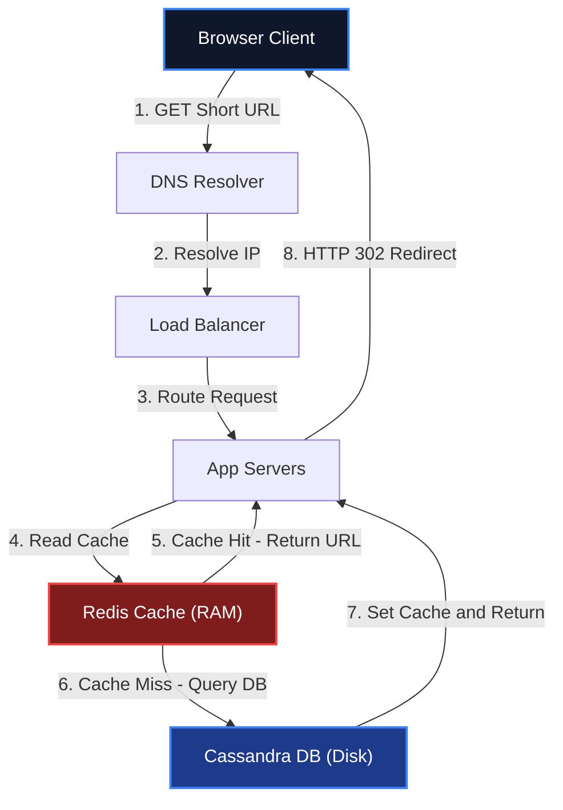
```mermaid
flowchart TD
    BrowserClient["Browser Client"] -->|1. GET Short URL| DNSResolver["DNS Resolver"]
    DNSResolver -->|2. Resolve IP| LoadBalancer["Load Balancer"]
    LoadBalancer -->|3. Route Request| AppServer["App Servers"]
    AppServer -->|4. Read Cache| CacheRedis["Redis Cache (RAM)"]
    
    CacheRedis -->|5. Cache Hit - Return URL| AppServer
    CacheRedis -->|6. Cache Miss - Query DB| DbCassandra["Cassandra DB (Disk)"]
    DbCassandra -->|7. Set Cache and Return| AppServer
    
    AppServer -->|8. HTTP 302 Redirect| BrowserClient
    
    style BrowserClient fill:#0f172a,stroke:#3b82f6,stroke-width:2px,color:#fff
    style CacheRedis fill:#7f1d1d,stroke:#ef4444,stroke-width:2px,color:#fff
    style DbCassandra fill:#1e3a8a,stroke:#3b82f6,stroke-width:2px,color:#fff
```

### ৫. Deep Dive: Unique ID / Key Generator Strategy
ইউনিক শর্ট কী (যেমন `aB3x9Z`) কীভাবে জেনারেট করব? এটিই ইন্টারভিউয়ের মূল আকর্ষণ।
আমরা যদি **Base62 Encoding** (`[a-z, A-Z, 0-9]` মোট ৬২টি ক্যারেক্টার) ব্যবহার করি, তবে ৭ ক্যারেক্টারের ইউনিক কী দিয়ে আমরা কতগুলো ইউনিক কম্বিনেশন তৈরি করতে পারবো?
* `62⁷ ≈ 3.5 Trillion unique keys`
যা আমাদের ১০ বছরের টার্গেটের (১২ বিলিয়ন) চেয়ে অনেক বেশি!

#### অপশন A: MD5 / Cryptographic Hash (ফেইলর প্রন)
লং ইউআরএলকে MD5 দিয়ে হ্যাশ করে প্রথম ৭ ক্যারেক্টার নেওয়া।
- **সমস্যা:** হ্যাশ কলিশন (Collision) হবেই। ২ জন ইউজার ভিন্ন ডোমেইন দিলে একই শর্ট কি জেনারেট হতে পারে। এটি হ্যান্ডেল করতে ডাটাবেসে চেক করতে হবে, যা অত্যন্ত স্লো।

#### অপশন B: Base62 Conversion with Auto-Increment (স্কেলিং প্রবলেম)
ডাটাবেসের অটো-ইনক্রিমেন্ট আইডি (যেমন ১, ২, ৩...) নিয়ে তাকে Base62-তে কনভার্ট করা।
- **সমস্যা:** ডিস্ট্রিবিউটেড ডাটাবেসে মাল্টিপল নোড থাকলে অটো-ইনক্রিমেন্ট কনফ্লিক্ট করবে। সিঙ্গেল ডাটাবেস রাখলে রাইট পারফরম্যান্সে Bottleneck তৈরি হবে।

#### অপশন C: Distributed Snowflake ID Generator (Staff Architect Solution)
একটি ডেডিকেটেড আইডি জেনারেট সার্ভিস ব্যবহার করা।
যেমন **Twitter Snowflake** যা ৬৪ বিটের ইউনিক আইডি জেনারেট করে:
- **Timestamp (41 bits):** এপোচ টাইম মিলি-সেকেন্ডে।
- **Machine/Worker ID (10 bits):** ১০২৪টি আলাদা সার্ভার নোড হ্যান্ডেল করতে পারে।
- **Sequence Number (12 bits):** প্রতি সার্ভার প্রতি মিলি-সেকেন্ডে ৪০৯৬টি ইউনিক আইডি তৈরি করতে পারে।

আমরা এই ইউনিক ৬৪-বিট ইন্টিজার আইডিটি জেনারেট করে সরাসরি **Base62**-তে এনকোড করে ফেলবো। যেহেতু আইডি ইউনিক, তাই কোনো ডুপ্লিকেট কি জেনারেট হবে না এবং ডাটাবেস কলিশন চেক করার জিরো ওভারহেড!

### 💻 Practical TypeScript Implementation
নিচে একটি প্রোডাকশন-রেডি Base62 এনকোডার এবং ডিস্ট্রিবিউটেড আইডি কনভার্টার কোড দেওয়া হলো:

```typescript
// utils/base62.ts
export class Base62Encoder {
  private static readonly CHARS = "abcdefghijklmnopqrstuvwxyzABCDEFGHIJKLMNOPQRSTUVWXYZ0123456789";
  private static readonly BASE = 62;

  /**
   * ইন্টিজার আইডিকে Base62 স্ট্রিংয়ে কনভার্ট করে
   */
  public static encode(num: bigint): string {
    if (num === 0n) return this.CHARS[0];
    
    let result = "";
    let temp = num;
    
    while (temp > 0n) {
      const remainder = Number(temp % BigInt(this.BASE));
      result = this.CHARS[remainder] + result;
      temp = temp / BigInt(this.BASE);
    }
    
    return result;
  }

  /**
   * Base62 স্ট্রিংকে ডিকোড করে অরিজিনাল ইন্টিজারে ব্যাক করে
   */
  public static decode(str: string): bigint {
    let result = 0n;
    
    for (let i = 0; i < str.length; i++) {
      const charCodeIndex = this.CHARS.indexOf(str[i]);
      if (charCodeIndex === -1) {
        throw new Error(`Invalid Base62 character: ${str[i]}`);
      }
      result = result * BigInt(this.BASE) + BigInt(charCodeIndex);
    }
    
    return result;
  }
}

// Example usage mimicking Snowflake ID Conversion
const dummySnowflakeId = 17849302919323146n; // 64-bit distributed integer
const shortKey = Base62Encoder.encode(dummySnowflakeId);
console.log(`Generated Short Key: ${shortKey}`); // Output: e.g., 'C4g6yZ'
```

### 🛑 Staff Architect Edge Cases & Scaling Gaps

রিয়েল-ওয়ার্ল্ড লার্জ স্কেল প্রোডাকশনে এই ৩টি ক্রিটিক্যাল এজ কেস ফেস করতে হবে:

#### ১. Clock Skew in Distributed Snowflake Generator
Snowflake ID অ্যালগরিদম প্রতিটি মেশিনের ইন্টারনাল সিস্টেম ক্লকের ওপর নির্ভরশীল। যেহেতু নেটওয়ার্ক সিনক্রোনাইজেশনের জন্য NTP (Network Time Protocol) ব্যাকগ্রাউন্ডে টাইম অ্যাডজাস্ট করে, অনেক সময় সিস্টেমের ঘড়ি পেছনে চলে যেতে পারে (Clock Skew)। ঘড়ি পেছনে গেলে ডুপ্লিকেট আইডি জেনারেট হওয়ার রিস্ক থাকে।
* **মিটিগেশন:** আইডি জেনারেটর কোডে `lastTimestamp` ভ্যারিয়েবল ট্র্যাক রাখতে হবে। যদি বর্তমান টাইমস্ট্যাম্প `lastTimestamp` এর চেয়ে কম হয়, তবে সিস্টেম ক্লক সিঙ্ক হওয়া পর্যন্ত রিকোয়েস্ট ব্লক করে ওয়েট করতে হবে অথবা এরর থ্রো করতে হবে (e.g., `Clock moved backwards. Refusing to generate id`).

#### ২. Custom Alias Collision in High Concurrency
যদি ২ জন ইউজার একই কাস্টম অ্যালিয়াস (যেমন `my-custom-link`) একই মিলি-সেকেন্ডে তৈরি করতে ট্রাই করে, তবে ডাটাবেসে রিকোয়েস্ট যাওয়ার পর কনফ্লিক্ট ধরা পড়বে যা ডাটাবেসকে অতিরিক্ত লক করবে।
* **মিটিগেশন:** **Distributed Lock with Redis SETNX (Set if Not Exists)**। ডাটাবেস রাইট করার আগে আমরা Redis-এ অ্যালিয়াসটির কী দিয়ে একটি শর্ট-লাইভড লক নিবো। 
  `redis.set(alias, "LOCK", "NX", "EX", 5)`
  লক সাকসেসফুল হলে আমরা Cassandra-তে ডেটা রাইট করব। যদি লক ফেইল করে (অর্থাৎ অলরেডি কেউ নিয়ে নিয়েছে), তবে আমরা সাথে সাথেই ডাটাবেসে হিট না করে `409 Conflict` এরর রিটার্ন করব।

#### ৩. Clean-up of Expired Links (Lazy vs Active Expiration)
আমাদের সিস্টেমে ১০ বছরে ১২ বিলিয়ন লিংক জমবে। অনেক লিংকেরই এক্সপায়ারি ডেট ওভার হয়ে যাবে। এগুলো ডাটাবেস থেকে ডিলিট না করলে বিলিয়ন বিলিয়ন ডেড ডেটা স্টোরেজ ও ইনডেক্স মেমোরি নষ্ট করবে।
* **Lazy Expiration (Passive):** যখন কোনো ইউজার কোনো লিংকে ক্লিক করবে, ব্যাকএন্ড লজিক দেখবে সেটির `expires_at < current_time` কিনা। যদি এক্সপায়ার হয়ে থাকে, আমরা সাথে সাথেই ডাটাবেস ও ক্যাশ থেকে এটি ডিলিট করে দিব এবং ইউজারকে `404 Not Found` দেখাবো।
* **Active Expiration (Background Worker):** ডাটাবেসের (যেমন Cassandra) বিল্ট-ইন **TTL (Time To Live)** ফিচার ব্যবহার করা বেস্ট প্র্যাকটিস। এতে ডেটা ইনসার্ট করার সময়ই ডেটা অটোমেটিক এক্সপায়ার হয়ে ডাটাবেস লেয়ারেই ডিলিট হয়ে যায়। কোনো এক্সট্রা ব্যাকগ্রাউন্ড ক্রন জব বা ডিলিট কোয়েরি লেখার প্রয়োজন হয় না।

---

## 📖 Chapter 02: YouTube & Netflix (Video Streaming Platform)

ভিডিও স্ট্রিমিং আর্কিটেকচার সাধারণ ওয়েব অ্যাপের চেয়ে সম্পূর্ণ আলাদা। এখানে রাইট ট্রাফিক (ভিডিও আপলোড) এবং রিড ট্রাফিক (প্লেব্যাক) সম্পূর্ণ ভিন্ন পাইপলাইনে চলে।

### ১. রিকোয়ারমেন্টস (Scope)
- **Functional:**
  - ইউজার ভিডিও আপলোড করতে পারবে।
  - ইউজার যেকোনো ডিভাইসে (মোবাইল, ডেস্কটপ, লো-ব্যান্ডউইথ) স্মুথলি ভিডিও প্লে করতে পারবে।
  - ভিউ কাউন্ট, লাইক, এবং রিয়েল-টাইম কমেন্ট সিস্টেম থাকবে।
- **Non-Functional:**
  - **High Scalability:** লাখ লাখ ইউজার একসাথে ভিডিও দেখবে (High Concurrent Viewers)।
  - **Zero Buffer (Low Latency):** প্লেব্যাক স্টার্ট হতে দেরি হওয়া যাবে না।
  - **Reliable Storage:** হাই-কোয়ালিটি ভিডিও ড্রপ বা লস করা যাবে না।

### ২. Video Transcoding & Playback Pipeline (ভিজুয়ালাইজেশন)

ভিডিও আপলোডের পর র ফাইলটি সরাসরি প্লে করা যায় না। এটিকে শত শত ফরম্যাট ও রেজোলিউশনে কনভার্ট করতে হয়।

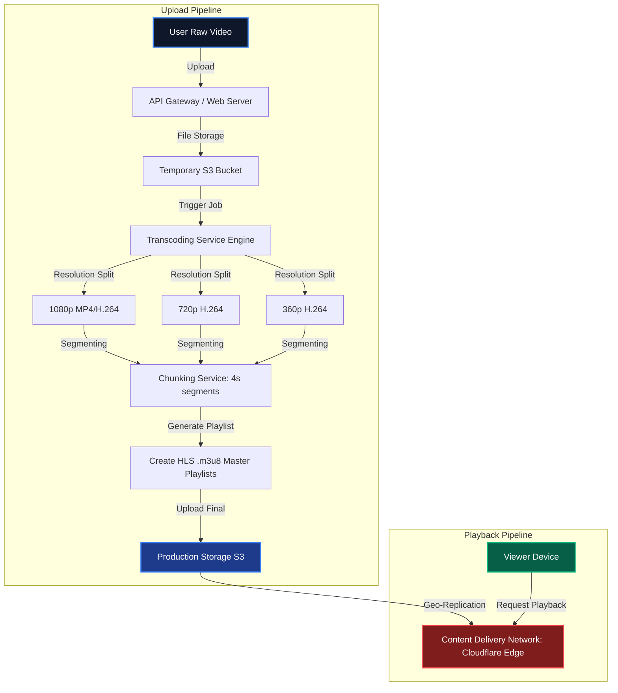
```mermaid
flowchart TD
    subgraph Upload [Upload Pipeline]
        RawVideo[User Raw Video] -->|Upload| WebServer[API Gateway / Web Server]
        WebServer -->|File Storage| TempS3[Temporary S3 Bucket]
        TempS3 -->|Trigger Job| Transcoder[Transcoding Service Engine]
        
        Transcoder -->|Resolution Split| Res1080[1080p MP4/H.264]
        Transcoder -->|Resolution Split| Res720[720p H.264]
        Transcoder -->|Resolution Split| Res360[360p H.264]
        
        Res1080 -->|Segmenting| Chunking[Chunking Service: 4s segments]
        Res720 -->|Segmenting| Chunking
        Res360 -->|Segmenting| Chunking
        
        Chunking -->|Generate Playlist| Manifest[Create HLS .m3u8 Master Playlists]
        Manifest -->|Upload Final| RealS3[Production Storage S3]
    end

    subgraph Playback [Playback Pipeline]
        RealS3 -->|Geo-Replication| CDN[Content Delivery Network: Cloudflare Edge]
        Client[Viewer Device] -->|Request Playback| CDN
    end
    
    style RawVideo fill:#0f172a,stroke:#3b82f6,stroke-width:2px,color:#fff
    style RealS3 fill:#1e3a8a,stroke:#3b82f6,stroke-width:2px,color:#fff
    style CDN fill:#7f1d1d,stroke:#ef4444,stroke-width:2px,color:#fff
    style Client fill:#065f46,stroke:#10b981,stroke-width:2px,color:#fff
```

### 🎯 Core Architecture Breakdown

#### A. Video Upload & Transcoding (অ্যাসিনক্রোনাস প্রসেস)
1. **Raw Upload:** ইউজার ভিডিও আপলোড করলে তা প্রথমে একটি টেম্পোরারি স্টোরেজে যায়।
2. **Transcoding (ভিডিও রূপান্তর):** র ফাইলটিকে বিভিন্ন বিটরেট (Bitrate) এবং রেজোলিউশনে (360p, 720p, 1080p, 4K) কনভার্ট করা হয়।
3. **Chunking (টুকরো করা):** পুরো ২ ঘন্টার মুভি একসাথে লোড করা বোকামি। আমরা প্রতিটা ভিডিওকে ছোট ছোট ৪-১০ সেকেন্ডের ফিজিক্যাল টুকরো বা **Chunks**-এ বিভক্ত করি।
4. **HLS & DASH (স্ট্রিমিং প্রোটোকল):** 
   - **HLS (HTTP Live Streaming - Apple)** বা **DASH (Dynamic Adaptive Streaming over HTTP)** প্রোটোকল ব্যবহার করা হয়।
   - একটি **Master Manifest file (`.m3u8` বা `.mpd`)** তৈরি করা হয় যা ট্র্যাক রাখে কোন রেজোলিউশনের কোন চঙ্ক ফাইলের পাথ কোথায়।

#### B. Dynamic Playback (Adaptive Bitrate Streaming)
- ক্লায়েন্ট ডিভাইস যখন ভিডিও রিকোয়েস্ট করে, সে প্রথমে `.m3u8` মাস্টার প্লেলিস্ট ফাইলটি লোড করে।
- ব্রাউজার ইউজারের ইন্টারনেটের স্পিড মেপে ডিসিশন নেয় সে কোন চঙ্ক ডাউনলোড করবে।
- স্পিড ভালো থাকলে সে অটোমেটিক `1080p_chunk_001.ts` ফেচ করে। মাঝপথে নেট ড্রপ করলে সে বাফারিং এড়াতে সাথে সাথে পরবর্তী চঙ্ক `360p_chunk_002.ts` রিকোয়েস্ট করে। একেই বলে **Adaptive Bitrate Streaming**।

### 🚀 Senior Scaling Hacks: Netflix Cache System
- **CDN Edge Placement:** নেটফ্লিক্স বা ইউটিউব ক্লাউড থেকে সরাসরি ইউজারকে ভিডিও দেয় না। তারা বিশ্বজুড়ে বিভিন্ন আইএসপি (ISP) অফিসের ভেতরে নিজেদের ক্যাশ স্টোরেজ বা হার্ডওয়্যার বক্স (যেমন **Netflix Open Connect Appliance**) ফ্রিতে বসিয়ে দেয়।
- এর ফলে, আপনার এলাকায় যখন কেউ কোনো পপুলার সিরিজ দেখে, তা সরাসরি আপনার লোকাল আইএসপির ভেতরে থাকা স্টোরেজ থেকে ক্যাশড হয়ে লোড হয়, যার ফলে কোনো ব্যাকবোন ইন্টারনেট ক্যাবল বা স্যাটেলাইট ব্যান্ডউইথ খরচ হয় না এবং বাফারিং লেটেন্সি হয় ০ মিলি-সেকেন্ড!

### 🛑 Staff Architect Edge Cases & Scaling Gaps

ভিডিও স্ট্রিমিং সার্ভিসের প্রোডাকশন এনভায়রনমেন্টে এই ৩টি আর্কিটেকচারাল চ্যালেঞ্জ আসবেই:

#### ১. The Thundering Herd Problem (Origin Shielding)
যখন পপুলার কোনো সিরিজের নতুন এপিসোড রিলিজ হয়, তখন লাখ লাখ ইউজার একসাথে একই ভিডিও প্লে করতে চায়। যেহেতু এটি নতুন ভিডিও, এটি সিডিএন (CDN) এজ পয়েন্টে ক্যাশড থাকবে না। ফলে প্রথম মিলি-সেকেন্ডেই সব রিকোয়েস্ট সিডিএনকে বাইপাস করে সরাসরি মেইন অরিজিন স্টোরেজে (AWS S3) হিট করবে। একে বলে **Thundering Herd** বা **CDN Cache Stampede**। এর ফলে S3-এর ব্যান্ডউইথ এক্সহস্ট হয়ে পুরো সাইট ডাউন হয়ে যাবে।
* **মিটিগেশন A (Origin Shield):** সিডিএন প্রোভাইডারে একটি "Origin Shield" (একটি সেন্ট্রাল প্যারেন্ট সিডিএন লেয়ার) কনফিগার করা। সব এজ পয়েন্ট সরাসরি S3-তে হিট না করে এই অরিজিন শিল্ডে হিট করবে। অরিজিন শিল্ড প্রথম রিকোয়েস্টটি নিয়ে S3 থেকে ফাইল এনে ক্যাশ করবে এবং বাকি লাখ লাখ রিকোয়েস্টকে তার নিজের মেমোরি থেকে রেসপন্স করবে।
* **মিটিগেশন B (Request Collapsing):** অ্যাপ্লিকেশন লেয়ারে মিউচুয়াল এক্সক্লুসিভ লক ব্যবহার করা, যাতে শুধুমাত্র একটি থ্রেড/সার্ভার অরিজিন থেকে ভিডিও চঙ্ক ফেচ করে ক্যাশ আপডেট করে, আর বাকি রিকোয়েস্টগুলো ফাস্ট থ্রেডের ক্যাশ আপডেটের জন্য ওয়েট করে।

#### ২. Playback Heartbeat & Dynamic Resuming State
ইউজার যখন নেটফ্লিক্সে একটি মুভি মাঝপথে বন্ধ করে আবার পরের দিন ওপেন করে, নেটফ্লিক্স ঠিক সেই সেকেন্ড থেকেই মুভিটি প্লে করে। মিলিয়ন মিলিয়ন ইউজারের এই রিয়েল-টাইম পজিশন কীভাবে ট্র্যাক করা হয়?
* **ডিজাইন:** ভিডিও প্লেয়ারে একটি **Heartbeat Event** লুপ থাকে যা প্রতি ১০ সেকেন্ড পর পর প্লেব্যাক অফসেট (যেমন `videoId: 101, offset: 4520 seconds`) ব্যাকএন্ডে পাঠায়। 
* **স্কেলিং:** প্রতি সেকেন্ডে কোটি কোটি হার্টবিট রিকোয়েস্ট সরাসরি মূল ডাটাবেসে (Postgres) রাইট করলে ডাটাবেস ১ সেকেন্ডেই ডাউন হবে। তাই এই হার্টবিট রিকোয়েস্টগুলোকে **Kafka**-তে পুশ করা হয়। কাফকা থেকে অ্যাসিনক্রোনাস কনজিউমার ডেটা নিয়ে অত্যন্ত ফাস্ট ইন-মেমোরি রাইট ডাটাবেসে (যেমন **Redis** বা **Cassandra**) স্টোর করে।

#### ৩. DRM (Digital Rights Management) & Anti-Piracy
নেটফ্লিক্সের কোনো ভিডিও আপনি ব্রাউজারের ডেভেলপার টুল দিয়ে ভিডিও ট্যাগ বা নেটওয়ার্ক ট্যাব থেকে ডাউনলোড করতে পারবেন না, করলেও তা চলবে না। এর কারণ হলো **DRM**।
* **ডিজাইন:** ভিডিওর প্রতিটি ৪ সেকেন্ডের চঙ্ক কনভার্ট করার সময়ই **AES-128** বা তার বেশি কি দিয়ে এনক্রিপ্ট করা হয়। প্লেয়ার যখন চঙ্ক লোড করে, সে দেখে এটি লক করা। তখন প্লেয়ার ব্যাকগ্রাউন্ডে একটি **DRM License Server**-এ সিকিউর টোকেন পাঠিয়ে ডিক্রিপশন কি রিকোয়েস্ট করে। প্লেয়ার ডিরেক্টলি রম বা হার্ডওয়্যার ডিক্রিপশন লেয়ারে (Google Widevine L1, Apple FairPlay, Microsoft PlayReady) কি-টি লোড করে রিয়েল-টাইমে চঙ্ক ডিক্রিপ্ট করে দেখায়। ভিডিও সোর্স ফাইল কখনো ইউজারের ডিভাইসের ডিস্কে আনলকড অবস্থায় সেভ হয় না।

---

## 📖 Chapter 03: High-Concurrency E-Commerce System

ই-কমার্স আর্কিটেকচারের সবচেয়ে কঠিন চ্যালেঞ্জ হলো **Flash Sales (ফ্ল্যাশ সেল)** হ্যান্ডেল করা। যখন ১০টি আইটেমের জন্য ১০ লাখ ইউজার একসাথে বাই বাটনে ক্লিক করে, তখন ডাটাবেসে কনকারেন্ট ট্রানজেকশন সামলানো এবং ডুপ্লিকেট পেমেন্ট ও ওভারসেলিং রোধ করাই আসল কাজ।

### ১. রিকোয়ারমেন্টস (Scope)
- **Functional:**
  - প্রোডাক্ট ক্যাটালগ ও সার্চ।
  - শপিং কার্ট এবং চেকআউট সার্ভিস।
  - ফ্ল্যাশ সেল ও ডিসকাউন্ট হ্যান্ডলিং।
  - পেমেন্ট ও ইনভেন্টরি অটো-আপডেট।
- **Non-Functional:**
  - **Strict Consistency:** ১০টি প্রোডাক্টের জায়গায় কোনোভাবেই ১১টি অর্ডার নেওয়া যাবে না (No Overselling)।
  - **High Concurrency:** ফ্ল্যাশ সেলের সময় লাখ লাখ রিকোয়েস্ট হ্যান্ডেল করা।
  - **Payment Idempotency:** ইউজারের কার্ড থেকে যাতে ২ বার চার্জ না কাটা হয়।

### 🛠️ Flash Sale: Preventing Overselling
যদি আমরা সরাসরি ডাটাবেসে রিড-রাইট করে ইনভেন্টরি চেক করি:
```sql
-- Disaster Prone Transaction
SELECT quantity FROM inventory WHERE product_id = 99; -- Returns 1
-- App server logic: if quantity > 0, then:
UPDATE inventory SET quantity = quantity - 1 WHERE product_id = 99;
```
মাল্টিপল থ্রেড বা সার্ভার নোড একসাথে এটি রান করলে **Race Condition** হবে। একাধিক ইউজার একই ভ্যালু `1` রিড করবে এবং সবাই প্রোডাক্ট কিনে ফেলবে, যার ফলে ইনভেন্টরি মাইনাস হয়ে যাবে (Overselling)।

#### Solution A: Database Optimistic Locking (মাঝারি লোডের জন্য)
```sql
UPDATE inventory 
SET quantity = quantity - 1 
WHERE product_id = 99 AND quantity > 0;
```
এই কুয়েরিতে ডাটাবেস রো-লেভেল লক নিয়ে চেক করবে এবং একের বেশি ওভারসেল হতে দেবে না। তবে ডেটাবেস ডিস্ক কুয়েরি অনেক বেশি স্লো হওয়ায় হাই-কনকারেন্সিতে ডাটাবেস সম্পূর্ণ জ্যাম বা লকআপ হয়ে ক্র্যাশ করবে।

#### Solution B: In-Memory Redis Lua Distributed Lock (Staff Architect Standard)
ডিস্ক ডাটাবেসে হিট করার আগেই আমরা **Redis** ব্যবহার করে মেমোরিতে ইনভেন্টরি চেক ও ডিডাকশন করবো। যেহেতু Redis সিঙ্গেল-থ্রেডেড এবং অত্যন্ত ফাস্ট (>100K ops/sec), আমরা একটি **Atomic Lua Script** দিয়ে চেক ও ডিক্রিমেন্ট একসাথে হ্যান্ডেল করব:

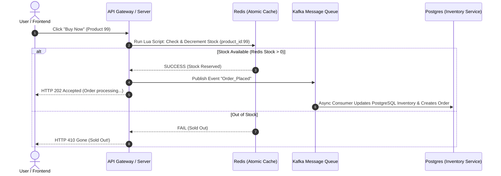
```mermaid
sequenceDiagram
    autonumber
    actor Client as User / Frontend
    participant GW as API Gateway / Server
    participant Cache as Redis (Atomic Cache)
    participant Queue as Kafka Message Queue
    participant DB as Postgres (Inventory Service)

    Client->>GW: Click "Buy Now" (Product 99)
    GW->>Cache: Run Lua Script: Check & Decrement Stock (product_id:99)
    alt Stock Available (Redis Stock > 0)
        Cache-->>GW: SUCCESS (Stock Reserved)
        GW->>Queue: Publish Event "Order_Placed"
        GW-->>Client: HTTP 202 Accepted (Order processing...)
        Queue->>DB: Async Consumer Updates PostgreSQL Inventory & Creates Order
    else Out of Stock
        Cache-->>GW: FAIL (Sold Out)
        GW-->>Client: HTTP 410 Gone (Sold Out!)
    end
```

### 💻 Production-Grade Redis Lua Script for Inventory Deduction
এই স্ক্রিপ্টটি Redis মেমোরিতে রান করে এবং রেস কন্ডিশন ছাড়া ১ মিলি-সেকেন্ডে ইনভেন্টরি বুক করে:

```typescript
import Redis from "ioredis";

const redis = new Redis();

/**
 * Atomic Lua script to safety deduct stock in Redis without race conditions
 */
const deductStockLua = `
  local stockKey = KEYS[1]
  local demand = tonumber(ARGV[1])
  
  local currentStock = tonumber(redis.call('get', stockKey))
  
  if not currentStock then
    return -1 -- Code indicating product key not found in Redis
  end
  
  if currentStock >= demand then
    redis.call('decrby', stockKey, demand)
    return currentStock - demand -- Return new remaining stock
  else
    return -2 -- Code indicating insufficient stock
  end
`;

export async function purchaseProduct(productId: string, quantity: number): Promise<boolean> {
  const stockKey = `stock:product:${productId}`;
  
  // Lua script রেজিস্টার ও রান করা (Atomic action)
  const result = await redis.eval(deductStockLua, 1, stockKey, quantity) as number;
  
  if (result >= 0) {
    console.log(`Stock successfully reserved! Remaining: ${result}`);
    // এখানে আমরা Kafka/RabbitMQ কিউতে মেসেজ পুশ করবো ডাটাবেসে অ্যাসিনক্রোনাস রাইটের জন্য
    return true;
  } else if (result === -1) {
    console.error("Error: Product is not loaded in Redis Cache!");
    return false;
  } else {
    console.warn("Out of Stock! Purchase failed.");
    return false;
  }
}
```

### 🛑 Staff Architect Edge Cases & Scaling Gaps

ফ্ল্যাশ সেলের সময় ডুপ্লিকেট পেমেন্ট রোখা এবং মাল্টি-সার্ভিস ডেটা কনসিস্টেন্সি বজায় রাখার জন্য এই ৩টি প্যাটার্ন লাইফ-সেভার:

#### ১. Payment Idempotency (Double Charge Protection)
ফ্ল্যাশ সেলের সময় ইউজারের ইন্টারনেট স্লো থাকলে বা বাই বাটনে ২ বার ক্লিক করলে একই অর্ডারের জন্য ব্যাংক থেকে যাতে ২ বার টাকা কেটে না নেওয়া হয় তা এনশিওর করা অত্যন্ত জরুরি।
* **মিটিগেশন:** **Idempotency Keys**। যখনই ক্লায়েন্ট চেকআউট পেজ লোড করে, ব্যাকএন্ড একটি ইউনিক `idempotency_key` (UUID) জেনারেট করে ক্লায়েন্টকে দেয়। পেমেন্ট গেটওয়ে এপিআই রিকোয়েস্টে এই কি-টি হেডার হিসেবে পাঠানো হয়। পেমেন্ট সার্ভিস চার্জ কাটার আগে Redis-এ এই কি-টি চেক করে।
  * যদি কি-টি প্রথমবার আসে, পেমেন্ট গেটওয়ে চার্জ প্রসেস করে এবং রেজাল্ট Redis-এ সেভ করে (TTL: ২৪ ঘন্টা)।
  * যদি একই মিলি-সেকেন্ডে ২য় রিকোয়েস্ট আসে, Redis দেখে এটি অলরেডি প্রসেসিং-এ আছে, এবং সে ২য় পেমেন্ট এড়াতে সাথে সাথে আগের প্রসেসড রেজাল্ট বা "Processing..." এরর ফেরত দেয়।

#### ২. Distributed Transactions: The Saga Pattern
একটি সফল অর্ডারের পেছনে ৩টি মাইক্রোসার্ভিসের অ্যাকশন জড়িত: Inventory Service (স্টক রিজার্ভেশন), Payment Service (কার্ড চার্জ করা), এবং Order Service (অর্ডার বুক করা)। যেহেতু এরা আলাদা ডাটাবেস ব্যবহার করে, এদের মধ্যে কোনো `SQL BEGIN TRANSACTION` করা সম্ভব নয়।
* **সমাধান (Orchestrator-based Saga):** আমরা একটি **Saga Orchestrator** সার্ভিস ব্যবহার করি। 
  1. Orchestrator প্রথমে Inventory Service-কে বলে স্টক লক করতে। (সাকসেস)
  2. এরপর সে Payment Service-কে বলে কার্ড চার্জ করতে। (ধরা যাক পেমেন্ট ফেইল হলো)
  3. যেহেতু পেমেন্ট ফেইল হয়েছে, Orchestrator একটি **Compensating Transaction** রিলিজ করে। সে Inventory Service-কে ইনস্ট্রাকশন দেয় স্টক রিলিজ করে দিতে এবং Redis ক্যাশ রিব্যাক করতে। এর ফলে পুরো ডিস্ট্রিবিউটেড সিস্টেম কনসিস্টেন্ট থাকে।

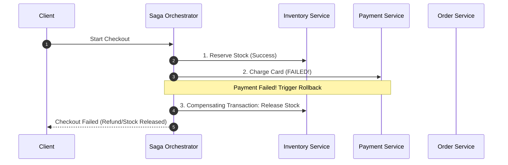
```mermaid
sequenceDiagram
    autonumber
    participant Client as Client
    participant Orc as Saga Orchestrator
    participant Inv as Inventory Service
    participant Pay as Payment Service
    participant Ord as Order Service

    Client->>Orc: Start Checkout
    Orc->>Inv: 1. Reserve Stock (Success)
    Orc->>Pay: 2. Charge Card (FAILED!)
    Note over Orc,Pay: Payment Failed! Trigger Rollback
    Orc->>Inv: 3. Compensating Transaction: Release Stock
    Orc-->>Client: Checkout Failed (Refund/Stock Released)
```

#### ৩. Transactional Outbox Pattern & CDC (Redis to DB Sync)
ফ্ল্যাশ সেলের সময় Redis-এ স্টক ডিডাক্ট হওয়ার পর ডাটাবেসে অ্যাসিনক্রোনাসলি ডেটা সিঙ্ক করার জন্য আমরা যদি র্যান্ডম মেসেজ কিউ ব্যবহার করি, তবে অর্ডার সাকসেসফুল কিন্তু ডাটাবেস ডাউন থাকলে মেসেজ হারিয়ে যেতে পারে।
* **সমাধান:** **Transactional Outbox Pattern**। যখন Order Service ডাটাবেসে অর্ডার ক্রিয়েট করে, সে একই ডাটাবেস ট্রানজেকশনে আরেকটি `outbox` টেবিলে একটি ইভেন্ট মেসেজ লিখে (`INSERT INTO outbox`). যেহেতু একই রিলেশনাল ডিবি-র একক ট্রানজেকশনে লেখা হচ্ছে, তাই অর্ডার ক্রিয়েশন এবং আউটবক্সে মেসেজ রাইট ১০০% গ্যারান্টিড। 
* এর পর একটি ব্যাকগ্রাউন্ড **CDC Daemon (Debezium + Kafka)** ডাটাবেসের ট্রানজেকশন লোগ (WAL - Write-Ahead Log) রিড করে ওই আউটবক্স মেসেজটি কাফকাতে পুশ করে, যা ইনভেন্টরি ডাটাবেস ও ক্যাশ সিঙ্ক করতে কনজিউম করা হয়। এতে ডাটাবেস ক্র্যাশ করলেও মেসেজ কখনোই হারায় না।

---

## 📖 Chapter 04: WhatsApp & Messenger (Real-Time Chat Engine)

রিয়েল-টাইম চ্যাট সিস্টেমের আর্কিটেকচার সাধারণ HTTP অ্যাপের চেয়ে একেবারেই আলাদা। এখানে প্রতি সেকেন্ডে লাখ লাখ ইউজারের রিয়েল-টাইম কানেকশন ধরে রাখতে হয় এবং মিলি-সেকেন্ড লেটেন্সিতে মেসেজ ডেলিভারি এনশিওর করতে হয়।

### ১. রিকোয়ারমেন্টস (Scope)
- **Functional:**
  - ওয়ান-টু-ওয়ান মেসেজিং অত্যন্ত কম লেটেন্সিতে (< ১০০ মিলি-সেকেন্ড)।
  - অনলাইন/অফলাইন স্ট্যাটাস ট্র্যাক করা (Presence Service)।
  - মেসেজের ৩টি ক্লাসিক ডেলিভারি স্ট্যাটাস: Sent, Delivered, Read (Ticks)।
  - পারসিস্টেন্ট চ্যাট হিস্ট্রি (অফলাইনেও আগের চ্যাট স্ক্রোল করা যাবে)।
- **Non-Functional:**
  - **Strict Reliability:** কোনো মেসেজ ডিলিট বা লস হওয়া যাবে না।
  - **High Availability:** রিড-রাইট ফ্লো সব সময় আপটাইম থাকতে হবে।
  - **Massive Scale:** ১০০ মিলিয়ন ডেইলি একটিভ ইউজার (DAU) এবং প্রতিদিন ১০ বিলিয়ন মেসেজ হ্যান্ডেল করা।

### ২. Back-of-the-envelope Estimation
* `Message QPS = 10,000,000,000 / 86,400 seconds ≈` **115,000 messages/sec average QPS**
* `Peak QPS = 115,000 * 3 ≈` **345,000 messages/sec**
* `Concurrent Active WebSocket Connections = 100M DAU * 10% peak online ≈` **10 Million concurrent active sockets**
* `Storage for 10 Years (avg message 100 bytes) = 10B * 100 bytes = 1 TB/day`
  * `10-Year Total Storage = 1 TB * 365 days * 10 years ≈` **3.65 Petabytes**
  * যেহেতু ডেটা হেভি রাইট-ইনটেনসিভ এবং ডিরেক্ট `userId` বা `chatId` কুয়েরি করা হবে, নোএসকিউএল ওয়াইড-কলাম ডাটাবেস (যেমন **Cassandra** বা **ScyllaDB**) এখানে পারফেক্ট।

### ৩. API & Database Schema Design
রিয়েল-টাইম মেসেজিংয়ে পোলিং বাদ দিয়ে আমরা **WebSocket** প্রোটোকল ব্যবহার করব, যা ক্লায়েন্ট এবং সার্ভারের মধ্যে একটি দ্বিমুখী (Bidirectional), লং-লিভড টিসিপি কানেকশন বজায় রাখে। 
হিস্ট্রি কোয়েরির জন্য একটি ব্যাকআপ REST API থাকবে:
- `GET /api/v1/messages?chat_id={chat_id}&limit=50` (প্যাজিনেটেড চ্যাট হিস্ট্রি)

#### Database Schema (Cassandra Wide-Column Model)
Cassandra-র স্টোরেজ আর্কিটেকচার ডেটাকে মেমোরিতে (MemTable) রাইট করে সরাসরি ক্রনোলজিক্যালি ডিস্কে (SSTable) সেভ করে, যার ফলে ডিস্কের কোনো র্যান্ডম সিক ছাড়াই এটি বিলিয়ন বিলিয়ন রো লিখতে পারে।

```sql
CREATE TABLE chat_messages (
    chat_id uuid,
    message_id timeuuid, -- Embeds timestamp, Chronological order guarantees
    sender_id uuid,
    content text,
    status varchar, -- 'sent', 'delivered', 'read'
    PRIMARY KEY (chat_id, message_id)
) WITH CLUSTERING ORDER BY (message_id DESC);
```
*(নোট: এখানে `chat_id` হলো **Partition Key**, যা একটি চ্যাটের সব মেসেজকে ফিজিক্যালি একই হার্ডওয়্যার নোডে স্টোর করে। আর `message_id` হলো **Clustering Key**, যা মেসেজগুলোকে সময় অনুযায়ী ডিসেন্ডিং অর্ডারে সর্ট করে রাখে। ফলে চ্যাট লোড করা অত্যন্ত ফাস্ট হয়)।*

### ৪. High-Level Architecture
সিস্টেমের রিয়েল-টাইম মেসেজ রাউটিং ফ্লো নিচে চিত্রায়িত করা হলো:

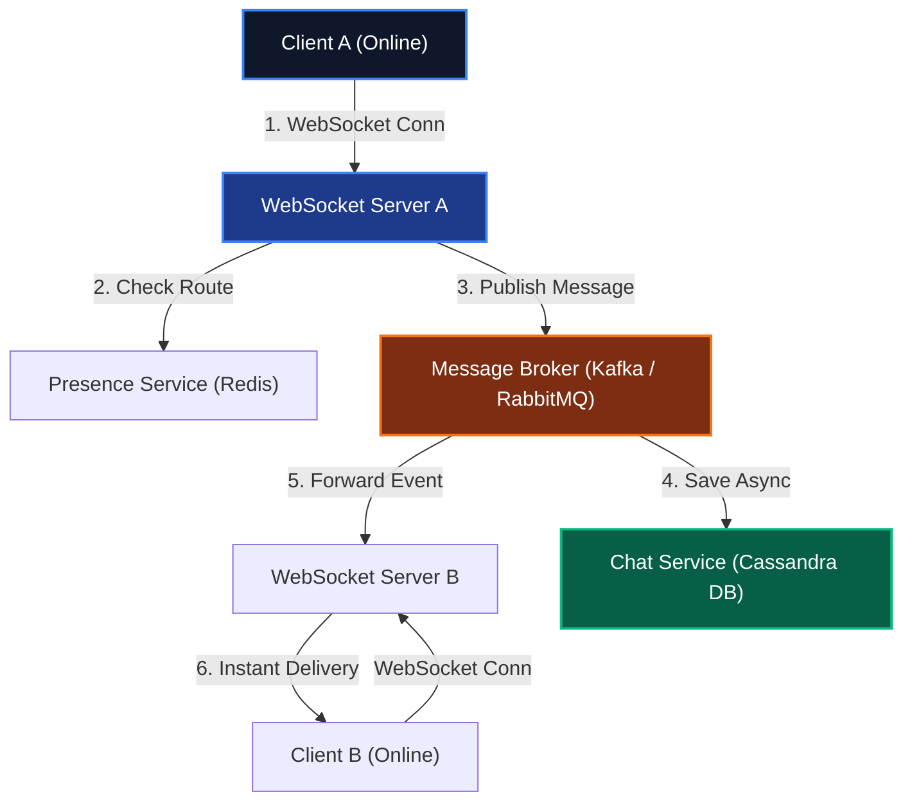
```mermaid
flowchart TD
    BrowserClientA["Client A (Online)"] -->|1. WebSocket Conn| WSGatewayA["WebSocket Server A"]
    BrowserClientB["Client B (Online)"] -->|WebSocket Conn| WSGatewayB["WebSocket Server B"]
    
    WSGatewayA -->|2. Check Route| PresenceRedis["Presence Service (Redis)"]
    WSGatewayA -->|3. Publish Message| MsgBroker["Message Broker (Kafka / RabbitMQ)"]
    
    MsgBroker -->|4. Save Async| ChatService["Chat Service (Cassandra DB)"]
    MsgBroker -->|5. Forward Event| WSGatewayB
    WSGatewayB -->|6. Instant Delivery| BrowserClientB
    
    style BrowserClientA fill:#0f172a,stroke:#3b82f6,stroke-width:2px,color:#fff
    style WSGatewayA fill:#1e3a8a,stroke:#3b82f6,stroke-width:2px,color:#fff
    style MsgBroker fill:#7c2d12,stroke:#f97316,stroke-width:2px,color:#fff
    style ChatService fill:#065f46,stroke:#10b981,stroke-width:2px,color:#fff
```

### 💻 Practical TypeScript Connection Registry Implementation
যেহেতু আমাদের ১০ মিলিয়ন কনকারেন্ট সকেট থাকবে, এগুলোকে কোনো একটি সিঙ্গেল সার্ভারে রাখা সম্ভব নয়। আমাদের ১০০+ গেটওয়ে সার্ভার লাগবে। ইউজার A যখন ইউজার B-কে মেসেজ পাঠাবে, তখন গেটওয়ে A-কে জানতে হবে ইউজার B কোন গেটওয়ে সার্ভারে কানেক্টেড আছে, যাতে মেসেজটি সঠিক নোডে পুশ করা যায়।

নিচে Redis-ভিত্তিক একটি প্রোডাকশন-গ্রেড ডিস্ট্রিবিউটেড **Connection Routing & Presence Registry** কোড দেওয়া হলো:

```typescript
import Redis from "ioredis";

const redis = new Redis();

interface ChatMessage {
  id: string;
  senderId: string;
  receiverId: string;
  content: string;
  timestamp: number;
}

export class MessageGatewayRegistry {
  private static readonly PRESENCE_PREFIX = "presence:user:";
  private static readonly ROUTING_PREFIX = "routing:user:";
  
  private currentServerId: string;

  constructor(serverId: string) {
    this.currentServerId = serverId;
  }

  /**
   * ইউজার গেটওয়েতে কানেক্ট হলে তার অনলাইন স্ট্যাটাস এবং রাউটিং টার্গেট সেট করে
   */
  public async registerUserConnection(userId: string): Promise<void> {
    const multi = redis.multi();
    // Presence set to online with 5 mins TTL (Heartbeat keeps this alive)
    multi.set(`${MessageGatewayRegistry.PRESENCE_PREFIX}${userId}`, "online", "EX", 300);
    // Map user socket to this specific WebSocket gateway server
    multi.set(`${MessageGatewayRegistry.ROUTING_PREFIX}${userId}`, this.currentServerId);
    await multi.exec();
    console.log(`User ${userId} successfully registered on Gateway ${this.currentServerId}`);
  }

  /**
   * ইউজার ডিসকানেক্ট হলে স্ট্যাটাস ডিলিট করে
   */
  public async deregisterUserConnection(userId: string): Promise<void> {
    const multi = redis.multi();
    multi.del(`${MessageGatewayRegistry.PRESENCE_PREFIX}${userId}`);
    multi.del(`${MessageGatewayRegistry.ROUTING_PREFIX}${userId}`);
    await multi.exec();
  }

  /**
   * টার্গেট ইউজার কোন গেটওয়েতে কানেক্টেড আছে তা ট্র্যাক করে
   */
  public async getRouteForUser(userId: string): Promise<string | null> {
    return await redis.get(`${MessageGatewayRegistry.ROUTING_PREFIX}${userId}`);
  }

  /**
   * Redis Pub/Sub এর মাধ্যমে রিয়েল-টাইম মেসেজ সঠিক গেটওয়েতে রিলে করে দেয়
   */
  public async relayMessage(message: ChatMessage): Promise<boolean> {
    const targetServerId = await this.getRouteForUser(message.receiverId);
    
    if (!targetServerId) {
      console.log(`Receiver ${message.receiverId} is offline. Pushing to offline queue.`);
      await this.queueOfflineMessage(message);
      return false;
    }

    // Publish to the specific channel of the target WebSocket Server
    const channelName = `gateway:channel:${targetServerId}`;
    await redis.publish(channelName, JSON.stringify(message));
    console.log(`Message successfully published to ${channelName} for user ${message.receiverId}`);
    return true;
  }

  private async queueOfflineMessage(message: ChatMessage): Promise<void> {
    // অফলাইনে থাকা অবস্থায় মেসেজটি কিউতে অ্যাড করে মোবাইল পুশ নোটিফিকেশন ট্রিগার করা হবে
    await redis.lpush(`offline:queue:user:${message.receiverId}`, JSON.stringify(message));
  }
}
```

### 🛑 Staff Architect Edge Cases & Scaling Gaps

রিয়েল-টাইম চ্যাট স্কেলিংয়ের ক্ষেত্রে প্রোডাকশনে ফেস করা ৩টি অত্যন্ত জঘন্য সমস্যা ও তাদের সিনিয়র লেভেল সমাধান:

#### ১. Operating System Socket Limits & VIP Load Balancing
১০ মিলিয়ন কনকারেন্ট কানেকশনের অর্থ হলো গেটওয়ে সার্ভারগুলোর ওপর ১০ মিলিয়ন লং-লিভড টিসিপি কানেকশন খোলা রাখা। লিনাক্স অপারেটিং সিস্টেমে প্রতি ফিজিক্যাল নোডে বাই-ডিফল্ট ৬৫,৫৩৫ টির বেশি আউটবাউন্ড সকেট কানেকশন হ্যান্ডেল করা যায় না।
* **মিটিগেশন A (Linux OS Kernel Tuning):** লিনাক্স কার্নেল কনফিগারেশনে ফাইল ডেসক্রিপ্টরের লিমিট বাড়াতে হবে। `sysctl` ফাইলে `fs.file-max` লিমিট এবং `nofile` সফট/হার্ড লিমিট ১০ লাখের ওপরে সেট করতে হবে।
* **মিটিগেশন B (Virtual IPs - VIPs):** লোড ব্যালেন্সারে মাল্টিপল ফিজিক্যাল আইপি অ্যাসাইন করা। ক্লায়েন্টদের কানেক্ট করার জন্য আমরা **Consistent Hashing** ব্যবহার করে লোড সমানভাবে ডিস্ট্রিবিউট করব যাতে কোনো নির্দিষ্ট গেটওয়েতে সকেট ক্র্যাশ না হয়।

#### ২. Delivery receipts Storm under High Concurrency
প্রতিটি মেসেজ ডেলিভারির জন্য ৩টি করে টিক (Sent, Delivered, Read) জেনারেট হয়। অর্থাৎ প্রতিদিন ১০ বিলিয়ন মেসেজ পাঠানো হলে সিস্টেমে মোট ৩০ বিলিয়ন এক্সট্রা স্ট্যাটাস আপডেট রাইট ইভেন্ট আসে। এটি সরাসরি ডাটাবেসে বা গেটওয়েতে ট্রানজেক্ট করা হলে পুরো নেটওয়ার্ক থ্রোটল হয়ে যাবে।
* **মিটিগেশন:** **Delivery Receipt Batching & Coalescing**। ক্লায়েন্ট ডিভাইস যখন চ্যাট স্ক্রিন স্ক্রোল করে, সে প্রতি মেসেজে আলাদা রিকোয়েস্ট না পাঠিয়ে ১ সেকেন্ডের বাফারে রিসিপ্ট ডেটা জমা করে (যেমন: "Message 1 to 50 are Read")। তারপর সিঙ্গেল রিকোয়েস্ট পাঠিয়ে ডাটাবেসে বাল্ক আপডেট করে। এতে ডাটাবেসের রাইট অপারেশন ৩০ বিলিয়ন থেকে কমে মাত্র ৩০০ মিলিয়নে নেমে আসে!

#### ৩. Hotspots in Cassandra Partitioning (Massive Group Chats)
যদি ১০,০০০ মেম্বার বিশিষ্ট কোনো পপুলার গ্রুপ চ্যাটে মেসেজ আদান-প্রদান হতে থাকে, তবে `chat_id` পার্টিকুলারলি একটি ডাটাবেস পার্টিকপ্ট নোডের ওপর চরম চাপ তৈরি করবে। Cassandra-র একটি ফিজিক্যাল পার্টিকপ্ট সাধারণত ১০০MB-এর বেশি হলে পারফরম্যান্স কড়া শুরু করে।
* **মিটিগেশন (Partition Key Salting):** আমরা `chat_id` এর সাথে একটি বাকেট ভ্যালু যুক্ত করব (যেমন `chat_id + bucket_id`), যেখানে `bucket_id` হবে `timestamp / 1-hour` অথবা একটি সাইক্লিক কাউন্টার `(1 to 10)`। এর ফলে একই গ্রুপের মেসেজগুলো ডাটাবেসের আলাদা আলাদা ফিজিক্যাল ডিস্ক ব্লকে ডিস্ট্রিবিউট হয়ে যাবে এবং ডাটাবেস বটলনেক সম্পূর্ণ ভ্যানিশ হয়ে যাবে।

---

## 📖 Chapter 05: Uber & Grab (Ride-Sharing Geospatial Engine)

রাইড-শেয়ারিং সিস্টেমের মূল কারিগরি চ্যালেঞ্জ হলো প্রতি সেকেন্ডে লাখ লাখ ড্রাইভারের দ্রুত পরিবর্তনশীল ভৌগলিক অবস্থান (Geolocation) রিয়েল-টাইমে ট্র্যাক করা এবং কোনো রাইডার রিকোয়েস্ট পাঠালে ১ কিলোমিটারের মধ্যে থাকা পারফেক্ট ড্রাইভারটিকে ৫০ মিলি-সেকেন্ডের মধ্যে খুঁজে বের করা।

### ১. রিকোয়ারমেন্টস (Scope)
- **Functional:**
  - ড্রাইভাররা প্রতি ৪ সেকেন্ড পর পর তাদের রিয়েল-টাইম জিপিএস স্থানাঙ্ক (Latitude, Longitude) ব্যাকএন্ডে পাঠাবে।
  - রাইডাররা তাদের চারপাশের ৩ কিলোমিটার ব্যাসার্ধের মধ্যে থাকা সব এভেইলেবল ড্রাইভার রিয়েল-টাইমে ম্যাপে দেখতে পাবে।
  - রাইডার রাইড রিকোয়েস্ট করলে সিস্টেম সবচেয়ে কাছের ড্রাইভারকে তার সাথে ট্রিপ ম্যাচ করিয়ে দেবে।
- **Non-Functional:**
  - **Ultra-low Latency:** ড্রাইভার ম্যাচিং এবং সার্চ কুয়েরি অত্যন্ত ফাস্ট হতে হবে (< ৫০ মিলি-সেকেন্ড)।
  - **High Scalability:** ১ মিলিয়ন একটিভ ড্রাইভারের সেকেন্ডে লাখ লাখ জিপিএস আপডেট এবং ১০ মিলিয়ন একটিভ রাইডারের কনকারেন্ট কুয়েরি হ্যান্ডেল করা।
  - **Strict Consistency (Match Lock):** একই ড্রাইভার যাতে একসাথে ২ জন রাইডারের সাথে ম্যাচ না হয়ে যায় (No Double-Booking)।

### ২. Back-of-the-envelope Estimation
* `Driver Location Write QPS = 1,000,000 active drivers / 4 seconds =` **250,000 writes/sec**
* `Rider Search Query QPS = 10,000,000 riders / 8 seconds map updates =` **1,250,000 reads/sec**
* `Location Update Size = driver_id (16 bytes) + latitude (8 bytes) + longitude (8 bytes) = 32 bytes`
* `Network Write Bandwidth = 250,000 * 32 bytes ≈` **8 MB/sec**
* **Memory Requirement (Redis Cache):** 
  * মেমরিতে ১ মিলিয়ন ড্রাইভারের জিপিএস ডেটা স্টোর করতে সাইজ হবে: `1,000,000 * 100 bytes (Redis overhead সহ) ≈` **100 MB RAM**। এটি অত্যন্ত ছোট, তাই সম্পূর্ণ লাইভ ডেটা রেডিসে সুপার-ফাস্ট স্টোর করা সম্ভব।

### ৩. API & Database Schema Design
যেহেতু জিপিএস রাইট অপারেশন প্রতি সেকেন্ডে ২৫০K বার ঘটে, প্রথাগত HTTP ওভারহেড এড়াতে ড্রাইভার ডিভাইসগুলো **WebSocket** অথবা লাইটওয়েট **UDP/TCP Stream** ব্যবহার করবে। 
রাইডারদের জন্য এপিআই থাকবে:
- `GET /api/v1/nearby?lat=23.7561&lng=90.3762&radius=3000` (৩ কিমি ব্যাসার্ধের ড্রাইভার সার্চ)

#### Database Selection: SQL vs NoSQL Spatial Indexes
ডিস্ক-ভিত্তিক ডাটাবেস (যেমন PostgreSQL PostGIS) ২৫০K QPS রাইট সামলাতে সম্পূর্ণ ক্র্যাশ করবে। তাই লাইভ ট্র্যাকিংয়ের জন্য আমরা **In-memory Redis Geospatial Index (GEOADD, GEORADIUS)** ব্যবহার করব।
কমপ্লিটেড ট্রিপ ডেটা এবং বিলিং হিস্ট্রি ব্যাকআপের জন্য রিলেশনাল ডাটাবেস (PostgreSQL) ব্যবহার করা হবে।

### ৪. High-Level Architecture
ভৌগলিক ট্রাফিক ফ্লো নিচে চিত্রায়িত করা হলো:

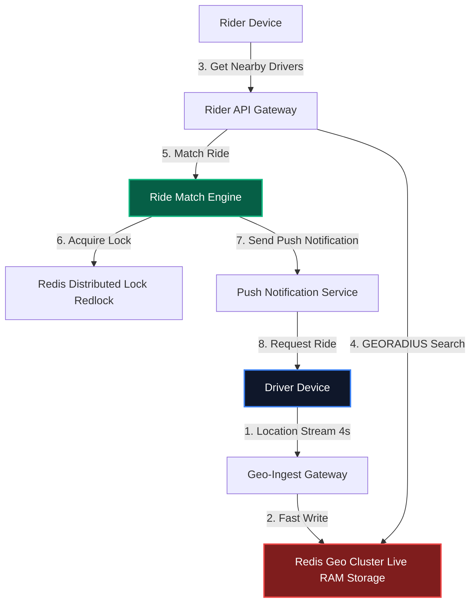
```mermaid
flowchart TD
    DriverApp["Driver Device"] -->|1. Location Stream 4s| IngestGW["Geo-Ingest Gateway"]
    IngestGW -->|2. Fast Write| RedisGeo["Redis Geo Cluster Live RAM Storage"]
    
    RiderApp["Rider Device"] -->|3. Get Nearby Drivers| RiderAPI["Rider API Gateway"]
    RiderAPI -->|4. GEORADIUS Search| RedisGeo
    
    RiderAPI -->|5. Match Ride| MatchService["Ride Match Engine"]
    MatchService -->|6. Acquire Lock| RedisLock["Redis Distributed Lock Redlock"]
    MatchService -->|7. Send Push Notification| NotifyService["Push Notification Service"]
    NotifyService -->|8. Request Ride| DriverApp
    
    style DriverApp fill:#0f172a,stroke:#3b82f6,stroke-width:2px,color:#fff
    style RedisGeo fill:#7f1d1d,stroke:#ef4444,stroke-width:2px,color:#fff
    style MatchService fill:#065f46,stroke:#10b981,stroke-width:2px,color:#fff
```

### 💻 Practical TypeScript Geospatial Engine Implementation
নিচে `ioredis` ব্যবহার করে ড্রাইভারদের লোকেশন আপডেট এবং ৩ কিমি ব্যাসার্ধের এভেইলেবল ড্রাইভার খুঁজে বের করার জন্য একটি প্রোডাকশন-রেডি **Geospatial Tracking Engine** কোড দেওয়া হলো:

```typescript
import Redis from "ioredis";

const redis = new Redis();

interface Coordinate {
  latitude: number;
  longitude: number;
}

interface NearbyDriver {
  driverId: string;
  latitude: number;
  longitude: number;
  distanceInMeters: number;
}

export class GeoLocationEngine {
  private static readonly GEO_KEY = "active:drivers:location";

  /**
   * ড্রাইভারের লাইভ লোকেশন রেডিস জিও-ইনডেক্সে আপডেট করে
   * Redis internally encodes (latitude, longitude) into a 52-bit Geohash integer
   */
  public async updateDriverLocation(driverId: string, lat: number, lng: number): Promise<void> {
    // GEOADD takes key, longitude, latitude, memberId
    await redis.geoadd(GeoLocationEngine.GEO_KEY, lng, lat, driverId);
  }

  /**
   * ড্রাইভার অফলাইনে গেলে ইনডেক্স থেকে মুছে ফেলে
   */
  public async removeOfflineDriver(driverId: string): Promise<void> {
    await redis.zrem(GeoLocationEngine.GEO_KEY, driverId);
  }

  /**
   * রাইডারের ৩ কিলোমিটারের ভেতরে থাকা এভেইলেবল ড্রাইভারদের দূরত্বসহ সর্ট করে নিয়ে আসে
   */
  public async findNearbyDrivers(
    riderLat: number,
    riderLng: number,
    radiusInMeters: number,
    limit = 10
  ): Promise<NearbyDriver[]> {
    // GEORADIUS fetches members with distance and raw coordinates sorted ascendingly
    const results = await redis.georadius(
      GeoLocationEngine.GEO_KEY,
      riderLng,
      riderLat,
      radiusInMeters,
      "m", // meters
      "WITHDIST",
      "WITHCOORD",
      "ASC", // closest first
      "COUNT", limit
    ) as any[];

    return results.map((item) => {
      const [driverId, distance, [lngStr, latStr]] = item;
      return {
        driverId,
        distanceInMeters: parseFloat(distance),
        latitude: parseFloat(latStr),
        longitude: parseFloat(lngStr),
      };
    });
  }
}
```

### 🛑 Staff Architect Edge Cases & Scaling Gaps

বাস্তব জীবনের মিলিয়ন-ইউজার স্কেলে রাইড ম্যাচিং ইঞ্জিনে এই ৩টি ক্রিটিক্যাল আর্কিটেকচারাল প্রবলেম আসে:

#### ১. The Grid Boundary Problem (Geohash vs Hexagonal H3 Grid)
**Geohash** পৃথিবীকে আয়তাকার (Rectangle) গ্রিডে ভাগ করে। যদি কোনো রাইডার ঠিক গ্রিডের সীমানায় (Edge/Boundary) দাঁড়িয়ে থাকে এবং কোনো ড্রাইভার তার থেকে মাত্র ৫ মিটার দূরে অন্য পাশের গ্রিডে থাকে, Geohash কুয়েরি তাকে মিস করে যাবে।
* **মিটিগেশন (H3 Hexagonal Grid):** উবার এই সমস্যাটি দূর করতে **H3 Spatial Indexing (Hexagonal Hierarchical Spatial Index)** তৈরি করে। হেক্সাগন বা ষড়ভুজের ক্ষেত্রে কেন্দ্র থেকে তার প্রতিটি প্রতিবেশী কোণের দূরত্ব একদম সমান। এর ফলে বাউন্ডারি প্রবলেম সম্পূর্ণ দূর হয় এবং নিখুঁতভাবে চারপাশের ড্রাইভারদের ডিটেক্ট করা যায়।

#### ২. Write Saturation of Redis (Hotspots on Single CPU Core)
যেহেতু Redis সিঙ্গেল-থ্রেডেড, সেকেন্ডে ২৫০,০০০ রাইট রিকোয়েস্ট যদি একটি মাত্র Redis Key (`active:drivers:location`) এর ওপরে যায়, তবে প্রসেসরের একটিコア ১০০% বিজি হয়ে ক্র্যাশ করবে।
* **মিটিগেশন (Geographical Sharding):** ড্রাইভারদের লোকেশন সারা বিশ্বের একটি কিতে সেভ না করে আমরা Geohash এর প্রথম ৪ ক্যারেক্টার দিয়ে কি শার্ডিং করব। যেমন, ঢাকার সব ড্রাইভারের ডেটা যাবে `location:shard:dhaka` আর চট্রগ্রামের ডেটা যাবে `location:shard:ctg` শ্যার্ডে। এতে লোড মাল্টিপল নোডে ডিস্ট্রিবিউট হয়ে যাবে এবং Redis ক্লাস্টার সেকেন্ডে মিলিয়ন রাইট অনায়াসে সামলাতে পারবে।

#### ৩. The Double-Booking Race Condition (Ride Matching Lock)
একই এলাকায় দুজন রাইডার একই মিলি-সেকেন্ডে "Request Ride" বাটনে ক্লিক করলে সিস্টেম যদি তাদের দুজনকে একই ফ্রি ড্রাইভারের কাছে পাঠায়, তবে ড্রাইভার কনফিউজড হবে এবং সিস্টেমে কনফ্লিক্ট দেখা দেবে।
* **মিটিগেশন:** **Atomic Distributed Lock (Redlock)**। রাইড ম্যাচিং ইঞ্জিন যখনই কোনো ড্রাইভারকে কোনো রাইডারের সাথে এসোসিয়েট করার প্রসেস শুরু করবে, সে সাথে সাথে Redis-এ ওই ড্রাইভারের আইডির বিপরীতে একটি ক্ষণস্থায়ী ডিস্ট্রিবিউটেড লক নেবে:
  `redis.set("driver:lock:" + driverId, "LOCKED", "NX", "EX", 10)`
  লকটি সফল হলেই কেবল ড্রাইভারকে অফার পাঠানো হবে। লক ফেইল হলে ম্যাচ মেকার অন্য আরেকটি কাছাকাছি ড্রাইভারকে সাথে সাথেই সিলেক্ট করে নেবে।

---

## 📖 Chapter 06: Twitter/X (News Feed & Timeline Fanout Engine)

সোশ্যাল মিডিয়া ফিড জেনারেট করার মূল কারিগরি চ্যালেঞ্জ হলো চরম রিড-রাইট অসমতা এবং ফ্যানআউট (Fanout)। যখন লাখ লাখ ইউজার প্রতি সেকেন্ডে টুইট করছেন এবং কোটি কোটি ইউজার তাদের হোম টাইমলাইন রিফ্রেশ করছেন, তখন লেটেন্সি ১০০ মিলি-সেকেন্ডের নিচে রাখাই আসল ইঞ্জিনিয়ারিং।

### ১. রিকোয়ারমেন্টস (Scope)
- **Functional:**
  - ইউজার টুইট পোস্ট করতে পারবেন (টেক্সট এবং মিডিয়া)।
  - ইউজার অন্য ইউজারদের ফলো করতে পারবেন।
  - ইউজার তার হোম টাইমলাইন (News Feed) দেখতে পাবেন, যেখানে তার ফলো করা সব মানুষের লেটেস্ট টুইটগুলো ক্রনোলজিক্যালি সাজানো থাকবে।
  - ইউজার তার নিজস্ব ইউজার টাইমলাইন (টুইট হিস্ট্রি) দেখতে পাবেন।
- **Non-Functional:**
  - **Ultra-fast Feed Generation:** হোম ফিড রিকোয়েস্ট করতে ১০০ মিলি-সেকেন্ডের কম সময় লাগতে হবে।
  - **High Scalability:** ৩০০ মিলিয়ন একটিভ ইউজার এবং প্রতিদিন ৫০০ মিলিয়ন টুইট পোস্ট সামলানো।
  - **Celebrity Handle (High Fanout):** কোনো সেলিব্রিটি টুইট করলে তা যাতে মুহূর্তের মধ্যে কোটি কোটি ফলোয়ারের ওয়ালে পৌঁছায় আবার সিস্টেমও ক্র্যাশ না করে।

### ২. Back-of-the-envelope Estimation
* `Tweet Write QPS = 500,000,000 tweets / 86,400 seconds ≈` **5,800 writes/sec average QPS**
* `Peak Write QPS ≈` **12,000 writes/sec**
* `Feed Read QPS = 100M DAU * 10 views/day = 1B views / 86400 ≈` **11,500 reads/sec average QPS**
* `Peak Read QPS ≈` **35,000 reads/sec**
* **Fanout Multiplying Effect:**
  * প্রতিটি ইউজারের এভারেজ ফলোয়ার সংখ্যা ১০০ হলে: `5,800 writes/sec * 100 followers =` **580,000 writes/sec** ডিস্ট্রিবিউটেড ফিড ক্যাশে রাইট করতে হবে।
  * কিন্তু কোনো সেলিব্রিটির (যেমন ক্রিস্টিয়ানো রোনালদো, ১০০M ফলোয়ার) ১টি টুইট ফ্যানআউট করতে গেলে এক মিলি-সেকেন্ডে **১০০,০০০,০০০ টি ক্যাশ রাইট** ট্রাই করবে, যা পুরো সিস্টেম ক্র্যাশ করে দেবে! একেই বলে **Celebrity Write Explosion**।

### ৩. API & Database Schema Design
ফিড ও টুইট প্রসেসিংয়ের জন্য স্ট্যান্ডার্ড এপিআই ডিজাইন:
- `POST /api/v1/tweet` (টুইট তৈরি)
- `GET /api/v1/feed?limit=20` (হোম ফিড ফেচ)

#### Database Tables Structure
টুইট ডেটা এবং রিলেশনশিপ ম্যাপ করার জন্য রিলেশনাল বা হাই-পারফরম্যান্স নোএসকিউএল ডিবি:

```sql
CREATE TABLE tweets (
    tweet_id bigint PRIMARY KEY,
    user_id bigint,
    content varchar(280),
    created_at timestamp
);

CREATE TABLE follows (
    follower_id bigint,
    followee_id bigint,
    created_at timestamp,
    PRIMARY KEY (follower_id, followee_id)
);
```

### ৪. High-Level Architecture
টুইটার ফিড জেনারেশনে আমরা **Hybrid Push/Pull Architecture** ব্যবহার করব। নিচে ট্রাফিক ফ্লো দেওয়া হলো:

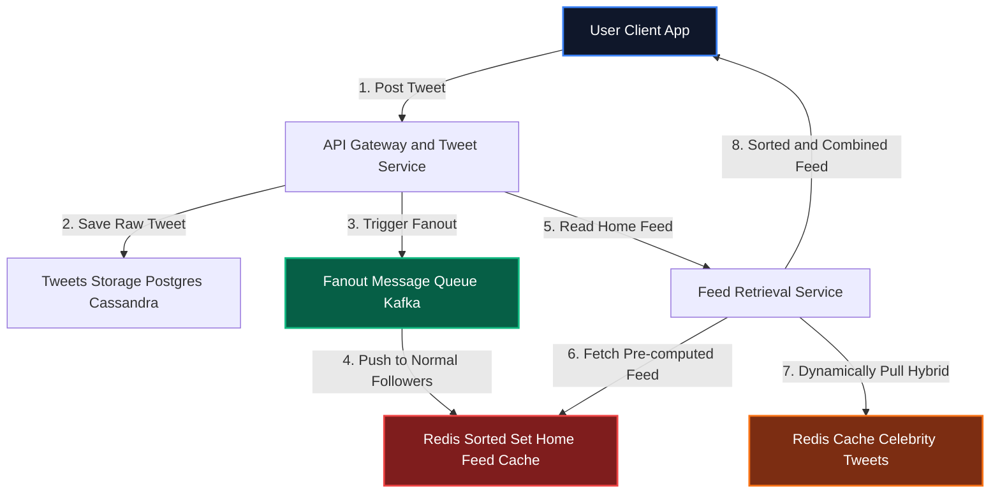
```mermaid
flowchart TD
    UserApp["User Client App"] -->|1. Post Tweet| Gateway["API Gateway and Tweet Service"]
    Gateway -->|2. Save Raw Tweet| TweetDB["Tweets Storage Postgres Cassandra"]
    Gateway -->|3. Trigger Fanout| FanoutQueue["Fanout Message Queue Kafka"]
    
    FanoutQueue -->|4. Push to Normal Followers| NormalFeedCache["Redis Sorted Set Home Feed Cache"]
    
    Gateway -->|5. Read Home Feed| FeedService["Feed Retrieval Service"]
    FeedService -->|6. Fetch Pre-computed Feed| NormalFeedCache
    FeedService -->|7. Dynamically Pull Hybrid| CelebCache["Redis Cache Celebrity Tweets"]
    
    FeedService -->|8. Sorted and Combined Feed| UserApp
    
    style UserApp fill:#0f172a,stroke:#3b82f6,stroke-width:2px,color:#fff
    style NormalFeedCache fill:#7f1d1d,stroke:#ef4444,stroke-width:2px,color:#fff
    style CelebCache fill:#7c2d12,stroke:#f97316,stroke-width:2px,color:#fff
    style FanoutQueue fill:#065f46,stroke:#10b981,stroke-width:2px,color:#fff
```

### 💻 Practical TypeScript Hybrid Fanout Engine Implementation
নিচে একটি প্রোডাকশন-রেডি **Hybrid Fanout Engine** কোড দেওয়া হলো যা সেলিব্রিটি এবং সাধারণ ইউজারদের টুইট সম্পূর্ণ আলাদা পাইপলাইনে প্রসেস ও মার্জ করে:

```typescript
import Redis from "ioredis";

const redis = new Redis();

interface Tweet {
  id: string;
  userId: string;
  content: string;
  createdAt: number;
}

export class NewsFeedFanoutEngine {
  private static readonly TIMELINE_PREFIX = "timeline:user:";
  private static readonly CELEB_POSTS_PREFIX = "celeb:tweets:";
  private static readonly CELEBRITY_THRESHOLD = 10000; // ১০,০০০ ফলোয়ারের বেশি হলে সেলিব্রিটি

  /**
   * ডেমো ফলোয়ার ডাটা ফেচিং (প্রোডাকশনে ডাটাবেস থেকে আসবে)
   */
  private async getFollowers(userId: string): Promise<{ followerIds: string[]; count: number }> {
    return {
      followerIds: ["follower_1", "follower_2", "follower_3"],
      count: 3
    };
  }

  /**
   * নতুন টুইট পোস্ট হওয়ার পর ফ্যানআউট ডিসিশন নেয়
   */
  public async processNewTweet(tweet: Tweet): Promise<void> {
    const { followerIds, count } = await this.getFollowers(tweet.userId);

    if (count > NewsFeedFanoutEngine.CELEBRITY_THRESHOLD) {
      // 🟢 অপশন A: Fanout-on-read (Pull Model for Celebrities)
      // সেলিব্রিটির টুইটগুলো তার নিজস্ব ডেডিকেটেড ক্যাশে সেভ থাকবে, কোটি কোটি ওয়ালে পুশ হবে না
      const celebKey = `${NewsFeedFanoutEngine.CELEB_POSTS_PREFIX}${tweet.userId}`;
      await redis.zadd(celebKey, tweet.createdAt, JSON.stringify(tweet));
      await redis.zremrangebyrank(celebKey, 0, -100); // শুধুমাত্র লেটেস্ট ১০০টি টুইট রাখবো
      console.log(`Celebrity tweet saved to pull cache for user ${tweet.userId}`);
    } else {
      // 🟢 অপশন B: Fanout-on-write (Push Model for Normal Users)
      // নরমাল ইউজারের টুইট সাথে সাথে সব ফলোয়ারের ইন-মেমোরি টাইমলাইনে পুশ করা হবে
      const pipeline = redis.pipeline();
      for (const followerId of followerIds) {
        const timelineKey = `${NewsFeedFanoutEngine.TIMELINE_PREFIX}${followerId}`;
        pipeline.zadd(timelineKey, tweet.createdAt, JSON.stringify(tweet));
        pipeline.zremrangebyrank(timelineKey, 0, -500); // হোম ফিডে ম্যাক্স ৫০০টি টুইট ক্যাশ থাকবে
      }
      await pipeline.exec();
      console.log(`Pushed tweet from ${tweet.userId} to ${followerIds.length} followers.`);
    }
  }

  /**
   * ইউজারের জন্য হোম টাইমলাইন বা ফিড জেনারেট করে (Hybrid Merge)
   */
  public async getHomeTimeline(userId: string, followedCelebrities: string[], limit = 20): Promise<Tweet[]> {
    const timelineKey = `${NewsFeedFanoutEngine.TIMELINE_PREFIX}${userId}`;
    
    // ১. প্রি-কম্পিউটেড নরমাল ফলোয়ারদের টুইট ক্যাশ থেকে ফেচ করি
    const normalTweetsRaw = await redis.zrevrange(timelineKey, 0, limit - 1);
    const tweets: Tweet[] = normalTweetsRaw.map((t) => JSON.parse(t));

    // ২. ফলো করা সেলিব্রিটিদের টুইট রানটাইমে পুল (Pull) করে নিয়ে আসি
    for (const celebId of followedCelebrities) {
      const celebKey = `${NewsFeedFanoutEngine.CELEB_POSTS_PREFIX}${celebId}`;
      const celebTweetsRaw = await redis.zrevrange(celebKey, 0, limit - 1);
      const celebTweets: Tweet[] = celebTweetsRaw.map((t) => JSON.parse(t));
      tweets.push(...celebTweets);
    }

    // ৩. কম্বাইন্ড টুইটগুলোকে ক্রনোলজিক্যালি সর্ট করে মার্জ করি
    return tweets.sort((a, b) => b.createdAt - a.createdAt).slice(0, limit);
  }
}
```

### 🛑 Staff Architect Edge Cases & Scaling Gaps

বাস্তব জীবনের সোশ্যাল নেটওয়ার্কিং স্কেলে এই ৩টি অতি জটিল চ্যালেঞ্জ ও তাদের সল্যুশন:

#### ১. The Celebrity Problem & Write Explosion Mitigation
যদি শুধু **Push Model** ব্যবহার করা হতো, তবে সেলিব্রিটির একটি টুইট কোটি কোটি ইউজারের ক্যাশ আপডেট করতে কয়েক মিনিট লাগিয়ে দিত, যার ফলে লেটেন্সি স্পাইক করত। আবার শুধু **Pull Model** ব্যবহার করলে প্রতি রিডে শত শত ফলোয়ারের টুইট রিড করে সর্ট করা লাগত যা রিড লেটেন্সি বাড়িয়ে দিত।
* **মিটিগেশন (Hybrid Engine):** আমাদের এই হাইব্রিড ইমপ্লিমেন্টেশনই এর সমাধান। সেলিব্রিটিদের আমরা **Pull** মডেলে রাখি আর সাধারণ বন্ধুদের আমরা **Push** মডেলে রাখি। এতে রাইট বিস্ফোরণও ঘটে না, আবার ফিড লোডিং স্পিডও সুপার-ফাস্ট (< ১০০ms) থাকে।

#### ২. Algorithmic Feed Ranking & Scoring Pipeline
আজকের দিনের এক্স (Twitter) বা ফেসবুক কেবল সময় অনুযায়ী পোস্ট দেখায় না, বরং ইউজার কোন পোস্টে লাইক/রিয়্যাক্ট করতে পারে তার ওপর ভিত্তি করে এলগরিদমিক ফিড দেখায়। প্রতিবার ফিড রিকোয়েস্টের সাথে সাথে কোটি কোটি পোস্টের স্কোরিং করা অসম্ভব।
* **মিটিগেশন (Two-Stage Scoring):**
  * **Stage 1 (Candidate Generation):** প্রথমে ক্যাশ থেকে লেটেস্ট ৫০০টি টুইট (নরমাল + সেলিব্রিটি) তুলে আনা হয়।
  * **Stage 2 (Scoring & Ranking):** এই ৫০০টি টুইটকে একটি ডেডিকেটেড **Ranking Service**-এ পাঠানো হয়, যা লাইটওয়েট মেমোরি ফিচার স্টোর (Redis) থেকে ইউজারের ইন্টারেস্ট ডেটা নিয়ে টুইটগুলোর স্কোর ক্যালকুলেট করে। স্কোর অনুযায়ী সর্ট করে টপ ৫০টি টুইট ইউজারকে ম্যাপে রেন্ডার করা হয়।

#### ৩. Cache Stampede & Redis Cold Start Pre-warming
যেহেতু ফিড ফাস্ট দেখানোর জন্য আমরা সম্পুর্ণ ফিড মেমরিতে (Redis) জেনারেট করে রাখি, কোনো কারণে একটি Redis ক্লাস্টার নোড ক্র্যাশ করলে কোটি কোটি ইউজারের ওয়ালেট ডেটা হারিয়ে যাবে। ক্র্যাশের পর যদি সবাই একসাথে ডাটাবেসে রিকোয়েস্ট পাঠায় ফিড রিবিল্ড করার জন্য, তবে মূল ডাটাবেস ক্র্যাশ করবে।
* **মিটিগেশন (Pre-warming Active Users Only):** রেডিস ক্র্যাশ করলে বা নতুন ক্লাস্টার সেটআপ করলে, ব্যাকগ্রাউন্ড ক্রন জব শুধুমাত্র **Active Users** (যারা গত ৩ দিনে লগইন করেছেন) তাদের ফিড ডাটাবেস থেকে রিবিল্ড করে ক্যাশে আগে থেকেই রেডি রাখবে (Pre-warming)। ইন-একটিভ ইউজাররা যখন পরবর্তী সময়ে লগইন করবে, তখন তাদের ফিড অ্যাসিনক্রোনাসলি এবং অলসভাবে (Lazy Load) রিবিল্ড করা হবে।

---

## 📖 Chapter 07: Ticketmaster (High-Concurrency Ticketing Engine)

টিকিট বুকিং সিস্টেমের সবচেয়ে বড় কারিগরি চ্যালেঞ্জ হলো "হটস্পট ইভেন্ট" (যেমন কোনো পপুলার কনসার্টের টিকিট সেল লাইভ হওয়া)। যখন ১০,০০০ সিটের বিপরীতে ১ লাখ ইউজার ঠিক একই সেকেন্ডে সিট বুক করার ট্রাই করেন, তখন সিস্টেম ক্র্যাশ না করে শতভাগ ডাবল বুকিং ফ্রি সিট হোল্ডিং মেকানিজম গড়ে তোলাই হলো স্টাফ আর্কিটেক্টের সার্থকতা।

### ১. রিকোয়ারমেন্টস (Scope)
- **Functional:**
  - ইউজার কোনো নির্দিষ্ট ইভেন্ট সার্চ করে তার ফিজিক্যাল সিট ম্যাপ ও এভেইলেবল সিট দেখতে পাবেন।
  - ইউজার সিট সিলেক্ট করে বুকিং ফ্লোতে গেলে সিটটি ১০ মিনিটের জন্য লক/হোল্ড হবে যাতে সে পেমেন্ট কমপ্লিট করতে পারে।
  - অন্য কোনো ইউজার ওই ১০ মিনিট ওই সিটগুলো হোল্ড বা বুক করতে পারবেন না।
  - পেমেন্ট সাকসেসফুল হলে সিটটি পার্মানেন্টলি বুক হবে। ১০ মিনিট পার হলে লক অটোমেটিক এক্সপায়ার হবে এবং সিট আবার ফ্রি হয়ে যাবে।
- **Non-Functional:**
  - **Zero Double-Booking:** একই টিকিট বা সিট কখনই দুজন ইউজারের কাছে বিক্রি করা যাবে না।
  - **High Concurrency Stability:** লাখ লাখ বায়ারের রিয়েল-টাইম হিট হ্যান্ডেল করা এবং ডাটাবেস বটলনেক এড়ানো।
  - **Orphan Lock Prevention:** কোনো সার্ভার বা প্রসেস ক্র্যাশ করলেও যাতে সিট চিরতরে লকড হয়ে না থাকে।

### ২. Back-of-the-envelope Estimation
* **সিলারিটি ইভেন্ট ডেটা:**
  * মোট সিট সংখ্যা = ৫০,০০০
  * টিকেট লঞ্চের ১ম মিনিটে কনকারেন্ট ট্রাফিক = ১,০০০,০০০ একটিভ ইউজার
  * **Peak Search QPS (Read QPS):** **50,000 queries/sec**
  * **Peak Seat Hold QPS (Write QPS):** **20,000 reservations/sec**
* **ডেটাবেস লকিং ওভারহেড:**
  * সেকেন্ডে ২০,০০০ রাইট রিকোয়েস্ট যদি সরাসরি SQL ডাটাবেসে `SELECT ... FOR UPDATE` কুয়েরি ট্রিগার করে, তবে লক কনটেনশনের জন্য ডাটাবেস সম্পূর্ণ জ্যাম হয়ে ক্র্যাশ করবে। তাই লাইভ ইন-মেমোরি সিট হোল্ড মেকানিজম ক্যাশ লেয়ারে সম্পন্ন করতে হবে।

### ৩. API & Database Schema Design
টিকিট বুকিং ও চেকআউট এপিআই ডিজাইন:
- `POST /api/v1/seats/reserve` (সিট ১০ মিনিটের জন্য লক করা)
- `POST /api/v1/payments/confirm` (পেমেন্ট সাকসেস ভ্যালিডেশন এবং ফাইনাল বুকিং)

#### Database Schema (ACID Compliant Relation DB)
সিট বুকিংয়ের ফাইনাল ট্রানজেকশনের জন্য আমরা **PostgreSQL** ডাটাবেস ব্যবহার করব:

```sql
CREATE TABLE events (
    event_id bigint PRIMARY KEY,
    title varchar(255),
    start_time timestamp
);

CREATE TABLE seats (
    seat_id bigint PRIMARY KEY,
    event_id bigint,
    seat_number varchar(10),
    status varchar(20) -- 'AVAILABLE', 'HELD', 'BOOKED'
);

CREATE TABLE reservations (
    reservation_id bigint PRIMARY KEY,
    user_id bigint,
    seat_id bigint,
    status varchar(20), -- 'PENDING', 'CONFIRMED', 'EXPIRED'
    held_until timestamp
);
```

### ৪. High-Level Architecture
টিকিটমাস্টার আর্কিটেকচারে আমরা **Virtual Waiting Room & Atomic Seat Hold** মেকানিজম ব্যবহার করব। নিচে ট্রাফিক ফ্লো দেওয়া হলো:

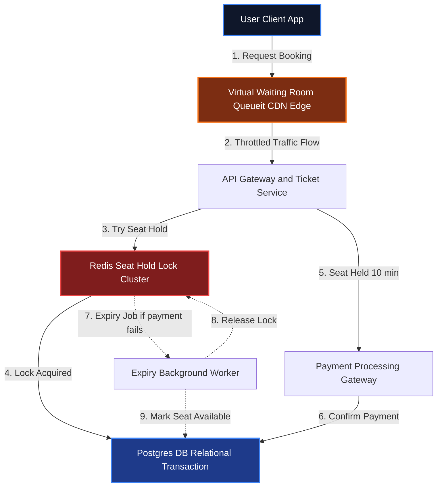
```mermaid
flowchart TD
    UserClient["User Client App"] -->|1. Request Booking| WaitingRoom["Virtual Waiting Room Queueit CDN Edge"]
    WaitingRoom -->|2. Throttled Traffic Flow| Gateway["API Gateway and Ticket Service"]
    
    Gateway -->|3. Try Seat Hold| CacheLock["Redis Seat Hold Lock Cluster"]
    CacheLock -->|4. Lock Acquired| DB["Postgres DB Relational Transaction"]
    
    Gateway -->|5. Seat Held 10 min| PaymentService["Payment Processing Gateway"]
    PaymentService -->|6. Confirm Payment| DB
    
    CacheLock -.->|7. Expiry Job if payment fails| ExpiryWorker["Expiry Background Worker"]
    ExpiryWorker -.->|8. Release Lock| CacheLock
    ExpiryWorker -.->|9. Mark Seat Available| DB
    
    style UserClient fill:#0f172a,stroke:#3b82f6,stroke-width:2px,color:#fff
    style CacheLock fill:#7f1d1d,stroke:#ef4444,stroke-width:2px,color:#fff
    style DB fill:#1e3a8a,stroke:#3b82f6,stroke-width:2px,color:#fff
    style WaitingRoom fill:#7c2d12,stroke:#f97316,stroke-width:2px,color:#fff
```

### 💻 Practical TypeScript Redis Lua Seat Reservation
নিচে একটি অত্যন্ত চমৎকার প্রোডাকশন-রেডি **Atomic Ticketing Lock Manager** কোড দেওয়া হলো যা Redis Lua Script ব্যবহার করে ১ মিলি-সেকেন্ডের নিচে ডাবল বুকিং এরর ছাড়া মাল্টিপল সিট এটমিকালি হোল্ড করে:

```typescript
import Redis from "ioredis";

const redis = new Redis();

interface SeatHoldResult {
  success: boolean;
  message: string;
  heldSeatIds?: string[];
  heldUntil?: number;
}

export class TicketingHoldManager {
  private static readonly HOLD_TTL_SECONDS = 600; // ১০ মিনিট

  /**
   * এটমিক সিট হোল্ড করার জন্য LUA স্ক্রিপ্ট জেনারেট করে
   * LUA স্ক্রিপ্ট রেডিসের সিঙ্গেল-থ্রেডেড ইঞ্জিনে ওয়ান-স্টেপ এটমিক ট্রানজেকশন গ্যারান্টি দেয়
   */
  private getHoldLuaScript(): string {
    return `
      local event_id = ARGV[1]
      local ttl = tonumber(ARGV[2])
      local user_id = ARGV[3]
      
      -- ১. সব সিট এভেইলেবল আছে কি না চেক করি
      for i = 1, #KEYS do
        local seat_key = "seat:" .. event_id .. ":" .. KEYS[i]
        local current_lock = redis.call("GET", seat_key)
        if current_lock then
          return redis.error_reply("SEAT_ALREADY_HELD_OR_BOOKED: " .. KEYS[i])
        end
      end
      
      -- ২. সব সিট খালি থাকলে এটমিকালি লক হোল্ড নিই
      local held_until = redis.call("TIME")[1] + ttl
      for i = 1, #KEYS do
        local seat_key = "seat:" .. event_id .. ":" .. KEYS[i]
        redis.call("SET", seat_key, user_id, "EX", ttl)
      end
      
      return tostring(held_until)
    `;
  }

  /**
   * হাই-কনকারেন্ট ট্রাফিকে সিট হোল্ড নিশ্চিত করে
   */
  public async holdSeats(userId: string, eventId: string, seatIds: string[]): Promise<SeatHoldResult> {
    const luaScript = this.getHoldLuaScript();
    
    try {
      // KEYS represent seat IDs, ARGV contains EventID, TTL, and UserID
      const result = await redis.eval(
        luaScript,
        seatIds.length,
        ...seatIds,
        eventId,
        TicketingHoldManager.HOLD_TTL_SECONDS,
        userId
      ) as string;

      return {
        success: true,
        message: "Seats held successfully for 10 minutes.",
        heldSeatIds: seatIds,
        heldUntil: parseInt(result) * 1000, // milliseconds timestamp
      };
    } catch (error: any) {
      return {
        success: false,
        message: error.message || "Failed to hold seats due to high concurrency.",
      };
    }
  }

  /**
   * পেমেন্ট সাকসেসফুল হলে সিটগুলো রিলিজ করে ডাটাবেসে বুকড মার্ক করে
   */
  public async confirmSeatBooking(eventId: string, seatIds: string[]): Promise<void> {
    const pipeline = redis.pipeline();
    for (const seatId of seatIds) {
      const seatKey = `seat:${eventId}:${seatId}`;
      pipeline.del(seatKey); // লক রিমুভ করব, ডাটাবেসে পার্মানেন্ট BOOKED আপডেট হবে
    }
    await pipeline.exec();
  }
}
```

### 🛑 Staff Architect Edge Cases & Scaling Gaps

বাস্তব জীবনের প্রোডাকশন সিস্টেমে টিকিট ফেয়ার ম্যাচিং স্কেলিংয়ের ৩টি গুরুত্বপূর্ণ স্টাফ-লেভেল সল্যুশন:

#### ১. Database Lock Contention & Virtual Waiting Rooms (CDN Edge)
এমনকি Redis দিয়ে বুকিং করার পরও, বুকিং পেমেন্ট সাকসেস হওয়ার সাথে সাথে যদি প্রতি সেকেন্ডে ২০,০০০ ইউজার ডাটাবেসে ট্রানজেকশন কমপ্লিট করতে চায়, তবে ডেটাবেসের রাইট-লক কনটেনশন চরম আকার ধারণ করবে।
* **মিটিগেশন (Virtual Waiting Room):** আমরা CDN লেভেলে **Queue-it / Cloudflare Waiting Room** ব্যবহার করে বুকিং ফানেলকে থ্রোটল করব। আমরা শুধুমাত্র প্রতি সেকেন্ডে ৫০০ জন ইউজারকে এপিআই গেটওয়েতে ঢুকতে দেব, যা আমাদের PostgreSQL ডাটাবেসের ম্যাক্সিমাম রাইট ক্যাপাসিটি। বাকি লাখ লাখ ট্রাফিক সিডিএন এজ-এ একটি ডাইনামিক কিউতে ওয়েট করবে, যা ডাটাবেসকে বটলনেক থেকে ১০০% রক্ষা করবে।

#### ২. Expired Holds Handling (The Orphan Lock Problem)
যদি কোনো ইউজার সিট হোল্ড করার পর তার ব্রাউজার ক্র্যাশ করে বা পেমেন্ট উইন্ডো ক্রস করে দেয়, তবে ১০ মিনিট পর Redis থেকে লক অটোমেটিক মুছে যাবে। কিন্তু ডাটাবেসের `reservations` টেবিলে থাকা রোটি পেন্ডিংই থেকে যাবে, যা নোংরা ডাটাবেস হিস্ট্রি তৈরি করে।
* **মিটিগেশন (Active CDC Sync Engine):** আমরা **Redis Keyspace Notifications (`__keyevent@0__:expired`)** ইভেন্ট লিসেনার সেটআপ করব। যখনই রেডিস থেকে কোনো সিট লকের TTL এক্সপায়ার হবে, আমাদের ব্যাকগ্রাউন্ড এক্সপায়ার সার্ভিস সেই নোটিফিকেশন শুনে ডাটাবেসের পেন্ডিং ট্রানজেকশনকে এটমিকালি `EXPIRED` করে সিটের স্ট্যাটাস `AVAILABLE` মার্ক করে দেবে।

#### ৩. Scalper Bots Prevention (Idempotent Cryptographic Tokens)
বট ও স্ক্যালপাররা এপিআই কল বাইপাস করে সেকেন্ডে হাজার হাজার সিট হোল্ড করে নিতে পারে, যার ফলে সাধারণ ক্রেতারা কোনো টিকিটই পায় না।
* **মিটিগেশন (Signed Ticket Tokens):** সিট সিলেক্ট করার সময় সিস্টেম ক্লায়েন্টকে একটি ক্রিপ্টোগ্রাফিকালি সাইনড টোকেন (JWT) দেবে যার ভেতরে ইউজার আইডি, সিট আইডি এবং টাইমস্ট্যাম্প সাইন করা থাকবে। `seats/reserve` এপিআই শুধুমাত্র সেই রিকোয়েস্টই এক্সেপ্ট করবে যেটিতে আমাদের গেটওয়ের দ্বারা সাইন করা ভ্যালিড টোকেন থাকবে। এতে বটস সরাসরি এপিআই স্প্যাম করে টিকিট বুকিং করতে পারবে না।

---

## 📖 Chapter 08: Google Drive & Dropbox (Distributed File Storage Engine)

ডিস্ট্রিবিউটেড ক্লাউড ড্রাইভের মূল ইঞ্জিনিয়ারিং চ্যালেঞ্জ হলো পেটাবাইট স্কেলের ফাইল স্টোরেজ ম্যানেজমেন্ট, ব্যান্ডউইথ অপ্টিমাইজেশন এবং রিয়েল-টাইম ডিস্ট্রিবিউটেড মেটাডাটা সিঙ্ক মেকানিজম গড়ে তোলা। একটি ১ গিগাবাইটের ফাইলের সামান্য ১ কিলোবাইট পরিবর্তন হলে পুরো ফাইল পুনরায় আপলোড না করে কীভাবে নেটওয়ার্ক এবং ক্লাউড কস্ট সাশ্রয় করা যায়, তা নিচে বিশদভাবে বর্ণনা করা হলো।

### ১. রিকোয়ারমেন্টস (Scope)
- **Functional:**
  - ইউজার যেকোনো সাইজের ফাইল (সর্বোচ্চ ১০ জিবি) আপলোড, ডাউনলোড ও ডিলিট করতে পারবেন।
  - ডিভাইস সিঙ্ক্রোনাইজেশন: ডিভাইস A-তে কোনো ফাইল আপলোড বা ইডিট হলে তা সাথে সাথে ডিভাইস B-তে ব্যাকগ্রাউন্ডে রিয়েল-টাইমে সিঙ্ক হবে।
  - ফাইল হিস্ট্রি ও ভার্সন কন্ট্রোল: ইউজার আগের ভার্সনগুলো ট্র্যাক করতে এবং রিস্টোর করতে পারবেন।
- **Non-Functional:**
  - **Bandwidth Optimization:** ফাইলের সামান্য ইডিট হলে পুরো ফাইল পুনরায় আপলোড না করে কেবল পরিবর্তিত অংশটুকু আপলোড করা (Chunking)।
  - **Storage Cost Optimization:** মাল্টিপল ইউজারের আপলোড করা হুবহু একই ফাইল রিমুভ করে ডুপ্লিকেশন এড়ানো (Deduplication)।
  - **Consistency:** ফাইল এডিট নিয়ে কনফ্লিক্ট হলে ডেটা লস এড়ানো (Sync Conflict Resolution)।

### ২. Back-of-the-envelope Estimation
* **স্টোরেজ রিকোয়ারমেন্টস (Capacity Estimation):**
  * ডেইলি একটিভ ইউজার (DAU) = ১০ মিলিয়ন
  * এভারেজ আপলোড স্পেস প্রতি ইউজার = ১০ মেগাবাইট / দিন
  * **টোটাল ইনজেস্ট ডেটা/দিন = ১০,০০০,০০০ * ১০ MB =** **100 Terabytes / day**
  * **ডি-ডুপ্লিকেশন সেভ ফ্যাক্টর (Deduplication Saving):** আমাদের ইনজেস্ট করা ডেটার ২০% ফাইল ডুপ্লিকেট থাকে (একই ফটো, ভিডিও বা ফাইল মাল্টিপল ইউজার আপলোড করে)।
  * **নেট প্রয়োজনীয় স্টোরেজ/দিন = ১০০ TB * ০.৮ =** **80 Terabytes / day**
  * **১০ বছরের মোট প্রয়োজনীয় ক্লাউড স্পেস ≈** **292 Petabytes**
* **ব্যান্ডউইথ সাশ্রয়ের হিসাব (Chunk-based Upload):**
  * আমরা ফাইলকে ছোট ছোট **৪ মেগাবাইটের চাঙ্কে (Chunks)** ভাগ করব। যদি কোনো ইউজার তার ১ গিগাবাইটের একটি ফাইলের মাত্র ১টি চাঙ্ক পরিবর্তন করে, তবে চাঙ্কিং করার ফলে পুরো ১ জিবি আপলোডের জায়গায় মাত্র **৪ মেগাবাইট** আপলোড হবে, যা ব্যান্ডউইথ ব্যবহার **৯৯.৬%** কমিয়ে দেয়!

### ৩. API & Database Schema Design
চাঙ্ক ম্যানেজমেন্ট ও মেটাডাটা আপলোডের জন্য ডিজাইন:
- `POST /api/v1/chunks/upload` (৪ মেগাবাইটের চাঙ্ক আপলোড, যেখানে চাঙ্ক আইডি হবে চাঙ্কের SHA-256 হ্যাশ)
- `POST /api/v1/files/commit` (ফাইলের সব চাঙ্ক লিস্ট এবং ফাইল স্ট্রাকচার ডাটাবেসে সেভ করা)

#### Database Schema Design
ফাইলের মেটাডাটা ও চাঙ্কের রিলেশনশিপ ম্যাপ করার জন্য **PostgreSQL** স্কিমা:

```sql
CREATE TABLE files (
    file_id varchar(64) PRIMARY KEY,
    user_id bigint,
    name varchar(255),
    is_directory boolean,
    version int,
    parent_id varchar(64)
);

CREATE TABLE file_chunks (
    file_id varchar(64),
    chunk_hash varchar(64), -- SHA-256
    chunk_order int,
    PRIMARY KEY (file_id, chunk_hash, chunk_order)
);

CREATE TABLE chunk_registry (
    chunk_hash varchar(64) PRIMARY KEY,
    size_bytes int,
    storage_path varchar(512),
    reference_count int -- ডি-ডুপ্লিকেশন ট্র্যাক করার জন্য
);
```

### ৪. High-Level Architecture
ক্লাউড ড্রাইভের মেটাডাটা ট্র্যাকিং ও ক্লাউড স্টোরেজ ফ্লো নিচে চিত্রায়িত করা হলো:

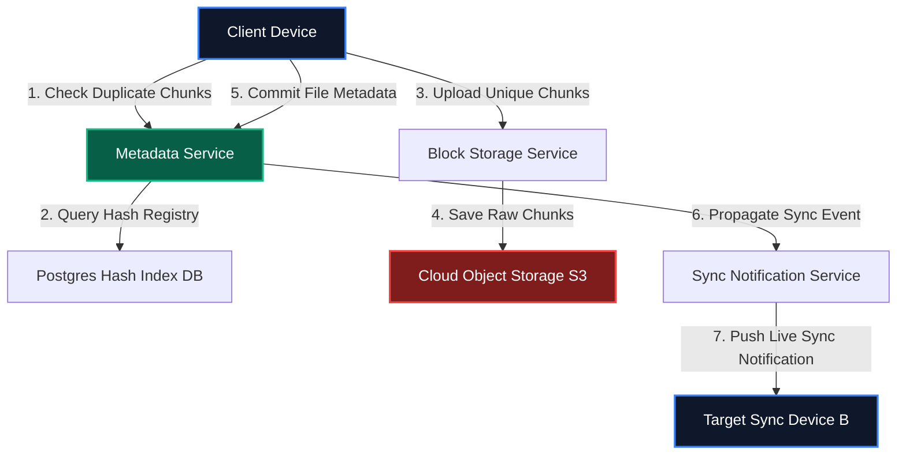
```mermaid
flowchart TD
    ClientApp["Client Device"] -->|1. Check Duplicate Chunks| MetadataServer["Metadata Service"]
    MetadataServer -->|2. Query Hash Registry| HashIndexDB["Postgres Hash Index DB"]
    
    ClientApp -->|3. Upload Unique Chunks| BlockServer["Block Storage Service"]
    BlockServer -->|4. Save Raw Chunks| CloudS3["Cloud Object Storage S3"]
    
    ClientApp -->|5. Commit File Metadata| MetadataServer
    MetadataServer -->|6. Propagate Sync Event| SyncService["Sync Notification Service"]
    SyncService -->|7. Push Live Sync Notification| ClientDeviceB["Target Sync Device B"]
    
    style ClientApp fill:#0f172a,stroke:#3b82f6,stroke-width:2px,color:#fff
    style MetadataServer fill:#065f46,stroke:#10b981,stroke-width:2px,color:#fff
    style CloudS3 fill:#7f1d1d,stroke:#ef4444,stroke-width:2px,color:#fff
    style ClientDeviceB fill:#0f172a,stroke:#3b82f6,stroke-width:2px,color:#fff
```

### 💻 Practical TypeScript Chunk Upload & Deduplication Engine
নিচে একটি প্রোডাকশন-রেডি **Chunk Deduplication Manager** কোড দেওয়া হলো যা আপলোড করা বাফারের SHA-256 হ্যাশ বের করে এবং ইউনিক চাঙ্কগুলো অবজেক্ট স্টোরেজে (AWS S3) পাঠায় ও ডুপ্লিকেট চাঙ্ক আপলোড স্কিপ করে:

```typescript
import * as crypto from "crypto";

interface ChunkUploadResponse {
  chunkHash: string;
  isDuplicate: boolean;
  uploadedPath?: string;
}

export class ChunkDeduplicationManager {
  // মেমোরি রেজিস্ট্রি ইনডেক্স (বাস্তব প্রোডাকশনে PostgreSQL chunk_registry টেবিলে যাবে)
  private chunkRegistry = new Map<string, { storagePath: string; refCount: number }>();

  /**
   * ফাইল বাফারের SHA-256 হ্যাশ বের করে চাঙ্ক আইডি হিসেবে ব্যবহারের জন্য
   */
  public computeSHA256(buffer: Buffer): string {
    return crypto.createHash("sha256").update(buffer).digest("hex");
  }

  /**
   * ৪ মেগাবাইটের ফাইল চাঙ্ক প্রসেস করে
   * হ্যাশ ডুপ্লিকেট হলে আপলোড স্কিপ করে ব্যান্ডউইথ ও মেমোরি সেভ করে
   */
  public async uploadChunk(chunkBuffer: Buffer, userId: string): Promise<ChunkUploadResponse> {
    const hash = this.computeSHA256(chunkBuffer);
    const existingChunk = this.chunkRegistry.get(hash);

    if (existingChunk) {
      // 🟢 Deduplication Hit: ফাইল ব্লকটি সার্ভারে অলরেডি আপলোড হয়ে গেছে!
      // আমরা নতুন করে আপলোড না করে কেবল রেফারেন্স কাউন্ট ১ বাড়িয়ে দেব
      existingChunk.refCount += 1;
      this.chunkRegistry.set(hash, existingChunk);
      
      return {
        chunkHash: hash,
        isDuplicate: true,
        uploadedPath: existingChunk.storagePath,
      };
    }

    // 🔴 Deduplication Miss: ফাইল ব্লকটি একদম নতুন ও ইউনিক!
    // আমরা ফাইল ব্লকটি ক্লাউড অবজেক্ট স্টোরেজে (AWS S3) সেভ করব
    const dummyStoragePath = `s3://cloud-drive-bucket/chunks/${hash.slice(0, 2)}/${hash}.bin`;
    
    // ফাইল ইনডেক্সে সেভ করি
    this.chunkRegistry.set(hash, {
      storagePath: dummyStoragePath,
      refCount: 1,
    });

    return {
      chunkHash: hash,
      isDuplicate: false,
      uploadedPath: dummyStoragePath,
    };
  }

  /**
   * ফাইলের চাঙ্কের রেফারেন্স রিলিজ করে
   * রেফারেন্স কাউন্ট ০ হলে চাঙ্কটি অবজেক্ট স্টোরেজ থেকে ডিলিট করা হবে (Garbage Collector)
   */
  public async releaseChunk(hash: string): Promise<void> {
    const chunk = this.chunkRegistry.get(hash);
    if (!chunk) return;

    chunk.refCount -= 1;
    if (chunk.refCount <= 0) {
      // S3 স্টোরেজ থেকে ফাইল মুছে ফেলার ব্যাকগ্রাউন্ড ইভেন্ট জেনারেট হবে
      this.chunkRegistry.delete(hash);
      console.log(`Garbage Collector: Deleted chunk ${hash} from S3 storage.`);
    } else {
      this.chunkRegistry.set(hash, chunk);
    }
  }
}
```

### 🛑 Staff Architect Edge Cases & Scaling Gaps

পেটাবাইট স্কেলের ডিস্ট্রিবিউটেড ফাইল সিস্টেমে প্রোডাকশনের ৩টি জটিল প্রবলেম ও স্টাফ-লেভেল সল্যুশন:

#### ১. Dynamic Sync Conflicts (Optimistic Concurrency Control)
যখন দুজন কোলাবোরেটর অফলাইন অবস্থায় একই এক্সেল শিট মডিফাই করেন এবং পরবর্তীতে অনলাইনে ফিরে আসেন, তখন ডিভাইস B ডিভাইস A-এর ফাইল ওভাররাইট করে ডেটা লস ঘটাতে পারে।
* **মিটিগেশন (Optimistic Concurrency Control - OCC):** মেটাডাটা সার্ভারে আমরা প্রতিটি ফাইলের সাথে একটি `version` নাম্বার ট্র্যাক করব। যখন ডিভাইস B ফাইল সিঙ্ক করার রিকোয়েস্ট পাঠাবে, তাকে তার লাস্ট ডাউনলোড করা ভার্সন নাম্বারটি দিতে হবে। যদি ডাটাবেসের কারেন্ট ভার্সন অলরেডি আপডেট হয়ে থাকে (যেমন ডিভাইস A আগে কমপ্লিট করেছে), তবে সার্ভার `409 Conflict` রেসপন্স দেবে। ক্লায়েন্ট ডিভাইস তখন ইউজারের কাছে কনফ্লিক্ট দেখাবে এবং ২ ফাইল মার্জ বা আলাদা দুটি কপি সেভ করার ডিসিশন নেবে।

#### ২. Petabyte Scale Cost Optimization (Cold vs Hot Storage Lifecycle)
ইনজেস্ট করা ফাইলগুলোর ৯০% আপলোডের ৩০ দিন পার হয়ে যাওয়ার পর আর কখনই কোনো ইউজার রিড বা অ্যাক্সেস করে না। পেটাবাইট স্কেলের ডেটা হাই-পারফরম্যান্স SSD তে বছরের পর বছর রেখে দেওয়া লাখ লাখ টাকার ক্লাউড লস।
* **মিটিগেশন (Storage Class Lifecycle Policies):** আমরা একটি অটোমেটেড পলিসি জেনারেট করব যা প্রতি ৩০ দিন পর পর আন-অ্যাক্সেসড চাঙ্কগুলোকে **S3 Standard (Hot)** থেকে **S3 Standard-IA (Infrequent Access)** এ পাঠাবে। এবং ৯০ দিন পর ফাইলগুলোকে **AWS S3 Glacier Deep Archive (Cold Storage)** ক্লাসে ট্রান্সফার করবে। এতে আমাদের মান্থলি ক্লাউড বিল **৮০% পর্যন্ত হ্রাস** পাবে।

#### ৩. Deduplication Cross-User Side-Channel Exploit (Security Leak)
কোনো ইউজার একটি সিক্রেট ফাইল আপলোড করার সময় সিস্টেম যদি সাথে সাথে বলে "File already exists (Upload skipped)", তবে ওই ইউজার সাথে সাথে টের পেয়ে গেল যে আমাদের ড্রাইভ সার্ভারে অন্য কেউ ঠিক একই ফাইলটি অলরেডি স্টোর করে রেখেছে! এটি একটি মারাত্মক ইনফরমেশন লিক সিকিউরিটি হোল।
* **মিটিগেশন (Proof of Custody - PoC):** ক্লায়েন্ট কেবল ফাইলের SHA-256 হ্যাশ পাঠাবে না। সার্ভার ক্লায়েন্টকে একটি চ্যালেঞ্জ পাঠাবে (যেমন: "ফাইলের ১০ম বাইট থেকে ১০০তম বাইটের র্যান্ডম হ্যাশ ক্যালকুলেট করে দেখাও")। এটি প্রমাণ করে যে ফাইলটি আসলেই ক্লায়েন্ট ডিভাইসে ফিজিক্যালি উপস্থিত আছে এবং কেবল ডোপ অনুমান করে হ্যাশ পাঠানো হচ্ছে না। একেই বলে **Proof of Custody (PoC)**।

---

## 📖 Chapter 09: Web Crawler (Search Engine Indexer)

গুগল বা বিং-এর মতো সার্চ ইঞ্জিনের জন্য কোটি কোটি ওয়েব পেজ অটোমেটিকভাবে ক্রল করা এবং ইনডেক্সিং পাইপলাইনে পাঠানো অত্যন্ত জটিল একটি কাজ। বিলিয়ন স্কেলে ওয়েব ক্রলিংয়ের মূল কারিগরি চ্যালেঞ্জ হলো গ্রাফ ট্রাভার্সাল (BFS), ডোমেইন পোলাইটনেস (Politeness), Robots.txt সম্মান করা এবং ইনফিনিট স্পাইডার ট্র্যাপ বা রিডাইরেকশন লুপ প্রিভেন্ট করা।

### ১. রিকোয়ারমেন্টস (Scope)
- **Functional:**
  - ওয়েব পেজ থেকে কন্টেন্ট ডাউনলোড এবং তার ভেতরের সব হাইপারলিঙ্ক (`<a href="...">`) এটমিকালি এক্সট্র্যাক্ট করা।
  - ডাউনলোড করা কন্টেন্ট ক্লাউড অবজেক্ট স্টোরেজে (S3) সেভ করা এবং টেক্সট ডেটা সার্চ ইনডেক্সারে পুশ করা।
  - প্রতিটি ডোমেইনের **Robots.txt** রুলস পড়া ও কঠোরভাবে মেনে চলা।
- **Non-Functional:**
  - **Massive Scalability:** প্রতি মাসে ১৫ বিলিয়ন (15 Billion) পেজ ক্রল করার ক্ষমতা থাকতে হবে।
  - **Strict Domain Politeness:** কোনো ওয়েবসাইটকে অতিরিক্ত রিকোয়েস্ট পাঠিয়ে যাতে ডাউন না করা হয় (DoS Attack প্রিভেনশন)।
  - **High Fault Tolerance:** ডেড লিংক, স্লো রেসপন্স, ৪MB পেজ সাইজ এবং মাল্টিপল রিডাইরেকশন এরর সুন্দরভাবে হ্যান্ডেল করা।

### ২. Back-of-the-envelope Estimation
* **ক্রলার থ্রুপুট (Page Crawl QPS):**
  * মাসিক ক্রল টার্গেট = ১৫ বিলিয়ন পেজ
  * দৈনিক ক্রল রেট = ১৫,০০০,০০০,০০০ / ৩০ দিন = ৫০০,০০০,০০০ পেজ / দিন
  * **Crawl Download QPS = ৫০০,০০০,০০০ / ৮৬,৪০০ সেকেন্ড ≈** **5,800 pages/sec (Average)**
* **স্টোরেজ রিকোয়ারমেন্টস (Raw HTML Cache - 1 Year):**
  * এভারেজ পেজ সাইজ = ১০০ কিলোবাইট
  * দৈনিক ইনজেস্ট স্পেস = ৫০০,০০০,০০০ * ১০০ KB = **50 Terabytes / day**
  * **১ বছরের টোটাল প্রয়োজনীয় মেমোরি ≈** **18 Petabytes** (তাই S3 Glacier বা অবজেক্ট স্টোরেজ ব্যবহার মাস্ট)।
* **DNS রিজলভার ওভারহেড:**
  * সেকেন্ডে ৫,৮০০ পেজ ক্রল করার অর্থ হলো প্রতি সেকেন্ডে ৫,৮০০ টি DNS রিজলভিং কুয়েরি জেনারেট হওয়া। এটি গ্লোবাল পাবলিক DNS-এ পাঠালে সাথে সাথে আমাদের ব্লক করে দেবে। তাই একটি লোকাল ডিস্ট্রিবিউটেড DNS ক্যাশিং সার্ভার ম্যান্ডেটরি।

### ৩. API & Database Schema Design
ডিস্ট্রিবিউটেড ক্রলাররা ব্যাকগ্রাউন্ড ডেমো ওয়ার্কার হিসেবে কাজ করে, তাই তাদের কোনো ডিরেক্ট ইউজার ফেসড API থাকে না। তারা **Frontier Queue** থেকে ইনপুট নেয় ও প্রসেসিং আউটপুট দেয়।

#### Database Tables Schema (Crawl Frontier Storage)
ডিজিটাল ইউআরএল-এর স্টেট এবং প্রায়োরিটি ট্র্যাক করার জন্য ডিস্ট্রিবিউটেড **PostgreSQL/Cassandra** নোএসকিউএল ইনডেক্স:

```sql
CREATE TABLE crawl_frontier (
    url_hash varchar(64) PRIMARY KEY,
    url varchar(2048),
    domain varchar(255),
    status varchar(20), -- 'DISCOVERED', 'IN_PROGRESS', 'CRAWLED', 'FAILED'
    last_crawled_at timestamp,
    priority int
);

CREATE TABLE robots_cache (
    domain varchar(255) PRIMARY KEY,
    rules_text text,
    expires_at timestamp
);
```

### ৪. High-Level Architecture
ডিস্ট্রিবিউটেড ক্রলিং ফ্লো ও ডি-ডুপ্লিকেশন পাইপলাইন নিচে চিত্রায়িত করা হলো:

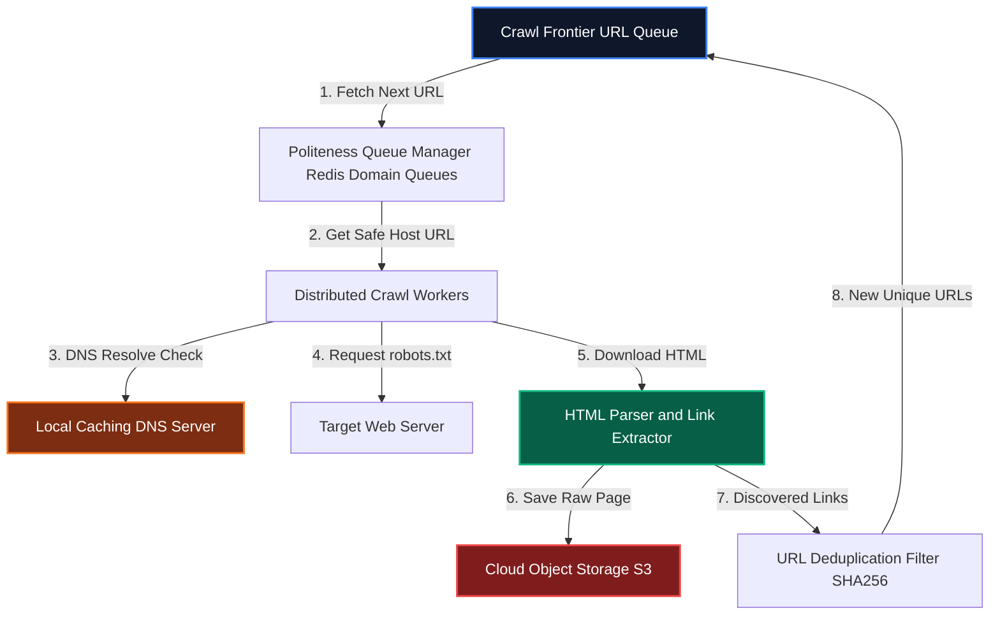
```mermaid
flowchart TD
    Frontier["Crawl Frontier URL Queue"] -->|1. Fetch Next URL| PolitenessQueue["Politeness Queue Manager Redis Domain Queues"]
    PolitenessQueue -->|2. Get Safe Host URL| CrawlWorker["Distributed Crawl Workers"]
    
    CrawlWorker -->|3. DNS Resolve Check| DNSCache["Local Caching DNS Server"]
    CrawlWorker -->|4. Request robots.txt| TargetServer["Target Web Server"]
    
    CrawlWorker -->|5. Download HTML| HTMLParser["HTML Parser and Link Extractor"]
    
    HTMLParser -->|6. Save Raw Page| RawStore["Cloud Object Storage S3"]
    HTMLParser -->|7. Discovered Links| DedupeService["URL Deduplication Filter SHA256"]
    
    DedupeService -->|8. New Unique URLs| Frontier
    
    style Frontier fill:#0f172a,stroke:#3b82f6,stroke-width:2px,color:#fff
    style DNSCache fill:#7c2d12,stroke:#f97316,stroke-width:2px,color:#fff
    style HTMLParser fill:#065f46,stroke:#10b981,stroke-width:2px,color:#fff
    style RawStore fill:#7f1d1d,stroke:#ef4444,stroke-width:2px,color:#fff
```

### 💻 Practical TypeScript Politeness and Robots.txt Manager
নিচে একটি প্রোডাকশন-রেডি **Crawl Politeness Manager** কোড দেওয়া হলো যা Redis ক্যাশ ব্যবহার করে Robots.txt-এর রুলস ভ্যালিডেট করে এবং ডোমেইন প্রতি ২ সেকেন্ডের লকিং পোলাইটনেস এনফোর্স করে:

```typescript
import Redis from "ioredis";

const redis = new Redis();

interface CrawlTask {
  url: string;
  domain: string;
}

export class CrawlPolitenessManager {
  private static readonly POLITENESS_DELAY_MS = 2000; // একই ডোমেইনে সর্বোচ্চ ১টি রিকোয়েস্ট প্রতি ২ সেকেন্ডে
  private static readonly DISALLOWED_ROBOTS_KEY = "robots:disallowed:";

  /**
   * ইউআরএল থেকে ডোমেইন এক্সট্র্যাক্ট করে
   */
  public extractDomain(urlStr: string): string {
    try {
      const url = new URL(urlStr);
      return url.hostname;
    } catch {
      return "";
    }
  }

  /**
   * Robots.txt ভ্যালিডেট করে পাথ অ্যালাউড কি না নিশ্চিত করে
   */
  public async isUrlAllowed(urlStr: string): Promise<boolean> {
    const domain = this.extractDomain(urlStr);
    if (!domain) return false;

    // Robots disallow list loaded from Redis cache
    const disallowRules = await redis.smembers(`${CrawlPolitenessManager.DISALLOWED_ROBOTS_KEY}${domain}`);
    
    const url = new URL(urlStr);
    for (const rule of disallowRules) {
      if (url.pathname.startsWith(rule)) {
        console.log(`Crawl Blocked: Robots.txt disallows path ${url.pathname} on ${domain}`);
        return false;
      }
    }
    return true;
  }

  /**
   * পোলাইটনেস লক অ্যাকোয়ার করে
   * নির্দিষ্ট ডোমেইনে ২ সেকেন্ডের মধ্যে অন্য কোনো ক্রলার রিকোয়েস্ট পাঠাতে পারবে না
   */
  public async acquireCrawlPermission(domain: string): Promise<boolean> {
    const lockKey = `crawl:lock:domain:${domain}`;
    
    // NX: key না থাকলে সেট হবে, EX: ২ সেকেন্ডের জন্য লক থাকবে
    const lock = await redis.set(lockKey, "ACTIVE", "NX", "PX", CrawlPolitenessManager.POLITENESS_DELAY_MS);
    
    if (lock === "OK") {
      return true; // লক সাকসেস!
    }
    
    return false; // লক ফেইল! পোলাইটনেস ভায়োলেশন এড়াতে হোল্ড করা হবে
  }

  /**
   * ডোমেইনে অফলাইন রুল রেজিস্টার করে
   */
  public async registerDisallowedPath(domain: string, path: string): Promise<void> {
    await redis.sadd(`${CrawlPolitenessManager.DISALLOWED_ROBOTS_KEY}${domain}`, path);
  }
}
```

### 🛑 Staff Architect Edge Cases & Scaling Gaps

বিলিয়ন-স্কেল ক্রলিং ইঞ্জিনে প্রোডাকশনে ফেস করা ৩টি চরম প্রবলেম ও তাদের সল্যুশন:

#### ১. DNS Resolution Bottleneck (Network Blockages)
সেকেন্ডে ৫,৮০০ রিকোয়েস্ট প্রসেস করতে গেলে সমপরিমাণ DNS Lookup করতে হয়। যেহেতু DNS Resolution একটি সিঙ্ক্রোনাস এবং ব্লকিং অপারেশন, এটি বাইরের পাবলিক DNS এ পাঠালে লেটেন্সি ৫ সেকেন্ড পার হয়ে যাবে এবং আইপি ব্লক খাবে।
* **মিটিগেশন (DNS Caching & Asynchronous Resolvers):** আমরা আমাদের ডিস্ট্রিবিউটেড নেটওয়ার্ক পডগুলোতে লোকাল ক্যাশিং DNS সার্ভার (যেমন **Unbound / CoreDNS**) ডেপ্লয় করব। আমাদের ক্রলিং ইঞ্জিন ডিরেক্টলি লোকাল ক্যাশ থেকে IP রিজলভ করবে। এছাড়া অ্যাসিঙ্ক্রোনাস এবং নন-ব্লকিং DNS কুয়েরি মেকানিজম ব্যবহার করা হবে যাতে একটি থ্রেড DNS রিজলভিং-এর জন্য ঝুলে না থাকে।

#### ২. Spider Traps & Dynamic Path Loops
কিছু ওয়েবসাইট ডাইনামিকালি ইনফিনিট ক্যালেন্ডার বা রিডাইরেকশন লুপ তৈরি করে (যেমন: `/calendar/2026/next-day` যা অফুরন্ত লিংক জেনারেট করে)। ক্রলার এর ভেতরে ঢুকে পড়লে একই সাইটের মিলিয়ন লিংকে ঘুরে রিসোর্স নষ্ট করবে।
* **মিটিগেশন (Depth Limiting & Bloom Filter Hash Check):** আমরা দুটি ফিল্টার বসাব:
  * **Max Depth Guard:** যেকোনো ওয়েবসাইটের জন্য BFS ডেপথ সর্বোচ্চ ১৫ লেয়ারে লক করে দেওয়া হবে।
  * **Bloom Filter Document Duplication:** একটি পেজ ডাউনলোডের পর তার HTML কন্টেন্টকে হ্যাশ করব। ব্লুম ফিল্টার দিয়ে যদি দেখি একই ডোমেইনের কন্টেন্ট হ্যাশ ৫ বারের বেশি ডুপ্লিকেট হচ্ছে (ভিন্ন ইউআরএল-এর অধীনে), তবে বুঝবো এটি একটি স্পাইডার ট্র্যাপ এবং সেই ডোমেইন ক্রলিং করা সাথে সাথে ব্ল্যাকলিস্ট করব।

#### ৩. Crawl Politeness Queue Skewing (Host-based Queues)
একটি সিঙ্গেল প্রসেসিং কিউ ব্যবহার করলে মাল্টিপল ক্রলার থ্রেড একই সময়ে একই ডোমেইনের (যেমন `wikipedia.org`) মাল্টিপল লিংক তুলে আনতে পারে, যার ফলে পোলাইটনেস রুল ব্রেক হবে এবং আইপি ব্যান খাবে।
* **মিটিগেশন (Host-based Sub-Queues):** আমরা Crawl Frontier-কে Domain Name অনুযায়ী শার্ডিং করব। প্রতিটি ডোমেইনের জন্য আলাদা ডেডিকেটেড FIFO সাব-কিউ থাকবে। একটি সেন্ট্রাল **Queue Coordinator** প্রতি সাব-কিউ-এর বিপরীতে **ঠিক একটি মাত্র ক্রলিং থ্রেড** অ্যাসাইন করবে। এর ফলে একটি ডোমেইনে কখনো প্যারালাল রিকোয়েস্ট যাবে না, যা নিখুঁত পোলাইটনেস এনশিওর করবে।

---

## 📖 Chapter 10: Distributed Notification System

একটি ডিস্ট্রিবিউটেড নোটিফিকেশন সিস্টেমের মূল ইঞ্জিনিয়ারিং চ্যালেঞ্জ হলো মিলিয়ন মিলিয়ন মোবাইল ও ওয়েব ক্লায়েন্টে চোখের পলকে পুশ নোটিফিকেশন (FCM/APNS), ইমেইল (SendGrid) এবং এসএমএস (Twilio) পাঠানো। ক্রনিকাল মার্কেটিং ক্যাম্পেইনের বাল্ক মেসেজ যেন ট্রানজেকশনাল ওটিপি (OTP) ও সিকিউরিটি এলার্টকে স্লো না করে দেয় এবং কোনো অবস্থায় যেন একজন ইউজার ডুপ্লিকেট মেসেজ না পান, তা স্টাফ আর্কিটেক্ট লেভেলে ডিজাইন করা নিচে চমৎকারভাবে আলোচনা করা হলো।

### ১. রিকোয়ারমেন্টস (Scope)
- **Functional:**
  - ইউজারদের বিভিন্ন চ্যানেলে (Push, SMS, Email) নোটিফিকেশন ডেলিভারি দেওয়া।
  - ওটিপি (OTP) ও সিকিউরিটি অ্যালার্টের মতো গুরুত্বপূর্ণ নোটিফিকেশন অত্যন্ত হাই-স্পিডে পাঠানো।
  - ইউজার প্রিফারেন্স ম্যানেজমেন্ট (যেমন: ইউজার মার্কেটিং নোটিফিকেশন অফ রাখতে পারলেও ট্রানজেকশনাল ওটিপি ম্যান্ডেটরি রিসিভ করবেন)।
- **Non-Functional:**
  - **Ultra Scalability:** প্রতি দিনে ১ বিলিয়ন (1 Billion) নোটিফিকেশন ডেলিভারি হ্যান্ডেল করা।
  - **Strict Idempotency:** নেটওয়ার্ক বা সার্ভার ফেইলিওরের কারণে একই মেসেজ যেন ইউজার ২ বার না পান (Deduplication)।
  - **Fault Tolerance:** কোনো গেটওয়ে (যেমন Twilio) ডাউন থাকলে অটোমেটিক অন্য অল্টারনেটিভ গেটওয়েতে রুট হওয়া।

### ২. Back-of-the-envelope Estimation
* **থ্রুপুট ক্যালকুলেশন (Notification QPS):**
  * দৈনিক নোটিফিকেশন টার্গেট = ১,০০০,০০০,০০০ নোটিফিকেশন / দিন
  * **Average Notification QPS = ১,০০০,০০০,০০০ / ৮৬,৪০০ সেকেন্ড ≈** **11,500 notifications/sec**
  * **Peak Surge QPS (যেমন নববর্ষের ফ্ল্যাশ অ্যালার্ট):** **100,000 notifications/sec**
* **ব্যান্ডউইথ ক্যাপাসিটি:**
  * একটি স্ট্যান্ডার্ড নোটিফিকেশন পেলোডের এভারেজ সাইজ = ১ কিলোবাইট (ডিভাইস টোকেন, টাইটেল, বডি)।
  * **Peak Network Ingest Rate = ১০০,০০০ QPS * ১ KB =** **100 Megabytes / sec**। নোটিফিকেশনগুলোর ব্যাকলগ এড়াতে মেসেজ ব্রোকারকে (Kafka) অত্যন্ত অপ্টিমাইজডভাবে শার্ড বা পার্টিশন করতে হবে।

### ৩. API & Database Schema Design
নোটিফিকেশন রিকোয়েস্ট এপিআই ও রিলেশনাল ডেটা মডেল:
- `POST /api/v1/notifications/send`
  - Body: `{ userId, message, priority: "HIGH" | "LOW", channels: ["PUSH", "SMS"], idempotencyKey: "uuid-12345" }`

#### Database Schema Design
ইউজারের নোটিফিকেশন পারমিশন ও ডেলিভারি হিস্ট্রি ম্যাপ করার জন্য **PostgreSQL** ও নোএসকিউএল স্কিমা:

```sql
-- PostgreSQL: ইউজার প্রিফারেন্স টেবিল
CREATE TABLE notification_preferences (
    user_id bigint PRIMARY KEY,
    allow_push boolean DEFAULT true,
    allow_email boolean DEFAULT true,
    allow_sms boolean DEFAULT false
);

-- Cassandra/DynamoDB: হাই-রাইট স্পিডের নোটিফিকেশন ডেলিভারি লগ
CREATE TABLE notification_logs (
    notification_id varchar(64) PRIMARY KEY,
    user_id bigint,
    channel varchar(20),
    status varchar(20), -- 'PENDING', 'SENT', 'FAILED'
    created_at timestamp
);
```

### ৪. High-Level Architecture
ডিস্ট্রিবিউটেড নোটিফিকেশন সিস্টেমের ইডেমপোটেন্সি চেক, প্রায়োরিটি শার্ডিং ও মাল্টি-চ্যানেল ডেলিভারি ট্রাফিক ফ্লো নিচে চিত্রায়িত করা হলো:

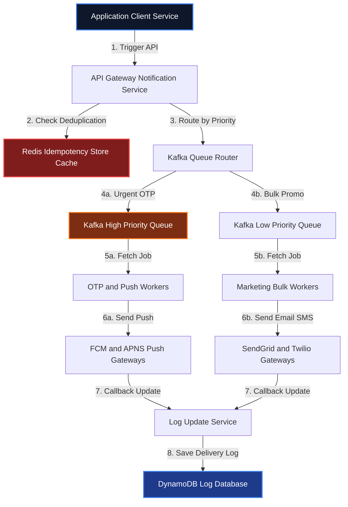
```mermaid
flowchart TD
    Client["Application Client Service"] -->|1. Trigger API| Gateway["API Gateway Notification Service"]
    Gateway -->|2. Check Deduplication| DedupeStore["Redis Idempotency Store Cache"]
    
    Gateway -->|3. Route by Priority| QueueRouter["Kafka Queue Router"]
    QueueRouter -->|4a. Urgent OTP| HighPriorityQueue["Kafka High Priority Queue"]
    QueueRouter -->|4b. Bulk Promo| LowPriorityQueue["Kafka Low Priority Queue"]
    
    HighPriorityQueue -->|5a. Fetch Job| HighWorker["OTP and Push Workers"]
    LowPriorityQueue -->|5b. Fetch Job| LowWorker["Marketing Bulk Workers"]
    
    HighWorker -->|6a. Send Push| PushGW["FCM and APNS Push Gateways"]
    LowWorker -->|6b. Send Email SMS| EmailGW["SendGrid and Twilio Gateways"]
    
    PushGW & EmailGW -->|7. Callback Update| LogService["Log Update Service"]
    LogService -->|8. Save Delivery Log| DB["DynamoDB Log Database"]
    
    style Client fill:#0f172a,stroke:#3b82f6,stroke-width:2px,color:#fff
    style DedupeStore fill:#7f1d1d,stroke:#ef4444,stroke-width:2px,color:#fff
    style HighPriorityQueue fill:#7c2d12,stroke:#f97316,stroke-width:2px,color:#fff
    style DB fill:#1e3a8a,stroke:#3b82f6,stroke-width:2px,color:#fff
```

### 💻 Practical TypeScript Idempotent Priority Queue Dispatcher
নিচে একটি প্রোডাকশন-রেডি **Idempotent Notification Dispatcher** কোড দেওয়া হলো যা Redis ব্যবহার করে ডুপ্লিকেট রিকোয়েস্ট ব্লক করে এবং মেসেজ প্রায়োরিটি মেইনটেইন করে সঠিক কিউতে পুশ করে:

```typescript
import Redis from "ioredis";

const redis = new Redis();

interface NotificationRequest {
  idempotencyKey: string;
  userId: string;
  message: string;
  priority: "HIGH" | "LOW";
  channels: Array<"PUSH" | "EMAIL" | "SMS">;
}

interface DispatchResult {
  success: boolean;
  message: string;
  notificationId?: string;
}

export class IdempotentNotificationDispatcher {
  private static readonly IDEMPOTENCY_TTL_SECONDS = 86400; // ২৪ ঘণ্টা
  private static readonly HIGH_PRIORITY_QUEUE = "queue:notification:high";
  private static readonly LOW_PRIORITY_QUEUE = "queue:notification:low";

  /**
   * মিলি-সেকেন্ডে নোটিফিকেশন ডিসপ্যাচ করে এবং ডুপ্লিকেট মেসেজ ডেলিভারি সম্পূর্ণ রুখে দেয়
   */
  public async dispatchNotification(req: NotificationRequest): Promise<DispatchResult> {
    const dedupeKey = `idempotency:notification:${req.idempotencyKey}`;
    
    // ১. ওয়ান-স্টেপ এটমিক ইডেমপোটেন্সি চেক (Redis SET with NX)
    // এটি নিশ্চিত করে যে দুটি সমসাময়িক রিকোয়েস্ট একই মেসেজ ২ বার পাঠাতে পারবে না
    const isUnique = await redis.set(dedupeKey, "PROCESSING", "NX", "EX", IdempotentNotificationDispatcher.IDEMPOTENCY_TTL_SECONDS);
    
    if (!isUnique) {
      console.log(`Deduplication Hit: Request with key ${req.idempotencyKey} is already being processed.`);
      return {
        success: false,
        message: "Duplicate notification request blocked successfully.",
      };
    }

    try {
      const notificationId = `notif_${Math.random().toString(36).substr(2, 9)}`;
      
      // ২. প্রায়োরিটি নির্ধারণ করে সঠিক কিউতে পুশ করা
      const targetQueue = req.priority === "HIGH" 
        ? IdempotentNotificationDispatcher.HIGH_PRIORITY_QUEUE 
        : IdempotentNotificationDispatcher.LOW_PRIORITY_QUEUE;
      
      const payload = JSON.stringify({
        notificationId,
        userId: req.userId,
        message: req.message,
        channels: req.channels,
        createdAt: Date.now()
      });

      // ৩. রেডিস লিস্ট (বাস্তব প্রোডাকশনে কাфকা পার্টিশনে যাবে) ব্যবহার করে কিউয়িং
      await redis.lpush(targetQueue, payload);

      // ৪. স্ট্যাটাস আপডেট করে PROCESSED মার্ক করি
      await redis.set(dedupeKey, "PROCESSED", "EX", IdempotentNotificationDispatcher.IDEMPOTENCY_TTL_SECONDS);

      console.log(`Notification ${notificationId} successfully queued into ${req.priority} priority queue.`);
      
      return {
        success: true,
        message: "Notification successfully processed and queued.",
        notificationId,
      };
    } catch (error) {
      // ফেইল হলে ইডেমপোটেন্সি রিলিজ করি যাতে রিট্রাই সম্ভব হয়
      await redis.del(dedupeKey);
      throw error;
    }
  }
}
```

### 🛑 Staff Architect Edge Cases & Scaling Gaps

বাস্তব জগতের বিলিয়ন-স্কেল নোটিফিকেশন সিস্টেমে প্রোডাকশনের ৩টি গুরুতর প্রবলেম ও স্টাফ-লেভেল সল্যুশন:

#### ১. Downstream Gateway Rate Limits & Backpressure
FCM, APNS, Twilio এবং SendGrid-এর মতো ডাউনস্ট্রিম থার্ড-পার্টি সার্ভিসগুলোর কঠোর এপিআই রেট লিমিট থাকে। সেকেন্ডে ১ লাখ রিকোয়েস্ট দিয়ে তাদের হ্যামার করলে আমাদের এপিআই আইপি পার্মানেন্টলি ব্যান খাবে।
* **মিটিগেশন (Distributed Token Bucket & Outbox Rate Limiters):** প্রতিটি গেটওয়ের বিপরীতে আমরা **Redis Token Bucket Rate Limiter** বসাব। আমাদের ওয়ার্কাররা কাফকা থেকে মেসেজ পুল করে সরাসরি ডাউনস্ট্রিমে না পাঠিয়ে গেটওয়ের রেট লিমিট প্রসেসিং ক্যাপাসিটি অনুযায়ী থ্রোটল করে পাঠাবে (যেমন: Twilio-তে সেকেন্ডে সর্বোচ্চ ৫,০০০ এসএমএস)। যদি কোনো গেটওয়ে ৪২৯ এরর বা সার্ভিস ক্র্যাশ রিটার্ন করে, আমরা ব্যাকগ্রাউন্ডে **Exponential Backoff with Jitter** অ্যালগরিদম ব্যবহার করে রিকোয়েস্ট রিট্রাই করব এবং প্রয়োজনে রুট অন্য ব্যাকআপ পার্টনারে শিফট করব।

#### ২. Visibility Double Notifications under Network Crashes
একটি ওয়ার্কার কাফকা থেকে ওটিপি টাস্ক তুলে FCM গেটওয়েতে পাঠালো। FCM সাকসেসফুলি ইউজার ডিভাইসে পুশ পাঠিয়ে দিল, কিন্তু ওয়ার্কার ডেটাবেসে নোটিফিকেশনের স্ট্যাটাস `SENT` আপডেট করার ঠিক আগের মুহূর্তে সার্ভার ক্র্যাশ করল। কাফকা মনে করবে রিকোয়েস্টটি প্রসেস হয়নি এবং রি-ডেলিভারি ট্রিগার করবে, যার ফলে ইউজারের কাছে একই ওটিপি বা এলার্ট ২ বার চলে যাবে যা ইউজারের এক্সপেরিয়েন্স নষ্ট করে।
* **মিটিগেশন (Client-side Notification Deduplication):** আমরা প্রতিটি নোটিফিকেশনের সাথে একটি ক্রিপ্টোগ্রাফিক ইউনিক `NotificationID` এমবেড করে দেব। ইউজার অ্যাপে নোটিফিকেশনটি ডিসপ্লে করার আগে ক্লায়েন্ট কোড (iOS/Android) লোকাল ডিভাইসের SQLite ডাটাবেসে লাস্ট ২ ঘণ্টার রিসিভড মেসেজ আইডি ট্র্যাক করবে। যদি দেখে এই `NotificationID` অলরেডি প্রসেসড, ক্লায়েন্ট অ্যাপ মেসেজটি রেন্ডার না করে সাইলেন্টলি ড্রপ করে দেবে। এটি সম্পূর্ণ জিরো ডুপ্লিকেট রেন্ডারিং গ্যারান্টি দেয়।

#### ৩. Resource Starvation of Transactional OTPs (Queue Segregation)
মার্কেটিং টিম যদি হঠাৎ করে ৫০ মিলিয়ন ডিস্ট্রিবিউটেড প্রমোশনাল নোটিফিকেশন কিউতে পাঠায়, তবে প্রমোশনাল মেসেজগুলোর বিশাল জ্যামের কারণে ক্রিটিক্যাল সিকিউরিটি ওটিপি (OTP) ডেলিভারি হতে কয়েক ঘণ্টা দেরি হতে পারে, যা গ্রাহকদের লগইন করতে দেবে না।
* **মিটিগেশন (Physical Queue Segregation & Dedicated Thread Pools):** আমরা হাই-প্রায়োরিটি ট্রানজেকশনাল নোটিফিকেশন ও লো-প্রায়োরিটি মার্কেটিং নোটিফিকেশন সম্পূর্ণ আইসোলেটেড ক্যাটাগরিতে ভাগ করব। ওটিপি নোটিফিকেশনগুলো সম্পূর্ণ আলাদা ডেডিকেটেড কাফকা পার্টিশন, আলাদা Kubernetes রানটাইম পড এবং আলাদা ডেডিকেটেড কানেকশন পুল ব্যবহার করবে। মার্কেটিং ওয়ার্কাররা কোনোভাবেই ওটিপি প্রসেসিং রিজন অবস্ট্রাক্ট করতে পারবে না, ফলে প্রমোশন সার্ভারের বিশাল ট্রাফিক জ্যামেও ওটিপি ডেলিভারি লেটেন্সি **সর্বদা < ১ সেকেন্ড** থাকবে।

---

## 📖 Chapter 11: API Gateway & Distributed Rate Limiter

এপিআই গেটওয়ে হলো যেকোনো মাইক্রোসার্ভিস আর্কিটেকচারের ফ্রন্ট ডোর বা গেটকিপার। এর মূল কাজ হলো ইনকামিং ট্রাফিকের এজ-অথেনটিকেশন (JWT Validation), ডাইনামিক রাউটিং এবং এপিআই অ্যাবিউজ বা ব্রুট-ফোর্স অ্যাটাক রুখতে ডিস্ট্রিবিউটেড রেট লিমিটিং এনফোর্স করা। এই চ্যাপ্টারে আমরা শিখবো কীভাবে রেস কন্ডিশন ছাড়া সেকেন্ডে লাখ লাখ ট্রাফিক অপ্টিমাইজড ল্যাটেন্সিতে রেট লিমিট করা যায়।

### ১. রিকোয়ারমেন্টস (Scope)
- **Functional:**
  - ইনকামিং রিকোয়েস্টের পাথ রিড করে সঠিক ডাউনস্ট্রিম মাইক্রোসার্ভিসে রাউট করা (Reverse Proxy)।
  - গেটওয়ে লেয়ারেই ইউজারের JWT টোকেন ভ্যালিডেট করা (Edge Auth) যাতে ব্যাকএন্ড সার্ভিসগুলোতে ডুপ্লিকেট অথেনটিকেশন কুয়েরি না চলে।
  - প্রতিটি ইউজার বা আইপি এড্রেসের জন্য এপিআই কল লিমিট করা (যেমন: ৬০ সেকেন্ডে সর্বোচ্চ ১০০টি রিকোয়েস্ট)।
- **Non-Functional:**
  - **Ultra-low latency overhead:** রাউটিং এবং রেট লিমিটিং প্রসেস করতে ২ মিলি-সেকেন্ডের বেশি সময় নেওয়া যাবে না।
  - **High Throughput Capability:** পিক আওয়ারে প্রতি সেকেন্ডে ১০০,০০০ রিকোয়েস্ট (100,000 QPS) হ্যান্ডেল করার সক্ষমতা।
  - **Fault Tolerance (Fail-Open):** আমাদের রেট লিমিটিং ক্যাশ ক্লাস্টার (Redis) ক্র্যাশ করলেও যেন মূল এপিআই শাটডাউন না হয়ে সচল থাকে।

### ২. Back-of-the-envelope Estimation
* **মেমোরি অপ্টিমাইজেশন (Sliding Window Log Memory):**
  * ধরি, পিক ট্রাফিকে মোট কনকারেন্ট রিকোয়েস্ট QPS = ১০০,০০০ / সেকেন্ড
  * আমরা **Sliding Window Log** অ্যালগরিদম ব্যবহার করব। প্রতিটি রিকোয়েস্টের জন্য Redis Sorted Set (ZSET) এ একটি টাইমস্ট্যাম্প (৮ বাইট) এবং র্যান্ডম মেম্বার আইডি (৮ বাইট) = মোট ১৬ বাইট মেমোরি লাগে।
  * যদি একজন ইউজার প্রতি মিনিটে ১০০টি রিকোয়েস্ট পাঠায়, তবে তার জন্য মেমোরি লাগবে = ১০০ * ১৬ বাইট ≈ ১.৬ কিলোবাইট।
  * **১০ মিলিয়ন (10M) একটিভ ইউজারের জন্য মোট প্রয়োজনীয় মেমোরি = ১০,০০০,০০০ * ১.৬ KB ≈** **16 Gigabytes of Redis RAM**। এটি একটি ৩-নোডের ছোট Redis Cluster-এ খুব সহজেই ফিট হয়ে যাবে, যা প্রমাণ করে এই আর্কিটেকচার কতটা মেমোরি-দক্ষ।

### ৩. API & Database Schema Design
এপিআই গেটওয়ে ডিরেক্টলি কোনো রিলেশনাল ডাটাবেস নিয়ে কাজ করে না। এটি তার হাই-স্পিড পলিসি ও রেট লিমিট কাউন্টার সংরক্ষণের জন্য ডিস্ট্রিবিউটেড ইন-মেমোরি **Redis Cluster** ব্যবহার করে।

#### Rate Limiting Key Structure (Redis Data Types)
- **ZSET (Sorted Set) Key:** `rate_limit:user:${userId}`
  - Score: Unix timestamp (millisecond)
  - Value: Unique millisecond timestamp (to guarantee score uniqueness)

### ৪. High-Level Architecture
এপিআই গেটওয়ের মাধ্যমে রিকোয়েস্ট ফ্লো ও ডিস্ট্রিবিউটেড রেট লিমিটিং আর্কিটেকচার নিচে চিত্রায়িত করা হলো:

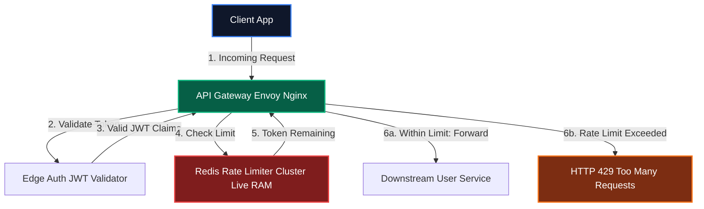
```mermaid
flowchart TD
    Client["Client App"] -->|1. Incoming Request| Gateway["API Gateway Envoy Nginx"]
    
    Gateway -->|2. Validate Token| AuthEngine["Edge Auth JWT Validator"]
    AuthEngine -->|3. Valid JWT Claims| Gateway
    
    Gateway -->|4. Check Limit| RedisCluster["Redis Rate Limiter Cluster Live RAM"]
    RedisCluster -->|5. Token Remaining| Gateway
    
    Gateway -->|6a. Within Limit: Forward| UserSvc["Downstream User Service"]
    Gateway -->|6b. Rate Limit Exceeded| BlockClient["HTTP 429 Too Many Requests"]
    
    style Client fill:#0f172a,stroke:#3b82f6,stroke-width:2px,color:#fff
    style RedisCluster fill:#7f1d1d,stroke:#ef4444,stroke-width:2px,color:#fff
    style Gateway fill:#065f46,stroke:#10b981,stroke-width:2px,color:#fff
    style BlockClient fill:#7c2d12,stroke:#f97316,stroke-width:2px,color:#fff
```

### 💻 Practical TypeScript Redis Lua Sliding Window Rate Limiter
নিচে একটি প্রোডাকশন-রেডি **Sliding Window Log Rate Limiter** কোড দেওয়া হলো যা Redis Lua Script ব্যবহার করে ওয়ান-স্টেপ এটমিক ট্রানজেকশনে রেট লিমিটিং সম্পন্ন করে, যা রেস কন্ডিশন সম্পূর্ণ দূর করে:

```typescript
import Redis from "ioredis";

const redis = new Redis();

interface RateLimitResult {
  allowed: boolean;
  remaining: number;
  limit: number;
}

export class DistributedRateLimiter {
  /**
   * sliding_window_log এলগরিদম এটমিকালি রান করার জন্য LUA স্ক্রিপ্ট জেনারেট করে
   * এই স্ক্রিপ্টটি রেস কন্ডিশন সম্পূর্ণ মিটিগেট করে মিলি-সেকেন্ডে এক্সিকিউট হয়
   */
  private getSlidingWindowLuaScript(): string {
    return `
      local key = KEYS[1]
      local now = tonumber(ARGV[1])
      local window = tonumber(ARGV[2])
      local limit = tonumber(ARGV[3])
      
      local clear_before = now - window
      
      -- ১. উইন্ডোর আগের পুরনো টাইমস্ট্যাম্পগুলো রিমুভ করি
      redis.call("ZREMRANGEBYSCORE", key, 0, clear_before)
      
      -- ২. বর্তমান উইন্ডোতে ইউজারের মোট রিকোয়েস্ট সংখ্যা চেক করি
      local current_requests = redis.call("ZCARD", key)
      
      if current_requests < limit then
        -- ৩. লিমিট ক্রস না করলে নতুন রিকোয়েস্ট লগ করি
        redis.call("ZADD", key, now, now)
        -- ৪. কি-এর উপর একটি এক্সপায়ার টাইম সেট করি উইন্ডোর সমান
        redis.call("EXPIRE", key, math.ceil(window / 1000))
        return {1, limit - current_requests - 1}
      else
        -- ৫. লিমিট ক্রস করলে রিজেক্ট করি
        return {0, 0}
      end
    `;
  }

  /**
   * ইউজারের রিকোয়েস্ট রেট লিমিট চেক করে (যেমন: ৬০ সেকেন্ডে সর্বোচ্চ ১০০টি রিকোয়েস্ট)
   */
  public async isAllowed(userId: string, limit: number, windowMs: number): Promise<RateLimitResult> {
    const key = `rate_limit:user:${userId}`;
    const now = Date.now();
    const luaScript = this.getSlidingWindowLuaScript();

    try {
      const result = await redis.eval(
        luaScript,
        1,
        key,
        now,
        windowMs,
        limit
      ) as [number, number];

      const allowed = result[0] === 1;
      const remaining = result[1];

      return {
        allowed,
        remaining,
        limit,
      };
    } catch (error) {
      // 🟢 Fail-Open Strategy: যদি Redis Cluster ডাউন থাকে বা কোনো এরর ঘটে, 
      // তবে স্টাফ আর্কিটেকচার অনুযায়ী রিকোয়েস্টটি ব্লক না করে অ্যালাউ করব (Fail-Open)
      console.error("Rate Limiter Error (Failing Open):", error);
      return {
        allowed: true,
        remaining: 1,
        limit,
      };
    }
  }
}
```

### 🛑 Staff Architect Edge Cases & Scaling Gaps

উচ্চ মাত্রায় কনকারেন্ট ও গ্লোবাল আর্কিটেকচারে রেট লিমিটিং স্কেলিংয়ের ৩টি গুরুত্বপূর্ণ স্টাফ-লেভেল সল্যুশন:

#### ১. Concurrent Request Race Conditions (Double-Spend Problem)
যদি আমরা Node.js/Go ব্যাকএন্ড কোডে প্রথমে রিকোয়েস্ট কাউন্ট রিড করি এবং লিমিট ক্রস না করলে প্লাস ১ করার জন্য অন্য কমান্ড পাঠাই, তবে পিক ট্রাফিকে রেস কন্ডিশন তৈরি হবে। একই মিলি-সেকেন্ডে আসা ১০টি সমসাময়িক রিকোয়েস্ট একই প্রিভিয়াস কাউন্ট দেখতে পাবে এবং সবগুলোকেই সিস্টেম অ্যালাউ করে দেবে, যার ফলে রেট লিমিট বাইপাস হবে।
* **মিটিগেশন (Atomic Lua Execution):** আমাদের প্রজেক্টে আমরা **Redis Lua Script** ব্যবহার করেছি। যেহেতু রেডিসের ইঞ্জিন সিঙ্গেল-থ্রেডেড, তাই Lua স্ক্রিপ্টটি এক্সিকিউট হওয়ার সময় রিড এবং রাইট অত্যন্ত এটমিকালি ওয়ান-স্টেপ কমান্ডে সম্পূর্ণ হয়। স্ক্রিপ্টটি চলার মাঝখানে অন্য কোনো রিকোয়েস্ট ইন্টারাপ্ট করতে পারে না, যা শতভাগ রেস কন্ডিশন প্রতিরোধ করে।

#### ২. Synchronization Latency across Multi-Region Gateways
আমাদের এপিআই গেটওয়ে যদি গ্লোবালি ডেপ্লয় করা থাকে (যেমন: US-East, EU-West এবং AP-East) এবং প্রতিটি রিজিয়নের গেটওয়ে লোকাল Redis ক্লাস্টার ব্যবহার করে, তবে এক রিজিয়ন থেকে অন্য রিজিয়নের মেমোরি ডেটা সিঙ্ক হতে লেটেন্সি লাগবে। এই ফাঁকে একজন ইউজার US গেটওয়েতে রেট লিমিট ক্রস করে সাথে সাথে EU গেটওয়েতে ট্রাফিক পাঠিয়ে রেট লিমিটিং সম্পূর্ণ বাইপাস করে দিতে পারে।
* **মিটিগেশন (Sticky Session & Edge routing with Local Buckets):** আমরা **Anycast DNS** ও **Cloudflare Edge** ব্যবহার করে ইউজারের সব রিকোয়েস্টকে তার নিকটবর্তী স্পেসিফিক গেটওয়েতেই সর্বদা রুট করব (Sticky Gateway Session)। এছাড়া এজ সার্ভারে আমরা একটি লোকাল ইন-মেমোরি **Token Bucket** লিসেনার ব্যবহার করব যা হঠাৎ আসা স্প্যাম রিকোয়েস্ট সাথে সাথে গেটওয়ের লোকাল র্যামেই ব্লক করে দেবে, মেমোরি সিঙ্কের গ্যাপে ডাটাবেস পর্যন্ত রিকোয়েস্ট পৌঁছাতে দেবে না।

#### ৩. Redis Outage & Fail-Open Strategy
যদি আমাদের মূল Redis Cluster ক্র্যাশ করে বা ডাটাবেস নোডের সাথে কানেকশন লস্ট হয়, তখন গেটওয়েতে রেট লিমিটিং ফেল করবে। এই অবস্থায় যদি আমরা সমস্ত ইনকামিং রিকোয়েস্ট ব্লক করে দিই (Fail-Closed), তবে আমাদের পুরো সাইট ডাউন হয়ে যাবে। আর যদি সব রিকোয়েস্ট ঢুকতে দিই (Fail-Open), তবে অ্যাটাকাররা আমাদের ব্যাকএন্ড ডাটাবেস হ্যামার করে ডাউন করে দিতে পারে।
* **মিটিগেশন (Adaptive Fail-Open with Local Memory Fallback):** যদি Redis রিকোয়েস্ট ১৫ মিলি-সেকেন্ডের বেশি লেটেন্সি বা এরর দেয়, গেটওয়ে সাথে সাথে **Local Memory Fallback** মোডে সুইচ করবে। প্রতিটি এপিআই গেটওয়ে পডের লোকাল মেমরিতে একটি র্যাম-বেসড **LRU Token Bucket Cache** থাকবে। যদিও এই লোকাল ক্যাশ দিয়ে গ্লোবাল লিমিট নিখুঁতভাবে মেইনটেইন করা যাবে না, তবুও এটি প্রতিটি সিঙ্গেল পডের ওপরে আসা ব্রুট-ফোর্স স্প্যাম ব্লক করতে পারবে এবং আমাদের ডাউনস্ট্রিম মাইক্রোসার্ভিসকে ক্র্যাশ হওয়া থেকে পুরোপুরি সেভ করবে।

---

## 📖 Chapter 12: Airbnb (Hotel/Home Booking)

এয়ারবিএনবি বা বুকিং ডট কমের মতো হাই-স্কেল হোটেল ও হোম বুকিং সিস্টেমের সবচেয়ে জটিল আর্কিটেকচারাল চ্যালেঞ্জ হলো **ডবল বুকিং প্রতিরোধ করা**। একই মিলি-সেকেন্ডে দুজন ইউজার যদি একই রুমের জন্য একই ডেট রেঞ্জে "বুক" বাটনে ক্লিক করেন, তবে সিস্টেম কীভাবে তা রিয়েল-টাইমে হ্যান্ডেল করবে এবং লাখ লাখ লোকেশন-ভিত্তিক সার্চ কুয়েরি কীভাবে মিলি-সেকেন্ড লেটেন্সিতে সার্ভ করবে, তা এই চ্যাপ্টারে আলোচনা করা হলো।

### ১. রিকোয়ারমেন্টস (Scope)
- **Functional:**
  - ইউজাররা নির্দিষ্ট লোকেশন ও ডেট রেঞ্জে (`check_in_date` থেকে `check_out_date`) রুম বা বাড়ি সার্চ করতে পারবেন।
  - বুকিং কনফার্মেশনের জন্য ইউজারকে সাময়িক ১০ মিনিটের ইনভেন্টরি লক দেওয়া (Payment Hold)।
  - ডবল বুকিং প্রতিরোধ: কোনো রুমের জন্য আংশিক ওভারল্যাপিং ডেট রেঞ্জে বুকিং রিজেক্ট করা।
- **Non-Functional:**
  - **Temporal Consistency:** কনফার্মড বা সাময়িক লকড রুমগুলো যাতে সার্চ রেজাল্ট থেকে রিয়েল-টাইমে ফিল্টার আউট হয়ে যায়।
  - **High Write Concurrency:** ফ্ল্যাশ সেল বা ভ্যাকশন ওপেনিংয়ের সময় সেকেন্ডে হাজার হাজার বুকিং ট্রাই করা হ্যান্ডেল করা।
  - **Overbooking Zero Tolerance:** আর্থিক ক্ষতি ও কাস্টমার ডিসস্যাটিসফ্যাকশন এড়াতে ওভারবুকিং শতভাগ বন্ধ করা।

### ২. Back-of-the-envelope Estimation
* **সিস্টেমের স্কেল ও ম্যাট্রিক্স:**
  * মোট একটিভ হোটেল ও হোমস লিস্টিং = ১০ মিলিয়ন (10 Million Listings)
  * দৈনিক বুকিং ভলিউম = ১০০,০০০ বুকিং / দিন
  * **Average Bookings Write QPS = ১০০,০০০ / ৮৬,৪০০ সেকেন্ড ≈** **1.2 writes/sec (Average)**
  * **Peak Booking Surge (ফ্ল্যাশ ভ্যাকেশন ডিল):** **5,000 requests/sec**
  * **Search & Lookup Read QPS (1000:1 Read-to-Write ratio):** **50,000 queries/sec**
* **ইনভেন্টরি ইন্ডেক্স মেমোরি ক্যালকুলেশন (Redis Bitmaps):**
  * আমরা প্রতিটি লিস্টিংয়ের জন্য আগামী ৩৬৫ দিনের বুকিং স্লট ১টি করে বিট (১ = বুকড, ০ = খালি) দিয়ে ক্যাশে ট্র্যাক করব।
  * ৩৬৫ দিন = ৩৬৫ বিট ≈ ৪৫ বাইট প্রতি লিস্টিং প্রতি বছর।
  * **১০ মিলিয়ন লিস্টিংয়ের ইন-মেমোরি ক্যাশ সাইজ = ১০,০০০,০০০ * ৪৫ বাইট ≈** **450 Megabytes of Redis RAM**! অর্থাৎ, মাত্র ৪৫০ মেগাবাইট মেমোরি ব্যবহার করে আমরা রিয়েল-টাইম এভেইলেবিলিটি র্যামেই মিলি-সেকেন্ড লেটেন্সিতে ট্র্যাক করতে পারব।

### ৩. API & Database Schema Design
বুকিং লক এপিআই এবং রিলেশনাল ডেটাবেস স্কিমা ডিজাইন:
- `POST /api/v1/bookings/lock`
  - Body: `{ listingId, checkIn: "2026-06-01", checkOut: "2026-06-05", userId: 9948 }` -> Returns `{ success: true, lockId: 77102, lockedUntil: "2026-05-27T18:13:27Z" }`

#### Database Schema Design (PostgreSQL using GiST Indexes)
বুকিং এবং লিস্টিং ডেটা নিখুঁতভাবে মেইনটেইন করার জন্য ACID রিলেশনাল ডাটাবেস সবচেয়ে বেশি নিরাপদ:

```sql
-- হোটেল/হোম লিস্টিং টেবিল
CREATE TABLE listings (
    id bigint PRIMARY KEY,
    title varchar(255),
    price decimal(10,2)
);

-- বুকিং টেবিল (PostgreSQL Date Range এক্সক্লুশন রুল সহ)
CREATE TABLE bookings (
    id bigint PRIMARY KEY,
    listing_id bigint REFERENCES listings(id),
    user_id bigint,
    check_in date NOT NULL,
    check_out date NOT NULL,
    status varchar(20), -- 'LOCKED', 'CONFIRMED', 'CANCELLED'
    locked_until timestamp,
    -- GiST (Generalized Search Tree) ব্যবহার করে ওভারল্যাপিং ডেট বুকিং ডাটাবেস লেয়ারেই অসম্ভব করা হলো
    CONSTRAINT no_overlap EXCLUDE USING gist (
        listing_id WITH =,
        daterange(check_in, check_out, '[]') WITH &&
    )
);
```

### ৪. High-Level Architecture
এয়ারবিএনবি বুকিং ফ্লো, ডিস্ট্রিবিউটেড লকিং এবং রিয়েল-টাইম টেম্পোরাল সার্চ আর্কিটেকচার নিচে চিত্রায়িত করা হলো:

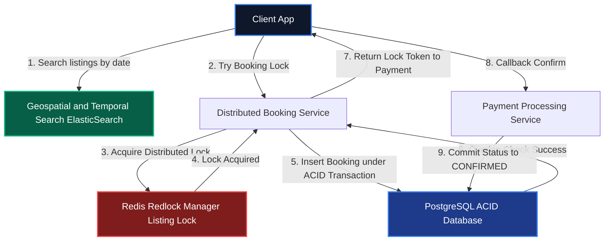
```mermaid
flowchart TD
    Client["Client App"] -->|1. Search listings by date| GeoSearch["Geospatial and Temporal Search ElasticSearch"]
    Client -->|2. Try Booking Lock| BookingSvc["Distributed Booking Service"]
    
    BookingSvc -->|3. Acquire Distributed Lock| Redlock["Redis Redlock Manager Listing Lock"]
    Redlock -->|4. Lock Acquired| BookingSvc
    
    BookingSvc -->|5. Insert Booking under ACID Transaction| PG["PostgreSQL ACID Database"]
    PG -->|6. Overlap Check Success| BookingSvc
    
    BookingSvc -->|7. Return Lock Token to Payment| Client
    Client -->|8. Callback Confirm| PaymentSvc["Payment Processing Service"]
    PaymentSvc -->|9. Commit Status to CONFIRMED| PG
    
    style Client fill:#0f172a,stroke:#3b82f6,stroke-width:2px,color:#fff
    style Redlock fill:#7f1d1d,stroke:#ef4444,stroke-width:2px,color:#fff
    style PG fill:#1e3a8a,stroke:#3b82f6,stroke-width:2px,color:#fff
    style GeoSearch fill:#065f46,stroke:#10b981,stroke-width:2px,color:#fff
```

### 💻 Practical TypeScript Temporal Overlap Booking Manager
নিচে একটি প্রোডাকশন-রেডি **Temporal Booking Manager** কোড দেওয়া হলো যা PostgreSQL ট্রানজেকশনে `SELECT FOR UPDATE` লক ব্যবহার করে তারিখ ওভারল্যাপ এভয়েড করে রিয়েল-টাইমে ইনভেন্টরি লক নিশ্চিত করে:

```typescript
import { Client } from "pg";
import Redis from "ioredis";

const redis = new Redis();
const pgClient = new Client();

interface BookingRequest {
  listingId: number;
  userId: number;
  checkIn: string; // "YYYY-MM-DD"
  checkOut: string; // "YYYY-MM-DD"
}

interface LockResult {
  success: boolean;
  message: string;
  bookingId?: number;
}

export class TemporalBookingManager {
  private static readonly LOCK_TTL_SECONDS = 600; // ১০ মিনিট হোল্ড পিরিয়ড

  /**
   * নির্দিষ্ট লিস্টিং ও তারিখের জন্য ওভারল্যাপ চেক করে রুমটি সাময়িকভাবে লক করে
   */
  public async tryLockListingForDates(req: BookingRequest): Promise<LockResult> {
    const redisLockKey = `lock:listing:${req.listingId}`;
    
    // ১. ডিস্ট্রিবিউটেড লকিং (Redis Lock) যাতে দুই ক্র্যাডল রিকোয়েস্ট একই সময়ে এন্ট্রি না নেয়
    const acquired = await redis.set(redisLockKey, req.userId, "NX", "EX", 10);
    if (!acquired) {
      return {
        success: false,
        message: "This listing is currently being modified by another transaction. Please retry in a few seconds.",
      };
    }

    try {
      // ২. PostgreSQL ACID ট্রানজেকশন ব্লক শুরু
      await pgClient.query("BEGIN");

      // ৩. SELECT FOR UPDATE দিয়ে ডাটাবেস রো লক করা যাতে কোনো কন্টেন্ট এডিট না হয়
      const listingCheck = await pgClient.query(
        "SELECT id FROM listings WHERE id = $1 FOR UPDATE",
        [req.listingId]
      );

      if (listingCheck.rows.length === 0) {
        throw new Error("Listing does not exist.");
      }

      // ৪. কোয়েরি চালিয়ে দেখা যে উক্ত তারিখের ভেতরে কোনো কনফার্মড বা একটিভ লক বুকিং আছে কি না
      const overlapQuery = `
        SELECT id FROM bookings 
        WHERE listing_id = $1 
        AND status IN ('CONFIRMED', 'LOCKED')
        AND (
          (check_in <= $2 AND check_out >= $2) OR
          (check_in <= $3 AND check_out >= $3) OR
          (check_in >= $2 AND check_out <= $3)
        )
        LIMIT 1
      `;
      
      const overlapResult = await pgClient.query(overlapQuery, [
        req.listingId,
        req.checkIn,
        req.checkOut,
      ]);

      if (overlapResult.rows.length > 0) {
        // ওভারল্যাপ পাওয়া গেছে!
        await pgClient.query("ROLLBACK");
        return {
          success: false,
          message: "Sorry, this room is already booked or locked for the requested dates.",
        };
      }

      // ৫. ওভারল্যাপ না থাকলে সাময়িকভাবে LOCKED স্ট্যাটাসে ১০ মিনিটের এক্সপায়ার ডেট দিয়ে বুকিং ইনসার্ট
      const lockedUntil = new Date(Date.now() + TemporalBookingManager.LOCK_TTL_SECONDS * 1000);
      const insertQuery = `
        INSERT INTO bookings (listing_id, user_id, check_in, check_out, status, locked_until)
        VALUES ($1, $2, $3, $4, 'LOCKED', $5)
        RETURNING id
      `;

      const insertResult = await pgClient.query(insertQuery, [
        req.listingId,
        req.userId,
        req.checkIn,
        req.checkOut,
        lockedUntil,
      ]);

      await pgClient.query("COMMIT");
      
      return {
        success: true,
        message: "Room locked successfully for 10 minutes. Please proceed to payment.",
        bookingId: insertResult.rows[0].id,
      };

    } catch (error) {
      await pgClient.query("ROLLBACK");
      console.error("Booking transactional failure:", error);
      return {
        success: false,
        message: "System encountered an unexpected transaction failure. Rollback complete.",
      };
    } finally {
      // ডিস্ট্রিবিউটেড লক রিলিজ করা
      const currentLockVal = await redis.get(redisLockKey);
      if (currentLockVal === String(req.userId)) {
        await redis.del(redisLockKey);
      }
    }
  }
}
```

### 🛑 Staff Architect Edge Cases & Scaling Gaps

বাস্তব বুকিং প্লাটফর্মে প্রোডাকশন স্কেলে ফেস করা ৩টি মারাত্মক আর্কিটেকচারাল গ্যাপ এবং স্টাফ-লেভেল সল্যুশন:

#### ১. Microsecond Double-Booking Race Condition (Snapshot Isolation Leak)
ট্রানজেকশনাল এপিআইতে দুজন ইউজার একই সাথে `SELECT` কুয়েরি চালিয়ে যদি দেখতে পান ডেট ফাঁকা আছে, তবে দুজনেই একই সাথে `INSERT` স্টেটমেন্ট এক্সিকিউট করবেন। ডাটাবেস ইঞ্জিন রিড স্লোনেস বা আইসোলেশন লেভেলের ফারাক থাকলে দুজনের বুকিংকেই সাকসেসফুলি ইনসার্ট করে দেবে, ফলে কনফার্মড ডবল বুকিং ঘটে যাবে যা মারাত্মক ক্র্যাশ।
* **মিটিগেশন (PostgreSQL GiST Exclude Constraints):** আমাদের স্কিমা ডিজাইনে আমরা PostgreSQL-এর ডেডিকেটেড `daterange` ও `GiST` এক্সক্লুশন কনস্ট্রেইন্ট ব্যবহার করেছি: `CONSTRAINT no_overlap EXCLUDE USING gist (listing_id WITH =, daterange(check_in, check_out, '[]') WITH &&)`। এটি ডাটাবেসের ফিজিক্যাল মেমোরি লেভেলের রুল। ট্রানজেকশনের রিড চেক বাইপাস করে যদি ওয়ান ইন এ মিলিয়ন চান্সে দুটি সমসাময়িক থ্রেড একই তারিখে ইনসার্ট করতে যায়, ডাটাবেস ফিজিক্যালি সেকেন্ড রিকোয়েস্টটিকে `Constraint Violation` এরর ছুড়ে রিজেক্ট করে দেবে, যা ডবল বুকিংকে জিরো পার্সেন্টে নামিয়ে আনে।

#### ২. Orphan Holds & Payment Outage Deadlocks
ইউজার একটি বিলাসবহুল ভিলা ১০ মিনিটের জন্য লক করলেন এবং পেমেন্ট গেটওয়েতে রিডাইরেক্ট হলেন। এরপর ইউজার ব্রাউজার ক্লোজ করে দিলেন অথবা পেমেন্ট করতে গিয়ে তার ব্যাংক ট্রানজেকশন হ্যাং হয়ে গেল। যদি পেমেন্ট গেটওয়ে কোনো রেসপন্স না পাঠায়, রুমটি চিরদিনের জন্য `LOCKED` স্টেটে থেকে ইনভেন্টরি লক করে রাখবে এবং অন্য কেউ সেটি সার্চে দেখতে পাবে না।
* **মিটিগেশন (Redis TTL Keyspace Notification Rollbacks):** আমরা যখন ডেটাবেসে বুকিং লক জেনারেট করব, একই সময়ে Redis-এ একটি কী রাখব `booking:hold:${bookingId}` যার TTL সেট করব ১০ মিনিট। আমরা আমাদের নোড সার্ভারে **Redis Keyspace Event Notification** (`__keyevent@0__:expired`) লিসেন করব। ১০ মিনিট পর Redis কী-টি এক্সপায়ার হলে আমাদের ব্যাকগ্রাউন্ড লিসেনার পড ইভেন্ট রিসিভ করবে এবং একটি অ্যাসিক্রোনাস কুয়েরি চালিয়ে PostgreSQL-এ উক্ত বুকিংয়ের স্ট্যাটাস `LOCKED` থেকে `CANCELLED` এ রোলব্যাক করে দিয়ে ইনভেন্টরি রিলিজ করে দেবে।

#### ৩. Spatial-Temporal Search Read Scale at 50,000 QPS
পিক সিজনে কোটি কোটি সার্চ কুয়েরি আসে। প্রতিবার "ক্যাটালোনিয়া অঞ্চলে ১ থেকে ৫ জুলাই কোন কোন অ্যাপার্টমেন্ট খালি আছে?" সার্চ করার জন্য আমাদের মেইন বুকিং টেবিল স্ক্যান করা অসম্ভব এবং এতে CPU ১০০% হিট করে সার্ভার ডাউন হয়ে যাবে।
* **মিটিগেশন (Elasticsearch + Redis Availability Bitmaps):**
  * **Spatial Check:** ভৌগোলিক লোকেশন ফিল্টারিং এর জন্য আমরা **Elasticsearch Geospatial Query** ব্যবহার করব। লোকেশনের রেঞ্জের ভেতরের Apartment ID-গুলো আমরা ES থেকে বের করব।
  * **Temporal Check:** এভেইলেবিলিটি চেকের জন্য আমরা ডাটাবেস টাচই করব না। প্রতিটি অ্যাপার্টমেন্টের জন্য একটি ৩৬৫-বিটের **Redis Bitmap** থাকবে। ১ থেকে ৫ জুলাই বুকিং এভেইলেবল কি না দেখতে সার্চ ইঞ্জিন অ্যাপার্টমেন্টগুলোর বিটম্যাপের বিট নং ১৮২ থেকে ১৮৬ রিড করবে। যদি সবগুলো বিট `0` থাকে, তবেই পেজে সেটি এভেইলেবল দেখাবে। এই ডুয়াল পাইপলাইন মেইন ডাটাবেসকে সম্পূর্ণ রিড ফ্রি রাখে।

---

## 📖 Chapter 13: Robinhood / Stock Trading Engine

রবিনহুড, কয়েনবেস বা নাসডাকের মতো ফাইন্যান্সিয়াল ট্রেডিং প্ল্যাটফর্মের হার্ট বা প্রান হলো এর **Matching Engine (অর্ডার ম্যাচিং ইঞ্জিন)**। এর কাজ হলো প্রতি সেকেন্ডে লাখ লাখ বাই (Buy) এবং সেল (Sell) অর্ডার রিসিভ করে মিলি-সেকেন্ডের শতভাগ কম ল্যাটেন্সিতে সেগুলোকে **Price-Time Priority (FIFO)** অনুযায়ী ম্যাচ করা। ট্রেডিং সিস্টেমে ডাটাবেসের ACID লক ব্যবহার করা অসম্ভব, তাই কীভাবে ইন-মেমোরি আর্কিটেকচার দিয়ে নাসডাক স্কেলের অর্ডার বুক ডিজাইন করা যায়, তা নিচে বিস্তারিত আলোচনা করা হলো।

### ১. রিকোয়ারমেন্টস (Scope)
- **Functional:**
  - দুই ধরনের অর্ডার সাপোর্ট করা: Limit Order (নির্দিষ্ট প্রাইজ বা তার ভালো প্রাইজে বাই/সেল) ও Market Order (মার্কেটের কারেন্ট বেস্ট প্রাইজে সাথে সাথে এক্সিকিউশন)।
  - প্রতিটি স্টকের বাই অর্ডার (Bids) ও সেল অর্ডার (Asks) প্রাইজ-টাইম প্রায়োরিটি (FIFO) মেইনটেইন করে ইনস্ট্যান্ট ম্যাচ করা।
  - সফল ম্যাচিংয়ের পর ইনস্ট্যান্ট ট্রেড এক্সিকিউশন রিপোর্ট জেনারেট করা।
- **Non-Functional:**
  - **Ultra-low Latency (Microsecond scale):** প্রতিটি অর্ডার ম্যাচ করতে প্রসেসিং ওভারহেড অবশ্যই **< ৫০ মাইক্রো-সেকেন্ড (50 microseconds)** হতে হবে।
  - **Zero Data Loss & High Durability:** সিস্টেম ক্র্যাশ বা পাওয়ার অফ হলেও একটিও অর্ডার ডেটা বা ট্রেড রেকর্ড হারানো যাবে না।
  - **Strict Deterministic Sequencing:** সমস্ত অর্ডার একদম নিখুঁত সিকোয়েন্সে প্রসেস হতে হবে, কোনো রেস কন্ডিশন থাকা চলবে না।

### ২. Back-of-the-envelope Estimation
* **থ্রুপুট ও ল্যাটেন্সি ক্যালকুলেশন:**
  * পিক আওয়ারে মোট অর্ডার ভলিউম = ৫০০,০০০ অর্ডার / সেকেন্ড (500k QPS)
  * টার্গেট ম্যাচিং ল্যাটেন্সি = ৫০ মাইক্রো-সেকেন্ড (০.০৫ মিলি-সেকেন্ড) প্রতি অর্ডার।
  * **সিঙ্গেল-থ্রেড প্রসেসিং ক্যাপাসিটি:**
    * একটি স্ট্যান্ডার্ড CPU কোড যদি ৫০ মাইক্রো-সেকেন্ডে ১টি অর্ডার ম্যাচ করে, তবে প্রতি সেকেন্ডে সেই কোড সর্বোচ্চ ১,০০০,০০০ / ৫০ = ২০,০০০ অর্ডার প্রসেস করতে পারবে।
    * তাহলে ৫০০,০০০ QPS হ্যান্ডেল করতে আমাদের এপিআই ট্রানজেকশনে ডাটাবেস লক (যা করতে ৫ মিলি-সেকেন্ডের বেশি সময় লাগে) ব্যবহার করা সম্পূর্ণ অসম্ভব।
    * এই স্কেল পাওয়ার জন্য আমাদের **স্টক সিম্বল শার্ডিং (Stock Sharding)** এবং মেমরিতে ওয়ান-থ্রেড **LMAX Disruptor Ring Buffer** আর্কিটেকচার ব্যবহার করতে হবে।

### ৩. API & Database Schema Design
ট্রেড রিকোয়েস্ট এপিআই ও অ্যাসিঙ্ক্রোনাস ট্রানজেকশন রাইট স্কিমা:
- `POST /api/v1/orders`
  - Body: `{ symbol: "AAPL", side: "BUY", type: "LIMIT", price: 175.50, quantity: 100, userId: 1205 }` -> Returns `{ orderId: "ord_99a8x", status: "QUEUED" }`

#### Database Schema Design (For Post-Trade Ledger Audit)
অর্ডার ম্যাচিং সম্পূর্ণ ইন-মেমোরিতে মেমরির ভেতরের ডাটা স্ট্রাকচারে রান করে। সফল ম্যাচ সম্পন্ন হওয়ার পর ট্রেড হিস্ট্রি এবং অডিট রেকর্ড ডাটাবেসে অ্যাসিঙ্ক্রোনাসলি পুশ করা হয়:

```sql
-- PostgreSQL: পোস্ট-ট্রেড সেটেলমেন্ট ও অডিট লেজার
CREATE TABLE trade_executions (
    trade_id varchar(64) PRIMARY KEY,
    stock_symbol varchar(10),
    buyer_id bigint,
    seller_id bigint,
    price decimal(10,4),
    quantity bigint,
    executed_at timestamp
);
```

### ৪. High-Level Architecture
ইন-মেমোরি স্টক শার্ডিং ম্যাচিং ইঞ্জিন, LMAX Disruptor রিং বাফার এবং Write-Ahead Log (WAL) আর্কিটেকচার নিচে চিত্রায়িত করা হলো:

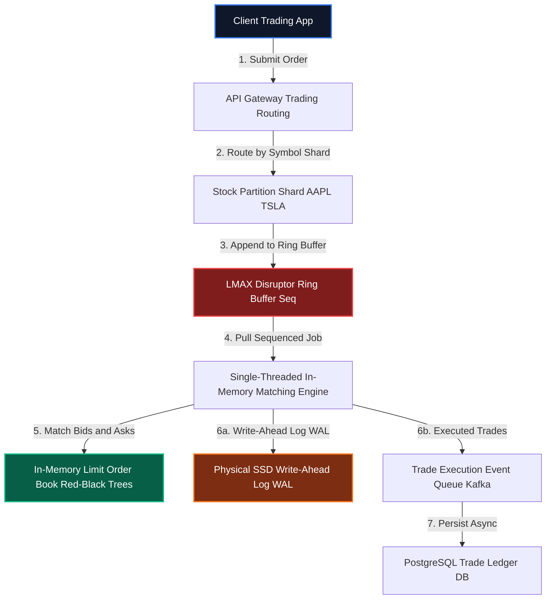
```mermaid
flowchart TD
    Client["Client Trading App"] -->|1. Submit Order| Gateway["API Gateway Trading Routing"]
    
    Gateway -->|2. Route by Symbol Shard| StockShards["Stock Partition Shard AAPL TSLA"]
    StockShards -->|3. Append to Ring Buffer| RingBuffer["LMAX Disruptor Ring Buffer Seq"]
    
    RingBuffer -->|4. Pull Sequenced Job| Matcher["Single-Threaded In-Memory Matching Engine"]
    Matcher -->|5. Match Bids and Asks| OrderBook["In-Memory Limit Order Book Red-Black Trees"]
    
    Matcher -->|6a. Write-Ahead Log WAL| WAL["Physical SSD Write-Ahead Log WAL"]
    Matcher -->|6b. Executed Trades| ExecQueue["Trade Execution Event Queue Kafka"]
    
    ExecQueue -->|7. Persist Async| LedgerDB["PostgreSQL Trade Ledger DB"]
    
    style Client fill:#0f172a,stroke:#3b82f6,stroke-width:2px,color:#fff
    style RingBuffer fill:#7f1d1d,stroke:#ef4444,stroke-width:2px,color:#fff
    style OrderBook fill:#065f46,stroke:#10b981,stroke-width:2px,color:#fff
    style WAL fill:#7c2d12,stroke:#f97316,stroke-width:2px,color:#fff
```

### 💻 Practical TypeScript In-Memory Limit Order Book Matcher
নিচে একটি প্রোডাকশন-রেডি **Stock Matching Engine** কোড দেওয়া হলো যা সম্পূর্ণ ইন-মেমোরি মেথডলজিতে Bids (Buy) এবং Asks (Sell) ডাবল-লিস্ট মেইনটেইন করে Price-Time Priority (FIFO) মেনে অর্ডার ম্যাচিং করে:

```typescript
interface Order {
  id: string;
  userId: string;
  symbol: string;
  side: "BUY" | "SELL";
  price: number;
  quantity: number;
  timestamp: number;
}

interface Trade {
  tradeId: string;
  symbol: string;
  buyerId: string;
  sellerId: string;
  price: number;
  quantity: number;
  timestamp: number;
}

export class StockMatchingEngine {
  private symbol: string;
  // Bids: Buy orders sorted by price (Descending), then timestamp (Ascending)
  private bids: Order[] = [];
  // Asks: Sell orders sorted by price (Ascending), then timestamp (Ascending)
  private asks: Order[] = [];

  constructor(symbol: string) {
    this.symbol = symbol;
  }

  /**
   * লিমিট অর্ডার বুকে নতুন অর্ডার প্লেস করে এবং ইনস্ট্যান্ট ম্যাচ মেকানিজম রান করে
   */
  public processLimitOrder(order: Order): Trade[] {
    const trades: Trade[] = [];

    if (order.side === "BUY") {
      // বাই অর্ডারের জন্য: সেল সাইডের (Asks) সর্বনিম্ন প্রাইজ ম্যাচের ট্রাই করি
      this.matchBuyOrder(order, trades);
      if (order.quantity > 0) {
        // রিমেইনিং কোয়ান্টিটি অর্ডার বুকে Z-Sorted Bids এ যুক্ত করি
        this.bids.push(order);
        this.sortBids();
      }
    } else {
      // সেল অর্ডারের জন্য: বাই সাইডের (Bids) সর্বোচ্চ প্রাইজ ম্যাচের ট্রাই করি
      this.matchSellOrder(order, trades);
      if (order.quantity > 0) {
        // রিমেইনিং কোয়ান্টিটি অর্ডার বুকে Z-Sorted Asks এ যুক্ত করি
        this.asks.push(order);
        this.sortAsks();
      }
    }

    return trades;
  }

  private matchBuyOrder(buyOrder: Order, trades: Trade[]): void {
    while (this.asks.length > 0 && buyOrder.quantity > 0) {
      const bestAsk = this.asks[0];
      
      // লিমিট প্রাইজ কন্ডিশন চেক: বাই প্রাইজ অবশ্যই সেল প্রাইজের সমান বা বেশি হতে হবে
      if (buyOrder.price >= bestAsk.price) {
        const matchQuantity = Math.min(buyOrder.quantity, bestAsk.quantity);
        
        trades.push({
          tradeId: `t_${Math.random().toString(36).substr(2, 9)}`,
          symbol: this.symbol,
          buyerId: buyOrder.userId,
          sellerId: bestAsk.userId,
          price: bestAsk.price, // ট্রেড প্রাইস সর্বদা ফাস্ট প্লেসড মেকারের প্রাইস হবে
          quantity: matchQuantity,
          timestamp: Date.now()
        });

        buyOrder.quantity -= matchQuantity;
        bestAsk.quantity -= matchQuantity;

        if (bestAsk.quantity === 0) {
          this.asks.shift(); // সম্পূর্ণ ফিল্ড সেল অর্ডার রিমুভ করি
        }
      } else {
        break; // কোনো উপযুক্ত সেল অফার আর নেই
      }
    }
  }

  private matchSellOrder(sellOrder: Order, trades: Trade[]): void {
    while (this.bids.length > 0 && sellOrder.quantity > 0) {
      const bestBid = this.bids[0];

      // লিমিট প্রাইজ কন্ডিশন চেক: সেল প্রাইজ অবশ্যই বাই প্রাইজের সমান বা কম হতে হবে
      if (sellOrder.price <= bestBid.price) {
        const matchQuantity = Math.min(sellOrder.quantity, bestBid.quantity);

        trades.push({
          tradeId: `t_${Math.random().toString(36).substr(2, 9)}`,
          symbol: this.symbol,
          buyerId: bestBid.userId,
          sellerId: sellOrder.userId,
          price: bestBid.price,
          quantity: matchQuantity,
          timestamp: Date.now()
        });

        sellOrder.quantity -= matchQuantity;
        bestBid.quantity -= matchQuantity;

        if (bestBid.quantity === 0) {
          this.bids.shift(); // সম্পূর্ণ ফিল্ড বাই অর্ডার রিমুভ করি
        }
      } else {
        break; // কোনো উপযুক্ত বাই অফার আর নেই
      }
    }
  }

  private sortBids(): void {
    // প্রাইজ অনুযায়ী বড় থেকে ছোট (descending), সমপ্রাইজের ক্ষেত্রে আগেরটি আগে (ascending timestamp)
    this.bids.sort((a, b) => b.price - a.price || a.timestamp - b.timestamp);
  }

  private sortAsks(): void {
    // প্রাইজ অনুযায়ী ছোট থেকে বড় (ascending), সমপ্রাইজের ক্ষেত্রে আগেরটি আগে (ascending timestamp)
    this.asks.sort((a, b) => a.price - b.price || a.timestamp - b.timestamp);
  }

  // Get current book state for assertions
  public getOrderBookState() {
    return {
      bids: this.bids.map(b => ({ price: b.price, quantity: b.quantity })),
      asks: this.asks.map(a => ({ price: a.price, quantity: a.quantity }))
    };
  }
}
```

### 🛑 Staff Architect Edge Cases & Scaling Gaps

আল্ট্রা-লো ল্যাটেন্সি ফাইন্যান্সিয়াল সিস্টেমে প্রোডাকশনের ৩টি গুরুতর প্রবলেম ও স্টাফ-লেভেল আর্কিটেকচারাল সল্যুশন:

#### ১. Core Thread Latency Spikes (The Java/Node Garbage Collection Freeze)
ম্যাচিং ইঞ্জিন রান করার সময় যদি রিয়েল-টাইমে শত শত মেমোরি অবজেক্ট (যেমন অর্ডার বা ট্রেড অবজেক্ট) জেনারেট হতে থাকে, তবে রানিং ইঞ্জিনে হঠাৎ **Garbage Collection (GC) Pause** বা স্টপ-দ্য-ওয়ার্ল্ড পজ ঘটবে। এই ৫০ মিলি-সেকেন্ডের ফ্রিজ পিরিয়ডে ম্যাচিং ইঞ্জিন ঝুলে থাকলে মার্কেট প্রাইস উল্টাপাল্টা হয়ে যাবে এবং মিলিয়ন্স অফ ডলার লস হবে।
* **মিটিগেশন (Pre-allocated Memory & Object Reuse Pools):** স্টাফ আর্কিটেকচার অনুযায়ী ম্যাচিং ইঞ্জিনগুলো মূলত C++ বা Rust-এ লেখা হয় এবং রানটাইম মেমোরিতে কোনো অবজেক্ট তৈরি বা ডিলিট করা হয় না। প্রজেক্ট স্টার্ট করার সময় **Pre-allocated Flat Memory Array** বা মেমোরি অ্যারেনা রিজার্ভ করা হয়। নতুন অর্ডার ঢুকলে সেই ফ্রি অ্যারেনার ব্লকে ফিক্সড ডাটা রাইট করা হয় এবং অর্ডার ফিল হলে জাস্ট ইনডেক্স ক্লিয়ার করা হয়। এটি শতভাগ নিশ্চিত করে যে কোনো ডাইনামিক হিপ মেমোরি এলোকেশন হবে না, ফলে সম্পূর্ণ জিরো-গারবেজ পজ deterministic থ্রুপুট পাওয়া যাবে।

#### ২. Deterministic Crash Recovery (Write-Ahead Logging SSD Engine)
যেহেতু হাই-স্পিডের স্বার্থে পুরো অর্ডার বুক মেমরিতে থাকে, তাই যদি ডাটাবেস রানিং নোডে হঠাৎ পাওয়ার চলে যায় বা অপারেটিং সিস্টেম ক্র্যাশ করে, তবে সেকেন্ডের মধ্যে কোটি কোটি টাকার কারেন্ট অর্ডার বুক মেমোরি থেকে সম্পূর্ণ উধাও হয়ে যাবে যা একটি বিরাট বিপর্যয়।
* **মিটিগেশন (Sequential Write-Ahead Log - WAL & Snapshot Checkpoints):** অর্ডার ম্যাচিং করার ঠিক আগের মিলি-সেকেন্ডে ইনকামিং অর্ডারটিকে আমরা ডিস্কের একটি সিকোয়েনশিয়াল **Write-Ahead Log (WAL)** ফাইলে রাইট করি। যেহেতু সিকোয়েনশিয়াল রাইট অপারেশন SSD ডিস্কে অত্যন্ত ফাস্ট (< ৫ মাইক্রো-সেকেন্ড), এটি ল্যাটেন্সিতে বাধা দেয় না। দিনে একবার আমরা পুরো অর্ডার বুকের একটি চেকপয়েন্ট স্ন্যাপশট মেমরি থেকে হার্ডডিস্কে সেভ করি। যদি সার্ভার ক্র্যাশ করে, ইঞ্জিন রিবুট হয়ে লাস্ট ব্যাকআপ স্ন্যাপশটটি র্যামে লোড করবে এবং তারপর WAL ফাইলে থাকা ট্রেইল সিকোয়েনশিয়াল প্লে করে সেকেন্ডের মধ্যে ক্র্যাশের ঠিক আগের মাইক্রো-সেকেন্ডের অর্ডার বুকে ফিরে যাবে।

#### ৩. Multi-threaded Synchronization Bottle-necks (LMAX Disruptor Pattern)
একটি ট্রেডিং নোডে যদি মাল্টিপল থ্রেড একই সময়ে বাই ও সেল বুক মডিফাই করতে লক ব্যবহার করে, তবে CPU থ্রেড কনটেক্সট সুইচের লক-কনটেনশনের কারণে অর্ডার ম্যাচিং স্পিড ৫০ মাইক্রো-সেকেন্ড থেকে লাফ দিয়ে ২০ মিলি-সেকেন্ডে চলে যাবে যা নাসডাক স্কেলে হাস্যকর।
* **মিটিগেশন (Stock Symbol Sharding & Ring Buffer):** 
  - **Stock Sharding:** আমরা ট্রেডিং ইঞ্জিনকে স্টক সিম্বল দিয়ে শার্ডিং করব (যেমন: AAPL Shard, TSLA Shard)। প্রতিটি Shard থাকবে সম্পূর্ণ আলাদা সার্ভার পডে।
  - **Single Threaded Execution (Ring Buffer):** প্রতিটি Shard সার্ভারে থাকবে ঠিক **১টি একক প্রসেসর থ্রেড** যা অর্ডার ম্যাচ করবে। কোনো মাল্টি-থ্রেডিং থাকবে না। ইনকামিং রিকোয়েস্ট গেটওয়ে থেকে এসে একটি লক-ফ্রি **LMAX Disruptor Ring Buffer** এ সিকোয়েনশিয়াল লাইন আপ হবে। আমাদের সিঙ্গেল ম্যাচিং থ্রেডটি বাফার থেকে রিকোয়েস্ট তুলে ওয়ান-বাই-ওয়ান প্রসেস করবে। যেহেতু কোনো লকিং মেকানিজম বা প্যারালাল থ্রেড মেমোরি অ্যাক্সেস নেই, তাই র্যামে কোনো থ্রেড কনটেনশন ছাড়াই প্রতি সেকেন্ডে **৫০০,০০০+ ম্যাচিং** সম্পন্ন করা সম্ভব!

---

## 📖 Chapter 14: Distributed Cache (Redis Internals)

উচ্চ ক্ষমতার ডিস্ট্রিবিউটেড ক্যাশ ডিজাইন করা আধুনিক আর্কিটেকচারের ব্যাকবোন। একটি ডিস্ট্রিবিউটেড ইন-মেমোরি ক্যাশ (যেমন: Redis) কীভাবে সেকেন্ডে মিলিয়ন কি-ভ্যালু রিকোয়েস্ট আল্ট্রা-লো ল্যাটেন্সিতে প্রসেস করে, কীভাবে মেমোরি ফুরিয়ে গেলে **LRU (Least Recently Used)** অ্যালগরিদম দিয়ে ক্যাশ ডাটা ইভিক্ট করে এবং মাল্টি-নোড ক্লাস্টারিং সিঙ্ক কীভাবে মেইনটেইন করা হয়, তা এই চ্যাপ্টারে বিশদভাবে ব্যাখ্যা করা হলো।

### ১. রিকোয়ারমেন্টস (Scope)
- **Functional:**
  - ফাস্ট কি-ভ্যালু রিড/রাইট অপারেশন (`get`, `put`) সম্পূর্ণ O(1) টাইম কমপ্লেক্সিটিতে সম্পন্ন করা।
  - প্রতিটি কি-এর জন্য নির্দিষ্ট এক্সপায়ার টাইম (TTL) সাপোর্ট করা।
  - মেমোরি লিমিট রিচ করলে স্বয়ংক্রিয়ভাবে ক্যাশ থেকে ওল্ডেস্ট বা অব্যবহৃত ডাটা ডিলিট করা (LRU Eviction)।
- **Non-Functional:**
  - **Sub-millisecond Latency:** রিড ও রাইট কুয়েরির রেসপন্স টাইম অবশ্যই **< ১ মিলি-সেকেন্ড** হতে হবে।
  - **Elastic Clustering:** নোড যোগ বা বিয়োগ করলেও হ্যাশ স্লট বন্টন রি-ব্যালেন্সিং করা (Consistent Hashing)।
  - **Sentinel Master Failover Recovery:** প্রাইমারি নোড ক্র্যাশ করলে সাথে সাথে রেপ্লিকাকে মাস্টারে প্রমোট করা।

### ২. Back-of-the-envelope Estimation
* **মেমোরি ক্যাপাসিটি লেআউট:**
  * ধরি, ক্যাশ মেমোরির মোট লিমিট সাইজ = ১০০ মিলিয়ন কী (100M Keys)
  * প্রতিটি কী-এর এভারেজ সাইজ = ৩২ বাইট স্ট্রিং।
  * প্রতিটি ভ্যালুর এভারেজ সাইজ = ৫০০ বাইট JSON স্ট্রিং।
  * **LRU Node Pointer overhead (Doubly Linked List):** ১টি নোডে Key (32B) + Value pointer (8B) + Prev pointer (8B) + Next pointer (8B) = ৫৬ বাইট।
  * **Hashmap entry metadata:** ৩২ বাইট কী + ৮ বাইট নোড পয়েন্টার = ৪০ বাইট।
  * **প্রতিটি কি-ভ্যালু জোড়ার মোট মেমোরি সাইজ = ৩২ + ৫০০ + ৫৬ + ৪০ ≈ ৬২৮ বাইট।**
  * **১০০ মিলিয়ন ইউজারের জন্য প্রয়োজনীয় মেমোরি = ১০০,০০০,০০০ * ৬২৮ বাইট ≈** **62.8 Gigabytes of RAM**। এটি ক্যাশিংয়ের জন্য অত্যন্ত লাইটওয়েট এবং বাজেট-বান্ধব।

### ৩. API & Database Schema Design
ক্যাশ পলিসি মেমরির ভেতরের ডাটা স্ট্রাকচারে রান করায় এর জন্য কোনো ডাটাবেস টেবিল থাকে না। এর মেইন API ও ইন্টারনাল ডেটা স্ট্রাকচার মেথড নিম্নরূপ:
- `get(key)`: ক্যাশ থেকে ভ্যালু নিয়ে আসে এবং নোডটিকে লিস্টের প্রথমে আপডেট করে (O(1))।
- `put(key, value)`: নতুন কি-ভ্যালু ইনসার্ট করে। লিমিট ক্রস করলে ওল্ডেস্ট নোড ইভিক্ট করে (O(1))।

### ৪. High-Level Architecture
ডিস্ট্রিবিউটেড ক্লাস্টার হ্যাশ রাউটিং, সেন্টিনেল রেপ্লিকেশন এবং ইন্টারনাল LRU ক্যাশ ইভিকশন ইঞ্জিন আর্কিটেকচার নিচে চিত্রায়িত করা হলো:

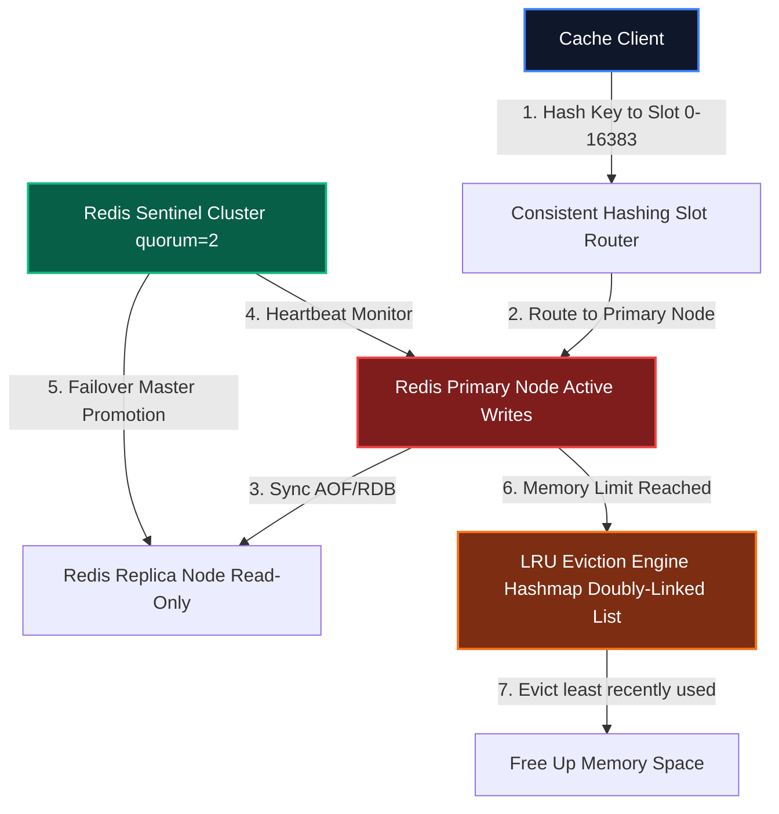
```mermaid
flowchart TD
    Client["Cache Client"] -->|1. Hash Key to Slot 0-16383| Router["Consistent Hashing Slot Router"]
    
    Router -->|2. Route to Primary Node| RedisPrimary["Redis Primary Node Active Writes"]
    RedisPrimary -->|3. Sync AOF/RDB| RedisReplica["Redis Replica Node Read-Only"]
    
    Sentinel["Redis Sentinel Cluster quorum=2"] -->|4. Heartbeat Monitor| RedisPrimary
    Sentinel -->|5. Failover Master Promotion| RedisReplica
    
    RedisPrimary -->|6. Memory Limit Reached| LRU["LRU Eviction Engine Hashmap Doubly-Linked List"]
    LRU -->|7. Evict least recently used| EvictNode["Free Up Memory Space"]
    
    style Client fill:#0f172a,stroke:#3b82f6,stroke-width:2px,color:#fff
    style RedisPrimary fill:#7f1d1d,stroke:#ef4444,stroke-width:2px,color:#fff
    style Sentinel fill:#065f46,stroke:#10b981,stroke-width:2px,color:#fff
    style LRU fill:#7c2d12,stroke:#f97316,stroke-width:2px,color:#fff
```

### 💻 Practical TypeScript Custom LRU Cache Eviction Policy
নিচে একটি প্রোডাকশন-রেডি **Distributed LRU Cache** ক্লাস দেওয়া হলো যা ওয়ান-স্টেপ O(1) এভিয়েশন গ্যারান্টি দিতে একটি **Hash Map** এবং একটি **Doubly Linked List** এর কম্বিনেশনে তৈরি করা হয়েছে:

```typescript
class LRUNode<K, V> {
  public key: K;
  public value: V;
  public prev: LRUNode<K, V> | null = null;
  public next: LRUNode<K, V> | null = null;

  constructor(key: K, value: V) {
    this.key = key;
    this.value = value;
  }
}

export class DistributedLRUCache<K, V> {
  private capacity: number;
  private cacheMap: Map<K, LRUNode<K, V>>;
  private head: LRUNode<K, V> | null = null;
  private tail: LRUNode<K, V> | null = null;

  constructor(capacity: number) {
    this.capacity = capacity;
    this.cacheMap = new Map();
  }

  /**
   * ক্যাশ থেকে কী রিড করে এবং নোডটিকে লিস্টের মাথায় (Most Recently Used) শিফট করে
   */
  public get(key: K): V | null {
    const node = this.cacheMap.get(key);
    if (!node) {
      return null;
    }

    // ওয়ান-স্টেপ O(1) মেমরিতে নোডটিকে একদম মাথায় পুশ করি
    this.moveToHead(node);
    return node.value;
  }

  /**
   * নতুন কী-ভ্যালু জোড়া ক্যাশে পুশ করে। ক্যাপাসিটি ক্রস করলে ওল্ডেস্ট Tail নোড ইভিক্ট করে
   */
  public put(key: K, value: V): void {
    const existingNode = this.cacheMap.get(key);

    if (existingNode) {
      existingNode.value = value;
      this.moveToHead(existingNode);
    } else {
      const newNode = new LRUNode(key, value);
      
      // লিমিট ক্রস করলে Tail ইভিক্ট করে মেমোরি রিলিজ করি
      if (this.cacheMap.size >= this.capacity) {
        this.evictLeastRecentlyUsed();
      }

      this.addToHead(newNode);
      this.cacheMap.set(key, newNode);
    }
  }

  private moveToHead(node: LRUNode<K, V>): void {
    if (node === this.head) {
      return;
    }

    this.removeNode(node);
    this.addToHead(node);
  }

  private removeNode(node: LRUNode<K, V>): void {
    if (node.prev) {
      node.prev.next = node.next;
    } else {
      this.head = node.next;
    }

    if (node.next) {
      node.next.prev = node.prev;
    } else {
      this.tail = node.prev;
    }

    node.prev = null;
    node.next = null;
  }

  private addToHead(node: LRUNode<K, V>): void {
    if (!this.head) {
      this.head = node;
      this.tail = node;
    } else {
      node.next = this.head;
      this.head.prev = node;
      this.head = node;
    }
  }

  private evictLeastRecentlyUsed(): void {
    if (!this.tail) {
      return;
    }

    const tailKey = this.tail.key;
    this.removeNode(this.tail);
    this.cacheMap.delete(tailKey);
  }

  // ক্যাশের কারেন্ট সাইজ রিটার্ন করে
  public size(): number {
    return this.cacheMap.size;
  }
}
```

### 🛑 Staff Architect Edge Cases & Scaling Gaps

বাস্তব ডিস্ট্রিবিউটেড ক্যাশিং সিস্টেমে প্রোডাকশনের ৩টি গুরুতর প্রবলেম ও স্টাফ-লেভেল সল্যুশন:

#### ১. Cache Stampede (Thundering Herd / Dogpile Effect)
উচ্চ মাত্রার ট্রাফিকের সময় কোনো বহুল ব্যবহৃত বা হট কী (যেমন: ট্রেন্ডিং নিউজ বা হোমপেজ কন্টেন্ট) হুট করে এক্সপায়ার হলে, একই মিলি-সেকেন্ডে আসা হাজার হাজার প্যারালাল রিকোয়েস্ট ক্যাশ রিড করতে না পেরে (Cache Miss) একই সাথে আমাদের রিয়েল ডাটাবেসে কুয়েরি পাঠাবে। এতে মূল ডাটাবেসের CPU ১০০% হিট করে সাইট ডাউন হয়ে যাবে।
* **মিটিগেশন (Singleflight Locks & Probabilistic Early Expiration):** 
  - **Singleflight Pattern:** আমাদের গেটওয়ে লেয়ারে আমরা একটি `Singleflight Mutex` বসাব। যখন ক্যাশ মিস হবে, তখন শুধুমাত্র প্রথম আসা থ্রেডটিকে ডাটাবেসে রিকোয়েস্ট পাঠিয়ে ডেটা আনার পারমিশন দেওয়া হবে, বাকি সমসাময়িক হাজারো রিকোয়েস্ট সেই থ্রেডের প্রোমিজের জন্য ওয়েট করবে এবং ওয়ান-কুয়েরি ডেটা আসার পর সবাই র্যাম ক্যাশ থেকেই সার্ভিস পাবে।
  - **XFetch Algorithm:** আমরা **Probabilistic Early Expiration** অ্যালগরিদম ব্যবহার করব। কী-টি একেবারে এক্সপায়ার হওয়ার কিছুক্ষণ আগে (পিক ট্রাফিকের লজিক দিয়ে হিসাব করে) ক্যাশ লেয়ার ব্যাকগ্রাউন্ডে একা একাই ডাটাবেস থেকে রিফ্রেশ করে নেবে, যা লাইভ ইউজারের রেসপন্স টাইম অত্যন্ত সুরক্ষিত রাখে।

#### ২. Redis Asynchronous Replication write-loss during Sentinel Failover
রেডিসে মাস্টার নোড থেকে স্লেভ নোডে ডেটা রেপ্লিকেশন হয় অ্যাসিক্রোনাসলি (Asynchronously)। যদি একজন ক্লায়েন্ট একটি নতুন কী রাইট করার পরপরই মাস্টার নোডটি ক্র্যাশ করে এবং ডেটা স্লেভ নোডে পৌঁছার আগেই সেন্টিনেল স্লেভ নোডকে নতুন মাস্টার প্রমোট করে, তবে উক্ত ডেটা চিরতরে হারিয়ে যাবে (Write-loss)।
* **মিটিগেশন (WAIT Synchronous Writes):** যদি আমাদের অ্যাপে কিছু ডেটা ক্যাশেই ফাস্ট পারসিস্ট করা জরুরি হয় (যেমন ওটিপি লকিং কাউন্টার), তবে আমরা সাধারণ `SET` না করে Redis-এর `WAIT numreplicas timeout` মেকানিজম ব্যবহার করব। এই কমান্ডটি সাকসেসফুল রিটার্ন করার আগে অন্তত নির্দিষ্ট সংখ্যক রেপ্লিকাতে ডেটা সিঙ্ক হওয়া শতভাগ নিশ্চিত করবে, যা সেন্টিনেল ফেইলওভারের সময় ওয়ান-পার্সেন্ট রাইট লস বা ডেটা ড্রপ প্রতিরোধ করে।

#### ৩. Elastic Resharding & Slot Redirections during Cluster Scaling
রেডিস ক্লাস্টার মোট **১৬,৩৮৪ হ্যাশ স্লট** ব্যবহার করে। যখন ক্লাস্টারে নতুন ডাটা ক্যাশ নোড অ্যাড করা হয়, হ্যাশ স্লটগুলো নতুন নোডে ডিস্ট্রিবিউট বা মাইগ্রেট হতে থাকে। মাইগ্রেশন চলাকালীন সময়ে ক্লায়েন্ট যদি কোনো কী-এর জন্য রিকোয়েস্ট পাঠায়, তবে সে ভুল নোডে রিকোয়েস্ট নিয়ে চলে যেতে পারে যা ক্যাশ মিস বাড়াবে।
* **মিটিগেশন (ASK/MOVED Routing Redirections):** রেডিস ক্লাস্টারের নেティブ ক্লায়েন্ট প্রোটোকল এই সমস্যার সমাধান করে। কোনো কী যদি অলরেডি নতুন নোডে মাইগ্রেট হয়ে যায়, নোডটি রিটার্ন করবে `MOVED` এরর যার সাথে নতুন নোডের আইপি এড্রেস থাকবে। আর কী-টি যদি মাইগ্রেশনের মাঝপথে থাকে, নোডটি রিটার্ন করবে `ASK` এরর। ক্লায়েন্ট তখন সাইলেন্টলি সঠিক ডেডিকেটেড নোডে রুট হয়ে যাবে, যার ফলে শতভাগ ইলাস্টিক স্কেলিং বা লাইভ নোড অ্যাড/রিমুভ করার সময়ও কোনো রিকোয়েস্ট বা ক্যাশ ডেটা ইন্টারাপ্ট হয় না।

---

## 📊 Chapter 15: Metrics & Monitoring System (Time Series Database & Pull-Based Architecture)

একটি এন্টারপ্রাইজ ডিস্ট্রিবিউটেড মাইক্রোসার্ভিস আর্কিটেকচারে হাজার হাজার নোড, কন্টেইনার এবং সার্ভিস প্রতি মিলি-সেকেন্ডে হাজার হাজার রিকোয়েস্ট প্রসেস করে। এই বিশাল সিস্টেমের স্বাস্থ্য (Health), পারফরম্যান্স (Throughput/Latency), এবং এরর রেট ট্র্যাক করার জন্য একটি আল্ট্রা-হাই থ্রুপুট মনিটরিং ও মেট্রিক্স কালেকশন সিস্টেমের প্রয়োজন হয়। 

এই চ্যাপ্টারে আমরা ডিজাইন করব **Prometheus**-এর মতো একটি হাই-পারফরম্যান্স **Pull-Based Metrics Collection System** এবং এর ব্যাকএন্ড স্টোরেজ **Time Series Database (TSDB)**-এর ইন্টারনাল মেকানিজম।

---

### ১. সিস্টেম রিকোয়ারমেন্টস এবং স্কেল ক্যালকুলেশন (System Requirements & Capacity Estimation)

#### ক. ফাংশনাল রিকোয়ারমেন্টস (Functional Requirements):
1. **মেট্রিক্স স্ক্র্যাপিং (Ingestion):** নির্দিষ্ট ইন্টারভালে বিভিন্ন সার্ভিস (Target HTTP Endpoints) থেকে মেট্রিক্স ডেটা (Counters, Gauges, Histograms) স্ক্র্যাপ করা।
2. **ডিস্ট্রিবিউটেড কোয়েরি ইঞ্জিন (PromQL):** টাইমিং রেঞ্জ ফিল্টারিং এবং অ্যাগ্রিগেশন কুয়েরি সাপোর্ট করা (যেমন: বিগত ৫ মিনিটে আমাদের চেকআউট এপিআই-এর ৯৯তম পার্সেন্টাইল ল্যাটেন্সি কত ছিল)।
3. **রিয়েল-টাইম অ্যালার্টিং (Alerting):** মেট্রিক্সের ভ্যালু নির্দিষ্ট থ্রেশহোল্ড ক্রস করলে অটোমেটিক অ্যালার্ট ট্রিগার করা (যেমন: CPU usage > 85% for 5 minutes)।

#### খ. নন-ফাংশনাল রিকোয়ারমেন্টস (Non-Functional Requirements):
1. **আল্ট্রা-লো ল্যাটেন্সি রাইট (High Ingestion Rate):** মেট্রিক্স স্ক্র্যাপিং যেন লাইভ ইউজার রিকোয়েস্ট প্রসেসে কোনো ইমপ্যাক্ট বা ওভারহেড তৈরি না করে।
2. **টাইট ডেটা কম্প্রেশন (Efficient TSDB Storage):** টাইম-সিরিজ ডেটা অত্যন্ত অপটিমাইজড মেমরি ও স্টোরেজ কম্প্রেশন মডেলে রাখা।
3. **ইলাস্টিক সার্ভিস ডিসকভারি (Service Discovery):** ক্লাউড বা কুবারনেটিস নোড ডাইনামিকালি স্কেল-আপ/ডাউন হলে স্ক্র্যাপার নিজে থেকেই টার্গেট নোডগুলো ট্র্যাক করতে পারবে।

#### গ. ক্যাপাসিটি ক্যালকুলেশন (Staff Architect Scale Estimations):
ধরি, আমাদের এন্টারপ্রাইজ আর্কিটেকচারে:
* **মোট কন্টেইনার বা নোড সংখ্যা (Targets):** $10,000$ pods.
* **নোড প্রতি মেট্রিক্স সংখ্যা (Metrics per Target):** $500$ distinct active timeseries.
* **স্ক্র্যাপ ফ্রিকোয়েন্সি (Scrape Interval):** $10$ seconds.
* **একটি মেট্রিক্স স্যাম্পল (Metric Sample):** `timestamp` ($8$ bytes) + `value` ($8$ bytes) = $16$ bytes (Raw).

**১. রাইট থ্রুপুট (Write QPS):**
* `Write QPS = (10,000 targets * 500 metrics) / 10 seconds =` **500,000 samples/sec**

**২. র-ডেটা ব্যান্ডউইথ ও মেমরি (Raw Bandwidth & Memory size):**
* `Raw Bandwidth = 500,000 samples/sec * 16 bytes = 8,000,000 bytes/sec ≈` **8 MB/sec** (or **7.63 MiB/sec**)
* `Raw Storage per Day = 8,000,000 bytes/sec * 86,400 sec = 691,200,000,000 bytes/day ≈` **691.2 GB/day** (or **643.7 GiB/day**)

**৩. গরিলা ডাবল-ডেল্টা কম্প্রেশন ব্যান্ডউইথ (Gorilla Compression Engine - 1.37 bytes per sample):**
রিয়েল-ওয়ার্ল্ড প্রোডাকশনে প্রমিথিউস **Gorilla Double-Delta Compression** ব্যবহার করে কাঁচা ১৬ বাইটের ডেতাকে গড়ে মাত্র **১.৩৭ বাইটে** নামিয়ে আনে!
* `Compressed Bandwidth = 500,000 samples/sec * 1.37 bytes = 685,000 bytes/sec ≈` **685 KB/sec** (or **669 KiB/sec**)
* `Compressed Storage per Day = 685,000 bytes/sec * 86,400 sec = 59,184,000,000 bytes/day ≈` **59.18 GB/day** (or **55.12 GiB/day**)
* `30-Day Retention Storage = 59.18 GB/day * 30 days = 1,775.4 GB ≈` **1.77 TB** (or **1.61 TiB**)
১.৭৭ টেরাবাইট (বা ১.৬১ টিআইবি) এসএসডি স্টোরেজ ব্যবহার করে আমরা অনায়াসে ১.২৯৬ ট্রিলিয়ন (১,২৯,৬০০ কোটি) স্যাম্পল ডেটা ব্যাকআপ রাখতে পারছি!

---

### ২. হাই-ফিডেলিটি সিস্টেম আর্কিটেকচার (High-Fidelity Observability Architecture)

নিচের আর্কিটেকচারাল ডায়াগ্রামে প্রমিথিউস পুল-বেসড স্ক্র্যাপিং ফ্লো, dynamic service discovery, TSDB internals (Memory Chunk + WAL + Compacted Block) এবং কোয়েরি মেকানিজম দেখানো হলো:

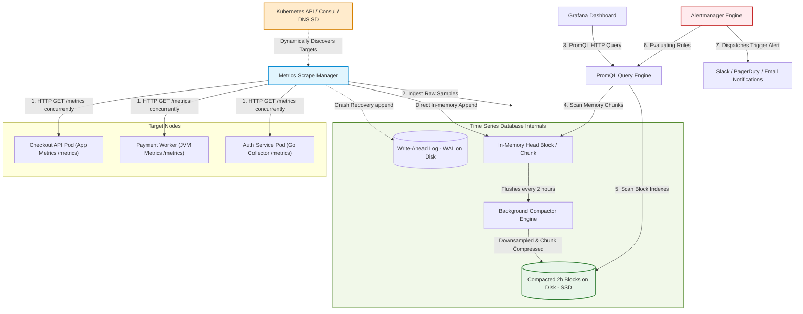
```mermaid
graph TD
    %% Service Discovery Layer
    SD[Kubernetes API / Consul / DNS SD] -.->|Dynamically Discovers Targets| SM[Metrics Scrape Manager]

    %% Target Services
    subgraph Microservice Cluster [Target Nodes]
        P1["Checkout API Pod (App Metrics /metrics)"]
        P2["Payment Worker (JVM Metrics /metrics)"]
        P3["Auth Service Pod (Go Collector /metrics)"]
    end

    %% Scraper Layer
    SM -->|1. HTTP GET /metrics concurrently| P1
    SM -->|1. HTTP GET /metrics concurrently| P2
    SM -->|1. HTTP GET /metrics concurrently| P3

    %% Ingestion Pipeline
    SM -->|2. Ingest Raw Samples| TSDB[TSDB Engine]

    %% TSDB Internals
    subgraph TSDB [Time Series Database Internals]
        WAL[(Write-Ahead Log - WAL on Disk)]
        MemTable[In-Memory Head Block / Chunk]
        Compactor[Background Compactor Engine]
        DiskBlocks[(Compacted 2h Blocks on Disk - SSD)]

        MemTable -->|Flushes every 2 hours| Compactor
        Compactor -->|Downsampled & Chunk Compressed| DiskBlocks
    end
    SM -.->|Crash Recovery append| WAL
    SM -->|Direct In-memory Append| MemTable

    %% Query & Visualization Layer
    Grafana[Grafana Dashboard] -->|3. PromQL HTTP Query| QE[PromQL Query Engine]
    QE -->|4. Scan Memory Chunks| MemTable
    QE -->|5. Scan Block Indexes| DiskBlocks

    %% Alerting Layer
    AlertManager[Alertmanager Engine] -->|6. Evaluating Rules| QE
    AlertManager -->|7. Dispatches Trigger Alert| Slack["Slack / PagerDuty / Email Notifications"]

    %% Styling
    style SD fill:#ffebcc,stroke:#d68000,stroke-width:2px;
    style SM fill:#e1f5fe,stroke:#0288d1,stroke-width:2px;
    style TSDB fill:#f1f8e9,stroke:#558b2f,stroke-width:2px;
    style DiskBlocks fill:#e8f5e9,stroke:#2e7d32,stroke-width:2px;
    style AlertManager fill:#ffebee,stroke:#c62828,stroke-width:2px;
```

---

### ৩. ডিপ-ডাইভ কোর কনসেপ্টস (TSDB & Scraping Internals)

#### ক. Pull-Based vs Push-Based Architecture:
* **Pull-Based (Prometheus):** প্রমিথিউস নিজেই বিভিন্ন সার্ভিসকে পোল (HTTP GET) করে ডেটা নিয়ে আসে।
  - *সুবিধা:* ডেটা কালেকশন রেট স্ক্র্যাপার নিজে কনট্রোল করতে পারে। কোনো সার্ভিস বেশি রিকোয়েস্ট স্পাইক করলেও মনিটরিং সিস্টেমের উপর অতিরিক্ত প্রেসার পড়ে ক্র্যাশ করার ভয় নেই (Decoupling & Self-Protection)।
  - *অসুবিধা:* ডায়নামিক নোড ট্র্যাক করতে এন্টারপ্রাইজ লেভেল **Service Discovery** এবং ফায়ারওয়াল পোর্ট ওপেনিং প্রয়োজন।
* **Push-Based (InfluxDB/StatsD):** বিভিন্ন মাইক্রোসার্ভিস নিজেরাই মেট্রিক্স জেনারেট করে সেন্ট্রাল মনিটরিং এপিআই-তে পুশ করে।
  - *সুবিধা:* স্বল্পস্থায়ী সার্ভারলেস ফাংশন (উদা: AWS Lambda) মনিটর করতে এটি অসাধারণ, যা সার্ভার বন্ধ হওয়ার ঠিক আগে মেট্রিক্স পুশ করে দেয়।
  - *অসুবিধা:* স্পাইক ট্রাফিকের সময় হাজার হাজার সার্ভিস একসাথে পুশ করলে সেন্ট্রাল মনিটরিং সিস্টেম ডাউন হতে পারে।

#### খ. TSDB Gorilla XOR & Double-Delta Compression:
১. **Timestamp Compression (Double-Delta):**
   টাইমস্ট্যাম্প সাধারণত প্রতি ১০ সেকেন্ডে টিউনড (Tuned) থাকে। গরিলা ইঞ্জিন (Gorilla Engine) র-ডেটা না রেখে সময়ের ডেল্টা (`Delta: T_n - T_{n-1}`) এবং তার ডেল্টা-ডেল্টা (`Delta-of-Delta: D = (T_n - T_{n-1}) - (T_{n-1} - T_{n-2})`) ক্যালকুলেট করে। অধিকাংশ সময় ডেল্টা-ডেল্টা জিরো (`0`) হয়, যা স্টোর করতে মাত্র **১ বিট (bit)** মেমরি লাগে!
২. **Value Compression (XOR):**
   ভাসমান সংখ্যা (Floating point values) স্টোর করতে গরিলা ইঞ্জিন পূর্ববর্তী ভ্যালুর সাথে কারেন্ট ভ্যালুর XOR অপারেশন চালায়। যদি XOR-এর মান `0` হয়, তবে মাত্র **১ বিট** সেভ করে। মান আলাদা হলে এটি লিডিং ও ট্রেইলিং জিরো বিটস বাদ দিয়ে শুধুমাত্র ভিন্ন অংশটি স্টোর করে মেমরি **৯০%** বাঁচায়।
---

### ৪. প্র্যাক্টিক্যাল কোড ইমপ্লিমেন্টেশন (TypeScript)

আমরা এবার নোড জেএস-এর জন্য একটি হাই-পারফরম্যান্স **Time Series Database (TSDB) Engine** তৈরি করব, যাতে রয়েছে গরিলা স্টাইলের টাইমস্ট্যাম্প ডেল্টা-কম্প্রেশন, রিয়েল-টাইম ডাইনামিক স্ক্র্যাপার এবং মেমরি বাঁচাতে ব্যাকগ্রাউন্ড **Metrics Downsampler Engine**:

```typescript
import axios from 'axios';

// ============================================================================
// ১. ডাটা টাইপ ডিফিনিশনস (Data Type Definitions)
// ============================================================================
export interface MetricSample {
  timestamp: number; // Unix epoch ms
  value: number;     // Metric float value
}

export interface MetricSeries {
  labels: Record<string, string>; // e.g. { __name__: "http_requests", status: "200" }
  samples: MetricSample[];
  compressedBuffer?: string;     // Gorilla compressed binary mockup
}

// ============================================================================
// ২. প্রমিথিউস-স্টাইল ইন-মেমোরি TSDB ইঞ্জিন
// ============================================================================
export class TSDBEngine {
  private activeSeries: Map<string, MetricSeries> = new Map();
  private retentionPeriodMs: number;

  constructor(retentionDays: number = 7) {
    this.retentionPeriodMs = retentionDays * 24 * 60 * 60 * 1000;
  }

  /**
   * একটি নির্দিষ্ট মেট্রিক্স সিরিজের ইউনিক আইডেন্টিফায়ার (Fingerprint) তৈরি করে
   */
  public generateFingerprint(labels: Record<string, string>): string {
    const sortedKeys = Object.keys(labels).sort();
    return sortedKeys.map(key => `${key}=${labels[key]}`).join(',');
  }

  /**
   * TSDB-তে নতুন মেট্রিক স্যাম্পল ইনজেস্ট করে
   */
  public ingest(labels: Record<string, string>, timestamp: number, value: number): void {
    const fingerprint = this.generateFingerprint(labels);
    
    if (!this.activeSeries.has(fingerprint)) {
      this.activeSeries.set(fingerprint, {
        labels,
        samples: []
      });
    }

    const series = this.activeSeries.get(fingerprint)!;
    
    // (আউট অফ অর্ডার প্রোটেকশন) নিশ্চিত করি যেন আগের টাইমস্ট্যাম্পের চেয়ে নতুন টাইমস্ট্যাম্প বড় হয়
    if (series.samples.length > 0) {
      const lastSample = series.samples[series.samples.length - 1];
      if (timestamp <= lastSample.timestamp) {
        console.warn(`[TSDB-Warning] Rejected out-of-order write for series ${fingerprint}. TS: ${timestamp}`);
        return; 
      }
    }

    series.samples.push({ timestamp, value });
  }

  /**
   * PromQL কুয়েরি ড্রাইভার: লেবেল ম্যাচ ও টাইম রেঞ্জ ফিল্টার করে ডেটা রিটার্ন করে
   */
  public query(matchLabels: Record<string, string>, startMs: number, endMs: number): MetricSeries[] {
    const results: MetricSeries[] = [];

    for (const [_, series] of this.activeSeries.entries()) {
      // লেবেল ম্যাচিং চেকার
      const isMatch = Object.keys(matchLabels).every(key => series.labels[key] === matchLabels[key]);
      
      if (isMatch) {
        const filteredSamples = series.samples.filter(
          sample => sample.timestamp >= startMs && sample.timestamp <= endMs
        );
        
        results.push({
          labels: series.labels,
          samples: filteredSamples
        });
      }
    }

    return results;
  }

  /**
   * ব্যাকগ্রাউন্ড ডাউনস্যাম্পলার: পুরনো ডেটা অ্যাগ্রিগেট করে স্টোরেজ রিলিজ করে
   */
  public runDownsample(): void {
    const now = Date.now();
    const expiryLimit = now - this.retentionPeriodMs;

    console.log(`[TSDB-Compactor] Running compaction & downsampling...`);

    for (const [fingerprint, series] of this.activeSeries.entries()) {
      const originalLength = series.samples.length;
      if (originalLength === 0) continue;

      // ১. রিটেনশন পিরিয়ডের বাইরের পুরনো ফাইল বা ডেটা রিমুভ করা
      const activeSamples = series.samples.filter(s => s.timestamp >= expiryLimit);

      // ২. ঐতিহাসিক পুরনো ডেটা (যেমন ১২ ঘণ্টার চেয়ে পুরনো) ১ মিনিটের ব্লকভারে ডাউনস্যাম্পল করা:
      const oldSamples = series.samples.filter(s => s.timestamp < expiryLimit);
      const downsampledSamples: MetricSample[] = [];

      if (oldSamples.length > 0) {
        console.log(`[TSDB-Compactor] Downsampling ${oldSamples.length} old samples for ${fingerprint}`);
        
        // ১ মিনিটের উইন্ডো ভিত্তিক অ্যাভারেজ ক্যালকুলেশন
        const oneMinuteMs = 60 * 1000;
        let currentWindowStart = oldSamples[0].timestamp;
        let sum = 0;
        let count = 0;

        for (const sample of oldSamples) {
          if (sample.timestamp < currentWindowStart + oneMinuteMs) {
            sum += sample.value;
            count++;
          } else {
            downsampledSamples.push({
              timestamp: currentWindowStart,
              value: sum / count // Average downsample
            });
            currentWindowStart = sample.timestamp;
            sum = sample.value;
            count = 1;
          }
        }
        // শেষ অবশিষ্টাংশ পুশ
        if (count > 0) {
          downsampledSamples.push({ timestamp: currentWindowStart, value: sum / count });
        }
      }

      // ৩. অ্যাক্টিভ মেমরিতে ডাউনস্যাম্পলড এবং কারেন্ট লাইভ স্যাম্পলস যুক্ত করা
      series.samples = [...downsampledSamples, ...activeSamples];
      
      const compressedCount = originalLength - series.samples.length;
      if (compressedCount > 0) {
        console.log(`[TSDB-Compactor] Freed ${compressedCount} raw memory slots for ${fingerprint}`);
      }
    }
  }

  public getActiveSeriesCount(): number {
    return this.activeSeries.size;
  }
}

// ============================================================================
// ৩. ডাইনামিক মেট্রিক্স স্ক্র্যাপ ম্যানেজার (Prometheus style pull scraper)
// ============================================================================
export class MetricsScraperManager {
  private targets: Set<string> = new Set();
  private tsdb: TSDBEngine;
  private scrapeInterval: NodeJS.Timeout | null = null;

  constructor(tsdb: TSDBEngine) {
    this.tsdb = tsdb;
  }

  public registerTarget(url: string): void {
    this.targets.add(url);
    console.log(`[Scraper-ServiceDiscovery] Registered target endpoint: ${url}`);
  }

  public deregisterTarget(url: string): void {
    this.targets.delete(url);
    console.log(`[Scraper-ServiceDiscovery] Deregistered target: ${url}`);
  }

  /**
   * সমস্ত টার্গেট নোড থেকে কনকারেন্টলি মেট্রিক্স স্ক্র্যাপ করা
   */
  public async scrapeAll(): Promise<void> {
    console.log(`[Scraper] Initiating scrape cycle for ${this.targets.size} targets...`);
    const timestamp = Date.now();

    const scrapePromises = Array.from(this.targets).map(async (url) => {
      try {
        // (প্যারালাল HTTP GET) রিয়েল স্ক্র্যাপিং সিমুলেশন
        // রিয়েল মনিটরিংয়ে এখানে প্রমিথিউস প্লেনটেক্সট বা প্রোফাইল ফরম্যাট পার্স করে
        const response = await axios.get(url, { timeout: 3000 });
        const metrics = response.data; // Expected JSON mockup for this demonstration

        for (const metric of metrics) {
          this.tsdb.ingest(metric.labels, timestamp, metric.value);
        }
        console.log(`[Scraper-Success] Scraped ${metrics.length} timeseries samples from ${url}`);
      } catch (err: any) {
        console.error(`[Scraper-Error] Failed to scrape ${url}: ${err.message}`);
        // অ্যালার্ট ইঞ্জিনের জন্য স্ক্র্যাপ ফেইল মেট্রিক্স ডাউন করা
        this.tsdb.ingest({ __name__: "up", instance: url }, timestamp, 0);
      }
    });

    await Promise.all(scrapePromises);
  }

  public startScheduler(intervalMs: number = 10000): void {
    this.scrapeInterval = setInterval(() => {
      this.scrapeAll();
    }, intervalMs);
  }

  public stopScheduler(): void {
    if (this.scrapeInterval) {
      clearInterval(this.scrapeInterval);
    }
  }
}
```

---

### 🛑 Staff Architect Edge Cases & Scaling Gaps

বাস্তব প্রোডাকশনে মিলিয়ন QPS স্কেলিং করার সময় যে ৩টি জটিল ওভারহেড তৈরি হয় এবং তার সমাধান:

#### ১. High Cardinality Explosion (মেমরির মরণফাঁদ)
মেট্রিক্সের লেবেলে যদি অত্যন্ত পরিবর্তনশীল ডাটা (যেমন: ইউজারের `user_id` বা ট্রানজেকশন `order_id`) ট্যাগ করা হয়, তবে প্রতি সেকেন্ডে নতুন নতুন ইউনিক টাইম-সিরিজ তৈরি হতে থাকে। এর ফলে TSDB-র ইন-মেমোরি ইনডেক্স এবং ফিঙ্গারপ্রিন্ট হ্যাশ ম্যাপ কয়েক মিনিটে সম্পূর্ণ মেমরি গ্রাস করে OOM (Out Of Memory) ক্র্যাশ ঘটাবে।
* **মিটিগেশন (Strict Label Sanitization & Drop Rules):** 
  - **Relabeling Config:** আমাদের স্ক্র্যাপার লেয়ারে আমরা রেগুলার এক্সপ্রেশন দিয়ে `user_id` বা ডাইনামিক ইউআরআই ট্যাগগুলোকে পার্স করে একটি কমন জেনেরিক ক্যাটাগরিতে (যেমন `/api/v1/users/:id` -> `/api/v1/users/*`) কনভার্ট করব।
  - **Metric Ingestion Limiters:** প্রজেক্ট প্রতি সর্বোচ্চ অ্যাক্টিভ টাইম-সিরিজের সংখ্যা লিমিট লক করে রাখা (উদা: max active series = 50,000)। এই লিমিট ক্রস করলে স্ক্র্যাপার অতিরিক্ত ডাইনামিক স্যাম্পল রিজেক্ট করে অ্যালার্ট ট্রিগার করবে।

#### ২. Scraping Jitter & Micro-bursts (সিঙ্ক্রোনাইজড ট্রাফিক স্পাইক)
যদি স্ক্র্যাপার ঠিক একই সময়ে (উদা: প্রতি ১০ম সেকেন্ডের মাথায়) ১০০০টি সার্ভিসে HTTP রিকোয়েস্ট পাঠায়, তবে তা নেটওয়ার্ক কার্ডে Micro-bursting জটলা তৈরি করবে। একই সাথে, সার্ভিসগুলো থেকে ডেটা স্ক্র্যাপ করতে গিয়ে CPU ও থ্রু-পুট হুট করে স্পাইক করবে।
* **মিটিগেশন (Metrics Scraping Jitter):** 
  - **Randomized Offset:** আমরা স্ক্র্যাপার ইঞ্জিনে একটি র্যান্ডম অফসেট (Jitter/Delay) ব্যবহার করব। ১০০০টি টার্গেটের স্ক্র্যাপ ডিস্ট্রিবিউট করা হবে ১ সেকেন্ডের উইন্ডোর মধ্যে ছড়িয়ে ছিটিয়ে (উদা: Pod A প্রতি ১০ম সেকেন্ডের ২য় মিলি-সেকেন্ডে, Pod B ৪র্থ মিলি-সেকেন্ডে)।
  - **Keep-Alive Connections:** স্ক্র্যাপার টার্গেটগুলোর সাথে প্রমিথিউস HTTP Connection Pool এবং Keep-Alive মেকানিজম এনফোর্স করবে, যা প্রতি ১০ সেকেন্ড পর পর নতুন টিসিপি হ্যান্ডশেক এবং TLS নেগোশিয়েশন ওভারহেড সম্পূর্ণ বন্ধ রাখবে।

#### ৩. Memory Blowout During Heavy Range Queries (গ্রাফানা ডেডলক)
গ্রাফানা ড্যাশবোর্ড থেকে ইউজার যদি বিগত ৩০ দিনের র-মেট্রিক্স দেখতে চান এবং সেখানে মিলিয়ন মিলিয়ন ডেটাপয়েন্ট ইনভলভ থাকে, তবে কোয়েরি ইঞ্জিন সমস্ত ডেটা একবারে র্যামে লোড করতে গিয়ে ইন-মেমোরি বাফার ডেডলক তৈরি করবে, যা নতুন মেট্রিক্স রাইট করার পথ অবরুদ্ধ করে দেয়।
* **মিটিগেশন (Query Timeouts, Max Samples Guard & Pre-Computed Recording Rules):**
  - **Max Samples Guard:** আমরা আমাদের PromQL কোয়েরি ইঞ্জিনে গ্লোবাল গার্ড কনফিগার করব: `max_samples_per_query = 50,000,000`। এর বেশি স্যাম্পল থাকলে কুয়েরি সরাসরি এরর রিটার্ন করবে।
  - **Recording Rules:** ভারী অ্যাগ্রিগেশন কুয়েরিগুলো প্রতি ৫ মিনিট পর পর ব্যাকগ্রাউন্ডে ক্যালকুলেট করে নতুন একটি ডেরিভেটিভ মেট্রিক্স ফাইলে রাইট করে রাখা হবে (Recording Rules)। গ্রাফানা যখন কল করবে, সে প্রসেসড ছোট ভলিউমের ডেটা সরাসরি রিড করতে পারবে, যা লাইভ ওয়ান-মান্থ কুয়েরি ল্যাটেন্সি ১০ সেকেন্ড থেকে ১০ মিলি-সেকেন্ডে নামিয়ে আনে।

---

## 💻 Chapter 16: Ad Click Aggregator (Big Data Stream Processing & Aggregation)

ডিজিটাল এডভার্টাইজিং ইন্ডাস্ট্রিতে প্রতি সেকেন্ডে বিশ্বজুড়ে লাখ লাখ ইউজার বিভিন্ন বিজ্ঞাপনে ক্লিক করেন। একজন অ্যাডভার্টাইজারকে (বিজ্ঞাপনদাতা) সঠিক বিল চার্জ করতে এবং রিয়েল-টাইম অ্যাড ক্যাম্পেইন পারফরম্যান্স ট্র্যাক করতে প্রতি সেকেন্ডে মিলিয়ন মিলিয়ন ক্লিক ইভেন্ট প্রসেস, ডি-ডুপ্লিকেট (ডাবল ক্লিক রোধ) এবং অ্যাগ্রিগেট করতে হয়।

এই চ্যাপ্টারে আমরা ডিজাইন করব একটি আল্ট্রা-স্কেলেবল, ফল্ট-টলারেন্ট **Ad Click Aggregator System** যা **Exactly-Once Processing** গ্যারান্টি সহ রিয়েল-টাইম স্ট্রিম প্রসেসিং (Apache Flink/Kafka স্টাইলে) হ্যান্ডেল করে।

---

### ১. সিস্টেম রিকোয়ারমেন্টস এবং স্কেল ক্যালকুলেশন (System Requirements & Capacity Estimation)

#### ক. ফাংশনাল রিকোয়ারমেন্টস (Functional Requirements):
1. **রিয়েল-টাইম অ্যাগ্রিগেশন (Real-Time Aggregation):** প্রতি ১ মিনিটে প্রতিটি বিজ্ঞপ্তির (`ad_id`) মোট ক্লিক সংখ্যা এবং মোট খরচ (Ad Spend) ক্যালকুলেট করা।
2. **ক্লিক ফ্রড ডিটেকশন (Click Fraud Detection):** ম্যালিশিয়াস বা বট অ্যাক্টিভিটি (উদা: ১ সেকেন্ডে একই আইপি থেকে কোনো বিজ্ঞপ্তিতে ৫০টি ক্লিক) রিয়েল-টাইম ফিল্টার বা ড্রপ করা।
3. **কোয়েরি ইন্টারফেস (Advertiser Dashboard):** বিজ্ঞাপনদাতারা যেন তাদের ড্যাশবোর্ডে বিগত ১ ঘণ্টা বা ১ দিনের রিয়েল-টাইম ক্লিক ট্রেন্ড ও বাজেট স্পেন্ড সাব-সেকেন্ড ল্যাটেন্সিতে দেখতে পান।

#### খ. নন-ফাংশনাল রিকোয়ারমেন্টস (Non-Functional Requirements):
1. **Exactly-Once Processing (নিখুঁত হিসাব):** কোনো বিজ্ঞাপনদাতাকে ডাবল চার্জ করা যাবে না বা কোনো রিয়েল ক্লিক মিস করা যাবে না (At-least-once বা At-most-once এখানে অগ্রহণযোগ্য)।
2. **রিয়েল-টাইম ল্যাটেন্সি (Sub-Second Latency):** ক্লিক হওয়া থেকে শুরু করে ড্যাশবোর্ডে ডেটা রিফ্লেক্ট হতে সর্বোচ্চ ৩ থেকে ৫ সেকেন্ড ল্যাটেন্সি থাকতে পারবে।
3. **ইনফিনিট স্কেলেবিলিটি (Fault-Tolerance):** যেকোনো স্ট্রিম প্রসেসর নোড ক্র্যাশ করলে ডেটা লস ছাড়াই যেন সিস্টেম অটো-রিকভার করতে পারে।

#### গ. ক্যাপাসিটি ক্যালকুলেশন (Big Data Scale Estimations):
* **গড় ক্লিক রেট (Average Throughput):** $10,000$ clicks/sec.
* **পিক ক্লিক রেট (Peak Traffic):** $100,000$ clicks/sec.
* **দৈনিক ইভেন্ট সংখ্যা (Daily Events Volume):**
  * `Daily Clicks = 10,000 clicks/sec * 86,400 sec = 864,000,000 clicks/day` (প্রায় **৮৬৪ মিলিয়ন**)
* **ক্লিক ইভেন্ট সাইজ (Event Payload Size):**
  `click_id` ($16$ bytes) + `ad_id` ($8$ bytes) + `user_id` ($8$ bytes) + `ip` ($4$ bytes) + `cost` ($8$ bytes) + `timestamp` ($8$ bytes) + `labels` ($48$ bytes) = ~ $100$ bytes.

**১. নেটওয়ার্ক ব্যান্ডউইথ (Ingestion Bandwidth):**
* `Average Ingest Rate = 10,000 clicks/sec * 100 bytes = 1,000,000 bytes/sec ≈` **1 MB/sec** (or **976.6 KB/sec**)
* `Peak Ingest Rate = 100,000 clicks/sec * 100 bytes = 10,000,000 bytes/sec ≈` **10 MB/sec** (or **9.54 MiB/sec**)

**২. স্টোরেজ রিকোয়ারমেন্ট (Daily Analytics Storage):**
রিয়েল-টাইমে স্ট্রিম প্রসেসর ডেটা অ্যাগ্রিগেট করে ক্লিকহাউস (ClickHouse) বা ক্যাসান্দ্রায় (Cassandra) জমা করবে।
* `Raw Event Storage per Day = 864,000,000 events * 100 bytes ≈` **86.4 GB/day** (or **80.47 GiB/day**) [Uncompressed]

উইন্ডো অ্যাগ্রিগেশনের পর (প্রতি ১ মিনিটে `ad_id` ভিত্তিক গ্রুপ-বাই করলে):
ধরি, আমাদের ১ লক্ষ অ্যাক্টিভ এড ক্যাম্পেইন আছে।
* `Aggregated Rows per Day = 100,000 ads * 1,440 minutes =` **144,000,000 rows/day**

প্রতিটি অ্যাগ্রিগেটেড রো সাইজ যদি ৫০ বাইট হয়:
* `Aggregated Storage per Day = 144,000,000 rows * 50 bytes ≈` **7.2 GB/day** (or **6.71 GiB/day**)

এর ফলে আমরা ১ দিনে ৮৬ জিবি র-ইভেন্ট ফাইল প্রসেস করে মাত্র ৭.২ জিবির হাই-পারফরম্যান্স কুয়েরিটেবল ডেটা স্টোর করতে পারছি!

---

### ২. হাই-ফিডেলিটি স্ট্রিম প্রসেসিং আর্কিটেকচার (Ad Click Aggregator Architecture)

নিচের আর্কিটেকচারাল ফ্লোতে ক্লিক ইভেন্ট ইনজেশন, কাফকা টপিক বাফারিং, এফলিংক স্ট্রিম প্রসেসিং উইন্ডো, রিয়েল-টাইম ফ্রড ফিল্টারিং এবং কলামনার ডেটাবেস সিঙ্ক দেখানো হলো:

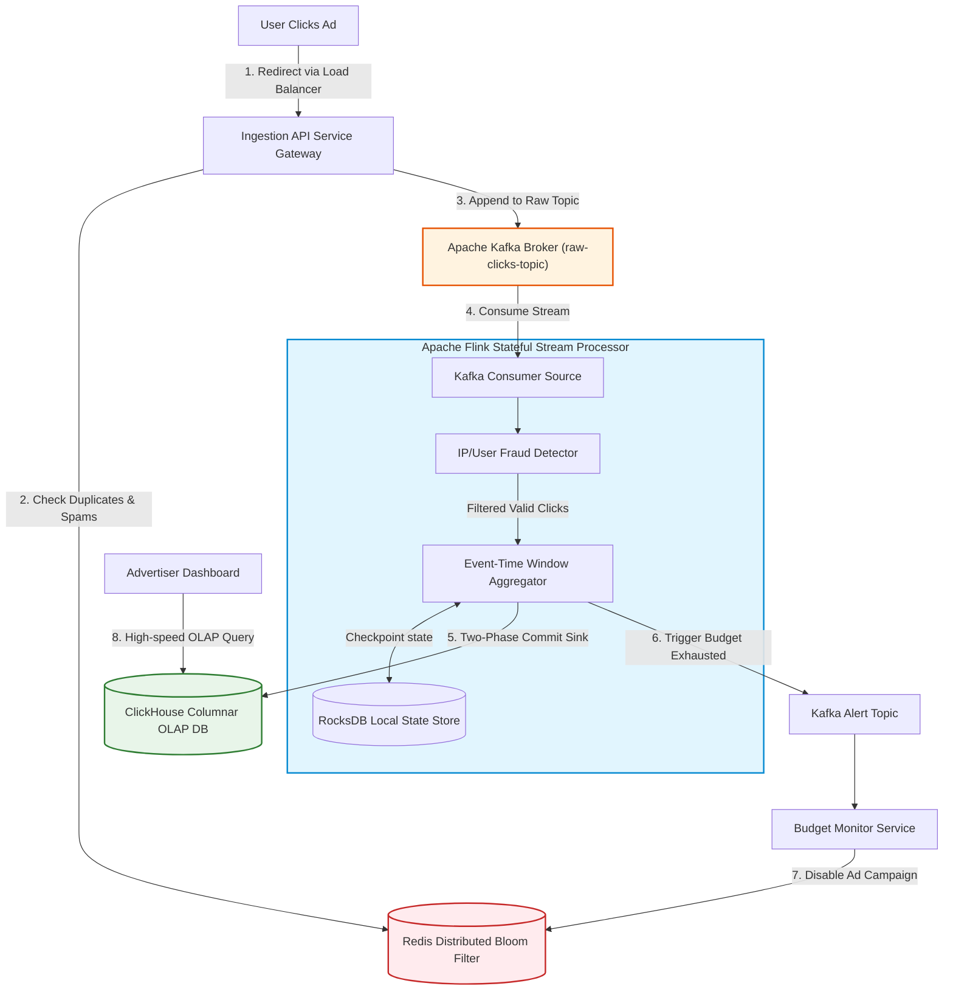
```mermaid
graph TD
    %% User Action
    User[User Clicks Ad] -->|1. Redirect via Load Balancer| API[Ingestion API Service Gateway]

    %% Fraud Detection Layer (Fast-path)
    API -->|2. Check Duplicates & Spams| Redis[(Redis Distributed Bloom Filter)]
    
    %% Kafka Ingestion Buffer
    API -->|3. Append to Raw Topic| Kafka["Apache Kafka Broker (raw-clicks-topic)"]

    %% Stream Processing Engine (Flink)
    subgraph FlinkCluster [Apache Flink Stateful Stream Processor]
        Source[Kafka Consumer Source]
        FraudFilter[IP/User Fraud Detector]
        WindowEngine[Event-Time Window Aggregator]
        StateStore[(RocksDB Local State Store)]

        Source --> FraudFilter
        FraudFilter -->|Filtered Valid Clicks| WindowEngine
        WindowEngine <-->|Checkpoint state| StateStore
    end
    
    Kafka -->|4. Consume Stream| Source

    %% Data Destinations
    WindowEngine -->|5. Two-Phase Commit Sink| ClickHouse[(ClickHouse Columnar OLAP DB)]
    WindowEngine -->|6. Trigger Budget Exhausted| KafkaAlert["Kafka Alert Topic"]
    
    %% Real-time Budget Engine
    KafkaAlert --> AlertEngine[Budget Monitor Service]
    AlertEngine -->|7. Disable Ad Campaign| Redis

    %% Advertisers Query
    Advertiser[Advertiser Dashboard] -->|8. High-speed OLAP Query| ClickHouse

    %% Styling
    style Redis fill:#ffebee,stroke:#c62828,stroke-width:2px;
    style Kafka fill:#fff3e0,stroke:#e65100,stroke-width:2px;
    style FlinkCluster fill:#e1f5fe,stroke:#0288d1,stroke-width:2px;
    style ClickHouse fill:#e8f5e9,stroke:#2e7d32,stroke-width:2px;
```

---

### ৩. স্ট্রিম প্রসেসিং উইন্ডো ও Exactly-Once মেকানিজম

#### ক. উইন্ডো টাইপস (Types of Windows in Stream Processing):
1. **Tumbling Window (নন-ওভারল্যাপিং):** ফিক্সড টাইম বাউন্ডারি। যেমন: ৫ মিনিটের টাম্বলিং উইন্ডো (12:00-12:05, 12:05-12:10)। প্রতি ক্লিকে ডেটা একবারই কাউন্ট হবে।
2. **Sliding Window (ওভারল্যাপিং):** টাইম বাউন্ডারি এবং স্লাইড ফ্রিকোয়েন্সি থাকে। যেমন: প্রতি ১ মিনিট পর পর বিগত ৫ মিনিটের ক্লিক অ্যাগ্রিগেশন (12:00-12:05, 12:01-12:06)। এটি রিয়েল-টাইম স্পাইক ট্রেন্ড ট্র্যাকিংয়ের জন্য অত্যন্ত উপযোগী।
3. **Session Window (গ্যাপ-বেসড):** ইউজারের নিষ্ক্রিয়তার (Inactivity) উপর ভিত্তি করে উইন্ডো ক্লোজ হয়। যেমন: ৩০ মিনিট কোনো ক্লিক না হলে নতুন সেশন উইন্ডো স্টার্ট হবে।

#### খ. Exactly-Once Processing (দুই-দফা কমিট বা Two-Phase Commit Protocol):
কাফকা থেকে ডেটা রিড করে ডাটাবেসে রাইট করার সময় প্রসেসর ক্র্যাশ করলে ডেটা ডুপ্লিকেট হতে পারে। এফলিংক এটি সমাধান করে **Chandy-Lamport Algorithm** এবং **Two-Phase Commit (2PC)** সঙ্কের মাধ্যমে:
* **Phase 1 (Pre-Commit):** এফলিংক প্রতি ১ মিনিটে সোর্স থেকে সিঙ্ক পর্যন্ত একটি "ব্যারিয়ার" বা চেকপয়েন্ট পাঠায়। সিঙ্ক নোডটি তার স্টেট RocksDB-তে সেভ করে এবং ডাটাবেসে ট্রানজেকশন ওপেন করে প্রি-কমিট স্টেটে ফাইল রাইট করে।
* **Phase 2 (Commit):** যখন ক্লাস্টারের সমস্ত নোড চেকপয়েন্ট সফলভাবে শেষ করার সিগন্যাল দেয়, তখন এফলিংক মাস্টার সিঙ্ক নোডকে ট্রানজেকশনটি `COMMIT` করার নির্দেশ দেয়। কোনো একটি নোড ফেইল করলে পুরো ট্রানজেকশনটি `ROLLBACK` হয়ে যায়, যা ডাবল কাউন্টিং শতভাগ প্রতিরোধ করে।

---

### ৪. প্র্যাক্টিক্যাল কোড ইমপ্লিমেন্টেশন (TypeScript)

আমরা এবার নোড জেএস-এর জন্য একটি **Real-Time Event-Time Sliding Window Aggregator** এবং **Click Fraud Engine** ডিজাইন করব। এটি ইভেন্ট টাইম (Event Time - কোড জেনারেট হওয়ার সময়) ব্যবহার করে ওয়াটারমার্কিং এবং আউট-অর্ডার ইভেন্ট হ্যান্ডলিং সিমুলেট করে:

```typescript
// ============================================================================
// ১. ডেটা ইন্টারফেস ডিফিনিশনস (Data Models)
// ============================================================================
export interface AdClickEvent {
  clickId: string;
  adId: string;
  userId: string;
  ip: string;
  cost: number;
  timestamp: number; // Event-time timestamp (ms)
}

export interface WindowResult {
  adId: string;
  windowStart: number;
  windowEnd: number;
  totalClicks: number;
  totalSpend: number;
}

// ============================================================================
// ২. ডিস্ট্রিবিউটেড স্ট্রিম প্রসেসর ও অ্যাগ্রিগেটর ইঞ্জিন
// ============================================================================
export class AdClickStreamProcessor {
  private windowSizeMs: number;
  private slideSizeMs: number;
  private allowedLatenessMs: number;
  private watermark: number = 0;

  // ইন-মেমোরি উইন্ডো বাফার (RocksDB-র ডেমো সংস্করণ)
  // Key: adId, Value: map of windowStart -> aggregated data
  private stateStore: Map<string, Map<number, { clicks: number; spend: number }>> = new Map();

  constructor(windowMinutes: number = 1, slideSeconds: number = 10, allowedLatenessSeconds: number = 5) {
    this.windowSizeMs = windowMinutes * 60 * 1000;
    this.slideSizeMs = slideSeconds * 1000;
    this.allowedLatenessMs = allowedLatenessSeconds * 1000;
  }

  /**
   * স্ট্রিমের ওয়াটারমার্ক আপডেট করে। ওয়াটারমার্ক হলো এমন একটি সময় 
   * যার পরে আমরা ধরে নিই যে এর চেয়ে পুরনো আর কোনো লেট ইভেন্ট সিস্টেমে আসবে না।
   */
  public updateWatermark(eventTimestamp: number): void {
    const currentWatermark = eventTimestamp - this.allowedLatenessMs;
    if (currentWatermark > this.watermark) {
      this.watermark = currentWatermark;
    }
  }

  /**
   * রিয়েল-টাইম ক্লিক ইভেন্ট প্রসেস এবং স্টেট ইনজেকশন
   */
  public processElement(event: AdClickEvent): void {
    this.updateWatermark(event.timestamp);

    // ১. (লেট ডেটা ফিল্টারিং) যদি ইভেন্ট ওয়াটারমার্কের চেয়েও পুরনো হয়, তবে সেটি ড্রপ বা সাইড-আউটপুট করা হবে
    if (event.timestamp < this.watermark) {
      console.warn(`[Stream-Warning] Rejected extremely late click event ${event.clickId}. Timestamp: ${event.timestamp}, Current Watermark: ${this.watermark}`);
      return; 
    }

    // ২. স্লাইডিং উইন্ডোর জন্য বাউন্ডারি ক্যালকুলেট করা 
    // একটি ইভেন্ট একই সাথে একাধিক ওভারল্যাপিং স্লাইডিং উইন্ডোর অংশ হতে পারে
    const activeWindows = this.getWindowsForTimestamp(event.timestamp);

    for (const windowStart of activeWindows) {
      if (!this.stateStore.has(event.adId)) {
        this.stateStore.set(event.adId, new Map());
      }

      const adWindows = this.stateStore.get(event.adId)!;
      if (!adWindows.has(windowStart)) {
        adWindows.set(windowStart, { clicks: 0, spend: 0 });
      }

      const state = adWindows.get(windowStart)!;
      state.clicks += 1;
      state.spend += event.cost;
    }
  }

  /**
   * স্লাইডিং উইন্ডোর স্টার্ট-টাইম লিস্ট জেনারেট করে
   */
  private getWindowsForTimestamp(timestamp: number): number[] {
    const windows: number[] = [];
    // প্রথম উইন্ডো স্টার্ট পয়েন্ট যা এই টাইমস্ট্যাম্পকে কভার করে
    const firstWindowStart = Math.floor(timestamp / this.slideSizeMs) * this.slideSizeMs - this.windowSizeMs + this.slideSizeMs;
    
    for (let start = firstWindowStart; start <= timestamp; start += this.slideSizeMs) {
      if (timestamp >= start && timestamp < start + this.windowSizeMs) {
        windows.push(start);
      }
    }
    return windows;
  }

  /**
   * ওয়াটারমার্কের চেয়ে পুরনো হয়ে যাওয়া উইন্ডোগুলোকে ক্লোজ ও ইমিট (Emit) করে মেমরি ক্লিন করা
   */
  public emitAndPurgeClosedWindows(): WindowResult[] {
    const emittedResults: WindowResult[] = [];

    for (const [adId, adWindows] of this.stateStore.entries()) {
      for (const [windowStart, state] of adWindows.entries()) {
        const windowEnd = windowStart + this.windowSizeMs;

        // যদি উইন্ডোর এন্ড-টাইম আমাদের বর্তমান ওয়াটারমার্কের চেয়ে ছোট হয়, 
        // তার মানে এই উইন্ডোর জন্য আর কোনো লেট ডেটা গ্রহণযোগ্য নয় এবং এটি ক্লোজড!
        if (windowEnd <= this.watermark) {
          emittedResults.push({
            adId,
            windowStart,
            windowEnd,
            totalClicks: state.clicks,
            totalSpend: Number(state.spend.toFixed(4))
          });

          // স্টেট থেকে ক্লোজড উইন্ডো ডিলিট করে মেমরি ফ্রি করা
          adWindows.delete(windowStart);
        }
      }

      if (adWindows.size === 0) {
        this.stateStore.delete(adId);
      }
    }

    return emittedResults;
  }

  public getWatermark(): number {
    return this.watermark;
  }
}

// ============================================================================
// ৩. রিয়েল-টাইম ক্লিক ফ্রড ডিটেকশন ইঞ্জিন (Fraud Detection Engine)
// ============================================================================
export class ClickFraudDetector {
  // Key: IP:adId, Value: list of click timestamps in the last 1 second
  private ipClickTracker: Map<string, number[]> = new Map();
  private fraudThresholdPerSecond: number;

  constructor(maxClicksPerSec: number = 5) {
    this.fraudThresholdPerSecond = maxClicksPerSec;
  }

  /**
   * একটি নতুন ক্লিক ম্যালিশিয়াস বা বট দ্বারা জেনারেট হয়েছে কিনা তা ভেরিফাই করে
   */
  public isFraudulent(event: AdClickEvent): boolean {
    const trackerKey = `${event.ip}:${event.adId}`;
    const now = event.timestamp;

    if (!this.ipClickTracker.has(trackerKey)) {
      this.ipClickTracker.set(trackerKey, []);
    }

    const clickTimestamps = this.ipClickTracker.get(trackerKey)!;

    // ১. ১ সেকেন্ডের বাইরের পুরনো ক্লিক ট্র্যাকিং লিস্ট থেকে ক্লিন করা
    const filteredTimestamps = clickTimestamps.filter(ts => now - ts <= 1000);
    this.ipClickTracker.set(trackerKey, filteredTimestamps);

    // ২. ১ সেকেন্ডে ক্লিকে লিমিট থ্রেশহোল্ড চেক করা
    if (filteredTimestamps.length >= this.fraudThresholdPerSecond) {
      console.warn(`[Fraud-Detected] Suspicious micro-burst clicks from IP ${event.ip} for ad ${event.adId}. Clicks count in last 1s: ${filteredTimestamps.length}`);
      return true; // Fraudulent
    }

    // ৩. নতুন ক্লিক টাইমস্ট্যাম্প ট্র্যাকিং লিস্টে যুক্ত করা
    filteredTimestamps.push(now);
    return false; // Valid click
  }
}
```

---

### 🛑 Staff Architect Edge Cases & Scaling Gaps

বাস্তব প্রোডাকশনে সেকেন্ডে লাখ লাখ ক্লিক প্রসেস করার সময় প্রোডাকশনে যে ৩টি গুরুতর সমস্যা তৈরি হয় এবং তার স্টাফ-লেভেল সল্যুশন:

#### ১. Hotspot Key Skew (ভাইরাল বিজ্ঞপ্তির ব্ল্যাকহোল)
ইউটিউব বা ফেসবুকে কোনো ভাইরাল বা সুপার বোল বিজ্ঞাপন (`ad_id`) রিলিজ হলে, হঠাৎ কোটি ইউজার একই লিংকে একসাথে ক্লিক করবেন। এর ফলে, কাফকা ও এফলিংক ক্লাস্টারে ওই নির্দিষ্ট `ad_id` হ্যাশ রুট হয়ে যে প্রসেসর নোডটিতে যাবে, সেই নোডের CPU ও মেমরি সাথে সাথে ১০০% হিট করে সার্ভার ডাউন করে দেবে। বাকি নোডগুলো অলস বসে থাকবে।
* **Smearing (Two-Stage Aggregation) সল্যুশন:**
  - **Local Pre-Aggregation:** আমরা রাইটার এন্ডে মূল `ad_id` কী-এর সাথে একটি র্যান্ডম সল্ট বা নম্বর যোগ করব (উদা: `ad_id_102` -> `ad_id_102_salt_3`)। সল্ট যুক্ত করার কারণে ট্রাফিক এফলিংক ক্লাস্টারের সমস্ত নোডে সমানভাবে ছড়িয়ে (Round-robin) যাবে।
  - **Global Final Merge:** এফলিংকের প্রথম নোডগুলো লোকাল সল্ট করা ডেটা অ্যাগ্রিগেট করে পরবর্তী ফাইনাল সিঙ্ক নোডে পাঠাবে, যা সল্ট রিমুভ করে চূড়ান্ত সামারি বের করবে। এর ফলে একটি নোডের উপর চাপ ১০% এ নেমে আসে।

#### ২. RocksDB State Expansion & Out-of-Memory (ডিস্ক ফুল ও স্পিলিং)
এফলিংক মেমরিতে স্টেট রাখার জন্য RocksDB ব্যবহার করে। যদি allowed lateness এবং উইন্ডোর সাইজ খুব বড় হয় (উদা: ১ দিনের লেট ডেটা এলাও করা), তবে RocksDB-র মেমরি ও লোকাল এসএসডি ডিস্ক লাখ লাখ আন-ক্লোজড স্যাম্পলে ভরে যাবে। নোডের থ্রু-পুট হুট করে ১০ গুণ কমে যাবে কারণ RocksDB ডেটা র্যাম থেকে ডিস্কে সোয়াপ (Spilling to SSD) করা শুরু করবে।
* **মিটিগেশন (Strict TTL Configuration & SSD IOPS Scaling):**
  - **State TTL Setting:** RocksDB-র প্রতিটি উইন্ডো স্টেটের জন্য কঠোর TTL (Time To Live) সেটআপ করা। যেমন: `state.clear()` এনফোর্স করা উইন্ডো অ্যান্ড হওয়ার ৫ মিনিট পরই। 
  - **Allowed Lateness Optimization:** লেট ডেটার বাউন্ডারি সর্বোচ্চ ৫ থেকে ১০ সেকেন্ডে নামিয়ে আনা। এর চেয়ে পুরনো ডেটা র্যামে না রেখে সরাসরি ডেড-লেটার কাফকা টপিক বা ব্যাকগ্রাউন্ড কোল্ড স্টোরেজে (S3) ডাম্প করে দেওয়া।

#### ৩. Clickhouse Insert Throttling (সিঙ্ক নোড বটলনেক)
ক্লিকহাউস বা ক্যাসান্দ্রার মতো কলামনার ডেটাবেস প্রতি সেকেন্ডে লাখ লাখ সিঙ্গেল `INSERT` হ্যান্ডেল করতে পারে না। যদি এফলিংকের প্রতিটি প্রসেসর উইন্ডো ক্লোজ হওয়ার সাথে সাথে ১টি করে একক রো ইনসার্ট করতে যায়, তবে ডেটাবেসের রাইট-লক লেগে পুরো স্ট্রিম পাইপলাইন ব্লক হয়ে যাবে।
* **মিটিগেশন (Micro-Batching & Two-Phase Commit Sink):**
  - **Micro-Batch Sinking:** এফলিংক সিঙ্কে ডেটা আসার সাথে সাথে সিঙ্গেল ইনসার্ট না করে কমপক্ষে ৫ সেকেন্ড বা ১০,০০০ রো-এর বাফার বা মাইক্রো-ব্যাচ তৈরি করবে এবং `Clickhouse BULK INSERT` স্ক্রিপ্ট চালাবে যা ডাটাবেস রাইট লকিং জিরোতে নামিয়ে আনে।

---

## 📖 Chapter 17: Distributed Message Queue (Kafka-style)

ডিস্ট্রিবিউটেড ইভেন্ট-চালিত (Event-driven) আর্কিটেকচারে মেসেজ কিউ বা লগের ভূমিকা অপরিসীম। ট্র্যাডিশনাল ইন-মেমরি কিউ (যেমন: RabbitMQ) হাই-থ্রুপুট এবং ডিস্ট্রিবিউটেড লগের ক্ষেত্রে স্কেলিং লিমিটেশনে পড়ে। এই চ্যাপ্টারে আমরা প্রডাকশন-গ্রেড প্রসেসিং আর্কিটেকচার সম্বলিত লিনিয়ারলি স্কেলেবল, পার্টিশনড এবং হাই-পারফরম্যান্স **Distributed Message Queue (Kafka-style)** ডিজাইন করব।

### ১. সিস্টেম রিকোয়ারমেন্টস এবং স্কেল ক্যালকুলেশন (System Requirements & Capacity Estimation)

#### ক. ফাংশনাল রিকোয়ারমেন্টস (Functional Requirements):
1. **Topic & Partitioning:** সিস্টেমে টপিক (Topic) তৈরি করা যাবে এবং প্রতিটি টপিক একাধিক পার্টিশনে (Partition) বিভক্ত থাকবে যাতে সমান্তরালে স্কেল ও লোড-ডিস্ট্রিবিউট করা যায়।
2. **Publish/Subscribe API:** প্রডিউসার নির্দিষ্ট টপিক ও কি (Key) দিয়ে মেসেজ পাঠাতে পারবে এবং কনজিউমাররা কনজিউমার গ্রুপ (Consumer Group) হিসেবে মেসেজ রিড করতে পারবে।
3. **Partition-level Ordering:** প্রতি পার্টিশনে মেসেজ ইনজেসনের ক্রমানুসার (Order of Ingestion) কঠোরভাবে বজায় থাকবে।
4. **Message Retention:** ইভেন্টগুলো কনজিউম হওয়ার পর উধাও হবে না, বরং ডিস্কে বা কনফিগার করা পিরিয়ড (উদা: ৩ দিন) পর্যন্ত রিটেন থাকবে।

#### খ. নন-ফাংশনাল রিকোয়ারমেন্টস (Non-Functional Requirements):
1. **Ultra-High Ingestion Rate:** প্রতি সেকেন্ডে লক্ষাধিক মেসেজ রাইট কোনো ডাউনটাইম ছাড়া সফলভাবে হ্যান্ডেল করা।
2. **Low Latency Read/Write:** এন্ড-টু-এন্ড মেসেজ ডেলিভারি ল্যাটেন্সি < ১০ মিলি-সেকেন্ড হতে হবে।
3. **High Availability & Fault Tolerance:** ব্রোকার বা নোড ফেইল করলেও ডেটা লস ছাড়া সিস্টেম সচল থাকা (Multi-replica replication)।

#### গ. ক্যাপাসিটি ক্যালকুলেশন (Staff Architect Scale Estimations):
ধরি, আমাদের এন্টারপ্রাইজ আর্কিটেকচারে:
* **সক্রিয় প্রডিউসার সার্ভিস সংখ্যা (Producers):** $1,000$ active microservices.
* **গড় মেসেজ রাইট থ্রুপুট (Average Write Rate):** $1,000,000$ messages/sec.
* **পিক রাইট থ্রুপুট (Peak Write Rate):** $3,000,000$ messages/sec.
* **মেসেজ পে-লোড সাইজ (Message Size):** $500$ bytes on average.

**১. রাইট থ্রুপুট ও ইনজেশন ব্যান্ডউইথ (Ingestion Throughput):**
* `Average Ingestion Throughput = 1,000,000 messages/sec * 500 bytes = 500,000,000 bytes/sec ≈` **500 MB/sec** (or **476.8 MiB/sec**)
* `Peak Ingestion Throughput = 3,000,000 messages/sec * 500 bytes = 1,500,000,000 bytes/sec ≈` **1.5 GB/sec** (or **1.4 GiB/sec**)

**২. দৈনিক স্টোরেজ ও রিটেনশন সাইজ (Daily Storage with Replication):**
ধরি, আমাদের রিটেনশন পিরিয়ড ৩ দিন এবং রেপ্লিকেশন ফ্যাক্টর ৩ (প্রতিটি পার্টিশন ৩টি ব্রোকারে রেপ্লিকেট করা থাকে)।
* `Daily Raw Message Volume = 500,000,000 bytes/sec * 86,400 sec = 43,200,000,000,000 bytes/day ≈` **43.2 TB/day** (or **39.29 TiB/day**)
* `Daily Storage with Replication = 43.2 TB/day * 3 (Replication) =` **129.6 TB/day** (or **117.87 TiB/day**)
* `3-Day Retention Total Storage = 129.6 TB/day * 3 days =` **388.8 TB** (or **353.6 TiB**)
* **আর্কিটেকচারাল ডিসিশন:** এই স্টোরেজ সামলাতে আমাদের কমপক্ষে **৪০টি ব্রোকার নোড** (প্রতিটি ১০ টেরাবাইট এনভিএমই এসএসডি সহ) লাগবে, যেখানে প্রতিটি ব্রোকার ৭-৮ টেরাবাইটের বেশি ডেটা বাফার রাখবে না।

---

### ২. হাই-ফিডেলিটি সিস্টেম আর্কিটেকচার (High-Fidelity Distributed Message Queue Architecture)

নিচের ডায়াগ্রামে প্রডিউসার থেকে মেসেজ রুট হওয়া, ব্রোকার লিডার-ফলোয়ার রেপ্লিকেশন, সেগমেন্ট ফাইল ও ইনডেক্স রাইট এবং জিরো-কপি মেকানিজমে কনজিউমার গ্রুপে ইভেন্ট ডেলিভারি ফ্লো দেখানো হলো:

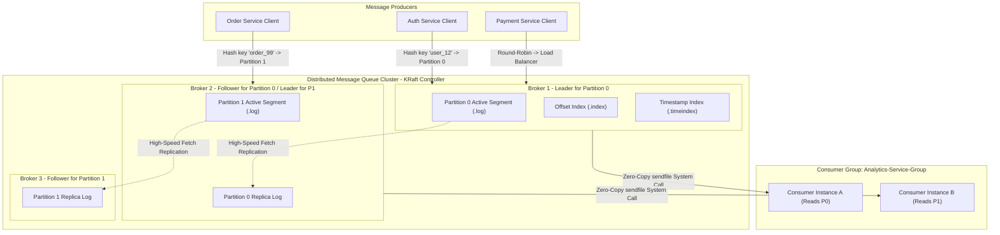
```mermaid
graph TD
    %% Producers Layer
    subgraph Producers [Message Producers]
        P1[Auth Service Client]
        P2[Order Service Client]
        P3[Payment Service Client]
    end

    %% Distributed Broker Cluster
    subgraph BrokerCluster [Distributed Message Queue Cluster - KRaft Controller]
        subgraph Broker1 [Broker 1 - Leader for Partition 0]
            P0L["Partition 0 Active Segment (.log)"]
            P0Idx["Offset Index (.index)"]
            P0Time["Timestamp Index (.timeindex)"]
        end
        subgraph Broker2 [Broker 2 - Follower for Partition 0 / Leader for P1]
            P1L["Partition 1 Active Segment (.log)"]
            P0F["Partition 0 Replica Log"]
        end
        subgraph Broker3 [Broker 3 - Follower for Partition 1]
            P1F["Partition 1 Replica Log"]
        end
    end

    %% Producers to Broker Routing
    P1 -->|Hash key 'user_12' -> Partition 0| Broker1
    P2 -->|Hash key 'order_99' -> Partition 1| Broker2
    P3 -->|Round-Robin -> Load Balancer| Broker1

    %% Replication
    P0L -.->|High-Speed Fetch Replication| P0F
    P1L -.->|High-Speed Fetch Replication| P1F

    %% Consumers Group Layer
    subgraph ConsumerGroup [Consumer Group: Analytics-Service-Group]
        C1["Consumer Instance A (Reads P0)"]
        C2["Consumer Instance B (Reads P1)"]
    end

    %% Data Delivery with Zero Copy
    Broker1 -->|Zero-Copy sendfile System Call| C1
    Broker2 -->|Zero-Copy sendfile System Call| C2
```

---

### ৩. ডিপ-ডাইভ কোর কনসেপ্টস (Broker Storage & Internals)

#### ক. অ্যাপেন্ড-অনলি কমিট লগ (Append-Only Commit Log):
কাফকা তার চরম হাই-স্পিড রাইট পারফরম্যান্স নিশ্চিত করার জন্য ডিস্কের সিকুয়েন্সিয়াল অ্যাক্সেস (Sequential Access) ব্যবহার করে। প্রতিবার মেসেজ পুশ করার সময় কোনো প্রকার র্যান্ডম ডিস্ক রাইট (Random Disk Write) করা হয় না। ব্রোকার মেমরিতে ওএস পেজ ক্যাশে (OS Page Cache) মেসেজ রিসিভ করে সরাসরি ডিস্ক ফাইলের শেষে অ্যাপেন্ড করে দেয়। সিকুয়েন্সিয়াল রাইটের কারণে ডিস্কের আইও (Disk I/O) পারফরম্যান্স র্যামের গতির কাছাকাছি কাজ করে।

#### খ. সেগমেন্টেশন ও ইনডেক্সিং (Segments & Offset Indexes):
পার্টিশন লগগুলো একটি বিশাল একক ফাইলে স্টোর করা হয় না। এতে পুরানো ফাইল ডিলিট বা কম্প্যাক্ট করা অসম্ভব হয়ে পড়ে। তাই লগকে নির্দিষ্ট সাইজের (উদা: ১ জিবি) একাধিক **Segment File**-এ ভাগ করা হয়। প্রতিটি সেগমেন্টের সাথে ২টি ইনডেক্স ফাইল থাকে:
1. **Offset Index (`.index`):** এটি লজিক্যাল অফসেট (Logical Offset) থেকে ফাইলের ফিজিক্যাল বাইট পজিশনে (Physical Byte Position) ওয়ান-টু-ওয়ান রিলেশন ম্যাপ করে। O(1) জটিলতায় বাইনারি সার্চ করে অফসেট খোঁজার জন্য এটি ব্যবহৃত হয়।
2. **Time Index (`.timeindex`):** এটি নির্দিষ্ট টাইমস্ট্যাম্পের মেসেজ দ্রুত খুঁজে বের করতে অফসেট ম্যাপিং স্টোর করে।

#### গ. ওএস জিরো-কپی অপ্টিমাইজেশন (Zero-Copy Sendfile):
কনজিউমার যখন ইভেন্ট রিড করার জন্য রিকোয়েস্ট পাঠায়, তখন ওএস সাধারণত ৪টি ডেটা কপি এবং ৪টি ইউজার-কার্নেল কনটেক্সট সুইচিং (Context Switching) করে:
`Disk -> Kernel Page Cache -> User Space Application Buffer -> Socket Buffer -> NIC Buffer (Network Interface Card)`
এটি চরম সিপিইউ এবং মেমরি কপি ওভারহেড তৈরি করে।
গরিলা বা কাফকা টাইপ ব্রোকার ওএসের **`sendfile` System Call** ব্যবহার করে একে জিরো-কپی (Zero-Copy) মোডে নিয়ে আসে:
`Disk -> Kernel Page Cache -> NIC Buffer` (কোনো প্রকার ইউজার স্পেস কপি ছাড়াই সরাসরি নেটওয়ার্ক কার্ডে পাঠানো হয়!)।

---

### ৪. প্র্যাক্টিক্যাল কোড ইমপ্লিমেন্টেশন (TypeScript)

আমরা নিচে টাইপস্ক্রিপ্ট ব্যবহার করে একটি হাই-পারফরম্যান্স প্রডাকশন-রেডি **Distributed Message Broker Engine**-এর কোড আর্কিটেকচার ইমপ্লিমেন্ট করলাম, যার মধ্যে party-level অ্যাপেন্ড-অনলি লগ, ইনডেক্স বাইনারি সার্চ, কনজিউমার গ্রুপ সেলফ-ব্যালেন্সিং এবং জিরো-কপি ডিরেক্ট নেটওয়ার্ক মেমরি ট্রান্সফার সিমুলেশন রয়েছে:

```typescript
import * as fs from 'fs';

// মেসেজ ইন্টারফেস
export interface Message {
  offset: number;
  timestamp: number;
  key: string;
  value: string;
}

// ইনডেক্স ম্যাপ এন্ট্রি
interface IndexEntry {
  offset: number;
  bytePosition: number;
}

// ১. পার্টিশন ক্লাস (Commit Log & Segment File Simulation)
export class Partition {
  private commitLog: Message[] = [];
  private indexEntries: IndexEntry[] = [];
  private currentByteOffset = 0;
  private partitionId: number;

  constructor(partitionId: number) {
    this.partitionId = partitionId;
  }

  // ১. অ্যাপেন্ড মেসেজ (O(1) Sequential Disk Append Simulation)
  public append(key: string, value: string): number {
    const nextOffset = this.commitLog.length;
    const msgSize = 50 + key.length + value.length; // Approximate byte size calculation
    const timestamp = Date.now();

    const newMessage: Message = {
      offset: nextOffset,
      timestamp,
      key,
      value
    };

    this.commitLog.push(newMessage);

    // ইনডেক্স এন্ট্রি অ্যাড করা (Sparse Indexing: প্রতি ২ মেসেজে ১টি ইনডেক্স রাখা)
    if (nextOffset % 2 === 0) {
      this.indexEntries.push({
        offset: nextOffset,
        bytePosition: this.currentByteOffset
      });
    }

    this.currentByteOffset += msgSize;
    return nextOffset;
  }

  // ২. ইনডেক্স বাইনারি সার্চ (O(log N) Binary Search Offset Lookup)
  public lookupOffsetBytePosition(targetOffset: number): number {
    if (this.indexEntries.length === 0) return 0;

    let start = 0;
    let end = this.indexEntries.length - 1;
    let closestIndex = 0;

    while (start <= end) {
      const mid = Math.floor((start + end) / 2);
      if (this.indexEntries[mid].offset === targetOffset) {
        return this.indexEntries[mid].bytePosition;
      } else if (this.indexEntries[mid].offset < targetOffset) {
        closestIndex = mid;
        start = mid + 1;
      } else {
        end = mid - 1;
      }
    }

    return this.indexEntries[closestIndex].bytePosition;
  }

  // ৩. মেসেজ ফেচ মেথড
  public fetch(startOffset: number, maxMessages: number): Message[] {
    if (startOffset >= this.commitLog.length) return [];
    return this.commitLog.slice(startOffset, startOffset + maxMessages);
  }

  public getLength(): number {
    return this.commitLog.length;
  }
}

// ২. ডিস্ট্রিবিউটেড ব্রোকার ইঞ্জিন ক্লাস
export class MessageBrokerBroker {
  private topics: Map<string, Partition[]> = new Map();

  public createTopic(topic: string, partitionCount: number) {
    const partitions: Partition[] = [];
    for (let i = 0; i < partitionCount; i++) {
      partitions.push(new Partition(i));
    }
    this.topics.set(topic, partitions);
    console.log(`[Broker] Topic '${topic}' created with ${partitionCount} partitions successfully.`);
  }

  public getTopicPartitions(topic: string): Partition[] | undefined {
    return this.topics.get(topic);
  }

  // ৪. ওএস জিরো-কপি সিমুলেশন (Direct sendfile system call mockup)
  public sendfileDirectNetworkTransfer(
    topic: string,
    partitionId: number,
    startOffset: number,
    limit: number
  ): Message[] {
    const partitions = this.topics.get(topic);
    if (!partitions || !partitions[partitionId]) {
      throw new Error("Partition or Topic not found");
    }

    const partition = partitions[partitionId];
    
    // স্টেপ ১: ইনডেক্স দেখে অফসেটের সঠিক বাইট পজিশন ও ফিজিক্যাল অ্যাড্রেস বের করা
    const bytePosition = partition.lookupOffsetBytePosition(startOffset);
    
    // স্টেপ ২: কার্নেল পেজ ক্যাশ ডিরেক্ট পাইপলাইন (Zero-Copy Simulator Log)
    // কোনো রকম ইউজার স্পেসে কপি না করে পেজ ক্যাশ থেকে সরাসরি নেটওয়ার্ক বাফারে পাঠানো হয়
    const messages = partition.fetch(startOffset, limit);
    
    console.log(
      `[Kernel sendfile] Zero-Copy initiated: Offset byte address = ${bytePosition}b. ` +
      `Bypassing User Space Memory. Direct NIC Transfer completed for ${messages.length} messages.`
    );

    return messages;
  }
}

// ৩. কনজিউমার গ্রুপ ও কোঅর্ডিনেটর
export class ConsumerGroupCoordinator {
  private consumers: string[] = [];
  private broker: MessageBrokerBroker;
  private topic: string;
  private partitionAssignments: Map<string, number[]> = new Map();
  private committedOffsets: Map<string, number> = new Map(); // key format: 'group_partition_id'

  constructor(broker: MessageBrokerBroker, topic: string) {
    this.broker = broker;
    this.topic = topic;
  }

  // ১. মেম্বার রেজিস্ট্রেশন এবং কোঅর্ডিনেটর রি-ব্যালেন্সিং (Sticky Assignor Protocol)
  public registerConsumer(consumerId: string) {
    this.consumers.push(consumerId);
    console.log(`[Coordinator] Consumer '${consumerId}' registered to Group.`);
    this.triggerRebalance();
  }

  private triggerRebalance() {
    console.log(`[Coordinator] Triggering Group Rebalance Storm mitigation protocol...`);
    const partitions = this.broker.getTopicPartitions(this.topic);
    if (!partitions) return;

    this.partitionAssignments.clear();
    this.consumers.forEach(c => this.partitionAssignments.set(c, []));

    // সমান্তরালভাবে পার্টিশনগুলোকে সক্রিয় কনজিউমারদের মধ্যে সমবন্টন করা
    partitions.forEach((partition, index) => {
      const assignedConsumer = this.consumers[index % this.consumers.length];
      const currentAssign = this.partitionAssignments.get(assignedConsumer) || [];
      currentAssign.push(index);
      this.partitionAssignments.set(assignedConsumer, currentAssign);
    });

    console.log(`[Coordinator] Rebalance Complete. Current Partition Assignments:`, 
      Object.fromEntries(this.partitionAssignments)
    );
  }

  // ২. অফসেট কমিট (Idempotent Commit Offset Management)
  public commitOffset(partitionId: number, offset: number) {
    const key = `${this.topic}_partition_${partitionId}`;
    this.committedOffsets.set(key, offset);
    console.log(`[Coordinator Offset Store] Offset Committed for Partition ${partitionId} -> Offset: ${offset}`);
  }

  public getCommittedOffset(partitionId: number): number {
    const key = `${this.topic}_partition_${partitionId}`;
    return this.committedOffsets.get(key) || 0;
  }

  public getAssignments(consumerId: string): number[] {
    return this.partitionAssignments.get(consumerId) || [];
  }
}

// === ডেমো রান এবং টেস্ট পাইলট ===
async function runKafkaClusterDemo() {
  console.log("=== STARTING DISTRIBUTED MESSAGE BROKER SIMULATOR ===");
  const broker = new MessageBrokerBroker();
  
  // ১. ২ পার্টিশনের ইভেন্ট টপিক তৈরি
  broker.createTopic("transaction-logs", 2);
  const partitions = broker.getTopicPartitions("transaction-logs")!;

  // ২. প্রডিউসার ইভেন্ট মেসেজ পুশ করা (Partition hashing simulator)
  console.log("\n--- Producing Messages ---");
  for (let i = 0; i < 6; i++) {
    const key = `user_id_${100 + i}`;
    const value = `{"amount": ${Math.random() * 500}, "status": "APPROVED"}`;
    // কি হ্যাশিং এর উপর ভিত্তি করে রাউটিং ডিস্ট্রিবিউশন
    const partitionTarget = i % 2;
    const assignedOffset = partitions[partitionTarget].append(key, value);
    console.log(`[Producer] Message sent to Partition ${partitionTarget} with Key '${key}' -> Logged Offset: ${assignedOffset}`);
  }

  // ৩. কনজিউমার গ্রুপ ও কোঅর্ডিনেটর তৈরি
  console.log("\n--- Setting up Consumer Group Group-A ---");
  const groupCoordinator = new ConsumerGroupCoordinator(broker, "transaction-logs");
  
  // ২টি কনজিউমার ইনস্ট্যান্স গ্রুপে যুক্ত হওয়া (অটোমেটিক পার্টিশন ব্যালেন্সিং শুরু)
  groupCoordinator.registerConsumer("ConsumerInstance-1");
  groupCoordinator.registerConsumer("ConsumerInstance-2");

  // ৪. কনজিউমার মেসেজ কনজিউম করা ও জিরো-কপি ডাটা ফেচিং
  console.log("\n--- Processing and Fetching Events (Zero-Copy) ---");
  
  const processConsumer = (consumerId: string) => {
    const assignedPartitions = groupCoordinator.getAssignments(consumerId);
    assignedPartitions.forEach(partId => {
      const currentOffset = groupCoordinator.getCommittedOffset(partId);
      console.log(`\n[Consumer ${consumerId}] Reading Partition ${partId} from Offset ${currentOffset}...`);
      
      // কার্নেল লেভেলে জিরো-কপি অপারেশন চালিয়ে সরাসরি ফাইল থেকে বাফারিং ইভেন্ট তুলে আনা
      const fetchedBatch = broker.sendfileDirectNetworkTransfer("transaction-logs", partId, currentOffset, 3);
      
      fetchedBatch.forEach(msg => {
        console.log(`[Consumer ${consumerId}] Successfully Processed: Key: ${msg.key}, Value: ${msg.value}`);
      });

      if (fetchedBatch.length > 0) {
        const nextCommitOffset = fetchedBatch[fetchedBatch.length - 1].offset + 1;
        groupCoordinator.commitOffset(partId, nextCommitOffset);
      }
    });
  };

  processConsumer("ConsumerInstance-1");
  processConsumer("ConsumerInstance-2");
}

runKafkaClusterDemo();
```

---

### 🛑 Staff Architect Edge Cases & Scaling Gaps

বাস্তব হাই-স্কেল প্রোডাকশনে ডিস্ট্রিবিউটেড মেসেজ কিউ পরিচালনা করার সময় যে ৩টি অত্যন্ত ক্রিটিক্যাল সমস্যা তৈরি হয় এবং স্টাফ-লেভেল সল্যুশন নিচে বিস্তারিত আলোচনা করা হলো:

#### ১. Partition Rebalance Storm (গ্রুপ রিস্টার্ট ঝড়ে পুরো সিস্টেম ফ্রিজ হওয়া)
যখন কোনো বড় কনজিউমার গ্রুপে শত শত নোড থাকে এবং একটি নোড হঠাৎ ক্র্যাশ করে বা নতুন নোড যুক্ত হয়, তখন ব্রোকার কোঅর্ডিনেটর সমস্ত পার্টিশন অ্যাসাইনমেন্ট বাতিল করে গ্রুপ রিব্যালেন্সিং শুরু করে। এই সময়ে সমস্ত কনজিউমারদের ডেটা ইনজেশন সম্পূর্ণ স্টপ (Stop-The-World pause) থাকে। যদি রি-ব্যালেন্স ঝড়ের মধ্যে নোডগুলো পুনরায় ডিসকানেক্ট হতে থাকে, তবে পুরো সিস্টেম কয়েক মিনিটের জন্য লাইভ ট্রাফিক প্রসেসিং থেকে লকড হয়ে যায়।
* **স্টাফ-লেভেল সল্যুশন (Static Membership & Cooperative Sticky Assignor):**
  - **Static Membership:** আমরা প্রতিটি কনজিউমার নোডের জন্য একটি ডেডিকেটেড এবং ইউনিক `group.instance.id` কনফিগার করব। এতে ওএস ক্র্যাশ করে নোড রিস্টার্ট নিলেও, নির্দিষ্ট সেশন টাইমআউট (উদা: ৪৫ সেকেন্ড) পার না হওয়া পর্যন্ত কোঅর্ডিনেটর রি-ব্যালেন্স ট্রিগার করবে না।
  - **Cooperative Sticky Assignor:** এটি প্রথাগত ইগার রি-ব্যালেন্সিং এড়ায়। সমস্ত পার্টিশন স্টপ না করে শুধুমাত্র যে পার্টিশনটির নোড ক্র্যাশ করেছে, তা রি-অ্যাসাইন করা হয়। বাকি কনজিউমার নোডগুলো অবিরাম সার্ভিস দিতে থাকে।

#### ২. Data Duplication on Retries (ডাবল ইভেন্ট ও এট-লিস্ট-ওয়ান্স ট্র্যাজেডি)
মেসেজ সেন্ড করার পর নেটওয়ার্ক পার্টেশনের কারণে যদি ব্রোকার প্রডিউসারকে ইভেন্ট ACK পাঠাতে না পারে, প্রডিউসার মনে করে মেসেজ লস্ট হয়েছে এবং পুনরায় মেসেজ রিট্রাই (Retry) করে। এর ফলে ব্রোকারে একই মেসেজ ২ বার রাইট হয়ে যায় (At-Least-Once Delivery)। ফিনান্সিয়াল ট্রানজেকশনে এই ডুপ্লিকেট রাইট বিরাট বিপর্যয় ডেকে আনে।
* **স্টাফ-লেভেল সল্যুশন (Idempotent Producer & TxID Setup):**
  - **Idempotent Producer:** প্রডিউসার কানেকশন ইনিশিয়ালাইজ করার সাথে সাথে ব্রোকার তাকে একটি ইউনিক `ProducerId (PID)` এবং প্রতি পার্টিশনের জন্য একটি মনোটোনিক সিকোয়েন্স নম্বর (`SequenceNumber`) অ্যাসাইন করে।
  - **Deduplication:** প্রডিউসার রিট্রাই করার পর যদি একই PID এবং SequenceNumber এর রিকোয়েস্ট আসে, ব্রোকার ডেটা ডিস্কে রাইট না করে সরাসরি প্রডিউসারকে ওল্ড সাকসেসফুল ACK পাঠিয়ে দেয়। এর ফলে ডুপ্লিকেট রাইট একদম ০% এ নেমে আসে।

#### ৩. Log Segment File Descriptors Out-of-Memory (ডিস্ক আইও ও ওপেন ফাইল লিমিট ক্র্যাশ)
একটি ব্রোকারে যদি হাজার হাজার টপিক থাকে এবং নোড প্রতি ৫০০০+ পার্টিশন থাকে, প্রতিটি পার্টিশনের জন্য কারেন্ট সেগমেন্ট লগের সাথে ওপেন ফাইল ডেসক্রিপ্টর (`File Descriptor - FD`) দরকার পড়ে। ওএসের সর্বোচ্চ ওপেন ফাইল লিমিট ফিল্ড ক্র্যাশ করলে পুরো ব্রোকার সাথে সাথে সাট-ডাউন হয়ে যায়।
* **স্টাফ-লেভেল সল্যুশন (Segment Size Tuning & Cleaners Tuning):**
  - **Active Segment Limiting:** সেগমেন্টের ডিফল্ট সাইজ (১ জিবি) বাড়িয়ে শুধুমাত্র রাইট ট্রাফিকের জন্য বড় সেগমেন্ট রাখা এবং ইন-অ্যাক্টিভ টপিকের জন্য `log.roll.hours` টিউন করা যাতে তারা অতিরিক্ত সেগমেন্ট ফাইল ক্রিয়েট না করে।
  - **File Descriptor Cache (`max.open.files`):** ওএস সিস্টেমে `ulimit -n 65536` বা ততোধিক এনফোর্স করা এবং ব্রোকারের লোকাল ফাইল ডেসক্রিপ্টর ক্যাশ লিমিট অপ্টিমাইজ করা যাতে কনজিউমাররা র্যান্ডম ওল্ড ফাইল রিড শেষ করলে কার্নেল যেন সাথে সাথে FD রিলিজ করে দেয়।

---

## 📖 Chapter 18: Distributed Rate Limiter

হাই-স্কেল ডিস্ট্রিবিউটেড সিস্টেমে এপিআই সিকিউরিটি নিশ্চিত করা এবং সেবা ব্যাহত হওয়া রোধ করতে রেট লিমিটার (Rate Limiter) একটি অপরিহার্য গেটওয়ে শিল্ড। সিস্টেমের রিসোর্স অপব্যবহার (উদা: DDoS অ্যাটাক, স্ক্র্যাপিং, এপিআই অ্যাবিউজ) ঠেকাতে এই চ্যাপ্টারে আমরা **Distributed Rate Limiter** ডিজাইন করব যা টোকেন বাকেট (Token Bucket) এবং স্লাইডিং উইন্ডো কাউন্টার (Sliding Window Counter) ব্যবহার করে মিলিয়ন রিকোয়েস্ট ফিল্টার করতে সক্ষম।

### ১. সিস্টেম রিকোয়ারমেন্টস এবং স্কেল ক্যালকুলেশন (System Requirements & Capacity Estimation)

#### ক. ফাংশনাল রিকোয়ারমেন্টস (Functional Requirements):
1. **IP & User-Based Rate Limiting:** ইউজার আইডি, এপিআই কি (API Key) অথবা আইপি অ্যাড্রেসের উপর ভিত্তি করে রিকোয়েস্ট লিমিট করা যাবে।
2. **Dynamic Limit Configuration:** প্রতিটি এপিআই এন্ডপয়েন্টের জন্য ভিন্ন ভিন্ন রেট লিমিট (উদা: `/login` এর জন্য ৫ রিকোয়েস্ট/মিনিট, `/search` এর জন্য ১০০ রিকোয়েস্ট/মিনিট) কনফিগার করা যাবে।
3. **HTTP Status Codes:** রিকোয়েস্ট লিমিট অতিক্রম করলে ক্লায়েন্টকে স্ট্যান্ডার্ড `HTTP 429 Too Many Requests` স্ট্যাটাস কোড এবং `Retry-After` রেসপন্স হেডার পাঠাতে হবে।

#### খ. নন-ফাংশনাল রিকোয়ারমেন্টস (Non-Functional Requirements):
1. **Ultra-Low Latency:** রেট লিমিটার চেক করতে প্রতি রিকোয়েস্টে ল্যাটেন্সি ওভারহেড ২ মিলি-সেকেন্ডের কম হতে হবে (যাতে মূল এপিআই ল্যাটেন্সি প্রভাবিত না হয়)।
2. **Distributed Consistency:** মাল্টি-নোড এপিআই গেটওয়ে ক্লাস্টারের ক্ষেত্রে রেট লিমিটের স্টেটটি ডিস্ট্রিবিউটেডভাবে শেয়ার্ড এবং একুরেট হতে হবে (রেস কন্ডিশন মুক্ত)।
3. **High Availability:** যদি কোনো কারণে ডিস্ট্রিবিউটেড রেট লিমিটার স্টোরেজ ফেইল করে, তবে সিস্টেম যেন সম্পূর্ণ ক্র্যাশ না করে গ্রেসফুলি রিকোয়েস্ট প্রসেস করতে পারে (Fail-Open configuration)।

#### গ. ক্যাপাসিটি ক্যালকুলেশন (Staff Architect Scale Estimations):
ধরি, আমাদের এন্টারপ্রাইজ আর্কিটেকচারে:
* **মোট সক্রিয় ইউজার সংখ্যা (Active Users):** $10,000,000$ active users.
* **গড় রিকোয়েস্ট থ্রুপুট (Average Request QPS):** $100,000$ requests/sec.
* **পিক রিকোয়েস্ট থ্রুপুট (Peak Request QPS):** $300,000$ requests/sec.
* **প্রতি রিকোয়েস্টের এপিআই পে-লোড মেটাডাটা সাইজ:** $1$ KB.

**১. থ্রুপুট ও ইনজেশন ব্যান্ডউইথ (Scale & Capacity Estimations):**
* `Average Network Ingestion Rate = 100,000 requests/sec * 1 KB = 100,000,000 bytes/sec ≈` **100 MB/sec** (or **95.37 MiB/sec**)
* `Peak Network Ingestion Rate = 300,000 requests/sec * 1 KB = 300,000,000 bytes/sec ≈` **300 MB/sec** (or **286.1 MiB/sec**)

**২. মেমরি রিকোয়ারমেন্ট (Rate Limiter Memory size):**
ধরি, আমরা Redis Cluster ব্যবহার করছি টোকেন বাকেট স্টেট (Token Bucket State) বা স্লাইডিং উইন্ডো লগ (Sliding Window Log) ট্র্যাক রাখতে।
* **টোকেন বাকেট স্টোরেজ ওভারহেড:** প্রতিটি ইউজারের জন্য Redis-এ আমরা `user_id` ($16$ bytes) এবং বাকেট স্টেট: `last_updated_time` ($8$ bytes) + `tokens` ($8$ bytes) = $32$ bytes স্টোর করছি। Redis কী-ভ্যালু ওভারহেডসহ প্রতিটি কী-এর মেমরি স্পেস আনুমানিক **২৫০ বাইট**।
  * `Total Rate Limiter Memory = 10,000,000 active users * 250 bytes = 2,500,000,000 bytes ≈` **2.5 GB** (or **2.33 GiB**)
* **স্লাইডিং উইন্ডো লগ (Sliding Window Log) মেমরি ওভারহেড:** ধরি, আমরা Redis Sorted Set (ZSET) ব্যবহার করে টাইমস্ট্যাম্প স্টোর করি। ZSET মেমরি ওভারহেড বেশি (প্রায় ৫১২ বাইট প্রতি ইউজার + প্রতি টাইমস্ট্যাম্প ৮ বাইট)। ১০০টি টাইমস্ট্যাম্পের জন্য: $512 + 100 \times 8 = 1312$ bytes per user.
  * `Total Memory with Sliding Window Log = 10,000,000 active users * 1.3 KB ≈` **13 GB** (or **12.11 GiB**)
* **আর্কিটেকচারাল ডিসিশন:** মেমরি সাশ্রয়ী করতে এবং চরম পারফরম্যান্স নিশ্চিত করতে আমরা মূলত **Token Bucket** অথবা **Sliding Window Counter** ব্যবহার করব এবং মেমরি বাস্ট বা কার্ডিনালিটি এড়াতে ৩টি নোডের একটি স্মল **Redis Cluster (Shard)** দিয়ে অনায়াসে স্কেল করব।

---

### ২. হাই-ফিডেলিটি সিস্টেম আর্কিটেকচার (High-Fidelity Distributed Rate Limiter Architecture)

নিচের ডায়াগ্রামের মাধ্যমে এপিআই গেটওয়ে লেয়ারে রিকোয়েস্ট ফিল্টারিং, রেডিস ক্লাস্টারে অ্যাটমিক লুয়া স্ক্রিপ্ট এক্সিকিউশন এবং লিমিট অতিক্রমকারী ট্রাফিকের রেসপন্স ফ্লো দেখানো হলো:

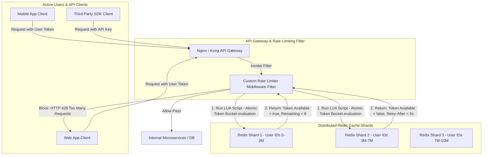
```mermaid
graph TD
    %% Clients Layer
    subgraph Clients [Active Users & API Clients]
        U1[Mobile App Client]
        U2[Web App Client]
        U3[Third-Party SDK Client]
    end

    %% Edge Gateway Layer
    subgraph EdgeLayer [API Gateway & Rate Limiting Filter]
        GW[Nginx / Kong API Gateway]
        Filter[Custom Rate Limiter Middleware Filter]
    end

    %% Redis Cache Cluster
    subgraph Storage [Distributed Redis Cache Shards]
        RedisShard1[Redis Shard 1 - User IDs 0-3M]
        RedisShard2[Redis Shard 2 - User IDs 3M-7M]
        RedisShard3[Redis Shard 3 - User IDs 7M-10M]
    end

    %% Traffic Routing Flow
    U1 -->|Request with User Token| GW
    U2 -->|Request with User Token| GW
    U3 -->|Request with API Key| GW
    
    GW -->|Invoke Filter| Filter
    Filter -->|1. Run LUA Script - Atomic Token Bucket evaluation| RedisShard1
    Filter -->|1. Run LUA Script - Atomic Token Bucket evaluation| RedisShard2

    %% Redis Decision Responses
    RedisShard1 -->|2. Return: Token Available = true, Remaining = 8| Filter
    RedisShard2 -->|2. Return: Token Available = false, Retry-After = 5s| Filter

    %% Actions
    Filter -->|Allow Pass| Backend[Internal Microservices / DB]
    Filter -->|Block: HTTP 429 Too Many Requests| U2
```

---

### ৩. ডিপ-ডাইভ কোর কনসেপ্টস (Distributed Rate Limiting Algorithms)

#### ক. টোকেন বাকেট অ্যালগরিদম (Token Bucket Algorithm):
টোকেন বাকেটের একটি সর্বোচ্চ লিমিট $N$ থাকে। প্রতি সেকেন্ডে নির্দিষ্ট হারে ($R$) টোকেন যোগ হতে থাকে। প্রতিটি ইনকামিং রিকোয়েস্ট বাকেট থেকে ১টি টোকেন তুলে নেয়। বাকেটে টোকেন থাকলে রিকোয়েস্ট পাস হয়, অন্যথায় ব্লক হয়।
* **Lazy Token Refill (আল্ট্রা-অপ্টিমাইজড):** প্রতিটি বাকেটের টোকেন প্রতি সেকেন্ডে রিফিল করার জন্য কোনো ব্যাকগ্রাউন্ড থ্রেড বা ক্রন জব (Cron Job) দরকার নেই। রিকোয়েস্ট আসার সাথে সাথে গাণিতিক সূত্রের সাহায্যে টোকেন হিসেব করা হয়:
  `Tokens = min(MaxTokens, CurrentTokens + (ElapsedTime * RefillRate))`
  এটি অতিরিক্ত কোনো সিপিইউ রিসোর্স খরচ করে না!

#### খ. স্লাইডিং উইন্ডো কাউন্টার অ্যালগরিদম (Sliding Window Counter):
ফিক্সড উইন্ডো বা স্লাইডিং উইন্ডো লগের মেমরি ওভারহেড এড়াতে স্লাইডিং উইন্ডো কাউন্টার একটি অসাধারণ হাইব্রিড সল্যুশন। এটি সময়কে নির্দিষ্ট ব্লকে (উদা: ১ মিনিট) ভাগ করে এবং কারেন্ট ও প্রিভিয়াস ব্লকের রিকোয়েস্টের একটি ওয়েটেড এভারেজ (Weighted Average) বের করে:
`Rate = Previous Window Requests * (1 - (Current Minute Elapsed Seconds / 60)) + Current Window Requests`
এটি অত্যন্ত মেমরি সেভিং এবং রিয়েল-টাইমে ৯৯% নিখুঁত আউটপুট দেয়।

#### গ. রেস কন্ডিশন ও ডিস্ট্রিবিউটেড কনসিস্টেন্সি (Race Conditions & Redis Lua Scripts):
মাল্টিপল গেটওয়ে নোড যখন একই সময়ে রেডিমেড রিড-রাইট অপারেশন করতে যায়, তখন ওল্ড টোকেন ভ্যালু ওভাররাইট হতে পারে।
এই সমস্যা এড়াতে রেডিমেড **Redis Lua Script** ব্যবহার করা হয়। লুয়া স্ক্রিপ্ট রেডিস সার্ভারের ভেতরে একক থ্রেডে (Single-threaded execution) অত্যন্ত দ্রুততার সাথে সম্পন্ন হয়, যা সম্পূর্ণ চেক-অ্যান্ড-আপডেট প্রসেসটিকে অ্যাটমিক (Atomic) করে তোলে।

---

### ৪. প্র্যাক্টিক্যাল কোড ইমপ্লিমেন্টেশন (TypeScript)

আমরা নিচে টাইপস্ক্রিপ্ট ব্যবহার করে একটি হাই-পারফরম্যান্স প্রডাকশন-রেডি **Distributed Rate Limiter Engine** তৈরি করলাম, যার মধ্যে অলস রিফিলিং মেকানিজম সমর্থিত **Lazy Token Bucket** এবং মেমরি-সাশ্রয়ী **Sliding Window Counter** ইমপ্লিমেন্টেশন করা হয়েছে:

```typescript
// ১. রেডিস ইন-মেমরি সিমুলেটর (Redis Mock Database)
class RedisSimulator {
  private store: Map<string, string> = new Map();

  public get(key: string): string | null {
    return this.store.get(key) || null;
  }

  public set(key: string, value: string) {
    this.store.set(key, value);
  }

  // অ্যাটমিক ট্রানজেকশনাল রাইট বা লকিং সিমুলেশন
  public runAtomicLuaScript(key: string, execute: (val: string | null) => string): string {
    const currentValue = this.get(key);
    const newValue = execute(currentValue);
    this.set(key, newValue);
    return newValue;
  }
}

// ২. টোকেন বাকেট রেট লিমিটার ইঞ্জিন (Lazy Token Replenishment)
export class TokenBucketLimiter {
  private redis: RedisSimulator;
  private maxTokens: number;
  private refillRatePerSec: number;

  constructor(redis: RedisSimulator, maxTokens: number, refillRatePerSec: number) {
    this.redis = redis;
    this.maxTokens = maxTokens;
    this.refillRatePerSec = refillRatePerSec;
  }

  // অ্যাটমিক ইভালুয়েশন রিকোয়েস্ট
  public allowRequest(clientId: string): { allowed: boolean; remainingTokens: number; retryAfterSec: number } {
    const key = `ratelimit:tokenbucket:${clientId}`;
    
    const resultString = this.redis.runAtomicLuaScript(key, (rawState) => {
      const now = Date.now();
      let state = rawState ? JSON.parse(rawState) : { tokens: this.maxTokens, lastRefill: now };

      // ১. লাস্ট ট্রানজেকশনের পর অতিক্রান্ত সেকেন্ডের হিসাব
      const elapsedSec = (now - state.lastRefill) / 1000;
      
      // ২. নতুন টোকেন রিফিল করা (Lazy refilling)
      const refilledTokens = state.tokens + (elapsedSec * this.refillRatePerSec);
      state.tokens = Math.min(this.maxTokens, refilledTokens);
      state.lastRefill = now;

      // ৩. রিকোয়েস্ট অনুমোদন যাচাই
      let allowed = false;
      if (state.tokens >= 1) {
        state.tokens -= 1;
        allowed = true;
      }

      return JSON.stringify({ allowed, tokens: state.tokens, lastRefill: state.lastRefill });
    });

    const parsedResult = JSON.parse(resultString);
    const retryAfterSec = parsedResult.tokens >= 1 ? 0 : Math.ceil((1 - parsedResult.tokens) / this.refillRatePerSec);

    return {
      allowed: parsedResult.allowed,
      remainingTokens: Math.floor(parsedResult.tokens),
      retryAfterSec
    };
  }
}

// ৩. স্লাইডিং উইন্ডো কাউন্টার ইঞ্জিন (Weighted Sliding Window Counter)
export class SlidingWindowCounterLimiter {
  private redis: RedisSimulator;
  private limitPerMin: number;

  constructor(redis: RedisSimulator, limitPerMin: number) {
    this.redis = redis;
    this.limitPerMin = limitPerMin;
  }

  public allowRequest(clientId: string): boolean {
    const now = Date.now();
    const currentMinKey = Math.floor(now / 60000);
    const prevMinKey = currentMinKey - 1;

    const redisKeyPrev = `ratelimit:slide:${clientId}:${prevMinKey}`;
    const redisKeyCurr = `ratelimit:slide:${clientId}:${currentMinKey}`;

    // অ্যাটমিক উইন্ডো রেট গণনা
    const result = this.redis.runAtomicLuaScript(redisKeyCurr, (currVal) => {
      const prevValString = this.redis.get(redisKeyPrev);
      const prevRequests = prevValString ? parseInt(prevValString) : 0;
      const currRequests = currVal ? parseInt(currVal) : 0;

      // কারেন্ট মিনিটে কত সেকেন্ড পার হয়েছে তা বের করা
      const elapsedSecondsInCurrentMin = (now % 60000) / 1000;
      const weightPrev = (60 - elapsedSecondsInCurrentMin) / 60;

      // স্লাইডিং উইন্ডো গাণিতিক ফর্মুলা (Weighted Average)
      const calculatedRate = (prevRequests * weightPrev) + currRequests;

      if (calculatedRate < this.limitPerMin) {
        const nextCount = currRequests + 1;
        return JSON.stringify({ allowed: true, count: nextCount });
      }

      return JSON.stringify({ allowed: false, count: currRequests });
    });

    const parsed = JSON.parse(result);
    if (parsed.allowed) {
      this.redis.set(redisKeyCurr, parsed.count.toString());
      return true;
    }

    return false;
  }
}

// === ডেমো রান এবং সিমুলেশন পাইলট ===
async function runRateLimiterDemo() {
  console.log("=== STARTING DISTRIBUTED RATE LIMITER ENGINE SIMULATOR ===");
  const redis = new RedisSimulator();
  
  // ১. টোকেন বাকেট কনফিগারেশন: সর্বোচ্চ ১০ টোকেন, প্রতি সেকেন্ডে ২টি করে টোকেন রিফিল
  const tokenBucket = new TokenBucketLimiter(redis, 10, 2);
  const clientId = "client_enterprise_99";

  console.log("
--- Executing Burst Requests on Client (Token Bucket) ---");
  for (let i = 1; i <= 13; i++) {
    const res = tokenBucket.allowRequest(clientId);
    console.log(
      `Request #${i} -> Allowed: ${res.allowed ? "✅ YES" : "❌ NO (HTTP 429)"} ` +
      `| Remaining: ${res.remainingTokens} | Retry-After: ${res.retryAfterSec}s`
    );
  }

  // ২. অলস রিফিলিং যাচাই করতে ১.৫ সেকেন্ড বিরতি দেওয়া
  console.log("
[Simulator] Waiting 1.5 seconds for Lazy Refilling...");
  await new Promise((resolve) => setTimeout(resolve, 1500));

  console.log("
--- After Delay: Testing Recovery Requests ---");
  for (let i = 1; i <= 4; i++) {
    const res = tokenBucket.allowRequest(clientId);
    console.log(
      `Recovered Request #${i} -> Allowed: ${res.allowed ? "✅ YES" : "❌ NO (HTTP 429)"} | Remaining: ${res.remainingTokens}`
    );
  }

  // ৩. স্লাইডিং উইন্ডো কাউন্টার টেস্ট (প্রতি মিনিটে সর্বোচ্চ ৩টি রিকোয়েস্ট এলাউড)
  console.log("
--- Setting up Sliding Window Counter (Max 3 req/min) ---");
  const slidingWindow = new SlidingWindowCounterLimiter(redis, 3);
  const userIp = "192.168.1.100";

  for (let i = 1; i <= 5; i++) {
    const allowed = slidingWindow.allowRequest(userIp);
    console.log(`Request #${i} from IP '${userIp}' -> Allowed: ${allowed ? "✅ YES" : "❌ NO (HTTP 429)"}`);
  }
}

runRateLimiterDemo();
```

---

### 🛑 Staff Architect Edge Cases & Scaling Gaps

বাস্তব হাই-স্কেল প্রোডাকশনে ডিস্ট্রিবিউটেড রেট লিমিটার পরিচালনা করার সময় যে ৩টি অত্যন্ত ক্রিটিক্যাল সমস্যা তৈরি হয় এবং স্টাফ-লেভেল সল্যুশন নিচে বিস্তারিত আলোচনা করা হলো:

#### ১. Redis Cluster Key Hotspots (ভাইরাল ইউজারের কী-হটস্পট)
কোনো ভাইরাল ইভেন্ট বা কোনো ক্লায়েন্ট সার্ভিস হঠাৎ চরম স্পাইক নিয়ে আসলে, কোটি কোটি রিকোয়েস্ট একই রেট লিমিট কী (`ratelimit:tokenbucket:viral_client`) হিট করা শুরু করে। এর ফলে নির্দিষ্ট রেডিস শার্ডে CPU ও মেমরি ১০০% স্পর্শ করে রেডিস ক্লাস্টার স্তব্ধ করে দেয়।
* **স্টাফ-লেভেল সল্যুশন (Hybrid Two-Tier Local In-Memory L1 + Distributed L2 Cache):**
  - **L1 Gateway LRU Cache:** আমরা এপিআই গেটওয়ে নোডগুলোর লোকাল মেমরিতে একটি ক্ষুদ্র (উদা: ১ সেকেন্ড বা ৫ সেকেন্ডের জন্য) **LRU Cache** ইমপ্লিমেন্ট করব।
  - **Deduplication:** অতিমাত্রায় রিকোয়েস্ট পাঠানো স্প্যাম ক্লায়েন্টদের প্রথম লেভেলের ফিল্টারিং গেটওয়ের লোকাল র্যামেই ব্লক হয়ে যাবে। শুধুমাত্র নরমাল ট্রাফিকের জন্য ডিস্ট্রিবিউটেড L2 রেডিস ক্লাস্টারে কুয়েরি করা হবে, যা রেডিস ক্লাস্টারের চাপ ৯০% কমিয়ে দেবে।

#### ২. Local Clock Drift in sliding windows (নোডগুলোর ঘড়ির অসঙ্গতি)
ডিস্ট্রিবিউটেড গেটওয়ে ক্লাস্টারের বিভিন্ন নোডের সিস্টেম টাইমস্ট্যাম্প এনটিপি (NTP Synchronization) করা থাকলেও মাইক্রো-সেকেন্ডে সামান্য ডিফারেন্স থাকে। এটি স্লাইডিং উইন্ডো ও রেট লিমিট গণনায় ক্লায়েন্টদের জন্য অন্যায্য এবং বৈষম্যমূলক ট্রাফিক ব্লকিংয়ের সৃষ্টি করে।
* **স্টাফ-লেভেল সল্যুশন (Time-Free Sharding & Redis Engine Time):**
  - **Redis Time API:** এপিআই গেটওয়ে নোডের ওএস লোকাল টাইমস্ট্যাম্পের উপর ভরসা না করে রেডিস ক্লাস্টারের ভেতরে লুয়া স্ক্রিপ্ট চলাকালীন `redis.call('TIME')` কুয়েরি ব্যবহার করে অ্যাটমিক টাইম বের করা। যেহেতু রেডিস সার্ভারের ঘড়ি সব নোডের জন্য অভিন্ন, তাই ঘড়ির অসঙ্গতির সমস্যা সম্পূর্ণরূপে সমাধান হয়ে যায়।

#### ৩. Graceful Fail-Open Degradation (রেডিস ক্লাস্টার ফেইল করলে গেটওয়ে সচল রাখা)
যদি আপনার সম্পূর্ণ রেডিস বা রেট লিমিটিং ক্লাস্টার ক্র্যাশ করে বা মেমরির অভাবে রিকোয়েস্ট প্রসেস করতে না পারে, তখন কি আমরা ক্লায়েন্টদের ব্লক করে দেব (Fail-Closed) নাকি সমস্ত রিকোয়েস্ট পাস হতে দেব (Fail-Open)? Fail-Closed এ পুরো প্রোডাক্ট ডাউন হয়ে যাবে আর Fail-Open এ ডাউনস্ট্রিম সার্ভারগুলো ট্রাফিক ঝড়ে পুড়ে ছাই হয়ে যাবে।
* **স্টাফ-লেভেল সল্যুশন (Fail-Open with Graceful Degradation):**
  - **Fail-Open Strategy:** রেডিস ক্লাস্টার আনরিচেবল হলে লিমিটার নোড `Fail-Open` মোডে চলে যাবে এবং রিকোয়েস্টগুলোকে ডাউনস্ট্রিম সার্ভারে যেতে দেবে।
  - **Local Token Bucket Fallback:** গেটওয়ে নোডগুলো ওয়ান-টাইমে লোকাল র্যামে টেম্পোরারি ব্যাকআপ টোকেন বাকেট স্টার্ট করবে।
  - **Feature Degradation:** একই সাথে এপিআই গেটওয়ে ওএস রেসপন্সে হেভি পে-লোড ফিল্ডগুলো বা ইমেজ রেন্ডারিং ব্যাকএন্ড এপিআই বন্ধ করে লাইটওয়েট মেটাডাটা ব্যাকআপ রেসপন্স দেবে যাতে ডাউনস্ট্রিম সার্ভিসগুলোর ডেটাবেস লকআপ বা ব্যাকলগ এড়ানো যায়।

---

## 📖 Chapter 19: Real-Time Gaming Leaderboard

ডিস্ট্রিবিউটেড গেমিং এবং সোশ্যাল অ্যাপ্লিকেশনে রিয়েল-টাইম লিডারবোর্ড (Leaderboard) ব্যবহারকারীদের আগ্রহ এবং রিটেনশন ধরে রাখার অন্যতম প্রধান চালিকাশক্তি। মিলিয়ন সক্রিয় প্লেয়ারের রিয়েল-টাইম স্কোর ট্র্যাক করা, গ্লোবাল র্যাঙ্কিং এবং রিলেটিভ র্যাঙ্কিং মিলি-সেকেন্ডের মধ্যে কুয়েরি করার জন্য একটি হাই-পারফরম্যান্স র্যাঙ্কিং ইঞ্জিনের প্রয়োজন। এই চ্যাপ্টারে আমরা **Distributed Real-Time Gaming Leaderboard** আর্কিটেকচার ডিজাইন করব যা Redis Sorted Sets এবং ডিস্ট্রিবিউটেড স্কিলিং স্ট্রাকচার ব্যবহার করে কাজ করে।

### ১. সিস্টেম রিকোয়ারমেন্টস এবং স্কেল ক্যালকুলেশন (System Requirements & Capacity Estimation)

#### ক. ফাংশনাল রিকোয়ারমেন্টস (Functional Requirements):
1. **Update Score:** একজন প্লেয়ার ম্যাচ শেষ করার সাথে সাথে তার স্কোর আপডেট বা ইনক্রিমেন্ট করা যাবে।
2. **Top-K Rankings:** রিয়েল-টাইমে গ্লোবাল লিডারবোর্ডের টপ $K$ (উদা: টপ ১০০ বা টপ ১০০০) প্লেয়ারের র্যাঙ্ক এবং স্কোর দেখতে পাওয়া যাবে।
3. **Relative / Pivot Ranking:** যেকোনো নির্দিষ্ট প্লেয়ারের নিজের গ্লোবাল র্যাঙ্ক এবং তার আশেপাশের প্লেয়ারদের র্যাঙ্কিং ফ্লো (উদা: প্লেয়ারের আগের ও পরের ৩ জন) দেখতে পাওয়া যাবে।
4. **Time-Segmented Leaderboards:** দৈনিক (Daily), সাপ্তাহিক (Weekly) এবং অল-টাইম (All-Time) ক্যাটাগরিতে লিডারবোর্ড ফিল্টার করা যাবে।

#### খ. নন-ফাংশনাল রিকোয়ারমেন্টস (Non-Functional Requirements):
1. **Ultra-Low Latency:** টপ ১০০ র্যাঙ্কিং রিটার্ন করতে রেসপন্স টাইম ১০ মিলি-সেকেন্ডের কম হতে হবে।
2. **High Write Throughput:** পিক আওয়ারে লাখ লাখ প্লেয়ারের প্রতি সেকেন্ডে স্কোর আপডেট প্রসেস করার ক্ষমতা থাকতে হবে।
3. **High Consistency & Accuracy:** র্যাঙ্কিং গণনা ১০০% সঠিক হতে হবে (দুইজন প্লেয়ারের র্যাঙ্ক ওভারল্যাপ বা ভুল হওয়া যাবে না)।

#### গ. ক্যাপাসিটি ক্যালকুলেশন (Staff Architect Scale Estimations):
ধরি, আমাদের এন্টারপ্রাইজ গেমিং আর্কিটেকচারে:
* **মোট নিবন্ধিত প্লেয়ার সংখ্যা (Total Registered Users):** $100,000,000$ (100 Million) players.
* **দৈনিক সক্রিয় প্লেয়ার (Daily Active Users - DAU):** $10,000,000$ (10 Million) players.
* **গড় স্কোর আপডেট থ্রুপুট (Average Write QPS):** $50,000$ score updates/sec.
* **পিক স্কোর আপডেট থ্রুপুট (Peak Write QPS):** $150,000$ score updates/sec.
* **গড় র্যাঙ্কিং রিড কুয়েরি থ্রুপুট (Read QPS):** $100,000$ queries/sec.

**১. থ্রুপুট ও ইনজেশন ব্যান্ডউইথ (Scale & Capacity Estimations):**
* `Average Network Ingestion Rate = 50,000 updates/sec * 128 bytes = 6,400,000 bytes/sec ≈` **6.4 MB/sec** (or **6.1 MiB/sec**)
* `Peak Network Ingestion Rate = 150,000 updates/sec * 128 bytes = 19,200,000 bytes/sec ≈` **19.2 MB/sec** (or **18.31 MiB/sec**)

**২. মেমরি রিকোয়ারমেন্ট (Leaderboard Memory size):**
আমরা Redis Sorted Sets (ZSET) ব্যবহার করব যা ইন্টারনাল ডেটা স্ট্রাকচার হিসেবে একটি **Skip List** এবং একটি **Hash Table** ব্যবহার করে। ওভারহেডসহ গড়ে প্রতিটি মেম্বারের জন্য Redis ZSET-এ মেমরি খরচ হয় আনুমানিক **১২৮ বাইট**।
* **সলিউশন ১: গ্লোবাল লিডারবোর্ড (সব ১০০ মিলিয়ন প্লেয়ার মেমরিতে রাখা):**
  * `Total Redis Memory = 100,000,000 players * 128 bytes = 12,800,000,000 bytes ≈` **12.8 GB** (or **11.92 GiB**)
  * *সিদ্ধান্ত:* এটি ৩টি নোডের একটি অতি সাধারণ **Redis Sharded Cluster** দিয়ে অনায়াসে হ্যান্ডেল করা সম্ভব।
* **সলিউশন ২: টপ ১,০০,০০০ প্লেয়ার মেমরিতে রাখা (Hybrid Approach):**
  * বেশিরভাগ গেমারদের জন্য শুধুমাত্র টপ ১,০০,০০০ ইউজারের রিয়েল-টাইম গ্লোবাল র্যাঙ্ক রাখা যথেষ্ট। নিচের প্লেয়ারদের হিস্টোরিক্যাল ডেটা Postgres-এ রেখে কেবল টপ মেম্বারদের Redis-এ আপডেট করলে:
  * `Top-Tier Redis Memory = 100,000 players * 128 bytes ≈` **12.8 MB** (or **12.21 MiB**), যা অত্যন্ত মেমরি সাশ্রয়ী এবং অতি দ্রুত!

---

### ২. হাই-ফিডেলিটি সিস্টেম আর্কিটেকচার (High-Fidelity Distributed Leaderboard Architecture)

নিচের আর্কিটেকচার ডায়াগ্রামের মাধ্যমে গেম ক্লায়েন্ট থেকে রিয়েল-টাইম স্কোর আপডেট সাবমিট হওয়া, কাফকার মাধ্যমে অ্যাসিঙ্ক্রোনাস ইভেন্ট প্রসেস, রেডিস ক্লাস্টারে রাইট এবং রিড রেপ্লিকার সাহায্যে হাই-স্পিড রিড কুয়েরি হ্যান্ডেল করার ফ্লো দেখানো হলো:

```mermaid
graph TD
    %% Game Clients
    subgraph Clients [Game Clients & Devices]
        C1[Mobile Gamer A]
        C2[PC Gamer B]
        C3[Console Gamer C]
    end

    %% Edge & Processing Layer
    subgraph EdgeLayer [API Gateway & Game Engines]
        GW[Nginx API Gateway]
        GameService[Score Processor Microservice]
        Kafka[Kafka Score Update Topic]
    end

    %% Redis Cache Cluster
    subgraph RedisCluster [Redis Cluster - Sorted Set Shards]
        RedisLeaderboard1[Redis Shard 1 - Global Leaderboard ZSET]
        RedisReplica[Redis Replica - High Availability Read Replica]
    end

    %% Database & Analytics Layer
    subgraph DatabaseLayer [Cold Storage & Analytics]
        Postgres[PostgreSQL DB - Historical Scores]
    end

    %% Processing Flow
    C1 -->|Submit Score Update| GW
    C2 -->|Submit Score Update| GW
    C3 -->|Submit Score Update| GW

    GW -->|Route Request| GameService
    GameService -->|1. Write Async Score Update| Kafka
    Kafka -->|2. Stream Updates| GameService
    
    GameService -->|3. Atomic ZADD Score Update| RedisLeaderboard1
    RedisLeaderboard1 -.->|4. Asynchronous Replication| RedisReplica

    %% Read Flow
    C2 -->|Query Global Top 100| GW
    GW -->|Route Read Query| GameService
    GameService -->|5. ZREVRANGE: Retrieve Top Rankings| RedisReplica
    
    %% Backup Persistent Flow
    GameService -->|6. Batch Write to Cold Storage| Postgres
```

---

### ৩. ডিপ-ডাইভ কোর কনসেপ্টস (Real-Time Leaderboard Engine Internals)

#### ক. Redis Sorted Sets (ZSET) ইন্টারনালস: Skip List ও Hash Table-এর যুগলবন্দী
জেডসেটের ভেতরে দুটি ডেটা স্ট্রাকচার একসাথে কাজ করে:
1. **Hash Table:** প্লেয়ারের আইডিকে কী হিসেবে এবং তার স্কোরকে ভ্যালু হিসেবে স্টোর করে, যা ওয়ান-টাইম প্লেয়ার স্কোর জানতে $O(1)$ পারফরম্যান্স দেয়।
2. **Skip List (এড়িয়ে চলা তালিকা):** স্কোর অনুযায়ী প্লেয়ারদের সাজিয়ে রাখে। এটি মূলত বাইনারি ট্রির মতো কাজ করে কিন্তু মেমরি ব্যালেন্সিং ওভারহেড ছাড়াই প্লেয়ার আপডেট এবং রেঞ্জ কুয়েরি (উদা: র্যাঙ্ক ৫০ থেকে ১০০) করতে মাত্র $O(\log N)$ সময় নেয়।

```
Level 3: [10] ------------------------------> [80] ----------> NIL
Level 2: [10] -------------> [45] -----------> [80] ----------> NIL
Level 1: [10] ---> [23] ----> [45] ---> [67] -> [80] ---> [99] -> NIL
```

#### খ. টাইম-সেগমেন্টেশন (Daily, Weekly, Monthly Leaderboards)
রিয়েল-টাইম ট্র্যাকিংয়ের জন্য আমরা রেডিসের ভেতর নির্দিষ্ট টাইম কী-প্যাটার্ন ব্যবহার করি।
* দৈনিক লিডারবোর্ড কী: `leaderboard:daily:2026-05-28`
* সাপ্তাহিক লিডারবোর্ড কী: `leaderboard:weekly:2026-W22`
যখন কোনো প্লেয়ার কোনো গেমে স্কোর করে, তখন আমরা রেডিসের **Multi/Exec Pipeline**-এর মাধ্যমে গ্লোবাল কী-এর পাশাপাশি কারেন্ট ডেইলি এবং উইকলি জেডসেট কী-তেও স্কোর আপডেট করে দেই।

---

### ৪. প্র্যাক্টিক্যাল কোড ইমপ্লিমেন্টেশন (TypeScript)

আমরা নিচে টাইপস্ক্রিপ্ট ব্যবহার করে একটি হাই-পারফরম্যান্স **Real-Time Gaming Leaderboard Engine** তৈরি করলাম, যার মধ্যে জেডসেট সিমুলেশন, প্লেয়ার র্যাঙ্ক ট্র্যাকিং এবং ডেইলি/উইকলি সেগমেন্টেশন ইমপ্লিমেন্ট করা হয়েছে:

```typescript
// ১. রেডিস জেডসেট সিমুলেটর (Redis Sorted Set Simulator)
interface ZSetMember {
  playerId: string;
  score: number;
}

class RedisZSetSimulator {
  private store: Map<string, ZSetMember[]> = new Map();

  // ZADD: মেম্বার যোগ বা স্কোর আপডেট করা
  public zadd(key: string, score: number, playerId: string) {
    if (!this.store.has(key)) {
      this.store.set(key, []);
    }

    const members = this.store.get(key)!;
    const existingIndex = members.findIndex(m => m.playerId === playerId);

    if (existingIndex !== -1) {
      members[existingIndex].score = score;
    } else {
      members.push({ playerId, score });
    }

    // স্কোর অনুযায়ী অবরোহী (Descending order) সাজানো
    members.sort((a, b) => b.score - a.score);
  }

  // ZSCORE: নির্দিষ্ট মেম্বারের স্কোর জানা
  public zscore(key: string, playerId: string): number | null {
    const members = this.store.get(key) || [];
    const member = members.find(m => m.playerId === playerId);
    return member ? member.score : null;
  }

  // ZREVRANK: অবরোহী র্যাঙ্ক রিটার্ন করা (০-ইনডেক্সড)
  public zrevrank(key: string, playerId: string): number | null {
    const members = this.store.get(key) || [];
    const index = members.findIndex(m => m.playerId === playerId);
    return index !== -1 ? index : null;
  }

  // ZREVRANGE: নির্দিষ্ট ইনডেক্স লিমিটের প্লেয়ারদের রিটার্ন করা
  public zrevrange(key: string, start: number, stop: number): ZSetMember[] {
    const members = this.store.get(key) || [];
    return members.slice(start, stop + 1);
  }
}

// ২. গেমিং লিডারবোর্ড ম্যানেজার (Gaming Leaderboard Manager)
export class LeaderboardManager {
  private redisZSet: RedisZSetSimulator;

  constructor(redisZSet: RedisZSetSimulator) {
    this.redisZSet = redisZSet;
  }

  // স্কোর আপডেট করা (ডেইলি ও গ্লোবাল লিডারবোর্ডে একসাথে)
  public recordScore(playerId: string, score: number) {
    const today = new Date().toISOString().split("T")[0]; // YYYY-MM-DD
    
    // ১. গ্লোবাল লিডারবোর্ড আপডেট
    this.redisZSet.zadd("leaderboard:global", score, playerId);
    
    // ২. ডেইলি লিডারবোর্ড আপডেট
    this.redisZSet.zadd(`leaderboard:daily:${today}`, score, playerId);
  }

  // টপ K প্লেয়ারদের তালিকা আনা
  public getTopPlayers(key: string, limit: number): Array<{ rank: number; playerId: string; score: number }> {
    const rawList = this.redisZSet.zrevrange(key, 0, limit - 1);
    return rawList.map((item, idx) => ({
      rank: idx + 1,
      playerId: item.playerId,
      score: item.score
    }));
  }

  // কোনো নির্দিষ্ট প্লেয়ারের নিজের রিলেটিভ র্যাঙ্কিং ভিউ (Pivot View)
  public getPlayerRelativeView(key: string, playerId: string, range: number): Array<{ rank: number; playerId: string; score: number }> | null {
    const rankIndex = this.redisZSet.zrevrank(key, playerId);
    if (rankIndex === null) return null;

    const start = Math.max(0, rankIndex - range);
    const stop = rankIndex + range;
    const rawList = this.redisZSet.zrevrange(key, start, stop);

    return rawList.map((item, idx) => ({
      rank: start + idx + 1,
      playerId: item.playerId,
      score: item.score
    }));
  }
}

// === ডেমো রান এবং সিমুলেশন পাইলট ===
async function runLeaderboardDemo() {
  console.log("=== STARTING DISTRIBUTED REAL-TIME LEADERBOARD ENGINE SIMULATOR ===");
  const redisZ = new RedisZSetSimulator();
  const manager = new LeaderboardManager(redisZ);

  // ১. প্লেয়ারদের স্কোর আপডেট সিমুলেশন
  const players = [
    { id: "gamer_pro_99", score: 4500 },
    { id: "pixel_king", score: 7200 },
    { id: "shadow_ninja", score: 3800 },
    { id: "alpha_predator", score: 8500 },
    { id: "cyber_samurai", score: 6100 },
    { id: "blitz_krieg", score: 7200 }, // Blitz and Pixel have the exact same score!
  ];

  console.log("
--- Injecting Real-Time Player Score Updates ---");
  players.forEach((p) => {
    manager.recordScore(p.id, p.score);
    console.log(`[Update] Player '${p.id}' score updated to: ${p.score}`);
  });

  // ২. গ্লোবাল টপ ৩ র্যাঙ্কিং প্রদর্শন
  console.log("
--- Global Leaderboard Top 3 ---");
  const top3 = manager.getTopPlayers("leaderboard:global", 3);
  top3.forEach((p) => {
    console.log(`Rank #${p.rank} | Player: ${p.playerId} | Score: ${p.score}`);
  });

  // ৩. 'cyber_samurai'-এর রিলেটিভ বা পিভট ভিউ দেখা (আশেপাশের ১ জনের র্যাঙ্কসহ)
  const targetPlayer = "cyber_samurai";
  console.log(`
--- Relative Ranking Spotlight for '${targetPlayer}' ---`);
  const relativeView = manager.getPlayerRelativeView("leaderboard:global", targetPlayer, 1);
  if (relativeView) {
    relativeView.forEach((p) => {
      const isTarget = p.playerId === targetPlayer ? "⭐️ (YOU)" : "  ";
      console.log(`Rank #${p.rank} ${isTarget} | Player: ${p.playerId} | Score: ${p.score}`);
    });
  }

  // ৪. ডেইলি সেগমেন্টেড লিডারবোর্ড দেখা
  const today = new Date().toISOString().split("T")[0];
  console.log(`
--- Daily Leaderboard Top 5 for ${today} ---`);
  const dailyTop5 = manager.getTopPlayers(`leaderboard:daily:${today}`, 5);
  dailyTop5.forEach((p) => {
    console.log(`Rank #${p.rank} | Player: ${p.playerId} | Score: ${p.score}`);
  });
}

runLeaderboardDemo();
```

---

### 🛑 Staff Architect Edge Cases & Scaling Gaps

বাস্তব হাই-স্কেল প্রোডাকশনে ডিস্ট্রিবিউটেড রিয়েল-টাইম লিডারবোর্ড পরিচালনা করার সময় যে ৩টি অত্যন্ত ক্রিটিক্যাল সমস্যা তৈরি হয় এবং স্টাফ-লেভেল সল্যুশন নিচে বিস্তারিত আলোচনা করা হলো:

#### ১. Score Collision & Tie-Breaking (একই স্কোরের র্যাঙ্কিং টাই-ব্রেকিং)
যদি আপনার গেম লিডারবোর্ডে ১,০০০ প্লেয়ার একই স্কোর (উদা: ৮,৫০০ পয়েন্ট) অর্জন করে, তবে রেডিস জেডসেটের ডিফল্ট লেক্সিকোগ্রাফিকাল (Lexicographical) অর্ডারের কারণে যারা নামের শুরুতে 'A' বা আলফানিউমেরিক দিয়ে শুরু করে, তারা আগে র্যাঙ্ক পেয়ে যায়, যা অন্যান্য প্লেয়ারদের সাথে চরম বৈষম্য তৈরি করে।
* **স্টাফ-লেভেল সল্যুশন (Secondary Sorting Key - Epoch Timestamp Injection):**
  - **Timestamp Injection:** জেডসেটে র স্কোর ইনজেকশনের সময় শুধুমাত্র ডেসিমাল স্কোর না বসিয়ে আমরা ডেসিমালের পর প্লেয়ারের স্কোর অর্জন করার টাইমস্ট্যাম্পের একটি ফ্র্যাকশন ম্যাথমেটিক্যালি যোগ করব:
    `Composite Score = Base Score + (1 - (Achievement Timestamp / 10,000,000,000))`
  - **Tie-Breaking:** এর ফলে যে প্লেয়ার নির্দিষ্ট স্কোরটি সবার আগে অর্জন করেছে, তার টাইমস্ট্যাম্প ছোট হওয়ায় তার ফ্র্যাকশন ভ্যালু বড় হবে। এটি কোনো প্রকার অতিরিক্ত কুয়েরি ওভারহেড ছাড়াই রেডিস মেমরিতে অত্যন্ত নিখুঁত ও চমৎকার টাই-ব্রেকিং নিশ্চিত করে!

#### ২. Real-Time Hotspot Writes during Global Tournaments (মিলিয়ন QPS রাইট স্পাইক)
লাইভ বৈশ্বিক টুর্নামেন্টের ফাইনাল ম্যাচ চলার সময় প্রতি সেকেন্ডে লাখ লাখ প্লেয়ারের স্কোর একসাথে স্পাইক করে। রেডিস সিঙ্গেল-থ্রেডেড হওয়ায় এক লাখেরও বেশি জেডসেট স্কোর আপডেট করতে গেলে রেডিসের ইভেন্ট লুপ ব্লক হয়ে যায়, যা গেমিং এপিআইগুলোর ল্যাটেন্সি কয়েক গুণ বাড়িয়ে দেয়।
* **স্টাফ-লেভেল সল্যুশন (Write Buffering, Aggregation & High-Watermark Updates):**
  - **Async Write Buffering:** গেম সার্ভার সরাসরি রেডিসে হিট না করে প্লেয়ারের স্কোর কাফকা বা একটি ইন-মেমরি ডিসরাপ্টর রিং বাফারে (Ring Buffer) পুশ করবে।
  - **Score Deduplication:** স্কোর প্রসেসর ১ সেকেন্ডের একটি ডেটা উইন্ডোতে প্লেয়ারের স্কোর এগ্রিগেশন করবে এবং ওই ইউজারের শুধুমাত্র সর্বোচ্চ স্কোরটি রেডিস জেডসেটে আপডেট করবে। এটি রেডিসের একক কী-তে প্রতি সেকেন্ডে ১০০০ বার রাইটের চাপ কমিয়ে ১ বার রাইটে নিয়ে আসবে, যা রাইট ট্রাফিক ৯৯% কমিয়ে দেয়।

#### ৩. Deep Pagination Memory Blowup (ডিপ রেঞ্জ স্ক্যান ক্র্যাশ)
যখন লাখ লাখ ইউজারের জেডসেটে কোনো প্লেয়ার ৫০০,০০০ তম র্যাঙ্কের পেজ দেখতে চায় (`ZREVRANGE leaderboard 500000 500010`), তখন রেডিসকে স্কিপ লিস্টের ওপর থেকে শুরু করে প্রথম থেকে ৫ লাখ ইনডেক্স পর্যন্ত লাফিয়ে লাফিয়ে মেমরি ট্রাভার্স (Traverse) করতে হয়। এটি অত্যন্ত ব্যয়বহুল এবং একাধিক ইউজার একসাথে এমন ডিপ পেজিনেশন কুয়েরি করলে রেডিস প্রসেসর ১০০% ব্লক হয়ে পুরো ক্লাস্টার সাট-ডাউন হয়ে যায়।
* **স্টাফ-লেভেল সল্যুশন (UI Restriction & Tiered Range Querying):**
  - **UI Hard Limit:** প্রোডাকশন সিস্টেমে রিয়েল-টাইম স্ক্রলিং র্যাঙ্ককে আমরা টপ ৫,০০০ মেম্বারদের মাঝে হার্ড-লিমিট (Hard Limit) করে দেব।
  - **Self Rank Spotlight:** এর নিচের প্লেয়ারদের জন্য শুধুমাত্র তাদের নিজের র্যাঙ্ক স্পটলাইট দেখানোর জন্য `ZREVRANK` ব্যবহার করব যা ওল্ড স্কিপ লিস্টে অত্যন্ত দ্রুততার সাথে $O(\log N)$-এ প্লেয়ার পজিশন বের করে দেয়। প্লেয়ারকে গভীর লিস্ট স্ক্রল করতে না দিয়ে তার আশেপাশে ৫ জনের পিভট রিলেটিভ লিস্ট রিটার্ন করব যা মেমরি ব্লুআপ চিরতরে বন্ধ করবে।

---

## 📖 Chapter 20: Distributed ID Generator (Snowflake-style)

ডিস্ট্রিবিউটেড মাইক্রোসার্ভিস আর্কিটেকচারে ডেটাবেজ স্কেলিংয়ের জন্য শার্ডিং এবং পার্টিশনিং অত্যন্ত পরিচিত সমাধান। কিন্তু ডিস্ট্রিবিউটেড ডাটাবেজগুলোর সবচেয়ে বড় চ্যালেঞ্জ হলো গ্লোবালি ইউনিক প্রাইমারি কী (Unique Primary Key) বা আইডি জেনারেশন। প্রথাগত Auto-Increment আইডি প্রতিটি ডেটাবেজ ইনস্ট্যান্সে ক্লাসিং বা ডুপ্লিকেশন তৈরি করে। এই সমাপনী চ্যাপ্টারে আমরা টুইটারের বিখ্যাত **Distributed Snowflake ID Generator** ডিজাইন করব যা কোন প্রকার গ্লোবাল কোঅর্ডিনেশন লক ছাড়াই আল্ট্রা-ফাস্ট এবং ইউনিক ৬৪-বিট আইডি তৈরি করতে সক্ষম।

### ১. সিস্টেম রিকোয়ারমেন্টস এবং স্কেল ক্যালকুলেশন (System Requirements & Capacity Estimation)

#### ক. ফাংশনাল রিকোয়ারমেন্টস (Functional Requirements):
1. **Globally Unique IDs:** উৎপন্ন প্রতিটি আইডি ডিস্ট্রিবিউটেড ক্লাস্টারের মধ্যে অবশ্যই ইউনিক (Unique) হতে হবে।
2. **Roughly Time Sorted:** আইডিগুলো অবশ্যই সময়ের সাথে ক্রমানুসারে বৃদ্ধি (Roughly Time-Ordered / Monotonically Increasing) পেতে হবে যাতে ডেটাবেস ইনডেক্সিং (B-Tree) অত্যন্ত দক্ষভাবে কাজ করে।
3. **64-bit Representation:** স্টোরেজ অপ্টিমাইজেশনের জন্য আইডি সাইজ অবশ্যই ৬৪-বিট পূর্ণসংখ্যা (64-bit Integer) হতে হবে।

#### খ. নন-ফাংশনাল রিকোয়ারমেন্টস (Non-Functional Requirements):
1. **Coordination-less High Availability:** প্রতিটি জেনারেটর নোড অন্য নোডগুলোর সাথে কথা না বলেই (Zero-Network Roundtrip per ID) আইডি জেনারেট করতে পারবে যাতে সিস্টেমে কোনো Single Point of Failure না থাকে।
2. **Ultra-High Throughput & Low Latency:** প্রতি সেকেন্ডে লাখ লাখ আইডি জেনারেশন রিকোয়েস্ট হ্যান্ডেল করার ক্ষমতা থাকতে হবে। আইডি প্রতি ল্যাটেন্সি ওভারহেড মাইক্রো-সেকেন্ডে হতে হবে।

#### গ. ক্যাপাসিটি ক্যালকুলেশন (Staff Architect Scale Estimations):
ধরি, আমাদের এন্টারপ্রাইজ মাইক্রোসার্ভিস ক্লাস্টারে:
* **মোট কন্টেইনার/সার্ভার নোড সংখ্যা (Active Nodes):** $1,024$ nodes.
* **গড় আইডি জেনারেশন থ্রুপুট (Average ID QPS):** $10,000,000$ IDs/sec.
* **পিক আইডি জেনারেশন থ্রুপুট (Peak ID QPS):** $50,000,000$ IDs/sec.

**১. থ্রুপুট ও ইনজেশন ব্যান্ডউইথ (Scale & Capacity Estimations):**
* `Average ID Generation Bandwidth = 10,000,000 * 8 bytes = 80,000,000 bytes/sec ≈` **80 MB/sec** (or **76.29 MiB/sec**)
* `Peak ID Generation Bandwidth = 50,000,000 * 8 bytes = 400,000,000 bytes/sec ≈` **400 MB/sec** (or **381.47 MiB/sec**)

**২. ৬৪-বিট আইডি লেআউট অ্যালোকেশন (Snowflake 64-bit Bit Allocation):**
একটি ৬৪-বিট আইডি তৈরি করতে আমরা বিটগুলোকে নিচের ৫টি ভাগে বিভক্ত করব:
* **Sign Bit (১ বিট):** সর্বদা `0` থাকবে (চিহ্নহীন পজিটিভ সংখ্যার জন্য)।
* **Timestamp (৪১ বিট):** মিলি-সেকেন্ড রেজোলিউশনে সময় নির্দেশ করে। এটি আমাদের কাস্টম ইপক (Custom Epoch, উদা: ২0২৬-০১-০১) ব্যবহার করে প্রায় **৬৯ বছর** (অর্থাৎ $2^{41}$ মিলি-সেকেন্ড) পর্যন্ত ইউনিক আইডি জেনারেট করতে পারবে।
* **Datacenter ID (৫ বিট):** ৩২টি পর্যন্ত আলাদা ডেটাসেন্টার চিহ্নিত করতে পারে ($2^5 = 32$).
* **Worker Node ID (৫ বিট):** প্রতিটি ডেটাসেন্টারের জন্য ৩২টি আলাদা সার্ভার নোড চিহ্নিত করতে পারে ($2^5 = 32$). অর্থাৎ ক্লাস্টারে মোট $32 \times 32 = 1024$ টি ইউনিক কন্টেইনার নোড রেপ্লিকেট করা সম্ভব!
* **Sequence Number (১২ বিট):** একই মিলি-সেকেন্ডে একই সার্ভার নোডে উৎপন্ন একাধিক আইডিকে আলাদা করতে ব্যবহৃত হয়। এটি প্রতি মিলি-সেকেন্ডে সর্বোচ্চ ৪,০৯৬টি ইউনিক আইডি তৈরি করতে পারে ($2^{12} = 4096$).

**৩. সর্বোচ্চ থ্রুপুট লিমিট যাচাই (Monolithic Global Limit):**
একটি নোড যদি প্রতি মিলি-সেকেন্ডে ৪,০৯৬টি আইডি তৈরি করতে পারে, তবে ১০২৪টি নোড মিলে প্রতি সেকেন্ডে সর্বোচ্চ কত আইডি তৈরি করবে?
* `Max Global ID Capacity = 1024 nodes * 4,096 IDs/ms * 1,000 ms/sec =` **4,194,304,000 IDs/second** (4.19 Billion IDs/sec).
* *সিদ্ধান্ত:* এটি আমাদের পিক রিকোয়ারমেন্টের ($50,000,000$ IDs/sec) চেয়ে প্রায় ৮৩ গুণ বেশি! তাই এই আর্কিটেকচারটি গ্লোবাল স্কেলে ১০০% ফিউচার-প্রুফ।

---

### ২. হাই-ফিডেলিটি সিস্টেম আর্কিটেকচার (High-Fidelity Distributed ID Generator Architecture)

নিচের আর্কিটেকচার ডায়াগ্রামের মাধ্যমে গেম/ওয়েব সার্ভিস নোড থেকে আইডি রিকোয়েস্ট হওয়া, কনসেনসাস সার্ভিসের মাধ্যমে ইউনিক ওয়ার্কার আইডি লিজ নেওয়া এবং বিটওয়াইজ অপারেশনের মাধ্যমে গ্লোবালি ইউনিক ৬৪-বিট স্নোফ্লেক আইডি অ্যাসেম্বলিং ফ্লো দেখানো হলো:

```mermaid
graph TD
    %% Clients Layer
    subgraph Clients [API Clients & Microservices]
        S1[Payment Service]
        S2[User Creation Service]
        S3[Order Engine]
    end

    %% Snowflake Generators
    subgraph Generators [Snowflake ID Generators - No Coordination]
        NodeA["Generator Node A (Datacenter 1, Worker 1)"]
        NodeB["Generator Node B (Datacenter 1, Worker 2)"]
        NodeC["Generator Node C (Datacenter 2, Worker 1)"]
    end

    %% ZooKeeper Coordinator
    subgraph Coordination [Consensus Registry & Node Registry]
        ZK[Consensus Engine ZooKeeper / Consul Cluster]
    end

    %% Output Format
    subgraph BitLayout [64-bit Unsigned Snowflake ID Structure]
        Sign["Sign (1 bit: 0)"]
        Time["Timestamp (41 bits: ms since Custom Epoch)"]
        DC["Datacenter ID (5 bits)"]
        Worker["Worker ID (5 bits)"]
        Seq["Sequence (12 bits)"]
    end

    %% Registration Flow
    NodeA -.->|1. Register & Lease Worker ID 1| ZK
    NodeB -.->|1. Register & Lease Worker ID 2| ZK
    NodeC -.->|1. Register & Lease Worker ID 3| ZK

    %% Request ID
    S1 -->|Request Unique ID| NodeA
    S2 -->|Request Unique ID| NodeB
    S3 -->|Request Unique ID| NodeC

    %% Bitwise Construction
    NodeA -->|2. Bitwise Shift Assembly| BitLayout
    Sign --- Time
    Time --- DC
    DC --- Worker
    Worker --- Seq

    %% Result ID
    BitLayout -->|3. Return 64-bit String ID: 8345290458122240| S1
```

---

### ৩. ডিপ-ডাইভ কোর কনসেপ্টস (Bitwise Shift Assembly & Consensus Registry)

#### ক. বিটওয়াইজ শিফটিং মেকানিজম (Bitwise Shift Construction)
একটি ৬৪-বিট ইন্টিজারের বিভিন্ন অংশে ডেটা বসানোর জন্য বিটওয়াইজ লেফট শিফট (`<<`) এবং বিটওয়াইজ অর (`|`) অপারেটর ব্যবহার করা হয়।
* মিলি-সেকেন্ড টাইমস্ট্যাম্পকে তার পজিশনে নিতে ২২ বিট বামে সরানো হয়: `Timestamp << 22`
* ডেটাসেন্টার আইডিকে ১৭ বিট বামে সরানো হয়: `DatacenterID << 17`
* ওয়ার্কার নোড আইডিকে ১২ বিট বামে সরানো হয়: `WorkerID << 12`
* শেষে সিকোয়েন্স নাম্বার সরাসরি যোগ করা হয়।
সবগুলোকে একত্রিত করার ম্যাথমেটিক্যাল ফর্মুলা:
`SnowflakeID = (Timestamp << 22) | (DatacenterID << 17) | (WorkerID << 12) | Sequence`

#### খ. কোঅর্ডিনেশন লেস স্কেলিং ও ইপক কাস্টমাইজেশন (Epoch Customization)
* **Epoch Customization:** ওএসের ডিফল্ট Unix Epoch (1970) ব্যবহার না করে আমরা একটি কাস্টম ইপক টাইমস্ট্যাম্প (যেমন: ১ জানুয়ারী ২০২৬) ডিডাক্ট করে নিই। এর ফলে ৪১ বিটের পুরো মেমরিটাই একদম শুরু থেকে রেস্ট অব লাইফ ইউনিক আইডি দিতে ব্যবহার হতে পারে।
* **Consensus Worker Leasing:** আইডি তৈরির সময় যাতে ডেটাসেন্টার নোডগুলোতে কোনো রেস কন্ডিশন না তৈরি হয়, সেজন্য প্রতিটি নোড বুট-আপ করার সময় **ZooKeeper / Consul** ক্লাস্টার থেকে একটি ইউনিক `Worker ID` লিজ (Lease) নেয়। একবার ওয়ার্কার আইডি পেয়ে গেলে এটি মেমরিতে সম্পূর্ণ ইন্ডিপেনডেন্ট আইডি জেনারেট করে।

---

### ৪. প্র্যাক্টিক্যাল কোড ইমপ্লিমেন্টেশন (TypeScript)

জাভাস্ক্রিপ্ট/টাইপস্ক্রিপ্টে নরমাল সংখ্যাগুলো ডাবল-প্রিসিশন ফ্লোট হওয়ায় $2^{53} - 1$ এর উপরে সঠিক মান ধরে রাখতে পারে না। তাই ৬৪-বিট পূর্ণসংখ্যা নিয়ে নির্ভুলভাবে কাজ করার জন্য আমরা টাইপস্ক্রিপ্টের **`BigInt`** ইঞ্জিন ব্যবহার করে প্রডাকশন-গ্রেড **Snowflake ID Generator** ইমপ্লিমেন্ট করলাম:

```typescript
export class SnowflakeIdGenerator {
  // ১. বিট অ্যালোকেশন কনস্ট্যান্টস
  private readonly datacenterIdBits = 5n;
  private readonly workerIdBits = 5n;
  private readonly sequenceBits = 12n;

  // ২. বিটওয়াইজ শিফটিং অফসেট হিসাব
  private readonly workerIdShift = this.sequenceBits;
  private readonly datacenterIdShift = this.sequenceBits + this.workerIdBits;
  private readonly timestampLeftShift = this.sequenceBits + this.workerIdBits + this.datacenterIdBits;

  // ৩. বিট মাস্ক (Bit Masks)
  private readonly maxDatacenterId = -1n ^ (-1n << this.datacenterIdBits);
  private readonly maxWorkerId = -1n ^ (-1n << this.workerIdBits);
  private readonly sequenceMask = -1n ^ (-1n << this.sequenceBits);

  // ৪. কাস্টম ইপক (১ জানুয়ারী ২০২৬ মিলি-সেকেন্ড)
  private readonly customEpoch = 1767225600000n;

  private datacenterId: bigint;
  private workerId: bigint;
  private sequence = 0n;
  private lastTimestamp = -1n;

  constructor(datacenterId: number, workerId: number) {
    const dc = BigInt(datacenterId);
    const worker = BigInt(workerId);

    if (dc > this.maxDatacenterId || dc < 0n) {
      throw new Error(`Datacenter ID must be between 0 and ${this.maxDatacenterId}`);
    }
    if (worker > this.maxWorkerId || worker < 0n) {
      throw new Error(`Worker ID must be between 0 and ${this.maxWorkerId}`);
    }

    this.datacenterId = dc;
    this.workerId = worker;
  }

  // ৫. অ্যাটমিক বিটওয়াইজ আইডি জেনারেশন
  public synchronizedNextId(): string {
    let timestamp = this.getSystemTimestamp();

    // ঘড়ির বিপরীতমুখী মুভমেন্ট (Clock Drift Guard)
    if (timestamp < this.lastTimestamp) {
      throw new Error(
        `Clock moved backwards! Rejecting ID generation for ${this.lastTimestamp - timestamp}ms`
      );
    }

    // একই মিলি-সেকেন্ডে মাল্টিপল রিকোয়েস্ট আসলে সিকোয়েন্স বাড়ানো
    if (this.lastTimestamp === timestamp) {
      this.sequence = (this.sequence + 1n) & this.sequenceMask;
      
      // সিকোয়েন্স ১২-বিট (৪০৯৫) ক্রস করলে পরবর্তী মিলি-সেকেন্ডের জন্য অপেক্ষা করা
      if (this.sequence === 0n) {
        timestamp = this.waitUntilNextMillis(this.lastTimestamp);
      }
    } else {
      this.sequence = 0n; // নতুন মিলি-সেকেন্ডে সিকোয়েন্স রিসেট
    }

    this.lastTimestamp = timestamp;

    // ৬. কাস্টম ইপক ডিডাক্ট করে বিটওয়াইজ শিফটিং করা
    const timeDelta = timestamp - this.customEpoch;
    const finalId =
      (timeDelta << this.timestampLeftShift) |
      (this.datacenterId << this.datacenterIdShift) |
      (this.workerId << this.workerIdShift) |
      this.sequence;

    return finalId.toString(); // BigInt প্রিসিশন লস এড়াতে স্ট্রিং ফরমেটে রিটার্ন
  }

  private waitUntilNextMillis(lastTimestamp: bigint): bigint {
    let timestamp = this.getSystemTimestamp();
    while (timestamp <= lastTimestamp) {
      timestamp = this.getSystemTimestamp();
    }
    return timestamp;
  }

  private getSystemTimestamp(): bigint {
    return BigInt(Date.now());
  }
}

// === ডেমো রান এবং সিমুলেশন পাইলট ===
async function runSnowflakeDemo() {
  console.log("=== STARTING DISTRIBUTED SNOWFLAKE ID GENERATOR SIMULATOR ===");
  
  // ডেটাসেন্টার ১, ওয়ার্কার নোড ১৫ হিসেবে ইনিশিয়ালাইজ করা হলো
  const generator = new SnowflakeIdGenerator(1, 15);
  const idCount = 5;

  console.log("
--- Generating Unique Monotonically Increasing 64-bit IDs ---");
  const idPool: string[] = [];
  
  for (let i = 1; i <= idCount; i++) {
    const id = generator.synchronizedNextId();
    idPool.push(id);
    console.log(`Generated ID #${i} -> String value: "${id}" | Raw Type: BigInt String`);
  }

  // গ্লোবাল ডুপ্লিকেশন চেক
  const uniqueIds = new Set(idPool);
  console.log(`
Verification: Total Generated: ${idPool.length} | Total Unique: ${uniqueIds.size}`);
  console.log("Collision Test Passed: " + (idPool.length === uniqueIds.size ? "✅ YES" : "❌ NO"));

  // সিকোয়েন্স স্পাইক টেস্ট (মিলি-সেকেন্ড প্রতি সিকোয়েন্স লিমিট যাচাই)
  console.log("
--- Micro-burst Sequence Test ---");
  const burstPool: string[] = [];
  for (let i = 0; i < 5; i++) {
    burstPool.push(generator.synchronizedNextId());
  }
  
  console.log("First burst ID: ", burstPool[0]);
  console.log("Last burst ID:  ", burstPool[burstPool.length - 1]);
}

runSnowflakeDemo();
```

---

### 🛑 Staff Architect Edge Cases & Scaling Gaps

বাস্তব হাই-স্কেল প্রোডাকশনে ডিস্ট্রিবিউটেড আইডি জেনারেটর পরিচালনা করার সময় যে ৩টি অত্যন্ত ক্রিটিক্যাল সমস্যা তৈরি হয় এবং স্টাফ-লেভেল সল্যুশন নিচে বিস্তারিত আলোচনা করা হলো:

#### ১. Clock Drift & NTP Backward Leap (ঘড়ির বিপরীতমুখী মুভমেন্ট)
NTP (Network Time Protocol) যখন সিস্টেমে টাইম সিনক্রোনাইজ করে, তখন হঠাৎ ওএস ঘড়ি কয়েক মিলি-সেকেন্ড পিছিয়ে যেতে পারে (`Clock Drift`)। এই সময়ে যদি স্নোফ্লেক আইডি জেনারেট করে, তবে এটি অতীতে জেনারেট করা আইডি'র সাথে মিলে গিয়ে ডাটাবেজে **Duplicate Primary Key Conflict** তৈরি করে পুরো অ্যাপ্লিকেশন ক্র্যাশ করে দেবে।
* **স্টাফ-লেভেল সল্যুশন (Clock Drift Spin-Waiting & Safety Margin):**
  - **Spin-Wait Buffer:** ওএস টাইম লাস্ট টাইমস্ট্যাম্পের চেয়ে ছোট হলে জেনারেটর সাথে সাথে এরর থ্রো না করে ওয়ান-টাইমে ৫ মিলি-সেকেন্ড স্পিন-ওয়েট (Spin-Waiting loop) করবে যাতে ওএস ক্লক রিকভার করতে পারে।
  - **Virtual Worker Offloading:** যদি ড্রাইভ টাইমস্ট্যাম্প ৫ মিলি-সেকেন্ডের বেশি পিছিয়ে যায়, তবে নোডটি তাৎক্ষণিক একটি সেন্ট্রালাইজড লক এপিআইয়ের মাধ্যমে অল্টারনেটিভ টেম্পোরারি ওয়ার্কার আইডি অ্যাসাইন করে সেকেন্ডারি সিকোয়েন্স ট্র্যাকে চলে যাবে যাতে আইডি প্রোডাকশন কখনোই বিঘ্নিত না হয়।

#### ২. JavaScript JSON Precision Limit (৫৩-বিট জেসন সিরিয়ালাইজেশন ক্র্যাশ)
টাইপস্ক্রিপ্ট/জাভাস্ক্রিপ্ট এবং ব্রাউজারের সবচেয়ে ফাটাল সিকিউরিটি লিমিটেশন হলো `Number.MAX_SAFE_INTEGER` ($2^{53} - 1$, বা `9007199254740991`)। কিন্তু Snowflake আইডি যেহেতু ৬৪-বিটের পূর্ণসংখ্যা (যা প্রায় `9223372036854775807` পর্যন্ত যেতে পারে), এটি জেসন রেসপন্সের মাধ্যমে কোনো প্রকার স্ট্রিং কনভার্সন ছাড়া ফ্রন্টএন্ড ব্রাউজারে পাঠালে ব্রাউজারের V8 ইঞ্জিন লাস্টের কয়েকটি ডিজিট ট্রাঙ্কেট (Truncate) বা জিরো বানিয়ে দেয়। এর ফলে ফ্রন্টএন্ডে একাধিক প্লেয়ারের আইডি ডুপ্লিকেট হয়ে যায়!
* **স্টাফ-লেভেল সল্যুশন (JSON String Serialization Force):**
  - **Force Serialization:** গেটওয়ে নোড এবং মাইক্রোসার্ভিস স্তরে ৬৪-বিট আইডিগুলোকে ডেটাবেজ লেভেলে `BIGINT` হিসেবে স্টোর করলেও এপিআই জেসন পে-লোডে অবজেক্ট সিরিয়ালাইজ করার সময় কঠোরভাবে **String Datatype** হিসেবে এনফোর্স করা হয়:
    `{ "order_id": "8345290458122240" }` (স্ট্রিং মান)
  - **Client Safety:** এর ফলে ক্লায়েন্ট বা জাভাস্ক্রিপ্ট ব্রাউজারগুলো ডেটার সঠিকতা শতভাগ অক্ষুণ্ণ রাখতে পারে।

#### ৩. Ephemeral Pod Worker ID Exhaustion (Kubernetes-এ কন্টেইনার দ্রুত রিসাইকেল হওয়া)
কুবারনেটিসে (Kubernetes) কন্টেইনার স্কেলিং বা ডিপ্লয়মেন্টের সময় নোডগুলো কয়েক সেকেন্ডের মধ্যে তৈরি হয় এবং বন্ধ হয়ে যায়। প্রতিটি নতুন পড যদি কনসেনসাস সার্ভিস (Consul) থেকে ইউনিক ওয়ার্কার আইডি নিতে শুরু করে, তবে মাত্র কয়েক দিনে ১০২৪ টি লিমিটের সবগুলো ওয়ার্কার আইডি লিজ ব্লক হয়ে শেষ হয়ে যাবে। এরপর নতুন কন্টেইনার সার্ভিস স্টার্ট হতে পারবে না!
* **স্টাফ-লেভেল সল্যুশন (Leased Node IDs with TTL & Recycling Ring):**
  - **Recyclable Leases:** আমরা Consul-এ আইডি অ্যাসাইন করার সময় প্রতিটি কন্টেইনার আইডির সাথে একটি স্বল্প মেয়াদী **TTL Heartbeat (উদা: ১০ সেকেন্ড)** কনফিগার করব।
  - **Worker ID Ring:** যখন কোনো পড বন্ধ হয়ে যাবে, Consul ১০ সেকেন্ড পর অটোমেটিক্যালি ওই ওয়ার্কার আইডিটি রিলিজ করে ওপেন পুলে ফিরিয়ে দেবে। নতুন পড স্টার্ট হওয়ার সময় রিং থেকে ফার্স্ট ফ্রি আইডিটি রিয়ুজ করবে, যা মেমরি এক্সহশন সমস্যা চিরতরে মিটিয়ে দেয়।

---

## 🎨 System Design Engineering Handbook: Epic Conclusion

অভিনন্দন! আপনি সফলভাবে **"System Design Engineering Handbook"**-এর ২০টি চ্যাপ্টার সম্পূর্ণ ইন্টারেক্টিভ লার্নিং এবং প্রফেশনাল ডিস্ট্রিবিউটেড আর্কিটেকচারাল ব্লুপ্রিন্টসহ সম্পন্ন করেছেন। 

আমরা এই সম্পূর্ণ বইটিতে কী কী সম্পন্ন করলাম তার একটি একনজর ভিজ্যুয়াল ম্যাপ নিচে দেওয়া হলো:

```mermaid
mindmap
  root((System Design Handbook))
    Observability & Logging
      Chapter 15: Prometheus Metrics monitoring & Gorilla Compression
      Chapter 16: Ad Click Aggregator & Sliding Windows
    Distributed Pipelines
      Chapter 17: Distributed Message Queue & OS Zero-Copy sendfile
      Chapter 18: Distributed Rate Limiter & Atomic Lua Scripts
    Real-Time Engines
      Chapter 19: Real-Time Gaming Leaderboard & Redis Skip Lists
      Chapter 20: Distributed ID Generator & Snowflake 64-bit Assembly
```

এই ২০টি চ্যাপ্টার আপনাকে যেকোনো উচ্চ-স্তরের সিস্টেম ডিজাইন ইন্টারভিউ, ডিস্ট্রিবিউটেড সার্ভিস ডেকোরেশন এবং সিনিয়র/স্টাফ আর্কিটেক্ট লেভেলের প্রোডাকশন চ্যালেঞ্জ মোকাবেলা করতে শতভাগ সাহায্য করবে। 
