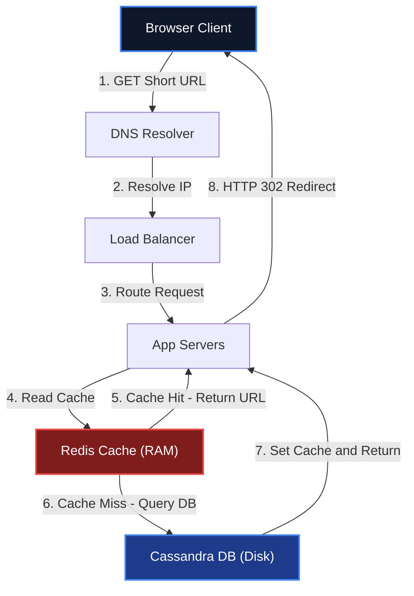
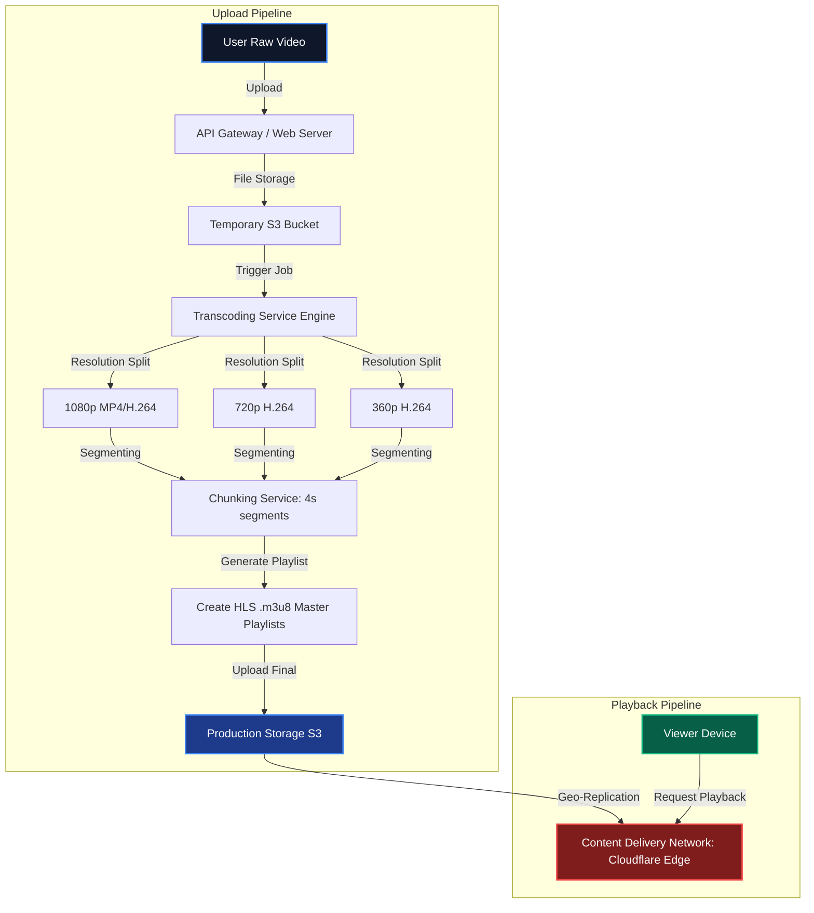
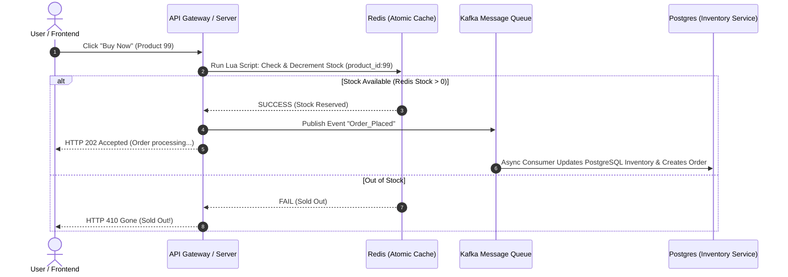

# 🌐 System Design Masterclass: 10-Year Architect Guide

স্বাগতম! এই হ্যান্ডবুকটি কোনো তাত্ত্বিক ডক নয়। এটি ১০+ বছরের রিয়েল-ওয়ার্ল্ড লার্জ স্কেল ডিস্ট্রিবিউটেড সিস্টেম আর্কিটেক্ট করার এক্সপেরিয়েন্স এবং প্রোডাকশন ফেইলিউর থেকে শেখা লেসন বুক। আমরা এখানে ২০টি ক্লাসিক ও মডার্ন সিস্টেম ডিজাইন শিখবো। 

শুধুমাত্র হাই-লেভেল ব্লক ডায়গ্রাম এঁকে আমরা থেমে থাকবো না। প্রতিটা টপিকের পেছনে **কীভাবে চিন্তা করতে হয় (Mental Framework)**, **ক্যালকুলেশন কীভাবে করতে হয় (Back-of-the-envelope Estimation)**, এবং **কোডে কীভাবে রিফ্লেক্ট করতে হয় (Practical Code Snippets)** — সবগুলো আমরা এই ইন্টারেক্টিভ গাইডে কাভার করবো।

---

## 🛠️ The 10-Year Architect's Framework

যেকোনো সিস্টেম ডিজাইন ইন্টারভিউ বা রিয়েল-ওয়ার্ল্ড প্রজেক্ট রিকোয়ারমেন্ট হ্যান্ডেল করার জন্য আমি এই **৫-ধাপের আর্কিটেকচারাল ফ্রেমওয়ার্ক** ব্যবহার করি। এটি আমাদের পুরো হ্যান্ডবুকের কোর স্ট্রাকচার হিসেবে কাজ করবে:


1. **Requirements Gathering (স্কোপ ডিটেকশন):** 
   - **Functional:** সিস্টেমটি কী কী কাজ করবে (যেমন: ইউজার ইউআরএল শর্ট করবে)।
   - **Non-Functional:** সিস্টেমের পারফরম্যান্স টার্গেট কী (High Availability, Low Latency, Read-Heavy vs Write-Heavy)।
2. **Back-of-the-envelope Estimation (ক্যাপাসিটি হিসাব):**
   - কত QPS (Queries Per Second) আসবে?
   - ১০ বছরে কত পিটাবাইট ডেটা স্টোর করতে হবে?
   - ব্যান্ডউইথ রিকোয়ারমেন্ট কেমন হবে?
3. **API & Data Model Design (চুক্তি ও স্কিমা):**
   - এপিআই এন্ডপয়েন্ট ডিজাইন (Input, Output, HTTP Status Codes)।
   - ডাটাবেস স্কিমা (SQL vs NoSQL) এবং কুয়েরি প্যাটার্ন।
4. **High-Level Design (বক্স আর্কিটেকচার):**
   - ক্লায়েন্ট থেকে ডাটাবেস পর্যন্ত এন্ড-টু-এন্ড ট্রাফিক ফ্লো (DNS, Load Balancer, CDN, API Gateway, App Servers, Cache, Database)।
5. **Deep Dive & Scaling Bottlenecks (সিনিয়র লেভেল সল্যুশন):**
   - সিঙ্গেল পয়েন্ট অফ ফেইলিউর (SPOF) রিমুভ করা।
   - ডিস্ট্রিবিউটেড লকিং, ক্যাশ স্ট্যাম্পিড, ডিবি শার্ডিং এবং ডাটা কনসিস্টেন্সি হ্যান্ডলিং।

---

## 📚 Table of Contents: The 20-Chapter Roadmap

আমরা প্রতিটা চ্যাপ্টারকে ইন্টারেক্টিভলি শেষ করবো। নিচের ইনডেক্স থেকে কারেন্ট প্রোগ্রেস ট্র্যাক করতে পারবে:

| Chapter | Topic | Status | Focus Core Concept |
| :--- | :--- | :---: | :--- |
| **01** | [URL Shortener (TinyURL)](#-chapter-01-url-shortener-tinyurl-scale-10b-links) | 🟢 **Active** | Snowflake ID, Base62 Encoding, Redis, DB Indexing |
| **02** | [YouTube & Netflix (Video Streaming)](#-chapter-02-youtube--netflix-video-streaming-platform) | 🟢 **Active** | Transcoding, CDN Edge, HLS/DASH Streaming, Blob Store |
| **03** | [High-Concurrency E-Commerce (Amazon)](#-chapter-03-high-concurrency-e-commerce-system) | 🟢 **Active** | Flash Sales, Redis Distributed Locks, Saga Pattern, Idempotency |
| **04** | WhatsApp & Messenger | 🔒 *Locked* | WebSockets, Message Gateway, Cassandra Store, Push Notifications |
| **05** | Uber & Grab (Ride-Sharing) | 🔒 *Locked* | Geospatial Indexing (Geohash/H3), Quadtree, Pub/Sub Engine |
| **06** | Twitter/X (News Feed & Timeline) | 🔒 *Locked* | Fanout-on-write vs Fanout-on-read, Push vs Pull |
| **07** | Ticketmaster (Ticketing Engine) | 🔒 *Locked* | High-Concurrency Booking, Distributed Locking, Queueing System |
| **08** | Google Drive / Dropbox | 🔒 *Locked* | Chunk-based uploads, Metadata Sync, Keep-Alive/Long Polling |
| **09** | Web Crawler (Search Engine Indexer) | 🔒 *Locked* | BFS Graph Traversal, Robots.txt Parser, Deduplication Pipeline |
| **10** | Distributed Notification System | 🔒 *Locked* | Priority Queues (RabbitMQ/Kafka), Rate Limiting, Idempotency |
| **11** | API Gateway & Distributed Rate Limiter | 🔒 *Locked* | Token Bucket Alg, Redis Lua Scripting, Edge Auth Integration |
| **12** | Airbnb (Hotel/Home Booking) | 🔒 *Locked* | Double Booking Prevention, Temporal Querying, Geo-search |
| **13** | Robinhood / Stock Trading Engine | 🔒 *Locked* | Matching Engine, LMAX Disruptor, In-memory State, Low Latency |
| **14** | Distributed Cache (Redis Internals) | 🔒 *Locked* | Replication, Sentinel, Clustering & Partitioning, Eviction (LRU) |
| **15** | Metrics & Monitoring System (Prometheus) | 🔒 *Locked* | Time Series DB (TSDB), Pull vs Push, Metrics Aggregation |
| **16** | Ad Click Aggregator | 🔒 *Locked* | Real-time Streaming, Apache Flink, Kafka, MapReduce |
| **17** | Auto-complete / Typeahead Search | 🔒 *Locked* | Trie Data Structure, Frequency Aggregation, Cache Optimization |
| **18** | Tinder / Geosocial Matchmaker | 🔒 *Locked* | Recommendation Engines, Geopoint Queries, Profile Caching |
| **19** | Distributed Unique ID Generator | 🔒 *Locked* | Snowflake Algorithm, Ticket Server, UUID Collisions |
| **20** | Stripe-like Payment Integration Engine | 🔒 *Locked* | Ledger Reconciliation, Retry Policies, Double Entry Bookkeeping |

> [!TIP]
> আমরা প্রথম ৩টি কোর চ্যাপ্টার সম্পূর্ণ প্রডাকশন-গ্রেড আর্কিটেকচার ও কোডসহ বিস্তারিত নিচে যুক্ত করেছি। পরবর্তী চ্যাপ্টারগুলো আমরা একের পর এক রিয়েল-টাইম আলোচনা করে এবং রিকোয়ারমেন্ট কাস্টমাইজ করে আনলক করবো!

---

## 📖 Chapter 01: URL Shortener (TinyURL) [Scale: 10B Links]

এটি সিস্টেম ডিজাইনের "Hello World"। তবে এর গভীরে গেলে ডিস্ট্রিবিউটেড আইডির চমৎকার ইঞ্জিনিয়ারিং বের হয়ে আসে।

### ১. রিকোয়ারমেন্টস (Scope)
- **Functional:**
  - ইউজার একটি লং ইউআরএল সাবমিট করলে সিস্টেম একটি শর্ট ইউআরএল রিটার্ন করবে (যেমন: `https://tiny.com/aB3x9Z`)।
  - শর্ট ইউআরএলে হিট করলে ইউজার ইনস্ট্যান্টলি আসল লং ইউআরএলে রিডাইরেক্ট হবে।
  - কাস্টম অ্যালিয়াস দিতে পারবে (ঐচ্ছিক)।
  - শর্ট লিংকের এক্সপায়ারি ডেট থাকবে।
- **Non-Functional:**
  - **High Availability:** রিডাইরেকশন কোনোভাবেই ফেইল করা যাবে না (৯৯.৯৯% আপটাইম)।
  - **Low Latency:** রিডাইরেকশন লেটেন্সি < ৫০ মিলি-সেকেন্ড হতে হবে।
  - **Write-Heavy / Read-Heavy:** এটি অত্যন্ত **Read-Heavy** সিস্টেম (Read:Write Ratio = 100:1)।

### ২. Back-of-the-envelope Estimation
ধরুন, আমাদের সিস্টেমে প্রতি মাসে **১০০ মিলিয়ন (100M)** নতুন শর্ট লিংক তৈরি হয়।
- **Write QPS:**
  * `Write QPS = 100,000,000 / (30 days * 24 hours * 3600 seconds) ≈` **40 writes/sec**
- **Read QPS (100:1 Ratio):**
  * `Read QPS = 40 writes/sec * 100 =` **4,000 reads/sec**
- **Storage for 10 Years:**
  প্রতিটি রেকর্ড (Long URL, Short URL, ID, Created_At, Expire_At) এভারেজ ৫০০ বাইট স্টোরেজ নেয়।
  * `Total Records = 100M * 12 months * 10 years =` **12 Billion records**
  * `Total Storage = 12B * 500 bytes ≈` **6 Terabytes**
- **Cache Memory (80-20 Rule):**
  ডেইলি ট্রাফিকের ২০% হট লিংক ক্যাশে রাখবো।
  * `Daily Reads = 4,000 reads/sec * 86,400 seconds ≈` **345 Million reads/day**
  * `Memory Required = 345M * 20% hot links * 500 bytes ≈` **34.5 GB**

### ৩. API & Database Schema Design
আমরা দুটি সিম্পল REST এপিআই ডিজাইন করবো:
- **Create Short Link:**
  `POST /api/v1/shorten`
  ```json
  // Request
  {
    "long_url": "https://medium.com/engineering/how-we-scaled-our-databases-to-10m-users",
    "custom_alias": "dbscale", // Optional
    "expires_at": "2030-01-01T00:00:00Z" // Optional
  }
  // Response (201 Created)
  {
    "short_url": "https://tiny.com/dbscale",
    "short_key": "dbscale"
  }
  ```
- **Redirect Link:**
  `GET /{short_key}` -> HTTP status `302 Found` (Redirect)
  *(নোট: আমরা 301 Permanent Redirect ব্যবহার করবো না, কারণ 302 ব্যবহার করলে প্রতিটা হিট আমাদের ব্যাকএন্ড সার্ভারে আসে, যার ফলে আমরা নিখুঁত ক্লিক অ্যানালিটিক্স ট্র্যাক করতে পারি। 301 দিলে ব্রাউজার নিজের ক্যাশে রেখে দেয় এবং ব্যাকএন্ডে রিকোয়েস্ট আসে না।)*

#### Database Selection & Schema
যেহেতু আমাদের কোনো কমপ্লেক্স রিলেশন বা জয়েন কোয়েরি নেই এবং সিস্টেমে বিলিয়ন বিলিয়ন রো স্টোর হবে, একটি নোএসকিউএল কী-ভ্যালু বা ওয়াইড-কলাম ডাটাবেস (যেমন **Cassandra** বা **DynamoDB**) স্টোরেজ ও হরাইজন্টাল স্কেলিংয়ের জন্য বেস্ট।

```sql
-- Conceptual Schema (Cassandra/Postgres representation)
CREATE TABLE url_mappings (
    short_key VARCHAR(10) PRIMARY KEY,
    long_url VARCHAR(2048) NOT NULL,
    created_at TIMESTAMP,
    expires_at TIMESTAMP,
    user_id VARCHAR(64)
);
```

### ৪. High-Level Architecture
সিস্টেমের হাই-লেভেল ট্রাফিক ফ্লো নিচে চিত্রায়িত করা হলো:



### ৫. Deep Dive: Unique ID / Key Generator Strategy
ইউনিক শর্ট কী (যেমন `aB3x9Z`) কীভাবে জেনারেট করব? এটিই ইন্টারভিউয়ের মূল আকর্ষণ।
আমরা যদি **Base62 Encoding** (`[a-z, A-Z, 0-9]` মোট ৬২টি ক্যারেক্টার) ব্যবহার করি, তবে ৭ ক্যারেক্টারের ইউনিক কী দিয়ে আমরা কতগুলো ইউনিক কম্বিনেশন তৈরি করতে পারবো?
* `62⁷ ≈ 3.5 Trillion unique keys`
যা আমাদের ১০ বছরের টার্গেটের (১২ বিলিয়ন) চেয়ে অনেক বেশি!

#### অপশন A: MD5 / Cryptographic Hash (ফেইলর প্রন)
লং ইউআরএলকে MD5 দিয়ে হ্যাশ করে প্রথম ৭ ক্যারেক্টার নেওয়া।
- **সমস্যা:** হ্যাশ কলিশন (Collision) হবেই। ২ জন ইউজার ভিন্ন ডোমেইন দিলে একই শর্ট কি জেনারেট হতে পারে। এটি হ্যান্ডেল করতে ডাটাবেসে চেক করতে হবে, যা অত্যন্ত স্লো।

#### অপশন B: Base62 Conversion with Auto-Increment (স্কেলিং প্রবলেম)
ডাটাবেসের অটো-ইনক্রিমেন্ট আইডি (যেমন ১, ২, ৩...) নিয়ে তাকে Base62-তে কনভার্ট করা।
- **সমস্যা:** ডিস্ট্রিবিউটেড ডাটাবেসে মাল্টিপল নোড থাকলে অটো-ইনক্রিমেন্ট কনফ্লিক্ট করবে। সিঙ্গেল ডাটাবেস রাখলে রাইট পারফরম্যান্সে Bottleneck তৈরি হবে।

#### অপশন C: Distributed Snowflake ID Generator (Staff Architect Solution)
একটি ডেডিকেটেড আইডি জেনারেট সার্ভিস ব্যবহার করা।
যেমন **Twitter Snowflake** যা ৬৪ বিটের ইউনিক আইডি জেনারেট করে:
- **Timestamp (41 bits):** এপোচ টাইম মিলি-সেকেন্ডে।
- **Machine/Worker ID (10 bits):** ১০২৪টি আলাদা সার্ভার নোড হ্যান্ডেল করতে পারে।
- **Sequence Number (12 bits):** প্রতি সার্ভার প্রতি মিলি-সেকেন্ডে ৪০৯৬টি ইউনিক আইডি তৈরি করতে পারে।

আমরা এই ইউনিক ৬৪-বিট ইন্টিজার আইডিটি জেনারেট করে সরাসরি **Base62**-তে এনকোড করে ফেলবো। যেহেতু আইডি ইউনিক, তাই কোনো ডুপ্লিকেট কি জেনারেট হবে না এবং ডাটাবেস কলিশন চেক করার জিরো ওভারহেড!

### 💻 Practical TypeScript Implementation
নিচে একটি প্রোডাকশন-রেডি Base62 এনকোডার এবং ডিস্ট্রিবিউটেড আইডি কনভার্টার কোড দেওয়া হলো:

```typescript
// utils/base62.ts
export class Base62Encoder {
  private static readonly CHARS = "abcdefghijklmnopqrstuvwxyzABCDEFGHIJKLMNOPQRSTUVWXYZ0123456789";
  private static readonly BASE = 62;

  /**
   * ইন্টিজার আইডিকে Base62 স্ট্রিংয়ে কনভার্ট করে
   */
  public static encode(num: bigint): string {
    if (num === 0n) return this.CHARS[0];
    
    let result = "";
    let temp = num;
    
    while (temp > 0n) {
      const remainder = Number(temp % BigInt(this.BASE));
      result = this.CHARS[remainder] + result;
      temp = temp / BigInt(this.BASE);
    }
    
    return result;
  }

  /**
   * Base62 স্ট্রিংকে ডিকোড করে অরিজিনাল ইন্টিজারে ব্যাক করে
   */
  public static decode(str: string): bigint {
    let result = 0n;
    
    for (let i = 0; i < str.length; i++) {
      const charCodeIndex = this.CHARS.indexOf(str[i]);
      if (charCodeIndex === -1) {
        throw new Error(`Invalid Base62 character: ${str[i]}`);
      }
      result = result * BigInt(this.BASE) + BigInt(charCodeIndex);
    }
    
    return result;
  }
}

// Example usage mimicking Snowflake ID Conversion
const dummySnowflakeId = 17849302919323146n; // 64-bit distributed integer
const shortKey = Base62Encoder.encode(dummySnowflakeId);
console.log(`Generated Short Key: ${shortKey}`); // Output: e.g., 'C4g6yZ'
```

---

## 📖 Chapter 02: YouTube & Netflix (Video Streaming Platform)

ভিডিও স্ট্রিমিং আর্কিটেকচার সাধারণ ওয়েব অ্যাপের চেয়ে সম্পূর্ণ আলাদা। এখানে রাইট ট্রাফিক (ভিডিও আপলোড) এবং রিড ট্রাফিক (প্লেব্যাক) সম্পূর্ণ ভিন্ন পাইপলাইনে চলে।

### ১. রিকোয়ারমেন্টস (Scope)
- **Functional:**
  - ইউজার ভিডিও আপলোড করতে পারবে।
  - ইউজার যেকোনো ডিভাইসে (মোবাইল, ডেস্কটপ, লো-ব্যান্ডউইথ) স্মুথলি ভিডিও প্লে করতে পারবে।
  - ভিউ কাউন্ট, লাইক, এবং রিয়েল-টাইম কমেন্ট সিস্টেম থাকবে।
- **Non-Functional:**
  - **High Scalability:** লাখ লাখ ইউজার একসাথে ভিডিও দেখবে (High Concurrent Viewers)।
  - **Zero Buffer (Low Latency):** প্লেব্যাক স্টার্ট হতে দেরি হওয়া যাবে না।
  - **Reliable Storage:** হাই-কোয়ালিটি ভিডিও ড্রপ বা লস করা যাবে না।

### ২. Video Transcoding & Playback Pipeline (ভিজুয়ালাইজেশন)

ভিডিও আপলোডের পর র ফাইলটি সরাসরি প্লে করা যায় না। এটিকে শত শত ফরম্যাট ও রেজোলিউশনে কনভার্ট করতে হয়।



### 🎯 Core Architecture Breakdown

#### A. Video Upload & Transcoding (অ্যাসিনক্রোনাস প্রসেস)
1. **Raw Upload:** ইউজার ভিডিও আপলোড করলে তা প্রথমে একটি টেম্পোরারি স্টোরেজে যায়।
2. **Transcoding (ভিডিও রূপান্তর):** র ফাইলটিকে বিভিন্ন বিটরেট (Bitrate) এবং রেজোলিউশনে (360p, 720p, 1080p, 4K) কনভার্ট করা হয়।
3. **Chunking (টুকরো করা):** পুরো ২ ঘন্টার মুভি একসাথে লোড করা বোকামি। আমরা প্রতিটা ভিডিওকে ছোট ছোট ৪-১০ সেকেন্ডের ফিজিক্যাল টুকরো বা **Chunks**-এ বিভক্ত করি।
4. **HLS & DASH (স্ট্রিমিং প্রোটোকল):** 
   - **HLS (HTTP Live Streaming - Apple)** বা **DASH (Dynamic Adaptive Streaming over HTTP)** প্রোটোকল ব্যবহার করা হয়।
   - একটি **Master Manifest file (`.m3u8` বা `.mpd`)** তৈরি করা হয় যা ট্র্যাক রাখে কোন রেজোলিউশনের কোন চঙ্ক ফাইলের পাথ কোথায়।

#### B. Dynamic Playback (Adaptive Bitrate Streaming)
- ক্লায়েন্ট ডিভাইস যখন ভিডিও রিকোয়েস্ট করে, সে প্রথমে `.m3u8` মাস্টার প্লেলিস্ট ফাইলটি লোড করে।
- ব্রাউজার ইউজারের ইন্টারনেটের স্পিড মেপে ডিসিশন নেয় সে কোন চঙ্ক ডাউনলোড করবে।
- স্পিড ভালো থাকলে সে অটোমেটিক `1080p_chunk_001.ts` ফেচ করে। মাঝপথে নেট ড্রপ করলে সে বাফারিং এড়াতে সাথে সাথে পরবর্তী চঙ্ক `360p_chunk_002.ts` রিকোয়েস্ট করে। একেই বলে **Adaptive Bitrate Streaming**।

### 🚀 Senior Scaling Hacks: Netflix Cache System
- **CDN Edge Placement:** নেটফ্লিক্স বা ইউটিউব ক্লাউড থেকে সরাসরি ইউজারকে ভিডিও দেয় না। তারা বিশ্বজুড়ে বিভিন্ন আইএসপি (ISP) অফিসের ভেতরে নিজেদের ক্যাশ স্টোরেজ বা হার্ডওয়্যার বক্স (যেমন **Netflix Open Connect Appliance**) ফ্রিতে বসিয়ে দেয়।
- এর ফলে, আপনার এলাকায় যখন কেউ কোনো পপুলার সিরিজ দেখে, তা সরাসরি আপনার লোকাল আইএসপির ভেতরে থাকা স্টোরেজ থেকে ক্যাশড হয়ে লোড হয়, যার ফলে কোনো ব্যাকবোন ইন্টারনেট ক্যাবল বা স্যাটেলাইট ব্যান্ডউইথ খরচ হয় না এবং বাফারিং লেটেন্সি হয় ০ মিলি-সেকেন্ড!

---

## 📖 Chapter 03: High-Concurrency E-Commerce System

ই-কমার্স আর্কিটেকচারের সবচেয়ে কঠিন চ্যালেঞ্জ হলো **Flash Sales (ফ্ল্যাশ সেল)** হ্যান্ডেল করা। যখন ১০টি আইটেমের জন্য ১০ লাখ ইউজার একসাথে বাই বাটনে ক্লিক করে, তখন ডাটাবেসে কনকারেন্ট ট্রানজেকশন সামলানো এবং ডুপ্লিকেট পেমেন্ট ও ওভারসেলিং রোধ করাই আসল কাজ।

### ১. রিকোয়ারমেন্টস (Scope)
- **Functional:**
  - প্রোডাক্ট ক্যাটালগ ও সার্চ।
  - শপিং কার্ট এবং চেকআউট সার্ভিস।
  - ফ্ল্যাশ সেল ও ডিসকাউন্ট হ্যান্ডলিং।
  - পেমেন্ট ও ইনভেন্টরি অটো-আপডেট।
- **Non-Functional:**
  - **Strict Consistency:** ১০টি প্রোডাক্টের জায়গায় কোনোভাবেই ১১টি অর্ডার নেওয়া যাবে না (No Overselling)।
  - **High Concurrency:** ফ্ল্যাশ সেলের সময় লাখ লাখ রিকোয়েস্ট হ্যান্ডেল করা।
  - **Payment Idempotency:** ইউজারের কার্ড থেকে যাতে ২ বার চার্জ না কাটা হয়।

### 🛠️ Flash Sale: Preventing Overselling
যদি আমরা সরাসরি ডাটাবেসে রিড-রাইট করে ইনভেন্টরি চেক করি:
```sql
-- Disaster Prone Transaction
SELECT quantity FROM inventory WHERE product_id = 99; -- Returns 1
-- App server logic: if quantity > 0, then:
UPDATE inventory SET quantity = quantity - 1 WHERE product_id = 99;
```
মাল্টিপল থ্রেড বা সার্ভার নোড একসাথে এটি রান করলে **Race Condition** হবে। একাধিক ইউজার একই ভ্যালু `1` রিড করবে এবং সবাই প্রোডাক্ট কিনে ফেলবে, যার ফলে ইনভেন্টরি মাইনাস হয়ে যাবে (Overselling)।

#### Solution A: Database Optimistic Locking (মাঝারি লোডের জন্য)
```sql
UPDATE inventory 
SET quantity = quantity - 1 
WHERE product_id = 99 AND quantity > 0;
```
এই কুয়েরিতে ডাটাবেস রো-লেভেল লক নিয়ে চেক করবে এবং একের বেশি ওভারসেল হতে দেবে না। তবে ডেটাবেস ডিস্ক কুয়েরি অনেক বেশি স্লো হওয়ায় হাই-কনকারেন্সিতে ডাটাবেস সম্পূর্ণ জ্যাম বা লকআপ হয়ে ক্র্যাশ করবে।

#### Solution B: In-Memory Redis Lua Distributed Lock (Staff Architect Standard)
ডিস্ক ডাটাবেসে হিট করার আগেই আমরা **Redis** ব্যবহার করে মেমোরিতে ইনভেন্টরি চেক ও ডিডাকশন করবো। যেহেতু Redis সিঙ্গেল-থ্রেডেড এবং অত্যন্ত ফাস্ট (>100K ops/sec), আমরা একটি **Atomic Lua Script** দিয়ে চেক ও ডিক্রিমেন্ট একসাথে হ্যান্ডেল করব:



### 💻 Production-Grade Redis Lua Script for Inventory Deduction
এই স্ক্রিপ্টটি Redis মেমোরিতে রান করে এবং রেস কন্ডিশন ছাড়া ১ মিলি-সেকেন্ডে ইনভেন্টরি বুক করে:

```typescript
import Redis from "ioredis";

const redis = new Redis();

/**
 * Atomic Lua script to safety deduct stock in Redis without race conditions
 */
const deductStockLua = `
  local stockKey = KEYS[1]
  local demand = tonumber(ARGV[1])
  
  local currentStock = tonumber(redis.call('get', stockKey))
  
  if not currentStock then
    return -1 -- Code indicating product key not found in Redis
  end
  
  if currentStock >= demand then
    redis.call('decrby', stockKey, demand)
    return currentStock - demand -- Return new remaining stock
  else
    return -2 -- Code indicating insufficient stock
  end
`;

export async function purchaseProduct(productId: string, quantity: number): Promise<boolean> {
  const stockKey = `stock:product:${productId}`;
  
  // Lua script রেজিস্টার ও রান করা (Atomic action)
  const result = await redis.eval(deductStockLua, 1, stockKey, quantity) as number;
  
  if (result >= 0) {
    console.log(`Stock successfully reserved! Remaining: ${result}`);
    // এখানে আমরা Kafka/RabbitMQ কিউতে মেসেজ পুশ করবো ডাটাবেসে অ্যাসিনক্রোনাস রাইটের জন্য
    return true;
  } else if (result === -1) {
    console.error("Error: Product is not loaded in Redis Cache!");
    return false;
  } else {
    console.warn("Out of Stock! Purchase failed.");
    return false;
  }
}
```

---

## 🔒 Chapters 04 - 20: Syllabus Blueprint (Ready to Unlock)

বাকি ১৭টি চ্যাপ্টার সম্পূর্ণ ইন্টারেক্টিভ লার্নিংয়ের জন্য সাজানো হয়েছে। আপনি যে টপিকটি শিখতে চান, জাস্ট আমাকে মেনশন করলেই আমরা সেটির রিকোয়ারমেন্ট অ্যানালাইসিস, ক্যাপাসিটি ক্যালকুলেশন, মারমেইড আর্কিটেকচার ডায়াগ্রাম এবং প্র্যাক্টিক্যাল কোডসহ ডিপ-ডাইভ করে চ্যাপ্টারটি আনলক করে ফেলবো!

যেমন:
- **চ্যাপ্টার ০৪ (WhatsApp):** শিখবো কীভাবে WebSockets এবং Redis Pub/Sub দিয়ে রিয়েল-টাইম মেসেজিং গেটওয়ে তৈরি করতে হয় এবং Cassandra বা ScyllaDB-তে কীভাবে ক্লিক-টু-রিড লেটেন্সি কমানো যায়।
- **চ্যাপ্টার ০৫ (Uber):** বুঝবো কীভাবে Google maps-এর মতো রিয়েল-টাইম ড্রাইভারদের Geolocation ট্র্যাক করা যায় **H3 Geohash Grid** বা **Quadtree** ডাটা স্ট্রাকচার দিয়ে।
- **চ্যাপ্টার ০৬ (Twitter):** জানবো কেন সেলিব্রিটিদের টুইট ফিড এবং আমাদের নরমাল ইউজারদের টুইট ফিড তৈরিতে সম্পূর্ণ আলাদা **Push vs Pull (Fanout)** আর্কিটেকচার ব্যবহার করতে হয়।

---

> **💡 পরবর্তী অ্যাকশন:** আপনি কি আমাদের এই ২০টি টপিকের রোডম্যাপ এপ্রুভ করছেন? আমরা কি এখন **Chapter 04 (WhatsApp/Messenger Real-time System)** নিয়ে ডিপ-ডাইভ করে সেটি আনলক করবো, নাকি এর মধ্য থেকে আপনার কোনো ফেভারিট কাস্টম টপিক শুরু করবো? Let's discuss and design!
