# 🚀 আপকামিং টেকনিক্যাল কন্টেন্ট ও রোডম্যাপ (সম্পূর্ণ ডিরেক্টরি)

স্বাগতম! আমাদের **Core Kernel Hub**-কে বিশ্বমানের এবং স্টাফ-আর্কিটেক্ট লেভেলের টেকনিক্যাল রিসোর্সে রূপান্তর করতে আমরা আমাদের রোডম্যাপকে আরও বিস্তৃত করেছি। আপনার চাহিদা অনুযায়ী এখানে **২০টি কোর ডোমেইনে ৬০টি অ্যাডভান্সড টেকনিক্যাল টপিকের** একটি অত্যন্ত ইন-ডেপ্থ ও সম্পূর্ণ গাইডলাইন দেওয়া হলো।

নিচে প্রতিটি টপিকের বিস্তারিত বিবরণ, প্রয়োজনীয়তা এবং রোডম্যাপ টাইমলাইন আলোচনা করা হলো।

---

## 🗺️ কন্টেন্ট রিলিজ রোডম্যাপ (6-Phase System Roadmap)

আমাদের আসন্ন কন্টেন্টগুলো কীভাবে ধাপে ধাপে রিলিজ করা হবে, তার একটি ৬-ফেজ আর্কিটেকচারাল ফ্লো নিচে চিত্রায়িত করা হলো:

```mermaid
flowchart TD
    subgraph Phase1 [Phase 1: Core backend & Systems]
        T1["Distributed Caching & Redis Internals"]
        T2["Message Queues & Event-Driven"]
        T3["Observability & Tracing (OpenTelemetry)"]
    end

    subgraph Phase2 [Phase 2: Database & OS Internals]
        T4["DB Indexing Internals (LSM, B+ Trees)"]
        T5["Linux Process & CFS CPU Scheduler"]
        T6["Garbage Collection (JVM, V8, Go)"]
    end

    subgraph Phase3 [Phase 3: Network & Infrastructure]
        T7["Systems Networking & HTTP/3 QUIC"]
        T8["Containerization Internals (Namespaces, Cgroups)"]
        T9["GitOps CD (ArgoCD & Terraform State)"]
    end

    subgraph Phase4 [Phase 4: Security & SRE]
        T10["Modern IAM, OAuth2 & JWT Security"]
        T11["Chaos Engineering & Load Testing (k6)"]
        T12["Site Reliability Engineering (SRE, SLOs)"]
    end

    subgraph Phase5 [Phase 5: Data Eng & AI Infrastructure]
        T13["Data Warehousing & OLAP (ClickHouse)"]
        T14["MLOps & Inference Serving (Triton)"]
        T15["Micro-Frontends & Rendering Engines"]
    end

    subgraph Phase6 [Phase 6: Web3, IoT, Game Engines & Search]
        T16["Web3 & ZK Rollups Architecture"]
        T17["Embedded Systems & RTOS Internals"]
        T18["Game Engine Loops & Collision Physics"]
        T19["Vector Search, RAG & Lucene Internals"]
        T20["Multi-Tenant SaaS Architecture"]
    end

    Phase1 --> Phase2
    Phase2 --> Phase3
    Phase3 --> Phase4
    Phase4 --> Phase5
    Phase5 --> Phase6

    style T1 fill:#022c22,stroke:#10b981,stroke-width:2px,color:#fff
    style T2 fill:#022c22,stroke:#10b981,stroke-width:2px,color:#fff
    style T3 fill:#022c22,stroke:#10b981,stroke-width:2px,color:#fff
    
    style T4 fill:#172554,stroke:#3b82f6,stroke-width:2px,color:#fff
    style T5 fill:#172554,stroke:#3b82f6,stroke-width:2px,color:#fff
    style T6 fill:#172554,stroke:#3b82f6,stroke-width:2px,color:#fff

    style T7 fill:#3b0764,stroke:#a855f7,stroke-width:2px,color:#fff
    style T8 fill:#3b0764,stroke:#a855f7,stroke-width:2px,color:#fff
    style T9 fill:#3b0764,stroke:#a855f7,stroke-width:2px,color:#fff

    style T10 fill:#4c0519,stroke:#f43f5e,stroke-width:2px,color:#fff
    style T11 fill:#4c0519,stroke:#f43f5e,stroke-width:2px,color:#fff
    style T12 fill:#4c0519,stroke:#f43f5e,stroke-width:2px,color:#fff

    style T13 fill:#451a03,stroke:#f97316,stroke-width:2px,color:#fff
    style T14 fill:#451a03,stroke:#f97316,stroke-width:2px,color:#fff
    style T15 fill:#451a03,stroke:#f97316,stroke-width:2px,color:#fff

    style T16 fill:#1e1b4b,stroke:#818cf8,stroke-width:2px,color:#fff
    style T17 fill:#1e1b4b,stroke:#818cf8,stroke-width:2px,color:#fff
    style T18 fill:#1e1b4b,stroke:#818cf8,stroke-width:2px,color:#fff
    style T19 fill:#1e1b4b,stroke:#818cf8,stroke-width:2px,color:#fff
    style T20 fill:#1e1b4b,stroke:#818cf8,stroke-width:2px,color:#fff
```

---

## 📚 টেকনিক্যাল কন্টেন্ট ডিরেক্টরি (২০টি কোর ডোমেইন)

### ১. ডিস্ট্রিবিউটেড সিস্টেমস ও আর্কিটেকচার (Distributed Systems)
*   **১.১ Distributed Caching & Redis Internals (`distributed-caching`):**
    *   **বিস্তারিত:** Cache invalidation strategies, Cache-Aside vs Write-Through, Redis Single-threaded event loop, RDB/AOF persistence, Redis Cluster & Sentinel architecture.
*   **১.২ Message Queues & Event-Driven Architecture (`message-queues`):**
    *   **বিস্তারিত:** Kafka vs RabbitMQ vs SQS, Event Sourcing, CQRS, Message Delivery Guarantees (At-least-once, Exactly-once), Backpressure handling.
*   **১.৩ Distributed Transactions & Consensus Algorithms (`distributed-transactions`):**
    *   **বিস্তারিত:** 2PC (Two-Phase Commit), SAGA Pattern (Orchestration vs Choreography), Raft and Paxos consensus algorithms.

---

### ২. ব্যাকএন্ড ইঞ্জিনিয়ারিং ও কনকারেন্সি (Backend Engineering)
*   **২.১ High-Concurrency & Asynchronous I/O Models (`async-io`):**
    *   **বিস্তারিত:** Thread-per-request model vs Event Loop (Node.js/V8), Go Goroutines & GMP Scheduler, Java Virtual Threads (Project Loom).
*   **২.২ Background Workers & Task Queue Internals (`background-workers`):**
    *   **বিস্তারিত:** BullMQ, Celery, Sidekiq mechanics, Delayed queues, Retry mechanisms, Dead Letter Queues (DLQ).
*   **২.৩ Rate Limiting & Traffic Shaping (`rate-limiting`):**
    *   **বিস্তারিত:** Token Bucket, Leaky Bucket, Sliding Window Log, Sliding Window Counter algorithms, Scaling rate limiters with Redis.

---

### ৩. ডাটাবেজ আর্কিটেকচার ও স্টোরেজ ইঞ্জিন (Database Systems)
*   **৩.১ Database Indexing Internals (`db-indexing`):**
    *   **বিস্তারিত:** B-Trees, B+ Trees, LSM Trees (Cassandra/RocksDB), Inverted Indexes (Elasticsearch), Hashing Indexes.
*   **৩.২ Database Transactions, ACID & Isolation Levels (`db-transactions`):**
    *   **বিস্তারিত:** Read Uncommitted, Read Committed, Repeatable Read, Serializable, Concurrency control (MVCC, 2PL - Two-Phase Locking), Write-Ahead Log (WAL).
*   **৩.৩ Sharding, Partitioning & Replication (`db-sharding`):**
    *   **বিস্তারিত:** Horizontal vs Vertical partitioning, Consistent Hashing, Primary-Replica replication (Sync vs Async), Multi-Primary, Split-Brain problem.

---

### ৪. সিকিউরিটি ও ক্রিপ্টোগ্রাফি ইন্টারনালস (Web Security)
*   **৪.১ Modern Identity & Access Management (`iam-auth`):**
    *   **বিস্তারিত:** OAuth 2.0 flows, OpenID Connect (OIDC), JWT tokens (best practices & hijacking prevention), Session-based auth vs Token-based auth.
*   **৪.২ Cryptography Internals for Developers (`cryptography`):**
    *   **বিস্তারিত:** HTTPS/TLS 1.3 handshake protocol, Symmetric (AES) vs Asymmetric (RSA/ECC) encryption, Password Hashing (Bcrypt, Argon2, PBKDF2).
*   **৪.৩ Top OWASP Vulnerabilities & Mitigation (`owasp-security`):**
    *   **বিস্তারিত:** SQL Injection, Cross-Site Scripting (XSS), Cross-Site Request Forgery (CSRF), SSRF, CORS policy details.

---

### ৫. ডেভঅপ্স ও ক্লাউড-নেティブ ইনফ্রাস্ট্রাকচার (DevOps & Infrastructure)
*   **৫.১ Infrastructure as Code (IaC) & Terraform (`terraform-iac`):**
    *   **বিস্তারিত:** Declarative vs Imperative IaC, Terraform State Management, State Locking, Terraform Lifecycle (Plan, Apply, Destroy).
*   **৫.২ GitOps & Continuous Delivery (`gitops-cd`):**
    *   **বিস্তারিত:** Push-based vs Pull-based CD, ArgoCD integration, Kubernetes GitOps controller, Canary & Blue-Green deployment strategies.
*   **৫.৩ Serverless & Edge Computing Architecture (`serverless-edge`):**
    *   **বিস্তারিত:** AWS Lambda, Cloudflare Workers internals, Cold starts optimization, Edge database replication.

---

### ৬. অপারেটিং সিস্টেম ও লো-লেভেল কার্নেল (Operating Systems)
*   **৬.১ Garbage Collection & Memory Reclamation (`garbage-collection`):**
    *   **বিস্তারিত:** Mark-and-Sweep, Reference Counting, Generational Garbage Collection (V8, JVM), Go's Tri-color Mark-Sweep GC.
*   **৬.২ Linux Process Management & System Calls (`linux-processes`):**
    *   **বিস্তারিত:** Fork, Exec, Wait system calls, Process vs Thread, Zombie and Orphan processes, CPU Scheduling, Linux CFS (Completely Fair Scheduler).
*   **৬.৩ Compilers & Interpreter Internals (`compilers-interpreters`):**
    *   **বিস্তারিত:** Lexical Analysis, Parsing (AST generation), Compilation vs Interpretation, Just-in-Time (JIT) compilation (V8 engine).

---

### ৭. নেটওয়ার্কিং ও প্রোটোকল ইঞ্জিনিয়ারিং (Systems Networking)
*   **৭.১ TCP/IP Protocol Suite & Optimization (`tcp-internals`):**
    *   **বিস্তারিত:** TCP Handshake & Connection states, Sliding Window, Congestion Control Algorithms (BBR, CUBIC), TCP Window Scaling, Head-of-Line (HoL) blocking.
*   **৭.২ HTTP/3 & QUIC Transport Protocol (`http3-quic`):**
    *   **বিস্তারিত:** QUIC connection establishment, UDP-based reliable transport, connection migration, stream multiplexing without HoL.
*   **৭.৩ DNS & Anycast Routing Architecture (`dns-anycast`):**
    *   **বিস্তারিত:** Recursive vs Iterative resolution, DNS Caching layers, Anycast routing mechanics, DNSSEC, GeoDNS optimization.

---

### ⒏ কন্টেইনারাইজেশন ও স্যান্ডবক্সিং (Containerization & Sandbox)
*   **৮.১ Container Runtimes & Docker Internals (`container-internals`):**
    *   **বিস্তারিত:** Linux Namespaces (PID, Mount, Net), Control Groups (cgroups), OverlayFS (Union File System), OCI Runtime Spec (runc vs containerd).
*   **৮.২ gVisor & Firecracker MicroVMs (`microvms`):**
    *   **বিস্তারিত:** Secure multi-tenancy, gVisor syscall interception, Firecracker lightweight virtualization (KVM), cold boot time optimization.
*   **৮.৩ WebAssembly (Wasm) at the Edge (`wasm-edge`):**
    *   **বিস্তারিত:** Sandboxing outside browsers, WASI (WebAssembly System Interface), Wasmtime runtime, cold-start reduction in edge serverless.

---

### ⒐ সাইট রিলায়েবিলিটি ইঞ্জিনিয়ারিং (SRE & Observability)
*   **৯.১ Observability, Monitoring & Distributed Tracing (`observability-monitoring`):**
    *   **বিস্তারিত:** Metrics (Prometheus), Logs (ELK/Loki), Traces (OpenTelemetry, Jaeger), Pull vs Push metric scraping, Trace ID & Span ID propagation.
*   **৯.২ SRE Core Concepts: SLAs, SLOs, and SLIs (`sre-reliability`):**
    *   **বিস্তারিত:** Defining target availability, measuring SLIs, calculating Error Budgets, and alerting strategies based on budget burn-rate.
*   **৯.৩ Disaster Recovery & Multi-Region Failover (`disaster-recovery`):**
    *   **বিস্তারিত:** RTO and RPO metrics, Active-Active vs Active-Passive database configurations, DNS-based routing failover, Split-Brain prevention.

---

### 🔟 ডাটা ইঞ্জিনিয়ারিং ও অ্যানালিটিক্স পাইপলাইন (Data Engineering)
*   **১০.১ ETL/ELT Streaming Pipelines (`data-streaming`):**
    *   **বিস্তারিত:** Batch processing vs Stream processing, Apache Spark execution plan, Apache Flink stateful stream processing, event time vs processing time.
*   **১০.২ Data Warehouses & OLAP Storage Engines (`olap-clickhouse`):**
    *   **বিস্তারিত:** Row-oriented vs Column-oriented databases, ClickHouse columnar storage internals, Snowflake cloud-native architecture, compression algorithms.
*   **১০.৩ Data Lakes & Table Formats (`data-lakes`):**
    *   **বিস্তারিত:** Apache Iceberg, Delta Lake transactional storage, ACID transactions on object storage, schema evolution, time travel query.

---

### 11. টেস্টিং, পারফরম্যান্স ও ক্যাওস ইঞ্জিনিয়ারিং (Quality Engineering)
*   **১১.১ Distributed Load & Stress Testing (`load-testing`):**
    *   **বিস্তারিত:** Load generation engine architecture, writing performance tests using k6 and Locust, analyzing p95/p99 latency spikes, detecting memory leaks.
*   **১১.২ Chaos Engineering Internals (`chaos-engineering`):**
    *   **বিস্তারিত:** Netflix Chaos Monkey, injecting network latencies, simulating network partition split, automated recovery testing, chaos experimentation in production.
*   **১১.৩ API Contract Testing & Mocking (`contract-testing`):**
    *   **বিস্তারিত:** Consumer-driven contract testing, Pact framework internals, API decoupling validation, stubbing dynamic downstream microservices.

---

### 12. মডার্ন ফ্রন্টএন্ড ও ব্রাউজার আর্কিটেকচার (Frontend Systems)
*   **১২.১ Browser Rendering Engine Internals (`browser-rendering`):**
    *   **বিস্তারিত:** DOM & CSSOM construction, Layout Tree, Paint and Composite layers, GPU Acceleration, Critical Rendering Path optimization.
*   **১২.২ Micro-Frontends & Module Federation (`micro-frontends`):**
    *   **বিস্তারিত:** Decoupled deployments, Webpack/Vite Module Federation internals, dynamic remote container loading, shared state in shell-application.
*   **১২.৩ Offline-First App & Synchronization (`offline-first`):**
    *   **বিস্তারিত:** Service Workers lifecycle, Cache API, IndexedDB state management, background sync, conflict resolution algorithms (CRDTs).

---

### 13. মোবাইল ও ক্রস-প্ল্যাটফর্ম আর্কিটেকচার (Mobile Architectures)
*   **১৩.১ Mobile Native Bridge & Threading Model (`mobile-bridge`):**
    *   **বিস্তারিত:** React Native Bridge vs JSI (JavaScript Interface), Flutter rendering engine (Skia/Impeller), native thread synchronization, GPU access.
*   **১৩.২ Mobile App Performance & Binary Optimization (`mobile-performance`):**
    *   **বিস্তারিত:** App startup time reduction, tree shaking, asset optimization, database integration (SQLite/Realm), memory leak detection in iOS/Android.
*   **১৩.৩ Dynamic App Updates & CodePush (`codepush`):**
    *   **বিস্তারিত:** Over-the-Air (OTA) updates, JavaScript bundle generation and deployment, signature validation, rollback policies for corrupted updates.

---

### 14. মেশিন লার্নিং ও এমএলঅপ্স - MLOps (ML Infrastructure)
*   **১৪.১ High-Performance ML Model Serving (`model-serving`):**
    *   **বিস্তারিত:** Triton Inference Server architecture, model queuing, dynamic batching, CPU/GPU memory allocation, model quantization, and low-latency serving.
*   **১৪.২ Feature Stores & Real-Time Data Pipeline (`feature-stores`):**
    *   **বিস্তারিত:** Feast framework, bridging offline feature store (for training) and online feature store (low latency for inference), feature consistency.
*   **১৪.৩ ML Pipeline Orchestration (`mlops-pipelines`):**
    *   **বিস্তারিত:** Kubeflow pipelines, MLflow experiment tracking, automated model training trigger, model validation, and deployment pipeline.

---

### 15. অ্যাডভান্সড অ্যালগরিদম ও ডেটা স্ট্রাকচার (DSA & Paradigms)
*   **১৫.১ Advanced Dynamic Programming & Graph Algorithms (`advanced-dsa`):**
    *   **বিস্তারিত:** Memoization vs Tabulation, Dijkstra, Bellman-Ford, Floyd-Warshall, Segment Trees, Trie, Graph coloring.
*   **১৫.২ Functional Programming vs OOP (`functional-vs-oop`):**
    *   **বিস্তারিত:** Pure functions, Immutability, Higher-order functions, Currying, Monads vs Object-Oriented principles (SOLID, Design Patterns).
*   **১৫.৩ Concurrency Control & CRDTs (`crdts-concurrency`):**
    *   **বিস্তারিত:** Conflict-free Replicated Data Types (CRDTs), Eventual consistency, Lock-free data structures, Compare-and-Swap (CAS) instructions.

---

### 16. ব্লকচেইন ও ওয়েব৩ আর্কিটেকচার (Blockchain & Web3)
*   **১৬.১ Smart Contract Internals & EVM (`blockchain-evm`):**
    *   **বিস্তারিত:** EVM storage layout, Gas optimization patterns, Solidity compiler optimizations, bytecode analysis, Reentrancy and security vulns.
*   **১৬.২ Consensus Mechanisms & Validator Economics (`blockchain-consensus`):**
    *   **বিস্তারিত:** Proof of Work vs Proof of Stake, BFT (Byzantine Fault Tolerance), validators slashing mechanisms, block proposer selection.
*   **১৬.৩ Zero-Knowledge Proofs & L2 Scaling (`zk-proofs`):**
    *   **বিস্তারিত:** zk-SNARKs and zk-STARKs math primitives, Optimistic Rollups vs ZK Rollups, Layer 2 scaling mechanisms, state commitment.

---

### 17. এম্বেডেড সিস্টেমস ও আইওটি কার্নেল (Embedded & IoT Systems)
*   **১৭.১ Real-Time Operating Systems (RTOS) (`rtos-internals`):**
    *   **বিস্তারিত:** Task Scheduling in RTOS, Mutexes & Semaphores, Priority Inversion problem and solutions (Priority Inheritance), FreeRTOS kernel internals.
*   **১৭.২ IoT Protocols & Gateway Engineering (`iot-protocols`):**
    *   **বিস্তারিত:** MQTT broker scale, CoAP, LoRaWAN, BLE mesh network, low-power optimization, handling disconnected states at the Edge.
*   **১৭.৩ Firmware & Direct Memory Access (`firmware-dma`):**
    *   **বিস্তারিত:** Interrupt Handling (ISRs), DMA (Direct Memory Access) controller configuration, Bare-metal C development, peripheral register mapping.

---

### 18. এন্টারপ্রাইজ SaaS আর্কিটেকচার ও গভর্ন্যান্স (Enterprise SaaS)
*   **১৮.১ Multi-Tenant SaaS Architecture (`saas-multitenancy`):**
    *   **বিস্তারিত:** Database-per-tenant vs Schema-per-tenant vs Shared Database schema, Row-Level Security (RLS) in PostgreSQL, Tenant isolation.
*   **১৮.২ Monolith to Microservices Migration (`monolith-migration`):**
    *   **বিস্তারিত:** Strangler Fig Pattern, Branch by Abstraction, Database decomposition, distributed data consistency, API gateways during migration.
*   **১৮.৩ Architectural Decision Records & Systems Auditing (`adr-governance`):**
    *   **বিস্তারিত:** Writing effective ADRs, tracking architectural tech debt, regulatory compliance validation (HIPAA/GDPR), dependency lifecycle auditing.

---

### 19. গেম ইঞ্জিন ও গ্রাফিক্স পাইপলাইন (Game Engine Internals)
*   **১৯.১ Render Pipelines & 3D Math (`graphics-math`):**
    *   **বিস্তারিত:** Quaternions, Projection matrices, OpenGL/Vulkan pipeline stages, Vertex & Fragment Shaders, GPU buffer management.
*   **১৯.২ Game Loop & Entity Component System (`ecs-architecture`):**
    *   **বিস্তারিত:** Decoupling logic from data, CPU cache-friendly memory layouts, Archetype-based ECS, thread-safe system execution.
*   **১৯.৩ Rigid Body Physics & Collision (`game-physics`):**
    *   **বিস্তারিত:** Impulse resolution, AABB & OBB collision bounds, Spatial Partitioning (Octrees, Quadtrees), integration solvers (Euler vs Verlet).

---

### 20. সার্চ ইঞ্জিন ও ভেক্টর ডাটাবেজ (Search & Vector Engines)
*   **২০.১ Vector Search & RAG Architecture (`vector-search`):**
    *   **বিস্তারিত:** Vector Embeddings, HNSW (Hierarchical Navigable Small World) index, Cosine Similarity, Milvus/Qdrant/Pinecone architecture, RAG systems pipeline.
*   **২০.২ Full-Text Search Engine Internals (`search-lucene`):**
    *   **বিস্তারিত:** Inverted Indexes, TF-IDF and BM25 scoring algorithms, Tokenizer & Analyzer pipeline, Apache Lucene segment merging.
*   **২০.৩ Recommendation Systems & Knowledge Graphs (`recommender-systems`):**
    *   **বিস্তারিত:** Collaborative filtering, content-based recommendation, Graph database (Neo4j) traversals, real-time personalization algorithms.

---

> [!IMPORTANT]
> **পরবর্তী অ্যাকশন আইটেম:**
> ১. যেকোনো একটি টপিক নির্বাচন করুন (যেমন: **১.১ Distributed Caching & Redis Internals**)।
> ২. আমাকে কমেন্ট করে জানান।
> ৩. আমি আপনার সিলেক্ট করা টপিকের ওপর একটি চমৎকার ইন-ডেপ্থ ফাইল তৈরি করে আপনার সাইটের `content/` ফোল্ডারে যোগ করব!
